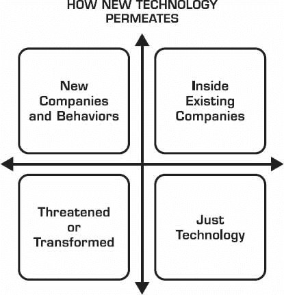

# 7

去中心化是前进的道路

> “一切事物在变得容易之前都是困难的。”
> 
> –托马斯·富勒

去中心化技术（区块链）将预示一个去中心化的世界。

如果我们认为区块链的未来只是渗透企业系统并取代中介，那就再思量一下。那只是开始。区块链的*存在理由*是让我们想象一个将 largely 去中心化的新世界。

去中心化并不意味着无政府状态或进行非法行为。它意味着个人用户更赋权、受限制更少。它暗示许多贡献者、许多受益者和许多领导者和谐地工作。它既不是共产主义，也不是赛博朋克小说的版本。去中心化通过创建新的工作生产和价值创造层次，从而推动资本主义。

当然，区块链会转移价值。但进一步想象多个区块链相互交互，它们之间相互交易价值，这将引导我们走向比上一代网络效应更重大的网络综合效应。这将是巨大的去中心化服务的叠加，对任何人都是开放和可访问的。

也许区块链会引导我们走向诺贝尔奖得主、经济学家和哲学家弗里德里希·哈耶克的非乌托邦观点。他认为，走向 functioning 经济——或社会——的道路是去中心化，并断言去中心化经济补充了社会中分散的信息的分布式特性。^(1)

## 去中心化的互联网发生了什么？

让我们回顾一下互联网的初衷。它很大程度上是关于去中心化和服务分布式开放的，中心仅保留少量控制。在 1994 年互联网诞生之初，凯文·凯利在他的书《失控》中写道，要记住的三条重要评论是：

> 1.  网络是 21 世纪的图标。
> 1.  
> 1.  网络图标没有中心——它是一组点连接到其他点。
> 1.  
> 1.  去中心化、冗余的组织可以灵活地在不扭曲其功能的情况下进行调整，因此它可以适应。

难怪网页的发明者蒂姆·伯纳斯-李，启动了一个名为 Web We Want 的倡议，^(2)以重新夺回网页的初衷。伯纳斯-李和网站社区指出：

> 我们担忧开放的网络存在越来越多的威胁，比如审查、监控以及权力集中。
> 
> 推动经济进步和知识共享的网页，是任何人都可以创建网页来分享文化和信息的网页。这是新业务蓬勃发展、政府透明度成为现实、公民记录不公的网页。

*哇。* 凯文·凯利和 Web We Want 所表达的就是今天相信一个更加去中心化的互联网可以引导我们走向更好未来的信徒们所欢迎的乐曲。

如果你对今天的网络感到满意，停下来思考一分钟，你是否对这种情况感到高兴。Web We Want 观察到：

> *数百万的垃圾博客和网站被机器人访问以获利广告。即使是质量上乘的网站，也因为自动广告和追踪器过于繁多，使用广告拦截器浏览网页才是负责任的做法。每个点击都被监控和货币化，我们被推动消费更多重复的内容.*

网络公共品的属性发生了什么？

区块链象征着权力从网络的中心向边缘转移。这是一个我们在互联网早期阶段浪漫化的愿景，但这次网络的去中心化或许真的可以实现。

有些人认为世界被信任控制的中心权威所束缚。其他人则认为世界更加民主化、扁平化，并建立在更好的中心与边缘控制平衡的新治理模型之上。区块链倾向于这种更好的平衡，并使其得以增长。

暂时忘记互联网，看看我们对 2008 年金融危机的反应如何。政策制定者的自然反应是过度监管。美国、欧洲和亚洲的监管机构规定了监管机构的合并，导致场外衍生品市场的后交易进一步集中，将监管减少到一个单一的失败点。多德-弗兰克法案^(3)的强制中央对手方清算规定实际上是加剧了系统风险，而不是减少它。结果，中央对手方清算所成为了一种新的“太大而不能倒”的机构，而讽刺的是，它们之前更加分散。

在 2012 年一篇题为“稳定化不能拯救我们”的《纽约时报》文章中，著有《反脆弱》和《黑天鹅》的纳西姆·尼古拉斯·塔勒布评论道：“在去中心化的系统中，问题可以早期解决，而且规模较小。”^(4)

实际上，网络不仅被太多的中心节点所控制，监管机构据说还在继续集中控制以降低风险，而相反的做法应该被执行。

## IT’S NOT EASY BEING DECENTRALIZED

苹果的 iTunes 是一个典型的集中式市场。如果它去中心化，苹果就不会喜欢销售收入的 30%的佣金。相反，应用程序出版商可以通过去中心化方式分摊他们的分发和营销成本，苹果也不应该抽取那 30%来控制访问和搜索点。当然，这是一个假设性的情景，但背后的思想是网络的价值在边缘，而不是在中心。

从技术上讲，搜索和发现不是一个中心特定功能，同样的体验可以通过分布式方式提供。没有用户添加价值，什么也不会发生，那么为什么不让这部分价值回流到网络中使其变得更强大呢？基于区块链的新型去中心化应用正在被构建，它们不需要一个中心收费的应用商店结构。

如果你不是为此设计的，那么变得去中心化并不容易。但如果你从底层开始逐渐去中心化，作为一个去中心化网络、平台、服务、产品、货币或市场，那么会更容易。

## 去中心化将呈现怎样的面貌？

过去，没有中心权威、中心权力、中心法规或中心批准，什么也不会发生。随着去中心化，情况发生了变化。大量的事情发生在边缘，以及整个网络的边缘节点附近。

中心操作的概念被打破了，因为可能它根本不存在。一个底层去中心化协议（如用于商业的 OpenBazaar）使得网络边缘能够进行去中心化操作，而那里正是活动和价值所在。

完全有可能建立一个以用户为起点，用户是去中心化有机体的关键行为者的系统。如果用户受益，那么网络集体受益，并延伸到网络的原始创建者。

在去中心化中，你不需要先安装一个中心。你首先安装一个平台，这个平台能够使网络在“中心”的关注点（比喻用法）和连接外围用户的活性节点之间繁荣。然后，你在这个初始构建的基础上建立你的商业模式。例如，在旧的中心版本中曾经是付费选项的内容在去中心化版本中可能是免费的，但你将有机会创建与去中心化本身更有机的新盈利方式。

我们不应该通过选择采用其某些特征而放弃其他特征的方式来妥协去中心化的概念，因为这种方法会削弱它。

当你在一个不由任何单一实体控制的去中心化共识层上运行商业逻辑时，会发生一种奇妙的变化，尽管它是由几个合作方共同拥有和运营的，这些方面集体从这种安排中受益。当你弄清楚区块链与你的业务之间的接触点，并开始提供之前不存在的全新用户体验时，也会发生魔法。

这些新领域将包括没有银行的银行服务，没有赌场优势的赌博，没有中央当局盖章的产权转让，没有 eBay 的电子商务，没有政府官员监督的注册，没有 Dropbox 的计算机存储，没有 Uber 的交通服务，没有 Amazon Web Services 的计算，没有 Google 的在线身份，这个列表将继续增长。取任何服务加上“没有先前中心化权威”，并用“点对点，基于信任的网络”替换，你将开始想象可能性。

基于去中心化的服务的一般特征包括：

+   结算速度

+   无中介延迟

+   先期识别和声誉

+   无 overhead 的扁平结构

+   无权限的用户访问

+   网络内建立信任

+   抗攻击弹性

+   无审查

+   无中心失败点

+   通过共识进行治理决策

+   点对点通信

## 密码经济学

起初，比特币作为典型的加密货币，抓住了我们的想象力，现在正引领着多种基于区块链的商业和企业实施。展望未来，这正在演变成更大的事物：一个由加密技术驱动的经济体，具有前所未有的全球价值创造机会，与互联网自身的经济类似。

欢迎来到密码经济学。

与今天看似可见的情况相反，这个密码经济学不会试图接管当前的金融服务系统，也不会等待消费者将他们由主权支持的法币转移到加密货币钱包中。它将通过创造自己的财富，验证新的服务和业务类型，这些超越了货币交易。

密码经济学是互联网发展的下一个阶段：去中心化时代的一部分。

为了理解基于加密货币的区块链市场如何引导我们进入这个新领域，让我们重新审视金钱，价值，权利，支付和收入之间的关系。从那里，让我们回答两个基本问题：

+   金钱是什么？

+   金钱的目的是什么？

金钱是一种价值形式。但并非所有的价值都是金钱。我们可以争论价值比金钱有更高的层次。在数字领域，加密货币是完美的数字金钱。区块链是完美的数字价值交换平台，它建立在互联网之上，而互联网是地球上最大的连接网络。这种结合是惊人的：能够快速，自由，高效，便宜地移动的数字价值。这就是我们将区块链称为新的“价值交换”网络的原因。

金钱的目的是为了支付一些有价值的东西。通常，你需要支付以获得“权利”来拥有或使用某物。

由于加密货币具有编程特性，它体现了可以启用其他能力的数字信息。当你通过加密货币“支付”时，那笔交易可能包括额外的与信任相关的权利，比如财产、信息、保管、访问或投票权。

因此，区块链实现了一种新的元交易形式，其中*价值在交易结束时由它能解锁的内容来代表，而不仅仅是存入静态账户的内在货币价值*。这听起来像是股票市场的功能，允许交易无限数量的未受监管的价值元素，与受监管的金融证券不同。而且，它更加分布式、更加去中心化、更加活跃，在你的“钱包”可以触发直接与现实世界相连的动作。

例如，你可以通过一个应用程序（如用于交通的 La’Zooz）分享你的汽车驾驶数据来开始赚取加密货币代币。第二天，你可以与其他 La’Zooz 司机共享车程，你赚取的代币将自动扣除以支付你所乘坐的行程。

在这种情况下，并没有真正的货币交换，也没有提供付款。相反，加密货币是通过被动方式（仅仅开车）赚取的，给予了司机信息权（你是一个有良好声誉的合法乘客），确认了你其他权利（司机是值得信赖的），提供了服务（把你送到某地），并在物理和虚拟环境中以组合形式交换了价值（加密货币）。这是区块链相关应用中的一个优秀例子，因为许多变量和市场条件需要存在，以便整个价值交换生态系统能够运作。（这就是为什么 La’Zooz 服务在构思之初近两年后还没有推出）

希望我们能见到更多封闭循环价值交换的例子，其中*你因为分享信息而获得报酬，这些信息最终促成交易机会*。

La’Zooz 是典型的加密经济模型，它创建了自己的迷你经济，拥有生产者和消费者之间流动性强的价值交换市场。遵循这种运营模式的例子，区块链能够实现加密货币市场的创建，这是区块链的一个重要特征，超越了它仅仅是一个“分布式账本”的片面描述。

这将创造*价值创造的新选择*，超越传统货币所允许的范围。

*我们如何达到那个地步？* 大多数使能技术，我们通常首先通过更快或更便宜地做同样的过程来复制旧习惯。然后我们开始通过以不同的方式做事，以及应用以前看不到的新想法来进行创新。同样，一旦我们用“网络应用”来编程互联网，互联网就迅速发展起来，这正是加密技术革命所遵循的相同路径。

这使我们来到了这个新兴谜题中的下一个关键点：*我们如何创造新的价值？*

你通过在区块链上运行服务来创造价值。

区块链服务将通过创建新的生态系统（就像互联网一样）取得成功，并且随着时间的推移它会变得更强大。

在网络空间已经发生的事情有一个先例。有了互联网，我们有了电子商务、电子商务、电子服务、电子市场，后来以大规模社交网络的形式出现了社交网络。这些领域中的每一个都创造了它自己的财富。

到目前为止，新兴的“区块链服务”领域中还没有清晰的细分，但它们将是以区块链上存储信任组件（身份、权利、会员、所有权、投票、时间戳、内容归属）的服务，以区块链上执行合同组件的服务（赌注、家庭信托、履约保证金、工作证明交付、赏金、赌注证明、合规证明），去中心化的点对点市场（如 OpenBazaar 或 La’Zooz），以及运行在区块链上的分布式自治组织（DAO）。

这些区块链服务的共同点是什么？ 它们在区块链上运行，可以在没有中心控制的情况下复制和增长，并且它们是由加密货币驱动的。加密货币就像燃料；它部分作为通行费收集，部分作为参与用户和提供这些服务的用户的收益。你可以开始看到加密货币是如何从加密服务中产生，以引发一种新的财富创造经济。

随着时间的推移，将有一大批具有重要加密货币余额的用户，进而会产生更多的网络效应好处。只有到那时，加密货币经济才能声称已经在与“一个国家-一种主权货币”范式相对的当前金融系统上造成了潜在的影响。

## 新的价值流动

区块链通过信息流动的动态变革全球价值链，使一种新的“价值流动”成为可能，这一概念与 2001 年诺贝尔经济学奖得主迈克尔·斯宾塞的工作有关。

迈克尔·斯宾塞观察到，新兴经济体以前所未有的速度增长，这主要是由于更大全球经济的有益影响。他将知识、技术和学习流动的加速，视为他们增长加速的主要联系。

我们同样可以预见到区块链所启用的相关情况。新兴的全球加密经济将具有与全球经济类似的成长特性：它将让它的参与者参与大型市场，并获得知识、技术、技能的接入。

区块链是最新的一种数字价值平衡器，因为它在加密空间内以及从加密空间到我们的物理空间内影响并转移价值。区块链将交易权力更靠近个人，它赋予地球上任何用户与去中心化应用或组织保持一致，并开始生成或移动他们自己的加密价值核心的能力。这种现象的另一个好处是将共享经济置于“类固醇”中，因为它将资本和劳动与移动、位置不可知的市场环境相结合。

我们正处于理解“价值”运动、分布和创造的过程中，这种“价值”是在传统货币、商品和房地产作为价值转移和增值的主要工具之外的。一个新边疆将会出现。

## 技术如何渗透

是时候看向水晶球，预测比特币、区块链、加密货币、去中心化应用和基于加密的协议及平台未来的了。所有这些活动都是我所称之为的加密技术，它是信息技术的平行现象，与信息技术的所有相关内容相辅相成。

在宏观层面上，加密技术的未来可能会以与互联网展开方式不尽相同的方式展开。从一个最终局面的角度来看；在过去的 20 年里，互联网在这四个维度上产生了影响：

1.  出现了新的仅限互联网的公司，它们引入了新的用户行为。

1.  现有的组织（和政府）已经在它们的运作中采纳了互联网。

1.  有些行业因互联网的彻底改变或伤害而受到威胁或转型。

1.  基于网页的软件开发成为任何软件应用开发的科技基石。

设想一下从现在起 10 年后，你可以用“加密技术”替换“互联网”，同样的最终局面仍然成立：1) 新的加密技术巨头将从初创公司中崛起，2) 组织和政府将采纳新的解决方案，3) 行业（和一些公司）将受到威胁并受到影响，4) 加密技术的发展将成为软件开发的一部分。

那么我们如何到达那里呢？让我们展望 2025 年。

## 展望 2025 年

有一个长长的清单，列出了本十年剩余时间和下一个世纪初期的各种预测。让我们描绘一下区块链将启用的广泛场景。

### *新公司和新行为*

+   在线身份和声誉将去中心化。我们将拥有属于我们的数据。

+   我们将自行管理我们的在线声誉，当我们与不同的人或企业互动时，只有相关的数据片段才会透露给他们。

+   将出现只接受加密货币的银行，提供基于虚拟货币的各种金融服务。

+   去中心化预测市场将进入主流，并提供频繁和可靠的预测。

+   分布式自治组织（DAO）将成为可行，它们拥有自我管理的运营和用户创造的价值，这些价值直接与服务和金融奖励挂钩。

+   同行之间将发生自发的、可信的交易，没有中心中介，且几乎无摩擦。

+   内容分发和归属将在区块链上以不可撤销的方式签名。

+   数字资产和实体产品所有权的真实性将容易验证。

+   数字或硬件电子钱包将成为主流，或嵌入智能手机和可穿戴设备中。

+   无缝微交易将成为常规操作，就像现实生活中给小费一样简单。

+   资产注册服务将存在，并且在线执行将比访问实体当局更为常规。

+   任何个人将能够与其他人实施业务逻辑和协议，并在区块链上轻松执行它们。

+   用户通过执行常规服务赚取加密货币的服务将越来越受欢迎。

+   区块链将成为大量半私人信息的存储库，仅当两方或多方同意披露时才揭露。

+   全球汇款将定期通过智能手机或电脑执行，就像发送电子邮件一样简单。

+   用户将接触基于区块链的技术，但不会意识到其存在，就像使用后台数据库一样。

+   新的去中心化金融结算网络将挑战现有的结算所。

+   任何实体商品或资产的数字表示（例如：黄金、白银、钻石）将在区块链上全球交易。

+   到 2025 年，将有数十种常用的全球虚拟货币被认为是主流，它们的总市值将超过 5 万亿美元，占世界 100 万亿美元经济的 5%。

### 在现有公司内部

+   医疗保健记录将能在患者和医生之间即时、安全且永久地共享。这些记录将定期从安全、可信的位置和医疗保健提供者那里以去中心化的方式更新。

+   涉及治理的法律事项将在分布式团队之间轻松实施。

+   远程投票将在法律上有约束力的政治选举中被信任，即使是在国家层面上也是如此。

+   交易所（股票、商品、金融工具）将采用基于区块链的信任服务来验证交易，并简化其市场结算活动。

+   大多数银行将支持加密货币（常规货币和加密货币）的常规双向交易。

+   大多数商家都会接受加密货币作为一种支付方式。

+   会计、账单和财务包将包括加密货币作为标准选择，包括加密股权。

+   数字商品将被无形地标记其原始真实性，作为日常操作。用户将能够通过查看供应链的透明度来了解全球生产，各种产品将保证其真实性、质量和来源的真实披露。

### *受到威胁或变革*

+   任何不将其现实世界信息结合到区块链中的业务，就像网络将现有业务扩展到在线和移动世界一样。

+   具有高延迟、高费用和过多风险集中的清算所。

+   任何不提供区块链支持资产价值转移和交易的券商/交易员。

+   那些没有 evolving 其贷款方式的中央贷款机构。

+   不采用加密技术的银行。

+   没有提供甚至更多远程服务的政府服务，例如注册表、记录保持、许可和身份证明。

+   不能通过加密安全文档进行虚拟运营的公证人。

+   任何被授权发行合同、签名、托管、信任、认证、仲裁、商标、许可、所有权证明、遗嘱或其他私人记录的人。

### *仅仅是技术*

+   去中心化共识协议将成为任何技术堆栈实现中的常见部分，无论是在公共还是私有环境中。

+   常用技术将包括分布式哈希表（DHT）和星际文件系统（IPFS）。

+   键值存储数据库将更常用。

+   特殊的浏览器将启用独特的区块链对等功能。

+   智能合约语言将 proliferation。

+   编写去中心化应用程序将变得像今天编写 Web 应用程序一样流行。

+   开源协议将被使用并支持新商业服务和产品的创建。

+   运行包含信任和验证组件的业务逻辑在实际中将是即插即用的。

+   点对点去中心化基础层将在数据存储、计算基础设施、身份和声誉方面变得普遍。

+   去中心化信任将被 relegated 到网络中，并嵌入应用程序内部，而不是由中介控制。

+   密码学和博弈论的大学学位将变得流行。

+   将出现更多去中心化的云计算形式。

这一切都源于我在 2000 年互联网泡沫破裂时学到的一个关键教训。

*速度伤人*

对区块链能做什么的炒作速度将会使其实际情况脱轨，使我们领先于现实。这种脱节保证会令那些期望比实际可能更快获得利益的人感到失望。

话说回来，按照 Carlota Perez^(6)关于技术革命如何展开的解释模型，可能无法避免这样一个事实：在区块链的安装阶段（2015-2018 年）和其结果的应用阶段（2018 年及以后）之间，某个地方将会发生崩溃。Carlota Perez 是一位知名学者，她研究了技术经济范式转变的概念和大潮理论。这意味着，如果 Carlota Perez 是对的，我们可能会在安装阶段过度兴奋地飞跃，然后再顺利进入繁荣的应用阶段。

## 第七章的关键思想

1.  区块链不仅仅适用于企业。它们还使去中心化成为可能，最终，创造出一种新的加密经济，类似于我们熟悉的 Web 经济。

1.  如果你从头开始，走向去中心化会更加容易。从中心化服务过渡到去中心化服务会更加困难。

1.  加密经济市场将会存在，它们将创造自己的财富和经济系统，其中参与者因提供导致交易机会的价值而获得报酬。

1.  区块链实现了一种新的价值流动，使全球加密经济的产生成为可能，并在加密空间和物理空间之间创造了大量市场机会进行价值交换。

1.  区块链技术将渗透到我们的经济中，创造新的参与者，威胁其他人，并迫使希望生存的现有组织进行变革。

## 注释
