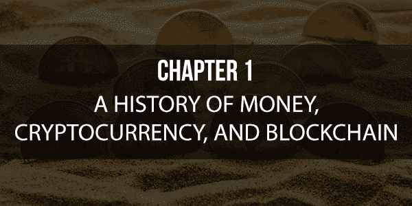
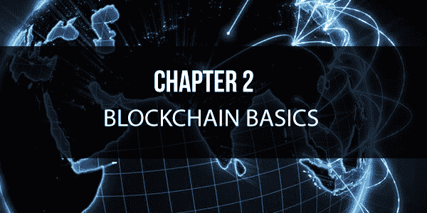
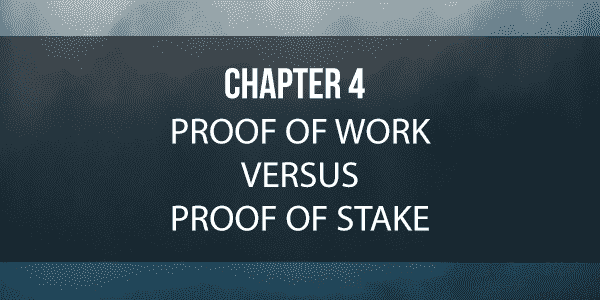
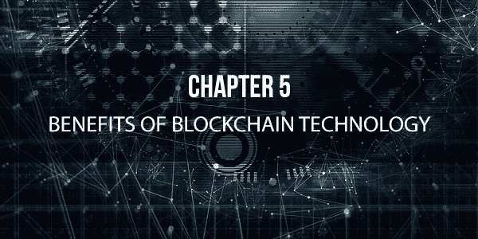

免责声明本电子书仅为提供信息的目的而编写。已尽最大努力确保本书内容的完整性和准确性。然而，可能会出现排版或内容上的错误。此外，本书提供的信息仅截至出版日期。因此，本书应作为指导资料使用，而不应视为终极来源。本书的目的是提供教育信息。作者和出版商不保证本书中包含的信息完全完整，对于本书的任何错误或遗漏，作者和出版商不承担任何责任。本书作者和出版商对于因本书直接或间接造成的任何损失或损害，均不承担责任或义务。目录简介........................................................................................................................6 第一章 – 货币、加密货币与区块链的历史...........................................11 货币 ...........................................................................................................................12 加密货币......................................................................................................................13 加密货币是如何发展的？...........................................................................................14 加密货币、法定货币和股票...................................................................................15

区块链技术 ...................................................................................................................15 第二章 – 区块链基础 ...................................................................................................17 区块链的组成部分 ......................................................................................................18 安全担忧 .......................................................................................................................21 区块链的类型 ................................................................................................................22 区块链技术解析 ...........................................................................................................24 第三章 – 区块链业务 ...................................................................................................27 使用区块链技术的不同行业 ........................................................................................28 为您的企业增加价值 ...................................................................................................29 赚钱 ..............................................................................................................................31 云计算与区块链 ..........................................................................................................32 区块链与游戏 ..............................................................................................................33 供应链管理与区块链 ...................................................................................................34 区块链技术与质量保证 ..............................................................................................34 第四章 – 工作量证明与权益证明 ...............................................................................35 工作量证明 ...................................................................................................................35 权益证明 .......................................................................................................................38 权益证明模型的优势 ...................................................................................................39 权益证明的挑战 ..........................................................................................................41 第五章 – 区块链技术的优势 ......................................................................................42 消除第三方 ...................................................................................................................43 数据控制 .......................................................................................................................43 更好的数据质量和完整性 ............................................................................................44 耐用性和可靠性 ...........................................................................................................44 数据处理和传输的完整性 ..........................................................................................44 透明度和可审计性 .....................................................................................................45 更快的交易 ...................................................................................................................45 降低交易成本 ..............................................................................................................46 第六章 – 区块链技术的风险与挑战 ...........................................................................47 区块链的主要障碍 .......................................................................................................50 区块链技术的风险 .....................................................................................................51 第七章 – 决定区块链技术是否适合您 ......................................................................53 了解谁将查看您的数据 ................................................................................................53 可写数据 ........................................................................................................................54 数据篡改 ........................................................................................................................55 数据恢复 .......................................................................................................................55 易于分享 ......................................................................................................................56 存储限制 .....................................................................................................................56 验证过程 ......................................................................................................................57 迈出下一步 ...................................................................................................................58 第八章 – 避免的区块链实施错误 ..............................................................................60 拥有不切实际的期望 ......................................................................................................60 低估时间投入 ...............................................................................................................62 缺乏耐心 ........................................................................................................................62 未限制访问 ...................................................................................................................63 结论 ..............................................................................................................................64 引言在我们的历史长河中，无数的发现和发明诞生了。有些发展是微小的，有些是重大的，有些是短暂的，而有些事件则更为关键且持续长久。在我们历史上的某些发展，对人类至关重要，以至于它们被认为是人类集体进步和迈出关键且持久的一步的唯一因素。例如，考虑一下农业设备和化肥的创造如何使固定土地上的食物产量呈指数级增长。如果没有这些发明和发现，世界将无法支持全球范围内的人口爆炸性增长。直到几百年前，科学家和经济学家才指出人口增长即将结束，因为食物生产只是以数字方式增长，每过几年翻倍或三倍，而人口则以指数方式增长，在那段时间内翻倍或更多。当时，这意味着迟早有一天，如果不每年从固定土地上获得更多的食物，将没有足够的食物来养活所有人。幸运的是，情况正是如此。科学能够提供重型农场设备、氨肥等改进措施，使食物产量能够跟上人口增长速度。这使得在相同土地面积上可以维持更多的人口。如果没有这些发展，今天的世界将会有很大的不同。同样，抗生素、青霉素、航空旅行、海运和蒸汽机的创造，以及更近期，由微芯片和晶体管发明所可能的信息共享，都改变了世界，使之不可逆转。由于这些创新和发现，我们联系更紧密，过得更好，更健康，并且比以往任何时候都更容易获得更多、更便宜的商品和服务。

当谈及信息时代，自从 90 年代初至中期的第一次互联网浪潮以来，一切事物都进展得飞快。从用户界面工具和技术，这些定义了我们如何与技术互动和交云的技术。从支付解决方案到银行解决方案，过去 20 年间一切都发生了巨大变化。社交网络和主要电子邮件服务也是如此，伴随着人工智能（AI）和大数据分析领域取得的进步，这些进步影响了从帮助治理到在线搜索的方方面面。总的来说，我们已从上述所有必要的解决方案，转变为拥有将各种技术方面结合在一起，为数十亿人提供有效、健壮、增值且无缝服务的复杂软件服务。然而，随着所有这些进步，新的挑战也随之而来。人工智能、大数据以及政府实施大规模监控计划的能力，还有无处不在的技术，都开始引发严重的伦理问题和技术挑战。这引出了一个问题，如何在合法与非法监控之间划清界限？当公司的数据使用、收集和操作做法不透明时，我们作为社会如何能信任它们？当涉及到政府角色、大型公司与私人用户之间的关系时，世界将走向何方？正是带着这个令人兴奋且具有挑战性的背景，我们将讨论区块链。近年来，区块链已成为一种流行技术，远超最新科技热潮。在许多领域专家和科技大师看来，区块链是人类下一次巨大飞跃，将对我们的孩子和我们产生重大影响，就像农业和医疗保健的发展对一个多世纪前的我们的曾曾祖父母产生影响一样。现在，我们已经进入了新的信息时代。第一章 – 货币、加密货币和区块链的历史建立一个永久性、去中心化账本，如区块链的概念，最初是在 1991 年提出的。然而，第一个实际区块链实现是在 2008 年，由中本聪设计的。正是他的最初设计，被用作运行被称为比特币的数字货币的底层技术。中本聪先生设计的区块链为所有比特币交易提供了公共账本。如果你还不知道，比特币是一种现在价值约 16,000 美元的数字货币，它运行在区块链技术上。目前市场上最著名的区块链是比特币的区块链，以太坊的区块链紧随其后。

使得比特币能够作为数字货币、价值储存以及交换媒介的技术就是区块链，因为比特币交易是记录在区块链账本上的。这意味着区块链不仅仅局限于运行比特币；区块链的应用可以涵盖贸易、金融、医疗、法律运营、记录管理、游戏、在线交易所、概率等众多领域。在开始了解区块链技术之前，你首先需要知道它如何与我们当前的货币和数字货币相结合。货币货币几乎与人类一样古老。关于这个主题已经有很多书籍问世。如果你对此感兴趣，值得一读的是尼尔·弗格森所著的《货币的崛起：世界金融史》。货币要发挥作用，必须同时具备价值储存和交换手段的功能。过去，我们用许多不同的物品作为货币，包括黄金、白银、牲畜、珠子和盐。无论它采取何种形式，货币都必须执行这两个基本功能。此外，还必须相信这些角色能够被货币所履行。加密货币！图加密货币是一种在过去几年中变得越来越受欢迎的货币形式。加密货币是通过使用计算机和数学的加密技术创建的。这些技术使我们能够转移资金并验证转移确实发生。加密货币的另一个基本方面是它独立于政府和中央银行，使其去中心化。

如今，许多重要银行越来越涉足支撑加密货币的相同技术。然而，理解到任何由此产生的货币都不会是真正的加密货币是很重要的，因为这将受到银行的控制。加密货币最可靠、最坚定的支持者决心使其不会集中化。加密货币是如何发展的？比特币是市场上最著名的加密货币。它已经受到了炒作、名声和宣传。公众被它在过去几年中的惊人增值所吸引。他们对于那些在其婴儿期以低价购入比特币，从而创造了巨额财富的故事感到震惊。尽管比特币的新颖性，人们很快意识到比特币是真正的货币。除了比特币，还有许多其他的

加密货币，如同比特币一样，其美元价值出现了巨大增长。合法的政府和商业机构正在越来越多地参与加密货币。尽管有批评者，但这些货币的市场正在蓬勃发展。加密货币、法定货币和股票法定货币是我们日常使用的货币，如美元、日元、欧元和人民币。尽管“加密货币”一词中包含“货币”，但它们与股票市场的股票和股份之间的相似性比对法定货币和加密货币之间的相似性要大。当你购买加密货币时，你得到了这种加密货币的一些硬币，这就像是一家科技公司的股票和一个进入账本的数字入口，这个账本被称为区块链。区块链区块链是数字账本，可以正式定义为使用高级加密技术连接在一起并加以保护的持续增长的记录列表。用更简单的话来说，区块链就是一系列区块的链条。区块链链中的每个记录都称为一个区块，包含特定类型和信息片段。每个区块通常会包含一种指针作为链接到前一个区块的指针，以及交易数据和时间戳，它们可以有多种形式。另一种看法是，区块链类似于每个条目都链接到前一个和下一个条目的数据库。这意味着区块链中的信息无法更改，一旦具有特定数据的区块被添加到链中，就无法更改包含在区块链中的信息。根据您正在查看的链，通常有一些有用的工具可以探索该链，允许您扫描交易数据。区块链之所以难以被修改，是因为其固有设计。这使得区块链能够高效记录不同方之间的交易。这些交易不仅可验证，而且是永久的。一旦信息记录在区块链中，没有获得大多数网络节点的同意，就无法在事后更改数据而不会改变后续区块。这种无法在区块链中更改数据的能力使得进行非法或不公平的行为几乎不可能。如果黑客希望更改区块链中的信息，他们必须控制每一个节点。这种安全性是区块链最实用的特征之一。由于区块链被设计为可验证和永久性的，因此它们特别适合记录事件、维护病历、起草协议、筹款和跟踪其他文件。第二章 - 区块链基础知识无论你是否意识到，你每天都在进行业务活动，即使你不工作。在某个时候，每个人都会上网并启动某种交易。无论是从亚马逊购买东西还是从 iTunes 购买东西，你都在参与区块链技术的商业活动。尽管“区块链”这个词相对较新，但这项技术已经存在大约十年了。中本聪在 2008 年创建的数字化账本为管理加密货币和其他在线交易事务的电子表格奠定了基础。这项技术用于密码学，这是文本在互联网上如何编码的方式。密码学用于区块链技术以创建分布式信任网络。这反过来又允许系统的任何贡献者安全地执行交易，而不需要从数字账本中的另一个人那里获得授权。然后对这些交易进行验证、批准，并记录在加密的区块中。这个区块会间歇性地保存，然后连接到前一个区块，从而创建一个链。区块链的组成部分区块链有两个主要部分。第一个组件是去中心化网络。去中心化网络是促进和验证所执行交易的地方。在去中心化网络上拥有区块链意味着软件不受限于一个计算机系统。相反，它可以在多个计算机系统上控制，更重要的是，它不受政府的控制。第二个组件是不可争辩的账本，其中交易在安全的位置处理和记录。这种安全性使得未连接到链的人几乎无法进行更改或窃取信息。由于任何区块链中可能有多个贡献者参与，任何贡献者都可以控制记录在账本中的信息。由于每个交易都是安全处理的，并且给予永久的时间戳，另一个贡献者以任何方式更改账本都可能变得具有挑战性。区块链技术可用于各种计算机化和基于互联网的应用程序。其中之一是智能合约。智能合约允许企业自动验证并执行在安全环境中独立运行的协议。区块链技术作为智能合约中间商，实施所有商业交易、协议以及在智能合约中的信息编程交换。随着越来越多的交易在网上完成，不仅管理我们的个人生活，还管理我们的专业生活，越来越多的交易正在网上签署和创建。近年来，区块链应用在医疗领域的普及程度开始越来越高。研究人员现在正在研究这些应用程序，这些应用程序涉及数字身份、保险记录和病历。如今，许多诊所使用某种数字机器来验证他们档案中的信息确实是您的信息。安全担忧当今人们面临的最大问题是，他们所有的信息可能会因为大多数个人信息都是数字化的而被黑客攻击。它似乎也变得太容易了，陌生人可以访问、复制和篡改我们的数据。然而，尽管被黑客攻击的可能性在增加，我们仍然在承担这种风险。区块链技术的创建是为了帮助确保不会发生这种情况，或者至少使尝试这样做变得更加困难。要黑掉区块链系统，他们需要回到过去并改变每一个区块。这将需要大量的努力和耐心，因为区块链可能有数十亿个链接的链条，一个人需要一条一条地更改。更改一两个区块

因为这些区块链没有一个人负责，所以决策是通过许多去中心化的共识工具，如工作量证明（proof of work）来做出的，这是一种由加密货币，如比特币使用的计算机算法。公共区块链在内容上是开放和透明的，任何查看它们的人都能轻易理解它们是什么以及它们能做什么。另一方面，私有区块链是由个人或组织拥有的。在公共区块链中，有一个指定的人负责。虽然可能有几个人为这种区块链贡献，但最终的交易要么被负责人批准，要么被拒绝，然后记录下来。联盟区块链（也称为联邦区块链）的目的是消除私有区块链给予单个贡献者的唯一自主权。这种区块链允许多个贡献者负责。相反，有一组公司或个人聚集在一起，做出对整个网络有益的决策。区块链技术分解！区块链技术是一个不可逆的、加密的、去中心化的账本，有潜力使所有的集中活动、流程和组织完全自主。这意味着一个人将有能力消除中介和专业人士，有效地改革世界上每一个业务。区块链技术仅仅是一种跟踪你在网上进行的所有货币或交易交换的方式。你可以把它比作一个会计，他跟踪你所有的开支。目前，区块链技术主要用于处理与加密货币有关的所有情况，比如比特币。让我们考虑以下示例。当你用比特币完成一笔交易时，这笔特定的交易通过区块链处理。在交易可以实现之前，你必须或与你比特币账户相关的人验证这笔交易是合法的。一旦交易可以被确认为有效，它就被记录并保存在由区块链控制的账本中。在这种情况下，没有人能以任何方式更改或修改交易。只有你或那些能访问你账户的人才能验证交易。区块链技术由一个去中心化的网络控制，这意味着它不受任何政府的控制。通过在去中心化系统上运行，商业交易变得更容易。它也更私密，因为你没有联邦银行持有你的钱或其他资产。一切都非常严格地由你和你的公司处理。要了解去中心化的重要性，你需要考虑以下关于集中化和去中心化的示例。集中化示例当你在书店使用借记卡时，你刷卡支付你的购物。在这种情况下，公司然后向你的银行发送账单，支付你购买商品的金额。银行然后必须验证是您进行了购买。一旦交易得到确认，银行就会把钱给公司，并在他们的账本中记录这笔交易。银行记录交易的账本包括银行代表您使用的卡所做的所有操作。银行完全控制着账本中发生的事情。除了能查看你的银行对账单外，你没有权力改变账本中的任何东西或对账本做任何事情。因为集中化账本由多个实体控制，所以它们更容易被黑客攻击。去中心化示例想象一下，你想把 1.00 比特币转给某人。你只需要告诉网络的负责人（无论是一个人还是一个团体），你正在转移 1.00 比特币。一旦完成，交易就会被批准，然后记录下来。去中心化的区块链比中心化的交易要好得多，因为它完成一笔交易所需的时间更短。去中心化区块链的另一个优点是，一个人或公司可以向另一个人或公司发送安全信息，例如加密消息和医疗记录。第三章 - 区块链的商业应用！每个人都有在生活中信任问题的东西。如今，许多人对在互联网上输入他们的信息不信任。然而，即使在这种不信任的情况下，也没有阻止许多人继续这样做。区块链技术的一个目的是帮助缓解人们对在互联网上输入他们的信息的不信任，这是公司越来越多地投资于这种技术的主要原因之一。事实上，在 2013 年至 2016 年之间，一项研究表明，受区块链管理的基金总额达到了 16 亿美元，相当于增长了 1600%。使用区块链技术的不同行业金融行业是利用区块链技术获得巨大益处的部门之一。这是因为在行业中进行大量的货币和交易。以下是一些目前利用区块链技术的不同公司的示例。• 众筹贷款

众筹贷款活动已经开始取代前往银行贷款的做法。众筹贷款是一家个人对个人的贷款公司。今天，全球平均每年有超过 500 亿笔个人对个人的贷款。随着区块链技术的应用，这个行业可能会获得巨大的推动。• IBM 全球融资部门

IBM 已成为区块链技术应用的主要参与者之一，其追踪交易的良好记录是一项宝贵的资产。IBM 的全球融资部门每年为公司处理 290 万美元的应付款。它还负责向超过四千家供应商提供信贷。IBM 成功地将纠纷解决降低了 25%，部分得益于区块链技术。这一百分比的降低使得该集团能够将 1 亿美元的前置确认资本用于其他目的。• 簿记

会计行业从区块链技术中受益匪浅。今天经济中发生的每一笔交易都在市场参与者的私人记录中内部注册。当会计扩展到网络的边界之外时，区块链技术才会发生。为您的企业增值有多种方式区块链技术可以通过多种方式为企业增值。一种方式是为您的企业建立一个网络。CyberMiles 的首席科学家迈克尔·袁博士指出区块链如何为初创公司和公司提供价值。他的理论是，区块链的主要好处将提供构建所有种类企业网络的能力。他理论中提到的是，而不是相互竞争，公司可以合作，每个企业行业都有自己的链构建系统。区块链技术为企业增值的另一种方式是通过为未开户的人提供银行服务。可能很难相信，但世界上有很多没有银行账户的人。区块链技术将为这些人提供创建银行账户的机会。有人只需开设一个比特币账户，作为回报获得一个数字钱包。区块链技术为企业增值的第三种方式是降低交易完成所需的时间。再次，时间在区块链世界中扮演着重要的角色。Modular 的首席执行官克里斯托弗·布朗创造了 Blossom，一个用于以太坊的数字钱包。该程序是一个多功能桌面钱包应用程序，为企业和个人提供更简单的处理资金方式。这比去银行取现金要快。接下来，区块链技术可以通过法律合同为企业增值。这可以通过将物联网（IoT）数据与区块链技术相结合来实现。利用物联网设备的数据允许个人和企业连接到保存在区块链上的法律合同。例如，当你买房时，你签署的所有文件，卖方也必须签署。这意味着所有文件必须放在一个地方，以便双方都能访问。来自物联网连接设备的外部信息与区块链相结合，使法律合同在没有任何人干扰的情况下立即可以使用。

区块链技术为企业增加价值的最终途径是帮助实现货币化。公司赚钱的方式正在改变。人们不再关注广告，因为现在可以快进广告，而且在线上可以忽略广告。此外，资金通常流向放置广告的网站，这对企业影响巨大。区块链技术解决了这个问题。这是因为广告内容的每个部分都记录在区块链上，这就是内容创作者通过加密货币或法定货币获得奖励的方式。财富增长许多专家认为，区块链技术将成为未来的发展方向。加密货币正在迅速增加，因为人们希望把钱放在一个不仅安全可靠，而且会增值的地方，就像储蓄账户一样。然而，储蓄账户并不像他们想的那样安全。到 2017 年底，比特币的期货市场已经出现。那也是金融行业看到初始硬币发行（ICO）大幅增长的一年。在过去的一年里，ICO 获得的资金比风险投资投资更多。虽然加密货币在快速处理交易方面不断改善，但最终它们将与信用卡公司处理交易竞争。云和区块链！在某个时候，每个人都使用过云来备份他们不想丢失的数据。如果你不知道，云实际上是在区块链上运行的。专家说我们已经开始把奢侈品视为理所当然。过去，你不能仅仅点击一个按钮然后自动保存数据到备份站点，比如 iCloud 或 OneDrive。相反，你需要把信息传输到光盘或 U 盘上。然后，你需要把光盘或 U 盘带到另一台电脑上下载数据。尽管你今天仍然可以这样做，但不能保证这种技术会持续下去。就像过去的软盘一样，光盘和 U 盘可能会过时，但是因为我们现在生活在一个技术精明的世界，网络保存应用程序将会不断更新。区块链和游戏电子竞技和在线幻想体育在过去的十年里显著增长，越来越多的人在创建在线幻想体育团队。在线游戏，比如幻想足球，是最早采用比特币和其他加密货币最早版本的网站之一。他们还使用区块链技术来运行和跟上游戏技术的发展。区块链技术的用途不仅限于幻想体育。如今，最受欢迎的智能手机应用程序下载对象是游戏。这就是为什么随着技术的发展，更多的开发者可能会利用区块链以及加密货币。供应链管理和区块链区块链技术还将通过提供一种追踪商品的方式来使供应链管理受益，同时又具有成本效益。例如，通过联合包裹服务从一家企业发送包裹到另一家企业。过去，如果包裹没有按时到达，某人必须打电话询问它的位置。今天，你会得到一个跟踪号码，可以让你看到你发送或等待的包裹在运输中的位置，这就创建了一个区块链。区块链技术使企业之间的合作更加容易，因为它极大地简化了生产过程、转移过程以及验证和付款方法。区块链技术和质量保证在商业中，错误是难免的，无论你有多么小心，多么密切地遵循流程和程序，都可能发生错误。使用区块链技术，错误可以追溯到起点。这不仅使调查错误变得更容易，而且节省了公司的时间和金钱。第四章-工作证明与股权证明！目前，大多数公共区块链都是基于工作证明系统的。然而，2018 年，第二大加密货币以太坊开始测试一种新系统，将其区块链从工作证明改为股权证明系统。在我们深入讨论这意味着什么之前，了解一下当交易被验证时到底发生了什么是很重要的。工作证明比特币的挖掘是通过使用一台高功率机器来完成的，这台机器将利用 SHA256 双轮验证过程，以验证比特币交易的发生。这是为了保护比特币区块链的完整性。你的机器可以挖掘比特币的速度是以每秒的哈希数来衡量的。作为这项服务的回报，比特币为那些进行挖掘的人提供了一小部分比特币作为补偿。他们这样做是为了抵消时间和能源成本。此外，发起交易的人通常会提供一定数量的交易费用来帮助抵消成

了解股权证明系统与工作证明模型有何不同至关重要。通过股权证明验证，验证者不再需要矿工解方程来验证区块，而是由一位通过在系统中拥有的股份确认可靠性的验证者来承担其准确性。他们知道，如果他们撒谎，他们也会失去自己的以太币。在部署的第一阶段，通过新系统验证的所有区块也将通过旧系统进行检查，以帮助双重验证区块包含应有的信息，同时测试新系统的准确性。然后，验证者将查看可用的各种链，并根据当前链中有多少以太币来做出决定。如果他们选择不当，他们将失去他们的钱。这个过程将有助于形成一个共识，从而使众多较小的链形成一个更大的单一链。股权证明模型的好处尽管实施股权证明模型的过程并不一帆风顺，但这并不意味着股权证明系统会失去优势。它相对于更传统的过程具有许多明显的好处。这个新模型的第一个明显好处是，它将使以太坊矿工每天花费的一百万美元电费降至约 100,000 美元或只有十分之一。

除了降低挖掘加密货币的成本，权益证明模型还将使区块链更加开放，因为无论用户的计算机有多快，计算都会在区块链内部完成。作为额外的奖励，这使得 51%的攻击*难以成功实施*。51%的攻击发生在一组矿工控制了运行特定区块链的超过 51%的节点时，试图向系统中添加完全虚假的区块，未受影响的节点会接受这些区块为准确，因为大多数节点已经这样报告。权益证明还将使验证者保持诚实*变得可能*，因为他们知道如果不公平行事，他们会失去自己的钱。最后，权益证明模型使得产生区块比以往任何时候都快，这要归功于一种名为分片的进程，该进程是将更广泛的数据库分解为更易于管理的片段。当数据库被分解时，它允许每个片段拥有自己的验证器集合，在片段内完成自己的交易。一旦发生这种情况，它使可扩展性更加模块化，甚至更快。

清算所交易可能需要数天才能完成清算。特别是对于在常规工作时间之外进行的交易。想想你在周五工作日的末尾发送一条电汇或进行一笔购买时会发生什么。在没有区块链的情况下，你无法看到你的资金状态的及时更新。通常，你直到下周二或周三才能获得更新。区块链技术将交易时间缩短到分钟，有时甚至缩短到秒，并且全天候处理交易。-   降低交易成本由于区块链交易不受外部各方监督，因此区块链有可能显著降低交易费用。降低的交易费用可能会导致每年节省数十亿美元。-   风险与挑战第六章——区块链技术的风险与挑战！区块链技术的主要吸引力之一也是其最大的挑战之一。目前，关于区块链空间内什么被允许，什么不被允许，监管非常少。因此，黑客多次利用在线区块链系统的漏洞，窃取数百万美元的投资者的钱。尽管当前区块链的安全性很有保障，但黑客正在利用初期的技术问题，对所有区块链用户造成损害。最近，一家名为 Enigma 的分布式平台在准备通过 ICO 筹集资金时，其网站和多个社交媒体账户被黑客成功入侵。这使得黑客能够向 Enigma 社区发送垃圾邮件，并几乎窃取了 50 万美元。Enigma 项目是由一组 MIT 毕业生推出的，他们向人们发送邀请以加入 Enigma 社区。黑客从加入公司官方邮件列表和 Slack 群的人那里窃取了资金。共有约 9000 名用户和参与者受到这次安全漏洞的影响。黑客有效地在 Slack 上发布了消息，改变了官方网站，并冒充社区列表发送电子邮件，使其看起来公司正在正式请求资金。社区成员响应了这一请求，将钱直接存入黑客的加密钱包。去年，发生了一起规模更大的类似黑客攻击。建立在以太坊上的去中心化自治组织（DAO）被黑客攻击，导致 5000 万美元资金流失。DAO 旨在成为一个去中心化的投资基金，决策不会仅仅依赖于少数合作伙伴，而是依赖于任何投资于该基金的人。它设置为，你的贡献越多，你得到的投票就越多。由于该基金是分布式的，没有人能够带着钱逃跑。不幸的是，由于人为错误和编程错误，黑客能够利用系统获得 500 万美元的收益，这一收益尚未追回。区块链技术面临的挑战之一来自一家名为 OneCoin 的公司。最近，一家名为 Gnosis 的公司在短短十分钟内出售了价值 1250 万美元的代币 GNO。这次销售旨在支付高级预测市场的发展费用。这次 ICO 受到了全球媒体的赞誉。在同一天，位于孟买的一家名为 OneCoin 的公司在其办公室进行数字货币销售时，金融执法官员对其进行了突袭。最终，18 名 OneCoin 代表被捕，超过 200 万美元的投资者资金被没收。多个当局将 OneCoin 描述为庞氏骗局，该公司被宣传为下一个比特币。在孟买办公室被突袭之前，该公司已经转移了至少 3.5 亿美元被骗资金。由于 ICO 的执行没有监督，如果你打算投资货币，你需要确保你没有投资任何可能是骗局的想法。区块链技术的风险区块链作为一种新技术，要解决交易速度、验证过程和数据限制等问题，以使区块链成为广泛采用的技术，还存在许多挑战。区块链项目的监管地位也不确定，这也是区块链技术的一个风险。如果金融机构和政府不支持区块链技术，或者因为缺乏明确的指导方针而将其推开，区块链将永远无法获得投资者和专家所希望的广泛采用，使其成为一个新奇的想法，别无他物。区块链挖掘高度耗能，且随着每个新区块的创建，成本变得更高。矿工愿意为解决数学难题以获得几枚比特币作为奖励而花费的时间可能会有所限制。此外，还需要解决网络安全和集成问题，然后公众才会愿意将个人数据托付给区块链解决方案。这也适用于获得任何用户团体或董事会的批准，以对现有系统进行重大更改甚至完全替换。最后，社会和文化对区块链技术的采用也是一个问题。区块链代表了一个完全的去中心化网络。这需要所有用户和运营商在网络上的大力支持。此外，由于这是一个重大发展，大多数人还不太了解它。在解决这些风险和挑战的过程中，我们可能需要数年才能看到区块链解决方案的广泛采用。第七章——决定区块链技术是否适合你！考虑尝试区块链技术的最常见原因之一是对新技

如果你正在考虑围绕区块链建立一家新公司，那么你可能想与尽可能多的不同的区块链合作。这将有助于你更好地掌握这项技术，并有助于使该技术更加主流，这是新区块链公司起飞所必需的。如果你希望借助区块链进入主流，那么你需要尽一切努力确保区块链技术变得主流。同时，你还想记住，这可能是一条充满挑战的道路。然而，区块链技术的大部分重要好处只对那些已经建立现有基础设施以充分利用它们的公司可用。这意味着对区块链技术的崛起的最现实预测是，将会有几家公司出现并分享关注焦点，而其余的人则由能够将他们的行为结合起来并在他们的竞争者之前对区块链技术采取行动的老公司将占据顶部。第八章 – 避免的区块链实施错误！在围绕区块链的所有炒作中，可能会很容易在没有考虑如何实施自己的区块链分布式系统的情况下就冲进去。这是一个巨大的错误。在你一头扎进去之前，你需要确保你避免以下错误。不切实际的期望如果你打算有效地使用区块链，你需要首先明白，它并不是解决每个问题的万能解决方案。幸运的是，你可以建立一个私人系统，而且只有少数人需要知道如果初步测试进行得不好。这也适用于每个区块中通常存储的信息量。整个区块链的绝大多数最终会被复制到每个新节点中，所以一个极其膨胀的链会给所有使用区块链的计算机增加不必要的膨胀。必须牢记的是，整个比特币区块链只有 55 个吉字节。虽然这对于安全存储私人数据库来说很好，但对于大规模数据的处理来说并不是最佳选择。在这种情况下，集中式数据存储系统将是更好的选择。同时，重要的是要记住，尽管区块链系统中有许多防护措施以防止用户错误，但这并不意味着它们是完美的。由于每个区块仅通过哈希键引用，这使得人类更容易将区块误认为其他区块，从而损害所有人。因此，如果你打算在你的业务中使用区块链，你需要确保实现一个检查这种事情的防护措施，以获得最佳效果。低估所需的时间投入要完全理解区块链技术的复杂性需要花费很多时间。如果你打算将区块链系统实施到底，你需要明白精确地需要多少时间来学习如何充分利用区块链技术。在阅读这本书之后，你仍然需要做更多的研究，以了解对你来说如何实现最佳区块链。这意味着你需要了解你将定期使用区块链来做什么，但也要了解任何次要或第三职能可能包括什么。只有在你清楚地了解你要用区块链系统做什么之后，你才能确定哪种创建软件对你和你的需求来说将是正确的。区块链创建工具的市场并不拥挤，这意味着你需要确切地知道你在寻找一个可靠且有效的工具。在这方面做出错误的决定会使创建过程比需要的更困难。急于求成在你清楚地了解你将如何使用你的区块链分布式数据库以及你将如何实施区块链之后，你最重要的是不要匆忙完成这个过程。在实施区块链技术方面，你必须采取更加稳健的步伐。这个过程可能既漫长又复杂，但你也必须遵循它并通过彻底测试它，然后才能在现实世界中依赖区块链。建立一个好的区块链需要时间，急于求成只会给你带来问题。在此背景下，你决定的时间表必须准确反映你完成项目所需的时间。你需要确保你考虑了需要其他人意见的时间，在你开始这个过程之前。不要限制访问当涉及到像区块链这样令人兴奋的新技术时，很多人都会想尝试一下。如果你正在运行一个私有区块链，那么至关重要的是，在你让太多人有机会访问之前，不要让他们获得适当的培训。如果你的区块链基础薄弱，即使只是让几个没有经验的人参与，也可能导致你的区块链基础崩溃。在私有系统中对区块链的核心访问，你需要确保存储新生成区块链的私钥的安全位置，因为如果它丢失了，你就无法重新控制区块链。结论！在历史上，很少有发现和发明能够在人类进步的方向和速度上产生持久的影响。区块链技术有潜力成为这样的发明。它在重新定义航空旅行、海洋货运和全球物流方面的承诺，以及它能够通过提供安全和安全的医疗记录来改变医疗保健，以及在小额信贷、金融、信贷投资和预测市场领域的机会，表明世界正在慢慢认识到区块链技术能够做什么。这项新兴技术的潜力仍在确定中，还有很多工作要做。数百万美元的投资正在流入这一研究和开发领域，我们每天都能看到新的基于区块链的想法、初创公司和举措，每个都希望点燃火焰并改变事物的方式。现在正是变革的时候，新的区块链技术正在推动变革。然而，在我们前进的过程中，我们需要谨慎地确保我们正确地使用这项技术，并为尽可能多的人带来尽可能多的好处。如果你正在考虑为你的业务利用区块链技术，唯一真正掌握它的方法就是致力于成为该领域的终身学习者。这本电子书是为了提供信息而编写的。已经尽一切努力使这本电子书尽可能完整和准确。然而，可能存在排版或内容上的错误。此外，这本电子书提供的信息仅限于出版日期。因此，这本书应作为指南使用，而不是终极来源。该电子书的目的是提供教育信息。作者和出版商

区块链技术 ...................................................................................................................15 第二章 – 区块链基础 ...................................................................................................17 区块链的组成部分 ......................................................................................................18 安全担忧 .......................................................................................................................21 区块链的类型 ................................................................................................................22 区块链技术解析 ...........................................................................................................24 第三章 – 区块链业务 ...................................................................................................27 使用区块链技术的不同行业 ........................................................................................28 为您的企业增加价值 ...................................................................................................29 赚钱 ..............................................................................................................................31 云计算与区块链 ..........................................................................................................32 区块链与游戏 ..............................................................................................................33 供应链管理与区块链 ...................................................................................................34 区块链技术与质量保证 ..............................................................................................34 第四章 – 工作量证明与权益证明 ...............................................................................35 工作量证明 ...................................................................................................................35 权益证明 .......................................................................................................................38 权益证明模型的优势 ...................................................................................................39 权益证明的挑战 ..........................................................................................................41 第五章 – 区块链技术的优势 ......................................................................................42 消除第三方 ...................................................................................................................43 数据控制 .......................................................................................................................43 更好的数据质量和完整性 ............................................................................................44 耐用性和可靠性 ...........................................................................................................44 数据处理和传输的完整性 ..........................................................................................44 透明度和可审计性 .....................................................................................................45 更快的交易 ...................................................................................................................45 降低交易成本 ..............................................................................................................46 第六章 – 区块链技术的风险与挑战 ...........................................................................47 区块链的主要障碍 .......................................................................................................50 区块链技术的风险 .....................................................................................................51 第七章 – 决定区块链技术是否适合您 ......................................................................53 了解谁将查看您的数据 ................................................................................................53 可写数据 ........................................................................................................................54 数据篡改 ........................................................................................................................55 数据恢复 .......................................................................................................................55 易于分享 ......................................................................................................................56 存储限制 .....................................................................................................................56 验证过程 ......................................................................................................................57 迈出下一步 ...................................................................................................................58 第八章 – 避免的区块链实施错误 ..............................................................................60 拥有不切实际的期望 ....................................................................................................60 低估了时间投入 ...........................................................................................................62 缺乏耐心 ........................................................................................................................62 没有限制访问 ..............................................................................................................63 结论 ..............................................................................................................................64 引言在我们的历史长河中，无数的发现和发明诞生了。有些发展是微小的，有些是重大的，有些是短暂的，而有些事件则更为关键且持续长久。在我们历史上的某些发展，对人类是如此至关重要，以至于它们被认为是人类集体进步和迈出关键且持久的一步的唯一因素。例如，考虑一下农业设备和化肥的创造如何使固定土地上的食物产量呈指数级增长。如果没有这些发明和发现，世界将无法支持全球范围内的人口爆炸性增长。直到几百年前，科学家和经济学家才指出人口增长即将结束，因为食物生产只是以数字方式增长，每过几年翻倍或三倍，而人口则以指数方式增长，在那段时间内翻倍或更多。当时，这意味着迟早有一天，如果不每年从固定土地上获得更多的食物，将没有足够的食物来养活所有人。幸运的是，情况正是如此。科学能够提供重型农场设备、氨肥等改进措施，使食物产量能够跟上人口增长速度。这使得在相同土地面积上可以维持更多的人口。如果没有这些发展，今天的世界将会有很大的不同。同样，抗生素、青霉素、航空旅行、海运和蒸汽机的创造，以及更近期，由微芯片和晶体管发明的信息时代共享信息，都改变了世界，使之不可逆转。由于这些创新和发现，我们联系更加紧密，生活更好，更健康，并且比以往任何时候都更容易获得更多、更便宜的商品和服务。

当谈及信息时代，自从 90 年代初至中期的第一次互联网浪潮以来，一切事物都进展得飞快。从用户界面工具和技术，这些定义了我们如何与技术互动和交云的技术。从支付解决方案到银行解决方案，过去 20 年间一切都发生了巨大变化。社交网络和主要电子邮件服务也是如此，伴随着人工智能（AI）和大数据分析领域的进步，这些进步影响了从帮助治理到在线搜索的方方面面。总的来说，我们已从上述所有必要的解决方案，转变为拥有将各种技术方面结合在一起，为数十亿人提供有效、健壮、增值且无缝服务的复杂软件服务。然而，随着所有这些进步，新的挑战也随之而来。人工智能、大数据以及政府实施大规模监控计划的能力，还有无处不在的技术，都开始引发严重的伦理问题和科技挑战。这引出了一个问题，如何在合法与非法监控之间划清界限？当公司和国家政府的数据使用、收集和操作做法不透明时，我们作为社会如何能信任他们？当谈到政府角色、大型公司与私人用户之间的关系时，世界将走向何方？正是带着这个令人兴奋且具有挑战性的背景，我们将讨论区块链。近年来，区块链已成为一种流行技术，远不止最新的科技热潮。在许多领域专家和技术大师看来，区块链是人类下一次的巨大飞跃，对我们的孩子和我们，就像农业和医疗保健的发展对一个多世纪前的我们的曾曾祖父母产生影响一样。现在，我们已经进入了新的信息时代。第一章 – 货币、加密货币和区块链的历史建立一个永久的、去中心化的账本，如区块链的概念，最初是在 1991 年提出的。然而，第一个实际区块链实现是在 2008 年，由中本聪设计的。正是他的最初设计，被用作运行被称为比特币的数字货币的底层技术。中本聪先生设计的区块链为所有比特币交易提供了公共账本。如果你还不知道，比特币是一种现在价值约 16,000 美元的数字货币，它运行在区块链技术上。目前市场上最著名的区块链是比特币的区块链，以太坊的区块链紧随其后。

使得比特币能够作为数字货币、价值储存以及交换媒介的技术就是区块链，因为比特币交易是记录在区块链账本上的。这意味着区块链不仅仅局限于运行比特币；区块链的应用可以涵盖贸易、金融、医疗、法律运营、记录管理、游戏、在线交易所、概率等众多领域。在开始了解区块链技术之前，你首先需要知道它如何与我们当前的货币和数字货币相结合。货币货币几乎与人类一样古老。关于这个主题已经有很多书籍问世。如果你对此感兴趣，值得一读的是尼尔·弗格森所著的《货币的崛起：世界金融史》。货币要发挥作用，必须同时具备价值储存和交换手段的功能。过去，我们用许多不同的物品作为货币，包括黄金、白银、牲畜、珠子和盐。无论它采取何种形式，货币都必须执行这两个基本功能。此外，还必须相信这些角色能够被货币所履行。加密货币！图加密货币是一种在过去几年中变得越来越受欢迎的货币形式。加密货币是通过使用计算机和数学的加密技术创建的。这些技术使我们能够转移资金并验证转移确实发生。加密货币的另一个基本方面是它独立于政府和中央银行，使其去中心化。

如今，许多重要银行越来越涉足支撑加密货币的相同技术。然而，理解到任何由此产生的货币都不会是真正的加密货币是很重要的，因为这将受到银行的控制。加密货币最可靠、最坚定的支持者决心使其不会集中化。加密货币是如何发展起来的？比特币是市场上最著名的加密货币。它已经受到了炒作、名声和宣传。公众被它在过去几年中的惊人增值所吸引。他们对于那些在其婴儿期以低价购入比特币，从而创造了巨额财富的故事感到震惊。尽管比特币很新，但人们很快意识到比特币是真正的货币。除了比特币，还有许多其他的

加密货币，如同比特币一样，其美元价值出现了巨大增长。合法的政府和商业机构正在越来越多地参与加密货币。尽管有批评者，但这些货币的市场正在蓬勃发展。加密货币、法币和股票法币是我们日常使用的货币，如美元、日元、欧元和人民币。尽管“加密货币”一词中包含“货币”，但它们与股票市场的股票和股份之间的相似性比对法币和加密货币之间的相似性要大。当你购买加密货币时，你得到了这种加密货币的一些代币，这就像是一家科技公司的股票和一个进入账本的数字入口，即区块链。区块链区块链是一种数字账本，正式定义为使用高级加密技术连接在一起并加以保护的连续增长的记录列表。简单来说，区块链就是一系列区块的链条。区块链链中的每个记录都称为一个区块，包含特定类型和信息片段。每个区块通常会包含某种指针作为链接到前一个区块、交易数据和时间戳，这些时间戳可以有多种形式。另一种看法是，区块链类似于每个条目都链接到前一个和下一个条目的数据库。这意味着区块链中的信息无法更改，一旦具有特定数据的区块被添加到链中，就无法更改包含在区块链中的信息。根据您正在查看的链，通常有一些实用的工具可以探索，允许您扫描交易数据。区块链之所以难以被修改，是因为其固有设计。这使得区块链能够高效地记录不同各方之间的交易。这些交易不仅是可验证的，而且是永久的。一旦信息记录在区块链中，没有获得大多数网络节点的同意，就无法在事后更改数据而不会改变后续区块。这种无法在区块链中更改数据的能力使得进行非法或不公平的行为几乎不可能。如果黑客希望更改区块链中的信息，他们必须控制每一个节点。这种安全性是区块链最实用的特征之一。由于区块链被设计为可验证和永久的，因此它们特别适合记录事件、维护病历、起草协议、筹款和跟踪其他文件。第二章 - 区块链基础知识无论你是否意识到，你每天都在进行业务活动，即使你不工作。在某个时候，每个人都会上网并启动某种交易。无论是从亚马逊购买东西还是从 iTunes 购买东西，你都在参与区块链技术的商业活动。尽管“区块链”这个词相对较新，但这项技术已经存在大约十年了。中本聪在 2008 年创建的数字化账本为管理加密货币和其他在线交易事务的电子表格奠定了基础。这项技术用于密码学，这是文本在互联网上如何编码的方式。密码学用于区块链技术以创建分布式信任网络。这反过来又允许系统的任何贡献者安全地执行交易，而不需要从数字账本中的其他人那里获得授权。然后，这些交易被验证、批准，并记录在加密的区块中。这个区块会被间歇性地保存，然后连接到前一个区块，从而创建一个链。区块链的组成部分区块链有两个主要部分。第一个组件是去中心化网络。去中心化网络是促进和验证所执行交易的地方。在去中心化网络上拥有区块链意味着软件不受限于一个计算机系统。相反，它可以在多个计算机系统上控制，更重要的是，它不受政府的控制。第二个组件是不可争辩的账本，其中交易被处理和记录在一个安全的位置。这种安全性使得未连接到链的人几乎无法进行更改或窃取信息。由于任何区块链中可能有多个贡献者参与，任何贡献者都可以控制记录在账本中的信息。由于每个交易都是安全处理的，并且给予永久的时间戳，对于另一个人来说，以任何方式更改账本都可能变得具有挑战性。区块链技术可用于各种计算机化和基于互联网的应用程序。这些应用程序之一是智能合约。智能合约允许企业自动验证并执行在安全环境中独立运行的协议。区块链技术作为智能合约中间商，实施所有商业交易、协议以及在智能合约中的信息编程交换。随着越来越多的交易在网上完成，不仅管理我们的个人生活，也管理我们的职业生活，越来越多的交易正在网上签署和创建。近年来，区块链应用在医疗领域的普及已经开始增加。研究人员现在正在研究这些应用程序，这些应用程序涉及数字身份、保险记录和病历。如今，许多诊所使用某种数字机器来验证他们档案中的信息确实是您的信息。安全关切人们今天面临的最大问题是，他们所有的信息可能会因为大多数个人信息都是数字化的而被黑客攻击。它似乎也变得太容易让完全陌生的人访问、复制和篡改我们的数据。然而，尽管被黑客攻击的可能性在增加，我们仍然面临着所有这些风险。区块链技术的创建是为了帮助确保不会发生这种情况，或者至少让它更难尝试。要黑掉区块链系统，他们需要回到过去并更改每一个区块。这将需要大量的努力和耐心，因为区块链可能有数十亿个链接的链条，一个人需要一条一条地更改。更改一两个区块会自动发送系统被黑客

因为这些区块链没有一个人负责，所以决策是通过许多去中心化的共识工具，如工作量证明（proof of work）做出的，这是一种由加密货币（如比特币）使用的计算机算法。公共区块链的内容是开放和透明的，任何查看它们的人都能轻易理解它们是什么以及它们能做什么。另一方面，私有区块链是由个人或组织拥有的。在公共区块链中，有一个指定的人负责。虽然可能有几个人为这种区块链贡献，但最终的交易要么被负责人批准，要么被拒绝，然后记录下来。联盟区块链（也称为联邦区块链）的目的是消除私有区块链给予单个贡献者的唯一自主权。这种区块链允许多个贡献者负责。相反，有一组公司或个人聚集在一起，做出对整个网络有益的决策。区块链技术分解！区块链技术是一个不可逆的、加密的、去中心化的账本，有潜力使所有的集中活动、流程和组织完全自主。这意味着一个人将有能力消除中介和专业人士，有效地改革世界上每一个业务。区块链技术仅仅是一种跟踪你在网上进行的所有货币或交易交换的方式。你可以把它比作一个会计，他跟踪你所有的开支。目前，区块链技术主要用于处理与加密货币有关的所有情况，比如比特币。让我们考虑以下示例。当你用比特币完成一笔交易时，这笔特定的交易通过区块链处理。在交易实现之前，你必须或与你比特币账户相关的人验证这笔交易是合法的。一旦交易可以被确认为有效，它就被记录并保存在由区块链控制的账本中。在这种情况下，没有人能以任何方式更改或修改交易。只有你或那些能访问你账户的人才能验证交易。区块链技术由一个去中心化的网络控制，这意味着它不受任何政府的控制。通过在去中心化系统上运行，商业交易变得更容易。它也更私密，因为你没有联邦银行持有你的钱或其他资产。一切严格由你和你的公司处理。要了解去中心化的重要性，你需要考虑以下关于集中化和去中心化的示例。集中化示例当你在书店使用借记卡时，你刷卡支付你的购物。在这种情况下，公司然后向你的银行发送账单，账单金额是在你为商品付款时达成的。银行然后必须验证是您进行了购买。一旦交易得到确认，银行就会把钱给公司，并在他们的账本中记录这笔交易。银行记录交易的账本包括银行代表您使用的卡所做的所有操作。银行完全控制着账本中发生的事情。除了能查看你的银行对账单外，你没有权力更改或做任何事情账本。集中化账本更容易被黑客攻击，因为它们由多个实体控制。去中心化示例想象一下，你想把 1.00 比特币转给某人。你只需要告诉网络的负责人（无论是一个人还是一个团体），你正在转移 1.00 比特币。一旦完成，交易就被批准，然后记录下来。去中心化的区块链比中心化的交易要好得多，因为它完成一笔交易的时间要短得多。去中心化区块链的另一个优点是，一个人或公司可以向另一个人或公司发送安全信息，例如加密消息和医疗记录。第三章 - 区块链的商业应用！每个人都有在生活中信任某些事物的信任问题。如今，许多人不再信任将他们的信息输入互联网。然而，即使在这种不信任的情况下，这并没有阻止许多人继续这样做。区块链技术的一个目的是帮助缓解人们对将信息输入互联网的不信任，这是公司越来越投资于这种技术的主要原因之一。事实上，在 2013 年至 2016 年之间，一项研究表明，受区块链管理的基金总额达到了 16 亿美元，相当于增长了 1600%。使用区块链技术的不同行业金融行业是受益于区块链技术的一个部门，这是因为该行业存在大量的资金和交易。以下是一些目前正在利用区块链技术的不同公司的示例。• 众筹贷款

众筹贷款活动已经开始取代前往银行贷款的做法。众筹贷款是一家个人对个人的贷款公司。今天，全球平均每年有超过 500 亿笔个人对个人的贷款。随着区块链技术的应用，这个行业可能会获得巨大的推动。• IBM 全球融资部门

IBM 已成为区块链技术应用的主要参与者之一，其追踪交易的良好记录是一项宝贵的资产。IBM 的全球融资部门每年为公司处理 290 万美元的应付款。它还负责向超过四千家供应商提供信贷。IBM 成功地将纠纷解决降低了 25%，部分得益于区块链技术。这一百分比的降低使得该集团能够将 1 亿美元的前置确认资本用于其他目的。• 簿记

会计行业从区块链技术中受益匪浅。今天经济中发生的每一笔交易都在市场参与者的私人记录中内部注册。当会计扩展到网络的边界之外时，区块链技术才会发生。为您的企业增值有多种方式区块链技术可以通过多种方式为企业增值。一种方式是为您的企业建立一个网络。CyberMiles 的首席科学家迈克尔·袁博士指出区块链如何为初创公司和公司提供价值。他的理论是，区块链的主要好处将提供构建所有种类企业网络的能力。他理论中提到的是，而不是相互竞争，公司可以合作，每个企业行业都有自己的链构建系统。区块链技术为企业增值的另一种方式是通过为未开户的人提供银行服务。可能很难相信，但世界上有很多没有银行账户的人。区块链技术将为这些人提供创建银行账户的机会。有人只需开设一个比特币账户，作为回报获得一个数字钱包。区块链技术为企业增值的第三种方式是降低交易完成所需的时间。再次，时间在区块链世界中扮演着重要的角色。Modular 的首席执行官克里斯托弗·布朗创造了 Blossom，一个用于以太坊的数字钱包。该程序是一个多功能桌面钱包应用程序，为企业和个人提供更简单的处理资金方式。这比去银行取现金要快。接下来，区块链技术可以通过法律合同为企业增值。这可以通过将物联网（IoT）数据与区块链技术链接来实现。利用物联网设备的数据允许个人和企业连接到保存在区块链上的法律合同。例如，当你买房时，你签署的所有文件，卖方也必须签署。这意味着所有文件必须放在一个地方，以便双方都能访问。来自物联网连接设备的外部信息与区块链链接，使法律合同在没有任何人干扰的情况下立即可用。

区块链技术为企业增加价值的最终方式是帮助实现货币化。公司赚钱的方式正在发生变化。人们不再关注广告，因为现在可以快进跳过广告和在线广告可以被忽略。而且，资金通常流向放置广告的网站，这对业务有巨大影响。区块链技术解决了这个问题。这是因为为广告创建的每个内容部分都记录在区块链上，这就是内容创建者通过加密货币或法定货币获得奖励的方式。变现资产许多专家认为，区块链技术将成为未来的发展方向。加密货币迅速增长，因为人们希望将资金投入到一个不仅安全可靠，而且还能像储蓄账户一样增值的地方。然而，储蓄账户并不像他们想象的那样安全。到 2017 年底，比特币的期货市场已经被创建出来。那也是金融行业看到的 Initial Coin Offerings（ICO）大幅增加的一年。在过去一年中，ICO 比风险投资获得了更多资金。虽然加密货币在快速处理交易方面不断改进，但最终它们将与信用卡公司的交易处理竞争。云和区块链！在某个时候，每个人都曾使用云来备份他们不想丢失的数据。如果你不知道，云实际上是运行在区块链上的。专家说，我们已经开始把奢侈品视为理所当然。在过去，你不能仅仅点击一个按钮，自动将数据保存到像 iCloud 或 OneDrive 这样的备份站点。相反，你需要将信息转移到光盘或闪存驱动器上。然后，你需要把光盘或闪存驱动器带到另一台计算机上下载数据。虽然你今天仍然可以这样做，但不能保证这种技术会持续下去。就像过去的软盘一样，光盘和闪存驱动器可能会过时，但因为我们现在生活在一个技术熟练的世界中，因此网络保存应用程序将始终得到更新。区块链和游戏电子竞技和在线幻想体育在过去十年里显著增长，越来越多的人创建在线幻想体育队。在线游戏，如幻想足球，是一些最早采用比特币和其他加密货币最早版本的网站之一。他们还使用区块链技术来运行和跟上游戏技术的发展。区块链技术的用途不仅仅局限于幻想体育。今天最受欢迎的智能手机应用程序是游戏。这就是为什么随着技术的发展，更多的开发者可能会利用区块链和加密货币。供应链管理和区块链区块链技术还将通过提供一种追踪商品的方式，同时成本效益高，从而使供应链管理受益。例如，通过联合包裹服务从一家企业发送包裹到另一家企业。过去，如果包裹没有按时到达，人们必须打电话询问包裹的位置。如今，你会得到一个追踪号码，可以查看你发送或等待的包裹在运输过程中的位置，这就创建了一个区块链。区块链技术使企业之间的交易变得更加容易，因为它极大地简化了生产过程、转移过程以及使用的验证和支付方法。区块链技术和质量保证在业务中，无论你多么小心，多么严格地遵循流程和程序，都会出现错误，而且很难确定错误的原因。通过区块链技术，错误和错误可以追溯到

了解股权证明系统与工作量证明模型之间的区别非常重要。使用股权证明验证时，验证者不是通过解方程来验证区块，而是由系统中拥有的股份确认可靠性，将承诺其准确性。他们知道，如果撒谎，他们将失去自己的以太币。在部署的第一个阶段，通过新系统验证的所有区块也将通过旧系统进行检查，以帮助双重验证区块是否包含它们应该包含的信息，同时测试新系统的准确性。然后，验证者将查看可用的各种链，并根据当前链中的以太币数量做出决定。如果他们做出错误的选择，他们将失去他们的钱。这个过程将有助于形成一个共识，从而从许多较小的链中形成一个更大的单一链。股权证明模型的好处尽管实施股权证明模型的过程并不一帆风顺，但这并不意味着股权证明系统会失败。它比更传统的过程具有许多明显的好处。这个新模型的第一个明显好处是，它将每天以太坊矿工花费的超过一百万美元的电费降低到约 100,000 美元，或者只占百分之十。

除了降低挖掘加密货币的成本，权益证明模型还将使区块链更加开放，因为无论用户的计算机有多快，计算都会在区块链内部完成。作为额外的奖励，这使得 51%的攻击*难以成功实施*。51%的攻击发生在一群矿工联合起来控制超过 51%的节点以尝试向系统中添加完全虚假的区块，而未受影响的节点会接受为准确，因为大多数节点已经报告了这种方式。权益证明还将使验证者保持诚实变得可能，因为迫使他们投入到他们验证的交易中，因为他们知道如果不公平对待，他们会失去自己的钱。最后，权益证明模型使得产生区块比以往任何时候都快，这要归功于一种名为分片的进程，该进程是将更广泛的数据库分解为更易于管理的片段。当数据库被分解时，它允许每个片段都有自己的验证者集合，在片段内完成自己的交易。一旦发生这种情况，它使可扩展性更加模块化，甚至更快。

清算所交易可能需要数天时间来完成。特别是对于在正常工作时间之外进行的交易。想想你在周五下班后发送的电汇或购买行为。在没有区块链的情况下，你无法及时更新资金状态。通常，你不会在下周二或周三得到更新。区块链技术将交易时间缩短到分钟，有时甚至缩短到秒，并且全天候处理。-   降低交易成本由于区块链交易不需要外部监督，因此可以显著降低交易费用。随着交易费用的降低，可能会节省数十亿美元。-   风险与挑战第六章——区块链技术的风险与挑战！区块链技术最吸引人的特点之一，也是其最大的挑战之一，是目前关于区块链空间内什么被允许，什么不被允许的监管非常少。因此，黑客多次利用在线区块链系统的漏洞，窃取数百万美元的投资者的钱。尽管当前区块链的安全性很有保障，但黑客正在利用其初期问题，对所有区块链用户造成损害。最近，一家名为 Enigma 的分布式平台在准备通过 ICO 筹集资金时，其网站和多个社交媒体账户被黑客成功入侵。这使得黑客可以向 Enigma 社区发送垃圾邮件，并几乎窃取了 50 万美元。Enigma 项目是由一组麻省理工学院的毕业生发起的，他们向人们发送邀请，加入 Enigma 社区。黑客从加入公司官方邮件列表和 Slack 群组的人那里窃取了资金。共有约 9000 名用户和参与者受到这次安全漏洞的影响。黑客有效地在 Slack 上发布了消息，修改了官方网站，并冒充社区列表发送电子邮件，使其看起来公司正在正式请求资金。社区成员响应了这一请求，将钱直接存入黑客的加密货币钱包。去年，有一起类似的黑客攻击，但规模要大得多。建立在以太坊上的去中心化自治组织（DAO）被黑客入侵，导致 5000 万美元的资金损失。DAO 旨在成为一个去中心化的投资基金，决策不会仅仅依赖于少数合作伙伴，而是任何投资于基金的人都会对其应该投资的公司或项目进行投票。它是这样设置的，你的贡献越多，你得到的投票就越多。由于该基金是分布式的，没有人能够带着钱逃跑。不幸的是，由于人为错误和编程错误，黑客能够利用系统获得 500 万美元的收益，这一收益尚未追回。区块链技术面临的挑战之一来自一家名为 OneCoin 的公司。最近，一家名为 Gnosis 的公司在短短十分钟内出售了价值 1250 万美元的代币 GNO。这次销售旨在支付高级预测市场的开发费用。这次初始代币发行（ICO）在全球媒体上获得了极高的评价。在同一天，位于孟买的一家名为 OneCoin 的公司在其数字货币销售演示进行时，其办公室被金融执法官员突袭。最终，18 名 OneCoin 代表被捕，超过 200 万美元的投资者资金被没收。多个当局将 OneCoin 描述为庞氏骗局，该公司被宣传为下一个比特币。在孟买办公室被突袭之前，该公司已经转移了至少 3.5 亿美元的黑钱。由于 ICO 的执行没有监督，如果你打算投资货币，你需要确保你没有投资任何可能是骗局的想法。区块链技术的风险作为一项新技术，解决交易速度、验证过程和数据限制等问题是使其广泛采用的障碍。区块链项目的监管状况也是区块链技术的一个风险，目前尚不确定。如果金融机构和政府不支持区块链技术，或者因为缺乏明确的指导方针而将其推开，区块链将永远无法获得投资者和专家所希望的广泛采用，使其成为一种新奇的想法，别无他物。挖掘区块是非常耗能的，并且随着每个新区块在链上的创建，成本会越来越高。矿工愿意继续花费多少时间来解决数学难题以换取几枚比特币作为奖励，可能会有一个上限。还有网络安全和集成问题需要解决，以便公众愿意将个人数据托付给区块链解决方案。这也适用于获得任何用户团体或董事会的批准，以对现有系统进行重大更改甚至完全替换。最后，社会和文化对区块链技术的采用也是一个问题。区块链代表了一个完全的去中心化网络。这需要所有用户和运营商在网络上的大量投入。此外，由于这是一个重大发展，大多数人还不太了解。在所有这些风险和挑战面前，我们可能还需要几年时间才能看到区块链解决方案的广泛采用。第七章——决定区块链技术是否适合你考虑尝试区块链技术的最常见原因之一是对新技

如果你正在考虑围绕区块链建立一家新公司，那么你可能想尽可能多地与不同的区块链合作。这将有助于你提高对这项技术的理解，同时有助于使这项技术更加主流，这对于新兴区块链公司的发展至关重要。如果你希望借助区块链进入主流市场，那么你应该尽一切努力确保区块链技术变得主流。你还需要记住，这条路可能会非常艰难。然而，区块链技术最重要的好处只对那些已经建立现有基础设施以充分利用它们的公司可用。这意味着，对于区块链技术崛起的最现实预测是，将会有几家公司出现并分享关注焦点，而其余的房间顶部将由能够在他们的竞争对手之前整合区块链技术的老牌成员占据。第八章 – 避免的区块链实施错误！!随着围绕区块链的所有炒作，可能会很容易在没有考虑如何实施自己的区块链分布式系统的情况下就冲进去。这是一个巨大的错误。在你一头扎进去之前，你需要确保你避免以下错误。不切实际的期望如果你打算有效地使用区块链，你需要首先明白，它并不是解决每个问题的万能解决方案。幸运的是，如果你最初的测试做得不好，只有少数人需要知道。这也适用于每个区块中通常存储的信息量。整个区块链最终将被新创建的每个节点复制，因此一个极度膨胀的链将给所有使用区块链的计算机增加不必要的负担。必须牢记的是，整个比特币区块链只有 55 个吉字节。虽然这对于安全存储私有数据库来说很好，但对于大规模数据的处理来说并不是最佳选择。在这些情况下，集中式数据存储系统将是更好的选择。此外，虽然区块链系统中有许多防护措施以防止用户错误，但这并不意味着它们是万无一失的。由于每个区块仅通过哈希键引用，这使得人类更容易将区块误认为其他区块，从而损害所有人。因此，如果你打算在你的企业中使用区块链，你需要确保实施一个检查此类错误的防护措施，以取得最佳效果。低估所需时间承诺要充分理解区块链技术的复杂性需要大量时间。如果你打算将区块链系统实施到底，你需要明白精确地需要多少时间来学习如何充分利用区块链技术。在阅读这本书之后，你仍然需要进行更多的研究，以了解对你来说如何实现最佳的区块链。这意味着你需要了解你将如何定期使用区块链，以及任何次要或三级任务可能包括什么。只有在你清楚地了解你要用区块链系统做什么之后，你才能确定哪种创建软件将适合你和你的需求。区块链创建工具的市场并不拥挤，这意味着你需要确切地知道你在寻找一个可靠且有效的工具。在这方面做出错误的决定会使创建过程比必要的更困难。耐心不足在你清楚地了解如何使用你的区块链分布式数据库以及如何实施区块链之后，你非常重要的是不要急于完成这个过程。在实施区块链技术时，你必须采取更加谨慎的节奏。这个过程可能会很漫长且复杂，但你必须严格遵循它，并在实际环境中依赖区块链之前彻底测试它。建立一个好的区块链需要时间，急于求成只会给你带来问题。在此背景下，你决定的时间表必须准确反映你完成项目所需的时间。你需要确保你考虑了在开始这个过程之前需要获得任何其他人意见的时间。不要限制访问当涉及到像区块链这样令人兴奋的新技术时，很多人都会想尝试一下。如果你正在运行一个私有区块链，那么在人们接受适当培训之前，你绝对不能让太多的人访问。如果你让一些没有经验的人在操作，你刚起步的区块链很容易脱轨。在私有系统中对区块链核心的访问，你需要确保存储新生成区块链的私钥的安全位置，因为如果它丢失了，你将无法重新控制区块链。结论！!在人类历史的进程中，很少有发现和发明能够在方向和节奏上对人类进步产生长远的影响。区块链技术有潜力成为这样的发明。它在重新定义航空旅行、海洋货运和全球物流方面的承诺，以及它能够通过提供安全和安全的医疗记录来改变医疗保健，以及在小额信贷、金融、信贷投资和预测市场领域的机遇，表明世界正在慢慢认识到区块链技术能够做什么。这项新兴技术的潜力仍在确定中，还有许多工作要做。数百万美元的投资正在流入这一研究和开发领域，我们每天都能看到新的基于区块链的想法、初创公司和举措，每个都希望点燃变革的火花并改变事物运作的方式。现在正是变革的时候，而新的区块链技术正在推动变革的动力。然而，在我们前进的过程中，我们需要谨慎地确保我们以正确的方式使用这项技术，并为尽可能多的人带来尽可能多的好处。如果你正在考虑为你的业务利用区块链技术，那么你真正掌握它的唯一方式就是致力于成为这个领域里的终身学习者。这本电子书的目的是教育。作者和出版商不保证本书中包含的信息完全完整，也不对任何错误或遗漏负责。作者和出版商对于因本书直接或间接造成的任何损失或损害，将不承担任何责任或义务。目录介绍........................................................................................................................6 第一章 – 货币、加密货币和区块链的历史...........................................11 货币 ....................................................................................................................

区块链技术 ...................................................................................................................15 第二章 – 区块链基础 ...................................................................................................17 区块链的组成部分 ......................................................................................................18 安全担忧 .......................................................................................................................21 区块链的类型 ................................................................................................................22 区块链技术解析 ...........................................................................................................24 第三章 – 区块链业务 ...................................................................................................27 使用区块链技术的不同行业 ........................................................................................28 为您的企业增加价值 ...................................................................................................29 赚钱 ..............................................................................................................................31 云与区块链 ...................................................................................................................32 区块链与游戏 ..............................................................................................................33 供应链管理与区块链 ...................................................................................................34 区块链技术与质量保证 ..............................................................................................34 第四章 – 工作量证明与权益证明 ...............................................................................35 工作量证明 ...................................................................................................................35 权益证明 ........................................................................................................................38 权益证明模型的优势 ...................................................................................................39 权益证明的挑战 ...........................................................................................................41 第五章 – 区块链技术的优势 ......................................................................................42 消除第三方 ...................................................................................................................43 数据控制 .......................................................................................................................43 更好的数据质量和完整性 .............................................................................................44 耐用性和可靠性 ..............................................................................................................44 数据处理和传输的完整性 ..........................................................................................44 透明度和可审计性 .....................................................................................................45 更快的交易 ...................................................................................................................45 降低交易成本 ...............................................................................................................46 第六章 – 区块链技术的风险与挑战 ...........................................................................47 区块链的主要障碍 .......................................................................................................50 区块链技术的风险 .....................................................................................................51 第七章 – 决定区块链技术是否适合您 ......................................................................53 了解谁将查看您的数据 ................................................................................................53 可写数据 ........................................................................................................................54 数据篡改 ........................................................................................................................55 数据恢复 .......................................................................................................................55 易于分享 ......................................................................................................................56 存储限制 .....................................................................................................................56 验证过程 ......................................................................................................................57 迈出下一步 ...................................................................................................................58 第八章 – 避免的区块链实施错误 ..............................................................................60 拥有不切实际的期望 ..................................................................................................60 低估了时间投入 ...........................................................................................................62 缺乏耐心 ........................................................................................................................62 没有限制访问 ..............................................................................................................63 结论 ..............................................................................................................................64 引言在我们的历史长河中，无数的发现和发明诞生了。有些发展是微小的，有些是重大的，有些是短暂的，而有些事件则更为关键且持续长久。在我们历史上的某些发展，对人类是如此至关重要，以至于它们被认为是人类集体进步和迈出关键且持久的一步的唯一因素。例如，考虑一下农业设备和化肥的创造如何使固定土地上的食物产量呈指数级增长。如果没有这些发明和发现，世界将无法支持全球范围内我们所目睹的爆炸性人口增长。直到几百年前，科学家和经济学家才指出人口增长即将结束，因为食物生产只是以数字方式增长，每过几年翻倍或三倍，而人口则以指数方式增长，在那段时间内翻倍或更多。当时，这意味着迟早有一天，如果不每年从固定土地上获得更多的食物，将没有足够的食物来养活所有人。幸运的是，情况正是如此。科学能够提供重型农场设备、氨肥等改进措施，使食物产量能够跟上人口增长的速度。这使得在相同土地面积上可以维持更多的人口。如果没有这些发展，今天的世界将会有很大的不同。同样，抗生素、青霉素、飞机旅行、海运和蒸汽机的创造，以及更近期，由微芯片和晶体管发明所可能的信息共享，都改变了世界，使之不可逆转。由于这些创新和发现，我们联系更加紧密，过得更好，更健康，并且比以往任何时候都更容易获得更多、更便宜的商品和服务。

当谈及信息时代，自从 90 年代初至中期的第一次互联网浪潮以来，一切事物都进展得飞快。从用户界面工具和技术，这些定义了我们如何与技术互动和交云的技术。从支付解决方案到银行解决方案，过去 20 年间一切都发生了巨大变化。社交网络和主要电子邮件服务也是如此，伴随着人工智能（AI）和大数据分析领域取得的进步，这些进步影响了从帮助治理到在线搜索的方方面面。总的来说，我们已从上述所有必要的解决方案，转变为拥有将各种技术方面结合在一起，为数十亿人提供有效、健壮、增值且无缝服务的复杂软件服务。然而，随着所有这些进步，新的挑战也随之而来。人工智能、大数据以及政府实施大规模监控计划的能力，还有无处不在的技术，都开始引发严重的伦理问题和技术挑战。这引出了一个问题，如何在合法与非法监控之间划清界限？当公司的数据使用、收集和操作做法不透明时，我们作为社会如何信任它们？当涉及到政府角色、大型公司与私人用户之间的关系时，世界将走向何方？正是带着这个令人兴奋且具有挑战性的背景，我们将讨论区块链。近年来，区块链已成为一种流行技术，远超最新科技热潮。在许多领域专家和科技大师看来，区块链是人类下一次巨大飞跃，将对我们的孩子和我们产生重大影响，就像农业和医疗保健的发展对一个多世纪前的我们的曾曾祖父母产生影响一样。现在，我们已经进入了新的信息时代。第一章 – 货币、加密货币和区块链的历史建立一个永久性、去中心化账本，如区块链的概念，最初是在 1991 年提出的。然而，第一个实际区块链实现是在 2008 年，由中本聪设计的。正是他的最初设计，被用作运行被称为比特币的数字货币的底层技术。中本聪先生设计的区块链为所有比特币交易提供了公共账本。如果你还不知道，比特币是一种现在价值约 16,000 美元的数字货币，它运行在区块链技术上。目前市场上最著名的区块链是比特币的区块链，以太坊的区块链紧随其后。

比特币作为数字货币、价值储存和交换媒介的技术是区块链，因为比特币交易记录在区块链账本上。这意味着区块链不仅限于运行比特币；区块链应用可以涵盖贸易、金融、医疗、法律运营、记录管理、游戏、在线交易所、概率等等。在您开始了解区块链技术之前，您必须知道它与我们的现有货币和数字货币有何关联。货币货币几乎与人类一样古老。许多人就这个问题写了很多书。如果您对此感兴趣，值得一读的是尼尔·弗格森所著的《货币的攀升：世界金融史》。货币要发挥作用，必须是价值储存和交换手段。过去，我们用许多不同的物品当货币，包括黄金、银、牛、珠子和盐。无论它采取什么形式，货币都必须执行这两个基本功能。此外，必须信任这些职能可以由货币履行。加密货币！加密货币是一种在过去几年中变得越来越受欢迎的货币形式。加密货币是通过使用计算机和数学的加密技术创建的。这些技术使我们能够转移资金并验证转移确实发生。加密货币的另一个重要方面是它独立于政府和中央银行，使其去中心化。

如今，许多重要银行正越来越深入地涉足支撑加密货币的同类技术。然而，至关重要的是要理解，任何从它们的努力中产生的货币都不会是真正的加密货币，因为这将受到银行的控制。加密货币最可靠、最坚定的倡导者决心使其不会实现中央化。加密货币是如何发展起来的？比特币是市场上最著名的加密货币。它受到了炒作、名声和宣传。公众对它在过去几年中的价值激增感到着迷。他们对于那些在其初期以低价购入比特币的人来说，通过比特币创造的巨额财富感到敬畏。尽管比特币的新颖性，人们很快意识到比特币是真正的货币。除了比特币，还有许多其他的

加密货币，如同比特币一样，其美元价值出现了巨大增长。合法的政府和商业机构正在越来越多地参与加密货币。尽管有批评者，但这些货币的市场正在蓬勃发展。加密货币、法币和股票法币是我们日常使用的货币，如美元、日元、欧元和人民币。尽管“加密货币”一词中包含“货币”，但它们与股票市场的股票和股份之间的相似性比对法币和加密货币之间的相似性要大。当你购买加密货币时，你得到了这种加密货币的一些代币，这就像是一家科技公司的股票和一个进入账本的数字入口，即区块链。区块链区块链是一种数字账本，正式定义为使用高级加密技术连接在一起并加以保护的连续增长的记录列表。简单来说，区块链就是一系列区块的链条。区块链链中的每个记录都称为一个区块，包含特定类型和信息片段。每个区块通常会包含某种指针作为链接到前一个区块、交易数据和时间戳，这些时间戳可以有多种形式。另一种看法是，区块链类似于每个条目都链接到前一个和下一个条目的数据库。这意味着区块链中的信息无法更改，一旦具有特定数据的区块被添加到链中，就无法更改包含在区块链中的信息。根据您正在查看的链，通常有一些实用的工具可以探索，允许您扫描交易数据。区块链之所以难以被修改，是因为其固有设计。这使得区块链能够高效地记录不同各方之间的交易。这些交易不仅是可验证的，而且是永久的。一旦信息记录在区块链中，没有获得大多数网络节点的同意，就无法在事后更改数据而不会改变后续区块。这种无法在区块链中更改数据的能力使得进行非法或不公平的行为几乎不可能。如果黑客希望更改区块链中的信息，他们必须控制每一个节点。这种安全性是区块链最实用的特征之一。由于区块链被设计为可验证和永久的，因此它们特别适合记录事件、维护病历、起草协议、筹款和跟踪其他文件。第二章 - 区块链基础无论你是否意识到，你每天都在进行业务活动，即使你不工作。在某个时候，每个人都会上网并启动某种交易。无论是从亚马逊购买东西还是从 iTunes 购买东西，你都在参与区块链技术的商业活动。尽管“区块链”这个词相对较新，但这项技术已经存在大约十年了。中本聪在 2008 年创建的数字化账本为管理加密货币和其他在线交易事务的电子表格奠定了基础。这项技术用于密码学，这是互联网上文本编码的方式。密码学用于区块链技术以创建分布式信任网络。这反过来又允许系统的任何贡献者在不需要从数字账本中的其他人获得授权的情况下，安全地操作交易。然后对这些交易进行验证、批准，并记录在加密的区块中。这个区块会间歇性地保存，然后连接到前一个区块，从而创建一个链。区块链的组成部分区块链有两个主要部分。第一个组件是去中心化网络。去中心化网络是促进和验证所进行交易的部分。在去中心化网络上拥有区块链意味着软件不仅限于一个计算机系统。相反，它可以在多个计算机系统上控制，更重要的是，它不受政府的控制。第二个组件是不可争辩的账本，其中在安全的位置处理和记录交易。这种安全性使得未连接到链的人几乎无法进行更改或窃取信息。由于任何区块链中可能有多个贡献者参与，任何贡献者都可以控制记录在账本中的信息。由于每个交易都是安全处理的，并且给予永久的时间戳，对于另一个人来说，更改账本的方式可能会变得具有挑战性。区块链技术可用于各种计算机化和基于互联网的应用程序。其中之一是智能合约。智能合约允许企业自动验证并执行在安全环境中独立运行的协议。区块链技术作为智能合约中间商，实施所有商业交易、协议以及在智能合约中的信息编程交换。随着越来越多的交易在网上完成，不仅管理我们的个人生活，还管理我们的职业生活，越来越多的交易正在网上签署和创建。近年来，区块链应用在医疗领域的普及已经开始增加。研究人员现在正在研究这些应用程序，这些应用程序涉及数字身份、保险记录和病历。当今许多诊所都使用某种数字机器来验证他们档案中的信息确实是您的信息。安全关切当今人们面临的最大问题是，他们所有的信息可能会因黑客攻击而泄露，因为我们的大部分个人信息都是数字化的。它似乎也变得太容易了，陌生人可以访问、复制和篡改我们的数据。然而，尽管黑客攻击的可能性在增加，我们所有人仍在承担这种风险。区块链技术的创建是为了帮助确保不会发生这种情况，或者至少使尝试这样做变得更加困难。要黑掉区块链系统，他们需要回到过去并更改每一个区块。这将需要大量的努力和耐心，因为区块链可能有数十亿个链接的链条，一个人需要浏览并更改。更改一个或两个区块将自动发送系统被黑客攻击的警报。这是区块链

因为这些区块链没有一个人负责，所以决策是通过许多去中心化的共识工具，如工作量证明（proof of work）做出的，这是一种由加密货币（如比特币）使用的计算机算法。公共区块链的内容是开放和透明的，任何查看它们的人都能容易地理解它们是什么以及它们能做什么。另一方面，私有区块链是由个人或组织拥有的。在公共区块链中，有一个指定的负责人。虽然可能有几个人为这种区块链做出贡献，但最终的交易要么被负责人批准，要么被拒绝，然后记录下来。联盟区块链（也称为联邦区块链）的目的是消除私有区块链给予单个贡献者的唯一自主权。这种区块链允许多个贡献者负责。相反，有一组公司或个人聚集在一起，做出对整个网络有益的决策。区块链技术分解！区块链技术是一个不可逆的、加密的、去中心化的账本，有潜力使所有的集中活动、流程和组织完全自主。这意味着一个人将有能力消除中介和专业人士，有效地改革世界上每一个业务。区块链技术仅仅是一种跟踪你在网上进行的所有货币或交易交换的方式。你可以把它比作一个会计，他跟踪你所有的开支。目前，区块链技术主要用于处理与加密货币有关的所有情况，比如比特币。让我们考虑以下示例。当你用比特币完成一笔交易时，这笔特定的交易通过区块链处理。在交易实现之前，你必须或与你比特币账户相关的人验证这笔交易是合法的。一旦交易可以被确认为有效，它就被记录并保存在由区块链控制的账本中。在这种情况下，没有人能以任何方式更改或修改交易。只有你或那些能访问你账户的人才能验证交易。区块链技术由一个去中心化的网络控制，这意味着它不受任何政府的控制。通过在去中心化系统上运行，商业交易变得更容易。它也更私密，因为你没有联邦银行持有你的钱或其他资产。一切都非常严格地由你和你的公司处理。要了解去中心化的重要性，你需要考虑以下关于集中化和去中心化的示例。集中化示例当你在书店使用借记卡时，你刷卡支付你的购物。在这种情况下，公司然后向你的银行发送账单，支付你购买商品的金额。银行然后必须验证是您进行了购买。一旦交易得到确认，银行就会把钱给公司，并在他们的账本中记录这笔交易。银行记录交易的账本包括银行代表您使用的卡所做的所有操作。银行完全控制着账本中发生的事情。除了能查看你的银行对账单外，你没有权力改变或做任何事情账本。集中化账本更容易被黑客攻击，因为它们由多个实体控制。去中心化示例想象一下，你想把 1.00 比特币转给某人。你只需要告诉网络的负责人（无论是一个人还是一个团体），你正在转移 1.00 比特币。一旦完成，交易就被批准，然后记录下来。去中心化的区块链比中心化的交易要好得多，因为它完成一笔交易的时间要短得多。去中心化区块链的另一个优点是，一个人或公司可以向另一个人或公司发送安全信息，例如加密消息和医疗记录。第三章 - 区块链的商业应用！每个人都有在生活中信任某些事物的信任问题。如今，许多人不再信任将他们的信息输入互联网。然而，即使在这种不信任的情况下，也没有阻止许多人继续这样做。区块链技术的一个目的是帮助缓解人们对将信息输入互联网的不信任，这是公司越来越多地投资于这种技术的主要原因之一。事实上，在 2013 年至 2016 年之间，一项研究显示，受区块链管理的基金总额达到了 16 亿美元，相当于增长了 1600%。使用区块链技术的不同行业金融行业是受益于区块链技术的一个部门，这是因为该行业中存在大量的资金和交易。以下是一些目前正在利用区块链技术的不同公司的示例。• 众筹贷款

众筹贷款活动已经开始取代前往银行贷款的做法。众筹贷款是一家个人对个人的贷款公司。今天，全球平均每年有超过 500 亿笔个人对个人的贷款。随着区块链技术的应用，这个行业可能会获得巨大的推动。• IBM 全球融资部门

IBM 已成为区块链技术应用的主要参与者之一，其追踪交易的良好记录是一项宝贵的资产。IBM 的全球融资部门每年为公司处理 290 万美元的应付款。它还负责向超过四千家供应商提供信贷。IBM 成功地将纠纷解决降低了 25%，部分得益于区块链技术。这一百分比的降低使得该集团能够将 1 亿美元的前置确认资本用于其他目的。• 簿记

会计行业从区块链技术中受益匪浅。今天经济中发生的每一笔交易都在市场参与者的私人记录中内部注册。当会计扩展到网络的边界之外时，区块链技术才会发生。为您的企业增值有许多方法可以利用区块链技术为企业增值。一种方法是为您的企业建立一个网络。CyberMiles 的首席科学家迈克尔·袁博士指出区块链如何为初创公司和公司提供价值。他的理论是，区块链的主要好处将提供构建所有种类企业网络的能力。他理论中提到的是，而不是相互竞争，公司可以合作，每个商业行业都有自己的链来建立一个系统。区块链技术为企业增值的另一种方式是通过为未银行人群提供银行服务。可能很难相信，但世界上有很多没有银行账户的人。区块链技术将为这些人提供创建银行账户的机会。有人只需开设一个比特币账户，作为回报获得一个数字钱包。区块链技术为企业增值的第三种方式是通过降低交易完成所需的时间。再次，时间在区块链世界中扮演着重要的角色。Modular 的首席执行官克里斯托弗·布朗创造了 Blossom，一个用于以太坊的数字钱包。该程序是一个多功能桌面钱包应用程序，为企业和个人提供更简单的处理资金方式。这比去银行取现金要快。接下来，区块链技术可以通过法律合同为企业增值。这可以通过将物联网（IoT）数据与区块链技术相结合来实现。利用物联网设备的数据允许个人和企业连接到保存在区块链上的法律合同。例如，当你买房时，你签署的所有文件，卖方也必须签署。这意味着所有文件必须放在一个地方，以便双方都能访问。来自物联网连接设备的外部信息与区块链相结合，使法律合同在没有任何人干扰的情况下立即可以使用。

区块链技术为企业增加价值的最后一种方式是通过帮助实现货币化。公司赚钱的方式正在改变。人们不再关注广告，因为现在可以快进跳过广告，而且在线上也可以忽略它们。此外，资金通常会流向放置广告的网站，这对业务有着巨大的影响。区块链技术解决了这个问题。这是因为为广告创建的每个内容部分都记录在区块链上，这就是内容创作者通过加密货币或法定货币获得奖励的方式。增长的资金许多专家认为，区块链技术将成为未来的发展方向。加密货币迅速增长，因为人们希望将自己的资金放在一个不仅安全可靠，而且像储蓄账户一样增值的地方。然而，储蓄账户并不像他们想的那样安全。到 2017 年底，比特币期货市场已经被创建。那也是金融行业看到的初始代币发行量（ICO）大幅增加的一年。在过去的一年里，ICO 获得的资金比风险投资投资还要多。虽然加密货币在快速处理交易方面持续改善，但最终它们将与信用卡公司的交易处理竞争。云和区块链！在某个时候，每个人都曾使用云来备份他们不想丢失的数据。如果你不知道，云实际上是在区块链上运行的。专家表示，我们已经开始把奢侈视为理所当然了。过去，你不能简单地点击一个按钮，然后自动将数据保存到备份站点，比如 iCloud 或 OneDrive。相反，你需要将信息传输到光盘或闪存驱动器上。然后，你需要把光盘或闪存驱动器带到另一台计算机上下载数据。虽然你今天仍然可以这样做，但不能保证这种技术会持续存在。就像过去的软盘一样，光盘和闪存驱动器可能会过时，但因为我们现在生活在一个技术发达的世界里，互联网保存应用程序将始终更新。区块链和游戏电子竞技和在线幻想运动在过去的十年里显著增长，越来越多的人创建在线幻想运动队。在线游戏，比如梦幻足球，是一些最早采用比特币和其他加密货币的网站之一。他们还使用区块链技术来运行和跟进游戏技术。区块链技术的用途不仅仅停留在幻想运动中。今天最受欢迎的智能手机应用程序是游戏。这就是为什么随着技术的发展，越来越多的开发者可能会利用区块链和加密货币。供应链管理和区块链区块链技术还将通过提供一种可以追溯商品的方式同时具有成本效益来受益于供应链管理。例如，通过联合包裹服务从一个企业发送包裹到另一个企业。过去，如果包裹没有按时到达，人们必须打电话询问包裹的位置。今天，你会得到一个跟踪号码，可以查看你发送或等待的包裹在运输途中的位置，这就创建了一个区块链。区块链技术使企业之间的交易变得更加容易，因为它大大简化了生产过程、转移过程以及使用的验证和付款方法。区块链技术和质量保证在商业中，错误是不可避免的，无论你多么小心，多么密切地遵循流程和程序，都可能出现错误。通过区块链技术，错误可以追溯到起源点。这不仅使调查错误变得更容易，而且节省了公司的时间和金钱。第四章-工作证明与股权证明目前，大多数可用的公共区块链都是基于工作证明系统的。然而，在 2018 年，第二大加密货币以太坊开始测试一个新系统，该系统将把它的区块链从工作证明转变为股权证明系统。在我们深入了解这意味着什么之前，了解交易验证发生时究竟发生了什么是至关重要的。工作证明比特币的挖掘是通过使用高功率机器来利用 SHA256 双重循环作为验证过程来验证比特币交易的发生。这样做是为了为比特币区块链的完整性提供安全性。你的机器挖掘比特币的速度是以每秒的哈希数来衡量的。为了补偿那些正在进行挖掘的人的时间和能源成本，比特币为他们提供了一小部分比特币作为每次验证的补偿。他们这样做是为了抵消成

理解权益证明系统与工作量证明模型之间的差异非常重要。在权益证明验证中，验证者不是通过解决方程来验证区块，而是通过其在系统中确认的可靠性来承诺其准确性。他们知道如果他们撒谎，他们也会失去自己的以太币。在部署的第一阶段，所有通过新系统验证的区块也将通过旧系统进行检查，以帮助双重验证区块是否包含它们应该包含的信息，同时测试新系统的准确性。然后，验证者将查看可用的各个链，并根据当前链中有多少以太币做出决定。如果他们做出错误的选择，他们将损失自己的资金。这个过程将有助于形成共识，从而使许多较小的链形成单一更大的链。权益证明模型的好处虽然实施权益证明模型的过程并不顺利，但这并不意味着权益证明系统会失败。它相对于更传统的过程有许多明显的好处。这个新模型的第一个明显好处是，它将以太坊矿工每天花费的一百万美元以上的电费降低到约 10 万美元或只有百分之十。

除了降低挖掘加密货币的成本，权益证明模型还将使区块链更加开放，因为无论用户的计算机有多快，计算都会在区块链内部完成。作为额外的奖励，这使得 51%的攻击*难以成功实施*。51%的攻击发生在一组矿工控制了运行特定区块链的超过 51%的节点时，试图向系统中添加完全虚假的区块，未受影响的节点会接受这些区块为准确，因为大多数节点已经这样报告。权益证明还将使验证者保持诚实*变得可能*，因为他们知道如果不公平对待，他们会失去自己的钱。最后，权益证明模型使得产生区块比以往任何时候都快，这要归功于一种名为分片的进程，该进程是将更广泛的数据库分解为更易于管理的片段。当数据库被分解时，它允许每个片段拥有自己的验证器集合，在片段内完成自己的交易。一旦发生这种情况，它使可扩展性更加模块化，甚至更快。

清算所交易可能需要数天才能完成清算。特别是对于在常规工作时间之外进行的交易来说更是如此。想想你在周五工作日的最后几分钟发送一条电汇或进行一项购买。在没有区块链的情况下，你无法看到你的资金状态的及时更新。通常，你直到下周二或周三才能获得更新。区块链技术将交易时间缩短到分钟，有时甚至缩短到秒，并且全天候处理交易。-   降低交易成本由于区块链交易不受外部各方监督，因此区块链有可能显著降低交易费用。降低交易费用可能会导致每年节省数十亿美元。-   风险与挑战第六章——区块链技术的风险与挑战！区块链技术最大的吸引力之一也是其最大的挑战之一。目前，关于区块链空间内什么被允许，什么不被允许，监管非常少。因此，黑客多次利用在线区块链系统的漏洞，窃取数百万美元的投资者的钱。尽管当前区块链的安全性很有保障，但黑客正在利用初期的技术问题，对所有区块链用户造成损害。最近，一家名为 Enigma 的分布式平台在准备通过 ICO 筹集资金时，其网站和多个社交媒体账户被黑客成功入侵。这使得黑客能够向 Enigma 社区发送垃圾邮件，并几乎窃取了 50 万美元。Enigma 项目是由一组 MIT 毕业生推出的，他们向人们发送邀请，加入 Enigma 社区。黑客从加入公司官方邮件列表和 Slack 群的人那里窃取了资金。共有约 9000 名用户和参与者受到这次安全漏洞的影响。黑客有效地在 Slack 上发布了消息，修改了官方网站，并冒充社区列表发送电子邮件，使得看起来公司正在正式请求资金。社区成员响应了这一请求，将钱直接存入黑客的加密钱包。去年，发生了一起更大规模的类似黑客攻击。建立在以太坊上的去中心化自治组织（DAO）被黑客攻击，导致 5000 万美元资金流失。DAO 旨在成为一个去中心化的投资基金，决策不会仅仅依赖于少数合作伙伴，而是依赖于所有投资于基金的人。它设置成越贡献，得到的投票越多。由于该基金是分布式的，没有人能带走资金并逃跑。不幸的是，由于人为错误和编程错误，黑客能够利用系统获得 500 万美元的收益，这一收益尚未追回。区块链技术面临的挑战之一来自一家名为 OneCoin 的公司。最近，一家名为 Gnosis 的公司在短短十分钟内出售了价值 1250 万美元的 GNO 代币，用于资助高级预测市场的开发。这次 ICO 受到了全球媒体的赞誉。在同一天，位于孟买的一家名为 OneCoin 的公司在其办公室进行数字货币销售时，金融执法官员对其进行了突袭。最终，18 名 OneCoin 代表被捕，超过 200 万美元的投资者资金被没收。多个当局将 OneCoin 描述为下一个比特币的庞氏骗局。在孟买办公室被突袭时，该公司已经转移了至少 3.5 亿美元被骗资金。由于 ICO 的执行没有监督，如果你打算投资货币，你需要确保你没有投资一个随机的想法，这可能是一个骗局。区块链技术的风险区块链作为一种新技术，要解决交易速度、验证过程和数据限制等问题，以使区块链成为广泛采用的技术，还存在许多挑战。区块链项目的监管地位也不确定，这也是区块链技术的一个风险。如果金融机构和政府不支持区块链技术，或者因为缺乏明确的指导方针而将其拒之门外，区块链将永远无法获得投资者和专家所希望的广泛采用，使其成为一个新奇的想法，别无他物。区块链挖掘高度耗能，并且随着每个新区块的创建，成本变得越来越高。矿工愿意为解决数学难题而花费多少时间以换取几枚比特币作为奖励，可能会有一个上限。此外，还需要解决网络安全和集成问题，才能使公众愿意将个人数据托付给区块链解决方案。这对于获得任何用户团体或董事会的批准，以对现有系统进行重大更改甚至完全替换也是适用的。最后，社会和文化对区块链技术的采用也是一个问题。区块链代表了一个完全的去中心化网络。这需要所有用户和运营商在网络上的大力支持。此外，由于这是一个重大发展，大多数人口并不完全理解它。在解决这些风险和挑战的过程中，我们可能需要几年时间才能看到区块链解决方案的广泛采用。第七章——决定区块链技术是否适合你！考虑尝试区块链技术的最常见原因之一是对新技

如果你正在考虑建立一个基于区块链的新业务，那么你将希望与尽可能多的不同区块链合作。这将帮助你更好地掌握这项技术，同时也有助于使这项技术更加普及化，这是新的区块链公司成功的关键。如果你希望通过区块链的帮助进入主流，那么你将希望尽一切可能确保区块链技术变得更加普及。你还要记住，这很可能是一条艰难的道路。然而，区块链技术的许多最重要的好处只能被那些已经建立起现有基础设施的公司充分利用。这意味着，对于区块链技术的崛起，最现实的预测是将会有少数公司涌现出来，夺走一部分关注度，而剩下的关注度将被老牌公司成员所占据，他们会在竞争对手之前做出行动。第八章-避免的区块链实施错误！随着区块链周围的炒作，很容易在不看自己如何实施自己的区块链分发系统的情况下跃入战斗。这是一个巨大的错误。在你踏入这一领域之前，你需要确保避免以下错误。对现实的期望过高如果你计划能够有效地使用区块链，你首先需要了解的是，它不是解决所有问题的万能解决方案。幸运的是，你可以建立一个私有系统，只有少数人会知道如果初始测试失败了。这也适用于每个区块中通常存储的信息量。整个区块链的大部分最终将被复制到每个新创建的节点，因此一个极度臃肿的链将会给使用区块链的所有计算机增加不必要的臃肿。需要牢记的是，整个比特币区块链只有 55 吉字节。虽然在安全存储私人数据库方面这是很好的，但在大规模数据使用方面并不是最佳选择。在这些情况下，集中式数据存储系统将是更好的选择。同样重要的是要记住，尽管区块链系统有许多防止用户错误的措施，但这并不意味着它们是不可靠的。由于每个区块只被一个哈希键引用，这使得人们更有可能错误地将区块误认为其他区块，对每个人都是不利的。因此，如果你打算在你的业务中利用区块链，你需要确保实施一种容错机制来检查这种情况以取得最佳结果。低估时间投入完全理解区块链技术的复杂性需要大量时间。如果你计划看到区块链系统的实施完整，你必须准确了解需要多少时间来学习如何充分利用区块链技术。阅读完本书后，你仍然需要进行更多的研究，以了解如何最好地为你的业务目的实施区块链。这意味着你需要了解你将要经常使用区块链的用途，还包括任何次要或第三要职责可能包括什么。只有在你清楚了解你将使用区块链系统的目的后，你才能确定哪种创作软件对你和你的需求最合适。区块链创作工具市场并不拥挤，这意味着你需要清楚地知道你在寻找什么，以找到一个可靠有效的工具。做出错误的决定会使创作过程比必要的困难。急于求成在你清楚了如何使用你的区块链分布式数据库以及如何实施区块链之后，重要的是你不要急于完成整个过程。在实施

区块链技术 ...................................................................................................................15 第二章 – 区块链基础 ...................................................................................................17 区块链的组成部分 ......................................................................................................18 安全担忧 .......................................................................................................................21 区块链的类型 ................................................................................................................22 区块链技术解析 ...........................................................................................................24 第三章 – 区块链业务 ...................................................................................................27 使用区块链技术的不同行业 ........................................................................................28 为您的企业增加价值 ...................................................................................................29 赚钱 ..............................................................................................................................31 云与区块链 ...................................................................................................................32 区块链与游戏 ..............................................................................................................33 供应链管理与区块链 ...................................................................................................34 区块链技术与质量保证 ..............................................................................................34 第四章 – 工作量证明与权益证明 ...............................................................................35 工作量证明 ...................................................................................................................35 权益证明 ........................................................................................................................38 权益证明模型的优势 ...................................................................................................39 权益证明的挑战 ...........................................................................................................41 第五章 – 区块链技术的优势 ......................................................................................42 消除第三方 ...................................................................................................................43 数据控制 .......................................................................................................................43 更好的数据质量和完整性 .............................................................................................44 耐用性和可靠性 ..............................................................................................................44 数据处理和传输的完整性 ..........................................................................................44 透明度和可审计性 .....................................................................................................45 更快的交易 ...................................................................................................................45 降低交易成本 ...............................................................................................................46 第六章 – 区块链技术的风险与挑战 ...........................................................................47 区块链的主要障碍 .......................................................................................................50 区块链技术的风险 .....................................................................................................51 第七章 – 决定区块链技术是否适合您 ......................................................................53 了解谁将查看您的数据 ................................................................................................53 可写数据 ........................................................................................................................54 数据篡改 ........................................................................................................................55 数据恢复 .......................................................................................................................55 易于分享 ......................................................................................................................56 存储限制 .....................................................................................................................56 验证过程 ......................................................................................................................57 迈出下一步 ...................................................................................................................58 第八章 – 避免的区块链实施错误 ..............................................................................60 拥有不切实际的期望 ..................................................................................................60 低估了时间投入 ...........................................................................................................62 缺乏耐心 ........................................................................................................................62 没有限制访问 ..............................................................................................................63 结论 ..............................................................................................................................64 引言在我们的历史长河中，无数的发现和发明诞生了。有些发展是微小的，有些是重大的，有些是短暂的，而有些事件则更为关键且持续时间更长。在我们历史上的某些发展，对人类是如此至关重要，以至于它们被认为是人类集体进步和迈出关键且持久的一步的唯一因素。例如，考虑一下农业设备和化肥的创造如何使固定土地上的食物产量呈指数级增长。如果没有这些发明和发现，世界将无法支持全球范围内的人口爆炸性增长。直到几百年前，科学家和经济学家才指出人口增长即将结束，因为食物生产只是以数字方式增长，每过几年翻倍或三倍，而人口则以指数方式增长，在那段时间内翻倍或更多。当时，这意味着迟早有一天，如果不每年从固定土地上获得更多的食物，将没有足够的食物来养活所有人。幸运的是，事情正是这样发展的。科学能够提供重型农场设备、氨肥等改进措施，使食物产量能够跟上人口增长的速度。这使得在相同土地面积上可以维持更多的人口。如果没有这些发展，今天的世界将会有很大的不同。同样，抗生素、青霉素、飞机旅行、海运和蒸汽机的创造，以及更近期，由微芯片和晶体管发明的信息时代共享信息，都改变了世界，使之不可逆转。由于这些创新和发现，我们联系更加紧密，生活更好，更健康，并且比以往任何时候都更容易获得和负担得起的商品和服务。

当谈及信息时代，自从 90 年代初至中期的第一次互联网浪潮以来，一切事物都进展得飞快。从用户界面工具和技术，这些定义了我们如何与技术互动和交云的技术。从支付解决方案到银行解决方案，过去 20 年间一切都发生了巨大变化。社交网络和主要电子邮件服务也是如此，伴随着人工智能（AI）和大数据分析领域取得的进步，这些进步影响了从帮助治理到在线搜索的方方面面。总的来说，我们已从上述所有必要的解决方案，转变为拥有将各种技术方面结合在一起，为数十亿人提供有效、健壮、增值且无缝服务的复杂软件服务。然而，随着所有这些进步，新的挑战也随之而来。人工智能、大数据以及政府实施大规模监控计划的能力，还有无处不在的技术，都开始引发严重的伦理问题和技术挑战。这引出了一个问题，如何在合法与非法监控之间划清界限？当公司的数据使用、收集和操作做法不透明时，我们作为社会如何能信任它们？当涉及到政府角色、大型公司与私人用户之间的关系时，世界将走向何方？正是带着这个令人兴奋且具有挑战性的背景，我们将讨论区块链。近年来，区块链已成为一种流行技术，远超最新科技热潮。在许多领域专家和科技大师看来，区块链是人类下一次巨大飞跃，将对我们的孩子和我们产生重大影响，就像农业和医疗保健的发展对一个多世纪前的我们的曾曾祖父母产生了影响。现在，我们已经进入了新的信息时代。第一章 – 货币、加密货币和区块链的历史建立一个永久性、去中心化账本，如区块链的概念，最初是在 1991 年提出的。然而，第一个实际区块链实现是在 2008 年，由中本聪设计的。正是他的最初设计，被用作运行被称为比特币的数字货币的基础技术。中本聪先生设计的区块链为所有比特币交易提供了公共账本。如果你还不知道，比特币是一种现在价值约 16,000 美元的数字货币，它运行在区块链技术上。目前市场上最著名的区块链是比特币的区块链，以太坊的区块链紧随其后。

比特币作为数字货币、价值储存和交换媒介的技术是区块链，因为比特币交易记录在区块链账本上。这意味着区块链不仅限于运行比特币；区块链应用可以涵盖贸易、金融、医疗、法律运营、记录管理、游戏、在线交易所、概率等整个范围。在您开始了解区块链技术之前，您必须知道它与我国当前货币和数字货币的关系。货币货币几乎与人类一样古老。许多人写了关于这个话题的书。如果您对此感兴趣，值得一读的是尼尔·弗格森所著的《货币的攀升：世界金融史》。货币要发挥作用，必须是价值储存和交换手段。过去，我们用许多不同的物品当货币，包括黄金、银、牛、珠子和盐。无论它采取什么形式，货币都必须执行这两个基本功能。此外，必须信任这些职能可以由货币履行。加密货币！加密货币是一种在过去几年中变得越来越受欢迎的货币形式。加密货币是通过使用计算和数学的加密技术创建的。这些技术使我们能够转移资金并验证转移实际上确实发生了。加密货币的另一个重要方面是它独立于政府和中央银行，使其去中心化。

如今，许多重要银行正越来越深入地涉足支撑加密货币的同类技术。然而，至关重要的是要理解，任何从它们的努力中产生的货币都不会是真正的加密货币，因为这将受到银行的控制。加密货币最可靠、最坚定的倡导者决心使其不会实现中央化。加密货币是如何发展起来的？比特币是市场上最著名的加密货币。它受到了炒作、名声和宣传。公众对它在过去几年中的价值大幅增长感到着迷。他们对于那些在其初期以低价购入比特币的人来说，通过比特币创造的巨额财富感到敬畏。尽管比特币的新颖性，人们很快意识到比特币是真正的货币。除了比特币，还有许多其他的

加密货币，如同比特币一样，其美元价值出现了巨大增长。合法的政府和商业机构正在越来越多地参与加密货币。尽管有批评者，但这些货币的市场正在蓬勃发展。加密货币、法币和股票法币是我们日常使用的货币，如美元、日元、欧元和人民币。尽管“加密货币”一词中包含“货币”，但它们与股票市场的股票和股份之间的相似性比对法币和加密货币之间的相似性要大。当你购买加密货币时，你得到了这种加密货币的一些代币，这就像是一家科技公司的股票和一个进入账本的数字入口，即区块链。区块链区块链是一种数字账本，正式定义为使用高级加密技术连接在一起并加以保护的连续增长的记录列表。简单来说，区块链就是一系列区块的链条。区块链链中的每个记录都称为一个区块，包含特定类型和信息片段。每个区块通常会包含某种指针作为链接到前一个区块、交易数据和时间戳，这些时间戳可以有多种形式。另一种看法是，区块链类似于每个条目都链接到前一个和下一个条目的数据库。这意味着区块链中的信息无法更改，一旦具有特定数据的区块被添加到链中，就无法更改包含在区块链中的信息。根据您正在查看的链，通常有一些实用的工具可以探索，允许您扫描交易数据。区块链之所以难以被修改，是因为其固有设计。这使得区块链能够高效地记录不同各方之间的交易。这些交易不仅是可验证的，而且是永久的。一旦信息记录在区块链中，没有获得大多数网络节点的同意，就无法在事后再更改数据。这种无法更改区块链中数据的能力使得非法或不公平的行为几乎不可能实施。如果黑客希望更改区块链中的信息，他们必须控制每一个节点。这种安全性是区块链最实用的特征之一。由于区块链被设计为可验证和永久的，因此它们特别适合记录事件、维护病历、起草协议、筹款和跟踪其他文件。第二章 - 区块链基础知识无论你是否意识到，你每天都在进行业务活动，即使你不工作。在某个时候，每个人都会上网并启动某种交易。无论是从亚马逊购买东西还是从 iTunes 购买东西，你都在参与区块链技术的商业活动。尽管“区块链”这个词相对较新，但这项技术已经存在大约十年了。中本聪在 2008 年创建的数字化账本为管理加密货币和其他在线交易事务的电子表格奠定了基础。这项技术用于密码学，这是文本在互联网上如何编码的方式。密码学用于区块链技术以创建分布式信任网络。这反过来又允许系统的任何贡献者安全地执行交易，而不需要从数字账本中的其他人那里获得授权。然后对这些交易进行验证、批准，并记录在加密的区块中。这个区块会间歇性地保存，然后连接到前一个区块，从而创建一个链。区块链的组成部分区块链有两个主要部分。第一个组件是去中心化网络。去中心化网络是促进和验证所执行交易的地方。在去中心化网络上拥有区块链意味着软件不仅限于一个计算机系统。相反，它可以在多个计算机系统上控制，更重要的是，它不受政府的控制。第二个组件是不可争辩的账本，其中在安全的位置处理和记录交易。这种安全性使得未连接到链的人几乎无法进行更改或窃取信息。由于任何区块链中可能有多个贡献者参与，任何贡献者都可以控制记录在账本中的信息。由于每个交易都安全地处理，并给予永久的时间戳，另一个贡献者试图以任何方式更改账本都可能变得具有挑战性。区块链技术可用于各种计算机化和基于互联网的应用程序。这些应用程序之一是智能合约。智能合约允许企业自动验证并执行在安全环境中独立运行的协议。区块链技术作为智能合约中间商，实施所有商业交易、协议以及在智能合约中的信息编程交换。随着越来越多的交易在网上完成，不仅管理我们的个人生活，还管理我们的职业生活，越来越多的交易正在网上签署和创建。近年来，区块链应用在医疗领域的受欢迎程度开始增加。研究人员现在正在研究这些应用程序，这些应用程序涉及数字身份、保险记录和病历。如今，许多诊所使用某种数字机器来验证他们档案中的信息确实是您的信息。安全担忧当今人们面临的最大问题是，他们所有的信息可能会因黑客攻击而泄露，因为我们的大部分个人信息都是数字化的。它似乎也变得太容易了，陌生人可以访问、复制和篡改我们的数据。然而，尽管被黑客攻击的可能性在增加，我们仍然在承担这种风险。区块链技术的创建是为了帮助确保不会发生这种情况，或者至少使尝试这样做变得更加困难。要黑掉区块链系统，他们需要回到过去并更改每一个区块。这将需要大量的努力和耐心，因为区块链可能有数十亿个链接的链条，一个人需要一条一条地更改。更改一两个区块会自动发送系统被黑客攻击

因为这些区块链没有一个人负责，所以决策是通过许多去中心化的共识工具，如工作量证明（proof of work）做出的，这是一种由加密货币（如比特币）使用的计算机算法。公共区块链的内容是开放和透明的，任何查看它们的人都能容易地理解它们是什么以及它们能做什么。另一方面，私有区块链是由个人或组织拥有的。在公共区块链中，有一个指定的人负责。虽然可能有几个人为这种区块链做出贡献，但最终的交易要么被负责人批准，要么被拒绝，然后记录下来。联盟区块链（也称为联邦区块链）的目的是消除私有区块链给予单个贡献者的唯一自主权。这种区块链允许多个贡献者负责。相反，有一组公司或个人聚集在一起，做出对整个网络有益的决策。区块链技术分解！区块链技术是一个不可逆的、加密的、去中心化的账本，有潜力使所有的集中活动、流程和组织完全自主。这意味着一个人将有能力消除中间人和专家，有效地改革世界上每一个业务。区块链技术仅仅是一种跟踪你在网上进行的所有货币或交易交换的方式。你可以把它比作一个会计，他跟踪你所有的开支。目前，区块链技术主要用于处理与加密货币有关的所有情况，比如比特币。让我们考虑以下示例。当你用比特币完成一笔交易时，这笔特定的交易通过区块链处理。在交易可以实现之前，你必须或与你比特币账户相关的人验证这笔交易是合法的。一旦交易可以被确认为有效，它就被记录并保存在由区块链控制的账本中。在这种情况下，没有人能以任何方式更改或修改交易。只有你或那些能访问你账户的人才能验证交易。区块链技术由一个去中心化的网络控制，这意味着它不受任何政府的控制。通过在去中心化系统上运行，商业交易变得更容易。它也更私密，因为你没有联邦银行持有你的钱或其他资产。一切都非常严格地由你和你的公司处理。要了解去中心化的重要性，你需要考虑以下关于集中化和去中心化的示例。集中化示例当你在书店使用借记卡时，你刷卡支付你的购物。在这种情况下，公司然后向你的银行发送账单，支付你购买商品的金额。银行然后必须验证是您进行了购买。一旦交易得到确认，银行就会把钱给公司，并在他们的账本中记录这笔交易。银行记录交易的账本包括银行代表您使用的卡所做的所有操作。银行完全控制着账本中发生的事情。除了能查看你的银行对账单外，你没有权力改变账本中的任何东西或对账本做任何事情。因为集中化账本由多个实体控制，所以它们更容易被黑客攻击。去中心化示例想象一下，你想把 1.00 比特币转给某人。你只需要告诉网络的负责人（无论是一个人还是一个团体），你正在转移 1.00 比特币。一旦完成，交易就会被批准，然后记录下来。去中心化区块链比集中化交易更好，因为它完成一笔交易所需的时间更短。去中心化区块链更好的其他原因是一个人或公司可以发送安全的信息给另一个人或公司，例如加密消息和医疗记录。第三章 - 区块链的商业应用！每个人都有在生活中信任某些事物的信任问题。如今，许多人对在网上输入他们的信息持怀疑态度。然而，即使在这种不信任的情况下，它也没有阻止许多人继续这样做。区块链技术的一个目的是帮助缓解人们对在网上输入他们的信息的不信任，这是公司越来越多地投资于这种技术的主要原因之一。事实上，在 2013 年至 2016 年之间，一项研究表明，受区块链管理的基金总额达到了 16 亿美元，相当于增长了 1600%。使用区块链技术的不同行业金融行业是利用区块链技术获得巨大益处的部门之一，这是因为该行业中存在大量的资金和交易。以下是一些目前利用区块链技术的不同公司的示例。• 众筹贷款

众筹贷款活动已经开始取代前往银行贷款的做法。众筹贷款是一家个人对个人的贷款公司。今天，全球平均每年有超过 500 亿笔个人对个人的贷款。随着区块链技术的应用，这个行业可能会获得巨大的推动。• IBM 全球融资部门

IBM 已成为区块链技术应用的主要参与者之一，其追踪交易的良好记录是一项宝贵的资产。IBM 的全球融资部门每年为公司处理 290 万美元的应付款。它还负责向超过四千家供应商提供信贷。IBM 成功地将纠纷解决降低了 25%，部分得益于区块链技术。这一百分比的降低使得该集团能够将 1 亿美元的前置确认资本用于其他目的。• 簿记

会计行业从区块链技术中受益匪浅。今天经济中发生的每一笔交易都在市场参与者的私人记录中内部注册。当会计扩展到网络的边界之外时，区块链技术才会发生。为您的企业增值有多种方式区块链技术可以通过多种方式为企业增值。一种方式是为您的企业建立一个网络。CyberMiles 的首席科学家迈克尔·袁博士指出区块链如何为初创公司和公司提供价值。他的理论是，区块链的主要好处将提供构建所有种类企业网络的能力。他理论中提到的是，而不是相互竞争，公司可以合作，每个企业行业都有自己的链来建立一个系统。区块链技术为企业增值的另一种方式是通过为未开户的人提供银行服务。可能很难相信，但世界上有很多没有银行账户的人。区块链技术将为这些人提供创建银行账户的机会。有人只需开设一个比特币账户，作为回报获得一个数字钱包。区块链技术为企业增值的第三种方式是降低交易完成所需的时间。再次，时间在区块链世界中扮演着重要的角色。Modular 的首席执行官克里斯托弗·布朗创造了 Blossom，一个用于以太坊的数字钱包。该程序是一个多功能桌面钱包应用程序，为企业和用户提供了更简单处理资金的方式。这比去银行取现金要快。接下来，区块链技术可以通过法律合同为企业增值。这可以通过将物联网（IoT）数据与区块链技术相结合来实现。利用物联网设备的数据允许个人和企业连接到保存在区块链上的法律合同。例如，当你买房时，你签署的所有文件，卖方也必须签署。这意味着所有文件必须放在一个地方，以便双方都能访问。来自物联网连接设备的外部信息与区块链相结合，使法律合同在没有任何人干扰的情况下立即可以使用。

区块链技术为企业增加价值的最终方式是通过帮助实现货币化。企业赚钱的方式正在发生变化。人们不再关注广告，因为你现在可以快进电视广告，网上的广告也可以被忽略。此外，钱通常流向放置广告的网站，这对业务有巨大影响。区块链技术解决了这个问题。这是因为为广告创建的每一部分内容都记录在区块链上，这就是内容创作者通过加密货币或法定货币获得奖励的方式。增加收入许多专家认为区块链技术将成为未来的发展方向。加密货币正在迅速增加，因为人们希望将资金投入到一个不仅安全可靠，而且还能像储蓄账户一样增值的地方。然而，储蓄账户并不像他们希望的那样安全。到 2017 年底，比特币的期货市场已经创建。那也是金融行业看到首次公开发行（ICO）大幅增长的一年。在过去的一年里，ICO 筹集的资金超过了风险投资。虽然加密货币在快速处理交易方面继续改进，但最终它们将与信用卡公司的交易处理竞争。云和区块链在某个时候，每个人都曾使用过云来备份他们不想丢失的数据。如果你不知道，云实际上是运行在区块链上的。专家表示，我们已经开始将奢侈品视为理所当然。过去，你不能仅仅点击一个按钮就自动将数据保存到 iCloud 或 OneDrive 等备份站点。相反，您需要将信息转移到光盘或 U 盘上。然后，您必须将光盘或 U 盘带到另一台计算机上下载数据。尽管今天您仍然可以这样做，但不能保证这种技术会持续下去。与过去的软盘相似，光盘和 U 盘可能会过时，但因为我们现在生活在一个技术精明的世界，互联网保存应用程序将始终得到更新。区块链与游戏电子竞技和在线幻想体育在过去的十年中取得了显著增长，越来越多的人在创建在线幻想体育团队。在线游戏，如梦幻足球，是最早采用比特币和其他加密货币最早版本的网站之一。它们还使用区块链技术来运行和跟上游戏技术的发展。区块链技术的用途不仅仅停留在幻想体育方面。今天最受欢迎的智能手机应用程序是游戏。这就是为什么随着技术的发展，越来越多的开发者可能会利用区块链和加密货币的原因。供应链管理和区块链区块链技术还将通过提供一种成本效益的方式追踪商品而受益于供应链管理。例如，通过联合包裹服务从一个企业发送包裹到另一个企业。过去，如果包裹没有按时到达，就必须打电话询问它的位置。今天，您提供了一个跟踪号码，可以让您查看您发送或等待的包裹在运输过程中的位置，这创建了一个区块链。区块链技术使企业之间开展业务变得更容易，因为它极大地简化了生产过程、转移过程以及使用的验证和支付方法。区块链技术和质量保证在业务中，无论您多么小心，多么密切地遵循过程和程序，都会发生错误，追溯错误发生的原因可能会很困难。使用区块链技术，错误和失误可以追溯到起

理解权益证明系统与工作量证明模型之间的差异至关重要。在权益证明验证中，验证者不再需要解决方程来验证区块，而是由一个验证者来确认其准确性，该验证者通过其在系统中的权益来确认其可靠性。他们知道，如果他们撒谎，他们将失去自己的以太币。在部署的第一阶段，所有通过新系统验证的区块也将通过旧系统进行检查，以帮助双重验证区块是否包含了应有的信息，同时测试新系统的准确性。然后，验证者将查看可用的各种链，并根据当前链中的以太币数量做出决定。如果他们选择不当，他们将损失自己的资金。这个过程将有助于形成一致的共识，从而从众多较小的链中导出一个更大的单一链。权益证明模型的好处虽然实施过程并不顺利，但这并不意味着权益证明系统会输掉。它相比于更传统的流程具有许多明显的优点。这个新模型的第一个明显优点是，它将使以太坊矿工每天花费的电费从一百万美元降至约 100,000 美元，或者仅为十分之一。

除了降低挖掘加密货币的成本，权益证明模型还将使区块链更加开放，因为无论用户的计算机有多快，计算都会在区块链内部完成。作为额外的奖励，这使得 51%的攻击*难以成功实施*。51%的攻击发生在一组矿工控制了运行特定区块链的超过 51%的节点时，试图向系统中添加完全虚假的区块，未受影响的节点会接受这些区块为准确，因为大多数节点已经这样报告。权益证明还将使验证者保持诚实*变得可能*，因为他们知道如果不公平行事，他们会失去自己的钱。最后，权益证明模型使得产生区块比以往任何时候都快，这要归功于一种名为分片的进程，该进程是将更广泛的数据库分解为更易于管理的片段。当数据库被分解时，它允许每个片段都有自己的验证者集合，在片段内完成自己的交易。一旦发生这种情况，它使可扩展性更加模块化，甚至更快。

清算所交易可能需要数天时间来完成。特别是对于在正常工作时间之外进行的交易。想想你在周五下班后发送的电汇或购买行为。在没有区块链的情况下，你无法及时更新资金状态。通常，你不会在下周二或周三之前收到更新。区块链技术将交易时间缩短到分钟，有时甚至缩短到秒，并且全天候处理。-   降低交易成本由于区块链交易不受外部监督，因此有可能显著降低交易费用。降低交易费用可能会导致每年节省数十亿美元。-   风险与挑战第六章——区块链技术的风险与挑战！区块链技术最吸引人的特点之一，也是其最大的挑战之一，就是目前关于区块链空间内什么被允许、什么不被允许的监管非常少。因此，黑客多次利用在线区块链系统的漏洞，窃取数百万美元的投资者的钱。尽管当前区块链的安全性很有保障，但黑客正在利用其初期问题，对所有区块链用户造成损害。最近，一家名为 Enigma 的分布式平台在准备通过 ICO 筹集资金时，其网站和多个社交媒体账户被黑客成功入侵。这使得黑客能够向 Enigma 社区发送垃圾邮件，并几乎窃取了 50 万美元。Enigma 项目是由一组麻省理工学院的毕业生发起的，他们向人们发送邀请，加入 Enigma 社区。黑客从加入公司官方邮件列表和 Slack 群组的人那里窃取了资金。共有约 9000 名用户和参与者受到这次安全漏洞的影响。黑客有效地在 Slack 上发布了消息，修改了官方网站，并冒充向社区列表发送邮件，使其看起来公司正在正式请求资金。社区成员回应了这一请求，将钱直接存入黑客的加密货币钱包。去年，有一起类似的黑客攻击，但规模要大得多。建立在以太坊上的去中心化自治组织（DAO）被黑客入侵，导致 5000 万美元的资金损失。DAO 旨在成为一个去中心化的投资基金，决策不会仅仅依赖于少数合作伙伴，而是任何投资于基金的人都将有投票权，决定公司应该投资于哪些公司或项目。它的设置是，你的贡献越多，你得到的投票就越多。由于该基金被设计为分布式，没有人能够带着钱逃跑。不幸的是，由于人为错误和编程错误，黑客能够利用系统获得 500 万美元的收益，这一收益尚未追回。区块链技术面临的挑战之一来自一家名为 OneCoin 的公司。最近，一家名为 Gnosis 的公司在短短十分钟内出售了价值 1.25 亿美元的代币 GNO。这次销售旨在支付高级预测市场的开发费用。这次初始代币发行（ICO）在全球媒体上获得了极高的评价。在同一天，位于孟买的一家名为 OneCoin 的公司在其办公室进行数字货币销售时，金融执法官员对其进行了突袭。最终，18 名 OneCoin 代表被捕，超过 200 万美元的投资者资金被没收。多个当局将 OneCoin 描述为庞氏骗局，该公司被宣传为下一个比特币。在孟买办公室被突袭之前，该公司已经转移了至少 3.5 亿美元的黑钱。由于 ICO 的执行没有监督，如果你打算投资代币，你需要确保你没有投资一个随机想法，这个想法可能会变成一个骗局。区块链技术的主要障碍目前，正式合法化和监管加密货币交易的道路上存在重大障碍。与市场增长和采用相关的挑战也存在。围绕区块链的问题包括：适合区块链市场的税收结构、如何追踪和汇总资金、支出和收入信息将从哪里来以及如何收集。只要这些问题仍然是决策者政策板上未解之谜，广泛采用区块链技术将非常困难。然而，区块链技术的未来有一些希望。韩国和日本最近取得了重大进展，将允许合法的比特币交易，并且各种应用已经为传统投资者打开了区块链投资渠道。这些进展导致资金涌入不同的区块链公司，这些公司反过来又能够投资于增长、研究和推广他们特定的区块链服务。区块链技术的风险区块链技术作为一种新技术，解决交易速度、验证过程和数据限制等挑战是使其广泛采用的障碍。区块链项目的监管状况也是区块链技术的一个风险，目前尚不确定。如果金融机构和政府不支持区块链技术，或者因为缺乏明确的指导方针而将其推开，那么区块链将永远无法获得投资者和专家所希望的广泛采用，使其成为一个新奇的想法，别无他物。区块链挖矿高度耗能，并且随着每个新区块的创建而变得更加昂贵。矿工愿意花费多少精力来解决数学难题以换取几枚比特币作为奖励可能会有一个上限。在网络安全和集成方面，还需要解决在普通公众愿意将个人信息托付给区块链解决方案之前的问题。这同样适用于获得任何用户团体或董事会的批准，以对现有系统进行重大更改或完全替换。最后，社会和文化对区块链技术的采用也是一个问题。区块链代表了一个完全的去中心化网络。这需要所有用户和网络操作

如果你考虑建立一个基于区块链的新业务，那么你会想尽可能多地与不同的区块链合作。这将帮助你更好地掌握技术，同时也有助于将技术推广至主流，这正是新的区块链公司起步所需。如果你希望借助区块链打入主流，那么你会想尽一切办法确保区块链技术成为主流。你还需要记住，这很可能是一条艰难的道路。然而，区块链技术的许多最重要的好处只有那些已经建立了现有基础设施的公司才能充分利用。这意味着区块链技术崛起的最现实的预测是将会有一些公司出现并夺取一部分关注，而其他的市场份额将被老牌成员占据，他们能够整顿自己的行为并在竞争之前采取行动。第八章 - 要避免的区块链实施错误！图片随着围绕区块链的炒作，很容易在不考虑如何实现自己的区块链分配系统的情况下跃入战场。这是一个巨大的错误。在你决定采取行动之前，你需要确保你避免以下错误。抱有不切实际的期望如果你计划有效地使用区块链，那么你首先需要明白的是，它并不是解决所有问题的万灵药。幸运的是，你可以建立一个私人系统，如果最初的测试失败，只有少数人会知道。对于每个区块中通常存储的信息量也是如此。整个区块链的大部分内容最终都将复制到每个新创建的节点中，因此一个非常庞大的链将为使用区块链的所有计算机添加不必要的膨胀。要牢记的是，整个比特币区块链只有 55 吉字节。虽然这在安全存储私人数据库时是个好选择，但在处理大规模数据时并不是最佳选择。在这些情况下，集中式数据存储系统将是更好的选择。还要记住，虽然区块链系统有许多防止用户错误的安全措施，但这并不意味着它们是绝对可靠的。由于每个区块只由哈希密钥引用，这使得人们更有可能将一个区块错认为另一个区块，从而对每个人造成损失。因此，如果你打算在你的业务中使用区块链，你需要确保实施一个检查这种情况的容错机制以获得最佳结果。低估时间投入要完全理解区块链技术的复杂性将需要大量的时间。如果你计划将区块链系统的实施完成，你必须准确了解需要多少时间来学习如何充分利用区块链技术。在阅读完这本书后，你仍然需要进行更多的研究，以了解你如何最好地实现最适合你业务目的的区块链。这意味着你需要了解你将定期使用区块链来做什么，但也需要了解任何次要或第三要职责可能包括什么。只有在你清楚了解你将使用区块链系统做什么之后，你才能确定哪种创建软件适合你和你的需求。区块链创建工具市场并不拥挤，这意味着你需要确切地知道你在寻找什么，以找到一个可靠和有效的工具。做出错误的决定将使创建过程比必要的困难。心急在你清楚了如何使用你的区块链分布式数据库以及如何实施区块链之后，重要的是你不要急于完成整个过程。当涉及到实施区块链

区块链技术 ...................................................................................................................15 第二章 – 区块链基础 ...................................................................................................17 区块链的组成部分 ......................................................................................................18 安全担忧 .......................................................................................................................21 区块链的类型 ................................................................................................................22 区块链技术解析 ...........................................................................................................24 第三章 – 区块链业务 ...................................................................................................27 使用区块链技术的不同行业 ........................................................................................28 为您的企业增加价值 ...................................................................................................29 赚钱 ..............................................................................................................................31 云计算与区块链 ..........................................................................................................32 区块链与游戏 ..............................................................................................................33 供应链管理与区块链 ...................................................................................................34 区块链技术与质量保证 ..............................................................................................34 第四章 – 工作量证明与权益证明 ...............................................................................35 工作量证明 ...................................................................................................................35 权益证明 .......................................................................................................................38 权益证明模型的优势 ...................................................................................................39 权益证明的挑战 ..........................................................................................................41 第五章 – 区块链技术的优势 ......................................................................................42 消除第三方 ...................................................................................................................43 数据控制 .......................................................................................................................43 更好的数据质量和完整性 ............................................................................................44 耐用性和可靠性 ...........................................................................................................44 数据处理和传输的完整性 ..........................................................................................44 透明度和可审计性 .....................................................................................................45 更快的交易 ...................................................................................................................45 降低交易成本 ..............................................................................................................46 第六章 – 区块链技术的风险与挑战 ...........................................................................47 区块链的主要障碍 .......................................................................................................50 区块链技术的风险 .....................................................................................................51 第七章 – 决定区块链技术是否适合您 ......................................................................53 了解谁将查看您的数据 ................................................................................................53 可写数据 ........................................................................................................................54 数据篡改 ........................................................................................................................55 数据恢复 .......................................................................................................................55 易于分享 ......................................................................................................................56 存储限制 .....................................................................................................................56 验证过程 ......................................................................................................................57 迈出下一步 ...................................................................................................................58 第八章 – 避免的区块链实施错误 ..............................................................................60 拥有不切实际的期望 ......................................................................................................60 低估了时间投入 ...........................................................................................................62 缺乏耐心 ........................................................................................................................62 没有限制访问 ..............................................................................................................63 结论 ..............................................................................................................................64 引言在我们的历史长河中，无数的发现和发明诞生了。有些发展是微小的，有些是重大的，有些是短暂的，而有些事件则更为关键且持续长久。在我们历史上的某些发展，对人类是如此至关重要，以至于它们被认为是人类集体进步和迈出关键且持久的一步的唯一因素。例如，考虑一下农业设备和化肥的创造如何使固定土地上的食物产量呈指数级增长。如果没有这些发明和发现，世界将无法支持全球范围内的人口爆炸性增长。直到几百年前，科学家和经济学家还指出人口增长即将结束，因为食物生产只是以数字方式增长，每过几年翻倍或三倍，而人口则以指数方式增长，在那段时间内翻倍或更多。当时，这意味着迟早有一天，如果不每年从固定土地上获得更多的食物，将没有足够的食物来养活所有人。幸运的是，情况正是如此。科学能够提供重型农场设备、氨肥等改进措施，使食物产量能够跟上人口增长速度。这使得在相同土地面积上可以维持更多的人口。如果没有这些发展，今天的世界将会有很大的不同。同样，抗生素、青霉素、航空旅行、海运和蒸汽机的创造，以及更近期，由微芯片和晶体管发明的信息时代共享信息，都改变了世界，使之不可逆转。由于这些创新和发现，我们联系更紧密，过得更好，更健康，并且比以往任何时候都更容易获得更多、更便宜的商品和服务。

当谈及信息时代，自从 90 年代初至中期的第一次互联网浪潮以来，一切事物都进展得飞快。从用户界面工具和技术，这些定义了我们如何与技术互动和交云的技术。从支付解决方案到银行解决方案，过去 20 年间一切都发生了翻天覆地的变化。社交网络和主要电子邮件服务也是如此，伴随着人工智能（AI）和大数据分析领域的进步，这些进步影响了从帮助治理到在线搜索的方方面面。总的来说，我们已从上述所有事物的必要解决方案，转变为拥有将各种技术方面结合在一起，为数十亿人提供有效、健壮、增值且无缝服务的复杂软件服务。然而，随着所有这些进步，新的挑战也随之而来。人工智能、大数据以及政府实施大规模监控计划的能力，还有无处不在的技术，都开始引发严重的伦理问题和科技挑战。这引出了一个问题，如何在合法与非法监控之间划清界限？当公司的数据使用、收集和操作做法不透明时，我们作为社会如何能信任它们？当涉及到政府角色、大型公司与私人用户之间的关系时，世界将走向何方？正是带着这个令人兴奋且具有挑战性的背景，我们将讨论区块链。近年来，区块链已成为一种流行技术，远超最新科技热潮。在许多领域专家和科技大师看来，区块链是人类下一次的巨大飞跃，将对我们的孩子和我们产生重大影响，就像农业和医疗保健的发展对一个多世纪前的我们的曾曾祖父母产生了影响。现在，我们已经进入了新的信息时代。第一章 – 货币、加密货币和区块链的历史建立一个永久性、去中心化账本，如区块链的概念，最初是在 1991 年提出的。然而，第一个实际区块链实现是在 2008 年，由中本聪设计的。正是他的最初设计，被用作运行被称为比特币的数字货币的底层技术。中本聪先生设计的区块链为所有比特币交易提供了公共账本。如果你还不知道，比特币是一种现在价值约 16,000 美元的数字货币，它运行在区块链技术上。目前市场上最著名的区块链是比特币的区块链，以太坊的区块链紧随其后。

使得比特币能够作为数字货币、价值储存以及交换媒介的技术就是区块链，因为比特币交易是记录在区块链账本上的。这意味着区块链不仅仅局限于运行比特币；区块链的应用可以涵盖贸易、金融、医疗、法律运营、记录管理、游戏、在线交易所、概率等众多领域。在开始了解区块链技术之前，你首先需要知道它如何与我们当前的货币和数字货币相结合。货币货币几乎与人类一样古老。关于这个主题已经有很多书籍问世。如果你对此感兴趣，值得一读的是尼尔·弗格森所著的《货币的崛起：世界金融史》。货币要发挥作用，必须同时具备价值储存和交换手段的功能。过去，我们用许多不同的物品作为货币，包括黄金、白银、牲畜、珠子和盐。无论它采取何种形式，货币都必须执行这两个基本功能。此外，还必须相信这些角色能够被货币所履行。加密货币！图加密货币是一种在过去几年中变得越来越受欢迎的货币形式。加密货币是通过使用计算机和数学的加密技术创建的。这些技术使我们能够转移资金并验证转移确实发生。加密货币的另一个基本方面是它独立于政府和中央银行，使其去中心化。

如今，许多重要银行越来越涉足支撑加密货币的相同技术。然而，理解到任何由此产生的货币都不会是真正的加密货币是很重要的，因为这将受到银行的控制。加密货币最可靠、最坚定的支持者决心使其不会集中化。加密货币是如何发展起来的？比特币是市场上最著名的加密货币。它已经受到了炒作、名声和宣传。公众被它在过去几年中的惊人增值所吸引。他们对于那些在其婴儿期以低价购入比特币，从而创造了巨额财富的故事感到震惊。尽管比特币很新，但人们很快意识到比特币是真正的货币。除了比特币，还有许多其他的

加密货币，如同比特币一样，其美元价值出现了巨大增长。合法的政府和商业机构正在越来越多地参与加密货币。尽管有批评者，但这些货币的市场正在蓬勃发展。加密货币、法币和股票法币是我们日常使用的货币，如美元、日元、欧元和人民币。尽管“加密货币”这个词中有“货币”一词，但它们与股票市场的股票和股份之间的相似性，而不是法币和加密货币之间。当你购买加密货币时，你得到了这种加密货币的一些硬币，这就像是一家科技公司的股票和一个进入账本的数字入口，这个账本被称为区块链。区块链区块链是一种数字账本，可以正式定义为使用高级加密技术连接在一起并加以保护的连续增长的记录列表。简单来说，区块链就是一系列区块的链条。区块链链中的每个记录都称为一个区块，包含特定类型和信息片段。每个区块通常会包括一种指针作为链接到前一个区块、交易数据和时间戳，这些时间戳可以有多种形式。另一种看法是，区块链类似于一个数据库，其中每个条目都链接到前一个和下一个条目。这意味着区块链中的信息无法更改，一旦具有特定数据的区块被添加到链中，就无法更改包含在区块链中的信息。根据您正在查看的链，通常有一些有用的工具可以探索，允许您扫描交易数据。区块链之所以难以被修改，是因为其固有设计。这使得区块链能够高效记录不同各方之间的交易。这些交易不仅是可验证的，而且是永久的。一旦信息记录在区块链中，没有获得大多数网络节点的同意，就无法在事后更改数据。这种无法在区块链中更改数据的能力，使得非法或不公平的行为几乎不可能实施。如果黑客希望更改区块链中的信息，他们必须控制每一个节点。这种安全性是区块链最实用的特征之一。由于区块链被设计为可验证和永久的，因此它们特别适合记录事件、维护病历、起草协议、筹款和跟踪其他文件。第二章 - 区块链基础知识无论你是否意识到，你每天都在进行业务活动，即使你不工作。在某个时候，每个人都会上网并启动某种交易。无论是从亚马逊购买东西还是从 iTunes 购买东西，你都在参与区块链技术的商业活动。尽管“区块链”这个词相对较新，但这项技术已经存在大约十年了。中本聪在 2008 年创建的数字化账本，是管理加密货币和其他在线交易事务的电子表格的基础。这项技术用于密码学，这是文本在互联网上如何编码的方式。密码学用于区块链技术以创建分布式信任网络。这反过来又允许系统的任何贡献者安全地执行交易，而不需要从数字账本中的其他人那里获得授权。然后对这些交易进行验证、批准，并记录在加密的区块中。这个区块会间歇性地保存，然后连接到前一个区块，从而创建一个链。区块链的组成部分区块链有两个主要部分。第一个组件是去中心化网络。去中心化网络是促进和验证所执行交易的地方。在去中心化网络上拥有区块链意味着软件不受限于一个计算机系统。相反，它可以在多个计算机系统上控制，更重要的是，它不受政府的控制。第二个组件是不可争辩的账本，其中在安全的位置处理和记录交易。这种安全性使得未连接到链的人几乎无法进行更改或窃取信息。由于任何区块链中可能有多个贡献者参与，任何贡献者都可以控制记录在账本中的信息。由于每个交易都是安全处理的，并且给予永久的时间戳，对于另一个人来说，更改账本的方式可能会变得具有挑战性。区块链技术可用于各种计算机化和基于互联网的应用程序。其中之一是智能合约。智能合约允许企业自动验证并执行在安全环境中独立运行的协议。区块链技术作为智能合约中间商，实施所有商业交易、协议和在智能合约中的信息编程交换。随着越来越多的交易在网上完成，不仅运行我们的个人生活，还运行我们的专业生活，越来越多的交易正在网上签署和创建。近年来，区块链应用在医疗领域的普及程度开始越来越高。研究人员现在正在研究这些应用程序，这些应用程序涉及数字身份、保险记录和病历。当今许多诊所都使用某种数字机器来验证他们档案中的信息确实是你的信息。安全担忧当今人们面临的最大问题是，他们所有的信息可能会因为大多数个人信息都是数字化的而被黑客攻击。它似乎也变得太容易了，陌生人可以访问、复制和篡改我们的数据。然而，尽管黑客攻击的可能性在增加，我们仍然面临着所有这些风险。区块链技术的创建是为了帮助确保不会发生这种情况，或者至少让它变得更困难尝试。要黑掉区块链系统，他们需要回到过去并改变每一个区块。这将需要大量的努力和耐心，因为区块链可能有数十亿个链接的链条，一个人需要一条一条地更改。更改一两个区块会自动发送系统被黑客攻击的警报。这是区块链技术

因为这些区块链没有一个人负责，所以决策是通过许多去中心化的共识工具，如工作量证明（proof of work）来做出的，这是一种由加密货币，如比特币使用的计算机算法。公共区块链在内容上是开放和透明的，任何查看它们的人都能容易地理解它们是什么以及它们能做什么。另一方面，私有区块链是由个人或组织拥有的。在公共区块链中，有一个指定的负责人。虽然可能有几个人为这种类型的区块链做出贡献，但最终的交易要么被负责人批准，要么被拒绝，然后记录下来。联盟区块链（也称为联邦区块链）的目的是消除私有区块链给予的一个贡献者的唯一自主权。这种类型的区块链允许多个贡献者负责。相反，有一组公司或个人聚集在一起，做出对整个网络有益的决策。区块链技术分解！区块链技术是一个不可逆的、加密的、去中心化的账本，有潜力使所有的集中活动、流程和组织完全自主。这意味着一个人将有能力消除中介和专业人士，有效地改革世界上每一个业务。区块链技术仅仅是一种跟踪你在网上进行的所有货币或交易交换的方式。你可以把它比作一个会计，他跟踪你所有的开支。目前，区块链技术主要用于处理与加密货币有关的情况，比如比特币。让我们考虑以下示例。当你用比特币完成一笔交易时，这笔特定的交易通过区块链处理。在交易可以实现之前，你必须或与你比特币账户相关的人验证这笔交易是合法的。一旦交易可以被确认为有效，它就被记录并保存在由区块链控制的账本中。在这种情况下，没有人能以任何方式更改或修改交易。只有你或那些能访问你账户的人才能验证交易。区块链技术由一个去中心化的网络控制，这意味着它不受任何政府的控制。通过在去中心化系统上运行，商业交易变得更容易。它也更私密，因为你没有联邦银行持有你的钱或其他资产。一切都非常严格地由你和你的公司处理。要了解去中心化的重要性，你需要考虑以下关于集中化和去中心化的示例。集中化示例当你在书店使用借记卡时，你刷卡支付你的购物。在这种情况下，公司然后向你的银行发送账单，支付你购买商品的金额。银行然后必须验证是您进行了购买。一旦交易得到确认，银行就会把钱给公司，并在他们的账本中记录这笔交易。银行记录交易的账本包括银行代表您使用的卡所做的所有操作。银行完全控制着账本中发生的事情。除了能查看你的银行对账单外，你没有权力更改或做任何事情账本。集中化账本更容易被黑客攻击，因为它们由多个实体控制。去中心化示例想象一下，你想把 1.00 比特币转给某人。你只需要告诉网络的负责人（无论是一个人还是一个团体），你正在转移 1.00 比特币。一旦完成，交易就被批准，然后记录下来。去中心化的区块链比中心化的交易要好得多，因为它完成一笔交易的时间要短得多。去中心化区块链的另一个优点是，一个人或公司可以向另一个人或公司发送安全信息，例如加密消息和医疗记录。第三章 - 区块链的商业应用！每个人都有在生活中信任某些事物的信任问题。如今，许多人不再信任将他们的信息输入互联网。然而，即使在这种不信任的情况下，这并没有阻止许多人继续这样做。区块链技术的一个目的是帮助缓解人们对将他们的信息输入互联网的不信任，这是公司越来越多地投资于这种技术的主要原因之一。事实上，在 2013 年至 2016 年之间，一项研究显示，受区块链管理的基金总额达到了 16 亿美元，相当于增长了 1600%。使用区块链技术的不同行业区块链技术在金融行业得到了很大的好处，这是因为该行业中大量的货币和交易。以下是一些目前正在利用区块链技术的不同公司的示例。• 众筹贷款

众筹贷款活动已经开始取代前往银行贷款的做法。众筹贷款是一家个人对个人的贷款公司。今天，全球平均每年有超过 500 亿笔个人对个人的贷款。随着区块链技术的应用，这个行业可能会获得巨大的推动力。• IBM 全球融资部门

IBM 已成为区块链技术应用的主要参与者之一，其追踪交易的良好记录是一项宝贵的资产。IBM 的全球融资部门每年为公司处理 290 万美元的应付款。它还负责向超过四千家供应商提供信贷。IBM 成功地将纠纷解决降低了 25%，部分得益于区块链技术。这一百分比的降低使得该集团能够将 1 亿美元的前置确认资本用于其他目的。• 簿记

会计行业从区块链技术中受益匪浅。今天经济中发生的每一笔交易都在市场参与者的私人记录中内部注册。当会计扩展到网络的边界之外时，区块链技术才会发生。为您的企业增值有多种方式区块链技术可以通过多种方式为企业增值。一种方式是为您的企业建立一个网络。CyberMiles 的首席科学家迈克尔·袁博士指出区块链如何为初创公司和公司提供价值。他的理论是，区块链的主要好处将提供构建所有种类企业网络的能力。他理论中提到的是，而不是相互竞争，公司可以合作，每个企业行业都有自己的链构建系统。区块链技术为企业增值的另一种方式是通过为未开户的人提供银行服务。可能很难相信，但世界上有很多没有银行账户的人。区块链技术将为这些人提供创建银行账户的机会。有人只需开设一个比特币账户，作为回报获得一个数字钱包。区块链技术为企业增值的第三种方式是降低交易完成所需的时间。再次，时间在区块链世界中扮演着重要的角色。Modular 的首席执行官克里斯托弗·布朗创造了 Blossom，一个用于以太坊的数字钱包。该程序是一个多功能桌面钱包应用程序，为企业和个人提供更简单的处理资金方式。这比去银行取现金要快。接下来，区块链技术可以通过法律合同为企业增值。这可以通过将物联网（IoT）数据与区块链技术相结合来实现。利用物联网设备的数据允许个人和企业连接到保存在区块链上的法律合同。例如，当你买房时，你签署的所有文件，卖方也必须签署。这意味着所有文件必须放在一个地方，以便双方都能访问。来自物联网连接设备的外部信息与区块链相结合，使法律合同在没有任何人干扰的情况下立即可以使用。

区块链技术为企业增加价值的最终方式是帮助实现货币化。企业赚钱的方式正在改变。人们不再关注广告，因为现在可以快进广告和在线广告可以被忽略。另外，广告费通常流向放置广告的网站，这对企业影响巨大。区块链技术解决了这个问题。这是因为为广告创建的每一部分内容都记录在区块链上，这就是内容创作者通过加密货币或法定货币获得奖励的方式。财富增长许多专家相信，区块链技术将成为未来的发展方向。加密货币迅速增加，因为人们希望将资金投入到一个不仅安全可靠，而且能像储蓄账户一样增值的地方。然而，储蓄账户并不像他们想象的那么安全。到 2017 年底，比特币的期货市场已经建立起来。那也是金融行业看到初次代币发行（ICO）大幅增长的一年。在过去的一年里，ICO 筹集的资金超过了风险投资。虽然加密货币在快速处理交易方面不断改进，但最终它们将与信用卡公司的交易处理竞争。云和区块链！在某个时候，每个人都使用云来备份他们不想丢失的数据。如果你不知道，云实际上是在区块链上运行的。专家说我们已经开始把奢侈品视为理所当然。过去，你不能仅仅点击一个按钮就自动将数据保存到像 iCloud 或 OneDrive 这样的备份站点上。相反，你需要将信息转移到光盘或闪存驱动器上。然后，您需要将光盘或闪存驱动器带到另一台计算机上下载数据。虽然今天你仍然可以这样做，但不能保证这种技术会持续下去。像过去的软盘一样，光盘和闪存驱动器可能会过时，但因为我们现在生活在一个技术发达的世界中，互联网保存应用程序将始终得到更新。区块链和游戏电子竞技和在线幻想体育在过去的十年中有了显著增长，越来越多的人创建了在线幻想体育团队。在线游戏，比如梦幻足球，是最早采用比特币和其他加密货币最早版本的网站之一。他们还使用区块链技术来运行和跟上游戏技术。区块链技术的用途不仅限于幻想体育。今天最受欢迎的智能手机应用程序是游戏。这就是为什么随着技术的发展，更多的开发人员可能会利用区块链和加密货币。供应链管理和区块链区块链技术还将通过提供一种在追踪商品的同时又具有成本效益的方式来受益于供应链管理。例如，从一家企业向另一家企业发送包裹。在过去，如果包裹没有按时到达，某人必须打电话询问包裹的位置。今天，您提供了一个跟踪号码，可以查看您发送或等待的包裹在运输过程中的位置，这就创建了一个区块链。区块链技术使企业之间的交易变得更加简单，因为它极大地简化了生产过程、转移过程以及使用的验证和支付方法。区块链技术和质量保证在商业中，无论您多么小心，多么密切地遵循流程和程序，错误都会发生，而且很难确定错误是如何发生的。通过区块链技术，错误和错误可以追溯到起源点。这不

理解证明权益系统与工作量证明模型的区别非常重要。在权益证明验证中，矿工不是通过解方程来验证区块，而是由系统确认可靠的验证者来保证其准确性。他们知道如果撒谎，他们将失去自己的以太币。在部署的第一阶段，所有通过新系统验证的区块也将通过旧系统进行验证，以帮助双重确认区块包含正确信息，同时测试新系统的准确性。验证者随后会查看可用的各种链，并根据当前链中的以太币数量做出决定。如果他们做出错误的选择，他们将损失资金。这个过程将有助于形成共识，从而从众多小链中形成一条更大的链。权益证明模型的优点虽然实施权益证明模型并非一帆风顺，但这并不意味着权益证明系统会落后。相较于传统过程，它具有许多明显的优点。这种新模型首先会节省超过一百万美元的以太坊矿工每天在电力上的花费，大约是每天 10 万美元或仅 10%。

除了降低挖掘加密货币的成本，权益证明模型还将使区块链更加开放，因为无论用户的计算机有多快，计算都会在区块链内部完成。作为额外的奖励，这使得 51%的攻击*难以成功实施*。51%的攻击发生在一群矿工联合起来控制超过 51%的节点以尝试向系统中添加完全虚假的区块，而未受影响的节点会接受为准确，因为大多数节点已经报告了这种方式。权益证明还将使验证者保持诚实变得可能，因为迫使他们投入到他们验证的交易中，因为他们知道如果不公平对待，他们会失去自己的钱。最后，权益证明模型使得产生区块比以往任何时候都快，这要归功于一种名为分片的进程，该进程是将更广泛的数据库分解为更易于管理的片段。当数据库被分解时，它允许每个片段都有自己的验证者集合，在片段内完成自己的交易。一旦发生这种情况，它使可扩展性更加模块化，甚至更快。

清算所交易可能需要数天时间来完成。特别是对于在正常工作时间之外进行的交易。想想你在周五下班后发送的电汇或购买行为。在没有区块链的情况下，你无法及时更新资金状态。通常，你不会在下周二或周三得到更新。区块链技术将交易时间缩短到分钟，有时甚至缩短到秒，并且全天候处理。-   降低交易成本由于区块链交易不受外部监督，因此有可能显著降低交易费用。降低交易费用可能会导致每年节省数十亿美元。-   风险与挑战第六章——区块链技术的风险与挑战！区块链技术最吸引人的特点之一，也是其最大的挑战之一，是目前关于区块链空间内什么被允许、什么不被允许的监管非常少。因此，黑客多次利用在线区块链系统的漏洞，窃取数百万美元的投资者的钱。尽管当前区块链的安全性很有保障，但黑客正在利用其初期问题，对所有区块链用户造成损害。最近，一家名为 Enigma 的分布式平台在准备通过 ICO 筹集资金时，其网站和多个社交媒体账户被黑客成功入侵。这使黑客能够向 Enigma 社区发送垃圾邮件，并几乎窃取了 50 万美元。Enigma 项目是由一组 MIT 毕业生发起的，他们向人们发送邀请，加入 Enigma 社区。黑客从加入公司官方邮件列表和 Slack 群组的人那里窃取了资金。共有约 9000 名用户和参与者受到这次安全漏洞的影响。黑客有效地在 Slack 上发布了消息，修改了官方网站，并冒充向社区列表发送电子邮件，使其看起来公司正在正式请求资金。社区成员响应了这一请求，将钱直接存入黑客的加密货币钱包。去年，有一起类似的黑客攻击，但规模要大得多。建立在以太坊上的去中心化自治组织（DAO）被黑客入侵，导致 5000 万美元的黑客攻击。DAO 旨在成为一个去中心化的投资基金，决策不会仅仅依赖于少数合作伙伴，而是任何投资于基金的人都将有投票权，决定公司应该投资于哪些公司或项目。它设置为越多的贡献，越多的投票权。由于该基金被设计为分布式，没有人能够带走资金并逃跑。不幸的是，由于人为错误和编程错误，黑客能够利用系统获得 500 万美元的收益，这一收益尚未追回。区块链技术面临的挑战之一来自一家名为 OneCoin 的公司。最近，一家名为 Gnosis 的公司在短短十分钟内出售了价值 1.25 亿美元的代币 GNO。这次销售旨在支付高级预测市场的开发费用。这次初始代币发行（ICO）在全球媒体上获得了好评。在同一天，位于孟买的一家名为 OneCoin 的公司在其数字货币销售演示过程中，其办公室被金融执法官员突袭。最终，18 名 OneCoin 代表被捕，超过 200 万美元的投资者资金被没收。多个当局将 OneCoin 描述为庞氏骗局，该公司被吹捧为下一个比特币。在孟买办公室被突袭之前，该公司已经转移了至少 3.5 亿美元的黑钱。由于 ICO 的执行没有监督，如果你打算投资代币，你需要确保你没有投资一个随机想法，这个想法可能会变成一个骗局。区块链技术的主要障碍目前，正式合法化和监管加密货币交易的道路上存在 significant hurdles。与市场增长和采用相关的挑战也存在。围绕区块链的问题包括，适合区块链市场的税收结构是什么，如何追踪和汇总资金，以及支出和收入信息将从哪里来以及如何收集。只要这些问题仍然是决策者政策板上未解之谜，广泛采用区块链技术将变得困难。然而，区块链技术的未来有一些希望。韩国和日本最近取得了重大进展，将允许合法的比特币交易，并且各种应用已经为传统投资者打开了区块链投资渠道。这些进展导致了资金涌入各种区块链公司，这些公司反过来又能够投资于增长、研究和推广其特定的区块链服务。区块链技术的风险由于是一项新技术，解决交易速度、验证过程和数据限制等问题是区块链广泛采用的障碍。区块链项目的监管状况也是区块链技术的一个风险，目前尚不确定。如果金融机构和政府不支持区块链技术，或者因为缺乏明确的指导方针而将其推开，那么区块链将永远无法获得投资者和专家所希望的广泛采用，使其成为一个新奇的想法，别无他物。区块链挖矿高度耗能，并且随着每个新区块的创建而变得更加昂贵。矿工愿意花费多少精力来解决数学难题以换取几枚比特币作为奖励可能会有一个上限。在区块链解决方案之前，还有网络安全和集成问题需要解决，这样公众才愿意将个人数据托付给区块链解决方案。这也适用于获得任何用户团体或董事会的批准，以对现有系统进行重大更改或完全替换。最后，社会和文化对区块链技术的采用也是一个问题。区块链代表了一个完全的去中心化网络。这需要所有用户和网络操作

如果您考虑建立基于区块链的新业务，那么您将希望尽可能地与不同的区块链合作。这将帮助您加深对技术的理解，并帮助使技术更加主流化，这是新区块链公司腾飞所需的。如果您希望借助区块链的帮助打入主流，那么您将希望尽一切可能确保区块链技术成为主流。您还需要牢记，这很可能会是一条艰难的道路。然而，区块链技术的许多最重要的优点只有那些已经拥有现有基础设施的公司才能充分利用。这意味着区块链技术崛起的最现实的预测是，将会有一些公司出现并夺得聚光灯，留下其他老牌公司的位置，这些公司能够团结一致并在竞争对手之前行动起来使用区块链技术。第八章 - 避免的区块链实施错误！在围绕区块链的所有炒作中，很容易在不考虑如何实施您自己的区块链分发系统的情况下跃入战团。这是一个巨大的错误。在您投身其中之前，您需要确保避免以下错误。持有不切实际的期望如果您计划能够有效地使用区块链，您首先需要了解的是，它不是解决所有问题的万能解决方案。幸运的是，您可以建立一个私人系统，只有少数人会知道，如果初始测试失败，那么这将是一个非常臃肿的链。整个区块链的大部分内容最终将被复制到每个新创建的节点，因此一个非常臃肿的链将会给使用区块链的所有计算机添加不必要的臃肿。重要的是要记住，整个比特币区块链只有 55 吉字节。虽然这在安全存储私人数据库方面非常好，但在大规模数据使用方面并不是最佳选择。在这些情况下，集中式数据存储系统将是更好的选择。还要记住，尽管区块链系统有许多防错机制来防止用户错误，但这并不意味着它们是绝对可靠的。由于每个块只由一个哈希密钥引用，这使得人们更有可能错误地将块错认为其他块，从而对每个人都造成损失。因此，如果您打算在业务中使用区块链，您需要确保实施一个检查此类事情的故障检测以获得最佳结果。低估时间投入完全理解区块链技术的复杂性将需要大量的时间。如果您计划将区块链系统的实施完全看到完成，您必须准确了解到底需要多少时间来学习如何充分利用区块链技术。阅读完本书后，您仍然需要进行更多的研究，以了解最适合您业务目的的区块链实施方式。这意味着您需要了解您将经常使用区块链的目的，以及任何次要或三级职责可能包括什么。只有在您清楚了解您将使用区块链系统做什么之后，您才能确定哪种创作软件适合您和您的需求。区块链创建工具市场并不拥挤，这意味着您需要确切知道您要找到的可靠有效的工具。做出错误的决定将使创作过程比必要的困难。急躁在您清楚了如何使用您的区块链分布式数据库以及您如何实施区块链后，必须确保您不要急于完成整个过程。当涉及到实施区块链技术时，您必须以更加谨慎的速度进行。这个过程可能会又长又复

区块链技术 ...................................................................................................................15 第二章 – 区块链基础 ...................................................................................................17 区块链的组成部分 ......................................................................................................18 安全担忧 .......................................................................................................................21 区块链的类型 ................................................................................................................22 区块链技术解析 ...........................................................................................................24 第三章 – 区块链业务 ...................................................................................................27 使用区块链技术的不同行业 ........................................................................................28 为您的企业增加价值 ...................................................................................................29 赚钱 ..............................................................................................................................31 云计算与区块链 ..........................................................................................................32 区块链与游戏 ..............................................................................................................33 供应链管理与区块链 ...................................................................................................34 区块链技术与质量保证 ..............................................................................................34 第四章 – 工作量证明与权益证明 ...............................................................................35 工作量证明 ...................................................................................................................35 权益证明 .......................................................................................................................38 权益证明模型的优势 ...................................................................................................39 权益证明的挑战 ..........................................................................................................41 第五章 – 区块链技术的优势 ......................................................................................42 消除第三方 ...................................................................................................................43 数据控制 .......................................................................................................................43 更好的数据质量和完整性 ............................................................................................44 耐用性和可靠性 ...........................................................................................................44 数据处理和传输的完整性 ..........................................................................................44 透明度和可审计性 .....................................................................................................45 更快的交易 ...................................................................................................................45 降低交易成本 ..............................................................................................................46 第六章 – 区块链技术的风险与挑战 ...........................................................................47 区块链的主要障碍 .......................................................................................................50 区块链技术的风险 .....................................................................................................51 第七章 – 决定区块链技术是否适合您 ......................................................................53 了解谁将查看您的数据 ................................................................................................53 可写数据 ........................................................................................................................54 数据篡改 ........................................................................................................................55 数据恢复 .......................................................................................................................55 易于分享 ......................................................................................................................56 存储限制 .....................................................................................................................56 验证过程 ......................................................................................................................57 迈出下一步 ...................................................................................................................58 第八章 – 避免的区块链实施错误 ..............................................................................60 拥有不切实际的期望 ......................................................................................................60 低估时间投入 ...............................................................................................................62 缺乏耐心 ........................................................................................................................62 未限制访问 ...................................................................................................................63 结论 ..............................................................................................................................64 引言在我们的历史长河中，无数的发现和发明诞生了。有些发展是微小的，有些是重大的，有些是短暂的，而有些则更为关键且持续时间更长。在我们历史上的某些发展，对人类至关重要，以至于它们被认为是人类集体进步和迈出关键且持久的一步的唯一因素。例如，考虑一下农业设备和化肥的创造如何使固定土地上的食物产量呈指数级增长。如果没有这些发明和发现，世界将无法支持全球范围内的人口爆炸性增长。直到几百年前，科学家和经济学家才指出人口增长即将结束，因为食物生产只是以数字方式增长，每过几年翻倍或三倍，而人口则以指数方式增长，在那段时间内翻倍或更多。当时，这意味着迟早有一天，如果不每年从固定土地上获得更多的食物，将没有足够的食物来养活所有人。幸运的是，情况正是如此。科学能够提供重型农场设备、氨肥等改进措施，使食物产量能够跟上人口增长速度。这使得在相同土地面积上可以维持更多的人口。如果没有这些发展，今天的世界将会有很大的不同。同样，抗生素、青霉素、航空旅行、海运和蒸汽机的创造，以及更近期，由微芯片和晶体管发明所可能的信息共享，都改变了世界，使之不可逆转。由于这些创新和发现，我们联系更紧密，过得更好，更健康，并且比以往任何时候都更容易获得更多、更便宜的商品和服务。

当谈及信息时代，自从 90 年代初至中期的第一次互联网浪潮以来，一切事物都进展得飞快。从用户界面工具和技术，这些定义了我们如何与技术互动和交云的技术。从支付解决方案到银行解决方案，过去 20 年间一切都发生了翻天覆地的变化。社交网络和主要电子邮件服务也是如此，伴随着人工智能（AI）和大数据分析领域取得的进步，这些进步影响了从帮助治理到在线搜索的方方面面。总的来说，我们已从上述所有事物的必要解决方案，发展到了如今集成了各种技术方面的复杂软件服务，为全球数十亿人提供有效、健壮、增值且无缝的服务。然而，随着所有这些进步，新的挑战也随之而来。人工智能、大数据以及政府实施大规模监控计划的能力，还有无处不在的技术，都开始引发严重的伦理问题和科技挑战。这引出了一个问题，如何在合法与非法监控之间划清界限？当公司的数据使用、收集和操作做法不透明时，我们作为社会如何能信任它们？当涉及到政府角色、大型公司与私人用户之间的关系时，世界将走向何方？正是带着这个令人兴奋且具有挑战性的背景，我们将讨论区块链技术。近年来，区块链已成为一种流行技术，远超最新科技热潮。在许多领域专家和科技大师看来，区块链是人类下一次的巨大飞跃，将对我们的孩子和我们产生重大影响，就像农业和医疗保健的发展对一个多世纪前的我们的曾曾祖父母产生了影响。现在，我们已经进入了新的信息时代。第一章 – 货币、加密货币和区块链的历史建立一个永久性、去中心化账本，如区块链的概念，最初是在 1991 年提出的。然而，第一个实际区块链实现是在 2008 年，由中本聪设计的。正是他的最初设计，被用作运行数字货币比特币的基础技术。中本聪先生设计的区块链为所有比特币交易提供了公共账本。如果你还不知道，比特币是一种现在价值约 16,000 美元的数字货币，它运行在区块链技术上。目前市场上最著名的区块链是比特币的区块链，以太坊的区块链紧随其后。

使得比特币能够作为数字货币、价值储存以及交换媒介的技术就是区块链，因为比特币交易是记录在区块链账本上的。这意味着区块链不仅仅局限于运行比特币；区块链的应用可以涵盖贸易、金融、医疗、法律运营、记录管理、游戏、在线交易所、概率等众多领域。在开始了解区块链技术之前，你首先需要知道它如何与我们当前的货币和数字货币相结合。货币货币几乎与人类一样古老。关于这个主题已经有很多书籍问世。如果你对此感兴趣，值得一读的是尼尔·弗格森所著的《货币的崛起：世界金融史》。货币要发挥作用，必须同时具备价值储存和交换手段的功能。过去，我们用许多不同的物品作为货币，包括黄金、白银、牲畜、珠子和盐。无论它采取何种形式，货币都必须执行这两个基本功能。此外，还必须相信这些角色能够被货币所履行。加密货币！图加密货币是一种在过去几年中变得越来越受欢迎的货币形式。加密货币是通过使用计算机和数学的加密技术创建的。这些技术使我们能够转移资金并验证转移确实发生。加密货币的另一个基本方面是它独立于政府和中央银行，使其去中心化。

如今，许多重要银行越来越涉足支撑加密货币的相同技术。然而，理解到任何由此产生的货币都不会是真正的加密货币是很重要的，因为这将受到银行的控制。加密货币最可靠、最坚定的支持者决心使其不会集中化。加密货币是如何发展起来的？比特币是市场上最著名的加密货币。它已经受到了炒作、名声和宣传。公众被它在过去几年中的惊人增值所吸引。他们对于那些在其婴儿期以低价购入比特币，从而创造了巨额财富的故事感到震惊。尽管比特币很新，但人们很快意识到比特币是真正的货币。除了比特币，还有许多其他的

加密货币，如同比特币一样，其美元价值出现了巨大增长。合法的政府和商业机构正在越来越多地参与加密货币。尽管有批评者，但这些货币的市场正在蓬勃发展。加密货币、法币和股票法币是我们日常使用的货币，如美元、日元、欧元和人民币。尽管“加密货币”一词中包含“货币”，但它们与股票市场的股票和股份之间的相似性比对法币和加密货币之间的相似性要大。当你购买加密货币时，你得到了该加密货币的一些硬币，这就像是一家科技公司的股票和一个进入账本的数字入口，这个账本被称为区块链。区块链区块链是一种数字账本，可以正式定义为使用高级加密技术连接在一起并加以保护的持续增长的记录列表。简单来说，区块链就是一系列区块的链条。区块链链中的每个记录都称为一个区块，包含特定类型和信息片段。每个区块通常会包含一种指针作为链接到前一个区块、交易数据和时间戳，这些时间戳可以有多种形式。另一种看法是，区块链类似于一个数据库，其中每个条目都链接到前一个和下一个条目。这意味着区块链中的信息无法更改，一旦具有特定数据的区块被添加到链中，其中的信息就无法更改。根据您正在查看的链，通常有一些有用的工具可以探索该链，允许您扫描交易数据。区块链之所以难以被修改，是因为其固有设计。这使得区块链能够高效记录不同各方之间的交易。这些交易不仅可验证，而且是永久的。一旦信息记录在区块链中，没有获得大多数网络节点的同意，就无法在事后更改数据而不会改变后续区块。这种无法在区块链中更改数据的能力使得进行非法或不公平的行为几乎不可能。如果黑客希望更改区块链中的信息，他们必须控制每一个节点。这种安全性是区块链最实用的特征之一。由于区块链被设计为可验证和永久性的，因此它们特别适合记录事件、维护病历、起草协议、筹款和跟踪其他文件。第二章 - 区块链基础知识无论你是否意识到，你每天都在进行业务活动，即使你不工作。在某个时候，每个人都会上网并发起某种交易。无论是从亚马逊购买东西还是从 iTunes 购买东西，你都在参与区块链技术的商业活动。尽管“区块链”这个词相对较新，但这项技术已经存在大约十年了。中本聪在 2008 年创建的数字化账本为管理加密货币和其他在线交易事务的电子表格奠定了基础。这项技术用于密码学，这是文本在互联网上如何编码的方式。密码学用于区块链技术以创建分布式信任网络。这反过来又允许系统的任何贡献者在不需要从数字账本中的其他人获得授权的情况下，安全地操作交易。这些交易随后得到验证、批准，并记录在加密的区块中。这个区块会间歇性地保存，然后连接到前一个区块，从而创建一个链。区块链的组成部分区块链有两个主要部分。第一个组件是去中心化网络。去中心化网络是促进和验证所进行交易的部分。在去中心化网络上拥有区块链意味着软件不受限于一个计算机系统。相反，它可以在多个计算机系统上控制，更重要的是，它不受政府的控制。第二个组件是不可争辩的账本，其中在安全的位置处理和记录交易。这种安全性使得未连接到链的人几乎无法进行更改或窃取信息。由于任何区块链中可能有多个贡献者参与，任何贡献者都可以控制输入账本的信息。由于每个交易都安全处理，并给予永久的时间戳，另一个贡献者试图以任何方式更改账本都可能变得具有挑战性。区块链技术可用于各种计算机化和基于互联网的应用程序。其中之一是智能合约。智能合约允许企业自动验证并执行在安全环境中独立运行的协议。区块链技术作为智能合约中间商，实施所有商业交易、协议以及在智能合约中的信息编程交换。随着越来越多的交易在网上完成，不仅管理我们的个人生活，也管理我们的职业生活，越来越多的交易正在网上签署和创建。近年来，区块链应用在医疗领域的受欢迎程度开始增加。研究人员现在正在研究这些应用程序，这些应用程序涉及数字身份、保险记录和病历。如今，许多诊所使用某种数字机器来验证他们档案中的信息确实是您的信息。安全担忧人们今天面临的最大问题是，他们所有的信息可能会因为大多数我们的个人信息都是数字化的而被黑客攻击。它似乎也变得太容易让完全陌生的人访问、复制和篡改我们的数据。然而，尽管被黑客攻击的可能性在增加，我们仍然面临着这个风险。区块链技术的创建是为了帮助确保不会发生这种情况，或者至少使尝试这样做变得更加困难。要黑掉区块链系统，他们需要回到过去并更改每一个区块。这将需要大量的努力和耐心，因为区块链可能有数十亿个链接的链条，一个人需要一条一条地更改。更改一两个区块会自动发送系统被黑客攻击的

因为这些区块链没有一个人负责，所以决策是通过许多去中心化的共识工具，如工作量证明（proof of work）做出的，这是一种由加密货币（如比特币）使用的计算机算法。公共区块链的内容是开放和透明的，任何查看它们的人都能轻易理解它们是什么以及它们能做什么。另一方面，私有区块链是由个人或组织拥有的。在公共区块链中，有一个指定的负责人。虽然可能有几个人为这种区块链做出贡献，但最终的交易要么被负责人批准，要么被拒绝，然后记录下来。联盟区块链（也称为联邦区块链）的目的是消除私有区块链给予单个贡献者的唯一自主权。这种区块链允许多个贡献者负责。相反，有一组公司或个人聚集在一起，做出对整个网络有益的决策。区块链技术分解！区块链技术是一个不可逆的、加密的、去中心化的账本，有潜力使所有的集中活动、流程和组织完全自主。这意味着一个人将有能力消除中介和专业人士，有效地改革世界上每一个业务。区块链技术仅仅是一种跟踪你在网上进行的所有货币或交易交换的方式。你可以把它比作一个会计，他跟踪你所有的开支。目前，区块链技术主要用于处理与加密货币有关的所有情况，比如比特币。让我们考虑以下示例。当你用比特币完成一笔交易时，这笔特定的交易会通过区块链处理。在交易实现之前，你必须或与你比特币账户相关的人验证这笔交易是合法的。一旦交易可以被确认为有效，它就被记录并保存在由区块链控制的账本中。在这种情况下，没有人能以任何方式更改或修改交易。只有你或那些能访问你账户的人才能验证交易。区块链技术由一个去中心化的网络控制，这意味着它不受任何政府的控制。通过在去中心化系统上运行，商业交易变得更容易。它也更私密，因为你没有联邦银行持有你的钱或其他资产。一切都非常严格地由你和你的公司处理。要了解去中心化的重要性，你需要考虑以下关于集中化和去中心化的示例。集中化示例当你在书店使用借记卡时，你刷卡支付你的购物。在这种情况下，公司然后向你的银行发送账单，支付你购买商品的金额。银行然后必须验证是您进行了购买。一旦交易得到确认，银行就会把钱给公司，并在他们的账本中记录这笔交易。银行记录交易的账本包括银行代表您使用的卡所做的所有操作。银行完全控制着账本中发生的事情。除了能查看你的银行对账单外，你没有权力改变或做任何事情账本。集中化账本更容易被黑客攻击，因为它们由多个实体控制。去中心化示例想象一下，你想把 1.00 比特币转给某人。你只需要告诉网络的负责人（无论是一个人还是一个团体），你正在转移 1.00 比特币。一旦完成，交易就会被批准，然后记录下来。去中心化的区块链比中心化的交易要好得多，因为它完成一笔交易的时间要短得多。去中心化区块链的另一个优点是，一个人或公司可以向另一个人或公司发送安全信息，例如加密消息和医疗记录。第三章 - 区块链的商业应用！每个人都有在生活中信任某些事物的信任问题。如今，许多人不再信任将他们的信息输入互联网。然而，即使在这种不信任的情况下，也没有阻止许多人继续这样做。区块链技术的一个目的是帮助缓解人们对将信息输入互联网的不信任，这是公司越来越多地投资于这项技术的主要原因之一。事实上，在 2013 年至 2016 年之间，一项研究显示，受区块链管理的基金总额达到了 16 亿美元，相当于增长了 1600%。使用区块链技术的不同行业金融行业是利用区块链技术获得巨大益处的部门之一。这是因为在行业中进行的是大量的货币和交易。以下是一些目前利用区块链技术的不同公司的示例。• 众筹贷款

众筹贷款活动已经开始取代前往银行贷款的做法。众筹贷款是一家个人对个人的贷款公司。今天，全球平均每年有超过 500 亿笔个人对个人的贷款。随着区块链技术的应用，这个行业可能会获得巨大的推动。• IBM 全球融资部门

IBM 已成为区块链技术应用的主要参与者之一，其追踪交易的良好记录是一项宝贵的资产。IBM 的全球融资部门每年为公司处理 290 万美元的应付款。它还负责向超过四千家供应商提供信贷。IBM 成功地将纠纷解决降低了 25%，部分得益于区块链技术。这一百分比的降低使得该集团能够将 1 亿美元的前置确认资本用于其他目的。• 簿记

会计行业从区块链技术中受益匪浅。今天经济中发生的每一笔交易都在市场参与者的私人记录中内部注册。当会计扩展到网络的边界之外时，区块链技术才会发生。为您的企业增值有多种方式区块链技术可以通过多种方式为企业增值。一种方式是为您的企业建立一个网络。CyberMiles 的首席科学家迈克尔·袁博士指出区块链如何为初创公司和公司提供价值。他的理论是，区块链的主要好处将提供构建所有种类企业网络的能力。他理论中提到的是，而不是相互竞争，公司可以合作，每个企业行业都有自己的链来建立一个系统。区块链技术为企业增值的另一种方式是通过为未开户的人提供银行服务。可能很难相信，但世界上有很多没有银行账户的人。区块链技术将为这些人提供创建银行账户的机会。有人只需开设一个比特币账户，作为回报获得一个数字钱包。区块链技术为企业增值的第三种方式是降低交易完成所需的时间。再次，时间在区块链世界中扮演着重要的角色。Modular 的首席执行官克里斯托弗·布朗创造了 Blossom，一个用于以太坊的数字钱包。该程序是一个多功能桌面钱包应用程序，为企业和用户提供了更简单处理资金的方式。这比去银行取现金要快。接下来，区块链技术可以通过法律合同为企业增值。这可以通过将物联网（IoT）数据与区块链技术相结合来实现。利用物联网设备的数据允许个人和企业连接到保存在区块链上的法律合同。例如，当你买房时，你签署的所有文件，卖方也必须签署。这意味着所有文件必须放在一个地方，以便双方都能访问。来自物联网连接设备的外部信息与区块链相结合，使法律合同在没有任何人干扰的情况下立即可以使用。

区块链技术为企业增加价值的最后一种方式是帮助实现货币化。公司赚钱的方式正在发生变化。人们不再关注广告，因为你现在可以快进过去广告，而且在线上可以忽略它们。此外，钱通常会流向放置广告的网站，这对业务有巨大影响。区块链技术解决了这个问题。这是因为为广告创建的每一部分内容都记录在区块链上，这就是内容创作者通过加密货币或法定货币获得奖励的方式。增加收益许多专家认为，区块链技术将成为未来的发展方向。加密货币正在迅速增长，因为人们希望把他们的钱放在一个不仅安全可靠，而且还能像储蓄账户一样增值的地方。然而，储蓄账户并不像他们希望的那样安全。到 2017 年底，比特币期货市场已经创建。那也是金融行业看到初创币发行（ICO）大幅增长的一年。在过去的一年里，ICO 获得的资金比风险投资的资金还要多。虽然加密货币在快速处理交易方面不断改进，但最终它们将与信用卡公司的交易处理竞争。云和区块链！在某个时候，每个人都使用云来备份他们不想丢失的数据。如果你不知道，云实际上是运行在区块链上的。专家说我们已经开始认为奢侈品理所当然了。过去，你不能简单地点击一个按钮，自动将数据保存到类似 iCloud 或 OneDrive 这样的备份站点上。相反，你需要将信息传输到光盘或闪存驱动器上。然后，你需要将光盘或闪存驱动器带到另一台电脑上下载数据。虽然你今天仍然可以这样做，但不能保证这种技术会持续下去。就像过去的软盘一样，光盘和闪存驱动器可能会过时，但因为我们现在生活在一个技术发达的世界里，互联网存储应用程序将始终得到更新。区块链和游戏电子竞技和在线幻想体育在过去的十年中有了显著增长，越来越多的人创建在线幻想体育团队。在线游戏，如幻想橄榄球，是最早采用比特币和其他加密货币最早版本的网站之一。它们还使用区块链技术来运行和跟上游戏技术。区块链技术的应用不仅仅局限于幻想体育。今天最受欢迎的智能手机应用程序是游戏。这就是为什么随着技术的发展，越来越多的开发者可能会利用区块链以及加密货币。供应链管理和区块链区块链技术还将通过提供一种跟踪商品的方式，同时成本效益高，来受益供应链管理。例如，通过联合包裹服务从一个企业发送包裹到另一个企业。过去，如果包裹没有按时到达，有人必须打电话询问包裹的位置。今天，您会收到一个追踪号码，可以查看您发送或等待的包裹在运输过程中的位置，这就创建了一个区块链。区块链技术使企业之间的合作更容易，因为它大大简化了生产过程、转移过程以及使用的验证和支付方法。区块链技术和质量保证在商业中，无论你多么小心，多么密切地遵循过程和程序，错误都会发生，而且很难确定错误是如何发生的。使用区块链技术，错误可以追溯到起源点。这不仅使调查错误变得更容易，而且还节省了公司的时间和金钱。第四章-工作证明与权益证明！目前，大多数公共区块链都是基于工作证明系统的。然而，2018 年，第二大加密货币以太坊开始测试一个新系统，将其区块链从工作证明改为权益证明系统。在我们深入了解这意味着什么之前，了解交易被验证时发生了什么是至关重要的。工作证明通过使用一个高性能机器来进行比特币挖掘，该机器将利用 SHA256 双轮验证过程来验证比特币交易。这样做是为了为比特币区块链的完整性提供安全性。你的机器挖掘比特币的速度是以每秒哈希数来衡量的。作为对这项服务的补偿，比特币为那些正在进行挖掘的人提供了一小部分比特币的补偿，以换取时间和能源成本。此外，发起交易的人通常会提供一定

了解权益证明系统与工作量证明模型之间的区别至关重要。在权益证明验证中，与其让矿工解方程来验证区块，一个被系统确认为可靠的验证者会承诺其准确性，他们拥有的股份证明了他们的可靠性。他们知道如果他们撒谎，他们将失去自己的以太币。在部署的第一阶段，通过新系统验证的所有区块也将通过旧系统进行检查，以帮助双重验证区块是否包含应有的信息，同时测试新系统的准确性。然后，验证者将查看可用的各种链，并根据链中当前的以太币数量做出决定。如果他们做出错误的选择，他们将失去自己的钱。这个过程将有助于形成一致意见，从许多较小的链中形成一个更大的单一链。权益证明模型的好处虽然实施权益证明模型的过程并不一帆风顺，但这并不意味着权益证明系统会失利。它比更传统的流程包含许多明显的优点。这个新模型的第一个明显好处是，它将每天以太坊矿工花费在电费上的一百万美元降低到约 100,000 美元，或仅为十分之一。

除了降低挖掘加密货币的成本，权益证明模型还将使区块链更加开放，因为无论用户的计算机有多快，计算都会在区块链内部完成。作为额外的奖励，这使得 51%的攻击*难以成功实施*。51%的攻击发生在一群矿工联合起来控制超过 51%的节点以尝试向系统中添加完全虚假的区块，而未受影响的节点会接受为准确，因为大多数节点已经报告了这种方式。权益证明还将使验证者保持诚实变得可能，因为迫使他们投入到他们验证的交易中，因为他们知道如果不公平对待，他们会失去自己的钱。最后，权益证明模型使得产生区块比以往任何时候都快，这要归功于一种名为分片的进程，该进程是将更广泛的数据库分解为更易于管理的片段。当数据库被分解时，它允许每个片段都有自己的验证者集合，在片段内完成自己的交易。一旦发生这种情况，它使可扩展性更加模块化，甚至更快。

清算所交易可能需要数天时间来完成。特别是对于在正常工作时间之外进行的交易。想想你在周五下班时发送的电汇或购买行为。在没有区块链的情况下，你无法及时更新资金状态。通常，你不会在下周二或周三之前收到更新。区块链技术将交易时间缩短到分钟，有时甚至缩短到秒，并且全天候处理。-   降低交易成本由于区块链交易不受外部监督，因此有可能显著降低交易费用。降低交易费用可能会导致每年节省数十亿美元。-   风险与挑战第六章——区块链技术的风险与挑战！区块链技术最吸引人的特点之一，也是其最大的挑战之一，就是目前关于区块链空间内什么被允许、什么不被允许的监管非常少。因此，黑客多次利用在线区块链系统的漏洞，窃取数百万美元的投资者的钱。尽管当前区块链的安全性很有保障，但黑客正在利用初期的技术问题，对所有区块链用户造成损害。最近，一家名为 Enigma 的分布式平台在准备通过 ICO 筹集资金时，其网站和多个社交媒体账户被黑客成功入侵。这使得黑客能够向 Enigma 社区发送垃圾邮件，并几乎窃取了 50 万美元。Enigma 项目是由一组 MIT 毕业生发起的，他们向人们发送邀请，加入 Enigma 社区。黑客从加入公司官方邮件列表和 Slack 群组的人那里窃取了资金。共有约 9000 名用户和参与者受到这次安全漏洞的影响。黑客有效地在 Slack 上发布了消息，修改了官方网站，并冒充向社区列表发送邮件，使其看起来公司正在正式请求资金。社区成员回应了这一请求，将钱直接存入黑客的加密货币钱包。去年，有一起类似的黑客攻击，但规模要大得多。建立在以太坊上的去中心化自治组织（DAO）被黑客入侵，导致 5000 万美元的黑客攻击。DAO 旨在成为一个去中心化的投资基金，决策不会仅仅依赖于少数合作伙伴，而是任何投资于基金的人都将有投票权，决定公司或项目应该投资什么。它是这样设置的，你的贡献越多，你得到的投票就越多。由于该基金是分布式的，没有人能够带着钱逃跑。不幸的是，由于人为错误和编程错误，黑客能够利用系统获得 500 万美元的收益，这一收益尚未追回。区块链技术面临的挑战之一来自一家名为 OneCoin 的公司。最近，一家名为 Gnosis 的公司在短短十分钟内出售了价值 1.25 亿美元的代币 GNO。这次销售旨在支付高级预测市场的开发费用。这次初始代币发行（ICO）在全球媒体上获得了极高的评价。在同一天，位于孟买的一家名为 OneCoin 的公司在其办公室进行数字货币销售时，金融执法官员对其进行了突袭。最终，18 名 OneCoin 代表被捕，超过 200 万美元的投资者资金被没收。多个当局将 OneCoin 描述为庞氏骗局，该公司被宣传为下一个比特币。在孟买办公室被突袭之前，该公司已经转移了至少 3.5 亿美元的黑钱。由于 ICO 的执行没有监督，如果你打算投资代币，你需要确保你没有投资一个随机想法，这个想法可能会变成一个骗局。区块链技术的主要障碍目前，正式合法化和监管加密交易的道路上存在 significant hurdles。与市场增长和采用相关的挑战也存在。围绕区块链的问题包括：适合区块链市场的税收结构、如何追踪和汇总资金、支出和收入信息将从哪里来以及如何收集。只要这些问题仍然是决策者政策板上未解之谜，广泛采用区块链技术将非常困难。然而，区块链技术的未来有一些希望。韩国和日本最近取得了重大进展，将允许合法的比特币交易，并且各种应用已经为传统投资者打开了区块链投资渠道。这些进展导致资金涌入各种区块链公司，这些公司随后能够投资于增长、研究和推广其特定的区块链服务。区块链技术的风险区块链技术作为一种新技术，解决交易速度、验证过程和数据限制等挑战是使其广泛采用的障碍。区块链项目的监管状况也是区块链技术的一个风险，目前尚不确定。如果金融机构和政府不支持区块链技术，或者因为缺乏明确的指导方针而将其推开，那么区块链将永远无法获得投资者和专家所希望的广泛采用，使其成为一个新奇的想法，别无他物。区块链挖矿高度耗能，并且随着链上每个新区块的创建而变得更加昂贵。矿工愿意为解决数学难题以获得几枚比特币作为奖励而花费的金额可能会有所限制。在区块链解决方案之前，还有网络安全和集成问题需要解决，这样公众才愿意将个人数据托付给区块链解决方案。这也适用于获得任何用户团体或董事会的批准，以对现有系统进行重大更改或完全替换。最后，社会和文化对区块链技术的采用也是一个问题。区块链代表了一个完全的去中心化网络。这需要网络

如果你正在考虑围绕区块链建立一家新公司，那么你可能想与尽可能多的不同的区块链合作。这将有助于你更好地理解这项技术，并有助于使该技术更加主流，这对于新兴区块链公司的发展至关重要。如果你希望借助区块链进入主流市场，那么你应该尽一切努力确保区块链技术变得主流。你还应该记住，这条路可能相当艰难。然而，区块链技术最重大的益处只对那些已经建立现有基础设施以充分利用它们的公司可用。这意味着对区块链技术崛起的最现实预测是，将会有少数公司涌现出来，分享聚光灯，而其余的人则由能够在他们的竞争对手之前团结起来并在区块链技术上采取行动的老将占据主导地位。第八章 - 避免的区块链实施错误！由于围绕区块链的炒作，可能会很容易在没有考虑如何实施自己的区块链分发系统的情况下跳入其中。这是一个巨大的错误。在你一头扎进去之前，你需要确保你避免犯下以下错误。有不切实际的期望如果你打算有效地使用区块链，你需要首先明白，它并不是解决每个问题的万能解决方案。幸运的是，如果你最初的测试结果不佳，你只需要让少数人知道，就可以建立一个私人系统。这也适用于每个区块中通常存储的信息量。整个区块链最终将复制到每个新节点中，因此一个极度膨胀的链将给所有使用区块链的计算机增加不必要的负担。必须牢记的是，整个比特币区块链只有 55 个吉字节。这在存储私人数据库时是很好的，但在处理大规模数据时并不是最佳选择。在这种情况下，集中式数据存储系统将是更好的选择。同样重要的是要记住，尽管区块链系统中有许多防护措施以防止用户错误，但这并不意味着它们是万无一失的。由于每个区块仅通过哈希键引用，这使得人类更容易将区块误认为其他区块，从而损害所有人。因此，如果你打算在你的企业中使用区块链，你需要确保实施一个检查此类错误的防护措施以取得最佳效果。低估了时间投入要完全理解区块链技术的复杂性需要大量时间。如果你打算将区块链系统实施到底，你需要明白精确地需要多少时间来学习如何充分利用区块链技术。读完这本书后，你还需要做更多的研究，以了解对你来说最好的实施方式。这意味着你需要了解你将如何定期使用区块链，以及任何次要或三级任务可能包括什么。只有在你清楚地了解你要用区块链系统做什么之后，你才能确定哪种创建软件将适合你的需求。区块链创建工具的市场并不拥挤，这意味着你需要确切地知道你在寻找一个可靠且有效的工具。在这方面做出错误的决定将使创建过程比需要的更困难。耐心不足在你清楚地了解如何使用你的区块链分布式数据库以及如何实施区块链之后，你需要确保不要急于完成过程。在实施区块链技术时，你必须放慢步伐。这个过程可能既漫长又复杂，但你必须严格遵循，并在实际环境中依赖区块链之前彻底测试它。建立一个好的区块链需要时间，急于求成只会带来问题。在此背景下，你需要确保你决定的时间表准确反映了完成项目所需的时间。你需要确保你考虑了在开始这个过程之前需要获得任何其他人意见的时间。不要限制访问当涉及到像区块链这样的激动人心的新技术时，很多人都会想尝试一下。如果你正在运行一个私有区块链，那么在人们接受适当培训之前，确保不要让太多的人访问是非常重要的。如果你让一些没有经验的人接触到控制台，你的初创区块链很容易出轨。在私有系统中对区块链的核心访问，你需要确保存储新区块链生成的私钥在安全的地方，因为如果它丢失了，你将无法重新控制区块链。结论！在人类历史的进程中，很少有发现和发明能够在方向和节奏上对人类进步产生持久的影响。区块链技术有潜力成为这样的发明。它在重新定义航空旅行、海洋货运和全球物流方面的前景，以及它能够通过提供安全和安全的医疗记录来改变医疗保健，以及在小额信贷、金融、信贷投资和预测市场等领域的机会，表明世界正在慢慢认识到区块链技术能够做什么。这项新兴技术的潜力仍在确定中，还有许多工作要做。数百万美元的投资正在流入这一研究开发领域，我们每天都看到新的基于区块链的想法、初创公司和举措启动，每个都希望点燃变革，改变事物的方式。现在正是变革的时候，新的区块链技术正在推动变革的动力。然而，在我们前进的过程中，我们需要谨慎地确保我们以正确的方式使用这项技术，并为尽可能多的人带来尽可能多的好处。如果你正在考虑为你的业务利用区块链技术，那么你唯一真正掌握它的方式就是致力于成为该领域的终身学习者。加密货币、法定货币和股票......................................................15

区块链技术 ...................................................................................................................15 第二章 – 区块链基础 ...................................................................................................17 区块链的组成部分 ......................................................................................................18 安全担忧 .......................................................................................................................21 区块链的类型 ................................................................................................................22 区块链技术解析 ...........................................................................................................24 第三章 – 区块链业务 ...................................................................................................27 使用区块链技术的不同行业 ........................................................................................28 为您的企业增加价值 ...................................................................................................29 赚钱 ..............................................................................................................................31 云与区块链 ...................................................................................................................32 区块链与游戏 ..............................................................................................................33 供应链管理与区块链 ...................................................................................................34 区块链技术与质量保证 ..............................................................................................34 第四章 – 工作量证明与权益证明 ...............................................................................35 工作量证明 ...................................................................................................................35 权益证明 ........................................................................................................................38 权益证明模型的优势 ...................................................................................................39 权益证明的挑战 ...........................................................................................................41 第五章 – 区块链技术的优势 ......................................................................................42 消除第三方 .....................................................................................................................43 数据控制 ........................................................................................................................43 更好的数据质量和完整性 ..............................................................................................44 耐用性和可靠性 ..............................................................................................................44 数据处理和传输的完整性 ...........................................................................................44 透明度和可审计性 ........................................................................................................45 更快的交易 ...................................................................................................................45 降低交易成本 ...............................................................................................................46 第六章 – 区块链技术的风险与挑战 ...........................................................................47 区块链的主要障碍 ........................................................................................................50 区块链技术的风险 .......................................................................................................51 第七章 – 决定区块链技术是否适合您 ......................................................................53 了解谁将查看您的数据 ................................................................................................53 可写数据 ........................................................................................................................54 数据篡改 ........................................................................................................................55 数据恢复 .........................................................................................................................55 易于分享 ........................................................................................................................56 存储限制 ........................................................................................................................56 验证过程 ........................................................................................................................57 迈出下一步 ...................................................................................................................58 第八章 – 避免的区块链实施错误 ..............................................................................60 拥有不切实际的期望 ......................................................................................................60 低估了时间投入 ...........................................................................................................62 缺乏耐心 ........................................................................................................................62 没有限制访问 ...............................................................................................................63 结论 ...............................................................................................................................64 引言在我们的历史长河中，无数的发现和发明诞生了。有些发展是微小的，有些是重大的，有些是短暂的，而有些事件则更为关键且持续长久。在我们历史上的某些发展，对人类至关重要，以至于它们被认为是人类集体进步和迈出关键且持久的一步的唯一因素。例如，考虑一下农业设备和化肥的创造如何使固定土地上的食物产量呈指数级增长。如果没有这些发明和发现，世界将无法支持全球范围内的人口爆炸性增长。直到几百年前，科学家和经济学家才指出人口增长即将结束，因为食物生产只是以数字方式增长，每过几年翻倍或三倍，而人口则以指数方式增长，在那段时间内翻倍或更多。当时，这意味着迟早有一天，如果不每年从固定土地上获得更多的食物，将没有足够的食物来养活所有人。幸运的是，情况正是如此。科学能够提供重型农场设备、氨肥等改进措施，使食物产量能够跟上人口增长速度。这使得在相同土地面积上可以维持更多的人口。如果没有这些发展，今天的世界将会有很大的不同。同样，抗生素、青霉素、航空旅行、海运和蒸汽机的创造，以及更近期，由微芯片和晶体管发明的信息时代共享信息，都改变了世界，使之不可逆转。由于这些创新和发现，我们联系更加紧密，生活更好，更健康，并且比以往任何时候都更容易获得和负担得起的商品和服务。

当谈及信息时代，自从 90 年代初至中期的第一次互联网浪潮以来，一切事物都进展得飞快。从用户界面工具和技术，这些定义了我们如何与技术互动和交云的技术。从支付解决方案到银行解决方案，过去 20 年间一切都发生了巨大变化。社交网络和主要电子邮件服务也是如此，伴随着人工智能（AI）和大数据分析领域的进步，这些进步影响了从帮助治理到在线搜索的方方面面。总的来说，我们已从上述所有必要的解决方案，转变为拥有将各种技术方面结合在一起，为数十亿人提供有效、健壮、增值且无缝服务的复杂软件服务。然而，随着所有这些进步，新的挑战也随之而来。人工智能、大数据以及政府实施大规模监控计划的能力，还有无处不在的技术，都开始引发严重的伦理问题和科技挑战。这引出了一个问题，如何在合法与非法监控之间划清界限？当公司和国家政府的数据使用、收集和操作做法不透明时，我们作为社会如何能信任他们？当谈到政府角色、大型公司与私人用户之间的关系时，世界将走向何方？正是带着这个令人兴奋且具有挑战性的背景，我们将讨论区块链。近年来，区块链已成为一种流行技术，远不止最新的科技热潮。在许多领域专家和技术大师看来，区块链是人类下一次的巨大飞跃，对我们的孩子和我们，就像农业和医疗保健的发展对一个多世纪前的我们的曾曾祖父母产生了影响一样。现在，我们已经进入了新的信息时代。第一章 – 货币、加密货币和区块链的历史建立一个永久的、去中心化的账本，如区块链的概念，最初是在 1991 年提出的。然而，第一个实际区块链实现是在 2008 年，由中本聪设计的。正是他的最初设计，被用作运行被称为比特币的数字货币的底层技术。中本聪先生设计的区块链为所有比特币交易提供了公共账本。如果你还不知道，比特币是一种现在价值约 16,000 美元的数字货币，它运行在区块链技术上。目前市场上最著名的区块链是比特币的区块链，以太坊的区块链紧随其后。

使得比特币能够作为数字货币、价值储存以及交换媒介的技术就是区块链，因为比特币交易是记录在区块链账本上的。这意味着区块链不仅仅局限于运行比特币；区块链的应用可以涵盖贸易、金融、医疗、法律运营、记录管理、游戏、在线交易所、概率等众多领域。在开始了解区块链技术之前，你首先需要知道它如何与我们当前的货币和数字货币相结合。货币货币几乎与人类一样古老。关于这个主题已经有很多书籍问世。如果你对此感兴趣，值得一读的是尼尔·弗格森所著的《货币的崛起：世界金融史》。货币要发挥作用，必须同时具备价值储存和交换手段的功能。过去，我们用许多不同的物品作为货币，包括黄金、白银、牲畜、珠子和盐。无论它采取何种形式，货币都必须执行这两个基本功能。此外，还必须相信这些角色能够被货币所履行。加密货币！图加密货币是一种在过去几年中变得越来越受欢迎的货币形式。加密货币是通过使用计算机和数学的加密技术创建的。这些技术使我们能够转移资金并验证转移确实发生。加密货币的另一个基本方面是它独立于政府和中央银行，使其去中心化。

如今，许多重要银行越来越涉足支撑加密货币的相同技术。然而，重要的是要理解，无论它们的努力产生何种货币，它都不会是真正的加密货币，因为它将受到银行的控制。加密货币最可靠、最坚定的支持者决心使其不会集中化。加密货币是如何发展起来的？比特币是市场上最著名的加密货币。它已经成为了炒作、名声和宣传的接受者。公众被它在过去几年中的价值激增所吸引。他们对于那些在其婴儿期以低价购入比特币，从而创造了巨额财富的故事感到震惊。尽管比特币的新颖性，人们很快意识到比特币是真正的货币。除了比特币，还有许多其他的

加密货币，如同比特币一样，其美元价值出现了巨大增长。合法的政府和商业机构正在越来越多地参与加密货币。尽管有批评者，但这些货币的市场正在蓬勃发展。加密货币、法币和股票法币是我们日常使用的货币，如美元、日元、欧元和人民币。尽管“加密货币”一词中包含“货币”，但它们与股票市场的股票和股份之间的相似性比对法币和加密货币之间的相似性要大。当你购买加密货币时，你得到了这种加密货币的一些代币，这就像是一家科技公司的股票和一个进入账本的数字入口，即区块链。区块链区块链是一种数字账本，正式定义为使用高级加密技术连接在一起并加以保护的连续增长的记录列表。简单来说，区块链就是一系列区块的链条。区块链链中的每个记录都称为一个区块，包含特定类型和信息片段。每个区块通常会包含某种指针作为链接到前一个区块、交易数据和时间戳，这些时间戳可以有多种形式。另一种看法是，区块链类似于每个条目都链接到前一个和下一个条目的数据库。这意味着区块链中的信息无法更改，一旦具有特定数据的区块被添加到链中，就无法更改包含在区块链中的信息。根据您正在查看的链，通常有一些实用的工具可以探索，允许您扫描交易数据。区块链之所以难以被修改，是因为其固有设计。这使得区块链能够高效记录不同各方之间的交易。这些交易不仅是可验证的，而且是永久的。一旦信息记录在区块链中，没有获得大多数网络节点的同意，就无法在事后再更改数据。这种无法在区块链中更改数据的能力使得非法或不公平的行为几乎不可能实施。如果黑客希望更改区块链中的信息，他们必须控制每一个节点。这种安全性是区块链最实用的特征之一。由于区块链被设计为可验证和永久的，因此它们特别适合记录事件、维护病历、起草协议、筹款和跟踪其他文件。第二章 - 区块链基础知识无论你是否意识到，你每天都在进行业务活动，即使你不工作。在某个时候，每个人都会上网并启动某种交易。无论是从亚马逊购买东西还是从 iTunes 购买东西，你都在参与区块链技术的商业活动。尽管“区块链”这个词相对较新，但这项技术已经存在大约十年了。中本聪在 2008 年创建的数字化账本是管理加密货币和其他在线交易事务的电子表格的基础。这项技术用于密码学，这是文本在互联网上如何编码的方式。密码学用于区块链技术以创建分布式信任网络。这反过来又允许系统的任何贡献者在不需要从其他人那里获得授权的情况下，在数字账本中安全地操作交易。然后对这些交易进行验证、批准，并记录在加密的区块中。这个区块会间歇性地保存，然后连接到前一个区块，从而创建一个链。区块链的组成部分区块链有两个主要部分。第一个组件是去中心化网络。去中心化网络是促进和验证所进行交易的部分。在去中心化网络上拥有区块链意味着软件不仅限于一个计算机系统。相反，它可以在多个计算机系统上控制，更重要的是，它不受政府的控制。第二个组件是不可争辩的账本，其中在安全的位置处理和记录交易。这种安全性使得未连接到链的人几乎无法进行更改或窃取信息。由于任何区块链中可能有多个贡献者参与，任何贡献者都可以控制输入账本的信息。由于每个交易都安全地处理，并给予永久的时间戳，另一个贡献者以任何方式更改账本都可能变得具有挑战性。区块链技术可用于各种计算机化和基于互联网的应用程序。其中之一是智能合约。智能合约允许企业自动验证并执行在安全环境中独立运行的协议。区块链技术作为智能合约中间商，实施所有商业交易、协议以及在智能合约中的信息编程交换。随着越来越多的交易在网上完成，不仅管理我们的个人生活，还管理我们的职业生活，越来越多的交易正在网上签署和创建。近年来，区块链应用在医疗领域的受欢迎程度开始增加。研究人员现在正在研究这些应用程序，这些应用程序涉及数字身份、保险记录和病历。当今许多诊所使用某种数字机器来验证他们档案中的信息确实是您的信息。安全担忧当今人们面临的最大问题是，他们所有的信息可能会因为大多数我们的个人信息都是数字化的而被黑客攻击。它似乎也变得太容易让完全陌生的人访问、复制和篡改我们的数据。然而，尽管黑客攻击的可能性在增加，我们仍然在承担这种风险。区块链技术的创建是为了帮助确保不会发生这种情况，或者至少让它更难尝试。要黑掉区块链系统，他们需要回到过去并改变每一个区块。这将需要大量的努力和耐心，因为区块链可能有数十亿个链接的链条，一个人需要一条一条地更改。更改一个或两个区块会自动发送系统被黑客攻击的警报。这是区块链技术变得如此受欢迎的众多

因为这些区块链没有一个人负责，所以决策是通过许多去中心化的共识工具，如工作量证明（proof of work）来实现的，这是一种由加密货币（如比特币）使用的计算机算法。公共区块链的内容是开放和透明的，任何查看它们的人都能轻易理解它们是什么以及它们能做什么。另一方面，私有区块链是由个人或组织拥有的。在公共区块链中，有一个指定的人负责。虽然可能有几个人为这种区块链贡献，但最终的交易要么被负责人批准，要么被拒绝，然后记录下来。联盟区块链（也称为联邦区块链）的目的是消除私有区块链给予单个贡献者的唯一自主权。这种区块链允许多个贡献者负责。相反，有一组公司或个人聚集在一起，做出对整个网络有益的决策。区块链技术分解！区块链技术是一个不可逆的、加密的、去中心化的账本，有潜力使所有的集中活动、流程和组织完全自主。这意味着一个人将有能力消除中间人和专家，有效地改革世界上每一个业务。区块链技术仅仅是一种跟踪你在网上进行的所有货币或交易交换的方式。你可以把它比作一个会计，他跟踪你所有的开支。目前，区块链技术主要用于处理与加密货币有关的所有情况，比如比特币。让我们考虑以下示例。当你用比特币完成一笔交易时，这笔特定的交易会通过区块链处理。在交易可以实现之前，你必须或与你比特币账户相关的人必须验证这笔交易是合法的。一旦交易可以被确认为有效，它就被记录并保存在由区块链控制的账本中。在这种情况下，没有人能以任何方式更改或修改交易。只有你或那些能访问你账户的人才能验证交易。区块链技术由一个去中心化的网络控制，这意味着它不受任何政府的控制。通过在去中心化系统上运行，商业交易变得更容易。它也更私密，因为你没有联邦银行持有你的钱或其他资产。一切都非常严格地由你和你的公司处理。要了解去中心化的重要性，你需要考虑以下关于集中化和去中心化的示例。集中化示例当你在书店使用借记卡时，你刷卡支付你的购物。在这种情况下，公司然后向你的银行发送账单，支付你购买商品的金额。银行然后必须验证是您进行了购买。一旦交易得到确认，银行就会将钱给公司，并在他们的账本中记录交易。银行记录交易的账本包括银行代表您使用的卡所做的所有操作。银行完全控制着账本中发生的事情。除了能查看你的银行对账单外，你没有权力改变账本中的任何东西或对账本做任何事情。因为集中化账本由多个实体控制，所以它们更容易被黑客攻击。去中心化示例想象一下，你想将 1.00 比特币转给某人。你只需要告诉网络的负责人（无论是一个人还是一个团体），你正在转移 1.00 比特币。一旦完成，交易就会被批准，然后记录下来。去中心化区块链比集中化交易更好，因为它完成一笔交易所需的时间更短。去中心化区块链更好的其他原因是一个人或公司可以发送安全信息给另一个人或公司，例如加密消息和医疗记录。第三章 - 区块链的商业应用！每个人都有在生活中信任问题的东西。如今，许多人对在互联网上输入他们的信息不信任。然而，即使在这种不信任的情况下，它也没有阻止许多人继续这样做。区块链技术的一个目的是帮助缓解人们对在互联网上输入他们的信息的不信任，这是公司越来越多地投资于这种技术的主要原因之一。事实上，在 2013 年至 2016 年之间，一项研究显示，受区块链管理的基金总额达到了 16 亿美元，相当于增长了 1600%。使用区块链技术的不同行业金融行业是利用区块链技术获得巨大益处的部门之一，这是因为该行业中存在大量的资金和交易。以下是一些目前利用区块链技术的不同公司的示例。• 众筹贷款

众筹贷款活动已经开始取代前往银行贷款的行为。众筹贷款是一家个人对个人的贷款公司。今天，全球平均每年有超过 500 亿笔个人对个人的贷款。随着区块链技术的应用，这个行业可能会迎来巨大的提振。• IBM 全球融资部门

IBM 已成为区块链技术应用的主要参与者之一，其有着追踪交易的优秀记录。IBM 的全球融资部门每年为公司处理 290 万美元的应付款。它还负责向四千多家供应商提供信贷。IBM 成功地将纠纷解决降低了 25%，部分得益于区块链技术。这一百分比的降低使得该集团能够将 1 亿美元的前置确认资本用于其他目的。• 簿记

会计行业从区块链技术中受益匪浅。今天经济中发生的每一笔交易都在市场参与者的私人记录中内部注册。当会计扩展到网络的边界之外时，区块链技术才会发生。为您的企业增值有多种方式区块链技术可以通过多种方式为企业增值。一种方式是为您的企业建立一个网络。CyberMiles 的首席科学家迈克尔·袁博士指出区块链如何为初创公司和公司提供价值。他的理论是，区块链的主要好处将提供构建所有种类企业网络的能力。他理论中提到的是，而不是相互竞争，公司可以合作，每个企业行业都有自己的链来建立一个系统。区块链技术为企业增值的另一种方式是通过为未开户的人提供银行服务。可能很难相信，但世界上有很多没有银行账户的人。区块链技术将为这些人提供创建银行账户的机会。有人只需开设一个比特币账户，作为回报获得一个数字钱包。区块链技术为企业增值的第三种方式是降低交易完成所需的时间。再次，时间在区块链世界中扮演着重要的角色。Modular 的首席执行官克里斯托弗·布朗创造了 Blossom，一个用于以太坊的数字钱包。该程序是一个多功能桌面钱包应用程序，为企业和用户提供了更简单处理资金的方式。这比你去银行取现金要快。接下来，区块链技术可以通过法律合同为企业增值。这可以通过将物联网（IoT）数据与区块链技术相结合来实现。利用物联网设备的数据允许个人和企业连接到保存在区块链上的法律合同。例如，当你买房时，你签署的所有文件，卖方也必须签署。这意味着所有文件必须放在一个地方，以便双方都能访问。来自物联网连接设备的外部信息与区块链相结合，使法律合同在没有任何人干扰的情况下立即可以使用。

区块链技术为企业增加价值的最终方式是通过帮助实现货币化。企业盈利方式正在发生变化。人们不再关注广告，因为现在可以快进广告和在线广告可以被忽略。此外，资金通常流向放置广告的网站，这对企业影响巨大。区块链技术解决了这个问题。这是因为为广告创建的每一部分内容都记录在区块链上，这就是内容创作者通过加密货币或法定货币获得奖励的方式。增长的资金许多专家认为区块链技术将成为未来的发展方向。加密货币正在迅速增长，因为人们希望把他们的钱放在一个既安全又有保障的地方，而且会增值，就像一个储蓄账户一样。然而，储蓄账户并不像他们想象的那样安全。到 2017 年底，比特币的期货市场已经创建。那也是金融行业看到的初创币（ICO）大幅增长的一年。在过去的一年里，ICO 比风投投资获得了更多的资金。虽然加密货币在快速处理交易方面继续改进，但最终它们将与信用卡公司的交易处理竞争。云计算和区块链！在某个时候，每个人都使用云来备份他们不想丢失的数据。如果你不知道，云实际上是在区块链上运行的。专家说我们已经开始把奢侈品视为理所当然。过去，你不能仅仅点击一个按钮，自动将数据保存到 iCloud 或 OneDrive 这样的备份网站上。相反，你需要将信息转移到光盘或闪存驱动器上。然后，你需要把光盘或闪存驱动器拿到另一台电脑上下载数据。尽管今天你仍然可以这样做，但不能保证这种技术会持续下去。就像过去的软盘一样，光盘和闪存驱动器可能会过时，但因为我们现在生活在一个技术发达的世界里，网络保存应用程序将始终得到更新。区块链和游戏电子竞技和在线虚拟体育在过去的十年里显著增长，越来越多的人创建在线虚拟体育队。在线游戏，比如梦幻足球，是最早采用比特币和其他加密货币最早版本的网站之一。它们还使用区块链技术来运行和跟进游戏技术。区块链技术的用途不仅限于虚拟体育。今天最流行的智能手机应用程序是游戏。这就是为什么随着技术的发展，越来越多的开发人员可能会利用区块链和加密货币。供应链管理和区块链区块链技术也将通过提供一种追踪商品的方式来实现供应链管理，同时具有成本效益。例如，通过联合包裹服务将包裹从一家企业发送到另一家企业。过去，如果包裹没有按时到达，人们必须打电话询问包裹的位置。今天，你会得到一个跟踪号码，可以让你看到你发送或等待的包裹在运输途中的位置，这就创建了一个区块链。区块链技术使企业更容易一起做生意，因为它极大地简化了生产过程、转移过程以及使用的验证和支付方法。区块链技术和质量保证在业务中，无论你多么小心，多么密切地遵循过程和程序，都会出现错误，确定错误发生的原因可能是很困难的。使用区块链技术，错误可以追溯到起源点。这不仅使调查错误更容易，而且节省了公司的时间和金钱。第四章-工作证明与股权证明！目前大多数公共区块链都是基于工作证明系统的。然而，在 2018 年，第二大加密货币以太坊开始测试一个新系统，将其区块链从工作证明系统改为股权证明系统。在我们深入了解这意味着什么之前，了解交易验证发生时确切发生了什么是至关重要的。工作证明比特币的挖掘是通过使用一台高性能计算机来利用 SHA256 双重循环进行验证过程，目的是验证比特币交易。这样做是为了为比特币区块链的完整性提供安全保障。你的机器挖掘比特币的速度是以每秒哈希数来衡量的。为了获得这项服务，比特币支付给那些正在挖矿的人一部分比特币作为每次验证的补偿。他们这样做是为了抵消时间和能源成本。此外，发起交易的人通常会提供一定数量的交

理解股权证明系统与工作证明模型的不同非常重要。在股权证明验证中，与矿工解决方程以验证区块不同，一个通过在系统中拥有的股份被确认为可靠的验证者将承担其准确性。他们知道如果他们说谎，他们将失去自己的以太币。在部署的第一阶段，通过新系统验证的所有区块也将通过旧系统进行检查，以帮助双重验证区块是否包含应有的信息，同时测试新系统的准确性。验证者然后将查看可用的各种链，并根据当前链中有多少以太币做出决定。如果他们做出错误的选择，他们将失去自己的钱。这个过程将有助于形成一致的共识，从而从众多较小的链中形成一个更大的链。股权证明模型的好处虽然实施股权证明模型的过程并不顺利，但这并不意味着股权证明系统会输掉。它比更传统的过程具有许多明显的优点。这个新模型的第一个明显好处是，它将使以太坊矿工每天花费超过一百万美元的电费降至约 10 万美元或仅为百分之十。

除了降低挖掘加密货币的成本，权益证明模型还将使区块链更加开放，因为无论用户的计算机有多快，计算都会在区块链内部完成。作为额外的奖励，这使得 51%的攻击*难以成功实施*。51%的攻击发生在一群矿工联合起来控制超过 51%的节点以尝试向系统中添加完全虚假的区块，而未受影响的节点会接受为准确，因为大多数节点已经报告了这种方式。权益证明还将使验证者保持诚实变得可能，因为迫使他们投入到他们验证的交易中，因为他们知道如果不公平对待，他们会失去自己的钱。最后，权益证明模型使得产生区块比以往任何时候都快，这要归功于一种名为分片的进程，该进程是将更广泛的数据库分解为更易于管理的片段。当数据库被分解时，它允许每个片段都有自己的验证者集合，在片段内完成自己的交易。一旦发生这种情况，它使可扩展性更加模块化，甚至更快。

清算所交易可能需要数天时间来完成。尤其是在非工作时间进行的交易。想想你在周五工作日的末尾发送一条电汇或进行一笔购买时。没有区块链技术，你无法及时更新资金状态。通常，你不会在下周二或周三得到更新。区块链技术将交易时间缩短到分钟，有时甚至缩短到秒，并且全天候处理交易。-   降低交易成本由于区块链技术，没有外部实体监督交易。因此，区块链有可能显著降低交易费用。降低的交易费用可能会导致每年节省数十亿美元。-   区块链技术的风险与挑战第六章——区块链技术的风险与挑战区块链技术最大的吸引力之一也是其最大的挑战之一。目前，关于区块链空间中什么被允许，什么不被允许，几乎没有监管。因此，黑客多次利用在线区块链系统的漏洞，窃取数百万美元的投资者的钱。尽管当前区块链的安全性很有保障，但黑客正在利用初期的技术问题，对所有区块链用户造成损害。最近，有一家名为 Enigma 的分布式平台准备通过 ICO 筹集资金。黑客成功黑入 Enigma 的网站和多个社交媒体账户。这使得黑客能够向 Enigma 的社区发送垃圾邮件，并几乎窃取了 50 万美元。Enigma 项目是由一组 MIT 毕业生推出的，他们向人们发送邀请，加入 Enigma 社区。黑客从加入公司官方邮件列表和 Slack 群的人那里获得了资金。总共约有 9000 名用户和参与者受到这次安全漏洞的影响。黑客有效地在 Slack 上发布了消息，修改了官方网站，并冒充向社区列表发送电子邮件，使其看起来公司正在正式请求资金。社区成员响应了这一请求，将钱直接存入黑客的加密钱包。去年，有一起类似的黑客攻击，但规模要大得多。建立在以太坊上的去中心化自治组织（DAO）被黑客攻击，导致 5000 万美元的资金损失。DAO 旨在成为一个去中心化的投资基金，决策不会仅仅依赖于少数合作伙伴，而是依赖于任何投资于基金的人。它设置为，你的贡献越多，你得到的投票就越多。由于基金是分布式的，没有人能够带着钱逃跑。不幸的是，由于人为错误和编程错误，黑客能够利用系统获得 500 万美元的报酬，这一损失尚未追回。区块链技术面临的挑战之一来自一家名为 OneCoin 的公司。最近，一家名为 Gnosis 的公司在短短十分钟内出售了价值 1250 万美元的 GNO 代币。这次销售旨在支付高级预测市场的开发费用。这次 ICO 收到了全球媒体的赞誉。在同一天，位于孟买的一家名为 OneCoin 的公司正在进行其数字货币的销售演讲时，其办公室被金融执法官员突袭。最终，18 名 OneCoin 代表被捕，超过 200 万美元的投资者资金被没收。多个当局将 OneCoin 描述为庞氏骗局。在孟买办公室被突袭之前，该公司已经转移了至少 3.5 亿美元的黑钱。由于 ICO 的执行没有监管，如果你打算投资代币，你需要确保你没有投资一个随机想法，这个想法可能会变成一个骗局。区块链技术的重大障碍目前，正式合法化和监管加密货币交易的道路上存在重大障碍。市场增长和采用方面的挑战也与此相似。围绕区块链的问题包括：什么样的税收结构适合区块链市场，如何追踪和汇总资金，以及支出和收入信息将从哪里来以及如何收集。只要这些问题仍然是决策者政策板上未解之谜，广泛采用区块链技术将变得困难。然而，区块链技术的未来有一些希望。韩国和日本最近取得了重大进展，将允许合法的比特币交易，并且各种应用已经为传统投资者开启了区块链投资渠道。这些进展导致资金流入不同的区块链公司，这些公司反过来又能够投资于增长、研究和推广他们特定的区块链服务。区块链技术的风险区块链技术作为一种新技术，解决交易速度、验证过程和数据限制等挑战是使其广泛采用的障碍。区块链项目的监管状况也是区块链技术的一个风险，目前尚不确定。如果金融机构和政府不支持区块链技术，或者因为缺乏明确的指导方针而将其推开，那么区块链将永远无法获得投资者和专家所希望的广泛采用，使其成为一个新奇的想法，别无他物。区块链挖矿高度耗能，并且随着链上每个新区块的创建而变得更加昂贵。矿工愿意继续花费多少精力来解决数学难题以换取几枚比特币作为奖励，可能会有一个上限。在网络安全和集成方面，还需要解决一些问题，才能使公众愿意将个人信息托付给区块链解决方案。这也适用于从任何用户团体或董事会获得批准，以进行对现有系统的大规模更改或完全替换。最后，区块链技术的社会和文化采用也是一大问题。区块链代表了一个完全的去中心化网络。这需要所有用户和运营商网络的 significant buy-in。此外，由于这是一个重大发展，它并没有被大多数人完全理解。在

如果你正在考虑基于区块链建立一家新公司，那么你可能想与尽可能多的不同区块链合作。这将有助于你更好地掌握这项技术，并帮助推动该技术走向主流，这对于新兴区块链公司的发展至关重要。如果你希望借助区块链进入主流，那么你需要尽一切努力确保区块链技术成为主流。你还需要记住，这可能是一条充满挑战的道路。然而，区块链技术最重要的好处仅适用于那些已经建立现有基础设施以充分利用它们的公司。这意味着，对于区块链技术崛起的最现实预测是，将会有少数几家公司涌现出来，分享聚光灯下的份额，而其余的公司则由能够团结一致、在竞争对手之前采取行动的老牌成员占据顶端。第八章 – 避免的区块链实施错误！在围绕区块链的所有炒作中，很容易在没有仔细研究如何实施自己的区块链分布式系统的情况下就冲进去。这是一个巨大的错误。在你一头扎进去之前，你需要确保你在避免以下错误。不切实际的期望如果你打算有效地使用区块链，你需要首先理解的是，它并不是解决每个问题的万能解决方案。幸运的是，你可以建立一个私有系统，而且只有少数人需要知道如果初步测试进行得不好。这也适用于每个区块中通常存储的信息量。整个区块链最终会被复制到每个新节点中，所以一个极度膨胀的链会增加所有使用区块链的计算机的不必要负担。至关重要的是，要记住整个比特币区块链只有 55 个 GB。虽然这对于安全存储私有数据库来说很好，但对于大规模数据的处理来说并不是最佳选择。在这种情况下，集中式数据存储系统将是更好的选择。此外，虽然区块链系统中有许多防护措施来防止用户错误，但这并不意味着它们是万无一失的。由于每个区块仅通过哈希键引用，这使得人类更容易将区块误认为其他区块，从而损害所有人。所以，如果你要在你的业务中利用区块链，你需要确保实施一个检查这种事情的防护措施，以获得最佳效果。低估时间投入要完全理解区块链技术的复杂性，需要花费大量时间。如果你打算看到区块链系统的实施完成，你需要确切地知道要花多少时间来学习如何充分利用区块链技术。在读完这本书之后，你仍然需要做更多的研究，以了解对你来说如何实施一个最适合你业务需求的区块链。这意味着你需要知道你将如何在日常业务中使用区块链，但也要了解任何次要或第三位的职责可能包括什么。只有在你清楚地知道你要用区块链系统做什么之后，你才能确定哪种创建软件对你来说最合适。区块链创建工具的市场并不拥挤，这意味着你需要确切地知道你在寻找什么，以便找到一个可靠且有效的工具。在这方面做出错误的决定会使创建过程变得更加困难。急于求成在你清楚地了解你将如何使用你的区块链分布式数据库以及你将如何实施区块链之后，确保你不要匆忙完成这个过程。在实施区块链技术时，你必须采取更加谨慎的步骤。这个过程可能会很漫长且复杂，但你必须遵循它，并彻底测试它，然后才能在现实世界中依赖区块链。建立一个好的区块链需要时间，急于求成只会给你带来问题。记住这一点，你需要决定一个准确反映你完成项目所需时间的日程表。你需要确保你考虑到了在你可以开始这个过程之前，需要得到任何其他必要意见的时间。不要限制访问当涉及到像区块链这样令人兴奋的新技术时，很多人都会对尝试它感兴趣。如果你正在运行一个私有区块链，那么至关重要的是，在你让人们访问之前，不要让太多的人访问，直到他们接受了适当的培训。你的初创区块链很容易因为让经验不足的人接触而偏离轨道。在私有系统中对区块链的核心访问，你需要确保存储创建新区块链时生成的私有访问密钥的安全位置，因为如果它丢失了，你将无法恢复对区块链的控制。结论！历史上很少有发现和发明对人类进步的方向和速度产生长期影响。区块链技术有望成为这样的发明。区块链技术承诺重新定义航空旅行、海洋货运和全球物流，以及通过提供安全和安全的医疗记录来改变医疗保健，还有在微金融、金融、信贷投资和预测市场领域的机会，这表明世界正在慢慢认识到区块链技术能做什么。这项新兴技术的能力仍在确定中，还有许多工作要做。数百万美元的投资正在流入这一研究和开发领域，我们每天都能看到新的基于区块链的想法、初创公司和倡议被推出，每个都希望点燃火焰并改变做事的方式。现在是变革的时候了，新的区块链技术正在推动变革。然而，在我们前进的过程中，我们需要谨慎地确保我们以正确的方式使用这项技术，并尽可能多地为尽可能多的人带来好处。如果你正在考虑利用区块链技术为你的业务，唯一的方法是你真正掌握它，是你致力于成为该领域的终身学习者。第二章 – 区块链基础 ...................................................................................................17 区块链的组成部分 ......................................................................................................18 安全问题 ...................................................................................................................21 区块链的类型 ..............................................................................................................

当谈及信息时代，自从 90 年代初至中期的第一次互联网浪潮以来，一切事物都进展得飞快。从用户界面工具和技术，它们定义了我们如何与技术互动和接口。从支付解决方案到银行解决方案，过去 20 年间一切都发生了巨大变化。社交网络和主要电子邮件服务也是如此，伴随着人工智能（AI）和大数据分析领域的发展，这些进步对从帮助治理到在线搜索的方方面面都有影响。总的来说，我们已从上述所有必要的解决方案，转变为拥有集成各种技术方面的复杂软件服务，为全球数十亿人提供有效、健壮、增值且无缝的服务。然而，随着所有这些进步，新的挑战也随之而来。人工智能、大数据以及政府实施大规模监控计划的能力，还有无处不在的技术，都开始引发严重的伦理问题和技术挑战。这引出了一个问题，如何在合法与非法监控之间划清界限？当公司和国家政府的数据使用收集和操作做法不透明时，我们作为社会如何信任它们？当谈到政府角色、大型公司与私人用户之间的关系时，世界将走向何方？正是带着这个令人兴奋且具有挑战性的背景，我们将讨论区块链。近年来，区块链已成为一种流行技术，远超最新的科技热潮。在许多领域专家和科技大师看来，区块链是人类下一次的巨大飞跃，对我们的孩子和我们，就像农业和医疗保健的发展对一个多世纪前的我们的曾曾祖父母产生影响一样。现在，我们已经进入了新的信息时代。第一章 – 货币、加密货币和区块链的历史建立一个永久性、去中心化账本，如区块链的概念，最初是在 1991 年提出的。然而，第一个实际区块链实现是在 2008 年，由中本聪设计的。正是他的最初设计，被用作运行数字货币比特币的基础技术。中本聪设计的区块链为所有比特币交易提供了公共账本。如果你还不知道，比特币是一种现在价值约 16,000 美元的数字货币，它运行在区块链技术上。目前市场上最著名的区块链是比特币的区块链，以太坊的区块链紧随其后。

使得比特币能够作为数字货币、价值储存以及交换媒介的技术就是区块链，因为比特币交易是记录在区块链账本上的。这意味着区块链不仅仅局限于运行比特币；区块链的应用可以涵盖贸易、金融、医疗、法律运营、记录管理、游戏、在线交易所、概率等众多领域。在开始了解区块链技术之前，你首先需要知道它如何与我们当前的货币和数字货币相结合。货币货币几乎与人类一样古老。关于这个主题已经有很多书籍问世。如果你对此感兴趣，值得一读的是尼尔·弗格森所著的《货币的崛起：世界金融史》。货币要发挥作用，必须同时具备价值储存和交换手段的功能。过去，我们用许多不同的物品作为货币，包括黄金、白银、牲畜、珠子和盐。无论它采取何种形式，货币都必须执行这两个基本功能。此外，还必须相信这些角色能够被货币所履行。加密货币！图加密货币是一种在过去几年中变得越来越受欢迎的货币形式。加密货币是通过使用计算机和数学的加密技术创建的。这些技术使我们能够转移资金并验证转移确实发生。加密货币的另一个基本方面是它独立于政府和中央银行，使其去中心化。

如今，许多重要银行越来越涉足支撑加密货币的相同技术。然而，理解到任何由此产生的货币都不会是真正的加密货币是很重要的，因为这将受到银行的控制。加密货币最可靠、最坚定的支持者决心使其不会集中化。加密货币是如何发展起来的？比特币是市场上最著名的加密货币。它已经受到了炒作、名声和宣传。公众被它在过去几年中的惊人增值所吸引。他们对于那些在其婴儿期以低价购入比特币，从而创造了巨额财富的故事感到震惊。尽管比特币很新，但人们很快意识到比特币是真正的货币。除了比特币，还有许多其他的

加密货币，如同比特币一样，其美元价值出现了巨大增长。合法的政府和商业机构正在越来越多地参与加密货币。尽管有批评者，但这些货币的市场正在蓬勃发展。加密货币、法币和股票法币是我们日常使用的货币，如美元、日元、欧元和人民币。尽管“加密货币”一词中包含“货币”，但它们与股票市场的股票和股份之间的相似性比对法币和加密货币之间的相似性要大。当你购买加密货币时，你得到了该加密货币的一些硬币，这就像是一家科技公司的股票和一个进入账本的数字入口，这个账本被称为区块链。区块链区块链是一种数字账本，可以正式定义为使用高级加密技术连接在一起并加以保护的持续增长的记录列表。简单来说，区块链就是一系列区块的链条。区块链链中的每个记录都称为一个区块，包含特定类型和信息片段。每个区块通常会包含一种指针作为链接到前一个区块、交易数据和时间戳，这些时间戳可以有多种形式。另一种看法是，区块链类似于每个条目都链接到前一个和下一个条目的数据库。这意味着区块链中的信息无法更改，一旦具有特定数据的区块被添加到链中，其中的数据就无法更改。根据您正在查看的链，通常有一些实用的工具可以探索，允许您扫描交易数据。区块链之所以难以被修改，是因为其固有设计。这使得区块链能够高效地记录不同各方之间的交易。这些交易不仅是可验证的，而且是永久的。一旦信息记录在区块链中，没有获得大多数网络节点的同意，就无法在事后更改数据而不会改变后续的区块。这种无法在区块链中更改数据的能力使得进行非法或不公平的行为几乎不可能。如果黑客希望更改区块链中的信息，他们必须控制每一个节点。这种安全性是区块链最实用的特征之一。由于区块链被设计为可验证和永久的，因此它们特别适合记录事件、维护病历、起草协议、筹款和跟踪其他文件。第二章 - 区块链基础知识无论你是否意识到，你每天都在进行业务活动，即使你不工作。在某个时候，每个人都会上网并发起某种交易。无论是从亚马逊购买东西还是从 iTunes 购买东西，你都在参与区块链技术的商业活动。尽管“区块链”这个词相对较新，但这项技术已经存在大约十年了。中本聪在 2008 年创建的数字化账本为管理加密货币和其他在线交易事务的电子表格奠定了基础。这项技术用于密码学，这是文本在互联网上如何编码的方式。密码学用于区块链技术以创建分布式信任网络。这反过来又允许系统的任何贡献者安全地执行交易，而不需要从数字账本中的其他人那里获得授权。然后，这些交易被验证、批准，并记录在加密的区块中。这个区块会被间歇性地保存，然后连接到前一个区块，从而创建一个链。区块链的组成部分区块链有两个主要部分。第一个组件是去中心化网络。去中心化网络是促进和验证所执行交易的地方。在去中心化网络上拥有区块链意味着软件不受限于一个计算机系统。相反，它可以在多个计算机系统上控制，更重要的是，它不受政府的控制。第二个组件是不可争辩的账本，其中交易在安全的位置处理和记录。这种安全性使得未连接到链的人几乎无法进行更改或窃取信息。由于任何区块链中可能有多个贡献者参与，任何贡献者都可以控制输入账本的信息。由于每个交易都是安全处理的，并且给予永久的 时间戳，对于另一个人来说，以任何方式更改账本都可能变得具有挑战性。区块链技术可用于各种计算机化和基于互联网的应用程序。这些应用程序之一是智能合约。智能合约允许企业自动验证并执行在安全环境中独立运行的协议。区块链技术作为智能合约中间商，实施所有商业交易、协议以及在智能合约中的信息编程交换。随着越来越多的交易在网上完成，不仅管理我们的个人生活，也管理我们的职业生活，越来越多的交易正在网上签署和创建。近年来，区块链应用在医疗领域的普及程度开始越来越高。研究人员现在正在研究这些应用程序，这些应用程序涉及数字身份、保险记录和病历。如今，许多诊所使用某种数字机器来验证他们档案中的信息确实是您的信息。安全担忧人们今天面临的最大问题是，他们所有的信息可能会因为大多数我们的个人信息都是数字化的而被黑客攻击。它似乎也变得太容易让完全陌生的人访问、复制和篡改我们的数据。然而，尽管被黑客攻击的可能性在增加，我们仍然面临着所有这些风险。区块链技术的创建是为了帮助确保不会发生这种情况，或者至少让它更难尝试。要黑掉区块链系统，他们需要回到过去并更改每一个区块。这将需要大量的努力和耐心，因为区块链可能有数十亿个链接的链条，一个人需要一条一条地更改。更改一两个区块会自动发送系统被黑客

因为这些区块链没有一个人负责，所以决策是通过许多去中心化的共识工具，如工作量证明（proof of work）做出的，这是一种由加密货币（如比特币）使用的计算机算法。公共区块链的内容是开放和透明的，任何查看它们的人都能轻易理解它们是什么以及它们能做什么。另一方面，私有区块链是由个人或组织拥有的。在公共区块链中，有一个指定的负责人。虽然可能有几个人为这种区块链做出贡献，但最终的交易要么被负责人批准，要么被拒绝，然后记录下来。联盟区块链（也称为联邦区块链）的目的是消除私有区块链给予单个贡献者的唯一自主权。这种区块链允许多个贡献者负责。相反，有一组公司或个人聚集在一起，做出对整个网络有益的决策。区块链技术分解！区块链技术是一个不可逆的、加密的、去中心化的账本，有潜力使所有的集中活动、流程和组织完全自主。这意味着一个人将有能力消除中介和专业人士，有效地改革世界上每一个业务。区块链技术仅仅是一种跟踪你在网上进行的所有货币或交易交换的方式。你可以把它比作一个会计，他跟踪你所有的开支。目前，区块链技术主要用于处理与加密货币有关的所有情况，比如比特币。让我们考虑以下示例。当你用比特币完成一笔交易时，这笔特定的交易会通过区块链处理。在交易实现之前，你必须或与你比特币账户相关的人验证这笔交易是合法的。一旦交易可以被确认为有效，它就被记录并保存在由区块链控制的账本中。在这种情况下，没有人能以任何方式更改或修改交易。只有你或那些能访问你账户的人才能验证交易。区块链技术由一个去中心化的网络控制，这意味着它不受任何政府的控制。通过在去中心化系统上运行，商业交易变得更容易。它也更私密，因为你没有联邦银行持有你的钱或其他资产。一切都非常严格地由你和你的公司处理。要了解去中心化的重要性，你需要考虑以下关于集中化和去中心化的示例。集中化示例当你在书店使用借记卡时，你刷卡支付你的购物。在这种情况下，公司然后向你的银行发送账单，支付你购买商品的金额。银行然后必须验证是您进行了购买。一旦交易得到确认，银行就会把钱给公司，并在他们的账本中记录这笔交易。银行记录交易的账本包括银行代表您使用的卡所做的所有操作。银行完全控制着账本中发生的事情。除了能查看你的银行对账单外，你没有权力改变或做任何事情账本。集中化账本更容易被黑客攻击，因为它们由多个实体控制。去中心化示例想象一下，你想把 1.00 比特币转给某人。你只需要告诉网络的负责人（无论是一个人还是一个团体），你正在转移 1.00 比特币。一旦完成，交易就被批准，然后记录下来。去中心化的区块链比中心化的交易要好得多，因为它完成一笔交易的时间要短得多。去中心化区块链的另一个优点是，一个人或公司可以向另一个人或公司发送安全信息，例如加密消息和医疗记录。第三章 - 区块链的商业应用！每个人都有在生活中信任问题的某方面。如今，许多人对将他们的信息输入互联网不信任。然而，即使在这种不信任的情况下，这并没有阻止许多人继续这样做。区块链技术的一个目的是帮助缓解人们对将他们的信息输入互联网的不信任，这是公司越来越多地投资于这种技术的主要原因之一。事实上，在 2013 年至 2016 年之间，一项研究显示，受区块链管理的基金总额达到了 16 亿美元，相当于增长了 1600%。使用区块链技术的不同行业金融行业是受益于区块链技术使用的部门之一，这是因为该行业中存在大量的资金和交易。以下是一些目前利用区块链技术的不同公司的示例。• 众筹贷款

众筹贷款活动已经开始取代前往银行贷款的行为。众筹贷款是一种个人对个人的贷款公司。如今，全球平均每年有超过 500 亿笔个人对个人的贷款发生。这项行业很可能随着区块链技术的应用而获得巨大的推动力。• IBM 全球融资部门

IBM 已成为区块链技术应用的主要参与者之一，其拥有一份被证明的记录，即作为追踪交易的宝贵资产。IBM 的全球融资部门每年为公司处理 290 万美元的应付款项。它还负责向超过四千家供应商提供信贷。IBM 通过部分得益于区块链技术，成功将纠纷解决降低了 25%，这使得该集团能够将 1 亿美元的前置确认资本用于其他目的。• 簿记

会计行业从区块链技术中受益匪浅。今天经济中发生的每一笔交易都在市场参与者的私人记录中内部注册。当会计扩展到网络的边界之外时，区块链技术才会发生。为您的企业增值有多种方式区块链技术可以通过多种方式为企业增值。一种方式是为您的企业建立一个网络。CyberMiles 的首席科学家迈克尔·袁博士指出区块链如何为初创公司和公司提供价值。他的理论是，区块链的主要好处将提供构建所有种类企业网络的能力。他理论中提到的是，而不是相互竞争，公司可以合作，每个企业行业都有自己的链构建系统。区块链技术为企业增值的另一种方式是通过为未开户的人提供银行服务。可能很难相信，但世界上有很多没有银行账户的人。区块链技术将为这些人提供创建银行账户的机会。有人只需开设一个比特币账户，作为回报获得一个数字钱包。区块链技术为企业增值的第三种方式是降低交易完成所需的时间。再次，时间在区块链世界中扮演着重要的角色。Modular 的首席执行官克里斯托弗·布朗创造了 Blossom，一个用于以太坊的数字钱包。该程序是一个多功能桌面钱包应用程序，为企业和个人提供更简单的处理资金方式。这比去银行取现金要快。接下来，区块链技术可以通过法律合同为企业增值。这可以通过将物联网（IoT）数据与区块链技术相结合来实现。利用物联网设备的数据允许个人和企业连接到保存在区块链上的法律合同。例如，当你买房时，你签署的所有文件，卖方也必须签署。这意味着所有文件必须放在一个地方，以便双方都能访问。来自物联网连接设备的外部信息与区块链相结合，使法律合同在没有任何人干扰的情况下立即可以使用。

区块链技术为企业增加价值的最后一种方式是帮助实现货币化。企业赚钱的方式正在发生变化。人们不再关注广告，因为现在可以快进广告，而且在线广告可以忽略不计。此外，资金通常流向放置广告的网站，这对业务有着巨大的影响。区块链技术解决了这个问题。这是因为为广告创建的每个内容部分都记录在区块链上，这是内容创作者通过加密货币或法定货币获得奖励的方式。资金的增长许多专家认为，区块链技术将成为未来的发展方向。加密货币迅速增长，因为人们希望将资金放在一个既安全又稳定的地方，而且还能像储蓄账户一样增值。然而，储蓄账户并不像他们想象的那么安全。到 2017 年底，比特币期货市场已经开始出现。那也是金融业看到初次货币发行量（ICO）大幅增加的一年。在过去的一年中，ICO 筹集的资金超过了风险投资。虽然加密货币在快速处理交易方面持续改善，但最终它们将与信用卡公司的交易处理竞争。云和区块链！在某个时候，每个人都使用云来备份他们不想丢失的数据。如果你不知道，云实际上是在区块链上运行的。专家说我们已经开始把奢侈品视为理所当然。在过去，你不能仅仅点击一个按钮并自动将数据保存到 iCloud 或 OneDrive 等备份站点。相反，你需要将信息转移到光盘或闪存驱动器上。然后，你需要将光盘或闪存驱动器带到另一台计算机上下载数据。尽管今天你仍然可以这样做，但不能保证这种技术会持续下去。就像过去的软盘一样，光盘和闪存驱动器可能会变得过时，但因为我们现在生活在一个精通技术的世界里，互联网存储应用程序总是会被更新。区块链和游戏电子竞技和在线幻想体育在过去的十年里显着增长，越来越多的人创建在线幻想体育队伍。在线游戏，如梦幻足球，是一些最早采用比特币和其他加密货币最早版本的网站之一。他们还使用区块链技术来运行和跟进游戏技术。区块链技术的用途不仅仅停留在幻想体育上。今天最受欢迎的智能手机应用程序是游戏。这就是为什么随着技术的发展，越来越多的开发者可能会利用区块链和加密货币的原因。供应链管理和区块链区块链技术还将通过提供一种追踪货物的方式，同时又具有成本效益，来使供应链管理受益。例如，通过联合包裹服务从一个企业向另一个企业发送包裹。在过去，如果包裹没有按时到达，有人必须打电话找出它的去向。今天，您会收到一个追踪号码，可以看到您发送或等待的包裹在运输中的位置，这就创建了一个区块链。区块链技术使企业之间的业务变得更加容易，因为它大大简化了生产过程、转移过程以及使用的验证和付款方法。区块链技术和质量保证在商业中，错误是难免的，无论你多么小心，多么密切地遵循过程和程序，都可能出现错误。有了区块链技术，错误和失误可以追溯到起源点。这不仅使调查错误变得更容易，而且还为公司节省了时间和金钱。第四章-工作证明与权益证明！目前大多数可用的公共区块链都是基于工作证明系统的。然而，在 2018 年，第二大加密货币以太坊开始测试一个新系统，将其区块链从工作证明改为权益证明系统。在我们详细讨论这意味着什么之前，了解交易验证时发生的确切情况至关重要。工作证明比特币的挖掘是通过使用高功率机器来完成的，这些机器利用 SHA256 双重轮廓作为验证过程，以验证比特币交易的发生情况。这是为了为比特币区块链的完整性提供安全保障。您的机器挖掘比特币的速度是以每秒的哈希数来衡量的。作为这项服务的回报，比特币向进行挖掘的人提供一小部分比特币作为验证的报酬。他们这样做是为了抵消时间和能源成本。此

理解权益证明系统与工作量证明模型之间的区别至关重要。通过权益证明验证，与其让矿工解决方程以验证区块，一个被确认为系统中可靠的验证者，将对其准确性进行承诺。他们知道，如果他们撒谎，他们将失去自己的以太币。在部署的第一阶段，通过新系统验证的所有区块也将通过旧系统进行检查，以帮助双重验证区块是否包含应有的信息，同时测试新系统的准确性。然后，验证者将查看各种可用的链，并根据当前链上的以太币数量做出决定。如果他们做出了糟糕的选择，他们将失去自己的资金。这个过程将有助于形成一致意见，从许多较小的链中导致一个更大的单一链。权益证明模型的好处虽然实施权益证明模型的过程并不一帆风顺，但这并不意味着权益证明系统将失败。它相对于传统流程具有许多明显的好处。这个新模型的第一个明显好处是，它将使以太坊矿工每天花费超过一百万美元的电费减少到约 100,000 美元，或仅为原来的十分之一。

除了降低挖掘加密货币的成本，权益证明模型还将使区块链更加开放，因为无论用户的计算机有多快，计算都会在区块链内部完成。作为额外的奖励，这使得 51%的攻击*难以成功实施*。51%的攻击发生在一群矿工联合起来控制超过 51%的节点以尝试向系统中添加完全虚假的区块，而未受影响的节点会接受为准确，因为大多数节点已经报告了这种方式。权益证明还将使验证者保持诚实变得可能，因为迫使他们投入到他们验证的交易中，因为他们知道如果不公平对待，他们会失去自己的钱。最后，权益证明模型使得产生区块比以往任何时候都快，这要归功于一种名为分片的进程，该进程是将更广泛的数据库分解为更易于管理的片段。当数据库被分解时，它允许每个片段都有自己的验证者集合，在片段内完成自己的交易。一旦发生这种情况，它使可扩展性更加模块化，甚至更快。

清算所交易可能需要数天时间来完成。尤其是在非工作时间进行的交易。想想你在周五下班后发送的电汇或购买行为。如果没有区块链，你就无法看到资金状态的及时更新。通常，你不会在下周二或周三之前收到更新。区块链技术将交易时间缩短到分钟，有时甚至缩短到秒，并且全天候处理。-   降低交易成本由于区块链交易不受外部监督，因此有可能显著降低交易费用。减少交易费用可能会导致每年节省数十亿美元。-   风险与挑战第六章 - 区块链技术的风险与挑战！区块链技术最吸引人的特点之一，也是其最大的挑战之一，就是目前关于区块链空间内什么被允许、什么不被允许的监管非常少。因此，黑客多次利用在线区块链系统的漏洞，窃取数百万美元的投资者的钱。尽管当前的区块链技术在安全性方面有保证，但黑客正在利用其初期的技术问题，对所有区块链用户造成损害。最近，一家名为 Enigma 的去中心化平台在准备通过 ICO 筹集资金时，其网站和多个社交媒体账户被黑客成功入侵。这使得黑客能够向 Enigma 社区发送垃圾邮件，并几乎窃取了 50 万美元。Enigma 项目是由一组 MIT 毕业生发起的，他们向人们发送邀请，加入 Enigma 社区。黑客从加入公司官方邮件列表和 Slack 群的人那里窃取了资金。共有约 9000 名用户和参与者受到这次安全漏洞的影响。黑客有效地在 Slack 上发布了消息，修改了官方网站，并冒充向社区列表发送电子邮件，使其看起来公司正在正式请求资金。社区成员响应了这一请求，将钱直接存入黑客的加密钱包。去年，发生了一起更大规模的类似黑客攻击。建立在以太坊上的去中心化自治组织（DAO）被黑客入侵，导致 5000 万美元的资金损失。DAO 旨在成为一个去中心化的投资基金，决策不会仅仅依赖于少数合作伙伴，而是任何投资于基金的人都会对其应该投资的公司或项目进行投票。它是这样设置的，你的贡献越多，你得到的投票就越多。由于该基金是分布式的，没有人能够带着钱逃跑。不幸的是，由于人为错误和编程错误，黑客能够利用系统获得 500 万美元的收益，这一收益尚未追回。区块链技术面临的挑战之一来自一家名为 OneCoin 的公司。最近，一家名为 Gnosis 的公司在短短十分钟内出售了价值 1250 万美元的代币 GNO。这次销售旨在支付高级预测市场的开发费用。这次初始代币发行（ICO）在全球媒体上获得了好评。在同一天，位于孟买的一家名为 OneCoin 的公司在其数字货币销售演示进行时，其办公室被金融执法官员突袭。最终，18 名 OneCoin 代表被捕，超过 200 万美元的投资者资金被没收。多个当局将 OneCoin 描述为庞氏骗局，该公司被宣传为下一个比特币。在孟买办公室被突袭之前，该公司已经转移了至少 3.5 亿美元被骗资金。由于 ICO 的执行没有监督，如果你打算投资代币，你需要确保你没有投资一个随机想法，这个想法可能会变成一个骗局。区块链技术的主要障碍目前，正式合法化和监管加密货币交易的道路上存在重大障碍。市场增长和采用方面的挑战也与此相似。围绕区块链的问题包括：适合区块链市场的税收结构、如何追踪和汇总资金、支出和收入信息将从哪里来以及如何收集这些信息。只要这些问题仍然是决策者政策板上未解之谜，广泛采用区块链技术将变得困难。然而，区块链技术的未来有一些希望。韩国和日本最近取得了重大进展，将允许合法的比特币交易，并且各种应用已经为传统投资者打开了区块链投资渠道。这些进展导致资金涌入各种区块链公司，这些公司随后能够投资于增长、研究和推广其特定的区块链服务。区块链技术的风险区块链技术作为一种新技术，解决交易速度、验证过程和数据限制等挑战是使其广泛采用的障碍。区块链项目的监管状况也是区块链技术的一个风险，目前尚不确定。如果金融机构和政府不支持区块链技术，或者因为缺乏明确的指导方针而将其推开，那么区块链将永远无法获得投资者和专家所希望的广泛采用，使其成为一个新奇的想法，别无他物。区块链挖矿高度耗能，并且随着链上每个新区块的创建，成本变得越来越高。矿工愿意为解决数学难题以获得几枚比特币作为奖励而花费的金额可能会有所限制。在网络安全和集成方面，也需要解决一些问题，才能使公众愿意将个人信息托付给区块链解决方案。这也适用于获得任何用户团体或董事会的批准，以对现有系统进行重大更改，甚至完全取代现有系统。最后，社会和文化对区块链技术的采用也是一个问题。区块链代表了一个完全的去中心化网络。这需要所有用户和网络操作员

如果你正在考虑围绕区块链建立一家新公司，那么你可能想与尽可能多的不同区块链合作。这将有助于你更好地掌握这项技术，并有助于使该技术更加主流，这是新区块链公司起飞所必需的。如果你希望借助区块链进入主流，那么你需要尽一切努力确保区块链技术变得主流。你还需要记住，这可能是一条充满挑战的道路。然而，区块链技术最重要的好处只对那些已经建立现有基础设施以充分利用它们的公司可用。这意味着，对于区块链技术崛起的最现实预测是，将会有少数公司涌现出来，分享聚光灯下的一部分，而其余的人则由能够团结一致、在竞争对手之前采取行动的老兵所占据。第八章 – 避免区块链实施错误！在围绕区块链的所有炒作中，可能会很容易在没有仔细研究如何实施自己的区块链分布式系统的情况下就冲进去。这是一个巨大的错误。在你一头扎进去之前，你需要确保你在避免以下错误。对不切实际的期望如果你打算有效地使用区块链，你需要首先理解的是，它并不是解决每个问题的万能解决方案。幸运的是，你可以建立一个私有系统，而且只有少数人需要知道如果初步测试进行得不好。这也适用于在每块中通常存储的信息量。整个区块链的大部分最终会被复制到每个新创建的节点中，所以一个极度膨胀的链会给所有使用区块链的计算机增加不必要的负担。保留整个比特币区块链只有 55 个吉字节的事实非常重要。虽然这对于安全存储私有数据库来说很好，但对于大规模数据的处理来说并不是最佳选择。在这种情况下，集中式数据存储系统将是更好的选择。同样重要的是要记住，尽管区块链系统中有许多防护措施来防止用户错误，但这并不意味着它们是完美的。由于每块只通过哈希键引用，这使得人类更容易将块误认为其他块，从而损害所有人。所以，如果你打算在你的业务中使用区块链，你需要确保实施一个检查这种事情的防护措施，以获得最佳结果。低估时间投入在充分理解你将如何使用你的区块链分布式数据库以及你将如何实施区块链之后，你迫切需要明白，掌握这项技术需要多少时间。在读完这本书之后，你仍然需要做更多的研究，以了解对你来说如何实施一个最适合你业务需求的区块链。这意味着你需要了解你将定期使用区块链的方式，但也要了解任何次要或第三职责可能包括什么。只有在你清楚地了解你要用区块链系统做什么之后，你才能确定哪种创建软件对你来说将是正确的选择。区块链创建工具市场并不拥挤，这意味着你需要确切地知道你在寻找什么，以找到一个可靠且有效的工具。在这方面做出错误的决定会使创建过程比必要的更加困难。耐心不足在充分理解了你如何使用区块链分布式数据库以及如何实施区块链之后，你最重要的是不要急于完成这个过程。在实施区块链技术时，你必须采取更加谨慎的步骤。这个过程可能会很漫长且复杂，但你必须遵循它，并且彻底测试它，然后你才能在现实世界中依赖区块链。建立一个好的区块链需要时间，急于求成只会给你带来问题。

当谈及信息时代，自从 90 年代初至中期的第一次互联网浪潮以来，一切事物都进展得飞快。从用户界面工具和技术，它们定义了我们如何与技术互动和接口。从支付解决方案到银行解决方案，过去 20 年间一切都发生了巨大变化。社交网络和主要电子邮件服务也是如此，伴随着人工智能（AI）和大数据分析领域的发展，这些进步对从帮助治理到在线搜索的方方面面都有影响。总的来说，我们已从上述所有必要的解决方案，转变为拥有集成各种技术方面的复杂软件服务，为全球数十亿人提供有效、健壮、增值且无缝的服务。然而，随着所有这些进步，新的挑战也随之而来。人工智能、大数据以及政府实施大规模监控计划的能力，还有无处不在的技术，都开始引发严重的伦理问题和技术挑战。这引出了一个问题，如何在合法与非法监控之间划清界限？当公司和国家政府的数据使用收集和操作做法不透明时，我们作为社会如何信任它们？当涉及到政府角色、大型公司与私人用户之间的关系时，世界将走向何方？正是带着这个令人兴奋且具有挑战性的背景，我们将讨论区块链。近年来，区块链已成为一种流行技术，远超最新的科技热潮。在许多领域专家和科技大师看来，区块链是人类下一次的巨大飞跃，对我们的孩子和我们，就像农业和医疗保健的发展对一个多世纪前的我们的曾曾祖父母产生影响一样。现在，我们已经进入了新的信息时代。第一章 – 货币、加密货币和区块链的历史建立一个永久性、去中心化账本，如区块链的概念，最初是在 1991 年提出的。然而，第一个实际区块链实现是在 2008 年，由中本聪设计的。正是他的最初设计，被用作运行数字货币比特币的基础技术。中本聪设计的区块链为所有比特币交易提供了公共账本。如果你还不知道，比特币是一种现在价值约 16,000 美元的数字货币，它运行在区块链技术上。目前市场上最著名的区块链是比特币的区块链，以太坊的区块链紧随其后。

使得比特币能够作为数字货币、价值储存以及交换媒介的技术就是区块链，因为比特币交易是记录在区块链账本上的。这意味着区块链不仅仅局限于运行比特币；区块链的应用可以涵盖贸易、金融、医疗、法律运营、记录管理、游戏、在线交易所、概率等众多领域。在开始了解区块链技术之前，你首先需要知道它如何与我们当前的货币和数字货币相结合。货币货币几乎与人类一样古老。关于这个主题已经有很多书籍问世。如果你对此感兴趣，值得一读的是尼尔·弗格森所著的《货币的崛起：世界金融史》。货币要发挥作用，必须同时具备价值储存和交换手段的功能。过去，我们用许多不同的物品作为货币，包括黄金、白银、牲畜、珠子和盐。无论它采取何种形式，货币都必须执行这两个基本功能。此外，还必须相信这些角色能够被货币所履行。加密货币！图加密货币是一种在过去几年中变得越来越受欢迎的货币形式。加密货币是通过使用计算机和数学的加密技术创建的。这些技术使我们能够转移资金并验证转移确实发生。加密货币的另一个基本方面是它独立于政府和中央银行，使其去中心化。

如今，许多重要银行越来越涉足支撑加密货币的相同技术。然而，理解到任何由此产生的货币都不会是真正的加密货币是很重要的，因为这将受到银行的控制。加密货币最可靠、最坚定的支持者决心使其不会集中化。加密货币是如何发展起来的？比特币是市场上最著名的加密货币。它已经受到了炒作、名声和宣传。公众被它在过去几年中的惊人增值所吸引。他们对于那些在其婴儿期以低价购入比特币，从而创造了巨额财富的故事感到震惊。尽管比特币很新，但人们很快意识到比特币是真正的货币。除了比特币，还有许多其他的

加密货币，如同比特币一样，其美元价值出现了巨大增长。合法的政府和商业机构正在越来越多地参与加密货币。尽管有批评者，但这些货币的市场正在蓬勃发展。加密货币、法币和股票法币是我们日常使用的货币，如美元、日元、欧元和人民币。尽管“加密货币”这个词中有“货币”一词，但它们与股票市场的股票和股份之间的相似性，而不是法币和加密货币之间。当你购买加密货币时，你得到了这种加密货币的一些硬币，这就像是一家科技公司的股票和一个进入账本的数字入口，这个账本被称为区块链。区块链区块链是一种数字账本，可以正式定义为使用高级加密技术连接在一起并加以保护的连续增长的记录列表。简单来说，区块链就是一系列区块的链条。区块链链中的每个记录都称为一个区块，包含特定类型和信息片段。每个区块通常会包括一种指针作为链接到前一个区块、交易数据和时间戳，这些时间戳可以有多种形式。另一种看法是，区块链就像一个数据库，每个条目都链接到前一个和下一个条目。这意味着区块链中的信息不能更改，一旦具有特定数据的区块被添加到链中。根据您正在查看的链，通常有一些实用的工具可以探索，允许您扫描交易数据。区块链之所以难以被修改，是因为其固有设计。这使得区块链能够高效记录不同各方之间的交易。这些交易不仅是可验证的，而且是永久的。一旦信息记录在区块链中，没有获得大多数网络节点的同意，就无法在事后更改数据。这使得在区块链中进行非法或不公平的行为几乎不可能。如果黑客想要更改区块链中的信息，他们必须控制每一个节点。这种安全性是区块链最实用的特征之一。由于区块链被设计为可验证和永久的，因此它们特别适合记录事件、维护病历、起草协议、筹款和跟踪其他文件。第二章 - 区块链基础知识无论你是否意识到，你每天都在进行业务活动，即使你不工作。在某个时候，每个人都会上网并发起某种交易。无论是在亚马逊购买东西，还是在 iTunes 上买东西，你都在参与区块链技术的商业活动。尽管“区块链”这个词相对较新，但这项技术已经存在大约十年了。中本聪在 2008 年创建的数字化账本，是管理加密货币和其他在线交易事务的电子表格的基础。这项技术用于密码学，这是文本在互联网上如何编码的方式。密码学用于区块链技术以创建分布式信任网络。这反过来又允许系统中的任何贡献者安全地执行交易，而不需要从数字账本中的其他人那里获得授权。然后对这些交易进行验证、批准，并记录在加密的区块中。这个区块会间歇性地保存，然后连接到前一个区块，从而创建一个链。区块链的组成部分区块链有两个主要部分。第一个组件是去中心化网络。去中心化网络是促进和验证所执行交易的地方。在去中心化网络上拥有区块链意味着软件不仅限于一个计算机系统。相反，它可以在多个计算机系统上控制，更重要的是，它不受政府的控制。第二个组件是不可争辩的账本，其中交易在安全的位置处理和记录。这种安全性使得未连接到链的人几乎无法进行更改或窃取信息。由于任何区块链中可能有多个贡献者参与，任何贡献者都可以控制输入账本的信息。由于每个交易都是安全处理的，并且给予永久的时间戳，对于另一个人来说，以任何方式更改账本都可能变得具有挑战性。区块链技术可用于各种计算机化和基于互联网的应用程序。其中之一是智能合约。智能合约允许企业自动验证并执行在安全环境中独立运行的协议。区块链技术作为智能合约中间商，实施所有商业交易、协议以及在智能合约中的信息编程交换。随着越来越多的交易在网上完成，不仅管理我们的个人生活，也管理我们的职业生活，越来越多的交易正在网上签署和创建。近年来，区块链应用在医疗领域的受欢迎程度开始增加。研究人员现在正在研究这些应用程序，这些应用程序涉及数字身份、保险记录和病历。如今，许多诊所使用某种数字机器来验证他们档案中的信息确实是你的信息。安全担忧人们今天面临的最大问题是，他们所有的信息可能会因为大多数我们的个人信息都是数字化的而被黑客攻击。它似乎也变得太容易了，陌生人可以访问、复制和篡改我们的数据。然而，尽管黑客攻击的可能性在增加，我们仍然面临着所有这些风险。区块链技术的创建是为了帮助确保这不会发生，或者至少让它更难尝试。要黑掉区块链系统，他们需要回到过去并改变每一个区块。这将需要大量的努力和耐心，因为区块链可能有数十亿个链接的链条，一个人需要去更改。改变一个或两个区块会自动发送系统被黑客攻击的警报。这是区块链技术变得如此受欢迎的众多原因之一。区块链技术还可以用于许多

因为这些区块链没有一个人负责，所以决策是通过许多去中心化的共识工具，如工作量证明（proof of work）做出的，这是一种由加密货币（如比特币）使用的计算机算法。公共区块链的内容是开放和透明的，任何查看它们的人都能轻易理解它们是什么以及它们能做什么。另一方面，私有区块链是由个人或组织拥有的。在公共区块链中，有一个指定的负责人。虽然可能有几个人为这种区块链做出贡献，但最终的交易要么被负责人批准，要么被拒绝，然后记录下来。联盟区块链（也称为联邦区块链）的目的是消除私有区块链给予单个贡献者的唯一自主权。这种区块链允许多个贡献者负责。相反，有一组公司或个人聚集在一起，做出对整个网络有益的决策。区块链技术分解！区块链技术是一个不可逆的、加密的、去中心化的账本，有潜力使所有的集中活动、流程和组织完全自主。这意味着一个人将有能力消除中介和专业人士，有效地改革世界上每一个业务。区块链技术仅仅是一种跟踪你在网上进行的所有货币或交易交换的方式。你可以把它比作一个会计，他跟踪你所有的开支。目前，区块链技术主要用于处理与加密货币有关的所有情况，比如比特币。让我们考虑以下示例。当你用比特币完成一笔交易时，这笔特定的交易会通过区块链处理。在交易实现之前，你必须或与你比特币账户相关的人验证这笔交易是合法的。一旦交易可以被确认为有效，它就被记录并保存在由区块链控制的账本中。在这种情况下，没有人能以任何方式更改或修改交易。只有你或那些能访问你账户的人才能验证交易。区块链技术由一个去中心化的网络控制，这意味着它不受任何政府的控制。通过在去中心化系统上运行，商业交易变得更容易。它也更私密，因为你没有联邦银行持有你的钱或其他资产。一切都非常严格地由你和你的公司处理。要了解去中心化的重要性，你需要考虑以下关于集中化和去中心化的示例。集中化示例当你在书店使用借记卡时，你刷卡支付你的购物。在这种情况下，公司然后向你的银行发送账单，支付你购买商品的金额。银行然后必须验证是您进行了购买。一旦交易得到确认，银行就会把钱给公司，并在他们的账本中记录这笔交易。银行记录交易的账本包括银行代表您使用的卡所做的所有操作。银行完全控制着账本中发生的事情。除了能查看你的银行对账单外，你没有权力改变或做任何事情账本。集中化账本更容易被黑客攻击，因为它们由多个实体控制。去中心化示例想象一下，你想把 1.00 比特币转给某人。你只需要告诉网络的负责人（无论是一个人还是一个团体），你正在转移 1.00 比特币。一旦完成，交易就会被批准，然后记录下来。去中心化的区块链比中心化的交易要好得多，因为它完成一笔交易的时间要短得多。去中心化区块链的另一个优点是，一个人或公司可以向另一个人或公司发送安全信息，例如加密消息和医疗记录。第三章 - 区块链的商业应用！每个人都有在生活中信任某些事物的信任问题。如今，许多人不再信任将他们的信息输入互联网。然而，即使在这种不信任的情况下，也没有阻止许多人继续这样做。区块链技术的一个目的是帮助缓解人们对将信息输入互联网的不信任，这是公司越来越多地投资于这种技术的主要原因之一。事实上，在 2013 年至 2016 年之间，一项研究显示，受区块链管理的基金总额达到了 16 亿美元，相当于增长了 1600%。使用区块链技术的不同行业金融行业是受益于区块链技术的一个部门，这是因为该行业中存在大量的资金和交易。以下是一些目前正在利用区块链技术的不同公司的示例。• 众筹贷款

众筹贷款活动已经开始取代前往银行贷款的行为。众筹贷款是一种个人对个人的贷款公司。如今，全球平均每年进行的个人对个人的贷款超过 500 亿次。随着区块链技术的应用，这个行业可能会迎来巨大的增长。• IBM 全球融资部门

IBM 已成为区块链技术应用的主要参与者之一，其追踪交易的强大能力已经得到证明。IBM 全球融资部门每年为公司处理 290 万美元的应付款项。它还负责向超过四千家供应商提供信贷。IBM 通过部分得益于区块链技术，成功将纠纷解决降低了 25%，这一比例的下降使得该集团能够将 1 亿美元的前置确认资本用于其他目的。• 簿记

会计行业从区块链技术中受益匪浅。今天经济中发生的每一笔交易都在市场参与者的私人记录中内部注册。当会计扩展到网络的边界之外时，区块链技术才会发生。为您的企业增值有多种方式区块链技术可以通过多种方式为企业增值。一种方式是为您的企业建立一个网络。CyberMiles 的首席科学家迈克尔·袁博士指出区块链如何为初创公司和公司提供价值。他的理论是，区块链的主要好处将提供构建所有种类企业网络的能力。他理论中提到的是，而不是相互竞争，公司可以合作，每个企业行业都有自己的链来建立一个系统。区块链技术为企业增值的另一种方式是通过为未开户的人提供银行服务。可能很难相信，但世界上有很多没有银行账户的人。区块链技术将为这些人提供创建银行账户的机会。有人只需开设一个比特币账户，作为回报获得一个数字钱包。区块链技术为企业增值的第三种方式是降低交易完成所需的时间。再次，时间在区块链世界中扮演着重要的角色。Modular 的首席执行官克里斯托弗·布朗创造了 Blossom，一个用于以太坊的数字钱包。该程序是一个多功能桌面钱包应用程序，为企业和个人提供更简单的处理资金方式。这比去银行取现金要快。接下来，区块链技术可以通过法律合同为企业增值。这可以通过将物联网（IoT）数据与区块链技术相结合来实现。利用物联网设备的数据允许个人和企业连接到保存在区块链上的法律合同。例如，当你买房时，你签署的所有文件，卖方也必须签署。这意味着所有文件必须放在一个地方，以便双方都能访问。来自物联网连接设备的外部信息与区块链相结合，使法律合同在没有任何人干扰的情况下立即可以使用。

区块链技术最终为企业增加价值的方式是通过帮助货币化。公司赚钱的方式正在改变。人们不再关注广告，因为现在可以跳过广告和网上可以被忽视的内容。此外，钱通常是放在广告被放置的网站上，这对企业有巨大的影响。区块链技术解决了这个问题。这是因为用于广告的每个内容部分都被记录在区块链上，这就是内容创作者通过加密货币或法定货币得到报酬的方式。赚钱专家普遍认为，区块链技术将成为未来的发展方向。加密货币迅速增长，因为人们希望把钱放在一个既安全又安全，又能像储蓄账户一样增值的地方。然而，储蓄账户并不像他们想的那样安全。到 2017 年底，比特币期货已经被创造出来了。这也是金融业在最后一年内看到的初始硬币优惠的年份，（ICO）。在最后一年里，ICO 赚到的钱比风险投资更多。虽然加密货币在快速处理交易的能力方面继续改善，但最终它们将与信用卡公司处理交易竞争。云和区块链！在某个时刻，每个人都用云来备份他们不想丢失的数据。如果你不知道，云实际上是运行在区块链上的。专家说，我们已经开始把奢侈视为理所当然了。在过去，你不能简单地点击一个按钮，自动把数据保存到备份站点，如 iCloud 或 OneDrive。相反，你需要把信息传输到一个光盘或闪存驱动器上。然后，你需要把光盘或闪存驱动器带到另一台计算机上下载数据。虽然你今天仍然可以这样做，但不能保证这种技术会持续下去。就像过去的软盘一样，紧凑盘和闪存驱动器可能会过时，但是因为我们现在生活在一个技术精通的世界里，因此互联网应用程序将始终更新。区块链和游戏体育和在线虚拟体育在过去十年中显著增长，越来越多的人创建了在线虚拟体育团队。在线游戏，如梦幻足球，是一些最早采用比特币和其他加密货币最初版本的网站。他们还使用区块链技术来运行和跟上游戏技术。区块链技术的用途不仅仅限于幻想运动。今天下载的最受欢迎的智能手机应用程序是游戏。这就是为什么随着技术的发展，更多的开发者可能会使用区块链，以及加密货币。供应链管理和区块链区块链技术还将通过提供一种追踪商品的方式来提供供应链管理，同时又具有成本效益。例如，通过联合包裹服务从一个企业发送到另一个企业。在过去，如果包裹没有按时到达，有人必须打电话询问他们的箱子在哪里。今天，您提供了一个跟踪号码，允许您查看您发送或正在等待的包裹在转运中的位置，这创造了一个区块链。区块链技术使企业之间的交易变得更加容易，因为它极大地简化了生产过程、转让过程以及所使用的验证和支付方法。区块链技术与质量保证在商业中，无论您多么小心以及您如何紧密遵循流程和程序，都会发生错误。追踪错误和错误的来源是一件很难的事情。有了区块链技术，错误可以追溯到起源点。这不仅使调查错误变得更加容易，而且节省了公司的时间和金钱。第四章-工作证明与股权证明！目前提供的绝大多数公共区块链都是基于工作证明系统的。然而，在 2018 年，第二大加密货币以太坊开始测试一个新系统，将其区块链从工作证明转变为股权证明系统。在我们进入到究竟是什么的深入了解之前，了解一下交易验证时发生了什么是很重要的。工作证明比特币的开采是通过使用高功率机器来验证比特币交易的一个验证过程的 SHA256 双轮的目的。这样做是为了提供比特币区块链的完整性的安全。你的机器可以通过每秒产生的哈希数来衡量你的机器可以挖掘比特币的速度。比特币通过为参与挖掘的人提供每次验证时的一部分比特币的补偿来弥补时间和能源成本。此外，发起交易的人通常会提供一定数量的交易费来帮助补偿成本。你的比特币挖矿机的计算机处理能力越高，通过这个过程你就可以赚更多的钱。要被区块链接受，每个区块都必须有一个有效的工作证明。工作证明是一种既难以生成又耗时的数据类型。生成工作证明本质上是一个低成功率的随机过程。这意味着试图完成过程的比特币挖矿机需要进行大量的试验和错误才能成功。比特币使用的是所谓的 hashcash 工作证明。hashcash 工作证明是一种利用哈希函数作为挖矿过程的核心构建块的加密算法。今天最常见的 hashcash 函数是 haschash-Sha256。这种特定的工作证明函数是由亚当·贝克博士在 1990 年代创建的。最初，它被用作防止电子邮件滥用，因为成功为单个电子邮件生成 hashcash 是简单的。然而，为大量电子邮件同时创建一个哈希货币就更加困难了。你可以调整 hashcash 工作证明的困难程度，以确保新的区块不会在网络能够处理的速度之上生成。这意味着新的区块不能在此时生成超过一次。由于每次连续生成的概率很低，这使得很难确定哪个比特币机器将生成下一个区块。为了使一个新区块被视为有效，其哈希值必须最终少于当前目标的哈希值。这意味着每个区块都必须表明已经完成了生成的工作。每个区块还

重要的是要明白权益证明系统与工作证明模型的差异。通过权益证明验证，与其让矿工解方程来验证区块，一个被系统确认为可靠的验证者将承诺其准确性，其可靠性由其在系统中所持的权益确认。他们知道，如果撒谎，他们将失去自己的以太币。在部署的第一个阶段，通过新系统验证的所有区块也将通过旧系统检查，以帮助双重验证区块包含应有的信息，并测试新系统的准确性。验证者将查看各种可用的链，并基于链中当前的以太币数量作出决定。如果他们做出错误的选择，他们将损失自己的资金。这个过程将有助于形成共识，将许多更小的链转化为一个更大的单一链。权益证明模型的好处虽然在实施过程中并不顺利，但这并不意味着权益证明系统将失去竞争力。它比传统流程具有许多明显的优势。这个新模型的第一个明显好处就是，它将把以太坊矿工每天花费超过一百万美元的电费降低到约 10 万美元，仅为其原来的 10%。

除了降低挖掘加密货币的成本，权益证明模型还将使区块链更加开放，因为用户计算机的速度不再重要，因为计算将在区块链内部完成。作为额外的奖励，这使得 51%的攻击*难以成功实施*。51%的攻击发生在一群矿工控制了运行特定区块链的超过 51%的节点时，试图向系统中添加完全虚假的区块，未受影响的节点会接受这些区块为准确，因为大多数节点已经这样报告。权益证明还将使验证者保持诚实变得可能，因为他们知道如果不公平对待，他们会失去自己的钱。最后，权益证明模型使得产生区块比以往任何时候都快，这要归功于一种名为分片的进程，该进程是将更广泛的数据库分解为更易于管理的片段。当数据库被分解时，它允许每个片段都有自己的验证者集合，在片段内完成自己的交易。一旦发生这种情况，它使可扩展性更加模块化，甚至更快。

清算所交易可能需要数天时间来完成。尤其是在非工作时间进行的交易。想想你在周五下班后发送的电汇或购买行为。如果没有区块链，你就无法看到资金状态的及时更新。通常，你不会在下周二或周三之前收到更新。区块链技术将交易时间缩短到分钟，有时甚至缩短到秒，并且全天候处理。-   降低交易成本由于区块链交易不受外部各方监督，因此区块链有可能显著降低交易费用。降低交易费用可能会导致每年节省数十亿美元。-   风险与挑战第六章——区块链技术的风险与挑战！区块链技术最吸引人的特点之一，也是其最大的挑战之一，就是目前关于区块链空间内什么被允许、什么不被允许的监管非常少。因此，黑客多次利用在线区块链系统的漏洞，窃取数百万美元的投资者的钱。尽管当前区块链的安全性很有保障，但黑客正在利用初期的技术问题，对所有区块链用户造成损害。最近，一家名为 Enigma 的分布式平台在准备通过 ICO 筹集资金时，其网站和多个社交媒体账户被黑客成功入侵。这使得黑客能够向 Enigma 社区发送垃圾邮件，并几乎窃取了 50 万美元。Enigma 项目是由一组 MIT 毕业生发起的，他们向人们发送邀请，加入 Enigma 社区。黑客从加入公司官方邮件列表和 Slack 群组的人那里窃取了资金。共有约 9000 名用户和参与者受到这次安全漏洞的影响。黑客有效地在 Slack 上发布了消息，修改了官方网站，并冒充向社区列表发送邮件，使其看起来公司正在正式请求资金。社区成员回应了这一请求，将钱直接存入黑客的加密货币钱包。去年，有一起类似的黑客攻击，但规模要大得多。建立在以太坊上的去中心化自治组织（DAO）被黑客入侵，导致 5000 万美元的黑客攻击。DAO 旨在成为一个去中心化的投资基金，决策不会仅仅依赖于少数合作伙伴，而是依赖于所有投资于基金的人。它设置为越多的贡献，就有越多的投票权。由于该基金是分布式的，没有人能够带着钱逃跑。不幸的是，由于人为错误和编程错误，黑客能够利用系统获得 500 万美元的收益，这一收益尚未追回。另一个面临区块链技术挑战的例子来自一家名为 OneCoin 的公司。最近，一家名为 Gnosis 的公司在短短十分钟内出售了价值 1250 万美元的 GNO 代币。这次销售旨在支付高级预测市场的开发费用。这次初始代币发行（ICO）在全球媒体上获得了好评。在同一天，位于孟买的一家名为 OneCoin 的公司在其数字货币销售演示进行时，其办公室被金融执法官员突袭。最终，18 名 OneCoin 代表被监禁，超过 200 万美元的投资者资金被没收。多个当局将 OneCoin 描述为庞氏骗局，该公司被宣传为下一个比特币。在孟买办公室被突袭之前，该公司已经转移了至少 3.5 亿美元的黑钱。由于 ICO 的执行没有监督，如果你打算投资代币，你需要确保你没有投资一个随机的想法，这个想法可能会变成一个骗局。区块链技术的主要障碍目前，正式合法化和监管加密货币交易的道路上存在 significant hurdles. 类似地，市场增长和采用也存在挑战。围绕区块链的问题包括：适合区块链市场的税收结构、如何追踪和汇总资金、支出和收入信息将从哪里来以及如何收集这些信息。只要这些问题仍然是决策者政策板上未解之谜，广泛采用区块链技术将困难重重。然而，区块链技术的未来有一些希望。韩国和日本最近取得了重大进展，将允许合法的比特币交易，并且各种应用已经为传统投资者打开了区块链投资渠道。这些进展导致资金涌入各种区块链公司，这些公司随后能够投资于增长、研究和推广他们特定的区块链服务。区块链技术的风险作为一种新兴技术，解决交易速度、验证过程和数据限制等挑战是使区块链成为广泛采用的技术的障碍。区块链项目的监管状况也是区块链技术的一个风险，目前尚不确定。如果金融机构和政府不支持区块链技术，或者因为缺乏明确的指导方针而将其推开，那么区块链将永远无法获得投资者和专家所希望的广泛采用，最终只能成为一个新奇的想法，别无其他。区块链挖矿高度耗能，并且随着每个新区块的创建，成本变得越来越高。最终，矿工愿意花费多少精力来解决数学难题，以换取几枚比特币作为奖励，可能会有一个上限。在所有用户或董事会批准之前，对现有系统进行重大更改或完全替换之前，还需要解决网络安全和集成问题。最后，社会和文化对区块链技术的采用也是一个问题。区块链代表了一个完全的去中心化网络。这需要所有用户和网络操作员的重大投入。此外，由于这是一个重大发展，大多数人口尚未完全理解。在所有

如果你正在考虑建立一个以区块链为基础的新业务，那么你可能想与尽可能多的不同区块链合作。这将有助于你提高对技术的理解，同时也有助于推动区块链技术更加主流化，这是新区块链公司起飞所必需的。如果你希望借助区块链进入主流，那么你需要尽一切努力确保区块链技术变得主流。同时，你还需要记住，这可能是一条充满挑战的道路。然而，区块链技术所带来的许多最重要的好处，只有那些已经建立现有基础设施以充分利用它们的公司才能获得。这意味着，对于区块链技术崛起的最现实预测是，将会有少数公司出现并分享聚光灯下的一部分，而房间顶部的其余空间将由能够在他们的竞争对手之前整合区块链技术的老牌公司成员占据。第八章 – 需要避免的区块链实施错误！在围绕区块链的所有炒作中，很容易在没有仔细研究如何实施自己的区块链分布式系统的情况下就冲进去。这是一个巨大的错误。在你一头扎进去之前，你需要确保你在避免以下错误。对不切实际的期望如果你打算有效地使用区块链，你需要首先理解的是，它并不是解决每个问题的万能解决方案。幸运的是，你可以建立一个私有的系统，如果最初的测试进行得不好，只有少数人需要知道。这也适用于存储在每块中的信息量。整个区块链的大部分最终会被复制到创建的每个新节点中，因此一个极度膨胀的链会给所有使用区块链的计算机增加不必要的负担。记住，整个比特币区块链只有 55 个 GB。虽然这对于存储私有的数据库来说很安全，但对于大规模数据的使用来说并不是最好的选择。在这种情况下，集中式数据存储系统将是更好的选择。此外，值得注意的是，尽管区块链系统中有许多防护措施来防止用户错误，但这并不意味着它们是完美的。由于每个区块只通过哈希键引用，这使得人类更容易将区块误认为其他区块，从而损害所有人。所以，如果你打算在你的业务中使用区块链，你需要确保实施一个检查这种事情的防护措施，以获得最佳结果。低估时间投入要完全理解区块链技术的复杂性，需要花费大量时间。如果你打算看到区块链系统的实施完成，你需要理解到底需要多少时间来学习如何充分利用区块链技术。在读完这本书之后，你仍然需要做更多的研究，以了解对你来说如何实现一个最能服务于你业务目的的区块链。这意味着你需要知道你将如何定期使用区块链，但也要了解任何次要或三级职责可能包括什么。只有在你清楚地知道你要用区块链系统做什么之后，你才能确定哪种创建软件对你来说将是正确的。区块链创建工具的市场并不拥挤，这意味着你需要确切地知道你在寻找什么，以便找到一个可靠且有效的。在这个问题上做出错误的决定，会使创建过程比必要的更困难。急于求成在你清楚地理解了如何使用你的区块链分布式数据库以及如何实施区块链之后，你非常重要的一点是不要急于完成这个过程。在实施区块链技术时，你必须采取更加谨慎的步骤。这个过程可能会很漫长且复杂，但你必须遵循它，并在实际依赖区块链之前彻底测试它。建立一个好的区块链需要时间，急于求成只会给你带来问题。记住这一点，你需要在准确反映你完成项目所需时间的时间表上做出决定。你需要确保你考虑了在开始这个过程之前，让其他人达成共识所需的时间。不要限制访问当涉及到像区块链这样令人兴奋的新技术时，很多人都会对尝试它感兴趣。如果你正在运行一个私有的区块链，那么至关重要的是，在你让太多的人访问之前，不要让他们获得适当的培训。你的初创区块链很容易因为让经验不足的人接触而脱轨。在私有系统中对区块链的核心访问，你需要确保存储新生成区块链的私钥的安全位置，因为如果它丢失了，你将无法重新控制区块链。结论！历史上很少有发现和发明对人类进步的方向和速度产生长远影响。区块链技术承诺成为这样一种发明。它为重新定义航空运输、海洋货运和全球物流以及通过提供安全和安全的医疗记录来改变医疗保健的潜力，以及在小额信贷、金融、信贷投资和预测市场领域的机会，表明世界正在慢慢意识到区块链技术能做什么。这项新兴技术的能力仍在确定中，还有许多工作有待完成。数百万美元的投资正在流入这一研究开发领域，我们每天都能看到新的基于区块链的想法、初创公司和倡议被推出，每个都希望点燃火焰并改变做事的方式。现在是变革的时候了，新的区块链技术正在推动变革。然而，在我们向前迈进时，我们需要谨慎行事，确保我们以正确的方式使用技术，并为尽可能多的人带来尽可能多的好处。如果你正在考虑为你的业务利用区块链技术，唯一的方法是致力于成为该领域的终身学习者。第四章 – 工作证明与权益证明............................................................................35 工作证明 ........................................................................................................................35 权益证明 ......................................................................................................................38 权益证明模型的好处 ...................................................................................................39 权益证明的

当谈及信息时代，自从 90 年代初至中期的第一次互联网浪潮以来，一切事物都进展得飞快。从用户界面工具和技术，这些定义了我们如何与技术互动和交云的技术。从支付解决方案到银行解决方案，过去 20 年间一切都发生了翻天覆地的变化。社交网络和主要电子邮件服务也是如此，伴随着人工智能（AI）和大数据分析领域的进步，这些进步影响了从帮助治理到在线搜索的方方面面。总的来说，我们已从上述所有事物的必要解决方案，转变为拥有将各种技术方面结合在一起，为数十亿人提供有效、健壮、增值且无缝服务的复杂软件服务。然而，随着所有这些进步，新的挑战也随之而来。人工智能、大数据以及政府实施大规模监控计划的能力，还有无处不在的技术，都开始引发严重的伦理问题和科技挑战。这引出了一个问题，如何在合法与非法监控之间划清界限？当公司的数据使用、收集和操作做法不透明时，我们作为社会如何能信任它们？当涉及到政府角色、大型公司与私人用户之间的关系时，世界将走向何方？正是带着这个令人兴奋且具有挑战性的背景，我们将讨论区块链。近年来，区块链已成为一种流行技术，远超最新科技热潮。在许多领域专家和技术大师看来，区块链是人类下一次的巨大飞跃，对我们的孩子和我们，就像农业和医疗保健的发展对一个多世纪前的我们的曾曾祖父母产生影响一样。现在，我们已经进入了新的信息时代。第一章 – 货币、加密货币和区块链的历史建立一个永久性、去中心化账本，如区块链的概念，最初是在 1991 年提出的。然而，第一个实际区块链实现是在 2008 年，由中本聪设计的。正是他的最初设计，被用作运行被称为比特币的数字货币的底层技术。中本聪先生设计的区块链为所有比特币交易提供了公共账本。如果你还不知道，比特币是一种现在价值约 16,000 美元的数字货币，它运行在区块链技术上。目前市场上最著名的区块链是比特币的区块链，以太坊的区块链紧随其后。

比特币作为数字货币、价值储存和交换媒介的技术是区块链，因为比特币交易记录在区块链账本上。这意味着区块链不仅限于运行比特币；区块链应用可以涵盖贸易、金融、医疗、法律运营、记录管理、游戏、在线交易所、概率等整个范围。在您开始了解区块链技术之前，您必须知道它与我们的现有货币和数字货币有何关联。货币货币几乎与人类一样古老。许多人就这个话题写过书。如果您对此感兴趣，值得一读的是尼尔·弗格森所著的《货币的攀升：世界金融史》。货币要发挥作用，必须是价值储存和交换手段。过去，我们用许多不同的物品当货币，包括黄金、银、牛、珠子和盐。无论它采取什么形式，货币都必须执行这两个基本功能。此外，必须信任这些职能可以由货币履行。加密货币！加密货币是一种在过去几年中变得越来越受欢迎的货币形式。加密货币是通过使用计算和数学的加密技术创建的。这些技术使我们能够转移资金并验证转移确实发生。加密货币的另一个重要方面是它独立于政府和中央银行，使其去中心化。

如今，许多重要银行正越来越深入地涉足支撑加密货币的同类技术。然而，至关重要的是要理解，任何从它们的努力中产生的货币都不会是真正的加密货币，因为这将受到银行的控制。加密货币最可靠、最坚定的倡导者决心使其不会实现中央化。加密货币是如何发展起来的？比特币是市场上最著名的加密货币。它受到了炒作、名声和宣传。公众对它在过去几年中的价值激增感到着迷。他们对于那些在比特币的婴儿期以低价购入的人所创造的巨额财富感到敬畏。尽管比特币的新颖性，人们很快意识到比特币是真正的货币。除了比特币，还有许多其他的

加密货币，如同比特币一样，其美元价值出现了巨大增长。合法的政府和商业机构正在越来越多地参与加密货币。尽管有批评者，但这些货币的市场正在蓬勃发展。加密货币、法币和股票法币是我们日常使用的货币，如美元、日元、欧元和人民币。尽管“加密货币”这个词中有“货币”二字，但它们与股票市场的股票和股份之间的相似度，要比与法币和加密货币之间的相似度高。当你购买加密货币时，你得到了这种加密货币的一些硬币，这就像是一家科技公司的股票和一个进入账本的数字入口，这个账本被称为区块链。区块链区块链是一种数字账本，可以正式定义为使用高级加密技术连接在一起并加以保护的持续增长的记录列表。简单来说，区块链就是一系列区块的链条。区块链链中的每个记录都称为一个区块，包含特定类型和信息片段。每个区块通常会包含一种指针作为链接到前一个区块、交易数据和一个时间戳，这些时间戳可以有多种形式。另一种看法是，区块链就像一个数据库，其中每个条目都链接到前一个和下一个条目。这意味着区块链中的信息无法更改，一旦具有特定数据的区块被添加到链中，其中的信息就无法更改。根据您正在查看的链，通常有一些有用的工具可以用来探索，允许您扫描交易数据。区块链之所以难以被修改，是因为其固有设计。这使得区块链能够高效地记录不同各方之间的交易。这些交易不仅是可验证的，而且是永久的。一旦信息记录在区块链中，没有获得大多数网络节点的同意，就无法在事后更改数据而不会改变后续的区块。这种无法在区块链中更改数据的能力，使得进行非法或不公平的行为几乎不可能。如果黑客想要更改区块链中的信息，他们必须控制每一个节点。这种安全性是区块链最实用的特征之一。由于区块链被设计为可验证和永久的，因此它们特别适合记录事件、维护病历、起草协议、筹款和跟踪其他文件。第二章 - 区块链基础知识无论你是否意识到，你每天都在进行业务活动，即使你不工作。在某个时候，每个人都会上网并启动某种交易。无论是从亚马逊购买东西，还是从 iTunes 购买东西，你都在参与区块链技术的商业活动。尽管“区块链”这个词相对较新，但这项技术已经存在大约十年了。中本聪在 2008 年创建的数字化账本，是管理加密货币和其他在线交易事务的电子表格的基础。这项技术用于密码学，这是文本在互联网上如何编码的方式。密码学用于区块链技术以创建分布式信任网络。这反过来又允许系统的任何贡献者安全地执行交易，而不需要从数字账本中的其他人那里获得授权。然后对这些交易进行验证、批准，并记录在加密的区块中。这个区块会间歇性地保存，然后连接到前一个区块，从而创建一个链。区块链的组成部分区块链由两个主要部分组成。第一个组件是去中心化网络。去中心化网络是促进和验证所执行交易的地方。在去中心化网络上拥有区块链意味着软件不受限于一个计算机系统。相反，它可以在多个计算机系统上控制，更重要的是，它不受政府的控制。第二个组件是不可争辩的账本，其中在安全的位置处理和记录交易。这种安全性使得未连接到链的人几乎无法进行更改或窃取信息。由于任何区块链中可能有多个贡献者参与，任何贡献者都可以控制输入账本的信息。由于每个交易都是安全处理的，并且给予永久的时间戳，另一个贡献者试图以任何方式更改账本都可能变得具有挑战性。区块链技术可用于各种计算机化和基于互联网的应用程序。其中之一是智能合约。智能合约允许企业自动验证并执行在安全环境中独立运行的协议。区块链技术作为智能合约中间人，实施所有商业交易、协议以及在智能合约中的信息编程交换。随着越来越多的交易在网上完成，不仅运行我们的个人生活，还运行我们的专业生活，越来越多的交易正在网上签署和创建。近年来，区块链应用在医疗领域的普及程度开始越来越高。研究人员现在正在研究这些应用程序，这些应用程序涉及数字身份、保险记录和病历。如今，许多诊所使用某种数字机器来验证他们档案中的信息，事实上就是你的信息。安全担忧人们今天面临的最大问题是，他们所有的信息可能会因为大多数我们的个人信息是数字化的而受到黑客攻击。它似乎也变得太容易了，陌生人可以访问、复制和篡改我们的数据。然而，尽管黑客攻击的可能性在增加，我们仍然面临着所有这些风险。区块链技术的创建是为了帮助确保不会发生这种情况，或者至少让它变得更困难尝试。要黑掉区块链系统，他们需要回到过去并改变每一个区块。这将需要大量的努力和耐心，因为区块链可能有数十亿个链接的链条，一个人需要一条一条地更改。更改一

因为这些区块链没有一个人负责，所以决策是通过许多去中心化的共识工具，如工作量证明（proof of work）做出的，这是一种由加密货币（如比特币）使用的计算机算法。公共区块链的内容是开放和透明的，任何查看它们的人都能容易地理解它们是什么以及它们能做什么。另一方面，私有区块链是由个人或组织拥有的。在公共区块链中，有一个指定的负责人。虽然可能有几个人为这种区块链做出贡献，但最终的交易要么被负责人批准，要么被拒绝，然后记录下来。联盟链（consortium blockchains），也称为联邦链（federated blockchains），的目的是通过使用私有链移除只有一个贡献者的自主权。这种区块链允许多个贡献者负责。相反，有一组公司或个人聚集在一起，做出对整个网络有益的决策。区块链技术分解！区块链技术是一个不可逆的、加密的、去中心化的账本，有潜力使所有的集中活动、流程和组织完全自主。这意味着一个人将有能力消除中间商和专业人士，有效地改革世界上每一个业务。区块链技术仅仅是一种跟踪你在网上进行的任何货币或交易交换的方式。你可以把它比作一个会计，他跟踪你所有的开支。目前，区块链技术主要用于处理与加密货币有关的情况，比如比特币。让我们考虑以下例子。当你用比特币完成一笔交易时，这笔特定的交易会通过区块链处理。在交易可以实现之前，你必须或与你比特币账户有关的人验证这笔交易是合法的。一旦交易可以被确认为有效，它就被记录下来，保存在由区块链控制的账本中。在这种情况下，没有人能以任何方式更改或修改交易。只有你或那些能访问你账户的人才能验证交易。区块链技术由一个去中心化的网络控制，这意味着它不受任何政府的控制。通过在去中心化的系统上运行，商业交易变得更容易。它也更私密，因为你没有联邦银行持有你的钱或其他资产。一切都非常严格地由你和你公司处理。要了解去中心化的重要性，你需要考虑以下关于集中化和去中心化的例子。集中化示例当你在书店使用借记卡时，你刷卡支付你的购物。在这种情况下，公司然后向你的银行发送账单，支付你购买商品的金额。银行然后必须核实是您进行了购买。一旦交易得到确认，银行就会把钱给公司，并在他们的账本中记录这笔交易。银行记录交易的账本，包括银行代表您使用的卡所做的所有操作。银行完全控制着账本中发生的事情。除了能查看你的银行对账单外，你没有权力更改或做任何事情账本。集中化账本更容易被黑客攻击，因为它们由多个实体控制。去中心化示例想象一下，你想把 1.00 比特币转给某人。你只需要告诉网络的负责人（无论是一个人还是一个团体），你正在转移 1.00 比特币。一旦完成，交易就会被批准，然后记录下来。去中心化的区块链比中心化的交易要好得多，因为它完成一笔交易所需的时间更短。去中心化区块链的另一个优点是，一个人或公司可以向另一个人或公司发送安全信息，例如加密消息和医疗记录。第三章 - 区块链的商业应用！每个人都有在生活中信任某些事物的信任问题。如今，许多人不再信任将他们的信息输入互联网。然而，即使在这种不信任的情况下，这并没有阻止许多人继续这样做。区块链技术的一个目的是帮助缓解人们对将他们的信息输入互联网的不信任，这也是为什么公司越来越投资于这种技术的原因之一。事实上，在 2013 年至 2016 年之间，一项研究显示，受区块链管理的基金总额达到了 16 亿美元，相当于增长了 1600%。使用区块链技术的不同行业金融行业是利用区块链技术获得巨大益处的部门之一。这是因为在行业中有很多钱和交易。以下是一些目前利用区块链技术的不同公司的例子。• 众筹贷款

众筹贷款活动已经开始取代前往银行贷款的行为。众筹贷款是一种个人对个人的贷款公司。如今，全球平均每年进行的个人对个人的贷款超过 500 亿次。随着区块链技术的应用，这个行业可能会迎来巨大的增长。• IBM 全球融资部门

IBM 已成为区块链技术应用的主要参与者之一，其追踪交易的强大能力已经得到证明。IBM 全球融资部门每年为公司处理 290 万美元的应付款项。它还负责向超过四千家供应商提供信贷。IBM 通过部分得益于区块链技术，成功将纠纷解决降低了 25%，这一比例的下降使得该集团能够将 1 亿美元的前置确认资本用于其他目的。• 簿记

会计行业从区块链技术中受益匪浅。今天经济中发生的每一笔交易都在市场参与者的私人记录中内部注册。当会计扩展到网络的边界之外时，区块链技术才会发生。为您的企业增值有多种方式区块链技术可以通过多种方式为企业增值。一种方式是为您的企业建立一个网络。CyberMiles 的首席科学家迈克尔·袁博士指出区块链如何为初创公司和公司提供价值。他的理论是，区块链的主要好处将提供构建所有种类企业网络的能力。他理论中提到的是，而不是相互竞争，公司可以合作，每个企业行业都有自己的链构建系统。区块链技术为企业增值的另一种方式是通过为未开户的人提供银行服务。可能很难相信，但世界上有很多没有银行账户的人。区块链技术将为这些人提供创建银行账户的机会。有人只需开设一个比特币账户，作为回报获得一个数字钱包。区块链技术为企业增值的第三种方式是降低交易完成所需的时间。再次，时间在区块链世界中扮演着重要的角色。Modular 的首席执行官克里斯托弗·布朗创造了 Blossom，一个用于以太坊的数字钱包。该程序是一个多功能桌面钱包应用程序，为企业和个人提供更简单的处理资金方式。这比去银行取现金要快。接下来，区块链技术可以通过法律合同为企业增值。这可以通过将物联网（IoT）数据与区块链技术相结合来实现。利用物联网设备的数据允许个人和企业连接到保存在区块链上的法律合同。例如，当你买房时，你签署的所有文件，卖方也必须签署。这意味着所有文件必须放在一个地方，以便双方都能访问。来自物联网连接设备的外部信息与区块链相结合，使法律合同在没有任何人干扰的情况下立即可以使用。

区块链技术为企业增加价值的最终方式是帮助实现货币化。公司赚钱的方式正在发生变化。人们不再关注广告，因为现在可以快进广告和忽视在线广告。此外，广告费通常会给放置广告的网站，这对企业有巨大影响。区块链技术解决了这个问题。这是因为广告内容的每个部分都被记录在区块链上，这就是内容创作者通过加密货币或法定货币获得奖励的方式。货币增长许多专家相信，区块链技术将成为未来的发展方向。加密货币迅速增加，因为人们希望把钱放在一个既安全又能像储蓄账户一样增值的地方。然而，储蓄账户并不如他们希望的那样安全。到 2017 年底，比特币期货市场已经被创建。那也是金融行业看到了初创币发行量的大幅增长的一年。在过去的一年里，初创币筹资比风险投资的金额更大。虽然加密货币在快速处理交易方面持续改进，但最终它们将与信用卡公司的交易处理竞争。云及区块链！在某个时候，每个人都曾使用云来备份不想丢失的数据。如果你不知道，云实际上是在区块链上运行的。专家表示，我们已经开始认为这是理所当然的奢侈。过去，你无法仅仅点击一个按钮并将数据自动保存到 iCloud 或 OneDrive 等备份站点。相反，你需要将信息转移到光盘或 U 盘上。然后，你需要将光盘或 U 盘带到另一台计算机上下载数据。尽管今天你仍然可以这样做，但这种技术未必会持续。与过去的软盘一样，光盘和 U 盘可能会变得过时，但互联网保存应用程序将始终得到更新，因为我们现在生活在一个精通技术的世界中。区块链与游戏电子竞技和在线幻想体育在过去十年里显著增长，越来越多的人创建在线幻想体育队伍。在线游戏，如幻想橄榄球，是最早采用比特币和其他加密货币最早版本的网站之一。它们还使用区块链技术来运行和跟进游戏技术。区块链技术的应用不仅局限于幻想体育。今天最受欢迎的智能手机应用程序是游戏。这就是为什么随着技术的进步，越来越多的开发人员可能会利用区块链和加密货币。供应链管理和区块链区块链技术还将通过为商品提供一种可以追踪商品的方式，同时又具有经济效益，从而使供应链管理受益匪浅。例如，从一个企业向另一个企业通过联合包裹服务发送包裹。在过去，如果包裹没有按时到达，有人就必须打电话去找出包裹的位置。今天，你会得到一个追踪号码，允许你看到你发送的包裹或等待的包裹在运输中的位置，这就创建了区块链。区块链技术使企业更容易开展业务，因为它大大简化了生产过程、转移过程以及使用的验证和支付方法。区块链技术与质量保证在商业中，无论你多么小心以及如何严格遵守流程和程序，错误都会发生，而且很难确定错误发生的原因。有了区块链技术，错误可以追溯到起源点。这不仅使调查错误更容易，而且还节省了公司的时间和金钱。第四章- 工作量证明与股权证明目前大多数可用的公共区块链都是基于工作量证明系统的。然而，在 2018 年，第二大加密货币以太坊开始测试一种新系统，将其区块链从工作量证明系统转变为股权证明系统。在深入研究这意味着什么之前，了解交易被验证时实际发生了什么是至关重要的。工作量证明比特币的挖掘是通过使用高功率机器来利用 SHA256 双轮验证过程来验证比特币交易的过程。这样做是为了为比特币区块链的完整性提供保障。你的机器挖掘比特币的速度是以每秒哈希数来衡量的。为了获得这项服务，进行挖掘的人会得到一小部分比特币作为补偿，以抵消时间和能源成本。此外，发起交易的人通常会提供一些交易费，以帮助抵消成本。你的比特币挖矿机的计算机处理能力越高，你通过这个过程赚得的也就越多。为了被区块链接受，每个区块都必须有有效的工作量证明。工作量证明是一种难以产生且耗时的数据。创造工作量证明本质上是一个低成功率的随机过程。这意味着尝试完成该过程的比特币挖矿机需要进行大量的试验和错误。比特币使用的是所谓的哈希现金工作量证明。哈希现金工作量证明是一种使用哈希函数作为挖掘过程核心构建块的加密算法。今天最常用的哈希现金函数是哈希现金-Sha256。这种工作量证明函数是由亚当·巴克博士在 1990 年代创造的。最初，它被用作防范电子邮件滥用的一种方式，因为成功为一封电子邮件生成哈希现金很简单。然而，同时为大量的电子邮件创建哈希是非常困难的。你可以调整哈希现金工作量证明的难度，以确保新区块生成的速度不会超过网络的处理能力。这意味着在这个时间内，新区块不能被生成超过一次。由于每一次连续生成的概率都很低，这使得挖矿机生成下一个区块变得具有挑战性。要使新区块被认为是有效的，其哈希值必须最终小于当前目标的哈希值。这意味着每个区块必须在自然上表明工作已经完成以生成它。每个区块还包含前一个区块的哈希值，这就是整个区块链了解每个区块在整个区块链中的位置的方式。要更改一个区块，必须重新处理所有以前的区块，并为所有这些新区块生成并连接哈希值。由此，区块链基本上就受到了篡改的保护，因为需要大量的计算能力。股权证明今天的大多数重要加密货币都是通过工作量证明模型的某种变体工作的，或者通过 SHA256 哈希或类似的哈希。然而，比特币最大的竞争对手以太坊一直在研究一个替代方案，可以显著改变区块链交易验证的方式。在 2017 年初，以太坊发布了混合工作量证明/股权证明系统的实现指南。他们正在分阶段推出这个新系统，在将其作为平台主要验证系统之前。目前的计划是区块链平台将在两个系统之间交替使用。在新系统中，大约每 100 个区块中将有一个使用新系统，其余的将继续使用旧系统。希望新系统将改善他们能够生产新区块的速度。这将是以太坊发展计划的第一步。这将是首次使用股权证明系统来保护区块链，这将是一个重大进步。这个新系统将作为对支持者声明其优越性的测试的概念验证测试。当新的股权证明模型在更大规模上推出时，将大大减少验证单个区块所需的电力量。

Proof of Stake（PoS）系统与工作证明模型有何不同至关重要。通过权益证明验证，验证者不再需要由矿工解决方程以验证区块，而是依赖于其在系统中的可靠性来确认其准确性。他们知道，如果他们撒谎，他们将失去他们自己的 Ether。在部署的第一个阶段，通过新系统验证的所有区块也将通过旧系统检查，以帮助双重验证区块是否包含应有的信息，同时测试新系统的准确性。然后，验证者将查看各种可用的链，并基于当前链中的 Ether 量做出决策。如果他们选择不当，他们将损失资金。这一过程将有助于形成共识，从而将多个较小的链形成一个更大的单一链。权益证明模型的好处虽然实施过程并不一帆风顺，但这并不意味着权益证明系统会输掉。它比传统流程包含许多明显的好处。这种新模型的首个明显好处将是，将以太坊矿工每天花费在电力上的超过一百万美元降低到约 100,000 美元，即仅为现有费用的十分之一

除了降低挖掘加密货币的成本，权益证明模型还将使区块链更加开放，因为无论用户的计算机有多快，计算都会在区块链内部完成。作为额外的奖励，这使得 51%的攻击*难以成功实施*。51%的攻击发生在一组矿工联合起来控制超过 51%的节点以尝试向系统中添加完全虚假的区块时，未受影响的节点会接受为准确，因为大多数节点已经报告了这种方式。权益证明还将使验证者保持诚实变得可能，因为迫使他们投入到他们验证的交易中，因为他们知道如果不公平对待，他们会失去自己的钱。最后，权益证明模型使得产生区块比以往任何时候都快，这要归功于一种名为分片的进程，该进程是将更广泛的数据库分解为更易于管理的片段。当数据库被分解时，它允许每个片段都有自己的验证者集合，在片段内完成自己的交易。一旦发生这种情况，它使可扩展性更加模块化，甚至更快。

清算所交易可能需要数天才能完成清算。特别是对于在常规工作时间之外进行的交易。想想你在周五工作日的末尾发送一条电汇或进行一笔购买时会发生什么。在没有区块链的情况下，你无法看到你的资金状态的及时更新。通常，你直到下周二或周三才能获得更新。区块链技术将交易时间缩短到分钟，有时甚至缩短到秒，并且全天候处理交易。-   降低交易成本由于区块链交易不受外部各方监督，因此区块链有可能显著降低交易费用。降低的交易费用可能会导致每年节省数十亿美元。-   风险与挑战第六章——区块链技术的风险与挑战！区块链技术的主要吸引力之一也是其最大的挑战之一。目前，关于区块链空间内什么被允许，什么不被允许，监管非常少。因此，黑客多次利用在线区块链系统的漏洞，窃取数百万美元的投资者的钱。尽管当前区块链的安全性很有保障，但黑客正在利用初期的技术问题，对所有区块链用户造成损害。最近，一家名为 Enigma 的分布式平台在准备通过 ICO 筹集资金时，其网站和多个社交媒体账户被黑客成功入侵。这使得黑客能够向 Enigma 社区发送垃圾邮件，并几乎窃取了 50 万美元。Enigma 项目是由一组 MIT 毕业生发起的，他们向人们发送邀请以加入 Enigma 社区。黑客从加入公司官方邮件列表和 Slack 群组的人那里窃取了资金。共有约 9000 名用户和参与者受到这次安全漏洞的影响。黑客有效地在 Slack 上发布了消息，改变了官方网站，并冒充向社区列表发送邮件，使得看起来公司正在正式请求资金。社区成员响应了这一请求，将钱直接存入黑客的加密钱包。去年，发生了一起类似的黑客攻击，但规模要大得多。建立在以太坊上的去中心化自治组织（DAO）被黑客入侵，导致 5000 万美元的资金损失。DAO 旨在成为一个去中心化的投资基金，决策不会仅仅依赖于少数合作伙伴，而是依赖于任何投资于基金的人。它设置为，你的贡献越多，你得到的投票就越多。由于该基金是分布式的，没有人能够带着钱逃跑。不幸的是，由于人为错误和编程错误，黑客能够利用系统获得 500 万美元的收益，这一收益尚未追回。区块链技术面临的挑战之一来自一家名为 OneCoin 的公司。最近，一家名为 Gnosis 的公司在短短十分钟内出售了价值 1250 万美元的代币 GNO，用于支付高级预测市场的开发费用。该 ICO 在全球媒体上获得了高度评价。在同一天，位于孟买的一家名为 OneCoin 的公司在其办公室被金融执法官员突袭，共有 18 名 OneCoin 代表被拘留，超过 200 万美元的投资者资金被没收。多个当局将 OneCoin 描述为一种庞氏骗局，该公司被宣传为下一个比特币。在孟买办公室被突袭之前，该公司已经转移了至少 3.5 亿美元被骗资金。由于 ICO 的执行没有监督，如果你打算投资硬币，你需要确保你没有投资任何可能是骗局的想法。区块链技术的风险作为一项新技术，解决交易速度、验证过程和数据限制等问题是使区块链得到广泛采用的技术障碍。区块链项目的监管状况也是区块链技术的一个风险，目前尚不确定。如果金融机构和政府不支持区块链技术，或者因为缺乏明确的指导方针而将该行业推开，那么区块链将永远无法获得投资者和专家所希望的广泛采用，使其成为一种新奇的想法，别无他物。挖掘区块是非常耗能的，并且随着每个新区块在链上的创建，成本会越来越高。矿工愿意继续花费多少时间来解决数学难题以换取几枚比特币作为奖励，可能会有一个极限。此外，还需要解决网络安全和集成问题，才能使公众愿意将个人数据托付给区块链解决方案。这也适用于获得任何用户团体或董事会的批准，以对现有系统进行重大更改甚至完全替换。最后，社会和文化对区块链技术的采用也是一个问题。区块链代表了一个完全的去中心化网络。这需要所有用户和运营商在网络上的大力支持。此外，由于这是一个重大发展，它并没有被大多数人完全理解。在所有这些风险和挑战面前，我们可能需要几年时间才能看到区块链解决方案的广泛采用。第七章——决定区块链技术是否适合你！考虑尝试区块链技术的最常见原因之一是对新技

如果你正在考虑建立一个以区块链为基础的新业务，那么你可能想与尽可能多的不同区块链合作。这将有助于你更好地掌握这项技术，同时也有助于使这项技术更加主流，这是新区块链公司起飞所必需的。如果你希望借助区块链进入主流，那么你需要尽一切努力确保区块链技术变得主流。你还需要记住，这可能是一条充满挑战的道路。然而，区块链技术所带来的许多重要益处仅适用于那些已经建立现有基础设施以充分利用它们的公司。这意味着预测区块链技术崛起的最现实情况是，将会有少数公司出现并分享聚光灯下的份额，而其余的人则由能够在他们的竞争对手之前在区块链技术上有所作为的老兵所占据。第八章——避免区块链实施错误！在围绕区块链的所有炒作中，可能会很容易在没有查看如何实施自己的区块链分布式系统的情况下就跳入其中。这是一个巨大的错误。在你一头扎进去之前，你需要确保你在避免以下错误。期望值不切实际如果你打算有效地使用区块链，你需要理解的第一件事是，它并不是解决每个问题的万能解决方案。幸运的是，你可以建立一个私有的系统，如果最初的测试进行得不好，只有少数人需要知道。这也适用于每个区块中通常存储的信息量。整个区块链的大部分最终会被复制到每个新创建的节点中，所以一个非常膨胀的链会增加所有使用区块链的计算机不必要的负担。记住整个比特币区块链只有 55 个 GB。虽然这对于存储私有数据库来说很安全，但对于大规模数据的使用来说并不是最佳选择。在这种情况下，集中式数据存储系统将是更好的选择。此外，重要的是要记住，尽管区块链系统中有许多防护措施来防止用户错误，但这并不意味着它们是完美的。由于每个区块仅通过哈希键引用，这使得人类更容易将区块误认为其他区块，从而损害所有人。所以，如果你要在你的业务中运用区块链，你需要确保实施一个检查这种事情的防护措施，以获得最佳效果。高估时间投入要完全理解区块链技术的复杂性需要花费很多时间。如果你打算看到区块链系统的实施完成，你需要明白精确地需要多少时间来充分利用区块链技术。在读完这本书之后，你仍然需要做更多的研究，以了解对你来说如何实现一个最能服务于你业务目的的区块链。这意味着你需要了解你将如何定期使用区块链，但也要了解任何次要或三级任务可能包括什么。只有在你清楚地了解了你要使用区块链系统做什么之后，你才能确定哪种创建软件对你来说将是正确的。区块链创建工具的市场并不拥挤，这意味着你需要确切地知道你在寻找什么，以便找到一个可靠且有效的工具。在这方面做出错误的决定会使创建过程比必要的更困难。急于求成在你清楚地了解你如何使用你的区块链分布式数据库以及你如何实施区块链之后，你非常重要的一点是不要急于完成过程。在实施区块链技术时，你必须采取更加稳健的步伐。这个过程可能会很漫长和复杂，但你需要严格按照字面意思以及彻底测试它，然后你才能在现实世界中依赖区块链。建立一个好的区块链需要时间，急于求成只会给你带来问题。记住这一点，你需要在准确地反映了你完成项目所需时间的计划表上做出决定。你需要确保你考虑了在开始这个过程之前，让任何其他人意见一致所需的时间。不要限制访问当涉及到像区块链这样令人兴奋的新技术时，很多人都会对尝试它感兴趣。如果你正在运行一个私有的区块链，那么至关重要的是，在你让太多的人访问之前，不要让他们获得适当的培训。你的初创区块链很容易因为让经验不足的人参与而脱轨。在私有系统中对区块链的核心访问，你需要确保存储新区块链的私钥在安全的地方，因为如果它丢失了，你将无法重新控制区块链。结论！历史上很少有发现和发明对人类进步的方向和速度产生长远影响。区块链技术承诺将是这样的发明之一。区块链技术承诺将重新定义航空运输、海洋运输和全球物流，以及通过提供安全和安全的医疗记录来改变医疗保健，以及小额信贷、金融、信贷投资和预测市场领域中的机会，这表明世界正在慢慢意识到区块链技术能做什么。这项新兴技术的能力仍在确定中，还有许多工作有待完成。数百万美元的投资正在流入这一研究开发领域，我们每天都能看到新的基于区块链的想法、初创公司和举措被推出，每个都希望点燃火焰并改变做事的方式。现在是大势所趋，新的区块链技术正在推动变革。然而，在我们前进的过程中，我们需要谨慎行事，确保我们以正确的方式使用这项技术，并为尽可能多的人带来尽可能多的好处。如果你正在考虑利用区块链技术为你的业务，唯一的方法是你致力于成为这个领域的终身学习者。第五章——区块链技术的益处.......................................................................42 消除第三方.....................................................................................................................43 数据控制........................................................................................................................43 更好的数据质量和完整性..............................................................................................44 耐用性和可靠性................................................

当谈及信息时代，自从 90 年代初至中期的第一次互联网浪潮以来，一切事物都进展得飞快。从用户界面工具和技术，这些定义了我们如何与技术互动和交云的技术。从支付解决方案到银行解决方案，过去 20 年间一切都发生了巨大变化。社交网络和主要电子邮件服务也是如此，伴随着人工智能（AI）和大数据分析领域的进步，这些进步影响了从帮助治理到在线搜索的方方面面。总的来说，我们已从上述所有必要的解决方案，转变为拥有将各种技术方面结合在一起，为数十亿人提供有效、健壮、增值且无缝服务的复杂软件服务。然而，随着所有这些进步，新的挑战也随之而来。人工智能、大数据以及政府实施大规模监控计划的能力，还有无处不在的技术，都开始引发严重的伦理问题和科技挑战。这引出了一个问题，如何在合法与非法监控之间划清界限？当公司的数据使用收集和操作做法不透明时，我们作为社会如何能信任它们。当谈到政府角色、大型公司与私人用户之间的关系时，世界将走向何方？正是带着这个令人兴奋且具有挑战性的背景，我们将讨论区块链。近年来，区块链已成为一种流行技术，远超最新科技热潮。在许多领域专家和科技大师看来，区块链是人类下一次巨大飞跃，将对我们的孩子和我们产生重大影响，就像农业和医疗保健的发展对一个多世纪前的我们的曾曾祖父母产生影响一样。现在，我们已经进入了新的信息时代。第一章 – 货币、加密货币和区块链的历史建立一个永久性、去中心化账本，如区块链的概念，最初是在 1991 年提出的。然而，第一个实际区块链实现是在 2008 年，由中本聪设计的。正是他的最初设计，被用作运行被称为比特币的数字货币的底层技术。中本聪先生设计的区块链为所有比特币交易提供了公共账本。如果你还不知道，比特币是一种现在价值约 16,000 美元的数字货币，它运行在区块链技术上。目前市场上最著名的区块链是比特币的区块链，以太坊的区块链紧随其后。

使得比特币能够作为数字货币、价值储存以及交换媒介的技术就是区块链，因为比特币交易是记录在区块链账本上的。这意味着区块链不仅仅局限于运行比特币；区块链的应用可以涵盖贸易、金融、医疗、法律运营、记录管理、游戏、在线交易所、概率等众多领域。在开始了解区块链技术之前，你首先需要知道它如何与我们当前的货币和数字货币相结合。货币货币几乎与人类一样古老。关于这个主题已经有很多书籍问世。如果你对此感兴趣，值得一读的是尼尔·弗格森所著的《货币的崛起：世界金融史》。货币要发挥作用，必须同时具备价值储存和交换手段的功能。过去，我们用许多不同的物品作为货币，包括黄金、白银、牲畜、珠子和盐。无论它采取何种形式，货币都必须执行这两个基本功能。此外，还必须相信这些角色能够被货币所履行。加密货币！图加密货币是一种在过去几年中变得越来越受欢迎的货币形式。加密货币是通过使用计算机和数学的加密技术创建的。这些技术使我们能够转移资金并验证转移确实发生。加密货币的另一个基本方面是它独立于政府和中央银行，使其去中心化。

如今，许多重要银行越来越涉足支撑加密货币的相同技术。然而，理解到任何由此产生的货币都不会是真正的加密货币是很重要的，因为这将受到银行的控制。加密货币最可靠、最坚定的支持者决心使其不会集中化。加密货币是如何发展起来的？比特币是市场上最著名的加密货币。它已经受到了炒作、名声和宣传。公众被它在过去几年中的惊人增值所吸引。他们对于那些在其婴儿期以低价购入比特币，从而创造了巨额财富的故事感到震惊。尽管比特币很新，但人们很快意识到比特币是真正的货币。除了比特币，还有许多其他的

加密货币，如同比特币一样，其美元价值出现了巨大增长。合法的政府和商业机构正在越来越多地参与加密货币。尽管有批评者，但这些货币的市场正在蓬勃发展。加密货币、法币和股票法币是我们日常使用的货币，如美元、日元、欧元和人民币。尽管“加密货币”一词中包含“货币”，但它们与股票市场的股票和股份之间的相似性比对法币和加密货币之间的相似性要大。当你购买加密货币时，你得到了这种加密货币的一些代币，这就像是一家科技公司的股票和一个进入账本的数字入口，即区块链。区块链区块链是一种数字账本，正式定义为使用高级加密技术连接在一起并加以保护的连续增长的记录列表。简单来说，区块链就是一系列区块的链条。区块链链中的每个记录都称为一个区块，包含特定类型和信息片段。每个区块通常会包含某种指针作为链接到前一个区块、交易数据和时间戳，这些时间戳可以有多种形式。另一种看法是，区块链类似于每个条目都链接到前一个和下一个条目的数据库。这意味着区块链中的信息无法更改，一旦具有特定数据的区块被添加到链中，就无法更改包含在区块链中的信息。根据您正在查看的链，通常有一些实用的工具可以探索，允许您扫描交易数据。区块链之所以难以被修改，是因为其固有设计。这使得区块链能够高效地记录不同各方之间的交易。这些交易不仅是可验证的，而且是永久的。一旦信息记录在区块链中，没有获得大多数网络节点的同意，就无法在事后再更改数据。这种无法更改区块链中数据的能力使得非法或不公平的行为几乎不可能实施。如果黑客希望更改区块链中的信息，他们必须控制每一个节点。这种安全性是区块链最实用的特征之一。由于区块链被设计为可验证和永久的，因此它们特别适合记录事件、维护病历、起草协议、筹款和跟踪其他文件。第二章 - 区块链基础知识无论你是否意识到，你每天都在进行业务活动，即使你不工作。在某个时候，每个人都会上网并启动某种交易。无论是从亚马逊购买东西还是从 iTunes 购买东西，你都在参与区块链技术的商业活动。尽管“区块链”这个词相对较新，但这项技术已经存在大约十年了。中本聪在 2008 年创建的数字化账本为管理加密货币和其他在线交易事务的电子表格奠定了基础。这项技术用于密码学，这是文本在互联网上如何编码的方式。密码学用于区块链技术以创建分布式信任网络。这反过来又允许系统的任何贡献者安全地执行交易，而不需要从数字账本中的其他人那里获得授权。然后对这些交易进行验证、批准，并记录在加密的区块中。这个块会间歇性地保存，然后连接到前一个块，从而创建一个链。区块链的组成部分区块链有两个主要部分。第一个组件是去中心化网络。去中心化网络是促进和验证所执行交易的地方。在去中心化网络上拥有区块链意味着软件不仅限于一个计算机系统。相反，它可以在多个计算机系统上控制，更重要的是，它不受政府的控制。第二个组件是不可争辩的账本，其中在安全的位置处理和记录交易。这种安全性使得未连接到链的人几乎无法进行更改或窃取信息。由于任何区块链中可能有多个贡献者参与，任何贡献者都可以控制记录在账本中的信息。由于每个交易都安全地处理，并给予永久的时间戳，另一个贡献者试图以任何方式更改账本都可能变得具有挑战性。区块链技术可用于各种计算机化和基于互联网的应用程序。其中之一是智能合约。智能合约允许企业自动验证并执行在安全环境中独立运行的协议。区块链技术作为智能合约中间商，实施所有商业交易、协议以及在智能合约中的信息编程交换。随着越来越多的交易在网上完成，不仅管理我们的个人生活，还管理我们的职业生活，越来越多的交易正在网上签署和创建。近年来，区块链应用在医疗领域的受欢迎程度开始增加。研究人员现在正在研究这些应用程序，这些应用程序涉及数字身份、保险记录和病历。如今，许多诊所使用某种数字机器来验证他们档案中的信息确实是您的信息。安全担忧当今人们面临的最大问题是，他们所有的信息可能会因黑客攻击而泄露，因为我们的大部分个人信息都是数字化的。它似乎也变得太容易了，陌生人可以访问、复制和篡改我们的数据。然而，尽管被黑客攻击的可能性在增加，我们仍然在承担这种风险。区块链技术的创建是为了帮助确保不会发生这种情况，或者至少使尝试这样做变得更加困难。要黑掉区块链系统，他们需要回到过去并改变每一个区块。这将需要大量的努力和耐心，因为区块链可能有数十亿个链接的链条，一个人需要一条一条地更改。更改一两个区块会自动发送系统被黑客攻击的警报

因为这些区块链没有一个人负责，所以决策是通过许多去中心化的共识工具，如工作量证明（proof of work）做出的，这是一种由加密货币（如比特币）使用的计算机算法。公共区块链的内容是开放和透明的，任何查看它们的人都能容易地理解它们是什么以及它们能做什么。另一方面，私有区块链是由个人或组织拥有的。在公共区块链中，有一个指定的负责人。虽然可能有几个人为这种区块链做出贡献，但最终的交易要么被负责人批准，要么被拒绝，然后记录下来。联盟区块链（也称为联邦区块链）的目的是消除私有区块链给予单个贡献者的唯一自主权。这种区块链允许多个贡献者负责。相反，有一组公司或个人聚集在一起，做出对整个网络有益的决策。区块链技术分解！区块链技术是一个不可逆的、加密的、去中心化的账本，有潜力使所有的集中活动、流程和组织完全自主。这意味着一个人将有能力消除中介和专业人士，有效地改革世界上每一个业务。区块链技术仅仅是一种跟踪你在网上进行的所有货币或交易交换的方式。你可以把它比作一个会计，他跟踪你所有的开支。目前，区块链技术主要用于处理与加密货币有关的所有情况，比如比特币。让我们考虑以下示例。当你用比特币完成一笔交易时，这笔特定的交易通过区块链处理。在交易实现之前，你必须或与你比特币账户相关的人验证这笔交易是合法的。一旦交易可以被确认为有效，它就被记录并保存在由区块链控制的账本中。在这种情况下，没有人能以任何方式更改或修改交易。只有你或那些能访问你账户的人才能验证交易。区块链技术由一个去中心化的网络控制，这意味着它不受任何政府的控制。通过在去中心化系统上运行，商业交易变得更容易。它也更私密，因为你没有联邦银行持有你的钱或其他资产。一切都非常严格地由你和你的公司处理。要了解去中心化的重要性，你需要考虑以下关于集中化和去中心化的示例。集中化示例当你在书店使用借记卡时，你刷卡支付你的购物。在这种情况下，公司然后向你的银行发送账单，支付你购买商品的金额。银行然后必须验证是您进行了购买。一旦交易得到确认，银行就会把钱给公司，并在他们的账本中记录这笔交易。银行记录交易的账本包括银行代表您使用的卡所做的所有操作。银行完全控制着账本中发生的事情。除了能查看你的银行对账单外，你没有权力改变账本中的任何东西或对账本做任何事情。因为集中化账本由多个实体控制，所以它们更容易被黑客攻击。去中心化示例想象一下，你想把 1.00 比特币转给某人。你只需要告诉网络的负责人（无论是一个人还是一个团体），你正在转移 1.00 比特币。一旦完成，交易就被批准，然后记录下来。去中心化的区块链比中心化的交易要好得多，因为它完成一笔交易所需的时间更短。去中心化区块链的另一个优点是，一个人或公司可以向另一个人或公司发送安全信息，例如加密消息和医疗记录。第三章 - 区块链的商业应用！每个人都有在生活中信任问题的东西。如今，许多人对在互联网上输入他们的信息不信任。然而，即使在这种不信任的情况下，也没有阻止许多人继续这样做。区块链技术的一个目的是帮助缓解人们对在互联网上输入他们的信息的不信任，这是公司越来越多地投资于这种技术的主要原因之一。事实上，2013 年至 2016 年的一项研究表明，受区块链管理的基金总额达到了 16 亿美元，相当于增长了 1600%。使用区块链技术的不同行业金融行业是利用区块链技术获得巨大益处的部门之一。这是因为在行业中进行大量的货币和交易。以下是一些目前利用区块链技术的不同公司的示例。• 众筹贷款

众筹贷款活动已经开始取代前往银行贷款的做法。众筹贷款是一家个人对个人的贷款公司。今天，全球平均每年有超过 500 亿笔个人对个人的贷款。随着区块链技术的应用，这个行业可能会获得巨大的推动。• IBM 全球融资部门

IBM 已成为区块链技术应用的主要参与者之一，其追踪交易的良好记录是一项宝贵的资产。IBM 的全球融资部门每年为公司处理 290 万美元的应付款。它还负责向超过四千家供应商提供信贷。IBM 成功地将纠纷解决降低了 25%，部分得益于区块链技术。这一百分比的降低使得该集团能够将 1 亿美元的前置确认资本用于其他目的。• 簿记

会计行业从区块链技术中受益匪浅。今天经济中发生的每一笔交易都在市场参与者的私人记录中内部注册。当会计扩展到网络的边界之外时，区块链技术才会发生。为您的企业增值有多种方式区块链技术可以通过多种方式为企业增值。一种方式是为您的企业建立一个网络。CyberMiles 的首席科学家迈克尔·袁博士指出区块链如何为初创公司和公司提供价值。他的理论是，区块链的主要好处将提供构建所有种类企业网络的能力。他理论中提到的是，而不是相互竞争，公司可以合作，每个企业行业都有自己的链构建系统。区块链技术为企业增值的另一种方式是通过为未开户的人提供银行服务。可能很难相信，但世界上有很多没有银行账户的人。区块链技术将为这些人提供创建银行账户的机会。有人只需开设一个比特币账户，作为回报获得一个数字钱包。区块链技术为企业增值的第三种方式是降低交易完成所需的时间。再次，时间在区块链世界中扮演着重要的角色。Modular 的首席执行官克里斯托弗·布朗创造了 Blossom，一个用于以太坊的数字钱包。该程序是一个多功能桌面钱包应用程序，为企业和个人提供更简单的处理资金方式。这比去银行取现金要快。接下来，区块链技术可以通过法律合同为企业增值。这可以通过将物联网（IoT）数据与区块链技术相结合来实现。利用物联网设备的数据允许个人和企业连接到保存在区块链上的法律合同。例如，当你买房时，你签署的所有文件，卖方也必须签署。这意味着所有文件必须放在一个地方，以便双方都能访问。来自物联网连接设备的外部信息与区块链相结合，使法律合同在没有任何人干扰的情况下立即可以使用。

区块链技术为企业增加价值的最后一种方式是帮助实现货币化。公司赚钱的方式正在发生变化。人们不再关注广告，因为现在可以快进跳过广告，而在线上广告更容易被忽略。此外，广告费通常流向放置广告的网站，这对业务有巨大影响。区块链技术解决了这个问题。这是因为为广告创建的每一部分内容都记录在区块链上，这是内容创作者通过加密货币或法定货币获得回报的方式。成长中的货币许多专家相信，区块链技术将成为未来的发展方向。加密货币正在迅速增长，因为人们希望将资金投入到既安全又有价值的地方，就像储蓄账户一样。然而，储蓄账户并不像他们想象的那样安全。到 2017 年底，比特币的期货市场已经建立起来。那也是金融行业看到首次公开募股（ICO）大幅增长的一年。在过去的一年里，ICO 获得的资金比风险投资投资还要多。虽然加密货币在处理交易的速度方面不断改进，但最终它们将与信用卡公司处理交易的能力竞争。云和区块链！在某个时候，每个人都使用云来备份他们不想丢失的数据。如果你不知道，云实际上是运行在区块链上的。专家表示，我们已经开始把奢侈当作理所当然的东西。在过去，你不能简单地点击一个按钮，然后自动将数据保存到 iCloud 或 OneDrive 等备份站点。相反，您需要将信息转移到光盘或闪存驱动器上。然后，您必须将光盘或闪存驱动器带到另一台计算机上下载数据。虽然今天你仍然可以这样做，但不能保证这种技术会持续下去。就像过去的软盘一样，光盘和闪存驱动器可能会变得过时，但是因为我们现在生活在一个技术发达的世界中，互联网保存应用程序将始终得到更新。区块链和游戏电子竞技和在线虚拟体育在过去的十年中大幅增长，越来越多的人创建在线虚拟体育队。在线游戏，如梦幻足球，是最早采用比特币和其他加密货币最早版本的网站之一。它们还使用区块链技术来运行和跟进游戏技术。区块链技术的用途不仅限于虚拟体育。今天下载最流行的智能手机应用程序是游戏。这就是为什么随着技术的发展，更多的开发人员可能会利用区块链以及加密货币。供应链管理和区块链区块链技术还将通过提供一种可以追踪商品的方式，并同时具有成本效益，从而使供应链管理受益。例如，通过联合包裹服务从一个企业发送包裹到另一个企业。过去，如果包裹没有按时到达，某人必须打电话询问其所在位置。今天，您会收到一个跟踪号码，可以查看您发送或等待的包裹在运输途中的位置，这就创建了一个区块链。区块链技术使企业之间的交易更加容易，因为它极大地简化了生产过程、转移过程以及所使用的验证和付款方法。区块链技术和质量保证在业务中，无论您多么小心，无论您如何密切遵循流程和程序，错误都会发生，而且很难确定错误是如何发

理解权益证明系统与工作证明模型的区别至关重要。通过权益证明验证，与其让矿工解方程验证区块，一个被系统确认为可靠的验证者会承诺其准确性，其可靠性由其在系统中的股份所确认。他们知道，如果他们撒谎，他们将失去自己的以太币。在部署的第一阶段，通过新系统验证的所有区块也将通过旧系统进行检查，以帮助双重验证区块是否包含它们应该包含的信息，同时测试新系统的准确性。然后，验证者将查看可用的各种链，并根据当前链中的以太币数量做出决定。如果他们做出错误选择，他们将失去自己的钱。这个过程将有助于形成一个共识，从而使多个较小的链变成一个更大的单一链。权益证明模型的优点虽然实施权益证明模型的过程并不一帆风顺，但这并不意味着权益证明系统会输掉竞争。它相对于更传统的流程具有许多明显的优势。这个新模型的第一个明显好处是，它将使以太坊矿工每天花费的超过一百万美元的电费降至约 100,000 美元或仅为原来的百分之十。

除了降低挖掘加密货币的成本，权益证明模型还将使区块链更加开放，因为无论用户的计算机有多快，计算都会在区块链内部完成。作为额外的奖励，这使得 51%的攻击*难以成功实施*。51%的攻击发生在一组矿工联合起来控制超过 51%的节点以尝试向系统中添加完全虚假的区块时，未受影响的节点会接受为准确，因为大多数节点已经报告了这种方式。权益证明还将使验证者保持诚实变得可能，因为迫使他们投入到他们验证的交易中，因为他们知道如果不公平对待，他们会失去自己的钱。最后，权益证明模型使得产生区块比以往任何时候都快，这要归功于一种名为分片的进程，该进程是将更广泛的数据库分解为更易于管理的片段。当数据库被分解时，它允许每个片段都有自己的验证者集合，在片段内完成自己的交易。一旦发生这种情况，它使可扩展性更加模块化，甚至更快。

清算所交易可能需要数天时间来完成。特别是对于在常规工作时间之外进行的交易。想想你在周五工作日的末尾发送一条电汇或进行一笔购买时会发生什么。在没有区块链的情况下，你无法看到你的资金状态的及时更新。通常，你直到下周二或周三才能获得更新。区块链技术将交易时间缩短到分钟，有时甚至缩短到秒，并且全天候处理交易。-   降低交易成本由于区块链交易不受外部各方监督，因此区块链有可能显著降低交易费用。降低的交易费用可能会导致每年节省数十亿美元。-   风险与挑战第六章——区块链技术的风险与挑战！区块链技术的一个主要吸引力也是其最大的挑战之一。目前，关于区块链空间内什么被允许，什么不被允许，监管非常少。因此，黑客多次利用在线区块链系统的漏洞，窃取数百万美元的投资者的钱。尽管当前区块链的安全性很有保障，但黑客正在利用初期的技术问题，对所有区块链用户造成损害。最近，一家名为 Enigma 的分布式平台在准备通过 ICO 筹集资金时，其网站和多个社交媒体账户被黑客成功入侵。这使得黑客能够向 Enigma 社区发送垃圾邮件，并几乎窃取了 50 万美元。Enigma 项目是由一组 MIT 毕业生发起的，他们向人们发送邀请以加入 Enigma 社区。黑客从加入公司官方邮件列表和 Slack 群组的人那里窃取了资金。共有约 9000 名用户和参与者受到这次安全漏洞的影响。黑客有效地在 Slack 上发布了消息，改变了官方网站，并冒充向社区列表发送邮件，使得看起来公司正在正式请求资金。社区成员响应了这一请求，将钱直接存入黑客的加密钱包。去年，发生了一起类似的黑客攻击，但规模要大得多。建立在以太坊上的去中心化自治组织（DAO）被黑客入侵，导致 5000 万美元的资金损失。DAO 旨在成为一个去中心化的投资基金，决策不会仅仅依赖于少数合作伙伴，而是依赖于任何投资于基金的人。它设置为，你贡献得越多，你得到的投票就越多。由于该基金是分布式的，没有人能够带着钱逃跑。不幸的是，由于人为错误和编程错误，黑客能够利用系统获得 500 万美元的收益，这一收益尚未追回。区块链技术面临的挑战之一来自一家名为 OneCoin 的公司。最近，一家名为 Gnosis 的公司在短短十分钟内出售了价值 1250 万美元的代币 GNO，用于支付高级预测市场的开发费用。该 ICO 在全球媒体上获得了高度评价。在同一天，位于孟买的一家名为 OneCoin 的公司在其办公室被金融执法官员突袭时，正在进行其数字货币的销售演讲。最终，18 名 OneCoin 代表被监禁，超过 200 万美元的投资者资金被没收。多个当局将 OneCoin 描述为庞氏骗局，该公司被宣传为下一个比特币。在孟买办公室被突袭之前，该公司已经转移了至少 3.5 亿美元被骗资金。由于 ICO 的执行没有监督和制衡，如果你打算投资某种货币，你需要确保你没有投资一个可能会变成骗局的想法。区块链技术的风险作为一项新技术，解决交易速度、验证过程和数据限制等问题是使区块链得到广泛采用的技术障碍。区块链项目的监管状况也是区块链技术的一个风险，目前尚不确定。如果金融机构和政府不支持区块链技术，或者因为缺乏明确的指导方针而将其推开，区块链将永远无法获得投资者和专家所希望的广泛采用，使其成为一种新奇的想法，别无他物。挖掘区块是非常耗能的，并且随着每个新区块在链上的创建，成本会越来越高。矿工愿意继续花费多少时间来解决数学难题以换取几枚比特币作为奖励，可能会有一个上限。还有网络安全和集成问题需要解决，以便公众愿意将个人数据托付给区块链解决方案。这也适用于获得任何用户团体或董事会的批准，以对现有系统进行重大更改甚至完全替换。最后，社会和文化对区块链技术的采用也是一个问题。区块链代表了一个完全的去中心化网络。这需要所有用户和运营商在网络上的大量投入。此外，由于这是一个重大发展，大多数人还不太了解它。在所有这些风险和挑战面前，我们可能需要几年时间才能看到区块链解决方案的广泛采用。第七章——决定区块链技术是否适合你考虑尝试区块链技术的最常见原因之一是对新技

如果你正在考虑围绕区块链建立一家新公司，那么你可能想与尽可能多的不同的区块链合作。这将帮助你提高对这项技术的理解，同时也有助于使这项技术更加主流，这是新区块链公司起飞所必需的。如果你希望借助区块链进入主流，那么你需要尽一切努力确保区块链技术成为主流。此外，你还想记住，这条路可能相当艰难。然而，区块链技术的许多最重要的好处只能源于那些已经建立现有基础设施以充分利用它们的公司。这意味着，对于区块链技术的崛起，最现实的预测是，将会有几家公司出现，分享聚光灯，而其余的房间顶部则由能够在他们的竞争对手之前在区块链技术上采取行动的老兵成员所占据。第八章 – 避免的区块链实施错误！在围绕区块链的所有炒作中，可能会很容易在没有查看如何实施自己的区块链分布式系统的情况下就跳进去。这是一个巨大的错误。在你一头扎进去之前，你需要确保你在避免以下错误。对不切实际的期望如果你打算有效地使用区块链，你需要首先明白，它并不是解决每个问题的万能解决方案。幸运的是，你可以建立一个私有系统，而且只有少数人需要知道如果初步测试进行得不好。这也适用于每个区块中通常存储的信息量。整个区块链的绝大多数最终会被复制到创建的每个新节点中，所以一个极度膨胀的链会给所有使用区块链的计算机增加不必要的膨胀。记住，整个比特币区块链只有 55 个 GB。虽然这对于安全存储私有数据库来说很不错，但对于大规模数据的运用来说并不是最佳选择。在这种情况下，集中式数据存储系统将是更好的选择。此外，重要的是要记住，尽管区块链系统中有许多防护措施来防止用户错误，但这并不意味着它们是万无一失的。由于每个区块仅通过哈希键引用，这使得人类更容易将区块误认为其他区块，从而损害所有人。所以，如果你打算在你的业务中运用区块链，你需要确保实施一个检查这类事情的防护措施，以取得最佳效果。低估时间投入要完全理解区块链技术的复杂性需要花费很多时间。如果你打算看到区块链系统的实施完成，你需要明白精确地需要多少时间来学习如何充分利用区块链技术。在读完这本书之后，你仍然需要做更多的研究，以了解对你来说如何实施区块链以最好地服务于你的业务。这意味着你需要知道你将如何在区块链上进行日常操作，但也需要了解任何次要或三级任务可能包括什么。只有在你清楚地知道你要用区块链系统做什么之后，你才能确定哪种创建软件对你和你的需求来说是正确的。区块链创建工具的市场并不拥挤，这意味着你需要确切地知道你在寻找一个可靠且有效的工具。在这方面做出错误的决定，会使创建过程比必要的更困难。急于求成在你清楚地了解你将如何使用你的区块链分布式数据库以及你将如何实施区块链之后，你非常重要的一点是，不要急于完成这个过程。在实施区块链技术时，你必须采取更加稳健的步伐。这个过程可能会很漫长和复杂，但你需要严格遵循这个过程，并在实际世界中依赖区块链之前彻底测试它。建立一个好的区块链需要时间，急于求成只会给你带来问题。记住这一点，你需要决定一个准确地反映了你完成项目所需时间的日程表。你需要确保你考虑到了在你开始这个过程之前，需要得到任何其他必要意见的时间。不要限制访问当涉及到像区块链这样令人兴奋的新技术时，很多人都会对测试它感兴趣。如果你正在运行一个私有区块链，那么你非常重要的是，在你让人们有机会接触之前，不要让太多的人访问。你的新兴区块链可能会很容易因为让经验不足的人参与而脱轨。在私有系统中对区块链的核心访问，你需要确保存储新生成区块链的私钥的安全位置，因为如果它丢失了，你将无法恢复对区块链的控制。结论！在历史上，很少有发现和发明对人类进步的方向和速度产生长期影响。区块链技术有潜力成为这样的发明。区块链技术承诺重新定义航空旅行、海洋货运和全球物流，以及通过提供安全和安全的医疗记录来改变医疗保健，以及在小额信贷、金融、信贷投资和预测市场领域的机遇，这表明世界正在慢慢认识到区块链技术能够做什么。这项新兴技术的潜力仍在确定中，还有许多工作有待完成。数百万美元的投资正在流入这一研究开发领域，我们每天都能看到新的基于区块链的想法、初创公司和举措，每个都希望点燃火焰并改变事情的运作方式。现在是变革的时候了，新的区块链技术正在推动变革。然而，在我们向前迈进时，我们需要谨慎行事，确保我们以正确的方式使用这项技术，并为尽可能多的人带来尽可能多的好处。如果你正在考虑为你的业务利用区块链技术，唯一真正掌握它的方法是你致力于成为这个领域的终身学习者。第六章 – 区块链技术的风险和挑战................................................47 区块链的主要障碍......................................................................................................50 区块链技术的风险.....................................................................................................51 第七章 – 决定区块链技术是否适合你...............................................53 了解

当谈及信息时代，自从 90 年代初至中期的第一次互联网浪潮以来，一切事物都进展得飞快。从用户界面工具和技术，这些定义了我们如何与技术互动和交云的技术。从支付解决方案到银行解决方案，过去 20 年间一切都发生了巨大变化。社交网络和主要电子邮件服务也是如此，伴随着人工智能（AI）和大数据分析领域取得的进步，这些进步影响了从帮助治理到在线搜索的方方面面。总的来说，我们已从上述所有必要的解决方案，转变为拥有将各种技术方面结合在一起，为数十亿人提供有效、健壮、增值且无缝服务的复杂软件服务。然而，随着所有这些进步，新的挑战也随之而来。人工智能、大数据以及政府实施大规模监控计划的能力，还有无处不在的技术，都开始引发严重的伦理问题和技术挑战。这引出了一个问题，如何在合法与非法监控之间划清界限？当公司和国家政府的数据使用、收集和操作做法不透明时，我们作为社会如何能信任他们？当谈到政府角色、大型公司与私人用户之间的关系时，世界将走向何方？正是带着这个令人兴奋且具有挑战性的背景，我们将讨论区块链。近年来，区块链已成为一种流行技术，远不止最新的科技热潮。在许多领域专家和技术大师看来，区块链是人类下一次的巨大飞跃，对我们的孩子和我们，就像农业和医疗保健的发展对一个多世纪前的我们的曾曾祖父母产生了影响一样。现在，我们已经进入了新的信息时代。第一章 – 货币、加密货币和区块链的历史建立一个永久性、去中心化账本，如区块链的概念，最初是在 1991 年提出的。然而，第一个实际区块链实现是在 2008 年，由中本聪设计的。正是他的最初设计，被用作运行被称为比特币的数字货币的基础技术。中本聪先生设计的区块链为所有比特币交易提供了公共账本。如果你还不知道，比特币是一种现在价值约 16,000 美元的数字货币，它运行在区块链技术上。目前市场上最著名的区块链是比特币的区块链，以太坊的区块链紧随其后。

比特币作为数字货币、价值储存和交换媒介的技术是区块链，因为比特币交易记录在区块链账本上。这意味着区块链不仅限于运行比特币；区块链应用可以涵盖贸易、金融、医疗、法律运营、记录管理、游戏、在线交易所、概率等整个范围。在您开始了解区块链技术之前，您必须知道它与我国当前货币和数字货币的关系。货币货币几乎与人类一样古老。许多人就这个话题写过书。如果您对此感兴趣，值得一读的是尼尔·弗格森所著的《货币的攀升：世界金融史》。货币要发挥作用，必须是价值储存和交换手段。过去，我们用许多不同的物品当货币，包括黄金、银、牛、珠子和盐。无论它采取什么形式，货币都必须执行这两个基本功能。此外，必须信任这些角色能够被货币履行。加密货币！加密货币是一种在过去几年中变得越来越受欢迎的货币形式。加密货币是通过使用计算机和数学的加密技术创建的。这些技术使我们能够转移资金并验证转移确实发生。加密货币的另一个重要方面是它独立于政府和中央银行，使其去中心化。

如今，许多重要银行正越来越深入地涉足支撑加密货币的同类技术。然而，至关重要的是，要理解任何由它们努力产生的货币都不会是真正的加密货币，因为这将受到银行的控制。加密货币最可靠、最坚定的倡导者决心使其不会实现中央化。加密货币是如何发展起来的？比特币是市场上最著名的加密货币。它备受炒作、名声和宣传。公众对它在过去几年中的价值激增感到着迷。他们对于那些在比特币的婴儿期以低价购入的人所创造的巨额财富感到敬畏。尽管比特币的新颖性，人们很快意识到比特币是真正的货币。除了比特币，还有许多其他的

加密货币，如同比特币一样，其美元价值出现了巨大增长。合法的政府和商业机构正在越来越多地参与加密货币。尽管有批评者，但这些货币的市场正在蓬勃发展。加密货币、法币和股票法币是我们日常使用的货币，如美元、日元、欧元和人民币。尽管“加密货币”一词中包含“货币”，但它们与股票市场的股票和股份之间的相似性比对法币和加密货币之间的相似性要大。当你购买加密货币时，你得到了这种加密货币的一些代币，这就像是一家科技公司的股票和一个进入账本的数字入口，即区块链。区块链区块链是一种数字账本，正式定义为使用高级加密技术连接在一起并加以保护的连续增长的记录列表。简单来说，区块链就是一系列区块的链条。区块链链中的每个记录都称为一个区块，包含特定类型和信息片段。每个区块通常会包含某种指针作为链接到前一个区块、交易数据和时间戳，这些时间戳可以有多种形式。另一种看法是，区块链类似于每个条目都链接到前一个和下一个条目的数据库。这意味着区块链中的信息无法更改，一旦具有特定数据的区块被添加到链中，就无法更改包含在区块链中的信息。根据您正在查看的链，通常有一些实用的工具可以探索，允许您扫描交易数据。区块链之所以难以被修改，是因为其固有设计。这使得区块链能够高效记录不同各方之间的交易。这些交易不仅是可验证的，而且是永久的。一旦信息记录在区块链中，没有获得大多数网络节点的同意，就无法在事后再更改数据。这种无法在区块链中更改数据的能力使得非法或不公平的行为几乎不可能实施。如果黑客希望更改区块链中的信息，他们必须控制每一个节点。这种安全性是区块链最实用的特征之一。由于区块链被设计为可验证和永久的，因此它们特别适合记录事件、维护病历、起草协议、筹款和跟踪其他文件。第二章 - 区块链基础知识无论你是否意识到，你每天都在进行业务活动，即使你不工作。在某个时候，每个人都会上网并启动某种交易。无论是从亚马逊购买东西还是从 iTunes 购买东西，你都在参与区块链技术的商业活动。尽管“区块链”这个词相对较新，但这项技术已经存在大约十年了。中本聪在 2008 年创建的数字化账本为管理加密货币和其他在线交易事务的电子表格奠定了基础。这项技术用于密码学，这是文本在互联网上如何编码的方式。密码学用于区块链技术以创建分布式信任网络。这反过来又允许系统的任何贡献者安全地执行交易，而不需要从数字账本中的其他人那里获得授权。然后对这些交易进行验证、批准，并记录在加密的区块中。这个块会间歇性地保存，然后连接到前一个块，从而创建一个链。区块链的组成部分区块链有两个主要部分。第一个组件是去中心化网络。去中心化网络是促进和验证所执行交易的部分。在去中心化网络上拥有区块链意味着软件不仅限于一个计算机系统。相反，它可以在多个计算机系统上控制，更重要的是，它不受政府的控制。第二个组件是不可争辩的账本，其中在安全的位置处理和记录交易。这种安全性使得未连接到链的人几乎无法进行更改或窃取信息。由于任何区块链中可能有多个贡献者参与，任何贡献者都可以控制记录在账本中的信息。由于每个交易都是安全处理的，并且给予永久的时间戳，对于另一个人来说，更改账本的方式可能会变得具有挑战性。区块链技术可用于各种计算机化和基于互联网的应用程序。其中之一是智能合约。智能合约允许企业自动验证并执行在安全环境中独立运行的协议。区块链技术作为智能合约中间商，实施所有商业交易、协议以及信息编程交换。随着越来越多的交易在网上完成，不仅运行我们的个人生活，还运行我们的职业生活，越来越多的交易正在网上签署和创建。近年来，区块链应用在医疗领域的受欢迎程度开始增加。研究人员现在正在研究这些应用程序，这些应用程序涉及数字身份、保险记录和病历。如今，许多诊所使用某种数字机器来验证他们档案中的信息确实是你的信息。安全担忧人们今天面临的最大问题是，他们所有的信息可能会因为大多数我们的个人信息都是数字化的而被黑客攻击。它似乎也变得太容易了，陌生人可以访问、复制和篡改我们的数据。然而，尽管黑客攻击的可能性在增加，我们仍然在承担这种风险。区块链技术的创建是为了帮助确保这不会发生，或者至少让它变得更困难尝试。要黑掉区块链系统，他们需要回到过去并改变每一个区块。这将需要大量的努力和耐心，因为区块链可能有数十亿个链接的链条，一个人需要去更改。更改一个或两个区块将自动发送系统被黑客攻击的警报。这是区块链技术变得如此受欢迎的众多原因之一。

因为这些区块链没有一个人负责，所以决策是通过许多去中心化的共识工具，如工作量证明（proof of work）来做出的，这是一种由加密货币，如比特币使用的计算机算法。公共区块链在内容上是开放和透明的，任何查看它们的人都能轻易理解它们是什么以及它们能做什么。另一方面，私有区块链是由个人或组织拥有的。在公共区块链中，有一个指定的负责人。虽然可能有几个人为这种类型的区块链做出贡献，但最终的交易要么被负责人批准，要么被拒绝，然后记录下来。联盟链，也称为联邦链，的目的是通过使用私有链剥夺只有一个贡献者的自主权。这种区块链允许多个贡献者负责。相反，有一组公司或个人聚集在一起，做出对整个网络有益的决策。区块链技术分解！区块链技术是一个不可逆的、加密的、去中心化的账本，有潜力使所有的集中活动、流程和组织完全自主。这意味着一个人将有能力消除中介和专业人士，有效地改革世界上每一个业务。区块链技术仅仅是一种跟踪你在网上进行的所有货币或交易交换的方式。你可以把它比作一个会计，他跟踪你所有的开支。目前，区块链技术主要用于处理与加密货币有关的所有情况，比如比特币。让我们考虑以下示例。当你用比特币完成一笔交易时，这笔特定的交易通过区块链处理。在交易可以实现之前，你必须或与你比特币账户相关的人必须验证这笔交易是合法的。一旦交易可以被确认为有效，它就被记录下来，并保存在由区块链控制的账本中。在这种情况下，没有人能以任何方式更改或修改交易。只有你或那些能访问你账户的人才能验证交易。区块链技术由一个去中心化的网络控制，这意味着它不受任何政府的控制。通过在去中心化系统上运行，商业交易变得更容易。它也更私密，因为你没有联邦银行持有你的钱或其他资产。一切都非常严格地由你和你的公司处理。要了解去中心化的重要性，你需要考虑以下关于集中化和去中心化的示例。集中化示例当你在书店使用借记卡时，你刷卡支付你的购物。在这种情况下，公司然后向你的银行发送账单，账单的金额是在你为商品付款时商定的。银行然后必须验证是您进行了购买。一旦交易得到确认，银行就会把钱给公司，并在他们的账本中记录这笔交易。银行记录交易的账本包括银行代表您使用的卡所做的所有操作。银行完全控制着账本中发生的事情。除了能查看你的银行对账单外，你没有权力改变账本中的任何东西或对账本做任何事情。因为它们由多个实体控制，集中式账本更容易被黑客攻击。去中心化示例想象一下，你想把 1.00 比特币转给某人。你只需要告诉网络的负责人，无论是一个人还是一个团体，你正在转移 1.00 比特币。一旦完成，交易就被批准，然后记录下来。去中心化的区块链比集中式的交易要好得多，因为它完成一笔交易所需的时间更短。去中心化区块链的另一个优点是，一个人或公司可以向另一个人或公司发送安全信息，例如加密消息和医疗记录。第三章 - 区块链的商业应用！每个人都有在生活中信任某些事物的信任问题。如今，许多人不再信任将他们的信息输入互联网。然而，即使在这种不信任的情况下，这并没有阻止许多人继续这样做。区块链技术的一个目的是帮助缓解人们对将他们的信息输入互联网的不信任，这也是为什么公司越来越多地投资于这种技术的原因之一。事实上，在 2013 年至 2016 年之间，一项研究显示，由区块链管理的基金总额达到了 16 亿美元，相当于增长了 1600%。使用区块链技术的不同行业金融行业是受益于区块链技术使用的部门之一，这是因为该行业中存在大量的资金和交易。以下是一些目前正在利用区块链技术的不同公司的示例。• 众筹贷款

众筹贷款活动已经开始取代前往银行贷款的行为。众筹贷款是一家个人对个人的贷款公司。今天，平均而言，全球有超过 500 亿笔个人对个人的贷款在进行。这个行业很可能会因为区块链技术的使用而获得巨大提振。• IBM 全球融资部门

IBM 已成为区块链技术应用的主要参与者之一，其追踪交易的良好记录是一项宝贵的资产。IBM 的全球融资部门每年为公司处理 290 万美元的应付款项。它还负责向超过四千家供应商提供信贷。IBM 成功地将纠纷解决降低了 25%，部分得益于区块链技术。这一百分比的降低使得该集团能够将 1 亿美元的前置确认资本用于其他目的。• 簿记

会计行业从区块链技术中受益匪浅。今天经济中发生的每一笔交易都在市场参与者的私人记录中内部注册。当会计扩展到网络的边界之外时，区块链技术才会发生。为您的企业增值有多种方式区块链技术可以通过多种方式为企业增值。一种方式是为您的企业建立一个网络。CyberMiles 的首席科学家迈克尔·袁博士指出区块链如何为初创公司和公司提供价值。他的理论是，区块链的主要好处将提供构建所有种类企业网络的能力。他理论中提到的是，而不是相互竞争，公司可以合作，每个企业行业都有自己的链来建立一个系统。区块链技术为企业增值的另一种方式是通过为未开户的人提供银行服务。可能很难相信，但世界上有很多没有银行账户的人。区块链技术将为这些人提供创建银行账户的机会。有人只需开设一个比特币账户，作为回报获得一个数字钱包。区块链技术为企业增值的第三种方式是降低交易完成所需的时间。再次，时间在区块链世界中扮演着重要的角色。Modular 的首席执行官克里斯托弗·布朗创造了 Blossom，一个用于以太坊的数字钱包。该程序是一个多功能桌面钱包应用程序，为企业和个人提供更简单的处理资金的方式。这比你去银行取现金要快。接下来，区块链技术可以通过法律合同为企业增值。这可以通过将物联网（IoT）数据与区块链技术相结合来实现。利用物联网设备的数据允许个人和企业连接到保存在区块链上的法律合同。例如，当你买房时，你签署的所有文件，卖方也必须签署。这意味着所有文件必须放在一个地方，以便双方都能访问。来自物联网连接设备的外部信息与区块链相结合，使法律合同在没有任何人干扰的情况下立即可以使用。

区块链技术为企业增加价值的最终方式是通过帮助实现货币化。企业赚钱的方式正在改变。人们不再关注广告，因为现在可以快进播放广告，而在线广告则可以被忽略。此外，资金通常流向放置广告的网站，这对企业有着巨大的影响。区块链技术解决了这个问题。这是因为为广告创建的每一部分内容都记录在区块链上，这就是内容创作者通过加密货币或法定货币获得报酬的方式。赚钱许多专家认为，区块链技术将成为未来的发展方向。加密货币正在迅速增长，因为人们希望将资金放在一个既安全又有价值增长的地方，就像一个储蓄账户一样。然而，储蓄账户并不像他们希望的那样安全。到 2017 年底，比特币的期货市场已经被创建。那也是金融行业看到的初始货币发行量（ICO）大幅增加的一年。在过去的一年中，ICO 筹集的资金比风险投资投资额更多。虽然加密货币在快速处理交易方面持续改进，但最终它们将与信用卡公司处理交易的能力竞争。云和区块链！在某个时候，每个人都使用云来备份他们不想丢失的数据。如果你不知道，云实际上是运行在区块链上的。专家说，我们已经开始把奢侈品视为理所当然。过去，你不能仅仅点击一个按钮就自动将数据保存到像 iCloud 或 OneDrive 这样的备份站点。相反，你需要将信息转移到光盘或闪存驱动器上。然后，您需要将光盘或闪存驱动器带到另一台计算机上下载数据。虽然今天你仍然可以这样做，但不能保证这种类型的技术会持续存在。就像过去的软盘一样，光盘和闪存驱动器可能会过时，但因为我们现在生活在一个精通技术的世界中，因此网络保存应用程序将始终更新。区块链和游戏电子竞技和在线幻想体育在过去十年中有了显著增长，越来越多的人创建了在线幻想体育团队。在线游戏，比如梦幻足球，是最早采用比特币和其他加密货币最早版本的网站之一。他们还使用区块链技术来运行和跟上游戏技术。区块链技术的用途不仅仅局限于幻想体育。今天最流行的智能手机应用程序是游戏。这就是为什么随着技术的发展，越来越多的开发人员可能会利用区块链和加密货币。供应链管理和区块链区块链技术还将通过提供一种跟踪货物的方式并在成本有效的同时受益于供应链管理。例如，通过联合包裹服务从一个企业发送包裹到另一个企业。过去，如果包裹没有按时到达，人们必须打电话询问它的位置。如今，您会收到一个追踪号码，可以查看您发送或等待的包裹在运输中的位置，这创建了一个区块链。区块链技术使企业更容易共同开展业务，因为它极大地简化了生产过程、转移过程以及验证和支付所使用的方法。区块链技术和质量保证在商业中，错误是不可避免的，无论您多么小心，多么密切地遵循流程和程序，都可能出现错误。有了区块链技术，错误可以追溯到起源点。这不

理解权益证明系统与工作量证明模型的区别至关重要。在权益证明验证中，与其让矿工解方程以验证区块，一个通过其在系统中所持股份确认可靠的验证者将承诺其准确性。他们知道，如果他们撒谎，他们将失去自己的以太币。在部署的第一阶段，通过新系统验证的所有区块也将通过旧系统进行检查，以帮助双重验证区块是否包含应有的信息，同时测试新系统的准确性。然后，验证者将查看各种可用的链，并根据链中当前的以太币数量做出决定。如果他们做出了错误的选择，他们将损失自己的资金。这个过程将有助于形成一个一致的共识，从许多较小的链中得出一个更大的单一链。权益证明模型的好处虽然实施权益证明模型的过程并不一帆风顺，但这并不意味着权益证明系统会失败。它相对于更传统的过程有许多明显的优势。这个新模型的第一个明显好处是，它将把以太坊矿工每天花费的一百万美元以上的电费降低到约 10 万美元，或者仅占十分之一。

除了降低挖掘加密货币的成本，权益证明模型还将使区块链更加开放，因为无论用户的计算机有多快，计算都会在区块链内部完成。作为额外的奖励，这使得 51%的攻击*难以成功实施*。51%的攻击发生在一群矿工联合起来控制超过 51%的节点以尝试向系统中添加完全虚假的区块，而未受影响的节点会接受为准确，因为大多数节点已经报告了这种方式。权益证明还将使验证者保持诚实变得可能，因为迫使他们投入到他们验证的交易中，因为他们知道如果不公平对待，他们会失去自己的钱。最后，权益证明模型使得产生区块比以往任何时候都快，这要归功于一种名为分片的进程，该进程是将更广泛的数据库分解为更易于管理的片段。当数据库被分解时，它允许每个片段都有自己的验证者集合，在片段内完成自己的交易。一旦发生这种情况，它使可扩展性更加模块化，甚至更快。

清算所交易可能需要数天时间来完成。特别是对于在正常工作时间之外进行的交易。想想你在周五下班后发送的电汇或购买行为。在没有区块链的情况下，你无法及时更新资金状态。通常，你不会在下周二或周三得到更新。区块链技术将交易时间缩短到分钟，有时甚至缩短到秒，并且全天候处理。-   降低交易成本由于区块链交易不需要外部监督，因此可以显著降低交易费用。随着交易费用的降低，可能会节省数十亿美元。-   风险与挑战第六章——区块链技术的风险与挑战！区块链技术最吸引人的特点之一，也是其最大的挑战之一，就是目前关于区块链空间内什么被允许、什么不被允许的监管非常少。因此，黑客多次利用在线区块链系统的漏洞，窃取数百万美元的投资者的钱。尽管当前区块链的安全性很有保障，但黑客正在利用其初期问题，对所有区块链用户造成损害。最近，一家名为 Enigma 的分布式平台在准备通过 ICO 筹集资金时，其网站和多个社交媒体账户被黑客成功入侵。这使得黑客可以向 Enigma 社区发送垃圾邮件，并几乎窃取了 50 万美元。Enigma 项目是由一组麻省理工学院的毕业生发起的，他们向人们发送邀请，加入 Enigma 社区。黑客从加入公司官方邮件列表和 Slack 群组的人那里窃取了资金。共有约 9000 名用户和参与者受到这次安全漏洞的影响。黑客有效地在 Slack 上发布了消息，修改了官方网站，并冒充社区列表发送电子邮件，使其看起来公司正在正式请求资金。社区成员响应了这一请求，将钱直接存入黑客的加密货币钱包。去年，有一起类似的黑客攻击，但规模要大得多。建立在以太坊上的去中心化自治组织（DAO）被黑客入侵，导致 5000 万美元的资金损失。DAO 旨在成为一个去中心化的投资基金，决策不会仅仅依赖于少数合作伙伴，而是任何投资于基金的人都会对其应该投资的公司或项目进行投票。它是这样设置的，你的贡献越多，你得到的投票就越多。由于该基金是分布式的，没有人能够带着钱逃跑。不幸的是，由于人为错误和编程错误，黑客能够利用系统获得 500 万美元的收益，这一收益尚未追回。另一个面临区块链技术挑战的例子来自一家名为 OneCoin 的公司。最近，一家名为 Gnosis 的公司在短短十分钟内出售了价值 1.25 亿美元的代币 GNO。这次销售旨在支付高级预测市场的开发费用。这次初始代币发行（ICO）在全球媒体上获得了好评。在同一天，位于孟买的一家名为 OneCoin 的公司在其数字货币销售演示进行时，其办公室被金融执法官员突袭。最终，18 名 OneCoin 代表被捕，超过 200 万美元的投资者资金被没收。多个当局将 OneCoin 描述为庞氏骗局，该公司被宣传为下一个比特币。在孟买办公室被突袭之前，该公司已经转移了至少 3.5 亿美元的黑钱。由于 ICO 的执行没有监督，如果你打算投资代币，你需要确保你没有投资一个随机想法，这个想法可能会变成一个骗局。区块链技术的主要障碍目前，正式合法化和监管加密货币交易的道路上存在 significant hurdles。与市场增长和采用相关的挑战也存在。围绕区块链的问题包括：适合区块链市场的税收结构、如何追踪和汇总资金以及支出和收入信息来源及如何收集。只要这些问题仍然是决策者政策板上未解之谜，广泛采用区块链技术将困难重重。然而，区块链技术的未来有一些希望。韩国和日本最近取得了重大进展，将允许合法的比特币交易，并且各种应用已经为传统投资者开启了区块链投资渠道。这些进展导致资金涌入各种区块链公司，这些公司随后能够投资于增长、研究和推广其特定的区块链服务。区块链技术的风险区块链技术作为一种新技术，解决交易速度、验证过程和数据限制等挑战是使其广泛采用的障碍。区块链项目的监管状况也是区块链技术的一个风险，目前尚不确定。如果金融机构和政府不支持区块链技术，或者因为缺乏明确的指导方针而将其推开，那么区块链将永远无法获得投资者和专家所希望的广泛采用，使其成为一个新奇的想法，别无他物。区块链挖矿高度耗能，并且随着链上每个新区块的创建，成本越来越高。矿工愿意花费多少精力来解决数学难题以换取几枚比特币作为奖励可能会有一个上限。在网络安全和集成方面，也需要解决一些问题，才能使公众愿意将个人数据托付给区块链解决方案。这同样适用于从任何用户团体或董事会获得批准，以对现有系统进行重大更改或完全替换的情况。最后，区块链技术在社会和文化上的采用也是一个问题。区块链代表了一个完全的去中心化网络。这需要所有用户和运营商网络的 significant buy

如果你正在考虑围绕区块链建立一家新公司，那么你可能想与尽可能多的不同的区块链合作。这将帮助你提高对技术的理解，同时也有助于使技术更加主流，这是新区块链公司起飞所必需的。如果你希望借助区块链进入主流，那么你需要尽一切努力确保区块链技术成为主流。你还需要记住，这条路可能会非常艰难。然而，区块链技术的许多最重要的好处只对那些已经建立现有基础设施的公司可用，这些基础设施能够充分利用它们。这意味着，对于区块链技术的崛起，最现实的预测是，将会有几家公司出现并分享聚光灯，而其余的人则由能够在他们的竞争对手之前在区块链技术上采取行动的老兵组成。第八章 – 避免的区块链实施错误！在围绕区块链的所有炒作中，可能会很容易在没有查看如何实施自己的区块链分布式系统的情况下就跳进去。这是一个巨大的错误。在你一头扎进去之前，你需要确保你在避免以下错误。对不切实际的期望如果你打算有效地使用区块链，你需要首先理解的是，它并不是解决每个问题的万能解决方案。幸运的是，你可以建立一个私有的系统，如果最初的测试进行得不好，只有少数人需要知道。这也适用于每个区块中通常存储的信息量。整个区块链的绝大多数最终会被复制到创建的每个新节点中，所以一个极度膨胀的链会给所有使用区块链的计算机增加不必要的负担。记住，整个比特币区块链只有 55 个 GB。虽然这对于安全存储私有数据库来说很不错，但对于大规模数据的处理来说并不是最佳选择。在这种情况下，集中式数据存储系统将是更好的选择。此外，值得注意的是，虽然区块链系统中有许多防护措施来防止用户错误，但这并不意味着它们是完美的。由于每个区块仅通过哈希键引用，这使得人类更容易将区块误认为其他区块，从而损害所有人。所以，如果你打算在你的业务中使用区块链，你需要确保实施一个检查这类事情的防护措施，以获得最佳效果。低估时间投入要完全理解区块链技术的复杂性，需要花费大量时间。如果你打算看到区块链系统的实施完成，你需要明白精确地你需要多长时间来学习如何充分利用区块链技术。在读完这本书之后，你仍然需要做更多的研究，以了解对你来说如何实现一个最适合你业务需求的区块链。这意味着你需要了解你将如何在区块链上进行日常操作，但同时也需要了解任何次要或三级任务可能包括什么。只有在你清楚地了解你要使用区块链系统做什么之后，你才能确定哪种创建软件对你来说是正确的。区块链创建工具的市场并不拥挤，这意味着你需要确切地知道你在寻找一个可靠且有效的工具。在这方面做出错误的决定，会使创建过程比必要的更困难。急于求成在你清楚地了解你将如何使用你的区块链分布式数据库以及你将如何实施区块链之后，你非常重要的事情是，不要急于完成这个过程。在实施区块链技术时，你必须采取更加谨慎的步骤。这个过程可能会很漫长和复杂，但你需要遵循它，并在实际世界中依赖区块链之前彻底测试它。建立一个好的区块链需要时间，急于求成只会给你带来问题。记住这一点，你需要确定一个准确的进度表，反映出你需要完成项目所需的时间。你需要确保你考虑到了在开始这个过程之前，需要获得其他任何必要意见的时间。不要限制访问当涉及到像区块链这样令人兴奋的新技术时，很多人都会对尝试它感兴趣。如果你正在运行一个私有区块链，那么至关重要的是，在你让人们接触之前，不要让太多的人获得访问权限。你的新兴区块链可能会很容易脱轨，如果你允许即使是少数没有经验的双手来操作。在私有系统中对区块链的核心访问，你需要确保存储新生成区块链的私钥的安全位置，因为如果它丢失了，你将无法恢复对区块链的控制。结论！在历史上，很少有发现和发明对人类进步的方向和速度产生长期影响。区块链技术承诺成为这样的发明之一。它在重新定义航空运输、海洋运输和全球物流以及通过提供安全和安全的医疗记录来改变医疗保健方面的潜力，以及在小额信贷、金融、信贷投资和预测市场等领域的机会，表明世界正在慢慢认识到区块链技术能做什么。这项新兴技术的潜力仍在确定中，还有许多工作要做。数百万美元的投资正在流入这一研究开发领域，我们每天都能看到新的基于区块链的想法、初创公司和举措被推出，每个都希望点燃火焰并改变做事的方式。现在正是变革之时，新的区块链技术正在推动变革。然而，在我们向前迈进时，我们需要谨慎行事，确保我们以正确的方式使用这项技术，并为尽可能多的人带来尽可能多的好处。如果你正在考虑为你的业务利用区块链技术，唯一真正掌握它的方法是致力于成为该领域的终身学习者。第七章 – 决定区块链技术是否适合你 ...........................53 了解谁将查看你的数据....................................................................................................53 可写数据 ............................................................................................................................54 数据修改 ............................................................................................................................55 数据

当谈及信息时代，自从 90 年代初至中期的第一次互联网浪潮以来，一切事物都进展得飞快。从用户界面工具和技术，这些定义了我们如何与技术互动和交云的技术。从支付解决方案到银行解决方案，过去 20 年间一切都发生了巨大变化。社交网络和主要电子邮件服务也是如此，伴随着人工智能（AI）和大数据分析领域取得的进步，这些进步影响了从帮助治理到在线搜索的方方面面。总的来说，我们已从上述所有必要的解决方案，转变为拥有将各种技术方面结合在一起，为数十亿人提供有效、健壮、增值且无缝服务的复杂软件服务。然而，随着所有这些进步，新的挑战也随之而来。人工智能、大数据以及政府实施大规模监控计划的能力，还有无处不在的技术，都开始引发严重的伦理问题和技术挑战。这引出了一个问题，如何在合法与非法监控之间划清界限？当公司和国家政府的数据使用、收集和操作做法不透明时，我们作为社会如何能信任他们？当谈到政府角色、大型公司与私人用户之间的关系时，世界将走向何方？正是带着这个令人兴奋且具有挑战性的背景，我们将讨论区块链。近年来，区块链已成为一种流行技术，远不止最新的科技热潮。在许多领域专家和技术大师看来，区块链是人类下一次的巨大飞跃，对我们的孩子和我们，就像农业和医疗保健的发展对一个多世纪前的我们的曾曾祖父母产生了影响一样。现在，我们已经进入了新的信息时代。第一章 – 货币、加密货币和区块链的历史建立一个永久性、去中心化账本，如区块链的概念，最初是在 1991 年提出的。然而，第一个实际区块链实现是在 2008 年，由中本聪设计的。正是他的最初设计，被用作运行被称为比特币的数字货币的底层技术。中本聪先生设计的区块链为所有比特币交易提供了公共账本。如果你还不知道，比特币是一种现在价值约 16,000 美元的数字货币，它运行在区块链技术上。目前市场上最著名的区块链是比特币的区块链，以太坊的区块链紧随其后。

使得比特币能够作为数字货币、价值储存以及交换媒介的技术就是区块链，因为比特币交易是记录在区块链账本上的。这意味着区块链不仅仅局限于运行比特币；区块链的应用可以涵盖贸易、金融、医疗、法律运营、记录管理、游戏、在线交易所、概率等众多领域。在开始了解区块链技术之前，你首先需要知道它如何与我们当前的货币和数字货币相结合。货币货币几乎与人类一样古老。关于这个主题已经有很多书籍问世。如果你对此感兴趣，值得一读的是尼尔·弗格森所著的《货币的崛起：世界金融史》。货币要发挥作用，必须同时具备价值储存和交换手段的功能。过去，我们用许多不同的物品作为货币，包括黄金、白银、牲畜、珠子和盐。无论它采取何种形式，货币都必须执行这两个基本功能。此外，还必须相信这些角色能够被货币所履行。加密货币！图加密货币是一种在过去几年中变得越来越受欢迎的货币形式。加密货币是通过使用计算机和数学的加密技术创建的。这些技术使我们能够转移资金并验证转移确实发生。加密货币的另一个基本方面是它独立于政府和中央银行，使其去中心化。

如今，许多重要银行越来越涉足支撑加密货币的相同技术。然而，理解到任何由此产生的货币都不会是真正的加密货币是很重要的，因为这将受到银行的控制。加密货币最可靠、最坚定的支持者决心使其不会集中化。加密货币是如何发展起来的？比特币是市场上最著名的加密货币。它已经受到了炒作、名声和宣传。公众被它在过去几年中的惊人增值所吸引。他们对于那些在其婴儿期以低价购入比特币，从而创造了巨额财富的故事感到震惊。尽管比特币很新，但人们很快意识到比特币是真正的货币。除了比特币，还有许多其他的

加密货币，如同比特币一样，其美元价值出现了巨大增长。合法的政府和商业机构正在越来越多地参与加密货币。尽管有批评者，但这些货币的市场正在蓬勃发展。加密货币、法币和股票法币是我们日常使用的货币，如美元、日元、欧元和人民币。尽管“加密货币”这个词中有“货币”二字，但它们与股票市场的股票和股份之间的相似度，要比与法币和加密货币之间的相似度高。当你购买加密货币时，你得到了这种加密货币的一些硬币，这就像是一家科技公司的股票和一个进入账本的数字入口，这个账本被称为区块链。区块链区块链是一种数字账本，可以正式定义为使用高级加密技术连接在一起并加以保护的持续增长的记录列表。简单来说，区块链就是一系列区块的链条。区块链链中的每个记录都称为一个区块，包含特定类型和信息片段。每个区块通常会包含一种指针作为链接到前一个区块、交易数据和一个时间戳，这些时间戳可以有多种形式。另一种看法是，区块链就像一个数据库，其中每个条目都链接到前一个和下一个条目。这意味着区块链中的信息无法更改，一旦具有特定数据的区块被添加到链中，其中的信息就无法更改。根据您正在查看的链，通常有一些有用的工具可以用来探索，允许您扫描交易数据。区块链之所以难以被修改，是因为其固有设计。这使得区块链能够高效地记录不同各方之间的交易。这些交易不仅是可验证的，而且是永久的。一旦信息记录在区块链中，没有获得大多数网络节点的同意，就无法在事后更改数据而不会改变后续的区块。这种无法在区块链中更改数据的能力，使得进行非法或不公平的行为几乎不可能。如果黑客想要更改区块链中的信息，他们必须控制每一个节点。这种安全性是区块链最实用的特征之一。由于区块链被设计为可验证和永久的，因此它们特别适合记录事件、维护病历、起草协议、筹款和跟踪其他文件。第二章 - 区块链基础知识无论你是否意识到，你每天都在进行业务活动，即使你不工作。在某个时候，每个人都会上网并启动某种交易。无论是从亚马逊购买东西，还是从 iTunes 购买东西，你都在参与区块链技术的商业活动。尽管“区块链”这个词相对较新，但这项技术已经存在大约十年了。中本聪在 2008 年创建的数字化账本，是管理加密货币和其他在线交易事务的电子表格的基础。这项技术用于密码学，这是文本在互联网上如何编码的方式。密码学用于区块链技术以创建分布式信任网络。这反过来又允许系统的任何贡献者安全地执行交易，而不需要从数字账本中的另一个人那里获得授权。然后，这些交易被验证、批准，并记录在加密的区块中。这个区块会被间歇性地保存，然后连接到前一个区块，从而创建一个链。区块链的组成部分区块链有两个主要部分。第一个组件是去中心化网络。去中心化网络是促进和验证所执行交易的地方。在去中心化网络上拥有区块链意味着软件不受限于一个计算机系统。相反，它可以在多个计算机系统上控制，更重要的是，它不受政府的控制。第二个组件是不可争辩的账本，其中在安全的位置处理和记录交易。这种安全性使得未连接到链的人几乎无法进行更改或窃取信息。由于任何区块链中可能有多个贡献者，任何贡献者都可以控制记录在账本中的信息。由于每个交易都是安全处理的，并且给予永久的时间戳，另一个贡献者试图以任何方式更改账本都可能变得具有挑战性。区块链技术可用于各种计算机化和基于互联网的应用程序。其中之一是智能合约。智能合约允许企业自动验证并执行在安全环境中独立运行的协议。区块链技术作为智能合约中间人，实施所有商业交易、协议和在智能合约中的信息编程交换。随着越来越多的交易在网上完成，不仅运行我们的个人生活，还运行我们的专业生活，越来越多的交易正在网上签署和创建。近年来，区块链应用在医疗领域的普及程度开始越来越高。研究人员现在正在研究这些应用程序，这些应用程序涉及数字身份、保险记录和病历。如今，许多诊所都会使用某种数字机器来验证他们档案中的信息，确实是你的信息。安全担忧人们今天面临的最大问题是，他们所有的信息可能会因为大多数我们的个人信息都是数字化的而被黑客攻击。它似乎也变得太容易了，陌生人可以访问、复制和篡改我们的数据。然而，尽管被黑客攻击的可能性在增加，我们仍然在承担这种风险。区块链技术的创建是为了帮助确保不会发生这种情况，或者至少让它变得更困难尝试。要黑掉区块链系统，他们需要回到过去并改变每一个区块。这将需要大量的努力和耐心，因为区块链可能有数十亿个链接的链条，一个人需要一条一条地更改。更改

因为这些区块链没有一个人负责，所以决策是通过许多去中心化的共识工具，如工作量证明（proof of work）来实现的，这是一种由加密货币（如比特币）使用的计算机算法。公共区块链的内容是开放和透明的，任何查看它们的人都能容易地理解它们是什么以及它们能做什么。另一方面，私有区块链是由个人或组织拥有的。在公共区块链中，有一个指定的人负责。虽然可能有几个人为这种区块链贡献，但最终的交易要么被负责人批准，要么被拒绝，然后记录下来。联盟区块链（也称为联邦区块链）的目的是消除私有区块链给予单个贡献者的唯一自主权。这种区块链允许多个贡献者负责。相反，有一组公司或个人聚集在一起，做出对整个网络有益的决策。区块链技术分解！区块链技术是一个不可逆的、加密的、去中心化的账本，有潜力使所有的集中活动、流程和组织完全自主。这意味着一个人将有能力消除中介和专业人士，有效地改革世界上每一个业务。区块链技术仅仅是一种跟踪你在网上进行的所有货币或交易交换的方式。你可以把它比作一个会计，他跟踪你所有的开支。目前，区块链技术主要用于处理与加密货币有关的所有情况，比如比特币。让我们考虑以下示例。当你用比特币完成一笔交易时，这笔特定的交易会通过区块链处理。在交易可以实现之前，你必须或与你比特币账户相关的人必须验证这笔交易是合法的。一旦交易可以被确认为有效，它就被记录并保存在由区块链控制的账本中。在这种情况下，没有人能以任何方式更改或修改交易。只有你或那些能访问你账户的人才能验证交易。区块链技术由一个去中心化的网络控制，这意味着它不受任何政府的控制。通过在去中心化系统上运行，商业交易变得更容易。它也更私密，因为你没有联邦银行持有你的钱或其他资产。一切都非常严格地由你和你的公司处理。要了解去中心化的重要性，你需要考虑以下关于集中化和去中心化的示例。集中化示例当你在书店使用借记卡时，你刷卡支付你的购物。在这种情况下，公司然后向你的银行发送账单，账单的金额是在你为商品付款时商定的。银行然后必须验证是您进行了购买。一旦交易得到确认，银行就会把钱给公司，并在他们的账本中记录这笔交易。银行记录交易的账本包括银行代表您使用的卡所做的所有操作。银行完全控制着账本中发生的事情。除了能够查看你的银行对账单外，你没有权力改变账本中的任何内容或做任何事情。集中化账本更容易被黑客攻击，因为它们由多个实体控制。去中心化示例想象一下，你想将 1.00 比特币转给某人。你只需要告诉网络的负责人（无论是一个人还是一个团体），你正在转移 1.00 比特币。一旦完成，交易就会被批准，然后记录下来。去中心化的区块链比中心化的交易要好得多，因为它完成一笔交易所需的时间更短。去中心化区块链的另一个优点是，一个人或公司可以向另一个人或公司发送安全信息，例如加密消息和医疗记录。第三章 - 区块链的商业应用！每个人都有在生活中信任问题的东西。如今，许多人对在互联网上输入他们的信息不信任。然而，即使在这种不信任的情况下，这并没有阻止许多人继续这样做。区块链技术的一个目的是帮助缓解人们对在互联网上输入他们的信息的不信任，这是公司越来越多地投资于这种技术的主要原因之一。事实上，在 2013 年至 2016 年之间，一项研究显示，受区块链管理的基金总额达到了 16 亿美元，相当于增长了 1600%。使用区块链技术的不同行业金融行业是受益于区块链技术使用的部门之一，这是因为该行业中存在大量的资金和交易。以下是一些目前利用区块链技术的不同公司的示例。• 众筹贷款

众筹贷款活动已经开始取代前往银行贷款的做法。众筹贷款是一家个人对个人的贷款公司。今天，全球平均每年有超过 500 亿笔个人对个人的贷款。随着区块链技术的应用，这个行业可能会获得巨大的推动。• IBM 全球融资部门

IBM 已成为区块链技术应用的主要参与者之一，其追踪交易的良好记录是一项宝贵的资产。IBM 的全球融资部门每年为公司处理 290 万美元的应付款。它还负责向超过四千家供应商提供信贷。IBM 成功地将纠纷解决降低了 25%，部分得益于区块链技术。这一百分比的降低使得该集团能够将 1 亿美元的前置确认资本用于其他目的。• 簿记

会计行业从区块链技术中受益匪浅。今天经济中发生的每一笔交易都在市场参与者的私人记录中内部注册。当会计扩展到网络的边界之外时，区块链技术才会发生。为您的企业增值有许多方法可以利用区块链技术为企业增值。一种方法是为您的企业建立一个网络。CyberMiles 的首席科学家迈克尔·袁博士指出区块链如何为初创公司和公司提供价值。他的理论是，区块链的主要好处将提供构建所有种类企业网络的能力。他理论中提到的是，而不是相互竞争，公司可以合作，每个商业行业都有自己的链来建立一个系统。区块链技术为企业增值的另一种方式是通过为未银行人群提供银行服务。可能很难相信，但世界上有很多没有银行账户的人。区块链技术将为这些人提供创建银行账户的机会。有人只需开设一个比特币账户，作为回报获得一个数字钱包。区块链技术为企业增值的第三种方式是通过降低交易完成所需的时间。再次，时间在区块链世界中扮演着重要的角色。Modular 的首席执行官克里斯托弗·布朗创造了 Blossom，一个用于以太坊的数字钱包。该程序是一个多功能桌面钱包应用程序，为企业和个人提供更简单的处理资金方式。这比去银行取现金要快。接下来，区块链技术可以通过法律合同为企业增值。这可以通过将物联网（IoT）数据与区块链技术相结合来实现。利用物联网设备的数据允许个人和企业连接到保存在区块链上的法律合同。例如，当你买房时，你签署的所有文件，卖方也必须签署。这意味着所有文件必须放在一个地方，以便双方都能访问。来自物联网连接设备的外部信息与区块链相结合，使法律合同在没有任何人干扰的情况下立即可以使用。

区块链技术为企业增加价值的最终途径是帮助实现货币化。公司赚钱的方式正在改变。人们不再关注广告，因为现在可以快进过去广告，而且在线上它们可以被忽视。此外，资金通常流向放置广告的网站，这对业务有巨大影响。区块链技术解决了这个问题。这是因为为广告创建的每一部分内容都记录在区块链上，这就是内容创作者通过加密货币或法定货币获得奖励的方式。增长的资金许多专家相信，区块链技术将成为未来的发展方向。加密货币正在迅速增长，因为人们希望把自己的钱放在一个既安全又稳定的地方，而且还能像储蓄账户一样增值。然而，储蓄账户并不像他们想象的那样安全。到 2017 年底，比特币期货市场已经建立起来。那也是金融行业看到初创币发行（ICO）急剧增加的一年。在过去的一年中，ICO 筹集的资金比风险投资的投资额还要多。虽然加密货币在快速处理交易方面不断改进，但最终它们将与信用卡公司的交易处理竞争。云和区块链！在某个时候，每个人都曾使用过云来备份他们不想丢失的数据。如果你不知道，云实际上是运行在区块链上的。专家们说我们已经开始把奢侈当成理所当然的了。在过去，你不能仅仅点击一个按钮就自动将数据保存到像 iCloud 或 OneDrive 这样的备份站点。相反，你需要把信息转移到光盘或闪存驱动器上。然后，你需要把光盘或闪存驱动器带到另一台计算机上下载数据。虽然今天你仍然可以这样做，但不能保证这种技术会持续存在。就像过去的软盘一样，光盘和闪存驱动器可能会变得过时，但因为我们现在生活在一个精通技术的世界中，因此互联网保存应用程序将始终得到更新。区块链和游戏电子竞技和在线幻想体育在过去的十年中显著增长，越来越多的人创建在线幻想体育团队。在线游戏，比如梦幻足球，是最早采用比特币和其他加密货币的网站之一。它们还使用区块链技术来运行和跟进游戏技术。区块链技术的用途不仅限于幻想体育。今天最受欢迎的智能手机应用程序是游戏。这就是为什么随着技术的发展，越来越多的开发人员可能会利用区块链和加密货币。供应链管理和区块链区块链技术还将通过提供一种成本有效的方式来追踪货物而受益于供应链管理。例如，通过联合包裹服务从一个企业发送包裹到另一个企业。过去，如果包裹没有按时到达，人们必须打电话询问它的位置。今天，您将获得一个跟踪号码，该号码允许您查看您发送或等待的包裹在运输途中的位置，从而创建了一个区块链。区块链技术使企业之间的业务更加便捷，因为它极大地简化了生产过程、转移过程以及所使用的验证和支付方法。区块链技术与质量保证在商业中，错误是不可避免的，无论你多么小心，多么密切地遵循流程和程序，都会发生错误，而且很难确定错误是如何发生的。有了区块链技术，错误可以追溯到起源。这不仅使调查错误变得更容易，而且还节省了公司的时间和金钱。第四章 - 工作证明与股权证明目前，公共区块链的大多数都是基于工作证明系统的。然而，2018 年，第二大加密货币以太坊开始测试一种新系统，将其区块链从工作证明转变为股权证明系统。在我们深入了解这意味着什么之前，了解交易被验证时发生的情况至关重要。工作证明比特币的挖掘是通过使用高功率机器来完成的，该机器利用 SHA256 双重循环进行验证，目的是验证比特币交易的发生。这是为了为比特币区块链的完整性提供安全性。您的机器挖掘比特币的速度是以每秒哈希数的形式来衡量的。比特币为此服务提供补偿，向那些进行挖掘的人提供每次验证一小部分比特币的

理解权益证明系统与工作量证明模型之间的差异非常重要。在权益证明验证中，与其让矿工解方程来验证区块，一个被确认为系统中可靠的验证者将承诺其准确性，他们通过在系统中的持有的权益得到确认。他们知道，如果他们说谎，他们将失去自己的以太币。在部署的第一阶段，通过新系统验证的所有区块也将通过旧系统进行检查，以帮助双重验证区块包含的信息是否正确，同时测试新系统的准确性。然后，验证者将查看各种可用的链，并根据当前链中的以太币数量做出决定。如果他们做出错误的选择，他们将损失金钱。这个过程将有助于形成一个共识，导致从许多较小的链中形成一个更大的单一链。权益证明模型的好处尽管实施权益证明模型的过程并不一帆风顺，但这并不意味着权益证明系统会失败。它比传统流程包含许多明显的好处。这个新模型的第一个明显好处将是将以太坊矿工每天花费的一百多万美元电费降至约 10 万美元或只有百分之十。

除了降低挖掘加密货币的成本，权益证明模型还将使区块链更加开放，因为无论用户的计算机有多快，计算都会在区块链内部完成。作为额外的奖励，这使得 51%的攻击*难以成功实施*。51%的攻击发生在一群矿工联合起来控制超过 51%的节点以尝试向系统中添加完全虚假的区块，而未受影响的节点会接受为准确，因为大多数节点已经报告了这种方式。权益证明还将使验证者保持诚实变得可能，因为迫使他们投入到他们验证的交易中，因为他们知道如果不公平对待，他们会失去自己的钱。最后，权益证明模型使得产生区块比以往任何时候都快，这要归功于一种名为分片的进程，该进程是将更广泛的数据库分解为更易于管理的片段。当数据库被分解时，它允许每个片段都有自己的验证者集合，在片段内完成自己的交易。一旦发生这种情况，它使可扩展性更加模块化，甚至更快。

清算所交易可能需要数天时间来完成。尤其是在非工作时间进行的交易。想想你在周五工作日的末尾发送一条电汇或进行一笔购买时。没有区块链技术，你无法及时更新资金状态。通常，你不会在下周二或周三得到更新。区块链技术将交易时间缩短到分钟，有时甚至缩短到秒，并且全天候处理交易。-   降低交易成本由于区块链技术，没有外部实体监督交易。因此，区块链有可能显著降低交易费用。降低的交易费用可能会导致每年节省数十亿美元。-   区块链技术的风险与挑战第六章——区块链技术的风险与挑战区块链技术最大的吸引力之一也是其最大的挑战之一。目前，关于区块链空间中什么被允许，什么不被允许，几乎没有监管。因此，黑客多次利用在线区块链系统的漏洞，窃取数百万美元的投资者的钱。尽管当前区块链的安全性很有保障，但黑客正在利用初期的技术问题，对所有区块链用户造成损害。最近，有一家名为 Enigma 的分布式平台准备通过 ICO 筹集资金。黑客成功黑入 Enigma 的网站和多个社交媒体账户。这使得黑客能够向 Enigma 的社区发送垃圾邮件，并几乎窃取了 50 万美元。Enigma 项目是由一组 MIT 毕业生推出的，他们向人们发送邀请，加入 Enigma 社区。黑客从加入公司官方邮件列表和 Slack 群的人那里窃取了资金。总共约有 9000 名用户和参与者受到这次安全漏洞的影响。黑客有效地在 Slack 上发布了消息，改变了官方网站，并冒充向社区列表发送电子邮件，使其看起来公司正在正式请求资金。社区成员响应了这一请求，将钱直接存入黑客的加密钱包。去年，发生了一起更大规模的类似黑客攻击。建立在以太坊上的去中心化自治组织（DAO）被黑客攻击，导致 5000 万美元资金流失。DAO 旨在成为一个去中心化的投资基金，决策不会仅仅依赖于少数合作伙伴，而是依赖于任何投资于基金的人。它设置成越贡献，得到的投票越多。由于基金被设计成分布式，没有人能带走资金并逃跑。不幸的是，由于人为错误和编程错误，黑客能够利用系统获得 500 万美元的收益，这笔钱至今未追回。区块链技术面临的挑战之一来自一家名为 OneCoin 的公司。最近，一家名为 Gnosis 的公司在短短十分钟内出售了价值 1250 万美元的 GNO 代币。这次销售旨在支付高级预测市场的开发费用。这次 ICO 收到了全球媒体的赞誉。在同一天，位于孟买的一家名为 OneCoin 的公司正在进行其数字货币的销售演讲时，其办公室被金融执法官员突袭。最终，18 名 OneCoin 代表被捕，超过 200 万美元的投资者资金被没收。多个当局将 OneCoin 描述为下一个比特币的庞氏骗局。在孟买办公室被突袭时，该公司已经转移了至少 3.5 亿美元被骗资金。由于 ICO 的执行没有监督，如果你打算投资货币，你需要确保你没有投资一个随机想法，这个想法可能会变成一个骗局。区块链技术的重大障碍目前，在正式合法化和监管加密货币交易方面存在重大障碍。市场增长和采用方面的挑战也与此相似。围绕区块链的问题包括：什么样的税收结构适合区块链市场，如何追踪和汇总资金，以及支出和收入信息将从哪里来以及如何收集。只要这些问题仍然是决策者政策板上未解之谜，广泛采用区块链技术将困难重重。然而，区块链技术的未来有一些希望。韩国和日本最近取得了重大进展，将允许合法的比特币交易，并且各种应用已经为传统投资者开启了区块链投资渠道。这些进展导致资金流入不同的区块链公司，这些公司随后能够投资于增长、研究和推广其特定的区块链服务。区块链技术的风险区块链技术作为一种新技术，解决交易速度、验证过程和数据限制等挑战是使其广泛采用的障碍。区块链项目的监管状况也是区块链技术的一个风险，目前尚不确定。如果金融机构和政府不支持区块链技术，或者因为缺乏明确的指导方针而将其推开，区块链将永远无法获得投资者和专家所希望的广泛采用，使其成为一个新奇的想法，别无他物。区块链挖矿高度耗能，并且随着链上每个新区块的创建，成本变得越来越高。矿工愿意继续花费多少精力来解决数学难题以换取几枚比特币作为奖励，可能会有一个上限。此外，还需要解决网络安全和集成问题，才能使公众愿意将个人数据托付给区块链解决方案。这也适用于获得任何用户团体或董事会的批准，以进行对现有系统的大规模更改甚至完全替换。最后，社会和文化对区块链技术的采用也是一个问题。区块链代表了一个完全的去中心化网络。这需要所有用户和运营商在网络上的大量投入。此外，由于这是一个重大发展，它并没有被大多数人完全理解。在所有这些风险和挑战面前，

如果你正在考虑围绕区块链建立一家新公司，那么你可能想与尽可能多的不同区块链合作。这将有助于你提高对技术的理解，同时也有助于使该技术更加主流，这是新区块链公司起飞所必需的。如果你希望借助区块链进入主流，那么你需要尽一切努力确保区块链技术变得主流。你还需要记住，这条路可能走下去会相当艰难。然而，区块链技术的大部分重要好处只能由那些已经建立现有基础设施以充分利用它们的公司获得。这意味着，对于区块链技术崛起的最现实预测是，将会有少数公司出现并抓住一部分关注度，而其余的则由能够在他们的竞争之前利用区块链技术取得突破的老牌企业占据上风。第八章 – 避免的区块链实施错误！在围绕区块链的所有炒作中，可能会很容易在没有查看如何实施自己的区块链分布式系统的情况下就冲进去。这是一个巨大的错误。在你一头扎进去之前，你需要确保你在避免以下错误。不切实际的期望如果你打算有效地使用区块链，你需要首先明白，它并不是解决每个问题的万能解决方案。幸运的是，你可以建立一个私有系统，而且只有少数人需要知道如果初步测试进行得不好。这也适用于每个区块中通常存储的信息量。整个区块链的大部分最终会被复制到每个新节点中，所以一个极度膨胀的链会给所有使用区块链的计算机增加不必要的负担。必须牢记的是，整个比特币区块链只有 55 个 GB。虽然这对于存储私有数据库来说很不错，但在大规模数据使用方面并不是最佳选择。在这种情况下，集中式数据存储系统将是更好的选择。此外，重要的是要记住，尽管区块链系统中有许多防止用户错误的防护措施，但这并不意味着它们是万无一失的。由于每个区块仅通过哈希键引用，这使得人类更容易将区块误认为其他区块，从而损害所有人。因此，如果你打算在你的业务中使用区块链，你需要确保实施一个检查此类错误的防护措施，以获得最佳效果。低估时间投入要完全理解区块链技术的复杂性需要花费很多时间。如果你打算看到区块链系统的实施完成，你需要明白精确地理解如何最大限度地利用区块链技术所需要的时间。在读完这本书之后，你仍然需要做更多的研究，以了解对你来说如何实施区块链以及它如何最能服务于你的业务目的。这意味着你不仅需要了解你将如何定期使用区块链，还需要了解任何次要或第三职能可能包括什么。只有在你清楚地了解你要用区块链系统做什么之后，你才能确定哪种创建软件对你来说将是正确的。区块链创建工具的市场并不拥挤，这意味着你需要确切地知道你在寻找一个可靠且有效的工具。在这方面做出错误的决定会使创建过程比必要的时间更长。急于求成在你清楚地了解你将如何使用你的区块链分布式数据库以及你将如何实施区块链之后，你非常重要的一点是，不要匆忙完成这个过程。在实施区块链技术时，你必须采取更加稳健的步伐。这个过程可能会很漫长且复杂，但你必须遵循它，并在实际环境中依赖区块链之前彻底测试它。建立一个好的区块链需要时间，急于求成只会给你带来问题。记住这一点，你需要在准确反映你完成项目所需时间的计划上做出决定。你需要确保你考虑了在你可以开始这个过程之前，需要获得其他任何必要意见的时间。不要限制访问当涉及到像区块链这样令人兴奋的新技术时，很多人都会对尝试它感兴趣。如果你正在运行一个私有区块链，那么至关重要的是，在你让人们进行培训之前，不要让太多的人获得访问权限。如果你让初出茅庐的人随意接触，你的初创区块链很容易就会脱轨。在私有系统中对区块链的核心访问，你需要确保存储新生成区块链的私钥的安全位置，因为如果它丢失了，你就无法重新控制区块链。结论！在历史上，很少有发现和发明对人类进步的方向和速度产生持久的影响。区块链技术有望成为这样的发明。它承诺重新定义航空旅行、海洋货运和全球物流，以及通过提供安全和安全的医疗记录来改变医疗保健，微型金融、金融、信贷投资和预测市场等领域，表明世界正在慢慢认识到区块链技术能做什么。这种新兴技术的能力仍在确定中，还有许多工作要做。数百万美元的投资正在流入这一研究和开发领域，我们每天都能看到新的基于区块链的想法、初创公司和举措，每个都希望点燃火焰并改变做事的方式。现在正是变革之时，新的区块链技术正在推动变革。然而，在我们向前迈进时，我们需要谨慎行事，确保我们正确使用这项技术，并为尽可能多的人带来尽可能多的好处。如果你正在考虑为你的业务利用区块链技术，唯一真正掌握它的方式就是致力于成为该领域的终身学习者。第八章 – 避免的区块链实施错误 ....................................60 不切实际的期望......................................................................................................60 低估时间投入...........................................................................................................62 急于求成 ...................................................................................................................62 不要限制访问 ...........................................................................................................63 结论................

当谈及信息时代，自从 90 年代初至中期的第一次互联网浪潮以来，一切事物都进展得飞快。从用户界面工具和技术，这些定义了我们如何与技术互动和交云的技术。从支付解决方案到银行解决方案，过去 20 年间一切都发生了巨大变化。社交网络和主要电子邮件服务也是如此，伴随着人工智能（AI）和大数据分析领域的进步，这些进步影响了从帮助治理到在线搜索的方方面面。总的来说，我们已从上述所有必要的解决方案，转变为拥有将各种技术方面结合在一起，为数十亿人提供有效、健壮、增值且无缝服务的复杂软件服务。然而，随着所有这些进步，新的挑战也随之而来。人工智能、大数据以及政府实施大规模监控计划的能力，还有无处不在的技术，都开始引发严重的伦理问题和科技挑战。这引出了一个问题，如何在合法与非法监控之间划清界限？当公司和国家政府的数据使用、收集和操作做法不透明时，我们作为社会如何能信任他们？当谈到政府角色、大型公司与私人用户之间的关系时，世界将走向何方？正是带着这个令人兴奋且具有挑战性的背景，我们将讨论区块链。近年来，区块链已成为一种流行技术，远不止最新的科技热潮。在许多领域专家和技术大师看来，区块链是人类下一次的巨大飞跃，对我们的孩子和我们，就像农业和医疗保健的发展对一个多世纪前的我们的曾曾祖父母产生了影响一样。现在，我们已经进入了新的信息时代。第一章 – 货币、加密货币和区块链的历史建立一个永久性、去中心化账本，如区块链的概念，最初是在 1991 年提出的。然而，第一个实际区块链实现是在 2008 年，由中本聪设计的。正是他的最初设计，被用作运行被称为比特币的数字货币的底层技术。中本聪先生设计的区块链为所有比特币交易提供了公共账本。如果你还不知道，比特币是一种现在价值约 16,000 美元的数字货币，它运行在区块链技术上。目前市场上最著名的区块链是比特币的区块链，以太坊的区块链紧随其后。

比特币作为数字货币、价值储存和交换媒介的技术是区块链，因为比特币交易记录在区块链账本上。这意味着区块链不仅限于运行比特币；区块链应用可以涵盖贸易、金融、医疗、法律运营、记录管理、游戏、在线交易所、概率等整个范围。在您开始了解区块链技术之前，您必须知道它与我国当前货币和数字货币的关系。货币货币几乎与人类一样古老。许多人写了关于这个话题的书。如果您对此感兴趣，值得一读的是尼尔·弗格森所著的《货币的攀升：世界金融史》。货币要发挥作用，必须是价值储存和交换手段。过去，我们用许多不同的物品当货币，包括黄金、银、牛、珠子和盐。无论它采取什么形式，货币都必须执行这两个基本功能。此外，必须信任这些职能可以由货币履行。加密货币！加密货币是一种在过去几年中变得流行的货币形式。加密货币是通过使用计算和数学的加密技术创建的。这些技术使我们能够转移资金并验证转移确实发生。加密货币的另一个重要方面是它独立于政府和中央银行，使其去中心化。

如今，许多重要银行正越来越深入地涉足支撑加密货币的同类技术。然而，至关重要的是要理解，任何从它们的努力中产生的货币都不会是真正的加密货币，因为这将受到银行的控制。加密货币最可靠、最坚定的倡导者决心使其不会实现中央化。加密货币是如何发展起来的？比特币是市场上最著名的加密货币。它受到了炒作、名声和宣传。公众对它在过去几年中的价值激增感到着迷。他们对于那些在其初期以低价购入比特币的人来说，通过比特币创造的巨额财富感到敬畏。尽管比特币的新颖性，人们很快意识到比特币是真正的货币。除了比特币，还有许多其他的

加密货币，如同比特币一样，其美元价值出现了巨大增长。合法的政府和商业机构正在越来越多地参与加密货币。尽管有批评者，但这些货币的市场正在蓬勃发展。加密货币、法币和股票法币是我们日常使用的货币，如美元、日元、欧元和人民币。尽管“加密货币”一词中包含“货币”，但它们与股票市场的股票和股份之间的相似性比对法币和加密货币之间的相似性要大。当你购买加密货币时，你得到了这种加密货币的一些代币，这就像是一家科技公司的股票和一个进入账本的数字入口，即区块链。区块链区块链是一种数字账本，正式定义为使用高级加密技术连接在一起并加以保护的连续增长的记录列表。简单来说，区块链就是一系列区块的链条。区块链链中的每个记录都称为一个区块，包含特定类型和信息片段。每个区块通常会包含某种指针作为链接到前一个区块、交易数据和时间戳，这些时间戳可以有多种形式。另一种看法是，区块链类似于每个条目都链接到前一个和下一个条目的数据库。这意味着区块链中的信息无法更改，一旦具有特定数据的区块被添加到链中，就无法更改包含在区块链中的信息。根据您正在查看的链，通常有一些实用的工具可以探索，允许您扫描交易数据。区块链之所以难以被修改，是因为其固有设计。这使得区块链能够高效记录不同各方之间的交易。这些交易不仅是可验证的，而且是永久的。一旦信息记录在区块链中，没有获得大多数网络节点的同意，就无法在事后更改数据而不会改变后续区块。这种无法在区块链中更改数据的能力使得进行非法或不公平的行为几乎不可能。如果黑客希望更改区块链中的信息，他们必须控制每一个节点。这种安全性是区块链最实用的特征之一。由于区块链被设计为可验证和永久的，因此它们特别适合记录事件、维护病历、起草协议、筹款和跟踪其他文件。第二章 - 区块链基础无论你是否意识到，你每天都在进行业务活动，即使你不工作。在某个时候，每个人都会上网并启动某种交易。无论是从亚马逊购买东西还是从 iTunes 购买东西，你都在参与区块链技术的商业活动。尽管“区块链”这个词相对较新，但这项技术已经存在大约十年了。中本聪在 2008 年创建的数字化账本为管理加密货币和其他在线交易事务的电子表格奠定了基础。这项技术用于密码学，这是文本在互联网上如何编码的方式。密码学用于区块链技术以创建分布式信任网络。这反过来又允许系统的任何贡献者在不需要从数字账本中的其他人获得授权的情况下，安全地操作交易。然后对这些交易进行验证、批准，并记录在加密的区块中。这个区块会间歇性地保存，然后连接到前一个区块，从而创建一个链。区块链的组成部分区块链有两个主要部分。第一个组件是去中心化网络。去中心化网络是促进和验证所进行交易的部分。在去中心化网络上拥有区块链意味着软件不仅限于一个计算机系统。相反，它可以在多个计算机系统上控制，更重要的是，它不受政府的控制。第二个组件是不可争辩的账本，其中在安全的位置处理和记录交易。这种安全性使得未连接到链的人几乎无法进行更改或窃取信息。由于任何区块链中可能有多个贡献者参与，任何贡献者都可以控制记录在账本中的信息。由于每个交易都安全处理，并给予永久的时间戳，另一个贡献者以任何方式更改账本都可能变得具有挑战性。区块链技术可用于各种计算机化和基于互联网的应用程序。其中之一是智能合约。智能合约允许企业自动验证并执行在安全环境中独立运行的协议。区块链技术作为智能合约中间商，实施所有商业交易、协议以及在智能合约中的信息编程交换。随着越来越多的交易在网上完成，不仅运行我们的个人生活，还运行我们的专业生活，越来越多的交易正在网上签署和创建。近年来，区块链应用在医疗领域的受欢迎程度开始增加。研究人员现在正在研究这些应用程序，这些应用程序涉及数字身份、保险记录和病历。当今许多诊所使用某种数字机器来验证他们档案中的信息确实是您的信息。安全担忧当今人们面临的最大问题是，他们所有的信息可能会因黑客攻击而泄露，因为我们的大部分个人信息都是数字化的。它似乎也变得太容易了，陌生人可以访问、复制和篡改我们的数据。然而，尽管被黑客攻击的可能性在增加，我们仍然面临着所有风险。区块链技术的创建是为了帮助确保不会发生这种情况，或者至少使尝试变得更加困难。要黑掉区块链系统，他们需要回到过去并改变每一个区块。这将需要大量的努力和耐心，因为区块链可能有数十亿个链接的链条，一个人需要一条一条地更改。更改一两个区块会自动发送系统被黑客攻击的警报。这是

因为这些区块链没有一个人负责，所以决策是通过许多去中心化的共识工具，如工作量证明（proof of work）做出的，这是一种由加密货币（如比特币）使用的计算机算法。公共区块链的内容是开放和透明的，任何查看它们的人都能容易地理解它们是什么以及它们能做什么。另一方面，私有区块链是由个人或组织拥有的。在公共区块链中，有一个指定的人负责。虽然可能有几个人为这种区块链做出贡献，但最终的交易要么被负责人批准，要么被拒绝，然后记录下来。联盟区块链（也称为联邦区块链）的目的是消除私有区块链给予单个贡献者的唯一自主权。这种区块链允许多个贡献者负责。相反，有一组公司或个人聚集在一起，做出对整个网络有益的决策。区块链技术分解！区块链技术是一个不可逆的、加密的、去中心化的账本，有潜力使所有的集中活动、流程和组织完全自主。这意味着一个人将有能力消除中间人和专家，有效地改革世界上每一个业务。区块链技术仅仅是一种跟踪你在网上进行的所有货币或交易交换的方式。你可以把它比作一个会计，他跟踪你所有的开支。目前，区块链技术主要用于处理与加密货币有关的所有情况，比如比特币。让我们考虑以下示例。当你用比特币完成一笔交易时，这笔特定的交易通过区块链处理。在交易可以实现之前，你必须或与你比特币账户相关的人验证这笔交易是合法的。一旦交易可以被确认为有效，它就被记录并保存在由区块链控制的账本中。在这种情况下，没有人能以任何方式更改或修改交易。只有你或那些能访问你账户的人才能验证交易。区块链技术由一个去中心化的网络控制，这意味着它不受任何政府的控制。通过在去中心化系统上运行，商业交易变得更容易。它也更私密，因为你没有联邦银行持有你的钱或其他资产。一切都非常严格地由你和你的公司处理。要了解去中心化的重要性，你需要考虑以下关于集中化和去中心化的示例。集中化示例当你在书店使用借记卡时，你刷卡支付你的购物。在这种情况下，公司然后向你的银行发送账单，支付你购买商品的金额。银行然后必须验证是您进行了购买。一旦交易得到确认，银行就会把钱给公司，并在他们的账本中记录这笔交易。银行记录交易的账本包括银行代表您使用的卡所做的所有操作。银行完全控制着账本中发生的事情。除了能查看你的银行对账单外，你没有权力改变账本中的任何东西或对账本做任何事情。因为集中化账本由多个实体控制，所以它们更容易被黑客攻击。去中心化示例想象一下，你想把 1.00 比特币转给某人。你只需要告诉网络的负责人（无论是一个人还是一个团体），你正在转移 1.00 比特币。一旦完成，交易就会被批准，然后记录下来。去中心化区块链比集中化交易更好，因为它完成一笔交易所需的时间更短。去中心化区块链更好的其他原因是一个人或公司可以发送安全的信息给另一个人或公司，例如加密消息和医疗记录。第三章 - 区块链的商业应用！每个人都有在生活中信任某些事物的信任问题。如今，许多人不再信任将他们的信息输入互联网。然而，即使在这种不信任的情况下，它也没有阻止许多人继续这样做。区块链技术的一个目的是帮助缓解人们对将信息输入互联网的不信任，这是公司越来越投资于这种技术的主要原因之一。事实上，在 2013 年至 2016 年之间，一项研究显示，受区块链管理的基金总额达到了 16 亿美元，相当于增长了 1600%。使用区块链技术的不同行业金融行业是利用区块链技术获得巨大益处的部门之一，这是因为该行业中存在大量的资金和交易。以下是一些目前利用区块链技术的不同公司的示例。• 众筹贷款

众筹贷款活动已经开始取代前往银行贷款的行为。众筹贷款是一种个人对个人的贷款公司。如今，全球平均每年进行的个人对个人的贷款超过 500 亿次。随着区块链技术的应用，这个行业可能会迎来巨大的增长。• IBM 全球融资部门

IBM 已成为区块链技术应用的主要参与者之一，其追踪交易的强大能力已经得到证明。IBM 全球融资部门每年为公司处理 290 万美元的应付款项。它还负责向超过四千家供应商提供信贷。IBM 通过部分得益于区块链技术，成功将纠纷解决降低了 25%，这一比例的下降使得该集团能够将 1 亿美元的前置确认资本用于其他目的。• 簿记

会计行业从区块链技术中受益匪浅。今天经济中发生的每一笔交易都在市场参与者的私人记录中内部注册。当会计扩展到网络的边界之外时，区块链技术才会发生。为您的企业增值有多种方式区块链技术可以通过多种方式为企业增值。一种方式是为您的企业建立一个网络。CyberMiles 的首席科学家迈克尔·袁博士指出区块链如何为初创公司和公司提供价值。他的理论是，区块链的主要好处将提供构建所有种类企业网络的能力。他理论中提到的是，而不是相互竞争，公司可以合作，每个企业行业都有自己的链来建立一个系统。区块链技术为企业增值的另一种方式是通过为未开户的人提供银行服务。可能很难相信，但世界上有很多没有银行账户的人。区块链技术将为这些人提供创建银行账户的机会。有人只需开设一个比特币账户，作为回报获得一个数字钱包。区块链技术为企业增值的第三种方式是降低交易完成所需的时间。再次，时间在区块链世界中扮演着重要的角色。Modular 的首席执行官克里斯托弗·布朗创造了 Blossom，一个用于以太坊的数字钱包。该程序是一个多功能桌面钱包应用程序，为企业和个人提供更简单的处理资金方式。这比你去银行取现金要快。接下来，区块链技术可以通过法律合同为企业增值。这可以通过将物联网（IoT）数据与区块链技术相结合来实现。利用物联网设备的数据允许个人和企业连接到保存在区块链上的法律合同。例如，当你买房时，你签署的所有文件，卖方也必须签署。这意味着所有文件必须放在一个地方，以便双方都能访问。来自物联网连接设备的外部信息与区块链相结合，使法律合同在没有任何人干扰的情况下立即可用。

区块链技术为企业增加价值的最终方式是帮助实现货币化。公司赚钱的方式正在改变。人们不再关注广告，因为现在可以快进广告和在线广告可以被忽略。此外，资金通常流向放置广告的网站，这对业务产生了巨大影响。区块链技术解决了这个问题。这是因为为广告创建的每一部分内容都记录在区块链上，这就是内容创作者通过加密货币或法定货币获得奖励的方式。增长的资金许多专家认为区块链技术将成为未来的发展方向。加密货币正在迅速增长，因为人们希望将他们的钱放在一个不仅安全可靠，而且像储蓄账户一样增值的地方。然而，储蓄账户并不像他们想象的那样安全。到 2017 年底，比特币的期货市场已经建立起来。那也是金融行业看到初创币发行量（ICO）大幅增长的一年。在过去的一年里，ICO 筹集的资金超过了风险投资。虽然加密货币在快速处理交易方面继续改进，但最终它们将与信用卡公司的交易处理竞争。云和区块链！在某个时候，每个人都曾使用云来备份他们不想丢失的数据。如果你不知道，云实际上是运行在区块链上的。专家表示，我们已经开始把奢侈视为理所当然。过去，你不能仅仅点击一个按钮就能自动将数据保存到 iCloud 或 OneDrive 等备份站点。相反，你需要将信息传输到光盘或闪存驱动器上。然后，您需要将光盘或闪存驱动器带到另一台计算机上下载数据。虽然今天你仍然可以这样做，但不能保证这种技术会持续下去。就像过去的软盘一样，光盘和闪存驱动器可能会过时，但是互联网保存应用程序将会不断更新，因为我们现在生活在一个技术精通的世界中。区块链和游戏电子竞技和在线虚拟运动在过去的十年中显著增长，越来越多的人创建在线虚拟运动团队。在线游戏，如梦幻足球，是最早采用比特币和其他加密货币最早版本的网站之一。它们还使用区块链技术来运行和跟上游戏技术。区块链技术的用途不仅限于虚拟运动。今天最受欢迎的智能手机应用程序是游戏。这就是为什么随着技术的发展，越来越多的开发人员可能会利用区块链和加密货币。供应链管理和区块链区块链技术还将通过提供一种追踪商品的方式，同时又具有成本效益来使供应链管理受益。例如，通过联合包裹服务将包裹从一家企业发送到另一家企业。过去，如果包裹没有按时到达，有人必须打电话询问其位置。今天，您将获得一个跟踪号码，可以查看您发送或等待的包裹在运输途中的位置，这就创建了一个区块链。区块链技术使企业之间的合作变得更加容易，因为它极大地简化了生产过程、转移过程以及所使用的验证和付款方法。区块链技术和质量保证在业务中，错误是难以避免的，无论你多么小心，多么严格地遵循流程和程序，追踪错误发生的原因都可能会很困难。有了区块链技术，错误可以追溯到起源点。这不仅使调查错误变得更容易，而且还节省了公司的时间和金钱。第四章 - 工作证明与权益证明！目前大多数公共区块链都基于工作证明系统。然而，在 2018 年，第二大加密货币以太坊开始测试一个新系统，将其区块链从工作证明系统改为权益证明系统。在我们深入研究这意味着什么之前，了解交易验证时发生的情况至关重要。工作证明通过使用 SHA256 双轮哈希验证过程来挖掘比特币，以验证比特币交易的发生。这是为了为比特币区块链的完整性提供安全性。您的计算机挖掘比特币的速度是以每秒哈希数来衡量的。比特币为提供此服务的人提供了一部分比特币作为补偿。他们这样做是为了抵消时间和能源成本。此外，发起交易的人通常会提供一定数量的交易费用来帮助抵消成本。您的比特

了解股权证明系统与工作证明模型之间的差异非常重要。通过股权证明验证，验证者不是通过解决方程来验证区块，而是通过系统中他们拥有的权益来确认其可靠性，他们会承诺其准确性。他们知道如果他们撒谎，他们也将失去自己的以太币。在部署的第一个阶段，通过新系统验证的所有区块也将通过旧系统进行检查，以帮助双重验证区块是否包含应有的信息，同时测试新系统的准确性。然后，验证者将查看各个可用的链，并根据当前链上有多少以太币做出决定。如果他们做出错误的选择，他们将损失自己的资金。这个过程将有助于形成共识，从而将许多较小的链合并为一个更大的链。股权证明模型的好处尽管实施股权证明模型的过程并不顺利，但这并不意味着股权证明系统会失败。它比传统流程包含许多明显的优势。这个新模型的第一个明显好处将是将以太坊矿工每天花费的百万美元电费降低到约 10 万美元或仅为其的百分之十。

除了降低挖掘加密货币的成本，权益证明模型还将使区块链更加开放，因为无论用户的计算机有多快，计算都会在区块链内部完成。作为额外的奖励，这使得 51%的攻击*难以成功实施*。51%的攻击发生在一群矿工联合起来控制超过 51%的节点以尝试向系统中添加完全虚假的区块，而未受影响的节点会接受为准确，因为大多数节点已经报告了这种方式。权益证明还将使验证者保持诚实变得可能，因为迫使他们投入到他们验证的交易中，因为他们知道如果不公平对待，他们会失去自己的钱。最后，权益证明模型使得产生区块比以往任何时候都快，这要归功于一种名为分片的进程，该进程是将更广泛的数据库分解为更易于管理的片段。当数据库被分解时，它允许每个片段都有自己的验证者集合，在片段内完成自己的交易。一旦发生这种情况，它使可扩展性更加模块化，甚至更快。

清算所交易可能需要数天时间来完成。尤其是在非工作时间进行的交易。想想你在周五工作日的末尾发送一条电汇或进行一笔购买时。没有区块链技术，你无法及时更新资金状态。通常，你不会在下周二或周三得到更新。区块链技术将交易时间缩短到分钟，有时甚至缩短到秒，并且全天候处理交易。-   降低交易成本由于区块链技术，没有外部实体监督交易。因此，区块链有可能显著降低交易费用。降低的交易费用可能会导致每年节省数十亿美元。-   区块链技术的风险与挑战第六章——区块链技术的风险与挑战区块链技术最大的吸引力之一也是其最大的挑战之一。目前，关于区块链空间中什么被允许，什么不被允许，几乎没有监管。因此，黑客多次利用在线区块链系统的漏洞，窃取数百万美元的投资者的钱。尽管当前区块链的安全性很有保障，但黑客正在利用初期的技术问题，对所有区块链用户造成损害。最近，有一家名为 Enigma 的分布式平台准备通过 ICO 筹集资金。黑客成功黑入 Enigma 的网站和多个社交媒体账户。这使得黑客能够向 Enigma 的社区发送垃圾邮件，并几乎窃取了 50 万美元。Enigma 项目是由一组 MIT 毕业生推出的，他们向人们发送邀请，加入 Enigma 社区。黑客从加入公司官方邮件列表和 Slack 群的人那里获得了资金。总共约有 9000 名用户和参与者受到这次安全漏洞的影响。黑客有效地在 Slack 上发布了消息，修改了官方网站，并冒充向社区列表发送电子邮件，使其看起来公司正在正式请求资金。社区成员响应了这一请求，将钱直接存入黑客的加密钱包。去年，有一起类似的黑客攻击，但规模要大得多。建立在以太坊上的去中心化自治组织（DAO）被黑客攻击，导致 5000 万美元的资金损失。DAO 原本是一个去中心化的投资基金，决策不会仅仅依赖于少数合作伙伴，而是依赖于任何投资于基金的人。它设置成越贡献，得到的投票越多。由于这个基金是分布式的，没有人能带走资金并逃跑。不幸的是，由于人为错误和编程错误，黑客能够利用系统获得 500 万美元的收益，这笔钱至今未追回。区块链技术面临的挑战之一来自一家名为 OneCoin 的公司。最近，一家名为 Gnosis 的公司在短短十分钟内出售了价值 1250 万美元的 GNO 代币。这次销售旨在支付高级预测市场的开发费用。这次 ICO 受到了全球媒体的赞誉。在同一天，位于孟买的一家名为 OneCoin 的公司正在进行其数字货币的销售演讲时，其办公室被金融执法官员突袭。最终，18 名 OneCoin 代表被捕，超过 200 万美元的投资者资金被没收。多个当局将 OneCoin 描述为庞氏骗局，该公司被宣传为下一个比特币。在孟买办公室被突袭之前，该公司已经转移了至少 3.5 亿美元的黑钱。由于 ICO 的执行没有监督，如果你打算投资代币，你需要确保你没有投资任何可能是骗局的想法。区块链技术的风险区块链技术作为一种新技术，解决交易速度、验证过程和数据限制等挑战是使其广泛采用的障碍。区块链项目的监管地位也不确定，这也是区块链技术的风险之一。如果金融机构和政府不支持区块链技术，或者因为缺乏明确的指导方针而将其推开，区块链将永远无法获得投资者和专家所希望的广泛采用，使其成为一种新奇的想法，别无他物。区块链挖掘高度耗能，并且随着每个新区块的创建，成本变得越来越高。矿工愿意花费多少时间来解决数学难题以换取几枚比特币作为奖励，可能会有一个上限。还有网络安全和集成问题需要解决，才能使公众愿意将个人数据托付给区块链解决方案。这也适用于获得任何用户团体或董事会的批准，以进行重大更改，甚至完全替换现有系统。最后，社会和文化对区块链技术的采用也是一个问题。区块链代表了一个完全的去中心化网络。这需要所有用户和运营商在网络上的大力支持。此外，由于这是一个重大发展，它并没有被大多数人完全理解。在所有这些风险和挑战面前，我们可能需要几年时间才能看到区块链解决方案的广泛采用。第七章——决定区块链技术是否适合你考虑尝试区块链技术的最常见原因之一是对新技

如果你正在考虑围绕区块链建立一家新公司，那么你可能想与尽可能多的不同的区块链合作。这将有助于你更好地掌握这项技术，同时也有助于使该技术更加主流，这对于新兴区块链公司的发展至关重要。如果你希望借助区块链进入主流市场，那么你需要尽一切努力确保区块链技术成为主流。你还需要记住，这条路可能会非常艰难。然而，区块链技术的许多最重要的好处只对那些已经建立现有基础设施以充分利用它们的公司可用。这意味着，对于区块链技术的崛起，最现实的预测是，将会有几家公司出现并抓住关注焦点，而其余的则由能够团结一致并对区块链技术采取行动的老牌公司占据。第八章 - 避免的区块链实施错误！由于围绕区块链的炒作，可能会很容易不考虑如何实施自己的区块链分布式系统就匆忙进入。这是一个巨大的错误。在你一头扎进去之前，你需要确保你避免以下错误。不切实际的期望如果你打算有效地使用区块链，你需要首先明白，它并不是解决每个问题的万能解决方案。幸运的是，你可以建立一个私有系统，而且只有少数人需要知道如果初步测试进行得不好。这也适用于每个区块中通常存储的信息量。整个区块链的大部分最终都会被复制到每个新节点中，所以一个极度膨胀的链会给所有使用区块链的计算机增加不必要的负担。必须牢记的是，整个比特币区块链只有 55 个 GB。虽然这对于存储私有数据库来说很安全，但在处理大规模数据方面并不是最佳选择。在这种情况下，集中式数据存储系统将是更好的选择。此外，虽然区块链系统中有许多防护措施来防止用户错误，但这并不意味着它们是完美的。由于每个区块仅通过哈希键引用，这使得人类更容易将区块误认为其他区块，从而损害所有人。因此，如果你打算在你的业务中使用区块链，你需要确保实施一个检查这类事情的防护措施，以获得最佳效果。低估所需时间承诺要完全理解区块链技术的复杂性需要花费很多时间。如果你打算看到区块链系统的实施完成，你需要确切知道要花多少时间才能充分利用区块链技术。在阅读这本书之后，你仍然需要做更多的研究，以了解对你来说如何实现最佳的区块链，这意味着你需要了解你将如何定期使用区块链，但也要了解任何次要或第三任务可能包括什么。只有在你清楚地了解你要用区块链系统做什么之后，你才能确定对你来说哪种创建软件将是正确的。区块链创建工具市场并不拥挤，这意味着你需要确切知道你在寻找什么，以找到一个可靠且有效的工具。在这方面做出错误的决定会使创建过程比必要的时间更长。耐心不足在你清楚地了解你将如何使用你的区块链分布式数据库以及你将如何实施区块链之后，你最重要的是不要急于完成这个过程。在实施区块链技术时，你必须采取更加谨慎的步骤。这个过程可能会很漫长和复杂，但你必须遵循它，并在实际环境中依赖区块链之前彻底测试它。建立一个好的区块链需要时间，急于求成只会给你带来问题。记住这一点，确保你制定一个准确反映你完成项目所需时间的计划。你需要确保你考虑到了在开始这个过程之前需要获得任何其他人意见的时间。不要限制访问当涉及到像区块链这样令人兴奋的新技术时，很多人都会想尝试一下。如果你正在运行一个私有区块链，那么至关重要的是，在你让人们进行培训之前，不要让太多的人获得访问权限。你的新兴区块链很容易因为让没有经验的人参与而脱轨。在私有系统中对区块链的核心访问，你需要确保存储新生成区块链的私钥的安全位置，因为如果它丢失了，你将无法重新控制区块链。结论！历史上很少有发现和发明对人类进步的方向和速度产生持久的影响。区块链技术承诺成为这样一种发明。它在重新定义航空旅行、海洋货运和全球物流方面的潜力，以及它如何在提供安全、安全的医疗记录方面改变医疗保健，以及在小额信贷、金融、信贷投资和预测市场领域的机会，表明世界正在慢慢认识到区块链技术能做什么。这种新兴技术的能力仍在确定中，还有很多工作要做。数百万美元的投资正在流入这一研究开发领域，我们每天都能看到新的基于区块链的想法、初创公司和举措被推出，每个都希望点燃火焰并改变事物的方式。现在是变革的时候了，新的区块链技术正在推动变革。然而，在我们前进的过程中，我们需要谨慎行事，确保我们正确使用这项技术，并为尽可能多的人带来尽可能多的好处。如果你正在考虑利用区块链技术为你的业务，唯一的方法是你致力于成为这个领域里的终身学习者。结论....................................................................................................................64 引言！在我们的历史上，已经做出了无数的发现和发明。有些发展是微小的，有些是巨大的，有些是短暂的，而其他事件则更为关键和持久。在我们历史上的某些发展如此至关重要，以至于它们被认为是人类集体进步和采取关键而持久的一步的唯一因素。例如，考虑一下农业设备和肥料的创造如何使固定土地上的食物产量

当进入信息时代，从 90 年代初到中期的第一次互联网浪潮以来，一切事物都进展神速。用户界面工具和技术定义了我们与技术互动和接口的方式。从支付解决方案到银行解决方案，过去 20 年间发生了翻天覆地的变化。社交网络和主要电子邮件服务也是如此，伴随着人工智能（AI）和大数据分析领域的进步，这些进步影响了从治理到在线搜索的方方面面。总的来说，我们已从上述所有必要的解决方案，转变为拥有集成多种技术方面的高级软件服务，为全球数十亿人提供有效、健壮、增值且无缝的服务。然而，随着这些进步，新的挑战也随之而来。人工智能、大数据分析以及政府实施大规模监控的能力，都引发了严重的伦理和技术挑战。在这种情况下，我们如何界定合法与非法的监控行为？当涉及到政府和大公司的数据使用和收集管理，以及它们与个人用户的关系时，世界将何去何从？正是考虑到这些令人兴奋且具有挑战性的背景，我们将讨论区块链技术。在 2008 年由中本聪设计的第一种区块链实现，它作为比特币交易的公共账本。比特币是一种数字货币，目前市值约 16000 美元，以太坊区块链紧随其后。

使得比特币能够作为数字货币、价值储存以及交换媒介的技术就是区块链，因为比特币交易是记录在区块链账本上的。这意味着区块链不仅仅局限于运行比特币；区块链的应用可以涵盖贸易、金融、医疗、法律运营、记录管理、游戏、在线交易所、概率等众多领域。在开始了解区块链技术之前，你首先需要知道它如何与我们当前的货币和数字货币相结合。货币货币几乎与人类一样古老。关于这个主题已经有很多书籍问世。如果你对此感兴趣，值得一读的是尼尔·弗格森所著的《货币的崛起：世界金融史》。货币要发挥作用，必须同时具备价值储存和交换手段的功能。过去，我们用许多不同的物品作为货币，包括黄金、白银、牲畜、珠子和盐。无论它采取何种形式，货币都必须执行这两个基本功能。此外，还必须相信这些角色能够被货币所履行。加密货币！图加密货币是一种在过去几年中变得越来越受欢迎的货币形式。加密货币是通过使用计算机和数学的加密技术创建的。这些技术使我们能够转移资金并验证转移确实发生。加密货币的另一个基本方面是它独立于政府和中央银行，使其去中心化。

如今，许多重要银行越来越涉足支撑加密货币的相同技术。然而，理解到任何由此产生的货币都不会是真正的加密货币是很重要的，因为这将受到银行的控制。加密货币最可靠、最坚定的支持者决心使其不会集中化。加密货币是如何发展起来的？比特币是市场上最著名的加密货币。它已经受到了炒作、名声和宣传。公众被它在过去几年中的惊人增值所吸引。他们对于那些在其婴儿期以低价购入比特币，从而创造了巨额财富的故事感到震惊。尽管比特币很新，但人们很快意识到比特币是真正的货币。除了比特币，还有许多其他的

加密货币，如同比特币一样，其美元价值出现了巨大增长。合法的政府和商业机构正在越来越多地参与加密货币。尽管有批评者，但这些货币的市场正在蓬勃发展。加密货币、法币和股票法币是我们日常使用的货币，如美元、日元、欧元和人民币。尽管“加密货币”这个词中有“货币”一词，但它们与股票市场的股票和股份之间的相似性，而不是法币和加密货币之间。当你购买加密货币时，你得到了这种加密货币的一些硬币，这就像是一家科技公司的股票和一个进入账本的数字入口，这个账本被称为区块链。区块链区块链是一种数字账本，正式定义为使用高级加密技术连接在一起并加以保护的持续增长的记录列表。简单来说，区块链就是一系列区块的链条。区块链链中的每个记录都称为一个区块，包含特定类型和信息片段。每个区块通常会包含一种指针作为链接到前一个区块、交易数据和时间戳，这些时间戳可以有多种形式。另一种看法是，区块链就像一个数据库，每个条目都链接到前一个和下一个条目。这意味着区块链中的信息不能更改，一旦具有特定数据的区块被添加到链中。根据您正在查看的链，通常有一些实用的工具可以探索，允许您扫描交易数据。区块链之所以难以被修改，是因为其固有设计。这使得区块链能够高效记录不同各方之间的交易。这些交易不仅是可验证的，而且是永久的。一旦信息记录在区块链中，没有获得大多数网络节点的同意，就无法在事后更改数据。这种无法在区块链中更改数据的能力，使得非法或不公平的行为几乎不可能实施。如果黑客想要更改区块链中的信息，他们必须控制每一个节点。这种安全性是区块链最实用的特征之一。由于区块链被设计为可验证和永久的，因此它们特别适合记录事件、维护病历、起草协议、筹款和跟踪其他文件。第二章 - 区块链基础知识无论你是否意识到，你每天都在进行业务活动，即使你不工作。在某个时候，每个人都会上网并发起某种交易。无论是在亚马逊上购买东西，还是在 iTunes 上购买东西，你都在参与区块链技术的商业活动。尽管“区块链”这个词相对较新，但这项技术已经存在大约十年了。中本聪在 2008 年创建的数字化账本，是管理加密货币和其他在线交易事务的电子表格的基础。这项技术用于密码学，这是文本在互联网上如何编码的方式。密码学用于区块链技术以创建分布式信任网络。这反过来又允许系统的任何贡献者安全地执行交易，而不需要从数字账本中的其他人那里获得授权。然后对这些交易进行验证、批准，并记录在加密的区块中。这个区块会间歇性地保存，然后连接到前一个区块，从而创建一个链。区块链的组成部分区块链有两个主要部分。第一个组件是去中心化网络。去中心化网络是促进和验证所执行交易的地方。在去中心化网络上拥有区块链意味着软件不受限于一个计算机系统。相反，它可以在多个计算机系统上控制，更重要的是，它不受政府的控制。第二个组件是不可争辩的账本，其中在安全的位置处理和记录交易。这种安全性使得未连接到链的人几乎无法进行更改或窃取信息。由于任何区块链中可能有多个贡献者参与，任何贡献者都可以控制记录在账本中的信息。由于每个交易都安全地处理，并给予永久的时间戳，另一个贡献者试图以任何方式更改账本都可能变得具有挑战性。区块链技术可用于各种计算机化和基于互联网的应用程序。其中之一是智能合约。智能合约允许企业自动验证并执行在安全环境中独立运行的协议。区块链技术作为智能合约中间商，实施所有商业交易、协议以及在智能合约中的信息编程交换。随着越来越多的交易在网上完成，不仅运行我们的个人生活，还运行我们的职业生活，越来越多的交易正在网上签署和创建。近年来，区块链应用在医疗领域的普及已经开始增加。研究人员现在正在研究这些应用程序，这些应用程序涉及数字身份、保险记录和病历。如今，许多诊所使用某种数字机器来验证他们档案中的信息确实是您的信息。安全担忧人们今天面临的最大问题是，他们所有的信息可能会因为大多数我们的个人信息都是数字化的而被黑客攻击。它似乎也变得太容易了，陌生人可以访问、复制和篡改我们的数据。然而，尽管黑客攻击的可能性在增加，我们仍然在承担这种风险。区块链技术的创建是为了帮助确保不会发生这种情况，或者至少让它变得更加困难。要黑掉区块链系统，他们需要回到过去并改变每一个区块。这将需要大量的努力和耐心，因为区块链可能有数十亿个链接的链条，一个人需要去更改。改变一个或两个区块会自动发送系统被黑客攻击的警报。这是区块链技术变得如此受欢迎的众多原因之一。区块链

因为这些区块链没有一个人负责，所以决策是通过许多去中心化的共识工具，如工作量证明（proof of work）做出的，这是一种由加密货币（如比特币）使用的计算机算法。公共区块链的内容是开放和透明的，任何查看它们的人都能容易地理解它们是什么以及它们能做什么。另一方面，私有区块链是由个人或组织拥有的。在公共区块链中，有一个指定的负责人。虽然可能有几个人为这种类型的区块链做出贡献，但最终的交易要么被负责人批准，要么被拒绝，然后记录下来。联盟区块链（也称为联邦区块链）的目的是消除私有区块链给予单个贡献者的唯一自主权。这种类型的区块链允许多个贡献者负责。相反，有一组公司或个人聚集在一起，做出对整个网络有益的决策。区块链技术分解！区块链技术是一个不可逆的、加密的、去中心化的账本，有潜力使所有的集中活动、流程和组织完全自主。这意味着一个人将有能力消除中间商和专业人士，有效地改革世界上每一个业务。区块链技术仅仅是一种跟踪你在网上进行的所有货币或交易交换的方式。你可以把它比作一个会计，他跟踪你所有的开支。目前，区块链技术主要用于处理与加密货币有关的情况，比如比特币。让我们考虑以下示例。当你用比特币完成一笔交易时，这笔特定的交易会通过区块链处理。在交易可以实现之前，你必须或与你比特币账户相关的人必须验证这笔交易是合法的。一旦交易可以被确认为有效，它就被记录并保存在由区块链控制的账本中。在这种情况下，没有人能以任何方式更改或修改交易。只有你或那些能访问你账户的人才能验证交易。区块链技术由一个去中心化的网络控制，这意味着它不受任何政府的控制。通过在去中心化系统上运行，商业交易变得更容易。它也更私密，因为你没有联邦银行持有你的钱或其他资产。一切都非常严格地由你和你的公司处理。要了解去中心化的重要性，你需要考虑以下关于集中化和去中心化的示例。集中化示例当你在书店使用借记卡时，你刷卡支付你的购物。在这种情况下，公司然后向你的银行发送账单，账单的金额是在你为商品付款时达成的。银行然后必须验证是您进行了购买。一旦交易得到确认，银行就会把钱给公司，并在他们的账本中记录这笔交易。银行记录交易的账本包括银行代表您使用的卡所做的所有操作。银行完全控制着账本中发生的事情。除了能够查看你的银行对账单外，你没有权力改变账本中的任何内容或做任何事情。集中化账本更容易被黑客攻击，因为它们由多个实体控制。去中心化示例想象一下，你想把 1.00 比特币转给某人。你只需要告诉网络的负责人（无论是一个人还是一个团体），你要转 1.00 比特币。一旦完成，交易就会被批准，然后记录下来。去中心化的区块链比中心化的交易要好得多，因为它完成一笔交易所需的时间更短。去中心化区块链的另一个优点是，一个人或公司可以向另一个人或公司发送安全信息，例如加密消息和医疗记录。第三章 - 区块链的商业应用！每个人都有在生活中信任问题的东西。如今，许多人对在互联网上输入他们的信息不信任。然而，即使在这种不信任的情况下，这并没有阻止许多人继续这样做。区块链技术的一个目的是帮助缓解人们对在互联网上输入他们的信息的不信任，这是公司越来越多地投资于这种技术的主要原因之一。事实上，在 2013 年至 2016 年之间，一项研究显示，受区块链管理的基金总额达到了 16 亿美元，相当于增长了 1600%。使用区块链技术的不同行业金融行业是受益于区块链技术使用的部门之一，这是因为该行业中存在大量的资金和交易。以下是一些目前利用区块链技术的不同公司的示例。• 众筹贷款

众筹贷款活动已经开始取代前往银行贷款的做法。众筹贷款是一家个人对个人的贷款公司。今天，全球平均每年有超过 500 亿笔个人对个人的贷款。随着区块链技术的应用，这个行业可能会获得巨大的推动。• IBM 全球融资部门

IBM 已成为区块链技术应用的主要参与者之一，其追踪交易的良好记录是一项宝贵的资产。IBM 的全球融资部门每年为公司处理 290 万美元的应付款。它还负责向超过四千家供应商提供信贷。IBM 成功地将纠纷解决降低了 25%，部分得益于区块链技术。这一百分比的降低使得该集团能够将 1 亿美元的前置确认资本用于其他目的。• 簿记

会计行业从区块链技术中受益匪浅。今天经济中发生的每一笔交易都在市场参与者的私人记录中内部注册。当会计扩展到网络的边界之外时，区块链技术才会发生。为您的企业增值有多种方式区块链技术可以通过多种方式为企业增值。一种方式是为您的企业建立一个网络。CyberMiles 的首席科学家迈克尔·袁博士指出区块链如何为初创公司和公司提供价值。他的理论是，区块链的主要好处将提供构建所有种类企业网络的能力。他理论中提到的是，而不是相互竞争，公司可以合作，每个企业行业都有自己的链构建系统。区块链技术为企业增值的另一种方式是通过为未开户的人提供银行服务。可能很难相信，但世界上有很多没有银行账户的人。区块链技术将为这些人提供创建银行账户的机会。有人只需开设一个比特币账户，作为回报获得一个数字钱包。区块链技术为企业增值的第三种方式是降低交易完成所需的时间。再次，时间在区块链世界中扮演着重要的角色。Modular 的首席执行官克里斯托弗·布朗创造了 Blossom，一个用于以太坊的数字钱包。该程序是一个多功能桌面钱包应用程序，为企业和个人提供更简单的处理资金方式。这比去银行取现金要快。接下来，区块链技术可以通过法律合同为企业增值。这可以通过将物联网（IoT）数据与区块链技术相结合来实现。利用物联网设备的数据允许个人和企业连接到保存在区块链上的法律合同。例如，当你买房时，你签署的所有文件，卖方也必须签署。这意味着所有文件必须放在一个地方，以便双方都能访问。来自物联网连接设备的外部信息与区块链相结合，使法律合同在没有任何人干扰的情况下立即可以使用。

区块链技术为企业增加价值的最终途径是帮助实现货币化。企业赚钱的方式正在发生变化。人们不再关注广告，因为现在可以快进播放广告和在线广告可以被忽略。而且，通常资金主要流向放置广告的网站，这对业务影响巨大。区块链技术解决了这个问题。这是因为为广告创建的每个内容部分都记录在区块链上，这是内容创作者通过加密货币或法定货币获得奖励的方式。增加收入许多专家认为区块链技术将成为未来的发展方向。加密货币正在迅速增长，因为人们希望将资金投入到一个不仅安全可靠，而且还能像储蓄账户一样增值的地方。然而，储蓄账户并不像他们想象的那么安全。到 2017 年底，比特币的期货市场已经建立起来。那也是金融行业看到初始硬币发行（ICO）大幅增长的一年。在过去的一年中，ICO 获得的资金比风险投资投资多。虽然加密货币在快速处理交易方面持续改进，但最终它们将与信用卡公司的交易处理竞争。云和区块链！在某个时候，每个人都使用云来备份他们不想丢失的数据。如果你不知道，云实际上是在区块链上运行的。专家说，我们已经开始把奢侈视为理所当然。过去，你不能仅仅点击一个按钮就把数据自动保存到 iCloud 或 OneDrive 等备份站点。相反，你需要将信息转移到光盘或 U 盘上。然后，你需要将光盘或 U 盘带到另一台电脑上下载数据。尽管今天你仍然可以这样做，但不能保证这种技术会持续下去。就像过去的软盘一样，光盘和 U 盘可能会过时，但因为我们现在生活在一个技术精通的世界里，互联网保存应用程序将始终得到更新。区块链和游戏电子竞技和在线虚拟运动在过去的十年中显著增长，越来越多的人在网上创建在线虚拟运动队。在线游戏，比如梦幻足球，是最早采用比特币和其他加密货币最初版本的网站之一。他们还使用区块链技术来运行和跟进游戏技术。区块链技术的用途不仅仅局限于虚拟体育。今天最受欢迎的智能手机应用程序是游戏。这就是为什么随着技术的发展，越来越多的开发人员可能会利用区块链和加密货币的原因。供应链管理和区块链区块链技术还将通过提供一种既能够追踪货物，又具有成本效益的方式来使供应链管理受益。例如，通过联合包裹服务从一个企业发送包裹到另一个企业。过去，如果包裹没有按时到达，人们必须打电话询问其所在位置。今天，你会收到一个跟踪号码，可以让你看到你所发送或等待的包裹在运输过程中的位置，这就创建了一个区块链。区块链技术使企业之间的合作变得更加容易，因为它极大地简化了生产过程、转移过程以及所使用的验证和付款方法。区块链技术和质量保证在商业中，错误是难免的，无论你多么小心，多么密切地遵循过程和程序，追溯错误发生的原因都是一件困难的事情。使用区块链技术

理解权益证明系统与工作量证明模型的区别至关重要。通过权益证明验证，与矿工解决方程以验证区块不同，一个被证实可靠的验证者，他们通过在系统中拥有的股份来确认，将承诺其准确性。他们知道，如果他们撒谎，他们也会失去自己的以太币。在部署的第一阶段，通过新系统验证的所有区块也将通过旧系统进行检查，以帮助双重验证区块是否包含应有的信息，同时测试新系统的准确性。然后，验证者将查看可用的各种链，并根据当前链中的以太币数量做出决定。如果他们做出错误选择，他们将损失自己的钱。这个过程将有助于形成一致意见，从众多较小的链中形成一个更大的单一链。权益证明模型的好处虽然实施权益证明模型的过程并不一帆风顺，但这并不意味着权益证明系统会失败。它比更传统的过程具有许多明显的好处。这个新模型的第一个明显好处是，它将每天以太坊矿工花费的一百万美元以上的电费降至每天约 100,000 美元或仅为十分之一。

除了降低挖掘加密货币的成本，权益证明模型还将使区块链更加开放，因为无论用户的计算机有多快，计算都会在区块链内部完成。作为额外的奖励，这使得 51%的攻击*难以成功实施*。51%的攻击发生在一组矿工联合起来控制超过 51%的节点以尝试向系统中添加完全虚假的区块时，而这些未受影响的节点会接受为准确，因为大多数节点已经报告了这种方式。权益证明还将使验证者保持诚实变得可能，因为迫使他们投入到他们验证的交易中，因为他们知道如果不公平对待，他们会失去自己的钱。最后，权益证明模型使得产生区块比以往任何时候都快，这要归功于一种名为分片的进程，该进程是将更广泛的数据库分解为更易于管理的部分。当数据库被分解时，它允许每个部分拥有自己的验证器集合，在分片中完成自己的交易。一旦发生这种情况，它使可扩展性更加模块化，甚至更快。

清算所交易可能需要数天才能完成清算。特别是对于在常规工作时间之外进行的交易来说更是如此。想想你在周五工作日的最后几分钟发送一条电汇或进行一项购买。在没有区块链的情况下，你无法看到你的资金状态的及时更新。通常，你直到下周二或周三才能获得更新。区块链技术将交易时间缩短到分钟，有时甚至缩短到秒，并且全天候处理交易。-   降低交易成本由于区块链交易不受外部各方监督，因此区块链有可能显著降低交易费用。降低交易费用可能会导致每年节省数十亿美元。-   风险与挑战第六章——区块链技术的风险与挑战！区块链技术最大的吸引力之一也是其最大的挑战之一。目前，关于区块链空间内什么被允许，什么不被允许，监管非常少。因此，黑客多次利用在线区块链系统的漏洞，窃取数百万美元的投资者的钱。尽管当前区块链的安全性很有保障，但黑客正在利用初期的技术问题，对所有区块链用户造成损害。最近，一家名为 Enigma 的分布式平台在准备通过 ICO 筹集资金时，其网站和多个社交媒体账户被黑客成功入侵。这使得黑客能够向 Enigma 社区发送垃圾邮件，并几乎窃取了 50 万美元。Enigma 项目是由一组 MIT 毕业生发起的，他们向人们发送邀请以加入 Enigma 社区。黑客从加入公司官方邮件列表和 Slack 群的人那里窃取了资金。共有约 9000 名用户和参与者受到这次安全漏洞的影响。黑客有效地在 Slack 上发布了消息，修改了官方网站，并冒充向社区列表发送电子邮件，使其看起来公司正在正式请求资金。社区成员响应了这一请求，将钱直接存入黑客的加密钱包。去年，发生了一起类似的黑客攻击，但规模要大得多。建立在以太坊上的去中心化自治组织（DAO）被黑客入侵，导致 5000 万美元的资金损失。DAO 旨在成为一个去中心化的投资基金，决策不会仅仅依赖于少数合作伙伴，而是依赖于任何投资于基金的人。它设置为，你的贡献越多，你得到的投票就越多。由于该基金被设计为分布式，没有人能够带着钱逃跑。不幸的是，由于人为错误和编程错误，黑客能够利用系统获得 500 万美元的收益，这一收益尚未追回。区块链技术面临的挑战之一来自一家名为 OneCoin 的公司。最近，一家名为 Gnosis 的公司在短短十分钟内出售了价值 1250 万美元的代币 GNO，用于支付高级预测市场的开发费用。该 ICO 在全球媒体上获得了高度评价。在同一天，位于孟买的一家名为 OneCoin 的公司在其办公室被金融执法官员突袭时，正在进行其数字货币的销售演讲。最终，18 名 OneCoin 代表被监禁，超过 200 万美元的投资者资金被没收。多个当局将 OneCoin 描述为庞氏骗局，该公司被宣传为下一个比特币。在孟买办公室被突袭之前，该公司已经转移了至少 3.5 亿美元被骗资金。由于 ICO 的执行没有监督和制衡，如果你打算投资货币，你需要确保你没有投资一个随机的想法，这个想法可能会变成一个骗局。区块链技术的主要障碍目前，正式合法化和监管加密货币交易的道路上存在 significant hurdles. 类似地，市场增长和采用也存在挑战。围绕区块链的问题包括，适合区块链市场的税收结构是什么，如何追踪和汇总资金，以及支出和收入信息将从哪里来以及如何收集。只要这些问题仍然是决策者政策板上未解之谜，广泛采用区块链技术将困难重重。然而，区块链技术的未来有一些希望。韩国和日本最近取得了重大进展，将允许合法的比特币交易，并且各种应用已经为传统投资者打开了区块链投资渠道。这些进展导致资金涌入各种区块链公司，这些公司随后能够投资于增长、研究和推广他们特定的区块链服务。区块链技术的风险作为一种新技术，解决交易速度、验证过程和数据限制等问题是使区块链得到广泛采用的障碍。区块链项目的监管状况也是区块链技术的一个风险，目前尚不确定。如果金融机构和政府不支持区块链技术，或者因为缺乏明确的指导方针而将其推开，那么区块链将永远无法获得投资者和专家所希望的广泛采用，使其成为一个新奇的想法，别无他物。区块的挖掘高度耗能，并且随着链上每个新区块的创建，成本变得越来越高。最终，矿工愿意花费多少精力来解决数学难题以换取几枚比特币作为奖励可能会有一个上限。在网络安全和集成方面，还需要解决一些问题，才能使公众愿意将个人信息托付给区块链解决方案。这也适用于获得任何用户团体或董事会的批准，以对现有系统进行重大更改或完全替换。最后，区块链技术的社会和文化采用也是一大挑战。区块链代表了一个完全的去中心化网络的转变。这需要所有用户和运营商网络的 significant

如果您考虑基于区块链创建一个新的业务，那么您将希望尽可能地与不同的区块链合作。这将帮助您提高对技术的理解，同时也有助于使技术更加普及化，这是新的区块链公司腾飞所需的。如果您希望借助区块链进入主流市场，那么您将希望尽一切努力确保区块链技术成为主流。您还需要牢记，很可能这将是一条艰难的道路。然而，区块链技术的许多最重要的好处只会提供给那些已经建立了现有基础设施的公司，以充分利用它们。这意味着对区块链技术兴起的最现实的预测是，将会有一些公司会出现并占据主导地位，而其他公司将会成为老牌成员，他们能够整合资源并在竞争中取得进展。第八章-要避免的区块链实施错误！在所有围绕区块链的炒作中，很容易在不考虑如何实现自己的区块链分发系统的情况下跃入战场。这是一个巨大的错误。在您采取行动之前，您需要确保避免以下错误。抱有不切实际的期望如果您计划能够有效地使用区块链，那么您首先需要了解的是，它不是解决每个问题的通用解决方案。幸运的是，您可以建立一个私有系统，如果初始测试不顺利，只有少数人会知道。这也适用于每个区块中通常存储的信息量。整个区块链的大部分内容最终将复制到每个新创建的节点上，因此，一个极度膨胀的链将给使用区块链的所有计算机增加不必要的膨胀。需要牢记的是，整个比特币区块链只有 55 吉字节。虽然这在安全存储私有数据库方面很棒，但在处理大规模数据时并不是最佳选择。在这些情况下，集中式数据存储系统将是更好的选择。还要记住，虽然区块链系统有多个防错机制来防止用户错误，但这并不意味着它们是绝对可靠的。由于每个区块只由哈希密钥引用，这使得人们更有可能将区块误认为其他区块，对所有人都会造成损害。因此，如果您打算在业务中使用区块链，您需要确保实施一种故障转移机制来检查此类情况以获得最佳结果。低估时间投入要完全理解区块链技术的复杂性需要很多时间。如果您计划将区块链系统的实施推进到完成阶段，您必须准确了解需要多少时间来学习如何充分利用区块链技术。阅读完本书后，您仍然需要进行更多的研究，以了解最适合您的业务目的的区块链实施方式。这意味着您需要了解您将定期使用区块链做什么，以及任何次要或第三要职责可能包括什么。只有在您清楚了解您将使用区块链系统做什么之后，您才能确定哪种创建软件适合您和您的需求。区块链创建工具市场并不拥挤，这意味着您需要确切知道自己在寻找什么，以找到一个可靠和有效的工具。在这方面做出错误决定会使创建过程变得比必要困难。急于求成在您清楚了解如何使用您的区块链分布式数据库以及如何实施区块链之后，重要的是您不要急于完成流程。当涉及到实施区块链技术时，您必须以更谨慎的速度进行。这个过程可能会又长又复杂，但您必须严格按照流程进行，并在开始依赖实际场景的区块链之前进行彻底的测试。建立一个好的区块链需要时间，匆忙只会给您带来问题。牢记这一点，非常重要的是您决定一个准确反映完成项目所需时间的时间表。您需要确保考虑到在开始流程之前需要获得任何其他意见的时间。不限制访问对于像区块链这样令人兴奋的新技术，许多人自然会对测试它感兴趣。如果您运行的是私有区块链，那么重要的是您不要让太多人在接受适当培训之前获得访问权限。如果您允许甚至是少数经验不足的人参与私有系统的核心，则您脆弱的区块链可能会轻易失控。在私有区块链中访问核心时，您需要确保将新区块链生成的私有访问密钥存储

当谈及信息时代，自从 90 年代初至中期的第一次互联网浪潮以来，一切事物都进展得飞快。从用户界面工具和技术，这些定义了我们如何与技术互动和交云的技术。从支付解决方案到银行解决方案，过去 20 年间一切都发生了巨大变化。社交网络和主要电子邮件服务也是如此，伴随着人工智能（AI）和大数据分析领域的进步，这些进步影响了从帮助治理到在线搜索的方方面面。总的来说，我们已从上述所有必要的解决方案，转变为拥有将各种技术方面结合在一起，为数十亿人提供有效、健壮、增值且无缝服务的复杂软件服务。然而，随着所有这些进步，新的挑战也随之而来。人工智能、大数据以及政府实施大规模监控计划的能力，还有无处不在的技术，都开始引发严重的伦理问题和科技挑战。这引出了一个问题，如何在合法与非法监控之间划清界限？当公司和国家政府的数据使用、收集和操作做法不透明时，我们作为社会如何能信任他们？当谈到政府角色、大型公司与私人用户之间的关系时，世界将走向何方？正是带着这个令人兴奋且具有挑战性的背景，我们将讨论区块链。近年来，区块链已成为一种流行技术，远超最新科技热潮。在许多领域专家和科技大师看来，区块链是人类下一次巨大飞跃，将对我们的孩子和我们产生重大影响，就像农业和医疗保健的发展对一个多世纪前的我们的曾曾祖父母产生影响一样。现在，我们已经进入了新的信息时代。第一章 – 货币、加密货币和区块链的历史建立一个永久性、去中心化账本，如区块链的概念，最初是在 1991 年提出的。然而，第一个实际区块链实现是在 2008 年，由中本聪设计的。正是他的最初设计，被用作运行被称为比特币的数字货币的底层技术。中本聪先生设计的区块链为所有比特币交易提供了公共账本。如果你还不知道，比特币是一种现在价值大约 16,000 美元的数字货币，它运行在区块链技术上。目前市场上最著名的区块链是比特币的区块链，以太坊的区块链紧随其后。

使得比特币能够作为数字货币、价值储存以及交换媒介的技术就是区块链，因为比特币交易是记录在区块链账本上的。这意味着区块链不仅仅局限于运行比特币；区块链的应用可以涵盖贸易、金融、医疗、法律运营、记录管理、游戏、在线交易所、概率等众多领域。在开始了解区块链技术之前，你首先需要知道它如何与我们当前的货币和数字货币相结合。货币货币几乎与人类一样古老。关于这个主题已经有很多书籍问世。如果你对此感兴趣，值得一读的是尼尔·弗格森所著的《货币的崛起：世界金融史》。货币要发挥作用，必须同时具备价值储存和交换手段的功能。过去，我们用许多不同的物品作为货币，包括黄金、白银、牲畜、珠子和盐。无论它采取何种形式，货币都必须执行这两个基本功能。此外，还必须相信这些角色能够被货币所履行。加密货币！图加密货币是一种在过去几年中变得越来越受欢迎的货币形式。加密货币是通过使用计算机和数学的加密技术创建的。这些技术使我们能够转移资金并验证转移确实发生。加密货币的另一个基本方面是它独立于政府和中央银行，使其去中心化。

如今，许多重要银行越来越涉足支撑加密货币的相同技术。然而，理解到任何由此产生的货币都不会是真正的加密货币是很重要的，因为这将受到银行的控制。加密货币最可靠、最坚定的支持者决心使其不会集中化。加密货币是如何发展起来的？比特币是市场上最著名的加密货币。它已经受到了炒作、名声和宣传。公众被它在过去几年中的惊人增值所吸引。他们对于那些在其婴儿期以低价购入比特币，从而创造了巨额财富的故事感到震惊。尽管比特币很新，但人们很快意识到比特币是真正的货币。除了比特币，还有许多其他的

加密货币，如同比特币一样，其美元价值出现了巨大增长。合法的政府和商业机构正在越来越多地参与加密货币。尽管有批评者，但这些货币的市场正在蓬勃发展。加密货币、法币和股票法币是我们日常使用的货币，如美元、日元、欧元和人民币。尽管“加密货币”一词中包含“货币”，但它们与股票市场的股票和股份之间的相似性比对法币和加密货币之间的相似性要大。当你购买加密货币时，你得到了这种加密货币的一些代币，这就像是一家科技公司的股票和一个进入账本的数字入口，即区块链。区块链区块链是一种数字账本，正式定义为使用高级加密技术连接在一起并加以保护的连续增长的记录列表。简单来说，区块链就是一系列区块的链条。区块链链中的每个记录都称为一个区块，包含特定类型和信息片段。每个区块通常会包含某种指针作为链接到前一个区块、交易数据和时间戳，这些时间戳可以有多种形式。另一种看法是，区块链类似于每个条目都链接到前一个和下一个条目的数据库。这意味着区块链中的信息无法更改，一旦具有特定数据的区块被添加到链中，就无法更改包含在区块链中的信息。根据您正在查看的链，通常有一些实用的工具可以探索，允许您扫描交易数据。区块链之所以难以被修改，是因为其固有设计。这使得区块链能够高效地记录不同各方之间的交易。这些交易不仅是可验证的，而且是永久的。一旦信息记录在区块链中，没有获得大多数网络节点的同意，就无法在事后再更改数据。这种无法更改区块链中数据的能力使得非法或不公平的行为几乎不可能实施。如果黑客希望更改区块链中的信息，他们必须控制每一个节点。这种安全性是区块链最实用的特征之一。由于区块链被设计为可验证和永久的，因此它们特别适合记录事件、维护病历、起草协议、筹款和跟踪其他文件。第二章 - 区块链基础知识无论你是否意识到，你每天都在进行业务活动，即使你不工作。在某个时候，每个人都会上网并启动某种交易。无论是从亚马逊购买东西还是从 iTunes 购买东西，你都在参与区块链技术的商业活动。尽管“区块链”这个词相对较新，但这项技术已经存在大约十年了。中本聪在 2008 年创建的数字化账本为管理加密货币和其他在线交易事务的电子表格奠定了基础。这项技术用于密码学，这是文本在互联网上如何编码的方式。密码学用于区块链技术以创建分布式信任网络。这反过来又允许系统的任何贡献者安全地执行交易，而不需要从数字账本中的其他人那里获得授权。然后对这些交易进行验证、批准，并记录在加密的区块中。这个块会间歇性地保存，然后连接到前一个块，从而创建一个链。区块链的组成部分区块链有两个主要部分。第一个组件是去中心化网络。去中心化网络是促进和验证所执行交易的部分。在去中心化网络上拥有区块链意味着软件不仅限于一个计算机系统。相反，它可以在多个计算机系统上控制，更重要的是，它不受政府的控制。第二个组件是不可争辩的账本，其中在安全的位置处理和记录交易。这种安全性使得未连接到链的人几乎无法进行更改或窃取信息。由于任何区块链中可能有多个贡献者参与，任何贡献者都可以控制记录在账本中的信息。由于每个交易都是安全处理的，并且给予永久的时间戳，另一个贡献者试图以任何方式更改账本都可能变得具有挑战性。区块链技术可用于各种计算机化和基于互联网的应用程序。其中之一是智能合约。智能合约允许企业自动验证并执行在安全环境中独立运行的协议。区块链技术作为智能合约中间商，实施所有商业交易、协议以及信息编程交换。随着越来越多的交易在网上完成，不仅管理我们的个人生活，还管理我们的职业生活，越来越多的交易正在网上签署和创建。近年来，区块链应用在医疗领域的受欢迎程度开始增加。研究人员现在正在研究这些应用程序，这些应用程序涉及数字身份、保险记录和病历。当今许多诊所使用某种数字机器来验证他们档案中的信息确实是您的信息。安全担忧当今人们面临的最大问题是，他们所有的信息可能会因为大多数我们的个人信息都是数字化的而被黑客攻击。它似乎也变得太容易让完全陌生的人访问、复制和篡改我们的数据。然而，尽管黑客攻击的可能性在增加，我们仍然在承担这种风险。区块链技术的创建是为了帮助确保不会发生这种情况，或者至少使尝试变得更加困难。要黑掉区块链系统，他们需要回到过去并改变每一个区块。这将需要大量的努力和耐心，因为区块链可能有数十亿个链接的链条，一个人需要浏览并改变。改变一个或两个区块会自动发送系统被黑客攻击的警报。这是区块链技术变得如此受欢迎的众多原因

因为这些区块链没有一个人负责，所以决策是通过许多去中心化的共识工具，如工作量证明（proof of work）来实现的，这是一种由加密货币（如比特币）使用的计算机算法。公共区块链的内容是开放和透明的，任何查看它们的人都能轻易理解它们是什么以及它们能做什么。另一方面，私有区块链是由个人或组织拥有的。在公共区块链中，有一个指定的负责人。虽然可能有几个人为这种区块链做出贡献，但最终的交易要么被负责人批准，要么被拒绝，然后记录下来。联盟区块链（也称为联邦区块链）的目的是消除私有区块链给予单个贡献者的唯一自主权。这种区块链允许多个贡献者负责。相反，有一组公司或个人聚集在一起，做出对整个网络有益的决策。区块链技术分解！区块链技术是一个不可逆的、加密的、去中心化的账本，有潜力使所有的集中活动、流程和组织完全自主。这意味着一个人将有能力消除中介和专业人士，有效地改革世界上每一个业务。区块链技术仅仅是一种跟踪你在网上进行的所有货币或交易交换的方式。你可以把它比作一个会计，他跟踪你所有的开支。目前，区块链技术主要用于处理与加密货币有关的所有情况，比如比特币。让我们考虑以下示例。当你用比特币完成一笔交易时，这笔特定的交易会通过区块链处理。在交易实现之前，你必须或与你比特币账户相关的人验证这笔交易是合法的。一旦交易可以被确认为有效，它就被记录并保存在由区块链控制的账本中。在这种情况下，没有人能以任何方式更改或修改交易。只有你或那些能访问你账户的人才能验证交易。区块链技术由一个去中心化的网络控制，这意味着它不受任何政府的控制。通过在去中心化系统上运行，商业交易变得更容易。它也更私密，因为你没有联邦银行持有你的钱或其他资产。一切都非常严格地由你和你的公司处理。要了解去中心化的重要性，你需要考虑以下关于集中化和去中心化的示例。集中化示例当你在书店使用借记卡时，你刷卡支付你的购物。在这种情况下，公司然后向你的银行发送账单，支付你购买商品的金额。银行然后必须验证是您进行了购买。一旦交易得到确认，银行就会把钱给公司，并在他们的账本中记录这笔交易。银行记录交易的账本包括银行代表您使用的卡所做的所有操作。银行完全控制着账本中发生的事情。除了能查看你的银行对账单外，你没有权力改变账本中的任何东西或对账本做任何事情。因为集中化账本由多个实体控制，所以它们更容易被黑客攻击。去中心化示例想象一下，你想把 1.00 比特币转给某人。你只需要告诉网络的负责人（无论是一个人还是一个团体），你要转 1.00 比特币。一旦完成，交易就会被批准，然后记录下来。去中心化的区块链比中心化的交易要好得多，因为它完成一笔交易所需的时间更短。去中心化区块链的另一个优点是，一个人或公司可以向另一个人或公司发送安全信息，例如加密消息和医疗记录。第三章 - 区块链的商业应用！每个人都有在生活中信任问题的东西。如今，许多人对在网上输入他们的信息持怀疑态度。然而，即使在这种不信任中，这并没有阻止许多人继续这样做。区块链技术的一个目的是帮助缓解人们对在网上输入他们的信息的不信任，这是公司越来越多地投资于这种技术的主要原因之一。事实上，在 2013 年至 2016 年之间，一项研究表明，受区块链管理的基金总额达到了 16 亿美元，相当于增长了 1600%。使用区块链技术的不同行业金融行业是利用区块链技术获得巨大益处的部门之一，这是因为该行业中存在大量的资金和交易。以下是一些目前利用区块链技术的不同公司的示例。• 众筹贷款

众筹贷款活动已经开始取代前往银行贷款的做法。众筹贷款是一家个人对个人的贷款公司。今天，平均而言，全球有超过 500 亿笔个人对个人的贷款。随着区块链技术的应用，这个行业可能会迎来巨大的提振。• IBM 全球融资部门

IBM 已成为区块链技术应用的主要参与者之一，其追踪交易的良好记录是一项宝贵的资产。IBM 的全球融资部门每年为公司处理 290 万美元的应付款。它还负责向超过四千家供应商提供信贷。IBM 成功地将纠纷解决降低了 25%，部分得益于区块链技术。这一百分比的降低使得该集团能够将 1 亿美元的前置确认资本用于其他目的。• 簿记

会计行业从区块链技术中受益匪浅。今天经济中发生的每一笔交易都在市场参与者的私人记录中内部注册。当会计扩展到网络的边界之外时，区块链技术才会发生。为您的企业增值有许多方法可以利用区块链技术为企业增值。一种方法是为您的企业建立一个网络。CyberMiles 的首席科学家迈克尔·袁博士指出区块链如何为初创公司和公司提供价值。他的理论是，区块链的主要好处将提供构建所有种类企业网络的能力。他理论中提到的是，而不是相互竞争，公司可以合作，每个商业行业都有自己的链来建立一个系统。区块链技术为企业增值的另一种方式是通过为未银行人群提供银行服务。可能很难相信，但世界上有很多没有银行账户的人。区块链技术将为这些人提供创建银行账户的机会。有人只需开设一个比特币账户，作为回报获得一个数字钱包。区块链技术为企业增值的第三种方式是通过降低交易完成所需的时间。再次，时间在区块链世界中扮演着重要的角色。Modular 的首席执行官克里斯托弗·布朗创造了 Blossom，一个用于以太坊的数字钱包。该程序是一个多功能桌面钱包应用程序，为企业和个人提供更简单的处理资金方式。这比去银行取现金要快。接下来，区块链技术可以通过法律合同为企业增值。这可以通过将物联网（IoT）数据与区块链技术相结合来实现。利用物联网设备的数据允许个人和企业连接到保存在区块链上的法律合同。例如，当你买房时，你签署的所有文件，卖方也必须签署。这意味着所有文件必须放在一个地方，以便双方都能访问。来自物联网连接设备的外部信息与区块链相结合，使法律合同在没有任何人干扰的情况下立即可以使用。

区块链技术为企业增加价值的最终方式是通过帮助实现货币化。公司赚钱的方式正在发生变化。人们不再关注广告，因为现在可以快进广告和在线广告可以被忽略。此外，钱通常会流向放置广告的网站，这对业务有巨大影响。区块链技术解决了这个问题。这是因为广告所创建的内容的每个部分都记录在区块链上，这就是内容创作者通过加密货币或法定货币获得奖励的方式。赚钱许多专家认为，区块链技术将成为未来的发展方向。加密货币迅速增长，因为人们希望把他们的钱放在一个不仅安全可靠，而且会像储蓄账户一样增值的地方。然而，储蓄账户并不像他们想象的那么安全。到 2017 年底，比特币的期货市场已经创建。那也是金融业看到初始代币发行（ICO）大幅增长的一年。在过去的一年里，ICO 比风险投资的资金更多。虽然加密货币在快速处理交易方面不断改进，但最终它们将与信用卡公司的交易处理竞争。云和区块链！在某个时候，每个人都使用云来备份他们不想丢失的数据。如果你不知道，云实际上是运行在区块链上的。专家表示，我们已经开始把奢侈品当作理所当然的了。过去，你不能仅仅点击一个按钮，自动将数据保存到像 iCloud 或 OneDrive 这样的备份站点。相反，你需要将信息转移到光盘或闪存驱动器上。然后，您需要将光盘或闪存驱动器带到另一台计算机上下载数据。虽然今天你仍然可以这样做，但不能保证这种技术会持续存在。就像过去的软盘一样，光盘和闪存驱动器可能会过时，但因为我们现在生活在一个技术精通的世界中，互联网保存应用程序将始终得到更新。区块链和游戏电子竞技和在线幻想运动在过去的十年里有了显著增长，越来越多的人创建在线幻想运动队。在线游戏，比如 Fantasy Football，是最早采用比特币和其他加密货币最早版本的网站之一。他们还使用区块链技术来运行和跟上游戏技术的发展。区块链技术的用途不仅仅限于幻想体育。如今，最受欢迎的智能手机应用程序下载都是游戏。这就是为什么随着技术的发展，越来越多的开发者可能会利用区块链以及加密货币的原因。供应链管理和区块链区块链技术还将通过提供一种追踪货物的方式同时又具有成本效益来惠及供应链管理。例如，通过联合包裹服务从一家企业发送包裹到另一家企业。过去，如果包裹没有按时到达，有人必须打电话才能找出他们的箱子在哪里。今天，你会收到一个跟踪号码，可以让你看到你发送或等待的包裹在运输途中的位置，这就创建了一个区块链。区块链技术使得企业之间的交易更加容易，因为它极大地简化了生产过程、转移过程以及使用的验证和支付方法。区块链技术与质量保证在商业中，错误是不可避免的，无论你有多么小心，多么紧密地遵循流程和程序，追溯错误发生的原因都是具有挑战性的。借助区块链技术，错误可以追溯到起源点。这不仅使得调查错误更加容易，而且节省了公司的时间和金钱。第四章 - 工作证明与股权证明！目前，大多数公共区块链都是基于工作证明系统的。然而，在 2018 年，第二大加密货币以太坊开始测试一个新系统，将其区块链从工作证明系统改变为股权证明系统。在我们深入了解这意味着什么之前，了解一下交易被验证时发生了什么是很重要的。工作证明比特币的挖掘是通过使用高功率机器来完成的，该机器将利用 SHA256 双重轮验证过程来验证比特币交易的发生。这样做是为了为比特币区块链的完整性提供安全性。你的机器挖掘比特币的速度是以每秒哈希数来衡量的。作为对这项服务的回报，比特币给予那些进行挖掘的人一部分比特币作为每次验证的奖励。他们这样做是为

了解**权益证明**系统与工作证明模型有何不同非常重要。在权益证明验证中，验证者不是通过解方程来验证区块，而是通过他们在系统中所拥有的权益来确认其准确性。他们知道，如果他们说谎，他们将失去自己的以太币。在部署的第一个阶段，所有通过新系统验证的区块也将通过旧系统检查，以帮助双重验证区块是否包含它们应该包含的信息，同时测试新系统的准确性。验证者将会查看当前链上有多少以太币，并基于此做出决定。如果他们做出了糟糕的选择，他们将损失自己的钱。这个过程将有助于形成一个共识，从而从许多较小的链中形成一个更大的单一链。权益证明模型的好处虽然实施过程并不一帆风顺，但这并不意味着权益证明系统会失利。它相对传统过程具有许多明显的优势。这种新模型的第一个明显优势将是，将以太坊矿工每天花费的超过一百万美元的电费降低到约 10 万美元或仅百分之十。

除了降低挖掘加密货币的成本，权益证明模型还将使区块链更加开放，因为无论用户的计算机有多快，计算都会在区块链内部完成。作为额外的奖励，这使得 51%的攻击*难以成功实施*。51%的攻击发生在一组矿工控制了运行特定区块链的超过 51%的节点时，试图向系统中添加完全虚假的区块，未受影响的节点会接受这些区块为准确，因为大多数节点已经这样报告。权益证明还将使验证者保持诚实*变得可能*，因为他们知道如果不公平对待，他们会失去自己的钱。最后，权益证明模型使得产生区块比以往任何时候都快，这要归功于一种名为分片的进程，该进程是将更广泛的数据库分解为更易于管理的片段。当数据库被分解时，它允许每个片段都有自己的验证者集合，在片段内完成自己的交易。一旦发生这种情况，它使可扩展性更加模块化，甚至更快。

清算所交易可能需要数天时间来完成。尤其是在非工作时间进行的交易。想想你在周五下班后发送的电汇或购买行为。如果没有区块链，你就无法看到资金状态的及时更新。通常，你不会在下周二或周三之前收到更新。区块链技术将交易时间缩短到分钟，有时甚至缩短到秒，并且全天候处理。-   降低交易成本由于区块链交易不受外部监督，因此有可能显著降低交易费用。减少交易费用可能会导致每年节省数十亿美元。-   风险与挑战第六章 - 区块链技术的风险与挑战！区块链技术的主要吸引力之一也是其最大的挑战之一。目前，关于区块链空间中什么被允许，什么不被允许，监管非常少。因此，黑客多次利用在线区块链系统的漏洞，窃取数百万美元的投资者的钱。尽管当前的区块链安全性承诺，但黑客正在利用这些技术问题，对所有区块链用户造成损害。最近，一家名为 Enigma 的分布式平台在准备通过 ICO 筹集资金时，其网站和多个社交媒体账户被黑客成功入侵。这使得黑客能够向 Enigma 社区发送垃圾邮件，并几乎窃取了 50 万美元。Enigma 项目是由一组麻省理工学院的毕业生发起的，他们向人们发送邀请，加入 Enigma 社区。黑客从加入公司官方邮件列表和 Slack 群的用户那里窃取了资金。共有约 9000 名用户和参与者受到这次安全漏洞的影响。黑客有效地在 Slack 上发布了消息，修改了官方网站，并冒充邮件列表向社区发送了欺诈性邮件，使其看起来公司正在正式请求资金。社区成员响应了这一请求，将钱直接存入黑客的加密钱包。去年，有一起类似的黑客攻击，但规模要大得多。当建立在以太坊上的去中心化自治组织（DAO）被黑客入侵，导致 5000 万美元的资金损失给黑客。DAO 旨在成为一个去中心化的投资基金，决策不会仅仅依赖于少数合作伙伴，而是依赖于所有投资于该基金的人。它设置为越多的贡献，越多的投票权。由于该基金是分布式的，没有人能够带着钱逃跑。不幸的是，由于人为错误和编程错误，黑客能够利用系统获得 500 万美元的收益，这一收益尚未追回。另一个面临区块链技术挑战的例子来自一家名为 OneCoin 的公司。最近，一家名为 Gnosis 的公司在短短十分钟内出售了价值 1250 万美元的 GNO 代币。这次销售旨在支付高级预测市场的开发费用。这次初始代币发行（ICO）在全球媒体上获得了好评。在同一天，位于孟买的一家名为 OneCoin 的公司在其数字货币销售演示进行时，其办公室被金融执法官员突袭。最终，18 名 OneCoin 代表被捕，超过 200 万美元的投资者资金被没收。多个当局将 OneCoin 描述为庞氏骗局，该公司被宣传为下一个比特币。在孟买办公室被突袭之前，该公司已经转移了至少 3.5 亿美元被骗资金。由于 ICO 的执行没有监督，如果你打算投资代币，你需要确保你没有投资一个随机想法，这个想法可能会变成一个骗局。区块链技术的主要障碍之一是正式合法化和监管加密交易的道路。相似的挑战存在于市场增长和采用方面。围绕区块链的问题包括，适合区块链市场的税收结构是什么，如何追踪和汇总资金，以及支出和收入信息将从哪里来以及如何收集。只要这些问题仍然是决策者政策板上未解之谜，广泛采用区块链技术将变得困难。然而，区块链技术的未来有一些希望。韩国和日本最近取得了重大进展，这将允许合法的比特币交易，并且各种应用已经为传统投资者打开了区块链投资渠道。这些进展导致不同区块链公司的资金流入，这些公司随后能够投资于增长、研究和推广他们特定的区块链服务。区块链技术的风险由于是一项新技术，解决交易速度、验证过程和数据限制等问题是使区块链成为广泛采用的技术的障碍。区块链项目的监管状况也是区块链技术的风险之一，目前尚不确定。如果金融机构和政府不支持区块链技术，或者因为缺乏明确的指导方针而将其推开，那么区块链将永远无法获得投资者和专家所希望的广泛采用，使其成为一个新奇的想法，别无他物。区块链挖矿高度耗能，并且随着链上每个新区块的创建而变得更加昂贵。矿工愿意继续花费多少精力来解决数学难题以换取几枚比特币作为奖励，可能会有一个极限。此外，在一般公众愿意将个人数据托付给区块链解决方案之前，还有网络安全和集成问题需要解决。这同样适用于从任何用户团体或董事会获得批准，以对现有系统进行重大更改或完全替换的情况。最后，社会和文化对区块链技术的采用也是一个问题。区块链代表了一个完全的去中心化网络的转变。这需要网络上的所有用户和运营商的共同努力。此外，

如果你正在考虑围绕区块链建立一家新公司，那么你可能想与尽可能多的不同的区块链合作。这将有助于你更好地掌握这项技术，同时也有助于使这项技术更加主流，这是新区块链公司起飞所必需的。如果你希望借助区块链进入主流，那么你需要尽一切努力确保区块链技术成为主流。你还需要记住，这条路可能会非常艰难。然而，区块链技术最重要的好处只会提供给那些已经建立现有基础设施以充分利用它们的公司。这意味着，对于区块链技术的崛起，最现实的预测是，将会有几家公司出现并抓住一部分关注度，而其余的房间顶部将被能够团结一致并对区块链技术采取行动的老将们占据。第八章 - 避免的区块链实施错误！围绕区块链的所有炒作都可能让你不假思索地跳进去，而不看如何实施自己的区块链分布式系统。这是一个巨大的错误。在你一头扎进去之前，你需要确保你避免以下错误。不切实际的期望如果你打算有效地使用区块链，你需要首先明白，它并不是解决所有问题的万能解决方案。幸运的是，你可以建立一个私有系统，而且只有少数人需要知道如果初步测试进行得不好。这也适用于每个区块中通常存储的信息量。整个区块链的绝大多数最终会被复制到每个新创建的节点上，所以一个极度膨胀的链会给所有使用区块链的计算机增加不必要的膨胀。记住，整个比特币区块链只有 55 个 GB。虽然这对于存储私有数据库来说很安全，但对于大规模数据的处理来说并不是最佳选择。在这种情况下，集中式数据存储系统将是更好的选择。同样重要的是要记住，尽管区块链系统中有许多防护措施来防止用户错误，但这并不意味着它们是完美的。由于每个区块只通过哈希键引用，这使得人类更容易将区块误认为其他区块，从而损害所有人。因此，如果你打算在你的业务中使用区块链，你需要确保实施一个检查这类事情的防护措施，以获得最佳效果。低估所需的时间投入要完全理解区块链技术的复杂性，需要花费大量时间。如果你打算看到区块链系统的实施完成，你需要确切地知道要学习如何充分利用区块链技术需要多少时间。在读完这本书之后，你仍然需要做更多的研究，以了解对你来说如何实现最佳的区块链，这意味着你需要了解你将如何定期使用区块链，但也要了解任何次要或第三任务可能包括什么。只有在你清楚地了解你要用区块链系统做什么之后，你才能确定哪种创建软件对你和你的需求来说是正确的。区块链创建工具的市场并不拥挤，这意味着你需要确切地知道你在寻找一个可靠且有效的工具。在这方面做出错误的决定，会使创建过程比必要的时间更长。急于求成在你清楚地了解你要如何使用你的区块链分布式数据库以及你将如何实施区块链之后，你非常重要的是，不要匆忙完成这个过程。在实施区块链技术时，你必须采取更加稳健的步伐。这个过程可能会很漫长且复杂，但你必须遵循它，并在实际环境中依赖区块链之前彻底测试它。建立一个好的区块链需要时间，急于求成只会给你带来问题。记住这一点，你需要在准确反映你完成项目所需时间的日程上做出决定。你需要确保你考虑到了在你可以开始这个过程之前，需要获得任何其他必要意见的时间。不要限制访问当涉及到像区块链这样令人兴奋的新技术时，很多人都对尝试它感兴趣是很自然的。如果你正在运行一个私有区块链，那么你至关重要地是，在人们接受适当的培训之前，不要让太多的人获得访问权限。如果你允许在私有系统中对区块链的核心进行访问，你需要确保你存储了生成新区块链的私钥在安全的地方，因为如果它丢失了，你将无法重新控制区块链。结论！在人类历史的进程中，很少有发现和发明对人类进步的方向和速度产生长远的影响。区块链技术承诺成为这样一种发明。它在重新定义航空运输、海洋货运和全球物流方面的承诺，以及它如何通过提供安全、安全的医疗记录来改变医疗保健，以及在小额信贷、金融、信贷投资和预测市场领域的机会，表明世界正在慢慢认识到区块链技术能做什么。这项新兴技术的潜力仍在确定中，仍有大量的工作需要完成。数百万美元的投资正在流入这一研究开发领域，我们每天都能看到新的基于区块链的想法、初创公司和举措被推出，每个都希望点燃火焰并改变事物的方式。现在正是变革之时，新的区块链技术正在推动变革。然而，在我们前进的过程中，我们需要谨慎行事，确保我们正确地使用这项技术，并为尽可能多的人带来尽可能多的好处。如果你正在考虑在你的业务中利用区块链技术，唯一的方法是，如果你想要真正掌握它，你必须致力于成为这个领域的终身学习者。！在我们历史上的无数发现和发明中，有些是次要的，有些是主要的，有些是短暂的，而其他事件则更为关键和持久。在我们历史上的某些发展对于人类至关重要，以至于它们被认为是人类集体进步和采取关键且持久的前进步骤的唯一因素。例如，考虑

当谈及信息时代，自从 90 年代初至中期的第一次互联网浪潮以来，一切事物都进展得飞快。从用户界面工具和技术，这些定义了我们如何与技术互动和交云的技术。从支付解决方案到银行解决方案，过去 20 年间一切都发生了翻天覆地的变化。社交网络和主要电子邮件服务也是如此，伴随着人工智能（AI）和大数据分析领域的进步，这些进步影响了从帮助治理到在线搜索的方方面面。总的来说，我们已从上述所有事物的必要解决方案，转变为拥有将各种技术方面结合在一起，为数十亿人提供有效、健壮、增值且无缝服务的复杂软件服务。然而，随着所有这些进步，新的挑战也随之而来。人工智能、大数据以及政府实施大规模监控计划的能力，还有无处不在的技术，都开始引发严重的伦理问题和科技挑战。这引出了一个问题，如何在合法与非法监控之间划清界限？当公司的数据使用、收集和操作做法不透明时，我们作为社会如何能信任它们？当涉及到政府角色、大型公司与私人用户之间的关系时，世界将走向何方？正是带着这个令人兴奋且具有挑战性的背景，我们将讨论区块链。近年来，区块链已成为一种流行技术，远超最新科技热潮。在许多领域专家和科技大师看来，区块链是人类下一次的巨大飞跃，对我们的孩子和我们，就像农业和医疗保健的发展对一个多世纪前的我们的曾曾祖父母产生影响一样。现在，我们已经进入了新的信息时代。第一章 – 货币、加密货币和区块链的历史建立一个永久性、去中心化账本，如区块链的概念，最初是在 1991 年提出的。然而，第一个实际区块链实现是在 2008 年，由中本聪设计的。正是他的最初设计，被用作运行被称为比特币的数字货币的底层技术。中本聪先生设计的区块链为所有比特币交易提供了公共账本。如果你还不知道，比特币是一种现在价值约 16,000 美元的数字货币，它运行在区块链技术上。目前市场上最著名的区块链是比特币的区块链，以太坊的区块链紧随其后。

使得比特币能够作为数字货币、价值储存以及交换媒介的技术就是区块链，因为比特币交易是记录在区块链账本上的。这意味着区块链不仅仅局限于运行比特币；区块链的应用可以涵盖贸易、金融、医疗、法律运营、记录管理、游戏、在线交易所、概率等众多领域。在开始了解区块链技术之前，你首先需要知道它如何与我们当前的货币和数字货币相结合。货币货币几乎与人类一样古老。关于这个主题已经有很多书籍问世。如果你对此感兴趣，值得一读的是尼尔·弗格森所著的《货币的崛起：世界金融史》。货币要发挥作用，必须同时具备价值储存和交换手段的功能。过去，我们用许多不同的物品作为货币，包括黄金、白银、牲畜、珠子和盐。无论它采取何种形式，货币都必须执行这两个基本功能。此外，还必须相信这些角色能够被货币所履行。加密货币！图加密货币是一种在过去几年中变得越来越受欢迎的货币形式。加密货币是通过使用计算机和数学的加密技术创建的。这些技术使我们能够转移资金并验证转移确实发生。加密货币的另一个基本方面是它独立于政府和中央银行，使其去中心化。

如今，许多重要银行越来越涉足支撑加密货币的相同技术。然而，理解到任何由此产生的货币都不会是真正的加密货币是很重要的，因为这将受到银行的控制。加密货币最可靠、最坚定的支持者决心使其不会集中化。加密货币是如何发展起来的？比特币是市场上最著名的加密货币。它已经受到了炒作、名声和宣传。公众被它在过去几年中的惊人增值所吸引。他们对于那些在其婴儿期以低价购入比特币，从而创造了巨额财富的故事感到震惊。尽管比特币很新，但人们很快意识到比特币是真正的货币。除了比特币，还有许多其他的

加密货币，如同比特币一样，其美元价值出现了巨大增长。合法的政府和商业机构正在越来越多地参与加密货币。尽管有批评者，但这些货币的市场正在蓬勃发展。加密货币、法币和股票法币是我们日常使用的货币，如美元、日元、欧元和人民币。尽管“加密货币”这个词中有“货币”一词，但它们与股票市场的股票和股份之间的相似性，而不是法币和加密货币之间。当你购买加密货币时，你得到了这种加密货币的一些硬币，这就像是一家科技公司的股票和一个进入账本的数字入口，这个账本被称为区块链。区块链区块链是一种数字账本，可以正式定义为使用高级加密技术连接在一起并加以保护的连续增长的记录列表。简单来说，区块链就是一系列区块的链条。区块链链中的每个记录都称为一个区块，包含特定类型和信息片段。每个区块通常会包含一种指针作为链接到前一个区块、交易数据和时间戳，这些时间戳可以有多种形式。另一种看法是，区块链就像一个数据库，每个条目都链接到前一个和下一个条目。这意味着区块链中的信息不能更改，一旦具有特定数据的区块被添加到链中。根据您正在查看的链，通常有一些实用的工具可以探索，允许您扫描交易数据。区块链之所以难以被修改，是因为其固有设计。这使得区块链能够高效记录不同各方之间的交易。这些交易不仅是可验证的，而且是永久的。一旦信息记录在区块链中，没有获得大多数网络节点的同意，就无法在事后更改数据。这使得在区块链中进行非法或不公平的行为几乎不可能。如果黑客想要更改区块链中的信息，他们必须控制每一个节点。这种安全性是区块链最实用的特征之一。由于区块链被设计为可验证和永久的，因此它们特别适合记录事件、维护病历、起草协议、筹款和跟踪其他文件。第二章 - 区块链基础知识无论你是否意识到，你每天都在进行业务活动，即使你不工作。在某个时候，每个人都会上网并发起某种交易。无论是在亚马逊购买东西，还是在 iTunes 上买东西，你都在参与区块链技术的商业活动。尽管“区块链”这个词相对较新，但这项技术已经存在大约十年了。中本聪在 2008 年创建的数字化账本，是管理加密货币和其他在线交易事务的电子表格的基础。这项技术用于密码学，这是文本在互联网上如何编码的方式。密码学用于区块链技术以创建分布式信任网络。这反过来又允许系统中的任何贡献者安全地执行交易，而不需要从数字账本中的其他人那里获得授权。然后对这些交易进行验证、批准，并记录在加密的区块中。这个区块会间歇性地保存，然后连接到前一个区块，从而创建一个链。区块链的组成部分区块链有两个主要部分。第一个组件是去中心化网络。去中心化网络是促进和验证所执行交易的地方。在去中心化网络上拥有区块链意味着软件不仅限于一个计算机系统。相反，它可以在多个计算机系统上控制，更重要的是，它不受政府的控制。第二个组件是不可争辩的账本，其中交易在安全的位置处理和记录。这种安全性使得未连接到链的人几乎无法进行更改或窃取信息。由于任何区块链中可能有多个贡献者参与，任何贡献者都可以控制输入账本的信息。由于每个交易都是安全处理的，并且给予永久的 时间戳，对于另一个人来说，更改账本的方式可能会变得具有挑战性。区块链技术可用于各种计算机化和基于互联网的应用程序。其中之一是智能合约。智能合约允许企业自动验证并执行在安全环境中独立运行的协议。区块链技术作为智能合约中间商，实施所有商业交易、协议以及在智能合约中的编程信息交换。随着越来越多的交易在网上完成，不仅管理我们的个人生活，也管理我们的职业生活，越来越多的交易正在网上签署和创建。近年来，区块链应用在医疗领域的受欢迎程度开始增加。研究人员现在正在研究这些涉及数字身份、保险记录和病历的应用程序。如今，许多诊所使用某种数字机器来验证他们档案中的信息，事实上是你的信息。安全担忧人们今天面临的最重要的问题之一是，他们所有的信息可能会因为大多数我们的个人信息是数字化的而被黑客攻击。它似乎也变得太容易了，陌生人可以访问、复制和篡改我们的数据。然而，尽管被黑客攻击的可能性在增加，我们仍然在承担这种风险。区块链技术的创建是为了帮助确保不会发生这种情况，或者至少让它更难尝试。要黑掉区块链系统，他们需要回到过去并改变每一个区块。这将需要大量的努力和耐心，因为区块链可能有数十亿个链接的链条，一个人需要去更改。改变一个或两个区块会自动发送系统被黑客攻击的警报。这是区块链技术变得如此受欢迎的众多原因之一。区块链技术还可以用于许多

因为这些区块链没有一个人负责，所以决策是通过许多去中心化的共识工具，如工作量证明（proof of work）做出的，这是一种由加密货币（如比特币）使用的计算机算法。公共区块链的内容是开放和透明的，任何查看它们的人都能容易地理解它们是什么以及它们能做什么。另一方面，私有区块链是由个人或组织拥有的。在公共区块链中，有一个指定的负责人。虽然可能有几个人为这种区块链做出贡献，但最终的交易要么被负责人批准，要么被拒绝，然后记录下来。联盟区块链（也称为联邦区块链）的目的是消除私有区块链给予单个贡献者的唯一自主权。这种区块链允许多个贡献者负责。相反，有一组公司或个人聚集在一起，做出对整个网络有益的决策。区块链技术分解！区块链技术是一个不可逆的、加密的、去中心化的账本，有潜力使所有的集中活动、流程和组织完全自主。这意味着一个人将有能力消除中间商和专业人士，有效地改革世界上每一个业务。区块链技术仅仅是一种跟踪你在网上进行的所有货币或交易交换的方式。你可以把它比作一个会计，他跟踪你所有的开支。目前，区块链技术主要用于处理与加密货币有关的所有情况，比如比特币。让我们考虑以下示例。当你用比特币完成一笔交易时，这笔特定的交易会通过区块链处理。在交易可以实现之前，你必须或与你比特币账户相关的人必须验证这笔交易是合法的。一旦交易可以被确认为有效，它就被记录并保存在由区块链控制的账本中。在这种情况下，没有人能以任何方式更改或修改交易。只有你或那些能访问你账户的人才能验证交易。区块链技术由一个去中心化的网络控制，这意味着它不受任何政府的控制。通过在去中心化系统上运行，商业交易变得更容易。它也更私密，因为你没有联邦银行持有你的钱或其他资产。一切都非常严格地由你和你的公司处理。要了解去中心化的重要性，你需要考虑以下关于集中化和去中心化的示例。集中化示例当你在书店使用借记卡时，你刷卡支付你的购物。在这种情况下，公司然后向你的银行发送账单，账单的金额是在你为商品付款时商定的。银行然后必须验证是您进行了购买。一旦交易得到确认，银行就会把钱给公司，并在他们的账本中记录这笔交易。银行记录交易的账本包括银行代表您使用的卡所做的所有操作。银行完全控制着账本中发生的事情。除了能够查看你的银行对账单外，你没有权力改变账本中的任何东西或对账本做任何事情。因为集中化账本由多个实体控制，所以它们更容易被黑客攻击。去中心化示例想象一下，你想把 1.00 比特币转给某人。你只需要告诉网络的负责人（无论是一个人还是一个团体），你要转 1.00 比特币。一旦完成，交易就会被批准，然后记录下来。去中心化的区块链比集中化的交易要好得多，因为它完成一笔交易所需的时间更短。去中心化区块链的另一个优点是，一个人或公司可以向另一个人或公司发送安全信息，例如加密消息和医疗记录。第三章 - 区块链的商业应用！每个人都有在生活中信任某些事物的信任问题。如今，许多人对在网上输入他们的信息持怀疑态度。然而，即使在这种不信任的情况下，也没有阻止许多人继续这样做。区块链技术的一个目的是帮助缓解人们对在网上输入他们的信息的不信任，这也是为什么公司越来越多地投资于这种技术的原因之一。事实上，在 2013 年至 2016 年之间，一项研究显示，由区块链管理的基金总额达到了 16 亿美元，相当于增长了 1600%。使用区块链技术的不同行业金融行业是利用区块链技术获得巨大益处的部门之一。这是因为在行业中进行的是大量的金钱和交易。以下是一些目前利用区块链技术的不同公司的示例。• 众筹贷款

众筹贷款活动已经开始取代前往银行贷款的做法。众筹贷款是一家个人对个人的贷款公司。今天，全球平均每年有超过 500 亿笔个人对个人的贷款。随着区块链技术的应用，这个行业可能会获得巨大的推动。• IBM 全球融资部门

IBM 已成为区块链技术应用的主要参与者之一，其追踪交易的良好记录是一项宝贵的资产。IBM 的全球融资部门每年为公司处理 290 万美元的应付款。它还负责向超过四千家供应商提供信贷。IBM 成功地将纠纷解决降低了 25%，部分得益于区块链技术。这一百分比的降低使得该集团能够将 1 亿美元的前置确认资本用于其他目的。• 簿记

会计行业从区块链技术中受益匪浅。今天经济中发生的每一笔交易都在市场参与者的私人记录中内部注册。当会计扩展到网络的边界之外时，区块链技术才会发生。为您的企业增值有多种方式区块链技术可以通过多种方式为企业增值。一种方式是为您的企业建立一个网络。CyberMiles 的首席科学家迈克尔·袁博士指出区块链如何为初创公司和公司提供价值。他的理论是，区块链的主要好处将提供构建所有种类企业网络的能力。他理论中提到的是，而不是相互竞争，公司可以合作，每个企业行业都有自己的链构建系统。区块链技术为企业增值的另一种方式是通过为未开户的人提供银行服务。可能很难相信，但世界上有很多没有银行账户的人。区块链技术将为这些人提供创建银行账户的机会。有人只需开设一个比特币账户，作为回报获得一个数字钱包。区块链技术为企业增值的第三种方式是降低交易完成所需的时间。再次，时间在区块链世界中扮演着重要的角色。Modular 的首席执行官克里斯托弗·布朗创造了 Blossom，一个用于以太坊的数字钱包。该程序是一个多功能桌面钱包应用程序，为企业和个人提供更简单的处理资金方式。这比去银行取现金要快。接下来，区块链技术可以通过法律合同为企业增值。这可以通过将物联网（IoT）数据与区块链技术相结合来实现。利用物联网设备的数据允许个人和企业连接到保存在区块链上的法律合同。例如，当你买房时，你签署的所有文件，卖方也必须签署。这意味着所有文件必须放在一个地方，以便双方都能访问。来自物联网连接设备的外部信息与区块链相结合，使法律合同在没有任何人干扰的情况下立即可以使用。

区块链技术为企业增加价值的最终方式是帮助实现货币化。企业赚钱的方式正在发生变化。人们不再关注广告，因为现在可以快进广告，而在线上也可以忽略广告。此外，广告费通常会支付给放置广告的网站，这对企业有巨大影响。区块链技术解决了这个问题。这是因为为广告创建的每一部分内容都记录在区块链上，这就是内容创作者通过加密货币或法定货币获得奖励的方式。成长中的资金许多专家认为，区块链技术将成为未来的趋势。加密货币迅速增长，因为人们希望将资金投入到一个不仅安全可靠，而且还能像储蓄账户一样增值的地方。然而，储蓄账户并不像他们想象的那样安全。到 2017 年底，比特币期货市场已经出现。那也是金融行业看到首次公开募股（ICO）大幅增长的一年。在过去一年中，ICO 获得的资金超过了风险投资。虽然加密货币在处理交易方面不断改进，但最终它们将与信用卡公司处理交易竞争。云和区块链！在某个时候，每个人都会使用云来备份他们不想丢失的数据。如果你不知道，云实际上是运行在区块链上的。专家说我们已经开始把奢侈品视为理所当然了。在过去，你不能仅仅点击一个按钮就自动将数据保存到像 iCloud 或 OneDrive 这样的备份网站上。相反，你需要把信息传输到一个光盘或闪存驱动器上。然后，你需要把光盘或闪存驱动器带到另一台电脑上下载数据。虽然今天你仍然可以这样做，但不能保证这种技术会持续下去。与过去的软盘不同，光盘和闪存驱动器可能会过时，但因为我们现在生活在一个技术精通的世界里，互联网保存应用程序将会不断更新。区块链与游戏电子竞技和在线虚拟体育在过去十年里增长迅速，越来越多的人创建在线虚拟体育队伍。在线游戏，如梦幻足球，是最早采用比特币和其他加密货币最早版本的网站之一。他们还使用区块链技术来运行和跟上游戏技术。区块链技术的用途不仅仅局限于虚拟体育。今天最受欢迎的智能手机应用程序是游戏。这就是为什么随着技术的发展，越来越多的开发者可能会利用区块链以及加密货币。供应链管理和区块链区块链技术还将通过提供一种同时具有追踪货物和经济实惠的方式来受益于供应链管理。例如，通过联合包裹服务从一个企业发送包裹到另一个企业。过去，如果包裹没有按时到达，有人必须打电话询问包裹的位置。今天，您会得到一个追踪号码，让您可以查看您发送或等待的包裹在运输中的位置，这就创建了一个区块链。区块链技术使企业之间的交易变得更容易，因为它极大地简化了生产过程、转移过程以及所使用的验证和付款方法。区块链技术与质量保证在商业中，无论你多么小心以及你多么密切地遵循过程和程序，都会发生错误，而追溯错误发生的原因可能会很具有挑战性。有了区块链技术，错误可以追溯到起源点。这不仅使调查错误变得更容易，而且还节省了公司的时间和金钱。第四章 - 工作证明 vs. 权益证明！当前可用的大多数公共区块链都是基于工作证明系统的。然而，在 2018 年，第二大加密货币以太坊开始测试一个新系统，将其区块链从工作证明转换为权益证明系统。在我们深入了解这意味着什么之前，了解交易验证时发生了什么是至关重要的。工作证明比特币的挖掘是通过使用一个高功率的机器来实现的，该机器利用 SHA256 双重轮验证过程来验证比特币交易的发生。这是为了为比特币区块链的完整性提供安全性。您的机器挖掘比特币的速度是以每秒的哈希数来衡量的。作为这项服务的交换，比特币为那些进行挖掘的人提供了比特币的一小部分作为报酬。他们这样做是为了抵消时间和能源成本。此

了解权益证明系统与工作证明模型的不同之处非常重要。使用权益证明验证时，验证者不是通过解方程来验证区块，而是由一位通过其在系统中的持有权益确认可靠性的验证者来确认其准确性。他们知道，如果他们说谎，他们将失去自己的以太币。在部署的第一阶段，通过新系统验证的所有区块也将通过旧系统进行检查，以帮助双重验证区块是否包含应有的信息，同时测试新系统的准确性。然后，验证者将查看可用的各种链，并根据链中当前的以太币数量做出决定。如果他们做出错误的选择，他们将损失自己的资金。这个过程将有助于形成一个共识，从而使众多较小的链变成一个更大的单一链。权益证明模型的好处虽然实施过程并不一帆风顺，但这并不意味着权益证明系统会失败。它比更传统的流程有许多明显的好处。这个新模型的第一个明显好处是，它将把以太坊矿工每天花费的一百万美元以上的电费降低到每天约 10 万美元或仅占十分之一。

除了降低挖掘加密货币的成本，权益证明模型还将使区块链更加开放，因为无论用户的计算机有多快，计算都会在区块链内部完成。作为额外的奖励，这使得 51%的攻击*难以成功实施*。51%的攻击发生在一群矿工联合起来控制超过 51%的节点以尝试向系统中添加完全虚假的区块，而未受影响的节点会接受为准确，因为大多数节点已经报告了这种方式。权益证明还将使验证者保持诚实变得可能，因为迫使他们投入到他们验证的交易中，因为他们知道如果不公平对待，他们会失去自己的钱。最后，权益证明模型使得产生区块比以往任何时候都快，这要归功于一种名为分片的进程，该进程是将更广泛的数据库分解为更易于管理的片段。当数据库被分解时，它允许每个片段都有自己的验证者集合，在片段内完成自己的交易。一旦发生这种情况，它使可扩展性更加模块化，甚至更快。

清算所交易可能需要数天才能完成清算。特别是对于在常规工作时间之外进行的交易。想想你在周五工作日的末尾发送一条电汇或进行一笔购买时会发生什么。在没有区块链的情况下，你无法看到你的资金状态的及时更新。通常，你直到下周二或周三才能获得更新。区块链技术将交易时间缩短到分钟，有时甚至缩短到秒，并且全天候处理交易。-   降低交易成本由于区块链交易不受外部各方监督，因此区块链有可能显著降低交易费用。降低的交易费用可能会导致每年节省数十亿美元。-   风险与挑战第六章——区块链技术的风险与挑战！区块链技术的主要吸引力之一也是其最大的挑战之一。目前，关于区块链空间内什么被允许，什么不被允许，监管非常少。因此，黑客多次利用在线区块链系统的漏洞，窃取数百万美元的投资者的钱。尽管当前区块链的安全性很有保障，但黑客正在利用初期的技术问题，对所有区块链用户造成损害。最近，一家名为 Enigma 的分布式平台在准备通过 ICO 筹集资金时，其网站和多个社交媒体账户被黑客成功入侵。这使得黑客能够向 Enigma 社区发送垃圾邮件，并几乎窃取了 50 万美元。Enigma 项目是由一组 MIT 毕业生推出的，他们向人们发送邀请以加入 Enigma 社区。黑客从加入公司官方邮件列表和 Slack 群的人那里窃取了资金。共有约 9000 名用户和参与者受到这次安全漏洞的影响。黑客有效地在 Slack 上发布了消息，改变了官方网站，并冒充社区列表发送电子邮件，使其看起来公司正在正式请求资金。社区成员响应了这一请求，将钱直接存入黑客的加密钱包。去年，发生了一起规模更大的类似黑客攻击。建立在以太坊上的去中心化自治组织（DAO）被黑客攻击，导致 5000 万美元资金流失。DAO 旨在成为一个去中心化的投资基金，决策不会仅仅依赖于少数合作伙伴，而是依赖于任何投资于该基金的人。它设置为，你的贡献越多，你得到的投票就越多。由于该基金是分布式的，没有人能够带着钱逃跑。不幸的是，由于人为错误和编程错误，黑客能够利用系统获得 500 万美元的收益，这一收益尚未追回。区块链技术面临的挑战之一来自一家名为 OneCoin 的公司。最近，一家名为 Gnosis 的公司在短短十分钟内出售了价值 1250 万美元的代币 GNO。这次销售旨在支付高级预测市场的发展费用。这次 ICO 受到了全球媒体的赞誉。在同一天，位于孟买的一家名为 OneCoin 的公司在其办公室进行数字货币销售时，金融执法官员对其进行了突袭。最终，18 名 OneCoin 代表被捕，超过 200 万美元的投资者资金被没收。多个当局将 OneCoin 描述为庞氏骗局，该公司被宣传为下一个比特币。在孟买办公室被突袭之前，该公司已经转移了至少 3.5 亿美元被骗资金。由于 ICO 的执行没有监督，如果你打算投资货币，你需要确保你没有投资任何可能是骗局的想法。区块链技术的风险区块链作为一种新技术，要解决交易速度、验证过程和数据限制等问题，以使区块链成为广泛采用的技术，还存在许多挑战。区块链项目的监管地位也不确定，这也是区块链技术的一个风险。如果金融机构和政府不支持区块链技术，或者因为缺乏明确的指导方针而将其推开，区块链将永远无法获得投资者和专家所希望的广泛采用，使其成为一个新奇的想法，别无他物。区块链挖掘高度耗能，且随着每个新区块的创建，成本变得更高。矿工愿意为解决数学难题以获得几枚比特币作为奖励而花费的时间可能会有所限制。此外，还需要解决网络安全和集成问题，然后公众才会愿意将个人数据托付给区块链解决方案。这也适用于获得任何用户团体或董事会的批准，以对现有系统进行重大更改甚至完全替换。最后，社会和文化对区块链技术的采用也是一个问题。区块链代表了一个完全的去中心化网络。这需要所有用户和运营商在网络上的大力支持。此外，由于这是一个重大发展，大多数人还不太了解它。在解决这些风险和挑战的过程中，我们可能需要数年才能看到区块链解决方案的广泛采用。第七章——决定区块链技术是否适合你！考虑尝试区块链技术的最常见原因之一是对新技

如果你正在考虑围绕区块链建立一家新公司，那么你可能想与尽可能多的不同的区块链合作。这将有助于你更好地掌握这项技术，同时也有助于使这项技术更加主流，这是新区块链公司起飞所必需的。如果你希望借助区块链进入主流，那么你需要尽一切努力确保区块链技术变得主流。你还需要记住，这条路可能相当艰难。然而，区块链技术的大部分重要好处只能提供给那些已经建立现有基础设施以充分利用它们的公司。这意味着区块链技术的最现实预测是，将会有少数公司涌现出来， grab a share of the spotlight，而其余的则由能够团结一致、在竞争对手之前利用区块链技术的旧势力成员所占据。第八章 - 避免的区块链实施错误！在围绕区块链的所有炒作中，可能会很容易在没有考虑如何实施自己的区块链分布式系统的情况下就冲进去。这是一个巨大的错误。在你一头扎进去之前，你需要确保你避免以下错误。不切实际的期望如果你打算有效地使用区块链，你需要首先明白，它并不是解决每个问题的万能解决方案。幸运的是，你可以建立一个私有系统，如果最初的测试进行得不好，只有少数人需要知道。这也适用于每个区块中通常存储的信息量。整个区块链的绝大多数最终会被复制到每个新节点中，所以一个极度膨胀的链会给所有使用区块链的计算机增加不必要的负担。必须牢记的是，整个比特币区块链只有 55 个 GB。虽然这对于存储私有数据库来说很安全，但在处理大规模数据方面并不是最佳选择。在这种情况下，集中式数据存储系统将是更好的选择。此外，虽然区块链系统中有许多防护措施来防止用户错误，但这并不意味着它们是完美的。由于每个区块仅通过哈希键引用，因此人类更有可能将区块误认为是其他区块，这对所有人来说都是不利的。因此，如果你打算在你的业务中使用区块链，你需要确保实现一个检查此类错误的防护措施，以获得最佳效果。低估所需的时间投入要完全理解区块链技术的复杂性，需要花费大量时间。如果你打算看到区块链系统的实施完成，你需要确切知道要学习如何充分利用区块链技术需要多少时间。在阅读这本书之后，你仍然需要做更多的研究，以了解对你来说如何实现最佳的区块链，这意味着你需要知道你将如何定期使用区块链，但也要了解任何次要或第三任务可能包括什么。只有在你清楚地知道你要用区块链系统做什么之后，你才能确定哪种创建软件对你和你的需求来说将是正确的。区块链创建工具的市场并不拥挤，这意味着你需要确切地知道你在寻找什么，以找到一个可靠且有效的工具。在这方面做出错误的决定，将使创建过程比所需的时间更长。急于求成在你清楚地了解你将如何使用你的区块链分布式数据库以及你将如何实施区块链之后，你非常重要的事情是不要急于完成这个过程。在实施区块链技术时，你必须采取更加稳健的步伐。这个过程可能会很漫长且复杂，但你必须遵循它，并在实际环境中依赖区块链之前彻底测试它。建立一个好的区块链需要时间，急于求成只会给你带来问题。记住这一点，你非常重要的事情是决定一个准确的进度表，准确反映你完成项目所需的时间。你需要确保你考虑到了在开始这个过程之前，让其他人达成共识所需的时间。不要限制访问当涉及到像区块链这样令人兴奋的新技术时，很多人都会想尝试一下。如果你正在运行一个私有区块链，那么至关重要的是，在你让太多的人访问之前，确保他们接受了适当的培训。你的初创区块链很容易因为让没有经验的人参与而被破坏。在私有系统中对区块链的核心访问，你需要确保存储用于生成新区块链的私钥的安全位置，因为如果它丢失了，你将无法重新控制区块链。结论！在我们历史上的发现和发明中，很少有像区块链技术那样对人类进步的方向和速度产生持久影响的。区块链技术承诺重新定义航空运输、海洋运输和全球物流，以及通过提供安全和安全的医疗记录来改变医疗保健，以及在小额信贷、金融、信贷投资和预测市场等领域的机会，这表明世界正在慢慢认识到区块链技术所能做的。这项新兴技术的潜力仍在确定中，仍有大量工作需完成。数百万美元的投资正在流入这一研究开发领域，我们每天都能看到新的基于区块链的想法、初创公司和举措被推出，每个都希望点燃火焰并改变事物的方式。现在正是变革之时，新的区块链技术正在推动变革。然而，在我们前进的过程中，我们需要谨慎行事，确保我们正确使用这项技术，并为尽可能多的人带来尽可能多的好处。如果你正在考虑为你的业务利用区块链技术，唯一的方法是致力于成为这个领域的终身学习者。在我们历史上的发现和发明中，有些发展是微小的，有些是巨大的，有些是短暂的，而其他事件则更为关键且持续时间更长。在我们历史上，有些发展对人类至关重要，以至于它们被认为是人类集体进步和采取决定性和持久性步骤的唯一因素。例如，考虑一下农业设备和肥料的创造如何使固定土地上的食物产量呈指数级

当谈及信息时代，自从 90 年代初至中期的第一次互联网浪潮以来，一切事物都进展得飞快。从用户界面工具和技术，这些定义了我们如何与技术互动和交云的技术。从支付解决方案到银行解决方案，过去 20 年间一切都发生了巨大变化。社交网络和主要电子邮件服务也是如此，伴随着人工智能（AI）和大数据分析领域的进步，这些进步影响了从帮助治理到在线搜索的方方面面。总的来说，我们已从上述所有必要的解决方案，转变为拥有将各种技术方面结合在一起，为数十亿人提供有效、健壮、增值且无缝服务的复杂软件服务。然而，随着所有这些进步，新的挑战也随之而来。人工智能、大数据以及政府实施大规模监控计划的能力，还有无处不在的技术，都开始引发严重的伦理问题和科技挑战。这引出了一个问题，如何在合法与非法监控之间划清界限？当公司和国家政府的数据使用、收集和操作做法不透明时，我们作为社会如何能信任他们？当谈到政府角色、大型公司与私人用户之间的关系时，世界将走向何方？正是带着这个令人兴奋且具有挑战性的背景，我们将讨论区块链。近年来，区块链已成为一种流行技术，远不止最新的科技热潮。在许多领域专家和技术大师看来，区块链是人类下一次的巨大飞跃，对我们的孩子和我们，就像农业和医疗保健的发展对一个多世纪前的我们的曾曾祖父母产生影响一样。现在，我们已经进入了新的信息时代。第一章 – 货币、加密货币和区块链的历史建立一个永久的、去中心化的账本，如区块链的概念，最初是在 1991 年提出的。然而，第一个实际区块链实现是在 2008 年，由中本聪设计的。正是他的最初设计，被用作运行被称为比特币的数字货币的底层技术。中本聪先生设计的区块链为所有比特币交易提供了公共账本。如果你还不知道，比特币是一种现在价值约 16,000 美元的数字货币，它运行在区块链技术上。目前市场上最著名的区块链是比特币的区块链，以太坊的区块链紧随其后。

使得比特币能够作为数字货币、价值储存以及交换媒介的技术就是区块链，因为比特币交易是记录在区块链账本上的。这意味着区块链不仅仅局限于运行比特币；区块链的应用可以涵盖贸易、金融、医疗、法律运营、记录管理、游戏、在线交易所、概率等众多领域。在开始了解区块链技术之前，你首先需要知道它如何与我们当前的货币和数字货币相结合。货币货币几乎与人类一样古老。关于这个主题已经有很多书籍问世。如果你对此感兴趣，值得一读的是尼尔·弗格森所著的《货币的崛起：世界金融史》。货币要发挥作用，必须同时具备价值储存和交换手段的功能。过去，我们用许多不同的物品作为货币，包括黄金、白银、牲畜、珠子和盐。无论它采取何种形式，货币都必须执行这两个基本功能。此外，还必须相信这些角色能够被货币所履行。加密货币！图加密货币是一种在过去几年中变得越来越受欢迎的货币形式。加密货币是通过使用计算机和数学的加密技术创建的。这些技术使我们能够转移资金并验证转移确实发生。加密货币的另一个基本方面是它独立于政府和中央银行，使其去中心化。

如今，许多重要银行越来越涉足支撑加密货币的相同技术。然而，重要的是要理解，无论它们的努力产生何种货币，它都不会是真正的加密货币，因为它将受到银行的控制。加密货币最可靠、最坚定的支持者决心使其不会集中化。加密货币是如何发展起来的？比特币是市场上最著名的加密货币。它已经成为了炒作、名声和宣传的接受者。公众被它在过去几年中的价值激增所吸引。他们对于那些在其婴儿期以低价购入比特币，从而创造了巨额财富的故事感到震惊。尽管比特币的新颖性，人们很快意识到比特币是真正的货币。除了比特币，还有许多其他的

加密货币，如同比特币一样，其美元价值出现了巨大增长。合法的政府和商业机构正在越来越多地参与加密货币。尽管有批评者，但这些货币的市场正在蓬勃发展。加密货币、法币和股票法币是我们日常使用的货币，如美元、日元、欧元和人民币。尽管“加密货币”一词中包含“货币”，但它们与股票市场的股票和股份之间的相似性比对法币和加密货币之间的相似性要大。当你购买加密货币时，你得到了这种加密货币的一些代币，这就像是一家科技公司的股票和一个进入账本的数字入口，即区块链。区块链区块链是一种数字账本，正式定义为使用高级加密技术连接在一起并加以保护的连续增长的记录列表。简单来说，区块链就是一系列区块的链条。区块链链中的每个记录都称为一个区块，包含特定类型和信息片段。每个区块通常会包含某种指针作为链接到前一个区块、交易数据和时间戳，这些时间戳可以有多种形式。另一种看法是，区块链类似于每个条目都链接到前一个和下一个条目的数据库。这意味着区块链中的信息无法更改，一旦具有特定数据的区块被添加到链中，就无法更改包含在区块链中的信息。根据您正在查看的链，通常有一些实用的工具可以探索，允许您扫描交易数据。区块链之所以难以被修改，是因为其固有设计。这使得区块链能够高效地记录不同各方之间的交易。这些交易不仅是可验证的，而且是永久的。一旦信息记录在区块链中，没有获得大多数网络节点的同意，就无法在事后再更改数据。这种无法更改区块链中数据的能力使得非法或不公平的行为几乎不可能实施。如果黑客希望更改区块链中的信息，他们必须控制每一个节点。这种安全性是区块链最实用的特征之一。由于区块链被设计为可验证和永久的，因此它们特别适合记录事件、维护病历、起草协议、筹款和跟踪其他文件。第二章 - 区块链基础知识无论你是否意识到，你每天都在进行业务活动，即使你不工作。在某个时候，每个人都会上网并启动某种交易。无论是从亚马逊购买东西还是从 iTunes 购买东西，你都在参与区块链技术的商业活动。尽管“区块链”这个词相对较新，但这项技术已经存在大约十年了。中本聪在 2008 年创建的数字化账本为管理加密货币和其他在线交易事务的电子表格奠定了基础。这项技术用于密码学，这是文本在互联网上如何编码的方式。密码学用于区块链技术以创建分布式信任网络。这反过来又允许系统的任何贡献者安全地执行交易，而不需要从数字账本中的其他人那里获得授权。然后对这些交易进行验证、批准，并记录在加密的区块中。这个块会间歇性地保存，然后连接到前一个块，从而创建一个链。区块链的组成部分区块链有两个主要部分。第一个组件是去中心化网络。去中心化网络是促进和验证所执行交易的部分。在去中心化网络上拥有区块链意味着软件不仅限于一个计算机系统。相反，它可以在多个计算机系统上控制，更重要的是，它不受政府的控制。第二个组件是不可争辩的账本，其中在安全的位置处理和记录交易。这种安全性使得未连接到链的人几乎无法进行更改或窃取信息。由于任何区块链中可能有多个贡献者参与，任何贡献者都可以控制记录在账本中的信息。由于每个交易都是安全处理的，并且给予永久的时间戳，对于另一个人来说，更改账本的方式可能会变得具有挑战性。区块链技术可用于各种计算机化和基于互联网的应用程序。其中之一是智能合约。智能合约允许企业自动验证并执行在安全环境中独立运行的协议。区块链技术作为智能合约中间商，实施所有商业交易、协议以及信息编程交换。随着越来越多的交易在网上完成，不仅运行我们的个人生活，还运行我们的专业生活，越来越多的交易正在网上签署和创建。近年来，区块链应用在医疗领域的受欢迎程度开始增加。研究人员现在正在研究这些应用程序，这些应用程序涉及数字身份、保险记录和病历。如今，许多诊所使用某种数字机器来验证他们档案中的信息确实是你的信息。安全担忧人们今天面临的最重要的问题之一是，他们所有的信息可能会因为大多数我们的个人信息都是数字化的而被黑客攻击。它似乎也变得太容易了，陌生人可以访问、复制和篡改我们的数据。然而，尽管黑客攻击的可能性在增加，我们仍然在承担这种风险。区块链技术的创建是为了帮助确保不会发生这种情况，或者至少让它更难尝试。要黑掉区块链系统，黑客需要回到过去并改变每一个区块。这将需要大量的努力和耐心，因为区块链可能有数十亿个链接的链条，一个人需要一条一条地更改。更改一个或两个区块将自动发送系统被黑客攻击的警报。这是区块链技术变得如此受欢迎

因为这些区块链没有一个人负责，所以决策是通过许多去中心化的共识工具，如工作量证明（proof of work）来做出的，这是一种由加密货币（如比特币）使用的计算机算法。公共区块链的内容是开放和透明的，任何查看它们的人都能容易地理解它们是什么以及它们能做什么。另一方面，私有区块链是由个人或组织拥有的。在公共区块链中，有一个指定的人负责。虽然可能有几个人为这种区块链做出贡献，但最终的交易要么被负责人批准，要么被拒绝，然后记录下来。联盟区块链（也称为联邦区块链）的目的是通过使用私有区块链来消除仅由一个贡献者享有的唯一自主权。这种区块链允许多个贡献者负责。相反，有一组公司或个人聚集在一起，做出对整个网络有益的决策。区块链技术分解！区块链技术是一个不可逆的、加密的、去中心化的账本，有潜力使所有的集中活动、流程和组织完全自主。这意味着一个人将有能力消除中介和专业人士，有效地改革世界上每一个业务。区块链技术仅仅是一种跟踪你在网上进行的任何货币或交易交换的方式。你可以把它比作一个会计，他跟踪你所有的开支。目前，区块链技术主要用于处理与加密货币有关的情况，比如比特币。让我们考虑以下例子。当你用比特币完成一笔交易时，这笔特定的交易通过区块链处理。在交易实现之前，你必须或与你比特币账户有关的人验证这笔交易是合法的。一旦交易可以被确认为有效，它就被记录并保存在由区块链控制的账本中。在这种情况下，没有人能以任何方式更改或修改交易。只有你或那些能访问你账户的人才能验证交易。区块链技术由一个去中心化的网络控制，这意味着它不受任何政府的控制。通过在去中心化系统上运行，商业交易变得更容易。它也更私密，因为你没有联邦银行持有你的钱或其他资产。一切都非常严格地由你和你的公司处理。要了解去中心化的重要性，你需要考虑以下关于集中化和去中心化的例子。集中化示例当你在书店使用借记卡时，你刷卡支付你的购物。在这种情况下，公司然后向你的银行发送账单，账单的金额是在你为商品付款时商定的。银行然后必须验证是您进行了购买。一旦交易得到确认，银行就会把钱给公司，并在他们的账本中记录这笔交易。银行记录交易的账本包括银行代表您使用的卡所做的所有操作。银行完全控制着账本中发生的事情。除了能够查看你的银行对账单外，你没有权力改变账本中的任何内容或做任何事情。集中化账本更容易被黑客攻击，因为它们由多个实体控制。去中心化示例想象一下，你想将 1.00 比特币转给某人。你只需要告诉网络的负责人（无论是一个人还是一个团体），你正在转移 1.00 比特币。一旦完成，交易就会被批准，然后记录下来。去中心化的区块链比中心化的交易要好得多，因为它完成一笔交易所需的时间更短。去中心化区块链的另一个优点是，一个人或公司可以向另一个人或公司发送安全信息，例如加密消息和医疗记录。第三章 - 区块链的商业应用！每个人都有在生活中信任某些事物的信任问题。如今，许多人对将他们的信息输入互联网不信任。然而，即使在这种不信任的情况下，这并没有阻止许多人继续这样做。区块链技术的一个目的是帮助缓解人们对将他们的信息输入互联网的不信任，这也是为什么公司越来越多地投资于这种技术的原因之一。事实上，在 2013 年至 2016 年之间，一项研究显示，受区块链管理的基金总额达到了 16 亿美元，相当于增长了 1600%。使用区块链技术的不同行业金融行业是利用区块链技术获得巨大益处的部门之一。这是因为在行业中进行的大量货币和交易。以下是一些目前利用区块链技术的不同公司的例子。• 众筹贷款

众筹贷款活动已经开始取代前往银行贷款的做法。众筹贷款是一家个人对个人的贷款公司。今天，全球平均每年有超过 500 亿笔个人对个人的贷款。随着区块链技术的应用，这个行业可能会获得巨大的推动。• IBM 全球融资部门

IBM 已成为区块链技术应用的主要参与者之一，其追踪交易的良好记录是一项宝贵的资产。IBM 的全球融资部门每年为公司处理 290 万美元的应付款。它还负责向超过四千家供应商提供信贷。IBM 成功地将纠纷解决降低了 25%，部分得益于区块链技术。这一百分比的降低使得该集团能够将 1 亿美元的前置确认资本用于其他目的。• 簿记

会计行业从区块链技术中受益匪浅。今天经济中发生的每一笔交易都在市场参与者的私人记录中内部注册。当会计扩展到网络的边界之外时，区块链技术才会发生。为您的企业增值有多种方式区块链技术可以通过多种方式为企业增值。一种方式是为您的企业建立一个网络。CyberMiles 的首席科学家迈克尔·袁博士指出区块链如何为初创公司和公司提供价值。他的理论是，区块链的主要好处将提供构建所有种类企业网络的能力。他理论中提到的是，而不是相互竞争，公司可以合作，每个企业行业都有自己的链来建立一个系统。区块链技术为企业增值的另一种方式是通过为未开户的人提供银行服务。可能很难相信，但世界上有很多没有银行账户的人。区块链技术将为这些人提供创建银行账户的机会。有人只需开设一个比特币账户，作为回报获得一个数字钱包。区块链技术为企业增值的第三种方式是降低交易完成所需的时间。再次，时间在区块链世界中扮演着重要的角色。Modular 的首席执行官克里斯托弗·布朗创造了 Blossom，一个用于以太坊的数字钱包。该程序是一个多功能桌面钱包应用程序，为企业和个人提供更简单的处理资金方式。这比去银行取现金要快。接下来，区块链技术可以通过法律合同为企业增值。这可以通过将物联网（IoT）数据与区块链技术相结合来实现。利用物联网设备的数据允许个人和企业连接到保存在区块链上的法律合同。例如，当你买房时，你签署的所有文件，卖方也必须签署。这意味着所有文件必须放在一个地方，以便双方都能访问。来自物联网连接设备的外部信息与区块链相结合，使法律合同在没有任何人干扰的情况下立即可以使用。

区块链技术为企业增加价值的最终途径是通过帮助实现货币化。公司赚钱的方式正在改变。人们不再关注广告，因为现在可以快进播放广告，而在线广告可以被忽略。此外，钱通常流向放置广告的网站，这对业务产生了巨大影响。区块链技术解决了这个问题。这是因为为广告创建的每个部分都记录在区块链上，这就是内容创作者通过加密货币或法定货币获得奖励的方式。增长的资金许多专家认为，区块链技术将成为未来的发展方向。加密货币正在迅速增长，因为人们希望将资金投入到一个不仅安全可靠，而且还能像储蓄账户一样增值的地方。然而，储蓄账户并不像他们希望的那样安全。到 2017 年底，比特币期货市场已经建立起来。那也是金融行业看到了初次代币发行（ICO）大幅增长的一年。在过去一年中，ICO 筹集的资金比风险投资投资更多。虽然加密货币在快速处理交易方面继续改进，但最终它们将与信用卡公司的交易处理竞争。云和区块链！在某个时候，每个人都使用云来备份他们不想丢失的数据。如果你不知道，云实际上是在区块链上运行的。专家说，我们已经开始认为奢侈品理所当然。在过去，你不能仅仅点击一个按钮就自动将数据保存到备份站点，比如 iCloud 或 OneDrive。相反，您需要将信息转移到光盘或闪存驱动器上。然后，您必须将光盘或闪存驱动器带到另一台计算机上下载数据。尽管您今天仍然可以这样做，但不能保证这种技术会持续下去。就像过去的软盘一样，光盘和闪存驱动器可能会过时，但因为我们现在生活在一个技术熟练的世界中，互联网保存应用程序将始终得到更新。区块链和游戏电子竞技和在线虚拟体育在过去十年里显著增长，越来越多的人创建在线虚拟体育团队。在线游戏，比如梦幻足球，是最早采用比特币和其他加密货币的网站之一。它们还使用区块链技术来运行和跟上游戏技术。区块链技术的应用不仅仅停留在虚拟体育上。如今，最受欢迎的智能手机应用程序是游戏。这就是为什么随着技术的发展，更多的开发者可能会利用区块链以及加密货币。供应链管理和区块链区块链技术还将通过提供一种追踪商品的方法以及成本效益高的方式来使供应链管理受益。例如，通过联合包裹服务从一家企业发送包裹到另一家企业。在过去，如果包裹没有按时到达，人们必须打电话询问包裹的位置。今天，您会得到一个跟踪号码，可以看到您发送或等待的包裹在运输途中的位置，这就创建了一个区块链。区块链技术使企业之间的业务更容易进行，因为它极大地简化了生产过程、转移过程以及使用的验证和支付方法。区块链技术与质量保证在商业中，无论您多么小心，多么密切地遵循流程和程序，错误都会发生，而且很难确定错误的原因。通过区块链技术，错误可以追溯到起源点。这不仅使调查错误变得更容易，而且还节省了公司的时间和金钱。第四章 - 工作证明与股权证明！当前大多数公共区块链都是基于工作证明系统的。然而，在 2018 年，第二大加密货币以太坊开始测试一种新系统，将其区块链从工作证明系统改为股权证明系统。在我们深入了解这究竟意味着什么之前，了解一下当交易被验证时究竟发生了什么是很重要的。工作证明比特币的挖掘是通过使用一台高性能计算机，该计算机将使用 SHA256 双重循环进行验证过程，目的是验证比特币交易是否发生。这是为了为比特币区块链的圣洁性提供安全保障。您的计算机挖掘比特币的速度是以每秒多少个哈希值来衡量的。比特币为提供此服务的人提供了一部分比特币作为补偿。他们这样做是为了弥补时间和能源成本。此外，发

了解权益证明系统与工作证明模型的不同之处非常重要。在权益证明验证中，与其让矿工解决方程以验证区块，验证者（由于在系统中拥有的权益而被确认可靠）将承诺其准确性。他们知道，如果他们撒谎，他们也会失去自己的以太币。在部署的第一个阶段，通过新系统验证的所有区块也将通过旧系统检查，以帮助双重验证区块是否包含应有的信息，同时测试新系统的准确性。然后，验证者将查看可用的各种链，并根据当前链中存在的以太币数量做出决定。如果他们做出了糟糕的选择，他们将失去自己的钱。这个过程将有助于形成一个共识，从而将许多较小的链合并为一个更大的链。权益证明模型的好处虽然实施权益证明模型的过程并不一帆风顺，但这并不意味着权益证明系统会失败。它比更传统的流程包含许多明显的优点。这个新模型的第一个明显好处是，它将每天以太坊矿工花费的超过一百万美元的电费降低到约 100,000 美元或仅为 10％。

除了降低挖掘加密货币的成本，权益证明模型还将使区块链更加开放，因为无论用户的计算机有多快，计算都会在区块链内部完成。作为额外的奖励，这使得 51%的攻击*难以成功实施*。51%的攻击发生在一群矿工联合起来控制超过 51%的节点以尝试向系统中添加完全虚假的区块，而未受影响的节点会接受为准确，因为大多数节点已经报告了这种方式。权益证明还将使验证者保持诚实变得可能，因为迫使他们投入到他们验证的交易中，因为他们知道如果不公平对待，他们会失去自己的钱。最后，权益证明模型使得产生区块比以往任何时候都快，这要归功于一种名为分片的进程，该进程是将更广泛的数据库分解为更易于管理的片段。当数据库被分解时，它允许每个片段都有自己的验证者集合，在片段内完成自己的交易。一旦发生这种情况，它使可扩展性更加模块化，甚至更快。

清算所交易可能需要数天时间来完成。特别是对于在常规工作时间之外进行的交易。想想你在周五工作日的末尾发送一条电汇或进行一笔购买时。在没有区块链的情况下，你无法看到你的资金状态的及时更新。通常，你直到下周二或周三才能获得更新。区块链技术将交易时间缩短到分钟，有时甚至缩短到秒，并且全天候处理交易。-   降低交易成本由于区块链交易不受外部各方监督，因此区块链有可能显著降低交易费用。降低交易费用可能会导致每年节省数十亿美元。-   区块链技术的风险与挑战第六章——区块链技术的风险与挑战！区块链技术的一个主要吸引力也是其最大的挑战之一。目前，关于区块链空间内什么被允许，什么不被允许，监管非常少。因此，黑客多次利用在线区块链系统的漏洞，窃取数百万美元的投资者的钱。尽管当前区块链的安全性很有保障，但黑客正在利用初期的技术问题，对所有区块链用户造成损害。最近，有一家名为 Enigma 的分布式平台准备通过 ICO 筹集资金。黑客成功入侵了 Enigma 的网站和多个社交媒体账户。这使得黑客能够向 Enigma 的社区发送垃圾邮件，并几乎窃取了 50 万美元。Enigma 项目是由一组 MIT 毕业生发起的，他们向人们发送邀请，加入 Enigma 社区。黑客从加入公司官方邮件列表和 Slack 群的人那里窃取了资金。总共约有 9000 名用户和参与者受到这次安全漏洞的影响。黑客有效地在 Slack 上发布了消息，改变了官方网站，并冒充向社区列表发送邮件，使得看起来公司正在正式请求资金。社区成员响应了这一请求，将钱直接存入黑客的加密钱包。去年，发生了一起类似的黑客攻击，但规模要大得多。建立在以太坊上的去中心化自动组织（DAO）被黑客入侵，导致 5000 万美元的资金损失。DAO 旨在成为一个去中心化的投资基金，决策不会仅仅依赖于少数合作伙伴，而是依赖于任何投资于基金的人。它设置为，你的贡献越多，你得到的投票就越多。由于基金被设计为分布式，没有人能够带着钱逃跑。不幸的是，由于人为错误和编程错误，黑客能够利用系统获得 500 万美元的收益，这一收益尚未追回。区块链技术面临的挑战之一来自一家名为 OneCoin 的公司。最近，一家名为 Gnosis 的公司在短短十分钟内出售了价值 1250 万美元的代币 GNO。这次销售旨在支付高级预测市场的开发费用。这次 ICO 受到了全球媒体的赞誉。在同一天，位于孟买的一家名为 OneCoin 的公司正在进行其数字货币的销售演讲时，其办公室被金融执法官员突袭。最终，18 名 OneCoin 代表被监禁，超过 200 万美元的投资者资金被没收。多个当局将 OneCoin 描述为庞氏骗局。在孟买办公室被突袭之前，该公司已经转移了至少 3.5 亿美元被骗资金。由于 ICO 的执行没有监督和制衡，如果你打算投资某种货币，你需要确保你没有投资一个随机的想法，这个想法可能会变成一个骗局。区块链技术的主要障碍目前，正式合法化和监管加密货币交易的道路上存在 significant hurdles. 类似的问题也存在于市场增长和采用方面。围绕区块链的问题包括，适合区块链市场的税收结构是什么，如何追踪和汇总资金，以及支出和收入信息将从哪里来以及如何收集。只要这些问题仍然是决策者政策板上未解之谜，广泛采用区块链技术将变得困难。然而，区块链技术的未来有一些希望。韩国和日本最近取得了重大进展，将允许合法的比特币交易，并且各种应用已经为传统投资者打开了区块链投资渠道。这些进展导致不同区块链公司的资金流入，这些公司随后能够投资于增长、研究和推广他们特定的区块链服务。区块链技术的风险区块链技术作为一种新技术，解决交易速度、验证过程和数据限制等挑战是使其广泛采用的技术障碍。区块链项目的监管状况也是区块链技术的一个风险，目前尚不确定。如果金融机构和政府不支持区块链技术，或者因为缺乏明确的指导方针而将其推开，区块链将永远无法获得投资者和专家所希望的广泛采用，使其成为一个新奇的想法，别无他物。区块链挖矿高度耗能，并且随着链上每个新区块的创建，成本变得越来越高。矿工愿意继续花费多少精力来解决数学难题，以换取几枚比特币作为奖励，可能会有一个上限。在所有用户或董事会批准之前，对现有系统进行重大更改或完全替换之前，还需要解决网络安全和集成问题。最后，区块链技术的社交和文化采用也是一个问题。区块链代表了一个完全的去中心化网络。这需要所有用户和网络操作员的大量投入。此外，由于这是一个重大发展，它并没有被大多数人完全理解。在所有这些风险和挑战面前，我们可能会看到

如果你正在考虑围绕区块链建立一家新公司，那么你可能想与尽可能多的不同的区块链合作。这将有助于你更好地掌握这项技术，并有助于使该技术更加主流，这对于新兴区块链公司的发展至关重要。如果你希望借助区块链进入主流，那么你需要尽一切努力确保区块链技术变得主流。你还应该记住，这可能是一条充满挑战的道路。然而，区块链技术的大部分重要益处只能源于那些已经建立现有基础设施以充分利用它们的公司。这意味着，对于区块链技术崛起的最现实预测是，将会有少数公司出现并分享聚光灯，而其余的人则由能够在他们的竞争对手之前团结起来并在区块链技术上采取行动的老将占据顶端。第八章 – 避免区块链实施错误！在围绕区块链的所有炒作中，可能会很容易在没有查看如何实施自己的区块链分布式系统的情况下就匆忙行事。这是一个巨大的错误。在你一头扎进去之前，你需要确保你避免犯以下错误。不切实际的期望如果你打算有效地使用区块链，你需要首先明白，它并不是解决所有问题的万能解决方案。幸运的是，你可以建立一个私有系统，而且只有少数人需要知道如果初步测试进行得不好。这也适用于每块中通常存储的信息量。整个区块链的绝大多数最终会被复制到每个新节点中，因此一个极其膨胀的链会给所有使用区块链的计算机增加不必要的膨胀。至关重要的是，你需要记住整个比特币区块链只有 55 个吉字节。虽然这对于安全存储私有数据库来说很好，但对于大规模数据的处理来说并不是最佳选择。在这种情况下，集中式数据存储系统将是更好的选择。此外，虽然区块链系统中有许多防护措施以防止用户错误，但这并不意味着它们是完美的。由于每个区块仅通过哈希键引用，这使得人类更容易将区块误认为其他区块，从而损害所有人。因此，如果你打算在你的业务中使用区块链，你需要确保实施一个检查这种事情的防护措施，以获得最佳效果。低估所需的时间投入要完全理解区块链技术的复杂性需要大量的时间。如果你打算看到区块链系统的实施完成，你需要确切地知道要学习如何充分利用区块链技术需要多少时间。在阅读这本书之后，你仍然需要做更多的研究，以了解对你来说最好的实施方式。这意味着你需要了解你将如何定期使用区块链，但也需要了解任何次要或第三职能可能包括什么。只有在你清楚地了解你要用区块链系统做什么之后，你才能确定哪种创建软件对你和你的需求来说将是正确的。区块链创建工具的市场并不拥挤，这意味着你需要确切地知道你在寻找一个可靠且有效的工具。在这方面做出错误的决定会使创建过程比需要的更困难。耐心不足在你清楚地了解如何使用你的区块链分布式数据库以及如何实施区块链之后，你非常需要确保不要匆忙完成这个过程。在实施区块链技术时，你必须以更从容的节奏进行。这个过程可能会很漫长且复杂，但你必须严格遵循它，并在实际环境中依赖区块链之前彻底测试它。建立一个好的区块链需要时间，而且急于求成只会给你带来问题。记住这一点，你非常需要制定一个准确的进度表，以反映完成项目所需的时间。你需要确保你考虑到了在开始这个过程之前，需要其他人意见的时间。不要限制访问当涉及到像区块链这样令人兴奋的新技术时，很多人都想尝试它。如果你正在运行一个私有区块链，那么你非常关键的是，在你让人们接受适当培训之前，不要让太多的人访问。如果你让一些没有经验的人在区块链上操作，你的初创区块链可能会很容易脱轨。在私有系统中对区块链的核心访问，你需要确保你存储了生成的新区块链的私钥，并将其保存在安全的地方，因为如果它丢失了，你将无法重新控制区块链。结论！在历史上，很少有发现和发明对人类进步的方向和速度产生长远的影响。区块链技术有潜力成为这样的发明。它在重新定义航空运输、海洋运输和全球物流方面的承诺，以及它可以在提供安全和安全的医疗记录方面对医疗保健产生影响，以及在小额信贷、金融、信贷投资和预测市场等领域的机会，表明世界正在慢慢认识到区块链技术可以做什么。这项新兴技术的潜力仍在确定中，还有很多工作要做。数百万美元的投资正在流入这一研究和开发领域，我们每天都能看到新的基于区块链的想法、初创公司和举措，每个都希望点燃火焰并改变做事的方式。现在正是变革的时候，而新的区块链技术正在推动变革。然而，在我们前进的过程中，我们需要谨慎地确保我们正确地使用这项技术，并为尽可能多的人带来尽可能多的好处。如果你考虑为你的业务利用区块链技术，那么你唯一真正掌握它的方式就是致力于成为该领域的终身学习者。例如，想想农业机械和化肥的发明是如何使固定土地上的食品产量呈指数级增长的。如果没有这些发明和发现，世界将无法支持全球范围内的人口增长。就在几百年前，科学家和经济学家指出，人口增长即将结束，因为食品生产只是以数字方式增长，每几十年翻一番或三倍，而人口

当谈及信息时代，自从 90 年代初至中期的第一次互联网浪潮以来，一切事物都进展得飞快。从用户界面工具和技术，这些定义了我们如何与技术互动和交云的技术。从支付解决方案到银行解决方案，过去 20 年间一切都发生了巨大变化。社交网络和主要电子邮件服务也是如此，伴随着人工智能（AI）和大数据分析领域的进步，这些进步影响了从帮助治理到在线搜索的方方面面。总的来说，我们已从上述所有必要的解决方案，转变为拥有将各种技术方面结合在一起，为数十亿人提供有效、健壮、增值且无缝服务的复杂软件服务。然而，随着所有这些进步，新的挑战也随之而来。人工智能、大数据以及政府实施大规模监控计划的能力，还有无处不在的技术，都开始引发严重的伦理问题和科技挑战。这引出了一个问题，如何在合法与非法监控之间划清界限？当公司和国家政府的数据使用、收集和操作做法不透明时，我们作为社会如何能信任他们？当谈到政府角色、大型公司与私人用户之间的关系时，世界将走向何方？正是带着这个令人兴奋且具有挑战性的背景，我们将讨论区块链。近年来，区块链已成为一种流行技术，远不止最新的科技热潮。在许多领域专家和技术大师看来，区块链是人类下一次的巨大飞跃，对我们的孩子和我们，就像农业和医疗保健的发展对一个多世纪前的我们的曾曾祖父母产生影响一样。现在，我们已经进入了新的信息时代。第一章 – 货币、加密货币和区块链的历史建立一个永久性、去中心化账本，如区块链的概念，最初是在 1991 年提出的。然而，第一个实际区块链实现是在 2008 年，由中本聪设计的。正是他的最初设计，被用作运行被称为比特币的数字货币的底层技术。中本聪先生设计的区块链为所有比特币交易提供了公共账本。如果你还不知道，比特币是一种现在价值约 16,000 美元的数字货币，它运行在区块链技术上。目前市场上最著名的区块链是比特币的区块链，以太坊的区块链紧随其后。

比特币作为数字货币、价值储存和交换媒介的技术是区块链，因为比特币交易记录在区块链账本上。这意味着区块链不仅限于运行比特币；区块链应用可以涵盖贸易、金融、医疗、法律运营、记录管理、游戏、在线交易所、概率等整个范围。在您开始了解区块链技术之前，您必须知道它与我国当前货币和数字货币的关系。货币货币几乎与人类一样古老。许多人写了关于这个话题的书。如果您对此感兴趣，值得一读的是尼尔·弗格森所著的《货币的攀升：世界金融史》。货币要发挥作用，必须是价值储存和交换手段。过去，我们用许多不同的物品当货币，包括黄金、银、牛、珠子和盐。无论它采取什么形式，货币都必须执行这两个基本功能。此外，必须信任这些职能可以由货币履行。加密货币！加密货币是一种在过去几年中变得越来越受欢迎的货币形式。加密货币是通过使用计算和数学的加密技术创建的。这些技术使我们能够转移资金并验证转移确实发生。加密货币的另一个重要方面是它独立于政府和中央银行，使其去中心化。

如今，许多重要银行正越来越深入地涉足支撑加密货币的同类技术。然而，至关重要的是要理解，任何从它们的努力中产生的货币都不会是真正的加密货币，因为这将受到银行的控制。加密货币最可靠、最坚定的倡导者决心使其不会实现中央化。加密货币是如何发展起来的？比特币是市场上最著名的加密货币。它受到了炒作、名声和宣传。公众对它在过去几年中的价值激增感到着迷。他们对于那些在其初期以低价购入比特币的人来说，通过比特币创造的巨额财富感到敬畏。尽管比特币的新颖性，人们很快意识到比特币是真正的货币。除了比特币，还有许多其他的

加密货币，如同比特币一样，其美元价值出现了巨大增长。合法的政府和商业机构正在越来越多地参与加密货币。尽管有批评者，但这些货币的市场正在蓬勃发展。加密货币、法币和股票法币是我们日常使用的货币，如美元、日元、欧元和人民币。尽管“加密货币”这个词中有“货币”一词，但它们与股票市场的股票和股份之间的相似性，而不是法币和加密货币之间。当你购买加密货币时，你会得到该加密货币的一些硬币，这就像是一家科技公司的股票和一个进入账本的数字入口，这个账本被称为区块链。区块链区块链是一种数字账本，可以正式定义为使用高级加密技术连接在一起并加以保护的连续增长的记录列表。简单来说，区块链就是一系列区块的链条。区块链链中的每个记录都称为一个区块，包含特定类型和信息片段。每个区块通常会包含一种指针作为链接到前一个区块、交易数据和时间戳，这些时间戳可以有多种形式。另一种看法是，区块链类似于一个数据库，其中每个条目都链接到前一个和下一个条目。这意味着区块链中的信息无法更改，一旦具有特定数据的区块被添加到链中，其中的数据就无法更改。根据您正在查看的链，通常有一些有用的工具可以探索，允许您扫描交易数据。区块链之所以难以被修改，是因为其固有设计。这使得区块链能够高效地记录不同各方之间的交易。这些交易不仅是可验证的，而且是永久的。一旦信息记录在区块链中，没有获得大多数网络节点的同意，就无法在事后更改数据。这种无法在区块链中更改数据的能力，使得非法或不公平的行为几乎不可能实施。如果黑客希望更改区块链中的信息，他们必须控制每一个节点。这种安全性是区块链最实用的特征之一。由于区块链被设计为可验证和永久的，因此它们特别适合记录事件、维护病历、起草协议、筹款和跟踪其他文件。第二章 - 区块链基础无论你是否意识到，你每天都在进行业务活动，即使你不工作。在某个时候，每个人都会上网并启动某种交易。无论是从亚马逊购买东西还是从 iTunes 购买东西，你都在参与区块链技术的商业活动。尽管“区块链”这个词相对较新，但这项技术已经存在大约十年了。中本聪在 2008 年创建的数字化账本，是管理加密货币和其他在线交易事务的电子表格的基础。这项技术用于密码学，这是文本在互联网上如何编码的方式。密码学用于区块链技术以创建分布式信任网络。这反过来又允许系统的任何贡献者安全地执行交易，而不需要从数字账本中的其他人那里获得授权。然后对这些交易进行验证、批准，并记录在加密的区块中。这个区块会间歇性地保存，然后连接到前一个区块，从而创建一个链。区块链的组成部分区块链有两个主要部分。第一个组件是去中心化网络。去中心化网络是促进和验证所执行交易的地方。在去中心化网络上拥有区块链意味着软件不受限于一个计算机系统。相反，它可以在多个计算机系统上控制，更重要的是，它不受政府的控制。第二个组件是不可争辩的账本，其中在安全的位置处理和记录交易。这种安全性使得未连接到链的人几乎无法进行更改或窃取信息。由于任何区块链中可能有多个贡献者参与，任何贡献者都可以控制输入账本的信息。由于每个交易都是安全处理的，并且给予永久的时间戳，对于另一个人来说，更改账本的方式可能会变得具有挑战性。区块链技术可用于各种计算机化和基于互联网的应用程序。其中之一是智能合约。智能合约允许企业自动验证并执行在安全环境中独立运行的协议。区块链技术作为智能合约中间商，实施所有商业交易、协议以及信息编程交换。随着越来越多的交易在网上完成，不仅运行我们的个人生活，还运行我们的职业生活，越来越多的交易正在网上签署和创建。近年来，区块链应用在医疗领域的普及已经开始增加。研究人员现在正在研究这些与数字身份、保险记录和病历有关的应用程序。如今，许多诊所使用某种数字机器来验证他们档案中的信息确实是你的信息。安全关切人们今天面临的最大问题是，他们所有的信息可能会因为大多数我们的个人信息都是数字化的而被黑客攻击。它似乎也变得太容易了，陌生人可以访问、复制和篡改我们的数据。然而，尽管黑客攻击的可能性在增加，我们仍然在承担这种风险。区块链技术的创建是为了帮助确保这不会发生，或者至少让它变得更加困难。要黑掉区块链系统，他们需要回到过去并改变每一个区块。这将需要大量的努力和耐心，因为区块链可能有数十亿个链接的链条，一个人需要去改变。改变一个或两个区块会自动发送系统被黑客攻击的警报。这是区块链技术变得如此受欢迎的众多原因之一。区块链技术还可以

因为这些区块链没有一个人负责，所以决策是通过许多去中心化的共识工具，如工作量证明（proof of work）做出的，这是一种由加密货币（如比特币）使用的计算机算法。公共区块链的内容是开放和透明的，任何查看它们的人都能容易地理解它们是什么以及它们能做什么。另一方面，私有区块链是由个人或组织拥有的。在公共区块链中，有一个指定的人负责。虽然可能有几个人为这种区块链做出贡献，但最终的交易要么被负责人批准，要么被拒绝，然后记录下来。联盟区块链（也称为联邦区块链）的目的是消除私有区块链给予单个贡献者的唯一自主权。这种区块链允许多个贡献者负责。相反，有一组公司或个人聚集在一起，做出对整个网络有益的决策。区块链技术分解！区块链技术是一个不可逆的、加密的、去中心化的账本，有潜力使所有的集中活动、流程和组织完全自主。这意味着一个人将有能力消除中间人和专家，有效地改革世界上每一个业务。区块链技术仅仅是一种跟踪你在网上进行的所有货币或交易交换的方式。你可以把它比作一个会计，他跟踪你所有的开支。目前，区块链技术主要用于处理与加密货币有关的所有情况，比如比特币。让我们考虑以下示例。当你用比特币完成一笔交易时，这笔特定的交易通过区块链处理。在交易实现之前，你必须或与你比特币账户相关的人验证这笔交易是合法的。一旦交易可以被确认为有效，它就被记录并保存在由区块链控制的账本中。在这种情况下，没有人能以任何方式更改或修改交易。只有你或那些能访问你账户的人才能验证交易。区块链技术由一个去中心化的网络控制，这意味着它不受任何政府的控制。通过在去中心化系统上运行，商业交易变得更容易。它也更私密，因为你没有联邦银行持有你的钱或其他资产。一切都非常严格地由你和你的公司处理。要了解去中心化的重要性，你需要考虑以下关于集中化和去中心化的示例。集中化示例当你在书店使用借记卡时，你刷卡支付你的购物。在这种情况下，公司然后向你的银行发送账单，支付你购买商品的金额。银行然后必须验证是您进行了购买。一旦交易得到确认，银行就会把钱给公司，并在他们的账本中记录这笔交易。银行记录交易的账本包括银行代表您使用的卡所做的所有操作。银行完全控制着账本中发生的事情。除了能查看你的银行对账单外，你没有权力改变账本中的任何东西或对账本做任何事情。因为集中化账本由多个实体控制，所以它们更容易被黑客攻击。去中心化示例想象一下，你想把 1.00 比特币转给某人。你只需要告诉网络的负责人（无论是一个人还是一个团体），你要转 1.00 比特币。一旦完成，交易就被批准，然后记录下来。去中心化的区块链比中心化的交易要好得多，因为它完成一笔交易所需的时间更短。去中心化区块链的另一个优点是，一个人或公司可以向另一个人或公司发送安全信息，例如加密消息和医疗记录。第三章 - 区块链的商业应用！每个人都有在生活中信任问题的东西。如今，许多人对在互联网上输入他们的信息不信任。然而，即使在这种不信任的情况下，也没有阻止许多人继续这样做。区块链技术的一个目的是帮助缓解人们对在互联网上输入他们的信息的不信任，这是公司越来越多地投资于这种技术的主要原因之一。事实上，2013 年至 2016 年的一项研究表明，受区块链管理的基金总额达到了 16 亿美元，相当于增长了 1600%。使用区块链技术的不同行业金融行业是利用区块链技术获得巨大益处的部门之一，这是因为该行业中存在大量的资金和交易。以下是一些目前利用区块链技术的不同公司的示例。• 众筹贷款

众筹贷款活动已经开始取代前往银行贷款的行为。众筹贷款是一种个人对个人的贷款公司。如今，全球平均每年有超过 500 亿笔个人对个人的贷款发生。这项行业很可能随着区块链技术的应用而获得巨大的推动力。• IBM 全球融资部门

IBM 已成为区块链技术应用的主要参与者之一，其拥有一份被证明的记录，即作为追踪交易的宝贵资产。IBM 的全球融资部门每年为公司处理 290 万美元的应付款项。它还负责向超过四千家供应商提供信贷。IBM 通过部分得益于区块链技术，成功将纠纷解决降低了 25%，这使得该集团能够将 1 亿美元的前置确认资本用于其他目的。• 簿记

会计行业从区块链技术中受益匪浅。今天经济中发生的每一笔交易都在市场参与者的私人记录中内部注册。当会计扩展到网络的边界之外时，区块链技术才会发生。为您的企业增值有多种方式区块链技术可以通过多种方式为企业增值。一种方式是为您的企业建立一个网络。CyberMiles 的首席科学家迈克尔·袁博士指出区块链如何为初创公司和公司提供价值。他的理论是，区块链的主要好处将提供构建所有种类企业网络的能力。他理论中提到的是，而不是相互竞争，公司可以合作，每个企业行业都有自己的链构建系统。区块链技术为企业增值的另一种方式是通过为未开户的人提供银行服务。可能很难相信，但世界上有很多没有银行账户的人。区块链技术将为这些人提供创建银行账户的机会。有人只需开设一个比特币账户，作为回报获得一个数字钱包。区块链技术为企业增值的第三种方式是降低交易完成所需的时间。再次，时间在区块链世界中扮演着重要的角色。Modular 的首席执行官克里斯托弗·布朗创造了 Blossom，一个用于以太坊的数字钱包。该程序是一个多功能桌面钱包应用程序，为企业和个人提供更简单的处理资金方式。这比去银行取现金要快。接下来，区块链技术可以通过法律合同为企业增值。这可以通过将物联网（IoT）数据与区块链技术相结合来实现。利用物联网设备的数据允许个人和企业连接到保存在区块链上的法律合同。例如，当你买房时，你签署的所有文件，卖方也必须签署。这意味着所有文件必须放在一个地方，以便双方都能访问。来自物联网连接设备的外部信息与区块链相结合，使法律合同在没有任何人干扰的情况下立即可用。

区块链技术为企业增加价值的最后一种方式是通过帮助实现货币化。公司赚钱的方式正在发生变化。人们不再关注广告，因为现在可以快进广告，而且在线广告可以被忽略掉。此外，钱通常都会流向放置广告的网站，这对企业有着巨大的影响。区块链技术解决了这个问题。这是因为为广告创建的每一部分内容都记录在区块链上，这就是内容创作者通过加密货币或法定货币获得奖励的方式。货币增长许多专家认为，区块链技术将成为未来的趋势。加密货币正在迅速增长，因为人们希望将他们的钱放在一个不仅安全可靠，而且还能增值的地方，就像储蓄账户一样。然而，储蓄账户并不像他们想象的那样安全。到 2017 年底，比特币的期货市场已经建立起来了。那也是金融业看到的首次对于首次币发行的急剧增加的一年。在过去的一年里，首次币发行比风险投资投资获得的资金更多。尽管加密货币在迅速改进其快速处理交易的能力，但最终它们将与信用卡公司处理交易竞争。云和区块链！在某个时候，每个人都使用云来备份他们不想丢失的数据。如果你不知道，云实际上是在区块链上运行的。专家表示，我们已经开始将奢侈品视为理所当然了。过去，你不能仅仅点击一个按钮，就可以自动将数据保存到 iCloud 或 OneDrive 等备份站点。相反，你需要将信息转移到光盘或闪存驱动器上。然后，您需要将光盘或闪存驱动器带到另一台计算机上下载数据。虽然今天你仍然可以这样做，但不能保证这种类型的技术会持续下去。就像过去的软盘一样，光盘和闪存驱动器可能会变得过时，但因为我们现在生活在一个技术精通的世界中，因此互联网保存应用程序将始终更新。区块链和游戏电子竞技和在线幻想体育在过去的十年中有了显著增长，越来越多的人在创建在线幻想体育团队。在线游戏，比如梦幻足球，是最早采用比特币和其他加密货币最早版本的网站之一。它们还使用区块链技术来运行和跟上游戏技术。区块链技术的用途不仅仅停留在幻想体育上。今天最受欢迎的智能手机应用程序是游戏。这就是为什么随着技术的发展，越来越多的开发者可能会使用区块链技术和加密货币。供应链管理和区块链区块链技术还将通过提供一种追踪货物的方式同时具有成本效益，从而使供应链管理受益。例如，通过联合包裹服务从一家企业发送包裹到另一家企业。过去，如果包裹没有按时到达，人们就不得不打电话询问他们的箱子在哪里。今天，您提供了一个跟踪号码，可以让您看到您发送或等待的包裹在运输中的位置，从而创建了一个区块链。区块链技术使企业之间做生意变得更容易，因为它极大地简化了生产过程、转移过程以及验证和付款方法。区块链技术和质量保证在商业中，错误是不可避免的，无论你有多么小心，多么密切地遵循流程和程序，找出错误发生的原因都是很困难的。使用区块链技术，错误可以追溯到发生错误的起点。这不仅使调查错误变得更容易，而且还节省了公司的时间和金钱。第四章-工作证明与股权证明目前大多数公共区块链都是基于工作证明系统的。然而，在 2018 年，第二大加密货币以太坊开始测试一个新系统，将其区块链从工作证明改为股权证明系统。在我们深入了解这意味着什么之前，了解交易被验证时究竟发生了什么是至关重要的。工作证明通过使用一个高性能机器来完成比特币的挖掘，该机器将利用 SHA256 双重循环进行验证过程，目的是在比特币交易发生时验证比特币交易，以保证比特币区块链的完整性。您的机器可以挖掘比特币的速度是以每秒哈希数来衡量的。为了提供这项服务，比特币向进行挖

理解权益证明系统与工作证明模型的不同之处至关重要。使用权益证明验证时，验证者不是通过解方程来验证区块，而是通过验证者在系统中拥有的权益来确认其可靠性，他们会承诺其准确性。他们知道，如果他们撒谎，他们将失去自己的以太币。在部署的第一阶段，通过新系统验证的所有区块也将通过旧系统进行检查，以帮助双重验证区块是否包含应有的信息，同时测试新系统的准确性。然后，验证者将查看可用的各种链，并根据当前链上的以太币数量做出决定。如果他们做出了错误的选择，他们将损失金钱。这个过程将有助于形成一致意见，从众多较小的链中导致一个更大的单一链。权益证明模型的好处尽管实施权益证明模型的过程并不一帆风顺，但这并不意味着权益证明系统会失利。它比传统流程具有许多明显的优点。这个新模型的第一个明显好处是，它将使以太坊矿工每天在电力上花费的一百多万美元降至约 10 万美元，仅占总费用的百分之十。

除了降低挖掘加密货币的成本，权益证明模型还将使区块链更加开放，因为无论用户的计算机有多快，计算都会在区块链内部完成。作为额外的奖励，这使得 51%的攻击*难以成功实施*。51%的攻击发生在一组矿工联合起来控制超过 51%的节点以尝试向系统中添加完全虚假的区块时，而这些未受影响的节点会接受为准确，因为大多数节点已经报告了这种方式。权益证明还将使验证者保持诚实变得可能，因为迫使他们投入到他们验证的交易中，因为他们知道如果不公平对待，他们会失去自己的钱。最后，权益证明模型使得产生区块比以往任何时候都快，这要归功于一种名为分片的进程，该进程是将更广泛的数据库分解为更易于管理的部分。当数据库被分解时，它允许每个部分拥有自己的验证器集合，在分片中完成自己的交易。一旦发生这种情况，它使可扩展性更加模块化，甚至更快。

清算所交易可能需要数天时间来完成。特别是对于在正常工作时间之外进行的交易。想想你在周五下班后发送的电汇或购买行为。在没有区块链的情况下，你无法及时更新资金状态。通常，你不会在下周二或周三之前收到更新。区块链技术将交易时间缩短到分钟，有时甚至缩短到秒，并且全天候处理。-   降低交易成本由于区块链交易不受外部监督，因此有可能显著降低交易费用。降低交易费用可能会导致每年节省数十亿美元。-   风险与挑战第六章——区块链技术的风险与挑战！区块链技术最吸引人的特点之一，也是其最大的挑战之一，就是目前关于区块链空间内什么被允许、什么不被允许的监管非常少。因此，黑客多次利用在线区块链系统的漏洞，窃取数百万美元的投资者的钱。尽管当前区块链的安全性很有保障，但黑客正在利用其初期问题，对所有区块链用户造成损害。最近，一家名为 Enigma 的分布式平台在准备通过 ICO 筹集资金时，其网站和多个社交媒体账户被黑客成功入侵。这使得黑客可以向 Enigma 社区发送垃圾邮件，并几乎窃取了 50 万美元。Enigma 项目是由一组麻省理工学院的毕业生发起的，他们向人们发送邀请，加入 Enigma 社区。黑客从加入公司官方邮件列表和 Slack 群组的人那里窃取了资金。共有约 9000 名用户和参与者受到这次安全漏洞的影响。黑客有效地在 Slack 上发布了消息，修改了官方网站，并冒充向社区列表发送邮件，使其看起来公司正在正式请求资金。社区成员回应了这一请求，将钱直接存入黑客的加密货币钱包。去年，有一起类似的黑客攻击，但规模要大得多。建立在以太坊上的去中心化自治组织（DAO）被黑客入侵，导致 5000 万美元的黑客攻击。DAO 旨在成为一个去中心化的投资基金，决策不会仅仅依赖于少数合作伙伴，而是任何投资于基金的人都会对其应该投资的公司或项目进行投票。它是这样设置的，你的贡献越多，你得到的投票就越多。由于该基金是分布式的，没有人能够带着钱逃跑。不幸的是，由于人为错误和编程错误，黑客能够利用系统获得 500 万美元的收益，这一收益尚未追回。区块链技术面临的挑战之一来自一家名为 OneCoin 的公司。最近，一家名为 Gnosis 的公司在短短十分钟内出售了价值 1.25 亿美元的代币 GNO。这次销售旨在支付高级预测市场的开发费用。这次初始代币发行（ICO）在全球媒体上获得了极高的评价。在同一天，位于孟买的一家名为 OneCoin 的公司在其数字货币销售演示过程中，其办公室被金融执法官员突袭。最终，18 名 OneCoin 代表被监禁，超过 200 万美元的投资者资金被没收。多个当局将 OneCoin 描述为庞氏骗局，该公司被宣传为下一个比特币。在孟买办公室被突袭之前，该公司已经转移了至少 3.5 亿美元的黑钱。由于 ICO 的执行没有监督，如果你打算投资代币，你需要确保你没有投资一个随机想法，这个想法可能会变成一个骗局。区块链技术的主要障碍之一是正式合法化和监管加密交易的道路。与市场增长和采用相关的挑战也存在。围绕区块链的问题包括：适合区块链市场的税收结构、如何追踪和汇总资金，以及支出和收入信息将从哪里来以及如何收集。只要这些问题仍然是决策者政策板上未解之谜，广泛采用区块链技术将变得困难。然而，区块链技术的未来有一些希望。韩国和日本最近取得了重大进展，将允许合法的比特币交易，并且各种应用已经为传统投资者打开了区块链投资渠道。这些进展导致资金涌入不同的区块链公司，这些公司随后能够投资于增长、研究和推广其特定的区块链服务。区块链技术的风险由于是一项新技术，解决交易速度、验证过程和数据限制等问题是使区块链成为广泛采用的技术的障碍。区块链项目的监管状况也是区块链技术的一个风险，目前尚不确定。如果金融机构和政府不支持区块链技术，或者因为缺乏关于如何监管行业的明确指导而将其推开，那么区块链将永远无法获得投资者和专家所希望的广泛采用，最终只能成为一个新奇想法，别无他物。区块链挖矿高度耗能，并且随着链上每个新区块的创建而变得更加昂贵。矿工愿意为解决数学难题以换取几枚比特币作为奖励而花费的金额可能会有所限制。在区块链解决方案之前，还有网络安全和集成问题需要解决，这样公众才会愿意将个人数据托付给区块链解决方案。这也适用于获得任何用户团体或董事会的批准，以对现有系统进行重大更改，甚至完全替换现有系统。最后，区块链技术的社会和文化采用也是一大挑战。区块链代表了一个完全的去中心化网络

如果你正在考虑围绕区块链建立一家新公司，那么你可能想与尽可能多的不同的区块链合作。这将有助于你更好地掌握这项技术，并有助于使这项技术更加主流，这是新区块链公司起飞所必需的。如果你希望借助区块链进入主流市场，那么你需要尽一切努力确保区块链技术变得主流。同时，你还需要记住，这条路可能会非常艰难。然而，区块链技术最重要的好处可能只有那些已经建立现有基础设施以充分利用它们的公司才能获得。这意味着，对于区块链技术的崛起，最现实的预测是，将会有几家公司崭露头角，分享聚光灯，而其余的人则由能够在他们的竞争对手之前团结起来并在区块链技术上采取行动的老将占据顶部。第八章 – 避免的区块链实施错误！由于围绕区块链的炒作，可能会很容易在没有考虑如何实施自己的区块链分布式系统的情况下就冲进去。这是一个巨大的错误。在你一头扎进去之前，你需要确保你避免以下错误。不切实际的期望如果你打算有效地使用区块链，你需要首先明白，它并不是解决每一个问题的万能解决方案。幸运的是，你可以建立一个私人系统，如果最初的测试进行得不好，只有少数人需要知道。这也适用于每个区块中通常存储的信息量。整个区块链最终将被复制到每个新节点中，因此一个极度膨胀的链将给所有使用区块链的计算机增加不必要的负担。必须牢记的是，整个比特币区块链只有 55 个吉字节。虽然在存储私人数据库方面这是一个很好的选择，但在处理大规模数据方面并不是最佳选择。在这种情况下，集中式数据存储系统将是更好的选择。同时，重要的是要记住，尽管区块链系统中有许多防护措施以防止用户错误，但这并不意味着它们是万无一失的。由于每个区块仅通过哈希键引用，这使得人类更容易将区块误认为其他区块，从而损害所有人。因此，如果你打算在你的业务中使用区块链，你需要确保实施一个检查这类事情的防护措施，以获得最佳效果。低估所需的时间投入要完全理解区块链技术的复杂性需要花费很多时间。如果你打算将区块链系统实施到底，你需要明白精确地需要多少时间来学习如何充分利用区块链技术。在阅读这本书之后，你仍然需要进行更多的研究，以了解对你来说如何实现最佳的区块链。这意味着你需要了解你将定期使用区块链来做什么，以及任何次要或第三职能可能包括什么。只有在你清楚地了解你要用区块链系统做什么之后，你才能确定哪种创建软件将最适合你和你的需求。区块链创建工具的市场并不拥挤，这意味着你需要确切地知道你在寻找一个可靠且有效的工具。在这方面做出错误的决定会使创建过程比需要的更困难。耐心不足在你清楚地了解如何使用你的区块链分布式数据库以及如何实施区块链之后，你非常重要地不要急于完成这个过程。在实施区块链技术时，你必须采取更加稳健的步伐。这个过程可能会很漫长且复杂，但你也必须遵循它，并在实际环境中依赖区块链之前彻底测试它。建立一个好的区块链需要时间，急于求成只会给你带来问题。在此背景下，你需要决定一个准确的进度表，反映你完成项目所需的时间。你需要确保你考虑到了需要其他人意见的时间，在你开始这个过程之前。不要限制访问当涉及到像区块链这样令人兴奋的新技术时，很多人都会想尝试一下。如果你正在运行一个私有区块链，那么至关重要的是，在你让太多人访问之前，他们必须接受适当的培训。如果你的区块链基础不牢，即使只有几个无经验的动手操作，也可能会轻易脱轨。在私有系统中对区块链核心的访问，你需要确保存储新生成区块链的私钥的安全位置，因为如果它丢失了，你将无法重新控制区块链。结论！在人类历史的进程中，很少有发现和发明能够在方向和节奏上对人类进步产生持久的影响。区块链技术有潜力成为这样的发明。它在重新定义航空旅行、海洋货运和全球物流方面的承诺，以及它能够在提供安全和安全的医疗记录方面改变医疗保健，以及在小额信贷、金融、信贷投资和预测市场等领域的机会，表明世界正在慢慢认识到区块链技术能够做什么。这项新兴技术的潜力仍在确定中，还有很多工作要做。数百万美元的投资正在流入这一研究和开发领域，我们每天都能看到新的基于区块链的想法、初创公司和倡议，每个都希望点燃火焰并改变做事的方式。现在正是变革的时候，新的区块链技术正在推动变革。然而，在我们前进的过程中，我们需要谨慎行事，确保我们正确地使用这项技术，并为尽可能多的人带来尽可能多的好处。如果你正在考虑为你的业务利用区块链技术，唯一真正掌握它的方法就是致力于成为该领域的一名终身学习者。当时，这意味着迟早会有足够的食物来养活每个人，除非每年从固定的土地获得更多的食物。幸运的是，正是发生了这种情况。科学能够提供重型农业设备、氨肥、硫酸铵等改进，使粮食产量能够跟上人口增长率。这使得在相同的土地面积上可以维持更多的人口。没有这些发展，今天的世界将会是一个

当谈及信息时代，自从 90 年代初至中期的第一次互联网浪潮以来，一切事物都进展得飞快。从用户界面工具和技术，这些定义了我们如何与技术互动和交云的技术。从支付解决方案到银行解决方案，过去 20 年间一切都发生了巨大变化。社交网络和主要电子邮件服务也是如此，伴随着人工智能（AI）和大数据分析领域取得的进步，这些进步影响了从帮助治理到在线搜索的方方面面。总的来说，我们已从上述所有必要的解决方案，转变为拥有将各种技术方面结合在一起，为数十亿人提供有效、健壮、增值且无缝服务的复杂软件服务。然而，随着所有这些进步，新的挑战也随之而来。人工智能、大数据以及政府实施大规模监控计划的能力，还有无处不在的技术，都开始引发严重的伦理问题和技术挑战。这引出了一个问题，如何在合法与非法监控之间划清界限？当公司和国家政府的数据使用、收集和操作做法不透明时，我们作为社会如何能信任他们？当谈到政府角色、大型公司与私人用户之间的关系时，世界将走向何方？正是带着这个令人兴奋且具有挑战性的背景，我们将讨论区块链。近年来，区块链已成为一种流行技术，远超最新科技热潮。在许多领域专家和科技大师看来，区块链是人类下一次巨大飞跃，将对我们的孩子和我们产生重大影响，就像农业和医疗保健的发展对一个多世纪前的我们的曾曾祖父母产生影响一样。现在，我们已经进入了新的信息时代。第一章 – 货币、加密货币和区块链的历史建立一个永久性、去中心化账本，如区块链的概念，最初是在 1991 年提出的。然而，第一个实际区块链实现是在 2008 年，由中本聪设计的。正是他的最初设计，被用作运行被称为比特币的数字货币的底层技术。中本聪先生设计的区块链为所有比特币交易提供了公共账本。如果你还不知道，比特币是一种现在价值约 16,000 美元的数字货币，它运行在区块链技术上。目前市场上最著名的区块链是比特币的区块链，以太坊的区块链紧随其后。

使得比特币能够作为数字货币、价值储存以及交换媒介的技术就是区块链，因为比特币交易是记录在区块链账本上的。这意味着区块链不仅仅局限于运行比特币；区块链的应用可以涵盖贸易、金融、医疗、法律运营、记录管理、游戏、在线交易所、概率等众多领域。在开始了解区块链技术之前，你首先需要知道它如何与我们当前的货币和数字货币相结合。货币货币几乎与人类一样古老。关于这个主题已经有很多书籍问世。如果你对此感兴趣，值得一读的是尼尔·弗格森所著的《货币的崛起：世界金融史》。货币要发挥作用，必须同时具备价值储存和交换手段的功能。过去，我们用许多不同的物品作为货币，包括黄金、白银、牲畜、珠子和盐。无论它采取何种形式，货币都必须执行这两个基本功能。此外，还必须相信这些角色能够被货币所履行。加密货币！图加密货币是一种在过去几年中变得越来越受欢迎的货币形式。加密货币是通过使用计算机和数学的加密技术创建的。这些技术使我们能够转移资金并验证转移确实发生。加密货币的另一个基本方面是它独立于政府和中央银行，使其去中心化。

如今，许多重要银行越来越涉足支撑加密货币的相同技术。然而，理解到任何由此产生的货币都不会是真正的加密货币是很重要的，因为这将受到银行的控制。加密货币最可靠、最坚定的支持者决心使其不会集中化。加密货币是如何发展起来的？比特币是市场上最著名的加密货币。它已经受到了炒作、名声和宣传。公众被它在过去几年中的惊人增值所吸引。他们对于那些在其婴儿期以低价购入比特币，从而创造了巨额财富的故事感到震惊。尽管比特币很新，但人们很快意识到比特币是真正的货币。除了比特币，还有许多其他的

加密货币，如同比特币一样，其美元价值出现了巨大增长。合法的政府和商业机构正在越来越多地参与加密货币。尽管有批评者，但这些货币的市场正在蓬勃发展。加密货币、法币和股票法币是我们日常使用的货币，如美元、日元、欧元和人民币。尽管“加密货币”这个词中有“货币”二字，但它们与股票市场的股票和股份之间的相似度，要比与法币和加密货币之间的相似度高。当你购买加密货币时，你得到了该加密货币的一些硬币，这就像是一家科技公司的股票和一个进入账本的数字入口，这个账本被称为区块链。区块链区块链是一种数字账本，可以正式定义为使用高级加密技术连接在一起并加以保护的持续增长的记录列表。简单来说，区块链就是一系列区块的链条。区块链链中的每个记录都称为一个区块，包含特定类型和信息片段。每个区块通常会包含一种指针作为链接到前一个区块、交易数据和一个时间戳，这些时间戳可以有多种形式。另一种看法是，区块链就像一个数据库，其中每个条目都链接到前一个和下一个条目。这意味着区块链中的信息无法更改，一旦具有特定数据的区块被添加到链中，其中的信息就无法更改。根据您正在查看的链，通常有一些有用的工具可以用来探索，允许您扫描交易数据。区块链之所以难以被修改，是因为其固有设计。这使得区块链能够高效地记录不同各方之间的交易。这些交易不仅是可验证的，而且是永久的。一旦信息记录在区块链中，没有获得大多数网络节点的同意，就无法在事后更改数据而不会改变后续的区块。这种无法在区块链中更改数据的能力，使得进行非法或不公平的行为几乎不可能。如果黑客想要更改区块链中的信息，他们必须控制每一个节点。这种安全性是区块链最实用的特征之一。由于区块链被设计为可验证和永久的，因此它们特别适合记录事件、维护病历、起草协议、筹款和跟踪其他文件。第二章 - 区块链基础知识无论你是否意识到，你每天都在进行业务活动，即使你不工作。在某个时候，每个人都会上网并启动某种交易。无论是从亚马逊购买东西，还是从 iTunes 购买东西，你都在参与区块链技术的商业活动。尽管“区块链”这个词相对较新，但这项技术已经存在大约十年了。中本聪在 2008 年创建的数字化账本，是管理加密货币和其他在线交易事务的电子表格的基础。这项技术用于密码学，这是文本在互联网上如何编码的方式。密码学用于区块链技术以创建分布式信任网络。这反过来又允许系统的任何贡献者安全地执行交易，而不需要从数字账本中的其他人那里获得授权。然后对这些交易进行验证、批准，并记录在加密的区块中。这个区块会间歇性地保存，然后连接到前一个区块，从而创建一个链。区块链的组成部分区块链有两个主要部分。第一个组件是去中心化网络。去中心化网络是促进和验证所执行交易的地方。在去中心化网络上拥有区块链意味着软件不受限于一个计算机系统。相反，它可以在多个计算机系统上控制，更重要的是，它不受政府的控制。第二个组件是不可争辩的账本，其中在安全的位置处理和记录交易。这种安全性使得未连接到链的人几乎无法进行更改或窃取信息。由于任何区块链中可能有多个贡献者参与，任何贡献者都可以控制记录在账本中的信息。由于每个交易都是安全处理的，并且给予永久的时间戳，对于另一个人来说，更改账本的方式可能会变得具有挑战性。区块链技术可用于各种计算机化和基于互联网的应用程序。其中之一是智能合约。智能合约允许企业自动验证并执行在安全环境中独立运行的协议。区块链技术作为智能合约中间人，实施所有商业交易、协议和信息编程交换。随着越来越多的交易在网上完成，不仅管理我们的个人生活，也管理我们的职业生活，越来越多的交易正在网上签署和创建。近年来，区块链应用在医疗领域的受欢迎程度开始增加。研究人员现在正在研究这些应用程序，这些应用程序涉及数字身份、保险记录和病历。如今，许多诊所使用某种数字机器来验证他们档案中的信息确实是您的信息。安全关切人们今天面临的最大问题是，他们所有的信息可能会因为大多数个人信息都是数字化的而被黑客攻击。它似乎也变得太容易了，陌生人可以访问、复制和篡改我们的数据。然而，尽管被黑客攻击的可能性在增加，我们仍然在承担这种风险。区块链技术的创建是为了帮助确保不会发生这种情况，或者至少让它变得更困难尝试。要黑掉区块链系统，他们需要回到过去并更改每一个区块。这将需要大量的努力和耐心，因为区块链可能有数十亿个链接的链条，一个人需要一条一条地更改。更改一两个区块会自动发送系统被黑客

因为这些区块链没有一个人负责，所以决策是通过许多去中心化的共识工具，如工作量证明（proof of work）做出的，这是一种由加密货币（如比特币）使用的计算机算法。公共区块链的内容是开放和透明的，任何查看它们的人都能轻易理解它们是什么以及它们能做什么。另一方面，私有区块链是由个人或组织拥有的。在公共区块链中，有一个指定的负责人。虽然可能有几个人为这种区块链做出贡献，但最终的交易要么被负责人批准，要么被拒绝，然后记录下来。联盟区块链（也称为联邦区块链）的目的是消除私有区块链给予单个贡献者的唯一自主权。这种区块链允许多个贡献者负责。相反，有一组公司或个人聚集在一起，做出对整个网络有益的决策。区块链技术分解！区块链技术是一个不可逆的、加密的、去中心化的账本，有潜力使所有的集中活动、流程和组织完全自主。这意味着一个人将有能力消除中介和专业人士，有效地改革世界上每一个业务。区块链技术仅仅是一种跟踪你在网上进行的所有货币或交易交换的方式。你可以把它比作一个会计，他跟踪你所有的开支。目前，区块链技术主要用于处理与加密货币有关的所有情况，比如比特币。让我们考虑以下示例。当你用比特币完成一笔交易时，这笔特定的交易会通过区块链处理。在交易实现之前，你必须或与你比特币账户相关的人验证这笔交易是合法的。一旦交易可以被确认为有效，它就被记录并保存在由区块链控制的账本中。在这种情况下，没有人能以任何方式更改或修改交易。只有你或那些能访问你账户的人才能验证交易。区块链技术由一个去中心化的网络控制，这意味着它不受任何政府的控制。通过在去中心化系统上运行，商业交易变得更容易。它也更私密，因为你没有联邦银行持有你的钱或其他资产。一切都非常严格地由你和你的公司处理。要了解去中心化的重要性，你需要考虑以下关于集中化和去中心化的示例。集中化示例当你在书店使用借记卡时，你刷卡支付你的购物。在这种情况下，公司然后向你的银行发送账单，支付你购买商品的金额。银行然后必须验证是您进行了购买。一旦交易得到确认，银行就会把钱给公司，并在他们的账本中记录这笔交易。银行记录交易的账本包括银行代表您使用的卡所做的所有操作。银行完全控制着账本中发生的事情。除了能查看你的银行对账单外，你没有权力改变或做任何事情账本。集中化账本更容易被黑客攻击，因为它们由多个实体控制。去中心化示例想象一下，你想把 1.00 比特币转给某人。你只需要告诉网络的负责人（无论是一个人还是一个团体），你正在转移 1.00 比特币。一旦完成，交易就会被批准，然后记录下来。去中心化的区块链比中心化的交易要好得多，因为它完成一笔交易的时间要短得多。去中心化区块链的另一个优点是，一个人或公司可以向另一个人或公司发送安全信息，例如加密消息和医疗记录。第三章 - 区块链的商业应用！每个人都有在生活中信任某些事物的信任问题。如今，许多人不再信任将他们的信息输入互联网。然而，即使在这种不信任的情况下，也没有阻止许多人继续这样做。区块链技术的一个目的是帮助缓解人们对将信息输入互联网的不信任，这是公司越来越多地投资于这种技术的主要原因之一。事实上，在 2013 年至 2016 年之间，一项研究显示，受区块链管理的基金总额达到了 16 亿美元，相当于增长了 1600%。使用区块链技术的不同行业金融行业是利用区块链技术获得巨大益处的部门之一。这是因为在行业中进行的大量货币和交易。以下是一些目前利用区块链技术的不同公司的示例。• 众筹贷款

众筹贷款活动已经开始取代前往银行贷款的做法。众筹贷款是一家个人对个人的贷款公司。今天，全球平均每年有超过 500 亿笔个人对个人的贷款。随着区块链技术的应用，这个行业可能会获得巨大的推动力。• IBM 全球融资部门

IBM 已成为区块链技术应用的主要参与者之一，其追踪交易的良好记录是一项宝贵的资产。IBM 的全球融资部门每年为公司处理 290 万美元的应付款。它还负责向超过四千家供应商提供信贷。IBM 成功地将纠纷解决降低了 25%，部分得益于区块链技术。这一百分比的降低使得该集团能够将 1 亿美元的前置确认资本用于其他目的。• 簿记

会计行业从区块链技术中受益匪浅。今天经济中发生的每一笔交易都在市场参与者的私人记录中内部注册。当会计扩展到网络的边界之外时，区块链技术才会发生。为您的企业增值有多种方式区块链技术可以通过多种方式为企业增值。一种方式是为您的企业建立一个网络。CyberMiles 的首席科学家迈克尔·袁博士指出区块链如何为初创公司和公司提供价值。他的理论是，区块链的主要好处将提供构建所有种类企业网络的能力。他理论中提到的是，而不是相互竞争，公司可以合作，每个企业行业都有自己的链来建立一个系统。区块链技术为企业增值的另一种方式是通过为未开户的人提供银行服务。可能很难相信，但世界上有很多没有银行账户的人。区块链技术将为这些人提供创建银行账户的机会。有人只需开设一个比特币账户，作为回报获得一个数字钱包。区块链技术为企业增值的第三种方式是降低交易完成所需的时间。再次，时间在区块链世界中扮演着重要的角色。Modular 的首席执行官克里斯托弗·布朗创造了 Blossom，一个用于以太坊的数字钱包。该程序是一个多功能桌面钱包应用程序，为企业和用户提供了更简单处理资金的方式。这比去银行取现金要快。接下来，区块链技术可以通过法律合同为企业增值。这可以通过将物联网（IoT）数据与区块链技术相结合来实现。利用物联网设备的数据允许个人和企业连接到保存在区块链上的法律合同。例如，当你买房时，你签署的所有文件，卖方也必须签署。这意味着所有文件必须放在一个地方，以便双方都能访问。来自物联网连接设备的外部信息与区块链相结合，使法律合同在没有任何人干扰的情况下立即可以使用。

区块链技术为企业增加价值的最终方式是帮助实现货币化。公司赚钱的方式正在发生变化。人们不再关注广告，因为你现在可以快进广告，而且在线上可以忽略广告。另外，钱通常流向放置广告的网站，这对企业产生了巨大影响。区块链技术解决了这个问题。这是因为为广告创建的每个内容部分都记录在区块链上，这就是内容创作者通过加密货币或法定货币获得奖励的方式。成长的货币许多专家相信，区块链技术将成为未来的发展方向。加密货币正在迅速增长，因为人们希望将他们的钱放在一个不仅安全可靠，而且像储蓄账户一样增值的地方。然而，储蓄账户并不像他们想的那么安全。到 2017 年底，比特币期货市场已经建立起来。那也是金融行业看到初始币发行量大幅增加的一年。在过去的一年里，初始币发行量比风险投资投资额还要多。虽然加密货币在快速处理交易能力方面继续改进，但最终它们将与信用卡公司的交易处理竞争。云和区块链！在某个时候，每个人都曾使用云来备份他们不想丢失的数据。如果你不知道，云实际上是在区块链上运行的。专家说我们已经开始认为这种奢侈是理所当然的。在过去，你不能仅仅点击一个按钮，自动将数据保存到备份站点，如 iCloud 或 OneDrive。相反，你需要将信息转移到光盘或 U 盘上。然后，你需要把光盘或 U 盘带到另一台计算机上下载数据。尽管今天你仍然可以这样做，但不能保证这种技术会持续下去。就像过去的软盘一样，光盘和 U 盘可能会过时，但因为我们现在生活在一个技术发达的世界里，因此互联网保存应用程序将始终得到更新。区块链和游戏电子竞技和在线幻想体育在过去十年里有了显著增长，越来越多的人创建在线幻想体育队。在线游戏，比如梦幻足球，是最早采用比特币和其他加密货币最早版本的网站之一。他们还使用区块链技术来运行和跟进游戏技术。区块链技术的应用不仅限于幻想体育。今天最受欢迎的智能手机应用程序是游戏。这就是为什么随着技术的发展，越来越多的开发者可能会利用区块链技术以及加密货币。供应链管理和区块链区块链技术还将通过提供一种追踪货物的方式同时具有成本效益的方式来使供应链管理受益。例如，通过联合包裹服务从一家企业发送包裹到另一家企业。在过去，如果包裹没有按时到达，有人就必须打电话询问它的位置。如今，你会得到一个追踪号码，可以查看您发送或等待的包裹在运输途中的位置，这就创建了一个区块链。区块链技术使企业更容易进行业务合作，因为它极大地简化了生产过程、转移过程以及所使用的验证和支付方法。区块链技术和质量保证在业务中，错误是不可避免的，无论你有多么小心以及你如何密切遵循过程和程序，找出错误发生的原因都是很困难的。有了区块链技术，错误

理解权益证明系统与工作证明模型之间的区别非常重要。使用权益证明验证时，与矿工解方程以验证区块不同，一个验证者（通过在系统中拥有的权益确认可靠性）会对其准确性进行承诺。他们知道如果他们撒谎，他们将失去自己的以太币。在部署的第一阶段，通过新系统验证的所有区块也将通过旧系统进行检查，以帮助双重验证区块是否包含它们应该包含的信息，同时测试新系统的准确性。然后，验证者将查看当前链中有多少以太币，并根据此作出决定。如果他们选择不当，他们将失去金钱。这个过程将有助于形成一致意见，从众多较小的链中导致一个更大的单一链。权益证明模型的好处虽然实施权益证明模型的过程并不一帆风顺，但这并不意味着权益证明系统会落败。它比传统流程具有许多明显的优势。这个新模型的第一个明显好处是，它将以太坊矿工每天花费的一百多万美元电费降至约 10 万美元，或者仅为原来的十分之一。

除了降低挖掘加密货币的成本，权益证明模型还将使区块链更加开放，因为无论用户的计算机有多快，计算都会在区块链内部完成。作为额外的奖励，这使得 51%的攻击*难以成功实施*。51%的攻击发生在一群矿工联合起来控制超过 51%的节点以尝试向系统中添加完全虚假的区块，而未受影响的节点会接受为准确，因为大多数节点已经报告了这种方式。权益证明还将使验证者保持诚实变得可能，因为迫使他们投入到他们验证的交易中，因为他们知道如果不公平对待，他们会失去自己的钱。最后，权益证明模型使得产生区块比以往任何时候都快，这要归功于一种名为分片的进程，该进程是将更广泛的数据库分解为更易于管理的片段。当数据库被分解时，它允许每个片段都有自己的验证者集合，在片段内完成自己的交易。一旦发生这种情况，它使可扩展性更加模块化，甚至更快。

清算所交易可能需要数天才能完成清算。特别是对于在常规工作时间之外进行的交易来说更是如此。想想你在周五下班后发送的电汇或购买行为。在没有区块链的情况下，你无法及时看到资金状态的更新。通常，你直到下周二或周三才能获得更新。区块链技术将交易时间缩短到分钟，有时甚至缩短到秒，并且全天候处理交易。-   降低交易成本由于区块链交易不受外部监督，因此有可能显著降低交易费用。降低的交易费用可能会导致每年节省数十亿美元。-   区块链技术的风险与挑战第六章——区块链技术的风险与挑战区块链技术的一个主要吸引力也是其最大的挑战之一。目前，关于区块链空间中什么被允许，什么不被允许，监管非常少。因此，黑客多次利用在线区块链系统的漏洞，窃取数百万美元的投资者的钱。尽管当前区块链的安全性很有保障，但黑客正在利用初期的技术问题，对所有区块链用户造成损害。最近，有一家名为 Enigma 的分布式平台准备通过 ICO 筹集资金。黑客成功黑入 Enigma 的网站和多个社交媒体账户。这使得黑客能够向 Enigma 的社区发送垃圾邮件，并几乎窃取了 50 万美元。Enigma 项目是由一组 MIT 毕业生推出的，他们向人们发送邀请，加入 Enigma 社区。黑客从加入公司官方邮件列表和 Slack 群的人那里窃取了资金。总共约有 9000 名用户和参与者受到这次安全漏洞的影响。黑客有效地在 Slack 上发布了消息，改变了官方网站，并冒充向社区列表发送邮件，使得看起来公司正在正式请求资金。社区成员响应了这一请求，将钱直接存入黑客的加密钱包。去年，发生了一起更大规模的类似黑客攻击。建立在以太坊上的去中心化自治组织（DAO）被黑客攻击，导致 5000 万美元资金流失。DAO 旨在成为一个去中心化的投资基金，决策不会仅仅依赖于少数合作伙伴，而是任何投资于基金的人都将有权利决定公司或项目应该投资什么。它是这样设置的，你的贡献越多，你得到的投票就越多。由于基金是分布式的，没有人能够带着钱逃跑。不幸的是，由于人为错误和编程错误，黑客能够利用系统获得 500 万美元的收益，这笔钱至今尚未追回。区块链技术面临的挑战之一来自一家名为 OneCoin 的公司。最近，一家名为 Gnosis 的公司在短短十分钟内出售了价值 1250 万美元的 GNO 代币，用于资助先进预测市场的开发。该 ICO 在全球媒体上获得了高度评价。在同一天，位于孟买的一家名为 OneCoin 的公司在其办公室进行数字货币销售演示时，金融执法官员对其进行了突袭。最终，18 名 OneCoin 代表被捕，超过 200 万美元的投资者资金被没收。多个当局将 OneCoin 描述为庞氏骗局，该公司被宣传为下一个比特币。在孟买办公室被突袭之前，该公司已经转移了至少 3.5 亿美元被骗资金。由于 ICO 的执行没有监督和平衡，如果你打算投资代币，你需要确保你没有投资一个随机想法，这个想法可能会变成一个骗局。区块链技术的主要障碍目前，正式合法化和监管加密货币交易的道路上存在重大障碍。市场增长和采用方面的挑战也与此相似。围绕区块链的问题包括：适合区块链市场的税收结构、如何追踪和汇总资金、支出和收入信息将从哪里来以及如何收集这些信息。只要这些问题仍然是决策者政策板上未解之谜，广泛采用区块链技术将变得困难。然而，区块链技术的未来有一些希望。韩国和日本最近取得了重大进展，将允许合法的比特币交易，并且各种应用已经为传统投资者开启了区块链投资渠道。这些进展导致资金涌入不同的区块链公司，这些公司随后能够投资于增长、研究和推广他们特定的区块链服务。区块链技术的风险区块链技术作为一种新技术，解决交易速度、验证过程和数据限制等挑战是使其广泛采用的障碍。区块链项目的监管状况也是区块链技术的一个风险，目前尚不确定。如果金融机构和政府不支持区块链技术，或者因为缺乏明确的指导方针而将其推开，区块链将永远无法获得投资者和专家所希望的广泛采用，使其成为一个新奇的想法，别无他物。区块链挖矿高度耗能，并且随着链上每个新区块的创建，成本变得越来越高。矿工愿意继续花费多少精力来解决数学难题，以换取几枚比特币作为奖励，可能会有一个极限。此外，在一般公众愿意将个人数据托付给区块链解决方案之前，还需要解决网络安全和集成问题。这同样适用于从任何用户团体或董事会获得批准，以对现有系统进行重大更改或完全替换的情况。最后，社会和文化对区块链技术的采用也是一大挑战。区块链代表了一个完全的去中心化网络。这需要所有用户和网络操作员的大力支持。此外，

如果你考虑建立一个基于区块链的新业务，那么你将希望尽可能地与许多不同的区块链合作。这将有助于提高你对该技术的掌握，以及促进该技术更加普及化，这正是新的区块链公司腾飞所需的。如果你希望借助区块链进入主流，那么你会想尽一切办法确保区块链技术变得更加普及。你还需要记住，这很可能会是一条艰难的道路。然而，区块链技术的许多最重要的好处只有那些已经建立起现有基础设施的公司才能充分利用。这意味着，对于区块链技术的崛起，最现实的预测是会有少数几家公司会脱颖而出，抢占风头，而其他公司则会留在旧有体系中，如果他们的竞争对手能够整合资源并采取行动的话。第八章——避免的区块链实施错误！在围绕区块链的炒作中，很容易在不看如何实现自己的区块链分发系统的情况下跳入战团。这是一个巨大的错误。在你决定采取行动之前，你需要确保避免以下错误。抱有不切实际的期望如果你计划能够有效地使用区块链，首先你需要明白的是它并不是解决所有问题的灵丹妙药。幸运的是，你可以建立一个私有系统，只有少数人会知道，如果最初的测试结果不佳的话。这也适用于每个区块中定期存储的信息量。整个区块链的大部分内容最终将被复制到每个新创建的节点中，因此一个极为臃肿的链将为使用区块链的所有计算机添加不必要的臃肿。要牢记整个比特币区块链仅有 55 吉字节。虽然这在安全地存储私有数据库方面表现出色，但在大规模数据使用方面并不是最佳选择。在这些情况下，集中式数据存储系统将是更好的选择。此外，重要的是要记住，虽然区块链系统有许多防错机制来防止用户错误，但这并不意味着它们是绝对可靠的。由于每个区块只能通过哈希键来引用，这使得人们更有可能错误地将区块误认为其他区块，从而对所有人造成损害。因此，如果你打算在业务中使用区块链，你需要确保实施一个防错机制来检查这种情况，以获得最佳结果。低估时间投入要充分理解区块链技术的复杂性将需要大量时间。如果你计划将区块链系统的实施完成，你必须准确了解需要多少时间来学习如何充分利用区块链技术。阅读完这本书之后，你仍然需要进行更多的研究，以了解如何最好地实施最适合你业务目的的区块链。这意味着你需要理解你将经常使用区块链做什么，以及任何次要或三次要职责可能包括什么。只有在你清楚了解你将使用区块链系统做什么之后，你才能确定哪种创建软件适合你和你的需求。区块链创建工具的市场并不拥挤，这意味着你需要确切地知道自己在寻找什么，以找到一个可靠有效

当谈及信息时代，自从 90 年代初至中期的第一次互联网浪潮以来，一切事物都进展得飞快。从用户界面工具和技术，它们定义了我们将如何与技术互动和接口。从支付解决方案到银行解决方案，过去 20 年间一切都发生了巨大变化。社交网络和主要电子邮件服务也是如此，伴随着人工智能（AI）和大数据分析领域的发展，这些进步对从帮助治理到在线搜索的方方面面都有影响。总的来说，我们已从上述所有必要的解决方案，转变为拥有将各种技术方面结合在一起，为数十亿人提供有效、健壮、增值且无缝服务的复杂软件服务。然而，随着所有这些进步，新的挑战也随之而来。人工智能、大数据以及政府实施大规模监控计划的能力，还有无处不在的技术，都开始引发严重的伦理问题和技术挑战。这引出了一个问题，如何在合法与非法监控之间划清界限？当公司和国家政府的数据使用、收集和操作做法不透明时，我们作为社会如何能信任它们？当谈到政府角色、大型公司与私人用户之间的关系时，世界将走向何方？正是带着这个令人兴奋且具有挑战性的背景，我们将讨论区块链。近年来，区块链已成为一种流行技术，远不止最新的科技热潮。在许多领域专家和技术大师看来，区块链是人类下一次的巨大飞跃，对我们的孩子和我们，就像农业和医疗保健的发展对一个多世纪前的我们的曾曾祖父母产生影响一样。现在，我们已经进入了新的信息时代。第一章 – 货币、加密货币和区块链的历史建立一个永久性、去中心化账本，如区块链的概念，最初是在 1991 年提出的。然而，第一个实际区块链实现是在 2008 年，由中本聪设计的。正是他的最初设计，被用作运行被称为比特币的数字货币的基础技术。中本聪先生设计的区块链为所有比特币交易提供了公共账本。如果你还不知道，比特币是一种现在价值大约 16,000 美元的数字货币，它运行在区块链技术上。目前市场上最著名的区块链是比特币的区块链，以太坊的区块链紧随其后。

使得比特币能够作为数字货币、价值储存以及交换媒介的技术就是区块链，因为比特币交易是记录在区块链账本上的。这意味着区块链不仅仅局限于运行比特币；区块链的应用可以涵盖贸易、金融、医疗、法律运营、记录管理、游戏、在线交易所、概率等众多领域。在开始了解区块链技术之前，你首先需要知道它如何与我们当前的货币和数字货币相结合。货币货币几乎与人类一样古老。关于这个主题已经有很多书籍问世。如果你对此感兴趣，值得一读的是尼尔·弗格森所著的《货币的崛起：世界金融史》。货币要发挥作用，必须同时具备价值储存和交换手段的功能。过去，我们用许多不同的物品作为货币，包括黄金、白银、牲畜、珠子和盐。无论它采取何种形式，货币都必须执行这两个基本功能。此外，还必须相信这些角色能够被货币所履行。加密货币！图加密货币是一种在过去几年中变得越来越受欢迎的货币形式。加密货币是通过使用计算机和数学的加密技术创建的。这些技术使我们能够转移资金并验证转移确实发生。加密货币的另一个基本方面是它独立于政府和中央银行，使其去中心化。

如今，许多重要银行越来越涉足支撑加密货币的相同技术。然而，理解到任何由此产生的货币都不会是真正的加密货币是很重要的，因为这将受到银行的控制。加密货币最可靠、最坚定的支持者决心使其不会集中化。加密货币是如何发展起来的？比特币是市场上最著名的加密货币。它已经受到了炒作、名声和宣传。公众被它在过去几年中的惊人增值所吸引。他们对于那些在其婴儿期以低价购入比特币，从而创造了巨额财富的故事感到震惊。尽管比特币很新，但人们很快意识到比特币是真正的货币。除了比特币，还有许多其他的

加密货币，如同比特币一样，其美元价值出现了巨大增长。合法的政府和商业机构正在越来越多地参与加密货币。尽管有批评者，但这些货币的市场正在蓬勃发展。加密货币、法币和股票法币是我们日常使用的货币，如美元、日元、欧元和人民币。尽管“加密货币”一词中包含“货币”，但它们与股票市场的股票和股份之间的相似性比对法币和加密货币之间的相似性要大。当你购买加密货币时，你得到了这种加密货币的一些代币，这就像是一家科技公司的股票和一个进入账本的数字入口，即区块链。区块链区块链是一种数字账本，正式定义为使用高级加密技术连接在一起并加以保护的连续增长的记录列表。简单来说，区块链就是一系列区块的链条。区块链链中的每个记录都称为一个区块，包含特定类型和信息片段。每个区块通常会包含某种指针作为链接到前一个区块、交易数据和时间戳，这些时间戳可以有多种形式。另一种看法是，区块链类似于每个条目都链接到前一个和下一个条目的数据库。这意味着区块链中的信息无法更改，一旦具有特定数据的区块被添加到链中，就无法更改包含在区块链中的信息。根据您正在查看的链，通常有一些实用的工具可以探索，允许您扫描交易数据。区块链之所以难以被修改，是因为其固有设计。这使得区块链能够高效记录不同各方之间的交易。这些交易不仅是可验证的，而且是永久的。一旦信息记录在区块链中，没有获得大多数网络节点的同意，就无法在事后再更改数据。这种无法在区块链中更改数据的能力使得非法或不公平的行为几乎不可能实施。如果黑客希望更改区块链中的信息，他们必须控制每一个节点。这种安全性是区块链最实用的特征之一。由于区块链被设计为可验证和永久的，因此它们特别适合记录事件、维护病历、起草协议、筹款和跟踪其他文件。第二章 - 区块链基础知识无论你是否意识到，你每天都在进行业务活动，即使你不工作。在某个时候，每个人都会上网并启动某种交易。无论是从亚马逊购买东西还是从 iTunes 购买东西，你都在参与区块链技术的商业活动。尽管“区块链”这个词相对较新，但这项技术已经存在大约十年了。中本聪在 2008 年创建的数字化账本为管理加密货币和其他在线交易事务的电子表格奠定了基础。这项技术用于密码学，这是文本在互联网上如何编码的方式。密码学用于区块链技术以创建分布式信任网络。这反过来又允许系统的任何贡献者安全地执行交易，而不需要从数字账本中的其他人那里获得授权。然后对这些交易进行验证、批准，并记录在加密的区块中。这个区块会间歇性地保存，然后连接到前一个区块，从而创建一个链。区块链的组成部分区块链有两个主要部分。第一个组件是去中心化网络。去中心化网络是促进和验证所执行交易的部分。在去中心化网络上拥有区块链意味着软件不仅限于一个计算机系统。相反，它可以在多个计算机系统上控制，更重要的是，它不受政府的控制。第二个组件是不可争辩的账本，其中在安全的位置处理和记录交易。这种安全性使得未连接到链的人几乎无法进行更改或窃取信息。由于任何区块链中可能有多个贡献者参与，任何贡献者都可以控制记录在账本中的信息。由于每个交易都是安全处理的，并且给予永久的时间戳，对于另一个人来说，更改账本的方式可能会变得具有挑战性。区块链技术可用于各种计算机化和基于互联网的应用程序。其中之一是智能合约。智能合约允许企业自动验证并执行在安全环境中独立运行的协议。区块链技术作为智能合约中间商，实施所有商业交易、协议以及信息编程交换。随着越来越多的交易在网上完成，不仅运行我们的个人生活，还运行我们的专业生活，越来越多的交易正在网上签署和创建。近年来，区块链应用在医疗领域的受欢迎程度开始增加。研究人员现在正在研究这些应用程序，这些应用程序涉及数字身份、保险记录和病历。如今，许多诊所使用某种数字机器来验证他们档案中的信息确实是你的信息。安全担忧人们今天面临的最重要的问题之一是，他们所有的信息可能会因为大多数我们的个人信息都是数字化的而被黑客攻击。它似乎也变得太容易了，陌生人可以访问、复制和篡改我们的数据。然而，尽管黑客攻击的可能性在增加，我们仍然在承担这种风险。区块链技术的创建是为了帮助确保不会发生这种情况，或者至少使尝试变得更加困难。要黑掉区块链系统，黑客需要回到过去并改变每一个区块。这将需要大量的努力和耐心，因为区块链可能有数十亿个链接的链条，一个人需要一条一条地更改。更改一个或两个区块会自动发送系统被黑客攻击的警报。这是区块链技术变得如此受欢迎

因为这些区块链没有一个人负责，所以决策是通过许多去中心化的共识工具，如工作量证明（proof of work）做出的，这是一种由加密货币（如比特币）使用的计算机算法。公共区块链的内容是开放和透明的，任何查看它们的人都能容易地理解它们是什么以及它们能做什么。另一方面，私有区块链是由个人或组织拥有的。在公共区块链中，有一个指定的负责人。虽然可能有几个人为这种类型的区块链做出贡献，但最终的交易要么被负责人批准，要么被拒绝，然后记录下来。联盟链（consortium blockchains），也称为联邦链（federated blockchains），的目的是通过使用私有链移除只有一个贡献者的自主权。这种区块链允许多个贡献者负责。相反，有一组公司或个人聚集在一起，做出对整个网络有益的决策。区块链技术分解！区块链技术是一个不可逆的、加密的、去中心化的账本，有潜力使所有的集中活动、流程和组织完全自主。这意味着一个人将有能力消除中介和专业人士，有效地改革世界上每一个业务。区块链技术仅仅是一种跟踪你在网上进行的任何货币或交易交换的方式。你可以把它比作一个会计，他跟踪你所有的开支。目前，区块链技术主要用于处理与加密货币有关的情况，比如比特币。让我们考虑以下例子。当你用比特币完成一笔交易时，这笔特定的交易会通过区块链处理。在交易可以实现之前，你必须或与你比特币账户有关的人验证这笔交易是合法的。一旦交易可以被确认为有效，它就被记录下来，保存在由区块链控制的账本中。在这种情况下，没有人能以任何方式更改或修改交易。只有你或那些能访问你账户的人才能验证交易。区块链技术由一个去中心化的网络控制，这意味着它不受任何政府的控制。通过在去中心化的系统上运行，商业交易变得更容易。它也更私密，因为你没有联邦银行持有你的钱或其他资产。一切都非常严格地由你和你公司处理。要了解去中心化的重要性，你需要考虑以下关于集中化和去中心化的例子。集中化示例当你在书店使用借记卡时，你刷卡支付你的购物。在这种情况下，公司然后向你的银行发送账单，支付你购买商品的金额。银行然后必须核实是您进行了购买。一旦交易得到确认，银行就会把钱给公司，并在他们的账本中记录这笔交易。银行记录交易的账本，包括银行代表您使用的卡所做的所有操作。银行完全控制着账本中发生的事情。除了能查看你的银行对账单，你没有权力更改或做任何事情账本。集中化账本更容易被黑客攻击，因为它们由多个实体控制。去中心化示例想象一下，你想把 1.00 比特币转给某人。你只需要告诉网络的负责人（无论是一个人还是一个团体），你要转 1.00 比特币。一旦完成，交易就被批准，然后记录下来。去中心化的区块链比中心化的交易要好得多，因为它完成一笔交易的时间要短得多。去中心化区块链的另一个优点是，一个人或公司可以向另一个人或公司发送安全信息，例如加密消息和医疗记录。第三章 - 区块链的商业应用！每个人都有在生活中信任问题的东西。现在很多人，都不信任把他们的信息输入互联网。然而，即使在这种不信任的情况下，它也没有阻止许多人继续这样做。区块链技术的一个目的是帮助缓解人们对将他们的信息输入互联网的不信任，这也是为什么公司越来越多地投资于这种技术的原因。事实上，2013 年至 2016 年的一项研究表明，区块链管理的基金总额达到了 16 亿美元，相当于增长了 1600%。使用区块链技术的不同行业金融行业是受益于区块链技术使用的部门之一，这是因为该行业中存在大量的资金和交易。以下是一些目前正在利用区块链技术的不同公司的例子。• 众筹贷款

众筹贷款活动已经开始取代前往银行贷款的做法。众筹贷款是一家个人对个人的贷款公司。今天，全球平均每年有超过 500 亿笔个人对个人的贷款。随着区块链技术的应用，这个行业可能会获得巨大的推动。• IBM 全球融资部门

IBM 已成为区块链技术应用的主要参与者之一，其追踪交易的良好记录是一项宝贵的资产。IBM 的全球融资部门每年为公司处理 290 万美元的应付款。它还负责向超过四千家供应商提供信贷。IBM 成功地将纠纷解决降低了 25%，部分得益于区块链技术。这一百分比的降低使得该集团能够将 1 亿美元的前置确认资本用于其他目的。• 簿记

会计行业从区块链技术中受益匪浅。今天经济中发生的每一笔交易都在市场参与者的私人记录中内部注册。当会计扩展到网络的边界之外时，区块链技术才会发生。为您的企业增值有多种方式区块链技术可以通过多种方式为企业增值。一种方式是为您的企业建立一个网络。CyberMiles 的首席科学家迈克尔·袁博士指出区块链如何为初创公司和公司提供价值。他的理论是，区块链的主要好处将提供构建所有种类企业网络的能力。他理论中提到的是，而不是相互竞争，公司可以合作，每个企业行业都有自己的链来建立一个系统。区块链技术为企业增值的另一种方式是通过为未开户的人提供银行服务。可能很难相信，但世界上有很多没有银行账户的人。区块链技术将为这些人提供创建银行账户的机会。有人只需开设一个比特币账户，作为回报获得一个数字钱包。区块链技术为企业增值的第三种方式是降低交易完成所需的时间。再次，时间在区块链世界中扮演着重要的角色。Modular 的首席执行官克里斯托弗·布朗创造了 Blossom，一个用于以太坊的数字钱包。该程序是一个多功能桌面钱包应用程序，为企业和用户提供了更简单处理资金的方式。这比去银行取现金要快。接下来，区块链技术可以通过法律合同为企业增值。这可以通过将物联网（IoT）数据与区块链技术相结合来实现。利用物联网设备的数据允许个人和企业连接到保存在区块链上的法律合同。例如，当你买房时，你签署的所有文件，卖方也必须签署。这意味着所有文件必须放在一个地方，以便双方都能访问。来自物联网连接设备的外部信息与区块链相结合，使法律合同在没有任何人干扰的情况下立即可以使用。

区块链技术为企业增加价值的最终方式是帮助实现货币化。公司赚钱的方式正在发生变化。人们不再关注广告，因为现在可以快进广告和在线广告可以被忽略。另外，资金通常会流向放置广告的网站，这对业务有巨大影响。区块链技术解决了这个问题。这是因为为广告创建的每个内容部分都记录在区块链上，这就是内容创作者通过加密货币或法定货币获得奖励的方式。资金增长许多专家认为，区块链技术将成为未来的发展方向。加密货币正迅速增长，因为人们希望将资金放在一个不仅安全可靠，而且还能增值的地方，就像储蓄账户一样。然而，储蓄账户并不像他们想象的那样安全。到 2017 年底，比特币期货市场已经被创建出来。那也是金融行业看到首次代币发行（ICO）大幅增长的一年。在过去的一年里，ICO 比风险投资投资筹集的资金更多。虽然加密货币在处理交易方面继续改进，但最终它们将与信用卡公司处理交易竞争。云和区块链！在某个时候，每个人都使用云来备份他们不想丢失的数据。如果你不知道，云实际上是在区块链上运行的。专家说我们已经开始将豪华视为理所当然。在过去，你不能简单地点击一个按钮，自动将数据保存到 iCloud 或 OneDrive 等备份站点。相反，您需要将信息传输到光盘或闪存驱动器上。然后，您将不得不将光盘或闪存驱动器带到另一台计算机上下载数据。尽管今天您仍然可以这样做，但不能保证这种技术会持续下去。就像过去的软盘一样，光盘和闪存驱动器可能会过时，但因为我们现在生活在一个技术发达的世界中，因此互联网保存应用程序将始终得到更新。区块链和游戏电子竞技和在线幻想运动在过去十年中显著增长，越来越多的人在创建在线幻想运动队。在线游戏，比如幻想足球，是最早采用比特币和其他加密货币最初版本的网站之一。他们还使用区块链技术来运行和跟进游戏技术。区块链技术的用途不仅仅停留在幻想体育上。今天下载最受欢迎的智能手机应用程序是游戏。这就是为什么随着技术的发展，越来越多的开发人员可能会利用区块链和加密货币的原因。供应链管理和区块链区块链技术还将通过提供一种追踪货物的方式来使供应链管理受益，同时又具有成本效益。例如，通过联合包裹服务从一家公司发送包裹到另一家公司。过去，如果包裹没有按时到达，某人必须打电话找出包裹在哪里。如今，您会收到一个跟踪号码，可以查看您发送或等待的包裹在运输途中的位置，这就创建了一个区块链。区块链技术使企业更容易一起做生意，因为它极大地简化了生产过程，转移过程以及验证和支付方法。区块链技术和质量保证在业务中，无论你有多么小心，多么密切地遵循过程和程序，错误都会发生，追查错误发生的原因可能会很具有挑战性。有了区块链技术，错误可以追溯到发生错误的地方。这不仅使调查错误变得更容易，而且还节省了公司的时间和金钱。第四章 - 工作证明与股权证明！目前，大多数可用的公共区块链都是基于工作证明系统的。然而，在 2018 年，第二大加密货币以太坊开始测试一个新系统，将其区块链从工作证明改为股权证明系统。在我们深入了解到底发生了什么之前，了解交易被验证时实际发生的情况是至关重要的。工作证明比特币的挖掘是通过使用一台高功率机器来完成的，该机器将利用 SHA256 双重循环作为验证过程，目的是在比特币交易发生时验证比特币交易，从而为比特币区块链的完整性提供安全性。您的机器可以挖掘比特币的速度是根据每秒哈希数来衡量的。为了提供这项服务，比特币将通过为每次验证提供一小部分比特币来补偿那些在进行挖掘的人。他

了解权益证明系统与工作量证明模型之间的区别至关重要。在权益证明验证中，与矿工解方程验证区块不同，一个验证者，通过其在系统中拥有的权益确认其可靠性，将承诺其准确性。他们知道，如果他们撒谎，他们将失去自己的以太币。在部署的第一阶段，通过新系统验证的所有区块也将通过旧系统进行检查，以帮助双重验证区块包含应有的信息，同时测试新系统的准确性。然后，验证者将查看各种可用的链，并根据当前链中的以太币数量做出决定。如果他们选择不当，他们将损失金钱。这个过程将有助于形成一致意见，从许多较小的链中产生一个更大的单一链。权益证明模型的好处虽然实施权益证明模型的过程并不一帆风顺，但这并不意味着权益证明系统会失败。它相对于传统流程包含许多明显的优势。这个新模型的第一个明显优势是，它将使以太坊矿工每天花费的超过一百万美元的电费降至约 100,000 美元或仅为十分之一。

除了降低挖掘加密货币的成本，权益证明模型还将使区块链更加开放，因为无论用户的计算机有多快，计算都会在区块链内部完成。作为额外的奖励，这使得 51%的攻击*难以成功实施*。51%的攻击发生在一群矿工联合起来控制超过 51%的节点以尝试向系统中添加完全虚假的区块，而未受影响的节点会接受为准确，因为大多数节点已经报告了这种方式。权益证明还将使验证者保持诚实变得可能，因为迫使他们投入到他们验证的交易中，因为他们知道如果不公平对待，他们会失去自己的钱。最后，权益证明模型使得产生区块比以往任何时候都快，这要归功于一种名为分片的进程，该进程是将更广泛的数据库分解为更易于管理的片段。当数据库被分解时，它允许每个片段都有自己的验证者集合，在片段内完成自己的交易。一旦发生这种情况，它使可扩展性更加模块化，甚至更快。

清算所交易可能需要数天时间来完成。尤其是在非工作时间进行的交易。想想你在周五工作日的末尾发送一条电汇或进行一笔购买时。没有区块链技术，你无法及时更新资金状态。通常，你不会在下周二或周三得到更新。区块链技术将交易时间缩短到分钟，有时甚至缩短到秒，并且全天候处理交易。-   降低交易成本由于区块链技术，没有外部实体监督交易。因此，区块链有可能显著降低交易费用。降低的交易费用可能会导致每年节省数十亿美元。-   区块链技术的风险与挑战第六章——区块链技术的风险与挑战区块链技术最大的吸引力之一也是其最大的挑战之一。目前，关于区块链空间中什么被允许，什么不被允许，几乎没有监管。因此，黑客多次利用在线区块链系统的漏洞，窃取数百万美元的投资者的钱。尽管当前区块链的安全性很有保障，但黑客正在利用初期的技术问题，对所有区块链用户造成损害。最近，有一家名为 Enigma 的分布式平台准备通过 ICO 筹集资金。黑客成功黑入 Enigma 的网站和多个社交媒体账户。这使得黑客能够向 Enigma 的社区发送垃圾邮件，并几乎窃取了 50 万美元。Enigma 项目是由一组 MIT 毕业生推出的，他们向人们发送邀请，加入 Enigma 社区。黑客从加入公司官方邮件列表和 Slack 群的人那里获得了资金。总共约有 9000 名用户和参与者受到这次安全漏洞的影响。黑客有效地在 Slack 上发布了消息，修改了官方网站，并冒充向社区列表发送电子邮件，使其看起来公司正在正式请求资金。社区成员响应了这一请求，将钱直接存入黑客的加密钱包。去年，有一起类似的黑客攻击，但规模要大得多。建立在以太坊上的去中心化自治组织（DAO）被黑客攻击，导致 5000 万美元的资金损失。DAO 原本是一个去中心化的投资基金，决策不会仅仅依赖于少数合作伙伴，而是依赖于任何投资于该基金的人。它设置成越贡献，得到的投票越多。由于这个基金是分布式的，没有人能带走资金并逃跑。不幸的是，由于人为错误和编程错误，黑客能够利用系统获得 500 万美元的收益，这笔钱至今未追回。区块链技术面临的挑战之一来自一家名为 OneCoin 的公司。最近，一家名为 Gnosis 的公司在短短十分钟内出售了价值 1250 万美元的 GNO 代币。这次销售旨在支付高级预测市场的开发费用。这次 ICO 受到了全球媒体的赞誉。在同一天，位于孟买的一家名为 OneCoin 的公司正在进行其数字货币的销售演讲时，其办公室被金融执法官员突袭。最终，18 名 OneCoin 代表被捕，超过 200 万美元的投资者资金被没收。多个当局将 OneCoin 描述为庞氏骗局。在孟买办公室被突袭时，该公司已经转移了至少 3.5 亿美元的黑钱。由于 ICO 的执行没有监管，如果你打算投资代币，你需要确保你没有投资一个随机的想法，这可能是一个骗局。区块链技术的重大障碍目前，正式合法化和监管加密货币交易的道路上存在重大障碍。市场增长和采用方面的挑战也与此相似。围绕区块链的问题包括：什么样的税收结构适合区块链市场，如何追踪和汇总资金，以及支出和收入信息将从哪里来以及如何收集。只要这些问题仍然是决策者政策板上未解之谜，广泛采用区块链技术将变得困难。然而，区块链技术的未来有一些希望。韩国和日本最近取得了重大进展，将允许合法的比特币交易，并且各种应用已经为传统投资者开启了区块链投资渠道。这些进展导致资金流入不同的区块链公司，这些公司反过来又能够投资于增长、研究和推广他们特定的区块链服务。区块链技术的风险区块链技术作为一种新技术，解决交易速度、验证过程和数据限制等挑战是使其广泛采用的障碍。区块链项目的监管状况也是区块链技术的一个风险，目前尚不确定。如果金融机构和政府不支持区块链技术，或者因为缺乏明确的指导方针而将其推开，那么区块链将永远无法获得投资者和专家所希望的广泛采用，使其成为一个新奇的想法，别无他物。区块链挖矿高度耗能，并且随着链上每个新区块的创建，成本会越来越高。矿工愿意继续花费多少精力来解决数学难题以换取几枚比特币作为奖励，可能会有一个极限。此外，还需要解决网络安全和集成问题，才能使公众愿意将个人数据托付给区块链解决方案。这同样适用于获得任何用户团体或董事会的批准，以对现有系统进行重大更改或完全替换。最后，社会和文化对区块链技术的采用也是一个问题。区块链代表了一个完全的去中心化网络。这需要所有用户和网络操作员的大量投入。此外，由于这是一个重大发展，大多数人还不太了解。在所有这些风险和挑战中

如果你正在考虑围绕区块链建立一家新公司，那么你可能想与尽可能多的不同的区块链合作。这将有助于你改进对这项技术的理解，同时也有助于使该技术更加主流，这对于新兴区块链公司的发展至关重要。如果你希望借助区块链进入主流，那么你需要尽一切努力确保区块链技术变得主流。你还需要记住，这条路可能会非常艰难。然而，区块链技术的大部分重要好处只对那些已经建立现有基础设施以充分利用它们的公司可用。这意味着，对于区块链技术崛起的最现实预测是，将会有少数公司出现并分享聚光灯，而其余的人则由能够在他们的竞争对手之前在区块链技术上采取行动的老将占据顶端。第八章 - 避免区块链实施错误！在围绕区块链的所有炒作中，可能会很容易在没有考虑如何实施自己的区块链分布式系统的情况下就冲进去。这是一个巨大的错误。在你一头扎进去之前，你需要确保你避免犯以下错误。不切实际的期望如果你打算有效地使用区块链，你需要首先明白，它并不是解决每个问题的万能解决方案。幸运的是，你可以建立一个私有系统，而且只有少数人需要知道，如果初步测试进行得不好。这也适用于每个区块中通常存储的信息量。整个区块链的大部分最终会被复制到每个新节点中，所以一个极度膨胀的链会给所有使用区块链的计算机增加不必要的负担。必须牢记的是，整个比特币区块链只有 55 个 GB。虽然这对于存储私有数据库来说很安全，但对于大规模数据的处理来说并不是最佳选择。在这些情况下，集中式数据存储系统将是更好的选择。此外，虽然区块链系统中有许多防护措施以防止用户错误，但这并不意味着它们是完美的。由于每个区块仅通过哈希键引用，这使得人类更容易将区块误认为其他区块，从而损害所有人。因此，如果你打算在你的业务中使用区块链，你需要确保实施一个防护措施来检查这种情况，以取得最佳效果。低估时间投入要完全理解区块链技术的复杂性，需要花费大量时间。如果你打算看到区块链系统的实施完成，你需要明白精确地理解需要多长时间才能充分利用区块链技术。在阅读这本书之后，你仍然需要做更多的研究，以了解对你来说如何实现区块链以及它如何最能服务于你的业务。这意味着你需要知道你将如何在区块链上进行日常操作，但也要了解任何次要或第三职能可能包括什么。只有在你清楚地了解你要用区块链系统做什么之后，你才能确定哪种创建软件对你来说最合适。由于区块链创建工具的市场并不拥挤，这意味着你需要确切地知道你在寻找什么，以便找到一个可靠且有效的工具。在这方面做出错误的决定会使创建过程比必要的时间更长。耐心不足在你清楚地了解你要如何使用你的区块链分布式数据库以及如何实施区块链之后，你非常重要的一点是不要急于完成这个过程。在实施区块链技术时，你必须采取更加谨慎的步骤。这个过程可能会很漫长且复杂，但你必须遵循它，并在实际环境中依赖区块链之前彻底测试它。建立一个好的区块链需要时间，急于求成只会给你带来问题。记住这一点，你必须要决定一个准确反映你完成项目所需时间的日程表。你需要确保你考虑了需要多长时间才能获得其他任何人的意见，然后你才能开始这个过程。不要限制访问当涉及到像区块链这样令人兴奋的新技术时，许多人自然会想要尝试它。如果你正在运行一个私有区块链，那么至关重要的是，在你让太多人访问之前，你必须确保他们接受了适当的培训。你的初创区块链很容易因为让经验不足的人参与而脱轨。在私有系统中对区块链的核心访问，你需要确保存储新生成区块链的私钥的安全位置，因为如果它丢失了，你就无法重新控制区块链。结论！在人类历史上，很少有发现和发明对人类进步的方向和速度产生长远影响。区块链技术有望成为这样的发明。它在重新定义航空旅行、海洋货运和全球物流方面的潜力，以及它如何通过提供安全和安全的医疗记录来改变医疗保健，以及在小额信贷、金融、信贷投资和预测市场领域的机会，表明世界正在慢慢认识到区块链技术能做什么。这项新兴技术的潜力仍在确定中，还有许多工作要做。数百万美元的投资正在流入这一研究开发领域，我们每天都能看到新的基于区块链的想法、初创公司和倡议被推出，每个都希望点燃火焰并改变事情的运作方式。现在正是变革之时，新的区块链技术正在推动变革。然而，在我们向前迈进时，我们需要谨慎行事，确保我们正确使用这项技术并尽可能多地造福人们。如果你正在考虑为你的业务利用区块链技术，唯一真正掌握它的方法是你致力于成为该领域的终身学习者。这同样适用于社交网络和主要电子邮件，以及人工智能(AI)和大数据分析领域的进步，这些领域都对从帮助治理到在线搜索的方方面面产生影响。集体来说，我们从上述所有领域的必要解决方案发展到为数十亿人提供有效、健壮、增值和无缝服务的复杂软件服务。然而，随着所有这些进步，新的挑战也出现了。人工智能、大数据

使得比特币能够作为数字货币、价值储存以及交换媒介的技术就是区块链，因为比特币交易是记录在区块链账本上的。这意味着区块链不仅仅局限于运行比特币；区块链的应用可以涵盖贸易、金融、医疗、法律运营、记录管理、游戏、在线交易所、概率等众多领域。在开始了解区块链技术之前，你首先需要知道它如何与我们当前的货币和数字货币相结合。货币货币几乎与人类一样古老。关于这个主题已经有很多书籍问世。如果你对此感兴趣，值得一读的是尼尔·弗格森所著的《货币的崛起：世界金融史》。货币要发挥作用，必须同时具备价值储存和交换手段的功能。过去，我们用许多不同的物品作为货币，包括黄金、白银、牲畜、珠子和盐。无论它采取何种形式，货币都必须执行这两个基本功能。此外，还必须相信这些角色能够被货币所履行。加密货币！图加密货币是一种在过去几年中变得越来越受欢迎的货币形式。加密货币是通过使用计算机和数学的加密技术创建的。这些技术使我们能够转移资金并验证转移确实发生。加密货币的另一个基本方面是它独立于政府和中央银行，使其去中心化。

如今，许多重要银行越来越涉足支撑加密货币的相同技术。然而，理解到任何由此产生的货币都不会是真正的加密货币是很重要的，因为这将受到银行的控制。加密货币最可靠、最坚定的支持者决心使其不会集中化。加密货币是如何发展起来的？比特币是市场上最著名的加密货币。它已经受到了炒作、名声和宣传。公众被它在过去几年中的惊人增值所吸引。他们对于那些在其婴儿期以低价购入比特币，从而创造了巨额财富的故事感到震惊。尽管比特币很新，但人们很快意识到比特币是真正的货币。除了比特币，还有许多其他的

加密货币，如同比特币一样，其美元价值出现了巨大增长。合法的政府和商业机构正在越来越多地参与加密货币。尽管有批评者，但这些货币的市场正在蓬勃发展。加密货币、法币和股票法币是我们日常使用的货币，如美元、日元、欧元和人民币。尽管“加密货币”一词中包含“货币”，但它们与股票市场的股票和股份之间的相似性比对法币和加密货币之间的相似性要大。当你购买加密货币时，你得到了这种加密货币的一些代币，这就像是一家科技公司的股票和一个进入账本的数字入口，即区块链。区块链区块链是一种数字账本，正式定义为使用高级加密技术连接在一起并加以保护的连续增长的记录列表。简单来说，区块链就是一系列区块的链条。区块链链中的每个记录都称为一个区块，包含特定类型和信息片段。每个区块通常会包含某种指针作为链接到前一个区块、交易数据和时间戳，这些时间戳可以有多种形式。另一种看法是，区块链类似于每个条目都链接到前一个和下一个条目的数据库。这意味着区块链中的信息无法更改，一旦具有特定数据的区块被添加到链中，就无法更改包含在区块链中的信息。根据您正在查看的链，通常有一些实用的工具可以探索，允许您扫描交易数据。区块链之所以难以被修改，是因为其固有设计。这使得区块链能够高效记录不同各方之间的交易。这些交易不仅是可验证的，而且是永久的。一旦信息记录在区块链中，没有获得大多数网络节点的同意，就无法在事后再更改数据。这种无法在区块链中更改数据的能力使得非法或不公平的行为几乎不可能实施。如果黑客希望更改区块链中的信息，他们必须控制每一个节点。这种安全性是区块链最实用的特征之一。由于区块链被设计为可验证和永久的，因此它们特别适合记录事件、维护病历、起草协议、筹款和跟踪其他文件。第二章 - 区块链基础知识无论你是否意识到，你每天都在进行业务活动，即使你不工作。在某个时候，每个人都会上网并启动某种交易。无论是从亚马逊购买东西还是从 iTunes 购买东西，你都在参与区块链技术的商业活动。尽管“区块链”这个词相对较新，但这项技术已经存在大约十年了。中本聪在 2008 年创建的数字化账本为管理加密货币和其他在线交易事务的电子表格奠定了基础。这项技术用于密码学，这是文本在互联网上如何编码的方式。密码学用于区块链技术以创建分布式信任网络。这反过来又允许系统的任何贡献者安全地执行交易，而不需要从数字账本中的其他人那里获得授权。然后对这些交易进行验证、批准，并记录在加密的区块中。这个区块会间歇性地保存，然后连接到前一个区块，从而创建一个链。区块链的组成部分区块链有两个主要部分。第一个组件是去中心化网络。去中心化网络是促进和验证所执行交易的部分。在去中心化网络上拥有区块链意味着软件不仅限于一个计算机系统。相反，它可以在多个计算机系统上控制，更重要的是，它不受政府的控制。第二个组件是不可争辩的账本，其中在安全的位置处理和记录交易。这种安全性使得未连接到链的人几乎无法进行更改或窃取信息。由于任何区块链中可能有多个贡献者参与，任何贡献者都可以控制记录在账本中的信息。由于每个交易都安全地处理，并给予永久的时间戳，另一个贡献者试图以任何方式更改账本都可能变得具有挑战性。区块链技术可用于各种计算机化和基于互联网的应用程序。其中之一是智能合约。智能合约允许企业自动验证并执行在安全环境中独立运行的协议。区块链技术作为智能合约中间商，实施所有商业交易、协议以及在智能合约中的信息编程交换。随着越来越多的交易在网上完成，不仅管理我们的个人生活，还管理我们的职业生活，越来越多的交易正在网上签署和创建。近年来，区块链应用在医疗领域的受欢迎程度开始增加。研究人员现在正在研究这些应用程序，这些应用程序涉及数字身份、保险记录和病历。如今，许多诊所使用某种数字机器来验证他们档案中的信息确实是您的信息。安全担忧当今人们面临的最大问题是，他们所有的信息可能会因黑客攻击而泄露，因为我们的大部分个人信息都是数字化的。它似乎也变得太容易了，陌生人可以访问、复制和篡改我们的数据。然而，尽管被黑客攻击的可能性在增加，我们仍然在承担这种风险。区块链技术的创建是为了帮助确保不会发生这种情况，或者至少使尝试这样做变得更加困难。要黑掉区块链系统，他们需要回到过去并更改每一个区块。这将需要大量的努力和耐心，因为区块链可能有数十亿个链接的链条，一个人需要浏览并更改。更改一个或两个区块会自动发送系统被黑客攻击的警报

因为这些区块链没有一个人负责，所以决策是通过许多去中心化的共识工具，如工作量证明（proof of work）做出的，这是一种由加密货币（如比特币）使用的计算机算法。公共区块链的内容是开放和透明的，任何查看它们的人都能轻易理解它们是什么以及它们能做什么。另一方面，私有区块链是由个人或组织拥有的。在公共区块链中，有一个指定的负责人。虽然可能有几个人为这种区块链做出贡献，但最终的交易要么被负责人批准，要么被拒绝，然后记录下来。联盟区块链（也称为联邦区块链）的目的是消除私有区块链给予单个贡献者的唯一自主权。这种区块链允许多个贡献者负责。相反，有一组公司或个人聚集在一起，做出对整个网络有益的决策。区块链技术分解！区块链技术是一个不可逆的、加密的、去中心化的账本，有潜力使所有的集中活动、流程和组织完全自主。这意味着一个人将有能力消除中介和专业人士，有效地改革世界上每一个业务。区块链技术仅仅是一种跟踪你在网上进行的所有货币或交易交换的方式。你可以把它比作一个会计，他跟踪你所有的开支。目前，区块链技术主要用于处理与加密货币有关的所有情况，比如比特币。让我们考虑以下示例。当你用比特币完成一笔交易时，这笔特定的交易会通过区块链处理。在交易实现之前，你必须或与你比特币账户相关的人验证这笔交易是合法的。一旦交易可以被确认为有效，它就被记录并保存在由区块链控制的账本中。在这种情况下，没有人能以任何方式更改或修改交易。只有你或那些能访问你账户的人才能验证交易。区块链技术由一个去中心化的网络控制，这意味着它不受任何政府的控制。通过在去中心化系统上运行，商业交易变得更容易。它也更私密，因为你没有联邦银行持有你的钱或其他资产。一切都非常严格地由你和你的公司处理。要了解去中心化的重要性，你需要考虑以下关于集中化和去中心化的示例。集中化示例当你在书店使用借记卡时，你刷卡支付你的购物。在这种情况下，公司然后向你的银行发送账单，支付你购买商品的金额。银行然后必须验证是您进行了购买。一旦交易得到确认，银行就会把钱给公司，并在他们的账本中记录这笔交易。银行记录交易的账本包括银行代表您使用的卡所做的所有操作。银行完全控制着账本中发生的事情。除了能查看你的银行对账单外，你没有权力改变账本中的任何东西或对账本做任何事情。因为集中化账本由多个实体控制，所以它们更容易被黑客攻击。去中心化示例想象一下，你想把 1.00 比特币转给某人。你只需要告诉网络的负责人（无论是一个人还是一个团体），你正在转移 1.00 比特币。一旦完成，交易就会被批准，然后记录下来。去中心化的区块链比中心化的交易要好得多，因为它完成一笔交易所需的时间更短。去中心化区块链的另一个优点是，一个人或公司可以向另一个人或公司发送安全信息，例如加密消息和医疗记录。第三章 - 区块链的商业应用！每个人都有在生活中信任问题的东西。如今，许多人对在网上输入他们的信息持怀疑态度。然而，即使在这种不信任中，这并没有阻止许多人继续这样做。区块链技术的一个目的是帮助缓解人们对在网上输入他们的信息的不信任，这是公司越来越多地投资于这种技术的主要原因之一。事实上，2013 年至 2016 年的一项研究表明，受区块链管理的基金总额达到了 16 亿美元，相当于增长了 1600%。使用区块链技术的不同行业金融行业是受益于区块链技术使用的部门之一，这是因为该行业中存在大量的资金和交易。以下是一些目前正在利用区块链技术的不同公司的示例。• 众筹贷款

众筹贷款活动已经开始取代前往银行贷款的做法。众筹贷款是一家个人对个人的贷款公司。今天，全球平均每年有超过 500 亿笔个人对个人的贷款。随着区块链技术的应用，这个行业可能会获得巨大的推动。• IBM 全球融资部门

IBM 已成为区块链技术应用的主要参与者之一，其追踪交易的良好记录是一项宝贵的资产。IBM 的全球融资部门每年为公司处理 290 万美元的应付款。它还负责向超过四千家供应商提供信贷。IBM 成功地将纠纷解决降低了 25%，部分得益于区块链技术。这一百分比的降低使得该集团能够将 1 亿美元的前置确认资本用于其他目的。• 簿记

会计行业从区块链技术中受益匪浅。今天在经济中发生的每一笔交易都在市场参与者的私人记录中内部注册。当会计扩展到网络的边界之外时，区块链技术才会发生。为您的企业增值有多种方式区块链技术可以通过多种方式为企业增值。一种方式是为您的企业建立一个网络。CyberMiles 的首席科学家迈克尔·袁博士指出区块链如何为初创公司和公司提供价值。他的理论是，区块链的主要好处将提供构建所有种类企业网络的能力。他理论中提到的是，而不是相互竞争，公司可以合作，每个商业行业都有自己的链来建立一个系统。区块链技术为企业增值的另一种方式是通过为未开户的人提供银行服务。可能很难相信，但世界上有很多没有银行账户的人。区块链技术将为这些人提供创建银行账户的机会。有人只需开设一个比特币账户，作为回报获得一个数字钱包。区块链技术为企业增值的第三种方式是降低交易完成所需的时间。再次，时间在区块链世界中扮演着重要的角色。Modular 的首席执行官克里斯托弗·布朗创造了 Blossom，一个用于以太坊的数字钱包。该程序是一个多功能桌面钱包应用程序，为企业和个人提供更简单的处理资金方式。这比去银行取现金要快。接下来，区块链技术可以通过法律合同为企业增值。这可以通过将物联网（IoT）数据与区块链技术相结合来实现。利用物联网设备的数据允许个人和企业连接到保存在区块链上的法律合同。例如，当你买房时，你签署的所有文件，卖方也必须签署。这意味着所有文件必须放在一个地方，以便双方都能访问。来自物联网连接设备的外部信息与区块链相结合，使法律合同在没有任何人干扰的情况下立即可以使用。

区块链技术为企业增加价值的最后一种方式是帮助实现货币化。公司赚钱的方式正在改变。人们不再关注广告，因为现在可以快进广告和在线广告可以被忽略掉。而且，大部分的钱通常都流向了放置广告的网站，这对企业有着巨大的影响。区块链技术解决了这个问题。这是因为用于广告的每一部分内容都记录在区块链上，这就是内容创作者通过加密货币或法定货币获得奖励的方式。增长的资金许多专家相信区块链技术将成为未来的发展方向。加密货币正在迅速增长，因为人们希望将他们的资金投入一个既安全又稳定的地方，而且还能像储蓄账户一样增值。然而，储蓄账户并不像他们想象的那么安全。到 2017 年底，比特币的期货市场已经出现。那也是金融行业看到的初始货币发行量（ICO）大幅增长的一年。在过去的一年里，ICO 比风险投资获得的资金更多。虽然加密货币在快速处理交易的能力上不断提高，但最终它们将会与信用卡公司的交易处理相竞争。云和区块链！在某个时候，每个人都曾使用云来备份他们不想丢失的数据。如果你不知道，云实际上是运行在区块链上的。专家们说我们已经开始把奢侈品视为理所当然。过去，你不能仅仅点击一个按钮就自动将数据保存到备份站点，比如 iCloud 或 OneDrive。相反，你必须将信息转移到光盘或 U 盘上。然后，你需要将光盘或 U 盘带到另一台电脑上下载数据。虽然今天你仍然可以这样做，但不能保证这种技术会持续下去。就像过去的软盘一样，光盘和 U 盘可能会过时，但因为我们现在生活在一个技术发达的世界中，互联网保存应用程序将会不断更新。区块链和游戏电子竞技和在线虚拟体育在过去十年中显著增长，越来越多的人创建在线虚拟体育团队。在线游戏，比如幻想足球，是最早采用比特币和其他加密货币最早版本的网站之一。它们还使用区块链技术来运行和跟进游戏技术。区块链技术的用途不仅仅局限于虚拟体育。如今最受欢迎的智能手机应用程序是游戏。这就是为什么随着技术的发展，越来越多的开发者可能会利用区块链和加密货币的原因。供应链管理和区块链区块链技术也将通过提供一种在成本上可行的情况下追踪商品的方式来受益于供应链管理。例如，通过联合包裹服务从一个企业发送包裹到另一个企业。过去，如果包裹没有按时到达，有人就必须打电话询问包裹的位置。今天，你会得到一个追踪号码，可以查看你发送或等待中的包裹在运输途中的位置，这就创建了一个区块链。区块链技术使得企业之间的交易更加简单，因为它极大地简化了生产过程、转移过程以及所使用的验证和付款方法。区块链技术和质量保证在企业中，错误是无法避免的，无论你有多么小心，多么紧密地遵循流程和程序，要确定错误是如何发生的都是很有挑战的。使用区块链技术，错误和失误可以追溯到起源点。这不仅使调查错误更容易，而且节省了公司的时间和金钱。第四章 – 工作证明与权益证明目前大多数公共区块链都是基于工作证明系统的。然而，2018 年，第二大加密货币以太坊开始测试一个新系统，将其区块链从工作证明改为权益证明系统。在我们深入了解这意味着什么之前，理解交易验证时到底发生了什么是很重要的。工作证明挖掘比特币是通过使用高性能机器来完成的，该机器利用 SHA256 双轮回进行验证，目的是验证比特币交易的发生。这是为了确保比特币区块链的完整性的安全性。你的机器挖掘比特币的速度是以每秒的哈希数来衡量的。比特币通过为那些进行挖掘的人提供一小部分比特币的报酬来补偿他们的时间和能源成本。此外，发起交易的人通常会

理解权益证明系统与工作证明模型的差异至关重要。在权益证明验证中，验证者不再需要通过解决方程来验证区块，而是由一位验证者来确保准确性，该验证者通过其在系统中的股份确认其可靠性。他们知道，如果他们撒谎，他们也会失去自己的以太币。在部署的第一阶段，通过新系统验证的所有区块也将通过旧系统进行检查，以帮助双重验证区块是否包含应有的信息，同时测试新系统的准确性。然后，验证者将查看可用的各种链，并根据当前链中的以太币数量做出决定。如果他们选择不当，他们将损失自己的资金。这个过程将有助于形成共识，从众多较小的链中产生一个更大的单一链。权益证明模型的好处虽然实施过程并不一帆风顺，但这并不意味着权益证明系统会失败。它相对传统流程具有许多明显的优点。这个新模型的第一个明显好处是，它将把以太坊矿工每天花费的一百万美元以上的电费降低到约 10 万美元，仅占十分之一。

除了降低挖掘加密货币的成本，权益证明模型还将使区块链更加开放，因为无论用户的计算机有多快，计算都会在区块链内部完成。作为额外的奖励，这使得 51%的攻击*难以成功实施*。51%的攻击发生在一群矿工联合起来控制超过 51%的节点以尝试向系统中添加完全虚假的区块，而未受影响的节点会接受为准确，因为大多数节点已经报告了这种方式。权益证明还将使验证者保持诚实变得可能，因为迫使他们投入到他们验证的交易中，因为他们知道如果不公平对待，他们会失去自己的钱。最后，权益证明模型使得产生区块比以往任何时候都快，这要归功于一种名为分片的进程，该进程是将更广泛的数据库分解为更易于管理的片段。当数据库被分解时，它允许每个片段都有自己的验证者集合，在片段内完成自己的交易。一旦发生这种情况，它使可扩展性更加模块化，甚至更快。

清算所交易可能需要数天时间来完成。特别是对于在正常工作时间之外进行的交易。想想你在周五下班时发送的电汇或购买行为。在没有区块链的情况下，你无法及时更新资金状态。通常，你不会在下周二或周三之前收到更新。区块链技术将交易时间缩短到分钟，有时甚至缩短到秒，并且全天候处理。-   降低交易成本由于区块链交易不受外部监督，因此有可能显著降低交易费用。降低交易费用可能会导致每年节省数十亿美元。-   风险与挑战第六章——区块链技术的风险与挑战！区块链技术最吸引人的特点之一，也是其最大的挑战之一，就是目前关于区块链空间内什么被允许、什么不被允许的监管非常少。因此，黑客多次利用在线区块链系统的漏洞，窃取数百万美元的投资者的钱。尽管当前区块链的安全性很有保障，但黑客正在利用其初期问题，对所有区块链用户造成损害。最近，一家名为 Enigma 的分布式平台在准备通过 ICO 筹集资金时，其网站和多个社交媒体账户被黑客成功入侵。这使得黑客能够向 Enigma 社区发送垃圾邮件，并几乎窃取了 50 万美元。Enigma 项目是由一组 MIT 毕业生发起的，他们向人们发送邀请，加入 Enigma 社区。黑客从加入公司官方邮件列表和 Slack 群组的人那里窃取了资金。共有约 9000 名用户和参与者受到这次安全漏洞的影响。黑客有效地在 Slack 上发布了消息，修改了官方网站，并冒充社区列表发送电子邮件，使其看起来公司正在正式请求资金。社区成员回应了这一请求，将钱直接存入黑客的加密货币钱包。去年，有一起类似的黑客攻击，但规模要大得多。建立在以太坊上的去中心化自治组织（DAO）被黑客入侵，导致 5000 万美元的资金损失。DAO 旨在成为一个去中心化的投资基金，决策不会仅仅依赖于少数合作伙伴，而是任何投资于基金的人都将有投票权，决定公司或项目应该投资什么。它是这样设置的，你的贡献越多，你得到的投票就越多。由于该基金是分布式的，没有人能够带着钱逃跑。不幸的是，由于人为错误和编程错误，黑客能够利用系统获得 500 万美元的收益，这一收益尚未追回。区块链技术面临的挑战之一来自一家名为 OneCoin 的公司。最近，一家名为 Gnosis 的公司在短短十分钟内出售了价值 1250 万美元的 GNO 代币。这次销售旨在支付高级预测市场的开发费用。这次初始代币发行（ICO）在全球媒体上获得了好评。在同一天，位于孟买的一家名为 OneCoin 的公司在其数字货币销售演示过程中，其办公室被金融执法官员突袭。最终，18 名 OneCoin 代表被捕，超过 200 万美元的投资者资金被没收。多个当局将 OneCoin 描述为庞氏骗局，该公司被宣传为下一个比特币。在孟买办公室被突袭之前，该公司已经转移了至少 3.5 亿美元的黑钱。由于 ICO 的执行没有监督，如果你打算投资代币，你需要确保你没有投资一个随机想法，这个想法可能会变成一个骗局。区块链技术的主要障碍目前，正式合法化和监管加密货币交易的道路上存在 significant hurdles。与市场增长和采用相关的挑战也存在。围绕区块链的问题包括：适合区块链市场的税收结构、如何追踪和汇总资金、支出和收入信息将从哪里来以及如何收集这些信息。只要这些问题仍然是决策者政策板上未解之谜，广泛采用区块链技术将变得困难。然而，区块链技术的未来有一些希望。韩国和日本最近取得了重大进展，将允许合法的比特币交易，并且各种应用已经为传统投资者打开了区块链投资渠道。这些进展导致资金涌入各种区块链公司，这些公司随后能够投资于增长、研究和推广其特定的区块链服务。区块链技术的风险区块链作为一种新技术，解决交易速度、验证过程和数据限制等挑战是使其广泛采用的障碍。区块链项目的监管状况也是区块链技术的一个风险，目前尚不确定。如果金融机构和政府不支持区块链技术，或者因为缺乏明确的指导方针而将其推开，那么区块链将永远无法获得投资者和专家所希望的广泛采用，使其成为一个新奇的想法，别无他物。区块链挖矿高度耗能，并且随着链上每个新区块的创建，成本变得越来越高。矿工愿意花费多少时间来解决数学难题以换取几枚比特币作为奖励，可能会有一个上限。在所有用户或董事会批准之前，对现有系统进行重大更改或完全替换之前，还需要解决网络安全和集成问题。最后，区块链技术的社交和文化采用也是一大挑战。区块链代表了一个完全的去中心化网络。这需要所有用户和网络操作员的一致支持。此外，由于这是一个重大发展，大多数人口尚未完全理解。在所有这些

如果你正在考虑围绕区块链建立一家新公司，那么你可能想与尽可能多的不同的区块链合作。这将有助于你提高对这项技术的理解，同时也有助于使该技术更加主流，这对于新兴区块链公司的发展至关重要。如果你希望借助区块链进入主流市场，那么你需要尽一切努力确保区块链技术成为主流。同时，你还需要记住，这条路可能会非常艰难。然而，区块链技术带来的许多最大益处只会惠及那些已经建立起现有基础设施以充分利用这些益处的公司。这意味着区块链技术的最现实预测是，将会有少数公司涌现出来， grab a share of the spotlight，而其余的人则由旧势力占据，他们能够团结一致，在他们的竞争对手之前采取行动，利用区块链技术。第八章——避免区块链实施错误！由于围绕区块链的炒作，可能会很容易在没有考虑如何实施自己的区块链分布式系统的情况下就匆忙进入。这是一个巨大的错误。在你一头扎进去之前，你需要确保你避免以下错误。不切实际的期望如果你打算有效地使用区块链，你需要首先明白，它并不是解决所有问题的万能解决方案。幸运的是，你可以建立一个私有系统，而且只有少数人需要知道如果初步测试结果不佳。这也适用于每个区块中通常存储的信息量。整个区块链的绝大多数最终都会被复制到每个新节点中，因此一个极度膨胀的链将在所有使用区块链的计算机上添加不必要的膨胀。需要牢记的是，整个比特币区块链只有 55 个 GB。虽然这对于存储私有数据库来说很安全，但在处理大规模数据方面并不是最佳选择。在这种情况下，集中式数据存储系统将是更好的选择。此外，虽然区块链系统中有许多防护措施以防止用户错误，但这并不意味着它们是完美的。由于每个区块仅通过哈希键引用，因此人类更有可能将区块误认为其他区块，这对所有人来说都是不利的。因此，如果你打算在你的企业中使用区块链，你需要确保实现一个防护措施来检查这类事情，以取得最佳效果。低估所需时间承诺要完全理解区块链技术的复杂性需要花费很多时间。如果你打算看到区块链系统的实施完成，你需要确切知道要学习如何充分利用区块链技术需要多少时间。在阅读这本书之后，你仍然需要做更多的研究，以了解对你来说如何实现区块链以及它如何最能服务于你的企业。这意味着你需要知道你将如何定期使用区块链，但也要了解任何次要或第三职责可能包括什么。只有在你清楚地知道你要用区块链系统做什么之后，你才能确定哪种创建软件对你来说最合适。区块链创建工具的市场并不拥挤，这意味着你需要确切知道你在寻找什么，以找到一个可靠且有效的工具。在这方面做出错误的决定会使创建过程比必要的时间更长。耐心不足在你清楚地了解你将如何使用你的区块链分布式数据库以及你将如何实施区块链之后，重要的是你不要急于完成这个过程。在实施区块链技术时，你必须采取更加谨慎的步骤。这个过程可能会很漫长且复杂，但你必须遵循它，并在实际环境中依赖区块链之前彻底测试它。建立一个好的区块链需要时间，急于求成只会给你带来问题。记住这一点，你需要在准确反映你完成项目所需时间的日程上做出决定。你需要确保你考虑了在开始这个过程之前需要得到任何其他人意见的时间。不要限制访问当涉及到像区块链这样令人兴奋的新技术时，很多人都会想要尝试它。如果你正在运行一个私有区块链，那么至关重要的是，在你让太多的人访问之前，确保他们接受了适当的培训。你的新兴区块链很容易因为让没有经验的人参与而脱轨。在私有系统中对区块链的核心访问，你需要确保存储新生成区块链的私钥的安全位置，因为如果它丢失了，你将无法重新控制区块链。结论！在人类历史上，很少有发现和发明对人类进步的方向和速度产生长远影响。区块链技术有潜力成为这样的发明。它在重新定义航空旅行、海洋运输和全球物流方面的承诺，以及它如何通过提供安全和安全的医疗记录来改变医疗保健，以及在小额信贷、金融、信贷投资和预测市场领域的机会，表明世界正在慢慢认识到区块链技术能做什么。这项新兴技术的潜力仍在确定中，仍有大量工作需完成。数百万美元的投资正在流入这一研究开发领域，我们每天都能看到新的基于区块链的想法、初创公司和举措被推出，每个都希望点燃火焰并改变事物运作方式。现在正是变革之时，新的区块链技术正在推动变革。然而，在我们前进的过程中，我们需要谨慎行事，确保我们正确使用这项技术并尽可能多地造福人们。如果你考虑为你的企业利用区块链技术，唯一真正掌握它的方法是你致力于成为这个领域的终身学习者。然而，随着所有这些进步，新的挑战也出现了。人工智能、大数据和政府实施大规模监控计划的能力，以及无处不在的技术，已经开始提出严重的伦理问题和技术挑战。这导致了这样一个问题，如何在合法和非法监控之间划清界限？我们如何才能信任公司和政府在数据使用收集和操纵做法不透明的情况下？当涉及到政府、大型公司和

使得比特币能够作为数字货币、价值储存以及交换媒介的技术就是区块链，因为比特币交易是记录在区块链账本上的。这意味着区块链不仅仅局限于运行比特币；区块链的应用可以涵盖贸易、金融、医疗、法律运营、记录管理、游戏、在线交易所、概率等众多领域。在开始了解区块链技术之前，你首先需要知道它如何与我们的现有货币和数字货币相融合。货币货币几乎与人类一样古老。关于这个主题已经有很多书籍问世。如果你对此感兴趣，值得一读的是尼尔·弗格森所著的《货币的崛起：世界金融史》。货币要发挥作用，必须同时具备价值储存和交换手段的功能。过去，我们用许多不同的物品作为货币，包括黄金、白银、牲畜、珠子和盐。无论它采取何种形式，货币都必须执行这两个基本功能。此外，还必须相信这些职能能够被货币履行。加密货币！图加密货币是一种在过去几年中变得越来越受欢迎的货币形式。加密货币是通过使用计算机和数学的加密技术创建的。这些技术使我们能够转移资金并验证转移确实发生。加密货币的另一个基本方面是它独立于政府和中央银行，使其去中心化。

如今，许多重要银行越来越深入地参与到与加密货币底层技术相同的领域。然而，理解到任何从他们努力中诞生的货币都不会是真正的加密货币是很重要的，因为这将受到银行的控制。加密货币最可靠、最坚定的支持者决心使其不会集中化。加密货币是如何发展起来的？比特币是市场上最著名的加密货币。它已经成为了炒作、名声和宣传的接受者。公众被它在过去几年中的价值激增所吸引。他们对于那些在比特币的婴儿期以低价购入的人所创造的巨额财富感到震惊。尽管比特币的新颖性，人们很快意识到比特币是真正的货币。除了比特币，还有许多其他的

加密货币，如同比特币一样，其美元价值出现了巨大增长。合法的政府和商业机构正在越来越多地参与加密货币。尽管有批评者，但这些货币的市场正在蓬勃发展。加密货币、法币和股票法币是我们日常使用的货币，如美元、日元、欧元和人民币。尽管“加密货币”一词中包含“货币”，但它们与股票市场的股票和股份之间的相似性比对法币和加密货币之间的相似性要大。当你购买加密货币时，你得到了这种加密货币的一些代币，这就像是一家科技公司的股票和一个进入账本的数字入口，即区块链。区块链区块链是一种数字账本，正式定义为使用高级加密技术连接在一起并加以保护的连续增长的记录列表。简单来说，区块链就是一系列区块的链条。区块链链中的每个记录都称为一个区块，包含特定类型和信息片段。每个区块通常会包含某种指针作为链接到前一个区块、交易数据和时间戳，这些时间戳可以有多种形式。另一种看法是，区块链类似于每个条目都链接到前一个和下一个条目的数据库。这意味着区块链中的信息无法更改，一旦具有特定数据的区块被添加到链中，就无法更改包含在区块链中的信息。根据您正在查看的链，通常有一些实用的工具可以探索，允许您扫描交易数据。区块链之所以难以被修改，是因为其固有设计。这使得区块链能够高效地记录不同各方之间的交易。这些交易不仅是可验证的，而且是永久的。一旦信息记录在区块链中，没有获得大多数网络节点的同意，就无法在事后更改数据而不会改变后续区块。这种无法在区块链中更改数据的能力使得进行非法或不公平的行为几乎不可能。如果黑客希望更改区块链中的信息，他们必须控制每一个节点。这种安全性是区块链最实用的特征之一。由于区块链被设计为可验证和永久的，因此它们特别适合记录事件、维护病历、起草协议、筹款和跟踪其他文件。第二章 - 区块链基础无论你是否意识到，你每天都在进行业务活动，即使你不工作。在某个时候，每个人都会上网并启动某种交易。无论是从亚马逊购买东西还是从 iTunes 购买东西，你都在参与区块链技术的商业活动。尽管“区块链”这个词相对较新，但这项技术已经存在大约十年了。中本聪在 2008 年创建的数字化账本为管理加密货币和其他在线交易事务的电子表格奠定了基础。这项技术用于密码学，这是互联网上文本编码的方式。密码学用于区块链技术以创建分布式信任网络。这反过来又允许系统中的任何贡献者安全地执行交易，而不需要从数字账本中的其他人那里获得授权。然后对这些交易进行验证、批准，并记录在加密的区块中。这个区块会间歇性地保存，然后连接到前一个区块，从而创建一个链。区块链的组成部分区块链有两个主要部分。第一个组件是去中心化网络。去中心化网络是促进和验证所执行交易的部分。在去中心化网络上拥有区块链意味着软件不仅限于一个计算机系统。相反，它可以在多个计算机系统上控制，更重要的是，它不受政府的控制。第二个组件是不可争辩的账本，其中在安全的位置处理和记录交易。这种安全性使得未连接到链的人几乎无法进行更改或窃取信息。由于任何区块链中可能有多个贡献者参与，任何贡献者都可以控制输入账本的信息。由于每个交易都安全地处理，并给予永久的时间戳，另一个贡献者以任何方式更改账本都可能变得具有挑战性。区块链技术可用于各种计算机化和基于互联网的应用程序。其中之一是智能合约。智能合约允许企业自动验证并执行在安全环境中独立运行的协议。区块链技术作为智能合约中间商，实施所有商业交易、协议以及在智能合约中的信息编程交换。随着越来越多的交易在网上完成，不仅运行我们的个人生活，还运行我们的专业生活，越来越多的交易正在网上签署和创建。近年来，区块链应用在医疗领域的受欢迎程度开始增加。研究人员现在正在研究这些应用程序，这些应用程序涉及数字身份、保险记录和病历。当今许多诊所使用某种数字机器来验证他们档案中的信息确实是您的信息。安全关切当今人们面临的最大问题是，他们所有的信息可能会因黑客攻击而泄露，因为我们的大部分个人信息都是数字化的。它似乎也变得太容易了，陌生人可以访问、复制和篡改我们的数据。然而，尽管被黑客攻击的可能性在增加，我们仍然面临着所有风险。区块链技术的创建是为了帮助确保不会发生这种情况，或者至少使尝试变得更加困难。要黑掉区块链系统，他们需要回到过去并改变每一个区块。这将需要大量的努力和耐心，因为区块链可能有数十亿个链接的链条，一个人需要一条一条地更改。更改一两个区块会自动发送系统被黑客攻击的警报。这是

因为这些区块链没有一个人负责，所以决策是通过许多去中心化的共识工具，如工作量证明（proof of work）做出的，这是一种由加密货币（如比特币）使用的计算机算法。公共区块链的内容是开放和透明的，任何查看它们的人都能轻易理解它们是什么以及它们能做什么。另一方面，私有区块链是由个人或组织拥有的。在公共区块链中，有一个指定的人负责。虽然可能有几个人为这种区块链贡献，但最终的交易要么被负责人批准，要么被拒绝，然后记录下来。联盟区块链（也称为联邦区块链）的目的是消除私有区块链给予单个贡献者的唯一自主权。这种区块链允许多个贡献者负责。相反，有一组公司或个人聚集在一起，做出对整个网络有益的决策。区块链技术分解！区块链技术是一个不可逆的、加密的、去中心化的账本，有潜力使所有的集中活动、流程和组织完全自主。这意味着一个人将有能力消除中介和专业人士，有效地改革世界上每一个业务。区块链技术仅仅是一种跟踪你在网上进行的所有货币或交易交换的方式。你可以把它比作一个会计，他跟踪你所有的开支。目前，区块链技术主要用于处理与加密货币有关的所有情况，比如比特币。让我们考虑以下示例。当你用比特币完成一笔交易时，这笔特定的交易通过区块链处理。在交易实现之前，你必须或与你比特币账户相关的人验证这笔交易是合法的。一旦交易可以被确认为有效，它就被记录并保存在由区块链控制的账本中。此时，没有人能以任何方式更改或修改交易。只有你或那些能访问你账户的人才能验证交易。区块链技术由一个去中心化的网络控制，这意味着它不受任何政府的控制。通过在去中心化系统上运行，商业交易变得更容易。它也更私密，因为你没有联邦银行持有你的钱或其他资产。一切严格由你和你的公司处理。要了解去中心化的重要性，你需要考虑以下关于集中化和去中心化的示例。集中化示例当你在书店使用借记卡时，你刷卡支付你的购物。在这种情况下，公司然后向你的银行发送账单，账单金额是你为商品支付的金额。银行然后必须验证是您进行了购买。一旦交易得到确认，银行就会将钱给公司，并在他们的账本中记录交易。银行记录交易的账本包括银行代表您使用的卡所做的所有操作。银行完全控制着账本中发生的事情。除了能查看你的银行对账单外，你没有权力改变或做任何事情账本。集中化账本更容易被黑客攻击，因为它们由多个实体控制。去中心化示例想象一下，你想把 1.00 比特币转给某人。你只需要告诉网络的负责人，无论是一个人还是一个团体，你正在转移 1.00 比特币。一旦完成，交易就被批准，然后记录下来。去中心化的区块链比中心化的交易要好得多，因为它完成一笔交易的时间要短得多。去中心化区块链的另一个优点是，一个人或公司可以向另一个人或公司发送安全信息，例如加密消息和医疗记录。第三章 - 区块链的商业应用！每个人都有在生活中信任某些事物的信任问题。如今，许多人不再信任将他们的信息输入互联网。然而，即使在这种不信任的情况下，它也没有阻止许多人继续这样做。区块链技术的一个目的是帮助缓解人们对将他们的信息输入互联网的不信任，这是公司越来越多地投资于这种技术的主要原因之一。事实上，在 2013 年至 2016 年之间，一项研究显示，受区块链管理的基金总额达到了 16 亿美元，相当于增长了 1600%。使用区块链技术的不同行业金融行业是利用区块链技术获得巨大益处的部门之一。这是因为在行业中进行的是大量的货币和交易。以下是今天正在利用区块链技术的不同公司的几个例子。• 众筹贷款

众筹贷款活动已经开始取代前往银行贷款的行为。众筹贷款是一种个人对个人的贷款公司。如今，全球平均每年进行的个人对个人的贷款超过 500 亿次。随着区块链技术的应用，这个行业可能会迎来巨大的增长。• IBM 全球融资部门

IBM 已成为区块链技术应用的主要参与者之一，其追踪交易的强大能力已经得到证明。IBM 全球融资部门每年为公司处理 290 万美元的应付款项。它还负责向超过四千家供应商提供信贷。IBM 通过部分得益于区块链技术，成功将纠纷解决降低了 25%，这一比例的下降使得该集团能够将 1 亿美元的前置确认资本用于其他目的。• 簿记

会计行业从区块链技术中受益匪浅。今天在经济中发生的每一笔交易都在市场参与者的私人记录中内部注册。当会计扩展到网络的边界之外时，区块链技术才会发生。为您的企业增值有多种方式区块链技术可以通过多种方式为企业增值。一种方式是为您的企业建立一个网络。CyberMiles 的首席科学家迈克尔·袁博士指出区块链如何为初创公司和公司提供价值。他的理论是，区块链的主要好处将提供构建所有种类企业网络的能力。他理论中提到的是，而不是相互竞争，公司可以合作，每个企业行业都有自己的链来建立一个系统。区块链技术为企业增值的另一种方式是通过为未开户的人提供银行服务。可能很难相信，但世界上有很多没有银行账户的人。区块链技术将为这些人提供创建银行账户的机会。有人只需开设一个比特币账户，作为回报获得一个数字钱包。区块链技术为企业增值的第三种方式是降低交易完成所需的时间。再次，时间在区块链世界中扮演着重要的角色。Modular 的首席执行官克里斯托弗·布朗创造了 Blossom，一个用于以太坊的数字钱包。该程序是一个多功能桌面钱包应用程序，为企业和用户提供了更简单处理资金的方式。这比去银行取现金要快。接下来，区块链技术可以通过法律合同为企业增值。这可以通过将物联网（IoT）数据与区块链技术相结合来实现。利用物联网设备的数据允许个人和企业连接到保存在区块链上的法律合同。例如，当你买房时，你签署的所有文件，卖方也必须签署。这意味着所有文件必须放在一个地方，以便双方都能访问。来自物联网连接设备的外部信息与区块链相结合，使法律合同在没有任何人干扰的情况下立即可以使用。

区块链技术为企业增加价值的最终方式是通过帮助实现货币化。企业赚钱的方式正在发生变化。人们不再关注广告，因为现在可以快进过广告，而且在线上可以忽略广告。此外，大部分的广告费用通常会流向放置广告的网站，这对企业有着巨大的影响。区块链技术解决了这个问题。这是因为为广告创建的每一部分内容都记录在区块链上，这也是内容创建者通过加密货币或法定货币获得奖励的方式。金钱的增长许多专家认为区块链技术将成为未来的趋势。加密货币正在迅速增长，因为人们希望把他们的钱放在一个不仅安全可靠，而且像储蓄账户一样增值的地方。然而，储蓄账户并不像他们想象的那样安全。到了 2017 年底，比特币期货市场已经建立起来。那也是金融行业看到首次公开发行（ICO）大幅增长的一年。在过去的一年里，ICO 筹集到的资金比风险投资的投资额还要多。虽然加密货币在快速处理交易方面不断提高，但最终它们将会与信用卡公司处理交易的能力竞争。云和区块链！在某个时候，每个人都使用过云来备份他们不想丢失的数据。如果你不知道，云实际上是运行在区块链上的。专家说我们已经开始把奢侈视为理所当然。在过去，你不能简单地点击一个按钮，自动将数据保存到 iCloud 或 OneDrive 等备份站点。相反，你需要将信息传输到光盘或闪存驱动器上。然后，你需要把光盘或闪存驱动器带到另一台计算机上下载数据。虽然今天你仍然可以这样做，但这种技术能否持久并不确定。就像过去的软盘一样，光盘和闪存驱动器可能会过时，但因为我们现在生活在一个科技发达的世界中，因此互联网存储应用程序将会不断更新。区块链和游戏电子竞技和在线虚拟运动在过去十年里有了显著增长，越来越多的人创建了在线虚拟运动队。在线游戏，如梦幻足球，是最早采用比特币和其他加密货币最早版本的网站之一。他们还使用区块链技术来运行和跟进游戏技术。区块链技术的用途不仅仅局限于虚拟运动。如今，最受欢迎的智能手机应用程序下载内容是游戏。这就是为什么随着技术的发展，更多的开发者可能会利用区块链和加密货币。供应链管理和区块链区块链技术也将通过提供一种追踪商品的方式同时具有成本效益来使供应链管理受益。例如，通过联合包裹服务从一个企业发送包裹到另一个企业。在过去，如果包裹没有按时到达，有人必须打电话去询问它的位置。今天，您将获得一个追踪号码，可以让您看到您发送或等待的包裹在运输过程中的位置，这就创建了一个区块链。区块链技术使企业之间的交易更容易进行，因为它极大地简化了生产过程，转移过程以及验证和支付所使用的方法。区块链技术和质量保证在商业中，错误是难免的，无论你多么小心以及如何密切地遵循过程和规程，都会发生错误，而且很难确定错误的起源。有了区块链技术，错误可以追溯到起源点。这不仅使调查错误变得更容易，而且节省了公司的时间和金钱。第四章 - 工作证明与权益证明！目前，大多数可用的公共区块链都基于工作证明系统。然而，在 2018 年，第二大加密货币以太坊开始测试一个新系统，该系统将其区块链从工作证明改为权益证明系统。在我们深入了解这究竟意味着什么之前，了解当一个交易被验证时实际发生了什么是至关重要的。工作证明挖掘比特币是通过使用一个高性能的机器，该机器将利用 SHA256 双重循环进行验证过程，目的是在比特币交易发生时验证它们。这是为了确保比特币区块链的安全。您的机器挖掘比特币的速度是以每秒的哈希数来衡量的。作为交换，比特币为正在进行挖掘的人提供了一小部分比特币作为奖励。他们这样

了解权益证明系统与工作量证明模型有何不同非常重要。通过权益证明验证，验证者不是通过解方程来验证区块，而是通过他们在系统中拥有的权益来确认其可靠性，并承诺准确性。他们知道如果他们撒谎，他们也会失去自己的以太币。在部署的第一阶段，所有通过新系统验证的区块也将通过旧系统进行检查，以帮助双重验证区块是否包含应有的信息，同时测试新系统的准确性。然后，验证者将查看可用的各种链，并根据链中当前的以太币数量做出决定。如果他们选择不当，他们将失去他们的钱。这个过程将有助于形成一个共识，从众多较小的链中导致一个更大的单一链。权益证明模型的好处虽然实施权益证明模型的过程并不一帆风顺，但并不意味着权益证明系统会输掉。它相对于更传统的过程有许多明显的好处。这个新模型的第一个明显好处是，它将把以太坊矿工每天花费的一百万美元以上的电费降低到约$100,000 或只有百分之十。

除了降低挖掘加密货币的成本，权益证明模型还将使区块链更加开放，因为无论用户的计算机有多快，计算都会在区块链内部完成。作为额外的奖励，这使得 51%的攻击*难以成功实施*。51%的攻击发生在一群矿工联合起来控制超过 51%的节点以尝试向系统中添加完全虚假的区块，而未受影响的节点会接受为准确，因为大多数节点已经报告了这种方式。权益证明还将使验证者保持诚实变得可能，因为迫使他们投入到他们验证的交易中，因为他们知道如果不公平对待，他们会失去自己的钱。最后，权益证明模型使得产生区块比以往任何时候都快，这要归功于一种名为分片的进程，该进程是将更广泛的数据库分解为更易于管理的片段。当数据库被分解时，它允许每个片段都有自己的验证者集合，在片段内完成自己的交易。一旦发生这种情况，它使可扩展性更加模块化，甚至更快。

清算所交易可能需要数天时间来完成。特别是对于在正常工作时间之外进行的交易。想想你在周五下班后发送的电汇或购买行为。在没有区块链的情况下，你无法及时更新资金状态。通常，你不会在下周二或周三得到更新。区块链技术将交易时间缩短到分钟，有时甚至缩短到秒，并且全天候处理。-   降低交易成本由于区块链交易不需要外部监督，因此可以显著降低交易费用。随着交易费用的降低，可能会节省数十亿美元。-   风险与挑战第六章——区块链技术的风险与挑战！区块链技术最吸引人的特点之一，也是其最大的挑战之一，就是目前关于区块链空间内什么被允许、什么不被允许的监管非常少。因此，黑客多次利用在线区块链系统的漏洞，窃取数百万美元的投资者的钱。尽管当前区块链的安全性很有保障，但黑客正在利用其初期问题，对所有区块链用户造成损害。最近，一家名为 Enigma 的分布式平台在准备通过 ICO 筹集资金时，其网站和多个社交媒体账户被黑客成功入侵。这使得黑客可以向 Enigma 社区发送垃圾邮件，并几乎窃取了 50 万美元。Enigma 项目是由一组麻省理工学院的毕业生发起的，他们向人们发送邀请，加入 Enigma 社区。黑客从加入公司官方邮件列表和 Slack 群组的人那里窃取了资金。共有约 9000 名用户和参与者受到这次安全漏洞的影响。黑客有效地在 Slack 上发布了消息，修改了官方网站，并冒充社区列表发送电子邮件，使其看起来公司正在正式请求资金。社区成员响应了这一请求，将钱直接存入黑客的加密货币钱包。去年，有一起类似的黑客攻击，但规模要大得多。建立在以太坊上的去中心化自治组织（DAO）被黑客入侵，导致 5000 万美元的资金损失。DAO 旨在成为一个去中心化的投资基金，决策不会仅仅依赖于少数合作伙伴，而是任何投资于基金的人都会对其应该投资的公司或项目进行投票。它是这样设置的，你的贡献越多，你得到的投票就越多。由于该基金是分布式的，没有人能够带着钱逃跑。不幸的是，由于人为错误和编程错误，黑客能够利用系统获得 500 万美元的报酬，这笔钱至今尚未追回。另一个面临区块链技术挑战的例子来自一家名为 OneCoin 的公司。最近，一家名为 Gnosis 的公司在短短十分钟内出售了价值 1.25 亿美元的代币 GNO。这次销售旨在支付高级预测市场的开发费用。这次初始代币发行（ICO）在全球媒体上获得了极高的评价。在同一天，位于孟买的一家名为 OneCoin 的公司在其数字货币销售演示进行时，其办公室被金融执法官员突袭。最终，18 名 OneCoin 代表被捕，超过 200 万美元的投资者资金被没收。多个当局将 OneCoin 描述为庞氏骗局，该公司被宣传为下一个比特币。在孟买办公室被突袭之前，该公司已经转移了至少 3.5 亿美元的黑钱。由于 ICO 的执行没有监督，如果你打算投资代币，你需要确保你没有投资一个随机想法，这个想法可能会变成一个骗局。区块链技术的主要障碍目前，正式合法化和监管加密交易的道路上存在 significant hurdles。与市场增长和采用相关的挑战也存在。围绕区块链的问题包括：适合区块链市场的税收结构、如何追踪和汇总资金、支出和收入信息将从哪里来以及如何收集。只要这些问题仍然是决策者政策板上未解之谜，广泛采用区块链技术将变得困难。然而，区块链技术的未来有一些希望。韩国和日本最近取得了重大进展，将允许合法的比特币交易，并且已经为传统投资者打开了区块链空间的投资渠道。这些进展导致了资金涌入各种区块链公司，这些公司反过来又能够投资于增长、研究和推广其特定的区块链服务。区块链技术的风险区块链作为一种新技术，解决交易速度、验证过程和数据限制等挑战是使其广泛采用的障碍。区块链项目的监管状况也是区块链技术的一个风险，目前尚不确定。如果金融机构和政府不支持区块链技术，或者因为缺乏明确的指导方针而将其推开，那么区块链将永远无法获得投资者和专家所希望的广泛采用，使其成为一个新奇的想法，别无他物。区块链挖矿高度耗能，并且随着每个新区块的创建而变得更加昂贵。矿工愿意花费多少精力来解决数学难题以换取几枚比特币作为奖励可能会有一个上限。在网络安全和集成方面，也需要解决一些问题，才能使公众愿意将个人数据托付给区块链解决方案。这同样适用于获得任何用户团体或董事会的批准，以对现有系统进行重大更改或完全替换。最后，区块链技术在社会和文化上的采用也是一个问题。区块链代表了一个完全的去中心化网络。这需要所有用户和运营商网络的 significant

如果你正在考虑围绕区块链建立一家新公司，那么你可能想与尽可能多的不同的区块链合作。这将有助于你改进对这项技术的理解，同时也有助于使该技术更加主流，这对于新兴区块链公司的发展至关重要。如果你希望借助区块链进入主流，那么你需要尽一切努力确保区块链技术成为主流。同时，你还需要记住，这条路可能会非常艰难。然而，区块链技术带来的许多最大益处，可能只有那些已经建立起现有基础设施以充分利用它们的公司才能获得。这意味着，对于区块链技术崛起的最现实预测是，将会有少数公司涌现出来， grab a share of the spotlight, 其余的则由能够在他们的竞争者之前利用区块链技术取得突破的老牌企业占据。第八章 – 避免区块链实施错误！在围绕区块链的所有炒作中，可能会很容易在没有考虑如何实施自己的区块链分布式系统的情况下就匆忙行事，这是一个巨大的错误。在你一头扎进去之前，你需要确保你避免以下错误。不切实际的期望如果你打算有效地使用区块链，你需要首先明白，它并不是解决所有问题的万能解决方案。幸运的是，你可以建立一个私有系统，如果最初的测试进行得不好，只有少数人需要知道。这也适用于每块中通常存储的信息量。整个区块链的绝大多数最终会被复制到创建的每个新节点上，因此一个极度膨胀的链会在所有使用区块链的计算机上增加不必要的膨胀。因此，整个比特币区块链只有 55 个 GB，这对于存储私有数据库来说很不错，但对于大规模数据的处理来说并不是最佳选择。在这种情况下，集中式数据存储系统将是更好的选择。此外，虽然区块链系统中有许多防护措施来防止用户错误，但这并不意味着它们是完美的。由于每块仅通过哈希键引用，因此人类更有可能将块误认为是其他块，这对所有人来说都是不利的。因此，如果你打算在你的业务中使用区块链，你需要确保实现一个防护措施来检查这类事情，以获得最佳效果。低估所需的时间投入要完全理解区块链技术的复杂性，需要花费大量时间。如果你打算看到区块链系统的实施完成，你需要确切知道要学习如何充分利用区块链技术需要多少时间。在阅读这本书之后，你仍然需要进行更多的研究，以了解对你来说如何实现区块链以及它如何最能服务于你的业务。这意味着你需要知道你将如何在区块链上进行日常使用，但也要了解任何次要或第三任务可能包括什么。只有在你清楚地知道你要用区块链系统做什么之后，你才能确定哪种创建软件对你和你的需求来说将是正确的。目前区块链创建工具的市场并不拥挤，这意味着你需要确切地知道你在寻找一个可靠且有效的工具。在这方面做出错误的决定，会使创建过程比必要的时间更长。耐心不足在你清楚地了解你将如何使用你的区块链分布式数据库以及你将如何实施区块链之后，重要的是你不要急于完成这个过程。在实施区块链技术时，你必须采取更加谨慎的步骤。这个过程可能会很漫长且复杂，但你必须遵循它并且彻底测试它，然后你才能在现实世界中依赖区块链。建立一个好的区块链需要时间，急于求成只会给你带来问题。记住这一点，你需要在准确反映你完成项目所需时间的日程表上做出决定。你需要确保你考虑了在你可以开始这个过程之前，需要其他人意见的时间。不要限制访问当涉及到像区块链这样令人兴奋的新技术时，很多人都会想尝试一下。如果你正在运行一个私有区块链，那么至关重要的是，在你让太多的人访问之前，确保他们接受了适当的培训。你的新兴区块链很容易因为让没有经验的人参与而脱轨。在私有系统中对区块链的核心访问，你需要确保存储新区块链生成的私有访问密钥在安全的地方，因为如果它丢失了，你将无法重新控制区块链。结论！在人类历史上，很少有发现和发明对人类进步的方向和速度产生长远影响。区块链技术有潜力成为这样的发明。它在重新定义航空旅行、海洋运输和全球物流方面的承诺，以及它如何通过提供安全和安全的医疗记录来改变医疗保健，以及在小额信贷、金融、信贷投资和预测市场领域的机会，表明世界正在慢慢认识到区块链技术能做什么。这项新兴技术的能力仍在确定中，还有很多工作要做。数百万美元的投资正在流入这一研究和开发领域，我们每天都能看到新的基于区块链的想法、初创公司和倡议被推出，每个都希望点燃火焰并改变事物的方式。现在正是变革之时，新的区块链技术正在推动变革。然而，在我们前进的过程中，我们需要谨慎行事，确保我们正确使用这项技术并尽可能多地造福人们。如果你正在考虑为你的业务利用区块链技术，唯一的方法是你必须致力于成为这个领域的终身学习者。然而，随着所有这些进步，新的挑战也出现了。人工智能、大数据和政府实施大规模监控计划的能力，以及无处不在的技术，已经开始提出严重的伦理问题和技术挑战。这导致了这样一个问题，你在合法和非法监控之间划清界限在哪里？我们如何才能信任公司和政府在数据使用收集和操纵做法不

比特币作为数字货币、价值储存和交换媒介的技术是区块链，因为比特币交易记录在区块链账本上。这意味着区块链不仅限于运行比特币；区块链应用可以涵盖贸易、金融、医疗、法律运营、记录管理、游戏、在线交易所、概率等领域的整个范围。在您开始了解区块链技术之前，您必须知道它与我国当前货币和数字货币的关系。货币货币几乎与人类一样古老。许多人就这个话题写过书。如果您对此感兴趣，值得一读的是尼尔·弗格森所著的《货币的攀升：世界金融史》。货币要发挥作用，必须是价值储存和交换手段。过去，我们用许多不同的物品当货币，包括黄金、银、牛、珠子和盐。无论它采取什么形式，货币都必须执行这两个基本功能。此外，必须信任这些职能可以由货币履行。加密货币！加密货币是一种在过去几年中变得越来越受欢迎的货币形式。加密货币是通过使用计算机和数学的加密技术创建的。这些技术使我们能够转移资金并验证转移确实发生。加密货币的另一个重要方面是它独立于政府和中央银行，使其去中心化。

如今，许多重要银行正越来越深入地涉足支撑加密货币的同类技术。然而，至关重要的是，要理解任何由它们努力产生的货币都不会是真正的加密货币，因为这将受银行的控制。加密货币最可靠、最坚定的倡导者决心使其不会实现中央化。加密货币是如何发展起来的？比特币是市场上最著名的加密货币。它备受炒作、名声和宣传。公众对它在过去几年中的价值激增感到着迷。他们对于那些在比特币的婴儿期以低价购入的人所创造的巨额财富感到敬畏。尽管比特币的新颖性，人们很快意识到比特币是真正的货币。除了比特币，还有许多其他的

加密货币，如同比特币一样，其美元价值出现了巨大增长。合法的政府和商业机构正在越来越多地参与加密货币。尽管有批评者，但这些货币的市场正在蓬勃发展。加密货币、法币和股票法币是我们日常使用的货币，如美元、日元、欧元和人民币。尽管“加密货币”这个词中有“货币”一词，但它们与股票市场的股票和股份之间的相似性，而不是法币和加密货币之间。当你购买加密货币时，你得到了这种加密货币的一些硬币，这就像是一家科技公司的股票和一个进入账本的数字入口，这个账本被称为区块链。区块链区块链是一种数字账本，可以正式定义为使用高级加密技术连接在一起并加以保护的连续增长的记录列表。简单来说，区块链就是一系列区块的链条。区块链链中的每个记录都称为一个区块，包含特定类型和信息片段。每个区块通常会包括一种指针作为链接到前一个区块、交易数据和时间戳，这些时间戳可以有多种形式。另一种看法是，区块链类似于一个数据库，其中每个条目都链接到前一个和下一个条目。这意味着区块链中的信息无法更改，一旦具有特定数据的区块被添加到链中，其中的数据就无法更改。根据您正在查看的链，通常有一些实用的工具可以探索，允许您扫描交易数据。区块链之所以难以被修改，是因为其固有设计。这使得区块链能够高效地记录不同各方之间的交易。这些交易不仅是可验证的，而且是永久的。一旦信息记录在区块链中，没有获得大多数网络节点的同意，就无法在事后更改数据而不会改变后续的区块。这种无法在区块链中更改数据的能力，使得进行非法或不公平的行为几乎不可能。如果黑客想要更改区块链中的信息，他们必须控制每一个节点。这种安全性是区块链最实用的特征之一。由于区块链被设计为可验证和永久的，因此它们特别适合记录事件、维护病历、起草协议、筹款和跟踪其他文件。第二章 - 区块链基础知识无论你是否意识到，你每天都在进行业务活动，即使你不工作。在某个时候，每个人都会上网并发起某种交易。无论是从亚马逊购买东西还是从 iTunes 购买东西，你都在参与区块链技术的商业活动。尽管“区块链”这个词相对较新，但这项技术已经存在大约十年了。中本聪在 2008 年创建的数字化账本，是管理加密货币和其他在线交易事务的电子表格的基础。这项技术用于密码学，这是文本在互联网上如何编码的方式。密码学用于区块链技术以创建分布式信任网络。这反过来又允许系统的任何贡献者安全地执行交易，而不需要从数字账本中的其他人那里获得授权。然后对这些交易进行验证、批准，并记录在加密的区块中。这个区块会间歇性地保存，然后连接到前一个区块，从而创建一个链。区块链的组成部分区块链有两个主要部分。第一个组件是去中心化网络。去中心化网络是促进和验证所执行交易的地方。在去中心化网络上拥有区块链意味着软件不受限于一个计算机系统。相反，它可以在多个计算机系统上控制，更重要的是，它不受政府的控制。第二个组件是不可争辩的账本，其中在安全的位置处理和记录交易。这种安全性使得未连接到链的人几乎无法进行更改或窃取信息。由于任何区块链中可能有多个贡献者参与，任何贡献者都可以控制输入账本的信息。由于每个交易都安全地处理，并给予永久的时间戳，另一个贡献者试图以任何方式更改账本都可能变得具有挑战性。区块链技术可用于各种计算机化和基于互联网的应用程序。其中之一是智能合约。智能合约允许企业自动验证并执行在安全环境中独立运行的协议。区块链技术作为智能合约中间商，实施所有业务交易、协议以及信息编程交换。随着越来越多的交易在网上完成，不仅运行我们的个人生活，还运行我们的专业生活，越来越多的交易正在网上签署和创建。近年来，区块链应用在医疗领域的受欢迎程度开始增加。研究人员现在正在研究这些应用程序，这些应用程序涉及数字身份、保险记录和病历。如今，许多诊所使用某种数字机器来验证他们档案中的信息确实是你的信息。安全担忧人们今天面临的最大问题是，他们所有的信息可能会因为大多数我们的个人信息都是数字化的而被黑客攻击。它似乎也变得太容易了，陌生人可以访问、复制和篡改我们的数据。然而，尽管黑客攻击的可能性在增加，我们仍然面临着所有这些风险。区块链技术的创建是为了帮助确保不会发生这种情况，或者至少让它变得更加困难。要黑掉区块链系统，他们需要回到过去并改变每一个区块。这将需要大量的努力和耐心，因为区块链可能有数十亿个链接的链条，一个人需要一条一条地更改。更改一两个区块会自动发送系统被黑客攻击的警报。这是区块链

因为这些区块链没有一个人负责，所以决策是通过许多去中心化的共识工具，如工作量证明（proof of work）做出的，这是一种由加密货币（如比特币）使用的计算机算法。公共区块链的内容是开放和透明的，任何查看它们的人都能容易地理解它们是什么以及它们能做什么。另一方面，私有区块链是由个人或组织拥有的。在公共区块链中，有一个指定的负责人。虽然可能有几个人为这种区块链做出贡献，但最终的交易要么被负责人批准，要么被拒绝，然后记录下来。联盟区块链（也称为联邦区块链）的目的是消除私有区块链给予单个贡献者的唯一自主权。这种区块链允许多个贡献者负责。相反，有一组公司或个人聚集在一起，做出对整个网络有益的决策。区块链技术分解！区块链技术是一个不可逆的、加密的、去中心化的账本，有潜力使所有的集中活动、流程和组织完全自主。这意味着一个人将有能力消除中间商和专业人士，有效地改革世界上每一个业务。区块链技术仅仅是一种跟踪你在网上进行的所有货币或交易交换的方式。你可以把它比作一个会计，他跟踪你所有的开支。目前，区块链技术主要用于处理与加密货币有关的所有情况，比如比特币。让我们考虑以下示例。当你用比特币完成一笔交易时，这笔特定的交易会通过区块链处理。在交易可以实现之前，你必须或与你比特币账户相关的人必须验证这笔交易是合法的。一旦交易可以被确认为有效，它就被记录并保存在由区块链控制的账本中。在这种情况下，没有人能以任何方式更改或修改交易。只有你或那些能访问你账户的人才能验证交易。区块链技术由一个去中心化的网络控制，这意味着它不受任何政府的控制。通过在去中心化系统上运行，商业交易变得更容易。它也更私密，因为你没有联邦银行持有你的钱或其他资产。一切都非常严格地由你和你的公司处理。要了解去中心化的重要性，你需要考虑以下关于集中化和去中心化的示例。集中化示例当你在书店使用借记卡时，你刷卡支付你的购物。在这种情况下，公司然后向你的银行发送账单，账单金额是你支付商品时的金额。银行然后必须验证是您进行了购买。一旦交易得到确认，银行就会把钱给公司，并在他们的账本中记录这笔交易。银行记录交易的账本包括银行代表您使用的卡所做的所有操作。银行完全控制着账本中发生的事情。除了能查看你的银行对账单外，你没有权力更改或做任何事情账本。集中化账本更容易被黑客攻击，因为它们由多个实体控制。去中心化示例想象一下，你想把 1.00 比特币转给某人。你只需要告诉网络的负责人（无论是一个人还是一个团体），你正在转移 1.00 比特币。一旦完成，交易就会被批准，然后记录下来。去中心化的区块链比中心化的交易要好得多，因为它完成一笔交易的时间要短得多。去中心化区块链的另一个优点是，一个人或公司可以向另一个人或公司发送安全信息，例如加密消息和医疗记录。第三章 - 区块链的商业应用！每个人都有在生活中信任问题的东西。如今，许多人对在互联网上输入他们的信息并不信任。然而，即使在这种不信任的情况下，也没有阻止许多人继续这样做。区块链技术的一个目的是帮助缓解人们对在互联网上输入他们的信息的不信任，这是公司越来越多地投资于这种技术的主要原因之一。事实上，在 2013 年至 2016 年之间，一项研究表明，受区块链管理的基金总额达到了 16 亿美元，相当于增长了 1600%。使用区块链技术的不同行业金融行业是利用区块链技术获得巨大益处的部门之一，这是因为该行业中存在大量的资金和交易。以下是一些目前利用区块链技术的不同公司的示例。• 众筹贷款

众筹贷款活动已经开始取代前往银行贷款的做法。众筹贷款是一家个人对个人的贷款公司。今天，全球平均每年有超过 500 亿笔个人对个人的贷款。随着区块链技术的应用，这个行业可能会获得巨大的推动。• IBM 全球融资部门

IBM 已成为区块链技术应用的主要参与者之一，其追踪交易的良好记录是一项宝贵的资产。IBM 的全球融资部门每年为公司处理 290 万美元的应付款。它还负责向超过四千家供应商提供信贷。IBM 成功地将纠纷解决降低了 25%，部分得益于区块链技术。这一百分比的降低使得该集团能够将 1 亿美元的前置确认资本用于其他目的。• 簿记

会计行业从区块链技术中受益匪浅。今天经济中发生的每一笔交易都在市场参与者的私人记录中内部注册。当会计扩展到网络的边界之外时，区块链技术才会发生。为您的企业增值有多种方式区块链技术可以通过多种方式为企业增值。一种方式是为您的企业建立一个网络。CyberMiles 的首席科学家迈克尔·袁博士指出区块链如何为初创公司和公司提供价值。他的理论是，区块链的主要好处将提供构建所有种类企业网络的能力。他理论中提到的是，而不是相互竞争，公司可以合作，每个企业行业都有自己的链构建系统。区块链技术为企业增值的另一种方式是通过为未开户的人提供银行服务。可能很难相信，但世界上有很多没有银行账户的人。区块链技术将为这些人提供创建银行账户的机会。有人只需开设一个比特币账户，作为回报获得一个数字钱包。区块链技术为企业增值的第三种方式是降低交易完成所需的时间。再次，时间在区块链世界中扮演着重要的角色。Modular 的首席执行官克里斯托弗·布朗创造了 Blossom，一个用于以太坊的数字钱包。该程序是一个多功能桌面钱包应用程序，为企业和个人提供更简单的处理资金方式。这比去银行取现金要快。接下来，区块链技术可以通过法律合同为企业增值。这可以通过将物联网（IoT）数据与区块链技术相结合来实现。利用物联网设备的数据允许个人和企业连接到保存在区块链上的法律合同。例如，当你买房时，你签署的所有文件，卖方也必须签署。这意味着所有文件必须放在一个地方，以便双方都能访问。来自物联网连接设备的外部信息与区块链相结合，使法律合同在没有任何人干扰的情况下立即可以使用。

区块链技术为企业增加价值的最后一种方式是帮助实现货币化。公司赚钱的方式正在改变。人们不再关注广告，因为现在可以快进广告，而且在线上可以忽略广告。而且，通常资金会流向放置广告的网站，这对业务产生了巨大影响。区块链技术解决了这个问题。这是因为为广告创建的每个内容部分都记录在区块链上，这就是内容创作者通过加密货币或法定货币获得奖励的方式。不断增长的资金许多专家认为区块链技术将成为未来的发展方向。加密货币正在迅速增加，因为人们希望把钱放在一个不仅安全可靠，而且会像储蓄账户一样增值的地方。然而，储蓄账户并不像他们想象的那样安全。到 2017 年底，比特币期货市场已经建立起来。那也是金融行业看到初始硬币发行（ICO）大幅增长的一年。在过去一年中，ICO 筹集到的资金比风险投资投资还多。尽管加密货币在迅速改进其快速处理交易的能力，但最终它们将与信用卡公司处理交易竞争。云和区块链！在某个时候，每个人都曾使用过云来备份他们不想丢失的数据。如果你不知道，云实际上是在区块链上运行的。专家说我们已经开始把奢侈品视为理所当然。在过去，你不能仅仅点击一个按钮并自动将数据保存到 iCloud 或 OneDrive 等备份站点。相反，你需要将信息传输到光盘或 U 盘上。然后，您需要将光盘或 U 盘带到另一台计算机上下载数据。虽然你今天仍然可以这样做，但不能保证这种类型的技术会持续存在。就像过去的软盘一样，光盘和 U 盘可能会过时，但是因为我们现在生活在一个技术发达的世界中，互联网保存应用程序将始终得到更新。区块链和游戏电子竞技和在线幻想体育在过去十年中显著增长，越来越多的人创建在线幻想体育队。在线游戏，如梦幻足球，是最早采用比特币和其他加密货币最早版本的网站之一。它们还使用区块链技术来运行和跟上游戏技术。区块链技术的用途不仅局限于幻想体育。今天最受欢迎的智能手机应用程序是游戏。这就是为什么随着技术的发展，越来越多的开发者可能会使用区块链以及加密货币。供应链管理和区块链区块链技术也将通过提供一种追踪商品的方法以及具有成本效益的方式来受益供应链管理。例如，通过联合包裹服务从一家企业发送包裹到另一家企业。在过去，如果包裹没有按时到达，有人就必须打电话询问包裹的位置。今天，您会收到一个跟踪号码，该号码允许您查看您发送或等待的包裹在运输途中的位置，这就创建了一个区块链。区块链技术使企业之间的业务更容易进行，因为它极大地简化了生产过程、转移过程以及使用的验证和支付方法。区块链技术和质量保证在企业中，错误是难免的，无论您多么小心，多么密切地遵循过程和程序，都可能出错。使用区块链技术，错误和失误可以追溯到起源点。这不仅使调查错误变得更容易，而且节省了公司的时间和金钱。第四章-工作证明与股权证明！目前，大多数可用的公共区块链都基于工作证明系统。然而，在 2018 年，第二大加密货币以太坊开始测试一个新系统，该系统将其区块链从工作证明改变为股权证明系统。在我们详细介绍这意味着什么之前，了解交易被验证时确切发生了什么是至关重要的。工作证明比特币的挖掘是通过使用高功率机器来进行的，该机器将利用 SHA256 双轮回作为验证过程，目的是在比特币交易发生时验证比特币交易。这样做是为了保护比特币区块链的完整性安全。你的机器挖掘比特币的速度是以每秒的哈希值来衡量的。比特币通过提供一定比例的比特币来补偿那些进行挖掘的人来抵消时间和能源成本。此外，发起交易的人通常会支付一定数量的交易费

了解权益证明系统与工作证明模型之间的区别非常重要。通过权益证明验证，验证者不是让矿工解决方程来验证区块，而是一个通过在系统中拥有的权益来确认可靠性的验证者会承诺其准确性。他们知道，如果他们撒谎，他们将失去自己的以太币。在部署的第一阶段，所有通过新系统验证的区块也将通过旧系统进行检查，以帮助双重验证区块是否包含应有的信息，同时测试新系统的准确性。然后，验证者将查看当前链中有多少以太币，并根据这些选择做出决定。如果他们选择不佳，他们将损失自己的钱。这个过程将有助于形成一致的共识，从众多较小的链中形成一个更大的单一链。权益证明模型的好处虽然实施权益证明模型的过程并不一帆风顺，但这并不意味着权益证明系统会失败。它比更传统的过程具有许多明显的优点。这个新模型的第一个明显优点是，它将每天以太坊矿工花费在电力上的一百万美元降至约 10 万美元或仅占十分之一。

除了降低挖掘加密货币的成本，权益证明模型还将使区块链更加开放，因为无论用户的计算机有多快，计算都会在区块链内部完成。作为额外的奖励，这使得 51%的攻击*难以成功实施*。51%的攻击发生在一群矿工联合起来控制超过 51%的节点以尝试向系统中添加完全虚假的区块，而未受影响的节点会接受为准确，因为大多数节点已经报告了这种方式。权益证明还将使验证者保持诚实变得可能，因为迫使他们投入到他们验证的交易中，因为他们知道如果不公平对待，他们会失去自己的钱。最后，权益证明模型使得产生区块比以往任何时候都快，这要归功于一种名为分片的进程，该进程是将更广泛的数据库分解为更易于管理的片段。当数据库被分解时，它允许每个片段都有自己的验证者集合，在片段内完成自己的交易。一旦发生这种情况，它使可扩展性更加模块化，甚至更快。

清算所交易可能需要数天才能完成清算。特别是对于在常规工作时间之外进行的交易。想想你在周五下班后发送的电汇或购买行为。在没有区块链的情况下，你无法及时更新资金状态。通常，你不会在下周二或周三得到更新。区块链技术将交易时间缩短到分钟，有时甚至缩短到秒，并且全天候处理。-   降低交易成本由于区块链上没有外部各方监督交易，因此区块链有可能显著降低交易费用。降低交易费用可能会导致每年节省数十亿美元。-   风险与挑战第六章——区块链技术的风险与挑战！区块链技术最吸引人的特点之一，也是其最大的挑战之一，就是目前关于区块链空间内什么被允许、什么不被允许的监管非常少。因此，黑客多次利用在线区块链系统的漏洞，窃取数百万美元的投资者的钱。尽管当前区块链的安全性很有保障，但黑客正在利用初期的技术问题，对所有区块链用户造成损害。最近，一家名为 Enigma 的去中心化平台在准备通过 ICO 筹集资金时，其网站和多个社交媒体账户被黑客成功入侵。这使得黑客能够向 Enigma 社区发送垃圾邮件，并几乎窃取了 50 万美元。Enigma 项目是由一组 MIT 毕业生发起的，他们向人们发送邀请，加入 Enigma 社区。黑客从加入公司官方邮件列表和 Slack 群组的人那里窃取了资金。共有约 9000 名用户和参与者受到这次安全漏洞的影响。黑客有效地在 Slack 上发布了消息，修改了官方网站，并冒充向社区列表发送电子邮件，使其看起来公司正在正式请求资金。社区成员响应了这一请求，将钱直接存入黑客的加密钱包。去年，发生了一起更大规模的类似黑客攻击。建立在以太坊上的去中心化自治组织（DAO）被黑客攻击，导致 5000 万美元资金流失。DAO 旨在成为一个去中心化的投资基金，决策不会仅仅依赖于少数合作伙伴，而是依赖于任何投资于基金的人。它设置成越贡献，得到的投票越多。由于该基金是分布式的，没有人能带走资金并逃跑。不幸的是，由于人为错误和编程错误，黑客能够利用系统获得 500 万美元的回报，这笔钱至今未追回。另一个面临区块链技术挑战的例子来自一家名为 OneCoin 的公司。最近，一家名为 Gnosis 的公司在短短十分钟内出售了价值 1.25 亿美元的代币 GNO。这次销售旨在支付高级预测市场的发展费用。这次 ICO 在全球媒体上获得了好评。在同一天，位于孟买的一家名为 OneCoin 的公司在其数字货币销售演示过程中，其办公室被金融执法官员突袭。最终，18 名 OneCoin 代表被捕，超过 200 万美元的投资者资金被没收。多个当局将 OneCoin 描述为庞氏骗局，该公司被宣传为下一个比特币。在孟买办公室被突袭之前，该公司已经转移了至少 3.5 亿美元被骗资金。由于 ICO 的执行没有监督，如果你打算投资货币，你需要确保你没有投资任何可能是骗局的想法。区块链技术的风险区块链作为一种新技术，要解决交易速度、验证过程和数据限制等问题，才能使区块链得到广泛应用。区块链项目的监管地位也不确定，这也是区块链技术的一个风险。如果金融机构和政府不支持区块链技术，或者因为缺乏明确的指导方针而将其拒之门外，区块链将永远无法获得投资者和专家所希望的广泛采用，最终只能成为一种新奇的想法，别无他用。区块链挖掘高度耗能，并且随着每个新区块的创建，成本变得越来越高。矿工愿意为解决数学难题以获得几枚比特币作为奖励而花费的时间可能会有所限制。此外，还需要解决网络安全和集成问题，才能使公众愿意将个人数据托付给区块链解决方案。这也适用于获得任何用户团体或董事会的批准，以进行重大更改，甚至完全替换现有系统。最后，社会和文化对区块链技术的采用也存在问题

如果你正在考虑围绕区块链建立一家新公司，那么你可能想尽可能多地与不同的区块链合作。这将有助于你更好地掌握这项技术，并有助于使这项技术更加主流，这是新区块链公司起飞所必需的。如果你希望借助区块链进入主流市场，那么你需要尽一切努力确保区块链技术变得主流。你还需要记住，这条路可能会非常艰难。然而，区块链技术最重要的好处可能只有那些已经建立了现有基础设施的公司才能充分利用。这意味着对于区块链技术的兴起，最现实的预测是，将会有几家公司崭露头角，而其余的人则由能够在他们的竞争对手之前团结起来并在区块链技术上采取行动的老将占据上风。第八章 – 避免的区块链实施错误！由于围绕区块链的炒作，可能会很容易在没有考虑如何实施自己的区块链分布式系统的情况下就冲进去。这是一个巨大的错误。在你一头扎进去之前，你需要确保你避免以下错误。不切实际的期望如果你打算有效地使用区块链，你需要首先明白，它并不是解决所有问题的万能解决方案。幸运的是，你可以建立一个私人系统，而且只有少数人需要知道如果初步测试进行得不好。这也适用于每个区块中通常存储的信息量。整个区块链最终将复制到每个新节点中，因此一个极度膨胀的链将给所有使用区块链的计算机增加不必要的负担。必须牢记的是，整个比特币区块链只有 55 个吉字节。虽然这对于安全存储私人数据库来说很好，但对于大规模数据的处理来说并不是最佳选择。在这些情况下，集中式数据存储系统将是更好的选择。此外，虽然区块链系统中有许多防护措施以防止用户错误，但这并不意味着它们是万无一失的。由于每个区块仅通过哈希键引用，这使得人类更容易将区块误认为其他区块，从而损害所有人。因此，如果你打算在你的企业中使用区块链，你需要确保实施一个检查此类错误的防护措施，以取得最佳效果。低估所需时间投入要完全理解区块链技术的复杂性需要大量时间。如果你打算将区块链系统实施到底，你需要明白精确地需要多少时间来学习如何充分利用区块链技术。在阅读这本书之后，你仍然需要进行更多的研究，以了解对你来说如何实现最佳的区块链。这意味着你需要了解你将如何定期使用区块链，以及任何次要或第三职能可能包括什么。只有在你清楚地了解你要用区块链系统做什么之后，你才能确定哪种创建软件将适合你和你的需求。区块链创建工具的市场并不拥挤，这意味着你需要确切地知道你在寻找一个可靠且有效的工具。在这方面做出错误的决定会使创建过程比需要的更困难。耐心不足在你清楚地了解如何使用你的区块链分布式数据库以及如何实施区块链之后，你非常重要的是不要急于完成这个过程。在实施区块链技术时，你必须采取更加稳健的步伐。这个过程可能既漫长又复杂，但你必须严格遵循它，并在实际依赖区块链之前彻底测试它。建立一个好的区块链需要时间，急于求成只会给你带来问题。在此背景下，你决定的时间表必须准确反映你完成项目所需的时间。你需要确保你考虑了需要多长时间才能让其他任何需要意见的人点头同意你开始这个过程。不要限制访问当涉及到像区块链这样令人兴奋的新技术时，很多人都会想尝试一下。如果你正在运行一个私有区块链，那么在人们接受适当培训之前，你绝对不能让太多的人访问。你的新兴区块链很容易因为甚至只有几个无经验的人的干预而脱轨。在私有系统中对区块链核心的访问，你需要确保存储新生成区块链的私钥的安全位置，因为如果它丢失了，你就无法重新控制区块链。结论！在人类历史的进程中，很少有发现和发明能够在方向和节奏上对人类进步产生持久的影响。区块链技术有潜力成为这样的发明。它承诺重新定义航空旅行、海洋货运和全球物流，以及通过提供安全和安全的医疗记录来改变医疗保健，以及在小额信贷、金融、信贷投资和预测市场等领域的机会，这表明世界正在慢慢认识到区块链技术所能做的。这项新兴技术的潜力仍在确定中，还有许多工作要做。数百万美元的投资正在流入这一研究和开发领域，我们每天都能看到新的基于区块链的想法、初创公司和倡议被推出，每个都希望点燃火焰并改变事物的方式。现在正是变革的时候，新的区块链技术正在推动变革。然而，在我们前进的过程中，我们需要谨慎地确保我们以正确的方式使用这项技术，并为尽可能多的人带来尽可能多的好处。如果你正在考虑利用区块链技术为你的业务，唯一真正掌握它的方式就是致力于成为这个领域里的终身学习者。第一章 – 货币、加密货币和区块链的历史！建立一个永久、去中心化的账本，如区块链的概念，最初是在 1991 年提出的。然而，第一个实际的区块链实现是在 2008 年，由中本聪设计的。他的最初设计被用作运行数字货币比特币的底层技术。中本聪先生设计的区块链是所有比特币交易的

使得比特币能够作为数字货币、价值储存以及交换媒介的技术就是区块链，因为比特币交易是记录在区块链账本上的。这意味着区块链不仅仅局限于运行比特币；区块链的应用可以涵盖贸易、金融、医疗、法律运营、记录管理、游戏、在线交易所、概率等众多领域。在开始了解区块链技术之前，你首先需要知道它如何与我们当前的货币和数字货币相结合。货币货币几乎与人类一样古老。关于这个主题已经有很多书籍问世。如果你对此感兴趣，值得一读的是尼尔·弗格森所著的《货币的崛起：世界金融史》。货币要发挥作用，必须同时具备价值储存和交换手段的功能。过去，我们用许多不同的物品作为货币，包括黄金、白银、牲畜、珠子和盐。无论它采取何种形式，货币都必须执行这两个基本功能。此外，还必须相信这些角色能够被货币所履行。加密货币！图加密货币是一种在过去几年中变得越来越受欢迎的货币形式。加密货币是通过使用计算机和数学的加密技术创建的。这些技术使我们能够转移资金并验证转移确实发生。加密货币的另一个基本方面是它独立于政府和中央银行，使其去中心化。

如今，许多重要银行越来越涉足支撑加密货币的相同技术。然而，理解到任何由此产生的货币都不会是真正的加密货币是很重要的，因为这将受到银行的控制。加密货币最可靠、最坚定的支持者决心使其不会集中化。加密货币是如何发展起来的？比特币是市场上最著名的加密货币。它已经受到了炒作、名声和宣传。公众被它在过去几年中的惊人增值所吸引。他们对于那些在其婴儿期以低价购入比特币，从而创造了巨额财富的故事感到震惊。尽管比特币很新，但人们很快意识到比特币是真正的货币。除了比特币，还有许多其他的

加密货币，如同比特币一样，其美元价值出现了巨大增长。合法的政府和商业机构正在越来越多地参与加密货币。尽管有批评者，但这些货币的市场正在蓬勃发展。加密货币、法币和股票法币是我们日常使用的货币，如美元、日元、欧元和人民币。尽管“加密货币”一词中包含“货币”，但它们与股票市场的股票和股份之间的相似性比对法币和加密货币之间的相似性要大。当你购买加密货币时，你得到了这种加密货币的一些代币，这就像是一家科技公司的股票和一个进入账本的数字入口，即区块链。区块链区块链是一种数字账本，正式定义为使用高级加密技术连接在一起并加以保护的连续增长的记录列表。简单来说，区块链就是一系列区块的链条。区块链链中的每个记录都称为一个区块，包含特定类型和信息片段。每个区块通常会包含某种指针作为链接到前一个区块、交易数据和时间戳，这些时间戳可以有多种形式。另一种看法是，区块链类似于每个条目都链接到前一个和下一个条目的数据库。这意味着区块链中的信息无法更改，一旦具有特定数据的区块被添加到链中，就无法更改包含在区块链中的信息。根据您正在查看的链，通常有一些实用的工具可以探索，允许您扫描交易数据。区块链之所以难以被修改，是因为其固有设计。这使得区块链能够高效地记录不同各方之间的交易。这些交易不仅是可验证的，而且是永久的。一旦信息记录在区块链中，没有获得大多数网络节点的同意，就无法在事后更改数据而不会改变后续区块。这种无法在区块链中更改数据的能力使得进行非法或不公平的行为几乎不可能。如果黑客希望更改区块链中的信息，他们必须控制每一个节点。这种安全性是区块链最实用的特征之一。由于区块链被设计为可验证和永久的，因此它们特别适合记录事件、维护病历、起草协议、筹款和跟踪其他文件。第二章 - 区块链基础知识无论你是否意识到，你每天都在进行业务活动，即使你不工作。在某个时候，每个人都会上网并启动某种交易。无论是从亚马逊购买东西还是从 iTunes 购买东西，你都在参与区块链技术的商业活动。尽管“区块链”这个词相对较新，但这项技术已经存在大约十年了。中本聪在 2008 年创建的数字化账本为管理加密货币和其他在线交易事务的电子表格奠定了基础。这项技术用于密码学，这是互联网上文本编码的方式。密码学用于区块链技术以创建分布式信任网络。这反过来又允许系统中的任何贡献者安全地执行交易，而不需要从数字账本中的其他人那里获得授权。然后对这些交易进行验证、批准，并记录在加密的区块中。这个区块会间歇性地保存，然后连接到前一个区块，从而创建一个链。区块链的组成部分区块链有两个主要部分。第一个组件是去中心化网络。去中心化网络是促进和验证所执行交易的部分。在去中心化网络上拥有区块链意味着软件不仅限于一个计算机系统。相反，它可以在多个计算机系统上控制，更重要的是，它不受政府的控制。第二个组件是不可争辩的账本，其中在安全的位置处理和记录交易。这种安全性使得未连接到链的人几乎无法进行更改或窃取信息。由于任何区块链中可能有多个贡献者参与，任何贡献者都可以控制输入账本的信息。由于每个交易都安全地处理，并给予永久的时间戳，另一个贡献者以任何方式更改账本都可能变得具有挑战性。区块链技术可用于各种计算机化和基于互联网的应用程序。其中之一是智能合约。智能合约允许企业自动验证并执行在安全环境中独立运行的协议。区块链技术作为智能合约中间商，实施所有商业交易、协议以及在智能合约中的信息编程交换。随着越来越多的交易在网上完成，不仅运行我们的个人生活，还运行我们的专业生活，越来越多的交易正在网上签署和创建。近年来，区块链应用在医疗领域的普及已经开始增加。研究人员现在正在研究这些应用程序，这些应用程序涉及数字身份、保险记录和病历。当今许多诊所都使用某种数字机器来验证他们档案中的信息确实是您的信息。安全关切当今人们面临的最大问题是，他们所有的信息可能会因为大多数个人信息都是数字化的而被黑客攻击。它似乎也变得太容易让完全陌生的人访问、复制和篡改我们的数据。然而，尽管被黑客攻击的可能性在增加，我们仍然在承担这种风险。区块链技术的创建是为了帮助确保不会发生这种情况，或者至少使尝试这样做变得更加困难。要黑掉区块链系统，他们需要回到过去并改变每一个区块。这将需要大量的努力和耐心，因为区块链可能有数十亿个链接的链条，一个人需要一条一条地更改。更改一两个区块会自动发送系统被黑客攻击的警报。这是区块链技术

因为这些区块链没有一个人负责，所以决策是通过许多去中心化的共识工具，如工作量证明（proof of work）做出的，这是一种由加密货币（如比特币）使用的计算机算法。公共区块链的内容是开放和透明的，任何查看它们的人都能容易地理解它们是什么以及它们能做什么。另一方面，私有区块链是由个人或组织拥有的。在公共区块链中，有一个指定的人负责。虽然可能有几个人为这种区块链做出贡献，但最终的交易要么被负责人批准，要么被拒绝，然后记录下来。联盟区块链（也称为联邦区块链）的目的是消除私有区块链给予单个贡献者的唯一自主权。这种区块链允许多个贡献者负责。相反，有一组公司或个人聚集在一起，做出对整个网络有益的决策。区块链技术分解！区块链技术是一个不可逆的、加密的、去中心化的账本，有潜力使所有的集中活动、流程和组织完全自主。这意味着一个人将有能力消除中间商和专业人士，有效地改革世界上每一个业务。区块链技术仅仅是一种跟踪你在网上进行的所有货币或交易交换的方式。你可以把它比作一个会计，他跟踪你所有的开支。目前，区块链技术主要用于处理与加密货币有关的所有情况，比如比特币。让我们考虑以下示例。当你用比特币完成一笔交易时，这笔特定的交易通过区块链处理。在交易可以实现之前，你必须或与你比特币账户相关的人必须验证这笔交易是合法的。一旦交易可以被确认为有效，它就被记录并保存在由区块链控制的账本中。此时，没有人能以任何方式更改或修改交易。只有你或那些能访问你账户的人才能验证交易。区块链技术由一个去中心化的网络控制，这意味着它不受任何政府的控制。通过在去中心化系统上运行，商业交易变得更容易。它也更私密，因为你没有联邦银行持有你的钱或其他资产。一切都非常严格地由你和你的公司处理。要了解去中心化的重要性，你需要考虑以下关于集中化和去中心化的示例。集中化示例当你在书店使用借记卡时，你刷卡支付你的购物。在这种情况下，公司然后向你的银行发送账单，账单金额是你支付商品时的金额。银行然后必须验证是您进行了购买。一旦交易得到确认，银行就会把钱给公司，并在他们的账本中记录交易。银行记录交易的账本包括银行代表您使用的卡所做的所有操作。银行完全控制着账本中发生的事情。除了能查看你的银行对账单外，你没有权力更改或做任何事情账本。集中化账本更容易被黑客攻击，因为它们由多个实体控制。去中心化示例想象一下，你想把 1.00 比特币转给某人。你只需要告诉网络的负责人（无论是一个人还是一个团体），你正在转移 1.00 比特币。一旦完成，交易就被批准，然后记录下来。去中心化的区块链比中心化的交易要好得多，因为它完成一笔交易的时间要短得多。去中心化区块链的另一个优点是，一个人或公司可以向另一个人或公司发送安全信息，例如加密消息和医疗记录。第三章 - 区块链的商业应用！每个人都有在生活中信任某些事物的信任问题。如今，许多人对在互联网上输入他们的信息并不信任。然而，即使在这种不信任的情况下，也没有阻止许多人继续这样做。区块链技术的一个目的是帮助缓解人们对在互联网上输入他们的信息的不信任，这是公司越来越多地投资于这种技术的主要原因之一。事实上，在 2013 年至 2016 年之间，一项研究显示，受区块链管理的基金总额达到了 16 亿美元，相当于增长了 1600%。使用区块链技术的不同行业金融行业是受益于区块链技术使用的部门之一，这是因为该行业中存在大量的资金和交易。以下是一些目前利用区块链技术的不同公司的示例。• 众筹贷款

众筹贷款活动已经开始取代前往银行贷款的做法。众筹贷款是一家个人对个人的贷款公司。今天，全球平均每年有超过 500 亿笔个人对个人的贷款。随着区块链技术的应用，这个行业可能会获得巨大的推动。• IBM 全球融资部门

IBM 已成为区块链技术应用的主要参与者之一，其追踪交易的良好记录是一项宝贵的资产。IBM 的全球融资部门每年为公司处理 290 万美元的应付款。它还负责向超过四千家供应商提供信贷。IBM 成功地将纠纷解决降低了 25%，部分得益于区块链技术。这一百分比的降低使得该集团能够将 1 亿美元的前置确认资本用于其他目的。• 簿记

会计行业从区块链技术中受益匪浅。今天经济中发生的每一笔交易都在市场参与者的私人记录中内部注册。当会计扩展到网络的边界之外时，区块链技术才会发生。为您的企业增值有多种方式区块链技术可以通过多种方式为企业增值。一种方式是为您的企业建立一个网络。CyberMiles 的首席科学家迈克尔·袁博士指出区块链如何为初创公司和公司提供价值。他的理论是，区块链的主要好处将提供构建所有种类企业网络的能力。他理论中提到的是，而不是相互竞争，公司可以合作，每个企业行业都有自己的链来建立一个系统。区块链技术为企业增值的另一种方式是通过为未开户的人提供银行服务。可能很难相信，但世界上有很多没有银行账户的人。区块链技术将为这些人提供创建银行账户的机会。有人只需开设一个比特币账户，作为回报获得一个数字钱包。区块链技术为企业增值的第三种方式是降低交易完成所需的时间。再次，时间在区块链世界中扮演着重要的角色。Modular 的首席执行官克里斯托弗·布朗创造了 Blossom，一个用于以太坊的数字钱包。该程序是一个多功能桌面钱包应用程序，为企业和个人提供更简单的处理资金方式。这比你去银行取现金要快。接下来，区块链技术可以通过法律合同为企业增值。这可以通过将物联网（IoT）数据与区块链技术相结合来实现。利用物联网设备的数据允许个人和企业连接到保存在区块链上的法律合同。例如，当你买房时，你签署的所有文件，卖方也必须签署。这意味着所有文件必须放在一个地方，以便双方都能访问。来自物联网连接设备的外部信息与区块链相结合，使法律合同在没有任何人干扰的情况下立即可以使用。

区块链技术对企业增加价值的最终方式是帮助实现货币化。企业赚钱的方式正在改变。人们不再关注广告，因为现在可以快进广告和在线广告可以忽略。此外，广告费通常流向广告所在的网站，这对业务有巨大影响。区块链技术解决了这个问题。这是因为为广告创建的每个内容部分都记录在区块链上，这就是内容创作者通过加密货币或法定货币得到奖励的方式。增长的货币许多专家相信，区块链技术将成为未来的主流。加密货币迅速增长，因为人们希望把自己的钱放在一个不仅安全可靠，而且像储蓄账户一样能增值的地方。然而，储蓄账户并不像他们希望的那样安全。到 2017 年底，比特币的未来市场已经被创造出来了。这也是金融行业在同一年看到首次货币发行量大幅增加的年份，(ICO)。在过去的一年中，ICO 比风险投资的投资还要多。虽然加密货币在快速处理交易方面继续改进，但最终它们将与信用卡公司处理交易的能力竞争。云和区块链在某些时候，每个人都使用云来备份他们不想丢失的数据。如果你不知道，云实际上是在区块链上运行的。专家们说，我们已经开始认为这是理所当然的奢侈品。在过去，你不能简单地点击一个按钮并自动将数据保存到 iCloud 或 OneDrive 等备份站点。相反，你需要把信息转移到一个光盘或闪存驱动器上。然后，你必须把光盘或闪存驱动器带到另一台计算机上下载数据。尽管今天你仍然可以这样做，但这种技术能够持续存在的保证并不多。像过去的软盘一样，光盘和闪存驱动器可能会变得过时，但因为我们现在生活在一个技术精通的世界中，互联网保存应用程序总是会更新。区块链和游戏 eSports 和在线虚拟运动在过去十年中有了显著增长，越来越多的人创建在线虚拟运动队。在线游戏，如梦幻足球，是最早采用比特币和其他加密货币最早版本的网站之一。他们还使用区块链技术来运行和跟上游戏技术。区块链技术的用途不仅仅局限于虚拟体育。今天下载最流行的智能手机应用程序是游戏。这就是为什么，随着技术的发展，更多的开发者可能会利用区块链和加密货币。供应链管理和区块链区块链技术还将通过提供一种在追溯货物的同时又具有成本效益的方式来使供应链管理受益。例如，通过联合包裹服务从一个企业发送包裹到另一个企业。在过去，如果包裹未按时到达，有人必须打电话询问包裹的位置。今天，您将获得一个跟踪号码，可以查看您发送或等待的包裹的运输进程，这创建了一个区块链。区块链技术使企业更容易合作，因为它极大地简化了生产过程、转移过程以及使用的验证和支付方法。区块链技术和质量保证在商业活动中，无论你多么小心，多么密切地遵循流程和程序，都会出现错误，这可能会让人犯难。使用区块链技术，错误和失误可以追溯到起源点。这不仅使调查错误更容易，而且还节省了公司的时间和金钱。第四章 – 工作证明 vs。证明的股份目前，目前可用的公共区块链中的大多数是基于工作证明系统的。然而，2018 年，第二大加密货币以太坊开始测试一种新系统，将其区块链从工作证明改为股权证明系统。在我们深入讨论它的具体含义之前，了解一下在验证交易时发生了什么是很重要的。工作证明比特币的挖掘是通过使用高性能机器来实现的，这些机器将利用 SHA256 双轮验证过程，以验证比特币交易的目的。这是为了确保比特币区块链的完整性。您的机器可以通过每秒散列数来测量其挖掘比特币的速度。作为这项服务的回报，比特币向那些进行挖掘的人提供了一部分比特币，用于每次验证。他们这样做是为了抵消时间和能源成本。此外，发起交易的人通常会提供一些交易费用来帮助抵消成本。您的比特币挖掘机的计算机处理能力越高，您通过该过程赚取的就越多。为了被区块链接受，每个区块都必须具有有效的工作证明。工作证明是一种既难以生成又耗时的数据类型。生成工作证明本质上是一个低成功率的随机过程。这意味着试图完成此过程的比特币挖掘机需要进行大量的试验和错误才能成功。比特币使用的是所谓的哈希现金工作证明。哈希现金工作证明是一种使用哈希函数作为挖掘过程的核心构建块的加密算法。今天使用最广泛的哈希现金函数是哈希- Sha256 \。这种特定的工作证明功能是由亚当·巴克博士于上世纪 90 年代创造的。最初，它是作为一种防止电子邮件滥用的方法被使用的，因为成功生成单个电子邮件的哈希现金很简单。然而，为大量电子邮件同时创建哈希现金证明则证明要困难得多。您可以调整哈希现金工作证明的难度，以确保新区块不会生成得比网络处理能力更快。这意味着目前每 10 分钟不能生成超过一个新的区块。由于每一代的概率都很低，这使得确定哪台比特币机器将生成下一个区块变得具有挑战性。为了被视为有效的新区块，其哈希值必须小于当前目标的哈希值。这意味着每个区块都必须

理解权益证明系统与工作量证明模型的差异是很重要的。在权益证明验证中，与其让矿工解决方程以验证区块，不如由一个验证者来承诺其准确性，该验证者的可靠性由其在系统中的权益所确认。他们知道，如果他们说谎，他们将失去自己的以太币。在部署的第一阶段，通过新系统验证的所有区块也将通过旧系统进行检查，以帮助双重验证区块是否包含应有的信息，同时测试新系统的准确性。然后，验证者将查看可用的各个链，并根据链中当前的以太币数量做出决定。如果他们做出了糟糕的选择，他们将失去自己的钱。这个过程将有助于形成一致同意，从众多较小的链中产生一个更大的单一链。权益证明模型的好处虽然实施权益证明模型的过程并不一帆风顺，但这并不意味着权益证明系统会失去优势。它比更传统的流程包含许多明显的优势。这个新模型的第一个明显优势将是，它将使以太坊矿工每天花费的超过一百万美元的电费减少到约$100,000 美元，或者仅占十分之一。

除了降低挖掘加密货币的成本，权益证明模型还将使区块链更加开放，因为无论用户的计算机有多快，计算都会在区块链内部完成。作为额外的奖励，这使得 51%的攻击*难以成功实施*。51%的攻击发生在一群矿工联合起来控制超过 51%的节点以尝试向系统中添加完全虚假的区块，而未受影响的节点会接受为准确，因为大多数节点已经报告了这种方式。权益证明还将使验证者保持诚实变得可能，因为迫使他们投入到他们验证的交易中，因为他们知道如果不公平对待，他们会失去自己的钱。最后，权益证明模型使得产生区块比以往任何时候都快，这要归功于一种名为分片的进程，该进程是将更广泛的数据库分解为更易于管理的片段。当数据库被分解时，它允许每个片段都有自己的验证者集合，在片段内完成自己的交易。一旦发生这种情况，它使可扩展性更加模块化，甚至更快。

清算所交易可能需要数天时间来完成。尤其是在非工作时间进行的交易。想想你在周五工作日的末尾发送一条电汇或进行一笔购买时。没有区块链技术，你无法及时更新资金状态。通常，你不会在下周二或周三得到更新。区块链技术将交易时间缩短到分钟，有时甚至缩短到秒，并且全天候处理交易。-   降低交易成本由于区块链技术，没有外部实体监督交易。因此，区块链有可能显著降低交易费用。降低的交易费用可能会导致每年节省数十亿美元。-   区块链技术的风险与挑战第六章——区块链技术的风险与挑战区块链技术最大的吸引力之一也是其最大的挑战之一。目前，关于区块链空间中什么被允许，什么不被允许，几乎没有监管。因此，黑客多次利用在线区块链系统的漏洞，窃取数百万美元的投资者的钱。尽管当前区块链的安全性很有保障，但黑客正在利用初期的技术问题，对所有区块链用户造成损害。最近，有一家名为 Enigma 的分布式平台准备通过 ICO 筹集资金。黑客成功黑入 Enigma 的网站和多个社交媒体账户。这使得黑客能够向 Enigma 的社区发送垃圾邮件，并几乎窃取了 50 万美元。Enigma 项目是由一组 MIT 毕业生推出的，他们向人们发送邀请，加入 Enigma 社区。黑客从加入公司官方邮件列表和 Slack 群的人那里获得了资金。总共约有 9000 名用户和参与者受到这次安全漏洞的影响。黑客有效地在 Slack 上发布了消息，修改了官方网站，并冒充向社区列表发送电子邮件，使其看起来公司正在正式请求资金。社区成员响应了这一请求，将钱直接存入黑客的加密钱包。去年，有一起类似的黑客攻击，但规模要大得多。建立在以太坊上的去中心化自治组织（DAO）被黑客攻击，导致 5000 万美元的资金损失。DAO 旨在成为一个去中心化的投资基金，决策不会仅仅依赖于少数合作伙伴，而是依赖于任何投资于基金的人。它设置为，你的贡献越多，你得到的投票就越多。由于基金是分布式的，没有人能够带着钱逃跑。不幸的是，由于人为错误和编程错误，黑客能够利用系统获得 500 万美元的收益，这一收益尚未追回。区块链技术面临的挑战之一来自一家名为 OneCoin 的公司。最近，一家名为 Gnosis 的公司在短短十分钟内出售了价值 1250 万美元的 GNO 代币。这次销售旨在支付高级预测市场的开发费用。这次 ICO 受到了全球媒体的赞誉。在同一天，位于孟买的一家名为 OneCoin 的公司正在进行其数字货币的销售演讲时，其办公室被金融执法官员突袭。最终，18 名 OneCoin 代表被捕，超过 200 万美元的投资者资金被没收。多个当局将 OneCoin 描述为庞氏骗局。在孟买办公室被突袭之前，该公司已经转移了至少 3.5 亿美元的黑钱。由于 ICO 的执行没有监管，如果你打算投资代币，你需要确保你没有投资一个随机想法，这个想法可能会变成一个骗局。区块链技术的重大障碍目前，正式合法化和监管加密货币交易的道路上存在重大障碍。市场增长和采用方面的挑战也与此相似。围绕区块链的问题包括：什么样的税收结构适合区块链市场，如何追踪和汇总资金，以及支出和收入信息将从哪里来以及如何收集。只要这些问题仍然是决策者政策板上未解之谜，广泛采用区块链技术将变得困难。然而，区块链技术的未来有一些希望。韩国和日本最近取得了重大进展，将允许合法的比特币交易，并且各种应用已经为传统投资者开启了区块链投资渠道。这些进展导致资金流入不同的区块链公司，这些公司反过来又能够投资于增长、研究和推广他们特定的区块链服务。区块链技术的风险区块链技术作为一种新技术，解决交易速度、验证过程和数据限制等挑战是使其广泛采用的障碍。区块链项目的监管状况也是区块链技术的一个风险，目前尚不确定。如果金融机构和政府不支持区块链技术，或者因为缺乏明确的指导方针而将其推开，那么区块链将永远无法获得投资者和专家所希望的广泛采用，使其成为一个新奇的想法，别无他物。区块链挖矿高度耗能，并且随着链上每个新区块的创建而变得更加昂贵。矿工愿意继续花费多少精力来解决数学难题以换取几枚比特币作为奖励，可能会有一个上限。在网络安全和集成方面，还需要解决一些问题，才能使公众愿意将个人信息托付给区块链解决方案。这也适用于从任何用户团体或董事会获得批准，以进行对现有系统的大规模更改或完全替换。最后，区块链技术的社会和文化采用也是一大问题。区块链代表了一个完全的去中心化网络。这需要所有用户和运营商网络的 significant buy-in。此外，由于这是一个重大发展，它并没有被大多数人完全理解。在

如果你正在考虑围绕区块链建立一家新公司，那么你可能想尽可能多地与不同的区块链合作。这将有助于你更好地掌握这项技术，并有助于使这项技术更加主流，这是新区块链公司起飞所必需的。如果你希望借助区块链进入主流市场，那么你需要尽一切努力确保区块链技术变得主流。你还需要记住，这条路可能会非常艰难。然而，区块链技术最重要的好处只对那些已经建立现有基础设施以充分利用它们的公司可用。这意味着对区块链技术的崛起的最现实预测是，将会有几家公司出现并分享关注焦点，而其余的房间顶部将由能够在他们的竞争对手之前团结起来并在区块链技术上采取行动的老牌成员占据。第八章 – 避免的区块链实施错误！由于围绕区块链的所有炒作，可能会很容易在没有考虑如何实施自己的区块链分布式系统的情况下就冲进去。这是一个巨大的错误。在你一头扎进去之前，你需要确保你避免以下错误。不切实际的期望如果你计划有效地使用区块链，你需要首先明白，它并不是解决每个问题的万能解决方案。幸运的是，你可以建立一个私人系统，如果最初的测试进行得不好，只有少数人需要知道。这也适用于每个区块中通常存储的信息量。整个区块链最终将复制到每个新节点中，因此一个极度膨胀的链将给所有使用区块链的计算机增加不必要的负担。必须牢记的是，整个比特币区块链只有 55 个吉字节。虽然这对于安全存储私人数据库来说很好，但对于大规模数据的处理来说并不是最佳选择。在这些情况下，集中式数据存储系统将是更好的选择。此外，虽然区块链系统中有许多防护措施以防止用户错误，但这并不意味着它们是万无一失的。由于每个区块仅通过哈希键引用，这使得人类更容易将区块误认为其他区块，从而损害所有人。因此，如果你打算在你的企业中使用区块链，你需要确保实施一个检查此类错误的防护措施，以取得最佳效果。低估所需的时间投入要完全理解区块链技术的复杂性需要大量时间。如果你打算将区块链系统实施到底，你需要明白精确地需要多少时间来学习如何充分利用区块链技术。在阅读这本书之后，你仍然需要进行更多的研究，以了解对你来说如何实现最佳的区块链。这意味着你需要了解你将如何定期使用区块链，以及任何次要或三级任务可能包括什么。只有在你清楚地了解你要用区块链系统做什么之后，你才能确定哪种创建软件将适合你和你的需求。区块链创建工具的市场并不拥挤，这意味着你需要确切地知道你在寻找一个可靠且有效的工具。在这方面做出错误的决定会使创建过程比需要的更困难。耐心不足在你清楚地了解如何使用你的区块链分布式数据库以及如何实施区块链之后，你非常重要的是不要急于完成这个过程。在实施区块链技术时，你必须采取更加谨慎的节奏。这个过程可能既漫长又复杂，但你必须严格遵循它，并在实际依赖区块链之前彻底测试它。建立一个好的区块链需要时间，急于求成只会给你带来问题。在此背景下，你需要决定一个准确反映你完成项目所需时间的时间表。你需要确保你考虑了需要多长时间来说服其他任何需要意见的人开始这个过程。不要限制访问当涉及到像区块链这样令人兴奋的新技术时，很多人都会想尝试一下。如果你正在运行一个私有区块链，那么在人们接受适当培训之前，你绝对不能让太多的人访问。如果你的区块链还没有完全成熟，一旦你让一些没有经验的人参与其中，就很容易脱轨。在私有系统中对区块链的核心访问，你需要确保存储新生成区块链的私钥的安全位置，因为如果它丢失了，你就无法重新控制区块链。结论！在人类历史的进程中，很少有发现和发明能够在方向和节奏上对人类进步产生持久的影响。区块链技术有潜力成为这样的发明。它承诺重新定义航空旅行、海洋货运和全球物流，以及通过提供安全和安全的医疗记录来改变医疗保健，以及在小额信贷、金融、信贷投资和预测市场领域的机会，这表明世界正在慢慢认识到区块链技术的能力。这项新兴技术的潜力仍在确定中，还有许多工作要做。数百万美元的投资正在流入这一研究和开发领域，我们每天都看到新的基于区块链的想法、初创公司和举措，每个都希望点燃火焰并改变事物的方式。现在正是变革的时候，新的区块链技术正在推动变革。然而，在我们前进的过程中，我们需要谨慎地确保我们以正确的方式使用这项技术，并为尽可能多的人带来尽可能多的好处。如果你正在考虑为你的业务利用区块链技术，那么你唯一真正掌握它的方式就是致力于成为这个领域里的终身学习者。

比特币作为数字货币、价值储存和交换媒介的技术是区块链，因为比特币交易记录在区块链账本上。这意味着区块链不仅限于运行比特币；区块链应用可以涵盖贸易、金融、医疗、法律运营、记录管理、游戏、在线交易所、概率等整个范围。在您开始了解区块链技术之前，您必须知道它与我国当前货币和数字货币的关系。货币货币几乎与人类一样古老。许多人写了关于这个话题的书。如果您对此感兴趣，值得一读的是尼尔·弗格森所著的《货币的攀升：世界金融史》。货币要发挥作用，必须是价值储存和交换手段。过去，我们用许多不同的物品当货币，包括黄金、银、牛、珠子和盐。无论它采取什么形式，货币都必须执行这两个基本功能。此外，必须信任这些角色能够被货币履行。加密货币！加密货币是一种在过去几年中变得越来越受欢迎的货币形式。加密货币是通过使用计算和数学的加密技术创建的。这些技术使我们能够转移资金并验证转移确实发生。加密货币的另一个重要方面是它独立于政府和中央银行，使其去中心化。

如今，许多重要银行正越来越深入地涉足支撑加密货币的同类技术。然而，至关重要的是要理解，任何从它们的努力中产生的货币都不会是真正的加密货币，因为这将受到银行的控制。加密货币最可靠、最坚定的倡导者决心使其不会实现中央化。加密货币是如何发展起来的？比特币是市场上最著名的加密货币。它受到了炒作、名声和宣传。公众对它在过去几年中的价值大幅增长感到着迷。他们对于那些在其初期以低价购入比特币的人来说，通过比特币创造的巨额财富感到敬畏。尽管比特币的新颖性，人们很快意识到比特币是真正的货币。除了比特币，还有许多其他的

加密货币，如同比特币一样，其美元价值出现了巨大增长。合法的政府和商业机构正在越来越多地参与加密货币。尽管有批评者，但这些货币的市场正在蓬勃发展。加密货币、法币和股票法币是我们日常使用的货币，如美元、日元、欧元和人民币。尽管“加密货币”这个词中有“货币”二字，但它们与股票市场的股票和股份之间的相似度，要比与法币和加密货币之间的相似度高。当你购买加密货币时，你得到了这种加密货币的一些硬币，这就像是一家科技公司的股票和一个进入账本的数字入口，这个账本被称为区块链。区块链区块链是一种数字账本，可以正式定义为使用高级加密技术连接在一起并加以保护的持续增长的记录列表。简单来说，区块链就是一系列区块的链条。区块链链中的每个记录都称为一个区块，包含特定类型和信息片段。每个区块通常会包含一种指针作为链接到前一个区块、交易数据和一个时间戳，这些时间戳可以有多种形式。另一种看法是，区块链就像一个数据库，其中每个条目都链接到前一个和下一个条目。这意味着区块链中的信息无法更改，一旦具有特定数据的区块被添加到链中，其中的信息就无法更改。根据您正在查看的链，通常有一些有用的工具可以用来探索，允许您扫描交易数据。区块链之所以难以被修改，是因为其固有设计。这使得区块链能够高效地记录不同各方之间的交易。这些交易不仅是可验证的，而且是永久的。一旦信息记录在区块链中，没有获得大多数网络节点的同意，就无法在事后更改数据而不会改变后续的区块。这种无法在区块链中更改数据的能力，使得进行非法或不公平的行为几乎不可能。如果黑客想要更改区块链中的信息，他们必须控制每一个节点。这种安全性是区块链最实用的特征之一。由于区块链被设计为可验证和永久的，因此它们特别适合记录事件、维护病历、起草协议、筹款和跟踪其他文件。第二章 - 区块链基础知识无论你是否意识到，你每天都在进行业务活动，即使你不工作。在某个时候，每个人都会上网并启动某种交易。无论是从亚马逊购买东西，还是从 iTunes 购买东西，你都在参与区块链技术的商业活动。尽管“区块链”这个词相对较新，但这项技术已经存在大约十年了。中本聪在 2008 年创建的数字化账本，是管理加密货币和其他在线交易账本的基础。这项技术用于密码学，这是文本在互联网上如何编码的方式。密码学用于区块链技术以创建分布式信任网络。这反过来又允许系统的任何贡献者安全地执行交易，而不需要从数字账本中的其他人那里获得授权。这些交易然后被验证、批准，并记录在加密的区块中。这个区块会间歇性地保存，然后连接到前一个区块，从而创建一个链。区块链的组成部分区块链有两个主要部分。第一个组件是去中心化网络。去中心化网络是促进和验证所执行交易的部分。在去中心化网络上拥有区块链意味着软件不受限于一个计算机系统。相反，它可以在多个计算机系统上控制，更重要的是，它不受政府的控制。第二个组件是不可争辩的账本，其中在安全的位置处理和记录交易。这种安全性使得未连接到链的人几乎无法进行更改或窃取信息。由于任何区块链中可能有多个贡献者参与，任何贡献者都可以控制输入账本的信息。由于每个交易都是安全处理的，并且给予永久的时间戳，对于另一个人来说，更改账本的方式会变得具有挑战性。区块链技术可用于各种计算机化和基于互联网的应用程序。其中之一是智能合约。智能合约允许企业自动验证并执行在安全环境中独立运行的协议。区块链技术作为智能合约中间人，实施所有商业交易、协议以及信息编程交换。随着越来越多的交易在网上完成，不仅管理我们的个人生活，也管理我们的职业生活，越来越多的交易正在网上签署和创建。近年来，区块链应用在医疗领域的受欢迎程度开始增加。研究人员现在正在研究这些应用程序，这些应用程序涉及数字身份、保险记录和病历。如今，许多诊所使用某种数字机器来验证他们档案中的信息确实是你的信息。安全担忧人们今天面临的最大问题是，他们所有的信息可能会因为大多数我们的个人信息都是数字化的而被黑客攻击。它似乎也变得太容易了，陌生人可以访问、复制和篡改我们的数据。然而，尽管被黑客攻击的可能性在增加，我们仍然在承担这种风险。区块链技术的创建是为了帮助确保不会发生这种情况，或者至少让它更难尝试。要黑掉区块链系统，他们需要回到过去并更改每一个区块。这将需要大量的努力和耐心，因为区块链可能有数十亿个链接的链条，一个人需要一条一条地更改。更改一两个区块会自动发送系统被黑客攻击的警报

因为这些区块链没有一个人负责，所以决策是通过许多去中心化的共识工具，如工作量证明（proof of work）做出的，这是一种由加密货币（如比特币）使用的计算机算法。公共区块链的内容是开放和透明的，任何查看它们的人都能容易地理解它们是什么以及它们能做什么。另一方面，私有区块链是由个人或组织拥有的。在公共区块链中，有一个指定的人负责。虽然可能有几个人为这种区块链做出贡献，但最终的交易要么被负责人批准，要么被拒绝，然后记录下来。联盟区块链（也称为联邦区块链）的目的是消除私有区块链给予单个贡献者的唯一自主权。这种区块链允许多个贡献者负责。相反，有一组公司或个人聚集在一起，做出对整个网络有益的决策。区块链技术分解！区块链技术是一个不可逆的、加密的、去中心化的账本，有潜力使所有的集中活动、流程和组织完全自主。这意味着一个人将有能力消除中介和专业人士，有效地改革世界上每一个业务。区块链技术仅仅是一种跟踪你在网上进行的所有货币或交易交换的方式。你可以把它比作一个会计，他跟踪你所有的开支。目前，区块链技术主要用于处理与加密货币有关的所有情况，比如比特币。让我们考虑以下示例。当你用比特币完成一笔交易时，这笔特定的交易通过区块链处理。在交易实现之前，你必须或与你比特币账户相关的人验证这笔交易是合法的。一旦交易可以被确认为有效，它就被记录并保存在由区块链控制的账本中。在这种情况下，没有人能以任何方式更改或修改交易。只有你或那些能访问你账户的人才能验证交易。区块链技术由一个去中心化的网络控制，这意味着它不受任何政府的控制。通过在去中心化系统上运行，商业交易变得更容易。它也更私密，因为你没有联邦银行持有你的钱或其他资产。一切都非常严格地由你和你的公司处理。要了解去中心化的重要性，你需要考虑以下关于集中化和去中心化的示例。集中化示例当你在书店使用借记卡时，你刷卡支付你的购物。在这种情况下，公司然后向你的银行发送账单，支付你购买商品的金额。银行然后必须验证是您进行了购买。一旦交易得到确认，银行就会把钱给公司，并在他们的账本中记录这笔交易。银行记录交易的账本包括银行代表您使用的卡所做的所有操作。银行完全控制着账本中发生的事情。除了能查看你的银行对账单外，你没有权力改变账本中的任何东西或对账本做任何事情。因为集中化账本由多个实体控制，所以它们更容易被黑客攻击。去中心化示例想象一下，你想把 1.00 比特币转给某人。你只需要告诉网络的负责人（无论是一个人还是一个团体），你要转 1.00 比特币。一旦完成，交易就被批准，然后记录下来。去中心化的区块链比中心化的交易要好得多，因为它完成一笔交易所需的时间更短。去中心化区块链的另一个优点是，一个人或公司可以向另一个人或公司发送安全信息，例如加密消息和医疗记录。第三章 - 区块链的商业应用！每个人都有在生活中信任问题的东西。如今，许多人对在网上输入他们的信息持怀疑态度。然而，即使在这种不信任中，这并没有阻止许多人继续这样做。区块链技术的一个目的是帮助缓解人们对在网上输入他们的信息的不信任，这是公司越来越多地投资于这种技术的主要原因之一。事实上，2013 年至 2016 年的一项研究表明，受区块链管理的基金总额达到了 16 亿美元，相当于增长了 1600%。使用区块链技术的不同行业金融行业是受益于区块链技术使用的部门之一，这是因为该行业中存在大量的资金和交易。以下是一些目前利用区块链技术的不同公司的示例。• 众筹贷款

众筹贷款活动已经开始取代前往银行贷款的行为。众筹贷款是一种个人对个人的贷款公司。如今，全球平均每年有超过 500 亿笔个人对个人的贷款发生。这项行业很可能随着区块链技术的应用而获得巨大的推动力。• IBM 全球融资部门

IBM 已成为区块链技术应用的主要参与者之一，其拥有一份被证明的记录，即作为追踪交易的宝贵资产。IBM 的全球融资部门每年为公司处理 290 万美元的应付款项。它还负责向超过四千家供应商提供信贷。IBM 通过部分得益于区块链技术，成功将纠纷解决降低了 25%，这使得该集团能够将 1 亿美元的前置确认资本用于其他目的。• 簿记

会计行业从区块链技术中受益匪浅。今天经济中发生的每一笔交易都在市场参与者的私人记录中内部注册。当会计扩展到网络的边界之外时，区块链技术才会发生。为您的企业增值有多种方式区块链技术可以通过多种方式为企业增值。一种方式是为您的企业建立一个网络。CyberMiles 的首席科学家迈克尔·袁博士指出区块链如何为初创公司和公司提供价值。他的理论是，区块链的主要好处将提供构建所有种类企业网络的能力。他理论中提到的是，而不是相互竞争，公司可以合作，每个企业行业都有自己的链来建立一个系统。区块链技术为企业增值的另一种方式是通过为未开户的人提供银行服务。可能很难相信，但世界上有很多没有银行账户的人。区块链技术将为这些人提供创建银行账户的机会。有人只需开设一个比特币账户，作为回报获得一个数字钱包。区块链技术为企业增值的第三种方式是降低交易完成所需的时间。再次，时间在区块链世界中扮演着重要的角色。Modular 的首席执行官克里斯托弗·布朗创造了 Blossom，一个用于以太坊的数字钱包。该程序是一个多功能桌面钱包应用程序，为企业和个人提供更简单的处理资金方式。这比你去银行取现金要快。接下来，区块链技术可以通过法律合同为企业增值。这可以通过将物联网（IoT）数据与区块链技术相结合来实现。利用物联网设备的数据允许个人和企业连接到保存在区块链上的法律合同。例如，当你买房时，你签署的所有文件，卖方也必须签署。这意味着所有文件必须放在一个地方，以便双方都能访问。来自物联网连接设备的外部信息与区块链相结合，使法律合同在没有任何人干扰的情况下立即可以使用。

区块链技术为企业增加价值的最后一种方式是通过帮助实现货币化。企业赚钱的方式正在发生变化。人们不再关注广告，因为现在可以快进跳过广告，而在线广告也可以被忽略。另外，资金通常流向放置广告的网站，这对企业有巨大影响。区块链技术解决了这个问题。这是因为为广告创建的每个内容部分都记录在区块链上，这就是内容创作者通过加密货币或法定货币得到回报的方式。赚钱许多专家相信，区块链技术将成为未来的发展方向。加密货币迅速增长，因为人们希望将资金投入到既安全又稳定的地方，而且还能像储蓄账户一样增值。然而，储蓄账户并不像他们想象的那么安全。到 2017 年底，比特币期货市场已经出现。那也是金融行业看到首次代币发行（ICO）大幅增长的一年。在过去的一年里，ICO 筹集的资金比风险投资投资的资金还要多。虽然加密货币在快速处理交易方面继续改进，但最终它们将与信用卡公司的交易处理竞争。云和区块链！在某个时候，每个人都使用云来备份他们不想丢失的数据。如果你不知道，云实际上是运行在区块链上的。专家说我们已经开始把奢侈品视为理所当然了。在过去，你不能仅仅点击一个按钮并自动将数据保存到备份站点，比如 iCloud 或 OneDrive。相反，你需要将信息传输到光盘或 U 盘上。然后，你必须把光盘或 U 盘带到另一台计算机上下载数据。尽管今天你仍然可以这样做，但不能保证这种技术会持续下去。就像过去的软盘一样，光盘和 U 盘可能会过时，但因为我们现在生活在一个技术化的世界里，互联网保存应用程序将始终得到更新。区块链和游戏电子竞技和在线虚拟体育在过去十年中显著增长，越来越多的人在创建在线虚拟体育团队。在线游戏，比如 Fantasy Football，是最早采用比特币和其他加密货币最早版本的网站之一。他们还使用区块链技术来运行和跟进游戏技术。区块链技术的应用不仅止于虚拟体育。今天下载的最流行的智能手机应用程序是游戏。这就是为什么随着技术的发展，越来越多的开发者可能会利用区块链和加密货币的原因。供应链管理和区块链区块链技术还将通过提供一种追踪商品的方式来提高供应链管理的效率，同时又具有成本效益。例如，通过联合包裹服务从一个企业发送包裹到另一个企业。过去，如果包裹没有按时到达，必须有人打电话去询问它的位置。如今，您会收到一个跟踪号码，可以查看您发送或等待的包裹在运输过程中的位置，这就创建了一个区块链。区块链技术使企业之间的合作变得更容易，因为它极大地简化了生产过程、转移过程以及验证和付款方法。区块链技术与质量保证在商业中，无论您多么小心，多么紧密地遵循流程和程序，错误都会发生，而且很难确定错误的来源。有了区块链技术，错误和失误可以追溯到起点

重要的是要了解权益证明系统与工作量证明模型的区别。使用权益证明验证时，验证者并不需要像矿工那样解决方程来验证区块，而是由一位经过系统验证并被确认可靠的验证者来保证其准确性，他们的可靠性与其在系统中的权益挂钩。他们知道，如果他们说谎，他们将失去自己的以太币。在部署的第一个阶段，所有通过新系统验证的区块也将通过旧系统进行检查，以帮助双重验证区块是否包含应有的信息，同时测试新系统的准确性。然后，验证者将查看各种可用的链，并根据当前链上有多少以太币来做出决定。如果他们选择不当，他们将损失自己的资金。这个过程将有助于形成共识，从而将许多较小的链合并为一个更大的链。权益证明模型的好处虽然在实施过程中并不顺利，但并不意味着权益证明系统会输掉。它相对于更传统的过程有许多明显的优势。这个新模型的第一个明显好处是，它将每天以太坊矿工花费的一百多万美元电费降低到约 10 万美元或只有 10%左右。

除了降低挖掘加密货币的成本，权益证明模型还将使区块链更加开放，因为无论用户的计算机有多快，计算都会在区块链内部完成。作为额外的奖励，这使得 51%的攻击*难以成功实施*。51%的攻击发生在一群矿工联合起来控制超过 51%的节点以尝试向系统中添加完全虚假的区块，而未受影响的节点会接受为准确，因为大多数节点已经报告了这种方式。权益证明还将使验证者保持诚实变得可能，因为迫使他们投入到他们验证的交易中，因为他们知道如果不公平对待，他们会失去自己的钱。最后，权益证明模型使得产生区块比以往任何时候都快，这要归功于一种名为分片的进程，该进程是将更广泛的数据库分解为更易于管理的片段。当数据库被分解时，它允许每个片段都有自己的验证者集合，在片段内完成自己的交易。一旦发生这种情况，它使可扩展性更加模块化，甚至更快。

清算所交易可能需要数天才能完成清算。特别是对于在常规工作时间之外进行的交易。想想你在周五工作日的末尾发送一条电汇或进行一项购买时会发生什么。在没有区块链的情况下，你无法看到你的资金状态的及时更新。通常，你直到下周二或周三才能获得更新。区块链技术将交易时间缩短到分钟，有时甚至缩短到秒，并且全天候处理交易。-   降低交易成本由于区块链交易不受外部各方监督，因此区块链有可能显著降低交易费用。降低的交易费用可能会导致每年节省数十亿美元。-   风险与挑战第六章——区块链技术的风险与挑战！区块链技术的主要吸引力之一也是其最大的挑战之一。目前，关于区块链空间内什么被允许，什么不被允许，监管非常少。因此，黑客多次利用在线区块链系统的漏洞，窃取数百万美元的投资者的钱。尽管当前区块链的安全性很有保障，但黑客正在利用初期的技术问题，对所有区块链用户造成损害。最近，一家名为 Enigma 的分布式平台在准备通过 ICO 筹集资金时，其网站和多个社交媒体账户被黑客成功入侵。这使得黑客能够向 Enigma 社区发送垃圾邮件，并几乎窃取了 50 万美元。Enigma 项目是由一组 MIT 毕业生发起的，他们向人们发送邀请以加入 Enigma 社区。黑客从加入公司官方邮件列表和 Slack 群组的人那里窃取了资金。共有约 9000 名用户和参与者受到这次安全漏洞的影响。黑客有效地在 Slack 上发布了消息，改变了官方网站，并冒充向社区列表发送电子邮件，使其看起来公司正在正式请求资金。社区成员响应了这一请求，将钱直接存入黑客的加密钱包。去年，发生了一起类似的黑客攻击，但规模要大得多。建立在以太坊上的去中心化自治组织（DAO）被黑客入侵，导致 5000 万美元的资金损失。DAO 旨在成为一个去中心化的投资基金，决策不会仅仅依赖于少数合作伙伴，而是依赖于任何投资于基金的人。它设置为，你贡献得越多，你得到的投票就越多。由于该基金被设计为分布式，没有人能够带着钱逃跑。不幸的是，由于人为错误和编程错误，黑客能够利用系统获得 500 万美元的报酬，这一损失尚未追回。区块链技术面临的挑战之一来自一家名为 OneCoin 的公司。最近，一家名为 Gnosis 的公司在短短十分钟内出售了价值 1250 万美元的代币 GNO，用于支付高级预测市场的发展。该 ICO 在全球媒体上获得了高度评价。在同一天，位于孟买的一家名为 OneCoin 的公司在其办公室被金融执法官员突袭时，正在进行其数字货币的销售演讲。最终，18 名 OneCoin 代表被监禁，超过 200 万美元的投资者资金被没收。多个当局将 OneCoin 描述为庞氏骗局，该公司被宣传为下一个比特币。在孟买办公室被突袭之前，该公司已经转移了至少 3.5 亿美元被骗资金。由于 ICO 的执行没有监督和平衡，如果你打算投资货币，你需要确保你没有投资一个随机的想法，这个想法可能会变成一个骗局。区块链技术的主要障碍之一是正式合法化和监管加密交易的道路。相似的挑战存在于市场增长和采用方面。围绕区块链的问题包括，适合区块链市场的税收结构是什么，如何追踪和汇总资金，以及支出和收入信息将从哪里来以及如何收集。只要这些问题仍然是决策者政策板上未解之谜，广泛采用区块链技术将变得困难。然而，区块链技术的未来有一些希望。韩国和日本最近取得了重大进展，将允许合法的比特币交易，并且各种应用已经为传统投资者打开了区块链投资渠道。这些进展导致不同区块链公司的资金流入，这些公司随后能够投资于增长、研究和推广他们特定的区块链服务。区块链技术的风险由于是一项新技术，解决交易速度、验证过程和数据限制等问题是使区块链成为广泛采用的技术的障碍。区块链项目的监管状况也是区块链技术的一个风险，目前尚不确定。如果金融机构和政府不支持区块链技术，或者因为缺乏明确的指导方针而将其推开，区块链将永远无法获得投资者和专家所希望的广泛采用，使其成为一个新奇的想法，别无他物。区块链挖矿高度耗能，并且随着链上每个新区块的创建而变得更加昂贵。矿工愿意继续花费多少精力来解决数学难题以换取几枚比特币作为奖励，可能会有一个上限。在区块链解决方案之前，还有网络安全和集成问题需要解决，这样公众才会愿意将个人数据托付给区块链解决方案。这对于获得任何用户或董事会的批准以对现有系统进行重大更改或完全替换也是一个问题。最后，区块链技术的社会和文化采用也是个大问题。区块链代表了一个完全的去中心化网络的转变。这需要所有用户和网络操作员的 significant buy-in。此外

如果你正在考虑基于区块链成立一家新的企业，那么你会希望尽可能与多种不同的区块链合作。这将有助于提高你对技术的理解，同时也有助于使技术更加主流化，这是新的区块链公司成功起飞所需要的。如果你希望借助区块链进入主流，那么你会想尽一切办法确保区块链技术变得更加主流化。你还需要记住，这很可能是一条艰难的道路。然而，区块链技术的许多重大好处只有那些已经建立起现有基础设施并充分利用它们的公司才能享受到。这意味着对于区块链技术的崛起最现实的预测是会有一些公司出现并占据舆论的一部分，而其他公司则会留给老牌成员，他们必须整顿自己的行动并在竞争对手之前采取行动。第八章 - 避免的区块链实施错误！在围绕区块链展开的狂热中，很容易跃进战场，而不考虑如何实施自己的区块链分发系统。这是一个巨大的错误。在你踏出这一步之前，你需要确保避免以下错误。抱有不切实际的期望如果你计划有效地使用区块链，首先你需要明白的是它不是解决所有问题的万能方案。幸运的是，你可以建立一个私有系统，如果最初的测试失败，只有少数人需要知道。这也适用于每个区块中通常存储的信息量。整个区块链的大部分最终将复制到每个新创建的节点，因此一个非常臃肿的链将为使用区块链的所有计算机增加不必要的臃肿。重要的是要记住，整个比特币区块链只有 55 吉字节。虽然这在安全存储私有数据库时很好，但在处理大规模数据的情况下不是最佳选择。在这些情况下，集中式数据存储系统将是更好的选择。同样重要的是要记住，尽管区块链系统有许多防止用户错误的安全措施，但这并不意味着它们是完美无缺的。由于每个区块仅由哈希键引用，这使得人们更有可能将一个区块误认为其他区块，给每个人带来损失。因此，如果你打算在你的业务中利用区块链，你需要确保实施一个检查这种情况的故障转移，以获得最佳结果。低估时间投入完全理解区块链技术的复杂性需要很多时间。如果你计划将区块链系统的实施完成，你必须准确了解需要多少时间才能学会充分利用区块链技术。阅读完本书后，你仍然需要做更多的研究，以了解如何最好地为你的业务目的实施区块链。这意味着你需要了解你将定期使用区块链来做什么，以及任何二级或三级职责可能包括什么。只有在你清楚地知道你将使用区块链系统做什么之后，你才能确定哪种创造软件对你和你的需求最合适。区块链创建工具的市场并不拥挤，这意味着你需要确切地知道你要找的是可靠且有效的工具。做出错误的决定将使创造过程比必要的困难。急于求成在你清楚了如何使用你的区块链分布式数据库以及如何实施区块链后，重要的是你不要急于完成整个过程。当涉及到实施区块链技术时，你必须以更谨慎的步伐进行。这个过程可能会又长又复杂，但你必须严格按照流程进行，并在开始依赖真实世界中的区块链之前对其进行彻底测试。建立一个良好的区块链需要时间，匆忙只会给你带来问题。记住这一点，很重要的是你制定一个准确反映你完成项目需要多长时间的时间表。你需要确保考虑到在开始该过程之前获得其他任何需要意见的人支持需要花费的时间。不限制访问当涉及到像区块链这样的激动人心的新技术时，很自然会有许多人对测试它感兴趣。如果你正在运行一个私有区块链，那么关键是你不要让太多人在接受适当培训之前就获得访问权。如果你允许即使是少数经验不足的人也参与管理，那么你初创的区块链很容易就会失控。当涉及到在私有系统中访问区块链的核心

比特币作为数字货币、价值储存和交换媒介的技术是区块链，因为比特币交易记录在区块链账本上。这意味着区块链不仅限于运行比特币；区块链应用可以涵盖贸易、金融、医疗、法律运营、记录管理、游戏、在线交易所、概率等整个范围。在您开始了解区块链技术之前，您必须知道它与我国当前货币和数字货币的关系。货币货币几乎与人类一样古老。许多人写了关于这个话题的书。如果您对此感兴趣，值得一读的是尼尔·弗格森所著的《货币的攀升：世界金融史》。货币要发挥作用，必须是价值储存和交换手段。过去，我们用许多不同的物品当货币，包括黄金、银、牛、珠子和盐。无论它采取什么形式，货币都必须执行这两个基本功能。此外，必须信任这些角色能够被货币履行。加密货币！加密货币是一种在过去几年中变得流行的货币形式。加密货币是通过使用计算和数学的加密技术创建的。这些技术使我们能够转移资金并验证转移确实发生。加密货币的另一个重要方面是它独立于政府和中央银行，使其去中心化。

如今，许多重要银行正越来越深入地涉足支撑加密货币的同类技术。然而，至关重要的是要理解，任何从它们的努力中产生的货币都不会是真正的加密货币，因为这将受到银行的控制。加密货币最可靠、最坚定的倡导者决心使其不会实现中央化。加密货币是如何发展起来的？比特币是市场上最著名的加密货币。它受到了炒作、名声和宣传。公众对它在过去几年中的价值大幅增长感到着迷。他们对于那些在比特币的婴儿期以低价购入的人所创造的巨额财富感到敬畏。尽管比特币的新颖性，人们很快意识到比特币是真正的货币。除了比特币，还有许多其他的

加密货币，如同比特币一样，其美元价值出现了巨大增长。合法的政府和商业机构正在越来越多地参与加密货币。尽管有批评者，但这些货币的市场正在蓬勃发展。加密货币、法币和股票法币是我们日常使用的货币，如美元、日元、欧元和人民币。尽管“加密货币”这个词中有“货币”一词，但它们与股票市场的股票和股份之间的相似性，而不是法币和加密货币之间。当你购买加密货币时，你得到了这种加密货币的一些硬币，这就像是一家科技公司的股票和一个进入账本的数字入口，这个账本被称为区块链。区块链区块链是一种数字账本，可以正式定义为使用高级加密技术连接在一起并加以保护的连续增长的记录列表。简单来说，区块链就是一系列区块的链条。区块链链中的每个记录都称为一个区块，包含特定类型和信息片段。每个区块通常会包含一种指针作为链接到前一个区块、交易数据和时间戳，这些时间戳可以有多种形式。另一种看法是，区块链类似于一个数据库，其中每个条目都链接到前一个和下一个条目。这意味着区块链中的信息无法更改，一旦具有特定数据的区块被添加到链中，其中的数据就无法更改。根据您正在查看的链，通常有一些有用的工具可以探索，允许您扫描交易数据。区块链之所以难以被修改，是因为其固有设计。这使得区块链能够高效记录不同各方之间的交易。这些交易不仅是可验证的，而且是永久的。一旦信息记录在区块链中，没有获得大多数网络节点的同意，就无法在事后更改数据。这种无法在区块链中更改数据的能力，使得非法或不公平的行为几乎不可能实施。如果黑客希望更改区块链中的信息，他们必须控制每一个节点。这种安全性是区块链最实用的特征之一。由于区块链被设计为可验证和永久的，因此它们特别适合记录事件、维护病历、起草协议、筹款和跟踪其他文件。第二章 - 区块链基础知识无论你是否意识到，你每天都在进行业务活动，即使你不工作。在某个时候，每个人都会上网并启动某种交易。无论是从亚马逊购买东西还是从 iTunes 购买东西，你都在参与区块链技术的商业活动。尽管“区块链”这个词相对较新，但这项技术已经存在大约十年了。中本聪在 2008 年创建的数字化账本，是管理加密货币和其他在线交易事务的电子表格的基础。这项技术用于密码学，这是文本在互联网上如何编码的方式。密码学用于区块链技术以创建分布式信任网络。这反过来又允许系统的任何贡献者安全地执行交易，而不需要从数字账本中的其他人那里获得授权。然后对这些交易进行验证、批准，并记录在加密的区块中。这个区块会间歇性地保存，然后连接到前一个区块，从而创建一个链。区块链的组成部分区块链有两个主要部分。第一个组件是去中心化网络。去中心化网络是促进和验证所执行交易的地方。在去中心化网络上拥有区块链意味着软件不仅限于一个计算机系统。相反，它可以在多个计算机系统上控制，更重要的是，它不受政府的控制。第二个组件是不可争辩的账本，其中在安全的位置处理和记录交易。这种安全性使得未连接到链的人几乎无法进行更改或窃取信息。由于任何区块链中可能有多个贡献者参与，任何贡献者都可以控制记录在账本中的信息。由于每次交易都是安全的，并且给予永久的时间戳，对于另一个人来说，更改账本的方式可能会变得具有挑战性。区块链技术可用于各种计算机化和基于互联网的应用程序。其中之一是智能合约。智能合约允许企业自动验证并执行在安全环境中独立运行的协议。区块链技术作为智能合约中间商，实施所有交易、协议以及在智能合约中的信息编程交换。随着越来越多的交易在网上完成，不仅管理我们的个人生活，也管理我们的职业生活，越来越多的交易正在网上签署和创建。近年来，区块链应用在医疗领域的受欢迎程度开始增加。研究人员现在正在研究这些与数字身份、保险记录和病历有关的应用。如今，许多诊所使用某种数字机器来验证他们档案中的信息确实是您的信息。安全担忧人们今天面临的最大问题是，他们所有的信息可能会因为大多数我们的个人信息都是数字化的而被黑客攻击。它似乎也变得太容易了，陌生人可以访问、复制和篡改我们的数据。然而，尽管被黑客攻击的可能性在增加，我们仍然在承担这种风险。区块链技术的创建是为了帮助确保不会发生这种情况，或者至少使尝试变得更加困难。要黑掉区块链系统，他们需要回到过去并改变每一个区块。这将需要大量的努力和耐心，因为区块链可能有数十亿个链接的链条，一个人需要一条一条地更改。更改一两个区块会立即发送系统被黑客攻击的警报。这是区块链技术变得如此受欢迎的众多

因为这些区块链没有一个人负责，所以决策是通过许多去中心化的共识工具，如工作量证明（proof of work）做出的，这是一种由加密货币（如比特币）使用的计算机算法。公共区块链的内容是开放和透明的，任何查看它们的人都能轻易理解它们是什么以及它们能做什么。另一方面，私有区块链是由个人或组织拥有的。在公共区块链中，有一个指定的人负责。虽然可能有几个人为这种区块链做出贡献，但最终的交易要么被负责人批准，要么被拒绝，然后记录下来。联盟区块链（也称为联邦区块链）的目的是消除私有区块链给予单个贡献者的唯一自主权。这种区块链允许多个贡献者负责。相反，有一组公司或个人聚集在一起，做出对整个网络有益的决策。区块链技术分解！区块链技术是一个不可逆的、加密的、去中心化的账本，有潜力使所有的集中活动、流程和组织完全自主。这意味着一个人将有能力消除中间人和专家，有效地改革世界上每一个业务。区块链技术仅仅是一种跟踪你在网上进行的所有货币或交易交换的方式。你可以把它比作一个会计，他跟踪你所有的开支。目前，区块链技术主要用于处理与加密货币有关的所有情况，比如比特币。让我们考虑以下示例。当你用比特币完成一笔交易时，这笔特定的交易通过区块链处理。在交易实现之前，你必须或与你比特币账户相关的人验证这笔交易是合法的。一旦交易可以被确认为有效，它就被记录并保存在由区块链控制的账本中。在这种情况下，没有人能以任何方式更改或修改交易。只有你或那些能访问你账户的人才能验证交易。区块链技术由一个去中心化的网络控制，这意味着它不受任何政府的控制。通过在去中心化系统上运行，商业交易变得更容易。它也更私密，因为你没有联邦银行持有你的钱或其他资产。一切都非常严格地由你和你的公司处理。要了解去中心化的重要性，你需要考虑以下关于集中化和去中心化的示例。集中化示例当你在书店使用借记卡时，你刷卡支付你的购物。在这种情况下，公司然后向你的银行发送账单，支付你购买商品的金额。银行然后必须验证是您进行了购买。一旦交易得到确认，银行就会将钱给公司，并在他们的账本中记录交易。银行记录交易的账本包括银行代表您使用的卡所做的所有操作。银行完全控制着账本中发生的事情。除了能查看你的银行对账单外，你没有权力改变或做任何事情账本。集中化账本更容易被黑客攻击，因为它们由多个实体控制。去中心化示例想象一下，你想把 1.00 比特币转给某人。你只需要告诉网络的负责人（无论是一个人还是一个团体），你正在转移 1.00 比特币。一旦完成，交易就被批准，然后记录下来。去中心化的区块链比中心化的交易要好得多，因为它完成一笔交易的时间要短得多。去中心化区块链的另一个优点是，一个人或公司可以向另一个人或公司发送安全信息，例如加密消息和医疗记录。第三章 - 区块链的商业应用！每个人都有在生活中信任某些事物的信任问题。如今，许多人不再信任将他们的信息输入互联网。然而，即使在这种不信任的情况下，也没有阻止许多人继续这样做。区块链技术的一个目的是帮助缓解人们对将他们的信息输入互联网的不信任，这是公司越来越多地投资于这种技术的主要原因之一。事实上，在 2013 年至 2016 年之间，一项研究显示，受区块链管理的基金总额达到了 16 亿美元，相当于增长了 1600%。使用区块链技术的不同行业金融行业是受益于区块链技术使用的部门之一，这是因为该行业中存在大量的资金和交易。以下是一些目前正在利用区块链技术的不同公司的示例。• 众筹贷款

众筹贷款活动已经开始取代前往银行贷款的行为。众筹贷款是一种个人对个人的贷款公司。如今，全球平均每年有超过 500 亿笔个人对个人的贷款发生。这项行业很可能随着区块链技术的应用而获得巨大的推动力。• IBM 全球融资部门

IBM 已成为区块链技术应用的主要参与者之一，其拥有一份被证明的记录，即作为追踪交易的宝贵资产。IBM 全球融资部门每年为公司处理 290 万美元的应付款项。它还负责向超过四千家供应商提供信贷。IBM 通过部分得益于区块链技术，成功将纠纷解决降低了 25%，这使得该集团能够将 1 亿美元的前置确认资本用于其他目的。• 簿记

会计行业从区块链技术中受益匪浅。今天经济中发生的每一笔交易都在市场参与者的私人记录中内部注册。当会计扩展到网络的边界之外时，区块链技术才会发生。为您的企业增值有多种方式区块链技术可以通过多种方式为企业增值。一种方式是为您的企业建立一个网络。CyberMiles 的首席科学家迈克尔·袁博士指出区块链如何为初创公司和公司提供价值。他的理论是，区块链的主要好处将提供构建所有种类企业网络的能力。他理论中提到的是，而不是相互竞争，公司可以合作，每个企业行业都有自己的链构建系统。区块链技术为企业增值的另一种方式是通过为未开户的人提供银行服务。可能很难相信，但世界上有很多没有银行账户的人。区块链技术将为这些人提供创建银行账户的机会。有人只需开设一个比特币账户，作为回报获得一个数字钱包。区块链技术为企业增值的第三种方式是降低交易完成所需的时间。再次，时间在区块链世界中扮演着重要的角色。Modular 的首席执行官克里斯托弗·布朗创造了 Blossom，一个用于以太坊的数字钱包。该程序是一个多功能桌面钱包应用程序，为企业和个人提供更简单的处理资金方式。这比去银行取现金要快。接下来，区块链技术可以通过法律合同为企业增值。这可以通过将物联网（IoT）数据与区块链技术相结合来实现。利用物联网设备的数据允许个人和企业连接到保存在区块链上的法律合同。例如，当你买房时，你签署的所有文件，卖方也必须签署。这意味着所有文件必须放在一个地方，以便双方都能访问。来自物联网连接设备的外部信息与区块链相结合，使法律合同在没有任何人干扰的情况下立即可以使用。

区块链技术为企业增加价值的最终途径是通过帮助实现货币化。公司赚钱的方式正在改变。人们不再关注广告，因为现在可以快进过广告，而且在线上它们可以被忽视。此外，资金通常流向放置广告的网站，这对业务有巨大影响。区块链技术解决了这个问题。这是因为为广告创建的每个部分都记录在区块链上，这就是内容创作者通过加密货币或法定货币获得奖励的方式。赚钱许多专家认为区块链技术将成为未来的发展方向。加密货币迅速增长，因为人们希望将资金放在一个不仅安全可靠，而且还能像储蓄账户一样增值的地方。然而，储蓄账户并不像他们希望的那样安全。到 2017 年底，比特币期货市场已经创建。那也是金融行业看到首次代币发行（ICO）大幅增加的一年。在过去一年里，ICO 筹集到的资金超过了风险投资。尽管加密货币在快速处理交易方面持续改进，但最终它们将与信用卡公司的交易处理竞争。云和区块链！在某个时候，每个人都曾使用云来备份他们不想丢失的数据。如果你不知道，云实际上是在区块链上运行的。专家表示，我们已经开始把奢侈品视为理所当然。过去，你不能仅仅点击一个按钮，自动将数据保存到像 iCloud 或 OneDrive 这样的备份站点。相反，你需要将信息传输到一个光盘或闪存驱动器上。然后，你需要将光盘或闪存驱动器带到另一台计算机上下载数据。虽然你今天仍然可以这样做，但不能保证这种技术会持续存在。就像过去的软盘一样，光盘和闪存驱动器可能会过时，但因为我们现在生活在一个技术发达的世界，互联网保存应用程序将始终得到更新。区块链和游戏电子竞技和在线幻想运动在过去十年里取得了显著增长，越来越多的人在网上创建在线幻想运动队。在线游戏，比如幻想足球，是最早采用比特币和其他加密货币最早版本的网站之一。它们还使用区块链技术来运行和跟进游戏技术。区块链技术的用途不仅限于幻想体育。今天最流行的智能手机应用程序是游戏。这就是为什么随着技术的发展，更多的开发者可能会利用区块链和加密货币。供应链管理和区块链区块链技术还将通过提供一种追踪商品的方式并同时具有成本效益来使供应链管理受益。例如，通过联合包裹服务将包裹从一个企业发送到另一个企业。过去，如果包裹没有按时送达，有人就必须打电话来了解包裹的位置。如今，你提供了一个跟踪号码，可以让你看到你正在传输的或正在等待传输的包裹在运输过程中的位置，这就创建了一个区块链。区块链技术使企业更容易进行业务合作，因为它极大地简化了生产过程、转移过程以及使用的验证和支付方法。区块链技术和质量保证在商业中，无论你多么小心，多么紧密地遵循过程和程序，错误都会发生，而且很难确定错误发生的原因。通过区块链技术，错误可以追溯到起源点。这不仅使得调查错误变得更容易，而且节省了公司的时间和金钱。第四章——工作证明与权益证明！目前大多数公共区块链都是基于工作证明系统的。然而，在 2018 年，第二大加密货币以太坊开始测试一个新系统，将其区块链从工作证明改为权益证明系统。在我们深入了解这意味着什么之前，了解一下当交易被验证时到底发生了什么是很重要的。工作证明比特币的挖掘是通过使用一个高功率的机器来实现的，该机器将利用 SHA256 双重循环进行验证过程，以验证比特币交易的发生。这样做是为了为比特币区块链的圣洁性提供安全保障。你的机器挖掘比特币的速度是以每秒哈希数来衡量的。比特币通过提供一部分比特币的补偿来补偿那些进行挖掘的人。他们这样做是为了抵消时间和能源成本。此外，发起交易的人通常会

了解权益证明系统与工作证明模型之间的差异是很重要的。使用权益证明验证时，与其让矿工解决方程来验证区块，一个被确认为可靠的验证者将承诺其准确性，其可靠性由其在系统中的持股所确认。他们知道，如果他们撒谎，他们也会失去自己的以太币。在部署的第一个阶段，所有通过新系统验证的区块也将通过旧系统进行检查，以帮助双重验证区块是否包含应有的信息，同时测试新系统的准确性。然后，验证者将查看当前链中的以太币数量，并根据这些链作出决定。如果他们做出了错误的选择，他们将失去自己的钱。这个过程将有助于形成一致意见，从许多较小的链中形成一个更大的单一链。权益证明模型的好处虽然实施权益证明模型的过程并不一帆风顺，但这并不意味着权益证明系统将失败。它比传统过程具有许多明显的优点。这个新模型的第一个明显好处是，它将使以太坊矿工每天花费超过一百万美元的电费降至约$100,000 或只有十分之一。

除了降低挖掘加密货币的成本，权益证明模型还将使区块链更加开放，因为无论用户的计算机有多快，计算都会在区块链内部完成。作为额外的奖励，这使得 51%的攻击*难以成功实施*。51%的攻击发生在一群矿工联合起来控制超过 51%的节点以尝试向系统中添加完全虚假的区块，而未受影响的节点会接受为准确，因为大多数节点已经报告了这种方式。权益证明还将使验证者保持诚实变得可能，因为迫使他们投入到他们验证的交易中，因为他们知道如果不公平对待，他们会失去自己的钱。最后，权益证明模型使得产生区块比以往任何时候都快，这要归功于一种名为分片的进程，该进程是将更广泛的数据库分解为更易于管理的片段。当数据库被分解时，它允许每个片段都有自己的验证者集合，在片段内完成自己的交易。一旦发生这种情况，它使可扩展性更加模块化，甚至更快。

清算所交易可能需要数天才能完成清算。特别是对于在常规工作时间之外进行的交易。想想你在周五下班后发送的电汇或购买行为。在没有区块链的情况下，你无法及时更新资金状态。通常，你不会在下周二或周三之前收到更新。区块链技术将交易时间缩短到分钟，有时甚至缩短到秒，并且全天候处理。-   降低交易成本由于区块链交易不受外部监督，因此有可能显著降低交易费用。降低交易费用可能会导致每年节省数十亿美元。-   风险与挑战第六章——区块链技术的风险与挑战！区块链技术最吸引人的特点之一，也是其最大的挑战之一，就是目前关于区块链空间内什么被允许、什么不被允许的监管非常少。因此，黑客多次利用在线区块链系统的漏洞，窃取数百万美元的投资者的钱。尽管当前区块链的安全性很有保障，但黑客正在利用初期的技术问题，对所有区块链用户造成损害。最近，一家名为 Enigma 的分布式平台在准备通过 ICO 筹集资金时，其网站和多个社交媒体账户被黑客成功入侵。这使得黑客能够向 Enigma 社区发送垃圾邮件，并几乎窃取了 50 万美元。Enigma 项目是由一组 MIT 毕业生发起的，他们向人们发送邀请，加入 Enigma 社区。黑客从加入公司官方邮件列表和 Slack 群组的人那里窃取了资金。共有约 9000 名用户和参与者受到这次安全漏洞的影响。黑客有效地在 Slack 上发布了消息，修改了官方网站，并冒充向社区列表发送邮件，使其看起来公司正在正式请求资金。社区成员回应了这一请求，将钱直接存入黑客的加密钱包。去年，有一起类似的黑客攻击，但规模要大得多。建立在以太坊上的去中心化自治组织（DAO）被黑客入侵，导致 5000 万美元的资金损失。DAO 旨在成为一个去中心化的投资基金，决策不会仅仅依赖于少数合作伙伴，而是依赖于所有投资于该基金的人。它设置为越多的贡献，越多的投票权。由于该基金是分布式的，没有人能够带着钱逃跑。不幸的是，由于人为错误和编程错误，黑客能够利用系统获得 500 万美元的收益，这一收益尚未追回。区块链技术面临的挑战之一来自一家名为 OneCoin 的公司。最近，一家名为 Gnosis 的公司在短短十分钟内出售了价值 1250 万美元的 GNO 代币。这次销售旨在支付高级预测市场的开发费用。这次初始代币发行（ICO）在全球媒体上获得了好评。在同一天，位于孟买的一家名为 OneCoin 的公司在其数字货币销售演示进行时，其办公室被金融执法官员突袭。最终，18 名 OneCoin 代表被捕，超过 200 万美元的投资者资金被没收。多个当局将 OneCoin 描述为庞氏骗局，该公司被宣传为下一个比特币。在孟买办公室被突袭之前，该公司已经转移了至少 3.5 亿美元的黑钱。由于 ICO 的执行没有监督，如果你打算投资代币，你需要确保你没有投资一个随机想法，这个想法可能会变成一个骗局。区块链技术的主要障碍之一是正式合法化和监管加密交易的道路。相似的挑战存在于市场增长和采用方面。围绕区块链的问题包括，适合区块链市场的税收结构是什么，如何追踪和汇总资金，以及支出和收入信息将从哪里来以及如何收集。只要这些问题仍然是决策者政策板上未解之谜，广泛采用区块链技术将变得困难。然而，区块链技术的未来有一些希望。韩国和日本最近取得了重大进展，这将允许合法的比特币交易，并且各种应用已经为传统投资者打开了区块链投资渠道。这些进展导致不同区块链公司的资金流入，这些公司随后能够投资于增长、研究和推广他们特定的区块链服务。区块链技术的风险由于是一项新技术，解决交易速度、验证过程和数据限制等问题是使区块链成为广泛采用的技术的障碍。区块链项目的监管状况也是区块链技术的一个风险，目前尚不确定。如果金融机构和政府不支持区块链技术，或者因为缺乏明确的指导方针而将其推开，那么区块链将永远无法获得投资者和专家所希望的广泛采用，使其成为一个新奇的想法，别无他物。区块链挖矿高度耗能，并且随着每个新区块的创建而变得更加昂贵。矿工愿意花费多少精力来解决数学难题以换取几枚比特币作为奖励可能会有所限制。此外，还需要解决网络安全和集成问题，才能使公众愿意将个人数据托付给区块链解决方案。这同样适用于从任何用户团体或董事会获得批准，以对现有系统进行重大更改甚至完全替换。最后，社会和文化对区块链技术的采用也是一个问题。区块链代表了一个完全的去中心化网络。这需要所有用户和网络操作员的重大投入。此外，由于这是一个重大发展，大多数人并不完全理解它。

如果你正在考虑围绕区块链成立一家新的企业，那么你会希望尽可能地与多种不同的区块链合作。这将有助于你更好地掌握技术，并帮助技术更加普及化，这正是新的区块链公司腾飞所需的。如果你希望借助区块链进入主流，那么你会希望尽一切可能确保区块链技术变得更加普及化。你还要记住，这很可能是一条艰难的道路。然而，区块链技术的许多最重要的好处只有已经建立了现有基础设施的公司才能充分利用。这意味着，区块链技术崛起的最现实的预测是，将会有一些公司脱颖而出，抢占了舞台的一部分，而剩下的舞台则被老牌成员占据，他们会在竞争对手之前行动起来。-   切忌不要限制访问。涉及到像区块链这样的新兴技术，很自然地会有许多人对测试感兴趣。如果你正在运行一个私有区块链，那么不要让太多人在接受适当培训之前就访问。如果你允许一些经验不足的人参与其中，你的初创区块链很容易就会被毁掉。涉及到在私有系统中访问区块链核心时，你需要确保将生成新区块链的私有访问密钥存储在安全的位置，因为如果丢失了，你将无法重新控制区块链。-   结论！历史上很少有发现和发明对人类进步的方向和速度产生了长久的影响。区块链技术有望成为这样的发明之一。它对重新定义航空旅行、海洋运输和全球物流的承诺，以及通过提供安全的医疗记录来改变医疗保健的机会，以及在微型金融、金融、信贷投资和预测市场领域的机会，都表明世界正在慢慢意识到区块链技术的潜力。这种新兴技术的能力仍在确定中，仍有许多工作需要做。数百万美元的投资正在涌入这一研究和开发领域，每天我们都能看到新的基于区块链的想法、初创企业和倡议被推出，每一个都希望成为能够引发变革并改变事物进行方式的企业。现在是改变的时机，新的区块链技术正在推动变革的驱动力。然而，随着我们的前进，我们需要谨慎地迈出步伐，以确保我们正确地使用技术，并尽可能多地使更多的人受益。如果你考虑将区块链技术用于你的业务，那么你真正掌握它的唯一方法就是致力于成为这个领域的终身学习者。被 Mr. Satoshi 设计的区块链是所有比特币交易的公共账本。如果你还不知道，比特币是一种数字货币，现在价值约为 16000 美元，它运行在区块链技术上。如今市场上最知名的区块链是比特币区块链，以太坊区块链紧随其后。

比特币作为数字货币、价值储存和交换媒介的技术是区块链，因为比特币交易记录在区块链账本上。这意味着区块链不仅限于运行比特币；区块链应用可以涵盖贸易、金融、医疗、法律运营、记录管理、游戏、在线交易所、概率等整个范围。在您开始了解区块链技术之前，您必须知道它与我国当前货币和数字货币的关系。货币货币几乎与人类一样古老。许多人写了关于这个话题的书。如果您对此感兴趣，值得一读的是尼尔·弗格森所著的《货币的攀升：世界金融史》。货币要发挥作用，必须是价值储存和交换手段。过去，我们用许多不同的物品当货币，包括黄金、银、牛、珠子和盐。无论它采取什么形式，货币都必须执行这两个基本功能。此外，必须信任这些职能可以由货币履行。加密货币！加密货币是一种在过去几年中变得越来越受欢迎的货币形式。加密货币是通过使用计算和数学的加密技术创建的。这些技术使我们能够转移资金并验证转移确实发生。加密货币的另一个重要方面是它独立于政府和中央银行，使其去中心化。

如今，许多重要银行正越来越深入地涉足支撑加密货币的同类技术。然而，至关重要的是要理解，任何从它们的努力中产生的货币都不会是真正的加密货币，因为这将受到银行的控制。加密货币最可靠、最坚定的倡导者决心使其不会实现中央化。加密货币是如何发展起来的？比特币是市场上最著名的加密货币。它受到了炒作、名声和宣传。公众对它在过去几年中的价值大幅增长感到着迷。他们对于那些在其初期以低价购入比特币的人来说，通过比特币创造的巨额财富感到敬畏。尽管比特币的新颖性，人们很快意识到比特币是真正的货币。除了比特币，还有许多其他的

加密货币，如同比特币一样，其美元价值出现了巨大增长。合法的政府和商业机构正在越来越多地参与加密货币。尽管有批评者，但这些货币的市场正在蓬勃发展。加密货币、法币和股票法币是我们日常使用的货币，如美元、日元、欧元和人民币。尽管“加密货币”一词中包含“货币”，但它们与股票市场的股票和股份之间的相似性比对法币和加密货币之间的相似性要大。当你购买加密货币时，你得到了这种加密货币的一些硬币，这就像是一家科技公司的股票和一个进入账本的数字入口，这个账本被称为区块链。区块链区块链是一种数字账本，可以正式定义为使用高级加密技术连接在一起并加以保护的持续增长的记录列表。简单来说，区块链就是一系列区块的链条。区块链链中的每个记录都称为一个区块，包含特定类型和信息片段。每个区块通常会包含一种指针作为链接到前一个区块、交易数据和时间戳，这些时间戳可以有多种形式。另一种看法是，区块链类似于每个条目都链接到前一个和下一个条目的数据库。这意味着区块链中的信息无法更改，一旦具有特定数据的区块被添加到链中，就无法更改包含在区块链中的信息。根据您正在查看的链，通常有一些有用的工具可以探索该链，允许您扫描交易数据。区块链之所以难以被修改，是因为其固有设计。这使得区块链能够高效记录不同各方之间的交易。这些交易不仅可验证，而且是永久的。一旦信息记录在区块链中，没有获得大多数网络节点的同意，就无法在事后再更改数据。这种无法更改区块链中数据的能力使得进行非法或不公平的行为几乎不可能。如果黑客希望更改区块链中的信息，他们必须控制每一个节点。这种安全性是区块链最实用的特征之一。由于区块链被设计为可验证和永久性的，因此它们特别适合记录事件、维护病历、起草协议、筹款和跟踪其他文件。第二章 - 区块链基础知识无论你是否意识到，你每天都在进行业务活动，即使你不工作。在某个时候，每个人都会上网并启动某种交易。无论是从亚马逊购买东西还是从 iTunes 购买东西，你都在参与区块链技术的商业活动。尽管“区块链”这个词相对较新，但这项技术已经存在大约十年了。中本聪在 2008 年创建的数字化账本为管理加密货币和其他在线交易事务的电子表格奠定了基础。这项技术用于密码学，这是互联网上文本编码的方式。密码学用于区块链技术以创建分布式信任网络。这反过来又允许系统的任何贡献者在不需要从其他人那里获得授权的情况下，在数字账本中安全地执行交易。然后对这些交易进行验证、批准，并记录在加密的区块中。这个区块会间歇性地保存，然后连接到前一个区块，从而创建一个链。区块链的组成部分区块链有两个主要部分。第一个组件是去中心化网络。去中心化网络是促进和验证所执行交易的部分。在去中心化网络上拥有区块链意味着软件不仅限于一个计算机系统。相反，它可以在多个计算机系统上控制，更重要的是，它不受政府控制。第二个组件是不可争辩的账本，其中在安全的位置处理和记录交易。这种安全性使得未连接到链的人几乎无法进行更改或窃取信息。由于任何区块链中可能有多个贡献者，任何贡献者都可以控制输入账本的信息。由于每个交易都安全处理，并给予永久的时间戳，另一个贡献者试图以任何方式更改账本都可能变得具有挑战性。区块链技术可用于各种计算机化和基于互联网的应用程序。其中之一是智能合约。智能合约允许企业自动验证并执行在安全环境中独立运行的协议。区块链技术作为智能合约中间商，实施所有商业交易、协议以及在智能合约中的信息编程交换。随着越来越多的交易在网上完成，不仅运行我们的个人生活，还运行我们的职业生活，越来越多的交易正在网上签署和创建。近年来，区块链应用在医疗领域的受欢迎程度开始增加。研究人员现在正在研究这些应用程序，这些应用程序涉及数字身份、保险记录和病历。当今许多诊所都使用某种数字机器来验证他们档案中的信息确实是你的信息。安全担忧当今人们面临的最大问题是，他们所有的信息可能会因为大多数我们的个人信息都是数字化的而被黑客攻击。它似乎也变得太容易了，陌生人可以访问、复制和篡改我们的数据。然而，尽管黑客攻击的可能性在增加，我们仍然在承担这种风险。区块链技术的创建是为了帮助确保不会发生这种情况，或者至少使尝试这样做变得更加困难。要黑掉区块链系统，他们需要回到过去并改变每一个区块。这将需要大量的努力和耐心，因为区块链可能有数十亿个链接的链条，一个人需要一条一条地更改。更改一两个区块会自动发送系统被黑客攻击的警报。这是区块链技术变得

因为这些区块链没有一个人负责，所以决策是通过许多去中心化的共识工具，如工作量证明（proof of work）做出的，这是一种由加密货币（如比特币）使用的计算机算法。公共区块链的内容是开放和透明的，任何查看它们的人都能容易地理解它们是什么以及它们能做什么。另一方面，私有区块链是由个人或组织拥有的。在公共区块链中，有一个指定的负责人。虽然可能有几个人为这种区块链做出贡献，但最终的交易要么被负责人批准，要么被拒绝，然后记录下来。联盟区块链（也称为联邦区块链）的目的是消除私有区块链给予单个贡献者的唯一自主权。这种区块链允许多个贡献者负责。相反，有一组公司或个人聚集在一起，做出对整个网络有益的决策。区块链技术分解！区块链技术是一个不可逆的、加密的、去中心化的账本，有潜力使所有的集中活动、流程和组织完全自主。这意味着一个人将有能力消除中介和专业人士，有效地改革世界上每一个业务。区块链技术仅仅是一种跟踪你在网上进行的所有货币或交易交换的方式。你可以把它比作一个会计，他跟踪你所有的开支。目前，区块链技术主要用于处理与加密货币有关的所有情况，比如比特币。让我们考虑以下示例。当你用比特币完成一笔交易时，这笔特定的交易通过区块链处理。在交易实现之前，你必须或与你比特币账户相关的人验证这笔交易是合法的。一旦交易可以被确认为有效，它就被记录并保存在由区块链控制的账本中。在这种情况下，没有人能以任何方式更改或修改交易。只有你或那些能访问你账户的人才能验证交易。区块链技术由一个去中心化的网络控制，这意味着它不受任何政府的控制。通过在去中心化系统上运行，商业交易变得更容易。它也更私密，因为你没有联邦银行持有你的钱或其他资产。一切都非常严格地由你和你的公司处理。要了解去中心化的重要性，你需要考虑以下关于集中化和去中心化的示例。集中化示例当你在书店使用借记卡时，你刷卡支付你的购物。在这种情况下，公司然后向你的银行发送账单，支付你购买商品的金额。银行然后必须验证是您进行了购买。一旦交易得到确认，银行就会把钱给公司，并在他们的账本中记录这笔交易。银行记录交易的账本包括银行代表您使用的卡所做的所有操作。银行完全控制着账本中发生的事情。除了能查看你的银行对账单外，你没有权力改变账本中的任何东西或对账本做任何事情。因为集中化账本由多个实体控制，所以它们更容易被黑客攻击。去中心化示例想象一下，你想把 1.00 比特币转给某人。你只需要告诉网络的负责人（无论是一个人还是一个团体），你正在转移 1.00 比特币。一旦完成，交易就被批准，然后记录下来。去中心化的区块链比中心化的交易要好得多，因为它完成一笔交易所需的时间更短。去中心化区块链的另一个优点是，一个人或公司可以向另一个人或公司发送安全信息，例如加密消息和医疗记录。第三章 - 区块链的商业应用！每个人都有在生活中信任问题的东西。如今，许多人对在网上输入他们的信息持怀疑态度。然而，即使在这种不信任中，也没有阻止许多人继续这样做。区块链技术的一个目的是帮助缓解人们对在网上输入他们的信息的不信任，这是公司越来越多地投资于这种技术的主要原因之一。事实上，2013 年至 2016 年的一项研究表明，受区块链管理的基金总额达到了 16 亿美元，相当于增长了 1600%。使用区块链技术的不同行业金融行业是受益于区块链技术使用的部门之一，这是因为该行业中存在大量的资金和交易。以下是一些目前正在利用区块链技术的不同公司的示例。• 众筹贷款

众筹贷款活动已经开始取代前往银行贷款的行为。众筹贷款是一种个人对个人的贷款公司。如今，全球平均每年进行的个人对个人的贷款超过 500 亿次。随着区块链技术的应用，这个行业可能会迎来巨大的增长。• IBM 全球融资部门

IBM 已成为区块链技术应用的主要参与者之一，其追踪交易的强大能力已经得到证明。IBM 全球融资部门每年为公司处理 290 万美元的应付款项。它还负责向超过四千家供应商提供信贷。IBM 通过部分得益于区块链技术，成功将纠纷解决降低了 25%，这一比例的下降使得该集团能够将 1 亿美元的前置确认资本用于其他目的。• 簿记

会计行业从区块链技术中受益匪浅。今天经济中发生的每一笔交易都在市场参与者的私人记录中内部注册。当会计扩展到网络的边界之外时，区块链技术才会发生。为您的企业增值有多种方式区块链技术可以通过多种方式为企业增值。一种方式是为您的企业建立一个网络。CyberMiles 的首席科学家迈克尔·袁博士指出区块链如何为初创公司和公司提供价值。他的理论是，区块链的主要好处将提供构建所有种类企业网络的能力。他理论中提到的是，而不是相互竞争，公司可以合作，每个企业行业都有自己的链来建立一个系统。区块链技术为企业增值的另一种方式是通过为未开户的人提供银行服务。可能很难相信，但世界上有很多没有银行账户的人。区块链技术将为这些人提供创建银行账户的机会。有人只需开设一个比特币账户，作为回报获得一个数字钱包。区块链技术为企业增值的第三种方式是降低交易完成所需的时间。再次，时间在区块链世界中扮演着重要的角色。Modular 的首席执行官克里斯托弗·布朗创造了 Blossom，一个用于以太坊的数字钱包。该程序是一个多功能桌面钱包应用程序，为企业和个人提供更简单的处理资金的方式。这比你去银行取现金要快。接下来，区块链技术可以通过法律合同为企业增值。这可以通过将物联网（IoT）数据与区块链技术相结合来实现。利用物联网设备的数据允许个人和企业连接到保存在区块链上的法律合同。例如，当你买房时，你签署的所有文件，卖方也必须签署。这意味着所有文件必须放在一个地方，以便双方都能访问。来自物联网连接设备的外部信息与区块链相结合，使法律合同在没有任何人干扰的情况下立即可以使用。

区块链技术为企业增加价值的最后一种方式是帮助实现货币化。公司赚钱的方式正在发生变化。人们不再关注广告，因为你现在可以通过快进跳过商业广告，而在线上则可以忽略它们。此外，钱通常流向放置广告的网站，这对业务有着巨大的影响。区块链技术解决了这个问题。这是因为为广告创建的每个部分都记录在区块链上，这就是内容创作者通过加密货币或法定货币获得奖励的方式。赚钱许多专家相信，区块链技术将成为未来的发展方向。加密货币正在迅速增长，因为人们希望将他们的钱放在一个既安全又安全，又能像储蓄账户一样增值的地方。然而，储蓄账户并不像他们想象的那样安全。到 2017 年底，比特币期货市场已经出现。那也是金融行业看到初期币种发行（ICO）大幅增长的一年。在过去的一年中，ICO 筹集的资金超过了风险投资。虽然加密货币在快速处理交易方面不断改进，但最终它们将与信用卡公司处理交易竞争。云和区块链！在某个时候，每个人都使用云来备份他们不想丢失的数据。如果你不知道，云实际上是在区块链上运行的。专家表示，我们已经开始把奢侈品视为理所当然。在过去，你不能简单地点击一个按钮，然后自动将数据保存到像 iCloud 或 OneDrive 这样的备份站点。相反，你需要将信息转移到光盘或闪存驱动器上。然后，你必须将光盘或闪存驱动器带到另一台计算机上下载数据。虽然你今天仍然可以这样做，但不能保证这种技术会持续下去。与过去的软盘一样，光盘和闪存驱动器可能会过时，但因为我们现在生活在一个技术精通的世界中，互联网保存应用程序将始终得到更新。区块链和游戏电子竞技和在线幻想运动在过去十年里显著增长，越来越多的人创建在线幻想运动团队。在线游戏，比如幻想足球，是最早采用比特币和其他加密货币最早版本的网站之一。它们还使用区块链技术来运行和跟进游戏技术。区块链技术的用途不仅仅局限于幻想运动。今天最受欢迎的智能手机应用程序是游戏。这就是为什么随着技术的发展，更多的开发者可能会利用区块链和加密货币。供应链管理和区块链区块链技术还将通过提供一种追溯货物的方式，同时具有成本效益，从而使供应链管理受益。例如，通过联合包裹服务从一个企业发送包裹到另一个企业。在过去，如果包裹没有按时到达，某人就必须打电话询问它的位置。今天，你会收到一个追踪号码，可以查看你发送或正在等待的包裹在运输过程中的位置，这就创建了一个区块链。区块链技术使企业之间的交易更加简单，因为它大大简化了生产过程、转移过程以及使用的验证和支付方法。区块链技术与质量保证在业务中，无论你多么小心，多么密切地遵循过程和程序，错误都会发生，而且很难确定错误发生的原因。使用区块链技术，错误可以追溯到起源点。这不仅使调查错误变得更容易，而且还节省了公司的时间和金钱。第四章-工作证明与权益证明！目前，大多数公共区块链都是基于工作证明系统的。然而，2018 年，第二大加密货币以太坊开始测试一种新系统，将其区块链从工作证明改为权益证明系统。在我们深入了解这意味着什么之前，理解交易验证的确切过程至关重要。工作证明比特币的挖掘是通过使用一个高性能的机器来实现的，该机器将利用 SHA256 双轮回作为验证过程，目的是在比特币交易发生时验证它们。这是为了为比特币区块链的神圣性提供安全保障。你的机器挖掘比特币的速度是以每秒哈希数来衡量的。作为这项服务的回报，比特币向进行挖掘的人提供一小部分比特币作为每次验证的报酬。他们这样做是为了抵消时间和能源成本。此外，发起交易

理解股权证明系统与工作证明模型的区别至关重要。在股权证明验证中，与其让矿工解方程验证区块，一个通过其在系统中所拥有的股权得到确认可靠性的验证者将承诺其准确性。他们知道，如果他们撒谎，他们将失去自己的以太币。在部署的第一阶段，所有通过新系统验证的区块也将通过旧系统检查，以帮助双重验证区块是否包含应有的信息，同时测试新系统的准确性。然后，验证者将查看各个可用的链，并根据当前链中的以太币数量做出决定。如果他们做出错误的选择，他们将损失自己的资金。这个过程将有助于形成一个共识，从而使来自许多较小链的单个更大的链。股权证明模型的好处尽管实施股权证明模型的过程并不一帆风顺，但这并不意味着股权证明系统将会失去优势。它比更传统的流程具有许多明显的优点。这个新模型的第一个明显好处是，它将使以太坊矿工每天花费的一百万美元以上的电费降低到约 10 万美元，仅为其百分之十。

除了降低挖掘加密货币的成本，权益证明模型还将使区块链更加开放，因为用户计算机的速度不再重要，因为计算将在区块链内部完成。作为额外的奖励，这使得 51%的攻击*难以成功实施*。51%的攻击发生在一群矿工联合起来控制超过 51%的节点以尝试向系统中添加完全虚假的区块，而未受影响的节点会接受为准确，因为大多数节点已经报告了这种方式。权益证明还将使验证者保持诚实变得可能，因为迫使他们投入到他们验证的交易中，因为他们知道如果他们不公平，他们会失去自己的钱。最后，权益证明模型使得产生区块比以往任何时候都快，这要归功于一种名为分片的进程，该进程是将更广泛的数据库分解为更易于管理的部分。当数据库被分解时，它允许每个部分拥有自己的验证器集合，在分片中完成自己的交易。一旦发生这种情况，它使可扩展性更加模块化，甚至更快。权益证明挑战新过程将不会没有它自己的问题。第一个问题是新系统*不能保证*工作。这是因为这种模型之前从未在较大规模上实施过。这意味着如果交易没有按计划处理，或者智能合约被误写，原始区块链可能会遭到破坏。为了应对这种情况，以太坊团队正在研究所谓的最终性属性。这将确保在实施新区块链之前，当前区块链的状态将是安全的。第五章——区块链技术的优势！!区块链技术的承诺使得世界上所有的合同和协议都数字化为代码，并存储在公共、透明的数据库中，这些数据库安全地防止被删除、篡改或修订。未来，我们将看到每种类型的协议、业务流程、在线任务、资金支付和交易都有一份数字记录，可以被识别和验证。随着技术的不断发展，我们将看到像律师、股票交易所经纪人、银行这样的中间人每年节省数十亿甚至数万亿美元。区块链技术非常适合于改变许多行业做生意的方式。以下是区块链技术将实现这一点的一些方式。消除第三方区块链技术将消除第三方，并增加不受信任问题影响的交易所数量。区块链将允许两个或更多方进行任何类型的交易，而不需要官方监督或与外部实体的中介。这将显著减少甚至消除对手风险。对手风险是指合同各方在面对对手不履行合同义务时所面临的风险。这是双方的风险，也是评估合同时应始终考虑的因素。数据控制区块链使用户更加赋权，并对自己的数据有更好的控制。在区块链协议的实施下，用户自己拥有并控制所有信息和交易。优步就是这种情况的一个完美例子。优步是世界上最大的汽车服务公司之一，但它们实际上并不拥有在其业务中运行的任何汽车，而是通过司机使用优步应用记录的汽车行程赚取数十亿美元。更好的数据质量和完整性由于区块链技术的特性，数据总是完整的，因为下一个区块不能在没有链接到验证过的区块的情况下创建或挖掘。它也是一致的，因为所有数据都必须符合协议标准，否则它不会被记录在链上，同时也是广泛可用的。耐用性和可靠性区块链技术已被证明没有单点故障，并且能够更有效地抵抗恶意外部攻击。这与封闭系统中的潜在弱点相比，后者在整个系统中散布着失败点和弱点。数据处理和传输的完整性由于区块链中块的不变性，网络上的每个用户都可以确信他们进行的每一笔交易都会在网络上进行，并且系统设计的方式精确执行。这消除了任何第三方监督交易的需要，保持了处理和传输的数据的完整性。透明度和可审计性区块链上进行的每一笔交易，都设计在公共账本上，任何人都可以查看。这创造了一个高度透明的系统，任何人都可以搜索。有一些服务，如 ethereum.io，允许用户搜索庞大的数据库和交易，以审计区块链内外正在发生的一切。更快的交易银行之间的交易，如 ACH，(自动

清算所交易可能需要数天才能完成清算。特别是对于在常规工作时间之外进行的交易。想想你在周五工作日的末尾发送一条电汇或进行一项购买时会发生什么。在没有区块链的情况下，你无法看到你的资金状态的及时更新。通常，你直到下周二或周三才能获得更新。区块链技术将交易时间缩短到分钟，有时甚至缩短到秒，并且全天候处理交易。-   降低交易成本由于区块链交易不受外部各方监督，因此区块链有可能显著降低交易费用。降低的交易费用可能会导致每年节省数十亿美元。-   风险与挑战第六章——区块链技术的风险与挑战！区块链技术的主要吸引力之一也是其最大的挑战之一。目前，关于区块链空间内什么被允许，什么不被允许，监管非常少。因此，黑客多次利用在线区块链系统的漏洞，窃取数百万美元的投资者的钱。尽管当前区块链的安全性很有保障，但黑客正在利用初期的技术问题，对所有区块链用户造成损害。最近，一家名为 Enigma 的分布式平台在准备通过 ICO 筹集资金时，其网站和多个社交媒体账户被黑客成功入侵。这使得黑客能够向 Enigma 社区发送垃圾邮件，并几乎窃取了 50 万美元。Enigma 项目是由一组 MIT 毕业生发起的，他们向人们发送邀请以加入 Enigma 社区。黑客从加入公司官方邮件列表和 Slack 群组的人那里窃取了资金。共有约 9000 名用户和参与者受到这次安全漏洞的影响。黑客有效地在 Slack 上发布了消息，改变了官方网站，并冒充向社区列表发送邮件，使得看起来公司正在正式请求资金。社区成员响应了这一请求，将钱直接存入黑客的加密钱包。去年，发生了一起更大规模的类似黑客攻击。建立在以太坊上的去中心化自治组织（DAO）被黑客攻击，导致 5000 万美元的资金损失。DAO 旨在成为一个去中心化的投资基金，决策不会仅仅依赖于少数合作伙伴，而是依赖于任何投资于该基金的人。它设置为越多的贡献，就有越多的投票权。由于该基金是分布式的，没有人能够带着钱逃跑。不幸的是，由于人为错误和编程错误，黑客能够利用系统获得 500 万美元的收益，这一收益尚未追回。另一个面临区块链技术挑战的例子来自一家名为 OneCoin 的公司。最近，一家名为 Gnosis 的公司在短短十分钟内出售了价值 1250 万美元的代币 GNO。这次销售旨在支付高级预测市场的开发费用。这次初始代币发行（ICO）在全球媒体上获得了好评。在同一天，位于孟买的一家名为 OneCoin 的公司在其数字货币销售演示进行时，其办公室被金融执法官员突袭。最终，18 名 OneCoin 代表被捕，超过 200 万美元的投资者资金被没收。多个当局将 OneCoin 描述为庞氏骗局，该公司被宣传为下一个比特币。在孟买办公室被突袭之前，该公司已经转移了至少 3.5 亿美元被骗资金。由于 ICO 的执行没有监督和制衡，如果你打算投资代币，你需要确保你没有投资一个随机想法，这个想法可能会变成一个骗局。区块链技术的主要障碍目前，正式合法化和监管加密货币交易的道路上存在 significant hurdles. 类似地，市场增长和采用也存在挑战。围绕区块链的问题包括：什么样的税收结构适合区块链市场，如何追踪和汇总资金，以及支出和收入信息将从哪里来以及如何收集。只要这些问题仍然是决策者政策板上未解之谜，广泛采用区块链技术将困难重重。然而，区块链技术的未来有一些希望。韩国和日本最近取得了重大进展，将允许合法的比特币交易，并且各种应用已经为传统投资者打开了区块链投资渠道。这些进展导致资金涌入各种区块链公司，这些公司随后能够投资于增长、研究和推广其特定的区块链服务。区块链技术的风险区块链作为一种新技术，解决交易速度、验证过程和数据限制等挑战是使其广泛采用的障碍。区块链项目的监管状况也是区块链技术的一个风险，目前尚不确定。如果金融机构和政府不支持区块链技术，或者因为缺乏明确的指导方针而将其推开，那么区块链将永远无法获得投资者和专家所希望的广泛采用，使其成为一个新奇的想法，别无他物。区块链挖矿高度耗能，并且随着链上每个新区块的创建而变得更加昂贵。矿工愿意为解决数学难题以获得几枚比特币作为奖励而花费的时间可能会有上限。在所有用户和操作员都愿意在节点上添加信息之前，还需要解决网络安全和集成问题，公众才会愿意将个人信息托付给区块链解决方案。这也适用于获得任何用户团体或董事会的批准，以对现有系统进行重大更改或甚至完全替换。最后，社会和文化对区块链技术的采用也是一大挑战。区块链代表了一个完全的去中心化

如果你正在考虑围绕区块链建立一家新公司，那么你可能想与尽可能多的不同的区块链合作。这将有助于你更好地掌握这项技术，并有助于使该技术更加主流，这是新区块链公司起飞所必需的。如果你希望借助区块链进入主流，那么你需要尽一切努力确保区块链技术变得主流。同时，你还想记住，这可能是一条充满挑战的道路。然而，区块链技术的大部分重要好处只对那些已经建立现有基础设施以充分利用它们的公司可用。这意味着对区块链技术的崛起的最现实预测是，将会有几家公司出现并分享关注焦点，而其余的人则由能够将他们的行为结合起来并在他们的竞争者之前对区块链技术采取行动的老公司将占据顶部。第八章 – 避免的区块链实施错误！在围绕区块链的所有炒作中，可能会很容易在没有考虑如何实施自己的区块链分布式系统的情况下就冲进去。这是一个巨大的错误。在你一头扎进去之前，你需要确保你避免以下错误。有不切实际的期望如果你打算有效地使用区块链，你需要首先明白，它并不是解决每个问题的万能解决方案。幸运的是，你可以建立一个私人系统，如果最初的测试进行得不好，只有少数人需要知道。这也适用于每个区块中通常存储的信息量。整个区块链的绝大多数最终会被复制到每个新创建的节点中，因此一个极度膨胀的链会给所有使用区块链的计算机增加不必要的膨胀。必须牢记的是，整个比特币区块链只有 55 个吉字节。虽然这对于安全存储私人数据库来说很好，但对于大规模数据的处理来说并不是最佳选择。在这种情况下，集中式数据存储系统将是更好的选择。同时，重要的是要记住，尽管区块链系统中有许多防护措施以防止用户错误，但这并不意味着它们是完美的。由于每个区块仅通过哈希键引用，这使得人类更容易将区块误认为其他区块，从而损害所有人。因此，如果你打算在你的业务中使用区块链，你需要确保实现一个检查此类错误的防护措施以获得最佳效果。低估时间投入要完全理解区块链技术的复杂性需要花费很多时间。如果你打算将区块链系统实施到底，你需要确切地知道要学习如何充分利用区块链技术需要多少时间。在阅读这本书之后，你仍然需要做更多的研究，以了解对你来说如何实现最佳区块链。这意味着你需要了解你将定期使用区块链来做什么，但也要了解任何次要或第三职能可能包括什么。只有在你清楚地了解你要用区块链系统做什么之后，你才能确定哪种创建软件对你和你的需求来说将是正确的。区块链创建工具的市场并不拥挤，这意味着你需要确切地知道你在寻找一个可靠且有效的工具。在这方面做出错误的决定会使创建过程比需要的更困难。急于求成在你清楚地了解你将如何使用你的区块链分布式数据库以及你将如何实施区块链之后，你最重要的是不要急于完成这个过程。在实施区块链技术方面，你必须采取更加谨慎的步骤。这个过程可能是漫长而复杂的，但你也必须遵循它并通过彻底测试它，然后才能在现实世界中依赖区块链。建立一个好的区块链需要时间，急于求成只会给你带来问题。记住这一点，最重要的是你要制定一个准确的时间表，反映出你需要完成项目所需的时间。你需要确保你考虑了需要从其他人那里获得意见的时间，在你开始这个过程之前。不要限制访问当涉及到像区块链这样令人兴奋的新技术时，很多人都会想尝试一下。如果你正在运行一个私有区块链，那么至关重要的是，在你让太多的人访问之前，你必须确保他们接受了适当的培训。如果你的私有区块链很容易脱轨，即使只有几个没有经验的人掌握了控制权。在私有系统中对区块链的核心访问，你需要确保存储新生成区块链的私钥的安全位置，因为如果它丢失了，你将无法重新控制区块链。结论！在人类历史的进程中，很少有发现和发明能够在方向和节奏上对人类进步产生持久的影响。区块链技术承诺成为这样的发明之一。它承诺重新定义航空运输、海洋运输和全球物流，以及通过提供安全和安全的医疗记录来改变医疗保健，以及在小额贷款、金融、信贷投资和预测市场领域的机会，这表明世界正在慢慢认识到区块链技术可以做什么。这项新兴技术的潜力仍在确定中，还有很多工作要做。数百万美元的投资正在流入这一研究和开发领域，我们每天都能看到新的基于区块链的想法、初创公司和举措，每个都希望点燃火焰并改变事物的方式。现在正是变革的时候，新的区块链技术正在推动变革。然而，在我们前进的过程中，我们需要谨慎地确保我们正确地使用这项技术，并为尽可能多的人带来尽可能多的好处。如果你正在考虑为你的业务利用区块链技术，那么你唯一真正掌握它的方法就是致力于成为该领域的一生学习者。在你开始理解区块链技术之前，你需要知道它与我们的现有货币和数字货币有何关联。货币货币几乎与人类一样古老。关于这个主题写了很多书。如果你对此感兴趣，值得一读的一本书是尼尔·弗格森的《货币的攀升：世界金融史》。为了发挥作用，货币必须同时是

如今，许多重要银行正越来越深入地涉足与加密货币底层技术相同的领域。然而，理解到它们所推动的任何货币都不是真正的加密货币至关重要，因为这些货币将受银行控制。加密货币最可靠、最坚定的支持者决心使其不走向中心化。加密货币是如何发展起来的？比特币是市场上最著名的加密货币。它饱受炒作、成名和宣传。公众被其过去几年中的价值激增所吸引。对于那些在其初期以低价购入比特币的人来说，他们被其创造的巨额财富故事所震撼。尽管比特币的新颖性，人们很快意识到比特币是真正的货币。除了比特币，还有许多其他的

加密货币，如同比特币一样，其美元价值出现了巨大增长。合法的政府和商业机构正在越来越多地参与加密货币。尽管有批评者，但这些货币的市场正在蓬勃发展。加密货币、法币和股票法币是我们日常使用的货币，如美元、日元、欧元和人民币。尽管“加密货币”这个词中有“货币”一词，但它们与股票市场的股票和股份之间的相似性，而不是法币和加密货币之间的相似性更大。当你购买加密货币时，你会得到该加密货币的一些硬币，这就像是一家科技公司的股票和一个进入账本的数字入口，这个账本被称为区块链。区块链区块链是一种数字账本，可以正式定义为使用高级加密技术连接在一起并加以保护的持续增长的记录列表。简单来说，区块链就是一系列区块的链条。区块链链中的每个记录都称为一个区块，包含特定类型和信息片段。每个区块通常会包括一种指针作为链接到前一个区块、交易数据和时间戳，这些时间戳可以有多种形式。另一种看法是，区块链就像一个数据库，其中每个条目都链接到前一个和下一个条目。这意味着区块链中的信息无法更改，一旦具有特定数据的区块被添加到链中，其中的信息就无法更改。根据您正在查看的链，通常有一些有用的工具可以探索，允许您扫描交易数据。区块链之所以难以被修改，是因为其固有设计。这使得区块链能够高效记录不同各方之间的交易。这些交易不仅是可验证的，而且是永久的。一旦信息记录在区块链中，没有获得大多数网络节点的同意，就无法在事后更改数据而不会改变后续区块。这种无法在区块链中更改数据的能力，使得进行非法或不公平的行为几乎不可能。如果黑客想要更改区块链中的信息，他们必须控制每一个节点。这种安全性是区块链最实用的特征之一。由于区块链被设计为可验证和永久的，因此它们特别适合记录事件、维护病历、起草协议、筹款和跟踪其他文件。第二章 - 区块链基础知识无论你是否意识到，你每天都在进行业务活动，即使你不工作。在某个时候，每个人都会上网并启动某种交易。无论是从亚马逊购买东西还是从 iTunes 购买东西，你都在参与区块链技术的商业活动。尽管“区块链”这个词相对较新，但这项技术已经存在大约十年了。中本聪在 2008 年创建的数字化账本，是管理加密货币和其他在线交易事务的电子表格的基础。这项技术用于密码学，这是文本在互联网上如何编码的方式。密码学用于区块链技术以创建分布式信任网络。这反过来又允许系统的任何贡献者安全地执行交易，而不需要从数字账本中的另一个人那里获得授权。然后，这些交易被验证、批准，并记录在加密的区块中。这个区块会被间歇性地保存，然后连接到前一个区块，从而创建一个链。区块链的组成部分区块链有两个主要部分。第一个组件是去中心化网络。去中心化网络是促进和验证所执行交易的地方。在去中心化网络上拥有区块链意味着软件不受限于一个计算机系统。相反，它可以在多个计算机系统上控制，更重要的是，它不受政府的控制。第二个组件是不可争辩的账本，其中在安全的位置处理和记录交易。这种安全性使得未连接到链的人几乎无法进行更改或窃取信息。由于任何区块链中可能有多个贡献者参与，任何贡献者都可以控制记录在账本中的信息。由于每个交易都是安全处理的，并且给予永久的时间戳，另一个贡献者试图以任何方式更改账本都可能变得具有挑战性。区块链技术可用于各种计算机化和基于互联网的应用程序。其中之一是智能合约。智能合约允许企业自动验证并执行在安全环境中独立运行的协议。区块链技术作为智能合约中间人，实施所有商业交易、协议和信息编程交换。随着越来越多的交易在网上完成，不仅管理我们的个人生活，也管理我们的职业生活，越来越多的交易正在网上签署和创建。近年来，区块链应用在医疗领域的普及程度开始越来越高。研究人员现在正在研究这些应用程序，这些应用程序涉及数字身份、保险记录和病历。如今，许多诊所使用某种数字机器来验证他们档案中的信息确实是您的信息。安全担忧人们今天面临的最大问题是，他们所有的信息可能会因为大多数个人信息都是数字化的而被黑客攻击。它似乎也变得太容易了，陌生人可以访问、复制和篡改我们的数据。然而，尽管被黑客攻击的可能性在增加，我们仍然在承担这种风险。区块链技术的创建是为了帮助确保不会发生这种情况，或者至少让它变得更困难尝试。要黑掉区块链系统，他们需要回到过去并改变每一个区块。这将需要大量的努力和耐心，因为区块链可能有数十亿个链接的链条，一个人需要一条一条地更改。更改一两个区块会自动发送系统被黑客

因为这些区块链没有一个人负责，所以决策是通过许多去中心化的共识工具，如工作量证明（proof of work）做出的，这是一种由加密货币（如比特币）使用的计算机算法。公共区块链的内容是开放和透明的，任何查看它们的人都能轻易理解它们是什么以及它们能做什么。另一方面，私有区块链是由个人或组织拥有的。在公共区块链中，有一个指定的负责人。虽然可能有几个人为这种区块链做出贡献，但最终的交易要么被负责人批准，要么被拒绝，然后记录下来。联盟区块链（也称为联邦区块链）的目的是消除私有区块链给予单个贡献者的唯一自主权。这种区块链允许多个贡献者负责。相反，有一组公司或个人聚集在一起，做出对整个网络有益的决策。区块链技术分解！区块链技术是一个不可逆的、加密的、去中心化的账本，有潜力使所有的集中活动、流程和组织完全自主。这意味着一个人将有能力消除中介和专业人士，有效地改革世界上每一个业务。区块链技术仅仅是一种跟踪你在网上进行的所有货币或交易交换的方式。你可以把它比作一个会计，他跟踪你所有的开支。目前，区块链技术主要用于处理与加密货币有关的所有情况，比如比特币。让我们考虑以下示例。当你用比特币完成一笔交易时，这笔特定的交易会通过区块链处理。在交易实现之前，你必须或与你比特币账户相关的人验证这笔交易是合法的。一旦交易可以被确认为有效，它就被记录并保存在由区块链控制的账本中。在这种情况下，没有人能以任何方式更改或修改交易。只有你或那些能访问你账户的人才能验证交易。区块链技术由一个去中心化的网络控制，这意味着它不受任何政府的控制。通过在去中心化系统上运行，商业交易变得更容易。它也更私密，因为你没有联邦银行持有你的钱或其他资产。一切都非常严格地由你和你的公司处理。要了解去中心化的重要性，你需要考虑以下关于集中化和去中心化的示例。集中化示例当你在书店使用借记卡时，你刷卡支付你的购物。在这种情况下，公司然后向你的银行发送账单，支付你购买商品的金额。银行然后必须验证是您进行了购买。一旦交易得到确认，银行就会把钱给公司，并在他们的账本中记录这笔交易。银行记录交易的账本包括银行代表您使用的卡所做的所有操作。银行完全控制着账本中发生的事情。除了能查看你的银行对账单外，你没有权力改变或做任何事情账本。集中化账本更容易被黑客攻击，因为它们由多个实体控制。去中心化示例想象一下，你想把 1.00 比特币转给某人。你只需要告诉网络的负责人（无论是一个人还是一个团体），你正在转移 1.00 比特币。一旦完成，交易就会被批准，然后记录下来。去中心化的区块链比中心化的交易要好得多，因为它完成一笔交易的时间要短得多。去中心化区块链的另一个优点是，一个人或公司可以向另一个人或公司发送安全信息，例如加密消息和医疗记录。第三章 - 区块链的商业应用！每个人都有在生活中信任某些事物的信任问题。如今，许多人不再信任将他们的信息输入互联网。然而，即使在这种不信任的情况下，也没有阻止许多人继续这样做。区块链技术的一个目的是帮助缓解人们对将信息输入互联网的不信任，这是公司越来越多地投资于这项技术的主要原因之一。事实上，在 2013 年至 2016 年之间，一项研究显示，受区块链管理的基金总额达到了 16 亿美元，相当于增长了 1600%。使用区块链技术的不同行业金融行业是受益于区块链技术的一个部门，这是因为该行业中存在大量的资金和交易。以下是今天正在利用区块链技术的不同公司的几个例子。• 众筹贷款

众筹贷款活动已经开始取代前往银行贷款的行为。众筹贷款是一种个人对个人的贷款公司。如今，全球平均每年有超过 500 亿笔个人对个人的贷款发生。这项行业很可能随着区块链技术的应用而获得巨大的推动力。• IBM 全球融资部门

IBM 已成为区块链技术应用的主要参与者之一，其拥有一份被证明的记录，即作为追踪交易的宝贵资产。IBM 全球融资部门每年为公司处理 290 万美元的应付款项。它还负责向超过四千家供应商提供信贷。IBM 通过部分得益于区块链技术，成功将纠纷解决降低了 25%，这使得该集团能够将 1 亿美元的前置确认资本用于其他目的。• 簿记

会计行业从区块链技术中受益匪浅。今天经济中发生的每一笔交易都在市场参与者的私人记录中内部注册。当会计扩展到网络的边界之外时，区块链技术才会发生。为您的企业增值有多种方式区块链技术可以通过多种方式为企业增值。一种方式是为您的企业建立一个网络。CyberMiles 的首席科学家迈克尔·袁博士指出区块链如何为初创公司和公司提供价值。他的理论是，区块链的主要好处将提供构建所有种类企业网络的能力。他理论中提到的是，而不是相互竞争，公司可以合作，每个企业行业都有自己的链构建系统。区块链技术为企业增值的另一种方式是通过为未开户的人提供银行服务。可能很难相信，但世界上有很多没有银行账户的人。区块链技术将为这些人提供创建银行账户的机会。有人只需开设一个比特币账户，作为回报获得一个数字钱包。区块链技术为企业增值的第三种方式是降低交易完成所需的时间。再次，时间在区块链世界中扮演着重要的角色。Modular 的首席执行官克里斯托弗·布朗创造了 Blossom，一个用于以太坊的数字钱包。该程序是一个多功能桌面钱包应用程序，为企业和个人提供更简单的处理资金方式。这比去银行取现金要快。接下来，区块链技术可以通过法律合同为企业增值。这可以通过将物联网（IoT）数据与区块链技术相结合来实现。利用物联网设备的数据允许个人和企业连接到保存在区块链上的法律合同。例如，当你买房时，你签署的所有文件，卖方也必须签署。这意味着所有文件必须放在一个地方，以便双方都能访问。来自物联网连接设备的外部信息与区块链相结合，使法律合同在没有任何人干扰的情况下立即可以使用。

区块链技术为企业增加价值的最终方式是帮助实现货币化。公司赚钱的方式正在改变。人们不再关注广告，因为现在可以快进广告和在线广告可以被忽视。此外，资金通常流向放置广告的网站，这对业务产生了巨大影响。区块链技术解决了这个问题。这是因为为广告创建的每一部分内容都记录在区块链上，这就是内容创作者通过加密货币或法定货币获得奖励的方式。增加资金许多专家认为，区块链技术将成为未来的发展方向。加密货币正在迅速增长，因为人们希望将他们的资金投入到一个不仅安全可靠，而且还能像储蓄账户一样增值的地方。然而，储蓄账户并不像他们想象的那样安全。到 2017 年底，比特币期货市场已经建立起来。那也是金融行业看到首次代币发行（ICO）大幅增长的一年。在过去的一年中，ICO 筹集到的资金比风险投资投资还多。虽然加密货币在快速处理交易方面持续改进，但最终它们将与信用卡公司的交易处理竞争。云计算和区块链！在某个时候，每个人都使用云来备份他们不想丢失的数据。如果你不知道，云实际上是在区块链上运行的。专家说，我们已经开始把奢侈品视为理所当然。在过去，你不能仅仅点击一个按钮，自动将数据保存到像 iCloud 或 OneDrive 这样的备份站点上。相反，你需要将信息传输到光盘或闪存驱动器上。然后，你需要将光盘或闪存驱动器带到另一台计算机上下载数据。虽然今天你仍然可以这样做，但不能保证这种技术会持续存在。就像过去的软盘一样，光盘和闪存驱动器可能会变得过时，但因为我们现在生活在一个技术精通的世界里，互联网保存应用程序将始终得到更新。区块链和游戏电子竞技和在线虚拟运动在过去的十年里显著增长，越来越多的人在网上创建虚拟运动队。在线游戏，比如幻想橄榄球，是最早采用比特币和其他加密货币最早版本的网站之一。他们还使用区块链技术来运行和跟上游戏技术。区块链技术的用途不仅局限于幻想运动。如今，最受欢迎的智能手机应用程序是游戏。这就是为什么随着技术的发展，更多的开发人员可能会利用区块链和加密货币的原因。供应链管理和区块链区块链技术还将通过提供一种追踪商品的方式同时具有成本效益来惠及供应链管理。例如，通过联合包裹服务从一个企业发送包裹到另一个企业。过去，如果包裹没有按时到达，人们必须打电话才能找出包裹的位置。今天，您将获得一个跟踪号码，可以查看您发送或正在等待的包裹在运输中的位置，这创建了一个区块链。区块链技术使企业之间的交易更容易进行，因为它极大地简化了生产过程、转移过程以及验证和支付方法。区块链技术和质量保证在业务中，错误是不可避免的，无论您多么小心，以及您多么密切地遵循流程和程序，追踪错误发生的原因都可能很困难。有了区块链技术，错误可以追溯到起源点。这不仅使调查错误变得更容易，而且还为公司节省了时间和金钱。第四章 - 工作证明与股权证明！目前，大多数公共区块链都是基于工作证明系统的。然而，在 2018 年，第二大加密货币以太坊开始测试一个新系统，将其区块链从工作证明系统改为股权证明系统。在我们深入了解这意味着什么之前，理解交易被验证时实际发生了什么是很重要的。工作证明挖掘比特币是通过使用一个高功率的机器来完成的，该机器利用 SHA256 双重循环具有验证过程，目的是验证比特币交易。这样做是为了为比特币区块链的完整性提供安全性。您的机器可以挖掘比特币的速度是以每秒的哈希数来衡量的。作为这项服务的回报，比特币向进行挖掘的人提供一小部分比特币的补偿，以抵消时间和能源成本。此外，发起

了解权益证明系统与工作量证明模型的区别非常重要。通过权益证明验证，与矿工解方程验证区块不同，一个被系统确认为可靠的验证者将承诺其准确性，其可靠性由其在系统中的持股量确定。他们知道，如果他们撒谎，他们也会失去自己的以太币。在部署的第一阶段，通过新系统验证的所有区块也将通过旧系统进行检查，以帮助双重验证区块是否包含应有的信息，同时测试新系统的准确性。然后，验证者将查看可用的各种链，并根据当前链上的以太币数量做出决定。如果他们选择不当，他们将损失金钱。这个过程将有助于形成一个共识，从众多较小的链中形成一个更大的单一链。权益证明模型的好处尽管实施权益证明模型的过程并不一帆风顺，但这并不意味着权益证明系统将失败。它比更传统的过程包含许多明显的好处。这个新模型的第一个明显好处是，它将使以太坊矿工每天花费的一百万美元以上的电费减少到约 100,000 美元或仅为十分之一。

除了降低挖掘加密货币的成本，权益证明模型还将使区块链更加开放，因为无论用户的计算机有多快，计算都会在区块链内部完成。作为额外的奖励，这使得 51%的攻击*难以成功实施*。51%的攻击发生在一群矿工联合起来控制超过 51%的节点以尝试向系统中添加完全虚假的区块，而未受影响的节点会接受为准确，因为大多数节点已经报告了这种方式。权益证明还将使验证者保持诚实变得可能，因为迫使他们投入到他们验证的交易中，因为他们知道如果不公平对待，他们会失去自己的钱。最后，权益证明模型使得产生区块比以往任何时候都快，这要归功于一种名为分片的进程，该进程是将更广泛的数据库分解为更易于管理的片段。当数据库被分解时，它允许每个片段都有自己的验证者集合，在片段内完成自己的交易。一旦发生这种情况，它使可扩展性更加模块化，甚至更快。

清算所交易可能需要数天时间来完成。特别是对于在常规工作时间之外进行的交易。想想你在周五工作日的末尾发送一条电汇或进行一笔购买时。在没有区块链的情况下，你无法看到你的资金状态的及时更新。通常，你直到下周二或周三才能获得更新。区块链技术将交易时间缩短到分钟，有时甚至缩短到秒，并且全天候处理交易。-   降低交易成本由于区块链交易不受外部各方监督，因此区块链有可能显著降低交易费用。降低的交易费用可能会导致每年节省数十亿美元。-   区块链技术的风险与挑战第六章——区块链技术的风险与挑战！区块链技术的一个主要吸引力也是其最大的挑战之一。目前，关于区块链空间内什么被允许，什么不被允许，几乎没有监管。因此，黑客多次利用在线区块链系统的漏洞，窃取数百万美元的投资者的钱。尽管当前区块链的安全性很有保障，但黑客正在利用初期的技术问题，对所有区块链用户造成损害。最近，有一家名为 Enigma 的分布式平台准备通过 ICO 筹集资金。黑客成功入侵了 Enigma 的网站和多个社交媒体账户。这使得黑客能够向 Enigma 的社区发送垃圾邮件，并几乎窃取了 50 万美元。Enigma 项目是由一组 MIT 毕业生发起的，他们向人们发送邀请，加入 Enigma 社区。黑客从加入公司官方邮件列表和 Slack 群的人那里窃取了资金。总共约有 9000 名用户和参与者受到这次安全漏洞的影响。黑客有效地在 Slack 上发布了消息，改变了官方网站，并冒充向社区列表发送邮件，使得看起来公司正在正式请求资金。社区成员响应了这一请求，将钱直接存入黑客的加密钱包。去年，发生了一起类似的黑客攻击，但规模要大得多。建立在以太坊上的去中心化自治组织（DAO）被黑客入侵，导致 5000 万美元的资金损失。DAO 旨在成为一个去中心化的投资基金，决策不会仅仅依赖于少数合作伙伴，而是依赖于任何投资于基金的人。它设置为，你的贡献越多，你得到的投票就越多。由于基金是分布式的，没有人能够带着钱逃跑。不幸的是，由于人为错误和编程错误，黑客能够利用系统获得 500 万美元的收益，这笔钱至今未追回。区块链技术面临的挑战之一来自一家名为 OneCoin 的公司。最近，一家名为 Gnosis 的公司在短短十分钟内出售了价值 1250 万美元的 GNO 代币。这次销售旨在支付高级预测市场的开发费用。这次 ICO 收到了全球媒体的赞誉。在同一天，位于孟买的一家名为 OneCoin 的公司正在进行其数字货币的销售演讲时，其办公室被金融执法官员突袭。最终，18 名 OneCoin 代表被监禁，超过 200 万美元的投资者资金被没收。多个当局将 OneCoin 描述为庞氏骗局。在孟买办公室被突袭之前，该公司已经转移了至少 3.5 亿美元被骗资金。由于 ICO 的执行没有监督和制衡，如果你打算投资某种货币，你需要确保你没有投资一个可能会变成骗局的想法。区块链技术的风险区块链作为一种新技术，要解决交易速度、验证过程和数据限制等问题，以实现区块链的广泛应用。区块链项目的监管地位目前也不确定，这也是区块链技术的一个风险。如果金融机构和政府不支持区块链技术，或者因为缺乏明确的指导方针而将其推开，区块链将永远无法获得投资者和专家所希望的广泛采用，最终只能成为一个新奇的想法，别无其他。区块链挖掘高度耗能，并且随着每个新区块的创建，成本会越来越高。矿工愿意继续花费多少时间来解决数学难题以换取几枚比特币作为奖励，可能会有一个上限。此外，还需要解决网络安全和集成问题，才能使公众愿意将个人数据托付给区块链解决方案。这也适用于获得任何用户团体或董事会的批准，以进行对现有系统的重大更改甚至完全替换。最后，区块链技术的社会和文化采用也是一大挑战。区块链代表了一个完全的去中心化网络。这需要所有用户和运营商在网络上的大力支持。此外，由于这是一个重大发展，它还没有被大多数人理解。在解决这些风险和挑战的过程中，我们可能需要几年时间才能看到区块链解决方案的广泛采用。第七章——决定区块链技术是否适合你！考虑尝试区块链技术的最常见原因之一是对新技

如果你正在考虑围绕区块链建立一家新公司，那么你可能想与尽可能多的不同的区块链合作。这将有助于你更好地理解这项技术，并有助于使这项技术更加主流，这是新区块链公司起飞所必需的。如果你希望借助区块链进入主流，那么你需要尽一切努力确保区块链技术变得主流。同时，你还想记住，这条路可能相当艰难。然而，区块链技术最重要的好处只会提供给那些已经建立现有基础设施以充分利用它们的公司。这意味着对区块链技术的崛起的最现实预测是，将会有几家公司出现并分享关注焦点，而其余的人则会由能够在他们的竞争对手之前团结起来并在区块链技术上采取行动的老公司将占据顶端。第八章 – 避免的区块链实施错误！在围绕区块链的所有炒作中，可能会很容易在没有考虑如何实施自己的区块链分布式系统的情况下就冲进去。这是一个巨大的错误。在你一头扎进去之前，你需要确保你避免以下错误。对不切实际的期望如果你打算有效地使用区块链，你需要首先明白，它并不是解决每个问题的万能解决方案。幸运的是，你可以建立一个私人系统，如果最初的测试进行得不好，只有少数人需要知道。这也适用于每个块中通常存储的信息量。整个区块链最终将复制到每个新节点中，因此一个极度膨胀的链将给所有使用区块链的计算机增加不必要的膨胀。必须牢记的是，整个比特币区块链只有 55 个吉字节。虽然在存储私人数据库方面这很不错，但在处理大规模数据方面它并不是最佳选择。在这种情况下，集中式数据存储系统将是更好的选择。同时，重要的是要记住，尽管区块链系统中有许多防止用户错误的防护措施，但这并不意味着它们是完美的。由于每个块仅通过哈希键引用，这使得人类更容易将块误认为其他块，从而损害所有人。因此，如果你打算在你的业务中使用区块链，你需要确保实现一个检查这种事情的防护措施，以获得最佳效果。低估所需的时间投入要完全理解区块链技术的复杂性需要花费很多时间。如果你打算将区块链系统实施到底，你需要确切地知道要学习如何充分利用区块链技术需要多少时间。在阅读这本书之后，你仍然需要进行更多的研究，以了解对你来说如何实现最佳的区块链。这意味着你需要了解你将定期使用区块链来做什么，但也要了解任何次要或第三职能可能包括什么。只有在你清楚地知道你要用区块链系统做什么之后，你才能确定哪种创建软件对你和你的需求来说是正确的。区块链创建工具的市场并不拥挤，这意味着你需要确切地知道你在寻找一个可靠且有效的工具。在这方面做出错误的决定会使创建过程比需要的更困难。耐心不足在你清楚地了解如何使用你的区块链分布式数据库以及如何实施区块链之后，你非常重要的是不要急于完成这个过程。在实施区块链技术方面，你必须采取更加谨慎的步骤。这个过程可能既漫长又复杂，但你也必须遵循它，并在实际环境中依赖区块链之前彻底测试它。建立一个好的区块链需要时间，急于求成只会给你带来问题。在此背景下，你决定的时间表必须准确反映你完成项目所需的时间。你需要确保你考虑到了在开始这个过程之前需要其他人意见的时间。不要限制访问当涉及到像区块链这样令人兴奋的新技术时，很多人都会想尝试一下。如果你正在运行一个私有区块链，那么至关重要的是，在你让太多的人接触之前，他们必须接受适当的培训。你的新兴区块链很容易因为让没有经验的人参与而脱轨。在私有系统中对区块链核心的访问，你需要确保存储新生成区块链的私钥的安全位置，因为如果它丢失了，你就无法重新控制区块链。结论！在人类历史的进程中，很少有发现和发明能够在方向和节奏上对人类进步产生持久的影响。区块链技术承诺成为这样的发明之一。它在重新定义航空旅行、海洋货运和全球物流方面的潜力，以及在通过提供安全和安全的医疗记录来改变医疗保健方面的潜力，以及在小额贷款、金融、信贷投资和预测市场领域的机会，表明世界正在慢慢认识到区块链技术能够做什么。这项新兴技术的功能仍在确定中，还有许多工作要做。数百万美元的投资正在流入这一研究和发展领域，我们每天都能看到新的基于区块链的想法、初创公司和倡议，每个都希望点燃火焰并改变事物的方式。现在正是变革的时候，新的区块链技术正在推动变革。然而，在我们前进的过程中，我们需要谨慎地确保我们以正确的方式使用这项技术，并为尽可能多的人带来尽可能多的好处。如果你正在考虑为你的业务利用区块链技术，那么你唯一真正掌握它的方法就是致力于成为该领域的终身学习者。金钱金钱几乎与人类一样古老。关于这个话题写了很多书。如果你对此感兴趣，值得一读的一本书是尼尔·弗格森的《金钱：金融世界的历史》。金钱，要起作用，必须同时是价值的储存手段和交换手段。在过去，我们用许多不同的物品当过钱，包括金、银、牛、珠子和盐。无论它采取什么

如今，许多重要银行正越来越深入地涉足与加密货币底层技术相同的领域。然而，理解到它们所推动的任何货币都不是真正的加密货币至关重要，因为这些货币将受银行控制。加密货币最可靠、最坚定的支持者决心使其不走向中心化。加密货币是如何发展起来的？比特币是市场上最著名的加密货币。它饱受炒作、成名和宣传。公众被其过去几年中的价值激增所吸引。对于那些在其初期以低价购入比特币的人来说，他们被其创造的巨额财富所震惊。尽管比特币的新颖性，人们很快意识到比特币是真正的货币。除了比特币，还有许多其他的

加密货币，如同比特币一样，其美元价值出现了巨大增长。合法的政府和商业机构正在越来越多地参与加密货币。尽管有批评者，但这些货币的市场正在蓬勃发展。加密货币、法币和股票法币是我们日常使用的货币，如美元、日元、欧元和人民币。尽管“加密货币”一词中包含“货币”，但它们与股票市场的股票和股份之间的相似性比对法币和加密货币之间的相似性要大。当你购买加密货币时，你得到了这种加密货币的一些代币，这就像是一家科技公司的股票和一个进入账本的数字入口，即区块链。区块链区块链是一种数字账本，正式定义为使用高级加密技术连接在一起并加以保护的连续增长的记录列表。简单来说，区块链就是一系列区块的链条。区块链链中的每个记录都称为一个区块，包含特定类型和信息片段。每个区块通常会包含某种指针作为链接到前一个区块、交易数据和时间戳，这些时间戳可以有多种形式。另一种看法是，区块链类似于每个条目都链接到前一个和下一个条目的数据库。这意味着区块链中的信息无法更改，一旦具有特定数据的区块被添加到链中，就无法更改包含在区块链中的信息。根据您正在查看的链，通常有一些实用的工具可以探索，允许您扫描交易数据。区块链之所以难以被修改，是因为其固有设计。这使得区块链能够高效记录不同各方之间的交易。这些交易不仅是可验证的，而且是永久的。一旦信息记录在区块链中，没有获得大多数网络节点的同意，就无法在事后再更改数据。这种无法在区块链中更改数据的能力使得非法或不公平的行为几乎不可能实施。如果黑客希望更改区块链中的信息，他们必须控制每一个节点。这种安全性是区块链最实用的特征之一。由于区块链被设计为可验证和永久的，因此它们特别适合记录事件、维护病历、起草协议、筹款和跟踪其他文件。第二章 - 区块链基础知识无论你是否意识到，你每天都在进行业务活动，即使你不工作。在某个时候，每个人都会上网并启动某种交易。无论是从亚马逊购买东西还是从 iTunes 购买东西，你都在参与区块链技术的商业活动。尽管“区块链”这个词相对较新，但这项技术已经存在大约十年了。中本聪在 2008 年创建的数字化账本为管理加密货币和其他在线交易事务的电子表格奠定了基础。这项技术用于密码学，这是文本在互联网上如何编码的方式。密码学用于区块链技术以创建分布式信任网络。这反过来又允许系统的任何贡献者在不需要从数字账本中的其他人获得授权的情况下，安全地操作交易。然后对这些交易进行验证、批准，并记录在加密的区块中。这个块会间歇性地保存，然后连接到前一个块，从而创建一个链。区块链的组成部分区块链有两个主要部分。第一个组件是去中心化网络。去中心化网络是促进和验证所进行交易的部分。在去中心化网络上拥有区块链意味着软件不仅限于一个计算机系统。相反，它可以在多个计算机系统上控制，更重要的是，它不受政府的控制。第二个组件是不可争辩的账本，其中在安全的位置处理和记录交易。这种安全性使得未连接到链的人几乎无法进行更改或窃取信息。由于任何区块链中可能有多个贡献者参与，任何贡献者都可以控制记录在账本中的信息。由于每个交易都安全地处理，并给予永久的时间戳，其他贡献者试图以任何方式更改账本都可能变得具有挑战性。区块链技术可用于各种计算机化和基于互联网的应用程序。这些应用程序之一是智能合约。智能合约允许企业自动验证并执行在安全环境中独立运行的协议。区块链技术作为智能合约中间商，实施所有商业交易、协议以及在智能合约中的信息编程交换。随着越来越多的交易在网上完成，不仅管理我们的个人生活，还管理我们的职业生活，越来越多的交易正在网上签署和创建。近年来，区块链应用在医疗领域的受欢迎程度开始增加。研究人员现在正在研究这些应用程序，这些应用程序涉及数字身份、保险记录和病历。如今，许多诊所使用某种数字机器来验证他们档案中的信息确实是您的信息。安全担忧当今人们面临的最大问题是，他们所有的信息可能会因黑客攻击而泄露，因为我们的大部分个人信息都是数字化的。它似乎也变得太容易了，陌生人可以访问、复制和篡改我们的数据。然而，尽管被黑客攻击的可能性在增加，我们仍然在承担这种风险。区块链技术的创建是为了帮助确保不会发生这种情况，或者至少使尝试这样做变得更加困难。要黑掉区块链系统，他们需要回到过去并更改每一个区块。这将需要大量的努力和耐心，因为区块链可能有数十亿个链接的链条，一个人需要浏览并更改。更改一两个区块将自动发送系统被黑客攻击的警报

因为这些区块链没有一个人负责，所以决策是通过许多去中心化的共识工具，如工作量证明（proof of work）做出的，这是一种由加密货币（如比特币）使用的计算机算法。公共区块链的内容是开放和透明的，任何查看它们的人都能容易地理解它们是什么以及它们能做什么。另一方面，私有区块链是由个人或组织拥有的。在公共区块链中，有一个指定的人负责。虽然可能有几个人为这种区块链做出贡献，但最终的交易要么被负责人批准，要么被拒绝，然后记录下来。联盟区块链（也称为联邦区块链）的目的是消除私有区块链给予单个贡献者的唯一自主权。这种区块链允许多个贡献者负责。相反，有一组公司或个人聚集在一起，做出对整个网络有益的决策。区块链技术分解！区块链技术是一个不可逆的、加密的、去中心化的账本，有潜力使所有的集中活动、流程和组织完全自主。这意味着一个人将有能力消除中间人和专家，有效地改革世界上每一个业务。区块链技术仅仅是一种跟踪你在网上进行的所有货币或交易交换的方式。你可以把它比作一个会计，他跟踪你所有的开支。目前，区块链技术主要用于处理与加密货币有关的所有情况，比如比特币。让我们考虑以下示例。当你用比特币完成一笔交易时，这笔特定的交易通过区块链处理。在交易可以实现之前，你必须或与你比特币账户相关的人必须验证这笔交易是合法的。一旦交易可以被确认为有效，它就被记录并保存在由区块链控制的账本中。在这种情况下，没有人能以任何方式更改或修改交易。只有你或那些能访问你账户的人才能验证交易。区块链技术由一个去中心化的网络控制，这意味着它不受任何政府的控制。通过在去中心化系统上运行，商业交易变得更容易。它也更私密，因为你没有联邦银行持有你的钱或其他资产。一切都非常严格地由你和你的公司处理。要了解去中心化的重要性，你需要考虑以下关于集中化和去中心化的示例。集中化示例当你在书店使用借记卡时，你刷卡支付你的购物。在这种情况下，公司然后向你的银行发送账单，支付你购买商品的金额。银行然后必须验证是您进行了购买。一旦交易得到确认，银行就会把钱给公司，并在他们的账本中记录这笔交易。银行记录交易的账本包括银行代表您使用的卡所做的所有操作。银行完全控制着账本中发生的事情。除了能查看你的银行对账单外，你没有权力更改或做任何事情账本。集中化账本更容易被黑客攻击，因为它们由多个实体控制。去中心化示例想象一下，你想把 1.00 比特币转给某人。你只需要告诉网络的负责人（无论是一个人还是一个团体），你正在转移 1.00 比特币。一旦完成，交易就被批准，然后记录下来。去中心化的区块链比中心化的交易要好得多，因为它完成一笔交易的时间要短得多。去中心化区块链的另一个优点是，一个人或公司可以向另一个人或公司发送安全信息，例如加密消息和医疗记录。第三章 - 区块链的商业应用！每个人都有在生活中信任某些事物的信任问题。如今，许多人不再信任将他们的信息输入互联网。然而，即使在这种不信任的情况下，这并没有阻止许多人继续这样做。区块链技术的一个目的是帮助缓解人们对将信息输入互联网的不信任，这也是为什么公司越来越投资于这种技术的原因之一。事实上，2013 年至 2016 年的一项研究表明，受区块链管理的基金总额达到了 16 亿美元，相当于增长了 1600%。使用区块链技术的不同行业金融行业是受益于区块链技术的一个部门，这是因为该行业中大量的资金和交易。以下是一些目前正在利用区块链技术的不同公司的示例。• 众筹贷款

众筹贷款活动已经开始取代前往银行贷款的做法。众筹贷款是一家个人对个人的贷款公司。今天，全球平均每年有超过 500 亿笔个人对个人的贷款。随着区块链技术的应用，这个行业可能会获得巨大的推动。• IBM 全球融资部门

IBM 已成为区块链技术应用的主要参与者之一，其追踪交易的良好记录是一项宝贵的资产。IBM 的全球融资部门每年为公司处理 290 万美元的应付款。它还负责向超过四千家供应商提供信贷。IBM 成功地将纠纷解决降低了 25%，部分得益于区块链技术。这一百分比的降低使得该集团能够将 1 亿美元的前置确认资本用于其他目的。• 簿记

会计行业从区块链技术中受益匪浅。今天经济中发生的每一笔交易都在市场参与者的私人记录中内部注册。当会计扩展到网络的边界之外时，区块链技术才会发生。为您的企业增值有多种方式区块链技术可以通过多种方式为企业增值。一种方式是为您的企业建立一个网络。CyberMiles 的首席科学家迈克尔·袁博士指出区块链如何为初创公司和公司提供价值。他的理论是，区块链的主要好处将提供构建所有种类企业网络的能力。他理论中提到的是，而不是相互竞争，公司可以合作，每个企业行业都有自己的链构建系统。区块链技术为企业增值的另一种方式是通过为未开户的人提供银行服务。可能很难相信，但世界上有很多没有银行账户的人。区块链技术将为这些人提供创建银行账户的机会。有人只需开设一个比特币账户，作为回报获得一个数字钱包。区块链技术为企业增值的第三种方式是降低交易完成所需的时间。再次，时间在区块链世界中扮演着重要的角色。Modular 的首席执行官克里斯托弗·布朗创造了 Blossom，一个用于以太坊的数字钱包。该程序是一个多功能桌面钱包应用程序，为企业和个人提供更简单的处理资金方式。这比去银行取现金要快。接下来，区块链技术可以通过法律合同为企业增值。这可以通过将物联网（IoT）数据与区块链技术相结合来实现。利用物联网设备的数据允许个人和企业连接到保存在区块链上的法律合同。例如，当你买房时，你签署的所有文件，卖方也必须签署。这意味着所有文件必须放在一个地方，以便双方都能访问。来自物联网连接设备的外部信息与区块链相结合，使法律合同在没有任何人干扰的情况下立即可以使用。

区块链技术为企业增加价值的最终途径是帮助实现货币化。企业赚钱的方式正在改变。人们不再关注广告，因为现在可以快进跳过广告，而在线上广告可以被忽略。而且，广告所得通常流向广告放置的网站，这对业务产生了巨大影响。区块链技术解决了这个问题。这是因为为广告创建的每一部分内容都记录在区块链上，这就是内容创作者通过加密货币或法定货币获得奖励的方式。财富的增长许多专家认为，区块链技术将成为未来的趋势。加密货币正在迅速增长，因为人们希望把钱放在一个不仅安全可靠，而且还能增值的地方，就像储蓄账户一样。然而，储蓄账户并不像他们想象的那样安全。到 2017 年底，比特币期货市场已经成立。那也是金融业看到初次发行代币（ICO）数量大幅增加的一年。在过去一年中，ICO 获得的资金比风险投资资金还要多。虽然加密货币在快速处理交易方面继续改进，但最终它们将与信用卡公司的交易处理竞争。云和区块链！在某个时候，每个人都曾使用过云来备份他们不想丢失的数据。如果你不知道，云实际上是在区块链上运行的。专家表示，我们已经开始把奢侈当成理所当然的事情。过去，你不能仅仅点击一个按钮并自动将数据保存到像 iCloud 或 OneDrive 这样的备份站点。相反，你需要把信息转移到光盘或闪存驱动器上。然后，你需要将光盘或闪存驱动器带到另一台计算机上下载数据。虽然你今天仍然可以这样做，但这种技术能否持续存在并没有保证。就像过去的软盘一样，光盘和闪存驱动器可能会过时，但互联网保存应用程序将始终得到更新，因为我们现在生活在一个精通技术的世界中。区块链和游戏电子竞技和在线幻想体育在过去十年中显著增长，越来越多的人在创建在线幻想体育团队。在线游戏，如梦幻足球，是最早采用比特币和其他加密货币最早版本的网站之一。它们还使用区块链技术来运行和跟上游戏技术。区块链技术的用途不仅仅局限于幻想体育。今天最受欢迎的智能手机应用程序是游戏。这就是为什么随着技术的发展，更多的开发人员可能会利用区块链和加密货币。供应链管理和区块链区块链技术还将通过提供一种可追踪货物的方式来使供应链管理受益，同时又具有成本效益。例如，从一个企业向另一个企业发送包裹的联合包裹服务。过去，如果包裹没有按时到达，某人必须打电话询问它的位置。今天，你会得到一个跟踪号码，可以让你看到你发送或等待的包裹在运输途中的位置，这就创建了一个区块链。区块链技术使企业更容易共同开展业务，因为它极大简化了生产过程、转移过程，以及所使用的验证和付款方法。区块链技术和质量保证在商业中，无论你多么小心，多么紧密地遵循过程和规程，都会发生错误，而且很难确定错误是如何发生的。有了区块链技术，错误可以追溯到发生的原点。这不仅使得调查错误更容易，而且还节省了公司的时间和金钱。第四章 – 工作证明与权益证明目前，公开区块链的大多数都基于工作证明系统。然而，2018 年，第二大加密货币以太坊开始测试一个新系统，将其区块链从工作证明改为权益证明系统。在我们详细讨论这意味着什么之前，了解一下在验证交易时发生了什么是至关重要的。工作证明挖掘比特币是通过使用高功率机器完成的，这种机器利用 SHA256 双重轮验证过程来验证比特币交易的发生。这样做是为了保护比特币区块链的完整性。你的机器挖掘比特币的速度是以每秒哈希数来衡量的。作为这项服务的回报，那些进行挖掘的人将获得比特币的一小部分作为奖励。他们这样做是为了抵消时间

理解权益证明系统与工作证明模型之间的区别至关重要。在权益证明验证中，验证者不再是通过解方程来验证区块，而是由系统内他们拥有的权益确认其可靠性，并承诺其准确性。他们知道，如果他们撒谎，他们将失去自己的以太币。在部署的第一阶段，所有通过新系统验证的区块也将通过旧系统进行检查，以帮助双重验证区块是否包含应有的信息，同时测试新系统的准确性。然后，验证者将查看可用的各个链，并根据当前链上的以太币数量做出决定。如果他们做出错误的选择，他们将失去自己的资金。这个过程将有助于形成一个共识，使众多较小的链合并为一个更大的链。权益证明模型的好处虽然实施权益证明模型的过程并不一帆风顺，但这并不意味着权益证明系统将失去竞争力。它相对于传统流程具有许多明显的好处。这个新模型的第一个明显好处将是将以太坊矿工每天花费的超过一百万美元的电费降至约 10 万美元或仅为其原本的十分之一。

除了降低挖掘加密货币的成本，权益证明模型还将使区块链更加开放，因为无论用户的计算机有多快，计算都会在区块链内部完成。作为额外的奖励，这使得 51%的攻击*难以成功实施*。51%的攻击发生在一群矿工联合起来控制超过 51%的节点以尝试向系统中添加完全虚假的区块，而未受影响的节点会接受为准确，因为大多数节点已经报告了这种方式。权益证明还将使验证者保持诚实变得可能，因为迫使他们投入到他们验证的交易中，因为他们知道如果不公平对待，他们会失去自己的钱。最后，权益证明模型使得产生区块比以往任何时候都快，这要归功于一种名为分片的进程，该进程是将更广泛的数据库分解为更易于管理的片段。当数据库被分解时，它允许每个片段都有自己的验证者集合，在片段内完成自己的交易。一旦发生这种情况，它使可扩展性更加模块化，甚至更快。

清算所交易可能需要数天时间来完成。尤其是在非工作时间进行的交易。想想你在周五下班后发送的电汇或购买行为。如果没有区块链，你就无法看到资金状态的及时更新。通常，你不会在下周二或周三之前收到更新。区块链技术将交易时间缩短到分钟，有时甚至缩短到秒，并且全天候处理。-   降低交易成本由于区块链交易不受外部监督，因此有可能显著降低交易费用。减少交易费用可能会导致每年节省数十亿美元。-   风险与挑战第六章 - 区块链技术的风险与挑战！区块链技术的主要吸引力之一也是其最大的挑战之一。目前，关于区块链空间中什么被允许，什么不被允许，监管非常少。因此，黑客多次利用在线区块链系统的漏洞，窃取数百万美元的投资者的钱。尽管当前的区块链安全性承诺，但黑客正在利用这些技术问题，对所有区块链用户造成损害。最近，一家名为 Enigma 的去中心化平台在准备通过 ICO 筹集资金时，其网站和多个社交媒体账户被黑客成功入侵。这使得黑客能够向 Enigma 社区发送垃圾邮件，并几乎窃取了 50 万美元。Enigma 项目是由一组麻省理工学院的毕业生发起的，他们向人们发送邀请，加入 Enigma 社区。黑客从加入公司官方邮件列表和 Slack 群的用户那里窃取了资金。共有约 9000 名用户和参与者受到这次安全漏洞的影响。黑客有效地在 Slack 上发布了消息，修改了官方网站，并冒充邮件列表向社区发送了欺诈性邮件，使其看起来公司正在正式请求资金。社区成员响应了这一请求，将钱直接存入黑客的加密货币钱包。去年，发生了一起更大规模的类似黑客攻击。建立在以太坊上的去中心化自治组织（DAO）被黑客入侵，导致 5000 万美元的资金损失。DAO 旨在成为一个去中心化的投资基金，决策不会仅仅依赖于少数合作伙伴，而是依赖于任何投资于该基金的任何人。它设置为越多的贡献，越多的投票权。由于该基金是分布式的，没有人能够带着钱逃跑。不幸的是，由于人为错误和编程错误，黑客能够利用系统获得 500 万美元的收益，这一收益尚未追回。另一个面临区块链技术挑战的例子来自一家名为 OneCoin 的公司。最近，一家名为 Gnosis 的公司在短短十分钟内出售了价值 1.25 亿美元的代币 GNO。这次销售旨在支付高级预测市场的开发费用。这次初始代币发行（ICO）在全球媒体上获得了好评。在同一天，位于孟买的一家名为 OneCoin 的公司在其数字货币销售演示进行时，其办公室被金融执法官员突袭。最终，18 名 OneCoin 代表被捕，超过 200 万美元的投资者资金被没收。多个当局将 OneCoin 描述为庞氏骗局，该公司被宣传为下一个比特币。在孟买办公室被突袭之前，该公司已经转移了至少 3.5 亿美元被骗资金。由于 ICO 的执行没有监督和平衡，如果你打算投资代币，你需要确保你没有投资一个随机想法，这个想法可能会变成一个骗局。区块链技术的主要障碍目前，正式合法化和监管加密货币交易的道路上存在重大障碍。市场增长和采用方面的挑战也与此相似。围绕区块链的问题包括，适合区块链市场的税收结构是什么，如何追踪和汇总资金，以及支出和收入信息将从哪里来以及如何收集。只要这些问题仍然是决策者政策板上未解之谜，广泛采用区块链技术将变得困难。然而，区块链技术的未来有一些希望。韩国和日本最近取得了重大进展，将允许合法的比特币交易，并且各种应用已经为传统投资者打开了区块链投资渠道。这些进展导致不同区块链公司的资金流入，这些公司随后能够投资于增长、研究和推广他们的区块链服务。区块链技术的风险区块链技术作为一种新技术，解决交易速度、验证过程和数据限制等挑战是使其广泛采用的障碍。区块链项目的监管状况也是区块链技术的一个风险，目前尚不确定。如果金融机构和政府不支持区块链技术，或者因为缺乏明确的指导方针而将其推开，那么区块链将永远无法获得投资者和专家所希望的广泛采用，使其成为一个新奇的想法，别无他物。区块链挖矿高度耗能，并且随着链上每个新区块的创建而变得更加昂贵。矿工愿意花费多少精力来解决数学难题以换取几枚比特币作为奖励可能会有所限制。此外，还需要解决网络安全和集成问题，才能使公众愿意将个人数据托付给区块链解决方案。这同样适用于从任何用户团体或董事会获得批准，以对现有系统进行重大更改甚至完全替换的情况。最后，社会和文化对区块链技术的采用也是一个问题。区块链代表了一个完全的去中心化网络。这需要所有用户和网络操作员的重大承诺。此外，由于这是一个重大发展，大多数人并不完全理解它

如果你正在考虑围绕区块链建立一家新公司，那么你可能想与尽可能多的不同的区块链合作。这将有助于你更好地理解这项技术，并有助于使这项技术更加主流，这是新区块链公司起飞所必需的。如果你希望借助区块链进入主流，那么你需要尽一切努力确保区块链技术变得主流。同时，你还需要记住，这条路可能会非常艰难。然而，区块链技术最重要的好处可能只有那些已经建立了现有基础设施以充分利用它们的公司才能获得。这意味着，对于区块链技术的崛起，最现实的预测是，将会有几家公司出现并分享关注焦点，而其余的人则由能够在他们的竞争对手之前团结起来并在区块链技术上采取行动的老将占据顶部。第八章 – 避免的区块链实施错误！在围绕区块链的所有炒作中，可能会很容易在没有考虑如何实施自己的区块链分布式系统的情况下就冲进去。这是一个巨大的错误。在你一头扎进去之前，你需要确保你避免以下错误。不切实际的期望如果你打算有效地使用区块链，你需要首先明白，它并不是解决每个问题的万能解决方案。幸运的是，你可以建立一个私人系统，如果最初的测试进行得不好，只有少数人需要知道。这也适用于每个区块中通常存储的信息量。整个区块链最终将被复制到每个新节点中，因此一个极度膨胀的链将给所有使用区块链的计算机增加不必要的负担。必须牢记的是，整个比特币区块链只有 55 个吉字节。虽然在存储私人数据库方面这很不错，但在处理大规模数据方面它并不是最佳选择。在这种情况下，集中式数据存储系统将是更好的选择。同时，重要的是要记住，尽管区块链系统中有许多防止用户错误的防护措施，但这并不意味着它们是完美的。由于每个区块仅通过哈希键引用，这使得人类更容易将区块误认为其他区块，从而损害所有人。因此，如果你打算在你的业务中使用区块链，你需要确保实现一个检查这种事情的防护措施，以获得最佳效果。低估所需的时间投入要完全理解区块链技术的复杂性需要花费很多时间。如果你打算将区块链系统实施到底，你需要确切地知道要学习如何充分利用区块链技术需要多少时间。在阅读这本书之后，你仍然需要进行更多的研究，以了解对你来说如何实现最佳的区块链。这意味着你需要了解你将定期使用区块链来做什么，但也要了解任何次要或第三职能可能包括什么。只有在你清楚地知道你要用区块链系统做什么之后，你才能确定哪种创建软件对你和你的需求来说是正确的。区块链创建工具的市场并不拥挤，这意味着你需要确切地知道你在寻找一个可靠且有效的工具。在这方面做出错误的决定会使创建过程比需要的更困难。耐心不足在你清楚地了解如何使用你的区块链分布式数据库以及如何实施区块链之后，你非常重要地不要急于完成这个过程。在实施区块链技术时，你必须采取更加谨慎的步骤。这个过程可能会很漫长而且复杂，但你也必须遵循它，并在实际环境中依赖区块链之前彻底测试它。建立一个好的区块链需要时间，而且匆忙行事只会给你带来问题。在此背景下，你决定的时间表必须准确反映你完成项目所需的时间。你需要确保你考虑到了在开始这个过程之前需要其他人意见的时间。不要限制访问当涉及到像区块链这样令人兴奋的新技术时，很多人都会想尝试一下。如果你正在运行一个私有区块链，那么至关重要的是，在你让太多的人接触它之前，他们必须接受适当的培训。如果你的区块链基础不牢，即使只有几个没有经验的人也可能使你的区块链脱轨。在私有系统中对区块链的核心访问，你需要确保存储新生成区块链的私钥的安全位置，因为如果它丢失了，你将无法重新控制区块链。结论！在人类历史的进程中，很少有发现和发明能够在方向和节奏上对人类进步产生持久的影响。区块链技术有潜力成为这样的发明。它在重新定义航空、海运和全球物流方面的承诺，以及在通过提供安全和安全的医疗记录来改变医疗保健方面的潜力，以及在小额贷款、金融、信贷投资和预测市场领域的机会，表明世界正在慢慢认识到区块链技术能够做什么。这项新兴技术的潜力仍在确定中，还有许多工作要做。数百万美元的投资正在流入这一研究和开发领域，我们每天都能看到新的基于区块链的想法、初创公司和举措，每个都希望点燃火焰并改变事物的方式。现在正是变革的时候，新的区块链技术正在推动变革。然而，在我们前进的过程中，我们需要谨慎地确保我们以正确的方式使用这项技术，并为尽可能多的人带来尽可能多的好处。如果你正在考虑为你的业务利用区块链技术，那么你唯一真正掌握它的方式就是致力于成为该领域的一生学习者。金钱几乎与人类一样古老。关于这个主题写了很多书。如果你对此感兴趣，值得一读的一本书是尼尔·弗格森的《货币的攀升：世界金融史》。金钱要发挥作用，必须同时是价值的储存手段和交换手段。在过去，我们用许多不同的物品作为货币，包括黄金、银、牛、珠子和盐。

如今，许多重要银行正越来越深入地涉足与加密货币底层技术相同的领域。然而，理解到它们所推动的任何货币都不是真正的加密货币至关重要，因为这些货币将受到银行的控制。加密货币最可靠、最坚定的支持者决心使其不走向中心化。加密货币是如何发展起来的？比特币是市场上最著名的加密货币。它饱受炒作、成名和宣传。公众被其过去几年中的价值激增所吸引。对于那些在其初期以低价购入比特币的人来说，他们被其创造的巨额财富所震惊。尽管比特币的新颖性，人们很快意识到比特币是真正的货币。除了比特币，还有许多其他的

加密货币，如同比特币一样，其美元价值出现了巨大增长。合法的政府和商业机构正在越来越多地参与加密货币。尽管有批评者，但这些货币的市场正在蓬勃发展。加密货币、法币和股票法币是我们日常使用的货币，如美元、日元、欧元和人民币。尽管“加密货币”这个词中有“货币”二字，但它们与股票市场的股票和股份之间的相似度，要比与法币和加密货币之间的相似度高。当你购买加密货币时，你得到了这种加密货币的一些硬币，这就像是一家科技公司的股票和一个进入账本的数字入口，这个账本被称为区块链。区块链区块链是一种数字账本，可以正式定义为使用高级加密技术连接在一起并加以保护的持续增长的记录列表。简单来说，区块链就是一系列区块的链条。区块链链中的每个记录都称为一个区块，包含特定类型和信息片段。每个区块通常会包含一种指针作为链接到前一个区块、交易数据和一个时间戳，这些时间戳可以有多种形式。另一种看法是，区块链就像一个数据库，每个条目都链接到前一个和下一个条目。这意味着区块链中的信息无法更改，一旦具有特定数据的区块被添加到链中，其中的信息就无法更改。根据您正在查看的链，通常有一些有用的工具可以用来探索，允许您扫描交易数据。区块链之所以难以被修改，是因为其固有设计。这使得区块链能够高效地记录不同各方之间的交易。这些交易不仅是可验证的，而且是永久的。一旦信息记录在区块链中，没有获得大多数网络节点的同意，就无法在事后更改数据而不会改变后续的区块。这种无法在区块链中更改数据的能力，使得进行非法或不公平的行为几乎不可能。如果黑客想要更改区块链中的信息，他们必须控制每一个节点。这种安全性是区块链最实用的特征之一。由于区块链被设计为可验证和永久的，因此它们特别适合记录事件、维护病历、起草协议、筹款和跟踪其他文件。第二章 - 区块链基础知识无论你是否意识到，你每天都在进行业务活动，即使你不工作。在某个时候，每个人都会上网并发起某种交易。无论是从亚马逊购买东西，还是从 iTunes 购买东西，你都在参与区块链技术的商业活动。尽管“区块链”这个词相对较新，但这项技术已经存在大约十年了。中本聪在 2008 年创建的数字化账本，是管理加密货币和其他在线交易事务的电子表格的基础。这项技术用于密码学，这是文本在互联网上如何编码的方式。密码学用于区块链技术以创建分布式信任网络。这反过来又允许系统的任何贡献者安全地执行交易，而不需要从数字账本中的另一个人那里获得授权。然后，这些交易被验证、批准，并记录在加密的区块中。这个区块会被间歇性地保存，然后连接到前一个区块，从而创建一个链。区块链的组成部分区块链由两个主要部分组成。第一个组件是去中心化网络。去中心化网络是促进和验证所执行交易的地方。在去中心化网络上拥有区块链意味着软件不受限于一个计算机系统。相反，它可以在多个计算机系统上控制，更重要的是，它不受政府的控制。第二个组件是不可争辩的账本，其中交易被处理和记录在一个安全的位置。这种安全性使得未连接到链的人几乎无法进行更改或窃取信息。由于任何区块链中可能有多个贡献者参与，任何贡献者都可以控制记录在账本中的信息。由于每个交易都是安全处理的，并且给予永久的时间戳，另一个贡献者试图以任何方式更改账本都可能变得具有挑战性。区块链技术可用于各种计算机化和基于互联网的应用程序。其中之一是智能合约。智能合约允许企业自动验证并执行在安全环境中独立运行的协议。区块链技术作为智能合约中间人，实施所有商业交易、协议以及在智能合约中的信息编程交换。随着越来越多的交易在网上完成，不仅管理我们的个人生活，还管理我们的职业生活，越来越多的交易正在网上签署和创建。近年来，区块链应用在医疗领域的普及程度开始越来越高。研究人员现在正在研究这些应用程序，这些应用程序涉及数字身份、保险记录和病历。如今，许多诊所都会使用某种数字机器来验证他们档案中的信息确实是你的信息。安全担忧人们今天面临的最大问题是，他们所有的信息可能会因为大多数我们的个人信息都是数字化的而被黑客攻击。它似乎也变得太容易了，陌生人可以访问、复制和篡改我们的数据。然而，尽管黑客攻击的可能性在增加，我们仍然面临着所有这些风险。区块链技术的创建是为了帮助确保不会发生这种情况，或者至少使尝试这样做变得更加困难。要黑掉区块链系统，他们需要回到过去并改变每一个区块。这将需要大量的努力和耐心，因为区块链可能有数十亿个链接的链条，一个人需要一条一条地查看

因为这些区块链没有一个人负责，所以决策是通过许多去中心化的共识工具，如工作量证明（proof of work）来做出的，这是一种由加密货币，如比特币使用的计算机算法。公共区块链的内容是开放和透明的，任何查看它们的人都能容易地理解它们是什么以及它们能做什么。另一方面，私有区块链是由个人或组织拥有的。在公共区块链中，有一个指定的人负责。虽然可能有几个人为这种类型的区块链做出贡献，但最终的交易要么被负责人批准，要么被拒绝，然后记录下来。联盟区块链（也称为联邦区块链）的目的是通过使用私有区块链来消除仅由一个贡献者享有的唯一自主权。这种类型的区块链允许多个贡献者负责。相反，有一组公司或个人聚集在一起，做出对整个网络有益的决策。区块链技术分解！区块链技术是一个不可逆的、加密的、去中心化的账本，有潜力使所有的集中活动、流程和组织完全自主。这意味着一个人将有能力消除中介和专业人士，有效地改革世界上每一个业务。区块链技术仅仅是一种跟踪你在网上进行的任何货币或交易交换的方式。你可以把它比作一个会计，他跟踪你所有的开支。目前，区块链技术主要用于处理与加密货币有关的情况，比如比特币。让我们考虑以下示例。当你用比特币完成一笔交易时，这笔特定的交易通过区块链处理。在交易可以实现之前，你必须或与你比特币账户有关的人验证这笔交易是合法的。一旦交易可以被确认为有效，它就被记录下来，并保存在由区块链控制的账本中。在这种情况下，没有人能以任何方式更改或修改交易。只有你或那些能访问你账户的人才能验证交易。区块链技术由一个去中心化的网络控制，这意味着它不受任何政府的控制。通过在去中心化的系统上运行，商业交易变得更容易。它也更私密，因为你没有联邦银行持有你的钱或其他资产。一切都非常严格地由你和你公司处理。要了解去中心化的重要性，你需要考虑以下关于集中化和去中心化的示例。集中化示例当你在书店使用借记卡时，你刷卡支付你的购物。在这种情况下，公司然后向你的银行发送账单，账单金额是你支付商品时的金额。银行然后必须验证是您进行了购买。一旦交易得到确认，银行就会把钱给公司，并在他们的账本中记录交易。银行记录交易的账本包括银行代表您使用的卡所做的所有操作。银行完全控制着账本中发生的事情。除了能查看你的银行对账单外，你没有权力改变账本中的任何东西或对账本做任何事情。因为它们由多个实体控制，集中化账本更容易被黑客攻击。去中心化示例想象一下，你想把 1.00 比特币转给某人。你只需要告诉网络的负责人（无论是一个人还是一个团体），你正在转移 1.00 比特币。一旦完成，交易就会被批准，然后记录下来。去中心化的区块链比中心化的交易要好得多，因为它完成一笔交易所需的时间更短。去中心化区块链的另一个优点是，一个人或公司可以向另一个人或公司发送安全信息，例如加密消息和医疗记录。第三章 - 区块链的商业应用！每个人都有在生活中信任某些事物的信任问题。如今，许多人不再信任将他们的信息输入互联网。然而，即使在这种不信任的情况下，这并没有阻止许多人继续这样做。区块链技术的一个目的是帮助缓解人们对将他们的信息输入互联网的不信任，这也是为什么公司越来越投资于这种技术使用的原因之一。事实上，在 2013 年至 2016 年之间，一项研究显示，由区块链管理的基金总额达到了 16 亿美元，相当于增长了 1600%。使用区块链技术的不同行业金融行业是受益于区块链技术使用的部门之一，这是因为该行业中存在大量的资金和交易。以下是一些目前正在利用区块链技术的不同公司的示例。• 众筹贷款

众筹贷款活动已经开始取代前往银行贷款的行为。众筹贷款是一种个人对个人的贷款公司。如今，全球平均每年进行的个人对个人的贷款超过 500 亿次。随着区块链技术的应用，这个行业可能会迎来巨大的增长。• IBM 全球融资部门

IBM 已成为区块链技术应用的主要参与者之一，其追踪交易的强大能力已经得到证明。IBM 全球融资部门每年为公司处理 290 万美元的应付款项。它还负责向超过四千家供应商提供信贷。IBM 通过部分得益于区块链技术，成功将纠纷解决降低了 25%，这一比例的下降使得该集团能够将 1 亿美元的前置确认资本用于其他目的。• 簿记

会计行业从区块链技术中受益匪浅。今天经济中发生的每一笔交易都在市场参与者的私人记录中内部注册。当会计扩展到网络的边界之外时，区块链技术才会发生。为您的企业增值有多种方式区块链技术可以通过多种方式为企业增值。一种方式是为您的企业建立一个网络。CyberMiles 的首席科学家迈克尔·袁博士指出区块链如何为初创公司和公司提供价值。他的理论是，区块链的主要好处将提供构建所有种类企业网络的能力。他理论中提到的是，而不是相互竞争，公司可以合作，每个企业行业都有自己的链来建立一个系统。区块链技术为企业增值的另一种方式是通过为未开户的人提供银行服务。可能很难相信，但世界上有很多没有银行账户的人。区块链技术将为这些人提供创建银行账户的机会。有人只需开设一个比特币账户，作为回报获得一个数字钱包。区块链技术为企业增值的第三种方式是降低交易完成所需的时间。再次，时间在区块链世界中扮演着重要的角色。Modular 的首席执行官克里斯托弗·布朗创造了 Blossom，一个用于以太坊的数字钱包。该程序是一个多功能桌面钱包应用程序，为企业和用户提供了更简单处理资金的方式。这比去银行取现金要快。接下来，区块链技术可以通过法律合同为企业增值。这可以通过将物联网（IoT）数据与区块链技术相结合来实现。利用物联网设备的数据允许个人和企业连接到保存在区块链上的法律合同。例如，当你买房时，你签署的所有文件，卖方也必须签署。这意味着所有文件必须放在一个地方，以便双方都能访问。来自物联网连接设备的外部信息与区块链相结合，使法律合同在没有任何人干扰的情况下立即可以使用。

区块链技术为企业增加价值的最终方式是帮助实现货币化。公司赚钱的方式正在发生变化。人们不再关注广告，因为现在可以快进过去广告，而在线广告可以被忽略。此外，资金通常流向放置广告的网站，这对业务有着巨大的影响。区块链技术解决了这个问题。这是因为为广告创建的每个内容部分都记录在区块链上，这就是内容创作者通过加密货币或法定货币得到奖励的方式。增长的资金许多专家认为，区块链技术将成为未来的趋势。加密货币迅速增加，因为人们希望把钱放在一个不仅安全可靠，而且能像储蓄账户一样增值的地方。然而，储蓄账户并不像他们希望的那样安全。到 2017 年底，比特币期货市场已经建立起来。那也是金融行业看到的初始币发行（ICO）大幅增长的一年。在过去一年中，ICO 筹集到的资金比风险投资投资还多。虽然加密货币在快速处理交易方面不断改进，但最终它们将与信用卡公司的交易处理竞争。云和区块链在某个时候，每个人都曾使用云来备份他们不想丢失的数据。如果你不知道，云实际上是在区块链上运行的。专家说，我们已经开始认为这种奢侈品理所当然了。在过去，你不能仅仅点击一个按钮，就能把数据自动保存到像 iCloud 或 OneDrive 这样的备份站点上。相反，你需要把信息转移到光盘或闪存驱动器上。然后，您需要把光盘或闪存驱动器带到另一台计算机上下载数据。尽管今天你仍然可以这样做，但不能保证这种技术会持续下去。就像过去的软盘一样，光盘和闪存驱动器可能会过时，但因为我们现在生活在一个技术精通的世界，因此网络保存应用程序将始终更新。区块链和游戏电子竞技和在线幻想体育在过去的十年里显著增长，越来越多的人创建了在线幻想体育队。在线游戏，比如幻想足球，是最早采用比特币和其他加密货币最初版本的网站之一。他们还使用区块链技术来运行和跟进游戏技术。区块链技术的用途不仅仅局限于幻想体育。今天下载的最受欢迎的智能手机应用程序是游戏。这就是为什么随着技术的发展，更多的开发者可能会利用区块链和加密货币的原因。供应链管理和区块链区块链技术还将通过提供一种追踪商品的方式同时具有成本效益地从事供应链管理。例如，通过联合包裹服务从一家企业发送包裹到另一家企业。在过去，如果包裹没有按时到达，有人就必须打电话询问其位置。今天，你会得到一个追踪号码，可以查看您发送或等待的包裹在运输过程中的位置，这就构成了一个区块链。区块链技术使企业之间的合作变得更容易，因为它极大地简化了生产过程、转移过程以及所使用的验证和支付方法。区块链技术与质量保证在业务中，无论您多么小心，多么紧密地遵循流程和程序，错误都会发生，而且很难确定错误发生的原因。有了区块链技

重要的是要了解权益证明系统与工作证明模型的区别。在权益证明验证中，验证者不是通过解方程来验证区块，而是由被系统确认可靠的验证者通过他们在系统中的股权来承诺其准确性。他们知道，如果他们说谎，他们将失去自己的以太币。在部署的第一阶段，通过新系统验证的所有区块也将通过旧系统进行再次验证，以帮助双重验证区块是否包含他们应该包含的信息，同时测试新系统的准确性。验证者随后将查看各种可用的链，并根据当前链上有多少以太币来做出决定。如果他们做出错误的选择，他们将失去他们的钱。这个过程将有助于形成共识，从许多较小的链中形成一个更大的单一的链。权益证明模型的好处虽然实施权益证明模型的过程并不一帆风顺，但并不意味着权益证明系统会失败。它相对于更传统的过程具有许多明显的优势。这个新模型的第一个明显优势是，它将每天以太坊矿工花费的一百多万美元电费降低到约 10 万美元或只有百分之十。

除了降低挖掘加密货币的成本，权益证明模型还将使区块链更加开放，因为无论用户的计算机有多快，计算都会在区块链内部完成。作为额外的奖励，这使得 51%的攻击*难以成功实施*。51%的攻击发生在一群矿工联合起来控制超过 51%的节点以尝试向系统中添加完全虚假的区块，而未受影响的节点会接受为准确，因为大多数节点已经报告了这种方式。权益证明还将使验证者保持诚实变得可能，因为迫使他们投入到他们验证的交易中，因为他们知道如果不公平对待，他们会失去自己的钱。最后，权益证明模型使得产生区块比以往任何时候都快，这要归功于一种名为分片的进程，该进程是将更广泛的数据库分解为更易于管理的部分。当数据库被分解时，它允许每个部分拥有自己的验证器集合，在分片中完成自己的交易。一旦发生这种情况，它使可扩展性更加模块化，甚至更快。

清算所交易可能需要数天时间来完成。特别是对于在常规工作时间之外进行的交易。想想你在周五工作日的末尾发送一条电汇或进行一笔购买时会发生什么。在没有区块链的情况下，你无法看到你的资金状态的及时更新。通常，你直到下周二或周三才能获得更新。区块链技术将交易时间缩短到分钟，有时甚至缩短到秒，并且全天候处理交易。-   降低交易成本由于区块链交易不受外部各方监督，因此区块链有可能显著降低交易费用。降低的交易费用可能会导致每年节省数十亿美元。-   风险与挑战第六章——区块链技术的风险与挑战！区块链技术的主要吸引力之一也是其最大的挑战之一。目前，关于区块链空间内什么被允许，什么不被允许，监管非常少。因此，黑客多次利用在线区块链系统的漏洞，窃取数百万美元的投资者的钱。尽管当前区块链的安全性很有保障，但黑客正在利用初期的技术问题，对所有区块链用户造成损害。最近，一家名为 Enigma 的分布式平台在准备通过 ICO 筹集资金时，其网站和多个社交媒体账户被黑客成功入侵。这使得黑客能够向 Enigma 社区发送垃圾邮件，并几乎窃取了 50 万美元。Enigma 项目是由一组 MIT 毕业生推出的，他们向人们发送邀请以加入 Enigma 社区。黑客从加入公司官方邮件列表和 Slack 群的人那里窃取了资金。共有约 9000 名用户和参与者受到这次安全漏洞的影响。黑客有效地在 Slack 上发布了消息，改变了官方网站，并冒充社区列表发送电子邮件，使其看起来公司正在正式请求资金。社区成员响应了这一请求，将钱直接存入黑客的加密钱包。去年，发生了一起规模更大的类似黑客攻击。建立在以太坊上的去中心化自治组织（DAO）被黑客攻击，导致 5000 万美元资金流失。DAO 旨在成为一个去中心化的投资基金，决策不会仅仅依赖于少数合作伙伴，而是依赖于任何投资于该基金的人。它设置为，你的贡献越多，你得到的投票就越多。由于该基金是分布式的，没有人能够带着钱逃跑。不幸的是，由于人为错误和编程错误，黑客能够利用系统获得 500 万美元的收益，这一收益尚未追回。区块链技术面临的挑战之一来自一家名为 OneCoin 的公司。最近，一家名为 Gnosis 的公司在短短十分钟内出售了价值 1250 万美元的代币 GNO。这次销售旨在支付高级预测市场的发展费用。这次 ICO 受到了全球媒体的赞誉。在同一天，位于孟买的一家名为 OneCoin 的公司在其办公室进行数字货币销售时，金融执法官员对其进行了突袭。最终，18 名 OneCoin 代表被捕，超过 200 万美元的投资者资金被没收。多个当局将 OneCoin 描述为庞氏骗局，该公司被宣传为下一个比特币。在孟买办公室被突袭之前，该公司已经转移了至少 3.5 亿美元被骗资金。由于 ICO 的执行没有监督，如果你打算投资货币，你需要确保你没有投资任何可能是骗局的想法。区块链技术的风险区块链作为一种新技术，要解决交易速度、验证过程和数据限制等问题，以使区块链成为广泛采用的技术，还存在许多挑战。区块链项目的监管地位也不确定，这也是区块链技术的一个风险。如果金融机构和政府不支持区块链技术，或者因为缺乏明确的指导方针而将其推开，区块链将永远无法获得投资者和专家所希望的广泛采用，使其成为一种新奇的想法，别无他物。区块链挖掘高度耗能，且随着每个新区块的创建，成本变得更高。矿工愿意为解决数学难题以获得几枚比特币作为奖励而花费的时间可能会有上限。此外，还需要解决网络安全和集成问题，才能使公众愿意将个人数据托付给区块链解决方案。这也适用于获得任何用户团体或董事会的批准，以对现有系统进行重大更改甚至完全替换。最后，社会和文化对区块链技术的采用也是一个问题。区块链代表了一个完全的去中心化网络。这需要所有用户和运营商在网络上的大力支持。此外，由于这是一个重大发展，大多数人还不太了解它。在解决这些风险和挑战的过程中，我们可能需要几年时间才能看到区块链解决方案的广泛采用。第七章——决定区块链技术是否适合你考虑尝试区块链技术的最常见原因之一是对新技

如果你考虑围绕区块链成立一家新的业务，那么你会希望尽可能多地与不同的区块链合作。这将帮助你更好地掌握这项技术，并推动技术走向主流化，这正是新的区块链公司起步所需的。如果你希望借助区块链进入主流市场，那么你需要尽一切可能确保区块链技术成为主流。同时你也需要记住，这可能是一条坎坷之路。然而，区块链技术的许多重要好处只能让那些已经建立起完善基础设施的公司充分利用。这意味着，区块链技术崛起的最现实预测是将会有一些公司出现并分享舞台，而剩余的部分则将被老牌成员占据顶部的位置，他们可以在竞争之前取得行动优势。第八章 – 区块链实施中应避免的错误！随着区块链周围的炒作，很容易在不看自己的区块链分布系统如何实施的情况下就跳进战场。这是一个巨大的错误。在你决定跳槽之前，你需要确保你避免以下错误。有不切实际的期望如果你计划能够高效使用区块链，你需要明白的第一件事是它不是对每一个问题的通用解决方案。幸运的是，你可以建立一个私有系统，只有少数人在最初的测试失败时会知道。这也适用于每个区块中例行存储的信息量。整个区块链将最终会复制到每个新节点，所以一个极度臃肿的链会给使用区块链的所有计算机增加不必要的负担。需要记住整个比特币区块链只有 55 吉字节。当它能安全地存储私有数据库时这很棒，但是在使用大规模数据时并不是最佳选择。在这种情况下，集中式数据存储系统将是更好的选择。同样重要的是要记住，虽然区块链系统有多个防错措施以防止用户错误，但这并不意味着它们是不可攻破的。由于每个区块只被一个哈希键引用，这使得人类更有可能误把一个区块错当成另一个区块，给每个人带来损失。所以，如果你要在你的业务中使用区块链，你需要确保实施一个容错检查，以检查这种情况以获得最佳结果。低估时间承诺完全了解区块链技术的复杂性需要很多时间。如果你计划看到区块链系统的实施到完成，你必须明确了解需要多少时间来充分利用区块链技术的潜力。阅读本书后，你仍需进一步研究，以了解最适合你的业务目的的区块链实施方式。这意味着你需要了解你将常规使用区块链的用途，以及任何次要或第三层职责可能包括什么。只有在你清楚了解你将为何要使用区块链系统之后，你才能确定哪种创作软件适合你和你的需求。区块链创建工具市场不拥挤，这意味着你需要确切地知道你寻找的是什么，以找到一个可靠和有效的工具。在这方面做出错误决策会使创作过程比必要的难。要有耐心，当你清楚了解如何使用你的区块链分布式数据库以及如何实施区块链之后，你必须不着急完成这个过程。在实施区块链技术方面，你必须更为深思熟虑地进行。这个过程可能会很长且复杂，但你必须严格遵循和充分测试，然后才能开始依赖真实世界环境中的区块链。建立一个好的区块链需要时间，匆忙只会给你带来问题。记住这一点，很重要的是你决定一个能准确反映完成项目所需时间的时间表。你需要确保考虑到在你可以开始这个过程之前必须得到其他任何人的意见花费的时间。不限制访问当涉及到像区块链这样的激动人心的新技术时，很自然会有很多人对测试它感兴趣。如果你运行一个私有区块链，那么关键是你不要让太多的人在没有得到适当培训的情况下有访问权限。如果你允许甚至少数经验不足的人介入你的初创区块链，那么你的初创区块链很容易会出问题。当涉及到在私有系统中访问区块链核心时，你必须确保将用于生成新区块链的私有访问密钥存储在安全位置，因为如果它丢失了，你将无法重获对区块链的控制权。结论！在历史的长河中，有一些发现和发明，他们对于人类进步的方向和速度产生了长久的影响。区块链技术承诺成为这样一个发明。它对重新定义航空旅行、海洋货运和全球物流有着巨大的潜力，并且通过提供安全和可靠的医疗记录来改变医疗保健，以及在微观金融、金融、信用投资和预测市场领域的机会，显示出区块链技术可以做什么。这种新兴技术的能力仍在被确定，还有很多工作要做。数百万美元的投资正在被投入到这个研究和开发领域，每天我们看到新的基于区块链的想法、创业公司和倡议被推出，每一个都希望成为能够引起火花并改变事物进行方式的人。现在是改变的时机，新的区块链技术正在推动这一变革。然而，在我们前进的同时，我们需要谨慎地迈出步伐，确保我们正确地使用技术，并为尽可能多的人提供尽可能多的好处。如果你考虑将区块链技术用于你的业务，唯一真正掌握它的方法就是如果你把自己完全投入到成为一个终身学习者的道路上去。加密货币！加密货币是在过去几年

如今，许多重要银行正越来越深入地涉足与加密货币底层技术相同的领域。然而，理解到它们所推动的任何货币都不是真正的加密货币至关重要，因为这些货币将受银行控制。加密货币最可靠、最坚定的支持者决心使其不走向中心化。加密货币是如何发展起来的？比特币是市场上最著名的加密货币。它饱受炒作、成名和宣传。公众被其过去几年中的价值激增所吸引。对于那些在其初期以低价购入比特币的人来说，他们被其创造的巨额财富故事所震撼。尽管比特币的新颖性，人们很快意识到比特币是真正的货币。除了比特币，还有许多其他的

加密货币，如同比特币一样，其美元价值出现了巨大增长。合法的政府和商业机构正在越来越多地参与加密货币。尽管有批评者，但这些货币的市场正在蓬勃发展。加密货币、法币和股票法币是我们日常使用的货币，如美元、日元、欧元和人民币。尽管“加密货币”一词中包含“货币”，但它们与股票市场的股票和股份之间的相似性比对法币和加密货币之间的相似性要大。当你购买加密货币时，你得到了这种加密货币的一些代币，这就像是一家科技公司的股票和一个进入账本的数字入口，这个账本被称为区块链。区块链区块链是一种数字账本，可以正式定义为使用高级加密技术连接在一起并加以保护的持续增长的记录列表。简单来说，区块链就是一系列区块的链条。区块链链中的每个记录都称为一个区块，包含特定类型和信息片段。每个区块通常会包含一种指针作为链接到前一个区块、交易数据和时间戳，这些时间戳可以有多种形式。另一种看法是，区块链类似于每个条目都链接到前一个和下一个条目的数据库。这意味着区块链中的信息无法更改，一旦具有特定数据的区块被添加到链中，其中的数据就无法更改。根据您正在查看的链，通常有一些实用的工具可以探索，允许您扫描交易数据。区块链之所以难以被修改，是因为其固有设计。这使得区块链能够高效地记录不同各方之间的交易。这些交易不仅是可验证的，而且是永久的。一旦信息记录在区块链中，没有获得大多数网络节点的同意，就无法在事后更改数据而不会改变后续区块。这种无法在区块链中更改数据的能力使得进行非法或不公平的行为几乎不可能。如果黑客希望更改区块链中的信息，他们必须控制每一个节点。这种安全性是区块链最实用的特征之一。由于区块链被设计为可验证和永久的，因此它们特别适合记录事件、维护病历、起草协议、筹款和跟踪其他文件。第二章 - 区块链基础知识无论你是否意识到，你每天都在进行业务活动，即使你不工作。在某个时候，每个人都会上网并发起某种交易。无论是在亚马逊购买东西还是在 iTunes 上购买东西，你都在参与区块链技术的商业活动。尽管“区块链”这个词相对较新，但这项技术已经存在大约十年了。中本聪在 2008 年创建的数字化账本为管理加密货币和其他在线交易事务的电子表格奠定了基础。这项技术用于密码学，这是互联网上文本编码的方式。密码学用于区块链技术以创建分布式信任网络。这反过来又允许系统的任何贡献者在不需要从其他人那里获得授权的情况下，在数字账本中安全地执行交易。然后这些交易被验证、批准，并记录在加密的区块中。这个区块会间歇性地保存，然后连接到前一个区块，从而创建一个链。区块链的组成部分区块链有两个主要部分。第一个组件是去中心化网络。去中心化网络是促进和验证所执行交易的部分。在去中心化网络上拥有区块链意味着软件不仅限于一个计算机系统。相反，它可以在多个计算机系统上控制，更重要的是，它不受政府控制。第二个组件是不可争辩的账本，其中在安全的位置处理和记录交易。这种安全性使得未连接到链的人几乎无法进行更改或窃取信息。由于任何区块链中可能有多个贡献者，任何贡献者都可以控制输入账本的信息。由于每个交易都是安全处理的，并且给予永久的时间戳，另一个贡献者试图以任何方式更改账本都可能变得具有挑战性。区块链技术可用于各种计算机化和基于互联网的应用程序。其中之一是智能合约。智能合约允许企业自动验证并执行在安全环境中独立运行的协议。区块链技术作为智能合约中间商，实施所有商业交易、协议以及在智能合约中的信息编程交换。随着越来越多的交易在网上完成，不仅运行我们的个人生活，还运行我们的专业生活，越来越多的交易正在网上签署和创建。近年来，区块链应用在医疗领域的受欢迎程度开始增加。研究人员现在正在研究这些应用程序，这些应用程序涉及数字身份、保险记录和病历。当今许多诊所使用某种数字机器来验证他们档案中的信息确实是您的信息。安全关切当今人们面临的最大问题是，他们所有的信息可能会因为大多数我们的个人信息是数字化的而被黑客攻击。它似乎也变得太容易了，陌生人可以访问、复制和篡改我们的数据。然而，尽管被黑客攻击的可能性在增加，我们仍然在承担这种风险。区块链技术的创建是为了帮助确保不会发生这种情况，或者至少使尝试这样做变得更加困难。要黑掉区块链系统，他们需要回到过去并改变每一个区块。这将需要大量的努力和耐心，因为区块链可能有数十亿个链接的链条，一个人需要一条一条地更改。更改一两个区块会自动发送系统被黑客攻击的警报。这是区块链

因为这些区块链没有一个人负责，所以决策是通过许多去中心化的共识工具，如工作量证明（proof of work）做出的，这是一种由加密货币（如比特币）使用的计算机算法。公共区块链的内容是开放和透明的，任何查看它们的人都能容易地理解它们是什么以及它们能做什么。另一方面，私有区块链是由个人或组织拥有的。在公共区块链中，有一个指定的人负责。虽然可能有几个人为这种区块链做出贡献，但最终的交易要么被负责人批准，要么被拒绝，然后记录下来。联盟区块链（也称为联邦区块链）的目的是消除私有区块链给予单个贡献者的唯一自主权。这种区块链允许多个贡献者负责。相反，有一组公司或个人聚集在一起，做出对整个网络有益的决策。区块链技术分解！区块链技术是一个不可逆的、加密的、去中心化的账本，有潜力使所有的集中活动、流程和组织完全自主。这意味着一个人将有能力消除中间商和专业人士，有效地改革世界上每一个业务。区块链技术仅仅是一种跟踪你在网上进行的所有货币或交易交换的方式。你可以把它比作一个会计，他跟踪你所有的开支。目前，区块链技术主要用于处理与加密货币有关的所有情况，比如比特币。让我们考虑以下示例。当你用比特币完成一笔交易时，这笔特定的交易通过区块链处理。在交易可以实现之前，你必须或与你比特币账户相关的人必须验证这笔交易是合法的。一旦交易可以被确认为有效，它就被记录并保存在由区块链控制的账本中。此时，没有人能以任何方式更改或修改交易。只有你或拥有你账户访问权限的人才能验证交易。区块链技术由一个去中心化的网络控制，这意味着它不受任何政府的控制。通过在去中心化系统上运行，商业交易变得更容易。它也更私密，因为你没有联邦银行持有你的钱或其他资产。一切都非常严格地由你和你的公司处理。为了了解去中心化的重要性，你需要考虑以下关于集中化和去中心化的示例。集中化示例当你在书店使用借记卡时，你刷卡支付你的购物。在这种情况下，公司然后向你的银行发送账单，账单金额是你购买商品时同意的金额。银行然后必须验证是您进行了购买。一旦交易得到确认，银行就会把钱给公司，并在他们的账本中记录这笔交易。银行记录交易的账本包括银行代表您使用的卡所做的所有操作。银行完全控制着账本中发生的事情。除了能够查看你的银行对账单外，你没有权力更改或做任何事情账本。集中化账本更容易被黑客攻击，因为它们由多个实体控制。去中心化示例想象一下，你想把 1.00 比特币转给某人。你只需要告诉网络的负责人（无论是一个人还是一个团体），你正在转移 1.00 比特币。一旦完成，交易就被批准，然后记录下来。去中心化的区块链比中心化的交易要好得多，因为它完成一笔交易所需的时间更短。去中心化区块链的另一个好处是，一个人或公司可以向另一个人或公司发送安全信息，例如加密消息和医疗记录。第三章 - 区块链的商业应用！每个人都有在生活中信任问题的东西。如今，许多人对在网上输入他们的信息持怀疑态度。然而，即使在这种不信任中，这并没有阻止许多人继续这样做。区块链技术的一个目的是帮助缓解人们对在网上输入他们的信息的不信任，这是公司越来越多地投资于这种技术的主要原因之一。事实上，2013 年至 2016 年的一项研究表明，受区块链管理的基金总额达到了 16 亿美元，相当于增长了 1600%。使用区块链技术的不同行业金融行业是受益于区块链技术使用的部门之一，这是因为该行业中存在大量的资金和交易。以下是一些目前正在利用区块链技术的不同公司的示例。• 众筹贷款

众筹贷款活动已经开始取代前往银行贷款的做法。众筹贷款是一家个人对个人的贷款公司。今天，全球平均每年有超过 500 亿笔个人对个人的贷款。随着区块链技术的应用，这个行业可能会获得巨大的推动。• IBM 全球融资部门

IBM 已成为区块链技术应用的主要参与者之一，其追踪交易的良好记录是一项宝贵的资产。IBM 的全球融资部门每年为公司处理 290 万美元的应付款。它还负责向超过四千家供应商提供信贷。IBM 成功地将纠纷解决降低了 25%，部分得益于区块链技术。这一百分比的降低使得该集团能够将 1 亿美元的前置确认资本用于其他目的。• 簿记

会计行业从区块链技术中受益匪浅。今天经济中发生的每一笔交易都在市场参与者的私人记录中内部注册。当会计扩展到网络的边界之外时，区块链技术才会发生。为您的企业增值有多种方式区块链技术可以通过多种方式为企业增值。一种方式是为您的企业建立一个网络。CyberMiles 的首席科学家迈克尔·袁博士指出区块链如何为初创公司和公司提供价值。他的理论是，区块链的主要好处将提供构建所有种类企业网络的能力。他理论中提到的是，而不是相互竞争，公司可以合作，每个企业行业都有自己的链来建立一个系统。区块链技术为企业增值的另一种方式是通过为未开户的人提供银行服务。可能很难相信，但世界上有很多没有银行账户的人。区块链技术将为这些人提供创建银行账户的机会。有人只需开设一个比特币账户，作为回报获得一个数字钱包。区块链技术为企业增值的第三种方式是降低交易完成所需的时间。再次，时间在区块链世界中扮演着重要的角色。Modular 的首席执行官克里斯托弗·布朗创造了 Blossom，一个用于以太坊的数字钱包。该程序是一个多功能桌面钱包应用程序，为企业和用户提供了更简单处理资金的方式。这比去银行取现金要快。接下来，区块链技术可以通过法律合同为企业增值。这可以通过将物联网（IoT）数据与区块链技术相结合来实现。利用物联网设备的数据允许个人和企业连接到保存在区块链上的法律合同。例如，当你买房时，你签署的所有文件，卖方也必须签署。这意味着所有文件必须放在一个地方，以便双方都能访问。来自物联网连接设备的外部信息与区块链相结合，使法律合同在没有任何人干扰的情况下立即可以使用。

区块链技术为企业增加价值的最终方式是帮助实现货币化。企业盈利的方式正在发生变化。人们不再关注广告，因为现在可以快进广告和在线忽略广告。而且，通常资金会流向放置广告的网站，这对业务有巨大影响。区块链技术解决了这个问题。这是因为为广告创建的每一部分内容都记录在区块链上，这就是内容创作者通过加密货币或法定货币获得回报的方式。增长的资金许多专家认为区块链技术将成为未来的发展方向。加密货币正在迅速增加，因为人们希望把钱放在一个不仅安全可靠，而且像储蓄账户一样增值的地方。然而，储蓄账户并不像他们想象的那样安全。到 2017 年底，比特币期货市场已经被创建。那也是金融行业看到首次代币发行（ICO）大幅增长的一年。在过去的一年里，ICO 筹集的资金比风险投资投资还要多。尽管加密货币在快速处理交易方面不断改进，但最终它们将与信用卡公司处理交易的能力竞争。云和区块链！在某个时候，每个人都曾使用云来备份他们不想丢失的数据。如果你不知道，云实际上是在区块链上运行的。专家说我们已经开始把奢侈视为理所当然了。过去，你不能仅仅点击一个按钮，然后自动将数据保存到像 iCloud 或 OneDrive 这样的备份站点。相反，您需要将信息转移到光盘或闪存驱动器上。然后，您必须将光盘或闪存驱动器带到另一台计算机上下载数据。尽管今天您仍然可以这样做，但不能保证这种类型的技术会持续存在。就像过去的软盘一样，光盘和闪存驱动器可能会过时，但是因为我们现在生活在一个精通技术的世界中，因此互联网保存应用程序将始终更新。区块链和游戏电子竞技和在线幻想体育在过去十年里取得了显著增长，越来越多的人在创建在线幻想体育团队。在线游戏，比如幻想足球，是最早采用比特币和其他加密货币最早版本的网站之一。它们还使用区块链技术来运行和跟进游戏技术。区块链技术的用途不仅仅停留在幻想体育上。今天最受欢迎的智能手机应用程序是游戏。这就是为什么随着技术的发展，更多的开发者可能会利用区块链以及加密货币。供应链管理和区块链区块链技术还将通过提供一种可以追踪货物的方式并且成本效益高来受益于供应链管理。例如，通过联合包裹服务从一个企业发送包裹到另一个企业。过去，如果包裹没有按时到达，有人就必须打电话询问其位置。如今，您提供了一个跟踪号码，可以让您查看您发送或等待的包裹在运输中的位置，这创建了一个区块链。区块链技术使企业之间的业务更加容易进行，因为它大大简化了生产过程，转移过程以及验证和支付所使用的方法。区块链技术和质量保证在业务中，错误是不可避免的，无论您多么小心以及如何紧密地遵循流程和程序，都会发生错误，这可能很难确定错误是如何发生的。有了区块链技术，错误和错误可以追溯到起源点。这不仅使调查错误变得更加容易，而且还节省了公司的时间和金钱。第四章-工作证明与股权证明！目前，大多数公共区块链都是基于工作证明系统的。然而，在 2018 年，第二大加密货币以太坊开始测试一个新系统，将其区块链从工作证明转变为股权证明系统。在我们深入了解这意味着什么之前，了解交易验证发生时确切发生了什么至关重要。工作证明比特币的挖掘是通过使用高功率机器来完成的，该机器将利用 SHA256 双重循环进行验证过程，目的是验证比特币交易是否正在发生。这是为了为比特币区块链的完整性提供安全性。您的机器挖掘比特币的速度是以每秒的哈希数来衡量的。作为这项服务的回报，比特币为正在进行挖掘的人提供了一小部分比特币的补偿。他们这样做是为了抵消时间和能源

了解股权证明系统与工作量证明模型的不同之处非常重要。在股权证明验证中，验证者不再需要解方程来验证区块，而是由一个被确认为可靠的验证者来承担其准确性。他们知道如果他们撒谎，他们将失去自己的以太币。在部署的第一阶段，通过新系统验证的所有区块也将通过旧系统进行检查，以帮助双重验证区块是否包含应有的信息，同时测试新系统的准确性。然后，验证者将查看可用的各种链，并根据当前链上的以太币数量做出决定。如果他们做出错误的选择，他们将损失金钱。这个过程将有助于形成一种共识，使许多较小的链变为单一更大的链。股权证明模型的好处虽然实施股权证明模型的过程并不一帆风顺，但这并不意味着股权证明系统将会失败。它相对于传统过程具有许多明显的好处。这个新模型的第一个明显好处是，它将把以太坊矿工每天花费的一百多万美元的电费降低到约 100,000 美元或只有百分之十。

除了降低挖掘加密货币的成本，权益证明模型还将使区块链更加开放，因为无论用户的计算机有多快，计算都会在区块链内部完成。作为额外的奖励，这使得 51%的攻击*难以成功实施*。51%的攻击发生在一群矿工联合起来控制超过 51%的节点以尝试向系统中添加完全虚假的区块，而未受影响的节点会接受为准确，因为大多数节点已经报告了这种方式。权益证明还将使验证者保持诚实变得可能，因为迫使他们投入到他们验证的交易中，因为他们知道如果不公平对待，他们会失去自己的钱。最后，权益证明模型使得产生区块比以往任何时候都快，这要归功于一种名为分片的进程，该进程是将更广泛的数据库分解为更易于管理的片段。当数据库被分解时，它允许每个片段都有自己的验证者集合，在片段内完成自己的交易。一旦发生这种情况，它使可扩展性更加模块化，甚至更快。

清算所交易可能需要数天时间来完成。尤其是在非工作时间进行的交易。想想你在周五下班后发送的电汇或购买行为。如果没有区块链，你就无法看到资金状态的及时更新。通常，你不会在下周二或周三之前收到更新。区块链技术将交易时间缩短到分钟，有时甚至缩短到秒，并且全天候处理。-   降低交易成本由于区块链交易不受外部监督，因此有可能显著降低交易费用。减少交易费用可能会导致每年节省数十亿美元。-   风险与挑战第六章 - 区块链技术的风险与挑战！区块链技术的主要吸引力之一也是其最大的挑战之一。目前，关于区块链空间中什么被允许，什么不被允许，监管非常少。因此，黑客多次利用在线区块链系统的漏洞，窃取数百万美元的投资者的钱。尽管当前的区块链安全性承诺，但黑客正在利用这些技术问题，对所有区块链用户造成损害。最近，一家名为 Enigma 的分布式平台在准备通过 ICO 筹集资金时，其网站和多个社交媒体账户被黑客成功入侵。这使得黑客能够向 Enigma 社区发送垃圾邮件，并几乎窃取了 50 万美元。Enigma 项目是由一组麻省理工学院的毕业生发起的，他们向人们发送邀请，加入 Enigma 社区。黑客从加入公司官方邮件列表和 Slack 群的用户那里窃取了资金。共有约 9000 名用户和参与者受到这次安全漏洞的影响。黑客有效地在 Slack 上发布了消息，修改了官方网站，并冒充邮件列表向社区发送了欺诈性邮件，使其看起来公司正在正式请求资金。社区成员响应了这一请求，将钱直接存入黑客的加密货币钱包。去年，有一起类似的黑客攻击，但规模要大得多。建立在以太坊上的去中心化自治组织（DAO）被黑客入侵，导致 5000 万美元的黑客攻击。DAO 旨在成为一个去中心化的投资基金，决策不会仅仅依赖于少数合作伙伴，而是依赖于所有投资于该基金的人。它设置为越多的贡献，越多的投票权。由于该基金是分布式的，没有人能够带着钱逃跑。不幸的是，由于人为错误和编程错误，黑客能够利用系统获得 500 万美元的收益，这一收益尚未追回。另一个面临区块链技术挑战的例子来自一家名为 OneCoin 的公司。最近，一家名为 Gnosis 的公司在短短十分钟内出售了价值 1250 万美元的 GNO 代币。这次销售旨在支付高级预测市场的开发费用。这次初始代币发行（ICO）在全球媒体上获得了好评。在同一天，位于孟买的一家名为 OneCoin 的公司在其数字货币销售演示进行时，其办公室被金融执法官员突袭。最终，18 名 OneCoin 代表被监禁，超过 200 万美元的投资者资金被没收。多个当局将 OneCoin 描述为庞氏骗局，该公司被宣传为下一个比特币。在孟买办公室被突袭之前，该公司已经转移了至少 3.5 亿美元的黑钱。由于 ICO 的执行没有监督，如果你打算投资代币，你需要确保你没有投资一个随机的想法，这可能是一个骗局。区块链技术的主要障碍之一是正式合法化和监管加密交易的道路。相似的挑战存在于市场增长和采用方面。围绕区块链的问题包括，适合区块链市场的税收结构是什么，如何追踪和汇总资金，以及支出和收入信息将从哪里来以及如何收集。只要这些问题仍然是决策者政策板上未解之谜，广泛采用区块链技术将变得困难。然而，区块链技术的未来有一些希望。韩国和日本最近取得了重大进展，这将允许合法的比特币交易，并且各种应用已经为传统投资者打开了区块链投资渠道。这些进展导致不同区块链公司的资金流入，这些公司随后能够投资于增长、研究和推广他们特定的区块链服务。区块链技术的风险由于是一项新技术，解决交易速度、验证过程和数据限制等问题是使区块链成为广泛采用的技术的障碍。区块链项目的监管地位也是区块链技术的一个风险，目前尚不确定。如果金融机构和政府不支持区块链技术，或者因为缺乏明确的指导方针而将其推开，那么区块链将永远无法获得投资者和专家所希望的广泛采用，使其成为一个新奇的想法，别无他物。区块链挖矿高度耗能，并且随着链上每个新区块的创建而变得更加昂贵。矿工愿意继续花费多少精力来解决数学难题以换取几枚比特币作为奖励，可能会有一个极限。此外，还有网络安全和集成问题需要解决，以便公众愿意将个人数据托付给区块链解决方案。这也适用于获得任何用户团体或董事会的批准，以对现有系统进行重大更改或完全替换。最后，社会和文化对区块链技术的采用也是一个问题。区块链代表了一个完全的去中心化网络的转变。这需要所有用户和运营商网络的 significant buy-in。此外，由于这是一个

如果你考虑以区块链为基础成立一家新的企业，那么你会希望尽可能多地与不同的区块链合作。这将帮助你更好地掌握这项技术，并帮助使该技术更加普及化，这正是新兴区块链公司腾飞所需要的。如果你希望借助区块链进入主流，那么你会希望尽一切努力确保区块链技术成为主流。你还需要记住，这很可能会是一条艰难的道路。然而，许多区块链技术最重要的好处只有已经建立了现有基础设施的公司才能充分利用。这意味着，对于区块链技术的兴起，最现实的预测是将会有一些公司会崭露头角，占据主要市场份额，而其他公司则会被老牌成员占据顶端位置，他们能够团结一致，抢先采用区块链技术。第八章——避免的区块链实施错误！在区块链周围存在的所有炒作中，很容易一头扎进深不见底的区块链分布式系统的实施中去，这是一个巨大的错误。在你踏上这条道路之前，你需要确保避免以下错误。抱有不切实际的期望如果你打算有效地使用区块链，你首先需要了解的是，它并不是解决所有问题的灵丹妙药。幸运的是，你可以建立一个私有系统，只有少数人会知道，如果最初的测试不顺利的话。这也适用于每个区块中通常存储的信息量。整个区块链的大部分内容最终将复制到每个新创建的节点中，因此，一个非常臃肿的链将给使用区块链的所有计算机增加不必要的负担。需要牢记的是，整个比特币区块链仅有 55 吉字节。虽然这在安全存储私有数据库方面很好，但在处理大规模数据时并不是最佳选择。在这种情况下，中心化数据存储系统将是更好的选择。同样重要的是要记住，虽然区块链系统有许多防止用户错误的安全措施，但这并不意味着它们是不可靠的。由于每个区块只由哈希键引用，这使得人们更有可能将一个区块误认为另一个区块，给每个人带来损失。因此，如果你打算在业务中使用区块链，你需要确保实施一个检查此类情况的故障检测，以获得最佳结果。低估时间投入要充分理解区块链技术的复杂性需要花费大量时间。如果你计划将区块链系统的实施推进到完成阶段，你必须准确了解到底需要多少时间才能完全掌握如何利用区块链技术。在阅读完本书后，你仍需要进行更多的研究，以了解最适合你的业务目的的区块链实现方法。这意味着你需要了解你将定期使用区块链系统来做什么，以及任何次要或第三要的职责可能包括什么。只有在你清楚地知道你将使用区块链系统来做什么之后，你才能确定哪种创作软件对你和你的需求最合适。区块链创作工具市场并不拥挤，这意味着你需要清楚地知道自己在寻找什么，以找到一个可靠有效的工具。做出错误的决定会使创作过程变得比必要的困难。急于求成在你清楚了如何使用你的区块链分布式数据库以及如何实施区块链之后，你必须确保不要急于完成整个过程。当涉及到实施区块链技术时，你必须以更谨慎的步伐前进。这个过程可能会又长又复杂，但你必须严格遵循它，并在开始在现实世界中依赖区块链之前对其进行彻底测试。建立一个好的区块链需要时间，匆忙只会给你带来问题。记住这一点，很重要的是，你要制定一个准确反映完成项目所需时间的时间表。你需要确保考虑到在开始过程之前需要从任何其他需要的人那里获得支持的时间。不限制访问当涉及到像区块链这样令人兴奋的新技术时，很自然会有许多人对测试它感兴趣。如果你在运行一个私有区块链，那么关键是在他们接受适当培训之前不要让太多人访问。如果你允许一些没有经验的人参与其中，你的新兴区块链可能会轻易

如今，许多重要银行正越来越深入地涉足与加密货币底层技术相同的领域。然而，理解到它们所推动的任何货币都不是真正的加密货币至关重要，因为这些货币将受银行控制。加密货币最可靠、最坚定的支持者决心使其不走向中心化。加密货币是如何发展起来的？比特币是市场上最著名的加密货币。它饱受炒作、成名和宣传。公众被其过去几年中的价值激增所吸引。对于那些在其初期以低价购入比特币的人来说，他们被其创造的巨额财富故事所震撼。尽管比特币的新颖性，人们很快意识到比特币是真正的货币。除了比特币，还有许多其他的

加密货币，如同比特币一样，其美元价值出现了巨大增长。合法的政府和商业机构正在越来越多地参与加密货币。尽管有批评者，但这些货币的市场正在蓬勃发展。加密货币、法币和股票法币是我们日常使用的货币，如美元、日元、欧元和人民币。尽管“加密货币”一词中包含“货币”，但它们与股票市场的股票和股份之间的相似性比对法币和加密货币之间的相似性要大。当你购买加密货币时，你得到了这种加密货币的一些代币，这就像是一家科技公司的股票和一个进入账本的数字入口，即区块链。区块链区块链是一种数字账本，正式定义为使用高级加密技术连接在一起并加以保护的连续增长的记录列表。简单来说，区块链就是一系列区块的链条。区块链链中的每个记录都称为一个区块，包含特定类型和信息片段。每个区块通常会包含某种指针作为链接到前一个区块、交易数据和时间戳，这些时间戳可以有多种形式。另一种看法是，区块链类似于每个条目都链接到前一个和下一个条目的数据库。这意味着区块链中的信息无法更改，一旦具有特定数据的区块被添加到链中，就无法更改包含在区块链中的信息。根据您正在查看的链，通常有一些实用的工具可以探索，允许您扫描交易数据。区块链之所以难以被修改，是因为其固有设计。这使得区块链能够高效记录不同各方之间的交易。这些交易不仅是可验证的，而且是永久的。一旦信息记录在区块链中，没有获得大多数网络节点的同意，就无法在事后再更改数据。这种无法在区块链中更改数据的能力使得非法或不公平的行为几乎不可能实施。如果黑客希望更改区块链中的信息，他们必须控制每一个节点。这种安全性是区块链最实用的特征之一。由于区块链被设计为可验证和永久的，因此它们特别适合记录事件、维护病历、起草协议、筹款和跟踪其他文件。第二章 - 区块链基础知识无论你是否意识到，你每天都在进行业务活动，即使你不工作。在某个时候，每个人都会上网并启动某种交易。无论是从亚马逊购买东西还是从 iTunes 购买东西，你都在参与区块链技术的商业活动。尽管“区块链”这个词相对较新，但这项技术已经存在大约十年了。中本聪在 2008 年创建的数字化账本为管理加密货币和其他在线交易事务的电子表格奠定了基础。这项技术用于密码学，这是文本在互联网上如何编码的方式。密码学用于区块链技术以创建分布式信任网络。这反过来又允许系统的任何贡献者安全地执行交易，而不需要从数字账本中的其他人那里获得授权。然后对这些交易进行验证、批准，并记录在加密的区块中。这个区块会间歇性地保存，然后连接到前一个区块，从而创建一个链。区块链的组成部分区块链有两个主要部分。第一个组件是去中心化网络。去中心化网络是促进和验证所执行交易的部分。在去中心化网络上拥有区块链意味着软件不仅限于一个计算机系统。相反，它可以在多个计算机系统上控制，更重要的是，它不受政府的控制。第二个组件是不可争辩的账本，其中在安全的位置处理和记录交易。这种安全性使得未连接到链的人几乎无法进行更改或窃取信息。由于任何区块链中可能有多个贡献者参与，任何贡献者都可以控制记录在账本中的信息。由于每个交易都安全地处理，并给予永久的时间戳，另一个贡献者试图以任何方式更改账本都可能变得具有挑战性。区块链技术可用于各种计算机化和基于互联网的应用程序。其中之一是智能合约。智能合约允许企业自动验证并执行在安全环境中独立运行的协议。区块链技术作为智能合约中间商，实施所有商业交易、协议以及在智能合约中的信息编程交换。随着越来越多的交易在网上完成，不仅管理我们的个人生活，还管理我们的职业生活，越来越多的交易正在网上签署和创建。近年来，区块链应用在医疗领域的受欢迎程度开始增加。研究人员现在正在研究这些应用程序，这些应用程序涉及数字身份、保险记录和病历。如今，许多诊所使用某种数字机器来验证他们档案中的信息确实是您的信息。安全担忧当今人们面临的最大问题是，他们所有的信息可能会因黑客攻击而泄露，因为我们的大部分个人信息都是数字化的。它似乎也变得太容易了，陌生人可以访问、复制和篡改我们的数据。然而，尽管被黑客攻击的可能性在增加，我们仍然面临着所有风险。区块链技术的创建是为了帮助确保不会发生这种情况，或者至少使尝试变得更加困难。要黑掉区块链系统，他们需要回到过去并改变每一个区块。这将需要大量的努力和耐心，因为区块链可能有数十亿个链接的链条，一个人需要一条一条地更改。更改一两个区块会自动发送系统被黑客攻击的警报。这是

因为这些区块链没有一个人负责，所以决策是通过许多去中心化的共识工具，如工作量证明（proof of work）做出的，这是一种由加密货币（如比特币）使用的计算机算法。公共区块链的内容是开放和透明的，任何查看它们的人都能容易地理解它们是什么以及它们能做什么。另一方面，私有区块链是由个人或组织拥有的。在公共区块链中，有一个指定的人负责。虽然可能有几个人为这种区块链做出贡献，但最终的交易要么被负责人批准，要么被拒绝，然后记录下来。联盟区块链（也称为联邦区块链）的目的是消除私有区块链给予单个贡献者的唯一自主权。这种区块链允许多个贡献者负责。相反，有一组公司或个人聚集在一起，做出对整个网络有益的决策。区块链技术分解！区块链技术是一个不可逆的、加密的、去中心化的账本，有潜力使所有的集中活动、流程和组织完全自主。这意味着一个人将有能力消除中介和专业人士，有效地改革世界上每一个业务。区块链技术仅仅是一种跟踪你在网上进行的所有货币或交易交换的方式。你可以把它比作一个会计，他跟踪你所有的开支。目前，区块链技术主要用于处理与加密货币有关的所有情况，比如比特币。让我们考虑以下示例。当你用比特币完成一笔交易时，这笔特定的交易通过区块链处理。在交易可以实现之前，你必须或与你比特币账户相关的人验证这笔交易是合法的。一旦交易可以被确认为有效，它就被记录并保存在由区块链控制的账本中。在这种情况下，没有人能以任何方式更改或修改交易。只有你或那些能访问你账户的人才能验证交易。区块链技术由一个去中心化的网络控制，这意味着它不受任何政府的控制。通过在去中心化系统上运行，商业交易变得更容易。它也更私密，因为你没有联邦银行持有你的钱或其他资产。一切都非常严格地由你和你的公司处理。要了解去中心化的重要性，你需要考虑以下关于集中化和去中心化的示例。集中化示例当你在书店使用借记卡时，你刷卡支付你的购物。在这种情况下，公司然后向你的银行发送账单，支付你购买商品的金额。银行然后必须验证是您进行了购买。一旦交易得到确认，银行就会把钱给公司，并在他们的账本中记录这笔交易。银行记录交易的账本包括银行代表您使用的卡所做的所有操作。银行完全控制着账本中发生的事情。除了能查看你的银行对账单外，你没有权力更改或做任何事情账本。集中化账本更容易被黑客攻击，因为它们由多个实体控制。去中心化示例想象一下，你想把 1.00 比特币转给某人。你只需要告诉网络的负责人（无论是一个人还是一个团体），你正在转移 1.00 比特币。一旦完成，交易就被批准，然后记录下来。去中心化的区块链比中心化的交易要好得多，因为它完成一笔交易的时间要短得多。去中心化区块链的另一个优点是，一个人或公司可以向另一个人或公司发送安全信息，例如加密消息和医疗记录。第三章 - 区块链的商业应用！每个人都有在生活中信任某些事物的信任问题。如今，许多人不再信任将他们的信息输入互联网。然而，即使在这种不信任的情况下，这并没有阻止许多人继续这样做。区块链技术的一个目的是帮助缓解人们对将他们的信息输入互联网的不信任，这是公司越来越多地投资于这种技术的主要原因之一。事实上，在 2013 年至 2016 年之间，一项研究显示，受区块链管理的基金总额达到了 16 亿美元，相当于增长了 1600%。使用区块链技术的不同行业金融行业是利用区块链技术获得巨大益处的部门之一，这是因为该行业中存在大量的资金和交易。以下是一些目前利用区块链技术的不同公司的示例。• 众筹贷款

众筹贷款活动已经开始取代前往银行贷款的做法。众筹贷款是一家个人对个人的贷款公司。今天，全球平均每年有超过 500 亿笔个人对个人的贷款。随着区块链技术的应用，这个行业可能会获得巨大的推动。• IBM 全球融资部门

IBM 已成为区块链技术应用的主要参与者之一，其追踪交易的良好记录是一项宝贵的资产。IBM 的全球融资部门每年为公司处理 290 万美元的应付款。它还负责向超过四千家供应商提供信贷。IBM 成功地将纠纷解决降低了 25%，部分得益于区块链技术。这一百分比的降低使得该集团能够将 1 亿美元的前置确认资本用于其他目的。• 簿记

会计行业从区块链技术中受益匪浅。今天经济中发生的每一笔交易都在市场参与者的私人记录中内部注册。当会计扩展到网络的边界之外时，区块链技术才会发生。为您的企业增值有多种方式区块链技术可以通过多种方式为企业增值。一种方式是为您的企业建立一个网络。CyberMiles 的首席科学家迈克尔·袁博士指出区块链如何为初创公司和公司提供价值。他的理论是，区块链的主要好处将提供构建所有种类企业网络的能力。他理论中提到的是，而不是相互竞争，公司可以合作，每个企业行业都有自己的链来建立一个系统。区块链技术为企业增值的另一种方式是通过为未开户的人提供银行服务。可能很难相信，但世界上有很多没有银行账户的人。区块链技术将为这些人提供创建银行账户的机会。有人只需开设一个比特币账户，作为回报获得一个数字钱包。区块链技术为企业增值的第三种方式是降低交易完成所需的时间。再次，时间在区块链世界中扮演着重要的角色。Modular 的首席执行官克里斯托弗·布朗创造了 Blossom，一个用于以太坊的数字钱包。该程序是一个多功能桌面钱包应用程序，为企业和用户提供了更简单处理资金的方式。这比去银行取现金要快。接下来，区块链技术可以通过法律合同为企业增值。这可以通过将物联网（IoT）数据与区块链技术相结合来实现。利用物联网设备的数据允许个人和企业连接到保存在区块链上的法律合同。例如，当你买房时，你签署的所有文件，卖方也必须签署。这意味着所有文件必须放在一个地方，以便双方都能访问。来自物联网连接设备的外部信息与区块链相结合，使法律合同在没有任何人干扰的情况下立即可以使用。

区块链技术为企业增加价值的最后一种方式是帮助实现货币化。公司赚钱的方式正在发生变化。人们不再关注广告，因为现在可以快进跳过广告，而在线广告可以被忽略。此外，资金通常流向放置广告的网站，这对企业有着巨大的影响。区块链技术解决了这个问题。这是因为为广告创建的每个内容部分都记录在区块链上，这就是内容创作者通过加密货币或法定货币获得奖励的方式。金钱的增长许多专家认为，区块链技术将成为未来的发展方向。加密货币迅速增加，因为人们希望将资金投入一个既安全又稳定，而且像储蓄账户一样增值的地方。然而，储蓄账户并不像他们希望的那样安全。到 2017 年底，比特币期货市场已经存在。那也是金融行业看到初始货币发行量（ICO）大幅增长的一年。在过去的一年里，ICO 筹集到的资金比风险投资更多。虽然加密货币在快速处理交易方面不断改善，但最终它们将与信用卡公司的交易处理竞争。云和区块链！在某个时候，每个人都使用云来备份他们不想丢失的数据。如果你不知道，云实际上是在区块链上运行的。专家说，我们已经开始把奢侈品当作理所当然的事情了。过去，你不能简单地点击一个按钮，自动将数据保存到类似 iCloud 或 OneDrive 的备份站点上。相反，你需要将信息传输到光盘或闪存驱动器上。然后，你需要将光盘或闪存驱动器带到另一台计算机上下载数据。虽然今天你仍然可以这样做，但不能保证这种技术会持续存在。与过去的软盘一样，光盘和闪存驱动器可能会变得过时，但互联网保存应用程序将始终更新，因为我们现在生活在一个技术精通的世界中。区块链和游戏电子竞技和在线幻想体育在过去的十年里增长迅速，越来越多的人创建了在线幻想体育队。在线游戏，如梦幻足球，是最早采用比特币和其他加密货币最初版本的网站之一。他们还使用区块链技术来运行和跟进游戏技术。区块链技术的用途不仅仅局限于幻想体育。今天下载最流行的智能手机应用程序是游戏。这就是为什么随着技术的发展，更多的开发人员可能会利用区块链以及加密货币。供应链管理和区块链区块链技术还将通过提供一种追踪商品的方式来使供应链管理受益，同时具有成本效益。例如，通过联合包裹服务将包裹从一家公司发送到另一家公司。过去，如果包裹没有按时到达，人们必须打电话询问包裹的位置。今天，你会得到一个追踪号码，可以查看你发送或等待的包裹在运输途中的位置，这就创建了一个区块链。区块链技术使企业之间的交易变得更加简单，因为它极大地简化了生产过程、转移过程以及使用的验证和支付方法。区块链技术和质量保证在商业中，无论你多么小心，多么密切地遵循过程和程序，错误都会发生，找出错误发生的原因可能会很困难。有了区块链技术，错误可以追溯到起源点。这不仅使调查错误更容易，而且节省了公司的时间和金钱。第四章 - 工作证明与股权证明！目前，大多数公共区块链都是基于工作证明系统的。然而，在 2018 年，第二大加密货币以太坊开始测试一种新系统，将其区块链从工作证明转变为股权证明系统。在我们深入了解这究竟意味着什么之前，了解交易验证时发生了什么是很重要的。工作证明通过使用高功率机器来挖掘比特币，该机器利用 SHA256 双重循环进行验证过程，目的是在比特币交易发生时验证比特币交易，以保护比特币区块链的完整性。你的机器挖掘比特币的速度是以每秒哈希数来衡量的。比特币通过提供一部分比特币来补偿那些正在进行挖掘的人来补偿他们提供的服务，为每次验证提供一点比特币。他们这样做是为了抵消时间和能源成本。此外，

了解权益证明系统与工作证明模型之间的不同是很重要的。通过权益证明验证，验证者不再需要解决方程来验证区块，而是通过其在系统中所持有的权益来确认其可靠性，来验证其准确性。他们知道，如果他们撒谎，他们也会失去他们自己的以太。在部署的第一阶段，通过新系统验证的所有区块也将通过旧系统进行检查，以帮助双重验证这些区块是否包含它们应该包含的信息，同时测试新系统的准确性。然后验证者将查看各种可用的链，并根据当前链中的以太数量做出决定。如果他们选择不当，他们将损失他们的钱。这个过程将有助于形成一致意见，从而从许多较小的链中形成一个更大的单一链。权益证明模型的好处虽然实施过程并不顺利，但这并不意味着权益证明系统会落后。它比更传统的过程具有许多明显的优势。这个新模型将有的第一个明显的好处是，它将每天以太坊矿工在电力上花费的超过一百万美元降至大约 100,000 美元或仅为十。

除了降低挖掘加密货币的成本，权益证明模型还将使区块链更加开放，因为用户计算机的速度不再重要，因为计算将在区块链内部完成。作为额外的奖励，这使得 51%的攻击*难以成功实施*。51%的攻击发生在一群矿工联合起来控制超过 51%的节点以尝试向系统中添加完全虚假的区块，而未受影响的节点会接受为准确，因为大多数节点已经报告了这种方式。权益证明还将使验证者保持诚实变得可能，因为迫使他们投入到他们验证的交易中，因为他们知道如果他们不公平，他们会失去自己的钱。最后，权益证明模型使得产生区块比以往任何时候都快，这要归功于一种名为分片的进程，该进程是将更广泛的数据库分解为更易于管理的部分。当数据库被分解时，它允许每个部分拥有自己的验证器集合，在分片中完成自己的交易。一旦发生这种情况，它使可扩展性更加模块化，甚至更快。权益证明挑战新过程将不会没有它自己的问题。第一个问题是新系统*不能保证*工作。这是因为这种模型之前从未在较大规模上实施过。这意味着如果交易没有按计划处理，或者智能合约被误写，原始区块链可能会遭到破坏。为了应对这种情况，以太坊团队正在研究所谓的最终性属性。这将确保在实施新区块链之前，当前区块链的状态将是安全的。第五章——区块链技术的优势！!区块链技术的承诺使得世界上所有的合同和协议都数字化为代码，并存储在公共、透明的数据库中，这些数据库安全地防止被删除、篡改或修订。未来，我们将看到每种类型的协议、业务流程、在线任务、资金支付和交易都有一份数字记录，可以被识别和验证。随着技术的不断发展，我们将看到像律师、股票交易所经纪人、银行这样的中间人每年节省数十亿甚至数万亿美元。区块链技术非常适合于改变许多行业做生意的方式。以下是区块链技术将实现的一些方式。消除第三方区块链技术将消除第三方，并增加不受信任问题影响的交易所数量。区块链将允许两个或更多方进行任何类型的交易，而不需要官方监督或与外部实体的中介。这将显著减少甚至消除对手风险。对手风险是指合同各方在面对对手不履行合同义务时所面临的风险。这是双方的风险，也是评估合同时应始终考虑的因素。数据控制区块链使用户更加赋权，并对自己的数据有更好的控制。在区块链协议的实施下，用户自己拥有并控制所有信息和交易。优步就是这种情况的完美例子。优步是世界上最大的汽车服务公司之一，但它实际上并不拥有在其业务中运行的任何汽车，而是通过司机使用优步应用记录的汽车行程赚取数十亿美元。更好的数据质量和完整性由于区块链技术的特性，数据总是完整的，因为下一个区块不能在没有链接到验证完成的区块的情况下创建或挖掘。它也是一致的，因为所有数据都必须符合协议标准，否则它不会被记录在链上，同时也是广泛可用的。耐用性和可靠性区块链技术已被证明没有单点故障，并且能够更有效地抵抗恶意外部攻击。这与封闭系统中的潜在弱点相比，后者在整个系统中散布着失败点和弱点。数据处理和传输的完整性由于区块链中块的不变性，网络上的每个用户都可以确信他们进行的每一笔交易都会在网络上进行，并且系统设计的方式精确执行。这消除了监督交易的需要，保持了处理和传输的数据完整性。透明性和可审计性区块链上进行的所有交易，都设计在公共账本上，任何人都可以查看。这创造了一个高度透明的系统，任何人都可以搜索。有一些服务，如 ethereum.io，允许用户搜索庞大的数据库和交易，以审计区块链内外正在发生的一切。更快的交易银行之间的交易，如 ACH，(自动

清算所交易可能需要数天时间来完成。尤其是在非工作时间进行的交易。想想你在周五下班后发送的电汇或购买行为。如果没有区块链，你就无法看到资金状态的及时更新。通常，你不会在下周二或周三之前收到更新。区块链技术将交易时间缩短到分钟，有时甚至缩短到秒，并且全天候处理。-   降低交易成本由于区块链交易不受外部监督，因此有可能显著降低交易费用。减少交易费用可能会导致每年节省数十亿美元。-   风险与挑战第六章 - 区块链技术的风险与挑战！区块链技术的主要吸引力之一也是其最大的挑战之一。目前，关于区块链空间中什么被允许，什么不被允许，监管非常少。因此，黑客多次利用在线区块链系统的漏洞，窃取数百万美元的投资者的钱。尽管当前的区块链安全性承诺，但黑客正在利用这些技术问题，对所有区块链用户造成损害。最近，一家名为 Enigma 的分布式平台在准备通过 ICO 筹集资金时，其网站和多个社交媒体账户被黑客成功入侵。这使得黑客能够向 Enigma 社区发送垃圾邮件，并几乎窃取了 50 万美元。Enigma 项目是由一组麻省理工学院的毕业生发起的，他们向人们发送邀请，加入 Enigma 社区。黑客从加入公司官方邮件列表和 Slack 群的用户那里窃取了资金。共有约 9000 名用户和参与者受到这次安全漏洞的影响。黑客有效地在 Slack 上发布了消息，修改了官方网站，并冒充邮件列表向社区发送了欺诈性邮件，使其看起来公司正在正式请求资金。社区成员响应了这一请求，将钱直接存入黑客的加密钱包。去年，有一起类似的黑客攻击，但规模要大得多。当建立在以太坊上的去中心化自治组织（DAO）被黑客攻击，导致黑客损失了 5000 万美元。DAO 旨在成为一个去中心化的投资基金，决策不会仅仅依赖于少数合作伙伴，而是依赖于所有投资于基金的人。它设置为，你的贡献越多，你的投票权就越大。由于该基金被设计为分布式，没有人能够带着钱逃跑。不幸的是，由于人为错误和编程错误，黑客能够利用系统获得 500 万美元的收益，这一收益尚未追回。区块链技术面临的挑战之一来自一家名为 OneCoin 的公司。最近，一家名为 Gnosis 的公司在短短十分钟内出售了价值 1250 万美元的 GNO 代币。这次销售旨在支付高级预测市场的发展费用。这次初始代币发行（ICO）在全球媒体上获得了好评。在同一天，位于孟买的一家名为 OneCoin 的公司在其数字货币销售演示进行时，其办公室被金融执法官员突袭。最终，18 名 OneCoin 代表被捕，超过 200 万美元的投资者资金被没收。多个当局将 OneCoin 描述为庞氏骗局，该公司被宣传为下一个比特币。在孟买办公室被突袭之前，该公司已经转移了至少 3.5 亿美元被骗资金。由于 ICO 的执行没有监督，如果你打算投资代币，你需要确保你没有投资一个随机想法，这个想法可能会变成一个骗局。区块链技术的主要障碍之一是正式合法化和监管加密交易的道路。相似的挑战存在于市场增长和采用方面。围绕区块链的问题包括，适合区块链市场的税收结构是什么，如何追踪和汇总资金，以及支出和收入信息将从哪里来以及如何收集。只要这些问题仍然是决策者政策板上未解之谜，广泛采用区块链技术将变得困难。然而，区块链技术的未来有一些希望。韩国和日本最近取得了重大进展，这将允许合法的比特币交易，并且各种应用已经为传统投资者打开了区块链投资渠道。这些进展导致不同区块链公司的资金流入，这些公司随后能够投资于增长、研究和推广他们特定的区块链服务。区块链技术的风险由于是一项新技术，解决交易速度、验证过程和数据限制等问题是使区块链成为广泛采用的技术的障碍。区块链项目的监管状况也是区块链技术的风险，目前尚不确定。如果金融机构和政府不支持区块链技术，或者因为缺乏明确的指导方针而将其推开，那么区块链将永远无法获得投资者和专家所希望的广泛采用，使其成为一个新奇的想法，别无他物。区块链挖矿高度耗能，并且随着链上每个新区块的创建而变得更加昂贵。矿工愿意花费多少精力来解决数学难题以换取几枚比特币作为奖励可能会有所限制。在公众愿意将个人信息托付给区块链解决方案之前，还有网络安全和集成问题需要解决。这也适用于获得任何用户团体或董事会的批准，以对现有系统进行重大更改或完全替换。最后，区块链技术的社会和文化采用也是一大挑战。区块链代表了一个完全的去中心化网络。这需要所有用户和网络操作员的重大投入。此外，由于这是一个重大发展，大多数人并不完全理解它。在

如果你正在考虑围绕区块链建立一家新公司，那么你可能想与尽可能多的不同的区块链合作。这将有助于你更好地掌握这项技术，同时也有助于使这项技术更加主流，这对于新兴区块链公司的发展至关重要。如果你希望借助区块链进入主流市场，那么你应该尽一切努力确保区块链技术变得主流。你还需要记住，这条路可能会非常艰难。然而，区块链技术带来的许多重大益处只能源于那些已经建立现有基础设施以充分利用它们的公司。这意味着对区块链技术崛起的最现实预测是，将会有少数几家公司涌现出来，分享聚光灯下的份额，而其余的公司则由能够团结一致、在竞争对手之前采取行动的老牌公司占据主导地位。第八章 - 避免的区块链实施错误！由于围绕区块链的炒作，可能会很容易在没有考虑如何实施自己的区块链分布式系统的情况下就匆忙介入。这是一个巨大的错误。在你一头扎进去之前，你需要确保你避免以下错误。不切实际的期望如果你打算有效地使用区块链，你需要首先明白，它并不是解决所有问题的万能解决方案。幸运的是，你可以建立一个私人系统，如果最初的测试进行得不好，只有少数人需要知道。这也适用于每个区块中通常存储的信息量。整个区块链最终将被复制到每个新节点中，因此一个极度膨胀的链将给所有使用区块链的计算机增加不必要的负担。必须牢记的是，整个比特币区块链只有 55 个吉字节。虽然这对于安全存储私人数据库来说很好，但对于大规模数据的处理来说并不是最佳选择。在这种情况下，集中式数据存储系统将是更好的选择。还需要记住的是，尽管区块链系统中有许多预防用户错误的 fail-safes，但这并不意味着它们是万无一失的。由于每个区块仅通过哈希键来引用，这使得人类更容易将区块误认为其他区块，从而损害所有人。因此，如果你打算在你的企业中使用区块链，你需要确保实施一个 fail-safe 来检查这种情况，以取得最佳效果。低估所需的时间投入要完全理解区块链技术的复杂性需要大量时间。如果你打算将区块链系统的实施进行到底，你需要明白精确地需要多少时间来学习如何充分利用区块链技术。读完这本书后，你仍然需要做更多的研究，以了解对你来说最好的实施方式。这意味着你需要了解你将如何定期使用区块链，但也要了解任何次要或三级任务。只有在你清楚地了解你要用区块链系统做什么之后，你才能确定哪种创建软件将适合你和你的需求。区块链创建工具的市场并不拥挤，这意味着你需要确切地知道你在寻找一个可靠且有效的工具。在这方面做出错误的决定会使创建过程比需要的更困难。耐心不足在你清楚地了解如何使用你的区块链分布式数据库以及如何实施区块链之后，你非常重要的是不要急于完成这个过程。在实施区块链技术时，你必须放慢步伐。这个过程可能既漫长又复杂，但你必须严格遵循它，并在实际环境中依赖区块链之前彻底测试它。建立一个好的区块链需要时间，急于求成只会给你带来问题。

如今，许多重要银行正越来越深入地涉足与加密货币底层技术相同的领域。然而，理解到它们所推动的任何货币都不是真正的加密货币至关重要，因为这些货币将受到银行的控制。加密货币最可靠、最坚定的支持者决心使其不走向中心化。加密货币是如何发展起来的？比特币是市场上最著名的加密货币。它饱受炒作、成名和宣传。公众被其过去几年中的价值激增所吸引。对于那些在其初期以低价购入比特币的人来说，他们被其创造的巨额财富所震惊。尽管比特币的新颖性，人们很快意识到比特币是真正的货币。除了比特币，还有许多其他的

加密货币，如同比特币一样，其美元价值出现了巨大增长。合法的政府和商业机构正在越来越多地参与加密货币。尽管有批评者，但这些货币的市场正在蓬勃发展。加密货币、法币和股票法币是我们日常使用的货币，如美元、日元、欧元和人民币。尽管“加密货币”一词中包含“货币”，但它们与股票市场的股票和股份之间的相似性比对法币和加密货币之间的相似性要大。当你购买加密货币时，你得到了这种加密货币的一些代币，这就像是一家科技公司的股票和一个进入账本的数字入口，即区块链。区块链区块链是一种数字账本，正式定义为使用高级加密技术连接在一起并加以保护的连续增长的记录列表。简单来说，区块链就是一系列区块的链条。区块链链中的每个记录都称为一个区块，包含特定类型和信息片段。每个区块通常会包含某种指针作为链接到前一个区块、交易数据和时间戳，这些时间戳可以有多种形式。另一种看法是，区块链类似于每个条目都链接到前一个和下一个条目的数据库。这意味着区块链中的信息无法更改，一旦具有特定数据的区块被添加到链中，就无法更改包含在区块链中的信息。根据您正在查看的链，通常有一些实用的工具可以探索，允许您扫描交易数据。区块链之所以难以被修改，是因为其固有设计。这使得区块链能够高效记录不同各方之间的交易。这些交易不仅是可验证的，而且是永久的。一旦信息记录在区块链中，没有获得大多数网络节点的同意，就无法在事后更改数据而不会改变后续区块。这种无法在区块链中更改数据的能力使得进行非法或不公平的行为几乎不可能。如果黑客希望更改区块链中的信息，他们必须控制每一个节点。这种安全性是区块链最实用的特征之一。由于区块链被设计为可验证和永久的，因此它们特别适合记录事件、维护病历、起草协议、筹款和跟踪其他文件。第二章 - 区块链基础知识无论你是否意识到，你每天都在进行业务活动，即使你不工作。在某个时候，每个人都会上网并启动某种交易。无论是从亚马逊购买东西还是从 iTunes 购买东西，你都在参与区块链技术的商业活动。尽管“区块链”这个词相对较新，但这项技术已经存在大约十年了。中本聪在 2008 年创建的数字化账本是管理加密货币和其他在线交易事务的电子表格的基础。这项技术用于密码学，这是文本在互联网上如何编码的方式。密码学用于区块链技术以创建分布式信任网络。这反过来又允许系统的任何贡献者安全地执行交易，而不需要从数字账本中的另一个人那里获得授权。然后对这些交易进行验证、批准，并记录在加密的区块中。这个区块会间歇性地保存，然后连接到前一个区块，从而创建一个链。区块链的组成部分区块链有两个主要部分。第一个组件是去中心化网络。去中心化网络是促进和验证所执行交易的部分。在去中心化网络上拥有区块链意味着软件不仅限于一个计算机系统。相反，它可以在多个计算机系统上控制，更重要的是，它不受政府的控制。第二个组件是不可争辩的账本，其中在安全的位置处理和记录交易。这种安全性使得未连接到链的人几乎无法进行更改或窃取信息。由于任何区块链中可能有多个贡献者参与，任何贡献者都可以控制记录在账本中的信息。由于每个交易都是安全处理的，并且给予永久的时间戳，对于另一个人来说，更改账本的方式可能会变得具有挑战性。区块链技术可用于各种计算机化和基于互联网的应用程序。其中之一是智能合约。智能合约允许企业自动验证并执行在安全环境中独立运行的协议。区块链技术作为智能合约中间商，实施所有商业交易、协议以及在智能合约中的信息编程交换。随着越来越多的交易在网上完成，不仅管理我们的个人生活，还管理我们的职业生活，越来越多的交易正在网上签署和创建。近年来，区块链应用在医疗领域的受欢迎程度开始增加。研究人员现在正在研究这些应用程序，这些应用程序涉及数字身份、保险记录和病历。当今许多诊所使用某种数字机器来验证他们档案中的信息确实是您的信息。安全担忧当今人们面临的最大问题是，他们所有的信息可能会因为大多数我们的个人信息都是数字化的而被黑客攻击。它似乎也变得太容易了，陌生人可以访问、复制和篡改我们的数据。然而，尽管黑客攻击的可能性在增加，我们所有人仍在承担这种风险。区块链技术的创建是为了帮助确保不会发生这种情况，或者至少使尝试这样做变得更加困难。要黑掉区块链系统，他们需要回到过去并改变每一个区块。这将需要大量的努力和耐心，因为区块链可能有数十亿个链接的链条，一个人必须浏览并改变。更改一个或两个区块将自动发送系统被黑客攻击的警报。这是区块链技术变得

因为这些区块链没有一个人负责，所以决策是通过许多去中心化的共识工具，如工作量证明（proof of work）做出的，这是一种由加密货币（如比特币）使用的计算机算法。公共区块链的内容是开放和透明的，任何查看它们的人都能容易地理解它们是什么以及它们能做什么。另一方面，私有区块链是由个人或组织拥有的。在公共区块链中，有一个指定的人负责。虽然可能有几个人为这种区块链做出贡献，但最终的交易要么被负责人批准，要么被拒绝，然后记录下来。联盟区块链（也称为联邦区块链）的目的是消除私有区块链给予单个贡献者的唯一自主权。这种区块链允许多个贡献者负责。相反，有一组公司或个人聚集在一起，做出对整个网络有益的决策。区块链技术分解！区块链技术是一个不可逆的、加密的、去中心化的账本，有潜力使所有的集中活动、流程和组织完全自主。这意味着一个人将有能力消除中介和专业人士，有效地改革世界上每一个业务。区块链技术仅仅是一种跟踪你在网上进行的所有货币或交易交换的方式。你可以把它比作一个会计，他跟踪你所有的开支。目前，区块链技术主要用于处理与加密货币有关的所有情况，比如比特币。让我们考虑以下示例。当你用比特币完成一笔交易时，这笔特定的交易通过区块链处理。在交易可以实现之前，你必须或与你比特币账户相关的人验证这笔交易是合法的。一旦交易可以被确认为有效，它就被记录并保存在由区块链控制的账本中。在这种情况下，没有人能以任何方式更改或修改交易。只有你或那些能访问你账户的人才能验证交易。区块链技术由一个去中心化的网络控制，这意味着它不受任何政府的控制。通过在去中心化系统上运行，商业交易变得更容易。它也更私密，因为你没有联邦银行持有你的钱或其他资产。一切都非常严格地由你和你的公司处理。要了解去中心化的重要性，你需要考虑以下关于集中化和去中心化的示例。集中化示例当你在书店使用借记卡时，你刷卡支付你的购物。在这种情况下，公司然后向你的银行发送账单，支付你购买商品的金额。银行然后必须验证是您进行了购买。一旦交易得到确认，银行就会把钱给公司，并在他们的账本中记录这笔交易。银行记录交易的账本包括银行代表您使用的卡所做的所有操作。银行完全控制着账本中发生的事情。除了能查看你的银行对账单外，你没有权力改变账本中的任何东西或对账本做任何事情。因为集中化账本由多个实体控制，所以它们更容易被黑客攻击。去中心化示例想象一下，你想把 1.00 比特币转给某人。你只需要告诉网络的负责人（无论是一个人还是一个团体），你正在转移 1.00 比特币。一旦完成，交易就会被批准，然后记录下来。去中心化区块链比集中化交易更好，因为它完成一笔交易所需的时间更短。去中心化区块链更好的其他原因是一个人或公司可以发送安全的信息给另一个人或公司，例如加密消息和医疗记录。第三章 - 区块链的商业应用！每个人都有在生活中信任问题的东西。如今，许多人对在互联网上输入他们的信息不信任。然而，即使在这种不信任的情况下，它也没有阻止许多人继续这样做。区块链技术的一个目的是帮助缓解人们对在互联网上输入他们的信息的不信任，这是公司越来越多地投资于这种技术的主要原因之一。事实上，在 2013 年至 2016 年之间，一项研究表明，受区块链管理的基金总额达到了 16 亿美元，相当于增长了 1600%。使用区块链技术的不同行业金融行业是利用区块链技术获得巨大益处的部门之一，这是因为该行业中存在大量的资金和交易。以下是一些目前利用区块链技术的不同公司的示例。• 众筹贷款

众筹贷款活动已经开始取代前往银行贷款的做法。众筹贷款是一家个人对个人的贷款公司。今天，全球平均每年有超过 500 亿笔个人对个人的贷款。随着区块链技术的应用，这个行业可能会迎来巨大的提振。• IBM 全球融资部门

IBM 已成为区块链技术应用的主要参与者之一，其有着追踪交易的优秀记录。IBM 的全球融资部门每年为公司处理 290 万美元的应付款。它还负责向四千多家供应商提供信贷。IBM 成功地将纠纷解决降低了 25%，部分得益于区块链技术。这一百分比的降低使得该集团能够将 1 亿美元的前置确认资本用于其他目的。• 簿记

会计行业从区块链技术中受益匪浅。今天经济中发生的每一笔交易都在市场参与者的私人记录中内部注册。当会计扩展到网络的边界之外时，区块链技术才会发生。为您的企业增值有多种方式区块链技术可以通过多种方式为企业增值。一种方式是为您的企业建立一个网络。CyberMiles 的首席科学家迈克尔·袁博士指出区块链如何为初创公司和公司提供价值。他的理论是，区块链的主要好处将提供构建所有种类企业网络的能力。他理论中提到的是，而不是相互竞争，公司可以合作，每个企业行业都有自己的链构建系统。区块链技术为企业增值的另一种方式是通过为未开户的人提供银行服务。可能很难相信，但世界上有很多没有银行账户的人。区块链技术将为这些人提供创建银行账户的机会。有人只需开设一个比特币账户，作为回报获得一个数字钱包。区块链技术为企业增值的第三种方式是降低交易完成所需的时间。再次，时间在区块链世界中扮演着重要的角色。Modular 的首席执行官克里斯托弗·布朗创造了 Blossom，一个用于以太坊的数字钱包。该程序是一个多功能桌面钱包应用程序，为企业和个人提供更简单的处理资金方式。这比去银行取现金要快。接下来，区块链技术可以通过法律合同为企业增值。这可以通过将物联网（IoT）数据与区块链技术相结合来实现。利用物联网设备的数据允许个人和企业连接到保存在区块链上的法律合同。例如，当你买房时，你签署的所有文件，卖方也必须签署。这意味着所有文件必须放在一个地方，以便双方都能访问。来自物联网连接设备的外部信息与区块链相结合，使法律合同在没有任何人干扰的情况下立即可以使用。

区块链技术能够为企业增加价值的最终方式是帮助实现货币化。企业赚钱的方式正在改变。人们不再关注广告，因为你现在可以快进和在线忽略广告。而且，通常的钱会转移到放置广告的网站上，这对业务有巨大影响。区块链技术解决了这个问题。这是因为为广告创作的每个部分内容都记录在区块链上，通过加密货币或法定货币回报内容创作者。增加的货币许多专家认为，区块链技术将成为未来的趋势。加密货币因为人们希望把他们的安全感和安全的地方放置的 savings account 然后 was

理解权益证明系统与工作量证明模型之间的区别至关重要。通过权益证明验证，验证者不再是矿工，而是一位通过其在系统中持有的股份而被确认可靠的验证者，他们会对其准确性进行承诺。他们知道，如果他们撒谎，他们将失去自己的以太币。在部署的第一个阶段，所有通过新系统验证的区块也将通过旧系统进行检查，以帮助双重验证区块是否包含应有的信息，同时测试新系统的准确性。然后，验证者将查看可用的各种链，并根据当前链中存在的以太币数量做出决定。如果他们选择不当，他们将失去自己的钱。这个过程将有助于形成一种共识，从而将许多较小的链合并为一个更大的链。权益证明模型的好处虽然实施过程并不一帆风顺，但这并不意味着权益证明系统会失利。它相比更传统的过程具有许多明显的好处。这个新模型的第一个明显好处是，它将每天以太坊矿工花费在电力上的一百万美元降至约 10 万美元，或者仅为十分之一。

除了降低挖掘加密货币的成本，权益证明模型还将使区块链更加开放，因为无论用户的计算机有多快，计算都会在区块链内部完成。作为额外的奖励，这使得 51%的攻击*难以成功实施*。51%的攻击发生在一群矿工联合起来控制超过 51%的节点以尝试向系统中添加完全虚假的区块，而未受影响的节点会接受为准确，因为大多数节点已经报告了这种方式。权益证明还将使验证者保持诚实变得可能，因为迫使他们投入到他们验证的交易中，因为他们知道如果不公平对待，他们会失去自己的钱。最后，权益证明模型使得产生区块比以往任何时候都快，这要归功于一种名为分片的进程，该进程是将更广泛的数据库分解为更易于管理的片段。当数据库被分解时，它允许每个片段都有自己的验证者集合，在片段内完成自己的交易。一旦发生这种情况，它使可扩展性更加模块化，甚至更快。

清算所交易可能需要数天时间来完成。特别是对于在正常工作时间之外进行的交易。想想你在周五下班后发送的电汇或购买行为。在没有区块链的情况下，你无法及时更新资金状态。通常，你不会在下周二或周三得到更新。区块链技术将交易时间缩短到分钟，有时甚至缩短到秒，并且全天候处理。-   降低交易成本由于区块链交易不受外部监督，因此有可能显著降低交易费用。降低交易费用可能会导致每年节省数十亿美元。-   风险与挑战第六章——区块链技术的风险与挑战！区块链技术最吸引人的特点之一，也是其最大的挑战之一，是目前关于区块链空间内什么被允许、什么不被允许的监管非常少。因此，黑客多次利用在线区块链系统的漏洞，窃取数百万美元的投资者的钱。尽管当前区块链的安全性很有保障，但黑客正在利用其初期问题，对所有区块链用户造成损害。最近，一家名为 Enigma 的分布式平台在准备通过 ICO 筹集资金时，其网站和多个社交媒体账户被黑客成功入侵。这使黑客能够向 Enigma 社区发送垃圾邮件，并几乎窃取了 50 万美元。Enigma 项目是由一组 MIT 毕业生发起的，他们向人们发送邀请，加入 Enigma 社区。黑客从加入公司官方邮件列表和 Slack 群组的人那里窃取了资金。共有约 9000 名用户和参与者受到这次安全漏洞的影响。黑客有效地在 Slack 上发布了消息，修改了官方网站，并冒充向社区列表发送电子邮件，使其看起来公司正在正式请求资金。社区成员响应了这一请求，将钱直接存入黑客的加密钱包。去年，有一起类似的黑客攻击，但规模要大得多。当建立在以太坊上的去中心化自治组织（DAO）被黑客攻击，导致 5000 万美元的黑客攻击。DAO 旨在成为一个去中心化的投资基金，决策不会仅仅依赖于少数合作伙伴，而是依赖于任何投资于基金的人。它设置为，你的贡献越多，你得到的投票就越多。由于该基金被设计为分布式，没有人能够带着钱逃跑。不幸的是，由于人为错误和编程错误，黑客能够利用系统获得 500 万美元的收益，这一收益尚未追回。区块链技术面临的挑战之一来自一家名为 OneCoin 的公司。最近，一家名为 Gnosis 的公司在短短十分钟内出售了价值 1250 万美元的代币 GNO。这次销售旨在支付高级预测市场的开发费用。这次初始代币发行（ICO）在全球媒体上获得了好评。在同一天，位于孟买的一家名为 OneCoin 的公司在其数字货币销售演示进行时，其办公室被金融执法官员突袭。最终，18 名 OneCoin 代表被捕，超过 200 万美元的投资者资金被没收。多个当局将 OneCoin 描述为庞氏骗局，该公司被宣传为下一个比特币。在孟买办公室被突袭之前，该公司已经转移了至少 3.5 亿美元的黑钱。由于 ICO 的执行没有监督，如果你打算投资代币，你需要确保你没有投资一个随机想法，这个想法可能会变成一个骗局。区块链技术的主要障碍之一是正式合法化和监管加密交易的道路。相似的挑战存在于市场增长和采用方面。围绕区块链的问题包括，适合区块链市场的税收结构是什么，如何追踪和汇总资金，以及支出和收入信息将从哪里来以及如何收集。只要这些问题仍然是决策者政策板上未解之谜，广泛采用区块链技术将变得困难。然而，区块链技术的未来有一些希望。韩国和日本最近取得了重大进展，这将允许合法的比特币交易，并且各种应用已经为传统投资者打开了区块链投资渠道。这些进展导致不同区块链公司的资金流入，这些公司随后能够投资于增长、研究和推广他们特定的区块链服务。区块链技术的风险由于是一项新技术，解决交易速度、验证过程和数据限制等问题是使区块链成为广泛采用的技术的障碍。区块链项目的监管状况也是区块链技术的风险之一，目前尚不确定。如果金融机构和政府不支持区块链技术，或者因为缺乏明确的指导方针而将其推开，那么区块链将永远无法获得投资者和专家所希望的广泛采用，使其成为一个新奇的想法，别无他物。区块链挖矿高度耗能，并且随着链上每个新区块的创建，成本变得越来越高。矿工愿意继续花费多少精力来解决数学难题，以换取几枚比特币作为奖励，可能会有一个极限。此外，在一般公众愿意将个人数据托付给区块链解决方案之前，还有网络安全和集成问题需要解决。这也适用于获得任何用户团体或董事会的批准，以对现有系统进行重大更改或完全替换。最后，社会和文化对区块链技术的采用也是一个问题。区块链代表了一个完全的去中心化网络。这需要所有用户和网络操作员的大力支持。此外，由于这是一个重大发展

如果你正在考虑建立一个基于区块链的新业务，那么你将希望尽可能多地与不同的区块链合作。这将帮助你提高对技术的理解，同时也有助于使技术更加普及，这是新的区块链公司腾飞所需要的。如果你希望借助区块链进入主流市场，那么你会想尽一切办法确保区块链技术成为主流。你还需要牢记，很可能会是一条艰难的道路。然而，区块链技术的许多最重要的好处只有那些已经建立了现有基础设施并能充分利用它们的公司才能获得。这意味着，区块链技术崛起的最现实的预测是，将会有少数公司出现并抓住市场的一部分，而其他公司则将被老牌企业成员占据，他们将整顿自己的行为并在竞争对手之前采取行动。第八章 - 区块链实施中要避免的错误！在区块链周围产生的所有炒作中，很容易一头扎进战斗中，而不去看看如何实施自己的区块链分发系统。这是一个巨大的错误。在你踏入深水之前，你需要确保避免以下错误。抱有不切实际的期望如果你计划能够有效地使用区块链，首先要明白的是，它不是解决每个问题的灵丹妙药。幸运的是，你可以建立一个私人系统，如果最初的测试不理想，只有少数人会知道。对每个区块中定期存储的信息量也是如此。整个区块链的大部分最终将被复制到每个新创建的节点上，因此一个极其臃肿的链将给使用区块链的所有计算机增加不必要的臃肿。必须牢记的是，整个比特币区块链仅占用了 55 吉字节。尽管这在安全存储私人数据库时非常好，但在大规模数据使用时并不是最佳选择。在这些情况下，集中式数据存储系统将是更好的选择。还要记住，虽然区块链系统有很多防错机制，但这并不意味着它们是不可错误的。由于每个区块只能通过哈希密钥进行引用，这使得人们更有可能错误地将一个区块错认为另一个区块，从而给每个人带来损失。因此，如果你打算在业务中使用区块链，你需要确保实施一种检查此类情况的故障转移机制，以获得最佳结果。低估时间投入要完全理解区块链技术的复杂性需要花费大量的时间。如果你计划将区块链系统的实施推行到底，你必须准确了解需要多少时间来学习如何充分利用区块链技术。阅读完本书后，你仍需要进行更多的研究，以了解如何最好地为你的业务目的实施区块链。这意味着你需要了解你将定期使用区块链做什么，以及任何次要或第三要的任务可能包括什么。只有在你清楚地知道你将使用区块链系统做什么之后，你才能确定哪种创建软件适合你和你的需求。区块链创建工具市场并不拥挤，这意味着你需要确切地知道你正在寻找什么样的工具，以找到一个可靠和有效的工具。做出错误的决定将使创建过程比必要的更困难。心急要在你清楚地知道你将如何使用你的区块链分布式数据库以及你将如何实施区块链之后，你必须确保不要急于完成整个过程。当涉及到实施区块链技术时，你必须以更谨慎的步伐前进。这个过程可能会又长又复杂，但你必须严格遵守，并在开始依赖区块链进入现实世界之前进行彻底测试。建立一个良好的区块链需要时间，急躁只会给你带来问题。记住这一点，很重要的是，你要制定一个准确反映完成项目所需时间的时间表。你需要确保考虑到在你开始该过程之前从其他任何需要意见的人那里获得支持所需的时间。不限制访问当涉及到像区块链这样令人兴奋的新技术时，自然会有许多人对测试它感兴趣。如果你正在运行一个私人区块链，那么不让太多人在接受适当培训之前就让他们有权限访问是至关重要的。如果你允许即使是少数没有经验的人参与，你的初创区块链很

加密货币，如同比特币一样，其美元价值出现了巨大增长。合法的政府和商业机构正在越来越多地参与加密货币。尽管有批评者，但这些货币的市场正在蓬勃发展。加密货币、法币和股票法币是我们日常使用的货币，如美元、日元、欧元和人民币。尽管“加密货币”一词中包含“货币”，但它们与股票市场的股票和股份之间的相似性比对法币和加密货币之间的相似性要大。当你购买加密货币时，你得到了该加密货币的一些硬币，这就像是一家科技公司的股票和一个进入账本的数字入口，这个账本被称为区块链。区块链区块链是一种数字账本，可以正式定义为使用高级加密技术连接在一起并加以保护的持续增长的记录列表。简单来说，区块链就是一系列区块的链条。区块链链中的每个记录都称为一个区块，包含特定类型和信息片段。每个区块通常会包含一种指针作为链接到前一个区块、交易数据和时间戳，这些时间戳可以有多种形式。另一种看法是，区块链类似于每个条目都链接到前一个和下一个条目的数据库。这意味着区块链中的信息无法更改，一旦具有特定数据的区块被添加到链中，其中的数据就无法更改。根据您正在查看的链，通常有一些实用的工具可以探索，允许您扫描交易数据。区块链之所以难以被修改，是因为其固有设计。这使得区块链能够高效记录不同各方之间的交易。这些交易不仅是可验证的，而且是永久的。一旦信息记录在区块链中，没有获得大多数网络节点的同意，就无法在事后更改数据而不会改变后续区块。这种无法在区块链中更改数据的能力使得进行非法或不公平的行为几乎不可能。如果黑客希望更改区块链中的信息，他们必须控制每一个节点。这种安全性是区块链最实用的特征之一。由于区块链被设计为可验证和永久的，因此它们特别适合记录事件、维护病历、起草协议、筹款和跟踪其他文件。第二章 - 区块链基础知识无论你是否意识到，你每天都在进行业务活动，即使你不工作。在某个时候，每个人都会上网并启动某种交易。无论是从亚马逊购买东西还是从 iTunes 购买东西，你都在参与区块链技术的商业活动。尽管“区块链”这个词相对较新，但这项技术已经存在大约十年了。中本聪在 2008 年创建的数字化账本为管理加密货币和其他在线交易事务的电子表格奠定了基础。这项技术用于密码学，这是文本在互联网上如何编码的方式。密码学用于区块链技术以创建分布式信任网络。这反过来又允许系统中的任何贡献者安全地执行交易，而不需要从数字账本中的其他人那里获得授权。然后对这些交易进行验证、批准，并记录在加密的区块中。这个区块会间歇性地保存，然后连接到前一个区块，从而创建一个链。区块链的组成部分区块链有两个主要部分。第一个组件是去中心化网络。去中心化网络是促进和验证所执行交易的部分。在去中心化网络上拥有区块链意味着软件不受限于一个计算机系统。相反，它可以在多个计算机系统上控制，更重要的是，它不受政府控制。第二个组件是不可争辩的账本，其中在安全的位置处理和记录交易。这种安全性使得未连接到链的人几乎无法进行更改或窃取信息。由于任何区块链中可能有多个贡献者参与，任何贡献者都可以控制输入账本的信息。由于每个交易都安全地处理，并给予永久的时间戳，另一个贡献者以任何方式更改账本都可能变得具有挑战性。区块链技术可用于各种计算机化和基于互联网的应用程序。其中之一是智能合约。智能合约允许企业自动验证并执行在安全环境中独立运行的协议。区块链技术作为智能合约中间商，实施所有商业交易、协议以及在智能合约中的信息编程交换。随着越来越多的交易在网上完成，不仅运行我们的个人生活，还运行我们的专业生活，越来越多的交易正在网上签署和创建。近年来，区块链应用在医疗领域的受欢迎程度开始增加。研究人员现在正在研究这些应用程序，这些应用程序涉及数字身份、保险记录和病历。当今许多诊所都使用某种数字机器来验证他们档案中的信息确实是您的信息。安全担忧当今人们面临的最大问题是，他们所有的信息可能会因为大多数个人信息都是数字化的而被黑客攻击。它似乎也变得太容易了，陌生人可以访问、复制和篡改我们的数据。然而，尽管被黑客攻击的可能性在增加，我们仍然面临着所有这些风险。区块链技术的创建是为了帮助确保不会发生这种情况，或者至少使尝试这样做变得更加困难。要黑掉区块链系统，他们需要回到过去并更改每一个区块。这将需要大量的努力和耐心，因为区块链可能有数十亿个链接的链条，一个人需要浏览并更改。更改一两个区块将自动发送系统被黑客攻击的警报。这是区块链

因为这些区块链没有一个人负责，所以决策是通过许多去中心化的共识工具，如工作量证明（proof of work）做出的，这是一种由加密货币（如比特币）使用的计算机算法。公共区块链的内容是开放和透明的，任何查看它们的人都能容易地理解它们是什么以及它们能做什么。另一方面，私有区块链是由个人或组织拥有的。在公共区块链中，有一个指定的人负责。虽然可能有几个人为这种区块链做出贡献，但最终的交易要么被负责人批准，要么被拒绝，然后记录下来。联盟区块链（也称为联邦区块链）的目的是消除私有区块链给予单个贡献者的唯一自主权。这种区块链允许多个贡献者负责。相反，有一组公司或个人聚集在一起，做出对整个网络有益的决策。区块链技术分解！区块链技术是一个不可逆的、加密的、去中心化的账本，有潜力使所有的集中活动、流程和组织完全自主。这意味着一个人将有能力消除中间人和专家，有效地改革世界上每一个业务。区块链技术仅仅是一种跟踪你在网上进行的所有货币或交易交换的方式。你可以把它比作一个会计，他跟踪你所有的开支。目前，区块链技术主要用于处理与加密货币有关的所有情况，比如比特币。让我们考虑以下示例。当你用比特币完成一笔交易时，这笔特定的交易通过区块链处理。在交易实现之前，你必须或与你比特币账户相关的人验证这笔交易是合法的。一旦交易可以被确认为有效，它就被记录并保存在由区块链控制的账本中。在这种情况下，没有人能以任何方式更改或修改交易。只有你或那些能访问你账户的人才能验证交易。区块链技术由一个去中心化的网络控制，这意味着它不受任何政府的控制。通过在去中心化系统上运行，商业交易变得更容易。它也更私密，因为你没有联邦银行持有你的钱或其他资产。一切都非常严格地由你和你的公司处理。要了解去中心化的重要性，你需要考虑以下关于集中化和去中心化的示例。集中化示例当你在书店使用借记卡时，你刷卡支付你的购物。在这种情况下，公司然后向你的银行发送账单，支付你购买商品的金额。银行然后必须验证是您进行了购买。一旦交易得到确认，银行就会把钱给公司，并在他们的账本中记录这笔交易。银行记录交易的账本包括银行代表您使用的卡所做的所有操作。银行完全控制着账本中发生的事情。除了能查看你的银行对账单外，你没有权力改变账本中的任何东西或对账本做任何事情。因为集中化账本由多个实体控制，所以它们更容易被黑客攻击。去中心化示例想象一下，你想把 1.00 比特币转给某人。你只需要告诉网络的负责人（无论是一个人还是一个团体），你正在转移 1.00 比特币。一旦完成，交易就被批准，然后记录下来。去中心化区块链比集中化交易更好，因为它完成一笔交易所需的时间更短。去中心化区块链更好的其他原因是一个人或公司可以发送安全信息给另一个人或公司，例如加密消息和医疗记录。第三章 - 区块链的商业应用！每个人都有在生活中信任问题的东西。如今，许多人对在互联网上输入他们的信息并不信任。然而，即使在这种不信任的情况下，它也没有阻止许多人继续这样做。区块链技术的一个目的是帮助缓解人们对在互联网上输入他们的信息的不信任，这是公司越来越多地投资于这种技术的主要原因之一。事实上，在 2013 年至 2016 年之间，一项研究表明，受区块链管理的基金总额达到了 16 亿美元，相当于增长了 1600%。使用区块链技术的不同行业金融行业是利用区块链技术获得巨大益处的部门之一，这是因为该行业中存在大量的资金和交易。以下是一些目前利用区块链技术的不同公司的示例。• 众筹贷款

众筹贷款活动已经开始取代前往银行贷款的做法。众筹贷款是一家个人对个人的贷款公司。今天，全球平均每年有超过 500 亿笔个人对个人的贷款。随着区块链技术的应用，这个行业可能会获得巨大的推动。• IBM 全球融资部门

IBM 已成为区块链技术应用的主要参与者之一，其追踪交易的良好记录是一项宝贵的资产。IBM 的全球融资部门每年为公司处理 290 万美元的应付款。它还负责向超过四千家供应商提供信贷。IBM 成功地将纠纷解决降低了 25%，部分得益于区块链技术。这一百分比的降低使得该集团能够将 1 亿美元的前置确认资本用于其他目的。• 簿记

会计行业从区块链技术中受益匪浅。今天经济中发生的每一笔交易都在市场参与者的私人记录中内部注册。当会计扩展到网络的边界之外时，区块链技术才会发生。为您的企业增值有多种方式区块链技术可以通过多种方式为企业增值。一种方式是为您的企业建立一个网络。CyberMiles 的首席科学家迈克尔·袁博士指出区块链如何为初创公司和公司提供价值。他的理论是，区块链的主要好处将提供构建所有种类企业网络的能力。他理论中提到的是，而不是相互竞争，公司可以合作，每个企业行业都有自己的链构建系统。区块链技术为企业增值的另一种方式是通过为未开户的人提供银行服务。可能很难相信，但世界上有很多没有银行账户的人。区块链技术将为这些人提供创建银行账户的机会。有人只需开设一个比特币账户，作为回报获得一个数字钱包。区块链技术为企业增值的第三种方式是降低交易完成所需的时间。再次，时间在区块链世界中扮演着重要的角色。Modular 的首席执行官克里斯托弗·布朗创造了 Blossom，一个用于以太坊的数字钱包。该程序是一个多功能桌面钱包应用程序，为企业和个人提供更简单的处理资金方式。这比去银行取现金要快。接下来，区块链技术可以通过法律合同为企业增值。这可以通过将物联网（IoT）数据与区块链技术相结合来实现。利用物联网设备的数据允许个人和企业连接到保存在区块链上的法律合同。例如，当你买房时，你签署的所有文件，卖方也必须签署。这意味着所有文件必须放在一个地方，以便双方都能访问。来自物联网连接设备的外部信息与区块链相结合，使法律合同在没有任何人干扰的情况下立即可以使用。

区块链技术为企业增加价值的最后一种方式是帮助实现货币化。企业赚钱的方式正在改变。人们不再关注广告，因为现在可以快进广告和在线广告可以被忽略。而且，资金通常流向放置广告的网站，这对企业有巨大影响。区块链技术解决了这个问题。这是因为为广告创建的每个内容部分都记录在区块链上，这就是内容创作者通过加密货币或法定货币获得奖励的方式。增加资金许多专家认为，区块链技术将成为未来的发展方向。加密货币正在迅速增长，因为人们希望将他们的资金放在一个不仅安全可靠，而且还能像储蓄账户一样增值的地方。然而，储蓄账户并不像他们希望的那样安全。到 2017 年底，比特币的期货市场已经存在。那也是金融行业看到比特币创世纪增长和首次代币发行（ICO）大幅增长的一年。在过去的一年里，ICO 比风险投资吸引了更多资金。虽然加密货币在快速处理交易方面不断改进，但最终它们将与信用卡公司处理交易竞争。云和区块链！在某个时候，每个人都会使用云来备份他们不想丢失的数据。如果你不知道，云实际上是运行在区块链上的。专家说我们已经开始把奢侈视为理所当然。过去，你不能仅仅点击一个按钮然后自动将数据保存到像 iCloud 或 OneDrive 这样的备份站点。相反，你需要将信息转移到光盘或闪存驱动器上。然后，您需要将光盘或闪存驱动器带到另一台计算机上下载数据。尽管您今天仍然可以这样做，但不能保证这种技术会持续存在。与过去的软盘一样，光盘和闪存驱动器可能会变得过时，但是因为我们现在生活在一个技术发达的世界中，因此互联网保存应用程序将始终得到更新。区块链和游戏电子竞技和在线幻想体育在过去十年里显著增长，越来越多的人创建在线幻想体育团队。在线游戏，如梦幻足球，是最早采用比特币和其他加密货币的网站之一。他们还使用区块链技术来运行和跟上游戏技术。区块链技术的用途不仅仅局限于幻想体育。今天下载的最受欢迎的智能手机应用程序是游戏。这就是为什么随着技术的发展，更多的开发人员可能会利用区块链和加密货币。供应链管理和区块链区块链技术还将通过提供一种追踪商品的方式，同时具有成本效益，从而使供应链管理受益。例如，通过联合包裹服务从一个企业发送包裹到另一个企业。过去，如果包裹没有按时到达，有人必须打电话询问它的位置。今天，您会收到一个追踪号码，它允许您查看您发送或等待的包裹在运输过程中的位置，这就创建了一个区块链。区块链技术使企业之间的合作变得更容易，因为它极大地简化了生产过程、转移过程以及验证和支付所使用的方法。区块链技术和质量保证在企业中，无论您多么小心，多么密切地遵循过程和程序，错误都会发生，而且很难确定错误是如何发生的。通过区块链技术，错误和问题可以追溯到起点。这不仅使调查错误变得更容易，而且还节省了公司的时间和金钱。第四章 - 工作量证明 vs. 权益证明！目前，大多数可用的公共区块链都是基于工作量证明系统的。然而，在 2018 年，第二大加密货币以太坊开始测试一个新系统，该系统将其区块链从工作量证明改为权益证明系统。在我们深入了解这意味着什么之前，了解交易验证时发生的情况至关重要。工作量证明比特币的挖掘是通过使用一个高性能的机器，该机器将利用 SHA256 双重循环进行验证过程，以验证比特币交易的发生。这是为了为比特币区块链的圣洁提供安全性。您的机器挖掘比特币的速度是以每秒哈希数来衡量的。比特币作为交换，为那些进行挖掘的人提供了一小部分比特币的补偿，以便为每次验证提供一小部分比特币。他

理解权益证明系统与工作量证明模型之间的区别至关重要。使用权益证明验证时，验证者不再需要解决方程以验证区块，而是由一位通过其在系统中的权益来确认其可靠性的验证者来承担其准确性。他们知道，如果他们说谎，他们将失去自己的以太币。在部署的第一阶段，所有通过新系统验证的区块也将通过旧系统进行检查，以帮助双重验证区块是否包含它们应该包含的信息，同时测试新系统的准确性。然后，验证者将查看可用的各个链，并根据当前链上的以太币数量做出决定。如果他们做出了错误的选择，他们将损失自己的金钱。这个过程将有助于形成一致意见，从许多较小的链中形成一个更大的单一链。权益证明模型的好处虽然实施权益证明模型的过程并不顺利，但这并不意味着权益证明系统会失败。它比传统流程具有许多明显的优势。这个新模型的第一个明显好处是，它将每天以太坊矿工花费在电力上的一百万美元降低到约 10 万美元或仅为其百分之十。

除了降低挖掘加密货币的成本，权益证明模型还将使区块链更加开放，因为无论用户的计算机有多快，计算都会在区块链内部完成。作为额外的奖励，这使得 51%的攻击*难以成功实施*。51%的攻击发生在一群矿工联合起来控制超过 51%的节点以尝试向系统中添加完全虚假的区块，而未受影响的节点会接受为准确，因为大多数节点已经报告了这种方式。权益证明还将使验证者保持诚实变得可能，因为迫使他们投入到他们验证的交易中，因为他们知道如果不公平对待，他们会失去自己的钱。最后，权益证明模型使得产生区块比以往任何时候都快，这要归功于一种名为分片的进程，该进程是将更广泛的数据库分解为更易于管理的片段。当数据库被分解时，它允许每个片段都有自己的验证者集合，在片段内完成自己的交易。一旦发生这种情况，它使可扩展性更加模块化，甚至更快。

清算所交易可能需要数天才能完成清算。特别是对于在常规工作时间之外进行的交易来说更是如此。想想你在周五工作日的最后几分钟发送一条电汇或进行购买时。在没有区块链的情况下，你无法看到你的资金状态的及时更新。通常，你直到下周二或周三才能获得更新。区块链技术将交易时间缩短到分钟，有时甚至缩短到秒，并且全天候处理交易。-   降低交易成本由于区块链交易不受外部各方监督，因此区块链有可能显著降低交易费用。降低交易费用可能会导致每年节省数十亿美元。-   风险与挑战第六章——区块链技术的风险与挑战！区块链技术最吸引人的特点之一，也是其面临的最大挑战之一，就是目前关于区块链空间内什么被允许、什么不被允许的监管非常少。因此，黑客多次利用在线区块链系统的漏洞，窃取数百万美元的投资者的钱。尽管当前区块链的安全性很有保障，但黑客正在利用初期的技术问题，对所有区块链用户造成损害。最近，有一家名为 Enigma 的分布式平台准备通过 ICO 筹集资金。黑客成功入侵了 Enigma 的网站和多个社交媒体账户。这使得黑客能够向 Enigma 的社区发送垃圾邮件，并几乎窃取了 50 万美元。Enigma 项目是由一组 MIT 毕业生发起的，他们向人们发送邀请，加入 Enigma 社区。黑客从加入公司官方邮件列表和 Slack 群的人那里窃取了资金。总共约有 9000 名用户和参与者受到这次安全漏洞的影响。黑客在 Slack 上有效地发布了消息，改变了官方网站，并冒充向社区列表发送电子邮件，使其看起来公司正在正式请求资金。社区成员响应了这一请求，将钱直接存入黑客的加密钱包。去年，发生了一起类似的黑客攻击，但规模要大得多。建立在以太坊上的去中心化自治组织（DAO）被黑客入侵，导致 5000 万美元的资金损失。DAO 旨在成为一个去中心化的投资基金，决策不会仅仅依赖于少数合作伙伴，而是任何投资于基金的人都将有投票权，决定公司应该投资于哪些公司或项目。它是这样设置的，你的贡献越多，你得到的投票就越多。由于基金是分布式的，没有人能够带着钱逃跑。不幸的是，由于人为错误和编程错误，黑客能够利用系统获得 500 万美元的报酬，到目前为止还没有追回。区块链技术的另一个挑战来自于一家名为 OneCoin 的公司。最近，一家名为 Gnosis 的公司在十分钟内出售了价值 1250 万美元的 GNO 代币。这次销售旨在支付高级预测市场的开发费用。这次 ICO 得到了全球媒体的广泛好评。在同一天，位于孟买的一家名为 OneCoin 的公司正在进行其数字货币的销售演讲时，其办公室被金融执法官员突袭。最终，18 名 OneCoin 代表被捕，超过 200 万美元的投资者资金被没收。多个当局将 OneCoin 描述为庞氏骗局，该公司被宣传为下一个比特币。在孟买办公室被突袭之前，该公司已经转移了至少 3.5 亿美元被骗资金。由于 ICO 的执行没有监督，如果你打算投资货币，你需要确保你没有投资一个随机想法，这个想法最终可能是一个骗局。区块链技术的重大障碍目前，正式合法化和监管加密交易的道路上存在 significant hurdles。与市场增长和采用相关的挑战也存在。围绕区块链的问题包括，适合区块链市场的税收结构是什么，如何追踪和汇总资金，以及支出和收入信息将从哪里来以及如何收集。只要这些问题仍然是决策者政策板上未解之谜，广泛采用区块链技术将非常困难。然而，区块链技术的未来有一些希望。韩国和日本最近取得了重大进展，将允许合法的比特币交易，并且各种应用已经为传统投资者打开了区块链投资渠道。这些进展导致不同区块链公司的资金涌入，这些公司随后能够投资于增长、研究和推广他们特定的区块链服务。区块链技术的风险区块链作为一种新技术，解决交易速度、验证过程和数据限制等挑战是使其广泛采用的技术障碍。区块链项目的监管状况也是区块链技术的一个风险，目前尚不确定。如果金融机构和政府不支持区块链技术，或者因为缺乏明确的指导方针而将其推开，那么区块链将永远无法获得投资者和专家所希望的广泛采用，使其成为一个新奇的想法，别无他物。区块链挖矿高度耗能，并且随着链上每个新区块的创建而变得更加昂贵。矿工愿意为解决数学难题以换取几枚比特币作为奖励而花费的金额可能会有所限制。在网络安全和集成方面，也需要解决在普通公众愿意将个人信息托付给区块链解决方案之前的问题。这也适用于获得任何用户团体或董事会的批准，以对现有系统进行重大更改或甚至完全替换。最后，区块链技术的社会和文化采用也是一个问题。区块链代表了一个完全的去中心化网络的转变。这需要

如果您正在考虑建立一个基于区块链的新业务，那么您将希望尽可能多地使用不同的区块链。这将帮助您提高对该技术的理解，以及促进该技术的普及，这是新的区块链公司起飞所需要的。如果您希望借助区块链打入主流市场，那么您将希望尽一切可能确保区块链技术成为主流技术。您还需要记住，很可能会是一条艰难的道路。然而，区块链技术的许多最重要的好处只会提供给已经具有现有基础设施的公司，以充分利用它们。这意味着，对于区块链技术的崛起，最现实的预测是将有少数公司会出现并夺得关注的一部分，而其他公司将被老牌成员占据顶层，他们将整合资源在竞争之前迅速行动。第八章——避免的区块链实施错误！随着区块链周围的炒作，很容易跃进其中，而不考虑如何实现您自己的区块链分发系统。这是一个巨大的错误。在您下定决心之前，您需要确保避免以下错误。拥有不切实际的期望如果您计划能够有效地使用区块链，那么您首先需要了解的是它不是解决所有问题的万灵药。幸运的是，您可以建立一个私有系统，只有少数人会知道如果初始测试失败。这也适用于每个区块中存储的信息量。整个区块链的大部分最终将复制到每个新创建的节点中，因此一个极度臃肿的链将给使用区块链的所有计算机增加不必要的臃肿。必须牢记的是，整个比特币区块链仅为 55 吉字节。虽然这在安全地存储私人数据库方面很棒，但在处理大规模数据时并不是最佳选择。在这些情况下，中心化的数据存储系统将是更好的选择。重要的是要记住，尽管区块链系统有许多防错措施来防止用户错误，但这并不意味着它们是无懈可击的。由于每个区块只由哈希键引用，这使得人们更有可能将一个区块错认为其他区块，从而给每个人带来损失。因此，如果您打算在业务中使用区块链，您需要确保实施一种故障检测机制，以检查这种情况以获得最佳结果。低估时间投入要充分了解区块链技术的复杂性将需要大量时间。如果您计划将区块链系统的实施完全完成，您必须准确了解学习如何充分利用区块链技术所需的时间。阅读本书后，您仍然需要进行更多的研究，以了解最适合您业务目的的区块链实施方式。这意味着您需要了解您将定期使用区块链的用途，以及任何次要或第三要职责可能包括什么。只有在您清楚了解您将使用区块链系统的用途后，您才能确定哪种创建软件适合您和您的需求。区块链创建工具市场并不拥挤，这意味着您需要确切知道您要找到可靠和有效的创建工具。做出错误决定将使创建过程比必要困难。急于求成在您清楚了解了如何使用您的区块链分布式数据库以及如何实施区块链后，重要的是您不要急于完成整个过程。在实施区块链技术时，您必须以更为谨慎的步伐进行。这个过程可能会又长又复杂，但您必须严格按照步骤进行，并在在现实世界环境中依赖区块链之前对其进行彻底测试。建立一个良好的区块链需要时间，匆忙只会给您带来问题。牢记这一点，重要的是您制定一个准确反映完成项目所需时间的时间表。您需要确保考虑到在开始流程之前从任何需要意见的其他人那里获得认可所需的时间。不限制访问对于像区块链这样令人兴奋的新技术，很自然会有许多人对其感兴趣。如果您正在运行一个私有区块链，那么不让太多人在接受适当培训之前就获得访问是至关重要的。如果您允许一些没有经验的人操作，则您的初创区块链可能会很容易偏离正轨。当涉及到在私有系统中访问区块链核心时，您需要确保将生成新区块链的私有访问密钥存储在安全位置，因为如果丢失了，您将

加密货币，如同比特币一样，其美元价值出现了巨大增长。合法的政府和商业机构正在越来越多地参与加密货币。尽管有批评者，但这些货币的市场正在蓬勃发展。加密货币、法币和股票法币是我们日常使用的货币，如美元、日元、欧元和人民币。尽管“加密货币”一词中包含“货币”，但它们与股票市场的股票和股份之间的相似性比对法币和加密货币之间的相似性要大。当你购买加密货币时，你得到了这种加密货币的一些代币，这就像是一家科技公司的股票和一个进入账本的数字入口，即区块链。区块链区块链是一种数字账本，正式定义为使用高级加密技术连接在一起并加以保护的连续增长的记录列表。简单来说，区块链就是一系列区块的链条。区块链链中的每个记录都称为一个区块，包含特定类型和信息片段。每个区块通常会包含某种指针作为链接到前一个区块、交易数据和时间戳，这些时间戳可以有多种形式。另一种看法是，区块链类似于每个条目都链接到前一个和下一个条目的数据库。这意味着区块链中的信息无法更改，一旦具有特定数据的区块被添加到链中，就无法更改包含在区块链中的信息。根据您正在查看的链，通常有一些实用的工具可以探索，允许您扫描交易数据。区块链之所以难以被修改，是因为其固有设计。这使得区块链能够高效地记录不同各方之间的交易。这些交易不仅是可验证的，而且是永久的。一旦信息记录在区块链中，没有获得大多数网络节点的同意，就无法在事后再更改数据。这种无法更改区块链中数据的能力使得非法或不公平的行为几乎不可能实施。如果黑客希望更改区块链中的信息，他们必须控制每一个节点。这种安全性是区块链最实用的特征之一。由于区块链被设计为可验证和永久的，因此它们特别适合记录事件、维护病历、起草协议、筹款和跟踪其他文件。第二章 - 区块链基础知识无论你是否意识到，你每天都在进行业务活动，即使你不工作。在某个时候，每个人都会上网并启动某种交易。无论是从亚马逊购买东西还是从 iTunes 购买东西，你都在参与区块链技术的商业活动。尽管“区块链”一词相对较新，但这项技术已经存在大约十年了。中本聪在 2008 年创建的数字化账本为管理加密货币和其他在线交易事务的电子表格奠定了基础。这项技术用于密码学，这是文本在互联网上如何编码的方式。密码学用于区块链技术以创建分布式信任网络。这反过来又允许系统的任何贡献者安全地执行交易，而不需要从数字账本中的另一个人那里获得授权。然后对这些交易进行验证、批准，并记录在加密的区块中。这个区块会间歇性地保存，然后连接到前一个区块，从而创建一个链。区块链的组成部分区块链有两个主要部分。第一个组件是去中心化网络。去中心化网络是促进和验证所执行交易的部分。在去中心化网络上拥有区块链意味着软件不仅限于一个计算机系统。相反，它可以在多个计算机系统上控制，更重要的是，它不受政府的控制。第二个组件是不可争辩的账本，其中在安全的位置处理和记录交易。这种安全性使得未连接到链的人几乎无法进行更改或窃取信息。由于任何区块链中可能有多个贡献者参与，任何贡献者都可以控制记录在账本中的信息。由于每个交易都安全地处理，并给予永久的时间戳，另一个贡献者试图以任何方式更改账本都可能变得具有挑战性。区块链技术可用于各种计算机化和基于互联网的应用程序。其中之一是智能合约。智能合约允许企业自动验证并执行在安全环境中独立运行的协议。区块链技术作为智能合约中间商，实施所有商业交易、协议以及在智能合约中的信息编程交换。随着越来越多的交易在网上完成，不仅运行我们的个人生活，还运行我们的职业生活，越来越多的交易正在网上签署和创建。近年来，区块链应用在医疗领域的受欢迎程度开始增加。研究人员现在正在研究这些应用程序，这些应用程序涉及数字身份、保险记录和病历。如今，许多诊所使用某种数字机器来验证他们档案中的信息确实是您的信息。安全担忧当今人们面临的最大问题是，他们所有的信息可能会因黑客攻击而泄露，因为我们的大部分个人信息都是数字化的。它似乎也变得太容易了，陌生人可以访问、复制和篡改我们的数据。然而，尽管被黑客攻击的可能性在增加，我们仍然在承担这种风险。区块链技术的创建是为了帮助确保不会发生这种情况，或者至少使尝试这样做变得更加困难。要黑掉区块链系统，他们需要回到过去并更改每一个区块。这将需要大量的努力和耐心，因为区块链可能有数十亿个链接的链条，一个人需要浏览并更改。更改一个或两个区块会自动发送系统被黑客攻击的

因为这些区块链没有一个人负责，所以决策是通过许多去中心化的共识工具，如工作量证明（proof of work）来实现的，这是一种由加密货币（如比特币）使用的计算机算法。公共区块链的内容是开放和透明的，任何查看它们的人都能轻易理解它们是什么以及它们能做什么。另一方面，私有区块链是由个人或组织拥有的。在公共区块链中，有一个指定的人负责。虽然可能有几个人为这种区块链贡献，但最终的交易要么被负责人批准，要么被拒绝，然后记录下来。联盟区块链（也称为联邦区块链）的目的是消除私有区块链给予单个贡献者的唯一自主权。这种区块链允许多个贡献者负责。相反，有一组公司或个人聚集在一起，做出对整个网络有益的决策。区块链技术分解！区块链技术是一个不可逆的、加密的、去中心化的账本，有潜力使所有的集中活动、流程和组织完全自主。这意味着一个人将有能力消除中介和专业人士，有效地改革世界上每一个业务。区块链技术仅仅是一种跟踪你在网上进行的所有货币或交易交换的方式。你可以把它比作一个会计，他跟踪你所有的开支。目前，区块链技术主要用于处理与加密货币有关的所有情况，比如比特币。让我们考虑以下示例。当你用比特币完成一笔交易时，这笔特定的交易会通过区块链处理。在交易实现之前，你必须或与你比特币账户相关的人验证这笔交易是合法的。一旦交易可以被确认为有效，它就被记录并保存在由区块链控制的账本中。在这种情况下，没有人能以任何方式更改或修改交易。只有你或那些能访问你账户的人才能验证交易。区块链技术由一个去中心化的网络控制，这意味着它不受任何政府的控制。通过在去中心化系统上运行，商业交易变得更容易。它也更私密，因为你没有联邦银行持有你的钱或其他资产。一切都非常严格地由你和你的公司处理。要了解去中心化的重要性，你需要考虑以下关于集中化和去中心化的示例。集中化示例当你在书店使用借记卡时，你刷卡支付你的购物。在这种情况下，公司然后向你的银行发送账单，支付你购买商品的金额。银行然后必须验证是您进行了购买。一旦交易得到确认，银行就会把钱给公司，并在他们的账本中记录这笔交易。银行记录交易的账本包括银行代表您使用的卡所做的所有操作。银行完全控制着账本中发生的事情。除了能查看你的银行对账单外，你没有权力改变账本中的任何东西或对账本做任何事情。因为集中化账本由多个实体控制，所以它们更容易被黑客攻击。去中心化示例想象一下，你想把 1.00 比特币转给某人。你只需要告诉网络的负责人（无论是一个人还是一个团体），你正在转移 1.00 比特币。一旦完成，交易就会被批准，然后记录下来。去中心化的区块链比中心化的交易要好得多，因为它完成一笔交易所需的时间更短。去中心化区块链的另一个优点是，一个人或公司可以向另一个人或公司发送安全信息，例如加密消息和医疗记录。第三章 - 区块链的商业应用！每个人都有在生活中信任问题的东西。如今，许多人对在网上输入他们的信息持怀疑态度。然而，即使在这种不信任中，这并没有阻止许多人继续这样做。区块链技术的一个目的是帮助缓解人们对在网上输入他们的信息的不信任，这是公司越来越多地投资于这种技术的主要原因之一。事实上，2013 年至 2016 年的一项研究表明，受区块链管理的基金总额达到了 16 亿美元，相当于增长了 1600%。使用区块链技术的不同行业金融行业是受益于区块链技术使用的部门之一，这是因为该行业中存在大量的资金和交易。以下是一些目前正在利用区块链技术的不同公司的示例。• 众筹贷款

众筹贷款活动已经开始取代前往银行贷款的做法。众筹贷款是一家个人对个人的贷款公司。今天，全球平均每年有超过 500 亿笔个人对个人的贷款。随着区块链技术的应用，这个行业可能会获得巨大的推动力。• IBM 全球融资部门

IBM 已成为区块链技术应用的主要参与者之一，其追踪交易的良好记录是一项宝贵的资产。IBM 的全球融资部门每年为公司处理 290 万美元的应付款。它还负责向超过四千家供应商提供信贷。IBM 成功地将纠纷解决降低了 25%，部分得益于区块链技术。这一百分比的降低使得该集团能够将 1 亿美元的前置确认资本用于其他目的。• 簿记

会计行业从区块链技术中受益匪浅。今天经济中发生的每一笔交易都在市场参与者的私人记录中内部注册。当会计扩展到网络的边界之外时，区块链技术才会发生。为您的企业增值有多种方式区块链技术可以通过多种方式为企业增值。一种方式是为您的企业建立一个网络。CyberMiles 的首席科学家迈克尔·袁博士指出区块链如何为初创公司和公司提供价值。他的理论是，区块链的主要好处将提供构建所有种类企业网络的能力。他理论中提到的是，而不是相互竞争，公司可以合作，每个企业行业都有自己的链来建立一个系统。区块链技术为企业增值的另一种方式是通过为未开户的人提供银行服务。可能很难相信，但世界上有很多没有银行账户的人。区块链技术将为这些人提供创建银行账户的机会。有人只需开设一个比特币账户，作为回报获得一个数字钱包。区块链技术为企业增值的第三种方式是降低交易完成所需的时间。再次，时间在区块链世界中扮演着重要的角色。Modular 的首席执行官克里斯托弗·布朗创造了 Blossom，一个用于以太坊的数字钱包。该程序是一个多功能桌面钱包应用程序，为企业和个人提供更简单的处理资金方式。这比去银行取现金要快。接下来，区块链技术可以通过法律合同为企业增值。这可以通过将物联网（IoT）数据与区块链技术相结合来实现。利用物联网设备的数据允许个人和企业连接到保存在区块链上的法律合同。例如，当你买房时，你签署的所有文件，卖方也必须签署。这意味着所有文件必须放在一个地方，以便双方都能访问。来自物联网连接设备的外部信息与区块链相结合，使法律合同在没有任何人干扰的情况下立即可以使用。

区块链技术为企业增加价值的最终方式是帮助实现货币化。公司赚钱的方式正在发生变化。人们不再关注广告，因为现在可以快进过商业广告，而在线上也可以忽略它们。此外，资金通常流向放置广告的网站，这对业务有巨大影响。区块链技术解决了这个问题。这是因为为广告创建的每个内容部分都记录在区块链上，这就是内容创建者通过加密货币或法定货币得到奖励的方式。成长中的资金许多专家认为，区块链技术将成为未来的发展方向。加密货币正在迅速增加，因为人们希望将资金投入到一个既安全可靠，又能像储蓄账户一样增值的地方。然而，储蓄账户并不像他们想的那样安全。到 2017 年底，比特币期货市场已经建立。那也是金融行业看到初次代币发行（ICO）大幅增加的一年。在过去一年中，ICO 比风险投资获得了更多的资金。虽然加密货币在迅速提高交易处理能力，但最终它们将与信用卡公司的交易处理竞争。云和区块链！在某个时候，每个人都使用过云来备份他们不想丢失的数据。如果你不知道的话，云实际上是运行在区块链上的。专家说我们已经开始把奢侈品视为理所当然。过去，你不能仅仅点击一个按钮，就能自动将数据保存到备份站点，比如 iCloud 或 OneDrive。相反，你需要将信息转移到光盘或闪存驱动器上。然后，您必须将光盘或闪存驱动器带到另一台计算机上下载数据。虽然今天你仍然可以这样做，但不能保证这种技术会持续下去。就像过去的软盘一样，光盘和闪存驱动器可能会过时，但因为我们现在生活在一个精通技术的世界里，因此互联网保存应用程序将始终得到更新。区块链和游戏电子竞技和在线幻想运动在过去十年里有了显著增长，越来越多的人创建在线幻想运动团队。在线游戏，比如梦幻足球，是最早采用比特币和其他加密货币最早版本的网站之一。他们还使用区块链技术来运行和跟上游戏技术。区块链技术的应用不仅仅局限于幻想体育。今天下载量最大的智能手机应用程序是游戏。这就是为什么随着技术的发展，越来越多的开发人员可能会使用区块链和加密货币。供应链管理和区块链区块链技术还将通过提供一种追踪货物的方式，同时又具有成本效益，来使供应链管理受益。例如，通过联合包裹服务从一个企业发送包裹到另一个企业。在过去，如果包裹没有按时到达，有人必须打电话去询问其所在位置。如今，您提供了一个跟踪号码，可以查看您发送或等待的包裹在运输中的位置，这就创建了一个区块链。区块链技术使企业之间的合作变得更加容易，因为它极大地简化了生产过程，转移过程，以及使用的验证和付款方法。区块链技术和质量保证在企业中，无论您多么小心，多么严格地遵循过程和程序，都会发生错误，追溯错误发生的原因可能会很具有挑战性。使用区块链技术，可以追溯错误到起源点。这不仅使调查错误变得更容易，而且还节省了公司的时间和金钱。第四章-工作证明与股权证明！目前大多数公共区块链都是基于工作证明系统的。然而，在 2018 年，第二大加密货币以太坊开始测试一种新系统，将其区块链从工作证明改为股权证明系统。在我们详细讨论这究竟意味着什么之前，理解交易被验证时究竟发生了什么是至关重要的。工作证明挖掘比特币是通过使用一个高功率机器完成的，该机器利用 SHA256 双重轮进行验证过程，目的是验证比特币交易的发生。这样做是为了保护比特币区块链的完整性。您的机器挖掘比特币的速度是以每秒哈希数为单位来衡量的。作为对这项服务的补偿，比特币会为正在进行挖掘的人提供一定比例的比特币来补偿时间和能源成本。此外，发起交易的人通常会

理解股权证明系统与工作证明模型的不同之处非常重要。使用股权证明验证时，验证者不再需要解决方程以验证区块，而是由系统中所持股份确认可靠的验证者来承担其准确性。他们知道，如果他们撒谎，他们也会失去自己的以太币。在部署的第一阶段，通过新系统验证的所有区块也将通过旧系统进行检查，以帮助双重验证区块是否包含应有的信息，同时测试新系统的准确性。然后，验证者将查看可用的各个链，并根据当前链中的以太币数量做出决定。如果他们做出错误的选择，他们将损失资金。这个过程将有助于形成一个共识，从而使众多较小的链合并成一个更大的单一链。股权证明模型的好处虽然实施过程并不一帆风顺，但并不意味着股权证明系统会失败。它比传统过程有许多明显的好处。这个新模型的第一个明显好处是，它将以太坊矿工每天花费的一百万美元以上的电费降至约 10 万美元，或者仅为十分之一。

除了降低挖掘加密货币的成本，权益证明模型还将使区块链更加开放，因为无论用户的计算机有多快，计算都会在区块链内部完成。作为额外的奖励，这使得 51%的攻击*难以成功实施*。51%的攻击发生在一群矿工联合起来控制超过 51%的节点以尝试向系统中添加完全虚假的区块，而未受影响的节点会接受为准确，因为大多数节点已经报告了这种方式。权益证明还将使验证者保持诚实变得可能，因为迫使他们投入到他们验证的交易中，因为他们知道如果不公平对待，他们会失去自己的钱。最后，权益证明模型使得产生区块比以往任何时候都快，这要归功于一种名为分片的进程，该进程是将更广泛的数据库分解为更易于管理的片段。当数据库被分解时，它允许每个片段都有自己的验证者集合，在片段内完成自己的交易。一旦发生这种情况，它使可扩展性更加模块化，甚至更快。

清算所交易可能需要数天时间来完成。尤其是在非工作时间进行的交易。想想你在周五工作日的末尾发送一条电汇或进行一笔购买时。没有区块链技术，你无法及时更新资金状态。通常，你不会在下周二或周三得到更新。区块链技术将交易时间缩短到分钟，有时甚至缩短到秒，并且全天候处理交易。-   降低交易成本由于区块链技术，没有外部实体监督交易。因此，区块链有可能显著降低交易费用。降低的交易费用可能会导致每年节省数十亿美元。-   区块链技术的风险与挑战第六章——区块链技术的风险与挑战区块链技术最大的吸引力之一也是其最大的挑战之一。目前，关于区块链空间中什么被允许，什么不被允许，几乎没有监管。因此，黑客多次利用在线区块链系统的漏洞，窃取数百万美元的投资者的钱。尽管当前区块链的安全性很有保障，但黑客正在利用初期的技术问题，对所有区块链用户造成损害。最近，有一家名为 Enigma 的分布式平台准备通过 ICO 筹集资金。黑客成功黑入 Enigma 的网站和多个社交媒体账户。这使得黑客能够向 Enigma 的社区发送垃圾邮件，并几乎窃取了 50 万美元。Enigma 项目是由一组 MIT 毕业生推出的，他们向人们发送邀请，加入 Enigma 社区。黑客从加入公司官方邮件列表和 Slack 群的人那里获得了资金。总共约有 9000 名用户和参与者受到这次安全漏洞的影响。黑客有效地在 Slack 上发布了消息，修改了官方网站，并冒充向社区列表发送电子邮件，使其看起来公司正在正式请求资金。社区成员响应了这一请求，将钱直接存入黑客的加密钱包。去年，有一起类似的黑客攻击，但规模要大得多。建立在以太坊上的去中心化自治组织（DAO）被黑客攻击，导致 5000 万美元的资金损失。DAO 旨在成为一个去中心化的投资基金，决策不会仅仅依赖于少数合作伙伴，而是依赖于任何投资于基金的人。它设置为越多的贡献，越多的投票权。由于基金是分布式的，没有人能够带着钱逃跑。不幸的是，由于人为错误和编程错误，黑客能够利用系统获得 500 万美元的收益，这一收益尚未追回。区块链技术面临的挑战之一来自一家名为 OneCoin 的公司。最近，一家名为 Gnosis 的公司在短短十分钟内出售了价值 1250 万美元的代币 GNO。这次销售旨在支付高级预测市场的开发费用。这次 ICO 受到了全球媒体的赞誉。在同一天，位于孟买的一家名为 OneCoin 的公司正在进行其数字货币的销售演讲时，其办公室被金融执法官员突袭。最终，18 名 OneCoin 代表被捕，超过 200 万美元的投资者资金被没收。多个当局将 OneCoin 描述为庞氏骗局，该公司被宣传为下一个比特币。在孟买办公室被突袭之前，该公司已经转移了至少 3.5 亿美元的黑钱。由于 ICO 的执行没有监督，如果你打算投资货币，你需要确保你没有投资任何可能是骗局的想法。区块链技术的风险区块链技术作为一种新技术，解决交易速度、验证过程和数据限制等挑战是使其广泛采用的障碍。区块链项目的监管地位也不确定，这也是区块链技术的风险之一。如果金融机构和政府不支持区块链技术，或者因为缺乏明确的指导方针而将其推开，区块链将永远无法获得投资者和专家所希望的广泛采用，使其成为一种新奇的想法，别无他物。区块链挖掘高度耗能，并且随着每个新区块的创建，成本变得越来越高。矿工愿意花费多少时间来解决数学难题以换取几枚比特币作为奖励，可能会有一个上限。此外，还需要解决网络安全和集成问题，才能使公众愿意将个人数据托付给区块链解决方案。这也适用于获得任何用户团体或董事会的批准，以进行重大更改，甚至完全替换现有系统。最后，社会和文化对区块链技术的采用也是一个问题。区块链代表了一个完全的去中心化网络。这需要所有用户和运营商在网络上的大量投入。此外，由于这是一个重大发展，大多数人还不太了解它。在解决这些风险和挑战的过程中，我们可能需要几年时间才能看到区块链解决方案的广泛采用。第七章——决定区块链技术是否适合你考虑尝试区块链技术的最常见原因之一是对新技

如果你正在考虑围绕区块链建立一家新公司，那么你可能想与尽可能多的不同的区块链合作。这将有助于你更好地掌握这项技术，并有助于使该技术更加主流，这对于新兴区块链公司的发展至关重要。如果你希望借助区块链进入主流市场，那么你应该尽一切努力确保区块链技术变得主流。你还应该记住，这条路可能相当艰难。然而，区块链技术最重大的益处只对那些已经建立现有基础设施以充分利用它们的公司可用。这意味着，对于区块链技术崛起的最现实预测是，将会有少数公司涌现出来，分享聚光灯，而其余的人则由能够在他们的竞争对手之前团结起来并在区块链技术上采取行动的老将占据主导地位。第八章 - 避免的区块链实施错误！由于围绕区块链的炒作，可能会很容易在没有考虑如何实施自己的区块链分发系统的情况下跳入其中。这是一个巨大的错误。在你一头扎进去之前，你需要确保你避免犯下以下错误。有不切实际的期望如果你打算有效地使用区块链，你需要首先明白，它并不是解决每个问题的万能解决方案。幸运的是，你可以建立一个私人系统，如果最初的测试进行得不好，只有少数人需要知道。这也适用于每个区块中通常存储的信息量。整个区块链最终将复制到每个新节点中，因此一个极度膨胀的链将给所有使用区块链的计算机增加不必要的负担。必须牢记的是，整个比特币区块链只有 55 个吉字节。这在存储私人数据库时是很好的，但在处理大规模数据时并不是最佳选择。在这种情况下，集中式数据存储系统将是更好的选择。同样重要的是要记住，尽管区块链系统中有许多防护措施以防止用户错误，但这并不意味着它们是万无一失的。由于每个区块仅通过哈希键来引用，这使得人类更容易将区块误认为其他区块，从而损害所有人。因此，如果你打算在你的企业中使用区块链，你需要确保实施一个检查此类错误的防护措施以取得最佳效果。低估了时间投入要完全理解区块链技术的复杂性需要大量时间。如果你打算将区块链系统实施到底，你需要明白精确地需要多少时间来学习如何充分利用区块链技术。读完这本书后，你仍然需要做更多的研究，以了解对你来说最好的实施方式。这意味着你需要了解你将如何定期使用区块链，以及任何次要或三级任务可能包括什么。只有在你清楚地了解你要用区块链系统做什么之后，你才能确定哪种创建软件将适合你的需求。区块链创建工具的市场并不拥挤，这意味着你需要确切地知道你在寻找一个可靠且有效的工具。在这方面做出错误的决定将使创建过程比必要的更困难。耐心不足在你清楚地了解如何使用你的区块链分布式数据库以及如何实施区块链之后，重要的是不要急于完成过程。在实施区块链技术时，你必须放慢步伐。这个过程可能既漫长又复杂，但你必须严格遵循，并在实际环境中依赖区块链之前彻底测试它。建立一个好的区块链需要时间，急于求成只会带来问题。在此背景下，你需要确保你决定的时间表准确反映了完成项目所需的时间。你需要确保你考虑了在开始这个过程之前需要获得任何其他人意见的时间。不要限制访问当涉及到像区块链这样的激动人心的新技术时，很多人都会想尝试一下。如果你正在运行一个私有区块链，那么在人们接受适当培训之前，你绝对不能让太多的人访问。如果你让一些没有经验的人在操作，你的初创区块链很容易出轨。在私有系统中对区块链核心的访问，你需要确保存储新生成区块链的私钥的安全位置，因为如果它丢失了，你将无法重新控制区块链。结论！在人类历史的进程中，很少有发现和发明能够在方向和节奏上对人类进步产生持久的影响。区块链技术有潜力成为这样的发明。它在重新定义航空旅行、海洋货运和全球物流方面的前景，以及它能够通过提供安全和安全的医疗记录来改变医疗保健，以及在小额贷款、金融、信贷投资和预测市场等领域的机会，表明世界正在慢慢认识到区块链技术能够做什么。这项新兴技术的潜力仍在确定中，还有许多工作要做。数百万美元的投资正在流入这一研究和开发领域，我们每天都看到新的基于区块链的想法、初创公司和举措，每个都希望点燃火焰，改变事物的方式。现在正是变革的时候，新的区块链技术正在推动变革的动力。然而，在我们前进的过程中，我们需要谨慎地确保我们正确地使用这项技术，并为尽可能多的人带来尽可能多的好处。如果你正在考虑为你的业务利用区块链技术，那么你唯一真正掌握它的方式就是致力于成为该领域的终身学习者。尽管比特币很新，但人们很快意识到比特币是真正的货币。除了比特币，还有许多其他的

加密货币，如同比特币一样，其美元价值出现了巨大增长。合法的政府和商业机构正在越来越多地参与加密货币。尽管有批评者，但这些货币的市场正在蓬勃发展。加密货币、法币和股票法币是我们日常使用的货币，如美元、日元、欧元和人民币。尽管“加密货币”这个词中有“货币”一词，但它们与股票市场的股票和股份之间的相似性，而不是法币和加密货币之间。当你购买加密货币时，你得到了这种加密货币的一些硬币，这就像是一家科技公司的股票和一个进入账本的数字入口，这个账本被称为区块链。区块链区块链是一种数字账本，可以用正式的定义来说，它是一个不断增长的记录列表，这些记录通过先进的密码学连接在一起并得到保护。用更简单的话来说，区块链就是一系列区块的链条。区块链链中的每个记录都称为一个区块，它包含特定类型和信息片段。每个区块通常会包含一种指针作为链接到前一个区块、交易数据和一个时间戳，这些时间戳可以有多种形式。另一种看法是，区块链就像一个数据库，其中每个条目都链接到前一个和下一个条目。这意味着区块链中的信息不能更改，一旦具有特定数据的区块被添加到链中。根据您正在查看的链，通常有一些有用的工具可以探索，允许您扫描交易数据。区块链之所以难以被修改，是因为它们的设计固有属性。这使得区块链能够高效地记录不同各方之间的交易。这些交易不仅是可验证的，而且是永久的。一旦信息记录在区块链中，没有获得大多数网络节点的同意，就无法在事后更改数据而不会改变后续的区块。这种无法在区块链中更改数据的能力，使得进行非法或不公平的行为几乎不可能。如果黑客想要更改区块链中的信息，他们必须控制每一个节点。这种安全性是区块链最实用的特征之一。由于区块链被设计为可验证和永久的，因此它们特别适合记录事件、维护病历、起草协议、筹款和跟踪其他文件。第二章 - 区块链基础知识无论你是否意识到，你每天都在进行业务活动，即使你不工作。在某个时候，每个人都会上网并启动某种交易。无论是从亚马逊购买东西还是从 iTunes 购买东西，你都在参与区块链技术的商业活动。尽管“区块链”这个词相对较新，但这项技术已经存在大约十年了。中本聪在 2008 年创建的数字化账本，是管理加密货币和其他在线交易事务的电子表格的基础。这项技术用于密码学，这是文本在互联网上如何编码的方式。密码学用于区块链技术以创建分布式信任网络。这反过来又允许系统的任何贡献者安全地执行交易，而不需要从数字账本中的其他人获得授权。这些交易然后被验证、批准，并记录在加密的区块中。这个区块会间歇性地保存，然后连接到前一个区块，从而创建一个链。区块链的组成部分区块链有两个主要部分。第一个组件是去中心化网络。去中心化网络是促进和验证所执行交易的地方。在去中心化网络上拥有区块链意味着软件不受限于一个计算机系统。相反，它可以在多个计算机系统上控制，更重要的是，它不受政府的控制。第二个组件是不可争辩的账本，其中在安全的位置处理和记录交易。这种安全性使得未连接到链的人几乎无法进行更改或窃取信息。由于任何区块链中可能有多个贡献者参与，任何贡献者都可以控制记录在账本中的信息。由于每个交易都是安全处理的，并且给予永久的时间戳，对于另一个人来说，更改账本的方式可能会变得具有挑战性。区块链技术可用于各种计算机化和基于互联网的应用程序。其中之一是智能合约。智能合约允许企业自动验证并执行在安全环境中独立运行的协议。区块链技术作为智能合约中间商，实施所有商业交易、协议和信息编程交换。随着越来越多的交易在网上完成，不仅管理我们的个人生活，也管理我们的职业生活，越来越多的交易正在网上签署和创建。近年来，区块链应用在医疗领域的受欢迎程度开始增加。研究人员现在正在研究这些应用程序，这些应用程序涉及数字身份、保险记录和病历。如今，许多诊所使用某种数字机器来验证他们档案中的信息确实是您的信息。安全担忧人们今天面临的最大问题是，他们所有的信息可能会因为大多数我们的个人信息都是数字化的而被黑客攻击。它似乎也变得太容易了，陌生人可以访问、复制和篡改我们的数据。然而，尽管被黑客攻击的可能性在增加，我们仍然在承担这种风险。区块链技术的创建是为了帮助确保不会发生这种情况，或者至少让它更难尝试。要黑掉区块链系统，他们需要回到过去并改变每一个区块。这将需要大量的努力和耐心，因为区块链可能有数十亿个链接的链条，一个人需要一条一条地更改。更改一两个区块会自动发送系统被黑客

因为这些区块链没有一个人负责，所以决策是通过许多去中心化的共识工具，如工作量证明（proof of work）做出的，这是一种由加密货币（如比特币）使用的计算机算法。公共区块链的内容是开放和透明的，任何查看它们的人都能容易地理解它们是什么以及它们能做什么。另一方面，私有区块链是由个人或组织拥有的。在公共区块链中，有一个指定的负责人。虽然可能有几个人为这种区块链做出贡献，但最终的交易要么被负责人批准，要么被拒绝，然后记录下来。联盟区块链（也称为联邦区块链）的目的是消除私有区块链给予单个贡献者的唯一自主权。这种区块链允许多个贡献者负责。相反，有一组公司或个人聚集在一起，做出对整个网络有益的决策。区块链技术分解！区块链技术是一个不可逆的、加密的、去中心化的账本，有潜力使所有的集中活动、流程和组织完全自主。这意味着一个人将有能力消除中介和专业人士，有效地改革世界上每一个业务。区块链技术仅仅是一种跟踪你在网上进行的所有货币或交易交换的方式。你可以把它比作一个会计，他跟踪你所有的开支。目前，区块链技术主要用于处理与加密货币有关的所有情况，比如比特币。让我们考虑以下示例。当你用比特币完成一笔交易时，这笔特定的交易通过区块链处理。在交易实现之前，你必须或与你比特币账户相关的人验证这笔交易是合法的。一旦交易可以被确认为有效，它就被记录并保存在由区块链控制的账本中。在这种情况下，没有人能以任何方式更改或修改交易。只有你或那些能访问你账户的人才能验证交易。区块链技术由一个去中心化的网络控制，这意味着它不受任何政府的控制。通过在去中心化系统上运行，商业交易变得更容易。它也更私密，因为你没有联邦银行持有你的钱或其他资产。一切都非常严格地由你和你的公司处理。要了解去中心化的重要性，你需要考虑以下关于集中化和去中心化的示例。集中化示例当你在书店使用借记卡时，你刷卡支付你的购物。在这种情况下，公司然后向你的银行发送账单，支付你购买商品的金额。银行然后必须验证是您进行了购买。一旦交易得到确认，银行就会把钱给公司，并在他们的账本中记录这笔交易。银行记录交易的账本包括银行代表您使用的卡所做的所有操作。银行完全控制着账本中发生的事情。除了能查看你的银行对账单外，你没有权力改变或做任何事情账本。集中化账本更容易被黑客攻击，因为它们由多个实体控制。去中心化示例想象一下，你想把 1.00 比特币转给某人。你只需要告诉网络的负责人（无论是一个人还是一个团体），你正在转移 1.00 比特币。一旦完成，交易就被批准，然后记录下来。去中心化的区块链比中心化的交易要好得多，因为它完成一笔交易的时间要短得多。去中心化区块链的另一个优点是，一个人或公司可以向另一个人或公司发送安全信息，例如加密消息和医疗记录。第三章 - 区块链的商业应用！每个人都有在生活中信任某些事物的信任问题。如今，许多人不再信任将他们的信息输入互联网。然而，即使在这种不信任的情况下，这并没有阻止许多人继续这样做。区块链技术的一个目的是帮助缓解人们对将他们的信息输入互联网的不信任，这是公司越来越多地投资于这种技术的主要原因之一。事实上，2013 年至 2016 年的一项研究表明，受区块链管理的基金总额达到了 16 亿美元，相当于增长了 1600%。使用区块链技术的不同行业金融行业是受益于区块链技术使用的部门之一，这是因为该行业中存在大量的资金和交易。以下是一些目前正在利用区块链技术的不同公司的示例。• 众筹贷款

众筹贷款活动已经开始取代前往银行贷款的行为。众筹贷款是一种个人对个人的贷款公司。如今，全球平均每年进行的个人对个人的贷款超过 500 亿次。随着区块链技术的应用，这个行业可能会迎来巨大的增长。• IBM 全球融资部门

IBM 已成为区块链技术应用的主要参与者之一，其追踪交易的强大能力已经得到证明。IBM 全球融资部门每年为公司处理 290 万美元的应付款项。它还负责向超过四千家供应商提供信贷。IBM 通过部分得益于区块链技术，成功将纠纷解决降低了 25%，这一比例的下降使得该集团能够将 1 亿美元的前置确认资本用于其他目的。• 簿记

会计行业从区块链技术中受益匪浅。今天经济中发生的每一笔交易都在市场参与者的私人记录中内部注册。当会计扩展到网络的边界之外时，区块链技术才会发生。为您的企业增值有多种方式区块链技术可以通过多种方式为企业增值。一种方式是为您的企业建立一个网络。CyberMiles 的首席科学家迈克尔·袁博士指出区块链如何为初创公司和公司提供价值。他的理论是，区块链的主要好处将提供构建所有种类企业网络的能力。他理论中提到的是，而不是相互竞争，公司可以合作，每个企业行业都有自己的链构建系统。区块链技术为企业增值的另一种方式是通过为未开户的人提供银行服务。可能很难相信，但世界上有很多没有银行账户的人。区块链技术将为这些人提供创建银行账户的机会。有人只需开设一个比特币账户，作为回报获得一个数字钱包。区块链技术为企业增值的第三种方式是降低交易完成所需的时间。再次，时间在区块链世界中扮演着重要的角色。Modular 的首席执行官克里斯托弗·布朗创造了 Blossom，一个用于以太坊的数字钱包。该程序是一个多功能桌面钱包应用程序，为企业和个人提供更简单的处理资金方式。这比去银行取现金要快。接下来，区块链技术可以通过法律合同为企业增值。这可以通过将物联网（IoT）数据与区块链技术相结合来实现。利用物联网设备的数据允许个人和企业连接到保存在区块链上的法律合同。例如，当你买房时，你签署的所有文件，卖方也必须签署。这意味着所有文件必须放在一个地方，以便双方都能访问。来自物联网连接设备的外部信息与区块链相结合，使法律合同在没有任何人干扰的情况下立即可以使用。

区块链技术为企业增加价值的最终方式是帮助实现货币化。公司赚钱的方式正在改变。人们不再关注广告，因为现在可以快进过去广告，而在线广告也可以被忽略。此外，通常资金会流向放置广告的网站，这对业务产生了巨大影响。区块链技术解决了这个问题。这是因为为广告创建的每个内容部分都记录在区块链上，这就是内容创建者通过加密货币或法定货币获得回报的方式。赚钱很多专家认为，区块链技术将成为未来的发展方向。加密货币正在迅速增长，因为人们希望将资金投入一个不仅安全可靠，而且还能像储蓄账户一样增值的地方。然而，储蓄账户并不像他们想象的那样安全。到 2017 年底，比特币的期货市场已经建立起来。那也是金融行业看到的初始货币发行（ICO）大幅增加的一年。在过去的一年里，ICO 筹集的资金比风险投资投资更多。虽然加密货币在快速处理交易方面继续改进，但最终它们将与信用卡公司的交易处理竞争。云和区块链！在某个时候，每个人都曾使用云来备份他们不想丢失的数据。如果你不知道，云实际上是运行在区块链上的。专家说，我们已经开始把奢侈当作理所当然的东西。在过去，你不能仅仅点击一个按钮并自动将数据保存到备份站点，比如 iCloud 或 OneDrive。相反，你需要将信息转移到光盘或闪存驱动器上。然后，你需要把光盘或闪存驱动器拿到另一台电脑上下载数据。尽管今天你仍然可以这样做，但不能保证这种技术会持续下去。就像过去的软盘一样，光盘和闪存驱动器可能会过时，但因为我们现在生活在一个技术熟练的世界中，互联网保存应用程序将始终更新。区块链和游戏电子竞技和在线幻想体育在过去十年里有了显著增长，越来越多的人在网上创建幻想体育团队。在线游戏，比如幻想足球，是最早采用比特币和其他加密货币最早版本的网站之一。他们还使用区块链技术来运行和跟上游戏技术。区块链技术的用途不仅仅局限于幻想体育。今天下载量最大的智能手机应用程序是游戏。这就是为什么随着技术的发展，越来越多的开发人员可能会利用区块链和加密货币。供应链管理和区块链区块链技术也将通过提供一种同时追踪商品并具有成本效益的方式来受益于供应链管理。例如，通过联合包裹服务将包裹从一个企业发送到另一个企业。在过去，如果包裹没有按时到达，人们不得不打电话询问包裹的位置。今天，您会收到一个跟踪号码，可以查看您发送或等待的包裹在运输途中的位置，这就创建了一个区块链。区块链技术使企业之间开展业务变得更加容易，因为它极大地简化了生产过程、转移过程以及所使用的验证和付款方法。区块链技术和质量保证在商业中，错误是难以避免的，无论您多么小心，多么密切地遵循过程和程序，追溯错误的根源都是困难的。有了区块链技术，错误可以追溯到发生的地点。这不仅使调查错误变得更容易，而且还节省了公司的时间和金钱。第四章 - 工作证明与权益证明！目前大多数可用的公共区块链都是基于工作证明系统的。然而，在 2018 年，第二大加密货币以太坊开始测试一个新系统，该系统将其区块链从工作证明改为权益证明系统。在我们深入了解这意味着什么之前，了解一下在验证交易时发生了什么是很重要的。工作证明比特币的挖掘是通过使用一台高功率机器完成的，该机器将利用 SHA256 双重循环具有验证过程，目的是在比特币交易发生时验证它们。这是为了保护比特币区块链的完整性。您的机器挖掘比特币的速度是以每秒哈希数为单位衡量的。作为这项服务的回报，比特币向进行挖掘的人提供了比特币的一小部分来补偿他们。他

了解权益证明系统与工作量证明模型的差异非常重要。通过权益证明验证，验证者不是通过解决方程来验证区块，而是通过他们在系统中拥有的利益来确认可靠性，他们会承诺其准确性。他们知道如果他们撒谎，他们将失去自己的以太币。在部署的第一阶段，通过新系统验证的所有区块也将通过旧系统检查，以帮助双重验证区块是否包含应有的信息，同时测试新系统的准确性。然后，验证者将查看当前链中的以太币数量，并根据情况做出决定。如果他们做出了糟糕的选择，他们将失去自己的钱。这个过程将有助于形成一种共识，从众多较小的链中产生一个更大的单一链。权益证明模型的好处虽然实施权益证明模型的过程并不一帆风顺，但这并不意味着权益证明系统会失败。它比更传统的流程有许多明显的好处。这个新模型的第一个明显好处是，它将每天以太坊矿工花费在电力上的一百万美元降低到大约 10 万美元，仅占十分之一。

除了降低挖掘加密货币的成本，权益证明模型还将使区块链更加开放，因为无论用户的计算机有多快，计算都会在区块链内部完成。作为额外的奖励，这使得 51%的攻击*难以成功实施*。51%的攻击发生在一组矿工控制了运行特定区块链的超过 51%的节点时，试图向系统中添加完全虚假的区块，未受影响的节点会接受这些区块为准确，因为大多数节点已经这样报告。权益证明还将使验证者保持诚实变得可能，因为他们知道如果不公平对待，他们会失去自己的钱。最后，权益证明模型使得产生区块比以往任何时候都快，这要归功于一种名为分片的进程，该进程是将更广泛的数据库分解为更易于管理的部分。当数据库被分解时，它允许每个部分有自己的验证者集合，在分片中完成自己的交易。一旦发生这种情况，它使可扩展性更加模块化，甚至更快。

清算所交易可能需要数天时间来完成。特别是对于在正常工作时间之外进行的交易。想想你在周五下班后发送的电汇或购买行为。在没有区块链的情况下，你无法及时更新资金状态。通常，你不会在下周二或周三得到更新。区块链技术将交易时间缩短到分钟，有时甚至缩短到秒，并且全天候处理。-   降低交易成本由于区块链交易不需要外部监督，因此可以显著降低交易费用。随着交易费用的降低，可能会节省数十亿美元。-   风险与挑战第六章——区块链技术的风险与挑战！区块链技术最吸引人的特点之一，也是其最大的挑战之一，就是目前关于区块链空间内什么被允许、什么不被允许的监管非常少。因此，黑客多次利用在线区块链系统的漏洞，窃取数百万美元的投资者的钱。尽管当前区块链的安全性很有保障，但黑客正在利用其初期问题，对所有区块链用户造成损害。最近，一家名为 Enigma 的分布式平台在准备通过 ICO 筹集资金时，其网站和多个社交媒体账户被黑客成功入侵。这使得黑客可以向 Enigma 社区发送垃圾邮件，并几乎窃取了 50 万美元。Enigma 项目是由一组麻省理工学院的毕业生发起的，他们向人们发送邀请，加入 Enigma 社区。黑客从加入公司官方邮件列表和 Slack 群组的人那里窃取了资金。共有约 9000 名用户和参与者受到这次安全漏洞的影响。黑客有效地在 Slack 上发布了消息，修改了官方网站，并冒充向社区列表发送邮件，使其看起来公司正在正式请求资金。社区成员响应了这一请求，将钱直接存入黑客的加密货币钱包。去年，有一起类似的黑客攻击，但规模要大得多。建立在以太坊上的去中心化自治组织（DAO）被黑客入侵，导致 5000 万美元的资金损失。DAO 旨在成为一个去中心化的投资基金，决策不会仅仅依赖于少数合作伙伴，而是依赖于任何投资于该基金的人。它设置为越多的贡献，就有越多的投票权。由于该基金是分布式的，没有人能够带着钱逃跑。不幸的是，由于人为错误和编程错误，黑客能够利用系统获得 500 万美元的收益，这一收益尚未追回。另一个面临区块链技术挑战的例子来自一家名为 OneCoin 的公司。最近，一家名为 Gnosis 的公司在短短十分钟内出售了价值 1.25 亿美元的代币 GNO。这次销售旨在支付高级预测市场的开发费用。这次初始代币发行（ICO）在全球媒体上获得了好评。在同一天，位于孟买的一家名为 OneCoin 的公司在其数字货币销售演示进行时，其办公室被金融执法官员突袭。最终，18 名 OneCoin 代表被监禁，超过 200 万美元的投资者资金被没收。多个当局将 OneCoin 描述为庞氏骗局，该公司被宣传为下一个比特币。在孟买办公室被突袭之前，该公司已经转移了至少 3.5 亿美元的黑钱。由于 ICO 的执行没有监督，如果你打算投资代币，你需要确保你没有投资一个随机的想法，这个想法可能会变成一个骗局。区块链技术的主要障碍目前，正式合法化和监管加密货币交易的道路上存在 significant hurdles. 类似地，市场增长和采用也存在挑战。围绕区块链的问题包括：适合区块链市场的税收结构、如何追踪和汇总资金、支出和收入信息将从哪里来以及如何收集这些信息。只要这些问题仍然是决策者政策板上未解之谜，广泛采用区块链技术将困难重重。然而，区块链技术的未来有一些希望。韩国和日本最近取得了重大进展，将允许合法的比特币交易，并且各种应用已经为传统投资者打开了区块链投资渠道。这些进展导致资金涌入各种区块链公司，这些公司随后能够投资于增长、研究和推广其特定的区块链服务。区块链技术的风险作为一种新技术，解决交易速度、验证过程和数据限制等挑战是使区块链成为广泛采用的技术的障碍。区块链项目的监管状况也是区块链技术的一个风险，目前尚不确定。如果金融机构和政府不支持区块链技术，或者因为缺乏明确的指导方针而将其推开，那么区块链将永远无法获得投资者和专家所希望的广泛采用，最终只能成为一个新奇的想法，别无他物。区块的挖掘高度耗能，并且随着链上每个新区块的创建，成本变得越来越高。矿工愿意花费多少精力来解决数学难题以换取几枚比特币作为奖励，可能会有其极限。在网络安全和集成方面，也必须解决一些问题，才能使公众愿意将个人信息托付给区块链解决方案。这同样适用于从任何用户团体或董事会获得批准，以对现有系统进行重大更改或完全替换的情况。最后，社会和文化对区块链技术的采用也是一个问题。区块链代表了一个完全的去中心化网络。这需要网络上的所有用户

如果你正在考虑围绕区块链建立一家新公司，那么你可能想与尽可能多的不同区块链合作。这将有助于你更好地掌握这项技术，同时也有助于使这项技术更加主流，这是新区块链公司起飞所必需的。如果你希望借助区块链进入主流，那么你需要尽一切努力确保区块链技术成为主流。你还需要记住，这很可能是一条艰难的道路。然而，区块链技术最重要的好处之一是将仅适用于已经建立了现有基础设施以充分利用它们的公司。这意味着，对于区块链技术的最现实预测是，将会有少数几家公司出现并分享聚光灯下的一部分，而其余的房间顶部将由能够在竞争对手之前在区块链技术上采取行动的老牌成员占据。第八章 - 避免区块链实施错误！在围绕区块链的所有炒作中，很容易在没有仔细研究如何实施自己的区块链分布式系统的情况下就跳进去。这是一个巨大的错误。在你一头扎进去之前，你需要确保你在避免以下错误。有不切实际的期望如果你打算有效地使用区块链，你需要首先理解的是，它并不是解决每个问题的万能解决方案。幸运的是，你可以建立一个私有系统，而且只有少数人需要知道如果初步测试进展不顺利。这也适用于存储在每块中的信息量。整个区块链的大部分最终都会被复制到创建的每个新节点中，因此一个极度膨胀的链会增加所有使用区块链的计算机的额外负担。确保整个比特币区块链只有 55 个 GB。虽然这对于存储私有数据库来说是非常好的，但在大规模数据使用方面，这并不是最佳选择。在这种情况下，集中式数据存储系统将是更好的选择。还需要记住的是，尽管区块链系统中有许多内置的错误预防措施来防止用户错误，但这并不意味着它们是万无一失的。由于每个区块仅通过哈希键引用，因此人类很容易将区块误认为是其他区块，这对所有人来说都是有害的。因此，如果你打算在你的业务中利用区块链，你需要确保实施一个检查此类错误的故障安全装置，以获得最佳结果。低估所需的时间投入要完全理解区块链技术的复杂性，需要花费大量时间。如果你打算看到区块链系统的实施完成，你需要理解到底需要多少时间来学习如何充分利用区块链技术。在读完这本书之后，你仍然需要做更多的研究，以了解如何实施最适合你业务的区块链。这意味着你需要知道你将如何在日常业务中使用区块链，以及任何次要或三级职责可能包括什么。只有在你清楚地知道你要用区块链系统做什么之后，你才能确定哪种创建软件对你来说是正确的。由于区块链创建工具市场并不拥挤，这意味着你需要确切地知道你在寻找什么，以便找到一个可靠且有效的工具。在这方面做出错误的决定会使创建过程变得更加困难。急于求成在你清楚地理解了如何使用你的区块链分布式数据库以及如何实施区块链之后，最重要的是不要急于完成过程。在实施区块链技术时，你必须采取更加谨慎的步骤。这个过程可能会很长且复杂，但你需要严格遵循并通过测试它，然后才能在现实世界中依赖区块链。建立一个好的区块链需要时间，急于求成只会给你带来问题。记住这一点，你需要确定一个准确的时间表，反映你完成项目所需的时间。你需要确保你考虑到了获取其他任何需要意见的人的赞同所需的时间。不要限制访问当涉及到像区块链这样令人兴奋的新技术时，很多人都会对测试它感兴趣。如果你正在运行一个私有区块链，那么至关重要的是，在你让太多的人访问之前，不要让他们接受适当的培训。你的初创区块链可能会因为让经验不足的人参与而轻易脱轨。在私有系统中对区块链的核心访问，你需要确保存储用于生成新区块链的私钥的安全位置，因为如果它丢失了，你将无法恢复对区块链的控制。结论！在人类历史上，很少有发现和发明能够在长期内对人类进步的方向和速度产生影响。区块链技术有潜力成为这样的发明。区块链技术承诺重新定义航空旅行、海洋货运和全球物流，以及通过提供安全和安全的医疗记录来改变医疗保健，以及在小额信贷、金融、信贷投资和预测市场等领域的机会，这表明世界正在慢慢认识到区块链技术能做什么。这项新兴技术的潜力仍在确定中，还有大量的工作需要完成。数百万美元的投资正在流入这一研究开发领域，我们每天都会看到新的基于区块链的想法、初创公司和举措，每个都希望点燃火焰并改变事物的方式。现在是变革的时候了，新的区块链技术正在推动变革。然而，在我们前进的过程中，我们需要谨慎地确保我们以正确的方式使用这项技术，并尽可能多地带来好处。如果你正在考虑利用区块链技术为你的业务，唯一的方法是你真正掌握它，那就是致力于成为这个领域的终身学习者。加密货币、法定货币和股票法定货币是我们日常使用的货币，如美元、日元、欧元和人民币。尽管加密货币中的“货币”一词，但它们与股票市场中的股票和份额更为相似，而不是法币货币和加密货币之间的关系。当你购买加密货币时，你得到的是该加密货币的一些硬币，这就像是一个科技股票和一个数字入口到一个被称为

因为这些区块链没有一个人负责，所以决策是通过许多去中心化的共识工具，如工作量证明（proof of work）做出的，这是一种由加密货币（如比特币）使用的计算机算法。公共区块链的内容是开放和透明的，任何查看它们的人都能轻易理解它们是什么以及它们能做什么。另一方面，私有区块链是由个人或组织拥有的。在公共区块链中，有一个指定的负责人。虽然可能有几个人为这种区块链做出贡献，但最终的交易要么被负责人批准，要么被拒绝，然后记录下来。联盟区块链（也称为联邦区块链）的目的是消除私有区块链给予单个贡献者的唯一自主权。这种区块链允许多个贡献者负责。相反，有一组公司或个人聚集在一起，做出对整个网络有益的决策。区块链技术分解！区块链技术是一个不可逆的、加密的、去中心化的账本，有潜力使所有的集中活动、流程和组织完全自主。这意味着一个人将有能力消除中间商和专业人士，有效地改革世界上每一个业务。区块链技术仅仅是一种跟踪你在网上进行的所有货币或交易交换的方式。你可以把它比作一个会计，他跟踪你所有的开支。目前，区块链技术主要用于处理与加密货币有关的所有情况，比如比特币。让我们考虑以下示例。当你用比特币完成一笔交易时，这笔特定的交易会通过区块链处理。在交易可以实现之前，你必须或与你比特币账户相关的人验证这笔交易是合法的。一旦交易可以被确认为有效，它就被记录并保存在由区块链控制的账本中。在这种情况下，没有人能以任何方式更改或修改交易。只有你或那些能访问你账户的人才能验证交易。区块链技术由一个去中心化的网络控制，这意味着它不受任何政府的控制。通过在去中心化系统上运行，商业交易变得更容易。它也更私密，因为你没有联邦银行持有你的钱或其他资产。一切都非常严格地由你和你的公司处理。要了解去中心化的重要性，你需要考虑以下关于集中化和去中心化的示例。集中化示例当你在书店使用借记卡时，你刷卡支付你的购物。在这种情况下，公司然后向你的银行发送账单，支付你购买商品的金额。银行然后必须验证是您进行了购买。一旦交易得到确认，银行就会把钱给公司，并在他们的账本中记录这笔交易。银行记录交易的账本包括银行代表您使用的卡所做的所有操作。银行完全控制着账本中发生的事情。除了能查看你的银行对账单外，你没有权力改变账本中的任何东西或对账本做任何事情。因为集中化账本由多个实体控制，所以它们更容易被黑客攻击。去中心化示例想象一下，你想把 1.00 比特币转给某人。你只需要告诉网络的负责人（无论是一个人还是一个团体），你正在转移 1.00 比特币。一旦完成，交易就会被批准，然后记录下来。去中心化区块链比集中化交易更好，因为它完成一笔交易所需的时间更短。去中心化区块链更好的其他原因是一个人或公司可以发送安全信息给另一个人或公司，例如加密消息和医疗记录。第三章 - 区块链的商业应用！每个人都有在生活中信任问题的东西。如今，许多人对在互联网上输入他们的信息并不信任。然而，即使在这种不信任的情况下，它也没有阻止许多人继续这样做。区块链技术的一个目的是帮助缓解人们对在互联网上输入他们的信息的不信任，这是公司越来越多地投资于这种技术的主要原因之一。事实上，在 2013 年至 2016 年之间，一项研究显示，受区块链管理的基金总额达到了 16 亿美元，相当于增长了 1600%。使用区块链技术的不同行业金融行业是利用区块链技术获得巨大益处的部门之一，这是因为该行业中存在大量的资金和交易。以下是一些目前利用区块链技术的不同公司的示例。• 众筹贷款

众筹贷款活动已经开始取代前往银行贷款的行为。众筹贷款是一种个人对个人的贷款公司。如今，全球平均每年进行的个人对个人的贷款超过 500 亿次。随着区块链技术的应用，这个行业可能会迎来巨大的增长。• IBM 全球融资部门

IBM 已成为区块链技术应用的主要参与者之一，其追踪交易的强大能力已经得到证明。IBM 全球融资部门每年为公司处理 290 万美元的应付款项。它还负责向超过四千家供应商提供信贷。IBM 通过部分得益于区块链技术，成功将纠纷解决降低了 25%，这一比例的下降使得该集团能够将 1 亿美元的前置确认资本用于其他目的。• 簿记

会计行业从区块链技术中受益匪浅。今天经济中发生的每一笔交易都在市场参与者的私人记录中内部注册。当会计扩展到网络的边界之外时，区块链技术才会发生。为您的企业增值有多种方式区块链技术可以通过多种方式为企业增值。一种方式是为您的企业建立一个网络。CyberMiles 的首席科学家迈克尔·袁博士指出区块链如何为初创公司和公司提供价值。他的理论是，区块链的主要好处将提供构建所有种类企业网络的能力。他理论中提到的是，而不是相互竞争，公司可以合作，每个企业行业都有自己的链来建立一个系统。区块链技术为企业增值的另一种方式是通过为未开户的人提供银行服务。可能很难相信，但世界上有很多没有银行账户的人。区块链技术将为这些人提供创建银行账户的机会。有人只需开设一个比特币账户，作为回报获得一个数字钱包。区块链技术为企业增值的第三种方式是降低交易完成所需的时间。再次，时间在区块链世界中扮演着重要的角色。Modular 的首席执行官克里斯托弗·布朗创造了 Blossom，一个用于以太坊的数字钱包。该程序是一个多功能桌面钱包应用程序，为企业和用户提供了更简单处理资金的方式。这比你去银行取现金要快。接下来，区块链技术可以通过法律合同为企业增值。这可以通过将物联网（IoT）数据与区块链技术相结合来实现。利用物联网设备的数据允许个人和企业连接到保存在区块链上的法律合同。例如，当你买房时，你签署的所有文件，卖方也必须签署。这意味着所有文件必须放在一个地方，以便双方都能访问。来自物联网连接设备的外部信息与区块链相结合，使法律合同在没有任何人干扰的情况下立即可以使用。

区块链技术为企业增加价值的最后一种方式是帮助实现货币化。企业赚钱的方式正在发生变化。人们不再关注广告，因为现在可以快进过去广告和在线广告可以被忽略。而且，广告的钱通常会流向放置广告的网站，这对业务有巨大影响。区块链技术解决了这个问题。这是因为为广告创建的每个内容部分都记录在区块链上，这就是内容创作者通过加密货币或法定货币获得奖励的方式。成长的货币许多专家认为，区块链技术将成为未来的发展方向。加密货币正在迅速增长，因为人们希望将他们的资金投入到一个不仅安全可靠，而且像储蓄账户一样能增值的地方。然而，储蓄账户并不像他们希望的那样安全。到 2017 年底，比特币期货市场已经被创建出来。那也是金融行业看到初始货币发行（ICO）大幅增长的一年。在过去的一年里，ICO 获得的资金比风险投资投资更多。虽然加密货币在快速处理交易方面继续改进，但最终它们将与信用卡公司处理交易竞争。云和区块链！在某个时候，每个人都曾使用云来备份他们不想丢失的数据。如果你不知道，云实际上是运行在区块链上的。专家表示，我们已经开始把奢侈品当作理所当然的事了。过去，你不能仅仅点击一个按钮然后自动将数据保存到像 iCloud 或 OneDrive 这样的备份站点。相反，你需要将信息转移到光盘或 U 盘上。然后，你需要将光盘或 U 盘带到另一台计算机上下载数据。尽管你今天仍然可以这样做，但不能保证这种技术会持续存在。就像过去的软盘一样，光盘和 U 盘可能会变得过时，但因为我们现在生活在一个技术化的世界中，网络保存应用程序将始终得到更新。区块链和游戏电子竞技和在线幻想运动在过去十年里显著增长，越来越多的人创建在线幻想运动队。在线游戏，比如梦幻足球，是一些最早采用比特币和其他加密货币最早版本的网站之一。他们还使用区块链技术来运行和跟上游戏技术。区块链技术的用途不仅仅局限于幻想体育。如今，最受欢迎的智能手机应用程序下载都是游戏。这就是为什么随着技术的发展，更多的开发者可能会利用区块链和加密货币。供应链管理和区块链区块链技术也将通过提供一种追踪商品的方法，同时又具有成本效益，从而使供应链管理受益。例如，通过联合包裹服务将包裹从一家企业送到另一家企业。过去，如果包裹没有按时到达，人们不得不打电话询问包裹的位置。今天，你会收到一个追踪号码，可以让你查看你发送或等待的包裹在运输途中的位置，这就创建了一个区块链。区块链技术使企业之间开展业务变得更容易，因为它极大地简化了生产过程、转移过程以及所使用的验证和付款方法。区块链技术和质量保证在商业中，错误是不可避免的，无论你多么小心，多么密切地遵循流程和程序，追溯错误发生的原因都是困

了解股权证明系统与工作证明模型之间的差异是很重要的。通过股权证明验证，验证者不是通过解方程来验证区块，而是通过他们在系统中拥有的股权来确认可靠性，并承诺其准确性。他们知道，如果他们撒谎，他们将失去自己的以太币。在部署的第一阶段，所有通过新系统验证的区块也将通过旧系统进行检查，以帮助双重验证区块是否包含应该有的信息，同时测试新系统的准确性。然后，验证者将查看可用的各种链，并根据链中当前的以太币数量做出决定。如果他们做出了错误的选择，他们将失去自己的钱。这个过程将有助于形成共识，从众多较小的链中形成一个更大的单一链。股权证明模型的好处虽然实施过程并不一帆风顺，但这并不意味着股权证明系统会失败。它相对于传统过程有很多明显的好处。这个新模型的第一个明显好处是，它将使以太坊矿工每天花费在电力上的超过一百万美元的费用降至约 10 万美元，或者仅为每天的十分之一。

除了降低挖掘加密货币的成本，权益证明模型还将使区块链更加开放，因为无论用户的计算机有多快，计算都会在区块链内部完成。作为额外的奖励，这使得 51%的攻击*难以成功实施*。51%的攻击发生在一群矿工联合起来控制超过 51%的节点以尝试向系统中添加完全虚假的区块，而未受影响的节点会接受为准确，因为大多数节点已经报告了这种方式。权益证明还将使验证者保持诚实变得可能，因为迫使他们投入到他们验证的交易中，因为他们知道如果不公平对待，他们会失去自己的钱。最后，权益证明模型使得产生区块比以往任何时候都快，这要归功于一种名为分片的进程，该进程是将更广泛的数据库分解为更易于管理的片段。当数据库被分解时，它允许每个片段都有自己的验证者集合，在片段内完成自己的交易。一旦发生这种情况，它使可扩展性更加模块化，甚至更快。

清算所交易可能需要数天时间来完成。特别是对于在正常工作时间之外进行的交易。想想你在周五下班后发送的电汇或购买行为。在没有区块链的情况下，你无法及时更新资金状态。通常，你不会在下周二或周三之前收到更新。区块链技术将交易时间缩短到分钟，有时甚至缩短到秒，并且全天候处理。-   降低交易成本由于区块链交易不受外部监督，因此有可能显著降低交易费用。降低交易费用可能会导致每年节省数十亿美元。-   风险与挑战第六章——区块链技术的风险与挑战！区块链技术最吸引人的特点之一，也是其最大的挑战之一，就是目前关于区块链空间内什么被允许、什么不被允许的监管非常少。因此，黑客多次利用在线区块链系统的漏洞，窃取数百万美元的投资者的钱。尽管当前区块链的安全性很有保障，但黑客正在利用其初期问题，对所有区块链用户造成损害。最近，一家名为 Enigma 的分布式平台在准备通过 ICO 筹集资金时，其网站和多个社交媒体账户被黑客成功入侵。这使得黑客能够向 Enigma 社区发送垃圾邮件，并几乎窃取了 50 万美元。Enigma 项目是由一组麻省理工学院的毕业生发起的，他们向人们发送邀请，加入 Enigma 社区。黑客从加入公司官方邮件列表和 Slack 群的人那里窃取了资金。共有约 9000 名用户和参与者受到这次安全漏洞的影响。黑客有效地在 Slack 上发布了消息，修改了官方网站，并冒充社区列表发送电子邮件，使其看起来公司正在正式请求资金。社区成员回应了这一请求，将钱直接存入黑客的加密货币钱包。去年，有一起类似的黑客攻击，但规模要大得多。建立在以太坊上的去中心化自治组织（DAO）被黑客入侵，导致 5000 万美元的资金损失。DAO 旨在成为一个去中心化的投资基金，决策不会仅仅依赖于少数合作伙伴，而是任何投资于基金的人都将有投票权，决定公司或项目应该投资什么。它是这样设置的，你的贡献越多，你得到的投票就越多。由于该基金是分布式的，没有人能够带着钱逃跑。不幸的是，由于人为错误和编程错误，黑客能够利用系统获得 500 万美元的收益，这一收益尚未追回。区块链技术面临的挑战之一来自一家名为 OneCoin 的公司。最近，一家名为 Gnosis 的公司在短短十分钟内出售了价值 1.25 亿美元的代币 GNO。这次销售旨在支付高级预测市场的开发费用。这次初始代币发行（ICO）在全球媒体上获得了极高的评价。在同一天，位于孟买的一家名为 OneCoin 的公司在其数字货币销售演示进行时，其办公室被金融执法官员突袭。最终，18 名 OneCoin 代表被捕，超过 200 万美元的投资者资金被没收。多个当局将 OneCoin 描述为庞氏骗局，该公司被宣传为下一个比特币。在孟买办公室被突袭之前，该公司已经转移了至少 3.5 亿美元的黑钱。由于 ICO 的执行没有监督，如果你打算投资代币，你需要确保你没有投资一个随机想法，这个想法可能会变成一个骗局。区块链技术的主要障碍目前，正式合法化和监管加密货币交易的道路上存在 significant hurdles。与市场增长和采用相关的挑战也存在。围绕区块链的问题包括：适合区块链市场的税收结构、如何追踪和汇总资金、支出和收入信息将从哪里来以及如何收集。只要这些问题仍然是决策者政策板上未解之谜，广泛采用区块链技术将变得困难。然而，区块链技术的未来有一些希望。韩国和日本最近取得了重大进展，将允许合法的比特币交易，并且已经为传统投资者打开了区块链空间的投资渠道。这些进展导致了资金涌入各种区块链公司，这些公司随后能够投资于增长、研究和推广其特定的区块链服务。区块链技术的风险区块链技术作为一种新技术，解决交易速度、验证过程和数据限制等挑战是使其广泛采用的障碍。区块链项目的监管状况也是区块链技术的一个风险，目前尚不确定。如果金融机构和政府不支持区块链技术，或者因为缺乏明确的指导方针而将其推开，那么区块链将永远无法获得投资者和专家所希望的广泛采用，使其成为一个新奇的想法，别无他物。区块链挖矿高度耗能，并且随着链上每个新区块的创建而变得更加昂贵。矿工愿意花费多少精力来解决数学难题以换取几枚比特币作为奖励可能会有一个上限。在网络安全和集成方面，也需要解决一些问题，才能使公众愿意将个人数据托付给区块链解决方案。这同样适用于获得任何用户团体或董事会的批准，以对现有系统进行重大更改或完全替换。最后，区块链技术在社会和文化上的采用也是一个问题。区块链代表了一个完全的去中心化网络。这需要所有用户和运营商在

如果你正在考虑围绕区块链建立一家新公司，那么你可能想与尽可能多的不同区块链合作。这将帮助你更好地掌握这项技术，并有助于使该技术更加主流，这对于新兴区块链公司的发展至关重要。如果你希望借助区块链进入主流，那么你需要尽一切努力确保区块链技术成为主流。你还应该记住，这可能是一条充满挑战的道路。然而，区块链技术最重要的好处之一是将仅适用于已经建立适当基础设施以充分利用它们的公司。这意味着，对于大多数实际应用区块链技术的公司来说，最现实的预测是，将会有少数几家公司出现，它们将分享聚光灯下的一部分，而其余的公司则由能够在竞争对手之前利用区块链技术采取行动的老牌企业成员所占据。第八章 – 需要避免的区块链实施错误！在围绕区块链的所有炒作中，很容易在没有仔细研究如何实施自己的区块链分布式系统的情况下就跳进去。这是一个巨大的错误。在你一头扎进去之前，你需要确保你在避免以下错误。有不切实际的期望如果你打算有效地使用区块链，你需要首先理解的是，它并不是解决每个问题的万能解决方案。幸运的是，你可以建立一个私有系统，而且只有少数人需要知道初步测试是否顺利。这也适用于存储在每块中的信息量。整个区块链的大部分最终都会被复制到创建的每个新节点中，因此一个极度膨胀的链会增加所有使用区块链的计算机的额外负担。确保整个比特币区块链只有 55 个 GB。虽然这对于存储私有数据库来说是非常好的，但在大规模数据使用方面，这并不是最佳选择。在这种情况下，集中式数据存储系统将是更好的选择。还需要记住的是，尽管区块链系统中有许多内置的错误预防措施来防止用户错误，但这并不意味着它们是万无一失的。由于每个区块仅通过哈希键引用，因此人类很容易将区块误认为是其他区块，这对所有人来说都是不利的。因此，如果你打算在你的业务中利用区块链，你需要确保实施一个检查此类错误的故障安全机制，以获得最佳结果。低估所需的时间投入要完全理解区块链技术的复杂性，需要花费大量时间。如果你打算看到区块链系统的实施完成，你需要理解到底需要多少时间来学习如何充分利用区块链技术。阅读这本书后，你仍然需要做更多的研究，以了解如何实施最适合你业务的区块链。这意味着你需要知道你将如何在日常业务中使用区块链，以及任何次要或三级职责可能包括什么。只有在你清楚地知道你要用区块链系统做什么之后，你才能确定哪种创建软件对你来说是正确的，以及你的需求。急躁在您清楚地了解如何使用您的区块链分布式数据库以及如何实施区块链之后，确保不要急于完成过程。在实施区块链技术时，你必须采取更加谨慎的步骤。这个过程可能会很漫长且复杂，但你需要严格遵循并通过彻底测试后再在现实世界中依赖区块链。建立一个好的区块链需要时间，急于求成只会带来问题。记住，确保你确定一个准确的时间表，反映出你完成项目所需的时间。你需要确保你考虑到了获取其他必要意见的时间，然后再开始这个过程。不要限制访问当涉及到像区块链这样令人兴奋的新技术时，很多人都会对测试它感兴趣。如果您正在运行一个私有区块链，那么至关重要的是，您不要让太多的人过早访问，直到他们接受了适当的培训。您的新兴区块链可能会因为您允许即使是少数缺乏经验的人而轻易脱轨。在私有系统中对区块链的核心访问，您需要确保存储用于生成新区块链的私钥的安全位置，因为如果它丢失了，您将无法重新控制区块链。结论！在人类进步的方向和速度上，很少有发现和发明能与区块链技术长期影响相提并论。区块链技术承诺重新定义航空旅行、海洋货运和全球物流，以及通过提供安全和安全的医疗记录来改变医疗保健，还有在微型金融、金融、信贷投资和预测市场等领域的机会。世界正在慢慢意识到区块链技术能做什么。由于区块链技术的能力仍在确定中，还有大量工作需要完成。数百万美元的投资正在流入这一研究开发领域，我们每天都会看到新的基于区块链的想法、初创公司和倡议启动，每个都希望点燃火焰并改变做事的方式。现在正是变革的时候，新的区块链技术正在推动变革。然而，在我们前进的过程中，我们需要谨慎地确保我们以正确的方式使用这项技术，并尽可能多地造福尽可能多的人。如果您考虑为您的业务利用区块链技术，唯一的方法是致力于成为该领域的终身学习者。法定货币是我们日常使用的货币，如美元、日元、欧元和人民币。尽管加密货币中的“货币”一词，它们与股票市场中的股票和份额更为相似，而不是法币货币和加密货币之间的相似性。当你购买加密货币时，你得到了这种加密货币的一些硬币，这就像是一种科技股票和一个数字入口到一个被称为区块链的账本中。区块链区块链是一种数字账本，可以正式定义为一种持续增长的记录列表，通过先进加密技术连接在一起并加以保护。用更简单的话来说，区块链就是一系列区块的

因为这些区块链没有一个人负责，所以决策是通过许多去中心化的共识工具，如工作量证明（proof of work）来做出的，这是一种由加密货币，如比特币使用的计算机算法。公共区块链的内容是开放和透明的，任何查看它们的人都能容易地理解它们是什么以及它们能做什么。另一方面，私有区块链是由个人或组织拥有的。在公共区块链中，有一个指定的人负责。虽然可能有几个人为这种类型的区块链做出贡献，但最终的交易要么被负责人批准，要么被拒绝，然后记录下来。联盟区块链（也称为联邦区块链）的目的是消除私有区块链给予单个贡献者的唯一自主权。这种类型的区块链允许多个贡献者负责。相反，有一组公司或个人聚集在一起，做出对整个网络有益的决策。区块链技术分解！区块链技术是一个不可逆的、加密的、去中心化的账本，有潜力使所有的集中活动、流程和组织完全自主。这意味着一个人将有能力消除中介和专业人士，有效地改革世界上每一个业务。区块链技术仅仅是一种跟踪你在网上进行的所有货币或交易交换的方式。你可以把它比作一个会计，他跟踪你所有的开支。目前，区块链技术主要用于处理与加密货币有关的所有情况，比如比特币。让我们考虑以下示例。当你用比特币完成一笔交易时，这笔特定的交易通过区块链处理。在交易可以实现之前，你必须或与你比特币账户有关的人验证这笔交易是合法的。一旦交易可以被确认为有效，它就被记录并保存在由区块链控制的账本中。在这种情况下，没有人能以任何方式更改或修改交易。只有你或那些能访问你账户的人才能验证交易。区块链技术由一个去中心化的网络控制，这意味着它不受任何政府的控制。通过在去中心化系统上运行，商业交易变得更容易。它也更私密，因为你没有联邦银行持有你的钱或其他资产。一切都非常严格地由你和你的公司处理。要了解去中心化的重要性，你需要考虑以下关于集中化和去中心化的示例。集中化示例当你在书店使用借记卡时，你刷卡支付你的购物。在这种情况下，公司然后向你的银行发送账单，账单的金额是在你为商品付款时商定的。银行然后必须验证是您进行了购买。一旦交易得到确认，银行就会把钱给公司，并在他们的账本中记录这笔交易。银行记录交易的账本包括银行代表您使用的卡所做的所有操作。银行完全控制着账本中发生的事情。除了能查看你的银行对账单外，你没有权力改变账本中的任何东西或对账本做任何事情。集中化账本更容易被黑客攻击，因为它们由多个实体控制。去中心化示例想象一下，你想将 1.00 比特币转给某人。你只需要告诉网络的负责人（无论是一个人还是一个团体），你正在转移 1.00 比特币。一旦完成，交易就会被批准，然后记录下来。去中心化的区块链比集中化的交易要好得多，因为它完成一笔交易所需的时间更短。去中心化区块链的另一个优点是，一个人或公司可以向另一个人或公司发送安全信息，例如加密消息和医疗记录。第三章 - 区块链的商业应用！每个人都有在生活中信任某些事物的信任问题。如今，许多人对将他们的信息输入互联网不信任。然而，即使在这种不信任的情况下，这并没有阻止许多人继续这样做。区块链技术的一个目的是帮助缓解人们对将他们的信息输入互联网的不信任，这也是为什么公司越来越多地投资于这种技术的原因之一。事实上，在 2013 年至 2016 年之间，一项研究显示，由区块链管理的基金总额达到了 16 亿美元，相当于增长了 1600%。使用区块链技术的不同行业金融行业是受益于区块链技术使用的部门之一，这是因为该行业中存在大量的资金和交易。以下是一些目前正在利用区块链技术的不同公司的示例。• 众筹贷款

众筹贷款活动已经开始取代前往银行贷款的做法。众筹贷款是一家个人对个人的贷款公司。今天，全球平均每年有超过 500 亿笔个人对个人的贷款。随着区块链技术的应用，这个行业可能会获得巨大的推动。• IBM 全球融资部门

IBM 已成为区块链技术应用的主要参与者之一，其追踪交易的良好记录是一项宝贵的资产。IBM 的全球融资部门每年为公司处理 290 万美元的应付款。它还负责向超过四千家供应商提供信贷。IBM 成功地将纠纷解决降低了 25%，部分得益于区块链技术。这一百分比的降低使得该集团能够将 1 亿美元的前置确认资本用于其他目的。• 簿记

会计行业从区块链技术中受益匪浅。今天经济中发生的每一笔交易都在市场参与者的私人记录中内部注册。当会计扩展到网络的边界之外时，区块链技术才会发生。为您的企业增值有多种方式区块链技术可以通过多种方式为企业增值。一种方式是为您的企业建立一个网络。CyberMiles 的首席科学家迈克尔·袁博士指出区块链如何为初创公司和公司提供价值。他的理论是，区块链的主要好处将提供构建所有种类企业网络的能力。他理论中提到的是，而不是相互竞争，公司可以合作，每个企业行业都有自己的链构建系统。区块链技术为企业增值的另一种方式是通过为未开户的人提供银行服务。可能很难相信，但世界上有很多没有银行账户的人。区块链技术将为这些人提供创建银行账户的机会。有人只需开设一个比特币账户，作为回报获得一个数字钱包。区块链技术为企业增值的第三种方式是降低交易完成所需的时间。再次，时间在区块链世界中扮演着重要的角色。Modular 的首席执行官克里斯托弗·布朗创造了 Blossom，一个用于以太坊的数字钱包。该程序是一个多功能桌面钱包应用程序，为企业和个人提供更简单的处理资金方式。这比去银行取现金要快。接下来，区块链技术可以通过法律合同为企业增值。这可以通过将物联网（IoT）数据与区块链技术相结合来实现。利用物联网设备的数据允许个人和企业连接到保存在区块链上的法律合同。例如，当你买房时，你签署的所有文件，卖方也必须签署。这意味着所有文件必须放在一个地方，以便双方都能访问。来自物联网连接设备的外部信息与区块链相结合，使法律合同在没有任何人干扰的情况下立即可以使用。

区块链技术为企业增加价值的最终方式是帮助实现货币化。公司赚钱的方式正在发生变化。人们不再关注广告，因为现在可以快进广告和在线上可以忽略它们。此外，资金通常流向放置广告的网站，这对业务有巨大影响。区块链技术解决了这个问题。这是因为为广告创建的每个内容部分都记录在区块链上，这就是内容创作者通过加密货币或法定货币获得奖励的方式。不断增长的资金许多专家认为，区块链技术将成为未来的发展方向。加密货币正迅速增长，因为人们希望把钱放在一个既安全又稳定，并且像储蓄账户一样能增值的地方。然而，储蓄账户并不像他们希望的那样安全。到 2017 年底，比特币期货市场已经被创造出来。那也是金融行业看到初始代币发行（ICO）大幅增加的一年。在过去的一年里，ICO 筹集的资金比风险投资投资更多。虽然加密货币在快速处理交易方面不断改进，但最终它们将与信用卡公司的交易处理竞争。云端和区块链！在某个时候，每个人都曾使用云来备份他们不想丢失的数据。如果你不知道，云实际上是运行在区块链上的。专家说，我们已经开始把奢侈品视为理所当然了。在过去，你不能简单地点击一个按钮，自动将数据保存到 iCloud 或 OneDrive 等备份站点。相反，您需要将信息传输到光盘或闪存驱动器上。然后，您必须将光盘或闪存驱动器带到另一台计算机上下载数据。虽然今天您仍然可以这样做，但不能保证这种技术会持续存在。就像过去的软盘一样，光盘和闪存驱动器可能会变得过时，但因为我们现在生活在一个技术熟练的世界中，因此互联网保存应用程序将始终得到更新。区块链和游戏电子竞技和在线幻想体育在过去十年里有了显着增长，越来越多的人创建在线幻想体育队。在线游戏，如幻想足球，是最早采用比特币和其他加密货币最早版本的网站之一。他们还使用区块链技术来运行和跟上游戏技术。区块链技术的应用不仅仅局限于幻想体育。今天下载最流行的智能手机应用程序是游戏。这就是为什么随着技术的发展，越来越多的开发者可能会利用区块链和加密货币的原因。供应链管理和区块链区块链技术也将通过提供一种既能够追踪货物又具有成本效益的方法来受益于供应链管理。例如，通过联合包裹服务从一家企业发送包裹到另一家企业。过去，如果包裹没有按时到达，有人就必须打电话去了解包裹的位置。今天，您会收到一个跟踪号码，可以查看您发送或等待的包裹在运输途中的位置，这就创建了一个区块链。区块链技术使企业之间做生意变得更容易，因为它极大地简化了生产过程、转移过程以及使用的验证和支付方法。区块链技术和质量保证在商业中，错误是难免的，无论你多么小心，多么密切地遵循流程和程序，都会发生错误，而且很难确定错误是如何发生的。有了区块链技术，错误和错误可以追溯到起点。这不仅使调查错误变得更容易，而且节省了公司的时间和金钱。第四章 - 工作证明与权益证明！当前大多数可用的公共区块链都是基于工作证明系统的。然而，在 2018 年，第二大加密货币以太坊开始测试一个新系统，将其区块链从工作证明改为权益证明系统。在我们深入探讨这究竟意味着什么之前，了解交易验证时发生了什么是至关重要的。工作证明比特币的挖掘是通过使用一台高性能机器来进行的，该机器利用 SHA256 双重循环作为验证过程，目的是验证比特币交易。这样做是为了为比特币区块链的圣洁性提供安全保障。您的机器挖掘比特币的速度是以每秒的哈希数来衡量的。作为服务的交换，比特币为那些进行挖掘的人提供了一小部分比特币作为

了解权益证明系统与工作量证明模型之间的区别至关重要。通过权益证明验证，与其让矿工解决方程以验证区块，一个由其在系统中持有的权益确认可靠的验证者将承诺其准确性。他们知道，如果他们撒谎，他们也将失去自己的以太币。在部署的第一阶段，通过新系统验证的所有区块也将通过旧系统进行检查，以帮助双重验证区块是否包含应该有的信息，同时测试新系统的准确性。然后，验证者将查看可用的各种链，并根据当前链上的以太币数量做出决定。如果他们选择不当，他们将损失自己的钱。这个过程将有助于形成一致意见，从众多较小的链中形成一个更大的单一链。权益证明模型的好处尽管实施权益证明模型的过程并不一帆风顺，但并不意味着权益证明系统会失去优势。它比传统流程包含许多明显的好处。这个新模型的第一个明显好处是，它将以太坊矿工每天花费的超过一百万美元的电费降至约 10 万美元或仅为十分之一。

除了降低挖掘加密货币的成本，权益证明模型还将使区块链更加开放，因为无论用户的计算机有多快，计算都会在区块链内部完成。作为额外的奖励，这使得 51%的攻击*难以成功实施*。51%的攻击发生在一群矿工联合起来控制超过 51%的节点以尝试向系统中添加完全虚假的区块，而未受影响的节点会接受为准确，因为大多数节点已经报告了这种方式。权益证明还将使验证者保持诚实变得可能，因为迫使他们投入到他们验证的交易中，因为他们知道如果不公平对待，他们会失去自己的钱。最后，权益证明模型使得产生区块比以往任何时候都快，这要归功于一种名为分片的进程，该进程是将更广泛的数据库分解为更易于管理的片段。当数据库被分解时，它允许每个片段都有自己的验证者集合，在片段内完成自己的交易。一旦发生这种情况，它使可扩展性更加模块化，甚至更快。

清算所交易可能需要数天才能完成清算。特别是对于在常规工作时间之外进行的交易。想想你在周五下班后发送的电汇或购买行为。在没有区块链的情况下，你无法及时更新资金状态。通常，你不会在下周二或周三之前收到更新。区块链技术将交易时间缩短到分钟，有时甚至缩短到秒，并且全天候处理。-   降低交易成本由于区块链交易不受外部监督，因此有可能显著降低交易费用。降低交易费用可能会导致每年节省数十亿美元。-   风险与挑战第六章——区块链技术的风险与挑战！区块链技术最吸引人的特点之一，也是其最大的挑战之一，就是目前关于区块链空间内什么被允许、什么不被允许的监管非常少。因此，黑客多次利用在线区块链系统的漏洞，窃取数百万美元的投资者的钱。尽管当前区块链的安全性很有保障，但黑客正在利用其初期问题，对所有区块链用户造成损害。最近，一家名为 Enigma 的分布式平台在准备通过 ICO 筹集资金时，其网站和多个社交媒体账户被黑客成功入侵。这使得黑客可以向 Enigma 社区发送垃圾邮件，并几乎窃取了 50 万美元。Enigma 项目是由一组麻省理工学院的毕业生发起的，他们向人们发送邀请，加入 Enigma 社区。黑客从加入公司官方邮件列表和 Slack 群组的人那里窃取了资金。共有约 9000 名用户和参与者受到这次安全漏洞的影响。黑客有效地在 Slack 上发布了消息，修改了官方网站，并冒充向社区列表发送邮件，使其看起来公司正在正式请求资金。社区成员回应了这一请求，将钱直接存入黑客的加密货币钱包。去年，有一起类似的黑客攻击，但规模要大得多。建立在以太坊上的去中心化自治组织（DAO）被黑客攻击，导致 5000 万美元资金流失。DAO 旨在成为一个去中心化的投资基金，决策不会仅仅依赖于少数合作伙伴，而是任何投资于基金的人都会对其应投资的公司或项目进行投票。它是这样设置的，你的贡献越多，你得到的投票就越多。由于该基金是分布式的，没有人能够带着钱逃跑。不幸的是，由于人为错误和编程错误，黑客能够利用系统获得 500 万美元的收益，这笔钱至今未追回。另一个面临区块链技术挑战的例子来自一家名为 OneCoin 的公司。最近，一家名为 Gnosis 的公司在短短十分钟内出售了价值 1.25 亿美元的代币 GNO。这次销售旨在支付高级预测市场的开发费用。这次初始代币发行（ICO）在全球媒体上获得了极高的评价。在同一天，位于孟买的一家名为 OneCoin 的公司在其数字货币销售演示进行时，其办公室被金融执法官员突袭。最终，18 名 OneCoin 代表被捕，超过 200 万美元的投资者资金被没收。多个当局将 OneCoin 描述为庞氏骗局，该公司被宣传为下一个比特币。在孟买办公室被突袭之前，该公司已经转移了至少 3.5 亿美元的黑钱。由于 ICO 的执行没有监督，如果你打算投资代币，你需要确保你没有投资一个随机想法，这个想法可能会变成一个骗局。区块链技术的主要障碍目前，正式合法化和监管加密交易的道路上存在 significant hurdles。与市场增长和采用相关的挑战也存在。围绕区块链的问题包括：适合区块链市场的税收结构、如何追踪和汇总资金、支出和收入信息将从哪里来以及如何收集。只要这些问题仍然是决策者政策板上未解之谜，广泛采用区块链技术将变得困难。然而，区块链技术的未来有一些希望。韩国和日本最近取得了重大进展，将允许合法的比特币交易，并且各种应用已经为传统投资者打开了区块链投资渠道。这些进展导致资金涌入各种区块链公司，这些公司反过来又能够投资于增长、研究和推广其特定的区块链服务。区块链技术的风险区块链作为一种新技术，解决交易速度、验证过程和数据限制等挑战是使其广泛采用的障碍。区块链项目的监管状况也是区块链技术的一个风险，目前尚不确定。如果金融机构和政府不支持区块链技术，或者因为缺乏明确的指导方针而将其推开，那么区块链将永远无法获得投资者和专家所希望的广泛采用，使其成为一个新奇的想法，别无他物。区块链挖矿高度耗能，并且随着链上每个新区块的创建而变得更加昂贵。最终，矿工愿意为解决数学难题以换取几枚比特币作为奖励而花费的金额可能会有所限制。在网络安全和集成方面，还需要解决在普通公众愿意将个人信息托付给区块链解决方案之前的问题。这也适用于获得任何用户团体或董事会的批准，以对现有系统进行重大更改或完全替换。最后，社会和文化对区块链技术的采用也是一个问题。区块链代表了一个完全的去中心化网络。这需要所有用户和

如果您考虑建立一个以区块链为基础的新业务，那么您会希望尽可能地与许多不同的区块链合作。这将有助于您更好地掌握技术，并帮助使技术更加主流化，这是新的区块链公司腾飞所需要的。如果您希望借助区块链进入主流市场，那么您会希望尽一切可能确保区块链技术成为主流。您还需要记住，这很可能会是一条艰难的道路。然而，区块链技术最重要的一些好处只会提供给那些已经有现有基础设施可以充分利用它们的公司。这意味着对于区块链技术的崛起最现实的预测是将会有一些公司出现并分享光芒，而其他位置则将被旧有力量占据，他们能够整合资源并在竞争中抢先一步。第八章-避免的区块链实现错误！rsrc9J.jpg 随着围绕区块链的炒作，很容易在不考虑如何实现自己的区块链分布系统的情况下加入其中。这是一个巨大的错误。在您决定采取行动之前，您需要确保避免以下错误。对于区块链的不切实际的期望如果您计划能够有效地使用区块链，那么您首先需要了解的是，它并不是解决所有问题的万能解决方案。幸运的是，您可以建立一个私有系统，只有少数人会知道如果初始测试失败的话。这也适用于每个区块中通常存储的信息量。整个区块链的大部分最终将复制到每个新创建的节点中，因此一个极度臃肿的链将向使用区块链的所有计算机添加不必要的臃肿。需要牢记的是，整个比特币区块链只有 55 吉字节。虽然这在安全地存储私有数据库时很好，但在处理大规模数据时并不是最佳选择。在这些情况下，集中式数据存储系统将是更好的选择。还需要记住的是，虽然区块链系统有许多防错机制来防止用户错误，但这并不意味着它们是绝对不可靠的。由于每个区块只通过哈希键引用，因此人们更容易错误地将一个区块误认为是另一个区块，给所有人带来损失。因此，如果您要在您的业务中使用区块链，您需要确保实施一个检查此类事情的故障转移以获得最佳结果。低估时间投入完全了解区块链技术的复杂性需要很多时间。如果您计划将区块链系统的实现完全实施，那么您必须准确了解需要多少时间才能充分利用区块链技术的潜力。阅读本书之后，您仍然需要进行更多的研究，以了解最适合您的业务目的的实施区块链的最佳方式。这意味着您需要了解您将定期使用区块链的用途，以及任何次要或第三要责任可能包括的内容。只有在您清楚了解您将使用区块链系统的用途后，您才能确定哪种创建软件适合您和您的需求。区块链创建工具市场并不拥挤，这意味着您需要准确知道自己正在寻找什么，以找到可靠和有效的工具。做出错误的决定将使创建过程比必要的困难。不耐烦在您清楚了解如何使用您的区块链分布式数据库以及如何实施区块链后，重要的是您不要急于完成整个过程。当涉及到实施区块链技术时，您必须以更为谨慎的步伐前进。这个过程可能会漫长而复杂，但您必须严格遵循，并在开始依赖区块链在真实世界中之前进行彻底测试。建立一个良好的区块链需要时间，匆忙只会给您带来问题。记住这一点，至关重要的是您决定一个准确反映您完成项目所需时间的时间表。您需要确保考虑到在开始该过程之前需要从任何其他需要意见的人那里获得批准的时间。不限制访问权限当涉及到像区块链这样令人兴奋的新技术时，很自然会有许多人对测试它感兴趣。如果您正在运行一个私有区块链，那么重要的是您不要让太多的人在接受适当培训之前就能够访问。如果您允许即使是一两个经验不足的人也参与其中，那么您的初创区块链可能会很容易就走向失败。当涉及到在私有系统中访问区

因为这些区块链没有一个人负责，所以决策是通过许多去中心化的共识工具，如工作量证明（proof of work）来做出的，这是一种由加密货币，如比特币使用的计算机算法。公共区块链的内容是开放和透明的，任何查看它们的人都能容易地理解它们是什么以及它们能做什么。另一方面，私有区块链是由个人或组织拥有的。在公共区块链中，有一个指定的人负责。虽然可能有几个人为这种类型的区块链做出贡献，但最终的交易要么被负责人批准，要么被拒绝，然后记录下来。联盟区块链（也称为联邦区块链）的目的是消除私有区块链给予单个贡献者的唯一自主权。这种类型的区块链允许多个贡献者负责。相反，有一组公司或个人聚集在一起，做出对整个网络有益的决策。区块链技术分解！区块链技术是一个不可逆的、加密的、去中心化的账本，有潜力使所有的集中活动、流程和组织完全自主。这意味着一个人将有能力消除中介和专业人士，有效地改革世界上每一个业务。区块链技术仅仅是一种跟踪你在网上进行的所有货币或交易交换的方式。你可以把它比作一个会计，他跟踪你所有的开支。目前，区块链技术主要用于处理与加密货币有关的所有情况，比如比特币。让我们考虑以下示例。当你用比特币完成一笔交易时，这笔特定的交易通过区块链处理。在交易可以实现之前，你必须或与你比特币账户相关的人必须验证这笔交易是合法的。一旦交易可以被确认为有效，它就被记录并保存在由区块链控制的账本中。在这种情况下，没有人能以任何方式更改或修改交易。只有你或那些能访问你账户的人才能验证交易。区块链技术由一个去中心化的网络控制，这意味着它不受任何政府的控制。通过在去中心化系统上运行，商业交易变得更容易。它也更私密，因为你没有联邦银行持有你的钱或其他资产。一切都非常严格地由你和你的公司处理。要了解去中心化的重要性，你需要考虑以下关于集中化和去中心化的示例。集中化示例当你在书店使用借记卡时，你刷卡支付你的购物。在这种情况下，公司然后向你的银行发送账单，账单的金额是在你为商品付款时商定的。银行然后必须验证是您进行了购买。一旦交易得到确认，银行就会把钱给公司，并在他们的账本中记录这笔交易。银行记录交易的账本包括银行代表您使用的卡所做的所有操作。银行完全控制着账本中发生的事情。除了能够查看你的银行对账单外，你没有权力改变账本中的任何东西或对账本做任何事情。因为它们由多个实体控制，集中式账本更容易被黑客攻击。去中心化示例想象一下，你想把 1.00 比特币转给某人。你只需要告诉网络的负责人（无论是一个人还是一个团体），你要转 1.00 比特币。一旦完成，交易就被批准，然后记录下来。去中心化的区块链比中心化的交易要好得多，因为它完成一笔交易所需的时间更短。去中心化区块链的另一个优点是，一个人或公司可以向另一个人或公司发送安全信息，例如加密消息和医疗记录。第三章 - 区块链的商业应用！每个人都有在生活中信任某些事物的信任问题。如今，许多人不再信任将他们的信息输入互联网。然而，即使在这种不信任的情况下，这并没有阻止许多人继续这样做。区块链技术的一个目的是帮助缓解人们对将他们的信息输入互联网的不信任，这也是为什么公司越来越多地投资于这种技术的原因之一。事实上，在 2013 年至 2016 年之间，一项研究显示，由区块链管理的基金总额达到了 16 亿美元，相当于增长了 1600%。使用区块链技术的不同行业金融行业是受益于区块链技术的一个部门，这是因为该行业中存在大量的资金和交易。以下是一些目前正在利用区块链技术的不同公司的示例。• 众筹贷款

众筹贷款活动已经开始取代前往银行贷款的做法。众筹贷款是一家个人对个人的贷款公司。今天，全球平均每年有超过 500 亿笔个人对个人的贷款。随着区块链技术的应用，这个行业可能会获得巨大的推动力。• IBM 全球融资部门

IBM 已成为区块链技术应用的主要参与者之一，其追踪交易的良好记录是一项宝贵的资产。IBM 的全球融资部门每年为公司处理 290 万美元的应付款。它还负责向超过四千家供应商提供信贷。IBM 成功地将纠纷解决降低了 25%，部分得益于区块链技术。这一百分比的降低使得该集团能够将 1 亿美元的前置确认资本用于其他目的。• 簿记

会计行业从区块链技术中受益匪浅。今天经济中发生的每一笔交易都在市场参与者的私人记录中内部注册。当会计扩展到网络的边界之外时，区块链技术才会发生。为您的企业增值有多种方式区块链技术可以通过多种方式为企业增值。一种方式是为您的企业建立一个网络。CyberMiles 的首席科学家迈克尔·袁博士指出区块链如何为初创公司和公司提供价值。他的理论是，区块链的主要好处将提供构建所有种类企业网络的能力。他理论中提到的是，而不是相互竞争，公司可以合作，每个企业行业都有自己的链构建系统。区块链技术为企业增值的另一种方式是通过为未开户的人提供银行服务。可能很难相信，但世界上有很多没有银行账户的人。区块链技术将为这些人提供创建银行账户的机会。有人只需开设一个比特币账户，作为回报获得一个数字钱包。区块链技术为企业增值的第三种方式是降低交易完成所需的时间。再次，时间在区块链世界中扮演着重要的角色。Modular 的首席执行官克里斯托弗·布朗创造了 Blossom，一个用于以太坊的数字钱包。该程序是一个多功能桌面钱包应用程序，为企业和个人提供更简单的处理资金方式。这比去银行取现金要快。接下来，区块链技术可以通过法律合同为企业增值。这可以通过将物联网（IoT）数据与区块链技术相结合来实现。利用物联网设备的数据允许个人和企业连接到保存在区块链上的法律合同。例如，当你买房时，你签署的所有文件，卖方也必须签署。这意味着所有文件必须放在一个地方，以便双方都能访问。来自物联网连接设备的外部信息与区块链相结合，使法律合同在没有任何人干扰的情况下立即可以使用。

区块链技术为企业增加价值的最终方式是帮助实现货币化。企业赚钱的方式正在发生变化。人们不再关注广告，因为现在可以快进播放广告，也可以在网上忽略广告。此外，广告费通常流向放置广告的网站，这对企业产生了巨大影响。区块链技术解决了这个问题。这是因为广告创作者为广告创作的每一部分内容都在区块链上记录下来，这就是创作者通过加密货币或法定货币获得奖励的方式。增加收入许多专家认为，区块链技术将成为未来的发展方向。加密货币正在迅速增长，因为人们希望将资金投入到既安全又能增值的地方，就像储蓄账户一样。然而，储蓄账户并不像他们希望的那样安全。到 2017 年底，比特币期货市场已经被创建。那也是金融行业看到首次货币发行（ICO）大幅增加的一年。在过去一年里，ICO 筹集的资金超过了风险投资。虽然加密货币在快速处理交易方面持续改善，但最终它们将与信用卡公司的交易处理竞争。云和区块链！在某个时候，每个人都曾使用云来备份不想丢失的数据。如果你不知道，云实际上运行在区块链上。专家说我们已经开始把奢侈视为理所当然。在过去，你不能仅仅点击一个按钮就能自动将数据保存到像 iCloud 或 OneDrive 这样的备份站点。相反，你需要把信息转移到光盘或闪存驱动器上。然后，你需要把光盘或闪存驱动器带到另一台电脑上下载数据。虽然今天你仍然可以这样做，但是不能保证这种技术会持续存在。就像过去的软盘一样，光盘和闪存驱动器可能会过时，但是因为我们现在生活在一个技术精通的世界里，网络保存应用程序总是会更新的。区块链和游戏电子竞技和在线虚拟体育在过去十年里有了显著增长，越来越多的人创建在线虚拟体育队伍。在线游戏，比如 Fantasy Football，是最早采用比特币和其他加密货币最初版本的网站之一。它们还使用区块链技术来运行和跟上游戏技术。区块链技术的应用不仅仅局限于虚拟体育。如今，最受欢迎的智能手机应用程序是游戏。这就是为什么随着技术的发展，更多的开发人员可能会利用区块链和加密货币的原因。供应链管理和区块链区块链技术还将通过提供一种追踪商品的方法，同时具有成本效益，从而使供应链管理受益。例如，通过联合包裹服务从一家企业发送包裹到另一家企业。过去，如果包裹未按时到达，某人就必须打电话询问包裹的位置。今天，您会得到一个追踪号码，可以查看您发送或等待的包裹在途中的位置，这就创建了一个区块链。区块链技术使企业之间的交易更加简单，因为它极大地简化了生产过程、转移过程以及使用的验证和支付方法。区块链技术和质量保证在业务中，错误是难以避免的，无论您多么小心以及您如何密切遵循流程和程序，追踪错误发生的原因都可能是具有挑战性的。通过区块链技术，错误可以追溯到起点。这不仅使调查错误更加容易，而且还节省了公司的时间和金钱。第四章 - 工作证明与股权证明！目前，大多数公共区块链都基于工作证明系统。然而，2018 年，第二大加密货币以太坊开始测试一种新的系统，将其区块链从工作证明改为股权证明系统。在我们进入确切含义之前，了解验证交易发生时究竟发生了什么是非常重要的。工作证明比特币的挖掘是通过使用高性能机器来利用 SHA256 双重循环进行验证过程，目的是验证比特币交易发生的真实性。这样做是为了确保比特币区块链的完整性。你的机器挖矿比特币的速度是以每秒哈希数为单位来衡量的。为了获得这项服务的补偿，比特币给那些在进行挖矿的人提供了一部分比特币的补偿，每次验证都提供一小部分比特币。他们这样做

理解权益证明系统与工作证明模型之间的区别至关重要。通过权益证明验证，与其让矿工解决方程以验证区块，一个验证者，通过他们在系统中拥有的权益而被确认可靠，将承诺其准确性。他们知道，如果他们撒谎，他们将失去自己的以太币。在部署的第一阶段，通过新系统验证的所有区块也将通过旧系统进行检查，以帮助双重验证区块是否包含应有的信息，同时测试新系统的准确性。然后，验证者将查看各种可用的链，并根据当前链中的以太币数量做出决定。如果他们做出错误的选择，他们将损失金钱。这个过程将有助于形成一致意见，从众多较小的链中形成一个更大的单一链。权益证明模型的好处虽然实施权益证明模型的过程并不一帆风顺，但这并不意味着权益证明系统将会失败。它在许多方面都比传统过程具有明显的优势。这个新模型的第一个明显好处是，它将使以太坊矿工每天花费的一百万美元以上的电费降低到约 10 万美元，或者仅为十分之一。

除了降低挖掘加密货币的成本，权益证明模型还将使区块链更加开放，因为无论用户的计算机有多快，计算都会在区块链内部完成。作为额外的奖励，这使得 51%的攻击*难以成功实施*。51%的攻击发生在一群矿工联合起来控制超过 51%的节点以尝试向系统中添加完全虚假的区块，而未受影响的节点会接受为准确，因为大多数节点已经报告了这种方式。权益证明还将使验证者保持诚实变得可能，因为迫使他们投入到他们验证的交易中，因为他们知道如果不公平对待，他们会失去自己的钱。最后，权益证明模型使得产生区块比以往任何时候都快，这要归功于一种名为分片的进程，该进程是将更广泛的数据库分解为更易于管理的片段。当数据库被分解时，它允许每个片段都有自己的验证者集合，在片段内完成自己的交易。一旦发生这种情况，它使可扩展性更加模块化，甚至更快。

清算所交易可能需要数天时间来完成。特别是对于在正常工作时间之外进行的交易。想想你在周五下班后发送的电汇或购买行为。在没有区块链的情况下，你无法及时更新资金状态。通常，你不会在下周二或周三之前收到更新。区块链技术将交易时间缩短到分钟，有时甚至缩短到秒，并且全天候处理。-   降低交易成本由于区块链交易不受外部监督，因此有可能显著降低交易费用。降低交易费用可能会导致每年节省数十亿美元。-   风险与挑战第六章——区块链技术的风险与挑战！区块链技术最吸引人的特点之一，也是其最大的挑战之一，就是目前关于区块链空间内什么被允许、什么不被允许的监管非常少。因此，黑客多次利用在线区块链系统的漏洞，窃取数百万美元的投资者的钱。尽管当前区块链的安全性很有保障，但黑客正在利用其初期问题，对所有区块链用户造成损害。最近，一家名为 Enigma 的分布式平台在准备通过 ICO 筹集资金时，其网站和多个社交媒体账户被黑客成功入侵。这使得黑客能够向 Enigma 社区发送垃圾邮件，并几乎窃取了 50 万美元。Enigma 项目是由一组麻省理工学院的毕业生发起的，他们向人们发送邀请，加入 Enigma 社区。黑客从加入公司官方邮件列表和 Slack 群的人那里窃取了资金。共有约 9000 名用户和参与者受到这次安全漏洞的影响。黑客有效地在 Slack 上发布了消息，修改了官方网站，并冒充社区列表发送电子邮件，使其看起来公司正在正式请求资金。社区成员回应了这一请求，将钱直接存入黑客的加密货币钱包。去年，有一起类似的黑客攻击，但规模要大得多。建立在以太坊上的去中心化自治组织（DAO）被黑客入侵，导致 5000 万美元的资金损失。DAO 旨在成为一个去中心化的投资基金，决策不会仅仅依赖于少数合作伙伴，而是任何投资于基金的人都将有投票权，决定公司或项目应该投资什么。它是这样设置的，你的贡献越多，你得到的投票就越多。由于该基金是分布式的，没有人能够带着钱逃跑。不幸的是，由于人为错误和编程错误，黑客能够利用系统获得 500 万美元的收益，这一收益尚未追回。区块链技术面临的挑战之一来自一家名为 OneCoin 的公司。最近，一家名为 Gnosis 的公司在短短十分钟内出售了价值 1.25 亿美元的代币 GNO。这次销售旨在支付高级预测市场的开发费用。这次初始代币发行（ICO）在全球媒体上获得了极高的评价。在同一天，位于孟买的一家名为 OneCoin 的公司在其数字货币销售演示过程中，其办公室被金融执法官员突袭。最终，18 名 OneCoin 代表被监禁，超过 200 万美元的投资者资金被没收。多个当局将 OneCoin 描述为庞氏骗局，该公司被宣传为下一个比特币。在孟买办公室被突袭之前，该公司已经转移了至少 3.5 亿美元的黑钱。由于 ICO 的执行没有监督，如果你打算投资代币，你需要确保你没有投资一个随机想法，这个想法可能会变成一个骗局。区块链技术的主要障碍之一是正式合法化和监管加密交易的道路。与市场增长和采用相关的挑战也存在。围绕区块链的问题包括：适合区块链市场的税收结构、如何追踪和汇总资金，以及支出和收入信息将从哪里来以及如何收集。只要这些问题仍然是决策者政策板上未解之谜，广泛采用区块链技术将变得困难。然而，区块链技术的未来有一些希望。韩国和日本最近取得了重大进展，将允许合法的比特币交易，并且各种应用已经为传统投资者打开了区块链投资渠道。这些进展导致资金涌入各种区块链公司，这些公司随后能够投资于增长、研究和推广其特定的区块链服务。区块链技术的风险区块链技术作为一种新技术，解决交易速度、验证过程和数据限制等挑战是使其广泛采用的障碍。区块链项目的监管状况也是区块链技术的一个风险，目前尚不确定。如果金融机构和政府不支持区块链技术，或者因为缺乏明确的指导方针而将其推开，那么区块链将永远无法获得投资者和专家所希望的广泛采用，使其成为一个新奇的想法，别无他物。区块链挖矿高度耗能，并且随着链上每个新区块的创建，成本变得越来越高。矿工愿意为解决数学难题以获得几枚比特币作为奖励而花费的时间可能会有上限。在所有用户和操作员都愿意在节点上添加信息之前，还需要解决网络安全和集成问题，公众才会愿意将个人信息托付给区块链解决方案。这也适用于获得任何用户团体或董事会的批准，以对现有系统进行重大更改，甚至完全替换现有系统。最后，社会和文化对区块链技术的采用也是一个问题。区块链代表了一个完全的去中心化

如果你正在考虑围绕区块链建立一家新公司，那么你可能想与尽可能多的不同区块链合作。这将帮助你更好地掌握这项技术，同时也有助于使该技术更加主流，这对于新兴区块链公司的发展至关重要。如果你希望借助区块链打破主流，那么你需要尽一切努力确保区块链技术成为主流。你还应该记住，这是一条充满挑战的道路。然而，区块链技术带来的许多重要益处只能被那些已经建立了现有基础设施以充分利用它们的公司所享受。这意味着，对于区块链技术的崛起，最现实的预测是，将会有少数几家公司出现，并分享聚光灯下的一部分，而其余的公司则由能够在竞争对手之前利用区块链技术取得行动的老牌成员所占据。第八章 – 需要避免的区块链实施错误！在围绕区块链的所有炒作中，很容易在没有仔细研究如何实施自己的区块链分布式系统的情况下就跃跃欲试。这是一个巨大的错误。在你一头扎进去之前，你需要确保你在避免以下错误。有不切实际的期望如果你打算有效地使用区块链，你需要首先理解的是，它并不是解决每个问题的万能解决方案。幸运的是，你可以建立一个私有的系统，如果初步测试结果不佳，只有少数人需要知道。这也适用于存储在每块中的信息量。整个区块链的大部分最终会被复制到创建的每个新节点中，因此一个极度膨胀的链会给所有使用区块链的计算机增加不必要的负担。记住，整个比特币区块链只有 55 个 GB。虽然这对于存储私有数据库来说是非常好的，但在处理大规模数据方面，它并不是最佳选择。在这种情况下，集中式数据存储系统将是更好的选择。另外，非常重要的一点是，尽管区块链系统中有许多用于防止用户错误的故障安全措施，但这并不意味着它们是万无一失的。由于每块仅通过哈希键引用，因此人类很容易将块误认为其他块，这对所有人来说都是有害的。因此，如果你打算在你的业务中利用区块链，你需要确保实施一个检查此类错误的故障安全措施，以取得最佳效果。低估所需的时间投入要完全理解区块链技术的复杂性，需要花费大量时间。如果你打算看到区块链系统的实施完成，你需要理解到底需要多少时间来学习如何充分利用区块链技术。在阅读这本书之后，你仍然需要做更多的研究，以了解对你来说如何实现一个最适合你业务需求的区块链。这意味着你需要了解你将如何在日常业务中使用区块链，但同时也要了解任何次要或三级职责。只有在你对将要使用区块链系统的事情有了清晰的想法之后，你才能确定哪种创建软件对你来说是正确的。在区块链创建工具市场上，竞争并不激烈，这意味着你需要确切地知道你在寻找什么，以便找到一个可靠且有效的工具。在这方面做出错误的决定，会使创建过程变得更加困难。急于求成在你清楚地了解如何使用你的区块链分布式数据库以及如何实施区块链之后，你非常重要的一点是不要急于完成这个过程。在实施区块链技术时，你必须采取更加谨慎的步骤。这个过程可能会很漫长且复杂，但你必须遵循这个过程的每一个步骤，并在实际世界中依赖区块链之前彻底测试它。建立一个好的区块链需要时间，急于求成只会给你带来问题。记住这一点，你需要制定一个准确反映你完成项目所需时间的计划表。你需要确保你考虑到了在你可以开始这个过程之前，需要获得其他任何必要意见的时间。不要限制访问当涉及到像区块链这样令人兴奋的新技术时，很多人都会对测试它感兴趣。如果你正在运行一个私有的区块链，那么至关重要的是，在你让太多的人访问之前，不要让他们获得适当的培训。你刚刚起步的区块链很容易因为让经验不足的人参与而被破坏。在私有系统中对区块链的核心访问，你需要确保存储新区块链的私钥的安全位置，因为如果它丢失了，你就无法重新控制区块链。结论！在人类进步的方向和速度上，历史上很少有发现和发明能与之相比。区块链技术有望成为这样的发明。区块链技术承诺重新定义航空旅行、海洋货运和全球物流，以及通过提供安全和可靠的医疗记录来改变医疗保健，还有在小额信贷、金融、信贷投资和预测市场等领域的机会，这表明世界正在慢慢认识到区块链技术能做什么。这项新兴技术的潜力仍在确定中，还有许多工作要做。数百万美元的投资正在流入这一研究和发展领域，我们每天都会看到新的基于区块链的想法、初创公司和倡议被推出，每个都希望点燃火焰并改变事物的方式。现在正是变革的时候，新的区块链技术正在推动变革。然而，在我们前进的过程中，我们需要谨慎行事，确保我们以正确的方式使用技术，并尽可能多地为尽可能多的人带来好处。如果你正在考虑为你的业务利用区块链技术，唯一的方法是致力于成为该领域的终身学习者。区块链是数字账本，可以正式定义为一种不断增长的记录列表，通过高级加密技术连接在一起并加以保护。用更简单的话来说，区块链就是由区块组成的链条。区块链链中的每个记录都称为区块，包含特定类型和信息片段。每个区块通常

因为这些区块链没有一个人负责，所以决策是通过许多去中心化的共识工具，如工作量证明（proof of work）做出的，这是一种由加密货币（如比特币）使用的计算机算法。公共区块链的内容是开放和透明的，任何查看它们的人都能轻易理解它们是什么以及它们能做什么。另一方面，私有区块链是由个人或组织拥有的。在公共区块链中，有一个指定的负责人。虽然可能有几个人为这种区块链做出贡献，但最终的交易要么被负责人批准，要么被拒绝，然后记录下来。联盟区块链（也称为联邦区块链）的目的是消除私有区块链给予单个贡献者的唯一自主权。这种区块链允许多个贡献者负责。相反，有一组公司或个人聚集在一起，做出对整个网络有益的决策。区块链技术分解！区块链技术是一个不可逆的、加密的、去中心化的账本，有潜力使所有的集中活动、流程和组织完全自主。这意味着一个人将有能力消除中间人和专家，有效地改革世界上每一个业务。区块链技术仅仅是一种跟踪你在网上进行的所有货币或交易交换的方式。你可以把它比作一个会计，他跟踪你所有的开支。目前，区块链技术主要用于处理与加密货币有关的所有情况，比如比特币。让我们考虑以下示例。当你用比特币完成一笔交易时，这笔特定的交易会通过区块链处理。在交易实现之前，你必须或与你比特币账户相关的人验证这笔交易是合法的。一旦交易可以被确认为有效，它就被记录并保存在由区块链控制的账本中。在这种情况下，没有人能以任何方式更改或修改交易。只有你或那些能访问你账户的人才能验证交易。区块链技术由一个去中心化的网络控制，这意味着它不受任何政府的控制。通过在去中心化系统上运行，商业交易变得更容易。它也更私密，因为你没有联邦银行持有你的钱或其他资产。一切都非常严格地由你和你的公司处理。要了解去中心化的重要性，你需要考虑以下关于集中化和去中心化的示例。集中化示例当你在书店使用借记卡时，你刷卡支付你的购物。在这种情况下，公司然后向你的银行发送账单，支付你购买商品的金额。银行然后必须验证是您进行了购买。一旦交易得到确认，银行就会把钱给公司，并在他们的账本中记录这笔交易。银行记录交易的账本包括银行代表您使用的卡所做的所有操作。银行完全控制着账本中发生的事情。除了能查看你的银行对账单外，你没有权力改变或做任何事情账本。集中化账本更容易被黑客攻击，因为它们由多个实体控制。去中心化示例想象一下，你想把 1.00 比特币转给某人。你只需要告诉网络的负责人（无论是一个人还是一个团体），你正在转移 1.00 比特币。一旦完成，交易就会被批准，然后记录下来。去中心化的区块链比中心化的交易要好得多，因为它完成一笔交易的时间要短得多。去中心化区块链的另一个优点是，一个人或公司可以向另一个人或公司发送安全信息，例如加密消息和医疗记录。第三章 - 区块链的商业应用！每个人都有在生活中信任某些事物的信任问题。如今，许多人不再信任将他们的信息输入互联网。然而，即使在这种不信任的情况下，也没有阻止许多人继续这样做。区块链技术的一个目的是帮助缓解人们对将信息输入互联网的不信任，这是公司越来越多地投资于这种技术的主要原因之一。事实上，在 2013 年至 2016 年之间，一项研究显示，受区块链管理的基金总额达到了 16 亿美元，相当于增长了 1600%。使用区块链技术的不同行业金融行业是利用区块链技术获得巨大益处的部门之一。这是因为在行业中进行的是大量的货币和交易。以下是一些目前利用区块链技术的不同公司的示例。• 众筹贷款

众筹贷款活动已经开始取代前往银行贷款的做法。众筹贷款是一家个人对个人的贷款公司。今天，全球平均每年有超过 500 亿笔个人对个人的贷款。随着区块链技术的应用，这个行业可能会获得巨大的推动。• IBM 全球融资部门

IBM 已成为区块链技术应用的主要参与者之一，其追踪交易的良好记录是一项宝贵的资产。IBM 的全球融资部门每年为公司处理 290 万美元的应付款。它还负责向超过四千家供应商提供信贷。IBM 成功地将纠纷解决降低了 25%，部分得益于区块链技术。这一百分比的降低使得该集团能够将 1 亿美元的前置确认资本用于其他目的。• 簿记

会计行业从区块链技术中受益匪浅。今天在经济中发生的每一笔交易都在市场参与者的私人记录中内部注册。当会计扩展到网络的边界之外时，区块链技术才会发生。为您的企业增值有多种方式区块链技术可以通过多种方式为企业增值。一种方式是为您的企业建立一个网络。CyberMiles 的首席科学家迈克尔·袁博士指出区块链如何为初创公司和公司提供价值。他的理论是，区块链的主要好处将提供构建所有种类企业网络的能力。他理论中提到的是，而不是相互竞争，公司可以合作，每个企业行业都有自己的链来建立一个系统。区块链技术为企业增值的另一种方式是通过为未开户的人提供银行服务。可能很难相信，但世界上有很多没有银行账户的人。区块链技术将为这些人提供创建银行账户的机会。有人只需开设一个比特币账户，作为回报获得一个数字钱包。区块链技术为企业增值的第三种方式是降低交易完成所需的时间。再次，时间在区块链世界中扮演着重要的角色。Modular 的首席执行官克里斯托弗·布朗创造了 Blossom，一个用于以太坊的数字钱包。该程序是一个多功能桌面钱包应用程序，为企业和个人提供更简单的处理资金的方式。这比你去银行取现金要快。接下来，区块链技术可以通过法律合同为企业增值。这可以通过将物联网（IoT）数据与区块链技术相结合来实现。利用物联网设备的数据允许个人和企业连接到保存在区块链上的法律合同。例如，当你买房时，你签署的所有文件，卖方也必须签署。这意味着所有文件必须放在一个地方，以便双方都能访问。来自物联网连接设备的外部信息与区块链相结合，使法律合同在没有任何人干扰的情况下立即可以使用。

区块链技术为企业增加价值的最终途径是通过帮助实现货币化。企业赚钱的方式正在发生变化。人们不再关注广告，因为现在可以快进广告或在线忽略广告。此外，通常资金流向广告所在的网站，这对企业有巨大影响。区块链技术解决了这个问题。这是因为为广告创建的每个部分都记录在区块链上，这就是内容创作者通过加密货币或法定货币获得奖励的方式。增长的资金许多专家认为，区块链技术将成为未来的发展方向。加密货币正在迅速增长，因为人们希望将资金投入一个不仅安全可靠，而且像储蓄账户一样增值的地方。然而，储蓄账户并不像他们想象的那么安全。到 2017 年底，比特币期货市场已经被创建。那也是金融行业看到初创币发行（ICO）急剧增加的一年。在过去的一年中，ICO 筹集的资金比风险投资投资的资金还要多。虽然加密货币在快速处理交易方面继续改进，但最终它们将与信用卡公司处理交易竞争。云和区块链！在某个时候，每个人都使用云来备份他们不想丢失的数据。如果你不知道，云实际上是运行在区块链上的。专家说，我们已经开始把奢侈视为理所当然。在过去，你不能简单地点击一个按钮，自动将数据保存到像 iCloud 或 OneDrive 这样的备份站点。相反，你需要将信息传输到光盘或闪存驱动器上。然后，你必须将光盘或闪存驱动器带到另一台计算机上下载数据。虽然你今天仍然可以这样做，但不能保证这种技术会持续存在。就像过去的软盘一样，光盘和闪存驱动器可能会变得过时，但因为我们现在生活在一个技术熟练的世界中，因此互联网保存应用程序将始终更新。区块链和游戏电子竞技和在线幻想体育在过去十年中有了显著增长，越来越多的人创建在线幻想体育队。在线游戏，如幻想橄榄球，是最早采用比特币和其他加密货币的网站之一。他们还使用区块链技术来运行和跟上游戏技术。区块链技术的用途不仅局限于幻想体育。今天最流行的智能手机应用程序是游戏。这就是为什么随着技术的发展，越来越多的开发人员可能会利用区块链和加密货币。供应链管理和区块链区块链技术还将通过提供一种可以追踪商品的方式同时又具有成本效益来使供应链管理受益。例如，从一家企业向另一家企业通过联合包裹发货。过去，如果包裹没有按时到达，人们不得不打电话询问它的位置。如今，您将获得一个追踪号码，可以查看您发送或等待的包裹在运输途中的位置，这就创建了一个区块链。区块链技术使企业之间的合作更加容易，因为它极大地简化了生产过程、转移过程以及所使用的验证和付款方法。区块链技术和质量保证在业务中，无论你有多么小心以及你如何密切地遵循流程和程序，错误都会发生，而且很难确定错误是如何发生的。有了区块链技术，错误可以追溯到起源点。这不仅使调查错误变得更容易，而且还节省了公司的时间和金钱。第四章 - 工作证明与股权证明！目前，大多数公共区块链都是基于工作证明系统的。然而，在 2018 年，第二大加密货币以太坊开始测试一种新系统，将其区块链从工作证明转变为股权证明系统。在我们深入了解这究竟意味着之前，理解交易验证发生时到底发生了什么是至关重要的。工作证明比特币的挖掘是通过使用高性能机器完成的，该机器将利用 SHA256 双重循环作为验证过程，目的是在比特币交易发生时验证它们。这样做是为了确保比特币区块链的完整性。您的机器可以挖掘比特币的速度是以每秒的哈希数来衡量的。比特币作为这项服务的补偿，向进行挖掘的人提供一小部分比特币的补偿，以换取他们的时间和能源成本。此外，发起交易的

了解权益证明系统与工作证明模型之间的区别至关重要。在权益证明验证中，与其让矿工解决方程以验证区块，一个被系统确认为可靠的验证者将承诺其准确性，其可靠性由其在系统中的利益决定。他们知道，如果他们撒谎，他们将失去自己的以太币。在部署的第一阶段，通过新系统验证的所有区块也将通过旧系统检查，以帮助双重验证区块是否包含应有的信息，同时测试新系统的准确性。然后，验证者将查看可用的各种链，并根据链中当前的以太币数量做出决定。如果他们选择不当，他们将损失自己的钱。这个过程将有助于形成一个共识，从众多较小的链中导致一个更大的单一链。权益证明模型的好处尽管实施权益证明模型的过程并不一帆风顺，但这并不意味着权益证明系统会落后。它比传统过程具有许多明显的优点。这个新模型的第一个明显好处是，它将使以太坊矿工每天花费的超过一百万美元的电费降至约 10 万美元，仅为一天的百分之十。

除了降低挖掘加密货币的成本，权益证明模型还将使区块链更加开放，因为无论用户的计算机有多快，计算都会在区块链内部完成。作为额外的奖励，这使得 51%的攻击*难以成功实施*。51%的攻击发生在一组矿工控制了运行特定区块链的超过 51%的节点时，试图向系统中添加完全虚假的区块，未受影响的节点会接受这些区块为准确，因为大多数节点已经这样报告。权益证明还将使验证者保持诚实*变得可能*，因为他们知道如果不公平对待，他们会失去自己的钱。最后，权益证明模型使得产生区块比以往任何时候都快，这要归功于一种名为分片的进程，该进程是将更广泛的数据库分解为更易于管理的片段。当数据库被分解时，它允许每个片段有自己的验证者集合，他们在分片中完成自己的交易。一旦发生这种情况，它使可扩展性更加模块化，甚至更快。

清算所交易可能需要数天才能完成清算。特别是对于在常规工作时间之外进行的交易。想想你在周五工作日的末尾发送一条电汇或进行一笔购买时会发生什么。在没有区块链的情况下，你无法看到你的资金状态的及时更新。通常，你直到下周二或周三才能获得更新。区块链技术将交易时间缩短到分钟，有时甚至缩短到秒，并且全天候处理交易。-   降低交易成本由于区块链交易不受外部各方监督，因此区块链有可能显著降低交易费用。降低的交易费用可能会导致每年节省数十亿美元。-   风险与挑战第六章——区块链技术的风险与挑战！区块链技术的主要吸引力之一也是其最大的挑战之一。目前，关于区块链空间内什么被允许，什么不被允许，监管非常少。因此，黑客多次利用在线区块链系统的漏洞，窃取数百万美元的投资者的钱。尽管当前区块链的安全性很有保障，但黑客正在利用初期的技术问题，对所有区块链用户造成损害。最近，一家名为 Enigma 的分布式平台在准备通过 ICO 筹集资金时，其网站和多个社交媒体账户被黑客成功入侵。这使得黑客能够向 Enigma 社区发送垃圾邮件，并几乎窃取了 50 万美元。Enigma 项目是由一组 MIT 毕业生发起的，他们向人们发送邀请以加入 Enigma 社区。黑客从加入公司官方邮件列表和 Slack 群组的人那里窃取了资金。共有约 9000 名用户和参与者受到这次安全漏洞的影响。黑客有效地在 Slack 上发布了消息，修改了官方网站，并冒充向社区列表发送电子邮件，使其看起来公司正在正式请求资金。社区成员响应了这一请求，将钱直接存入黑客的加密钱包。去年，发生了一起类似的黑客攻击，但规模要大得多。建立在以太坊上的去中心化自动组织（DAO）被黑客入侵，导致 5000 万美元的资金损失。DAO 旨在成为一个去中心化的投资基金，决策不会仅仅依赖于少数合作伙伴，而是依赖于任何投资于基金的人。它设置为，你的贡献越多，你得到的投票就越多。由于基金被设计为分布式，没有人能够带着钱逃跑。不幸的是，由于人为错误和编程错误，黑客能够利用系统获得 500 万美元的报酬，这一损失尚未追回。区块链技术面临的挑战之一来自一家名为 OneCoin 的公司。最近，一家名为 Gnosis 的公司在短短十分钟内出售了价值 1250 万美元的 GNO 代币，用于资助高级预测市场的开发。这次 ICO 受到了全球媒体的赞誉。在同一天，位于孟买的一家名为 OneCoin 的公司在其办公室被金融执法官员突袭时，正在进行其数字货币的销售演示。最终，18 名 OneCoin 代表被监禁，超过 200 万美元的投资者资金被没收。多个当局将 OneCoin 描述为庞氏骗局，该公司被宣传为下一个比特币。在孟买办公室被突袭之前，该公司已经转移了至少 3.5 亿美元被骗资金。由于 ICO 的执行没有监督和平衡，如果你打算投资货币，你需要确保你没有投资一个随机的想法，这可能是一个骗局。区块链技术的重大障碍目前，正式合法化和监管加密货币交易的道路上存在重大障碍。市场增长和采用方面的挑战也与此相似。围绕区块链的问题包括，适合区块链市场的税收结构是什么，如何追踪和汇总资金，以及支出和收入信息将从哪里来以及如何收集。只要这些问题仍然是决策者政策板上未解之谜，广泛采用区块链技术将变得困难。然而，区块链技术的未来有一些希望。韩国和日本最近取得了重大进展，这将允许合法的比特币交易，并且各种应用已经为传统投资者打开了区块链投资渠道。这些进展导致不同区块链公司的资金流入，这些公司随后能够投资于增长、研究和推广他们特定的区块链服务。区块链技术的风险区块链技术作为一种新技术，解决交易速度、验证过程和数据限制等挑战是使其广泛采用的障碍。区块链项目的监管状况也是区块链技术的一个风险，目前尚不确定。如果金融机构和政府不支持区块链技术，或者因为缺乏明确的指导方针而将其推开，区块链将永远无法获得投资者和专家所希望的广泛采用，使其成为一个新奇的想法，别无他物。区块链挖矿高度耗能，并且随着链上每个新区块的创建而变得更加昂贵。最终，矿工愿意花费多少精力来解决数学难题以换取几枚比特币作为奖励可能会有一个上限。此外，在公众愿意将个人数据托付给区块链解决方案之前，还有网络安全和集成问题需要解决。这同样适用于获得任何用户团体或董事会的批准，以对现有系统进行重大更改或完全替换。最后，区块链技术的社会和文化采用也是一大挑战。区块链代表了一个完全的去中心化网络。这需要所有用户和运营商网络的 significant buy-in。此外，由于这是一个重大

如果你正在考虑建立一个以区块链为基础的新业务，那么你可能想与尽可能多的不同区块链合作。这将有助于你提高对技术的理解，同时也有助于使技术更加主流，这是新区块链公司起飞所必需的。如果你希望借助区块链进入主流，那么你需要尽一切努力确保区块链技术成为主流。你还需要记住，这可能是一条充满挑战的道路。然而，区块链技术最重要的好处之一只有在公司已经建立了现有的基础设施来充分利用它们时才会变得可用。这意味着，对于区块链技术的崛起，最现实的预测是有几家公司将会出现并分享聚光灯下的份额，而其余的人则由旧秩序的成员组成，他们能够团结一致并利用区块链技术在竞争之前采取行动。第八章 – 需要避免的区块链实施错误！在围绕区块链的所有炒作中，可能会很容易在没有查看如何实施自己的区块链分布式系统的情况下就跳进去。这是一个巨大的错误。在你一头扎进去之前，你需要确保你在避免以下错误。有不切实际的期望如果你打算有效地使用区块链，你需要首先理解的是，它并不是解决每个问题的万能解决方案。幸运的是，你可以建立一个私人系统，而且只有少数人需要知道如果初步测试进展不顺利。这也适用于存储在每块中的信息量。整个区块链的大部分最终都会被复制到创建的每个新节点中，因此一个极度膨胀的链会给所有使用区块链的计算机增加不必要的负担。记住整个比特币区块链只有 55 个 G，这对于存储私人数据库来说很不错，但对于大规模数据的处理来说并不是最好的选择。在这种情况下，集中式数据存储系统将是更好的选择。此外，非常重要的一点是要记住，尽管区块链系统中有许多防护措施来防止用户错误，但这并不意味着它们是万无一失的。由于每块仅通过哈希键引用，因此人类很容易将块误认为其他块，这对所有人来说都是有害的。所以，如果你打算在你的业务中使用区块链，你需要确保实施一个防护措施来检查这种情况，以获得最佳效果。低估所需的时间投入要完全理解区块链技术的复杂性，需要花费大量时间。如果你打算看到区块链系统的实施完成，你需要理解到底需要多少时间来学习如何充分利用区块链技术。在读完这本书之后，你仍然需要做更多的研究，以了解对你来说如何实现一个最适合你业务的区块链。这意味着你需要了解你将如何在日常业务中使用区块链，但也要了解任何次要或第三级的职责。只有在你对将要使用区块链系统的事情有一个清晰的想法之后，你才能确定哪种创建软件对你来说是正确的。由于区块链创建工具市场并不拥挤，这意味着你需要确切地知道你在寻找什么，以便找到一个可靠且有效的工具。在这方面做出错误的决定会使创建过程变得更加困难。急于求成在你清楚地了解如何使用你的区块链分布式数据库以及如何实施区块链之后，确保不要匆忙完成过程。在实施区块链技术时，你必须采取更加谨慎的步骤。这个过程可能会很漫长且复杂，但你必须遵循字面上的指示，并且彻底测试它，然后才能在现实世界中依赖区块链。建立一个好的区块链需要时间，急于求成只会给你带来问题。记住这一点，你需要制定一个准确反映完成项目所需时间的计划表。你需要确保你考虑到了获取其他任何必需意见所需的时间，然后才能开始这个过程。不要限制访问当涉及到像区块链这样令人兴奋的新技术时，很多人都会对测试它感兴趣。如果你正在运行一个私人区块链，那么至关重要的是，在你让太多的人访问之前，不要让他们接受适当的培训。你的新兴区块链可能会因为让经验不足的人参与而轻易脱轨。在私人系统中对区块链的核心访问，你需要确保存储用于生成新区块链的私钥的安全位置，因为如果它丢失了，你将无法恢复对区块链的控制。结论！历史上很少有发现和发明能够在人类进步的方向和速度上产生持久的影响。区块链技术承诺成为这样一个发明。区块链技术承诺重新定义航空旅行、海洋货运和全球物流，以及通过提供安全和安全的医疗记录来改变医疗保健，以及微型金融、金融、信用投资和预测市场领域的机会，表明世界正在慢慢认识到区块链技术能够做什么。这项新兴技术的潜力仍在确定中，还有大量的工作需要完成。数百万美元的投资正在流入这一研究开发领域，我们每天都能看到新的基于区块链的想法、初创公司和倡议被推出，每个都希望点燃并改变事物的方式。现在正是变革之时，新的区块链技术正在推动变革。然而，在我们向前迈进时，我们需要谨慎行事，确保我们以正确的方式使用这项技术，并尽可能多地为尽可能多的人带来好处。如果你正在考虑为你的业务利用区块链技术，唯一的方法是你真正掌握它，是你致力于成为该领域的终身学习者。另一种看待区块链的方式是，它就像一个数据库，其中每个条目都链接到前一个和下一个条目。这意味着存储在区块链中的信息一旦添加到一个具有特定数据的块中，就无法更改。根据你所看的链，通常有一些有用的工具可以探索，允许

因为这些区块链没有一个人负责，所以决策是通过许多去中心化的共识工具，如工作量证明（proof of work）来做出的，这是一种由加密货币，如比特币使用的计算机算法。公共区块链在内容上是开放和透明的，任何查看它们的人都能轻易理解它们是什么以及它们能做什么。另一方面，私有区块链是由个人或组织拥有的。在公共区块链中，有一个指定的负责人。虽然可能有几个人为这种类型的区块链做出贡献，但最终的交易要么被负责人批准，要么被拒绝，然后记录下来。联盟区块链（也称为联邦区块链）的目的是消除私有区块链给予单个贡献者的唯一自主权。这种类型的区块链允许多个贡献者负责。相反，有一组公司或个人聚集在一起，做出对整个网络有益的决策。区块链技术分解！区块链技术是一个不可逆的、加密的、去中心化的账本，有潜力使所有的集中活动、流程和组织完全自主。这意味着一个人将有能力消除中介和专业人士，有效地改革世界上每一个业务。区块链技术仅仅是一种跟踪你在网上进行的所有货币或交易交换的方式。你可以把它比作一个会计，他跟踪你所有的开支。目前，区块链技术主要用于处理与加密货币有关的所有情况，比如比特币。让我们考虑以下示例。当你用比特币完成一笔交易时，这笔特定的交易会通过区块链处理。在交易可以实现之前，你必须或与你比特币账户相关的人必须验证这笔交易是合法的。一旦交易可以被确认为有效，它就被记录并保存在由区块链控制的账本中。在这种情况下，没有人能以任何方式更改或修改交易。只有你或那些能访问你账户的人才能验证交易。区块链技术由一个去中心化的网络控制，这意味着它不受任何政府的控制。通过在去中心化系统上运行，商业交易变得更容易。它也更私密，因为你没有联邦银行持有你的钱或其他资产。一切都非常严格地由你和你的公司处理。要了解去中心化的重要性，你需要考虑以下关于集中化和去中心化的示例。集中化示例当你在书店使用借记卡时，你刷卡支付你的购物。在这种情况下，公司然后向你的银行发送账单，账单的金额是在你为商品付款时商定的。银行然后必须验证是您进行了购买。一旦交易得到确认，银行就会把钱给公司，并在他们的账本中记录这笔交易。银行记录交易的账本包括银行代表您使用的卡所做的所有操作。银行完全控制着账本中发生的事情。除了能查看你的银行对账单外，你没有权力改变账本中的任何东西或对账本做任何事情。集中化账本更容易被黑客攻击，因为它们由多个实体控制。去中心化示例想象一下，你想把 1.00 比特币转给某人。你只需要告诉网络的负责人（无论是一个人还是一个团体），你要转 1.00 比特币。一旦完成，交易就会被批准，然后记录下来。去中心化的区块链比集中化的交易要好得多，因为它完成一笔交易所需的时间更短。去中心化区块链的另一个优点是，一个人或公司可以向另一个人或公司发送安全信息，例如加密消息和医疗记录。第三章 - 区块链的商业应用！每个人都有在生活中信任某些事物的信任问题。如今，许多人对在互联网上输入他们的信息并不信任。然而，即使在这种不信任的情况下，这并没有阻止许多人继续这样做。区块链技术的一个目的是帮助缓解人们对在互联网上输入信息的担忧，这也是为什么公司越来越投资于这项技术的原因之一。事实上，在 2013 年至 2016 年之间，一项研究显示，由区块链管理的基金总额达到了 16 亿美元，相当于增长了 1600%。使用区块链技术的不同行业金融行业是受益于区块链技术的一个部门，这是因为该行业中存在大量的资金和交易。以下是一些目前正在利用区块链技术的不同公司的示例。• 众筹贷款

众筹贷款活动已经开始取代前往银行贷款的做法。众筹贷款是一家个人对个人的贷款公司。今天，全球平均每年有超过 500 亿笔个人对个人的贷款。随着区块链技术的应用，这个行业可能会获得巨大的推动。• IBM 全球融资部门

IBM 已成为区块链技术应用的主要参与者之一，其追踪交易的良好记录是一项宝贵的资产。IBM 的全球融资部门每年为公司处理 290 万美元的应付款。它还负责向超过四千家供应商提供信贷。IBM 成功地将纠纷解决降低了 25%，部分得益于区块链技术。这一百分比的降低使得该集团能够将 1 亿美元的前置确认资本用于其他目的。• 簿记

会计行业从区块链技术中受益匪浅。今天经济中发生的每一笔交易都在市场参与者的私人记录中内部注册。当会计扩展到网络的边界之外时，区块链技术才会发生。为您的企业增值有多种方式区块链技术可以通过多种方式为企业增值。一种方式是为您的企业建立一个网络。CyberMiles 的首席科学家迈克尔·袁博士指出区块链如何为初创公司和公司提供价值。他的理论是，区块链的主要好处将提供构建所有种类企业网络的能力。他理论中提到的是，而不是相互竞争，公司可以合作，每个企业行业都有自己的链构建系统。区块链技术为企业增值的另一种方式是通过为未开户的人提供银行服务。可能很难相信，但世界上有很多没有银行账户的人。区块链技术将为这些人提供创建银行账户的机会。有人只需开设一个比特币账户，作为回报获得一个数字钱包。区块链技术为企业增值的第三种方式是降低交易完成所需的时间。再次，时间在区块链世界中扮演着重要的角色。Modular 的首席执行官克里斯托弗·布朗创造了 Blossom，一个用于以太坊的数字钱包。该程序是一个多功能桌面钱包应用程序，为企业和个人提供更简单的处理资金方式。这比去银行取现金要快。接下来，区块链技术可以通过法律合同为企业增值。这可以通过将物联网（IoT）数据与区块链技术相结合来实现。利用物联网设备的数据允许个人和企业连接到保存在区块链上的法律合同。例如，当你买房时，你签署的所有文件，卖方也必须签署。这意味着所有文件必须放在一个地方，以便双方都能访问。来自物联网连接设备的外部信息与区块链相结合，使法律合同在没有任何人干扰的情况下立即可以使用。

区块链技术为企业增加价值的最后一种方式是帮助实现货币化。公司赚钱的方式正在发生变化。人们不再关注广告，因为你现在可以快进广告和在线广告可以被忽略。此外，钱通常流向放置广告的网站，这对企业有巨大影响。区块链技术解决了这个问题。这是因为为广告创建的每一部分内容都记录在区块链上，这就是内容创作者通过加密货币或法定货币获得奖励的方式。增长的资金许多专家认为，区块链技术将成为未来的发展方向。加密货币正在迅速增长，因为人们希望将自己的资金投入到一个不仅安全可靠，而且还会像储蓄账户一样增值的地方。然而，储蓄账户并不像他们希望的那样安全。到 2017 年底，比特币期货市场已经被创建出来。那也是金融行业看到初始硬币发行（ICO）大幅增加的一年。在过去一年中，ICO 的筹资超过了风险投资。虽然加密货币在快速处理交易方面不断改进，但最终它们将与信用卡公司处理交易竞争。云和区块链！在某个时候，每个人都使用云来备份他们不想丢失的数据。如果你不知道，云实际上是在区块链上运行的。专家说我们已经开始把奢侈视为理所当然。过去，你不能仅仅点击一个按钮然后自动将数据保存到像 iCloud 或 OneDrive 这样的备份站点。相反，你需要将信息转移到光盘或闪存驱动器上。然后，你必须把光盘或闪存驱动器带到另一台计算机上下载数据。尽管你今天仍然可以这样做，但不能保证这种技术会持续下去。就像过去的软盘一样，光盘和闪存驱动器可能会过时，但因为我们现在生活在一个精通技术的世界里，互联网保存应用程序将始终得到更新。区块链和游戏电子竞技和在线虚拟运动在过去十年里取得了显著增长，越来越多的人在网上创建虚拟运动队。在线游戏，比如梦幻足球，是最早采用比特币和其他加密货币最早版本的网站之一。它们还使用区块链技术来运行和跟上游戏技术的发展。区块链技术的应用不仅局限于虚拟运动。如今，最受欢迎的智能手机应用程序下载是游戏。这就是为什么随着技术的发展，越来越多的开发人员可能会使用区块链以及加密货币的原因。供应链管理和区块链区块链技术还将通过提供一种可以追踪商品的方式来有效降低成本，同时还具有成本效益。例如，通过联合包裹服务将包裹从一家企业发送到另一家企业。过去，如果包裹没有按时送达，人们必须打电话询问其位置。今天，您会得到一个跟踪号码，可以查看您发送或等待的包裹在途中的位置，这就创建了一个区块链。区块链技术使企业之间的业务更加便利，因为它极大地简化了生产过程、转移过程以及使用的验证和付款方法。区块链技术和质量保证在企业中，无论您多么小心，多么密切地遵循流程和程序，都会发生错误，而且很难确定错误是如何发生的。有了区块链技术，错误可以追溯到起源点。这不仅使得调查错误更容易，而且还节省了公司的时间和金钱。第四章 – 工作量证明与股权证明！目前，大多数公共区块链都是基于工作量证明系统的。然而，在 2018 年，第二大加密货币以太坊开始测试一种新系统，将其区块链从工作量证明改为股权证明系统。在我们详细讨论这意味着什么之前，了解交易验证发生时的情况至关重要。工作量证明比特币的挖掘是通过使用高功率机器来利用 SHA256 双重轮作为验证过程来验证比特币交易的进行的。这是为了为比特币区块链的完整性提供安全保障。你的机器挖掘比特币的速度是以每秒哈希数来衡量的。作为交换，比特币为进行挖掘的人提供了一部分比特币的补偿，为每次验证提供了一点比特币。他们这样做是为了抵消时间和能源成本。此外，发起交

理解股权证明系统与工作量证明模型的区别非常重要。在股权证明验证过程中，并不是矿工解决方程来验证区块，而是由一个验证者来确认其准确性，这个验证者是通过他们在系统中的股份来证实其可靠性的。他们知道如果撒谎，他们自己的以太币也会损失。在部署的第一阶段，所有通过新系统验证的区块也将通过旧系统进行核查，以帮助双重验证区块包含正确的信息，同时测试新系统的准确性。验证者随后会查看可用的各种链，并根据当前链中的以太币数量做出决定。如果他们做出错误的选择，他们将失去金钱。这个过程将有助于形成一个共识，从而使得一条更庞大的链从众多较小的链中脱颖而出。股权证明模型的优点虽然实施股权证明模型这个过程并不一帆风顺，但这并不意味着股权证明系统会失败。这个新模型有诸多明确的优点。首先，这种模型将使得每天以太坊矿工在电力上的花费从超过一百万美元降低至大约一万美元，跌幅超过百分之九十。

除了降低挖掘加密货币的成本，权益证明模型还将使区块链更加开放，因为无论用户的计算机有多快，计算都会在区块链内部完成。作为额外的奖励，这使得 51%的攻击*难以成功实施*。51%的攻击发生在一群矿工联合起来控制超过 51%的节点以尝试向系统中添加完全虚假的区块，而未受影响的节点会接受为准确，因为大多数节点已经报告了这种方式。权益证明还将使验证者保持诚实变得可能，因为迫使他们投入到他们验证的交易中，因为他们知道如果不公平对待，他们会失去自己的钱。最后，权益证明模型使得产生区块比以往任何时候都快，这要归功于一种名为分片的进程，该进程是将更广泛的数据库分解为更易于管理的片段。当数据库被分解时，它允许每个片段都有自己的验证者集合，在片段内完成自己的交易。一旦发生这种情况，它使可扩展性更加模块化，甚至更快。

清算所交易可能需要数天时间来完成。特别是对于在正常工作时间之外进行的交易。想想你在周五下班后发送的电汇或购买行为。在没有区块链的情况下，你无法及时更新资金状态。通常，你不会在下周二或周三之前收到更新。区块链技术将交易时间缩短到分钟，有时甚至缩短到秒，并且全天候处理。-   降低交易成本由于区块链交易不受外部监督，因此有可能显著降低交易费用。降低交易费用可能会导致每年节省数十亿美元。-   风险与挑战第六章——区块链技术的风险与挑战！区块链技术最吸引人的特点之一，也是其最大的挑战之一，就是目前关于区块链空间内什么被允许、什么不被允许的监管非常少。因此，黑客多次利用在线区块链系统的漏洞，窃取数百万美元的投资者的钱。尽管当前区块链的安全性很有保障，但黑客正在利用其初期问题，对所有区块链用户造成损害。最近，一家名为 Enigma 的分布式平台在准备通过 ICO 筹集资金时，其网站和多个社交媒体账户被黑客成功入侵。这使得黑客可以向 Enigma 社区发送垃圾邮件，并几乎窃取了 50 万美元。Enigma 项目是由一组麻省理工学院的毕业生发起的，他们向人们发送邀请，加入 Enigma 社区。黑客从加入公司官方邮件列表和 Slack 群组的人那里窃取了资金。共有约 9000 名用户和参与者受到这次安全漏洞的影响。黑客有效地在 Slack 上发布了消息，修改了官方网站，并冒充向社区列表发送邮件，使其看起来公司正在正式请求资金。社区成员回应了这一请求，将钱直接存入黑客的加密货币钱包。去年，有一起类似的黑客攻击，但规模要大得多。建立在以太坊上的去中心化自治组织（DAO）被黑客入侵，导致 5000 万美元的黑客攻击。DAO 旨在成为一个去中心化的投资基金，决策不会仅仅依赖于少数合作伙伴，而是任何投资于基金的人都将有投票权，决定公司或项目应该投资什么。它是这样设置的，你的贡献越多，你得到的投票就越多。由于该基金是分布式的，没有人能够带着钱逃跑。不幸的是，由于人为错误和编程错误，黑客能够利用系统获得 500 万美元的收益，这一收益尚未追回。区块链技术面临的挑战之一来自一家名为 OneCoin 的公司。最近，一家名为 Gnosis 的公司在短短十分钟内出售了价值 1.25 亿美元的代币 GNO。这次销售旨在支付高级预测市场的开发费用。这次初始代币发行（ICO）在全球媒体上获得了极高的评价。在同一天，位于孟买的一家名为 OneCoin 的公司在其办公室进行数字货币销售时，金融执法官员对其进行了突袭。最终，18 名 OneCoin 代表被捕，超过 200 万美元的投资者资金被没收。多个当局将 OneCoin 描述为庞氏骗局，该公司被宣传为下一个比特币。在孟买办公室被突袭之前，该公司已经转移了至少 3.5 亿美元的黑钱。由于 ICO 的执行没有监督，如果你打算投资代币，你需要确保你没有投资一个随机想法，这个想法可能会变成一个骗局。区块链技术的主要障碍目前，正式合法化和监管加密货币交易的道路上存在 significant hurdles。与市场增长和采用相关的挑战也存在。围绕区块链的问题包括：适合区块链市场的税收结构、如何追踪和汇总资金、支出和收入信息将从哪里来以及如何收集。只要这些问题仍然是决策者政策板上未解之谜，广泛采用区块链技术将变得困难。然而，区块链技术的未来有一些希望。韩国和日本最近取得了重大进展，将允许合法的比特币交易，并且各种应用已经为传统投资者打开了区块链投资渠道。这些进展导致资金涌入各种区块链公司，这些公司反过来又能够投资于增长、研究和推广其特定的区块链服务。区块链技术的风险区块链作为一种新技术，解决交易速度、验证过程和数据限制等挑战是使其广泛采用的障碍。区块链项目的监管状况也是区块链技术的一个风险，目前尚不确定。如果金融机构和政府不支持区块链技术，或者因为缺乏明确的指导方针而将其推开，那么区块链将永远无法获得投资者和专家所希望的广泛采用，使其成为一个新奇的想法，别无他物。区块链挖矿高度耗能，并且随着链上每个新区块的创建而变得更加昂贵。矿工愿意为解决数学难题以获得几枚比特币作为奖励而花费的金额可能会有所限制。在区块链解决方案之前，还有网络安全和集成问题需要解决，这样公众才愿意将个人数据托付给区块链解决方案。这也适用于获得任何用户团体或董事会的批准，以对现有系统进行重大更改或完全替换。最后，社会和文化对区块链技术的采用也是一个问题。区块链代表了一个完全的去中心化网络。这需要网络

如果你正在考虑围绕区块链建立一家新企业，那么你可能想与尽可能多的不同区块链合作。这将有助于你更好地掌握这项技术，并帮助推动区块链技术走向主流，这对于新兴区块链公司的发展至关重要。如果你希望借助区块链进入主流，那么你需要尽一切努力确保区块链技术成为主流。你还需要记住，这可能是一条充满挑战的道路。然而，区块链技术带来的许多重要益处只能被那些已经建立现有基础设施以充分利用它们的公司所享用。这意味着区块链技术最现实的预测是，将会有少数几家公司涌现出来，分享聚光灯下的份额，而其余的公司则由能够在竞争对手之前整合区块链技术的老牌企业所占据。第八章——避免区块链实施错误！在围绕区块链的所有炒作中，很容易在没有仔细研究如何实施自己的区块链分布式系统的情况下就冲进去。这是一个巨大的错误。在你一头扎进去之前，你需要确保你避免以下错误。有不切实际的期望如果你打算有效地使用区块链，你需要首先理解的是，它并不是解决每个问题的万能解决方案。幸运的是，你可以建立一个私有系统，而且只有少数人需要知道如果初步测试进展不佳。这也适用于每个区块中通常存储的信息量。整个区块链的大部分最终都会被复制到每个新节点中，所以一个极度膨胀的链会增加所有使用区块链的计算机的额外负担。记住整个比特币区块链只有 55 个 G，这对于存储私有数据库来说很不错，但对于大规模数据的处理来说并不是最佳选择。在这种情况下，集中式数据存储系统将是更好的选择。此外，虽然区块链系统有许多安全措施来防止用户错误，但这并不意味着它们是万无一失的。由于每个区块仅通过哈希键引用，这使得人类更容易将区块误认为其他区块，从而损害所有人。所以，如果你要在你的业务中利用区块链，你需要确保实施一个安全措施，以防止这种情况发生，以取得最佳效果。低估时间投入要完全理解区块链技术的复杂性，需要花费大量时间。如果你打算看到区块链系统的实施完成，你需要确切地知道掌握区块链技术所需的时间。阅读完这本书后，你仍然需要做更多的研究，以了解对你来说如何实施一个最适合你业务需求的区块链。这意味着你需要知道你将如何在日常业务中使用区块链，以及任何次要或第三级的职责可能包括什么。只有在你清楚地知道你要用区块链系统做什么之后，你才能确定哪种创建软件对你来说是最合适的。区块链创建工具的市场并不拥挤，这意味着你需要确切地知道你在寻找什么，以便找到一个可靠且有效的工具。在这方面做出错误的决定会使创建过程变得更加困难。急于求成在你清楚地了解你将如何使用你的区块链分布式数据库以及你将如何实施区块链之后，确保你不要匆忙完成这个过程。在实施区块链技术时，你必须采取更加审慎的步骤。这个过程可能会很漫长且复杂，但你必须遵循它，并彻底测试它，然后才能在现实世界中依赖区块链。建立一个好的区块链需要时间，急于求成只会给你带来问题。记住这一点，你需要制定一个准确反映你完成项目所需时间的时间表。你需要确保你考虑到了在开始这个过程之前需要获得其他任何人的意见的时间。不限制访问当涉及到像区块链这样令人兴奋的新技术时，很多人都会对尝试它感兴趣。如果你正在运行一个私有区块链，那么至关重要的是，在你让太多人访问之前，不要让他们获得适当的培训。你的新兴区块链可能会因为让经验不足的人参与而轻易脱轨。在私有系统的区块链核心访问方面，你需要确保存储新区块链的私钥的安全位置，因为如果它丢失了，你将无法重新控制区块链。结论！历史上很少有发现和发明能够在人类进步的方向和速度上产生持久的影响。区块链技术有潜力成为这样的发明。区块链技术承诺将重新定义航空旅行、海洋货运和全球物流，并在提供安全可靠的医疗记录以及小额信贷、金融、信贷投资和预测市场等领域发挥变革性作用，这表明世界正在慢慢认识到区块链技术能够做什么。这项新兴技术的能力仍在确定中，还有许多工作要做。数百万美元的投资正在流入这一研究开发领域，我们每天都能看到新的基于区块链的想法、初创公司和倡议被推出，每个都希望点燃火焰并改变事物的方式。现在是变革的时候了，新的区块链技术正在推动变革。然而，在我们前进的过程中，我们需要谨慎行事，确保我们以正确的方式使用技术，并为尽可能多的人带来尽可能多的好处。如果你正在考虑为你的业务利用区块链技术，唯一真正掌握它的方法是你必须致力于成为该领域的终身学习者。区块链由于其固有设计而难以被修改，这使得区块链能够高效地记录不同方之间的交易。这些交易不仅可验证，而且是永久的。一旦信息记录在区块链中，数据在事后的修改而不改变后续区块，需要大多数节点在网络上达成一致意见。这种无法更改区块链中的数据的特点使得非法或不公平的行为几乎不可能实施。如果黑客想要修改区块链中的信息，他们需要

因为这些区块链没有一个人负责，所以决策是通过许多去中心化的共识工具，如工作量证明（proof of work）来做出的，这是一种由加密货币，如比特币使用的计算机算法。公共区块链的内容是开放和透明的，任何查看它们的人都能容易地理解它们是什么以及它们能做什么。另一方面，私有区块链是由个人或组织拥有的。在公共区块链中，有一个指定的人负责。虽然可能有几个人为这种类型的区块链做出贡献，但最终的交易要么被负责人批准，要么被拒绝，然后记录下来。联盟区块链（也称为联邦区块链）的目的是消除私有区块链给予单个贡献者的唯一自主权。这种类型的区块链允许多个贡献者负责。相反，有一组公司或个人聚集在一起，做出对整个网络有益的决策。区块链技术分解！区块链技术是一个不可逆的、加密的、去中心化的账本，有潜力使所有的集中活动、流程和组织完全自主。这意味着一个人将有能力消除中介和专业人士，有效地改革世界上每一个业务。区块链技术仅仅是一种跟踪你在网上进行的所有货币或交易交换的方式。你可以把它比作一个会计，他跟踪你所有的开支。目前，区块链技术主要用于处理与加密货币有关的情况，比如比特币。让我们考虑以下示例。当你用比特币完成一笔交易时，这笔特定的交易通过区块链处理。在交易可以实现之前，你必须或与你比特币账户相关的人验证这笔交易是合法的。一旦交易可以被确认为有效，它就被记录并保存在由区块链控制的账本中。在这种情况下，没有人能以任何方式更改或修改交易。只有你或那些能访问你账户的人才能验证交易。区块链技术由一个去中心化的网络控制，这意味着它不受任何政府的控制。通过在去中心化系统上运行，商业交易变得更容易。它也更私密，因为你没有联邦银行持有你的钱或其他资产。一切都非常严格地由你和你的公司处理。要了解去中心化的重要性，你需要考虑以下关于集中化和去中心化的示例。集中化示例当你在书店使用借记卡时，你刷卡支付你的购物。在这种情况下，公司然后向你的银行发送账单，支付你购买商品的金额。银行然后必须验证是您进行了购买。一旦交易得到确认，银行就会把钱给公司，并在他们的账本中记录这笔交易。银行记录交易的账本包括银行代表您使用的卡所做的所有操作。银行完全控制着账本中发生的事情。除了能查看你的银行对账单外，你没有权力改变账本中的任何东西或对账本做任何事情。因为集中化账本由多个实体控制，所以它们更容易被黑客攻击。去中心化示例想象一下，你想把 1.00 比特币转给某人。你只需要告诉网络的负责人（无论是一个人还是一个团体），你正在转移 1.00 比特币。一旦完成，交易就会被批准，然后记录下来。去中心化区块链比集中化交易更好，因为它完成一笔交易所需的时间更短。去中心化区块链更好的其他原因是一个人或公司可以发送安全的信息给另一个人或公司，例如加密消息和医疗记录。第三章 - 区块链的商业应用！每个人都有在生活中信任问题的东西。如今，许多人对在互联网上输入他们的信息不信任。然而，即使在这种不信任的情况下，它也没有阻止许多人继续这样做。区块链技术的一个目的是帮助缓解人们对在互联网上输入他们的信息的不信任，这是公司越来越多地投资于这种技术的主要原因之一。事实上，在 2013 年至 2016 年之间，一项研究显示，受区块链管理的基金总额达到了 16 亿美元，相当于增长了 1600%。使用区块链技术的不同行业金融行业是受益于区块链技术使用的部门之一，这是因为该行业中存在大量的资金和交易。以下是一些目前利用区块链技术的不同公司的示例。• 众筹贷款

众筹贷款活动已经开始取代前往银行贷款的做法。众筹贷款是一家个人对个人的贷款公司。今天，全球平均每年有超过 500 亿笔个人对个人的贷款。随着区块链技术的应用，这个行业可能会获得巨大的推动。• IBM 全球融资部门

IBM 已成为区块链技术应用的主要参与者之一，其追踪交易的良好记录是一项宝贵的资产。IBM 的全球融资部门每年为公司处理 290 万美元的应付款。它还负责向超过四千家供应商提供信贷。IBM 成功地将纠纷解决降低了 25%，部分得益于区块链技术。这一百分比的降低使得该集团能够将 1 亿美元的前置确认资本用于其他目的。• 簿记

会计行业从区块链技术中受益匪浅。今天在经济中发生的每一笔交易都在市场参与者的私人记录中内部注册。当会计扩展到网络的边界之外时，区块链技术才会发生。为您的企业增值有多种方式区块链技术可以通过多种方式为企业增值。一种方式是为您的企业建立一个网络。CyberMiles 的首席科学家迈克尔·袁博士指出区块链如何为初创公司和公司提供价值。他的理论是，区块链的主要好处将提供构建所有种类企业网络的能力。他理论中提到的是，而不是相互竞争，公司可以合作，每个企业行业都有自己的链来建立一个系统。区块链技术为企业增值的另一种方式是通过为未开户的人提供银行服务。可能很难相信，但世界上有很多没有银行账户的人。区块链技术将为这些人提供创建银行账户的机会。有人只需开设一个比特币账户，作为回报获得一个数字钱包。区块链技术为企业增值的第三种方式是降低交易完成所需的时间。再次，时间在区块链世界中扮演着重要的角色。Modular 的首席执行官克里斯托弗·布朗创造了 Blossom，一个用于以太坊的数字钱包。该程序是一个多功能桌面钱包应用程序，为企业和个人提供更简单的处理资金方式。这比去银行取现金要快。接下来，区块链技术可以通过法律合同为企业增值。这可以通过将物联网（IoT）数据与区块链技术相结合来实现。利用物联网设备的数据允许个人和企业连接到保存在区块链上的法律合同。例如，当你买房时，你签署的所有文件，卖方也必须签署。这意味着所有文件必须放在一个地方，以便双方都能访问。来自物联网连接设备的外部信息与区块链相结合，使法律合同在没有任何人干扰的情况下立即可以使用。

区块链技术为企业增加价值的最后途径是帮助实现货币化。公司赚钱的方式正在发生变化。人们不再关注广告，因为现在可以快进广告，而在线广告可以被忽略。此外，资金通常流向放置广告的网站，这对业务有着巨大的影响。区块链技术解决了这个问题。这是因为为广告创建的每个内容部分都记录在区块链上，这就是内容创作者通过加密货币或法定货币获得回报的方式。财富增长许多专家相信区块链技术将成为未来的发展方向。加密货币正在迅速增长，因为人们希望将资金投入到一个不仅安全可靠，而且还能像储蓄账户一样增值的地方。然而，储蓄账户并不像他们希望的那样安全。到 2017 年底，比特币期货市场已经出现。那也是金融行业看到首次代币发行（ICO）大幅增加的一年。在过去的一年中，ICO 获得的资金比风险投资更多。虽然加密货币在快速处理交易方面不断改进，但最终它们将与信用卡公司的交易处理竞争。云和区块链！在某个时候，每个人都曾使用过云来备份他们不想丢失的数据。如果你不知道，云实际上运行在区块链上。专家说我们已经开始把奢侈品当作理所当然了。过去，你不能仅仅点击一个按钮，就自动将数据保存到 iCloud 或 OneDrive 这样的备份站点。相反，你需要将信息传输到光盘或 U 盘上。然后，你需要将光盘或 U 盘带到另一台计算机上下载数据。虽然你今天仍然可以这样做，但不能保证这种技术会持续下去。就像过去的软盘一样，光盘和 U 盘可能会变得过时，但因为我们现在生活在一个技术熟练的世界中，互联网保存应用程序将始终得到更新。区块链和游戏电子竞技和在线虚拟体育在过去十年里显著增长，越来越多的人创建在线虚拟体育团队。在线游戏，比如梦幻足球，是最早采用比特币和其他加密货币最早版本的网站之一。他们还使用区块链技术来运行和跟上游戏技术的发展。区块链技术的用途不仅仅局限于虚拟体育。今天最受欢迎的智能手机应用程序是游戏。这就是为什么随着技术的发展，更多的开发者可能会利用区块链和加密货币。供应链管理和区块链区块链技术还将通过提供一种可以追溯商品的方式来同时实现成本效益。例如，通过联合包裹服务从一个企业发送包裹到另一个企业。过去，如果包裹没有按时到达，人们必须打电话询问它的位置。今天，你会得到一个追踪号码，可以让你看到你发送或等待的包裹在运输中的位置，这就创建了一个区块链。区块链技术使企业之间的合作变得更加容易，因为它极大地简化了生产过程、转移过程以及使用的验证和付款方法。区块链技术和质量保证在商业中，错误是不可避免的，无论你多么小心，多么密切地遵循过程和程序，追溯错误的发生点都是一件困难的事情。有了区块链技术，错误可以追溯到发生点。这不仅使调查错误变得更容易，而且还节省了公司的时间和金钱。第四章 - 工作证明与权益证明！目前，大多数可用的公共区块链都是基于工作证明系统的。然而，2018 年，第二大加密货币以太坊开始测试一种新系统，该系统将其区块链从工作证明转变为权益证明系统。在我们深入了解这意味着什么之前，了解交易验证发生时正在发生的事情是至关重要的。工作证明比特币的挖掘是通过使用高性能计算机来验证比特币交易的过程。这是为了为比特币区块链的完整性提供安全保障。你的计算机挖掘比特币的速度是以每秒计算的哈希数量来衡量的。作为这项服务的回报，比特币向那些进行挖掘的人提供了一小部分比特币作为每次验证的补偿。他们这样做是为了抵消时间和能源成本。此外，发起交易的人通常会提供一定数量的交易费用来帮助

了解权益证明系统与工作量证明模型之间的区别非常重要。通过权益证明验证，与其让矿工解方程来验证区块，一个被确认为系统中可靠的验证者将对其准确性做出承诺，这是由其在系统中的权益所确认的。他们知道，如果他们撒谎，他们将失去自己的以太币。在部署的第一阶段，通过新系统验证的所有区块也将通过旧系统检查，以帮助双重验证区块是否包含应有的信息，同时测试新系统的准确性。验证者然后会查看当前链中有多少以太币，并根据这个来做决定。如果他们做出糟糕的选择，他们将损失金钱。这个过程将有助于形成共识，从众多较小的链中导出一个更大的链。权益证明模型的好处虽然实施过程并不顺利，但这并不意味着权益证明系统会输掉。它在许多方面都比传统过程具有明显的优势。这个新模型的第一个明显好处是，它将使以太坊矿工每天在电费上花费超过一百万美元的费用降至大约 10 万美元或仅为十分之一。

除了降低挖掘加密货币的成本，权益证明模型还将使区块链更加开放，因为无论用户的计算机有多快，计算都会在区块链内部完成。作为额外的奖励，这使得 51%的攻击*难以成功实施*。51%的攻击发生在一群矿工联合起来控制超过 51%的节点以尝试向系统中添加完全虚假的区块，而未受影响的节点会接受为准确，因为大多数节点已经报告了这种方式。权益证明还将使验证者保持诚实变得可能，因为迫使他们投入到他们验证的交易中，因为他们知道如果不公平对待，他们会失去自己的钱。最后，权益证明模型使得产生区块比以往任何时候都快，这要归功于一种名为分片的进程，该进程是将更广泛的数据库分解为更易于管理的片段。当数据库被分解时，它允许每个片段都有自己的验证者集合，在片段内完成自己的交易。一旦发生这种情况，它使可扩展性更加模块化，甚至更快。

清算所交易可能需要数天时间来完成。特别是对于在正常工作时间之外进行的交易。想想你在周五下班时发送的电汇或购买行为。如果没有区块链，你就无法看到资金状态的及时更新。通常，你不会在下周二或周三之前收到更新。区块链技术将交易时间缩短到分钟，有时甚至缩短到秒，并且全天候处理。-   降低交易成本由于区块链交易不受外部各方监督，因此区块链有可能显著降低交易费用。降低交易费用可能会导致每年节省数十亿美元。-   风险与挑战第六章——区块链技术的风险与挑战！区块链技术的一个主要吸引力也是其最大的挑战之一。目前，关于区块链空间内什么被允许，什么不被允许，监管非常少。因此，黑客多次利用在线区块链系统的漏洞，窃取数百万美元的投资者的钱。尽管当前区块链的安全性很有保障，但黑客正在利用初期的技术问题，对所有区块链用户造成损害。最近，有一家名为 Enigma 的分布式平台准备通过 ICO 筹集资金。黑客成功入侵了 Enigma 的网站和多个社交媒体账户。这使得黑客能够向 Enigma 社区发送垃圾邮件，并几乎窃取了 50 万美元。Enigma 项目是由一组 MIT 毕业生发起的，他们向人们发送邀请以加入 Enigma 社区。黑客从加入公司官方邮件列表和 Slack 群的人那里窃取了资金。总共约有 9000 名用户和参与者受到这次安全漏洞的影响。黑客有效地在 Slack 上发布了消息，改变了官方网站，并冒充邮件列表向社区发送了欺诈性邮件，使其看起来公司正在正式请求资金。社区成员响应了这一请求，将钱直接存入黑客的加密钱包。去年，发生了一起更大规模的类似黑客攻击。建立在以太坊上的去中心化自治组织（DAO）被黑客入侵，导致 5000 万美元资金流失。DAO 旨在成为一个去中心化的投资基金，决策不会仅仅依赖于少数合作伙伴，而是依赖于所有投资于基金的人。它设置成越贡献，得到的投票越多。由于基金被设计成分布式，没有人能带走资金并逃跑。不幸的是，由于人为错误和编程错误，黑客能够利用系统获得 500 万美元的收益，这一收益尚未追回。区块链技术面临的挑战之一来自一家名为 OneCoin 的公司。最近，一家名为 Gnosis 的公司在短短十分钟内出售了价值 1250 万美元的 GNO 代币。这次销售旨在支付高级预测市场的开发费用。这次 ICO 受到了全球媒体的赞誉。在同一天，位于孟买的一家名为 OneCoin 的公司在其数字货币销售演示过程中，其办公室被金融执法官员突袭。最终，18 名 OneCoin 代表被捕，超过 200 万美元的投资者资金被没收。多个当局将 OneCoin 描述为下一个比特币的庞氏骗局。在孟买办公室被突袭之前，该公司已经转移了至少 3.5 亿美元被骗资金。由于 ICO 的执行没有监督，如果你打算投资货币，你需要确保你没有投资一个随机想法，这个想法可能会变成一个骗局。区块链技术的重大障碍目前，正式合法化和监管加密货币交易的道路上存在重大障碍。市场增长和采用方面的挑战也与此相似。围绕区块链的问题包括：什么样的税收结构适合区块链市场，如何追踪和汇总资金，以及支出和收入信息将从哪里来以及如何收集。只要这些问题仍然是决策者政策板上未解之谜，广泛采用区块链技术将困难重重。然而，区块链技术的未来有一些希望。韩国和日本最近取得了重大进展，将允许合法的比特币交易，并且各种应用已经为传统投资者开启了区块链投资渠道。这些进展导致资金流入不同的区块链公司，这些公司反过来又能够投资于增长、研究和推广其特定的区块链服务。区块链技术的风险作为一项新技术，解决交易速度、验证过程和数据限制等问题是使区块链得到广泛采用的障碍。区块链项目的监管状况也是区块链技术的一个风险，目前尚不确定。如果金融机构和政府不支持区块链技术，或者因为缺乏明确的指导而将其推开，那么区块链将永远无法获得投资者和专家所希望的广泛采用，使其成为一个新奇的想法，别无他物。区块链挖矿高度耗能，并且随着链上每个新区块的创建，成本变得越来越高。矿工愿意为解决数学难题以获得几枚比特币作为奖励而花费的时间可能会有所限制。在所有用户和操作员网络中自动更新。在考虑这些风险和挑战的同时，你可能需要几年时间才能看到区块链解决方案的广泛采用。第七章——决定区块链技术是否适合你！考虑尝试区块链技术的最常见原因之一是对新技

如果您正在考虑围绕区块链成立一家新的业务，那么您会希望尽可能多地与不同的区块链合作。这将帮助您提高对该技术的理解，同时也有助于将该技术推广至主流，这是新的区块链公司成功起步所需要的。如果您希望借助区块链打入主流，那么您将希望尽一切可能确保区块链技术成为主流。您还需要记住，这很可能是一条艰难的道路。然而，许多区块链技术最重要的好处只有那些已经建立起现有基础设施的公司才能充分利用。这意味着，区块链技术崛起的最现实的预测是会有一些公司脱颖而出，夺得风头，而其他公司则会被旧体制的成员占据主导地位，这些成员会在竞争对手之前将自己的行动投向区块链技术。第八章 - 区块链实施中需要避免的错误！由于围绕区块链的炒作，很容易在不考虑如何实施自己的区块链分发系统的情况下就加入战团。这是一个巨大的错误。在您开始投入之前，您需要确保避免以下错误。抱有不切实际的期望如果您计划有效地使用区块链，您需要首先了解的是，它并不是解决所有问题的万能解决方案。幸运的是，您可以建立一个私人系统，只有少数人会在初步测试失败时知道。这也适用于每个区块中通常存储的信息量。整个区块链的大部分内容最终将复制到每个新创建的节点中，因此，一个极为臃肿的链将使所有使用区块链的计算机增加不必要的臃肿。必须牢记的是，整个比特币区块链只有 55 吉字节。虽然这在安全存储私人数据库方面非常好，但在处理大规模数据的情况下并不是最佳选择。在这些情况下，集中式数据存储系统将是更好的选择。还必须记住，虽然区块链系统已经设置了许多防误操作措施，但这并不意味着它们是不可犯错误的。由于每个块仅通过哈希密钥进行引用，这使得人们更有可能将块误认为其他块，从而对所有人造成损失。因此，如果您打算在业务中使用区块链，您需要确保实施一种防止此类情况发生的容错机制以获得最佳结果。低估时间投入了解区块链技术的复杂性将需要大量时间。如果您计划完全了解区块链系统的实施过程，那么您必须确切了解需要多少时间才能充分利用区块链技术。阅读本书后，您仍然需要进行更多的研究，以了解最适合您的业务目的的区块链实施方式。这意味着您需要了解您将经常使用区块链做什么，以及任何次要或第三要职责可能包括什么。只有在您清楚了解您将使用区块链系统的用途后，您才能确定哪种创建软件最适合您和您的需求。区块链创建工具的市场并不拥挤，这意味着您需要明确知道自己在寻找什么，才能找到一个可靠有效的工具。做出错误的决定将使创建过程变得更加困难。急于求成在您清楚了如何使用您的区块链分布式数据库以及如何实施区块链之后，至关重要的是您不要急于完成这个过程。当涉及到实施区块链技术时，您必须以更谨慎的步伐前进。这个过程可能会又长又复杂，但是您必须严格按照流程进行，并在开始在现实世界中依赖区块链之前进行彻底测试。搭建一个良好的区块链需要时间，仓促行事只会给您带来问题。记住这一点，重要的是您制定一个准确反映项目完成需要多长时间的时间表。您需要确保考虑到在开始这个过程之前需要获得其他任何必要意见的时间。不限制访问当涉及到像区块链这样的新技术时，很自然会有很多人对测试它感兴趣。如果您正在运行一个私人区块链，那么至关重要的是您不要让太多的人在没有接受适当培训的情况下获得访问权限。如果您允许即使是一小部分缺乏经验的人参与其中，那么您初创的区块链可能会很容易就偏离了轨道。当涉及到在私有

因为这些区块链没有一个人负责，所以决策是通过许多去中心化的共识工具，如工作量证明（proof of work）来实现的，这是一种由加密货币（如比特币）使用的计算机算法。公共区块链的内容是开放和透明的，任何查看它们的人都能轻易理解它们是什么以及它们能做什么。另一方面，私有区块链是由个人或组织拥有的。在公共区块链中，有一个指定的负责人。虽然可能有几个人为这种区块链做出贡献，但最终的交易要么被负责人批准，要么被拒绝，然后记录下来。联盟区块链（也称为联邦区块链）的目的是消除私有区块链给予单个贡献者的唯一自主权。这种区块链允许多个贡献者负责。相反，有一组公司或个人聚集在一起，做出对整个网络有益的决策。区块链技术分解！区块链技术是一个不可逆的、加密的、去中心化的账本，有潜力使所有的集中活动、流程和组织完全自主。这意味着一个人将有能力消除中间人和专家，有效地改革世界上每一个业务。区块链技术仅仅是一种跟踪你在网上进行的所有货币或交易交换的方式。你可以把它比作一个会计，他跟踪你所有的开支。目前，区块链技术主要用于处理与加密货币有关的所有情况，比如比特币。让我们考虑以下示例。当你用比特币完成一笔交易时，这笔特定的交易会通过区块链处理。在交易实现之前，你必须或与你比特币账户相关的人验证这笔交易是合法的。一旦交易可以被确认为有效，它就被记录并保存在由区块链控制的账本中。在这种情况下，没有人能以任何方式更改或修改交易。只有你或那些能访问你账户的人才能验证交易。区块链技术由一个去中心化的网络控制，这意味着它不受任何政府的控制。通过在去中心化系统上运行，商业交易变得更容易。它也更私密，因为你没有联邦银行持有你的钱或其他资产。一切都非常严格地由你和你的公司处理。要了解去中心化的重要性，你需要考虑以下关于集中化和去中心化的示例。集中化示例当你在书店使用借记卡时，你刷卡支付你的购物。在这种情况下，公司然后向你的银行发送账单，支付你购买商品的金额。银行然后必须验证是您进行了购买。一旦交易得到确认，银行就会把钱给公司，并在他们的账本中记录这笔交易。银行记录交易的账本包括银行代表您使用的卡所做的所有操作。银行完全控制着账本中发生的事情。除了能查看你的银行对账单外，你没有权力改变账本中的任何东西或对账本做任何事情。因为集中化账本由多个实体控制，所以它们更容易被黑客攻击。去中心化示例想象一下，你想把 1.00 比特币转给某人。你只需要告诉网络的负责人（无论是一个人还是一个团体），你要转 1.00 比特币。一旦完成，交易就会被批准，然后记录下来。去中心化的区块链比中心化的交易要好得多，因为它完成一笔交易所需的时间更短。去中心化区块链的另一个优点是，一个人或公司可以向另一个人或公司发送安全信息，例如加密消息和医疗记录。第三章 - 区块链的商业应用！每个人都有在生活中信任某些事物的信任问题。如今，许多人对在网上输入他们的信息持怀疑态度。然而，即使在这种不信任的情况下，也没有阻止许多人继续这样做。区块链技术的一个目的是帮助缓解人们对在网上输入他们的信息的不信任，这是公司越来越多地投资于这种技术的主要原因之一。事实上，在 2013 年至 2016 年之间，一项研究显示，受区块链管理的基金总额达到了 16 亿美元，相当于增长了 1600%。使用区块链技术的不同行业金融行业是受益于区块链技术使用的部门之一，这是因为该行业中存在大量的资金和交易。以下是一些目前利用区块链技术的不同公司的示例。• 众筹贷款

众筹贷款活动已经开始取代前往银行贷款的做法。众筹贷款是一家个人对个人的贷款公司。今天，全球平均每年有超过 500 亿笔个人对个人的贷款。随着区块链技术的应用，这个行业可能会迎来巨大的提振。• IBM 全球融资部门

IBM 已成为区块链技术应用的主要参与者之一，其有着追踪交易的优秀记录。IBM 的全球融资部门每年为公司处理 290 万美元的应付款。它还负责向四千多家供应商提供信贷。IBM 成功地将纠纷解决降低了 25%，部分得益于区块链技术。这一百分比的降低使得该集团能够将 1 亿美元的前置确认资本用于其他目的。• 簿记

会计行业从区块链技术中受益匪浅。今天经济中发生的每一笔交易都在市场参与者的私人记录中内部注册。当会计扩展到网络的边界之外时，区块链技术才会发生。为您的企业增值有多种方式区块链技术可以通过多种方式为企业增值。一种方式是为您的企业建立一个网络。CyberMiles 的首席科学家迈克尔·袁博士指出区块链如何为初创公司和公司提供价值。他的理论是，区块链的主要好处将提供构建所有种类企业网络的能力。他理论中提到的是，而不是相互竞争，公司可以合作，每个企业行业都有自己的链构建系统。区块链技术为企业增值的另一种方式是通过为未开户的人提供银行服务。可能很难相信，但世界上有很多没有银行账户的人。区块链技术将为这些人提供创建银行账户的机会。有人只需开设一个比特币账户，作为回报获得一个数字钱包。区块链技术为企业增值的第三种方式是降低交易完成所需的时间。再次，时间在区块链世界中扮演着重要的角色。Modular 的首席执行官克里斯托弗·布朗创造了 Blossom，一个用于以太坊的数字钱包。该程序是一个多功能桌面钱包应用程序，为企业和个人提供更简单的处理资金方式。这比去银行取现金要快。接下来，区块链技术可以通过法律合同为企业增值。这可以通过将物联网（IoT）数据与区块链技术相结合来实现。利用物联网设备的数据允许个人和企业连接到保存在区块链上的法律合同。例如，当你买房时，你签署的所有文件，卖方也必须签署。这意味着所有文件必须放在一个地方，以便双方都能访问。来自物联网连接设备的外部信息与区块链相结合，使法律合同在没有任何人干扰的情况下立即可以使用。

区块链技术为企业增加价值的最后一种方式是帮助实现货币化。公司赚钱的方式正在发生变化。人们不再关注广告，因为现在可以快进过去广告，而在线上可以忽略广告。此外，大部分钱通常会流向放置广告的网站，这对企业产生了巨大影响。区块链技术解决了这个问题。这是因为为广告创建的每个部分的内容都记录在区块链上，这就是内容创作者通过加密货币或法定货币得到奖励的方式。资金增长许多专家相信，区块链技术将成为未来的发展方向。加密货币迅速增长，因为人们希望把钱放在一个不仅安全可靠，而且能像储蓄账户一样增值的地方。然而，储蓄账户并不像他们希望的那样安全。到 2017 年底，比特币的期货市场已经出现。那也是金融行业看到初始代币发行（ICO）大幅增加的一年。在过去的一年里，ICO 筹集的资金比风险投资更多。尽管加密货币在快速处理交易方面不断改进，但最终它们将与信用卡公司处理交易竞争。云和区块链！在某个时候，每个人都使用云来备份他们不想丢失的数据。如果你不知道，云实际上是在区块链上运行的。专家表示，我们已经开始把奢侈品当作理所当然。在过去，你不能简单地点击一个按钮，然后自动将数据保存到类似 iCloud 或 OneDrive 的备份站点。相反，您需要将信息转移到光盘或 U 盘上。然后，您必须将光盘或 U 盘带到另一台计算机上下载数据。尽管您今天仍然可以这样做，但不能保证这种技术会持续下去。就像过去的软盘一样，光盘和 U 盘可能会过时，但因为我们现在生活在一个技术精通的世界中，互联网保存应用程序将始终得到更新。区块链和游戏电子竞技和在线虚拟体育在过去十年里显著增长，越来越多的人在网上创建虚拟体育团队。在线游戏，比如梦幻足球，是最早采用比特币和其他加密货币的网站之一。它们还使用区块链技术来运行和跟进游戏技术。区块链技术的应用不仅限于虚拟体育。今天下载的最受欢迎的智能手机应用程序是游戏。这就是为什么随着技术的发展，越来越多的开发者可能会利用区块链和加密货币。供应链管理和区块链区块链技术还将通过提供一种追踪商品的方式同时具有成本效益来受益于供应链管理。例如，通过联合包裹服务从一个企业发送包裹到另一个企业。在过去，如果包裹没有按时到达，有人必须打电话才能找到它的位置。如今，您提供了一个跟踪号码，可以查看您发送或等待的包裹在运输途中的位置，这就创建了一个区块链。区块链技术使企业更容易开展业务，因为它极大地简化了生产过程，转移过程以及使用的验证和付款方法。区块链技术和质量保证在业务中，无论您多么小心以及您如何密切遵循流程和程序，错误都会发生，而且很难确定错误是如何发生的。使用区块链技术，错误可以追溯到起点。这不仅使调查错误变得更容易，而且还节省了公司的时间和金钱。第四章-工作证明与股权证明！目前大多数可用的公共区块链都是基于工作证明系统的。然而，在 2018 年，第二大加密货币以太坊开始测试一个新系统，将其区块链从工作证明转变为股权证明系统。在我们进入确切含义之前，了解交易验证时发生了什么是至关重要的。工作证明比特币的挖掘是通过使用高功率机器来实现的，该机器将利用 SHA256 双轮回进行验证，目的是在发生比特币交易时验证比特币交易。这样做是为了为比特币区块链的完整性提供安全保障。您的机器可以挖掘比特币的速度是以每秒多少哈希来衡量的。比特币为提供此服务的人提供了一定比例的比特币作为补偿，以抵消时间和能源成本。此外，发起交易的人通常会提供一定数量的交易费用来帮助抵消成本。您的比特币

了解权益证明系统与工作量证明模型的差异非常重要。在权益证明验证中，验证者不是解决方程以验证区块，而是通过他们在系统中拥有的权益来确认可靠性，并承诺其准确性。他们知道，如果他们撒谎，他们将失去自己的以太币。在部署的第一阶段，通过新系统验证的所有区块也将通过旧系统进行检查，以帮助双重验证区块是否包含应有的信息，同时测试新系统的准确性。然后，验证者将查看可用的各种链，并根据当前链中的以太币数量做出决定。如果他们做出错误的选择，他们将失去他们的资金。这个过程将有助于形成共识，从而使众多较小的链汇聚成一个更大的单一链。权益证明模型的好处虽然实施过程并不一帆风顺，但并不意味着权益证明系统会失败。它比更传统的过程包含许多明显的好处。这个新模型的第一个明显好处是，它将每天以太坊矿工在电力上花费的一百多万美元降至约 10 万美元，仅为其支出的十分之一。

除了降低挖掘加密货币的成本，权益证明模型还将使区块链更加开放，因为无论用户的计算机有多快，计算都会在区块链内部完成。作为额外的奖励，这使得 51%的攻击*难以成功实施*。51%的攻击发生在一群矿工联合起来控制超过 51%的节点以尝试向系统中添加完全虚假的区块，而未受影响的节点会接受为准确，因为大多数节点已经报告了这种方式。权益证明还将使验证者保持诚实变得可能，因为迫使他们投入到他们验证的交易中，因为他们知道如果不公平对待，他们会失去自己的钱。最后，权益证明模型使得产生区块比以往任何时候都快，这要归功于一种名为分片的进程，该进程是将更广泛的数据库分解为更易于管理的片段。当数据库被分解时，它允许每个片段都有自己的验证者集合，在片段内完成自己的交易。一旦发生这种情况，它使可扩展性更加模块化，甚至更快。

清算所交易可能需要数天才能完成清算。特别是对于在常规工作时间之外进行的交易来说更是如此。想想你在周五工作日的末尾发送一条电汇或进行一项购买时会发生什么。在没有区块链的情况下，你无法看到你的资金状态的及时更新。通常，你直到下周二或周三才能获得更新。区块链技术将交易时间缩短到分钟，有时甚至缩短到秒，并且全天候处理交易。-   降低交易成本由于区块链交易不受外部各方监督，因此区块链有可能显著降低交易费用。降低的交易费用可能会导致每年节省数十亿美元。-   风险与挑战第六章——区块链技术的风险与挑战！区块链技术最大的吸引力之一，也是其最大的挑战之一，就是目前关于区块链空间内什么被允许、什么不被允许的监管非常少。因此，黑客多次利用在线区块链系统的漏洞，窃取数百万美元的投资者的钱。尽管当前区块链的安全性很有保障，但黑客正在利用初期的技术问题，对所有区块链用户造成损害。最近，有一家名为 Enigma 的分布式平台准备通过 ICO 筹集资金，其网站和多个社交媒体账户被黑客成功攻破。这使得黑客能够向 Enigma 社区发送垃圾邮件，并几乎窃取了 50 万美元。Enigma 项目是由一组 MIT 毕业生推出的，他们向人们发送邀请以加入 Enigma 社区。黑客从加入公司官方邮件列表和 Slack 群组的人那里窃取了资金。总共约有 9000 名用户和参与者受到这次安全漏洞的影响。黑客有效地在 Slack 上发布了消息，修改了官方网站，并冒充向社区列表发送邮件，使得看起来公司正在正式请求资金。社区成员响应了这一请求，将钱直接存入黑客的加密钱包。去年，发生了一起类似的黑客攻击，但规模要大得多。建立在以太坊上的去中心化自治组织（DAO）被黑客攻击，导致 5000 万美元的资金损失。DAO 旨在成为一个去中心化的投资基金，决策不会仅仅依赖于少数合作伙伴，而是依赖于任何投资于基金的人。它设置为，你的贡献越多，你得到的投票就越多。由于该基金是分布式的，没有人能够带着钱逃跑。不幸的是，由于人为错误和编程错误，黑客能够利用系统获得 500 万美元的收益，这一收益尚未追回。区块链技术面临的挑战之一来自一家名为 OneCoin 的公司。最近，一家名为 Gnosis 的公司在短短十分钟内出售了价值 1250 万美元的 GNO 代币，用于资助一个先进的预测市场的发展。这次 ICO 在全球媒体上获得了极高的评价。在同一天，位于孟买的一家名为 OneCoin 的公司在其办公室进行数字货币销售时，金融执法官员对其进行了突袭。最终，18 名 OneCoin 代表被捕，超过 200 万美元的投资者资金被没收。多个当局将 OneCoin 描述为庞氏骗局，该公司被宣传为下一个比特币。在孟买办公室被突袭之前，该公司已经转移了至少 3.5 亿美元被骗资金。由于 ICO 的执行没有监督和制衡，如果你打算投资货币，你需要确保你没有投资任何可能是骗局的想法。区块链技术的监管地位也是区块链技术的一个风险，目前尚不确定。如果金融机构和政府不支持区块链技术，或者因为缺乏明确的指导方针而将区块链行业推出，那么区块链将永远无法获得投资者和专家所希望的广泛采用，使其成为一个新奇的想法，别无其他。区块链的挖矿过程高度耗能，并且随着每个新区块的创建而变得更加昂贵。矿工们愿意继续花费多少时间来解决数学难题以换取几枚比特币作为奖励可能存在上限。此外，还需要解决网络安全和集成问题，才能使公众愿意将个人数据托付给区块链解决方案。这对于获得任何用户团体或董事会的批准，以进行对现有系统的重大更改或完全替换也同样重要。最后，社会和文化对区块链技术的采用也是一个问题。区块链代表了一个完全的去中心化网络。这需要所有用户和运营商在网络上的大力支持。此外，由于这是一个重大发展，大多数人还不太了解它。在解决这些风险和挑战的过程中，我们可能需要数年才能看到区块链解决方案的广泛采用。第七章——决定区块链技术是否适合你！考虑尝试区块链技术的最常见原因之一是对新技

如果你正在考虑基于区块链创建一个新的企业，那么你会想尽可能地与不同的区块链合作。这将有助于你提高对技术的理解，同时也有助于使技术更加主流化，这正是新的区块链公司所需要的。如果你希望借助区块链进入主流市场，那么你会想尽一切办法确保区块链技术变得更加主流化。你还要记住，很可能这将是一条艰难的道路。然而，区块链技术最重要的好处很可能只对已经建立了现有基础设施的公司可用，以充分利用这些好处。这意味着，对于区块链技术的崛起，最现实的预测是会有一些公司出现并夺得关注，而老牌公司将占据主导地位，并在竞争对手之前采取行动。第八章 - 避免的区块链实施错误！由于区块链所带来的种种炒作，很容易在不考虑如何实施自己的区块链分发系统的情况下一头扎进其中。这是一个巨大的错误。在你决定采取行动之前，你需要确保避免以下错误。抱有不切实际的期望如果你计划有效地使用区块链，那么你首先需要了解的是，它并不是解决所有问题的万能方案。幸运的是，你可以建立一个私有系统，如果最初的测试失败，只有少数人会知道。这也适用于每个区块中存储的信息量。整个区块链的大部分内容最终将复制到每个新创建的节点上，因此，一个极度臃肿的链将给使用区块链的所有计算机增加不必要的臃肿。必须牢记的是，整个比特币区块链只有 55 吉字节。虽然在安全存储私有数据库时这很好，但在处理大规模数据时，这并不是最佳选择。在这些情况下，集中式数据存储系统将是更好的选择。此外，重要的是要记住，虽然区块链系统有许多防错措施来防止用户错误，但这并不意味着它们是不可靠的。由于每个区块只通过哈希键来引用，这样会大大增加人们错误地将区块误认为其他区块的可能性，对所有人都是不利的。因此，如果你打算在你的业务中使用区块链，你需要确保实施一个防错机制来检查这种情况以获得最佳结果。低估时间投入要充分了解区块链技术的复杂性需要花费大量的时间。如果你计划将区块链系统的实施完成，你必须准确了解学习如何充分利用区块链技术所需的时间。阅读完本书后，你仍需要进行更多的研究，以了解最适合你业务目的的区块链实施方法。这意味着你需要了解你将经常使用区块链的用途，以及任何次要或第三要的任务可能包括什么。只有在你清楚地知道你将使用区块链系统的目的后，你才能确定哪种创作软件适合你和你的需求。区块链创作工具的市场并不拥挤，这意味着你需要确切地知道你在寻找什么，以找到一个可靠和有效的工具。做出错误的决定会使创作过程变得更加困难。心急要谨慎一旦你清楚了如何使用你的区块链分布式数据库以及如何实施区块链，就必须确保不急于完成整个过程。当涉及到实施区块链技术时，你必须以更为审慎的步调进行。这个过程可能会又长又复杂，但你必须严格按照流程进行，同时在开始依赖真实世界中的区块链之前进行彻底的测试。建立一个良好的区块链需要时间，仓促行事只会给你带来问题。记住这一点，重要的是你要确定一个准确反映完成项目所需时间的时间表。你需要确保考虑到从任何其他需要意见的人那里获得认可所需的时间，然后才能开始这个过程。不限制访问当涉及到像区块链这样的激动人心的新技术时，很自然地会有许多人对测试它感兴趣。如果你在运行私有区块链，那么重要的是你不要让太多的人在接受适当培训之前就获得访问权。如果你允许即使是一小部分没有经验的人来帮助管理你脆弱的区块链，它很容易被拖垮。当涉及到在私有系统中访问区块链的核心时，你必

因为这些区块链没有一个人负责，所以决策是通过许多去中心化的共识工具，如工作量证明（proof of work）做出的，这是一种由加密货币（如比特币）使用的计算机算法。公共区块链的内容是开放和透明的，任何查看它们的人都能容易地理解它们是什么以及它们能做什么。另一方面，私有区块链是由个人或组织拥有的。在公共区块链中，有一个指定的人负责。虽然可能有几个人为这种区块链做出贡献，但最终的交易要么被负责人批准，要么被拒绝，然后记录下来。联盟区块链（也称为联邦区块链）的目的是消除私有区块链给予单个贡献者的唯一自主权。这种区块链允许多个贡献者负责。相反，有一组公司或个人聚集在一起，做出对整个网络有益的决策。区块链技术分解！区块链技术是一个不可逆的、加密的、去中心化的账本，有潜力使所有的集中活动、流程和组织完全自主。这意味着一个人将有能力消除中介和专业人士，有效地改革世界上每一个业务。区块链技术仅仅是一种跟踪你在网上进行的所有货币或交易交换的方式。你可以把它比作一个会计，他跟踪你所有的开支。目前，区块链技术主要用于处理与加密货币有关的所有情况，比如比特币。让我们考虑以下示例。当你用比特币完成一笔交易时，这笔特定的交易通过区块链处理。在交易可以实现之前，你必须或与你比特币账户相关的人验证这笔交易是合法的。一旦交易可以被确认为有效，它就被记录并保存在由区块链控制的账本中。在这种情况下，没有人能以任何方式更改或修改交易。只有你或那些能访问你账户的人才能验证交易。区块链技术由一个去中心化的网络控制，这意味着它不受任何政府的控制。通过在去中心化系统上运行，商业交易变得更容易。它也更私密，因为你没有联邦银行持有你的钱或其他资产。一切都非常严格地由你和你的公司处理。要了解去中心化的重要性，你需要考虑以下关于集中化和去中心化的示例。集中化示例当你在书店使用借记卡时，你刷卡支付你的购物。在这种情况下，公司然后向你的银行发送账单，支付你购买商品的金额。银行然后必须验证是您进行了购买。一旦交易得到确认，银行就会把钱给公司，并在他们的账本中记录这笔交易。银行记录交易的账本包括银行代表您使用的卡所做的所有操作。银行完全控制着账本中发生的事情。除了能查看你的银行对账单外，你没有权力改变账本中的任何东西或对账本做任何事情。因为集中化账本由多个实体控制，所以它们更容易被黑客攻击。去中心化示例想象一下，你想把 1.00 比特币转给某人。你只需要告诉网络的负责人（无论是一个人还是一个团体），你正在转移 1.00 比特币。一旦完成，交易就被批准，然后记录下来。去中心化区块链比集中化交易更好，因为它完成一笔交易所需的时间更短。去中心化区块链更好的其他原因是一个人或公司可以发送安全的信息给另一个人或公司，例如加密消息和医疗记录。第三章 - 区块链的商业应用！每个人都有在生活中信任问题的东西。如今，许多人不再信任将他们的信息输入互联网。然而，即使在这种不信任的情况下，它也没有阻止许多人继续这样做。区块链技术的一个目的是帮助缓解人们对将他们的信息输入互联网的不信任，这是公司越来越多地投资于这种技术的主要原因之一。事实上，2013 年至 2016 年的一项研究表明，受区块链管理的基金总额达到了 16 亿美元，相当于增长了 1600%。使用区块链技术的不同行业金融行业是受益于区块链技术使用的部门之一，这是因为该行业中存在大量的资金和交易。以下是一些目前正在利用区块链技术的不同公司的示例。• 众筹贷款

众筹贷款活动已经开始取代前往银行贷款的做法。众筹贷款是一家个人对个人的贷款公司。今天，全球平均每年有超过 500 亿笔个人对个人的贷款。随着区块链技术的应用，这个行业可能会获得巨大的推动。• IBM 全球融资部门

IBM 已成为区块链技术应用的主要参与者之一，其追踪交易的良好记录是一项宝贵的资产。IBM 的全球融资部门每年为公司处理 290 万美元的应付款。它还负责向超过四千家供应商提供信贷。IBM 成功地将纠纷解决降低了 25%，部分得益于区块链技术。这一百分比的降低使得该集团能够将 1 亿美元的前置确认资本用于其他目的。• 簿记

会计行业从区块链技术中受益匪浅。今天在经济中发生的每一笔交易都在市场参与者的私人记录中内部注册。当会计扩展到网络的边界之外时，区块链技术才会发生。为您的企业增值有多种方式区块链技术可以通过多种方式为企业增值。一种方式是为您的企业建立一个网络。CyberMiles 的首席科学家迈克尔·袁博士指出区块链如何为初创公司和公司提供价值。他的理论是，区块链的主要好处将提供构建所有种类企业网络的能力。他理论中提到的是，而不是相互竞争，公司可以合作，每个企业行业都有自己的链来建立一个系统。区块链技术为企业增值的另一种方式是通过为未开户的人提供银行服务。可能很难相信，但世界上有很多没有银行账户的人。区块链技术将为这些人提供创建银行账户的机会。有人只需开设一个比特币账户，作为回报获得一个数字钱包。区块链技术为企业增值的第三种方式是降低交易完成所需的时间。再次，时间在区块链世界中扮演着重要的角色。Modular 的首席执行官克里斯托弗·布朗创造了 Blossom，一个用于以太坊的数字钱包。该程序是一个多功能桌面钱包应用程序，为企业和个人提供更简单的处理资金的方式。这比你去银行取现金要快。接下来，区块链技术可以通过法律合同为企业增值。这可以通过将物联网（IoT）数据与区块链技术相结合来实现。利用物联网设备的数据允许个人和企业连接到保存在区块链上的法律合同。例如，当你买房时，你签署的所有文件，卖方也必须签署。这意味着所有文件必须放在一个地方，以便双方都能访问。来自物联网连接设备的外部信息与区块链相结合，使法律合同在没有任何人干扰的情况下立即可用。

区块链技术为企业增加价值的最后一种方式是帮助实现货币化。企业赚钱的方式正在发生变化。人们不再关注广告，因为现在可以快进广告和在线广告可以被忽略掉。而且，通常资金会流向放置广告的网站，这对业务产生了巨大影响。区块链技术解决了这个问题。这是因为为广告创建的每一部分内容都记录在区块链上，这就是内容创作者通过加密货币或法定货币获得奖励的方式。增加财富许多专家认为区块链技术将成为未来的发展方向。加密货币正在迅速增长，因为人们希望将自己的资金放在一个不仅安全可靠，而且还会像储蓄账户一样增值的地方。然而，储蓄账户并不像他们想象的那么安全。到 2017 年底，比特币的期货市场已经建立起来。那也是金融行业看到了对初次代币发行（ICO）急剧增长的一年。在过去的一年中，ICO 筹集的资金比风险投资投资更多。尽管加密货币在快速处理交易方面不断改进，但最终它们将与信用卡公司的交易处理竞争。云和区块链！在某个时候，每个人都曾使用过云来备份他们不想丢失的数据。如果你不知道，云实际上是运行在区块链上的。专家说我们已经开始认为这种奢侈品理所当然。过去，你不能简单地点击一个按钮，自动将数据保存到像 iCloud 或 OneDrive 这样的备份站点。相反，你需要将信息转移到一个光盘或闪存驱动器上。然后，你必须把光盘或闪存驱动器拿到另一台计算机上下载数据。尽管今天你仍然可以这样做，但不能保证这种技术会持续下去。就像过去的软盘一样，光盘和闪存驱动器可能会过时，但因为我们现在生活在一个技术发达的世界中，因此互联网保存应用程序将始终更新。区块链和游戏电子竞技和在线虚拟运动在过去的十年里有了显著增长，越来越多的人创建了在线虚拟运动队。在线游戏，比如幻想橄榄球，是最早采用比特币和其他加密货币最早版本的网站之一。他们还使用区块链技术来运行和跟上游戏技术。区块链技术的用途不仅仅局限于虚拟运动。今天最受欢迎的智能手机应用程序是游戏。这就是为什么随着技术的发展，更多的开发者可能会利用区块链和加密货币。供应链管理和区块链区块链技术还将通过提供一种同时具有追溯商品和成本效益的方法来使供应链管理受益。例如，通过联合包裹服务从一家企业发送包裹到另一家企业。过去，如果包裹没有按时到达，有人就必须打电话询问包裹的位置。如今，你会得到一个跟踪号码，让你可以看到你发送或正在等待的包裹在运输中的位置，这就创建了一个区块链。区块链技术使企业之间的交易变得更加容易，因为它极大地简化了生产过程、转移过程以及所使用的验证和付款方法。区块链技术与质量保证在商业中，无论你多么小心，多么密切地遵循过程和程序，都会发生错误，确定错误发生

理解权益证明系统与工作量证明模型之间的区别非常重要。通过权益证明验证，验证者不再需要解决方程以验证区块，而是通过他们在系统中的权益来确认可靠性，并承诺其准确性。他们知道，如果他们撒谎，他们将失去自己的以太币。在部署的第一个阶段，所有通过新系统验证的区块也将通过旧系统进行检查，以帮助双重验证区块是否包含应有的信息，同时测试新系统的准确性。验证者将查看各种可用的链，并根据当前链上有多少以太币来做出决定。如果他们做出错误的选择，他们将失去金钱。这个过程将有助于形成一个共识，从众多较小的链中形成一个更大的单一链。权益证明模型的好处虽然实施权益证明模型的过程并不一帆风顺，但这并不意味着权益证明系统会输掉。它相比传统流程有很多明显的好处。这个新模型的第一个明显好处是，它将每天以太坊矿工在电力上花费的一百多万美元降低到约 10 万美元或只有十分之一。

除了降低挖掘加密货币的成本，权益证明模型还将使区块链更加开放，因为无论用户的计算机有多快，计算都会在区块链内部完成。作为额外的奖励，这使得 51%的攻击*难以成功实施*。51%的攻击发生在一组矿工联合起来控制超过 51%的节点以尝试向系统中添加完全虚假的区块时，未受影响的节点会接受为准确，因为大多数节点已经报告了这种方式。权益证明还将使验证者保持诚实变得可能，因为迫使他们投入到他们验证的交易中，因为他们知道如果他们不公平，他们会失去自己的钱。最后，权益证明模型使得产生区块比以往任何时候都快，这要归功于一种名为分片的进程，该进程是将更广泛的数据库分解为更易于管理的片段。当数据库被分解时，它允许每个片段都有自己的验证者集合，在片段内完成自己的交易。一旦发生这种情况，它使可扩展性更加模块化，甚至更快。

清算所交易可能需要数天才能完成清算。特别是对于在常规工作时间之外进行的交易。想想你在周五下班后发送的电汇或购买行为。在没有区块链的情况下，你无法及时更新资金状态。通常，你不会在下周二或周三之前收到更新。区块链技术将交易时间缩短到分钟，有时甚至缩短到秒，并且全天候处理。-   降低交易成本由于区块链交易不受外部监督，因此有可能显著降低交易费用。降低交易费用可能会导致每年节省数十亿美元。-   风险与挑战第六章——区块链技术的风险与挑战！区块链技术最吸引人的特点之一，也是其最大的挑战之一，是目前关于区块链空间内什么被允许、什么不被允许的监管非常少。因此，黑客多次利用在线区块链系统的漏洞，窃取数百万美元的投资者的钱。尽管当前区块链的安全性很有保障，但黑客正在利用其初期问题，对所有区块链用户造成损害。最近，一家名为 Enigma 的分布式平台在准备通过 ICO 筹集资金时，其网站和多个社交媒体账户被黑客成功入侵。这使黑客能够向 Enigma 社区发送垃圾邮件，并几乎窃取了 50 万美元。Enigma 项目是由一组 MIT 毕业生发起的，他们向人们发送邀请，加入 Enigma 社区。黑客从加入公司官方邮件列表和 Slack 群组的人那里窃取了资金。共有约 9000 名用户和参与者受到这次安全漏洞的影响。黑客有效地在 Slack 上发布了消息，修改了官方网站，并冒充社区列表发送电子邮件，使其看起来公司正在正式请求资金。社区成员响应了这一请求，将钱直接存入黑客的加密货币钱包。去年，有一起类似的黑客攻击，但规模要大得多。当建立在以太坊上的去中心化自治组织（DAO）被黑客攻击，导致 5000 万美元的黑客攻击。DAO 旨在成为一个去中心化的投资基金，决策不会仅仅依赖于少数合作伙伴，而是任何投资于基金的人都将有投票权，决定公司或项目应该投资什么。它是这样设置的，你的贡献越多，你得到的投票就越多。由于该基金是分布式的，没有人能够带着钱逃跑。不幸的是，由于人为错误和编程错误，黑客能够利用系统获得 500 万美元的收益，这一收益尚未追回。区块链技术面临的挑战之一来自一家名为 OneCoin 的公司。最近，一家名为 Gnosis 的公司在短短十分钟内出售了价值 1250 万美元的代币 GNO。这次销售旨在支付高级预测市场的开发费用。这次初始代币发行（ICO）在全球媒体上获得了好评。在同一天，位于孟买的一家名为 OneCoin 的公司在其数字货币销售演示过程中，其办公室被金融执法官员突袭。最终，18 名 OneCoin 代表被捕，超过 200 万美元的投资者资金被没收。多个当局将 OneCoin 描述为庞氏骗局，该公司被宣传为下一个比特币。在孟买办公室被突袭之前，该公司已经转移了至少 3.5 亿美元的黑钱。由于 ICO 的执行没有监督，如果你打算投资代币，你需要确保你没有投资一个随机想法，这个想法可能会变成一个骗局。区块链技术的主要障碍目前，正式合法化和监管加密货币交易的道路上存在重大障碍。市场增长和采用方面的挑战也与此相似。围绕区块链的问题包括：适合区块链市场的税收结构、如何追踪和汇总资金、支出和收入信息将从哪里来以及如何收集这些信息。只要这些问题仍然是决策者政策板上未解之谜，广泛采用区块链技术将变得困难。然而，区块链技术的未来有一些希望。韩国和日本最近取得了重大进展，将允许合法的比特币交易，并且各种应用已经为传统投资者打开了区块链投资渠道。这些进展导致资金涌入各种区块链公司，这些公司随后能够投资于增长、研究和推广其特定的区块链服务。区块链技术的风险区块链技术作为一种新技术，解决交易速度、验证过程和数据限制等挑战是使其广泛采用的障碍。区块链项目的监管状况也是区块链技术的一个风险，目前尚不确定。如果金融机构和政府不支持区块链技术，或者因为缺乏关于如何监管行业的清晰指导而将其推开，那么区块链将永远无法获得投资者和专家所希望的广泛采用，最终只能成为一个新奇想法，别无他物。区块链挖矿高度耗能，并且随着链上每个新区块的创建而变得更加昂贵。矿工愿意为解决数学难题以换取几枚比特币作为奖励而花费的金额可能会有所限制。在网络安全和集成方面，也需要解决一些问题，才能使公众愿意将个人数据托付给区块链解决方案。这也适用于获得任何用户团体或董事会的批准，以对现有系统进行重大更改，甚至完全取代现有系统。最后，区块链技术在社会和文化上的采用也是个问题。区块链代表了一个完全的去中心化网络

如果你正在考虑建立一个以区块链为基础的新业务，那么你可能想与尽可能多的不同区块链合作。这将有助于你提高对技术的理解，同时也有助于推动区块链技术更加主流，这对于新兴区块链公司的发展至关重要。如果你希望借助区块链进入主流市场，那么你需要尽一切努力确保区块链技术成为主流。此外，你还想记住，这可能是一条充满挑战的道路。然而，由于区块链技术所带来的许多最大益处只会惠及那些已经建立完善基础设施以充分利用它们的公司，因此，对于区块链技术的发展，最现实的预测是有少数几家公司将会涌现出来，分享聚光灯下的份额，而其余的公司则由能够在竞争对手之前整合区块链技术的老牌企业所占据。第八章 – 需要避免的区块链实施错误！在围绕区块链的所有炒作中，很容易在没有仔细研究如何实施自己的区块链分布式系统的情况下就匆忙介入。这是一个巨大的错误。在你一头扎进去之前，你需要确保你避免以下错误。对不切实际的期望如果你打算有效地使用区块链，首先需要理解的是，它并不是解决每个问题的万能解决方案。幸运的是，你可以建立一个私有的系统，如果初步测试结果不佳，只有少数人需要知道。这也适用于存储在每块中的信息量。整个区块链的大部分最终都会被复制到创建的每个新节点中，因此一个极度膨胀的链会给所有使用区块链的计算机增加不必要的负担。记住，整个比特币区块链只有 55 个 GB。虽然这对于存储私有的数据库来说很安全，但对于大规模数据的使用来说并不是最佳选择。在这种情况下，集中式数据存储系统将是更好的选择。此外，由于区块链系统中有许多防护措施来防止用户错误，这并不意味着它们是完美的。由于每块只能通过散列键引用，因此人类更容易将块误认为其他块，从而损害所有人。因此，如果你打算在你的业务中使用区块链，你需要确保实施一个防护措施来检查这种情况，以获得最佳效果。低估所需的时间投入要完全理解区块链技术的复杂性，需要花费大量时间。如果你打算看到区块链系统的实施完成，你需要明白到底需要多少时间来学习如何充分利用区块链技术。在读完这本书后，你仍然需要做更多的研究，以了解对你来说如何实现一个能够最大限度地服务于你业务目的的区块链。这意味着你需要知道你将如何在日常业务中使用区块链，以及任何次要或三级职责可能包括什么。只有在你清楚地知道你要用区块链系统做什么之后，你才能确定哪种创建软件对你来说是最合适的。由于区块链创建工具的市场并不拥挤，这意味着你需要确切地知道你在寻找什么，以便找到一个可靠且有效的工具。在这方面做出错误的决定会使创建过程比必要的更困难。急于求成在你清楚地理解了如何使用你的区块链分布式数据库以及如何实施区块链之后，你非常重要的一点是不要匆忙完成这个过程。在实施区块链技术时，你必须更加谨慎地行事。这个过程可能会很漫长而且复杂，但你必须遵循它，并在实际依赖区块链之前彻底测试它。建立一个好的区块链需要时间，急于求成只会给你带来问题。记住这一点，你需要在准确地反映了你完成项目所需时间的时间表上做出决定。你需要确保你考虑了在开始这个过程之前需要获得其他任何必要意见的时间。不要限制访问当涉及到像区块链这样令人兴奋的新技术时，很多人都会对尝试它感兴趣。如果你正在运行一个私有的区块链，那么至关重要的是，在你让太多的人访问之前，不要让他们接受适当的培训。你的新兴区块链很容易因为让经验不足的人参与而脱轨。在私有系统中对区块链的核心访问，你需要确保存储的新区块链的私钥在安全的地方，因为如果它丢失了，你就无法重新控制区块链。结论！历史上很少有发现和发明能够在人类进步的方向和速度上产生持久的影响。区块链技术承诺成为这样一种发明。它承诺重新定义航空旅行、海洋运输和全球物流，以及通过提供安全和安全的医疗记录来改变医疗保健，以及微金融、金融、信用投资和预测市场领域的机会，表明世界正在慢慢认识到区块链技术能够做什么。这项新兴技术的潜力仍在确定中，还有许多工作有待完成。数百万美元的投资正在流入这一研究开发领域，我们每天都会看到新的基于区块链的想法、初创公司和倡议被推出，每个都希望点燃火焰并改变事物的方式。现在是变革的时候了，新的区块链技术正在推动变革。然而，在我们前进的过程中，我们需要谨慎行事，确保我们以正确的方式使用这项技术，并为尽可能多的人带来尽可能多的好处。如果你正在考虑为你的业务利用区块链技术，唯一真正掌握它的方法是你必须致力于成为该领域的终身学习者。第二章 – 区块链基础知识！无论你是否意识到，你每天都在进行业务活动，即使你不工作。在某个时候，每个人都会上网并启动某种交易。无论是从亚马逊购买东西还是从 iTunes 购买东西，你都在参与区块链技术的业务。尽管“

因为这些区块链没有一个人负责，所以决策是通过许多去中心化的共识工具，如工作量证明（proof of work）做出的，这是一种由加密货币（如比特币）使用的计算机算法。公共区块链的内容是开放和透明的，任何查看它们的人都能容易地理解它们是什么以及它们能做什么。另一方面，私有区块链是由个人或组织拥有的。在公共区块链中，有一个指定的负责人。虽然可能有几个人为这种区块链做出贡献，但最终的交易要么被负责人批准，要么被拒绝，然后记录下来。联盟区块链（也称为联邦区块链）的目的是消除私有区块链给予单个贡献者的唯一自主权。这种区块链允许多个贡献者负责。相反，有一组公司或个人聚集在一起，做出对整个网络有益的决策。区块链技术分解！区块链技术是一个不可逆的、加密的、去中心化的账本，有潜力使所有的集中活动、流程和组织完全自主。这意味着一个人将有能力消除中介和专业人士，有效地改革世界上每一个业务。区块链技术仅仅是一种跟踪你在网上进行的所有货币或交易交换的方式。你可以把它比作一个会计，他跟踪你所有的开支。目前，区块链技术主要用于处理与加密货币有关的所有情况，比如比特币。让我们考虑以下示例。当你用比特币完成一笔交易时，这笔特定的交易通过区块链处理。在交易实现之前，你必须或与你比特币账户相关的人验证这笔交易是合法的。一旦交易可以被确认为有效，它就被记录并保存在由区块链控制的账本中。在这种情况下，没有人能以任何方式更改或修改交易。只有你或那些能访问你账户的人才能验证交易。区块链技术由一个去中心化的网络控制，这意味着它不受任何政府的控制。通过在去中心化系统上运行，商业交易变得更容易。它也更私密，因为你没有联邦银行持有你的钱或其他资产。一切都非常严格地由你和你的公司处理。要了解去中心化的重要性，你需要考虑以下关于集中化和去中心化的示例。集中化示例当你在书店使用借记卡时，你刷卡支付你的购物。在这种情况下，公司然后向你的银行发送账单，支付你购买商品的金额。银行然后必须验证是您进行了购买。一旦交易得到确认，银行就会把钱给公司，并在他们的账本中记录这笔交易。银行记录交易的账本包括银行代表您使用的卡所做的所有操作。银行完全控制着账本中发生的事情。除了能查看你的银行对账单外，你没有权力改变账本中的任何东西或对账本做任何事情。因为集中化账本由多个实体控制，所以它们更容易被黑客攻击。去中心化示例想象一下，你想把 1.00 比特币转给某人。你只需要告诉网络的负责人（无论是一个人还是一个团体），你正在转移 1.00 比特币。一旦完成，交易就被批准，然后记录下来。去中心化的区块链比中心化的交易要好得多，因为它完成一笔交易所需的时间更短。去中心化区块链的另一个优点是，一个人或公司可以向另一个人或公司发送安全信息，例如加密消息和医疗记录。第三章 - 区块链的商业应用！每个人都有在生活中信任问题的东西。如今，许多人对在网上输入他们的信息持怀疑态度。然而，即使在这种不信任中，这并没有阻止许多人继续这样做。区块链技术的一个目的是帮助缓解人们对在网上输入他们的信息的不信任，这是公司越来越多地投资于这种技术的主要原因之一。事实上，2013 年至 2016 年的一项研究表明，受区块链管理的基金总额达到了 16 亿美元，相当于增长了 1600%。使用区块链技术的不同行业金融行业是受益于区块链技术使用的部门之一，这是因为该行业中存在大量的资金和交易。以下是一些目前正在利用区块链技术的不同公司的示例。• 众筹贷款

众筹贷款活动已经开始取代前往银行贷款的做法。众筹贷款是一家个人对个人的贷款公司。今天，全球平均每年有超过 500 亿笔个人对个人的贷款。随着区块链技术的应用，这个行业可能会获得巨大的推动。• IBM 全球融资部门

IBM 已成为区块链技术应用的主要参与者之一，其追踪交易的良好记录是一项宝贵的资产。IBM 的全球融资部门每年为公司处理 290 万美元的应付款。它还负责向超过四千家供应商提供信贷。IBM 成功地将纠纷解决降低了 25%，部分得益于区块链技术。这一百分比的降低使得该集团能够将 1 亿美元的前置确认资本用于其他目的。• 簿记

会计行业从区块链技术中受益匪浅。今天经济中发生的每一笔交易都在市场参与者的私人记录中内部注册。当会计扩展到网络的边界之外时，区块链技术才会发生。为您的企业增值有多种方式区块链技术可以通过多种方式为企业增值。一种方式是为您的企业建立一个网络。CyberMiles 的首席科学家迈克尔·袁博士指出区块链如何为初创公司和公司提供价值。他的理论是，区块链的主要好处将提供构建所有种类企业网络的能力。他理论中提到的是，而不是相互竞争，公司可以合作，每个企业行业都有自己的链构建系统。区块链技术为企业增值的另一种方式是通过为未开户的人提供银行服务。可能很难相信，但世界上有很多没有银行账户的人。区块链技术将为这些人提供创建银行账户的机会。有人只需开设一个比特币账户，作为回报获得一个数字钱包。区块链技术为企业增值的第三种方式是降低交易完成所需的时间。再次，时间在区块链世界中扮演着重要的角色。Modular 的首席执行官克里斯托弗·布朗创造了 Blossom，一个用于以太坊的数字钱包。该程序是一个多功能桌面钱包应用程序，为企业和个人提供更简单的处理资金方式。这比去银行取现金要快。接下来，区块链技术可以通过法律合同为企业增值。这可以通过将物联网（IoT）数据与区块链技术相结合来实现。利用物联网设备的数据允许个人和企业连接到保存在区块链上的法律合同。例如，当你买房时，你签署的所有文件，卖方也必须签署。这意味着所有文件必须放在一个地方，以便双方都能访问。来自物联网连接设备的外部信息与区块链相结合，使法律合同在没有任何人干扰的情况下立即可以使用。

区块链技术为企业增加价值的最终方式是帮助实现货币化。企业赚钱的方式正在改变。人们不再关注广告，因为现在可以快进广告和在线广告可以被忽略。此外，资金通常流向放置广告的网站，这对业务有巨大影响。区块链技术解决了这个问题。这是因为为广告创建的每个内容部分都记录在区块链上，这就是内容创作者通过加密货币或法定货币获得奖励的方式。资金增长许多专家认为区块链技术将成为未来的发展方向。加密货币正在迅速增加，因为人们希望把钱放在一个不仅安全可靠，而且像储蓄账户一样增值的地方。然而，储蓄账户并不像他们想象的那样安全。到 2017 年底，比特币期货市场已经出现。那也是金融行业看到首次公开发行（ICO）急剧增加的一年。在过去的一年里，ICO 筹集到的资金比风险投资投资更多。尽管加密货币在快速处理交易方面继续改进，但最终它们将与信用卡公司的交易处理竞争。云和区块链！在某个时候，每个人都使用过云来备份他们不想丢失的数据。如果你不知道，云实际上是在区块链上运行的。专家说我们已经开始把奢侈品视为理所当然了。在过去，你不能仅仅点击一个按钮就自动将数据保存到像 iCloud 或 OneDrive 这样的备份站点。相反，你需要将信息转移到光盘或闪存驱动器上。然后，您必须将光盘或闪存驱动器带到另一台计算机上下载数据。尽管您今天仍然可以这样做，但不能保证这种技术会持续下去。与过去的软盘不同，光盘和闪存驱动器可能会过时，但因为我们现在生活在一个精通技术的世界里，因此互联网保存应用程序将始终得到更新。区块链和游戏十年来，电子竞技和在线幻想运动的规模显著增长，越来越多的人在创建在线幻想运动团队。在线游戏，如梦幻足球，是最早采用比特币和其他加密货币的网站之一。他们还使用区块链技术来运行和跟上游戏技术。区块链技术的用途不仅仅局限于幻想体育。今天下载量最大的智能手机应用程序是游戏。这就是为什么随着技术的发展，越来越多的开发人员可能会利用区块链和加密货币的原因。供应链管理和区块链区块链技术还将通过提供一种可以追踪商品的方式同时又具有成本效益来使供应链管理受益。例如，通过联合包裹服务从一个企业发送包裹到另一个企业。在过去，如果包裹没有按时到达，某人必须打电话才能知道他们的箱子在哪里。今天，您会收到一个跟踪号码，可以让您查看您发送或正在等待的包裹在运输过程中的位置，这就创建了一个区块链。区块链技术使企业之间的合作变得更加容易，因为它极大地简化了生产过程、转移过程以及所使用的验证和支付方法。区块链技术和质量保证在业务中，错误是不可避免的，无论您多么小心以及您如何密切地遵循流程和程序，找出错误发生的原因都可能很困难。有了区块链技术，错误和错误可以追溯到起源点。这不仅使调查错误变得更容易，而且还节省了公司的时间和金钱。第四章 - 工作证明与权益证明！目前可用的大多数公共区块链都基于工作证明系统。然而，在 2018 年，第二大加密货币以太坊开始测试一个新系统，将其区块链从工作证明系统改为权益证明系统。在我们深入讨论这意味着什么之前，了解交易被验证时发生了什么是至关重要的。工作证明比特币的挖掘是通过使用一台高功率机器完成的，该机器将利用 SHA256 双轮回作为验证过程，目的是验证比特币交易的发生。这是为了保护比特币区块链的完整性提供安全性。您的机器挖掘比特币的速度是以每秒哈希数来衡量的。为了提供此服务，比特币将为正在进行挖掘的人提供一小部分比特币的补偿，以弥补时间和能源成本

理解股权证明系统与工作量证明模型之间的差异非常重要。通过股权证明验证，验证者不再是矿工解方程验证区块，而是由他们在系统中拥有的股权所确认的可靠性来承诺其准确性。他们知道，如果他们撒谎，他们将失去自己的以太币。在部署的第一阶段，通过新系统验证的所有区块也将通过旧系统进行检查，以帮助双重验证区块是否包含它们应该包含的信息，同时测试新系统的准确性。然后，验证者将查看可用的各种链，并根据当前链上有多少以太币做出决定。如果他们做出错误的选择，他们将损失金钱。这个过程将有助于形成一种共识，从众多较小的链中导致一个更大的单一链。股权证明模型的好处虽然实施股权证明模型的过程并不顺利，但这并不意味着股权证明系统会失去竞争力。它比传统流程包含许多明显的好处。这个新模型的第一个明显好处是，它将把以太币矿工每天花费的超过一百万美元的电费降至约 10 万美元或只有百分之十。

除了降低挖掘加密货币的成本，权益证明模型还将使区块链更加开放，因为无论用户的计算机有多快，计算都会在区块链内部完成。作为额外的奖励，这使得 51%的攻击*难以成功实施*。51%的攻击发生在一组矿工联合起来控制超过 51%的节点以尝试向系统中添加完全虚假的区块时，而这些未受影响的节点会接受为准确，因为大多数节点已经报告了这种方式。权益证明还将使验证者保持诚实变得可能，因为迫使他们投入到他们验证的交易中，因为他们知道如果不公平对待，他们会失去自己的钱。最后，权益证明模型使得产生区块比以往任何时候都快，这要归功于一种名为分片的进程，该进程是将更广泛的数据库分解为更易于管理的部分。当数据库被分解时，它允许每个部分拥有自己的验证器集合，在分片中完成自己的交易。一旦发生这种情况，它使可扩展性更加模块化，甚至更快。

清算所交易可能需要数天时间来完成。尤其是在非工作时间进行的交易。想想你在周五工作日的末尾发送一条电汇或进行一笔购买时。没有区块链技术，你无法及时更新资金状态。通常，你不会在下周二或周三得到更新。区块链技术将交易时间缩短到分钟，有时甚至缩短到秒，并且全天候处理。-   降低交易成本由于区块链技术，没有外部实体监督交易。因此，区块链有可能显著降低交易费用。降低的交易费用可能会导致每年节省数十亿美元。-   区块链技术的风险与挑战第六章——区块链技术的风险与挑战区块链技术最大的吸引力之一也是其最大的挑战之一。目前，关于区块链空间中什么被允许，什么不被允许，几乎没有监管。因此，黑客多次利用在线区块链系统的漏洞，窃取数百万美元的投资者的钱。尽管当前区块链的安全性很有保障，但黑客正在利用初期的技术问题，对所有区块链用户造成损害。最近，有一家名为 Enigma 的分布式平台准备通过 ICO 筹集资金。黑客成功黑入 Enigma 的网站和多个社交媒体账户。这使得黑客能够向 Enigma 的社区发送垃圾邮件，并几乎窃取了 50 万美元。Enigma 项目是由一组 MIT 毕业生推出的，他们向人们发送邀请，加入 Enigma 社区。黑客从加入公司官方邮件列表和 Slack 群组的人那里获得了资金。总共约有 9000 名用户和参与者受到这次安全漏洞的影响。黑客有效地在 Slack 上发布了消息，修改了官方网站，并冒充向社区列表发送电子邮件，使其看起来公司正在正式请求资金。社区成员响应了这一请求，将钱直接存入黑客的加密钱包。去年，有一起类似的黑客攻击，但规模要大得多。建立在以太坊上的去中心化自治组织（DAO）被黑客攻击，导致 5000 万美元的资金损失。DAO 旨在成为一个去中心化的投资基金，决策不会仅仅依赖于少数合作伙伴，而是依赖于任何投资于基金的人。它设置成越贡献，得到的投票越多。由于基金被设计成分布式，没有人能带走资金并逃跑。不幸的是，由于人为错误和编程错误，黑客能够利用系统获得 500 万美元的收益，这一收益尚未追回。区块链技术面临的挑战之一来自一家名为 OneCoin 的公司。最近，一家名为 Gnosis 的公司在短短十分钟内出售了价值 1250 万美元的代币 GNO。这次销售旨在支付高级预测市场的开发费用。这次 ICO 受到了全球媒体的赞誉。在同一天，位于孟买的一家名为 OneCoin 的公司正在进行其数字货币的销售演讲时，其办公室被金融执法官员突袭。最终，18 名 OneCoin 代表被捕，超过 200 万美元的投资者资金被没收。多个当局将 OneCoin 描述为庞氏骗局，该公司被宣传为下一个比特币。在孟买办公室被突袭之前，该公司已经转移了至少 3.5 亿美元的黑钱。由于 ICO 的执行没有监督，如果你打算投资货币，你需要确保你没有投资任何可能是骗局的想法。区块链技术的风险区块链作为一种新技术，要解决交易速度、验证过程和数据限制等问题，才能使区块链得到广泛应用。区块链项目的监管地位也不确定，这也是区块链技术的一个风险。如果金融机构和政府不支持区块链技术，或者因为缺乏明确的指导方针而将其拒之门外，区块链将永远无法获得投资者和专家所希望的广泛采用，使其成为一种新奇的想法，别无他物。区块链的挖矿过程高度耗能，并且随着每个新区块的创建，成本会越来越高。矿工愿意花费多少时间来解决数学难题以换取几枚比特币作为奖励，可能会有一个上限。此外，还需要解决网络安全和集成问题，才能使公众愿意将个人数据托付给区块链解决方案。这也适用于获得任何用户团体或董事会的批准，以进行重大更改，甚至完全替换现有系统。最后，社会和文化对区块链技术的采用也是一个问题。区块链代表了一个完全的去中心化网络。这需要所有用户和运营商在网络上的大力支持。此外，由于这是一个重大发展，它并没有被大多数人完全理解。在所有这些风险和挑战面前，我们可能需要几年时间才能看到区块链解决方案的广泛采用。第七章——决定区块链技术是否适合你考虑尝试区块链技术的最常见原因之一是对新技

如果你正在考虑建立一个以区块链为基础的新业务，那么你可能想与尽可能多的不同区块链合作。这将有助于你提高对技术的理解，同时也有助于使技术更加主流，这对于新兴区块链公司的发展至关重要。如果你希望借助区块链进入主流市场，那么你需要尽一切努力确保区块链技术成为主流。你还需要记住，这是一条充满挑战的道路。然而，区块链技术带来的许多最大益处只会惠及那些已经建立现有基础设施以充分利用它们的公司。这意味着，对于区块链技术的崛起，最现实的预测是有少数几家公司将会出现，抓住一部分市场份额，而其余的公司则由能够在竞争对手之前整合区块链技术的老牌公司占据。第八章 – 需要避免的区块链实施错误！在围绕区块链的所有炒作中，很容易在没有仔细研究如何实施自己的区块链分布式系统的情况下就匆忙行事。这是一个巨大的错误。在你一头扎进去之前，你需要确保你正在避免以下错误。对不切实际的期望如果你打算有效地使用区块链，首先需要理解的是，它并不是解决每个问题的万能解决方案。幸运的是，你可以建立一个私人系统，如果最初的测试结果不佳，只有少数人需要知道。这也适用于存储在每块中的信息量。整个区块链的大部分最终都会被复制到创建的每个新节点中，因此一个极度膨胀的链会给所有使用区块链的计算机增加不必要的负担。记住，整个比特币区块链只有 55 个 GB。虽然这对于存储私人数据库来说很安全，但对于大规模数据的处理来说并不是最佳选择。在这种情况下，集中式数据存储系统将是更好的选择。此外，值得注意的是，尽管区块链系统中有许多防护措施来防止用户错误，但这并不意味着它们是完美的。由于每块只能通过哈希键引用，因此人类很容易将块误认为其他块，这对所有人来说都是不利的。所以，如果你打算在你的业务中使用区块链，你需要确保实施一个检查这类事情的防护措施，以获得最佳效果。低估所需的时间投入要完全理解区块链技术的复杂性需要花费很多时间。如果你打算看到区块链系统的实施完成，你需要明白到底需要多少时间来学习如何充分利用区块链技术。在读完这本书后，你仍然需要做更多的研究，以了解对你来说如何实现一个最能服务于你业务目的的区块链。这意味着你需要知道你将如何定期使用区块链，以及任何次要或三级职责可能包括什么。只有在你清楚地知道你要用区块链系统做什么之后，你才能确定哪种创建软件对你来说将是正确的。区块链创建工具的市场并不拥挤，这意味着你需要确切地知道你在寻找什么，以便找到一个可靠且有效的工具。在这方面做出错误的决定会使创建过程变得比必要更加困难。急于求成在你清楚地了解你将如何使用你的区块链分布式数据库以及你将如何实施区块链之后，确保你不要匆忙完成这个过程。在实施区块链技术时，你必须更加谨慎地行事。这个过程可能会很漫长且复杂，但你必须遵循它，并在实际依赖区块链之前彻底测试它。建立一个好的区块链需要时间，急于求成只会给你带来问题。记住这一点，你需要确定一个准确反映你完成项目所需时间的计划表。你需要确保你考虑到了在开始这个过程之前需要得到任何其他人意见的时间。不要限制访问当涉及到像区块链这样令人兴奋的新技术时，很多人都会对尝试它感兴趣。如果你正在运行一个私有区块链，那么至关重要的是，在你让太多的人访问之前，不要让他们获得适当的培训。你的初创区块链很容易因为让经验不足的人参与而被破坏。在私有系统中对区块链的核心访问，你需要确保存储新生成区块链的私人访问密钥的安全位置，因为如果它丢失了，你将无法重新控制区块链。结论！历史上很少有发现和发明对人类进步的方向和速度产生长远影响的。区块链技术有潜力成为这样的发明。区块链技术承诺重新定义航空旅行、海洋货运和全球物流，以及通过提供安全和安全的医疗记录来改变医疗保健，以及微金融、金融、信用投资和预测市场等领域的机会，表明世界正在慢慢认识到区块链技术能做什么。这项新兴技术的能力仍在确定中，还有许多工作有待完成。数百万美元的投资正在流入这一研究开发领域，我们每天都会看到新的基于区块链的想法、初创公司和倡议被推出，每个都希望点燃火焰并改变做事的方式。现在正是变革之时，新的区块链技术正在推动变革。然而，在我们前进的过程中，我们需要谨慎行事，确保我们以正确的方式使用技术，并为尽可能多的人带来尽可能多的好处。如果你正在考虑为你的业务利用区块链技术，唯一的方法是致力于成为该领域的终身学习者。无论你是否意识到，你每天都在进行业务活动，即使你不工作。在某个时候，每个人都会上网并发起某种交易。无论是从亚马逊购买东西还是从 iTunes 购买东西，你都在参与区块链技术的业务。尽管“区块链”这个词相对较新，但这项技术已经存在了大约十年。中本聪在 2008 年创建的数字化账本为管理加密货币和其他

因为这些区块链没有一个人负责，所以决策是通过许多去中心化的共识工具，如工作量证明（proof of work）做出的，这是一种由加密货币（如比特币）使用的计算机算法。公共区块链的内容是开放和透明的，任何查看它们的人都能容易地理解它们是什么以及它们能做什么。另一方面，私有区块链是由个人或组织拥有的。在公共区块链中，有一个指定的人负责。虽然可能有几个人为这种区块链做出贡献，但最终的交易要么被负责人批准，要么被拒绝，然后记录下来。联盟区块链（也称为联邦区块链）的目的是消除私有区块链给予单个贡献者的唯一自主权。这种区块链允许多个贡献者负责。相反，有一组公司或个人聚集在一起，做出对整个网络有益的决策。区块链技术分解！区块链技术是一个不可逆的、加密的、去中心化的账本，有潜力使所有的集中活动、流程和组织完全自主。这意味着一个人将有能力消除中间商和专业人士，有效地改革世界上每一个业务。区块链技术仅仅是一种跟踪你在网上进行的所有货币或交易交换的方式。你可以把它比作一个会计，他跟踪你所有的开支。目前，区块链技术主要用于处理与加密货币有关的所有情况，比如比特币。让我们考虑以下示例。当你用比特币完成一笔交易时，这笔特定的交易通过区块链处理。在交易可以实现之前，你必须或与你比特币账户相关的人必须验证这笔交易是合法的。一旦交易可以被确认为有效，它就被记录并保存在由区块链控制的账本中。此时，没有人能以任何方式更改或修改交易。只有你或那些能访问你账户的人才能验证交易。区块链技术由一个去中心化的网络控制，这意味着它不受任何政府的控制。通过在去中心化系统上运行，商业交易变得更容易。它也更私密，因为你没有联邦银行持有你的钱或其他资产。一切都非常严格地由你和你的公司处理。要了解去中心化的重要性，你需要考虑以下关于集中化和去中心化的示例。集中化示例当你在书店使用借记卡时，你刷卡支付你的购物。在这种情况下，公司然后向你的银行发送账单，账单金额是你购买商品时同意的金额。银行然后必须验证是您进行了购买。一旦交易得到确认，银行就会把钱给公司，并在他们的账本中记录这笔交易。银行记录交易的账本包括银行代表您使用的卡所做的所有操作。银行完全控制着账本中发生的事情。除了能查看你的银行对账单外，你没有权力更改或做任何事情账本。集中化账本更容易被黑客攻击，因为它们由多个实体控制。去中心化示例想象一下，你想把 1.00 比特币转给某人。你只需要告诉网络的负责人（无论是一个人还是一个团体），你正在转移 1.00 比特币。一旦完成，交易就被批准，然后记录下来。去中心化的区块链比中心化的交易要好得多，因为它完成一笔交易所需的时间更短。去中心化区块链的另一个优点是，一个人或公司可以向另一个人或公司发送安全信息，例如加密消息和医疗记录。第三章 - 区块链的商业应用！每个人都有在生活中信任问题的东西。如今，许多人对在互联网上输入他们的信息不信任。然而，即使在这种不信任的情况下，它也没有阻止许多人继续这样做。区块链技术的一个目的是帮助缓解人们对在互联网上输入他们的信息的不信任，这是公司越来越多地投资于这种技术的主要原因之一。事实上，在 2013 年至 2016 年之间，一项研究表明，受区块链管理的基金总额达到了 16 亿美元，相当于增长了 1600%。使用区块链技术的不同行业金融行业是受益于区块链技术使用的部门之一，这是因为该行业中存在大量的资金和交易。以下是一些目前利用区块链技术的不同公司的示例。• 众筹贷款

众筹贷款活动已经开始取代前往银行贷款的做法。众筹贷款是一家个人对个人的贷款公司。今天，全球平均每年有超过 500 亿笔个人对个人的贷款。随着区块链技术的应用，这个行业可能会获得巨大的推动。• IBM 全球融资部门

IBM 已成为区块链技术应用的主要参与者之一，其追踪交易的良好记录是一项宝贵的资产。IBM 的全球融资部门每年为公司处理 290 万美元的应付款。它还负责向超过四千家供应商提供信贷。IBM 成功地将纠纷解决降低了 25%，部分得益于区块链技术。这一百分比的降低使得该集团能够将 1 亿美元的前置确认资本用于其他目的。• 簿记

会计行业从区块链技术中受益匪浅。今天经济中发生的每一笔交易都在市场参与者的私人记录中内部注册。当会计扩展到网络的边界之外时，区块链技术才会发生。为您的企业增值有多种方式区块链技术可以通过多种方式为企业增值。一种方式是为您的企业建立一个网络。CyberMiles 的首席科学家迈克尔·袁博士指出区块链如何为初创公司和公司提供价值。他的理论是，区块链的主要好处将提供构建所有种类企业网络的能力。他理论中提到的是，而不是相互竞争，公司可以合作，每个企业行业都有自己的链构建系统。区块链技术为企业增值的另一种方式是通过为未开户的人提供银行服务。可能很难相信，但世界上有很多没有银行账户的人。区块链技术将为这些人提供创建银行账户的机会。有人只需开设一个比特币账户，作为回报获得一个数字钱包。区块链技术为企业增值的第三种方式是降低交易完成所需的时间。再次，时间在区块链世界中扮演着重要的角色。Modular 的首席执行官克里斯托弗·布朗创造了 Blossom，一个用于以太坊的数字钱包。该程序是一个多功能桌面钱包应用程序，为企业和个人提供更简单的处理资金方式。这比去银行取现金要快。接下来，区块链技术可以通过法律合同为企业增值。这可以通过将物联网（IoT）数据与区块链技术相结合来实现。利用物联网设备的数据允许个人和企业连接到保存在区块链上的法律合同。例如，当你买房时，你签署的所有文件，卖方也必须签署。这意味着所有文件必须放在一个地方，以便双方都能访问。来自物联网连接设备的外部信息与区块链相结合，使法律合同在没有任何人干扰的情况下立即可以使用。

区块链技术为企业增加价值的最终方式是通过帮助实现货币化。公司赚钱的方式正在发生变化。人们不再关注广告，因为你现在可以快进广告和网上可以忽略它们。此外，资金通常流向放置广告的网站，这对企业有巨大影响。区块链技术解决了这个问题。这是因为广告所创建的每一部分内容都记录在区块链上，这就是内容创作者通过加密货币或法定货币获得奖励的方式。不断增长的资金许多专家相信，区块链技术将成为未来的发展方向。加密货币正在迅速增长，因为人们希望将资金放在一个既安全又稳定的地方，而且会增值，就像储蓄账户一样。然而，储蓄账户并不像他们希望的那样安全。到 2017 年底，比特币的期货市场已经建立起来。那也是金融行业看到的首次发行币大幅增加的一年（ICO）。在过去一年中，ICO 筹集的资金比风险投资的资金更多。虽然加密货币在快速处理交易的能力上继续改进，但最终它们将与信用卡公司处理交易竞争。云和区块链！在某个时候，每个人都使用云来备份他们不想丢失的数据。如果你不知道，云实际上是运行在区块链上的。专家说，我们已经开始把奢侈品视为理所当然。过去，你不能仅仅点击一个按钮就自动将数据保存到 iCloud 或 OneDrive 等备份站点。相反，您需要将信息转移到光盘或 U 盘上。然后，您需要将光盘或 U 盘带到另一台计算机上下载数据。虽然你今天仍然可以这样做，但这种技术不一定会持续下去。就像过去的软盘一样，光盘和 U 盘可能会过时，但因为我们现在生活在一个技术发达的世界中，因此互联网保存应用程序将始终得到更新。区块链和游戏电子竞技和在线幻想运动在过去十年中显著增长，越来越多的人创建在线幻想运动队。在线游戏，如梦幻足球，是最早采用比特币和其他加密货币最早版本的网站之一。他们还使用区块链技术来运行和跟进游戏技术。区块链技术的用途不仅仅局限于幻想运动。如今，最受欢迎的智能手机应用程序是游戏。这就是为什么随着技术的发展，越来越多的开发人员可能会利用区块链以及加密货币。供应链管理和区块链区块链技术还将通过提供一种追踪货物的方式并同时具有成本效益来受益于供应链管理。例如，通过联合包裹服务从一个企业发送包裹到另一个企业。过去，如果包裹没有按时到达，有人就必须打电话询问它在哪里。今天，您会收到一个追踪号码，可以让您看到您发送或等待的包裹在运输途中的位置，这就创建了一个区块链。区块链技术使企业之间的业务更加轻松，因为它极大地简化了生产过程、转移过程以及验证和支付方法。区块链技术和质量保证在业务中，错误是经常发生的，无论您多么小心以及您如何密切地遵循流程和程序，要追查错误发生的原因可能很困难。有了区块链技术，错误可以追溯到起点。这不仅使调查错误变得更容易，而且还节省了公司的时间和金钱。第四章 - 工作证明 vs. 权益证明当前大多数公共区块链都基于工作证明系统。然而，在 2018 年，第二大加密货币以太坊开始测试一个新系统，该系统将其区块链从工作证明转变为权益证明系统。在我们深入了解这意味着什么之前，了解交易验证时确切发生了什么是至关重要的。工作证明通过使用一个高功率机器来挖掘比特币，该机器将利用 SHA256 双重轮验证过程来验证比特币交易的发生。这是为了为比特币区块链的完整性提供安全性。您的机器挖掘比特币的速度是以每秒哈希数来衡量的。为了完成这项服务，比特币会向那些进行挖掘的人提供一小部分比特币作为补偿。他们这样做是为了抵消时间和能源成本。此外，发起交易的人通常会提供一定数量的交易费

理解股权证明系统与工作证明模型之间的区别至关重要。 使用股权证明验证时，验证者不是让矿工解决方程以验证区块，而是由在系统中拥有的股权所确认可靠的验证者来承担准确性。 他们知道，如果他们撒谎，他们将失去自己的以太币。在部署的第一阶段，通过新系统验证的所有区块也将通过旧系统进行检查，以帮助双重验证区块是否包含应有的信息，同时测试新系统的准确性。然后，验证者将查看可用的各种链，并根据链中当前的以太币数量做出决定。 如果他们做出错误的选择，他们将损失自己的资金。 这个过程将有助于形成一致意见，从众多较小的链中形成一个更大的单一链。股权证明模型的好处虽然实施股权证明模型的过程并不一帆风顺，但这并不意味着股权证明系统会失败。 它相比于更传统的过程具有许多明显的好处。 这个新模型的第一个明显好处是，它将每天以太坊矿工花费在电费上的一百万美元降至约 100,000 美元或仅为百分之十。

除了降低挖掘加密货币的成本，权益证明模型还将使区块链更加开放，因为无论用户的计算机有多快，计算都会在区块链内部完成。作为额外的奖励，这使得 51%的攻击*难以成功实施*。51%的攻击发生在一群矿工联合起来控制超过 51%的节点以尝试向系统中添加完全虚假的区块，而未受影响的节点会接受为准确，因为大多数节点已经报告了这种方式。权益证明还将使验证者保持诚实变得可能，因为迫使他们投入到他们验证的交易中，因为他们知道如果不公平对待，他们会失去自己的钱。最后，权益证明模型使得产生区块比以往任何时候都快，这要归功于一种名为分片的进程，该进程是将更广泛的数据库分解为更易于管理的片段。当数据库被分解时，它允许每个片段都有自己的验证者集合，在片段内完成自己的交易。一旦发生这种情况，它使可扩展性更加模块化，甚至更快。

清算所交易可能需要数天时间来完成。特别是对于在正常工作时间之外进行的交易。想想你在周五下班后发送的电汇或购买行为。在没有区块链的情况下，你无法及时更新资金状态。通常，你不会在下周二或周三之前收到更新。区块链技术将交易时间缩短到分钟，有时甚至缩短到秒，并且全天候处理。-   降低交易成本由于区块链交易不受外部监督，因此有可能显著降低交易费用。降低交易费用可能会导致每年节省数十亿美元。-   风险与挑战第六章——区块链技术的风险与挑战！区块链技术最吸引人的特点之一，也是其最大的挑战之一，就是目前关于区块链空间内什么被允许、什么不被允许的监管非常少。因此，黑客多次利用在线区块链系统的漏洞，窃取数百万美元的投资者的钱。尽管当前区块链的安全性很有保障，但黑客正在利用其初期问题，对所有区块链用户造成损害。最近，一家名为 Enigma 的分布式平台在准备通过 ICO 筹集资金时，其网站和多个社交媒体账户被黑客成功入侵。这使得黑客可以向 Enigma 社区发送垃圾邮件，并几乎窃取了 50 万美元。Enigma 项目是由一组麻省理工学院的毕业生发起的，他们向人们发送邀请，加入 Enigma 社区。黑客从加入公司官方邮件列表和 Slack 群组的人那里窃取了资金。共有约 9000 名用户和参与者受到这次安全漏洞的影响。黑客有效地在 Slack 上发布了消息，修改了官方网站，并冒充向社区列表发送邮件，使其看起来公司正在正式请求资金。社区成员回应了这一请求，将钱直接存入黑客的加密货币钱包。去年，有一起类似的黑客攻击，但规模要大得多。建立在以太坊上的去中心化自治组织（DAO）被黑客入侵，导致 5000 万美元的黑客攻击。DAO 旨在成为一个去中心化的投资基金，决策不会仅仅依赖于少数合作伙伴，而是任何投资于基金的人都会对其应该投资的公司或项目进行投票。它是这样设置的，你的贡献越多，你得到的投票就越多。由于该基金是分布式的，没有人能够带着钱逃跑。不幸的是，由于人为错误和编程错误，黑客能够利用系统获得 500 万美元的收益，这一收益尚未追回。区块链技术面临的挑战之一来自一家名为 OneCoin 的公司。最近，一家名为 Gnosis 的公司在短短十分钟内出售了价值 1.25 亿美元的代币 GNO。这次销售旨在支付高级预测市场的开发费用。这次初始代币发行（ICO）在全球媒体上获得了好评。在同一天，位于孟买的一家名为 OneCoin 的公司在其数字货币销售演示进行时，其办公室被金融执法官员突袭。最终，18 名 OneCoin 代表被捕，超过 200 万美元的投资者资金被没收。多个当局将 OneCoin 描述为庞氏骗局，该公司被宣传为下一个比特币。在孟买办公室被突袭之前，该公司已经转移了至少 3.5 亿美元的黑钱。由于 ICO 的执行没有监督，如果你打算投资代币，你需要确保你没有投资一个随机想法，这个想法可能会变成一个骗局。区块链技术的主要障碍之一是正式合法化和监管加密交易的道路。与市场增长和采用相关的挑战也存在。围绕区块链的问题包括：适合区块链市场的税收结构、如何追踪和汇总资金以及支出和收入信息将从哪里来以及如何收集。只要这些问题仍然是决策者政策板上未解之谜，广泛采用区块链技术将困难重重。然而，区块链技术的未来有一些希望。韩国和日本最近取得了重大进展，将允许合法的比特币交易，并且各种应用已经为传统投资者打开了区块链投资渠道。这些进展导致资金涌入各种区块链公司，这些公司反过来又能够投资于增长、研究和推广其特定的区块链服务。区块链技术的风险区块链技术作为一种新技术，解决交易速度、验证过程和数据限制等挑战是使其广泛采用的障碍。区块链项目的监管地位也是区块链技术的一个风险，目前尚不确定。如果金融机构和政府不支持区块链技术，或者因为缺乏关于该行业应该如何监管的明确指导而将其推开，那么区块链将永远无法获得投资者和专家所希望的广泛采用，使其成为一个新奇的想法，别无他物。区块链挖矿高度耗能，并且随着链上每个新区块的创建而变得更加昂贵。最终，矿工愿意为解决数学难题以换取几枚比特币作为奖励而花费的金额可能会有所限制。在网络安全和集成方面，也需要解决一些问题，才能使公众愿意将个人数据托付给区块链解决方案。这也适用于获得任何用户团体或董事会的批准，以对现有系统进行重大更改，甚至完全取代现有系统。最后，区块链技术在社会和文化上的采用也是个问题。区块链代表了一个完全的去中心化网络。

如果你正在考虑建立一个以区块链为基础的新业务，那么你可能想与尽可能多的不同区块链合作。这将有助于你提高对技术的理解，同时也有助于使技术更加主流，这对于新兴区块链公司的发展至关重要。如果你希望借助区块链进入主流市场，那么你需要尽一切努力确保区块链技术成为主流。你还需要记住，这可能会是一条充满挑战的道路。然而，区块链技术带来的许多最大益处只会惠及那些已经建立现有基础设施以充分利用它们的公司。这意味着，对于区块链技术的崛起，最现实的预测是有少数几家公司将会出现，并分享聚光灯下的份额，而其余的公司则由能够在竞争对手之前整合区块链技术的老牌企业占据上风。第八章 – 需要避免的区块链实施错误！在围绕区块链的所有炒作中，很容易在没有仔细研究如何实施自己的区块链分布式系统的情况下就匆忙行事。这是一个巨大的错误。在你一头扎进去之前，你需要确保你正在避免以下错误。对不切实际的期望如果你打算有效地使用区块链，首先需要理解的是，它并不是解决每个问题的万能解决方案。幸运的是，你可以建立一个私人系统，如果最初的测试结果不佳，只有少数人需要知道。这也适用于存储在每块中的信息量。整个区块链的大部分最终都会被复制到创建的每个新节点中，因此一个极度膨胀的链会给所有使用区块链的计算机增加不必要的负担。记住，整个比特币区块链只有 55 个 GB。虽然这对于存储私人数据库来说很安全，但对于大规模数据的处理来说并不是最佳选择。在这种情况下，集中式数据存储系统将是更好的选择。此外，值得注意的是，尽管区块链系统中有许多防护措施来防止用户错误，但这并不意味着它们是完美的。由于每个区块仅通过哈希键引用，这使得人类更容易将区块误认为其他区块，从而损害所有人。因此，如果你打算在你的业务中使用区块链，你需要确保实施一个检查这类事情的防护措施，以获得最佳效果。低估所需的时间投入要完全理解区块链技术的复杂性，需要花费大量时间。如果你打算将区块链系统的实施进行到底，你需要明白到底需要多少时间来学习如何充分利用区块链技术。在阅读这本书之后，你仍然需要进行更多的研究，以了解如何以最适合你的业务的方式实施区块链。这意味着你需要知道你将如何在日常业务中使用区块链，以及任何次要或三级职责可能包括什么。只有在你清楚地知道你要用区块链系统做什么之后，你才能确定哪种创建软件对你来说最合适。区块链创建工具的市场并不拥挤，这意味着你需要确切地知道你在寻找什么，以便找到一个可靠且有效的工具。在这方面做出错误的决定，会使创建过程比必要的时间更长。在您清楚如何使用您的区块链分布式数据库以及如何实施区块链之后，重要的是不要急于完成过程。在实施区块链技术时，你必须采取更加审慎的步骤。这个过程可能会很漫长且复杂，但你必须遵循它，并在实际依赖区块链之前彻底测试它。建立一个好的区块链需要时间，急于求成只会给你带来问题。在此背景下，你需要确保你决定的时间表准确反映了完成项目所需的时间。你需要确保你考虑了在开始过程之前需要获得任何其他人意见的时间。限制访问当涉及到像区块链这样令人兴奋的新技术时，很多人都会感兴趣并想要尝试它。如果你正在运行一个私有区块链，那么至关重要的是，在你让太多人访问之前，不要让他们进行适当的培训。你的新兴区块链很容易因为让经验不足的人参与而脱轨。在私有系统中对区块链的核心访问，你需要确保存储新生成区块链的私钥的安全，因为如果它丢失了，你将无法重新控制区块链。结论！历史上很少有发现和发明对人类进步的方向和速度产生长远影响的。区块链技术有潜力成为这样的发明。区块链技术承诺重新定义航空旅行、海洋货运和全球物流，以及通过提供安全和安全的医疗记录来改变医疗保健，以及微金融、金融、信贷投资和预测市场领域的机会，这表明世界正在慢慢认识到区块链技术能做什么。这项新兴技术的能力仍在确定中，还有许多工作有待完成。数百万美元的投资正在流入这一研究开发领域，我们每天都会看到新的基于区块链的想法、初创公司和倡议被推出，每个都希望点燃火焰并改变做事的方式。现在是变革的时候了，新的区块链技术正在推动变革。然而，在我们前进的过程中，我们需要谨慎行事，确保我们以正确的方式使用技术，并为尽可能多的人带来尽可能多的好处。如果你正在考虑为你的业务利用区块链技术，唯一真正掌握它的方法是你致力于成为该领域的终身学习者。无论你是否意识到，你每天都在进行业务活动，即使你不工作。在某个时候，每个人都会上网并发起某种交易。无论是从亚马逊购买东西还是从 iTunes 购买东西，你都在参与区块链技术的业务。尽管“区块链”这个词相对较新，但这项技术已经存在大约十年了。2008 年，中本聪创建的数字账本为管理加密货币和其他

因为这些区块链没有一个人负责，所以决策是通过许多去中心化的共识工具，如工作量证明（proof of work）做出的，这是一种由加密货币（如比特币）使用的计算机算法。公共区块链的内容是开放和透明的，任何查看它们的人都能容易地理解它们是什么以及它们能做什么。另一方面，私有区块链是由个人或组织拥有的。在公共区块链中，有一个指定的人负责。虽然可能有几个人为这种区块链做出贡献，但最终的交易要么被负责人批准，要么被拒绝，然后记录下来。联盟区块链（也称为联邦区块链）的目的是消除私有区块链给予单个贡献者的唯一自主权。这种区块链允许多个贡献者负责。相反，有一组公司或个人聚集在一起，做出对整个网络有益的决策。区块链技术分解！区块链技术是一个不可逆的、加密的、去中心化的账本，有潜力使所有的集中活动、流程和组织完全自主。这意味着一个人将有能力消除中介和专业人士，有效地改革世界上每一个业务。区块链技术仅仅是一种跟踪你在网上进行的所有货币或交易交换的方式。你可以把它比作一个会计，他跟踪你所有的开支。目前，区块链技术主要用于处理与加密货币有关的所有情况，比如比特币。让我们考虑以下示例。当你用比特币完成一笔交易时，这笔特定的交易通过区块链处理。在交易实现之前，你必须或与你比特币账户相关的人验证这笔交易是合法的。一旦交易可以被确认为有效，它就被记录并保存在由区块链控制的账本中。在这种情况下，没有人能以任何方式更改或修改交易。只有你或那些能访问你账户的人才能验证交易。区块链技术由一个去中心化的网络控制，这意味着它不受任何政府的控制。通过在去中心化系统上运行，商业交易变得更容易。它也更私密，因为你没有联邦银行持有你的钱或其他资产。一切都非常严格地由你和你的公司处理。要了解去中心化的重要性，你需要考虑以下关于集中化和去中心化的示例。集中化示例当你在书店使用借记卡时，你刷卡支付你的购物。在这种情况下，公司然后向你的银行发送账单，支付你购买商品的金额。银行然后必须验证是您进行了购买。一旦交易得到确认，银行就会把钱给公司，并在他们的账本中记录这笔交易。银行记录交易的账本包括银行代表您使用的卡所做的所有操作。银行完全控制着账本中发生的事情。除了能查看你的银行对账单外，你没有权力改变账本中的任何东西或对账本做任何事情。因为集中化账本由多个实体控制，所以它们更容易被黑客攻击。去中心化示例想象一下，你想把 1.00 比特币转给某人。你只需要告诉网络的负责人（无论是一个人还是一个团体），你正在转移 1.00 比特币。一旦完成，交易就被批准，然后记录下来。去中心化区块链比集中化交易更好，因为它完成一笔交易所需的时间更短。去中心化区块链更好的其他原因是一个人或公司可以发送安全的信息给另一个人或公司，例如加密消息和医疗记录。第三章 - 区块链的商业应用！每个人都有在生活中信任问题的东西。如今，许多人不再信任将他们的信息输入互联网。然而，即使在这种不信任的情况下，它也没有阻止许多人继续这样做。区块链技术的一个目的是帮助缓解人们对将他们的信息输入互联网的不信任，这是公司越来越多地投资于这种技术的主要原因之一。事实上，2013 年至 2016 年的一项研究表明，受区块链管理的基金总额达到了 16 亿美元，相当于增长了 1600%。使用区块链技术的不同行业金融行业是受益于区块链技术使用的部门之一，这是因为该行业中大量的资金和交易。以下是一些目前正在利用区块链技术的不同公司的示例。• 众筹贷款

众筹贷款活动已经开始取代前往银行贷款的做法。众筹贷款是一家个人对个人的贷款公司。今天，全球平均每年有超过 500 亿笔个人对个人的贷款。随着区块链技术的应用，这个行业可能会迎来巨大的提振。• IBM 全球融资部门

IBM 已成为区块链技术应用的主要参与者之一，其追踪交易的良好记录是一项宝贵的资产。IBM 的全球融资部门每年为公司处理 290 万美元的应付款。它还负责向超过四千家供应商提供信贷。IBM 成功地将纠纷解决降低了 25%，部分得益于区块链技术。这一百分比的降低使得该集团能够将 1 亿美元的前置确认资本用于其他目的。• 簿记

会计行业从区块链技术中受益匪浅。今天经济中发生的每一笔交易都在市场参与者的私人记录中内部注册。当会计扩展到网络的边界之外时，区块链技术才会发生。为您的企业增值有多种方式区块链技术可以通过多种方式为企业增值。一种方式是为您的企业建立一个网络。CyberMiles 的首席科学家迈克尔·袁博士指出区块链如何为初创公司和公司提供价值。他的理论是，区块链的主要好处将提供构建所有种类企业网络的能力。他理论中提到的是，而不是相互竞争，公司可以合作，每个企业行业都有自己的链构建系统。区块链技术为企业增值的另一种方式是通过为未开户的人提供银行服务。可能很难相信，但世界上有很多没有银行账户的人。区块链技术将为这些人提供创建银行账户的机会。有人只需开设一个比特币账户，作为回报获得一个数字钱包。区块链技术为企业增值的第三种方式是降低交易完成所需的时间。再次，时间在区块链世界中扮演着重要的角色。Modular 的首席执行官克里斯托弗·布朗创造了 Blossom，一个用于以太坊的数字钱包。该程序是一个多功能桌面钱包应用程序，为企业和个人提供更简单的处理资金方式。这比去银行取现金要快。接下来，区块链技术可以通过法律合同为企业增值。这可以通过将物联网（IoT）数据与区块链技术相结合来实现。利用物联网设备的数据允许个人和企业连接到保存在区块链上的法律合同。例如，当你买房时，你签署的所有文件，卖方也必须签署。这意味着所有文件必须放在一个地方，以便双方都能访问。来自物联网连接设备的外部信息与区块链相结合，使法律合同在没有任何人干扰的情况下立即可以使用。

区块链技术为企业增加价值的最终方式是通过帮助实现货币化。公司赚钱的方式正在改变。人们不再关注广告，因为现在可以快进广告和网上可以忽略广告。此外，资金通常流向放置广告的网站，这对业务产生了巨大影响。区块链技术解决了这个问题。这是因为广告内容的每个部分都记录在区块链上，这就是内容创建者通过加密货币或法定货币获得奖励的方式。成长的货币许多专家认为，区块链技术将成为未来的发展方向。加密货币迅速增长，因为人们希望将他们的资金投入到一个不仅安全可靠，而且还能像储蓄账户一样增值的地方。然而，储蓄账户并不像他们希望的那样安全。到 2017 年底，比特币期货市场已经被创造出来了。那也是金融业看到了初始代币发行（ICO）大幅增长的一年。在过去的一年里，ICO 筹集到的资金比风险投资更多。虽然加密货币在快速处理交易方面不断改进，但最终它们将与信用卡公司处理交易竞争。云和区块链！在某个时候，每个人都使用云来备份他们不想丢失的数据。如果你不知道，云实际上是在区块链上运行的。专家表示，我们已经开始把奢侈品视为理所当然。在过去，你不能仅仅点击一个按钮就自动将数据保存到备份站点，如 iCloud 或 OneDrive。相反，你需要将信息传输到光盘或 U 盘上。然后，你需要将光盘或 U 盘带到另一台计算机上下载数据。尽管你今天仍然可以这样做，但不能保证这种技术会持续下去。就像过去的软盘一样，光盘和 U 盘可能会过时，但互联网保存应用程序将始终更新，因为我们现在生活在一个精通技术的世界里。区块链和游戏电子竞技和在线幻想体育在过去十年里增长迅速，越来越多的人创建在线幻想体育队伍。在线游戏，如梦幻足球，是一些最早采用比特币和其他加密货币最早版本的网站。他们还使用区块链技术来运行和跟上游戏技术。区块链技术的用途不仅仅局限于幻想体育。今天最流行的智能手机应用程序下载都是游戏。这就是为什么随着技术的发展，更多的开发者可能会利用区块链以及加密货币。供应链管理和区块链区块链技术还将通过提供一种成本效益的方式来跟踪货物来受益于供应链管理。例如，通过联合包裹服务从一个企业发送包裹到另一个企业。过去，如果包裹没有按时到达，有人必须打电话询问它的位置。如今，您会获得一个跟踪号码，可以看到您发送或正在等待的包裹在运输途中的位置，这就创建了一个区块链。区块链技术使企业之间的交易变得更加容易，因为它极大地简化了生产过程、转移过程以及验证和支付方法。区块链技术和质量保证在业务中，错误是不可避免的，无论你有多小心，多么密切地遵循流程和程序，确定错误发生的原因都可能会很具有挑战性。有了区块链技术，错误和错误可以追溯到起源点。这不仅使调查错误变得更加容易，而且还节省了公司的时间和金钱。第四章 - 工作证明与权益证明！目前，大多数可用的公共区块链都是基于工作证明系统的。然而，在 2018 年，第二大加密货币以太坊开始测试一个新系统，将其区块链从工作证明改为权益证明系统。在我们深入探讨这意味着什么之前，了解交易被验证时到底发生了什么是至关重要的。工作证明挖掘比特币是通过使用一个高性能机器来完成的，该机器将利用 SHA256 双轮回作为验证过程，目的是验证比特币交易的发生。这样做是为了保证比特币区块链的完整性的安全性。您的机器可以挖掘比特币的速度是以每秒的哈希数来衡量的。比特币为这项服务提供了补偿，为那些进行挖掘的人提供了每次验证的一小部分比特币的补偿。他们这样做是为了抵消时间和能源成本。此外，发起交

理解权益证明系统与工作量证明模型之间的区别非常重要。使用权益证明验证时，验证者不再需要矿工解方程来验证区块，而是由一个被证实在系统中拥有的权益可靠的验证者来承诺其准确性。他们知道，如果他们撒谎，他们将失去自己的以太币。在部署的第一阶段，通过新系统验证的所有区块也将通过旧系统进行检查，以帮助双重验证区块是否包含它们应该包含的信息，同时测试新系统的准确性。然后，验证者将查看各种可用的链，并根据当前链中的以太币数量做出决定。如果他们做出错误的选择，他们将损失自己的钱。这个过程将有助于形成一致的共识，从而将许多较小的链转变为单一的更大的链。权益证明模型的好处虽然实施权益证明模型的过程并不一帆风顺，但这并不意味着权益证明系统会输掉。它比更传统的流程具有许多明显的优势。这个新模型的第一个明显好处将是，它将使以太坊矿工每天花费在电费上的一百多万美元降至约 100,000 美元或仅为十分之一。

除了降低挖掘加密货币的成本，权益证明模型还将使区块链更加开放，因为无论用户的计算机有多快，计算都会在区块链内部完成。作为额外的奖励，这使得 51%的攻击*难以成功实施*。51%的攻击发生在一群矿工联合起来控制超过 51%的节点以尝试向系统中添加完全虚假的区块，而未受影响的节点会接受为准确，因为大多数节点已经报告了这种方式。权益证明还将使验证者保持诚实变得可能，因为迫使他们投入到他们验证的交易中，因为他们知道如果不公平对待，他们会失去自己的钱。最后，权益证明模型使得产生区块比以往任何时候都快，这要归功于一种名为分片的进程，该进程是将更广泛的数据库分解为更易于管理的片段。当数据库被分解时，它允许每个片段都有自己的验证者集合，在片段内完成自己的交易。一旦发生这种情况，它使可扩展性更加模块化，甚至更快。

清算所交易可能需要数天才能完成清算。特别是对于在常规工作时间之外进行的交易。想想你在周五下班后发送的电汇或购买行为。在没有区块链的情况下，你无法及时更新资金状态。通常，你不会在下周二或周三之前收到更新。区块链技术将交易时间缩短到分钟，有时甚至缩短到秒，并且全天候处理。-   降低交易成本由于区块链交易不受外部监督，因此有可能显著降低交易费用。降低交易费用可能会导致每年节省数十亿美元。-   风险与挑战第六章——区块链技术的风险与挑战！区块链技术最吸引人的特点之一，也是其最大的挑战之一，就是目前关于区块链空间内什么被允许、什么不被允许的监管非常少。因此，黑客多次利用在线区块链系统的漏洞，窃取数百万美元的投资者的钱。尽管当前区块链的安全性很有保障，但黑客正在利用其初期问题，对所有区块链用户造成损害。最近，一家名为 Enigma 的分布式平台在准备通过 ICO 筹集资金时，其网站和多个社交媒体账户被黑客成功入侵。这使得黑客可以向 Enigma 社区发送垃圾邮件，并几乎窃取了 50 万美元。Enigma 项目是由一组麻省理工学院的毕业生发起的，他们向人们发送邀请，加入 Enigma 社区。黑客从加入公司官方邮件列表和 Slack 群组的人那里窃取了资金。共有约 9000 名用户和参与者受到这次安全漏洞的影响。黑客有效地在 Slack 上发布了消息，修改了官方网站，并冒充向社区列表发送邮件，使其看起来公司正在正式请求资金。社区成员回应了这一请求，将钱直接存入黑客的加密货币钱包。去年，有一起类似的黑客攻击，但规模要大得多。建立在以太坊上的去中心化自治组织（DAO）被黑客入侵，导致 5000 万美元的黑客攻击。DAO 旨在成为一个去中心化的投资基金，决策不会仅仅依赖于少数合作伙伴，而是任何投资于基金的人都会对其应该投资的公司或项目进行投票。它是这样设置的，你的贡献越多，你得到的投票就越多。由于该基金是分布式的，没有人能够带着钱逃跑。不幸的是，由于人为错误和编程错误，黑客能够利用系统获得 500 万美元的收益，这一收益尚未追回。区块链技术面临的挑战之一来自一家名为 OneCoin 的公司。最近，一家名为 Gnosis 的公司在短短十分钟内出售了价值 1250 万美元的 GNO 代币，用于资助高级预测市场的开发。该 ICO 在全球媒体上获得了高度评价。在同一天，位于孟买的一家名为 OneCoin 的公司在其办公室被金融执法官员突袭时，正在进行其数字货币的销售演讲。最终，18 名 OneCoin 代表被监禁，超过 200 万美元的投资者资金被没收。多个当局将 OneCoin 描述为庞氏骗局，该公司被宣传为下一个比特币。在孟买办公室被突袭之前，该公司已经转移了至少 3.5 亿美元的黑钱。由于 ICO 的执行没有监督，如果你打算投资货币，你需要确保你没有投资一个随机想法，这个想法可能会变成一个骗局。区块链技术的主要障碍目前，正式合法化和监管加密货币交易的道路上存在重大障碍。市场增长和采用方面的挑战也与此相似。围绕区块链的问题包括：适合区块链市场的税收结构、如何追踪和汇总资金、支出和收入信息将从哪里来以及如何收集这些信息。只要这些问题仍然是决策者政策板上未解之谜，广泛采用区块链技术将非常困难。然而，区块链技术的未来有一些希望。韩国和日本最近取得了重大进展，将允许合法的比特币交易，并且各种应用已经为传统投资者打开了区块链投资渠道。这些进展导致资金涌入各种区块链公司，这些公司随后能够投资于增长、研究和推广他们特定的区块链服务。区块链技术的风险区块链技术作为一种新技术，解决交易速度、验证过程和数据限制等挑战是使其广泛采用的障碍。区块链项目的监管状况也是区块链技术的一个风险，目前尚不确定。如果金融机构和政府不支持区块链技术，或者因为缺乏关于如何监管行业的清晰指导而将其推开，那么区块链将永远无法获得投资者和专家所希望的广泛采用，使其成为一个新奇的想法，别无他物。区块挖掘高度耗能，并且随着链上每个新区块的创建，成本会越来越高。最终，矿工愿意花费多少精力来解决数学难题以换取几枚比特币作为奖励可能会有一个上限。在网络安全和集成方面，还需要解决一些问题，才能使公众愿意将个人数据托付给区块链解决方案。这也适用于从任何用户团体或董事会获得批准，以对现有系统进行重大更改或完全替换的情况。最后，社会和文化对区块链技术的采用也是一个问题。区块链代表了一个完全的去中心化网络。这需要所有用户和运营商网络的 significant buy

如果你正在考虑围绕区块链建立一家新公司，那么你可能想与尽可能多的不同区块链合作。这将有助于你提高对技术的理解，同时也有助于使技术更加主流，这是新区块链公司起飞所必需的。如果你希望借助区块链进入主流，那么你需要尽一切努力确保区块链技术变得主流。你还需要记住，这可能是一条充满挑战的道路。然而，区块链技术带来的许多重要好处只能被那些已经建立现有基础设施以充分利用它们的公司所获得。这意味着区块链技术的最现实预测是，将会有少数几家公司出现并分享聚光灯下的份额，而其余的公司则由能够在其他人之前整合区块链技术并采取行动的老牌成员所占据。第八章 – 需要避免的区块链实施错误！在围绕区块链的所有炒作中，很容易在没有查看如何实施自己的区块链分布式系统的情况下就跃跃欲试。这是一个巨大的错误。在你一头扎进去之前，你需要确保你避免以下错误。对不切实际的期望如果你打算有效地使用区块链，你需要首先理解的是，它并不是解决每个问题的万能解决方案。幸运的是，你可以建立一个私有的系统，如果最初的测试结果不佳，只有少数人需要知道。这也适用于存储在每块中的信息量。整个区块链的大部分最终都会被复制到创建的每个新节点中，因此一个极度膨胀的链会给所有使用区块链的计算机增加不必要的负担。保留在整个比特币区块链只有 55 个吉字节的事实非常重要。虽然这对于存储私有数据库来说是非常好的，但在处理大规模数据方面并不是最佳选择。在这种情况下，集中式数据存储系统将是更好的选择。还需要记住的是，尽管区块链系统中有许多防护措施来防止用户错误，但这并不意味着它们是完美的。由于每个区块仅通过哈希键引用，这使得人类更容易将区块误认为其他区块，从而损害所有人。所以，如果你要在你的业务中运用区块链，你需要确保实施一个防护措施来检查这种事情，以取得最佳效果。低估所需的时间投入要完全理解区块链技术的复杂性需要花费很多时间。如果你打算看到区块链系统的实施完成，你需要明白精确地需要多少时间来学习如何充分利用区块链技术。在读完这本书之后，你仍然需要做更多的研究，以了解对你来说如何实现一个最能服务于你业务目的的区块链。这意味着你需要知道你将如何定期使用区块链，但也要了解任何次要或三级职责。只有在你清楚地知道你要如何使用区块链系统之后，你才能确定哪种创建软件对你和你的需求来说是正确的。区块链创建工具的市场并不拥挤，这意味着你需要确切地知道你在寻找什么，以找到一个可靠且有效的工具。在这个问题上做出错误的决定会使创建过程比必要的时间更长。在清楚如何使用你的区块链分布式数据库以及如何实施区块链之后，你非常需要确保不要急于完成这个过程。在实施区块链技术时，你必须采取更加审慎的步骤。这个过程可能会很漫长且复杂，但你必须遵循它并且彻底测试它，然后你才能在现实世界中依赖区块链。建立一个好的区块链需要时间，急于求成只会给你带来问题。在这一点上，你非常需要确定一个准确的时间表，反映出你需要完成项目所需的时间。你需要确保你考虑到了在开始这个过程之前，让任何其他需要意见的人点头所需的时间。不要限制访问当涉及到像区块链这样令人兴奋的新技术时，很多人都会对尝试它感兴趣。如果你正在运行一个私有的区块链，那么至关重要的是，在你让太多的人访问之前，不要让他们获得适当的培训。你的新兴区块链很容易因为让经验不足的人参与而被破坏。在私有系统中对区块链的核心访问，你需要确保存储用于生成新区块链的私钥的安全位置，因为如果它丢失了，你将无法恢复对区块链的控制。结论！历史上很少有发现和发明对人类进步的方向和速度产生长远影响的。区块链技术承诺是这样一个发明。区块链技术承诺重新定义航空运输、海洋运输和全球物流，以及通过提供安全和安全的医疗记录来改变医疗保健，以及小额信贷、金融、信贷投资和预测市场领域的机会，表明世界正在慢慢认识到区块链技术能做什么。这项新兴技术的能力仍在确定中，还有许多工作要做。数百万美元的投资正在流入这一研究和发展领域，我们每天都能看到新的基于区块链的想法、初创公司和倡议被推出，每个都希望点燃火焰并改变做事的方式。现在是变革的时候了，新的区块链技术正在推动变革。然而，在我们前进的过程中，我们需要谨慎行事，确保我们正确使用这项技术，并为尽可能多的人带来尽可能多的好处。如果你正在考虑为你的业务利用区块链技术，唯一真正掌握它的方法是你致力于成为该领域的终身学习者。尽管“区块链”这个词相对较新，但这项技术已经存在了大约十年。2008 年，中本聪创建的数字化账本为管理加密货币和其他在线交易提供了基础。该技术用于密码学，这是如何在互联网上编码文本的方式。密码学用于区块链技术，以创建分布式信任

因为这些区块链没有一个人负责，所以决策是通过许多去中心化的共识工具，如工作量证明（proof of work）来实现的，这是一种由加密货币（如比特币）使用的计算机算法。公共区块链的内容是开放和透明的，任何查看它们的人都能轻易理解它们是什么以及它们能做什么。另一方面，私有区块链是由个人或组织拥有的。在公共区块链中，有一个指定的人负责。虽然可能有几个人为这种区块链贡献，但最终的交易要么被负责人批准，要么被拒绝，然后记录下来。联盟区块链（也称为联邦区块链）的目的是消除私有区块链给予单个贡献者的唯一自主权。这种区块链允许多个贡献者负责。相反，有一组公司或个人聚集在一起，做出对整个网络有益的决策。区块链技术分解！区块链技术是一个不可逆的、加密的、去中心化的账本，有潜力使所有的集中活动、流程和组织完全自主。这意味着一个人将有能力消除中介和专业人士，有效地改革世界上每一个业务。区块链技术仅仅是一种跟踪你在网上进行的所有货币或交易交换的方式。你可以把它比作一个会计，他跟踪你所有的开支。目前，区块链技术主要用于处理与加密货币有关的所有情况，比如比特币。让我们考虑以下示例。当你用比特币完成一笔交易时，这笔特定的交易会通过区块链处理。在交易实现之前，你必须或与你比特币账户相关的人验证这笔交易是合法的。一旦交易可以被确认为有效，它就被记录并保存在由区块链控制的账本中。在这种情况下，没有人能以任何方式更改或修改交易。只有你或那些能访问你账户的人才能验证交易。区块链技术由一个去中心化的网络控制，这意味着它不受任何政府的控制。通过在去中心化系统上运行，商业交易变得更容易。它也更私密，因为你没有联邦银行持有你的钱或其他资产。一切都非常严格地由你和你的公司处理。要了解去中心化的重要性，你需要考虑以下关于集中化和去中心化的示例。集中化示例当你在书店使用借记卡时，你刷卡支付你的购物。在这种情况下，公司然后向你的银行发送账单，支付你购买商品的金额。银行然后必须验证是您进行了购买。一旦交易得到确认，银行就会把钱给公司，并在他们的账本中记录这笔交易。银行记录交易的账本包括银行代表您使用的卡所做的所有操作。银行完全控制着账本中发生的事情。除了能查看你的银行对账单外，你没有权力改变账本中的任何东西或对账本做任何事情。因为集中化账本由多个实体控制，所以它们更容易被黑客攻击。去中心化示例想象一下，你想把 1.00 比特币转给某人。你只需要告诉网络的负责人（无论是一个人还是一个团体），你正在转移 1.00 比特币。一旦完成，交易就会被批准，然后记录下来。去中心化的区块链比中心化的交易要好得多，因为它完成一笔交易所需的时间更短。去中心化区块链的另一个优点是，一个人或公司可以向另一个人或公司发送安全信息，例如加密消息和医疗记录。第三章 - 区块链的商业应用！每个人都有在生活中信任问题的东西。如今，许多人对在网上输入他们的信息持怀疑态度。然而，即使在这种不信任中，这并没有阻止许多人继续这样做。区块链技术的一个目的是帮助缓解人们对在网上输入他们的信息的不信任，这是公司越来越多地投资于这种技术的主要原因之一。事实上，2013 年至 2016 年的一项研究表明，受区块链管理的基金总额达到了 16 亿美元，相当于增长了 1600%。使用区块链技术的不同行业金融行业是受益于区块链技术使用的部门之一，这是因为该行业中存在大量的资金和交易。以下是一些目前正在利用区块链技术的不同公司的示例。• 众筹贷款

众筹贷款活动已经开始取代前往银行贷款的行为。众筹贷款是一种个人对个人的贷款公司。如今，全球平均每年进行的个人对个人的贷款超过 500 亿次。随着区块链技术的应用，这个行业可能会迎来巨大的增长。• IBM 全球融资部门

IBM 已成为区块链技术应用的主要参与者之一，其追踪交易的强大能力已经得到证明。IBM 全球融资部门每年为公司处理 290 万美元的应付款项。它还负责向超过四千家供应商提供信贷。IBM 通过部分得益于区块链技术，成功将纠纷解决降低了 25%，这一比例的下降使得该集团能够将 1 亿美元的前置确认资本用于其他目的。• 簿记

会计行业从区块链技术中受益匪浅。今天经济中发生的每一笔交易都在市场参与者的私人记录中内部注册。当会计扩展到网络的边界之外时，区块链技术才会发生。为您的企业增值有多种方式区块链技术可以通过多种方式为企业增值。一种方式是为您的企业建立一个网络。CyberMiles 的首席科学家迈克尔·袁博士指出区块链如何为初创公司和公司提供价值。他的理论是，区块链的主要好处将提供构建所有种类企业网络的能力。他理论中提到的是，而不是相互竞争，公司可以合作，每个企业行业都有自己的链来建立一个系统。区块链技术为企业增值的另一种方式是通过为未开户的人提供银行服务。可能很难相信，但世界上有很多没有银行账户的人。区块链技术将为这些人提供创建银行账户的机会。有人只需开设一个比特币账户，作为回报获得一个数字钱包。区块链技术为企业增值的第三种方式是降低交易完成所需的时间。再次，时间在区块链世界中扮演着重要的角色。Modular 的首席执行官克里斯托弗·布朗创造了 Blossom，一个用于以太坊的数字钱包。该程序是一个多功能桌面钱包应用程序，为企业和个人提供更简单的处理资金的方式。这比你去银行取现金要快。接下来，区块链技术可以通过法律合同为企业增值。这可以通过将物联网（IoT）数据与区块链技术相结合来实现。利用物联网设备的数据允许个人和企业连接到保存在区块链上的法律合同。例如，当你买房时，你签署的所有文件，卖方也必须签署。这意味着所有文件必须放在一个地方，以便双方都能访问。来自物联网连接设备的外部信息与区块链相结合，使法律合同在没有任何人干扰的情况下立即可用。

区块链技术为企业增加价值的最后一种方式是帮助实现货币化。公司赚钱的方式正在改变。人们不再关注广告，因为现在可以快进过去广告，而在线广告可以被忽略掉。此外，资金通常会流向放置广告的网站，这对业务有巨大影响。区块链技术解决了这个问题。这是因为用于广告的每一部分内容都记录在区块链上，这就是内容创作者通过加密货币或法定货币获得奖励的方式。赚钱许多专家认为，区块链技术将成为未来的发展方向。加密货币正在迅速增长，因为人们希望把自己的钱放在一个不仅安全可靠，而且会像储蓄账户一样增值的地方。然而，储蓄账户并不像他们希望的那样安全。到 2017 年底，比特币的期货市场已经出现。那也是金融行业看到首次公开募股（ICO）大幅增长的一年。在过去一年中，ICO 获得的资金比风险投资投资更多。虽然加密货币在快速处理交易方面持续改进，但最终它们将与信用卡公司处理交易的能力竞争。云和区块链！在某个时候，每个人都使用云来备份他们不想丢失的数据。如果你不知道，云实际上是运行在区块链上的。专家表示，我们已经开始把奢侈品视为理所当然。过去，你不能仅仅点击一个按钮就把数据自动保存到像 iCloud 或 OneDrive 这样的备份站点。相反，您需要将信息转移到光盘或闪存驱动器上。然后，您需要将光盘或闪存驱动器带到另一台计算机上下载数据。虽然今天你仍然可以这样做，但不能保证这种技术会持续存在。就像过去的软盘一样，光盘和闪存驱动器可能会过时，但因为我们现在生活在一个精通技术的世界中，因此互联网保存应用程序将始终得到更新。区块链和游戏十年来，电子竞技和在线虚拟体育比赛增长迅速，越来越多的人创建在线虚拟体育团队。在线游戏，如梦幻足球，是最早采用比特币和其他加密货币的网站之一。他们还使用区块链技术来运行和跟上游戏技术。区块链技术的用途不仅限于虚拟体育。如今，下载量最大的智能手机应用程序是游戏。这就是为什么随着技术的发展，更多的开发者可能会利用区块链以及加密货币。供应链管理和区块链区块链技术还将通过提供一种追踪货物的方式，并且在成本上具有成本效益，从而使供应链管理受益。例如，通过联合包裹服务将包裹从一个企业发送到另一个企业。过去，如果包裹没有按时到达，人们必须打电话询问包裹的位置。今天，您会收到一个追踪号码，可以查看您发送或等待的包裹在运输过程中的位置，这就创建了一个区块链。区块链技术使企业更容易进行业务合作，因为它极大地简化了生产过程、转移过程以及验证和支付方法。区块链技术和质量保证在业务中，无论您多么小心，多么密切地遵循流程和程序，错误都会发生，找出错误发生的原因可能会很困难。有了区块链技术，错误可以追溯到

理解权益证明系统与工作量证明模型之间的差异是很重要的。通过权益证明验证，与其让矿工解决方程以验证区块，一个通过其在系统中的股权确认为可靠的验证者将承诺其准确性。他们知道，如果他们撒谎，他们将失去自己的以太币。在部署的第一阶段，通过新系统验证的所有区块也将通过旧系统进行检查，以帮助双重验证区块是否包含它们应该包含的信息，同时测试新系统的准确性。然后，验证者将查看当前链中有多少以太币，并基于此做出决定。如果他们做出了错误的选择，他们将失去自己的钱。这个过程将有助于形成一致的共识，从众多较小的链中导向一个更大的单一链。权益证明模型的优势虽然实施权益证明模型的过程并不一帆风顺，但这并不意味着权益证明系统会失去优势。它相对于传统流程有许多明显的优点。这个新模型的第一个明显优势是，它将每天以太坊矿工花费在电费上的一百多万美元降低到约 100,000 美元或仅为百分之十。

除了降低挖掘加密货币的成本，权益证明模型还将使区块链更加开放，因为无论用户的计算机有多快，计算都会在区块链内部完成。作为额外的奖励，这使得 51%的攻击*难以成功实施*。51%的攻击发生在一群矿工联合起来控制超过 51%的节点以尝试向系统中添加完全虚假的区块，而未受影响的节点会接受为准确，因为大多数节点已经报告了这种方式。权益证明还将使验证者保持诚实变得可能，因为迫使他们投入到他们验证的交易中，因为他们知道如果不公平对待，他们会失去自己的钱。最后，权益证明模型使得产生区块比以往任何时候都快，这要归功于一种名为分片的进程，该进程是将更广泛的数据库分解为更易于管理的片段。当数据库被分解时，它允许每个片段都有自己的验证者集合，在片段内完成自己的交易。一旦发生这种情况，它使可扩展性更加模块化，甚至更快。

清算所交易可能需要数天时间来完成。特别是对于在正常工作时间之外进行的交易。想想你在周五下班后发送的电汇或购买行为。在没有区块链的情况下，你无法及时更新资金状态。通常，你不会在下周二或周三之前收到更新。区块链技术将交易时间缩短到分钟，有时甚至缩短到秒，并且全天候处理。-   降低交易成本由于区块链交易不受外部监督，因此有可能显著降低交易费用。降低交易费用可能会导致每年节省数十亿美元。-   风险与挑战第六章——区块链技术的风险与挑战！区块链技术最吸引人的特点之一，也是其最大的挑战之一，就是目前关于区块链空间内什么被允许、什么不被允许的监管非常少。因此，黑客多次利用在线区块链系统的漏洞，窃取数百万美元的投资者的钱。尽管当前区块链的安全性很有保障，但黑客正在利用其初期问题，对所有区块链用户造成损害。最近，一家名为 Enigma 的分布式平台在准备通过 ICO 筹集资金时，其网站和多个社交媒体账户被黑客成功入侵。这使得黑客能够向 Enigma 社区发送垃圾邮件，并几乎窃取了 50 万美元。Enigma 项目是由一组麻省理工学院的毕业生发起的，他们向人们发送邀请，加入 Enigma 社区。黑客从加入公司官方邮件列表和 Slack 群组的人那里窃取了资金。共有约 9000 名用户和参与者受到这次安全漏洞的影响。黑客有效地在 Slack 上发布了消息，修改了官方网站，并冒充向社区列表发送邮件，使其看起来公司正在正式请求资金。社区成员回应了这一请求，将钱直接存入黑客的加密钱包。去年，有一起类似的黑客攻击，但规模要大得多。建立在以太坊上的去中心化自治组织（DAO）被黑客入侵，导致 5000 万美元的黑客攻击。DAO 旨在成为一个去中心化的投资基金，决策不会仅仅依赖于少数合作伙伴，而是任何投资于基金的人都将有投票权，决定公司应该投资于哪些公司或项目。它的设置是，你的贡献越多，你得到的投票就越多。由于该基金被设计为分布式，没有人能够带着钱逃跑。不幸的是，由于人为错误和编程错误，黑客能够利用系统获得 500 万美元的收益，这一收益尚未追回。区块链技术面临的挑战之一来自一家名为 OneCoin 的公司。最近，一家名为 Gnosis 的公司在短短十分钟内出售了价值 1.25 亿美元的代币 GNO。这次销售旨在支付高级预测市场的开发费用。这次初始代币发行（ICO）在全球媒体上获得了极高的评价。在同一天，位于孟买的一家名为 OneCoin 的公司在其数字货币销售演示进行时，其办公室被金融执法官员突袭。最终，18 名 OneCoin 代表被捕，超过 200 万美元的投资者资金被没收。多个当局将 OneCoin 描述为庞氏骗局，该公司被宣传为下一个比特币。在孟买办公室被突袭之前，该公司已经转移了至少 3.5 亿美元的黑钱。由于 ICO 的执行没有监督，如果你打算投资代币，你需要确保你没有投资一个随机想法，这个想法可能会变成一个骗局。区块链技术的主要障碍目前，正式合法化和监管加密货币交易的道路上存在重大障碍。与市场增长和采用相关的挑战也存在。围绕区块链的问题包括，适合区块链市场的税收结构是什么，如何追踪和汇总资金，以及支出和收入信息将从哪里来以及如何收集。只要这些问题仍然是决策者政策板上未解之谜，广泛采用区块链技术将非常困难。然而，区块链技术的未来有一些希望。韩国和日本最近取得了重大进展，将允许合法的比特币交易，并且已经为传统投资者打开了区块链空间的投资渠道。这些进展导致不同区块链公司的资金涌入，这些公司随后能够投资于增长、研究和推广其特定的区块链服务。区块链技术的风险区块链技术作为一种新技术，解决交易速度、验证过程和数据限制等挑战是使其广泛采用的障碍。区块链项目的监管状况也是区块链技术的一个风险，目前尚不确定。如果金融机构和政府不支持区块链技术，或者因为缺乏明确的指导方针而将其推开，那么区块链将永远无法获得投资者和专家所希望的广泛采用，使其成为一个新奇的想法，别无他物。区块链挖矿高度耗能，并且随着每个新区块的创建而变得更加昂贵。矿工愿意为解决数学难题以换取几枚比特币作为奖励而花费的金额可能会有所限制。在网络安全和集成方面，还需要解决在普通公众愿意将个人信息托付给区块链解决方案之前的问题。这也适用于获得任何用户团体或董事会的批准，以对现有系统进行重大更改或完全替换。最后，社会和文化对区块链技术的采用也是一个问题。区块链代表了一个完全的去中心化网络。这需要所有用户和

如果你正在考虑围绕区块链建立一家新公司，那么你可能想与尽可能多的不同区块链合作。这将有助于你更好地掌握这项技术，并有助于使该技术更加主流，这对于新兴区块链公司的发展至关重要。如果你希望借助区块链进入主流市场，那么你需要尽一切努力确保区块链技术成为主流。你还应该记住，这是一条充满挑战的道路。然而，区块链技术的大部分重要好处只能被那些已经建立现有基础设施以充分利用它们的公司所获得。这意味着，对于区块链技术的崛起，最现实的预测是，将会有少数几家公司出现，分享聚光灯，而其余的人则由能够在他们的竞争对手之前在区块链技术上采取行动的老兵所占据。第八章——避免区块链实施错误！在围绕区块链的所有炒作中，可能会很容易在没有考虑如何实施自己的区块链分布式系统的情况下就冲进去。这是一个巨大的错误。在你一头扎进去之前，你需要确保你避免以下错误。不切实际的期望如果你打算有效地使用区块链，你需要首先理解的是，它并不是解决每个问题的万能解决方案。幸运的是，你可以建立一个私有系统，而且只有少数人需要知道如果初步测试进行得不好。这也适用于每个区块中通常存储的信息量。整个区块链最终会被复制到每个新节点中，所以一个非常膨胀的链会给所有使用区块链的计算机增加不必要的负担。至关重要的是，你需要记住整个比特币区块链只有 55 个 GB。虽然这对于存储私有数据库来说很安全，但对于大规模数据的处理来说并不是最佳选择。在这种情况下，集中式数据存储系统将是更好的选择。此外，你还应该记住，尽管区块链系统中有许多防护措施来防止用户错误，但这并不意味着它们是万无一失的。由于每个区块仅通过哈希键引用，这使得人类更容易将区块误认为其他区块，从而损害所有人。因此，如果你打算在你的业务中使用区块链，你需要确保实施一个检查这种事情的防护措施，以取得最佳效果。低估所需的时间投入要完全理解区块链技术的复杂性，需要花费大量时间。如果你打算看到区块链系统的实施完成，你需要明白精确地需要多少时间来充分利用区块链技术。在读完这本书之后，你仍然需要做更多的研究，以了解对你来说如何实现一个最能服务于你业务目的的区块链。这意味着你需要知道你将如何在区块链上进行日常操作，但也要了解任何次要或三级职责可能包括什么。只有在你清楚地知道你要用区块链系统做什么之后，你才能确定哪种创建软件对你和你的需求来说是正确的。区块链创建工具的市场并不拥挤，这意味着你需要确切地知道你在寻找一个可靠且有效的工具。在这方面做出错误的决定，将会使创建过程比必要的更困难。急于求成在你清楚地了解你将如何使用你的区块链分布式数据库以及你将如何实施区块链之后，你非常重要的一点是不要急于完成这个过程。在实施区块链技术时，你必须采取更加稳健的步伐。这个过程可能会很漫长且复杂，但你需要严格遵循它，并在实际世界中依赖区块链之前彻底测试它。建立一个好的区块链需要时间，急于求成只会给你带来问题。保持这一点在心中，你非常重要的一点是决定一个准确反映你完成项目所需时间的时间表。你需要确保你考虑到了在开始这个过程之前，需要获得任何其他意见所需的时间。不要限制访问当涉及到像区块链这样令人兴奋的新技术时，很多人都会对尝试它感兴趣。如果你正在运行一个私有区块链，那么至关重要的是，在你让太多的人访问之前，不要让他们获得适当的培训。你的初创区块链很容易因为让经验不足的人参与而被破坏。在私有系统中对区块链的核心访问，你需要确保存储用于生成新区块链的私钥的安全位置，因为如果它丢失了，你将无法重新控制区块链。结论！在历史上，很少有发现和发明能够在人类进步的方向和速度上产生长远的影响。区块链技术有望成为这样的发明。它在重新定义航空旅行、海洋货运和全球物流方面的潜力，以及它能够在医疗保健领域通过提供安全和可靠的医疗记录来转变医疗保健，以及在小额信贷、金融、信贷投资和预测市场等领域的机会，表明世界正在慢慢认识到区块链技术能够做什么。这项新兴技术的功能仍在确定中，还有许多工作有待完成。数百万美元的投资正在流入这一研究和发展领域，我们每天都能看到新的基于区块链的想法、初创公司和举措，每个都希望点燃变革，改变事物的发展方式。现在正是变革的时候，新的区块链技术正在推动变革。然而，在我们前进的过程中，我们需要谨慎行事，确保我们以正确的方式使用这项技术，并为尽可能多的人带来尽可能多的好处。如果你正在考虑为你的业务利用区块链技术，唯一真正掌握它的方法是你必须致力于成为该领域的终身学习者。密码学用于区块链技术以创建分布式信任网络。这反过来又允许系统的任何贡献者在不需要从其他人那里获得授权的情况下安全地操作交易，并在数字账本中对这些交易进行验证、批准和记录。这个块会被间歇性地保存，然后连接到之前的块

因为这些区块链没有一个人负责，所以决策是通过许多去中心化的共识工具，如工作量证明（proof of work）做出的，这是一种由加密货币（如比特币）使用的计算机算法。公共区块链的内容是开放和透明的，任何查看它们的人都能容易地理解它们是什么以及它们能做什么。另一方面，私有区块链是由个人或组织拥有的。在公共区块链中，有一个指定的负责人。虽然可能有几个人为这种区块链做出贡献，但最终的交易要么被负责人批准，要么被拒绝，然后记录下来。联盟区块链（也称为联邦区块链）的目的是消除私有区块链给予单个贡献者的唯一自主权。这种区块链允许多个贡献者负责。相反，有一组公司或个人聚集在一起，做出对整个网络有益的决策。区块链技术分解！区块链技术是一个不可逆的、加密的、去中心化的账本，有潜力使所有的集中活动、流程和组织完全自主。这意味着一个人将有能力消除中介和专业人士，有效地改革世界上每一个业务。区块链技术仅仅是一种跟踪你在网上进行的所有货币或交易交换的方式。你可以把它比作一个会计，他跟踪你所有的开支。目前，区块链技术主要用于处理与加密货币有关的所有情况，比如比特币。让我们考虑以下示例。当你用比特币完成一笔交易时，这笔特定的交易通过区块链处理。在交易实现之前，你必须或与你比特币账户相关的人验证这笔交易是合法的。一旦交易可以被确认为有效，它就被记录并保存在由区块链控制的账本中。在这种情况下，没有人能以任何方式更改或修改交易。只有你或那些能访问你账户的人才能验证交易。区块链技术由一个去中心化的网络控制，这意味着它不受任何政府的控制。通过在去中心化系统上运行，商业交易变得更容易。它也更私密，因为你没有联邦银行持有你的钱或其他资产。一切都非常严格地由你和你的公司处理。要了解去中心化的重要性，你需要考虑以下关于集中化和去中心化的示例。集中化示例当你在书店使用借记卡时，你刷卡支付你的购物。在这种情况下，公司然后向你的银行发送账单，支付你购买商品的金额。银行然后必须验证是您进行了购买。一旦交易得到确认，银行就会把钱给公司，并在他们的账本中记录这笔交易。银行记录交易的账本包括银行代表您使用的卡所做的所有操作。银行完全控制着账本中发生的事情。除了能查看你的银行对账单外，你没有权力改变或做任何事情账本。集中化账本更容易被黑客攻击，因为它们由多个实体控制。去中心化示例想象一下，你想把 1.00 比特币转给某人。你只需要告诉网络的负责人（无论是一个人还是一个团体），你正在转移 1.00 比特币。一旦完成，交易就被批准，然后记录下来。去中心化的区块链比中心化的交易要好得多，因为它完成一笔交易的时间要短得多。去中心化区块链的另一个优点是，一个人或公司可以向另一个人或公司发送安全信息，例如加密消息和医疗记录。第三章 - 区块链的商业应用！每个人都有在生活中信任问题的东西。如今，许多人对将他们的信息输入互联网不信任。然而，即使在这种不信任的情况下，也没有阻止许多人继续这样做。区块链技术的一个目的是帮助缓解人们对将他们的信息输入互联网的不信任，这是公司越来越多地投资于这种技术的主要原因之一。事实上，在 2013 年至 2016 年之间，一项研究显示，受区块链管理的基金总额达到了 16 亿美元，相当于增长了 1600%。使用区块链技术的不同行业金融行业是利用区块链技术获得巨大益处的部门之一。这是因为在行业中进行的大量货币和交易。以下是一些目前利用区块链技术的不同公司的示例。• 众筹贷款

众筹贷款活动已经开始取代前往银行贷款的行为。众筹贷款是一种个人对个人的贷款公司。如今，全球平均每年进行的个人对个人的贷款超过 500 亿次。随着区块链技术的应用，这个行业可能会迎来巨大的增长。• IBM 全球融资部门

IBM 已成为区块链技术应用的主要参与者之一，其追踪交易的强大能力已经得到证明。IBM 全球融资部门每年为公司处理 290 万美元的应付款项。它还负责向超过四千家供应商提供信贷。IBM 通过部分得益于区块链技术，成功将纠纷解决降低了 25%，这一比例的下降使得该集团能够将 1 亿美元的前置确认资本用于其他目的。• 簿记

会计行业从区块链技术中受益匪浅。今天经济中发生的每一笔交易都在市场参与者的私人记录中内部注册。当会计扩展到网络的边界之外时，区块链技术才会发生。为您的企业增值有多种方式区块链技术可以通过多种方式为企业增值。一种方式是为您的企业建立一个网络。CyberMiles 的首席科学家迈克尔·袁博士指出区块链如何为初创公司和公司提供价值。他的理论是，区块链的主要好处将提供构建所有种类企业网络的能力。他理论中提到的是，而不是相互竞争，公司可以合作，每个企业行业都有自己的链来建立一个系统。区块链技术为企业增值的另一种方式是通过为未开户的人提供银行服务。可能很难相信，但世界上有很多没有银行账户的人。区块链技术将为这些人提供创建银行账户的机会。有人只需开设一个比特币账户，作为回报获得一个数字钱包。区块链技术为企业增值的第三种方式是降低交易完成所需的时间。再次，时间在区块链世界中扮演着重要的角色。Modular 的首席执行官克里斯托弗·布朗创造了 Blossom，一个用于以太坊的数字钱包。该程序是一个多功能桌面钱包应用程序，为企业和用户提供了更简单处理资金的方式。这比去银行取现金要快。接下来，区块链技术可以通过法律合同为企业增值。这可以通过将物联网（IoT）数据与区块链技术相结合来实现。利用物联网设备的数据允许个人和企业连接到保存在区块链上的法律合同。例如，当你买房时，你签署的所有文件，卖方也必须签署。这意味着所有文件必须放在一个地方，以便双方都能访问。来自物联网连接设备的外部信息与区块链相结合，使法律合同在没有任何人干扰的情况下立即可以使用。

区块链技术为企业增加价值的最终方式是帮助实现货币化。企业盈利方式正在发生变化。人们不再关注广告，因为现在可以快进广告或在线忽略广告。此外，资金通常流向放置广告的网站，这对企业产生了巨大影响。区块链技术解决了这个问题。这是因为为广告创建的每一部分内容都记录在区块链上，这是内容创作者通过加密货币或法定货币得到奖励的方式。不断增长的资金许多专家认为，区块链技术将成为未来的发展方向。加密货币正在迅速增长，因为人们希望将资金投入一个不仅安全可靠，而且还能像储蓄账户一样增值的地方。然而，储蓄账户并不像他们想的那样安全。到 2017 年底，比特币的期货市场已经建立起来。那也是金融业看到首次公开募股（ICO）大幅增长的一年。在过去一年中，ICO 筹集的资金比风险投资投资更多。虽然加密货币在快速处理交易方面不断改进，但最终它们将与信用卡公司的交易处理竞争。云和区块链！在某个时候，每个人都曾使用云来备份不想丢失的数据。如果你不知道，云实际上是在区块链上运行的。专家说我们已经开始把奢侈品视为理所当然。过去，你不能仅仅点击一个按钮，自动将数据保存到像 iCloud 或 OneDrive 这样的备份站点。相反，您需要将信息传输到光盘或闪存驱动器上。然后，您必须将光盘或闪存驱动器带到另一台计算机上下载数据。虽然今天你仍然可以这样做，但不能保证这种技术会持续存在。就像过去的软盘一样，光盘和闪存驱动器可能会过时，但因为我们现在生活在一个精通技术的世界，因此互联网保存应用程序将始终得到更新。区块链和游戏电子竞技和在线幻想运动在过去十年中有了显著增长，越来越多的人创建了在线幻想运动队。在线游戏，如幻想足球，是最早采用比特币和其他加密货币最早版本的网站之一。它们还使用区块链技术来运行和跟上游戏技术。区块链技术的用途不仅仅局限于幻想运动。如今，最受欢迎的智能手机应用程序是游戏。这就是为什么随着技术的发展，越来越多的开发者可能会利用区块链和加密货币的原因。供应链管理和区块链区块链技术还将通过提供一种追溯货物的方式并同时具有经济效益来使供应链管理受益。例如，通过联合包裹服务从一家企业发送包裹到另一家企业。过去，如果包裹没有按时到达，有人必须打电话询问包裹的位置。今天，您会收到一个跟踪号码，该号码允许您查看您发送或等待的包裹在运输途中的位置，这就创建了一个区块链。区块链技术使企业更容易进行业务合作，因为它极大地简化了生产过程、转移过程以及所使用的验证和付款方法。区块链技术和质量保证在商业中，无论您多么小心，多么紧密地遵循流程和程序，错误都会发生，而且很难确定错误发生的原因。通过区块链技术

理解股权证明系统与工作量证明模型的区别至关重要。在股权证明验证中，与其让矿工解方程来验证区块，一个由其在系统中持有的股份确认可靠的验证者将承诺其准确性。他们知道，如果他们撒谎，他们将失去自己的以太币。在部署的第一个阶段，通过新系统验证的所有区块也将通过旧系统进行检查，以帮助双重验证区块是否包含应有的信息，同时测试新系统的准确性。然后，验证者将查看可用的各种链，并根据链上当前的以太币数量做出决定。如果他们做出错误的选择，他们将损失金钱。这个过程将有助于形成一个共识，从众多较小的链中产生一个更大的单一链。股权证明模型的好处虽然实施过程并不一帆风顺，但这并不意味着股权证明系统会输掉。它比更传统的流程包含许多明显的优势。这个新模型的第一个明显优势是，它将使以太坊矿工每天花费在电力上的一百多万美元降至约 10 万美元或仅为一百分之十。

除了降低挖掘加密货币的成本，权益证明模型还将使区块链更加开放，因为无论用户的计算机有多快，计算都会在区块链内部完成。作为额外的奖励，这使得 51%的攻击*难以成功实施*。51%的攻击发生在一群矿工联合起来控制超过 51%的节点以尝试向系统中添加完全虚假的区块，而未受影响的节点会接受为准确，因为大多数节点已经报告了这种方式。权益证明还将使验证者保持诚实变得可能，因为迫使他们投入到他们验证的交易中，因为他们知道如果他们不公平，他们会失去自己的钱。最后，权益证明模型使得产生区块比以往任何时候都快，这要归功于一种名为分片的进程，该进程是将更广泛的数据库分解为更易于管理的片段。当数据库被分解时，它允许每个片段都有自己的验证者集合，在片段内完成自己的交易。一旦发生这种情况，它使可扩展性更加模块化，甚至更快。

清算所交易可能需要数天才能完成清算。特别是对于在常规工作时间之外进行的交易。想想你在周五下班后发送的电汇或购买行为。在没有区块链的情况下，你无法及时更新资金状态。通常，你不会在下周二或周三之前收到更新。区块链技术将交易时间缩短到分钟，有时甚至缩短到秒，并且全天候处理。-   降低交易成本由于区块链交易不需要外部监督，因此可以显著降低交易费用。随着交易费用的降低，可能会节省数十亿美元的年费用。-   风险与挑战第六章——区块链技术的风险与挑战！区块链技术的主要吸引力之一，也是其最大的挑战之一，就是目前区块链空间的监管非常少。因此，黑客多次利用在线区块链系统的漏洞，窃取数百万美元的投资资金。尽管当前区块链系统的安全性很有保障，但黑客正在利用这些技术问题，对所有区块链用户造成损害。最近，一家名为 Enigma 的去中心化平台在准备通过 ICO 筹集资金时，其网站和多个社交媒体账户被黑客成功入侵。这使得黑客能够向 Enigma 社区发送垃圾邮件，并几乎窃取了 50 万美元。Enigma 项目是由一组 MIT 毕业生发起的，他们向人们发送邀请，加入 Enigma 社区。黑客从加入公司官方邮件列表和 Slack 群的用户那里窃取了资金。共有约 9000 名用户和参与者受到这次安全漏洞的影响。黑客有效地在 Slack 上发布了消息，修改了官方网站，并冒充向社区列表发送电子邮件，使其看起来公司正在正式请求资金。社区成员回应了这一请求，将钱直接存入黑客的加密钱包。去年，有一起类似的黑客攻击，但规模要大得多。当建立在以太坊上的去中心化自治组织（DAO）被黑客攻击，导致 5000 万美元资金流失。DAO 旨在成为一个去中心化的投资基金，决策不会仅限于少数合作伙伴，而是任何投资于基金的人都将有投票权，决定公司应该投资于哪些公司或项目。它设置的方式是，你贡献得越多，你得到的投票就越多。由于该基金被设计为分布式，没有人能够带着钱逃跑。不幸的是，由于人为错误和编程错误，黑客能够利用系统获得 500 万美元的收益，这一收益尚未追回。区块链技术面临的挑战之一来自一家名为 OneCoin 的公司。最近，一家名为 Gnosis 的公司在短短十分钟内出售了价值 1.25 亿美元的代币 GNO。这次销售旨在支付高级预测市场的开发费用。这次初始代币发行（ICO）在全球媒体上获得了好评。在同一天，位于孟买的一家名为 OneCoin 的公司在其数字货币销售演示进行时，其办公室被金融执法官员突袭。最终，18 名 OneCoin 代表被捕，超过 200 万美元的投资者资金被没收。多个当局将 OneCoin 描述为庞氏骗局，该公司被宣传为下一个比特币。在孟买办公室被突袭之前，该公司已经转移了至少 3.5 亿美元的黑钱。由于 ICO 的执行没有监督，如果你打算投资代币，你需要确保你没有投资一个随机想法，这个想法可能会变成一个骗局。区块链技术的主要障碍之一是正式合法化和监管加密交易的道路存在显著障碍。市场增长和采用方面的挑战也与此相似。围绕区块链的问题包括，适合区块链市场的税收结构是什么，如何追踪和汇总资金，以及支出和收入信息将从哪里来以及如何收集。只要这些问题仍然是决策者政策板上未解之谜，广泛采用区块链技术将困难重重。然而，区块链技术的未来有一些希望。韩国和日本最近取得了重大进展，将允许合法的比特币交易，并且各种应用已经为传统投资者打开了区块链投资渠道。这些进展导致资金涌入各种区块链公司，这些公司随后能够投资于增长、研究和推广其特定的区块链服务。区块链技术的风险区块链技术作为一种新技术，解决交易速度、验证过程和数据限制等挑战是使其广泛采用的障碍。区块链项目的监管状况也是区块链技术的一个风险，目前尚不确定。如果金融机构和政府不支持区块链技术，或者因为缺乏关于如何监管行业的明确指导而将其推开，那么区块链将永远无法获得投资者和专家所希望的广泛采用，使其成为一个新奇想法，别无他物。区块链挖矿高度耗能，并且随着链上每个新区块的创建，成本还会不断增加。矿工愿意为解决数学难题以获得几枚比特币作为奖励而花费的时间可能会有上限。在所有用户和操作员都愿意在节点上添加信息之前，还需要解决网络安全和集成问题，公众才会愿意将个人信息托付给区块链解决方案。这也适用于获得任何用户团体或董事会的批准，以对现有系统进行重大更改，甚至完全替换现有系统。最后，社会和文化对区块链技术的采用也是一个问题。区块链代表了一个完全的去中心化

如果你正在考虑建立一个以区块链为基础的新业务，那么你可能想与尽可能多的不同区块链合作。这将有助于你提高对这项技术的理解，同时也有助于使这项技术更加主流，这对于新兴区块链公司的发展至关重要。如果你希望借助区块链进入主流，那么你需要尽一切努力确保区块链技术成为主流。你还想记住，这可能是一条充满挑战的道路。然而，区块链技术的大部分重要好处只对那些已经建立现有基础设施以充分利用它们的公司可用。这意味着，对于区块链技术崛起的最现实预测是，将会有少数几家公司出现并分享聚光灯，而其余的人则由能够在他们的竞争对手之前在区块链技术上采取行动的老将占据顶端。第八章 - 避免的区块链实施错误！在围绕区块链的所有炒作中，可能会很容易在没有查看如何实施自己的区块链分布式系统的情况下就跳进去。这是一个巨大的错误。在你一头扎进去之前，你需要确保你避免以下错误。不切实际的期望如果你打算有效地使用区块链，你需要首先明白，它并不是解决每个问题的万能解决方案。幸运的是，你可以建立一个私有系统，而且只有少数人需要知道如果初步测试进行得不好。这也适用于每个区块中通常存储的信息量。整个区块链的绝大多数最终会被复制到创建的每个新节点上，所以一个非常膨胀的链将给所有使用区块链的计算机增加不必要的膨胀。保留整个比特币区块链只有 55gig 的事实非常重要。虽然这对于存储私有数据库来说很安全，但对于大规模数据的处理却不是最佳选择。在这种情况下，集中式数据存储系统将是更好的选择。此外，值得注意的是，尽管区块链系统中有许多防护措施来防止用户错误，但这并不意味着它们是万无一失的。由于每个区块仅通过哈希键引用，这使得人类更容易将区块误认为其他区块，从而损害所有人。因此，如果你打算在你的业务中运用区块链，你需要确保实施一个检查这类事情的防护措施，以获得最佳效果。低估时间投入要完全理解区块链技术的复杂性，需要花费大量时间。如果你打算看到区块链系统的实施完成，你需要确切地知道要花多少时间来学习如何充分利用区块链技术。在阅读这本书之后，你仍然需要做更多的研究，以了解对你来说如何实现一个最能服务于你业务目的的区块链。这意味着你需要知道你将如何在区块链上进行日常操作，但也要了解任何次要或三级任务可能包括什么。只有在你清楚地知道你要用区块链系统做什么之后，你才能确定哪种创建软件对你和你的需求来说是正确的。由于区块链创建工具市场并不拥挤，这意味着你需要确切地知道你在寻找一个可靠且有效的工具。在这方面做出错误的决定，会使创建过程变得比必要更加困难。急于求成在你清楚地了解你将如何使用你的区块链分布式数据库以及你将如何实施区块链之后，重要的是你不要急于完成这个过程。在实施区块链技术时，你必须采取更加谨慎的步骤。这个过程可能会很漫长而且复杂，但你需要严格遵循这个过程，并在实际世界中依赖区块链之前彻底测试它。建立一个好的区块链需要时间，急于求成只会给你带来问题。记住这一点，你需要确定一个准确反映你完成项目所需时间的计划表。你需要确保你考虑到了在你可以开始这个过程之前，需要得到任何其他必要意见的时间。不要限制访问当涉及到像区块链这样令人兴奋的新技术时，很多人都会对测试它感兴趣。如果你正在运行一个私有区块链，那么至关重要的是，在你让人们进行培训之前，不要让太多的人获得访问权限。如果你允许在私有系统中对区块链的核心进行访问，你需要确保你存储的用于私有访问的钥匙在新区块链上生成并在安全的地方保管，因为如果它丢失了，你将无法恢复对区块链的控制。结论！在人类历史上，很少有发现和发明能够在长期内对人类进步的方向和速度产生影响。区块链技术有望成为这样的发明。区块链技术承诺重新定义航空旅行、海洋运输和全球物流，以及通过提供安全和安全的医疗记录来改变医疗保健，以及微型金融、金融、信贷投资和预测市场领域的机会，这表明世界正在慢慢认识到区块链技术能够做什么。这项新兴技术的功能仍在确定中，还有许多工作有待完成。数百万美元的投资正在流入这一研究开发领域，我们每天都能看到新的基于区块链的想法、初创公司和倡议被推出，每个都希望点燃火焰并改变事情的运作方式。现在是变革的时候了，新的区块链技术正在推动变革。然而，在我们前进的过程中，我们需要谨慎行事，确保我们正确地使用这项技术，并为尽可能多的人带来尽可能多的好处。如果你正在考虑为你的业务利用区块链技术，唯一真正掌握它的方法是你致力于成为该领域的终身学习者。区块链的两个主要部分构成了区块链。第一个组件是去中心化网络。去中心化网络是促进和验证所做交易的地方。在去中心化网络上拥有区块链意味着软件不受限于一个计算机系统。相反，它可以在多个计算机系统上控制，更重要的是，它不受政府的控制

因为这些区块链没有一个人负责，所以决策是通过许多去中心化的共识工具，如工作量证明（proof of work）来实现的，这是一种由加密货币，如比特币使用的计算机算法。公共区块链的内容是开放和透明的，任何查看它们的人都能容易地理解它们是什么以及它们能做什么。另一方面，私有区块链是由个人或组织拥有的。在公共区块链中，有一个指定的人负责。虽然可能有几个人为这种类型的区块链做出贡献，但最终的交易要么被负责人批准，要么被拒绝，然后记录下来。联盟区块链（也称为联邦区块链）的目的是消除私有区块链给予单个贡献者的唯一自主权。这种类型的区块链允许多个贡献者负责。相反，有一组公司或个人聚集在一起，做出对整个网络有益的决策。区块链技术分解！区块链技术是一个不可逆的、加密的、去中心化的账本，有潜力使所有的集中活动、流程和组织完全自主。这意味着一个人将有能力消除中介和专业人士，有效地改革世界上每一个业务。区块链技术仅仅是一种跟踪你在网上进行的所有货币或交易交换的方式。你可以把它比作一个会计，他跟踪你所有的开支。目前，区块链技术主要用于处理与加密货币有关的所有情况，比如比特币。让我们考虑以下示例。当你用比特币完成一笔交易时，这笔特定的交易会通过区块链处理。在交易实现之前，你必须或与你比特币账户相关的人验证这笔交易是合法的。一旦交易可以被确认为有效，它就被记录并保存在由区块链控制的账本中。在这种情况下，没有人能以任何方式更改或修改交易。只有你或那些能访问你账户的人才能验证交易。区块链技术由一个去中心化的网络控制，这意味着它不受任何政府的控制。通过在去中心化系统上运行，商业交易变得更容易。它也更私密，因为你没有联邦银行持有你的钱或其他资产。一切都非常严格地由你和你的公司处理。要了解去中心化的重要性，你需要考虑以下关于集中化和去中心化的示例。集中化示例当你在书店使用借记卡时，你刷卡支付你的购物。在这种情况下，公司然后向你的银行发送账单，账单的金额是在你为商品付款时商定的。银行然后必须验证是您进行了购买。一旦交易得到确认，银行就会把钱给公司，并在他们的账本中记录这笔交易。银行记录交易的账本包括银行代表您使用的卡所做的所有操作。银行完全控制着账本中发生的事情。除了能查看你的银行对账单外，你没有权力改变或做任何事情账本。集中化账本更容易被黑客攻击，因为它们由多个实体控制。去中心化示例想象一下，你想把 1.00 比特币转给某人。你只需要告诉网络的负责人（无论是一个人还是一个团体），你正在转移 1.00 比特币。一旦完成，交易就会被批准，然后记录下来。去中心化区块链比集中化交易更好，因为它完成单个交易所需的时间更少。去中心化区块链更好的其他原因是一个人或公司可以发送安全信息给另一个人或公司，例如加密消息和医疗记录。第三章 - 区块链的商业应用！每个人都有在生活中信任问题的东西。如今，许多人对在互联网上输入他们的信息不信任。然而，即使在这种不信任的情况下，它也没有阻止许多人继续这样做。区块链技术的一个目的是帮助缓解人们对在互联网上输入他们的信息的不信任，这是公司越来越多地投资于这种技术的主要原因之一。事实上，在 2013 年至 2016 年之间，一项研究显示，由区块链管理的基金总额达到了 16 亿美元，相当于增长了 1600%。使用区块链技术的不同行业金融行业是受益于区块链技术使用的部门之一，这是因为该行业中存在大量的资金和交易。以下是一些目前正在利用区块链技术的不同公司的示例。• 众筹贷款

众筹贷款活动已经开始取代前往银行贷款的做法。众筹贷款是一家个人对个人的贷款公司。今天，全球平均每年有超过 500 亿笔个人对个人的贷款。随着区块链技术的应用，这个行业可能会获得巨大的推动。• IBM 全球融资部门

IBM 已成为区块链技术应用的主要参与者之一，其追踪交易的良好记录是一项宝贵的资产。IBM 的全球融资部门每年为公司处理 290 万美元的应付款。它还负责向超过四千家供应商提供信贷。IBM 成功地将纠纷解决降低了 25%，部分得益于区块链技术。这一百分比的降低使得该集团能够将 1 亿美元的前置确认资本用于其他目的。• 簿记

会计行业从区块链技术中受益匪浅。今天经济中发生的每一笔交易都在市场参与者的私人记录中内部注册。当会计扩展到网络的边界之外时，区块链技术才会发生。为您的企业增值有多种方式区块链技术可以通过多种方式为企业增值。一种方式是为您的企业建立一个网络。CyberMiles 的首席科学家迈克尔·袁博士指出区块链如何为初创公司和公司提供价值。他的理论是，区块链的主要好处将提供构建所有种类企业网络的能力。他理论中提到的是，而不是相互竞争，公司可以合作，每个企业行业都有自己的链构建系统。区块链技术为企业增值的另一种方式是通过为未开户的人提供银行服务。可能很难相信，但世界上有很多没有银行账户的人。区块链技术将为这些人提供创建银行账户的机会。有人只需开设一个比特币账户，作为回报获得一个数字钱包。区块链技术为企业增值的第三种方式是降低交易完成所需的时间。再次，时间在区块链世界中扮演着重要的角色。Modular 的首席执行官克里斯托弗·布朗创造了 Blossom，一个用于以太坊的数字钱包。该程序是一个多功能桌面钱包应用程序，为企业和个人提供更简单的处理资金方式。这比去银行取现金要快。接下来，区块链技术可以通过法律合同为企业增值。这可以通过将物联网（IoT）数据与区块链技术相结合来实现。利用物联网设备的数据允许个人和企业连接到保存在区块链上的法律合同。例如，当你买房时，你签署的所有文件，卖方也必须签署。这意味着所有文件必须放在一个地方，以便双方都能访问。来自物联网连接设备的外部信息与区块链相结合，使法律合同在没有任何人干扰的情况下立即可以使用。

区块链技术为企业增加价值的最终方式是帮助实现货币化。公司赚钱的方式正在改变。人们不再关注广告，因为现在可以快进广告和在线广告可以被忽视。此外，钱通常流向放置广告的网站，这对业务有巨大影响。区块链技术解决了这个问题。这是因为为广告创建的每个内容部分都记录在区块链上，这就是内容创作者通过加密货币或法定货币获得奖励的方式。增长资金许多专家认为区块链技术将成为未来的发展方向。加密货币正在迅速增长，因为人们希望将他们的钱放在一个不仅安全可靠，而且还能像储蓄账户一样增值的地方。然而，储蓄账户并不像他们想的那么安全。到 2017 年底，比特币期货市场已经建立起来。那也是金融业看到初始币发行量（ICO）大幅增加的一年。在过去的一年里，ICO 筹集的资金比风险投资更多。虽然加密货币在处理交易方面继续改进，但最终它们将与信用卡公司的交易处理竞争。云和区块链！在某个时候，每个人都使用云来备份他们不想丢失的数据。如果你不知道，云实际上是运行在区块链上的。专家说我们已经开始将奢侈品视为理所当然了。在过去，你不能仅仅点击一个按钮并自动将数据保存到备份站点，如 iCloud 或 OneDrive。相反，您需要将信息转移到光盘或闪存驱动器上。然后，您需要将光盘或闪存驱动器带到另一台计算机上下载数据。虽然今天您仍然可以这样做，但不能保证这种技术会持续下去。就像过去的软盘一样，光盘和闪存驱动器可能会过时，但因为我们现在生活在一个技术发达的世界中，互联网保存应用程序将始终得到更新。区块链和游戏电子竞技和在线幻想运动在过去十年中有了显着增长，越来越多的人创建了在线幻想运动队。在线游戏，如幻想足球，是最早采用比特币和其他加密货币最早版本的网站之一。他们还使用区块链技术来运行和跟上游戏技术。区块链技术的用途不仅仅局限于幻想运动。今天最受欢迎的智能手机应用程序是游戏。这就是为什么随着技术的发展，更多的开发人员可能会利用区块链和加密货币。供应链管理和区块链区块链技术还将通过提供一种可追溯货物的方式同时具有成本效益来使供应链管理受益。例如，通过联合包裹服务从一个企业发送包裹到另一个企业。过去，如果包裹没有按时到达，有人必须打电话询问他们的箱子在哪里。今天，您会获得一个跟踪号码，可以让您查看您发送或等待的包裹在运输中的位置，这样就创建了一个区块链。区块链技术使企业之间的业务变得更加容易，因为它大大简化了生产过程，转移过程以及使用的验证和支付方法。区块链技术和质量保证在业务中，无论您多么小心以及您如何密切遵循流程和程序，都会发生错误，要找出错误发生的原因可能很具有挑战性。有了区块链技术，错误可以追溯到起源点。这不仅使调查错误变得更容易，而且还节省了公司的时间和金钱。第四章-工作证明与股权证明！目前，大多数可用的公共区块链都是基于工作证明系统的。然而，在 2018 年，第二大加密货币以太坊开始测试一个新系统，该系统将其区块链从工作证明转换为股权证明系统。在我们深入了解这意味着什么之前，了解交易被验证时发生的情况是至关重要的。工作证明通过使用 SHA256 双重轮进行挖掘，该过程是一个验证比特币交易发生的过程。这样做是为了确保比特币区块链的完整性。您的计算机挖掘比特币的速度是以每秒哈希数为单位来衡量的。作为这项服务的交换，比特币向那些正在挖掘的人提供一小部分比特币作为补偿，以抵消时间和能源成本。此外，发起交易的人通常会提供一定数量的交易费用来帮助抵消成本。您的比特币挖矿机的

了解股权证明系统与工作证明模型有何不同是非常重要的。通过股权证明验证，验证者不是通过解决方程来验证区块，而是通过他们在系统中持有的股权确认的可靠性来承诺其准确性。他们知道，如果他们撒谎，他们将失去自己的以太币。在部署的第一阶段，通过新系统验证的所有区块也将通过旧系统进行检查，以帮助双重验证区块是否包含应有的信息，同时测试新系统的准确性。然后，验证者将查看可用的各种链，并根据链中当前存在的以太币数量做出决定。如果他们做出错误选择，他们将失去自己的钱。这个过程将有助于形成一个一致意见，从而将许多较小的链变成一个更大的单一链。股权证明模型的好处尽管实施股权证明模型的过程并不一帆风顺，但并不意味着股权证明系统会落后。它比更传统的流程包含许多明显的好处。这个新模型的第一个明显好处是它将每天以太币矿工在电费上花费超过 100 万美元的情况降低到约 10 万美元或只占百分之十。

除了降低挖掘加密货币的成本，权益证明模型还将使区块链更加开放，因为无论用户的计算机有多快，计算都会在区块链内部完成。作为额外的奖励，这使得 51%的攻击*难以成功实施*。51%的攻击发生在一群矿工联合起来控制超过 51%的节点以尝试向系统中添加完全虚假的区块，而未受影响的节点会接受为准确，因为大多数节点已经报告了这种方式。权益证明还将使验证者保持诚实变得可能，因为迫使他们投入到他们验证的交易中，因为他们知道如果不公平对待，他们会失去自己的钱。最后，权益证明模型使得产生区块比以往任何时候都快，这要归功于一种名为分片的进程，该进程是将更广泛的数据库分解为更易于管理的片段。当数据库被分解时，它允许每个片段都有自己的验证者集合，在片段内完成自己的交易。一旦发生这种情况，它使可扩展性更加模块化，甚至更快。

清算所交易可能需要数天时间来完成。特别是对于在正常工作时间之外进行的交易。想想你在周五下班后发送的电汇或购买行为。在没有区块链的情况下，你无法及时更新资金状态。通常，你不会在下周二或周三得到更新。区块链技术将交易时间缩短到分钟，有时甚至缩短到秒，并且全天候处理。-   降低交易成本由于区块链交易不需要外部监督，因此可以显著降低交易费用。随着交易费用的降低，可能会节省数十亿美元。-   风险与挑战第六章——区块链技术的风险与挑战！区块链技术最吸引人的特点之一，也是其最大的挑战之一，就是目前关于区块链空间内什么被允许、什么不被允许的监管非常少。因此，黑客多次利用在线区块链系统的漏洞，窃取数百万美元的投资者的钱。尽管当前区块链的安全性很有保障，但黑客正在利用其初期问题，对所有区块链用户造成损害。最近，一家名为 Enigma 的分布式平台在准备通过 ICO 筹集资金时，其网站和多个社交媒体账户被黑客成功入侵。这使得黑客可以向 Enigma 社区发送垃圾邮件，并几乎窃取了 50 万美元。Enigma 项目是由一组麻省理工学院的毕业生发起的，他们向人们发送邀请，加入 Enigma 社区。黑客从加入公司官方邮件列表和 Slack 群组的人那里窃取了资金。共有约 9000 名用户和参与者受到这次安全漏洞的影响。黑客有效地在 Slack 上发布了消息，修改了官方网站，并冒充向社区列表发送邮件，使其看起来公司正在正式请求资金。社区成员回应了这一请求，将钱直接存入黑客的加密货币钱包。去年，有一起类似的黑客攻击，但规模要大得多。建立在以太坊上的去中心化自治组织（DAO）被黑客入侵，导致 5000 万美元的资金损失。DAO 旨在成为一个去中心化的投资基金，决策不会仅仅依赖于少数合作伙伴，而是任何投资于基金的人都将有投票权，决定公司应该投资于哪些公司或项目。它设置的方式是，你的贡献越多，你得到的投票就越多。由于该基金被设计为分布式，没有人能够带着钱逃跑。不幸的是，由于人为错误和编程错误，黑客能够利用系统获得 500 万美元的收益，这一收益尚未追回。区块链技术面临的挑战之一来自一家名为 OneCoin 的公司。最近，一家名为 Gnosis 的公司在短短十分钟内出售了价值 1.25 亿美元的代币 GNO。这次销售旨在支付高级预测市场的开发费用。这次初始代币发行（ICO）在全球媒体上获得了极高的评价。在同一天，位于孟买的一家名为 OneCoin 的公司在其数字货币销售演示进行时，其办公室被金融执法官员突袭。最终，18 名 OneCoin 代表被捕，超过 200 万美元的投资者资金被没收。多个当局将 OneCoin 描述为庞氏骗局，该公司被宣传为下一个比特币。在孟买办公室被突袭之前，该公司已经转移了至少 3.5 亿美元的黑钱。由于 ICO 的执行没有监督，如果你打算投资代币，你需要确保你没有投资一个随机想法，这个想法可能会变成一个骗局。区块链技术的主要障碍目前，正式合法化和监管加密货币交易的道路上存在重大障碍。与市场增长和采用相关的挑战也存在。围绕区块链的问题包括，适合区块链市场的税收结构是什么，如何追踪和汇总资金，以及支出和收入信息将从哪里来以及如何收集。只要这些问题仍然是决策者政策板上未解之谜，广泛采用区块链技术将非常困难。然而，区块链技术的未来有一些希望。韩国和日本最近取得了重大进展，将允许合法的比特币交易，并且已经为传统投资者打开了区块链空间的投资渠道。这些进展导致不同区块链公司的资金涌入，这些公司随后能够投资于增长、研究和推广其特定的区块链服务。区块链技术的风险区块链技术作为一种新技术，解决交易速度、验证过程和数据限制等挑战是使其广泛采用的障碍。区块链项目的监管状况也是区块链技术的一个风险，目前尚不确定。如果金融机构和政府不支持区块链技术，或者因为缺乏明确的指导方针而将其推开，那么区块链将永远无法获得投资者和专家所希望的广泛采用，使其成为一个新奇的想法，别无他物。区块链挖矿高度耗能，并且随着每个新区块的创建而变得更加昂贵。矿工愿意为解决数学难题以获得几枚比特币作为奖励而花费的金额可能会有所限制。在区块链解决方案之前，还有网络安全和集成问题需要解决，这样公众才愿意将个人数据托付给区块链解决方案。这也适用于获得任何用户团体或董事会的批准，以对现有系统进行重大更改或完全替换。最后，区块链技术的社会和文化采用也是问题之一。区块链代表了一个完全的去中心化网络的转变。

如果你正在考虑建立一个以区块链为基础的新业务，那么你可能想与尽可能多的不同区块链合作。这将有助于你提高对这项技术的理解，同时也有助于使这项技术更加主流，这对于新兴区块链公司的发展至关重要。如果你希望借助区块链进入主流，那么你需要尽一切努力确保区块链技术成为主流。你还需要记住，这可能是一条充满挑战的道路。然而，由于区块链技术的许多最大益处只对那些已经建立现有基础设施的公司可用，这些公司能够充分利用它们。这意味着对于区块链技术的崛起，最现实的预测是，将有一些公司将出现并分享聚光灯下的一小部分，而其余的房间顶部将被能够团结一致、在竞争之前将区块链技术付诸实践的旧势力成员所占据。第八章——避免的区块链实施错误！在围绕区块链的所有炒作中，可能会很容易在没有考虑如何实施自己的区块链分布式系统的情况下就冲进去。这是一个巨大的错误。在你跳进去之前，你需要确保你避免以下错误。对不切实际的期望如果你打算有效地使用区块链，你需要首先明白，它并不是解决每个问题的万能解决方案。幸运的是，你可以建立一个私人系统，而且只有少数人需要知道如果初步测试进行得不好。这也适用于每个区块中通常存储的信息量。整个区块链的绝大多数最终会被复制到创建的每个新节点中，所以一个极度膨胀的链会给所有使用区块链的计算机增加不必要的负担。牢记这一点至关重要，整个比特币区块链只有 55 个 GB。虽然这对于存储私人数据库来说很安全，但这并不是处理大规模数据的最佳选择。在这种情况下，集中式数据存储系统将是更好的选择。此外，由于区块链系统中有许多防护措施来防止用户错误，这并不意味着它们是完美的。由于每个区块仅通过哈希键引用，这使得人类更容易将区块误认为其他区块，从而损害所有人。所以，如果你打算在你的业务中运用区块链，你需要确保实施一个检查这类事情的防护措施，以获得最佳效果。低估所需的时间投入要完全理解区块链技术的复杂性需要花费很多时间。如果你打算看到区块链系统的实施完成，你需要明白精确地你需要多长时间来学习如何充分利用区块链技术。在阅读这本书之后，你仍然需要做更多的研究，以了解对你来说如何实现一个最能服务于你企业目的的区块链。这意味着你需要知道你将如何在区块链上进行日常操作，但也要了解任何次要或三级任务可能包括什么。只有在你清楚地知道你要用区块链系统做什么之后，你才能确定哪种创建软件对你来说是最合适的。由于区块链创建工具市场并不拥挤，这意味着你需要确切地知道你在寻找什么，以找到一个可靠且有效的工具。在这方面做出错误的决定会使创建过程比必要的时间更长。急于求成在你清楚地了解你将如何使用你的区块链分布式数据库以及你将如何实施区块链之后，你非常重要的一点是不要急于完成这个过程。在实施区块链技术时，你必须采取更加稳健的步伐。这个过程可能会很漫长且复杂，但你需要严格遵循这个过程，并在实际应用之前彻底测试它。建立一个好的区块链需要时间，急于求成只会给你带来问题。记住这一点，你需要在准确地反映了你完成项目所需时间的日程表上做出决定。你需要确保你考虑到了在你可以开始这个过程之前，需要得到任何其他必要意见的时间。不要限制访问当涉及到像区块链这样令人兴奋的新技术时，很多人都会对测试它感兴趣。如果你正在运行一个私有区块链，那么你非常重要的是在你让他们接受适当的培训之前不要让太多的人访问。你的新兴区块链可能会很容易因为让甚至在帮助之列的人太多而脱轨。在私有系统的区块链核心访问方面，你需要确保存储的用于私有访问的钥匙是安全的，因为如果它丢失了，你将无法重新控制区块链。结论！在历史上，很少有发现和发明能够在人类进步的方向和速度上产生长远的影响。区块链技术有潜力成为这样的发明。区块链技术承诺重新定义航空旅行、海洋运输和全球物流，以及通过提供安全和可靠的医疗记录来改变医疗保健，以及在小额信贷、金融、信贷投资和预测市场等领域的机会，这表明世界正在慢慢认识到区块链技术能够做什么。这项新兴技术的潜力仍在确定中，还有许多工作有待完成。数百万美元的投资正在流入这一研究开发领域，我们每天都能看到新的基于区块链的想法、初创企业和倡议被推出，每个都希望点燃火焰并改变事物的方式。现在是变革的时候了，新的区块链技术正在推动变革。然而，在我们前进的过程中，我们需要谨慎行事，确保我们以正确的方式使用这项技术，并为尽可能多的人带来尽可能多的好处。如果你正在考虑为你的业务利用区块链技术，唯一真正掌握它的方法是你致力于成为该领域的终身学习者。区块链的两个主要部分组成。第一个组成部分是去中心化网络。去中心化网络是促进和验证所进行的交易。在去中心化网络上拥有区块链意味着软件不受限于一个计算机系统。相反，它可以在多个计算机系统上控制

因为这些区块链没有一个人负责，所以决策是通过许多去中心化的共识工具，如工作量证明（proof of work）做出的，这是一种由加密货币（如比特币）使用的计算机算法。公共区块链的内容是开放和透明的，任何查看它们的人都能容易地理解它们是什么以及它们能做什么。另一方面，私有区块链是由个人或组织拥有的。在公共区块链中，有一个指定的人负责。虽然可能有几个人为这种区块链做出贡献，但最终的交易要么被负责人批准，要么被拒绝，然后记录下来。联盟区块链（也称为联邦区块链）的目的是消除私有区块链给予单个贡献者的唯一自主权。这种区块链允许多个贡献者负责。相反，有一组公司或个人聚集在一起，做出对整个网络有益的决策。区块链技术分解！区块链技术是一个不可逆的、加密的、去中心化的账本，有潜力使所有的集中活动、流程和组织完全自主。这意味着一个人将有能力消除中介和专业人士，有效地改革世界上每一个业务。区块链技术仅仅是一种跟踪你在网上进行的所有货币或交易交换的方式。你可以把它比作一个会计，他跟踪你所有的开支。目前，区块链技术主要用于处理与加密货币有关的所有情况，比如比特币。让我们考虑以下示例。当你用比特币完成一笔交易时，这笔特定的交易通过区块链处理。在交易实现之前，你必须或与你比特币账户相关的人验证这笔交易是合法的。一旦交易可以被确认为有效，它就被记录并保存在由区块链控制的账本中。在这种情况下，没有人能以任何方式更改或修改交易。只有你或那些能访问你账户的人才能验证交易。区块链技术由一个去中心化的网络控制，这意味着它不受任何政府的控制。通过在去中心化系统上运行，商业交易变得更容易。它也更私密，因为你没有联邦银行持有你的钱或其他资产。一切都非常严格地由你和你的公司处理。要了解去中心化的重要性，你需要考虑以下关于集中化和去中心化的示例。集中化示例当你在书店使用借记卡时，你刷卡支付你的购物。在这种情况下，公司然后向你的银行发送账单，支付你购买商品的金额。银行然后必须验证是您进行了购买。一旦交易得到确认，银行就会把钱给公司，并在他们的账本中记录这笔交易。银行记录交易的账本包括银行代表您使用的卡所做的所有操作。银行完全控制着账本中发生的事情。除了能查看你的银行对账单外，你没有权力改变账本中的任何东西或对账本做任何事情。因为集中化账本由多个实体控制，所以它们更容易被黑客攻击。去中心化示例想象一下，你想把 1.00 比特币转给某人。你只需要告诉网络的负责人（无论是一个人还是一个团体），你要转 1.00 比特币。一旦完成，交易就被批准，然后记录下来。去中心化的区块链比中心化的交易要好得多，因为它完成一笔交易所需的时间更短。去中心化区块链的另一个优点是，一个人或公司可以向另一个人或公司发送安全信息，例如加密消息和医疗记录。第三章 - 区块链的商业应用！每个人都有在生活中信任问题的东西。如今，许多人对在网上输入他们的信息持怀疑态度。然而，即使在这种不信任中，这并没有阻止许多人继续这样做。区块链技术的一个目的是帮助缓解人们对在网上输入他们的信息的不信任，这是公司越来越多地投资于这种技术的主要原因之一。事实上，2013 年至 2016 年的一项研究表明，受区块链管理的基金总额达到了 16 亿美元，相当于增长了 1600%。使用区块链技术的不同行业金融行业是利用区块链技术获得巨大益处的部门之一，这是因为该行业中存在大量的资金和交易。以下是一些目前利用区块链技术的不同公司的示例。• 众筹贷款

众筹贷款活动已经开始取代前往银行贷款的做法。众筹贷款是一家个人对个人的贷款公司。今天，全球平均每年有超过 500 亿笔个人对个人的贷款。随着区块链技术的应用，这个行业可能会获得巨大的推动。• IBM 全球融资部门

IBM 已成为区块链技术应用的主要参与者之一，其追踪交易的良好记录是一项宝贵的资产。IBM 的全球融资部门每年为公司处理 290 万美元的应付款。它还负责向超过四千家供应商提供信贷。IBM 成功地将纠纷解决降低了 25%，部分得益于区块链技术。这一百分比的降低使得该集团能够将 1 亿美元的前置确认资本用于其他目的。• 簿记

会计行业从区块链技术中受益匪浅。今天经济中发生的每一笔交易都在市场参与者的私人记录中内部注册。当会计扩展到网络的边界之外时，区块链技术才会发生。为您的企业增值有多种方式区块链技术可以通过多种方式为企业增值。一种方式是为您的企业建立一个网络。CyberMiles 的首席科学家迈克尔·袁博士指出区块链如何为初创公司和公司提供价值。他的理论是，区块链的主要好处将提供构建所有种类企业网络的能力。他理论中提到的是，而不是相互竞争，公司可以合作，每个企业行业都有自己的链构建系统。区块链技术为企业增值的另一种方式是通过为未开户的人提供银行服务。可能很难相信，但世界上有很多没有银行账户的人。区块链技术将为这些人提供创建银行账户的机会。有人只需开设一个比特币账户，作为回报获得一个数字钱包。区块链技术为企业增值的第三种方式是降低交易完成所需的时间。再次，时间在区块链世界中扮演着重要的角色。Modular 的首席执行官克里斯托弗·布朗创造了 Blossom，一个用于以太坊的数字钱包。该程序是一个多功能桌面钱包应用程序，为企业和个人提供更简单的处理资金方式。这比去银行取现金要快。接下来，区块链技术可以通过法律合同为企业增值。这可以通过将物联网（IoT）数据与区块链技术相结合来实现。利用物联网设备的数据允许个人和企业连接到保存在区块链上的法律合同。例如，当你买房时，你签署的所有文件，卖方也必须签署。这意味着所有文件必须放在一个地方，以便双方都能访问。来自物联网连接设备的外部信息与区块链相结合，使法律合同在没有任何人干扰的情况下立即可以使用。

区块链技术为企业增加价值的最终方式是帮助实现货币化。企业赚钱的方式正在改变。人们不再关注广告，因为现在可以通过广告快进，而在线上广告可以被忽略掉。此外，大部分资金通常都流向放置广告的网站，这对业务有巨大影响。区块链技术解决了这个问题。这是因为广告内容的每一部分都记录在区块链上，这就是内容创作者通过加密货币或法定货币得到回报的方式。货币增长许多专家认为区块链技术将成为未来的发展方向。加密货币迅速增值，因为人们希望将他们的资金投入到一个不仅安全可靠，而且还能增值的地方，就像储蓄账户一样。但是，储蓄账户并没有他们想象的那样安全。到了 2017 年底，比特币为期货市场创造了未来的市场。那也是金融行业看到 ICO（首次货币发行）大幅增加的一年。在过去一年里，ICO 比风险投资融资额更多。虽然加密货币在快速处理交易方面继续改进，但最终它们将与信用卡公司的交易处理竞争。云和区块链！在某种程度上，每个人都使用云备份数据，而他们不想丢失。如果你不知道，实际上云是在区块链上运行的。专家说我们已经开始视奢侈为理所当然。在过去，你不能只是点击一个按钮就自动将数据保存到 iCloud 或 OneDrive 这样的备份站点。相反，你需要把信息传送到一个光盘或 U 盘上。然后，你需要把光盘或 U 盘带到另一台计算机上下载数据。虽然今天你仍然可以这样做，但没有保证这种技术能够延续下去。像过去的软盘一样，光盘和 U 盘可能会被淘汰，但因为我们现在生活在一个技术化的世界，互联网保存应用将始终被更新。区块链与游戏电竞和在线虚拟运动在过去十年里显著增长，越来越多的人在网上创建虚拟运动队。在线游戏，比如 Fantasy Football，是最早采用比特币和其他加密货币最早版本的网站之一。他们还使用区块链技术来运行和跟上游戏技术。区块链技术的应用不仅仅局限于虚拟体育。今天最受欢迎的智能手机应用是游戏。这就是为什么随着技术的发展，更多的开发人员可能会利用区块链技术和加密货币。供应链管理和区块链区块链技术还将通过提供一种成本效益的方式来追踪商品，从而使供应链管理受益。例如，通过联合包裹送到另一家公司的联合包裹。在过去，如果包裹没有按时到达，有人必须打电话找到他们的箱子在哪里。今天，你会获得一个跟踪号码，它允许你查看你发出或等待的包裹在运输途中的位置，这就创建了一个区块链。区块链技术使企业之间的交易更加简单，因为它大大简化了生产过程、转移过程，以及使用的验证和支付方法。区块链技术和质量保证在业务中，无论你多么小心，多么密切地遵循流程和程序，都会发生错误，追溯错误产生点可能会很具有挑战性。有了区块链技术，错误和失误可以被追溯到起源点。这不仅使调查错误变得更容易，而且也为公司节省了时间和金钱。第四章 - 工作证明与权益证明！当前可用的大多数公共区块链都是基于工作证明系统的。然而，在 2018 年，第二大加密货币以太坊开始测试一个新系统，将其区块链从工作证明转换为权益证明系统。在我们详细介绍这意味着什么之前，了解交易验证发生时确切发生了什么是至关重要的。工作证明比特币的挖掘是通过使用一个高性能机器来利用 SHA256 双轮来验证比特币交易而实现的。这是为了为比特币区块链的完整性提供安全保护。你的机器挖掘比特币的速度是以每秒多少次哈希来衡量的。作为这项服务的交换，挖掘者通过为每次验证提供一部分比特币的方式来补偿他们。他们这样做是为了抵消时间和能源成本。此外，发起交易的人通常也会提供一定的交易费用来帮助抵消成本。你的比特币挖掘机的计算处理能力越高，你通过这个过程可以获得的收益就越多。要被区块链接受，每个区块都必须有有效的工作证明。工作证明是一种既难产生又耗时的数据类型。创建工作证明实际上是一个具有低成功率的随机过程。这意味着试图完成这个过程的比特币挖掘机需要进行大量的试错才能成功。比特币使用的是所谓的哈希工作证明。哈希工作证明是一种利用哈希函数作为挖掘过程的核心构建块的密码算法。如今最常用的哈希工作证明基于 haschash-Sha256。这种工作证明函数是由亚当·贝克博士在上世纪九十年代创造的。最初，它被用作防止电子邮件滥用。因为成功生成单个电子邮件的哈希工作证明是简单的。然而，同时生成大量电子邮件的哈希工作证明却要困难得多。你可以调整哈希工作证明的难度，以确保新区块的生成速度不会超过网络的处理能力。这意味着一个新的区块不能在短时间内多次生成。由于每一代的概率都很低，这使得很难确定哪个比特币机器将生成下一个区块。对于一个新的区块被认为是有效的，它的哈希值必须最终小于当前目标的哈希值。这意味着每个区块都必须自然地表明已经完成了工作才能生成。每个区块还包含了前一个区块的哈希值，这就是整个区块链了解每个区块在整个区块链中所处位置的方式。要更改一个区块，对所有之前的区块必须重新进行工作，并为所有这些区块生成新的和连接的哈希值。然后，区块链基本上就受到了篡改的保护，因为需要大量的计算能力。权益证明今天大多数重要的加密货币都是基于一些类似工作证明模型的变体工作的，要么通过 SHA256 哈希，要么通过另一个类似的哈希。然而，比特币最大的竞争对手以太坊一直在研究一种可能改变区块链交易验证方式的替代方案。在 2017 年初，以太坊发布了一个混合工作证明/权益证明系统的实施指南。他们正在分阶段推出这个新系统，在将其作为平台的主要验证系统之前。当前的计划是，该区块链平台将在两个系统之间交替使用。使用新系统的约 100 个区块中大约有一个，而其余的区块将继续使用旧系统。他们希望新系统将提高他们产生新区块的速度。这将是以太坊演变计划的第一步。在以后，当新的权益证明模型大规模推出时，将大大减少验证单个区块所需的电力数量。

了解权益证明系统与工作证明模型之间的区别至关重要。使用权益证明验证时，验证者不是通过解决方程来验证区块，而是由系统中他们所拥有的股权所确认的可靠验证者来承担其准确性。他们知道，如果他们撒谎，他们也将失去自己的以太币。在部署的第一阶段，通过新系统验证的所有区块也将通过旧系统进行检查，以帮助双重验证区块是否包含它们应该包含的信息，同时测试新系统的准确性。然后，验证者将查看当前链中有多少以太币，并根据此作出决定。如果他们做出了错误的选择，他们将失去自己的钱。这个过程将有助于形成一种共识，从而将许多较小的链汇聚成一个更大的链。权益证明模型的优点虽然实施权益证明模型的过程并不顺利，但这并不意味着权益证明系统会失利。它比更传统的过程具有许多明显的优势。这个新模型的第一个明显好处是，它将使以太坊矿工每天花费在电费上的一百万美元降至约 10 万美元，或者只占十分之一。

除了降低挖掘加密货币的成本，权益证明模型还将使区块链更加开放，因为无论用户的计算机有多快，计算都会在区块链内部完成。作为额外的奖励，这使得 51%的攻击*难以成功实施*。51%的攻击发生在一群矿工联合起来控制超过 51%的节点以尝试向系统中添加完全虚假的区块，而未受影响的节点会接受为准确，因为大多数节点已经报告了这种方式。权益证明还将使验证者保持诚实变得可能，因为迫使他们投入到他们验证的交易中，因为他们知道如果不公平对待，他们会失去自己的钱。最后，权益证明模型使得产生区块比以往任何时候都快，这要归功于一种名为分片的进程，该进程是将更广泛的数据库分解为更易于管理的片段。当数据库被分解时，它允许每个片段都有自己的验证者集合，在片段内完成自己的交易。一旦发生这种情况，它使可扩展性更加模块化，甚至更快。

清算所交易可能需要数天才能完成清算。特别是对于在常规工作时间之外进行的交易。想想你在周五工作日的末尾发送一条电汇或进行一项购买时会发生什么。在没有区块链的情况下，你无法看到你的资金状态的及时更新。通常，你直到下周二或周三才能获得更新。区块链技术将交易时间缩短到分钟，有时甚至缩短到秒，并且全天候处理交易。-   降低交易成本由于区块链交易不受外部各方监督，因此区块链有可能显著降低交易费用。降低的交易费用可能会导致每年节省数十亿美元。-   风险与挑战第六章——区块链技术的风险与挑战！区块链技术的主要吸引力之一也是其最大的挑战之一。目前，关于区块链空间内什么被允许，什么不被允许，监管非常少。因此，黑客多次利用在线区块链系统的漏洞，窃取数百万美元的投资者的钱。尽管当前区块链的安全性很有保障，但黑客正在利用初期的技术问题，对所有区块链用户造成损害。最近，一家名为 Enigma 的分布式平台在准备通过 ICO 筹集资金时，其网站和多个社交媒体账户被黑客成功入侵。这使得黑客能够向 Enigma 社区发送垃圾邮件，并几乎窃取了 50 万美元。Enigma 项目是由一组 MIT 毕业生发起的，他们向人们发送邀请以加入 Enigma 社区。黑客从加入公司官方邮件列表和 Slack 群组的人那里窃取了资金。共有约 9000 名用户和参与者受到这次安全漏洞的影响。黑客有效地在 Slack 上发布了消息，改变了官方网站，并冒充向社区列表发送邮件，使得看起来公司正在正式请求资金。社区成员响应了这一请求，将钱直接存入黑客的加密钱包。去年，发生了一起类似的黑客攻击，但规模要大得多。建立在以太坊上的去中心化自治组织（DAO）被黑客入侵，导致 5000 万美元的资金损失。DAO 旨在成为一个去中心化的投资基金，决策不会仅仅依赖于少数合作伙伴，而是依赖于任何投资于基金的人。它设置为，你贡献得越多，你得到的投票就越多。由于该基金被设计为分布式，没有人能够带着钱逃跑。不幸的是，由于人为错误和编程错误，黑客能够利用系统获得 500 万美元的报酬，这一损失尚未追回。区块链技术面临的挑战之一来自一家名为 OneCoin 的公司。最近，一家名为 Gnosis 的公司在短短十分钟内出售了价值 1250 万美元的代币 GNO，用于支付高级预测市场的发展。该 ICO 在全球媒体上获得了极高的评价。在同一天，位于孟买的一家名为 OneCoin 的公司在其办公室被金融执法官员突袭时，正在进行其数字货币的销售演讲。最终，18 名 OneCoin 代表被监禁，超过 200 万美元的投资者资金被没收。多个当局将 OneCoin 描述为庞氏骗局，该公司被宣传为下一个比特币。在孟买办公室被突袭之前，该公司已经转移了至少 3.5 亿美元被骗资金。由于 ICO 的执行没有监督和制衡，如果你打算投资某种货币，你需要确保你没有投资一个随机的想法，这个想法可能会变成一个骗局。区块链技术的主要障碍之一是正式合法化和监管加密交易的道路。相似的挑战存在于市场增长和采用方面。围绕区块链的问题包括，适合区块链市场的税收结构是什么，如何追踪和汇总资金，以及支出和收入信息将从哪里来以及如何收集。只要这些问题仍然是决策者政策板上未解之谜，广泛采用区块链技术将变得困难。然而，区块链技术的未来有一些希望。韩国和日本最近取得了重大进展，这将允许合法的比特币交易，并且各种应用已经为传统投资者打开了区块链投资渠道。这些进展导致不同区块链公司的资金流入，这些公司随后能够投资于增长、研究和推广他们特定的区块链服务。区块链技术的风险由于是一项新技术，解决交易速度、验证过程和数据限制等问题是使区块链成为广泛采用的技术的障碍。区块链项目的监管状况也是区块链技术的一个风险，目前尚不确定。如果金融机构和政府不支持区块链技术，或者因为缺乏关于如何监管行业的清晰指导而将其推开，那么区块链将永远无法获得投资者和专家所希望的广泛采用，最终只能成为一个新奇的想法，别无其他。区块链挖矿高度耗能，并且随着链上每个新区块的创建，成本变得越来越高。最终，矿工愿意花费多少时间来解决数学难题以换取几枚比特币作为奖励可能会有一个上限。在网络安全和集成方面，也需要解决一些问题，在公众愿意将个人数据托付给区块链解决方案之前，这些问题必须得到解决。这也适用于获得任何用户团体或董事会的批准，以对现有系统进行重大更改，甚至完全取代现有系统。最后，区块链技术的社会和文化采用也是一大挑战。区块链代表了一个完全的去中心化网络的转变。

如果你正在考虑建立一个以区块链为基础的新业务，那么你可能想与尽可能多的不同区块链合作。这将有助于你提高对技术的理解，同时也有助于使技术更加主流，这对于新兴区块链公司的发展至关重要。如果你希望借助区块链进入主流，那么你需要尽一切努力确保区块链技术成为主流。你还应该记住，由于区块链技术涉及的公司很可能需要一个已经建立的基础设施来充分利用它们，因此对于大多数公司来说，预测区块链技术的发展将是一段艰难的道路。然而，许多区块链技术最重要的好处只会提供给那些在实施区块链技术之前就已经有基础设施的公司。这意味着对于区块链技术的最现实预测是，将会有几家公司出现并分享聚光灯下的一部分，而其余的则由能够在竞争对手之前整合区块链技术的老牌公司占据。第八章 – 避免区块链实施错误！在围绕区块链的所有炒作中，可能会很容易在没有考虑如何实施自己的区块链分布式系统的情况下就冲进去。这是一个巨大的错误。在你一头扎进去之前，你需要确保你避免以下错误。对不切实际的期望如果你打算有效地使用区块链，你需要首先明白，它并不是解决每个问题的万能解决方案。幸运的是，你可以建立一个私有的系统，如果最初的测试结果不佳，只有少数人需要知道。这也适用于每个区块中通常存储的信息量。整个区块链的绝大多数最终都会被复制到每个新节点中，所以一个极度膨胀的链会给所有使用区块链的计算机增加不必要的负担。要牢记的是，整个比特币区块链只有 55 个 GB。虽然这对于存储私有的数据库来说很不错，但在大规模数据的处理上并不是最佳选择。在这种情况下，一个集中式的数据存储系统将是更好的选择。此外，重要的是要记住，尽管区块链系统中有许多防护措施来防止用户错误，但这并不意味着它们是完美的。由于每个区块只通过哈希键来引用，这使得人类更容易将区块误认为其他区块，从而损害所有人。所以，如果你打算在你的业务中使用区块链，你需要确保实施一个检查这类事情的防护措施，以获得最佳效果。低估时间投入要完全理解区块链技术的复杂性需要花费很多时间。如果你打算看到区块链系统的实施完成，你需要明白精确地你需要花多少时间来学习如何充分利用区块链技术。在阅读这本书之后，你仍然需要做更多的研究，以了解对你来说如何实现一个最能服务于你业务目的的区块链。这意味着你需要了解你将如何在区块链上进行日常操作，但同时也需要了解任何次要或三级任务可能包括什么。只有在你清楚地了解你要使用区块链系统做什么之后，你才能确定对你来说哪种创建软件将是正确的。区块链创建工具的市场并不拥挤，这意味着你需要确切地知道你在寻找什么，以便找到一个可靠且有效的工具。在这方面做出错误的决定会使创建过程比必要的更困难。耐心不足在你清楚地了解你将如何使用你的区块链分布式数据库以及你将如何实施区块链之后，最重要的是你不要急于完成这个过程。在实施区块链技术时，你必须采取更加谨慎的步骤。这个过程可能会很漫长而且复杂，但你需要严格遵循并且彻底测试，然后你才能在现实世界中依赖区块链。建立一个好的区块链需要时间，急于求成只会给你带来问题。记住这一点，最重要的是你确定一个准确的进度表，反映出你需要完成项目所需的时间。你需要确保你考虑到了在你可以开始这个过程之前，需要得到其他任何必要意见的时间。不要限制访问当涉及到像区块链这样令人兴奋的新技术时，很多人都会对尝试它感兴趣。如果你正在运行一个私有的区块链，那么至关重要的是，在你让太多的人访问之前，不要让他们获得适当的培训。你的新兴区块链很容易因为让没有经验的人参与而脱轨。在私有系统中对区块链的核心访问，你需要确保存储用于生成新区块链的私钥的安全位置，因为如果它丢失了，你就无法恢复对区块链的控制。结论！在历史上，很少有发现和发明能够在人类进步的方向和速度上产生长远的影响。区块链技术有潜力成为这样的发明。区块链技术承诺将重新定义航空运输、海洋货运和全球物流，以及通过提供安全、安全的医疗记录来改变医疗保健，以及在小额信贷、金融、信贷投资和预测市场等领域提供机会。世界正在慢慢认识到区块链技术能够做什么。这项新兴技术的潜力仍在确定中，还有许多工作要做。数百万美元的投资正在流入这一研究开发领域，我们每天都能看到新的基于区块链的想法、初创公司和举措被推出，每个都希望点燃火焰并改变事物的方式。现在正是变革之时，新的区块链技术正在推动变革。然而，在我们向前迈进时，我们需要谨慎行事，确保我们正确地使用这项技术，并为尽可能多的人带来尽可能多的好处。如果你正在考虑为你的业务利用区块链技术，唯一真正掌握它的方法就是致力于成为该领域的终身学习者。第二部分是无可争议的账本，交易在其中被处理和记录在安全的位置。这种安全性使得没有连接到链的人几乎不可能更改或窃取信息。由于涉及

因为这些区块链没有一个人负责，所以决策是通过许多去中心化的共识工具，如工作量证明（proof of work）来实现的，这是一种由加密货币（如比特币）使用的计算机算法。公共区块链的内容是开放和透明的，任何查看它们的人都能容易地理解它们是什么以及它们能做什么。另一方面，私有区块链是由个人或组织拥有的。在公共区块链中，有一个指定的人负责。虽然可能有几个人为这种区块链贡献，但最终的交易要么被负责人批准，要么被拒绝，然后记录下来。联盟区块链（也称为联邦区块链）的目的是消除私有区块链给予单个贡献者的唯一自主权。这种区块链允许多个贡献者负责。相反，有一组公司或个人聚集在一起，做出对整个网络有益的决策。区块链技术分解！区块链技术是一个不可逆的、加密的、去中心化的账本，有潜力使所有的集中活动、流程和组织完全自主。这意味着一个人将有能力消除中介和专业人士，有效地改革世界上每一个业务。区块链技术仅仅是一种跟踪你在网上进行的所有货币或交易交换的方式。你可以把它比作一个会计，他跟踪你所有的开支。目前，区块链技术主要用于处理与加密货币有关的所有情况，比如比特币。让我们考虑以下示例。当你用比特币完成一笔交易时，这笔特定的交易通过区块链处理。在交易实现之前，你必须或与你比特币账户相关的人验证这笔交易是合法的。一旦交易可以被确认为有效，它就被记录并保存在由区块链控制的账本中。在这种情况下，没有人能以任何方式更改或修改交易。只有你或那些能访问你账户的人才能验证交易。区块链技术由一个去中心化的网络控制，这意味着它不受任何政府的控制。通过在去中心化系统上运行，商业交易变得更容易。它也更私密，因为你没有联邦银行持有你的钱或其他资产。一切都非常严格地由你和你的公司处理。要了解去中心化的重要性，你需要考虑以下关于集中化和去中心化的示例。集中化示例当你在书店使用借记卡时，你刷卡支付你的购物。在这种情况下，公司然后向你的银行发送账单，支付你购买商品的金额。银行然后必须验证是您进行了购买。一旦交易得到确认，银行就会把钱给公司，并在他们的账本中记录这笔交易。银行记录交易的账本包括银行代表您使用的卡所做的所有操作。银行完全控制着账本中发生的事情。除了能查看你的银行对账单外，你没有权力改变账本中的任何东西或对账本做任何事情。因为集中化账本由多个实体控制，所以它们更容易被黑客攻击。去中心化示例想象一下，你想把 1.00 比特币转给某人。你只需要告诉网络的负责人（无论是一个人还是一个团体），你正在转移 1.00 比特币。一旦完成，交易就被批准，然后记录下来。去中心化区块链比集中化交易更好，因为它完成一笔交易所需的时间更短。去中心化区块链更好的其他原因是一个人或公司可以发送安全的信息给另一个人或公司，例如加密消息和医疗记录。第三章 - 区块链的商业应用！每个人都有在生活中信任问题的东西。如今，许多人不再信任将他们的信息输入互联网。然而，即使在这种不信任的情况下，它也没有阻止许多人继续这样做。区块链技术的一个目的是帮助缓解人们对将他们的信息输入互联网的不信任，这是公司越来越多地投资于这种技术的主要原因之一。事实上，2013 年至 2016 年的一项研究表明，受区块链管理的基金总额达到了 16 亿美元，相当于增长了 1600%。使用区块链技术的不同行业金融行业是受益于区块链技术使用的部门之一，这是因为该行业中大量的资金和交易。以下是一些目前正在利用区块链技术的不同公司的示例。• 众筹贷款

众筹贷款活动已经开始取代前往银行贷款的行为。众筹贷款是一种个人对个人的贷款公司。如今，全球平均每年进行的个人对个人的贷款超过 500 亿次。随着区块链技术的应用，这个行业可能会迎来巨大的增长。• IBM 全球融资部门

IBM 已成为区块链技术应用的主要参与者之一，其追踪交易的强大能力已经得到证明。IBM 全球融资部门每年为公司处理 290 万美元的应付款项。它还负责向超过四千家供应商提供信贷。IBM 通过部分得益于区块链技术，成功将纠纷解决降低了 25%，这一比例的下降使得该集团能够将 1 亿美元的前置确认资本用于其他目的。• 簿记

会计行业从区块链技术中受益匪浅。今天经济中发生的每一笔交易都在市场参与者的私人记录中内部注册。当会计扩展到网络的边界之外时，区块链技术才会发生。为您的企业增值有多种方式区块链技术可以通过多种方式为企业增值。一种方式是为您的企业建立一个网络。CyberMiles 的首席科学家迈克尔·袁博士指出区块链如何为初创公司和公司提供价值。他的理论是，区块链的主要好处将提供构建所有种类企业网络的能力。他理论中提到的是，而不是相互竞争，公司可以合作，每个企业行业都有自己的链构建系统。区块链技术为企业增值的另一种方式是通过为未开户的人提供银行服务。可能很难相信，但世界上有很多没有银行账户的人。区块链技术将为这些人提供创建银行账户的机会。有人只需开设一个比特币账户，作为回报获得一个数字钱包。区块链技术为企业增值的第三种方式是降低交易完成所需的时间。再次，时间在区块链世界中扮演着重要的角色。Modular 的首席执行官克里斯托弗·布朗创造了 Blossom，一个用于以太坊的数字钱包。该程序是一个多功能桌面钱包应用程序，为企业和个人提供更简单的处理资金方式。这比去银行取现金要快。接下来，区块链技术可以通过法律合同为企业增值。这可以通过将物联网（IoT）数据与区块链技术相结合来实现。利用物联网设备的数据允许个人和企业连接到保存在区块链上的法律合同。例如，当你买房时，你签署的所有文件，卖方也必须签署。这意味着所有文件必须放在一个地方，以便双方都能访问。来自物联网连接设备的外部信息与区块链相结合，使法律合同在没有任何人干扰的情况下立即可以使用。

区块链技术为企业增加价值的最终途径是帮助盈利。企业盈利方式正在发生变化。人们不再关注广告，因为现在可以快进广告和在线上可以被忽略。此外，广告费用通常都支付给放置广告的网站，这对企业有巨大影响。区块链技术解决了这个问题。这是因为广告内容的每个部分都记录在区块链上，这就是内容创作者通过加密货币或法定货币得到奖励的方式。财富增长许多专家相信区块链技术将成为未来的发展方向。加密货币迅速增值，因为人们希望把钱存在一个不仅安全而且还会增值的地方，就像储蓄账户一样。然而，储蓄账户的安全性并不如他们希望的那样。到 2017 年底，比特币的期货市场就已经出现了。那一年，金融行业也看到了首次代币发行（ICO）的大幅增加。在过去一年里，ICO 比风险资本投资获得了更多的资金。虽然加密货币在快速处理交易方面不断改进，但最终它们将与信用卡公司处理交易的能力竞争。云和区块链！[]（rsrc9C.jpg）任何时候，每个人都曾用过云来备份他们不想丢失的数据。如果你不知道，云实际上就是运行在区块链上的。专家表示，我们已经开始把这种奢侈品视为理所当然。在过去，你无法仅仅点击一个按钮就把数据自动保存到 iCloud 或 OneDrive 这样的备份网站上。相反，您需要将信息转移到光盘或 U 盘上。然后，您必须把光盘或 U 盘带到另一台计算机上去下载数据。虽然今天你仍然可以这样做，但不能保证这种技术能持续下去。就像过去的软盘、光盘和 U 盘可能会过时一样，因为我们现在生活在一个充满科技的世界，因此互联网保存应用程序将会不断更新。区块链和游戏电子竞技和在线幻想运动在过去十年里大幅增长，越来越多的人参与在线幻想运动队。在线游戏，比如梦幻足球，是最早采用比特币和其他加密货币最早版本的网站之一。他们也使用区块链技术来运行和跟进游戏技术。区块链技术的应用不仅限于幻想运动。今天最受欢迎的智能手机应用程序下载量最大的就是游戏。这也是为什么随着技术的发展，越来越多的开发人员可能会使用区块链技术，以及加密货币。供应链管理和区块链区块链技术还将通过提供一种在追踪货物的同时又是具有成本效益的方式来使供应链管理获益良多。例如，通过联合包裹服务（UPS）从一个企业发送包裹到另一个企业。在过去，如果包裹没有按时到达，人们就不得不打电话询问它的去向。今天，您可以得到一个跟踪号码，它允许您看到您发送或等待的包裹在途中的位置，这创建了一个区块链。区块链技术使企业间的交易更加简化，大大简化了生产流程、转移流程以及所使用的验证和支付方式。区块链技术和质量保证在业务中，无论您有多么谨慎地遵循流程和程序，错误总是会发生，而且追溯错误发生的原因可能是非常具有挑战性的。有了区块链技术，错误和错误能够追溯到起点。这不仅使调查错误变得更容易，而且还节省了公司的时间和金钱。第四章——工作证明 vs. 权益证明![]（rsrc9D.jpg）目前，大多数可用的公共区块链都是基于工作证明系统的。但是，在 2018 年，第二大加密货币以太坊开始测试一个新系统，将其区块链从工作证明改为权益证明。在我们深入了解这意味着什么之前，了解一下交易验证发生的事情是至关重要的。工作证明通过使用高功率计算机来挖掘比特币，它利用 SHA256 双轮验证过程来验证比特币交易的发生情况，以确保比特币区块链的完整性和安全性。您的计算机可以开采比特币的速度是以每秒哈希数来衡量的。比特币作为对这项服务的补偿，向那些正在做挖矿的人提供一定比特币的奖励。这是为了抵消时间和能源成本。此外，发起交易的人通常会提供一定数量的交易费用来帮助抵消成本。您的比特币挖矿机计算能力越强，通过此过程你可以赚取的比特币就越多。为了被区块链接受，每个区块都必须有一个有效的工作证明。工作证明是一种既难以产生又耗时的数据类型。工作证明的创建本质上是一个低概率的随机进程。这意味着尝试完成该过程的比特币挖矿机需要大量的试错才能成功。比特币采用的是所谓的哈希现金工作证明。哈希现金工作证明是一种利用哈希函数作为挖矿过程的核心构建块的密码算法。如今最常用的哈希现金函数是 Sha256。这种工作证明算法最初是由 Adam Back 博士于 20 世纪 90 年代创造的。最初是为了防止电子邮件滥用而创建的，因为成功地为单个电子邮件生成哈希现金是简单的，但一次生成大量电子邮件的哈希现金证明则难得多。你可以调整哈希现金工作证明的难度，以确保不会以比网络处理不了更快的速度生成新的区块。这意味着一个新的区块目前不能在十分钟内被生成超过一次。由于每一次连续产生的概率都很低，这使得难以确定哪台比特币机器将生成下一个区块。为了使新的区块被认为是有效的，其哈希值必须最终小于当前的目标值。这意味着每个区块都必须自然地表明相应的工作已经完成。每个区块还包含前一区块的哈希值，这就是链条理解每个区块在整个区块链中的位置的方法。要更改一个区块，必须重新对所有先前的区块进行工作，并为它们都生成新的连接哈希。然后，区块链就因为巨大的计算能力而得到了保护，以防篡改。权益证明今天大多数重要的加密货币都是基于一种工作证明模型的某种变体，要么是通过 SHA256 哈希，要么是通过另一种类似哈希的方式。然而，作为比特币最大的竞争对手，以太坊一直在研究一种可能会显著改变区块链交易验证方式的替代产品。2017 年初，以太坊发布了一种混合工作证明/权益证明系统的实施指南。在使其成为平台主要验证系统之前，他们正在逐步推出这个新系统。目前的计划是，区块链平台将在这两个系统之间交替使用。在新系统中，大约每 100 个区块中就有一个区块会使用新系统，而其余的区块将继续使用旧系统。他们希望新系统将改善他们能够生成新区块的速度。这将标志着以太坊发展计划的第一步。这将是首次使用权益证明系统来保护区块链的重要一步。这个新系统将作为一个验证他们主张的新系统优越性的概念验证测试。当新的权益证明模型在更大范围内使用时，它将大幅减少验证单个区块所需的电力量。

了解股权证明系统与工作证明模型之间的差异是很重要的。在股权证明验证中，验证者不再需要解方程来验证区块，而是由一位被系统确认为可靠的验证者来承担准确性。他们知道，如果他们撒谎，他们将失去自己的以太币。在部署的第一阶段，所有通过新系统验证的区块也将通过旧系统检查，以帮助双重验证区块是否包含应有的信息，同时测试新系统的准确性。然后，验证者将查看可用的各种链，并根据当前链中的以太币数量做出决定。如果他们做出错误的选择，他们将失去自己的资金。这个过程将有助于形成共识，从而使许多较小的链形成一个更大的单一链。股权证明模型的好处尽管实施股权证明模型的过程并不一帆风顺，但这并不意味着股权证明系统会输掉。它相对于更传统的过程具有许多明显的优点。这个新模型的第一个明显好处是，它将每天以太坊矿工花费在电力上的一百多万美元降至 10 万美元左右，仅占十分之一。

除了降低挖掘加密货币的成本，权益证明模型还将使区块链更加开放，因为无论用户的计算机有多快，计算都会在区块链内部完成。作为额外的奖励，这使得 51%的攻击*难以成功实施*。51%的攻击发生在一群矿工联合起来控制超过 51%的节点以尝试向系统中添加完全虚假的区块，而未受影响的节点会接受为准确，因为大多数节点已经报告了这种方式。权益证明还将使验证者保持诚实变得可能，因为迫使他们投入到他们验证的交易中，因为他们知道如果不公平对待，他们会失去自己的钱。最后，权益证明模型使得产生区块比以往任何时候都快，这要归功于一种名为分片的进程，该进程是将更广泛的数据库分解为更易于管理的片段。当数据库被分解时，它允许每个片段都有自己的验证者集合，在片段内完成自己的交易。一旦发生这种情况，它使可扩展性更加模块化，甚至更快。

清算所交易可能需要数天时间来完成。特别是对于在常规工作时间之外进行的交易。想想你在周五工作日的末尾发送一条电汇或进行一笔购买时。在没有区块链的情况下，你无法看到你的资金状态的及时更新。通常，你直到下周二或周三才能获得更新。区块链技术将交易时间缩短到分钟，有时甚至缩短到秒，并且全天候处理交易。-   降低交易成本由于区块链交易没有外部各方监督，因此区块链有可能显著降低交易费用。降低的交易费用可能会导致每年节省数十亿美元。-   风险与挑战第六章——区块链技术的风险与挑战！区块链技术最吸引人的特点之一，也是其最大的挑战之一，就是目前关于区块链空间内什么被允许、什么不被允许的监管非常少。因此，黑客多次利用在线区块链系统的漏洞，窃取数百万美元的投资者的钱。尽管当前区块链的安全性很有保障，但黑客正在利用初期的技术问题，对所有区块链用户造成损害。最近，有一家名为 Enigma 的分布式平台准备通过 ICO 筹集资金。黑客成功入侵了 Enigma 的网站和多个社交媒体账户。这使得黑客能够向 Enigma 的社区发送垃圾邮件，并几乎窃取了 50 万美元。Enigma 项目是由一组 MIT 毕业生发起的，他们向人们发送邀请，加入 Enigma 社区。黑客从加入公司官方邮件列表和 Slack 群组的人那里窃取了资金。总共约有 9000 名用户和参与者受到这次安全漏洞的影响。黑客有效地在 Slack 上发布了消息，改变了官方网站，并冒充向社区列表发送邮件，使得看起来公司正在正式请求资金。社区成员响应了这一请求，将钱直接存入黑客的加密钱包。去年，发生了一起类似的黑客攻击，但规模要大得多。建立在以太坊上的去中心化自动组织（DAO）被黑客入侵，导致 5000 万美元的资金损失。DAO 旨在成为一个去中心化的投资基金，决策不会仅仅依赖于少数合作伙伴，而是依赖于任何投资于基金的人。它设置为，你的贡献越多，你得到的投票就越多。由于这个基金是分布式的，没有人能够带着钱逃跑。不幸的是，由于人为错误和编程错误，黑客能够利用系统获得 500 万美元的报酬，这笔钱至今尚未追回。另一个面临区块链技术挑战的例子来自一家名为 OneCoin 的公司。最近，一家名为 Gnosis 的公司在十分钟内出售了价值 1250 万美元的 GNO 代币。这次销售旨在支付高级预测市场的开发费用。这次 ICO 在全球媒体上获得了极高的评价。在同一天，位于孟买的一家名为 OneCoin 的公司在其数字货币销售演示进行时，其办公室被金融执法官员突袭。最终，18 名 OneCoin 代表被捕，超过 200 万美元的投资者资金被没收。多个当局将 OneCoin 描述为下一个比特币的庞氏骗局。在孟买办公室被突袭之前，该公司已经转移了至少 3.5 亿美元被骗资金。由于 ICO 的执行没有监督，如果你打算投资货币，你需要确保你没有投资一个随机的想法，这可能是一个骗局。区块链技术的重大障碍目前，正式合法化和监管加密货币交易的道路上存在重大障碍。市场增长和采用方面的挑战也与此相似。围绕区块链的问题包括，适合区块链市场的税收结构是什么，如何追踪和汇总资金，以及支出和收入信息将从哪里来以及如何收集。只要这些问题仍然是决策者政策板上未解之谜，广泛采用区块链技术将变得困难。然而，区块链技术的未来有一些希望。韩国和日本最近取得了重大进展，这将允许合法的比特币交易，并且各种应用已经为传统投资者打开了区块链投资渠道。这些进展导致不同区块链公司的资金流入，这些公司随后能够投资于增长、研究和推广他们特定的区块链服务。区块链技术的风险区块链技术作为一种新技术，解决交易速度、验证过程和数据限制等挑战是使其广泛采用的障碍。区块链项目的监管状况也是区块链技术的一个风险，目前尚不确定。如果金融机构和政府不支持区块链技术，或者因为缺乏明确的指导方针而将其推开，区块链将永远无法获得投资者和专家所希望的广泛采用，使其成为一个新奇的想法，别无他物。区块链挖矿高度耗能，并且随着链上每个新区块的创建，成本变得越来越高。矿工愿意继续花费多少时间来解决数学难题，以换取几枚比特币作为奖励，可能会有一个极限。此外，在一般公众愿意将个人数据托付给区块链解决方案之前，还需要解决网络安全和集成问题。这也适用于获得任何用户团体或董事会的批准，以对现有系统进行重大更改或完全替换。最后，社会和文化对区块链技术的采用也是一个问题。区块链代表了一个完全的去中心化网络。这需要所有用户和网络操作员的大力支持。此外，由于这是一个重大发展

如果你正在考虑围绕区块链建立一家新公司，那么你可能想与尽可能多的不同区块链合作。这将有助于你提高对技术的理解，同时也有助于使技术更加主流，这对于新兴区块链公司的发展至关重要。如果你希望借助区块链进入主流，那么你需要尽一切努力确保区块链技术成为主流。你还应该记住，由于区块链技术涉及多家公司，因此对于如何在区块链上存储信息等问题的理解将直接影响到公司的业务。因此，对于区块链技术崛起的预测应该是，将会有少数几家公司崭露头角，分享聚光灯下的一席之地，而其余的则由能够在行动上超越竞争对手的老牌公司占据。第八章 – 避免区块链实施错误！在围绕区块链的所有炒作中，我们可能会不假思索地一头扎进去，而不考虑如何实施自己的区块链分布式系统。这是一个巨大的错误。在你一头扎进去之前，你需要确保你避免以下错误。不切实际的期望如果你打算有效地使用区块链，你需要首先明白，它并不是解决所有问题的万能解决方案。幸运的是，你可以建立一个私有的系统，如果最初的测试结果不佳，只有少数人需要知道。这也适用于每个区块中通常存储的信息量。整个区块链的绝大多数最终都会被复制到创建的每一个新节点上，因此一个极度膨胀的链会给所有使用该区块链的计算机增加不必要的负担。要牢记的是，整个比特币区块链只有 55 个 GB。虽然这对于存储私有数据库来说很安全，但对于大规模数据的处理来说并不是最佳选择。在这种情况下，集中式数据存储系统将是更好的选择。此外，虽然区块链系统中有许多防护措施来防止用户错误，但这并不意味着它们是万无一失的。由于每个区块仅通过哈希键来引用，这使得人类更容易将区块误认为其他区块，这对所有人来说都是不利的。因此，如果你打算在你的企业中运用区块链，你需要确保实施一个防护措施来检查这类问题，以取得最佳效果。低估所需的时间投入要完全理解区块链技术的复杂性需要大量的时间。如果你打算将区块链系统实施到底，你需要明白精确地掌握利用区块链技术最佳潜能所需的时间。读完这本书后，你仍然需要做更多的研究，以了解对你来说如何实现区块链以及它如何最能服务于你的企业。这意味着你需要了解你将如何在区块链上进行日常操作，但同时也需要了解任何次要或三级任务可能包括什么。只有在你清楚地了解你要使用区块链系统做什么之后，你才能确定哪种创建软件将最适合你和你的需求。由于区块链创建工具的市场并不拥挤，这意味着你需要确切地知道你在寻找一个可靠且有效的工具。在这方面做出错误的决定将会使创建过程比必要的时间更长。耐心不足在你清楚地了解如何使用你的区块链分布式数据库以及如何实施区块链之后，你需要确保不要急于完成这个过程。在实施区块链技术时，你必须采取更加稳健的步伐。这个过程可能会很漫长且复杂，但你必须严格遵循并通过彻底测试它，然后才能在现实世界中依赖区块链。建立一个好的区块链需要时间，急于求成只会给你带来问题。记住这一点，确保你制定一个准确反映你完成项目所需时间的计划表。你需要确保你考虑到了需要获得其他任何必要意见的时间，在你开始这个过程之前。不要限制访问对于像区块链这样的激动人心的新技术，许多人都会感兴趣并进行测试。如果你正在运行一个私有的区块链，那么至关重要的是，在你让人们进行培训之前，不要让太多的人获得访问权限。如果你让经验不足的人在初期阶段接触到区块链，你的初创区块链很可能会轻易地脱轨。在私有系统中对区块链的核心进行访问时，你需要确保妥善保管生成的新区块链的私钥，因为如果它丢失了，你将无法重新控制区块链。结论！在人类进步的方向和速度上，很少有发现和发明能与区块链技术相比。区块链技术承诺将重新定义航空运输、海洋货运和全球物流，并在提供安全、可靠的医疗记录方面改变医疗保健，以及在小额信贷、金融、信贷投资和预测市场等领域带来机遇。世界上越来越多的人开始认识到区块链技术能够做什么。由于区块链技术的潜力尚待确定，还有许多工作要做。数百万美元的研究和开发资金正在流入这一领域，我们每天都能看到新的基于区块链的想法、初创公司和倡议被推出，每个都希望点燃火焰并改变事物的方式。现在正是变革的时候，而新的区块链技术正在推动变革。然而，在我们前进的过程中，我们需要谨慎行事，确保我们正确地使用这项技术，并尽可能为尽可能多的人带来好处。如果你正在考虑为你的企业利用区块链技术，唯一真正掌握它的方式就是致力于成为该领域的终身学习者。第二个要素是无可争议的账本，其中交易被处理和记录在一个安全的位置。这种安全性使得没有连接到链的人几乎不可能更改或窃取信息。由于区块链中可能有多个贡献者，任何一个贡献者都可以控制记录在账本中的信息。由于每笔交易都是安全的，并且具有永久的时间戳，

因为这些区块链没有一个人负责，所以决策是通过许多去中心化的共识工具，如工作量证明（proof of work）做出的，这是一种由加密货币（如比特币）使用的计算机算法。公共区块链的内容是开放和透明的，任何查看它们的人都能轻易理解它们是什么以及它们能做什么。另一方面，私有区块链是由个人或组织拥有的。在公共区块链中，有一个指定的人负责。虽然可能有几个人为这种区块链做出贡献，但最终的交易要么被负责人批准，要么被拒绝，然后记录下来。联盟区块链（也称为联邦区块链）的目的是消除私有区块链给予单个贡献者的唯一自主权。这种区块链允许多个贡献者负责。相反，有一组公司或个人聚集在一起，做出对整个网络有益的决策。区块链技术分解！区块链技术是一个不可逆的、加密的、去中心化的账本，有潜力使所有的集中活动、流程和组织完全自主。这意味着一个人将有能力消除中间人和专家，有效地改革世界上每一个业务。区块链技术仅仅是一种跟踪你在网上进行的所有货币或交易交换的方式。你可以把它比作一个会计，他跟踪你所有的开支。目前，区块链技术主要用于处理与加密货币有关的所有情况，比如比特币。让我们考虑以下示例。当你用比特币完成一笔交易时，这笔特定的交易通过区块链处理。在交易实现之前，你必须或与你比特币账户相关的人验证这笔交易是合法的。一旦交易可以被确认为有效，它就被记录并保存在由区块链控制的账本中。此时，没有人能以任何方式更改或修改交易。只有你或那些能访问你账户的人才能验证交易。区块链技术由一个去中心化的网络控制，这意味着它不受任何政府的控制。通过在去中心化系统上运行，商业交易变得更容易。它也更私密，因为你没有联邦银行持有你的钱或其他资产。一切都非常严格地由你和你的公司处理。要了解去中心化的重要性，你需要考虑以下关于集中化和去中心化的示例。集中化示例当你在书店使用借记卡时，你刷卡支付你的购物。在这种情况下，公司然后向你的银行发送账单，支付你购买商品的金额。银行然后必须核实是您进行了购买。一旦交易得到确认，银行就会把钱给公司，并在他们的账本中记录这笔交易。银行记录交易的账本包括银行代表您使用的卡所做的所有操作。银行完全控制着账本中发生的事情。除了能查看你的银行对账单外，你没有权力改变或做任何事情账本。集中化账本更容易被黑客攻击，因为它们由多个实体控制。去中心化示例想象一下，你想把 1.00 比特币转给某人。你只需要告诉网络的负责人（无论是一个人还是一个团体），你正在转移 1.00 比特币。一旦完成，交易就被批准，然后记录下来。去中心化的区块链比中心化的交易要好得多，因为它完成一笔交易的时间要短得多。去中心化区块链的另一个优点是，一个人或公司可以向另一个人或公司发送安全信息，例如加密消息和医疗记录。第三章 - 区块链的商业应用！每个人都有在生活中信任某些事物的信任问题。如今，许多人不再信任将他们的信息输入互联网。然而，即使在这种不信任的情况下，也没有阻止许多人继续这样做。区块链技术的一个目的是帮助缓解人们对将信息输入互联网的不信任，这是公司越来越多地投资于这项技术的主要原因之一。事实上，在 2013 年至 2016 年之间，一项研究显示，受区块链管理的基金总额达到了 16 亿美元，相当于增长了 1600%。使用区块链技术的不同行业金融行业是利用区块链技术获得巨大益处的部门之一。这是因为在行业中进行的大量货币和交易。以下是一些目前利用区块链技术的不同公司的示例。• 众筹贷款

众筹贷款活动已经开始取代前往银行贷款的做法。众筹贷款是一家个人对个人的贷款公司。今天，全球平均每年有超过 500 亿笔个人对个人的贷款。随着区块链技术的应用，这个行业可能会获得巨大的推动。• IBM 全球融资部门

IBM 已成为区块链技术应用的主要参与者之一，其追踪交易的良好记录是一项宝贵的资产。IBM 的全球融资部门每年为公司处理 290 万美元的应付款。它还负责向超过四千家供应商提供信贷。IBM 成功地将纠纷解决降低了 25%，部分得益于区块链技术。这一百分比的降低使得该集团能够将 1 亿美元的前置确认资本用于其他目的。• 簿记

会计行业从区块链技术中受益匪浅。今天经济中发生的每一笔交易都在市场参与者的私人记录中内部注册。当会计扩展到网络的边界之外时，区块链技术才会发生。为您的企业增值有多种方式区块链技术可以通过多种方式为企业增值。一种方式是为您的企业建立一个网络。CyberMiles 的首席科学家迈克尔·袁博士指出区块链如何为初创公司和公司提供价值。他的理论是，区块链的主要好处将提供构建所有种类企业网络的能力。他理论中提到的是，而不是相互竞争，公司可以合作，每个企业行业都有自己的链来建立一个系统。区块链技术为企业增值的另一种方式是通过为未开户的人提供银行服务。可能很难相信，但世界上有很多没有银行账户的人。区块链技术将为这些人提供创建银行账户的机会。有人只需开设一个比特币账户，作为回报获得一个数字钱包。区块链技术为企业增值的第三种方式是降低交易完成所需的时间。再次，时间在区块链世界中扮演着重要的角色。Modular 的首席执行官克里斯托弗·布朗创造了 Blossom，一个用于以太坊的数字钱包。该程序是一个多功能桌面钱包应用程序，为企业和用户提供了更简单处理资金的方式。这比你去银行取现金要快。接下来，区块链技术可以通过法律合同为企业增值。这可以通过将物联网（IoT）数据与区块链技术相结合来实现。利用物联网设备的数据允许个人和企业连接到保存在区块链上的法律合同。例如，当你买房时，你签署的所有文件，卖方也必须签署。这意味着所有文件必须放在一个地方，以便双方都能访问。来自物联网连接设备的外部信息与区块链相结合，使法律合同在没有任何人干扰的情况下立即可以使用。

区块链技术为企业增加价值的最终方式是帮助实现货币化。企业赚钱的方式正在发生变化。人们不再关注广告，因为现在可以快进广告和在线广告可以被忽视。此外，资金通常流向放置广告的网站，这对业务有巨大影响。区块链技术解决了这个问题。这是因为为广告创建的每一部分内容都记录在区块链上，这就是内容创作者通过加密货币或法定货币获得奖励的方式。赚钱许多专家认为区块链技术将成为未来的发展方向。加密货币正在迅速增长，因为人们希望将资金放在一个不仅安全可靠，而且还能像储蓄账户一样增值的地方。然而，储蓄账户并不像他们希望的那样安全。到 2017 年底，比特币期货市场已经被创建。那也是金融行业看到 Initial Coin Offerings（ICO）大幅增加的一年。在过去一年里，ICO 的筹集资金超过了风险投资。虽然加密货币在快速处理交易方面持续改进，但最终它们将与信用卡公司处理交易竞争。云和区块链！在某个时候，每个人都使用云来备份他们不想丢失的数据。如果你不知道，云实际上运行在区块链上。专家表示，我们已经开始把奢侈品视为理所当然。在过去，你不能简单地点击一个按钮，自动将数据保存到像 iCloud 或 OneDrive 这样的备份站点。相反，你需要将信息转移到光盘或 U 盘上。然后，你需要把光盘或 U 盘带到另一台计算机上下载数据。虽然今天你仍然可以这样做，但不能保证这种技术会持续存在。像过去的软盘一样，光盘和 U 盘可能会过时，但互联网保存应用程序将始终更新，因为我们现在生活在一个技术精通的世界。区块链和游戏电子竞技和在线幻想运动在过去十年中有了显著增长，越来越多的人创建在线幻想运动队。在线游戏，如 Fantasy Football，是最早采用比特币和其他加密货币最初版本的网站之一。他们还使用区块链技术来运行和跟进游戏技术。区块链技术的用途不仅限于幻想运动。今天下载的最受欢迎的智能手机应用程序是游戏。这就是为什么随着技术的发展，更多的开发者可能会利用区块链和加密货币。供应链管理和区块链区块链技术还将通过提供一种跟踪货物的成本效益方法来受益于供应链管理。例如，通过联合包裹服务从一家企业发送包裹到另一家企业。在过去，如果包裹没有按时到达，人们必须打电话询问其位置。今天，您会收到一个追踪号码，可以让您查看您正在传输或等待传输的包裹的位置，从而创建一个区块链。区块链技术使企业更容易开展业务，因为它大大简化了生产过程、转移过程以及验证和付款方法。区块链技术和质量保证在商业中，无论您多么小心，多么密切地遵循流程和程序，错误都会发生，追溯错误发生的原因可能很困难。使用区块链技术，错误可以追溯到原点。这不仅使调查错误更容易，而且还节省了公司的时间和金钱。第四章–工作证明 vs.权益证明！目前，大多数公共区块链都是基于工作证明系统的。然而，在 2018 年，第二大加密货币以太坊开始测试一个新系统，该系统将把它的区块链从工作证明转变为权益证明系统。在我们深入了解这究竟意味着之前，了解交易被验证时正在发生什么是很重要的。工作证明比特币的挖掘是通过使用一台高性能机器来进行的，该机器将利用 SHA256 双重轮验证过程来验证比特币交易。这样做是为了为比特币区块链的完整性提供安全性。您的机器挖掘比特币的速度是以每秒哈希数为单位来衡量的。为了获得这种服务，比特币会向那些进行挖掘的人提供一小部分比特币的补偿，以补偿他们的时间和能源成本。此外，发起交易的人通常会提供一定数量的交易费来帮助抵消成本。您的比特币挖掘机的计算机处理能力越高，您通过该过程赚取的越多

Proof of stake（**PoS**）系统与工作量证明（**PoW**）模型有何不同非常重要。使用 PoS 验证时，验证者不再需要解方程来验证区块，而是由系统中的可靠验证者，根据其在系统中的权益确认其准确性。他们知道，如果他们撒谎，他们将失去自己的以太币。在部署的第一阶段，通过新系统验证的所有区块也将通过旧系统检查，以帮助双重验证区块是否包含应有的信息，同时测试新系统的准确性。然后，验证者将查看当前链中的以太币数量，并根据情况做出决定。如果他们做出错误的选择，他们将损失自己的资金。此过程将有助于形成一致意见，从而从许多较小的链中形成一个更大的单一链。Proof of Stake 模型的好处虽然实施 PoS 模型的过程并不一帆风顺，但这并不意味着 PoS 系统会失败。它比更传统的过程有许多明显的好处。这个新模型的第一个明显好处是，它将使以太坊矿工每天花费的一百万美元以上的电费减少到约 10 万美元或仅为原先的 10%。

除了降低挖掘加密货币的成本，权益证明模型还将使区块链更加开放，因为无论用户的计算机有多快，计算都会在区块链内部完成。作为额外的奖励，这使得 51%的攻击*难以成功实施*。51%的攻击发生在一群矿工联合起来控制超过 51%的节点以尝试向系统中添加完全虚假的区块，而未受影响的节点会接受为准确，因为大多数节点已经报告了这种方式。权益证明还将使验证者保持诚实变得可能，因为迫使他们投入到他们验证的交易中，因为他们知道如果不公平对待，他们会失去自己的钱。最后，权益证明模型使得产生区块比以往任何时候都快，这要归功于一种名为分片的进程，该进程是将更广泛的数据库分解为更易于管理的片段。当数据库被分解时，它允许每个片段都有自己的验证者集合，在片段内完成自己的交易。一旦发生这种情况，它使可扩展性更加模块化，甚至更快。

清算所交易可能需要数天才能完成清算。特别是对于在常规工作时间之外进行的交易。想想你在周五工作日的末尾发送一条电汇或进行一项购买时会发生什么。在没有区块链的情况下，你无法看到你的资金状态的及时更新。通常，你直到下周二或周三才能获得更新。区块链技术将交易时间缩短到分钟，有时甚至缩短到秒，并且全天候处理交易。-   降低交易成本由于区块链交易不受外部各方监督，因此区块链有可能显著降低交易费用。降低的交易费用可能会导致每年节省数十亿美元。-   风险与挑战第六章——区块链技术的风险与挑战！区块链技术的主要吸引力之一也是其最大的挑战之一。目前，关于区块链空间内什么被允许，什么不被允许，监管非常少。因此，黑客多次利用在线区块链系统的漏洞，窃取数百万美元的投资者的钱。尽管当前区块链的安全性很有保障，但黑客正在利用初期的技术问题，对所有区块链用户造成损害。最近，一家名为 Enigma 的分布式平台在准备通过 ICO 筹集资金时，其网站和多个社交媒体账户被黑客成功入侵。这使得黑客能够向 Enigma 社区发送垃圾邮件，并几乎窃取了 50 万美元。Enigma 项目是由一组 MIT 毕业生推出的，他们向人们发送邀请以加入 Enigma 社区。黑客从加入公司官方邮件列表和 Slack 群的人那里窃取了资金。共有约 9000 名用户和参与者受到这次安全漏洞的影响。黑客有效地在 Slack 上发布了消息，改变了官方网站，并冒充社区列表发送电子邮件，使其看起来公司正在正式请求资金。社区成员响应了这一请求，将钱直接存入黑客的加密钱包。去年，发生了一起规模更大的类似黑客攻击。建立在以太坊上的去中心化自治组织（DAO）被黑客攻击，导致 5000 万美元资金流失。DAO 旨在成为一个去中心化的投资基金，决策不会仅仅依赖于少数合作伙伴，而是依赖于任何投资于该基金的人。它设置为，你的贡献越多，你得到的投票就越多。由于该基金是分布式的，没有人能够带着钱逃跑。不幸的是，由于人为错误和编程错误，黑客能够利用系统获得 500 万美元的收益，这一收益尚未追回。区块链技术面临的挑战之一来自一家名为 OneCoin 的公司。最近，一家名为 Gnosis 的公司在短短十分钟内出售了价值 1250 万美元的代币 GNO。这次销售旨在支付高级预测市场的发展费用。这次 ICO 受到了全球媒体的赞誉。在同一天，位于孟买的一家名为 OneCoin 的公司在其办公室进行数字货币销售时，金融执法官员对其进行了突袭。最终，18 名 OneCoin 代表被捕，超过 200 万美元的投资者资金被没收。多个当局将 OneCoin 描述为庞氏骗局，该公司被宣传为下一个比特币。在孟买办公室被突袭之前，该公司已经转移了至少 3.5 亿美元被骗资金。由于 ICO 的执行没有监督，如果你打算投资货币，你需要确保你没有投资任何可能是骗局的想法。区块链技术的风险区块链作为一种新技术，要解决交易速度、验证过程和数据限制等问题，以使区块链成为广泛采用的技术，还存在许多挑战。区块链项目的监管地位也不确定，这也是区块链技术的一个风险。如果金融机构和政府不支持区块链技术，或者因为缺乏明确的指导方针而将其推开，区块链将永远无法获得投资者和专家所希望的广泛采用，使其成为一个新奇的想法，别无他物。区块链挖掘高度耗能，且随着每个新区块的创建，成本变得更高。矿工愿意为解决数学难题以获得几枚比特币作为奖励而花费的时间可能会有所限制。此外，还需要解决网络安全和集成问题，然后公众才会愿意将个人数据托付给区块链解决方案。这也适用于获得任何用户团体或董事会的批准，以对现有系统进行重大更改甚至完全替换。最后，社会和文化对区块链技术的采用也是一个问题。区块链代表了一个完全的去中心化网络。这需要所有用户和运营商在网络上的大力支持。此外，由于这是一个重大发展，大多数人还不太了解它。在解决这些风险和挑战的过程中，我们可能需要数年才能看到区块链解决方案的广泛采用。第七章——决定区块链技术是否适合你！考虑尝试区块链技术的最常见原因之一是对新技

如果你正在考虑围绕区块链建立一家新公司，那么你可能想与尽可能多的不同区块链合作。这将有助于你提高对技术的理解，同时有助于使技术更加主流，这是新区块链公司起飞所必需的。如果你希望借助区块链进入主流，那么你需要尽一切努力确保区块链技术变得主流。你还需要记住，这可能是一条充满挑战的道路。然而，区块链技术的大部分重要好处只对那些已经建立现有基础设施以充分利用它们的公司可用。这意味着区块链技术的最现实预测是，将会有少数公司出现并抓住一部分关注度，而其余的则由能够在他们的竞争之前团结起来并在区块链技术上采取行动的老牌成员所占据。第八章 - 避免区块链实施错误！在围绕区块链的所有炒作中，可能会很容易在没有考虑如何实施自己的区块链分布式系统的情况下就冲进去。这是一个巨大的错误。在你跳进去之前，你需要确保你避免以下错误。不切实际的期望如果你打算有效地使用区块链，你需要首先明白，它并不是解决每个问题的万能解决方案。幸运的是，你可以建立一个私有系统，而且只有少数人需要知道如果初步测试进行得不好。这也适用于每块中通常存储的信息量。整个区块链的大部分最终会被复制到创建的每个新节点中，所以一个极度膨胀的链会给所有使用区块链的计算机增加不必要的负担。必须牢记的是，整个比特币区块链只有 55 个 GB。虽然这对于存储私有数据库来说很不错，但在大规模数据使用方面并不是最佳选择。在这种情况下，集中式数据存储系统将是更好的选择。此外，重要的是要记住，尽管区块链系统中有许多防止用户错误的故障安全措施，但这并不意味着它们是完美的。由于每个区块只通过哈希键引用，这使得人类更容易将区块误认为其他区块，这对所有人来说都是不利的。因此，如果你打算在你的业务中使用区块链，你需要确保实施一个故障安全措施来检查这种情况，以取得最佳效果。低估时间投入要完全理解区块链技术的复杂性需要花费很多时间。如果你打算看到区块链系统的实施完成，你需要明白精确地你需要多长时间来学习如何充分利用区块链技术。在阅读这本书之后，你仍然需要做更多的研究，以了解对你来说如何实现最佳的区块链。这意味着你需要了解你将如何定期使用区块链，但也要了解任何次要或第三级的职责。只有在你清楚地了解你要用区块链系统做什么之后，你才能确定哪种类型的创建软件对你和你的需求来说将是正确的。区块链创建工具的市场并不拥挤，这意味着你需要确切地知道你在寻找一个可靠且有效的工具。在这方面做出错误的决定会使创建过程比必要的时间更长。急于求成在你清楚地了解你要如何使用你的区块链分布式数据库以及如何实施区块链之后，你非常重要的一点是，不要急于完成这个过程。在实施区块链技术时，你必须采取更加稳健的步伐。这个过程可能会很漫长且复杂，但你必须遵循它，并在实际依赖区块链之前彻底测试它。建立一个好的区块链需要时间，急于求成只会给你带来问题。记住这一点，你需要在准确地反映了你完成项目所需时间的日程上做出决定。你需要确保你考虑了在你可以开始这个过程之前，需要获得任何其他人意见的时间。不要限制访问当涉及到像区块链这样令人兴奋的新技术时，很多人都会对尝试它感兴趣。如果你正在运行一个私有区块链，那么至关重要的是，在你让太多的人访问之前，他们必须接受适当的培训。你的初创区块链很容易因为让经验不足的人参与而脱轨。在私有系统中对区块链的核心访问，你需要确保存储新生成区块链的私钥的安全位置，因为如果它丢失了，你就无法重新控制区块链。结论！在人类进步的方向和速度上，很少有发现和发明能像区块链技术那样产生长远的影响。区块链技术承诺重新定义航空旅行、海洋货运和全球物流，以及通过提供安全和安全的医疗记录来改变医疗保健，以及微型金融、金融、信用投资和预测市场等领域的机会。全世界正在慢慢认识到区块链技术能做什么。这项新兴技术的功能仍在确定中，还有许多工作要做。数百万美元的投资正在流入这一研究开发领域，我们每天都能看到新的基于区块链的想法、初创企业和倡议被推出，每个都希望点燃火焰并改变事情的运作方式。现在正是变革的时候，新的区块链技术正在推动变革。然而，在我们向前迈进时，我们需要谨慎地确保我们正确地使用这项技术，并为尽可能多的人带来尽可能多的好处。如果你正在考虑为你的业务利用区块链技术，你唯一真正掌握它的方式就是致力于成为该领域的终身学习者。由于区块链中的贡献者可能有很多，任何贡献者都可以控制输入账本的信息。由于每个交易都是安全的，并且有一个永久的时间戳，其他贡献者要更改账本将变得具有挑战性。区块链技术可以用于各种计算机化和基于互联网的应用程序。其中之一是智能合约。智能合约允许企业自动验证并执行在安全环境中独立运作的协议。区块链技术作为中间人，实施

因为这些区块链没有一个人负责，所以决策是通过许多去中心化的共识工具，如工作量证明（proof of work）来做出的，这是一种由加密货币，如比特币使用的计算机算法。公共区块链的内容是开放和透明的，任何查看它们的人都能容易地理解它们是什么以及它们能做什么。另一方面，私有区块链是由个人或组织拥有的。在公共区块链中，有一个指定的人负责。虽然可能有几个人为这种类型的区块链做出贡献，但最终的交易要么被负责人批准，要么被拒绝，然后记录下来。联盟区块链（也称为联邦区块链）的目的是通过使用私有区块链来消除仅由一个贡献者享有的唯一自主权。这种类型的区块链允许多个贡献者负责。相反，有一组公司或个人聚集在一起，做出对整个网络有益的决策。区块链技术分解！区块链技术是一个不可逆的、加密的、去中心化的账本，有潜力使所有的集中活动、流程和组织完全自主。这意味着一个人将有能力消除中介和专业人士，有效地改革世界上每一个业务。区块链技术仅仅是一种跟踪你在网上进行的所有货币或交易交换的方式。你可以把它比作一个会计，他跟踪你所有的开支。目前，区块链技术主要用于处理与加密货币有关的所有情况，比如比特币。让我们考虑以下示例。当你用比特币完成一笔交易时，这笔特定的交易会通过区块链处理。在交易可以实现之前，你必须或与你比特币账户有关的人验证这笔交易是合法的。一旦交易可以被确认为有效，它就被记录并保存在由区块链控制的账本中。在这种情况下，没有人能以任何方式更改或修改交易。只有你或那些能访问你账户的人才能验证交易。区块链技术由一个去中心化的网络控制，这意味着它不受任何政府的控制。通过在去中心化的系统上运行，商业交易变得更容易。它也更私密，因为你没有联邦银行持有你的钱或其他资产。一切都非常严格地由你和你公司处理。要了解去中心化的重要性，你需要考虑以下关于集中化和去中心化的示例。集中化示例当你在书店使用借记卡时，你刷卡支付你的购物。在这种情况下，公司然后向你的银行发送账单，账单金额是你支付商品时的金额。银行然后必须验证是您进行了购买。一旦交易得到确认，银行就会把钱给公司，并在他们的账本中记录这笔交易。银行记录交易的账本包括银行代表您使用的卡所做的所有操作。银行完全控制着账本中发生的事情。除了能查看你的银行对账单外，你没有权力改变账本中的任何东西或对账本做任何事情。因为集中化账本由多个实体控制，所以它们更容易被黑客攻击。去中心化示例想象一下，你想把 1.00 比特币转给某人。你只需要告诉网络的负责人（无论是一个人还是一个团体），你要转 1.00 比特币。一旦完成，交易就会被批准，然后记录下来。去中心化的区块链比中心化的交易要好得多，因为它完成一笔交易所需的时间更短。去中心化区块链的另一个优点是，一个人或公司可以向另一个人或公司发送安全信息，例如加密消息和医疗记录。第三章 - 区块链的商业应用！每个人都有在生活中信任某些事物的信任问题。如今，许多人对在互联网上输入他们的信息并不信任。然而，即使在这种不信任的情况下，这并没有阻止许多人继续这样做。区块链技术的一个目的是帮助缓解人们对在互联网上输入信息的担忧，这也是为什么公司越来越投资于这种技术的原因之一。事实上，在 2013 年至 2016 年之间，一项研究显示，由区块链管理的基金总额达到了 16 亿美元，相当于增长了 1600%。使用区块链技术的不同行业金融行业是受益于区块链技术使用的部门之一，这是因为该行业中存在大量的资金和交易。以下是一些目前正在利用区块链技术的不同公司的示例。• 众筹贷款

众筹贷款活动已经开始取代前往银行贷款的做法。众筹贷款是一家个人对个人的贷款公司。今天，全球平均每年有超过 500 亿笔个人对个人的贷款。随着区块链技术的应用，这个行业可能会获得巨大的推动力。• IBM 全球融资部门

IBM 已成为区块链技术应用的主要参与者之一，其追踪交易的良好记录是一项宝贵的资产。IBM 的全球融资部门每年为公司处理 290 万美元的应付款。它还负责向超过四千家供应商提供信贷。IBM 成功地将纠纷解决降低了 25%，部分得益于区块链技术。这一百分比的降低使得该集团能够将 1 亿美元的前置确认资本用于其他目的。• 簿记

会计行业从区块链技术中受益匪浅。今天在经济中发生的每一笔交易都在市场参与者的私人记录中内部注册。当会计扩展到网络的边界之外时，区块链技术才会发生。为您的企业增值有多种方式区块链技术可以通过多种方式为企业增值。一种方式是为您的企业建立一个网络。CyberMiles 的首席科学家迈克尔·袁博士指出区块链如何为初创公司和公司提供价值。他的理论是，区块链的主要好处将提供构建所有种类企业网络的能力。他理论中提到的是，而不是相互竞争，公司可以合作，每个企业行业都有自己的链构建系统。区块链技术为企业增值的另一种方式是通过为未开户的人提供银行服务。可能很难相信，但世界上有很多没有银行账户的人。区块链技术将为这些人提供创建银行账户的机会。有人只需开设一个比特币账户，作为回报获得一个数字钱包。区块链技术为企业增值的第三种方式是降低交易完成所需的时间。再次，时间在区块链世界中扮演着重要的角色。Modular 的首席执行官克里斯托弗·布朗创造了 Blossom，一个用于以太坊的数字钱包。该程序是一个多功能桌面钱包应用程序，为企业和个人提供更简单的处理资金方式。这比去银行取现金要快。接下来，区块链技术可以通过法律合同为企业增值。这可以通过将物联网（IoT）数据与区块链技术相结合来实现。利用物联网设备的数据允许个人和企业连接到保存在区块链上的法律合同。例如，当你买房时，你签署的所有文件，卖方也必须签署。这意味着所有文件必须放在一个地方，以便双方都能访问。来自物联网连接设备的外部信息与区块链相结合，使法律合同在没有任何人干扰的情况下立即可以使用。

区块链技术为企业增加价值的最终方式是帮助实现货币化。公司赚钱的方式正在发生变化。人们不再关注广告，因为现在可以快进过去广告，而且在线广告可以被忽视。此外，资金通常流向放置广告的网站，这对企业有着巨大的影响。区块链技术解决了这个问题。这是因为用于广告内容的每个部分都记录在区块链上，这就是内容创作者通过加密货币或法定货币获得奖励的方式。增长的资金许多专家认为，区块链技术将成为未来的发展方向。加密货币迅速增长，因为人们希望把钱放在一个既安全又稳定，并且像储蓄账户一样增值的地方。然而，储蓄账户并不像他们想的那么安全。到 2017 年底，比特币期货市场已经出现。那也是金融行业看到 ICO（首次代币发行）急剧增长的一年。在过去一年中，ICO 比风险投资获得了更多的资金。虽然加密货币在快速处理交易方面不断改进，但最终它们将与信用卡公司的交易处理竞争。云和区块链！在某个时候，每个人都使用过云来备份他们不想丢失的数据。如果你不知道，云实际上是在区块链上运行的。专家说我们已经开始把奢侈视为理所当然。过去，你不能仅仅点击一个按钮，就能自动将数据保存到像 iCloud 或 OneDrive 这样的备份站点。相反，你需要将信息转移到光盘或闪存驱动器上。然后，您需要将光盘或闪存驱动器带到另一台计算机上下载数据。虽然你今天仍然可以这样做，但不能保证这种技术会持续下去。像过去的软盘一样，光盘和闪存驱动器可能会过时，但因为我们现在生活在一个技术精通的世界中，互联网保存应用程序将会不断更新。区块链和游戏电子竞技和在线幻想体育在过去的十年里有了显著增长，越来越多的人创建了在线幻想体育队。在线游戏，比如梦幻足球，是最早采用比特币和其他加密货币最早版本的网站之一。它们还使用区块链技术来运行和跟进游戏技术。区块链技术的用途不仅仅局限于幻想体育。今天下载量最大的智能手机应用程序是游戏。这就是为什么随着技术的发展，越来越多的开发者可能会利用区块链和加密货币。供应链管理和区块链区块链技术还将通过提供一种追踪商品的方式，同时又具有成本效益，从而使供应链管理受益。例如，通过联合包裹服务从一个企业发送包裹到另一个企业。过去，如果包裹没有按时到达，有人必须打电话询问它的位置。如今，你会得到一个跟踪号码，可以让你看到你正在发送或等待的包裹在运输途中的位置，这就创造了一个区块链。区块链技术使企业之间的业务变得更容易，因为它极大地简化了生产过程、转移过程以及所使用的验证和支付方法。区块链技术和质量保证在业务中，无论你多么小心，多么紧密地遵循过程和程序，都会发生错误，而且很难确定错误是如何发生的。有了区块链技术，错误可以追溯到起源点。这不仅使调查错误变得更容易，而且还节省了公司的时间和金钱。第四章-工作证明与股权证明！目前，大多数可用的公共区块链都是基于工作证明系统的。然而，在 2018 年，第二大加密货币以太坊开始测试一个新系统，将其区块链从工作证明改为股权证明系统。在我们深入了解这意味着什么之前，了解交易被验证时确切发生了什么是至关重要的。工作证明比特币的挖掘是通过使用一个高功率的机器来完成的，该机器利用 SHA256 双重轮验证过程来验证比特币交易的发生。这是为了为比特币区块链的圣洁提供安全性。您的机器挖掘比特币的速度是以每秒的哈希数来衡量的。比特币为这项服务提供了一定数量的比特币作为补偿，以抵消时间和能源成本。此外，发起交易的人通常会提供一定数量的交易费用来帮助

了解权益证明系统与工作证明模型之间的差异非常重要。在权益证明验证中，验证者不是通过解决方程来验证区块，而是由系统中所拥有的权益来确认其可靠性，将其准确性承诺下来。他们知道，如果他们撒谎，他们将失去自己的以太币。在部署的第一阶段，通过新系统验证的所有区块也将通过旧系统进行检查，以帮助双重验证区块是否包含应有的信息，同时测试新系统的准确性。然后，验证者将查看各种可用的链，并根据当前链上的以太币数量做出决定。如果他们做出错误的选择，他们将损失自己的资金。这个过程将有助于形成一个共识，从而从许多较小的链中形成一个更大的单一链。权益证明模型的好处虽然实施权益证明模型的过程并不顺利，但这并不意味着权益证明系统将会失败。它比更传统的流程有许多明显的好处。这个新模型的第一个明显好处是，它将每天以太坊矿工花费在电力上的一百万美元降低到约 100,000 美元或仅百分之十。

除了降低挖掘加密货币的成本，权益证明模型还将使区块链更加开放，因为无论用户的计算机有多快，计算都会在区块链内部完成。作为额外的奖励，这使得 51%的攻击*难以成功实施*。51%的攻击发生在一群矿工联合起来控制超过 51%的节点以尝试向系统中添加完全虚假的区块，而未受影响的节点会接受为准确，因为大多数节点已经报告了这种方式。权益证明还将使验证者保持诚实变得可能，因为迫使他们投入到他们验证的交易中，因为他们知道如果不公平对待，他们会失去自己的钱。最后，权益证明模型使得产生区块比以往任何时候都快，这要归功于一种名为分片的进程，该进程是将更广泛的数据库分解为更易于管理的片段。当数据库被分解时，它允许每个片段都有自己的验证者集合，在片段内完成自己的交易。一旦发生这种情况，它使可扩展性更加模块化，甚至更快。

清算所交易可能需要数天时间来完成。特别是对于在正常工作时间之外进行的交易。想想你在周五下班时发送的电汇或购买行为。在没有区块链的情况下，你无法及时更新资金状态。通常，你不会在下周二或周三之前收到更新。区块链技术将交易时间缩短到分钟，有时甚至缩短到秒，并且全天候处理。-   降低交易成本由于区块链交易不受外部监督，因此有可能显著降低交易费用。降低交易费用可能会导致每年节省数十亿美元。-   风险与挑战第六章——区块链技术的风险与挑战！区块链技术最吸引人的特点之一，也是其最大的挑战之一，就是目前关于区块链空间内什么被允许、什么不被允许的监管非常少。因此，黑客多次利用在线区块链系统的漏洞，窃取数百万美元的投资者的钱。尽管当前区块链的安全性很有保障，但黑客正在利用初期的技术问题，对所有区块链用户造成损害。最近，一家名为 Enigma 的分布式平台在准备通过 ICO 筹集资金时，其网站和多个社交媒体账户被黑客成功入侵。这使得黑客能够向 Enigma 社区发送垃圾邮件，并几乎窃取了 50 万美元。Enigma 项目是由一组 MIT 毕业生发起的，他们向人们发送邀请，加入 Enigma 社区。黑客从加入公司官方邮件列表和 Slack 群组的人那里窃取了资金。共有约 9000 名用户和参与者受到这次安全漏洞的影响。黑客有效地在 Slack 上发布了消息，修改了官方网站，并冒充社区列表发送电子邮件，使其看起来公司正在正式请求资金。社区成员回应了这一请求，将钱直接存入黑客的加密货币钱包。去年，有一起类似的黑客攻击，但规模要大得多。建立在以太坊上的去中心化自治组织（DAO）被黑客入侵，导致 5000 万美元的资金损失。DAO 旨在成为一个去中心化的投资基金，决策不会仅仅依赖于少数合作伙伴，而是任何投资于基金的人都将有投票权，决定公司或项目应该投资什么。它是这样设置的，你的贡献越多，你得到的投票就越多。由于该基金是分布式的，没有人能够带着钱逃跑。不幸的是，由于人为错误和编程错误，黑客能够利用系统获得 500 万美元的收益，这笔钱至今尚未追回。区块链技术面临的挑战之一来自一家名为 OneCoin 的公司。最近，一家名为 Gnosis 的公司在短短十分钟内出售了价值 1.25 亿美元的代币 GNO。这次销售旨在支付高级预测市场的开发费用。这次初始代币发行（ICO）在全球媒体上获得了极高的评价。在同一天，位于孟买的一家名为 OneCoin 的公司在其数字货币销售演示进行时，其办公室被金融执法官员突袭。最终，18 名 OneCoin 代表被捕，超过 200 万美元的投资者资金被没收。多个当局将 OneCoin 描述为庞氏骗局，该公司被宣传为下一个比特币。在孟买办公室被突袭之前，该公司已经转移了至少 3.5 亿美元的黑钱。由于 ICO 的执行没有监督，如果你打算投资代币，你需要确保你没有投资一个随机想法，这个想法可能会变成一个骗局。区块链技术的重大障碍目前，正式合法化和监管加密货币交易的道路上存在 significant hurdles。与市场增长和采用相关的挑战也存在。围绕区块链的问题包括：适合区块链市场的税收结构、如何追踪和汇总资金、支出和收入信息将从哪里来以及如何收集。只要这些问题仍然是决策者政策板上未解之谜，广泛采用区块链技术将非常困难。然而，区块链技术的未来有一些希望。韩国和日本最近取得了重大进展，将允许合法的比特币交易，并且各种应用已经为传统投资者打开了区块链投资渠道。这些进展导致资金涌入各种区块链公司，这些公司随后能够投资于增长、研究和推广其特定的区块链服务。区块链技术的风险区块链作为一种新技术，解决交易速度、验证过程和数据限制等挑战是使其广泛采用的障碍。区块链项目的监管状况也是区块链技术的一个风险，目前尚不确定。如果金融机构和政府不支持区块链技术，或者因为缺乏明确的指导方针而将其推开，那么区块链将永远无法获得投资者和专家所希望的广泛采用，最终只能成为一个新奇的想法，别无其他。区块链挖矿高度耗能，并且随着每个新区块的创建而变得更加昂贵。矿工愿意花费多少精力来解决数学难题以换取几枚比特币作为奖励可能会有一个上限。此外，还需要解决网络安全和集成问题，才能使公众愿意将个人数据托付给区块链解决方案。这同样适用于获得任何用户群体或董事会的批准，以对现有系统进行重大更改甚至完全替换。最后，社会和文化对区块链技术的采用也是一个问题。区块链代表了一个完全的去中心化网络。这需要所有用户和运营商网络的 significant buy

如果你正在考虑围绕区块链建立一家新公司，那么你可能想与尽可能多的不同的区块链合作。这将有助于你改进对这项技术的理解，同时也有助于推动该技术走向主流，这是新兴区块链公司起飞所必需的。如果你希望借助区块链进入主流，那么你应该尽一切努力确保区块链技术成为主流。同时，你还需要记住，这条路可能会非常艰难。然而，区块链技术带来的许多重大益处，只有那些已经建立起现有基础设施以充分利用这些益处的公司才能获得。这意味着，对于区块链技术崛起的最现实预测是，将会有少数公司出现并分享聚光灯，而其余的人则由能够在他们的竞争者之前利用区块链技术取得突破的老牌企业组成。第八章 - 避免的区块链实施错误！鉴于围绕区块链的炒作，可能会很容易在没有考虑如何实施自己的区块链分布式系统的情况下就匆忙进入。这是一个巨大的错误。在你一头扎进去之前，你需要确保你避免以下错误。不切实际的期望如果你打算有效地使用区块链，你需要首先明白，它并不是解决所有问题的万能解决方案。幸运的是，你可以建立一个私有的系统，如果最初的测试进行得不好，只有少数人需要知道。这也适用于存储在每块中的信息量。整个区块链的绝大多数最终会被复制到每个新节点中，因此一个极度膨胀的链会在所有使用区块链的计算机上增加不必要的负担。必须牢记的是，整个比特币区块链只有 55 个 GB。虽然这对于存储私有的数据库来说很安全，但对于大规模数据的使用来说并不是最佳选择。在这种情况下，集中式数据存储系统将是更好的选择。此外，虽然区块链系统中有许多防护措施来防止用户错误，但这并不意味着它们是完美的。由于每个区块仅通过哈希键来引用，这使得人类更容易将区块误认为其他区块，从而损害所有人。因此，如果你打算在你的业务中使用区块链，你需要确保实施一个防护措施来检查这种情况，以获得最佳效果。低估所需的时间投入要完全理解区块链技术的复杂性需要花费很多时间。如果你打算将区块链系统实施到底，你需要明白精确地你需要多长时间来学习如何充分利用区块链技术。在阅读这本书之后，你仍然需要做更多的研究，以了解对你来说如何实现区块链以及它如何最能服务于你的业务。这意味着你需要了解你将如何在日常业务中使用区块链，但也要了解任何次要或第三任务可能包括什么。只有在你清楚地了解你要用区块链系统做什么之后，你才能确定哪种创建软件将最适合你和你的需求。区块链创建工具的市场并不拥挤，这意味着你需要确切地知道你在寻找什么，以便找到一个可靠且有效的工具。在这方面做出错误的决定，会使创建过程比必要的时间更长。急于求成在你清楚地了解你将如何使用你的区块链分布式数据库以及你将如何实施区块链之后，你最重要的是不要急于完成这个过程。在实施区块链技术时，你必须采取一种更加沉着冷静的态度。这个过程可能会很漫长且复杂，但你必须遵循它并且彻底测试它，然后你才能在现实世界中依赖区块链。建立一个好的区块链需要时间，急于求成只会给你带来问题。记住这一点，你最重要的是决定一个准确的进度表，反映出你需要完成项目所需的时间。你还需要确保你考虑到了需要其他人点头同意才能开始这个过程的时间。不要限制访问当涉及到像区块链这样令人兴奋的新技术时，很多人都想尝试它。如果你正在运行一个私有的区块链，那么你至关重要地不要让太多人在没有接受适当培训的情况下访问。你的初创区块链很容易因为让没有经验的人参与而脱轨。在私有系统中对区块链的核心访问，你需要确保存储新生成区块链的私钥的安全位置，因为如果它丢失了，你就无法重新控制区块链。结论！在人类历史的进程中，很少有发现和发明能够在方向和节奏上对人类进步产生持久的影响。区块链技术有潜力成为这样的发明。它在重新定义航空旅行、海洋运输和全球物流方面的承诺，以及它能够在医疗保健领域通过提供安全和安全的医疗记录来改变医疗保健，以及在小额信贷、金融、信贷投资和预测市场领域的机会，表明世界正在慢慢认识到区块链技术能够做什么。这项新兴技术的潜力仍在确定中，仍有许多工作要做。数百万美元的投资正在流入这一研究和开发领域，我们每天都能看到新的基于区块链的想法、初创公司和举措，每个都希望点燃火焰并改变事物的方式。现在正是变革之时，新的区块链技术正在推动变革。然而，在我们前进的过程中，我们需要谨慎行事，确保我们正确地使用这项技术，并为尽可能多的人带来尽可能多的好处。如果你正在考虑在你的业务中利用区块链技术，唯一真正掌握它的方法就是致力于成为这个领域的终身学习者。近年来，区块链应用在医疗领域变得越来越受欢迎。研究人员现在正在研究这些应用，包括数字身份、保险记录和医疗记录。当今许多诊所都使用某种数字机器来验证他们档案中的信息是否确实是你的信息。安全担忧！区块链技术是一个不可逆的、加密的、去中心化的账本，有潜力使所有的集中活动、流程和组织完全自主。这意味着一个人将有能力消除中间人和专家，有效地改革世界上每一个业务。区块链技术仅仅是一种跟踪你在网上进行的所有货币或交易交换的方式。你可以把它比作一个会计，他跟踪你所有的开支。目前，区块链技术主要用于处理与加密货币有关的所有情况，比如比特币。让我们考虑以下示例。当你用比特币完成一笔交易时，这笔特定的交易通过区块链处理。在交易实现之前，你必须或与你比特币账户相关的人验证这笔交易是合法的。一旦交易可以被确认为有效，它就被记录并保存在由区块链控制的账本中。在这种情况下，没有人能以任何方式更改或修改交易。只有你或那些能访问你账户的人才能验证交易。区块链技术由一个去中心化的网络控制，这意味着它不受任何政府的控制。通过在去中心化系统上运行，商业交易变得更容易。它也更私密，因为你没有联邦银行持有你的钱或其他资产。一切都非常严格地由你和你的公司处理。要了解去中心化的重要性，你需要考虑以下关于集中化和去中心化的示例。集中化示例当你在书店使用借记卡时，你刷卡支付你的购物。在这种情况下，公司然后向你的银行发送账单，支付你购买商品的金额。银行然后必须验证是您进行了购买。一旦交易得到确认，银行就会把钱给公司，并在他们的账本中记录这笔交易。银行记录交易的账本包括银行代表您使用的卡所做的所有操作。银行完全控制着账本中发生的事情。除了能查看你的银行对账单外，你没有权力改变账本中的任何东西或对账本做任何事情。因为集中化账本由多个实体控制，所以它们更容易被黑客攻击。去中心化示例想象一下，你想把 1.00 比特币转给某人。你只需要告诉网络的负责人（无论是一个人还是一个团体），你正在转移 1.00 比特币。一旦完成，交易就被批准，然后记录下来。去中心化区块链比集中化交易更好，因为它完成一笔交易所需的时间更短。去中心化区块链更好的其他原因是一个人或公司可以发送安全的信息给另一个人或公司，例如加密消息和医疗记录。第三章 - 区块链的商业应用！每个人都有在生活中信任某些事物的信任问题。如今，许多人对将他们的信息输入互联网不信任。然而，即使在这种不信任的情况下，它也没有阻止许多人继续这样做。区块链技术的一个目的是帮助缓解人们对将他们的信息输入互联网的不信任，这是公司越来越多地投资于这种技术的主要原因之一。事实上，在 2013 年至 2016 年之间，一项研究表明，受区块链管理的基金总额达到了 16 亿美元，相当于增长了 1600%。使用区块链技术的不同行业金融行业是利用区块链技术获得巨大益处的部门之一，这是因为该行业中存在大量的资金和交易。以下是一些目前利用区块链技术的不同公司的示例。• 众筹贷款

众筹贷款活动已经开始取代前往银行贷款的做法。众筹贷款是一家个人对个人的贷款公司。今天，全球平均每年有超过 500 亿笔个人对个人的贷款。随着区块链技术的应用，这个行业可能会获得巨大的推动。• IBM 全球融资部门

IBM 已成为区块链技术应用的主要参与者之一，其追踪交易的良好记录是一项宝贵的资产。IBM 的全球融资部门每年为公司处理 290 万美元的应付款。它还负责向超过四千家供应商提供信贷。IBM 成功地将纠纷解决降低了 25%，部分得益于区块链技术。这一百分比的降低使得该集团能够将 1 亿美元的前置确认资本用于其他目的。• 簿记

会计行业从区块链技术中受益匪浅。今天经济中发生的每一笔交易都在市场参与者的私人记录中内部注册。当会计扩展到网络的边界之外时，区块链技术才会发生。为您的企业增值有多种方式区块链技术可以通过多种方式为企业增值。一种方式是为您的企业建立一个网络。CyberMiles 的首席科学家迈克尔·袁博士指出区块链如何为初创公司和公司提供价值。他的理论是，区块链的主要好处将提供构建所有种类企业网络的能力。他理论中提到的是，而不是相互竞争，公司可以合作，每个企业行业都有自己的链来建立一个系统。区块链技术为企业增值的另一种方式是通过为未开户的人提供银行服务。可能很难相信，但世界上有很多没有银行账户的人。区块链技术将为这些人提供创建银行账户的机会。有人只需开设一个比特币账户，作为回报获得一个数字钱包。区块链技术为企业增值的第三种方式是降低交易完成所需的时间。再次，时间在区块链世界中扮演着重要的角色。Modular 的首席执行官克里斯托弗·布朗创造了 Blossom，一个用于以太坊的数字钱包。该程序是一个多功能桌面钱包应用程序，为企业和用户提供了更简单处理资金的方式。这比去银行取现金要快。接下来，区块链技术可以通过法律合同为企业增值。这可以通过将物联网（IoT）数据与区块链技术相结合来实现。利用物联网设备的数据允许个人和企业连接到保存在区块链上的法律合同。例如，当你买房时，你签署的所有文件，卖方也必须签署。这意味着所有文件必须放在一个地方，以便双方都能访问。来自物联网连接设备的外部信息与区块链相结合，使法律合同在没有任何人干扰的情况下立即可以使用。

区块链技术为企业增加价值的最终方式是帮助实现货币化。企业赚钱的方式正在发生变化。人们不再关注广告，因为现在可以快进过去广告，而在线上它们可以被忽略。此外，大部分资金通常都流向放置广告的网站，这对企业影响巨大。区块链技术解决了这个问题。这是因为为广告创作的每一部分内容都记录在区块链上，这就是内容创作者通过加密货币或法定货币获得奖励的方式。货币增长许多专家认为，区块链技术将成为未来的发展方向。加密货币迅速增长，因为人们希望将他们的资金投入到一个既安全又可靠的地方，而且能够像储蓄账户一样增值。然而，储蓄账户并不像他们想象的那样安全。到 2017 年底，比特币期货市场已经被创立。那也是金融行业看到初次货币发行（ICO）大幅增加的一年。在过去一年中，ICO 比风险投资获得了更多的资金。虽然加密货币在快速处理交易方面不断改进，但最终它们将与信用卡公司的交易处理竞争。云和区块链！在某个时候，每个人都曾使用过云来备份他们不想丢失的数据。如果你不知道，云实际上是运行在区块链上的。专家说我们已经开始认为奢侈品理所当然了。过去，你不能仅仅点击一个按钮然后自动将数据保存到像 iCloud 或 OneDrive 这样的备份站点上。相反，你需要将信息转移到光盘或闪存驱动器上。然后，你需要将光盘或闪存驱动器带到另一台计算机上下载数据。尽管今天你仍然可以这样做，但不能保证这种技术会持续下去。就像过去的软盘一样，光盘和闪存驱动器可能会过时，但因为我们现在生活在一个技术熟练的世界里，互联网保存应用程序将会始终更新。区块链和游戏电子竞技和在线幻想体育在过去十年中增长迅速，越来越多的人在创建在线幻想体育团队。在线游戏，比如梦幻足球，是最早采用比特币和其他加密货币最初版本的网站之一。它们还使用区块链技术来运行和跟进游戏技术。区块链技术的用途不仅仅局限于幻想体育。今天最受欢迎的智能手机应用程序是游戏。这就是为什么随着技术的发展，更多的开发人员可能会利用区块链和加密货币的原因。供应链管理和区块链区块链技术还将通过提供一种可以追踪商品的方式同时具有成本效益来使供应链管理受益。例如，通过联合包裹服务从一个企业发送包裹到另一个企业。过去，如果包裹没有按时到达，有人必须打电话询问它的位置。今天，你会获得一个跟踪号码，它允许你查看你发送或等待的包裹在运输过程中的位置，这就产生了一个区块链。区块链技术使企业之间开展业务变得更加容易，因为它极大地简化了生产过程、转移过程以及使用的验证和付款方法。区块链技术和质量保证在商业中，错误是不可避免的，无论你多么小心以及你如何密切地遵循流程和程序，确定错误发生的原因都可能很困难。有了区块链技术，错误可以追溯到起源点。这不仅使调查错误变得更容易，而且还节省了公司的时间和金钱。第四章——工作量证明与股权证明目前大多数可用的公共区块链都是基于工作量证明系统的。然而，在 2018 年，第二大加密货币以太坊开始测试一个新系统，该系统将其区块链从工作量证明改为权益证明系统。在我们详细讨论到底发生了什么之前，了解一下交易验证发生了什么是至关重要的。工作量证明比特币的挖掘是通过使用一台高功率机器来利用 SHA256 双重循环进行验证的过程，目的是验证比特币交易正在发生。这样做是为了为比特币区块链的完整性提供安全性。你的机器挖掘比特币的速度是以每秒多少次哈希来衡量的。为了提供这种服务，比特币向那些正在进行挖掘的人提供一小部分比特币作

了解股权证明系统与工作证明模型的区别非常重要。使用股权证明验证时，验证者不是通过解方程来验证区块，而是通过在系统中拥有的股权来确认自己的可靠性，并承诺其准确性。他们知道，如果他们撒谎，他们将失去自己的以太币。在部署的第一阶段，通过新系统验证的所有区块也将通过旧系统进行检查，以帮助双重验证区块是否包含应有的信息，同时测试新系统的准确性。然后，验证者将查看可用的各种链，并根据当前链上的以太币数量做出决定。如果他们做出了错误的选择，他们将失去自己的资金。这个过程将有助于形成一致的共识，从而从许多较小的链中形成一个更大的单一链。股权证明模型的好处尽管实施股权证明模型的过程并不一帆风顺，但这并不意味着股权证明系统会失败。它比更传统的过程有许多明显的好处。这个新模型的第一个明显好处是，它将每天以太坊矿工花费在电力上的一百万美元降至约 10 万美元或仅为十分之一。

除了降低挖掘加密货币的成本，权益证明模型还将使区块链更加开放，因为无论用户的计算机有多快，计算都会在区块链内部完成。作为额外的奖励，这使得 51%的攻击*难以成功实施*。51%的攻击发生在一群矿工联合起来控制超过 51%的节点以尝试向系统中添加完全虚假的区块，而未受影响的节点会接受为准确，因为大多数节点已经报告了这种方式。权益证明还将使验证者保持诚实变得可能，因为迫使他们投入到他们验证的交易中，因为他们知道如果不公平对待，他们会失去自己的钱。最后，权益证明模型使得产生区块比以往任何时候都快，这要归功于一种名为分片的进程，该进程是将更广泛的数据库分解为更易于管理的片段。当数据库被分解时，它允许每个片段都有自己的验证者集合，在片段内完成自己的交易。一旦发生这种情况，它使可扩展性更加模块化，甚至更快。

清算所交易可能需要数天时间来完成。特别是对于在常规工作时间之外进行的交易。想想你在周五工作日的末尾发送一条电汇或进行一笔购买时会发生什么。在没有区块链的情况下，你无法看到你的资金状态的及时更新。通常，你直到下周二或周三才能获得更新。区块链技术将交易时间缩短到分钟，有时甚至缩短到秒，并且全天候处理交易。-   降低交易成本由于区块链交易不受外部各方监督，因此区块链有可能显著降低交易费用。降低的交易费用可能会导致每年节省数十亿美元。-   风险与挑战第六章——区块链技术的风险与挑战！区块链技术的主要吸引力之一也是其最大的挑战之一。目前，关于区块链空间内什么被允许，什么不被允许，监管非常少。因此，黑客多次利用在线区块链系统的漏洞，窃取数百万美元的投资者的钱。尽管当前区块链的安全性很有保障，但黑客正在利用初期的技术问题，对所有区块链用户造成损害。最近，一家名为 Enigma 的分布式平台在准备通过 ICO 筹集资金时，其网站和多个社交媒体账户被黑客成功入侵。这使得黑客能够向 Enigma 社区发送垃圾邮件，并几乎窃取了 50 万美元。Enigma 项目是由一组 MIT 毕业生发起的，他们向人们发送邀请以加入 Enigma 社区。黑客从加入公司官方邮件列表和 Slack 群组的人那里窃取了资金。共有约 9000 名用户和参与者受到这次安全漏洞的影响。黑客有效地在 Slack 上发布了消息，修改了官方网站，并冒充向社区列表发送电子邮件，使其看起来公司正在正式请求资金。社区成员响应了这一请求，将钱直接存入黑客的加密钱包。去年，发生了一起类似的黑客攻击，但规模要大得多。建立在以太坊上的去中心化自动组织（DAO）被黑客入侵，导致 5000 万美元的资金损失。DAO 旨在成为一个去中心化的投资基金，决策不会仅仅依赖于少数合作伙伴，而是依赖于任何投资于基金的人。它设置为，你的贡献越多，你得到的投票就越多。由于基金被设计为分布式，没有人能够带着钱逃跑。不幸的是，由于人为错误和编程错误，黑客能够利用系统获得 500 万美元的报酬，这一损失尚未追回。区块链技术面临的挑战之一来自一家名为 OneCoin 的公司。最近，一家名为 Gnosis 的公司在短短十分钟内出售了价值 1250 万美元的代币 GNO，用于支付高级预测市场的开发费用。这次 ICO 在全球媒体上获得了极高的评价。在同一天，位于孟买的一家名为 OneCoin 的公司在其办公室被金融执法官员突袭时，正在进行其数字货币的销售演讲。最终，18 名 OneCoin 代表被监禁，超过 200 万美元的投资者资金被没收。多个当局将 OneCoin 描述为庞氏骗局，该公司被宣传为下一个比特币。在孟买办公室被突袭之前，该公司已经转移了至少 3.5 亿美元被骗资金。由于 ICO 的执行没有监督和平衡，如果你打算投资货币，你需要确保你没有投资一个随机的想法，这个想法可能会变成一个骗局。区块链技术的主要障碍之一是正式合法化和监管加密交易的道路。相似的挑战存在于市场增长和采用方面。围绕区块链的问题包括，适合区块链市场的税收结构是什么，如何追踪和汇总资金，以及支出和收入信息将从哪里来以及如何收集。只要这些问题仍然是决策者政策板上未解之谜，广泛采用区块链技术将变得困难。然而，区块链技术的未来有一些希望。韩国和日本最近取得了重大进展，将允许合法的比特币交易，并且各种应用已经为传统投资者打开了区块链投资渠道。这些进展导致不同区块链公司的资金流入，这些公司随后能够投资于增长、研究和推广他们特定的区块链服务。区块链技术的风险由于是一项新技术，解决交易速度、验证过程和数据限制等问题是使区块链成为广泛采用的技术的障碍。区块链项目的监管状况也是区块链技术的一个风险，目前尚不确定。如果金融机构和政府不支持区块链技术，或者因为缺乏关于如何监管行业的明确指导而将其推开，区块链将永远无法获得投资者和专家所希望的广泛采用，使其成为一个新奇的想法，别无他物。区块链挖矿高度耗能，并且随着链上每个新区块的创建，成本变得越来越高。矿工愿意花费多少时间来解决数学难题以换取几枚比特币作为奖励可能会有一个上限。在所有用户和操作员都愿意接受这种转变之前，还需要解决一些网络安全和集成问题。这还需要得到任何用户群体或董事会的批准，以便对现有系统进行重大更改或完全替换。最后，区块链技术的采用还面临着社会和文化上的挑战。区块链代表了一个完全的去中心化网络的转变。这需要所有用户和网络操作员的大量接受。此外，由于这是一个

如果你正在考虑围绕区块链建立一家新公司，那么你可能想与尽可能多的不同的区块链合作。这将有助于你改进对这项技术的理解，同时也有助于使该技术更加主流，这对于新兴区块链公司的发展至关重要。如果你希望借助区块链进入主流，那么你需要尽一切努力确保区块链技术变得主流。你还需要记住，这可能是一条充满挑战的道路。然而，区块链技术带来的许多最大益处只能源于那些已经建立起现有基础设施以充分利用这些益处的公司。这意味着，对于区块链技术崛起的最现实预测是，将会有少数公司崭露头角，分享聚光灯下的份额，而其余的公司则由能够在竞争对手之前整合区块链技术的老牌公司占据。第八章 – 避免的区块链实施错误！在围绕区块链的所有炒作中，可能会很容易在没有查看如何实施自己的区块链分布式系统的情况下就匆忙行事。这是一个巨大的错误。在你一头扎进去之前，你需要确保你避免犯以下错误。不切实际的期望如果你打算有效地使用区块链，你需要首先明白，它并不是解决所有问题的万能解决方案。幸运的是，你可以建立一个私有系统，如果初步测试结果不佳，只有少数人需要知道。这也适用于每块中通常存储的信息量。整个区块链的绝大多数最终会被复制到每个新节点中，因此一个极度膨胀的链会在所有使用区块链的计算机上增加不必要的负担。必须牢记的是，整个比特币区块链只有 55 个 GB。虽然这对于安全存储私有数据库来说很不错，但对于大规模数据的处理来说并不是最佳选择。在这种情况下，集中式数据存储系统将是更好的选择。此外，虽然区块链系统中有许多防护措施以防止用户错误，但这并不意味着它们是完美无缺的。由于每个区块仅通过哈希键引用，这使得人类更容易将区块误认为其他区块，从而损害所有人。因此，如果你打算在你的企业中利用区块链，你需要确保实施一个检查此类错误的防护措施以获得最佳效果。低估所需的时间投入要完全理解区块链技术的复杂性需要大量的时间。如果你打算将区块链系统实施到底，你需要确切地知道要花多少时间才能充分利用区块链技术。在阅读这本书之后，你仍然需要进行更多的研究，以了解对你来说如何实现最佳的区块链。这意味着你需要了解你将定期使用区块链来做什么，但也要了解任何次要或第三职能可能包括什么。只有在你清楚地了解你要用区块链系统做什么之后，你才能确定哪种创建软件将最适合你和你的需求。区块链创建工具的市场并不拥挤，这意味着你需要确切地知道你在寻找一个可靠且有效的工具。在这方面做出错误的决定会使创建过程比必要的时间更长。急于求成在你清楚地了解如何使用你的区块链分布式数据库以及如何实施区块链之后，你非常重要的是，不要匆忙完成这个过程。在实施区块链技术时，你必须采取更加稳健的步伐。这个过程可能会很漫长且复杂，但你必须严格遵循这个过程，并在实际环境中依赖区块链之前彻底测试它。建立一个好的区块链需要时间，急于求成只会给你带来问题。记住这一点，你非常重要的是，你需要决定一个准确的进度表，以反映你完成项目所需的时间。你需要确保你考虑到了在开始这个过程之前，需要获得任何其他必要意见的时间。不要限制访问当涉及到像区块链这样令人兴奋的新技术时，很多人都想尝试它。如果你正在运行一个私有区块链，那么至关重要的是，在你让人们接受适当培训之前，不要让太多的人访问。如果你让一些没有经验的人在区块链上乱搞，你的初创区块链很容易出轨。在私有系统中对区块链的核心访问，你需要确保存储新生成区块链的私钥的安全位置，因为如果它丢失了，你将无法重新控制区块链。结论！在人类历史的进程中，很少有发现和发明能够在方向和节奏上对人类进步产生持久的影响。区块链技术有潜力成为这样的发明。它在重新定义航空运输、海洋运输和全球物流方面的承诺，以及它能够在医疗保健领域通过提供安全和可靠的医疗记录来改变事物的方式，以及在小额信贷、金融、信贷投资和预测市场等领域的机会，表明世界正在慢慢认识到区块链技术能够做什么。这项新兴技术的潜力仍在确定中，还有许多工作要做。数百万美元的投资正在流入这一研究和开发领域，我们每天都看到新的基于区块链的想法、初创公司和举措被推出，每个都希望点燃火焰并改变做事的方式。现在正是变革的时候，而新的区块链技术正在推动变革。然而，在我们前进的过程中，我们需要谨慎地确保我们正确地使用这项技术，并尽可能多地带来好处。如果你考虑为你的业务利用区块链技术，唯一真正掌握它的方法就是致力于成为该领域的终身学习者。安全担忧！当今人们面临的最大问题之一是，他们所有的信息都可能因黑客攻击而泄露，因为我们的大部分个人信息都是数字化的。它似乎也变得太容易了，陌生人可以轻松访问、复制和篡改我们的数据。然而，尽管被黑客攻击的可能性越来越大，

因为这些区块链没有一个人负责，所以决策是通过许多去中心化的共识工具，如工作量证明（proof of work）来实现的，这是一种由加密货币（如比特币）使用的计算机算法。公共区块链的内容是开放和透明的，任何查看它们的人都能轻易理解它们是什么以及它们能做什么。另一方面，私有区块链是由个人或组织拥有的。在公共区块链中，有一个指定的负责人。虽然可能有几个人为这种区块链做出贡献，但最终的交易要么被负责人批准，要么被拒绝，然后记录下来。联盟区块链（也称为联邦区块链）的目的是消除私有区块链给予单个贡献者的唯一自主权。这种区块链允许多个贡献者负责。相反，有一组公司或个人聚集在一起，做出对整个网络有益的决策。区块链技术分解！区块链技术是一个不可逆的、加密的、去中心化的账本，有潜力使所有的集中活动、流程和组织完全自主。这意味着一个人将有能力消除中介和专业人士，有效地改革世界上每一个业务。区块链技术仅仅是一种跟踪你在网上进行的所有货币或交易交换的方式。你可以把它比作一个会计，他跟踪你所有的开支。目前，区块链技术主要用于处理与加密货币有关的所有情况，比如比特币。让我们考虑以下示例。当你用比特币完成一笔交易时，这笔特定的交易会通过区块链处理。在交易实现之前，你必须或与你比特币账户相关的人验证这笔交易是合法的。一旦交易可以被确认为有效，它就被记录并保存在由区块链控制的账本中。在这种情况下，没有人能以任何方式更改或修改交易。只有你或那些能访问你账户的人才能验证交易。区块链技术由一个去中心化的网络控制，这意味着它不受任何政府的控制。通过在去中心化系统上运行，商业交易变得更容易。它也更私密，因为你没有联邦银行持有你的钱或其他资产。一切都非常严格地由你和你的公司处理。要了解去中心化的重要性，你需要考虑以下关于集中化和去中心化的示例。集中化示例当你在书店使用借记卡时，你刷卡支付你的购物。在这种情况下，公司然后向你的银行发送账单，支付你购买商品的金额。银行然后必须验证是您进行了购买。一旦交易得到确认，银行就会把钱给公司，并在他们的账本中记录这笔交易。银行记录交易的账本包括银行代表您使用的卡所做的所有操作。银行完全控制着账本中发生的事情。除了能查看你的银行对账单外，你没有权力改变账本中的任何东西或对账本做任何事情。因为集中化账本由多个实体控制，所以它们更容易被黑客攻击。去中心化示例想象一下，你想把 1.00 比特币转给某人。你只需要告诉网络的负责人（无论是一个人还是一个团体），你正在转移 1.00 比特币。一旦完成，交易就会被批准，然后记录下来。去中心化的区块链比中心化的交易要好得多，因为它完成一笔交易所需的时间更短。去中心化区块链的另一个优点是，一个人或公司可以向另一个人或公司发送安全信息，例如加密消息和医疗记录。第三章 - 区块链的商业应用！每个人都有在生活中信任问题的东西。如今，许多人对在网上输入他们的信息持怀疑态度。然而，即使在这种不信任中，这并没有阻止许多人继续这样做。区块链技术的一个目的是帮助缓解人们对在网上输入他们的信息的不信任，这是公司越来越投资于这种技术的主要原因之一。事实上，在 2013 年至 2016 年之间，一项研究表明，受区块链管理的基金总额达到了 16 亿美元，相当于增长了 1600%。使用区块链技术的不同行业金融行业是利用区块链技术获得巨大益处的部门之一。这是因为在行业中进行大量的货币和交易。以下是一些目前利用区块链技术的不同公司的示例。• 众筹贷款

众筹贷款活动已经开始取代前往银行贷款的行为。众筹贷款是一种个人对个人的贷款公司。如今，全球平均每年进行的个人对个人的贷款超过 500 亿次。随着区块链技术的应用，这个行业可能会迎来巨大的增长。• IBM 全球融资部门

IBM 已成为区块链技术应用的主要参与者之一，其追踪交易的强大能力已经得到证明。IBM 全球融资部门每年为公司处理 290 万美元的应付款项。它还负责向超过四千家供应商提供信贷。IBM 通过部分得益于区块链技术，成功将纠纷解决降低了 25%，这一比例的下降使得该集团能够将 1 亿美元的前置确认资本用于其他目的。• 簿记

会计行业从区块链技术中受益匪浅。今天经济中发生的每一笔交易都在市场参与者的私人记录中内部注册。当会计扩展到网络的边界之外时，区块链技术才会发生。为您的企业增值有多种方式区块链技术可以通过多种方式为企业增值。一种方式是为您的企业建立一个网络。CyberMiles 的首席科学家迈克尔·袁博士指出区块链如何为初创公司和公司提供价值。他的理论是，区块链的主要好处将提供构建所有种类企业网络的能力。他理论中提到的是，而不是相互竞争，公司可以合作，每个企业行业都有自己的链构建系统。区块链技术为企业增值的另一种方式是通过为未开户的人提供银行服务。可能很难相信，但世界上有很多没有银行账户的人。区块链技术将为这些人提供创建银行账户的机会。有人只需开设一个比特币账户，作为回报获得一个数字钱包。区块链技术为企业增值的第三种方式是降低交易完成所需的时间。再次，时间在区块链世界中扮演着重要的角色。Modular 的首席执行官克里斯托弗·布朗创造了 Blossom，一个用于以太坊的数字钱包。该程序是一个多功能桌面钱包应用程序，为企业和个人提供更简单的处理资金方式。这比去银行取现金要快。接下来，区块链技术可以通过法律合同为企业增值。这可以通过将物联网（IoT）数据与区块链技术链接来实现。利用物联网设备的数据允许个人和企业连接到保存在区块链上的法律合同。例如，当你买房时，你签署的所有文件，卖方也必须签署。这意味着所有文件必须放在一个地方，以便双方都能访问。来自物联网连接设备的外部信息与区块链链接，使法律合同在没有任何人干扰的情况下立即可用。

区块链技术为企业增加价值的最后一种方式是通过帮助实现货币化。企业赚钱的方式正在发生变化。人们不再关注广告，因为现在可以快进跳过商业广告，而在线上它们可以被忽略。此外，资金通常会流向放置广告的网站，这对业务有巨大影响。区块链技术解决了这个问题。这是因为为广告创建的每个内容部分都记录在区块链上，这就是内容创作者通过加密货币或法定货币获得奖励的方式。财富的增长许多专家认为，区块链技术将成为未来的发展方向。加密货币正在迅速增加，因为人们希望将自己的资金放在一个既安全又稳健的地方，而且像储蓄账户一样能够增值。然而，储蓄账户并不像他们想象的那么安全。到 2017 年底，比特币的未来市场已经被创建。那也是金融行业看到了对于首次代币发行（ICO）的急剧增加的一年。在过去的一年中，ICO 比风险投资吸引了更多的资金。尽管加密货币在迅速改进其处理交易的能力，但最终它们将与信用卡公司处理交易竞争。云和区块链！在某个时候，每个人都使用云来备份他们不想丢失的数据。如果你不知道，云实际上运行在区块链上。专家表示，我们已经开始把奢侈品视为理所当然。在过去，你不能仅仅点击一个按钮，自动将数据保存到 iCloud 或 OneDrive 等备份站点。相反，您需要将信息转移到光盘或闪存驱动器上。然后，您必须将光盘或闪存驱动器带到另一台计算机上下载数据。虽然今天您仍然可以这样做，但不能保证这种技术会持续存在。与过去的软盘一样，光盘和闪存驱动器可能会过时，但互联网保存应用程序将始终得到更新，因为我们现在生活在一个技术熟练的世界。区块链和游戏电子竞技和在线幻想体育在过去的十年中增长迅速，越来越多的人创建在线幻想体育队。在线游戏，比如梦幻足球，是一些最早采用比特币和其他加密货币最早版本的网站。它们还使用区块链技术来运行和跟进游戏技术。区块链技术的应用不仅止步于幻想体育。今天最受欢迎的智能手机应用程序是游戏。这就是为什么随着技术的发展，越来越多的开发人员可能会利用区块链以及加密货币。供应链管理和区块链区块链技术还将通过提供一种追踪商品的方式并且成本效益的同时受益于供应链管理。例如，通过联合包裹服务从一个企业发送包裹到另一个企业。过去，如果包裹没有按时到达，有人必须打电话询问包裹的位置。如今，您提供了一个追踪号码，可以让您查看您正在传输的或正在等待传输的包裹在传输中的位置，这就创建了一个区块链。区块链技术使企业之间的交易变得更加容易，因为它极大地简化了生产过程、转移过程以及所使用的验证和付款方法。区块链技术和质量保证在业务中，无论您多么小心，多么密切地遵循流程和程序，错误都会发生，而且很难确定错误是如何发生的。有了区块链技术，错误和问题可以追溯到起源点。这不仅使调查错误变得更加容易，而且还节省了公司的时间和金钱。第四章——工作证明与股权证明！目前可用的大多数公共区块链都基于工作证明系统。然而，在 2018 年，第二大加密货币以太坊开始测试一种新系统，该系统将其区块链从工作证明改为股权证明系统。在我们深入了解这意味着什么之前，理解交易被验证时究竟发生了什么是至关重要的。工作证明通过使用一个高功率机器来挖掘比特币，该机器利用 SHA256 双轮验证过程来验证比特币交易的发生。这是为了为比特币区块链的完整性提供安全保障。您的机器挖掘比特币的速度是以每秒的哈希数来衡量的。作为此服务的回报，比特币为那些进行挖掘的人提供了一小部分比特币的补偿，以抵消时间和能

了解权益证明系统与工作证明模型的差异非常重要。在权益证明验证中，验证者不是让矿工解决方程以验证区块，而是由一个验证者，他们根据在系统中拥有的权益而被确认可靠，来承诺其准确性。他们知道如果他们撒谎，他们将失去自己的以太币。在部署的第一阶段，所有通过新系统验证的区块也将通过旧系统检查，以帮助双重验证区块是否包含应该包含的信息，同时测试新系统的准确性。然后，验证者将查看可用的各种链，并根据当前链中的以太币数量做出决定。如果他们做出错误的选择，他们将失去他们的钱。这个过程将有助于形成一致意见，从而将许多较小的链形成一个更大的单一链。权益证明模型的好处尽管实施权益证明模型的过程并不一帆风顺，但这并不意味着权益证明系统会失败。它比更传统的过程包含许多明显的好处。这个新模型的第一个明显好处是，它将每天以太坊矿工花费的一百万美元电费降至约 10 万美元或仅为百分之十。

除了降低挖掘加密货币的成本，权益证明模型还将使区块链更加开放，因为无论用户的计算机有多快，计算都会在区块链内部完成。作为额外的奖励，这使得 51%的攻击*难以成功实施*。51%的攻击发生在一群矿工联合起来控制超过 51%的节点以尝试向系统中添加完全虚假的区块，而未受影响的节点会接受为准确，因为大多数节点已经报告了这种方式。权益证明还将使验证者保持诚实变得可能，因为迫使他们投入到他们验证的交易中，因为他们知道如果不公平对待，他们会失去自己的钱。最后，权益证明模型使得产生区块比以往任何时候都快，这要归功于一种名为分片的进程，该进程是将更广泛的数据库分解为更易于管理的片段。当数据库被分解时，它允许每个片段都有自己的验证者集合，在片段内完成自己的交易。一旦发生这种情况，它使可扩展性更加模块化，甚至更快。

清算所交易可能需要数天时间来完成。特别是对于在正常工作时间之外进行的交易。想想你在周五下班时发送的电汇或购买行为。在没有区块链的情况下，你无法及时更新资金状态。通常，你不会在下周二或周三之前收到更新。区块链技术将交易时间缩短到分钟，有时甚至缩短到秒，并且全天候处理。-   降低交易成本由于区块链交易不受外部监督，因此有可能显著降低交易费用。降低交易费用可能会导致每年节省数十亿美元。-   风险与挑战第六章——区块链技术的风险与挑战！区块链技术最吸引人的特点之一，也是其最大的挑战之一，就是目前关于区块链空间内什么被允许、什么不被允许的监管非常少。因此，黑客多次利用在线区块链系统的漏洞，窃取数百万美元的投资者的钱。尽管当前区块链的安全性很有保障，但黑客正在利用其初期问题，对所有区块链用户造成损害。最近，一家名为 Enigma 的分布式平台在准备通过 ICO 筹集资金时，其网站和多个社交媒体账户被黑客成功入侵。这使得黑客能够向 Enigma 社区发送垃圾邮件，并几乎窃取了 50 万美元。Enigma 项目是由一组麻省理工学院的毕业生发起的，他们向人们发送邀请，加入 Enigma 社区。黑客从加入公司官方邮件列表和 Slack 群的人那里窃取了资金。共有约 9000 名用户和参与者受到这次安全漏洞的影响。黑客有效地在 Slack 上发布了消息，修改了官方网站，并冒充社区列表发送电子邮件，使其看起来公司正在正式请求资金。社区成员回应了这一请求，将钱直接存入黑客的加密货币钱包。去年，有一起类似的黑客攻击，但规模要大得多。建立在以太坊上的去中心化自治组织（DAO）被黑客入侵，导致 5000 万美元的资金损失。DAO 旨在成为一个去中心化的投资基金，决策不会仅仅依赖于少数合作伙伴，而是任何投资于基金的人都将有投票权，决定公司应该投资于哪些公司或项目。它设置的方式是，你的贡献越多，你得到的投票就越多。由于该基金是分布式的，没有人能够带着钱逃跑。不幸的是，由于人为错误和编程错误，黑客能够利用系统获得 500 万美元的收益，这一收益尚未追回。区块链技术面临的挑战之一来自一家名为 OneCoin 的公司。最近，一家名为 Gnosis 的公司在短短十分钟内出售了价值 1.25 亿美元的代币 GNO。这次销售旨在支付高级预测市场的开发费用。这次初始代币发行（ICO）在全球媒体上获得了极高的评价。在同一天，位于孟买的一家名为 OneCoin 的公司在其数字货币销售演示进行时，其办公室被金融执法官员突袭。最终，18 名 OneCoin 代表被捕，超过 200 万美元的投资者资金被没收。多个当局将 OneCoin 描述为庞氏骗局，该公司被宣传为下一个比特币。在孟买办公室被突袭之前，该公司已经转移了至少 3.5 亿美元的黑钱。由于 ICO 的执行没有监督，如果你打算投资代币，你需要确保你没有投资一个随机想法，这个想法可能会变成一个骗局。区块链技术的主要障碍目前，正式合法化和监管加密货币交易的道路上存在 significant hurdles。与市场增长和采用相关的挑战也存在。围绕区块链的问题包括：适合区块链市场的税收结构、如何追踪和汇总资金、支出和收入信息将从哪里来以及如何收集。只要这些问题仍然是决策者政策板上未解之谜，广泛采用区块链技术将非常困难。然而，区块链技术的未来有一些希望。韩国和日本最近取得了重大进展，将允许合法的比特币交易，并且已经为传统投资者打开了区块链空间的投资渠道。这些进展导致了资金涌入各种区块链公司，这些公司反过来又能够投资于增长、研究和推广其特定的区块链服务。区块链技术的风险区块链作为一种新技术，解决交易速度、验证过程和数据限制等挑战是使其广泛采用的障碍。区块链项目的监管状况也是区块链技术的一个风险，目前尚不确定。如果金融机构和政府不支持区块链技术，或者因为缺乏明确的指导方针而将其推开，那么区块链将永远无法获得投资者和专家所希望的广泛采用，使其成为一个新奇的想法，别无他物。区块链挖矿高度耗能，并且随着链上每个新区块的创建而变得更加昂贵。矿工愿意为解决数学难题以获得几枚比特币作为奖励而花费的金额可能会有所限制。在区块链解决方案之前，还有网络安全和集成问题需要解决，这样公众才愿意将个人数据托付给区块链解决方案。这也适用于获得任何用户团体或董事会的批准，以对现有系统进行重大更改或完全替换。最后，社会和文化对区块链技术的采用也是一个问题。区块链代表了一个完全的去中心化网络。这需要网络

如果你正在考虑围绕区块链建立一家新公司，那么你可能想与尽可能多的不同的区块链合作。这将有助于你改进对这项技术的理解，同时也有助于使该技术更加主流，这对于新兴区块链公司的发展至关重要。如果你希望借助区块链进入主流，那么你应该尽一切努力确保区块链技术变得主流。你还需要记住，这条路可能相当艰难。然而，区块链技术的大部分重要好处只能源于那些已经建立现有基础设施以充分利用这些好处的公司。这意味着，对于区块链技术崛起的最现实预测是，将会有少数公司出现并分享聚光灯，而其余的人则由能够在他们的竞争者之前团结起来并在区块链技术上采取行动的老牌成员所占据。第八章 - 避免区块链实施错误！鉴于围绕区块链的所有炒作，可能会很容易在没有查看如何实施自己的区块链分布式系统的情况下就匆忙行事。这是一个巨大的错误。在你一头扎进去之前，你需要确保你避免犯以下错误。不切实际的期望如果你打算有效地使用区块链，你需要首先明白，它并不是解决所有问题的万能解决方案。幸运的是，你可以建立一个私有系统，如果最初的测试进行得不好，只有少数人需要知道。这也适用于每块中通常存储的信息量。整个区块链的绝大多数最终会被复制到每个新节点中，因此一个极度膨胀的链会在所有使用区块链的计算机上增加不必要的膨胀。至关重要的是，你需要记住整个比特币区块链只有 55 个吉字节。虽然这对于安全存储私有数据库来说很不错，但对于大规模数据的处理来说并不是最佳选择。在这种情况下，集中式数据存储系统将是更好的选择。此外，虽然区块链系统中有许多防护措施以防止用户错误，但这并不意味着它们是完美的。由于每个区块仅通过哈希键引用，这使得人类更容易将区块误认为其他区块，从而损害所有人。因此，如果你打算在你的业务中使用区块链，你需要确保实施一个检查此类错误的防护措施以获得最佳效果。低估所需的时间投入要完全理解区块链技术的复杂性需要花费很多时间。如果你打算将区块链系统实施到底，你需要确切知道要花多少时间才能充分利用区块链技术。在阅读这本书之后，你仍然需要进行更多研究，以了解对你来说如何实现最佳的区块链。这意味着你需要了解你将如何在日常工作中使用区块链，但也要了解任何次要或第三职责可能包括什么。只有在你清楚地了解你要用区块链系统做什么之后，你才能确定哪种创建软件将最适合你和你的需求。区块链创建工具的市场并不拥挤，这意味着你需要确切知道你在寻找一个可靠且有效的工具。在这方面做出错误的决定会使创建过程比需要的更困难。耐心不足在你清楚地了解如何使用你的区块链分布式数据库以及如何实施区块链之后，你非常想匆忙完成整个过程。然而，在实施区块链技术时，你必须采取更加谨慎的步骤。这个过程可能会很漫长且复杂，但你必须严格遵循并通过彻底测试它，然后你才能在现实世界中依赖区块链。建立一个好的区块链需要时间，急于求成只会给你带来问题。记住这一点，你必须要决定一个准确的进度表，反映出你完成整个项目所需的时间。你需要确保你考虑到了需要其他人意见的时间，在你开始这个过程之前。不要限制访问当涉及到像区块链这样令人兴奋的新技术时，很多人都想尝试它。如果你正在运行一个私有区块链，那么至关重要的是，在你让太多人访问之前，你必须确保他们接受了适当的培训。如果你的私有区块链刚刚起步，那么即使只有几个没有经验的人参与其中，也可能会轻易脱轨。在私有系统中对区块链的核心访问，你需要确保存储新生成区块链的私钥的安全位置，因为如果它丢失了，你将无法重新控制区块链。结论！在历史上，很少有发现和发明对人类进步的方向和速度产生长远影响。区块链技术有潜力成为这样的发明。它在重新定义航空旅行、海洋运输和全球物流方面的承诺，以及它如何在通过提供安全和安全的医疗记录来改变医疗保健方面发挥作用，以及在小额信贷、金融、信贷投资和预测市场等领域的机会，表明世界正在慢慢认识到区块链技术能做什么。这项新兴技术的潜力仍在确定中，还有很多工作要做。数百万美元的投资正在流入这一研究和开发领域，我们每天都能看到新的基于区块链的想法、初创公司和举措被推出，每个都希望点燃火焰并改变事情的运作方式。现在正是变革的时候，而新的区块链技术正在推动变革。然而，在我们前进的过程中，我们需要谨慎行事，确保我们正确使用这项技术并尽可能多地造福人们。如果你考虑为你的业务利用区块链技术，唯一真正掌握它的方法就是致力于成为该领域的一名终身学习者。！当今人们面临的最大问题是，他们的所有信息可能会因黑客攻击而泄露，因为我们的大部分个人信息都是数字化的。它似乎也变得太容易了，陌生人可以轻松访问、复制和篡改我们的数据。然而，尽管被黑客攻击的可能性在增加，我们仍然都在冒险。区块链技术旨在

因为这些区块链没有一个人负责，所以决策是通过许多去中心化的共识工具，如工作量证明（proof of work）做出的，这是一种由加密货币（如比特币）使用的计算机算法。公共区块链的内容是开放和透明的，任何查看它们的人都能轻易理解它们是什么以及它们能做什么。另一方面，私有区块链是由个人或组织拥有的。在公共区块链中，有一个指定的人负责。虽然可能有几个人为这种区块链做出贡献，但最终的交易要么被负责人批准，要么被拒绝，然后记录下来。联盟区块链（也称为联邦区块链）的目的是消除私有区块链给予单个贡献者的唯一自主权。这种区块链允许多个贡献者负责。相反，有一组公司或个人聚集在一起，做出对整个网络有益的决策。区块链技术分解！区块链技术是一个不可逆的、加密的、去中心化的账本，有潜力使所有的集中活动、流程和组织完全自主。这意味着一个人将有能力消除中间人和专家，有效地改革世界上每一个业务。区块链技术仅仅是一种跟踪你在网上进行的所有货币或交易交换的方式。你可以把它比作一个会计，他跟踪你所有的开支。目前，区块链技术主要用于处理与加密货币有关的所有情况，比如比特币。让我们考虑以下示例。当你用比特币完成一笔交易时，这笔特定的交易通过区块链处理。在交易实现之前，你必须或与你比特币账户相关的人验证这笔交易是合法的。一旦交易可以被确认为有效，它就被记录并保存在由区块链控制的账本中。在这种情况下，没有人能以任何方式更改或修改交易。只有你或那些能访问你账户的人才能验证交易。区块链技术由一个去中心化的网络控制，这意味着它不受任何政府的控制。通过在去中心化系统上运行，商业交易变得更容易。它也更私密，因为你没有联邦银行持有你的钱或其他资产。一切都非常严格地由你和你的公司处理。要了解去中心化的重要性，你需要考虑以下关于集中化和去中心化的示例。集中化示例当你在书店使用借记卡时，你刷卡支付你的购物。在这种情况下，公司然后向你的银行发送账单，支付你购买商品的金额。银行然后必须验证是您进行了购买。一旦交易得到确认，银行就会把钱给公司，并在他们的账本中记录这笔交易。银行记录交易的账本包括银行代表您使用的卡所做的所有操作。银行完全控制着账本中发生的事情。除了能查看你的银行对账单外，你没有权力改变或做任何事情账本。集中化账本更容易被黑客攻击，因为它们由多个实体控制。去中心化示例想象一下，你想把 1.00 比特币转给某人。你只需要告诉网络的负责人（无论是一个人还是一个团体），你正在转移 1.00 比特币。一旦完成，交易就被批准，然后记录下来。去中心化的区块链比中心化的交易要好得多，因为它完成一笔交易的时间要短得多。去中心化区块链的另一个优点是，一个人或公司可以向另一个人或公司发送安全信息，例如加密消息和医疗记录。第三章 - 区块链的商业应用！每个人都有在生活中信任某些事物的信任问题。如今，许多人不再信任将他们的信息输入互联网。然而，即使在这种不信任的情况下，也没有阻止许多人继续这样做。区块链技术的一个目的是帮助缓解人们对将信息输入互联网的不信任，这是公司越来越多地投资于这项技术的主要原因之一。事实上，在 2013 年至 2016 年之间，一项研究显示，受区块链管理的基金总额达到了 16 亿美元，相当于增长了 1600%。使用区块链技术的不同行业金融行业是受益于区块链技术使用的部门之一，这是因为该行业中存在大量的资金和交易。以下是一些目前正在利用区块链技术的不同公司的示例。• 众筹贷款

众筹贷款活动已经开始取代去银行贷款的做法。众筹贷款是一家个人对个人的贷款公司。如今，平均每天有超过 500 亿笔人际贷款在全球范围内发生。随着区块链技术的使用，这一行业可能会获得巨大提振。• IBM 全球融资部门

IBM 已成为区块链技术应用的主要参与者之一，其有着追踪交易的优秀记录。IBM 的全球融资部门每年为公司处理 290 万美元的应付款。它还负责向 4000 多家供应商提供信贷。IBM 成功地将纠纷解决降低了 25%，部分得益于区块链技术。这一百分比的降低使得该集团能够将 1 亿美元的前置确认资本用于其他目的。• 簿记

会计行业从区块链技术中受益匪浅。今天在经济中发生的每一笔交易都在市场参与者的私人记录中内部注册。当会计扩展到网络的边界之外时，区块链技术才会发生。为您的企业增值有多种方式区块链技术可以通过多种方式为企业增值。一种方式是为您的企业建立一个网络。CyberMiles 的首席科学家迈克尔·袁博士指出区块链如何为初创公司和公司提供价值。他的理论是，区块链的主要好处将提供构建所有种类企业网络的能力。他理论中提到的是，而不是相互竞争，公司可以合作，每个企业行业都有自己的链来建立一个系统。区块链技术为企业增值的另一种方式是通过为未开户的人提供银行服务。可能很难相信，但世界上有很多没有银行账户的人。区块链技术将为这些人提供创建银行账户的机会。有人只需开设一个比特币账户，作为回报获得一个数字钱包。区块链技术为企业增值的第三种方式是降低交易完成所需的时间。再次，时间在区块链世界中扮演着重要的角色。Modular 的首席执行官克里斯托弗·布朗创造了 Blossom，一个用于以太坊的数字钱包。该程序是一个多功能桌面钱包应用程序，为企业和用户提供了更简单处理资金的方式。这比去银行取现金要快。接下来，区块链技术可以通过法律合同为企业增值。这可以通过将物联网（IoT）数据与区块链技术相结合来实现。利用物联网设备的数据允许个人和企业连接到保存在区块链上的法律合同。例如，当你买房时，你签署的所有文件，卖方也必须签署。这意味着所有文件必须放在一个地方，以便双方都能访问。来自物联网连接设备的外部信息与区块链相结合，使法律合同在没有任何人干扰的情况下立即可以使用。

区块链技术为企业增加价值的最终方式是通过帮助实现货币化。企业盈利的方式正在发生变化。人们不再关注广告，因为现在可以快进电视广告，而在线广告可以被忽略掉。此外，广告费通常会流向放置广告的网站，这对业务有巨大影响。区块链技术解决了这个问题。这是因为广告内容的每一部分都记录在区块链上，这就是内容创作者通过加密货币或法定货币得到奖励的方式。不断增长的资金许多专家认为，区块链技术将成为未来的发展方向。加密货币的价值迅速增长，因为人们希望把钱放在一个既安全又稳健的地方，而且还能像储蓄账户一样增值。然而，储蓄账户并不像他们希望的那样安全。到 2017 年底，比特币的期货市场已经存在。那也是金融业看到了初始货币发行（ICO）大幅增长的一年。在过去的一年中，ICO 获得的资金比风险投资的投资更多。虽然加密货币在快速处理交易方面继续改进，但最终它们将与信用卡公司处理交易的能力竞争。云和区块链！在某个时候，每个人都曾使用云来备份他们不想丢失的数据。如果你不知道，云实际上是在区块链上运行的。专家表示，我们已经开始把奢侈当作理所当然的事了。过去，你不能仅仅点击一个按钮就自动将数据保存到备份站点，比如 iCloud 或 OneDrive。相反，你需要将信息转移到光盘或 U 盘上。然后，你必须把光盘或 U 盘带到另一台电脑上下载数据。虽然今天你仍然可以这样做，但不能保证这种技术会持续存在。就像过去的软盘一样，光盘和 U 盘可能会过时，但是因为我们现在生活在一个技术精通的世界中，因此互联网保存应用程序将始终得到更新。区块链和游戏电子竞技和在线幻想运动在过去十年里显著增长，越来越多的人在网上创建在线幻想运动队。在线游戏，比如幻想足球，是最早采用比特币和其他加密货币最早版本的网站之一。他们还使用区块链技术来运行和跟上游戏技术。区块链技术的应用不仅仅停留在幻想运动上。如今，最受欢迎的智能手机应用程序是游戏。这就是为什么随着技术的发展，更多的开发人员可能会利用区块链和加密货币。供应链管理和区块链区块链技术还将通过提供一种追踪商品的方式，同时具有成本效益，使供应链管理受益。例如，通过联合包裹服务从一个企业发送包裹到另一个企业。过去，如果包裹没有按时到达，必须有人打电话询问包裹的位置。今天，您会收到一个追踪号码，可以查看您发送或等待的包裹在运输途中的位置，这就创建了一个区块链。区块链技术使企业更容易进行业务合作，因为它极大地简化了生产过程、转移过程以及所使用的验证和支付方法。区块链技术和质量保证在业务中，错误是难免的，无论你多么小心，多么密切地遵循流程和程序，都可能发生错误，追溯错误的发生点可能会很具挑战性。有了区块链技术，错误和失误可以追溯到起源点。这不仅使调查错误更容易，而且还节省了公司的时间和金钱。第四章-工作证明与股权证明！当前可用的大多数公共区块链都是基于工作证明系统的。然而，在 2018 年，第二大加密货币以太坊开始测试一种新系统，将其区块链从工作证明改为股权证明系统。在我们深入了解这意味着什么之前，了解验证交易时到底发生了什么是至关重要的。工作证明通过使用高功率机器来完成比特币的挖掘，该机器将利用 SHA256 双重循环进行验证过程，以验证比特币交易的发生。这样做是为了保证比特币区块链的安全。你的机器挖掘比特币的速度是按每秒哈希数来衡量的。作为这项服务的交换，比特币为正在进行挖掘的人提供一小部分比特币作为补偿，以抵消时间和能源成本。此外，发起交易的人通

理解权益证明系统与工作量证明模型的不同之处至关重要。在权益证明验证中，验证者（validator）不是通过矿工解决方程来验证区块，而是通过他们在系统中拥有的权益来确认可靠性，他们会承诺其准确性。他们知道，如果他们撒谎，他们将失去自己的以太币。在部署的第一阶段，通过新系统验证的所有区块也将通过旧系统进行检查，以帮助双重验证区块是否包含应有的信息，同时测试新系统的准确性。然后，验证者将查看各种可用的链，并根据当前链中的以太币数量做出决策。如果他们做出错误的选择，他们将失去自己的资金。这个过程将有助于形成一种共识，使众多较小的链变成一个更大的单一链。权益证明模型的好处虽然实施过程并不一帆风顺，但这并不意味着权益证明系统会落后。它比更传统的过程有许多明显的好处。这个新模型的第一个明显好处是，它将以太坊矿工每天花费的一百万美元以上的电费降低到约 10 万美元或仅为其支出的十分之一。

除了降低挖掘加密货币的成本，权益证明模型还将使区块链更加开放，因为无论用户的计算机有多快，计算都会在区块链内部完成。作为额外的奖励，这使得 51%的攻击*难以成功实施*。51%的攻击发生在一组矿工控制了运行特定区块链的超过 51%的节点时，试图向系统中添加完全虚假的区块，未受影响的节点会接受这些区块为准确，因为大多数节点已经这样报告。权益证明还将使验证者保持诚实变得可能，因为他们知道如果不公平对待，他们会失去自己的钱。最后，权益证明模型使得产生区块比以往任何时候都快，这要归功于一种名为分片的进程，该进程是将更广泛的数据库分解为更易于管理的部分。当数据库被分解时，它允许每个部分有自己的验证者集合，在分片中完成自己的交易。一旦发生这种情况，它使可扩展性更加模块化，甚至更快。

清算所交易可能需要数天才能完成清算。特别是对于在常规工作时间之外进行的交易。想想你在周五工作日的末尾发送一条电汇或进行一项购买时会发生什么。在没有区块链的情况下，你无法看到你的资金状态的及时更新。通常，你直到下周二或周三才能获得更新。区块链技术将交易时间缩短到分钟，有时甚至缩短到秒，并且全天候处理交易。-   降低交易成本由于区块链交易不受外部各方监督，因此区块链有可能显著降低交易费用。降低的交易费用可能会导致每年节省数十亿美元。-   风险与挑战第六章——区块链技术的风险与挑战！区块链技术的主要吸引力之一也是其最大的挑战之一。目前，关于区块链空间内什么被允许，什么不被允许，监管非常少。因此，黑客多次利用在线区块链系统的漏洞，窃取数百万美元的投资者的钱。尽管当前区块链的安全性很有保障，但黑客正在利用初期的技术问题，对所有区块链用户造成损害。最近，一家名为 Enigma 的分布式平台在准备通过 ICO 筹集资金时，其网站和多个社交媒体账户被黑客成功入侵。这使得黑客能够向 Enigma 社区发送垃圾邮件，并几乎窃取了 50 万美元。Enigma 项目是由一组 MIT 毕业生发起的，他们向人们发送邀请以加入 Enigma 社区。黑客从加入公司官方邮件列表和 Slack 群组的人那里窃取了资金。共有约 9000 名用户和参与者受到这次安全漏洞的影响。黑客有效地在 Slack 上发布了消息，修改了官方网站，并冒充向社区列表发送电子邮件，使其看起来公司正在正式请求资金。社区成员响应了这一请求，将钱直接存入黑客的加密钱包。去年，发生了一起类似的黑客攻击，但规模要大得多。建立在以太坊上的去中心化自动组织（DAO）被黑客入侵，导致 5000 万美元的资金损失。DAO 旨在成为一个去中心化的投资基金，决策不会仅仅依赖于少数合作伙伴，而是依赖于任何投资于基金的人。它设置为，你贡献得越多，你得到的投票就越多。由于该基金被设计为分布式，没有人能够带着钱逃跑。不幸的是，由于人为错误和编程错误，黑客能够利用系统获得 500 万美元的报酬，这一损失尚未追回。区块链技术面临的挑战之一来自一家名为 OneCoin 的公司。最近，一家名为 Gnosis 的公司在短短十分钟内出售了价值 1250 万美元的代币 GNO。这次销售旨在支付高级预测市场的开发费用。这次初始代币发行（ICO）在全球媒体上获得了好评。在同一天，位于孟买的一家名为 OneCoin 的公司在其办公室进行数字货币销售时，金融执法官员对其进行了突袭。最终，18 名 OneCoin 代表被捕，超过 200 万美元的投资者资金被没收。多个当局将 OneCoin 描述为下一个比特币的庞氏骗局。在孟买办公室被突袭之前，该公司已经转移了至少 3.5 亿美元被骗资金。由于 ICO 的执行没有监督和制衡，如果你打算投资代币，你需要确保你没有投资一个随机想法，这个想法可能会变成一个骗局。区块链技术的主要障碍之一是正式合法化和监管加密交易的道路。与市场增长和采用相关的挑战也存在。围绕区块链的问题包括，适合区块链市场的税收结构是什么，如何追踪和汇总资金，以及支出和收入信息将从哪里来以及如何收集。只要这些问题仍然是决策者政策板上未解之谜，广泛采用区块链技术将困难重重。然而，区块链技术的未来有一些希望。韩国和日本最近取得了重大进展，将允许合法的比特币交易，并且各种应用已经为传统投资者打开了区块链投资渠道。这些进展导致资金涌入各种区块链公司，这些公司随后能够投资于增长、研究和推广他们特定的区块链服务。区块链技术的风险区块链技术作为一种新技术，解决交易速度、验证过程和数据限制等挑战是使其广泛采用的障碍。区块链项目的监管状况也是区块链技术的一个风险，目前尚不确定。如果金融机构和政府不支持区块链技术，或者因为缺乏明确的指导方针而将其推开，那么区块链将永远无法获得投资者和专家所希望的广泛采用，使其成为一个新奇的想法，别无他物。区块的挖掘高度耗能，并且随着链上每个新块的创建，成本变得越来越高。最终，矿工愿意花费多少精力来解决数学难题以换取几枚比特币作为奖励可能会有一个上限。在所有用户和操作员都愿意接受这种转变之前，还需要解决一些网络安全和集成问题。这同样适用于从任何用户团体或董事会获得批准，以对现有系统进行重大更改或完全替换的情况。最后，社会和文化对区块链技术的接受也是一个问题。区块链代表了一个完全的去中心化网络的转变。这需要所有用户和网络操作员的大量参与

如果你正在考虑围绕区块链建立一家新公司，那么你可能想与尽可能多的不同的区块链合作。这将有助于你改进对这项技术的理解，同时有助于使该技术更加主流，这对新区块链公司的发展至关重要。如果你希望借助区块链进入主流，那么你需要尽一切努力确保区块链技术变得主流。你还需要记住，这条路可能会非常艰难。然而，区块链技术的大部分重要好处只能源于那些已经建立现有基础设施以充分利用这些好处的公司。这意味着，对于区块链技术崛起的最现实预测是，将会有少数公司出现并抓住机会，而其余的人则由能够在他们的竞争之前团结起来并在区块链技术上采取行动的老牌公司占据上风。第八章 - 避免区块链实施错误！鉴于围绕区块链的所有炒作，可能会很容易在没有查看如何实施自己的区块链分布式系统的情况下就匆忙行事。这是一个巨大的错误。在你一头扎进去之前，你需要确保你避免犯以下错误。不切实际的期望如果你打算有效地使用区块链，你需要首先明白，它并不是解决所有问题的万能解决方案。幸运的是，你可以建立一个私有系统，如果最初的测试进行得不好，只有少数人需要知道。这也适用于每块中通常存储的信息量。整个区块链的绝大多数最终会被复制到每个新节点中，因此一个极度膨胀的链会在所有使用区块链的计算机上增加不必要的负担。必须牢记的是，整个比特币区块链只有 55 个 GB。虽然这对于安全存储私有数据库来说很好，但对于大规模数据的处理来说并不是最佳选择。在这种情况下，集中式数据存储系统将是更好的选择。此外，虽然区块链系统中有许多防护措施以防止用户错误，但这并不意味着它们是完美的。由于每个区块只通过哈希键引用，这使得人类更容易将区块误认为其他区块，从而损害所有人。因此，如果你打算在你的业务中使用区块链，你需要确保实施一个检查此类错误的防护措施以获得最佳效果。低估所需的时间投入要完全理解区块链技术的复杂性需要花费很多时间。如果你打算将区块链系统实施到底，你需要确切知道要花多少时间才能充分利用区块链技术。在阅读这本书之后，你仍然需要进行更多研究，以了解对你来说如何实现最佳的区块链。这意味着你需要了解你将如何定期使用区块链，但也要了解任何次要或第三职责可能包括什么。只有在你清楚地了解你要用区块链系统做什么之后，你才能确定哪种创建软件将最适合你和你的需求。区块链创建工具的市场并不拥挤，这意味着你需要确切知道你在寻找一个可靠且有效的工具。在这方面做出错误的决定会使创建过程比需要的更困难。耐心不足在你清楚地了解如何使用你的区块链分布式数据库以及如何实施区块链之后，你非常重要的是，不要匆忙完成这个过程。在实施区块链技术时，你必须采取更加谨慎的步骤。这个过程可能会很漫长且复杂，但你必须严格遵循它，并在实际环境中依赖区块链之前彻底测试它。建立一个好的区块链需要时间，急于求成只会给你带来问题。记住这一点，你非常重要的是，你需要决定一个准确的进度表，以反映完成项目所需的时间。你需要确保你考虑到了需要获得任何其他人的意见，你才能开始这个过程。不要限制访问当涉及到像区块链这样令人兴奋的新技术时，很多人都想尝试一下是很自然的。如果你正在运行一个私有区块链，那么你非常重要的是，在你让太多的人访问之前，确保他们接受了适当的培训。如果你的区块链还没有完全成熟，一旦你让一些没有经验的人参与其中，它就很容易出轨。在私有系统中对区块链的核心访问，你需要确保存储新生成区块链的私钥的安全位置，因为如果它丢失了，你将无法重新控制区块链。结论！在人类历史的进程中，很少有发现和发明能够在方向和节奏上对人类进步产生持久的影响。区块链技术有潜力成为这样的发明。它在重新定义航空运输、海洋运输和全球物流方面的承诺，以及它能够通过提供安全和安全的医疗记录来改变医疗保健，以及在小额信贷、金融、信贷投资和预测市场等领域的机会，表明世界正在慢慢认识到区块链技术能够做什么。这项新兴技术的潜力仍在确定中，还有许多工作要做。数百万美元的投资正在流入这一研究和开发领域，我们每天都能看到新的基于区块链的想法、初创公司和举措，每个都希望点燃火焰并改变事物的方式。现在正是变革的时候，新的区块链技术正在推动变革。然而，在我们前进的过程中，我们需要谨慎地确保我们正确地使用这项技术，并为尽可能多的人带来尽可能多的好处。如果你考虑为你的业务利用区块链技术，唯一真正掌握它的方法就是致力于成为该领域的终身学习者。今天人们面临的最大问题是，他们的所有信息可能会因黑客攻击而泄露，因为我们的大部分个人信息都是数字化的。它似乎也变得太容易了，陌生人可以访问、复制和篡改我们的数据。然而，尽管被黑客攻击的可能性在增加，我们仍然不得不承担这种风险。区块链技术旨在帮助确保这不会发生，或者至少使尝试更加困难。

因为这些区块链没有一个人负责，所以决策是通过许多去中心化的共识工具，如工作量证明（proof of work）来做出的，这是一种由加密货币，如比特币使用的计算机算法。公共区块链的内容是开放和透明的，任何查看它们的人都能容易地理解它们是什么以及它们能做什么。另一方面，私有区块链是由个人或组织拥有的。在公共区块链中，有一个指定的人负责。虽然可能有几个人为这种类型的区块链做出贡献，但最终的交易要么被负责人批准，要么被拒绝，然后记录下来。联盟区块链（也称为联邦区块链）的目的是消除私有区块链给予单个贡献者的唯一自主权。这种类型的区块链允许多个贡献者负责。相反，有一组公司或个人聚集在一起，做出对整个网络有益的决策。区块链技术分解！区块链技术是一个不可逆的、加密的、去中心化的账本，有潜力使所有的集中活动、流程和组织完全自主。这意味着一个人将有能力消除中介和专业人士，有效地改革世界上每一个业务。区块链技术仅仅是一种跟踪你在网上进行的所有货币或交易交换的方式。你可以把它比作一个会计，他跟踪你所有的开支。目前，区块链技术主要用于处理与加密货币有关的所有情况，比如比特币。让我们考虑以下示例。当你用比特币完成一笔交易时，这笔特定的交易通过区块链处理。在交易可以实现之前，你必须或与你比特币账户相关的人必须验证这笔交易是合法的。一旦交易可以被确认为有效，它就被记录并保存在由区块链控制的账本中。在这种情况下，没有人能以任何方式更改或修改交易。只有你或那些能访问你账户的人才能验证交易。区块链技术由一个去中心化的网络控制，这意味着它不受任何政府的控制。通过在去中心化系统上运行，商业交易变得更容易。它也更私密，因为你没有联邦银行持有你的钱或其他资产。一切都非常严格地由你和你的公司处理。要了解去中心化的重要性，你需要考虑以下关于集中化和去中心化的示例。集中化示例当你在书店使用借记卡时，你刷卡支付你的购物。在这种情况下，公司然后向你的银行发送账单，账单的金额是在你为商品付款时达成的。银行然后必须验证是您进行了购买。一旦交易得到确认，银行就会把钱给公司，并在他们的账本中记录这笔交易。银行记录交易的账本包括银行代表您使用的卡所做的所有操作。银行完全控制着账本中发生的事情。除了能查看你的银行对账单外，你没有权力改变账本中的任何东西或对账本做任何事情。因为集中化账本由多个实体控制，所以它们更容易被黑客攻击。去中心化示例想象一下，你想把 1.00 比特币转给某人。你只需要告诉网络的负责人（无论是一个人还是一个团体），你要转 1.00 比特币。一旦完成，交易就被批准，然后记录下来。去中心化的区块链比集中化的交易要好得多，因为它完成一笔交易所需的时间更短。去中心化区块链的另一个优点是，一个人或公司可以向另一个人或公司发送安全信息，例如加密消息和医疗记录。第三章 - 区块链的商业应用！每个人都有在生活中信任某些事物的信任问题。如今，许多人不再信任将他们的信息输入互联网。然而，即使在这种不信任的情况下，这并没有阻止许多人继续这样做。区块链技术的一个目的是帮助缓解人们对将他们的信息输入互联网的不信任，这也是为什么公司越来越多地投资于这种技术的原因之一。事实上，在 2013 年至 2016 年之间，一项研究显示，由区块链管理的基金总额达到了 16 亿美元，相当于增长了 1600%。使用区块链技术的不同行业金融行业是受益于区块链技术使用的部门之一，这是因为该行业中存在大量的资金和交易。以下是一些目前正在利用区块链技术的不同公司的示例。• 众筹贷款

众筹贷款活动已经开始取代前往银行贷款的做法。众筹贷款是一家个人对个人的贷款公司。今天，全球平均每年有超过 500 亿笔个人对个人的贷款。随着区块链技术的应用，这个行业可能会获得巨大的推动。• IBM 全球融资部门

IBM 已成为区块链技术应用的主要参与者之一，其追踪交易的良好记录是一项宝贵的资产。IBM 的全球融资部门每年为公司处理 290 万美元的应付款。它还负责向超过四千家供应商提供信贷。IBM 成功地将纠纷解决降低了 25%，部分得益于区块链技术。这一百分比的降低使得该集团能够将 1 亿美元的前置确认资本用于其他目的。• 簿记

会计行业从区块链技术中受益匪浅。今天经济中发生的每一笔交易都在市场参与者的私人记录中内部注册。当会计扩展到网络的边界之外时，区块链技术才会发生。为您的企业增值有多种方式区块链技术可以通过多种方式为企业增值。一种方式是为您的企业建立一个网络。CyberMiles 的首席科学家迈克尔·袁博士指出区块链如何为初创公司和公司提供价值。他的理论是，区块链的主要好处将提供构建所有种类企业网络的能力。他理论中提到的是，而不是相互竞争，公司可以合作，每个企业行业都有自己的链构建系统。区块链技术为企业增值的另一种方式是通过为未开户的人提供银行服务。可能很难相信，但世界上有很多没有银行账户的人。区块链技术将为这些人提供创建银行账户的机会。有人只需开设一个比特币账户，作为回报获得一个数字钱包。区块链技术为企业增值的第三种方式是降低交易完成所需的时间。再次，时间在区块链世界中扮演着重要的角色。Modular 的首席执行官克里斯托弗·布朗创造了 Blossom，一个用于以太坊的数字钱包。该程序是一个多功能桌面钱包应用程序，为企业和个人提供更简单的处理资金方式。这比去银行取现金要快。接下来，区块链技术可以通过法律合同为企业增值。这可以通过将物联网（IoT）数据与区块链技术相结合来实现。利用物联网设备的数据允许个人和企业连接到保存在区块链上的法律合同。例如，当你买房时，你签署的所有文件，卖方也必须签署。这意味着所有文件必须放在一个地方，以便双方都能访问。来自物联网连接设备的外部信息与区块链相结合，使法律合同在没有任何人干扰的情况下立即可以使用。

区块链技术为企业增加价值的最终途径是帮助实现货币化。企业赚钱的方式正在改变。人们不再关注广告，因为现在可以快进播放广告和在线忽略广告。此外，大部分广告费用通常流向放置广告的网站，这对企业影响巨大。区块链技术解决了这个问题。这是因为为广告创建的每一部分内容都记录在区块链上，这就是内容创作者通过加密货币或法定货币获得奖励的方式。财富的增长许多专家认为，区块链技术将成为未来的发展方向。加密货币正在迅速增长，因为人们希望将他们的资金放在一个不仅安全可靠，而且能像储蓄账户一样增值的地方。然而，储蓄账户并不像他们希望的那样安全。到 2017 年底，比特币期货市场已经开始运作。那也是金融业看到初始代币发行（ICO）大幅增长的一年。在过去的一年中，ICO 获得的资金比风险投资投资更多。虽然加密货币在快速处理交易能力方面不断改进，但最终它们将与信用卡公司处理交易竞争。云和区块链！在某个时候，每个人都曾使用过云来备份他们不想丢失的数据。如果你不知道，云实际上是运行在区块链上的。专家表示，我们已经开始视奢侈为理所当然。过去，你不能仅仅点击一个按钮，然后自动将数据保存到类似 iCloud 或 OneDrive 的备份站点上。相反，你需要将信息转移到光盘或闪存驱动器上。然后，您必须将光盘或闪存驱动器带到另一台计算机上下载数据。尽管今天你仍然可以这样做，但这种技术是否会持续下去并不能保证。与过去的软盘一样，光盘和闪存驱动器可能会变得过时，但互联网保存应用程序将始终得到更新，因为我们现在生活在一个精通技术的世界中。区块链和游戏电子竞技和在线虚拟体育在过去的十年里有了显著增长，越来越多的人在创建在线虚拟体育队伍。在线游戏，比如梦幻足球，是最早采用比特币和其他加密货币最早版本的网站之一。它们还使用区块链技术来运行和跟上游戏技术。区块链技术的用途不仅仅局限于虚拟体育。今天最受欢迎的智能手机应用程序是游戏。这就是为什么随着技术的发展，更多的开发者可能会利用区块链和加密货币的原因。供应链管理和区块链区块链技术还将通过提供一种可以追踪货物并且成本效益的方式来受益供应链管理。例如，通过联合包裹服务从一家公司发送包裹到另一家公司。在过去，如果包裹没有按时到达，有人必须打电话询问其位置。今天，您会收到一个跟踪号码，可以查看您正在运送的或正在等待的包裹在运输过程中的位置，这就构成了一个区块链。区块链技术使得企业之间开展业务变得更加容易，因为它极大地简化了生产过程、转移过程以及所使用的验证和支付方法。区块链技术和质量保证在业务中，无论你多么小心以及如何紧密地遵循流程和程序，都会发生错误，而且要找出错误发生的原因可能会很困难。通过区块链技术，错误和失误可以追溯到起源点。这不仅使调查错误变得更容易，而且还节省了公司的时间和金钱。第四章-工作证明与股权证明！目前，公共区块链的大部分都是基于工作证明系统的。然而，2018 年，第二大加密货币以太坊开始测试一种新系统，将其区块链从工作证明改为股权证明系统。在进入确切含义之前，了解交易被验证时发生了什么是非常重要的。工作证明比特币的挖掘是通过使用一个高功率机器来进行的，该机器利用 SHA256 双重循环进行验证，目的是验证比特币交易是否正在进行中。这样做是为了保证比特币区块链的完整性。您的机器挖掘比特币的速度是以每秒的哈希数来衡量的。比特币作为这项服务的补偿，向那些进行挖掘的人提供一小部分比特币，以补偿他们的时间和能源成

理解权益证明系统与工作量证明模型的区别至关重要。通过权益证明验证，与其让矿工解决方程以验证区块，一个被确认为系统中拥有的权益可靠的验证者将承诺其准确性。他们知道，如果他们撒谎，他们也会失去自己的以太币。在部署的第一阶段，通过新系统验证的所有区块也将通过旧系统进行检查，以帮助双重验证区块是否包含应有的信息，同时测试新系统的准确性。然后，验证者将查看可用的各种链，并根据当前链中的以太币数量做出决定。如果他们做出了糟糕的选择，他们将损失自己的金钱。这个过程将有助于形成一致意见，从许多较小的链中形成一个更大的单一链。权益证明模型的好处虽然实施权益证明模型的过程并不顺利，但这并不意味着权益证明系统会落败。它相对于传统流程具有许多明显的优势。这个新模型的第一个明显优势是，它将使以太坊矿工每天花费在电力上的一百万美元降至约$100,000 美元，或者仅为原来的十分之一。

除了降低挖掘加密货币的成本，权益证明模型还将使区块链更加开放，因为无论用户的计算机有多快，计算都会在区块链内部完成。作为额外的奖励，这使得 51%的攻击*难以成功实施*。51%的攻击发生在一组矿工控制了运行特定区块链的超过 51%的节点时，试图向系统中添加完全虚假的区块，未受影响的节点会接受这些区块为准确，因为大多数节点已经这样报告。权益证明还将使验证者保持诚实变得可能，因为他们知道如果不公平对待，他们会失去自己的钱。最后，权益证明模型使得产生区块比以往任何时候都快，这要归功于一种名为分片的进程，该进程是将更广泛的数据库分解为更易于管理的部分。当数据库被分解时，它允许每个部分有自己的验证者集合，在分片中完成自己的交易。一旦发生这种情况，它使可扩展性更加模块化，甚至更快。

清算所交易可能需要数天才能完成清算。特别是对于在常规工作时间之外进行的交易。想想你在周五工作日的末尾发送一条电汇或进行一项购买时会发生什么。在没有区块链的情况下，你无法看到你的资金状态的及时更新。通常，你直到下周二或周三才能获得更新。区块链技术将交易时间缩短到分钟，有时甚至缩短到秒，并且全天候处理交易。-   降低交易成本由于区块链交易不受外部各方监督，因此区块链有可能显著降低交易费用。降低的交易费用可能会导致每年节省数十亿美元。-   风险与挑战第六章——区块链技术的风险与挑战！区块链技术的主要吸引力之一也是其最大的挑战之一。目前，关于区块链空间内什么被允许，什么不被允许，监管非常少。因此，黑客多次利用在线区块链系统的漏洞，窃取数百万美元的投资者的钱。尽管当前区块链的安全性很有保障，但黑客正在利用初期的技术问题，对所有区块链用户造成损害。最近，一家名为 Enigma 的分布式平台在准备通过 ICO 筹集资金时，其网站和多个社交媒体账户被黑客成功入侵。这使得黑客能够向 Enigma 社区发送垃圾邮件，并几乎窃取了 50 万美元。Enigma 项目是由一组 MIT 毕业生推出的，他们向人们发送邀请以加入 Enigma 社区。黑客从加入公司官方邮件列表和 Slack 群的人那里窃取了资金。共有约 9000 名用户和参与者受到这次安全漏洞的影响。黑客有效地在 Slack 上发布了消息，改变了官方网站，并冒充社区列表发送电子邮件，使其看起来公司正在正式请求资金。社区成员响应了这一请求，将钱直接存入黑客的加密钱包。去年，发生了一起更大规模的类似黑客攻击。建立在以太坊上的去中心化自治组织（DAO）被黑客攻击，导致 5000 万美元资金流失。DAO 旨在成为一个去中心化的投资基金，决策不会仅仅依赖于少数合作伙伴，而是依赖于任何投资于该基金的人。它设置为，你的贡献越多，你得到的投票就越多。由于该基金是分布式的，没有人能够带着钱逃跑。不幸的是，由于人为错误和编程错误，黑客能够利用系统获得 500 万美元的收益，这一收益尚未追回。区块链技术面临的挑战之一来自一家名为 OneCoin 的公司。最近，一家名为 Gnosis 的公司在短短十分钟内出售了价值 1250 万美元的代币 GNO。这次销售旨在支付高级预测市场的发展费用。这次 ICO 受到了全球媒体的赞誉。在同一天，位于孟买的一家名为 OneCoin 的公司在其办公室进行数字货币销售时，金融执法官员对其进行了突袭。最终，18 名 OneCoin 代表被捕，超过 200 万美元的投资者资金被没收。多个当局将 OneCoin 描述为庞氏骗局，该公司被宣传为下一个比特币。在孟买办公室被突袭之前，该公司已经转移了至少 3.5 亿美元被骗资金。由于 ICO 的执行没有监督，如果你打算投资货币，你需要确保你没有投资任何可能是骗局的想法。区块链技术的风险区块链作为一种新技术，要解决交易速度、验证过程和数据限制等问题，以使区块链成为广泛采用的技术，还存在许多挑战。区块链项目的监管地位也不确定，这也是区块链技术的一个风险。如果金融机构和政府不支持区块链技术，或者因为缺乏明确的指导方针而将其推开，区块链将永远无法获得投资者和专家所希望的广泛采用，使其成为一个新奇的想法，别无他物。区块链挖掘高度耗能，且随着每个新区块的创建，成本变得更高。矿工愿意为解决数学难题以获得几枚比特币作为奖励而花费的时间可能会有所限制。此外，还需要解决网络安全和集成问题，然后公众才会愿意将个人数据托付给区块链解决方案。这也适用于获得任何用户团体或董事会的批准，以对现有系统进行重大更改甚至完全替换。最后，社会和文化对区块链技术的采用也是一个问题。区块链代表了一个完全的去中心化网络。这需要所有用户和运营商在网络上的大力支持。此外，由于这是一个重大发展，大多数人还不太了解它。在解决这些风险和挑战的过程中，我们可能需要数年才能看到区块链解决方案的广泛采用。第七章——决定区块链技术是否适合你！考虑尝试区块链技术的最常见原因之一是对新技

如果你正在考虑围绕区块链建立一家新公司，那么你可能想尽可能多地与不同的区块链合作。这将有助于你更好地掌握这项技术，同时有助于使该技术更加主流，这对新区块链公司的发展至关重要。如果你希望借助区块链进入主流，那么你应该尽一切努力确保区块链技术成为主流。你还需要记住，这条路可能会非常艰难。然而，区块链技术的大部分重要好处只能源于那些已经建立现有基础设施以充分利用它们的公司。这意味着对于区块链技术的兴起，最现实的预测是有几家公司将会出现并分享关注焦点，而其余的人则由能够在他们的竞争对手之前团结起来并在区块链技术上采取行动的老将们占据上风。第八章 - 避免的区块链实施错误！!由于围绕区块链的炒作，可能会很容易在没有考虑如何实施自己的区块链分布式系统的情况下就匆忙进入。这是一个巨大的错误。在你一头扎进去之前，你需要确保你避免以下错误。不切实际的期望如果你打算有效地使用区块链，你需要首先明白，它并不是解决所有问题的万能解决方案。幸运的是，你可以建立一个私人系统，如果最初的测试进行得不好，只有少数人需要知道。这也适用于每个区块中通常存储的信息量。整个区块链最终将被复制到每个创建的新节点上，因此一个极度膨胀的链将在所有使用区块链的计算机上增加不必要的膨胀。必须牢记的是，整个比特币区块链只有 55 个吉字节。虽然这对于安全存储私人数据库来说很好，但对于大规模数据的处理来说并不是最佳选择。在这种情况下，集中式数据存储系统将是更好的选择。此外，虽然区块链系统中有许多防护措施以防止用户错误，但这并不意味着它们是万无一失的。由于每个区块仅通过哈希键来引用，这使得人类更容易将区块误认为其他区块，从而损害所有人。因此，如果你打算在你的企业中使用区块链，你需要确保实施一个防护措施来检查这种情况，以取得最佳效果。低估所需的时间投入要完全理解区块链技术的复杂性需要大量的时间。如果你打算将区块链系统实施到底，你需要明白精确地需要多少时间来学习如何充分利用区块链技术。在阅读这本书之后，你仍然需要进行更多的研究，以了解对你来说如何实现最佳的区块链。这意味着你需要了解你将如何定期使用区块链，但也要了解任何次要或三级任务可能包括什么。只有在你清楚地了解你要用区块链系统做什么之后，你才能确定哪种创建软件将适合你和你的需求。区块链创建工具的市场并不拥挤，这意味着你需要确切地知道你在寻找一个可靠且有效的工具。在这方面做出错误的决定会使创建过程比需要的更困难。耐心不足在你清楚地了解如何使用你的区块链分布式数据库以及如何实施区块链之后，你非常重要的是不要急于完成这个过程。在实施区块链技术时，你必须采取更加稳健的步伐。这个过程可能会很漫长并且复杂，但你必须严格遵循并且彻底测试它，然后你才能在现实世界中依赖区块链。建立一个好的区块链需要时间，急于求成只会给你带来问题。记住这一点，你决定的时间表必须准确反映你完成项目所需的时间。你需要确保你考虑了从其他人那里获得必要意见的时间，在你开始这个过程之前。不要限制访问当涉及到像区块链这样令人兴奋的新技术时，很多人都会想尝试一下。如果你正在运行一个私有区块链，那么在人们接受适当培训之前，你绝对不能让太多的人访问。如果你让一些没有经验的人接触到你的区块链，它可能会很容易出轨。在私有系统中对区块链的核心进行访问时，你需要确保存储新生成区块链的私钥的安全位置，因为如果它丢失了，你将无法重新控制区块链。结论！!在人类历史的进程中，很少有发现和发明能够在方向和节奏上对人类进步产生持久的影响。区块链技术有潜力成为这样一个发明。它在重新定义航空旅行、海洋运输和全球物流方面的承诺，以及它能够通过提供安全和安全的医疗记录来改变医疗保健，以及在小额信贷、金融、信贷投资和预测市场等领域的机会，表明世界正在慢慢认识到区块链技术能够做什么。这项新兴技术的潜力仍在确定中，还有许多工作要做。数百万美元的投资正在流入这一研究和开发领域，我们每天都看到新的基于区块链的想法、初创公司和举措，每个都希望点燃火焰并改变事物的方式。现在正是变革的时候，而新的区块链技术正在推动变革的动力。然而，在我们前进的过程中，我们需要谨慎地确保我们正确地使用这项技术，并为尽可能多的人带来尽可能多的好处。如果你正在考虑为你的业务利用区块链技术，那么你唯一真正掌握它的方法就是致力于成为这个领域里的终身学习者。区块链技术还可以用于其他许多事情。它还可以用于全球支付、分享音乐或追踪钻石销售。区块链的类型区块链主要有三种类型。私有区块链、公有区块链和联盟区块链。公有区块链是由公众创建的。任何人都可以参与创建、验证和记录放入区块链的内容。这种区块链中没有一个人负责监督交易。

因为这些区块链没有一个人负责，所以决策是通过许多去中心化的共识工具，如工作量证明（proof of work）来实现的，这是一种由加密货币（如比特币）使用的计算机算法。公共区块链的内容是开放和透明的，任何查看它们的人都能容易地理解它们是什么以及它们能做什么。另一方面，私有区块链是由个人或组织拥有的。在公共区块链中，有一个指定的人负责。虽然可能有几个人为这种区块链贡献，但最终的交易要么被负责人批准，要么被拒绝，然后记录下来。联盟区块链（也称为联邦区块链）的目的是消除私有区块链给予单个贡献者的唯一自主权。这种区块链允许多个贡献者负责。相反，有一组公司或个人聚集在一起，做出对整个网络有益的决策。区块链技术分解！区块链技术是一个不可逆的、加密的、去中心化的账本，有潜力使所有的集中活动、流程和组织完全自主。这意味着一个人将有能力消除中间人和专家，有效地改革世界上每一个业务。区块链技术仅仅是一种跟踪你在网上进行的所有货币或交易交换的方式。你可以把它比作一个会计，他跟踪你所有的开支。目前，区块链技术主要用于处理与加密货币有关的所有情况，比如比特币。让我们考虑以下示例。当你用比特币完成一笔交易时，这笔特定的交易通过区块链处理。在交易实现之前，你必须或与你比特币账户相关的人验证这笔交易是合法的。一旦交易可以被确认为有效，它就被记录并保存在由区块链控制的账本中。在这种情况下，没有人能以任何方式更改或修改交易。只有你或那些能访问你账户的人才能验证交易。区块链技术由一个去中心化的网络控制，这意味着它不受任何政府的控制。通过在去中心化系统上运行，商业交易变得更容易。它也更私密，因为你没有联邦银行持有你的钱或其他资产。一切都非常严格地由你和你的公司处理。要了解去中心化的重要性，你需要考虑以下关于集中化和去中心化的示例。集中化示例当你在书店使用借记卡时，你刷卡支付你的购物。在这种情况下，公司然后向你的银行发送账单，支付你购买商品的金额。银行然后必须验证是您进行了购买。一旦交易得到确认，银行就会把钱给公司，并在他们的账本中记录这笔交易。银行记录交易的账本包括银行代表您使用的卡所做的所有操作。银行完全控制着账本中发生的事情。除了能查看你的银行对账单外，你没有权力改变账本中的任何东西或对账本做任何事情。因为集中化账本由多个实体控制，所以它们更容易被黑客攻击。去中心化示例想象一下，你想把 1.00 比特币转给某人。你只需要告诉网络的负责人（无论是一个人还是一个团体），你要转 1.00 比特币。一旦完成，交易就被批准，然后记录下来。去中心化的区块链比中心化的交易要好得多，因为它完成一笔交易所需的时间更短。去中心化区块链的另一个优点是，一个人或公司可以向另一个人或公司发送安全信息，例如加密消息和医疗记录。第三章 - 区块链的商业应用！每个人都有在生活中信任问题的东西。如今，许多人对在互联网上输入他们的信息不信任。然而，即使在这种不信任的情况下，也没有阻止许多人继续这样做。区块链技术的一个目的是帮助缓解人们对在互联网上输入他们的信息的不信任，这是公司越来越多地投资于这种技术的主要原因之一。事实上，2013 年至 2016 年的一项研究表明，受区块链管理的基金总额达到了 16 亿美元，相当于增长了 1600%。使用区块链技术的不同行业金融行业是利用区块链技术获得巨大益处的部门之一。这是因为在行业中进行大量的货币和交易。以下是一些目前利用区块链技术的不同公司的示例。• 众筹贷款

众筹贷款活动已经开始取代前往银行贷款的做法。众筹贷款是一家个人对个人的贷款公司。今天，全球平均每年有超过 500 亿笔个人对个人的贷款。随着区块链技术的应用，这个行业可能会获得巨大的推动力。• IBM 全球融资部门

IBM 已成为区块链技术应用的主要参与者之一，其追踪交易的良好记录是一项宝贵的资产。IBM 的全球融资部门每年为公司处理 290 万美元的应付款项。它还负责向超过四千家供应商提供信贷。IBM 成功地将纠纷解决降低了 25%，部分得益于区块链技术。这一百分比的降低使得该集团能够将 1 亿美元的前置确认资本用于其他目的。• 簿记

会计行业从区块链技术中受益匪浅。今天经济中发生的每一笔交易都在市场参与者的私人记录中内部注册。当会计扩展到网络的边界之外时，区块链技术才会发生。为您的企业增值有多种方式区块链技术可以通过多种方式为企业增值。一种方式是为您的企业建立一个网络。CyberMiles 的首席科学家迈克尔·袁博士指出区块链如何为初创公司和公司提供价值。他的理论是，区块链的主要好处将提供构建所有种类企业网络的能力。他理论中提到的是，而不是相互竞争，公司可以合作，每个企业行业都有自己的链构建系统。区块链技术为企业增值的另一种方式是通过为未开户的人提供银行服务。可能很难相信，但世界上有很多没有银行账户的人。区块链技术将为这些人提供创建银行账户的机会。有人只需开设一个比特币账户，作为回报获得一个数字钱包。区块链技术为企业增值的第三种方式是降低交易完成所需的时间。再次，时间在区块链世界中扮演着重要的角色。Modular 的首席执行官克里斯托弗·布朗创造了 Blossom，一个用于以太坊的数字钱包。该程序是一个多功能桌面钱包应用程序，为企业和个人提供更简单的处理资金方式。这比去银行取现金要快。接下来，区块链技术可以通过法律合同为企业增值。这可以通过将物联网（IoT）数据与区块链技术相结合来实现。利用物联网设备的数据允许个人和企业连接到保存在区块链上的法律合同。例如，当你买房时，你签署的所有文件，卖方也必须签署。这意味着所有文件必须放在一个地方，以便双方都能访问。来自物联网连接设备的外部信息与区块链相结合，使法律合同在没有任何人干扰的情况下立即可以使用。

区块链技术为企业增加价值的最终途径是帮助实现货币化。企业赚钱的方式正在改变。人们不再关注广告，因为现在可以快进播放广告，而在线上它们可以被忽略。此外，资金通常流向放置广告的网站，这对业务有巨大影响。区块链技术解决了这个问题。这是因为为广告创建的每个部分都记录在区块链上，这就是内容创作者通过加密货币或法定货币获得奖励的方式。不断增长的资金许多专家认为，区块链技术将成为未来的发展方向。加密货币正在迅速增加，因为人们希望将他们的资金放在一个既安全又稳健的地方，而且像储蓄账户一样增值。然而，储蓄账户并不像他们想象的那样安全。到 2017 年底，比特币的未来市场已经被创建。那也是金融行业看到首次代币发行（ICO）大幅增长的一年。在过去的一年里，ICO 比风险投资投资了更多的资金。虽然加密货币在快速处理交易方面持续改进，但最终它们将与信用卡公司的交易处理竞争。云和区块链！在某个时候，每个人都使用云来备份他们不想丢失的数据。如果你不知道，云实际上是运行在区块链上的。专家表示，我们已经开始认为这种奢侈是理所当然的。在过去，你不能简单地点击一个按钮，自动将数据保存到像 iCloud 或 OneDrive 这样的备份站点上。相反，你需要将信息传输到光盘或 U 盘上。然后，您必须将光盘或 U 盘带到另一台计算机上下载数据。虽然今天你仍然可以这样做，但不能保证这种技术会持续存在。与过去的软盘一样，光盘和 U 盘可能会过时，但因为我们现在生活在一个技术熟练的世界中，互联网保存应用程序将始终得到更新。区块链和游戏电子竞技和在线幻想体育在过去十年中增长迅速，越来越多的人在网上创建幻想体育队。在线游戏，如幻想橄榄球，是一些最早采用比特币和其他加密货币最早版本的网站之一。他们还使用区块链技术来运行和跟上游戏技术。区块链技术的应用不仅止于幻想体育。今天下载的最流行的智能手机应用程序是游戏。这就是为什么随着技术的发展，更多的开发者可能会使用区块链和加密货币。供应链管理和区块链区块链技术还将通过提供一种追踪货物的方式以及具有成本效益来受益于供应链管理。例如，通过联合包裹服务从一家企业发送包裹到另一家企业。在过去，如果包裹没有按时到达，有人必须打电话询问它的去向。今天，您将获得一个跟踪号码，可以查看您发送或正在等待的包裹在运输途中的位置，这创建了一个区块链。区块链技术使企业之间的业务变得更容易，因为它极大地简化了生产过程、转移过程以及使用的验证和支付方法。区块链技术和质量保证在商业中，错误是难免的，无论您多么小心，以及您多么密切地遵循流程和程序，追踪错误的原因可能很困难。有了区块链技术，错误可以追溯到起源点。这不仅使调查错误更容易，而且还节省了公司的时间和金钱。第四章 - 工作证明与权益证明！当前大多数可用的公共区块链都基于工作证明系统。然而，在 2018 年，第二大加密货币以太坊开始测试一个新系统，将其区块链从工作证明转变为权益证明系统。在我们深入了解这意味着什么之前，了解一下当交易被验证时到底发生了什么是很重要的。工作证明挖掘比特币的方法是使用一台高性能机器，该机器将利用 SHA256 双轮回进行验证过程，目的是在交易发生时验证比特币交易。这样做是为了保证比特币区块链的完整性。你的机器挖掘比特币的速度是按每秒的哈希值来衡量的。为了提供这项服务，比特币向正在挖掘的人提供了一小部分比特币作为补偿，以弥补时间和能源成本。此外，发起交易的人通常会提供一定数量的

重要的是要了解股权证明系统与工作证明模型的区别。通过股权证明验证，验证者不是由矿工解决方程验证区块，而是由一位被系统中所持股份确认可靠的验证者来承诺准确性。他们知道，如果他们撒谎，他们也将失去自己的以太币。在部署的第一阶段，所有通过新系统验证的区块也将通过旧系统进行检查，以帮助双重验证区块是否包含应有的信息，同时测试新系统的准确性。验证者将会看看可用的各个链，并根据链上当前的以太币数量做出决定。如果他们做出了错误的选择，他们将失去他们的钱。这个过程将有助于形成一个共识，从众多较小的链中形成一个更大的单一链。权益证明模型的好处尽管实施权益证明模型的过程并不一帆风顺，但这并不意味着权益证明系统会落后。它比传统过程具有许多明显的优势。这个新模型的第一个明显好处是，它将把以太坊矿工每天花费一百万美元以上的电费降至约 10 万美元或者百分之十。

除了降低挖掘加密货币的成本，权益证明模型还将使区块链更加开放，因为无论用户的计算机有多快，计算都会在区块链内部完成。作为额外的奖励，这使得 51%的攻击*难以成功实施*。51%的攻击发生在一群矿工联合起来控制超过 51%的节点以尝试向系统中添加完全虚假的区块，而未受影响的节点会接受为准确，因为大多数节点已经报告了这种方式。权益证明还将使验证者保持诚实变得可能，因为迫使他们投入到他们验证的交易中，因为他们知道如果不公平对待，他们会失去自己的钱。最后，权益证明模型使得产生区块比以往任何时候都快，这要归功于一种名为分片的进程，该进程是将更广泛的数据库分解为更易于管理的片段。当数据库被分解时，它允许每个片段都有自己的验证者集合，在片段内完成自己的交易。一旦发生这种情况，它使可扩展性更加模块化，甚至更快。

清算所交易可能需要数天时间来完成。特别是对于在常规工作时间之外进行的交易。想想你在周五工作日的末尾发送一条电汇或进行一笔购买时。在没有区块链的情况下，你无法看到你的资金状态的及时更新。通常，你直到下周二或周三才能获得更新。区块链技术将交易时间缩短到分钟，有时甚至缩短到秒，并且全天候处理交易。-   降低交易成本由于区块链交易没有外部各方监督，因此区块链有可能显著降低交易费用。降低的交易费用可能会导致每年节省数十亿美元。-   风险与挑战第六章——区块链技术的风险与挑战！区块链技术最大的吸引力之一也是其最大的挑战之一。目前，关于区块链空间内什么被允许，什么不被允许，几乎没有监管。因此，黑客多次利用在线区块链系统的漏洞，窃取投资者数百万美元。尽管当前区块链的安全性很有保障，但黑客正在利用初期的技术问题，对所有区块链用户造成损害。最近，有一家名为 Enigma 的分布式平台准备通过 ICO 筹集资金。黑客成功黑入 Enigma 的网站和多个社交媒体账户。这使得黑客能够向 Enigma 的社区发送垃圾邮件，并几乎窃取了 50 万美元。Enigma 项目是由一组 MIT 毕业生发起的，他们向人们发送邀请，加入 Enigma 社区。黑客从加入公司官方邮件列表和 Slack 群组的人那里窃取了资金。总共约有 9000 名用户和参与者受到这次安全漏洞的影响。黑客有效地在 Slack 上发布了消息，改变了官方网站，并冒充向社区列表发送电子邮件，使其看起来公司正在正式请求资金。社区成员响应了这一请求，将钱直接存入黑客的加密钱包。去年，发生了一起更大规模的类似黑客攻击。建立在以太坊上的去中心化自治组织（DAO）被黑客攻击，导致黑客损失了 500 万美元。DAO 原本是一个去中心化的投资基金，决策不会仅仅依赖于少数合作伙伴，而是依赖于任何投资于该基金的人。它设置成越贡献，得到的投票越多。由于该基金是分布式的，没有人能带走资金并逃跑。不幸的是，由于人为错误和编程错误，黑客能够利用系统获得 500 万美元的收益，这一收益尚未追回。区块链技术面临的挑战之一来自一家名为 OneCoin 的公司。最近，一家名为 Gnosis 的公司在十分钟内出售了价值 1250 万美元的 GNO 代币。这次销售旨在支付高级预测市场的开发费用。这次 ICO 收到了全球媒体的赞誉。在同一天，位于孟买的一家名为 OneCoin 的公司正在进行其数字货币的销售演讲时，其办公室被金融执法官员突袭。最终，18 名 OneCoin 代表被捕，超过 200 万美元的投资者资金被没收。多个当局将 OneCoin 描述为庞氏骗局，该公司被宣传为下一个比特币。在孟买办公室被突袭之前，该公司已经转移了至少 3.5 亿美元被骗资金。由于 ICO 的执行没有监管，如果你打算投资货币，你需要确保你不是在投资一个随机的想法，这可能是一个骗局。区块链技术的风险区块链作为一种新技术，要解决交易速度、验证过程和数据限制等问题，以实现区块链的广泛应用。区块链项目的监管地位目前也不确定，这也是区块链技术的一个风险。如果金融机构和政府不支持区块链技术，或者因为缺乏明确的指导方针而将其推开，区块链将永远无法获得投资者和专家所希望的广泛采用，最终只能成为一种新奇的想法，别无其他。区块链挖掘高度耗能，并且随着每个新区块的创建，成本会越来越高。矿工愿意为解决数学难题而花费多少精力以换取几枚比特币作为奖励可能存在上限。此外，还需要解决网络安全和集成问题，才能使公众愿意将个人数据托付给区块链解决方案。这也适用于获得任何用户团体或董事会的批准，以进行重大更改，甚至完全替换现有系统。最后，区块链技术的社会和文化采用也是一大挑战。区块链代表了一个完全的去中心化网络。这需要所有用户和运营商在网络上的大力支持。此外，由于这是一个重大发展，大多数人还无法完全理解。在解决这些风险和挑战的过程中，我们可能需要几年时间才能看到区块链解决方案的广泛采用。第七章——决定区块链技术是否适合你！考虑尝试区块链技术的最常见原因之一是对新技

如果你正在考虑建立一个基于区块链的新业务，那么你会想要尽可能多地与不同的区块链合作。这将帮助你提高对技术的理解，同时也有助于使技术更加主流化，这是新的区块链公司腾飞所需的条件。如果你希望借助区块链进入主流，那么你会尽一切努力确保区块链技术变得主流化。你还需要记住，很可能会是一条艰难的道路。然而，区块链技术最重要的好处之一是，只有已经建立了现有基础设施的公司才能充分利用这些优势。这意味着，区块链技术崛起的最现实预测是，会有一些公司加入进来，抢占风头，而老牌公司将占据主导地位，他们必须加紧步伐，提前进入区块链技术领域，以抵制竞争。第八章 - 区块链实施中需要避免的错误！随着区块链所带来的热潮，很容易冲入战斗，而不考虑如何实施自己的区块链分布系统。这是一个巨大的错误。在你决定投身其中之前，你需要确保避免以下错误。有不切实际的期望如果你计划有效地使用区块链，首先要明白的是，它并不是解决所有问题的万能解决方案。幸运的是，你可以建立一个私有系统，如果最初的测试效果不佳，只有少数人会知道这一点。这也适用于每个区块中常规存储的信息量。整个区块链的大部分内容最终会被复制到每个新创建的节点上，因此，一个过于臃肿的链会给使用区块链的所有计算机增加不必要的负担。重要的是要记住，整个比特币区块链只有 55GB。虽然这在安全存储私有数据库方面很好，但在处理大规模数据时并不是最佳选择。在这些情况下，集中式数据存储系统将是更好的选择。同样重要的是要记住，虽然区块链系统有许多防错措施来防止用户错误，但这并不意味着它们是不可挫败的。由于每个区块只用哈希键引用，这使得人们更容易将区块错认为其他区块，对每个人都是一种损失。因此，如果你打算在业务中使用区块链，你需要确保实施一个检查这种情况的故障保护机制，以获得最佳结果。低估时间投入要充分理解区块链技术的复杂性需要很多时间。如果你计划将区块链系统的实施完成，你必须准确了解学习如何充分利用区块链技术所需的时间。阅读完本书后，你仍然需要进行更多的研究，以了解最适合你的业务目的的区块链实施方式。这意味着你需要了解你将经常使用区块链系统的目的，以及任何次要或第三职责可能包括的内容。只有在你清楚了解你将使用区块链系统的目的后，你才能确定哪种创建软件适合你和你的需求。区块链创建工具市场并不拥挤，这意味着你需要确切知道你要寻找什么，以找到一个可靠有效的创建工具。做出错误决定会使创建过程比必要困难。不耐烦在你清楚了如何使用你的区块链分布式数据库以及如何实施区块链后，你要确保不要急于完成整个过程。当涉及到实施区块链技术时，你必须以更为谨慎的速度前进。这个过程可能会又长又复杂，但你必须严格遵循，并在在现实环境中完全依赖区块链之前进行彻底的测试。建立一个良好的区块链需要时间，匆忙只会给你带来问题。记住这一点，你需要制定一个准确反映完成项目所需时间的时间表。你需要确保考虑到从其他人那里得到认可所需的时间，然后你才能开始这个过程。不限制访问当涉及到像区块链这样的新技术时，很自然会有许多人对测试感兴趣。如果你运行一个私有区块链，那么关键是不要让太多人在接受适当培训之前就获得访问权限。如果你让甚至一小部分没有经验的人参与其中，你的初创区块链可能会轻易偏离轨道。在私有系统中访问区块链核心时，你需要确保将生成新区块链的私有访问密钥存储在安全位置，因为如果

因为这些区块链没有一个人负责，所以决策是通过许多去中心化的共识工具，如工作量证明（proof of work）做出的，这是一种由加密货币（如比特币）使用的计算机算法。公共区块链的内容是开放和透明的，任何查看它们的人都能容易地理解它们是什么以及它们能做什么。另一方面，私有区块链是由个人或组织拥有的。在公共区块链中，有一个指定的人负责。虽然可能有几个人为这种区块链做出贡献，但最终的交易要么被负责人批准，要么被拒绝，然后记录下来。联盟区块链（也称为联邦区块链）的目的，是利用私有区块链移除仅由一个贡献者享有的唯一自主权。这种区块链允许多个贡献者负责。相反，有一组公司或个人聚集在一起，做出对整个网络有益的决策。区块链技术分解！区块链技术是一个不可逆的、加密的、去中心化的账本，有潜力使所有的集中活动、流程和组织完全自主。这意味着一个人将有能力消除中介和专业人士，有效地改革世界上每一个业务。区块链技术仅仅是一种跟踪你在网上进行的所有货币或交易交换的方式。你可以把它比作一个会计，他跟踪你所有的开支。目前，区块链技术主要用于处理与加密货币有关的所有情况，比如比特币。让我们考虑以下示例。当你用比特币完成一笔交易时，这笔特定的交易会通过区块链处理。在交易可以实现之前，你必须或与你比特币账户有关的人验证这笔交易是合法的。一旦交易可以被确认为有效，它就被记录并保存在由区块链控制的账本中。此时，没有人能以任何方式更改或修改交易。只有你或那些能访问你账户的人才能验证交易。区块链技术由一个去中心化的网络控制，这意味着它不受任何政府的控制。通过在去中心化的系统上运行，商业交易变得更容易。它也更私密，因为你没有联邦银行持有你的钱或其他资产。一切都非常严格地由你和你公司处理。要了解去中心化的重要性，你需要考虑以下关于集中化和去中心化的示例。集中化示例当你在书店使用借记卡时，你刷卡支付你的购物。在这种情况下，公司然后向你的银行发送账单，账单上是你购买商品时同意的金额。银行然后必须验证是您进行了购买。一旦交易得到确认，银行就会把钱给公司，并在他们的账本中记录这笔交易。银行记录交易的账本，包括银行代表您使用的卡所做的所有操作。银行完全控制着账本中发生的事情。除了能查看你的银行对账单外，你没有权力改变账本中的任何东西或对账本做任何事情。因为集中化账本由多个实体控制，所以它们更容易被黑客攻击。去中心化示例想象一下，你想把 1.00 比特币转给某人。你只需要告诉网络的负责人（无论是一个人还是一个团体），你正在转移 1.00 比特币。一旦完成，交易就会被批准，然后记录下来。去中心化的区块链比集中化的交易要好得多，因为它完成一笔交易所需的时间更短。去中心化区块链的另一个优点是，一个人或公司可以向另一个人或公司发送安全信息，例如加密消息和医疗记录。第三章 - 区块链的商业应用！每个人都有在生活中信任某些事物的信任问题。如今，许多人不再信任将他们的信息输入互联网。然而，即使在这种不信任的情况下，这并没有阻止许多人继续这样做。区块链技术的一个目的是帮助缓解人们对将他们的信息输入互联网的不信任，这也是为什么公司越来越多地投资于这种技术的原因之一。事实上，在 2013 年至 2016 年之间，一项研究显示，由区块链管理的基金总额达到了 16 亿美元，相当于增长了 1600%。使用区块链技术的不同行业金融行业是利用区块链技术获得巨大益处的部门之一。这是因为在行业中有很多钱和交易。以下是一些目前利用区块链技术的不同公司的示例。• 众筹贷款

众筹贷款活动已经开始取代前往银行贷款的做法。众筹贷款是一家个人对个人的贷款公司。今天，全球平均每年有超过 500 亿笔个人对个人的贷款。随着区块链技术的应用，这个行业可能会获得巨大的推动。• IBM 全球融资部门

IBM 已成为区块链技术应用的主要参与者之一，其追踪交易的良好记录是一项宝贵的资产。IBM 的全球融资部门每年为公司处理 290 万美元的应付款。它还负责向超过四千家供应商提供信贷。IBM 成功地将纠纷解决降低了 25%，部分得益于区块链技术。这一百分比的降低使得该集团能够将 1 亿美元的前置确认资本用于其他目的。• 簿记

会计行业从区块链技术中受益匪浅。今天经济中发生的每一笔交易都在市场参与者的私人记录中内部注册。当会计扩展到网络的边界之外时，区块链技术才会发生。为您的企业增值有多种方式区块链技术可以通过多种方式为企业增值。一种方式是为您的企业建立一个网络。CyberMiles 的首席科学家迈克尔·袁博士指出区块链如何为初创公司和公司提供价值。他的理论是，区块链的主要好处将提供构建所有种类企业网络的能力。他理论中提到的是，而不是相互竞争，公司可以合作，每个企业行业都有自己的链构建系统。区块链技术为企业增值的另一种方式是通过为未开户的人提供银行服务。可能很难相信，但世界上有很多没有银行账户的人。区块链技术将为这些人提供创建银行账户的机会。有人只需开设一个比特币账户，作为回报获得一个数字钱包。区块链技术为企业增值的第三种方式是降低交易完成所需的时间。再次，时间在区块链世界中扮演着重要的角色。Modular 的首席执行官克里斯托弗·布朗创造了 Blossom，一个用于以太坊的数字钱包。该程序是一个多功能桌面钱包应用程序，为企业和个人提供更简单的处理资金方式。这比去银行取现金要快。接下来，区块链技术可以通过法律合同为企业增值。这可以通过将物联网（IoT）数据与区块链技术链接来实现。利用物联网设备的数据允许个人和企业连接到保存在区块链上的法律合同。例如，当你买房时，你签署的所有文件，卖方也必须签署。这意味着所有文件必须放在一个地方，以便双方都能访问。来自物联网连接设备的外部信息与区块链链接，使法律合同在没有任何人干扰的情况下立即可用。

区块链技术为企业增加价值的最终方式是通过帮助实现货币化。公司赚钱的方式正在改变。人们不再关注广告，因为现在可以快进过商业广告，而在线上它们也可以被忽略。此外，资金通常会流向放置广告的网站，这对业务有巨大影响。区块链技术解决了这个问题。这是因为为广告创建的每一部分内容都记录在区块链上，这就是内容创作者通过加密货币或法定货币得到奖励的方式。增长的资金很多专家认为区块链技术将成为未来的发展方向。加密货币的价值迅速增长，因为人们希望将他们的资金投入到一个不仅安全可靠，而且还能像储蓄账户一样增值的地方。然而，储蓄账户并不像他们想象的那么安全。到 2017 年底，比特币的期货市场已经被创建。那也是金融行业看到初始代币发行量（ICO）急剧增长的一年。在过去的一年里，ICO 获得的资金比风险投资投资更多。尽管加密货币在快速处理交易方面继续改进，但最终它们将与信用卡公司处理交易竞争。云计算和区块链！在某个时候，每个人都曾使用云来备份他们不想丢失的数据。如果你不知道，云实际上是运行在区块链上的。专家们说我们已经开始认为这种奢侈品理所当然了。在过去，你不能简单地点击一个按钮，自动将数据保存到像 iCloud 或 OneDrive 这样的备份站点。相反，你需要将信息传输到一个光盘或闪存驱动器上。然后，你需要将光盘或闪存驱动器带到另一台计算机上下载数据。虽然你今天仍然可以这样做，但不能保证这种技术会持续存在。就像过去的软盘一样，光盘和闪存驱动器可能会变得过时，但因为我们现在生活在一个技术发达的世界中，互联网保存应用程序将始终得到更新。区块链和游戏电子竞技和在线幻想体育在过去十年里显著增长，越来越多的人在网上创建在线幻想体育团队。在线游戏，如幻想橄榄球，是最早采用比特币和其他加密货币的网站之一。它们还使用区块链技术来运行和跟上游戏技术。区块链技术的应用不仅仅停留在幻想体育上。今天最受欢迎的智能手机应用程序是游戏。这就是为什么随着技术的发展，越来越多的开发者可能会利用区块链技术和加密货币。供应链管理和区块链区块链技术还将通过提供一种在追踪货物的同时成本效益的方式来受益于供应链管理。例如，通过联合包裹服务从一个企业发送包裹到另一个企业。在过去，如果包裹没有按时到达，人们必须打电话询问它的位置。今天，你会得到一个跟踪号码，它允许你看到你发送或正在等待的包裹在运输途中的位置，这就创建了一个区块链。区块链技术使企业更容易进行业务合作，因为它极大地简化了生产过程、转移过程以及验证和支付方法。区块链技术和质量保证在业务中，错误是无法避免的，无论你多么小心，多么严格地遵循流程和程序，追踪错误的发生点可能是很具挑战性的。有了区块链技术，错误可以追溯到起源点。这不仅使得调查错误变得更容易，而且还节省了公司的时间和金钱。第四章-工作证明与股份证明！目前可用的大多数公共区块链都是基于工作证明系统的。然而，在 2018 年，第二大加密货币以太坊开始测试一个新系统，将其区块链从工作证明改为股份证明系统。在我们深入了解这意味着什么之前，了解一下交易验证时发生了什么是很重要的。工作证明通过使用一台高性能机器来完成比特币的挖掘，该机器将利用 SHA256 双重轮进行验证过程，目的是验证比特币交易的发生。这是为了确保比特币区块链的安全。你的机器挖掘比特币的速度是根据每秒钟的哈希数来衡量的。作为对这项服务的补偿，比特币向那些进行挖掘的人提供一小部分比特币

理解权益证明系统与工作量证明模型的区别非常重要。通过权益证明验证，验证者不是让矿工解方程来验证区块，而是通过验证者的权益来确认可靠性，他们将承诺其准确性。他们知道，如果他们撒谎，他们也将失去自己的以太币。在部署的第一阶段，所有通过新系统验证的区块也将通过旧系统进行检查，以帮助双重验证区块是否包含应有的信息，同时测试新系统的准确性。然后，验证者将查看可用的各种链，并根据链中当前的以太币数量做出决定。如果他们选择不佳，他们将失去自己的资金。这个过程将有助于形成共识，从众多较小的链中形成一个更大的单一链。权益证明模型的好处尽管实施权益证明模型的过程并不一帆风顺，但这并不意味着权益证明系统会失败。它相对于更传统的过程有许多明显的好处。这个新模型的第一个明显好处是，它将每天以太坊矿工花费在电费上的一百万美元降至约$100,000，或仅为十分之一。

除了降低挖掘加密货币的成本，权益证明模型还将使区块链更加开放，因为无论用户的计算机有多快，计算都会在区块链内部完成。作为额外的奖励，这使得 51%的攻击*难以成功实施*。51%的攻击发生在一组矿工控制了运行特定区块链的超过 51%的节点时，试图向系统中添加完全虚假的区块，未受影响的节点会接受这些区块为准确，因为大多数节点已经这样报告。权益证明还将使验证者保持诚实变得可能，因为他们知道如果不公平对待，他们会失去自己的钱。最后，权益证明模型使得产生区块比以往任何时候都快，这要归功于一种名为分片的进程，该进程是将更广泛的数据库分解为更易于管理的部分。当数据库被分解时，它允许每个部分有自己的验证者集合，在分片中完成自己的交易。一旦发生这种情况，它使可扩展性更加模块化，甚至更快。

清算所交易可能需要数天时间来完成。尤其是在非工作时间进行的交易。想想你在周五工作日的末尾发送一条电汇或进行一笔购买时。没有区块链技术，你无法及时更新资金状态。通常，你不会在下周二或周三得到更新。区块链技术将交易时间缩短到分钟，有时甚至缩短到秒，并且全天候处理。-   降低交易成本由于区块链技术，没有外部实体监督交易。因此，区块链有可能显著降低交易费用。降低的交易费用可能会导致每年节省数十亿美元。-   区块链技术的风险与挑战第六章——区块链技术的风险与挑战区块链技术最大的吸引力之一也是其最大的挑战之一。目前，关于区块链空间中什么被允许，什么不被允许，几乎没有监管。因此，黑客多次利用在线区块链系统的漏洞，窃取数百万美元的投资者的钱。尽管当前区块链的安全性很有保障，但黑客正在利用初期的技术问题，对所有区块链用户造成损害。最近，有一家名为 Enigma 的分布式平台准备通过 ICO 筹集资金。黑客成功黑入 Enigma 的网站和多个社交媒体账户。这使得黑客能够向 Enigma 的社区发送垃圾邮件，并几乎窃取了 50 万美元。Enigma 项目是由一组 MIT 毕业生推出的，他们向人们发送邀请，加入 Enigma 社区。黑客从加入公司官方邮件列表和 Slack 群的人那里获得了资金。总共约有 9000 名用户和参与者受到这次安全漏洞的影响。黑客有效地在 Slack 上发布了消息，修改了官方网站，并冒充向社区列表发送电子邮件，使其看起来公司正在正式请求资金。社区成员回应了这一请求，将钱直接存入黑客的加密钱包。去年，有一起类似的黑客攻击，但规模要大得多。建立在以太坊上的去中心化自治组织（DAO）被黑客攻击，导致 5000 万美元的资金损失。DAO 旨在成为一个去中心化的投资基金，决策不会仅仅依赖于少数合作伙伴，而是依赖于任何投资于基金的人。它设置为，你的贡献越多，你得到的投票就越多。由于基金是分布式的，没有人能够带着钱逃跑。不幸的是，由于人为错误和编程错误，黑客能够利用系统获得 500 万美元的收益，这一收益尚未追回。-   区块链技术的挑战之一来自一家名为 OneCoin 的公司。最近，一家名为 Gnosis 的公司在短短十分钟内出售了价值 1250 万美元的 GNO 代币。这次销售旨在支付高级预测市场的开发费用。这次 ICO 收到了全球媒体的赞誉。在同一天，位于孟买的一家名为 OneCoin 的公司正在进行其数字货币的销售演讲时，其办公室被金融执法官员突袭。最终，18 名 OneCoin 代表被捕，超过 200 万美元的投资者资金被没收。多个当局将 OneCoin 描述为庞氏骗局，该公司被宣传为下一个比特币。在孟买办公室被突袭之前，该公司已经转移了至少 3.5 亿美元的黑钱。由于 ICO 的执行没有监督和制衡，如果你打算投资代币，你需要确保你没有投资一个随机想法，这个想法可能会变成一个骗局。区块链目前面临的主要障碍之一是正式合法化和监管加密交易的道路。市场增长和采用方面的挑战也存在。围绕区块链的问题包括，适合区块链市场的税收结构是什么，如何追踪和汇总资金，以及支出和收入信息将从哪里来以及如何收集。只要这些问题仍然是决策者政策板上未解之谜，广泛采用区块链技术将变得困难。然而，区块链技术的未来有一些希望。韩国和日本最近取得了重大进展，将允许合法的比特币交易，并且各种应用已经为传统投资者打开了区块链投资渠道。这些进展导致不同区块链公司的资金涌入，这些公司随后能够投资于增长、研究和推广他们特定的区块链服务。区块链技术的风险区块链技术作为一种新技术，解决交易速度、验证过程和数据限制等挑战是使其广泛采用的障碍。区块链项目的监管状况也是区块链技术的风险，目前尚不确定。如果金融机构和政府不支持区块链技术，或者因为缺乏明确的指导方针而将之推开，区块链将永远无法获得投资者和专家所希望的广泛采用，使其成为一个新奇的想法，别无他物。区块链挖矿高度耗能，并且随着链上每个新区块的创建而变得更加昂贵。矿工愿意继续花费多少精力来解决数学难题以换取几枚比特币作为奖励，可能会有一个极限。此外，还需要解决网络安全和集成问题，才能使公众愿意将个人数据托付给区块链解决方案。这也适用于获得任何用户团体或董事会的批准，以对现有系统进行重大更改甚至完全替换。最后，社会和文化对区块链技术的采用也是问题之一。区块链代表了一个完全的去中心化网络。这需要所有用户和网络操作员的重大投入。此外，由于这是一个重大发展，大多数人并不完全理解它。

如果你考虑围绕区块链创办一家新的业务，那么你将希望与尽可能多的不同区块链合作。这将帮助你提高对技术的理解，以及帮助技术更加普及化，这是新的区块链公司起飞所需要的。如果你希望借助区块链进入主流，那么你将希望尽一切努力确保区块链技术变得更加普及。你还要记住，这很可能是一条艰难的道路。然而，许多区块链技术的最重要的好处只有那些已经建立起现有基础设施来充分利用它们的公司才能获得。这意味着对于区块链技术的崛起，最现实的预测是将有一些公司会走出来，抢占一部分舞台，留下其余的空间被老牌成员占据，他们可以组织起来，抓住区块链技术之前的竞争。第八章-区块链实施中的错误！在区块链周围所掀起的热潮中，很容易跃入激烈的竞争，而不考虑如何实施自己的区块链分配系统。这是一个巨大的错误。在你跃跃欲试之前，你需要确保你避免以下错误。抱有不切实际的期望如果你打算能够有效地使用区块链，你首先需要明白的是，它并不是解决所有问题的万能方案。幸运的是，你可以建立一个私有系统，只有少数人会知道如果初始测试不顺利的话。这同样适用于每个区块中常规存储的信息量。整个区块链的大部分内容最终将被复制到每个新创建的节点中，因此一个极度臃肿的链将为使用区块链的所有计算机增加不必要的臃肿。重要的是要记住，整个比特币区块链只有 55 吉字节。虽然这在安全存储私有数据库方面很好，但在使用大规模数据方面并不是最佳选择。在这些情况下，集中式数据存储系统将是更好的选择。同样重要的是要记住，尽管区块链系统有许多防止用户错误的保护机制，但这并不意味着它们是绝对不可错误的。由于每个块只是通过哈希键引用的，这使得人们更有可能错误地将块错认为其他块，这对每个人都是有害的。因此，如果你打算在你的业务中使用区块链，你需要确保实施一个检查这种情况的容错机制以获得最佳结果。低估时间投入完全理解区块链技术的复杂性需要大量的时间。如果你计划将区块链系统的实施完全贯彻到底，你必须准确了解需要多少时间来学习如何充分利用区块链技术。阅读完本书后，你仍然需要做更多的研究来了解如何最好地实现最适合你业务目的的区块链。这意味着你需要了解你将要经常使用区块链做什么，以及任何次要或第三要的职责可能包括什么。只有在你清楚地知道你将要使用区块链系统做什么之后，你才能确定哪种创作软件对你和你的需求最合适。区块链创作工具市场并不拥挤，这意味着你需要确切地知道你要寻找什么，才能找到一个可靠有效的工具。做出错误的决定将使创作过程变得比必要困难。心急在你清楚地了解了如何使用你的区块链分布式数据库以及如何实施区块链之后，你必须确保不要急于完成这个过程。当涉及到实施区块链技术时，你必须以更加审慎的速度进行。这个过程可能又长又复杂，但你必须严格按照它的规定进行，并在开始依赖区块链进入实际世界设置之前进行彻底测试。建立一个好的区块链需要时间，匆忙只会给你带来问题。记住这一点，很重要的是你决定一个准确反映你完成项目需要多长时间的时间表。你需要确保考虑到在开始这个过程之前需要获得任何其他人的同意需要多长时间。不限制访问当涉及到像区块链这样的新技术时，很自然会有很多人对测试感兴趣。如果你运行一个私有区块链，那么关键是不要让太多人在没有接受适当培训的情况下获得访问权限。如果你允许即使是少数没有经验的人也能接触到核心区块链，

因为这些区块链没有一个人负责，所以决策是通过许多去中心化的共识工具，如工作量证明（proof of work）来实现的，这是一种由加密货币（如比特币）使用的计算机算法。公共区块链的内容是开放和透明的，任何查看它们的人都能容易地理解它们是什么以及它们能做什么。另一方面，私有区块链是由个人或组织拥有的。在公共区块链中，有一个指定的人负责。虽然可能有几个人为这种区块链贡献，但最终的交易要么被负责人批准，要么被拒绝，然后记录下来。联盟区块链（也称为联邦区块链）的目的是消除私有区块链给予单个贡献者的唯一自主权。这种区块链允许多个贡献者负责。相反，有一组公司或个人聚集在一起，做出对整个网络有益的决策。区块链技术分解！区块链技术是一个不可逆的、加密的、去中心化的账本，有潜力使所有的集中活动、流程和组织完全自主。这意味着一个人将有能力消除中间商和专业人士，有效地改革世界上每一个业务。区块链技术仅仅是一种跟踪你在网上进行的所有货币或交易交换的方式。你可以把它比作一个会计，他跟踪你所有的开支。目前，区块链技术主要用于处理与加密货币有关的所有情况，比如比特币。让我们考虑以下示例。当你用比特币完成一笔交易时，这笔特定的交易会通过区块链处理。在交易可以实现之前，你必须或与你比特币账户相关的人必须验证这笔交易是合法的。一旦交易可以被确认为有效，它就被记录并保存在由区块链控制的账本中。在这种情况下，没有人能以任何方式更改或修改交易。只有你或那些能访问你账户的人才能验证交易。区块链技术由一个去中心化的网络控制，这意味着它不受任何政府的控制。通过在去中心化系统上运行，商业交易变得更容易。它也更私密，因为你没有联邦银行持有你的钱或其他资产。一切都非常严格地由你和你的公司处理。要了解去中心化的重要性，你需要考虑以下关于集中化和去中心化的示例。集中化示例当你在书店使用借记卡时，你刷卡支付你的购物。在这种情况下，公司然后向你的银行发送账单，账单的金额是在你为商品付款时商定的。银行然后必须验证是您进行了购买。一旦交易得到确认，银行就会把钱给公司，并在他们的账本中记录这笔交易。银行记录交易的账本包括银行代表您使用的卡所做的所有操作。银行完全控制着账本中发生的事情。除了能够查看你的银行对账单外，你没有权力改变账本中的任何内容或做任何事情。集中化账本更容易被黑客攻击，因为它们由多个实体控制。去中心化示例想象一下，你想将 1.00 比特币转给某人。你只需要告诉网络的负责人（无论是一个人还是一个团体），你正在转移 1.00 比特币。一旦完成，交易就会被批准，然后记录下来。去中心化的区块链比中心化的交易要好得多，因为它完成一笔交易所需的时间更短。去中心化区块链的另一个优点是，一个人或公司可以向另一个人或公司发送安全信息，例如加密消息和医疗记录。第三章 - 区块链的商业应用！每个人都有在生活中信任某些事物的信任问题。如今，许多人对将他们的信息输入互联网不信任。然而，即使在这种不信任的情况下，这并没有阻止许多人继续这样做。区块链技术的一个目的是帮助缓解人们对将他们的信息输入互联网的不信任，这也是为什么公司越来越多地投资于这种技术的原因之一。事实上，在 2013 年至 2016 年之间，一项研究显示，受区块链管理的基金总额达到了 16 亿美元，相当于增长了 1600%。使用区块链技术的不同行业金融行业是利用区块链技术获得巨大益处的部门之一。这是因为在行业中进行的是大量的货币和交易。以下是一些目前利用区块链技术的不同公司的示例。• 众筹贷款

众筹贷款活动已经开始取代前往银行贷款的做法。众筹贷款是一家个人对个人的贷款公司。今天，全球平均每年有超过 500 亿笔个人对个人的贷款。随着区块链技术的应用，这个行业可能会获得巨大的推动。• IBM 全球融资部门

IBM 已成为区块链技术应用的主要参与者之一，其追踪交易的良好记录是一项宝贵的资产。IBM 的全球融资部门每年为公司处理 290 万美元的应付款。它还负责向超过四千家供应商提供信贷。IBM 成功地将纠纷解决降低了 25%，部分得益于区块链技术。这一百分比的降低使得该集团能够将 1 亿美元的前置确认资本用于其他目的。• 簿记

会计行业从区块链技术中受益匪浅。今天经济中发生的每一笔交易都在市场参与者的私人记录中内部注册。当会计扩展到网络的边界之外时，区块链技术才会发生。为您的企业增值有多种方式区块链技术可以通过多种方式为企业增值。一种方式是为您的企业建立一个网络。CyberMiles 的首席科学家迈克尔·袁博士指出区块链如何为初创公司和公司提供价值。他的理论是，区块链的主要好处将提供构建所有种类企业网络的能力。他理论中提到的是，而不是相互竞争，公司可以合作，每个企业行业都有自己的链构建系统。区块链技术为企业增值的另一种方式是通过为未开户的人提供银行服务。可能很难相信，但世界上有很多没有银行账户的人。区块链技术将为这些人提供创建银行账户的机会。有人只需开设一个比特币账户，作为回报获得一个数字钱包。区块链技术为企业增值的第三种方式是降低交易完成所需的时间。再次，时间在区块链世界中扮演着重要的角色。Modular 的首席执行官克里斯托弗·布朗创造了 Blossom，一个用于以太坊的数字钱包。该程序是一个多功能桌面钱包应用程序，为企业和个人提供更简单的处理资金方式。这比去银行取现金要快。接下来，区块链技术可以通过法律合同为企业增值。这可以通过将物联网（IoT）数据与区块链技术相结合来实现。利用物联网设备的数据允许个人和企业连接到保存在区块链上的法律合同。例如，当你买房时，你签署的所有文件，卖方也必须签署。这意味着所有文件必须放在一个地方，以便双方都能访问。来自物联网连接设备的外部信息与区块链相结合，使法律合同在没有任何人干扰的情况下立即可以使用。

区块链技术为企业增加价值的最终途径是帮助实现货币化。企业赚钱的方式正在发生变化。人们不再关注广告，因为现在可以快进过去广告和在线上可以忽略广告。此外，大部分广告费用通常流向放置广告的网站，这对企业有巨大影响。区块链技术解决了这个问题。这是因为为广告创作的每一部分内容都记录在区块链上，内容创作者通过加密货币或法定货币得到奖励。赚钱增长许多专家认为，区块链技术将成为未来的发展方向。加密货币的快速增长是因为人们希望把他们的钱放在不仅安全和安全的地方，但也将增值，像存款账户。然而，存款账户不像他们想的那么安全。到 2017 年底，未来市场已经为比特币创建。这也是金融业看到戏剧性增长的年份，初步货币提供了资本投资的金额。在过去一年中，比初创企业的资本投资的多达了货币对继续在处理交易，但最终他们会对信用卡公司的交易。云与区块链！有时，每个人都使用云来备份他们不想丢失的数据。如果您不知道，云实际上在运行区块链上。专家说，我们已经开始把奢侈品视为理所当然。过去，你不能仅仅点击一个按钮，自动保存数据到备份站点，如 iCloud 或 OneDrive。相反，您需要将信息转移到紧凑盘或闪存驱动器上。然后，你必须把盘或闪存驱动器带到另一台计算机上下载数据。虽然你今天仍然可以这样做，但不能保证这种技术会持续下去。像过去的软盘一样，紧凑的盘和闪存驱动器可能会过时，但因为我们现在生活在一个技术精通的世界中，因此互联网节省的应用程序将永远更新。区块链与游戏电子体育和在线幻想运动在过去十年中显著增长，越来越多的人创建在线幻想运动团队。在线游戏，如梦幻足球，是最早采用比特币和其他加密货币最早版本的网站之一。他们也使用区块链技术来运行和跟上游戏技术。区块链技术的用途不仅限于幻想体育。今天最流行的智能手机应用程序是游戏。这就是为什么随着技术的发展，越来越多的开发者可能会利用区块链和加密货币。供应链管理和区块链区块链技术还将通过提供一种追溯货物的方法，同时具有成本效益来受益于供应链管理。例如，通过联合包裹的包裹发送到另一个企业。过去，如果箱子没有按时到达，有人必须打电话来找出它在哪里。今天，您将获得一个跟踪号码，可以查看您正在运输的包裹的位置，这样就创建了一个区块链。区块链技术使企业更容易一起做生意，因为它显著简化了生产过程，转让过程以及使用的验证和付款方法。区块链技术和质量保证在商业中，错误会发生，无论您有多么小心和如何紧密地遵循过程和程序，找出错误发生的原因可能是有挑战性的。通过区块链技术，错误和错误可以追溯到起源点。这不仅使得调查错误更容易，而且还节省了公司的时间和金钱。第四章--工作证明对权益证明多数公共区块链目前是基于工作系统的。然而，在 2018 年，第二大加密货币以太坊开始测试一个新的系统，将其区块链从工作证明转变为权益系统。在我们可以深入讨论这意味着什么之前，理解交易被验证时正在发生什么是至关重要的。工作证明使用高功率机的挖掘机来使用 SHA256 双轮验证过程来验证比特币交易。这是为了提供比特币区块链的安全性。您的机器可以通过每秒的哈希值来测量比特币的挖掘速度。作为服务的交换，那些正在进行挖掘的人提供了一些比特币的一小部分来验证每一个验证的交易。他们这样做是为了抵消时间和能源成本。另外，那些发起交易的人通常会提供一些交易费用来帮助抵消成本。您的比特币挖掘机的计算机处理能力越高，您可以通过这个过程获得更多。为了被区块链接受，每个区块必须有一个有效的工作证明。工作证明是一种难以产生和耗时的数据类型。创建工作证明实际上是一个低概率成功的随机过程。这意味着一个正在试图完成这个过程的比特币挖掘机需要大量的试验和错误才能成功。比特币使用的是所谓的哈希现金工作证明。哈希现金工作证明是一种使用哈希函数作为挖掘过程的核心构建块的加密算法。今天使用的最常见的哈希现金功能是 haschash-Sha256。这种特殊的工作证明功能是由亚当博士在 1990 年代创建的。最初，它被用作一种防止电子邮件垃圾邮件滥用的方式，因为成功生成单个电子邮件的哈希现金是简单的。然而，在同一时间生成大量电子邮件的创建却是非常困难的。您可以调整哈希现金的工作难度以确保新的区块不会被生成得更快而导致网络无法处理。这意味着在这个时间内新的区块不能被生成超过一次。由于每个连续生成的概率都很低，这使得很难确定哪个比特币机器将生成下一个区块。为了使新的区块被视为有效，其哈希值必须最终小于当前目标。这意味着每个区块都将不得不自然表明已经完成了生成它的工作。每个区块还包含前面区块的哈希，这就是链理解每个区块在整体区块链中位置的方式。为了改变一个区块，工作必须在所有先前的区块上

理解股权证明系统与工作证明模型的不同之处至关重要。在股权证明验证中，与其让矿工解决方程来验证区块，一个被确认在系统中拥有股权并且可靠的验证者将承诺其准确性。他们知道，如果他们撒谎，他们将失去自己的以太币。在部署的第一阶段，通过新系统验证的所有区块也将通过旧系统进行检查，以帮助双重验证区块是否包含应有的信息，同时测试新系统的准确性。然后，验证者将查看可用的各个链，并根据当前链中的以太币数量做出决定。如果他们做出错误的选择，他们将损失金钱。这个过程将有助于形成一致意见，从众多较小的链中形成一个更大的单一链。股权证明模型的好处虽然实施过程并不一帆风顺，但这并不意味着股权证明系统会落后。它相对于传统流程有许多明显的好处。这个新模型的第一个明显好处将是，它将把以太坊矿工每天花费的一百万美元以上的电费降低到约$100,000 或仅为百分之十。

除了降低挖掘加密货币的成本，权益证明模型还将使区块链更加开放，因为无论用户的计算机有多快，计算都会在区块链内部完成。作为额外的奖励，这使得 51%的攻击*难以成功实施*。51%的攻击发生在一群矿工联合起来控制超过 51%的节点以尝试向系统中添加完全虚假的区块，而未受影响的节点会接受为准确，因为大多数节点已经报告了这种方式。权益证明还将使验证者保持诚实变得可能，因为迫使他们投入到他们验证的交易中，因为他们知道如果不公平对待，他们会失去自己的钱。最后，权益证明模型使得产生区块比以往任何时候都快，这要归功于一种名为分片的进程，该进程是将更广泛的数据库分解为更易于管理的片段。当数据库被分解时，它允许每个片段都有自己的验证者集合，在片段内完成自己的交易。一旦发生这种情况，它使可扩展性更加模块化，甚至更快。

清算所交易可能需要数天才能完成清算。特别是对于在常规工作时间之外进行的交易。想想你在周五工作日的末尾发送一条电汇或进行一笔购买时会发生什么。在没有区块链的情况下，你无法看到你的资金状态的及时更新。通常，你直到下周二或周三才能获得更新。区块链技术将交易时间缩短到分钟，有时甚至缩短到秒，并且全天候处理交易。-   降低交易成本由于区块链交易不受外部各方监督，因此区块链有可能显著降低交易费用。降低的交易费用可能会导致每年节省数十亿美元。-   风险与挑战第六章——区块链技术的风险与挑战！区块链技术的主要吸引力之一也是其最大的挑战之一。目前，关于区块链空间内什么被允许，什么不被允许，监管非常少。因此，黑客多次利用在线区块链系统的漏洞，窃取数百万美元的投资者的钱。尽管当前区块链的安全性很有保障，但黑客正在利用初期的技术问题，对所有区块链用户造成损害。最近，一家名为 Enigma 的分布式平台在准备通过 ICO 筹集资金时，其网站和多个社交媒体账户被黑客成功入侵。这使得黑客能够向 Enigma 社区发送垃圾邮件，并几乎窃取了 50 万美元。Enigma 项目是由一组 MIT 毕业生推出的，他们向人们发送邀请以加入 Enigma 社区。黑客从加入公司官方邮件列表和 Slack 群的人那里窃取了资金。共有约 9000 名用户和参与者受到这次安全漏洞的影响。黑客有效地在 Slack 上发布了消息，改变了官方网站，并冒充社区列表发送电子邮件，使其看起来公司正在正式请求资金。社区成员响应了这一请求，将钱直接存入黑客的加密钱包。去年，发生了一起规模更大的类似黑客攻击。建立在以太坊上的去中心化自治组织（DAO）被黑客攻击，导致 5000 万美元资金流失。DAO 旨在成为一个去中心化的投资基金，决策不会仅仅依赖于少数合作伙伴，而是依赖于任何投资于该基金的人。它设置为，你的贡献越多，你得到的投票就越多。由于该基金是分布式的，没有人能够带着钱逃跑。不幸的是，由于人为错误和编程错误，黑客能够利用系统获得 500 万美元的收益，这一收益尚未追回。区块链技术面临的挑战之一来自一家名为 OneCoin 的公司。最近，一家名为 Gnosis 的公司在短短十分钟内出售了价值 1250 万美元的代币 GNO。这次销售旨在支付高级预测市场的发展费用。这次 ICO 受到了全球媒体的赞誉。在同一天，位于孟买的一家名为 OneCoin 的公司在其办公室进行数字货币销售时，金融执法官员对其进行了突袭。最终，18 名 OneCoin 代表被捕，超过 200 万美元的投资者资金被没收。多个当局将 OneCoin 描述为庞氏骗局，该公司被宣传为下一个比特币。在孟买办公室被突袭之前，该公司已经转移了至少 3.5 亿美元被骗资金。由于 ICO 的执行没有监督，如果你打算投资货币，你需要确保你没有投资任何可能是骗局的想法。区块链技术的风险区块链作为一种新技术，要解决交易速度、验证过程和数据限制等问题，以使区块链成为广泛采用的技术，还存在许多挑战。区块链项目的监管地位也不确定，这也是区块链技术的一个风险。如果金融机构和政府不支持区块链技术，或者因为缺乏明确的指导方针而将其推开，区块链将永远无法获得投资者和专家所希望的广泛采用，使其成为一个新奇的想法，别无他物。区块链挖掘高度耗能，且随着每个新区块的创建，成本变得更高。矿工愿意为解决数学难题以获得几枚比特币作为奖励而花费的时间可能会有所限制。此外，还需要解决网络安全和集成问题，然后公众才会愿意将个人数据托付给区块链解决方案。这也适用于获得任何用户团体或董事会的批准，以对现有系统进行重大更改甚至完全替换。最后，社会和文化对区块链技术的采用也是一个问题。区块链代表了一个完全的去中心化网络。这需要所有用户和运营商在网络上的大力支持。此外，由于这是一个重大发展，大多数人还不太了解它。在解决这些风险和挑战的过程中，我们可能需要数年才能看到区块链解决方案的广泛采用。第七章——决定区块链技术是否适合你！考虑尝试区块链技术的最常见原因之一是对新技

如果你正在考虑围绕区块链建立一家新公司，那么你可能想与尽可能多的不同的区块链合作。这将有助于你更好地掌握这项技术，同时也有助于使该技术更加主流，这对于新兴区块链公司的发展至关重要。如果你希望借助区块链进入主流市场，那么你应该尽一切努力确保区块链技术变得主流。你还需要记住，这条路可能会非常艰难。然而，区块链技术的大部分重要好处只对那些已经建立现有基础设施以充分利用它们的公司可用。这意味着对于区块链技术的崛起，最现实的预测是，将会有少数公司出现并分享关注焦点，而其余的人则由能够在他们的竞争对手之前团结起来并对区块链技术采取行动的老将占据上风。第八章 - 避免的区块链实施错误！由于围绕区块链的炒作，可能会很容易在没有考虑如何实施自己的区块链分布式系统的情况下就匆忙介入。这是一个巨大的错误。在你一头扎进去之前，你需要确保你避免犯下以下错误。不切实际的期望如果你打算有效地使用区块链，你需要首先明白，它并不是解决所有问题的万能解决方案。幸运的是，你可以建立一个私人系统，如果最初的测试进行得不好，只有少数人需要知道。这也适用于每个区块中通常存储的信息量。整个区块链最终将复制到每个新节点中，因此一个极度膨胀的链将给所有使用区块链的计算机增加不必要的负担。必须牢记的是，整个比特币区块链只有 55 个吉字节。虽然这对于安全存储私人数据库来说很好，但对于大规模数据的处理来说并不是最佳选择。在这种情况下，集中式数据存储系统将是更好的选择。同样重要的是要记住，尽管区块链系统中有许多防止用户错误的防护措施，但这并不意味着它们是万无一失的。由于每个区块仅通过哈希键来引用，这使得人类更容易将区块误认为其他区块，从而损害所有人。因此，如果你打算在你的企业中使用区块链，你需要确保实施一个检查此类错误的防护措施以取得最佳效果。低估所需的时间投入要完全理解区块链技术的复杂性需要大量的时间。如果你打算将区块链系统实施到底，你需要明白精确地需要多少时间来学习如何充分利用区块链技术。读完这本书后，你仍然需要做更多的研究，以了解对你来说最好的实施方式。这意味着你需要了解你将如何定期使用区块链，但也要了解任何次要或三级任务。只有在你清楚地了解你要用区块链系统做什么之后，你才能确定哪种创建软件将适合你的需求。区块链创建工具的市场并不拥挤，这意味着你需要确切地知道你在寻找一个可靠且有效的工具。在这方面做出错误的决定会使创建过程比需要的更困难。耐心不足在你清楚地了解如何使用你的区块链分布式数据库以及如何实施区块链之后，你最重要的是不要急于完成这个过程。在实施区块链技术时，你必须放慢步伐。这个过程可能既漫长又复杂，但你必须严格遵循，并在实际环境中依赖区块链之前彻底测试它。建立一个好的区块链需要时间，急于求成只会给你带来问题。在此背景下，你需要确保你决定的时间表准确反映了完成项目所需的时间。你需要确保你考虑到了需要获得其他任何人的支持的时间，在你开始这个过程之前。不要限制访问当涉及到像区块链这样激动人心的新技术时，很多人都会想尝试一下是很自然的。如果你正在运行一个私有区块链，那么你让太多的人在得到适当培训之前访问它是至关重要的。如果你让没有经验的人随意操作，你刚刚起步的区块链很容易就会脱轨。在私有系统中对区块链的核心访问，你需要确保存储新区块链生成的私钥的安全位置，因为如果它丢失了，你就无法重新控制区块链。结论！在人类历史的进程中，很少有发现和发明能够在方向和节奏上对人类进步产生持久的影响。区块链技术有潜力成为这样的发明。它在重新定义航空旅行、海洋货运和全球物流方面的承诺，以及它能够通过提供安全和安全的医疗记录来改变医疗保健，以及在小额信贷、金融、信贷投资和预测市场等领域的机会，表明世界正在慢慢认识到区块链技术能够做什么。这项新兴技术的潜力仍在确定中，还有许多工作要做。数百万美元的投资正在流入这一研究和开发领域，我们每天都看到新的基于区块链的想法、初创公司和举措，每个都希望点燃火焰并改变事物的方式。现在正是变革的时候，新的区块链技术正在推动变革的动力。然而，在我们前进的过程中，我们需要谨慎地确保我们正确地使用这项技术，并为尽可能多的人带来尽可能多的好处。如果你正在考虑为你的业务利用区块链技术，那么你唯一真正掌握它的方式就是致力于成为该领域的终身学习者。公共区块链是由公众创建的。任何人都可以参与创建、验证和记录放入区块链的内容。在这种区块链中，没有一个人负责监督发生的交易。

因为这些区块链没有一个人负责，所以决策是通过许多去中心化的共识工具，如工作量证明（proof of work）做出的，这是一种由加密货币（如比特币）使用的计算机算法。公共区块链的内容是开放和透明的，任何查看它们的人都能容易地理解它们是什么以及它们能做什么。另一方面，私有区块链是由个人或组织拥有的。在公共区块链中，有一个指定的人负责。虽然可能有几个人为这种区块链做出贡献，但最终的交易要么被负责人批准，要么被拒绝，然后记录下来。联盟区块链（也称为联邦区块链）的目的是消除私有区块链给予单个贡献者的唯一自主权。这种区块链允许多个贡献者负责。相反，有一组公司或个人聚集在一起，做出对整个网络有益的决策。区块链技术分解！区块链技术是一个不可逆的、加密的、去中心化的账本，有潜力使所有的集中活动、流程和组织完全自主。这意味着一个人将有能力消除中间人和专家，有效地改革世界上每一个业务。区块链技术仅仅是一种跟踪你在网上进行的所有货币或交易交换的方式。你可以把它比作一个会计，他跟踪你所有的开支。目前，区块链技术主要用于处理与加密货币有关的所有情况，比如比特币。让我们考虑以下示例。当你用比特币完成一笔交易时，这笔特定的交易通过区块链处理。在交易实现之前，你必须或与你比特币账户相关的人验证这笔交易是合法的。一旦交易可以被确认为有效，它就被记录并保存在由区块链控制的账本中。在这种情况下，没有人能以任何方式更改或修改交易。只有你或那些能访问你账户的人才能验证交易。区块链技术由一个去中心化的网络控制，这意味着它不受任何政府的控制。通过在去中心化系统上运行，商业交易变得更容易。它也更私密，因为你没有联邦银行持有你的钱或其他资产。一切都非常严格地由你和你的公司处理。要了解去中心化的重要性，你需要考虑以下关于集中化和去中心化的示例。集中化示例当你在书店使用借记卡时，你刷卡支付你的购物。在这种情况下，公司然后向你的银行发送账单，支付你购买商品的金额。银行然后必须验证是您进行了购买。一旦交易得到确认，银行就会把钱给公司，并在他们的账本中记录这笔交易。银行记录交易的账本包括银行代表您使用的卡所做的所有操作。银行完全控制着账本中发生的事情。除了能查看你的银行对账单外，你没有权力改变账本中的任何东西或对账本做任何事情。因为集中化账本由多个实体控制，所以它们更容易被黑客攻击。去中心化示例想象一下，你想把 1.00 比特币转给某人。你只需要告诉网络的负责人（无论是一个人还是一个团体），你要转 1.00 比特币。一旦完成，交易就被批准，然后记录下来。去中心化的区块链比中心化的交易要好得多，因为它完成一笔交易所需的时间更短。去中心化区块链的另一个优点是，一个人或公司可以向另一个人或公司发送安全信息，例如加密消息和医疗记录。第三章 - 区块链的商业应用！每个人都有在生活中信任问题的东西。如今，许多人对在网上输入他们的信息持怀疑态度。然而，即使在这种不信任中，这并没有阻止许多人继续这样做。区块链技术的一个目的是帮助缓解人们对在网上输入他们的信息的不信任，这是公司越来越多地投资于这种技术的主要原因之一。事实上，2013 年至 2016 年的一项研究表明，受区块链管理的基金总额达到了 16 亿美元，相当于增长了 1600%。使用区块链技术的不同行业金融行业是受益于区块链技术使用的部门之一，这是因为该行业中存在大量的资金和交易。以下是一些目前利用区块链技术的不同公司的示例。• 众筹贷款

众筹贷款活动已经开始取代前往银行贷款的做法。众筹贷款是一家个人对个人的贷款公司。今天，全球平均每年有超过 500 亿笔个人对个人的贷款。随着区块链技术的应用，这个行业可能会获得巨大的推动力。• IBM 全球融资部门

IBM 已成为区块链技术应用的主要参与者之一，其追踪交易的良好记录是一项宝贵的资产。IBM 的全球融资部门每年为公司处理 290 万美元的应付款项。它还负责向超过四千家供应商提供信贷。IBM 成功地将纠纷解决降低了 25%，部分得益于区块链技术。这一百分比的降低使得该集团能够将 1 亿美元的前置确认资本用于其他目的。• 簿记

会计行业从区块链技术中受益匪浅。今天经济中发生的每一笔交易都在市场参与者的私人记录中内部注册。当会计扩展到网络的边界之外时，区块链技术才会发生。为您的企业增值有多种方式区块链技术可以通过多种方式为企业增值。一种方式是为您的企业建立一个网络。CyberMiles 的首席科学家迈克尔·袁博士指出区块链如何为初创公司和公司提供价值。他的理论是，区块链的主要好处将提供构建所有种类企业网络的能力。他理论中提到的是，而不是相互竞争，公司可以合作，每个企业行业都有自己的链构建系统。区块链技术为企业增值的另一种方式是通过为未开户的人提供银行服务。可能很难相信，但世界上有很多没有银行账户的人。区块链技术将为这些人提供创建银行账户的机会。有人只需开设一个比特币账户，作为回报获得一个数字钱包。区块链技术为企业增值的第三种方式是降低交易完成所需的时间。再次，时间在区块链世界中扮演着重要的角色。Modular 的首席执行官克里斯托弗·布朗创造了 Blossom，一个用于以太坊的数字钱包。该程序是一个多功能桌面钱包应用程序，为企业和个人提供更简单的处理资金方式。这比去银行取现金要快。接下来，区块链技术可以通过法律合同为企业增值。这可以通过将物联网（IoT）数据与区块链技术相结合来实现。利用物联网设备的数据允许个人和企业连接到保存在区块链上的法律合同。例如，当你买房时，你签署的所有文件，卖方也必须签署。这意味着所有文件必须放在一个地方，以便双方都能访问。来自物联网连接设备的外部信息与区块链相结合，使法律合同在没有任何人干扰的情况下立即可以使用。

区块链技术为企业增加价值的最终途径是帮助实现货币化。公司赚钱的方式正在发生变化。人们不再关注广告，因为现在可以快进广告和在线广告可以被忽略。此外，广告费通常流向放置广告的网站，这对企业有巨大影响。区块链技术解决了这个问题。这是因为为广告创建的每个内容部分都记录在区块链上，这就是内容创作者通过加密货币或法定货币获得奖励的方式。增长的货币许多专家认为区块链技术将成为未来的趋势。加密货币迅速增长，因为人们希望把钱放在一个不仅安全可靠，而且还能像储蓄账户一样增值的地方。然而，储蓄账户并不像他们想象的那样安全。到 2017 年底，比特币未来市场已经建立起来。那也是金融业看到初始代币发行（ICO）大幅增长的一年。在过去的一年里，ICO 比风险投资吸收更多的资金。虽然加密货币在快速处理交易方面不断改进，但最终它们将与信用卡公司的交易处理竞争。云和区块链！在某个时候，每个人都曾使用过云来备份不想丢失的数据。如果你不知道，云实际上是在区块链上运行的。专家表示，我们已经开始把奢侈品视为理所当然。在过去，你不能仅仅点击一个按钮就自动将数据保存到备份站点，比如 iCloud 或 OneDrive。相反，你需要将信息转移到光盘或闪存驱动器上。然后，你必须把光盘或闪存驱动器带到另一台电脑上下载数据。虽然今天你仍然可以这样做，但是不能保证这种技术会持续下去。就像过去的软盘一样，光盘和闪存驱动器可能会变得过时，但是因特网保存应用程序将始终更新，因为我们现在生活在一个精通技术的世界里。区块链和游戏电子竞技和在线幻想体育在过去十年里增长迅速，越来越多的人在创建在线幻想体育队伍。在线游戏，比如梦幻足球，是最早采用比特币和其他加密货币最早版本的网站之一。它们还使用区块链技术来运行和跟进游戏技术。区块链技术的用途不仅仅局限于幻想体育。如今，最受欢迎的智能手机应用程序是游戏。这就是为什么随着技术的发展，更多的开发者可能会使用区块链和加密货币。供应链管理和区块链区块链技术还将通过提供一种可以追溯商品的方式同时具有成本效益来受益供应链管理。例如，通过联合包裹服务将包裹从一家公司发送到另一家公司。过去，如果包裹没有按时到达，人们必须打电话找出它的位置。今天，你会得到一个跟踪号码，让你可以看到你发送或等待的包裹在运输途中的位置，这就创建了一个区块链。区块链技术使得企业之间的交易变得更加容易，因为它极大地简化了生产过程、转移过程以及使用的验证和支付方法。区块链技术和质量保证在企业中，无论你多么小心以及如何密切地遵循流程和程序，错误都会发生，而且很难确定错误发生的原因。通过区块链技术，错误和问题可以追溯到发生的地点。这不仅使得调查错误更加容易，而且还节省了公司的时间和金钱。第四章 - 工作证明 vs. 权益证明！目前，大多数公共区块链都基于工作证明系统。然而，2018 年，第二大加密货币以太坊开始测试一种新系统，将其区块链从工作证明改变为权益证明系统。在我们深入了解这意味着什么之前，了解交易验证时发生的确切情况是很重要的。工作证明比特币的挖掘是通过使用一个高功率的机器来完成的，该机器将利用 SHA256 双轮验证过程来验证比特币交易。这是为了保护比特币区块链的安全性。你的机器挖掘比特币的速度是以每秒哈希数来衡量的。为了获得这项服务，比特币为那些在挖掘的人提供了一小部分比特币作为补偿。他们这样做是为了弥补时间和能源成本。此外，发起交易的人通常会提供

了解股权证明系统与工作证明模型有何不同至关重要。在股权证明验证中，验证者不是通过解决方程来验证区块，而是由其在系统中的股份确认其可靠性，并承诺准确性。他们知道，如果他们撒谎，他们也会失去自己的以太币。在部署的第一阶段，通过新系统验证的所有区块也将通过旧系统进行检查，以帮助双重验证区块是否包含应有的信息，同时测试新系统的准确性。然后，验证者将查看可用的各种链，并根据当前链中的以太币数量做出决定。如果他们做出错误的选择，他们将损失他们的资金。这个过程将有助于形成共识，从而使众多较小的链合并为单一更大的链。股权证明模型的优势虽然实施股权证明模型的过程并不一帆风顺，但并不意味着股权证明系统将失败。它比更传统的过程具有许多明显的优势。这个新模型的第一个明显好处是，它将使以太坊矿工每天在电费上花费超过一百万美元的费用减少到约 10 万美元或仅百分之十。

除了降低挖掘加密货币的成本，权益证明模型还将使区块链更加开放，因为无论用户的计算机有多快，计算都会在区块链内部完成。作为额外的奖励，这使得 51%的攻击*难以成功实施*。51%的攻击发生在一群矿工联合起来控制超过 51%的节点以尝试向系统中添加完全虚假的区块，而未受影响的节点会接受为准确，因为大多数节点已经报告了这种方式。权益证明还将使验证者保持诚实变得可能，因为迫使他们投入到他们验证的交易中，因为他们知道如果不公平对待，他们会失去自己的钱。最后，权益证明模型使得产生区块比以往任何时候都快，这要归功于一种名为分片的进程，该进程是将更广泛的数据库分解为更易于管理的片段。当数据库被分解时，它允许每个片段都有自己的验证者集合，在片段内完成自己的交易。一旦发生这种情况，它使可扩展性更加模块化，甚至更快。

清算所交易可能需要数天时间来完成。特别是对于在正常工作时间之外进行的交易。想想你在周五下班后发送的电汇或购买行为。在没有区块链的情况下，你无法及时更新资金状态。通常，你不会在下周二或周三得到更新。区块链技术将交易时间缩短到分钟，有时甚至缩短到秒，并且全天候处理。-   降低交易成本由于区块链交易不需要外部监督，因此可以显著降低交易费用。随着交易费用的降低，可能会节省数十亿美元。-   风险与挑战第六章——区块链技术的风险与挑战！区块链技术最吸引人的特点之一，也是其最大的挑战之一，是目前关于区块链空间内什么被允许，什么不被允许的监管非常少。因此，黑客多次利用在线区块链系统的漏洞，窃取数百万美元的投资者的钱。尽管当前区块链的安全性很有保障，但黑客正在利用其初期问题，对所有区块链用户造成损害。最近，一家名为 Enigma 的分布式平台在准备通过 ICO 筹集资金时，其网站和多个社交媒体账户被黑客成功入侵。这使得黑客可以向 Enigma 社区发送垃圾邮件，并几乎窃取了 50 万美元。Enigma 项目是由一组麻省理工学院的毕业生发起的，他们向人们发送邀请，加入 Enigma 社区。黑客从加入公司官方邮件列表和 Slack 群组的人那里窃取了资金。共有约 9000 名用户和参与者受到这次安全漏洞的影响。黑客有效地在 Slack 上发布了消息，修改了官方网站，并冒充社区列表发送电子邮件，使其看起来公司正在正式请求资金。社区成员响应了这一请求，将钱直接存入黑客的加密货币钱包。去年，有一起类似的黑客攻击，但规模要大得多。建立在以太坊上的去中心化自治组织（DAO）被黑客攻击，导致 5000 万美元资金流失。DAO 旨在成为一个去中心化的投资基金，决策不会仅仅依赖于少数合作伙伴，而是任何投资于基金的人都将有投票权，决定公司或项目应该投资什么。它是这样设置的，你的贡献越多，你得到的投票就越多。由于该基金是分布式的，没有人能够带着钱逃跑。不幸的是，由于人为错误和编程错误，黑客能够利用系统获得 500 万美元的收益，这一收益尚未追回。区块链技术面临的挑战之一来自一家名为 OneCoin 的公司。最近，一家名为 Gnosis 的公司在短短十分钟内出售了价值 1.25 亿美元的代币 GNO。这次销售旨在支付高级预测市场的开发费用。这次初始代币发行（ICO）在全球媒体上获得了好评。在同一天，位于孟买的一家名为 OneCoin 的公司在其数字货币销售演示过程中，其办公室被金融执法官员突袭。最终，18 名 OneCoin 代表被捕，超过 200 万美元的投资者资金被没收。多个当局将 OneCoin 描述为庞氏骗局，该公司被宣传为下一个比特币。在孟买办公室被突袭之前，该公司已经转移了至少 3.5 亿美元的黑钱。由于 ICO 的执行没有监督，如果你打算投资货币，你需要确保你没有投资一个随机想法，这个想法可能会变成一个骗局。区块链技术的主要障碍目前，正式合法化和监管加密货币交易的道路上存在重大障碍。与市场增长和采用相关的挑战也存在。围绕区块链的问题包括：适合区块链市场的税收结构、如何追踪和汇总资金、支出和收入信息将从哪里来以及如何收集这些信息。只要这些问题仍然是决策者政策板上未解之谜，广泛采用区块链技术将困难重重。然而，区块链技术的未来有一些希望。韩国和日本最近取得了重大进展，将允许合法的比特币交易，并且各种应用已经为传统投资者打开了区块链投资渠道。这些进展导致资金涌入各种区块链公司，这些公司随后能够投资于增长、研究和推广其特定的区块链服务。区块链技术的风险由于是一项新技术，解决交易速度、验证过程和数据限制等问题是使区块链成为广泛采用的技术的障碍。区块链项目的监管状况也是区块链技术的一个风险，目前尚不确定。如果金融机构和政府不支持区块链技术，或者因为缺乏明确的指导方针而将其推开，区块链将永远无法获得投资者和专家所希望的广泛采用，使其成为一个新奇的想法，别无他物。区块链挖矿高度耗能，并且随着每个新区块的创建，成本变得越来越高。矿工愿意花费多少时间来解决数学难题以换取几枚比特币作为奖励可能会有一个上限。在区块链解决方案之前，还有网络安全和集成问题需要解决，这样公众才会愿意将个人数据托付给区块链解决方案。这也适用于获得任何用户团体或董事会的批准，以对现有系统进行重大更改或完全替换。最后，社会和文化采用区块链技术的问题。区块链代表了一个完全的去中心化网络的转变。这需要所有用户和操作员网络的深刻

如果你正在考虑基于区块链成立一家新公司，那么你可能想与尽可能多的不同区块链合作。这将帮助你更好地掌握这项技术，并有助于使该技术更加主流，这对于新兴区块链公司的发展至关重要。如果你希望借助区块链进入主流市场，那么你需要尽一切努力确保区块链技术成为主流。你还需要记住，这可能是一条充满挑战的道路。然而，区块链技术带来的许多最重要的好处只能提供给那些已经建立现有基础设施以充分利用它们的公司。这意味着，对于区块链技术崛起的预测最现实的情况是，将会有少数几家公司涌现出来，分享聚光灯下的份额，而其余的人则由旧秩序的成员组成，他们能够团结一致，在竞争对手之前采取行动，利用区块链技术。第八章——避免区块链实施错误！围绕区块链的所有炒作可能会让你在没有仔细研究如何实施自己的区块链分布式系统的情况下就匆忙进入。这是一个巨大的错误。在你一头扎进去之前，你需要确保你避免以下错误。对区块链技术有不切实际的期望如果你打算有效地使用区块链，你需要首先理解的是，它并不是解决每个问题的万能解决方案。幸运的是，你可以建立一个私有系统，而且只有少数人需要知道，如果初步测试进行得不好。这也适用于每个区块中通常存储的信息量。整个区块链的大部分最终都会复制到创建的每个新节点中，因此一个极度膨胀的链会给所有使用区块链的计算机增加不必要的负担。至关重要的是，要记住整个比特币区块链只有 55 个 GB。虽然这对于存储私有数据库来说是非常好的，因为它是安全的，但它并不是处理大规模数据的最佳选择。在这种情况下，集中式数据存储系统将是更好的选择。此外，值得注意的是，虽然区块链系统中有许多防护措施来防止用户错误，但这并不意味着它们是万无一失的。由于每个区块只通过哈希键引用，这使得人类更容易将区块误认为其他区块，从而损害所有人。因此，如果你打算在你的业务中使用区块链，你需要确保实施一个检查此类事情的防护措施，以取得最佳效果。低估所需的时间投入要完全理解区块链技术的复杂性，需要花费大量时间。如果你打算看到区块链系统的实施完成，你需要确切地知道掌握区块链技术所需的时间。阅读完这本书后，你仍然需要做更多的研究，以了解对你来说如何实施区块链以及它如何最能服务于你的业务。这意味着你需要知道你将如何定期使用区块链，以及任何次要或三级职责可能包括什么。只有在你清楚地了解了你要使用区块链系统做什么之后，你才能确定哪种创建软件对你来说将是正确的。区块链创建工具的市场并不拥挤，这意味着你需要确切地知道你在寻找什么，以找到一个可靠且有效的工具。在这方面做出错误的决定会使创建过程变得更加困难。急于求成在你清楚地了解如何使用你的区块链分布式数据库以及如何实施区块链之后，最重要的是你不要匆忙完成这个过程。在实施区块链技术时，你必须采取更加审慎的步伐。这个过程可能是漫长而复杂的，但你也必须遵循它，并在实际世界中依赖区块链之前彻底测试它。建立一个好的区块链需要时间，急于求成只会给你带来问题。记住这一点，最重要的是你确定一个准确的时间表，反映出你完成项目所需的时间。你需要确保你考虑到了在你可以开始这个过程之前，需要得到任何其他需要意见的人的认可。不限制访问当涉及到像区块链这样令人兴奋的新技术时，许多人对新事物充满好奇，希望尝试一下。如果你正在运行一个私有区块链，那么至关重要的是，在你让太多人访问之前，不要让他们进行适当的培训。你刚刚起步的区块链很容易因为让经验不足的人参与而脱轨。在私有系统中对区块链的核心访问，你需要确保存储用于生成新区块链的私钥的安全，因为如果它丢失了，你将无法重新控制区块链。结论！历史上很少有发现和发明能够在人类进步的方向和速度上产生持久的影响。区块链技术有潜力成为这样的发明。区块链技术承诺将重新定义航空旅行、海运和全球物流，以及通过提供安全、可靠的医疗记录来改变医疗保健，微型金融、金融、信贷投资和预测市场等领域，这表明世界正在慢慢认识到区块链技术能够做什么。这项新兴技术的能力仍在确定中，还有大量的工作需要完成。数百万美元的投资正在流入这一研究开发领域，我们每天都能看到新的基于区块链的想法、初创公司和举措，每个都希望点燃火焰，改变事物运作的方式。现在正是变革的时候，新的区块链技术正在推动变革。然而，在我们前进的过程中，我们需要谨慎行事，确保我们以正确的方式使用这项技术，并尽可能多地为尽可能多的人带来好处。如果你正在考虑为你的业务利用区块链技术，唯一真正掌握它的方法是你致力于成为该领域的终身学习者。公共区块链，另一方面，是由个人或组织私有的。在公共区块链中，有一个指定的人负责。虽然可以有几个人为这种类型的区块链做出贡献，但最终交易要么由负责人批准，要么被拒绝，然后记录下来。联盟区块链（也

众筹贷款活动已经开始取代前往银行贷款的行为。众筹贷款是一种个人对个人的贷款公司。如今，全球平均每年有超过 500 亿笔个人对个人的贷款发生。这项行业很可能随着区块链技术的应用而获得巨大的推动力。• IBM 全球融资部门

IBM 已成为区块链技术应用的主要参与者之一，其拥有一份被证明的记录，即作为追踪交易的宝贵资产。IBM 的全球融资部门每年为公司处理 290 万美元的应付款项。它还负责向超过四千家供应商提供信贷。IBM 通过部分得益于区块链技术，成功将纠纷解决降低了 25%，这使得该集团能够将 1 亿美元的前置确认资本用于其他目的。• 簿记

会计行业从区块链技术中受益匪浅。今天经济中发生的每一笔交易都在市场参与者的私人记录中内部注册。当会计扩展到网络的边界之外时，区块链技术才会发生。为您的企业增值有多种方式区块链技术可以通过多种方式为企业增值。一种方式是为您的企业建立一个网络。CyberMiles 的首席科学家迈克尔·袁博士指出区块链如何为初创公司和公司提供价值。他的理论是，区块链的主要好处将提供构建所有种类企业网络的能力。他理论中提到的是，而不是相互竞争，公司可以合作，每个企业行业都有自己的链来建立一个系统。区块链技术为企业增值的另一种方式是通过为未开户的人提供银行服务。可能很难相信，但世界上有很多没有银行账户的人。区块链技术将为这些人提供创建银行账户的机会。有人只需开设一个比特币账户，作为回报获得一个数字钱包。区块链技术为企业增值的第三种方式是降低交易完成所需的时间。再次，时间在区块链世界中扮演着重要的角色。Modular 的首席执行官克里斯托弗·布朗创造了 Blossom，一个用于以太坊的数字钱包。该程序是一个多功能桌面钱包应用程序，为企业和个人提供更简单的处理资金的方式。这比你去银行取现金要快。接下来，区块链技术可以通过法律合同为企业增值。这可以通过将物联网（IoT）数据与区块链技术相结合来实现。利用物联网设备的数据允许个人和企业连接到保存在区块链上的法律合同。例如，当你买房时，你签署的所有文件，卖方也必须签署。这意味着所有文件必须放在一个地方，以便双方都能访问。来自物联网连接设备的外部信息与区块链相结合，使法律合同在没有任何人干扰的情况下立即可以使用。

区块链技术为企业增加价值的最终方式是通过帮助货币化。公司赚钱的方式正在发生变化。人们不再关注广告，因为现在可以快进广告和在线上可以忽略广告。此外，通常资金会流向放置广告的网站，这对业务有巨大影响。区块链技术解决了这个问题。这是因为为广告创建的每个部分都记录在区块链上，这就是内容创作者通过加密货币或法定货币获得奖励的方式。增长的货币许多专家认为区块链技术将成为未来的趋势。加密货币正在迅速增长，因为人们希望将他们的钱放在一个既安全又稳定，而且像储蓄账户一样会升值的地方。然而，储蓄账户并不像他们想象的那么安全。到 2017 年底，比特币的未来市场已经被创建。那也是金融行业看到初创币（ICO）大幅增长的一年。在过去的一年里，ICO 获得的资金比风险投资更多。虽然加密货币在快速处理交易方面持续改进，但最终他们将与信用卡公司处理交易竞争。云和区块链！在某个时候，每个人都使用云来备份他们不想丢失的数据。如果你不知道，云实际上是在区块链上运行的。专家说我们已经开始将奢侈品视为理所当然。在过去，你无法简单地点击一个按钮并将数据自动保存到像 iCloud 或 OneDrive 这样的备份站点上。相反，你需要将信息传输到光盘或闪存驱动器上。然后，你需要将光盘或闪存驱动器带到另一台计算机上下载数据。尽管今天你仍然可以这样做，但不能保证这种技术会持续存在。就像过去的软盘一样，光盘和闪存驱动器可能会变得过时，但因为我们现在生活在一个技术精通的世界里，网络保存应用程序将始终更新。区块链和游戏电子竞技和在线幻想体育在过去的十年里有了显著增长，越来越多的人在创建在线幻想体育团队。在线游戏，如梦幻足球，是最早采用比特币和其他加密货币最早版本的网站之一。它们还使用区块链技术来运行和跟上游戏技术的发展。区块链技术的用途不仅仅停留在幻想体育上。今天最受欢迎的智能手机应用程序是游戏。这就是为什么随着技术的发展，越来越多的开发者可能会利用区块链和加密货币。供应链管理和区块链区块链技术还将通过提供一种追踪货物的方式，同时又具有成本效益的方式，使供应链管理受益。例如，通过联合包裹服务从一个企业向另一个企业发送包裹。在过去，如果包裹没有按时到达，有人必须打电话询问它的位置。今天，你会得到一个追踪号码，可以让你看到你正在传送或等待的包裹在运输途中的位置，这就创造了一个区块链。区块链技术使企业更容易进行业务合作，因为它极大地简化了生产过程、转移过程以及使用的验证和支付方法。区块链技术和质量保证在商业中，错误是不可避免的，无论你多么小心，多么密切地遵循流程和程序，弄清楚错误发生的原因都可能很困难。通过区块链技术，错误和错误可以追溯到起源点。这不仅使调查错误变得更容易，而且还为公司节省了时间和金钱。第四章-工作证明与权益证明！目前大多数公共区块链都基于工作证明系统。然而，在 2018 年，第二大加密货币以太币开始测试一个新系统，将其区块链从工作证明改为权益证明系统。在我们深入探讨这意味着什么之前，了解交易被验证时发生的确切情况是至关重要的。工作证明比特币的挖掘是通过使用一台高功率机器完成的，该机器将利用 SHA256 双重轮回进行验证，目的是验证比特币交易的发生。这是为了确保比特币区块链的完整性而提供安全性。你的机器挖掘比特币的速度是以每秒哈希数来衡量的。为了完成这项服务，比特币给予那些在挖掘中的人们一部分比特币，以弥补时间和能源成本。此外，发起交易

了解权益证明系统与工作证明模型的区别非常重要。使用权益证明验证时，验证者不再需要解方程来验证区块，而是由一位通过在系统中拥有的权益证明其可靠性的验证者来承诺其准确性。他们知道，如果他们撒谎，他们将失去自己的以太币。在部署的第一阶段，通过新系统验证的所有区块也将通过旧系统进行检查，以帮助双重验证区块包含他们应该包含的信息，同时测试新系统的准确性。然后，验证者将查看当前链中存在多少以太币，并根据此作出决定。如果他们做出了错误的选择，他们将损失自己的钱。这个过程将有助于形成一致意见，从许多较小的链中形成一个更大的单一链。权益证明模型的好处虽然实施权益证明模型的过程并不一帆风顺，但这并不意味着权益证明系统会失败。它比传统流程包含许多明显的好处。这个新模型的第一个明显好处是，它将使以太坊矿工每天花费在电费上的一百万美元降至约 100,000 美元或仅为十分之一。

除了降低挖掘加密货币的成本，权益证明模型还将使区块链更加开放，因为无论用户的计算机有多快，计算都会在区块链内部完成。作为额外的奖励，这使得 51%的攻击*难以成功实施*。51%的攻击发生在一群矿工联合起来控制超过 51%的节点以尝试向系统中添加完全虚假的区块，而未受影响的节点会接受为准确，因为大多数节点已经报告了这种方式。权益证明还将使验证者保持诚实变得可能，因为迫使他们投入到他们验证的交易中，因为他们知道如果他们不公平，他们会失去自己的钱。最后，权益证明模型使得产生区块比以往任何时候都快，这要归功于一种名为分片的进程，该进程是将更广泛的数据库分解为更易于管理的片段。当数据库被分解时，它允许每个片段都有自己的验证者集合，在片段内完成自己的交易。一旦发生这种情况，它使可扩展性更加模块化，甚至更快。

清算所交易可能需要数天时间来完成。尤其是在非工作时间进行的交易。想想你在周五下班后发送的电汇或购买行为。如果没有区块链，你就无法看到资金状态的及时更新。通常，你不会在下周二或周三之前收到更新。区块链技术将交易时间缩短到分钟，有时甚至缩短到秒，并且全天候处理。-   降低交易成本由于区块链交易不受外部监督，因此有可能显著降低交易费用。减少交易费用可能会导致每年节省数十亿美元。-   风险与挑战第六章 - 区块链技术的风险与挑战！区块链技术的主要吸引力之一也是其最大的挑战之一。目前，关于区块链空间中什么被允许，什么不被允许，监管非常少。因此，黑客多次利用在线区块链系统的漏洞，窃取数百万美元的投资者的钱。尽管当前的区块链安全性承诺，但黑客正在利用这些技术问题，对所有区块链用户造成损害。最近，一家名为 Enigma 的去中心化平台在准备通过 ICO 筹集资金时，其网站和多个社交媒体账户被黑客成功入侵。这使得黑客能够向 Enigma 社区发送垃圾邮件，并几乎窃取了 50 万美元。Enigma 项目是由一组麻省理工学院的毕业生发起的，他们向人们发送邀请，加入 Enigma 社区。黑客从加入公司官方邮件列表和 Slack 群的用户那里窃取了资金。共有约 9000 名用户和参与者受到这次安全漏洞的影响。黑客有效地在 Slack 上发布了消息，修改了官方网站，并冒充邮件列表向社区发送了欺诈性邮件，使其看起来公司正在正式请求资金。社区成员响应了这一请求，将钱直接存入黑客的加密货币钱包。去年，发生了一起更大规模的类似黑客攻击。建立在以太坊上的去中心化自治组织（DAO）被黑客入侵，导致 5000 万美元的资金损失。DAO 旨在成为一个去中心化的投资基金，决策不会仅仅依赖于少数合作伙伴，而是依赖于任何投资于该基金的任何人。它设置为越多的贡献，越多的投票权。由于该基金被设计为分布式，没有人能够带着钱逃跑。不幸的是，由于人为错误和编程错误，黑客能够利用系统获得 500 万美元的收益，这一收益尚未追回。另一个面临区块链技术挑战的例子来自一家名为 OneCoin 的公司。最近，一家名为 Gnosis 的公司在短短十分钟内出售了价值 1.25 亿美元的代币 GNO。这次销售旨在支付高级预测市场的开发费用。这次初始代币发行（ICO）在全球媒体上获得了好评。在同一天，位于孟买的一家名为 OneCoin 的公司在其数字货币销售演示进行时，其办公室被金融执法官员突袭。最终，18 名 OneCoin 代表被捕，超过 200 万美元的投资者资金被没收。多个当局将 OneCoin 描述为庞氏骗局，该公司被宣传为下一个比特币。在孟买办公室被突袭之前，该公司已经转移了至少 3.5 亿美元的可疑资金。由于 ICO 的执行没有监督和制衡，如果你打算投资代币，你需要确保你没有投资一个随机想法，这个想法可能会变成一个骗局。区块链技术的主要障碍目前，正式合法化和监管加密货币交易的道路上存在重大障碍。市场增长和采用方面的挑战也与此相似。围绕区块链的问题包括：什么样的税收结构适合区块链市场，如何追踪和汇总资金，以及支出和收入信息将从哪里来以及如何收集。只要这些问题仍然是决策者政策板上未解之谜，广泛采用区块链技术将变得困难。然而，区块链技术的未来有一些希望。韩国和日本最近取得了重大进展，这将允许合法的比特币交易，并且各种应用已经为传统投资者打开了区块链投资渠道。这些进展导致不同区块链公司的资金涌入，这些公司随后能够投资于增长、研究和推广他们特定的区块链服务。区块链技术的风险作为一种新技术，解决交易速度、验证过程和数据限制等问题是使区块链成为广泛采用的技术的障碍。区块链项目的监管状况也是区块链技术的一个风险，目前尚不确定。如果金融机构和政府不支持区块链技术，或者因为缺乏明确的指导方针而将其推开，那么区块链将永远无法获得投资者和专家所希望的广泛采用，使其成为一个新奇的想法，别无他物。区块挖掘高度耗能，并且随着链上每个新区块的创建，成本变得越来越高。最终，矿工愿意花费多少精力来解决数学难题以换取几枚比特币作为奖励可能会有一个上限。此外，在一般公众愿意将个人数据托付给区块链解决方案之前，还需要解决网络安全和集成问题。这也适用于获得任何用户团体或董事会的批准，以对现有系统进行重大更改或完全替换。最后，社会和文化对区块链技术的采用也是问题之一。区块链代表了一个完全的去中心化网络的转变。这需要所有用户和网络操作员的大力支持。此外，由于这是一个

如果你正在考虑建立一个基于区块链的新业务，那么你会想要尽可能多地与不同的区块链合作。这将帮助你更好地掌握这项技术，并帮助使技术更加主流，这正是新的区块链公司成功的关键。如果你希望借助区块链进入主流，那么你会想尽一切办法确保区块链技术成为主流。你还需要记住，这很可能是一条艰难的道路。然而，区块链技术的许多最重要的好处只会提供给已经建立了现有基础设施以充分利用它们的公司。这意味着对于区块链技术的崛起，最现实的预测是将有一些公司会崭露头角，占据舆论的一部分，而其他公司则会在老牌成员占据顶部位置之前挣扎着赶上。第八章-避免的区块链实施错误！在围绕区块链的所有炒作中，很容易跳入战斗，而不看看如何实施你自己的区块链分发系统。这是一个巨大的错误。在你决定采取行动之前，你需要确保避免以下错误。抱有不切实际的期望如果你计划能够有效地使用区块链，你首先需要了解的是它并不是解决每个问题的万灵药。幸运的是，你可以建立一个私人系统，只有少数人会在初步测试失败时知道。这也适用于每个区块中常规存储的信息量。整个区块链的大部分最终将复制到每个新创建的节点上，因此一个极度臃肿的链将为使用区块链的所有计算机增加不必要的负担。必须牢记的是，整个比特币区块链只有 55 吉字节。虽然这在安全存储私人数据库方面非常好，但在处理大规模数据使用时并不是最佳选择。在这些情况下，集中式数据存储系统将是更好的选择。重要的是要记住，尽管区块链系统有许多防错设备来防止用户错误，但这并不意味着它们是绝对可靠的。由于每个区块只能由哈希密钥引用，这使得人们更有可能将一个区块误认为是其他区块，给所有人带来了损失。因此，如果你要在你的业务中利用区块链，你需要确保实施一个检查这种情况的故障转移装置以获得最佳结果。低估时间投入要完全理解区块链技术的复杂性需要很多时间。如果你计划将区块链系统的实施完成，你必须准确了解需要多少时间来学习如何充分利用区块链技术。阅读本书后，你仍然需要进行更多的研究，以了解如何最好地实施最适合你业务目的的区块链。这意味着你需要了解你将在日常使用区块链系统的情况下使用区块链，还有可能包括的任何次要或第三要义务。只有在你清楚了解你将使用区块链系统做什么之后，你才能确定哪种创建软件对你和你的需求是合适的。区块链创建工具的市场并不拥挤，这意味着你需要确切地知道你要找到一个可靠和有效的工具。做出错误的决定将使创建过程比必要的困难。急于求成在你清楚了如何使用你的区块链分布式数据库以及如何实施区块链后，重要的是你不要急于完成整个过程。在实施区块链技术时，你必须以更谨慎的速度进行。这个过程可能会漫长而复杂，但你必须严格按照流程进行，并在开始在现实世界中依赖区块链之前对其进行全面测试。建立一个好的区块链需要时间，匆忙只会给你带来问题。记住这一点，非常重要的是你决定一个准确反映你完成项目所需时间的时间表。你需要确保考虑到从其他人那里获取必要意见需要多长时间，然后才能开始这个过程。不限制访问当涉及到像区块链这样的新技术时，很自然会有很多人对它感兴趣。如果你在运行一个私人区块链，那么重要的是你不要让太多人在接受适当培训之前就获得访问权。如果你允许即使是少数没有经验的人参与管理，你脆弱的区块链可能会很容易受到破坏。当涉及到在私人系统中访问区块链的核心时，你需要确保将生成新区块链的私人访问密钥存储在安全的位置，因为

众筹贷款活动已经开始取代前往银行贷款的做法。众筹贷款是一家个人对个人的贷款公司。今天，全球平均每年有超过 500 亿笔个人对个人的贷款。随着区块链技术的应用，这个行业可能会获得巨大的推动。• IBM 全球融资部门

IBM 已成为区块链技术应用的主要参与者之一，其追踪交易的良好记录是一项宝贵的资产。IBM 的全球融资部门每年为公司处理 290 万美元的应付款。它还负责向超过四千家供应商提供信贷。IBM 成功地将纠纷解决降低了 25%，部分得益于区块链技术。这一百分比的降低使得该集团能够将 1 亿美元的前置确认资本用于其他目的。• 簿记

会计行业从区块链技术中受益匪浅。今天经济中发生的每一笔交易都在市场参与者的私人记录中内部注册。当会计扩展到网络的边界之外时，区块链技术才会发生。为您的企业增值有多种方式区块链技术可以通过多种方式为企业增值。一种方式是为您的企业建立一个网络。CyberMiles 的首席科学家迈克尔·袁博士指出区块链如何为初创公司和公司提供价值。他的理论是，区块链的主要好处将提供构建所有种类企业网络的能力。他理论中提到的是，而不是相互竞争，公司可以合作，每个企业行业都有自己的链来建立一个系统。区块链技术为企业增值的另一种方式是通过为未开户的人提供银行服务。可能很难相信，但世界上有很多没有银行账户的人。区块链技术将为这些人提供创建银行账户的机会。有人只需开设一个比特币账户，作为回报获得一个数字钱包。区块链技术为企业增值的第三种方式是降低交易完成所需的时间。再次，时间在区块链世界中扮演着重要的角色。Modular 的首席执行官克里斯托弗·布朗创造了 Blossom，一个用于以太坊的数字钱包。该程序是一个多功能桌面钱包应用程序，为企业和个人提供更简单的处理资金的方式。这比你去银行取现金要快。接下来，区块链技术可以通过法律合同为企业增值。这可以通过将物联网（IoT）数据与区块链技术相结合来实现。利用物联网设备的数据允许个人和企业连接到保存在区块链上的法律合同。例如，当你买房时，你签署的所有文件，卖方也必须签署。这意味着所有文件必须放在一个地方，以便双方都能访问。来自物联网连接设备的外部信息与区块链相结合，使法律合同在没有任何人干扰的情况下立即可以使用。

区块链技术为企业增加价值的最终途径是帮助实现货币化。公司赚钱的方式正在发生变化。人们不再关注广告，因为现在可以快进跳过广告，而在线广告可以被忽略。此外，资金通常流向放置广告的网站，这对企业产生了巨大影响。区块链技术解决了这个问题。这是因为为广告创建的每一部分内容都记录在区块链上，这就是内容创作者通过加密货币或法定货币获得奖励的方式。不断增长的资金许多专家认为，区块链技术将成为未来的发展方向。加密货币正在迅速增长，因为人们希望将资金投入到一个既安全又可靠的地方，而且还能像储蓄账户一样增值。然而，储蓄账户并不像他们希望的那样安全。到 2017 年底，比特币期货市场已经出现。那也是金融行业看到比特币期货交易（ICO）大幅增长的一年。在过去一年里，ICO 筹集的资金比风险投资的资金多。虽然加密货币在快速处理交易方面继续改进，但最终它们将与信用卡公司的交易处理竞争。云和区块链！在某个时候，每个人都使用云来备份他们不想丢失的数据。如果你不知道，云实际上是在区块链上运行的。专家说，我们已经开始认为奢侈品理所当然了。过去，你不能简单地点击一个按钮，自动将数据保存到 iCloud 或 OneDrive 等备份站点。相反，您需要将信息传输到光盘或闪存驱动器上。然后，您必须将光盘或闪存驱动器带到另一台计算机上下载数据。虽然您今天仍然可以这样做，但不能保证这种技术会持续下去。就像过去的软盘一样，光盘和闪存驱动器可能会过时，但因为我们现在生活在一个精通技术的世界里，互联网保存应用程序将始终得到更新。区块链和游戏电子竞技和在线虚拟体育在过去的十年里显着增长，越来越多的人创建在线虚拟体育团队。在线游戏，如梦幻足球，是最早采用比特币和其他加密货币的网站之一。它们还使用区块链技术来运行和跟上游戏技术。区块链技术的用途不仅止于虚拟体育。今天最受欢迎的智能手机应用程序是游戏。这就是为什么随着技术的发展，越来越多的开发者可能会利用区块链和加密货币。供应链管理和区块链区块链技术还将通过提供一种追踪商品的方式来使供应链管理受益，同时又具有成本效益。例如，通过联合包裹服务从一家公司发送包裹到另一家公司。过去，如果包裹没有按时到达，有人就必须打电话找出包裹在哪里。今天，您会收到一个跟踪号码，让您可以看到您发送或等待的包裹在运输途中的位置，这就创建了一个区块链。区块链技术使企业之间的业务更容易进行，因为它极大地简化了生产过程、转移过程以及所使用的验证和付款方法。区块链技术和质量保证在业务中，无论您多么小心，多么密切地遵循流程和程序，都会出现错误，追溯错误发生的原因可能是很困难的。有了区块链技术

理解证明权益（Proof of Stake，PoS）系统与工作量证明（Proof of Work，PoW）模型的区别非常重要。在 PoS 验证过程中，并不是矿工解决方程式来验证区块，而是由一个经过系统内 stake 确认可靠的验证者来保证其准确性。他们知道如果撒谎，他们将失去自己的以太币。在部署的第一阶段，所有通过新系统验证的区块也将通过旧系统进行核查，以帮助双重验证区块包含了应有的信息，同时测试新系统的准确性。验证者随后会查看可用的各种链，并根据当前链中的以太币数量做出决定。如果他们做出错误的选择，他们将失去资金。这一过程有助于形成一个共识，进而形成一个更庞大的链。权益证明模型的优点在于，虽然实施 PoS 的过程并不一帆风顺，但这并不意味着 PoS 系统会失败。它相较于传统过程拥有许多明显的优势。这种新模型首先带来的一个明显优势是，它将使以太坊矿工每天在电力上的花费从大约一百万美元降至大约十万美元，仅为其十分之一。

除了降低挖掘加密货币的成本，权益证明模型还将使区块链更加开放，因为无论用户的计算机有多快，计算都会在区块链内部完成。作为额外的奖励，这使得 51%的攻击*难以成功实施*。51%的攻击发生在一群矿工联合起来控制超过 51%的节点以尝试向系统中添加完全虚假的区块，而未受影响的节点会接受为准确，因为大多数节点已经报告了这种方式。权益证明还将使验证者保持诚实变得可能，因为迫使他们投入到他们验证的交易中，因为他们知道如果不公平对待，他们会失去自己的钱。最后，权益证明模型使得产生区块比以往任何时候都快，这要归功于一种名为分片的进程，该进程是将更广泛的数据库分解为更易于管理的片段。当数据库被分解时，它允许每个片段都有自己的验证者集合，在片段内完成自己的交易。一旦发生这种情况，它使可扩展性更加模块化，甚至更快。

清算所交易可能需要数天时间来完成。特别是对于在正常工作时间之外进行的交易。想想你在周五下班后发送的电汇或购买行为。在没有区块链的情况下，你无法及时更新资金状态。通常，你不会在下周二或周三之前收到更新。区块链技术将交易时间缩短到分钟，有时甚至缩短到秒，并且全天候处理。-   降低交易成本由于区块链交易不受外部监督，因此有可能显著降低交易费用。降低交易费用可能会导致每年节省数十亿美元。-   风险与挑战第六章——区块链技术的风险与挑战！区块链技术最吸引人的特点之一，也是其最大的挑战之一，就是目前关于区块链空间内什么被允许、什么不被允许的监管非常少。因此，黑客多次利用在线区块链系统的漏洞，窃取数百万美元的投资者的钱。尽管当前区块链的安全性很有保障，但黑客正在利用其初期问题，对所有区块链用户造成损害。最近，一家名为 Enigma 的分布式平台在准备通过 ICO 筹集资金时，其网站和多个社交媒体账户被黑客成功入侵。这使得黑客能够向 Enigma 社区发送垃圾邮件，并几乎窃取了 50 万美元。Enigma 项目是由一组 MIT 毕业生发起的，他们向人们发送邀请，加入 Enigma 社区。黑客从加入公司官方邮件列表和 Slack 群组的人那里窃取了资金。共有约 9000 名用户和参与者受到这次安全漏洞的影响。黑客有效地在 Slack 上发布了消息，修改了官方网站，并冒充社区列表发送电子邮件，使其看起来公司正在正式请求资金。社区成员响应了这一请求，将钱直接存入黑客的加密货币钱包。去年，有一起类似的黑客攻击，但规模要大得多。建立在以太坊上的去中心化自治组织（DAO）被黑客入侵，导致 5000 万美元的资金损失。DAO 旨在成为一个去中心化的投资基金，决策不会仅仅依赖于少数合作伙伴，而是任何投资于基金的人都将有投票权，决定公司或项目应该投资什么。它是这样设置的，你的贡献越多，你得到的投票就越多。由于该基金是分布式的，没有人能够带着钱逃跑。不幸的是，由于人为错误和编程错误，黑客能够利用系统获得 500 万美元的收益，这一收益尚未追回。区块链技术面临的挑战之一来自一家名为 OneCoin 的公司。最近，一家名为 Gnosis 的公司在短短十分钟内出售了价值 1250 万美元的 GNO 代币，用于资助高级预测市场的开发。这次 ICO 受到了全球媒体的广泛好评。在同一天，位于孟买的一家名为 OneCoin 的公司在其办公室正在进行其数字货币的销售演讲时，金融执法官员对其进行了突袭。最终，18 名 OneCoin 代表被捕，超过 200 万美元的投资者资金被没收。多个当局将 OneCoin 描述为庞氏骗局，该公司被宣传为下一个比特币。在孟买办公室被突袭之前，该公司已经转移了至少 3.5 亿美元的黑钱。由于 ICO 的执行没有监督和制衡，如果你打算投资货币，你需要确保你没有投资一个随机的想法，这可能是一个骗局。区块链技术的重大障碍目前，正式合法化和监管加密货币交易的道路上存在重大障碍。市场增长和采用方面的挑战也与此相似。围绕区块链的问题包括：适合区块链市场的税收结构、如何追踪和汇总资金、支出和收入信息将从哪里来以及如何收集这些信息。只要这些问题仍然是决策者政策板上未解之谜，广泛采用区块链技术将变得困难。然而，区块链技术的未来有一些希望。韩国和日本最近取得了重大进展，将允许合法的比特币交易，并且各种应用已经为传统投资者打开了区块链投资渠道。这些进展导致不同区块链公司的资金流入，这些公司随后能够投资于增长、研究和推广他们特定的区块链服务。区块链技术的风险区块链技术作为一种新技术，解决交易速度、验证过程和数据限制等挑战是使其广泛采用的障碍。区块链项目的监管状况也是区块链技术的一个风险，目前尚不确定。如果金融机构和政府不支持区块链技术，或者因为缺乏明确的指导方针而将其推开，区块链将永远无法获得投资者和专家所希望的广泛采用，使其成为一个新奇的想法，别无他物。区块链挖矿高度耗能，并且随着链上每个新区块的创建，成本会越来越高。矿工愿意为解决数学难题以获得几枚比特币作为奖励而花费的时间可能会有上限。在所有用户和操作员都愿意接受这种转变之前，区块链的这种转变可能还需要几年时间。第六章——决定区块链技术是否适合你！考虑尝试区块链技术的最常见原因之一是对新技

如果你正在考虑围绕区块链建立一家新公司，那么你可能想与尽可能多的不同区块链合作。这将有助于你提高对技术的理解，同时也有助于使技术更加主流，这是新区块链公司起飞所必需的。如果你希望借助区块链进入主流，那么你需要尽一切努力确保区块链技术成为主流。同时，你还需要记住，这可能是一条充满挑战的道路。然而，区块链技术所带来的许多最重要的好处，只有当公司已经建立了一个现有的基础设施来充分利用它们时，才能为公司所利用。这意味着，对于区块链技术崛起的最现实预测是，将会有少数几家公司出现，并抓住一部分关注度，而剩下的房间顶部则由那些能够团结一致、在竞争对手之前对区块链技术采取行动的老牌成员所占据。第八章——避免区块链实施错误！在围绕区块链的所有炒作中，很容易在没有仔细研究如何实施自己的区块链分布式系统的情况下就冲进去。这是一个巨大的错误。在你跳进去之前，你需要确保你避免以下错误。对不切实际的期望如果你打算有效地使用区块链，首先需要理解的是，它并不是解决每个问题的万能解决方案。幸运的是，你可以建立一个私有的系统，如果最初的测试进行得不好，只有少数人需要知道。这也适用于存储在每块中的信息量。整个区块链的大部分最终会被复制到创建的每个新节点中，因此一个极度膨胀的链会给所有使用区块链的计算机增加不必要的负担。牢记整个比特币区块链只有 55 个 GB 是非常重要的。虽然这对于安全存储私有数据库来说很好，但对于大规模数据的处理来说并不是最佳选择。在这种情况下，集中式数据存储系统将是更好的选择。此外，值得注意的是，尽管区块链系统中有许多防护措施来防止用户错误，但这并不意味着它们是完美的。由于每个块仅通过哈希键引用，这使得人类更容易将块误认为其他块，从而损害所有人。所以，如果你打算在你的业务中使用区块链，你需要确保实施一个检查这种事情的防护措施，以取得最佳效果。低估所需时间投入要完全理解区块链技术的复杂性需要花费很多时间。如果你打算看到区块链系统的实施完成，你需要精确地了解需要多少时间来学习如何充分利用区块链技术。在读完这本书后，你仍然需要做更多的研究，以了解对你来说如何实现一个最能服务于你企业目的的区块链。这意味着你需要了解你将如何在日常业务中使用区块链，以及任何次要或三级职责可能包括什么。只有在你清楚地了解你要使用区块链系统做什么之后，你才能确定哪种创建软件对你来说将是正确的。区块链创建工具的市场并不拥挤，这意味着你需要确切地知道你在寻找什么，以便找到一个可靠且有效的工具。在这方面做出错误的决定会使创建过程比必要的时间更长。急于求成在你清楚地了解如何使用你的区块链分布式数据库以及如何实施区块链之后，你非常重要的一点是不要急于完成这个过程。在实施区块链技术时，你必须采取更加审慎的步伐。这个过程可能会很漫长且复杂，但你必须严格遵循并彻底测试，然后才能在现实世界中依赖区块链。建立一个好的区块链需要时间，急于求成只会给你带来问题。在此背景下，你需要确保你决定的时间表准确反映了完成项目所需的时间。你需要确保你考虑到了在开始这个过程之前，让其他任何需要意见的人点头所需的时间。不要限制访问当涉及到像区块链这样令人兴奋的新技术时，很多人都会对尝试它感兴趣。如果你正在运行一个私有区块链，那么至关重要的是，在你让太多的人访问之前，不要让他们进行适当的培训。你的初创区块链很容易因为让经验不足的人参与而被破坏。在私有系统中对区块链的核心访问，你需要确保存储新生成区块链的私钥的安全位置，因为如果它丢失了，你将无法重新控制区块链。结论！在人类历史上，很少有发现和发明能够在长期内对人类进步的方向和速度产生深远的影响。区块链技术有潜力成为这样的发明。区块链技术承诺将重新定义航空旅行、海洋货运和全球物流，以及通过提供安全和安全的医疗记录来改变医疗保健，微型金融、金融、信贷投资和预测市场等领域的机会，这表明世界正在慢慢认识到区块链技术能做什么。这项新兴技术的能力仍在确定中，还有大量的工作需要完成。数百万美元的投资正在流入这一研究开发领域，我们每天都能看到新的基于区块链的想法、初创公司和举措被推出，每个都希望点燃火焰并改变做事的方式。现在正是变革之时，新的区块链技术正在推动变革。然而，在我们向前迈进时，我们需要谨慎行事，确保我们以正确的方式使用这项技术，并为尽可能多的人带来尽可能多的好处。如果你正在考虑为你的业务利用区块链技术，唯一真正掌握它的方法是你致力于成为该领域的终身学习者。区块链技术剖析！区块链技术是一个不可逆转、加密、去中心化的账本，有潜力使所有中心化的活动、流程和组织完全自治。这意味着一个人将有能力消除中间商和专业人士，从而彻底

众筹贷款活动已经开始取代前往银行贷款的做法。众筹贷款是一家个人对个人的贷款公司。今天，全球平均每年有超过 500 亿笔个人对个人的贷款。随着区块链技术的应用，这个行业可能会获得巨大的推动。• IBM 全球融资部门

IBM 已成为区块链技术应用的主要参与者之一，其追踪交易的良好记录是一项宝贵的资产。IBM 的全球融资部门每年为公司处理 290 万美元的应付款。它还负责向超过四千家供应商提供信贷。IBM 成功地将纠纷解决降低了 25%，部分得益于区块链技术。这一百分比的降低使得该集团能够将 1 亿美元的前置确认资本用于其他目的。• 簿记

会计行业从区块链技术中受益匪浅。今天经济中发生的每一笔交易都在市场参与者的私人记录中内部注册。当会计扩展到网络的边界之外时，区块链技术才会发生。为您的企业增值有多种方式区块链技术可以通过多种方式为企业增值。一种方式是为您的企业建立一个网络。CyberMiles 的首席科学家迈克尔·袁博士指出区块链如何为初创公司和公司提供价值。他的理论是，区块链的主要好处将提供构建所有种类企业网络的能力。他理论中提到的是，而不是相互竞争，公司可以合作，每个企业行业都有自己的链来建立一个系统。区块链技术为企业增值的另一种方式是通过为未开户的人提供银行服务。可能很难相信，但世界上有很多没有银行账户的人。区块链技术将为这些人提供创建银行账户的机会。有人只需开设一个比特币账户，作为回报获得一个数字钱包。区块链技术为企业增值的第三种方式是降低交易完成所需的时间。再次，时间在区块链世界中扮演着重要的角色。Modular 的首席执行官克里斯托弗·布朗创造了 Blossom，一个用于以太坊的数字钱包。该程序是一个多功能桌面钱包应用程序，为企业和用户提供了更简单处理资金的方式。这比去银行取现金要快。接下来，区块链技术可以通过法律合同为企业增值。这可以通过将物联网（IoT）数据与区块链技术相结合来实现。利用物联网设备的数据允许个人和企业连接到保存在区块链上的法律合同。例如，当你买房时，你签署的所有文件，卖方也必须签署。这意味着所有文件必须放在一个地方，以便双方都能访问。来自物联网连接设备的外部信息与区块链相结合，使法律合同在没有任何人干扰的情况下立即可以使用。

区块链技术为企业增加价值的最后一种方式是通过帮助实现货币化。企业赚钱的方式正在改变。人们不再关注广告，因为现在可以快进广告和在线广告可以被忽略。此外，钱通常流向放置广告的网站，这对业务有巨大影响。区块链技术解决了这个问题。这是因为为广告创建的每个内容部分都记录在区块链上，这就是内容创作者通过加密货币或法定货币得到奖励的方式。赚钱许多专家认为，区块链技术将成为未来的发展方向。加密货币正在迅速增长，因为人们希望把钱放在一个不仅安全可靠，而且还能像储蓄账户一样增值的地方。然而，储蓄账户并不像他们想的那样安全。到 2017 年底，比特币期货市场已经创建。那也是金融行业看到初期代币发行量（ICO）大幅增长的一年。在过去的一年里，ICO 的筹集资金超过了风险投资。虽然加密货币在快速处理交易方面不断改进，但最终它们将与信用卡公司处理交易竞争。云和区块链！在某个时候，每个人都曾使用云来备份他们不想丢失的数据。如果你不知道，云实际上是运行在区块链上的。专家说，我们已经开始把奢侈品视为理所当然了。过去，你不能仅仅点击一个按钮，就自动将数据保存到像 iCloud 或 OneDrive 这样的备份站点。相反，您需要将信息传输到光盘或 U 盘上。然后，您需要将光盘或 U 盘带到另一台计算机上下载数据。虽然你今天仍然可以做到这一点，但不能保证这种技术会持续下去。就像过去的软盘一样，光盘和 U 盘可能会过时，但因为我们现在生活在一个精通技术的世界，因此互联网保存应用程序将始终更新。区块链和游戏电子竞技和在线幻想体育在过去的十年里取得了显著增长，越来越多的人创建了在线幻想体育队。在线游戏，比如幻想足球，是最早采用比特币和其他加密货币最早版本的网站之一。它们还使用区块链技术来运行和跟上游戏技术的发展。区块链技术的用途不仅限于幻想体育。今天最受欢迎的智能手机应用程序是游戏。这就是为什么随着技术的发展，越来越多的开发者可能会利用区块链和加密货币。供应链管理和区块链区块链技术还将通过提供一种追踪货物的方式，同时又具有成本效益，从而使供应链管理受益。例如，通过联合包裹服务从一家企业发送包裹到另一家企业。过去，如果包裹没有按时到达，有人就必须打电话询问包裹的位置。今天，您会得到一个跟踪号码，可以查看您正在传送的包裹的位置，这就创建了一个区块链。区块链技术使企业之间的业务更容易进行，因为它极大地简化了生产过程、转移过程以及所使用的验证和付款方法。区块链技术和质量保证在企业中，无论您多么小心，多么密切地遵循过程和程序，错误都会发生，要确定错误发生的原因可能很困难。使用区块链技术，错误可以追溯到起源点。这不仅使得调查错误更容易，而且还节省了公司的时间和金钱。第四章——工作证明与权益证明！目前可用的大多数公共区块链都是基于工作证明系统的。然而，2018 年，第二大加密货币以太坊开始测试一个新系统，将其区块链从工作证明系统转变为权益证明系统。在我们深入了解这意味着什么之前，了解交易被验证时发生了什么是很重要的。工作证明比特币的挖掘是通过使用高功率机器来实现的，这些机器将利用 SHA256 双轮循环作为验证过程，目的是验证比特币交易正在发生。这样做是为了确保比特币区块链的完整性。您的机器挖掘比特币的速度是按每秒的哈希数来衡量的。比特币作为这项服务的回报，向进行挖掘的人提供一小部分比特币的补偿，以抵消时间和能源成本。此外，发起交易的人通常会提供一定数量的交易费用来帮助抵消成

理解证明权益（Proof of Stake，PoS）系统与工作量证明（Proof of Work，PoW）模型的区别非常重要。在 PoS 验证过程中，并不是矿工通过解方程来验证区块，而是由一个经过系统内 stake 确认可靠的验证者来保证其准确性。他们知道如果撒谎，他们将失去自己的以太币。在部署的第一阶段，所有通过新系统验证的区块也将通过旧系统进行核查，以双重验证区块包含了应有的信息，同时测试新系统的准确性。验证者随后会查看可用的各种链，并根据当前链中的以太币数量做出决定。如果他们做出错误的选择，他们会损失资金。这一过程有助于形成一个共识，从而从众多小链中发展出一条更大的链。权益证明模型的优点尽管实施权益证明模型并非一帆风顺，但这并不意味着权益证明系统会失利。它比传统的工作量证明模型具有许多明显的优势。这一首要的优点是，它将 Ethreum 矿工每天在电力上的花费从超过一百万美元降低到了大约 $10,000，即减少了十分之一。

除了降低挖掘加密货币的成本，权益证明模型还将使区块链更加开放，因为无论用户的计算机有多快，计算都会在区块链内部完成。作为额外的奖励，这使得 51%的攻击*难以成功实施*。51%的攻击发生在一群矿工联合起来控制超过 51%的节点以尝试向系统中添加完全虚假的区块，而未受影响的节点会接受为准确，因为大多数节点已经报告了这种方式。权益证明还将使验证者保持诚实变得可能，因为迫使他们投入到他们验证的交易中，因为他们知道如果不公平对待，他们会失去自己的钱。最后，权益证明模型使得产生区块比以往任何时候都快，这要归功于一种名为分片的进程，该进程是将更广泛的数据库分解为更易于管理的片段。当数据库被分解时，它允许每个片段都有自己的验证者集合，在片段内完成自己的交易。一旦发生这种情况，它使可扩展性更加模块化，甚至更快。

清算所交易可能需要数天才能完成清算。特别是对于在常规工作时间之外进行的交易。想想你在周五工作日的末尾发送一条电汇或进行一笔购买时会发生什么。在没有区块链的情况下，你无法看到你的资金状态的及时更新。通常，你直到下周二或周三才能获得更新。区块链技术将交易时间缩短到分钟，有时甚至缩短到秒，并且全天候处理交易。-   降低交易成本由于区块链交易不受外部各方监督，因此区块链有可能显著降低交易费用。降低的交易费用可能会导致每年节省数十亿美元。-   风险与挑战第六章——区块链技术的风险与挑战！区块链技术的主要吸引力之一也是其最大的挑战之一。目前，关于区块链空间内什么被允许，什么不被允许，监管非常少。因此，黑客多次利用在线区块链系统的漏洞，窃取数百万美元的投资者的钱。尽管当前区块链的安全性很有保障，但黑客正在利用初期的技术问题，对所有区块链用户造成损害。最近，一家名为 Enigma 的分布式平台在准备通过 ICO 筹集资金时，其网站和多个社交媒体账户被黑客成功入侵。这使得黑客能够向 Enigma 社区发送垃圾邮件，并几乎窃取了 50 万美元。Enigma 项目是由一组 MIT 毕业生发起的，他们向人们发送邀请以加入 Enigma 社区。黑客从加入公司官方邮件列表和 Slack 群组的人那里窃取了资金。共有约 9000 名用户和参与者受到这次安全漏洞的影响。黑客有效地在 Slack 上发布了消息，改变了官方网站，并冒充向社区列表发送邮件，使得看起来公司正在正式请求资金。社区成员响应了这一请求，将钱直接存入黑客的加密钱包。去年，发生了一起类似的黑客攻击，但规模要大得多。建立在以太坊上的去中心化自治组织（DAO）被黑客入侵，导致 5000 万美元的资金损失。DAO 旨在成为一个去中心化的投资基金，决策不会仅仅依赖于少数合作伙伴，而是依赖于任何投资于基金的人。它设置为，你贡献得越多，你得到的投票就越多。由于该基金是分布式的，没有人能够带着钱逃跑。不幸的是，由于人为错误和编程错误，黑客能够利用系统获得 500 万美元的收益，这一收益尚未追回。区块链技术面临的挑战之一来自一家名为 OneCoin 的公司。最近，一家名为 Gnosis 的公司在短短十分钟内出售了价值 1250 万美元的 GNO 代币，用于资助高级预测市场的开发。该 ICO 在全球媒体上获得了高度评价。在同一天，位于孟买的一家名为 OneCoin 的公司在其办公室被金融执法官员突袭，共有 18 名 OneCoin 代表被拘留，超过 200 万美元的投资者资金被没收。多个当局将 OneCoin 描述为一种庞氏骗局，该公司被宣传为下一个比特币。在孟买办公室被突袭之前，该公司已经转移了至少 3.5 亿美元被骗资金。由于 ICO 的执行没有监督和制衡，如果你打算投资某种货币，你需要确保你没有投资一个随机想法，这个想法可能会变成一个骗局。区块链技术的主要障碍之一是正式合法化和监管加密交易的道路上的重大障碍。市场增长和采用方面的挑战也存在。围绕区块链的问题包括：什么样的税收结构适合区块链市场，如何追踪和汇总资金，以及支出和收入信息将从哪里来以及如何收集。只要这些问题仍然是决策者政策板上未解之谜，广泛采用区块链技术将变得困难。然而，区块链技术的未来有一些希望。韩国和日本最近取得了重大进展，这将允许合法的比特币交易，并且各种应用已经为传统投资者开启了区块链投资渠道。这些进展导致不同区块链公司的资金流入，这些公司随后能够投资于增长、研究和推广他们特定的区块链服务。区块链技术的风险由于是一项新技术，解决交易速度、验证过程和数据限制等问题是使区块链成为广泛采用的技术的障碍。区块链项目的监管状况也是区块链技术的风险之一，目前尚不确定。如果金融机构和政府不支持区块链技术，或者因为缺乏明确的指导方针而将其推开，区块链将永远无法获得投资者和专家所希望的广泛采用，使其成为一个新奇的想法，别无他物。区块链挖矿高度耗能，并且随着链上每个新区块的创建，成本变得越来越高。矿工愿意花费多少时间来解决数学难题以换取几枚比特币作为奖励可能会有一个上限。此外，还需要解决网络安全和集成问题，才能使公众愿意将个人数据托付给区块链解决方案。这同样适用于从任何用户团体或董事会获得批准，以对现有系统进行重大更改甚至完全替换的情况。最后，社会和文化对区块链技术的采用也是一个问题。区块链代表了一个完全的去中心化网络。这需要所有用户和网络操作员的重大投入。此外，由于这是一个重大发展，大多数人并不完全理解它。在

如果你正在考虑基于区块链建立一家新公司，那么你可能想与尽可能多的不同区块链合作。这将有助于你提高对这项技术的理解，同时也有助于使这项技术更加主流，这对于新兴的区块链公司来说至关重要。如果你希望借助区块链进入主流，那么你需要尽一切努力确保区块链技术成为主流。同时，你还需要记住，这是一条充满挑战的道路。然而，区块链技术所带来的许多重要益处，只有那些已经建立现有基础设施以充分利用这些益处的公司才能获得。这意味着，对于区块链技术崛起的最现实预测是，将会有少数几家公司出现，并分享聚光灯下的一部分，而其余的公司则由能够在竞争对手之前整合区块链技术的老牌公司占据上风。第八章 – 需要避免的区块链实施错误！围绕区块链的所有炒作可能会让你在没有仔细研究如何实施自己的区块链分布式系统的情况下就匆忙进入。这是一个巨大的错误。在你一头扎进去之前，你需要确保你避免以下错误。对不切实际的期望如果你打算有效地使用区块链，首先需要理解的是，它并不是解决每个问题的万能解决方案。幸运的是，你可以建立一个私人系统，如果最初的测试结果不佳，只有少数人需要知道。这也适用于每个区块中通常存储的信息量。整个区块链的绝大多数最终会被复制到创建的每个新节点中，因此一个极度膨胀的链会给所有使用区块链的计算机增加不必要的负担。至关重要的是，要记住整个比特币区块链只有 55 个 GB。虽然这对于安全存储私人数据库来说很好，但对于大规模数据的处理来说并不是最佳选择。在这种情况下，集中式数据存储系统将是更好的选择。此外，还必须记住，尽管区块链系统中有许多防护措施来防止用户错误，但这并不意味着它们是万无一失的。由于每个区块仅通过哈希键引用，这使得人类更容易将区块误认为其他区块，从而损害所有人。因此，如果你打算在你的业务中运用区块链，你需要确保实施一个防护措施来检查这种情况，以取得最佳效果。低估所需的时间投入要完全理解区块链技术的复杂性需要花费很多时间。如果你打算看到区块链系统的实施完成，你需要精确地了解需要多少时间来充分利用区块链技术。在读完这本书后，你仍然需要做更多的研究，以了解对你来说如何实施区块链以及它如何最能服务于你的业务。这意味着你需要了解你将如何在日常业务中使用区块链，但也要了解任何次要或三级职责可能包括什么。只有在你清楚地了解你要使用区块链系统做什么之后，你才能确定哪种创建软件对你和你的需求来说是正确的。区块链创建工具的市场并不拥挤，这意味着你需要确切地知道你在寻找什么，以便找到一个可靠且有效的工具。在这方面做出错误的决定会使创建过程比必要的时间更长。急于求成在你清楚地了解如何使用你的区块链分布式数据库以及如何实施区块链之后，确保不要匆忙完成这个过程。在实施区块链技术时，你必须采取更加审慎的步骤。这个过程可能会很漫长且复杂，但你必须遵循它并且彻底测试它，然后才能在现实世界中依赖区块链。建立一个好的区块链需要时间，急于求成只会给你带来问题。在此背景下，至关重要的是你要确定一个准确的时间表，反映完成项目所需的时间。你需要确保你考虑到了在开始这个过程之前，让任何其他需要意见的人点头所需的时间。不要限制访问当涉及到像区块链这样令人兴奋的新技术时，很多人都会对尝试它感兴趣。如果你正在运行一个私有区块链，那么至关重要的是，在你让人们进行培训之前，不要让太多的人获得访问权限。你的初创区块链很容易因为让经验不足的人参与而脱轨。在私有系统中对区块链的核心访问，你需要确保存储新生成区块链的私钥的安全位置，因为如果它丢失了，你将无法重新控制区块链。结论！历史上很少有发现和发明对人类进步的方向和速度产生长远影响。区块链技术有潜力成为这样的发明。它在重新定义航空旅行、海洋货运和全球物流方面的承诺，以及它能够在医疗保健领域提供安全和安全的医疗记录，以及在小额信贷、金融、信贷投资和预测市场领域的机会，表明世界正在慢慢认识到区块链技术能做什么。这项新兴技术的能力仍在确定中，还有许多工作有待完成。数百万美元的投资正在流入这一研究开发领域，我们每天都会看到新的基于区块链的想法、初创公司和举措，每个都希望点燃火焰并改变做事的方式。现在正是变革之时，新的区块链技术正在推动变革。然而，在我们前进的过程中，我们需要谨慎行事，确保我们以正确的方式使用这项技术，并为尽可能多的人带来尽可能多的好处。如果你正在考虑为你的业务利用区块链技术，唯一真正掌握它的方法是你致力于成为该领域的终身学习者。区块链技术是一个不可逆转的、加密的、去中心化的账本，它有可能使所有集中式的活动、流程和组织完全自主。这意味着一个人将有能力消除中间商和专业人士，从而彻底改革世界上每一个行业

众筹贷款活动已经开始取代前往银行贷款的做法。众筹贷款是一家个人对个人的贷款公司。今天，全球平均每年有超过 500 亿笔个人对个人的贷款。随着区块链技术的应用，这个行业可能会获得巨大的推动。• IBM 全球融资部门

IBM 已成为区块链技术应用的主要参与者之一，其追踪交易的良好记录是一项宝贵的资产。IBM 的全球融资部门每年为公司处理 290 万美元的应付款。它还负责向超过四千家供应商提供信贷。IBM 成功地将纠纷解决降低了 25%，部分得益于区块链技术。这一百分比的降低使得该集团能够将 1 亿美元的前置确认资本用于其他目的。• 簿记

会计行业从区块链技术中受益匪浅。今天经济中发生的每一笔交易都在市场参与者的私人记录中内部注册。当会计扩展到网络的边界之外时，区块链技术才会发生。为您的企业增值有多种方式区块链技术可以通过多种方式为企业增值。一种方式是为您的企业建立一个网络。CyberMiles 的首席科学家迈克尔·袁博士指出区块链如何为初创公司和公司提供价值。他的理论是，区块链的主要好处将提供构建所有种类企业网络的能力。他理论中提到的是，而不是相互竞争，公司可以合作，每个企业行业都有自己的链来建立一个系统。区块链技术为企业增值的另一种方式是通过为未开户的人提供银行服务。可能很难相信，但世界上有很多没有银行账户的人。区块链技术将为这些人提供创建银行账户的机会。有人只需开设一个比特币账户，作为回报获得一个数字钱包。区块链技术为企业增值的第三种方式是降低交易完成所需的时间。再次，时间在区块链世界中扮演着重要的角色。Modular 的首席执行官克里斯托弗·布朗创造了 Blossom，一个用于以太坊的数字钱包。该程序是一个多功能桌面钱包应用程序，为企业和用户提供了更简单处理资金的方式。这比去银行取现金要快。接下来，区块链技术可以通过法律合同为企业增值。这可以通过将物联网（IoT）数据与区块链技术相结合来实现。利用物联网设备的数据允许个人和企业连接到保存在区块链上的法律合同。例如，当你买房时，你签署的所有文件，卖方也必须签署。这意味着所有文件必须放在一个地方，以便双方都能访问。来自物联网连接设备的外部信息与区块链相结合，使法律合同在没有任何人干扰的情况下立即可以使用。

区块链技术为企业增加价值的最终途径是通过帮助实现货币化。企业赚钱的方式正在发生变化。人们不再关注广告，因为现在可以快进跳过商业广告，在线上也可以忽略掉它们。而且，广告的钱通常会流向放置广告的网站，这对业务影响巨大。区块链技术解决了这个问题。这是因为为广告创建的每个部分的内容都记录在区块链上，这就是内容创作者通过加密货币或法定货币获得奖励的方式。赚钱许多专家相信，区块链技术将成为未来的发展方向。加密货币正在迅速增长，因为人们希望将自己的资金投放到一个既安全又有保障的地方，而且能够像储蓄账户一样增值。然而，储蓄账户并不像他们想象的那样安全。到 2017 年底，比特币的期货市场已经建立起来。那也是金融行业看到首次公开发行（ICO）大幅增长的一年。在过去的一年里，ICO 比风险投资吸引了更多的资金。虽然加密货币在快速处理交易方面不断改进，但最终它们将与信用卡公司处理交易竞争。云和区块链在某个时候，每个人都使用云来备份他们不想丢失的数据。如果你不知道，云实际上是在区块链上运行的。专家说我们已经开始把奢侈视为理所当然。在过去，你不能仅仅点击一个按钮就自动将数据保存到 iCloud 或 OneDrive 等备份站点。相反，您需要将信息转移到光盘或闪存驱动器上。然后，您需要将光盘或闪存驱动器带到另一台计算机上下载数据。尽管您今天仍然可以这样做，但不能保证这种类型的技术会持续存在。与过去的软盘一样，光盘和闪存驱动器可能会变得过时，但因为我们现在生活在一个技术熟练的世界，互联网保存应用程序将始终得到更新。区块链和游戏电子竞技和在线幻想体育在过去十年中显著增长，越来越多的人在创建在线幻想体育队。在线游戏，如幻想足球，是最早采用比特币和其他加密货币最早版本的网站之一。他们还使用区块链技术来运行和跟进游戏技术。区块链技术的用途不仅限于幻想体育。如今，下载量最大的智能手机应用程序是游戏。这就是为什么随着技术的发展，越来越多的开发人员可能会利用区块链和加密货币。供应链管理和区块链区块链技术还将通过提供一种可以追踪商品的方式同时又具有成本效益来受益于供应链管理。例如，通过联合包裹服务从一家企业发送包裹到另一家企业。过去，如果包裹没有按时到达，某人必须打电话查找其所在位置。今天，您会获得一个跟踪号码，可以看到您所发送或等待的包裹在运输途中的位置，这就创建了一个区块链。区块链技术使企业之间的业务更加容易，因为它极大地简化了生产过程、转移过程以及使用的验证和付款方法。区块链技术和质量保证在业务中，错误是难免的，无论您多么小心以及多么密切地遵循过程和程序，确定错误发生的原因可能会很困难。有了区块链技术，错误可以追溯到发生的地点。这不仅使调查错误变得更加容易，而且还节省了公司的时间和金钱。第四章-工作证明与权益证明目前大部分可用的公共区块链都基于工作证明系统。然而，2018 年，第二大加密货币以太坊开始测试一种新系统，将其区块链从工作证明转变为权益证明系统。在我们深入了解这意味着什么之前，了解交易验证发生时究竟发生了什么是至关重要的。工作证明比特币的挖掘是通过使用一台高功率机器来利用 SHA256 双轮验证过程来验证比特币交易的发生。这是为了为比特币区块链的完整性提供安全保障。您的机器挖掘比特币的速度是以每秒哈希数来衡量的。作为服务的回报，比特币会通过为每次验证提供少量比特币的方式来补偿那些进行挖掘的人。他们这样做是为了抵消

了解权益证明系统与工作证明模型之间的区别非常重要。使用权益证明验证时，验证者不是通过解决方程来验证区块，而是由系统中他们所持有的股权确认其可靠性，他们会对其准确性做出承诺。他们知道，如果他们撒谎，他们将失去自己的以太币。在部署的第一阶段，通过新系统验证的所有区块也将通过旧系统进行检查，以帮助双重验证区块是否包含应有的信息，同时测试新系统的准确性。验证者然后会查看各种可用的链，并根据链中当前的以太币数量做出决定。如果他们做出错误的选择，他们将失去自己的钱。这个过程将有助于形成一个共识，从而从许多较小的链中形成一个更大的单一链。权益证明模型的好处虽然实施权益证明模型的过程并不一帆风顺，但这并不意味着权益证明系统将失败。它相对于更传统的过程具有许多明显的优势。这个新模型的第一个明显好处是，它将使以太坊矿工每天花费的超过一百万美元的电费降低到约 100,000 美元或只占十分之一。

除了降低挖掘加密货币的成本，权益证明模型还将使区块链更加开放，因为无论用户的计算机有多快，计算都会在区块链内部完成。作为额外的奖励，这使得 51%的攻击*难以成功实施*。51%的攻击发生在一群矿工联合起来控制超过 51%的节点以尝试向系统中添加完全虚假的区块，而未受影响的节点会接受为准确，因为大多数节点已经报告了这种方式。权益证明还将使验证者保持诚实变得可能，因为迫使他们投入到他们验证的交易中，因为他们知道如果不公平对待，他们会失去自己的钱。最后，权益证明模型使得产生区块比以往任何时候都快，这要归功于一种名为分片的进程，该进程是将更广泛的数据库分解为更易于管理的片段。当数据库被分解时，它允许每个片段都有自己的验证者集合，在片段内完成自己的交易。一旦发生这种情况，它使可扩展性更加模块化，甚至更快。

清算所交易可能需要数天时间来完成。特别是对于在常规工作时间之外进行的交易。想想你在周五工作日的末尾发送一条电汇或进行一笔购买时。在没有区块链的情况下，你无法看到你的资金状态的及时更新。通常，你直到下周二或周三才能获得更新。区块链技术将交易时间缩短到分钟，有时甚至缩短到秒，并且全天候处理交易。-   降低交易成本由于区块链交易没有外部各方监督，因此区块链有可能显著降低交易费用。降低的交易费用可能会导致每年节省数十亿美元。-   风险与挑战第六章——区块链技术的风险与挑战！区块链技术最吸引人的特点之一，也是其最大的挑战之一，就是目前关于区块链空间内什么被允许、什么不被允许的监管非常少。因此，黑客多次利用在线区块链系统的漏洞，窃取数百万美元的投资者的钱。尽管当前区块链的安全性很有保障，但黑客正在利用初期的技术问题，对所有区块链用户造成损害。最近，有一家名为 Enigma 的分布式平台准备通过 ICO 筹集资金。黑客成功入侵了 Enigma 的网站和多个社交媒体账户。这使得黑客能够向 Enigma 的社区发送垃圾邮件，并几乎窃取了 50 万美元。Enigma 项目是由一组 MIT 毕业生发起的，他们向人们发送邀请，加入 Enigma 社区。黑客从加入公司官方邮件列表和 Slack 群组的人那里窃取了资金。总共约有 9000 名用户和参与者受到这次安全漏洞的影响。黑客有效地在 Slack 上发布了消息，改变了官方网站，并冒充向社区列表发送邮件，使得看起来公司正在正式请求资金。社区成员响应了这一请求，将钱直接存入黑客的加密钱包。去年，发生了一起类似的黑客攻击，但规模要大得多。建立在以太坊上的去中心化自动组织（DAO）被黑客入侵，导致 5000 万美元的资金损失。DAO 旨在成为一个去中心化的投资基金，决策不会仅仅依赖于少数合作伙伴，而是依赖于任何投资于基金的人。它设置为，你的贡献越多，你得到的投票就越多。由于基金是分布式的，没有人能够带着钱逃跑。不幸的是，由于人为错误和编程错误，黑客能够利用系统获得 500 万美元的报酬，到目前为止还没有追回。区块链技术面临的挑战之一来自一家名为 OneCoin 的公司。最近，一家名为 Gnosis 的公司在短短十分钟内出售了价值 1250 万美元的代币 GNO。这次销售旨在支付高级预测市场的发展费用。这次 ICO 得到了全球媒体的广泛好评。在同一天，位于孟买的一家名为 OneCoin 的公司正在进行其数字货币的销售演讲时，其办公室被金融执法官员突袭。最终，18 名 OneCoin 代表被监禁，超过 200 万美元的投资者资金被没收。多个当局将 OneCoin 描述为庞氏骗局，该公司被宣传为下一个比特币。在孟买办公室被突袭之前，该公司已经转移了至少 3.5 亿美元被骗资金。由于 ICO 的执行没有监督，如果你打算投资货币，你需要确保你没有投资一个随机想法，这个想法最终可能是一个骗局。区块链技术的主要障碍目前，正式合法化和监管加密货币交易的道路上存在重大障碍。市场增长和采用方面的挑战也与此相似。围绕区块链的问题包括，适合区块链市场的税收结构是什么，如何追踪和汇总资金，以及支出和收入信息将从哪里来以及如何收集。只要这些问题仍然是决策者政策板上未解之谜，广泛采用区块链技术将变得困难。然而，区块链技术的未来有一些希望。韩国和日本最近取得了重大进展，将允许合法的比特币交易，并且各种应用已经为传统投资者打开了区块链投资渠道。这些进展导致不同区块链公司的资金流入，这些公司随后能够投资于增长、研究和推广他们特定的区块链服务。区块链技术的风险区块链技术作为一种新技术，解决交易速度、验证过程和数据限制等挑战是使其广泛采用的技术障碍。区块链项目的监管状况也是区块链技术的一个风险，目前还不确定。如果金融机构和政府不支持区块链技术，或者因为缺乏关于如何监管行业的清晰指导而将其推开，区块链将永远无法获得投资者和专家所希望的广泛采用，使其成为一个新奇的想法，别无他物。区块链挖矿高度耗能，并且随着链上每个新区块的创建，成本变得越来越高。最终，矿工愿意花费多少时间来解决数学难题，以换取几枚比特币作为奖励可能会有一个上限。在所有用户和操作员都愿意在节点上添加信息之前，还需要解决一些网络安全和集成问题，公众才会愿意将个人信息托付给区块链解决方案。这也适用于获得任何用户团体或董事会的批准，以对现有系统进行重大更改，甚至完全替换现有系统。最后，社会和文化对区块链技术的采用也是一个问题。区块链代表了一个完全的去中心化

如果你正在考虑基于区块链创建一个新的业务，那么你会想尽可能地与多种不同的区块链合作。这将有助于你提高对技术的理解，同时也有助于使技术更加主流化，这是新的区块链公司腾飞所需要的。如果你希望通过区块链的帮助打入主流市场，那么你会想尽一切办法确保区块链技术变得更加主流。你还需要记住，这很可能是一条艰难的道路。然而，许多区块链技术的最重要的好处只会提供给那些已经有现有基础设施的公司来充分利用。这意味着对于区块链技术的崛起最现实的预测是，将会有一些公司出现，并占据聚光灯的一部分，而其他的公司则会被老牌公司占据，他们会在竞争之前准备好并采取行动。第八章-区块链实施中需要避免的错误！随着围绕区块链的炒作，很容易在不考虑如何实施自己的区块链分发系统的情况下就踏入战场。这是一个巨大的错误。在你决定采取行动之前，你需要确保避免以下错误。抱有不切实际的期望如果你计划能够有效地使用区块链，首先需要理解的是，它不是解决所有问题的万能药。幸运的是，你可以建立一个私有系统，如果最初的测试不顺利，只有少数人需要知道。这也适用于每个块中通常存储的信息量。整个区块链的大部分内容最终将复制到每个新创建的节点中，因此，一个极为臃肿的链将给使用区块链的所有计算机增加不必要的负担。需要牢记的是，整个比特币区块链只有 55 吉字节。虽然这在安全存储私有数据库方面很好，但在处理大规模数据的情况下并不是最佳选择。在这些情况下，中心化的数据存储系统将是更好的选择。还要记住，虽然区块链系统已经制定了许多防止用户错误的保障措施，但这并不意味着它们是无懈可击的。由于每个块只由一个哈希密钥引用，这样做会使人们更有可能将块误认为其他块，对所有人都是有害的。因此，如果你打算在你的业务中使用区块链，你需要确保实施一个检查这种情况的故障转移以获得最佳结果。低估时间投入要充分理解区块链技术的复杂性需要大量的时间。如果你打算将区块链系统的实施完成，你必须准确地了解需要多少时间来学习如何充分利用区块链技术。阅读完本书后，你仍然需要做更多的研究，以了解最适合你的业务目的的区块链实施方法。这意味着你需要了解你将在日常工作中使用区块链做什么，以及任何次要或第三要职责可能包括什么。只有在你清楚地了解你将使用区块链系统的用途之后，你才能确定哪种创建软件对你和你的需求最合适。区块链创建工具市场并不拥挤，这意味着你需要确切地知道你要找到的是可靠和有效的。做出错误的决定将使创建过程变得比必要的更加困难。急于求成在你清楚了如何使用你的区块链分布式数据库以及如何实施区块链之后，你需要确保不要急于完成整个过程。在实施区块链技术时，你必须以更为审慎的步伐进行。这个过程可能会漫长而复杂，但你必须严格遵守，并在开始依赖区块链在真实世界中之前进行彻底测试。建立一个良好的区块链需要时间，急于求成只会给你带来问题。记住，很重要的一点是，你必须制定一个准确反映你完成项目需要多长时间的时间表。你需要确保考虑到在开始过程之前需要获得其他任何人的赞同所需的时间。不限制访问当涉及到像区块链这样令人兴奋的新技术时，很自然会有许多人对测试感兴趣。如果你正在运行一个私有区块链，那么你必须确保不要让太多人在没有接受适当培训的情况下获得访问权限。如果你允许一两个经验不足的人参与，你新成立的区块链很容易就会失控。当在私有系统中访问区块链核心时，你需要确保将生成的私有

众筹贷款活动已经开始取代前往银行贷款的行为。众筹贷款是一种个人对个人的贷款公司。如今，全球平均每年有超过 500 亿笔个人对个人的贷款发生。这项行业很可能随着区块链技术的应用而获得巨大的推动力。• IBM 全球融资部门

IBM 已成为区块链技术应用的主要参与者之一，其拥有一份被证明的记录，即作为追踪交易的宝贵资产。IBM 的全球融资部门每年为公司处理 290 万美元的应付款项。它还负责向超过四千家供应商提供信贷。IBM 通过部分得益于区块链技术，成功将纠纷解决降低了 25%，这使得该集团能够将 1 亿美元的前置确认资本用于其他目的。• 簿记

会计行业从区块链技术中受益匪浅。今天经济中发生的每一笔交易都在市场参与者的私人记录中内部注册。当会计扩展到网络的边界之外时，区块链技术才会发生。为您的企业增值有多种方式区块链技术可以通过多种方式为企业增值。一种方式是为您的企业建立一个网络。CyberMiles 的首席科学家迈克尔·袁博士指出区块链如何为初创公司和公司提供价值。他的理论是，区块链的主要好处将提供构建所有种类企业网络的能力。他理论中提到的是，而不是相互竞争，公司可以合作，每个企业行业都有自己的链构建系统。区块链技术为企业增值的另一种方式是通过为未开户的人提供银行服务。可能很难相信，但世界上有很多没有银行账户的人。区块链技术将为这些人提供创建银行账户的机会。有人只需开设一个比特币账户，作为回报获得一个数字钱包。区块链技术为企业增值的第三种方式是降低交易完成所需的时间。再次，时间在区块链世界中扮演着重要的角色。Modular 的首席执行官克里斯托弗·布朗创造了 Blossom，一个用于以太坊的数字钱包。该程序是一个多功能桌面钱包应用程序，为企业和个人提供更简单的处理资金方式。这比去银行取现金要快。接下来，区块链技术可以通过法律合同为企业增值。这可以通过将物联网（IoT）数据与区块链技术相结合来实现。利用物联网设备的数据允许个人和企业连接到保存在区块链上的法律合同。例如，当你买房时，你签署的所有文件，卖方也必须签署。这意味着所有文件必须放在一个地方，以便双方都能访问。来自物联网连接设备的外部信息与区块链相结合，使法律合同在没有任何人干扰的情况下立即可以使用。

区块链技术为企业增加价值的最后一种方式是帮助实现货币化。企业赚钱的方式正在发生变化。人们不再关注广告，因为现在可以快进电视广告和在线广告可以被忽视。此外，资金通常流向放置广告的网站，这对业务有巨大影响。区块链技术解决了这个问题。这是因为为广告创建的每一部分内容都记录在区块链上，这就是内容创建者通过加密货币或法定货币获得奖励的方式。增长的货币许多专家认为，区块链技术将成为未来的发展方向。加密货币迅速增长，因为人们希望将他们的资金放在一个不仅安全可靠，而且能够增值的地方，就像储蓄账户一样。然而，储蓄账户并不像他们希望的那样安全。到 2017 年底，比特币的未来市场已经创建。那也是金融业看到初次代币发行（ICO）大幅增长的一年。在过去的一年里，ICO 比风险投资投资的钱更多。虽然加密货币在快速处理交易方面不断改进，但最终它们将与信用卡公司处理交易竞争。云和区块链！在某个时候，每个人都曾使用云来备份他们不想丢失的数据。如果你不知道，云实际上是在区块链上运行的。专家说，我们已经开始将奢侈品视为理所当然。在过去，你不能简单地点击一个按钮，自动将数据保存到 iCloud 或 OneDrive 等备份站点。相反，您需要将信息传输到光盘或闪存驱动器上。然后，您需要将光盘或闪存驱动器带到另一台计算机上下载数据。虽然今天您仍然可以这样做，但不能保证这种技术会持续下去。就像过去的软盘一样，光盘和闪存驱动器可能会过时，但是因为我们现在生活在一个技术精通的世界里，因此互联网保存应用程序将始终得到更新。区块链和游戏电子竞技和在线幻想体育在过去十年里显著增长，越来越多的人创建在线幻想体育团队。在线游戏，比如梦幻足球，是最早采用比特币和其他加密货币最早版本的网站之一。他们还使用区块链技术来运行和跟上游戏技术。区块链技术的用途不仅仅局限于幻想体育。今天最受欢迎的智能手机应用程序是游戏。这就是为什么随着技术的发展，更多的开发者可能会利用区块链和加密货币。供应链管理和区块链区块链技术也将通过提供一种追踪货物的方式并同时具有成本效益来使供应链管理受益。例如，通过联合包裹服务从一家企业发送包裹到另一家企业。过去，如果包裹没有按时到达，有人必须打电话询问包裹的位置。今天，您会收到一个追踪号码，可以让您查看您发送或正在等待的包裹在运输途中的位置，从而创建一个区块链。区块链技术使企业之间的合作变得更容易，因为它极大地简化了生产过程、转移过程以及使用的验证和支付方法。区块链技术和质量保证在业务中，无论您多么小心，多么密切地遵循流程和程序，错误都会发生，追溯错误发生的原因可能很具挑战性。通过区块链技术，错误和故障可以追溯到起源点。这不仅使得调查错误更加容易，而且节省了公司的时间和金钱。第四章-工作证明与股权证明当前大多数可用的公共区块链都是基于工作证明系统的。然而，2018 年，第二大加密货币以太坊开始测试一种新系统，将其区块链从工作证明改为股权证明系统。在我们深入了解这意味着什么之前，了解交易验证时发生了什么是至关重要的。工作证明比特币的挖掘是通过使用高功率机器来利用 SHA256 双轮哈希验证过程来验证比特币交易的发生。这样做是为了为比特币区块链的完整性提供安全保障。您的机器可以挖掘比特币的速度是以每秒多少次哈希来衡量的。比特币为提供此服务的人提供了一定比例的比特币作为补偿，以抵消时间和能源成本。此外，发起交易的人通常会支付一定数量的交易费用来帮助

理解股权证明系统与工作量证明模型之间的区别至关重要。通过股权证明验证，与其让矿工解决方程来验证区块，一个被证实在系统中拥有可靠利益的验证者将承诺其准确性。他们知道，如果他们撒谎，他们将失去自己的以太币。在部署的第一阶段，通过新系统验证的所有区块也将通过旧系统进行检查，以帮助双重验证区块是否包含应有的信息，同时测试新系统的准确性。然后，验证者将查看可用的各种链，并根据当前链上的以太币数量做出决定。如果他们选择不当，他们将损失金钱。这个过程将有助于形成一个共识，从许多较小的链中产生一个更大的链。股权证明模型的好处虽然实施股权证明模型的过程并不一帆风顺，但这并不意味着股权证明系统会输掉竞争。它相比于更传统的流程包含许多明显的好处。这个新模型的第一个明显好处是，它将使以太币矿工每天花费的超过一百万美元的电费降低到约 10 万美元，或者仅为原来的十分之一。

除了降低挖掘加密货币的成本，权益证明（Proof of Stake，PoS）模型还将使区块链更加开放，因为用户计算机的速度不再重要，因为计算将在区块链内部完成。作为额外的奖励，这使得成功实施 51%攻击变得更加困难。51%攻击发生在一群矿工联合起来控制运行特定区块链的超过 51%的节点，试图向系统中添加完全虚假的区块，而未受影响的节点将接受这些区块为准确，因为大多数节点已经这样报告。权益证明还将使验证者保持诚实变得可能，因为他们知道如果不公平行事，他们将失去自己的钱。最后，权益证明模型使得产生区块比以往任何时候都更快，这要归功于一种名为分片的进程，该进程是将更广泛的数据库分解为更易于管理的部分。当数据库被分解时，它允许每个部分拥有自己的验证器集合，在分片中完成自己的交易。一旦发生这种情况，它使可扩展性更加模块化，甚至更快。权益证明挑战新过程将不可避免地存在问题。首先，新系统不能保证有效运行。这是因为这种模型以前未在较大规模上实施过。这意味着如果交易没有按计划处理，或者智能合约被误写，原始区块链可能会遭到破坏。为了应对这种情况，以太坊团队正在研究所谓的最终性属性。这将确保在实施新区块链之前，当前区块链的状态是安全的。第五章 - 区块链技术的优势！!区块链技术的承诺使得世界上所有的合同和协议都数字化为代码，并存储在公共、透明的数据库中，这些数据库安全地防止被删除、篡改或修订。未来，每种类型的协议、业务流程、在线任务、资金支付和交易都将有一个单一的数字记录，可以被识别和验证。随着技术的不断发展，我们将看到像律师、股票交易所经纪人、银行这样的中间商每年节省数十亿甚至数万亿美元。区块链技术非常适合于改变许多行业做生意的方式。以下是区块链技术将实现的一些方式。消除第三方区块链技术将消除第三方，并增加不受信任问题影响的交易所数量。区块链将允许两个或更多方进行任何类型的交易，而不需要官方监督或与外部实体的中介。这将显著减少甚至消除对手方风险。对手方风险是指合同的每一方如果对手方不履行其合同义务，将面临的风险。这是双方的风险，也是评估合同时应始终考虑的因素。数据控制区块链使用户更加有权力和更好地控制自己的数据。在区块链协议的帮助下，用户自己拥有并控制所有信息和交易。优步就是一个完美的例子。优步是世界上最大的汽车服务公司之一，但实际上它并不拥有在其业务中运行的任何汽车，但它通过司机使用优步应用记录的汽车行程赚取了数十亿美元。更好的数据质量和完整性由于区块链技术的不可变性，下一个区块不能在没有链接到验证完成的链上区块的情况下创建或挖掘。它也是一致的，因为所有数据都必须符合协议标准，否则它不会被记录在链上，同时也是广泛可用的。耐用性和可靠性区块链技术已被证明没有单点故障，并且能够更有效地抵抗恶意外部攻击。这与封闭系统存在的潜在弱点以及散布在整个系统内部的故障点形成对比。数据处理和传输的完整性由于区块链中块的不可变性，网络上的每个用户都可以确信他们进行的每一笔交易都将发生在网络上，并且系统设计的方式精确执行。这消除了需要任何第三方监督交易的需要，保持了处理中的数据和所有传输的完整性。透明度和可审计性区块链上进行的所有交易，按设计都在一个公共账本上，任何人都可以查看。这创建了一个高度透明的系统，任何人都可以搜索。有一些服务，如 ethereum.io，允许用户搜索庞大的数据库和交易，以审计区块链内外正在发生的一切。更快的交易银行之间的交易，如 ACH（自动

清算所交易可能需要数天时间来完成。特别是对于在常规工作时间之外进行的交易。想想你在周五工作日的末尾发送一条电汇或进行一笔购买时会发生什么。在没有区块链的情况下，你无法看到你的资金状态的及时更新。通常，你直到下周二或周三才能获得更新。区块链技术将交易时间缩短到分钟，有时甚至缩短到秒，并且全天候处理交易。-   降低交易成本由于区块链交易不受外部各方监督，因此区块链有可能显著降低交易费用。降低的交易费用可能会导致每年节省数十亿美元。-   风险与挑战第六章——区块链技术的风险与挑战！区块链技术的主要吸引力之一也是其最大的挑战之一。目前，关于区块链空间内什么被允许，什么不被允许，监管非常少。因此，黑客多次利用在线区块链系统的漏洞，窃取数百万美元的投资者的钱。尽管当前区块链的安全性很有保障，但黑客正在利用初期的技术问题，对所有区块链用户造成损害。最近，一家名为 Enigma 的分布式平台在准备通过 ICO 筹集资金时，其网站和多个社交媒体账户被黑客成功入侵。这使得黑客能够向 Enigma 社区发送垃圾邮件，并几乎窃取了 50 万美元。Enigma 项目是由一组 MIT 毕业生发起的，他们向人们发送邀请以加入 Enigma 社区。黑客从加入公司官方邮件列表和 Slack 群组的人那里窃取了资金。共有约 9000 名用户和参与者受到这次安全漏洞的影响。黑客有效地在 Slack 上发布了消息，改变了官方网站，并冒充向社区列表发送邮件，使得看起来公司正在正式请求资金。社区成员响应了这一请求，将钱直接存入黑客的加密钱包。去年，发生了一起类似的黑客攻击，但规模要大得多。建立在以太坊上的去中心化自治组织（DAO）被黑客入侵，导致 5000 万美元的资金损失。DAO 旨在成为一个去中心化的投资基金，决策不会仅仅依赖于少数合作伙伴，而是依赖于任何投资于基金的人。它设置为，你贡献得越多，你得到的投票就越多。由于该基金被设计为分布式，没有人能够带着钱逃跑。不幸的是，由于人为错误和编程错误，黑客能够利用系统获得 500 万美元的收益，这一收益尚未追回。区块链技术面临的挑战之一来自一家名为 OneCoin 的公司。最近，一家名为 Gnosis 的公司在短短十分钟内出售了价值 1250 万美元的代币 GNO。这次销售旨在支付高级预测市场的开发费用。这次初始代币发行（ICO）在全球媒体上获得了好评。在同一天，位于孟买的一家名为 OneCoin 的公司在其办公室进行数字货币销售时，金融执法官员对其进行了突袭。最终，18 名 OneCoin 代表被捕，超过 200 万美元的投资者资金被没收。多个当局将 OneCoin 描述为下一个比特币的庞氏骗局。在孟买办公室被突袭之前，该公司已经转移了至少 3.5 亿美元被骗资金。由于 ICO 的执行没有监督和制衡，如果你打算投资代币，你需要确保你没有投资一个随机的想法，这个想法可能会变成一个骗局。区块链技术的重大障碍目前，正式合法化和监管加密货币交易的道路上存在 significant hurdles. 类似的问题也存在于市场增长和采用方面。围绕区块链的问题包括，适合区块链市场的税收结构是什么，如何追踪和汇总资金，以及支出和收入信息将从哪里来以及如何收集。只要这些问题仍然是决策者政策板上未解之谜，广泛采用区块链技术将变得困难。然而，区块链技术的未来有一些希望。韩国和日本最近取得了重大进展，将允许合法的比特币交易，并且各种应用已经为传统投资者打开了区块链投资渠道。这些进展导致资金涌入不同的区块链公司，这些公司随后能够投资于增长、研究和推广他们特定的区块链服务。区块链技术的风险作为一项新技术，解决交易速度、验证过程和数据限制等问题是使区块链成为广泛采用的技术的障碍。区块链项目的监管状况也是区块链技术的一个风险，目前尚不确定。如果金融机构和政府不支持区块链技术，或者因为缺乏明确的指导方针而将其推开，那么区块链将永远无法获得投资者和专家所希望的广泛采用，使其成为一个新奇的想法，别无他物。区块的挖掘高度耗能，并且随着链上每个新块的创建而变得更加昂贵。矿工愿意花费多少精力来解决数学难题以换取几枚比特币作为奖励可能会有一个上限。在区块链解决方案之前，还有网络安全和集成问题需要解决，以便公众愿意将个人信息托付给区块链解决方案。这也适用于获得任何用户团体或董事会的批准，以对现有系统进行重大更改或完全替换。最后，社会和文化对区块链技术的采用也是一个问题。区块链代表了一个完全的去中心化网络的转变。这需要所有用户和网络

如果你考虑基于区块链成立新的业务，那么你会希望尽可能地与不同的区块链合作。这将帮助你更好地掌握这项技术，同时也有助于使技术更加普及化，这是新的区块链公司腾飞所需要的。如果你希望借助区块链打入主流，那么你会尽一切可能确保区块链技术成为主流。你还需要记住，这很可能会是一条艰难的道路。然而，许多区块链技术最重要的好处只会提供给已经建立起现有基础设施的公司，以充分利用它们。这意味着对区块链技术兴起的最现实的预测是，将会有一些公司加入并分享关注，而留给老牌公司的位置将被那些能够团结一致并在竞争对手之前采取行动的人占据。第八章——要避免的区块链实施错误！尽管区块链周围充满了炒作，但在不考虑如何实现自己的区块链分发系统的情况下，很容易就跳入战斗。这是一个巨大的错误。在你决定投入之前，你需要确保避免以下错误。抱有不切实际的期望如果你计划有效地使用区块链，首先要明白的是，它不是解决所有问题的灵丹妙药。幸运的是，你可以建立一个私有系统，只有少数人会知道，如果最初的测试不顺利的话。对于每个块中例行存储的信息量也是一样。整个区块链的大部分内容最终将被复制到每个新创建的节点中，因此一个极度膨胀的链将给使用区块链的所有计算机增加不必要的膨胀。重要的是要记住，整个比特币区块链只有 55 吉字节。虽然这在安全存储私有数据库时很好，但在处理大规模数据时并不是最佳选择。在这种情况下，集中式数据存储系统将是更好的选择。同样重要的是要记住，尽管区块链系统有许多防误操作的措施，但这并不意味着它们是不可错的。由于每个块只由一个哈希键引用，因此人们更有可能将块误认为是其他块，从而对所有人造成损失。因此，如果你打算在你的业务中使用区块链，你需要确保实施一种防错操作以检查这种情况，以获得最佳结果。低估时间投入完全理解区块链技术的复杂性需要大量的时间。如果你打算把区块链系统的实施推向完成，你必须准确了解学习如何充分利用区块链技术需要多少时间。在阅读完这本书之后，你仍然需要进行更多的研究，以了解最适合你的业务目的的区块链实施方法。这意味着你需要了解你将定期使用区块链的内容，但也要了解任何次要或三次要的职责可能包括什么。只有在你清楚地知道你将使用区块链系统来做什么之后，你才能确定哪种创建软件对你和你的需求最合适。区块链创建工具的市场并不拥挤，这意味着你需要确切地知道自己在寻找什么，以找到一个可靠有效的创建过程将会比必要困难。缺乏耐心在你清楚地了解了你将如何使用你的区块链分布式数据库以及你将如何实施区块链之后，重要的是你不要急于完成整个过程。当涉及到实施区块链技术时，你必须以更为谨慎的速度进行。这个过程可能会又长又复杂，但你必须严格遵循它，并在开始依赖现实世界设置中的区块链之前进行彻底的测试。建立一个好的区块链需要时间，匆忙只会给你带来问题。记住这一点，非常重要的是，你决定一个准确反映你完成项目所需时间的时间表。你需要确保考虑到在开始该过程之前需要获得任何其他人的认可的时间。不限制访问当涉及到像区块链这样激动人心的新技术时，很自然会有许多人对测试它感兴趣。如果你运行一个私有的区块链，那么重要的是你不要让太多的人在没有接受适当培训的情况下就获得访问权限。如果你允许甚至只有少数没有经验的人操作，那么你新生的区块链很容易就会偏离轨道。当涉及到在私有系统中访问区块链的核心时，你需要确保

众筹贷款活动已经开始取代前往银行贷款的做法。众筹贷款是一家个人对个人的贷款公司。今天，全球平均每年有超过 500 亿笔个人对个人的贷款。随着区块链技术的应用，这个行业可能会迎来巨大的提振。• IBM 全球融资部门

IBM 已成为区块链技术应用的主要参与者之一，其追踪交易的良好记录是一项宝贵的资产。IBM 的全球融资部门每年为公司处理 290 万美元的应付款。它还负责向超过四千家供应商提供信贷。IBM 成功地将纠纷解决降低了 25%，部分得益于区块链技术。这一百分比的降低使得该集团能够将 1 亿美元的前置确认资本用于其他目的。• 簿记

会计行业从区块链技术中受益匪浅。今天经济中发生的每一笔交易都在市场参与者的私人记录中内部注册。当会计扩展到网络的边界之外时，区块链技术才会发生。为您的企业增值有多种方式区块链技术可以通过多种方式为企业增值。一种方式是为您的企业建立一个网络。CyberMiles 的首席科学家迈克尔·袁博士指出区块链如何为初创公司和公司提供价值。他的理论是，区块链的主要好处将提供构建所有种类企业网络的能力。他理论中提到的是，而不是相互竞争，公司可以合作，每个企业行业都有自己的链来建立一个系统。区块链技术为企业增值的另一种方式是通过为未开户的人提供银行服务。可能很难相信，但世界上有很多没有银行账户的人。区块链技术将为这些人提供创建银行账户的机会。有人只需开设一个比特币账户，作为回报获得一个数字钱包。区块链技术为企业增值的第三种方式是降低交易完成所需的时间。再次，时间在区块链世界中扮演着重要的角色。Modular 的首席执行官克里斯托弗·布朗创造了 Blossom，一个用于以太坊的数字钱包。该程序是一个多功能桌面钱包应用程序，为企业和个人提供更简单的处理资金方式。这比去银行取现金要快。接下来，区块链技术可以通过法律合同为企业增值。这可以通过将物联网（IoT）数据与区块链技术相结合来实现。利用物联网设备的数据允许个人和企业连接到保存在区块链上的法律合同。例如，当你买房时，你签署的所有文件，卖方也必须签署。这意味着所有文件必须放在一个地方，以便双方都能访问。来自物联网连接设备的外部信息与区块链相结合，使法律合同在没有任何人干扰的情况下立即可以使用。

区块链技术为企业增加价值的最终方式是帮助实现货币化。企业赚钱的方式正在发生变化。人们不再关注广告，因为现在可以快进跳过广告，而且在线上可以忽略广告。此外，资金通常流向放置广告的网站，这对业务有巨大影响。区块链技术解决了这个问题。这是因为为广告创建的每个内容部分都记录在区块链上，这就是内容创作者通过加密货币或法定货币获得奖励的方式。增长的资金很多专家认为，区块链技术将成为未来的发展方向。加密货币正在迅速增长，因为人们希望把钱放在一个不仅安全可靠，而且能像储蓄账户一样增值的地方。然而，储蓄账户并不像他们想象的那样安全。到 2017 年底，比特币的期货市场已经被创建出来。那也是金融业看到初始代币发行（ICO）大幅增长的一年。在过去的一年中，ICO 募集到的资金比风险投资投资还多。虽然加密货币在提高交易处理速度方面继续改进，但最终它们将与信用卡公司的交易处理竞争。云计算和区块链！在某个时候，每个人都曾使用过云来备份他们不想丢失的数据。如果你不知道，云实际上是运行在区块链上的。专家说，我们已经开始把奢侈品当作理所当然的了。过去，你不能仅仅点击一个按钮就自动将数据保存到 iCloud 或 OneDrive 等备份站点。相反，你需要将信息转移到光盘或闪存驱动器上。然后，您必须将光盘或闪存驱动器带到另一台计算机上下载数据。尽管今天你仍然可以这样做，但不能保证这种技术会持续存在。与过去的软盘相同，光盘和闪存驱动器可能会变得过时，但因为我们现在生活在一个技术发达的世界中，因此互联网备份应用程序将始终得到更新。区块链和游戏电子竞技和在线幻想体育在过去十年中显著增长，越来越多的人创建在线幻想体育团队。在线游戏，如梦幻足球，是最早采用比特币和其他加密货币最初版本的网站之一。它们还使用区块链技术来运行和跟上游戏技术。区块链技术的用途不仅仅局限于幻想体育。今天最受欢迎的智能手机应用程序是游戏。这就是为什么随着技术的发展，越来越多的开发人员可能会利用区块链和加密货币的原因。供应链管理和区块链区块链技术还将通过提供一种在追踪货物的同时具有成本效益的方法来受益供应链管理。例如，通过联合包裹服务从一个企业发送包裹到另一个企业。过去，如果包裹没有按时到达，某人必须打电话询问包裹的位置。今天，您会收到一个跟踪号码，可以查看您发送或正在等待的包裹在运输途中的位置，这就创建了一个区块链。区块链技术使企业更容易进行业务，因为它极大地简化了生产过程、转移过程以及所使用的验证和付款方法。区块链技术和质量保证在商业中，无论您多么小心，多么紧密地遵循流程和程序，错误都会发生，而且要追溯错误发生的原因可能很困难。有了区块链技术，错误和问题可以追溯到起源点。这不仅使调查错误变得更容易，而且还节省了公司的时间和金钱。第四章-工作证明与股权证明！目前，大多数可用的公共区块链都基于工作证明系统。然而，在 2018 年，第二大加密货币以太坊开始测试一个新系统，该系统将其区块链从工作证明改为权益证明系统。在我们深入了解这意味着什么之前，了解验证交易时发生的情况是至关重要的。工作证明比特币的挖掘是通过使用高性能机器来实现的，该机器将利用 SHA256 双重轮验证过程来验证比特币交易的发生情况。这样做是为了为比特币区块链的完整性提供安全性。您的机器挖掘比特币的速度是以每秒哈希数来衡量的。作为这项服务的回报，比特币会以一小部分比特币的形式补偿那些进行挖掘的人，以弥

理解权益证明系统与工作量证明模型的区别至关重要。在权益证明验证中，验证者不是通过解方程来验证区块，而是由在系统中所拥有的权益来确认其可靠性，他们会承诺准确性。他们知道，如果他们说谎，他们将失去自己的以太币。在部署的第一阶段，通过新系统验证的所有区块也将通过旧系统进行检查，以帮助双重验证区块是否包含了应有的信息，同时测试新系统的准确性。然后，验证者将查看各种可用的链，并根据链中当前的以太币数量做出决定。如果他们选择不当，他们将损失金钱。这个过程将有助于形成一个共识，从众多较小的链中产生一个更大的单一链。权益证明模型的好处虽然实施过程并不一帆风顺，但这并不意味着权益证明系统会输掉。它比更传统的过程包含许多明显的好处。这个新模型的第一个明显好处是，它将以太坊矿工每天花费的超过一百万美元的电费降低到约 10 万美元或仅为十分之一。

除了降低挖掘加密货币的成本，权益证明模型还将使区块链更加开放，因为无论用户的计算机有多快，计算都会在区块链内部完成。作为额外的奖励，这使得 51%的攻击*难以成功实施*。51%的攻击发生在一群矿工联合起来控制超过 51%的节点以尝试向系统中添加完全虚假的区块，而未受影响的节点会接受为准确，因为大多数节点已经报告了这种方式。权益证明还将使验证者保持诚实变得可能，因为迫使他们投入到他们验证的交易中，因为他们知道如果不公平对待，他们会失去自己的钱。最后，权益证明模型使得产生区块比以往任何时候都快，这要归功于一种名为分片的进程，该进程是将更广泛的数据库分解为更易于管理的片段。当数据库被分解时，它允许每个片段都有自己的验证者集合，在片段内完成自己的交易。一旦发生这种情况，它使可扩展性更加模块化，甚至更快。

清算所交易可能需要数天时间来完成。特别是对于在正常工作时间之外进行的交易。想想你在周五下班后发送的电汇或购买行为。在没有区块链的情况下，你无法及时更新资金状态。通常，你不会在下周二或周三得到更新。区块链技术将交易时间缩短到分钟，有时甚至缩短到秒，并且全天候处理。-   降低交易成本由于区块链交易不需要外部监督，因此可以显著降低交易费用。随着交易费用的降低，可能会节省数十亿美元。-   风险与挑战第六章——区块链技术的风险与挑战！区块链技术最吸引人的特点之一，也是其最大的挑战之一，就是目前关于区块链空间内什么被允许、什么不被允许的监管非常少。因此，黑客多次利用在线区块链系统的漏洞，窃取数百万美元的投资者的钱。尽管当前区块链的安全性很有保障，但黑客正在利用其初期问题，对所有区块链用户造成损害。最近，一家名为 Enigma 的分布式平台在准备通过 ICO 筹集资金时，其网站和多个社交媒体账户被黑客成功入侵。这使得黑客可以向 Enigma 社区发送垃圾邮件，并几乎窃取了 50 万美元。Enigma 项目是由一组麻省理工学院的毕业生发起的，他们向人们发送邀请，加入 Enigma 社区。黑客从加入公司官方邮件列表和 Slack 群组的人那里窃取了资金。共有约 9000 名用户和参与者受到这次安全漏洞的影响。黑客有效地在 Slack 上发布了消息，修改了官方网站，并冒充社区列表发送电子邮件，使其看起来公司正在正式请求资金。社区成员回应了这一请求，将钱直接存入黑客的加密货币钱包。去年，有一起类似的黑客攻击，但规模要大得多。建立在以太坊上的去中心化自治组织（DAO）被黑客入侵，导致 5000 万美元的资金损失。DAO 旨在成为一个去中心化的投资基金，决策不会仅仅依赖于少数合作伙伴，而是任何投资于基金的人都会对其应该投资的公司或项目进行投票。它是这样设置的，你的贡献越多，你得到的投票就越多。由于该基金是分布式的，没有人能够带着钱逃跑。不幸的是，由于人为错误和编程错误，黑客能够利用系统获得 500 万美元的报酬，这笔钱至今未追回。另一个面临区块链技术挑战的例子来自一家名为 OneCoin 的公司。最近，一家名为 Gnosis 的公司在短短十分钟内出售了价值 1.25 亿美元的代币 GNO。这次销售旨在支付高级预测市场的开发费用。这次初始代币发行（ICO）在全球媒体上获得了好评。在同一天，位于孟买的一家名为 OneCoin 的公司在其数字货币销售演示过程中，其办公室被金融执法官员突袭。最终，18 名 OneCoin 代表被捕，超过 200 万美元的投资者资金被没收。多个当局将 OneCoin 描述为庞氏骗局，该公司被宣传为下一个比特币。在孟买办公室被突袭之前，该公司已经转移了至少 3.5 亿美元的黑钱。由于 ICO 的执行没有监督，如果你打算投资代币，你需要确保你没有投资一个随机想法，这个想法可能会变成一个骗局。区块链技术的主要障碍目前，正式合法化和监管加密货币交易的道路上存在 significant hurdles。与市场增长和采用相关的挑战也存在。围绕区块链的问题包括：适合区块链市场的税收结构、如何追踪和汇总资金以及支出和收入信息来源及如何收集。只要这些问题仍然是决策者政策板上未解之谜，广泛采用区块链技术将困难重重。然而，区块链技术的未来有一些希望。韩国和日本最近取得了重大进展，将允许合法的比特币交易，并且各种应用已经为传统投资者打开了区块链投资渠道。这些进展导致资金涌入各种区块链公司，这些公司随后能够投资于增长、研究和推广其特定的区块链服务。区块链技术的风险区块链作为一种新技术，解决交易速度、验证过程和数据限制等挑战是使其广泛采用的障碍。区块链项目的监管状况也是区块链技术的一个风险，目前尚不确定。如果金融机构和政府不支持区块链技术，或者因为缺乏明确的指导方针而将其推开，那么区块链将永远无法获得投资者和专家所希望的广泛采用，最终只能成为一个新奇的想法，别无他物。区块挖掘高度耗能，并且随着链上每个新区块的创建，成本变得越来越高。最终，矿工愿意花费多少精力来解决数学难题以换取几枚比特币作为奖励可能会有一个上限。此外，在一般公众愿意将个人数据托付给区块链解决方案之前，还需要解决网络安全和集成问题。这也适用于获得任何用户团体或董事会的批准，以对现有系统进行重大更改或完全替换。最后，社会和文化对区块链技术的采用也是一个问题。区块链代表了一个完全的去中心化网络。这需要所有用户和运营商网络的 significant buy-

如果你正在考虑建立一个以区块链为基础的新业务，那么你可能想与尽可能多的不同区块链合作。这将有助于你更好地掌握这项技术，同时也有助于推动区块链技术走向主流，这是新区块链公司起飞所必需的。如果你希望借助区块链进入主流，那么你需要尽一切努力确保区块链技术成为主流。你还应该记住，这是一条充满挑战的道路。然而，区块链技术的许多最重要的好处只能源于那些已经建立起来充分利用它们基础设施的公司。这意味着对于区块链技术的崛起，最现实的预测是有几家公司将会出现， grab a share of the spotlight，而其余的房间顶部将被那些能够团结一致、在竞争对手之前采取行动的旧势力成员所占据。第八章——避免区块链实施错误！在围绕区块链的所有炒作中，可能会很容易在没有查看如何实施自己的区块链分布式系统的情况下就跳进去。这是一个巨大的错误。在你一头扎进去之前，你需要确保你避免以下错误。对不切实际的期望如果你打算有效地使用区块链，你需要首先明白，它并不是一个解决所有问题的万能解决方案。幸运的是，你可以建立一个私人系统，而且只有少数人需要知道如果初步测试进行得不好。这也适用于每个区块中通常存储的信息量。整个区块链的大部分最终都将被复制到每个新节点中，所以一个极度膨胀的链将给所有使用区块链的计算机增加不必要的负担。至关重要的是要记住，整个比特币区块链只有 55 个 GB。虽然这对于存储私人数据库来说很安全，但在大规模数据使用方面并不是最佳选择。在这种情况下，集中式数据存储系统将是更好的选择。此外，重要的是要记住，尽管区块链系统中有许多防护措施来防止用户错误，但这并不意味着它们是万无一失的。由于每个区块只通过哈希键引用，因此人类更容易将区块误认为其他区块，这对所有人来说都是不利的。所以，如果你打算在你的业务中运用区块链，你需要确保实现一个检查这种事情的防护措施，以取得最佳效果。低估时间投入要完全掌握区块链技术的复杂性，需要花费大量时间。如果你打算看到区块链系统的实施完成，你需要明白精确地需要多少时间来学习如何充分利用区块链技术。读完这本书后，你仍然需要做更多的研究，以了解对你来说如何实现一个最能服务于你企业目的的区块链。这意味着你需要知道你将如何在日常业务中使用区块链，但也要了解任何次要或三级职责。只有在你清楚地知道你要用区块链系统做什么之后，你才能确定哪种创建软件对你来说最合适。由于区块链创建工具的市场并不拥挤，这意味着你需要确切地知道你在寻找什么，以找到一个可靠且有效的工具。在这一点上，做出错误的决定会使创建过程变得更加困难。耐心不足在你清楚地了解你要如何使用你的区块链分布式数据库以及如何实施区块链之后，你非常重要的一点是不要急于完成这个过程。在实施区块链技术时，你必须采取更加谨慎的步骤。这个过程可能会很漫长而且复杂，但你需要严格按照字面意思以及彻底测试它，然后你才能开始依赖区块链在现实世界中运作。建立一个好的区块链需要时间，急于求成只会给你带来问题。记住这一点，你需要在准确反映你完成项目所需时间的计划表上做出决定。你需要确保你考虑到了在你可以开始这个过程之前，需要得到任何其他必要意见的时间。不要限制访问当涉及到像区块链这样令人兴奋的新技术时，很多人都会对尝试它感兴趣。如果你正在运行一个私有区块链，那么至关重要的是，在你让太多人访问之前，不要让他们获得适当的培训。你的新兴区块链可能会很容易因为让一些没有经验的人参与而脱轨。在私有系统中对区块链的核心访问，你需要确保存储用于生成新区块链的私钥的安全位置，因为如果它丢失了，你将无法重新控制区块链。结论！在人类历史的进程中，很少有发现和发明能够在方向和速度上对人类进步产生持久的影响。区块链技术有潜力成为这样的发明。区块链技术承诺重新定义航空旅行、海洋运输和全球物流，以及通过提供安全和可靠的医疗记录来改变医疗保健，微型金融、金融、信贷投资和预测市场等领域，这表明世界正在慢慢认识到区块链技术能够做什么。这项新兴技术的潜力仍在确定中，还有许多工作要做。数百万美元的投资正在流入这一研究开发领域，我们每天都能看到新的基于区块链的想法、初创公司和倡议被推出，每个都希望点燃火焰并改变做事的方式。现在正是变革的时候，新的区块链技术正在推动变革。然而，在我们向前迈进的过程中，我们需要谨慎行事，确保我们以正确的方式使用这项技术，并为尽可能多的人带来尽可能多的好处。如果你正在考虑为你的业务利用区块链技术，唯一真正掌握它的方法是你致力于成为该领域的终身学习者。当你使用比特币完成交易时， that specific transaction is processed through the blockchain。在交易实现之前，你或与你比特币账户相关的人必须验证交易的合法性。一旦交易被确认为有效，它就会被记录下来，并保

众筹贷款活动已经开始取代前往银行贷款的做法。众筹贷款是一家个人对个人的贷款公司。今天，全球平均每年有超过 500 亿笔个人对个人的贷款。随着区块链技术的应用，这个行业可能会获得巨大的推动。• IBM 全球融资部门

IBM 已成为区块链技术应用的主要参与者之一，其追踪交易的良好记录是一项宝贵的资产。IBM 的全球融资部门每年为公司处理 290 万美元的应付款。它还负责向超过四千家供应商提供信贷。IBM 成功地将纠纷解决降低了 25%，部分得益于区块链技术。这一百分比的降低使得该集团能够将 1 亿美元的前置确认资本用于其他目的。• 簿记

会计行业从区块链技术中受益匪浅。今天经济中发生的每一笔交易都在市场参与者的私人记录中内部注册。当会计扩展到网络的边界之外时，区块链技术才会发生。为您的企业增值有多种方式区块链技术可以通过多种方式为企业增值。一种方式是为您的企业建立一个网络。CyberMiles 的首席科学家迈克尔·袁博士指出区块链如何为初创公司和公司提供价值。他的理论是，区块链的主要好处将提供构建所有种类企业网络的能力。他理论中提到的是，而不是相互竞争，公司可以合作，每个企业行业都有自己的链来建立一个系统。区块链技术为企业增值的另一种方式是通过为未开户的人提供银行服务。可能很难相信，但世界上有很多没有银行账户的人。区块链技术将为这些人提供创建银行账户的机会。有人只需开设一个比特币账户，作为回报获得一个数字钱包。区块链技术为企业增值的第三种方式是降低交易完成所需的时间。再次，时间在区块链世界中扮演着重要的角色。Modular 的首席执行官克里斯托弗·布朗创造了 Blossom，一个用于以太坊的数字钱包。该程序是一个多功能桌面钱包应用程序，为企业和个人提供更简单的处理资金方式。这比去银行取现金要快。接下来，区块链技术可以通过法律合同为企业增值。这可以通过将物联网（IoT）数据与区块链技术相结合来实现。利用物联网设备的数据允许个人和企业连接到保存在区块链上的法律合同。例如，当你买房时，你签署的所有文件，卖方也必须签署。这意味着所有文件必须放在一个地方，以便双方都能访问。来自物联网连接设备的外部信息与区块链相结合，使法律合同在没有任何人干扰的情况下立即可以使用。

区块链技术为企业增加价值的最后一种方式是帮助实现货币化。公司赚钱的方式正在改变。人们不再关注广告，因为现在可以快进过去电视广告和在线广告都可以被忽视。另外，大多数情况下，广告费用会流向放置广告的网站，这对业务有巨大影响。区块链技术解决了这个问题。这是因为为广告创建的每一部分内容都记录在区块链上，这就是内容创作者通过加密货币或法定货币获得奖励的方式。增加资金许多专家认为，区块链技术将成为未来的发展方向。加密货币的使用正在快速增加，因为人们希望把他们的钱放在一个不仅安全可靠，而且还能像储蓄账户一样增值的地方。然而，储蓄账户并不像他们想的那么安全。到 2017 年底，比特币的期货市场已经创立。那也是金融业在初期货币供给增加的一年。过去一年，初始硬币发行比风险资本投资的钱还多。虽然加密货币继续提升其快速处理交易的能力，但最终它们将与信用卡公司处理交易的能力竞争。云和区块链！ 有一天，每个人都会用云来备份他们不想丢失的数据。如果你不知道，云实际上是在区块链上运行的。专家说我们已经开始把奢侈品当作理所当然的了。过去，你不能仅仅点击一个按钮并自动将数据保存到类似 iCloud 或 OneDrive 的备份站点。相反，你必须将信息转移到紧凑的磁盘或闪存驱动器上。然后，您必须将磁盘或闪存驱动器带到另一台计算机上下载数据。尽管今天你仍然可以这样做，但这种技术是否会持续下去并不保证。与过去的软盘一样，光盘和闪存驱动器可能会过时，但因为我们现在生活在一个技术精通的世界中，互联网节省应用程序将永远得到更新。区块链和游戏电子竞技和在线幻想运动在过去十年中显著增长，越来越多的人创造在线幻想运动队。在线游戏，如 Fantasy Football，是第一批采用比特币和其他加密货币最早版本的网站之一。他们还使用区块链技术来运行和跟上游戏技术。区块链技术的用途不仅仅限于幻想运动。今天最受欢迎的智能手机应用程序是游戏。这就是为什么随着技术的发展，越来越多的开发者可能会利用区块链以及加密货币。供应链管理和区块链区块链技术也将通过提供一种在跟踪货物的同时具有成本效益的方式来惠及供应链管理。例如，从一个企业向另一个企业发送包裹。在过去，如果包裹没有按时到达，人们必须打电话找到他们的箱子在哪里。今天，您将获得一个跟踪号码，可以看到您发送或等待的包裹在运输中的位置，这就创造了一个区块链。区块链技术使企业更容易共同做生意，因为它极大地简化了生产过程、转移过程以及验证和支付方法的使用。区块链技术和质量保证在业务中，无论您有多么小心和紧密遵循流程和程序，错误总是会发生，发现错误的原因可能会非常具有挑战性。有了区块链技术，错误可以追溯到起源点。这不仅使得调查错误更容易，还节省了公司的时间和金钱。第四章 – 工作证明与权益证明！ 目前公共区块链的大多数都是基于工作证明系统的。然而，在 2018 年，第二大加密货币以太坊开始测试一个新的系统，将其区块链从工作证明改为权益证明系统。在我们详细讨论这意味着什么之前，理解交易验证时发生的事情是至关重要的。工作证明比特币的挖掘是通过使用一个高功率机器完成的，它将利用 SHA256 双轮验证过程来验证比特币交易的发生。这样做是为了保障比特币区块链的完整性。您的机器可以通过每秒多少次哈希来衡量其挖掘比特币的速度。作为这项服务的回报，那些正在进行挖掘的人通过提供比特币的一小部分来补偿他们。他们这样做是为了抵消时间和能源成本。此外，发起交易的人通常会提供一定数量的交易费用来帮助抵消成本。您的比特币挖掘机器的计算处理能力越高，通过这个过程赚到的钱就越多。要被区块链接受，每个区块必须有有效的工作证明。工作证明是一种既难以产生又耗时的数据类型。创建工作证明本质上是一个具有低成功概率的随机过程。这意味着试图完成过程的比特币挖掘机器需要大量的试错来成功。比特币使用的是所谓的哈希现金工作证明。哈希现金工作证明是一种利用哈希函数作为挖掘过程核心构建块的密码算法。今天最常用的哈希现金函数是 haschash-Sha256.这个特定的工作证明函数是由 20 世纪 90 年代的亚当·贝克博士创建的。它最初被用作防止电子邮件滥用垃圾邮件的方法，因为成功生成一个电子邮件的哈希现金是简单的。然而，创建大量电子邮件的哈希现金证明则证明要困难得多。您可以调整哈希现金工作证明的困难程度，以确保新的区块不会比网络处理能力更快地生成。这意味着在这个时间内一个新的区块不能生成超过一次。由于每个连续生成的概率都很低，这使得很难确定哪个比特币机器将生成下一个区块。要使一个新的区块被认为是有效的，其哈希值必须小于当前目标的哈希值。这意味着

理解权益证明系统与工作证明模型之间的差异非常重要。在权益证明验证中，验证者不再需要解决方程来验证区块，而是通过他们在系统中所拥有的权益来确认自己的可靠性，并承诺准确性。他们知道，如果他们撒谎，他们将失去自己的以太币。在部署的第一阶段，所有通过新系统验证的区块也将通过旧系统检查，以帮助双重验证区块是否包含它们应该包含的信息，同时测试新系统的准确性。然后，验证者将查看各种可用的链，并根据当前链上的以太币数量做出决定。如果他们做出错误选择，他们将失去他们的资金。这个过程将有助于形成一致的共识，从而使许多较小的链变为单一更大的链。权益证明模型的好处虽然实施权益证明模型的过程并不一帆风顺，但这并不意味着权益证明系统将会失利。它比传统流程包含许多明显的优点。这个新模型的第一个明显优点是，它将每天以太坊矿工在电力上花费的超过一百万美元降低到大约$100,000 美元，仅占十分之一。

除了降低挖掘加密货币的成本，权益证明模型还将使区块链更加开放，因为无论用户的计算机有多快，计算都会在区块链内部完成。作为额外的奖励，这使得 51%的攻击*难以成功实施*。51%的攻击发生在一群矿工联合起来控制超过 51%的节点以尝试向系统中添加完全虚假的区块，而未受影响的节点会接受为准确，因为大多数节点已经报告了这种方式。权益证明还将使验证者保持诚实变得可能，因为迫使他们投入到他们验证的交易中，因为他们知道如果他们不公平，他们会失去自己的钱。最后，权益证明模型使得产生区块比以往任何时候都快，这要归功于一种名为分片的进程，该进程是将更广泛的数据库分解为更易于管理的片段。当数据库被分解时，它允许每个片段都有自己的验证者集合，在片段内完成自己的交易。一旦发生这种情况，它使可扩展性更加模块化，甚至更快。

清算所交易可能需要数天时间来完成。尤其是在非工作时间进行的交易。想想你在周五工作日的末尾发送一条电汇或进行一笔购买时。没有区块链技术，你无法看到你的资金状态的及时更新。通常，你直到下周二或周三才能获得更新。区块链技术将交易时间缩短到分钟，有时甚至缩短到秒，并且全天候处理交易。-   降低交易成本由于区块链技术，没有外部实体监督交易。因此，区块链可以显著降低交易费用。降低的交易费用可能会导致每年节省数十亿美元。-   区块链技术的风险与挑战第六章——区块链技术的风险与挑战！区块链技术的一个主要吸引力也是它面临的一个最大挑战。目前，关于区块链空间内什么被允许，什么不被允许，几乎没有监管。因此，黑客多次利用在线区块链系统的漏洞，窃取数百万美元的投资者的钱。尽管当前区块链的安全性很有保障，但黑客正在利用初期的技术问题，对所有区块链用户造成损害。最近，有一家名为 Enigma 的分布式平台准备通过 ICO 筹集资金。黑客成功黑入 Enigma 的网站和多个社交媒体账户。这使得黑客能够向 Enigma 的社区发送垃圾邮件，并几乎窃取了 50 万美元。Enigma 项目是由一组 MIT 毕业生发起的，他们向人们发送邀请，加入 Enigma 社区。黑客从加入公司官方邮件列表和 Slack 群的人那里窃取了资金。总共约有 9000 名用户和参与者受到这次安全漏洞的影响。黑客有效地在 Slack 上发布了消息，改变了官方网站，并冒充向社区列表发送邮件，使得看起来公司正在正式请求资金。社区成员响应了这一请求，将钱直接存入黑客的加密钱包。去年，发生了一起类似的黑客攻击，但规模要大得多。建立在以太坊上的去中心化自动组织（DAO）被黑客攻击，导致 5000 万美元的资金损失。DAO 旨在成为一个去中心化的投资基金，决策不会仅仅依赖于少数合作伙伴，而是依赖于任何投资于基金的人。它设置为，你的贡献越多，你得到的投票就越多。由于基金是分布式的，没有人能够带着钱逃跑。不幸的是，由于人为错误和编程错误，黑客能够利用系统获得 500 万美元的收益，这一收益尚未追回。区块链技术面临的挑战之一来自一家名为 OneCoin 的公司。最近，一家名为 Gnosis 的公司在短短十分钟内出售了价值 1250 万美元的 GNO 代币。这次销售旨在支付高级预测市场的开发费用。这次 ICO 收到了全球媒体的赞誉。在同一天，位于孟买的一家名为 OneCoin 的公司正在进行其数字货币的销售演讲时，其办公室被金融执法官员突袭。最终，18 名 OneCoin 代表被监禁，超过 200 万美元的投资者资金被没收。多个当局将 OneCoin 描述为庞氏骗局。在孟买办公室被突袭之前，该公司已经转移了至少 3.5 亿美元被骗资金。由于 ICO 的执行没有监督和平衡，如果你打算投资货币，你需要确保你没有投资任何可能是骗局的想法。区块链技术的风险区块链技术作为一种新技术，解决交易速度、验证过程和数据限制等挑战是使其广泛采用的障碍。区块链项目的监管地位也不确定，这也是区块链技术的风险之一。如果金融机构和政府不支持区块链技术，或者因为缺乏明确的指导方针而将区块链推开，区块链将永远无法获得投资者和专家所希望的广泛采用，使其成为一种新奇的想法，别无他物。区块链挖掘高度耗能，并且随着每个新区块的创建，成本变得更高。矿工愿意继续花费多少时间来解决数学难题以换取几枚比特币作为奖励，可能会有一个上限。此外，还需要解决网络安全和集成问题，才能使公众愿意将个人数据托付给区块链解决方案。这也适用于获得任何用户团体或董事会的批准，以对现有系统进行重大更改甚至完全替换。最后，区块链技术的社交和文化采用也是一大挑战。区块链代表了一个完全的去中心化网络。这需要所有用户和运营商在网络上的大力支持。此外，由于这是一个重大发展，它还没有被大多数人理解。在解决这些风险和挑战的过程中，我们可能需要几年时间才能看到区块链解决方案的广泛采用。第七章——决定区块链技术是否适合你！考虑尝试区块链技术的最常见原因之一是对新技

如果你正在考虑建立一个以区块链为基础的新业务，那么你可能想与尽可能多的不同区块链合作。这将有助于你提高对技术的理解，同时也有助于使技术更加主流，这是新区块链公司起飞所必需的。如果你希望借助区块链进入主流，那么你需要尽一切努力确保区块链技术成为主流。你还需要记住，这可能是一条充满挑战的道路。然而，区块链技术最重要的好处只会提供给那些已经建立现有基础设施以充分利用它们的公司。这意味着区块链技术的最现实预测是，将会有几家公司出现并分享聚光灯下的一部分，而其余的房间顶部则由能够在他们的竞争对手之前利用区块链技术取得行动的老兵所占据。第八章 – 避免的区块链实施错误！在围绕区块链的所有炒作中，可能会很容易在没有查看如何实施自己的区块链分布式系统的情况下就跳进去。这是一个巨大的错误。在你一头扎进去之前，你需要确保你避免以下错误。对不切实际的期望如果你打算有效地使用区块链，你需要首先理解的是，它并不是解决每个问题的万能解决方案。幸运的是，你可以建立一个私人的系统，如果最初的测试进行得不好，只有少数人需要知道。这也适用于每个区块中通常存储的信息量。整个区块链的大部分最终都会被复制到创建的每个新节点中，所以一个极度膨胀的链会给所有使用区块链的计算机增加不必要的负担。要牢记的是，整个比特币区块链只有 55 个 GB。虽然这对于存储私人数据库来说是一个很好的选择，但在处理大规模数据方面并不是最佳选择。在这种情况下，集中式数据存储系统将是更好的选择。此外，值得注意的是，虽然区块链系统中有许多防护措施来防止用户错误，但这并不意味着它们是万无一失的。由于每个区块仅通过哈希键引用，这使得人类更容易将区块误认为其他区块，从而损害所有人。所以，如果你打算在你的业务中使用区块链，你需要确保实施一个检查这类事情的防护措施，以取得最佳效果。低估时间投入要完全理解区块链技术的复杂性，需要花费大量时间。如果你打算看到区块链系统的实施完成，你需要明白精确地你需要多长时间来学习如何充分利用区块链技术。在读完这本书后，你仍然需要做更多的研究，以了解对你来说如何实现一个最能服务于你企业目的的区块链。这意味着你需要知道你将如何在区块链上进行日常操作，但也要了解任何次要或三级任务可能包括什么。只有在你清楚地知道你要用区块链系统做什么之后，你才能确定哪种创建软件对你来说是正确的。区块链创建工具的市场并不拥挤，这意味着你需要确切地知道你在寻找什么，以便找到一个可靠且有效的工具。在这方面做出错误的决定会使创建过程比必要的时间更长。在您清楚如何使用您的区块链分布式数据库以及如何实施区块链之后，您必须确保不要急于完成过程。在实施区块链技术时，你必须采取更加稳健的步伐。这个过程可能会很漫长和复杂，但你需要严格遵循它，并在实际环境中依赖区块链之前彻底测试它。建立一个好的区块链需要时间，急于求成只会给你带来问题。在考虑到这一点时，你需要在准确反映你完成项目所需时间的时间表上做出决定。你需要确保你考虑到了在你可以开始这个过程之前，需要得到任何其他必要意见的时间。不要限制访问当涉及到像区块链这样令人兴奋的新技术时，许多人自然会想要尝试它。如果你正在运行一个私有的区块链，那么至关重要的是，在你让太多的人访问之前，不要让他们获得适当的培训。你的新兴区块链很容易因为让经验不足的人参与而脱轨。在私有系统中访问区块链的核心时，你需要确保妥善保管为新的区块链生成的私钥，因为如果它丢失了，你就无法重新控制区块链。结论！在人类进步的历史进程中，很少有发现和发明能够在方向和节奏上产生长远的影响。区块链技术有望成为这样的发明之一。它在重新定义航空旅行、海洋货运和全球物流方面的潜力，以及它在通过提供安全、可靠的医疗记录来改变医疗保健方面的能力，还有在微金融、金融、信用投资和预测市场领域的机会，表明世界正在慢慢认识到区块链技术能够做什么。这项新兴技术的能力仍在确定中，还有许多工作要做。数百万美元的投资正在流入这一研究开发领域，我们每天都能看到新的基于区块链的想法、初创公司和举措被推出，每个都希望点燃火焰并改变事物的方式。现在正是变革之时，新的区块链技术正在推动变革。然而，在我们向前迈进时，我们需要谨慎行事，确保我们正确使用这项技术并尽可能多地造福人们。如果你正在考虑为你的业务利用区块链技术，唯一真正掌握它的方法就是致力于成为该领域的终身学习者。区块链技术由一个去中心化的网络控制，这意味着它不受任何政府的控制。由于运行在去中心化系统上，进行商业交易要容易得多。它也更私密，因为你不用有一个联邦银行持有你的钱或其他资产。一切严格由你和你的公司处理。要理解去中心化的重要性，你需要考虑

众筹贷款活动已经开始取代前往银行贷款的做法。众筹贷款是一家个人对个人的贷款公司。今天，全球平均每年有超过 500 亿笔个人对个人的贷款。随着区块链技术的应用，这个行业可能会获得巨大的推动力。• IBM 全球融资部门

IBM 已成为区块链技术应用的主要参与者之一，其追踪交易的良好记录是一项宝贵的资产。IBM 的全球融资部门每年为公司处理 290 万美元的应付款。它还负责向超过四千家供应商提供信贷。IBM 成功地将纠纷解决降低了 25%，部分得益于区块链技术。这一百分比的降低使得该集团能够将 1 亿美元的前置确认资本用于其他目的。• 簿记

会计行业从区块链技术中受益匪浅。今天在经济中发生的每一笔交易都在市场参与者的私人记录中内部注册。当会计扩展到网络的边界之外时，区块链技术才会发生。为您的企业增值有多种方式区块链技术可以通过多种方式为企业增值。一种方式是为您的企业建立一个网络。CyberMiles 的首席科学家迈克尔·袁博士指出区块链如何为初创公司和公司提供价值。他的理论是，区块链的主要好处将提供构建所有种类企业网络的能力。他理论中提到的是，而不是相互竞争，公司可以合作，每个企业行业都有自己的链来建立一个系统。区块链技术为企业增值的另一种方式是通过为未开户的人提供银行服务。可能很难相信，但世界上有很多没有银行账户的人。区块链技术将为这些人提供创建银行账户的机会。有人只需开设一个比特币账户，作为回报获得一个数字钱包。区块链技术为企业增值的第三种方式是降低交易完成所需的时间。再次，时间在区块链世界中扮演着重要的角色。Modular 的首席执行官克里斯托弗·布朗创造了 Blossom，一个用于以太坊的数字钱包。该程序是一个多功能桌面钱包应用程序，为企业和个人提供更简单的处理资金方式。这比去银行取现金要快。接下来，区块链技术可以通过法律合同为企业增值。这可以通过将物联网（IoT）数据与区块链技术相结合来实现。利用物联网设备的数据允许个人和企业连接到保存在区块链上的法律合同。例如，当你买房时，你签署的所有文件，卖方也必须签署。这意味着所有文件必须放在一个地方，以便双方都能访问。来自物联网连接设备的外部信息与区块链相结合，使法律合同在没有任何人干扰的情况下立即可以使用。

区块链技术为企业增加价值的最后一种方式是通过帮助实现货币化。公司赚钱的方式正在发生变化。人们不再关注广告，因为现在可以快进广告和在线广告可以被忽略。此外，资金通常流向放置广告的网站，这对业务有巨大影响。区块链技术解决了这个问题。这是因为为广告创建的每一部分内容都记录在区块链上，这就是内容创建者通过加密货币或法定货币获得奖励的方式。赚钱许多专家认为，区块链技术将成为未来的发展方向。加密货币正迅速增长，因为人们希望将资金投入到既安全又能像储蓄账户一样增值的地方。然而，储蓄账户并不像他们想象的那样安全。到 2017 年底，比特币的期货市场已经存在。那也是金融行业看到初始货币发行（ICO）大幅增长的一年。在过去一年中，ICO 筹集的资金比风险投资投资更多。虽然加密货币在快速处理交易方面不断改进，但最终它们将与信用卡公司处理交易竞争。云和区块链！在某个时候，每个人都曾使用云来备份他们不想丢失的数据。如果你不知道，云实际上是在区块链上运行的。专家表示，我们已经开始把奢侈视为理所当然。过去，你不能仅仅点击一个按钮就自动将数据保存到 iCloud 或 OneDrive 等备份站点。相反，您需要将信息传输到光盘或闪存驱动器上。然后，您需要将光盘或闪存驱动器带到另一台计算机上下载数据。虽然今天你仍然可以这样做，但不能保证这种技术会持续下去。与过去的软盘一样，光盘和闪存驱动器可能会过时，但互联网保存应用程序将始终更新，因为我们现在生活在一个精通技术的世界中。区块链和游戏电子竞技和在线虚拟体育在过去十年中显著增长，越来越多的人创建在线虚拟体育队伍。在线游戏，比如梦幻足球，是最早采用比特币和其他加密货币最早版本的网站之一。它们还使用区块链技术来运行和跟进游戏技术。区块链技术的用途不仅限于虚拟体育。今天最流行的智能手机应用程序是游戏。这就是为什么随着技术的发展，越来越多的开发人员可能会利用区块链和加密货币的原因。供应链管理和区块链区块链技术还将通过提供一种在追踪商品的同时又具有成本效益的方法来受益于供应链管理。例如，通过联合包裹服务从一个企业发送包裹到另一个企业。过去，如果包裹没有按时到达，有人必须打电话查找它的位置。今天，您会收到一个跟踪号码，可以查看您发送或等待的包裹在运输过程中的位置，这就创建了一个区块链。区块链技术使企业之间的业务更容易，因为它极大地简化了生产过程、转移过程以及所使用的验证和支付方法。区块链技术和质量保证在商业中，无论您多么小心以及您如何密切地遵循流程和程序，都会发生错误，追溯错误发生的原因可能会很具有挑战性。使用区块链技术，错误可以追溯到起源点。这不仅使调查错误变得

了解权益证明系统与工作证明模型的差异非常重要。在权益证明验证中，验证者不是通过解决方程来验证区块，而是由系统中拥有的权益确认可靠性，他们将承诺其准确性。他们知道，如果他们撒谎，他们也会失去自己的以太币。在部署的第一阶段，通过新系统验证的所有区块也将通过旧系统进行检查，以帮助双重验证区块是否包含应有的信息，同时测试新系统的准确性。然后，验证者将查看各个可用的链，并根据链上当前的以太币数量做出决定。如果他们做出了糟糕的选择，他们将损失金钱。这个过程将有助于形成共识，从众多较小的链中导致一个更大的单一链。权益证明模型的好处虽然实施过程并不顺利，但这并不意味着权益证明系统会输掉。它相对于更传统的过程具有许多明显的好处。这个新模型的第一个明显好处是，它将每天以太坊矿工在电费上花费的超过一百万美元降低到约 10 万美元或仅为其百分之十。

除了降低挖掘加密货币的成本，权益证明模型还将使区块链更加开放，因为无论用户的计算机有多快，计算都会在区块链内部完成。作为额外的奖励，这使得 51%的攻击*难以成功实施*。51%的攻击发生在一群矿工联合起来控制超过 51%的节点以尝试向系统中添加完全虚假的区块，而未受影响的节点会接受为准确，因为大多数节点已经报告了这种方式。权益证明还将使验证者保持诚实变得可能，因为迫使他们投入到他们验证的交易中，因为他们知道如果不公平对待，他们会失去自己的钱。最后，权益证明模型使得产生区块比以往任何时候都快，这要归功于一种名为分片的进程，该进程是将更广泛的数据库分解为更易于管理的部分。当数据库被分解时，它允许每个部分拥有自己的验证器集合，在分片中完成自己的交易。一旦发生这种情况，它使可扩展性更加模块化，甚至更快。

清算所交易可能需要数天时间来完成。特别是对于在正常工作时间之外进行的交易。想想你在周五下班后发送的电汇或购买行为。在没有区块链的情况下，你无法及时更新资金状态。通常，你不会在下周二或周三之前收到更新。区块链技术将交易时间缩短到分钟，有时甚至缩短到秒，并且全天候处理。-   降低交易成本由于区块链交易不受外部监督，因此有可能显著降低交易费用。降低交易费用可能会导致每年节省数十亿美元。-   风险与挑战第六章——区块链技术的风险与挑战！区块链技术最吸引人的特点之一，也是其最大的挑战之一，就是目前关于区块链空间内什么被允许、什么不被允许的监管非常少。因此，黑客多次利用在线区块链系统的漏洞，窃取数百万美元的投资者的钱。尽管当前区块链的安全性很有保障，但黑客正在利用其初期问题，对所有区块链用户造成损害。最近，一家名为 Enigma 的分布式平台在准备通过 ICO 筹集资金时，其网站和多个社交媒体账户被黑客成功入侵。这使得黑客可以向 Enigma 社区发送垃圾邮件，并几乎窃取了 50 万美元。Enigma 项目是由一组麻省理工学院的毕业生发起的，他们向人们发送邀请，加入 Enigma 社区。黑客从加入公司官方邮件列表和 Slack 群组的人那里窃取了资金。共有约 9000 名用户和参与者受到这次安全漏洞的影响。黑客有效地在 Slack 上发布了消息，修改了官方网站，并冒充社区列表发送电子邮件，使其看起来公司正在正式请求资金。社区成员回应了这一请求，将钱直接存入黑客的加密货币钱包。去年，有一起类似的黑客攻击，但规模要大得多。建立在以太坊上的去中心化自治组织（DAO）被黑客入侵，导致 5000 万美元的资金损失。DAO 旨在成为一个去中心化的投资基金，决策不会仅仅依赖于少数合作伙伴，而是任何投资于基金的人都会对其应该投资的公司或项目进行投票。它是这样设置的，你的贡献越多，你得到的投票就越多。由于该基金是分布式的，没有人能够带着钱逃跑。不幸的是，由于人为错误和编程错误，黑客能够利用系统获得 500 万美元的报酬，这笔钱至今尚未追回。另一个面临区块链技术挑战的例子来自一家名为 OneCoin 的公司。最近，一家名为 Gnosis 的公司在短短十分钟内出售了价值 1.25 亿美元的代币 GNO。这次销售旨在支付高级预测市场的开发费用。这次初始代币发行（ICO）在全球媒体上获得了极高的评价。在同一天，位于孟买的一家名为 OneCoin 的公司在其数字货币销售演示过程中，其办公室被金融执法官员突袭。最终，18 名 OneCoin 代表被监禁，超过 200 万美元的投资者资金被没收。多个当局将 OneCoin 描述为庞氏骗局，该公司被宣传为下一个比特币。在孟买办公室被突袭之前，该公司已经转移了至少 3.5 亿美元的黑钱。由于 ICO 的执行没有监督，如果你打算投资代币，你需要确保你没有投资一个随机想法，这个想法可能会变成一个骗局。区块链技术的主要障碍目前，正式合法化和监管加密货币交易的道路上存在 significant hurdles。与市场增长和采用相关的挑战也存在。围绕区块链的问题包括：适合区块链市场的税收结构、如何追踪和汇总资金、支出和收入信息将从哪里来以及如何收集。只要这些问题仍然是决策者政策板上未解之谜，广泛采用区块链技术将变得困难。然而，区块链技术的未来有一些希望。韩国和日本最近取得了重大进展，将允许合法的比特币交易，并且各种应用已经为传统投资者打开了区块链投资渠道。这些进展导致资金涌入各种区块链公司，这些公司反过来又能够投资于增长、研究和推广其特定的区块链服务。区块链技术的风险区块链作为一种新技术，解决交易速度、验证过程和数据限制等问题是使其广泛采用的障碍。区块链项目的监管状况也是区块链技术的一个风险，目前尚不确定。如果金融机构和政府不支持区块链技术，或者因为缺乏明确的指导方针而将其推开，那么区块链将永远无法获得投资者和专家所希望的广泛采用，使其成为一个新奇的想法，别无他物。区块链挖矿高度耗能，并且随着链上每个新区块的创建而变得更加昂贵。最终，矿工愿意花费多少精力来解决数学难题以换取几枚比特币作为奖励可能会有一个上限。在网络安全和集成方面，还需要解决一些问题，才能使公众愿意将个人数据托付给区块链解决方案。这也适用于获得任何用户团体或董事会的批准，以对现有系统进行重大更改或完全替换。最后，社会和文化对区块链技术的采用也是一个问题。区块链代表了一个完全的去中心化网络。这需要所有用户和

如果你正在考虑围绕区块链建立一家新公司，那么你可能想与尽可能多的不同的区块链合作。这将有助于你改进对这项技术的理解，同时也有助于使该技术更加主流，这是新区块链公司起飞所必需的。如果你希望借助区块链进入主流，那么你需要尽一切努力确保区块链技术变得主流。你还需要记住，这可能是一条充满挑战的道路。然而，区块链技术的大部分重要好处只对那些已经建立现有基础设施以充分利用它们的公司可用。这意味着对区块链技术崛起的最现实预测是，将会有几家公司出现并分享聚光灯，而其余的房间顶部则由能够在他们的竞争对手之前利用区块链技术采取行动的老牌成员占据。第八章 – 避免区块链实施错误！在围绕区块链的所有炒作中，可能会很容易在没有考虑如何实施自己的区块链分布式系统的情况下就冲进去。这是一个巨大的错误。在你跳进去之前，你需要确保你避免以下错误。对不切实际的期望如果你打算有效地使用区块链，你需要首先明白，它并不是解决所有问题的万能解决方案。幸运的是，你可以建立一个私有系统，而且只有少数人需要知道如果初步测试进行得不好。这也适用于每个区块中通常存储的信息量。整个区块链的大部分最终都会被复制到每个新节点中，所以一个极度膨胀的链会给所有使用区块链的计算机增加不必要的负担。必须牢记的是，整个比特币区块链只有 55 个 GB。虽然这对于存储私有数据库来说很安全，但在大规模数据使用方面并不是最佳选择。在这种情况下，集中式数据存储系统将是更好的选择。此外，还必须记住，尽管区块链系统中有许多防止用户错误的故障安全措施，但这并不意味着它们是万无一失的。由于每个区块仅通过哈希键引用，这使得人类更容易将区块误认为其他区块，从而损害所有人。所以，如果你打算在你的业务中使用区块链，你需要确保实施一个故障安全措施来检查这种情况，以取得最佳效果。低估时间投入要完全理解区块链技术的复杂性需要花费很多时间。如果你打算看到区块链系统的实施完成，你必须明白精确地需要多少时间来充分利用区块链技术。在阅读这本书之后，你仍然需要做更多的研究，以了解对你来说如何实现最佳的区块链。这意味着你需要了解你将如何定期使用区块链，但也要了解任何次要或第三职能可能包括什么。只有在你清楚地了解你要用区块链系统做什么之后，你才能确定哪种创建软件对你和你的需求来说是正确的。区块链创建工具的市场并不拥挤，这意味着你需要确切地知道你在寻找一个可靠且有效的工具。在这方面做出错误的决定会使创建过程比必要的时间更长。耐心不足在你清楚地了解你要如何使用你的区块链分布式数据库以及如何实施区块链之后，你非常重要的一点是，不要急于完成这个过程。在实施区块链技术时，你必须采取更加稳健的步伐。这个过程可能会很漫长且复杂，但你必须遵循它，并在实际环境中依赖区块链之前彻底测试它。建立一个好的区块链需要时间，急于求成只会给你带来问题。记住这一点，非常重要的一点是，你需要确定一个准确反映你完成项目所需时间的日程表。你需要确保你考虑到了需要得到任何其他必要意见的人的时间，然后你才能开始这个过程。不要限制访问当涉及到像区块链这样令人兴奋的新技术时，很多人都会想尝试一下。如果你正在运行一个私有区块链，那么至关重要的是，在你让太多人访问之前，你必须确保他们接受了适当的培训。你的新兴区块链如果允许甚至有经验的双手掌握，就很容易脱轨。在私有系统中对区块链的核心访问，你需要确保存储新区块链生成的私有访问密钥在安全的地方，因为如果它丢失了，你就无法重新控制区块链。结论！在历史上，很少有发现和发明对人类进步的方向和速度产生长远影响。区块链技术有望成为这样的发明之一。它承诺重新定义航空旅行、海洋货运和全球物流，以及通过提供安全、可靠的医疗记录来改变医疗保健，以及在小额信贷、金融、信贷投资和预测市场等领域带来的机遇，表明世界正在慢慢认识到区块链技术能做什么。这项新兴技术的潜力仍在确定中，还有很多工作要做。数百万美元的投资正在流入这一研究开发领域，我们每天都能看到新的基于区块链的想法、初创公司和举措，每个都希望点燃火焰并改变事情的运作方式。现在正是变革之时，新的区块链技术正在推动变革。然而，在我们向前迈进时，我们需要谨慎行事，确保我们正确使用这项技术，并为尽可能多的人带来尽可能多的好处。如果你正在考虑为你的业务利用区块链技术，唯一真正掌握它的方式就是致力于成为这个领域的终身学习者。集中化示例当你在书店使用借记卡付款时，你会刷卡支付你的购买。在这种情况下，公司然后向你的银行发送账单，账单金额与你购买商品时达成的金额一致。银行然后必须核实是您进行了购买。一旦银行确认交易，就会释放资金给公司，并在他们的账本中记录交易。银行记录

众筹贷款活动已经开始取代前往银行贷款的做法。众筹贷款是一家个人对个人的贷款公司。今天，全球平均每年有超过 500 亿笔个人对个人的贷款。随着区块链技术的应用，这个行业可能会获得巨大的推动。• IBM 全球融资部门

IBM 已成为区块链技术应用的主要参与者之一，其追踪交易的良好记录是一项宝贵的资产。IBM 的全球融资部门每年为公司处理 290 万美元的应付款。它还负责向超过四千家供应商提供信贷。IBM 成功地将纠纷解决降低了 25%，部分得益于区块链技术。这一百分比的降低使得该集团能够将 1 亿美元的前置确认资本用于其他目的。• 簿记

会计行业从区块链技术中受益匪浅。今天经济中发生的每一笔交易都在市场参与者的私人记录中内部注册。当会计扩展到网络的边界之外时，区块链技术才会发生。为您的企业增值有多种方式区块链技术可以通过多种方式为企业增值。一种方式是为您的企业建立一个网络。CyberMiles 的首席科学家迈克尔·袁博士指出区块链如何为初创公司和公司提供价值。他的理论是，区块链的主要好处将提供构建所有种类企业网络的能力。他理论中提到的是，而不是相互竞争，公司可以合作，每个企业行业都有自己的链构建系统。区块链技术为企业增值的另一种方式是通过为未开户的人提供银行服务。可能很难相信，但世界上有很多没有银行账户的人。区块链技术将为这些人提供创建银行账户的机会。有人只需开设一个比特币账户，作为回报获得一个数字钱包。区块链技术为企业增值的第三种方式是降低交易完成所需的时间。再次，时间在区块链世界中扮演着重要的角色。Modular 的首席执行官克里斯托弗·布朗创造了 Blossom，一个用于以太坊的数字钱包。该程序是一个多功能桌面钱包应用程序，为企业和个人提供更简单的处理资金方式。这比去银行取现金要快。接下来，区块链技术可以通过法律合同为企业增值。这可以通过将物联网（IoT）数据与区块链技术相结合来实现。利用物联网设备的数据允许个人和企业连接到保存在区块链上的法律合同。例如，当你买房时，你签署的所有文件，卖方也必须签署。这意味着所有文件必须放在一个地方，以便双方都能访问。来自物联网连接设备的外部信息与区块链相结合，使法律合同在没有任何人干扰的情况下立即可以使用。

区块链技术为企业增加价值的最终方式是帮助实现货币化。公司赚钱的方式正在发生变化。人们不再关注广告，因为现在可以快进播放广告，而在线上也可以忽略广告。此外，资金通常流向放置广告的网站，这对业务有巨大影响。区块链技术解决了这个问题。这是因为为广告创建的每个内容部分都记录在区块链上，这就是内容创作者通过加密货币或法定货币获得奖励的方式。金钱增长许多专家认为区块链技术将成为未来的发展方向。加密货币正在迅速增加，因为人们希望将他们的资金投入到一个不仅安全可靠，而且像储蓄账户一样增值的地方。然而，储蓄账户并不像他们希望的那样安全。到 2017 年底，比特币期货市场已经建立起来。那也是金融行业看到初始货币发行（ICO）大幅增长的一年。在过去的一年里，ICO 比风险投资的资金更多。虽然加密货币在迅速改进其快速处理交易的能力，但最终它们将与信用卡公司的交易处理竞争。云和区块链！在某个时候，每个人都曾使用云来备份他们不想丢失的数据。如果你不知道，云实际上是在区块链上运行的。专家说我们已经开始认为奢侈成了理所当然的事情。在过去，你不能仅仅点击一个按钮，自动将数据保存到 iCloud 或 OneDrive 等备份站点。相反，你需要将信息传输到光盘或 U 盘上。然后，您需要将光盘或 U 盘带到另一台计算机上下载数据。尽管今天你仍然可以这样做，但不能保证这种技术会持续下去。就像过去的软盘一样，光盘和 U 盘可能会变得过时，但互联网保存应用程序将始终更新，因为我们现在生活在一个精通技术的世界中。区块链和游戏电子竞技和在线幻想运动在过去十年中显著增长，越来越多的人创建在线幻想运动队。在线游戏，如梦幻足球，是最早采用比特币和其他加密货币最早版本的网站之一。他们还使用区块链技术来运行和跟进游戏技术。区块链技术的用途不仅限于幻想运动。今天下载的最流行的智能手机应用程序是游戏。这就是为什么随着技术的发展，越来越多的开发人员可能会使用区块链以及加密货币的原因。供应链管理和区块链区块链技术还将通过提供一种追踪货物的方法同时具有成本效益来使供应链管理受益。例如，通过联合包裹服务从一个企业发送包裹到另一个企业。在过去，如果包裹没有按时到达，某人就必须打电话询问包裹在哪里。今天，您将提供一个跟踪号码，该号码允许您查看您发送或等待的包裹在运输过程中的位置，这创建了一个区块链。区块链技术使企业之间的业务更容易进行，因为它大大简化了生产过程、转移过程以及使用的验证和支付方法。区块链技术和质量保证在业务中，无论您多么小心以及您如何密切地遵循过程和程序，错误都会发生，追查错误发生的原因可能会很具有挑战性。有了区块链技术，错误可以追溯到起源点。这不仅使得调查错误更容易，而且还节省了公司的时间和金钱。第四章-工作证明与权益证明！大多数当前可用的公共区块链都基于工作证明系统。然而，在 2018 年，第二大加密货币以太坊开始测试一个新系统，将其区块链从工作证明改变为权益证明系统。在我们深入了解这究竟意味着之前，了解交易验证时正在发生的情况是至关重要的。工作证明比特币的挖掘是通过使用高功率机器来完成的，该机器将利用 SHA256 双重循环具有验证过程的目的，以验证比特币交易发生时。这是为了为比特币区块链的圣洁性提供安全性。您的机器挖掘比特币的速度以哈希/秒为单位来衡量。比特币作为补偿提供给正在进行挖掘的人一部分比特币，以弥补时间和能源成本。此外，发起交易的人通常会提供一定数量的交易费用来帮助弥补成本。您的比特币挖掘机的计算

理解权益证明系统与工作证明模型的不同之处至关重要。通过权益证明验证，验证者不再需要矿工解决方程来验证区块，而是由一个被系统确认为可靠的验证者，根据他们在系统中的权益来承诺其准确性。他们知道，如果他们撒谎，他们也会失去自己的以太币。在部署的第一阶段，所有通过新系统验证的区块也将通过旧系统进行检查，以帮助双重验证区块是否包含应有的信息，同时测试新系统的准确性。然后，验证者将查看可用的各种链，并根据当前链中的以太币数量做出决定。如果他们做出了错误的选择，他们将损失自己的资金。这个过程将有助于形成一个共识，从而从许多较小的链中形成一个更大的单一链。权益证明模型的好处虽然实施过程并不一帆风顺，但这并不意味着权益证明系统将会失败。它相比更传统的过程有许多明显的好处。这个新模型的第一个明显好处是，它将把以太币矿工每天花费的一百多万美元电费降至约 10 万美元或仅占百分之十。

除了降低挖掘加密货币的成本，权益证明模型还将使区块链更加开放，因为无论用户的计算机有多快，计算都会在区块链内部完成。作为额外的奖励，这使得 51%的攻击*难以成功实施*。51%的攻击发生在一群矿工联合起来控制超过 51%的节点以尝试向系统中添加完全虚假的区块，而未受影响的节点会接受为准确，因为大多数节点已经报告了这种方式。权益证明还将使验证者保持诚实变得可能，因为迫使他们投入到他们验证的交易中，因为他们知道如果不公平对待，他们会失去自己的钱。最后，权益证明模型使得产生区块比以往任何时候都快，这要归功于一种名为分片的进程，该进程是将更广泛的数据库分解为更易于管理的片段。当数据库被分解时，它允许每个片段都有自己的验证者集合，在片段内完成自己的交易。一旦发生这种情况，它使可扩展性更加模块化，甚至更快。

清算所交易可能需要数天时间来完成。特别是对于在常规工作时间之外进行的交易。想想你在周五工作日的末尾发送一条电汇或进行一笔购买时会发生什么。在没有区块链的情况下，你无法看到你的资金状态的及时更新。通常，你直到下周二或周三才能获得更新。区块链技术将交易时间缩短到分钟，有时甚至缩短到秒，并且全天候处理交易。-   降低交易成本由于区块链交易不受外部各方监督，因此区块链有可能显著降低交易费用。降低的交易费用可能会导致每年节省数十亿美元。-   风险与挑战第六章——区块链技术的风险与挑战！区块链技术的主要吸引力之一也是其最大的挑战之一。目前，关于区块链空间内什么被允许，什么不被允许，监管非常少。因此，黑客多次利用在线区块链系统的漏洞，窃取数百万美元的投资者的钱。尽管当前区块链的安全性很有保障，但黑客正在利用初期的技术问题，对所有区块链用户造成损害。最近，一家名为 Enigma 的分布式平台在准备通过 ICO 筹集资金时，其网站和多个社交媒体账户被黑客成功入侵。这使得黑客能够向 Enigma 社区发送垃圾邮件，并几乎窃取了 50 万美元。Enigma 项目是由一组 MIT 毕业生推出的，他们向人们发送邀请以加入 Enigma 社区。黑客从加入公司官方邮件列表和 Slack 群的人那里窃取了资金。共有约 9000 名用户和参与者受到这次安全漏洞的影响。黑客有效地在 Slack 上发布了消息，改变了官方网站，并冒充社区列表发送电子邮件，使其看起来公司正在正式请求资金。社区成员响应了这一请求，将钱直接存入黑客的加密钱包。去年，发生了一起规模更大的类似黑客攻击。建立在以太坊上的去中心化自治组织（DAO）被黑客攻击，导致 5000 万美元的资金损失。DAO 旨在成为一个去中心化的投资基金，决策不会仅仅依赖于少数合作伙伴，而是依赖于任何投资于该基金的人。它设置为，你的贡献越多，你得到的投票就越多。由于该基金是分布式的，没有人能够带着钱逃跑。不幸的是，由于人为错误和编程错误，黑客能够利用系统获得 500 万美元的收益，这一收益尚未追回。区块链技术面临的挑战之一来自一家名为 OneCoin 的公司。最近，一家名为 Gnosis 的公司在短短十分钟内出售了价值 1250 万美元的代币 GNO。这次销售旨在支付高级预测市场的开发费用。这次 ICO 受到了全球媒体的赞誉。在同一天，位于孟买的一家名为 OneCoin 的公司在其办公室进行数字货币销售时，金融执法官员对其进行了突袭。最终，18 名 OneCoin 代表被捕，超过 200 万美元的投资者资金被没收。多个当局将 OneCoin 描述为一种庞氏骗局，该公司被宣传为下一个比特币。在孟买办公室被突袭之前，该公司已经转移了至少 3.5 亿美元被骗资金。由于 ICO 的执行没有监督和平衡，如果你打算投资货币，你需要确保你不是在投资一个随机的想法，这可能是一个骗局。区块链技术的重大障碍目前，正式合法化和监管加密货币交易的道路上存在重大障碍。市场增长和采用方面的挑战也与此相似。围绕区块链的问题包括：适合区块链市场的税收结构、如何追踪和汇总资金、支出和收入信息将从哪里来以及如何收集这些信息。只要这些问题仍然是决策者政策板上未解之谜，广泛采用区块链技术将变得困难。然而，区块链技术的未来有一些希望。韩国和日本最近取得了重大进展，这将允许合法的比特币交易，并且各种应用已经为传统投资者打开了区块链投资渠道。这些进展导致不同区块链公司的资金流入，这些公司随后能够投资于增长、研究和推广他们特定的区块链服务。区块链技术的风险区块链技术作为一种新技术，解决交易速度、验证过程和数据限制等挑战是使其广泛采用的障碍。区块链项目的监管状况也是区块链技术的一个风险，目前尚不确定。如果金融机构和政府不支持区块链技术，或者因为缺乏明确的指导方针而将其推开，那么区块链将永远无法获得投资者和专家所希望的广泛采用，使其成为一个新奇的想法，别无他物。区块链挖矿高度耗能，并且随着链上每个新区块的创建，成本变得越来越高。矿工愿意继续花费多少时间来解决数学难题以换取几枚比特币作为奖励，可能会有一个极限。此外，还需要解决网络安全和集成问题，才能使公众愿意将个人信息托付给区块链解决方案。这同样适用于从任何用户团体或董事会获得批准，以对现有系统进行重大更改甚至完全替换的情况。最后，社会和文化对区块链技术的采用也是一个问题。区块链代表了一个完全的去中心化网络。这需要所有用户和网络操作员的 significant buy-in。此外，由于这是一个重大发展，大多数人并不完全

如果你正在考虑围绕区块链建立一家新公司，那么你可能想与尽可能多的不同区块链合作。这将有助于你改进对这项技术的理解，同时也有助于使该技术更加主流，这是新区块链公司起飞所必需的。如果你希望借助区块链进入主流，那么你需要尽一切努力确保区块链技术变得主流。你还需要记住，这可能是一条充满挑战的道路。然而，区块链技术的大部分重要好处只对那些已经建立现有基础设施以充分利用它们的公司可用。这意味着对区块链技术崛起的最现实预测是，将会有少数几家公司出现并分享聚光灯，而其余的则由能够在他们的竞争之前团结起来并在区块链技术上采取行动的老牌成员所占据。第八章 – 避免区块链实施错误！在围绕区块链的所有炒作中，可能会很容易在没有考虑如何实施自己的区块链分布式系统的情况下就冲进去。这是一个巨大的错误。在你跳进去之前，你需要确保你避免犯以下错误。对不切实际的期望如果你打算有效地使用区块链，你需要首先明白，它并不是解决所有问题的万能解决方案。幸运的是，你可以建立一个私有系统，而且只有少数人需要知道如果初步测试进行得不好。这也适用于每个区块中通常存储的信息量。整个区块链的绝大多数最终会被复制到创建的每个新节点中，所以一个极度膨胀的链会给使用区块链的所有计算机增加不必要的膨胀。必须牢记的是，整个比特币区块链只有 55 个 GB。虽然这对于存储私有数据库来说很安全，但在大规模数据使用方面并不是最佳选择。在这些情况下，集中式数据存储系统将是更好的选择。此外，还必须记住，尽管区块链系统中有许多防止用户错误的故障安全措施，但这并不意味着它们是万无一失的。由于每个区块仅通过哈希键引用，这使得人类更容易将区块误认为其他区块，从而损害所有人。因此，如果你打算在你的业务中使用区块链，你需要确保实施一个故障安全措施来检查这种情况，以取得最佳效果。低估时间投入要完全理解区块链技术的复杂性，需要花费大量时间。如果你打算看到区块链系统的实施完成，你需要明白精确地你需要多长时间来学习如何充分利用区块链技术。在阅读这本书之后，你仍然需要做更多的研究，以了解对你来说如何实现最佳的区块链。这意味着你需要了解你将如何定期使用区块链，但也要了解任何次要或第三职能可能包括什么。只有在你清楚地了解你要用区块链系统做什么之后，你才能确定哪种类型的创建软件对你和你的需求来说将是正确的。区块链创建工具的市场并不拥挤，这意味着你需要确切地知道你在寻找一个可靠且有效的工具。在这方面做出错误的决定会使创建过程比必要的时间更长。急于求成在你清楚地了解你要如何使用你的区块链分布式数据库以及如何实施区块链之后，你非常重要的一点是不要急于完成这个过程。在实施区块链技术时，你必须采取更加稳健的步伐。这个过程可能会很漫长且复杂，但你必须遵循它并且彻底测试它，然后你才能在现实世界中依赖区块链。建立一个好的区块链需要时间，急于求成只会给你带来问题。记住这一点，非常重要的一点是你要确定一个准确反映你完成项目所需时间的日程表。你需要确保你考虑到了需要得到任何其他必要意见的人的时间，在你开始这个过程之前。不要限制访问当涉及到像区块链这样令人兴奋的新技术时，很多人都会对尝试它感兴趣。如果你正在运行一个私有区块链，那么至关重要的是，在你让人们接受适当培训之前，不要让太多的人获得访问权限。你的初创区块链很容易因为让缺乏经验的人参与而脱轨。在私有系统中对区块链的核心访问，你需要确保存储新生成区块链的私钥的安全位置，因为如果它丢失了，你就无法重新控制区块链。结论！在人类进步的方向和速度上，很少有发现和发明能产生长远的影响。区块链技术有望成为这样的发明之一。它在重新定义航空旅行、海洋货运和全球物流方面的潜力，以及它能够通过提供安全和安全的医疗记录来改变医疗保健，以及在小额信贷、金融、信贷投资和预测市场领域的机遇，表明世界正在慢慢认识到区块链技术能够做什么。这项新兴技术的潜力仍在确定中，还有许多工作要做。数百万美元的投资正在流入这一研究开发领域，我们每天都能看到新的基于区块链的想法、初创公司和举措，每个都希望点燃火焰并改变事情的运作方式。现在正是变革的时候，而新的区块链技术正在推动变革。然而，在我们前进的过程中，我们需要谨慎行事，确保我们正确使用这项技术并尽可能为尽可能多的人带来好处。如果你正在考虑为你的业务利用区块链技术，唯一真正掌握它的方式就是致力于成为该领域的终身学习者。当你在书店使用借记卡付款时，你会刷卡支付你的购物费用。在这种情况下，公司然后向你的银行发送账单，账单金额与你支付商品的费用一致。银行然后必须核实是您进行了购买。一旦银行确认了交易，就会释放资金给公司，并在他们的账本

众筹贷款活动已经开始取代前往银行贷款的做法。众筹贷款是一家个人对个人的贷款公司。今天，全球平均每年有超过 500 亿笔个人对个人的贷款。随着区块链技术的应用，这个行业可能会获得巨大的推动。• IBM 全球融资部门

IBM 已成为区块链技术应用的主要参与者之一，其追踪交易的良好记录是一项宝贵的资产。IBM 的全球融资部门每年为公司处理 290 万美元的应付款。它还负责向超过四千家供应商提供信贷。IBM 成功地将纠纷解决降低了 25%，部分得益于区块链技术。这一百分比的降低使得该集团能够将 1 亿美元的前置确认资本用于其他目的。• 簿记

会计行业从区块链技术中受益匪浅。今天在经济中发生的每一笔交易都在市场参与者的私人记录中内部注册。当会计扩展到网络的边界之外时，区块链技术才会发生。为您的企业增值有多种方式区块链技术可以通过多种方式为企业增值。一种方式是为您的企业建立一个网络。CyberMiles 的首席科学家迈克尔·袁博士指出区块链如何为初创公司和公司提供价值。他的理论是，区块链的主要好处将提供构建所有种类企业网络的能力。他理论中提到的是，而不是相互竞争，公司可以合作，每个企业行业都有自己的链来建立一个系统。区块链技术为企业增值的另一种方式是通过为未开户的人提供银行服务。可能很难相信，但世界上有很多没有银行账户的人。区块链技术将为这些人提供创建银行账户的机会。有人只需开设一个比特币账户，作为回报获得一个数字钱包。区块链技术为企业增值的第三种方式是降低交易完成所需的时间。再次，时间在区块链世界中扮演着重要的角色。Modular 的首席执行官克里斯托弗·布朗创造了 Blossom，一个用于以太坊的数字钱包。该程序是一个多功能桌面钱包应用程序，为企业和个人提供更简单的处理资金的方式。这比你去银行取现金要快。接下来，区块链技术可以通过法律合同为企业增值。这可以通过将物联网（IoT）数据与区块链技术相结合来实现。利用物联网设备的数据允许个人和企业连接到保存在区块链上的法律合同。例如，当你买房时，你签署的所有文件，卖方也必须签署。这意味着所有文件必须放在一个地方，以便双方都能访问。来自物联网连接设备的外部信息与区块链相结合，使法律合同在没有任何人干扰的情况下立即可以使用。

区块链技术为企业增加价值的最终途径是帮助实现货币化。企业赚钱的方式正在改变。人们不再关注广告，因为现在可以跳过广告，网上的广告也可以被忽视。此外，资金通常流向放置广告的网站，这对业务有巨大影响。区块链技术解决了这个问题。这是因为为广告创建的每个内容部分都记录在区块链上，这就是内容创建者通过加密货币或法定货币获得奖励的方式。资金增长许多专家认为区块链技术将成为未来的发展方向。加密货币的增长速度正在迅速增加，因为人们希望将资金投入到一个不仅安全可靠，而且还能像储蓄账户一样增值的地方。然而，储蓄账户并不像他们希望的那样安全。到 2017 年底，比特币期货市场已经出现。那也是金融行业看到初创币发行（ICO）大幅增加的一年。在过去的一年里，ICO 筹集的资金比风险投资更多。虽然加密货币在快速处理交易方面持续改进，但最终它们将与信用卡公司的交易处理竞争。云和区块链！在某个时候，每个人都使用过云来备份他们不想丢失的数据。如果你不知道，云实际上是在区块链上运行的。专家说，我们已经开始把奢侈品视为理所当然。过去，你不能仅仅点击一个按钮就把数据自动保存到像 iCloud 或 OneDrive 这样的备份站点上。相反，你需要把信息转移到光盘或 U 盘上。然后，你需要把光盘或 U 盘带到另一台计算机上下载数据。虽然你今天仍然可以这样做，但不能保证这种技术会持续下去。就像过去的软盘一样，光盘和 U 盘可能会变得过时，但因为我们现在生活在一个技术发达的世界，因此互联网保存应用程序将始终得到更新。区块链和游戏电子竞技和在线虚拟体育在过去十年里显著增长，越来越多的人在创建在线虚拟体育队伍。在线游戏，比如梦幻足球，是最早采用比特币和其他加密货币最初版本的网站之一。它们还使用区块链技术来运行和跟上游戏技术的发展。区块链技术的应用不仅仅停留在虚拟体育上。今天最受欢迎的智能手机应用程序是游戏。这就是为什么随着技术的发展，越来越多的开发者可能会利用区块链以及加密货币。供应链管理和区块链区块链技术还将通过提供一种既可以追溯商品又具有成本效益的方式来受益于供应链管理。例如，通过联合包裹服务从一家公司发送包裹到另一家公司。过去，如果包裹没有按时到达，有人必须打电话询问它的位置。今天，你会得到一个跟踪号码，让你可以看到你发送或等待的包裹在运输途中的位置，这就创建了一个区块链。区块链技术使企业之间的业务更容易进行，因为它极大地简化了生产过程、转移过程以及验证和支付方法。区块链技术和质量保证在商业中，错误是难免的，无论你有多么小心，有多么密切地遵循流程和程序，确定错误发生的原因都可能很困难。通过区块链技术，错误和失误可以追溯到起源点。这不仅使调查错误更容易，而且节省了公司的时间和金钱。第四章 - 工作证明与股权证明目前大多数公共区块链都是基于工作证明系统的。然而，在 2018 年，第二大加密货币以太坊开始测试一个新系统，将其区块链从工作证明转变为股权证明系统。在我们深入了解这意味着什么之前，了解一下当一个交易被验证时究竟发生了什么是至关重要的。工作证明比特币的挖掘是通过使用一台高功率机器来实现的，该机器利用 SHA256 双轮回作为验证过程，其目的是在比特币交易发生时验证比特币的交易以提供比特币区块链的完整性的安全性。你的机器可以挖掘比特币的速度以每秒的哈希数来衡量。作为这项服务的回报，比特币向那些进行挖掘的人提供一小部分比特币作为每次验证的回报。他们这样做是为了

了解权益证明系统与工作量证明模型的不同之处至关重要。通过权益证明验证，验证者不再需要解方程来验证区块，而是由在系统中拥有可靠权益的验证者来确认其准确性。他们知道，如果他们撒谎，他们也会失去自己的以太币。在部署的第一阶段，通过新系统验证的所有区块也将通过旧系统进行检查，以帮助双重验证区块是否包含应有的信息，同时测试新系统的准确性。然后，验证者将查看各种可用的链，并根据当前链上的以太币数量做出决定。如果他们做出错误的选择，他们将损失自己的资金。这个过程将有助于形成一个一致的共识，从而从众多较小的链中形成一个更大的单一链。权益证明模型的好处虽然实施权益证明模型的过程并不一帆风顺，但这并不意味着权益证明系统会失败。它比传统过程包含许多明显的优点。这个新模型的第一个明显好处是，它将每天以太坊矿工花费在电力上的一百多万美元降至约 10 万美元，仅为一百万美元的十分之一。

除了降低挖掘加密货币的成本，权益证明模型还将使区块链更加开放，因为无论用户的计算机有多快，计算都会在区块链内部完成。作为额外的奖励，这使得 51%的攻击*难以成功实施*。51%的攻击发生在一群矿工联合起来控制超过 51%的节点以尝试向系统中添加完全虚假的区块，而未受影响的节点会接受为准确，因为大多数节点已经报告了这种方式。权益证明还将使验证者保持诚实变得可能，因为迫使他们投入到他们验证的交易中，因为他们知道如果不公平对待，他们会失去自己的钱。最后，权益证明模型使得产生区块比以往任何时候都快，这要归功于一种名为分片的进程，该进程是将更广泛的数据库分解为更易于管理的片段。当数据库被分解时，它允许每个片段都有自己的验证者集合，在片段内完成自己的交易。一旦发生这种情况，它使可扩展性更加模块化，甚至更快。

清算所交易可能需要数天时间来完成。尤其是在非工作时间进行的交易。想想你在周五下班后发送的电汇或购买行为。如果没有区块链，你就无法看到资金状态的及时更新。通常，你不会在下周二或周三之前收到更新。区块链技术将交易时间缩短到分钟，有时甚至缩短到秒，并且全天候处理。-   降低交易成本由于区块链交易不受外部监督，因此有可能显著降低交易费用。减少交易费用可能会导致每年节省数十亿美元。-   风险与挑战第六章 - 区块链技术的风险与挑战！区块链技术的主要吸引力之一也是其最大的挑战之一。目前，关于区块链空间中什么被允许，什么不被允许，监管非常少。因此，黑客多次利用在线区块链系统的漏洞，窃取数百万美元的投资者的钱。尽管当前的区块链安全性有所保证，但黑客正在利用初期的技术问题，对所有的区块链用户造成损害。最近，一家名为 Enigma 的分布式平台在准备通过 ICO 筹集资金时，其网站和多个社交媒体账户被黑客成功入侵。这使得黑客能够向 Enigma 社区发送垃圾邮件，并几乎窃取了 50 万美元。Enigma 项目是由一组麻省理工学院的毕业生发起的，他们向人们发送邀请，加入 Enigma 社区。黑客从加入公司官方邮件列表和 Slack 群组的人那里窃取了资金。共有约 9000 名用户和参与者受到这次安全漏洞的影响。黑客有效地在 Slack 上发布了消息，修改了官方网站，并冒充社区列表发送电子邮件，使其看起来公司正在正式请求资金。社区成员响应了这一请求，将钱直接存入黑客的加密货币钱包。去年，有一起类似的黑客攻击，但规模要大得多。当建立在以太坊上的去中心化自治组织（DAO）被黑客入侵，导致 5000 万美元的资金损失给黑客。DAO 旨在成为一个去中心化的投资基金，决策不会仅仅依赖于少数合作伙伴，而是依赖于任何投资于基金的人。它设置为，你的贡献越多，你的投票权就越大。由于基金被设计为分布式，没有人能够带着钱逃跑。不幸的是，由于人为错误和编程错误，黑客能够利用系统获得 500 万美元的收益，这一收益尚未追回。区块链技术面临的挑战之一来自一家名为 OneCoin 的公司。最近，一家名为 Gnosis 的公司在短短十分钟内出售了价值 1250 万美元的代币 GNO。这次销售旨在支付高级预测市场的开发费用。这次初始币发行（ICO）在全球媒体上获得了好评。在同一天，位于孟买的一家名为 OneCoin 的公司在其数字货币销售演示进行时，其办公室被金融执法官员突袭。最终，18 名 OneCoin 代表被捕，超过 200 万美元的投资者资金被没收。多个当局将 OneCoin 描述为庞氏骗局，该公司被宣传为下一个比特币。在孟买办公室被突袭之前，该公司已经转移了至少 3.5 亿美元被骗资金。由于 ICO 的执行没有监督，如果你打算投资硬币，你需要确保你没有投资一个随机想法，这可能是一个骗局。区块链技术的重大障碍目前，正式合法化和监管加密货币交易的道路上存在重大障碍。市场增长和采用方面的挑战也与此相似。围绕区块链的问题包括：什么样的税收结构适合区块链市场，如何追踪和汇总资金，以及支出和收入信息将从哪里来以及如何收集。只要这些问题仍然是决策者政策板上未解之谜，广泛采用区块链技术将变得困难。然而，区块链技术的未来有一些希望。韩国和日本最近取得了重大进展，这将允许合法的比特币交易，并且各种应用已经为传统投资者打开了区块链投资渠道。这些进展导致不同区块链公司的资金流入，这些公司随后能够投资于增长、研究和推广他们特定的区块链服务。区块链技术的风险区块链技术作为一种新技术，解决交易速度、验证过程和数据限制等挑战是使其广泛采用的障碍。区块链项目的监管状况也是区块链技术的一个风险，目前尚不确定。如果金融机构和政府不支持区块链技术，或者因为缺乏明确的指导方针而将其推开，那么区块链将永远无法获得投资者和专家所希望的广泛采用，使其成为一个新奇的想法，别无他物。区块链挖矿高度耗能，并且随着链上每个新区块的创建，成本变得越来越高。矿工愿意花费多少时间来解决数学难题以换取几枚比特币作为奖励，可能会有一个上限。在所有用户和操作员都愿意接受这种转变之前，这种转变需要时间。由于这种转变，它可能会在几年内才能看到区块链解决方案的广泛采用。第七章 - 决定区块链技术是否适合你考虑尝试区块链技术的最常见原因之一是对新技

如果你正在考虑围绕区块链建立一家新公司，那么你可能想与尽可能多的不同的区块链合作。这将有助于你提高对这项技术的理解，同时也有助于使该技术更加主流，这对于新兴区块链公司的发展至关重要。如果你希望借助区块链进入主流，那么你需要尽一切努力确保区块链技术成为主流。同时，你还需要记住，这可能是一条充满挑战的道路。然而，区块链技术带来的许多最大益处，可能只有那些已经建立起现有基础设施以充分利用这些益处的公司才能获得。这意味着，对于区块链技术的崛起，最现实的预测是，将会有少数公司崭露头角，分享聚光灯下的关注，而其余的公司则由能够团结一致、在竞争对手之前采取行动的老牌公司占据上风。第八章——避免区块链实施错误！在围绕区块链的所有炒作中，可能会很容易在没有考虑如何实施自己的区块链分布式系统的情况下就匆忙行事，这是一个巨大的错误。在你一头扎进去之前，你需要确保你避免以下错误。对不切实际的期望如果你打算有效地使用区块链，你需要首先明白，它并不是解决所有问题的万能解决方案。幸运的是，你可以建立一个私有的系统，如果最初的测试进行得不好，只有少数人需要知道。这也适用于每个区块中通常存储的信息量。整个区块链的绝大多数最终会被复制到每个新创建的节点上，因此一个极度膨胀的链会在所有使用该区块链的计算机上增加不必要的负担。必须牢记的是，整个比特币区块链只有 55 个 GB。虽然这对于安全存储私有数据库来说很不错，但对于大规模数据的处理来说并不是最佳选择。在这种情况下，一个集中式数据存储系统将是更好的选择。此外，虽然区块链系统中有许多防护措施以防止用户错误，但这并不意味着它们是万无一失的。由于每个区块仅通过哈希键来引用，这使得人类更容易将区块误认为其他区块，从而损害所有人。因此，如果你打算在你的企业中使用区块链，你需要确保实施一个防护措施来检查这种情况，以取得最佳效果。低估所需的时间投入要完全理解区块链技术的复杂性需要花费大量时间。如果你打算将区块链系统实施到底，你需要精确地了解要利用区块链技术发挥最大潜力需要花费多少时间。读完这本书后，你仍然需要做更多的研究，以了解对你来说如何实现区块链以及它如何最能服务于你的企业。这意味着你需要了解你将如何在日常工作中使用区块链，但也要了解任何次要或第三职能可能包括什么。只有在你清楚地了解你要用区块链系统做什么之后，你才能确定哪种创建软件将最适合你和你的需求。区块链创建工具的市场并不拥挤，这意味着你需要确切地知道你在寻找一个可靠且有效的工具。在这方面做出错误的决定，会使创建过程比必要的时间更长。急于求成在你清楚地了解你将如何使用你的区块链分布式数据库以及你将如何实施区块链之后，重要的是你不要急于完成这个过程。在实施区块链技术时，你必须采取更加稳健的步伐。这个过程可能会很漫长且复杂，但你也必须遵循它，并在实际环境中依赖区块链之前彻底测试它。建立一个好的区块链需要时间，急于求成只会给你带来问题。记住这一点，你必须要决定一个准确的进度表，反映出你需要完成项目所需的时间。你需要确保你考虑到了需要其他人点头同意才能开始这个过程的时间。不要限制访问当涉及到像区块链这样令人兴奋的新技术时，很多人都会想要尝试它。如果你正在运行一个私有的区块链，那么在你让人们接受适当的培训之前，你绝对不能让太多的人访问它。如果你让没有经验的人在区块链上操作，你的新兴区块链可能会很容易出轨。在私有系统中对区块链的核心访问，你需要确保存储新生成区块链的私钥的安全位置，因为如果它丢失了，你就无法重新控制区块链。结论！在人类历史上，很少有发现和发明对人类进步的方向和速度产生长远影响。区块链技术有潜力成为这样的发明。它在重新定义航空旅行、海洋运输和全球物流方面的承诺，以及它对通过提供安全和安全的医疗记录来改变医疗保健的潜力，以及在小额信贷、金融、信贷投资和预测市场领域中的机遇，表明世界正在慢慢认识到区块链技术能做什么。这项新兴技术的能力仍在确定中，还有许多工作要做。数百万美元的投资正在流入这一研究和开发领域，我们每天都能看到新的基于区块链的想法、初创公司和举措，每个都希望点燃火焰并改变事物的方式。现在正是变革之时，新的区块链技术正在推动变革。然而，在我们前进的过程中，我们需要谨慎行事，确保我们正确使用这项技术，并为尽可能多的人带来尽可能多的好处。如果你正在考虑为你的企业利用区块链技术，唯一真正掌握它的方式就是致力于成为该领域的终身学习者。去中心化示例想象一下，你想向某人转账 1.00 比特币。你只需要告诉网络的负责人，无论是单个人还是一个小组，你正在转账 1.00 比特币。一旦完成，交易就会被批准，然后记录

众筹贷款活动已经开始取代前往银行贷款的做法。众筹贷款是一家个人对个人的贷款公司。今天，全球平均每年有超过 500 亿笔个人对个人的贷款。随着区块链技术的应用，这个行业可能会迎来巨大的提振。• IBM 全球融资部门

IBM 已成为区块链技术应用的主要参与者之一，其有着追踪交易的优秀记录。IBM 的全球融资部门每年为公司处理 290 万美元的应付款。它还负责向四千多家供应商提供信贷。IBM 成功地将纠纷解决降低了 25%，部分得益于区块链技术。这一百分比的降低使得该集团能够将 1 亿美元的前置确认资本用于其他目的。• 簿记

会计行业从区块链技术中受益匪浅。今天经济中发生的每一笔交易都在市场参与者的私人记录中内部注册。当会计扩展到网络的边界之外时，区块链技术才会发生。为您的企业增值有多种方式区块链技术可以通过多种方式为企业增值。一种方式是为您的企业建立一个网络。CyberMiles 的首席科学家迈克尔·袁博士指出区块链如何为初创公司和公司提供价值。他的理论是，区块链的主要好处将提供构建所有种类企业网络的能力。他理论中提到的是，而不是相互竞争，公司可以合作，每个企业行业都有自己的链构建系统。区块链技术为企业增值的另一种方式是通过为未开户的人提供银行服务。可能很难相信，但世界上有很多没有银行账户的人。区块链技术将为这些人提供创建银行账户的机会。有人只需开设一个比特币账户，作为回报获得一个数字钱包。区块链技术为企业增值的第三种方式是降低交易完成所需的时间。再次，时间在区块链世界中扮演着重要的角色。Modular 的首席执行官克里斯托弗·布朗创造了 Blossom，一个用于以太坊的数字钱包。该程序是一个多功能桌面钱包应用程序，为企业和个人提供更简单的处理资金方式。这比去银行取现金要快。接下来，区块链技术可以通过法律合同为企业增值。这可以通过将物联网（IoT）数据与区块链技术相结合来实现。利用物联网设备的数据允许个人和企业连接到保存在区块链上的法律合同。例如，当你买房时，你签署的所有文件，卖方也必须签署。这意味着所有文件必须放在一个地方，以便双方都能访问。来自物联网连接设备的外部信息与区块链相结合，使法律合同在没有任何人干扰的情况下立即可以使用。

区块链技术为企业增加价值的最后一种方式是帮助实现货币化。公司赚钱的方式正在发生变化。人们不再关注广告，因为现在可以快进广告和在线广告可以被忽视。此外，资金通常流向放置广告的网站，这对业务影响巨大。区块链技术解决了这个问题。这是因为广告所创造的每一部分内容都被记录在区块链上，这就是内容创作者通过加密货币或法定货币获得报酬的方式。不断增长的资金许多专家相信，区块链技术将成为未来的发展方向。加密货币正在迅速增长，因为人们希望把他们的钱放在一个不仅安全可靠，而且还能像储蓄账户一样增值的地方。然而，储蓄账户并不像他们想象的那样安全。到 2017 年底，比特币期货市场已经被创建。那也是金融业看到首次币值创新的一年，即初始币发行（ICO）的大幅增长。在过去一年中，ICO 获得的资金比风险投资更多。虽然加密货币在快速处理交易方面不断改进，但最终它们将与信用卡公司处理交易竞争。云和区块链在某个时候，每个人都使用云来备份他们不想丢失的数据。如果你不知道，云实际上是在区块链上运行的。专家表示，我们已经开始把奢侈品当作理所当然的事情了。在过去，你不能仅仅点击一个按钮然后自动将数据保存到像 iCloud 或 OneDrive 这样的备份站点。相反，你需要把信息传输到光盘或闪存驱动器上。然后，你需要把光盘或闪存驱动器带到另一台计算机上下载数据。虽然你今天仍然可以这样做，但不能保证这种技术会持续存在。就像过去的软盘一样，光盘和闪存驱动器可能会过时，但因为我们现在生活在一个技术精通的世界中，因此互联网保存应用程序将始终更新。区块链和游戏电子竞技和在线幻想体育在过去十年里有了显著增长，越来越多的人创建了在线幻想体育团队。在线游戏，比如 Fantasy Football，是最早采用比特币和其他加密货币的网站之一。它们还使用区块链技术来运行和跟上游戏技术的发展。区块链技术的用途不仅仅局限于幻想体育。今天下载量最大的智能手机应用程序是游戏。这就是为什么随着技术的发展，越来越多的开发人员可能会利用区块链和加密货币的原因。供应链管理和区块链区块链技术还将通过提供一种追踪货物的方法，同时又具有成本效益，来受益于供应链管理。例如，通过联合包裹服务从一家公司发送包裹到另一家公司。过去，如果包裹没有按时到达，有人必须打电话询问它的位置。如今，您会获得一个跟踪号码，可以查看您发送或等待的包裹在运输途中的位置，这就创建了一个区块链。区块链技术使企业之间的交易更容易进行，因为它极大地简化了生产过程、转移过程以及验证和支付所使用的方法。区块链技术和质量保证在企业中，无论你多么小心，多么严格地遵循流程和程序，错误都会发生，追踪错误发生的原因可能是具有挑战性的。有了区块链技术，错误和故障可以追溯到起源点。这不仅使调查错误更容易，而且还节省了公司的时间和金钱。第四章 - 工作证明与权益证明目前大多数可用的公共区块链都是基于工作证明系统的。然而，2018 年，第二大加密货币以太坊开始测试一个新系统，该系统将其区块链从工作证明系统改变为权益证明系统。在我们深入了解这意味着什么之前，了解交易验证时发生的情况是至关重要的。工作证明通过使用高功率机器来进行比特币的挖掘，这些机器将利用 SHA256 双重哈希作为验证过程，目的是在比特币交易发生时验证它们。这样做是为了为比特币区块链的完整性提供安全性。你的机器可以挖掘比特币的速度是以每秒哈希数来衡量的。为了接受到区块链中，每个块都必须有一个有效的工作证明。工作证

理解权益证明系统与工作证明模型之间的区别非常重要。在权益证明验证中，与矿工解方程以验证区块不同，一个通过其在系统中拥有的权益而被确认可靠的验证者将承诺其准确性。他们知道如果他们撒谎，他们将失去自己的以太币。在部署的第一阶段，所有通过新系统验证的区块也将通过旧系统进行检查，以帮助双重验证区块是否包含应有的信息，同时测试新系统的准确性。然后，验证者将查看当前链中有多少以太币，并根据此做出决定。如果他们做出了错误的选择，他们将损失他们的资金。这个过程将有助于形成一个共识，从而从众多较小的链中导出一个更大的单一链。权益证明模型的好处虽然实施权益证明模型的过程并不顺利，但这并不意味着权益证明系统将失败。它比传统流程包含许多明显的好处。这个新模型的第一个明显好处将是，它将每天以太坊矿工花费的超过一百万美元的电费降至约$100,000 或仅为十分之一。

除了降低挖掘加密货币的成本，权益证明模型还将使区块链更加开放，因为无论用户的计算机有多快，计算都会在区块链内部完成。作为额外的奖励，这使得 51%的攻击*难以成功实施*。51%的攻击发生在一组矿工控制了运行特定区块链的超过 51%的节点时，试图向系统中添加完全虚假的区块，未受影响的节点会接受这些区块为准确，因为大多数节点已经这样报告。权益证明还将使验证者保持诚实*变得可能*，因为他们知道如果不公平对待，他们会失去自己的钱。最后，权益证明模型使得产生区块比以往任何时候都快，这要归功于一种名为分片的进程，该进程是将更广泛的数据库分解为更易于管理的片段。当数据库被分解时，它允许每个片段有自己的验证者集合，他们在分片中完成自己的交易。一旦发生这种情况，它使可扩展性更加模块化，甚至更快。

清算所交易可能需要数天时间来完成。特别是对于在常规工作时间之外进行的交易。想想你在周五工作日的末尾发送一条电汇或进行一笔购买时会发生什么。在没有区块链的情况下，你无法看到你的资金状态的及时更新。通常，你直到下周二或周三才能获得更新。区块链技术将交易时间缩短到分钟，有时甚至缩短到秒，并且全天候处理交易。-   降低交易成本由于区块链交易不受外部各方监督，因此区块链有可能显著降低交易费用。降低的交易费用可能会导致每年节省数十亿美元。-   风险与挑战第六章——区块链技术的风险与挑战！区块链技术的主要吸引力之一也是其最大的挑战之一。目前，关于区块链空间内什么被允许，什么不被允许，监管非常少。因此，黑客多次利用在线区块链系统的漏洞，窃取数百万美元的投资者的钱。尽管当前区块链的安全性很有保障，但黑客正在利用初期的技术问题，对所有区块链用户造成损害。最近，一家名为 Enigma 的分布式平台在准备通过 ICO 筹集资金时，其网站和多个社交媒体账户被黑客成功入侵。这使得黑客能够向 Enigma 社区发送垃圾邮件，并几乎窃取了 50 万美元。Enigma 项目是由一组 MIT 毕业生推出的，他们向人们发送邀请以加入 Enigma 社区。黑客从加入公司官方邮件列表和 Slack 群的人那里窃取了资金。总的来说，有大约 9000 名用户和参与者受到了这次安全漏洞的影响。黑客有效地在 Slack 上发布了消息，改变了官方网站，并冒充向社区列表发送邮件，使得看起来公司正在正式请求资金。社区成员响应了这一请求，将钱直接存入黑客的加密钱包。去年，发生了一起规模更大的类似黑客攻击。建立在以太坊上的去中心化自治组织（DAO）被黑客入侵，导致 5000 万美元的资金损失。DAO 旨在成为一个去中心化的投资基金，决策不会仅仅依赖于少数合作伙伴，而是依赖于任何投资于该基金的人。它设置成越贡献，得到的投票越多。由于该基金是分布式的，没有人能够带着钱逃跑。不幸的是，由于人为错误和编程错误，黑客能够利用系统获得 500 万美元的收益，这一收益尚未追回。另一个面临区块链技术挑战的例子来自一家名为 OneCoin 的公司。最近，一家名为 Gnosis 的公司在短短十分钟内出售了价值 1250 万美元的代币 GNO。这次销售旨在支付高级预测市场的开发费用。这次 ICO 在全球媒体上获得了好评。在同一天，位于孟买的一家名为 OneCoin 的公司在其数字货币销售演示进行时，其办公室被金融执法官员突袭。最终，18 名 OneCoin 代表被捕，超过 200 万美元的投资者资金被没收。多个当局将 OneCoin 描述为庞氏骗局，该公司被宣传为下一个比特币。在孟买办公室被突袭之前，该公司已经转移了至少 3.5 亿美元被骗资金。由于 ICO 的执行没有监督和制衡，如果你打算投资某种货币，你需要确保你没有投资一个随机想法，这个想法可能会变成一个骗局。区块链技术的主要障碍目前，正式合法化和监管加密货币交易的道路上存在 significant hurdles。与市场增长和采用相关的挑战也存在。围绕区块链的问题包括，适合区块链市场的税收结构是什么，如何追踪和汇总资金，以及支出和收入信息将从哪里来以及如何收集。只要这些问题仍然是决策者政策板上未解之谜，广泛采用区块链技术将变得困难。然而，区块链技术的未来有一些希望。韩国和日本最近取得了重大进展，这将允许合法的比特币交易，并且各种应用已经为传统投资者打开了区块链投资渠道。这些进展导致不同区块链公司的资金流入，这些公司随后能够投资于增长、研究和推广他们特定的区块链服务。区块链技术的风险由于是一项新技术，解决交易速度、验证过程和数据限制等问题是使区块链成为广泛采用的技术的障碍。区块链项目的监管状况也是区块链技术的一个风险，目前尚不确定。如果金融机构和政府不支持区块链技术，或者因为缺乏明确的指导方针而将其推开，区块链将永远无法获得投资者和专家所希望的广泛采用，使其成为一个新奇的想法，别无他物。区块链挖矿高度耗能，并且随着链上每个新区块的创建，成本变得越来越高。矿工愿意继续花费多少时间来解决数学难题以换取几枚比特币作为奖励，可能会有一个极限。此外，在一般公众愿意将个人数据托付给区块链解决方案之前，还有网络安全和集成问题需要解决。这同样适用于获得任何用户团体或董事会的批准，以对现有系统进行重大更改或完全替换。最后，社会和文化对区块链技术的采用也是一大挑战。区块链代表了一个完全的去中心化网络。这需要所有用户和运营商网络上的重大投入。此外，由于这是一个重大

如果你正在考虑围绕区块链建立一家新公司，那么你可能想与尽可能多的不同的区块链合作。这将有助于你提高对这项技术的理解，同时也有助于使该技术更加主流，这对于新兴区块链公司的发展至关重要。如果你希望借助区块链进入主流，那么你应该尽一切努力确保区块链技术成为主流。同时，你还需要记住，这可能是一条充满挑战的道路。然而，区块链技术带来的许多最大益处，可能只有那些已经建立起现有基础设施以充分利用这些益处的公司才能获得。这意味着，对于区块链技术的崛起，最现实的预测是，将会有几家公司崭露头角，分享聚光灯下的一席之地，而其余的则由能够在他们的竞争者之前整合区块链技术的老牌公司占据。第八章——避免区块链实施错误！在围绕区块链的所有炒作中，可能会很容易在没有考虑如何实施自己的区块链分布式系统的情况下就匆忙行事，这是一个巨大的错误。在你一头扎进去之前，你需要确保你避免以下错误。对不切实际的期望如果你打算有效地使用区块链，你需要首先明白，它并不是解决所有问题的万能解决方案。幸运的是，你可以建立一个私有的系统，如果最初的测试进行得不好，只有少数人需要知道。这也适用于每个区块中通常存储的信息量。整个区块链的绝大多数最终会被复制到每个新创建的节点上，因此一个极度膨胀的链会增加所有使用区块链的计算机的不必要负担。必须牢记的是，整个比特币区块链只有 55 个 GB。虽然这对于存储私有的数据库来说很安全，但对于大规模数据的处理来说并不是最佳选择。在这种情况下，集中式数据存储系统将是更好的选择。此外，虽然区块链系统中有许多防护措施以防止用户错误，但这并不意味着它们是万无一失的。由于每个区块仅通过哈希键来引用，这使得人类更容易将区块误认为其他区块，从而损害所有人。因此，如果你打算在你的企业中使用区块链，你需要确保实施一个防护措施来检查这种情况，以取得最佳效果。低估所需的时间投入要完全理解区块链技术的复杂性需要花费很多时间。如果你打算将区块链系统实施到底，你需要确切知道要花多少时间才能充分利用区块链技术。在阅读这本书之后，你仍然需要进行更多的研究，以了解对你来说最好的实施方式。这意味着你需要了解你将如何定期使用区块链，以及任何次要或三级任务可能包括什么。只有在你清楚地了解你要用区块链系统做什么之后，你才能确定哪种创建软件将最适合你和你的需求。区块链创建工具的市场并不拥挤，这意味着你需要确切知道你在寻找什么，以找到一个可靠且有效的工具。在这方面做出错误的决定，会使创建过程比必要的时间更长。急于求成在你清楚地了解你将如何使用你的区块链分布式数据库以及你将如何实施区块链之后，重要的是你不要急于完成这个过程。在实施区块链技术时，你必须采取更加稳健的步伐。这个过程可能会很漫长且复杂，但你必须遵循到底，并在实际环境中依赖区块链之前彻底测试它。建立一个好的区块链需要时间，急于求成只会给你带来问题。在此背景下，你需要制定一个准确反映你完成项目所需时间的日程表。你需要确保你考虑了在开始这个过程之前，需要获得其他任何人的认可的时间。不要限制访问当涉及到像区块链这样令人兴奋的新技术时，很多人都会想要尝试它。如果你正在运行一个私有的区块链，那么在人们接受适当的培训之前，你绝对不能让太多的人访问。如果你让一些没有经验的人在区块链上操作，你的新兴区块链可能会很容易出轨。在私有系统中对区块链的核心访问，你需要确保存储新区块链生成的私钥的安全位置，因为如果它丢失了，你将无法重新控制区块链。结论！在人类历史的进程中，很少有发现和发明能够在方向和节奏上对人类进步产生持久的影响。区块链技术有潜力成为这样的发明。它在重新定义航空旅行、海洋运输和全球物流方面的承诺，以及它对通过提供安全和安全的医疗记录来改变医疗保健的潜力，以及在小额信贷、金融、信贷投资和预测市场领域的机会，表明世界正在慢慢认识到区块链技术能做什么。这项新兴技术的功能仍在确定中，仍有许多工作要做。数百万美元的投资正在流入这一研究和开发领域，我们每天都能看到新的基于区块链的想法、初创公司和举措，每个都希望点燃火焰并改变做事的方式。现在正是变革之时，新的区块链技术正在推动变革。然而，在我们前进的过程中，我们需要谨慎行事，确保我们正确使用这项技术，并为尽可能多的人带来尽可能多的好处。如果你正在考虑为你的业务利用区块链技术，那么你唯一真正掌握它的方式就是致力于成为该领域的终身学习者。想象一下，你想将 1.00 比特币转给某人。你只需告诉网络的负责人，无论是一个人还是一个团队，你正在转移 1.00 比特币。一旦完成，交易就会被批准，然后记录下来。去中心化的区块链比中心化的交易要

众筹贷款活动已经开始取代前往银行贷款的行为。众筹贷款是一种个人对个人的贷款公司。如今，全球平均每年进行的个人对个人的贷款超过 500 亿次。随着区块链技术的应用，这个行业可能会迎来巨大的增长。• IBM 全球融资部门

IBM 已成为区块链技术应用的主要参与者之一，其追踪交易的强大能力已经得到证明。IBM 全球融资部门每年为公司处理 290 万美元的应付款项。它还负责向超过四千家供应商提供信贷。IBM 通过部分得益于区块链技术，成功将纠纷解决降低了 25%，这一比例的下降使得该集团能够将 1 亿美元的前置确认资本用于其他目的。• 簿记

会计行业从区块链技术中受益匪浅。今天经济中发生的每一笔交易都在市场参与者的私人记录中内部注册。当会计扩展到网络的边界之外时，区块链技术才会发生。为您的企业增值有多种方式区块链技术可以通过多种方式为企业增值。一种方式是为您的企业建立一个网络。CyberMiles 的首席科学家迈克尔·袁博士指出区块链如何为初创公司和公司提供价值。他的理论是，区块链的主要好处将提供构建所有种类企业网络的能力。他理论中提到的是，而不是相互竞争，公司可以合作，每个企业行业都有自己的链来建立一个系统。区块链技术为企业增值的另一种方式是通过为未开户的人提供银行服务。可能很难相信，但世界上有很多没有银行账户的人。区块链技术将为这些人提供创建银行账户的机会。有人只需开设一个比特币账户，作为回报获得一个数字钱包。区块链技术为企业增值的第三种方式是降低交易完成所需的时间。再次，时间在区块链世界中扮演着重要的角色。Modular 的首席执行官克里斯托弗·布朗创造了 Blossom，一个用于以太坊的数字钱包。该程序是一个多功能桌面钱包应用程序，为企业和用户提供了更简单处理资金的方式。这比去银行取现金要快。接下来，区块链技术可以通过法律合同为企业增值。这可以通过将物联网（IoT）数据与区块链技术相结合来实现。利用物联网设备的数据允许个人和企业连接到保存在区块链上的法律合同。例如，当你买房时，你签署的所有文件，卖方也必须签署。这意味着所有文件必须放在一个地方，以便双方都能访问。来自物联网连接设备的外部信息与区块链相结合，使法律合同在没有任何人干扰的情况下立即可以使用。

区块链技术为企业增加价值的最终方式是帮助实现货币化。公司盈利的方式正在发生变化。人们不再关注广告，因为现在可以快进播放广告，而在线上广告可以被忽略。而且，通常资金会流向放置广告的网站，这对企业影响巨大。区块链技术解决了这个问题。这是因为为广告创建的每个内容部分都记录在区块链上，这就是内容创作者通过加密货币或法定货币获得奖励的方式。成长中的资金许多专家相信区块链技术将成为未来的发展方向。加密货币正迅速增长，因为人们希望将资金投入一个既安全又稳定，并且像储蓄账户一样增值的地方。然而，储蓄账户并不像他们希望的那样安全。到 2017 年底，比特币的期货市场已经创建。那也是金融行业看到初始代币发行（ICO）大幅增长的一年。在过去的一年里，ICO 获得的资金比风险投资投资多。虽然加密货币在快速处理交易方面持续改进，但最终它们将与信用卡公司的交易处理竞争。云和区块链！在某个时候，每个人都使用云来备份他们不想丢失的数据。如果你不知道，云实际上是在区块链上运行的。专家说，我们已经开始视奢侈为理所当然。在过去，你不能仅仅点击一个按钮就自动将数据保存到 iCloud 或 OneDrive 等备份站点。相反，你需要将信息转移到光盘或 U 盘上。然后，你必须将光盘或 U 盘带到另一台计算机上下载数据。虽然今天你仍然可以这样做，但不能保证这种技术会持续下去。就像过去的软盘一样，光盘和 U 盘可能会变得过时，但因为我们现在生活在一个技术发达的世界中，因此互联网存储应用程序将始终得到更新。区块链和游戏电子竞技和在线虚拟体育在过去十年里显著增长，越来越多的人创建在线虚拟体育团队。在线游戏，如梦幻足球，是最早采用比特币和其他加密货币最早版本的网站之一。它们还使用区块链技术来运行和跟上游戏技术的发展。区块链技术的用途不仅仅局限于虚拟体育。今天最受欢迎的智能手机应用程序是游戏。这就是为什么随着技术的发展，更多的开发者可能会利用区块链和加密货币的原因。供应链管理和区块链区块链技术也将通过提供一种跟踪货物的方式来从中受益同时又具有成本效益。例如，通过联合包裹服务从一家企业发送包裹到另一家企业。在过去，如果包裹没有按时到达，有人就必须打电话询问其位置。今天，你会得到一个跟踪号码，让你可以看到你发送或等待的包裹在运输途中的位置，这就创建了一个区块链。区块链技术使得企业之间的业务更容易进行，因为它大大简化了生产过程、转移过程以及使用的验证和支付方法。区块链技术和质量保证在商业中，无论你多么小心以及如何严格地遵循流程和程序，错误都会发生，而且很难确定错误是如何发生的。有了区块链技术，错误可以追溯到源头。这不仅使调查错误变得更容易，而且还节省了公司的时间和金钱。第四章 - 工作证明与股权证明！目前大多数可用的公共区块链都是基于工作证明系统的。然而，在 2018 年，第二大加密货币以太币开始测试一个新系统，将其区块链从工作证明改为股权证明系统。在我们深入讨论这意味着什么之前，了解一下在交易验证时到底发生了什么是很重要的。工作证明挖掘比特币是通过使用高性能机器完成的，该机器利用 SHA256 双重循环进行验证过程，目的是验证比特币交易是否发生。这样做是为了保证比特币区块链的安全性。你的机器挖掘比特币的速度是以每秒哈希数来衡量的。为了抵消时间和能源成本，比特币以一小部分比特币的方式补偿那些进行挖掘的人。此外，发起交易的人通常会提供一定数量的交易费用来帮助抵消成本。你的比特

理解权益证明系统与工作证明模型之间的区别至关重要。在权益证明验证中，验证者不是解方程来验证区块，而是由在系统中拥有的权益确认其可靠性，并承诺其准确性。他们知道，如果他们撒谎，他们将失去自己的以太币。在部署的第一阶段，所有通过新系统验证的区块也将通过旧系统进行检查，以帮助双重验证区块是否包含应有的信息，同时测试新系统的准确性。然后，验证者将查看可用的各种链，并根据当前链上的以太币数量做出决定。如果他们做出错误的选择，他们将失去金钱。这个过程将有助于形成共识，从而使许多较小的链变为一个更大的单一链。权益证明模型的好处虽然实施权益证明模型的过程并不一帆风顺，但这并不意味着权益证明系统将失败。它比传统流程包含许多明显的好处。这个新模型的第一个明显好处是，它将每天以太坊矿工花费在电力上的一百多万美元降至约 10 万美元或仅为十分之一。

除了降低挖掘加密货币的成本，权益证明模型还将使区块链更加开放，因为无论用户的计算机有多快，计算都会在区块链内部完成。作为额外的奖励，这使得 51%的攻击*难以成功实施*。51%的攻击发生在一群矿工联合起来控制超过 51%的节点以尝试向系统中添加完全虚假的区块，而未受影响的节点会接受为准确，因为大多数节点已经报告了这种方式。权益证明还将使验证者保持诚实变得可能，因为迫使他们投入到他们验证的交易中，因为他们知道如果不公平对待，他们会失去自己的钱。最后，权益证明模型使得产生区块比以往任何时候都快，这要归功于一种名为分片的进程，该进程是将更广泛的数据库分解为更易于管理的片段。当数据库被分解时，它允许每个片段都有自己的验证者集合，在片段内完成自己的交易。一旦发生这种情况，它使可扩展性更加模块化，甚至更快。

清算所交易可能需要数天才能完成清算。特别是对于在常规工作时间之外进行的交易。想想你在周五工作日的末尾发送一条电汇或进行一笔购买时会发生什么。在没有区块链的情况下，你无法看到你的资金状态的及时更新。通常，你直到下周二或周三才能获得更新。区块链技术将交易时间缩短到分钟，有时甚至缩短到秒，并且全天候处理交易。-   降低交易成本由于区块链交易不受外部各方监督，因此区块链有可能显著降低交易费用。降低的交易费用可能会导致每年节省数十亿美元。-   风险与挑战第六章——区块链技术的风险与挑战！区块链技术的主要吸引力之一也是其最大的挑战之一。目前，关于区块链空间内什么被允许，什么不被允许，监管非常少。因此，黑客多次利用在线区块链系统的漏洞，窃取数百万美元的投资者的钱。尽管当前区块链的安全性很有保障，但黑客正在利用初期的技术问题，对所有区块链用户造成损害。最近，一家名为 Enigma 的分布式平台在准备通过 ICO 筹集资金时，其网站和多个社交媒体账户被黑客成功入侵。这使得黑客能够向 Enigma 社区发送垃圾邮件，并几乎窃取了 50 万美元。Enigma 项目是由一组 MIT 毕业生发起的，他们向人们发送邀请以加入 Enigma 社区。黑客从加入公司官方邮件列表和 Slack 群组的人那里窃取了资金。共有约 9000 名用户和参与者受到这次安全漏洞的影响。黑客有效地在 Slack 上发布了消息，改变了官方网站，并冒充向社区列表发送电子邮件，使其看起来公司正在正式请求资金。社区成员响应了这一请求，将钱直接存入黑客的加密钱包。去年，发生了一起类似的黑客攻击，但规模要大得多。建立在以太坊上的去中心化自治组织（DAO）被黑客入侵，导致 5000 万美元的资金损失。DAO 旨在成为一个去中心化的投资基金，决策不会仅仅依赖于少数合作伙伴，而是依赖于任何投资于基金的人。它设置为，你的贡献越多，你得到的投票就越多。由于该基金是分布式的，没有人能够带着钱逃跑。不幸的是，由于人为错误和编程错误，黑客能够利用系统获得 500 万美元的收益，这一收益尚未追回。区块链技术面临的挑战之一来自一家名为 OneCoin 的公司。最近，一家名为 Gnosis 的公司在短短十分钟内出售了价值 1250 万美元的 GNO 代币，用于资助高级预测市场的开发。该 ICO 在全球媒体上获得了高度评价。在同一天，位于孟买的一家名为 OneCoin 的公司在其办公室被金融执法官员突袭时，正在进行其数字货币的销售演示。最终，18 名 OneCoin 代表被监禁，超过 200 万美元的投资者资金被没收。多个当局将 OneCoin 描述为庞氏骗局，该公司被宣传为下一个比特币。在孟买办公室被突袭之前，该公司已经转移了至少 3.5 亿美元被骗资金。由于 ICO 的执行没有监督和平衡，如果你打算投资代币，你需要确保你没有投资一个随机的想法，这个想法可能会变成一个骗局。区块链技术的主要障碍之一是正式合法化和监管加密交易的道路。相似的挑战存在于市场增长和采用方面。围绕区块链的问题包括，适合区块链市场的税收结构是什么，如何追踪和汇总资金，以及支出和收入信息将从哪里来以及如何收集。只要这些问题仍然是决策者政策板上未解之谜，广泛采用区块链技术将变得困难。然而，区块链技术的未来有一些希望。韩国和日本最近取得了重大进展，这将允许合法的比特币交易，并且各种应用已经为传统投资者打开了区块链投资渠道。这些进展导致不同区块链公司的资金流入，这些公司随后能够投资于增长、研究和推广他们特定的区块链服务。区块链技术的风险由于是一项新技术，解决交易速度、验证过程和数据限制等问题是使区块链成为广泛采用的技术的障碍。区块链项目的监管状况也是区块链技术的一个风险，目前尚不确定。如果金融机构和政府不支持区块链技术，或者因为缺乏明确的指导方针而将其推开，区块链将永远无法获得投资者和专家所希望的广泛采用，使其成为一个新奇的想法，别无他物。区块链挖矿高度耗能，并且随着链上每个新区块的创建而变得更加昂贵。矿工愿意继续花费多少精力来解决数学难题以换取几枚比特币作为奖励，可能会有一个上限。在区块链解决方案之前，还有网络安全和集成问题需要解决，这样公众才会愿意将个人数据托付给区块链解决方案。这对于获得任何用户或董事会的批准以对现有系统进行重大更改或完全替换也是一个问题。最后，区块链技术的社会和文化采用也是个大问题。区块链代表了一个完全的去中心化网络的转变。这需要所有用户和网络操作员的大力支持。此外，由于这是一个

如果你正在考虑围绕区块链建立一家新公司，那么你可能想与尽可能多的不同的区块链合作。这将有助于你改进对这项技术的理解，同时也有助于使该技术更加主流，这是新区块链公司起飞所必需的。如果你希望借助区块链进入主流，那么你应该尽一切努力确保区块链技术变得主流。你还需要记住，这可能是一条充满挑战的道路。然而，区块链技术的大部分重大益处仅会提供给那些已经建立现有基础设施以充分利用它们的公司。这意味着对于区块链技术的崛起，最现实的预测是有几家公司将会出现并分享关注焦点，而其余的人则由能够在他们的竞争者之前团结起来并对区块链技术采取行动的老牌成员所占据。第八章 – 避免区块链实施错误！在围绕区块链的所有炒作中，可能会很容易在没有考虑如何实施自己的区块链分布式系统的情况下就冲进去。这是一个巨大的错误。在你一头扎进去之前，你需要确保你避免犯以下错误。有不切实际的期望如果你打算有效地使用区块链，你需要首先明白，它并不是一个解决所有问题的万能方案。幸运的是，你可以建立一个私有系统，而且只有少数人需要知道如果初步测试进行得不好。这也适用于每块中通常存储的信息量。整个区块链的绝大多数最终会被复制到每个新节点中，所以一个极其膨胀的链会给所有使用区块链的计算机增加不必要的膨胀。必须牢记的是，整个比特币区块链只有 55 个吉字节。虽然在存储私有数据库方面这很不错，但在处理大规模数据方面这不是最佳选择。在这种情况下，集中式数据存储系统将是更好的选择。此外，虽然区块链系统中有许多防护措施以防止用户错误，但这并不意味着它们是完美无缺的。由于每个区块仅通过哈希键引用，这使得人类更容易将区块误认为其他区块，从而损害所有人。因此，如果你打算在你的业务中使用区块链，你需要确保实施一个检查这种事情的防护措施，以获得最佳效果。低估所需的时间投入要完全理解区块链技术的复杂性需要花费很多时间。如果你打算将区块链系统实施到底，你必须精确地了解需要多少时间来充分利用区块链技术。在阅读这本书之后，你仍然需要做更多的研究，以了解对你来说最好的实施方式。这意味着你需要了解你将如何定期使用区块链，但也需要了解任何次要或第三职责可能包括什么。只有在你清楚地了解你要用区块链系统做什么之后，你才能确定哪种创建软件将最适合你和你的需求。区块链创建工具的市场并不拥挤，这意味着你需要确切地知道你在寻找一个可靠且有效的工具。在这方面做出错误的决定会使创建过程比需要的更困难。急于求成在你清楚地了解如何使用你的区块链分布式数据库以及如何实施区块链之后，你非常重要的是，不要匆忙完成这个过程。在实施区块链技术时，你必须以更从容的节奏进行。这个过程可能是漫长而复杂的，但你必须严格遵循它，并在实际环境中依赖区块链之前彻底测试它。建立一个好的区块链需要时间，急于求成只会给你带来问题。记住这一点，你非常重要的是，你需要决定一个准确反映你完成项目所需时间的日程表。你需要确保你考虑了需要多长时间才能让其他任何需要意见的人点头同意你开始这个过程。不要限制访问当涉及到像区块链这样令人兴奋的新技术时，很多人都想尝试一下是很自然的。如果你正在运行一个私有区块链，那么你非常重要的是，在你让人们接受适当培训之前，不要让太多的人访问。如果你让没有经验的人接触到你的区块链，它很容易出轨。在私有系统中对区块链的核心访问，你需要确保你存储的用于新区块链的私人访问密钥在安全的地方，因为如果它丢失了，你就无法重新控制区块链。结论！在人类历史的进程中，很少有发现和发明能够在方向和节奏上对人类进步产生持久的影响。区块链技术有潜力成为这样的发明。它在重新定义航空旅行、海洋运输和全球物流方面的承诺，以及它能够通过提供安全和可靠的医疗记录来改变医疗保健，以及在小额信贷、金融、信贷投资和预测市场等领域的机会，表明世界正在慢慢认识到区块链技术能够做什么。这项新兴技术的潜力仍在确定中，还有许多工作要做。数百万美元的投资正在流入这一研究和开发领域，我们每天都能看到新的基于区块链的想法、初创公司和举措，每个都希望点燃火焰并改变事物的方式。现在正是变革的时候，新的区块链技术正在推动变革。然而，在我们前进的过程中，我们需要谨慎地确保我们正确地使用这项技术，并为尽可能多的人带来尽可能多的好处。如果你考虑为你的业务利用区块链技术，唯一真正掌握它的方式就是致力于成为这个领域终身学习者。去中心化区块链比中心化交易要好，因为它需要更少的时间来完成交易。其他原因，去中心化区块链更好的是，一个人或公司可以向另一个人或公司发送安全的信息，例如加密消息和医疗记录。第三章 – 区块链的业务！每个人都有信任

众筹贷款活动已经开始取代前往银行贷款的做法。众筹贷款是一家个人对个人的贷款公司。今天，全球平均每年有超过 500 亿笔个人对个人的贷款。随着区块链技术的应用，这个行业可能会获得巨大的推动。• IBM 全球融资部门

IBM 已成为区块链技术应用的主要参与者之一，其追踪交易的良好记录是一项宝贵的资产。IBM 的全球融资部门每年为公司处理 290 万美元的应付款。它还负责向超过四千家供应商提供信贷。IBM 成功地将纠纷解决降低了 25%，部分得益于区块链技术。这一百分比的降低使得该集团能够将 1 亿美元的前置确认资本用于其他目的。• 簿记

会计行业从区块链技术中受益匪浅。今天在经济中发生的每一笔交易都在市场参与者的私人记录中内部注册。当会计扩展到网络的边界之外时，区块链技术才会发生。为您的企业增值有多种方式区块链技术可以通过多种方式为企业增值。一种方式是为您的企业建立一个网络。CyberMiles 的首席科学家迈克尔·袁博士指出区块链如何为初创公司和公司提供价值。他的理论是，区块链的主要好处将提供构建所有种类企业网络的能力。他理论中提到的是，而不是相互竞争，公司可以合作，每个企业行业都有自己的链来建立一个系统。区块链技术为企业增值的另一种方式是通过为未开户的人提供银行服务。可能很难相信，但世界上有很多没有银行账户的人。区块链技术将为这些人提供创建银行账户的机会。有人只需开设一个比特币账户，作为回报获得一个数字钱包。区块链技术为企业增值的第三种方式是降低交易完成所需的时间。再次，时间在区块链世界中扮演着重要的角色。Modular 的首席执行官克里斯托弗·布朗创造了 Blossom，一个用于以太坊的数字钱包。该程序是一个多功能桌面钱包应用程序，为企业和个人提供更简单的处理资金的方式。这比你去银行取现金要快。接下来，区块链技术可以通过法律合同为企业增值。这可以通过将物联网（IoT）数据与区块链技术相结合来实现。利用物联网设备的数据允许个人和企业连接到保存在区块链上的法律合同。例如，当你买房时，你签署的所有文件，卖方也必须签署。这意味着所有文件必须放在一个地方，以便双方都能访问。来自物联网连接设备的外部信息与区块链相结合，使法律合同在没有任何人干扰的情况下立即可用。

区块链技术为企业增加价值的最终途径是帮助实现货币化。公司赚钱的方式正在改变。人们不再关注广告，因为现在可以快进广告，而在线广告可以被忽略。此外，大部分资金通常流向放置广告的网站，这对业务有巨大影响。区块链技术解决了这个问题。这是因为为广告创建的每一部分内容都记录在区块链上，这就是内容创作者通过加密货币或法定货币得到回报的方式。增加财富许多专家认为区块链技术将成为未来的发展方向。加密货币正迅速增长，因为人们希望把钱放在一个不仅安全可靠，而且能增值的地方，就像储蓄账户一样。然而，储蓄账户并不像他们想象的那样安全。到 2017 年底，比特币期货市场已经建立起来。那一年，金融行业也见证了首次代币发行（ICO）的大幅增长。在过去的一年里，ICO 筹集的资金超过了风险投资。虽然加密货币在快速处理交易方面不断改进，但最终它们将与信用卡公司处理交易的能力竞争。云和区块链在某个时候，每个人都曾使用云来备份不想丢失的数据。如果你不知道，云实际上是在区块链上运行的。专家说我们已经开始把奢侈品视为理所当然。过去，你无法仅仅点击一个按钮然后自动将数据保存到像 iCloud 或 OneDrive 这样的备份站点。相反，你需要把信息传输到光盘或 U 盘上。然后，你需要将光盘或 U 盘拿到另一台计算机上下载数据。虽然你今天仍然可以这样做，但并不能保证这种技术会持续存在。就像过去的软盘一样，光盘和 U 盘可能会过时，但互联网保存应用程序会一直更新，因为我们现在生活在一个技术精通的世界里。区块链和游戏电子竞技和在线幻想体育在过去十年里有了显著增长，越来越多的人在创建在线幻想体育队伍。在线游戏，比如梦幻足球，是最早采用比特币和其他加密货币最早版本的网站之一。它们还使用区块链技术来运行和跟进游戏技术。区块链技术的用途不仅仅局限于幻想体育。如今，最受欢迎的智能手机应用程序就是游戏。这就是为什么随着技术的发展，越来越多的开发者可能会利用区块链和加密货币。供应链管理和区块链区块链技术也将通过提供一种同时追踪货物并具有成本效益的方式来受益供应链管理。例如，通过联合包裹服务从一家企业发送包裹到另一家企业。过去，如果包裹未按时到达，某人必须打电话询问包裹的位置。如今，你会获得一个追踪号码，可以看到你发送或正在等待的包裹在运输途中的位置，这就形成了一个区块链。区块链技术使企业之间的业务更加容易进行，因为它极大地简化了生产过程、转移过程以及验证和付款方法。区块链技术和质量保证在商业中，错误是难免的，无论你多么小心和严格遵循流程和程序，弄清楚错误发生的原因都是很有挑战性的。有了区块链技术，错误和失误可以追溯到起源点。这不仅使调查错误更容易，而且节省了公司的时间和金钱。第四章-工作证明与股权证明目前，大多数公共区块链都是基于工作证明系统的。然而，2018 年，第二大加密货币以太坊开始测试一个新系统，将其区块链从工作证明转变为股权证明系统。在深入了解这意味着什么之前，了解一下在验证交易时发生了什么是很重要的。工作证明比特币的挖掘是通过使用一台高功率机器来完成的，它会利用 SHA256 双轮回来验证比特币交易的发生。这样做是为了确保比特币区块链的安全性。你的机器挖掘比特币的速度是以每秒哈希数来衡量的。作为对这项服务的回报，比特币为进行挖掘的人提供比特币的一小部分来补偿时间和能源成本。此外，发起交易的人通常会提供一定数量的交易费用来帮助补偿

理解权益证明系统与工作量证明模型的不同非常重要。在权益证明验证中，验证者（validator）而非矿工解决方程以验证区块的准确性。验证者是由其在系统中所持有的权益确认可靠的。他们会承诺区块的准确性，因为他们知道如果他们撒谎，他们将失去自己的以太币。在部署的第一阶段，通过新系统验证的所有区块也将通过旧系统进行检查，以帮助双重验证区块是否包含应有的信息，同时测试新系统的准确性。验证者然后会查看可用的各个链，并根据当前链上的以太币数量做出决定。如果他们做出糟糕的选择，他们将损失资金。这个过程将有助于形成一种共识，从众多较小的链中形成单一的更大的链。权益证明模型的优势尽管实施权益证明模型的过程并不一帆风顺，但这并不意味着权益证明系统将会失败。它比传统过程具有许多明显的优势。这个新模型的第一个明显优势是，它将每天以太币矿工在电费上花费的 100 万美元降至约 10 万美元或仅为 10%。

除了降低挖掘加密货币的成本，权益证明模型还将使区块链更加开放，因为无论用户的计算机有多快，计算都会在区块链内部完成。作为额外的奖励，这使得 51%的攻击*难以成功实施*。51%的攻击发生在一群矿工联合起来控制超过 51%的节点以尝试向系统中添加完全虚假的区块，而未受影响的节点会接受为准确，因为大多数节点已经报告了这种方式。权益证明还将使验证者保持诚实变得可能，因为迫使他们投入到他们验证的交易中，因为他们知道如果不公平对待，他们会失去自己的钱。最后，权益证明模型使得产生区块比以往任何时候都快，这要归功于一种名为分片的进程，该进程是将更广泛的数据库分解为更易于管理的部分。当数据库被分解时，它允许每个部分拥有自己的验证器集合，在分片中完成自己的交易。一旦发生这种情况，它使可扩展性更加模块化，甚至更快。

清算所交易可能需要数天才能完成清算。特别是对于在常规工作时间之外进行的交易。想想你在周五工作日的末尾发送一条电汇或进行一笔购买时会发生什么。在没有区块链的情况下，你无法看到你的资金状态的及时更新。通常，你直到下周二或周三才能获得更新。区块链技术将交易时间缩短到分钟，有时甚至缩短到秒，并且全天候处理交易。-   降低交易成本由于区块链交易不受外部各方监督，因此区块链有可能显著降低交易费用。降低的交易费用可能会导致每年节省数十亿美元。-   风险与挑战第六章——区块链技术的风险与挑战！区块链技术的主要吸引力之一也是其最大的挑战之一。目前，关于区块链空间内什么被允许，什么不被允许，监管非常少。因此，黑客多次利用在线区块链系统的漏洞，窃取数百万美元的投资者的钱。尽管当前区块链的安全性很有保障，但黑客正在利用初期的技术问题，对所有区块链用户造成损害。最近，一家名为 Enigma 的分布式平台在准备通过 ICO 筹集资金时，其网站和多个社交媒体账户被黑客成功入侵。这使得黑客能够向 Enigma 社区发送垃圾邮件，并几乎窃取了 50 万美元。Enigma 项目是由一组 MIT 毕业生发起的，他们向人们发送邀请以加入 Enigma 社区。黑客从加入公司官方邮件列表和 Slack 群组的人那里窃取了资金。共有约 9000 名用户和参与者受到这次安全漏洞的影响。黑客有效地在 Slack 上发布了消息，改变了官方网站，并冒充向社区列表发送邮件，使得看起来公司正在正式请求资金。社区成员响应了这一请求，将钱直接存入黑客的加密钱包。去年，发生了一起类似的黑客攻击，但规模要大得多。建立在以太坊上的去中心化自治组织（DAO）被黑客入侵，导致 5000 万美元的资金损失。DAO 旨在成为一个去中心化的投资基金，决策不会仅仅依赖于少数合作伙伴，而是依赖于任何投资于基金的人。它设置为，你贡献得越多，你得到的投票就越多。由于该基金是分布式的，没有人能够带着钱逃跑。不幸的是，由于人为错误和编程错误，黑客能够利用系统获得 500 万美元的收益，这一收益尚未追回。区块链技术面临的挑战之一来自一家名为 OneCoin 的公司。最近，一家名为 Gnosis 的公司在短短十分钟内出售了价值 1250 万美元的代币 GNO，用于支付高级预测市场的开发费用。该 ICO 在全球媒体上获得了高度评价。在同一天，位于孟买的一家名为 OneCoin 的公司在其办公室被金融执法官员突袭时，正在进行其数字货币的销售演讲。最终，18 名 OneCoin 代表被监禁，超过 200 万美元的投资者资金被没收。多个当局将 OneCoin 描述为庞氏骗局，该公司被宣传为下一个比特币。在孟买办公室被突袭之前，该公司已经转移了至少 3.5 亿美元被骗资金。由于 ICO 的执行没有监督和制衡，如果你打算投资某种货币，你需要确保你没有投资一个可能会变成骗局的想法。区块链技术的风险区块链作为一种新技术，要解决交易速度、验证过程和数据限制等问题，以使区块链成为广泛采用的技术，还存在许多挑战。区块链项目的监管状况也是区块链技术的一个风险，目前尚不确定。如果金融机构和政府不支持区块链技术，或者因为缺乏明确的指导方针而将该行业排除在外，区块链将永远无法获得投资者和专家所希望的广泛采用，使其成为一个新奇的想法，别无他物。区块的挖掘高度耗能，并且随着每个新区块在链上的创建，成本会越来越高。矿工愿意继续花费多少时间来解决数学难题以换取几枚比特币作为奖励，可能会有一个上限。此外，还有网络安全和集成问题需要解决，以使公众愿意将个人数据托付给区块链解决方案。这也适用于获得任何用户团体或董事会的批准，以对现有系统进行重大更改甚至完全替换。最后，社会和文化对区块链技术的采用也是一个问题。区块链代表了一个完全的去中心化网络。这需要所有用户和运营商在网络上的大力支持。此外，由于这是一个重大发展，它并没有被大多数人完全理解。在所有这些风险和挑战面前，我们可能需要几年时间才能看到区块链解决方案的广泛采用。第七章——决定区块链技术是否适合你考虑尝试区块链技术的最常见原因之一是对新技

如果你正在考虑围绕区块链建立一家新公司，那么你可能想与尽可能多的不同的区块链合作。这将有助于你更好地掌握这项技术，并有助于使这项技术更加主流，这是新区块链公司起飞所必需的。如果你希望借助区块链进入主流，那么你需要尽一切努力确保区块链技术变得主流。同时，你还需要记住，这条路可能会非常艰难。然而，区块链技术带来的许多最重要的好处仅适用于那些已经建立现有基础设施以充分利用这些好处的公司。这意味着对区块链技术的崛起的最现实预测是，将会有少数公司涌现出来， grab a share of the spotlight，而其余的则由能够在他们的竞争对手之前团结起来并在区块链技术上采取行动的老公司将占据上风。第八章 – 避免区块链实施错误！由于围绕区块链的炒作，可能会很容易在没有考虑如何实施自己的区块链分布式系统的情况下就冲进去。这是一个巨大的错误。在你一头扎进去之前，你需要确保你避免以下错误。不切实际的期望如果你打算有效地使用区块链，你需要首先明白，它并不是解决每个问题的万能解决方案。幸运的是，你可以建立一个私人系统，如果最初的测试进行得不好，只有少数人需要知道。这也适用于每个区块中通常存储的信息量。整个区块链最终将被复制到每个新节点中，因此一个极其膨胀的链将为所有使用区块链的计算机增加不必要的膨胀。必须牢记的是，整个比特币区块链只有 55 个吉字节。虽然在存储私人数据库方面这很不错，但在处理大规模数据方面这不是最佳选择。在这种情况下，集中式数据存储系统将是更好的选择。此外，虽然区块链系统中有许多防护措施以防止用户错误，但这并不意味着它们是完美的。由于每个区块仅通过哈希键引用，这使得人类更容易将区块误认为其他区块，从而损害所有人。因此，如果你打算在你的业务中使用区块链，你需要确保实现一个检查这种事情的防护措施，以获得最佳效果。低估所需的时间投入要完全理解区块链技术的复杂性需要花费很多时间。如果你打算将区块链系统实施到底，你需要确切地知道要学习如何充分利用区块链技术需要多少时间。读完这本书后，你仍然需要进行更多的研究，以了解对你来说如何实现最佳区块链。这意味着你需要了解你打算定期使用区块链的方式，但也要了解任何次要或第三职能可能包括的内容。只有在你清楚地了解你要用区块链系统做什么之后，你才能确定哪种创建软件对你和你的需求来说将是正确的。区块链创建工具的市场并不拥挤，这意味着你需要确切地知道你在寻找一个可靠且有效的工具。在这方面做出错误的决定会使创建过程比需要的更困难。耐心不足在你清楚地了解如何使用你的区块链分布式数据库以及如何实施区块链之后，你非常重要的一点是不要急于完成这个过程。在实施区块链技术方面，你必须采取更加谨慎的步骤。这个过程可能会很漫长而且复杂，但你必须严格遵循它，并在实际环境中依赖区块链之前彻底测试它。建立一个好的区块链需要时间，急于求成只会给你带来问题。在此背景下，你决定的时间表必须准确反映你完成项目所需的时间。你需要确保你考虑到了在开始这个过程之前需要其他人意见的时间。不要限制访问当涉及到像区块链这样令人兴奋的新技术时，很多人都会想尝试一下。如果你正在运行一个私有区块链，那么至关重要的是，在你让太多人访问之前，你必须确保他们接受了适当的培训。你的新兴区块链很容易因为即使是一两个没有经验的人的干预而脱轨。在私有系统中对区块链的核心访问，你需要确保存储新生成区块链的私钥的安全位置，因为如果它丢失了，你将无法重新控制区块链。结论！在人类历史的进程中，很少有发现和发明能够在方向和节奏上对人类进步产生持久的影响。区块链技术有潜力成为这样的发明。它在重新定义航空旅行、海洋运输和全球物流方面的承诺，以及它能够在提供安全和安全的医疗记录方面改变医疗保健，以及在小额信贷、金融、信贷投资和预测市场领域的机会，表明世界正在慢慢认识到区块链技术能够做什么。这项新兴技术的功能仍在确定中，仍有大量工作需完成。数百万美元的投资正在流入这一研究开发领域，我们每天都能看到新的基于区块链的想法、初创公司和举措，每个都希望点燃火焰并改变事物的方式。现在正是变革的时候，新的区块链技术正在推动变革。然而，在我们前进的过程中，我们需要谨慎地确保我们正确地使用这项技术，并为尽可能多的人带来尽可能多的好处。如果你考虑为你的业务利用区块链技术，那么你唯一真正掌握它的方式就是致力于成为该领域的一生学习者。第三章 – 区块链的业务！每个人在生活中都有自己的信任问题。现在很多人都不信任将他们的信息输入互联网。然而，即使在这种不信任的情况下，这并没有阻止很多人继续这样做。区块链技术的一个目的是帮助缓解人们对将他们的信息输入互联网的不信任，这也是为什么越来越多的公司投资于这项技术的原因。事实上，从 2013

众筹贷款活动已经开始取代前往银行贷款的做法。众筹贷款是一家个人对个人的贷款公司。今天，全球平均每年有超过 500 亿笔个人对个人的贷款。随着区块链技术的应用，这个行业可能会获得巨大的推动力。• IBM 全球融资部门

IBM 已成为区块链技术应用的主要参与者之一，其追踪交易的良好记录是一项宝贵的资产。IBM 的全球融资部门每年为公司处理 290 万美元的应付款。它还负责向超过四千家供应商提供信贷。IBM 成功地将纠纷解决降低了 25%，部分得益于区块链技术。这一百分比的降低使得该集团能够将 1 亿美元的前置确认资本用于其他目的。• 簿记

会计行业从区块链技术中受益匪浅。今天经济中发生的每一笔交易都在市场参与者的私人记录中内部注册。当会计扩展到网络的边界之外时，区块链技术才会发生。为您的企业增值有多种方式区块链技术可以通过多种方式为企业增值。一种方式是为您的企业建立一个网络。CyberMiles 的首席科学家迈克尔·袁博士指出区块链如何为初创公司和公司提供价值。他的理论是，区块链的主要好处将提供构建所有种类企业网络的能力。他理论中提到的是，而不是相互竞争，公司可以合作，每个企业行业都有自己的链来建立一个系统。区块链技术为企业增值的另一种方式是通过为未开户的人提供银行服务。可能很难相信，但世界上有很多没有银行账户的人。区块链技术将为这些人提供创建银行账户的机会。有人只需开设一个比特币账户，作为回报获得一个数字钱包。区块链技术为企业增值的第三种方式是降低交易完成所需的时间。再次，时间在区块链世界中扮演着重要的角色。Modular 的首席执行官克里斯托弗·布朗创造了 Blossom，一个用于以太坊的数字钱包。该程序是一个多功能桌面钱包应用程序，为企业和个人提供更简单的处理资金方式。这比去银行取现金要快。接下来，区块链技术可以通过法律合同为企业增值。这可以通过将物联网（IoT）数据与区块链技术相结合来实现。利用物联网设备的数据允许个人和企业连接到保存在区块链上的法律合同。例如，当你买房时，你签署的所有文件，卖方也必须签署。这意味着所有文件必须放在一个地方，以便双方都能访问。来自物联网连接设备的外部信息与区块链相结合，使法律合同在没有任何人干扰的情况下立即可以使用。

区块链技术为企业增加价值的最后一种方式是帮助实现货币化。公司盈利的方式正在发生变化。人们不再关注广告，因为现在可以快进过广告，而在线广告也可以被忽略。此外，资金通常流向放置广告的网站，这对企业有巨大影响。区块链技术解决了这个问题。这是因为为广告创建的每个内容部分都记录在区块链上，这就是内容创作者通过加密货币或法定货币获得奖励的方式。增长的资金许多专家相信，区块链技术将成为未来的趋势。加密货币正迅速增长，因为人们希望将资金投入到既安全又稳定，并且像储蓄账户一样增值的地方。然而，储蓄账户并不像他们希望的那样安全。到 2017 年底，比特币期货市场已经开始出现。那也是金融业看到初始代币发行（ICO）大幅增长的一年。在过去的一年里，ICO 获得的资金比风险投资投资多。虽然加密货币在快速处理交易方面继续改善，但最终它们将与信用卡公司处理交易竞争。云和区块链！在某个时候，每个人都使用过云来备份他们不想丢失的数据。如果你不知道，云实际上是在区块链上运行的。专家说我们已经开始把奢侈品视为理所当然。过去，你不能仅仅点击一个按钮然后自动将数据保存到备份站点，比如 iCloud 或 OneDrive。相反，你需要将信息转移到光盘或 U 盘上。然后，你必须将光盘或 U 盘带到另一台计算机上下载数据。虽然你今天仍然可以这样做，但不能保证这种技术会持续下去。就像过去的软盘一样，光盘和 U 盘可能会变得过时，但互联网保存应用程序将会不断更新，因为我们现在生活在一个精通技术的世界中。区块链和游戏电子竞技和在线幻想体育在过去的十年中显著增长，越来越多的人在网上创建在线幻想体育团队。在线游戏，比如梦幻足球，是一些最早采用比特币和其他加密货币最早版本的网站之一。它们还使用区块链技术来运行和跟上游戏技术。区块链技术的用途不仅仅局限于幻想体育。今天下载最受欢迎的智能手机应用程序是游戏。这就是为什么随着技术的发展，越来越多的开发人员可能会使用区块链技术以及加密货币的原因。供应链管理和区块链区块链技术还将通过提供一种追踪商品的方法并同时具有成本效益来使供应链管理受益。例如，通过联合包裹服务从一家企业发送包裹到另一家企业。过去，如果包裹没有按时到达，某人必须打电话询问它的位置。今天，你可以得到一个跟踪号码，允许你查看你发送或等待的包裹在运输途中的位置，这就创建了一个区块链。区块链技术使企业之间的业务更加简单，因为它极大地简化了生产过程、转移过程以及使用的验证和支付方法。区块链技术和质量保证在商业中，无论你多么小心，多么密切地遵循流程和程序，错误都会发生，而且很难确定错误的原因。通过区块链技术，错误可以追溯到起源点。这不仅使调查错误变得更容易，而且还为公司节省了时间和金钱。第四章 - 工作证明与权益证明！目前，大多数公共区块链都基于工作证明系统。然而，在 2018 年，第二大加密货币以太坊开始测试一个新系统，该系统将其区块链从工作证明转变为权益证明系统。在我们详细了解这意味着什么之前，了解交易被验证时实际发生了什么是很重要的。工作证明挖掘比特币是通过使用高功率机器完成的，这些机器利用 SHA256 双重循环进行验证过程，目的是在发生比特币交易时验证它们的有效性。这是为了为比特币区块链的完整性提供安全性。你的机器挖掘比特币的速度是以每秒哈希数来衡量的。作为对这项服务的补偿，比特币为正在进行挖掘的人提供一小部分比特币的补偿，以抵消时间和能源成本。此外，发起交易的人

理解权益证明系统与工作量证明模型之间的差异非常重要。通过权益证明验证，与其让矿工解方程来验证区块，一个被系统确认可靠的验证者，将承担准确性的责任。他们知道，如果他们撒谎，他们将失去自己的以太币。在部署的第一阶段，通过新系统验证的所有区块也将通过旧系统进行检查，以帮助双重验证区块包含应有的信息，同时测试新系统的准确性。然后，验证者将查看当前链上有多少以太币，并根据情况做出决定。如果他们选择不当，他们将损失资金。这个过程将有助于形成一种共识，从众多较小的链中导向一个更大的单一链。权益证明模型的好处虽然实施权益证明模型的过程并不一帆风顺，但这并不意味着权益证明系统会失去优势。它相对于传统流程具有许多明显的优势。这个新模型的第一个明显优势将是，它将每天以太坊矿工在电费上花费的一百万美元降至约 100,000 美元，或仅为其十分之一。

除了降低挖掘加密货币的成本，权益证明模型还将使区块链更加开放，因为无论用户的计算机有多快，计算都会在区块链内部完成。作为额外的奖励，这使得 51%的攻击*难以成功实施*。51%的攻击发生在一组矿工控制了运行特定区块链的超过 51%的节点时，试图向系统中添加完全虚假的区块，未受影响的节点会接受这些区块为准确，因为大多数节点已经这样报告。权益证明还将使验证者保持诚实*变得可能*，因为他们知道如果不公平对待，他们会失去自己的钱。最后，权益证明模型使得产生区块比以往任何时候都快，这要归功于一种名为分片的进程，该进程是将更广泛的数据库分解为更易于管理的片段。当数据库被分解时，它允许每个片段拥有自己的验证器集合，在片段内完成自己的交易。一旦发生这种情况，它使可扩展性更加模块化，甚至更快。

清算所交易可能需要数天时间来完成。尤其是在非工作时间进行的交易。想想你在周五工作日的末尾发送一条电汇或进行一笔购买时。没有区块链技术，你无法及时更新资金状态。通常，你不会在下周二或周三得到更新。区块链技术将交易时间缩短到分钟，有时甚至缩短到秒，并且全天候处理交易。-   降低交易成本由于区块链技术，没有外部实体监督交易。因此，区块链有可能显著降低交易费用。降低的交易费用可能会导致每年节省数十亿美元。-   区块链技术的风险与挑战第六章——区块链技术的风险与挑战区块链技术最大的吸引力之一也是其最大的挑战之一。目前，关于区块链空间中什么被允许，什么不被允许，几乎没有监管。因此，黑客多次利用在线区块链系统的漏洞，窃取数百万美元的投资者的钱。尽管当前区块链的安全性很有保障，但黑客正在利用初期的技术问题，对所有区块链用户造成损害。最近，有一家名为 Enigma 的分布式平台准备通过 ICO 筹集资金。黑客成功黑入 Enigma 的网站和多个社交媒体账户。这使得黑客能够向 Enigma 的社区发送垃圾邮件，并几乎窃取了 50 万美元。Enigma 项目是由一组 MIT 毕业生推出的，他们向人们发送邀请，加入 Enigma 社区。黑客从加入公司官方邮件列表和 Slack 群的人那里窃取了资金。总共约有 9000 名用户和参与者受到这次安全漏洞的影响。黑客有效地在 Slack 上发布了消息，改变了官方网站，并冒充向社区列表发送邮件，使得看起来公司正在正式请求资金。社区成员响应了这一请求，将钱直接存入黑客的加密钱包。去年，发生了一起更大规模的类似黑客攻击。建立在以太坊上的去中心化自治组织（DAO）被黑客攻击，导致 5000 万美元资金流失。DAO 旨在成为一个去中心化的投资基金，决策不会仅仅依赖于少数合作伙伴，而是任何投资于基金的人都将有权利决定公司或项目应该投资什么。它是这样设置的，你的贡献越多，你得到的投票就越多。由于基金是分布式的，没有人能够带着钱逃跑。不幸的是，由于人为错误和编程错误，黑客能够利用系统获得 500 万美元的收益，这笔钱至今未追回。区块链技术面临的挑战之一来自一家名为 OneCoin 的公司。最近，一家名为 Gnosis 的公司在短短十分钟内出售了价值 1250 万美元的 GNO 代币。这次销售旨在支付高级预测市场的开发费用。这次 ICO 收到了全球媒体的赞誉。在同一天，位于孟买的一家名为 OneCoin 的公司正在进行其数字货币的销售演讲时，其办公室被金融执法官员突袭。最终，18 名 OneCoin 代表被捕，超过 200 万美元的投资者资金被没收。多个当局将 OneCoin 描述为庞氏骗局，该公司被宣传为下一个比特币。在孟买办公室被突袭之前，该公司已经转移了至少 3.5 亿美元被骗资金。由于 ICO 的执行没有监督，如果你打算投资代币，你需要确保你没有投资一个随机想法，这个想法可能会变成一个骗局。区块链技术的主要障碍目前，正式合法化和监管加密货币交易的道路上存在重大障碍。市场增长和采用方面的挑战也与此相似。围绕区块链的问题包括，适合区块链市场的税收结构是什么，如何追踪和汇总资金，以及支出和收入信息将从哪里来以及如何收集。只要这些问题仍然是决策者政策板上未解之谜，广泛采用区块链技术将变得困难。然而，区块链技术的未来有一些希望。韩国和日本最近取得了重大进展，这将允许合法的比特币交易，并且各种应用已经为传统投资者打开了区块链投资渠道。这些进展导致不同区块链公司的资金流入，这些公司随后能够投资于增长、研究和推广他们特定的区块链服务。区块链技术的风险区块链技术作为一种新技术，解决交易速度、验证过程和数据限制等挑战是使其广泛采用的障碍。区块链项目的监管状况也是区块链技术的一个风险，目前尚不确定。如果金融机构和政府不支持区块链技术，或者因为缺乏明确的指导方针而将其推开，区块链将永远无法获得投资者和专家所希望的广泛采用，使其成为一个新奇的想法，别无他物。区块链挖矿高度耗能，并且随着链上每个新区块的创建，成本变得越来越高。矿工愿意继续花费多少精力来解决数学难题，以换取几枚比特币作为奖励，可能会有一个极限。此外，在一般公众愿意将个人数据托付给区块链解决方案之前，还需要解决网络安全和集成问题。这也适用于获得任何用户团体或董事会的批准，以对现有系统进行重大更改或完全替换。最后，社会和文化对区块链技术的采用也是问题之一。区块链代表了一个完全的去中心化网络。这需要所有用户和网络操作员的大力支持。此外，由于这是一个重大

如果你正在考虑围绕区块链建立一家新公司，那么你可能想与尽可能多的不同的区块链合作。这将有助于你更好地掌握这项技术，并有助于使这项技术更加主流，这是新区块链公司起飞所必需的。如果你希望借助区块链进入主流，那么你需要尽一切努力确保区块链技术变得主流。同时，你还想记住，这可能是一条充满挑战的道路。然而，区块链技术带来的许多最重要的好处只能源于那些已经建立现有基础设施以充分利用它们的公司。这意味着对区块链技术的崛起的最现实预测是，将会有几家公司出现并分享关注焦点，而其余的人则由能够在他们的竞争之前团结起来并在区块链技术上采取行动的老公司将占据顶部。第八章 – 避免的区块链实施错误！由于围绕区块链的炒作，可能会很容易在没有考虑如何实施自己的区块链分布式系统的情况下就冲进去。这是一个巨大的错误。在你一头扎进去之前，你需要确保你避免以下错误。

众筹贷款活动已经开始取代前往银行贷款的行为。众筹贷款是一种个人对个人的贷款公司。如今，全球平均每年进行的个人对个人的贷款超过 500 亿次。随着区块链技术的应用，这个行业可能会迎来巨大的增长。• IBM 全球融资部门

IBM 已成为区块链技术应用的主要参与者之一，其追踪交易的强大能力已经得到证明。IBM 全球融资部门每年为公司处理 290 万美元的应付款项。它还负责向超过四千家供应商提供信贷。IBM 通过部分得益于区块链技术，成功将纠纷解决降低了 25%，这一比例的下降使得该集团能够将 1 亿美元的前置确认资本用于其他目的。• 簿记

会计行业从区块链技术中受益匪浅。今天在经济中发生的每一笔交易都在市场参与者的私人记录中内部注册。当会计扩展到网络的边界之外时，区块链技术才会发生。为您的企业增值有多种方式区块链技术可以通过多种方式为企业增值。一种方式是为您的企业建立一个网络。CyberMiles 的首席科学家迈克尔·袁博士指出区块链如何为初创公司和公司提供价值。他的理论是，区块链的主要好处将提供构建所有种类企业网络的能力。他理论中提到的是，而不是相互竞争，公司可以合作，每个企业行业都有自己的链构建系统。区块链技术为企业增值的另一种方式是通过为未开户的人提供银行服务。可能很难相信，但世界上有很多没有银行账户的人。区块链技术将为这些人提供创建银行账户的机会。有人只需开设一个比特币账户，作为回报获得一个数字钱包。区块链技术为企业增值的第三种方式是降低交易完成所需的时间。再次，时间在区块链世界中扮演着重要的角色。Modular 的首席执行官克里斯托弗·布朗创造了 Blossom，一个用于以太坊的数字钱包。该程序是一个多功能桌面钱包应用程序，为企业和个人提供更简单的处理资金方式。这比去银行取现金要快。接下来，区块链技术可以通过法律合同为企业增值。这可以通过将物联网（IoT）数据与区块链技术相结合来实现。利用物联网设备的数据允许个人和企业连接到保存在区块链上的法律合同。例如，当你买房时，你签署的所有文件，卖方也必须签署。这意味着所有文件必须放在一个地方，以便双方都能访问。来自物联网连接设备的外部信息与区块链相结合，使法律合同在没有任何人干扰的情况下立即可以使用。

区块链技术为企业增加价值的最终方式是帮助实现货币化。公司赚钱的方式正在改变。人们不再关注广告，因为现在可以跳过广告和在线广告，而且它们可以被忽略。此外，资金通常流向放置广告的网站，这对业务产生了巨大影响。区块链技术解决了这个问题。这是因为为广告创建的每一部分内容都记录在区块链上，这是内容创建者通过加密货币或法定货币获得奖励的方式。增长资金许多专家认为，区块链技术将成为未来的发展方向。加密货币正在迅速增加，因为人们希望将他们的资金放在一个既安全又安全的地方，而且还能像储蓄账户一样增值。然而，储蓄账户并不像他们希望的那样安全。到 2017 年底，比特币未来市场已经建立起来。那也是金融行业看到初次币发行量（ICO）大幅增加的一年。在过去的一年中，ICO 的筹集资金超过了风险投资。虽然加密货币在快速处理交易方面继续改进，但最终它们将与信用卡公司的交易处理竞争。云和区块链！在某个时候，每个人都使用云来备份他们不想丢失的数据。如果你不知道的话，云实际上是在区块链上运行的。专家说我们已经开始把奢侈品视为理所当然。过去，你不能仅仅点击一个按钮然后自动将数据保存到 iCloud 或 OneDrive 等备份站点。相反，您需要将信息传输到光盘或闪存驱动器上。然后，您必须将光盘或闪存驱动器带到另一台计算机上下载数据。尽管今天你仍然可以这样做，但不能保证这种类型的技术会持续下去。就像过去的软盘一样，光盘和闪存驱动器可能会过时，但因为我们现在生活在一个技术精通的世界里，因此互联网保存应用程序将始终得到更新。区块链和游戏电子竞技和在线虚拟运动在过去十年里显著增长，越来越多的人创建在线虚拟运动团队。在线游戏，如梦幻足球，是最早采用比特币和其他加密货币最早版本的网站之一。它们还使用区块链技术来运行和跟上游戏技术的发展。区块链技术的用途不仅仅停留在虚拟体育上。今天最流行的智能手机应用程序是游戏。这就是为什么随着技术的发展，越来越多的开发人员可能会利用区块链和加密货币。供应链管理和区块链区块链技术还将通过提供一种在追踪商品的同时具有成本效益的方式来受益供应链管理。例如，通过联合包裹服务将包裹从一个企业发送到另一个企业。过去，如果包裹没有按时到达，有人必须打电话询问包裹在哪里。今天，您会收到一个跟踪号码，可以查看您发送或等待的包裹在运输途中的位置，这就创建了一个区块链。区块链技术使企业更容易进行合作，因为它大大简化了生产过程，转移过程以及所使用的验证和付款方法。区块链技术和质量保证在商业中，错误是不可避免的，无论您多么小心以及您如何严格遵循流程和程序，都可能发生错误。有了区块链技术，错误和错误可以追溯到起点。这不仅使调查错误更容易，而且还节省了公司的时间和金钱。第四章 - 工作证明与股权证明！目前，大多数公共区块链都是基于工作证明系统的。然而，在 2018 年，第二大加密货币以太坊开始测试一个新系统，将其区块链从工作证明转换为股权证明系统。在我们详细介绍这意味着什么之前，了解交易被验证时实际发生了什么是很重要的。工作证明比特币的挖掘是通过使用高功率机器来实现的，该机器将利用 SHA256 双轮进行验证过程，以验证比特币交易的发生。这样做是为了为比特币区块链的完整性提供安全性。您的机器挖掘比特币的速度是以每秒处理的哈希数来衡量的。比特币作为补偿，为正在进行挖掘的人提供了一小部分比特币，以此来抵消时间和能源成本。此外，发起交易的人通常会提供一定数量的

理解股权证明系统与工作量证明模型的差异非常重要。使用股权证明验证时，验证者不是通过解决方程来验证区块，而是通过他们在系统中拥有的权益来确认其可靠性，并承诺其准确性。他们知道，如果他们撒谎，他们也会失去自己的以太币。在部署的第一阶段，通过新系统验证的所有区块也将通过旧系统进行检查，以帮助双重验证区块是否包含应有的信息，同时测试新系统的准确性。然后，验证者将查看可用的各种链，并根据当前链上的以太币数量做出决定。如果他们做出错误的选择，他们将损失自己的资金。这个过程将有助于形成一致意见，从而使许多较小的链变成一个更大的链。股权证明模型的优点虽然实施股权证明模型的过程并不一帆风顺，但这并不意味着股权证明系统会落败。它比更传统的过程具有许多明显的好处。这个新模型的第一个明显好处是，它将每天以太坊矿工花费的一百万美元以上的电费降至约 10 万美元，仅为一百万美元的十分之一。

除了降低挖掘加密货币的成本，权益证明模型还将使区块链更加开放，因为无论用户的计算机有多快，计算都会在区块链内部完成。作为额外的奖励，这使得 51%的攻击*难以成功实施*。51%的攻击发生在一群矿工联合起来控制超过 51%的节点以尝试向系统中添加完全虚假的区块，而未受影响的节点会接受为准确，因为大多数节点已经报告了这种方式。权益证明还将使验证者保持诚实变得可能，因为迫使他们投入到他们验证的交易中，因为他们知道如果不公平对待，他们会失去自己的钱。最后，权益证明模型使得产生区块比以往任何时候都快，这要归功于一种名为分片的进程，该进程是将更广泛的数据库分解为更易于管理的片段。当数据库被分解时，它允许每个片段都有自己的验证者集合，在片段内完成自己的交易。一旦发生这种情况，它使可扩展性更加模块化，甚至更快。

清算所交易可能需要数天才能完成清算。特别是对于在常规工作时间之外进行的交易。想想你在周五工作日的末尾发送一条电汇或进行一笔购买时会发生什么。在没有区块链的情况下，你无法看到你的资金状态的及时更新。通常，你直到下周二或周三才能获得更新。区块链技术将交易时间缩短到分钟，有时甚至缩短到秒，并且全天候处理交易。-   降低交易成本由于区块链交易不受外部各方监督，因此区块链有可能显著降低交易费用。降低的交易费用可能会导致每年节省数十亿美元。-   风险与挑战第六章——区块链技术的风险与挑战！区块链技术的主要吸引力之一也是其最大的挑战之一。目前，关于区块链空间内什么被允许，什么不被允许，监管非常少。因此，黑客多次利用在线区块链系统的漏洞，窃取数百万美元的投资者的钱。尽管当前区块链的安全性很有保障，但黑客正在利用初期的技术问题，对所有区块链用户造成损害。最近，一家名为 Enigma 的分布式平台在准备通过 ICO 筹集资金时，其网站和多个社交媒体账户被黑客成功入侵。这使得黑客能够向 Enigma 社区发送垃圾邮件，并几乎窃取了 50 万美元。Enigma 项目是由一组 MIT 毕业生推出的，他们向人们发送邀请以加入 Enigma 社区。黑客从加入公司官方邮件列表和 Slack 群的人那里窃取了资金。共有约 9000 名用户和参与者受到这次安全漏洞的影响。黑客有效地在 Slack 上发布了消息，修改了官方网站，并冒充社区列表发送电子邮件，使其看起来公司正在正式请求资金。社区成员响应了这一请求，将钱直接存入黑客的加密钱包。去年，发生了一起更大规模的类似黑客攻击。建立在以太坊上的去中心化自治组织（DAO）被黑客攻击，导致 5000 万美元资金流失。DAO 旨在成为一个去中心化的投资基金，决策不会仅仅依赖于少数合作伙伴，而是依赖于所有投资于该基金的人。它设置为越多的贡献，就有越多的投票权。由于该基金是分布式的，没有人能够带着钱逃跑。不幸的是，由于人为错误和编程错误，黑客能够利用系统获得 500 万美元的收益，这一收益尚未追回。另一个面临区块链技术挑战的例子来自一家名为 OneCoin 的公司。最近，一家名为 Gnosis 的公司在短短十分钟内出售了价值 1250 万美元的 GNO 代币。这次销售旨在支付高级预测市场的开发费用。这次 ICO 在全球媒体上获得了好评。在同一天，位于孟买的一家名为 OneCoin 的公司在其数字货币销售演示进行时，其办公室被金融执法官员突袭。最终，18 名 OneCoin 代表被捕，超过 200 万美元的投资者资金被没收。多个当局将 OneCoin 描述为庞氏骗局，该公司被宣传为下一个比特币。在孟买办公室被突袭之前，该公司已经转移了至少 3.5 亿美元被骗资金。由于 ICO 的执行没有监督和制衡，如果你打算投资某种货币，你需要确保你没有投资一个可能会变成骗局的想法。区块链技术的主要障碍目前，正式合法化和监管加密货币交易的道路上存在重大障碍。与市场增长和采用相关的挑战也存在。围绕区块链的问题包括：什么样的税收结构适合区块链市场、如何追踪和汇总资金、支出和收入信息将从哪里来以及如何收集这些信息。只要这些问题仍然是决策者政策板上未解之谜，广泛采用区块链技术将变得困难。然而，区块链技术的未来有一些希望。韩国和日本最近取得了重大进展，这将允许合法的比特币交易，并且各种应用已经为传统投资者开启了区块链投资渠道。这些进展导致不同区块链公司的资金流入，这些公司随后能够投资于增长、研究和推广他们特定的区块链服务。区块链技术的风险区块链作为一种新技术，解决交易速度、验证过程和数据限制等挑战是使其广泛采用的障碍。区块链项目的监管状况也是区块链技术的一个风险，目前尚不确定。如果金融机构和政府不支持区块链技术，或者因为缺乏明确的指导方针而将其推开，那么区块链将永远无法获得投资者和专家所希望的广泛采用，使其成为一个新奇的想法，别无他物。区块链挖矿高度耗能，并且随着链上每个新区块的创建，成本变得越来越高。矿工愿意花费多少时间来解决数学难题以换取几枚比特币作为奖励可能会有一个上限。此外，还需要解决网络安全和集成问题，才能使公众愿意将个人数据托付给区块链解决方案。这同样适用于从任何用户团体或董事会获得批准，以对现有系统进行重大更改甚至完全替换的情况。最后，社会和文化对区块链技术的采用也是一个问题。区块链代表了一个完全的去中心化网络。这需要所有用户和网络操作员的重大投入。此外，由于这是一个重大发展，大多数人并不完全理解它。

如果你正在考虑围绕区块链建立一家新公司，那么你可能想与尽可能多的不同的区块链合作。这将有助于你更好地理解这项技术，并有助于使这项技术更加主流，这是新区块链公司起飞所必需的。如果你希望借助区块链进入主流市场，那么你需要尽一切努力确保区块链技术变得主流。你还需要记住，这条路可能相当艰难。然而，区块链技术的大部分重要好处只对那些已经建立现有基础设施以充分利用它们的公司可用。这意味着对区块链技术的崛起的最现实预测是，将会有几家公司出现并分享关注焦点，而其余的人则会由能够在他们的竞争对手之前团结起来并在区块链技术上采取行动的老公司将占据上风。第八章 – 避免的区块链实施错误！由于围绕区块链的炒作，可能会很容易在没有考虑如何实施自己的区块链分布式系统的情况下就冲进去。这是一个巨大的错误。在你一头扎进去之前，你需要确保你避免以下错误。不切实际的期望如果你打算有效地使用区块链，你需要首先明白，它并不是解决每个问题的万能解决方案。幸运的是，你可以建立一个私人系统，如果最初的测试进行得不好，只有少数人需要知道。这也适用于每个区块中通常存储的信息量。整个区块链最终将复制到每个新节点中，因此一个极度膨胀的链将给所有使用区块链的计算机增加不必要的负担。必须牢记的是，整个比特币区块链只有 55 个吉字节。虽然这对于安全存储私人数据库来说很好，但对于大规模数据的处理来说并不是最佳选择。在这种情况下，集中式数据存储系统将是更好的选择。此外，虽然区块链系统中有许多防护措施以防止用户错误，但这并不意味着它们是万无一失的。由于每个区块仅通过哈希键引用，这使得人类更容易将区块误认为其他区块，从而损害所有人。因此，如果你打算在你的业务中使用区块链，你需要确保实施一个检查这种事情的防护措施，以取得最佳效果。低估所需的时间投入要完全理解区块链技术的复杂性需要花费很多时间。如果你打算将区块链系统的实施进行到底，你必须明白需要精确的时间来学习如何充分利用区块链技术。在阅读这本书之后，你仍然需要进行更多的研究，以了解对你来说如何实现最佳的区块链。这意味着你需要了解你将定期使用区块链来做什么，但也要了解任何次要或第三职能可能包括什么。只有在你清楚地了解你要用区块链系统做什么之后，你才能确定哪种创建软件将最适合你和你的需求。区块链创建工具的市场并不拥挤，这意味着你需要确切地知道你在寻找一个可靠且有效的工具。在这方面做出错误的决定会使创建过程比需要的更困难。耐心不足在你清楚地了解如何使用你的区块链分布式数据库以及如何实施区块链之后，你非常重要的一点是不要急于完成过程。在实施区块链技术时，你必须采取更加稳健的步伐。这个过程可能会很漫长且复杂，但你也必须遵循它，并在实际环境中依赖区块链之前彻底测试它。建立一个好的区块链需要时间，急于求成只会给你带来问题。在此背景下，你需要决定一个准确的进度表，反映你完成项目所需的时间。你需要确保你考虑到了需要获得其他任何人的认可的时间，在你开始这个过程之前。不要限制访问当涉及到像区块链这样令人兴奋的新技术时，很多人都会想尝试一下。如果你正在运行一个私有区块链，那么至关重要的是，在你让人们接受适当培训之前，不要让太多的人获得访问权限。如果你让没有经验的人接触你的区块链，它很容易脱轨。在私有系统中对区块链的核心访问，你需要确保存储新生成区块链的私钥的安全位置，因为如果它丢失了，你就无法重新控制区块链。结论！在人类历史的进程中，很少有发现和发明能够在方向和节奏上对人类进步产生持久的影响。区块链技术有潜力成为这样的发明。它在重新定义航空旅行、海洋货运和全球物流方面的承诺，以及它能够在提供安全和安全的医疗记录方面改变医疗保健，以及在小额信贷、金融、信贷投资和预测市场领域的机会，表明世界正在慢慢认识到区块链技术能够做什么。这项新兴技术的潜力仍在确定中，还有许多工作要做。数百万美元的投资正在流入这一研究和发展领域，我们每天都能看到新的基于区块链的想法、初创公司和举措，每个都希望点燃火焰并改变做事的方式。现在正是变革的时候，新的区块链技术正在推动变革。然而，在我们前进的过程中，我们需要谨慎地确保我们以正确的方式使用这项技术，并为尽可能多的人带来尽可能多的好处。如果你考虑为你的业务利用区块链技术，唯一真正掌握它的方法就是致力于成为该领域的一生学习者。每个人在生活中都对某些事情有信任问题。如今，许多人并不信任将他们的信息输入互联网。然而，即使在这种不信任的情况下，许多人仍然继续这样做。区块链技术的一个目的是帮助缓解人们对将他们的信息输入互联网的不信任，这也是公司越来越多地投资于这项技术的原因。事实上，从 2013 年到 2016 年，一项研究显示，区块链管理的基金总额达到了 16 亿美元

众筹贷款活动已经开始取代前往银行贷款的做法。众筹贷款是一家个人对个人的贷款公司。今天，全球平均每年有超过 500 亿笔个人对个人的贷款。随着区块链技术的应用，这个行业可能会获得巨大的推动。• IBM 全球融资部门

IBM 已成为区块链技术应用的主要参与者之一，其追踪交易的良好记录是一项宝贵的资产。IBM 的全球融资部门每年为公司处理 290 万美元的应付款。它还负责向超过四千家供应商提供信贷。IBM 成功地将纠纷解决降低了 25%，部分得益于区块链技术。这一百分比的降低使得该集团能够将 1 亿美元的前置确认资本用于其他目的。• 簿记

会计行业从区块链技术中受益匪浅。今天经济中发生的每一笔交易都在市场参与者的私人记录中内部注册。当会计扩展到网络的边界之外时，区块链技术才会发生。为您的企业增值有多种方式区块链技术可以通过多种方式为企业增值。一种方式是为您的企业建立一个网络。CyberMiles 的首席科学家迈克尔·袁博士指出区块链如何为初创公司和公司提供价值。他的理论是，区块链的主要好处将提供构建所有种类企业网络的能力。他理论中提到的是，而不是相互竞争，公司可以合作，每个企业行业都有自己的链来建立一个系统。区块链技术为企业增值的另一种方式是通过为未开户的人提供银行服务。可能很难相信，但世界上有很多没有银行账户的人。区块链技术将为这些人提供创建银行账户的机会。有人只需开设一个比特币账户，作为回报获得一个数字钱包。区块链技术为企业增值的第三种方式是降低交易完成所需的时间。再次，时间在区块链世界中扮演着重要的角色。Modular 的首席执行官克里斯托弗·布朗创造了 Blossom，一个用于以太坊的数字钱包。该程序是一个多功能桌面钱包应用程序，为企业和个人提供更简单的处理资金方式。这比你去银行取现金要快。接下来，区块链技术可以通过法律合同为企业增值。这可以通过将物联网（IoT）数据与区块链技术相结合来实现。利用物联网设备的数据允许个人和企业连接到保存在区块链上的法律合同。例如，当你买房时，你签署的所有文件，卖方也必须签署。这意味着所有文件必须放在一个地方，以便双方都能访问。来自物联网连接设备的外部信息与区块链相结合，使法律合同在没有任何人干扰的情况下立即可以使用。

区块链技术为企业增加价值的最终途径是通过帮助实现货币化。企业赚钱的方式正在改变。人们不再关注广告，因为现在可以快进广告和在线广告可以被忽视。而且，大部分资金通常都流向放置广告的网站，这对业务产生了巨大影响。区块链技术解决了这个问题。这是因为为广告创建的每个部分都记录在区块链上，这就是内容创作者通过加密货币或法定货币获得奖励的方式。赚钱许多专家认为，区块链技术将成为未来的发展方向。加密货币正在迅速增长，因为人们希望将他们的资金投入到一个不仅安全可靠，而且还能增值的地方，就像储蓄账户一样。然而，储蓄账户并不像他们想象的那么安全。到 2017 年底，比特币的未来市场已经被创建。那也是金融行业看到首次公开募股（ICO）大幅增长的一年。在过去一年中，ICO 筹集的资金比风险投资的投资更多。尽管加密货币在快速处理交易方面继续改进，但最终它们将与信用卡公司处理交易竞争。云和区块链！在某个时候，每个人都曾使用云来备份他们不想丢失的数据。如果你不知道，云实际上是运行在区块链上的。专家说，我们已经开始把奢侈品视为理所当然了。过去，你不能简单地点击一个按钮，自动将数据保存到像 iCloud 或 OneDrive 这样的备份站点。相反，你需要将信息传输到一个光盘或闪存驱动器上。然后，你需要将光盘或闪存驱动器带到另一台计算机上下载数据。尽管今天你仍然可以这样做，但并不能保证这种技术会持续下去。就像过去的软盘一样，光盘和闪存驱动器可能会过时，但是因为我们现在生活在一个精通技术的世界里，互联网保存应用程序将始终得到更新。区块链和游戏电子竞技和在线幻想体育在过去十年里有了显著增长，越来越多的人在创建在线幻想体育队。在线游戏，比如幻想足球，是一些最早采用比特币和其他加密货币最早版本的网站之一。他们还使用区块链技术来运行和跟上游戏技术。区块链技术的用途不仅仅局限于幻想体育。今天最流行的智能手机应用程序是游戏。这就是为什么随着技术的发展，更多的开发人员可能会利用区块链以及加密货币。供应链管理和区块链区块链技术还将通过提供一种追踪商品的方式同时具有成本效益来受益供应链管理。例如，通过联合包裹服务从一个企业发送包裹到另一个企业。过去，如果包裹没有按时到达，有人必须打电话询问他们的包裹在哪里。今天，你会得到一个跟踪号码，它允许你查看你发送或等待的包裹在运输途中的位置，这就创建了一个区块链。区块链技术使企业之间的业务更容易开展，因为它极大地简化了生产过程、转移过程以及验证和支付方法。区块链技术和质量保证在业务中，无论你多么小心，多么密切地遵循过程和程序，错误都会发生，追溯错误发生的原因可能是

理解权益证明系统与工作证明模型有何不同是很重要的。在权益证明验证中，验证者不是通过解决方程来验证区块，而是通过他们在系统中的持有权益来确认自己的可靠性，并承诺其准确性。他们知道，如果他们说谎，他们将失去自己的以太币。在部署的第一阶段，通过新系统验证的所有区块也将通过旧系统进行检查，以帮助双重验证区块是否包含应有的信息，同时测试新系统的准确性。然后，验证者将查看当前链中有多少以太币，并根据此进行决策。如果他们做出了错误的选择，他们将损失金钱。此过程将有助于形成一致意见，从而使许多较小的链形成单一更大的链。权益证明模型的好处虽然实施权益证明模型的过程并不一帆风顺，但这并不意味着权益证明系统将失去优势。它相对于更传统的过程有许多明显的好处。这个新模型的第一个明显好处是，它将使以太坊矿工每天花费超过一百万美元的电费降至约 100,000 美元或仅百分之十。

除了降低挖掘加密货币的成本，权益证明模型还将使区块链更加开放，因为无论用户的计算机有多快，计算都会在区块链内部完成。作为额外的奖励，这使得 51%的攻击*难以成功实施*。51%的攻击发生在一群矿工联合起来控制超过 51%的节点以尝试向系统中添加完全虚假的区块，而未受影响的节点会接受为准确，因为大多数节点已经报告了这种方式。权益证明还将使验证者保持诚实变得可能，因为迫使他们投入到他们验证的交易中，因为他们知道如果他们不公平，他们会失去自己的钱。最后，权益证明模型使得产生区块比以往任何时候都快，这要归功于一种名为分片的进程，该进程是将更广泛的数据库分解为更易于管理的片段。当数据库被分解时，它允许每个片段都有自己的验证者集合，在片段内完成自己的交易。一旦发生这种情况，它使可扩展性更加模块化，甚至更快。

清算所交易可能需要数天才能完成清算。特别是对于在常规工作时间之外进行的交易。想想你在周五工作日的末尾发送一条电汇或进行一笔购买时会发生什么。在没有区块链的情况下，你无法看到你的资金状态的及时更新。通常，你直到下周二或周三才能获得更新。区块链技术将交易时间缩短到分钟，有时甚至缩短到秒，并且全天候处理交易。-   降低交易成本由于区块链交易不受外部各方监督，因此区块链有可能显著降低交易费用。降低的交易费用可能会导致每年节省数十亿美元。-   风险与挑战第六章——区块链技术的风险与挑战！区块链技术的主要吸引力之一也是其最大的挑战之一。目前，关于区块链空间内什么被允许，什么不被允许，监管非常少。因此，黑客多次利用在线区块链系统的漏洞，窃取数百万美元的投资者的钱。尽管当前区块链的安全性很有保障，但黑客正在利用初期的技术问题，对所有区块链用户造成损害。最近，一家名为 Enigma 的分布式平台在准备通过 ICO 筹集资金时，其网站和多个社交媒体账户被黑客成功入侵。这使得黑客能够向 Enigma 社区发送垃圾邮件，并几乎窃取了 50 万美元。Enigma 项目是由一组 MIT 毕业生推出的，他们向人们发送邀请以加入 Enigma 社区。黑客从加入公司官方邮件列表和 Slack 群的人那里窃取了资金。共有约 9000 名用户和参与者受到这次安全漏洞的影响。黑客有效地在 Slack 上发布了消息，改变了官方网站，并冒充社区列表发送电子邮件，使得看起来公司正在正式请求资金。社区成员响应了这一请求，将钱直接存入黑客的加密钱包。去年，发生了一起规模更大的类似黑客攻击。建立在以太坊上的去中心化自治组织（DAO）被黑客攻击，导致 5000 万美元资金流失。DAO 旨在成为一个去中心化的投资基金，决策不会仅仅依赖于少数合作伙伴，而是依赖于任何投资于该基金的人。它设置为，你的贡献越多，你得到的投票就越多。由于该基金是分布式的，没有人能够带着钱逃跑。不幸的是，由于人为错误和编程错误，黑客能够利用系统获得 500 万美元的收益，这一收益尚未追回。区块链技术面临的挑战之一来自一家名为 OneCoin 的公司。最近，一家名为 Gnosis 的公司在短短十分钟内出售了价值 1250 万美元的代币 GNO。这次销售旨在支付高级预测市场的发展费用。这次 ICO 在全球媒体上获得了好评。在同一天，位于孟买的一家名为 OneCoin 的公司在其数字货币销售演示进行时，其办公室被金融执法官员突袭。最终，18 名 OneCoin 代表被捕，超过 200 万美元的投资者资金被没收。多个当局将 OneCoin 描述为庞氏骗局，该公司被宣传为下一个比特币。在孟买办公室被突袭之前，该公司已经转移了至少 3.5 亿美元被骗资金。由于 ICO 的执行没有监督和制衡，如果你打算投资某种货币，你需要确保你没有投资一个随机想法，这个想法可能会变成一个骗局。区块链技术的主要障碍之一是正式合法化和监管加密交易的道路。与市场增长和采用相关的挑战也存在。围绕区块链的问题包括，适合区块链市场的税收结构是什么，如何追踪和汇总资金，以及支出和收入信息将从哪里来以及如何收集。只要这些问题仍然是决策者政策板上未解之谜，广泛采用区块链技术将变得困难。然而，区块链技术的未来有一些希望。韩国和日本最近取得了重大进展，这将允许合法的比特币交易，并且各种应用已经为传统投资者打开了区块链投资渠道。这些进展导致资金涌入不同的区块链公司，这些公司随后能够投资于增长、研究和推广他们特定的区块链服务。区块链技术的风险由于是一项新技术，解决交易速度、验证过程和数据限制等问题是使区块链成为广泛采用的技术的障碍。区块链项目的监管状况也是区块链技术的风险之一，目前尚不确定。如果金融机构和政府不支持区块链技术，或者因为缺乏明确的指导方针而将之推开，区块链将永远无法获得投资者和专家所希望的广泛采用，使其成为一个新奇的想法，别无他物。区块链挖矿高度耗能，并且随着链上每个新区块的创建而变得更加昂贵。矿工愿意花费多少精力来解决数学难题以换取几枚比特币作为奖励可能会有一个上限。在网络安全和集成方面，也需要解决一些问题，在公众愿意将个人信息托付给区块链解决方案之前，这些问题必须得到解决。这同样适用于从任何用户团体或董事会获得批准，以对现有系统进行重大更改或完全替换的情况。最后，区块链技术的社会和文化采用也是个大问题。区块链代表了一个完全的去中心化网络的转变。这需要所有用户和运营商网络的 significant buy-in。此外，

如果你正在考虑围绕区块链建立一家新公司，那么你可能想尽可能多地与不同的区块链合作。这将有助于你更好地掌握这项技术，同时有助于使这项技术更加主流，这是新区块链公司起飞所必需的。如果你希望借助区块链进入主流市场，那么你应该尽一切努力确保区块链技术变得主流。你还需要记住，这条路可能会非常艰难。然而，区块链技术最重要的好处可能只有那些已经建立起现有基础设施的公司才能充分利用。这意味着对区块链技术的最现实预测是，将会有几家公司出现并分享关注焦点，而其余的人则由能够在他们的竞争对手之前团结起来并在区块链技术上采取行动的老将们占据上风。第八章——避免区块链实施错误！由于围绕区块链的炒作，可能会很容易在没有考虑如何实施自己的区块链分布式系统的情况下就冲进去。这是一个巨大的错误。在你一头扎进去之前，你需要确保你避免以下错误。不切实际的期望如果你打算有效地使用区块链，你需要首先明白，它并不是解决所有问题的万能解决方案。幸运的是，如果你最初的测试做得不好，只有少数人需要知道。这也适用于每个区块中通常存储的信息量。整个区块链最终会被复制到每个新节点中，所以一个极度膨胀的链会给所有使用该区块链的计算机增加不必要的负担。必须记住，整个比特币区块链只有 55 个吉字节。虽然这对于安全存储私有数据库来说很好，但对于大规模数据的处理来说并不是最佳选择。在这种情况下，集中式数据存储系统将是更好的选择。同样重要的是要记住，尽管区块链系统中有许多防止用户错误的防护措施，但这并不意味着它们是万无一失的。由于每个区块仅通过哈希键来引用，这使得人类更容易将区块误认为其他区块，从而损害所有人。因此，如果你打算在你的企业中使用区块链，你需要确保实施一个检查这类问题的防护措施，以取得最佳效果。低估所需的时间投入要完全理解区块链技术的复杂性需要大量的时间。如果你打算将区块链系统实施到底，你需要明白精确地需要多少时间来学习如何充分利用区块链技术。读完这本书后，你仍然需要做更多的研究，以了解对你来说如何实现最佳的区块链。这意味着你需要了解你将如何定期使用区块链，但也要了解任何次要或三级任务可能包括什么。只有在你清楚地了解你要用区块链系统做什么之后，你才能确定哪种创建软件对你和你的需求来说将是正确的。区块链创建工具的市场并不拥挤，这意味着你需要确切地知道你在寻找一个可靠且有效的工具。在这方面做出错误的决定会使创建过程比需要的更困难。耐心不足在你清楚地了解如何使用你的区块链分布式数据库以及如何实施区块链之后，你非常重要的是不要急于完成这个过程。在实施区块链技术时，你必须采取更加稳健的步伐。这个过程可能会很漫长而且复杂，但你必须严格遵循它，并在实际环境中依赖区块链之前彻底测试它。建立一个好的区块链需要时间，急于求成只会给你带来问题。在此背景下，你决定的时间表必须准确反映你完成项目所需的时间。你需要确保你考虑了在开始这个过程之前需要获得任何其他人意见的时间。不要限制访问当涉及到像区块链这样令人兴奋的新技术时，很多人都会想尝试一下。如果你正在运行一个私有区块链，那么至关重要的是，在你让人们接受适当培训之前，不要让太多的人访问。如果你让没有经验的人接触你的区块链，它很容易出轨。在私有系统中对区块链的核心访问，你需要确保存储新生成区块链的私钥的安全位置，因为如果它丢失了，你将无法重新控制区块链。结论！在人类历史的进程中，很少有发现和发明能够在方向和节奏上对人类进步产生长远的影响。区块链技术有潜力成为这样的发明。它在重新定义航空旅行、海洋货运和全球物流方面的承诺，以及在通过提供安全和安全的医疗记录来改变医疗保健方面的潜力，以及在小额信贷、金融、信贷投资和预测市场领域的机遇，表明世界正在慢慢认识到区块链技术能够做什么。这项新兴技术的潜力仍在确定中，还有许多工作要做。数百万美元的投资正在流入这一研究和开发领域，我们每天都看到新的基于区块链的想法、初创公司和倡议被推出，每个都希望点燃火焰并改变事情的运作方式。现在正是变革的时候，而新的区块链技术正在推动变革的动力。然而，在我们前进的过程中，我们需要谨慎地确保我们以正确的方式使用这项技术，并为尽可能多的人带来尽可能多的好处。如果你正在考虑为你的业务利用区块链技术，那么你真正掌握它的唯一方式就是致力于成为这个领域终身学习者。区块链技术的一个目的是帮助减轻人们对在互联网上输入他们的信息的怀疑，这也是为什么越来越多的公司投资于这项技术的原因。事实上，在 2013 年至 2016 年的一项研究中，区块链管理的基金总额达到了 16 亿美元，这相当于增长了 1600%。使用区块链技术的不同行业金融行业是利用区块链技术最多的部门之一，这是因为该行业涉及的资金和交易数额巨大。以下是今天利用区块链技术的不同公司的几个例子

众筹贷款活动已经开始取代前往银行贷款的行为。众筹贷款是一种个人对个人的贷款公司。如今，全球平均每年进行的个人对个人的贷款超过 500 亿次。随着区块链技术的应用，这个行业可能会迎来巨大的增长。• IBM 全球融资部门

IBM 已成为区块链技术应用的主要参与者之一，其追踪交易的强大能力已经得到证明。IBM 全球融资部门每年为公司处理 290 万美元的应付款项。它还负责向超过四千家供应商提供信贷。IBM 通过部分得益于区块链技术，成功将纠纷解决降低了 25%，这一比例的下降使得该集团能够将 1 亿美元的前置确认资本用于其他目的。• 簿记

会计行业从区块链技术中受益匪浅。今天经济中发生的每一笔交易都在市场参与者的私人记录中内部注册。当会计扩展到网络的边界之外时，区块链技术才会发生。为您的企业增值有多种方式区块链技术可以通过多种方式为企业增值。一种方式是为您的企业建立一个网络。CyberMiles 的首席科学家迈克尔·袁博士指出区块链如何为初创公司和公司提供价值。他的理论是，区块链的主要好处将提供构建所有种类企业网络的能力。他理论中提到的是，而不是相互竞争，公司可以合作，每个企业行业都有自己的链来建立一个系统。区块链技术为企业增值的另一种方式是通过为未开户的人提供银行服务。可能很难相信，但世界上有很多没有银行账户的人。区块链技术将为这些人提供创建银行账户的机会。有人只需开设一个比特币账户，作为回报获得一个数字钱包。区块链技术为企业增值的第三种方式是降低交易完成所需的时间。再次，时间在区块链世界中扮演着重要的角色。Modular 的首席执行官克里斯托弗·布朗创造了 Blossom，一个用于以太坊的数字钱包。该程序是一个多功能桌面钱包应用程序，为企业和个人提供更简单的处理资金的方式。这比去银行取现金要快。接下来，区块链技术可以通过法律合同为企业增值。这可以通过将物联网（IoT）数据与区块链技术相结合来实现。利用物联网设备的数据允许个人和企业连接到保存在区块链上的法律合同。例如，当你买房时，你签署的所有文件，卖方也必须签署。这意味着所有文件必须放在一个地方，以便双方都能访问。来自物联网连接设备的外部信息与区块链相结合，使法律合同在没有任何人干扰的情况下立即可以使用。

区块链技术为企业增加价值的最终途径是帮助实现货币化。企业赚钱的方式正在发生变化。人们不再关注广告，因为现在可以快进广告和在线广告可以被忽略。此外，钱通常会流向放置广告的网站，这对企业有巨大影响。区块链技术解决了这个问题。这是因为为广告创建的每一部分内容都记录在区块链上，这就是内容创作者通过加密货币或法定货币获得奖励的方式。增长的货币许多专家认为，区块链技术将成为未来的发展方向。加密货币正在迅速增长，因为人们希望将他们的钱放在一个不仅安全可靠，而且能像储蓄账户一样增值的地方。然而，储蓄账户并不像他们想象的那么安全。到 2017 年底，比特币的期货市场已经建立起来。那也是金融行业看到初次货币发行（ICO）大幅增加的一年。在过去的一年中，ICO 获得的资金比风险投资投入的资金还要多。虽然加密货币在提高快速处理交易能力方面不断改进，但最终它们将与信用卡公司的交易处理竞争。云计算和区块链！在某个时候，每个人都使用过云来备份他们不想丢失的数据。如果你不知道，云实际上是在区块链上运行的。专家说，我们已经开始把奢侈视为理所当然。在过去，你不能仅仅点击一个按钮，自动将数据保存到像 iCloud 或 OneDrive 这样的备份站点。相反，您需要将信息传输到光盘或闪存驱动器上。然后，您需要将光盘或闪存驱动器带到另一台计算机上下载数据。尽管您今天仍然可以这样做，但不能保证这种技术会持续下去。就像过去的软盘一样，光盘和闪存驱动器可能会过时，但因为我们现在生活在一个技术熟练的世界中，网络保存应用程序将始终更新。区块链和游戏电子竞技和在线虚拟体育在过去十年里有了显著增长，越来越多的人创建在线虚拟体育团队。在线游戏，比如幻想足球，是最早采用比特币和其他加密货币最早版本的网站之一。他们还使用区块链技术来运行和跟进游戏技术。区块链技术的用途不仅仅停留在虚拟体育上。今天下载最流行的智能手机应用程序是游戏。这就是为什么随着技术的发展，更多的开发人员可能会利用区块链和加密货币。供应链管理和区块链区块链技术还将通过提供一种追踪商品的方式同时具有成本效益来使供应链管理受益。例如，通过联合包裹服务从一家企业发送包裹到另一家企业。在过去，如果包裹没有按时到达，有人就必须打电话询问它的位置。如今，您提供了一个跟踪号码，可以让您查看您发送或正在等待的包裹在运输中的位置，从而创建了一个区块链。区块链技术使企业更容易进行业务，因为它极大地简化了生产过程、转移过程以及所使用的验证和付款方法。区块链技术和质量保证在商业中，无论您多么小心，多么紧密地遵循流程和程序，错误都会发生，而且很难确定错误是如何发生的。通过

理解权益证明系统与工作量证明模型之间的区别至关重要。使用权益证明验证，验证者不是让矿工解决方程来验证区块，而是通过他们在系统中拥有的权益确认可靠性，承诺其准确性。他们知道，如果他们说谎，他们将失去自己的以太币。在部署的第一阶段，通过新系统验证的所有区块也将通过旧系统进行检查，以帮助双重验证区块是否包含应有的信息，同时测试新系统的准确性。然后，验证者将查看当前链中存在多少以太币，并根据此做出决定。如果他们做出错误选择，他们将损失资金。这个过程将有助于形成一致意见，从众多较小的链中形成一个更大的单一链。权益证明模型的好处尽管实施权益证明模型的过程并不一帆风顺，但这并不意味着权益证明系统将落后。它比更传统的流程有许多明显的好处。这个新模型的第一个明显好处是，它将把以太币矿工每天花费的一百多万美元电费降低到约 10 万美元或仅为原来的十分之一。

除了降低挖掘加密货币的成本，权益证明模型还将使区块链更加开放，因为无论用户的计算机有多快，计算都会在区块链内部完成。作为额外的奖励，这使得 51%的攻击*难以成功实施*。51%的攻击发生在一组矿工控制了运行特定区块链的超过 51%的节点时，试图向系统中添加完全虚假的区块，未受影响的节点会接受这些区块为准确，因为大多数节点已经这样报告。权益证明还将使验证者保持诚实*变得可能*，因为他们知道如果不公平行事，他们会失去自己的钱。最后，权益证明模型使得产生区块比以往任何时候都快，这要归功于一种名为分片的进程，该进程是将更广泛的数据库分解为更易于管理的片段。当数据库被分解时，它允许每个片段拥有自己的验证器集合，在片段内完成自己的交易。一旦发生这种情况，它使可扩展性更加模块化，甚至更快。

清算所交易可能需要数天时间来完成。尤其是在非工作时间进行的交易。想想你在周五下班后发送的电汇或购买行为。如果没有区块链，你就无法看到资金状态的及时更新。通常，你不会在下周二或周三之前收到更新。区块链技术将交易时间缩短到分钟，有时甚至缩短到秒，并且全天候处理。-   降低交易成本由于区块链交易不受外部监督，因此有可能显著降低交易费用。减少交易费用可能会导致每年节省数十亿美元。-   风险与挑战第六章 - 区块链技术的风险与挑战！区块链技术的主要吸引力之一也是其最大的挑战之一。目前，关于区块链空间中什么被允许，什么不被允许，监管非常少。因此，黑客多次利用在线区块链系统的漏洞，窃取数百万美元的投资者的钱。尽管当前的区块链安全性承诺，但黑客正在利用这些技术问题，对所有区块链用户造成损害。最近，一家名为 Enigma 的分布式平台在准备通过 ICO 筹集资金时，其网站和多个社交媒体账户被黑客成功入侵。这使得黑客能够向 Enigma 社区发送垃圾邮件，并几乎窃取了 50 万美元。Enigma 项目是由一组麻省理工学院的毕业生发起的，他们向人们发送邀请，加入 Enigma 社区。黑客从加入公司官方邮件列表和 Slack 群的用户那里窃取了资金。共有约 9000 名用户和参与者受到这次安全漏洞的影响。黑客有效地在 Slack 上发布了消息，修改了官方网站，并冒充邮件列表向社区发送了欺诈性邮件，使其看起来公司正在正式请求资金。社区成员响应了这一请求，将钱直接存入黑客的加密钱包。去年，有一起类似的黑客攻击，但规模要大得多。建立在以太坊上的去中心化自治组织（DAO）被黑客入侵，导致 5000 万美元的黑客攻击。DAO 旨在成为一个去中心化的投资基金，决策不会仅仅依赖于少数合作伙伴，而是依赖于所有投资于该基金的人。它设置为越多的贡献，越多的投票权。由于该基金是分布式的，没有人能够带着钱逃跑。不幸的是，由于人为错误和编程错误，黑客能够利用系统获得 500 万美元的收益，这一收益尚未追回。另一个面临区块链技术挑战的例子来自一家名为 OneCoin 的公司。最近，一家名为 Gnosis 的公司在短短十分钟内出售了价值 1250 万美元的 GNO 代币。这次销售旨在支付高级预测市场的发展费用。这次初始代币发行（ICO）在全球媒体上获得了好评。在同一天，位于孟买的一家名为 OneCoin 的公司在其数字货币销售演示进行时，其办公室被金融执法官员突袭。最终，18 名 OneCoin 代表被监禁，超过 200 万美元的投资者资金被没收。多个当局将 OneCoin 描述为庞氏骗局，该公司被宣传为下一个比特币。在孟买办公室被突袭之前，该公司已经转移了至少 3.5 亿美元的黑钱。由于 ICO 的执行没有监督和平衡，如果你打算投资代币，你需要确保你没有投资一个随机的想法，这可能是一个骗局。区块链技术的监管地位目前尚不确定，这也是区块链技术的一个风险。如果金融机构和政府不支持区块链技术，或者因为缺乏明确的指导方针而将其推开，区块链将永远无法获得投资者和专家所希望的广泛采用，使其成为一个新奇的想法，别无他物。区块链的挖矿过程高度耗能，并且随着每个新区块在链上的创建，成本会越来越高。矿工愿意花费多少时间来解决数学难题以换取几枚比特币作为奖励，可能会有一个上限。在公众愿意将个人数据托付给区块链解决方案之前，还需要解决网络安全和集成问题。这也适用于获得任何用户团体或董事会的批准，以进行重大更改，甚至完全替换现有系统。最后，社会和文化对区块链技术的采用也是一个问题。区块链代表了一个完全的去中心化网络。这需要所有用户和运营商在网络上的大量投入。此外，由于这是一个重大发展，它还没有被大多数人理解。在所有这些风险和挑战面前，我们可能还需要几年时间才能看到区块链解决方案的广泛采用。第七章 - 决定区块链技术是否适合你！考虑尝试区块链技术的最常见原因之一是对新技

如果你正在考虑基于区块链组建一个新的业务，那么你会想要尽可能多地与不同的区块链合作。这将有助于提高你对技术的理解，以及帮助技术更加普及化，这是新的区块链公司腾飞所需要的。如果你希望借助区块链进入主流，那么你会希望尽一切可能确保区块链技术变得普及化。你还要记住，这很可能会是一条艰难的道路。然而，许多区块链技术最重要的好处只会提供给那些已经建立起现有基础设施的公司，以充分利用这些好处。这意味着，对于区块链技术的崛起，最现实的预测是会有一些公司会获得关注，而剩下的部分则会被老牌公司占据，这些公司能够整合资源并在竞争中抢占先机。第八章——避免的区块链实施错误！尽管区块链周围存在着大量的炒作，但在没有考虑如何实现自己的区块链分布系统的情况下，很容易一头跳进其中，这是一个巨大的错误。在你决定采取行动之前，你需要确保避免以下错误。抱有不切实际的期望如果你计划有效地使用区块链，那么你首先需要明白的是，区块链并不是解决所有问题的灵丹妙药。幸运的是，你可以建立一个私有系统，只有少数人会知道，如果最初的测试失败了，这也适用于每个区块中存储的信息量。整个区块链的大部分内容最终将复制到每个新创建的节点上，因此一个极度臃肿的链会给使用区块链的所有计算机增加不必要的臃肿。必须牢记的是，整个比特币区块链只有 55 吉字节。虽然这在安全存储私有数据库时很好，但在处理大规模数据时并不是最佳选择。在这些情况下，中心化的数据存储系统将是更好的选择。同样重要的是要记住，尽管区块链系统中有许多防止用户错误的安全措施，但这并不意味着它们是绝对可靠的。由于每个区块只由哈希键引用，这使得人们更有可能将一个区块误认为其他区块，从而对所有人造成损失。因此，如果你打算在你的业务中利用区块链，你需要确保实施一个检查这种情况的故障转移来获得最佳结果。低估时间投入要完全理解区块链技术的复杂性需要很多时间。如果你打算将区块链系统的实施完成，你必须明确了解到底需要多少时间来学习如何充分利用区块链技术。阅读完这本书之后，你仍然需要进行更多的研究，以了解如何最好地为你的业务目的实现区块链的最佳方式。这意味着你需要理解你将经常使用区块链做什么，以及任何次要或三次要的职责可能包括什么。只有在你清楚了解你将使用区块链系统做什么之后，你才能确定哪种创作软件适合你和你的需求。区块链创作工具市场并不拥挤，这意味着你需要确切地知道自己在寻找什么，以找到一个可靠有效的工具。如果在这方面做出错误决定，将使创作过程变得比必要的更加困难。急于求成在你清楚了如何使用你的区块链分布式数据库以及如何实施区块链之后，你必须确保不要急于完成整个过程。当涉及到实施区块链技术时，你必须以更加谨慎的步伐进行。这个过程可能会又长又复杂，但你必须严格按照它的步骤进行，并在开始在现实世界中依赖区块链之前进行彻底的测试。建立一个良好的区块链需要时间，匆忙只会给你带来问题。牢记这一点，非常重要，你需要确定一个准确反映完成项目所需时间的时间表。你需要确保考虑到在开始该过程之前需要获得其他人（其意见是必需的）的认同所需的时间。不限制访问当涉及到像区块链这样激动人心的新技术时，很自然会有许多人对其进行测试感兴趣。如果你正在运行一个私有区块链，那么你必须确保在他们接受了适当的培训之前不要让太多人有访问权限。如果你允许甚至是少数经验不足的人操作，那

众筹贷款活动已经开始取代前往银行贷款的行为。众筹贷款是一家个人对个人的贷款公司。今天，全球平均每年有超过 500 亿笔个人对个人的贷款。随着区块链技术的应用，这个行业可能会迎来巨大的提振。• IBM 全球融资部门

IBM 已成为区块链技术应用的主要参与者之一，其有着追踪交易的优秀记录。IBM 的全球融资部门每年为公司处理 290 万美元的应付款。它还负责向四千多家供应商提供信贷。IBM 成功地将纠纷解决降低了 25%，部分得益于区块链技术。这一百分比的降低使得该集团能够将 1 亿美元的前置确认资本用于其他目的。• 簿记

会计行业从区块链技术中受益匪浅。今天经济中发生的每一笔交易都在市场参与者的私人记录中内部注册。当会计扩展到网络的边界之外时，区块链技术才会发生。为您的企业增值有多种方式区块链技术可以通过多种方式为企业增值。一种方式是为您的企业建立一个网络。CyberMiles 的首席科学家迈克尔·袁博士指出区块链如何为初创公司和公司提供价值。他的理论是，区块链的主要好处将提供构建所有种类企业网络的能力。他理论中提到的是，而不是相互竞争，公司可以合作，每个企业行业都有自己的链构建系统。区块链技术为企业增值的另一种方式是通过为未开户的人提供银行服务。可能很难相信，但世界上有很多没有银行账户的人。区块链技术将为这些人提供创建银行账户的机会。有人只需开设一个比特币账户，作为回报获得一个数字钱包。区块链技术为企业增值的第三种方式是降低交易完成所需的时间。再次，时间在区块链世界中扮演着重要的角色。Modular 的首席执行官克里斯托弗·布朗创造了 Blossom，一个用于以太坊的数字钱包。该程序是一个多功能桌面钱包应用程序，为企业和个人提供更简单的处理资金方式。这比去银行取现金要快。接下来，区块链技术可以通过法律合同为企业增值。这可以通过将物联网（IoT）数据与区块链技术相结合来实现。利用物联网设备的数据允许个人和企业连接到保存在区块链上的法律合同。例如，当你买房时，你签署的所有文件，卖方也必须签署。这意味着所有文件必须放在一个地方，以便双方都能访问。来自物联网连接设备的外部信息与区块链相结合，使法律合同在没有任何人干扰的情况下立即可以使用。

区块链技术为企业增加价值的最终方式是帮助实现货币化。公司赚钱的方式正在改变。人们不再关注广告，因为现在可以快进广告和在线广告可以被忽略。另外，钱通常流向放置广告的网站，这对业务有巨大影响。区块链技术解决了这个问题。这是因为为广告创建的每个内容部分都记录在区块链上，这就是内容创建者通过加密货币或法定货币获得奖励的方式。不断增长的资金许多专家认为，区块链技术将成为未来的发展方向。加密货币正在迅速增长，因为人们希望将他们的钱放在一个不仅安全可靠，而且还能像储蓄账户一样增值的地方。然而，储蓄账户并不像他们想象的那样安全。到 2017 年底，比特币期货市场已经被创造出来。那也是金融行业看到了初次币种发行（ICO）大幅增长的一年。在过去的一年中，ICO 筹集到的资金比风险投资投资更多。虽然加密货币在快速处理交易方面继续改进，但最终它们将与信用卡公司的交易处理竞争。云和区块链！在某个时候，每个人都使用云来备份他们不想丢失的数据。如果你不知道，云实际上是在区块链上运行的。专家说我们已经开始把奢侈品视为理所当然。在过去，你不能仅仅点击一个按钮并自动将数据保存到像 iCloud 或 OneDrive 这样的备份站点。相反，你需要将信息转移到光盘或闪存驱动器上。然后，您必须将光盘或闪存驱动器带到另一台计算机上下载数据。尽管今天您仍然可以这样做，但不能保证这种类型的技术会持续下去。就像过去的软盘一样，光盘和闪存驱动器可能会过时，但因为我们现在生活在一个技术精通的世界中，因此网络保存应用程序将始终更新。区块链和游戏电子竞技和在线幻想运动在过去的十年中显著增长，越来越多的人在创建在线幻想运动团队。在线游戏，如幻想橄榄球，是最早采用比特币和其他加密货币最早版本的网站之一。他们还使用区块链技术来运行和跟上游戏技术。区块链技术的应用不仅限于幻想运动。今天最受欢迎的智能手机应用程序是游戏。这就是为什么随着技术的发展，更多的开发者可能会利用区块链和加密货币。供应链管理和区块链区块链技术还将通过提供一种追踪商品的方式同时又具有成本效益来使供应链管理受益。例如，通过联合包裹服务从一个企业发送包裹到另一个企业。在过去，如果包裹没有按时到达，有人必须打电话去找出它在哪里。如今，您可以获得一个跟踪号码，可以看到您发送或等待的包裹在运输途中的位置，这就创建了一个区块链。区块链技术使企业更容易进行业务，因为它极大地简化了生产过程，转移过程以及使用的验证和付款方法。区块链技术和质量保证在业务中，错误总是会发生，无论您多么小心，多么密切地遵循流程和程序，都会发生错误，而且很难确定错误发生的原因。有了区块链技术，错误和失误可以追溯到起源点。这不仅使调查错误变得更容易，而且还节省了公司的时间和金钱。第四章 - 工作证明与权益证明！当前可用的大多数公共区块链都基于工作证明系统。然而，在 2018 年，第二大加密货币以太坊开始测试一个新系统，将其区块链从工作证明改为权益证明系统。在我们深入了解这意味着什么之前，了解交易被验证时究竟发生了什么是至关重要的。工作证明比特币的挖掘是通过使用高功率机器来完成的，该机器将利用 SHA256 双重轮回进行验证过程，目的是在比特币交易发生时验证比特币交易，以确保比特币区块链的完整性。您的机器可以挖掘比特币的速度是以每秒的哈希数来衡量的。比特币作为这项服务的补偿，向正在进行挖掘的人提供比特币的一小部分来进行验证。他们这样做是为了抵消时间和能源成本

理解权益证明系统与工作证明模型的区别至关重要。在权益证明验证中，与其让矿工解方程来验证区块，一个验证者，由其在系统中所拥有的权益确认其可靠性，将对其准确性进行承诺。他们知道，如果他们撒谎，他们将失去自己的以太币。在部署的第一阶段，通过新系统验证的所有区块也将通过旧系统进行检查，以帮助双重验证区块是否包含应有的信息，同时测试新系统的准确性。然后，验证者将查看可用的各种链，并根据当前链上的以太币数量做出决定。如果他们选择不当，他们将损失自己的钱。这个过程将有助于形成一致的共识，从而将许多较小的链转变为单一更大的链。权益证明模型的好处虽然实施过程并不一帆风顺，但这并不意味着权益证明系统会输掉。它相比更传统的流程包含许多明显的好处。这个新模型的第一个明显好处是，它将把以太坊矿工每天花费的一百多万美元电费降至每天约 10 万美元或仅为十分之一。

除了降低挖掘加密货币的成本，权益证明模型还将使区块链更加开放，因为无论用户的计算机有多快，计算都会在区块链内部完成。作为额外的奖励，这使得 51%的攻击*难以成功实施*。51%的攻击发生在一群矿工联合起来控制超过 51%的节点以尝试向系统中添加完全虚假的区块，而未受影响的节点会接受为准确，因为大多数节点已经报告了这种方式。权益证明还将使验证者保持诚实变得可能，因为迫使他们投入到他们验证的交易中，因为他们知道如果不公平对待，他们会失去自己的钱。最后，权益证明模型使得产生区块比以往任何时候都快，这要归功于一种名为分片的进程，该进程是将更广泛的数据库分解为更易于管理的片段。当数据库被分解时，它允许每个片段都有自己的验证者集合，在片段内完成自己的交易。一旦发生这种情况，它使可扩展性更加模块化，甚至更快。

清算所交易可能需要数天时间来完成。特别是对于在正常工作时间之外进行的交易。想想你在周五下班后发送的电汇或购买行为。在没有区块链的情况下，你无法及时更新资金状态。通常，你不会在下周二或周三得到更新。区块链技术将交易时间缩短到分钟，有时甚至缩短到秒，并且全天候处理。-   降低交易成本由于区块链交易不需要外部监督，因此可以显著降低交易费用。随着交易费用的降低，可能会节省数十亿美元。-   风险与挑战第六章——区块链技术的风险与挑战！区块链技术最吸引人的特点之一，也是其最大的挑战之一，就是目前关于区块链空间内什么被允许、什么不被允许的监管非常少。因此，黑客多次利用在线区块链系统的漏洞，窃取数百万美元的投资者的钱。尽管当前区块链的安全性很有保障，但黑客正在利用其初期问题，对所有区块链用户造成损害。最近，一家名为 Enigma 的分布式平台在准备通过 ICO 筹集资金时，其网站和多个社交媒体账户被黑客成功入侵。这使得黑客可以向 Enigma 社区发送垃圾邮件，并几乎窃取了 50 万美元。Enigma 项目是由一组麻省理工学院的毕业生发起的，他们向人们发送邀请，加入 Enigma 社区。黑客从加入公司官方邮件列表和 Slack 群组的人那里窃取了资金。共有约 9000 名用户和参与者受到这次安全漏洞的影响。黑客有效地在 Slack 上发布了消息，修改了官方网站，并冒充社区列表发送电子邮件，使其看起来公司正在正式请求资金。社区成员响应了这一请求，将钱直接存入黑客的加密货币钱包。去年，有一起类似的黑客攻击，但规模要大得多。建立在以太坊上的去中心化自治组织（DAO）被黑客入侵，导致 5000 万美元的资金损失。DAO 旨在成为一个去中心化的投资基金，决策不会仅仅依赖于少数合作伙伴，而是任何投资于基金的人都将有投票权，决定公司或项目应该投资什么。它是这样设置的，你的贡献越多，你得到的投票就越多。由于该基金是分布式的，没有人能够带着钱逃跑。不幸的是，由于人为错误和编程错误，黑客能够利用系统获得 500 万美元的收益，这笔钱至今尚未追回。区块链技术面临的挑战之一来自一家名为 OneCoin 的公司。最近，一家名为 Gnosis 的公司在短短十分钟内出售了价值 1.25 亿美元的代币 GNO。这次销售旨在支付高级预测市场的开发费用。这次初始代币发行（ICO）在全球媒体上获得了极高的评价。在同一天，位于孟买的一家名为 OneCoin 的公司在其数字货币销售演示进行时，其办公室被金融执法官员突袭。最终，18 名 OneCoin 代表被捕，超过 200 万美元的投资者资金被没收。多个当局将 OneCoin 描述为庞氏骗局，该公司被宣传为下一个比特币。在孟买办公室被突袭之前，该公司已经转移了至少 3.5 亿美元的黑钱。由于 ICO 的执行没有监督，如果你打算投资代币，你需要确保你没有投资一个随机想法，这个想法可能会变成一个骗局。区块链技术的重大障碍目前，正式合法化和监管加密货币交易的道路上存在 significant hurdles。与市场增长和采用相关的挑战也存在。围绕区块链的问题包括：适合区块链市场的税收结构、如何追踪和汇总资金、支出和收入信息将从哪里来以及如何收集。只要这些问题仍然是决策者政策板上未解之谜，广泛采用区块链技术将变得困难。然而，区块链技术的未来有一些希望。韩国和日本最近取得了重大进展，将允许合法的比特币交易，并且已经为传统投资者打开了区块链空间的投资渠道。这些进展导致了资金涌入各种区块链公司，这些公司随后能够投资于增长、研究和推广其特定的区块链服务。区块链技术的风险区块链作为一种新技术，解决交易速度、验证过程和数据限制等挑战是使其广泛采用的障碍。区块链项目的监管状况也是区块链技术的一个风险，目前尚不确定。如果金融机构和政府不支持区块链技术，或者因为缺乏明确的指导方针而将其推开，那么区块链将永远无法获得投资者和专家所希望的广泛采用，使其成为一个新奇的想法，别无他物。区块链挖矿高度耗能，并且随着每个新区块的创建而变得更加昂贵。矿工愿意花费多少精力来解决数学难题以换取几枚比特币作为奖励可能会有一个上限。在区块链解决方案之前，还有网络安全和集成问题需要解决，以便公众愿意将个人数据托付给区块链解决方案。这也适用于获得任何用户团体或董事会的批准，以对现有系统进行重大更改或完全替换。最后，区块链技术的社会和文化采用也是问题之一。区块链代表了一个完全的去中心化网络。这需要所有用户和运营商网络的 significant

如果你正在考虑围绕区块链建立一家新公司，那么你可能想与尽可能多的不同的区块链合作。这将有助于你更好地掌握这项技术，同时也有助于使该技术更加主流，这对于新兴区块链公司的发展至关重要。如果你希望借助区块链进入主流市场，那么你应该尽一切努力确保区块链技术变得主流。你还需要记住，这条路可能会非常艰难。然而，区块链技术的大部分重要好处只对那些已经建立现有基础设施以充分利用它们的公司可用。这意味着对于区块链技术的崛起，最现实的预测是，将会有几家公司涌现出来，分享聚光灯下的份额，而其余的人则由能够在他们的竞争对手之前团结起来并在区块链技术上采取行动的老将占据主导地位。第八章 - 避免的区块链实施错误！由于围绕区块链的炒作，可能会很容易在没有考虑如何实施自己的区块链分布式系统的情况下就匆忙介入。这是一个巨大的错误。在你一头扎进去之前，你需要确保你避免犯下以下错误。不切实际的期望如果你打算有效地使用区块链，你需要首先明白，它并不是解决所有问题的万能解决方案。幸运的是，你可以建立一个私人系统，如果最初的测试进行得不好，只有少数人需要知道。这也适用于每个区块中通常存储的信息量。整个区块链最终将被复制到每个新节点中，因此一个极其膨胀的链将给所有使用区块链的计算机增加不必要的膨胀。必须牢记的是，整个比特币区块链只有 55 个吉字节。虽然这对于安全存储私人数据库来说很好，但对于大规模数据的处理来说并不是最佳选择。在这种情况下，集中式数据存储系统将是更好的选择。还需要记住的是，尽管区块链系统中有许多防止用户错误的防护措施，但这并不意味着它们是万无一失的。由于每个区块仅通过哈希键来引用，这使得人类更容易将区块误认为其他区块，从而损害所有人。因此，如果你打算在你的企业中使用区块链，你需要确保实施一个防护措施来检查这种情况，以取得最佳效果。低估所需的时间投入要完全理解区块链技术的复杂性需要大量的时间。如果你打算将区块链系统实施到底，你需要明白精确地需要多少时间来学习如何充分利用区块链技术。读完这本书后，你仍然需要做更多的研究，以了解对你来说最好的实施方式。这意味着你需要了解你将如何定期使用区块链，但也要了解任何次要或三级任务。只有在你清楚地了解你要用区块链系统做什么之后，你才能确定哪种创建软件将适合你的需求。区块链创建工具的市场并不拥挤，这意味着你需要确切地知道你在寻找一个可靠且有效的工具。在这方面做出错误的决定，将使创建过程比需要的更困难。耐心不足在你清楚地了解如何使用你的区块链分布式数据库以及如何实施区块链之后，你非常重要的是不要急于完成这个过程。在实施区块链技术时，你必须放慢脚步。这个过程可能会很长很复杂，但你必须严格遵循，并在实际环境中依赖区块链之前彻底测试它。建立一个好的区块链需要时间，急于求成只会给你带来问题。

众筹贷款活动已经开始取代前往银行贷款的做法。众筹贷款是一种个人对个人的贷款公司。如今，全球平均每年有超过 500 亿笔个人对个人的贷款。这个行业很可能会在区块链技术的应用上获得巨大提升。• IBM 全球融资部门

IBM 已成为区块链技术应用的主要参与者之一，其有着追踪交易方面出色的业绩记录。IBM 的全球融资部门每年为公司处理 290 万美元的应付款。它还负责向四千多家供应商提供信贷。IBM 借助区块链技术成功降低了纠纷解决率 25%，这一降幅使得该集团能够将 1 亿美元的前置确认资本用于其他目的。• 簿记

会计行业从区块链技术中受益匪浅。今天经济中发生的每一笔交易都在市场参与者的私人记录中内部注册。当会计扩展到网络的边界之外时，区块链技术才会发生。为您的企业增值有多种方式区块链技术可以通过多种方式为企业增值。一种方式是为您的企业建立一个网络。CyberMiles 的首席科学家迈克尔·袁博士指出区块链如何为初创公司和公司提供价值。他的理论是，区块链的主要好处将提供构建所有种类企业网络的能力。他理论中提到的是，而不是相互竞争，公司可以合作，每个企业行业都有自己的链构建系统。区块链技术为企业增值的另一种方式是通过为未开户的人提供银行服务。可能很难相信，但世界上有很多没有银行账户的人。区块链技术将为这些人提供创建银行账户的机会。有人只需开设一个比特币账户，作为回报获得一个数字钱包。区块链技术为企业增值的第三种方式是降低交易完成所需的时间。再次，时间在区块链世界中扮演着重要的角色。Modular 的首席执行官克里斯托弗·布朗创造了 Blossom，一个用于以太坊的数字钱包。该程序是一个多功能桌面钱包应用程序，为企业和个人提供更简单的处理资金方式。这比去银行取现金要快。接下来，区块链技术可以通过法律合同为企业增值。这可以通过将物联网（IoT）数据与区块链技术相结合来实现。利用物联网设备的数据允许个人和企业连接到保存在区块链上的法律合同。例如，当你买房时，你签署的所有文件，卖方也必须签署。这意味着所有文件必须放在一个地方，以便双方都能访问。来自物联网连接设备的外部信息与区块链相结合，使法律合同在没有任何人干扰的情况下立即可用。

区块链技术为企业增加价值的最后一种方式是帮助实现货币化。企业赚钱的方式正在改变。人们不再关注广告，因为现在可以快进电视广告，而在线广告可以被忽略。此外，资金通常流向放置广告的网站，这对业务有着巨大影响。区块链技术解决了这个问题。这是因为为广告创作的每一部分内容都记录在区块链上，这就是内容创作者通过加密货币或法定货币获得回报的方式。赚取货币许多专家认为，区块链技术将成为未来的发展方向。加密货币的增长速度很快，因为人们希望把钱放在一个不仅安全可靠，而且还能增值的地方，就像储蓄账户一样。然而，储蓄账户并不像他们想象的那样安全。到 2017 年底，比特币的期货市场已经建立起来。那也是金融行业看到首次公开募股（ICO）大幅增长的一年。在过去的一年里，ICO 募集的资金超过了风险投资。虽然加密货币在快速处理交易方面持续改进，但最终它们将与信用卡公司的交易处理竞争。云和区块链在某个时候，每个人都曾使用过云来备份他们不想丢失的数据。如果你不知道，云实际上是在区块链上运行的。专家们说，我们已经开始认为这种奢侈是理所当然的。过去，你不能仅仅点击一个按钮，就自动将数据保存到 iCloud 或 OneDrive 等备份站点。相反，你需要将信息转移到光盘或闪存驱动器上。然后，你需要将光盘或闪存驱动器带到另一台计算机上下载数据。虽然今天你仍然可以这样做，但不能保证这种技术会持续下去。就像过去的软盘一样，光盘和闪存驱动器可能会过时，但因为我们现在生活在一个精通技术的世界里，网络保存应用程序将始终得到更新。区块链和游戏电子竞技和在线虚拟运动在过去的十年里显著增长，越来越多的人在创建在线虚拟运动团队。在线游戏，比如梦幻足球，是最早采用比特币和其他加密货币最早版本的网站之一。它们还使用区块链技术来运行和跟上游戏技术。区块链技术的应用不仅仅局限于虚拟体育。今天下载量最大的智能手机应用程序是游戏。这就是为什么随着技术的发展，更多的开发者可能会利用区块链和加密货币。供应链管理和区块链区块链技术还将通过提供一种可以追溯货物的同时又具有成本效益的方式来使供应链管理受益。例如，从一个企业向另一个企业通过联合包裹服务发送包裹。过去，如果包裹没有按时到达，人们不得不打电话询问包裹的位置。今天，你会得到一个追踪号码，可以让你看到你发送或等待的包裹在运输途中的位置，这就形成了一个区块链。区块链技术使得企业之间的业务更容易进行，因为它极大地简化了生产过程、转移过程以及使用的验证和支付方法。区块链技术和质量保证在业务中，错误是难以避免的，无论你多么小心，多么密切地遵循过程和程序，弄清错误发生的原因可能会很困难。通过区块链技术，错误可以追溯到起源点。这不仅使得调查错误变得更容易，而且还节省了公司的时间和金钱。第四章 – 工作证明与权益证明目前，大多数公共区块链都是基于工作证明系统的。然而，在 2018 年，第二大加密货币以太坊开始测试一个新系统，将其区块链从工作证明改为权益证明系统。在我们深入了解到底发生了什么之前，了解交易被验证时到底发生了什么是非常重要的。工作证明比特币的挖掘是通过使用一个高性能机器来利用 SHA256 双重轮验证过程来验证比特币交易的。这样做是为了为比特币区块链的完整性提供安全性。您的机器可以挖掘比特币的速度是以每秒的哈希数量来衡量的。作为对这项服务的回报，那些进行挖掘的人会得到一部分比特币作为每次验证的补偿。他们这样做是为了抵消时间和能源成本。此外

理解权益证明系统与工作量证明模型的区别非常重要。使用权益证明验证时，与矿工解方程以验证区块不同，一个验证者（通过在系统中的质押获得可靠性确认）将承诺其准确性。他们知道，如果他们撒谎，他们也会失去自己的以太币。在部署的第一阶段，通过新系统验证的所有区块也将通过旧系统进行检查，以帮助双重验证区块是否包含应有的信息，同时测试新系统的准确性。然后，验证者将查看可用的各种链，并根据当前链中有多少以太币做出决定。如果他们做出错误的选择，他们将损失自己的资金。这个过程将有助于形成一致意见，从众多较小的链中产生一个更大的单一链。权益证明模型的好处虽然实施权益证明模型的过程并不一帆风顺，但并不意味着权益证明系统会失败。它比更传统的过程包含许多明显的优势。这个新模型的第一个明显优势是，它将每天以太坊矿工花费在电力上的一百万美元降至约 10 万美元或仅为百分之十。

除了降低挖掘加密货币的成本，权益证明模型还将使区块链更加开放，因为无论用户的计算机有多快，计算都会在区块链内部完成。作为额外的奖励，这使得 51%的攻击*难以成功实施*。51%的攻击发生在一群矿工联合起来控制超过 51%的节点以尝试向系统中添加完全虚假的区块，而未受影响的节点会接受为准确，因为大多数节点已经报告了这种方式。权益证明还将使验证者保持诚实变得可能，因为迫使他们投入到他们验证的交易中，因为他们知道如果不公平对待，他们会失去自己的钱。最后，权益证明模型使得产生区块比以往任何时候都快，这要归功于一种名为分片的进程，该进程是将更广泛的数据库分解为更易于管理的片段。当数据库被分解时，它允许每个片段都有自己的验证者集合，在片段内完成自己的交易。一旦发生这种情况，它使可扩展性更加模块化，甚至更快。

清算所交易可能需要数天时间来完成。特别是对于在常规工作时间之外进行的交易。想想你在周五工作日的末尾发送一条电汇或进行一笔购买时会发生什么。在没有区块链的情况下，你无法看到你的资金状态的及时更新。通常，你直到下周二或周三才能获得更新。区块链技术将交易时间缩短到分钟，有时甚至缩短到秒，并且全天候处理交易。-   降低交易成本由于区块链交易不受外部各方监督，因此区块链有可能显著降低交易费用。降低的交易费用可能会导致每年节省数十亿美元。-   风险与挑战第六章——区块链技术的风险与挑战！区块链技术的一个主要吸引力也是其最大的挑战之一。目前，关于区块链空间内什么被允许，什么不被允许，监管非常少。因此，黑客多次利用在线区块链系统的漏洞，窃取数百万美元的投资者的钱。尽管当前区块链的安全性很有保障，但黑客正在利用初期的技术问题，对所有区块链用户造成损害。最近，一家名为 Enigma 的分布式平台在准备通过 ICO 筹集资金时，其网站和多个社交媒体账户被黑客成功入侵。这使得黑客能够向 Enigma 社区发送垃圾邮件，并几乎窃取了 50 万美元。Enigma 项目是由一组 MIT 毕业生发起的，他们向人们发送邀请以加入 Enigma 社区。黑客从加入公司官方邮件列表和 Slack 群组的人那里窃取了资金。共有约 9000 名用户和参与者受到这次安全漏洞的影响。黑客有效地在 Slack 上发布了消息，改变了官方网站，并冒充向社区列表发送邮件，使得看起来公司正在正式请求资金。社区成员响应了这一请求，将钱直接存入黑客的加密钱包。去年，发生了一起类似的黑客攻击，但规模要大得多。建立在以太坊上的去中心化自治组织（DAO）被黑客入侵，导致 5000 万美元的资金损失。DAO 旨在成为一个去中心化的投资基金，决策不会仅仅依赖于少数合作伙伴，而是依赖于任何投资于基金的人。它设置为，你贡献得越多，你得到的投票就越多。由于基金被设计为分布式，没有人能够带着钱逃跑。不幸的是，由于人为错误和编程错误，黑客能够利用系统获得 500 万美元的收益，这一收益尚未追回。区块链技术面临的挑战之一来自一家名为 OneCoin 的公司。最近，一家名为 Gnosis 的公司在短短十分钟内出售了价值 1250 万美元的代币 GNO，用于支付高级预测市场的开发费用。这次 ICO 在全球媒体上获得了极高的评价。在同一天，位于孟买的一家名为 OneCoin 的公司在其办公室被金融执法官员突袭时，正在进行其数字货币的销售演讲。最终，18 名 OneCoin 代表被监禁，超过 200 万美元的投资者资金被没收。多个当局将 OneCoin 描述为庞氏骗局，该公司被宣传为下一个比特币。在孟买办公室被突袭之前，该公司已经转移了至少 3.5 亿美元被骗资金。由于 ICO 的执行没有监督和制衡，如果你打算投资某种货币，你需要确保你没有投资一个随机的想法，这个想法可能会变成一个骗局。区块链技术的主要障碍目前，正式合法化和监管加密货币交易的道路上存在 significant hurdles. 类似的问题也存在于市场增长和采用方面。围绕区块链的问题包括，适合区块链市场的税收结构是什么，如何追踪和汇总资金，以及支出和收入信息将从哪里来以及如何收集。只要这些问题仍然是决策者政策板上未解之谜，广泛采用区块链技术将变得困难。然而，区块链技术的未来有一些希望。韩国和日本最近取得了重大进展，将允许合法的比特币交易，并且各种应用已经为传统投资者打开了区块链投资渠道。这些进展导致资金涌入不同的区块链公司，这些公司随后能够投资于增长、研究和推广他们特定的区块链服务。区块链技术的风险作为一项新技术，解决交易速度、验证过程和数据限制等问题是使区块链成为广泛采用的技术的障碍。区块链项目的监管状况也是区块链技术的一个风险，目前尚不确定。如果金融机构和政府不支持区块链技术，或者因为缺乏明确的指导方针而将其推开，区块链将永远无法获得投资者和专家所希望的广泛采用，使其成为一个新奇的想法，别无他物。区块的挖掘高度耗能，并且随着链上每个新块的创建而变得更加昂贵。矿工愿意花费多少精力来解决数学难题以换取几枚比特币作为奖励可能会有一个上限。在区块链解决方案之前，还有网络安全和集成问题需要解决，以便公众愿意将个人数据托付给区块链解决方案。这也适用于获得任何用户团体或董事会的批准，以对现有系统进行重大更改或完全替换。最后，社会和文化对区块链技术的采用也是一个问题。区块链代表了一个完全的去中心化网络。这需要所有用户和运营商在网络上的

如果你正在考虑围绕区块链建立一家新公司，那么你可能想与尽可能多的不同的区块链合作。这将有助于你更好地掌握这项技术，并有助于使该技术更加主流，这是新区块链公司起飞所必需的。如果你希望借助区块链进入主流，那么你应该尽一切努力确保区块链技术变得主流。你还应该记住，这条路可能相当艰难。然而，区块链技术的大部分重要好处只对那些已经建立现有基础设施以充分利用它们的公司可用。这意味着，对于区块链技术崛起的最现实预测是，将会有少数公司涌现出来，分享关注焦点，而其余的人则由能够在他们的竞争对手之前团结起来并在区块链技术上采取行动的老将占据主导地位。第八章 - 避免的区块链实施错误！由于围绕区块链的炒作，可能会很容易在没有考虑如何实施自己的区块链分布式系统的情况下就匆忙进入。这是一个巨大的错误。在你一头扎进去之前，你需要确保你避免犯下以下错误。有不切实际的期望如果你打算有效地使用区块链，你需要首先明白，它并不是解决每一个问题的万能解决方案。幸运的是，你可以建立一个私人系统，如果最初的测试进行得不好，只有少数人需要知道。这也适用于每个区块中通常存储的信息量。整个区块链最终将复制到每个创建的新节点中，因此一个极度膨胀的链将给所有使用区块链的计算机增加不必要的负担。必须牢记的是，整个比特币区块链只有 55 个吉字节。这在存储私人数据库时非常好，但在处理大规模数据时并不是最佳选择。在这种情况下，集中式数据存储系统将是更好的选择。同样重要的是要记住，尽管区块链系统中有许多防护措施以防止用户错误，但这并不意味着它们是万无一失的。由于每个区块仅通过哈希键来引用，这使得人类更容易将区块误认为其他区块，从而损害所有人。因此，如果你打算在你的企业中使用区块链，你需要确保实施一个检查此类错误的防护措施以取得最佳效果。低估了时间投入要完全理解区块链技术的复杂性需要大量时间。如果你打算将区块链系统实施到底，你需要明白精确地需要多少时间来学习如何充分利用区块链技术。读完这本书后，你还需要做更多的研究，以了解对你来说最好的实施方式。这意味着你需要了解你将如何定期使用区块链，以及任何次要或三级任务可能包括什么。只有在你清楚地了解你要用区块链系统做什么之后，你才能确定哪种创建软件将适合你的需求。区块链创建工具的市场并不拥挤，这意味着你需要确切地知道你在寻找一个可靠且有效的工具。在这方面做出错误的决定会使创建过程比需要的更困难。耐心不足在你清楚地了解如何使用区块链分布式数据库以及如何实施区块链之后，重要的是不要急于完成过程。在实施区块链技术时，你必须放慢步伐。这个过程可能既漫长又复杂，但你必须严格遵循，并在实际环境中依赖区块链之前彻底测试它。建立一个好的区块链需要时间，急于求成只会带来问题。在此背景下，你需要确保你决定的时间表准确反映了完成项目所需的时间。你需要确保你考虑了需要多长时间才能让其他任何需要意见的人点头。在开始这个过程之前。不要限制访问当涉及到像区块链这样的激动人心的新技术时，很多人都会想尝试一下。如果你正在运行一个私有区块链，那么在人们接受适当培训之前，你绝对不能让太多的人访问。如果你让一些没有经验的人接触，你的初创区块链很容易出轨。在私有系统中对区块链核心的访问，你需要确保存储新生成区块链的私钥的安全位置，因为如果它丢失了，你将无法重新控制区块链。结论！在人类历史的进程中，很少有发现和发明能够在方向和节奏上对人类进步产生持久的影响。区块链技术有潜力成为这样的发明。它在重新定义航空旅行、海洋货运和全球物流方面的前景，以及它能够通过提供安全和安全的医疗记录来改变医疗保健，以及在小额贷款、金融、信贷投资和预测市场等领域的机会，表明世界正在慢慢认识到区块链技术能够做什么。这项新兴技术的潜力仍在确定中，还有大量的工作需要完成。数百万美元的投资正在流入这一研究和开发领域，我们每天都看到新的基于区块链的想法、初创公司和举措，每个都希望点燃火焰并改变事物的方式。现在正是变革的时候，新的区块链技术正在推动变革的动力。然而，在我们前进的过程中，我们需要谨慎地确保我们以正确的方式使用这项技术，并为尽可能多的人带来尽可能多的好处。如果你正在考虑为你的业务利用区块链技术，那么你唯一真正掌握它的方式就是致力于成为这个领域的终身学习者。

众筹贷款活动已经开始取代前往银行贷款的行为。众筹贷款是一种个人对个人的贷款公司。如今，全球平均每年有超过 500 亿笔个人对个人的贷款发生。这项行业很可能随着区块链技术的应用而获得巨大的推动力。• IBM 全球融资部门

IBM 已成为区块链技术应用的主要参与者之一，其拥有一份被证明的记录，即作为追踪交易的宝贵资产。IBM 的全球融资部门每年为公司处理 290 万美元的应付款项。它还负责向超过四千家供应商提供信贷。IBM 通过部分得益于区块链技术，成功将纠纷解决降低了 25%，这使得该集团能够将 1 亿美元的前置确认资本用于其他目的。• 簿记

会计行业从区块链技术中受益匪浅。今天经济中发生的每一笔交易都在市场参与者的私人记录中内部注册。当会计扩展到网络的边界之外时，区块链技术才会发生。为您的企业增值有多种方式区块链技术可以通过多种方式为企业增值。一种方式是为您的企业建立一个网络。CyberMiles 的首席科学家迈克尔·袁博士指出区块链如何为初创公司和公司提供价值。他的理论是，区块链的主要好处将提供构建所有种类企业网络的能力。他理论中提到的是，而不是相互竞争，公司可以合作，每个企业行业都有自己的链来建立一个系统。区块链技术为企业增值的另一种方式是通过为未开户的人提供银行服务。可能很难相信，但世界上有很多没有银行账户的人。区块链技术将为这些人提供创建银行账户的机会。有人只需开设一个比特币账户，作为回报获得一个数字钱包。区块链技术为企业增值的第三种方式是降低交易完成所需的时间。再次，时间在区块链世界中扮演着重要的角色。Modular 的首席执行官克里斯托弗·布朗创造了 Blossom，一个用于以太坊的数字钱包。该程序是一个多功能桌面钱包应用程序，为企业和个人提供更简单的处理资金方式。这比你去银行取现金要快。接下来，区块链技术可以通过法律合同为企业增值。这可以通过将物联网（IoT）数据与区块链技术相结合来实现。利用物联网设备的数据允许个人和企业连接到保存在区块链上的法律合同。例如，当你买房时，你签署的所有文件，卖方也必须签署。这意味着所有文件必须放在一个地方，以便双方都能访问。来自物联网连接设备的外部信息与区块链相结合，使法律合同在没有任何人干扰的情况下立即可用。

区块链技术为企业增加价值的最终方式是帮助实现货币化。企业赚钱的方式正在发生改变。人们不再关注广告，因为现在可以跳过广告和在线广告可以被忽视。此外，通常情况下广告费是支付给放置广告的网站，这对企业有着巨大的影响。区块链技术解决了这个问题。这是因为广告制作的每一部分内容都记录在区块链上，内容创作者通过加密货币或法定货币得到奖励。赚钱区块链技术的许多专家认为，区块链技术将成为未来的发展方向。加密货币正在迅速增长，因为人们希望将他们的资金放在一个不仅安全可靠，而且还能像储蓄账户一样增值的地方。然而，储蓄账户并不像他们想象的那样安全。到 2017 年底，比特币的期货市场已经建立起来。这也是金融行业看到了对初期代币发行（ICO）的大幅增长的一年。在过去的一年里，ICO 募资比风险投资投资的金额多。虽然加密货币在快速处理交易的能力上不断提高，但最终它们将与信用卡公司处理交易竞争。云和区块链在某种程度上，每个人都使用云来备份他们不想丢失的数据。如果你不知道，云实际上就是在区块链上运行的。专家们说，我们已经开始为所当然地把这当作奢侈品。在过去，你无法仅仅点击一个按钮，就把数据自动保存到 iCloud 之类的备份站点。相反，你需要将信息传送到光盘或闪存盘上。然后，你需要将光盘或闪存盘带到另一台电脑上下载数据。虽然今天仍然可以这样做，但是不能保证这种技术会持续存在。就像过去的软盘一样，光盘和闪存盘可能会过时，但互联网备份应用将会不断更新，因为我们现在生活在一个技术发达的世界。区块链和游戏在过去的十年里，电子竞技和在线幻想体育已经显著增长，有越来越多的人创建在线幻想体育队伍。在线游戏，比如幻想橄榄球，是最早采用比特币和其他加密货币的网站之一。它们还使用区块链技术来运行和跟上游戏技术。区块链技术的应用并不仅限于幻想体育。今天下载最受欢迎的智能手机应用程序就是游戏。这也就是为什么随着技术的发展，更多的开发人员可能会利用区块链技术和加密货币。供应链管理和区块链区块链技术还将通过提供一种可以追踪货物的同时又具有成本效益的方式来惠及供应链管理。例如，从一家企业向另一家企业通过联合包裹服务发送包裹。在过去，如果包裹没有按时到达，人们必须打电话询问包裹收在何处。今天，你会得到一个追踪号，可以看到你寄出或等待的包裹在运输中的位置，这就产生了一个区块链。区块链技术使得企业之间合作变得更容易，因为它大大简化了生产过程、转移过程以及使用的核查和支付方法。区块链技术和质量保证在商业中，无论你有多么小心和严格地遵循流程和程序，错误都会发生，并且追溯错误的发生点可能是具有挑战性的。有了区块链技术，错误和失误可以被追溯到原点。这不仅使调查错误变得更容易，也节省了企业的时间和金钱。第四章–工作证明 vs.权益证明目前大部分目前的公共区块链都建立在工作证明系统上。但是，在 2018 年，第二大数字货币以太坊开始测试一个新系统，将其区块链从工作证明变为权益证明系统。在我们能深入理解这意味着什么之前，理解交易被验证时发生了什么是至关重要的。工作证明挖掘比特币是通过使用高性能机器来验证比特币交易的 SHA256 双轮的验证过程。这是为了保障比特币区块链的完整性的安全性。你的机器能挖掘比特币的速度是以每秒的哈希数来衡量的。比特币为那些从事挖掘的人提供了一部分比特币，来补偿他们提供这项服务所需的时间和能源成本。此外，发起交易的人通常也会提供一定比例的交易费用来帮助抵消成本。你的比特币挖掘机的计算机处理能力越高，你通过这个过程可以赚的就越多。为了被区块链接受，每个区块都必须有一个有效的工作证明。工作证明是一种难以产生且耗时的数据类型。创建工作证明本质上是一种低成功概率的随机过程。这意味着试图完成这个过程的比特币挖掘机需要大量的尝试和错误才能成功。比特币使用的是被称为 hashcash 工作证明。hashcash 工作证明是一种加密算法，它利用哈希函数作为挖掘过程的核心构造块。如今最常用的 hashcash 函数是哈希 cash-Sha256。这个特定的工作证明函数由 Adam Back 博士在上世纪 90 年代创建。最初是为了防止电子邮件滥用而设计的，因为成功生成一封电子邮件的 hashcash 是简单的。但是确保对许多封电子邮件同时生成这种 hashcash 就要困难得多。你可以调整 hashcash 的工作量难度以确保新块的生成速度在区块链网络的承受范围之内。现在这意味着新块无法在 10 分钟内生成一次。由于每一次性生成的概率很低，这就使得很难确定哪台比特币挖掘机将生成下一个区块。为了使一个新块被视为有效，它的哈希值必须小于当前目标的哈希值。这意味着每个区块都必须表明工作已经完成来生成它。每个区块还包含之前区块的哈希值，这样链就知道每个区块在整个区块链中的位置。要更改一个区块，必须重新做所有之前的区块的工作，并且新的连接哈希必须生成。这样区块链就基本上免受篡改，因为需要大量的计算能力。权益证据今天大部分主要的加密货币都是基于一些变种的工作证明模型工作的，通过 SHA256 哈希或其他类似的哈希。然而，以太坊，比特币的最大竞争对手，一直在研究一种可以显著改变区块链交易验证方式的新方法。在 2017 年初，以太坊发布了混合工作证明/权益证明系统的实施指南。他们计划在使其成为平台主要验证系统之前，分阶段推出这个新系统。当前的计划是平台将在两种系统之间交替使用。对于新系统，大约每 100 个区块中就会有一个使用新系统，其余的区块将继续使用旧系统。他们希望这个新系统能够提高他们生成新区块的速度。这将标志着以太坊发展计划的第一步。这也将是首次使用权益证明系统来保护区块链安全，这将是一个重大进步。这个新系统将作为证明其在未来将占主导地位的工作量证明模型的替代证明的概念测试，如果系统在更大范围内推广，将显著减少验证单个区块所需要的电力数量。

了解权益证明系统与工作量证明模型有何不同至关重要。在权益证明验证中，与矿工解方程以验证区块不同，一个被确认在系统中拥有稳定利益的验证者将承诺其准确性。他们知道如果他们撒谎，他们也会失去自己的以太币。在部署的第一个阶段，所有通过新系统验证的区块也将通过旧系统进行检查，以帮助双重验证区块是否包含应有的信息，同时测试新系统的准确性。然后，验证者将查看各个可用的链，并根据当前链上有多少以太币做出决定。如果他们做出错误的选择，他们将损失金钱。这个过程将有助于形成共识，从而将众多较小的链合并成一个更大的单一链。权益证明模型的好处虽然实施权益证明模型的过程并不一帆风顺，但并不意味着权益证明系统会失败。它比更传统的流程有许多明显的好处。这个新模型的第一个明显好处将是将以太坊矿工每天花费的超过一百万美元的电费降至约 10 万美元或仅占 10%。

除了降低挖掘加密货币的成本，权益证明模型还将使区块链更加开放，因为无论用户的计算机有多快，计算都会在区块链内部完成。作为额外的奖励，这使得 51%的攻击*难以成功实施*。51%的攻击发生在一群矿工联合起来控制超过 51%的节点以尝试向系统中添加完全虚假的区块，而未受影响的节点会接受为准确，因为大多数节点已经报告了这种方式。权益证明还将使验证者保持诚实变得可能，因为迫使他们投入到他们验证的交易中，因为他们知道如果不公平对待，他们会失去自己的钱。最后，权益证明模型使得产生区块比以往任何时候都快，这要归功于一种名为分片的进程，该进程是将更广泛的数据库分解为更易于管理的部分。当数据库被分解时，它允许每个部分拥有自己的验证器集合，在分片中完成自己的交易。一旦发生这种情况，它使可扩展性更加模块化，甚至更快。

清算所交易可能需要数天时间来完成。尤其是在非工作时间进行的交易。想想你在周五工作日的末尾发送一条电汇或进行一笔购买时。没有区块链技术，你无法及时更新资金状态。通常，你不会在下周二或周三得到更新。区块链技术将交易时间缩短到分钟，有时甚至缩短到秒，并且全天候处理交易。-   降低交易成本由于区块链技术，没有外部实体监督交易。因此，区块链有可能显著降低交易费用。降低的交易费用可能会导致每年节省数十亿美元。-   区块链技术的风险与挑战第六章——区块链技术的风险与挑战区块链技术最大的吸引力之一也是其最大的挑战之一。目前，关于区块链空间中什么被允许，什么不被允许，几乎没有监管。因此，黑客多次利用在线区块链系统的漏洞，窃取数百万美元的投资者的钱。尽管当前区块链的安全性很有保障，但黑客正在利用初期的技术问题，对所有区块链用户造成损害。最近，有一家名为 Enigma 的分布式平台准备通过 ICO 筹集资金。黑客成功黑入 Enigma 的网站和多个社交媒体账户。这使得黑客能够向 Enigma 的社区发送垃圾邮件，并几乎窃取了 50 万美元。Enigma 项目是由一组 MIT 毕业生推出的，他们向人们发送邀请，加入 Enigma 社区。黑客从加入公司官方邮件列表和 Slack 群的人那里获得了资金。总共约有 9000 名用户和参与者受到这次安全漏洞的影响。黑客有效地在 Slack 上发布了消息，修改了官方网站，并冒充向社区列表发送电子邮件，使其看起来公司正在正式请求资金。社区成员响应了这一请求，将钱直接存入黑客的加密钱包。去年，有一起类似的黑客攻击，但规模要大得多。建立在以太坊上的去中心化自治组织（DAO）被黑客攻击，导致 5000 万美元的资金损失。DAO 旨在成为一个去中心化的投资基金，决策不会仅仅依赖于少数合作伙伴，而是依赖于任何投资于该基金的人。它设置为越多的贡献，越多的投票权。由于该基金是分布式的，没有人能够带着钱逃跑。不幸的是，由于人为错误和编程错误，黑客能够利用系统获得 500 万美元的报酬，这一损失尚未追回。区块链技术面临的挑战之一来自一家名为 OneCoin 的公司。最近，一家名为 Gnosis 的公司在短短十分钟内出售了价值 1250 万美元的 GNO 代币。这次销售旨在支付高级预测市场的开发费用。这次 ICO 收到了全球媒体的赞誉。在同一天，位于孟买的一家名为 OneCoin 的公司正在进行其数字货币的销售演讲时，其办公室被金融执法官员突袭。最终，18 名 OneCoin 代表被捕，超过 200 万美元的投资者资金被没收。多个当局将 OneCoin 描述为庞氏骗局。在孟买办公室被突袭时，该公司已经转移了至少 3.5 亿美元的黑钱。由于 ICO 的执行没有监管，如果你打算投资代币，你需要确保你没有投资一个随机的想法，这可能是一个骗局。区块链技术的重大障碍目前，正式合法化和监管加密货币交易的道路上存在重大障碍。市场增长和采用方面的挑战也与此相似。围绕区块链的问题包括：什么样的税收结构适合区块链市场，如何追踪和汇总资金，以及支出和收入信息将从哪里来以及如何收集。只要这些问题仍然是决策者政策板上未解之谜，广泛采用区块链技术将变得困难。然而，区块链技术的未来有一些希望。韩国和日本最近取得了重大进展，将允许合法的比特币交易，并且各种应用已经为传统投资者开启了区块链投资渠道。这些进展导致资金流入不同的区块链公司，这些公司反过来又能够投资于增长、研究和推广他们特定的区块链服务。区块链技术的风险区块链技术作为一种新技术，解决交易速度、验证过程和数据限制等挑战是使其广泛采用的障碍。区块链项目的监管状况也是区块链技术的一个风险，目前尚不确定。如果金融机构和政府不支持区块链技术，或者因为缺乏明确的指导方针而将其推开，那么区块链将永远无法获得投资者和专家所希望的广泛采用，使其成为一个新奇的想法，别无他物。区块链挖矿高度耗能，并且随着链上每个新区块的创建，成本变得越来越高。矿工愿意继续花费多少精力来解决数学难题以换取几枚比特币作为奖励，可能会有一个极限。此外，还需要解决网络安全和集成问题，才能使公众愿意将个人数据托付给区块链解决方案。这同样适用于获得任何用户团体或董事会的批准，以对现有系统进行重大更改或完全替换。最后，社会和文化对区块链技术的采用也是一个问题。区块链代表了一个完全的去中心化网络。这需要所有用户和网络操作员的重大投入。此外，由于这是一个重大发展，大多数人还不完全理解。在所有这些风险和挑战中

如果你正在考虑围绕区块链建立一家新公司，那么你可能想与尽可能多的不同的区块链合作。这将有助于你更好地理解这项技术，并有助于使该技术更加主流，这对于新兴区块链公司的发展至关重要。如果你希望借助区块链进入主流市场，那么你应该尽一切努力确保区块链技术变得主流。你还应该记住，这条路可能相当艰难。然而，区块链技术的大部分重要好处只对那些已经建立现有基础设施以充分利用它们的公司可用。这意味着，对于区块链技术崛起的最现实预测是，将会有少数公司涌现出来，分享聚光灯，而其余的人则由能够在他们的竞争对手之前团结起来并在区块链技术上采取行动的老将占据主导地位。第八章 - 避免的区块链实施错误！由于围绕区块链的炒作，可能会很容易在没有考虑如何实施自己的区块链分布式系统的情况下就匆忙进入。这是一个巨大的错误。在你一头扎进去之前，你需要确保你避免犯下以下错误。有不切实际的期望如果你打算有效地使用区块链，你需要首先明白，它并不是解决所有问题的万能解决方案。幸运的是，如果你最初的测试结果不佳，你只需要让少数人知道，就可以建立一个私人系统。这也适用于每个区块中通常存储的信息量。整个区块链最终将被新创建的每个节点复制，因此一个极度膨胀的链将给所有使用区块链的计算机增加不必要的负担。必须牢记的是，整个比特币区块链只有 55 个吉字节。这在存储私人数据库时非常好，但在处理大规模数据时并不是最佳选择。在这种情况下，集中式数据存储系统将是更好的选择。同样重要的是要记住，尽管区块链系统中有许多防止用户错误的防护措施，但这并不意味着它们是万无一失的。由于每个区块仅通过哈希键来引用，这使得人类更容易将区块误认为其他区块，从而损害所有人。因此，如果你打算在你的企业中使用区块链，你需要确保实施一个检查这种错误的防护措施，以取得最佳效果。低估所需的时间投入要完全理解区块链技术的复杂性需要大量的时间。如果你打算将区块链系统实施到底，你需要明白，要学习如何充分利用区块链技术，需要精确的时间。阅读完这本书后，你还需要进行更多的研究，以了解对你来说最好的实施方式。这意味着你需要了解你将如何定期使用区块链，以及任何次要或三级任务可能包括什么。只有在你清楚地了解你要用区块链系统做什么之后，你才能确定哪种创建软件最适合你的需求。区块链创建工具的市场并不拥挤，这意味着你需要确切地知道你在寻找一个可靠且有效的工具。在这方面做出错误的决定，将使创建过程比需要的更困难。耐心不足在你清楚地了解如何使用区块链分布式数据库以及如何实施区块链之后，重要的是不要急于完成过程。在实施区块链技术时，你必须放慢步伐。这个过程可能既漫长又复杂，但你必须严格遵循，并在实际环境中依赖区块链之前彻底测试它。建立一个好的区块链需要时间，急于求成只会带来问题。在此背景下，你需要确保你决定的时间表准确反映了完成项目所需的时间。你需要确保你考虑了在开始这个过程之前需要多长时间来获得其他任何必需意见的人的支持。不要限制访问当涉及到像区块链这样的激动人心的新技术时，很多人都会想尝试一下。如果你正在运行一个私有区块链，那么在人们接受适当培训之前，确保不要让太多的人访问是非常重要的。如果你让一些没有经验的人接触到控制台，你的新兴区块链很容易出轨。在私有系统中对区块链的核心访问，你需要确保存储新生成区块链的私钥的安全位置，因为如果它丢失了，你将无法重新控制区块链。结论！在人类历史的进程中，很少有发现和发明能够在方向和节奏上对人类进步产生持久的影响。区块链技术有潜力成为这样的发明。它承诺重新定义航空旅行、海洋货运和全球物流，以及它能够通过提供安全和安全的医疗记录来改变医疗保健，以及在小额贷款、金融、信贷投资和预测市场等领域提供的机遇，这表明世界正在慢慢认识到区块链技术能够做什么。这项新兴技术的潜力仍在确定中，还有大量的工作需要完成。数百万美元的投资正在流入这一研究和开发领域，我们每天都看到新的基于区块链的想法、初创公司和倡议被推出，每个都希望点燃火焰并改变事物的方式。现在正是变革的时候，新的区块链技术正在推动变革的动力。然而，在我们前进的过程中，我们需要谨慎地确保我们以正确的方式使用这项技术，并为尽可能多的人带来尽可能多的好处。如果你正在考虑为你的业务利用区块链技术，那么你真正掌握它的唯一方式就是致力于成为该领域的终身学习者。

IBM 已成为区块链技术应用的主要参与者之一，其记录表明，对于追踪交易来说是一项巨大的资产。IBM 的全球金融部门每年为公司处理 290 万美元的应付款。它还负责向超过四千家供应商提供信贷。IBM 成功地将纠纷解决降低了 25%，部分得益于区块链技术。这一百分比的降低使得该集团能够将 1 亿美元的前置确认资本用于其他目的。• 簿记

簿记行业从区块链技术中受益匪浅。今天经济中发生的每一笔交易都在市场参与者的私人记录内部注册。当会计扩展到网络的边界之外时，区块链技术就会发生。为您的企业增加价值有多种方式区块链技术可以为企业增加价值。一种方式是为您的企业建立一个网络。CyberMiles 的首席科学家迈克尔·袁博士指出区块链如何为初创公司和公司提供价值。他的理论是，区块链的关键好处将提供构建各种企业网络的能力。他的理论指出，与其相互竞争，公司可以合作，每个企业行业都有自己的链来建立系统。区块链技术为企业增加价值的另一种方式是银行服务未开户的人群。可能很难相信，但世界上有很多人都沒有银行账户。区块链技术将为这些人提供创建银行账户的机会。有人只需开设一个比特币账户，作为回报获得一个数字钱包。区块链技术为企业增加价值的第三种方式是降低交易完成所需的时间。再次强调，时间在区块链世界中扮演着重要的角色。Modular 的首席执行官克里斯托弗·布朗创建了 Blossom，一个用于以太坊的数字钱包。该程序是一个多功能桌面钱包应用程序，为企业和个人提供处理资金的更简单方式。这比您去银行取现金要快。接下来，区块链技术可以通过法律合同为企业增加价值。这可以通过将物联网（IoT）数据与区块链技术相结合来实现。利用物联网设备的数据允许个人和企业连接到保存在区块链上的法律合同。例如，当你买房时，你签署的所有文件，卖家也必须签署。这意味着所有文件必须放在一个地方，以便双方都能访问。来自物联网连接设备的外部信息与区块链相结合，使法律合同在没有任何人干扰的情况下立即可以使用。

区块链技术为企业增加价值的最终途径是通过帮助实现货币化。企业赚钱的方式正在发生变化。人们不再关注广告，因为现在可以快进广告和在线上可以忽略广告。此外，钱通常流向放置广告的网站，这对业务产生了巨大影响。区块链技术解决了这个问题。这是因为为广告创建的每个内容部分都记录在区块链上，这就是内容创作者通过加密货币或法定货币获得奖励的方式。增长的货币许多专家认为，区块链技术将成为未来的发展方向。加密货币正在迅速增加，因为人们希望将他们的钱放在一个不仅安全可靠，而且还能增值的地方，就像储蓄账户一样。然而，储蓄账户并不像他们希望的那样安全。到 2017 年底，比特币的未来市场已经被创造出来。那也是金融行业看到首次公开募股（ICO）大幅增长的一年。在过去的一年中，ICO 比风险投资获得的资金更多。虽然加密货币在快速处理交易方面不断改进，但最终它们将与信用卡公司的交易处理竞争。云和区块链！在某个时候，每个人都使用云来备份他们不想丢失的数据。如果你不知道，云实际上是在区块链上运行的。专家说我们已经开始认为奢侈品理所当然了。过去，你不能仅仅点击一个按钮，自动将数据保存到像 iCloud 或 OneDrive 这样的备份站点。相反，您需要将信息传输到光盘或 U 盘上。然后，您必须将光盘或 U 盘带到另一台计算机上下载数据。尽管您今天仍然可以这样做，但不能保证这种技术会持续下去。就像过去的软盘一样，光盘和 U 盘可能会过时，但互联网保存应用程序将始终得到更新，因为我们现在生活在一个技术精通的世界中。区块链和游戏电子竞技和在线幻想体育在过去的十年中显著增长，越来越多的人创建在线幻想体育队伍。在线游戏，比如 Fantasy Football，是最早采用比特币和其他加密货币最早版本的网站之一。他们还使用区块链技术来运行和跟上游戏技术。区块链技术的用途不仅仅停留在幻想体育方面。今天下载最受欢迎的智能手机应用程序是游戏。这就是为什么随着技术的发展，越来越多的开发人员可能会利用区块链技术和加密货币。供应链管理和区块链区块链技术还将通过提供一种追踪商品的方式同时具有成本效益来使供应链管理受益。例如，通过联合包裹服务从一个企业发送包裹到另一个企业。过去，如果包裹没有按时到达，人们必须打电话询问其位置。今天，您会收到一个跟踪号码，可以查看您发送或等待的包裹在运输过程中的位置，这就创建了一个区块链。区块链技术使企业之间的交易变得更加容易，因为它大大简化了生产过程，转移过程以及所使用的验证和支付方法。区块链技术和质量保证在商业中，无论您多么小心，无论您多么密切地遵循流程和程序，错误都会发生，而且很难确定错误发生的原因。有了区块链技术，错误和

理解权益证明系统与工作量证明模型之间的差异是很重要的。在权益证明验证中，与其让矿工解决方程以验证区块，一个验证者，通过他们在系统中所持有的权益被确认为可靠，将会承诺其准确性。他们知道，如果他们撒谎，他们将失去自己的以太币。在部署的第一阶段，所有通过新系统验证的区块也将通过旧系统进行检查，以帮助双重验证区块是否包含它们应有的信息，同时测试新系统的准确性。然后，验证者将查看可用的各种链，并根据当前链中的以太币数量做出决定。如果他们做出了错误的选择，他们将失去自己的钱。这个过程将有助于形成一致意见，导致从许多较小的链中获得单个更大的链。权益证明模型的好处虽然实施权益证明模型的过程并不一帆风顺，但这并不意味着权益证明系统将会失败。它比传统过程包含许多明显的优点。这个新模型的第一个明显好处是，它将每天以太币矿工在电费上花费的超过一百万美元降低到约 100,000 美元或仅为 10%。

除了降低挖掘加密货币的成本，权益证明模型还将使区块链更加开放，因为无论用户的计算机有多快，计算都会在区块链内部完成。作为额外的奖励，这使得 51%的攻击*难以成功实施*。51%的攻击发生在一群矿工联合起来控制超过 51%的节点以尝试向系统中添加完全虚假的区块，而未受影响的节点会接受为准确，因为大多数节点已经报告了这种方式。权益证明还将使验证者保持诚实变得可能，因为迫使他们投入到他们验证的交易中，因为他们知道如果不公平对待，他们会失去自己的钱。最后，权益证明模型使得产生区块比以往任何时候都快，这要归功于一种名为分片的进程，该进程是将更广泛的数据库分解为更易于管理的片段。当数据库被分解时，它允许每个片段都有自己的验证者集合，在片段内完成自己的交易。一旦发生这种情况，它使可扩展性更加模块化，甚至更快。

清算所交易可能需要数天时间来完成。尤其是在非工作时间进行的交易。想想你在周五下班后发送的电汇或购买行为。如果没有区块链，你就无法看到资金状态的及时更新。通常，你不会在下周二或周三之前收到更新。区块链技术将交易时间缩短到分钟，有时甚至缩短到秒，并且全天候处理。-   降低交易成本由于区块链交易不受外部监督，因此有可能显著降低交易费用。减少交易费用可能会导致每年节省数十亿美元。-   风险与挑战第六章 - 区块链技术的风险与挑战！区块链技术的主要吸引力之一也是其最大的挑战之一。目前，关于区块链空间中什么被允许，什么不被允许，监管非常少。因此，黑客多次利用在线区块链系统的漏洞，窃取数百万美元的投资者的钱。尽管当前的区块链安全性很有保障，但黑客正在利用初期的技术问题，对所有的区块链用户造成损害。最近，一家名为 Enigma 的分布式平台在准备通过 ICO 筹集资金时，其网站和多个社交媒体账户被黑客成功入侵。这使得黑客能够向 Enigma 社区发送垃圾邮件，并几乎窃取了 50 万美元。Enigma 项目是由一组麻省理工学院的毕业生发起的，他们向人们发送邀请，加入 Enigma 社区。黑客从加入公司官方邮件列表和 Slack 群组的人那里窃取了资金。共有约 9000 名用户和参与者受到这次安全漏洞的影响。黑客有效地在 Slack 上发布了消息，修改了官方网站，并冒充社区列表发送电子邮件，使其看起来公司正在正式请求资金。社区成员响应了这一请求，将钱直接存入黑客的加密货币钱包。去年，有一起类似的黑客攻击，但规模要大得多。建立在以太坊上的去中心化自治组织（DAO）被黑客入侵，导致 5000 万美元的黑客攻击。DAO 旨在成为一个去中心化的投资基金，决策不会仅仅依赖于少数合作伙伴，而是依赖于任何投资于基金的人。它设置为，你的贡献越多，你的投票权就越大。由于基金被设计为分布式，没有人能够带着钱逃跑。不幸的是，由于人为错误和编程错误，黑客能够利用系统获得 500 万美元的收益，这一收益尚未追回。区块链技术面临的挑战之一来自一家名为 OneCoin 的公司。最近，一家名为 Gnosis 的公司在短短十分钟内出售了价值 1250 万美元的 GNO 代币。这次销售旨在支付高级预测市场的开发费用。这次初始代币发行（ICO）在全球媒体上获得了好评。在同一天，位于孟买的一家名为 OneCoin 的公司在其数字货币销售演示进行时，其办公室被金融执法官员突袭。最终，18 名 OneCoin 代表被监禁，超过 200 万美元的投资者资金被没收。多个当局将 OneCoin 描述为庞氏骗局，该公司被宣传为下一个比特币。在孟买办公室被突袭之前，该公司已经转移了至少 3.5 亿美元的黑钱。由于 ICO 的执行没有监督和制衡，如果你打算投资代币，你需要确保你没有投资一个随机的想法，这可能是一个骗局。区块链技术的主要障碍之一是正式合法化和监管加密交易的道路。相似的挑战存在于市场增长和采用方面。围绕区块链的问题包括，适合区块链市场的税收结构是什么，如何追踪和汇总资金，以及支出和收入信息将从哪里来以及如何收集。只要这些问题仍然是决策者政策板上未解之谜，广泛采用区块链技术将变得困难。然而，区块链技术的未来有一些希望。韩国和日本最近取得了重大进展，将允许合法的比特币交易，并且各种应用已经为传统投资者打开了区块链投资渠道。这些进展导致不同区块链公司的资金流入，这些公司随后能够投资于增长、研究和推广他们特定的区块链服务。区块链技术的风险由于是一项新技术，解决交易速度、验证过程和数据限制等问题是使区块链成为广泛采用的技术的障碍。区块链项目的监管状况也是区块链技术的一个风险，目前尚不确定。如果金融机构和政府不支持区块链技术，或者因为缺乏明确的指导方针而将其推开，区块链将永远无法获得投资者和专家所希望的广泛采用，使其成为一个新奇的想法，别无他物。区块链挖矿高度耗能，并且随着链上每个新区块的创建而变得更加昂贵。矿工愿意继续花费多少精力来解决数学难题以换取几枚比特币作为奖励，可能会有一个上限。在区块链解决方案之前，还有网络安全和集成问题需要解决，这样公众才会愿意将个人数据托付给区块链解决方案。这同样适用于从任何用户团体或董事会获得批准，以对现有系统进行重大更改或完全替换。最后，区块链技术的社会和文化采用也是问题之一。区块链代表了一个完全的去中心化网络的转变。这需要所有用户和网络操作员的大量投入。此外，

如果你正在考虑基于区块链组建新的业务，那么你将希望与尽可能多的不同区块链合作。这将帮助你提高对技术的理解，以及帮助使技术更加普及化，这是新的区块链公司起飞所需要的。如果你希望借助区块链打入主流，那么你将希望尽一切可能确保区块链技术成为主流。你还需要记住，很可能会是一条艰难的道路。然而，区块链技术的许多最重要的好处只会提供给已经建立起完善基础设施的公司，以充分利用它们。这意味着，对于区块链技术的崛起最现实的预测是，将会有少数公司涌现并占据主导地位，而其他公司则将被老牌成员占据，他们能够整合自己的行动并在竞争对手之前采取行动。第八章 – 避免的区块链实施错误！在所有围绕区块链的炒作中，很容易在不看自己如何实现自己的区块链分发系统的情况下跳进战斗。这是一个巨大的错误。在你投身其中之前，你需要确保避免以下错误。抱有不切实际的期望如果你计划能够有效地使用区块链，你首先需要了解的是，它不是解决每个问题的万能解决方案。幸运的是，你可以建立一个私有系统，只有少数人会知道如果初始测试失败。这也适用于每个区块中通常存储的信息量。整个区块链的大部分最终将复制到每个新创建的节点中，因此一个极度臃肿的链将为使用区块链的所有计算机增加不必要的臃肿。重要的是要记住，整个比特币区块链只有 55 吉字节。虽然这在安全存储私人数据库方面非常有用，但当涉及大规模数据的使用时，它并不是最佳选择。在这些情况下，集中式数据存储系统将是更好的选择。还要记住，虽然区块链系统有许多防止用户错误的安全措施，但这并不意味着它们是完美无缺的。由于每个区块只能通过哈希键来引用，这使得人们更有可能错误地将一个区块错认为另一个区块，从而对每个人都造成损失。因此，如果你打算在你的业务中使用区块链，你需要确保实施一个检查这种情况的容错机制以获得最佳结果。低估时间投入要完全理解区块链技术的复杂性将需要大量时间。如果你计划将区块链系统的实施完成，你必须准确地了解需要多少时间才能充分利用区块链技术。阅读完本书后，你仍然需要进行更多的研究，以了解你如何最好地实现最适合你业务目的的区块链。这意味着你需要了解你将定期使用区块链做什么，以及任何次要或三次要的任务可能包括什么。只有在你清楚地知道你将使用区块链系统做什么之后，你才能确定哪种创建软件对你和你的需求最合适。区块链创建工具市场并不拥挤，这意味着你需要确切地知道你正在寻找什么，以找到一个可靠有效的工具。在这方面做出错误决定将使创建过程比必要的更加困难。心急不得当在你清楚了如何使用你的区块链分布式数据库以及如何实施区块链之后，至关重要的是你不要急于完成整个过程。当涉及实施区块链技术时，你必须以更为谨慎的步伐前进。这个过程可能又长又复杂，但你必须严格遵循，并在开始依赖实际环境中的区块链之前对其进行彻底测试。建立一个良好的区块链需要时间，匆忙只会给你带来问题。牢记这一点，非常重要的是你决定一个准确反映你完成项目需要多长时间的时间表。你需要确保考虑到在你开始该过程之前获得任何其他人的认可所需的时间。不限制访问当涉及像区块链这样的新技术时，很自然会有很多人对测试它感兴趣。如果你在运行私有区块链，那么重要的是不要让太多人在接受适当培训之前就获得访问权限。如果你允许甚至一两个没有经验的人参与其中，你的新生区块链很容易就会被搁置。当涉及到在私有系统中访问区块链的核心时，你需要确保将

会计行业从区块链技术中受益匪浅。今天经济中发生的每一笔交易都在市场参与者的私人记录中内部注册。当会计扩展到网络的边界之外时，区块链技术才会发生。为您的企业增值有多种方式区块链技术可以通过多种方式为企业增值。一种方式是为您的企业建立一个网络。CyberMiles 的首席科学家迈克尔·袁博士指出区块链如何为初创公司和公司提供价值。他的理论是，区块链的主要好处将提供构建所有种类企业网络的能力。他理论中提到的是，而不是相互竞争，公司可以合作，每个企业行业都有自己的链来建立一个系统。区块链技术为企业增值的另一种方式是通过为未开户的人提供银行服务。可能很难相信，但世界上有很多没有银行账户的人。区块链技术将为这些人提供创建银行账户的机会。有人只需开设一个比特币账户，作为回报获得一个数字钱包。区块链技术为企业增值的第三种方式是降低交易完成所需的时间。再次，时间在区块链世界中扮演着重要的角色。Modular 的首席执行官克里斯托弗·布朗创造了 Blossom，一个用于以太坊的数字钱包。该程序是一个多功能桌面钱包应用程序，为企业和个人提供更简单的处理资金的方式。这比你去银行取现金要快。接下来，区块链技术可以通过法律合同为企业增值。这可以通过将物联网（IoT）数据与区块链技术相结合来实现。利用物联网设备的数据允许个人和企业连接到保存在区块链上的法律合同。例如，当你买房时，你签署的所有文件，卖方也必须签署。这意味着所有文件必须放在一个地方，以便双方都能访问。来自物联网连接设备的外部信息与区块链相结合，使法律合同在没有任何人干扰的情况下立即可以使用。

区块链技术为企业增加价值的最终方式是帮助实现货币化。企业盈利的方式正在发生变化。人们不再关注广告，因为现在可以快进广告和在线广告可以被忽略。另外，广告通常会流向放置广告的网站，这对业务有巨大影响。区块链技术解决了这个问题。这是因为广告创作的每个部分都记录在区块链上，这是内容创作者通过加密货币或法定货币获得回报的方式。增长的资金许多专家认为，区块链技术将成为未来的发展方向。加密货币的增长迅速，因为人们希望把钱放在一个不仅安全可靠，而且像储蓄账户一样能增值的地方。然而，储蓄账户并不像他们想象的那样安全。到 2017 年底，比特币的期货市场已经建立起来。那也是金融业看到初始代币发行（ICO）大幅增长的一年。在过去一年中，ICO 比风险投资获得的资金更多。虽然加密货币在快速处理交易方面持续改进，但最终它们将与信用卡公司的交易处理竞争。云和区块链！在某个时候，每个人都曾使用云来备份他们不想丢失的数据。如果你不知道，云实际上是运行在区块链上的。专家说，我们已经开始认为这种奢侈品理所当然了。在过去，你不能仅仅点击一个按钮，自动将数据保存到 iCloud 或 OneDrive 等备份站点。相反，你需要把信息传输到光盘或 U 盘上。然后，你需要把光盘或 U 盘带到另一台计算机上下载数据。虽然今天你仍然可以这样做，但不能保证这种技术会持续存在。与过去的软盘相似，光盘和 U 盘可能会过时，但因为我们现在生活在一个精通技术的世界，因此互联网保存应用程序将会不断更新。区块链和游戏电子竞技和在线幻想体育在过去十年中有了显著增长，越来越多的人创建了在线幻想体育团队。在线游戏，比如幻想橄榄球，是最早采用比特币和其他加密货币最早版本的网站之一。他们还使用区块链技术来运行和跟进游戏技术。区块链技术的应用不仅限于幻想体育。今天最受欢迎的智能手机应用程序是游戏。这就是为什么随着技术的发展，更多的开发者可能会利用区块链和加密货币的原因。供应链管理和区块链区块链技术还将通过提供一种可以追溯货物的同时成本效益的方式来受益于供应链管理。例如，通过联合包裹服务从一个企业发送包裹到另一个企业。过去，如果包裹没有按时到达，有人必须打电话才能找到他们的箱子在哪里。今天，你会得到一个跟踪号码，可以让你看到你发送或等待的包裹在运输中的位置，这就创建了一个区块链。区块链技术使企业之间的交易变得更加容易，因为它大大简化了生产过程、转移过程以及使用的验证和付款方法。区块链技术和质量保证在商业中，错误是难免的，无论你有多么小心，多么紧密地遵循过程和程序，追溯错误并确定错误的原因都是很困难的。有了区块链技术，错误和失误可以追溯到发生的地点。这不仅使调查错误变得更容易，而且节省了公司的时间和金钱。第四章 - 工作证明与股权证明目前，大多数可用的公共区块链都是基于工作证明系统的。然而，在 2018 年，第二大加密货币以太坊开始测试一种新系统，将其区块链从工作证明转换为股权证明系统。在我们详细讨论这究竟意味着之前，了解交易被验证时发生的情况是至关重要的。工作证明比特币的挖掘是通过使用高功率机器完成的，这些机器利用 SHA256 双轮循环进行验证过程，目的是验证比特币交易。这样做是为了确保比特币区块链的完整性。你的机器挖掘比特币的速度是以每秒的哈希数来衡量的。比特币作为报酬提供这种挖掘服务，为正在进行挖掘的人提供一小部分比特币的报酬。他们这样做是为了抵消时间和能源成本。此外

重要的是要了解股权证明系统与工作证明模型之间的区别。通过股权证明验证，验证者不是让矿工解决方程来验证区块，而是由一个被证实在系统中拥有的股权可靠性的验证者来承诺其准确性。他们知道，如果他们撒谎，他们将失去自己的以太币。在部署的第一阶段，通过新系统验证的所有区块也将通过旧系统进行检查，以帮助双重验证区块是否包含它们应该包含的信息，同时测试新系统的准确性。然后，验证者将查看当前链上有多少以太币，并根据这个选择做出决定。如果他们做出了错误的选择，他们将损失自己的钱。这个过程将有助于形成一个共识，从而从许多较小的链中形成一个更大的单一链。股权证明模型的优势虽然实施股权证明模型的过程并不一帆风顺，但这并不意味着股权证明系统将落败。它相对于更传统的过程具有许多明显的优势。这个新模型的第一个明显优势是，它将以太币矿工每天花费的一百多万美元电费降至约 100,000 美元或仅占十分之一。

除了降低挖掘加密货币的成本，权益证明模型还将使区块链更加开放，因为无论用户的计算机有多快，计算都会在区块链内部完成。作为额外的奖励，这使得 51%的攻击*难以成功实施*。51%的攻击发生在一群矿工联合起来控制超过 51%的节点以尝试向系统中添加完全虚假的区块，而未受影响的节点会接受为准确，因为大多数节点已经报告了这种方式。权益证明还将使验证者保持诚实变得可能，因为迫使他们投入到他们验证的交易中，因为他们知道如果不公平对待，他们会失去自己的钱。最后，权益证明模型使得产生区块比以往任何时候都快，这要归功于一种名为分片的进程，该进程是将更广泛的数据库分解为更易于管理的片段。当数据库被分解时，它允许每个片段都有自己的验证者集合，在片段内完成自己的交易。一旦发生这种情况，它使可扩展性更加模块化，甚至更快。

清算所交易可能需要数天才能完成清算。特别是对于在常规工作时间之外进行的交易。想想你在周五工作日的末尾发送一条电汇或进行一笔购买时会发生什么。在没有区块链的情况下，你无法看到你的资金状态的及时更新。通常，你直到下周二或周三才能获得更新。区块链技术将交易时间缩短到分钟，有时甚至缩短到秒，并且全天候处理交易。-   降低交易成本由于区块链交易不受外部各方监督，因此区块链有可能显著降低交易费用。降低的交易费用可能会导致每年节省数十亿美元。-   风险与挑战第六章——区块链技术的风险与挑战！区块链技术的主要吸引力之一也是其最大的挑战之一。目前，关于区块链空间内什么被允许，什么不被允许，监管非常少。因此，黑客多次利用在线区块链系统的漏洞，窃取数百万美元的投资者的钱。尽管当前区块链的安全性很有保障，但黑客正在利用初期的技术问题，对所有区块链用户造成损害。最近，一家名为 Enigma 的分布式平台在准备通过 ICO 筹集资金时，其网站和多个社交媒体账户被黑客成功入侵。这使得黑客能够向 Enigma 社区发送垃圾邮件，并几乎窃取了 50 万美元。Enigma 项目是由一组 MIT 毕业生发起的，他们向人们发送邀请以加入 Enigma 社区。黑客从加入公司官方邮件列表和 Slack 群组的人那里窃取了资金。共有约 9000 名用户和参与者受到这次安全漏洞的影响。黑客有效地在 Slack 上发布了消息，修改了官方网站，并冒充向社区列表发送电子邮件，使其看起来公司正在正式请求资金。社区成员响应了这一请求，将钱直接存入黑客的加密钱包。去年，发生了一起类似的黑客攻击，但规模要大得多。建立在以太坊上的去中心化自治组织（DAO）被黑客入侵，导致 5000 万美元的资金损失。DAO 旨在成为一个去中心化的投资基金，决策不会仅仅依赖于少数合作伙伴，而是依赖于所有投资于基金的人。它设置为，你的贡献越多，你得到的投票就越多。由于基金被设计为分布式，没有人能够带着钱逃跑。不幸的是，由于人为错误和编程错误，黑客能够利用系统获得 500 万美元的收益，这一收益尚未追回。区块链技术面临的挑战之一来自一家名为 OneCoin 的公司。最近，一家名为 Gnosis 的公司在短短十分钟内出售了价值 1250 万美元的 GNO 代币，用于资助高级预测市场的开发。这场 ICO 收到了全球媒体的赞誉。在同一天，位于孟买的一家名为 OneCoin 的公司在其办公室被金融执法官员突袭时，正在进行其数字货币的销售演示。最终，18 名 OneCoin 代表被监禁，超过 200 万美元的投资者资金被没收。多个当局将 OneCoin 描述为庞氏骗局，该公司被宣传为下一个比特币。在孟买办公室被突袭之前，该公司已经转移了至少 3.5 亿美元被骗资金。由于 ICO 的执行没有监督和平衡，如果你打算投资代币，你需要确保你没有投资一个可能会变成骗局的想法。区块链技术的风险作为一项新技术，解决交易速度、验证过程和数据限制等问题是使区块链得到广泛采用的技术障碍。区块链项目的监管状况也是区块链技术的一个风险，目前尚不确定。如果金融机构和政府不支持区块链技术，或者因为缺乏明确的指导方针而将其推开，区块链将永远无法获得投资者和专家所希望的广泛采用，使其成为一种新奇的想法，别无他物。区块的挖掘高度耗能，并且随着每个新区块在链上的创建，成本会越来越高。矿工愿意继续花费多少时间来解决数学难题以换取几枚比特币作为奖励是有限度的。此外，还有网络安全和集成问题需要解决，才能使公众愿意将个人数据托付给区块链解决方案。这也适用于获得任何用户团体或董事会的批准，以对现有系统进行重大更改甚至完全替换。最后，社会和文化对区块链技术的采用也是一个问题。区块链代表了一个完全的去中心化网络。这需要所有用户和运营商在网络上的大力支持。此外，由于这是一个重大发展，大多数人口并不完全理解它。在所有这些风险和挑战面前，我们可能需要几年时间才能看到区块链解决方案的广泛采用。第七章——决定区块链技术是否适合你考虑尝试区块链技术的最常见原因之一是对新技

如果你正在考虑围绕区块链建立一家新公司，那么你可能想与尽可能多的不同区块链合作。这将有助于你更好地掌握这项技术，同时也有助于使这项技术更加主流，这对于新兴区块链公司的发展至关重要。如果你希望借助区块链进入主流市场，那么你需要尽一切努力确保区块链技术成为主流。同时，你还需要记住，这条路可能会非常艰难。然而，区块链技术的大部分重要好处只会提供给那些已经建立现有基础设施以充分利用它们的公司。这意味着区块链技术的最现实预测是，将会有少数公司出现并抓住一部分关注度，而其余的则由能够团结一致并在竞争对手之前利用区块链技术的旧势力成员所占据。第八章 - 避免的区块链实施错误！围绕区块链的所有炒作都可能导致我们在研究如何实施自己的区块链分布式系统时草率行事。这是一个巨大的错误。在你一头扎进去之前，你需要确保你避开了以下错误。不切实际的期望如果你打算有效地使用区块链，你需要首先明白，它并不是解决所有问题的万能解决方案。幸运的是，你可以建立一个私有的系统，如果最初的测试结果不佳，只有少数人需要知道。这也适用于每块中通常存储的信息量。整个区块链的绝大多数最终都会复制到每个新节点中，因此一个极度膨胀的链会给所有使用区块链的计算机增加不必要的负担。必须牢记的是，整个比特币区块链只有 55 个 GB。虽然这对于存储私有的数据库来说很安全，但在处理大规模数据方面并不是最佳选择。在这种情况下，集中式数据存储系统将是更好的选择。此外，虽然区块链系统中有许多防护措施来防止用户错误，但这并不意味着它们是完美的。由于每个区块仅通过哈希键引用，因此人类更有可能将区块误认为是其他区块，这对所有人来说都是不利的。因此，如果你打算在你的业务中使用区块链，你需要确保实施一个检查此类错误的防护措施，以获得最佳效果。低估所需的时间投入要完全理解区块链技术的复杂性需要花费很多时间。如果你打算将区块链系统实施到底，你需要确切地知道要花多少时间来学习如何充分利用区块链技术。在阅读这本书之后，你仍然需要进行更多的研究，以了解对你来说如何实现最佳的区块链系统。这意味着你需要知道你将定期使用区块链来做什么，但也要了解任何次要或第三任务可能包括什么。只有在你清楚地知道你要用区块链系统做什么之后，你才能确定哪种创建软件对你和你的需求来说是正确的。区块链创建工具的市场并不拥挤，这意味着你需要确切地知道你在寻找一个可靠且有效的工具。在这方面做出错误的决定会使创建过程比必要的时间更长。急于求成在你清楚地了解你将如何使用你的区块链分布式数据库以及你将如何实施区块链之后，你最重要的是不要急于完成这个过程。在实施区块链技术时，你必须采取更加谨慎的步骤。这个过程可能会很长很复杂，但你必须遵循它，并在实际环境中依赖区块链之前彻底测试它。建立一个好的区块链需要时间，急于求成只会给你带来问题。记住这一点，确保你决定的时间表准确反映了完成项目所需的时间。你需要确保你考虑到了在开始这个过程之前，需要获得任何其他必要意见的时间。不要限制访问当涉及到像区块链这样令人兴奋的新技术时，很多人都想尝试它。如果你正在运行一个私有区块链，那么至关重要的是，在你让太多人访问之前，确保他们接受了适当的培训。你的新兴区块链很容易因为让没有经验的人参与而脱轨。在私有系统中对区块链的核心访问，你需要确保存储新生成区块链的私钥的安全位置，因为如果它丢失了，你将无法重新控制区块链。结论！在人类历史上，很少有发现和发明对人类进步的方向和速度产生长远影响。区块链技术有潜力成为这样的发明。它在重新定义航空旅行、海洋运输和全球物流方面的承诺，以及它如何通过提供安全和安全的医疗记录来改变医疗保健，以及在小额信贷、金融、信贷投资和预测市场领域的机会，表明世界正在慢慢认识到区块链技术能做什么。这项新兴技术的潜力仍在确定中，还有很多工作要做。数百万美元的投资正在流入这一研究开发领域，我们每天都能看到新的基于区块链的想法、初创公司和举措，每个项目都希望点燃火焰并改变事物运作的方式。现在正是变革之时，新的区块链技术正在推动变革。然而，在我们前进的过程中，我们需要谨慎行事，确保我们正确使用这项技术并尽可能多地造福人们。如果你正在考虑将区块链技术用于你的业务，唯一真正掌握它的方法就是致力于成为该领域的终身学习者。为您的业务增加价值区块链技术可以通过多种方式为您的业务增加价值。一种方式是为您的业务建立一个网络。CyberMiles 的首席科学家迈克尔·杨博士指出，区块链可以为初创企业和公司提供价值。他的理论是，区块链的关键好处在于它们能够为各种企业构建网络。他的理论指出，而不是相互竞争，公司可以合作构建每个行业自己的链。区块链技术可以为您的业务增加价值的另一种方式是通过

区块链技术为企业增加价值的最终方式是帮助实现货币化。企业赚钱的方式正在改变。人们不再关注广告，因为你现在可以快进跳过广告，网上的广告也可以忽略不计。而且，资金通常会流向放置广告的网站，这对企业有巨大影响。区块链技术解决了这个问题。这是因为广告所创造的内容的每个部分都记录在区块链上，这就是内容创作者通过加密货币或法定货币获得奖励的方式。成长的资金很多专家相信区块链技术将成为未来的发展方向。加密货币迅速增长，因为人们希望将资金投入到一个既安全又稳定的地方，而且能像储蓄账户一样增值。然而，储蓄账户并不像他们想象的那么安全。到 2017 年底，比特币的期货市场已经建立起来。那也是金融行业看到初始币发行（ICO）大幅增长的一年。在过去的一年里，初始币发行筹集到的资金超过了风险投资的投资额。虽然加密货币在快速处理交易方面不断改进，但最终它们将与信用卡公司的交易处理竞争。云和区块链！在某个时候，每个人都使用云来备份他们不想丢失的数据。如果你不知道，云实际上是运行在区块链上的。专家说我们已经开始把奢侈品当成理所当然了。过去，你不能仅仅点击一个按钮就自动将数据保存到像 iCloud 或 OneDrive 这样的备份站点。相反，你需要将信息转移到光盘或闪存驱动器上。然后，你必须把光盘或闪存驱动器带到另一台计算机上下载数据。虽然你今天仍然可以这样做，但这种技术的持续性并不保证。就像过去的软盘一样，光盘和闪存驱动器可能会过时，但因为我们现在生活在一个精通技术的世界，因此网络保存应用程序将始终得到更新。区块链和游戏电子竞技和在线虚拟体育在过去的十年里显著增长，越来越多的人创建在线虚拟体育团队。在线游戏，如 Fantasy Football，是最早采用比特币和其他加密货币最早版本的网站之一。它们还使用区块链技术来运行和跟进游戏技术。区块链技术的应用不仅仅停留在虚拟体育上。今天下载最流行的智能手机应用程序是游戏。这就是为什么随着技术的发展，更多的开发人员可能会利用区块链以及加密货币。供应链管理和区块链区块链技术还将通过提供一种追踪商品的方式以及成本效益的方式来受益于供应链管理。例如，通过联合包裹服务从一个企业发送包裹到另一个企业。过去，如果包裹没有按时到达，人们必须打电话去找出包裹的位置。今天，你会收到一个跟踪号码，可以让你查看你发送或等待的包裹在运输中的位置，这就创建了一个区块链。区块链技术使企业之间开展业务变得更容易，因为它极大地简化了生产过程、转移过程以及所使用的验证和支付方法。区块链技术和质量保证在业务中，错误是不可避免的，无论你多么小心，多么密切地遵循过程和程序，确定错误发生的原因都是很困难的。有了区块链技术，错误可以追溯到起源点。这不仅使调查错误变得更容易，而且节省了公司的时间和金钱。第四章 - 工作证明与股权证明！目前，大多数可用的公共区块链都是基于工作证明系统的。然而，在 2018 年，第二大加密货币以太坊开始测试一个新系统，将其区块链从工作证明改为股权证明系统。在我们深入了解这意味着什么之前，了解交易被验证时到底发生了什么是至关重要的。工作证明挖掘比特币是通过使用一个高功率机器来实现的，该机器利用 SHA256 双重轮廓进行验证过程，以验证比特币交易的发生。这是为了为比特币区块链的完整性提供安全性。你的机器挖掘比特币的速度是以每秒哈希数来衡量的。比特币作为服务的回报，向进行挖掘的人提供一部分比特币的补偿，每次验证都会给他们提供一点点比特币。他

理解股权证明系统与工作量证明模型之间的区别至关重要。在股权证明验证中，与其让矿工解方程来验证区块，一个通过在系统中拥有的股份得到确认为可靠的验证者将承诺其准确性。他们知道，如果他们撒谎，他们将失去自己的以太币。在部署的第一阶段，通过新系统验证的所有区块也将通过旧系统进行检查，以帮助双重验证区块是否包含应有的信息，同时测试新系统的准确性。然后，验证者将查看可用的各种链，并根据链上当前的以太币数量做出决定。如果他们选择不当，他们将损失自己的资金。这个过程将有助于形成一致意见，从众多较小的链中导致一个更大的单一链。权益证明模型的好处虽然实施权益证明模型的过程并不一帆风顺，但这并不意味着权益证明系统会失去优势。它比更传统的过程包含许多明显的优势。这个新模型的第一个明显好处是，它将每天以太坊矿工花费在电力上的一百万美元降至约 10 万美元或仅占十分之一。

除了降低挖掘加密货币的成本，权益证明模型还将使区块链更加开放，因为无论用户的计算机有多快，计算都会在区块链内部完成。作为额外的奖励，这使得 51%的攻击*难以成功实施*。51%的攻击发生在一群矿工联合起来控制超过 51%的节点以尝试向系统中添加完全虚假的区块，而未受影响的节点会接受为准确，因为大多数节点已经报告了这种方式。权益证明还将使验证者保持诚实变得可能，因为迫使他们投入到他们验证的交易中，因为他们知道如果不公平对待，他们会失去自己的钱。最后，权益证明模型使得产生区块比以往任何时候都快，这要归功于一种名为分片的进程，该进程是将更广泛的数据库分解为更易于管理的片段。当数据库被分解时，它允许每个片段都有自己的验证者集合，在片段内完成自己的交易。一旦发生这种情况，它使可扩展性更加模块化，甚至更快。

清算所交易可能需要数天时间来完成。特别是对于在常规工作时间之外进行的交易。想想你在周五工作日的末尾发送一条电汇或进行一笔购买时会发生什么。在没有区块链的情况下，你无法看到你的资金状态的及时更新。通常，你直到下周二或周三才能获得更新。区块链技术将交易时间缩短到分钟，有时甚至缩短到秒，并且全天候处理交易。-   降低交易成本由于区块链交易不受外部各方监督，因此区块链有可能显著降低交易费用。降低的交易费用可能会导致每年节省数十亿美元。-   风险与挑战第六章——区块链技术的风险与挑战！区块链技术的主要吸引力之一也是其最大的挑战之一。目前，关于区块链空间内什么被允许，什么不被允许，监管非常少。因此，黑客多次利用在线区块链系统的漏洞，窃取数百万美元的投资者的钱。尽管当前区块链的安全性很有保障，但黑客正在利用初期的技术问题，对所有区块链用户造成损害。最近，一家名为 Enigma 的分布式平台在准备通过 ICO 筹集资金时，其网站和多个社交媒体账户被黑客成功入侵。这使得黑客能够向 Enigma 社区发送垃圾邮件，并几乎窃取了 50 万美元。Enigma 项目是由一组 MIT 毕业生推出的，他们向人们发送邀请以加入 Enigma 社区。黑客从加入公司官方邮件列表和 Slack 群的人那里窃取了资金。共有约 9000 名用户和参与者受到这次安全漏洞的影响。黑客有效地在 Slack 上发布了消息，改变了官方网站，并冒充社区列表发送电子邮件，使其看起来公司正在正式请求资金。社区成员响应了这一请求，将钱直接存入黑客的加密钱包。去年，发生了一起规模更大的类似黑客攻击。建立在以太坊上的去中心化自治组织（DAO）被黑客攻击，导致 5000 万美元的资金损失。DAO 旨在成为一个去中心化的投资基金，决策不会仅仅依赖于少数合作伙伴，而是依赖于任何投资于该基金的人。它设置为，你的贡献越多，你得到的投票就越多。由于该基金是分布式的，没有人能够带着钱逃跑。不幸的是，由于人为错误和编程错误，黑客能够利用系统获得 500 万美元的收益，这一收益尚未追回。区块链技术面临的挑战之一来自一家名为 OneCoin 的公司。最近，一家名为 Gnosis 的公司在短短十分钟内出售了价值 1250 万美元的代币 GNO。这次销售旨在支付高级预测市场的开发费用。这次 ICO 受到了全球媒体的赞誉。在同一天，位于孟买的一家名为 OneCoin 的公司在其办公室进行数字货币销售时，金融执法官员对其进行了突袭。最终，18 名 OneCoin 代表被捕，超过 200 万美元的投资者资金被没收。多个当局将 OneCoin 描述为一种庞氏骗局，该公司被宣传为下一个比特币。在孟买办公室被突袭之前，该公司已经转移了至少 3.5 亿美元被骗资金。由于 ICO 的执行没有监督和制衡，如果你打算投资某种货币，你需要确保你没有投资一个随机想法，这个想法可能会变成一个骗局。区块链技术的主要障碍之一是正式合法化和监管加密交易的道路。市场增长和采用方面的挑战也存在。围绕区块链的问题包括，适合区块链市场的税收结构是什么，如何追踪和汇总资金，以及支出和收入信息将从哪里来以及如何收集。只要这些问题仍然是决策者政策板上未解之谜，广泛采用区块链技术将变得困难。然而，区块链技术的未来有一些希望。韩国和日本最近取得了重大进展，将允许合法的比特币交易，并且各种应用已经为传统投资者打开了区块链投资渠道。这些进展导致资金涌入不同的区块链公司，这些公司随后能够投资于增长、研究和推广他们特定的区块链服务。区块链技术的风险由于是一项新技术，解决交易速度、验证过程和数据限制等问题是使区块链成为广泛采用的技术的障碍。区块链项目的监管状况也是区块链技术的风险之一，目前尚不确定。如果金融机构和政府不支持区块链技术，或者因为缺乏明确的指导方针而将其推开，区块链将永远无法获得投资者和专家所希望的广泛采用，使其成为一个新奇的想法，别无他物。区块链挖矿高度耗能，并且随着链上每个新区块的创建而变得更加昂贵。矿工愿意继续花费多少精力来解决数学难题以换取几枚比特币作为奖励，可能会有一个上限。在区块链解决方案之前，还有网络安全和集成问题需要解决，以便公众愿意将个人信息托付给区块链解决方案。这也适用于获得任何用户或董事会的批准，以对现有系统进行重大更改甚至完全替换。最后，区块链技术的采用还面临着社会和文化上的挑战。区块链代表了一个完全的去中心化网络。这需要网络上的所有用户和运营商的共同努力。此外，由于这是一个重大发展，大多数人并不完全理解它。

如果你正在考虑围绕区块链建立一家新公司，那么你可能想与尽可能多的不同的区块链合作。这将有助于你改进对这项技术的理解，同时也有助于使这项技术更加主流，这对于新兴区块链公司的发展至关重要。如果你希望借助区块链进入主流市场，那么你需要尽一切努力确保区块链技术成为主流。同时，你还需要记住，这条路可能会非常艰难。然而，区块链技术的大部分重要好处只会提供给那些已经建立现有基础设施以充分利用它们的公司。这意味着区块链技术的最现实预测是，将会有少数公司涌现出来， grab a share of the spotlight，而其余的则由能够在他们的竞争对手之前利用区块链技术取得突破的老牌公司占据。第八章 - 避免区块链实施错误！在围绕区块链的所有炒作中，可能会很容易在没有考虑如何实施自己的区块链分布式系统的情况下就匆忙介入。这是一个巨大的错误。在你一头扎进去之前，你需要确保你避免以下错误。不切实际的期望如果你打算有效地使用区块链，你需要首先明白，它并不是解决每个问题的万能解决方案。幸运的是，你可以建立一个私有的系统，如果最初的测试进行得不好，只有少数人需要知道。这也适用于每块中通常存储的信息量。整个区块链的绝大多数最终会被复制到每个新节点中，因此一个极度膨胀的链会在所有使用区块链的计算机上添加不必要的膨胀。需要牢记的是，整个比特币区块链只有 55 个 GB。虽然这对于存储私有的数据库来说很安全，但在处理大规模数据方面并不是最佳选择。在这种情况下，一个集中式数据存储系统将是更好的选择。此外，虽然区块链系统中有许多防护措施来防止用户错误，但这并不意味着它们是完美的。由于每个块仅通过哈希键引用，因此人类更有可能将块误认为是其他块，这对所有人来说都是不利的。因此，如果你打算在你的业务中使用区块链，你需要确保实现一个检查这类事情的防护措施，以获得最佳效果。低估所需的时间投入要完全理解区块链技术的复杂性需要花费很多时间。如果你打算看到区块链系统的实施完成，你需要确切地知道要学习如何充分利用区块链技术需要多少时间。在阅读这本书之后，你仍然需要做更多的研究，以了解对你来说如何实现一个最能服务于你企业目的的区块链。这意味着你需要知道你将定期使用区块链来做什么，但也要知道任何次要或第三任务可能包括什么。只有在你清楚地知道你要用区块链系统做什么之后，你才能确定哪种创建软件对你和你的需求来说是正确的。区块链创建工具的市场并不拥挤，这意味着你需要确切地知道你在寻找一个可靠且有效的工具。在这方面做出错误的决定会使创建过程比必要的时间更长。耐心不足在你清楚地了解你将如何使用你的区块链分布式数据库以及你将如何实施区块链之后，你最重要的是不要急于完成这个过程。在实施区块链技术时，你必须采取更加谨慎的步骤。这个过程可能会很长很复杂，但你必须遵循它，并在实际环境中依赖区块链之前彻底测试它。建立一个好的区块链需要时间，急于求成只会给你带来问题。记住这一点，你最重要的是决定一个准确的进度表，反映你完成项目所需的时间。你需要确保你考虑到了需要其他人意见的时间，在你开始这个过程之前。不要限制访问当涉及到像区块链这样令人兴奋的新技术时，很多人都会想尝试它。如果你正在运行一个私有的区块链，那么至关重要的是，在你让人们进行培训之前，不要让太多的人访问。你的新兴区块链很容易因为让没有经验的人参与而脱轨。在私有系统中对区块链的核心访问，你需要确保你存储的新区块链生成的私钥在一个安全的地方，因为如果它丢失了，你将无法重新控制区块链。结论！在人类历史上，很少有发现和发明对人类进步的方向和速度产生长远的影响。区块链技术有潜力成为这样的发明。它在重新定义航空运输、海洋运输和全球物流方面的承诺，以及它如何通过提供安全和安全的医疗记录来改变医疗保健，以及在小额信贷、金融、信贷投资和预测市场领域的机会，表明世界正在慢慢认识到区块链技术能做什么。这项新兴技术的潜力仍在确定中，还有许多工作要做。数百万美元的投资正在流入这一研究和开发领域，我们每天都能看到新的基于区块链的想法、初创公司和举措被推出，每个都希望点燃火焰并改变事物的方式。现在正是变革之时，新的区块链技术正在推动变革。然而，在我们前进的过程中，我们需要谨慎行事，确保我们正确使用这项技术并尽可能多地造福人们。如果你正在考虑为你的业务利用区块链技术，唯一的方法是你必须致力于成为这个领域的终身学习者。区块链技术可以通过多种方式为业务增值。一种方式是为你的业务建立一个网络。CyberMiles 的首席科学家迈克尔·杨博士指出区块链可以为初创企业和公司提供价值。他的理论是，区块链的关键好处在于能够为各种业务构建一个网络。他的理论指出，而不是相互竞争，公司可以合作，构建每个业务行业自己的链。区块链技术

区块链技术为企业增加价值的最终途径是帮助实现货币化。企业赚钱的方式正在发生变化。人们不再关注广告，因为现在可以快进跳过广告，而在线广告也可以被忽略。此外，资金通常流向放置广告的网站，这对企业有巨大影响。区块链技术解决了这个问题。这是因为为广告创建的每个内容部分都记录在区块链上，这就是内容创作者通过加密货币或法定货币得到奖励的方式。增长的资金许多专家认为，区块链技术将成为未来的发展方向。加密货币迅速增长，因为人们希望将资金投入一个不仅安全可靠，而且还会增值的地方，就像储蓄账户一样。然而，储蓄账户并不像他们想的那样安全。到 2017 年底，比特币期货市场已经建立起来。那也是金融行业看到初次代币发行（ICO）大幅增加的一年。在过去的一年里，ICO 获得的资金比风险投资投资的资金还要多。虽然加密货币在快速处理交易方面不断改进，但最终它们将与信用卡公司处理交易竞争。云和区块链！在某个时候，每个人都使用云来备份他们不想丢失的数据。如果你不知道，云实际上是运行在区块链上的。专家表示，我们已经开始将奢侈品视为理所当然。在过去，你不能仅仅点击一个按钮并自动将数据保存到像 iCloud 或 OneDrive 这样的备份站点。相反，你需要将信息传输到光盘或闪存驱动器上。然后，你需要将光盘或闪存驱动器带到另一台计算机上下载数据。虽然你今天仍然可以这样做，但这种技术并不能保证会持续下去。就像过去的软盘一样，光盘和闪存驱动器可能会变得过时，但因为我们现在生活在一个技术发达的世界里，互联网保存应用程序将始终得到更新。区块链和游戏电子竞技和在线虚拟运动在过去十年中有了显著增长，越来越多的人创建在线虚拟运动团队。在线游戏，比如幻想足球，是最早采用比特币和其他加密货币最早版本的网站之一。他们还使用区块链技术来运行和跟进游戏技术。区块链技术的用途不仅仅局限于幻想体育。今天最受欢迎的智能手机应用程序是游戏。这就是为什么随着技术的发展，越来越多的开发者可能会利用区块链和加密货币。供应链管理和区块链区块链技术还将通过提供一种追踪货物的方式，同时又具有成本效益，使供应链管理受益。例如，通过联合包裹服务将包裹从一个企业发送到另一个企业。在过去，如果包裹没有按时到达，有人就必须打电话询问包裹的位置。今天，你提供了一个跟踪号码，可以让你看到你发送或等待的包裹在运输途中的位置，这就创造了一个区块链。区块链技术使企业更容易开展业务，因为它大大简化了生产过程、转移过程以及使用的验证和支付方法。区块链技术和质量保证在商业中，无论你多么小心，多么密切地遵循流程和程序，错误都会发生，追查错误发生的原因可能是困难的。有了区块链技术，错误和失误可以追溯到起源点。这不仅使调查错误变得更容易，而且还节省了公司的时间和金钱。第四章 - 工作证明与股权证明！目前，大多数可用的公共区块链都是基于工作证明系统的。然而，在 2018 年，第二大加密货币以太坊开始测试一个新系统，将其区块链从工作证明改变为股权证明系统。在我们深入了解这意味着什么之前，了解交易验证发生时确切发生的事情是至关重要的。工作证明比特币的挖掘是通过使用一台高性能机器来利用 SHA256 双重循环进行验证过程，目的是验证比特币交易。这是为了保护比特币区块链的完整性。你的机器挖掘比特币的速度是按每秒哈希值来衡量的。作为对这项服务的补偿，比特币向进行挖掘的人提供比特币的一小部分作为报酬。他们这样做是为了抵消时间和能源成本

理解权益证明系统与工作证明模型的不同之处非常重要。在权益证明验证中，与其让矿工解决方程来验证区块，一个通过其在系统中拥有的权益被确认为可靠的验证者将承诺其准确性。他们知道，如果他们撒谎，他们将失去自己的以太币。在部署的第一阶段，通过新系统验证的所有区块也将通过旧系统进行检查，以帮助双重验证区块包含的信息是否正确，同时测试新系统的准确性。然后，验证者将查看可用的各种链，并根据当前链中有多少以太币做出决定。如果他们做出错误的选择，他们将损失自己的资金。这个过程将有助于形成一个共识，从众多较小的链中产生一个更大的单一链。权益证明模型的优势虽然实施权益证明模型的过程并不一帆风顺，但这并不意味着权益证明系统会失败。它相对传统过程具有许多明显的优势。这个新模型的第一个明显优势是，它将每天以太坊矿工花费在电力上的一百万美元降低到约 10 万美元或仅为一成。

除了降低挖掘加密货币的成本，权益证明模型还将使区块链更加开放，因为无论用户的计算机有多快，计算都会在区块链内部完成。作为额外的奖励，这使得 51%的攻击*难以成功实施*。51%的攻击发生在一群矿工联合起来控制超过 51%的节点以尝试向系统中添加完全虚假的区块，而未受影响的节点会接受为准确，因为大多数节点已经报告了这种方式。权益证明还将使验证者保持诚实变得可能，因为迫使他们投入到他们验证的交易中，因为他们知道如果不公平对待，他们会失去自己的钱。最后，权益证明模型使得产生区块比以往任何时候都快，这要归功于一种名为分片的进程，该进程是将更广泛的数据库分解为更易于管理的片段。当数据库被分解时，它允许每个片段都有自己的验证者集合，在片段内完成自己的交易。一旦发生这种情况，它使可扩展性更加模块化，甚至更快。

清算所交易可能需要数天才能完成清算。特别是对于在常规工作时间之外进行的交易。想想你在周五下班后发送的电汇或购买行为。在没有区块链的情况下，你无法及时更新资金状态。通常，你不会在下周二或周三之前收到更新。区块链技术将交易时间缩短到分钟，有时甚至缩短到秒，并且全天候处理。-   降低交易成本由于区块链交易不受外部监督，因此有可能显著降低交易费用。降低交易费用可能会导致每年节省数十亿美元。-   风险与挑战第六章——区块链技术的风险与挑战！区块链技术最吸引人的特点之一，也是其最大的挑战之一，就是目前关于区块链空间内什么被允许、什么不被允许的监管非常少。因此，黑客多次利用在线区块链系统的漏洞，窃取数百万美元的投资者的钱。尽管当前区块链的安全性很有保障，但黑客正在利用其初期问题，对所有区块链用户造成损害。最近，一家名为 Enigma 的分布式平台在准备通过 ICO 筹集资金时，其网站和多个社交媒体账户被黑客成功入侵。这使得黑客可以向 Enigma 社区发送垃圾邮件，并几乎窃取了 50 万美元。Enigma 项目是由一组 MIT 毕业生发起的，他们向人们发送邀请，加入 Enigma 社区。黑客从加入公司官方邮件列表和 Slack 群组的人那里窃取了资金。共有约 9000 名用户和参与者受到这次安全漏洞的影响。黑客有效地在 Slack 上发布了消息，修改了官方网站，并冒充社区列表发送电子邮件，使其看起来公司正在正式请求资金。社区成员响应了这一请求，将钱直接存入黑客的加密货币钱包。去年，有一起类似的黑客攻击，但规模要大得多。建立在以太坊上的去中心化自治组织（DAO）被黑客入侵，导致 5000 万美元的黑客攻击。DAO 旨在成为一个去中心化的投资基金，决策不会仅仅依赖于少数合作伙伴，而是任何投资于基金的人都会对其应该投资的公司或项目进行投票。它是这样设置的，你的贡献越多，你得到的投票就越多。由于该基金是分布式的，没有人能够带着钱逃跑。不幸的是，由于人为错误和编程错误，黑客能够利用系统获得 500 万美元的收益，这一收益尚未追回。另一个面临区块链技术挑战的例子来自一家名为 OneCoin 的公司。最近，一家名为 Gnosis 的公司在短短十分钟内出售了价值 1.25 亿美元的代币 GNO。这次销售旨在支付高级预测市场的开发费用。这次初始代币发行（ICO）在全球媒体上获得了好评。在同一天，位于孟买的一家名为 OneCoin 的公司在其数字货币销售演示过程中，其办公室被金融执法官员突袭。最终，18 名 OneCoin 代表被捕，超过 200 万美元的投资者资金被没收。多个当局将 OneCoin 描述为庞氏骗局，该公司被宣传为下一个比特币。在孟买办公室被突袭之前，该公司已经转移了至少 3.5 亿美元的黑钱。由于 ICO 的执行没有监督，如果你打算投资代币，你需要确保你没有投资一个随机想法，这个想法可能会变成一个骗局。区块链技术的主要障碍目前，正式合法化和监管加密货币交易的道路上存在重大障碍。市场增长和采用方面的挑战也与此相似。围绕区块链的问题包括：适合区块链市场的税收结构、如何追踪和汇总资金，以及支出和收入信息将从哪里来以及如何收集。只要这些问题仍然是决策者政策板上未解之谜，广泛采用区块链技术将变得困难。然而，区块链技术的未来有一些希望。韩国和日本最近取得了重大进展，将允许合法的比特币交易，并且各种应用已经为传统投资者打开了区块链投资渠道。这些进展导致资金涌入各种区块链公司，这些公司随后能够投资于增长、研究和推广其特定的区块链服务。区块链技术的风险区块链技术作为一种新技术，解决交易速度、验证过程和数据限制等挑战是使其广泛采用的障碍。区块链项目的监管状况也是区块链技术的一个风险，目前尚不确定。如果金融机构和政府不支持区块链技术，或者因为缺乏明确的指导方针而将其推开，那么区块链将永远无法获得投资者和专家所希望的广泛采用，使其成为一个新奇的想法，别无他物。区块链挖矿高度耗能，并且随着链上每个新区块的创建，成本变得越来越高。最终，矿工愿意花费多少精力来解决数学难题以换取几枚比特币作为奖励可能会有一个上限。此外，在一般公众愿意将个人数据托付给区块链解决方案之前，还有网络安全和集成问题需要解决。这同样适用于获得任何用户团体或董事会的批准，以对现有系统进行重大更改或完全替换。最后，社会和文化对区块链技术的采用也是一个问题。区块链代表了一个完全的去中心化网络。这需要所有用户和运营商网络的

如果你正在考虑围绕区块链建立一家新公司，那么你可能想与尽可能多的不同的区块链合作。这将有助于你改进对这项技术的理解，同时有助于使该技术更加主流，这对于新兴区块链公司的发展至关重要。如果你希望借助区块链进入主流，那么你需要尽一切努力确保区块链技术变得主流。你还需要记住，这条路可能相当艰难。然而，区块链技术最重要的好处将只对那些已经建立现有基础设施以充分利用这些好处的公司可用。这意味着，对于区块链技术崛起的最现实预测是，将会有几家公司崭露头角，分享聚光灯下的关注，而其余的公司则由能够团结一致并在竞争对手之前采取行动的老牌公司占据上风。第八章 – 避免的区块链实施错误！在围绕区块链的所有炒作中，可能会很容易在没有考虑如何实施自己的区块链分布式系统的情况下就匆忙行事。这是一个巨大的错误。在你一头扎进去之前，你需要确保你避免犯以下错误。不切实际的期望如果你打算有效地使用区块链，你需要首先明白，它并不是解决所有问题的万能解决方案。幸运的是，你可以建立一个私有系统，而且只有少数人需要知道如果初步测试进行得不好。这也适用于每块中通常存储的信息量。整个区块链的绝大多数最终会被复制到每个新节点中，因此一个极度膨胀的链会给所有使用区块链的计算机增加不必要的负担。必须牢记的是，整个比特币区块链只有 55 个 GB。虽然这对于安全存储私有数据库来说很好，但对于大规模数据的处理来说并不是最佳选择。在这种情况下，集中式数据存储系统将是更好的选择。此外，虽然区块链系统中有许多防护措施以防止用户错误，但这并不意味着它们是完美无缺的。由于每个区块仅通过哈希键引用，这使得人类更容易将区块误认为其他区块，从而损害所有人。因此，如果你打算在你的业务中使用区块链，你需要确保实施一个检查此类错误的防护措施，以获得最佳效果。低估所需的时间投入要完全理解区块链技术的复杂性需要花费很多时间。如果你打算将区块链系统实施到底，你需要确切知道要花多少时间才能充分利用区块链技术。在阅读这本书之后，你仍然需要进行更多研究，以了解对你来说如何实现区块链以及它如何最能服务于你的业务目的。这意味着你需要了解你将定期使用区块链来做什么，但也要了解任何次要或第三职能可能包括什么。只有在你清楚地了解你要使用区块链系统做什么之后，你才能确定哪种创建软件将最适合你和你的需求。区块链创建工具的市场并不拥挤，这意味着你需要确切知道你在寻找一个可靠且有效的工具。在这方面做出错误的决定会使创建过程比需要的更困难。急于求成在你清楚地了解你将如何使用你的区块链分布式数据库以及你将如何实施区块链之后，你非常重要的事情是不要匆忙完成这个过程。在实施区块链技术时，你必须采取更加稳健的步伐。这个过程可能会很漫长且复杂，但你必须严格遵循这个过程，并在实际环境中依赖区块链之前彻底测试它。建立一个好的区块链需要时间，急于求成只会给你带来问题。记住这一点，非常重要的事情是你确定一个准确的进度表，反映出完成项目所需的时间。你需要确保你考虑了从其他人那里获得支持所需的时间，在你可以开始这个过程之前。不要限制访问当涉及到像区块链这样令人兴奋的新技术时，很多人都会想尝试一下。如果你正在运行一个私有区块链，那么至关重要的是，在你让太多人访问之前，你必须确保他们接受了适当的培训。你的初创区块链很容易因为让没有经验的人参与而脱轨。在私有系统中对区块链的核心访问，你需要确保存储新生成区块链的私钥的安全位置，因为如果它丢失了，你将无法重新控制区块链。结论！在人类历史的进程中，很少有发现和发明能够在方向和节奏上对人类进步产生持久的影响。区块链技术有潜力成为这样的发明。它在重新定义航空旅行、海洋运输和全球物流方面的承诺，以及它能够在医疗保健领域通过提供安全和安全的医疗记录来改变事物，以及在小额信贷、金融、信贷投资和预测市场等领域的机会，表明世界正在慢慢认识到区块链技术能够做什么。这项新兴技术的潜力仍在确定中，还有很多工作要做。数百万美元的投资正在流入这一研究和开发领域，我们每天都看到新的基于区块链的想法、初创公司和倡议被推出，每个都希望点燃火焰并改变做事的方式。现在正是变革的时候，新的区块链技术正在推动变革。然而，在我们前进的过程中，我们需要谨慎行事，确保我们正确使用这项技术，并为尽可能多的人带来尽可能多的好处。如果你考虑为你的业务利用区块链技术，唯一真正掌握它的方法是你致力于成为该领域的终身学习者。区块链技术可以为业务增加价值的另一种方式是通过银行未银行客户。可能很难相信，但世界上有很多人都沒有银行账户。区块链技术将为这些人创造建立银行账户的机会。有人可能只需开设一个比特币账户，作为回报，他们得到一个数字钱包。区块链技术可以为业务增加价值的第三种方式是通过

区块链技术为企业增加价值的最终方式是帮助实现货币化。企业赚钱的方式正在改变。人们不再关注广告，因为现在可以快进广告和在线广告可以被忽略。另外，资金通常流向放置广告的网站，这对业务有巨大影响。区块链技术解决了这个问题。这是因为为广告创建的每一部分内容都记录在区块链上，这是内容创作者通过加密货币或法定货币获得奖励的方式。赚钱很多专家认为区块链技术将成为未来的发展方向。加密货币正迅速增长，因为人们希望把钱放在一个不仅安全可靠，而且能像储蓄账户一样增值的地方。然而，储蓄账户并不像他们想的那么安全。到 2017 年底，比特币的期货市场已经建立起来。那也是金融行业看到的首次初始代币发行（ICO）急剧增加的一年。在过去的一年中，ICO 筹集到的资金比风险投资投资的资金更多。虽然加密货币在快速处理交易方面持续改进，但最终它们将与信用卡公司处理交易的能力竞争。云和区块链！在某个时候，每个人都使用云来备份他们不想丢失的数据。如果你不知道，云实际上是运行在区块链上的。专家说我们已经开始把奢侈品视为理所当然。过去，你不能仅仅点击一个按钮，自动将数据保存到 iCloud 或 OneDrive 等备份站点。相反，你需要将信息传输到光盘或 U 盘上。然后，你需要把光盘或 U 盘带到另一台计算机上下载数据。尽管今天你仍然可以这样做，但不能保证这种技术会持续存在。就像过去的软盘一样，光盘和 U 盘可能会变得过时，但因为我们现在生活在一个技术精通的世界，互联网保存应用程序将始终更新。区块链和游戏电子竞技和在线虚拟运动在过去十年中显著增长，越来越多的人创建在线虚拟运动队。在线游戏，如梦幻足球，是最早采用比特币和其他加密货币最早版本的网站之一。它们还使用区块链技术来运行和跟上游戏技术。区块链技术的用途不仅仅局限于虚拟运动。今天最受欢迎的智能手机应用程序是游戏。这就是为什么随着技术的发展，更多的开发者可能会利用区块链以及加密货币。供应链管理和区块链区块链技术还将通过提供一种可追溯商品的方式来同时具有成本效益的方式来受益供应链管理。例如，通过联合包裹服务从一个企业发送包裹到另一个企业。过去，如果包裹没有按时到达，有人必须打电话询问包裹的位置。今天，你会获得一个追踪号码，让你可以看到你发送或等待的包裹在运输过程中的位置，这就创造了一个区块链。区块链技术使企业之间的合作变得更加容易，因为它极大地简化了生产过程、转移过程以及验证和支付方法。区块链技术和质量保证在业务中，无论你有多么小心，多么密切地遵循流程和程序，都会发生错误，确定错误发生的原因可能会很困难。有了区块链技术，错误可以追溯到发生的地点。这不仅使调查错误变得更容易，而且节省了公司的时间和金钱。第四章 - 工作证明与权益证明！当前大多数公共区块链都是基于工作证明系统的。然而，在 2018 年，第二大加密货币以太坊开始测试一种新系统，将其区块链从工作证明改为权益证明系统。在我们深入了解这究竟意味着什么之前，了解交易验证发生的实质性变化至关重要。工作证明比特币的挖掘是通过使用一台高性能机器来完成的，该机器利用 SHA256 双重循环具有验证过程，目的是在比特币交易发生时验证。这样做是为了为比特币区块链的完整性提供安全保障。你的机器挖掘比特币的速度是根据每秒哈希数来衡量的。作为这项服务的回报，比特币为那些进行挖掘的人提供了一小部分比特币作为每次验证的补偿。他们这样做是为了抵消时间和能源成本。此外，发起交易的人

了解股权证明系统与工作证明模型有何不同非常重要。通过股权证明验证，验证者不再需要解决方程以验证区块，而是由一个被系统确认为可靠的验证者承担准确性的责任，他们的可靠性由他们在系统中持有的股份确认。他们知道，如果他们说谎，他们也将失去自己的以太币。在部署的第一阶段，通过新系统验证的所有区块也将通过旧系统进行检查，以帮助双重确认区块包含它们应该包含的信息，同时测试新系统的准确性。然后，验证者将查看各种可用的链，并根据当前链中的以太币数量做出决定。如果他们做出错误的选择，他们将损失自己的资金。这个过程将有助于形成一个一致的共识，从而从许多较小的链中形成一个更大的单一链。股权证明模型的好处尽管实施股权证明模型的过程并不一帆风顺，但这并不意味着股权证明系统会失败。它比更传统的过程包含许多明显的优势。这个新模型的第一个明显好处将是它将以太坊矿工每天花费的超过一百万美元的电费降至约 100,000 美元或仅为十分之一。

除了降低挖掘加密货币的成本，权益证明模型还将使区块链更加开放，因为无论用户的计算机有多快，计算都会在区块链内部完成。作为额外的奖励，这使得 51%的攻击*难以成功实施*。51%的攻击发生在一群矿工联合起来控制超过 51%的节点以尝试向系统中添加完全虚假的区块，而未受影响的节点会接受为准确，因为大多数节点已经报告了这种方式。权益证明还将使验证者保持诚实变得可能，因为迫使他们投入到他们验证的交易中，因为他们知道如果不公平对待，他们会失去自己的钱。最后，权益证明模型使得产生区块比以往任何时候都快，这要归功于一种名为分片的进程，该进程是将更广泛的数据库分解为更易于管理的片段。当数据库被分解时，它允许每个片段都有自己的验证者集合，在片段内完成自己的交易。一旦发生这种情况，它使可扩展性更加模块化，甚至更快。

清算所交易可能需要数天时间来完成。尤其是在非工作时间进行的交易。想想你在周五工作日的末尾发送一条电汇或进行一笔购买时。没有区块链技术，你无法及时更新资金状态。通常，你不会在下周二或周三得到更新。区块链技术将交易时间缩短到分钟，有时甚至缩短到秒，并且全天候处理交易。-   降低交易成本由于区块链技术，没有外部实体监督交易。因此，区块链有可能显著降低交易费用。降低的交易费用可能会导致每年节省数十亿美元。-   区块链技术的风险与挑战第六章——区块链技术的风险与挑战区块链技术最大的吸引力之一也是其最大的挑战之一。目前，关于区块链空间中什么被允许，什么不被允许，几乎没有监管。因此，黑客多次利用在线区块链系统的漏洞，窃取数百万美元的投资者的钱。尽管当前区块链的安全性很有保障，但黑客正在利用初期的技术问题，对所有区块链用户造成损害。最近，有一家名为 Enigma 的分布式平台准备通过 ICO 筹集资金。黑客成功黑入 Enigma 的网站和多个社交媒体账户。这使得黑客能够向 Enigma 的社区发送垃圾邮件，并几乎窃取了 50 万美元。Enigma 项目是由一组 MIT 毕业生推出的，他们向人们发送邀请，加入 Enigma 社区。黑客从加入公司官方邮件列表和 Slack 群的人那里获得了资金。总共约有 9000 名用户和参与者受到这次安全漏洞的影响。黑客有效地在 Slack 上发布了消息，修改了官方网站，并冒充向社区列表发送电子邮件，使其看起来公司正在正式请求资金。社区成员响应了这一请求，将钱直接存入黑客的加密钱包。去年，有一起类似的黑客攻击，但规模要大得多。建立在以太坊上的去中心化自治组织（DAO）被黑客攻击，导致 5000 万美元的资金损失。DAO 旨在成为一个去中心化的投资基金，决策不会仅仅依赖于少数合作伙伴，而是依赖于任何投资于该基金的人。它设置为越多的贡献，越多的投票权。由于该基金是分布式的，没有人能够带着钱逃跑。不幸的是，由于人为错误和编程错误，黑客能够利用系统获得 500 万美元的收益，这一收益尚未追回。-   区块链技术的挑战之一来自一家名为 OneCoin 的公司。最近，一家名为 Gnosis 的公司在短短十分钟内出售了价值 1250 万美元的 GNO 代币。这次销售旨在支付高级预测市场的开发费用。这次 ICO 收到了全球媒体的赞誉。在同一天，位于孟买的一家名为 OneCoin 的公司正在进行其数字货币的销售演讲时，其办公室被金融执法官员突袭。最终，18 名 OneCoin 代表被监禁，超过 200 万美元的投资者资金被没收。多个当局将 OneCoin 描述为庞氏骗局，该公司被宣传为下一个比特币。在孟买办公室被突袭之前，该公司已经转移了至少 3.5 亿美元的黑钱。由于 ICO 的执行没有监督，如果你打算投资代币，你需要确保你没有投资一个随机想法，这个想法可能会变成一个骗局。区块链目前存在的主要障碍之一是正式合法化和监管加密交易的道路。市场增长和采用方面的挑战也与此相似。围绕区块链的问题包括：什么样的税收结构适合区块链市场、如何追踪和汇总资金以及支出和收入信息将从哪里来以及如何收集。只要这些问题仍然是决策者政策板上未解之谜，广泛采用区块链技术将变得困难。然而，区块链技术的未来有一些希望。韩国和日本最近取得了重大进展，这将允许合法的比特币交易，并且各种应用已经为传统投资者打开了区块链投资渠道。这些进展导致不同区块链公司的资金流入，这些公司随后能够投资于增长、研究和推广他们特定的区块链服务。区块链技术的风险区块链技术作为一种新技术，解决交易速度、验证过程和数据限制等挑战是使其广泛采用的障碍。区块链项目的监管状况也是区块链技术的一个风险，目前尚不确定。如果金融机构和政府不支持区块链技术，或者因为缺乏明确的指导方针而将其推开，那么区块链将永远无法获得投资者和专家所希望的广泛采用，使其成为一个新奇的想法，别无他物。区块链挖矿高度耗能，并且随着链上每个新区块的创建而变得更加昂贵。矿工愿意花费多少精力来解决数学难题以换取几枚比特币作为奖励可能会有所限制。此外，还需要解决网络安全和集成问题，才能使公众愿意将个人数据托付给区块链解决方案。这同样适用于从任何用户团体或董事会获得批准，以对现有系统进行重大更改甚至完全替换。最后，社会和文化对区块链技术的采用也是一个问题。区块链代表了一个完全的去中心化网络。这需要所有用户和网络操作员的重大投入。此外，由于这是一个重大发展，大多数人并不完全理解它。在

如果你正在考虑围绕区块链建立一家新公司，那么你可能想与尽可能多的不同的区块链合作。这将有助于你更好地掌握这项技术，并有助于使这项技术更加主流，这是新区块链公司起飞所必需的。如果你希望借助区块链进入主流市场，那么你需要尽一切努力确保区块链技术变得主流。同时，你还想记住，这可能是一条充满挑战的道路。然而，区块链技术最显著的好处只对那些已经建立现有基础设施以充分利用它们的公司可用。这意味着，对于区块链技术崛起的最现实预测是，将会有几家公司出现并分享聚光灯，而其余的人则由能够在他们的竞争对手之前团结起来并在区块链技术上采取行动的老公司将占据顶部。第八章 – 避免的区块链实施错误！在围绕区块链的所有炒作中，可能会很容易在没有考虑如何实施自己的区块链分布式系统的情况下就冲进去。这是一个巨大的错误。在你一头扎进去之前，你需要确保你避免以下错误。有不切实际的期望如果你打算有效地使用区块链，你需要首先明白，它并不是解决每个问题的万能解决方案。幸运的是，你可以建立一个私人系统，如果最初的测试进行得不好，只有少数人需要知道。这也适用于每个区块中通常存储的信息量。整个区块链最终将被复制到每个新节点中，因此一个极其膨胀的链将为所有使用区块链的计算机增加不必要的膨胀。必须牢记的是，整个比特币区块链只有 55 个吉字节。虽然这对于安全存储私有数据库来说很好，但对于大规模数据的处理来说并不是最佳选择。在这种情况下，集中式数据存储系统将是更好的选择。同时，重要的是要记住，尽管区块链系统中有许多防护措施以防止用户错误，但这并不意味着它们是完美的。由于每个区块仅通过哈希键引用，这使得人类更容易将区块误认为其他区块，从而损害所有人。因此，如果你打算在你的业务中使用区块链，你需要确保实施一个检查这种事情的防护措施，以获得最佳效果。低估所需的时间投入要完全理解区块链技术的复杂性需要花费很多时间。如果你打算将区块链系统实施到底，你需要确切地知道要学习如何充分利用区块链技术需要多少时间。在阅读这本书之后，你仍然需要进行更多的研究，以了解对你来说最好的实施方式。这意味着你需要了解你打算定期使用区块链的方式，但也要了解任何次要或第三职能可能包括的内容。只有在你清楚地了解你要用区块链系统做什么之后，你才能确定哪种创建软件对你和你的需求来说将是正确的。区块链创建工具的市场并不拥挤，这意味着你需要确切地知道你在寻找一个可靠且有效的工具。在这方面做出错误的决定，会使创建过程比需要的更困难。急于求成在你清楚地了解你要如何使用你的区块链分布式数据库以及你将如何实施区块链之后，你最重要的是不要急于完成这个过程。在实施区块链技术时，你必须采取更加谨慎的步骤。这个过程可能会很漫长而且复杂，但你也必须遵循它，并在实际环境中依赖区块链之前彻底测试它。建立一个好的区块链需要时间，而且急于求成只会给你带来问题。在这个问题上，你需要确保你决定的时间表准确地反映了你需要完成项目的时间。你需要确保你考虑到了需要得到任何其他人的意见，在你开始这个过程之前他们都需要对区块链有一个基本的了解。不要限制访问当涉及到像区块链这样令人兴奋的新技术时，很多人都会对尝试它感兴趣。如果你正在运行一个私有区块链，那么你非常关键的是在你让他们接受适当的培训之前不要让太多的人访问。如果你让一些没有经验的人在区块链上摸索，你的初创区块链很容易就会脱轨。在私有系统中对区块链的核心进行访问时，你需要确保存储新生成区块链的私钥的安全位置，因为如果它丢失了，你就无法重新控制区块链。结论！在人类历史的进程中，很少有发现和发明能够在方向和节奏上对人类进步产生持久的影响。区块链技术有潜力成为这样的发明。它在重新定义航空旅行、海洋运输和全球物流方面的承诺，以及它通过提供安全和安全的医疗记录来改变医疗保健的潜力，以及在小额信贷、金融、信贷投资和预测市场领域的机会，表明世界正在慢慢认识到区块链技术能够做什么。这项新兴技术的潜力仍在确定中，还有许多工作要做。数百万美元的投资正在流入这一研究和开发领域，我们每天都能看到新的基于区块链的想法、初创企业和倡议，每个都希望点燃火焰并改变事物的方式。现在正是变革的时候，新的区块链技术正在推动变革。然而，在我们前进的过程中，我们需要谨慎地确保我们正确地使用这项技术，并为尽可能多的人带来尽可能多的好处。如果你正在考虑为你的业务利用区块链技术，唯一真正掌握它的方式就是致力于成为这个领域里的终身学习者。区块链技术可以通过缩短交易完成时间为公司增加价值。在这方面，时间在区块链世界中起着重要的作用。Modular 的首席执行官克里斯托弗·布朗创造了 Blossom，这是一个用于以太坊的数字钱包程序。该程序是一个多功能的桌面钱包应用程序，为企业和用户提供了处理资金

区块链技术为企业增加价值的最终途径是帮助实现货币化。企业盈利方式正在发生变化。人们不再关注广告，因为现在可以快进播放广告，而在线广告也可以被忽略。此外，资金通常流向放置广告的网站，这对企业有巨大影响。区块链技术解决了这个问题。这是因为为广告创建的每个内容部分都记录在区块链上，这就是内容创作者通过加密货币或法定货币获得回报的方式。货币增长许多专家认为，区块链技术将成为未来的趋势。加密货币正在迅速增长，因为人们希望将他们的资金放在一个既安全又稳定、并且像储蓄账户一样增值的地方。然而，储蓄账户并不像他们希望的那样安全。到 2017 年底，比特币的期货市场已经创建。那也是金融行业看到的 Initial Coin Offerings（ICO）急剧增加的一年。在过去的一年里，ICO 获得的资金比风险投资投资更多。虽然加密货币在快速处理交易方面不断改进，但最终它们将与信用卡公司的交易处理竞争。云和区块链！在某个时候，每个人都使用云来备份他们不想丢失的数据。如果你不知道，云实际上运行在区块链上。专家说我们已经开始把奢侈当作理所当然的事情。过去，你不能仅仅点击一个按钮，然后自动将数据保存到备份站点，比如 iCloud 或 OneDrive。相反，你需要将信息转移到光盘或 U 盘上。然后，您必须将光盘或 U 盘带到另一台计算机上下载数据。虽然今天你仍然可以这样做，但不能保证这种技术会持续下去。与过去的软盘不同，光盘和 U 盘可能会变得过时，但因为我们现在生活在一个精通技术的世界里，因此互联网保存应用程序将始终得到更新。区块链和游戏电子竞技和在线幻想运动在过去十年中显著增长，越来越多的人在创建在线幻想运动队。在线游戏，比如梦幻足球，是最早采用比特币和其他加密货币的网站之一。它们还使用区块链技术来运行和跟上游戏技术。区块链技术的用途不仅仅局限于幻想体育。今天最受欢迎的智能手机应用程序是游戏。这就是为什么随着技术的发展，越来越多的开发者可能会利用区块链和加密货币。供应链管理和区块链区块链技术还将通过提供一种既可以追踪货物又具有成本效益的方法来受益供应链管理。例如，通过联合包裹服务从一个企业发送包裹到另一个企业。过去，如果包裹没有按时到达，某人必须打电话询问其位置。今天，您会收到一个跟踪号码，可以查看您发送或等待的包裹在运输途中的位置，这就产生了一个区块链。区块链技术使企业之间的合作变得更容易，因为它极大地简化了生产过程、转移过程以及所使用的验证和支付方法。区块链技术和质量保证在业务中，无论您多么小心，多么密切地遵循过程和程序，都会发生错误，而且很难确定错误是如何发生的。借助区块链技术，可以追溯错误和错误的起源。这不仅使调查错误变得更容易，而且还节省了公司的时间和金钱。第四章 - 工作量证明与权益证明目前，大多数可用的公共区块链都基于工作量证明系统。然而，在 2018 年，第二大加密货币以太坊开始测试一种新系统，将其区块链从工作量证明系统转变为权益证明系统。在我们深入了解这意味着什么之前，了解交易被验证时实际发生了什么是至关重要的。工作量证明通过使用高功率机器，该机器将利用 SHA256 双轮回进行验证，以验证比特币交易的发生。这是为了为比特币区块链的完整性提供安全性。您的机器挖掘比特币的速度是以每秒哈希数来衡量的。作为这项服务的回报，比特币为进行挖掘的人提供了一小部分比特币的补偿，以抵消时间和能源成本。此外，发起交易的人通常会提供一定数量的交易费用来帮助抵消成本。您的比特币

理解权益证明系统与工作证明模型之间的区别非常重要。在权益证明验证中，验证者不是通过解方程来验证区块，而是通过他们在系统中拥有的权益来确认可靠性，他们会承诺其准确性。他们知道，如果他们撒谎，他们也会失去自己的以太币。在部署的第一阶段，所有通过新系统验证的区块也将通过旧系统进行检查，以帮助双重验证区块是否包含应有的信息，同时测试新系统的准确性。然后，验证者将查看可用的各种链，并根据当前链中的以太币数量做出决定。如果他们做出了错误的选择，他们将损失他们的钱。这个过程将有助于形成一致意见，从而将许多较小的链变成一个更大的单一链。权益证明模型的好处虽然实施权益证明模型的过程并不顺利，但这并不意味着权益证明系统将失败。它相比传统的过程有许多明显的优势。这个新模型的第一个明显优势是，它将每天以太坊矿工花费的一百万美元以上的电费降低到约 100,000 美元，仅为其原来的十分之一。

除了降低挖掘加密货币的成本，权益证明模型还将使区块链更加开放，因为无论用户的计算机有多快，计算都会在区块链内部完成。作为额外的奖励，这使得 51%的攻击*难以成功实施*。51%的攻击发生在一群矿工联合起来控制超过 51%的节点以尝试向系统中添加完全虚假的区块，而未受影响的节点会接受为准确，因为大多数节点已经报告了这种方式。权益证明还将使验证者保持诚实变得可能，因为迫使他们投入到他们验证的交易中，因为他们知道如果不公平对待，他们会失去自己的钱。最后，权益证明模型使得产生区块比以往任何时候都快，这要归功于一种名为分片的进程，该进程是将更广泛的数据库分解为更易于管理的片段。当数据库被分解时，它允许每个片段都有自己的验证者集合，在片段内完成自己的交易。一旦发生这种情况，它使可扩展性更加模块化，甚至更快。

清算所交易可能需要数天时间来完成。特别是对于在正常工作时间之外进行的交易。想想你在周五下班后发送的电汇或购买行为。在没有区块链的情况下，你无法及时更新资金状态。通常，你不会在下周二或周三之前收到更新。区块链技术将交易时间缩短到分钟，有时甚至缩短到秒，并且全天候处理。-   降低交易成本由于区块链交易不受外部监督，因此有可能显著降低交易费用。降低交易费用可能会导致每年节省数十亿美元。-   风险与挑战第六章——区块链技术的风险与挑战！区块链技术最吸引人的特点之一，也是其最大的挑战之一，就是目前关于区块链空间内什么被允许、什么不被允许的监管非常少。因此，黑客多次利用在线区块链系统的漏洞，窃取数百万美元的投资者的钱。尽管当前区块链的安全性很有保障，但黑客正在利用其初期问题，对所有区块链用户造成损害。最近，一家名为 Enigma 的分布式平台在准备通过 ICO 筹集资金时，其网站和多个社交媒体账户被黑客成功入侵。这使得黑客能够向 Enigma 社区发送垃圾邮件，并几乎窃取了 50 万美元。Enigma 项目是由一组 MIT 毕业生发起的，他们向人们发送邀请，加入 Enigma 社区。黑客从加入公司官方邮件列表和 Slack 群组的人那里窃取了资金。共有约 9000 名用户和参与者受到这次安全漏洞的影响。黑客有效地在 Slack 上发布了消息，修改了官方网站，并冒充社区列表发送电子邮件，使其看起来公司正在正式请求资金。社区成员回应了这一请求，将钱直接存入黑客的加密货币钱包。去年，有一起类似的黑客攻击，但规模要大得多。建立在以太坊上的去中心化自治组织（DAO）被黑客入侵，导致 5000 万美元的资金损失。DAO 旨在成为一个去中心化的投资基金，决策不会仅仅依赖于少数合作伙伴，而是任何投资于基金的人都将有投票权，决定公司或项目应该投资什么。它是这样设置的，你的贡献越多，你得到的投票就越多。由于该基金是分布式的，没有人能够带着钱逃跑。不幸的是，由于人为错误和编程错误，黑客能够利用系统获得 500 万美元的报酬，这笔钱至今尚未追回。区块链技术面临的挑战之一来自一家名为 OneCoin 的公司。最近，一家名为 Gnosis 的公司在短短十分钟内出售了价值 1.25 亿美元的代币 GNO。这次销售旨在支付高级预测市场的开发费用。这次初始代币发行（ICO）在全球媒体上获得了极高的评价。在同一天，位于孟买的一家名为 OneCoin 的公司在其数字货币销售演示过程中，其办公室被金融执法官员突袭。最终，18 名 OneCoin 代表被监禁，超过 200 万美元的投资者资金被没收。多个当局将 OneCoin 描述为庞氏骗局，该公司被宣传为下一个比特币。在孟买办公室被突袭之前，该公司已经转移了至少 3.5 亿美元的黑钱。由于 ICO 的执行没有监督，如果你打算投资代币，你需要确保你没有投资一个随机想法，这个想法可能会变成一个骗局。区块链技术的主要障碍之一是正式合法化和监管加密交易的道路。与市场增长和采用相关的挑战也存在。围绕区块链的问题包括：适合区块链市场的税收结构、如何追踪和汇总资金，以及支出和收入信息将从哪里来以及如何收集。只要这些问题仍然是决策者政策板上未解之谜，广泛采用区块链技术将变得困难。然而，区块链技术的未来有一些希望。韩国和日本最近取得了重大进展，将允许合法的比特币交易，并且各种应用已经为传统投资者打开了区块链投资渠道。这些进展导致资金涌入各种区块链公司，这些公司随后能够投资于增长、研究和推广其特定的区块链服务。区块链技术的风险区块链技术作为一种新技术，解决交易速度、验证过程和数据限制等挑战是使其广泛采用的障碍。区块链项目的监管状况也是区块链技术的一个风险，目前尚不确定。如果金融机构和政府不支持区块链技术，或者因为缺乏明确的指导方针而将其推开，那么区块链将永远无法获得投资者和专家所希望的广泛采用，使其成为一个新奇的想法，别无他物。区块链挖矿高度耗能，并且随着链上每个新区块的创建，成本变得越来越高。矿工愿意花费多少时间来解决数学难题以换取几枚比特币作为奖励，可能会有一个上限。在所有用户或董事会批准之前，对现有系统进行重大更改或完全替换之前，还需要解决网络安全和集成问题。最后，区块链技术的社交和文化采用也是一大挑战。区块链代表了一个完全的去中心化网络。这需要所有用户和网络操作员的重大投入。此外，由于这是一个重大发展，大多数人口尚未完全理解。在所有这些风险

如果您正在考虑基于区块链成立新业务，那么您将希望尽可能多地与不同的区块链合作。这将有助于您提高对技术的理解，以及帮助使技术更加主流化，这是新区块链公司成功的关键所在。如果您希望借助区块链进入主流，那么您将希望尽一切可能确保区块链技术变得更加主流。您还要记住，很可能这将是一条艰难的道路。然而，区块链技术的许多最重要的好处只有那些已经建立了现有基础设施以充分利用它们的公司才能获得。这意味着，对于区块链技术的崛起最现实的预测是，将会有少数几家公司出现并获得关注，而其他公司将被老牌成员占据，这些公司能够整合自己的资源并在竞争对手之前采取行动。第八章 - 区块链实施中的错误！尽管区块链周围存在着很多炒作，但很容易在不考虑如何实施自己的区块链分发系统的情况下就加入进去。这是一个巨大的错误。在你开始之前，你需要确保避免以下错误。抱有不切实际的期望如果你计划能够有效地使用区块链，你首先需要明白的是，它不是解决每个问题的灵丹妙药。幸运的是，你可以建立一个私有系统，只有少数几个人在初始测试出现问题时需要知道。这也适用于每个区块中通常存储的信息量。整个区块链的大部分最终将被复制到每个新创建的节点中，因此一个极为臃肿的链将给使用区块链的所有计算机增加不必要的臃肿。必须牢记的是，整个比特币区块链只有 55 吉字节。虽然这在安全地存储私有数据库方面效果很好，但在使用大规模数据方面并不是最佳选择。在这些情况下，集中式数据存储系统将是更好的选择。还要记住，虽然区块链系统有许多防止用户错误的保障措施，但这并不意味着它们是完美无缺的。由于每个区块只能由哈希键引用，这使得人们更有可能将区块错认为其他区块，给所有人带来损失。因此，如果您打算在您的业务中使用区块链，您需要确保实施一个容错机制来检查这种情况以获得最佳结果。低估时间投入充分理解区块链技术的复杂性将需要大量时间。如果你计划将区块链系统的实施完成，你必须准确地了解到底需要多少时间来学习如何充分利用区块链技术。阅读完本书后，你仍需要进行更多的研究，以了解最适合你的业务目的的区块链实施方式。这意味着你需要理解你将定期使用区块链的用途，以及任何次要或三次要职责可能包括什么。只有在你清楚地知道你将使用区块链系统的用途之后，你才能确定哪种创建软件最适合你和你的需求。区块链创建工具市场并不拥挤，这意味着你需要确切地知道你在寻找什么，才能找到一个可靠有效的工具。做出错误的决定会使创建过程比必要的困难。急于求成在你清楚了如何使用你的区块链分布式数据库以及如何实施区块链之后，重要的是你不要急于完成整个过程。当涉及到实施区块链技术时，你必须以更加谨慎的步调进行。这个过程可能会又长又复杂，但你必须严格遵循，并在开始依赖现实世界中的区块链之前对其进行彻底测试。建立一个好的区块链需要时间，匆忙只会给你带来麻烦。记住这一点，重要的是你要制定一个准确反映完成项目需要多长时间的时间表。你需要确保考虑到在开始过程之前获得任何其他人士的意见所需的时间。不限制访问当涉及到像区块链这样激动人心的新技术时，很自然会有许多人对测试感兴趣。如果你运行一个私有区块链，那么重要的是你不要让太多人在接受适当培训之前就能访问。如果你允许即使是少数没有经验的人来帮助管理，你脆弱的区块链就会很容易被打乱。当涉及到在私有系统中访问区块链的核心时，你需要确保

区块链技术为企业增加价值的最终途径是帮助实现货币化。公司赚钱的方式正在改变。人们不再关注广告，因为你现在可以快进广告和在线广告可以被忽略。此外，资金通常流向放置广告的网站，这对业务有巨大影响。区块链技术解决了这个问题。这是因为为广告创建的每个内容部分都记录在区块链上，这就是内容创建者通过加密货币或法定货币获得奖励的方式。金钱增长许多专家相信，区块链技术将成为未来的发展方向。加密货币正在迅速增长，因为人们希望将资金投入到一个不仅安全可靠，而且还会像储蓄账户一样增值的地方。然而，储蓄账户并不像他们想的那么安全。到 2017 年底，比特币的期货市场已经创建。那也是金融业看到了首次币种发行（ICO）大幅增长的一年。在过去一年中，ICO 获得的资金比风险投资投入的资金更多。虽然加密货币在快速处理交易方面不断改进，但最终它们将与信用卡公司处理交易竞争。云和区块链！在某个时候，每个人都使用云来备份他们不想丢失的数据。如果你不知道，云实际上运行在区块链上。专家表示，我们已经开始认为这种奢侈是理所当然的。过去，你不能仅仅点击一个按钮并自动将数据保存到 iCloud 或 OneDrive 等备份站点。相反，你需要将信息转移到光盘或闪存驱动器上。然后，你需要将光盘或闪存驱动器带到另一台计算机上下载数据。虽然今天你仍然可以这样做，但不能保证这种技术会持续下去。就像过去的软盘一样，光盘和闪存驱动器可能会过时，但因为我们现在生活在一个技术发达的世界，因此互联网保存应用程序将始终得到更新。区块链和游戏电子竞技和在线幻想体育在过去十年里显著增长，越来越多的人创建在线幻想体育团队。在线游戏，如幻想橄榄球，是最早采用比特币和其他加密货币最早版本的网站之一。它们还使用区块链技术来运行和跟进游戏技术。区块链技术的用途不仅限于幻想体育。今天下载的最流行的智能手机应用程序是游戏。这就是为什么随着技术的发展，越来越多的开发人员可能会利用区块链以及加密货币。供应链管理和区块链区块链技术还将通过提供一种追踪货物的方式以及成本效益来受益供应链管理。例如，通过联合包裹服务从一个企业向另一个企业发送包裹。过去，如果包裹未按时到达，有人必须打电话询问其位置。今天，你会收到一个跟踪号码，可以查看你正在发送或等待的包裹在运输途中的位置，这就创建了一个区块链。区块链技术使企业之间的业务更容易进行，因为它极大地简化了生产过程、转移过程以及验证和支付所使用的方法。区块链技术和质量保证在业务中，无论你多么小心，多么密切地遵循流程和程序，都会发生错误，而且很难确定错误是如何发生的。通过区块链技术，错误可以追溯到发生的起点。这不仅使调查错误变得更容易，而且还节省了公司的时间和金钱。第四章-工作证明与权益证明！目前，大多数可用的公共区块链都是基于工作证明系统的。然而，在 2018 年，第二大加密货币以太坊开始测试一个新系统，该系统将其区块链从工作证明转换为权益证明系统。在我们深入了解这意味着什么之前，了解交易被验证时到底发生了什么是至关重要的。工作证明比特币的挖掘是通过使用高功率机器完成的，该机器将利用 SHA256 双重轮回作为验证过程，目的是验证比特币交易的发生。这是为了为比特币区块链的完整性提供安全性。你的机器挖掘比特币的速度是以每秒哈希值来衡量的。为了获得这项服务的回报，比特币通过向正在进行挖掘的人提供一小部分比特币来补偿他们的时间和能源成本。此外，发起交易的人通常会提供一定量的交易费用来帮

理解权益证明系统与工作证明模型之间的差异至关重要。在权益证明验证中，与矿工解方程以验证区块不同，一个验证者，由其在系统中拥有的权益确认可靠性，将对其准确性进行承诺。他们知道如果撒谎，他们也会失去自己的以太币。在部署的第一阶段，通过新系统验证的所有区块也将通过旧系统进行检查，以帮助双重验证区块是否包含它们应该包含的信息，同时测试新系统的准确性。然后，验证者将查看当前链上的以太币数量，并根据情况做出决定。如果他们选择不当，他们将损失金钱。这个过程将有助于形成一致意见，从许多较小的链中导致一个更大的单一链。权益证明模型的好处虽然实施权益证明模型的过程并不一帆风顺，但这并不意味着权益证明系统将失利。它比更传统的过程包含许多明显的好处。这个新模型的第一个明显好处是，它将每天以太坊矿工花费在电费上的一百万美元降低到约$100,000 或仅百分之十。

除了降低挖掘加密货币的成本，权益证明（Proof of Stake，PoS）模型还将使区块链更加开放，因为用户计算机的速度不再重要，因为计算将在区块链内部完成。作为额外的奖励，这使得成功实施 51%攻击变得更加困难。51%攻击发生在一群矿工联合起来控制运行特定区块链的超过 51%的节点，试图向系统中添加完全虚假的区块，而未受影响的节点将接受这些区块为准确，因为大多数节点已经这样报告。权益证明还将使验证者保持诚实变得可能，迫使他们投入到他们验证的交易中，因为他们知道如果他们不公平，他们将失去自己的钱。最后，权益证明模型使得产生区块比以往任何时候都更快，这要归功于一种名为分片的进程，该进程是将更广泛的数据库分解为更易于管理的部分。当数据库被分解时，它允许每个部分拥有自己的验证器集合，在分片中完成自己的交易。一旦发生这种情况，它使可扩展性更加模块化，甚至更快。权益证明挑战新过程将不可避免地存在问题。第一个问题是新系统不能保证有效运行。这是因为这种模型以前没有在较大规模上实施过。这意味着如果交易没有按计划处理，或者智能合约被误写，原始区块链可能会遭到破坏。为了应对这种情况，以太坊团队正在研究所谓的最终性属性。这将确保在实施新区块链之前，当前区块链的状态是安全的。第五章 - 区块链技术的优势！!区块链技术的承诺使得世界上所有的合同和协议都数字化为代码，并存储在公共、透明的数据库中，这些数据库安全地防止被删除、篡改或修订。未来，每种类型的协议、业务流程、在线任务、资金支付和交易都将有一个单一的数字记录，可以被识别和验证。随着技术的不断发展，我们将看到像律师、股票交易所经纪人、银行这样的中间商每年节省数十亿甚至数万亿美元。区块链技术非常适合于改变许多行业做生意的方式。以下是区块链技术将如何实现这一点的一些方式。消除第三方区块链技术将消除第三方，并增加不受信任问题影响的交易所数量。区块链将允许两个或更多方进行任何类型的交易，而不需要官方监督或与外部实体的中介。这将显著减少甚至消除对手方风险。对手方风险是指合同的每一方如果对手方不履行其合同义务，将面临的风险。这是双方的风险，也是评估合同时应该始终考虑的事情。数据控制区块链使用户更加有权力和更好地控制自己的数据。在区块链协议的帮助下，用户自己拥有并控制所有信息和交易。优步就是这种情况的一个完美例子。优步是世界上最大的汽车服务公司之一，但事实上，它并不拥有在其业务中运行的任何汽车，但它通过司机使用优步应用记录的汽车行驶赚取了数十亿美元。更好的数据质量和完整性由于区块链技术的特性，数据总是完整的，因为下一个区块不能在没有链接到验证过的区块的情况下创建或挖掘。它也是一致的，因为所有数据都必须符合协议标准，否则它就不会被记录在链上，同时它也是广泛可用的。耐用性和可靠性区块链技术已被证明没有单点故障，并且能够更有效地抵抗恶意外部攻击。这与封闭系统存在的潜在弱点以及散布在整个系统内部的故障点形成对比。数据处理和传输的完整性由于区块链中块的不变性，网络上的每个用户都可以确信他们进行的每一笔交易都会在网络上进行，并且系统将始终如设计的那样准确执行。这消除了需要任何第三方监督交易的需要，保持了正在处理的数据和所有传输的完整性。透明度和可审计性区块链上进行的所有交易，由于设计上的原因，都是创建在公共账本上的，任何人都可以查看。这创建了一个高度透明的系统，任何人都可以搜索。有一些服务，如 ethereum.org，允许用户搜索庞大的数据库和交易，以审计区块链内外正在发生的事情。更快的交易银行之间的交易，如 ACH，（自动

清算所交易可能需要数天才能完成清算。特别是对于在常规工作时间之外进行的交易。想想你在周五工作日的末尾发送一条电汇或进行一项购买时会发生什么。在没有区块链的情况下，你无法看到你的资金状态的及时更新。通常，你直到下周二或周三才能获得更新。区块链技术将交易时间缩短到分钟，有时甚至缩短到秒，并且全天候处理交易。-   降低交易成本由于区块链交易不受外部各方监督，因此区块链有可能显著降低交易费用。降低的交易费用可能会导致每年节省数十亿美元。-   风险与挑战第六章——区块链技术的风险与挑战！区块链技术的主要吸引力之一也是其最大的挑战之一。目前，关于区块链空间内什么被允许，什么不被允许，监管非常少。因此，黑客多次利用在线区块链系统的漏洞，窃取数百万美元的投资者的钱。尽管当前区块链的安全性很有保障，但黑客正在利用初期的技术问题，对所有区块链用户造成损害。最近，一家名为 Enigma 的分布式平台在准备通过 ICO 筹集资金时，其网站和多个社交媒体账户被黑客成功入侵。这使得黑客能够向 Enigma 社区发送垃圾邮件，并几乎窃取了 50 万美元。Enigma 项目是由一组 MIT 毕业生发起的，他们向人们发送邀请以加入 Enigma 社区。黑客从加入公司官方邮件列表和 Slack 群组的人那里窃取了资金。共有约 9000 名用户和参与者受到这次安全漏洞的影响。黑客有效地在 Slack 上发布了消息，改变了官方网站，并冒充向社区列表发送电子邮件，使其看起来公司正在正式请求资金。社区成员响应了这一请求，将钱直接存入黑客的加密钱包。去年，发生了一起类似的黑客攻击，但规模要大得多。建立在以太坊上的去中心化自治组织（DAO）被黑客入侵，导致 5000 万美元的资金损失。DAO 旨在成为一个去中心化的投资基金，决策不会仅仅依赖于少数合作伙伴，而是依赖于任何投资于基金的人。它设置为，你贡献得越多，你得到的投票就越多。由于该基金被设计为分布式，没有人能够带着钱逃跑。不幸的是，由于人为错误和编程错误，黑客能够利用系统获得 500 万美元的收益，这一收益尚未追回。区块链技术面临的挑战之一来自一家名为 OneCoin 的公司。最近，一家名为 Gnosis 的公司在短短十分钟内出售了价值 1250 万美元的代币 GNO，用于支付高级预测市场的开发费用。该 ICO 在全球媒体上获得了高度评价。在同一天，位于孟买的一家名为 OneCoin 的公司在其办公室被金融执法官员突袭时，正在进行其数字货币的销售演讲。最终，18 名 OneCoin 代表被监禁，超过 200 万美元的投资者资金被没收。多个当局将 OneCoin 描述为庞氏骗局，该公司被宣传为下一个比特币。在孟买办公室被突袭之前，该公司已经转移了至少 3.5 亿美元被骗资金。由于 ICO 的执行没有监督和平衡，如果你打算投资货币，你需要确保你没有投资一个随机的想法，这个想法可能会变成一个骗局。区块链技术的主要障碍之一是正式合法化和监管加密交易的道路。相似的挑战存在于市场增长和采用方面。围绕区块链的问题包括，适合区块链市场的税收结构是什么，如何追踪和汇总资金，以及支出和收入信息将从哪里来以及如何收集。只要这些问题仍然是决策者政策板上未解之谜，广泛采用区块链技术将变得困难。然而，区块链技术的未来有一些希望。韩国和日本最近取得了重大进展，将允许合法的比特币交易，并且各种应用已经为传统投资者打开了区块链投资渠道。这些进展导致不同区块链公司的资金流入，这些公司随后能够投资于增长、研究和推广他们特定的区块链服务。区块链技术的风险由于是一项新技术，解决交易速度、验证过程和数据限制等问题是使区块链成为广泛采用的技术的障碍。区块链项目的监管状况也是区块链技术的风险之一，目前尚不确定。如果金融机构和政府不支持区块链技术，或者因为缺乏关于如何监管行业的明确指导而将其推开，那么区块链将永远无法获得投资者和专家所希望的广泛采用，使其成为一个新奇的想法，别无他物。区块链挖矿高度耗能，并且随着链上每个新区块的创建，成本变得越来越高。最终，矿工愿意花费多少时间来解决数学难题以换取几枚比特币作为奖励可能会有一个上限。在所有用户和操作员都愿意在节点上添加信息之前，还需要解决一些网络安全和集成问题，公众才会愿意将个人信息托付给区块链解决方案。这也适用于获得任何用户团体或董事会的批准，以对现有系统进行重大更改或甚至完全替换。最后，社会和文化对区块链技术的采用也是区块链技术的一个问题。区块链代表了一个完全的去中心化

如果你正在考虑基于区块链成立一家新的业务，那么你会希望尽可能地与多种不同的区块链合作。这将有助于你提高对该技术的理解，同时也有助于推动该技术更加普及化，这是新的区块链公司起步所需的。如果你希望借助区块链打入主流市场，那么你会想尽一切办法确保区块链技术成为主流。你还需要记住，很可能会是一条艰难的道路。然而，区块链技术的许多最重要的好处只有那些已经建立起现有基础设施并充分利用它们的公司才能获得。这意味着对于区块链技术的兴起最现实的预测是，将会有一些公司出现并抓住了关注度，而剩下的主要市场份额将被那些能够整顿自己并在竞争对手之前迅速行动的老牌成员占据。第八章——避免的区块链实施错误！（rsrc9J.jpg）在围绕区块链的炒作中，很容易在不考虑如何实施自己的区块链分发系统的情况下就跃跃欲试。这是一个巨大的错误。在你开始之前，你需要确保避免以下错误。抱有不切实际的期望如果你计划能够有效地使用区块链，那么你需要首先明白的是，它并不是解决所有问题的万能方案。幸运的是，你可以建立一个私有系统，只有少数人会在初始测试失败时知道。这也适用于每个块中通常存储的信息量。整个区块链的大部分内容最终将复制到每个新创建的节点中，因此一个非常臃肿的链将给使用区块链的所有计算机增加不必要的臃肿。重要的是要记住，整个比特币区块链仅为 55 GB。虽然在安全地存储私有数据库方面这很棒，但在处理大规模数据的使用方面并不是最佳选择。在这些情况下，集中式数据存储系统将是更好的选择。同样重要的是要记住，虽然区块链系统有许多防止用户错误的保护措施，但这并不意味着它们是绝对可靠的。由于每个块只能由哈希键引用，这使得人们更有可能将块误认为其他块，从而对每个人都造成伤害。因此，如果你打算在你的业务中使用区块链，你需要确保实施一种防错机制来检查这种情况以获得最佳结果。低估时间投入要充分了解区块链技术的复杂性需要花费大量时间。如果你打算将区块链系统的实施完全进行到底，你必须准确了解需要多少时间才能充分利用区块链技术的潜力。阅读完本书后，你仍然需要进行更多的研究，以了解你如何最好地实现最适合你的业务目的的区块链。这意味着你需要了解你将定期使用区块链系统来做什么，以及任何次要或第三要的职责可能包括什么。只有在你清楚地了解你将使用区块链系统的用途之后，你才能确定哪种创作软件适合你和你的需求。区块链创作工具的市场并不拥挤，这意味着你需要确切地知道你在寻找什么，才能找到一个可靠而有效的工具。做出错误的决定会使创建过程变得比必要的困难。心急当你清楚了如何使用你的区块链分布式数据库以及如何实施区块链后，重要的是你不要急于完成整个过程。当涉及到实施区块链技术时，你必须以更为审慎的步伐来进行。这个过程可能会又长又复杂，但你必须严格按照流程进行，并在开始依赖真实世界中的区块链之前进行彻底的测试。建立一个良好的区块链需要时间，匆忙只会给你带来问题。记住这一点，重要的是你决定一个准确反映你完成项目所需时间的时间表。你需要确保考虑到从其他任何需要意见的人那里获得批准所需的时间，然后你才能开始这个过程。不限制访问当涉及到像区块链这样激动人心的新技术时，很自然地会有很多人对测试它感兴趣。如果你正在运行一个私有区块链，那么重要的是你不要让太多人在接受适当培训之前就获得访问权。如果你允许即使只有少数不熟练

理解权益证明系统与工作量证明模型的区别至关重要。使用权益证明验证时，与矿工解决方程以验证区块不同，一个被证实可靠的验证者，通过他们在系统中的权益确认其准确性。他们知道如果他们撒谎，他们将失去自己的以太币。在部署的第一阶段，所有通过新系统验证的区块也将通过旧系统进行检查，以帮助双重验证区块是否包含它们应该包含的信息，同时测试新系统的准确性。然后，验证者将查看各种可用的链，并根据当前链中有多少以太币做出决定。如果他们做出错误的选择，他们将失去他们的钱。这个过程将有助于形成共识，从而使许多较小的链形成一个更大的单一链。权益证明模型的好处虽然实施权益证明模型的过程并不一帆风顺，但这并不意味着权益证明系统将落后。它比传统过程包含许多明显的优点。这个新模型的第一个明显优点是，它将使以太坊矿工每天花费超过一百万美元的电费降至约 10 万美元，或仅为每天的十分之一。

除了降低挖掘加密货币的成本，权益证明模型还将使区块链更加开放，因为用户计算机的速度不再重要，因为计算将在区块链内部完成。作为额外的奖励，这使得 51%的攻击*难以成功实施*。51%的攻击发生在一群矿工联合起来控制超过 51%的节点以尝试向系统中添加完全虚假的区块，而未受影响的节点会接受为准确，因为大多数节点已经报告了这种方式。权益证明还将使验证者保持诚实变得可能，因为迫使他们投入到他们验证的交易中，因为他们知道如果他们不公平，他们会失去自己的钱。最后，权益证明模型使得产生区块比以往任何时候都快，这要归功于一种名为分片的进程，该进程是将更广泛的数据库分解为更易于管理的片段。当数据库被分解时，它允许每个片段都有自己的验证者集合，在片段内完成自己的交易。一旦发生这种情况，它使可扩展性更加模块化，甚至更快。权益证明挑战新过程将不可避免地存在问题。首先，新系统*不能保证*工作。这是因为这种模型之前从未在较大规模上实施过。这意味着如果交易没有按计划处理，或者智能合约被误写，原始区块链可能会遭到破坏。为了应对这种情况，以太坊团队正在研究所谓的最终性属性。这将确保在实施新区块链之前，当前区块链的状态将是安全的。第五章 - 区块链技术的优势！!区块链技术的承诺使得世界上所有的合同和协议都数字化为代码，并存储在公共、透明的数据库中，这些数据库无法被删除、篡改或修订。未来，我们将看到每种类型的协议、业务流程、在线任务、资金支付和交易都有一份数字记录，可以被识别和验证。随着技术的不断发展，我们将看到像律师、股票交易所经纪人、银行这样的中间商每年节省数十亿甚至数万亿美元。区块链技术非常适合于改变许多行业做生意的方式。以下是区块链技术将实现的一些方式。消除第三方区块链技术将消除第三方，并增加不受信任问题影响的交易所数量。区块链将允许两个或更多方进行任何类型的交易，而不需要官方监督或与外部实体的中介。这将显著减少甚至消除对手风险。对手风险是指合同各方面临的，如果对手不履行合同义务，各方都将面临风险。这是双方的风险，也是评估合同时应始终考虑的事情。数据控制区块链使用户更加有权力和更好地控制自己的数据。在区块链协议的帮助下，用户自己拥有并控制所有信息和交易。优步就是这种情况的一个完美例子。优步是世界上最大的汽车服务公司之一，但它们实际上并不拥有在其业务中运行的任何汽车，而是通过司机使用优步应用记录的汽车行程赚取数十亿美元。更好的数据质量和完整性由于区块链技术的不可变性，下一个区块不能在没有链接到验证完成的区块的情况下创建或挖掘。它也是一致的，因为所有数据都必须符合协议标准，否则它不会被记录在链上，同时也是广泛可用的。耐用性和可靠性区块链技术已被证明没有单点故障，并且能够更有效地抵抗恶意外部攻击。这与封闭系统中的弱点有关，这些弱点可能分散在整个系统的各个方面。数据处理和传输的完整性由于区块链中块的不可变性，网络上的每个用户都可以确信他们进行的每一笔交易都将发生在网络上，并且系统设计的方式精确执行。这消除了需要任何第三方监督交易的需要，保持了正在处理的数据和所有传输的完整性。透明度和可审计性区块链上进行的所有交易，按设计都在公共账本上，任何人都可以查看。这创建了一个高度透明的系统，任何人都可以搜索。有一些服务，如 ethereum.io，允许用户搜索庞大的数据库和交易，以审计区块链内外正在发生的事情。更快的交易银行之间的交易，如 ACH（自动

清算所交易可能需要数天才能完成清算。特别是对于在常规工作时间之外进行的交易。想想你在周五工作日的末尾发送一条电汇或进行一项购买时会发生什么。在没有区块链的情况下，你无法看到你的资金状态的及时更新。通常，你直到下周二或周三才能获得更新。区块链技术将交易时间缩短到分钟，有时甚至缩短到秒，并且全天候处理交易。-   降低交易成本由于区块链交易不受外部各方监督，因此区块链有可能显著降低交易费用。降低的交易费用可能会导致每年节省数十亿美元。-   风险与挑战第六章——区块链技术的风险与挑战！区块链技术的主要吸引力之一也是其最大的挑战之一。目前，关于区块链空间内什么被允许，什么不被允许，监管非常少。因此，黑客多次利用在线区块链系统的漏洞，窃取数百万美元的投资者的钱。尽管当前区块链的安全性很有保障，但黑客正在利用初期的技术问题，对所有区块链用户造成损害。最近，一家名为 Enigma 的分布式平台在准备通过 ICO 筹集资金时，其网站和多个社交媒体账户被黑客成功入侵。这使得黑客能够向 Enigma 社区发送垃圾邮件，并几乎窃取了 50 万美元。Enigma 项目是由一组 MIT 毕业生发起的，他们向人们发送邀请以加入 Enigma 社区。黑客从加入公司官方邮件列表和 Slack 群组的人那里窃取了资金。共有约 9000 名用户和参与者受到这次安全漏洞的影响。黑客有效地在 Slack 上发布了消息，改变了官方网站，并冒充向社区列表发送邮件，使得看起来公司正在正式请求资金。社区成员响应了这一请求，将钱直接存入黑客的加密钱包。去年，发生了一起类似的黑客攻击，但规模要大得多。建立在以太坊上的去中心化自治组织（DAO）被黑客入侵，导致 5000 万美元的资金损失。DAO 旨在成为一个去中心化的投资基金，决策不会仅仅依赖于少数合作伙伴，而是依赖于任何投资于基金的人。它设置为，你的贡献越多，你得到的投票就越多。由于该基金被设计为分布式，没有人能够带着钱逃跑。不幸的是，由于人为错误和编程错误，黑客能够利用系统获得 500 万美元的收益，这一收益尚未追回。区块链技术面临的挑战之一来自一家名为 OneCoin 的公司。最近，一家名为 Gnosis 的公司在短短十分钟内出售了价值 1250 万美元的代币 GNO，用于支付高级预测市场的开发费用。该 ICO 在全球媒体上获得了高度评价。在同一天，位于孟买的一家名为 OneCoin 的公司在其办公室被金融执法官员突袭时，正在进行其数字货币的销售演讲。最终，18 名 OneCoin 代表被监禁，超过 200 万美元的投资者资金被没收。多个当局将 OneCoin 描述为庞氏骗局，该公司被宣传为下一个比特币。在孟买办公室被突袭之前，该公司已经转移了至少 3.5 亿美元被骗资金。由于 ICO 的执行没有监督和平衡，如果你打算投资货币，你需要确保你没有投资一个随机的想法，这个想法可能会变成一个骗局。区块链技术的主要障碍之一是正式合法化和监管加密交易的道路。相似的挑战存在于市场增长和采用方面。围绕区块链的问题包括，适合区块链市场的税收结构是什么，如何追踪和汇总资金，以及支出和收入信息将从哪里来以及如何收集。只要这些问题仍然是决策者政策板上未解之谜，广泛采用区块链技术将变得困难。然而，区块链技术的未来有一些希望。韩国和日本最近取得了重大进展，这将允许合法的比特币交易，并且各种应用已经为传统投资者打开了区块链投资渠道。这些进展导致不同区块链公司的资金流入，这些公司随后能够投资于增长、研究和推广他们特定的区块链服务。区块链技术的风险由于是一项新技术，解决交易速度、验证过程和数据限制等问题是使区块链成为广泛采用的技术的障碍。区块链项目的监管状况也是区块链技术的一个风险，目前尚不确定。如果金融机构和政府不支持区块链技术，或者因为缺乏明确的指导方针而将其推开，区块链将永远无法获得投资者和专家所希望的广泛采用，使其成为一个新奇的想法，别无他物。区块链挖矿高度耗能，并且随着链上每个新区块的创建而变得更加昂贵。矿工愿意继续花费多少精力来解决数学难题以换取几枚比特币作为奖励，可能会有一个极限。此外，在一般公众愿意将他们的个人数据托付给区块链解决方案之前，还需要解决网络安全和集成问题。这同样适用于从任何用户团体或董事会获得批准，以对现有系统进行重大更改或完全替换。最后，社会和文化对区块链技术的采用也是一个问题。区块链代表了一个完全的去中心化网络的转变。这需要所有用户和网络操作员的大量投入。此外，由于

如果你正在考虑基于区块链成立一家新的企业，那么你会希望尽可能多地与不同的区块链合作。这将帮助你提高对技术的理解，并帮助使技术更加主流化，这正是新的区块链公司腾飞所需的。如果你希望借助区块链进入主流，那么你将希望尽一切努力确保区块链技术成为主流。你还需要记住，这很可能是一条艰难的道路。然而，区块链技术的许多最重要的好处只有那些已经建立起现有基础设施的公司才能充分利用。这意味着区块链技术崛起的最现实的预测是将有一些公司会脱颖而出，夺取一部分关注度，留下其他顶尖公司成员的位置被老牌企业占据，他们会整合好自己的行动，先于竞争对手进军区块链技术。-   [区块链实施错误的八大要点！](https://wiki.example.org/feynmans_learning_method)在区块链周围存在着大量炒作，很容易在不考虑如何实施自己的区块链分发系统的情况下就跳入战场。这是一个巨大的错误。在你下定决心之前，你需要确保避免以下错误。拥有不切实际的期望如果你计划能够有效地使用区块链，那么你首先需要了解的是，它并不是解决每个问题的万能解决方案。幸运的是，你可以建立一个私人系统，只有少数人会知道如果初始测试失败，这也适用于每个区块中定期存储的信息量。整个区块链的大部分内容最终将复制到每个新创建的节点中，因此一个极其臃肿的链将为使用区块链的所有计算机增加不必要的臃肿。重要的是要记住，整个比特币区块链只有 55 GB。虽然这在安全存储私人数据库方面是很好的，但在大规模数据使用方面不是最佳选择。在这些情况下，集中式数据存储系统将是更好的选择。还要记住，虽然区块链系统有许多防错机制，可以防止用户错误，但这并不意味着它们是完美无缺的。由于每个区块只能由一个哈希键引用，这使得人们更有可能将区块错认为其他区块，造成所有人的损失。因此，如果你打算在你的业务中使用区块链，你需要确保实施一个检查这种情况的容错机制，以获得最好的结果。低估时间投入完全了解区块链技术的复杂性将需要很多时间。如果你计划完全实现一个区块链系统，你必须准确了解需要多少时间来学习如何充分利用区块链技术。阅读完本书后，你还需要进行更多的研究，以了解如何最好地为你的业务目的实现区块链。这意味着你需要了解你将经常使用区块链的用途，以及任何次要或三级责任可能包括什么。只有在你清楚了解你将使用区块链系统的用途之后，你才能确定哪种创建软件对你和你的需求最合适。区块链创建工具的市场并不拥挤，这意味着你需要确切地知道你要找的是什么，以找到一个可靠和有效的工具。做出错误的决定将使创建过程比必要的困难。急躁在你清楚了如何使用你的区块链分布式数据库以及如何实施区块链之后，你必须确保不要急于完成流程。当涉及到实施区块链技术时，你必须以更为谨慎的步调进行。这个过程可能会又长又复杂，但你必须严格按照流程进行，同时在开始依赖现实世界环境中的区块链之前对其进行彻底测试。建立一个良好的区块链需要时间，匆忙只会给你带来麻烦。记住这一点，至关重要的是，你要制定一个准确反映完成项目所需时间的时间表。你需要确保考虑到在开始流程之前从其他需要意见的人那里获取认可需要的时间。不限制访问当涉及到像区块链这样令人兴奋的新技术时，很自然会有很多人对测试感兴趣。如果你正在运行一个私人区块链，那么关键是不要让太多人在接受适当培训之前获得访问权。如果你允许甚至只有一些经验不足的人参与，你新生的区块链可能会很容易失控。当涉及到在私人系统中访问区块链的核心

重要的是要了解权益证明系统与工作证明模型之间的区别。通过权益证明验证，验证者不再是解方程来验证区块的矿工，而是一个由他们在系统中的权益确认可靠性的验证者，他们会对其准确性做出承诺。他们知道，如果他们撒谎，他们将失去自己的以太币。在部署的第一阶段，通过新系统验证的所有区块也将通过旧系统进行检查，以帮助双重验证区块是否包含它们应该含有的信息，同时测试新系统的准确性。验证者将查看当前以太币链中的各种链，并基于链中目前有多少以太币做出决定。如果他们做出错误的选择，他们将失去自己的钱。这个过程将有助于形成一致，从许多较小的链中形成一个更大的单一链。权益证明模型的好处虽然实施权益证明模型的过程并不是一帆风顺，但这并不意味着权益证明系统会失败。它比传统过程具有许多明显的好处。这个新模型的第一个明显好处是，它将把以太坊矿工每天花费的一百万美元以上的电费降低到大约$100,000 或仅为十分之一。

除了降低挖掘加密货币的成本，权益证明模型还将使区块链更加开放，因为用户计算机的速度不再重要，因为计算将在区块链内部完成。作为额外的奖励，这使得 51%的攻击*难以成功实施*。51%的攻击发生在一群矿工联合起来控制超过 51%的节点以尝试向系统中添加完全虚假的区块，而未受影响的节点会接受为准确，因为大多数节点已经报告了这种方式。权益证明还将使验证者保持诚实变得可能，因为迫使他们投入到他们验证的交易中，因为他们知道如果他们不公平，他们会失去自己的钱。最后，权益证明模型使得产生区块比以往任何时候都快，这要归功于一种名为分片的进程，该进程是将更广泛的数据库分解为更易于管理的片段。当数据库被分解时，它允许每个片段都有自己的验证者集合，在片段内完成自己的交易。一旦发生这种情况，它使可扩展性更加模块化，甚至更快。权益证明挑战新过程将不会没有它自己的问题。第一个问题是新系统*不能保证*工作。这是因为这种模型之前从未在较大规模上实施过。这意味着如果交易没有按计划处理，或者智能合约被误写，原始区块链可能会遭到破坏。为了应对这种情况，以太坊团队正在研究所谓的最终性属性。这将确保在实施新区块链之前，当前区块链的状态将是安全的。第五章 - 区块链技术的优势！!区块链技术的承诺使得世界上所有的合同和协议都数字化为代码，并存储在公共、透明的数据库中，这些数据库安全地防止被删除、篡改或修订。未来，我们将看到每种类型的协议、业务流程、在线任务、资金支付和交易都有一份数字记录，可以被识别和验证。随着技术的不断发展，我们将看到像律师、股票交易所经纪人、银行这样的中间人每年节省数十亿甚至数万亿美元。区块链技术非常适合于改变许多行业做生意的方式。以下是区块链技术将实现的一些方式。消除第三方区块链技术将消除第三方，并增加不受信任问题影响的交易所数量。区块链将允许两个或更多方进行任何类型的交易，而不需要官方监督或与外部实体的中介。这将显著减少甚至消除对手风险。对手风险是指合同各方在面对对手不履行合同义务时所面临的风险。这是双方的风险，也是评估合同时应始终考虑的因素。数据控制区块链使用户更加有权力和更好地控制自己的数据。在区块链协议的实施下，用户自己拥有并控制所有信息和交易。优步就是这种情况的完美例子。优步是世界上最大的汽车服务公司之一，但它实际上并不拥有在其业务中运行的任何汽车，而是通过司机使用优步应用记录的汽车行程赚取数十亿美元。更好的数据质量和完整性由于区块链技术的存在，数据总是完整的，因为下一个区块不能在没有链接到验证过的区块的情况下创建或挖掘。它也是一致的，因为所有数据都必须符合协议标准，否则它不会被记录在链上，同时也是广泛可用的。耐用性和可靠性区块链技术已被证明没有单点故障，并且能够更有效地抵抗恶意外部攻击。这与封闭系统中的潜在弱点相比，后者在整个系统中散布着失败点和弱点。数据处理和传输的完整性由于区块链中块的不变性，网络上的每个用户都可以确信他们进行的每一笔交易都将发生在网络上，并且系统设计的方式精确执行。这消除了监督交易的需要，保持了处理和传输的数据的完整性。透明度和可审计性区块链上进行的所有交易，都设计在公共账本上，任何人都可以查看。这创建了一个高度透明的系统，任何人都可以搜索。有一些服务，如 ethereum.io，允许用户搜索庞大的数据库和交易，以审计区块链内外发生的一切。更快的交易银行之间的交易，如 ACH（自动

清算所交易可能需要数天时间来完成。尤其是在非工作时间进行的交易。想想你在周五下班后发送的电汇或购买行为。如果没有区块链，你就无法看到资金状态的及时更新。通常，你不会在下周二或周三之前收到更新。区块链技术将交易时间缩短到分钟，有时甚至缩短到秒，并且全天候处理。-   降低交易成本由于区块链交易不受外部监督，因此有可能显著降低交易费用。减少交易费用可能会导致每年节省数十亿美元。-   风险与挑战第六章 - 区块链技术的风险与挑战！区块链技术的主要吸引力之一也是其最大的挑战之一。目前，关于区块链空间中什么被允许，什么不被允许，监管非常少。因此，黑客多次利用在线区块链系统的漏洞，窃取数百万美元的投资者的钱。尽管当前的区块链安全性有所保证，但黑客正在利用初期的技术问题，对所有的区块链用户造成损害。最近，一家名为 Enigma 的分布式平台在准备通过 ICO 筹集资金时，其网站和多个社交媒体账户被黑客成功入侵。这使得黑客能够向 Enigma 社区发送垃圾邮件，并几乎窃取了 50 万美元。Enigma 项目是由一组麻省理工学院的毕业生发起的，他们向人们发送邀请，加入 Enigma 社区。黑客从加入公司官方邮件列表和 Slack 群组的人那里窃取了资金。共有约 9000 名用户和参与者受到这次安全漏洞的影响。黑客有效地在 Slack 上发布了消息，修改了官方网站，并冒充社区列表发送电子邮件，使其看起来公司正在正式请求资金。社区成员响应了这一请求，将钱直接存入黑客的加密钱包。去年，有一起类似的黑客攻击，但规模要大得多。当建立在以太坊上的去中心化自治组织（DAO）被黑客入侵，导致 5000 万美元的资金损失给黑客。DAO 旨在成为一个去中心化的投资基金，决策不会仅仅依赖于少数合作伙伴，而是依赖于任何投资于基金的人。它设置为，你的贡献越多，你的投票权就越大。由于基金被设计为分布式，没有人能够带着钱逃跑。不幸的是，由于人为错误和编程错误，黑客能够利用系统获得 500 万美元的收益，这一收益尚未追回。区块链技术面临的挑战之一来自一家名为 OneCoin 的公司。最近，一家名为 Gnosis 的公司在短短十分钟内出售了价值 1250 万美元的代币 GNO。这次销售旨在支付高级预测市场的开发费用。这次初始代币发行（ICO）在全球媒体上获得了好评。在同一天，位于孟买的一家名为 OneCoin 的公司在其数字货币销售演示进行时，其办公室被金融执法官员突袭。最终，18 名 OneCoin 代表被捕，超过 200 万美元的投资者资金被没收。多个当局将 OneCoin 描述为庞氏骗局，该公司被宣传为下一个比特币。在孟买办公室被突袭之前，该公司已经转移了至少 3.5 亿美元被骗资金。由于 ICO 的执行没有监督，如果你打算投资代币，你需要确保你没有投资一个随机想法，这个想法可能会变成一个骗局。区块链技术的主要障碍之一是正式合法化和监管加密交易的道路。相似的挑战存在于市场增长和采用方面。围绕区块链的问题包括，适合区块链市场的税收结构是什么，如何追踪和汇总资金，以及支出和收入信息将从哪里来以及如何收集。只要这些问题仍然是决策者政策板上未解之谜，广泛采用区块链技术将变得困难。然而，区块链技术的未来有一些希望。韩国和日本最近取得了重大进展，这将允许合法的比特币交易，并且各种应用已经为传统投资者打开了区块链投资渠道。这些进展导致不同区块链公司的资金流入，这些公司随后能够投资于增长、研究和推广他们特定的区块链服务。区块链技术的风险由于是一项新技术，解决交易速度、验证过程和数据限制等问题是使区块链成为广泛采用的技术的障碍。区块链项目的监管状况也是区块链技术的一个风险，目前尚不确定。如果金融机构和政府不支持区块链技术，或者因为缺乏明确的指导方针而将其推开，那么区块链将永远无法获得投资者和专家所希望的广泛采用，使其成为一个新奇的想法，别无他物。区块链挖矿高度耗能，并且随着链上每个新区块的创建而变得更加昂贵。矿工愿意花费多少精力来解决数学难题以换取几枚比特币作为奖励可能会有所限制。此外，在一般公众愿意将个人数据托付给区块链解决方案之前，还需要解决网络安全和集成问题。这也适用于获得任何用户团体或董事会的批准，以对现有系统进行重大更改或完全替换。最后，社会和文化对区块链技术的采用也是一个问题。区块链代表了一个完全的去中心化网络。这需要网络上的所有用户和运营商的共同努力。此外，由于这是一个重大发展，大多数人并不完全理解它

如果您考虑建立基于区块链的新业务，那么您将希望尽可能地与多种不同的区块链合作。这将帮助您提高对技术的理解，同时也有助于使技术更加主流化，这是新的区块链公司腾飞所需的。如果您希望借助区块链进入主流，那么您将希望尽一切可能确保区块链技术变得更加主流。您还需要记住，很可能这将是一条艰难的道路。然而，区块链技术的许多最重要的优势只有已经建立起现有基础设施的公司才能充分利用。这意味着对区块链技术崛起的最现实的预测是将会有少数公司出现并夺得一部分关注度，而顶层的其他空间将被老牌成员占据，他们可以整合自己的行动并在竞争对手之前采取行动。第八章——区块链实施中的错误！随着区块链周围的炒作，很容易在不考虑如何实现自己的区块链分发系统的情况下就跃入战局。这是一个巨大的错误。在您决定采取行动之前，您需要确保避免以下错误。抱有不切实际的期望如果您计划能够有效地使用区块链，那么您首先需要了解的是它不是解决每个问题的万灵药。幸运的是，您可以建立一个私有系统，只有少数人会在最初的测试失败时知道。对于每个区块中通常存储的信息量，也是如此。整个区块链的大部分内容最终将复制到每个新创建的节点，因此，一个极度臃肿的链将给使用区块链的所有计算机增加不必要的臃肿。重要的是要记住，整个比特币区块链只有 55 GB。虽然这在安全存储私人数据库方面是很好的选择，但在处理大规模数据的使用方面并不是最佳选择。在这些情况下，集中式数据存储系统将是更好的选择。同样重要的是要记住，虽然区块链系统有许多防止用户错误的安全机制，但这并不意味着它们是不可或缺的。由于每个区块只通过哈希键来引用，这使得人们更有可能将一个区块误认为是另一个区块，从而使每个人都受到损失。因此，如果您打算在业务中使用区块链，您需要确保实施一个检查这种情况的故障转移机制以获得最佳结果。低估时间投入要充分理解区块链技术的复杂性将需要大量时间。如果您计划将区块链系统的实施完全进行下去，您必须准确地了解到底需要多少时间才能充分利用区块链技术。阅读完本书后，您仍然需要进行更多的研究，以了解最适合您业务目的的区块链实施方式。这意味着您需要了解您将定期使用区块链来做什么，但也了解任何次要或第三要职责可能包括什么。只有在您清楚了解您将使用区块链系统的用途之后，您才能确定哪种创建软件适合您和您的需求。区块链创建工具的市场并不拥挤，这意味着您需要准确地知道自己在寻找什么，以找到一个可靠和有效的工具。做出错误的决定将使创建过程变得比必要的困难。要有耐心在您清楚了解了您将如何使用您的区块链分布式数据库以及您将如何实施区块链之后，您必须确保不要急于完成整个过程。当涉及到实施区块链技术时，您必须以更谨慎的步伐进行。这个过程可能会又长又复杂，但您必须严格按照步骤进行，并在开始依赖实际世界中的区块链之前对其进行彻底测试。建立一个良好的区块链需要时间，匆忙只会给您带来问题。记住这一点，至关重要的是您要制定一个准确反映您完成项目所需时间的时间表。您需要确保考虑到在开始过程之前需要任何其他人的意见并获得他们的认同所需的时间。不限制访问当涉及到像区块链这样令人兴奋的新技术时，很自然会有很多人对其进行测试感兴趣。如果您正在运行一个私有区块链，那么重要的是您不要让太多人在没有接受适当培训的情况下就获得访问权。如果您允许一些没有经验的人参与其中，您的新生区块链可能会很容易失

理解权益证明系统与工作量证明模型之间的差异至关重要。通过权益证明验证，与其让矿工解方程以验证区块，而是由一位通过其在系统中所持股权确认可靠性的验证者来承诺其准确性。他们知道，如果他们撒谎，他们也将失去自己的以太币。在部署的第一阶段，通过新系统验证的所有区块也将通过旧系统进行检查，以帮助双重验证区块是否包含它们应该包含的信息，同时测试新系统的准确性。然后，验证者将查看可用的各种链，并根据当前链上的以太币数量做出决定。如果他们做出错误的选择，他们将失去自己的钱。这个过程将有助于形成一种共识，从而使许多较小的链变成一个更大的单一链。权益证明模型的好处虽然实施权益证明模型的过程并不一帆风顺，但这并不意味着权益证明系统将会失败。它相对于更传统的流程有许多明显的好处。这个新模型的第一个明显好处是，它将使以太坊矿工每天花费的一百万美元电费降至约 100,000 美元或仅百分之十。

除了降低挖掘加密货币的成本，权益证明模型还将使区块链更加开放，因为无论用户的计算机有多快，计算都会在区块链内部完成。作为额外的奖励，这使得 51%的攻击*难以成功实施*。51%的攻击发生在一组矿工联合起来控制超过 51%的节点以尝试向系统中添加完全虚假的区块时，未受影响的节点会接受为准确，因为大多数节点已经报告了这种方式。权益证明还将使验证者保持诚实变得可能，因为迫使他们投入到他们验证的交易中，因为他们知道如果他们不公平，他们会失去自己的钱。最后，权益证明模型使得产生区块比以往任何时候都快，这要归功于一种名为分片的进程，该进程是将更广泛的数据库分解为更易于管理的片段。当数据库被分解时，它允许每个片段都有自己的验证者集合，在片段内完成自己的交易。一旦发生这种情况，它使可扩展性更加模块化，甚至更快。

清算所交易可能需要数天时间来完成。特别是对于在正常工作时间之外进行的交易。想想你在周五下班时发送的电汇或购买行为。在没有区块链的情况下，你无法及时更新资金状态。通常，你不会在下周二或周三之前收到更新。区块链技术将交易时间缩短到分钟，有时甚至缩短到秒，并且全天候处理。-   降低交易成本由于区块链交易不受外部监督，因此有可能显著降低交易费用。降低交易费用可能会导致每年节省数十亿美元。-   风险与挑战第六章——区块链技术的风险与挑战！区块链技术最吸引人的特点之一，也是其最大的挑战之一，就是目前关于区块链空间内什么被允许、什么不被允许的监管非常少。因此，黑客多次利用在线区块链系统的漏洞，窃取数百万美元的投资者的钱。尽管当前区块链的安全性很有保障，但黑客正在利用初期的技术问题，对所有区块链用户造成损害。最近，一家名为 Enigma 的分布式平台在准备通过 ICO 筹集资金时，其网站和多个社交媒体账户被黑客成功入侵。这使得黑客能够向 Enigma 社区发送垃圾邮件，并几乎窃取了 50 万美元。Enigma 项目是由一组 MIT 毕业生发起的，他们向人们发送邀请，加入 Enigma 社区。黑客从加入公司官方邮件列表和 Slack 群组的人那里窃取了资金。共有约 9000 名用户和参与者受到这次安全漏洞的影响。黑客有效地在 Slack 上发布了消息，修改了官方网站，并冒充社区列表发送电子邮件，使其看起来公司正在正式请求资金。社区成员回应了这一请求，将钱直接存入黑客的加密货币钱包。去年，有一起类似的黑客攻击，但规模要大得多。建立在以太坊上的去中心化自治组织（DAO）被黑客入侵，导致 5000 万美元的黑客攻击。DAO 旨在成为一个去中心化的投资基金，决策不会仅仅依赖于少数合作伙伴，而是任何投资于基金的人都将有投票权，决定公司或项目应该投资什么。它是这样设置的，你的贡献越多，你得到的投票就越多。由于该基金是分布式的，没有人能够带着钱逃跑。不幸的是，由于人为错误和编程错误，黑客能够利用系统获得 500 万美元的收益，这一收益尚未追回。区块链技术面临的挑战之一来自一家名为 OneCoin 的公司。最近，一家名为 Gnosis 的公司在短短十分钟内出售了价值 1.25 亿美元的代币 GNO。这次销售旨在支付高级预测市场的开发费用。这次初始代币发行（ICO）在全球媒体上获得了好评。在同一天，位于孟买的一家名为 OneCoin 的公司在其数字货币销售演示进行时，其办公室被金融执法官员突袭。最终，18 名 OneCoin 代表被捕，超过 200 万美元的投资者资金被没收。多个当局将 OneCoin 描述为庞氏骗局，该公司被宣传为下一个比特币。在孟买办公室被突袭之前，该公司已经转移了至少 3.5 亿美元的黑钱。由于 ICO 的执行没有监督，如果你打算投资代币，你需要确保你没有投资一个随机想法，这个想法可能会变成一个骗局。区块链技术的主要障碍目前，正式合法化和监管加密货币交易的道路上存在 significant hurdles。与市场增长和采用相关的挑战也存在。围绕区块链的问题包括：适合区块链市场的税收结构、如何追踪和汇总资金、支出和收入信息将从哪里来以及如何收集。只要这些问题仍然是决策者政策板上未解之谜，广泛采用区块链技术将困难重重。然而，区块链技术的未来有一些希望。韩国和日本最近取得了重大进展，将允许合法的比特币交易，并且各种应用已经为传统投资者打开了区块链投资渠道。这些进展导致资金涌入各种区块链公司，这些公司随后能够投资于增长、研究和推广其特定的区块链服务。区块链技术的风险区块链技术作为一种新技术，解决交易速度、验证过程和数据限制等挑战是使其广泛采用的障碍。区块链项目的监管状况也是区块链技术的一个风险，目前尚不确定。如果金融机构和政府不支持区块链技术，或者因为缺乏明确的指导方针而将其推开，那么区块链将永远无法获得投资者和专家所希望的广泛采用，最终只能成为一个新奇的想法，别无其他。区块链挖矿高度耗能，并且随着每个新区块的创建而变得更加昂贵。矿工愿意花费多少精力来解决数学难题以换取几枚比特币作为奖励可能是有极限的。此外，在一般公众愿意将个人数据托付给区块链解决方案之前，还有网络安全和集成问题需要解决。这同样适用于获得任何用户团体或董事会的批准，以对现有系统进行重大更改或甚至完全替换。最后，社会和文化对区块链技术的采用也是一个问题。区块链代表了一个完全的去中心化网络。这需要网络上的所有用户和

如果你正在考虑围绕区块链建立一家新公司，那么你可能想与尽可能多的不同区块链合作。这将有助于你更好地掌握这项技术，同时也有助于使这项技术更加主流，这是新区块链公司起飞所必需的。如果你希望在区块链的帮助下进入主流市场，那么你需要尽一切努力确保区块链技术变得主流。此外，你还想记住，很可能会是一条艰难的道路。然而，许多最重要的区块链技术的好处只会提供给那些已经建立了现有基础设施以充分利用它们的公司。这意味着，对于新兴的区块链技术，最现实的预测是有少数几家公司将会出现，并分享聚光灯下的一部分，而其余的公司则由旧秩序的成员组成，他们能够团结一致，在他们的竞争对手之前对区块链技术采取行动。第八章 – 需要避免的区块链实施错误！在围绕区块链的所有炒作中，可能会很容易在没有仔细考虑如何实施自己的区块链分布式系统的情况下就跳进去。这是一个巨大的错误。在你潜入之前，你需要确保你避免以下错误。有不切实际的期望如果你打算有效地使用区块链，你需要首先理解的是，它并不是解决每个问题的万能解决方案。幸运的是，你可以建立一个私有的系统，而且只有少数人需要知道如果初步测试进行得不好。这也适用于存储在每块中的信息量。整个区块链的大部分最终会被复制到每个新节点中，所以一个极度膨胀的链会增加所有使用区块链的计算机的不必要负担。记住，整个比特币区块链只有 55 个 GB。虽然这对于存储私有的数据库来说是非常好的，但是对于大规模数据的使用来说并不是最好的选择。在这种情况下，一个集中式的数据存储系统将是更好的选择。此外，非常重要的一点是要记住，尽管区块链系统有许多防止用户错误的保险措施，但这并不意味着它们是万无一失的。由于每块仅通过哈希键引用，这使得人类更容易将块误认为其他块，从而损害所有人的利益。因此，如果你打算在你的业务中使用区块链，你需要确保实施一个保险措施来检查这种情况，以取得最佳效果。低估所需的时间投入要理解区块链技术的复杂性，需要花费大量时间。如果你打算看到区块链系统的实施完成，你需要理解精确地你需要多少时间来学习如何充分利用区块链技术。在读完这本书之后，你仍然需要做更多的研究，以了解对你来说如何实施一个最适合你业务需求的区块链。这意味着你需要知道你将如何在日常业务中使用区块链，但同时也需要知道任何次要或第三级的职责可能包括什么。只有在你清楚地知道你要用区块链系统做什么之后，你才能确定哪种创建软件对你来说将是正确的。由于区块链创建工具的市场并不拥挤，这意味着你需要知道你正在寻找的是哪种可靠且有效的工具。在这方面做出错误的决定将会使创建过程变得更加困难。急于求成在你清楚地了解了如何使用你的区块链分布式数据库以及如何实施区块链之后，最重要的是你不要急于完成这个过程。在实施区块链技术时，你必须采取更加谨慎的步骤。这个过程可能会很漫长且复杂，但你需要严格遵循这个过程，并在实际依赖区块链之前彻底测试它。建立一个好的区块链需要时间，急于求成只会带来问题。记住这一点，你需要决定一个准确地反映了你完成项目所需时间的时间表。你需要确保你考虑到了在你可以开始这个过程之前，需要得到其他任何需要意见的人的认可。不要限制访问当涉及到像区块链这样令人兴奋的新技术时，许多人对测试它感兴趣是很自然的。如果你正在运行一个私有的区块链，那么至关重要的是，在你让太多的人访问之前，不要让太多的人访问，直到他们接受了适当的培训。你的新兴区块链很容易因为让经验不足的人参与而脱轨。在私有系统中对区块链的核心访问，你需要确保存储新区块链的私钥的安全位置，因为如果它丢失了，你将无法重新控制区块链。结论！在人类历史上，很少有发现和发明能够在方向和速度上对人类进步产生长期影响。区块链技术有望成为这样的发明。它承诺重新定义航空旅行、海洋货运和全球物流，以及通过提供安全和安全的医疗记录来改变医疗保健，还有在微金融、金融、信贷投资和预测市场领域的机会，这表明世界正在慢慢认识到区块链技术能够做什么。这项新兴技术的潜力仍在确定中，还有大量的工作需要完成。数百万美元的投资正在流入这一研究开发领域，我们每天都能看到新的基于区块链的想法、初创公司和倡议被推出，每个都希望点燃火焰并改变做事的方式。现在是变革的时候了，新的区块链技术正在推动变革。然而，在我们前进的过程中，我们需要谨慎地确保我们以正确的方式使用这项技术，并尽可能多地带来好处。如果你正在考虑为你的业务利用区块链技术，唯一的方法是你真正掌握它，是你致力于成为这个领域的终身学习者。云计算与区块链！几乎每个人都曾经使用过云来备份他们不想丢失的数据。也许你不知道，云实际上运行在一个区块链上。专家们说，我们已经开始习惯于这种奢侈。过去，你不能

理解权益证明系统与工作量证明模型的区别至关重要。在权益证明验证中，验证者不是通过解方程来验证区块，而是通过他们在系统中拥有的权益来确认自己的可靠性，以此来承诺其准确性。他们知道，如果他们撒谎，他们也会失去自己的以太币。在部署的第一阶段，通过新系统验证的所有区块也将通过旧系统进行检查，以帮助双重验证区块是否包含应有的信息，同时测试新系统的准确性。然后，验证者将查看各个可用的链，并根据链上当前的以太币数量做出决定。如果他们做出了错误的选择，他们将失去他们的资金。这个过程将有助于形成一致意见，从而使许多较小的链变成一个更大的单一链。权益证明模型的好处尽管实施权益证明模型的过程并不一帆风顺，但这并不意味着权益证明系统会失败。它比更传统的流程具有许多明显的优点。这个新模型的第一个明显好处是，它将每天以太坊矿工花费在电力上的一百万美元降低到约 100,000 美元，或者仅占百分之十。

除了降低挖掘加密货币的成本，权益证明模型还将使区块链更加开放，因为无论用户的计算机有多快，计算都会在区块链内部完成。作为额外的奖励，这使得 51%的攻击*难以成功实施*。51%的攻击发生在一组矿工联合起来控制超过 51%的节点以尝试向系统中添加完全虚假的区块时，而这些未受影响的节点会接受为准确，因为大多数节点已经报告了这种方式。权益证明还将使验证者保持诚实变得可能，因为迫使他们投入到他们验证的交易中，因为他们知道如果不公平对待，他们会失去自己的钱。最后，权益证明模型使得产生区块比以往任何时候都快，这要归功于一种名为分片的进程，该进程是将更广泛的数据库分解为更易于管理的部分。当数据库被分解时，它允许每个部分拥有自己的验证器集合，在分片中完成自己的交易。一旦发生这种情况，它使可扩展性更加模块化，甚至更快。

清算所交易可能需要数天才能完成清算。特别是对于在常规工作时间之外进行的交易。想想你在周五工作日的末尾发送一条电汇或进行一笔购买时会发生什么。在没有区块链的情况下，你无法看到你的资金状态的及时更新。通常，你直到下周二或周三才能获得更新。区块链技术将交易时间缩短到分钟，有时甚至缩短到秒，并且全天候处理交易。-   降低交易成本由于区块链交易不受外部各方监督，因此区块链有可能显著降低交易费用。降低的交易费用可能会导致每年节省数十亿美元。-   风险与挑战第六章——区块链技术的风险与挑战！区块链技术的主要吸引力之一也是其最大的挑战之一。目前，关于区块链空间内什么被允许，什么不被允许，监管非常少。因此，黑客多次利用在线区块链系统的漏洞，窃取数百万美元的投资者的钱。尽管当前区块链的安全性很有保障，但黑客正在利用初期的技术问题，对所有区块链用户造成损害。最近，一家名为 Enigma 的分布式平台在准备通过 ICO 筹集资金时，其网站和多个社交媒体账户被黑客成功入侵。这使得黑客能够向 Enigma 社区发送垃圾邮件，并几乎窃取了 50 万美元。Enigma 项目是由一组 MIT 毕业生发起的，他们向人们发送邀请以加入 Enigma 社区。黑客从加入公司官方邮件列表和 Slack 群组的人那里窃取了资金。共有约 9000 名用户和参与者受到这次安全漏洞的影响。黑客有效地在 Slack 上发布了消息，改变了官方网站，并冒充向社区列表发送邮件，使得看起来公司正在正式请求资金。社区成员响应了这一请求，将钱直接存入黑客的加密钱包。去年，发生了一起类似的黑客攻击，但规模要大得多。建立在以太坊上的去中心化自治组织（DAO）被黑客入侵，导致 5000 万美元的资金损失。DAO 旨在成为一个去中心化的投资基金，决策不会仅仅依赖于少数合作伙伴，而是依赖于任何投资于基金的人。它设置为，你的贡献越多，你得到的投票就越多。由于该基金是分布式的，没有人能够带着钱逃跑。不幸的是，由于人为错误和编程错误，黑客能够利用系统获得 500 万美元的收益，这一收益尚未追回。区块链技术面临的挑战之一来自一家名为 OneCoin 的公司。最近，一家名为 Gnosis 的公司在短短十分钟内出售了价值 1250 万美元的代币 GNO，用于支付高级预测市场的开发费用。该 ICO 在全球媒体上获得了高度评价。在同一天，位于孟买的一家名为 OneCoin 的公司在其办公室被金融执法官员突袭，共有 18 名 OneCoin 代表被拘留，超过 200 万美元的投资者资金被没收。多个当局将 OneCoin 描述为一种庞氏骗局，该公司被宣传为下一个比特币。在孟买办公室被突袭之前，该公司已经转移了至少 3.5 亿美元被骗资金。由于 ICO 的执行没有监督，如果你打算投资硬币，你需要确保你没有投资任何可能是骗局的想法。区块链技术的风险作为一项新技术，解决交易速度、验证过程和数据限制等问题是使区块链成为广泛采用的技术的障碍。区块链项目的监管状况也是区块链技术的一个风险，目前尚不确定。如果金融机构和政府不支持区块链技术，或者因为缺乏明确的指导方针而将该行业推开，那么区块链将永远无法获得投资者和专家所希望的广泛采用，使其成为一种新奇的想法，别无他物。挖掘区块是非常耗能的，并且随着每个新区块在链上的创建，成本会越来越高。矿工愿意继续花费多少时间来解决数学难题以换取几枚比特币作为奖励，可能会有一个极限。此外，还需要解决网络安全和集成问题，才能使公众愿意将个人数据托付给区块链解决方案。这也适用于获得任何用户团体或董事会的批准，以对现有系统进行重大更改甚至完全替换。最后，社会和文化对区块链技术的采用也是一个问题。区块链代表了一个完全的去中心化网络。这需要所有用户和运营商在网络上的大力支持。此外，由于这是一个重大发展，它并没有被大多数人完全理解。在所有这些风险和挑战面前，我们可能需要几年时间才能看到区块链解决方案的广泛采用。第七章——决定区块链技术是否适合你！考虑尝试区块链技术的最常见原因之一是对新技

如果你正在考虑围绕区块链建立一家新公司，那么你可能想与尽可能多的不同区块链合作。这将帮助你更好地掌握这项技术，同时也有助于使该技术更加主流，这是新区块链公司起飞所必需的。如果你希望借助区块链打破主流，那么你需要尽一切努力确保区块链技术变得主流。此外，你还想记住，很可能会有一条艰难的道路要走。然而，许多最重要的区块链技术的好处只会提供给那些已经建立了现有基础设施以充分利用它们的公司。这意味着，对于新兴的区块链技术，最现实的预测是有少数几家公司将会出现，并抓住一部分关注度，而其余的房间顶部将由能够在他们的竞争对手之前在区块链技术上采取行动的老牌成员占据。第八章 – 需要避免的区块链实施错误！在围绕区块链的所有炒作中，可能会很容易在没有仔细考虑如何实施自己的区块链分布式系统的情况下就跳进去。这是一个巨大的错误。在你潜入之前，你需要确保你在避免以下错误。有不切实际的期望如果你打算有效地使用区块链，你需要首先理解的是，它并不是解决每个问题的万能解决方案。幸运的是，你可以建立一个私有的系统，而且只有少数人需要知道如果初步测试进行得不好。这也适用于存储在每块中的信息量。整个区块链的大部分最终会被复制到每个新节点中，所以一个极度膨胀的链会增加所有使用区块链的计算机的不必要负担。确保你的比特币区块链只有 55 个 GB 是非常伟大的，当它涉及到安全地存储私有数据库时。然而，对于大规模数据来说，这并不是最佳选择。在这种情况下，集中式数据存储系统将是更好的选择。此外，非常重要的一点是要记住，尽管区块链系统有许多内置的错误预防措施，但这并不意味着它们是万无一失的。由于每块仅通过哈希键引用，这使得人类更容易将块误认为其他块，从而损害所有人。因此，如果你打算在你的业务中使用区块链，你需要确保实施一个检查此类错误的故障安全措施，以获得最佳效果。低估所需的时间投入要理解区块链技术的复杂性，需要花费大量时间。如果你打算看到区块链系统的实施完成，你需要理解精确地你需要多少时间来学习如何充分利用区块链技术。在阅读这本书之后，你仍然需要做更多的研究，以了解对你来说如何实现一个最适合你业务需求的区块链。这意味着你不仅需要了解你将如何在日常业务中使用区块链，还需要了解任何次要或三级职责可能包括什么。只有在你清楚地了解你要用区块链系统做什么之后，你才能确定哪种创建软件对你来说是正确的，以及你的需求。急躁在您清楚地了解如何使用您的区块链分布式数据库以及如何实施区块链之后，最重要的是不要急于完成过程。在实施区块链技术时，你必须采取更加谨慎的步骤。这个过程可能会很长且复杂，但你必须严格遵循并通过测试它，然后才能在现实世界中依赖区块链。建立一个好的区块链需要时间，急于求成只会带来问题。记住这一点，你需要制定一个准确反映你完成项目所需时间的时间表。你需要确保你考虑了从其他人那里获得支持所需的时间，然后才能开始这个过程。不要限制访问当涉及到像区块链这样令人兴奋的新技术时，很多人都会对测试它感兴趣。如果您正在运行一个私有的区块链，那么至关重要的是，您不要让太多的人过早地访问，直到他们接受了适当的培训。您的新兴区块链可能会因为允许经验不足的人参与而轻易脱轨。在私有系统中对区块链的核心进行访问时，您需要确保存储新区块链生成的私钥的安全位置，因为如果它丢失了，您将无法重新控制区块链。结论！历史上很少有发现和发明能够在人类进步的方向和速度上产生持久的影响。区块链技术有潜力成为这样的发明。该技术承诺重新定义航空旅行、海洋货运和全球物流，以及通过提供安全和安全的医疗记录来改变医疗保健，还有在微金融、金融、信用投资和预测市场领域的机会，这表明世界正在慢慢认识到区块链技术能够做什么。这项新兴技术的潜力仍在确定中，还有大量的工作需要完成。数百万美元的投资正在流入这一研究开发领域，我们每天都能看到新的基于区块链的想法、初创公司和举措被推出，每个都希望点燃火焰并改变做事的方式。现在是变革的时候了，新的区块链技术正在推动变革。然而，在我们前进的过程中，我们需要谨慎地确保我们以正确的方式使用这项技术，并尽可能多地带来好处。如果您考虑为您的业务利用区块链技术，唯一的方法是致力于成为该领域的终身学习者。在一定程度上，每个人都使用云备份他们不想丢失的数据。也许您不知道，云实际上运行在区块链上。专家们说，我们已经开始对这种奢侈习以为常了。过去，你不能仅仅点击一个按钮，就可以自动将数据备份到像 iCloud 或 OneDrive 这样的备份站点。相反，你必须将信息转移到软盘或 U 盘上，然后才能将它们带到另一台计算机上进行下载。虽然

理解股权证明系统与工作证明模型之间的区别非常重要。通过股权证明验证，验证者不再需要解决方程来验证区块，而是由一位通过其在系统中的股权确认可靠性的验证者承诺其准确性。他们知道，如果他们撒谎，他们将失去自己的以太币。在部署的第一阶段，通过新系统验证的所有区块也将通过旧系统进行检查，以帮助双重验证区块是否包含应该有的信息，同时测试新系统的准确性。然后，验证者将查看各种可用的链，并根据当前链中的以太币数量做出决定。如果他们做出错误的选择，他们将失去自己的钱。这个过程将有助于形成一个共识，从而从许多较小的链中形成一个更大的单一链。股权证明模型的好处虽然实施股权证明模型的过程并不一帆风顺，但这并不意味着股权证明系统将落败。它相对于更传统的过程具有许多明显的好处。这个新模型的第一个明显好处是，它将每天以太坊矿工花费在电力上的超过一百万美元降低到约 10 万美元或仅百分之十。

除了降低挖掘加密货币的成本，权益证明模型还将使区块链更加开放，因为无论用户的计算机有多快，计算都会在区块链内部完成。作为额外的奖励，这使得 51%的攻击*难以成功实施*。51%的攻击发生在一群矿工联合起来控制超过 51%的节点以尝试向系统中添加完全虚假的区块，而未受影响的节点会接受为准确，因为大多数节点已经报告了这种方式。权益证明还将使验证者保持诚实变得可能，因为迫使他们投入到他们验证的交易中，因为他们知道如果不公平对待，他们会失去自己的钱。最后，权益证明模型使得产生区块比以往任何时候都快，这要归功于一种名为分片的进程，该进程是将更广泛的数据库分解为更易于管理的片段。当数据库被分解时，它允许每个片段都有自己的验证者集合，在片段内完成自己的交易。一旦发生这种情况，它使可扩展性更加模块化，甚至更快。

清算所交易可能需要数天时间来完成。特别是对于在正常工作时间之外进行的交易。想想你在周五下班后发送的电汇或购买行为。在没有区块链的情况下，你无法及时更新资金状态。通常，你不会在下周二或周三之前收到更新。区块链技术将交易时间缩短到分钟，有时甚至缩短到秒，并且全天候处理。-   降低交易成本由于区块链交易不受外部监督，因此有可能显著降低交易费用。降低交易费用可能会导致每年节省数十亿美元。-   风险与挑战第六章——区块链技术的风险与挑战！区块链技术最吸引人的特点之一，也是其最大的挑战之一，就是目前关于区块链空间内什么被允许、什么不被允许的监管非常少。因此，黑客多次利用在线区块链系统的漏洞，窃取数百万美元的投资者的钱。尽管当前区块链的安全性很有保障，但黑客正在利用其初期问题，对所有区块链用户造成损害。最近，一家名为 Enigma 的分布式平台在准备通过 ICO 筹集资金时，其网站和多个社交媒体账户被黑客成功入侵。这使得黑客可以向 Enigma 社区发送垃圾邮件，并几乎窃取了 50 万美元。Enigma 项目是由一组麻省理工学院的毕业生发起的，他们向人们发送邀请，加入 Enigma 社区。黑客从加入公司官方邮件列表和 Slack 群组的人那里窃取了资金。共有约 9000 名用户和参与者受到这次安全漏洞的影响。黑客有效地在 Slack 上发布了消息，修改了官方网站，并冒充向社区列表发送邮件，使其看起来公司正在正式请求资金。社区成员回应了这一请求，将钱直接存入黑客的加密货币钱包。去年，有一起类似的黑客攻击，但规模要大得多。建立在以太坊上的去中心化自治组织（DAO）被黑客入侵，导致 5000 万美元的黑客攻击。DAO 旨在成为一个去中心化的投资基金，决策不会仅仅依赖于少数合作伙伴，而是任何投资于基金的人都将有投票权，决定公司或项目应该投资什么。它是这样设置的，你的贡献越多，你得到的投票就越多。由于该基金是分布式的，没有人能够带着钱逃跑。不幸的是，由于人为错误和编程错误，黑客能够利用系统获得 500 万美元的收益，这一收益尚未追回。区块链技术面临的挑战之一来自一家名为 OneCoin 的公司。最近，一家名为 Gnosis 的公司在短短十分钟内出售了价值 1.25 亿美元的代币 GNO。这次销售旨在支付高级预测市场的开发费用。这次初始代币发行（ICO）在全球媒体上获得了极高的评价。在同一天，位于孟买的一家名为 OneCoin 的公司在其数字货币销售演示进行时，其办公室被金融执法官员突袭。最终，18 名 OneCoin 代表被捕，超过 200 万美元的投资者资金被没收。多个当局将 OneCoin 描述为庞氏骗局，该公司被宣传为下一个比特币。在孟买办公室被突袭之前，该公司已经转移了至少 3.5 亿美元的黑钱。由于 ICO 的执行没有监督，如果你打算投资代币，你需要确保你没有投资一个随机想法，这个想法可能会变成一个骗局。区块链技术的主要障碍之一是正式合法化和监管加密交易的道路。与市场增长和采用相关的挑战也存在。围绕区块链的问题包括，适合区块链市场的税收结构是什么，如何追踪和汇总资金，以及支出和收入信息将从哪里来以及如何收集。只要这些问题仍然是决策者政策板上未解之谜，广泛采用区块链技术将非常困难。然而，区块链技术的未来有一些希望。韩国和日本最近取得了重大进展，将允许合法的比特币交易，并且各种应用已经为传统投资者打开了区块链投资渠道。这些进展导致资金涌入各种区块链公司，这些公司反过来又能够投资于增长、研究和推广其特定的区块链服务。区块链技术的风险由于是一项新技术，解决交易速度、验证过程和数据限制等问题是使其广泛采用的障碍。区块链项目的监管状况也是区块链技术的一个风险，目前尚不确定。如果金融机构和政府不支持区块链技术，或者因为缺乏关于该行业应该如何监管的明确指导而将其推开，那么区块链将永远无法获得投资者和专家所希望的广泛采用，使其成为一个新奇的想法，别无他物。区块链挖矿高度耗能，并且随着链上每个新区块的创建而变得更加昂贵。矿工愿意为解决数学难题以获得几枚比特币作为奖励而花费的金额可能会有所限制。在区块链解决方案之前，还有网络安全和集成问题需要解决，这样公众才愿意将个人数据托付给区块链解决方案。这也适用于获得任何用户团体或董事会的批准，以对现有系统进行重大更改，甚至完全替换现有系统。最后，社会和文化对区块链技术的采用也是一个问题。区块链代表了一个完全的去中心

如果你正在考虑围绕区块链建立一家新公司，那么你可能想与尽可能多的不同区块链合作。这将有助于你更好地掌握这项技术，同时也有助于使这项技术更加主流，这是新区块链公司起飞所必需的。如果你希望在区块链的帮助下进入主流市场，那么你需要尽一切努力确保区块链技术成为主流。此外，你还想记住，很可能会是一条艰难的道路。然而，许多最有意义的区块链技术的好处只会提供给那些已经建立了现有基础设施以充分利用它们的公司。这意味着，对于新兴的区块链技术，最现实的预测是有少数几家公司将会出现，抓住一部分市场份额，而其余的则由能够在竞争对手之前利用区块链技术取得突破的老牌公司占据。第八章 – 需要避免的区块链实施错误！在围绕区块链的所有炒作中，很容易在没有仔细研究如何实施自己的区块链分布式系统的情况下就冲进去。这是一个巨大的错误。在你一头扎进之前，你需要确保你在避免以下错误。有不切实际的期望如果你打算有效地使用区块链，你需要首先理解的是，它并不是解决每个问题的万能解决方案。幸运的是，你可以建立一个私有的系统，而且只有少数人需要知道如果初步测试进行得不好。这也适用于每个区块中通常存储的信息量。整个区块链的大部分最终会被复制到每个新节点中，所以一个极度膨胀的链会增加所有使用区块链的计算机的不必要负担。记住，整个比特币区块链只有 55 个 GB。虽然这对于存储私有的数据库来说很安全，但对于大规模数据来说，这不是最佳选择。在这种情况下，集中式数据存储系统将是更好的选择。此外，非常重要的一点是要记住，尽管区块链系统有许多防止用户错误的防护措施，但这并不意味着它们是万无一失的。由于每个区块只通过一个哈希键来引用，这使得人类更容易将区块误认为其他区块，从而损害所有人。因此，如果你打算在你的业务中使用区块链，你需要确保实施一个检查此类错误的防护措施，以取得最佳效果。低估所需的时间投入要完全理解区块链技术的复杂性，需要花费大量时间。如果你打算看到区块链系统的实施完成，你需要理解到底需要多少时间来学习如何充分利用区块链技术。在读完这本书之后，你仍然需要做更多的研究，以了解如何以最适合你的业务的方式实施区块链。这意味着你需要知道你将如何在日常业务中使用区块链，以及任何次要或三级任务可能包括什么。只有在你清楚地知道你要用区块链系统做什么之后，你才能确定哪种创建软件对你来说是最合适的。由于区块链创建工具的市场并不拥挤，这意味着你需要确切地知道你在寻找什么，以便找到一个可靠且有效的工具。在这方面做出错误的决定将会使创建过程变得更加困难。急于求成在你对如何使用你的区块链分布式数据库以及如何实施区块链有了清晰的理解之后，确保不要匆忙完成这个过程。在实施区块链技术时，你必须采取更加谨慎的步伐。这个过程可能会很漫长且复杂，但你需要严格遵循这个过程，并在实际依赖区块链之前彻底测试它。建立一个好的区块链需要时间，急于求成只会带来问题。记住这一点，你需要制定一个准确反映你完成项目所需时间的时间表。你需要确保你考虑了在开始这个过程之前需要得到其他任何必要意见的时间。不要限制访问当涉及到像区块链这样令人兴奋的新技术时，很自然地会有很多人对测试它感兴趣。如果你正在运行一个私有的区块链，那么至关重要的是，在你让太多人访问之前，不要让他们接受适当的培训。你的新兴区块链很容易因为让经验不足的人参与而被破坏。在私有系统中对区块链的核心访问，你需要确保存储新区块链的私钥的安全位置，因为如果它丢失了，你将无法重新控制区块链。结论！在人类进步的方向和速度上，很少有发现和发明能与之相比。区块链技术承诺成为这样一项发明。它承诺重新定义航空旅行、海洋货运和全球物流，以及通过提供安全和安全的医疗记录来改变医疗保健，还有在小额信贷、金融、信贷投资和预测市场等领域的机会，这表明世界正在慢慢意识到区块链技术能做什么。这项新兴技术的潜力仍在确定中，还有大量的工作需要完成。数百万美元的投资正在流入这一研究开发领域，我们每天都能看到新的基于区块链的想法、初创公司和举措被推出，每个都希望点燃火焰并改变做事的方式。现在是变革的时候了，新的区块链技术正在推动变革。然而，在我们向前迈进时，我们需要谨慎行事，确保我们以正确的方式使用这项技术，并为尽可能多的人带来尽可能多的好处。如果你正在考虑为你的业务利用区块链技术，唯一的方法是你真正掌握它，是你致力于成为这个领域的终身学习者。在某个时候，每个人都会使用云备份他们不想丢失的数据。也许你不知道，云实际上运行在区块链上。专家说，我们已经开始对这种奢侈习以为常了。过去，你不能仅仅点击一个按钮并通过 iCloud 或 OneDrive 自动备份数据。相反，你不得不将信息转移到软盘或 U 盘上

理解权益证明系统与工作量证明模型之间的差异至关重要。在权益证明验证中，验证者不是通过解方程来验证区块，而是由他们在系统中拥有的股份来确认可靠性，并承诺其准确性。他们知道，如果他们说谎，他们也会失去自己的以太币。在部署的第一阶段，所有通过新系统验证的区块也将通过旧系统进行检查，以帮助双重验证区块是否包含应有的信息，同时测试新系统的准确性。然后，验证者将查看可用的各个链，并根据当前链上的以太币数量做出决定。如果他们做出错误的选择，他们将损失自己的资金。这个过程将有助于形成一致的共识，从而形成一个更庞大的单一链，而不是许多较小的链。权益证明模型的好处虽然实施过程并不一帆风顺，但这并不意味着权益证明系统将会输掉。它比传统过程具有许多明显的好处。这个新模型的第一个明显好处是，它将每天以太坊矿工花费在电费上的超过一百万美元降低到约 10 万美元，仅占十分之一。

除了降低挖掘加密货币的成本，权益证明模型还将使区块链更加开放，因为无论用户的计算机有多快，计算都会在区块链内部完成。作为额外的奖励，这使得 51%的攻击*难以成功实施*。51%的攻击发生在一群矿工联合起来控制超过 51%的节点以尝试向系统中添加完全虚假的区块，而未受影响的节点会接受为准确，因为大多数节点已经报告了这种方式。权益证明还将使验证者保持诚实变得可能，因为迫使他们投入到他们验证的交易中，因为他们知道如果不公平对待，他们会失去自己的钱。最后，权益证明模型使得产生区块比以往任何时候都快，这要归功于一种名为分片的进程，该进程是将更广泛的数据库分解为更易于管理的片段。当数据库被分解时，它允许每个片段都有自己的验证者集合，在片段内完成自己的交易。一旦发生这种情况，它使可扩展性更加模块化，甚至更快。

清算所交易可能需要数天才能完成清算。特别是对于在常规工作时间之外进行的交易。想想你在周五工作日的末尾发送一条电汇或进行一笔购买时会发生什么。在没有区块链的情况下，你无法看到你的资金状态的及时更新。通常，你直到下周二或周三才能获得更新。区块链技术将交易时间缩短到分钟，有时甚至缩短到秒，并且全天候处理交易。-   降低交易成本由于区块链交易不受外部各方监督，因此区块链有可能显著降低交易费用。降低的交易费用可能会导致每年节省数十亿美元。-   风险与挑战第六章——区块链技术的风险与挑战！区块链技术的主要吸引力之一也是其最大的挑战之一。目前，关于区块链空间内什么被允许，什么不被允许，监管非常少。因此，黑客多次利用在线区块链系统的漏洞，窃取数百万美元的投资者的钱。尽管当前区块链的安全性很有保障，但黑客正在利用初期的技术问题，对所有区块链用户造成损害。最近，一家名为 Enigma 的分布式平台在准备通过 ICO 筹集资金时，其网站和多个社交媒体账户被黑客成功入侵。这使得黑客能够向 Enigma 社区发送垃圾邮件，并几乎窃取了 50 万美元。Enigma 项目是由一组 MIT 毕业生发起的，他们向人们发送邀请以加入 Enigma 社区。黑客从加入公司官方邮件列表和 Slack 群组的人那里窃取了资金。共有约 9000 名用户和参与者受到这次安全漏洞的影响。黑客有效地在 Slack 上发布了消息，修改了官方网站，并冒充向社区列表发送电子邮件，使其看起来公司正在正式请求资金。社区成员响应了这一请求，将钱直接存入黑客的加密钱包。去年，发生了一起类似的黑客攻击，但规模要大得多。建立在以太坊上的去中心化自治组织（DAO）被黑客入侵，导致 5000 万美元的资金损失。DAO 旨在成为一个去中心化的投资基金，决策不会仅仅依赖于少数合作伙伴，而是依赖于任何投资于基金的人。它设置为，你的贡献越多，你得到的投票就越多。由于基金被设计为分布式，没有人能够带着钱逃跑。不幸的是，由于人为错误和编程错误，黑客能够利用系统获得 500 万美元的收益，这一收益尚未追回。区块链技术面临的挑战之一来自一家名为 OneCoin 的公司。最近，一家名为 Gnosis 的公司在短短十分钟内出售了价值 1250 万美元的代币 GNO，用于支付高级预测市场的开发费用。这次 ICO 在全球媒体上获得了极高的评价。在同一天，位于孟买的一家名为 OneCoin 的公司在其办公室被金融执法官员突袭时，正在进行其数字货币的销售演讲。最终，18 名 OneCoin 代表被监禁，超过 200 万美元的投资者资金被没收。多个当局将 OneCoin 描述为庞氏骗局，该公司被宣传为下一个比特币。在孟买办公室被突袭之前，该公司已经转移了至少 3.5 亿美元被骗资金。由于 ICO 的执行没有监督和制衡，如果你打算投资某种货币，你需要确保你没有投资一个随机的想法，这个想法可能会变成一个骗局。区块链技术的主要障碍之一是正式合法化和监管加密交易的道路。相似的挑战存在于市场增长和采用方面。围绕区块链的问题包括，适合区块链市场的税收结构是什么，如何追踪和汇总资金，以及支出和收入信息将从哪里来以及如何收集。只要这些问题仍然是决策者政策板上未解之谜，广泛采用区块链技术将变得困难。然而，区块链技术的未来有一些希望。韩国和日本最近取得了重大进展，将允许合法的比特币交易，并且各种应用已经为传统投资者打开了区块链投资渠道。这些进展导致不同区块链公司的资金流入，这些公司随后能够投资于增长、研究和推广他们特定的区块链服务。区块链技术的风险由于是一项新技术，解决交易速度、验证过程和数据限制等问题是使区块链成为广泛采用的技术的障碍。区块链项目的监管状况也是区块链技术的一个风险，目前尚不确定。如果金融机构和政府不支持区块链技术，或者因为缺乏关于如何监管行业的清晰指导而将其推开，那么区块链将永远无法获得投资者和专家所希望的广泛采用，最终只能成为一个新奇的想法，别无其他。区块链挖矿高度耗能，并且随着链上每个新区块的创建，成本变得越来越高。最终，矿工愿意花费多少时间来解决数学难题以换取几枚比特币作为奖励可能会有一个上限。在网络安全和集成方面，也需要解决一些问题，在公众愿意将个人数据托付给区块链解决方案之前，这些问题必须得到解决。这同样适用于获得任何用户团体或董事会的批准，以对现有系统进行重大更改或甚至完全替换。最后，区块链技术的社会和文化采用也是个大问题。区块链代表了一个完全的去中心化网络的转变。这

如果你正在考虑围绕区块链建立一家新公司，那么你可能想与尽可能多的不同区块链合作。这将有助于你更好地掌握这项技术，同时也有助于使这项技术更加主流，这是新区块链公司起飞所必需的。如果你希望借助区块链进入主流，那么你需要尽一切努力确保区块链技术成为主流。你还需要记住，很可能会是一条充满挑战的道路。然而，区块链技术最重要的好处之一是将仅适用于已经建立基础设施以充分利用它们的公司。这意味着，对于区块链技术的崛起，最现实的预测是有少数几家公司将会出现并分享聚光灯下的一部分，而其余的公司则由能够在竞争对手之前利用区块链技术取得突破的老牌企业所占据。第八章 – 需要避免的区块链实施错误！在围绕区块链的所有炒作中，很容易在没有仔细研究如何实施自己的区块链分布式系统的情况下就跳进去。这是一个巨大的错误。在你一头扎进去之前，你需要确保你在避免以下错误。不切实际的期望如果你打算有效地使用区块链，你需要首先理解的是，它并不是解决每个问题的万能解决方案。幸运的是，你可以建立一个私有的系统，而且只有少数人需要知道如果初步测试进行得不好。这也适用于存储在每块中的信息量。整个区块链的大部分最终将被复制到每个新节点中，因此一个极度膨胀的链将给所有使用区块链的计算机增加不必要的负担。确保整个比特币区块链只有 55 个 GB 是一个很好的选择，因为这对于存储私有的数据库是安全的，但对于大规模数据的使用来说并不是最佳选择。在这种情况下，一个集中式的数据存储系统将是更好的选择。此外，非常重要的一点是要记住，尽管区块链系统中有许多用于防止用户错误的故障安全措施，但这并不意味着它们是万无一失的。由于每个区块仅通过哈希键引用，这使得人类更容易将区块误认为其他区块，从而损害所有人。因此，如果你打算在你的业务中利用区块链，你需要确保实施一个用于检查此类事情的故障安全措施，以取得最佳效果。低估所需的时间投入要完全理解区块链技术的复杂性，需要花费大量时间。如果你打算看到区块链系统的实施直到完成，你需要理解到底需要多少时间来学习如何充分利用区块链技术。在读完这本书之后，你仍然需要做更多的研究，以了解对你来说如何实施一个最适合你业务需求的区块链。这意味着你需要知道你将如何在日常业务中使用区块链，以及任何次要或三级职责可能包括什么。只有在你清楚地了解了你要使用区块链系统做什么之后，你才能确定哪种创建软件对你来说是正确的。由于区块链创建工具市场并不拥挤，这意味着你需要确切地知道你在寻找什么，以便找到一个可靠且有效的工具。在这方面做出错误的决定将使创建过程比必要的更加困难。急于求成在你清楚地理解了如何使用你的区块链分布式数据库以及如何实施区块链之后，最重要的是你不要急于完成这个过程。在实施区块链技术时，你必须采取更加谨慎的步骤。这个过程可能会很长且复杂，但你必须严格按照计划进行，并在实际环境中依赖区块链之前彻底测试它。建立一个好的区块链需要时间，急于求成只会给你带来问题。记住这一点，你需要制定一个准确的时间表，反映你完成项目所需的时间。你需要确保你考虑到了在开始这个过程之前，让任何其他人点头所需的时间。不要限制访问当涉及到像区块链这样令人兴奋的新技术时，很多人都会对测试它感兴趣。如果你正在运行一个私有的区块链，那么至关重要的是，在你让太多的人访问之前，不要让他们接受适当的培训。你的新兴区块链很容易因为让经验不足的人参与而脱轨。在私有系统中对区块链的核心访问，你需要确保存储用于生成新区块链的私钥的安全位置，因为如果它丢失了，你将无法重新控制区块链。结论！在人类进步的方向和速度上，历史上很少有发现和发明能长期产生影响。区块链技术有潜力成为这样的发明。区块链技术承诺将重新定义航空旅行、海洋货运和全球物流，以及通过提供安全和安全的医疗记录来改变医疗保健，还有在微金融、金融、信用投资和预测市场等领域的机会。这表明世界正在慢慢认识到区块链技术能做什么。这项新兴技术的潜力仍在确定中，还有大量的工作需要完成。数百万美元的投资正在流入这一研究开发领域，我们每天都能看到新的基于区块链的想法、初创公司和倡议被推出，每个都希望点燃火焰并改变事物的方式。现在正是变革之时，新的区块链技术正在推动变革。然而，在我们前进的过程中，我们需要谨慎行事，确保我们以正确的方式使用这项技术，并尽可能多地带来好处。如果你正在考虑利用区块链技术为你的业务，唯一的方法是你真正精通它，是通过成为该领域的终身学习者。虽然你今天仍然可以这样做，但并没有保证这种技术会持续下去。就像过去的软盘、光盘和闪存驱动器可能变得过时一样，互联网保存应用程序将始终得到更新，因为我们现在生活在一个技术 savvy 的世界中。区块链和游戏电子竞技和在线幻想体育在过去

理解权益证明系统与工作量证明模型之间的差异至关重要。使用权益证明验证时，验证者不是通过解方程来验证区块，而是由在系统中拥有的权益确认可靠性，将承诺其准确性。他们知道，如果他们撒谎，他们将失去自己的以太币。在部署的第一阶段，通过新系统验证的所有区块也将通过旧系统进行检查，以帮助双重验证区块是否包含它们应该包含的信息，同时测试新系统的准确性。然后，验证者将查看当前链上有多少以太币，并根据此做出决定。如果他们做出了错误的选择，他们将损失金钱。这个过程将有助于形成共识，从众多较小的链中产生一个更大的单一链。权益证明模型的好处虽然实施权益证明模型的过程并不一帆风顺，但这并不意味着权益证明系统会失败。它具有比更传统的过程更清晰的优势。这个新模型的第一个明显好处是，它将每天以太坊矿工花费在电力上的一百万美元降至约$100,000 美元，或仅为 10%。

除了降低挖掘加密货币的成本，权益证明模型还将使区块链更加开放，因为无论用户的计算机有多快，计算都会在区块链内部完成。作为额外的奖励，这使得 51%的攻击*难以成功实施*。51%的攻击发生在一群矿工联合起来控制超过 51%的节点以尝试向系统中添加完全虚假的区块，而未受影响的节点会接受为准确，因为大多数节点已经报告了这种方式。权益证明还将使验证者保持诚实变得可能，因为迫使他们投入到他们验证的交易中，因为他们知道如果不公平对待，他们会失去自己的钱。最后，权益证明模型使得产生区块比以往任何时候都快，这要归功于一种名为分片的进程，该进程是将更广泛的数据库分解为更易于管理的部分。当数据库被分解时，它允许每个部分拥有自己的验证器集合，在分片中完成自己的交易。一旦发生这种情况，它使可扩展性更加模块化，甚至更快。

清算所交易可能需要数天时间来完成。尤其是在非工作时间进行的交易。想想你在周五下班后发送的电汇或购买行为。如果没有区块链，你就无法看到资金状态的及时更新。通常，你不会在下周二或周三之前收到更新。区块链技术将交易时间缩短到分钟，有时甚至缩短到秒，并且全天候处理。-   降低交易成本由于区块链交易不受外部监督，因此有可能显著降低交易费用。减少交易费用可能会导致每年节省数十亿美元。-   风险与挑战第六章 - 区块链技术的风险与挑战！区块链技术的主要吸引力之一也是其最大的挑战之一。目前，关于区块链空间中什么被允许，什么不被允许，监管非常少。因此，黑客多次利用在线区块链系统的漏洞，窃取数百万美元的投资者的钱。尽管当前的区块链安全性很有保障，但黑客正在利用初期的技术问题，对所有的区块链用户造成损害。最近，有一家名为 Enigma 的分布式平台在准备通过 ICO 筹集资金时，其网站和多个社交媒体账户被黑客成功入侵。这使得黑客能够向 Enigma 社区发送垃圾邮件，并几乎窃取了 50 万美元。Enigma 项目是由一组 MIT 毕业生发起的，他们向人们发送邀请，加入 Enigma 社区。黑客从加入公司官方邮件列表和 Slack 群的人那里窃取了资金。共有约 9000 名用户和参与者受到这次安全漏洞的影响。黑客有效地在 Slack 上发布了消息，修改了官方网站，并冒充邮件列表向社区发送了欺诈性邮件，使其看起来公司正在正式请求资金。社区成员响应了这一请求，将钱直接存入黑客的加密钱包。去年，有一起类似的黑客攻击，但规模要大得多。当建立在以太坊上的去中心化自治组织（DAO）被黑客入侵，导致 5000 万美元的资金损失给黑客。DAO 旨在成为一个去中心化的投资基金，决策不会仅仅依赖于少数合作伙伴，而是依赖于所有投资于基金的人。它设置为越多的贡献，越多的投票权。由于该基金是分布式的，没有人能够带着钱逃跑。不幸的是，由于人为错误和编程错误，黑客能够利用系统获得 500 万美元的收益，这一收益尚未追回。另一个面临区块链技术挑战的例子来自一家名为 OneCoin 的公司。最近，一家名为 Gnosis 的公司在短短十分钟内出售了价值 1250 万美元的 GNO 代币。这次销售旨在支付高级预测市场的开发费用。这次初始代币发行（ICO）在全球媒体上获得了好评。在同一天，位于孟买的一家名为 OneCoin 的公司在其数字货币销售演示进行时，其办公室被金融执法官员突袭。最终，18 名 OneCoin 代表被监禁，超过 200 万美元的投资者资金被没收。多个当局将 OneCoin 描述为庞氏骗局，该公司被宣传为下一个比特币。在孟买办公室被突袭之前，该公司已经转移了至少 3.5 亿美元被骗资金。由于 ICO 的执行没有监督，如果你打算投资代币，你需要确保你没有投资一个随机的想法，这可能是一个骗局。区块链技术的监管地位目前尚不确定，这也是区块链技术的一个风险。如果金融机构和政府不支持区块链技术，或者因为缺乏明确的指导方针而将其推开，区块链将永远无法获得投资者和专家所希望的广泛采用，使其成为一个新奇的想法，别无他物。区块链的挖矿过程高度耗能，并且随着每个新区块的创建，成本变得越来越高。矿工愿意继续花费多少时间来解决数学难题以换取几枚比特币作为奖励，可能会有一个限制。在公众愿意将个人数据托付给区块链解决方案之前，还有网络安全和集成问题需要解决。这也适用于获得任何用户团体或董事会的批准，以进行重大更改，甚至完全替换现有系统。最后，区块链技术的社会和文化采用也是一大挑战。区块链代表了一个完全的去中心化网络。这需要所有用户和运营商在网络上的大量投入。此外，由于这是一个重大发展，大多数人还不太了解它。在所有这些风险和挑战面前，我们可能还需要几年时间才能看到区块链解决方案的广泛采用。第七章 - 决定区块链技术是否适合你！考虑尝试区块链技术的最常见原因之一是对新技

如果你正在考虑围绕区块链建立一家新公司，那么你可能想与尽可能多的不同区块链合作。这将有助于你更好地掌握这项技术，同时也有助于使该技术更加主流，这是新区块链公司起飞所必需的。如果你希望利用区块链进入主流，那么你需要尽一切努力确保区块链技术变得主流。你还需要记住，这可能是一条充满挑战的道路。然而，区块链技术最重要的好处只会提供给那些已经建立现有基础设施以充分利用它们的公司。这意味着，对于区块链技术的崛起，最现实的预测是，将会有少数几家公司出现并分享聚光灯下的一部分，而其余的公司则由能够在竞争对手之前在区块链技术上采取行动的老牌成员所占据。第八章 – 需要避免的区块链实施错误！在围绕区块链的所有炒作中，很容易在没有仔细研究如何实施自己的区块链分布式系统的情况下就跃跃欲试。这是一个巨大的错误。在你跳进去之前，你需要确保你在避免以下错误。不切实际的期望如果你打算有效地使用区块链，你需要首先理解的是，它并不是解决每个问题的万能解决方案。幸运的是，你可以建立一个私有系统，而且只有少数人需要知道如果初步测试进展不佳。这也适用于每个区块中通常存储的信息量。整个区块链的大部分最终会被复制到每个新节点中，因此一个极度膨胀的链会增加所有使用区块链的计算机的不必要负担。确保整个比特币区块链只有 55 个 GB，这对于存储私有数据库来说很安全，但对于大规模数据的处理却不是最佳选择。在这些情况下，集中式数据存储系统将是更好的选择。此外，重要的是要记住，尽管区块链系统有许多防止用户错误的故障安全措施，但这并不意味着它们是万无一失的。由于每个区块仅通过哈希键引用，这使得人类更容易将一个区块误认为另一个区块，这对所有人来说都是不利的。因此，如果你打算在你的业务中利用区块链，你需要确保实施一个检查这种事情的故障安全措施，以取得最佳效果。低估所需的时间投入要完全理解区块链技术的复杂性，需要花费大量时间。如果你打算看到区块链系统的实施完成，你需要理解到底需要多少时间来学习如何充分利用区块链技术。在阅读这本书之后，你仍然需要进行更多的研究，以了解对你来说如何实现一个最适合你业务需求的区块链。这意味着你需要知道你将如何在日常业务中使用区块链，以及任何次要或三级职责可能包括什么。只有在你对将要使用区块链系统的事情有了清晰的想法之后，你才能确定哪种创建软件对你来说将是正确的选择。由于区块链创建工具的市场并不拥挤，这意味着你需要确切地知道你在寻找什么，以便找到一个可靠且有效的工具。在这方面做出错误的决定会使创建过程变得更加困难。急于求成在你清楚地了解你将如何使用你的区块链分布式数据库以及你将如何实施区块链之后，确保你不要匆忙完成这个过程。在实施区块链技术时，你必须采取更加谨慎的步骤。这个过程可能会很漫长且复杂，但你需要严格遵循并通过彻底测试之后才能开始在现实世界中依赖区块链。建立一个好的区块链需要时间，急于求成只会给你带来问题。记住这一点，你需要确定一个准确的时间表，反映完成项目所需的时间。你需要确保你考虑到了在开始这个过程之前，让任何其他人点头同意所需的时间。不要限制访问当涉及到像区块链这样令人兴奋的新技术时，很多人都会对测试它感兴趣。如果你正在运行一个私有区块链，那么至关重要的是，在你让太多的人访问之前，不要让他们获得适当的培训。你刚刚起步的区块链很容易因为让经验不足的人参与而脱轨。在私有系统中对区块链的核心访问，你需要确保存储用于生成新区块链的私钥的安全位置，因为如果它丢失了，你就无法重新控制区块链。结论！在人类进步的方向和速度上，很少有发现和发明能长期产生影响。区块链技术有望成为这样的发明。区块链技术承诺重新定义航空旅行、海洋货运和全球物流，以及通过提供安全和安全的医疗记录来改变医疗保健，还有在微型金融、金融、信贷投资和预测市场领域的机会，这表明世界正在慢慢认识到区块链技术能做什么。这项新兴技术的潜力仍在确定中，还有大量工作需要完成。数百万美元的投资正在流入这一研究开发领域，我们每天都能看到新的基于区块链的想法、初创公司和倡议被推出，每个都希望点燃火焰并改变事物的方式。现在是变革的时候了，新的区块链技术正在推动变革。然而，在我们前进的过程中，我们需要谨慎地确保我们以正确的方式使用这项技术，并尽可能多地为尽可能多的人带来好处。如果你正在考虑利用区块链技术为你的业务，唯一的方法是全身心地投入到这个领域，成为一名终身学习者。区块链与游戏电子竞技和在线幻想体育在过去十年中显著增长，越来越多的人正在创建在线幻想体育团队。像幻想橄榄球这样的在线游戏是首批采用比特币和其他加密货币的网站之一。它们还使用区块链技术来管理和跟上游戏技术。区块链技术的用途不仅仅局限于幻想

理解权益证明系统与工作证明模型之间的区别非常重要。在权益证明验证中，验证者不是由矿工解决方程来验证区块，而是由验证者（其在系统中所拥有的权益证明其可靠性）来承诺其准确性。他们知道，如果他们撒谎，他们将失去自己的以太币。在部署的第一阶段，通过新系统验证的所有区块也将通过旧系统进行检查，以帮助双重验证区块是否包含它们应该包含的信息，同时测试新系统的准确性。然后，验证者将查看各种可用的链，并根据链上当前的以太币数量做出决定。如果他们做出错误的选择，他们将损失自己的资金。这个过程将有助于形成一致性，从而使众多较小的链汇聚成一个更大的链。权益证明模型的好处虽然实施权益证明模型的过程并不一帆风顺，但这并不意味着权益证明系统会失败。它相对于更传统的过程有许多明显的优势。这个新模型的第一个明显优势是，它将每天以太坊矿工花费在电力上的一百万美元降至约 10 万美元或仅为 10%。

除了降低挖掘加密货币的成本，权益证明模型还将使区块链更加开放，因为无论用户的计算机有多快，计算都会在区块链内部完成。作为额外的奖励，这使得 51%的攻击*难以成功实施*。51%的攻击发生在一组矿工控制了运行特定区块链的超过 51%的节点时，试图向系统中添加完全虚假的区块，未受影响的节点会接受这些区块为准确，因为大多数节点已经这样报告。权益证明还将使验证者保持诚实*变得可能*，因为他们知道如果不公平行事，他们会失去自己的钱。最后，权益证明模型使得产生区块比以往任何时候都快，这要归功于一种名为分片的进程，该进程是将更广泛的数据库分解为更易于管理的片段。当数据库被分解时，它允许每个片段都有自己的验证者集合，在片段内完成自己的交易。一旦发生这种情况，它使可扩展性更加模块化，甚至更快。

清算所交易可能需要数天才能完成清算。特别是对于在常规工作时间之外进行的交易。想想你在周五工作日的末尾发送一条电汇或进行一笔购买时会发生什么。在没有区块链的情况下，你无法看到你的资金状态的及时更新。通常，你直到下周二或周三才能获得更新。区块链技术将交易时间缩短到分钟，有时甚至缩短到秒，并且全天候处理交易。-   降低交易成本由于区块链交易不受外部各方监督，因此区块链有可能显著降低交易费用。降低的交易费用可能会导致每年节省数十亿美元。-   风险与挑战第六章——区块链技术的风险与挑战！区块链技术的主要吸引力之一也是其最大的挑战之一。目前，关于区块链空间内什么被允许，什么不被允许，监管非常少。因此，黑客多次利用在线区块链系统的漏洞，窃取数百万美元的投资者的钱。尽管当前区块链的安全性很有保障，但黑客正在利用初期的技术问题，对所有区块链用户造成损害。最近，一家名为 Enigma 的分布式平台在准备通过 ICO 筹集资金时，其网站和多个社交媒体账户被黑客成功入侵。这使得黑客能够向 Enigma 社区发送垃圾邮件，并几乎窃取了 50 万美元。Enigma 项目是由一组 MIT 毕业生推出的，他们向人们发送邀请以加入 Enigma 社区。黑客从加入公司官方邮件列表和 Slack 群的人那里窃取了资金。共有约 9000 名用户和参与者受到这次安全漏洞的影响。黑客有效地在 Slack 上发布了消息，改变了官方网站，并冒充社区列表发送电子邮件，使其看起来公司正在正式请求资金。社区成员响应了这一请求，将钱直接存入黑客的加密钱包。去年，发生了一起规模更大的类似黑客攻击。建立在以太坊上的去中心化自治组织（DAO）被黑客攻击，导致 5000 万美元资金流失。DAO 旨在成为一个去中心化的投资基金，决策不会仅仅依赖于少数合作伙伴，而是依赖于任何投资于该基金的人。它设置为，你的贡献越多，你得到的投票就越多。由于该基金是分布式的，没有人能够带着钱逃跑。不幸的是，由于人为错误和编程错误，黑客能够利用系统获得 500 万美元的收益，这一收益尚未追回。区块链技术面临的挑战之一来自一家名为 OneCoin 的公司。最近，一家名为 Gnosis 的公司在短短十分钟内出售了价值 1250 万美元的代币 GNO。这次销售旨在支付高级预测市场的发展费用。这次 ICO 受到了全球媒体的赞誉。在同一天，位于孟买的一家名为 OneCoin 的公司在其办公室进行数字货币销售时，金融执法官员对其进行了突袭。最终，18 名 OneCoin 代表被捕，超过 200 万美元的投资者资金被没收。多个当局将 OneCoin 描述为庞氏骗局，该公司被宣传为下一个比特币。在孟买办公室被突袭之前，该公司已经转移了至少 3.5 亿美元被骗资金。由于 ICO 的执行没有监督，如果你打算投资货币，你需要确保你没有投资任何可能是骗局的想法。区块链技术的风险区块链作为一种新技术，要解决交易速度、验证过程和数据限制等问题，以使区块链成为广泛采用的技术，还存在许多挑战。区块链项目的监管地位也不确定，这也是区块链技术的一个风险。如果金融机构和政府不支持区块链技术，或者因为缺乏明确的指导方针而将其推开，区块链将永远无法获得投资者和专家所希望的广泛采用，使其成为一个新奇的想法，别无他物。区块链挖掘高度耗能，且随着每个新区块的创建，成本变得更高。矿工愿意为解决数学难题以获得几枚比特币作为奖励而花费的时间可能会有所限制。此外，还需要解决网络安全和集成问题，然后公众才会愿意将个人数据托付给区块链解决方案。这也适用于获得任何用户团体或董事会的批准，以对现有系统进行重大更改甚至完全替换。最后，社会和文化对区块链技术的采用也是一个问题。区块链代表了一个完全的去中心化网络。这需要所有用户和运营商在网络上的大力支持。此外，由于这是一个重大发展，大多数人还不太了解它。在解决这些风险和挑战的过程中，我们可能需要数年才能看到区块链解决方案的广泛采用。第七章——决定区块链技术是否适合你！考虑尝试区块链技术的最常见原因之一是对新技

如果你正在考虑围绕区块链建立一家新公司，那么你可能想与尽可能多的不同区块链合作。这将帮助你更好地掌握这项技术，同时也有助于使该技术更加主流，这是新区块链公司起飞所必需的。如果你希望利用区块链进入主流，那么你需要尽一切努力确保区块链技术变得主流。你还需要记住，这可能是一条充满挑战的道路。然而，区块链技术最重要的好处之一是将仅适用于已经建立相应基础设施以充分利用它们的公司。这意味着，对于区块链技术的崛起，最现实的预测是一些公司将出现并分享聚光灯下的份额，而其余的人则由能够在竞争对手之前利用区块链技术采取行动的老牌成员占据上风。第八章 – 需要避免的区块链实施错误！在围绕区块链的所有炒作中，很容易在没有仔细研究如何实施自己的区块链分布式系统的情况下就冲进去。这是一个巨大的错误。在你跳进去之前，你需要确保你在避免以下错误。不切实际的期望如果你打算有效地使用区块链，你需要首先理解的是，它并不是解决每个问题的万能解决方案。幸运的是，你可以建立一个私有系统，而且只有少数人需要知道如果初步测试进展不佳。这也适用于存储在每块中的信息量。整个区块链的大部分最终将被复制到创建的每个新节点中，因此一个极度膨胀的链将给所有使用区块链的计算机增加不必要的负担。记住，整个比特币区块链只有 55 个吉字节。虽然这对于存储私有数据库来说很安全，但对于大规模数据的处理来说并不是最佳选择。在这种情况下，集中式数据存储系统将是更好的选择。此外，非常重要的一点是，尽管区块链系统中有许多用于防止用户错误的故障安全措施，但这并不意味着它们是万无一失的。由于每个块仅通过哈希键引用，这使得人类更容易将一个块误认为另一个块，从而损害所有人。因此，如果你打算在你的业务中利用区块链，你需要确保实施一个检查这种事情的故障安全措施，以取得最佳效果。低估所需的时间投入要完全理解区块链技术的复杂性，需要花费大量时间。如果你打算看到区块链系统的实施完成，你需要理解到底需要多少时间来学习如何充分利用区块链技术。在阅读这本书之后，你仍然需要进行更多的研究，以了解如何实施最适合你业务的区块链。这意味着你需要知道你将如何在日常业务中使用区块链，以及任何次要或第三级的职责可能包括什么。只有在你清楚地知道你要用区块链系统做什么之后，你才能确定哪种创建软件对你来说是最合适的。由于区块链创建工具市场并不拥挤，这意味着你需要确切地知道你在寻找什么，以找到一个可靠且有效的工具。做出这个决定上的错误会使创建过程变得更加困难。急于求成在你清楚地理解了如何使用你的区块链分布式数据库以及如何实施区块链之后，你非常重要的一点是不要急于完成这个过程。在实施区块链技术时，你必须采取更加谨慎的步骤。这个过程可能会很长且复杂，但你必须严格遵循并通过彻底测试后再在现实世界中依赖区块链。建立一个好的区块链需要时间，急于求成只会给你带来问题。记住这一点，非常重要的一点是你要确定一个准确的时间表，反映出完成项目所需的时间。你需要确保你考虑到了获取其他任何必需意见所需的时间，然后再开始这个过程。不要限制访问当涉及到像区块链这样令人兴奋的新技术时，很多人都会对测试它感兴趣。如果你正在运行一个私有区块链，那么至关重要的是，在你让太多的人访问之前，他们必须接受适当的培训。你的初创区块链很容易因为让经验不足的人参与而脱轨。在私有系统中对区块链的核心访问，你需要确保存储用于生成新区块链的私钥的安全位置，因为如果它丢失了，你将无法恢复对区块链的控制。结论！在人类进步的方向和速度上，很少有发现和发明能产生长期影响。区块链技术有潜力成为这样的发明。区块链技术承诺将重新定义航空旅行、海洋货运和全球物流，以及通过提供安全和安全的医疗记录来改变医疗保健，还有在微金融、金融、信用投资和预测市场等领域的机会。世界正在慢慢意识到区块链技术能做什么。这项新兴技术的潜力仍在确定中，还有大量工作需要完成。数百万美元的投资正在流入这一研究和开发领域，我们每天都在看到新的基于区块链的想法、初创公司和倡议被推出，每个都希望点燃变革并改变事物的方式。现在是变革的时候了，新的区块链技术正在推动变革。然而，在我们向前迈进时，我们需要谨慎地确保我们以正确的方式使用这项技术，并尽可能多地带来好处。如果你正在考虑为你的业务利用区块链技术，唯一的方法是你真正掌握它，是通过成为该领域的终身学习者。电子竞技和在线梦幻体育在过去十年中显著增长，越来越多的人创建在线梦幻体育团队。像梦幻足球在线游戏这样的在线游戏是首批采用比特币和其他加密货币的网站之一。它们还使用区块链技术来管理和跟上游戏技术。区块链技术的用途不仅仅局限于梦幻体育。今天最受欢迎的智能手机应用程序之一是游戏。这就是为什么，随着技术的发展，

理解权益证明系统与工作量证明模型之间的区别至关重要。通过权益证明验证，验证者不是通过解方程来验证区块，而是由系统中持有的股份确认可靠的验证者来承担验证的准确性。他们知道，如果他们撒谎，他们将失去自己的以太币。在部署的第一阶段，所有通过新系统验证的区块也将通过旧系统进行检查，以帮助双重验证区块是否包含应有的信息，同时测试新系统的准确性。然后，验证者将查看可用的各种链，并根据当前链上有多少以太币做出决定。如果他们选择不当，他们将损失自己的钱。这个过程将有助于形成一致意见，从许多较小的链中形成一个更大的单一链。权益证明模型的优势虽然实施权益证明模型的过程并不一帆风顺，但这并不意味着权益证明系统会落后。它相对于更传统的过程具有许多明显的好处。这个新模型的第一个明显好处将是将以太坊矿工每天花费的一百多万美元的电费降低到大约$100,000 或仅为十分之一。

除了降低挖掘加密货币的成本，权益证明模型还将使区块链更加开放，因为用户计算机的速度不再重要，因为计算将在区块链内部完成。作为额外的奖励，这使得 51%的攻击*难以成功实施*。51%的攻击发生在一群矿工联合起来控制超过 51%的节点以尝试向系统中添加完全虚假的区块，而未受影响的节点会接受为准确，因为大多数节点已经报告了这种方式。权益证明还将使验证者保持诚实变得可能，因为迫使他们投入到他们验证的交易中，因为他们知道如果他们不公平，他们会失去自己的钱。最后，权益证明模型使得产生区块比以往任何时候都快，这要归功于一种名为分片的进程，该进程是将更广泛的数据库分解为更易于管理的片段。当数据库被分解时，它允许每个片段都有自己的验证者集合，在片段内完成自己的交易。一旦发生这种情况，它使可扩展性更加模块化，甚至更快。权益证明挑战新过程将不会没有它自己的问题。第一个问题是新系统*不能保证*工作。这是因为这种模型之前从未在较大规模上实施过。这意味着如果交易没有按计划处理，或者智能合约被误写，原始区块链可能会遭到破坏。为了应对这种情况，以太坊团队正在研究所谓的最终性属性。这将确保在实施新区块链之前，当前区块链的状态将是安全的。第五章——区块链技术的优势！!区块链技术的承诺使得世界上所有的合同和协议都数字化为代码，并存储在公共、透明的数据库中，这些数据库安全地防止被删除、篡改或修订。未来，我们将看到每种类型的协议、业务流程、在线任务、资金支付和交易都有一份数字记录，可以被识别和验证。随着技术的不断发展，我们将看到像律师、股票交易所经纪人、银行这样的中间人每年节省数十亿甚至数万亿美元。区块链技术非常适合于改变许多行业做生意的方式。以下是区块链技术将实现的一些方式。消除第三方区块链技术将消除第三方，并增加不受信任问题影响的交易所数量。区块链将允许两个或更多方进行任何类型的交易，而不需要官方监督或与外部实体的中介。这将显著减少甚至消除对手风险。对手风险是指合同各方在面对对手不履行合同义务时所面临的风险。这是双方的风险，也是评估合同时应始终考虑的因素。数据控制区块链使用户更加有权力和更好地控制自己的数据。在区块链协议的实施下，用户自己拥有并控制所有信息和交易。优步就是这种情况的完美例子。优步是世界上最大的汽车服务公司之一，但事实上，它并不拥有在其业务中运行的任何汽车，但它通过司机使用优步应用记录的汽车行驶赚取了数十亿美元。更好的数据质量和完整性由于区块链技术的特性，数据总是完整的，因为下一个区块不能在没有链接到验证过的区块的情况下创建或挖掘。它也是一致的，因为所有数据都必须符合协议标准，否则它就不会被记录在链上，同时也是广泛可用的。耐用性和可靠性区块链技术已被证明没有单点故障，并且能够更有效地抵抗恶意外部攻击。这与封闭系统中的潜在弱点相比，后者在整个系统中散布着失败点和弱点。数据处理和传输的完整性由于区块链中块的不变性，网络上的每个用户都可以确信他们进行的每一笔交易都将发生在网络上，并且系统设计的方式精确执行。这消除了监督交易的需要，保持了处理和传输的数据的完整性。透明度和可审计性区块链上进行的所有交易，都设计在公共账本上，任何人都可以查看。这创造了一个高度透明的系统，任何人都可以搜索。有一些服务，如 ethereum.io，允许用户搜索庞大的数据库和交易，以审计区块链内外发生的一切。更快的交易银行之间的交易，如 ACH，(自动

清算所交易可能需要数天时间来完成。特别是对于在常规工作时间之外进行的交易。想想你在周五工作日的末尾发送一条电汇或进行一笔购买时。在没有区块链的情况下，你无法看到你的资金状态的及时更新。通常，你直到下周二或周三才能获得更新。区块链技术将交易时间缩短到分钟，有时甚至缩短到秒，并且全天候处理交易。-   降低交易成本由于区块链交易没有外部各方监督，因此区块链有可能显著降低交易费用。降低的交易费用可能会导致每年节省数十亿美元。-   风险与挑战第六章——区块链技术的风险与挑战！区块链技术最吸引人的特点之一，也是其最大的挑战之一，就是目前关于区块链空间内什么被允许、什么不被允许的监管非常少。因此，黑客多次利用在线区块链系统的漏洞，窃取数百万美元的投资者的钱。尽管当前区块链的安全性很有保障，但黑客正在利用初期的技术问题，对所有区块链用户造成损害。最近，有一家名为 Enigma 的分布式平台准备通过 ICO 筹集资金。黑客成功入侵了 Enigma 的网站和多个社交媒体账户。这使得黑客能够向 Enigma 的社区发送垃圾邮件，并几乎窃取了 50 万美元。Enigma 项目是由一组 MIT 毕业生发起的，他们向人们发送邀请，加入 Enigma 社区。黑客从加入公司官方邮件列表和 Slack 群组的人那里窃取了资金。总共约有 9000 名用户和参与者受到这次安全漏洞的影响。黑客有效地在 Slack 上发布了消息，改变了官方网站，并冒充向社区列表发送邮件，使得看起来公司正在正式请求资金。社区成员响应了这一请求，将钱直接存入黑客的加密钱包。去年，发生了一起类似的黑客攻击，但规模要大得多。建立在以太坊上的去中心化自治组织（DAO）被黑客入侵，导致 5000 万美元的资金损失。DAO 旨在成为一个去中心化的投资基金，决策不会仅仅依赖于少数合作伙伴，而是任何对该基金进行投资的人都将对该公司或项目进行投票。它是这样设置的，你的贡献越多，你得到的投票就越多。由于该基金是分布式的，没有人能够带着钱逃跑。不幸的是，由于人为错误和编程错误，黑客能够利用系统获得 500 万美元的收益，这笔钱至今尚未追回。区块链技术面临的挑战之一来自一家名为 OneCoin 的公司。最近，一家名为 Gnosis 的公司在短短十分钟内出售了价值 1250 万美元的 GNO 代币。这次销售旨在支付高级预测市场的开发费用。这次初始代币发行（ICO）在全球媒体上获得了极高的评价。在同一天，位于孟买的一家名为 OneCoin 的公司在其办公室进行数字货币销售时，金融执法官员对其进行了突袭。最终，18 名 OneCoin 代表被捕，超过 200 万美元的投资者资金被没收。多个当局将 OneCoin 描述为下一个比特币的庞氏骗局。在孟买办公室被突袭之前，该公司已经转移了至少 3.5 亿美元的被骗资金。由于 ICO 的执行没有监督，如果你打算投资代币，你需要确保你没有投资一个随机想法，这个想法最终可能是一个骗局。区块链技术的主要障碍目前，正式合法化和监管加密交易的道路上存在 significant hurdles。与市场增长和采用相关的挑战也存在。围绕区块链的问题包括，适合区块链市场的税收结构是什么，如何追踪和汇总资金，以及支出和收入信息将从哪里来以及如何收集。只要这些问题仍然是决策者政策板上未解之谜，广泛采用区块链技术将非常困难。然而，区块链技术的未来有一些希望。韩国和日本最近取得了重大进展，将允许合法的比特币交易，并且各种应用已经为传统投资者打开了区块链投资渠道。这些进展导致不同区块链公司的资金涌入，这些公司随后能够投资于增长、研究和推广他们特定的区块链服务。区块链技术的风险区块链作为一种新技术，解决交易速度、验证过程和数据限制等挑战是使其广泛采用的障碍。区块链项目的监管状况也是区块链技术的一个风险，目前尚不确定。如果金融机构和政府不支持区块链技术，或者因为缺乏明确的指导方针而将其推开，那么区块链将永远无法获得投资者和专家所希望的广泛采用，最终只能成为一个新奇的想法，别无其他。区块链挖矿高度耗能，并且随着链上每个新区块的创建而变得更加昂贵。最终，矿工愿意花费多少精力来解决数学难题以换取几枚比特币作为奖励可能会有一个上限。此外，在公众愿意将个人数据托付给区块链解决方案之前，还有网络安全和集成问题需要解决。这同样适用于获得任何用户团体或董事会的批准，以对现有系统进行重大更改或甚至完全替换。最后，区块链技术的社会和文化采用也是一大挑战。区块链代表了一个完全的去中心化网络的

如果你正在考虑围绕区块链建立一家新公司，那么你可能想与尽可能多的不同区块链合作。这将有助于你更好地掌握这项技术，同时也有助于使该技术更加主流，这对于新兴区块链公司的发展至关重要。如果你希望借助区块链打破主流，那么你需要尽一切努力确保区块链技术变得主流。此外，你还想记住，这可能是一条充满挑战的道路。然而，区块链技术带来的大多数重要益处仅适用于已经建立了能够充分利用它们的基础设施的公司。这意味着，对于区块链技术的崛起，最现实的预测是，将会有少数几家公司出现并分享聚光灯下的一部分，而其余的公司则由能够在竞争对手之前利用区块链技术取得行动的老牌成员所占据。第八章 – 需要避免的区块链实施错误！在围绕区块链的所有炒作中，很容易在没有仔细研究如何实施自己的区块链分布式系统的情况下就跃跃欲试。这是一个巨大的错误。在你跳进去之前，你需要确保你避免以下错误。有不切实际的期望如果你打算有效地使用区块链，你需要首先理解的是，它并不是解决每个问题的万能解决方案。幸运的是，你可以建立一个私有系统，而且只有少数人需要知道如果初步测试结果不佳。这也适用于每个区块中通常存储的信息量。整个区块链的大部分最终会被复制到每个新节点中，因此一个极度膨胀的链会增加所有使用区块链的计算机的不必要负担。记住，整个比特币区块链只有 55 个 GB。虽然这对于存储私有数据库来说是一个很好的选择，但在处理大规模数据方面，它并不是最佳选择。在这种情况下，集中式数据存储系统将是更好的选择。同样重要的是要记住，尽管区块链系统中有许多安全措施来防止用户错误，但这并不意味着它们是万无一失的。由于每个区块仅通过哈希键引用，这使得人类更容易将区块误认为其他区块，从而损害所有人。因此，如果你打算在你的业务中使用区块链，你需要确保实施一个安全措施，以检查这种情况，以取得最佳效果。低估时间投入要完全理解区块链技术的复杂性，需要花费大量时间。如果你打算看到区块链系统的实施完成，你需要理解到底需要多少时间来学习如何充分利用区块链技术。在阅读这本书之后，你仍然需要做更多的研究，以了解如何以最适合你的业务的方式实施区块链。这意味着你需要知道你将如何在日常业务中使用区块链，以及任何次要或第三职责可能包括什么。只有在你对将要使用区块链系统的事情有了清晰的想法之后，你才能确定哪种创建软件对你来说最合适。由于区块链创建工具市场并不拥挤，这意味着你需要确切地知道你在寻找什么，以找到一个可靠且有效的工具。在这方面做出错误的决定，会使创建过程变得更加困难。急于求成在你清楚地了解你将如何使用你的区块链分布式数据库以及你将如何实施区块链之后，确保你不要匆忙完成这个过程。在实施区块链技术时，你必须采取更加谨慎的步骤。这个过程可能会很漫长且复杂，但你需要严格遵循并通过彻底测试之后，才能在现实世界中依赖区块链。建立一个好的区块链需要时间，急于求成只会给你带来问题。记住这一点，你需要制定一个准确反映你完成项目所需时间的时间表。你需要确保你考虑到了在开始这个过程之前，需要获得任何其他必要意见的时间。不要限制访问当涉及到像区块链这样令人兴奋的新技术时，许多人对新事物充满兴趣并希望尝试它。如果你正在运行一个私有区块链，那么至关重要的是，在你让太多人访问之前，不要让太多人有机会进行尝试。你的新兴区块链可能会因为允许经验不足的人参与而轻易脱轨。在私有系统中对区块链的核心访问，你需要确保存储用于生成新区块链的私钥的安全位置，因为如果它丢失了，你将无法恢复对区块链的控制。结论！历史上很少有发现和发明对人类进步的方向和速度产生长期影响。区块链技术有望成为这样的发明。区块链技术承诺重新定义航空旅行、海洋货运和全球物流，以及通过提供安全、安全的医疗记录来改变医疗保健，以及微型金融、金融、信贷投资和预测市场领域的机会，这表明世界正在慢慢认识到区块链技术能够做什么。这项新兴技术的潜力仍在确定中，还有大量工作需要完成。数百万美元的投资正在涌入这一研究和开发领域，我们每天都能看到新的基于区块链的想法、初创公司和倡议被推出，每个都希望点燃火焰并改变事物的方式。现在是变革的时候了，新的区块链技术正在推动变革。然而，在我们前进的过程中，我们需要谨慎行事，确保我们以正确的方式使用这项技术，并尽可能多地带来好处。如果你正在考虑为你的业务利用区块链技术，唯一的方法是全身心地投入到这个领域，成为一名终身学习者。区块链技术的用途不仅仅限于幻想体育。目前最受欢迎的智能手机应用程序是游戏。这就是为什么，随着技术的增长，更多的开发者可能会利用区块链以及加密货币的原因。供应链管理与区块链区块链技术还将通过提供一种追踪商品的方式同时降低成本，从而使供应链管理受益。例如，通过联合包裹服务公司（

理解权益证明系统与工作证明模型之间的差异至关重要。通过权益证明验证，与其让矿工解方程来验证区块，一个被证实可靠的验证者，他们通过在系统中的权益来确认自己的可靠性，将承诺其准确性。他们知道，如果他们撒谎，他们将失去自己的以太币。在部署的第一阶段，通过新系统验证的所有区块也将通过旧系统进行检查，以帮助双重验证区块是否包含应有的信息，同时测试新系统的准确性。然后，验证者将查看可用的各种链，并根据当前链中的以太币数量做出决定。如果他们做出错误的选择，他们将损失金钱。这个过程将有助于形成共识，从许多较小的链中得到一个更大的单一链。权益证明模型的好处虽然实施权益证明模型的过程并不一帆风顺，但这并不意味着权益证明系统将失去优势。它比传统流程包含许多明显的优点。这个新模型的第一个明显好处是，它将使以太坊矿工每天花费超过一百万美元的电费降至约 100,000 美元或仅为百分之十。

除了降低挖掘加密货币的成本，权益证明模型还将使区块链更加开放，因为无论用户的计算机有多快，计算都会在区块链内部完成。作为额外的奖励，这使得 51%的攻击*难以成功实施*。51%的攻击发生在一群矿工联合起来控制超过 51%的节点以尝试向系统中添加完全虚假的区块，而未受影响的节点会接受为准确，因为大多数节点已经报告了这种方式。权益证明还将使验证者保持诚实变得可能，因为迫使他们投入到他们验证的交易中，因为他们知道如果他们不公平，他们会失去自己的钱。最后，权益证明模型使得产生区块比以往任何时候都快，这要归功于一种名为分片的进程，该进程是将更广泛的数据库分解为更易于管理的片段。当数据库被分解时，它允许每个片段都有自己的验证者集合，在片段内完成自己的交易。一旦发生这种情况，它使可扩展性更加模块化，甚至更快。

清算所交易可能需要数天时间来完成。特别是对于在常规工作时间之外进行的交易。想想你在周五工作日的末尾发送一条电汇或进行一笔购买时。在没有区块链的情况下，你无法看到你的资金状态的及时更新。通常，你直到下周二或周三才能获得更新。区块链技术将交易时间缩短到分钟，有时甚至缩短到秒，并且全天候处理交易。-   降低交易成本由于区块链交易不受外部各方监督，因此区块链有可能显著降低交易费用。降低的交易费用可能会导致每年节省数十亿美元。-   风险与挑战第六章——区块链技术的风险与挑战！区块链技术最大的吸引力之一也是其最大的挑战之一。目前，关于区块链空间内什么被允许，什么不被允许，监管非常少。因此，黑客多次利用在线区块链系统的漏洞，窃取投资者数百万美元。尽管当前区块链的安全性很有保障，但黑客正在利用初期的技术问题，对所有区块链用户造成损害。最近，有一家名为 Enigma 的分布式平台准备通过 ICO 筹集资金。黑客成功黑入 Enigma 的网站和多个社交媒体账户。这使得黑客能够向 Enigma 的社区发送垃圾邮件，并几乎窃取了 50 万美元。Enigma 项目是由一组 MIT 毕业生推出的，他们向人们发送邀请，加入 Enigma 社区。黑客从加入公司官方邮件列表和 Slack 群组的人那里窃取了资金。总共约有 9000 名用户和参与者受到这次安全漏洞的影响。黑客有效地在 Slack 上发布了消息，改变了官方网站，并冒充向社区列表发送邮件，使得看起来公司正在正式请求资金。社区成员响应了这一请求，将钱直接存入黑客的加密钱包。去年，发生了一起更大规模的类似黑客攻击。建立在以太坊上的去中心化自治组织（DAO）被黑客攻击，导致黑客损失了 5000 万美元。DAO 原本是一个去中心化的投资基金，决策不会仅仅依赖于少数合作伙伴，而是依赖于所有投资于基金的人。它设置成越贡献，得到的投票越多。由于这个基金是分布式的，没有人能带走资金并逃跑。不幸的是，由于人为错误和编程错误，黑客能够利用系统获得 500 万美元的收益，这笔钱至今未追回。另一个面临区块链技术挑战的例子来自一家名为 OneCoin 的公司。最近，一家名为 Gnosis 的公司在短短十分钟内出售了价值 1250 万美元的 GNO 代币。这次销售旨在支付高级预测市场的开发费用。这次 ICO 在全球媒体上获得了好评。在同一天，位于孟买的一家名为 OneCoin 的公司正在进行其数字货币的销售演讲时，其办公室被金融执法官员突袭。最终，18 名 OneCoin 代表被捕，超过 200 万美元的投资者资金被没收。多个当局将 OneCoin 描述为庞氏骗局，该公司被宣传为下一个比特币。在孟买办公室被突袭之前，该公司已经转移了至少 3.5 亿美元的欺诈资金。由于 ICO 的执行没有监督和制衡，如果你打算投资某种货币，你需要确保你没有投资一个随机想法，这个想法可能会变成一个骗局。区块链技术的主要障碍目前，正式合法化和监管加密货币交易的道路上存在重大障碍。与市场增长和采用相关的挑战也存在。围绕区块链的问题包括，适合区块链市场的税收结构是什么，如何追踪和汇总资金，以及支出和收入信息将从哪里来以及如何收集。只要这些问题仍然是决策者政策板上未解之谜，广泛采用区块链技术将变得困难。然而，区块链技术的未来有一些希望。韩国和日本最近取得了重大进展，将允许合法的比特币交易，并且各种应用已经为传统投资者打开了区块链投资渠道。这些进展导致不同区块链公司的资金流入，这些公司随后能够投资于增长、研究和推广他们特定的区块链服务。区块链技术的风险由于是一项新技术，解决交易速度、验证过程和数据限制等问题是使区块链成为广泛采用的技术的障碍。区块链项目的监管状况也是区块链技术的一个风险，目前尚不确定。如果金融机构和政府不支持区块链技术，或者因为缺乏明确的指导方针而将其推开，区块链将永远无法获得投资者和专家所希望的广泛采用，使其成为一个新奇的想法，别无他物。区块链挖矿高度耗能，并且随着链上每个新区块的创建而变得更加昂贵。矿工愿意花费多少精力来解决数学难题以换取几枚比特币作为奖励可能会有所限制。此外，在一般公众愿意将个人数据托付给区块链解决方案之前，还需要解决网络安全和集成问题。这同样适用于从任何用户团体或董事会获得批准，以对现有系统进行重大更改或完全替换的情况。最后，社会和文化对区块链技术的采用也是一个问题。区块链代表了一个完全的去中心化网络。这需要所有用户和网络操作员的大力支持。此外，由于这是一个重大发展，大多数人还

如果你正在考虑基于区块链成立一个新的业务，那么你会想要与尽可能多的不同区块链合作。这将有助于你更好地掌握技术，并帮助将技术推广到更多人中，这是新的区块链公司腾飞所需的。如果你希望借助区块链打入主流市场，那么你需要尽一切努力确保区块链技术变得更加普及。你还需要记住，很可能会是一条漫长而艰难的道路。然而，区块链技术的许多重大好处只有那些已经建立起现有基础设施的公司才能充分利用。这意味着对区块链技术崛起的最现实预测是，将会有一些公司崭露头角，抢占舞台一部分，而其他公司则会留给那些能够整顿自己并在竞争中取得进展的老牌成员们。第八章 – 需要避免的区块链实施错误！点击查看图片由于围绕区块链的各种炒作，很容易就会冲入战斗而不看如何实施自己的区块链分布系统。这是一个巨大的错误。在你跃跃欲试之前，你需要确保避免以下错误。抱有不切实际的期望如果你计划有效地使用区块链，那么你首先需要明白的是，它并不是解决所有问题的灵丹妙药。幸运的是，你可以建立一个私有系统，如果最初的测试不理想，只有少数人需要知道。这也适用于每个区块中通常存储的信息量。整个区块链的大部分内容最终将复制到每个新创建的节点中，因此一个极为臃肿的链将给使用区块链的所有计算机增加不必要的负担。需要牢记的是，整个比特币区块链只有 55 GB。虽然这在安全存储私有数据库方面效果很好，但在处理大规模数据时并非最佳选择。在这些情况下，集中式数据存储系统将是更好的选择。此外，需要记住的是，尽管区块链系统设置了许多防错机制来防止用户错误，但这并不意味着它们是不可犯错的。由于每个区块只由一个哈希键引用，这使得人们更容易将区块与其他区块弄混，造成了损失。因此，如果你打算在业务中使用区块链，你需要确保实施一个防错机制来检查这种情况，以获得最佳效果。低估时间投入要完全理解区块链技术的复杂性将需要很多时间。如果你计划将区块链系统的实施进行到底，你必须了解到底需要多少时间来学习如何充分利用区块链技术。阅读本书后，你仍然需要进行更多的研究，以了解最适合你的业务目的的区块链实现方式。这意味着你需要了解你将定期使用区块链做什么，同时还要了解任何次要或三要职责可能包括什么。只有在你清楚了解你将使用区块链系统的用途后，你才能确定哪种创建软件适合你和你的需求。区块链创建工具市场并不拥挤，这意味着你需要明确自己正在寻找什么，才能找到一个可靠有效的工具。如果在这方面做出错误的决定，将使创建过程变得更加困难。急于求成在你清楚了解你将如何使用你的区块链分布式数据库以及你将如何实施区块链后，重要的是你不要急于完成流程。当涉及到实施区块链技术时，你必须更加审慎。这个过程可能会又长又复杂，但你必须严格遵循，并在真实环境中充分测试区块链之前依赖它。建立一个良好的区块链需要时间，急于求成只会给你带来问题。记住这一点，重要的是你要制定一个能准确反映完成项目所需时间的时间表。你需要确保考虑到从其他必要的人那里得到认可需要多长时间，然后才能开始这个过程。不限制访问当涉及到像区块链这样令人兴奋的新技术时，很自然会有许多人对测试它感兴趣。如果你在运行私有区块链，那么关键是不要让太多人在得到适当培训之前就获得访问权限。如果你允许一些经验不足的人使用，那么你的初创区块链就很容易被拖垮。当涉及到在私有系统中访问区块链核心时，你需要确保

理解权益证明系统与工作量证明模型之间的差异至关重要。在权益证明验证中，与其让矿工解决方程以验证区块，一个被证实可靠的验证者，通过其在系统中的利益证明可靠性，将承诺其准确性。他们知道，如果他们撒谎，他们将失去自己的以太币。在部署的第一个阶段，通过新系统验证的所有区块也将通过旧系统进行检查，以帮助双重验证区块是否包含它们应该包含的信息，同时测试新系统的准确性。然后，验证者将查看当前链中有多少以太币，并根据此作出决定。如果他们做出错误的选择，他们将失去自己的钱。这个过程将有助于形成一致意见，从许多较小的链中导致一个更大的单一链。权益证明模型的好处尽管实施权益证明模型的过程并不一帆风顺，但这并不意味着权益证明系统会落后。它相比于更传统的过程有许多明显的好处。这个新模型的第一个明显好处是，它将每天以太坊矿工花费的超过一百万美元的电费降至约 100,000 美元或只有百分之十。

除了降低挖掘加密货币的成本，权益证明模型还将使区块链更加开放，因为无论用户的计算机有多快，计算都会在区块链内部完成。作为额外的奖励，这使得 51%的攻击*难以成功实施*。51%的攻击发生在一群矿工联合起来控制超过 51%的节点以尝试向系统中添加完全虚假的区块，而未受影响的节点会接受为准确，因为大多数节点已经报告了这种方式。权益证明还将使验证者保持诚实变得可能，因为迫使他们投入到他们验证的交易中，因为他们知道如果不公平对待，他们会失去自己的钱。最后，权益证明模型使得产生区块比以往任何时候都快，这要归功于一种名为分片的进程，该进程是将更广泛的数据库分解为更易于管理的片段。当数据库被分解时，它允许每个片段都有自己的验证者集合，在片段内完成自己的交易。一旦发生这种情况，它使可扩展性更加模块化，甚至更快。

清算所交易可能需要数天时间来完成。特别是对于在正常工作时间之外进行的交易。想想你在周五下班时发送的电汇或购买行为。如果没有区块链，你就无法看到你的资金状态的及时更新。通常，你直到下周二或周三才能获得更新。区块链技术将交易时间缩短到分钟，有时甚至缩短到秒，并且全天候处理。较低的交易成本由于区块链交易不受外部监督，因此可以显著降低交易费用。降低的交易费用可能导致每年节省数十亿美元。第六章——区块链技术的风险与挑战！区块链技术的一个主要吸引力也是其最大的挑战之一。目前，关于区块链空间中什么被允许，什么不被允许，监管非常少。因此，黑客多次利用在线区块链系统的漏洞，窃取数百万美元的投资者的钱。尽管当前区块链的安全性很有保障，但黑客正在利用初期的技术问题，对所有区块链用户造成损害。最近，有一起针对 Enigma 的案例，一个准备通过 ICO 筹集资金的去中心化平台。黑客成功入侵了 Enigma 的网站和多个社交媒体账户。这使得黑客能够向 Enigma 的社区发送垃圾邮件，并几乎窃取了 50 万美元。Enigma 项目是由一组 MIT 毕业生发起的，他们向人们发送邀请，加入 Enigma 社区。黑客从加入公司官方邮件列表和 Slack 群的人那里窃取了资金。总共约有 9000 名用户和参与者受到这次安全漏洞的影响。黑客有效地在 Slack 上发布了消息，改变了官方网站，并冒充向社区列表发送电子邮件，使其看起来公司正在正式请求资金。社区成员响应了这一请求，将钱直接存入黑客的加密钱包。去年，有一起类似的黑客攻击，但规模要大得多。当建立在以太坊上的去中心化自治组织（DAO）被黑客入侵，导致 5000 万美元的黑客攻击。DAO 旨在成为一个去中心化的投资基金，决策不会仅仅依赖于少数合作伙伴，而是依赖于任何投资于基金的人。它设置为，你的贡献越多，你的投票权就越大。由于基金被设计为分布式，没有人能够带着钱逃跑。不幸的是，由于人为错误和编程错误，黑客能够利用系统获得 500 万美元的收益，这一收益尚未追回。区块链技术面临的挑战之一来自一家名为 OneCoin 的公司。最近，一家名为 Gnosis 的公司在短短十分钟内出售了价值 1250 万美元的 GNO 代币。这次销售旨在支付高级预测市场的开发费用。这次初始代币发行（ICO）在全球媒体上获得了好评。在同一天，位于孟买的一家名为 OneCoin 的公司在其数字货币销售演示进行时，其办公室被金融执法官员突袭。最终，18 名 OneCoin 代表被监禁，超过 200 万美元的投资者资金被没收。多个当局将 OneCoin 描述为庞氏骗局，该公司被宣传为下一个比特币。在孟买办公室被突袭之前，该公司已经转移了至少 3.5 亿美元的黑钱。由于 ICO 的执行没有监督，如果你打算投资代币，你需要确保你没有投资一个随机想法，这个想法可能最终会被证明是一个骗局。区块链技术的主要障碍目前，正式合法化和监管加密货币交易的道路上存在重大障碍。市场增长和采用方面的挑战也与此相似。围绕区块链的问题包括，适合区块链市场的税收结构是什么，如何追踪和汇总资金，以及支出和收入信息将从哪里来以及如何收集。只要这些问题仍然是决策者政策板上未解之谜，广泛采用区块链技术将变得困难。然而，区块链技术的未来有一些希望。韩国和日本最近取得了重大进展，将允许合法的比特币交易，并且各种应用已经为传统投资者打开了区块链投资渠道。这些进展导致资金涌入各种区块链公司，这些公司随后能够投资于增长、研究和推广其特定的区块链服务。区块链技术的风险由于区块链是一项新技术，解决交易速度、验证过程和数据限制等挑战是使区块链成为广泛采用的技术的障碍。区块链项目的监管状况也是区块链技术的一个风险，目前尚不确定。如果金融机构和政府不支持区块链技术，或者因为缺乏明确的指导方针而将其推开，那么区块链将永远无法获得投资者和专家所希望的广泛采用，最终只能成为一个新奇的想法，别无其他。区块链挖矿高度耗能，并且随着链上每个新区块的创建，成本变得越来越高。矿工愿意为解决数学难题以换取几枚比特币作为奖励而花费的时间可能会有上限。在所有用户和操作员都愿意在网络上自动更新信息之前，还需要解决一些网络安全和集成问题。这还需要得到任何用户群体或董事会的批准，以便对现有系统进行重大更改或完全替换。最后，区块链技术的社会和文化采用也是个大问题。区块链代表了一个完全的去中心化网络的转变。这需要所有用户和网络操作员的大量投入。

如果你正在考虑围绕区块链建立一家新企业，那么你可能想与尽可能多的不同区块链合作。这将有助于你提高对这项技术的理解，同时也有助于推动区块链技术走向主流，这对于新兴区块链公司的发展至关重要。如果你希望借助区块链进入主流，那么你需要尽一切努力确保区块链技术成为主流。你还需要记住，这很可能是一条充满挑战的道路。然而，区块链技术最重要的好处仅适用于那些已经建立了现有基础设施以充分利用它们的公司。这意味着，对于区块链技术的崛起，最现实的预测是，将会有少数几家公司出现并分享聚光灯下的份额，而其余的公司则由能够在竞争对手之前利用区块链技术取得突破的老牌企业占据。第八章 – 避免区块链实施错误！在围绕区块链的所有炒作中，可能会很容易在没有考虑如何实施自己的区块链分布式系统的情况下就跳进去。这是一个巨大的错误。在你一头扎进去之前，你需要确保你避免以下错误。对不切实际的期望如果你打算有效地使用区块链，首先需要理解的是，它并不是解决每个问题的万能解决方案。幸运的是，你可以建立一个私有系统，而且只有少数人需要知道如果初步测试进展不顺利。这也适用于每个区块中通常存储的信息量。整个区块链的大部分最终都会被复制到每个新节点中，因此一个极度膨胀的链会给所有使用区块链的计算机增加不必要的负担。记住，整个比特币区块链只有 55 个 GB。虽然这对于存储私有数据库来说很安全，但对于大规模数据的处理来说并不是最佳选择。在这种情况下，集中式数据存储系统将是更好的选择。此外，非常重要的一点是要记住，尽管区块链系统中有许多防护措施来防止用户错误，但这并不意味着它们是万无一失的。由于每个区块仅通过哈希键引用，这使得人类更容易将区块误认为其他区块，从而损害所有人。因此，如果你打算在你的业务中使用区块链，你需要确保实施一个防护措施来检查这种情况，以取得最佳效果。低估所需的时间投入要完全理解区块链技术的复杂性，需要花费大量时间。如果你打算看到区块链系统的实施完成，你需要理解到底需要多少时间来学习如何充分利用区块链技术。在读完这本书之后，你仍然需要做更多的研究，以了解对你来说如何实现一个最能服务于你企业目的的区块链。这意味着你需要知道你将如何在日常业务中使用区块链，以及任何次要或第三职责可能包括什么。只有在你清楚地知道你要用区块链系统做什么之后，你才能确定哪种创建软件对你来说是最合适的。区块链创建工具的市场并不拥挤，这意味着你需要确切地知道你在寻找什么，以便找到一个可靠且有效的工具。在这方面做出错误的决定会使创建过程变得更加困难。急于求成在你清楚地理解了如何使用你的区块链分布式数据库以及如何实施区块链之后，确保不要匆忙完成过程。在实施区块链技术时，你必须采取更加谨慎的节奏。这个过程可能会很漫长且复杂，但你必须遵循这个过程的每一个步骤，并在实际环境中依赖区块链之前彻底测试它。建立一个好的区块链需要时间，急于求成只会给你带来问题。记住这一点，你需要制定一个准确反映你完成项目所需时间的时间表。你还需要确保你考虑到了在你可以开始这个过程之前需要得到任何其他必要意见的时间。不要限制访问当涉及到像区块链这样令人兴奋的新技术时，很多人都会对测试它感兴趣。如果你正在运行一个私有区块链，那么至关重要的是，在你让太多的人访问之前，不要让他们获得适当的培训。你初出茅庐的区块链很容易因为让经验不足的人参与而脱轨。在私有系统中访问区块链的核心时，你需要确保存储新区块链的私人访问密钥在安全的地方，因为如果它丢失了，你将无法重新控制区块链。结论！历史上很少有发现和发明能够在人类进步的方向和速度上产生持久的影响。区块链技术承诺成为这样一种发明。区块链技术承诺重新定义航空旅行、海洋货运和全球物流，以及通过提供安全和安全的医疗记录来改变医疗保健，以及在小额信贷、金融、信贷投资和预测市场等领域的机会，这表明世界正在慢慢认识到区块链技术能够做什么。这项新兴技术的潜力仍在确定中，还有大量的工作需要完成。数百万美元的投资正在流入这一研究和开发领域，我们每天都能看到新的基于区块链的想法、初创公司和倡议被推出，每个都希望点燃火焰并改变事物的方式。现在正是变革之时，新的区块链技术正在推动变革。然而，在我们向前迈进时，我们需要谨慎行事，确保我们以正确的方式使用这项技术，并尽可能多地造福尽可能多的人。如果你考虑在你的业务中利用区块链技术，唯一的方法是你真正掌握它，是你致力于成为该领域的终身学习者。区块链技术还将通过提供一种追踪商品的方式同时具有成本效益，从而使供应链管理受益。例如，通过联合包裹服务公司（UPS）将包裹从一家企业发送到另一家。在过去，如果包裹没有按预期时间到达，某人需要打电话找出它们的盒子在哪里。今天，你会得到一个

理解权益证明系统与工作量证明模型之间的差异非常重要。使用权益证明验证时，与其让矿工解方程来验证区块，一个通过在系统中持有的权益被确认为可靠的验证者将对其准确性进行承诺。他们知道如果他们撒谎，他们也会失去自己的以太币。在部署的第一阶段，通过新系统验证的所有区块也将通过旧系统进行检查，以帮助双重验证区块是否包含应有的信息，同时测试新系统的准确性。然后，验证者将查看可用的各种链，并根据当前链中有多少以太币做出决定。如果他们选择不当，他们将损失自己的钱。这个过程将有助于形成共识，从而从许多较小的链中形成一个更大的单一链。权益证明模型的好处虽然实施权益证明模型的过程并不一帆风顺，但这并不意味着权益证明系统将落败。它相对于更传统的过程具有许多明显的好处。这个新模型的第一个明显好处是，它将每天以太坊矿工花费的超过一百万美元的电费降低到约 10 万美元，仅为 10%。

除了降低挖掘加密货币的成本，权益证明模型还将使区块链更加开放，因为无论用户的计算机有多快，计算都会在区块链内部完成。作为额外的奖励，这使得 51%的攻击*难以成功实施*。51%的攻击发生在一群矿工联合起来控制超过 51%的节点以尝试向系统中添加完全虚假的区块，而未受影响的节点会接受为准确，因为大多数节点已经报告了这种方式。权益证明还将使验证者保持诚实变得可能，因为迫使他们投入到他们验证的交易中，因为他们知道如果不公平对待，他们会失去自己的钱。最后，权益证明模型使得产生区块比以往任何时候都快，这要归功于一种名为分片的进程，该进程是将更广泛的数据库分解为更易于管理的片段。当数据库被分解时，它允许每个片段都有自己的验证者集合，在片段内完成自己的交易。一旦发生这种情况，它使可扩展性更加模块化，甚至更快。

清算所交易可能需要数天才能完成清算。特别是对于在常规工作时间之外进行的交易。想想你在周五工作日的末尾发送一条电汇或进行一笔购买时会发生什么。在没有区块链的情况下，你无法看到你的资金状态的及时更新。通常，你直到下周二或周三才能获得更新。区块链技术将交易时间缩短到分钟，有时甚至缩短到秒，并且全天候处理交易。-   降低交易成本由于区块链交易不受外部各方监督，因此区块链有可能显著降低交易费用。降低的交易费用可能会导致每年节省数十亿美元。-   风险与挑战第六章——区块链技术的风险与挑战！区块链技术的主要吸引力之一也是其最大的挑战之一。目前，关于区块链空间内什么被允许，什么不被允许，监管非常少。因此，黑客多次利用在线区块链系统的漏洞，窃取数百万美元的投资者的钱。尽管当前区块链的安全性很有保障，但黑客正在利用初期的技术问题，对所有区块链用户造成损害。最近，一家名为 Enigma 的分布式平台在准备通过 ICO 筹集资金时，其网站和多个社交媒体账户被黑客成功入侵。这使得黑客能够向 Enigma 社区发送垃圾邮件，并几乎窃取了 50 万美元。Enigma 项目是由一组 MIT 毕业生推出的，他们向人们发送邀请以加入 Enigma 社区。黑客从加入公司官方邮件列表和 Slack 群的人那里窃取了资金。共有约 9000 名用户和参与者受到这次安全漏洞的影响。黑客有效地在 Slack 上发布了消息，改变了官方网站，并冒充社区列表发送电子邮件，使其看起来公司正在正式请求资金。社区成员响应了这一请求，将钱直接存入黑客的加密钱包。去年，发生了一起规模更大的类似黑客攻击。建立在以太坊上的去中心化自治组织（DAO）被黑客攻击，导致 5000 万美元资金流失。DAO 旨在成为一个去中心化的投资基金，决策不会仅仅依赖于少数合作伙伴，而是依赖于任何投资于该基金的人。它设置为，你的贡献越多，你得到的投票就越多。由于该基金是分布式的，没有人能够带着钱逃跑。不幸的是，由于人为错误和编程错误，黑客能够利用系统获得 500 万美元的收益，这一收益尚未追回。区块链技术面临的挑战之一来自一家名为 OneCoin 的公司。最近，一家名为 Gnosis 的公司在短短十分钟内出售了价值 1250 万美元的代币 GNO。这次销售旨在支付高级预测市场的发展费用。这次 ICO 得到了全球媒体的广泛好评。在同一天，位于孟买的一家名为 OneCoin 的公司在其数字货币销售演示进行时，其办公室被金融执法官员突袭。最终，18 名 OneCoin 代表被捕，超过 200 万美元的投资者资金被没收。多个当局将 OneCoin 描述为庞氏骗局，该公司被宣传为下一个比特币。在孟买办公室被突袭之前，该公司已经转移了至少 3.5 亿美元被骗资金。由于 ICO 的执行没有监督和制衡，如果你打算投资某种货币，你需要确保你没有投资一个随机想法，这个想法可能会变成一个骗局。区块链技术的主要障碍之一是正式合法化和监管加密交易的道路。市场增长和采用方面的挑战也与之相似。围绕区块链的问题包括：什么样的税收结构适合区块链市场、如何追踪和汇总资金、支出和收入信息将从哪里来以及如何收集这些信息。只要这些问题仍然是决策者政策板上未解之谜，广泛采用区块链技术将变得困难。然而，区块链技术的未来有一些希望。韩国和日本最近取得了重大进展，这将允许合法的比特币交易，并且各种应用已经为传统投资者开启了区块链投资渠道。这些进展导致不同区块链公司的资金流入，这些公司随后能够投资于增长、研究和推广他们特定的区块链服务。区块链技术的风险由于是一项新技术，解决交易速度、验证过程和数据限制等问题是使区块链成为广泛采用的技术的障碍。区块链项目的监管状况也是区块链技术的一个风险，目前尚不确定。如果金融机构和政府不支持区块链技术，或者因为缺乏明确的指导方针而将之拒之门外，区块链将永远无法获得投资者和专家所希望的广泛采用，使其成为一个新奇的想法，别无他物。区块链挖矿高度耗能，并且随着链上每个新区块的创建而变得更加昂贵。矿工愿意花费多少精力来解决数学难题以换取几枚比特币作为奖励可能会有一个上限。在网络安全和集成方面，也需要解决一些问题，在公众愿意将个人数据托付给区块链解决方案之前，这些问题必须得到解决。这同样适用于从任何用户团体或董事会获得批准，以对现有系统进行重大更改或完全替换的情况。最后，区块链技术的社会和文化采用也是个大问题。区块链代表了一个完全的去中心化网络的转变。这需要所有用户和网络操作员的 significant buy-in。

如果你正在考虑围绕区块链建立一家新企业，那么你可能想与尽可能多的不同区块链合作。这将有助于你更好地掌握这项技术，并帮助推动区块链技术走向主流，这对于新兴区块链公司的发展至关重要。如果你希望借助区块链进入主流，那么你需要尽一切努力确保区块链技术成为主流。你还需要记住，这可能是一条充满挑战的道路。然而，区块链技术最重要的好处仅适用于那些已经建立了现有基础设施以充分利用它们的公司。这意味着，对于区块链技术崛起的最现实预测是，将会有少数几家公司涌现出来，分享聚光灯下的份额，而其余的公司则由能够团结一致并对区块链技术采取行动的老牌公司占据上风。第八章 – 需要避免的区块链实施错误！在围绕区块链的所有炒作中，很容易在没有仔细研究如何实施自己的区块链分布式系统的情况下就冲进去。这是一个巨大的错误。在你一头扎进去之前，你需要确保你正在避免以下错误。不切实际的期望如果你打算有效地使用区块链，你需要首先理解的是，它并不是解决每个问题的万能解决方案。幸运的是，你可以建立一个私有系统，而且只有少数人需要知道如果初步测试进行得不好。这也适用于每个区块中通常存储的信息量。整个区块链的大部分最终会被复制到每个新节点中，所以一个极度膨胀的链会增加所有使用区块链的计算机的不必要负担。记住，整个比特币区块链只有 55 个 GB。虽然这对于存储私有数据库来说很不错，但对于大规模数据的处理来说并不是最佳选择。在这种情况下，集中式数据存储系统将是更好的选择。同样重要的是要记住，尽管区块链系统中有许多防护措施来防止用户错误，但这并不意味着它们是万无一失的。由于每个区块仅通过哈希键引用，这使得人类更容易将区块误认为其他区块，从而损害所有人。所以，如果你打算在你的业务中使用区块链，你需要确保实施一个防护措施来检查这种事情，以获得最佳效果。低估时间投入要完全理解区块链技术的复杂性，需要花费大量时间。如果你打算看到区块链系统的实施完成，你需要确切地知道掌握区块链技术所需的时间。阅读这本书后，你仍然需要做更多的研究，以了解对你来说如何实施一个最适合你业务需求的区块链。这意味着你需要知道你打算如何定期使用区块链，以及任何次要或第三级的职责可能包括什么。只有在你清楚地知道你要用区块链系统做什么之后，你才能确定哪种创建软件对你来说是最合适的。区块链创建工具的市场并不拥挤，这意味着你需要确切地知道你在寻找什么，以便找到一个可靠且有效的工具。在这方面做出错误的决定会使创建过程变得更加困难。急于求成在你清楚地了解你如何使用你的区块链分布式数据库以及你如何实施区块链之后，确保不要匆忙完成这个过程。在实施区块链技术时，你必须采取更加审慎的步骤。这个过程可能会很漫长且复杂，但你必须遵循它，并彻底测试它，然后才能在现实世界中依赖区块链。建立一个好的区块链需要时间，急于求成只会给你带来问题。在此背景下，你需要确保你决定的时间表准确地反映了你完成项目所需的时间。你需要确保你考虑到了在开始这个过程之前，让任何其他人征求意见所需的时间。不限制访问当涉及到像区块链这样令人兴奋的新技术时，很多人都会感兴趣并想要尝试一下。如果你正在运行一个私有区块链，那么至关重要的是，在你让太多人访问之前，不要让他们获得适当的培训。你的初创区块链很容易因为让经验不足的人参与而偏离轨道。在私有系统中对区块链的核心访问，你需要确保存储用于生成新区块链的私钥的安全位置，因为如果它丢失了，你将无法重新控制区块链。结论！在历史上，很少有发现和发明能够在人类进步的方向和速度上产生持久的影响。区块链技术有潜力成为这样的发明。区块链技术承诺将重新定义航空旅行、海洋货运和全球物流，以及通过提供安全和可靠的医疗记录来改变医疗保健，微型金融、金融、信贷投资和预测市场等领域，这表明世界正在慢慢认识到区块链技术能够做什么。这项新兴技术的能力仍在确定中，还有许多工作要做。数百万美元的投资正在流入这一研究和开发领域，我们每天都能看到新的基于区块链的想法、初创公司和举措，每个都希望点燃火焰并改变做事的方式。现在是变革的时候了，新的区块链技术正在推动变革。然而，在我们前进的过程中，我们需要谨慎地确保我们以正确的方式使用这项技术，并尽可能多地为尽可能多的人带来好处。如果你考虑为你的业务利用区块链技术，唯一的方法是致力于成为该领域的终身学习者。区块链技术使得企业之间的交易变得更容易，因为它大大简化了生产过程、传输过程，以及使用的验证和支付方法。区块链技术与质量保证在商业中，无论你多么小心，多么遵循流程和程序，错误总会发生，而且很难确定错误是如何发生的。借助区块链技术，错误和错误可以追溯到起源点。这不仅使调查错误变得容易，而且还能为公司节省

了解股权证明系统与工作证明模型有何不同至关重要。通过股权证明验证，验证者不是通过解方程来验证区块，而是通过在系统中拥有的股份确认可靠性，他们会承诺其准确性。他们知道，如果他们撒谎，他们将失去自己的以太币。在部署的第一阶段，通过新系统验证的所有区块也将通过旧系统进行检查，以帮助双重验证区块是否包含应有的信息，同时测试新系统的准确性。然后，验证者将查看可用的各种链，并根据当前链中的以太币数量做出决定。如果他们做出错误的选择，他们将失去他们的钱。这个过程将有助于形成共识，从而使许多较小的链中形成一个更大的单一链。权益证明模型的好处虽然实施权益证明模型的过程并不一帆风顺，但并不意味着权益证明系统将落后。它比更传统的过程有许多明显的好处。这个新模型的第一个明显好处是，它将使以太坊矿工每天花费的一百多万美元电费降至约 10 万美元或只有 10%。

除了降低挖掘加密货币的成本，权益证明模型还将使区块链更加开放，因为无论用户的计算机有多快，计算都会在区块链内部完成。作为额外的奖励，这使得 51%的攻击*难以成功实施*。51%的攻击发生在一组矿工控制了运行特定区块链的超过 51%的节点时，试图向系统中添加完全虚假的区块，未受影响的节点会接受这些区块为准确，因为大多数节点已经这样报告。权益证明还将使验证者保持诚实*变得可能*，因为他们知道如果不公平行事，他们会失去自己的钱。最后，权益证明模型使得产生区块比以往任何时候都快，这要归功于一种名为分片的进程，该进程是将更广泛的数据库分解为更易于管理的片段。当数据库被分解时，它允许每个片段都有自己的验证者集合，在片段内完成自己的交易。一旦发生这种情况，它使可扩展性更加模块化，甚至更快。

清算所交易可能需要数天才能完成清算。特别是对于在常规工作时间之外进行的交易来说更是如此。想想你在周五工作日的最后几分钟发送一条电汇或进行一项购买。在没有区块链的情况下，你无法看到你的资金状态的及时更新。通常，你直到下周二或周三才能获得更新。区块链技术将交易时间缩短到分钟，有时甚至缩短到秒，并且全天候处理交易。-   降低交易成本由于区块链交易不受外部各方监督，因此区块链有可能显著降低交易费用。降低交易费用可能会导致每年节省数十亿美元。-   风险与挑战第六章——区块链技术的风险与挑战！区块链技术最吸引人的特点之一，也是其面临的最大挑战之一，就是目前关于区块链空间内什么被允许、什么不被允许的监管非常少。因此，黑客多次利用在线区块链系统的漏洞，窃取数百万美元的投资者的钱。尽管当前区块链的安全性很有保障，但黑客正在利用初期的技术问题，对所有区块链用户造成损害。最近，一家名为 Enigma 的去中心化平台在准备通过 ICO 筹集资金时，其网站和多个社交媒体账户被黑客成功入侵。这使得黑客能够向 Enigma 社区发送垃圾邮件，并几乎窃取了 50 万美元。Enigma 项目是由一组 MIT 毕业生发起的，他们向人们发送邀请，加入 Enigma 社区。黑客从加入公司官方邮件列表和 Slack 群组的成员那里窃取了资金。共有约 9000 名用户和参与者受到这次安全漏洞的影响。黑客在 Slack 上发布了消息，修改了官方网站，并冒充向社区列表发送邮件，使得看起来公司正在正式请求资金。社区成员响应了这一请求，将钱直接存入黑客的加密钱包。去年，发生了一起更大规模的类似黑客攻击。建立在以太坊上的去中心化自治组织（DAO）被黑客攻击，导致 5000 万美元资金流失。DAO 旨在成为一个去中心化的投资基金，决策不会仅仅依赖于少数合作伙伴，而是依赖于所有投资于基金的人。它设置为，你的贡献越多，你得到的投票就越多。由于该基金是分布式的，没有人能够带着钱逃跑。不幸的是，由于人为错误和编程错误，黑客能够利用系统获得 500 万美元的报酬，这笔钱至今尚未追回。另一个面临区块链技术挑战的例子来自一家名为 OneCoin 的公司。最近，一家名为 Gnosis 的公司在短短十分钟内出售了价值 1.25 亿美元的代币 GNO。这次销售旨在支付高级预测市场的发展费用。这次初始代币发行（ICO）在全球媒体上获得了好评。在同一天，位于孟买的一家名为 OneCoin 的公司在其办公室进行数字货币销售时，金融执法官员对其进行了突袭。最终，18 名 OneCoin 代表被捕，超过 200 万美元的投资者资金被没收。多个当局将 OneCoin 描述为庞氏骗局，该公司被宣传为下一个比特币。在孟买办公室被突袭之前，该公司已经转移了至少 3.5 亿美元被骗资金。由于 ICO 的执行没有监督，如果你打算投资代币，你需要确保你没有投资一个随机想法，这个想法最终可能是一个骗局。区块链技术的主要障碍目前，正式合法化和监管加密货币交易的道路上存在重大障碍。与市场增长和采用相关的挑战也存在。围绕区块链的问题包括，适合区块链市场的税收结构是什么，如何追踪和汇总资金，以及支出和收入信息将从哪里来以及如何收集。只要这些问题仍然是决策者政策板上未解之谜，广泛采用区块链技术将变得困难。然而，区块链技术的未来有一些希望。韩国和日本最近取得了重大进展，将允许合法的比特币交易，并且各种应用已经为传统投资者打开了区块链投资渠道。这些进展导致资金涌入各种区块链公司，这些公司随后能够投资于增长、研究和推广其特定的区块链服务。区块链技术的风险区块链技术作为一种新技术，解决交易速度、验证过程和数据限制等挑战是使其广泛采用的技术障碍。区块链项目的监管状况也是区块链技术的一个风险，目前尚不确定。如果金融机构和政府不支持区块链技术，或者因为缺乏关于如何监管行业的清晰指导而将其推开，那么区块链将永远无法获得投资者和专家所希望的广泛采用，最终只能成为一个新奇想法，而非更多。区块的挖掘高度耗能，并且随着链上每个新块的创建，成本变得越来越高。最终，矿工愿意为解决数学难题以获得几枚比特币作为奖励而花费的金额可能会有所限制。在网络安全和集成方面，也需要解决在普通公众愿意将个人信息托付给区块链解决方案之前的问题。这也适用于获得任何用户团体或董事会的批准，以对现有系统进行重大更改或甚至完全替换。最后，社会和文化对区块链技术的采用也是一个问题。区块链代表了一个完全的去中心化网络的转变。这需要所有

如果你正在考虑建立一个以区块链为基础的新业务，那么你可能想与尽可能多的不同区块链合作。这将有助于你更好地掌握这项技术，并有助于使该技术更加主流，这是新区块链公司起飞所必需的。如果你希望借助区块链进入主流，那么你需要尽一切努力确保区块链技术变得主流。你还需要记住，这可能是一条充满挑战的道路。然而，区块链技术最重要的好处只对那些已经建立现有基础设施以充分利用它们的公司可用。这意味着，对于区块链技术崛起的最现实预测是，将会有少数几家公司涌现出来，分享聚光灯下的份额，而其余的人则由能够团结一致、在竞争对手之前采取行动的老兵所占据。第八章 – 需要避免的区块链实施错误！在围绕区块链的所有炒作中，很容易在没有仔细研究如何实施自己的区块链分布式系统的情况下就冲进去。这是一个巨大的错误。在你一头扎进去之前，你需要确保你避免以下错误。有不切实际的期望如果你打算有效地使用区块链，你需要首先理解的是，它并不是解决每个问题的万能解决方案。幸运的是，你可以建立一个私有系统，而且只有少数人需要知道如果初步测试进行得不好。这也适用于每个区块中通常存储的信息量。整个区块链的大部分最终都会被复制到每个新节点中，所以一个极度膨胀的链会增加所有使用区块链的计算机的不必要负担。至关重要的是，要记住整个比特币区块链只有 55 个 GB。虽然这对于存储私有数据库来说很安全，但对于大规模数据的处理来说并不是最佳选择。在这种情况下，集中式数据存储系统将是更好的选择。此外，你还必须记住，尽管区块链系统有许多防止用户错误的防护措施，但这并不意味着它们是万无一失的。由于每个区块仅通过哈希键引用，这使得人类更容易将区块误认为其他区块，从而损害所有人。所以，如果你要在你的业务中使用区块链，你需要确保实施一个检查这种事情的防护措施，以获得最佳结果。低估所需的时间投入要完全理解区块链技术的复杂性，需要花费大量时间。如果你打算看到区块链系统的实施完成，你需要确切地知道掌握区块链技术所需的时间。在阅读这本书之后，你仍然需要做更多的研究，以了解如何实施最适合你业务的区块链。这意味着你需要知道你将如何在日常业务中使用区块链，以及任何次要或第三级的职责可能包括什么。只有在你清楚地知道你要用区块链系统做什么之后，你才能确定哪种创建软件对你来说最合适。区块链创建工具的市场并不拥挤，这意味着你需要确切地知道你在寻找什么，以找到一个可靠且有效的。在这方面做出错误的决定会使创建过程变得更加困难。急于求成在你清楚地了解你将如何使用你的区块链分布式数据库以及你将如何实施区块链之后，确保你不要匆忙完成这个过程。在实施区块链技术时，你必须采取更加审慎的节奏。这个过程可能会很漫长且复杂，但你必须严格遵循并通过彻底测试它，然后才能在现实世界中依赖区块链。建立一个好的区块链需要时间，急于求成只会给你带来问题。记住这一点，确保你决定的时间表准确地反映了完成项目所需的时间。你需要确保你考虑了获得其他任何必需意见所需的时间，在你开始这个过程之前。不要限制访问当涉及到像区块链这样令人兴奋的新技术时，很多人都想尝试一下。如果你正在运行一个私有区块链，那么至关重要的是，在你让太多的人访问之前，不要让他们获得适当的培训。你的初创区块链很容易因为让经验不足的人接触而脱轨。在私有系统中对区块链的核心访问，你需要确保存储用于生成新区块链的私钥的安全位置，因为如果它丢失了，你将无法重新控制区块链。结论！在人类进步的方向和速度上，很少有发现和发明能够产生长期影响。区块链技术有潜力成为这样的发明。区块链技术承诺将重新定义航空旅行、海洋货运和全球物流，以及通过提供安全和安全的医疗记录来改变医疗保健，以及微金融、金融、信贷投资和预测市场领域的机会，这表明世界正在慢慢认识到区块链技术能够做什么。这项新兴技术的能力仍在确定中，还有大量的工作需要完成。数百万美元的投资正在流入这一研究和开发领域，我们每天都能看到新的基于区块链的想法、初创公司和举措，每个都希望点燃火焰并改变事物的方式。现在是变革的时候了，新的区块链技术正在推动变革。然而，在我们前进的过程中，我们需要谨慎地确保我们以正确的方式使用这项技术，并尽可能多地为尽可能多的人带来好处。如果你考虑为你的业务利用区块链技术，唯一真正掌握它的方法是你致力于成为该领域的终身学习者。区块链技术与质量保证在商业中，无论你多么小心，多么遵循流程和程序，错误都可能发生，并且可能难以确定错误是如何发生的。有了区块链技术，错误和错误可以追溯到起源点。这不仅使调查错误变得容易，而且节省了公司的时间和金钱。第四章 – 工作量证明与权益证明！[](

了解权益证明系统与工作证明模型之间的差异是非常重要的。通过权益证明验证，验证者不再需要矿工解决方程来验证区块，而是通过验证者在系统中拥有的权益来确认其可靠性，并承诺准确性。他们知道如果他们撒谎，他们将失去自己的以太币。在部署的第一阶段，所有通过新系统验证的区块也将通过旧系统进行检查，以帮助双重验证区块是否包含它们应该包含的信息，同时测试新系统的准确性。然后，验证者将查看当前链中的以太币数量，并根据情况做出决定。如果他们做出了错误的选择，他们将失去他们的钱。这个过程将有助于形成一种共识，从而使许多较小的链变为一个更大的单一链。权益证明模型的优势虽然实施权益证明模型的过程并不一帆风顺，但并不意味着权益证明系统会失败。它相对于传统流程有许多明显的优势。这种新模型的第一个明显好处是，它将每天以太坊矿工在电力上花费的一百万美元降至约 10 万美元或只有百分之十。

除了降低挖掘加密货币的成本，权益证明模型还将使区块链更加开放，因为无论用户的计算机有多快，计算都会在区块链内部完成。作为额外的奖励，这使得 51%的攻击*难以成功实施*。51%的攻击发生在一群矿工联合起来控制超过 51%的节点以尝试向系统中添加完全虚假的区块，而未受影响的节点会接受为准确，因为大多数节点已经报告了这种方式。权益证明还将使验证者保持诚实变得可能，因为迫使他们投入到他们验证的交易中，因为他们知道如果不公平对待，他们会失去自己的钱。最后，权益证明模型使得产生区块比以往任何时候都快，这要归功于一种名为分片的进程，该进程是将更广泛的数据库分解为更易于管理的片段。当数据库被分解时，它允许每个片段都有自己的验证者集合，在片段内完成自己的交易。一旦发生这种情况，它使可扩展性更加模块化，甚至更快。

清算所交易可能需要数天时间来完成。特别是对于在常规工作时间之外进行的交易。想想你在周五工作日的末尾发送一条电汇或进行一笔购买时。在没有区块链的情况下，你无法看到你的资金状态的及时更新。通常，你直到下周二或周三才能获得更新。区块链技术将交易时间缩短到分钟，有时甚至缩短到秒，并且全天候处理交易。-   降低交易成本由于区块链交易没有外部各方监督，因此区块链有可能显著降低交易费用。降低的交易费用可能会导致每年节省数十亿美元。-   风险与挑战第六章——区块链技术的风险与挑战！区块链技术最大的吸引力之一也是其最大的挑战之一。目前，关于区块链空间内什么是允许的，什么是不允许的，监管非常少。因此，黑客多次能够利用在线区块链系统的漏洞，窃取数百万美元的投资者的钱。尽管当前区块链的安全性很有保障，但黑客正在利用初期的技术问题，对所有区块链用户造成损害。最近，有一家名为 Enigma 的分布式平台准备通过 ICO 筹集资金。黑客成功黑入 Enigma 的网站和多个社交媒体账户。这使得黑客能够向 Enigma 的社区发送垃圾邮件，并几乎窃取了 50 万美元。Enigma 项目是由一组 MIT 毕业生发起的，他们向人们发送邀请加入 Enigma 社区。黑客从加入公司官方邮件列表和 Slack 群的人那里窃取了资金。总共约有 9000 名用户和参与者受到这次安全漏洞的影响。黑客有效地在 Slack 上发布了消息，改变了官方网站，并冒充向社区列表发送邮件，使其看起来公司正在正式请求资金。社区成员响应了这一请求，将钱直接存入黑客的加密钱包。去年，有一起类似的黑客攻击，但规模要大得多。建立在以太坊上的去中心化自动组织（DAO）被黑客攻击，导致 5000 万美元的黑客攻击。DAO 旨在成为一个去中心化的投资基金，决策不会仅仅依赖于少数合作伙伴，而是依赖于任何投资于基金的人。它设置为，你的贡献越多，你得到的投票就越多。由于基金被设计为分布式，没有人能够带着钱逃跑。不幸的是，由于人为错误和编程错误，黑客能够利用系统获得 500 万美元的收益，这一收益尚未追回。区块链技术面临的挑战之一来自一家名为 OneCoin 的公司。最近，一家名为 Gnosis 的公司在短短十分钟内出售了价值 1250 万美元的 GNO 代币。这次销售旨在支付高级预测市场的开发费用。这次 ICO 收到了全球媒体的赞誉。在同一天，位于孟买的一家名为 OneCoin 的公司正在进行其数字货币的销售演讲时，其办公室被金融执法官员突袭。最终，18 名 OneCoin 代表被监禁，超过 200 万美元的投资者资金被没收。多个当局将 OneCoin 描述为庞氏骗局。在孟买办公室被突袭之前，该公司已经转移了至少 3.5 亿美元的黑钱。由于 ICO 的执行没有监督，如果你打算投资代币，你需要确保你没有投资一个随机想法，这个想法可能会变成一个骗局。区块链技术的主要障碍目前，正式合法化和监管加密货币交易的道路上存在重大障碍。市场增长和采用方面的挑战也与此相似。围绕区块链的问题包括，适合区块链市场的税收结构是什么，如何追踪和汇总资金，以及支出和收入信息将从哪里来以及如何收集。只要这些问题仍然是决策者政策板上未解之谜，广泛采用区块链技术将变得困难。然而，区块链技术的未来有一些希望。韩国和日本最近取得了重大进展，将允许合法的比特币交易，并且各种应用已经为传统投资者打开了区块链投资渠道。这些进展导致不同区块链公司的资金流入，这些公司随后能够投资于增长、研究和推广他们特定的区块链服务。区块链技术的风险由于是一项新技术，解决交易速度、验证过程和数据限制等问题是使区块链成为广泛采用的技术的障碍。区块链项目的监管状况也是区块链技术的一个风险，目前尚不确定。如果金融机构和政府不支持区块链技术，或者因为缺乏明确的指导方针而将其推开，区块链将永远无法获得投资者和专家所希望的广泛采用，使其成为一个新奇的想法，别无他物。区块链挖矿高度耗能，并且随着链上每个新区块的创建而变得更加昂贵。矿工愿意花费多少精力来解决数学难题以换取几枚比特币作为奖励可能会有所限制。此外，在一般公众愿意将个人数据托付给区块链解决方案之前，还需要解决网络安全和集成问题。这也适用于获得任何用户团体或董事会的批准，以对现有系统进行重大更改或完全替换。最后，社会和文化对区块链技术的采用也是一个问题。区块链代表了一个完全的去中心化网络。这需要所有用户和网络操作员的重大投入。此外，由于这是一个重大发展，大多数人并不完全理解它

如果你正在考虑建立一个以区块链为基础的新业务，那么你可能想与尽可能多的不同区块链合作。这将有助于你更好地掌握这项技术，并有助于使该技术更加主流，这是新区块链公司起飞所必需的。如果你希望借助区块链打破主流，那么你需要尽一切努力确保区块链技术变得主流。你还需要记住，这可能是一条充满挑战的道路。然而，区块链技术最重要的好处只对那些已经建立现有基础设施以充分利用它们的公司可用。这意味着，对于区块链技术崛起的最现实预测是，将会有少数几家公司涌现出来，分享聚光灯，而其余的人则由能够团结一致、在竞争对手之前采取行动的老兵所占据。第八章 – 避免区块链实施错误！在围绕区块链的所有炒作中，很容易在没有仔细研究如何实施自己的区块链分布式系统的情况下就冲进去。这是一个巨大的错误。在你一头扎进去之前，你需要确保你在避免以下错误。有不切实际的期望如果你打算有效地使用区块链，你需要首先理解的是，它并不是解决每个问题的万能解决方案。幸运的是，你可以建立一个私有系统，而且只有少数人需要知道如果初步测试结果不佳。这也适用于在每块信息中通常存储的信息量。整个区块链的大部分最终会被复制到每个新节点中，所以一个极度膨胀的链会增加所有使用区块链的计算机的不必要负担。记住，整个比特币区块链只有 55 个 G。虽然这对于存储私有数据库来说很安全，但对于大规模数据的使用来说并不是最佳选择。在这种情况下，集中式数据存储系统将是更好的选择。另外，非常重要的一点是要记住，尽管区块链系统中有许多防错措施，但这并不意味着它们是完美的。由于每块只通过散列键引用，这使得人类更容易将块误认为其他块，这对所有人都不利。所以，如果你打算在你的业务中使用区块链，你需要确保实施一个防错措施来检查这种事情，以取得最佳效果。低估时间投入要完全理解区块链技术的复杂性需要花费很多时间。如果你打算看到区块链系统的实施完成，你需要确切地知道掌握区块链技术所需的时间。在读完这本书之后，你仍然需要做更多的研究，以了解如何实施一个最适合你业务需求的区块链。这意味着你需要知道你将如何在日常业务中使用区块链，以及任何次要或第三级的职责可能包括什么。只有在你清楚地知道你要用区块链系统做什么之后，你才能确定哪种创建软件对你来说将是正确的。由于区块链创建工具的市场并不拥挤，这意味着你需要确切地知道你在寻找什么，以找到一个可靠且有效的工具。在这方面做出错误的决定会使创建过程变得比必要的更困难。急于求成在你清楚地了解你将如何使用你的区块链分布式数据库以及你将如何实施区块链之后，确保你不要匆忙完成这个过程。在实施区块链技术时，你必须采取更加谨慎的步骤。这个过程可能会很漫长且复杂，但你必须遵循它，并且彻底测试它，然后才能在现实世界中依赖区块链。建立一个好的区块链需要时间，急于求成只会给你带来问题。记住这一点，确保你决定的时间表准确地反映了完成项目所需的时间。你需要确保你考虑到了在开始这个过程之前，让其他任何需要意见的人点头所需的时间。不要限制访问当涉及到像区块链这样令人兴奋的新技术时，很多人都会对测试它感兴趣。如果你正在运行一个私有区块链，那么至关重要的是，在你让太多的人访问之前，不要让太多的人访问，直到他们接受了适当的培训。你的初创区块链很容易因为让经验不足的人接触而脱轨。在私有系统中对区块链的核心访问，你需要确保存储用于生成新区块链的私钥的安全位置，因为如果它丢失了，你将无法恢复对区块链的控制。结论！在人类进步的方向和速度上，很少有发现和发明能够与区块链技术长久地产生影响。区块链技术承诺将重新定义航空旅行、海洋货运和全球物流，以及通过提供安全可靠的医疗记录来改变医疗保健，微型金融、金融、信贷投资和预测市场等领域，表明世界正在慢慢认识到区块链技术能够做什么。这项新兴技术的能力仍在确定中，还有许多工作要做。数百万美元的投资正在流入这一研究和开发领域，我们每天都能看到新的基于区块链的想法、初创公司和举措，每个都希望点燃火焰并改变事情的运作方式。现在正是变革的时候，新的区块链技术正在推动变革。然而，在我们前进的过程中，我们需要谨慎地确保我们以正确的方式使用这项技术，并尽可能多地为尽可能多的人带来好处。如果你正在考虑为你的业务利用区块链技术，唯一的方法是致力于成为该领域的终身学习者。在商业中，无论你多么小心，无论你多么严格地遵循流程和程序，错误总是会发生。由于区块链技术，错误和失误可以追溯到起源点。这不仅使调查错误变得更容易，而且为公司节省时间和金钱。第四章 – 工作量证明与权益证明！目前可用的绝大多数

理解权益证明系统与工作证明模型之间的差异非常重要。通过权益证明验证，与其让矿工解方程来验证区块，一个验证者，通过其在系统中的权益被确认为可靠，将承诺其准确性。他们知道，如果他们撒谎，他们将失去自己的以太币。在部署的第一阶段，通过新系统验证的所有区块也将通过旧系统进行检查，以帮助双重验证区块包含的信息，同时测试新系统的准确性。然后，验证者将查看可用的各种链，并根据当前链中的以太币数量做出决定。如果他们做出错误的选择，他们将损失金钱。这个过程将有助于形成一致的共识，从众多较小的链中形成一个更大的单一链。权益证明模型的好处虽然实施权益证明模型的过程并不顺利，但并不意味着权益证明系统将落后。它相对于更传统的过程具有许多明显的优势。这个新模型的第一个明显优势将是将以太坊矿工每天花费的超过一百万美元的电费降至约 100,000 美元或仅为百分之十。

除了降低挖掘加密货币的成本，权益证明模型还将使区块链更加开放，因为无论用户的计算机有多快，计算都会在区块链内部完成。作为额外的奖励，这使得 51%的攻击*难以成功实施*。51%的攻击发生在一群矿工联合起来控制超过 51%的节点以尝试向系统中添加完全虚假的区块，而未受影响的节点会接受为准确，因为大多数节点已经报告了这种方式。权益证明还将使验证者保持诚实变得可能，因为迫使他们投入到他们验证的交易中，因为他们知道如果不公平对待，他们会失去自己的钱。最后，权益证明模型使得产生区块比以往任何时候都快，这要归功于一种名为分片的进程，该进程是将更广泛的数据库分解为更易于管理的片段。当数据库被分解时，它允许每个片段都有自己的验证者集合，在片段内完成自己的交易。一旦发生这种情况，它使可扩展性更加模块化，甚至更快。

清算所交易可能需要数天时间来完成。特别是对于在正常工作时间之外进行的交易。想想你在周五下班后发送的电汇或购买行为。在没有区块链的情况下，你无法及时更新资金状态。通常，你不会在下周二或周三得到更新。区块链技术将交易时间缩短到分钟，有时甚至缩短到秒，并且全天候处理。-   降低交易成本由于区块链交易不需要外部监督，因此可以显著降低交易费用。随着交易费用的降低，可能会节省数十亿美元。-   风险与挑战第六章——区块链技术的风险与挑战！区块链技术最吸引人的特点之一，也是其最大的挑战之一，就是目前关于区块链空间内什么被允许、什么不被允许的监管非常少。因此，黑客多次利用在线区块链系统的漏洞，窃取数百万美元的投资者的钱。尽管当前区块链的安全性很有保障，但黑客正在利用其初期问题，对所有区块链用户造成损害。最近，一家名为 Enigma 的分布式平台在准备通过 ICO 筹集资金时，其网站和多个社交媒体账户被黑客成功入侵。这使得黑客可以向 Enigma 社区发送垃圾邮件，并几乎窃取了 50 万美元。Enigma 项目是由一组麻省理工学院的毕业生发起的，他们向人们发送邀请，加入 Enigma 社区。黑客从加入公司官方邮件列表和 Slack 群组的人那里窃取了资金。共有约 9000 名用户和参与者受到这次安全漏洞的影响。黑客有效地在 Slack 上发布了消息，修改了官方网站，并冒充向社区列表发送邮件，使其看起来公司正在正式请求资金。社区成员响应了这一请求，将钱直接存入黑客的加密货币钱包。去年，有一起类似的黑客攻击，但规模要大得多。建立在以太坊上的去中心化自治组织（DAO）被黑客入侵，导致 5000 万美元的资金损失。DAO 旨在成为一个去中心化的投资基金，决策不会仅仅依赖于少数合作伙伴，而是任何投资于基金的人都会对其应该投资的公司或项目进行投票。它是这样设置的，你的贡献越多，你得到的投票就越多。由于该基金是分布式的，没有人能够带着钱逃跑。不幸的是，由于人为错误和编程错误，黑客能够利用系统获得 500 万美元的收益，这笔钱至今未追回。另一个面临区块链技术挑战的例子来自一家名为 OneCoin 的公司。最近，一家名为 Gnosis 的公司在短短十分钟内出售了价值 1.25 亿美元的代币 GNO。这次销售旨在支付高级预测市场的开发费用。这次初始代币发行（ICO）在全球媒体上获得了极高的评价。在同一天，位于孟买的一家名为 OneCoin 的公司在其数字货币销售演示进行时，其办公室被金融执法官员突袭。最终，18 名 OneCoin 代表被捕，超过 200 万美元的投资者资金被没收。多个当局将 OneCoin 描述为庞氏骗局，该公司被宣传为下一个比特币。在孟买办公室被突袭之前，该公司已经转移了至少 3.5 亿美元的黑钱。由于 ICO 的执行没有监督，如果你打算投资代币，你需要确保你没有投资一个随机想法，这个想法可能会变成一个骗局。区块链技术的主要障碍目前，正式合法化和监管加密交易的道路上存在 significant hurdles。与市场增长和采用相关的挑战也存在。围绕区块链的问题包括：适合区块链市场的税收结构、如何追踪和汇总资金、支出和收入信息将从哪里来以及如何收集。只要这些问题仍然是决策者政策板上未解之谜，广泛采用区块链技术将非常困难。然而，区块链技术的未来有一些希望。韩国和日本最近取得了重大进展，将允许合法的比特币交易，并且各种应用已经为传统投资者打开了区块链投资渠道。这些进展导致不同区块链公司的资金涌入，这些公司随后能够投资于增长、研究和推广其特定的区块链服务。区块链技术的风险区块链作为一种新技术，解决交易速度、验证过程和数据限制等挑战是使其广泛采用的障碍。区块链项目的监管状况也是区块链技术的一个风险，目前尚不确定。如果金融机构和政府不支持区块链技术，或者因为缺乏明确的指导方针而将其推开，那么区块链将永远无法获得投资者和专家所希望的广泛采用，使其成为一个新奇的想法，别无他物。区块链挖矿高度耗能，并且随着每个新区块的创建而变得更加昂贵。矿工愿意花费多少精力来解决数学难题以换取几枚比特币作为奖励可能会有一个上限。在网络安全和集成方面，也需要解决一些问题，才能使公众愿意将个人数据托付给区块链解决方案。这同样适用于获得任何用户团体或董事会的批准，以对现有系统进行重大更改或完全替换。最后，区块链技术在社会和文化上的采用也是一个问题。区块链代表了一个完全的去中心化网络。这需要所有用户和运营商网络的

如果你正在考虑围绕区块链建立一家新公司，那么你可能想与尽可能多的不同区块链合作。这将有助于你更好地掌握这项技术，并有助于使该技术更加主流，这是新区块链公司起飞所必需的。如果你希望借助区块链进入主流，那么你需要尽一切努力确保区块链技术变得主流。你还需要记住，这可能是一条充满挑战的道路。然而，区块链技术最重要的好处只会提供给那些已经建立现有基础设施以充分利用它们的公司。这意味着，对于区块链技术崛起的最现实预测是，将会有少数几家公司出现并分享聚光灯，而其余的人则由能够团结一致并对区块链技术采取行动的老兵所占据。第八章 – 需要避免的区块链实施错误！围绕区块链的所有炒作可能会让你在没有仔细研究如何实施自己的区块链分布式系统的情况下就冲进去。这是一个巨大的错误。在你一头扎进去之前，你需要确保你正在避免以下错误。对不切实际的期望如果你打算有效地使用区块链，你需要首先理解的是，它并不是解决每个问题的万能解决方案。幸运的是，你可以建立一个私有的系统，而且只有少数人需要知道如果初步测试结果不佳。这也适用于每个区块中通常存储的信息量。整个区块链的绝大多数最终会被复制到每个新节点中，所以一个极度膨胀的链会增加所有使用区块链的计算机的不必要负担。记住，整个比特币区块链只有 55 个 GB。虽然这对于存储私有数据库来说很安全，但对于大规模数据的处理来说并不是最佳选择。在这种情况下，集中式数据存储系统将是更好的选择。此外，重要的是要记住，尽管区块链系统中有许多安全措施来防止用户错误，但这并不意味着它们是万无一失的。由于每个区块只通过散列键引用，这使得人类更容易将区块误认为其他区块，从而损害所有人。因此，如果你打算在你的业务中使用区块链，你需要确保实施一个安全措施来检查这种情况，以取得最佳效果。低估时间投入要完全理解区块链技术的复杂性，需要花费大量时间。如果你打算看到区块链系统的实施完成，你需要确切地知道掌握区块链技术所需的时间。在阅读这本书之后，你仍然需要做更多的研究，以了解对你来说如何实施区块链以最好地服务于你的业务。这意味着你需要知道你将如何在日常业务中使用区块链，以及任何次要或第三级的职责可能包括什么。只有在你清楚地知道你要用区块链系统做什么之后，你才能确定哪种创建软件对你来说将是正确的。区块链创建工具市场并不拥挤，这意味着你需要确切地知道你在寻找什么，以找到一个可靠且有效的工具。在这方面做出错误的决定会使创建过程比必要的更困难。急于求成在你清楚地了解你将如何使用你的区块链分布式数据库以及你将如何实施区块链之后，确保你不要匆忙完成这个过程。在实施区块链技术时，你必须采取更加谨慎的步骤。这个过程可能会很漫长且复杂，但你必须遵循字面上的步骤，并在实际世界中依赖区块链之前彻底测试它。建立一个好的区块链需要时间，急于求成只会给你带来问题。在此背景下，你需要在准确反映你完成项目所需时间的时间表上做出决定。你需要确保你考虑了在你可以开始这个过程之前，需要得到任何其他必要意见的时间。不要限制访问当涉及到像区块链这样令人兴奋的新技术时，很多人都想尝试它。如果你正在运行一个私有区块链，那么至关重要的是，在你让太多的人访问之前，不要让太多的人有机会接触它，直到他们接受了适当的培训。你的初创区块链很容易因为让经验不足的人参与而脱轨。在私有系统中对区块链的核心访问，你需要确保存储用于生成新区块链的私钥的安全位置，因为如果它丢失了，你将无法恢复对区块链的控制。结论！历史上很少有发现和发明对人类进步的方向和速度产生长远影响的。区块链技术有潜力成为这样的发明。区块链技术承诺重新定义航空旅行、海洋货运和全球物流，以及通过提供安全和安全的医疗记录来改变医疗保健，以及微金融、金融、信贷投资和预测市场领域的机会，这表明世界正在慢慢认识到区块链技术能做什么。这项新兴技术的潜力仍在确定中，还有许多工作要做。数百万美元的投资正在流入这一研究开发领域，我们每天都能看到新的基于区块链的想法、初创公司和举措，每个都希望点燃火焰并改变做事的方式。现在正是变革的时候，新的区块链技术正在推动变革。然而，在我们前进的过程中，我们需要谨慎行事，确保我们以正确的方式使用这项技术，并尽可能多地为尽可能多的人带来好处。如果你正在考虑为你的业务利用区块链技术，唯一的方法是致力于成为该领域的终身学习者。第四章 – 工作量证明与权益证明！目前可用的绝大多数公共区块链都是基于工作量证明系统。然而，在 2018 年，第二大加密货币以太坊开始测试一种新的系统，将其区块链从工作量证明系统转变为权益证明系统。在我们深入了解

了解权益证明系统与工作证明模型之间的区别至关重要。使用权益证明验证时，验证者不是通过解决方程来验证区块，而是通过他们在系统中拥有的利益来确认其可靠性，并承诺其准确性。他们知道如果他们说谎，他们将失去自己的以太币。在部署的第一阶段，通过新系统验证的所有区块也将通过旧系统进行检查，以帮助双重验证区块是否包含它们应该包含的信息，同时测试新系统的准确性。然后，验证者将查看可用的各种链，并根据当前链上的以太币数量做出决定。如果他们做出错误的选择，他们将失去自己的钱。这个过程将有助于形成共识，从而从许多较小的链中形成一个更大的单一链。权益证明模型的好处虽然实施权益证明模型的过程并不一帆风顺，但这并不意味着权益证明系统将会失败。它相对于更传统的流程具有许多明显的优点。这个新模型的第一个明显优点是，它将以太坊矿工每天花费的超过一百万美元的电费降至约 10 万美元，仅为其开支的十分之一。

除了降低挖掘加密货币的成本，权益证明模型还将使区块链更加开放，因为无论用户的计算机有多快，计算都会在区块链内部完成。作为额外的奖励，这使得 51%的攻击*难以成功实施*。51%的攻击发生在一组矿工控制了运行特定区块链的超过 51%的节点时，试图向系统中添加完全虚假的区块，未受影响的节点会接受这些区块为准确，因为大多数节点已经这样报告。权益证明还将使验证者保持诚实变得可能，因为他们知道如果不公平行事，他们会失去自己的钱。最后，权益证明模型使得产生区块比以往任何时候都快，这要归功于一种名为分片的进程，该进程是将更广泛的数据库分解为更易于管理的片段。当数据库被分解时，它允许每个片段都有自己的验证者集合，在片段内完成自己的交易。一旦发生这种情况，它使可扩展性更加模块化，甚至更快。

清算所交易可能需要数天时间来完成。特别是对于在常规工作时间之外进行的交易。想想你在周五工作日的末尾发送一条电汇或进行一笔购买时会发生什么。在没有区块链的情况下，你无法看到你的资金状态的及时更新。通常，你直到下周二或周三才能获得更新。区块链技术将交易时间缩短到分钟，有时甚至缩短到秒，并且全天候处理交易。-   降低交易成本由于区块链交易不受外部各方监督，因此区块链有可能显著降低交易费用。降低的交易费用可能会导致每年节省数十亿美元。-   风险与挑战第六章——区块链技术的风险与挑战！区块链技术的主要吸引力之一也是其最大的挑战之一。目前，关于区块链空间内什么被允许，什么不被允许，监管非常少。因此，黑客多次利用在线区块链系统的漏洞，窃取数百万美元的投资者的钱。尽管当前区块链的安全性很有保障，但黑客正在利用初期的技术问题，对所有区块链用户造成损害。最近，一家名为 Enigma 的分布式平台在准备通过 ICO 筹集资金时，其网站和多个社交媒体账户被黑客成功入侵。这使得黑客能够向 Enigma 社区发送垃圾邮件，并几乎窃取了 50 万美元。Enigma 项目是由一组 MIT 毕业生发起的，他们向人们发送邀请以加入 Enigma 社区。黑客从加入公司官方邮件列表和 Slack 群组的人那里窃取了资金。共有约 9000 名用户和参与者受到这次安全漏洞的影响。黑客有效地在 Slack 上发布了消息，改变了官方网站，并冒充向社区列表发送邮件，使得看起来公司正在正式请求资金。社区成员响应了这一请求，将钱直接存入黑客的加密钱包。去年，发生了一起类似的黑客攻击，但规模要大得多。建立在以太坊上的去中心化自治组织（DAO）被黑客入侵，导致 5000 万美元的资金损失。DAO 旨在成为一个去中心化的投资基金，决策不会仅仅依赖于少数合作伙伴，而是依赖于任何投资于基金的人。它设置为，你的贡献越多，你得到的投票就越多。由于该基金是分布式的，没有人能够带着钱逃跑。不幸的是，由于人为错误和编程错误，黑客能够利用系统获得 500 万美元的收益，这一收益尚未追回。区块链技术面临的挑战之一来自一家名为 OneCoin 的公司。最近，一家名为 Gnosis 的公司在短短十分钟内出售了价值 1250 万美元的代币 GNO，用于支付高级预测市场的开发费用。该 ICO 在全球媒体上获得了高度评价。在同一天，位于孟买的一家名为 OneCoin 的公司在其办公室被金融执法官员突袭，共有 18 名 OneCoin 代表被拘留，超过 200 万美元的投资者资金被没收。多个当局将 OneCoin 描述为一种庞氏骗局，该公司被宣传为下一个比特币。在孟买办公室被突袭之前，该公司已经转移了至少 3.5 亿美元被骗资金。由于 ICO 的执行没有监督，如果你打算投资硬币，你需要确保你没有投资一个随机想法，这个想法可能会变成一个骗局。区块链技术的重大障碍目前，正式合法化和监管加密货币交易的道路上存在重大障碍。市场增长和采用方面的挑战也与此相似。围绕区块链的问题包括，适合区块链市场的税收结构是什么，如何追踪和汇总资金，以及支出和收入信息将从哪里来以及如何收集。只要这些问题仍然是决策者政策板上未解之谜，广泛采用区块链技术将变得困难。然而，区块链技术的未来有一些希望。韩国和日本最近取得了重大进展，将允许合法的比特币交易，并且各种应用已经为传统投资者打开了区块链投资渠道。这些进展导致资金流入不同的区块链公司，这些公司随后能够投资于增长、研究和推广他们特定的区块链服务。区块链技术的风险由于是一项新技术，解决交易速度、验证过程和数据限制等问题是使区块链成为广泛采用的技术的障碍。区块链项目的监管状况也是区块链技术的一个风险，目前尚不确定。如果金融机构和政府不支持区块链技术，或者因为缺乏明确的指导方针而将其推开，区块链将永远无法获得投资者和专家所希望的广泛采用，使其成为一个新奇的想法，别无他物。区块链挖矿高度耗能，并且随着链上每个新区块的创建而变得更加昂贵。矿工愿意继续花费多少精力来解决数学难题以换取几枚比特币作为奖励，可能会有一个极限。此外，还需要解决网络安全和集成问题，然后公众才会愿意将个人数据托付给区块链解决方案。这也适用于获得任何用户团体或董事会的批准，以对现有系统进行重大更改或甚至完全替换。最后，社会和文化对区块链技术的采用也是一个问题。区块链代表了一个完全的去中心化网络。这需要所有用户和网络操作员的大量投入。此外，由于这是一个重大发展，大多数人还不太了解它。在所有这些

如果你考虑建立一个基于区块链的新业务，那么你会希望尽可能地与多种不同的区块链合作。这将帮助你提高对技术的理解，同时也有助于使技术更加普及化，这是新的区块链公司起步所需的。如果你希望通过区块链的帮助进入主流市场，那么你会希望尽一切努力确保区块链技术成为主流。你还要记住，很可能会是一条艰难的道路。然而，许多区块链技术最重要的好处只有那些已经建立了现有基础设施以充分利用它们的公司才能获得。这意味着，对于区块链技术的崛起，最现实的预测是将会有一些公司出现并抢占舆论的一部分，而其余的份额将由那些能够整合自己的行为并在竞争中抓住机会的老牌成员占据。第八章——要避免的区块链实施错误！在区块链周围有很多炒作，很容易就会跃入混乱中，而不看如何实现你自己的区块链分发系统。这是一个巨大的错误。在你下定决心之前，你需要确保避免以下错误。抱有不切实际的期望如果你计划能够有效地使用区块链，那么你首先需要了解的是，它不是解决所有问题的万能药。幸运的是，你可以建立一个私有系统，只有少数人会知道，如果最初的测试失败了。这也适用于每个区块中定期存储的信息量。整个区块链的大部分内容最终将被复制到每个新创建的节点中，因此一个非常臃肿的链将为使用区块链的所有计算机增加不必要的臃肿。重要的是要记住，整个比特币区块链只有 55 吉字节。虽然在安全存储私有数据库方面这是很棒的，但在处理大规模数据的情况下这并不是最佳选择。在这些情况下，集中式数据存储系统将是更好的选择。同样重要的是要记住，虽然区块链系统有许多防止用户错误的保护措施，但这并不意味着它们是无懈可击的。由于每个区块只能由哈希键引用，所以人们更有可能将区块误认为其他区块，以至于每个人都受到损害。因此，如果你打算在你的业务中使用区块链，你需要确保实施一个检查这种情况的故障转移来获得最佳结果。低估时间投入要完全了解区块链技术的复杂性需要很多时间。如果你计划将区块链系统的实施完全实施，你必须准确了解需要多少时间才能充分利用区块链技术。阅读完本书后，你仍然需要进行更多的研究，以了解最适合你的业务目的的实施区块链的最佳方式。这意味着你需要了解你将定期使用区块链做什么，但也包括任何次要或第三要职责。只有在你清楚地知道你将使用区块链系统来做什么之后，你才能确定哪种创建软件适合你和你的需求。区块链创建工具市场并不拥挤，这意味着你需要确切地知道你要寻找什么，以找到一个可靠和有效的工具。做出错误的决定将使创建过程变得比必要的困难。心急如果你清楚地了解了你将如何使用你的区块链分布式数据库以及如何实施区块链，那么你有必要不要急于完成整个过程。当涉及到实施区块链技术时，你必须以更为谨慎的步调来进行。这个过程可能会很漫长和复杂，但你必须严格遵循它，以及在你开始依赖区块链在真实世界环境中之前进行彻底的测试。建立一个良好的区块链需要时间，匆忙只会给你带来问题。记住这一点，重要的是你决定一个准确反映完成项目所需时间的时间表。你需要确保考虑到在你开始这个过程之前需要得到任何其他意见的人花费的时间。不限制访问当涉及到像区块链这样令人兴奋的新技术时，很自然会有很多人对测试它感兴趣。如果你正在运行一个私有的区块链，那么重要的是你不要让太多人在接受适当培训之前就获得访问权。如果你允许一些经验不足的人参与，你初创的区块链可能会很容

了解股权证明系统与工作量证明模型有何不同非常重要。使用股权证明验证时，验证者不是通过解方程来验证区块，而是由系统中他们持有的股权确认可靠性，他们会承诺准确性。他们知道，如果他们撒谎，他们将失去自己的以太币。在部署的第一阶段，通过新系统验证的所有区块也将通过旧系统检查，以帮助双重验证区块是否包含应有的信息，同时测试新系统的准确性。然后，验证者将查看各种可用的链，并根据当前链上的以太币数量做出决定。如果他们做出错误选择，他们将损失金钱。这个过程将有助于形成共识，从而使众多较小的链合并成一个更大的链。股权证明模型的好处尽管实施股权证明模型的过程并不顺利，但这并不意味着股权证明系统会输掉竞争。它相比更传统的过程包含许多明显的好处。这个新模型的第一个明显好处将是将以太币矿工每天花费的一百万美元电费降至约 10 万美元，仅为以前的 10%。

除了降低挖掘加密货币的成本，权益证明模型还将使区块链更加开放，因为无论用户的计算机有多快，计算都会在区块链内部完成。作为额外的奖励，这使得 51%的攻击*难以成功实施*。51%的攻击发生在一群矿工联合起来控制超过 51%的节点以尝试向系统中添加完全虚假的区块，而未受影响的节点会接受为准确，因为大多数节点已经报告了这种方式。权益证明还将使验证者保持诚实变得可能，因为迫使他们投入到他们验证的交易中，因为他们知道如果不公平对待，他们会失去自己的钱。最后，权益证明模型使得产生区块比以往任何时候都快，这要归功于一种名为分片的进程，该进程是将更广泛的数据库分解为更易于管理的片段。当数据库被分解时，它允许每个片段都有自己的验证者集合，在片段内完成自己的交易。一旦发生这种情况，它使可扩展性更加模块化，甚至更快。

清算所交易可能需要数天时间来完成。特别是对于在常规工作时间之外进行的交易。想想你在周五工作日的末尾发送一条电汇或进行一笔购买时会发生什么。在没有区块链的情况下，你无法看到你的资金状态的及时更新。通常，你直到下周二或周三才能获得更新。区块链技术将交易时间缩短到分钟，有时甚至缩短到秒，并且全天候处理交易。-   降低交易成本由于区块链交易不受外部各方监督，因此区块链有可能显著降低交易费用。降低的交易费用可能会导致每年节省数十亿美元。-   风险与挑战第六章——区块链技术的风险与挑战！区块链技术的主要吸引力之一也是其最大的挑战之一。目前，关于区块链空间内什么被允许，什么不被允许，监管非常少。因此，黑客多次利用在线区块链系统的漏洞，窃取数百万美元的投资者的钱。尽管当前区块链的安全性很有保障，但黑客正在利用初期的技术问题，对所有区块链用户造成损害。最近，一家名为 Enigma 的分布式平台在准备通过 ICO 筹集资金时，其网站和多个社交媒体账户被黑客成功入侵。这使得黑客能够向 Enigma 社区发送垃圾邮件，并几乎窃取了 50 万美元。Enigma 项目是由一组 MIT 毕业生发起的，他们向人们发送邀请以加入 Enigma 社区。黑客从加入公司官方邮件列表和 Slack 群组的人那里窃取了资金。共有约 9000 名用户和参与者受到这次安全漏洞的影响。黑客有效地在 Slack 上发布了消息，改变了官方网站，并冒充向社区列表发送邮件，使得看起来公司正在正式请求资金。社区成员响应了这一请求，将钱直接存入黑客的加密钱包。去年，发生了一起类似的黑客攻击，但规模要大得多。建立在以太坊上的去中心化自治组织（DAO）被黑客入侵，导致 5000 万美元的资金损失。DAO 旨在成为一个去中心化的投资基金，决策不会仅仅依赖于少数合作伙伴，而是依赖于任何投资于基金的人。它设置为，你的贡献越多，你得到的投票就越多。由于该基金是分布式的，没有人能够带着钱逃跑。不幸的是，由于人为错误和编程错误，黑客能够利用系统获得 500 万美元的收益，这一收益尚未追回。区块链技术面临的挑战之一来自一家名为 OneCoin 的公司。最近，一家名为 Gnosis 的公司在短短十分钟内出售了价值 1250 万美元的代币 GNO，用于支付高级预测市场的开发费用。这次 ICO 在全球媒体上获得了极高的评价。在同一天，位于孟买的一家名为 OneCoin 的公司在其办公室被金融执法官员突袭时，正在进行其数字货币的销售演讲。最终，18 名 OneCoin 代表被监禁，超过 200 万美元的投资者资金被没收。多个当局将 OneCoin 描述为庞氏骗局，该公司被宣传为下一个比特币。在孟买办公室被突袭之前，该公司已经转移了至少 3.5 亿美元被骗资金。由于 ICO 的执行没有监督和平衡，如果你打算投资货币，你需要确保你没有投资一个随机的想法，这个想法可能会变成一个骗局。区块链技术的主要障碍之一是正式合法化和监管加密交易的道路。相似的挑战存在于市场增长和采用方面。围绕区块链的问题包括，适合区块链市场的税收结构是什么，如何追踪和汇总资金，以及支出和收入信息将从哪里来以及如何收集。只要这些问题仍然是决策者政策板上未解之谜，广泛采用区块链技术将变得困难。然而，区块链技术的未来有一些希望。韩国和日本最近取得了重大进展，将允许合法的比特币交易，并且各种应用已经为传统投资者打开了区块链投资渠道。这些进展导致不同区块链公司的资金流入，这些公司随后能够投资于增长、研究和推广他们特定的区块链服务。区块链技术的风险由于是一项新技术，解决交易速度、验证过程和数据限制等问题是使区块链成为广泛采用的技术的障碍。区块链项目的监管状况也是区块链技术的一个风险，目前尚不确定。如果金融机构和政府不支持区块链技术，或者因为缺乏明确的指导方针而将其推开，区块链将永远无法获得投资者和专家所希望的广泛采用，使其成为一个新奇的想法，别无他物。区块链挖矿高度耗能，并且随着链上每个新区块的创建而变得更加昂贵。矿工愿意继续花费多少精力来解决数学难题以换取几枚比特币作为奖励，可能会有一个极限。此外，在一般公众愿意将他们的个人数据托付给区块链解决方案之前，还有网络安全和集成问题需要解决。这同样适用于从任何用户或董事会获得批准，以对现有系统进行重大更改或完全替换的情况。最后，社会和文化对区块链技术的采用也是一个问题。区块链代表了一个完全的去中心化网络的转变。这需要网络上的所有用户和运营商的共同努力。此外，

如果您正在考虑基于区块链成立一家新的业务，那么您将希望尽可能多地与不同的区块链合作。这将帮助您提高对技术的理解，以及帮助推动技术更加普及化，这正是新的区块链公司蓬勃发展所需要的。如果您希望借助区块链打入主流市场，那么您将希望尽一切努力确保区块链技术成为主流。您还需要记住，这很可能是一条艰难的道路。然而，许多区块链技术最重要的好处只有那些已经建立起现有基础设施以充分利用它们的公司才能获得。这意味着，对于区块链技术的崛起，最现实的预测是将有一些公司会脱颖而出，占据聚光灯下的一席之地，而其他公司将被老牌成员所占据，他们能够组织起来，在竞争中抓住区块链技术的机遇。第八章 – 避免的区块链实施错误！在区块链周围充斥着各种炒作的情况下，很容易在不考虑如何实现自己的区块链分发系统的情况下就跳入战斗。这是一个巨大的错误。在你开始之前，你需要确保你避免以下错误。抱有不切实际的期望如果您计划有效地使用区块链，那么您首先需要理解的是，它不是解决所有问题的万灵药。幸运的是，您可以建立一个私人系统，只有少数人会知道，如果初始测试失败。这也适用于每个区块中通常存储的信息量。整个区块链的大部分内容最终将被复制到每个新创建的节点中，因此，一个极其臃肿的链将给使用区块链的所有计算机增加不必要的臃肿。请记住，整个比特币区块链只有 55 GB。虽然这在安全存储私人数据库方面效果很好，但在处理大规模数据时并不是最佳选择。在这些情况下，集中式数据存储系统将是更好的选择。同样重要的是要记住，虽然区块链系统已经有了许多防错机制来防止用户错误，但这并不意味着它们是绝对可靠的。由于每个区块只能由一个哈希键引用，这使得人们更有可能将一个区块误认为是其他区块，对每个人都造成损害。因此，如果您打算在您的业务中使用区块链，您需要确保实施一个故障转移来检查这种情况，以获得最佳结果。低估时间投入充分理解区块链技术的复杂性需要很多时间。如果您计划将区块链系统的实施完成，您必须确切地了解学习如何充分利用区块链技术需要多少时间。在阅读本书后，您仍然需要进行更多的研究，以了解最适合您的业务目的的区块链实现方式。这意味着您需要了解您将定期使用区块链来做什么，以及任何次要或第三要职责可能包括什么。只有在您清楚了解将使用区块链系统的用途之后，您才能确定哪种创建软件最适合您和您的需求。区块链创建工具市场并不拥挤，这意味着您需要确切知道自己在寻找什么，以找到一个可靠和有效的工具。做出错误的决定会使创建过程比必要困难。不耐烦在您清楚了解了如何使用您的区块链分布式数据库以及如何实施区块

了解权益证明系统与工作证明模型有何不同至关重要。在权益证明验证中，验证者不再解决验证区块的等式，验证将会失去系统的股权的确认可靠。他们知道如果他们谎报，他们也会失去自己的会验证 contain 所 accuracy。

除了降低挖掘加密货币的成本，权益证明模型还将使区块链更加开放，因为无论用户的计算机有多快，计算都会在区块链内部完成。作为额外的奖励，这使得 51%的攻击*难以成功实施*。51%的攻击发生在一群矿工联合起来控制超过 51%的节点以尝试向系统中添加完全虚假的区块，而未受影响的节点会接受为准确，因为大多数节点已经报告了这种方式。权益证明还将使验证者保持诚实变得可能，因为迫使他们投入到他们验证的交易中，因为他们知道如果不公平对待，他们会失去自己的钱。最后，权益证明模型使得产生区块比以往任何时候都快，这要归功于一种名为分片的进程，该进程是将更广泛的数据库分解为更易于管理的片段。当数据库被分解时，它允许每个片段都有自己的验证者集合，在片段内完成自己的交易。一旦发生这种情况，它使可扩展性更加模块化，甚至更快。

清算所交易可能需要数天时间来完成。特别是对于在常规工作时间之外进行的交易。想想你在周五工作日的末尾发送一条电汇或进行一笔购买时。在没有区块链的情况下，你无法看到你的资金状态的及时更新。通常，你直到下周二或周三才能获得更新。区块链技术将交易时间缩短到分钟，有时甚至缩短到秒，并且全天候处理交易。-   降低交易成本由于区块链交易没有外部各方监督，因此区块链有可能显著降低交易费用。降低的交易费用可能会导致每年节省数十亿美元。-   风险与挑战第六章——区块链技术的风险与挑战！区块链技术最吸引人的特点之一，也是其最大的挑战之一，就是目前关于区块链空间内什么被允许、什么不被允许的监管非常少。因此，黑客多次利用在线区块链系统的漏洞，窃取数百万美元的投资者的钱。尽管当前区块链的安全性很有保障，但黑客正在利用初期的技术问题，对所有区块链用户造成损害。最近，有一家名为 Enigma 的分布式平台准备通过 ICO 筹集资金。黑客成功黑入 Enigma 的网站和多个社交媒体账户。这使得黑客能够向 Enigma 的社区发送垃圾邮件，并几乎窃取了 50 万美元。Enigma 项目是由一组 MIT 毕业生发起的，他们向人们发送邀请，加入 Enigma 社区。黑客从加入公司官方邮件列表和 Slack 群组的人那里窃取了资金。总共约有 9000 名用户和参与者受到这次安全漏洞的影响。黑客有效地在 Slack 上发布了消息，修改了官方网站，并冒充向社区列表发送邮件，使得看起来公司正在正式请求资金。社区成员响应了这一请求，将钱直接存入黑客的加密钱包。去年，发生了一起规模更大的类似黑客攻击。建立在以太坊上的去中心化自治组织（DAO）被黑客攻击，导致 5000 万美元的资金损失。DAO 旨在成为一个去中心化的投资基金，决策不会仅仅依赖于少数合作伙伴，而是任何投资于基金的人都将有权利决定公司或项目应该投资什么。它是这样设置的，你的贡献越多，你得到的投票就越多。由于这个基金是分布式的，没有人能够带着钱逃跑。不幸的是，由于人为错误和编程错误，黑客能够利用系统获得 500 万美元的报酬，这笔钱至今尚未追回。区块链技术面临的挑战之一来自一家名为 OneCoin 的公司。最近，一家名为 Gnosis 的公司在短短十分钟内出售了价值 1250 万美元的 GNO 代币。这次销售旨在支付高级预测市场的开发费用。这次 ICO 得到了全球媒体的广泛好评。在同一天，位于孟买的一家名为 OneCoin 的公司正在进行其数字货币的销售演讲时，其办公室被金融执法官员突袭。最终，18 名 OneCoin 代表被捕，超过 200 万美元的投资者资金被没收。多个当局将 OneCoin 描述为下一个比特币的庞氏骗局。在孟买办公室被突袭时，该公司已经转移了至少 3.5 亿美元被骗资金。由于 ICO 的执行没有监督，如果你打算投资货币，你需要确保你没有投资任何可能是骗局的想法。区块链技术的风险作为一项新技术，解决交易速度、验证过程和数据限制等问题是使区块链得到广泛采用的技术障碍。区块链项目的监管状况也是区块链技术的一个风险，目前尚不确定。如果金融机构和政府不支持区块链技术，或者因为缺乏明确的指导方针而将该行业排除在外，区块链将永远无法获得投资者和专家所希望的广泛采用，使其成为一个新奇的想法，别无其他。区块链的挖掘过程高度耗能，并且随着每个新区块的创建，成本变得越来越高。矿工愿意继续花费多少时间来解决数学难题以换取几枚比特币作为奖励，可能会有一个上限。还有网络安全和集成问题需要解决，才能使公众愿意将个人数据托付给区块链解决方案。这也适用于获得任何用户团体或董事会的批准，以对现有系统进行重大更改甚至完全替换。最后，社会和文化对区块链技术的采用也是一个问题。区块链代表了一个完全的去中心化网络。这需要所有用户和运营商在网络上的大量投入。此外，由于这是一个重大发展，大多数人还不太了解它。在所有这些风险和挑战面前，我们可能还需要几年时间才能看到区块链解决方案的广泛采用。第七章——决定区块链技术是否适合你考虑尝试区块链技术的最常见原因之一是对新科技的持续渴望，需要区块链的时间戳技术，或者对区块链如何保护现有数据的多种不同方式感兴趣。像任何新技术一样，重要的是在跃跃欲试之前要仔细观察，并考虑区块链技术是否真的适合你和你的企业。知道谁会查看你的数据在大多数传统集中式数据库中，任何有权访问数据库的人都有他们的活动记录，以便以后审查。如果你需要让许多人定期

如果你正在考虑建立一个以区块链为基础的新业务，那么你可能想与尽可能多的不同区块链合作。这将有助于你更好地掌握这项技术，同时也有助于推动区块链技术更加主流化，这对于新兴区块链公司的发展至关重要。如果你希望借助区块链进入主流市场，那么你需要尽一切努力确保区块链技术成为主流。同时，你还需要记住，这可能会是一条充满挑战的道路。然而，区块链技术的大部分重要益处只会在已经建立了现有基础设施的公司中得到充分利用。这意味着，对于区块链技术崛起的最现实预测是，将会有少数几家公司涌现出来，分享聚光灯下的份额，而其余的公司则由能够在竞争对手之前整合区块链技术的老牌企业占据上风。第八章 – 需要避免的区块链实施错误！在围绕区块链的所有炒作中，很容易在没有仔细研究如何实施自己的区块链分布式系统的情况下就匆忙行事。这是一个巨大的错误。在你一头扎进去之前，你需要确保你正在避免以下错误。对不切实际的期望如果你打算有效地使用区块链，你需要首先理解的是，它并不是解决每个问题的万能解决方案。幸运的是，你可以建立一个私人系统，而且只有少数人需要知道如果初步测试进展不顺利。这也适用于每个区块中通常存储的信息量。整个区块链的大部分最终会被复制到每个新节点中，因此一个极度膨胀的链会给所有使用区块链的计算机增加不必要的负担。牢记整个比特币区块链只有 55 个 GB 是非常重要的。虽然这对于安全存储私人数据库来说很好，但对于大规模数据的处理来说并不是最佳选择。在这种情况下，集中式数据存储系统将是更好的选择。此外，值得注意的是，尽管区块链系统中有许多安全措施来防止用户错误，但这并不意味着它们是万无一失的。由于每个区块仅通过哈希键引用，这使得人类更容易将区块误认为其他区块，从而损害所有人。因此，如果你打算在你的业务中运用区块链，你需要确保实施一个安全措施来检查这种情况，以取得最佳效果。低估所需的时间投入要完全理解区块链技术的复杂性需要花费很多时间。如果你打算看到区块链系统的实施完成，你需要明白到底需要多少时间来学习如何充分利用区块链技术。在读完这本书之后，你仍然需要做更多的研究，以了解对你来说如何实施一个最能服务于你业务目的的区块链。这意味着你需要知道你将如何在日常业务中使用区块链，以及任何次要或三级职责可能包括什么。只有在你清楚地知道你要用区块链系统做什么之后，你才能确定哪种创建软件对你和你的需求来说是正确的。区块链创建工具的市场并不拥挤，这意味着你需要确切地知道你在寻找什么，以便找到一个可靠且有效的工具。在这方面做出错误的决定会使创建过程比必要的时间更长。在您清楚如何使用您的区块链分布式数据库以及如何实施区块链之后，您需要确保不要急于完成过程。在实施区块链技术时，你必须采取更加审慎的步骤。这个过程可能会很漫长且复杂，但你必须遵循它，并在实际世界中依赖区块链之前彻底测试它。建立一个好的区块链需要时间，急于求成只会给你带来问题。在考虑使用区块链技术为您的业务时，您唯一真正掌握它的方法就是致力于成为该领域的终身学习者。工作量证明比特币的挖掘是通过使用一台高性能机器完成的，该机器将使用 SHA256 双循环哈希验证过程来验证比特币交易。这是为了确保比特币区块链的安全性。你的机器以每秒哈希的数量来衡量挖掘比特币的速度。比特币为了这项服务，通过提供他们完成验证的比特币的一部分来补偿那些进行挖掘的人，以此来抵消时间和能源成本。此外，发起交易的人通常会提供一些交易费用，以帮助抵消成本。如果你的比特币挖掘机器的计算机处理能力越强，你通过这个过程能赚得就越多。为了被接受进入区块链，每个区块必须有一个有效的工作量证明。工作量证明是一种既难以产生又耗时的数据类型。创建工作量证明是一个随机过程，成功的概率很低。这意味着，要成功完成比特币挖掘过程，你的机器需要进行大量的试错。比特币使用所谓的哈希现金工作量证明。哈希现金工作量证明是一种加密算法，利用哈希函数作为挖掘过程的核心构建块。今天最常见的哈希现金函数是 haschash-Sha256。这个工作量证明函数是由 90 年代的 Adam Back 博士创造的。它最初被用作防止电子邮件垃圾邮件滥用的方法，因为为单封电子邮件成功生成哈希现金是简单的。然而，同时为大量电子邮件生成一个证明却要困难得多。你可以调整哈希现金工作量证明的难度，以确保新块不会比网络能处理的更快生成。这意味着，目前每十分钟只能生成一个新块。由于每次生成的概率很低，这使得很难确定哪个比特币机器将生成下一个区块。为了被认为是有效的，新区块的哈希值必须小于当前目标。这意味着每个区块都必须自然表明已经完成了工作。每个区块还包含前一个区块的哈希，这就是区块链如何

理解股份证明系统与工作量证明模型的区别非常重要。在股份证明的验证过程中，并不是让矿工解方程来验证区块，而是由一个经过系统内股份验证为可靠的验证者来保证其准确性。他们知道如果撒谎，他们自己的以太币也会损失。在部署的第一阶段，所有通过新系统验证的区块也将通过旧系统进行核查，以帮助双重验证区块包含了应有的信息，同时测试新系统的准确性。验证者随后会查看可用的各种链，并根据当前链中的以太币数量做出决定。如果他们做出错误的选择，他们的钱就会损失。这个过程有助于形成共识，从而从众多小链中形成一条大链。

除了降低挖掘加密货币的成本，权益证明模型还将使区块链更加开放，因为无论用户的计算机有多快，计算都会在区块链内部完成。作为额外的奖励，这使得 51%的攻击*难以成功实施*。51%的攻击发生在一群矿工联合起来控制超过 51%的节点以尝试向系统中添加完全虚假的区块，而未受影响的节点会接受为准确，因为大多数节点已经报告了这种方式。权益证明还将使验证者保持诚实变得可能，因为迫使他们投入到他们验证的交易中，因为他们知道如果不公平对待，他们会失去自己的钱。最后，权益证明模型使得产生区块比以往任何时候都快，这要归功于一种名为分片的进程，该进程是将更广泛的数据库分解为更易于管理的片段。当数据库被分解时，它允许每个片段都有自己的验证者集合，在片段内完成自己的交易。一旦发生这种情况，它使可扩展性更加模块化，甚至更快。

清算所交易可能需要数天时间来完成。特别是对于在正常工作时间之外进行的交易。想想你在周五下班时发送的电汇或购买行为。如果没有区块链，你就无法看到资金状态的及时更新。通常，你不会在下周二或周三之前收到更新。区块链技术将交易时间缩短到分钟，有时甚至缩短到秒，并且全天候处理。-   降低交易成本由于区块链交易不受外部各方监督，因此区块链有可能显著降低交易费用。降低交易费用可能会导致每年节省数十亿美元。-   风险与挑战第六章——区块链技术的风险与挑战！区块链技术的一个主要吸引力也是其最大的挑战之一。目前，关于区块链空间内什么被允许，什么不被允许，监管非常少。因此，黑客多次利用在线区块链系统的漏洞，窃取数百万美元的投资者的钱。尽管当前区块链的安全性很有保障，但黑客正在利用初期的技术问题，对所有区块链用户造成损害。最近，有一家名为 Enigma 的分布式平台准备通过 ICO 筹集资金。黑客成功入侵了 Enigma 的网站和多个社交媒体账户。这使得黑客能够向 Enigma 社区发送垃圾邮件，并几乎窃取了 50 万美元。Enigma 项目是由一组 MIT 毕业生发起的，他们向人们发送邀请以加入 Enigma 社区。黑客从加入公司官方邮件列表和 Slack 群的人那里窃取了资金。总共约有 9000 名用户和参与者受到这次安全漏洞的影响。黑客有效地在 Slack 上发布了消息，改变了官方网站，并冒充邮件列表向社区发送了欺诈性邮件，使得公司看起来正在正式请求资金。社区成员响应了这一请求，将钱直接存入黑客的加密钱包。去年，发生了一起更大规模的类似黑客攻击。建立在以太坊上的去中心化自治组织（DAO）被黑客入侵，导致 5000 万美元资金流失。DAO 旨在成为一个去中心化的投资基金，决策不会仅仅依赖于少数合作伙伴，而是依赖于任何投资于基金的人。它设置成越贡献，得到的投票越多。由于基金被设计成分布式，没有人能带走资金并逃跑。不幸的是，由于人为错误和编程错误，黑客能够利用系统获得 500 万美元的收益，这笔钱至今未追回。区块链技术面临的挑战之一来自一家名为 OneCoin 的公司。最近，一家名为 Gnosis 的公司在短短十分钟内出售了价值 1250 万美元的 GNO 代币。这次销售旨在支付高级预测市场的开发费用。这次 ICO 受到了全球媒体的赞誉。在同一天，位于孟买的一家名为 OneCoin 的公司在其数字货币销售演示过程中，其办公室被金融执法官员突袭。最终，18 名 OneCoin 代表被捕，超过 200 万美元的投资者资金被没收。多个当局将 OneCoin 描述为下一个比特币的庞氏骗局。在孟买办公室被突袭时，该公司已经转移了至少 3.5 亿美元被骗资金。由于 ICO 的执行没有监督，如果你打算投资货币，你需要确保你没有投资一个随机想法，这个想法可能会变成一个骗局。区块链技术的重大障碍目前，正式合法化和监管加密货币交易的道路上存在重大障碍。市场增长和采用方面的挑战也与此相似。围绕区块链的问题包括：适合区块链市场的税收结构、如何追踪和汇总资金，以及支出和收入信息将从哪里来以及如何收集。只要这些问题仍然是决策者政策板上未解之谜，广泛采用区块链技术将困难重重。然而，区块链技术的未来有一些希望。韩国和日本最近取得了重大进展，将允许合法的比特币交易，并且各种应用已经为传统投资者打开了区块链投资渠道。这些进展导致资金流入不同的区块链公司，这些公司反过来又能够投资于增长、研究和推广其特定的区块链服务。区块链技术的风险作为一项新技术，解决交易速度、验证过程和数据限制等问题是使区块链得到广泛采用的技术障碍。区块链项目的监管状况也是区块链技术的一个风险，目前尚不确定。如果金融机构和政府不支持区块链技术，或者因为缺乏明确的指导而将其推开，那么区块链将永远无法获得投资者和专家所希望的广泛采用，使其成为一个新奇的想法，别无他物。区块链挖矿高度耗能，并且随着链上每个新区块的创建，成本变得越来越高。矿工愿意为解决数学难题以获得几枚比特币作为奖励而花费的时间可能会有所限制。在所有用户和操作员网络中自动更新。在考虑这些风险和挑战的同时，你可能需要几年时间才能看到区块链解决方案的广泛采用。第七章——决定区块链技术是否适合你！考虑尝试区块链技术的最常见原因之一是对新技

如果你正在考虑建立一个以区块链为基础的新业务，那么你可能想与尽可能多的不同区块链合作。这将有助于你更好地掌握这项技术，同时也有助于推动区块链技术走向主流，这对于新兴区块链公司的发展至关重要。如果你希望借助区块链进入主流市场，那么你需要尽一切努力确保区块链技术成为主流。此外，你还应该记住，这是一条充满挑战的道路。然而，区块链技术的大部分重要益处只会在那些已经建立现有基础设施的公司中得到充分利用。这意味着，对于区块链技术崛起的最现实预测是，将会有少数几家公司出现，分享聚光灯下的份额，而其余的公司则由能够在竞争对手之前整合区块链技术的老牌公司占据上风。第八章 – 需要避免的区块链实施错误！在围绕区块链的所有炒作中，很容易在没有仔细研究如何实施自己的区块链分布式系统的情况下就匆忙行事。这是一个巨大的错误。在你一头扎进去之前，你需要确保你正在避免以下错误。对不切实际的期望如果你打算有效地使用区块链，你需要首先理解的是，它并不是解决每个问题的万能解决方案。幸运的是，你可以建立一个私人系统，如果最初的测试结果不佳，只有少数人需要知道。这也适用于每个区块中通常存储的信息量。整个区块链的绝大多数最终会被复制到每个新节点中，因此一个极度膨胀的链会给所有使用区块链的计算机增加不必要的负担。牢记整个比特币区块链只有 55 个 GB 是非常重要的。虽然这对于安全存储私人数据库来说很好，但对于大规模数据的处理来说并不是最佳选择。在这种情况下，集中式数据存储系统将是更好的选择。此外，还应记住，尽管区块链系统中有许多防护措施来防止用户错误，但这并不意味着它们是万无一失的。由于每个区块仅通过哈希键引用，这使得人类更容易将区块误认为其他区块，从而损害所有人。因此，如果你打算在你的业务中运用区块链，你需要确保实施一个防护措施来检查这种情况，以取得最佳效果。低估所需的时间投入要完全理解区块链技术的复杂性需要花费很多时间。如果你打算看到区块链系统的实施完成，你需要明白到底需要多少时间来学习如何充分利用区块链技术。阅读这本书后，你仍然需要做更多的研究，以了解如何以最适合你的业务的方式实施区块链。这意味着你需要知道你将如何定期使用区块链，以及任何次要或三级职责可能包括什么。只有在你清楚地知道你要用区块链系统做什么之后，你才能确定哪种创建软件对你和你的需求来说是正确的。区块链创建工具的市场并不拥挤，这意味着你需要确切地知道你在寻找什么，以找到一个可靠且有效的工具。在这方面做出错误的决定会使创建过程比必要的时间更长。在清楚如何使用你的区块链分布式数据库以及如何实施区块链之后，你需要确保不要急于完成这个过程。在实施区块链技术时，你必须采取更加审慎的步骤。这个过程可能会很漫长且复杂，但你必须遵循它，并对其进行彻底的测试，然后才能在现实世界中依赖区块链。建立一个好的区块链需要时间，急于求成只会给你带来问题。在考虑利用区块链技术为你的业务时，你唯一真正掌握它的方法就是致力于成为该领域的终身学习者。比特币的挖掘是通过使用一种高性能机器来完成的，该机器将使用 SHA256 双循环哈希验证过程来验证比特币交易。这是为了在交易发生时提供对比特币区块链的安全性保护。你的机器挖掘比特币的速度以每秒散列数来衡量。比特币为了这项服务，通过提供每验证一分的比特币来补偿那些进行挖掘的人，以此来抵消时间和能源成本。此外，交易发起人通常会提供一些交易费用，以帮助抵消成本。如果你的比特币挖掘机的计算机处理能力越强，你通过这个过程能得到的就越多。为了被接受进入区块链，每个区块必须有一个有效的证明工作。证明工作是一种既难以产生又耗时的数据类型。创建证明工作本质上是一个随机过程，成功的概率很低。这意味着，要成功完成比特币挖掘机器的过程，需要进行大量的试错。比特币使用所谓的哈希现金证明工作。哈希现金证明工作是一种加密算法，利用哈希函数作为挖掘过程的核心构建块。今天最常见的哈希现金函数是 hashcash-Sha256。这个特定的证明工作函数是由 90 年代的 Adam Back 博士创造的。它最初被用作防止垃圾邮件滥用的方法，因为为单封电子邮件成功生成哈希现金是简单的。然而，同时为大量电子邮件生成一个证明工作要困难得多。你可以调整哈希现金证明工作的难度，以确保新块不会比网络能处理的更快生成。这意味着，在当前，每十分钟只能生成一个新块。由于每次生成的概率很低，这使得确定哪个比特币机器将生成下一个区块变得具有挑战性。为了被认为是有效的，新块的哈希值必须小于当前目标。这意味着每个区块将自然表明已经完成了工作。每个区块还包含前一个区块的哈希，这是区块链如何理解每个区块在整个区块链中的

重要的是要理解股权证明系统与工作证明模型之间的区别。通过股权证明验证，验证者不再需要解方程来验证区块，而是由在系统中拥有的股权证明可靠性的验证者来承诺其准确性。他们知道，如果他们说谎，他们将失去自己的以太币。在部署的第一阶段，通过新系统验证的所有区块也会通过旧系统进行验证，以帮助双重验证区块包含应有的信息，同时测试新系统的准确性。验证者将在各种可用的链上查看，并根据链上当前的以太币数量做出决定。如果他们做出糟糕的选择，他们将失去他们的钱。这个过程将有助于形成一致意见，从多个较小的链中导致一个更大的单一链。股权证明模型的好处虽然在实施过程中并不十分顺利，但并不意味着股权证明系统会输掉。它比传统流程具有许多明显的优势。这个新模型的第一个明显好处是，它将把以太坊矿工每天花费一百万美元以上的电费降至每天约 10 万美元或只有十分之一。

除了降低挖掘加密货币的成本，权益证明模型还将使它更加无限制，因为无论用户的计算机有多快，计算都会在区块链内部完成。作为额外的奖励，这使得 51%攻击成功实施变得更加困难。51%攻击是指当一组矿工联合起来控制超过 51%的所有运行特定区块链的节点时，试图向系统中添加完全虚假的区块，而未受影响的节点将接受这些区块作为准确数据，因为大多数节点已经这样报告了。权益证明还将通过迫使验证者投入到他们验证的交易中，确保他们诚实，因为如果他们不公平行事，他们将会失去自己的钱。最后，权益证明模型通过一种称为分片的过程，使得产生区块比以往任何时候都更快，这个过程是将更广泛的数据库分解为更易于管理的部分。当数据库被分解时，它允许每个部分拥有自己的验证者集合，他们在分片中完成自己的交易。一旦实现，它使得可扩展性更加模块化，甚至更快。权益证明挑战新流程不可能没有它自己的问题。首先，新系统是否能正常工作还不确定。这是因为这种模型之前没有在大型规模上实施过。这意味着如果交易没有按计划处理，或者智能合约被错误编写，原始区块链可能会遭到破坏。为了应对这种情况，以太坊团队正在研究所谓的最终性属性。这将确保在实施新区块链之前，当前区块链的状态将是安全的。第五章——区块链技术的优势！!区块链技术的承诺是将世界上所有的合同和协议数字化为代码，并存储在公共、透明、不可删除、篡改或修订的数据库中。未来，我们将看到每种类型的协议、业务流程、在线任务、资金支付和交易，都将有一个可以识别和验证的数字记录。随着技术的不断发展，我们将看到中介机构，如律师、股票交易所经纪人、银行等，每年节省数十亿甚至数万亿美元。区块链技术非常适合改变许多行业做生意的方式。以下是区块链技术将如何实现这一点的一些方式。消除第三方区块链技术将消除第三方，增加不受信任问题影响的交易所数量。区块链将允许两个或更多方进行任何类型的交易，而不需要官方监督或与外部实体的中介。这将显著降低，甚至消除对手方风险。对手方风险是指合同的每一方都可能面临的风险，如果对方未能履行其合同义务。它是双方的风险，也是评估合同时应该始终考虑的事情。数据控制区块链技术让用户更加赋权，更好地控制自己的数据。有了区块链协议，用户自己拥有并控制所有信息和交易。优步就是这种情况的完美例子。优步是世界上最大的汽车服务公司之一，但它实际上并不拥有运行其业务的任何汽车，而是通过司机使用优步应用程序记录的汽车行程赚取数十亿美元。更好的数据质量和完整性由于区块链中的区块是不可更改的，用户可以确信他们制作的每一个交易都会在网络上完成，并且系统设计的方式会始终准确执行。这消除了需要任何第三方监督交易的需要，保持了数据处理和所有传输的数据完整性。由于区块链中区块的不可更改性，网络上的每个用户都可以确信他们所做的每一个交易都会在网络上完成，并且系统设计的方式会始终准确执行。这消除了需要任何第三方来监督交易的需要，保持了数据处理和所有传输的数据完整性。可追溯性和审计性区块链上的所有交易，都是设计在公共账本上，任何人都可以查看。这创造了一个高度透明的系统，任何人都可以搜索。有许多服务，如 ethereum.org，允许用户搜索庞大的数据库和交易，以便审计区块链内部和上发生的所有事情。更快的交易银行间交易，如 ACH，将变得更快。

清算所交易可能需要数天才能完成清算。特别是对于在常规工作时间之外进行的交易来说更是如此。想想你在周五工作日的末尾发送一条电汇或进行一项购买时会发生什么。在没有区块链的情况下，你无法看到你的资金状态的及时更新。通常，你直到下周二或周三才能获得更新。区块链技术将交易时间缩短到分钟，有时甚至缩短到秒，并且全天候处理交易。-   降低交易成本由于区块链交易不需要外部各方监督，因此有可能显著降低交易费用。随着交易费用的降低，可能会节省数十亿美元的年费用。-   区块链技术的风险与挑战第六章——区块链技术的风险与挑战区块链技术的主要吸引力之一，也是其最大的挑战之一，就是目前对于区块链空间内什么是允许的、什么是不允许的，监管非常少。因此，黑客多次利用在线区块链系统的漏洞，窃取数百万美元的投资者的钱。尽管当前区块链的安全性很有保障，但黑客正在利用初期的技术问题，对所有区块链用户造成损害。最近，有一家名为 Enigma 的分布式平台准备通过 ICO 筹集资金，其网站和多个社交媒体账户被黑客成功攻破。这使得黑客能够向 Enigma 社区发送垃圾邮件，并几乎窃取了 50 万美元。Enigma 项目是由一组 MIT 毕业生发起的，他们向人们发送邀请以加入 Enigma 社区。黑客从加入公司官方邮件列表和 Slack 群组的人那里窃取了资金。总共约有 9000 名用户和参与者受到这次安全漏洞的影响。黑客有效地在 Slack 上发布了消息，修改了官方网站，并冒充向社区列表发送电子邮件，使其看起来公司正在正式请求资金。社区成员响应了这一请求，将钱直接存入黑客的加密钱包。去年，发生了一起类似的黑客攻击，但规模要大得多。建立在以太坊上的去中心化自治组织（DAO）被黑客攻击，导致 5000 万美元的资金损失。DAO 旨在成为一个去中心化的投资基金，决策不会仅仅依赖于少数合作伙伴，而是任何对该基金进行投资的人都将对该公司或项目进行投资。它是这样设置的：你的贡献越多，你得到的投票就越多。由于该基金是分布式的，没有人能够带着钱逃跑。不幸的是，由于人为错误和编程错误，黑客能够利用系统获得 500 万美元的收益，这一收益尚未追回。区块链技术的另一个挑战来自一家名为 OneCoin 的公司。最近，一家名为 Gnosis 的公司在短短十分钟内出售了价值 1250 万美元的 GNO 代币，用于资助高级预测市场的开发。ICO 收到了全球媒体的赞誉。在同一天，位于孟买的一家名为 OneCoin 的公司在其数字货币销售演示进行时，其办公室被金融执法官员突袭。最终，18 名 OneCoin 代表被捕，超过 200 万美元的投资者资金被没收。多个当局将 OneCoin 描述为庞氏骗局，该公司被宣传为下一个比特币。在孟买办公室被突袭之前，该公司已经转移了至少 3.5 亿美元被骗资金。由于 ICO 的执行没有监督，如果你打算投资货币，你需要确保你没有投资一个随机想法，这个想法可能会变成一个骗局。区块链技术的重大障碍目前，正式合法化和监管加密货币交易的道路上存在 significant hurdles。与市场增长和采用相关的挑战也存在。围绕区块链的问题包括：适合区块链市场的税收结构、如何追踪和汇总资金、支出和收入信息将从哪里来以及如何收集。只要这些问题仍然是决策者政策板上未解之谜，广泛采用区块链技术将变得困难。然而，区块链技术的未来有一些希望。韩国和日本最近取得了重大进展，将允许合法的比特币交易，并且各种应用已经为传统投资者打开了区块链投资渠道。这些进展导致资金涌入各种区块链公司，这些公司随后能够投资于增长、研究和推广其特定的区块链服务。区块链技术的风险区块链技术作为一种新技术，解决交易速度、验证过程和数据限制等挑战是使其广泛采用的障碍。区块链项目的监管状况也是区块链技术的一个风险，目前尚不确定。如果金融机构和政府不支持区块链技术，或者因为缺乏关于如何监管行业的明确指导而将其推开，那么区块链将永远无法获得投资者和专家所希望的广泛采用，最终只能成为一个新奇的想法，别无其他。区块链挖矿高度耗能，并且随着每个新区块在链上的创建，成本会越来越高。矿工愿意为解决数学难题以获得几枚比特币作为奖励而花费的时间可能会有上限。在所有用户或董事会批准之前，对现有系统进行重大更改或完全替换之前，还需要解决网络安全和集成问题。最后，区块链技术的社交和文化采用也是一个问题。区块链代表了一个完全的去中心化网络。这需要所有用户和网络操作员的重大投入。此外，由于这是一个重大发展，大多数人口尚未完全理解。在所有

如果你正在考虑建立一个以区块链为基础的新业务，那么你可能想与尽可能多的不同区块链合作。这将有助于你更好地掌握这项技术，并帮助推动该技术走向主流，这对于新兴区块链公司的发展至关重要。如果你希望借助区块链进入主流市场，那么你需要尽一切努力确保区块链技术成为主流。你还应该牢记，这是一条充满挑战的道路。然而，区块链技术的大部分重要益处只对那些已经建立现有基础设施以充分利用它们的公司可用。这意味着，对于区块链技术崛起的最现实预测是，将会有少数几家公司涌现出来，分享聚光灯下的一部分，而其余的公司则由能够在区块链技术上与竞争对手同步行动的老牌成员所占据。第八章 – 需要避免的区块链实施错误！围绕区块链的所有炒作都可能导致你在没有仔细研究如何实施自己的区块链分布式系统的情况下匆忙进入。这是一个巨大的错误。在你一头扎进去之前，你需要确保你正在避免以下错误。对不切实际的期望如果你打算有效地使用区块链，你需要首先理解的是，它并不是解决每个问题的万能解决方案。幸运的是，你可以建立一个私有系统，而且只有在你最初的测试结果不佳时，少数人才需要知道。这也适用于每个区块中通常存储的信息量。整个区块链的大部分最终会被复制到每个新节点中，所以一个非常膨胀的链会增加所有使用区块链的计算机的不必要负担。至关重要的是，你需要记住整个比特币区块链只有 55 个 GB。虽然这对于安全存储私有数据库来说很好，但对于大规模数据的处理来说并不是最佳选择。在这种情况下，集中式数据存储系统将是更好的选择。此外，由于区块链系统中有许多防护措施以防止用户错误，这并不意味着它们是完美的。由于每个区块仅通过哈希键引用，这使得人类更容易将区块误认为其他区块，从而损害所有人。因此，如果你打算在你的业务中使用区块链，你需要确保实施一个检查这种事情的防护措施，以获得最佳效果。低估时间投入要完全理解区块链技术的复杂性需要花费很多时间。如果你打算看到区块链系统的实施完成，你需要明白到底需要多少时间来充分利用区块链技术。即使阅读了这本书，你仍然需要做更多的研究，以了解对你来说如何实施区块链以及它如何最能服务于你的业务目的。这意味着你需要知道你将如何定期使用区块链，但也要了解任何次要或三级任务可能包括什么。只有在你清楚地知道你要用区块链系统做什么之后，你才能确定哪种创建软件对你和你的需求来说是正确的。区块链创建工具的市场并不拥挤，这意味着你需要确切地知道你在寻找什么，以找到一个可靠且有效的工具。在这方面做出错误的决定会使创建过程比必要的时间更长。急于求成在你清楚地了解你将如何使用你的区块链分布式数据库以及你将如何实施区块链之后，确保你不要匆忙完成这个过程。在实施区块链技术时，你必须采取更加谨慎的步骤。这个过程可能会很漫长且复杂，但你需要严格按照字面意思以及彻底测试它，然后才开始在现实世界中依赖区块链。建立一个好的区块链需要时间，急于求成只会给你带来问题。记住这一点，你需要确定一个准确的时间表，反映完成项目所需的时间。你需要确保你考虑到了在开始这个过程之前，让任何其他人点头所需的时间。不要限制访问当涉及到像区块链这样令人兴奋的新技术时，很多人都想尝试一下。如果你正在运行一个私有区块链，那么至关重要的是，在你让太多人访问之前，不要让他们获得适当的培训。你的初创区块链很容易因为让经验不足的人参与而脱轨。在私有系统中对区块链的核心访问，你需要确保存储新生成区块链的私钥的安全位置，因为如果它丢失了，你将无法重新控制区块链。结论！在历史上，很少有发现和发明能够在人类进步的方向和速度上产生长远的影响。区块链技术有望成为这样的发明。区块链技术承诺重新定义航空旅行、海洋货运和全球物流，以及通过提供安全和安全的医疗记录来改变医疗保健，微型金融、金融、信贷投资和预测市场领域的机会，这表明世界正在慢慢认识到区块链技术能做什么。这项新兴技术的能力仍在确定中，还有许多工作要做。数百万美元的投资正在流入这一研究开发领域，我们每天都能看到新的基于区块链的想法、初创公司和举措，每个都希望点燃火焰并改变做事的方式。现在正是变革的时候，新的区块链技术正在推动变革。然而，在我们前进的过程中，我们需要谨慎行事，确保我们以正确的方式使用这项技术，并为尽可能多的人带来尽可能多的好处。如果你正在考虑为你的业务利用区块链技术，唯一真正掌握它的方法是你致力于成为该领域的终身学习者。比特币作为这项服务，通过向挖掘者提供比特币的一小部分来补偿他们，以此来抵消时间和精力成本。此外，那些发起交易的人通常会提供一定数量的交易费用以帮助抵消成本。你的比特币挖掘机的计算机处理能力越强，你通过这个过程能赚得就越多。为了被接受进入区块链，每个区块必须

理解权益证明系统与工作证明模型的区别至关重要。使用权益证明验证时，验证者不再是矿工通过解方程验证区块的方式，而是通过他们在系统中拥有的权益来确认可靠性，并承诺其准确性。他们知道，如果他们撒谎，他们将失去自己的以太币。在部署的第一阶段，所有通过新系统验证的区块也将通过旧系统进行检查，以帮助双重验证区块是否包含它们应该包含的信息，同时测试新系统的准确性。然后，验证者将查看可用的各种链，并根据当前链中有多少以太币做出决定。如果他们做出错误的选择，他们将损失金钱。这个过程将有助于形成共识，从而将许多较小的链合并成一个更大的链。权益证明模型的好处虽然实施权益证明模型的过程并不一帆风顺，但这并不意味着权益证明系统会输掉竞争。它比传统流程具有许多明显的好处。这个新模型的第一个明显好处将是，它将把以太坊矿工每天花费的一百万美元以上的电费降至约 100,000 美元，或仅占百分之十。

除了降低挖掘加密货币的成本，权益证明模型还将使区块链更加开放，因为无论用户的计算机有多快，计算都会在区块链内部完成。作为额外的奖励，这使得 51%的攻击*难以成功实施*。51%的攻击发生在一组矿工联合起来控制超过 51%的节点以尝试向系统中添加完全虚假的区块时，而这些未受影响的节点会接受为准确，因为大多数节点已经报告了这种方式。权益证明还将使验证者保持诚实变得可能，因为迫使他们投入到他们验证的交易中，因为他们知道如果不公平对待，他们会失去自己的钱。最后，权益证明模型使得产生区块比以往任何时候都快，这要归功于一种名为分片的进程，该进程是将更广泛的数据库分解为更易于管理的片段。当数据库被分解时，它允许每个片段都有自己的验证者集合，在片段内完成自己的交易。一旦发生这种情况，它使可扩展性更加模块化，甚至更快。

清算所交易可能需要数天才能完成清算。特别是对于在常规工作时间之外进行的交易。想想你在周五工作日的末尾发送一条电汇或进行一笔购买时会发生什么。在没有区块链的情况下，你无法看到你的资金状态的及时更新。通常，你直到下周二或周三才能获得更新。区块链技术将交易时间缩短到分钟，有时甚至缩短到秒，并且全天候处理交易。-   降低交易成本由于区块链交易不受外部各方监督，因此区块链有可能显著降低交易费用。降低的交易费用可能会导致每年节省数十亿美元。-   风险与挑战第六章——区块链技术的风险与挑战！区块链技术的主要吸引力之一也是其最大的挑战之一。目前，关于区块链空间内什么被允许，什么不被允许，监管非常少。因此，黑客多次利用在线区块链系统的漏洞，窃取数百万美元的投资者的钱。尽管当前区块链的安全性很有保障，但黑客正在利用初期的技术问题，对所有区块链用户造成损害。最近，一家名为 Enigma 的分布式平台在准备通过 ICO 筹集资金时，其网站和多个社交媒体账户被黑客成功入侵。这使得黑客能够向 Enigma 社区发送垃圾邮件，并几乎窃取了 50 万美元。Enigma 项目是由一组 MIT 毕业生推出的，他们向人们发送邀请以加入 Enigma 社区。黑客从加入公司官方邮件列表和 Slack 群的人那里窃取了资金。共有约 9000 名用户和参与者受到这次安全漏洞的影响。黑客有效地在 Slack 上发布了消息，改变了官方网站，并冒充社区列表发送电子邮件，使其看起来公司正在正式请求资金。社区成员响应了这一请求，将钱直接存入黑客的加密钱包。去年，发生了一起规模更大的类似黑客攻击。建立在以太坊上的去中心化自治组织（DAO）被黑客攻击，导致 5000 万美元资金流失。DAO 旨在成为一个去中心化的投资基金，决策不会仅仅依赖于少数合作伙伴，而是依赖于任何投资于该基金的人。它设置为，你的贡献越多，你得到的投票就越多。由于该基金是分布式的，没有人能够带着钱逃跑。不幸的是，由于人为错误和编程错误，黑客能够利用系统获得 500 万美元的收益，这一收益尚未追回。区块链技术面临的挑战之一来自一家名为 OneCoin 的公司。最近，一家名为 Gnosis 的公司在短短十分钟内出售了价值 1250 万美元的代币 GNO。这次销售旨在支付高级预测市场的发展费用。这次 ICO 受到了全球媒体的赞誉。在同一天，位于孟买的一家名为 OneCoin 的公司在其办公室进行数字货币销售时，金融执法官员对其进行了突袭。最终，18 名 OneCoin 代表被捕，超过 200 万美元的投资者资金被没收。多个当局将 OneCoin 描述为庞氏骗局，该公司被宣传为下一个比特币。在孟买办公室被突袭之前，该公司已经转移了至少 3.5 亿美元被骗资金。由于 ICO 的执行没有监督，如果你打算投资货币，你需要确保你没有投资任何可能是骗局的想法。区块链技术的风险区块链作为一种新技术，要解决交易速度、验证过程和数据限制等问题，以使区块链成为广泛采用的技术，还存在许多挑战。区块链项目的监管地位也不确定，这也是区块链技术的一个风险。如果金融机构和政府不支持区块链技术，或者因为缺乏明确的指导方针而将其推开，区块链将永远无法获得投资者和专家所希望的广泛采用，使其成为一种新奇的想法，别无他物。区块链挖掘高度耗能，且随着每个新区块的创建，成本变得更高。矿工愿意为解决数学难题以获得几枚比特币作为奖励而花费的时间可能会有上限。此外，还需要解决网络安全和集成问题，然后公众才会愿意将个人数据托付给区块链解决方案。这还涉及到让用户或董事会批准对现有系统进行重大更改甚至完全替换。最后，社会和文化对区块链技术的采用也是一个问题。区块链代表了一个完全的去中心化网络。这需要所有用户和运营商在网络上的大力支持。此外，由于这是一个重大发展，它还没有被大多数人理解。在解决这些风险和挑战的过程中，我们可能需要几年时间才能看到区块链解决方案的广泛采用。第七章——决定区块链技术是否适合你！考虑尝试区块链技术的最常见原因之一是对新技

如果你正在考虑建立一个以区块链为基础的新业务，那么你可能想与尽可能多的不同区块链合作。这将有助于你更好地掌握这项技术，同时也有助于推动区块链技术走向主流，这是新兴区块链公司起飞所必需的。如果你希望借助区块链进入主流，那么你需要尽一切努力确保区块链技术成为主流。你还应该记住，这是一条充满挑战的道路。然而，由于区块链技术的许多最大益处只对那些已经建立现有基础设施以充分利用它们的公司可用，因此，对于区块链技术崛起的预测最有可能是，将会有少数几家公司出现，并分享聚光灯，而其余的房间顶部将被那些能够团结一致并对区块链技术采取行动的老将们占据。第八章——避免区块链实施错误！在围绕区块链的所有炒作中，可能会很容易在没有考虑如何实施自己的区块链分布式系统的情况下就冲进去。这是一个巨大的错误。在你一头扎进去之前，你需要确保你避免以下错误。对不切实际的期望如果你打算有效地使用区块链，你需要首先明白，它并不是解决每个问题的万能解决方案。幸运的是，你可以建立一个私有的系统，而且只有少数人需要知道，如果初步测试进行得不好。这也适用于每个区块中通常存储的信息量。整个区块链的绝大多数最终会被复制到创建的每一个新节点中，所以一个极度膨胀的链会给所有使用区块链的计算机增加不必要的负担。记住整个比特币区块链只有 55 个 GB。虽然这对于存储私有的数据库来说很安全，但对于大规模数据的使用来说并不是最好的选择。在这种情况下，集中式数据存储系统将是更好的选择。此外，值得注意的是，尽管区块链系统中有许多防护措施来防止用户错误，但这并不意味着它们是万无一失的。由于每个区块只通过散列键来引用，这使得人类更容易将区块误认为其他区块，从而损害所有人。因此，如果你打算在你的业务中运用区块链，你需要确保实施一个检查这种事情的防护措施，以获得最佳效果。低估所需的时间投入要完全理解区块链技术的复杂性需要花费很多时间。如果你打算看到区块链系统的实施完成，你需要明白精确地需要多少时间来充分利用区块链技术。在读完这本书之后，你仍然需要做更多的研究，以了解对你来说如何实现一个最能服务于你企业目的的区块链。这意味着你需要知道你将如何在区块链上进行日常操作，但也需要了解任何次要或三级任务可能包括什么。只有在你清楚地知道你要用区块链系统做什么之后，你才能确定哪种创建软件对你和你的需求来说是正确的。由于区块链创建工具的市场并不拥挤，这意味着你需要确切地知道你在寻找一个可靠且有效的工具。在这个问题上做出错误的决定，将会使创建过程比需要的更困难。耐心不足在你清楚地了解你要如何使用你的区块链分布式数据库以及如何实施区块链之后，你非常重要的一点是不要急于完成这个过程。在实施区块链技术时，你必须循序渐进。这个过程可能会很漫长且复杂，但你需要严格按照这个过程进行，并在实际依赖区块链之前彻底测试它。建立一个好的区块链需要时间，急于求成只会给你带来问题。记住这一点，你需要在准确地反映了你完成项目所需时间的时间表上做出决定。你需要确保你考虑到了在开始这个过程之前，需要得到任何其他必要意见的时间。不要限制访问当涉及到像区块链这样激动人心的新技术时，很多人都想尝试一下是很自然的。如果你正在运行一个私有区块链，那么你非常重要的是不要让太多的人在得到适当培训之前就获得访问权限。如果你允许在私有系统中对区块链的核心进行访问，你需要确保存储为新的区块链生成的私钥在安全的地方，因为如果它丢失了，你就无法重新控制区块链。结论！在历史上，很少有发现和发明对人类进步的方向和速度产生长远影响。区块链技术有潜力成为这样的发明。区块链技术承诺重新定义航空旅行、海洋运输和全球物流，以及通过提供安全和可靠的医疗记录来改变医疗保健，以及在小额信贷、金融、信贷投资和预测市场等领域提供机会，这表明世界正在慢慢认识到区块链技术能做什么。这项新兴技术的潜力仍在确定中，还有许多工作有待完成。数百万美元的投资正在流入这一研究和开发领域，我们每天都能看到新的基于区块链的想法、初创公司和倡议被推出，每个都希望点燃火焰并改变做事的方式。现在正是变革的时候，新的区块链技术正在推动变革。然而，在我们向前迈进时，我们需要谨慎行事，确保我们以正确的方式使用这项技术，并为尽可能多的人带来尽可能多的好处。如果你正在考虑为你的业务利用区块链技术，唯一真正掌握它的方法是你致力于成为该领域的终身学习者。为了被区块链接受，每个区块必须有一个有效的证明工作。证明工作是一种既难以产生又耗时的数据类型。创建证明工作基本上是一个随机过程，成功的概率很低。这意味着，试图完成过程的比特币挖掘机需要经过大量试错才能成功。比特币使用所谓的哈希现金证明工作。哈希现金证明工作是一种利用散

了解权益证明系统与工作量证明模型的区别非常重要。在权益证明验证中，验证者不是通过解方程来验证区块，而是由系统中所拥有的权益确认可靠性，他们将承诺准确性。他们知道，如果他们说谎，他们将失去自己的以太币。在部署的第一阶段，通过新系统验证的所有区块也将通过旧系统进行检查，以帮助双重验证区块是否包含应有的信息，同时测试新系统的准确性。然后，验证者将查看各种可用的链，并根据当前链上有多少以太币做出决定。如果他们做出错误的选择，他们将失去金钱。这个过程将有助于形成一致性，从许多较小的链中导致单个更大的链。权益证明模型的好处尽管实施权益证明模型的过程并不顺利，但这并不意味着权益证明系统将会失败。它相对于更传统的流程有许多明显的好处。这个新模型的第一个明显好处将是将以太坊矿工每天花费的超过一百万美元的电费降至约 100,000 美元或仅为百分之十。

除了降低挖掘加密货币的成本，权益证明模型还将使区块链更加开放，因为无论用户的计算机有多快，计算都会在区块链内部完成。作为额外的奖励，这使得 51%的攻击*难以成功实施*。51%的攻击发生在一群矿工联合起来控制超过 51%的节点以尝试向系统中添加完全虚假的区块，而未受影响的节点会接受为准确，因为大多数节点已经报告了这种方式。权益证明还将使验证者保持诚实变得可能，因为迫使他们投入到他们验证的交易中，因为他们知道如果不公平对待，他们会失去自己的钱。最后，权益证明模型使得产生区块比以往任何时候都快，这要归功于一种名为分片的进程，该进程是将更广泛的数据库分解为更易于管理的片段。当数据库被分解时，它允许每个片段都有自己的验证者集合，在片段内完成自己的交易。一旦发生这种情况，它使可扩展性更加模块化，甚至更快。

清算所交易可能需要数天才能完成清算。特别是对于在常规工作时间之外进行的交易来说更是如此。想想你在周五工作日的最后几分钟发送一条电汇或进行一项购买。在没有区块链的情况下，你无法看到你的资金状态的及时更新。通常，你直到下周二或周三才能获得更新。区块链技术将交易时间缩短到分钟，有时甚至缩短到秒，并且全天候处理交易。-   降低交易成本由于区块链交易不受外部各方监督，因此区块链有可能显著降低交易费用。降低交易费用可能会导致每年节省数十亿美元。-   风险与挑战第六章——区块链技术的风险与挑战！区块链技术的主要吸引力之一也是其最大的挑战之一。目前，关于区块链空间内什么被允许，什么不被允许，监管非常少。因此，黑客多次利用在线区块链系统的漏洞，窃取数百万美元的投资者的钱。尽管当前区块链的安全性很有保障，但黑客正在利用初期的技术问题，对所有区块链用户造成损害。最近，一家名为 Enigma 的分布式平台在准备通过 ICO 筹集资金时，其网站和多个社交媒体账户被黑客成功入侵。这使得黑客能够向 Enigma 社区发送垃圾邮件，并几乎窃取了 50 万美元。Enigma 项目是由一组 MIT 毕业生发起的，他们向人们发送邀请以加入 Enigma 社区。黑客从加入公司官方邮件列表和 Slack 群的人那里窃取了资金。共有约 9000 名用户和参与者受到这次安全漏洞的影响。黑客有效地在 Slack 上发布了消息，修改了官方网站，并冒充向社区列表发送电子邮件，使其看起来公司正在正式请求资金。社区成员响应了这一请求，将钱直接存入黑客的加密钱包。去年，发生了一起类似的黑客攻击，但规模要大得多。建立在以太坊上的去中心化自治组织（DAO）被黑客入侵，导致 5000 万美元的资金损失。DAO 旨在成为一个去中心化的投资基金，决策不会仅仅依赖于少数合作伙伴，而是依赖于任何投资于该基金的人。它设置为，你的贡献越多，你得到的投票就越多。由于该基金是分布式的，没有人能够带着钱逃跑。不幸的是，由于人为错误和编程错误，黑客能够利用系统获得 500 万美元的报酬，这一损失尚未追回。区块链技术面临的挑战之一来自一家名为 OneCoin 的公司。最近，一家名为 Gnosis 的公司在短短十分钟内出售了价值 1250 万美元的 GNO 代币，用于资助高级预测市场的开发。该 ICO 在全球媒体上获得了高度评价。在同一天，位于孟买的一家名为 OneCoin 的公司在其办公室被金融执法官员突袭，共有 18 名 OneCoin 代表被拘留，超过 200 万美元的投资者资金被没收。多个当局将 OneCoin 描述为一种庞氏骗局，该公司被宣传为下一个比特币。在孟买办公室被突袭之前，该公司已经转移了至少 3.5 亿美元被骗资金。由于 ICO 的执行没有监督，如果你打算投资货币，你需要确保你没有投资任何可能是骗局的想法。区块链技术的风险作为一项新技术，解决交易速度、验证过程和数据限制等问题是使区块链得到广泛采用的技术障碍。区块链项目的监管状况也是区块链技术的一个风险，目前尚不确定。如果金融机构和政府不支持区块链技术，或者因为缺乏明确的指导方针而将该行业排除在外，区块链将永远无法获得投资者和专家所希望的广泛采用，使其成为一种新奇的想法，别无他物。挖掘区块是非常耗能的，并且随着每个新区块在链上的创建，成本会越来越高。矿工愿意继续花费多少时间来解决数学难题以换取几枚比特币作为奖励，可能会有一个极限。此外，还需要解决网络安全和集成问题，才能使公众愿意将个人数据托付给区块链解决方案。这也适用于获得任何用户团体或董事会的批准，以进行对现有系统的重大更改甚至完全替换。最后，社会和文化对区块链技术的采用也是一个问题。区块链代表了一个完全的去中心化网络。这需要所有用户和运营商在网络上的大力支持。此外，由于这是一个重大发展，它并没有被大多数人完全理解。在所有这些风险和挑战面前，我们可能需要几年时间才能看到区块链解决方案的广泛采用。第七章——决定区块链技术是否适合你！考虑尝试区块链技术的最常见原因之一是对新技

如果你正在考虑围绕区块链建立一家新公司，那么你可能想与尽可能多的不同区块链合作。这将有助于你改进对这项技术的理解，同时也有助于使该技术更加主流，这对于新兴区块链公司的发展至关重要。如果你希望借助区块链进入主流，那么你需要尽一切努力确保区块链技术成为主流。你还应该记住，要想在区块链系统中获得重大利益，你必须拥有一个已经建立的基础设施，以便充分利用这些优势。这意味着，对于区块链技术的崛起，最现实的预测是，将会有几家公司出现并分享聚光灯，而其余的则由能够在他们的竞争对手之前整合区块链技术并采取行动的老牌成员所占据。第八章 – 避免的区块链实施错误！在围绕区块链的所有炒作中，可能会很容易在没有考虑如何实施自己的区块链分布式系统的情况下就匆忙介入。这是一个巨大的错误。在你一头扎进去之前，你需要确保你避免以下错误。不切实际的期望如果你打算有效地使用区块链，你需要首先明白，它并不是解决每个问题的万能解决方案。幸运的是，你可以建立一个私有的系统，如果最初的测试结果不佳，只有少数人需要知道。这也适用于每个区块中通常存储的信息量。整个区块链的绝大多数最终会被复制到每个新节点中，因此一个极度膨胀的链会给所有使用区块链的计算机增加不必要的负担。要牢记的是，整个比特币区块链只有 55 个 GB。虽然这对于存储私有数据库来说很不错，但在大规模数据使用方面并不是最佳选择。在这种情况下，一个集中式数据存储系统将是更好的选择。此外，值得注意的是，虽然区块链系统中有许多防护措施来防止用户错误，但这并不意味着它们是万无一失的。由于每个区块仅通过散列键引用，这使得人类更容易将区块误认为其他区块，从而损害所有人。因此，如果你打算在你的企业中运用区块链，你需要确保实施一个检查此类错误的防护措施，以获得最佳效果。低估时间投入要完全理解区块链技术的复杂性，需要花费大量时间。如果你打算看到区块链系统的实施完成，你需要明白，要充分利用区块链技术，你需要精确地知道要花多少时间来学习。在阅读这本书之后，你仍然需要做更多的研究，以了解对你来说如何实现一个能够最大限度地服务于你企业目的的区块链。这意味着你需要知道你将如何在区块链上进行日常操作，但也要了解任何次要或三级任务可能包括什么。只有在你清楚地知道你要用区块链系统做什么之后，你才能确定对你来说哪种创建软件将是正确的选择。区块链创建工具的市场并不拥挤，这意味着你需要确切地知道你在寻找什么，以便找到一个可靠且有效的工具。在这方面做出错误的决定，会使创建过程比必要的时间更长。耐心不足在你清楚地了解你将如何使用你的区块链分布式数据库以及你将如何实施区块链之后，你非常重要的一点是，不要急于完成这个过程。在实施区块链技术时，你必须采取更加谨慎的步伐。这个过程可能会很漫长且复杂，但你需要严格遵循它，并在实际环境中依赖区块链之前彻底测试它。建立一个好的区块链需要时间，急于求成只会给你带来问题。记住这一点，你需要制定一个准确反映你完成项目所需时间的计划表。你需要确保你考虑到了在你可以开始这个过程之前，需要得到任何其他必要意见的时间。不要限制访问当涉及到像区块链这样令人兴奋的新技术时，很多人都想尝试它。如果你正在运行一个私有的区块链，那么至关重要的是，在你让太多的人访问之前，不要让他们获得适当的培训。你的新兴区块链很容易因为让没有经验的人参与而脱轨。在私有系统中对区块链的核心访问，你需要确保存储用于生成新区块链的私钥的安全位置，因为如果它丢失了，你将无法重新控制区块链。结论！在人类历史上，很少有发现和发明能够在长期内对人类进步的方向和速度产生影响。区块链技术有潜力成为这样的发明。它在重新定义航空旅行、海洋货运和全球物流方面的承诺，以及它能够在提供安全、可靠的医疗记录方面改变医疗保健，以及在小额信贷、金融、信贷投资和预测市场领域的机会，表明世界正在慢慢认识到区块链技术能够做什么。这项新兴技术的潜力仍在确定中，还有许多工作要做。数百万美元的投资正在流入这一研究和开发领域，我们每天都能看到新的基于区块链的想法、初创公司和倡议被推出，每个都希望点燃火焰并改变做事的方式。现在正是变革的时候，新的区块链技术正在推动变革。然而，在我们向前迈进的过程中，我们需要谨慎行事，确保我们正确地使用这项技术，并尽可能多地为尽可能多的人带来好处。如果你正在考虑为你的业务利用区块链技术，唯一真正掌握它的方法就是致力于成为该领域的终身学习者。工作量证明（Proof of Work）是一种利用散列函数作为挖矿过程的核心构建块的加密算法。今天最常见的散列现金函数是 hashcash-Sha256。这个工作量证明函数是在 1990 年代由 Dr.

了解权益证明系统与工作量证明模型有何不同非常重要。通过权益证明验证，验证者（validator）将承诺准确性，而不是由矿工解决方程以验证区块，这些验证者通过在系统中拥有的权益来确认其可靠性。他们知道，如果他们撒谎，他们将失去自己的以太币。在部署的第一阶段，通过新系统验证的所有区块也将通过旧系统进行检查，以帮助双重验证区块是否包含应有的信息，同时测试新系统的准确性。然后，验证者将查看各种可用的链，并根据当前链中的以太币数量做出决策。如果他们做出错误的选择，他们将损失金钱。这个过程将有助于形成共识，从而导致从众多较小的链中形成一个更大的单一链。权益证明模型的好处虽然实施权益证明模型的过程并不一帆风顺，但这并不意味着权益证明系统会失败。它比更传统的过程有许多明显的好处。这个新模型的第一个明显好处是，它将每天以太坊矿工花费在电费上的一百多万美元降至约 10 万美元或仅占十分之一。

除了降低挖掘加密货币的成本，权益证明模型还将使区块链更加开放，因为无论用户的计算机有多快，计算都会在区块链内部完成。作为额外的奖励，这使得 51%的攻击*难以成功实施*。51%的攻击发生在一群矿工联合起来控制超过 51%的节点以尝试向系统中添加完全虚假的区块，而未受影响的节点会接受为准确，因为大多数节点已经报告了这种方式。权益证明还将使验证者保持诚实变得可能，因为迫使他们投入到他们验证的交易中，因为他们知道如果不公平对待，他们会失去自己的钱。最后，权益证明模型使得产生区块比以往任何时候都快，这要归功于一种名为分片的进程，该进程是将更广泛的数据库分解为更易于管理的片段。当数据库被分解时，它允许每个片段都有自己的验证者集合，在片段内完成自己的交易。一旦发生这种情况，它使可扩展性更加模块化，甚至更快。

清算所交易可能需要数天才能完成清算。特别是对于在常规工作时间之外进行的交易。想想你在周五工作日的末尾发送一条电汇或进行一笔购买时会发生什么。在没有区块链的情况下，你无法看到你的资金状态的及时更新。通常，你直到下周二或周三才能获得更新。区块链技术将交易时间缩短到分钟，有时甚至缩短到秒，并且全天候处理交易。-   降低交易成本由于区块链交易不受外部各方监督，因此区块链有可能显著降低交易费用。降低的交易费用可能会导致每年节省数十亿美元。-   风险与挑战第六章——区块链技术的风险与挑战！区块链技术的主要吸引力之一也是其最大的挑战之一。目前，关于区块链空间内什么被允许，什么不被允许，监管非常少。因此，黑客多次利用在线区块链系统的漏洞，窃取数百万美元的投资者的钱。尽管当前区块链的安全性很有保障，但黑客正在利用初期的技术问题，对所有区块链用户造成损害。最近，一家名为 Enigma 的分布式平台在准备通过 ICO 筹集资金时，其网站和多个社交媒体账户被黑客成功入侵。这使得黑客能够向 Enigma 社区发送垃圾邮件，并几乎窃取了 50 万美元。Enigma 项目是由一组 MIT 毕业生推出的，他们向人们发送邀请以加入 Enigma 社区。黑客从加入公司官方邮件列表和 Slack 群的人那里窃取了资金。共有约 9000 名用户和参与者受到这次安全漏洞的影响。黑客有效地在 Slack 上发布了消息，改变了官方网站，并冒充社区列表发送电子邮件，使其看起来公司正在正式请求资金。社区成员响应了这一请求，将钱直接存入黑客的加密钱包。去年，发生了一起规模更大的类似黑客攻击。建立在以太坊上的去中心化自治组织（DAO）被黑客攻击，导致 5000 万美元资金流失。DAO 旨在成为一个去中心化的投资基金，决策不会仅仅依赖于少数合作伙伴，而是依赖于任何投资于该基金的人。它设置为，你的贡献越多，你得到的投票就越多。由于该基金是分布式的，没有人能够带着钱逃跑。不幸的是，由于人为错误和编程错误，黑客能够利用系统获得 500 万美元的收益，这一收益尚未追回。区块链技术面临的挑战之一来自一家名为 OneCoin 的公司。最近，一家名为 Gnosis 的公司在短短十分钟内出售了价值 1250 万美元的代币 GNO。这次销售旨在支付高级预测市场的发展费用。这次 ICO 受到了全球媒体的赞誉。在同一天，位于孟买的一家名为 OneCoin 的公司在其办公室进行数字货币销售时，金融执法官员对其进行了突袭。最终，18 名 OneCoin 代表被捕，超过 200 万美元的投资者资金被没收。多个当局将 OneCoin 描述为庞氏骗局，该公司被宣传为下一个比特币。在孟买办公室被突袭之前，该公司已经转移了至少 3.5 亿美元被骗资金。由于 ICO 的执行没有监督，如果你打算投资货币，你需要确保你没有投资任何可能是骗局的想法。区块链技术的风险区块链作为一种新技术，要解决交易速度、验证过程和数据限制等问题，以使区块链成为广泛采用的技术，还存在许多挑战。区块链项目的监管地位也不确定，这也是区块链技术的一个风险。如果金融机构和政府不支持区块链技术，或者因为缺乏明确的指导方针而将其推开，区块链将永远无法获得投资者和专家所希望的广泛采用，使其成为一个新奇的想法，别无他物。区块链挖掘高度耗能，且随着每个新区块的创建，成本变得更高。矿工愿意为解决数学难题以获得几枚比特币作为奖励而花费的时间可能会有所限制。此外，还需要解决网络安全和集成问题，才能使公众愿意将个人数据托付给区块链解决方案。这也适用于获得任何用户团体或董事会的批准，以对现有系统进行重大更改甚至完全替换。最后，社会和文化对区块链技术的采用也是一个问题。区块链代表了一个完全的去中心化网络。这需要所有用户和运营商在网络上的大力支持。此外，由于这是一个重大发展，大多数人还不太了解它。在解决这些风险和挑战的过程中，我们可能需要几年时间才能看到区块链解决方案的广泛采用。第七章——决定区块链技术是否适合你考虑尝试区块链技术的最常见原因之一是对新技

如果你正在考虑围绕区块链建立一家新公司，那么你可能想与尽可能多的不同区块链合作。这将有助于你提高对技术的理解，同时也有助于使该技术更加主流，这是新区块链公司起飞所必需的。如果你希望借助区块链进入主流，那么你需要尽一切努力确保区块链技术成为主流。你还需要记住，这条路可能会非常艰难。然而，区块链技术的大部分重要好处只对那些已经建立现有基础设施以充分利用它们的公司可用。这意味着，对于区块链技术崛起的最现实预测是，将会有少数公司出现并分享聚光灯，而其余的房间顶部将被能够团结一致行动并在竞争对手之前将区块链技术付诸实践的老派成员所占据。第八章 - 避免的区块链实施错误！围绕区块链的所有炒作可能会让你不假思索地跳进去，而不看如何实施你自己的区块链分布式系统。这是一个巨大的错误。在你一头扎进去之前，你需要确保你避免犯下以下错误。对不切实际的期望如果你打算有效地使用区块链，你需要首先明白，它并不是解决每个问题的万能解决方案。幸运的是，你可以建立一个私有系统，而且只有少数人需要知道，如果初步测试进行得不好。这也适用于每个区块中通常存储的信息量。整个区块链的绝大多数最终会被复制到每个新节点中，所以一个极度膨胀的链会增加所有使用区块链的计算机的不必要负担。必须牢记的是，整个比特币区块链只有 55 个 GB。虽然这对于存储私有数据库来说很安全，但在大规模数据使用方面并不是最佳选择。在这种情况下，集中式数据存储系统将是更好的选择。此外，还必须记住，尽管区块链系统中有许多防止用户错误的防护措施，但这并不意味着它们是万无一失的。由于每个区块仅通过哈希键引用，这使得人类更容易将区块误认为其他区块，从而损害所有人。因此，如果你打算在你的企业中运用区块链，你需要确保实施一个防护措施来检查这种情况，以取得最佳效果。低估时间投入要完全理解区块链技术的复杂性需要花费很多时间。如果你打算看到区块链系统的实施完成，你需要明白精确地你需要多长时间来学习如何充分利用区块链技术。在阅读这本书之后，你仍然需要做更多的研究，以了解对你来说如何实现最佳的区块链。这意味着你需要了解你将如何定期使用区块链，但也要了解任何次要或第三职能可能包括什么。只有在你清楚地了解你要用区块链系统做什么之后，你才能确定哪种类型的创建软件对你和你的需求来说将是正确的。区块链创建工具的市场并不拥挤，这意味着你需要确切地知道你在寻找一个可靠且有效的工具。在这方面做出错误的决定会使创建过程比必要的时间更长。耐心不足在你清楚地了解你将如何使用你的区块链分布式数据库以及你将如何实施区块链之后，你最重要的是不要急于完成这个过程。在实施区块链技术时，你必须采取更加稳健的步伐。这个过程可能会很漫长且复杂，但你必须遵循它，并在实际环境中依赖区块链之前彻底测试它。建立一个好的区块链需要时间，急于求成只会给你带来问题。记住这一点，你需要在准确地反映了你完成项目所需时间的日程表上做出决定。你需要确保你考虑了需要其他人点头同意才能开始这个过程的时间。不要限制访问当涉及到像区块链这样令人兴奋的新技术时，很多人都想尝试它。如果你正在运行一个私有区块链，那么至关重要的是，在你让太多人访问之前，他们必须接受适当的培训。你的初创区块链很容易因为让经验不足的人参与而脱轨。在私有系统中对区块链的核心访问，你需要确保存储新生成区块链的私钥的安全位置，因为如果它丢失了，你就无法重新控制区块链。结论！在人类进步的方向和速度上，很少有发现和发明能产生长远的影响。区块链技术有望成为这样的发明。它在重新定义航空旅行、海洋货运和全球物流方面的潜力，以及它在通过提供安全和安全的医疗记录来改变医疗保健方面的能力，还有在微型金融、金融、信贷投资和预测市场领域的机会，表明世界正在慢慢认识到区块链技术能做什么。这项新兴技术的潜力仍在确定中，还有许多工作要做。数百万美元的投资正在流入这一研究和开发领域，我们每天都能看到新的基于区块链的想法、初创公司和倡议被推出，每个都希望点燃火焰并改变做事的方式。现在正是变革的时候，而新的区块链技术正在推动变革。然而，在我们前进的过程中，我们需要谨慎行事，确保我们正确使用这项技术并尽可能为尽可能多的人带来好处。如果你正在考虑为你的业务利用区块链技术，唯一真正掌握它的方法就是致力于成为该领域的终身学习者。你可以调整工作量证明的工作难度，以确保新区块不会比网络能够处理的更快生成。这意味着，在当前情况下，一个新的区块不能在十分钟内生成超过一次。由于每次生成的概率都很低，这使得确定哪个比特币机器将生成下一个区块变得具有挑战性。为了使一个新的区块被认为是有效的，其哈希值必须最终小于当前

了解权益证明系统与工作量证明模型之间的差异非常重要。使用权益证明验证，验证者不再需要解方程来验证区块，而是通过其在系统中的股份来确认可靠性，并承诺区块的准确性。他们知道，如果他们撒谎，他们将失去自己的以太币。在部署的第一阶段，所有通过新系统验证的区块也将通过旧系统进行检查，以帮助双重验证区块是否包含了应有的信息，同时测试新系统的准确性。然后，验证者将查看各种可用的链，并基于当前链中的以太币数量作出决定。如果他们做出了错误的选择，他们将损失金钱。这个过程将有助于形成共识，从许多较小的链中导向更大的单一链。权益证明模型的好处虽然实施过程并不顺利，但这并不意味着权益证明系统会失败。它具有许多明显的优势，超过了传统过程。这个新模型的第一个明显好处是，它将使以太坊矿工每天花费超过一百万美元的电费降至约 10 万美元，仅为原来的 10%。

除了降低挖掘加密货币的成本，权益证明（Proof of Stake，PoS）模型还将使区块链更加开放，因为用户计算机的速度不再重要，因为计算将在区块链内部完成。作为额外的奖励，这使得成功实施 51%攻击变得更加困难。51%攻击发生在一群矿工联合起来控制运行特定区块链的超过 51%的节点，试图向系统中添加完全虚假的区块，而未受影响的节点将接受这些区块为准确，因为大多数节点已经这样报告。权益证明还将使验证者保持诚实变得可能，因为它迫使他们投入到他们验证的交易中，因为他们知道如果他们不公平，他们将失去自己的钱。最后，权益证明模型使得产生区块比以往任何时候都更快，这要归功于一种名为分片的进程，该进程是将更广泛的数据库分解为更易于管理的部分。当数据库被分解时，它允许每个部分拥有自己的验证器集合，在分片中完成自己的交易。一旦发生这种情况，它使可扩展性更加模块化，甚至更快。权益证明挑战新过程将不可避免地存在问题。第一个问题是新系统不一定能工作。这是因为这种模型以前没有在较大规模上实施过。这意味着如果交易没有按计划处理，或者智能合约被误写，原始区块链可能会遭到破坏。为了应对这种情况，以太坊团队正在研究所谓的最终性属性。这将确保在实施新区块链之前，当前区块链的状态是安全的。第五章 - 区块链技术的优势！!区块链技术的承诺使得世界上所有的合同和协议都数字化为代码，并存储在公共、透明的数据库中，这些数据库安全地防止被删除、篡改或修订。未来，每种类型的协议、业务流程、在线任务、资金支付和交易都将有一个单一的数字记录，可以被识别和验证。随着技术的不断发展，我们将看到像律师、股票交易所经纪人、银行这样的中间商每年节省数十亿甚至数万亿美元。区块链技术非常适合于改变许多行业做生意的方式。以下是区块链技术将实现的一些方式。消除第三方区块链技术将消除第三方，并增加不受信任问题影响的交易所数量。区块链将允许两个或更多方进行任何类型的交易，而不需要官方监督或与外部实体的中介。这将显著减少甚至消除对手方风险。对手方风险是指合同的每一方如果对手方不履行其合同义务，将面临的风险。这是双方的风险，也是评估合同时应该始终考虑的事情。数据控制区块链使用户更加有权力和更好地控制自己的数据。在区块链协议的帮助下，用户自己拥有并控制所有信息和交易。优步就是一个完美的例子。优步是世界上最大的汽车服务公司之一，但事实上它并不拥有在其业务中运行的任何汽车，但它通过司机使用优步应用记录的汽车行驶赚取了数十亿美元。更好的数据质量和完整性由于区块链技术的特性，数据总是完整的，因为下一个区块不能在没有链接到验证完成的区块的情况下创建或挖掘。它也是一致的，因为所有数据都必须符合协议标准，否则它不会被记录在链上，同时也是广泛可用的。耐用性和可靠性区块链技术已被证明没有单点故障，并且能够更有效地抵抗恶意外部攻击。这与封闭系统存在的潜在弱点以及散布在整个系统内部的故障点形成对比。数据处理和传输的完整性由于区块链中块的不变性，网络上的每个用户都可以确信他们进行的每一笔交易都将发生在网络上，并且系统将始终如设计的那样准确执行。这消除了任何第三方监督交易的需要，保持了处理中的数据和所有传输的完整性。透明度和可审计性区块链上进行的每一笔交易，都设计在公共账本上，任何人都可以查看。这创造了一个高度透明的系统，任何人都可以搜索。有一些服务，如 ethereum.org，允许用户搜索庞大的数据库和交易，以审计区块链内外正在发生的事情。更快的交易银行之间的交易，如 ACH（自动

清算所交易可能需要数天才能完成清算。特别是对于在常规工作时间之外进行的交易。想想你在周五工作日的末尾发送一条电汇或进行一笔购买时会发生什么。在没有区块链的情况下，你无法看到你的资金状态的及时更新。通常，你直到下周二或周三才能获得更新。区块链技术将交易时间缩短到分钟，有时甚至缩短到秒，并且全天候处理交易。-   降低交易成本由于区块链交易不受外部各方监督，因此区块链有可能显著降低交易费用。降低的交易费用可能会导致每年节省数十亿美元。-   风险与挑战第六章——区块链技术的风险与挑战！区块链技术的主要吸引力之一也是其最大的挑战之一。目前，关于区块链空间内什么被允许，什么不被允许，监管非常少。因此，黑客多次利用在线区块链系统的漏洞，窃取数百万美元的投资者的钱。尽管当前区块链的安全性很有保障，但黑客正在利用初期的技术问题，对所有区块链用户造成损害。最近，一家名为 Enigma 的分布式平台在准备通过 ICO 筹集资金时，其网站和多个社交媒体账户被黑客成功入侵。这使得黑客能够向 Enigma 社区发送垃圾邮件，并几乎窃取了 50 万美元。Enigma 项目是由一组 MIT 毕业生推出的，他们向人们发送邀请以加入 Enigma 社区。黑客从加入公司官方邮件列表和 Slack 群的人那里窃取了资金。共有约 9000 名用户和参与者受到这次安全漏洞的影响。黑客有效地在 Slack 上发布了消息，改变了官方网站，并冒充社区列表发送电子邮件，使其看起来公司正在正式请求资金。社区成员响应了这一请求，将钱直接存入黑客的加密钱包。去年，发生了一起规模更大的类似黑客攻击。建立在以太坊上的去中心化自治组织（DAO）被黑客攻击，导致 5000 万美元资金流失。DAO 旨在成为一个去中心化的投资基金，决策不会仅仅依赖于少数合作伙伴，而是依赖于任何投资于该基金的人。它设置为，你的贡献越多，你得到的投票就越多。由于该基金是分布式的，没有人能够带着钱逃跑。不幸的是，由于人为错误和编程错误，黑客能够利用系统获得 500 万美元的收益，这一收益尚未追回。区块链技术面临的挑战之一来自一家名为 OneCoin 的公司。最近，一家名为 Gnosis 的公司在短短十分钟内出售了价值 1250 万美元的代币 GNO。这次销售旨在支付高级预测市场的发展费用。这次 ICO 受到了全球媒体的赞誉。在同一天，位于孟买的一家名为 OneCoin 的公司在其办公室进行数字货币销售时，金融执法官员对其进行了突袭。最终，18 名 OneCoin 代表被捕，超过 200 万美元的投资者资金被没收。多个当局将 OneCoin 描述为庞氏骗局，该公司被宣传为下一个比特币。在孟买办公室被突袭之前，该公司已经转移了至少 3.5 亿美元被骗资金。由于 ICO 的执行没有监督，如果你打算投资货币，你需要确保你没有投资任何可能是骗局的想法。区块链技术的风险区块链作为一种新技术，要解决交易速度、验证过程和数据限制等问题，以使区块链成为广泛采用的技术，还存在许多挑战。区块链项目的监管地位也不确定，这也是区块链技术的一个风险。如果金融机构和政府不支持区块链技术，或者因为缺乏明确的指导方针而将其推开，区块链将永远无法获得投资者和专家所希望的广泛采用，使其成为一个新奇的想法，别无他物。区块链挖掘高度耗能，且随着每个新区块的创建，成本变得更高。矿工愿意为解决数学难题以获得几枚比特币作为奖励而花费的时间可能会有所限制。此外，还需要解决网络安全和集成问题，才能使公众愿意将个人数据托付给区块链解决方案。这也适用于获得任何用户团体或董事会的批准，以对现有系统进行重大更改甚至完全替换。最后，社会和文化对区块链技术的采用也是一个问题。区块链代表了一个完全的去中心化网络。这需要所有用户和运营商在网络上的大力支持。此外，由于这是一个重大发展，大多数人还不太了解它。在解决这些风险和挑战的过程中，我们可能需要数年才能看到区块链解决方案的广泛采用。第七章——决定区块链技术是否适合你！考虑尝试区块链技术的最常见原因之一是对新技

如果你正在考虑围绕区块链建立一家新公司，那么你可能想与尽可能多的不同的区块链合作。这将有助于你更好地掌握这项技术，同时也有助于使该技术更加主流，这对于新兴区块链公司的发展至关重要。如果你希望借助区块链进入主流市场，那么你需要尽一切努力确保区块链技术成为主流。你还需要记住，这条路可能相当艰难。然而，区块链技术的大部分重要好处只对那些已经建立现有基础设施以充分利用它们的公司可用。这意味着，对于区块链技术崛起的最现实预测是，将会有少数公司出现并抓住一部分市场份额，而其余的则由能够团结一致并对区块链技术采取行动的老牌公司占据。第八章 - 避免的区块链实施错误！在围绕区块链的所有炒作中，可能会很容易在没有考虑如何实施自己的区块链分布式系统的情况下就冲进去。这是一个巨大的错误。在你一头扎进去之前，你需要确保你避免以下错误。不切实际的期望如果你打算有效地使用区块链，你需要首先明白，它并不是解决每个问题的万能解决方案。幸运的是，你可以建立一个私有系统，而且只有少数人需要知道如果初步测试进行得不好。这也适用于每个区块中通常存储的信息量。整个区块链的绝大多数最终会被复制到每个新节点中，所以一个极度膨胀的链会给所有使用区块链的计算机增加不必要的负担。必须牢记的是，整个比特币区块链只有 55 个 GB。虽然这对于存储私有数据库来说很安全，但在处理大规模数据方面并不是最佳选择。在这种情况下，集中式数据存储系统将是更好的选择。此外，虽然区块链系统中有许多防护措施以防止用户错误，但这并不意味着它们是完美的。由于每个区块仅通过哈希键引用，因此人类更有可能将区块误认为其他区块，这对所有人来说都是不利的。因此，如果你打算在你的业务中使用区块链，你需要确保实施一个防护措施来检查这种事情，以获得最佳效果。低估所需的时间投入要完全理解区块链技术的复杂性需要花费很多时间。如果你打算将区块链系统实施到底，你需要确切知道要花多少时间来充分利用区块链技术。在阅读这本书之后，你仍然需要进行更多的研究，以了解对你来说如何实现最佳的区块链服务。这意味着你需要知道你将如何在日常业务中使用区块链，但也要了解任何次要或第三任务可能包括什么。只有在你清楚地知道你要用区块链系统做什么之后，你才能确定哪种创建软件对你和你的需求来说将是正确的。区块链创建工具的市场并不拥挤，这意味着你需要确切地知道你在寻找什么，以便找到一个可靠且有效的工具。在这方面做出错误的决定会使创建过程比必要的时间更长。耐心不足在你清楚地了解你将如何使用你的区块链分布式数据库以及你将如何实施区块链之后，你最重要的是不要急于完成这个过程。在实施区块链技术时，你必须采取更加谨慎的步骤。这个过程可能会很长很复杂，但你必须严格遵循它，并在实际依赖区块链之前彻底测试它。建立一个好的区块链需要时间，急于求成只会给你带来问题。记住这一点，你最重要的是确定一个准确的进度表，反映出你完成项目所需的时间。你需要确保你考虑到了在开始这个过程之前，需要获得任何其他必要意见的时间。不要限制访问当涉及到像区块链这样令人兴奋的新技术时，很多人都会想尝试一下。如果你正在运行一个私有区块链，那么至关重要的是，在你让人们进行培训之前，不要让太多的人获得访问权限。如果你让一些没有经验的人在区块链上乱搞，你的新兴区块链很容易就会脱轨。在私有系统中对区块链的核心访问，你需要确保存储新生成区块链的私钥的安全位置，因为如果它丢失了，你就无法重新控制区块链。结论！在人类历史上，很少有发现和发明对人类进步的方向和速度产生长远影响。区块链技术有潜力成为这样的发明。它在重新定义航空旅行、海洋运输和全球物流方面的承诺，以及它如何通过提供安全和安全的医疗记录来改变医疗保健，以及在小额信贷、金融、信贷投资和预测市场领域的机会，表明世界正在慢慢认识到区块链技术能做什么。这项新兴技术的潜力仍在确定中，还有许多工作要做。数百万美元的投资正在流入这一研究和开发领域，我们每天都能看到新的基于区块链的想法、初创公司和倡议被推出，每个都希望点燃火焰并改变事物的方式。现在正是变革之时，新的区块链技术正在推动变革。然而，在我们前进的过程中，我们需要谨慎行事，确保我们正确使用这项技术并尽可能多地造福人们。如果你考虑为你的业务利用区块链技术，唯一的方法是你必须致力于成为这个领域的终身学习者。为了使一个新区块被认为是有效的，其哈希值必须最终小于当前目标。这意味着每个区块都必须自然表明工作已经完成以生成它。每个区块还包含前一个区块的哈希值，这是区块链如何理解每个区块在整个区块链中的位置的方式。要更改一个区块，必须在所有之前的区块上重新完成工作，并为它们生成新的和相关哈希值。因此，区块链

了解权益证明系统与工作量证明模型之间的差异非常重要。使用权益证明验证时，与其让矿工解方程以验证区块，不如让一个经过系统确认可靠的验证者，通过他们在系统中的股权来承诺其准确性。他们知道，如果他们撒谎，他们将失去自己的以太币。在部署的第一阶段，通过新系统验证的所有区块也将通过旧系统进行检查，以帮助双重验证区块是否包含它们应该包含的信息，同时测试新系统的准确性。然后，验证者将查看可用的各个链，并根据当前链上的以太币数量做出决定。如果他们选择不当，他们将损失自己的钱。这个过程将有助于形成一致意见，从许多较小的链中产生一个更大的单一链。权益证明模型的好处虽然实施权益证明模型的过程并不一帆风顺，但并不意味着权益证明系统将失败。它比传统过程包含许多明显的好处。这个新模型的第一个明显好处将是，它将把以太坊矿工每天花费的超过一百万美元的电费降至约 10 万美元或仅为十分之一。

除了降低挖掘加密货币的成本，权益证明模型还将使区块链更加开放，因为无论用户的计算机有多快，计算都会在区块链内部完成。作为额外的奖励，这使得 51%的攻击*难以成功实施*。51%的攻击发生在一组矿工控制了运行特定区块链的超过 51%的节点时，试图向系统中添加完全虚假的区块，未受影响的节点会接受这些区块为准确，因为大多数节点已经这样报告。权益证明还将使验证者保持诚实变得可能，因为他们知道如果不公平对待，他们会失去自己的钱。最后，权益证明模型使得产生区块比以往任何时候都快，这要归功于一种名为分片的进程，该进程是将更广泛的数据库分解为更易于管理的部分。当数据库被分解时，它允许每个部分有自己的验证者集合，在分片中完成自己的交易。一旦发生这种情况，它使可扩展性更加模块化，甚至更快。

清算所交易可能需要数天才能完成清算。特别是对于在常规工作时间之外进行的交易来说更是如此。想想你在周五工作日的最后几分钟发送一条电汇或进行一项购买。在没有区块链的情况下，你无法看到你的资金状态的及时更新。通常，你直到下周二或周三才能获得更新。区块链技术将交易时间缩短到分钟，有时甚至缩短到秒，并且全天候处理交易。-   降低交易成本由于区块链交易不受外部各方监督，因此区块链有可能显著降低交易费用。降低交易费用可能会导致每年节省数十亿美元。-   区块链技术的风险与挑战第六章——区块链技术的风险与挑战！区块链技术的一个主要吸引力也是其最大的挑战之一。目前，关于区块链空间内什么被允许，什么不被允许，监管非常少。因此，黑客多次利用在线区块链系统的漏洞，窃取数百万美元的投资者的钱。尽管当前区块链的安全性很有保障，但黑客正在利用初期的技术问题，对所有区块链用户造成损害。最近，有一家名为 Enigma 的分布式平台准备通过 ICO 筹集资金。黑客成功入侵了 Enigma 的网站和多个社交媒体账户。这使得黑客能够向 Enigma 的社区发送垃圾邮件，并几乎窃取了 50 万美元。Enigma 项目是由一组 MIT 毕业生推出的，他们向人们发送邀请，加入 Enigma 社区。黑客从加入公司官方邮件列表和 Slack 群的人那里窃取了资金。总共约有 9000 名用户和参与者受到这次安全漏洞的影响。黑客有效地在 Slack 上发布了消息，改变了官方网站，并冒充向社区列表发送邮件，使得看起来公司正在正式请求资金。社区成员响应了这一请求，将钱直接存入黑客的加密钱包。去年，发生了一起类似的黑客攻击，但规模要大得多。建立在以太坊上的去中心化自治组织（DAO）被黑客入侵，导致 5000 万美元的资金损失。DAO 旨在成为一个去中心化的投资基金，决策不会仅仅依赖于少数合作伙伴，而是依赖于任何投资于基金的人。它设置为，你的贡献越多，你得到的投票就越多。由于基金被设计为分布式，没有人能够带着钱逃跑。不幸的是，由于人为错误和编程错误，黑客能够利用系统获得 500 万美元的收益，这笔钱至今尚未追回。区块链技术面临的挑战之一来自一家名为 OneCoin 的公司。最近，一家名为 Gnosis 的公司在短短十分钟内出售了价值 1250 万美元的 GNO 代币。这次销售旨在支付高级预测市场的开发费用。这次 ICO 得到了全球媒体的广泛好评。在同一天，位于孟买的一家名为 OneCoin 的公司正在进行其数字货币的销售演讲时，其办公室被金融执法官员突袭。最终，18 名 OneCoin 代表被捕，超过 200 万美元的投资者资金被没收。多个当局将 OneCoin 描述为下一个比特币的庞氏骗局。在孟买办公室被突袭之前，该公司已经转移了至少 3.5 亿美元被骗资金。由于 ICO 的执行没有监督和制衡，如果你打算投资货币，你需要确保你没有投资一个随机想法，这个想法可能会变成一个骗局。区块链技术的主要障碍目前，正式合法化和监管加密货币交易的道路上存在 significant hurdles. 类似的问题也存在于市场增长和采用方面。围绕区块链的问题包括：适合区块链市场的税收结构、如何追踪和汇总资金、支出和收入信息将从哪里来以及如何收集这些信息。只要这些问题仍然是决策者政策板上未解之谜，广泛采用区块链技术将困难重重。然而，区块链技术的未来有一些希望。韩国和日本最近取得了重大进展，将允许合法的比特币交易，并且各种应用已经为传统投资者打开了区块链投资渠道。这些进展导致资金涌入各种区块链公司，这些公司随后能够投资于增长、研究和推广他们特定的区块链服务。区块链技术的风险区块链技术作为一种新技术，解决交易速度、验证过程和数据限制等挑战是使其广泛采用的技术障碍。区块链项目的监管状况也是区块链技术的一个风险，目前尚不确定。如果金融机构和政府不支持区块链技术，或者因为缺乏明确的指导方针而将其推开，那么区块链将永远无法获得投资者和专家所希望的广泛采用，最终只能成为一个新奇的想法，别无他物。区块的挖掘高度耗能，并且随着链上每个新区块的创建，成本变得越来越高。最终，矿工愿意花费多少精力来解决数学难题，以换取几枚比特币作为奖励，可能会有一个上限。在所有用户和操作员都愿意自动信任区块链解决方案之前，还需要解决一些网络安全和集成问题。这还要求得到任何用户群体或董事会的批准，以对现有系统进行重大更改，甚至完全取代现有系统。最后，区块链技术的采用还面临着社会和文化上的挑战。区块链代表了一个完全的去中心化网络的转变。这需要所有

如果你正在考虑围绕区块链建立一家新公司，那么你可能想与尽可能多的不同的区块链合作。这将有助于你改进对这项技术的理解，同时也有助于使该技术更加主流，这对于新兴区块链公司的发展至关重要。如果你希望借助区块链进入主流市场，那么你需要尽一切努力确保区块链技术变得主流。同时，你还应该记住，这可能是一条充满挑战的道路。然而，区块链技术的大部分重要益处仅会提供给那些已经建立现有基础设施以充分利用这些优势的公司。这意味着，对于区块链技术崛起的最现实预测是，将会有少数公司出现并抓住机会，而其余的人则会被那些能够团结一致并对区块链技术采取行动的老牌公司所占据。第八章 – 避免区块链实施错误！在围绕区块链的所有炒作中，可能会很容易在没有考虑如何实施自己的区块链分布式系统的情况下就匆忙行事。这是一个巨大的错误。在你一头扎进去之前，你需要确保你避免犯以下错误。不切实际的期望如果你打算有效地使用区块链，你需要首先明白，它并不是解决所有问题的万能方案。幸运的是，你可以建立一个私有系统，如果最初的测试进行得不好，只有少数人需要知道。这也适用于每个区块中通常存储的信息量。整个区块链的绝大多数最终会被复制到每个新节点中，因此一个极度膨胀的链会增加所有使用区块链的计算机的不必要负担。牢记整个比特币区块链只有 55 个 GB 是非常重要的。虽然这对于安全存储私有数据库来说很好，但对于大规模数据的处理来说并不是最佳选择。在这种情况下，集中式数据存储系统将是更好的选择。此外，虽然区块链系统中有许多防护措施以防止用户错误，但这并不意味着它们是完美无缺的。由于每个区块仅通过哈希键来引用，这使得人类更容易将区块误认为其他区块，从而损害所有人。因此，如果你打算在你的企业中使用区块链，你需要确保实施一个检查此类错误的防护措施以获得最佳效果。低估所需的时间投入要完全理解区块链技术的复杂性需要花费很多时间。如果你打算将区块链系统实施到底，你需要确切知道要花多少时间才能充分利用区块链技术。在阅读这本书之后，你仍然需要进行更多的研究，以了解对你来说如何实现最佳的区块链。这意味着你需要了解你将如何定期使用区块链，但也需要了解任何次要或第三职责可能包括什么。只有在你清楚地了解你要用区块链系统做什么之后，你才能确定哪种创建软件将最适合你和你的需求。区块链创建工具的市场并不拥挤，这意味着你需要确切知道你在寻找一个可靠且有效的工具。在这方面做出错误的决定会使创建过程比必要的更困难。耐心不足在你清楚地了解如何使用你的区块链分布式数据库以及如何实施区块链之后，你非常重要的是，不要匆忙完成整个过程。在实施区块链技术时，你必须采取更加谨慎的步骤。这个过程可能会很漫长而且复杂，但你必须严格遵循它，并在实际环境中依赖区块链之前彻底测试它。建立一个好的区块链需要时间，而且急于求成只会给你带来问题。记住这一点，你非常重要的是，你需要决定一个准确的进度表，以反映完成项目所需的时间。你需要确保你考虑到了在开始这个过程之前，需要其他人意见的时间。不要限制访问当涉及到像区块链这样令人兴奋的新技术时，很多人都想尝试一下是很自然的。如果你正在运行一个私有区块链，那么你非常重要的是，在你让太多的人访问之前，确保他们接受了适当的培训。你的初创区块链很容易因为让一些没有经验的人参与而脱轨。在私有系统中对区块链的核心进行访问时，你需要确保存储新生成区块链的私钥的安全位置，因为如果它丢失了，你将无法重新控制区块链。结论！在历史上，很少有发现和发明对人类进步的方向和速度产生长远影响。区块链技术有潜力成为这样的发明。它在重新定义航空运输、海洋运输和全球物流方面的承诺，以及它对通过提供安全和可靠的医疗记录来改变医疗保健的承诺，还有在微型金融、金融、信贷投资和预测市场领域的机会，表明世界正在慢慢认识到区块链技术能做什么。这项新兴技术的潜力仍在确定中，还有很多工作要做。数百万美元的投资正在流入这一研究和开发领域，我们每天都能看到新的基于区块链的想法、初创公司和倡议被推出，每个都希望点燃火焰并改变事物的方式。现在正是变革的时候，新的区块链技术正在推动变革。然而，在我们前进的过程中，我们需要谨慎地确保我们正确地使用这项技术，并为尽可能多的人带来尽可能多的好处。如果你正在考虑为你的业务利用区块链技术，唯一真正掌握它的方法就是致力于成为这个领域里的终身学习者。权益证明大多数当今重要的加密货币都是基于工作量证明模型的某种变体， either through the SHA256 hash or through another, similar hash. However, Ethereum, bitcoin’s largest competitor, has been working on an alternative that could significantly change the way blockchain transactions are verified.In early 2017, Ethereum

了解权益证明系统与工作证明模型之间的区别至关重要。通过权益证明验证，验证者不是通过解方程来验证区块，而是由系统中所拥有的权益确认的可靠验证者来确认其准确性。他们知道，如果他们撒谎，他们将失去自己的以太币。在部署的第一阶段，所有通过新系统验证的区块也将通过旧系统进行检查，以帮助双重验证区块是否包含应该有的信息，同时测试新系统的准确性。然后，验证者将查看当前链中有多少以太币，并根据此作出决定。如果他们做出了错误的选择，他们将损失自己的钱。这个过程将有助于形成一致同意，从众多较小的链中形成一个更大的单一链。权益证明模型的好处尽管实施权益证明模型的过程并不顺利，但这并不意味着权益证明系统会输掉。它比更传统的过程包含许多明显的好处。这个新模型的第一个明显好处是，它将使以太坊矿工每天花费的超过一百万美元的电费降至约 10 万美元或仅为十分之一。

除了降低挖掘加密货币的成本，权益证明模型还将使区块链更加开放，因为无论用户的计算机有多快，计算都会在区块链内部完成。作为额外的奖励，这使得 51%的攻击*难以成功实施*。51%的攻击发生在一群矿工联合起来控制超过 51%的节点以尝试向系统中添加完全虚假的区块，而未受影响的节点会接受为准确，因为大多数节点已经报告了这种方式。权益证明还将使验证者保持诚实变得可能，因为迫使他们投入到他们验证的交易中，因为他们知道如果不公平对待，他们会失去自己的钱。最后，权益证明模型使得产生区块比以往任何时候都快，这要归功于一种名为分片的进程，该进程是将更广泛的数据库分解为更易于管理的片段。当数据库被分解时，它允许每个片段都有自己的验证者集合，在片段内完成自己的交易。一旦发生这种情况，它使可扩展性更加模块化，甚至更快。

清算所交易可能需要数天时间来完成。特别是对于在常规工作时间之外进行的交易。想想你在周五工作日的末尾发送一条电汇或进行一笔购买时会发生什么。在没有区块链的情况下，你无法看到你的资金状态的及时更新。通常，你直到下周二或周三才能获得更新。区块链技术将交易时间缩短到分钟，有时甚至缩短到秒，并且全天候处理交易。-   降低交易成本由于区块链交易不受外部各方监督，因此区块链有可能显著降低交易费用。降低的交易费用可能会导致每年节省数十亿美元。-   风险与挑战第六章——区块链技术的风险与挑战！区块链技术的一个主要吸引力也是其最大的挑战之一。目前，关于区块链空间内什么被允许，什么不被允许，监管非常少。因此，黑客多次利用在线区块链系统的漏洞，窃取数百万美元的投资者的钱。尽管当前区块链的安全性很有保障，但黑客正在利用初期的技术问题，对所有区块链用户造成损害。最近，一家名为 Enigma 的分布式平台在准备通过 ICO 筹集资金时，其网站和多个社交媒体账户被黑客成功入侵。这使得黑客能够向 Enigma 社区发送垃圾邮件，并几乎窃取了 50 万美元。Enigma 项目是由一组 MIT 毕业生发起的，他们向人们发送邀请以加入 Enigma 社区。黑客从加入公司官方邮件列表和 Slack 群组的人那里窃取了资金。共有约 9000 名用户和参与者受到这次安全漏洞的影响。黑客有效地在 Slack 上发布了消息，改变了官方网站，并冒充向社区列表发送邮件，使得看起来公司正在正式请求资金。社区成员响应了这一请求，将钱直接存入黑客的加密钱包。去年，发生了一起类似的黑客攻击，但规模要大得多。建立在以太坊上的去中心化自治组织（DAO）被黑客入侵，导致 5000 万美元的资金损失。DAO 旨在成为一个去中心化的投资基金，决策不会仅仅依赖于少数合作伙伴，而是依赖于任何投资于基金的人。它设置为，你的贡献越多，你得到的投票就越多。由于基金被设计为分布式，没有人能够带着钱逃跑。不幸的是，由于人为错误和编程错误，黑客能够利用系统获得 500 万美元的收益，这一收益尚未追回。区块链技术面临的挑战之一来自一家名为 OneCoin 的公司。最近，一家名为 Gnosis 的公司在短短十分钟内出售了价值 1250 万美元的代币 GNO。这次销售旨在支付高级预测市场的发展费用。这次初始代币发行（ICO）在全球媒体上获得了极高的评价。在同一天，位于孟买的一家名为 OneCoin 的公司在其数字货币销售演示进行时，其办公室被金融执法官员突袭。最终，18 名 OneCoin 代表被监禁，超过 200 万美元的投资者资金被没收。多个当局将 OneCoin 描述为庞氏骗局，该公司被宣传为下一个比特币。在孟买办公室被突袭之前，该公司已经转移了至少 3.5 亿美元被骗资金。由于 ICO 的执行没有监督，如果你打算投资代币，你需要确保你没有投资一个随机想法，这个想法可能会变成一个骗局。区块链技术的主要障碍之一是正式合法化和监管加密货币交易的道路。与市场增长和采用相关的挑战也存在。围绕区块链的问题包括，适合区块链市场的税收结构是什么，如何追踪和汇总资金，以及支出和收入信息将从哪里来以及如何收集。只要这些问题仍然是决策者政策板上未解之谜，广泛采用区块链技术将变得困难。然而，区块链技术的未来有一些希望。韩国和日本最近取得了重大进展，将允许合法的比特币交易，并且各种应用已经为传统投资者打开了区块链投资渠道。这些进展导致资金涌入不同的区块链公司，这些公司随后能够投资于增长、研究和推广他们特定的区块链服务。区块链技术的风险区块链技术作为一种新技术，解决交易速度、验证过程和数据限制等挑战是使其广泛采用的技术障碍。区块链项目的监管状况也是区块链技术的一个风险，目前尚不确定。如果金融机构和政府不支持区块链技术，或者因为缺乏明确的指导方针而将其推开，那么区块链将永远无法获得投资者和专家所希望的广泛采用，使其成为一个新奇的想法，别无他物。区块的挖掘高度耗能，并且随着链上每个新块的创建，成本变得越来越高。最终，矿工愿意花费多少精力来解决数学难题以换取几枚比特币作为奖励可能会有一个上限。在网络安全和集成方面，也需要解决在普通公众愿意将个人信息托付给区块链解决方案之前的问题。这也适用于获得任何用户团体或董事会的批准，以对现有系统进行重大更改或完全替换。最后，社会和文化对区块链技术的采用也是一个问题。区块链代表了一个完全的去中心化网络的转变。这需要所有用户和运营商在网络上的

如果你正在考虑围绕区块链建立一家新公司，那么你可能想与尽可能多的不同的区块链合作。这将有助于你改进对这项技术的理解，同时有助于使该技术更加主流，这对于新兴区块链公司的发展至关重要。如果你希望借助区块链进入主流市场，那么你需要尽一切努力确保区块链技术变得主流。你还应该记住，这可能是一条充满挑战的道路。然而，区块链技术的大部分重要益处仅会提供给那些已经建立现有基础设施以充分利用它们的公司。这意味着，对于区块链技术的崛起，最现实的预测是，将会有少数几家公司崭露头角，而其余的人则会被那些能够团结一致并对区块链技术采取行动的老牌公司所占据。第八章 - 避免的区块链实施错误！在围绕区块链的所有炒作中，可能会很容易在没有考虑如何实施自己的区块链分布式系统的情况下就匆忙行事。这是一个巨大的错误。在你一头扎进去之前，你需要确保你避免犯下以下错误。不切实际的期望如果你打算有效地使用区块链，你需要首先明白，它并不是解决所有问题的万能方案。幸运的是，你可以建立一个私有系统，而且只有少数人需要知道如果初步测试进行得不好。这也适用于每个区块中通常存储的信息量。整个区块链最终会被复制到每个新节点中，因此一个极其膨胀的链会给所有使用区块链的计算机增加不必要的负担。必须牢记的是，整个比特币区块链只有 55 个 GB。虽然这对于安全存储私有数据库来说很好，但对于大规模数据的处理来说并不是最佳选择。在这种情况下，集中式数据存储系统将是更好的选择。此外，虽然区块链系统中有许多防护措施以防止用户错误，但这并不意味着它们是完美无缺的。由于每个区块仅通过哈希键来引用，这使得人类更容易将区块误认为其他区块，从而损害所有人。因此，如果你打算在你的业务中使用区块链，你需要确保实现一个检查此类错误的防护措施以获得最佳效果。高估时间投入要完全理解区块链技术的复杂性需要花费很多时间。如果你打算将区块链系统实施到底，你需要确切知道要花多少时间才能充分利用区块链技术。在阅读这本书之后，你仍然需要进行更多研究，以了解对你来说如何实现最佳区块链。这意味着你需要了解你将如何定期使用区块链，但也需要了解任何次要或三级任务。只有在你清楚地了解你要用区块链系统做什么之后，你才能确定哪种创建软件将最适合你和你的需求。区块链创建工具的市场并不拥挤，这意味着你需要确切知道你在寻找一个可靠且有效的工具。在这方面做出错误的决定会使创建过程比必要的更困难。耐心不足在你清楚地了解如何使用你的区块链分布式数据库以及如何实施区块链之后，你非常重要的是，不要匆忙完成这个过程。在实施区块链技术时，你必须采取更加稳健的步伐。这个过程可能会很漫长且复杂，但你必须严格遵循它，并在实际环境中依赖区块链之前彻底测试它。建立一个好的区块链需要时间，急于求成只会给你带来问题。记住这一点，你决定的时间表必须准确反映你完成项目所需的时间。你需要确保你考虑了需要其他人点头才能开始这个过程的时间。不要限制访问当涉及到像区块链这样令人兴奋的新技术时，很多人都想尝试一下是很自然的。如果你正在运行一个私有区块链，那么你非常重要的是，在你让太多的人接触它之前，确保他们接受了适当的培训。你的初创区块链很容易因为让没有经验的人参与而脱轨。在私有系统中对区块链的核心进行访问时，你需要确保存储新生成区块链的私钥的安全位置，因为如果它丢失了，你将无法重新控制区块链。结论！在人类历史上，很少有发现和发明能够在方向和节奏上对人类进步产生持久的影响。区块链技术有潜力成为这样的发明。它承诺将重新定义航空运输、海洋运输和全球物流，以及通过提供安全和可靠的医疗记录来改变医疗保健，以及在小额信贷、金融、信贷投资和预测市场等领域带来的机会，这表明世界正在慢慢认识到区块链技术能够做什么。这项新兴技术的潜力仍在确定中，还有很多工作要做。数百万美元的投资正在流入这一研究和开发领域，我们每天都能看到新的基于区块链的想法、初创公司和倡议被推出，每个都希望点燃火焰并改变事物的方式。现在正是变革的时候，新的区块链技术正在推动变革。然而，在我们前进的过程中，我们需要谨慎地确保我们正确地使用这项技术，并为尽可能多的人带来尽可能多的好处。如果你考虑为你的业务利用区块链技术，那么你唯一真正掌握它的方法就是致力于成为该领域终身学习者。今天大多数主要的加密货币都是基于工作量证明模型的某种变体， either through the SHA256 hash or through another, similar hash. However, Ethereum, bitcoin’s largest competitor, has been working on an alternative that could significantly change the way blockchain transactions are verified.In early 2017, Ethereum released the implementation guide for a hybrid proof of work/proof of stake system

理解权益证明系统与工作量证明模型之间的区别至关重要。在权益证明验证中，验证者不是通过解决方程来验证区块，而是由系统中的权益确认可靠性的验证者来承诺其准确性。他们知道，如果他们撒谎，他们也将失去自己的以太币。在部署的第一阶段，所有通过新系统验证的区块也将通过旧系统进行检查，以帮助双重验证区块是否包含应有的信息，同时测试新系统的准确性。然后，验证者将查看当前链中的以太币数量，并基于此做出决定。如果他们做出了糟糕的选择，他们将损失金钱。这个过程将有助于形成一致意见，从众多较小的链中导出一个更大的链。权益证明模型的优势虽然实施权益证明模型的过程并不顺利，但这并不意味着权益证明系统会失败。它相对于更传统的过程具有许多明显的优势。这个新模型的第一个明显好处是，它将每天以太坊矿工花费的一百多万美元的电费降至约 10 万美元，或者只占十分之一。

除了降低挖掘加密货币的成本，权益证明模型还将使区块链更加开放，因为无论用户的计算机有多快，计算都会在区块链内部完成。作为额外的奖励，这使得 51%的攻击*难以成功实施*。51%的攻击发生在一群矿工联合起来控制超过 51%的节点以尝试向系统中添加完全虚假的区块，而未受影响的节点会接受为准确，因为大多数节点已经报告了这种方式。权益证明还将使验证者保持诚实变得可能，因为迫使他们投入到他们验证的交易中，因为他们知道如果不公平对待，他们会失去自己的钱。最后，权益证明模型使得产生区块比以往任何时候都快，这要归功于一种名为分片的进程，该进程是将更广泛的数据库分解为更易于管理的片段。当数据库被分解时，它允许每个片段都有自己的验证者集合，在片段内完成自己的交易。一旦发生这种情况，它使可扩展性更加模块化，甚至更快。

清算所交易可能需要数天时间来完成。尤其是在非工作时间进行的交易。想想你在周五下班后发送的电汇或购买行为。如果没有区块链，你就无法看到资金状态的及时更新。通常，你不会在下周二或周三之前收到更新。区块链技术将交易时间缩短到分钟，有时甚至缩短到秒，并且全天候处理。-   降低交易成本由于区块链交易不受外部监督，因此有可能显著降低交易费用。减少交易费用可能会导致每年节省数十亿美元。-   风险与挑战第六章 - 区块链技术的风险与挑战！区块链技术的主要吸引力之一也是其最大的挑战之一。目前，关于区块链空间中什么被允许，什么不被允许，监管非常少。因此，黑客多次利用在线区块链系统的漏洞，窃取数百万美元的投资者的钱。尽管当前的区块链安全性有所保证，但黑客正在利用初期的技术问题，对所有的区块链用户造成损害。最近，一家名为 Enigma 的分布式平台在准备通过 ICO 筹集资金时，其网站和多个社交媒体账户被黑客成功入侵。这使得黑客能够向 Enigma 社区发送垃圾邮件，并几乎窃取了 50 万美元。Enigma 项目是由一组麻省理工学院的毕业生发起的，他们向人们发送邀请，加入 Enigma 社区。黑客从加入公司官方邮件列表和 Slack 群的人那里窃取了资金。共有约 9000 名用户和参与者受到这次安全漏洞的影响。黑客有效地在 Slack 上发布了消息，修改了官方网站，并冒充邮件列表向社区发送了欺诈性邮件，使得公司看起来正在正式请求资金。社区成员响应了这一请求，将钱直接存入黑客的加密钱包。去年，发生了一起更大规模的类似黑客攻击。建立在以太坊上的去中心化自治组织（DAO）被黑客入侵，导致 5000 万美元的资金损失。DAO 旨在成为一个去中心化的投资基金，决策不会仅仅依赖于少数合作伙伴，而是依赖于任何投资于该基金的人。它设置为越多的贡献，越多的投票权。由于该基金是分布式的，没有人能够带着钱逃跑。不幸的是，由于人为错误和编程错误，黑客能够利用系统获得 500 万美元的收益，这一收益尚未追回。另一个面临区块链技术挑战的例子来自一家名为 OneCoin 的公司。最近，一家名为 Gnosis 的公司在短短十分钟内出售了价值 1250 万美元的 GNO 代币。这次销售旨在支付高级预测市场的开发费用。这次初始代币发行（ICO）在全球媒体上获得了好评。在同一天，位于孟买的一家名为 OneCoin 的公司在其数字货币销售演示进行时，其办公室被金融执法官员突袭。最终，18 名 OneCoin 代表被捕，超过 200 万美元的投资者资金被没收。多个当局将 OneCoin 描述为庞氏骗局，该公司被宣传为下一个比特币。在孟买办公室被突袭之前，该公司已经转移了至少 3.5 亿美元被骗资金。由于 ICO 的执行没有监督和制衡，如果你打算投资代币，你需要确保你没有投资一个随机想法，这个想法可能会变成一个骗局。区块链技术的主要障碍目前，正式合法化和监管加密货币交易的道路上存在重大障碍。市场增长和采用方面的挑战也与此相似。围绕区块链的问题包括：什么样的税收结构适合区块链市场、如何追踪和汇总资金、支出和收入信息将从哪里来以及如何收集这些信息。只要这些问题仍然是决策者政策板上未解之谜，广泛采用区块链技术将变得困难。然而，区块链技术的未来有一些希望。韩国和日本最近取得了重大进展，这将允许合法的比特币交易，并且各种应用已经为传统投资者打开了区块链投资渠道。这些进展导致不同区块链公司的资金流入，这些公司随后能够投资于增长、研究和推广他们特定的区块链服务。区块链技术的风险作为一种新技术，解决交易速度、验证过程和数据限制等问题是使区块链得到广泛采用的障碍。区块链项目的监管状况也是区块链技术的一个风险，目前尚不确定。如果金融机构和政府不支持区块链技术，或者因为缺乏明确的指导方针而将其推开，那么区块链将永远无法获得投资者和专家所希望的广泛采用，使其成为一个新奇的想法，别无他物。区块的挖掘高度耗能，并且随着链上每个新块的创建，成本变得越来越高。最终，矿工愿意花费多少精力来解决数学难题，以换取几枚比特币作为奖励，可能会有一个上限。在所有用户和操作员都愿意接受这种转变之前，还需要解决一些网络安全和集成问题，才能使公众愿意将个人数据托付给区块链解决方案。这也适用于获得任何用户团体或董事会的批准，以对现有系统进行重大更改，甚至完全取代现有系统。最后，区块链技术的社会和文化采用也是一大挑战。区块链代表了一个完全的去中心化网络的转变。

如果你正在考虑围绕区块链建立一家新公司，那么你可能想与尽可能多的不同的区块链合作。这将有助于你更好地理解这项技术，并有助于使这项技术更加主流，这是新区块链公司起飞所必需的。如果你希望借助区块链进入主流，那么你需要尽一切努力确保区块链技术变得主流。同时，你还想记住，这可能是一条充满挑战的道路。然而，区块链技术最显著的好处只能被那些已经建立现有基础设施以充分利用它们的公司所获得。这意味着对于区块链技术的崛起，最现实的预测是有几家公司将会出现并分享关注焦点，而其余的人则会由能够在他们的竞争之前团结起来并在区块链技术上采取行动的老公司将占据上风。第八章 - 避免的区块链实施错误！由于围绕区块链的炒作，可能会很容易在没有考虑如何实施自己的区块链分布式系统的情况下就冲进去。这是一个巨大的错误。在你一头扎进去之前，你需要确保你避免以下错误。有不切实际的期望如果你打算有效地使用区块链，你需要首先明白，它并不是解决每一个问题的万能解决方案。幸运的是，你可以建立一个私人系统，如果最初的测试进行得不好，只有少数人需要知道。这也适用于每个区块中通常存储的信息量。整个区块链最终将被复制到每个新节点中，因此一个极其膨胀的链将为所有使用区块链的计算机增加不必要的膨胀。必须牢记的是，整个比特币区块链只有 55 个吉字节。虽然在存储私人数据库方面这很不错，但在处理大规模数据方面这不是最佳选择。在这种情况下，集中式数据存储系统将是更好的选择。同时，重要的是要记住，尽管区块链系统中有许多防护措施以防止用户错误，但这并不意味着它们是完美的。由于每个区块仅通过哈希键引用，这使得人类更容易将区块误认为其他区块，从而损害所有人。因此，如果你打算在你的业务中使用区块链，你需要确保实施一个检查这种事情的防护措施，以获得最佳效果。低估时间投入要完全理解区块链技术的复杂性需要花费很多时间。如果你打算将区块链系统实施到底，你需要确切地知道要学习如何充分利用区块链技术需要多少时间。在阅读这本书之后，你仍然需要进行更多的研究，以了解对你来说如何实现最佳的区块链。这意味着你需要了解你打算定期使用区块链的方式，但也要了解任何次要或第三职能可能包括的内容。只有在你清楚地了解你要用区块链系统做什么之后，你才能确定哪种创建软件对你和你的需求来说将是正确的。区块链创建工具的市场并不拥挤，这意味着你需要确切地知道你在寻找一个可靠且有效的工具。在这方面做出错误的决定，将使创建过程比需要的更困难。急于求成在你清楚地了解你要如何使用你的区块链分布式数据库以及你将如何实施区块链之后，你最重要的是不要急于完成这个过程。在实施区块链技术方面，你必须采取更加稳健的步伐。这个过程可能既漫长又复杂，但你也必须遵循它，并在实际环境中依赖区块链之前彻底测试它。建立一个好的区块链需要时间，急于求成只会给你带来问题。在此背景下，你决定的时间表必须准确反映你完成项目所需的时间。你需要确保你考虑到了在开始这个过程之前需要其他人意见的时间。不要限制访问当涉及到像区块链这样令人兴奋的新技术时，很多人都会想尝试它。如果你正在运行一个私有区块链，那么至关重要的是，在你让太多的人接触它之前，他们必须接受适当的培训。如果你的区块链基础不牢，即使只有几个没有经验的人参与，也可能会轻易脱轨。在私有系统中对区块链的核心访问，你需要确保存储新生成区块链的私钥的安全位置，因为如果它丢失了，你将无法重新控制区块链。结论！在人类历史的进程中，很少有发现和发明能够在方向和节奏上对人类进步产生持久的影响。区块链技术有潜力成为这样的发明。它承诺重新定义航空旅行、海洋运输和全球物流，以及通过提供安全和安全的医疗记录来改变医疗保健，以及在小额信贷、金融、信贷投资和预测市场等领域的机会，这表明世界正在慢慢认识到区块链技术能够做什么。这项新兴技术的潜力仍在确定中，还有许多工作要做。数百万美元的投资正在流入这一研究和开发领域，我们每天都能看到新的基于区块链的想法、初创公司和倡议，每个都希望点燃火焰并改变做事的方式。现在正是变革的时候，新的区块链技术正在推动变革。然而，在我们前进的过程中，我们需要谨慎地确保我们正确地使用这项技术，并为尽可能多的人带来尽可能多的好处。如果你考虑为你的业务利用区块链技术，唯一真正掌握它的方法就是致力于成为该领域终身学习者。2017 年初，以太坊发布了一个基于工作量证明/权益证明混合系统的实现指南。他们正在逐步推出这个新系统，在将其作为平台的主要验证系统之前，他们将在多个阶段推出这个新系统。目前计划表明，区块链平台将在两种系统之间交替。在新系统中，大约每 100 个区块中将使用新系统，而其余

理解权益证明系统与工作证明模型之间的区别至关重要。在权益证明验证中，验证者不是通过解方程来验证区块，而是由他们在系统中拥有的权益来确认可靠性，并承诺其准确性。他们知道，如果他们说谎，他们将失去自己的以太币。在部署的第一阶段，通过新系统验证的所有区块也将通过旧系统进行检查，以帮助双重验证区块是否包含应有的信息，同时测试新系统的准确性。然后，验证者将查看各个可用的链，并根据当前链中的以太币数量做出决定。如果他们选择不当，他们将失去自己的资金。这个过程将有助于形成一致意见，从而从众多较小的链中形成一个更大的单一链。权益证明模型的好处虽然实施权益证明模型的过程并不顺利，但这并不意味着权益证明系统会失败。它比传统过程具有许多明显的优点。这个新模型的第一个明显好处是，它将把以太坊矿工每天花费的一百万美元以上的电费降低到约 10 万美元或仅为 10％。

除了降低挖掘加密货币的成本，权益证明模型还将使区块链更加开放，因为无论用户的计算机有多快，计算都会在区块链内部完成。作为额外的奖励，这使得 51%的攻击*难以成功实施*。51%的攻击发生在一群矿工联合起来控制超过 51%的节点以尝试向系统中添加完全虚假的区块，而未受影响的节点会接受为准确，因为大多数节点已经报告了这种方式。权益证明还将使验证者保持诚实变得可能，因为迫使他们投入到他们验证的交易中，因为他们知道如果不公平对待，他们会失去自己的钱。最后，权益证明模型使得产生区块比以往任何时候都快，这要归功于一种名为分片的进程，该进程是将更广泛的数据库分解为更易于管理的片段。当数据库被分解时，它允许每个片段都有自己的验证者集合，在片段内完成自己的交易。一旦发生这种情况，它使可扩展性更加模块化，甚至更快。

清算所交易可能需要数天才能完成清算。特别是对于在常规工作时间之外进行的交易。想想你在周五工作日的末尾发送一条电汇或进行一笔购买时会发生什么。在没有区块链的情况下，你无法看到你的资金状态的及时更新。通常，你直到下周二或周三才能获得更新。区块链技术将交易时间缩短到分钟，有时甚至缩短到秒，并且全天候处理交易。-   降低交易成本由于区块链交易不受外部各方监督，因此区块链有可能显著降低交易费用。降低的交易费用可能会导致每年节省数十亿美元。-   风险与挑战第六章——区块链技术的风险与挑战！区块链技术的主要吸引力之一也是其最大的挑战之一。目前，关于区块链空间内什么被允许，什么不被允许，监管非常少。因此，黑客多次利用在线区块链系统的漏洞，窃取数百万美元的投资者的钱。尽管当前区块链的安全性很有保障，但黑客正在利用初期的技术问题，对所有区块链用户造成损害。最近，一家名为 Enigma 的分布式平台在准备通过 ICO 筹集资金时，其网站和多个社交媒体账户被黑客成功入侵。这使得黑客能够向 Enigma 社区发送垃圾邮件，并几乎窃取了 50 万美元。Enigma 项目是由一组 MIT 毕业生发起的，他们向人们发送邀请以加入 Enigma 社区。黑客从加入公司官方邮件列表和 Slack 群组的人那里窃取了资金。共有约 9000 名用户和参与者受到这次安全漏洞的影响。黑客有效地在 Slack 上发布了消息，改变了官方网站，并冒充向社区列表发送邮件，使得看起来公司正在正式请求资金。社区成员响应了这一请求，将钱直接存入黑客的加密钱包。去年，发生了一起类似的黑客攻击，但规模要大得多。建立在以太坊上的去中心化自治组织（DAO）被黑客入侵，导致 5000 万美元的资金损失。DAO 旨在成为一个去中心化的投资基金，决策不会仅仅依赖于少数合作伙伴，而是依赖于任何投资于基金的人。它设置为，你的贡献越多，你得到的投票就越多。由于该基金是分布式的，没有人能够带着钱逃跑。不幸的是，由于人为错误和编程错误，黑客能够利用系统获得 500 万美元的收益，这一收益尚未追回。区块链技术面临的挑战之一来自一家名为 OneCoin 的公司。最近，一家名为 Gnosis 的公司在短短十分钟内出售了价值 1250 万美元的 GNO 代币，用于资助高级预测市场的开发。该 ICO 在全球媒体上获得了高度评价。在同一天，位于孟买的一家名为 OneCoin 的公司在其办公室被金融执法官员突袭，共有 18 名 OneCoin 代表被拘留，超过 200 万美元的投资者资金被没收。多个当局将 OneCoin 描述为一种庞氏骗局，该公司被宣传为下一个比特币。在孟买办公室被突袭之前，该公司已经转移了至少 3.5 亿美元被骗资金。由于 ICO 的执行没有监督，如果你打算投资代币，你需要确保你没有投资任何可能是骗局的想法。区块链技术的风险作为一项新技术，解决交易速度、验证过程和数据限制等问题是使区块链得到广泛采用的技术障碍。区块链项目的监管状况也是区块链技术的一个风险，目前尚不确定。如果金融机构和政府不支持区块链技术，或者因为缺乏明确的指导方针而将该行业推开，那么区块链将永远无法获得投资者和专家所希望的广泛采用，使其成为一种新奇的想法，别无他物。挖掘区块是非常耗能的，并且随着每个新区块在链上的创建，成本会越来越高。矿工愿意继续花费多少时间来解决数学难题以换取几枚比特币作为奖励，可能会有一个上限。在区块链解决方案得到广泛采用之前，还有网络安全和集成问题需要解决。这还需要得到用户团体或董事会的批准，以实施对现有系统的重大更改或完全取代。最后，社会和文化对区块链技术的采用也存在问题。区块链代表了一个完全的去中心化网络。这需要所有用户和运营商在网络上的大力支持。此外，由于这是一个重大发展，它并没有被大多数人完全理解。在所有这些风险和挑战面前，我们可能还需要几年时间才能看到区块链解决方案的广泛采用。第七章——决定区块链技术是否适合你！考虑尝试区块链技术的最常见原因之一是对新技

如果你正在考虑围绕区块链建立一家新公司，那么你可能想尽可能多地与不同的区块链合作。这将有助于你更好地掌握这项技术，并有助于使这项技术更加主流，这是新区块链公司起飞所必需的。如果你希望借助区块链进入主流，那么你需要尽一切努力确保区块链技术成为主流。你还需要记住，这条路可能会非常艰难。然而，区块链技术的大部分重要好处只对那些已经建立现有基础设施以充分利用它们的公司可用。这意味着对区块链技术的最现实预测是，将会有几家公司出现并分享关注焦点，而其余的房间顶部将由能够在他们的竞争对手之前整合区块链技术的老牌成员占据。第八章 – 避免的区块链实施错误！[链接](https://wiki.example.org/blockchain_implementation_mistakes)在围绕区块链的所有炒作中，可能会很容易在没有考虑如何实施自己的区块链分布式系统的情况下就冲进去。这是一个巨大的错误。在你一头扎进去之前，你需要确保你避免以下错误。不切实际的期望如果你打算有效地使用区块链，你需要首先明白，它并不是解决每个问题的万能解决方案。幸运的是，如果你最初的测试进行得不好，只有少数人需要知道。这也适用于每个区块中通常存储的信息量。整个区块链最终将复制到每个新节点中，因此一个极度膨胀的链将给所有使用区块链的计算机增加不必要的负担。必须牢记的是，整个比特币区块链只有 55 个吉字节。虽然这对于安全存储私有数据库来说很不错，但对于大规模数据的处理来说并不是最佳选择。在这些情况下，集中式数据存储系统将是更好的选择。同时，虽然区块链系统中有许多防护措施以防止用户错误，但这并不意味着它们是万无一失的。由于每个区块仅通过哈希键来引用，这使得人类更容易将区块误认为其他区块，从而损害所有人。因此，如果你打算在你的企业中使用区块链，你需要确保实施一个防护措施来检查这类问题，以取得最佳效果。低估所需的时间投入要完全理解区块链技术的复杂性需要大量的时间。如果你打算将区块链系统实施到底，你需要明白精确地需要多少时间来学习如何充分利用区块链技术。在阅读这本书之后，你仍然需要做更多的研究，以了解对你来说如何实现最佳的区块链。这意味着你需要了解你将如何定期使用区块链，以及任何次要或第三职能可能包括什么。只有在你清楚地了解你要用区块链系统做什么之后，你才能确定哪种创建软件将适合你和你需要的。区块链创建工具的市场并不拥挤，这意味着你需要确切地知道你在寻找一个可靠且有效的工具。在这方面做出错误的决定会使创建过程比需要的更困难。耐心不足在你清楚地了解如何使用你的区块链分布式数据库以及如何实施区块链之后，你非常重要的是不要急于完成这个过程。在实施区块链技术时，你必须采取更加稳健的步伐。这个过程可能会很长且复杂，但你必须严格遵循它，并在实际环境中依赖区块链之前彻底测试它。建立一个好的区块链需要时间，急于求成只会给你带来问题。

了解权益证明系统与工作证明模型之间的区别是非常重要的。通过权益证明验证，与其让矿工解方程来验证区块，一个通过其在系统中的权益被确认可靠的验证者会承诺其准确性。他们知道，如果他们撒谎，他们将失去自己的以太币。在部署的第一阶段，通过新系统验证的所有区块也将通过旧系统进行检查，以帮助双重验证区块是否包含应有的信息，同时测试新系统的准确性。然后，验证者将查看当前链中的以太币数量，并基于此做出决定。如果他们做出错误的选择，他们将损失金钱。这个过程将有助于形成一个共识，从众多较小的链中形成一个更大的单一链。权益证明模型的好处虽然实施权益证明模型的过程并不一帆风顺，但并不意味着权益证明系统将会失利。它比更传统的流程包含了许多明显的优势。这个新模型的第一个明显优势是，它将每天以太坊矿工在电力上花费的一百万美元降至约$100,000 或仅为十分之一。

除了降低挖掘加密货币的成本，权益证明模型还将使区块链更加开放，因为无论用户的计算机有多快，计算都会在区块链内部完成。作为额外的奖励，这使得 51%的攻击*难以成功实施*。51%的攻击发生在一群矿工联合起来控制超过 51%的节点以尝试向系统中添加完全虚假的区块，而未受影响的节点会接受为准确，因为大多数节点已经报告了这种方式。权益证明还将使验证者保持诚实变得可能，因为迫使他们投入到他们验证的交易中，因为他们知道如果不公平对待，他们会失去自己的钱。最后，权益证明模型使得产生区块比以往任何时候都快，这要归功于一种名为分片的进程，该进程是将更广泛的数据库分解为更易于管理的片段。当数据库被分解时，它允许每个片段都有自己的验证者集合，在片段内完成自己的交易。一旦发生这种情况，它使可扩展性更加模块化，甚至更快。

清算所交易可能需要数天才能完成清算。特别是对于在常规工作时间之外进行的交易。想想你在周五工作日的末尾发送一条电汇或进行一笔购买时会发生什么。在没有区块链的情况下，你无法看到你的资金状态的及时更新。通常，你直到下周二或周三才能获得更新。区块链技术将交易时间缩短到分钟，有时甚至缩短到秒，并且全天候处理交易。-   降低交易成本由于区块链交易不受外部各方监督，因此区块链有可能显著降低交易费用。降低的交易费用可能会导致每年节省数十亿美元。-   风险与挑战第六章——区块链技术的风险与挑战！区块链技术的主要吸引力之一也是其最大的挑战之一。目前，关于区块链空间内什么被允许，什么不被允许，监管非常少。因此，黑客多次利用在线区块链系统的漏洞，窃取数百万美元的投资者的钱。尽管当前区块链的安全性很有保障，但黑客正在利用初期的技术问题，对所有区块链用户造成损害。最近，一家名为 Enigma 的分布式平台在准备通过 ICO 筹集资金时，其网站和多个社交媒体账户被黑客成功入侵。这使得黑客能够向 Enigma 社区发送垃圾邮件，并几乎窃取了 50 万美元。Enigma 项目是由一组 MIT 毕业生发起的，他们向人们发送邀请以加入 Enigma 社区。黑客从加入公司官方邮件列表和 Slack 群组的人那里窃取了资金。共有约 9000 名用户和参与者受到这次安全漏洞的影响。黑客有效地在 Slack 上发布了消息，修改了官方网站，并冒充向社区列表发送电子邮件，使其看起来公司正在正式请求资金。社区成员响应了这一请求，将钱直接存入黑客的加密钱包。去年，发生了一起类似的黑客攻击，但规模要大得多。建立在以太坊上的去中心化自动组织（DAO）被黑客入侵，导致 5000 万美元的资金损失。DAO 旨在成为一个去中心化的投资基金，决策不会仅仅依赖于少数合作伙伴，而是依赖于任何投资于基金的人。它设置为，你的贡献越多，你得到的投票就越多。由于基金是分布式的，没有人能够带着钱逃跑。不幸的是，由于人为错误和编程错误，黑客能够利用系统获得 500 万美元的收益，这一收益尚未追回。区块链技术面临的挑战之一来自一家名为 OneCoin 的公司。最近，一家名为 Gnosis 的公司在短短十分钟内出售了价值 1250 万美元的 GNO 代币，用于支付高级预测市场的开发费用。这次 ICO 在全球媒体上获得了极高的评价。在同一天，位于孟买的一家名为 OneCoin 的公司在其办公室被金融执法官员突袭时，正在进行其数字货币的销售演讲。最终，18 名 OneCoin 代表被监禁，超过 200 万美元的投资者资金被没收。多个当局将 OneCoin 描述为庞氏骗局，该公司被宣传为下一个比特币。在孟买办公室被突袭之前，该公司已经转移了至少 3.5 亿美元被骗资金。由于 ICO 的执行没有监督和制衡，如果你打算投资某种货币，你需要确保你没有投资一个可能会变成骗局的想法。区块链技术的风险区块链作为一种新技术，解决交易速度、验证过程和数据限制等挑战是使其广泛采用的障碍。区块链项目的监管状况也是区块链技术的一个风险，目前尚不确定。如果金融机构和政府不支持区块链技术，或者因为缺乏明确的指导方针而将其推开，区块链将永远无法获得投资者和专家所希望的广泛采用，使其成为一种新奇的想法，别无他物。区块链挖掘高度耗能，并且随着每个新区块的创建，成本变得更高。矿工愿意继续花费多少时间来解决数学难题以换取几枚比特币作为奖励可能会有一个上限。此外，还需要解决网络安全和集成问题，才能使公众愿意将个人数据托付给区块链解决方案。这也适用于获得任何用户团体或董事会的批准，以对现有系统进行重大更改甚至完全替换。最后，区块链技术的采用还面临社会和文化上的挑战。区块链代表了一个完全的去中心化网络。这需要所有用户和运营商在网络上的大力支持。此外，由于这是一个重大发展，大多数人还无法完全理解。在所有这些风险和挑战面前，我们可能还需要几年时间才能看到区块链解决方案的广泛采用。第七章——决定区块链技术是否适合你考虑尝试区块链技术的最常见原因之一是对新技

如果你正在考虑围绕区块链建立一家新公司，那么你可能想尽可能多地与不同的区块链合作。这将有助于你更好地掌握这项技术，并有助于使这项技术更加主流，这是新区块链公司起飞所必需的。如果你希望借助区块链进入主流市场，那么你需要尽一切努力确保区块链技术变得主流。同时，你还需要记住，这条路可能会非常艰难。然而，区块链技术带来的许多最大益处只会提供给那些已经建立现有基础设施以充分利用它们的公司。这意味着对于区块链技术的崛起，最现实的预测是有几家公司将会出现并分享关注焦点，而其余的人则会由能够在他们的竞争之前团结起来并在区块链技术上采取行动的老将所占据。第八章 – 避免的区块链实施错误！在围绕区块链的所有炒作中，可能会很容易在没有考虑如何实施自己的区块链分布式系统的情况下就冲进去。这是一个巨大的错误。在你一头扎进去之前，你需要确保你避免以下错误。有不切实际的期望如果你打算有效地使用区块链，你需要首先明白，它并不是解决每个问题的万能解决方案。幸运的是，你可以建立一个私人系统，如果最初的测试进行得不好，只有少数人需要知道。这也适用于每个区块中通常存储的信息量。整个区块链最终将复制到每个新节点中，因此一个极度膨胀的链将在所有使用区块链的计算机上添加不必要的膨胀。必须牢记的是，整个比特币区块链只有 55 个 GB。虽然这对于安全存储私人数据库来说很好，但对于大规模数据的处理来说并不是最佳选择。在这种情况下，集中式数据存储系统将是更好的选择。同时，重要的是要记住，尽管区块链系统中有许多防护措施以防止用户错误，但这并不意味着它们是完美的。由于每个区块仅通过哈希键来引用，因此人类更容易将区块误认为其他区块，这对所有人来说都是不利的。因此，如果你打算在你的业务中使用区块链，你需要确保实现一个检查这种事情的防护措施，以获得最佳效果。低估所需的时间投入要完全理解区块链技术的复杂性需要花费很多时间。如果你打算将区块链系统实施到底，你需要明白精确地需要多少时间来学习如何充分利用区块链技术。在阅读这本书之后，你仍然需要进行更多的研究，以了解对你来说如何实现最佳的区块链。这意味着你需要了解你将定期使用区块链来做什么，但也要了解任何次要或第三职能可能包括什么。只有在你清楚地了解你要用区块链系统做什么之后，你才能确定哪种创建软件将最适合你和你的需求。区块链创建工具的市场并不拥挤，这意味着你需要确切地知道你在寻找一个可靠且有效的工具。在这方面做出错误的决定会使创建过程比需要的更困难。耐心不足在你清楚地了解如何使用你的区块链分布式数据库以及如何实施区块链之后，你非常重要的一点是不要急于完成这个过程。在实施区块链技术时，你必须采取更加有节奏的步骤。这个过程可能会很漫长且复杂，但你必须严格遵循它，并在实际环境中依赖区块链之前彻底测试它。建立一个好的区块链需要时间，急于求成只会给你带来问题。在此背景下，你决定的时间表必须准确反映你完成项目所需的时间。你需要确保你考虑到了需要其他人意见的时间，在你开始这个过程之前。不要限制访问当涉及到像区块链这样令人兴奋的新技术时，很多人都会想尝试一下。如果你正在运行一个私有区块链，那么至关重要的是，在你让太多人接触之前，不要让他们获得适当的培训。你的初创区块链很容易因为让没有经验的人参与而脱轨。在私有系统中对区块链的核心访问，你需要确保存储新生成区块链的私钥的安全位置，因为如果它丢失了，你就无法重新控制区块链。结论！在人类历史的进程中，很少有发现和发明能够在方向和节奏上对人类进步产生持久的影响。区块链技术有潜力成为这样的发明。它在重新定义航空旅行、海洋货运和全球物流方面的承诺，以及它能够通过提供安全和安全的医疗记录来改变医疗保健，以及在小额信贷、金融、信贷投资和预测市场领域的机会，表明世界正在慢慢认识到区块链技术能够做什么。这项新兴技术的潜力仍在确定中，还有很多工作要做。数百万美元的投资正在流入这一研究和开发领域，我们每天都能看到新的基于区块链的想法、初创公司和倡议，每个都希望点燃火焰并改变做事的方式。现在正是变革的时候，新的区块链技术正在推动变革。然而，在我们前进的过程中，我们需要谨慎行事，确保我们正确地使用这项技术，并为尽可能多的人带来尽可能多的好处。如果你正在考虑为你的业务利用区块链技术，唯一真正掌握它的方法就是致力于成为该领域的一生学习者。在部署的第一阶段，所有通过新系统验证的区块也将通过旧系统进行验证，以帮助双重确认区块包含它们应该有的信息，同时测试新系统的准确性。验证者然后查看可用的各种链，并根据当前链中的以太币数量做出决定。如果他们做出错误的选择，他们会失去他们的钱。这个过程将帮助形成共识，从而从许多较小的链中形成

除了降低挖掘加密货币的成本，权益证明模型还将使区块链更加开放，因为无论用户的计算机有多快，计算都会在区块链内部完成。作为额外的奖励，这使得 51%的攻击*难以成功实施*。51%的攻击发生在一群矿工联合起来控制超过 51%的节点以尝试向系统中添加完全虚假的区块，而未受影响的节点会接受为准确，因为大多数节点已经报告了这种方式。权益证明还将使验证者保持诚实变得可能，因为迫使他们投入到他们验证的交易中，因为他们知道如果不公平对待，他们会失去自己的钱。最后，权益证明模型使得产生区块比以往任何时候都快，这要归功于一种名为分片的进程，该进程是将更广泛的数据库分解为更易于管理的片段。当数据库被分解时，它允许每个片段都有自己的验证者集合，在片段内完成自己的交易。一旦发生这种情况，它使可扩展性更加模块化，甚至更快。

清算所交易可能需要数天时间来完成。特别是对于在正常工作时间之外进行的交易。想想你在周五下班后发送的电汇或购买行为。在没有区块链的情况下，你无法及时更新资金状态。通常，你不会在下周二或周三得到更新。区块链技术将交易时间缩短到分钟，有时甚至缩短到秒，并且全天候处理。-   降低交易成本由于区块链交易不需要外部监督，因此可以显著降低交易费用。随着交易费用的降低，可能会节省数十亿美元。-   风险与挑战第六章——区块链技术的风险与挑战！区块链技术最吸引人的特点之一，也是其最大的挑战之一，就是目前关于区块链空间内什么被允许、什么不被允许的监管非常少。因此，黑客多次利用在线区块链系统的漏洞，窃取数百万美元的投资者的钱。尽管当前区块链的安全性很有保障，但黑客正在利用其初期问题，对所有区块链用户造成损害。最近，一家名为 Enigma 的分布式平台在准备通过 ICO 筹集资金时，其网站和多个社交媒体账户被黑客成功入侵。这使得黑客可以向 Enigma 社区发送垃圾邮件，并几乎窃取了 50 万美元。Enigma 项目是由一组麻省理工学院的毕业生发起的，他们向人们发送邀请，加入 Enigma 社区。黑客从加入公司官方邮件列表和 Slack 群组的人那里窃取了资金。共有约 9000 名用户和参与者受到这次安全漏洞的影响。黑客有效地在 Slack 上发布了消息，修改了官方网站，并冒充社区列表发送电子邮件，使其看起来公司正在正式请求资金。社区成员回应了这一请求，将钱直接存入黑客的加密货币钱包。去年，有一起类似的黑客攻击，但规模要大得多。建立在以太坊上的去中心化自治组织（DAO）被黑客入侵，导致 5000 万美元的资金损失。DAO 旨在成为一个去中心化的投资基金，决策不会仅仅依赖于少数合作伙伴，而是任何投资于基金的人都将有投票权，决定公司或项目应该投资什么。它是这样设置的，你的贡献越多，你得到的投票就越多。由于该基金是分布式的，没有人能够带着钱逃跑。不幸的是，由于人为错误和编程错误，黑客能够利用系统获得 500 万美元的收益，这笔钱至今尚未追回。区块链技术面临的挑战之一来自一家名为 OneCoin 的公司。最近，一家名为 Gnosis 的公司在短短十分钟内出售了价值 1.25 亿美元的代币 GNO。这次销售旨在支付高级预测市场的开发费用。这次初始代币发行（ICO）在全球媒体上获得了极高的评价。在同一天，位于孟买的一家名为 OneCoin 的公司在其数字货币销售演示进行时，其办公室被金融执法官员突袭。最终，18 名 OneCoin 代表被捕，超过 200 万美元的投资者资金被没收。多个当局将 OneCoin 描述为庞氏骗局，该公司被宣传为下一个比特币。在孟买办公室被突袭之前，该公司已经转移了至少 3.5 亿美元的黑钱。由于 ICO 的执行没有监督，如果你打算投资代币，你需要确保你没有投资一个随机想法，这个想法可能会变成一个骗局。区块链技术的重大障碍目前，正式合法化和监管加密交易的道路上存在 significant hurdles。市场增长和采用方面也存在类似的挑战。围绕区块链的问题包括：适合区块链市场的税收结构、如何追踪和汇总资金、支出和收入信息将从哪里来以及如何收集。只要这些问题仍然是决策者政策板上未解之谜，广泛采用区块链技术将变得困难。然而，区块链技术的未来有一些希望。韩国和日本最近取得了重大进展，将允许合法的比特币交易，并且各种应用已经为传统投资者打开了区块链投资渠道。这些进展导致不同区块链公司的资金涌入，这些公司随后能够投资于增长、研究和推广其特定的区块链服务。区块链技术的风险区块链技术作为一种新技术，解决交易速度、验证过程和数据限制等挑战是使其广泛采用的障碍。区块链项目的监管状况也是区块链技术的一个风险，目前尚不确定。如果金融机构和政府不支持区块链技术，或者因为缺乏明确的指导方针而将其推开，那么区块链将永远无法获得投资者和专家所希望的广泛采用，使其成为一个新奇的想法，别无他物。区块链挖矿高度耗能，并且随着每个新区块的创建，成本变得越来越高。矿工愿意花费多少时间来解决数学难题以换取几枚比特币作为奖励，可能会有一个上限。在所有用户或董事会批准之前，对现有系统进行重大更改或完全替换之前，还需要解决网络安全和集成问题。最后，区块链技术的社交和文化采用也是一大挑战。区块链代表了一个完全的去中心化网络。这需要所有用户和网络操作员的重大投入。此外，由于这是一个重大发展，大多数人口尚未完全理解。在所有这些

如果你正在考虑建立一个基于区块链的新业务，那么你会希望尽可能多地与不同的区块链合作。这将帮助你更好地掌握这项技术，同时也有助于将这项技术推广到主流，这正是新的区块链公司需要的。如果你希望借助区块链打入主流市场，那么你会尽一切努力确保区块链技术成为主流。你还要记住，很可能会是一条艰难的道路。然而，许多区块链技术最重要的好处只会提供给那些已经建立起现有基础设施的公司，以充分利用这些好处。这意味着，区块链技术崛起的最现实的预测是，将会有一些公司出现并占据舆论的一部分，而剩下的市场份额则将被老牌成员占据，他们能够整顿自己的行为并在竞争中抓住区块链技术的机遇。第八章 - 区块链实施中要避免的错误！在围绕区块链的所有炒作中，很容易跃跃欲试，而不考虑如何实施自己的区块链分配系统。这是一个巨大的错误。在你下定决心之前，你需要确保避免以下错误。抱有不切实际的期望如果你计划能够有效地使用区块链，你首先需要了解的是，它并不是解决每个问题的万灵药。幸运的是，你可以建立一个私有系统，只有少数人在初步测试失败时需要知道。这也适用于每个区块中存储的信息量。整个区块链的大部分内容最终将复制到每个新创建的节点上，因此一个非常庞大的链将给使用区块链的所有计算机增加不必要的负担。必须记住的是，整个比特币区块链只有 55 吉字节。虽然这在安全存储私有数据库方面表现出色，但在大规模数据使用方面并不是最佳选择。在这些情况下，集中式数据存储系统将是更好的选择。同样重要的是要记住，虽然区块链系统设置了许多防错机制以防止用户错误，但这并不意味着它们是完美无缺的。由于每个区块只能通过哈希键引用，这使得人们更有可能将区块误认为其他区块，给每个人带来损失。因此，如果你打算在你的业务中使用区块链，你需要确保实施一种检查此类情况的故障转移以获得最佳结果。低估时间投入要完全了解区块链技术的复杂性需要大量的时间。如果你计划将区块链系统的实施进行到底，你必须准确了解需要多少时间才能充分利用区块链技术。阅读完本书后，你仍然需要进行更多的研究，以了解如何最好地实施最适合你业务目的的区块链。这意味着你需要了解你将定期使用区块链做什么，以及任何次要或第三要职责可能包括什么。只有在你清楚地知道你将使用区块链系统做什么后，你才能确定哪种创建软件最适合你和你的需求。区块链创建工具市场并不拥挤，这意味着你需要清楚地知道你要找到的是什么，以找到一个可靠有效的工具。做出错误的决定将使创建过程变得比必要困难。心急只有在你清楚地了解了如何使用你的区块链分布式数据库以及如何实施区块链后，才有必要不急于完成整个过程。当涉及到实施区块链技术时，你必须以更加谨慎的速度进行。这个过程可能会很漫长复杂，但你必须严格遵循，并在真实环境之前进行全面测试。建立一个良好的区块链需要时间，匆忙只会给你带来麻烦。记住，你需要制定一个准确反映项目完成所需时间的时间表。你需要确保考虑到在开始过程之前从任何其他需要意见的人那里获得认可所需的时间。不限制访问当涉及到像区块链这样激动人心的新技术时，很自然会有很多人对测试它感兴趣。如果你运行一个私有区块链，那么关键是不要让太多人在没有接受适当培训的情况下就获得访问权限。如果你允许一些经验不足的人参与到新生的区块链中，那么你的区块链很容易就会岌岌可危。当涉及到在私有系统中访问区块链的核心

除了降低挖掘加密货币的成本，权益证明模型还将使区块链更加开放，因为无论用户的计算机有多快，计算都会在区块链内部完成。作为额外的奖励，这使得 51%的攻击*难以成功实施*。51%的攻击发生在一组矿工联合起来控制超过 51%的节点以尝试向系统中添加完全虚假的区块时，而这些未受影响的节点会接受为准确，因为大多数节点已经报告了这种方式。权益证明还将使验证者保持诚实变得可能，因为迫使他们投入到他们验证的交易中，因为他们知道如果不公平对待，他们会失去自己的钱。最后，权益证明模型使得产生区块比以往任何时候都快，这要归功于一种名为分片的进程，该进程是将更广泛的数据库分解为更易于管理的部分。当数据库被分解时，它允许每个部分拥有自己的验证器集合，在分片中完成自己的交易。一旦发生这种情况，它使可扩展性更加模块化，甚至更快。

清算所交易可能需要数天时间来完成。特别是对于在常规工作时间之外进行的交易。想想你在周五工作日的末尾发送一条电汇或进行一笔购买时。在没有区块链的情况下，你无法看到你的资金状态的及时更新。通常，你直到下周二或周三才能获得更新。区块链技术将交易时间缩短到分钟，有时甚至缩短到秒，并且全天候处理交易。-   降低交易成本由于区块链交易没有外部各方监督，因此区块链有可能显著降低交易费用。降低的交易费用可能会导致每年节省数十亿美元。-   风险与挑战第六章——区块链技术的风险与挑战！区块链技术最吸引人的特点之一，也是其最大的挑战之一，就是目前关于区块链空间内什么被允许、什么不被允许的监管非常少。因此，黑客多次利用在线区块链系统的漏洞，窃取数百万美元的投资者的钱。尽管当前区块链的安全性很有保障，但黑客正在利用初期的技术问题，对所有区块链用户造成损害。最近，有一家名为 Enigma 的分布式平台准备通过 ICO 筹集资金。黑客成功入侵了 Enigma 的网站和多个社交媒体账户。这使得黑客能够向 Enigma 的社区发送垃圾邮件，并几乎窃取了 50 万美元。Enigma 项目是由一组 MIT 毕业生发起的，他们向人们发送邀请，加入 Enigma 社区。黑客从加入公司官方邮件列表和 Slack 群组的人那里窃取了资金。总共约有 9000 名用户和参与者受到这次安全漏洞的影响。黑客有效地在 Slack 上发布了消息，改变了官方网站，并冒充向社区列表发送邮件，使得看起来公司正在正式请求资金。社区成员响应了这一请求，将钱直接存入黑客的加密钱包。去年，发生了一起类似的黑客攻击，但规模要大得多。建立在以太坊上的去中心化自动组织（DAO）被黑客入侵，导致 5000 万美元的资金损失。DAO 旨在成为一个去中心化的投资基金，决策不会仅仅依赖于少数合作伙伴，而是任何对该基金进行投资的人都将对该公司或项目进行投票。它是这样设置的，你的贡献越多，你得到的投票就越多。由于该基金是分布式的，没有人能够带着钱逃跑。不幸的是，由于人为错误和编程错误，黑客能够利用系统获得 500 万美元的收益，这笔钱至今尚未追回。区块链技术面临的挑战之一来自一家名为 OneCoin 的公司。最近，一家名为 Gnosis 的公司在短短十分钟内出售了价值 1250 万美元的 GNO 代币。这次销售旨在支付高级预测市场的开发费用。这次 ICO 得到了全球媒体的广泛好评。在同一天，位于孟买的一家名为 OneCoin 的公司正在进行其数字货币的销售演讲时，其办公室被金融执法官员突袭。最终，18 名 OneCoin 代表被捕，超过 200 万美元的投资者资金被没收。多个当局将 OneCoin 描述为庞氏骗局，该公司被宣传为下一个比特币。在孟买办公室被突袭之前，该公司已经转移了至少 3.5 亿美元被骗资金。由于 ICO 的执行没有监督，如果你打算投资货币，你需要确保你没有投资任何可能是骗局的想法。区块链技术的风险作为一项新技术，解决交易速度、验证过程和数据限制等问题是使区块链得到广泛采用的技术障碍。区块链项目的监管状况也是区块链技术的一个风险，目前尚不确定。如果金融机构和政府不支持区块链技术，或者因为缺乏明确的指导方针而将其推开，区块链将永远无法获得投资者和专家所希望的广泛采用，使其成为一种新奇的想法，别无他物。区块链的挖掘过程高度耗能，并且随着每个新区块的创建，成本变得越来越高。矿工愿意继续花费多少时间来解决数学难题以换取几枚比特币作为奖励，可能会有一个限度。此外，还有网络安全和集成问题需要解决，以便公众愿意将个人数据托付给区块链解决方案。这也适用于获得任何用户团体或董事会的批准，以对现有系统进行重大更改甚至完全替换。最后，社会和文化对区块链技术的采用也是一个问题。区块链代表了一个完全的去中心化网络。这需要所有用户和运营商在网络上的大力支持。此外，由于这是一个重大发展，大多数人还不太了解它。在所有这些风险和挑战面前，我们可能需要几年时间才能看到区块链解决方案的广泛采用。第七章——决定区块链技术是否适合你考虑尝试区块链技术的最常见原因之一是对新技

如果你正在考虑基于区块链成立一家新的企业，那么你将希望尽可能与多种不同的区块链合作。这将帮助你更好地掌握这项技术，并促进技术的主流化，这是新兴区块链公司蓬勃发展所需的。如果你希望通过区块链帮助打入主流市场，那么你需要尽一切努力确保区块链技术成为主流。同时，你也要记住，这很可能是一条充满挑战的道路。然而，区块链技术最重要的好处很可能只有已经建立了完整基础设施的公司才能充分利用。这意味着，对于区块链技术的普及，最现实的预测是将会有一些公司脱颖而出，占据主导地位，而其他公司则需在竞争对手之前做出努力。Chapter 8 – 避免的区块链实施错误！区块链周围的所有炒作可能会让人在没有看到如何实施自己的区块链分发系统的情况下很容易就跳入这场辩论。这是一个巨大的错误。在你开始冒险之前，你需要确保避免以下错误。抱有不切实际的期望如果你计划有效地使用区块链，首先要明白的是，它并不是解决所有问题的万能方案。幸运的是，你可以建立一个私人系统，只有少数人知道如果最初的测试不好的话，这也同样适用于每个区块中存储的信息的数量。整个区块链将最终会被复制到每个新节点上，因此一个极为膨胀的链将会给所有使用区块链的计算机增加不必要的膨胀。这就是为什么整个比特币区块链只有 55 吉字节这么多。虽然这在安全地存储私人数据库时非常好，但当处理大规模数据使用时，并非最佳选择。在这些情况下，集中式数据存储系统将是更好的选择。同样重要的是要记住，尽管区块链系统已经采取了多种保障措施以防止用户错误，但这并不意味着它们是绝对可靠的。由于每个区块仅通过哈希键来引用，这使得人们更容易错误地将区块误认为其他区块，从而对所有人都造成了损害。因此，如果你打算在业务中使用区块链，你需要确保实施一种检查这类问题的故障转移机制，以获得最佳结果。低估时间投入要完全理解区块链技术的复杂性将需要大量时间。如果你计划将区块链系统的实施进行到底，你必须准确了解学习利用区块链技术的时间是多少。在阅读本书之后，你仍需进一步研究，以了解如何最好地实施最能服务于你业务目标的区块链。这意味着你需要理解你将经常使用区块链做什么，以及任何次要或第三要职责可能包括什么。只有在你清楚了解你将使用区块链系统做什么之后，你才能确定哪种创建软件最适合你和你的需求。区块链创建工具的市场并不拥挤，这意味着你需要确切知道你寻找什么，以找到一个可靠有效的。做出错误决定将使创建过程比必要的更为困难。急躁一旦你清楚了你将如何使用你的区块链分布式数据库，以及你将如何实施区块链，就必须确保你不会匆忙完成整个过程。当涉及到实施区块链技术时，你必须以更加审慎的速度推进事情。这个过程可能会又长又复杂，但你必须严格按照流程进行，并在开始在现实世界环境中依赖区块链之前进行彻底测试。建立一个良好的区块链需要时间，急于求成只会给你带来问题。记住这一点，非常重要的是，你需要制定一个能够准确反映你完成项目所需时间的时间表。你需要确保考虑到在开始过程之前从任何需要他人意见的人那里获得支持的时间。不限制访问对于像区块链这样的激动人心的新技术，很自然会有许多人对其进行测试感兴趣。如果你运行一个私人区块链，那么至关重要的是在他们接受适当培训之前不要让太多人访问。如果你允许甚至一小部分没有经验的人来管理你初创的区块链，它很容易就会失控。当涉及到在私人系统中访问区块链核心时，你需要确保将生成新区块链的私有访问密钥存储在一个安全的位置，因为如果丢失了，你将无法重新获得对区块链的控制。结论！在历史上有很少的发现和发明对人类进步的方向和速度产生了长远的影响。区块链技术承诺成为这样一种发明。它重新定义了航空旅行，海洋货运和全球物流，并通过提供安全和可靠的医疗记录来改变医疗保健的可能性，以及在微观金融，金融，信贷投资和预测市场领域的机会，表明世界正在慢慢意识到区块链技术的潜力。这种新兴技术的能力仍在确定中，还有很多工作需要做。数百万美元的投资正在流向这个研究和开发领域，每天我们都看到新的基于区块链的想法，创业公司和倡议推出，每一个都希望能引发火花，改变事物的方式。现在是变革的时刻，新的区块链技术正在推动变革的驱动力。然而，在我们向前迈进的同时，我们需要谨慎行事，确保我们以正确的方式使用技术，并为尽可能多的人带来尽可能多的好处。如果你考虑为你的企业利用区块链技术，唯一能真正掌握它的方法就是你投入到这个空间成为终生学习者。虽然实施权益证明模型的过程不会一帆风顺，但这并不意

除了降低挖掘加密货币的成本，权益证明模型还将使区块链更加开放，因为无论用户的计算机有多快，计算都会在区块链内部完成。作为额外的奖励，这使得 51%的攻击*难以成功实施*。51%的攻击发生在一群矿工联合起来控制超过 51%的节点以尝试向系统中添加完全虚假的区块，而未受影响的节点会接受为准确，因为大多数节点已经报告了这种方式。权益证明还将使验证者保持诚实变得可能，因为迫使他们投入到他们验证的交易中，因为他们知道如果不公平对待，他们会失去自己的钱。最后，权益证明模型使得产生区块比以往任何时候都快，这要归功于一种名为分片的进程，该进程是将更广泛的数据库分解为更易于管理的片段。当数据库被分解时，它允许每个片段都有自己的验证者集合，在片段内完成自己的交易。一旦发生这种情况，它使可扩展性更加模块化，甚至更快。

清算所交易可能需要数天才能完成清算。特别是对于在常规工作时间之外进行的交易。想想你在周五下班后发送的电汇或购买行为。在没有区块链的情况下，你无法及时更新资金状态。通常，你不会在下周二或周三之前收到更新。区块链技术将交易时间缩短到分钟，有时甚至缩短到秒，并且全天候处理。-   降低交易成本由于区块链交易不需要外部监督，因此可以显著降低交易费用。随着交易费用的降低，可能会节省数十亿美元的年费用。-   风险与挑战第六章——区块链技术的风险与挑战！区块链技术的主要吸引力之一，也是其最大的挑战之一，就是目前区块链空间中关于什么被允许、什么不被允许的监管非常少。因此，黑客多次利用在线区块链系统的漏洞，窃取数百万美元的投资者的钱。尽管当前区块链的安全性很有保障，但黑客正在利用初期的技术问题，对所有区块链用户造成损害。最近，一家名为 Enigma 的去中心化平台在准备通过 ICO 筹集资金时，其网站和多个社交媒体账户被黑客成功入侵。这使得黑客能够向 Enigma 社区发送垃圾邮件，并几乎窃取了 50 万美元。Enigma 项目是由一组 MIT 毕业生发起的，他们向人们发送邀请以加入 Enigma 社区。黑客从加入公司官方邮件列表和 Slack 群的人那里窃取了资金。共有约 9000 名用户和参与者受到这次安全漏洞的影响。黑客有效地在 Slack 上发布了消息，修改了官方网站，并冒充向社区列表发送邮件，使其看起来公司正在正式请求资金。社区成员回应了这一请求，将钱直接存入黑客的加密钱包。去年，发生了一起更大规模的类似黑客攻击。建立在以太坊上的去中心化自治组织（DAO）被黑客入侵，导致 5000 万美元资金流失。DAO 旨在成为一个去中心化的投资基金，决策不会仅仅依赖于少数合作伙伴，而是任何投资于基金的人都将有投票权，决定公司或项目应该投资什么。它是这样设置的，你的贡献越多，你的投票权就越大。由于该基金是分布式的，没有人能够带着钱逃跑。不幸的是，由于人为错误和编程错误，黑客能够利用系统获得 500 万美元的回报，这笔钱至今未追回。另一个面临区块链技术挑战的例子来自一家名为 OneCoin 的公司。最近，一家名为 Gnosis 的公司在短短十分钟内出售了价值 1.25 亿美元的代币 GNO。这次销售旨在支付高级预测市场的开发费用。这次初始代币发行（ICO）在全球媒体上获得了好评。在同一天，位于孟买的一家名为 OneCoin 的公司在其数字货币销售演示过程中，其办公室被金融执法官员突袭。最终，18 名 OneCoin 代表被捕，超过 200 万美元的投资者资金被没收。多个当局将 OneCoin 描述为庞氏骗局，该公司被宣传为下一个比特币。在孟买办公室被突袭之前，该公司已经转移了至少 3.5 亿美元被骗资金。由于 ICO 的执行没有监督，如果你打算投资代币，你需要确保你没有投资一个随机想法，这个想法可能会变成一个骗局。区块链技术的主要障碍之一是正式合法化和监管加密交易的道路。相似的挑战存在于市场增长和采用方面。围绕区块链的问题包括：适合区块链市场的税收结构、如何追踪和汇总资金以及支出和收入信息将从哪里来以及如何收集。只要这些问题仍然是决策者政策板上未解之谜，广泛采用区块链技术将困难重重。然而，区块链技术的未来有一些希望。韩国和日本最近取得了重大进展，将允许合法的比特币交易，并且各种应用已经为传统投资者打开了区块链投资渠道。这些进展导致资金涌入各种区块链公司，这些公司随后能够投资于增长、研究和推广其特定的区块链服务。区块链技术的风险区块链技术作为一种新技术，解决交易速度、验证过程和数据限制等挑战是使其广泛采用的障碍。区块链项目的监管地位也是区块链技术的一个风险，目前尚不确定。如果金融机构和政府不支持区块链技术，或者因为缺乏关于如何监管行业的清晰指导而将其推开，那么区块链将永远无法获得投资者和专家所希望的广泛采用，使其成为一个新奇的想法，别无他物。区块链挖矿高度耗能，并且随着链上每个新区块的创建，成本变得越来越高。矿工愿意为解决数学难题以换取几枚比特币作为奖励而花费的时间可能会有上限。在所有用户和操作员都愿意在区块链上分享信息之前，还需要解决网络安全和集成问题。这同样适用于从任何用户团体或董事会获得批准，以对现有系统进行重大更改或完全替换的情况。最后，社会和文化对区块链技术的采用也是一个问题。区块链代表了一个完全的去中心化网络。这需要所有用户和网络操作员的大量参与。此外

如果你正在考虑围绕区块链建立一家新公司，那么你可能想与尽可能多的不同区块链合作。这将有助于你提高对技术的理解，同时也有助于使技术更加主流，这是新区块链公司起飞所必需的。如果你希望借助区块链进入主流，那么你需要尽一切努力确保区块链技术变得主流。你还需要记住，这可能是一条充满挑战的道路。然而，区块链技术最重要的好处之一，只有对于那些已经建立现有基础设施的公司来说，才能充分利用它们。这意味着，对于区块链技术的兴起，最现实的预测是，将会有少数公司出现并分享聚光灯，而其余的人则由旧秩序的成员组成，他们能够团结一致，在他们的竞争对手之前采取行动。第八章 – 需要避免的区块链实施错误！在围绕区块链的所有炒作中，很容易在没有仔细研究如何实施自己的区块链分布式系统的情况下就冲进去。这是一个巨大的错误。在你一头扎进去之前，你需要确保你避免以下错误。对不切实际的期望如果你打算有效地使用区块链，你需要首先理解的是，它并不是解决每个问题的万能解决方案。幸运的是，你可以建立一个私有的系统，而且只有少数人需要知道，如果初步测试进行得不好。这也适用于每个区块中通常存储的信息量。整个区块链的绝大多数最终会被复制到创建的每个新节点中，所以一个极度膨胀的链会给所有使用区块链的计算机增加不必要的负担。记住整个比特币区块链只有 55 个 GB。虽然这对于存储私有的数据库来说很安全，但对于大规模数据的使用来说并不是最好的选择。在这种情况下，集中式数据存储系统将是更好的选择。此外，重要的是要记住，尽管区块链系统中有许多防护措施来防止用户错误，但这并不意味着它们是完美的。由于每个区块只通过散列键引用，因此人类更容易将区块误认为其他区块，从而损害所有人。所以，如果你打算在你的业务中使用区块链，你需要确保实施一个防护措施来检查这种情况，以获得最佳结果。低估时间投入要完全理解区块链技术的复杂性，需要花费大量时间。如果你打算看到区块链系统的实施完成，你需要理解到底需要多少时间来学习如何充分利用区块链技术。在读完这本书之后，你仍然需要做更多的研究，以了解对你来说如何实现一个最适合你业务的区块链。这意味着你需要知道你将如何定期使用区块链，以及任何次要或三级任务可能包括什么。只有在你清楚地知道你要用区块链系统做什么之后，你才能确定哪种创建软件对你来说将是正确的。区块链创建工具的市场并不拥挤，这意味着你需要确切地知道你在寻找什么，以找到一个可靠且有效的。在这方面做出错误的决定，会使创建过程比必要的更困难。急于求成在你清楚地理解了如何使用你的区块链分布式数据库以及如何实施区块链之后，你非常重要的一点是不要急于完成这个过程。在实施区块链技术时，你必须采取更加谨慎的步骤。这个过程可能会很漫长而且复杂，但你需要严格按照计划进行，并在实际依赖区块链之前彻底测试它。建立一个好的区块链需要时间，急于求成只会给你带来问题。记住这一点，你需要决定一个准确反映你完成项目所需时间的日程表。你需要确保你考虑了在开始这个过程之前，让任何其他需要意见的人点头所需的时间。不要限制访问当涉及到像区块链这样令人兴奋的新技术时，很多人都会对测试它感兴趣。如果你正在运行一个私有的区块链，那么至关重要的是，在你让太多的人访问之前，不要让他们接受适当的培训。你的初创区块链很容易因为让经验不足的人参与而被破坏。在私有系统中对区块链的核心访问，你需要确保存储用于生成新区块链的私钥的安全位置，因为如果它丢失了，你就无法重新控制区块链。结论！历史上很少有发现和发明对人类进步的方向和速度产生长远影响的。区块链技术有潜力成为这样的发明。区块链技术承诺重新定义航空旅行、海洋货运和全球物流，以及通过提供安全和安全的医疗记录来改变医疗保健，以及微金融、金融、信用投资和预测市场领域的机会，表明世界正在慢慢认识到区块链技术能做什么。这项新兴技术的潜力仍在确定中，还有许多工作有待完成。数百万美元的投资正在流入这一研究开发领域，我们每天都能看到新的基于区块链的想法、初创公司和倡议被推出，每个都希望点燃火焰并改变事情的运作方式。现在是变革的时候了，新的区块链技术正在推动变革。然而，在我们向前迈进时，我们需要谨慎行事，确保我们以正确的方式使用技术，并为尽可能多的人带来尽可能多的好处。如果你正在考虑利用区块链技术为你的业务，唯一的方法是致力于成为该领域的终身学习者。权益证明也将通过迫使验证者保持诚实，确保他们投入到验证的交易中，因为如果他们不公平对待，他们将失去自己的钱。最后，权益证明模型通过一种称为分片的过程，使产生区块的速度比以往任何时候都快，分片是打破更广泛的数据库并将它们分成更易于管理的部分的过程。当数据库被分解时

清算所交易可能需要数天才能完成清算。特别是对于在常规工作时间之外进行的交易。想想你在周五下班后发送的电汇或购买行为。在没有区块链的情况下，你无法及时更新资金状态。通常，你不会在下周二或周三之前收到更新。区块链技术将交易时间缩短到分钟，有时甚至缩短到秒，并且全天候处理。-   降低交易成本由于区块链交易不需要外部监督，因此可以显著降低交易费用。随着交易费用的降低，可能会节省数十亿美元。-   风险与挑战第六章——区块链技术的风险与挑战！区块链技术的主要吸引力之一也是其最大的挑战之一。目前，关于区块链空间内什么被允许，什么不被允许，监管非常少。因此，黑客多次利用在线区块链系统的漏洞，窃取数百万美元的投资者的钱。尽管当前区块链的安全性很有保障，但黑客正在利用其初期问题，对所有区块链用户造成损害。最近，一家名为 Enigma 的分布式平台在准备通过 ICO 筹集资金时，其网站和多个社交媒体账户被黑客成功入侵。这使得黑客可以向 Enigma 社区发送垃圾邮件，并几乎窃取了 50 万美元。Enigma 项目是由一组 MIT 毕业生发起的，他们向人们发送邀请，加入 Enigma 社区。黑客从加入公司官方邮件列表和 Slack 群的用户那里窃取了资金。共有约 9000 名用户和参与者受到这次安全漏洞的影响。黑客有效地在 Slack 上发布了消息，修改了官方网站，并冒充向社区列表发送电子邮件，使其看起来公司正在正式请求资金。社区成员响应了这一请求，将钱直接存入黑客的加密钱包。去年，有一起类似的黑客攻击，但规模要大得多。当建立在以太坊上的去中心化自治组织（DAO）被黑客攻击，导致 5000 万美元的黑客攻击。DAO 旨在成为一个去中心化的投资基金，决策不会仅仅依赖于少数合作伙伴，而是依赖于任何投资于基金的任何人。它设置为越多的贡献，越多的投票权。由于该基金是分布式的，没有人能够带着钱逃跑。不幸的是，由于人为错误和编程错误，黑客能够利用系统获得 500 万美元的收益，这一收益尚未追回。另一个面临区块链技术挑战的例子来自一家名为 OneCoin 的公司。最近，一家名为 Gnosis 的公司在短短十分钟内出售了价值 1.25 亿美元的代币 GNO。这次销售旨在支付高级预测市场的开发费用。这次初始代币发行（ICO）在全球媒体上获得了好评。在同一天，位于孟买的一家名为 OneCoin 的公司在其数字货币销售演示进行时，其办公室被金融执法官员突袭。最终，18 名 OneCoin 代表被捕，超过 200 万美元的投资者资金被没收。多个当局将 OneCoin 描述为庞氏骗局，该公司被宣传为下一个比特币。在孟买办公室被突袭之前，该公司已经转移了至少 3.5 亿美元的黑钱。由于 ICO 的执行没有监督，如果你打算投资代币，你需要确保你没有投资一个随机想法，这个想法可能是一个骗局。区块链技术的主要障碍目前，正式合法化和监管加密货币交易的道路上存在重大障碍。与市场增长和采用相关的挑战也存在。围绕区块链的问题包括：什么样的税收结构适合区块链市场，如何追踪和汇总资金，以及支出和收入信息将从哪里来以及如何收集。只要这些问题仍然是决策者政策板上未解之谜，广泛采用区块链技术将变得困难。然而，区块链技术的未来有一些希望。韩国和日本最近取得了重大进展，这将允许合法的比特币交易，并且各种应用已经为传统投资者打开了区块链投资渠道。这些进展导致不同区块链公司的资金涌入，这些公司随后能够投资于增长、研究和推广其特定的区块链服务。区块链技术的风险区块链技术作为一种新技术，解决交易速度、验证过程和数据限制等挑战是使其广泛采用的障碍。区块链项目的监管状况也是区块链技术的一个风险，目前尚不确定。如果金融机构和政府不支持区块链技术，或者因为缺乏明确的指导方针而将其推开，那么区块链将永远无法获得投资者和专家所希望的广泛采用，使其成为一个新奇的想法，别无他物。区块链挖矿高度耗能，并且随着每个新区块的创建，成本变得越来越高。矿工愿意花费多少时间来解决数学难题以换取几枚比特币作为奖励，可能会有一个上限。在所有用户和操作员都愿意接受这种转变之前，这种转变需要时间。由于这种转变，它可能还需要几年时间才能看到区块链解决方案的广泛采用。第七章——决定区块链技术是否适合你考虑尝试区块链技术的最常见原因之一是对新技

如果您考虑基于区块链成立新业务，那么您将希望尽可能多地与不同的区块链合作。这将帮助您提高对技术的理解，同时也有助于使技术更加主流化，这正是新的区块链公司需要的。如果您希望通过区块链进入主流市场，那么您将希望尽一切努力确保区块链技术变得主流化。您还需要记住，很可能会是一条艰难的道路。然而，区块链技术的许多最重要的好处只有那些已经建立了现有基础设施以充分利用它们的公司才能获得。这意味着对于区块链技术的崛起，最现实的预测是会有一些公司会出现并分享聚光灯下的一部分，而其余的则会被老牌成员占据，他们能够整顿自己的行为并在竞争之前对区块链技术采取行动。第八章-避免区块链实施错误！随着区块链的热度，很容易在不考虑如何实现自己的区块链分发系统的情况下跳入战团。这是一个巨大的错误。在您决定采取行动之前，您需要确保避免以下错误。对期望不切实际如果您计划能够有效地使用区块链，那么您首先需要了解的是它不是解决每个问题的万能解决方案。幸运的是，您可以建立一个私有系统，只有少数人会在初步测试失败时得知。这也适用于每个块中常规存储的信息量。整个区块链的大部分最终将复制到每个新创建的节点中，因此一个极为庞大的链将向使用区块链的所有计算机添加不必要的臃肿。重要的是要记住，整个比特币区块链只有 55 吉字节。尽管这在安全地存储私人数据库时很棒，但在处理大规模数据使用时并不是最佳选择。在这些情况下，集中式数据存储系统将是更好的选择。重要的是要记住，虽然区块链系统有许多防错机制来防止用户错误，但这并不意味着它们是不可靠的。由于每个块只通过散列键引用，因此人们更容易将块误认为其他块，这会给每个人带来损害。因此，如果您打算在业务中使用区块链，您需要确保实施一种检查此类事情的故障转移以获得最佳结果。低估时间承诺要充分了解区块链技术的复杂性需要很多时间。如果您计划将区块链系统的实施完全完成，那么您必须准确了解需要多少时间才能充分利用区块链技术。阅读完本书后，您仍然需要进行更多研究，以了解您实现最佳满足业务目的的区块链的最佳方式。这意味着您需要了解您将定期使用区块链的用途，以及任何次要或第三方职责可能包括的内容。只有在您清楚了解您将使用区块链系统做什么之后，您才能确定哪种创建软件适合您和您的需求。区块链创建工具的市场并不拥挤，这意味着您需要准确知道自己在寻找可靠和有效的工具时正在寻找什么。做出错误的决定将使创作过程比必要困难。急于求成在您清楚了解如何使用您的区块链分布式数据库以及如何实施区块链之后，重要的是您不要急于完成该过程。在实施区块链技术时，您必须以更谨慎的速度进行。该过程可能会又长又复杂，但您必须严格遵循它并在在真实世界中开始依赖区块链之前对其进行彻底测试。建立一个良好的区块链需要时间，匆忙只会给您带来问题。记住这一点，非常重要的是您决定一个准确反映项目完成所需时间的时间表。您需要确保考虑到在开始该过程之前需要获得其他任何人的赞同所需的时间。不限制访问在涉及像区块链这样的令人兴奋的新技术时，很自然会有许多人对测试它感兴趣。如果您正在运行一个私有区块链，那么重要的是在他们接受适当培训之前不要让太多人访问。如果您允许甚至少数经验不足的人参与其中，那么您初创的区块链很容易就会被搁置。在访问私有系统的区块链核心时，您需要确保将用于私有访问

清算所交易可能需要数天才能完成清算。特别是对于在常规工作时间之外进行的交易。想想你在周五工作日的末尾发送一条电汇或进行一笔购买时会发生什么。在没有区块链的情况下，你无法看到你的资金状态的及时更新。通常，你直到下周二或周三才能获得更新。区块链技术将交易时间缩短到分钟，有时甚至缩短到秒，并且全天候处理交易。-   降低交易成本由于区块链交易不受外部各方监督，因此区块链有可能显著降低交易费用。降低的交易费用可能会导致每年节省数十亿美元。-   风险与挑战第六章——区块链技术的风险与挑战！区块链技术的主要吸引力之一也是其最大的挑战之一。目前，关于区块链空间内什么被允许，什么不被允许，监管非常少。因此，黑客多次利用在线区块链系统的漏洞，窃取数百万美元的投资者的钱。尽管当前区块链的安全性很有保障，但黑客正在利用初期的技术问题，对所有区块链用户造成损害。最近，一家名为 Enigma 的分布式平台在准备通过 ICO 筹集资金时，其网站和多个社交媒体账户被黑客成功入侵。这使得黑客能够向 Enigma 社区发送垃圾邮件，并几乎窃取了 50 万美元。Enigma 项目是由一组 MIT 毕业生推出的，他们向人们发送邀请以加入 Enigma 社区。黑客从加入公司官方邮件列表和 Slack 群的人那里窃取了资金。共有约 9000 名用户和参与者受到这次安全漏洞的影响。黑客有效地在 Slack 上发布了消息，改变了官方网站，并冒充社区列表发送电子邮件，使其看起来公司正在正式请求资金。社区成员响应了这一请求，将钱直接存入黑客的加密钱包。去年，发生了一起规模更大的类似黑客攻击。建立在以太坊上的去中心化自治组织（DAO）被黑客攻击，导致 5000 万美元资金流失。DAO 旨在成为一个去中心化的投资基金，决策不会仅仅依赖于少数合作伙伴，而是依赖于任何投资于该基金的人。它设置为，你的贡献越多，你得到的投票就越多。由于该基金是分布式的，没有人能够带着钱逃跑。不幸的是，由于人为错误和编程错误，黑客能够利用系统获得 500 万美元的收益，这一收益尚未追回。区块链技术面临的挑战之一来自一家名为 OneCoin 的公司。最近，一家名为 Gnosis 的公司在短短十分钟内出售了价值 1250 万美元的代币 GNO。这次销售旨在支付高级预测市场的发展费用。这次 ICO 受到了全球媒体的赞誉。在同一天，位于孟买的一家名为 OneCoin 的公司在其办公室进行数字货币销售时，金融执法官员对其进行了突袭。最终，18 名 OneCoin 代表被捕，超过 200 万美元的投资者资金被没收。多个当局将 OneCoin 描述为庞氏骗局，该公司被宣传为下一个比特币。在孟买办公室被突袭之前，该公司已经转移了至少 3.5 亿美元被骗资金。由于 ICO 的执行没有监督，如果你打算投资货币，你需要确保你没有投资任何可能是骗局的想法。区块链技术的风险区块链作为一种新技术，要解决交易速度、验证过程和数据限制等问题，以使区块链成为广泛采用的技术，还存在许多挑战。区块链项目的监管地位也不确定，这也是区块链技术的一个风险。如果金融机构和政府不支持区块链技术，或者因为缺乏明确的指导方针而将其推开，区块链将永远无法获得投资者和专家所希望的广泛采用，使其成为一个新奇的想法，别无他物。区块链挖掘高度耗能，且随着每个新区块的创建，成本变得更高。矿工愿意为解决数学难题以获得几枚比特币作为奖励而花费的时间可能会有所限制。此外，还需要解决网络安全和集成问题，然后公众才会愿意将个人数据托付给区块链解决方案。这也适用于获得任何用户团体或董事会的批准，以对现有系统进行重大更改甚至完全替换。最后，社会和文化对区块链技术的采用也是一个问题。区块链代表了一个完全的去中心化网络。这需要所有用户和运营商在网络上的大力支持。此外，由于这是一个重大发展，大多数人还不太了解它。在解决这些风险和挑战的过程中，我们可能需要数年才能看到区块链解决方案的广泛采用。第七章——决定区块链技术是否适合你！考虑尝试区块链技术的最常见原因之一是对新技

如果您考虑基于区块链成立新业务，那么您将希望尽可能多地与不同的区块链合作。这将帮助您提高对技术的理解，并有助于使技术更加主流化，这是新的区块链公司腾飞所需的。如果您希望借助区块链进入主流市场，那么您将希望尽一切可能确保区块链技术变得更加主流。您还要记住，很可能会是一条艰难的道路。然而，区块链技术的许多最重要的优点只有已经建立起现有基础设施的公司才能充分利用。这意味着，区块链技术兴起的最现实的预测是将会有少数公司出现并占据一席之地，而留给老牌公司的余地将被那些能够整合自己行动并在竞争中抓住机遇的公司占据。第八章 - 避免的区块链实施错误！随着区块链所带来的热潮，很容易就会一头扎进战斗中，而不看看如何实施自己的区块链分发系统。这是一个巨大的错误。在您决定采取行动之前，您需要确保避免以下错误。抱有不切实际的期望如果您计划有效地使用区块链，那么您首先需要明白的是，它并不是解决所有问题的万灵药。幸运的是，您可以建立一个私人系统，只有少数人会在最初的测试失败时知道。这也适用于每个区块中通常存储的信息量。整个区块链的大部分最终将被复制到每个新创建的节点中，因此一个极度臃肿的链将给使用区块链的所有计算机增加不必要的负担。重要的是要记住，整个比特币区块链只有 55 吉字节。虽然这在安全存储私人数据库方面效果很好，但在大规模数据使用方面并不是最佳选择。在这些情况下，集中式数据存储系统将是更好的选择。同样重要的是要记住，虽然区块链系统有许多防止用户错误的保护措施，但这并不意味着它们是完美无缺的。由于每个区块只能由哈希密钥引用，这使得人们更容易错误地将一个区块误认为另一个区块，对所有人都是有害的。因此，如果您打算在您的业务中使用区块链，您需要确保实施一个检查此类事物的故障转移以获得最佳结果。低估时间投入了解区块链技术的复杂性需要大量时间。如果您打算将区块链系统的实施完全落实，您必须准确了解到底需要多少时间才能学会充分利用区块链技术。阅读完本书后，您仍然需要进行更多的研究，以了解最适合您业务目的的区块链实施方式。这意味着您需要了解您将定期使用区块链的用途，以及任何二级或三级职责可能包括什么。只有在您清楚了解您将使用区块链系统的用途后，您才能确定哪种创建软件适合您和您的需求。区块链创建工具的市场并不拥挤，这意味着您需要准确了解自己在寻找什么，以找到一个可靠有效的工具。做出错误的决定将使创建过程变得更加困难。心急如果您清楚了解了如何使用您的区块链分布式数据库以及如何实施区块链，那么您必须确保不要急于完成整个过程。在实施区块链技术时，您必须以更为审慎的速度进行。这个过程可能会又长又复杂，但您必须严格按照流程进行，并在开始依赖区块链在实际环境中之前对其进行彻底测试。建立一个良好的区块链需要时间，匆忙只会给您带来问题。记住这一点，很重要的是您制定一个准确反映完成项目所需时间的时间表。您需要确保考虑到在开始流程之前需要获得其他任何人（需要其意见）的认可所需的时间。不限制访问对于像区块链这样的激动人心的新技术，很自然会有许多人对其进行测试感兴趣。如果您正在运行一个私人区块链，那么至关重要的是在他们接受适当培训之前不要让太多人有权访问。如果您允许甚至是少数没有经验的人参与，那么您初创的区块链可能会很容易被拖垮。当涉及到在私人系统中访问区块链核心时，您需要确

清算所交易可能需要数天时间来完成。特别是对于在常规工作时间之外进行的交易。想想你在周五工作日的末尾发送一条电汇或进行一笔购买时会发生什么。在没有区块链的情况下，你无法看到你的资金状态的及时更新。通常，你直到下周二或周三才能获得更新。区块链技术将交易时间缩短到分钟，有时甚至缩短到秒，并且全天候处理交易。-   降低交易成本由于区块链交易不受外部各方监督，因此区块链有可能显著降低交易费用。降低的交易费用可能会导致每年节省数十亿美元。-   风险与挑战第六章——区块链技术的风险与挑战！区块链技术的主要吸引力之一也是其最大的挑战之一。目前，关于区块链空间内什么被允许，什么不被允许，监管非常少。因此，黑客多次利用在线区块链系统的漏洞，窃取数百万美元的投资者的钱。尽管当前区块链的安全性很有保障，但黑客正在利用初期的技术问题，对所有区块链用户造成损害。最近，一家名为 Enigma 的分布式平台在准备通过 ICO 筹集资金时，其网站和多个社交媒体账户被黑客成功入侵。这使得黑客能够向 Enigma 社区发送垃圾邮件，并几乎窃取了 50 万美元。Enigma 项目是由一组 MIT 毕业生发起的，他们向人们发送邀请以加入 Enigma 社区。黑客从加入公司官方邮件列表和 Slack 群组的人那里窃取了资金。共有约 9000 名用户和参与者受到这次安全漏洞的影响。黑客有效地在 Slack 上发布了消息，改变了官方网站，并冒充向社区列表发送邮件，使得看起来公司正在正式请求资金。社区成员响应了这一请求，将钱直接存入黑客的加密钱包。去年，发生了一起类似的黑客攻击，但规模要大得多。建立在以太坊上的去中心化自治组织（DAO）被黑客入侵，导致 5000 万美元的资金损失。DAO 旨在成为一个去中心化的投资基金，决策不会仅仅依赖于少数合作伙伴，而是依赖于任何投资于基金的人。它设置为，你贡献得越多，你得到的投票就越多。由于基金被设计为分布式，没有人能够带着钱逃跑。不幸的是，由于人为错误和编程错误，黑客能够利用系统获得 500 万美元的报酬，这一损失尚未追回。区块链技术面临的挑战之一来自一家名为 OneCoin 的公司。最近，一家名为 Gnosis 的公司在短短十分钟内出售了价值 1250 万美元的 GNO 代币，用于资助高级预测市场的开发。这次 ICO 在全球媒体上获得了极高的评价。在同一天，位于孟买的一家名为 OneCoin 的公司在其办公室被金融执法官员突袭时，正在进行其数字货币的销售演讲。最终，18 名 OneCoin 代表被监禁，超过 200 万美元的投资者资金被没收。多个当局将 OneCoin 描述为庞氏骗局，该公司被宣传为下一个比特币。在孟买办公室被突袭之前，该公司已经转移了至少 3.5 亿美元被骗资金。由于 ICO 的执行没有监督和平衡，如果你打算投资货币，你需要确保你没有投资一个随机的想法，这个想法可能会变成一个骗局。区块链技术的主要障碍之一是正式合法化和监管加密交易的道路。相似的挑战存在于市场增长和采用方面。围绕区块链的问题包括，适合区块链市场的税收结构是什么，如何追踪和汇总资金，以及支出和收入信息将从哪里来以及如何收集。只要这些问题仍然是决策者政策板上未解之谜，广泛采用区块链技术将变得困难。然而，区块链技术的未来有一些希望。韩国和日本最近取得了重大进展，这将允许合法的比特币交易，并且各种应用已经为传统投资者开启了区块链投资渠道。这些进展导致不同区块链公司的资金流入，这些公司随后能够投资于增长、研究和推广他们特定的区块链服务。区块链技术的风险由于是一项新技术，解决交易速度、验证过程和数据限制等问题是使区块链成为广泛采用的技术的障碍。区块链项目的监管地位也是区块链技术的一个风险，目前尚不确定。如果金融机构和政府不支持区块链技术，或者因为缺乏明确的指导方针而将其推开，区块链将永远无法获得投资者和专家所希望的广泛采用，使其成为一个新奇的想法，别无他物。区块链挖矿高度耗能，并且随着链上每个新区块的创建而变得更加昂贵。矿工愿意继续花费多少精力来解决数学难题以换取几枚比特币作为奖励，可能会有一个极限。此外，在一般公众愿意将他们的个人数据托付给区块链解决方案之前，还有网络安全和集成问题需要解决。这同样适用于从任何用户或董事会获得批准，以对现有系统进行重大更改或完全替换的情况。最后，社会和文化对区块链技术的采用也是一个问题。区块链代表了一个完全的去中心化网络的转变。这需要所有用户和网络操作员的 significant buy-in。

如果你正在考虑围绕区块链建立一家新公司，那么你可能想与尽可能多的不同的区块链合作。这将帮助你提高对技术的理解，同时有助于使技术更加主流，这对于新兴区块链公司的发展至关重要。如果你希望借助区块链进入主流，那么你需要尽一切努力确保区块链技术成为主流。同时，你还需要记住，这可能是一条充满挑战的道路。然而，区块链技术的大部分重要好处只能提供给那些已经建立现有基础设施以充分利用它们的公司。这意味着对于区块链技术的崛起，最现实的预测是，将会有几家公司出现并分享聚光灯，而其余的房间顶部将被能够团结一致、在竞争之前利用区块链技术采取行动的老牌成员所占据。第八章 – 避免的区块链实施错误！在围绕区块链的所有炒作中，可能会很容易在没有查看如何实施自己的区块链分布式系统的情况下就跳进去。这是一个巨大的错误。在你一头扎进去之前，你需要确保你避免以下错误。对不切实际的期望如果你打算有效地使用区块链，你需要首先明白，它并不是解决每个问题的万能解决方案。幸运的是，你可以建立一个私有系统，如果最初的测试结果不佳，只有少数人需要知道。这也适用于每个区块中通常存储的信息量。整个区块链的大部分最终都会被复制到创建的每个新节点中，因此一个极度膨胀的链将给所有使用区块链的计算机增加不必要的负担。至关重要的是，要记住整个比特币区块链只有 55 个 GB。虽然这对于存储私有数据库来说很安全，但这并不是处理大规模数据的最佳选择。在这种情况下，集中式数据存储系统将是更好的选择。此外，值得注意的是，尽管区块链系统中有许多防护措施来防止用户错误，但这并不意味着它们是万无一失的。由于每个区块仅通过哈希键引用，这使得人类更容易将区块误认为其他区块，从而损害所有人。因此，如果你打算在你的业务中运用区块链，你需要确保实施一个检查这类事情的防护措施，以取得最佳效果。低估时间投入要完全理解区块链技术的复杂性，需要花费大量时间。如果你打算看到区块链系统的实施完成，你需要明白精确地需要多少时间来学习如何充分利用区块链技术。在阅读这本书之后，你仍然需要做更多的研究，以了解对你来说如何实现一个最能服务于你企业目的的区块链。这意味着你需要知道你将如何在日常业务中使用区块链，但也需要了解任何次要或三级任务可能包括什么。只有在你清楚地知道你要用区块链系统做什么之后，你才能确定哪种创建软件对你和你的需求来说是正确的。由于区块链创建工具市场并不拥挤，这意味着你需要确切地知道你在寻找一个可靠且有效的工具。在这方面做出错误的决定，将会使创建过程比必要的时间更长。急于求成在你清楚地了解你将如何使用你的区块链分布式数据库以及你将如何实施区块链之后，你非常需要确保不要匆忙完成这个过程。在实施区块链技术时，你必须采取更加稳健的步伐。这个过程可能会很漫长且复杂，但你需要严格遵循这个过程，并在实际世界中依赖区块链之前彻底测试它。建立一个好的区块链需要时间，急于求成只会给你带来问题。记住这一点，确保你制定一个准确反映你完成项目所需时间的计划表。你需要确保你考虑到了在你可以开始这个过程之前，需要得到任何其他必要意见的时间。不要限制访问当涉及到像区块链这样令人兴奋的新技术时，很多人都会对测试它感兴趣。如果你正在运行一个私有区块链，那么至关重要的是，在你让人们获得适当培训之前，不要让太多的人获得访问权限。你的新兴区块链很容易因为让经验不足的人参与而被破坏。在私有系统中对区块链的核心访问，你需要确保存储新生成区块链的私钥的安全位置，因为如果它丢失了，你将无法重新控制区块链。结论！在历史上，很少有发现和发明能够在人类进步的方向和速度上产生长远的影响。区块链技术有潜力成为这样的发明。区块链技术承诺重新定义航空旅行、海洋货运和全球物流，以及通过提供安全和安全的医疗记录来改变医疗保健，以及微型金融、金融、信贷投资和预测市场等领域的机会，这表明世界正在慢慢认识到区块链技术能够做什么。这项新兴技术的潜力仍在确定中，还有许多工作有待完成。数百万美元的投资正在流入这一研究和开发领域，我们每天都能看到新的基于区块链的想法、初创公司和举措，每个都希望点燃火焰并改变做事的方式。现在是变革的时候了，新的区块链技术正在推动变革。然而，在我们前进的过程中，我们需要谨慎行事，确保我们以正确的方式使用这项技术，并为尽可能多的人带来尽可能多的好处。如果你正在考虑为你的业务利用区块链技术，唯一真正掌握它的方法是你致力于成为该领域的终身学习者。第五章 – 区块链技术的优势！区块链技术的承诺是将世界上所有的合同和协议数字化成代码，并存储在公共、透明、安全的数据库中，这些数据库无法被删除、篡改或修订。未来，每种类

清算所交易可能需要数天才能完成清算。特别是对于在常规工作时间之外进行的交易。想想你在周五工作日的末尾发送一条电汇或进行一项购买时会发生什么。在没有区块链的情况下，你无法看到你的资金状态的及时更新。通常，你直到下周二或周三才能获得更新。区块链技术将交易时间缩短到分钟，有时甚至缩短到秒，并且全天候处理交易。-   降低交易成本由于区块链交易不受外部各方监督，因此区块链有可能显著降低交易费用。降低的交易费用可能会导致每年节省数十亿美元。-   风险与挑战第六章——区块链技术的风险与挑战！区块链技术的主要吸引力之一也是其最大的挑战之一。目前，关于区块链空间内什么被允许，什么不被允许，监管非常少。因此，黑客多次利用在线区块链系统的漏洞，窃取数百万美元的投资者的钱。尽管当前区块链的安全性很有保障，但黑客正在利用初期的技术问题，对所有区块链用户造成损害。最近，一家名为 Enigma 的分布式平台在准备通过 ICO 筹集资金时，其网站和多个社交媒体账户被黑客成功入侵。这使得黑客能够向 Enigma 社区发送垃圾邮件，并几乎窃取了 50 万美元。Enigma 项目是由一组 MIT 毕业生发起的，他们向人们发送邀请以加入 Enigma 社区。黑客从加入公司官方邮件列表和 Slack 群的人那里窃取了资金。共有约 9000 名用户和参与者受到这次安全漏洞的影响。黑客有效地在 Slack 上发布了消息，改变了官方网站，并冒充社区列表发送电子邮件，使得看起来公司正在正式请求资金。社区成员响应了这一请求，将钱直接存入黑客的加密钱包。去年，发生了一起更大规模的类似黑客攻击。建立在以太坊上的去中心化自治组织（DAO）被黑客攻击，导致 5000 万美元资金流失。DAO 旨在成为一个去中心化的投资基金，决策不会仅仅依赖于少数合作伙伴，而是依赖于任何投资于该基金的人。它设置为越多的贡献，就有越多的投票权。由于该基金是分布式的，没有人能够带着钱逃跑。不幸的是，由于人为错误和编程错误，黑客能够利用系统获得 500 万美元的收益，这一收益尚未追回。区块链技术面临的挑战之一来自一家名为 OneCoin 的公司。最近，一家名为 Gnosis 的公司在短短十分钟内出售了价值 1250 万美元的代币 GNO。这次销售旨在支付高级预测市场的发展费用。这次 ICO 受到了全球媒体的赞誉。在同一天，位于孟买的一家名为 OneCoin 的公司在其数字货币销售演示进行时，其办公室被金融执法官员突袭。最终，18 名 OneCoin 代表被捕，超过 200 万美元的投资者资金被没收。多个当局将 OneCoin 描述为庞氏骗局，该公司被宣传为下一个比特币。在孟买办公室被突袭之前，该公司已经转移了至少 3.5 亿美元被骗资金。由于 ICO 的执行没有监督和制衡，如果你打算投资某种货币，你需要确保你没有投资一个随机想法，这个想法可能会变成一个骗局。区块链技术的主要障碍之一是正式合法化和监管加密交易的道路。与市场增长和采用相关的挑战也存在。围绕区块链的问题包括：什么样的税收结构适合区块链市场、如何追踪和汇总资金、支出和收入信息将从哪里来以及如何收集这些信息。只要这些问题仍然是决策者政策板上未解之谜，广泛采用区块链技术将变得困难。然而，区块链技术的未来有一些希望。韩国和日本最近取得了重大进展，这将允许合法的比特币交易，并且各种应用已经为传统投资者开启了区块链投资渠道。这些进展导致资金涌入不同的区块链公司，这些公司随后能够投资于增长、研究和推广他们特定的区块链服务。区块链技术的风险由于是一项新技术，解决交易速度、验证过程和数据限制等问题是使区块链成为广泛采用的技术的障碍。区块链项目的监管状况也是区块链技术的一个风险，目前尚不确定。如果金融机构和政府不支持区块链技术，或者因为缺乏明确的指导方针而将之拒之门外，区块链将永远无法获得投资者和专家所希望的广泛采用，使其成为一个新奇的想法，别无他物。区块链挖矿高度耗能，并且随着每个新区块的创建而变得更加昂贵。矿工愿意花费多少精力来解决数学难题以换取几枚比特币作为奖励可能会有一个上限。在区块链解决方案之前，还有网络安全和集成问题需要解决，这样公众才会愿意将个人信息托付给区块链解决方案。这也适用于获得任何用户团体或董事会的批准，以对现有系统进行重大更改或完全替换。最后，区块链技术的采用还面临着社会和文化上的挑战。区块链代表了一个完全的去中心化网络的转变。这需要所有用户和网络操作员的大量投入。此外，由于这是一个重大发展，大多数人还

如果你正在考虑建立一个以区块链为基础的新业务，那么你可能想与尽可能多的不同区块链合作。这将有助于你提高对技术的理解，同时有助于使技术更加主流，这是新区块链公司起飞所必需的。如果你希望借助区块链进入主流，那么你需要尽一切努力确保区块链技术成为主流。你还需要记住，这可能是一条艰难的道路。然而，区块链技术的大部分重要好处只能提供给那些已经建立现有基础设施以充分利用它们的公司。这意味着对于区块链技术的崛起，最现实的预测是有几家公司将会出现，并分享聚光灯，剩下的一行人中由旧秩序的成员组成，他们能够团结一致，在他们的竞争对手之前对区块链技术采取行动。第八章——避免区块链实施错误！在围绕区块链的所有炒作中，可能会很容易在没有查看如何实施自己的区块链分布式系统的情况下就冲进去。这是一个巨大的错误。在你跳进去之前，你需要确保你避免以下错误。不切实际的期望如果你打算有效地使用区块链，你需要首先明白，它并不是一个解决所有问题的万能解决方案。幸运的是，你可以建立一个私有的系统，而且只有少数人需要知道如果初步测试进行得不好。这也适用于每个区块中通常存储的信息量。整个区块链最终会被复制到每个新节点中，所以一个极度膨胀的链会给所有使用区块链的计算机增加不必要的负担。记住整个比特币区块链只有 55 个 GB。虽然这对于存储私有的数据库是安全的，但这并不是处理大规模数据的最佳选择。在这种情况下，集中式数据存储系统将是更好的选择。另外，值得注意的是，虽然区块链系统中有许多防护措施来防止用户错误，但这并不意味着它们是完美的。由于每个区块只能通过散列键引用，这使得人类更容易将区块误认为其他区块，从而损害所有人。所以，如果你打算在你的业务中运用区块链，你需要确保实施一个检查这种事情的防护措施，以获得最佳效果。低估时间投入在完全理解区块链技术的复杂性之前，你需要花费大量时间。如果你打算看到区块链系统的实施完成，你需要明白精确地需要多少时间来充分利用区块链技术。读完这本书后，你仍然需要做更多的研究，以了解对你来说如何实现一个最适合你企业目的的区块链。这意味着你需要了解你将如何在区块链上定期使用，但也需要了解任何次要或三级任务可能包括什么。只有在你清楚地了解你要使用区块链系统做什么之后，你才能确定哪种创建软件对你来说是正确的。区块链创建工具的市场并不拥挤，这意味着你需要确切地知道你在寻找一个可靠且有效的工具。在这方面做出错误的决定，会使创建过程比需要的更困难。急于求成在你清楚地了解你将如何使用你的区块链分布式数据库以及你将如何实施区块链之后，你非常重要的一点是，不要匆忙完成这个过程。在实施区块链技术时，你必须以一种更加从容的节奏进行。这个过程可能会很漫长而且复杂，但你需要严格遵循它，并在实际世界中依赖区块链之前彻底测试它。建立一个好的区块链需要时间，而且急于求成只会给你带来问题。记住这一点，你需要确定一个准确的时间表，反映你完成项目所需的时间。你需要确保你考虑到了在开始这个过程之前，需要得到任何其他必要意见的时间。不要限制访问当涉及到像区块链这样令人兴奋的新技术时，很多人都想尝试它。如果你正在运行一个私有的区块链，那么至关重要的是，在你让太多的人访问之前，不要让他们获得适当的培训。你的新兴区块链很容易因为让经验不足的人参与而脱轨。在私有系统的区块链核心访问方面，你需要确保存储新生成区块链的私钥的安全位置，因为如果它丢失了，你就无法重新控制区块链。结论！在历史上，很少有发现和发明对人类进步的方向和速度产生长远的影响。区块链技术有潜力成为这样的发明。区块链技术承诺重新定义航空旅行、海洋货运和全球物流，以及通过提供安全和安全的医疗记录来改变医疗保健，以及微型金融、金融、信贷投资和预测市场等领域的机会，表明世界正在慢慢认识到区块链技术能做什么。这项新兴技术的潜力仍在确定中，还有许多工作有待完成。数百万美元的投资正在流入这一研究和开发领域，我们每天都能看到新的基于区块链的想法、初创公司和倡议被推出，每个都希望点燃火焰并改变做事的方式。现在正是变革的时候，新的区块链技术正在推动变革。然而，在我们前进的过程中，我们需要谨慎行事，确保我们正确地使用这项技术，并为尽可能多的人带来尽可能多的好处。如果你正在考虑为你的业务利用区块链技术，唯一的方法是你致力于成为该领域的终身学习者。区块链技术的承诺是将世界上所有的合同和协议数字化成代码，并存储在公共、透明的数据库中，这些数据库可以从被删除、篡改或修订。未来，我们将会看到各种各样的协议、业务流程、在线任务、资金支付和交易，都有一个可以被识别和验证的单一数字记录。随着技术的不断发展，我们将会看到中间

清算所交易可能需要数天才能完成清算。特别是对于在常规工作时间之外进行的交易来说更是如此。想想你在周五工作日的最后几分钟发送一条电汇或进行一项购买。在没有区块链的情况下，你无法看到你的资金状态的及时更新。通常，你直到下周二或周三才能获得更新。区块链技术将交易时间缩短到分钟，有时甚至缩短到秒，并且全天候处理交易。-   降低交易成本由于区块链交易不受外部各方监督，因此区块链有可能显著降低交易费用。降低交易费用可能会导致每年节省数十亿美元。-   风险与挑战第六章——区块链技术的风险与挑战！区块链技术的主要吸引力之一也是其最大的挑战之一。目前，关于区块链空间内什么被允许，什么不被允许，监管非常少。因此，黑客多次利用在线区块链系统的漏洞，窃取数百万美元的投资者的钱。尽管当前区块链的安全性很有保障，但黑客正在利用初期的技术问题，对所有区块链用户造成损害。最近，一家名为 Enigma 的分布式平台在准备通过 ICO 筹集资金时，其网站和多个社交媒体账户被黑客成功入侵。这使得黑客能够向 Enigma 社区发送垃圾邮件，并几乎窃取了 50 万美元。Enigma 项目是由一组 MIT 毕业生发起的，他们向人们发送邀请以加入 Enigma 社区。黑客从加入公司官方邮件列表和 Slack 群的人那里窃取了资金。共有约 9000 名用户和参与者受到这次安全漏洞的影响。黑客有效地在 Slack 上发布了消息，修改了官方网站，并冒充向社区列表发送电子邮件，使其看起来公司正在正式请求资金。社区成员响应了这一请求，将钱直接存入黑客的加密钱包。去年，发生了一起类似的黑客攻击，但规模要大得多。建立在以太坊上的去中心化自治组织（DAO）被黑客入侵，导致 5000 万美元的资金损失。DAO 旨在成为一个去中心化的投资基金，决策不会仅仅依赖于少数合作伙伴，而是依赖于所有投资于基金的人。它设置为，你的贡献越多，你得到的投票就越多。由于基金被设计成分布式，没有人能够带着钱逃跑。不幸的是，由于人为错误和编程错误，黑客能够利用系统获得 500 万美元的收益，这笔钱至今未追回。区块链技术面临的挑战之一来自一家名为 OneCoin 的公司。最近，一家名为 Gnosis 的公司在短短十分钟内出售了价值 1250 万美元的 GNO 代币，用于资助高级预测市场的开发。该 ICO 在全球媒体上获得了高度评价。在同一天，位于孟买的一家名为 OneCoin 的公司在其办公室被金融执法官员突袭，共有 18 名 OneCoin 代表被拘留，超过 200 万美元的投资者资金被没收。多个当局将 OneCoin 描述为一种庞氏骗局，该公司被宣传为下一个比特币。在孟买办公室被突袭之前，该公司已经转移了至少 3.5 亿美元被骗资金。由于 ICO 的执行没有监督，如果你打算投资代币，你需要确保你没有投资任何可能是骗局的想法。区块链技术的风险作为一项新技术，解决交易速度、验证过程和数据限制等问题是使区块链得到广泛采用的技术障碍。区块链项目的监管状况也是区块链技术的一个风险，目前尚不确定。如果金融机构和政府不支持区块链技术，或者因为缺乏明确的指导方针而将该行业推开，那么区块链将永远无法获得投资者和专家所希望的广泛采用，使其成为一种新奇的想法，别无他物。挖掘区块是非常耗能的，并且随着每个新区块在链上的创建，成本会越来越高。矿工愿意继续花费多少时间来解决数学难题以换取几枚比特币作为奖励，可能会有一个极限。此外，还需要解决网络安全和集成问题，才能使公众愿意将个人数据托付给区块链解决方案。这也适用于获得任何用户团体或董事会的批准，以对现有系统进行重大更改甚至完全替换。最后，社会和文化对区块链技术的采用也是一个问题。区块链代表了一个完全的去中心化网络。这需要所有用户和运营商在网络上的大力支持。此外，由于这是一个重大发展，它并没有被大多数人完全理解。在所有这些风险和挑战面前，我们可能需要几年时间才能看到区块链解决方案的广泛采用。第七章——决定区块链技术是否适合你！考虑尝试区块链技术的最常见原因之一是对新技

如果你正在考虑围绕区块链建立一家新公司，那么你可能想与尽可能多的不同的区块链合作。这将帮助你提高对这项技术的理解，同时也有助于使该技术更加主流，这对于新兴区块链公司的发展至关重要。如果你希望借助区块链进入主流，那么你需要尽一切努力确保区块链技术成为主流。同时，你还需要记住，这可能是一条充满挑战的道路。然而，区块链技术的大部分重要好处只能提供给那些已经建立现有基础设施以充分利用它们的公司。这意味着对于区块链技术的崛起，最现实的预测是，将会有几家公司出现并分享聚光灯，而其余的房间顶部则由能够在他们的竞争对手之前整合区块链技术的老牌公司成员占据。第八章 - 避免的区块链实施错误！在围绕区块链的所有炒作中，可能会很容易在没有查看如何实施自己的区块链分布式系统的情况下就跳进去。这是一个巨大的错误。在你一头扎进去之前，你需要确保你避免以下错误。不切实际的期望如果你打算有效地使用区块链，你需要首先理解的是，它并不是解决每个问题的万能解决方案。幸运的是，你可以建立一个私有系统，如果最初的测试结果不佳，只有少数人需要知道。这也适用于每个区块中通常存储的信息量。整个区块链最终会被复制到创建的每个新节点中，因此一个极度膨胀的链会给所有使用区块链的计算机增加不必要的膨胀。记住整个比特币区块链只有 55 个 GB，这对于存储私有数据库来说很不错，但对于大规模数据的处理来说并不是最佳选择。在这种情况下，集中式数据存储系统将是更好的选择。此外，值得注意的是，尽管区块链系统中有许多防护措施来防止用户错误，但这并不意味着它们是万无一失的。由于每个区块仅通过哈希键引用，这使得人类更容易将区块误认为其他区块，从而损害所有人。所以，如果你打算在你的业务中运用区块链，你需要确保实施一个检查这类事情的防护措施，以获得最佳效果。低估时间投入要完全理解区块链技术的复杂性，需要花费大量时间。如果你打算看到区块链系统的实施完成，你需要明白精确地需要多少时间来充分利用区块链技术。在阅读这本书之后，你仍然需要做更多的研究，以了解对你来说如何实现一个最适合你业务需求的区块链。这意味着你需要了解你将如何在区块链上进行日常操作，但也要了解任何次要或三级任务可能包括什么。只有在你清楚地了解你要使用区块链系统做什么之后，你才能确定哪种创建软件对你来说是正确的。区块链创建工具的市场并不拥挤，这意味着你需要确切地知道你在寻找什么，以便找到一个可靠且有效的工具。在这种情况下做出错误的决定，会使创建过程比必要的时间更长。急于求成在你清楚地了解你将如何使用你的区块链分布式数据库以及你将如何实施区块链之后，你非常重要的一点是，不要急于完成这个过程。在实施区块链技术时，你必须采取更加谨慎的步骤。这个过程可能会很漫长且复杂，但你需要严格遵循这个过程，并在实际依赖区块链之前彻底测试它。建立一个好的区块链需要时间，急于求成只会给你带来问题。保持这一点在心中，你需要在时间表上准确地反映出完成项目所需的时间。你需要确保你考虑到了在开始这个过程之前，需要得到任何其他必要意见的时间。不要限制访问当涉及到像区块链这样令人兴奋的新技术时，很多人都会对尝试它感兴趣。如果你正在运行一个私有区块链，那么至关重要的是，在你让太多的人访问之前，不要让他们获得适当的培训。你的新兴区块链可能会很容易因为让经验不足的人参与而脱轨。在私有系统中对区块链的核心访问，你需要确保存储新生成区块链的私钥的安全位置，因为如果它丢失了，你就无法重新控制区块链。结论！在人类历史上，很少有发现和发明能够在长期内对人类进步的方向和速度产生影响。区块链技术有潜力成为这样的发明。区块链技术承诺重新定义航空旅行、海洋货运和全球物流，以及通过提供安全和安全的医疗记录来改变医疗保健，以及在小额贷款、金融、信贷投资和预测市场等领域的机会，这表明世界正在慢慢认识到区块链技术能够做什么。这项新兴技术的潜力仍在确定中，还有许多工作有待完成。数百万美元的投资正在流入这一研究和开发领域，我们每天都能看到新的基于区块链的想法、初创公司和倡议被推出，每个都希望点燃火焰并改变做事的方式。现在正是变革的时候，新的区块链技术正在推动变革。然而，在我们向前迈进时，我们需要谨慎行事，确保我们正确地使用这项技术，并为尽可能多的人带来尽可能多的好处。如果你正在考虑在你的业务中利用区块链技术，唯一的方法是致力于成为该领域的终身学习者。区块链技术的承诺是将世界上所有的合同和协议数字化成代码，并存储在公共、透明的数据库中，这些数据库可以从被删除、篡改或修订。未来，每一类协议、业务流程、在线任务、资金支付和交易都将有一个单一的数字记录，可以被识别和验证。随着技术的不断发展，我们将看到中间商，

清算所交易可能需要数天才能完成清算。特别是对于在常规工作时间之外进行的交易。想想你在周五工作日的末尾发送一条电汇或进行一项购买时会发生什么。在没有区块链的情况下，你无法看到你的资金状态的及时更新。通常，你直到下周二或周三才能获得更新。区块链技术将交易时间缩短到分钟，有时甚至缩短到秒，并且全天候处理交易。-   降低交易成本由于区块链交易不受外部各方监督，因此区块链有可能显著降低交易费用。降低的交易费用可能会导致每年节省数十亿美元。-   风险与挑战第六章——区块链技术的风险与挑战！区块链技术的主要吸引力之一也是其最大的挑战之一。目前，关于区块链空间内什么被允许，什么不被允许，监管非常少。因此，黑客多次利用在线区块链系统的漏洞，窃取数百万美元的投资者的钱。尽管当前区块链的安全性很有保障，但黑客正在利用初期的技术问题，对所有区块链用户造成损害。最近，一家名为 Enigma 的分布式平台在准备通过 ICO 筹集资金时，其网站和多个社交媒体账户被黑客成功入侵。这使得黑客能够向 Enigma 社区发送垃圾邮件，并几乎窃取了 50 万美元。Enigma 项目是由一组 MIT 毕业生推出的，他们向人们发送邀请以加入 Enigma 社区。黑客从加入公司官方邮件列表和 Slack 群的人那里窃取了资金。共有约 9000 名用户和参与者受到这次安全漏洞的影响。黑客有效地在 Slack 上发布了消息，改变了官方网站，并冒充社区列表发送电子邮件，使得看起来公司正在正式请求资金。社区成员响应了这一请求，将钱直接存入黑客的加密钱包。去年，发生了一起规模更大的类似黑客攻击。建立在以太坊上的去中心化自治组织（DAO）被黑客攻击，导致 5000 万美元资金流失。DAO 旨在成为一个去中心化的投资基金，决策不会仅仅依赖于少数合作伙伴，而是依赖于任何投资于该基金的人。它设置为，你的贡献越多，你得到的投票就越多。由于该基金是分布式的，没有人能够带着钱逃跑。不幸的是，由于人为错误和编程错误，黑客能够利用系统获得 500 万美元的收益，这一收益尚未追回。区块链技术面临的挑战之一来自一家名为 OneCoin 的公司。最近，一家名为 Gnosis 的公司在短短十分钟内出售了价值 1250 万美元的代币 GNO。这次销售旨在支付高级预测市场的发展费用。这次 ICO 受到了全球媒体的赞誉。在同一天，位于孟买的一家名为 OneCoin 的公司在其办公室进行数字货币销售时，金融执法官员对其进行了突袭。最终，18 名 OneCoin 代表被捕，超过 200 万美元的投资者资金被没收。多个当局将 OneCoin 描述为庞氏骗局，该公司被宣传为下一个比特币。在孟买办公室被突袭之前，该公司已经转移了至少 3.5 亿美元被骗资金。由于 ICO 的执行没有监督，如果你打算投资货币，你需要确保你没有投资任何可能是骗局的想法。区块链技术的风险区块链作为一种新技术，要解决交易速度、验证过程和数据限制等问题，以使区块链得到广泛应用，还存在许多挑战。区块链项目的监管地位也不确定，这也是区块链技术的一个风险。如果金融机构和政府不支持区块链技术，或者因为缺乏明确的指导方针而将其推开，区块链将永远无法获得投资者和专家所希望的广泛采用，使其成为一种新奇的想法，别无他物。区块链挖掘高度耗能，且随着每个新区块的创建，成本变得更高。矿工愿意为解决数学难题以获得几枚比特币作为奖励而花费的时间可能会有所限制。此外，还需要解决网络安全和集成问题，然后公众才会愿意将个人数据托付给区块链解决方案。这也适用于获得任何用户团体或董事会的批准，以对现有系统进行重大更改甚至完全替换。最后，社会和文化对区块链技术的采用也存在问题。区块链代表了一个完全的去中心化网络。这需要所有用户和运营商在网络上的大力支持。此外，由于这是一个重大发展，大多数人还无法完全理解。在解决这些风险和挑战的过程中，我们可能需要数年才能看到区块链解决方案的广泛采用。第七章——决定区块链技术是否适合你考虑尝试区块链技术的最常见原因之一是对新技

如果你正在考虑围绕区块链建立一家新公司，那么你可能想与尽可能多的不同区块链合作。这将有助于你提高对技术的理解，同时也有助于使技术更加主流，这对于新兴区块链公司的发展至关重要。如果你希望借助区块链进入主流，那么你需要尽一切努力确保区块链技术成为主流。同时，你还应该记住，这可能是一条充满挑战的道路。然而，区块链技术最重要的好处只对那些已经建立现有基础设施以充分利用它们的公司可用。这意味着对于区块链技术的崛起，最现实的预测是有几家公司将会出现并分享焦点，而其余的房间顶部则由能够在他们的竞争对手之前在区块链技术上采取行动的老兵所占据。第八章 - 避免区块链实施错误！在围绕区块链的所有炒作中，可能会很容易在没有查看如何实施自己的区块链分布式系统的情况下就匆忙介入。这是一个巨大的错误。在你一头扎进去之前，你需要确保你避免以下错误。不切实际的期望如果你打算有效地使用区块链，你需要首先明白它并不是解决每个问题的万能解决方案。幸运的是，你可以建立一个私有系统，而且只有少数人需要知道如果初步测试进行得不好。这也适用于每块中通常存储的信息量。整个区块链的大部分最终会被复制到每个新节点中，所以一个极度膨胀的链会增加所有使用区块链的计算机的不必要负担。记住整个比特币区块链只有 55 个 GB。虽然这对于安全存储私有数据库来说很好，但对于大规模数据的处理来说并不是最佳选择。在这种情况下，集中式数据存储系统将是更好的选择。此外，还应记住，尽管区块链系统中有许多防止用户错误的故障安全措施，但这并不意味着它们是万无一失的。由于每个块仅通过哈希键引用，这使得人类更容易将块误认为其他块，从而损害所有人。因此，如果你打算在你的业务中使用区块链，你需要确保实施一个故障安全措施来检查这类事情，以取得最佳效果。低估时间投入要完全理解区块链技术的复杂性需要大量时间。如果你打算看到区块链系统的实施完成，你需要明白精确地需要多少时间来充分利用区块链技术。在阅读这本书之后，你仍然需要做更多的研究，以了解对你来说如何实现一个最适合你业务需求的区块链。这意味着你需要知道你将如何在区块链上进行日常操作，但也要了解任何次要或第三任务可能包括什么。只有在你清楚地知道你要用区块链系统做什么之后，你才能确定哪种创建软件对你来说最合适。区块链创建工具的市场并不拥挤，这意味着你需要确切地知道你在寻找一个可靠且有效的工具。在这方面做出错误的决定会使创建过程比必要的时间更长。急于求成在你清楚地了解你将如何使用你的区块链分布式数据库以及你将如何实施区块链之后，最重要的是你不要匆忙完成这个过程。在实施区块链技术时，你必须采取更加稳健的步伐。这个过程可能会很漫长且复杂，但你必须遵循它并且彻底测试它，然后你才能在现实世界中依赖区块链。建立一个好的区块链需要时间，急于求成只会给你带来问题。记住这一点，最重要的是你要确定一个准确的进度表，反映出你完成项目所需的时间。你需要确保你考虑了在你可以开始这个过程之前，需要得到任何其他必要意见的时间。不要限制访问当涉及到像区块链这样令人兴奋的新技术时，很多人都会感兴趣并想要尝试它。如果你正在运行一个私有区块链，那么至关重要的是，在你让太多人访问之前，不要让他们接受适当的培训。你的新兴区块链很容易因为让经验不足的人参与而脱轨。在私有系统中对区块链的核心访问，你需要确保存储用于生成新区块链的私钥的安全位置，因为如果它丢失了，你就无法重新控制区块链。结论！在人类历史上，很少有发现和发明对人类进步的方向和速度产生了持久的影响。区块链技术有望成为这样的发明。它在重新定义航空运输、海洋货运和全球物流方面的潜力，以及它如何通过提供安全、可靠的医疗记录来改变医疗保健，以及在小额信贷、金融、信贷投资和预测市场领域的机遇，表明世界正在慢慢认识到区块链技术能做什么。这种新兴技术的潜力仍在确定中，还有许多工作要做。数百万美元的投资正在流入这一研究和开发领域，我们每天都能看到新的基于区块链的想法、初创公司和倡议被推出，每个都希望点燃火焰并改变事情的运作方式。现在正是变革的时候，新的区块链技术正在推动变革。然而，在我们向前迈进的过程中，我们需要谨慎行事，确保我们正确使用这项技术并尽可能多地造福人们。如果你正在考虑为你的业务利用区块链技术，唯一真正掌握它的方式就是致力于成为该领域的终身学习者。区块链技术非常适合改革许多行业的业务方式。以下是区块链技术实现这一目标的一些方式。消除第三方区块链技术将消除第三方，并增加不受信任问题影响的交易所数量。区块链将允许两方或更多方进行任何类型的交易，而不必求助于官方监督或通过外部中介。这将显著减少甚至消除对手方风险。对手方风险是指在合同中每一方

清算所交易可能需要数天时间来完成。特别是对于在正常工作时间之外进行的交易。想想你在周五下班后发送的电汇或购买行为。在没有区块链的情况下，你无法及时更新资金状态。通常，你不会在下周二或周三之前收到更新。区块链技术将交易时间缩短到分钟，有时甚至缩短到秒，并且全天候处理。-   降低交易成本由于区块链交易不受外部监督，因此有可能显著降低交易费用。降低交易费用可能会导致每年节省数十亿美元。-   风险与挑战第六章——区块链技术的风险与挑战！区块链技术最吸引人的特点之一，也是其最大的挑战之一，就是目前关于区块链空间内什么被允许、什么不被允许的监管非常少。因此，黑客多次利用在线区块链系统的漏洞，窃取数百万美元的投资者的钱。尽管当前区块链的安全性很有保障，但黑客正在利用其初期问题，对所有区块链用户造成损害。最近，一家名为 Enigma 的分布式平台在准备通过 ICO 筹集资金时，其网站和多个社交媒体账户被黑客成功入侵。这使得黑客能够向 Enigma 社区发送垃圾邮件，并几乎窃取了 50 万美元。Enigma 项目是由一组 MIT 毕业生发起的，他们向人们发送邀请，加入 Enigma 社区。黑客从加入公司官方邮件列表和 Slack 群组的人那里窃取了资金。共有约 9000 名用户和参与者受到这次安全漏洞的影响。黑客有效地在 Slack 上发布了消息，修改了官方网站，并冒充社区列表发送电子邮件，使其看起来公司正在正式请求资金。社区成员响应了这一请求，将钱直接存入黑客的加密货币钱包。去年，有一起类似的黑客攻击，但规模要大得多。建立在以太坊上的去中心化自治组织（DAO）被黑客入侵，导致 5000 万美元的资金损失。DAO 旨在成为一个去中心化的投资基金，决策不会仅仅依赖于少数合作伙伴，而是任何投资于基金的人都将有投票权，决定公司或项目应该投资什么。它是这样设置的，你的贡献越多，你得到的投票就越多。由于该基金是分布式的，没有人能够带着钱逃跑。不幸的是，由于人为错误和编程错误，黑客能够利用系统获得 500 万美元的收益，这一收益尚未追回。区块链技术面临的挑战之一来自一家名为 OneCoin 的公司。最近，一家名为 Gnosis 的公司在短短十分钟内出售了价值 1.25 亿美元的代币 GNO。这次销售旨在支付高级预测市场的开发费用。这次初始代币发行（ICO）在全球媒体上获得了好评。在同一天，位于孟买的一家名为 OneCoin 的公司在其数字货币销售演示过程中，其办公室被金融执法官员突袭。最终，18 名 OneCoin 代表被捕，超过 200 万美元的投资者资金被没收。多个当局将 OneCoin 描述为庞氏骗局，该公司被宣传为下一个比特币。在孟买办公室被突袭之前，该公司已经转移了至少 3.5 亿美元的黑钱。由于 ICO 的执行没有监督，如果你打算投资货币，你需要确保你没有投资任何可能是骗局的想法。区块链技术的风险作为一项新技术，解决交易速度、验证过程和数据限制等问题是使其广泛采用的障碍。区块链项目的监管状况也是区块链技术的一个风险，目前尚不确定。如果金融机构和政府不支持区块链技术，或者因为缺乏明确的指导方针而将其推开，区块链将永远无法获得投资者和专家所希望的广泛采用，使其成为一种新奇的想法，别无他物。挖掘区块是非常耗能的，并且随着每个新区块在链上的创建，成本会越来越高。矿工愿意继续花费多少时间来解决数学难题以换取几枚比特币作为奖励，可能会有一个极限。还有网络安全和集成问题需要解决，以便公众愿意将个人数据托付给区块链解决方案。这也适用于获得任何用户团体或董事会的批准，以对现有系统进行重大更改甚至完全替换。最后，社会和文化对区块链技术的采用也是一个问题。区块链代表了一个完全的去中心化网络。这需要所有用户和运营商在网络上的大量投入。此外，由于这是一个重大发展，大多数人还不太了解它。在所有这些风险和挑战面前，我们可能还需要几年时间才能看到区块链解决方案的广泛采用。第七章——决定区块链技术是否适合你考虑尝试区块链技术的最常见原因之一是对新技

如果你正在考虑围绕区块链建立一家新公司，那么你可能想与尽可能多的不同区块链合作。这将有助于你提高对技术的理解，同时帮助使该技术更加主流，这是新区块链公司起飞所必需的。如果你希望借助区块链进入主流，那么你需要尽一切努力确保区块链技术变得主流。你还需要记住，这条路可能会非常艰难。然而，区块链技术的大部分重要好处只对那些已经建立现有基础设施以充分利用它们的公司可用。这意味着，对于区块链技术崛起的最现实预测是，将会有少数公司出现并抓住一部分关注度，而房间里最上面的人将由能够在他们的竞争对手之前利用区块链技术取得行动的老将们所占据。第八章 - 避免区块链实施错误！在围绕区块链的所有炒作中，可能会很容易在没有查看如何实施自己的区块链分布式系统的情况下就冲进去。这是一个巨大的错误。在你跳进去之前，你需要确保你在避免以下错误。对不切实际的期望如果你打算有效地使用区块链，你需要首先明白，它并不是解决所有问题的万能解决方案。幸运的是，你可以建立一个私有系统，而且只有少数人需要知道如果初步测试进行得不好。这也适用于每个区块中通常存储的信息量。整个区块链的大部分最终会被复制到创建的每个新节点中，所以一个极度膨胀的链会给所有使用区块链的计算机增加不必要的膨胀。必须牢记的是，整个比特币区块链只有 55 个 GB。虽然这对于存储私有数据库来说很不错，但在大规模数据使用方面并不是最佳选择。在这些情况下，集中式数据存储系统将是更好的选择。此外，还必须记住，尽管区块链系统中有许多防止用户错误的故障安全措施，但这并不意味着它们是完美的。由于每个区块仅通过哈希键引用，这使得人类更容易将区块误认为其他区块，从而损害所有人。因此，如果你打算在你的业务中使用区块链，你需要确保实施一个故障安全措施来检查这种情况，以取得最佳效果。低估时间投入要完全理解区块链技术的复杂性需要花费很多时间。如果你打算看到区块链系统的实施完成，你需要明白精确地需要多少时间来充分利用区块链技术。在阅读这本书之后，你仍然需要做更多的研究，以了解对你来说如何实现最佳的区块链。这意味着你需要了解你将如何定期使用区块链，但也要了解任何次要或第三职责可能包括什么。只有在你清楚地了解你要用区块链系统做什么之后，你才能确定哪种创建软件对你和你的需求来说是正确的。由于区块链创建工具的市场并不拥挤，这意味着你需要确切地知道你在寻找一个可靠且有效的工具。在这方面做出错误的决定会使创建过程比必要的时间更长。耐心不足在你清楚地了解你要如何使用你的区块链分布式数据库以及如何实施区块链之后，你非常重要的一点是不要急于完成这个过程。在实施区块链技术时，你必须采取更加稳健的步伐。这个过程可能会很漫长且复杂，但你必须遵循它，并在实际世界中依赖区块链之前彻底测试它。建立一个好的区块链需要时间，急于求成只会给你带来问题。记住这一点，你必须要决定一个准确反映你完成项目所需时间的日程表。你需要确保你考虑了在任何其他人需要点头才能开始这个过程之前，你需要获得买入意见的时间。不要限制访问当涉及到像区块链这样令人兴奋的新技术时，很多人都会对尝试它感兴趣。如果你正在运行一个私有区块链，那么至关重要的是，在你让太多人访问之前，你必须确保他们接受了适当的培训。你的初创区块链很容易因为让没有经验的人接触而脱轨。在私有系统中对区块链的核心访问，你需要确保存储新生成区块链的私钥的安全位置，因为如果它丢失了，你就无法重新控制区块链。结论！在历史上，很少有发现和发明对人类进步的方向和速度产生长远影响。区块链技术有望成为这样的发明。它承诺重新定义航空旅行、海洋货运和全球物流，以及通过提供安全和安全的医疗记录来改变医疗保健，微型金融、金融、信贷投资和预测市场等领域的机会，表明世界正在慢慢认识到区块链技术能做什么。这种新兴技术的能力仍在确定中，还有许多工作要做。数百万美元的投资正在流入这一研究和发展领域，我们每天都能看到新的基于区块链的想法、初创公司和倡议被推出，每个都希望点燃火焰并改变事情的运作方式。现在正是变革的时候，新的区块链技术正在推动变革。然而，在我们向前迈进时，我们需要谨慎地确保我们正确地使用这项技术，并为尽可能多的人带来尽可能多的好处。如果你正在考虑为你的业务利用区块链技术，唯一真正掌握它的方式就是致力于成为该领域的终身学习者。消除第三方区块链技术将消除第三方，并增加不受信任问题影响的交易所数量。区块链将允许两方或更多方进行任何类型的交易，而不需要官方监督或与外部实体的中介。这将显著减少，甚至消除对手方风险。对手方风险是合同各方在面对对手方未能履行其合同义务时所面临的风险。这是双方的风险，也是评估合同时应该始终考虑的事情。控制

清算所交易可能需要数天才能完成清算。特别是对于在常规工作时间之外进行的交易。想想你在周五工作日的末尾发送一条电汇或进行一项购买时会发生什么。在没有区块链的情况下，你无法看到你的资金状态的及时更新。通常，你直到下周二或周三才能获得更新。区块链技术将交易时间缩短到分钟，有时甚至缩短到秒，并且全天候处理交易。-   降低交易成本由于区块链交易不受外部各方监督，因此区块链有可能显著降低交易费用。降低的交易费用可能会导致每年节省数十亿美元。-   风险与挑战第六章——区块链技术的风险与挑战！区块链技术的主要吸引力之一也是其最大的挑战之一。目前，关于区块链空间内什么被允许，什么不被允许，监管非常少。因此，黑客多次利用在线区块链系统的漏洞，窃取数百万美元的投资者的钱。尽管当前区块链的安全性很有保障，但黑客正在利用初期的技术问题，对所有区块链用户造成损害。最近，一家名为 Enigma 的分布式平台在准备通过 ICO 筹集资金时，其网站和多个社交媒体账户被黑客成功入侵。这使得黑客能够向 Enigma 社区发送垃圾邮件，并几乎窃取了 50 万美元。Enigma 项目是由一组 MIT 毕业生发起的，他们向人们发送邀请以加入 Enigma 社区。黑客从加入公司官方邮件列表和 Slack 群组的人那里窃取了资金。共有约 9000 名用户和参与者受到这次安全漏洞的影响。黑客有效地在 Slack 上发布了消息，修改了官方网站，并冒充向社区列表发送电子邮件，使其看起来公司正在正式请求资金。社区成员响应了这一请求，将钱直接存入黑客的加密钱包。去年，发生了一起类似的黑客攻击，但规模要大得多。建立在以太坊上的去中心化自动组织（DAO）被黑客入侵，导致 5000 万美元的资金损失。DAO 旨在成为一个去中心化的投资基金，决策不会仅仅依赖于少数合作伙伴，而是依赖于任何投资于基金的人。它设置为，你的贡献越多，你得到的投票就越多。由于基金被设计为分布式，没有人能够带着钱逃跑。不幸的是，由于人为错误和编程错误，黑客能够利用系统获得 500 万美元的收益，这一收益尚未追回。区块链技术面临的挑战之一来自一家名为 OneCoin 的公司。最近，一家名为 Gnosis 的公司在短短十分钟内出售了价值 1250 万美元的代币 GNO，用于支付高级预测市场的开发费用。这次 ICO 在全球媒体上获得了极高的评价。在同一天，位于孟买的一家名为 OneCoin 的公司在其办公室被金融执法官员突袭时，正在进行其数字货币的销售演讲。最终，18 名 OneCoin 代表被监禁，超过 200 万美元的投资者资金被没收。多个当局将 OneCoin 描述为庞氏骗局，该公司被宣传为下一个比特币。在孟买办公室被突袭之前，该公司已经转移了至少 3.5 亿美元被骗资金。由于 ICO 的执行没有监督和制衡，如果你打算投资某种货币，你需要确保你没有投资一个随机的想法，这个想法可能会变成一个骗局。区块链技术的主要障碍之一是正式合法化和监管加密交易的道路。相似的挑战存在于市场增长和采用方面。围绕区块链的问题包括，适合区块链市场的税收结构是什么，如何追踪和汇总资金，以及支出和收入信息将从哪里来以及如何收集。只要这些问题仍然是决策者政策板上未解之谜，广泛采用区块链技术将变得困难。然而，区块链技术的未来有一些希望。韩国和日本最近取得了重大进展，将允许合法的比特币交易，并且各种应用已经为传统投资者打开了区块链投资渠道。这些进展导致不同区块链公司的资金流入，这些公司随后能够投资于增长、研究和推广他们特定的区块链服务。区块链技术的风险由于是一项新技术，解决交易速度、验证过程和数据限制等问题是使区块链成为广泛采用的技术的障碍。区块链项目的监管状况也是区块链技术的一个风险，目前尚不确定。如果金融机构和政府不支持区块链技术，或者因为缺乏关于如何监管行业的清晰指导而将其推开，那么区块链将永远无法获得投资者和专家所希望的广泛采用，最终只能成为一个新奇的想法，别无其他。区块链挖矿高度耗能，并且随着链上每个新区块的创建，成本变得越来越高。最终，矿工愿意花费多少时间来解决数学难题以换取几枚比特币作为奖励可能会有一个上限。在所有用户和操作员都愿意在节点上添加信息之前，还需要解决网络安全和集成问题，这样公众才会愿意将个人数据托付给区块链解决方案。这也适用于获得任何用户团体或董事会的批准，以对现有系统进行重大更改，甚至完全替换现有系统。最后，社会和文化对区块链技术的采用也是一个问题。区块链代表了一个完全的去

如果你正在考虑围绕区块链建立一家新公司，那么你可能想与尽可能多的不同的区块链合作。这将有助于你提高对技术的了解，并帮助使该技术更加主流，这是新区块链公司起飞所必需的。如果你希望借助区块链进入主流，那么你需要尽一切努力确保区块链技术变得主流。你还需要记住，这条路可能走下去会相当艰难。然而，区块链技术带来的许多重大益处只能源于那些已经建立起的现有基础设施，以便充分利用它们的公司。这意味着，对于区块链技术崛起的最现实预测是，将会有少数几家公司出现并分享聚光灯，而其余的房间顶部则由能够在他们的竞争对手之前团结起来并在区块链技术上采取行动的老牌成员所占据。第八章 - 避免区块链实施错误！在围绕区块链的所有炒作中，可能会很容易在没有查看如何实施自己的区块链分布式系统的情况下就冲进去。这是一个巨大的错误。在你一头扎进去之前，你需要确保你避免犯下以下错误。对不切实际的期望如果你打算有效地使用区块链，你需要首先明白，它并不是解决每个问题的万能解决方案。幸运的是，你可以建立一个私有系统，而且只有少数人需要知道如果初步测试进行得不好。这也适用于每块中通常存储的信息量。整个区块链的绝大多数最终会被复制到创建的每个新节点中，所以一个极度膨胀的链会给使用区块链的所有计算机增加不必要的膨胀。必须牢记的是，整个比特币区块链只有 55 个 GB。虽然这对于存储私有数据库来说很不错，但在大规模数据使用方面并不是最佳选择。在这些情况下，集中式数据存储系统将是更好的选择。此外，还必须记住，尽管区块链系统中有许多防止用户错误的故障安全措施，但这并不意味着它们是万无一失的。由于每个区块仅通过哈希键引用，这使得人类更容易将区块误认为其他区块，从而损害所有人。因此，如果你打算在你的企业中运用区块链，你需要确保实施一个故障安全措施来检查这类事情，以取得最佳效果。低估时间投入要完全理解区块链技术的复杂性需要花费很多时间。如果你打算看到区块链系统的实施完成，你需要明白精确地需要多少时间来充分利用区块链技术。在阅读这本书之后，你仍然需要做更多的研究，以了解对你来说如何实现一个最适合你企业目的的区块链。这意味着你需要了解你将如何在区块链上进行日常使用，但也要了解任何次要或第三职责可能包括什么。只有在你清楚地了解你要用区块链系统做什么之后，你才能确定哪种创建软件对你和你的需求来说将是正确的。由于区块链创建工具的市场并不拥挤，这意味着你需要确切地知道你在寻找一个可靠且有效的工具。在这方面做出错误的决定会使创建过程比必要的时间更长。急于求成在你清楚地了解你要如何使用你的区块链分布式数据库以及如何实施区块链之后，你最重要的是不要急于完成这个过程。在实施区块链技术时，你必须采取更加稳健的步伐。这个过程可能会很漫长且复杂，但你必须遵循它并且彻底测试它，然后你才能在现实世界中依赖区块链。建立一个好的区块链需要时间，急于求成只会给你带来问题。记住这一点，最重要的是你要确定一个准确的进度表，反映出你需要完成项目所需的时间。你需要确保你考虑到了需要获得任何其他必要意见的时间，在你可以开始这个过程之前。不要限制访问当涉及到像区块链这样令人兴奋的新技术时，许多人都会感兴趣并想要尝试它。如果你正在运行一个私有区块链，那么至关重要的是，在你让太多的人访问之前，你必须确保他们接受了适当的培训。你的新兴区块链很容易因为让没有经验的双手接触而脱轨。在私有系统中对区块链的核心访问，你需要确保存储新生成区块链的私钥的安全位置，因为如果它丢失了，你就无法重新控制区块链。结论！在人类历史上，很少有发现和发明对人类进步的方向和速度产生了长远的影响。区块链技术有望成为这样的发明。它承诺重新定义航空运输、海洋货运和全球物流，以及它如何在提供安全、可靠的医疗记录方面改变医疗保健，以及在小额信贷、金融、信贷投资和预测市场等领域的机会，这表明世界正在慢慢认识到区块链技术能做什么。这项新兴技术的功能仍在确定中，还有许多工作要做。数百万美元的投资正在流入这一研究和开发领域，我们每天都能看到新的基于区块链的想法、初创公司和倡议被推出，每个都希望点燃火焰并改变事情的运作方式。现在正是变革的时候，新的区块链技术正在推动变革。然而，在我们前进的过程中，我们需要谨慎行事，确保我们正确地使用这项技术，并为尽可能多的人带来尽可能多的好处。如果你正在考虑为你的业务利用区块链技术，你唯一真正掌握它的方式就是致力于成为该领域的终身学习者。区块链技术将消除第三方，并增加不受信任问题影响的交易所数量。区块链将允许两方或更多方进行任何类型的交易，而不需要求助于官方监督或外部中介的第三方监督。这将显著减少，甚至消除对手方

清算所交易可能需要数天时间来完成。尤其是在非工作时间进行的交易。想想你在周五下班后发送的电汇或购买行为。如果没有区块链，你就无法看到资金状态的及时更新。通常，你不会在下周二或周三之前收到更新。区块链技术将交易时间缩短到分钟，有时甚至缩短到秒，并且全天候处理。-   降低交易成本由于区块链交易不受外部监督，因此有可能显著降低交易费用。减少交易费用可能会导致每年节省数十亿美元。-   风险与挑战第六章 - 区块链技术的风险与挑战！区块链技术的主要吸引力之一也是其最大的挑战之一。目前，关于区块链空间中什么被允许，什么不被允许，监管非常少。因此，黑客多次利用在线区块链系统的漏洞，窃取数百万美元的投资者的钱。尽管当前的区块链安全性很有保障，但黑客正在利用初期的技术问题，对所有的区块链用户造成损害。最近，一家名为 Enigma 的分布式平台在准备通过 ICO 筹集资金时，其网站和多个社交媒体账户被黑客成功入侵。这使得黑客能够向 Enigma 社区发送垃圾邮件，并几乎窃取了 50 万美元。Enigma 项目是由一组麻省理工学院的毕业生发起的，他们向人们发送邀请，加入 Enigma 社区。黑客从加入公司官方邮件列表和 Slack 群的人那里窃取了资金。共有约 9000 名用户和参与者受到这次安全漏洞的影响。黑客有效地在 Slack 上发布了消息，修改了官方网站，并冒充社区列表发送电子邮件，使其看起来公司正在正式请求资金。社区成员响应了这一请求，将钱直接存入黑客的加密钱包。去年，有一起类似的黑客攻击，但规模要大得多。建立在以太坊上的去中心化自治组织（DAO）被黑客入侵，导致 5000 万美元的黑客攻击。DAO 旨在成为一个去中心化的投资基金，决策不会仅仅依赖于少数合作伙伴，而是依赖于任何投资于基金的人。它设置成越贡献，得到的投票越多。由于基金被设计成分布式，没有人能带走资金并逃跑。不幸的是，由于人为错误和编程错误，黑客能够利用系统获得 500 万美元的收益，这一收益尚未追回。区块链技术面临的挑战之一来自一家名为 OneCoin 的公司。最近，一家名为 Gnosis 的公司在短短十分钟内出售了价值 1.25 亿美元的代币 GNO。这次销售旨在支付高级预测市场的开发费用。这次初始代币发行（ICO）在全球媒体上获得了好评。在同一天，位于孟买的一家名为 OneCoin 的公司在其数字货币销售演示进行时，其办公室被金融执法官员突袭。最终，18 名 OneCoin 代表被捕，超过 200 万美元的投资者资金被没收。多个当局将 OneCoin 描述为庞氏骗局，该公司被宣传为下一个比特币。在孟买办公室被突袭之前，该公司已经转移了至少 3.5 亿美元的黑钱。由于 ICO 的执行没有监督，如果你打算投资代币，你需要确保你没有投资任何可能是骗局的想法。区块链技术的风险区块链作为一种新技术，要解决交易速度、验证过程和数据限制等问题，以实现区块链的广泛应用。区块链项目的监管地位目前也不确定。如果金融机构和政府不支持区块链技术，或者因为缺乏明确的指导方针而将其推开，区块链将永远无法获得投资者和专家所希望的广泛采用，使其成为一种新奇的想法，别无他物。区块链的挖矿过程非常耗能，并且随着每个新区块的创建，成本会越来越高。矿工愿意花费多少时间来解决数学难题以换取几枚比特币作为奖励，可能会有一个上限。此外，还需要解决网络安全和集成问题，才能使公众愿意将个人数据托付给区块链解决方案。这也适用于获得任何用户团体或董事会的批准，以进行重大更改，甚至完全替换现有系统。最后，社会和文化对区块链技术的采用也是一个问题。区块链代表了一个完全的去中心化网络。这需要所有用户和运营商在网络上的大力支持。此外，由于这是一个重大发展，大多数人还不太了解它。在解决这些风险和挑战的过程中，我们可能需要几年时间才能看到区块链解决方案的广泛采用。第七章 - 决定区块链技术是否适合你考虑尝试区块链技术的最常见原因之一是对新科技的持续渴望，对区块链时间戳技术的需要，或对区块链如何保护现有数据的多种不同方式感兴趣。与任何新技术一样，重要的是在跃跃欲试之前要三思，并考虑区块链技术是否真的适合你和你的企业。了解谁会查看你的数据在大多数传统集中式数据库中，任何有权访问数据库的人都会记录他们的活动，以防日后需要审查。如果你需要让许多人定期查看你的数据，但不想给他们写入数据的权限，那么你可能

如果你正在考虑围绕区块链建立一家新公司，那么你可能想与尽可能多的不同区块链合作。这将有助于你更好地掌握这项技术，同时也有助于使该技术更加主流，这对于新兴区块链公司的发展至关重要。如果你希望借助区块链进入主流市场，那么你需要尽一切努力确保区块链技术成为主流。你还需要记住，这条路可能会非常艰难。然而，区块链技术的许多重大益处仅适用于那些已经建立现有基础设施以充分利用这些益处的公司。这意味着，对于区块链技术的崛起，最现实的预测是，将会有少数公司出现并分享聚光灯，而其余的人则由能够在竞争对手之前整合区块链技术的老牌企业占据顶部。第八章 - 避免的区块链实施错误！在围绕区块链的所有炒作中，可能会很容易在没有考虑如何实施自己的区块链分布式系统的情况下就冲进去。这是一个巨大的错误。在你一头扎进去之前，你需要确保你避免以下错误。不切实际的期望如果你打算有效地使用区块链，你需要首先明白，它并不是解决每个问题的万能解决方案。幸运的是，你可以建立一个私有系统，而且只有少数人需要知道如果初步测试进行得不好。这也适用于每个区块中通常存储的信息量。整个区块链的大部分最终都会被复制到每个新节点中，所以一个极度膨胀的链会给所有使用区块链的计算机增加不必要的负担。必须牢记的是，整个比特币区块链只有 55 个 GB。虽然这对于存储私有数据库来说很安全，但在处理大规模数据方面并不是最佳选择。在这种情况下，集中式数据存储系统将是更好的选择。还需要记住的是，尽管区块链系统中有许多防护措施来防止用户错误，但这并不意味着它们是完美的。由于每个区块仅通过哈希键引用，这使得人类更容易将区块误认为其他区块，从而损害所有人。因此，如果你打算在你的业务中使用区块链，你需要确保实现一个防护措施来检查这类事情，以获得最佳效果。低估时间投入要完全理解区块链技术的复杂性，需要花费大量时间。如果你打算看到区块链系统的实施完成，你需要确切地知道要学习如何充分利用区块链技术需要多少时间。在阅读这本书之后，你仍然需要做更多的研究，以了解对你来说如何实现最佳的区块链，这意味着你需要知道你将如何定期使用区块链，但也要了解任何次要或第三任务可能包括什么。只有在你清楚地知道你要用区块链系统做什么之后，你才能确定哪种创建软件对你和你的需求来说是正确的。区块链创建工具的市场并不拥挤，这意味着你需要确切地知道你在寻找什么，以找到一个可靠且有效的工具。在这方面做出错误的决定，会使创建过程比必要的时间更长。耐心不足在你清楚地了解你将如何使用你的区块链分布式数据库以及你将如何实施区块链之后，你最重要的是不要急于完成这个过程。在实施区块链技术时，你必须采取更加稳健的步伐。这个过程可能会很漫长且复杂，但你必须遵循它，并在实际环境中依赖区块链之前彻底测试它。建立一个好的区块链需要时间，急于求成只会给你带来问题。记住这一点，你需要在准确反映你完成项目所需时间的计划表上做出决定。你需要确保你考虑到了需要获得其他任何必要意见的时间，在你可以开始这个过程之前。不要限制访问当涉及到像区块链这样令人兴奋的新技术时，很多人都会想尝试一下。如果你正在运行一个私有区块链，那么至关重要的是，在你让太多的人访问之前，不要让他们获得适当的培训。你的新兴区块链很容易因为让经验不足的人参与而脱轨。在私有系统中对区块链的核心访问，你需要确保存储新生成区块链的私钥的安全位置，因为如果它丢失了，你就无法重新控制区块链。结论！在人类历史上，很少有发现和发明能够在方向和节奏上对人类进步产生持久的影响。区块链技术有潜力成为这样的发明。它在重新定义航空旅行、海洋货运和全球物流方面的承诺，以及它能够通过提供安全和安全的医疗记录来改变医疗保健，以及在小额信贷、金融、信贷投资和预测市场领域的机会，表明世界正在慢慢认识到区块链技术能够做什么。这项新兴技术的潜力仍在确定中，还有许多工作要做。数百万美元的投资正在流入这一研究和开发领域，我们每天都能看到新的基于区块链的想法、初创公司和倡议被推出，每个都希望点燃火焰并改变事物的运作方式。现在正是变革之时，新的区块链技术正在推动变革。然而，在我们前进的过程中，我们需要谨慎行事，确保我们正确地使用这项技术并尽可能多地带来好处。如果你正在考虑为你的业务利用区块链技术，唯一真正掌握它的方法是你致力于成为这个领域的终身学习者。交易对手风险是指合同每一方都可能面临的风险，如果对方不履行其合同义务，这种风险对双方都是存在的，因此在评估合同时应该始终考虑这种风险。在区块链上，用户拥有对自己数据的更多控制权，并且能够更好地控制自己的信息和交易。通过实施区块链协议，用户自己拥有并控制着他们所有的信息和交易。优步就是一个完美的例子

清算所交易可能需要数天时间来完成。尤其是在非工作时间进行的交易。想想你在周五工作日的末尾发送一条电汇或进行一笔购买时。没有区块链技术，你无法及时更新资金状态。通常，你不会在下周二或周三得到更新。区块链技术将交易时间缩短到分钟，有时甚至缩短到秒，并且全天候处理交易。-   降低交易成本由于区块链技术，没有外部实体监督交易。因此，区块链有可能显著降低交易费用。降低的交易费用可能会导致每年节省数十亿美元。-   区块链技术的风险与挑战第六章——区块链技术的风险与挑战区块链技术最大的吸引力之一也是其最大的挑战之一。目前，关于区块链空间中什么被允许，什么不被允许，几乎没有监管。因此，黑客多次利用在线区块链系统的漏洞，窃取数百万美元的投资者的钱。尽管当前区块链的安全性很有保障，但黑客正在利用初期的技术问题，对所有区块链用户造成损害。最近，有一家名为 Enigma 的分布式平台准备通过 ICO 筹集资金。黑客成功黑入 Enigma 的网站和多个社交媒体账户。这使得黑客能够向 Enigma 的社区发送垃圾邮件，并几乎窃取了 50 万美元。Enigma 项目是由一组 MIT 毕业生推出的，他们向人们发送邀请，加入 Enigma 社区。黑客从加入公司官方邮件列表和 Slack 群的人那里窃取了资金。总共约有 9000 名用户和参与者受到这次安全漏洞的影响。黑客有效地在 Slack 上发布了消息，改变了官方网站，并冒充向社区列表发送邮件，使得看起来公司正在正式请求资金。社区成员响应了这一请求，将钱直接存入黑客的加密钱包。去年，发生了一起更大规模的类似黑客攻击。建立在以太坊上的去中心化自治组织（DAO）被黑客攻击，导致 5000 万美元资金流失。DAO 旨在成为一个去中心化的投资基金，决策不会仅仅依赖于少数合作伙伴，而是依赖于任何投资于基金的人。它设置成越贡献，得到的投票越多。由于基金被设计成分布式，没有人能带走资金并逃跑。不幸的是，由于人为错误和编程错误，黑客能够利用系统获得 500 万美元的收益，这部分资金尚未追回。区块链技术面临的挑战之一来自一家名为 OneCoin 的公司。最近，一家名为 Gnosis 的公司在短短十分钟内出售了价值 1250 万美元的 GNO 代币。这次销售旨在支付高级预测市场的开发费用。这次 ICO 收到了全球媒体的赞誉。在同一天，位于孟买的一家名为 OneCoin 的公司在其数字货币销售演示过程中，其办公室被金融执法官员突袭。最终，18 名 OneCoin 代表被捕，超过 200 万美元的投资者资金被没收。多个当局将 OneCoin 描述为下一个比特币的庞氏骗局。在孟买办公室被突袭之前，该公司已经转移了至少 3.5 亿美元被骗资金。由于 ICO 的执行没有监管，如果你打算投资货币，你需要确保你没有投资一个随机想法，这个想法可能会变成一个骗局。区块链技术的重大障碍目前，正式合法化和监管加密货币交易的道路上存在重大障碍。市场增长和采用方面的挑战也与此相似。围绕区块链的问题包括：什么样的税收结构适合区块链市场，如何追踪和汇总资金，以及支出和收入信息将从哪里来以及如何收集。只要这些问题仍然是决策者政策板上未解之谜，广泛采用区块链技术将困难重重。然而，区块链技术的未来有一些希望。韩国和日本最近取得了重大进展，将允许合法的比特币交易，并且各种应用已经为传统投资者开启了区块链投资渠道。这些进展导致资金流入不同的区块链公司，这些公司反过来又能够投资于增长、研究和推广其特定的区块链服务。区块链技术的风险区块链技术作为一种新技术，解决交易速度、验证过程和数据限制等挑战是使其广泛采用的障碍。区块链项目的监管状况也是区块链技术的一个风险，目前尚不确定。如果金融机构和政府不支持区块链技术，或者因为缺乏明确的指导方针而将其推开，那么区块链将永远无法获得投资者和专家所希望的广泛采用， leaving it to be a novelty idea and nothing more.The mining of blocks is highly energy intensive and is becoming even more expensive with the creation of each new block on the chain. There may end up being a limit to how much miners are willing to continue to spend to solve mathematical puzzles in order to earn a few bitcoins as their reward.There are also cybersecurity and integration concerns that will have to be addressed before the general public will be willing to entrust their personal data to a blockchain solution. This also goes for getting the go-ahead from any body of users or a Board of Directors in order to make significant changes to or even completely replacing an existing system.Finally, there is the problem of social and cultural adoption of blockchain technology. Blockchain represents

如果你正在考虑围绕区块链建立一家新公司，那么你可能想与尽可能多的不同的区块链合作。这将有助于你改进对这项技术的理解，同时也有助于使这项技术更加主流，这对于新兴区块链公司的发展至关重要。如果你希望借助区块链进入主流市场，那么你需要尽一切努力确保区块链技术成为主流。同时，你还需要记住，这条路可能会非常艰难。然而，区块链技术带来的许多最大益处只会惠及那些已经建立起现有基础设施以充分利用这些益处的公司。这意味着区块链技术的发展预测最现实的情况是，将会有少数公司涌现出来， grab a share of the spotlight，而其余的则由能够在他们的竞争者之前利用区块链技术取得突破的老牌公司占据。第八章 – 避免区块链实施错误！在围绕区块链的所有炒作中，可能会很容易在没有考虑如何实施自己的区块链分布式系统的情况下就匆忙行事，这是一个巨大的错误。在你一头扎进去之前，你需要确保你避免以下错误。不切实际的期望如果你打算有效地使用区块链，你需要首先明白，它并不是解决每个问题的万能解决方案。幸运的是，你可以建立一个私有系统，如果最初的测试结果不佳，只有少数人需要知道。这也适用于每个区块中通常存储的信息量。整个区块链的绝大多数最终都会被复制到每个新节点中，因此一个极度膨胀的链将在所有使用区块链的计算机上添加不必要的膨胀。需要牢记的是，整个比特币区块链只有 55 个 GB。虽然这对于存储私有数据库来说很安全，但在处理大规模数据方面并不是最佳选择。在这种情况下，集中式数据存储系统将是更好的选择。此外，虽然区块链系统中有许多防护措施来防止用户错误，但这并不意味着它们是完美的。由于每个区块仅通过哈希键引用，因此人类更有可能将区块误认为其他区块，这对所有人来说都是不利的。因此，如果你打算在你的业务中使用区块链，你需要确保实现一个防护措施来检查这类事情，以获得最佳效果。低估所需的时间投入要完全理解区块链技术的复杂性需要花费很多时间。如果你打算看到区块链系统的实施完成，你需要确切地知道要学习如何充分利用区块链技术需要多少时间。在阅读这本书之后，你仍然需要做更多的研究，以了解对你来说如何实现区块链以及它如何最能服务于你的业务。这意味着你需要知道你将如何定期使用区块链，但也要了解任何次要或第三任务可能包括什么。只有在你清楚地知道你要用区块链系统做什么之后，你才能确定哪种创建软件对你和你的需求来说是正确的。区块链创建工具的市场并不拥挤，这意味着你需要确切地知道你在寻找一个可靠且有效的工具。在这方面做出错误的决定会使创建过程比必要的时间更长。耐心不足在你清楚地了解你将如何使用你的区块链分布式数据库以及你将如何实施区块链之后，重要的是你不要急于完成这个过程。在实施区块链技术时，你必须采取更加谨慎的步骤。这个过程可能会很漫长且复杂，但你必须遵循它，并在实际环境中依赖区块链之前彻底测试它。建立一个好的区块链需要时间，急于求成只会给你带来问题。记住这一点，你需要在准确地反映了你完成项目所需时间的日程表上做出决定。你需要确保你考虑到了在你可以开始这个过程之前，需要得到任何其他必要意见的时间。不要限制访问当涉及到像区块链这样令人兴奋的新技术时，很多人都会想尝试一下。如果你正在运行一个私有区块链，那么至关重要的是，在你让人们进行培训之前，不要让太多的人获得访问权限。如果你让初出茅庐的人随意接触，你的初创区块链很容易就会脱轨。在私有系统中对区块链的核心访问，你需要确保你存储了生成的新区块链的私钥，在安全的地方，因为如果它丢失了，你就无法重新控制区块链。结论！在历史上，很少有发现和发明对人类进步的方向和速度产生长远影响。区块链技术有潜力成为这样的发明。它在重新定义航空旅行、海洋运输和全球物流方面的承诺，以及它如何通过提供安全、可靠的医疗记录来改变医疗保健，以及在小额信贷、金融、信贷投资和预测市场领域的机会，表明世界正在慢慢认识到区块链技术能做什么。这项新兴技术的潜力仍在确定中，还有许多工作要做。数百万美元的投资正在流入这一研究和开发领域，我们每天都能看到新的基于区块链的想法、初创公司和倡议被推出，每个都希望点燃火焰并改变事物的方式。现在正是变革之时，新的区块链技术正在推动变革。然而，在我们向前迈进时，我们需要谨慎行事，确保我们正确使用这项技术并尽可能多地造福人们。如果你正在考虑为你的业务利用区块链技术，唯一真正掌握它的方法是你致力于成为这个领域的终身学习者。数据控制通过区块链，用户对自己的数据更有 empowered 和更好的控制。区块链协议使用户自己拥有和控制所有信息和交易。优步就是一个完美的例子。优步是世界上最大的汽车服务公司之一，但它实际上并不拥有在其业务中运行的任何汽车，而是通过司机使用优步应用程序

清算所交易可能需要数天时间来完成。尤其是在非工作时间进行的交易。想想你在周五下班后发送的电汇或购买行为。如果没有区块链，你就无法看到资金状态的及时更新。通常，你不会在下周二或周三之前收到更新。区块链技术将交易时间缩短到分钟，有时甚至缩短到秒，并且全天候处理。-   降低交易成本由于区块链交易不受外部监督，因此有可能显著降低交易费用。减少交易费用可能会导致每年节省数十亿美元。-   风险与挑战第六章 - 区块链技术的风险与挑战！区块链技术的主要吸引力之一也是其最大的挑战之一。目前，关于区块链空间中什么被允许，什么不被允许，监管非常少。因此，黑客多次利用在线区块链系统的漏洞，窃取数百万美元的投资者的钱。尽管当前的区块链安全性承诺，但黑客正在利用这些技术问题，对所有区块链用户造成损害。最近，一家名为 Enigma 的分布式平台在准备通过 ICO 筹集资金时，其网站和多个社交媒体账户被黑客成功入侵。这使得黑客能够向 Enigma 社区发送垃圾邮件，并几乎窃取了 50 万美元。Enigma 项目是由一组麻省理工学院的毕业生发起的，他们向人们发送邀请，加入 Enigma 社区。黑客从加入公司官方邮件列表和 Slack 群的用户那里窃取了资金。共有约 9000 名用户和参与者受到这次安全漏洞的影响。黑客有效地在 Slack 上发布了消息，修改了官方网站，并冒充邮件列表向社区发送了欺诈性邮件，使其看起来公司正在正式请求资金。社区成员响应了这一请求，将钱直接存入黑客的加密钱包。去年，有一起类似的黑客攻击，但规模要大得多。建立在以太坊上的去中心化自治组织（DAO）被黑客入侵，导致 5000 万美元的黑客攻击。DAO 旨在成为一个去中心化的投资基金，决策不会仅仅依赖于少数合作伙伴，而是依赖于所有投资于该基金的人。它设置为越多的贡献，越多的投票权。由于该基金是分布式的，没有人能够带着钱逃跑。不幸的是，由于人为错误和编程错误，黑客能够利用系统获得 500 万美元的收益，这一收益尚未追回。另一个面临区块链技术挑战的例子来自一家名为 OneCoin 的公司。最近，一家名为 Gnosis 的公司在短短十分钟内出售了价值 1250 万美元的 GNO 代币。这次销售旨在支付高级预测市场的开发费用。这次初始代币发行（ICO）在全球媒体上获得了好评。在同一天，位于孟买的一家名为 OneCoin 的公司在其数字货币销售演示进行时，其办公室被金融执法官员突袭。最终，18 名 OneCoin 代表被监禁，超过 200 万美元的投资者资金被没收。多个当局将 OneCoin 描述为庞氏骗局，该公司被宣传为下一个比特币。在孟买办公室被突袭之前，该公司已经转移了至少 3.5 亿美元的黑钱。由于 ICO 的执行没有监督，如果你打算投资代币，你需要确保你没有投资一个随机的想法，这可能是一个骗局。区块链技术的主要障碍之一是正式合法化和监管加密交易的道路。相似的挑战存在于市场增长和采用方面。围绕区块链的问题包括，适合区块链市场的税收结构是什么，如何追踪和汇总资金，以及支出和收入信息将从哪里来以及如何收集。只要这些问题仍然是决策者政策板上未解之谜，广泛采用区块链技术将变得困难。然而，区块链技术的未来有一些希望。韩国和日本最近取得了重大进展，将允许合法的比特币交易，并且各种应用已经为传统投资者打开了区块链投资渠道。这些进展导致不同区块链公司的资金流入，这些公司随后能够投资于增长、研究和推广他们特定的区块链服务。区块链技术的风险由于是一项新技术，解决交易速度、验证过程和数据限制等问题是使区块链成为广泛采用的技术的障碍。区块链项目的监管地位也是区块链技术的一个风险，目前尚不确定。如果金融机构和政府不支持区块链技术，或者因为缺乏明确的指导方针而将其推开，那么区块链将永远无法获得投资者和专家所希望的广泛采用，使其成为一个新奇的想法，别无他物。区块链挖矿高度耗能，并且随着链上每个新区块的创建而变得更加昂贵。矿工愿意继续花费多少精力来解决数学难题以换取几枚比特币作为奖励，可能会有一个极限。此外，还有网络安全和集成问题需要解决，以便公众愿意将个人数据托付给区块链解决方案。这也适用于获得任何用户团体或董事会的批准，以对现有系统进行重大更改或完全替换。最后，社会和文化对区块链技术的采用也是一个问题。区块链代表了一个完全的去中心化网络的转变。这需要所有用户和运营商网络的 significant buy-in。此外，由于这是一个

如果你正在考虑围绕区块链建立一家新公司，那么你可能想与尽可能多的不同的区块链合作。这将有助于你改进对这项技术的理解，同时也有助于使这项技术更加主流，这对于新兴区块链公司的发展至关重要。如果你希望借助区块链进入主流市场，那么你需要尽一切努力确保区块链技术成为主流。同时，你还需要记住，这条路可能会非常艰难。然而，区块链技术带来的许多最大益处，只会在那些已经建立起现有基础设施以充分利用它们的公司中实现。这意味着，对于区块链技术崛起的最现实预测是，将会有少数公司出现并分享聚光灯，而其余的则由能够团结一致并对区块链技术采取行动的老牌公司占据。第八章 - 避免的区块链实施错误！围绕区块链的所有炒作，可能会让你不假思索地跳入其中，而不是先考虑如何实施自己的区块链分布式系统。这是一个巨大的错误。在你一头扎进去之前，你需要确保你避免以下错误。不切实际的期望如果你打算有效地使用区块链，你需要首先明白，它并不是解决所有问题的万能解决方案。幸运的是，你可以建立一个私有系统，如果最初的测试结果不佳，只有少数人需要知道。这也适用于每个区块中通常存储的信息量。整个区块链的绝大多数最终会被复制到创建的每个新节点上，因此一个极度膨胀的链会给所有使用区块链的计算机增加不必要的负担。需要牢记的是，整个比特币区块链只有 55 个 GB。虽然这对于安全存储私有数据库来说很不错，但对于大规模数据的处理来说并不是最佳选择。在这种情况下，集中式数据存储系统将是更好的选择。此外，我们还必须记住，尽管区块链系统中有许多防护措施以防止用户错误，但这并不意味着它们是完美的。由于每个区块仅通过哈希键引用，这使得人类更容易将区块误认为其他区块，从而损害所有人。因此，如果你打算在你的业务中使用区块链，你需要确保实现一个防护措施来检查这类事情，以取得最佳效果。低估所需的时间投入要完全理解区块链技术的复杂性，需要花费大量时间。如果你打算看到区块链系统的实施完成，你需要明白精确地需要多少时间来充分利用区块链技术。在阅读这本书之后，你仍然需要进行更多的研究，以了解对你来说如何实现最佳的区块链，这意味着你需要了解你将如何定期使用区块链，但也要了解任何次要或第三任务可能包括什么。只有在你清楚地了解你要用区块链系统做什么之后，你才能确定哪种创建软件对你和你的需求来说是正确的。区块链创建工具的市场并不拥挤，这意味着你需要确切地知道你在寻找一个可靠且有效的工具。在这方面做出错误的决定，将会使创建过程比必要的时间更长。急于求成在你清楚地了解你要如何使用你的区块链分布式数据库以及如何实施区块链之后，你最重要的是不要急于完成这个过程。在实施区块链技术时，你必须采取更加谨慎的步骤。这个过程可能会很漫长且复杂，但你必须遵循它，并在实际环境中依赖区块链之前彻底测试它。建立一个好的区块链需要时间，急于求成只会给你带来问题。记住这一点，你最重要的是决定一个准确的进度表，反映出你需要完成项目所需的时间。你需要确保你考虑到了需要其他人意见的时间，在你可以开始这个过程之前。不要限制访问当涉及到像区块链这样令人兴奋的新技术时，很多人都会想尝试它。如果你正在运行一个私有区块链，那么你至关重要地不要让太多人在接受适当培训之前获得访问权限。如果你让没有经验的人在区块链上操作，你的初创区块链很容易就会脱轨。在私有系统中对区块链的核心访问，你需要确保存储新生成区块链的私钥的安全位置，因为如果它丢失了，你就无法重新控制区块链。结论！在人类历史的进程中，很少有发现和发明能够在方向和节奏上对人类进步产生长远的影响。区块链技术有潜力成为这样的发明。它在重新定义航空运输、海洋运输和全球物流方面的承诺，以及它能够通过提供安全和安全的医疗记录来改变医疗保健，以及在小额信贷、金融、信贷投资和预测市场领域中的机会，表明世界正在慢慢认识到区块链技术能够做什么。这项新兴技术的潜力仍在确定中，还有许多工作要做。数百万美元的投资正在流入这一研究和开发领域，我们每天都能看到新的基于区块链的想法、初创公司和倡议被推出，每个都希望点燃火焰并改变事物的方式。现在正是变革之时，新的区块链技术正在推动变革。然而，在我们前进的过程中，我们需要谨慎行事，确保我们正确地使用这项技术，并为尽可能多的人带来尽可能多的好处。如果你正在考虑为你的业务利用区块链技术，唯一的方法是你必须致力于成为这个领域的终身学习者。通过区块链，用户更加赋权并对自己数据有更好的控制。通过区块链协议，用户拥有并控制他们所有信息和交易的所有权。优步就是一个完美的例子。优步是世界上最大的汽车服务公司之一，但它实际上并不拥有在其业务中运行的任何汽车，而是通过司机使用优步应用程序记录的车载行程赚取数十亿美元

清算所交易可能需要数天才能完成清算。特别是对于在常规工作时间之外进行的交易。想想你在周五下班后发送的电汇或购买行为。在没有区块链的情况下，你无法及时更新资金状态。通常，你不会在下周二或周三之前收到更新。区块链技术将交易时间缩短到分钟，有时甚至缩短到秒，并且全天候处理。-   降低交易成本由于区块链交易不需要外部监督，因此可以显著降低交易费用。随着交易费用的降低，可能会节省数十亿美元的年费用。-   风险与挑战第六章——区块链技术的风险与挑战！区块链技术的主要吸引力之一，也是其最大的挑战之一，就是目前区块链空间的监管非常少。因此，黑客多次利用在线区块链系统的漏洞，窃取数百万美元的投资资金。尽管当前区块链系统的安全性很有保障，但黑客正在利用这些技术问题，对所有区块链用户造成损害。最近，一家名为 Enigma 的去中心化平台在准备通过 ICO 筹集资金时，其网站和多个社交媒体账户被黑客成功入侵。这使得黑客能够向 Enigma 社区发送垃圾邮件，并几乎窃取了 50 万美元。Enigma 项目是由一组 MIT 毕业生发起的，他们向人们发送邀请，加入 Enigma 社区。黑客从加入公司官方邮件列表和 Slack 群的用户那里窃取了资金。共有约 9000 名用户和参与者受到这次安全漏洞的影响。黑客有效地在 Slack 上发布了消息，修改了官方网站，并冒充邮件列表向社区发送了欺诈性邮件，使其看起来公司正在正式请求资金。社区成员响应了这一请求，将钱直接存入黑客的加密钱包。去年，有一起类似的黑客攻击，但规模要大得多。当建立在以太坊上的去中心化自治组织（DAO）被黑客攻击，导致 5000 万美元资金流失给黑客。DAO 旨在成为一个去中心化的投资基金，决策不会仅限于少数合作伙伴，而是任何投资于基金的人都将有投票权，决定公司或项目应该投资什么。它是这样设置的，你的贡献越多，你得到的投票就越多。由于该基金是分布式的，没有人能够带着钱逃跑。不幸的是，由于人为错误和编程错误，黑客能够利用系统获得 500 万美元的收益，这一收益尚未追回。区块链技术面临的挑战之一来自一家名为 OneCoin 的公司。最近，一家名为 Gnosis 的公司在短短十分钟内出售了价值 1.25 亿美元的代币 GNO，用于资助建立一个先进的预测市场。这次 ICO 受到了全球媒体的广泛好评。在同一天，位于孟买的一家名为 OneCoin 的公司在其数字货币销售演示进行时，其办公室被金融执法官员突袭。最终，18 名 OneCoin 代表被捕，超过 200 万美元的投资者资金被没收。多个当局将 OneCoin 描述为庞氏骗局，该公司被宣传为下一个比特币。在孟买办公室被突袭之前，该公司已经转移了至少 3.5 亿美元的黑钱。由于 ICO 的执行没有监督，如果你打算投资货币，你需要确保你没有投资一个随机想法，这个想法可能会变成一个骗局。区块链技术的主要障碍之一是正式合法化和监管加密交易的道路存在重大障碍。市场增长和采用方面的挑战也与此相似。围绕区块链的问题包括：什么样的税收结构适合区块链市场、如何追踪和汇总资金以及支出和收入信息将从哪里来以及如何收集。只要这些问题仍然是决策者政策板上未解之谜，广泛采用区块链技术将变得困难。然而，区块链技术的未来有一些希望。韩国和日本最近取得了重大进展，将允许合法的比特币交易，并且各种应用已经为传统投资者开启了区块链投资渠道。这些进展导致不同区块链公司的资金流入，这些公司随后能够投资于增长、研究和推广其特定的区块链服务。区块链技术的风险由于是一项新技术，解决交易速度、验证过程和数据限制等挑战是使区块链成为广泛采用的技术的障碍。区块链项目的监管状况也是区块链技术的一个风险，目前尚不确定。如果金融机构和政府不支持区块链技术，或者因为缺乏明确的指导方针而将其推开，那么区块链将永远无法获得投资者和专家所希望的广泛采用，最终只能成为一个新奇想法，别无其他。区块链挖矿高度耗能，并且随着每个新区块的创建，成本变得越来越高。矿工愿意花费多少时间来解决数学难题以换取几枚比特币作为奖励，可能会有一个上限。在所有用户和操作员都愿意接受这种变革之前，还需要解决一些网络安全和集成问题，公众才会愿意将个人信息托付给区块链解决方案。这也适用于获得任何用户团体或董事会的批准，以对现有系统进行重大更改，甚至完全取代现有系统。最后，社会和文化对区块链技术的接受也是一个问题。区块链代表了一个完全去中心化网络的彻底转变。这需要所有用户和网络操作

如果你正在考虑围绕区块链建立一家新公司，那么你可能想与尽可能多的不同的区块链合作。这将有助于你改进对这项技术的理解，同时也有助于使该技术更加主流，这对于新兴区块链公司的发展至关重要。如果你希望借助区块链进入主流市场，那么你需要尽一切努力确保区块链技术变得主流。同时，你还需要牢记，这条路可能相当艰难。然而，区块链技术的大部分重要益处仅会提供给那些已经建立现有基础设施以充分利用这些优势的公司。这意味着，对于区块链技术崛起的最现实预测是，将会有少数公司出现并抓住一部分市场份额，而其余的公司则由能够团结一致并对区块链技术采取行动的老牌公司占据。第八章 – 避免的区块链实施错误！鉴于围绕区块链的所有炒作，可能会很容易在没有查看如何实施自己的区块链分布式系统的情况下就匆忙行事。这是一个巨大的错误。在你一头扎进去之前，你需要确保你避免犯以下错误。

清算所交易可能需要数天时间来完成。尤其是在非工作时间进行的交易。想想你在周五下班后发送的电汇或购买行为。如果没有区块链，你就无法看到资金状态的及时更新。通常，你不会在下周二或周三之前收到更新。区块链技术将交易时间缩短到分钟，有时甚至缩短到秒，并且全天候处理。-   降低交易成本由于区块链交易不受外部监督，因此有可能显著降低交易费用。减少交易费用可能会导致每年节省数十亿美元。-   风险与挑战第六章 - 区块链技术的风险与挑战！区块链技术的主要吸引力之一也是其最大的挑战之一。目前，关于区块链空间中什么被允许，什么不被允许，监管非常少。因此，黑客多次利用在线区块链系统的漏洞，窃取数百万美元的投资者的钱。尽管当前的区块链安全性承诺，但黑客正在利用这些技术问题，对所有区块链用户造成损害。最近，一家名为 Enigma 的去中心化平台在准备通过 ICO 筹集资金时，其网站和多个社交媒体账户被黑客成功入侵。这使得黑客能够向 Enigma 社区发送垃圾邮件，并几乎窃取了 50 万美元。Enigma 项目是由一组 MIT 毕业生发起的，他们向人们发送邀请以加入 Enigma 社区。黑客从加入公司官方邮件列表和 Slack 群的用户那里窃取了资金。共有约 9000 名用户和参与者受到这次安全漏洞的影响。黑客有效地在 Slack 上发布了消息，修改了官方网站，并冒充邮件列表向社区发送了欺诈性邮件，使其看起来公司正在正式请求资金。社区成员响应了这一请求，将钱直接存入黑客的加密钱包。去年，有一起类似的黑客攻击，但规模要大得多。当建立在以太坊上的去中心化自治组织（DAO）被黑客攻击，导致 5000 万美元的黑客攻击。DAO 旨在成为一个去中心化的投资基金，决策不会仅仅依赖于少数合作伙伴，而是依赖于所有投资于该基金的任何人。它设置为越多的贡献，越多的投票权。由于该基金被设计为分布式，没有人能够带着钱逃跑。不幸的是，由于人为错误和编程错误，黑客能够利用系统获得 500 万美元的收益，这一收益尚未追回。另一个面临区块链技术挑战的例子来自一家名为 OneCoin 的公司。最近，一家名为 Gnosis 的公司在短短十分钟内出售了价值 1250 万美元的代币 GNO。这次销售旨在支付高级预测市场的开发费用。这次初始代币发行（ICO）在全球媒体上获得了好评。在同一天，位于孟买的一家名为 OneCoin 的公司在其数字货币销售演示进行时，其办公室被金融执法官员突袭。最终，18 名 OneCoin 代表被监禁，超过 200 万美元的投资者资金被没收。多个当局将 OneCoin 描述为庞氏骗局，该公司被宣传为下一个比特币。在孟买办公室被突袭之前，该公司已经转移了至少 3.5 亿美元的黑钱。由于 ICO 的执行没有监督，如果你打算投资代币，你需要确保你没有投资一个随机想法，这个想法可能会变成一个骗局。区块链技术的主要障碍目前，正式合法化和监管加密货币交易的道路上存在重大障碍。市场增长和采用方面的挑战也与此相似。围绕区块链的问题包括：适合区块链市场的税收结构、如何追踪和汇总资金以及支出和收入信息将从何而来以及如何收集。只要这些问题仍然是决策者政策板上未解之谜，广泛采用区块链技术将变得困难。然而，区块链技术的未来有一些希望。韩国和日本最近取得了重大进展，将允许合法的比特币交易，并且各种应用已经为传统投资者打开了区块链投资渠道。这些进展导致不同区块链公司的资金流入，这些公司随后能够投资于增长、研究和推广其特定的区块链服务。区块链技术的风险作为一项新技术，解决交易速度、验证过程和数据限制等问题是使区块链成为广泛采用的技术的障碍。区块链项目的监管状况也是区块链技术的一个风险，目前尚不确定。如果金融机构和政府不支持区块链技术，或者因为缺乏关于如何监管行业的清晰指导而将其推开，那么区块链将永远无法获得投资者和专家所希望的广泛采用，使其成为一个新奇想法，别无他物。区块挖掘高度耗能，并且随着链上每个新区块的创建，成本变得越来越高。最终，矿工愿意花费多少时间来解决数学难题以换取几枚比特币作为奖励可能会有一个上限。在所有用户或董事会批准之前，对现有系统进行重大更改或完全替换之前，还需要解决网络安全和集成问题。最后，社会和文化对区块链技术的采用也是一个问题。区块链代表了一个完全的去中心化网络。这需要所有用户和网络操作员的大量投入。此外，由于这是一个重大发展，大多数人还不太了解。在所有这些风险和障碍面前，

如果你正在考虑围绕区块链建立一家新公司，那么你可能想与尽可能多的不同的区块链合作。这将有助于你改进对这项技术的理解，同时也有助于使该技术更加主流，这对于新兴区块链公司的发展至关重要。如果你希望借助区块链进入主流，那么你需要尽一切努力确保区块链技术变得主流。同时，你还需要记住，这可能是一条充满挑战的道路。然而，区块链技术的大部分重要益处只能源于那些已经建立现有基础设施以充分利用这些益处的公司。这意味着，对于区块链技术的崛起，最现实的预测是有几家公司将会出现并分享聚光灯，而其余的人则由能够在他们的竞争对手之前团结起来并在区块链技术上采取行动的老牌公司占据上风。第八章——避免区块链实施错误！鉴于围绕区块链的所有炒作，可能会很容易在没有查看如何实施自己的区块链分布式系统的情况下就匆忙行事。这是一个巨大的错误。在你一头扎进去之前，你需要确保你避免犯以下错误。不切实际的期望如果你打算有效地使用区块链，你需要首先明白，它并不是解决所有问题的万能解决方案。幸运的是，你可以建立一个私有系统，如果最初的测试进行得不好，只有少数人需要知道。这也适用于每个区块中通常存储的信息量。整个区块链的绝大多数最终会被复制到每个新节点中，因此一个极度膨胀的链会给所有使用区块链的计算机增加不必要的负担。至关重要的是，整个比特币区块链只有 55 个吉字节。虽然这对于存储私有数据库来说很安全，但对于大规模数据的处理来说并不是最佳选择。在这种情况下，集中式数据存储系统将是更好的选择。此外，虽然区块链系统中有许多防护措施以防止用户错误，但这并不意味着它们是完美的。由于每个区块仅通过哈希键引用，这使得人类更容易将区块误认为其他区块，从而损害所有人。因此，如果你打算在你的业务中使用区块链，你需要确保实施一个检查此类错误的防护措施，以获得最佳效果。低估所需的时间投入要完全理解区块链技术的复杂性需要花费很多时间。如果你打算将区块链系统实施到底，你需要确切地知道要花多少时间才能充分利用区块链技术。在阅读这本书之后，你仍然需要进行更多的研究，以了解对你来说如何实现最佳的区块链。这意味着你需要了解你将如何在日常工作中使用区块链，但也要了解任何次要或第三职责可能包括什么。只有在你清楚地了解你要用区块链系统做什么之后，你才能确定哪种创建软件对你和你的需求来说将是正确的。区块链创建工具的市场并不拥挤，这意味着你需要确切地知道你在寻找一个可靠且有效的工具。在这方面做出错误的决定会使创建过程比需要的更困难。急于求成在你清楚地了解你将如何使用你的区块链分布式数据库以及你将如何实施区块链之后，你非常重要的是，不要匆忙完成这个过程。在实施区块链技术时，你必须采取更加谨慎的步骤。这个过程可能会很漫长且复杂，但你必须严格遵循它，并在实际环境中依赖区块链之前彻底测试它。建立一个好的区块链需要时间，急于求成只会给你带来问题。记住这一点，你非常重要的是，你需要决定一个准确的进度表，反映出你完成项目所需的时间。你需要确保你考虑了从其他人那里获得支持所需的时间，在你可以开始这个过程之前他们的意见是必需的。不要限制访问当涉及到像区块链这样令人兴奋的新技术时，很多人都想尝试它。如果你正在运行一个私有区块链，那么你非常重要的是，在你让人们接受适当培训之前，不要让太多的人访问。如果你让一些没有经验的人在区块链上乱搞，你的新兴区块链很容易出轨。在私有系统中对区块链的核心访问，你需要确保你存储的新区块链生成的私钥在安全的地方，因为如果它丢失了，你将无法重新控制区块链。结论！在人类历史的进程中，很少有发现和发明对人类进步的方向和速度产生长远的影响。区块链技术有潜力成为这样的发明。它在重新定义航空运输、海洋运输和全球物流方面的承诺，以及它可以在提供安全、可靠的医疗记录方面对医疗保健产生影响，以及在小额信贷、金融、信贷投资和预测市场等领域的机会，表明世界正在慢慢认识到区块链技术可以做什么。这项新兴技术的潜力仍在确定中，还有许多工作要做。数百万美元的投资正在流入这一研究开发领域，我们每天都看到新的基于区块链的想法、初创公司和举措被推出，每个都希望点燃火焰并改变事物的方式。现在正是变革的时候，而新的区块链技术正在推动变革。然而，在我们前进的过程中，我们需要谨慎地确保我们正确地使用这项技术，并为尽可能多的人带来尽可能多的好处。如果你考虑为你的业务利用区块链技术，唯一真正掌握它的方法就是致力于成为该领域的终身学习者。由于区块链技术的特性，数据总是完整的，因为下一个区块不能在没有链接到已验证的区块的情况下在链中创建或挖掘。它是一致的，因为所有数据必须符合协议标准，否则它不会被记录在链中。此外，它还具有广泛的

清算所交易可能需要数天才能完成清算。特别是对于在常规工作时间之外进行的交易。想想你在周五下班后发送的电汇或购买行为。在没有区块链的情况下，你无法及时更新资金状态。通常，你不会在下周二或周三之前收到更新。区块链技术将交易时间缩短到分钟，有时甚至缩短到秒，并且全天候处理。-   降低交易成本由于区块链交易不受外部监督，因此有可能显著降低交易费用。降低交易费用可能会导致每年节省数十亿美元。-   风险与挑战第六章——区块链技术的风险与挑战！区块链技术最吸引人的特点之一，也是其最大的挑战之一，就是目前关于区块链空间内什么被允许、什么不被允许的监管非常少。因此，黑客多次利用在线区块链系统的漏洞，窃取数百万美元的投资者的钱。尽管当前区块链的安全性很有保障，但黑客正在利用其初期问题，对所有区块链用户造成损害。最近，一家名为 Enigma 的分布式平台在准备通过 ICO 筹集资金时，其网站和多个社交媒体账户被黑客成功入侵。这使得黑客可以向 Enigma 社区发送垃圾邮件，并几乎窃取了 50 万美元。Enigma 项目是由一组 MIT 毕业生发起的，他们向人们发送邀请，加入 Enigma 社区。黑客从加入公司官方邮件列表和 Slack 群组的人那里窃取了资金。共有约 9000 名用户和参与者受到这次安全漏洞的影响。黑客有效地在 Slack 上发布了消息，修改了官方网站，并冒充社区列表发送电子邮件，使其看起来公司正在正式请求资金。社区成员响应了这一请求，将钱直接存入黑客的加密货币钱包。去年，有一起类似的黑客攻击，但规模要大得多。建立在以太坊上的去中心化自治组织（DAO）被黑客入侵，导致 5000 万美元的黑客攻击。DAO 旨在成为一个去中心化的投资基金，决策不会仅仅依赖于少数合作伙伴，而是任何投资于基金的人都会对其应该投资的公司或项目进行投票。它是这样设置的，你的贡献越多，你得到的投票就越多。由于该基金是分布式的，没有人能够带着钱逃跑。不幸的是，由于人为错误和编程错误，黑客能够利用系统获得 500 万美元的收益，这一收益尚未追回。另一个面临区块链技术挑战的例子来自一家名为 OneCoin 的公司。最近，一家名为 Gnosis 的公司在短短十分钟内出售了价值 1.25 亿美元的代币 GNO。这次销售旨在支付高级预测市场的开发费用。这次初始代币发行（ICO）在全球媒体上获得了好评。在同一天，位于孟买的一家名为 OneCoin 的公司在其数字货币销售演示过程中，其办公室被金融执法官员突袭。最终，18 名 OneCoin 代表被捕，超过 200 万美元的投资者资金被没收。多个当局将 OneCoin 描述为庞氏骗局，该公司被宣传为下一个比特币。在孟买办公室被突袭之前，该公司已经转移了至少 3.5 亿美元的黑钱。由于 ICO 的执行没有监督，如果你打算投资代币，你需要确保你没有投资一个随机想法，这个想法可能会变成一个骗局。区块链技术的主要障碍目前，正式合法化和监管加密货币交易的道路上存在重大障碍。市场增长和采用方面的挑战也与此相似。围绕区块链的问题包括：适合区块链市场的税收结构、如何追踪和汇总资金，以及支出和收入信息将从哪里来以及如何收集。只要这些问题仍然是决策者政策板上未解之谜，广泛采用区块链技术将变得困难。然而，区块链技术的未来有一些希望。韩国和日本最近取得了重大进展，将允许合法的比特币交易，并且各种应用已经为传统投资者打开了区块链投资渠道。这些进展导致资金涌入各种区块链公司，这些公司随后能够投资于增长、研究和推广其特定的区块链服务。区块链技术的风险区块链技术作为一种新技术，解决交易速度、验证过程和数据限制等挑战是使其广泛采用的障碍。区块链项目的监管状况也是区块链技术的一个风险，目前尚不确定。如果金融机构和政府不支持区块链技术，或者因为缺乏明确的指导方针而将其推开，那么区块链将永远无法获得投资者和专家所希望的广泛采用，使其成为一个新奇的想法，别无他物。区块链挖矿高度耗能，并且随着链上每个新区块的创建，成本变得越来越高。矿工愿意为解决数学难题以换取几枚比特币作为奖励而花费的金额可能会有所限制。在网络安全和集成方面，还需要解决一些问题，才能使公众愿意将个人数据托付给区块链解决方案。这也适用于获得任何用户团体或董事会的批准，以对现有系统进行重大更改或完全替换。最后，社会和文化对区块链技术的采用也是一个问题。区块链代表了一个完全的去中心化网络。这需要所有用户和运营商网络的 significant buy

如果你正在考虑围绕区块链建立一家新公司，那么你可能想与尽可能多的不同的区块链合作。这将有助于你更好地掌握这项技术，并有助于使该技术更加主流，这是新区块链公司起飞所必需的。如果你希望借助区块链进入主流，那么你需要尽一切努力确保区块链技术变得主流。同时，你还需要记住，这条路可能会非常艰难。然而，区块链技术的大部分重要好处只对那些已经建立现有基础设施以充分利用它们的公司可用。这意味着对区块链技术的崛起的最现实预测是，将会有几家公司崭露头角，分享聚光灯，而其余的人则由能够在他们的竞争之前团结起来并在区块链技术上采取行动的老公司将占据顶部。第八章 – 避免的区块链实施错误！由于围绕区块链的炒作，可能会很容易在没有考虑如何实施自己的区块链分布式系统的情况下就冲进去。这是一个巨大的错误。在你一头扎进去之前，你需要确保你避免以下错误。不切实际的期望如果你打算有效地使用区块链，你需要首先明白，它并不是解决每一个问题的万能解决方案。幸运的是，你可以建立一个私有系统，如果最初的测试进行得不好，只有少数人需要知道。这也适用于每个区块中通常存储的信息量。整个区块链最终将被复制到每个新节点中，因此一个极其膨胀的链将在所有使用区块链的计算机上添加不必要的膨胀。必须牢记的是，整个比特币区块链只有 55 个吉字节。虽然这对于安全存储私有数据库来说很好，但对于大规模数据的处理来说并不是最佳选择。在这种情况下，集中式数据存储系统将是更好的选择。同时，重要的是要记住，尽管区块链系统中有许多防护措施以防止用户错误，但这并不意味着它们是完美的。由于每个区块仅通过哈希键引用，这使得人类更容易将区块误认为其他区块，从而损害所有人。因此，如果你打算在你的业务中使用区块链，你需要确保实现一个检查这种事情的防护措施，以获得最佳效果。低估所需的时间投入要完全理解区块链技术的复杂性需要花费很多时间。如果你打算将区块链系统实施到底，你需要确切地知道要学习如何充分利用区块链技术需要多少时间。在阅读这本书之后，你仍然需要做更多的研究，以了解对你来说如何实现最佳的区块链。这意味着你需要了解你将定期使用区块链来做什么，但也要了解任何次要或第三职责可能包括什么。只有在你清楚地了解你要用区块链系统做什么之后，你才能确定哪种创建软件对你和你的需求来说将是正确的。区块链创建工具的市场并不拥挤，这意味着你需要确切地知道你在寻找一个可靠且有效的工具。在这方面做出错误的决定会使创建过程比需要的更困难。急于求成在你清楚地了解你要如何使用你的区块链分布式数据库以及如何实施区块链之后，你非常重要的是不要急于完成这个过程。在实施区块链技术方面，你必须采取更加稳健的步伐。这个过程可能会很漫长且复杂，但你必须严格遵循它，并在实际环境中依赖区块链之前彻底测试它。建立一个好的区块链需要时间，急于求成只会给你带来问题。在此背景下，你决定的时间表必须准确反映你完成项目所需的时间。你需要确保你考虑了需要从其他人那里获得意见的时间，在你可以开始这个过程之前。不要限制访问当涉及到像区块链这样令人兴奋的新技术时，很多人都会对尝试它感兴趣。如果你正在运行一个私有区块链，那么至关重要的是，在你让太多人访问之前，你必须确保他们接受了适当的培训。如果你的区块链基础不牢固，即使只是让几个没有经验的人参与，也可能导致整个系统出轨。在私有系统中对区块链的核心访问，你需要确保存储新生成区块链的私钥的安全位置，因为如果它丢失了，你将无法重新控制区块链。结论！在人类历史的进程中，很少有发现和发明能够在方向和节奏上对人类进步产生持久的影响。区块链技术有望成为这样的发明之一。它承诺重新定义航空运输、海洋运输和全球物流，以及通过提供安全和可靠的医疗记录来改变医疗保健，以及在小额信贷、金融、信贷投资和预测市场等领域的机会，这表明世界正在慢慢认识到区块链技术能够做什么。这项新兴技术的功能仍在确定中，还有许多工作要做。数百万美元的投资正在流入这一研究和开发领域，我们每天都能看到新的基于区块链的想法、初创公司和倡议被推出，每个都希望点燃火焰并改变事物的方式。现在正是变革的时候，新的区块链技术正在推动变革。然而，在我们前进的过程中，我们需要谨慎地确保我们正确地使用这项技术，并为尽可能多的人带来尽可能多的好处。如果你正在考虑为你的业务利用区块链技术，唯一真正掌握它的方法就是致力于成为该领域终身学习者。 Durability and Reliability 区块链技术已被证明没有单点故障，并且能够更有效地抵抗恶意外部攻击。这与封闭系统中的潜在弱点散布在整个系统内部，从而导致系统从内部崩溃的情况形成对比。 Data Processing and Transfers 的完整性由于区块链中块的不变性，网络上的每个

清算所交易可能需要数天时间来完成。尤其是在非工作时间进行的交易。想想你在周五下班后发送的电汇或购买行为。如果没有区块链，你就无法看到资金状态的及时更新。通常，你不会在下周二或周三之前收到更新。区块链技术将交易时间缩短到分钟，有时甚至缩短到秒，并且全天候处理。-   降低交易成本由于区块链交易不受外部监督，因此有可能显著降低交易费用。减少交易费用可能会导致每年节省数十亿美元。-   风险与挑战第六章 - 区块链技术的风险与挑战！区块链技术的主要吸引力之一也是其最大的挑战之一。目前，关于区块链空间中什么被允许，什么不被允许，监管非常少。因此，黑客多次利用在线区块链系统的漏洞，窃取数百万美元的投资者的钱。尽管当前区块链的安全性很有保障，但黑客正在利用初期的技术问题，对所有区块链用户造成损害。最近，有一家名为 Enigma 的分布式平台在准备通过 ICO 筹集资金时，其网站和多个社交媒体账户被黑客成功入侵。这使得黑客能够向 Enigma 社区发送垃圾邮件，并几乎窃取了 50 万美元。Enigma 项目是由一组麻省理工学院的毕业生发起的，他们向人们发送邀请，加入 Enigma 社区。黑客从加入公司官方邮件列表和 Slack 群组的人那里窃取了资金。共有约 9000 名用户和参与者受到这次安全漏洞的影响。黑客有效地在 Slack 上发布了消息，修改了官方网站，并冒充社区列表发送电子邮件，使其看起来公司正在正式请求资金。社区成员响应了这一请求，将钱直接存入黑客的加密货币钱包。去年，有一起类似的黑客攻击，但规模要大得多。当建立在以太坊上的去中心化自治组织（DAO）被黑客攻击，导致黑客损失了 5000 万美元。DAO 旨在成为一个去中心化的投资基金，决策不会仅仅依赖于少数合作伙伴，而是依赖于所有投资于基金的人。它设置为越多的贡献，越多的投票权。由于基金被设计为分布式，没有人能够带着钱逃跑。不幸的是，由于人为错误和编程错误，黑客能够利用系统获得 500 万美元的收益，这一收益尚未追回。区块链技术面临的挑战之一来自一家名为 OneCoin 的公司。最近，一家名为 Gnosis 的公司在短短十分钟内出售了价值 1250 万美元的代币 GNO。这次销售旨在支付高级预测市场的开发费用。这次初始代币发行（ICO）在全球媒体上获得了好评。在同一天，位于孟买的一家名为 OneCoin 的公司在其数字货币销售演示进行时，其办公室被金融执法官员突袭。最终，18 名 OneCoin 代表被捕，超过 200 万美元的投资者资金被没收。多个当局将 OneCoin 描述为庞氏骗局，该公司被宣传为下一个比特币。在孟买办公室被突袭之前，该公司已经转移了至少 3.5 亿美元的黑钱。由于 ICO 的执行没有监督，如果你打算投资代币，你需要确保你没有投资一个随机想法，这个想法可能会变成一个骗局。区块链技术的主要障碍之一是正式合法化和监管加密交易的道路。相似的挑战存在于市场增长和采用方面。围绕区块链的问题包括，适合区块链市场的税收结构是什么，如何追踪和汇总资金，以及支出和收入信息将从哪里来以及如何收集。只要这些问题仍然是决策者政策板上未解之谜，广泛采用区块链技术将变得困难。然而，区块链技术的未来有一些希望。韩国和日本最近取得了重大进展，这将允许合法的比特币交易，并且各种应用已经为传统投资者打开了区块链投资渠道。这些进展导致不同区块链公司的资金流入，这些公司随后能够投资于增长、研究和推广他们特定的区块链服务。区块链技术的风险由于是一项新技术，解决交易速度、验证过程和数据限制等问题是使区块链成为广泛采用的技术的障碍。区块链项目的监管状况也是区块链技术的风险，目前尚不确定。如果金融机构和政府不支持区块链技术，或者因为缺乏明确的指导方针而将其推开，那么区块链将永远无法获得投资者和专家所希望的广泛采用，使其成为一个新奇的想法，别无他物。区块链挖矿高度耗能，并且随着链上每个新区块的创建而变得更加昂贵。矿工愿意花费多少精力来解决数学难题以换取几枚比特币作为奖励可能会有所限制。此外，在一般公众愿意将个人数据托付给区块链解决方案之前，还需要解决网络安全和集成问题。这也适用于获得任何用户团体或董事会的批准，以对现有系统进行重大更改或完全替换。最后，社会和文化对区块链技术的采用也是一个问题。区块链代表了一个完全的去中心化网络。这需要所有用户和网络操作员的重大投入。此外，由于这是一个重大发展，大多数人并不完全理解它。

如果你正在考虑围绕区块链建立一家新公司，那么你可能想尽可能多地与不同的区块链合作。这将有助于你更好地掌握这项技术，并有助于使该技术更加主流，这是新区块链公司起飞所必需的。如果你希望借助区块链进入主流市场，那么你需要尽一切努力确保区块链技术变得主流。同时，你还想记住，这可能是一条充满挑战的道路。然而，区块链技术带来的许多最大益处，仅适用于已经建立现有基础设施以充分利用它们的公司。这意味着，对于区块链技术崛起的最现实预测是，将会有几家公司涌现出来， grab a share of the spotlight，而其余的则由能够团结一致、在竞争对手之前采取行动的老公司将占据主导地位。第八章 - 避免的区块链实施错误！由于围绕区块链的炒作，可能会很容易在没有考虑如何实施自己的区块链分布式系统的情况下就冲进去。这是一个巨大的错误。在你一头扎进去之前，你需要确保你避免以下错误。不切实际的期望如果你打算有效地使用区块链，你需要首先明白，它并不是解决每一个问题的万能解决方案。幸运的是，你可以建立一个私有系统，而且只有少数人需要知道如果初步测试进行得不好。这也适用于每个区块中通常存储的信息量。整个区块链最终将被复制到每个新节点中，因此一个极其膨胀的链将给所有使用区块链的计算机增加不必要的膨胀。必须牢记的是，整个比特币区块链只有 55 个吉字节。虽然这对于安全存储私有数据库来说很好，但对于大规模数据的处理来说并不是最佳选择。在这种情况下，集中式数据存储系统将是更好的选择。同时，重要的是要记住，尽管区块链系统中有许多防护措施以防止用户错误，但这并不意味着它们是完美的。由于每个区块仅通过哈希键引用，这使得人类更容易将区块误认为其他区块，从而损害所有人。因此，如果你打算在你的业务中使用区块链，你需要确保实现一个检查此类错误的防护措施以获得最佳效果。低估所需的时间投入要完全理解区块链技术的复杂性需要花费很多时间。如果你打算将区块链系统实施到底，你需要确切地知道要学习如何充分利用区块链技术需要多少时间。读完这本书后，你仍然需要做更多的研究，以了解对你来说最好的实施方式。这意味着你需要了解你打算定期使用区块链的方式，但也要了解任何次要或第三职责可能包括什么。只有在你清楚地知道你要用区块链系统做什么之后，你才能确定哪种创建软件对你和你的需求来说将是正确的。区块链创建工具的市场并不拥挤，这意味着你需要确切地知道你在寻找一个可靠且有效的工具。在这方面做出错误的决定，将使创建过程比需要的更困难。耐心不足在你清楚地了解如何使用你的区块链分布式数据库以及如何实施区块链之后，你非常重要的是不要急于完成这个过程。在实施区块链技术方面，你必须采取更加谨慎的步骤。这个过程可能既漫长又复杂，但你必须严格遵循它，并在实际环境中依赖区块链之前彻底测试它。建立一个好的区块链需要时间，急于求成只会给你带来问题。在此背景下，你决定的时间表必须准确反映你完成项目所需的时间。你需要确保你考虑到了需要其他人意见的时间，在你开始这个过程之前。不要限制访问当涉及到像区块链这样令人兴奋的新技术时，很多人都会对尝试它感兴趣。如果你正在运行一个私有区块链，那么至关重要的是，在你让人们接受适当培训之前，不要让太多的人获得访问权限。如果你的区块链刚刚起步，让几个没有经验的人参与可能会轻易让它脱轨。在私有系统中对区块链的核心访问，你需要确保存储新生成区块链的私钥的安全位置，因为如果它丢失了，你将无法重新控制区块链。结论！在人类历史的进程中，很少有发现和发明能够在方向和节奏上对人类进步产生持久的影响。区块链技术有潜力成为这样的发明。它承诺重新定义航空、海运和全球物流，以及通过提供安全和安全的医疗记录来改变医疗保健，以及在小额信贷、金融、信贷投资和预测市场等领域的机会，这表明世界正在慢慢认识到区块链技术能够做什么。这项新兴技术的功能仍在确定中，还有许多工作要做。数百万美元的投资正在流入这一研究和开发领域，我们每天都能看到新的基于区块链的想法、初创公司和倡议，每个都希望点燃火焰并改变做事的方式。现在正是变革的时候，新的区块链技术正在推动变革。然而，在我们前进的过程中，我们需要谨慎地确保我们正确地使用这项技术，并为尽可能多的人带来尽可能多的好处。如果你考虑为你的业务利用区块链技术，唯一真正掌握它的方法就是致力于成为该领域终身学习者。区块链技术已被证明没有单点故障，并且能够更有效地抵御恶意外部攻击，这与封闭系统中可能存在的弱点和不稳定的点完全不同。数据处理和传输的完整性由于区块链中块的不变性，网络上的每个用户都可以确信他们所做的每一次交易都将发生在网络上，并且系统将始终如设计的那样准确执行。这消除了需要第三方监督交易的需求，保持了

清算所交易可能需要数天才能完成清算。特别是对于在常规工作时间之外进行的交易。想想你在周五下班后发送的电汇或购买行为。在没有区块链的情况下，你无法及时更新资金状态。通常，你不会在下周二或周三之前收到更新。区块链技术将交易时间缩短到分钟，有时甚至缩短到秒，并且全天候处理。-   降低交易成本由于区块链交易不需要外部监督，因此可以显著降低交易费用。随着交易费用的降低，可能会节省数十亿美元的年费用。-   风险与挑战第六章——区块链技术的风险与挑战！区块链技术的主要吸引力之一，也是其最大的挑战之一，就是目前区块链空间的监管非常少。因此，黑客多次利用在线区块链系统的漏洞，窃取数百万美元的投资资金。尽管当前区块链系统的安全性前景看好，但黑客正在利用这些技术问题，对所有区块链用户造成损害。最近，一家名为 Enigma 的去中心化平台在准备通过 ICO 筹集资金时，其网站和多个社交媒体账户被黑客成功入侵。这使得黑客能够向 Enigma 社区发送垃圾邮件，并几乎窃取了 50 万美元。Enigma 项目是由一组 MIT 毕业生发起的，他们向人们发送邀请加入 Enigma 社区。黑客从加入公司官方邮件列表和 Slack 群的人那里窃取了资金。总的来说，大约有 9000 名用户和参与者受到了这次安全漏洞的影响。黑客有效地在 Slack 上发布了消息，修改了官方网站，并冒充向社区列表发送电子邮件，使其看起来公司正在正式请求资金。社区成员回应了这一请求，将钱直接存入黑客的加密钱包。去年，有一起类似的黑客攻击，但规模要大得多。当建立在以太坊上的去中心化自治组织（DAO）被黑客攻击，导致 5000 万美元的黑客攻击。DAO 旨在成为一个去中心化的投资基金，决策不会仅仅依赖于少数合作伙伴，而是任何投资于基金的人都将有投票权，决定公司或项目应该投资于什么。它是这样设置的，你的贡献越多，你得到的投票就越多。由于该基金是分布式的，没有人能够带着钱逃跑。不幸的是，由于人为错误和编程错误，黑客能够利用系统获得 500 万美元的收益，这一收益尚未追回。区块链技术面临的挑战之一来自一家名为 OneCoin 的公司。最近，一家名为 Gnosis 的公司在短短十分钟内出售了价值 1.25 亿美元的代币 GNO。这次销售旨在支付高级预测市场的开发费用。这次初始代币发行（ICO）在全球媒体上获得了好评。在同一天，位于孟买的一家名为 OneCoin 的公司在其数字货币销售演示进行时，其办公室被金融执法官员突袭。最终，18 名 OneCoin 代表被捕，超过 200 万美元的投资者资金被没收。多个当局将 OneCoin 描述为庞氏骗局，该公司被宣传为下一个比特币。在孟买办公室被突袭之前，该公司已经转移了至少 3.5 亿美元的黑钱。由于 ICO 的执行没有监督，如果你打算投资代币，你需要确保你没有投资一个随机想法，这个想法可能会变成一个骗局。区块链技术的重大障碍目前，正式合法化和监管加密货币交易的道路上存在重大障碍。市场增长和采用方面的挑战也与此相似。围绕区块链的问题包括：适合区块链市场的税收结构、如何追踪和汇总资金以及支出和收入信息来源及如何收集。只要这些问题仍然是决策者政策板上未解之谜，广泛采用区块链技术将变得困难。然而，区块链技术的未来有一些希望。韩国和日本最近取得了重大进展，这将允许合法的比特币交易，并且各种应用已经为传统投资者打开了区块链投资渠道。这些进展导致不同区块链公司的资金涌入，这些公司随后能够投资于增长、研究和推广其特定的区块链服务。区块链技术的风险区块链技术作为一种新技术，解决交易速度、验证过程和数据限制等挑战是使其广泛采用的障碍。区块链项目的监管状况也是区块链技术的一个风险，目前尚不确定。如果金融机构和政府不支持区块链技术，或者因为缺乏明确的指导方针而将其推开，那么区块链将永远无法获得投资者和专家所希望的广泛采用，使其成为一个新奇的想法，别无他物。区块链挖矿高度耗能，并且随着链上每个新区块的创建，成本变得越来越高。矿工愿意继续花费多少精力来解决数学难题以换取几枚比特币作为奖励，可能会有一个极限。此外，在一般公众愿意将个人数据托付给区块链解决方案之前，还需要解决网络安全和集成问题。这同样适用于获得任何用户群体或董事会的批准，以对现有系统进行重大更改或完全替换。最后，社会和文化对区块链技术的采用也是问题之一。区块链代表了一个完全的去中心化网络。这需要所有用户和网络操作员的大力支持。此外，由于这是一个

如果你正在考虑围绕区块链建立一家新公司，那么你可能想尽可能多地与不同的区块链合作。这将有助于你更好地掌握这项技术，并有助于使这项技术更加主流，这是新区块链公司起飞所必需的。如果你希望借助区块链进入主流市场，那么你需要尽一切努力确保区块链技术变得主流。你还需要记住，这条路可能相当艰难。然而，区块链技术最重要的好处只对那些已经建立现有基础设施以充分利用它们的公司可用。这意味着对区块链技术的兴起的最现实预测是，将会有几家公司出现并分享关注焦点，而其余的房间顶部将由能够在他们的竞争对手之前团结起来并在区块链技术上采取行动的老牌成员占据。第八章 – 避免的区块链实施错误！由于围绕区块链的炒作，可能会很容易在没有考虑如何实施自己的区块链分布式系统的情况下就冲进去。这是一个巨大的错误。在你一头扎进去之前，你需要确保你避免以下错误。不切实际的期望如果你打算有效地使用区块链，你需要首先明白，它并不是解决每个问题的万能解决方案。幸运的是，你可以建立一个私有系统，而且只有少数人需要知道如果初步测试进行得不好。这也适用于每个区块中通常存储的信息量。整个区块链最终将被创建的每个新节点复制，因此一个极度膨胀的链将给所有使用区块链的计算机增加不必要的膨胀。必须记住，整个比特币区块链只有 55 个吉字节。虽然这对于安全存储私有数据库来说很好，但对于大规模数据的处理来说并不是最佳选择。在这种情况下，集中式数据存储系统将是更好的选择。此外，重要的是要记住，尽管区块链系统中有许多防止用户错误的防护措施，但这并不意味着它们是万无一失的。由于每个区块仅通过哈希键引用，这使得人类更容易将区块误认为其他区块，从而损害所有人。因此，如果你打算在你的企业中使用区块链，你需要确保实施一个检查此类错误的防护措施，以取得最佳效果。低估所需的时间投入要完全理解区块链技术的复杂性需要大量时间。如果你打算将区块链系统实施到底，你需要明白精确地需要多少时间来学习如何充分利用区块链技术。在阅读这本书之后，你仍然需要进行更多的研究，以了解对你来说如何实现最佳的区块链。这意味着你需要了解你将定期使用区块链做什么，但也要了解任何次要或三级任务可能包括什么。只有在你清楚地了解你要用区块链系统做什么之后，你才能确定哪种创建软件将适合你和你的需求。区块链创建工具的市场并不拥挤，这意味着你需要确切地知道你在寻找一个可靠且有效的工具。在这方面做出错误的决定会使创建过程比需要的更困难。耐心不足在你清楚地了解如何使用你的区块链分布式数据库以及如何实施区块链之后，你非常重要的是不要急于完成这个过程。在实施区块链技术时，你必须采取更加稳健的步伐。这个过程可能既漫长又复杂，但你必须严格遵循它，并在实际环境中依赖区块链之前彻底测试它。建立一个好的区块链需要时间，急于求成只会给你带来问题。

清算所交易可能需要数天时间来完成。尤其是在非工作时间进行的交易。想想你在周五工作日的末尾发送一条电汇或进行一笔购买时。没有区块链技术，你无法看到你的资金状态的及时更新。通常，你直到下周二或周三才能获得更新。区块链技术将交易时间缩短到分钟，有时甚至缩短到秒，并且全天候处理。较低的交易成本由于区块链交易不受外部各方监督，因此区块链有可能显著降低交易费用。降低的交易费用可能会导致每年节省数十亿美元。第六章——区块链技术的风险与挑战！区块链技术的一个主要吸引力也是其最大的挑战之一。目前，关于区块链空间中什么被允许，什么不被允许，几乎没有监管。因此，黑客多次利用在线区块链系统的漏洞，窃取数百万美元的投资者的钱。尽管当前区块链的安全性很有保障，但黑客正在利用初期的技术问题，对所有区块链用户造成损害。最近，有一家名为 Enigma 的分布式平台准备通过 ICO 筹集资金。黑客成功黑入 Enigma 的网站和多个社交媒体账户。这使得黑客可以向 Enigma 的社区发送垃圾邮件，并几乎窃取了 50 万美元。Enigma 项目是由一组 MIT 毕业生发起的，他们向人们发送邀请，加入 Enigma 社区。黑客从加入公司官方邮件列表和 Slack 群组的人那里窃取了资金。总共约有 9000 名用户和参与者受到这次安全漏洞的影响。黑客有效地在 Slack 上发布了消息，改变了官方网站，并冒充向社区列表发送邮件，使其看起来公司正在正式请求资金。社区成员响应了这一请求，将钱直接存入黑客的加密钱包。去年，有一起类似的黑客攻击，但规模要大得多。当建立在以太坊上的去中心化自治组织（DAO）被黑客攻击，导致黑客损失了 5000 万美元。DAO 旨在成为一个去中心化的投资基金，决策不会仅仅依赖于少数合作伙伴，而是依赖于任何投资于该基金的人。它设置为，你的贡献越多，你的投票权就越大。由于该基金是分布式的，没有人能够带着钱逃跑。不幸的是，由于人为错误和编程错误，黑客能够利用系统获得 500 万美元的收益，这一收益尚未追回。区块链技术面临的挑战之一来自一家名为 OneCoin 的公司。最近，一家名为 Gnosis 的公司在短短十分钟内出售了价值 1250 万美元的 GNO 代币。这次销售旨在支付高级预测市场的开发费用。这次初始代币发行（ICO）在全球媒体上获得了好评。在同一天，位于孟买的一家名为 OneCoin 的公司正在进行其数字货币的销售演讲时，其办公室被金融执法官员突袭。最终，18 名 OneCoin 代表被捕，超过 200 万美元的投资者资金被没收。多个当局将 OneCoin 描述为庞氏骗局，该公司被宣传为下一个比特币。在孟买办公室被突袭之前，该公司已经转移了至少 3.5 亿美元的黑钱。由于 ICO 的执行没有监督和制衡，如果你打算投资代币，你需要确保你没有投资一个随机的想法，这可能是一个骗局。区块链技术的风险区块链作为一种新技术，解决交易速度、验证过程和数据限制等问题是使其广泛采用的障碍。区块链项目的监管地位也不确定，这是区块链技术的一个风险。如果金融机构和政府不支持区块链技术，或者因为缺乏明确的指导方针而将其推开，区块链将永远无法获得投资者和专家所希望的广泛采用，使其成为一种新奇的想法，别无他物。区块的挖掘高度耗能，并且随着每个新区块在链上的创建，成本会越来越高。矿工愿意继续花费多少时间来解决数学难题以换取几枚比特币作为奖励是有限度的。此外，还有网络安全和集成问题需要解决，以便公众愿意将个人数据托付给区块链解决方案。这也适用于获得任何用户团体或董事会的批准，以对现有系统进行重大更改甚至完全替换。最后，区块链技术的社交和文化采用也是一个问题。区块链代表了一个完全的去中心化网络。这需要所有用户和运营商在网络上的大量投入。此外，由于这是一个重大发展，它并没有被大多数人完全理解。在所有这些风险和挑战面前，我们可能需要几年时间才能看到区块链解决方案的广泛采用。第七章——决定区块链技术是否适合你！考虑尝试区块链技术的最常见原因之一是对新科技的持续渴望，对区块链时间戳技术的需要，或对区块链如何保护现有数据的多种不同方式感兴趣。像任何新技术一样，重要的是在跃跃欲试之前要仔细观察，并考虑区块链技术是否真的适合你和你的企业。知道谁会查看你的数据在大多数传统集中式数据库中，任何有权访问数据库的人都有他们的活动记录在案，以防日后需要审查。如果你需要让许多人

如果你正在考虑围绕区块链建立一家新公司，那么你可能想尽可能多地与不同的区块链合作。这将有助于你更好地掌握这项技术，并有助于使这项技术更加主流，这是新区块链公司起飞所必需的。如果你希望借助区块链进入主流市场，那么你需要尽一切努力确保区块链技术变得主流。你还需要记住，这条路可能会非常艰难。然而，区块链技术最重要的好处可能只有那些已经建立了现有基础设施的公司才能充分利用。这意味着对于区块链技术的兴起，最现实的预测是有几家公司将会出现并分享关注焦点，而其余的人则由能够在他们的竞争之前团结起来并在区块链技术上采取行动的老将们占据上风。第八章 – 避免的区块链实施错误！由于围绕区块链的炒作，可能会很容易在没有考虑如何实施自己的区块链分布式系统的情况下就匆忙进入。这是一个巨大的错误。在你一头扎进去之前，你需要确保你避免以下错误。不切实际的期望如果你打算有效地使用区块链，你需要首先明白，它并不是解决每个问题的万能解决方案。幸运的是，你可以建立一个私有系统，而且只有少数人需要知道如果初步测试进行得不好。这也适用于每个区块中通常存储的信息量。整个区块链最终将被新创建的每个节点复制，因此一个极度膨胀的链将在所有使用区块链的计算机上增加不必要的膨胀。必须牢记的是，整个比特币区块链只有 55 个吉字节。虽然这对于安全存储私有数据库来说很好，但对于大规模数据的处理来说并不是最佳选择。在这种情况下，集中式数据存储系统将是更好的选择。此外，虽然区块链系统中有许多防护措施以防止用户错误，但这并不意味着它们是万无一失的。由于每个区块仅通过哈希键引用，这使得人类更容易将区块误认为其他区块，从而损害所有人。因此，如果你打算在你的企业中使用区块链，你需要确保实施一个检查此类错误的防护措施，以获得最佳效果。低估所需的时间投入要完全理解区块链技术的复杂性，需要花费大量时间。如果你打算将区块链系统实施到底，你需要明白精确地需要多少时间来学习如何充分利用区块链技术。在阅读这本书之后，你仍然需要进行更多的研究，以了解对你来说如何实现最佳的区块链。这意味着你需要了解你将如何定期使用区块链，但也要了解任何次要或三级任务可能包括什么。只有在你清楚地了解你要用区块链系统做什么之后，你才能确定哪种创建软件将适合你和你的需求。区块链创建工具的市场并不拥挤，这意味着你需要确切地知道你在寻找一个可靠且有效的工具。在这方面做出错误的决定，会使创建过程比需要的更困难。耐心不足在你清楚地了解如何使用你的区块链分布式数据库以及如何实施区块链之后，你最重要的是不要急于完成这个过程。在实施区块链技术时，你必须采取更加稳健的步伐。这个过程可能会很漫长且复杂，但你必须严格遵循它，并在实际依赖区块链之前彻底测试它。建立一个好的区块链需要时间，急于求成只会给你带来问题。在此背景下，你决定的时间表必须准确反映你完成项目所需的时间。你需要确保你考虑了需要多长时间来说服其他任何需要意见的人才能开始这个过程。不要限制访问当涉及到像区块链这样令人兴奋的新技术时，很多人都会想尝试一下。如果你正在运行一个私有区块链，那么至关重要的是，在你让太多人接触之前，他们必须接受适当的培训。你的新兴区块链很容易因为让一些没有经验的人参与而脱轨。在私有系统中对区块链核心的访问，你需要确保存储新生成区块链的私钥的安全位置，因为如果它丢失了，你将无法重新控制区块链。结论！在人类历史的进程中，很少有发现和发明能够在方向和节奏上对人类进步产生长远的影响。区块链技术有潜力成为这样的发明。它在重新定义航空、海运和全球物流方面的承诺，以及在通过提供安全和安全的医疗记录来改变医疗保健、微型金融、金融、信贷投资和预测市场领域的机会，表明世界正在慢慢认识到区块链技术的能力。这项新兴技术的潜力仍在确定中，还有许多工作要做。数百万美元的投资正在流入这一研究和开发领域，我们每天都能看到新的基于区块链的想法、初创公司和举措，每个都希望点燃火焰并改变事物的运作方式。现在正是变革的时候，新的区块链技术正在推动变革。然而，在我们前进的过程中，我们需要谨慎地确保我们正确地使用这项技术，并为尽可能多的人带来尽可能多的好处。如果你正在考虑为你的业务利用区块链技术，那么你唯一真正掌握它的方法就是致力于成为这个领域里的终身学习者。由于区块链中块的不变性，网络上的每个用户都可以确信他们所做的每一次交易都将发生在网络上，并且将始终按照系统设计的方式执行。这消除了需要任何第三方来监督交易的需要，保持了处理数据和所有转移的完整性。透明度和可审计性所有在区块链上进行的交易，都设计在公共账本上，任何人都可以查看。这创造了一个高度透明的系统，任何人都可以搜索。有一些服务

清算所交易可能需要数天时间来完成。特别是对于在常规工作时间之外进行的交易。想想你在周五工作日的末尾发送一条电汇或进行一笔购买时。在没有区块链的情况下，你无法看到你的资金状态的及时更新。通常，你直到下周二或周三才能获得更新。区块链技术将交易时间缩短到分钟，有时甚至缩短到秒，并且全天候处理交易。-   降低交易成本由于区块链交易没有外部各方监督，因此区块链有可能显著降低交易费用。降低的交易费用可能会导致每年节省数十亿美元。-   风险与挑战第六章——区块链技术的风险与挑战区块链技术最大的吸引力之一也是其最大的挑战之一。目前，关于区块链空间内什么被允许，什么不被允许，几乎没有监管。因此，黑客多次利用在线区块链系统的漏洞，窃取数百万美元的投资者的钱。尽管当前区块链的安全性很有保障，但黑客正在利用初期的技术问题，对所有区块链用户造成损害。最近，有一家名为 Enigma 的分布式平台准备通过 ICO 筹集资金。黑客成功黑入 Enigma 的网站和多个社交媒体账户。这使得黑客能够向 Enigma 的社区发送垃圾邮件，并几乎窃取了 50 万美元。Enigma 项目是由一组 MIT 毕业生推出的，他们向人们发送邀请，加入 Enigma 社区。黑客从加入公司官方邮件列表和 Slack 群的人那里获得了资金。总的来说，有大约 9000 名用户和参与者受到了这次安全漏洞的影响。黑客有效地在 Slack 上发布了消息，改变了官方网站，并冒充向社区列表发送邮件，使得看起来公司正在正式请求资金。社区成员响应了这一请求，将钱直接存入黑客的加密钱包。去年，发生了一起更大规模的类似黑客攻击。建立在以太坊上的去中心化自治组织（DAO）被黑客攻击，导致 5000 万美元的资金损失。DAO 旨在成为一个去中心化的投资基金，决策不会仅仅依赖于少数合作伙伴，而是依赖于任何投资于该基金的人。它设置成越贡献，得到的投票越多。由于该基金是分布式的，没有人能够带着钱跑路。不幸的是，由于人为错误和编程错误，黑客能够利用系统获得 500 万美元的回报，这笔钱至今未追回。另一个面临区块链技术挑战的例子来自一家名为 OneCoin 的公司。最近，一家名为 Gnosis 的公司在十分钟内出售了价值 1250 万美元的代币 GNO。这次销售旨在支付高级预测市场的开发费用。这次 ICO 得到了全球媒体的赞誉。在同一天，位于孟买的一家名为 OneCoin 的公司在其数字货币销售演示进行时，其办公室被金融执法官员突袭。最终，18 名 OneCoin 代表被捕，超过 200 万美元的投资者资金被没收。多个当局将 OneCoin 描述为庞氏骗局，该公司被宣传为下一个比特币。在孟买办公室被突袭之前，该公司已经转移了至少 3.5 亿美元被骗资金。由于 ICO 的执行没有监管，如果你打算投资货币，你需要确保你没有投资任何可能是骗局的想法。区块链技术的风险区块链作为一种新技术，要解决交易速度、验证过程和数据限制等问题，才能使区块链得到广泛应用。区块链项目的监管地位也不确定，这也是区块链技术的一个风险。如果金融机构和政府不支持区块链技术，或者因为缺乏明确的指导方针而将其拒之门外，区块链将永远无法获得投资者和专家所希望的广泛采用，最终只能成为一个新奇的想法，别无其他。区块链挖掘高度耗能，并且随着每个新区块的创建，成本变得越来越高。矿工愿意为解决数学难题而花费多少时间以换取几枚比特币作为奖励，可能会有一个上限。此外，还需要解决网络安全和集成问题，才能使公众愿意将个人数据托付给区块链解决方案。这也适用于获得任何用户团体或董事会的批准，以进行重大更改，甚至完全替换现有系统。最后，社会和文化对区块链技术的采用也是一个问题。区块链代表了一个完全的去中心化网络。这需要所有用户和运营商在网络上的大力支持。此外，由于这是一个重大发展，大多数人口并不完全理解它。在解决这些风险和挑战的过程中，我们可能需要几年时间才能看到区块链解决方案的广泛采用。第七章——决定区块链技术是否适合你考虑尝试区块链技术的最常见原因之一是对新科技的持续渴望，需要区块链的时间戳技术，或者对区块链如何保护现有数据的多种不同方式感兴趣。与任何新技术一样，重要的是在跃跃欲试之前要三思，并考虑区块链技术是否真的适合你和你的企业。了解谁会查看你的数据在大多数传统集中式数据库中，任何有权访问数据库的人都会记录他们的活动，以便以后审查。如果你需要让许多人定期查看你的数据，但不想给他们写入数据的权限，那么你可能受益于使用

如果你考虑围绕区块链建立一个新的业务，那么你会想要尽可能地与多种不同的区块链合作。这将帮助你更好地掌握技术，同时也有助于使技术更加主流化，这是新的区块链公司起飞所需要的。如果你希望借助区块链进入主流，那么你会想尽一切办法确保区块链技术成为主流。你还要记住，这很可能会是一条艰难的道路。然而，区块链技术的许多最重要的好处只有那些已经建立了现有基础设施的公司才能充分利用。这意味着对区块链技术崛起的最现实的预测是，将会有一些公司出现并抢占舆论的一部分，而其他公司则会被老牌成员占据顶端的空间，这些公司在竞争之前已经做好了准备。第八章 - 避免的区块链实施错误！尽管围绕着区块链存在着许多炒作，但在不考虑如何实施自己的区块链分发系统的情况下，就轻率地加入其中是很容易犯的一个错误。这是一个巨大的错误。在你跳进去之前，你需要确保你避免以下错误。抱有不切实际的期望如果你计划能够有效地使用区块链，那么你首先需要了解的是，它并不是解决每个问题的万灵药。幸运的是，你可以建立一个私有系统，只有少数人会知道如果初始测试失败了。这也适用于每个区块中常规存储的信息量。整个区块链的大部分内容最终将被复制到每个新创建的节点上，因此一个非常臃肿的链将为使用区块链的所有计算机增加不必要的臃肿。需要牢记的是，整个比特币区块链只有 55 吉字节。虽然这在安全存储私有数据库时是个好方法，但在大规模数据的使用方面并不是最佳选择。在这些情况下，集中式数据存储系统将是更好的选择。重要的是要记住，虽然区块链系统有许多防错机制来防止用户错误，但这并不意味着它们是绝对可靠的。由于每个区块只能通过哈希键引用，这使得人们更有可能将区块误认为其他区块，从而给所有人带来损失。因此，如果你打算在你的业务中利用区块链，你需要确保实施一个故障检测来检查这种情况以获得最佳结果。低估时间投入要完全理解区块链技术的复杂性需要花费大量时间。如果你计划将区块链系统的实施进行到底，那么你必须确切地了解到底需要多少时间才能充分利用区块链技术。阅读完本书后，你仍然需要进行更多的研究，以了解如何最好地实现最适合你业务目的的区块链。这意味着你需要了解你将要经常使用区块链做什么，以及任何次要或第三要的职责可能包括什么。只有在你清楚地知道你将使用区块链系统做什么之后，你才能确定哪种创建软件对你和你的需求最合适。区块链创建工具的市场并不拥挤，这意味着你需要确切地知道你要找到一个可靠和有效的工具。做出错误的决定会使创建过程比必要的困难。急于求成在你清楚地了解了如何使用你的区块链分布式数据库以及如何实现区块链之后，重要的是你不要急于完成整个过程。当涉及到实施区块链技术时，你必须以更加谨慎的步伐进行。这个过程可能会很漫长而复杂，但你必须严格按照它的步骤进行，并在开始依赖区块链进行实际应用之前进行彻底的测试。建立一个良好的区块链需要时间，急于求成只会给你带来问题。记住这一点，重要的是你决定一个能够准确反映完成项目所需时间的时间表。你需要确保考虑到在开始这个过程之前需要从任何其他人那里获得认同的时间。不限制访问当涉及到像区块链这样的令人兴奋的新技术时，很自然会有很多人对它感兴趣。如果你运行一个私有区块链，那么至关重要的是你不要让太多人在接受适当培训之前就拥有访问权限。如果你允许一两个没有经验的人帮助，你脆弱的区块链可能会

清算所交易可能需要数天时间来完成。特别是对于在常规工作时间之外进行的交易。想想你在周五工作日的末尾发送一条电汇或进行一笔购买时。在没有区块链的情况下，你无法看到你的资金状态的及时更新。通常，你直到下周二或周三才能获得更新。区块链技术将交易时间缩短到分钟，有时甚至缩短到秒，并且全天候处理交易。-   降低交易成本由于区块链交易没有外部各方监督，因此区块链有可能显著降低交易费用。降低的交易费用可能会导致每年节省数十亿美元。-   风险与挑战第六章——区块链技术的风险与挑战！区块链技术最大的吸引力之一也是其最大的挑战之一。目前，关于区块链空间内什么被允许，什么不被允许，几乎没有监管。因此，黑客多次利用在线区块链系统的漏洞，窃取投资者数百万美元。尽管当前区块链的安全性很有保障，但黑客正在利用初期的技术问题，对所有区块链用户造成损害。最近，有一家名为 Enigma 的分布式平台准备通过 ICO 筹集资金。黑客成功黑入 Enigma 的网站和多个社交媒体账户。这使得黑客能够向 Enigma 的社区发送垃圾邮件，并几乎窃取了 50 万美元。Enigma 项目是由一组 MIT 毕业生推出的，他们向人们发送邀请，加入 Enigma 社区。黑客从加入公司官方邮件列表和 Slack 群组的人那里窃取了资金。总共约有 9000 名用户和参与者受到这次安全漏洞的影响。黑客有效地在 Slack 上发布了消息，改变了官方网站，并冒充向社区列表发送邮件，使得看起来公司正在正式请求资金。社区成员响应了这一请求，将钱直接存入黑客的加密钱包。去年，发生了一起更大规模的类似黑客攻击。建立在以太坊上的去中心化自治组织（DAO）被黑客攻击，导致 5000 万美元资金流失。DAO 旨在成为一个去中心化的投资基金，决策不会仅仅依赖于少数合作伙伴，而是任何投资于基金的人都将有权利决定公司或项目应该投资什么。它是这样设置的，你的贡献越多，你得到的投票就越多。由于该基金被设计为分布式，没有人能够带着钱逃跑。不幸的是，由于人为错误和编程错误，黑客能够利用系统获得 500 万美元的回报，这笔资金尚未追回。区块链技术面临的挑战之一来自一家名为 OneCoin 的公司。最近，一家名为 Gnosis 的公司在短短十分钟内出售了价值 1250 万美元的 GNO 代币。这次销售旨在支付高级预测市场的开发费用。这次初始代币发行（ICO）在全球媒体上获得了好评。在同一天，位于孟买的一家名为 OneCoin 的公司在其数字货币销售演示进行时，其办公室被金融执法官员突袭。最终，18 名 OneCoin 代表被捕，超过 200 万美元的投资者资金被没收。多个当局将 OneCoin 描述为庞氏骗局，该公司被宣传为下一个比特币。在孟买办公室被突袭之前，该公司已经转移了至少 3.5 亿美元的被骗资金。由于 ICO 的执行没有监管，如果你打算投资代币，你需要确保你没有投资一个随机想法，这个想法可能会变成一个骗局。区块链技术的主要障碍目前，正式合法化和监管加密货币交易的道路上存在重大障碍。市场增长和采用方面的挑战也与此相似。围绕区块链的问题包括：适合区块链市场的税收结构、如何追踪和汇总资金，以及支出和收入信息将从哪里来以及如何收集。只要这些问题仍然是决策者政策板上未解之谜，广泛采用区块链技术将变得困难。然而，区块链技术的未来有一些希望。韩国和日本最近取得了重大进展，将允许合法的比特币交易，并且各种应用已经为传统投资者打开了区块链投资渠道。这些进展导致资金涌入不同的区块链公司，这些公司随后能够投资于增长、研究和推广他们特定的区块链服务。区块链技术的风险作为一项新技术，解决交易速度、验证过程和数据限制等问题是使区块链得到广泛采用的技术障碍。区块链项目的监管状况也是区块链技术的一个风险，目前尚不确定。如果金融机构和政府不支持区块链技术，或者因为缺乏明确的指导方针而将其推开，那么区块链将永远无法获得投资者和专家所希望的广泛采用，使其成为一个新奇的想法，别无他物。区块的挖掘高度耗能，并且随着链上每个新块的创建而变得更加昂贵。最终，矿工愿意花费多少精力来解决数学难题以换取几枚比特币作为奖励可能会有一个上限。在网络安全和集成方面，还需要解决一些问题，才能使公众愿意将个人信息托付给区块链解决方案。这也适用于获得任何用户团体或董事会的批准，以对现有系统进行重大更改，甚至完全取代现有系统。最后，区块链技术的社会和文化采用也是一大挑战。区块链代表了一个完全的去中心化网络。这需要所有用户和网络

如果你考虑基于区块链组建一家新的企业，那么你会想要尽可能多地使用不同的区块链。这将有助于你提高对技术的理解，并帮助使技术更加普及化，这是新的区块链公司起飞所需要的。如果你希望借助区块链打入主流，那么你会想尽一切办法确保区块链技术成为主流。你还要记住，这很可能是一条艰难的道路。然而，区块链技术的许多最重要的好处只能被已经建立起完整基础设施的公司所享有，才能充分利用这些好处。这意味着，区块链技术兴起的最现实的预测是，将会有一些公司出现并夺得关注，而剩下的顶尖位置将被那些能够整合资源、抓住机遇的老牌企业占据。第八章 - 区块链实施中要避免的错误！在区块链周围充斥着各种炒作，很容易在不考虑如何实现自己的区块链分发系统的情况下跃入这场战斗。这是一个巨大的错误。在你跃进之前，你需要确保避免以下错误。抱有不切实际的期望如果你计划能够有效地使用区块链，首先要明白的是，它并不是解决所有问题的万能解决方案。幸运的是，你可以建立一个私有系统，如果最初的测试表现不佳，只有少数人需要知道。这也适用于每个区块中常规存储的信息量。整个区块链的大部分内容最终将复制到每个新创建的节点中，因此，一个极度臃肿的链将会给使用区块链的所有计算机增加不必要的臃肿。要牢记的是，整个比特币区块链只有 55 吉字节。虽然这在安全地存储私有数据库方面表现得很好，但在大规模数据使用方面并不是最佳选择。在这些情况下，集中式数据存储系统将是更好的选择。同样重要的是要记住，虽然区块链系统已经采取了许多防范措施来防止用户错误，但这并不意味着它们是完美无缺的。由于每个区块只通过哈希键引用，这使得人们更有可能将区块误认为其他区块，造成大家的损失。因此，如果你打算在你的业务中使用区块链，你需要确保实施一种防错机制来检查这种情况，以获得最佳结果。低估时间投入要完全理解区块链技术的复杂性需要花费大量时间。如果你计划将区块链系统的实施进行到底，你必须准确了解需要多少时间才能充分学会利用区块链技术。在阅读本书之后，你仍然需要进行更多的研究，以了解如何最好地实施最适合你业务目的的区块链。这意味着你需要了解你将要定期使用区块链的内容，以及任何次要或三次要责任可能包括的内容。只有在你清楚了解你将要使用区块链系统的用途之后，你才能确定哪种创作软件对你和你的需求最合适。区块链创作工具的市场并不拥挤，这意味着你需要清楚地知道自己在寻找什么，以找到一个可靠和有效的工具。做出错误的决定将使创作过程比必要的更加困难。心急无耐在你清楚了如何使用你的区块链分布式数据库以及如何实施区块链之后，重要的是你不要

清算所交易可能需要数天才能完成清算。特别是对于在常规工作时间之外进行的交易。想想你在周五工作日的末尾发送一条电汇或进行一笔购买时会发生什么。在没有区块链的情况下，你无法看到你的资金状态的及时更新。通常，你直到下周二或周三才能获得更新。区块链技术将交易时间缩短到分钟，有时甚至缩短到秒，并且全天候处理交易。-   降低交易成本由于区块链交易不受外部各方监督，因此区块链有可能显著降低交易费用。降低的交易费用可能会导致每年节省数十亿美元。-   风险与挑战第六章——区块链技术的风险与挑战！区块链技术的主要吸引力之一也是其最大的挑战之一。目前，关于区块链空间内什么被允许，什么不被允许，监管非常少。因此，黑客多次利用在线区块链系统的漏洞，窃取数百万美元的投资者的钱。尽管当前区块链的安全性很有保障，但黑客正在利用初期的技术问题，对所有区块链用户造成损害。最近，一家名为 Enigma 的分布式平台在准备通过 ICO 筹集资金时，其网站和多个社交媒体账户被黑客成功入侵。这使得黑客能够向 Enigma 社区发送垃圾邮件，并几乎窃取了 50 万美元。Enigma 项目是由一组 MIT 毕业生推出的，他们向人们发送邀请以加入 Enigma 社区。黑客从加入公司官方邮件列表和 Slack 群的人那里窃取了资金。共有约 9000 名用户和参与者受到这次安全漏洞的影响。黑客有效地在 Slack 上发布了消息，改变了官方网站，并冒充社区列表发送电子邮件，使其看起来公司正在正式请求资金。社区成员响应了这一请求，将钱直接存入黑客的加密钱包。去年，发生了一起规模更大的类似黑客攻击。建立在以太坊上的去中心化自治组织（DAO）被黑客攻击，导致 5000 万美元资金流失。DAO 旨在成为一个去中心化的投资基金，决策不会仅仅依赖于少数合作伙伴，而是依赖于任何投资于该基金的人。它设置为，你的贡献越多，你得到的投票就越多。由于该基金是分布式的，没有人能够带着钱逃跑。不幸的是，由于人为错误和编程错误，黑客能够利用系统获得 500 万美元的收益，这一收益尚未追回。区块链技术面临的挑战之一来自一家名为 OneCoin 的公司。最近，一家名为 Gnosis 的公司在短短十分钟内出售了价值 1250 万美元的代币 GNO。这次销售旨在支付高级预测市场的发展费用。这次 ICO 受到了全球媒体的赞誉。在同一天，位于孟买的一家名为 OneCoin 的公司在其办公室进行数字货币销售时，金融执法官员对其进行了突袭。最终，18 名 OneCoin 代表被捕，超过 200 万美元的投资者资金被没收。多个当局将 OneCoin 描述为庞氏骗局，该公司被宣传为下一个比特币。在孟买办公室被突袭之前，该公司已经转移了至少 3.5 亿美元被骗资金。由于 ICO 的执行没有监督，如果你打算投资货币，你需要确保你没有投资任何可能是骗局的想法。区块链技术的风险区块链作为一种新技术，要解决交易速度、验证过程和数据限制等问题，以使区块链成为广泛采用的技术，还存在许多挑战。区块链项目的监管地位也不确定，这也是区块链技术的一个风险。如果金融机构和政府不支持区块链技术，或者因为缺乏明确的指导方针而将其推开，区块链将永远无法获得投资者和专家所希望的广泛采用，使其成为一个新奇的想法，别无他物。区块链挖掘高度耗能，且随着每个新区块的创建，成本变得更高。矿工愿意为解决数学难题以获得几枚比特币作为奖励而花费的时间可能会有所限制。此外，还需要解决网络安全和集成问题，才能使公众愿意将个人数据托付给区块链解决方案。这也适用于获得任何用户团体或董事会的批准，以对现有系统进行重大更改甚至完全替换。最后，社会和文化对区块链技术的采用也是一个问题。区块链代表了一个完全的去中心化网络。这需要所有用户和运营商在网络上的大力支持。此外，由于这是一个重大发展，大多数人还不太了解它。在解决这些风险和挑战的过程中，我们可能需要数年才能看到区块链解决方案的广泛采用。第七章——决定区块链技术是否适合你！考虑尝试区块链技术的最常见原因之一是对新技

如果你正在考虑围绕区块链建立一家新公司，那么你可能想与尽可能多的不同的区块链合作。这将有助于你更好地掌握这项技术，并有助于使该技术更加主流，这对于新兴区块链公司的发展至关重要。如果你希望借助区块链进入主流市场，那么你应该尽一切努力确保区块链技术变得主流。你还应该记住，这条路可能相当艰难。然而，许多区块链技术最重要的好处只能提供给那些已经建立现有基础设施以充分利用它们的公司。这意味着对区块链技术崛起的最现实预测是，将会有几家公司崭露头角，分享聚光灯，而其余的人则由能够在他们的竞争对手之前团结起来并在区块链技术上采取行动的老将占据主导地位。第八章 - 避免的区块链实施错误！由于围绕区块链的炒作，可能会很容易在没有考虑如何实施自己的区块链分布式系统的情况下就冲进去。这是一个巨大的错误。在你一头扎进去之前，你需要确保你避免犯下以下错误。有不切实际的期望如果你打算有效地使用区块链，你需要首先明白，它并不是解决每一个问题的万能解决方案。幸运的是，如果你最初的测试结果不佳，你只需要让少数人知道，就可以建立一个私人系统。这也适用于每个区块中通常存储的信息量。整个区块链最终将被复制到每个新节点中，因此一个极其膨胀的链将给所有使用区块链的计算机增加不必要的负担。必须牢记的是，整个比特币区块链只有 55 个吉字节。这在存储私人数据库时是很好的，但在处理大规模数据时并不是最佳选择。在这种情况下，集中式数据存储系统将是更好的选择。同样重要的是要记住，尽管区块链系统中有许多防护措施以防止用户错误，但这并不意味着它们是万无一失的。由于每个区块仅通过哈希键来引用，这使得人类更容易将区块误认为其他区块，从而损害所有人。因此，如果你打算在你的企业中使用区块链，你需要确保实施一个检查此类错误的防护措施以取得最佳效果。低估了时间投入要完全理解区块链技术的复杂性需要大量时间。如果你打算将区块链系统实施到底，你需要明白精确地需要多少时间来学习如何充分利用区块链技术。读完这本书后，你仍然需要做更多的研究，以了解对你来说最好的实施方式。这意味着你需要了解你将如何定期使用区块链，以及任何次要或三级任务可能包括什么。只有在你清楚地了解你要用区块链系统做什么之后，你才能确定哪种创建软件将适合你的需求。区块链创建工具的市场并不拥挤，这意味着你需要确切地知道你在寻找一个可靠且有效的工具。在这方面做出错误的决定将使创建过程比需要的更困难。耐心不足在你清楚地了解如何使用你的区块链分布式数据库以及如何实施区块链之后，重要的是不要急于完成过程。在实施区块链技术时，你必须放慢步伐。这个过程可能既漫长又复杂，但你必须严格遵循，并在实际环境中依赖区块链之前彻底测试它。建立一个好的区块链需要时间，急于求成只会带来问题。在此背景下，你需要确保你决定的时间表准确反映了完成项目所需的时间。你需要确保你考虑了在开始这个过程之前需要获得任何其他人意见的时间。不要限制访问当涉及到像区块链这样的激动人心的新技术时，很多人都会想尝试一下。如果你正在运行一个私有区块链，那么在人们接受适当培训之前，你绝对不能让太多的人访问。如果你让一些没有经验的人在操作，你的初创区块链很容易出轨。在私有系统中对区块链核心的访问，你需要确保存储新生成区块链的私钥的安全位置，因为如果它丢失了，你将无法重新控制区块链。结论！在人类历史的进程中，很少有发现和发明能够在方向和节奏上对人类进步产生持久的影响。区块链技术有潜力成为这样的发明。它在重新定义航空旅行、海洋货运和全球物流方面的前景，以及它能够通过提供安全可靠的医疗记录来改变医疗保健，以及在小额信贷、金融、信贷投资和预测市场等领域的机会，表明世界正在慢慢认识到区块链技术能够做什么。这项新兴技术的潜力仍在确定中，还有大量的工作需要完成。数百万美元的投资正在流入这一研究和开发领域，我们每天都看到新的基于区块链的想法、初创公司和倡议被推出，每个都希望点燃火焰并改变事物的方式。现在正是变革的时候，新的区块链技术正在推动变革的动力。然而，在我们前进的过程中，我们需要谨慎地确保我们以正确的方式使用这项技术，并为尽可能多的人带来尽可能多的好处。如果你正在考虑为你的业务利用区块链技术，那么你唯一真正掌握它的方式就是致力于成为这个领域终身学习者。更快地交易银行之间的交易，如 ACH，(自动

清算所交易可能需要数天时间来完成。特别是对于在正常工作时间之外进行的交易。想想你在周五下班时发送的电汇或购买行为。如果没有区块链，你就无法看到资金状态的及时更新。通常，你不会在下周二或周三之前收到更新。区块链技术将交易时间缩短到分钟，有时甚至缩短到秒，并且全天候处理。-   降低交易成本由于区块链交易不受外部各方监督，因此区块链有可能显著降低交易费用。降低交易费用可能会导致每年节省数十亿美元。-   风险与挑战第六章——区块链技术的风险与挑战！区块链技术的一个主要吸引力也是其最大的挑战之一。目前，关于区块链空间内什么被允许，什么不被允许，监管非常少。因此，黑客多次利用在线区块链系统的漏洞，窃取数百万美元的投资者的钱。尽管当前区块链的安全性很有保障，但黑客正在利用初期的技术问题，对所有区块链用户造成损害。最近，有一家名为 Enigma 的分布式平台准备通过 ICO 筹集资金。黑客成功入侵了 Enigma 的网站和多个社交媒体账户。这使得黑客能够向 Enigma 社区发送垃圾邮件，并几乎窃取了 50 万美元。Enigma 项目是由一组 MIT 毕业生发起的，他们向人们发送邀请以加入 Enigma 社区。黑客从加入公司官方邮件列表和 Slack 群的人那里窃取了资金。总共约有 9000 名用户和参与者受到这次安全漏洞的影响。黑客有效地在 Slack 上发布了消息，改变了官方网站，并冒充社区列表发送电子邮件，使其看起来公司正在正式请求资金。社区成员回应了这一请求，将钱直接存入黑客的加密货币钱包。去年，有一起类似的黑客攻击，但规模要大得多。建立在以太坊上的去中心化自治组织（DAO）被黑客入侵，导致 5000 万美元的黑客攻击。DAO 旨在成为一个去中心化的投资基金，决策不会仅仅依赖于少数合作伙伴，而是依赖于任何投资于该基金的人。它设置为越多的贡献，越多的投票权。由于该基金是分布式的，没有人能够带着钱逃跑。不幸的是，由于人为错误和编程错误，黑客能够利用系统获得 500 万美元的收益，这一收益尚未追回。区块链技术面临的挑战之一来自一家名为 OneCoin 的公司。最近，一家名为 Gnosis 的公司在短短十分钟内出售了价值 1250 万美元的 GNO 代币。这次销售旨在支付高级预测市场的开发费用。这次 ICO 收到了全球媒体的赞誉。在同一天，位于孟买的一家名为 OneCoin 的公司在其办公室进行数字货币销售时，金融执法官员对其进行了突袭。最终，18 名 OneCoin 代表被捕，超过 200 万美元的投资者资金被没收。多个当局将 OneCoin 描述为庞氏骗局，该公司被宣传为下一个比特币。在孟买办公室被突袭之前，该公司已经转移了至少 3.5 亿美元的黑钱。由于 ICO 的执行没有监督，如果你打算投资货币，你需要确保你没有投资任何可能是骗局的想法。区块链技术的风险区块链作为一种新技术，要解决交易速度、验证过程和数据限制等问题，以实现区块链的广泛应用。区块链项目的监管地位目前也不确定。如果金融机构和政府不支持区块链技术，或者因为缺乏明确的指导方针而将其推开，区块链将永远无法获得投资者和专家所希望的广泛采用，使其成为一种新奇的想法，别无他物。区块链的挖矿过程高度耗能，并且随着每个新区块的创建而变得更加昂贵。矿工愿意为解决数学难题而花费多少时间以换取几枚比特币作为奖励可能存在上限。此外，还需要解决网络安全和集成问题，才能使公众愿意将个人数据托付给区块链解决方案。这也适用于获得任何用户团体或董事会的批准，以进行重大更改，甚至完全替换现有系统。最后，区块链技术的社交和文化采用也是一个问题。区块链代表了一个完全的去中心化网络。这需要所有用户和运营商在网络上的大力支持。此外，由于这是一个重大发展，大多数人还无法完全理解。在解决这些风险和挑战的过程中，我们可能需要数年才能看到区块链解决方案的广泛采用。第七章——决定区块链技术是否适合你！考虑尝试区块链技术的最常见原因是对新技

如果你正在考虑围绕区块链建立一家新公司，那么你可能想与尽可能多的不同的区块链合作。这将有助于你更好地掌握这项技术，并有助于使该技术更加主流，这对于新兴区块链公司的发展至关重要。如果你希望借助区块链进入主流市场，那么你应该尽一切努力确保区块链技术变得主流。你还应该记住，这条路可能相当艰难。然而，区块链技术的大部分重要好处只对那些已经建立现有基础设施以充分利用它们的公司可用。这意味着，对于区块链技术崛起的最现实预测是，将会有几家公司崭露头角，分享聚光灯，而其余的人则由能够团结一致并对区块链技术采取行动的老将们占据上风。第八章 - 避免的区块链实施错误！!围绕区块链的所有炒作，可能会让你不假思索地跳入其中，而不考虑如何实施自己的区块链分布式系统。这是一个巨大的错误。在你一头扎进去之前，你需要确保你避免犯下以下错误。不切实际的期望如果你打算有效地使用区块链，你需要首先明白，它并不是解决每一个问题的万能解决方案。幸运的是，你可以建立一个私人系统，如果最初的测试进行得不好，只有少数人需要知道。这也适用于每个区块中通常存储的信息量。整个区块链最终将被复制到每个新节点中，因此一个极其膨胀的链将给所有使用区块链的计算机增加不必要的负担。必须牢记的是，整个比特币区块链只有 55 个吉字节。这在存储私人数据库时是很好的，但在处理大规模数据时并不是最佳选择。在这种情况下，集中式数据存储系统将是更好的选择。还重要的是要记住，尽管区块链系统中有许多防护措施以防止用户错误，但这并不意味着它们是万无一失的。由于每个区块仅通过哈希键来引用，这使得人类更容易将区块误认为其他区块，从而损害所有人。因此，如果你打算在你的企业中使用区块链，你需要确保实施一个防护措施来检查这种情况，以取得最佳效果。低估所需的时间投入要完全理解区块链技术的复杂性需要大量的时间。如果你打算将区块链系统实施到底，你需要明白精确地需要多少时间来学习如何充分利用区块链技术。读完这本书后，你仍然需要做更多的研究，以了解对你来说如何实现最佳的区块链。这意味着你需要了解你将如何定期使用区块链，以及任何次要或三级任务可能包括什么。只有在你清楚地了解你要用区块链系统做什么之后，你才能确定哪种创建软件对你和你的需求来说是正确的。区块链创建工具的市场并不拥挤，这意味着你需要确切地知道你在寻找一个可靠且有效的工具。在这方面做出错误的决定，会使创建过程比需要的更困难。耐心不足在你清楚地了解如何使用你的区块链分布式数据库以及如何实施区块链之后，你最重要的是不要急于完成这个过程。在实施区块链技术时，你必须放慢脚步。这个过程可能既漫长又复杂，但你必须严格遵循，并在实际环境中依赖区块链之前彻底测试它。建立一个好的区块链需要时间，急于求成只会给你带来问题。

清算所交易可能需要数天时间来完成。尤其是在非工作时间进行的交易。想想你在周五下班后发送的电汇或购买行为。如果没有区块链，你就无法看到资金状态的及时更新。通常，你不会在下周二或周三之前收到更新。区块链技术将交易时间缩短到分钟，有时甚至缩短到秒，并且全天候处理。-   降低交易成本由于区块链交易不受外部监督，因此有可能显著降低交易费用。减少交易费用可能会导致每年节省数十亿美元。-   风险与挑战第六章 - 区块链技术的风险与挑战！区块链技术的主要吸引力之一也是其最大的挑战之一。目前，关于区块链空间中什么被允许，什么不被允许，监管非常少。因此，黑客多次利用在线区块链系统的漏洞，窃取数百万美元的投资者的钱。尽管当前区块链的安全性很有保障，但黑客正在利用初期的技术问题，对所有区块链用户造成损害。最近，有一家名为 Enigma 的分布式平台在准备通过 ICO 筹集资金时，其网站和多个社交媒体账户被黑客成功入侵。这使得黑客能够向 Enigma 社区发送垃圾邮件，并几乎窃取了 50 万美元。Enigma 项目是由一组麻省理工学院的毕业生发起的，他们向人们发送邀请，加入 Enigma 社区。黑客从加入公司官方邮件列表和 Slack 群组的人那里窃取了资金。共有约 9000 名用户和参与者受到这次安全漏洞的影响。黑客有效地在 Slack 上发布了消息，修改了官方网站，并冒充社区列表发送电子邮件，使其看起来公司正在正式请求资金。社区成员响应了这一请求，将钱直接存入黑客的加密货币钱包。去年，有一起类似的黑客攻击，但规模要大得多。当建立在以太坊上的去中心化自治组织（DAO）被黑客攻击，导致黑客损失了 5000 万美元。DAO 旨在成为一个去中心化的投资基金，决策不会仅仅依赖于少数合作伙伴，而是依赖于所有投资于基金的人。它设置为，你的贡献越多，你得到的投票就越多。由于基金被设计为分布式，没有人能够带着钱逃跑。不幸的是，由于人为错误和编程错误，黑客能够利用系统获得 500 万美元的收益，这一收益尚未追回。区块链技术面临的挑战之一来自一家名为 OneCoin 的公司。最近，一家名为 Gnosis 的公司在短短十分钟内出售了价值 1250 万美元的代币 GNO。这次销售旨在支付高级预测市场的开发费用。这次初始代币发行（ICO）在全球媒体上获得了好评。在同一天，位于孟买的一家名为 OneCoin 的公司在其数字货币销售演示进行时，其办公室被金融执法官员突袭。最终，18 名 OneCoin 代表被捕，超过 200 万美元的投资者资金被没收。多个当局将 OneCoin 描述为庞氏骗局，该公司被宣传为下一个比特币。在孟买办公室被突袭之前，该公司已经转移了至少 3.5 亿美元的黑钱。由于 ICO 的执行没有监督和平衡，如果你打算投资代币，你需要确保你没有投资一个随机的想法，这可能是一个骗局。区块链技术的重大障碍目前，正式合法化和监管加密货币交易的道路上存在重大障碍。市场增长和采用方面的挑战也与此相似。围绕区块链的问题包括，适合区块链市场的税收结构是什么，如何追踪和汇总资金，以及支出和收入信息将从哪里来以及如何收集。只要这些问题仍然是决策者政策板上未解之谜，广泛采用区块链技术将变得困难。然而，区块链技术的未来有一些希望。韩国和日本最近取得了重大进展，将允许合法的比特币交易，并且各种应用已经为传统投资者打开了区块链投资渠道。这些进展导致不同区块链公司的资金流入，这些公司随后能够投资于增长、研究和推广他们特定的区块链服务。区块链技术的风险区块链技术作为一种新技术，解决交易速度、验证过程和数据限制等挑战是使其广泛采用的障碍。区块链项目的监管状况也是区块链技术的一个风险，目前尚不确定。如果金融机构和政府不支持区块链技术，或者因为缺乏明确的指导方针而将其推开，区块链将永远无法获得投资者和专家所希望的广泛采用，使其成为一个新奇的想法，别无他物。区块链挖矿高度耗能，并且随着链上每个新区块的创建，成本变得越来越高。矿工愿意继续花费多少精力来解决数学难题，以换取几枚比特币作为奖励，可能会有一个极限。此外，在一般公众愿意将个人数据托付给区块链解决方案之前，还需要解决网络安全和集成问题。这也适用于获得任何用户团体或董事会的批准，以对现有系统进行重大更改或完全替换。最后，社会和文化对区块链技术的采用也是问题之一。区块链代表了一个完全的去中心化网络。这需要所有用户和网络操作员的大力支持。此外，由于这是一个重大

如果你正在考虑基于区块链形成一家新的企业，那么你会想要尽可能多地与不同的区块链合作。这将帮助你提高对技术的理解，同时也有助于使技术更加主流化，这是新的区块链公司腾飞所需的。如果你希望借助区块链进入主流，那么你会想尽一切办法确保区块链技术变得更加主流化。你还需要记住，这很可能是一条艰难的道路。然而，区块链技术最重要的好处之一只有那些已经建立了现有基础设施的公司才能充分利用。这意味着，区块链技术崛起的最现实的预测是将有少数几家公司脱颖而出，抢占舞台的一部分，而其他公司则将被老牌成员占据，他们将整合资源，在竞争中抢占区块链技术的先机。-   利用区块链，没有外部方监视交易。由于这个原因，区块链有可能显著降低交易费用。交易费用的降低可能导致每年节省数十亿美元。-   区块链技术的主要吸引力之一也是其最大的挑战之一。目前，关于区块链空间允许什么和不允许什么的规定几乎没有。因此，由于在线区块链系统中的漏洞，有很多黑客能够成功地窃取数百万美元的投资者资金。尽管当前的区块链承诺提供安全性，但黑客利用缺陷来损害每个区块链用户的情况时有发生。-   区块链技术的另一个挑战来自于一家名为 OneCoin 的公司。最近，一家名为 Gnosis 的公司在十多分钟内出售了价值 1250 万美元的代币 GNO。这次销售旨在支付一项先进预测市场的开发费用。这次首次代币发行（ICO）在全球媒体上获得了好评。-   目前，正式合法化和监管加密交易面临着重大障碍。市场增长和采用也存在类似的挑战。围绕区块链的一些问题包括，什么样的税收结构适合区块链市场，如何追踪和汇总资金，以及支出和收入信息将来自哪里以及如何收集。只要这些问题仍然是决策者政策讨论的疑问，区块链技术的广泛采用将是困难的。-   如果你计划运行一个私有区块链，那么你不需要担心为验证区块而筹集奖励。实际上，你甚至不需要担心工作证明系统。相反，你将想使用权益证明模型，因为私有区块链中的每个人都有义务保持链的最新和可靠。这意味着验证区块的过程可以更简单。然而，你仍然需要考虑处理时间以及确保你有足够的工作力量来促使工作的进行。-   经过具体分析，如果你决定利用区块链技术，那么你必须考虑你计划如何使用这项技术。-   如果你是一名现有企业的所有者，希望在竞争中领先，那么你将需要集中精力和精力，研究区块链和智能技术如何共同改善你业务的辅助方面。更具体地说，你将需要认真考虑利用区块链的各种方式，让你在行业内利用新兴趋势领先于竞争对手。-   或者，你将需要考虑区块链技术可能带来的对你业务运作方式的各种干扰。这将要求你现在就进行调整，以使你可能遇到的干扰最小化。对接下来可能发生的事情有所了解将使你更容易直面挑战。

如果你考虑基于区块链成立一个新的业务，那么你会希望尽可能多地与不同的区块链合作。这将帮助你提高对技术的理解，同时也有助于使技术更加主流化，这是新的区块链公司腾飞所必需的。如果你希望借助区块链打入主流，那么你会尽一切努力确保区块链技术成为主流。你还需要记住，很可能会是一条艰难的道路。然而，许多区块链技术最显著的好处只有那些已经建立了现有基础设施并能充分利用这些好处的公司才能获得。这意味着区块链技术兴起的最现实的预测是会有一些公司获得关注，剩下的市场份额将被那些能整合自己的行动并在竞争中取得优势的老牌成员所占据。第八章 - 区块链实施的错误！[（链接）](https://wiki.example.org/feynmans_learning_method)通过区块链周围的所有炒作，很容易在不考虑如何实现自己的区块链分发系统的情况下就加入其中。这是一个巨大的错误。在你决定采取行动之前，你需要确保避免以下错误。持有不切实际的期望如果你打算有效地使用区块链，你首先需要理解的是，它并不是解决所有问题的万能解决方案。幸运的是，你可以建立一个私有系统，如果最初的测试效果不佳，只有少数人需要知道。这也适用于每个区块中定期存储的信息量。整个区块链的大部分内容最终将复制到每个新创建的节点上，因此一个非常臃肿的链将为使用区块链的所有计算机添加不必要的臃肿。必须记住的是，整个比特币区块链只有 55 GB。虽然在安全存储私有数据库时这很好，但在大规模数据的使用方面并不是最佳选择。在这些情况下，集中式数据存储系统将是更好的选择。还需要记住，虽然区块链系统有许多防止用户错误的救援措施，但这并不意味着它们是无懈可击的。由于每个区块只被一个哈希键引用，这使得人们更有可能将一个区块误认为是其他区块，从而损害了每个人的利益。因此，如果你打算在你的业务中使用区块链，你需要确保实施一个检查此类事情的救援措施，以获得最佳结果。低估时间投入要完全理解区块链技术的复杂性需要大量的时间。如果你计划将区块链系统的实施完成，你必须准确地了解需要多少时间才能充分利用区块链技术。阅读完本书后，你仍然需要进行更多的研究，以了解最适合你业务目的的区块链实施方法。这意味着你需要了解你将经常使用区块链做什么，以及任何次要或三次要责任可能包括什么。只有在你清楚知道你将使用区块链系统的用途后，你才能确定哪种创建软件适合你和你的需求。区块链创建工具的市场并不拥挤，这意味着你需要准确地知道你在寻找什么，才能找到一个可靠和有效的工具。做出错误的决定会使创建过程变得比必要困难。不要急于行动在你清楚了如何使用你的区块链分布式数据库以及如何实施区块链之后，重要的是你不要急于完成整个过程。当涉及到实施区块链技术时，你必须以更加谨慎的步伐进行。这个过程可能会又长又复杂，但你必须严格按照规定的步骤进行，并在开始依赖区块链在现实世界中之前对其进行彻底的测试。建立一个良好的区块链需要时间，匆忙只会给你带来问题。记住这一点，重要的是你决定一个能准确反映完成项目所需时间的时间表。你需要确保考虑到在你开始这个过程之前，从任何其他人那里得到赞同意见需要花费多少时间。不要限制访问在像区块链这样的新技术中，很自然会有很多人对测试感兴趣。如果你运行一个私有区块链，那么重要的是你不要让太多人在接受适当培训之前就拥有访问权限。如果你允许一些经验不足的人接触，那么你新建的区块链很容易就会失控。当涉及到在私有系统中访问区块链核心时，你需要确保将

如果你正在考虑基于区块链成立一家新的企业，那么你会想尽可能地与多种不同的区块链合作。这将有助于你更好地掌握这项技术，同时也有助于使该技术更加普及化，这正是新的区块链公司起飞所需的。如果你希望通过区块链技术进入主流，那么你会尽一切努力确保区块链技术成为主流。你还要记住，很可能会是一条艰难的道路。然而，许多区块链技术最重要的好处只有那些已经建立起现有基础设施的公司才能充分利用。这意味着，对于区块链技术的崛起，最现实的预测是会有一些公司会脱颖而出，夺得一部分关注度，而其他公司则会被老牌成员占据主导地位，他们会努力抓住区块链技术的机会，超越竞争对手。第八章-区块链实施中需要避免的错误！围绕区块链技术存在大量炒作的情况下，很容易在不考虑如何实施自己的区块链分发系统的情况下就加入其中。这是一个巨大的错误。在你决定投入之前，你需要确保避免以下错误。抱有不切实际的期望如果你计划有效地使用区块链，首先需要明白的是，它并不是解决所有问题的万能解决方案。幸运的是，你可以建立一个私有系统，只有少数人会知道，如果初始测试失败，这对于每个区块中通常存储的大量信息也是适用的。整个区块链的大部分内容最终都会复制到每个新创建的节点上，因此，一个极度臃肿的链将给使用区块链的所有计算机增加不必要的臃肿。重要的是要记住，整个比特币区块链只有 55 GB。虽然这在安全存储私人数据库方面很棒，但在使用大规模数据的情况下并不是最佳选择。在这些情况下，集中式数据存储系统将是更好的选择。同样重要的是要记住，虽然区块链系统有许多防止用户错误的保险措施，但这并不意味着它们是不可攻破的。由于每个区块只通过哈希键引用，这使得人们更有可能将一个区块误认为另一个区块，从而对所有人造成损害。因此，如果你打算在你的业务中利用区块链，你需要确保实施一种防止这种情况发生的故障检测机制，以获得最佳结果。低估时间投入要充分了解区块链技术的复杂性将需要大量的时间。如果你计划将区块链系统的实施完成，你必须确切地了解学习如何充分利用区块链技术所需的时间。阅读完本书后，你仍然需要进行更多的研究，以了解最适合你的业务目的的区块链实施方式。这意味着你需要了解你将定期使用区块链的目的，但也需要了解任何次要或第三要责任可能包括的内容。只有在你清楚地知道你将使用区块链系统做什么之后，你才能确定哪种创建软件对你和你的需求最合适。区块链创建工具的市场并不拥挤，这意味着你需要确切地知道你要寻找什么样的工具，以找到一个可靠而有效的工具。在这方面做出错误的决定将使创建过程比必要的更加困难。不耐烦在你清楚了如何使用你的区块链分布式数据库以及如何实施区块链后，必须确保不急于完成整个过程。当涉及到实施区块链技术时，你必须以更为谨慎的速度前进。这个过程可能会又长又复杂，但你必须严格遵循它，并在在开始依赖真实世界设置中的区块链之前对其进行彻底测试。建立一个好的区块链需要时间，急于求成只会给你带来问题。记住，你需要制定一个准确反映项目完成所需时间的时间表。你需要确保考虑到在开始过程之前获得其他任何需要意见的人的认可所需的时间。不限制访问当涉及到像区块链这样令人兴奋的新技术时，很自然会有很多人对测试它感兴趣。如果你运行的是一个私有区块链，那么关键是不要让太多人在接受适当的培训之前就拥有访问权限。如果你允许即使是少数经验不足的人掌握权力，你刚

如果您正在考虑围绕区块链创建一个新业务，那么您将希望尽可能多地与不同的区块链合作。这将帮助您加深对该技术的理解，并有助于使技术更加主流化，这正是新的区块链公司所需要的。如果您希望借助区块链打入主流市场，那么您将希望尽一切努力确保区块链技术成为主流。您还需要记住，很可能会是一条艰难的道路。然而，区块链技术的许多最重要的好处只会提供给那些已经有现有基础设施以充分利用这些好处的公司。这意味着对区块链技术崛起最现实的预测是将会有一些公司出现并占据一部分关注度，而其余的则会被占据由老牌成员占据，并且在其竞争之前整合区块链技术。第八章- 避免的区块链实施错误！在围绕区块链充满炒作的情况下，很容易在不考虑如何实施自己的区块链分布系统的情况下就跳进这场战斗。这是一个巨大的错误。在您决定跳入之前，您需要确保避免以下错误。抱有不切实际的期望如果您计划能够有效地使用区块链，那么您需要首先了解的是，它不是解决所有问题的万能解决方案。幸运的是，您可以建立一个私有系统，只有少数人会知道，如果最初的测试失败了。这也适用于每个区块中通常存储的信息量。整个区块链的大部分最终将被复制到每个新创建的节点，因此，一个极度膨胀的链将会给使用区块链的所有计算机增加不必要的膨胀。重要的是要记住，整个比特币区块链仅有 55 千兆字节。虽然这在安全存储私有数据库方面非常棒，但在大规模数据使用方面并不是最佳选择。在这些情况下，集中式数据存储系统将是更好的选择。重要的是要记住，尽管区块链系统有许多防止用户错误的保护措施，但这并不意味着它们是绝对安全的。由于每个区块仅由散列键引用，这使得人们更有可能将区块错认为其他区块，从而对每个人造成损害。因此，如果您打算在业务中利用区块链，您需要确保实施一个故障检查系统来检查这种情况以获得最佳结果。低估时间承诺充分理解区块链技术的复杂性将需要大量时间。如果您计划将区块链系统的实施完全实施，那么您必须准确了解学习如何充分利用区块链技术需要多少时间。阅读本书之后，您仍然需要进行更多的研究，以了解最适合您和您的业务目的的实施区块链的最佳方法。这意味着您需要了解您将定期使用区块链的目的，但也了解任何次要或第三要职责可能包括什么。只有在您清楚了解您将使用区块链系统的用途之后，您才能确定哪种创建软件适合您和您的需求。区块链创建工具市场并不拥挤，这意味着您需要确切地知道自己要找到的东西，以找到一个可靠和有效的工具。做出错误的决定将使创建过程比必要的更加困难。心急如果您清楚了解您将如何使用您的区块链分布式数据库以及如何实施区块链，那么您不急于完成整个过程非常重要。当涉及到实施区块链技术时，您必须以更加谨慎的速度进行。该过程可能会又长又复杂，但您必须严格遵循，并在您开始依赖区块链在实际世界中之前对其进行彻底测试。建立一个良好的区块链需要时间，匆忙只会给您带来问题。记住这一点，决定一个准确反映您完成项目所需时间的时间表至关重要。您需要确保考虑到在开始这个过程之前需要获得任何其他人士的赞同所需的时间。不限制访问当涉及到像区块链这样的新技术时，许多人对测试它感兴趣是很自然的。如果您运行的是私有区块链，那么非常重要的是您不要让太多的人在接受适当培训之前就获得访问权。如果您允许甚至少数人手持无经验的援助，则您脆弱的区块链可能会很容易

如果您正在考虑基于区块链成立新业务，那么您会希望尽可能多地与不同的区块链合作。这将帮助您提高对该技术的理解，同时有助于使该技术更加主流化，这是新的区块链公司腾飞所需的。如果您希望通过区块链进入主流，那么您将希望尽一切可能确保区块链技术成为主流。您还需要记住，很可能会是一条艰难的道路。然而，区块链技术的许多最重要的好处只有那些已经建立起现有基础设施的公司才能充分利用。这意味着对区块链技术崛起的最现实的预测是，将会有一些公司会走到前台，占据舞台一部分，而其他的公司则将被老牌成员占据，他们能够团结一致，抓住区块链技术的机会。第八章 - 避免的区块链实现错误！

如果你正在考虑建立一个基于区块链的新业务，那么你会想尽可能地与不同的区块链合作。这将有助于提高你对技术的理解，并帮助使技术更加主流化，这正是新的区块链公司所需要的。如果你希望借助区块链进入主流，那么你将希望尽一切努力确保区块链技术变得主流。你还需要记住，这很可能是一条艰难的道路。然而，区块链技术的许多最重要的好处只有那些已经建立了现有基础设施的公司才能充分利用。这意味着，对于区块链技术的崛起，最现实的预测是会有一些公司会出现并占据一席之地，而其他公司则会被老牌成员占据，他们会在竞争之前整顿好自己的行动。第八章 - 区块链实施错误要避免！随着区块链周围的炒作，很容易在不考虑如何实现自己的区块链分发系统的情况下就加入战团。这是一个巨大的错误。在你决定跳进去之前，你需要确保避免以下错误。抱有不切实际的期望如果你打算有效地使用区块链，你首先需要明白的是，它不是解决所有问题的灵丹妙药。幸运的是，你可以建立一个私有系统，只有少数人在最初的测试失败时会知道。对每个区块中通常存储的大量信息也是如此。整个区块链的大部分内容最终都将复制到每个新创建的节点上，因此一个非常臃肿的链将给使用区块链的所有计算机增加不必要的负担。重要的是要记住，整个比特币区块链只有 55 GB。虽然这在安全存储私人数据库方面很棒，但在处理大规模数据的情况下并不是最佳选择。在这些情况下，中心化的数据存储系统将是更好的选择。另外，重要的是要记住，虽然区块链系统有许多防止用户错误的保障措施，但这并不意味着它们是不可抗拒的。由于每个区块只由一个哈希键引用，这使得人们更有可能将区块误认为其他区块，从而对每个人都造成损害。因此，如果你打算在你的业务中使用区块链，你需要确保实施一个检查这种情况的容错机制以获得最佳结果。低估时间投入完全理解区块链技术的复杂性需要很多时间。如果你打算将区块链系统的实施进行到底，你必须准确了解学习如何充分利用区块链技术需要多少时间。阅读本书之后，你仍然需要进行更多的研究，以了解最适合你的业务目的的实施区块链的最佳方式。这意味着你需要了解你将经常使用区块链做什么，以及任何次要或三次要职责可能包括什么。只有在你清楚地知道你将使用区块链系统的用途后，你才能确定哪种创建软件适合你和你的需求。区块链创建工具市场并不拥挤，这意味着你需要确切地知道你正在寻找什么，以找到一个可靠有效的工具。做出错误的决定会使创建过程变得比必要的更加困难。不要心急当你清楚地知道你将如何使用你的区块链分布式数据库以及你将如何实施区块链之后，重要的是你不要急于完成这个过程。在实施区块链技术

如果你正在考虑建立一个基于区块链的新业务，那么你会想要尽可能多地与不同的区块链合作。这将帮助你提高对技术的理解，同时也有助于推动技术变得更加主流化，这正是新区块链公司腾飞所需要的。如果你希望借助区块链进入主流，那么你会想尽一切办法确保区块链技术变得主流化。你还需要记住，这很可能是一条艰难的道路。然而，区块链技术的许多重要好处只有已经建立起现有基础架构的公司才能充分利用。这意味着，对于区块链技术的兴起，最现实的预测是会有一些公司会脱颖而出，夺得关注，而其他公司则将被老牌公司占据顶端的位置，他们将整顿自己的行动并在竞争中占据优势。第八章 - 避免的区块链实施错误！在围绕区块链的炒作中，很容易在不看自己如何实施自己的区块链分发系统的情况下就跃跃欲试。这是一个巨大的错误。在你开始之前，你需要确保避免以下错误。设想过高

如果你正在考虑基于区块链组建一个新的业务，那么你会希望尽可能多地与不同的区块链合作。这将帮助你更好地掌握这项技术，并且有助于将这项技术推广开来，这正是新的区块链公司腾飞所需要的。如果你希望借助区块链进入主流，那么你会想尽一切办法确保区块链技术变得更加主流。你还需要记住，这很可能是一条艰难的道路。然而，区块链技术最重要的好处之一只有那些已经建立了现有基础设施的公司才能充分利用。这意味着区块链技术崛起的最现实的预测是会有少数公司会走向成功，而其他公司则需要与旧体系的成员一起竞争，争取在竞争对手之前抢占区块链技术的先机。第八章-避免区块链实施错误！区块链周围的炒作很容易让人们在不考虑如何实施自己的区块链分发系统的情况下就跳入其中。这是一个巨大的错误。在你跳入其中之前，你需要确保避免以下错误。抱有不切实际的期望如果你计划有效地使用区块链，你首先需要明白的是，它不是解决所有问题的灵丹妙药。幸运的是，你可以建立一个私人系统，如果初始测试不理想，只有少数人需要知道。这也适用于每个区块中通常存储的信息量。整个区块链的大部分内容最终都会复制到每个新创建的节点上，因此一个非常庞大的链将为使用区块链的所有计算机增加不必要的负担。必须牢记的是，整个比特币区块链仅为 55GB。虽然这在安全地存储私人数据库时很好，但在处理大规模数据的使用时并不是最佳选择。在这些情况下，集中式数据存储系统将是更好的选择。还要记住，虽然区块链系统有许多防止用户错误的安全措施，但这并不意味着它们是完美无缺的。由于每个区块只能由哈希密钥引用，这使得人们更有可能将一个区块误认为是其他区块，从而对所有人造成损害。因此，如果你打算在你的业务中使用区块链，你需要确保实施一种检查这种情况的容错机制以获得最佳结果。低估时间投入完全了解区块链技术的复杂性需要大量的时间。如果你计划将区块链系统的实施完成，你必须准确了解学习如何充分利用区块链技术所需的时间。阅读完本书后，你仍然需要进行更多的研究，以了解最适合你和你的业务目的的实施区块链的最佳方法。这意味着你需要了解你将定期使用区块链的用途，以及任何次要或第三要责任可能包括的内容。只有在你清楚地知道你将使用区块链系统来做什么之后，你才能确定哪种创作软件适合你和你的需求。区块链创作工具的市场并不拥挤，这意味着你需要确切地知道你在寻找什么，以找到一个可靠和有效的工具。做出错误的决定会使创作过程变得比必要的困难。要有耐心在你清楚地了解了如何使用你的区块链分布式数据库以及如何实施区块链之后，你要确保自己不要急于完成这个过程。当涉及到实施区块链技术时，你必须以更为谨慎的步伐来进行。这个过程可能会又长又复杂，但你必须严格按照规定的步骤进行，并在你开始依赖区块链在现实世界中之前进行充分的测试。建立一个好的区块链需要时间，匆忙只会给你带来问题。记住这一点，重要的是你决定一个准确反映你完成项目所需时间的时间表。你需要确保考虑到在你开始这个过程之前需要获得任何其他人的支持的时间。不限制访问当涉及到像区块链这样的新兴技术时，许多人自然而然地对测试感兴趣。如果你运行一个私有区块链，那么你就不能让太多人在没有接受适当培训的情况下就拥有访问权限。如果你允许一些没有经验的人参与，那么你脆弱的区块链可能会很容易就会出现问题。当涉及到在私有系统中访问区块链的核心时，你需要确保将生成新区

如果你考虑基于区块链成立一家新的企业，那么你会希望尽可能地与多种不同的区块链合作。这将帮助你提高对技术的理解，以及帮助使技术更加主流化，这是新的区块链公司起步所需的。如果你希望通过区块链的帮助打入主流市场，那么你会想尽一切办法确保区块链技术成为主流。你还需要记住，很可能会是一条艰难的道路。然而，区块链技术的许多重要好处只有那些已经建立了现有基础设施的公司才能充分利用。这意味着，对于区块链技术的崛起，最现实的预测是会有一些公司会脱颖而出，夺得关注的一部分，而其他顶尖公司的位置则会被老牌成员所占据，他们会齐心协力，在竞争中抢占区块链技术。第八章——避免的区块链实施错误！随着区块链的热度，很容易陷入到自己的区块链分发系统的实施中去，而忽略了如何实施自己的区块链分发系统。这是一个巨大的错误。在你下定决心之前，你需要确保避免以下错误。对期望不切实际如果你计划能够有效地使用区块链，你首先需要了解的是，它不是解决所有问题的万灵药。幸运的是，你可以建立一个私人系统，只有少数人会在最初的测试失败时知道。这也适用于每个区块中通常存储的信息量。整个区块链的大部分内容最终将被复制到每个新创建的节点上，因此一个极其臃肿的链将为使用区块链的所有计算机添加不必要的臃肿。需要记住的是，整个比特币区块链只有 55 吉字节。虽然这在安全存储私人数据库方面很好，但在大规模数据使用方面并不是最佳选择。在这些情况下，集中式数据存储系统将是更好的选择。重要的是要记住，虽然区块链系统已经有了许多防错措施，以防止用户错误，但这并不意味着它们是不可攻击的。由于每个区块只通过哈希键来引用，这使得人们更有可能将一个区块误认为另一个区块，对每个人都是不利的。因此，如果你打算在你的业务中使用区块链，你需要确保实施一个检查这种情况的容错机制以获得最佳结果。低估时间投入完全理解区块链技术的复杂性将需要大量的时间。如果你计划将区块链系统的实施推向成功，你必须确切地了解需要多少时间才能充分利用区块链技术的潜力。阅读完这本书后，你仍然需要进行更多的研究，以了解最适合你和你的业务目的的实施区块链的最佳方式。这意味着你需要了解你将要经常使用区块链做什么，以及任何次要或第三要职责可能包括什么。只有在你清楚地知道你将要使用区块链系统做什么之后，你才能确定哪种创建软件对你和你的需求最合适。区块链创建工具的市场并不拥挤，这意味着你需要清楚地知道你在寻找什么样的工具，以找到一个可靠和有效的工具。做出错误的决定将使创建过程变得比必要困难得多。不耐烦当你清楚地了解你将如何使用你的区块链分布式数据库以及你将如

如果你正在考虑基于区块链成立一家新的企业，那么你会想要尽可能地与不同的区块链合作。这将帮助你提高对这项技术的理解，同时也有助于使这项技术更加主流化，这是新的区块链公司蓬勃发展所需要的。如果你希望借助区块链进入主流，那么你会尽一切努力确保区块链技术变得更加主流。你还需要记住，很可能会是一条艰难的道路。然而，许多区块链技术最重要的好处只能提供给那些已经拥有现有基础设施的公司，以充分利用这些好处。这意味着对区块链技术崛起的最现实的预测是将会有一些公司出现并分一杯羹，剩下的顶尖公司会被老牌成员占据，他们会在竞争对手之前做出行动。第八章 – 区块链实施中需要避免的错误！图片随着区块链周围的炒作，很容易一头扎进战斗中，而不考虑如何实施自己的区块链分发系统。这是一个巨大的错误。在你跳进去之前，你需要确保你避免以下错误。抱有不切实际的期望如果你计划有效地使用区块链，那么你首先需要了解的是，它不是解决每个问题的万能解决方案。幸运的是，你可以建立一个私人系统，只有少数人会知道如果最初的测试失败了。这也适用于每个区块中通常存储的信息量。整个区块链的大部分最终将被复制到每个新创建的节点中，因此一个极度臃肿的链将为使用区块链的所有计算机增加不必要的臃肿。重要的是要记住，整个比特币区块链只有 55 吉字节。虽然这在安全存储私人数据库方面很好，但在使用大规模数据方面并不是最佳选择。在这些情况下，集中式数据存储系统将是更好的选择。此外，要记住，虽然区块链系统有许多防错机制来防止用户错误，但这并不意味着它们是不可避免的。由于每个区块只能由哈希键引用，这使得人们更有可能将区块误认为其他区块，这对每个人都是不利的。因此，如果你打算在你的业务中使用区块链，你需要确保实施一种容错机制来检查这种情况，以获得最佳结果。低估时间投入充分理解区块链技术的复杂性将需要大量时间。如果你计划将区块链系统的实施完成，你必须准确了解需要多少时间才能充分利用区块链技术。阅读本书后，你仍然需要进行更多的研究，以了解最适合你和你的业务目的的区块链实施方式。这意味着你需要了解你将定期使用区块链的方式，但也需要了解任何次要或第三要职责可能包括的内容。只有在你清楚了解你将使用区块链系统的方式之后，你才能确定哪种创建软件适合你和你的需求。区块链创建工具市场并不拥挤，这意味着你需要确切地知道你正在寻找什么，以找到一个可靠有效的工具。在这方面做出错误的决定将使创作过程变得比必要困难。急于求成在你清楚了解如何使用你的区块链分布式数据库以及如何实施区块链之后，重要的是你不要急于完成这个过程。当涉及到实施区块链技术时，你必须以更谨慎的速度行事。这个过程可能会又长又复杂，但你必须严格按照流程，并在开始依赖区块链在真实世界中之前对其进行全面测试。建立一个良好的区块链需要时间，匆忙只会给你带来问题。记住这一点，决定一个准确反映你完成项目所需时间的时间表是至关重要的。你需要确保考虑到在开始该过程之前需要获取任何其他人的支持所需的时间。不限制访问当涉及到像区块链这样令人兴奋的新技术时，很自然会有许多人对测试它感兴趣。如果你在运行私人区块链，那么关键是你不要让太多人在他们接受适当培训之前就拥有访问权限。如果你允许甚至少数经验不足的人来操纵你脆弱的区块链，它很容易就会失控。当涉及到在私人系统中访问区块链的核心时，你需要确保将与新

如果你正在考虑建立一个基于区块链的新业务，那么你会希望尽可能多地与不同的区块链合作。这将帮助你提高对技术的理解，同时也有助于使技术变得更加主流，这正是新的区块链公司起飞所需要的。如果你希望借助区块链进入主流，那么你会希望尽一切努力确保区块链技术成为主流。你还需要记住，这很可能是一条艰难的道路。然而，许多区块链技术的最重要的好处只会被已经建立起来的基础设施的公司所享有，这些公司已经具备了充分利用这些技术的能力。这意味着，对于区块链技术的崛起，最现实的预测是将会有一些公司会脱颖而出，占据舆论的一部分，而其他大部分公司将被老牌企业所占据，这些企业会齐心协力在竞争之前采取行动。第八章 - 避免区块链实施错误！随着区块链周围的炒作，很容易在不考虑如何实施自己的区块链分发系统的情况下就跃跃欲试。这是一个巨大的错误。在你踏出这一步之前，你需要确保你避免以下错误。抱有不切实际的期望如果你打算有效地使用区块链，你首先需要了解的是，它并不是解决每个问题的万能解决方案。幸运的是，你可以建立一个私人系统，只有少数人会知道，如果最初的测试不顺利的话。这也适用于每个区块中存储的信息量。整个区块链的大部分内容最终将被复制到每个新创建的节点上，因此一个极度臃肿的链将会为使用区块链的所有计算机增加不必要的臃肿。重要的是要记住，整个比特币区块链只有 55 吉字节。虽然这在安全存储私人数据库方面是很好的，但在大规模数据使用方面并不是最佳选择。在这些情况下，中心化的数据存储系统将是更好的选择。同样重要的是要记住，虽然区块链系统有很多防止用户错误的安全机制，但这并不意味着它们是绝对不可辜负的。由于每个区块只是由一个哈希键引用，这使得人们更容易将一个区块误认为另一个区块，这对每个人都是不利的。因此，如果你打算在你的业务中利用区块链，你需要确保实施一个防止这种情况发生的保险措施，以获得最好的结果。低估时间投入完全理解区块链技术的复杂性将需要大量时间。如果你打算将区块链系统的实施完全看到底，你必须准确地了解需要多少时间才能充分利用区块链技术。在阅读本书后，你仍然需要进行更多的研究，以了解你如何最好地实施一个最适合你业务目的的区块链。这意味着你需要了解你将在日常工作中使用区块链的方式，以及任何次要或第三次职责可能包括的内容。只有在你清楚地知道你将使用区块链系统的目的之后，你才能确定哪种创造软件对你和你的需求最合适。区块链创作工具的市场并不拥挤，这意味着你需要确切地知道你要寻找的是什么，以找到一个可靠和有效的工具。在这方面做出错误的决定会使创作过程变得比必要

如果你正在考虑基于区块链创立一家新业务，那么你会想要尽可能多地与不同的区块链合作。这将有助于提高你对技术的理解，同时也有助于使技术更加普及，这正是新的区块链公司起飞所需的。如果你希望通过区块链进入主流，那么你会尽一切努力确保区块链技术成为主流。你还需要记住，这很可能是一条艰难的道路。然而，区块链技术最重要的好处往往只有那些已经建立了现有基础架构的公司才能充分利用。这意味着对区块链技术崛起的最现实预测是，将会有少数公司加入并获得关注，而剩下的主要市场份额将被老牌成员占据，他们会在竞争对手之前采取行动。第八章 – 区块链实施中需要避免的错误！随着区块链的炒作，很容易就会跳入战局，而不去考虑如何实施自己的区块链分发系统。这是一个巨大的错误。在你决定采取行动之前，你需要确保你避免以下错误。抱有不切实际的期望如果你计划有效地使用区块链，你首先需要理解的是，它并不是解决所有问题的万能解决方案。幸运的是，你可以建立一个私人系统，只有少数人会知道如果最初的测试失败。这也适用于每个区块中通常存储的信息量。整个区块链的大部分内容最终将被复制到每个新创建的节点中，因此一个极度臃肿的链将给使用区块链的所有计算机增加不必要的负担。需要牢记的是，整个比特币区块链只有 55 吉字节。虽然这在安全存储私人数据库方面很棒，但在使用大规模数据的情况下并不是最佳选择。在这些情况下，中心化的数据存储系统将是更好的选择。还要记住，尽管区块链系统有许多防止用户错误的安全措施，但这并不意味着它们是完美无缺的。由于每个区块只由一个哈希键引用，这使得人们更容易误将区块错认为其他区块，给每个人带来损失。因此，如果你打算在你的业务中使用区块链，你需要确保实施一个检查这种情况的容错机制以获得最佳结果。低估时间投入充分理解区块链技术的复杂性将需要大量时间。如果你计划将区块链系统的实施进行到底，你必须准确地了解学习如何充分利用区块链技术所需的时间。阅读本书后，你仍然需要进行更多的研究，以了解最适合你和你的业务目的的区块链实施方法。这意味着你需要理解你将要定期使用区块链的用途，以及任何次要或第三要的职责可能包括什么。只有在你清楚了解你将使用区块链系统的用途后，你才能确定哪种创建软件适合你和你的需求。区块链创建工具市场并不拥挤，这意味着你需要确切知道你正在寻找什么，以找到可靠和有效的创建工具。做出错误的决定会使创建过程变得比必要的困难。不耐烦当你清楚了解如何使用你的区块链分布式数据库以及如何实施区块链后，重要的是你不要急于完成这个过程。当涉及到实施区块链技术时，你必须以更为审慎的步调进行。这个过程可能会又长又复杂，但你必须严格遵循它，并在开始依赖区块链在真实世界中之前对其进行彻底测试。建立一个好的区块链需要时间，匆忙只会给你带来问题。记住这一点，非常重要的是，你要制定一个准确反映你完成项目所需时间的时间表。你需要确保考虑到在开始该过程之前获取其他任何人的赞成意见所需的时间。不限制访问当涉及到像区块链这样的新兴技术时，很自然会有许多人对测试它感兴趣。如果你正在运行一个私人区块链，那么重要的是你不要让太多的人在接受适当培训之前就获得访问权限。如果你允许甚至是一两个经验不足的人参与其中，你的新生区块链可能会很容易就受到破坏。当在私人系统中访问区块链的核心时，你必须确保将生成新区块链的私有访问密钥存储在

如果你考虑建立一个基于区块链的新业务，那么你会想要尽可能地与多种不同的区块链合作。这将有助于提高你对技术的理解，同时也有助于使技术更加主流化，这正是新的区块链公司起步所需要的。如果你希望通过区块链的帮助打入主流，那么你会希望尽一切可能确保区块链技术变得主流。你还需要记住，这很可能是一条漫长而艰难的道路。然而，许多区块链技术的最重要的好处只有那些已经建立起现有基础设施的公司才能充分利用。这意味着区块链技术崛起的最现实的预测是将会有一些公司会崭露头角，夺得关注，而其他公司则会被老牌成员所占据，他们可以整合自己的行动，并在竞争对手之前对区块链技术进行操作。第八章——区块链实施中要避免的错误！图片链接随着围绕区块链的炒作，很容易在不看如何实施自己的区块链分发系统的情况下就跳进混战。这是一个巨大的错误。在你决定跳入之前，你需要确保你避免以下错误。抱有不切实际的期望如果你计划有效地使用区块链，那么你需要首先明白的是，它并不是解决所有问题的万能解决方案。幸运的是，你可以建立一个私有系统，如果最初的测试不顺利，只有少数人会知道。对于每个区块中定期存储的信息量也是如此。整个区块链的大部分内容最终都将复制到每个新创建的节点上，因此，一个极度膨胀的链将为使用区块链的所有计算机增加不必要的膨胀。重要的是要记住，整个比特币区块链只有 55 吉字节。虽然这在安全存储私人数据库方面是很好的，但在处理大规模数据的使用方面并不是最佳选择。在这些情况下，集中式数据存储系统将是更好的选择。同样重要的是要记住，虽然区块链系统有许多防止用户错误的安全措施，但这并不意味着它们是不可推翻的。因为每个区块只由一个哈希密钥引用，这使得人们更有可能将一个区块误认为另一个区块，给每个人带来损失。因此，如果你打算在你的业务中使用区块链，你需要确保实施一个检查这种情况的容错机制，以获得最佳结果。低估时间投入要完全了解区块链技术的复杂性需要花费大量的时间。如果你计划将区块链系统的实施完成，你必须准确了解需要多少时间来学习如何充分利用区块链技术。在阅读完本书之后，你仍然需要进行更多的研究，以了解如何最好地为你的业务目的实现区块链。这意味着你需要了解你将要经常使用区块链的用途，还需要了解任何次要或第三要职责可能包括什么。只有在你清楚地知道你将要使用区块链系统做什么之后，你才能确定哪种创作软件对你和你的需求是合适的。区块链创作工具市场并不拥挤，这意味着你需要明确知道自己在寻找什么，以找到一个可靠有效的工具。做出错误的决定会使创作过程比必要的更加困难。心急如果你已经清楚地了解了你将如何使用你的区块链分布式数据库以及如何实施区块链，那么你必须确保不要急于完成整个过程。在实施区块链技术时，你必须以更加谨慎的步伐进行。这个过程可能会又长又复杂，但你必须严格按照步骤进行，并在真实世界环境中对其进行充分测试，然后才能依赖区块链。建立一个良好的区块链需要时间，急躁只会给你带来问题。牢记这一点，重要的是你决定一个准确反映完成项目所需时间的时间表。你需要确保考虑到在开始过程之前需要得到任何其他人士的认可所需的时间。不限制访问当涉及到像区块链这样的激动人心的新技术时，很自然地会有许多人对测试它感兴趣。如果你在运行一个私有区块链，那么重要的是你不要让太多的人在接受适当的培训之前就访问。如果你允许即使是少数经验不足的

如果你正在考虑基于区块链创建一个新的业务，那么你会希望尽可能地与多种不同的区块链合作。这将帮助你提高对技术的理解，并有助于使技术更加普及化，这正是新的区块链公司成功的关键所在。如果你希望借助区块链进入主流，那么你会尽一切努力确保区块链技术变得更加普及。你还需要记住，这很可能是一条艰难的道路。然而，许多区块链技术的最重要的好处只有那些已经建立起现有基础设施的公司才能充分利用。这意味着，区块链技术崛起的最现实的预测是，会有少数几家公司会脱颖而出，占据舆论的中心位置，而其余公司将由老牌成员占据，他们能够团结一致，在竞争中抢占区块链技术的先机。第八章-避免的区块链实施错误！有关区块链的种种炒作，很容易一头扎进战斗中，而不去考虑如何实施自己的区块链分发系统，这是一个巨大的错误。在你决定采取行动之前，你需要确保避免以下错误。持有不切实际的期望如果你计划有效地使用区块链，你首先需要了解的是，它不是解决所有问题的灵丹妙药。幸运的是，你可以建立一个私有系统，如果最初的测试失败，只有少数人会知道。这也适用于每个区块中通常存储的信息量。整个区块链的大部分内容最终将被复制到每个新创建的节点上，因此一个非常臃肿的链将给所有使用区块链的计算机增加不必要的负担。重要的是要记住，整个比特币区块链仅为 55 吉字节。虽然这在安全存储私人数据库方面很棒，但当涉及大规模数据使用时，这并不是最佳选择。在这些情况下，集中式数据存储系统将是更好的选择。重要的是要记住，虽然区块链系统有许多防止用户错误的安全措施，但这并不意味着它们是不可战胜的。由于每个区块只被一个哈希键引用，这使得人们更有可能将一个区块误认为另一个区块，对所有人都造成损失。因此，如果你打算在你的业务中使用区块链，你需要确保实施一个容错机制来检查这种情况，以获得最佳的结果。低估时间投入要完全理解区块链技术的复杂性需要很多时间。如果你计划将区块链系统的实施完成，你必须了解完全利用区块链技术需要多少时间。阅读本书后，你仍需要进行更多的研究，以了解最适合你的业务目的的区块链实现方式。这意味着你需要了解你将定期使用区块链的目的，以及任何次要或第三要责任可能包括什么。只有在你清楚地知道你将使用区块链系统做什么之后，你才能确定哪种创建软件适合你和你的需求。区块链创建工具的市场并不拥挤，这意味着你需要确切地知道你正在寻找什么，才能找到一个可靠有效的工具。做出错误的决定将使创造过程变得比必要困难。要有耐心在你清楚了如何使用你的区块链分布式数据库以及你将如何实施区块链后，重要的是你不要急于完成整个过程。当涉及到实施区块链技术时，你必须以更为谨慎的步伐前进。这个过程可能会很漫长而复杂，但你必须严格按照过程，以及在开始依赖区块链进行实际工作之前对其进行全面测试。建立一个良好的区块链需要时间，匆忙只会给你带来问题。记住这一点，你需要确定一个准确反映完成项目所需时间的时间表。你需要确保考虑到在开始过程之前需要从任何其他人那里获得认可的时间。不限制访问当涉及到像区块链这样的令人兴奋的新技术时，很自然会有许多人对测试它感兴趣。如果你运行的是一个私有区块链，那么重要的是你不要让太多的人在没有接受适当培训的情况下获得访问权限。如果你让即使是少数几个经验不足的人参与其中，你的初创区块链很容易就会失控。当涉及到在私有系统中访问区块链的核心时，你需要确

如果你正在考虑围绕区块链创建一家新的业务，那么你会希望尽可能地与多种不同的区块链合作。这将有助于提高你对技术的理解，以及帮助使技术更加主流化，这正是新的区块链公司腾飞所需要的。如果你希望借助区块链进入主流，那么你会想尽一切办法确保区块链技术成为主流。你还需要记住，很可能这将是一条艰难的道路。然而，区块链技术的许多最重要的好处只会提供给那些已经拥有现有基础设施以充分利用它们的公司。这意味着，对于区块链技术的崛起，最现实的预测是将会有一些公司会走到前台，占据一部分注意力，而其他公司则会被老牌成员占据，他们会团结起来在竞争之前行动起来。第八章 – 避免区块链实施错误！在所有围绕区块链的炒作中，很容易在不看自己如何实现自己的区块链分配系统的情况下就投身其中。这是一个巨大的错误。在你开始之前，你需要确保避免以下错误。抱有不切实际的期望如果你计划能够有效地使用区块链，那么你首先需要了解的是，它并不是解决所有问题的万能解决方案。幸运的是，你可以建立一个私有系统，如果最初的测试不顺利，只有少数几个人会知道。这也适用于每个块中通常存储的信息量。整个区块链的大部分内容最终将被复制到每个新创建的节点上，因此一个极度膨胀的链将给使用区块链的所有计算机增加不必要的膨胀。重要的是要记住，整个比特币区块链仅有 55 吉字节。虽然这在安全存储私人数据库时很好，但在大规模数据使用方面并不是最佳选择。在这些情况下，集中式数据存储系统将是更好的选择。同样重要的是要记住，尽管区块链系统有许多防止用户错误的安全措施，但这并不意味着它们是完美无缺的。由于每个块只被一个哈希密钥引用，这使得人们更有可能将块错认为其他块，这对每个人都是不利的。因此，如果你打算在你的业务中使用区块链，你需要确保实施一个检查此类情况的故障检测机制，以获得最佳结果。低估时间的承诺充分了解区块链技术的复杂性需要大量的时间。如果你计划将区块链系统的实施进行到底，你必须准确地了解需要多少时间才能充分利用区块链技术。阅读本书之后，你仍然需要进行更多的研究，以了解最适合你和你的业务目的的实现区块链的最佳方法。这意味着你需要了解你将要定期使用区块链的用途，以及任何次要或第三要责任可能包括什么。只有在你清楚地知道你将要使用区块链系统的用途后，你才能确定哪种创建软件适合你和你的需求。区块链创建工具的市场并不拥挤，这意味着你需要确切地知道你在寻找什么，以找到一个可靠和有效的工具。做出错误的决定将使创建过程比必要的困难。要耐心当你清楚地了解了你将如何使用你的区块链分布式数据库以及你将如何实施区块链之后，重要的是你不要急于完成这个过程。当涉及到实施区块链技术时，你必须以更为谨慎的步伐前进。这个过程可能会又长又复杂，但你必须严格按照步骤进行，并在你开始依赖区块链进行现实世界设置之前对其进行彻底测试。建立一个好的区块链需要时间，匆忙只会给你带来问题。记住这一点，决定一个准确反映完成项目所需时间的时间表至关重要。你需要确保考虑到在你开始这个过程之前，从任何其他人那里获得必要的意见所需的时间。不限制访问当涉及到像区块链这样令人兴奋的新技术时，许多人自然会对测试它感兴趣。如果你运行一个私有区块链，那么关键是你不要让太多人在没有接受适当培训的情况下获得访问权。如果你允许即使是少数没有经验的人也参与其中，你新生的区块链很容易就会

如果你正在考虑基于区块链创建一个新的业务，那么你会想要与尽可能多的不同区块链合作。这将帮助你更好地掌握这项技术，并且有助于使技术更加普及，这正是新的区块链公司腾飞所需要的。如果你希望借助区块链进入主流市场，那么你会想尽一切办法确保区块链技术成为主流。你还需要记住，很可能会是一条艰难的道路。然而，对于那些已经建立了现有基础设施以充分利用这些技术的公司，区块链技术的最大好处可能只会被少数公司享有。这意味着区块链技术崛起的最现实的预测是，将会有一些公司涌现出来并夺得关注，而剩下的主导地位则被那些能够整合资源并在竞争中抢占先机的老牌企业占据。第八章-避免区块链实施错误！尽管区块链周围存在着很多炒作，但在没有考虑如何实施自己的区块链分发系统之前，盲目跳入这个战场是非常愚蠢的。这是一个巨大的错误。在你决定投身其中之前，你需要确保避免以下错误。抱有不切实际的期望如果你计划有效地使用区块链，那么你首先需要了解的是它不是解决所有问题的万能药。幸运的是，你可以建立一个私人系统，如果最初的测试效果不佳，只有少数人需要知道。这同样适用于每个区块中通常存储的信息量。整个区块链的大部分内容最终将复制到每个新创建的节点中，因此一个非常臃肿的链将给使用区块链的所有计算机增加不必要的负担。重要的是要记住，整个比特币区块链只有 55 吉字节。虽然这在安全存储私人数据库方面效果很好，但在处理大规模数据的情况下并不是最佳选择。在这些情况下，集中式数据存储系统将是更好的选择。同样重要的是要记住，尽管区块链系统有许多防止用户错误的安全措施，但这并不意味着它们是绝对可靠的。由于每个区块只通过哈希键引用，这使得人们更有可能将区块误认为其他区块，从而对所有人造成损失。因此，如果你打算在你的业务中使用区块链，你需要确保实施一个故障检查系统来检查这种情况以获得最佳结果。低估时间投入要完全理解区块链技术的复杂性需要大量时间。如果你计划将区块链系统的实施进行到底，你必须了解完全掌握区块链技术所需的时间。在阅读完本书之后，你仍然需要进行更多的研究，以了解如何最好地为你的业务目的实施区块链。这意味着你需要了解你将在日常生活中使用区块链的方式，以及任何次要或第三要职责可能包括什么。只有在你清楚地知道你将使用区块链系统的目的之后，你才能确定哪种创建软件适合你和你的需求。区块链创建工具的市场并不拥挤，这意味着你需要确切地知道你在寻找什么样的创建工具才是可靠和有效的。做出错误的决定将使创建过程变得比必要的困难。不耐烦当你清楚地了解如何使用你的区块链分布式数据库以及如何实施区块链之后，重要的是你不要急于完成这个过程。当涉及到实施区块链技术时，你必须以更加谨慎的速度进行。这个过程可能会又长又复杂，但你必须严格按照流程进行，并在开始依赖区块链进行真实世界的设置之前对其进行彻底测试。建立一个良好的区块链需要时间，急躁只会给你带来麻烦。牢记这一点，你需要制定一个准确反映你完成项目所需时间的时间表。你需要确保考虑到在你开始这个过程之前需要获得其他任何人的支持所需的时间。不限制访问当涉及到像区块链这样的新技术时，很自然会有很多人对测试它感兴趣。如果你运行一个私有区块链，那么在他们接受适当的培训之前，你必须确保不要让太多人拥有访问权限。如果你允许即使是少数没有经验的人来操作，你脆弱的区块链就很容易被破坏。当

如果你正在考虑建立一个基于区块链的新业务，那么你会希望尽可能多地使用不同的区块链。这将帮助你提高对技术的理解，同时也有助于使技术更加主流化，这是新的区块链公司蓬勃发展所需要的。如果你希望借助区块链打入主流，那么你将希望尽一切努力确保区块链技术变得主流化。你还需要记住，这很可能会是一条艰难的道路。然而，许多区块链技术最重要的好处只有那些已经建立起现有基础设施的公司才能充分利用。这意味着，区块链技术崛起的最现实的预测是，将会有一些公司脱颖而出，夺得一部分关注，而其他公司则将被老牌成员所占据，他们可以在竞争对手之前做出行动。 - 第八章 - 需要避免的区块链实施错误！rsrc9J.jpg 随着区块链的炒作，很容易在不考虑如何实现自己的区块链分布系统的情况下就加入进来。这是一个巨大的错误。在你开始之前，你需要确保避免以下错误。 - 对区块链有不切实际的期望如果你打算能够有效地使用区块链，你首先需要了解的是它不是解决所有问题的灵丹妙药。幸运的是，你可以建立一个私有系统，只有少数人会在初步测试失败时知道。这也适用于每个块中存储的信息量。整个区块链的大部分最终将被复制到每个新创建的节点中，因此一个极度臃肿的链将为使用区块链的所有计算机增加不必要的臃肿。需要牢记的是，整个比特币区块链仅有 55 吉字节。虽然这在安全地存储私有数据库时非常不错，但在使用大规模数据时并不是最佳选择。在这些情况下，中央化的数据存储系统将是更好的选择。还要记住，虽然区块链系统已经有了许多防止用户错误的保障措施，但这并不意味着它们是不可攻破的。由于每个块只由一个哈希键引用，这使得人们更有可能将块误认为其他块，对每个人都造成损失。因此，如果你打算在你的业务中使用区块链，你需要确保实施一个检查这种情况的故障保护措施以获得最佳结果。 - 低估时间投入要完全理解区块链技术的复杂性需要很多时间。如果你计划把区块链系统的实施完成，你必须准确了解需要多少时间来学习如何充分利用区块链技术。阅读完这本书后，你仍然需要进行更多的研究，以了解最适合你的业务目的的实施区块链的最佳方式。这意味着你需要了解你将要使用区块链的目的，但也要了解任何次要或三次职责可能包括什么。只有在你清楚地知道你将要使用区块链系统的内容之后，你才能确定哪种创建软件适合你和你的需求。区块链创建工具的市场并不拥挤，这意味着你需要准确地知道你要寻找的是什么，才能找到一个可靠和有效的工具。做出错误的决定将使创建过程比必要的困难。 - 缺乏耐心在你清楚了解了你将如何使用你的区块链分布式数据库以及你将如何实现区块链之后，重要的是你不要急于完成这个过程。当涉及到实施区块链技术时，你必须以更谨慎的速度来处理事情。这个过程可能又长又复杂，但你必须严格按照步骤进行，并在真实世界的环境中对其进行彻底测试，然后再开始依赖区块链。建立一个好的区块链需要时间，匆忙只会给你带来问题。记住这一点，确定一个准确反映你完成项目所需时间的时间表是非常重要的。你需要确保考虑到在开始过程之前获取其他任何人的同意所需的时间。 - 不限制访问当涉及到像区块链这样的新技术时，许多人对测试它感兴趣是很自然的。如果你正在运行一个私有区块链，那么重要的是你不要让太多人在没有接受适当培训的情况下获得访问权限。如果你允许甚至是一小部分没有经验的人帮助，你新生的区块链可能很容易就会偏离轨道。当访问私有

如果您考虑基于区块链成立一家新业务，那么您将希望尽可能多地与不同的区块链合作。这将帮助您提高对技术的理解，以及帮助推动技术更加普及化，这正是新的区块链公司腾飞所需要的。如果您希望借助区块链进入主流市场，那么您将希望尽一切努力确保区块链技术成为主流。您还需要牢记，这很可能是一条艰难的道路。然而，许多区块链技术最重要的好处只有那些已经建立了现有基础设施的公司才能充分利用。这意味着区块链技术崛起的最现实的预测是会有一些公司加入并占据一席之地，而老牌企业的成员则会利用自己的竞争优势在区块链技术上取得突破。第八章——避免的区块链实施错误！随着围绕区块链的炒作，很容易就会冲进战场，而不考虑如何实施自己的区块链分发系统。这是一个巨大的错误。在您下定决心之前，您需要确保避免以下错误。对现实期望过高如果您计划能够有效地使用区块链，那么您首先需要了解的是它并不是解决所有问题的灵丹妙药。幸运的是，您可以建立一个私人系统，如果最初的测试失败，只有少数人会知道。这也适用于每个区块中通常存储的信息量。整个区块链的大部分最终将被复制到每个新创建的节点中，因此一个极其臃肿的链将为使用区块链的所有计算机添加不必要的臃肿。需要牢记的是，整个比特币区块链只有 55 吉字节。尽管这在安全存储私人数据库时非常有用，但在处理大规模数据的情况下却不是最佳选择。在这些情况下，集中式数据存储系统将是更好的选择。还要记住，虽然区块链系统有许多防止用户错误的安全措施，但这并不意味着它们是无懈可击的。由于每个区块只由一个哈希键引用，这使得人们更容易将一个区块错认为另一个区块，给所有人带来损失。因此，如果您打算在业务中使用区块链，您需要确保实施一个故障检测机制来检查这种情况，以获得最佳结果。低估时间投入要完全理解区块链技术的复杂性需要花费大量时间。如果您计划将区块链系统的实施完全推行到底，您必须了解学会充分利用区块链技术所需的时间。在阅读本书之后，您仍然需要进行更多的研究，以了解最适合您业务目的的区块链实施方式。这意味着您需要了解您将定期使用区块链的用途，以及任何次要或三要职责可能包括什么。只有在您清楚了解您将使用区块链系统的方式后，您才能确定哪种创作软件适合您和您的需求。区块链创建工具市场并不拥挤，这意味着您需要确切地知道自己在寻找什么，以找到一个可靠有效的工具。做出错误的决定将使创作过程变得比必要困难得多。急于求成在您清楚了如何使用您的区块链分布式数据库以及如何实施区块链后，重要的是您不要急于完成整个过程。在实施区块链技术时，您必须以更加谨慎的速度进行。这个过程可能会很漫长而复杂，但您必须严格按照流程进行，并在开始依赖区块链进行现实世界设置之前对其进行彻底测试。建立一个良好的区块链需要时间，急于求成只会给您带来问题。记住这一点，重要的是您确定一个准确反映项目完成所需时间的时间表。您需要确保考虑到在开始该过程之前获取任何其他人的认可所需的时间。不限制访问当涉及到像区块链这样的新激动人心的技术时，很自然会有许多人对进行测试感兴趣。如果您正在运行一个私人区块链，那么重要的是您不要让太多人在未接受适当培训的情况下获得访问权限。如果您允许即使是少数经验不足的人参与，您新成立的区块链可能会很容易偏离轨道。当在私人系统中访问区块链的核心时，您需要确保将生成的私人访问密钥安全存

如果你考虑基于区块链成立新业务，那么你将希望尽可能与多种不同的区块链合作。这将帮助你提高对技术的理解，以及帮助技术更加普及化，这是新的区块链公司成功所需要的。如果你希望通过区块链进入主流，那么你将想尽一切办法确保区块链技术成为主流。你还需要记住，这很可能是一条艰难的道路。然而，区块链技术的许多最重要的好处只会提供给那些已经建立好现有基础设施的公司，以充分利用它们。这意味着区块链技术崛起的最现实的预测是将会有少数公司出现并抢占主导地位，而其他公司则会被老牌成员占据，他们能够团结一致，先一步行动，抢占区块链技术的先机。第八章 - 避免的区块链实施错误！在区块链周围充满了炒作的情况下，很容易跳进这场混战，而不考虑如何实现自己的区块链分发系统。这是一个巨大的错误。在你下定决心之前，你需要确保你避免以下错误。持有不切实际的期望如果你打算有效地使用区块链，首先要明白的是它不是解决所有问题的万灵药。幸运的是，你可以建立一个私有系统，只有少数人会在初步测试失败时知道。这也适用于每个块中常规存储的信息量。整个区块链的大部分将最终复制到每个新创建的节点，因此一个极度膨胀的链会为使用区块链的所有计算机增加不必要的膨胀。需要牢记的是，整个比特币区块链只有 55G。虽然这在安全存储私有数据库方面是很好的，但在大规模数据的使用方面并不是最佳选择。在这些情况下，集中式数据存储系统将是更好的选择。还需要记住，虽然区块链系统已经有很多防错措施，防止用户错误，但这并不意味着它们是绝对可靠的。由于每个块只由哈希键引用，这使得人们更有可能将块误认为其他块，对每个人都有害。因此，如果你打算在你的业务中使用区块链，你需要确保实施一个容错来检查这种情况，以获得最好的结果。低估时间投入完全理解区块链技术的复杂性需要大量时间。如果你计划将区块链系统的实施完全进行下去，你必须了解到底需要多少时间来充分利用区块链技术。在阅读本书之后，你仍然需要进行更多的研究，以了解最适合你和你的业务目的的实施区块链的最佳方法。这意味着你需要了解你将定期使用区块链做什么，但也需要了解任何次要或三次职责可能包括什么。只有在你清楚地知道你将使用区块链系统做什么之后，你才能确定哪种创建软件对你和你的需求最合适。区块链创建工具市场并不拥挤，这意味着你需要确切地知道你在寻找什么，以找到一个可靠和有效的工具。做出错误的决定将使创建过程比必要的困难多得多。不耐烦在你清楚了如何使用你的区块链分布式数据库以及如何实施区块链之后，你必须确保不要急于完成整个过程。当涉及到实施区块链技术时，你必须以更为谨慎的速

如果您考虑基于区块链创办新业务，那么您将希望与尽可能多的不同区块链合作。这将帮助您更好地掌握这项技术，并帮助使技术更加普及化，这是新的区块链公司成功的关键。如果您希望借助区块链进入主流，那么您将希望尽一切努力确保区块链技术变得更加普及。您还需要记住，很可能会是一条艰难的道路。然而，区块链技术最重要的好处很可能只能为已经建立起完整基础设施的公司所享有。这意味着，对于区块链技术的崛起，最现实的预测是将会有一些公司脱颖而出，抢占关注的份额，而老牌公司的一些成员也会齐心协力，在竞争对手之前迈出区块链技术的步伐。第八章-区块链实施中要避免的错误！在所有围绕区块链的炒作中，很容易在不考虑如何实施自己的区块链分发系统的情况下就跳进激流。这是一个巨大的错误。在您决定采取行动之前，您需要确保避免以下错误。抱有不切实际的期望如果您计划有效地使用区块链，那么您需要首先了解的是，它并不是解决所有问题的万灵药。幸运的是，您可以建立一个私有系统，只有少数人需要知道，如果最初的测试效果不好的话。这也适用于每个区块中通常存储的信息量。整个区块链的大部分内容最终将被复制到每个新创建的节点中，因此，一个极度膨胀的链将会给使用区块链的所有计算机增加不必要的膨胀。需要牢记的是，整个比特币区块链只有 55GB。虽然这在安全存储私有数据库方面是很好的，但在处理大规模数据的使用方面并不是最佳选择。在这些情况下，集中式数据存储系统将是更好的选择。还要记住，虽然区块链系统有许多防止用户错误的安全措施，但这并不意味着它们是绝对不可辜负的。由于每个区块只能由哈希键引用，这使得人们更有可能将区块误认为其他区块，对每个人都是不利的。因此，如果您打算在您的业务中利用区块链，您需要确保实施一个检查这种情况的故障检查来取得最佳效果。低估时间投入要完全理解区块链技术的复杂性需要很多时间。如果您计划将区块链系统的实施进行到底，您必须准确了解需要多少时间才能学会如何充分利用区块链技术。阅读完本书后，您仍然需要进行更多的研究，以了解最适合您业务目的的区块链实现方式。这意味着您需要了解您将定期使用区块链的用途，以及任何次要或三次要职责可能包括什么。只有在您清楚了解您将使用区块链系统的目的之后，您才能确定哪种创建软件对您和您的需求最合适。区块链创建工具的市场并不拥挤，这意味着您需要确切地知道自己在寻找什么样的工具才能找到一个可靠和有效的工具。做出错误的决定会使创建过程比必要的困难。心急如果您清楚地了解了如何使用您的区块链分布式数据库以及如何实施区块链，那么您必须确保不要急于完成整个过程。当涉及到实施区块链技术时，您必须以更加谨慎的步伐行事。这个过程可能会又长又复杂，但是您必须严格遵循，并在开始依赖区块链在现实世界中进行之前对其进行彻底测试。建立一个好的区块链需要时间，匆忙只会给您带来问题。记住这一点，至关重要的是，您要制定一个准确反映您完成项目所需时间的时间表。您需要确保考虑到在开始该过程之前需要获得任何其他人的支持的时间。不限制访问当涉及到像区块链这样的新技术时，很自然地会有许多人对此感兴趣。如果您运行一个私有区块链，那么至关重要的是在他们接受适当的培训之前不要让太多人访问。如果您允许甚至少数经验不足的人员操作您的初创区块链，那么您的初创区块链很容易就会失控。当涉及到在私有系统中

如果你考虑基于区块链成立一家新的企业，那么你会希望尽可能多地使用不同的区块链。这将有助于你更好地掌握这项技术，并且有助于使这项技术更加普及化，这是新的区块链公司腾飞所需要的。如果你希望借助区块链进入主流，那么你将想尽一切办法确保区块链技术成为主流。你还需要记住，这很可能是一条艰难的道路。然而，区块链技术的许多重大好处只有那些已经建立起现有基础设施的公司才能充分利用。这意味着，区块链技术兴起的最现实的预测是，将会有一些公司涌现出来并占据舆论焦点，而其余的公司则将被老牌成员占据顶端的位置，这些公司将调整自己的行动，提前进入区块链技术竞争环境。第八章-要避免的区块链实施错误！随着区块链周围的炒作，很容易一头扎进战局而不考虑如何实施自己的区块链分发系统。这是一个巨大的错误。在你决定跳进去之前，你需要确保避免以下错误。持有不切实际的期望如果你计划有效地使用区块链，你首先需要明白的是，它并不是解决所有问题的万能药。幸运的是，你可以建立一个私有系统，只有少数人会在最初的测试失败时知道。这也适用于每个区块中通常存储的信息量。整个区块链的大部分内容最终将被复制到每个新创建的节点上，因此一个非常臃肿的链将给使用区块链的所有计算机增加不必要的臃肿。需要记住的是，整个比特币区块链只有 55 吉字节。虽然这在安全存储私有数据库方面很好，但在处理大规模数据时并不是最佳选择。在这些情况下，集中式数据存储系统将是更好的选择。重要的是要记住，虽然区块链系统已经制定了许多防错机制来防止用户错误，但这并不意味着它们是不可战胜的。由于每个区块只能通过哈希密钥进行引用，这使得人们更有可能将区块错认为其他区块，这对每个人都是不利的。因此，如果你打算在你的业务中使用区块链，你需要确保实施一种故障检查的机制来检查这种情况，以获得最佳结果。低估时间投入要完全理解区块链技术的复杂性将需要大量的时间。如果你计划将区块链系统的实施完全实施，你必须准确了解学习如何充分利用区块链技术需要多少时间。阅读完本书后，你仍然需要进行更多的研究，以了解最适合你的业务目的的区块链实施方式。这意味着你需要了解你将要定期使用区块链做什么，以及任何次要或三次要的职责可能包括什么。只有在你清楚地知道你将使用区块链系统做什么之后，你才能确定哪种创建软件适合你和你的需求。区块链创建工具市场并不拥挤，这意味着你需要准确地知道你在寻找什么，以找到一个可靠和有效的工具。做出错误的决定将使创建过程变得比必要的困难。要有耐心在你清楚了如何使用你的区块链分布式数据库以及如何实施区块链之后，非常重要的一点是你不要急于完成这个过程。在实施区块链技术时，你必须以更谨慎的步伐进行。这个过程可能又长又复杂，但你必须严格按照步骤进行，以及在你开始依赖实际环境中的区块链之前进行彻底的测试。建立一个良好的区块链需要时间，匆忙只会给你带来麻烦。记住这一点，至关重要的是你决定一个准确反映你完成项目所需时间的时间表。你需要确保考虑到从任何其他人那里获得许可之前你需要花费的时间。不要限制访问当涉及到像区块链这样的令人兴奋的新技术时，很自然会有许多人对它感兴趣。如果你运行一个私有区块链，那么关键是你不能让太多人在没有接受适当培训的情况下获得访问权限。如果你允许一两个没有经验的人参与，你的初创区块链可能很容易就会偏离正

如果你正在考虑围绕区块链建立一家新公司，那么你可能想与尽可能多的不同区块链合作。这将帮助你更好地掌握这项技术，同时也有助于使这项技术更加主流，这是新区块链公司起飞所必需的。如果你希望在区块链的帮助下进入主流，那么你需要尽一切努力确保区块链技术成为主流。同时，你也想记住，很可能会是一条艰难的道路。然而，许多区块链技术最重要的好处只会提供给那些已经建立了现有基础设施以充分利用它们的公司。这意味着，对于区块链技术的崛起，最现实的预测是有少数几家公司将会出现并分享聚光灯，而其余的人则由旧秩序的成员组成，他们能够团结一致，在竞争对手之前对区块链技术采取行动。第八章 – 避免区块链实施错误！在围绕区块链的所有炒作中，很容易在没有仔细研究如何实施自己的区块链分布式系统的情况下就跃跃欲试。这是一个巨大的错误。在你一头扎进去之前，你需要确保你在避免以下错误。有不切实际的期望如果你打算有效地使用区块链，你需要首先理解的是，它并不是解决每个问题的万能解决方案。幸运的是，你可以建立一个私有的系统，而且只有少数人需要知道如果初步测试进展不佳。这也适用于存储在每块中的信息量。整个区块链的大部分最终会被复制到创建的每个新节点上，因此一个极度膨胀的链会在所有使用区块链的计算机上增加不必要的负担。记住，整个比特币区块链只有 55 个吉字节。虽然这对于存储私有的数据库来说是非常好的，但在大规模数据的使用上，这并不是最好的选择。在这种情况下，一个集中式的数据存储系统将是更好的选择。另外，非常重要的一点是要记住，尽管区块链系统有许多防止用户错误的保险措施，但这并不意味着它们是万无一失的。由于每块只能通过哈希键引用，因此人类错误地将块误认为是其他块的可能性要大得多。所以，如果你打算在你的业务中使用区块链，你需要确保实施一个检查这种事情的保险措施，以取得最佳效果。低估所需的时间投入要完全理解区块链技术的复杂性，需要花费大量时间。如果你打算看到区块链系统的实施完成，你需要理解精确地你需要多长时间来学习如何充分利用区块链技术。即使读完了这本书，你仍然需要做更多的研究，以了解如何以最适合你的业务的方式实施区块链。这意味着你需要在日常生活中定期使用区块链，但也要了解任何次要或三级职责。只有在你清楚地了解你要用区块链系统做什么之后，你才能确定哪种创建软件对你来说是最合适的。由于区块链创建工具的市场并不拥挤，这意味着你需要知道你正在寻找的是一个可靠且有效的工具。在这方面做出错误的决定，会使创建过程变得更加困难。急于求成在你清楚地理解了如何使用你的区块链分布式数据库以及如何实施区块链之后，最重要的是你不要急于完成这个过程。在实施区块链技术时，你必须采取更加谨慎的步骤。这个过程可能会很长且复杂，但你必须遵循这个过程的每一个步骤，并在实际依赖区块链之前彻底测试它。建立一个好的区块链需要时间，急于求成只会带来问题。保持这一点，你需要决定一个准确反映你完成项目所需时间的时间表。你需要确保你考虑了从其他人那里获得支持所需的时间，在你开始这个过程之前。不要限制访问当涉及到像区块链这样令人兴奋的新技术时，很多人都会对尝试它感兴趣。如果你正在运行一个私有的区块链，那么至关重要的是，在你让太多的人访问之前，不要让他们接受适当的培训。你初出茅庐的区块链很容易因为让经验不足的人参与而被破坏。在私有系统中对区块链的核心访问，你需要确保存储新区块链的私钥的安全位置，因为如果它丢失了，你将无法重新控制区块链。结论！在人类历史上，很少有发现和发明能够在长期内对人类进步的方向和速度产生影响。区块链技术有潜力成为这样的发明。区块链技术承诺重新定义航空旅行、海洋货运和全球物流，以及通过提供安全和安全的医疗记录来改变医疗保健，以及在小额信贷、金融、信贷投资和预测市场等领域的机会，这表明世界正在慢慢认识到区块链技术能够做什么。这项新兴技术的潜力仍在确定中，还有大量的工作需要完成。数百万美元的投资正在流入这一研究开发领域，我们每天都能看到新的基于区块链的想法、初创公司和倡议被推出，每个都希望点燃火焰并改变事物的方式。现在是变革的时候了，新的区块链技术正在推动变革。然而，在我们向前迈进时，我们需要谨慎行事，确保我们以正确的方式使用这项技术，并尽可能多地为尽可能多的人带来好处。如果你正在考虑利用区块链技术为你的业务，唯一的方法是你真正精通它，是你致力于成为这个领域的终身学习者。此外，还有网络安全和整合问题需要解决，以便公众愿意将他们的个人数据托付给区块链解决方案。这也适用于获得任何用户团体或董事会的批准，以对现有系统进行重大更改或甚至完全替换。最后，社会和文化对区块链技术的采用也是一个问题。区块链代表了一个完全的去中心

如果你正在考虑围绕区块链建立一家新公司，那么你可能想与尽可能多的不同区块链合作。这将帮助你更好地掌握这项技术，同时也有助于使这项技术更加主流，这是新区块链公司起飞所必需的。如果你希望借助区块链进入主流，那么你需要尽一切努力确保区块链技术成为主流。你还需要记住，很可能会是一条艰难的道路。然而，区块链技术最重要的好处之一，只有对于那些已经建立了现有基础设施的公司来说，才能充分利用它们。这意味着，对于区块链技术的崛起，最现实的预测是有少数几家公司将会出现并分享聚光灯下的一部分，而其余的公司则由旧秩序的成员组成，他们能够团结起来，在竞争对手之前采取行动。第八章 – 避免区块链实施错误！在围绕区块链的所有炒作中，很容易在没有仔细考虑如何实施自己的区块链分布式系统的情况下就跳进去。这是一个巨大的错误。在你一头扎进去之前，你需要确保你在避免以下错误。不切实际的期望如果你计划有效地使用区块链，你需要首先理解的是，它并不是解决每个问题的万能解决方案。幸运的是，你可以建立一个私有的系统，如果最初的测试进展不顺利，只有少数人需要知道。这也适用于存储在每块中的信息量。整个区块链的大部分最终会被复制到创建的每个新节点上，因此一个极度膨胀的链会增加所有使用区块链的计算机的不必要负担。记住整个比特币区块链只有 55 个吉字节，这对于存储私有的数据库来说很不错，但对于大规模数据的使用来说并不是最佳选择。在这种情况下，一个集中式的数据存储系统将是更好的选择。另外，非常重要的一点是，虽然区块链系统中有许多用于防止用户错误的故障安全措施，但这并不意味着它们是万无一失的。由于每块仅通过哈希键引用，因此人类很容易将块误认为是其他块，这对所有人来说都是不利的。所以，如果你打算在你的业务中利用区块链，你需要确保实施一个用于检查此类错误的故障安全措施，以获得最佳结果。低估所需的时间投入要完全理解区块链技术的复杂性，需要花费大量时间。如果你打算看到区块链系统的实施直到完成，你需要理解到底需要多少时间来学习如何充分利用区块链技术。在你读完这本书之后，你仍然需要做更多的研究，以了解对你来说如何实现一个最适合你业务的区块链。这意味着你需要了解你将如何在日常工作中使用区块链，但也要了解任何次要或三级职责可能包括什么。只有在你清楚地了解你要用区块链系统做什么之后，你才能确定哪种创建软件对你来说是正确的。由于区块链创建工具市场并不拥挤，这意味着你需要确切地知道你在寻找什么，以便找到一个可靠且有效的工具。在这方面做出错误的决定，会使创建过程变得更加困难。急于求成在你清楚地了解你将如何使用你的区块链分布式数据库以及你将如何实施区块链之后，最重要的是你不要急于完成这个过程。在实施区块链技术时，你必须采取更加谨慎的步骤。这个过程可能会很漫长且复杂，但你必须遵循这个过程的每一个步骤，并在实际环境中依赖区块链之前彻底测试它。建立一个好的区块链需要时间，急于求成只会给你带来问题。记住这一点，你需要确定一个准确的时间表，反映你完成项目所需的时间。你需要确保你考虑了从其他人那里获得支持所需的时间，在你开始这个过程之前。不要限制访问当涉及到像区块链这样令人兴奋的新技术时，很多人都会对测试它感兴趣。如果你正在运行一个私有的区块链，那么至关重要的是，在你让太多人访问之前，不要让他们接受适当的培训。你刚刚起步的区块链很容易因为让经验不足的人参与而脱轨。在私有系统中对区块链的核心访问，你需要确保存储用于生成新区块链的私钥的安全位置，因为如果它丢失了，你将无法重新控制区块链。结论！在人类进步的方向和速度上，历史上很少有发现和发明能与之相比。区块链技术有潜力成为这样的发明。区块链技术承诺重新定义航空旅行、海洋货运和全球物流，以及通过提供安全和安全的医疗记录来改变医疗保健，还有在小额信贷、金融、信贷投资和预测市场领域的机会，这表明世界正在慢慢认识到区块链技术能做什么。这项新兴技术的潜力仍在确定中，还有大量的工作需要完成。数百万美元的投资正在流入这一研究开发领域，我们每天都能看到新的基于区块链的想法、初创公司和举措，每个都希望点燃火焰并改变事物的方式。现在是变革的时候了，新的区块链技术正在推动变革。然而，在我们前进的过程中，我们需要谨慎行事，确保我们以正确的方式使用这项技术，并尽可能多地为尽可能多的人带来好处。如果你正在考虑利用区块链技术为你的业务，唯一的方法是你真正掌握它，是你致力于成为这个领域的终身学习者。最后，我们需要解决社会和文化对区块链技术的采用问题。区块链代表了一个完全的去中心化网络。这需要所有用户和网络操作员在网络上的大量投入。而且，由于这是一个重大发展，大多数人并不完全理解它。在所有这些

如果你正在考虑围绕区块链建立一家新公司，那么你可能想与尽可能多的不同区块链合作。这将帮助你更好地掌握这项技术，并有助于使该技术更加主流，这是新区块链公司起飞所必需的。如果你希望借助区块链打破主流，那么你需要尽一切努力确保区块链技术变得主流。你还想记住，对于大多数公司来说，只有在现有基础设施能够充分利用它们的情况下，区块链技术的最大好处才能实现。这意味着，预测区块链技术崛起的最现实前景是，将会有少数几家公司出现并分享聚光灯下的一部分，而其余的则由能够在竞争对手之前利用区块链技术取得行动的老牌成员所占据。第八章 – 避免区块链实施错误！在围绕区块链的所有炒作中，很容易在没有仔细研究如何实施自己的区块链分布式系统的情况下就跳进去。这是一个巨大的错误。在你一头扎进去之前，你需要确保你在避免以下错误。不切实际的期望如果你打算有效地使用区块链，你需要首先理解的是，它并不是解决每个问题的万能解决方案。幸运的是，你可以建立一个私有系统，而且只有少数人需要知道如果初步测试进展不佳。这也适用于存储在每块中的信息量。整个区块链的大部分最终会被复制到创建的每个新节点上，因此一个极度膨胀的链会给所有使用区块链的计算机增加不必要的负担。牢记整个比特币区块链只有 55 个吉字节是非常重要的。虽然这对于存储私有数据库来说是非常好的，但在大规模数据使用方面，它并不是最佳选择。在这种情况下，集中式数据存储系统将是更好的选择。同样重要的是要记住，尽管区块链系统中有许多防止用户错误的故障安全措施，但这并不意味着它们是万无一失的。由于每块仅通过哈希键引用，因此人类很容易将块误认为其他块，这对所有人来说都是有害的。因此，如果你打算在你的业务中利用区块链，你需要确保实施一个检查此类错误的故障安全措施，以取得最佳效果。低估时间投入要完全理解区块链技术的复杂性，需要花费大量时间。如果你打算看到区块链系统的实施完成，你需要理解到底需要多少时间来学习如何充分利用区块链技术。即使读完了这本书，你仍然需要做更多的研究，以了解如何以最适合你的业务的方式实施区块链。这意味着你需要知道你将如何在日常业务中使用区块链，以及任何次要或第三级的职责可能包括什么。只有在你清楚地知道你要用区块链系统做什么之后，你才能确定哪种创建软件对你来说是正确的。由于区块链创建工具市场并不拥挤，这意味着你需要确切地知道你在寻找什么，以找到一个可靠且有效的工具。在这方面做出错误的决定会使创建过程变得更加困难。急于求成在你清楚地理解了如何使用你的区块链分布式数据库以及如何实施区块链之后，确保你不要匆忙完成这个过程。在实施区块链技术时，你必须采取更加谨慎的节奏。这个过程可能会很漫长且复杂，但你需要严格遵循这个过程，并在实际环境中依赖区块链之前彻底测试它。建立一个好的区块链需要时间，急于求成只会给你带来问题。记住这一点，确保你决定的时间表准确地反映了你完成项目所需的时间。你需要确保你考虑到了获取其他任何需要意见的人的支持所需的时间。不要限制访问当涉及到像区块链这样激动人心的新技术时，很多人都会对测试它感兴趣。如果你正在运行一个私有区块链，那么至关重要的是，在你让太多的人获得访问权之前，他们接受了适当的培训。你初出茅庐的区块链很容易因为让经验不足的人参与而脱轨。在私有系统中对区块链的核心访问，你需要确保存储的新区块链的私钥在安全的地方，因为如果它丢失了，你就无法恢复对区块链的控制。结论！在人类进步的方向和速度上，历史上很少有发现和发明能与区块链技术相比。区块链技术承诺重新定义航空旅行、海洋货运和全球物流，以及通过提供安全可靠的医疗记录来改变医疗保健，微型金融、金融、信贷投资和预测市场等领域，表明世界正在慢慢认识到区块链技术能做什么。这项新兴技术的潜力仍在确定中，还有大量工作需要完成。数百万美元的投资正在流入这一研究开发领域，我们每天都能看到新的基于区块链的想法、初创公司和倡议，每个都希望点燃火焰并改变事物的方式。现在是变革的时候了，新的区块链技术正在推动变革。然而，在我们前进的过程中，我们需要谨慎行事，确保我们正确地使用这项技术，并尽可能多地为尽可能多的人带来好处。如果你正在考虑为你的业务利用区块链技术，唯一的方法是致力于成为该领域的终身学习者。第七章 – 决定区块链技术是否适合你！有人可能会考虑尝试区块链，原因有很多，比如持续渴望尝试新技术、需要区块链的时间戳技术，或者对区块链如何保护现有数据的许多不同方式感兴趣。像任何新技术一样，重要的是要三思而后行，考虑区块链技术是否真的适合你和你的业务。知道谁会查看你的数据在大多数传统的集中式数据库中，任何

如果你正在考虑围绕区块链建立一家新公司，那么你可能想与尽可能多的不同区块链合作。这将帮助你更好地掌握这项技术，同时也有助于使这项技术更加主流，这是新区块链公司起飞所必需的。如果你希望利用区块链的帮助进入主流，那么你需要尽一切努力确保区块链技术成为主流。你还需要记住，这很可能是一条充满挑战的道路。然而，区块链技术最重要的好处之一是将仅适用于已经建立相应基础设施以充分利用它们的公司。这意味着，预测区块链技术崛起的最现实前景是，将会有少数几家公司出现并分享聚光灯下的一部分，而其余的房间顶部将由能够在竞争对手之前采取行动并在区块链技术上取得突破的老牌成员占据。第八章 – 需要避免的区块链实施错误在围绕区块链的所有炒作中，很容易在没有仔细研究如何实施自己的区块链分布式系统的情况下就跳进去。这是一个巨大的错误。在你一头扎进去之前，你需要确保你在避免以下错误。有不切实际的期望如果你打算有效地使用区块链，你需要首先理解的是，它并不是解决每个问题的万能解决方案。幸运的是，你可以建立一个私有系统，而且只有少数人需要知道如果初步测试进展不佳。这也适用于存储在每块中的信息量。整个区块链的大部分最终会被复制到每个新节点上，所以一个极度膨胀的链会在所有使用区块链的计算机上添加不必要的膨胀。记住，整个比特币区块链只有 55 个吉字节。虽然这对于存储私有数据库来说是非常好的，但是当涉及到大规模数据的使用时，它并不是最佳选择。在这种情况下，集中式数据存储系统将是更好的选择。另外，非常重要的一点是，尽管区块链系统中有许多用于防止用户错误的故障安全措施，但这并不意味着它们是万无一失的。由于每块仅通过哈希键引用，因此人类错误地将块误认为是其他块的可能性要大得多。所以，如果你打算在你的业务中利用区块链，你需要确保实施一个检查此类错误的故障安全措施，以取得最佳效果。低估时间投入要完全理解区块链技术的复杂性，需要花费大量时间。如果你打算看到区块链系统的实施完成，你需要理解到底需要多少时间来学习如何充分利用区块链技术。即使读完了这本书，你仍然需要做更多的研究，以了解如何以最适合你的业务的方式实施区块链。这意味着你需要了解你将如何在日常业务中使用区块链，以及任何次要或第三职责可能包括什么。只有在你清楚地了解了你要用区块链系统做什么之后，你才能确定哪种创建软件对你来说最合适。由于区块链创建工具的市场并不拥挤，这意味着你需要确切地知道你在寻找什么，以找到一个可靠且有效的工具。在这方面做出错误的决定会使创建过程变得更加困难。急于求成在你清楚地了解了如何使用你的区块链分布式数据库以及如何实施区块链之后，你非常重要的一点是不要急于完成这个过程。当涉及到实施区块链技术时，你必须采取更加谨慎的节奏。这个过程可能会很漫长且复杂，但你必须遵循它，并彻底测试它，然后才能在现实世界中依赖区块链。建立一个好的区块链需要时间，急于求成只会给你带来问题。记住这一点，你需要制定一个准确反映你完成项目所需时间的日程表。你需要确保你考虑了从其他人那里获得支持所需的时间，在你开始这个过程之前。不要限制访问当涉及到像区块链这样激动人心的新技术时，很多人都会对测试它感兴趣。如果你正在运行一个私有区块链，那么至关重要的是，在你让太多的人访问之前，不要让他们获得适当的培训。你初出茅庐的区块链很容易因为让经验不足的人上手而脱轨。在私有系统中对区块链的核心访问，你需要确保存储用于生成新区块链的私钥的安全位置，因为如果它丢失了，你就无法恢复对区块链的控制。结论在人类进步的方向和速度上，很少有发现和发明能与区块链技术相比。区块链技术承诺重新定义航空旅行、海洋货运和全球物流，以及通过提供安全可靠的医疗记录来改变医疗保健，还有在小额信贷、金融、信贷投资和预测市场等领域的机会。世界正在慢慢意识到区块链技术能做什么。这项新兴技术的潜力仍在确定中，还有大量的工作需要完成。数百万美元的投资正在流入这一研究开发领域，我们每天都能看到新的基于区块链的想法、初创公司和倡议，每个都希望点燃火焰并改变事物的方式。现在是变革的时候了，新的区块链技术正在推动变革。然而，在我们前进的过程中，我们需要谨慎行事，确保我们以正确的方式使用技术，并尽可能多地造福尽可能多的人。如果你正在考虑利用区块链技术为你的业务，唯一的方法是全身心地投入到这个领域，成为一名终身学习者。人们考虑尝试区块链的常见原因是对新技

如果你正在考虑围绕区块链建立一家新公司，那么你可能想与尽可能多的不同区块链合作。这将帮助你更好地掌握这项技术，同时也有助于使这项技术更加主流，这是新区块链公司起飞所必需的。如果你希望利用区块链帮助自己进入主流，那么你需要尽一切努力确保区块链技术成为主流。你还想记住，这很可能是一条充满挑战的道路。然而，区块链技术最重要的好处只会留给那些已经建立了现有基础设施以充分利用它们的公司。这意味着，对于区块链技术的崛起，最现实的预测是，将会有少数几家公司出现并分享聚光灯下的一部分，而房间里剩下的其他人则由能够在竞争对手之前利用区块链技术采取行动的老牌成员所占据。第八章 – 需要避免的区块链实施错误！在围绕区块链的所有炒作中，很容易在没有仔细研究如何实施自己的区块链分布式系统的情况下就跳进去。这是一个巨大的错误。在你一头扎进去之前，你需要确保你在避免以下错误。有不切实际的期望如果你打算有效地使用区块链，你需要首先理解的是，它并不是解决每个问题的万能解决方案。幸运的是，你可以建立一个私有系统，而且只有少数人需要知道如果初步测试进行得不好。这也适用于存储在每块中的信息量。整个区块链的大部分最终会被复制到创建的每个新节点上，因此一个极度膨胀的链会给所有使用区块链的计算机增加不必要的负担。牢记整个比特币区块链只有 55 个吉字节，这对于存储私有数据库来说很不错，但如果要在大规模数据方面使用它，那就不是最佳选择。在这种情况下，集中式数据存储系统将是更好的选择。另外，非常重要的一点是，尽管区块链系统中有许多用于防止用户错误的故障安全措施，但这并不意味着它们是万无一失的。由于每块仅通过哈希键引用，这使得人类错误地将块误认为其他块的可能性大大增加。因此，如果你打算在你的业务中利用区块链，你需要确保实施一个检查此类错误的故障安全措施，以取得最佳效果。低估时间投入要完全理解区块链技术的复杂性，需要花费大量时间。如果你打算看到区块链系统的实施完成，你需要理解到底需要多少时间来学习如何充分利用区块链技术。在读完这本书之后，你仍然需要做更多的研究，以了解对你来说如何实现一个最能服务于你业务目的的区块链。这意味着你需要知道你将在区块链上定期使用什么，但同时也需要了解任何次要或第三级的职责可能包括什么。只有在你对将要使用区块链系统的事情有一个清晰的想法之后，你才能确定哪种创建软件对你来说是最合适的。由于区块链创建工具市场并不拥挤，这意味着你需要确切地知道你在寻找什么，以找到一个可靠且有效的工具。在这方面做出错误的决定会使创建过程变得更加困难。急于求成在你清楚地了解如何使用你的区块链分布式数据库以及如何实施区块链之后，你非常重要的一点是不要急于完成这个过程。在实施区块链技术时，你必须采取更加谨慎的节奏。这个过程可能会很漫长且复杂，但你必须遵循这个过程的每一个步骤，并在实际环境中依赖区块链之前彻底测试它。建立一个好的区块链需要时间，急于求成只会给你带来问题。记住这一点，你非常重要的一点是决定一个准确的时间表，反映完成项目所需的时间。你需要确保你考虑了从其他人那里获得支持所需的时间，在你开始这个过程之前。不要限制访问当涉及到像区块链这样令人兴奋的新技术时，很多人都会对测试它感兴趣。如果你正在运行一个私有区块链，那么至关重要的是，在你让太多的人访问之前，不要让他们获得适当的培训。你初出茅庐的区块链很容易因为让经验不足的人参与而被破坏。在私有系统中对区块链的核心访问，你需要确保存储用于生成新区块链的私钥的安全位置，因为如果它丢失了，你就无法重新控制区块链。结论！在人类历史上，很少有发现和发明能够在长期内对人类进步的方向和速度产生影响。区块链技术有潜力成为这样的发明。区块链技术承诺重新定义航空旅行、海洋货运和全球物流，以及通过提供安全可靠的医疗记录来改变医疗保健，还有在小额信贷、金融、信贷投资和预测市场等领域的机会，这表明世界正在慢慢认识到区块链技术能够做什么。这项新兴技术的潜力仍在确定中，还有大量的工作需要完成。数百万美元的投资正在流入这一研究开发领域，我们每天都能看到新的基于区块链的想法、初创公司和倡议被推出，每个都希望点燃变革并改变事物的方式。现在是变革的时候了，新的区块链技术正在推动变革。然而，在我们向前迈进的过程中，我们需要谨慎行事，确保我们以正确的方式使用技术，并为尽可能多的人带来尽可能多的好处。如果你正在考虑利用区块链技术为你的业务，唯一的方法是全身心地投入到这个领域，成为一名终身学习者。许多人考虑尝试区块链的原因可能是对新技

如果你考虑基于区块链成立一家新的企业，那么你会希望尽可能多地使用不同的区块链。这将有助于提高你对技术的理解，并有助于使技术更加主流化，这正是新的区块链公司成功所需的。如果你希望借助区块链进入主流市场，那么你将希望尽一切可能确保区块链技术成为主流。你还需要记住，很可能这将是一条艰难的道路。然而，许多区块链技术的最重要的优势只有那些已经建立了现有基础设施的公司才能充分利用。这意味着对区块链技术兴起的最现实的预测是将会有一些公司会脱颖而出，夺得一部分关注，而其他位置将被老牌成员占据，他们会尽快行动，利用区块链技术超越竞争对手。第八章 – 避免的区块链实施错误！随着围绕区块链的炒作越来越多，很容易就会跳入战斗，而不考虑如何实施自己的区块链分发系统。这是一个巨大的错误。在你下定决心之前，你需要确保避免以下错误。抱有不切实际的期望如果你打算有效地使用区块链，你首先需要明白的是它不是解决所有问题的万能方案。幸运的是，你可以建立一个私人系统，只有少数人会知道，如果最初的测试失败，这是非常好的。这也适用于每个块中通常存储的信息量。整个区块链的大部分最终将被复制到每个新创建的节点，因此一个极度膨胀的链将为使用区块链的所有计算机增加不必要的膨胀。需要牢记的是，整个比特币区块链仅为 55 吉字节。虽然这在安全存储私人数据库方面是很好的，但在处理大规模数据的使用方面却不是最佳选择。在这些情况下，集中式数据存储系统将是更好的选择。还要记住，虽然区块链系统有许多防错机制来防止用户错误，但这并不意味着它们是不可靠的。由于每个块只被一个哈希键引用，这样会使人类更容易误将块错认为其他块，对所有人都是有害的。因此，如果你打算在你的企业中使用区块链，你需要确保实施一个检查这种情况的容错机制，以获得最佳结果。低估时间投入要完全理解区块链技术的复杂性需要很多时间。如果你计划将区块链系统的实施完全执行下去，你必须准确了解需要多少时间来学习如何充分利用区块链技术。阅读完这本书后，你仍然需要进行更多的研究，以了解最适合你的业务目的的实施区块链的最佳方法。这意味着你需要了解你将经常使用区块链做什么，以及任何次要或第三要的职责可能包括什么。只有在你清楚了解你将使用区块链系统做什么之后，你才能确定哪种创建软件对你和你的需求最合适。区块链创建工具的市场并不拥挤，这意味着你需要准确知道你在寻找什么，以找到一个可靠和有效的工具。做出错误的决定会使创建过程比必要的困难。要有耐心在你清楚了解你将如何使用你的区块链分布式数据库以及你将如何实施区块链之后，你必须确保不要急于完成整个过程。当涉及到实施区块链技术时，你必须以更为谨慎的步伐进行。这个过程可能会很漫长且复杂，但你必须严格遵循它，以及在开始在现实环境中依赖区块链之前进行彻底的测试。建立一个良好的区块链需要时间，匆忙只会给你带来问题。记住这一点，至关重要的是，你要确定一个准确反映你完成项目需要多长时间的时间表。你需要确保考虑到在开始过程之前获取其他人意见所需的时间。不要限制访问当涉及到像区块链这样的激动人心的新技术时，很自然地会有很多人对测试它感兴趣。如果你运行一个私人区块链，那么关键是你不能让太多人在没有接受适当培训的情况下访问。如果你允许一些经验不足的人参与其中，你脆弱的区块链可能会很容易被搁置。当在私人系统中访问区块链

如果你考虑基于区块链创建一家新的业务，那么你会希望尽可能地与许多不同的区块链合作。这将帮助你提高对技术的理解，同时也有助于使技术更加主流化，这是新的区块链公司腾飞所必需的。如果你希望借助区块链进入主流，那么你将希望尽一切可能确保区块链技术变得主流。你还要记住，这很可能是一条艰难的道路。然而，区块链技术最重要的好处很可能只有那些已经建立了现有基础架构以充分利用它们的公司才能获得。这意味着，对于区块链技术的崛起，最现实的预测是会有一些公司出现并抓住了舞台的一部分，而留给老牌成员的其余空间将被他们整合并在竞争之前对区块链技术采取行动。第八章 - 区块链实施中的错误！在围绕区块链的炒作中，很容易在不看如何实现自己的区块链分发系统的情况下就跃进战局。这是一个巨大的错误。在你下决心之前，你需要确保你避免以下错误。对现实的期望过高如果你计划有效地使用区块链，你首先需要了解的是，它并不是解决所有问题的万能解决方案。幸运的是，你可以建立一个私有系统，只有少数人会知道如果初始测试失败了。这也适用于每个区块中通常存储的信息量。整个区块链的大部分最终将复制到每个新创建的节点中，因此一个非常臃肿的链将给使用区块链的所有计算机添加不必要的臃肿。需要牢记的是，整个比特币区块链只有 55 GB。虽然这在安全存储私人数据库方面是很好的，但在大规模数据使用方面并不是最佳选择。在这些情况下，集中式数据存储系统将是更好的选择。还要记住，虽然区块链系统有许多防止用户错误的保护措施，但这并不意味着它们是完美无缺的。由于每个区块只通过哈希密钥引用，这使得人们更有可能将一个区块误认为是其他区块，从而给每个人带来损失。因此，如果你打算在你的业务中使用区块链，你需要确保实施一个故障检查的失败安全功能，以检查这种情况以获得最佳结果。对时间投入的低估充分了解区块链技术的复杂性将需要大量的时间。如果你计划看到一个区块链系统的实施完成，你必须准确地了解需要多少时间才能充分利用区块链技术。阅读完本书后，你仍然需要进行更多的研究，以了解你如何最好地实现最适合你的业务目标的区块链。这意味着你需要了解你将经常使用区块链的用途，但也需要了解任何次要或第三要职责可能包括什么。只有在你清楚地知道你将使用区块链系统做什么之后，你才能确定哪种创作软件对你和你的需求最合适。区块链创建工具的市场并不拥挤，这意味着你需要明确知道你要找到什么，以找到一个可靠有效的工具。做出错误的决定会使创建过程比必要的困难得多。心急在你清楚地知道你将如何使用你的区块链分布式数据库以及你将如何实施区块链之后，重要的是你不要急于

如果你正在考虑围绕区块链建立一家新企业，那么你可能想与尽可能多的不同区块链合作。这将有助于你更好地掌握这项技术，并帮助推动区块链技术走向主流，这对于新兴区块链公司的发展至关重要。如果你希望借助区块链进入主流，那么你需要尽一切努力确保区块链技术成为主流。你还需要记住，很可能会是一条充满挑战的道路。然而，区块链技术最重要的好处只会留给那些已经建立现有基础设施以充分利用它们的公司。这意味着，对于区块链技术崛起的最现实预测是，将会有少数几家公司涌现出来， grab a share of the spotlight，而其余的公司则由能够在竞争对手之前抓住区块链技术并在其上采取行动的老牌公司占据上风。第八章——避免区块链实施错误！在围绕区块链的所有炒作中，很容易在没有仔细研究如何实施自己的区块链分布式系统的情况下就跳进去。这是一个巨大的错误。在你一头扎进去之前，你需要确保你避免以下错误。不切实际的期望如果你打算有效地使用区块链，首先需要理解的是，它并不是解决每个问题的万能解决方案。幸运的是，你可以建立一个私有系统，而且只有少数人需要知道如果初步测试进展不佳。这也适用于存储在每块中的信息量。整个区块链的大部分最终会被复制到创建的每个新节点上，所以一个极度膨胀的链会增加所有使用区块链的计算机的不必要负担。记住，整个比特币区块链只有 55 个吉字节。虽然这对于存储私有数据库来说很不错，但在处理大规模数据方面并不是最佳选择。在这种情况下，集中式数据存储系统将是更好的选择。还需要记住的是，尽管区块链系统中有许多用于防止用户错误的故障安全措施，但这并不意味着它们是完美的。由于每块只通过哈希键引用，这使得人类更容易将块误认为其他块，从而损害所有人。所以，如果你打算在你的业务中使用区块链，你需要确保实施一个故障安全措施来检查这种情况，以取得最佳效果。低估时间投入要完全理解区块链技术的复杂性，需要花费大量时间。如果你打算看到区块链系统的实施完成，你需要确切地知道掌握区块链技术所需的时间。即使阅读了这本书，你仍然需要做更多的研究，以了解如何实施最适合你业务的区块链。这意味着你需要了解你将如何定期使用区块链，以及任何次要或三级职责可能包括什么。只有在你清楚地了解你要用区块链系统做什么之后，你才能确定哪种创建软件对你来说最合适。区块链创建工具的市场并不拥挤，这意味着你需要确切地知道你在寻找什么，以找到一个可靠且有效的工具。在这方面做出错误的决定会使创建过程变得更加困难。急于求成在你清楚地了解如何使用你的区块链分布式数据库以及如何实施区块链之后，确保不要急于完成过程。在实施区块链技术时，你必须采取更加谨慎的步骤。这个过程可能会很漫长且复杂，但你必须遵循到底，并彻底测试它，然后才能在现实世界中依赖区块链。建立一个好的区块链需要时间，急于求成只会带来问题。在此背景下，你需要确保你决定的时间表准确反映了完成项目所需的时间。你需要确保你考虑了获得其他必要意见所需的时间，然后才能开始这个过程。不限制访问当涉及到像区块链这样令人兴奋的新技术时，很多人都会对尝试它感兴趣。如果你正在运行一个私有区块链，那么至关重要的是，在你让太多人访问之前，不要让太多人访问，直到他们接受了适当的培训。你的新兴区块链很容易因为让经验不足的人接触而脱轨。在私有系统中对区块链的核心访问，你需要确保存储用于生成新区块链的私钥的安全位置，因为如果它丢失了，你将无法恢复对区块链的控制。结论！在人类历史上，很少有发现和发明能够在长期内对人类进步的方向和速度产生影响。区块链技术有潜力成为这样的发明。区块链技术承诺将重新定义航空旅行、海洋运输和全球物流，以及通过提供安全可靠的医疗记录来改变医疗保健，微型金融、金融、信贷投资和预测市场等领域，这表明世界正在慢慢认识到区块链技术能够做什么。这项新兴技术的潜力仍在确定中，还有许多工作要做。数百万美元的投资正在流入这一研究开发领域，我们每天都能看到新的基于区块链的想法、初创公司和举措，每个都希望点燃火焰并改变事物的方式。现在是变革的时候了，新的区块链技术正在推动变革。然而，在我们前进的过程中，我们需要谨慎地确保我们以正确的方式使用这项技术，并尽可能多地为尽可能多的人带来好处。如果你正在考虑为你的业务利用区块链技术，唯一的方法是致力于成为该领域的终身学习者。可写数据一个普通的用户数据库通常通过用户名和密码的组合以及几个级别的受限访问来保护。然后，你可以实施更多的安全措施，以防止高级数据在不应该访问时被访问。即使有这些预防措施，它们仍然不如标准区块链安全协议那样明确谁创建了哪些块以及他们在何时何地创建这些块。这些措施确保了每一笔交易总是伴随着创作者的全面知识

如果你正在考虑围绕区块链建立一家新公司，那么你可能想与尽可能多的不同区块链合作。这将有助于你更好地掌握这项技术，并帮助推动区块链技术走向主流，这对于新兴区块链公司的发展至关重要。如果你希望借助区块链进入主流，那么你需要尽一切努力确保区块链技术成为主流。你还需要记住，这可能是一条充满挑战的道路。然而，区块链技术最重要的好处可能只对那些已经建立了现有基础设施以充分利用它们的公司可用。这意味着，对于区块链技术崛起的最现实预测是，将会有少数几家公司涌现出来，分享聚光灯下的份额，而其余的公司则由能够团结一致、在竞争对手之前采取行动的老牌成员所占据。第八章 - 需要避免的区块链实施错误！围绕区块链的所有炒作可能会让你在没有考虑如何实施自己的区块链分布式系统的情况下就匆忙进入。这是一个巨大的错误。在你一头扎进去之前，你需要确保你在避免以下错误。不切实际的期望如果你打算有效地使用区块链，你需要首先理解的是，它并不是解决每个问题的万能解决方案。幸运的是，你可以建立一个私有系统，而且只有少数人需要知道如果初步测试进行得不好。这也适用于每块中通常存储的信息量。整个区块链的大部分最终会被复制到创建的每个新节点上，所以一个极度膨胀的链会增加所有使用区块链的计算机的不必要负担。记住，整个比特币区块链只有 55 个吉字节。虽然这对于存储私有数据库来说很不错，但在处理大规模数据方面并不是最佳选择。在这种情况下，集中式数据存储系统将是更好的选择。同样重要的是要记住，尽管区块链系统中有许多防止用户错误的故障安全措施，但这并不意味着它们是万无一失的。由于每块只通过哈希键引用，这使得人类错误地将块误认为其他块的可能性更大，这对所有人来说都是不利的。所以，如果你打算在你的业务中使用区块链，你需要确保实施一个故障安全措施来检查这种情况，以便取得最佳效果。低估所需的时间投入要充分理解区块链技术的复杂性，你需要花费大量时间。如果你打算看到区块链系统的实施完成，你需要确切地知道掌握区块链技术所需的时间。阅读这本书后，你仍然需要进行更多研究，以了解对你来说如何实施区块链以及它如何最能服务于你的业务。这意味着你需要知道你将如何在日常业务中使用区块链，以及任何次要或第三级的职责可能包括什么。只有在你清楚地知道你要用区块链系统做什么之后，你才能确定哪种创建软件对你来说最合适。区块链创建工具的市场并不拥挤，这意味着你需要确切地知道你在寻找什么，以便找到一个可靠且有效的工具。在这方面做出错误的决定会使创建过程变得更加困难。急于求成在你清楚地理解了如何使用你的区块链分布式数据库以及如何实施区块链之后，确保不要匆忙完成这个过程。在实施区块链技术时，你必须采取更加谨慎的步骤。这个过程可能会很漫长且复杂，但你必须遵循它，并彻底测试它，然后才能在现实世界中依赖区块链。建立一个好的区块链需要时间，急于求成只会带来问题。在此背景下，你需要确保你决定的时间表准确地反映了完成项目所需的时间。你需要确保你考虑了在开始过程之前需要获得任何其他人意见的时间。不要限制访问当涉及到像区块链这样令人兴奋的新技术时，很多人都会对尝试它感兴趣。如果你正在运行一个私有区块链，那么至关重要的是，在你让太多人访问之前，不要让太多人有机会进行尝试。你的初创区块链很容易因为让经验不足的人参与而脱轨。在私有系统中对区块链的核心进行访问时，你需要确保存储新区块链的私钥的安全位置，因为如果它丢失了，你将无法重新控制区块链。结论！在人类历史上，很少有发现和发明能够在长期内对人类进步的方向和速度产生深远影响。区块链技术有潜力成为这样的发明。区块链技术承诺将重新定义航空旅行、海洋货运和全球物流，以及通过提供安全和安全的医疗记录来改变医疗保健，还有在微金融、金融、信贷投资和预测市场领域的机会，这表明世界正在慢慢认识到区块链技术能够做什么。这项新兴技术的能力仍在确定中，还有许多工作要做。数百万美元的投资正在流入这一研究和开发领域，我们每天都能看到新的基于区块链的想法、初创公司和举措，每个都希望点燃火焰并改变事物的方式。现在是变革的时候了，新的区块链技术正在推动变革。然而，在我们前进的过程中，我们需要谨慎地确保我们以正确的方式使用这项技术，并尽可能多地为尽可能多的人带来好处。如果你正在考虑为你的业务利用区块链技术，唯一的方法是致力于成为该领域的终身学习者。一个普通的用户数据库通常通过用户名和密码的组合以及几个级别的受限访问来保护。然后，你可以实施更多的安全措施，以防止高级别数据在不应该访问时被访问。即使有这些预防措施，它们仍然不如标准区块链安全协议那样安全，后者清楚地表明谁创建了哪些块以及

如果你正在考虑基于区块链建立一家新公司，那么你可能想与尽可能多的不同区块链合作。这将帮助你更好地掌握这项技术，并有助于使这项技术更加主流，这对于新兴区块链公司的发展至关重要。如果你希望借助区块链进入主流市场，那么你需要尽一切努力确保区块链技术成为主流。你还需要记住，这可能是一条充满挑战的道路。然而，区块链技术带来的许多重要益处只能被那些已经建立现有基础设施以充分利用它们的公司所获得。这意味着，对于区块链技术崛起的预测最现实的情况是，将会有少数几家公司涌现出来，分享聚光灯下的份额，而其余的公司则由能够团结一致、在竞争对手之前采取行动的老牌企业所占据。第八章 – 避免的区块链实施错误！围绕区块链的所有炒作可能会让你在没有仔细研究如何实施自己的区块链分布式系统的情况下就匆忙进入。这是一个巨大的错误。在你一头扎进去之前，你需要确保你避免以下错误。对不切实际的期望如果你打算有效地使用区块链，你需要首先理解的是，它并不是解决每个问题的万能解决方案。幸运的是，你可以建立一个私有系统，而且只有少数人需要知道，如果初步测试进行得不好。这也适用于存储在每块中的信息量。整个区块链的大部分最终会被复制到创建的每个新节点中，因此一个极度膨胀的链会给所有使用区块链的计算机增加不必要的负担。保留整个比特币区块链只有 55 个吉字节的事实非常重要。虽然这对于安全存储私有数据库来说很好，但对于大规模数据的处理来说并不是最佳选择。在这种情况下，集中式数据存储系统将是更好的选择。另外一个重要的一点是，虽然区块链系统中有许多安全措施来防止用户错误，但这并不意味着它们是完美无缺的。由于每块只通过哈希键引用，这使得人类更容易将块误认为其他块，从而损害所有人。因此，如果你打算在你的业务中使用区块链，你需要确保实现一个安全措施来检查这种情况，以取得最佳效果。低估时间投入要完全理解区块链技术的复杂性，需要花费大量时间。如果你打算看到区块链系统的实施完成，你需要确切地知道掌握区块链技术所需的时间。阅读完这本书后，你仍然需要做更多的研究，以了解如何实施最适合你业务的区块链。这意味着你需要知道你将如何定期使用区块链，以及任何次要或第三职能可能包括什么。只有在你清楚地了解你要用区块链系统做什么之后，你才能确定哪种创建软件对你来说是最合适的。区块链创建工具的市场并不拥挤，这意味着你需要确切地知道你在寻找什么，以找到一个可靠且有效的工具。在这方面做出错误的决定会使创建过程比必要的更困难。急于求成在你清楚地了解如何使用你的区块链分布式数据库以及如何实施区块链之后，最重要的是你不要匆忙完成这个过程。在实施区块链技术时，你必须采取更加谨慎的步骤。这个过程可能会很漫长且复杂，但你必须遵循它，并彻底测试它，然后才能在现实世界中依赖区块链。建立一个好的区块链需要时间，急于求成只会给你带来问题。记住这一点，你需要制定一个准确反映你完成项目所需时间的计划表。你需要确保你考虑到了在开始这个过程之前，需要获得任何其他意见所需的时间。不限制访问当涉及到像区块链这样令人兴奋的新技术时，很多人都会对测试它感兴趣。如果你正在运行一个私有区块链，那么至关重要的是，在你让太多人访问之前，不要让他们获得适当的培训。你初出茅庐的区块链很容易因为让经验不足的人参与而脱轨。在私有系统中对区块链的核心访问，你需要确保存储用于生成新区块链的私钥的安全位置，因为如果它丢失了，你就无法重新控制区块链。结论！在人类历史上，很少有发现和发明能够在长期内对人类进步的方向和速度产生影响。区块链技术有潜力成为这样的发明。区块链技术承诺将重新定义航空旅行、海洋货运和全球物流，以及通过提供安全、安全的医疗记录来改变医疗保健，以及微型金融、金融、信贷投资和预测市场等领域的机会，这表明世界正在慢慢认识到区块链技术能够做什么。这项新兴技术的潜力仍在确定中，还有许多工作要做。数百万美元的投资正在流入这一研究开发领域，我们每天都能看到新的基于区块链的想法、初创公司和举措，每个都希望点燃变革，改变事物的方式。现在是变革的时候了，新的区块链技术正在推动变革。然而，在我们前进的过程中，我们需要谨慎行事，确保我们以正确的方式使用这项技术，并尽可能多地为尽可能多的人带来好处。如果你正在考虑为你的业务利用区块链技术，唯一真正掌握它的方法是你必须致力于成为该领域的终身学习者。这些措施确保了每一笔交易都得到了创作者的充分了解，然后才能确认并签署交易。当然，这假设个体不会直接向节点添加信息。然后，在块附加到链之前，进一步确认签名。即使用户名和密码组合不是访问的必需品，链仍然会自动记录

如果你正在考虑建立一个以区块链为基础的新业务，那么你可能想与尽可能多的不同区块链合作。这将有助于你提高对技术的理解，同时也有助于使技术更加主流，这是新区块链公司起飞所必需的。如果你希望借助区块链进入主流，那么你需要尽一切努力确保区块链技术成为主流。你还需要记住，这很可能是一条艰难的道路。然而，区块链技术最重要的好处只会在已经建立了现有基础设施的公司中得到充分利用。这意味着，对于区块链技术崛起的最现实预测是，将会有少数公司出现并分享聚光灯下的一席之地，而其余的人则由旧秩序的成员组成，他们能够团结一致，在竞争对手之前采取行动，利用区块链技术。第八章——避免区块链实施错误！围绕区块链的所有炒作都可能导致我们在没有仔细考虑如何实施自己的区块链分布式系统的情况下匆忙进入。这是一个巨大的错误。在你一头扎进去之前，你需要确保你在避免以下错误。对不切实际的期望如果你打算有效地使用区块链，首先需要理解的是，它并不是解决每个问题的万能解决方案。幸运的是，你可以建立一个私人系统，而且只有少数人需要知道如果初步测试结果不佳。这也适用于存储在每块中的信息量。整个区块链的大部分最终会被复制到创建的每个新节点上，因此一个极度膨胀的链会给所有使用区块链的计算机增加不必要的负担。记住整个比特币区块链只有 55 个 GB，这对于存储私人数据库来说很不错，但对于大规模数据的处理来说并不是最佳选择。在这种情况下，集中式数据存储系统将是更好的选择。另外，非常重要的一点是，尽管区块链系统中有许多防护措施来防止用户错误，但这并不意味着它们是完美的。由于每块只通过哈希键引用，这使得人类更容易将块误认为其他块，从而损害所有人。所以，如果你打算在你的业务中使用区块链，你需要确保实施一个防护措施来检查这种事情，以获得最佳效果。低估时间投入要完全理解区块链技术的复杂性，需要花费大量时间。如果你打算看到区块链系统的实施完成，你需要明白到底需要多少时间来学习如何充分利用区块链技术。读完这本书后，你仍然需要做更多的研究，以了解如何以最适合你的业务的方式实施区块链。这意味着你需要知道你将如何定期使用区块链，以及任何次要或三级职责可能包括什么。只有在你清楚地知道你要用区块链系统做什么之后，你才能确定哪种创建软件对你来说最合适。区块链创建工具的市场并不拥挤，这意味着你需要确切地知道你在寻找什么，以找到一个可靠且有效的工具。在这方面做出错误的决定会使创建过程比必要的更困难。急于求成在你清楚地了解你将如何使用你的区块链分布式数据库以及你将如何实施区块链之后，最重要的是你不要匆忙完成这个过程。在实施区块链技术时，你必须采取更加谨慎的步骤。这个过程可能会很漫长而且复杂，但你必须遵循它，并在实际依赖区块链之前彻底测试它。建立一个好的区块链需要时间，急于求成只会给你带来问题。记住这一点，你需要制定一个准确反映你完成项目所需时间的时间表。你需要确保你考虑了在开始这个过程之前需要得到任何其他必要意见的时间。不要限制访问当涉及到像区块链这样令人兴奋的新技术时，很多人都对尝试它感兴趣是很自然的。如果你正在运行一个私有区块链，那么至关重要的是，在你让太多人访问之前，不要让他们获得适当的培训。你的初创区块链很容易因为让经验不足的人参与而脱轨。在私有系统中对区块链核心的访问，你需要确保存储新生成区块链的私人访问密钥的安全位置，因为如果它丢失了，你将无法重新控制区块链。结论！历史上很少有发现和发明对人类进步的方向和速度产生长远影响的。区块链技术有潜力成为这样一项发明。区块链技术承诺重新定义航空旅行、海洋货运和全球物流，以及通过提供安全和安全的医疗记录来改变医疗保健，以及微金融、金融、信贷投资和预测市场等领域的机会，表明世界正在慢慢认识到区块链技术能做什么。这项新兴技术的潜力仍在确定中，还有许多工作有待完成。数百万美元的投资正在流入这一研究开发领域，我们每天都能看到新的基于区块链的想法、初创公司和倡议被推出，每个都希望点燃火焰并改变做事的方式。现在正是变革的时候，新的区块链技术正在推动变革。然而，在我们前进的过程中，我们需要谨慎行事，确保我们以正确的方式使用技术，并为尽可能多的人带来尽可能多的好处。如果你正在考虑为你的业务利用区块链技术，唯一真正掌握它的方法是你致力于成为该领域的终身学习者。数据修改如果你认为你将需要修改存储在区块链中的数据，那么区块链技术可能不适合你的业务。对于集中式数据库来说，通过简单的跟踪适当的权限、更改所需的数据，并将这些更改保存到日志中，轻松地修改数据。而对于区块链技术，要修改已经存储的数据，唯一的方法是通过在网络上 51%的节点同时更改数据。虽然这是区块链

如果你正在考虑建立一个以区块链为基础的新业务，那么你可能想与尽可能多的不同区块链合作。这将有助于你提高对技术的理解，同时也有助于使技术更加主流，这对于新兴区块链公司的发展至关重要。如果你希望通过区块链的帮助进入主流市场，那么你需要尽一切努力确保区块链技术成为主流。你还需要记住，这可能是一条充满挑战的道路。然而，区块链技术最重要的好处只会在那些已经建立了现有基础设施以充分利用它们的公司中出现。这意味着，对于区块链技术崛起的最现实预测是，将会有少数几家公司出现并分享聚光灯下的份额，而其余的人则由旧秩序的成员组成，他们能够团结一致，在他们的竞争对手之前采取行动。第八章 – 需要避免的区块链实施错误！在围绕区块链的所有炒作中，很容易在没有仔细研究如何实施自己的区块链分布式系统的情况下就冲进去。这是一个巨大的错误。在你一头扎进去之前，你需要确保你在避免以下错误。对不切实际的期望如果你打算有效地使用区块链，首先需要理解的是，它并不是解决每个问题的万能解决方案。幸运的是，你可以建立一个私人系统，而且只有少数人需要知道如果初步测试进展不顺利。这也适用于存储在每块中的信息量。整个区块链的大部分最终会被复制到创建的每个新节点上，因此一个极度膨胀的链会给所有使用区块链的计算机增加不必要的负担。记住整个比特币区块链只有 55 个 GB，这对于存储私人数据库来说很不错，但对于大规模数据的处理来说并不是最佳选择。在这种情况下，集中式数据存储系统将是更好的选择。另外，非常重要的一点是，尽管区块链系统中有许多防护措施来防止用户错误，但这并不意味着它们是完美的。由于每个块仅通过哈希键引用，这使得人类更容易将块误认为其他块，这对所有人来说都是不利的。所以，如果你打算在你的业务中使用区块链，你需要确保实施一个检查这类事情的防护措施，以获得最佳效果。低估所需的时间投入要完全理解区块链技术的复杂性需要花费很多时间。如果你打算看到区块链系统的实施完成，你需要明白到底需要多少时间来学习如何充分利用区块链技术。阅读这本书后，你仍然需要做更多的研究，以了解如何以最适合你的业务的方式实施区块链。这意味着你需要知道你将如何定期使用区块链，以及任何次要或三级职责可能包括什么。只有在你清楚地知道你要用区块链系统做什么之后，你才能确定哪种创建软件对你来说是最合适的。区块链创建工具的市场并不拥挤，这意味着你需要确切地知道你在寻找什么，以便找到一个可靠且有效的工具。在这个问题上做出错误的决定会使创建过程比必要的更困难。急于求成在你清楚地理解了如何使用你的区块链分布式数据库以及如何实施区块链之后，你非常重要的一点是不要急于完成这个过程。在实施区块链技术时，你必须采取更加谨慎的步骤。这个过程可能会很漫长而且复杂，但你必须遵循它，并且彻底测试它，然后你才能在现实世界中依赖区块链。建立一个好的区块链需要时间，急于求成只会给你带来问题。记住这一点，你需要制定一个准确反映你完成项目所需时间的计划表。你需要确保你考虑了在开始这个过程之前需要得到任何其他人意见的时间。限制访问当涉及到像区块链这样令人兴奋的新技术时，很多人都会对尝试它感兴趣。如果你正在运行一个私有区块链，那么至关重要的是，在你让太多的人访问之前，不要让他们获得适当的培训。你的初创区块链很容易因为让经验不足的人参与而被破坏。在私有系统中对区块链的核心访问，你需要确保存储新生成区块链的私人访问密钥的安全位置，因为如果它丢失了，你就无法重新控制区块链。结论！在人类历史上，很少有发现和发明能够在长期内对人类进步的方向和速度产生深远的影响。区块链技术有潜力成为这样的发明。区块链技术承诺重新定义航空旅行、海洋货运和全球物流，以及通过提供安全可靠的医疗记录来改变医疗保健，以及在小额信贷、金融、信贷投资和预测市场等领域的机会，这表明世界正在慢慢认识到区块链技术能够做什么。这项新兴技术的潜力仍在确定中，还有许多工作有待完成。数百万美元的投资正在流入这一研究开发领域，我们每天都能看到新的基于区块链的想法、初创公司和倡议被推出，每个都希望点燃火焰并改变做事的方式。现在正是变革的时候，新的区块链技术正在推动变革。然而，在我们前进的过程中，我们需要谨慎行事，确保我们以正确的方式使用技术，并为尽可能多的人带来尽可能多的好处。如果你正在考虑利用区块链技术为你的业务，唯一的方法是致力于成为该领域的终身学习者。如果你认为你需要更改存储在区块链中的数据，那么区块链技术可能不适合你的业务。在一个集中式数据库中，通过简单的跟踪适当的权限、更改所需的数据，并将这些更改记录在日志中，轻松地更改数据。而要更改已经存储在区块链中的数据，唯一的方法是通过在网络上 51%的节点同时

如果你正在考虑围绕区块链建立一家新公司，那么你可能想与尽可能多的不同区块链合作。这将有助于你更好地掌握这项技术，并有助于使这项技术更加主流，这是新区块链公司起飞所必需的。如果你希望借助区块链进入主流，那么你需要尽一切努力确保区块链技术变得主流。你还想记住，这可能是一条艰难的道路。然而，区块链技术的大部分重要好处只对那些已经建立现有基础设施以充分利用它们的公司可用。这意味着，对于区块链技术崛起的最现实预测是，将会有少数几家公司出现并分享聚光灯，而其余的人则由旧体制的成员组成，他们能够团结一致，在他们的竞争对手之前对区块链技术采取行动。第八章——避免区块链实施错误！在围绕区块链的所有炒作中，可能会很容易在没有查看如何实施自己的区块链分布式系统的情况下就跳进去。这是一个巨大的错误。在你一头扎进去之前，你需要确保你在避免以下错误。对不切实际的期望如果你打算有效地使用区块链，你需要首先理解的是，它并不是解决每个问题的万能解决方案。幸运的是，你可以建立一个私人系统，而且只有少数人需要知道如果初步测试进行得不好。这也适用于每个区块中通常存储的信息量。整个区块链最终会被复制到每个新节点中，所以一个非常膨胀的链将给所有使用区块链的计算机增加不必要的膨胀。保留在心中非常重要，整个比特币区块链只有 55 个 GB。虽然这对于存储私人数据库来说很安全，但对于大规模数据的运用来说并不是最佳选择。在这种情况下，集中式数据存储系统将是更好的选择。另外，非常重要的一点是，尽管区块链系统中有许多防护措施来防止用户错误，但这并不意味着它们是完美的。由于每个区块只通过哈希键引用，这使得人类更容易将区块误认为其他区块，这对所有人来说都是不利的。所以，如果你打算在你的业务中使用区块链，你需要确保实施一个检查这种事情的防护措施，以获得最佳效果。低估时间投入要完全理解区块链技术的复杂性需要花费很多时间。如果你打算看到区块链系统的实施完成，你需要理解到底需要多少时间来充分利用区块链技术。在读完这本书之后，你仍然需要做更多的研究，以了解对你来说如何实施区块链以及它如何最能服务于你的业务。这意味着你需要了解你将如何定期使用区块链，但也要了解任何次要或三级任务可能包括什么。只有在你清楚地了解你要用区块链系统做什么之后，你才能确定哪种创建软件对你和你的需求来说是正确的。区块链创建工具的市场并不拥挤，这意味着你需要确切地知道你在寻找一个可靠且有效的工具。在这方面做出错误的决定会使创建过程比必要的时间更长。急于求成在你清楚地了解你要如何使用你的区块链分布式数据库以及如何实施区块链之后，你非常重要的一点是不要急于完成这个过程。在实施区块链技术时，你必须采取更加谨慎的步骤。这个过程可能会很漫长而且复杂，但你需要按照字面意思以及彻底测试它之后才开始依赖区块链在现实世界中。建立一个好的区块链需要时间，急于求成只会给你带来问题。记住这一点，你需要决定一个准确反映你完成项目所需时间的计划表。你需要确保你考虑到了在开始这个过程之前，让其他人达成共识所需的时间。不要限制访问当涉及到像区块链这样令人兴奋的新技术时，很多人都会对测试它感兴趣。如果你正在运行一个私有区块链，那么至关重要的是，在你让太多的人访问之前，不要让他们获得适当的培训。你的初创区块链很容易因为让经验不足的人参与而脱轨。在私有系统中对区块链的核心访问，你需要确保存储用于生成新区块链的私钥的安全位置，因为如果它丢失了，你将无法重新控制区块链。结论！在历史上，很少有发现和发明能够在人类进步的方向和速度上产生长远的影响。区块链技术有潜力成为这样的发明。它在重新定义航空旅行、海洋运输和全球物流方面的承诺，以及它能够通过提供安全和安全的医疗记录来改变医疗保健，以及在小额信贷、金融、信贷投资和预测市场领域的机会，表明世界正在慢慢认识到区块链技术能够做什么。这项新兴技术的潜力仍在确定中，还有许多工作要做。数百万美元的投资正在流入这一研究开发领域，我们每天都能看到新的基于区块链的想法、初创公司和举措，每个都希望点燃变革，改变事情的运作方式。现在是变革的时候了，新的区块链技术正在推动变革。然而，在我们前进的过程中，我们需要谨慎行事，确保我们以正确的方式使用这项技术，并尽可能多地造福尽可能多的人。如果你正在考虑为你的业务利用区块链技术，唯一真正掌握它的方法是你致力于成为该领域的终身学习者。数据恢复如果你发现自己只是在更新备份数据，那么你可能会发现区块链技术对你有好处。当你使用传统数据库时，你必须手动启动备份，让你担心确保一切都在正确的位置。另一方面，对于分布式数据库来说，信息会在每次向链中添加新信息时自动更新到所有可用的节点。只要你的

如果你正在考虑建立一个以区块链为基础的新业务，那么你可能想与尽可能多的不同区块链合作。这将有助于你更好地掌握这项技术，并有助于使该技术更加主流，这是新区块链公司起飞所必需的。如果你希望借助区块链进入主流，那么你需要尽一切努力确保区块链技术变得主流。你还想记住，这可能是一条充满挑战的道路。然而，区块链技术的大部分重要好处只对那些已经建立现有基础设施以充分利用它们的公司可用。这意味着，对于区块链技术崛起的最现实预测是，将会有少数几家公司出现并分享聚光灯，而其余的人则由旧体制的成员组成，他们能够团结一致，在他们的竞争对手之前对区块链技术采取行动。第八章——避免区块链实施错误！在围绕区块链的所有炒作中，可能会很容易在没有查看如何实施自己的区块链分布式系统的情况下就跳进去。这是一个巨大的错误。在你一头扎进去之前，你需要确保你在避免以下错误。对不切实际的期望如果你打算有效地使用区块链，你需要首先理解的是，它并不是解决每个问题的万能解决方案。幸运的是，你可以建立一个私人系统，而且只有少数人需要知道如果初步测试进行得不好。这也适用于每个区块中通常存储的信息量。整个区块链最终会被复制到每个新节点中，所以一个非常膨胀的链将给所有使用区块链的计算机增加不必要的膨胀。保留在心中非常重要，整个比特币区块链只有 55 个 GB。虽然这对于存储私人数据库来说很安全，但对于大规模数据的运用来说并不是最佳选择。在这种情况下，集中式数据存储系统将是更好的选择。另外一个重要的事情要记住的是，尽管区块链系统中有许多防护措施来防止用户错误，但这并不意味着它们是完美的。由于每个区块只通过哈希键引用，这使得人类更容易将区块误认为其他区块，这对所有人来说都是不利的。所以，如果你打算在你的业务中使用区块链，你需要确保实现一个检查这种事情的防护措施，以获得最佳效果。低估时间投入要完全理解区块链技术的复杂性需要花费很多时间。如果你打算看到区块链系统的实施完成，你需要理解到底需要多少时间来充分利用区块链技术。在读完这本书之后，你仍然需要做更多的研究，以了解对你来说如何实现一个最能服务于你业务目的的区块链。这意味着你需要知道你将如何定期使用区块链，以及任何次要或三级任务可能包括什么。只有在你清楚地知道你要用区块链系统做什么之后，你才能确定哪种创建软件对你和你的需求来说是正确的。区块链创建工具的市场并不拥挤，这意味着你需要确切地知道你在寻找一个可靠且有效的工具。在这方面做出错误的决定会使创建过程比必要的时间更长。急于求成在你清楚地了解你将如何使用你的区块链分布式数据库以及你将如何实施区块链之后，你非常重要的一点是不要急于完成这个过程。在实施区块链技术时，你必须循序渐进。这个过程可能是漫长而复杂的，但你需要一丝不苟地遵循它，并在实际世界中依赖区块链之前彻底测试它。建立一个好的区块链需要时间，急于求成只会给你带来问题。保持这一点在心中，非常重要的一点是你要确定一个准确反映你完成项目所需时间的日程表。你需要确保你考虑了在开始这个过程之前，让任何其他人意见一致所需的时间。不要限制访问当涉及到像区块链这样令人兴奋的新技术时，很多人都对尝试它感兴趣。如果你正在运行一个私有区块链，那么至关重要的是，在你让太多的人访问之前，不要让他们获得适当的培训。你初出茅庐的区块链可能会很容易因为让一些没有经验的人参与而脱轨。在私有系统中对区块链的核心访问，你需要确保存储新生成区块链的私钥的安全位置，因为如果它丢失了，你将无法重新控制区块链。结论！在历史上，很少有发现和发明能够在人类进步的方向和速度上产生持久的影响。区块链技术有望成为这样的发明。区块链技术承诺重新定义航空旅行、海洋运输和全球物流，以及通过提供安全和安全的医疗记录来改变医疗保健，以及微金融、金融、信贷投资和预测市场领域的机会，这表明世界正在慢慢认识到区块链技术能做什么。这项新兴技术的能力仍在确定中，还有许多工作要做。数百万美元的投资正在流入这一研究开发领域，我们每天都能看到新的基于区块链的想法、初创公司和举措，每个都希望点燃变革，改变事情的运作方式。现在是变革的时候了，新的区块链技术正在推动变革。然而，在我们前进的过程中，我们需要谨慎行事，确保我们以正确的方式使用这项技术，并为尽可能多的人带来尽可能多的好处。如果你正在考虑为你的业务利用区块链技术，唯一的方法是你真正掌握它，是你致力于成为该领域的终身学习者。如果你发现自己只是在更新备份数据，那么你可能会发现区块链技术对你有益。当你使用传统数据库时，你必须手动启动备份，让你担心确保一切都在正确的位置。另一方面，对于分布式数据库，信息在每次向链中添加新信息时会自动更新到

如果你正在考虑围绕区块链建立一家新公司，那么你可能想与尽可能多的不同的区块链合作。这将有助于你改进对这项技术的理解，同时也有助于使这项技术更加主流，这是新区块链公司起飞所必需的。如果你希望借助区块链进入主流，那么你需要尽一切努力确保区块链技术成为主流。你还需要记住，很可能会有一条艰难的道路要走。然而，区块链技术最重要的好处只会提供给那些已经建立现有基础设施以充分利用它们的公司。这意味着，对于区块链技术崛起的最现实预测是，将会有几家公司出现并分享聚光灯下的一部分，而其余的房间顶部则由能够在他们的竞争者之前抓住机会并在区块链技术上采取行动的老将们占据。第八章 – 避免的区块链实施错误！在围绕区块链的所有炒作中，可能会很容易在没有考虑如何实施自己的区块链分布式系统的情况下就冲进去。这是一个巨大的错误。在你跳进去之前，你需要确保你避免以下错误。对不切实际的期望如果你打算有效地使用区块链，你需要首先明白，它并不是解决每个问题的万能解决方案。幸运的是，你可以建立一个私人系统，而且只有少数人需要知道如果初步测试进行得不好。这也适用于每块中通常存储的信息量。整个区块链的大部分最终会被复制到每个新节点中，所以一个极度膨胀的链会增加所有使用区块链的计算机的不必要的负担。记住，整个比特币区块链只有 55 个吉字节。这对于安全地存储私人数据库来说很好，但对于大规模数据的处理来说并不是最佳选择。在这种情况下，集中式数据存储系统将是更好的选择。另外，非常重要的一点是，尽管区块链系统中有许多安全措施来防止用户错误，但这并不意味着它们是完美的。由于每块仅通过哈希键引用，这使得人类更容易将块误认为是其他块，从而损害所有人。所以，如果你要在你的业务中利用区块链，你需要确保实现一个检查这类事情的安全措施，以获得最好的效果。低估时间投入要完全理解区块链技术的复杂性，需要花费大量时间。如果你打算看到区块链系统的实施完成，你需要明白精确地你需要多长时间来学习如何充分利用区块链技术。在读完这本书后，你仍然需要做更多的研究，以了解对你来说如何实现一个最能服务于你业务目的的区块链。这意味着你需要了解你将如何在区块链上进行日常工作，但也要了解任何次要或第三职能可能包括什么。只有在你清楚地了解你要使用区块链系统做什么之后，你才能确定哪种创建软件对你来说是正确的。区块链创建工具的市场并不拥挤，这意味着你需要确切地知道你在寻找什么，以便找到一个可靠且有效的工具。在这方面做出错误的决定会使创建过程比必要的时间更长。急于求成在你清楚地了解你要如何使用你的区块链分布式数据库以及如何实施区块链之后，你非常重要的一点是，不要急于完成这个过程。在实施区块链技术时，你必须采取更加谨慎的步骤。这个过程可能会很漫长而且复杂，但你必须遵循它，并在实际世界中依赖区块链之前彻底测试它。建立一个好的区块链需要时间，急于求成只会给你带来问题。保持这一点在心中，非常重要的一点是，你需要决定一个准确地反映你完成项目所需时间的日程表。你需要确保你考虑到了需要获得任何其他必要意见的时间，在你开始这个过程之前。不要限制访问当涉及到像区块链这样令人兴奋的新技术时，很多人都会对尝试它感兴趣。如果你正在运行一个私有区块链，那么至关重要的是，在你让人们有机会接触之前，不要让太多的人获得访问权限。你的新兴区块链很容易因为让经验不足的人接触而脱轨。在私有系统中对区块链的核心访问，你需要确保你存储了生成新区块链的私钥，因为如果它丢失了，你就无法重新控制区块链。结论！在历史上，很少有发现和发明对人类进步的方向和速度产生长远的影响。区块链技术有潜力成为这样的发明。区块链技术承诺重新定义航空旅行、海洋货运和全球物流，以及通过提供安全、安全的医疗记录来改变医疗保健，以及在小额信贷、金融、信贷投资和预测市场领域中的机会，这表明世界正在慢慢认识到区块链技术能做什么。这项新兴技术的潜力仍在确定中，还有许多工作要做。数百万美元的投资正在流入这一研究和开发领域，我们每天都能看到新的基于区块链的想法、初创公司和举措被推出，每个都希望点燃火焰并改变事情的运作方式。现在正是变革的时候，新的区块链技术正在推动变革。然而，在我们向前迈进时，我们需要谨慎行事，确保我们正确使用这项技术，并为尽可能多的人带来尽可能多的好处。如果你正在考虑在你的业务中利用区块链技术，唯一真正掌握它的方法就是致力于成为该领域的终身学习者。易于分享集中式数据库在访问方面往往有限，而区块链数据库可以很容易地与另一个区块链数据库暂时连接。这种连接其他区块链数据库的能力使得两者之间的信息传递几乎无痛。你连接的其他区块链可能与你的公司内的特定部门有关，甚至可能与完全不同的公司

如果你正在考虑建立一个以区块链为基础的新业务，那么你可能想与尽可能多的不同区块链合作。这将有助于你提高对技术的理解，同时有助于使技术更加主流，这是新区块链公司起飞所必需的。如果你希望借助区块链进入主流，那么你需要尽一切努力确保区块链技术成为主流。你还需要记住，这很可能是一条充满挑战的道路。然而，区块链技术最重要的好处只对那些已经建立现有基础设施的公司可用，以便充分利用它们。这意味着，对于区块链技术崛起的最现实预测是，将会有几家公司出现并分享聚光灯，而其余的则由能够在竞争对手之前利用区块链技术取得突破的老牌成员所占据。第八章 – 避免的区块链实施错误！在围绕区块链的所有炒作中，可能会很容易在没有考虑如何实施自己的区块链分布式系统的情况下就冲进去。这是一个巨大的错误。在你跳进去之前，你需要确保你避免以下错误。对不切实际的期望如果你打算有效地使用区块链，你需要首先明白，它并不是解决每个问题的万能解决方案。幸运的是，你可以建立一个私有的系统，而且只有少数人需要知道如果初步测试进行得不好。这也适用于每个区块中通常存储的信息量。整个区块链最终会被复制到每个新节点中，所以一个极度膨胀的链会给所有使用区块链的计算机增加不必要的负担。牢记整个比特币区块链只有 55 个 GB 是非常重要的。虽然这对于存储私有数据库来说是非常好的，但是对于大规模数据的使用来说并不是最好的选择。在这种情况下，一个集中式数据存储系统将是更好的选择。另外，非常重要的一点是，尽管区块链系统中有许多防护措施来防止用户错误，但这并不意味着它们是完美的。由于每个区块只通过散列键引用，这使得人们更容易将区块误认为其他区块，这对所有人来说都是不利的。所以，如果你要在你的业务中运用区块链，你需要确保实施一个检查这类事情的防护措施，以获得最佳效果。低估所需的时间投入要完全理解区块链技术的复杂性需要花费很多时间。如果你打算看到区块链系统的实施完成，你需要明白精确地你需要多长时间来学习如何最大限度地利用区块链技术。在读完这本书之后，你仍然需要做更多的研究，以了解对你来说如何实现一个最能服务于你业务目的的区块链。这意味着你需要了解你将如何定期使用区块链，但也要了解任何次要或三级任务可能包括什么。只有在你清楚地了解你要使用区块链系统做什么之后，你才能确定哪种创建软件对你来说是正确的。区块链创建工具的市场并不拥挤，这意味着你需要确切地知道你在寻找什么，以便找到一个可靠且有效的工具。在这方面做出错误的决定会使创建过程比必要的时间更长。不要急于求成在你清楚地了解你要如何使用你的区块链分布式数据库以及如何实施区块链之后，你非常重要的一点是，不要急于完成这个过程。在实施区块链技术时，你必须采取更加稳健的步伐。这个过程可能会很漫长和复杂，但你必须遵循它，并在实际环境中依赖区块链之前彻底测试它。建立一个好的区块链需要时间，急于求成只会给你带来问题。记住这一点，确保你决定的时间表准确地反映了你完成项目所需的时间。你需要确保你考虑到了需要其他人点头才能开始这个过程的时间。不要限制访问当涉及到像区块链这样令人兴奋的新技术时，很多人都会感兴趣并想要尝试它。如果你正在运行一个私有区块链，那么你非常重要的是，在你让人们进行培训之前，不要让太多的人获得访问权限。你的新兴区块链可能会很容易因为让经验不足的人参与而脱轨。在私有系统中对区块链的核心访问，你需要确保你存储了生成的新区块链的私钥，因为如果它丢失了，你就无法重新控制区块链。结论！在历史上，很少有发现和发明对人类进步的方向和速度产生长远的影响。区块链技术有潜力成为这样的发明。它在重新定义航空旅行、海洋货运和全球物流以及通过提供安全和安全的医疗记录来改变医疗保健方面的承诺，以及在小额信贷、金融、信贷投资和预测市场领域的机会，表明世界正在慢慢认识到区块链技术能做什么。这项新兴技术的潜力仍在确定中，还有许多工作要做。数百万美元的投资正在流入这一研究和开发领域，我们每天都能看到新的基于区块链的想法、初创公司和举措被推出，每个都希望点燃火焰并改变事情的做法。现在正是变革的时候，新的区块链技术正在推动变革。然而，在我们向前迈进的过程中，我们需要谨慎行事，确保我们正确地使用这项技术，并为尽可能多的人带来尽可能多的好处。如果你正在考虑为你的业务利用区块链技术，唯一真正掌握它的方法就是致力于成为该领域的终身学习者。集中式数据库在访问方面往往有限，而区块链数据库可以很容易地与另一个区块链数据库暂时连接。这种连接其他区块链数据库的能力使得在两者之间转移信息变得几乎无痛。你连接的其他区块链可能与你的公司内的特定部门有关，甚至可能与完全不同的公司有关。如果你考虑这样做，至关重要的是要记住，当你给某人访问

如果你正在考虑围绕区块链建立一家新公司，那么你可能想与尽可能多的不同的区块链合作。这将有助于你提高对这项技术的理解，同时也有助于使这项技术更加主流，这是新区块链公司起飞所必需的。如果你希望借助区块链进入主流，那么你需要尽一切努力确保区块链技术变得主流。同时，你还想记住，很可能会有一条艰难的道路要走。然而，区块链技术最重要的好处只会提供给那些已经建立现有基础设施以充分利用它们的公司。这意味着，对于区块链技术崛起的最现实预测是，将会有少数几家公司出现并分享聚光灯，而其余的房间顶部则由能够在他们的竞争对手之前行动之前在区块链技术上取得突破的老牌成员所占据。第八章 – 避免区块链实施错误！在围绕区块链的所有炒作中，可能会很容易在没有考虑如何实施自己的区块链分布式系统的情况下就冲进去。这是一个巨大的错误。在你跳进去之前，你需要确保你避免以下错误。不切实际的期望如果你打算有效地使用区块链，你需要首先明白，它并不是解决每个问题的万能解决方案。幸运的是，你可以建立一个私有系统，而且只有少数人需要知道如果初步测试进行得不好。这也适用于每块中通常存储的信息量。整个区块链的大部分最终会被复制到每个新节点中，所以一个极度膨胀的链会给所有使用区块链的计算机增加不必要的膨胀。记住，整个比特币区块链只有 55 个吉字节。虽然这对于安全存储私有数据库来说很不错，但对于大规模数据的处理来说并不是最好的选择。在这种情况下，集中式数据存储系统将是更好的选择。此外，重要的是要记住，尽管区块链系统中有许多防护措施来防止用户错误，但这并不意味着它们是完美的。由于每块仅通过哈希键引用，这使得人类更容易将块误认为是其他块，从而损害所有人。所以，如果你要在你的业务中利用区块链，你需要确保实施一个防护措施来检查这种事情，以取得最佳效果。低估时间投入要完全理解区块链技术的复杂性，需要花费大量时间。如果你打算看到区块链系统的实施完成，你需要明白精确地你需要多长时间来学习如何充分利用区块链技术。在阅读这本书之后，你仍然需要做更多的研究，以了解对你来说如何实现一个最适合你业务需求的区块链。这意味着你需要了解你将如何定期使用区块链，但也要了解任何次要或第三职责可能包括什么。只有在你清楚地了解你要用区块链系统做什么之后，你才能确定哪种创建软件对你来说将是正确的。区块链创建工具的市场并不拥挤，这意味着你需要确切地知道你在寻找一个可靠且有效的工具。在这方面做出错误的决定会使创建过程比必要的时间更长。急于求成在你清楚地了解你将如何使用你的区块链分布式数据库以及你将如何实施区块链之后，你非常重要的事情是不要急于完成这个过程。在实施区块链技术时，你必须采取更加稳健的步伐。这个过程可能会很漫长且复杂，但你必须遵循它，并在实际环境中依赖区块链之前彻底测试它。建立一个好的区块链需要时间，急于求成只会给你带来问题。记住这一点，你非常重要的事情是决定一个准确反映你完成项目所需时间的时间表。你需要确保你考虑了需要其他人点头才能开始这个过程的时间。不要限制访问当涉及到像区块链这样令人兴奋的新技术时，很多人都会感兴趣并想要尝试它。如果你正在运行一个私有区块链，那么你非常关键的事情是不要让太多的人在得到适当培训之前就获得访问权限。你的初创区块链很容易因为让缺乏经验的人参与而脱轨。在私有系统中对区块链的核心访问，你需要确保存储用于生成新区块链的私钥的安全位置，因为如果它丢失了，你就无法重新控制区块链。结论！在历史上，很少有发现和发明对人类进步的方向和速度产生长远影响。区块链技术有潜力成为这样的发明。它在重新定义航空旅行、海洋货运和全球物流方面的承诺，以及它如何通过提供安全和安全的医疗记录来改变医疗保健，以及在小额信贷、金融、信贷投资和预测市场领域的机会，表明世界正在慢慢认识到区块链技术能做什么。这项新兴技术的潜力仍在确定中，还有许多工作要做。数百万美元的研究和开发资金正在流入这一领域，我们每天都能看到新的基于区块链的想法、初创公司和举措，每个都希望点燃火焰并改变事情的运作方式。现在正是变革的时候，新的区块链技术正在推动变革。然而，在我们向前迈进的过程中，我们需要谨慎行事，确保我们正确使用这项技术并尽可能多地造福人们。如果你正在考虑为你的业务利用区块链技术，你唯一真正掌握它的方式就是致力于成为这个领域的终身学习者。你连接的其他区块链可能与你的公司内的特定部门有关，甚至可能与完全不同的公司有关。如果你考虑这样做，你非常关键的事情是记住，当你给某人访问你的区块链的权限时，你是在给他们访问你整个区块链的权限。这可能需要进行大量规划，以便有效地利用它，特别是如果你处理敏感信息。存储限制在

如果你正在考虑围绕区块链建立一家新公司，那么你可能想与尽可能多的不同区块链合作。这将有助于你提高对技术的理解，同时也有助于使技术更加主流，这是新区块链公司起飞所必需的。如果你希望借助区块链进入主流，那么你需要尽一切努力确保区块链技术变得主流。你还需要记住，这条路可能会非常艰难。然而，区块链技术的大部分重大益处只对那些已经建立现有基础设施以充分利用它们的公司可用。这意味着，对于区块链技术崛起的最现实预测是，将会有少数几家公司出现并分享聚光灯，而其余的房间顶部将被能够团结一致并对区块链技术采取行动的老牌成员所占据。第八章 - 避免区块链实施错误！围绕区块链的所有炒作都可能让你不假思索地跳进去，而不看如何实施自己的区块链分布式系统。这是一个巨大的错误。在你一头扎进去之前，你需要确保你避免以下错误。不切实际的期望如果你打算有效地使用区块链，你需要理解的第一件事是，它并不是解决每个问题的万能解决方案。幸运的是，你可以建立一个私有系统，而且只有少数人需要知道，如果初步测试进行得不好。这也适用于每个区块中通常存储的信息量。整个区块链的大部分最终都会被复制到每个新节点中，所以一个极度膨胀的链会增加所有使用区块链的计算机的不必要负担。必须牢记的是，整个比特币区块链只有 55 个 GB。虽然这对于存储私有数据库来说很安全，但对于大规模数据的处理来说并不是最佳选择。在这种情况下，集中式数据存储系统将是更好的选择。此外，重要的是要记住，尽管区块链系统中有许多防护措施以防止用户错误，但这并不意味着它们是完美的。由于每个区块只通过哈希键引用，这使得人类更容易将区块误认为其他区块，从而损害所有人。因此，如果你打算在你的业务中使用区块链，你需要确保实现一个检查此类错误的防护措施，以获得最佳效果。低估时间投入要充分理解区块链技术的复杂性，需要花费大量时间。如果你打算看到区块链系统的实施完成，你需要明白精确地理解需要多长时间来充分利用区块链技术。在读完这本书后，你仍然需要做更多的研究，以了解对你来说如何实现最佳区块链，这意味着你需要了解你将如何定期使用区块链，但也要了解任何次要或第三职能可能包括什么。只有在你清楚地了解你要用区块链系统做什么之后，你才能确定哪种创建软件对你和你的需求来说将是正确的。区块链创建工具的市场并不拥挤，这意味着你需要确切地知道你在寻找什么，以找到一个可靠且有效的工具。在这方面做出错误的决定会使创建过程比需要的更困难。耐心不足在你清楚地了解你要如何使用你的区块链分布式数据库以及如何实施区块链之后，你非常重要的一点是不要急于完成这个过程。在实施区块链技术时，你必须采取更加谨慎的步骤。这个过程可能会很漫长且复杂，但你必须遵循它，并在实际环境中依赖区块链之前彻底测试它。建立一个好的区块链需要时间，急于求成只会给你带来问题。记住这一点，你需要在准确地反映你完成项目所需时间的计划上做出决定。你需要确保你考虑了需要获得任何其他必要意见的时间，在你可以开始这个过程之前。不要限制访问当涉及到像区块链这样令人兴奋的新技术时，很多人都想尝试它。如果你正在运行一个私有区块链，那么至关重要的是，在你让太多人访问之前，不要让他们接受适当的培训。你的初创区块链很容易因为让缺乏经验的人参与而脱轨。在私有系统中对区块链的核心访问，你需要确保存储新生成区块链的私钥的安全位置，因为如果它丢失了，你就无法重新控制区块链。结论！在人类历史上，很少有发现和发明对人类进步的方向和速度产生持久的影响。区块链技术有潜力成为这样的发明。它在重新定义航空旅行、海洋货运和全球物流方面的承诺，以及它如何通过提供安全和安全的医疗记录来改变医疗保健，以及微金融、金融、信贷投资和预测市场等领域的机会，表明世界正在慢慢认识到区块链技术能做什么。这项新兴技术的潜力仍在确定中，还有许多工作要做。数百万美元的投资正在流入这一研究和开发领域，我们每天都能看到新的基于区块链的想法、初创公司和倡议被推出，每个都希望点燃火焰并改变事情的做法。现在正是变革的时候，新的区块链技术正在推动变革。然而，在我们前进的过程中，我们需要谨慎行事，确保我们正确使用技术并尽可能多地造福尽可能多的人。如果你正在考虑为你的业务利用区块链技术，唯一真正掌握它的方法是你致力于成为该领域的终身学习者。存储限制在存储数据方面，传统数据库优于区块链数据库。当在分布式数据库中创建新节点时，整个区块链都会下载到其中。这意味着，为了保持区块链的可持续性，你的最佳利益是使数据总量尽可能可管理。作为一个一般的参考点，比特币的数据库只有大约 100GB，而且已经存在了近十年。如果你需要高容量选项，你

如果你正在考虑围绕区块链建立一家新公司，那么你可能想与尽可能多的不同区块链合作。这将有助于你更好地掌握这项技术，同时也有助于使该技术更加主流，这对于新兴区块链公司的发展至关重要。如果你希望借助区块链进入主流市场，那么你需要尽一切努力确保区块链技术变得主流。你还需要记住，这条路可能会非常艰难。然而，区块链技术的许多重大益处仅适用于已经建立基础设施以充分利用它们的公司。这意味着，对于区块链技术崛起的最现实预测是，将会有少数公司出现并分享聚光灯，而其余的人则由能够在竞争对手之前将区块链技术付诸实践的老将占据顶端。第八章 - 避免区块链实施错误！围绕区块链的所有炒作可能会让你不假思索地跳进去，而不考虑如何实施自己的区块链分布式系统。这是一个巨大的错误。在你一头扎进去之前，你需要确保你避免以下错误。不切实际的期望如果你打算有效地使用区块链，你需要首先明白，它并不是解决所有问题的万能解决方案。幸运的是，你可以建立一个私有系统，如果初步测试结果不佳，只有少数人需要知道。这也适用于每块中通常存储的信息量。整个区块链的大部分最终都会复制到每个新节点中，因此一个极度膨胀的链会增加所有使用区块链的计算机的不必要负担。牢记整个比特币区块链只有 55 个 GB 是非常重要的。虽然这对于安全存储私有数据库来说很棒，但对于大规模数据的处理来说并不是最佳选择。在这种情况下，集中式数据存储系统将是更好的选择。此外，虽然区块链系统中有许多防护措施以防止用户错误，但这并不意味着它们是完美的。由于每块仅通过哈希键引用，这使得人类更容易将块误认为其他块，从而损害所有人。因此，如果你打算在你的业务中使用区块链，你需要确保实现一个防护措施来检查这类事情，以获得最佳效果。低估时间投入要完全理解区块链技术的复杂性需要花费大量时间。如果你打算看到区块链系统的实施完成，你需要明白精确地需要多少时间来充分利用区块链技术。在阅读本书之后，你仍然需要进行更多研究，以了解对你来说最好的实施方法。这意味着你需要了解你将如何定期使用区块链，但也要了解任何次要或第三职能可能包括什么。只有在你清楚地了解你要用区块链系统做什么之后，你才能确定哪种创建软件对你和你的需求来说是最合适的。区块链创建工具的市场并不拥挤，这意味着你需要确切地知道你在寻找什么，以便找到一个可靠且有效的工具。在这方面做出错误的决定会使创建过程比必要的时间更长。耐心不足在你清楚地了解你要如何使用你的区块链分布式数据库以及如何实施区块链之后，你最重要的是不要急于完成这个过程。在实施区块链技术时，你必须采取更加谨慎的步骤。这个过程可能会很漫长且复杂，但你必须遵循它，并在实际环境中依赖区块链之前彻底测试它。建立一个好的区块链需要时间，急于求成只会给你带来问题。记住这一点，你需要制定一个准确反映你完成项目所需时间的计划表。你需要确保你考虑了在任何其他人可以提供意见并开始这个过程之前需要花费的时间。不要限制访问权限当涉及到像区块链这样令人兴奋的新技术时，很多人都会想尝试一下。如果你正在运行一个私有区块链，那么在你让它做好准备之前，你绝对不能让太多的人访问。你的初创区块链很容易因为让经验不足的人参与而脱轨。在私有系统中对区块链的核心访问，你需要确保存储新生成区块链的私钥的安全位置，因为如果它丢失了，你就无法重新控制区块链。结论！在人类历史上，很少有发现和发明能够在方向和节奏上对人类进步产生持久的影响。区块链技术有潜力成为这样的发明。它在重新定义航空旅行、海洋货运和全球物流方面的承诺，以及它能够通过提供安全和安全的医疗记录来改变医疗保健，以及在小额信贷、金融、信贷投资和预测市场领域的机会，表明世界正在慢慢认识到区块链技术能够做什么。这项新兴技术的潜力仍在确定中，还有许多工作要做。数百万美元的投资正在流入这一研究和开发领域，我们每天都能看到新的基于区块链的想法、初创公司和举措，每个都希望点燃火焰并改变事物的运作方式。现在正是变革之时，而新的区块链技术正在推动变革。然而，在我们前进的过程中，我们需要谨慎行事，确保我们正确使用这项技术并尽可能多地造福人们。如果你正在考虑利用区块链技术为你的业务，唯一真正掌握它的方法就是致力于成为该领域的终身学习者。在传统数据库优于区块链数据库的领域之一是数据存储量。当在分布式数据库中创建新节点时，整个区块链都会下载到其中。由于节点之间可能相距数千英里，因此保持区块链中的数据总量是明智的。作为一个一般的参考点，比特币的数据库只有大约 100GB，而且它已经存在了近十年。如果你需要高容量选项，你可能需要另寻他处。验证过程如果你打算运行一个私有区块链，那么你就不

如果你正在考虑围绕区块链建立一家新企业，那么你可能想与尽可能多的不同的区块链合作。这将有助于你提高对这项技术的理解，同时也有助于使该技术更加主流，这对于新兴区块链公司的发展至关重要。如果你希望借助区块链进入主流，那么你需要尽一切努力确保区块链技术成为主流。同时，你还应该牢记，这可能是一条充满挑战的道路。然而，区块链技术的大部分重要益处只能源于那些已经建立现有基础设施以充分利用它们的公司。这意味着，对于区块链技术崛起的最现实预测是，将会有少数几家公司出现并分享关注焦点，而其余的则由能够在他们的竞争者之前整合区块链技术的老牌企业占据。第八章 – 避免区块链实施错误！鉴于围绕区块链的所有炒作，可能会很容易在没有查看如何实施自己的区块链分布式系统的情况下就匆忙行事，这是一个巨大的错误。在你一头扎进去之前，你需要确保你避免以下错误。不切实际的期望如果你打算有效地使用区块链，你需要首先明白，它并不是解决所有问题的万能解决方案。幸运的是，你可以建立一个私人系统，如果最初的测试进行得不好，只有少数人需要知道。这也适用于每块中通常存储的信息量。整个区块链的绝大多数最终会被复制到每个新节点中，因此一个极度膨胀的链会在所有使用区块链的计算机上增加不必要的膨胀。必须牢记的是，整个比特币区块链只有 55 个 GB。虽然这对于存储私人数据库来说很安全，但对于大规模数据的处理来说并不是最佳选择。在这种情况下，集中式数据存储系统将是更好的选择。此外，虽然区块链系统中有许多防护措施以防止用户错误，但这并不意味着它们是完美的。由于每个区块仅通过哈希键引用，这使得人类更容易将区块误认为其他区块，从而损害所有人。因此，如果你打算在你的企业中使用区块链，你需要确保实施一个检查此类错误的防护措施以获得最佳效果。低估所需的时间投入要完全理解区块链技术的复杂性需要花费很多时间。如果你打算将区块链系统实施到底，你需要确切知道要花多少时间才能充分利用区块链技术。在阅读这本书之后，你仍然需要进行更多研究，以了解对你来说如何实现最佳的区块链。这意味着你需要了解你将如何定期使用区块链，但也要了解任何次要或第三职能可能包括什么。只有在你清楚地了解你要用区块链系统做什么之后，你才能确定哪种创建软件将最适合你和你的需求。区块链创建工具的市场并不拥挤，这意味着你需要确切知道你在寻找一个可靠且有效的工具。在这方面做出错误的决定会使创建过程比必要的时间更长。急于求成在你清楚地了解你将如何使用你的区块链分布式数据库以及你将如何实施区块链之后，重要的是你不要匆忙完成过程。在实施区块链技术时，你必须采取更加谨慎的步骤。这个过程可能会很漫长且复杂，但你必须严格遵循并通过彻底测试它，然后才能在现实世界中依赖区块链。建立一个好的区块链需要时间，急于求成只会给你带来问题。记住这一点，你必须在准确反映你完成项目所需时间的时间表上做出决定。你需要确保你考虑了需要其他人意见的时间，在你可以开始这个过程之前。不要限制访问当涉及到像区块链这样令人兴奋的新技术时，很多人都想尝试它。如果你正在运行一个私有区块链，那么至关重要的是，在你让太多人访问之前，你必须确保他们接受了适当的培训。你的初创区块链很容易因为让没有经验的人参与而脱轨。在私有系统中对区块链核心的访问，你需要确保存储新生成区块链的私钥的安全位置，因为如果它丢失了，你将无法重新控制区块链。结论！在人类历史的进程中，很少有发现和发明对人类进步的方向和速度产生长远的影响。区块链技术有潜力成为这样的发明。它在重新定义航空旅行、海洋运输和全球物流方面的承诺，以及它如何通过提供安全和安全的医疗记录来改变医疗保健，以及在小额信贷、金融、信贷投资和预测市场领域的机会，表明世界正在慢慢认识到区块链技术能做什么。这项新兴技术的潜力仍在确定中，还有许多工作要做。数百万美元的投资正在流入这一研究和开发领域，我们每天都能看到新的基于区块链的想法、初创公司和举措，每个都希望点燃火焰并改变做事的方式。现在正是变革之时，新的区块链技术正在推动变革。然而，在我们前进的过程中，我们需要谨慎行事，确保我们正确使用这项技术并尽可能多地造福人们。如果你正在考虑为你的业务利用区块链技术，唯一真正掌握它的方法就是致力于成为该领域的终身学习者。验证过程如果你打算运行一个私有区块链，那么你不需要担心区块验证的奖励资金。事实上，你甚至不需要担心工作量证明系统。相反，你应该使用权益证明模型，因为私有区块链中的每个人都对保持链的更新和可靠有利害关系。这意味着验证区块的过程可以更简单。然而，你仍然需要考虑处理所需的时间，并确保你有足够的劳动力来促进工作。迈出下一步在分析具体内容后，如果你

如果你正在考虑围绕区块链建立一家新公司，那么你可能想与尽可能多的不同的区块链合作。这将有助于你提高对这项技术的理解，同时也有助于使该技术更加主流，这对于新兴区块链公司的发展至关重要。如果你希望借助区块链进入主流，那么你需要尽一切努力确保区块链技术成为主流。同时，你还应该记住，这可能是一条充满挑战的道路。然而，区块链技术的大部分重要益处只可能被那些已经建立起现有基础设施以充分利用这些益处的公司所获得。这意味着，对于区块链技术崛起的最现实预测是，将会有少数公司出现并分享聚光灯，而其余的人则由能够在他们的竞争对手之前在区块链技术上采取行动的老牌公司占据上风。第八章——避免区块链实施错误！鉴于围绕区块链的所有炒作，可能会很容易在没有查看如何实施自己的区块链分布式系统的情况下就匆忙行事。这是一个巨大的错误。在你一头扎进去之前，你需要确保你避免以下错误。不切实际的期望如果你打算有效地使用区块链，你需要首先明白，它并不是解决所有问题的万能解决方案。幸运的是，你可以建立一个私人系统，而且只有少数人需要知道如果初步测试进行得不好。这也适用于每块中通常存储的信息量。整个区块链的绝大多数最终会被复制到每个新节点中，因此一个极度膨胀的链会在所有使用区块链的计算机上增加不必要的膨胀。务必记住，整个比特币区块链只有 55 个 GB。虽然这对于存储私人数据库来说很安全，但对于大规模数据的处理来说并不是最佳选择。在这种情况下，集中式数据存储系统将是更好的选择。此外，虽然区块链系统中有许多防护措施以防止用户错误，但这并不意味着它们是万无一失的。由于每个区块仅通过哈希键引用，这使得人类更容易将区块误认为其他区块，从而损害所有人。因此，如果你打算在你的业务中使用区块链，你需要确保实施一个防护措施来检查这种情况，以获得最佳效果。低估所需的时间投入要完全理解区块链技术的复杂性需要花费很多时间。如果你打算将区块链系统实施到底，你需要明白精确地你需要多长时间来学习如何充分利用区块链技术。读完这本书后，你仍然需要进行更多的研究，以了解对你来说如何实现最佳的区块链。这意味着你需要了解你将如何在区块链上进行日常工作，但也要了解任何次要或第三职能可能包括什么。只有在你清楚地了解你要用区块链系统做什么之后，你才能确定哪种创建软件将最适合你和你的需求。区块链创建工具的市场并不拥挤，这意味着你需要确切地知道你在寻找一个可靠且有效的工具。在这方面做出错误的决定会使创建过程比必要的时间更长。急于求成在你清楚地了解你将如何使用你的区块链分布式数据库以及你将如何实施区块链之后，你最重要的是不要急于完成这个过程。在实施区块链技术时，你必须采取更加稳健的步伐。这个过程可能会很漫长且复杂，但你必须严格遵循并通过彻底测试它，然后你才能在现实世界中依赖区块链。建立一个好的区块链需要时间，急于求成只会给你带来问题。记住这一点，你最重要的是决定一个准确的进度表，反映出你需要完成项目所需的时间。你需要确保你考虑到了需要获得其他任何人的支持的时间，在你开始这个过程之前。不要限制访问当涉及到像区块链这样令人兴奋的新技术时，很多人都想尝试它。如果你正在运行一个私有区块链，那么至关重要的是，在你让人们接受适当培训之前，不要让太多的人访问。如果你让一些没有经验的人在区块链上操作，你的初创区块链很容易就会脱轨。在私有系统中对区块链的核心访问，你需要确保你存储了生成新区块链的私钥在安全的地方，因为如果它丢失了，你就无法重新控制区块链。结论！在人类历史的进程中，很少有发现和发明能够在方向和节奏上对人类进步产生持久的影响。区块链技术有潜力成为这样的发明。它在重新定义航空运输、海洋运输和全球物流方面的承诺，以及它能够在医疗保健领域通过提供安全和安全的医疗记录来改变事物，以及在小额信贷、金融、信贷投资和预测市场领域的机会，表明世界正在慢慢认识到区块链技术能够做什么。这项新兴技术的潜力仍在确定中，还有许多工作要做。数百万美元的投资正在流入这一研究和开发领域，我们每天都能看到新的基于区块链的想法、初创公司和举措，每个都希望点燃火焰并改变做事的方式。现在正是变革的时候，新的区块链技术正在推动变革。然而，在我们前进的过程中，我们需要谨慎地确保我们以正确的方式使用这项技术，并为尽可能多的人带来尽可能多的好处。如果你正在考虑为你的业务利用区块链技术，那么你唯一真正掌握它的方式就是致力于成为该领域的终身学习者。如果你打算运行一个私有区块链，那么你不需要担心区块验证的奖励。事实上，你甚至不需要担心工作量证明系统。相反，你想使用一个股权证明模型，因为私有区块链中的每个人都对保持链的更新和可靠有股权。这意味着验证区块的过程可以更加简单。然而，你

如果你正在考虑围绕区块链建立一家新公司，那么你可能想与尽可能多的不同的区块链合作。这将有助于你更好地掌握这项技术，并有助于使这项技术更加主流，这是新区块链公司起飞所必需的。如果你希望借助区块链进入主流市场，那么你需要尽一切努力确保区块链技术变得主流。同时，你还想记住，这可能是一条充满挑战的道路。然而，区块链技术带来的许多最重要的好处只能源于那些已经建立现有基础设施以充分利用它们的公司。这意味着，对于区块链技术崛起的最现实预测是，将会有少数几家公司涌现出来， grab a share of the spotlight, 占据主导地位，而其余的人则由旧阵营的成员组成，他们能够团结一致，在竞争对手之前采取行动。第八章 - 避免区块链实施错误！由于围绕区块链的炒作，可能会很容易在没有考虑如何实施自己的区块链分布式系统的情况下就冲进去。这是一个巨大的错误。在你一头扎进去之前，你需要确保你避免以下错误。不切实际的期望如果你打算有效地使用区块链，你需要首先明白，它并不是解决每一个问题的万能解决方案。幸运的是，你可以建立一个私人系统，而且只有少数人需要知道如果初步测试进行得不好。这也适用于每个区块中通常存储的信息量。整个区块链最终将被复制到每个新节点中，因此一个极其膨胀的链将给所有使用区块链的计算机增加不必要的膨胀。必须牢记的是，整个比特币区块链只有 55 个吉字节。虽然这对于安全存储私人数据库来说很好，但对于大规模数据的处理来说并不是最佳选择。在这种情况下，集中式数据存储系统将是更好的选择。同时，重要的是要记住，尽管区块链系统中有许多防护措施来防止用户错误，但这并不意味着它们是完美的。由于每个区块仅通过哈希键引用，这使得人类更容易将区块误认为其他区块，从而损害所有人。因此，如果你打算在你的业务中使用区块链，你需要确保实现一个检查此类错误的防护措施以获得最佳效果。低估时间投入要完全理解区块链技术的复杂性需要花费很多时间。如果你打算将区块链系统实施到底，你需要明白精确地需要多少时间来学习如何充分利用区块链技术。在阅读本书之后，你仍然需要进行更多的研究，以了解对你来说如何实现最佳区块链。这意味着你需要了解你将定期使用区块链来做什么，以及任何次要或第三职责可能包括什么。只有在你清楚地了解你要用区块链系统做什么之后，你才能确定哪种创建软件对你和你的需求来说将是正确的。区块链创建工具的市场并不拥挤，这意味着你需要确切地知道你在寻找一个可靠且有效的工具。在这方面做出错误的决定会使创建过程比需要的更困难。耐心不足在你清楚地了解如何使用你的区块链分布式数据库以及如何实施区块链之后，你非常重要的是不要急于完成这个过程。在实施区块链技术方面，你必须采取更加谨慎的步骤。这个过程可能既漫长又复杂，但你必须严格遵循它，并在实际环境中依赖区块链之前彻底测试它。建立一个好的区块链需要时间，急于求成只会给你带来问题。在此背景下，你决定的时间表必须准确反映你完成项目所需的时间。你需要确保你考虑了需要其他人意见的时间，在你开始这个过程之前。不要限制访问当涉及到像区块链这样令人兴奋的新技术时，很多人都会想尝试一下。如果你正在运行一个私有区块链，那么至关重要的是，在你让太多的人接触之前，不要让他们接触，直到他们接受了适当的培训。你的初创区块链很容易因为让没有经验的人参与而脱轨。在私有系统中对区块链的核心访问，你需要确保存储新生成区块链的私钥的安全位置，因为如果它丢失了，你就无法重新控制区块链。结论！在人类历史的进程中，很少有发现和发明能够在方向和节奏上对人类进步产生持久的影响。区块链技术有潜力成为这样的发明。它在重新定义航空旅行、海洋货运和全球物流方面的承诺，以及它能够在提供安全、安全的医疗记录方面改变医疗保健，以及在小额信贷、金融、信贷投资和预测市场领域的机会，表明世界正在慢慢认识到区块链技术能够做什么。这项新兴技术的潜力仍在确定中，还有许多工作要做。数百万美元的投资正在流入这一研究和开发领域，我们每天都能看到新的基于区块链的想法、初创公司和举措，每个都希望点燃火焰并改变做事的方式。现在正是变革的时候，新的区块链技术正在推动变革。然而，在我们前进的过程中，我们需要谨慎地确保我们正确地使用这项技术，并为尽可能多的人带来尽可能多的好处。如果你考虑为你的业务利用区块链技术，唯一真正掌握它的方式就是致力于成为该领域的终身学习者。迈出下一步在分析具体内容之后，如果你决定利用区块链技术，那么你非常重要的是要考虑你确实打算如何使用这项技术。如果你是一个现有企业的所有者，希望通过曲线获得优势，那么你将希望专注于区块链和智能技术可以共同改善业务辅助方面的潜力。更具体地说，你将希望长时间地考虑那些有可能降低成本和提高

如果你正在考虑围绕区块链建立一家新公司，那么你可能想与尽可能多的不同的区块链合作。这将有助于你更好地掌握这项技术，同时有助于使该技术更加主流，这是新区块链公司起飞所必需的。如果你希望借助区块链进入主流市场，那么你需要尽一切努力确保区块链技术变得主流。同时，你还想记住，这可能是一条充满挑战的道路。然而，区块链技术最显著的好处只有在公司已经建立了现有的基础设施来充分利用它们时才能获得。这意味着区块链技术的最现实预测是，将会有少数公司出现并分享关注焦点，而其余的房间顶部将由能够将他们的行为结合起来并在他们的竞争对手之前对区块链技术采取行动的老牌成员所占据。第八章 - 避免的区块链实施错误！由于围绕区块链的炒作，可能会很容易在没有考虑如何实施自己的区块链分布式系统的情况下就冲进去。这是一个巨大的错误。在你一头扎进去之前，你需要确保你避免以下错误。不切实际的期望如果你打算有效地使用区块链，你需要首先明白，它并不是解决每个问题的万能解决方案。幸运的是，你可以建立一个私人系统，如果最初的测试进行得不好，只有少数人需要知道。这也适用于每个块中通常存储的信息量。整个区块链最终将被复制到每个新节点中，因此一个极其膨胀的链将给所有使用区块链的计算机增加不必要的膨胀。必须牢记的是，整个比特币区块链只有 55 个吉字节。虽然这对于安全存储私人数据库来说很好，但对于大规模数据的处理来说并不是最佳选择。在这种情况下，集中式数据存储系统将是更好的选择。同时，重要的是要记住，尽管区块链系统中有许多防止用户错误的防护措施，但这并不意味着它们是完美的。由于每个块仅通过哈希键引用，这使得人类更容易将块误认为其他块，从而损害所有人。因此，如果你打算在你的业务中使用区块链，你需要确保实现一个检查这种事情的防护措施，以获得最佳效果。低估所需的时间投入要完全理解区块链技术的复杂性需要花费很多时间。如果你打算将区块链系统实施到底，你需要确切地知道要学习如何充分利用区块链技术需要多少时间。在阅读这本书之后，你仍然需要进行更多的研究，以了解对你来说如何实现最佳的区块链。这意味着你需要了解你将定期使用区块链来做什么，以及任何次要或第三职能可能包括什么。只有在你清楚地知道你要用区块链系统做什么之后，你才能确定哪种创建软件将适合你和你的需求。区块链创建工具的市场并不拥挤，这意味着你需要确切地知道你在寻找一个可靠且有效的工具。在这方面做出错误的决定会使创建过程比需要的更困难。耐心不足在你清楚地了解如何使用你的区块链分布式数据库以及如何实施区块链之后，你非常重要地不要急于完成这个过程。在实施区块链技术时，你必须采取更加有节奏的步骤。这个过程可能会很漫长且复杂，但你也必须遵循它并且彻底测试它，然后你才能在现实世界中依赖区块链。建立一个好的区块链需要时间，而且急于求成只会给你带来问题。在此背景下，你决定的时间表必须准确反映你完成项目所需的时间。你需要确保你考虑到了需要获得其他任何人的认可的时间，在你开始这个过程之前。不要限制访问当涉及到像区块链这样令人兴奋的新技术时，很多人都会对尝试它感兴趣。如果你正在运行一个私有区块链，那么至关重要的是，在你让太多人访问之前，你必须确保他们接受了适当的培训。你的初创区块链很容易因为让缺乏经验的人参与而脱轨。在私有系统中对区块链的核心访问，你需要确保存储新生成区块链的私钥的安全位置，因为如果它丢失了，你就无法重新控制区块链。结论！在人类历史的进程中，很少有发现和发明能够在方向和节奏上对人类进步产生持久的影响。区块链技术有潜力成为这样的发明。它在重新定义航空旅行、海洋货运和全球物流方面的承诺，以及它能够在提供安全和安全的医疗记录方面改变医疗保健，以及在小额信贷、金融、信贷投资和预测市场领域的机会，表明世界正在慢慢认识到区块链技术能够做什么。这项新兴技术的潜力仍在确定中，还有许多工作要做。数百万美元的投资正在流入这一研究和开发领域，我们每天都能看到新的基于区块链的想法、初创公司和举措，每个都希望点燃火焰并改变做事的方式。现在正是变革的时候，新的区块链技术正在推动变革。然而，在我们前进的过程中，我们需要谨慎地确保我们正确地使用这项技术，并为尽可能多的人带来尽可能多的好处。如果你正在考虑为你的业务利用区块链技术，唯一真正掌握它的方法就是致力于成为该领域的一生学习者。在分析具体内容后，如果你决定利用区块链技术，那么你非常重视你计划如何使用这项技术。如果你是一个现有企业的所有者，希望在曲线之前取得进展，那么你将希望集中精力研究区块链和智能技术如何协同工作，以改善你的业务的辅助方面。更具体地说，你将希望深入研究那些有可能降低成本和提高效率的事情。

如果你正在考虑基于区块链创建一个新的业务，那么你会想要尽可能多地与不同的区块链合作。这将帮助你提高对该技术的理解，同时也有助于使该技术更加主流化，这是新的区块链公司成功起步所需的条件。如果你希望借助区块链进入主流市场，那么你会想尽一切办法确保区块链技术成为主流。你还要记住，很可能这将是一条艰难的道路。然而，区块链技术的许多最重要的优势只有那些已经拥有现有基础设施的公司才能充分利用。这意味着，区块链技术崛起的最现实的预测是会有一些公司脱颖而出，占据主导地位的部分市场，而老牌成员们将集结力量在竞争中抢占区块链技术的先机。第八章 - 区块链实施中要避免的错误！随着区块链周围的炒作，很容易就会冲进去，而不考虑如何实现自己的区块链分发系统。这是一个巨大的错误。在你决定采取行动之前，你需要确保避免以下错误。抱有不切实际的期望如果你计划能够有效地使用区块链，那么你首先需要明白的是它并不是解决所有问题的灵丹妙药。幸运的是，你可以建立一个私有系统，如果最初的测试不理想，只有少数人会知道。这也适用于每个区块中存储的信息量。整个区块链的大部分内容最终都会复制到每个新创建的节点上，因此一个极其庞大的链将为使用区块链的所有计算机增加不必要的负担。要牢记的是，整个比特币区块链只有 55 吉字节。虽然这在安全地存储私有数据库时很好，但在处理大规模数据时并不是最佳选择。在这些情况下，集中式数据存储系统将是更好的选择。重要的是要记住，尽管区块链系统有很多防止用户错误的保障措施，但这并不意味着它们是无懈可击的。由于每个区块只由一个哈希键引用，这样会使人们更有可能将一个区块误认为另一个区块，对所有人造成损失。因此，如果你打算在你的业务中利用区块链，你需要确保实施一种容错机制来检查这种情况以取得最佳结果。低估时间投入要完全理解区块链技术的复杂性需要很多时间。如果你计划将区块链系统的实施进行到底，你必须准确了解到底需要多少时间来学习如何充分利用区块链技术。阅读完这本书后，你仍然需要进行更多的研究，以了解如何最好地实现最适合你业务目的的区块链。这意味着你需要了解你将定期使用区块链做什么，以及任何次要或三级任务可能包括什么。只有在你清楚了解你将使用区块链系统的用途之后，你才能确定哪种创建软件最适合你和你的需求。区块链创建工具市场并不拥挤，这意味着你需要确切地知道你在寻找什么样的工具才是可靠和有效的。做出错误的决定将使创建过程比必要的困难更加困难。不要急于求成在你清楚了你将如何使用你的区块链分布式数据库以及你将如何实施区块链之后，重要的是你不要急于完成整个过程。在实施区块链技术时，你必须以更为谨慎的步伐进行。这个过程可能会又长又复杂，但你必须严格遵守并进行彻底测试，然后才能开始依赖真实世界中的区块链。建立一个好的区块链需要时间，匆忙只会给你带来问题。记住这一点，你必须制定一个准确反映你完成项目所需时间的时间表。你需要确保考虑到在开始过程之前从任何其他人那里获得支持所需的时间。不限制访问当涉及到像区块链这样的激动人心的新技术时，很自然地会有许多人对测试它感兴趣。如果你运行的是一个私有区块链，那么重要的是在他们接受适当培训之前不要让太多人访问。如果你允许甚至只有少数经验不足的人操作，你初创的区块链可能会很容易就走上歧途。当涉及到在私有系统中访问区块链核心

如果你正在考虑围绕区块链建立一家新公司，那么你可能想尽可能多地与不同的区块链合作。这将有助于你更好地掌握这项技术，同时有助于使该技术更加主流，这对新兴区块链公司的发展至关重要。如果你希望借助区块链进入主流市场，那么你应该尽一切努力确保区块链技术成为主流。同时，你还应该牢记，这条路可能会非常艰难。然而，区块链技术带来的许多最大益处只可能惠及那些已经建立起现有基础设施以充分利用这些益处的公司。这意味着对于区块链技术的崛起，最现实的预测是有几家公司将会出现并分享聚光灯，而其余的则由能够在竞争对手之前整合区块链技术的老牌公司占据上风。第八章 – 避免的区块链实施错误！由于围绕区块链的炒作，可能会很容易在没有考虑如何实施自己的区块链分布式系统的情况下就匆忙进入。这是一个巨大的错误。在你一头扎进去之前，你需要确保你避免以下错误。不切实际的期望如果你打算有效地使用区块链，你需要首先明白，它并不是解决所有问题的万能解决方案。幸运的是，你可以建立一个私人系统，如果最初的测试进行得不好，只有少数人需要知道。这也适用于每个区块中通常存储的信息量。整个区块链最终将被新创建的每个节点复制，因此一个极度膨胀的链将在所有使用区块链的计算机上增加不必要的负担。必须牢记的是，整个比特币区块链只有 55 个吉字节。虽然这对于安全存储私人数据库来说很不错，但对于大规模数据的处理来说并不是最佳选择。在这种情况下，集中式数据存储系统将是更好的选择。同时，虽然区块链系统中有许多防护措施以防止用户错误，但这并不意味着它们是万无一失的。由于每个区块仅通过哈希键来引用，这使得人类更容易将区块误认为其他区块，从而损害所有人。因此，如果你打算在你的企业中使用区块链，你需要确保实施一个防护措施来检查这类问题，以获得最佳效果。低估所需的时间投入要完全理解区块链技术的复杂性需要大量时间。如果你打算将区块链系统的实施进行到底，你需要明白精确地需要多少时间来学习如何充分利用区块链技术。读完这本书后，你仍然需要进行更多的研究，以了解对你来说如何实现最佳的区块链服务。这意味着你需要了解你将如何定期使用区块链，但也要了解任何次要或三级任务可能包括什么。只有在你清楚地了解你要用区块链系统做什么之后，你才能确定哪种创建软件将适合你和你的需求。区块链创建工具的市场并不拥挤，这意味着你需要确切地知道你在寻找一个可靠且有效的工具。在这方面做出错误的决定会使创建过程比需要的更困难。耐心不足在你清楚地了解如何使用你的区块链分布式数据库以及如何实施区块链之后，你非常重要的是不要急于完成这个过程。在实施区块链技术时，你必须采取更加稳健的步伐。这个过程可能会很漫长且复杂，但你必须严格遵循它，并在实际依赖区块链之前彻底测试它。建立一个好的区块链需要时间，急于求成只会带来问题。在此背景下，你需要确保你决定的时间表准确反映了完成项目所需的时间。你需要确保你考虑了在开始这个过程之前需要多长时间来获得其他任何人的支持。不要限制访问当涉及到像区块链这样令人兴奋的新技术时，很多人都会想尝试一下。如果你正在运行一个私有区块链，那么至关重要的是，在你让人们接受适当培训之前，不要让太多的人访问。如果你让一些没有经验的人接触到你的区块链，它可能会很容易出轨。在私有系统中对区块链的核心进行访问时，你需要确保存储新生成区块链的私钥的安全位置，因为如果它丢失了，你将无法重新控制区块链。结论！在人类历史的进程中，很少有发现和发明能够在方向和节奏上对人类进步产生持久的影响。区块链技术有潜力成为这样的发明。它在重新定义航空旅行、海洋运输和全球物流方面的承诺，以及在通过提供安全和安全的医疗记录来改变医疗保健、微型金融、金融、信贷投资和预测市场等领域的机会，表明世界正在慢慢认识到区块链技术的能力。这项新兴技术的潜力仍在确定中，还有许多工作要做。数百万美元的投资正在流入这一研究和开发领域，我们每天都看到新的基于区块链的想法、初创公司和举措被推出，每个都希望点燃变革之火并改变事物运作的方式。现在正是变革之时，而新的区块链技术正在推动变革的动力。然而，在我们前进的过程中，我们需要谨慎行事，确保我们正确地使用这项技术，并为尽可能多的人带来尽可能多的好处。如果你正在考虑为你的业务利用区块链技术，那么你唯一真正掌握它的方式就是致力于成为这个领域的终身学习者。这意味着你需要考虑使用区块链将如何使你在竞争对手面前更具竞争力，以及允许你抓住你行业中新兴趋势的种种方式。另一方面，你也需要考虑实施区块链技术可能会揭示的你业务运作方式的种种中断。这将需要你现在就调整事情，以使可能经历的中断降到最低。意识到接下来可能发生的事情将使直接面对变得容易得多。

如果你正在考虑围绕区块链建立一家新公司，那么你可能想与尽可能多的不同的区块链合作。这将有助于你更好地掌握这项技术，同时也有助于使这项技术更加主流，这对于新兴区块链公司的发展至关重要。如果你希望借助区块链进入主流市场，那么你应该尽一切努力确保区块链技术变得主流。你还应该记住，这可能是一条充满挑战的道路。然而，区块链技术带来的许多最大益处只能源于那些已经建立现有基础设施以充分利用它们的公司。这意味着对区块链技术崛起的最现实预测是，将会有少数几家公司涌现出来，分享聚光灯下的份额，而其余的公司则由能够团结一致、在竞争对手之前采取行动的老牌公司占据主导地位。第八章 - 避免的区块链实施错误！由于围绕区块链的炒作，可能会很容易在没有考虑如何实施自己的区块链分布式系统的情况下就匆忙进入。这是一个巨大的错误。在你一头扎进去之前，你需要确保你避免以下错误。不切实际的期望如果你打算有效地使用区块链，你需要首先明白，它并不是解决所有问题的万能解决方案。幸运的是，你可以建立一个私人系统，如果最初的测试进行得不好，只有少数人需要知道。这也适用于每个区块中通常存储的信息量。整个区块链最终将被复制到每个新节点中，因此一个极其膨胀的链将给所有使用区块链的计算机增加不必要的负担。必须牢记的是，整个比特币区块链只有 55 个吉字节。虽然这对于安全存储私人数据库来说很好，但对于大规模数据的处理来说并不是最佳选择。在这种情况下，集中式数据存储系统将是更好的选择。同时，虽然区块链系统中有许多防护措施以防止用户错误，但这并不意味着它们是万无一失的。由于每个区块仅通过哈希键来引用，这使得人类更容易将区块误认为其他区块，从而损害所有人。因此，如果你打算在你的企业中使用区块链，你需要确保实施一个防护措施来检查这种情况，以取得最佳效果。低估所需的时间投入要完全理解区块链技术的复杂性需要大量的时间。如果你打算将区块链系统实施到底，你需要明白精确地需要多少时间来学习如何充分利用区块链技术。读完这本书后，你仍然需要做更多的研究，以了解对你来说如何实现最佳的区块链。这意味着你需要了解你将如何定期使用区块链，但也要了解任何次要或三级任务可能包括什么。只有在你清楚地了解你要用区块链系统做什么之后，你才能确定哪种创建软件将适合你和你的需求。区块链创建工具的市场并不拥挤，这意味着你需要确切地知道你在寻找一个可靠且有效的工具。在这方面做出错误的决定会使创建过程比需要的更困难。耐心不足在你清楚地了解如何使用你的区块链分布式数据库以及如何实施区块链之后，你非常重要的是不要急于完成这个过程。在实施区块链技术时，你必须放慢步伐。这个过程可能会很漫长且复杂，但你也必须严格遵循它，并在实际环境中依赖区块链之前彻底测试它。建立一个好的区块链需要时间，急于求成只会给你带来问题。

如果你正在考虑围绕区块链建立一家新公司，那么你可能想与尽可能多的不同的区块链合作。这将有助于你更好地掌握这项技术，并有助于使该技术更加主流，这对于新兴区块链公司的发展至关重要。如果你希望借助区块链进入主流市场，那么你应该尽一切努力确保区块链技术变得主流。你还应该记住，这可能是一条充满挑战的道路。然而，区块链技术的大部分重要好处只对那些已经建立现有基础设施以充分利用它们的公司可用。这意味着对于区块链技术的崛起，最现实的预测是，将会有少数公司出现并分享聚光灯，而其余的人则由能够在他们的竞争对手之前团结起来并在区块链技术上采取行动的老将占据主导地位。第八章 - 避免的区块链实施错误！由于围绕区块链的炒作，可能会很容易在没有考虑如何实施自己的区块链分布式系统的情况下就匆忙进入。这是一个巨大的错误。在你一头扎进去之前，你需要确保你避免犯下以下错误。不切实际的期望如果你打算有效地使用区块链，你需要首先明白，它并不是解决每个问题的万能解决方案。幸运的是，如果你最初的测试进行得不好，只有少数人需要知道。这也适用于每个区块中通常存储的信息量。整个区块链最终将复制到每个新节点中，因此一个极度膨胀的链将给所有使用区块链的计算机增加不必要的负担。必须牢记的是，整个比特币区块链只有 55 个吉字节。这在存储私有数据库时是很好的，但在处理大规模数据时并不是最佳选择。在这种情况下，集中式数据存储系统将是更好的选择。还重要的是要记住，尽管区块链系统中有许多防止用户错误的防护措施，但这并不意味着它们是万无一失的。由于每个区块仅通过哈希键来引用，这使得人类更容易将区块误认为其他区块，从而损害所有人。因此，如果你打算在你的企业中使用区块链，你需要确保实施一个检查这种错误的防护措施，以取得最佳效果。低估所需的时间投入要完全理解区块链技术的复杂性需要大量的时间。如果你打算将区块链系统实施到底，你需要明白精确地需要多少时间来学习如何充分利用区块链技术。读完这本书后，你仍然需要做更多的研究，以了解对你来说如何实现最佳的区块链。这意味着你需要了解你将如何定期使用区块链，但也要了解任何次要或三级任务可能包括什么。只有在你清楚地了解你要用区块链系统做什么之后，你才能确定哪种创建软件将适合你的需求。区块链创建工具的市场并不拥挤，这意味着你需要确切地知道你在寻找一个可靠且有效的工具。在这方面做出错误的决定会使创建过程比需要的更困难。耐心不足在你清楚地了解如何使用你的区块链分布式数据库以及如何实施区块链之后，重要的是不要急于完成过程。在实施区块链技术时，你必须放慢步伐。这个过程可能既漫长又复杂，但你必须严格遵循它，并在实际环境中依赖区块链之前彻底测试它。建立一个好的区块链需要时间，急于求成只会给你带来问题。
