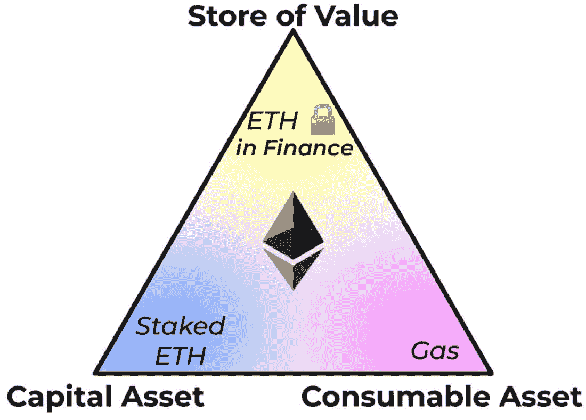
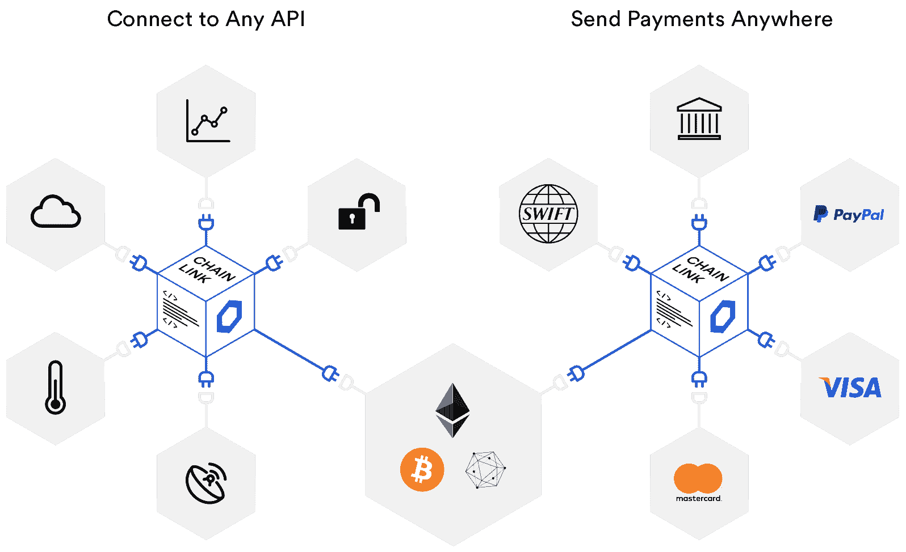
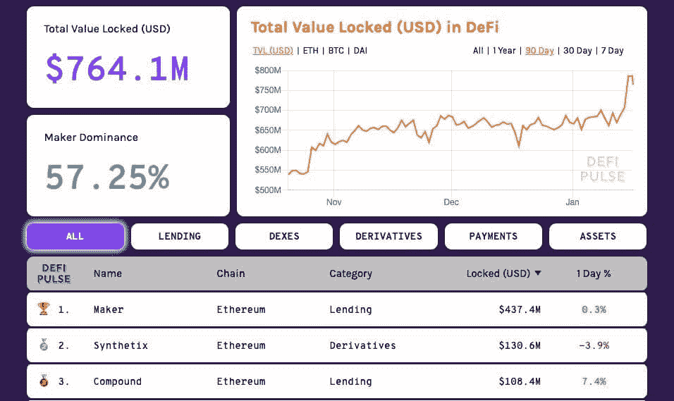
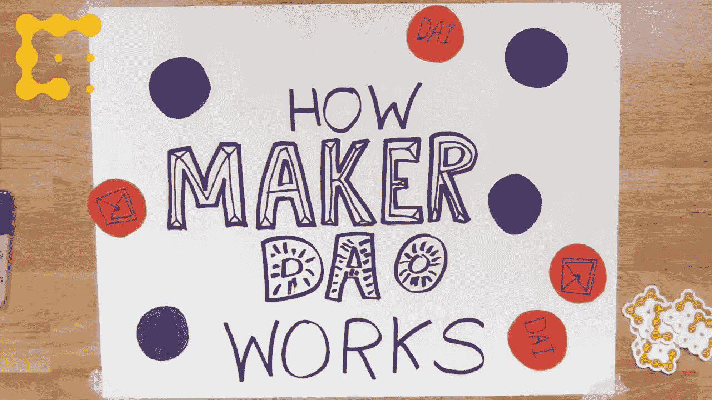
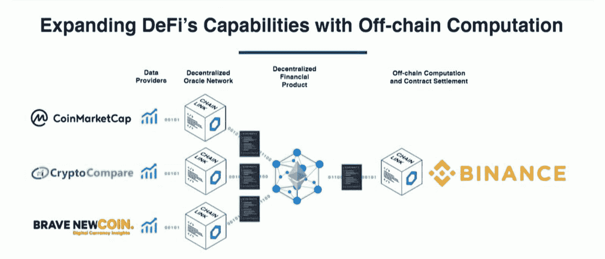
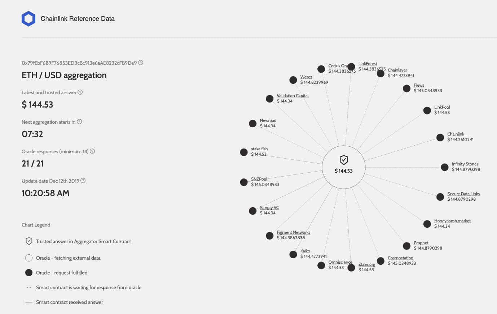

# 分析 DeFi 生态系统和 Chainlink 加速采用的多种方式

> 原文：<https://blog.chain.link/analyzing-the-defi-ecosystem-and-the-many-ways-chainlink-can-accelerate-adoption/>

金融是资金管理的艺术，其主要目标是获得最佳的风险调整资产回报率。无论是在储蓄账户中赚取利息，投资股票，还是拥有房地产，消费者都可以采用许多金融工具来满足不同的目标和风险。

分散金融(通常被称为 [DeFi](https://chain.link/education/defi) )是一种不断发展的运动，它使用分散的后端基础设施，从传统金融中重新创建通用金融工具。因此，用户可以使用运行在分散网络上的开源软件来访问、交易和借出资产，而不需要集中的实体来促进金融市场的流动。其结果是基于透明、开放访问和数据驱动自动化的自我运行的 P2P 金融市场。

在本文中，我们概述了目前定义 DeFi 格局的基础设施、产品和市场动态。然后，我们将重点介绍开发人员利用 Chainlink 增加 DeFi 仪器功能和实际应用的多种方式。

## 当前 DeFi 环境概述

*“DeFi 的目标是以这种开放的、无需许可的方式为全世界重建银行体系，”* [*蜻蜓资本管理合伙人亚历克斯·帕克*](https://www.forbes.com/sites/jeffkauflin/2019/04/26/why-everyone-in-crypto-is-talking-about-defi/#4587f56a723f) *说。*

当前的金融体系主要围绕着政府发行的货币和大型银行机构，它们在交易关系中充当可信的第三方。法定货币为金融市场提供了稳定性，而银行通过发放信贷、承担交易对手风险和简化支付来扩大生产率。如果没有这两家机构提供流动性和关键的商业基础设施，市场的速度和创新的速度将远远低于目前的水平。不幸的是，当前的设计有一定的折衷。资本的价值和流动受制于集权和流程效率低下。这使得市场容易受到审查，限制了资本的获取，并延长了合同的生命周期。

DeFi 将货币和银行基础设施的所有权从集中的权力机构转移到由市场参与者拥有的分散的基础设施。货币和市场可以由用户通过分布式软件协议自行操作，而不是由权威机构发行货币和在中央服务器上运行金融网络，分布式软件协议能够不断地就网络状态达成可靠的共识。这种新的基础设施具有可验证的开源代码，世界上任何人都可以无权限访问，以及分散的安全性，可以保证防篡改的执行。DeFi 不仅将信任从人类身上转移并代之以代码，而且由于 DeFi Dapps 可以在全球范围内使用和建立，它还有可能产生巨大的网络效应，并为金融市场提供新的信任动力。

## 打破 DeFi 基础设施

DeFi 基础设施有多个组件，下面将详细介绍每个组件。

### 金钱

要有一个真正发挥功能的金融市场，就必须有一个稳定和通用的媒介来估价和进行交易。这种媒介必须是稀缺的，以准确定价市场，并有普遍的需求，以保持其价值随着时间的推移，作为一个共同的交换媒介。货币长期以来一直代表着这种媒介，黄金是最好的历史形式之一。尽管美元被认为是当今的世界储备货币，但黄金在历史上一直是(并且主要仍由各国央行持有)全球市场的储备货币，所有货币的价值都与其对黄金的汇率挂钩。

区块链给社会带来了新形式的货币，既不是基于物理稀缺，也不是基于中央权威，而是基于内置不可改变的数字稀缺的数学软件，这种软件很容易通过分布式共识进行交易和公开验证。加密货币不仅满足交易需求，而且 DeFi 还展示了它们如何能够作为一种未经许可的价值储存手段(PSOV)。这种 PSOV 就像一种储备资产，可以被抵押以创造类似于现代银行业的额外信用(尽管抵押率有很大不同)。虽然比特币更通常被称为数字黄金等储备资产，但 DeFi 生态系统正在以太坊上蓬勃发展，并使用 ETH 作为储备抵押品的主要形式。大卫·霍夫曼写的一篇题为“以太是世界上有史以来最好的货币模型”的文章对此进行了讨论。

<figcaption>David Hoffman proposes that ETH is a “triple-point asset” because it’s a store of value, capital asset, and consumable asset; Source: [The Defiant](https://thedefiant.substack.com/p/ether-is-the-best-model-for-money)</figcaption>

### 资产

任何可以被拥有和交换价值的东西，无论是有形的还是无形的，都被认为是资产。金融市场中有各种各样的资产，从商品(石油、电力、食品)、基础设施(房地产、机械、火车)和异国情调的奢侈品(艺术品、汽车、收藏品)等有形资产，到专利、版权和商誉等无形资产。大多数资产由交易各方在内部跟踪。他们也可以由促进交易的银行和/或政府机构从外部跟踪，以收集税收和合规性的元数据。此外，顶级会计师事务所帮助对许多资产进行估值，并验证内部和外部报告是否一致。

鉴于资产市场缺乏绝对真理，当前的设计还有许多不足之处。由于有如此多相互对立的私人记录保存系统，基于整体市场观察的资产定价变得很困难。为了调和市场上不同的资产估值，通常会聘请第三方专家来评估差异并分配价值。如果没有，那么各方必须转向 P2P 谈判，这可能会受到分歧和信息不对称的影响。

区块链和[智能合约](https://chain.link/education/smart-contracts)可以改变资产所有权和估值的基础。令牌化展示了如何使用智能合约将每项资产的所有权绑定到区块链上唯一的公钥/私钥，从而将每项资产带入数字世界。所有类型的资产都可以被令牌化，比如房地产、一件精美艺术品或供应链中的单个商品的所有权。鉴于其透明的记录和获得国际流动性的渠道，区块链是全球资产注册的独特合适之地。它们可以消除跨网络摩擦，并通过让各方在共享、平等的访问系统上运作，为资产带来透明、市场驱动的估值。

### 金融产品

直接实物易货之外的任何价值转移或潜在转移都是金融产品。无论是促进贸易的交易所、发行债务(信贷、债券)的银行，还是某种债权(股权、衍生品、使用权)的所有权，它们都代表了交易和/或投机资产和事件的某种机制。大多数金融产品都是由大型金融机构提供的，如投资银行，它们拥有大量的资金池和更好的资源获取渠道。这些银行享有规模经济，因为它们有大量资金用于建设基础设施和抵押市场，以满足流动性需求。

DeFi 将区块链上的资产令牌化，并使用智能合约来定义金融产品的交易规则和用户体验。智能金融合约的整个生命周期(所有权、保管、托管、维护、执行、结算)只需很少的人工干预(如果有的话)。定义产品如何工作的术语是开源的，并作为布尔逻辑硬编码到合同中(如果 x，则 y)。一些最常见的金融产品正在被重新定义，包括贷款、稳定存款、[分散交易所](https://blog.chain.link/dex-decentralized-exchange/)和衍生品。

### 数据

所有的金融合同都依赖于某种类型的输入数据来执行和产生输出。无论是点击鼠标付款，让市场数据决定期货合约，还是使用当前利率计算债券支付。数据的质量通常基于声誉，而一些公司在获取或创建可信和可靠的数据方面比其他公司更胜一筹。数据价值通常来源于网络效应、独特性、权威性或质量。它也有生的和加工的两种形式。当前的金融产品由数据驱动，但通常在数据和实际流程执行之间有人工中介或后备选项。

区块链旨在根据已经存储在区块链(链上)中的已知数据进行安全的真/假判定。然而，价格、利率和事件结果是源自本地区块链(外链)之外的常见数据集，并且不同来源的价值和格式各不相同。这种数据的丰富性使得区块链很难在不牺牲共识安全性的情况下做出可靠的真/假判断。考虑到现代数据和区块链共识的现实，迫切需要在 DeFi 应用程序和所有类型的链外数据之间建立一个标准的桥梁。如下所述，Chainlink 是一个标准的、可定制的协议，使 DeFi 能够安全可靠地连接链外资源。

<figcaption>Chainlink connects smart contracts on any blockchain to any input and output they need to replicate a full contract life cycle.</figcaption>

### 人类

虽然 DeFi 的目标是去中心化，但是完全消除人类的控制和影响是不可能的。最终，是人类创造并维护了金融自动化。有些领域极难自动化，尤其是协议开发和内部治理。还有一些影响市场的外部因素，如政治的转变、文化的改变和法律体系的建立。虽然分布式账本技术(DLT)确实支持由分散式自治组织(Dao)管理的自运行系统，但这些系统远非完美。现实是，仍然存在基于不可避免的人类参与的集中力量，开发人员必须考虑到这一点，不能简单地编码。

## 检查 DeFi 市场的当前参与者

将 DeFi 理解为一个完整的市场取决于它的定义。衡量 DeFi 的一种流行方法是查看 DeFi 申请中锁定的所有抵押品，在撰写本文时，其价值约为[7.64 亿美元](https://defipulse.com/)。该指标展示了 Dapps 如何锁定无许可抵押品(特别是 ETH 和 DAI ),以用作发放贷款、为网络流程提供流动性和/或安全性或在治理决策中代表投票权的基础。

<figcaption>Total USD locked in DeFi applications over the past few months according to [https://defipulse.com/](https://defipulse.com/)</figcaption>

然而，有人可能会说，整个加密货币空间是某种形式的 DeFi。尤其是像比特币、以太坊等未经许可的货币形式，它们代表价值并有助于确定价格。

让我们探索一些目前最常用的 DeFi Dapps，以便更好地了解这些应用是如何构建的以及为什么要构建。

### 马克道

目前，最受欢迎的 DeFi 应用程序是 MakerDAO，这是一个分散的贷款平台，以 DAI(一种与 1 美元挂钩的稳定货币)的形式创建和发放信贷，并通过分散的自治组织(由持有其治理令牌的用户组成)管理贷款流程。在传统银行业，银行通常被允许发放贷款，只要它们保持一定的准备金率。在美国，存款超过 1.24 亿美元的银行的准备金率为 10%。不考虑法律规定的细微差别，银行需要保留 10%的存款作为准备金，但可以将其余部分贷出。

MakerDAO 有一个类似的模型，但该过程是分散的，并包含一个非常不同的准备金率。在 MakerDAO，用户将他们的 ETH 押在一份智能合同上，该合同被用作抵押，以 DAI 的形式为自己创建贷款。抵押率目前设定在 150%左右，因此用户可以获得他们锁定价值的 2/3。例如，如果某人锁定了价值 90，000 美元的 ETH，他们将获得以 DAI 形式提供的 60，000 美元贷款。在这种模式中，贷款被过度抵押，而传统银行通过部分准备金银行提供的贷款抵押不足。

值得注意的是，多抵押品 Dai 最近上线，允许用户抵押除 ETH 之外的多种不同资产。多抵押品 DAI 采用 Dai 符号，而通过 ETH staking 的原始单一抵押品 Dai 则使用 SAI 符号。

最终，MakerDAO 通过调整激励来保持网络的分散化。MKR 代币持有者通过对利率、可以发放多少贷款等进行投票来对系统进行治理。为了补偿他们的工作，借款人必须使用 MKR 代币支付利息，随后会烧掉代币，以确保它随着时间的推移变得更加稀缺。在 MKR，当借款人的抵押品价格低于其基于智能合同的贷款中规定的清算价格时，他们还会收到借款人产生的一部分罚款(14%)。这种贷款的自动清算(通过价格预言触发)通过自动对冲价格波动来保持网络的偿付能力。每次偿还贷款时，系统都会烧录之前发行的 DAI/SAI。MakerDAO 设计的美妙之处在于，所有用户都受到激励，以一种让他们和网络同时受益的方式行动，这消除了对中央第三方的需求。

 

<figcaption>(MakerDAO explained by Coindesk)‌‌</figcaption>

### 复合的

另一个受欢迎的 DeFi Dapp 是 [Compound](https://compound.finance/) ，这是一个贷款协议，充当货币市场基金，用户通过出借资本赚取利息。借款人可以根据他们的“借款能力”获得这些资本，这是一种预先编程的算法，考虑了他们的代币余额、市场流动性、汇率(通过价格预测)和其他因素。借款人的贷款超过他们的借贷能力时会自动清算。Compound 允许使用七种不同的资产作为抵押品:BAT、DAI、ETH、、REP、ZRX 和。

最终，复合和制造商将银行业从发行抵押不足的债务以推动信贷扩张的特权机构，转变为过度抵押资产的分散市场力量，以自动止损来扩大信贷，以对冲下行风险。它们降低了获取资本的市场壁垒和流程时间，并允许任何人作为贷款人参与被动利息回报。

我们最近集成了一个类似的货币市场 DeFi 协议，称为 Aave。要了解更多关于 Aave 与 Chainlink 的集成，请查看最近的[博客文章](https://medium.com/aave/the-aave-oracle-network-powered-by-chainlink-is-now-live-45bb8a5a8c4e)或[观看 AMA](https://www.youtube.com/watch?v=BHzzaDdcmWM) 。

### 合成的

一个新兴的 DeFi Dapp 是 Synthetix，一个分散的加密支持的衍生品平台。在 Synthetix 上，用户将本地令牌 SNX (ETH staking coming)作为抵押品，用于创建基于债务的合成资产(synths)，这些资产代表法定货币、加密货币、商品、指数等。这些合成器让交易者/投资者可以在不实际持有资产的情况下了解基础资产的变动。synths 的价值在相互交换时，通过价格预测与资产的潜在市场价值挂钩。Synthetix 最近已经为 7 FX 和基于商品的 synths 切换了价格神谕，更多的资产在管道中，以通过与 Chainlink 的集成获得更分散的定价[。](https://blog.synthetix.io/chainlink-decentralizes-first-wave-of-synthetix-price-feeds/)

这些合成器得到 SNX 股东的支持，抵押率为 750%，他们从每笔交易中收取一定比例的交易费。Synthetix 上的交易员可以利用无限的流动性，因为在 synthex 之间进行交易时没有订单簿。取而代之的是，用户承担了总债务的一部分，这部分债务可以根据他们的合成器相对于网络中合成器总数的移动而增加或减少。每笔交易都是根据合约执行的(SNX)，类似于充当每笔交易对手的清算所。网络中的所有头寸对用户都是透明的，这使他们能够对冲过度/不足风险，以保持系统完全抵押，同时改善他们的基础头寸。

### 分散交易所

分散式交易所正在获得牵引力，像 Kyber Network、AirSwap 和 T2 uni swap 这样的平台不断创下交易量的历史新高。dex 为交换资产提供非托管平台，为用户提供不受审查的交易和不同的安全保障，例如维护你的私钥，而不是由集中交易所处理它们。此外，像 0x 这样的协议允许 Dapps 将定制的 DEX 整合到他们的应用程序中， [bZx](https://medium.com/bzxnetwork/bzx-teams-up-with-chainlink-5b9649e8c241) 通过协调跨平台的非托管贷款，实现了 DEX 保证金交易的流动性，Loopring 正在通过链外计算和 zkRollups 研究 DEX 的可扩展性和隐私性。

Chainlink 最近与 Loopring 进行了集成，以确保中继站在计算零知识证明链上时，能够获得所需的 LRC 量。要了解更多关于整合的信息，请查看[最近的博客文章](https://medium.com/loopring-protocol/chainlink-and-loopring-collaborate-on-oracles-for-zkrollup-dex-protocol-c1c8094afc27)或[关注 AMA](https://www.youtube.com/watch?v=eAgKaxLGnq8) 。

### 其他 DeFi 应用

其他一些受欢迎的 DeFi Dapps 包括投资组合自动化资产管理的 Set Protocol、分散预测市场的 Augur 和比特币零售支付的 Lightning Network。还有基于代币的众筹的初始硬币发行(ico)，基于股权的众筹的安全代币发行(sto)，stablecoins，基于商品的货币([如 chain link powering the ample forh protocol](https://medium.com/ampleforth/the-ampleforth-chainlink-oracle-integration-is-going-live-16053ccdebd5))，基础共识协议的赌注(POS，DPOS)，以及风险投资基金、保险基金和协议治理形式的 Dao 中的赌注。

## Chainlink 如何帮助创建下一代 DeFi 应用

Chainlink 是一个分散的 oracle 网络，它可以极大地扩展 DeFi 智能合约的功能，增加所提供产品的种类，并使市场对受监管的参与者更具吸引力。以下概述了 Chainlink 增强 DeFi 生态系统的四种方式。

### 连通性

大多数 DeFi 应用程序依赖数据来执行其智能合同。有些 Dapps 根本不需要链外数据，因为它们只使用链上数据。ICO 是一个众所周知的金融应用程序，它不需要链外数据，因为汇率已经预先编程到智能合约中。虽然链上数据对于某些用例来说已经足够了，但是它非常具有限制性，因为它将 Dapps 限制为某些类型的数据和/或将它们约束为仅在它们的原生链上可用的数据。如果不能访问外部数据和资源，大多数 DeFi 应用程序根本无法创建。

oracle 是一个数字代理，由 smart contract 使用，用于检索和/或连接其本地区块链之外的数据和系统(离线)。Oracles 通过重新格式化外部连接点(API)来实现智能合约的链外连接，以便两个不同的软件可以兼容进行数据交换。然后，oracle 可以将数据拉入智能合同，并根据服务级别协议(SLA)中概述的预定义指令和端点在外部系统上执行操作。

Chainlink 是一个分散的 oracle 网络，它使智能合同能够安全可靠地访问数据提供商、web APIs、企业系统、云后端、物联网设备、支付系统、其他区块链等。通过访问所有这些链外介质，智能合同可以轻松地访问各种已经格式化的输入和输出，以复制现有的数字协议。这使得 DeFi 可以使用所有类型的链外数据和系统来触发合同执行，以及通过各种支付网关和企业后端系统来结算合同。

<figcaption>Showcasing how DeFi can use a decentralized price feed to trigger an on-chain contract that then automatically executes a trade on Binance; [read more about it in the Binance blog](https://www.binance.com/en/blog/394373386380349440/Connecting-Binance-Data-to-NextGen-DeFi-Applications-Using-Chainlink-Oracles)</figcaption>

### 可信、可靠且可定制的数据

无论智能契约设计得多么好，最终契约都依赖于它接收到的数据。数据是触发契约逻辑的东西，因此必须像底层区块链一样可靠和安全。由于 Oracle 的新颖性对于这个领域来说仍然是一个相对较新的问题，许多项目都是从简单地创建自己的 Oracle 开始的。这些预言通常涉及聚合链外数据(利率、汇率、价格等)，然后手动将其放到链上。虽然在开发的初始阶段维护安全性是非常必要的，但集中的价格汇总使 Dapps 容易受到管理不善、无能和贿赂管理数据馈送的中央机构的影响。

为了解决这个问题，我们已经开始在 Chainlink 上为 ETH、BTC、link、BAT、USDC、ZRX 和 REP 等受欢迎的资产推出分散的价格参考 oracle networks。价格参考源是根据独立的、经过安全审查的节点的集合计算的，并定期更新以反映价格的变化，如目前在以太坊主网上发布的 [ETH/USD](https://eth-usd-aggregator.chain.link/) 和 [BTC/USD](https://feeds.chain.link/btc-usd) 参考合同所示。参考数据合同通过允许任何 Dapp 在其智能合同中利用这些价格反馈来支持 DeFi 的增长。这使 Dapps 失去了对价格反馈的控制和维护，代之以日益分散的 oracle 网络。

如果您是一个 DeFi 项目，并且希望使用 Chainlink 构建您自己的定制 oracle 参考数据网络，正如我们最近的许多集成所展示的那样，请通过 [【电子邮件保护】](/cdn-cgi/l/email-protection#ee8d9b9d9a8183ae8d868f8780c082878085) 联系我们。

<figcaption>The dashboard for the current [ETH/USD reference price oracle network](https://eth-usd-aggregator.chain.link/) with all 21 nodes</figcaption>

虽然尚未在 mainnet 上实现，但我们正在努力在 Chainlink 上实现绑定协议(服务级别协议)，允许用户概述他们需要的服务(数据、时间范围)、他们希望的承诺(股份)以及他们寻求的节点要求(信誉阈值、基础设施)。从这些服务协议，声誉系统可以开始形成使用链上的指标，概述了他们过去的表现。

诸如 [Chainlink Market](https://market.link/) 之类的列表服务提供了用户可以基于上述标准评估和选择服务协议节点的途径。还有[蜂巢 API Marketplace](https://www.clcg.io/honeycomb/) ，用于查找经过认证的数据 API，节点可以在每次调用的基础上访问这些 API，而不需要订阅每个数据源的全部 API。

我们还致力于将服务协议与可插拔聚合相结合，这允许用户使用多个 oracles 来实现计算冗余，使用多个源来实现数据准确性，并以他们想要的任何方式(平均、删除异常值、自定义权重等)将它们聚合在一起。这些功能使用户能够使用任何数量的分散和任何形式的数据聚合，围绕他们信任的数据定制他们的智能合同。

开发中的另一个额外功能是 [Town Crier](https://blog.chain.link/town-crier-and-chainlink/) ，这是一个基于 oracle 的可信执行环境(TEE ),它验证 TLS 证书，以验证数据来自特定网站，并且在智能合约的过程中没有被篡改。假设用户信任底层硬件，Town Crier 为用户提供了新的安全保证，即他们的数据从源头上来说是真实的。

### 低成本数据和计算

开发 DeFi 仪器的另一个主要问题是连锁气体成本。如果应用程序需要恒定的价格和/或使用多个 oracles 和数据源，那么天然气成本就会增加并限制其实际使用。这就产生了一个难题，因为去中心化对于数据安全来说是必不可少的，但是作为一个可持续的商业模式成本太高。当前的链上聚合模型要求每个 oracle(节点)支付汽油费来提交链上的外部资源。因此，如果使用 10 个节点来收集外部数据，那么每次链上更新就要花费 10 美元。

我们目前正致力于将门限签名实现到 Chainlink 协议中，这是一种大规模去中心化 oracles 的新方法。[阈值签名](https://blog.chain.link/threshold-signatures-in-chainlink/)代表一种新的聚合协议，它允许 oracles 相互通信，并就某些特定数据点的有效性达成离线共识。使用阈值签名的链外 oracle 聚合只需要一个链上响应和一笔汽油费就可以将聚合数据发送到查询智能合约，同时仍然保持可在链上验证的高安全性。

根据 Chainlink 研究人员 Alex Coventry 的说法，“我们目前最好的门限签名方案需要大约 15k gas 来确认。这意味着，例如，3000 美元的数据点只需花费 2 美元，节省了 1500 倍。按照目前的天然气/天然气水合物价格，成本将略高于 1 美分，而使用目前的框架，验证 2000 人以上的法定人数约为 17 美元。”

我们还通过英特尔 SGX 等可信硬件，为 Chainlink oracles 创建在[可信执行环境(TEEs)中运行的能力，构建低成本计算解决方案。基于 oracle 的 tee 提供了一个黑盒环境，节点可以在其中扩展 Oracle 服务，以包括离线计算和事务隐私。甚至 oracle 也不知道数据进出，但是可信硬件可以向区块链提供证明，指出它正确运行而没有被篡改。在为智能合约带来可扩展的低成本计算方面，TEEs 具有引人入胜的潜力。](https://blog.chain.link/town-crier-and-chainlink/)

<figcaption>The basic architecture of how a Dapp can leverage TEEs</figcaption>

### 隐私

除了连接性和低成本可伸缩性之外，另一个主要问题是隐私。正如 Chainlink 的联合创始人 Sergey Nazarov 所说的那样，“现实世界中的大多数合同没有隐私是不可能发生的。”在更昂贵的零知识证明(ZKP)设计之外缺乏链上隐私意味着许多合同不能被重新设计为潜在更有效的智能合同。隐私对于隐藏内部头寸和交易策略以及遵守数据隐私法律法规至关重要。

最初为 Chainlink 引入了两种隐私解决方案，根据开发人员的需求和信任假设进行区分。如上所述，基于 TEE 的 oracle 可以用来对 oracle 本身隐藏 Oracle 查询，消除它们泄漏敏感信息的可能性(假设您信任硬件)。用户还可以使用 Chainlink 连接链外计算环境，如作为 Hyperledger Avalon 项目一部分的[可信计算框架(TCF)。](https://blog.chain.link/driving-demand-for-enterprise-smart-contracts-using-the-trusted-computation-framework-and-attested-oracles-via-chainlink/)

另一个更近的非硬件方法是 Mixicles，它使用 oracles 通过对智能契约的输入和输出去相关来创建隐私。按照这种协议设计，oracle 检索数据，并对离线数据进行真/假判断(切换)。然后，该决定被传递到一个混合器，该混合器根据 oracle 输入发布指定的输出。基本前提是状态变化(确定)与结算的输出支付在链上公开去相关。对于更深层次的安全需求，用户可以使用基于 TEE 的 oracle 或 [DECO](https://www.deco.works/) 与 Mixicle 一起使用，以隐藏来自 Oracle 的切换。要更透彻地理解，请阅读[的研究论文](https://chain.link/mixicles.pdf)或我们的[较少技术的博客文章](https://blog.chain.link/breaking-down-mixicles-and-its-potential-to-unlock-enterprise-demand-for-defi-applications-on-public-blockchains/)。

<figcaption>An example of a Mixicles contract that decorrelates the inputs and outputs using multiple payment inputs (Rounds 1 & 2) and multiple new addresses for splitting up output payments (Round 3)</figcaption>

## 为 DeFi 生态系统带来新的客户和产品

毫无疑问，DeFi 正在成为智能合约领域发展最快、需求最大的领域之一。虽然进步值得庆祝，但现实是世界大部分地区没有 DeFi。DeFi 产品有一个巨大的未开发市场，可以与现有基础设施合并和/或改造当前的金融市场，但前提是智能合同堆栈中增加了新功能。

我们不断在 Chainlink 上构建和提供实用的解决方案，以解决连接性、可信数据、低成本可伸缩性和交易隐私等目前阻碍 DeFi 发展的核心问题。通过将这些新工具带给开发人员，可以构建满足无权限和有权限系统需求的下一代智能合约。最终，Chainlink 是一个开源工具，它在区块链和运行世界的传统系统之间带来了可定制的连接，以便跨生态系统形成连接共识。

## 立即构建您的互联智能合同！

如果您是一名开发人员或企业，希望为您的外部连接智能合约应用程序创建任何类型的 oracle，请通过 [【电子邮件保护】](/cdn-cgi/l/email-protection#294a5c5a5d4644694a414840470745404742) 联系我们，访问[开发人员文档](https://docs.chain.link/)，或加入关于 [Discord](https://discordapp.com/invite/aSK4zew) 的技术讨论。我们将帮助和支持您以高效的方式构建 oracle 设计，根据您的特定需求进行定制，同时保持最高的安全标准。

## 来源

*   [https://info . binance . com/en/research/market research/defi-1 . html](https://info.binance.com/en/research/marketresearch/defi-1.html)
*   [https://medium . com/bzx network/how-decorated-is-defi-a-framework-for-classing-lending-protocols-a 34 f 02 c 14 f 5c](https://medium.com/bzxnetwork/how-decentralized-is-defi-a-framework-for-classifying-lending-protocols-a34f02c14f5c)
*   [https://medium . com/@ pugely/the-case-for-ether eum-kyber-network-defi-46 A8 B9 b 80284](https://medium.com/@pugely/the-case-for-ethereum-kyber-network-defi-46a8b9b80284)
*   [https://the defiant . substack . com/p/ether-is-the-best-of-money](https://thedefiant.substack.com/p/ether-is-the-best-model-for-money)