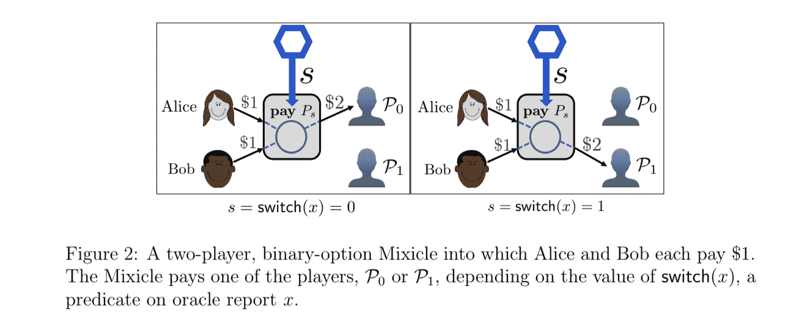
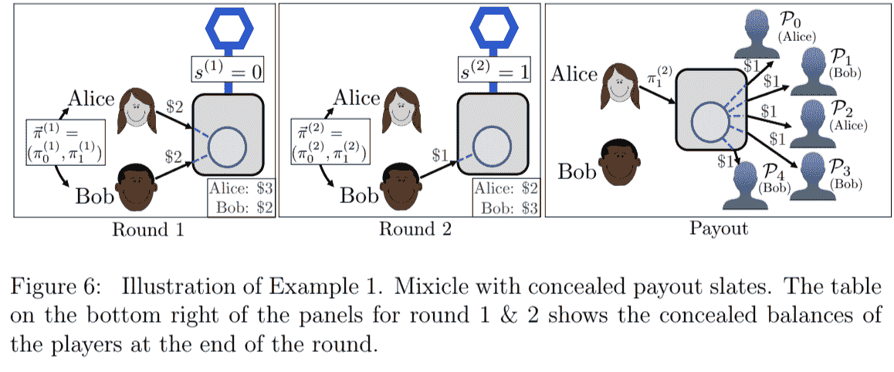

# 分解混合动力车及其潜力，释放企业对区块链公共区域 DeFi 应用的需求

> 原文：<https://blog.chain.link/breaking-down-mixicles-and-its-potential-to-unlock-enterprise-demand-for-defi-applications-on-public-blockchains/>

正如学术论文“[mix cicles:Simple Private Decentralized Finance](https://chain.link/mixicles.pdf)”中所描述的，mix cicles“使用 oracles 来构建简单的、保护隐私的[去中心化金融(DeFi)](https://chain.link/education/defi) 工具。”考虑到研究论文的复杂性，我们对核心 mix cicles 概念进行了分解，以便更广泛的 DLT 社区能够掌握起作用的底层机制，以及 mix cicles 为企业采用 DeFi 提供的深刻应用。

## DeFi 及其当前局限性概述

DeFi 已经成为在区块链上市的智能合约增长最快的领域之一。[据 DeFi Pulse](https://defipulse.com/) 报道，目前在诸如 MakerDAO、Compound 和 Synthetix 等流行的 Dapps 中，有大约 5 亿美元的 DeFi 协议被锁定在以太坊区块链上运行。DeFi 产品使用分散式基础设施(区块链和智能合约)构建，允许来自世界各地的用户在没有中心方服务商的情况下进行借贷、下注和产生资产利息。

虽然像以太坊这样的区块链的公共性质对于散户投资者来说可能是可以接受的，但是它们缺乏交易隐私性，这严重限制了它们对于企业应用程序的可用性。企业不仅要求隐藏他们的内部交易策略和头寸，而且在许多情况下，法律还要求他们对数据保密。例如，法律规定金融合同中的隐私的主要原因之一是防止抢先交易，即禁止从事金融交易(期权、期货合同、衍生品、掉期等)。)来利用大量未决交易的预先非公开信息。由于公共区块链目前缺乏企业使用所需的必要隐私功能，私有/许可区块链已经出现，以隐私作为其核心卖点来填补空白。

通过使用[神谕](https://chain.link/education/blockchain-oracles)，Mixicles 将隐私大规模带到了区块链的公共场所。通过引入隐私，以太坊这样的公共区块链对企业来说变得更有吸引力，因为围绕数据隐私的法律障碍以经济高效和可扩展的方式被消除了。Mixicles 为以太坊提供了关键的隐私功能，它需要这些功能来与私人区块链竞争，并不可避免地赢得企业客户。

## Oracles 和混合器简介

一个 [oracle](https://chain.link/education/blockchain-oracles) 是一个数字代理，它被一个智能合同雇佣来检索和/或将它连接到其本地区块链之外的数据和系统(离线)。Oracles 通过重新格式化外部连接点(API)来实现智能合约的链外连接，以便两个不同的软件应用程序兼容进行数据交换。然后，oracles 可以根据服务级别协议(SLA)中概述的预定义指令和端点将数据拉入智能合同和/或推出数据。

Chainlink 是一个分散式 oracle 网络，可让智能合约安全可靠地访问数据提供商、web APIs、企业系统、云提供商、物联网设备、支付系统、其他区块链等。它具有以下特点:

1.  一个强大的独立预言市场提供了一系列的数据和联系
2.  灵活定制 oracle 连接，包括 Oracle 的数量、数据源的类型和数量、聚合策略、堆栈存款、可信执行环境、混合工具等
3.  基于链上度量的 oracles 信誉评估框架

这是一个一体化的网络，用户可以使用不同级别的去中心化、数据聚合和 oracle 选择来定制他们的合同如何与链外的任何东西进行通信。

mixer(也称为 tumbler)是一种软件，它“将一组用户的付款作为输入，将另一组(可能重叠)用户的付款作为输出。”基本前提是，所有的不倒翁用户发送他们的支付输入(他们的赌注)到相同的地址，这代表了所有输入的池。然后，tumbler 利用这个资产池向用户进行支付输出。

在大多数 mixer 模型中，用户向 tumbler 提供新的、以前从未使用过的地址，然后 tumbler 随机向这些地址付款。通过使用支付输入的共享地址、随机化支付金额/时间、以及部署不依赖于输入身份的新输出地址，区块链的外部观察者无法将网络上的交易起点(输入)与翻转后的当前位置(输出)相关联。

## 将两者组合成一个 miricle

所有启用 oracle 的智能合同都使用数据输入来触发合同执行(状态更改)，从而产生结算输出。例如，一份衍生品合约接受关于资产价格的市场数据(输入),并根据合约条款(编码逻辑)支付(输出)赢家。Chainlink 提供了一个先知市场，为智能合约挖掘输入和输出。

<figcaption id="caption-attachment-905" class="wp-caption-text">chain link Oracle 将任何区块链上的智能合约连接到任何输入和输出</figcaption>

今天，大多数智能契约都在链上产生状态变化，这使得公共观察者可以很容易地看到和关联契约的输入和输出。然而，Mixicles 通过将智能合约分为两部分来重新定义智能合约，在这两部分中，状态变化与支付输出分离。这两个组件分为链外和链内组件，并没有以任何方式连接在一起，公众可以相互关联。在维护隐私的同时，将两者结合在一起的互连组件是 oracles。

1.  **链外组件**–一个智能契约，代表一个服务级别协议，概述了为 oracles 检索特定数据并使用它来计算正确的状态变化而支付的费用
2.  **链上组件**–一个独立的智能合同，它指定了不倒翁如何根据来自先知的输入支付给各方

查询智能合约请求一个或一组 oracle 来获取一些数据(很可能是市场数据)，这些数据将用于确定 DeFi 合约的结果。查询的细节是链外同意的，因此对链上的观察者是不公开可见的。oracle 返回的不是原始数据，如资产的实际价格，而是报告(oracle report ),该报告是确定数据是真(1)还是假(0)的基础。下面是可以返回 1 或 0 个答案的二元契约的各种示例。

Mixicle 中的 oracle report (x)确定支付切换(状态更改)，这是一个单独的智能合约，包含概述如何根据 oracle report 将支付分配给参与者的条款。在下面的二元期权示例中，有两种可能的转换结果(0 或 1)，代表结算合同的两种不同的支付途径(支付清单)。请注意，超越简单二进制选项的更复杂的开关是可能的。

在上面的例子中，P0 和 P1 代表爱丽丝和鲍勃拥有的新的秘密地址；只有他们知道谁拥有哪个地址。正如我们所看到的，这两种转换的结果代表不同的支付计划，但支付金额完全相同。

让我们介绍另一个例子，展示如何通过部署更多的地址和使用部分支付来隐藏更多的支付。

最后，让我们看看最后一个例子，我们如何通过进行多轮投入支付来混淆支付时间。使用这种技术，要知道一份合同值多少钱以及支付的金额变得更加困难。

正如上面三个例子中提到的，Mixicles 提供了更高的隐私级别，这取决于用来隐藏输入和输出的工具的选择。用户可以使用更简单的平底玻璃杯，使用大量匿名地址，进行部分支付，并通过多轮混淆时间。需要注意的重要一点是，转换的两种结果的支出数量是完全相同的，这使得外部观察者很难区分。

概括地说，双方部署了一个智能合同，该合同向 oracle 支付检索一段 web 数据并对其进行真/假判定(1 或 0)的费用。oracle 随后将其报告作为输入转发给一个单独的智能合同，该合同触发支付切换。双方事先概述并同意的支付时间表将根据收到的开关输入来执行。oracle(s)在成功和按时完成其规定的服务之前收到服务付款。如果甲骨文离线或未能及时响应，合同将失效，允许各方从 Mixicle 中提取初始资金。

参与 Mixicle 的用户越多，就越容易隐藏合约的投入和产出，因为流入和流出资产池的资金越多。这对于衍生品等极其庞大的市场来说尤其诱人，其名义价值估计在 500 万亿到 1.2 万亿美元之间。

Mixicles 也符合法规要求，因为它们为用户提供了让第三方审计 oracle 报告的选项，这可以与参与智能合同的被审计实体提供的开关进行比较。对于在高度管制的环境中运营的企业来说，构建在当前法律框架内工作的 DeFi 应用程序是一项基本功能。

## 开放 DeFi 给企业采用

通过将状态变化从支付结果中分离出来，并使用 oracles 在它们之间保密地传递数据，公开区块链上的 DeFi 工具对拥有大量资本分配的高度监管企业变得更具吸引力。事实上，与传统金融工具中的潜在资本相比，DeFi 工具只是沧海一粟。随着许多可扩展性解决方案的推出，Chainlink 正在使用 oracles 来解决阻碍区块链公共金融领域企业智能合同发展的另外两个主要问题:连通性和可听见的隐私。

### 加入社区，立即开始使用 Chainlink 进行构建

如果您想立即开始使用 Chainlink 进行构建，请访问[开发者文档](https://docs.chain.link/docs/getting-started)，加入关于[不和谐](https://discordapp.com/invite/aSK4zew)的技术讨论，和/或联系我们，了解如何安全地在 mainnet 上启动您的数据支持应用程序或 [Chainlink 价格参考数据合同](https://feeds.chain.link/)。

如果您想加入 Chainlink 社区，请访问我们的[活动页面](https://events.chain.link/)加入您当地的类似聚会。如果你想成为 Chainlink 大使并主持 meetup，[今天就报名](https://blog.chain.link/expanding-the-chainlink-community-advocate-program/)！更多信息，请查看 [Chainlink 网站](https://chain.link/)或关注我们的 [Twitter](https://slack-redir.net/link?url=https%3A%2F%2Ftwitter.com%2Fchainlink) 或 [Reddit](https://slack-redir.net/link?url=https%3A%2F%2Fwww.reddit.com%2Fr%2FChainlink%2F) 。