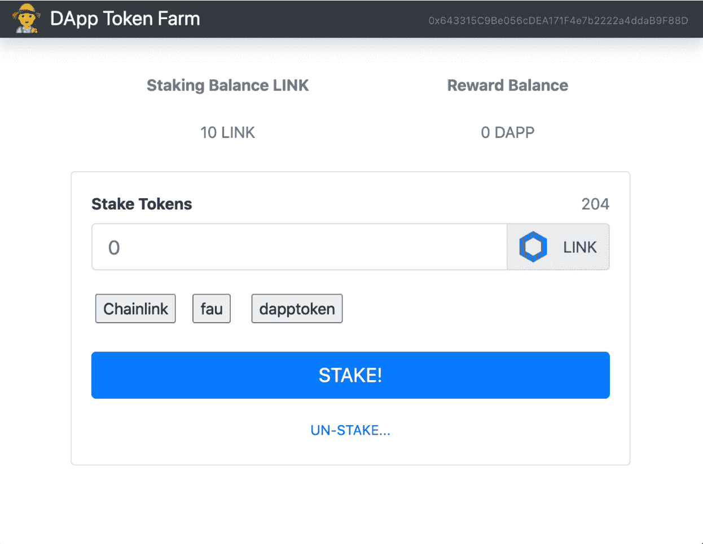
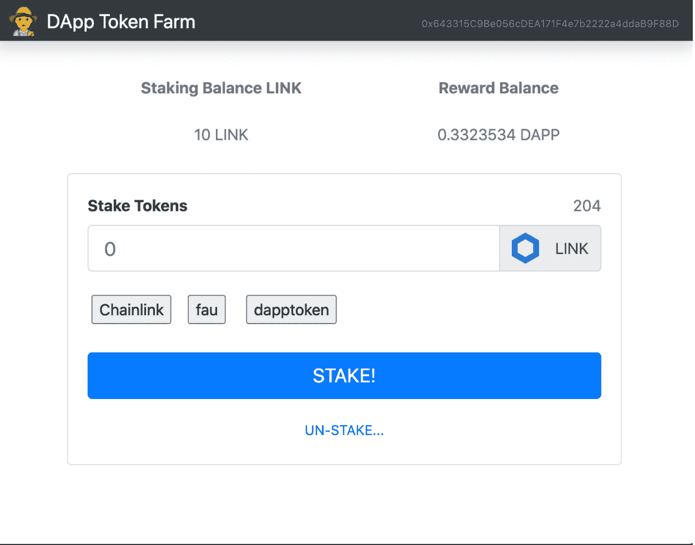

# 使用 Chainlink 价格源建立一个 DeFi 产量农业 dApp

> 原文：<https://blog.chain.link/build-defi-yield-farming-application-with-chainlink/>

**了解如何构建一个基于 Chainlink 分散式 oracles 的 DeFi 应用程序，使用您自己的 ERC20 进行奖励。**

## **简介**

由于赤字的大规模增长，赤字、产量农业、[赌注](https://academy.binance.com/blockchain/what-is-staking)和[治理令牌](https://www.investopedia.com/tech/governance-why-crypto-investors-should-care/)都是受到更多关注的话题。它们安装起来也相对简单，本博客将向您展示如何使用我们的 [DeFi-Chainlink](https://github.com/PatrickAlphaC/chainlink_defi) repo 作为起点，在 10 分钟内构建一个 DeFi yield farming dApp。

这个项目的灵感来自于 [Dapp 大学](https://www.dappuniversity.com/)的 Gregory，如果你想查看他的[项目回购](https://github.com/dappuniversity/defi_tutorial)和[视频教程](https://www.youtube.com/watch?v=CgXQC4dbGUE&t=1397s)，请参考以下链接。

## 什么是产量农业？

[收益耕作](https://chain.link/education/defi/yield-farming)(或流动性开采)是指用户向协议提供流动性，以便以费用、利息和/或激励的形式从其资本中获得被动收入。例如，为分散式贷款协议(如 Aave)或基于自动做市商的分散式交易所(如 Uniswap)提供流动性，以换取潜在回报。Yield farming 旨在通过为早期流动性提供者提供财务激励，解决因没有用户而没有流动性以及因没有流动性而没有用户的新平台周围的鸡和蛋问题。

协议激励用户提供流动性，向他们提供他们的股份资本的利息，类似于储蓄账户，和/或允许他们赚取平台费用的一部分。最近，平台推出自己的本地治理令牌并使用这些令牌为初始激励期提供资金变得越来越流行，在此期间，额外的奖励将分配给早期流动性提供者。同样，我们可以把这比作储蓄账户，银行向注册并存入资金的新用户提供现金奖励。这种形式的高产农业相对较新，其持久的效用/效益仍在争论中。我们今天的目标不是解决这一争论，而是提供一个指南，指导开发者社区如何构建 dApps 来激励流动性提供者，并通过治理令牌产生赌注回报。

## **这个 dApp 做什么**

在本教程中，我们将构建一个 dApp，允许用户下注任何受支持的 [ERC20 令牌](https://www.investopedia.com/news/what-erc20-and-what-does-it-mean-ethereum/)，并以治理令牌的形式自动向下注者(流动性提供者)发放奖励。本教程中的 yield farming 令牌是一个简单的 ERC20 契约，没有实现任何投票功能，因此除了提供这个基本示例之外，它没有其他实际用途。

用户收到的令牌数量是 dApp 的重要组成部分。我们不想向用户发送任意数量的代币，我们希望向他们发送与他们在平台上下注的资金数量成比例的代币奖励。为了做到这一点，我们需要通过使用 [Chainlink 的分散价格源](https://chain.link/solutions/defi)来获取被押资产的当前市场价值。

从像 Chainlink 这样的分散式[Oracle](https://chain.link/education/blockchain-oracles)中获取价格数据，为我们提供了一种强大的方式来比较平台上所有标记的价值。我们可以轻松地将任何 ERC20 代币的值转换为其 ETH 值，以便计算所有下注代币的总价值。

虽然我们不包括在这个演示中，一旦用户在平台上下注，你可以继续使用额外的钱乐高赚取更多的资产利息。例如，你可以在像 [Aave](https://aave.com/) 或 [Synthetix](https://www.synthetix.io/) 这样的平台上下注。

## **快速入门**

要求:

```
Yarn

Nodejs

Truffle

An ETH wallet with a mnemonic (like metamask), and set the MNEMONIC as an environment variable

An RPC_URL from a node provider like [Infura](https://infura.io/) or use your own node. And set an RPC_URL environment variable.

```

克隆回购:

```
git clone https://github.com/PatrickAlphaC/chainlink_defi

cd chainlink_defi

```

安装依赖项

```
yarn 

```

将您的智能合约部署到 Kovan testnet，然后启动前端(需要 o

```
truffle migrate --network live --reset

yarn start

```

您应该会看到如下所示的窗口:


我们现在可以在平台上放一些硬币。首先，我们将被要求批准，然后我们实际上可以向我们的智能合同发送 ERC20 令牌。你的钱包里需要一些 testnet 链接来开始，你可以在这里得到 [Kovan 链接。](https://kovan.chain.link/)


一旦你点击批准两次，交易将开始。完成后，您可以刷新页面，看到更新后的赌注余额。



然后，我们可以回到我们的终端，并发布一些奖励令牌。我们可以在这里找到当前的 LINK / ETH 值。我们的平台应该给我们一定数量的 DAPP 令牌，相当于我们所有 ERC20s 的价值(以 ETH 计价)。在写的时候，1 LINK = 0.03348 ETH，所以我们的平台应该收到 0.3348 DAPP。我们可以发行代币:

```
truffle exec scripts/issue-token.js --network live

```

这将运行我们的脚本来发放代币，您将看到您作为奖励收到的 DAPP 代币的数量。



然后，您甚至可以通过单击相应的按钮来切换令牌。回购默认为科万网上的 3 ERC20s。林克、FAU 和达普特肯(由你部署！).

## **项目如何运作**

这里有两个主要的合同为我们完成了繁重的工作，它们都被包装在一个 react 前端中。

```
DappToken.sol
TokenFarm.sol

```

_ 如果您是 truffle 的新手，并且想知道*迁移*文件的用途，请务必查看 [truffle 文档](https://www.trufflesuite.com/docs/truffle/overview)。

让我们从查看*daptoken . sol*开始，因为它是最简单的，因为它只是一个简单的 ERC20 令牌。

我们几乎不需要任何代码就可以部署 ERC20 令牌:

```
pragma solidity ^0.6.0;

import "@openzeppelin/contracts/token/ERC20/ERC20.sol";

contract DappToken is ERC20 {
   constructor() public ERC20("DApp Token", "DAPP") {
       _mint(msg.sender, 1000000000000000000000000);
   }
}

```

我们安装了 openzepplin 包，可以用它作为我们的合同框架。*导入的 ERC20.sol* 包含了我们的 DappToken 作为 ERC20 使用的所有功能。我们在构造函数中给它一个名称和符号，然后通过创建初始供应来部署它。在我们的演示中，我们使用了 1，000，000 DAPP。(记住，我们要在末尾加 18 个 0，因为 solidity/Ethereum 对小数不起作用)。

当我们部署我们的合同时，我们将所有 1，000，000 个 DAPP 令牌发送到我们的令牌场智能合同，因此它是因使用该平台而获得奖励的唯一所有者。这是在我们的迁移文件 *3_deploy_tokenfarm.js* 中定义的。

```
const tokenFarm = await TokenFarm.deployed();
await dappToken.transfer(tokenFarm.address, "1000000000000000000000000");

```

*tokenfarm.sol* 是我们更重要的文件，它包含了所有用于下注、取消下注和获取用户余额的逻辑。为了跟踪所有用户及其所有 ERC20 令牌的赌注余额，我们将用户地址映射到令牌地址和金额的映射，并将其称为*赌注余额*。我们还跟踪:

1.  用户下注的唯一代币数量的映射
2.  代币映射->该代币的以太坊价格馈送
3.  我们平台上允许的令牌列表
4.  用户/利益相关者列表

```
mapping(address => mapping(address => uint256)) public stakingBalance;
mapping(address => uint256) public uniqueTokensStaked;
mapping(address => address) public tokenPriceFeedMapping;
address[] allowedTokens;
address[] public stakers;

```

然后，用户可以调用 *stakeTokens* 和 *unstakeTokens* 函数来增加或减少平台。然而，更有趣的函数是 *getUserTotalValue* 函数，它使用 Chainlink 价格提要的分散式 oracles 来获得可靠的定价数据，以计算总的赌注值。

```
function getUserTotalValue(address user) public view returns (uint256) {
    uint256 totalValue = 0;
    if (uniqueTokensStaked[user] > 0) {
        for (
            uint256 allowedTokensIndex = 0;
            allowedTokensIndex < allowedTokens.length;
            allowedTokensIndex++
        ) {
            totalValue =
                totalValue +
                getUserStakingBalanceEthValue(
                    user,
                    allowedTokens[allowedTokensIndex]
                );
        }
    }
    return totalValue;
}

```

*getUserStakingBalanceEthValue*获取 1 个用户的个人值，其中 1 个用户具有其标记的令牌:

```
function getUserStakingBalanceEthValue(address user, address token)
    public
    view
    returns (uint256)
{
    if (uniqueTokensStaked[user] <= 0) {
        return 0;
    }
    return
        (stakingBalance[token][user] * getTokenEthPrice(token)) / (10**18);
}

```

然后 *getTokenEthPrice* 是我们调用链接价格提要的地方。

```
function getTokenEthPrice(address token) public view returns (uint256) {
    address priceFeedAddress = tokenPriceFeedMapping[token];
    AggregatorV3Interface priceFeed = AggregatorV3Interface(
        priceFeedAddress
    );
    (
        uint80 roundID,
        int256 price,
        uint256 startedAt,
        uint256 timeStamp,
        uint80 answeredInRound
    ) = priceFeed.latestRoundData();
    return uint256(price);
}

```

您必须为令牌添加令牌-> Eth 价格馈送的映射，以便获得正确的值。

请随意叉这个回购，使 PRs，或任何你喜欢的！对于等待构建自己的带有赌注回报功能的项目的[智能合约](https://chain.link/education/blockchain-oracles)开发者来说，这是一个很好的起点。

现在你有了一个由 Chainlink 的分散神谕支持的 DeFi 项目！

## **输入您的项目以赢取**

如果你在这里学到了新东西，为什么不在 [Chainlink 黑客马拉松](https://hack.chain.link/)上试试你的技能呢？我们将颁发超过 50k 美元的奖金，我们强烈建议您参加。Defi 是黑客马拉松的一大焦点，这可能是你的起点。

如果你在黑客马拉松后阅读这篇文章，一定要通过加入 [Twitter](https://twitter.com/chainlink) 、 [Discord](https://discord.gg/Szt3FYj) 、 [YouTube](https://www.youtube.com/channel/UCnjkrlqaWEBSnKZQ71gdyFA) 或 [Reddit](https://www.reddit.com/r/Chainlink/) 上的社区来了解最新的 Chainlink 事件，并用#chainlink 和#ChainlinkEA 标记你的转发。

如果你正在开发一个可以从 Chainlink oracles 中受益的产品，或者想要帮助 Chainlink 网络的开源开发，请访问[开发者文档](https://docs.chain.link/)或者加入关于 [Discord](https://discordapp.com/invite/aSK4zew) 的技术讨论。