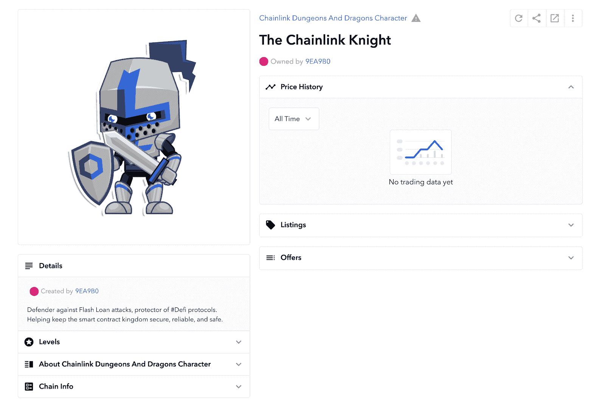
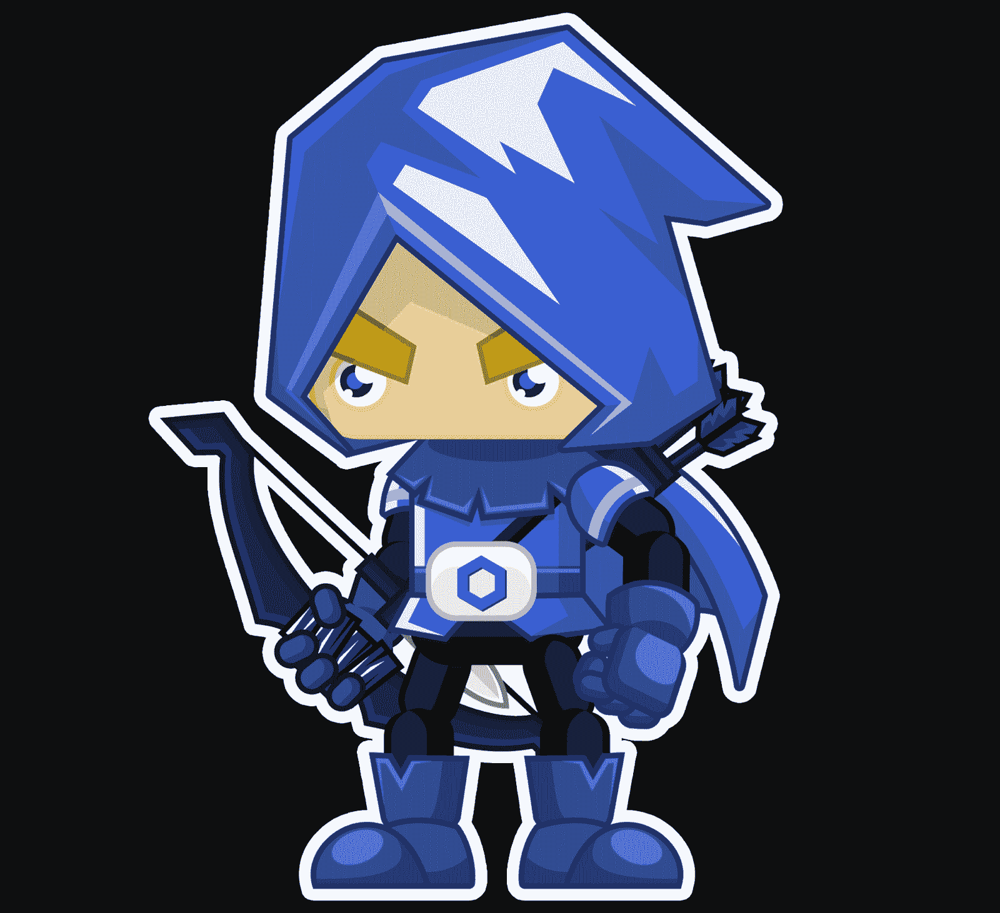
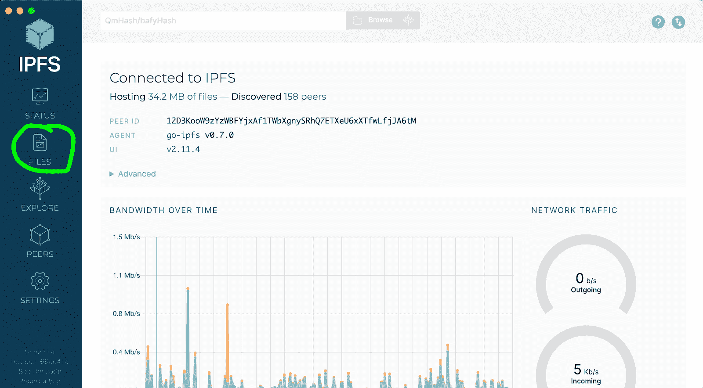
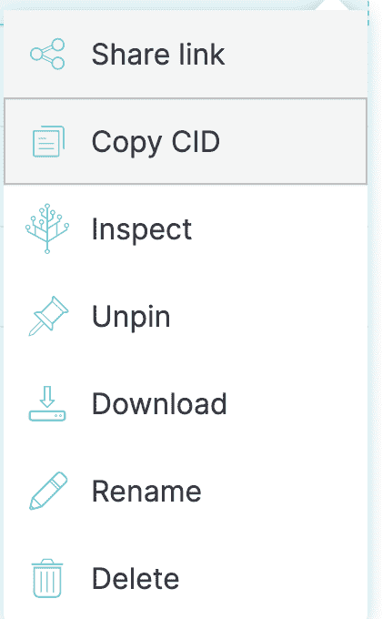
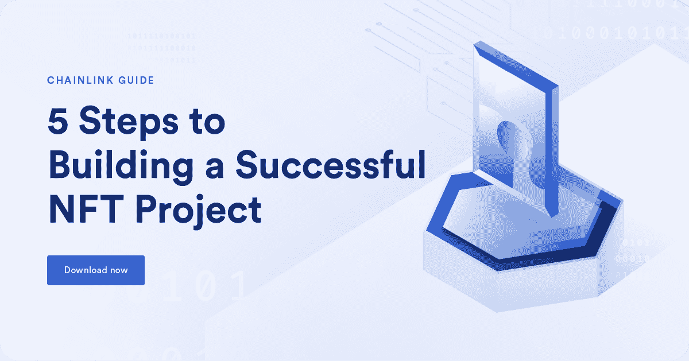

# 构建、部署和销售您自己的动态 NFT

> 原文：<https://blog.chain.link/build-deploy-and-sell-your-own-dynamic-nft/>

不可替代令牌(NFT)是在区块链空间之外根本找不到的工具，允许广泛的应用和可能性。构建一个动态的 [随机 NFT](https://blog.chain.link/random-numbers-nft-erc721/) 对于那些希望构建收藏品、独立代币、门票、游戏应用或 ERC721 代币标准允许的任何东西的人来说，是一个很好的开始。但是我们现在能用它做什么呢？展示你新创造的随机或动态角色不是很棒吗？

我们认为也是。在本教程中，我们将带您完成将您自己的动态或随机 NFT 部署到 OpenSea 市场的所有步骤。这里有一个最后会是什么样子的例子。


<figcaption id="caption-attachment-532" class="wp-caption-text">图片来自 OpenSea</figcaption>


Let’s learn how to make something like the above!

## [快速 NFT 复习器](https://blog.chain.link/random-numbers-nft-erc721/)

ERC721(也称为 NFT)定义了一个框架，用于制作唯一且彼此不同的令牌(因此出现了术语“不可替换”)，而流行的 [ERC20](https://www.investopedia.com/news/what-erc20-and-what-does-it-mean-ethereum/) 标准定义了“可替换”的令牌，这意味着令牌都是可互换的，并保证具有相同的值。我们将更深入地探讨如何构建这些，以及社区如何跨平台表现它们。你也可以在[NFT 圣经](https://opensea.io/blog/guides/non-fungible-tokens/)中读到更多。

如果你还没有看过上一篇关于在 NFT 中获取随机数的文章，请务必回头去看一看！[开发者标签](https://blog.chain.link/tag/developers/)里塞满了关于各种[智能合同](https://chain.link/education/smart-contracts)和区块链工程教学的教程、指南和操作方法。

# 什么是元数据？

在上一篇博客中，我们学习了如何构建随机 NFT。现在，我们将使用 ERC721 标准的另一个重要部分:*元数据，让它更上一层楼。*

所有的 NFT 都有所谓的元数据。你可以在 ERC/EIP 721 提案的原文中读到这一点。基本上，社区发现在以太坊上存储图像是非常费力和昂贵的。如果你想存储一张 8 x 8 的照片，存储这么多数据是很便宜的，但是如果你想要一张分辨率不错的照片，你需要花更多的钱。

数据存储的成本是(大约)每 Kb 数据 64 万 gas。如果当前的天然气价格约为 50 Gwei 或 0.000000050 ETH，1 ETH 等于 600 美元，您将花费 20 美元。

20 美元加到区块链。这并没有真正让 NFT 的创作者兴奋。

我们知道[以太坊 2.0](https://www.cnbc.com/2020/12/01/ethereum-2point0-eth-cryptocurrencys-network-starts-a-major-upgrade.html) 将会解决很多令人头疼的扩展问题(也祝贺 Eth 2.0 的成功发布)，但是现在，社区需要一个标准来帮助解决这个问题。元数据是这个帮助。

元数据为离线存储的令牌 Id 提供描述性信息。这些是简单的 API，离线 ui 调用这些 API 来收集关于令牌的所有信息。每个 *tokenId* 都有一个特定的 *tokenURI* 来定义这个 API 调用，它返回一个 JSON 对象，看起来像这样:

```
{
    "name": "You NFT token name",
    "description": "Something Cool here",
    "image": "https://ipfs.io/ipfs/QmTgqnhFBMkfT9s8PHKcdXBn1f5bG3Q5hmBaR4U6hoTvb1?filename=Chainlink_Elf.png",
    "attributes": [. . .]
}

```

您会注意到元数据有四个不同的键。

*   *name* 定义了 tokenIds 的人类可读名称
*   *描述*给出了令牌的一些背景信息
*   *图像*这是另一个 URI 给的图像
*   *属性*允许您显示令牌的状态

如果您的 NFT 与其他 NFT 进行交互，确保 tokenURI 上的属性与您的 NFT 智能合约的属性相匹配，这一点很重要，否则当战斗或交互没有按预期进行时，您可能会感到困惑！

一旦我们将 token id 分配给它们的 *tokenURI* ，NFT 市场将能够显示您的令牌，允许您展示您的创造力。你可以在 Rinkeby testnet 的 [OpenSea marketplace 上看到我们用更新的](https://testnets.opensea.io/storefront/dungeonsanddragonscharacter-v9)[地下城&龙随机 NFT 回购](https://github.com/PatrickAlphaC/dungeons-and-dragons-nft)创建的那个。有许多这样的市场，如 [Mintable](https://mintable.app/) 、[rarable](https://app.rarible.com/create)和 [OpenSea](https://opensea.io/) 。

## 链上和链外元数据

你总是可以在链上存储你的所有元数据(事实上，这是你的令牌交互的唯一方式)，但是很多 NFT 市场还不知道如何读取链上元数据。_ 因此，目前来说，使用链外元数据来可视化您的令牌，同时拥有所有链上元数据是理想的，这样您的令牌可以相互交互。

名称、描述和属性很容易存储在链上，但是图像是困难的部分。此外，我们在哪里为 tokenURI 存储这个 API？很多人选择运行服务器来托管信息，这很好，但这是一个可视化令牌的集中位置。如果我们能把我们的图片保存在链上，这样它们就不会被下载或被黑客攻击，那就更好了。你会注意到在上面的例子中，他们的图像使用了一个指向 [IPFS](https://ipfs.io/) 的 URL，这是一种流行的存储图像的方式。

IPFS 代表星际文件系统，是一种对等超媒体协议，旨在使网络更快、更安全、更开放。它允许任何人上传文件，并且该文件被散列，因此如果它改变，它的散列也会改变。这对于存储图像是理想的，因为这意味着每次图像更新时，链上的 hash/tokenURI 也必须改变，这意味着我们可以拥有元数据的历史记录。在 IPFS 上添加图像也非常容易，而且不需要运行服务器！

既然我们知道我们要做什么，让我们开始构建和部署吧！一旦您部署了 NFT 令牌和市场，令牌将如下所示:




<figcaption id="caption-attachment-537" class="wp-caption-text">链节骑士</figcaption>


在*关卡*部分，您将看到您的代币的随机统计数据！

## 如何部署您的动态 NFT 市场

我们将再次使用升级版的[地下城&龙](https://github.com/PatrickAlphaC/dungeons-and-dragons-nft)仓库，它在自述文件中也有说明。

以下是我们将要做的事情:

1.  使用 VRF 链构建一个可验证的随机 D&D 角色
2.  使用 IPFS 添加令牌 URI
3.  将您的随机 NFT 添加到 OpenSea 市场

请记住，您可以更改回购协议，使其适用于[动态 NFTs](https://blog.chain.link/create-dynamic-nfts-using-chainlink-oracles/) 。你可以很容易地把 VRF 换成[的 Chainlink Price Feeds](https://feeds.chain.link/) 或者[的 Chainlink API](https://docs.chain.link/docs/make-a-http-get-request) 。

这个回购目前只对 Rinkeby 有效，所以请一定要跳转到 Rinkeby！我们将从头开始讨论这个问题，所以如果你没有阅读上一篇文章，请不要担心。

你需要在钱包里有 [Rinkeby Testnet ETH](https://faucet.rinkeby.io/) 和 [Rinkeby Testnet LINK](https://rinkeby.chain.link/) 才能继续。

### 设置环境变量

你需要一个*助记符*和一个 rinkeby *RINKEBY_RPC_URL* 环境变量。你的*助记符*是你钱包里的种子短语。您可以从像 [Infura](https://infura.io/) 这样的节点提供者服务中找到一个 *RINKEBY_RPC_URL*

然后，要么将它们设置在一个 *bash_profile* 文件中，要么将它们导出到您的终端中，如下所示:

```
export MNEMONIC='cat dog frog....'

export RINKEBY_RPC_URL='www.infura.io/asdfadsfafdadf'

```

然后，您可以开始:

### 克隆存储库并迁移

```
git clone https://github.com/PatrickAlphaC/dungeons-and-dragons-nft

cd dungeons-and-dragons-nft

npm install

truffle migrate --reset --network rinkeby

```

这将部署您的 D&D NFT！

### 生成一个角色

您现在可以尝试一下:

```
truffle exec scripts/fund-contract.js --network rinkeby

truffle exec scripts/generate-character.js --network rinkeby

truffle exec scripts/get-character.js --network rinkeby

```

这将创建一个随机统计的新角色！

根据你部署的频率，你可以通过改变 *get-character.js* 中的*dnd . getcharacterioverview(1)*命令来挑选角色，用你喜欢的角色的 *tokenId* 替换掉 *0* 。

这将为您提供 NFT 的概览。您将看到 *BN* 因为调用返回大的数字，所以您可以将它们转换为 int 来查看它们是什么。或者你可以更进一步…

### 在以太扫描上看到它

你可以免费获得一个 [Etherscan API 密匙](https://etherscan.io/apis)，并与链上的 NFTs 进行交互。然后将 *ETHERSCAN_API_KEY* 设置为环境变量。

```
npm install truffle-plugin-verify

truffle run verify DungeonsAndDragonsCharacter --network rinkeby --license MIT

```

这将验证并发布您的合同，您可以前往它提供给您的 Etherscan 的*阅读合同*部分。

否则，您可以使用 [oneclickdapp](https://oneclickdapp.com/) ，只需添加合同地址和 ABI。你可以在 *build/contracts* 文件夹中找到 ABI。请记住，这不是整个文件的 ABI，只是说 *ABI* 的部分。

# 部署到 OpenSea

一旦我们创建了 NFT，我们需要给它们一个 *tokenURI* 。TokenURIs 是向世界展示 NFTs 数据的标准。这使得存储像图像这样的东西变得更容易，因为我们不必浪费时间在链上添加它们。

[TokenURI](https://eips.ethereum.org/EIPS/eip-721) 代表一个 URL 或其他唯一标识符，它是一个*。带有几个参数的 json* 文件。

```
{

    "name": "Name for it ",

    "description": "Anything you want",

    "image": "https://ipfs.io/ipfs/HASH_HERE?file.png",

    "attributes": [...]

}

```

# 下载 IPFS 和 IPFS 伴侣

现在，我们将把这些图像和元数据存储在 IPFS。你需要:

1.  [IPFS](https://ipfs.io/)
2.  [IPFS 的同伴](https://chrome.google.com/webstore/detail/ipfs-companion/nibjojkomfdiaoajekhjakgkdhaomnch?hl=en)
3.  [皮纳塔](https://pinata.cloud/pinataupload)

IPFS 伴侣让我们可以在自己的浏览器如 Brave 或 Chrome 上查看 IPFS 的数据。Pinata 允许我们保持我们的 IPFS 文件，即使我们的节点是关闭的(现在不用担心)。如果您在浏览器中单击此链接，您将知道 IPFS 同伴正在工作:[https://ipfs . io/ipfs/qmtgqnhfbmkft 9s 8 phkcdxbn 1 f 5 BG 3 q 5 hmbar 4 u 6 hotvb 1？filename=Chainlink_Elf.png](https://ipfs.io/ipfs/QmTgqnhFBMkfT9s8PHKcdXBn1f5bG3Q5hmBaR4U6hoTvb1?filename=Chainlink_Elf.png)

下面显示了:




<figcaption id="caption-attachment-536" class="wp-caption-text">链环精灵</figcaption>


### 将您的图像添加到 IPFS

一旦我们的 IPFS 节点启动，我们就可以开始向它添加文件。我们首先要上传我们的 NFT 的图像。前往 IPFS 安装的“文件”部分。




<figcaption id="caption-attachment-535" class="wp-caption-text">IPFS 档案</figcaption>


这个 D&D 长什么样？将它添加到您的 IPFS 节点，然后“固定”它。现在，你可以随意固定一张空白的图片，或者一些愚蠢的东西。

### 将元数据文件添加到 IPFS

然后，您需要将您的元数据 JSON 对象添加到 IPFS。您需要从部署的令牌中获取您的名称和属性。我们在 *create-metadata.js* 脚本中为您做了一些工作。快跑吧

```
truffle exec scripts/create-metadata.js --network rinkeby 

```

您的元数据将显示在*元数据*文件夹中。它现在只需要图片网址！元数据是我们使用[链节 VRF](https://chain.link/solutions/chainlink-vrf) 创建的随机数和统计数据。现在，我们得到我们创建的固定图像的 CID，并将其添加到我们的元数据 JSON 文件中，然后将该文件也添加到 IPFS，并将其固定在那里！它看起来会像这样:


<figcaption id="caption-attachment-534" class="wp-caption-text">链环精灵 JSON</figcaption>


### 皮纳塔

如果我们的 IPFS 节点宕机，或者我们关闭计算机，我们将无法提取我们的元数据，因此我们需要一种方法来固定它们，并让其他节点托管数据。这就是皮纳塔的用武之地。别担心，是免费的！这将有助于保持数据，即使我们的 IPFS 节点关闭。我们复制图像和 JSON 元数据文件的 CID，并将其添加到我们的 Pinata 帐户。注册需要几秒钟。




<figcaption id="caption-attachment-533" class="wp-caption-text">复制《熙德》</figcaption>


这个元数据 json 文件将成为我们的 *tokenURI* ，因此我们将使用我们正在给其拍照的 NFT 的 *tokenId* 来修改我们的 *set-token-uri.js* ，并添加 ipfs tokenURI。

然后我们运行它:

```
truffle exec scripts/set-token-uri.js --network rinkeby

```

现在，我们可以获得我们的 NFT 的地址，并前往 OpenSea testnet 市场，看看我们这样做是否正确。如果操作正确，它看起来会像这样。我们必须先和 OpenSea 做个交易。

这里是添加您的 testnet NFT 合同的链接，以便在 opensea 上查看。然后，你就可以开始出售你的 NFT 了！

## 后续步骤

我们应该都准备好了！我们在这里介绍了很多信息，因此如果您有任何问题，请务必联系我们的 [Discord](https://discordapp.com/invite/aSK4zew) 。智能合约和 Chainlink 工程师社区非常庞大，许多聪明人聚集在一起将 NFTs 和智能合约推向聚光灯下，因此 Discord 也是认识其他人的好地方。你也会想看看[链节建造者计划](https://blog.chain.link/announcing-the-chainlink-builders-program/)，在那里你可以赢得一些用链节建造的超酷奖品！

[](https://chain.link/resources/5-steps-to-building-nft-project)

<figcaption id="caption-attachment-5082" class="wp-caption-text">A downloadable guide to building a successful NFT project.</figcaption>


一如既往，请务必访问[开发者文档](https://docs.chain.link/)，您也可以订阅 [Chainlink 简讯](https://chn.lk/newsletter)，了解 Chainlink 堆栈中的最新信息。

如果你在这里学到了一些新东西，想要炫耀你已经建立的东西，或者为一些演示回购开发了一个前端，请确保你在 [Twitter](https://twitter.com/chainlink) 、 [Discord](https://discord.gg/Szt3FYj) 或 [Reddit](https://www.reddit.com/r/Chainlink/) 上分享它，并用#chainlink 标记你的回购。

[网站](https://chain.link/) | [推特](https://twitter.com/chainlink) | [不和](https://www.reddit.com/r/Chainlink/)|[Reddit](https://www.reddit.com/r/Chainlink/)|[YouTube](https://www.youtube.com/channel/UCnjkrlqaWEBSnKZQ71gdyFA)|[电报](https://t.me/chainlinkofficial) | [事件](https://blog.chain.link/tag/events/) | [GitHub](https://github.com/smartcontractkit/chainlink) | [价格供稿](https://feeds.chain.link/) | [DeFi](https://defi.chain.link/)