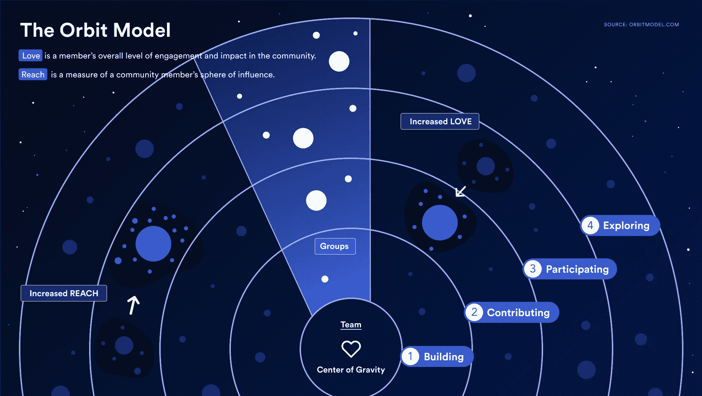
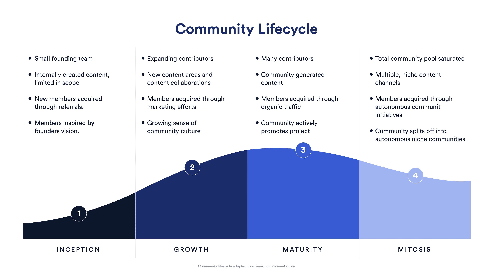
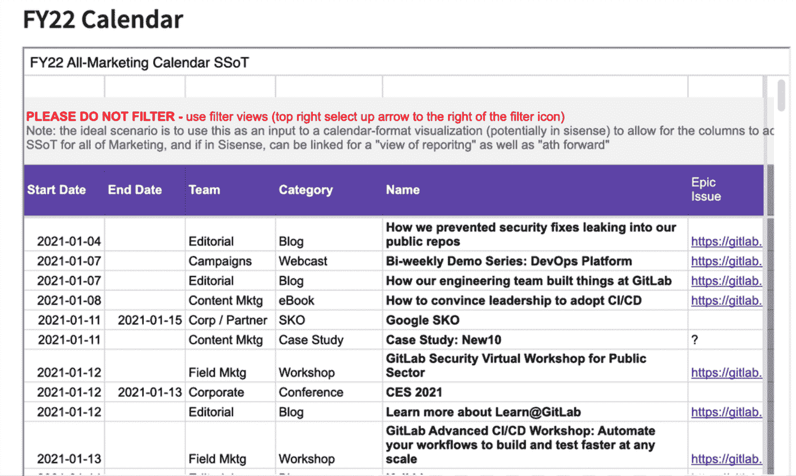

# 构建和扩展 Web3 开发者社区

> 原文：<https://blog.chain.link/building-and-scaling-a-web3-developer-community/>

如果你受到启发 [建立一个 Web3 创业公司](https://blog.chain.link/why-launch-a-crypto-startup/) ，你可能已经很清楚开发者社区在协议成功中扮演的重要角色。事实上，许多知名创始人在比特币和以太坊等早期密码社区中担任了多年的实际开发角色后，开始了自己的项目。即使在今天，开发人员社区仍然是大多数项目的支柱，如果没有一个健康的开发人员生态系统，这些项目就不可能发展。这就是为什么 Web3 创始人建立一个积极参与的开发者社区至关重要。即使你不认为你的项目特别需要一个开发者生态系统，许多用于构建开发者社区的相同策略也可以用于构建其他类型的社区。

[https://www.youtube.com/embed/OeRxIvr5EPM?feature=oembed](https://www.youtube.com/embed/OeRxIvr5EPM?feature=oembed)

**以下是我们将涉及内容的概述:**

*   开发者社区由什么组成。
*   为什么 Web3 初创公司需要开发者社区。
*   如何在初始阶段发展一个开发者社区？

## **什么是开发者社区？**

一般来说，开发人员社区是一群开发人员，他们基于对特定项目或技术生态系统的热情而相互合作，并希望看到它蓬勃发展。这种参与不仅仅是在 Stack Overflow 这样的平台上回答技术问题，或者在 Github 上提交 pull 请求。这些社区通常聚集在一起，因为他们分享项目创始人的愿景，并希望看到项目在更广泛的开发人员社区中作为标准解决方案被采用。

在 Web3 中，一个典型的例子是以太坊开发者社区。这个社区是围绕一个平台的共同愿景发展起来的，这个平台将允许开发人员构建真正去中心化的“无信任”应用程序。这反过来又催生了以太坊虚拟机(EVM)的采用，作为一个跨越 dApps 繁荣生态系统的单一共享标准。开发人员为这个新标准做出了贡献，因为它为他们自己的项目提供了关键的基础设施。

然而，开发者社区并不是同质的。根据动机和参与程度，他们可以分为不同的层次。Orbit 模型最好地概括了这一点，它是一个跟踪开发者社区发展的开源框架。

根据模型的创建者乔希·迪耶拉克的说法，开发人员分成四个不同等级的轨道。这些可以总结如下:

*   **轨道 4**——“观察者”主要在那里探索和四处看看。
*   **Orbit 3**——“用户”已经与一个项目有了某种初步的互动，但仍然试图找出如何成功地使用它。
*   **轨道 2**——“粉丝”被一个项目的技术启用，对它充满热情，并为它的发展做出贡献。
*   **轨道 1**——“大使”们成功地在一个项目上建立了一些东西，并成为一个社区的主要代言人。

在这些轨道中，有不同类型的开发者，他们有不同的动机和影响范围。一种类型可能是探索者，希望了解更多有趣的新技术，但不确定该如何利用它。另一种类型可能是有经验的开发人员，他们正在寻找合适的技术来解决特定的问题。因此，开源开发者社区通常由具有不同动机和专业背景的人组成。

## **为什么要建立开发者社区？**

虽然你的项目可能没有以太坊那样雄心勃勃，但你仍然可以从建立开发者社区中受益。事实上，不仅仅是第一层区块链需要开发者社区 Web3 生态系统中的许多参与者都依赖开发者社区来扩展他们的项目。这包括集中的平台，如交易所、市场和基础设施提供商；分散式组织，如第 2 层扩展解决方案；以及 [DeFi 应用](https://chain.link/education/defi) 和协议。特别是 DeFi 项目的成功部分取决于他们增加开发者活动的能力，这导致了更多的 dApp 和 wallet 集成。但是除了集成之外，投资开发者社区建设还有更多原因。

例如，一个健康的开发者社区还可以帮助:

*   对项目的效用提供早期反馈。
*   发现被忽视的安全和性能问题。
*   在邻近社区建立知名度，并引入新成员。
*   参与分散项目的治理。
*   刺激 [直接和间接网络效应](https://blog.chain.link/network-effects-web3/) 。

尽管拥有一个积极参与的开发者社区有着明显的好处，但是并没有一个明确的剧本来发展这样一个社区。这样的剧本很难写，因为每个社区都有不同的愿景和使命。根据创始团队的独特特征和产品的性质，社区建设策略往往会有所不同。

## **如何建立开发者社区**

虽然剧本可能还不存在，但是 Web3 项目已经使用了一些常用的策略来发展繁荣的开发者社区。

这些战术包括:

1.  逐步迭代，适应社区规模。
2.  记录社区的愿景和目的。
3.  设计社区体验。
4.  制定传播和内容策略。
5.  吸引早期会员，培养一对一互动。T3】

### 逐步迭代，适应社区规模

在某些方面，建立一个社区很像精益软件开发。根据精益方法，创业团队以渐进、迭代的过程构建软件，从最小的功能集开始。然后，在开发人员承诺构建下一组特性之前，对软件进行测试、部署，并衡量其成功与否。

这种方法确保初创公司只将资源分配给最重要的社区建设工作。创始团队从一些基本的策略开始，只有当他们最初的努力被证明有效，并且他们有足够的资源来尝试新的计划时，他们才会转向更高级的策略。

这种方法也得到了更多关于在线社区建设的传统文献的支持。例如，2009 年的研究论文“”发现社区建设策略的变化“取决于在线社区正在经历的生命周期阶段”。

社区建设顾问将这项研究综合成一个“在线社区生命周期”，通常由四个主要阶段组成。

<figcaption id="caption-attachment-4131" class="wp-caption-text">Communities grow in phases and have different requirements depending on their phase. [Source](https://invisioncommunity.com/news/community-management/master-your-communitys-lifecycle-to-increase-your-growth-r1139/).</figcaption>

这个概念对任何在线社区都是高度通用的——值得将其与专门面向开发者社区的 Orbit 模型进行比较。

早期创业公司的目标是首先获得启动和成长。创始人将他们的策略与他们公司的规模相匹配是至关重要的，因为不合时宜的策略可能会成为一种排斥力量，将开发人员拒之门外。

例如，黑客马拉松是在错误阶段应用正确策略的常见案例。黑客马拉松经常被认为是推动 Web3 开发人员采用的必备项目，这是事实，但许多创始人没有意识到黑客马拉松只在一定规模内有效，而且是难以置信的资源密集型项目。有时，在项目被早期支持者的紧密圈子适当地记录或测试之前，他们就尝试了。许多黑客马拉松也苦于参与度低。这就是为什么一些开发者关系专家认为，只有当团队确信他们能够吸引至少数百名参与者时，才应该考虑黑客马拉松。

### 定义开发者社区的目的

如果你已经决定开始一个 Web3 项目，你可能已经写了一份白皮书，并定义了你的项目的更广泛的使命和愿景。你需要这些内容展示给投资者，教育早期的支持者。

为了建立一个开发者社区，你需要考虑你的使命如何与潜在社区成员的目标相一致。

问自己这样的问题:

 ***   为什么开发商要相信你的项目？从某种意义上来说，你是在“推销”开发者，但这个推销需要与你对投资人的推销不同。
*   你希望从开发者社区中获得什么价值？您希望他们构建集成吗？为核心协议做贡献？用你的技术来创造其他东西，宣传你的产品？
*   你将为你的开发者社区提供什么价值？你希望开发者主要因为你的技术开启了以前无法实现的用例而获得价值，还是你的社区可以提供其他增值？这些增值可能包括教育和宣传，或物质激励，如奖励、商品和赠款。
*   什么样的开发者会被你的项目吸引，为什么？  你是只想吸引已经处于垂直领域的开发者，比如 DeFi 或 GameFi，还是也欢迎外来者？你的目标是 Web3 的原生用户，还是对来自 Web2 的开发者开放？
*   开发人员应该从彼此的交往中获得什么价值？
    你希望更有经验的成员帮助新成员克服技术挑战或在共享项目上合作，还是他们可能有不同的兴趣？
*   社区应该如何塑造你的项目的发展？
    您是否需要一个流程来从您的社区获取见解，并确保与您的团队成员分享这些见解？你想向你的社区透露多少关于你的项目的信息？你想在你的路线图上完全透明，还是有一些计划应该留在创始团队中？
*   你所在社区的文化和风气应该是什么样的？是什么让你的社区与其他开发者社区截然不同？让你与众不同的核心价值观是什么？

这些问题很多都很难回答，但是 Gitlab 的 [社区学习途径](https://about.gitlab.com/handbook/marketing/community-relations/community-pathway/) 是一个很好的灵感来源。该资源旨在让内部 Gitlab 团队成员快速了解其各种社区计划。Gitlab 是一家以开发人员为中心的企业公司的罕见例子，它发布内部文档供任何人查看。当然，Gitlab 是一个成熟的 Web2 SaaS 解决方案，拥有数十亿美元的市值，这样全面的计划只有在更大的规模下才有可能实现。然而，该公司的文档提供了一个如何构建内部消息传递和制定社区目标的好例子。

### 设计你的社区体验的第一次迭代

要建立社区，你需要创建某种形式的在线论坛。 不和尤其已经成为 Web3 社区建设的默认选择。与 Telegram 等其他平台不同，Discord 使共享和讨论代码变得很容易，这是开发人员在开始构建时需要的功能。选择平台后，你应该花时间研究你希望如何构建渠道，以及你希望人们如何加入。

#### 记住你的前十个成员，构建你的社区体验

许多空间一开始就有太多的渠道，这会让新来者不知所措。相反，围绕新兴社区中发生的典型对话来组织你的类别。

开发者之间的此类对话包括:

*   做个人介绍。
*   询问有关项目的问题。
*   解释他们正在做什么，面临什么挑战。
*   展示他们迄今为止的成果。
*   分享关于更广泛的技术生态系统的观点和内容。
*   在核心社区焦点之外分享迷因、八卦或其他兴趣。

这些讨论的确切基调和内容将由项目的总体目标和文化决定，这就是为什么首先考虑这一方面很重要。

#### **减少不必要的讨论**

在开发者社区中要避免的一种讨论是对资产价格和市场方向的猜测。这里有一些潜在的担忧，一个是这样的讨论可能会非常分散注意力，并失去控制。如果出现这种讨论，参与者应该被引导到更合适的渠道，如社区经营的电报组。

#### **逐步开放社区**

在早期阶段，开发者社区的质量尤为重要。重点应该是招募和培养更有可能积极参与的成员。为此，创始人可以选择的门控方式如:

 ***   受邀才能参加
    许多开发者社区通常以受邀才能参加的形式开始，因为他们是有限测试项目的一部分，对早期产品发布进行路测。
*   其他项目要求人们申请加入社区，并根据他们在申请表上提供的答案来审查成员。

这些策略可能会吓退不经意的新来者，但它们也会增强一种排外感。他们也有助于确保你的前 10 名成员对你的项目真正感兴趣。

#### 转到自助注册

下一步是让社区公开，允许任何人注册。当移动到这个阶段时，许多组织仍然在注册过程中包括多种检查和平衡，例如收集关于用户的基本信息，并确保他们同意社区准则。请注意，Web3 社区特别强调匿名。如果你要收集信息，它应该以开发者的兴趣而不是他们的身份为中心，并且应该符合你的隐私政策。

#### 分配社区所有权

最后，你需要决定你的组织中谁将“拥有”这个社区。在更成熟的创业公司中，这项任务由社区经理或开发者关系多面手来处理，但在非常早期的阶段，它往往会落到创始团队的成员身上。虽然你团队中的每个人最初都可能为你的社区做出贡献，但这最终应该是一个人的责任。这意味着对社区的成败负责，并跟踪其进展。

### 找到并培养你的前 10 名成员

在讨论 [如何构建一个人们想要的 Web3 产品的时候，](https://blog.chain.link/a-guide-to-building-web3-products/) 我们谈到了“MVC”或“最小可行社区”这个更广泛的概念，以及如何构建一个。

给创始人的核心建议是:

*   利用现有的网络—技术型创始人经常参与多个项目，拥有更广泛的开发人员网络。他们可以利用这些联系来识别与他们的项目使命一致的社区意识开发者。
*   **加入现有的 Web3 开发者社区**—社区通常由互惠和共同的机会驱动。技术创始人可以通过为社区和相关项目的开发增加价值来建立声誉和吸引社区成员。

严峻的事实是这些方法需要时间。当其他类型的 Web3 社区似乎在一夜之间爆发时，这个事实可能很难接受，通常是由名人的推文或市场的突然变化引发的。但是在寻找你的前 10 名成员时，耐心是必不可少的，因为他们的贡献将引导你的开发者社区的方向，并将新成员拉向你的重心。

### 制定传播和内容战略

内容是任何社区建设计划的基石，因为它有助于提高对项目的认识，并就其核心愿景和路线图教育开发人员。

#### 社区建设者和营销人员有不同的目标

在传统的内容营销中，内容被视为“漏斗顶端”的活动，推动消费者沿着漏斗向下成为“线索”,最终“转化”为付费客户。虽然技术内容可以被营销人员和社区建设人员等利用，但它在社区建设策略中有不同的用途。

#### 使用内容推动社区参与

在 Orbit 模型和 Web3 的上下文中，没有“领导”的概念，相反，有一些“活动”表明开发人员正被拉近重心。

内容是把开发人员拉到项目轨道最外围的东西，并把他们留在那里。早期技术内容的例子包括高级文档、入门指南、教程和用例灵感。

#### 创建内容计划

早期创业公司创作内容的能力有限，因此应该仔细规划内容创作。许多团队从一个简单的涵盖未来三个月的计划开始，然后随着内容策略的成熟扩展该计划。出版节奏反映了给定当前资源的现实可能性。

这可以是每月一篇，每两周一篇，或者每周一篇——在发布频率方面，没有一个放之四海而皆准的方法。主要目标是有一个可预测的时间表和主题，以便开发人员知道接下来会发生什么。这项工作应该得到社交媒体日历的支持，以构建内容推广。

有关综合技术内容营销策略的示例，请参见 Gitlab 的营销日历。

<figcaption id="caption-attachment-4132" class="wp-caption-text">An example of GitLab’s marketing calendar which aligns content with other marketing activities. [Source](https://about.gitlab.com/handbook/marketing/).</figcaption>

同样，Gitlab 的营销日程表远比早期创业公司复杂，它旨在调整营销计划，而不是推动社区建设。尽管如此，拥有一个如何构建内容计划的模板还是很有帮助的。

### 培养参与度，培养一对一的联系

即使是在小型、排外的社区中，参与度也不一定会自动实现。在早期阶段，需要点燃和煽动讨论的火焰。

#### **播种并引发讨论**

在 Web2 的世界中，许多策略已经发展到应对这一挑战。在他的书 [社区大师](https://varunmayya.gumroad.com/l/communitymasters) 中，创始人瓦鲁姆玛雅提出了一种“假装直到你成功”的方法，创始人直接接触他们的高级用户，并要求他们发布文章和资源。他承认，他经常不得不“为他们起草帖子，让他们的生活更轻松”。

当应用于开发人员时，这种方法非常危险，因为他们很容易发现不真实和不可告人的动机。但是你可以要求开发人员重复你在公共论坛上私下进行的一对一谈话中的问题或讨论。

另一种方法是围绕你的内容引发讨论。发布新内容后，您可以将其发布到社区中。通过从内容片段中摘录一段，并就该主题提出开放式问题，可以进一步激发讨论。例如，如果一个内容是关于最佳实践的，你可以问这样的问题“你已经在做了吗？”或者“你还有什么我没想到的补充吗？”即使是基本的技术内容，比如教程，你也可以问这样的问题“这容易理解吗？”或者“这如何改进？”

#### 发起一对一的对话

初始阶段的一个好处是你可以直接吸引社区成员。你可以主动提出与他们通话，讨论他们面临的挑战以及他们想要达到的目标。这也将使您能够建立可持续的关系，并确定早期开发人员社区倡导者。

Web3 创始人 Max Goodman 提供了一个很好的面对面方法的例子。他的 Gyde 项目旨在让那些传统上被排除在 Web3 之外的人加入进来。在礼宾官方博客 附近的 [上接受采访时，他主张“先亲自建立社区”，并以一对一的教育会议的方式让成员上船。这种方法也有助于他迅速与社区成员建立牢固的联系。](https://medium.com/nearprotocol/near-community-in-focus-web3-vs-web2-communities-e807990135c)

#### 小心接近开发者

一对一的方法并不总是对开发者有效。许多开发人员更喜欢自助式方法，并且经常避开在线会议。这并不是说开发人员会回避所有让他们亲自参与的尝试。一些开发人员甚至可能会感谢这种关注——前提是创始人会说他们的语言，并对授权他们实现目标表现出真正的兴趣。当创始人明确表示不期待任何具体回报，也不要求会后采取任何“后续步骤”时，他们也会放松下来。

### 通过开发者激励发展您的社区

大多数 Web3 项目使用激励措施来帮助发展他们的社区。例如，这些奖励可能采取竞赛或奖励的形式，作为在社交媒体上开展特定活动的回报。但是，尽管这些策略可能会夸大粉丝数量和喜欢等虚荣指标，但它们通常不会带来持续的社区增长。

类似地，对 Web3 开发者的奖励和财务激励也很容易被利用，必须谨慎对待。此外，开发人员激励计划往往更加劳动密集型，因为它们涉及技术任务。

创业公司需要预留足够的资源来编写任务说明书，判断任务是否已经正确执行。幸运的是，有些工作可以外包。

刺激开发者社区发展的常见激励措施包括:

*   **Bug 赏金** Bug 赏金项目激励开发者在项目中寻找安全漏洞。这些程序通常可以外包给第三方提供商，如[hacken proof](https://hackenproof.com/resources/business_guide_how_to_choose_web3_bug_bounty_solution)和[immune fi](https://immunefi.com/)。 
*   竞赛
    Web3 项目还可以举办竞赛，并为找到特定问题的优秀解决方案的开发人员提供奖励。这种策略在数据科学社区非常流行，像[ka ggle](https://www.kaggle.com/competitions)(web 2)和[numeri](https://numer.ai/)【web 3】这样的平台为解决特定的数据科学挑战提供奖励。 
*   **开发者资助**
    一旦早期创业公司获得了某种形式的 [种子资金](https://blog.chain.link/early-stage-web3-startup-funding-an-introduction/) ，他们就有能力提供更大的激励，比如开发者资助。赠款有助于刺激初创公司开发者社区的活动，因为成功的申请人将不可避免地向现有社区成员寻求指导。T12】
*   **治理** 最后，最强有力的激励是治理 Web3 最大的区别之一。随着 Web3 项目的发展，它通常开始去中心化，管理最终以 DAO 的形式移交给更广泛的社区。随着他们越来越投入，早期的贡献者有机会在指导项目的方向上发挥领导作用。这就是为什么对于创始人来说，让他们的开发者社区参与某些战略和技术决策是很重要的，即使他们仍然是中央集权的。

## 开发人员社区需要时间构建，但会带来高额回报

发展开发者社区是创始人面临的最大挑战之一。这是因为有太多的因素超出了他们的控制。这种挑战类似于进入一个新市场——这是一个未知的领域，存在许多隐藏的风险。但是，当创始人投资研究和记录他们的社区战略时，成功的可能性更大。这种准备将使他们能够提前计划，并为他们的早期成员精心策划一次有益的经历。一旦这些社区获得了动力，大部分的调节和管理工作可以留给社区的核心圈子。一直是活跃的社区成员的创始人直观地理解这个过程。有时候，建立一个成功的开发者社区的第一步是你自己参与其中。

## 适用于带链环的启动

[chain link](https://chainlinklabs.com/startup?utm_medium=referral&utm_source=chainlink-blog&utm_content=building-and-scaling-a-web3-developer-community)初创公司是专为支持 Web3 创始人而建立的，为他们提供世界一流的资源，帮助他们踏上创业之旅。该项目帮助初创公司从最初的构思和验证到建立一个工作系统和培养社区。

正在开发独特而有趣的产品、服务或供应品的 Web3 创始团队受邀[申请](https://chainlinklabs.com/startup?utm_medium=referral&utm_source=chainlink-blog&utm_content=building-and-scaling-a-web3-developer-community)。为了将更多的 Web3 启动资源直接发送到你的收件箱，[注册 Chainlink 简讯](https://pages.chain.link/subscribe?utm_medium=referral&utm_source=chainlink-blog&utm_content=building-and-scaling-a-web3-developer-community)。****