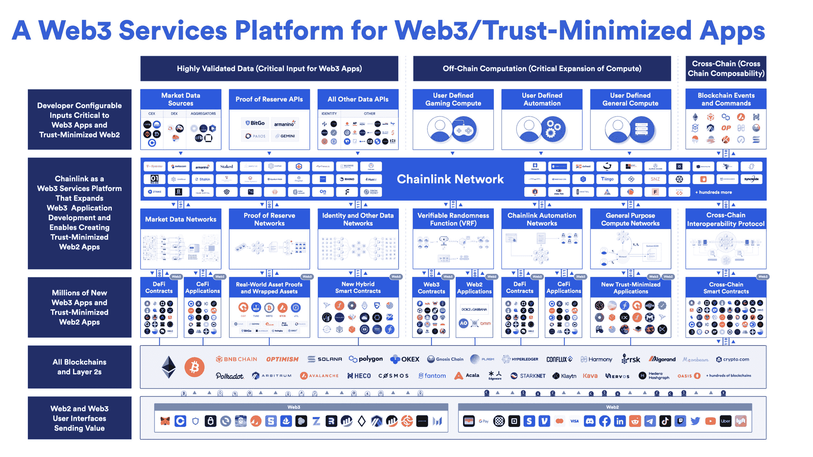
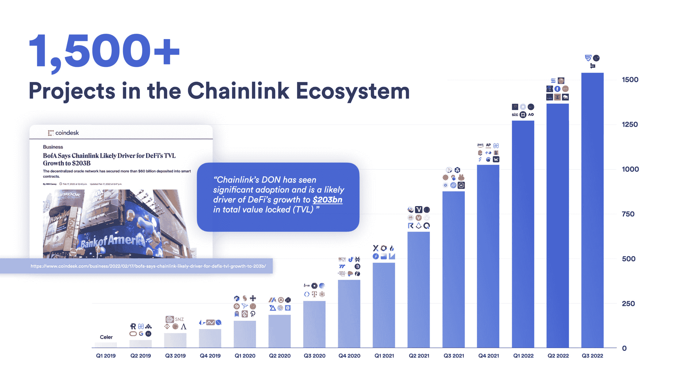

# 引入 Chainlink BUILD:通过跨生态系统激励加速 dApp 增长

> 原文：<https://blog.chain.link/chainlink-build-program/>

作为推出[chain link Economics 2.0](https://chain.link/economics)的一部分，我们很高兴地宣布 Chainlink Labs 的 **Chainlink BUILD** 计划启动。Chainlink BUILD 旨在通过提供更多的 Chainlink 服务和技术支持来加速 Chainlink 生态系统中早期和既定项目的增长，以换取网络费用承诺和对 Chainlink 服务提供商(如 stakers)的其他激励。这种社区间经济激励的一致性有助于促进两个生态系统的共同长期成功。

为了 kickstart Chainlink BUILD，许多 Chainlink 生态系统参与者——[Space and Time](https://www.spaceandtime.io/blog/chainlink-build-program)、 [Truflation](https://www.truflation.com/blog/truflation-joins-chainlink-build-program) 和[bitsCrunch](https://bitscrunch.com/blogs/bitscrunch-x-chainlink)——已经确认参与该计划。构建参与者将把他们总令牌供应量的多个百分点投入到构建计划中，以加速他们的生态系统增长并推动 dApp 创新。

Chainlink BUILD 不仅使较新的项目(通常在其预收入阶段)能够在获得广泛使用和采用之前集成 Chainlink 服务，而且还有助于加速现有 Chainlink 生态系统项目的增长，这些项目已经拥有越来越多的用户群。来自 Chainlink BUILD 的支持允许 Web3 开发者从一开始就构建高度安全并支持更高级用例的 dApps，这反过来增加了他们产生更大和更可持续的用户费用流的机会，从而有助于支持 Chainlink 网络。随着 Chainlink 项目扩大其运营，壮大其团队，并开始产生可观的收入，dApps 可能会过渡到与 chain link 生态系统中的服务提供商进行长期收入共享的模式。

BUILD 还可以帮助参与项目部署定制的数据馈送平台，优先访问新 Chainlink 服务的 alpha 和 beta 版本，增强他们所依赖的 oracle 网络的加密经济安全性，获得专家服务提供商的技术支持，等等。

鉴于 Chainlink 拥有跨 Web2 和 Web3 的快速扩展的用户生态系统、充满活力的构建者和主题专家社区，以及支持各种 [混合智能合同](https://blog.chain.link/hybrid-smart-contracts-explained/) 使用案例的通用的、不受区块链限制的技术堆栈，因此 chain link 在推动这些项目和未来参与者取得成功方面具有独特的优势。Chainlink 还支持各种现有的 oracle 服务，用于安全高效的 dApp 开发，以及生态系统资源，用于创建推动 Web3 创新的定制 oracle 解决方案。

[Apply to Chainlink BUILD](https://docs.google.com/forms/d/e/1FAIpQLSciJKkVo28bN6RMsQa0Am8LpTwhOgN5gIeWZZ8rflUDzOHN-g/viewform)

<figcaption id="caption-attachment-4637" class="wp-caption-text">The Chainlink Network empowers Web3 innovation by enabling hybrid smart contracts supported by increasingly advanced oracle services.</figcaption>

## 帮助 dApps 最大化“链环效应”

Chainlink BUILD(以前称为合作伙伴成长计划)使项目能够充分利用“Chainlink 效应”，即加入 Chainlink 生态系统的项目越多地利用关键的 oracle 服务并参与 Chainlink 社区，就越能加速项目的采用。链环效应有助于在几个区块链生态系统中增加许多领先 dApps 的锁定总价值(TVL)。

集成 Chainlink 的开发人员无需花费宝贵的时间和资源从零开始构建 oracle 基础设施，而是能够加快其上市时间，并在内部专注于其应用的核心业务逻辑。特别是对于 [DeFi 应用](https://chain.link/education/defi) 而言，市场数据的链式集成有助于增加用户对 dApp 安全性和可靠性的保证。此外，更广泛的 Chainlink 社区通常是帮助协议变得更广为人知和广泛采用的主要附加值。

例如， [Aave](https://aave.com) 在其预发布阶段就加入了 Chainlink 生态系统，并在整合[chain link Price Feeds](https://data.chain.link/)作为其 [分散借贷](https://blog.chain.link/decentralized-money-markets/) 协议的价格 oracle 解决方案时获得了技术支持。这种跨生态系统的合作使 Aave 在[mainnet launch](https://aave.substack.com/p/pop-the-champagne-aave-protocol-is)成功支持了 16 种加密资产，这在当时的 DeFi 中是一个创纪录的数字。Aave 能够将 oracle 开发工作转移到 Chainlink，并专注于新的创新功能和 DeFi 原语，如快速贷款、稳定借款利率和 aTokens。

> *“可组合性的一部分是你不必自己构建一切。链环是整个可组合性概念的一部分。这至关重要。”— Stani Kulechov，Aave 创始人兼首席执行官。T3】*

chain link 社区也通过使用其 dApp 和对 Web3 中其他潜在用户的口碑营销，在支持 Aave 方面发挥了重要作用。Aave 已经发展成为 TVL 最大的借贷市场协议，部署在七个不同的区块链网络中，全部由 Chainlink Price Feeds 提供支持。Aave 只是 1，500 多个项目中的一个例子，这些项目加入了 Chainlink 生态系统，并因此促进了它们的采用。

<figcaption id="caption-attachment-4602" class="wp-caption-text">As of Q3 2022, there are now over 1,500 projects in the Chainlink ecosystem.</figcaption>

Chainlink BUILD 是一个旨在通过调整跨生态系统的激励措施来增强 dApps 的 Chainlink 效应的计划。参与建设的项目承诺支付网络费用，并向链节社区中的服务提供商提供激励，如链节利益相关者，他们为项目提供关键利益和服务。向 Chainlink 生态系统参与者提供的经济激励有助于鼓励他们参与 dApp 的生态系统，例如通过参与项目的治理流程，在各自的标记机制上标记本地令牌，以及成为其社区的口头支持成员。

作为加入 Chainlink BUILD 计划的回报，参与项目可以获得以下一些好处(视适用性而定):

 ***   **优先访问:** 在 mainnet 正式发布之前，访问 alpha 和 beta 版本下精选的 Chainlink 服务，以加速先进的 dApp 功能的开发，这些功能通过先进的 oracle 解决方案得以实现。
*   **增强安全性:** 通过向链环桩提供激励，增强由链环桩支持的链环服务的安全性。在 Staking v0.1 中，这从以太坊上的 ETH/USD 开始，但计划在未来扩展到更多的提要。
*   **高级技术支持:** 从 Chainlink 生态系统中的服务提供商处获得有关 oracle 解决方案的直接支持。这包括专门致电生态系统专家，他们可以帮助确定新产品和工程要求。
*   **定制数据馈送:** 访问定制数据馈送平台，这些平台满足独特的用例要求，并由相同的高质量 Chainlink 节点运营商提供支持，这些运营商已经通过价格馈送帮助确保了数百亿美元的价值。
*   **更高质量的数据:** 从众多行业领先的数据提供商那里获得帮助，这些数据提供商可以帮助实现数据来源的多样化和自定义数据馈送平台的防篡改功能，这些数据馈送平台将来可能会包含其他形式的元数据。
*   **更强大的数据馈送监控和维护:** 通过对 don 操作的维护和监控支持，确保定制数据馈送 don 的最大可靠性。这可能包括开发新的基础设施，以满足独特的用户需求。

最终，BUILD 的优势有助于进一步开发 dApps，为世界各地的人们创造真正的增值服务。随着 dApps 变得越来越成功，它们增加了产生更多用户费用的能力，这有助于支持 Chainlink 服务的消费和长期经济可行性。这是一种双向价值，支持两个生态系统中的可持续经济。

Chainlink BUILD 希望支持类别获奖者、改变游戏规则的 Web3 技术背后的开发团队，以及为 Chainlink 生态系统提供独特解决方案或贡献的项目。Chainlink 生态系统中有 1，500 多个项目，价值超过 200 亿美元，Chainlink 只是触及了 oracle 技术和 Chainlink 生态系统如何帮助项目成功构建一个更加信任最小化的世界的皮毛。如果您是一个早期或已建立的项目，并希望最大限度地发挥 Chainlink 的优势，请使用此 [类型](https://docs.google.com/forms/d/e/1FAIpQLSciJKkVo28bN6RMsQa0Am8LpTwhOgN5gIeWZZ8rflUDzOHN-g/viewform) 加入构建计划。

Chainlink BUILD 是 Chainlink Economics 2.0 大范围推广中的一个关键项目，Chainlink Economics 2.0 是一系列项目，旨在提高数据安全性和实用性，同时降低 oracle 服务的运营成本，增加支付给 Chainlink 服务提供商的用户费用，并使利益相关者等更广泛的服务提供商能够参与到 chain link 生态系统中。要了解更多关于 Chainlink Economics 2.0 和 link 作为生产性资产的演变，请访问[【chain.link/economics】](https://chain.link/economics)。

<figcaption id="caption-attachment-4600" class="wp-caption-text">Chainlink Economics 2.0 is a new era of sustainable growth, cryptoeconomic security, and deeper value capture in the Chainlink Network.</figcaption>

要了解更多关于 Chainlink 的信息，请访问 [Chainlink 网站](https://chain.link/) ，订阅 [Chainlink 简讯](https://pages.chain.link/subscribe?utm_medium=referral&utm_source=chainlink-blog&utm_content=build) ，关注官方[Chainlink Twitter](https://twitter.com/chainlink)了解最新 chain link 新闻和公告。

—

*免责声明:本文仅供参考，包含关于未来的陈述，包括预期的计划和功能、开发以及这些计划和功能的推出时间表。这些陈述只是预测，反映了当前对未来事件的信念和期望；它们基于假设，随时都有风险、不确定性和变化，包括在不通知的情况下终止任何已宣布的计划或功能。虽然我们相信这些陈述是基于合理的假设，但我们不能保证任何预期的计划或功能将按规定实施，也不能保证实际结果不会与这些陈述有重大差异。所有声明仅在首次发布之日有效。由于用户反馈或后来的事件，这篇文章中的陈述也可能不反映未来的发展，我们可能不会更新这篇文章作为回应。T3】***