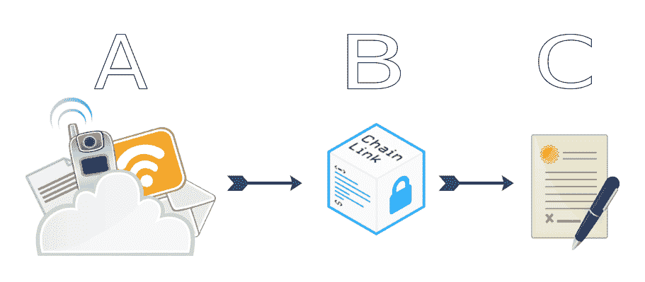
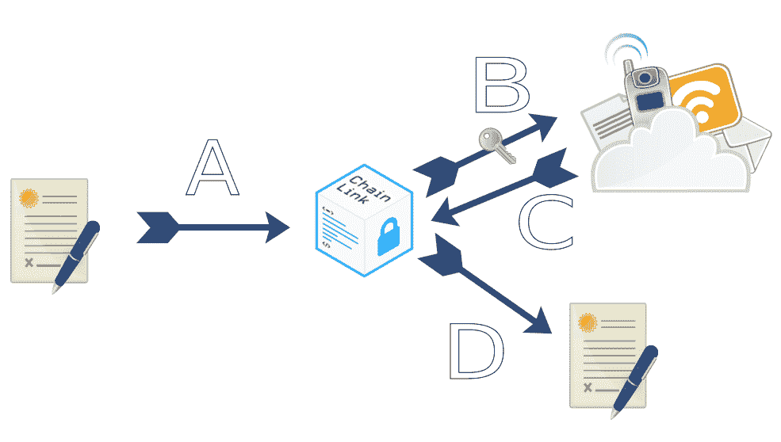
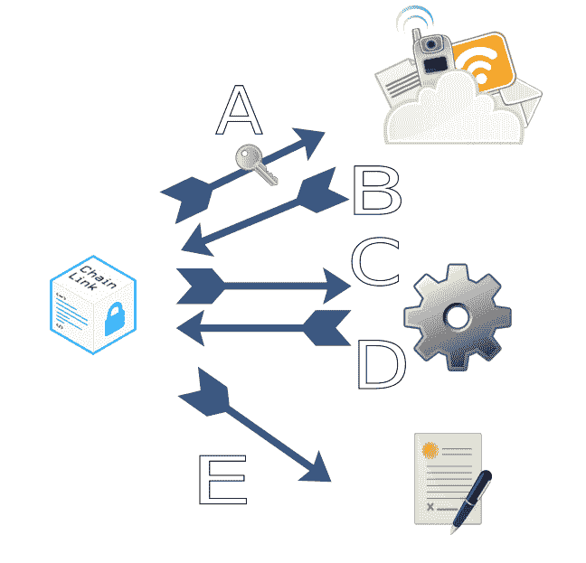
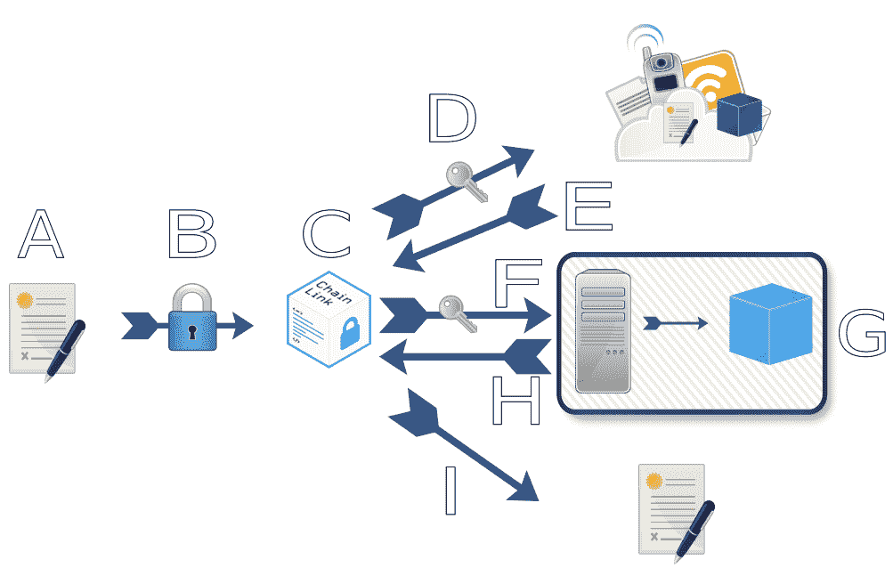

# Chainlink 外部适配器说明

> 原文：<https://blog.chain.link/chainlink-external-adapters-explained/>

关于区块链技术，oracle 的常用定义是从互联网上检索数据，并将其提供给 T2 的智能合同 T3。

Chainlink 以分散的方式提供了这样的功能，但它也通过使用外部适配器来产生输出，从而增加了一些额外的功能。输出可以传递到 Chainlink 节点内的其他外部适配器，甚至可以使 Chainlink 能够利用驻留在公司网络中的私有资源和区块链。在整篇文章中，我将这样称呼这个虚构的公司，而不使用具体的名称。

此图表的简化工作流程如下:

*A)为合同选择链环节点，称为作业*

*B)节点向智能合同返回结果*

在本文的其余部分，我将主要关注由箭头表示的流程，但是我将在需要解释的地方包括工作流中的实体。

* * *

如果我们将上述工作流的视角改变为节点本身的视角，我们可以看到流程稍微复杂一些，但是概念保持不变。

要解释每个进程在做什么:

*A)选择链环节点进行分配*

*B)节点使用存储在外部适配器中的自己的凭证*

*C)数据被返回到节点*

*D)结果被提供给区块链上的智能合约*

以这种方式思考数据检索过程可以让我们从节点本身的角度更近距离地观察。如果你看我的[节点架构视频](https://youtu.be/_FOB2dL4EQQ)，你会看到节点的碎片可以从 Chainlink 核心软件中分离出来。特别是在这个例子中，我们讨论的是外部适配器。

上图中的流程 B 必须利用外部适配器来管理该数据源所需的凭证。节点需要一个外部适配器，用于每个需要节点操作员凭证的资源，以便检索数据。每个节点适配器数量的唯一限制是基于一次处理大量请求的硬件能力。

* * *

为了进一步了解外部适配器的功能，我们将引入游程的概念。运行是将适配器的结果发送到另一个外部适配器进行进一步处理的一种方式，称为运行结果。这可以根据需要持续多次，因为外部适配器在设计上是面向服务的，并且与 ChainLink 核心软件分离。

将运行结果数据发送到另一个外部适配器的基本工作流程是:

*A)节点使用其存储在外部适配器中的凭证连接到数据提供者*

*B)从源中检索数据，并创建运行结果*

*C)另一个外部适配器拾取产生的数据并处理它，这实际上可以重复几次(链接适配器)*

*D)该处理的结果被返回给节点软件*

*E)最终结果返回给区块链上的智能合约*

* * *

最后，这个图包含了我们所学的关于适配器和运行的一切，并为内部流程提供了一个真实的用例。

此类分配的工作流程是:

*A)用户创建智能合同*

*B)当选择节点时，他们确保手动选择时包括他们的节点*

*C)被选择的节点选择分配*

*D)节点使用存储的凭证连接到外部资源*

*E)将检索到的数据返回到节点*

*F)结果数据被传递到另一个外部适配器，该适配器有自己存储的凭证*

使用在过程 E 中返回的数据，可以发生任何数量的内部过程，包括登录到私人区块链、离线支付交易等。

来自快照的任何结果被返回到节点

*I)最终结果被返回给公共区块链上的智能合约*

在这个图中，有一些东西与前面的例子不同。智能合约创建者可以通过按 ID 列出节点来指定哪些节点用于分配。

让我们具体看看标记为 g 的实体。在这里获取数据是可能的，因为在我们虚构的公司的节点上运行的另一个外部适配器能够将“运行结果”数据传递给它们的内部 API。请记住，由于外部适配器与 Chainlink 节点是分离的，因此它们的功能实际上是无限的。只要它们向智能合约创建者返回可接受的数据，并且该数据符合适配器模式，那么它就可以利用链式网络。

在这个场景中，节点的 API 调用(流程 F)将使用外部适配器提供的凭证触发封闭网络中发生的内部操作。关于如何处理 API 调用的所有逻辑(包括业务和编程)都在公司的控制之下。这也意味着智能合约的区块链速度不会成为任何内部流程的限制因素。一旦进行了调用，我们只需将答案以及实体 G 提供的任何数据返回给位于区块链上的智能合约。

* * *

对于这个场景，最初可能会有一些安全问题，所以现在让我们来讨论一下。首先，有人可能会问，是否会有任何节点出现并调用这个 API 来修改公司的私有区块链。答案是否定的，因为凭证将被存储在外部适配器中，该信息是不公开的。也不要求外部适配器是开源的。任何人都可以开发自己的外部适配器，并把它们留给自己，对于像这个场景中这样的安全 API，这是一个合理的理由。

然后还有一个问题是要确保公司运行的节点被选择用于该任务。这可以通过在设置 Chainlink 智能合约和指定节点 ID 时手动匹配节点来完成。

希望这有助于您在将 Chainlink 用作 oracle 服务时理解外部适配器的一些附加功能。欢迎在下面发表评论，如果您有任何问题，请通过 Chainlink Slack(我们有#Node_Information 频道)或 Chainlink [Gitter](https://gitter.im/smartcontractkit-chainlink/Lobby) 大厅联系我。