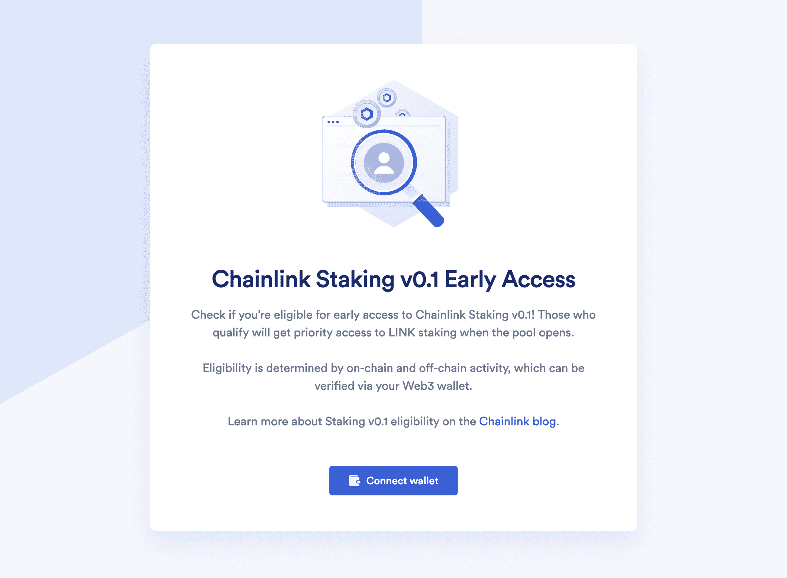
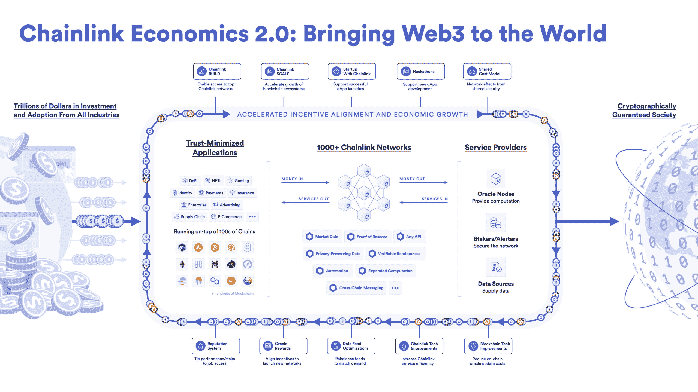

# 检查您的 Chainlink Staking v0.1 的早期访问资格

> 原文：<https://blog.chain.link/chainlink-staking-early-access-eligibility-app/>

[chain LINK Staking](https://blog.chain.link/chainlink-staking-roadmap/)是一种关键的加密经济安全机制，其中利益相关者在智能合约中提交链接令牌，以支持 oracle 服务的某些性能保证。新增的定位功能使 Chainlink 分散式 oracle networks (DONs)能够扩展以服务于更广泛的应用和更高价值的用例，涵盖 [Web3](https://chain.link/education/web3) 和传统 Web2 行业。

Staking 是围绕 Chainlink Economics 2.0 的更广泛计划中的一种机制，Chainlink Economics 2.0 是一系列计划，旨在提高数据安全性和实用性，同时降低 oracle 服务的运营成本，增加支付给 Chainlink 服务提供商的用户费用，并使 stakers 等更广泛的服务提供商能够参与 chain link 生态系统。要了解更多关于 Chainlink Economics 2.0 和 link 作为生产性资产的演变，请访问[【chain.link/economics】](https://chain.link/economics)。

作为实现 Chainlink Economics 2.0 的关键一步，我们很高兴地宣布，Chainlink Staking (v0.1)的初始测试版计划于 2022 年 12 月在以太坊主网上推出。

Early Access Eligibility 应用程序引导社区成员和生态系统参与者逐步了解他们是否有资格提前进入 v0.1 赌注库。社区成员可以通过 Web3 wallet 连接他们的地址来检查他们的资格，这将与一系列 allowlist 标准(如下所列)进行交叉引用。满足任何一项标准，地址所有者就有机会加入 v0.1 赌注库。

请注意，检查您的资格并不需要在线交易。它只需要通过你的 Web3 钱包签署一个外链消息，作为验证地址所有权的一种方式。

<figcaption id="caption-attachment-4682" class="wp-caption-text">Chainlink community members can use the Early Access Eligibility App to check their eligibility for potential priority access staking in Staking v0.1.</figcaption>

有资格提前进入的用户将优先进入 v0.1 赌注池，以先到先得的方式直接下注最多 7，000 LINK，直到达到赌注池上限。对于没有资格提前访问的机构群体成员，v0.1 staking pool 将在提前访问阶段结束后不久向公众开放，至少在开始阶段每个地址设置类似的 7，000 个链接限制。通过警报和其他功能来帮助保护网络，赌注者能够因其贡献而获得奖励。

除了社区成员配额之外，目前为 [Chainlink 数据馈送](https://data.chain.link/) 提供服务的每个 Chainlink 节点运营商将有机会单独入股多达 50，000 个链接，如果选择在 v0.1 期间入股，最少 1，000 个链接。最初，计划为 nop 保留 3M 链接池空间，这意味着在 v0.1 发布时最初将有 22M 链接可供社区成员入股。由于锁定系统的安全参数，v0.1 中的所有锁定器将锁定其锁定链接，直到后续版本的锁定 v0.2 为止。

Chainlink Staking v0.1 最初将限制在 25M 链环，计划随着时间的推移扩展到 75M 链环。鉴于到目前为止，2022 年 Chainlink 促成的交易价值(TVE)为 6.18 万亿美元，这是一个衡量在给定时间段内促成的交易的总货币价值的指标，因此有必要采用一种具有安全意识的方法来推广标桩。随着时间的推移，Chainlink Staking 最终将扩大规模，以支持 Chainlink 为 Web3 提供的安全保证，特别是随着 Chainlink 的发展，以确保更多服务的更多价值。

## 提前获取资格列表的标准

下表总结了 12 月在 mainnet 上发布 Chainlink Staking v0.1 时，社区成员获得早期访问资格的三个标准。社区成员只需满足一个标准就有资格提前访问。

| **标准** | **详情** |
| 霍德勒 | 属于任一类别的代币持有者:

1.  During the period from May 30th, 2019 to June 7th, 2022, at least 50% of the time held more than 7 links on the main network of Ethereum.
2.  At least 90% of the time from August 5, 2021 to June 7, 2022, he held more than 7 links on Ethereum Mainnet.

 |
| 建造者 | 从 2020 年秋季到 2022 年春季，参加任何 Chainlink 主办的黑客马拉松的团队。 |
| 教育家 | Chainlink 的拥护者、开发者专家以及其他在 Chainlink 会议上主持或发表过关于 Chainlink 网络或 Chainlink 生态系统的演讲的人。 |

请注意，在资格名单上提供了参与 v0.1 池的机会，但鉴于最初有上限的池规模，这并不能作为进入的保证。考虑到这一点，早期访问资格列表经过了优化，以针对对 Chainlink 有深入了解的长期活跃的生态系统参与者，因此，如果他们认为某项 oracle 服务未达到预定义的性能标准，则更有可能发出警报。

一旦早期访问期结束，任何链接令牌持有者都将有机会入股 v0.1，如果没有达到池上限，至少在一般访问阶段的开始阶段，每个地址有 7，000 个链接的上限。

## 早期准入标准背后的基本原理和方法

Staking v0.1 是第一个显式加密经济安全系统的量产版本，其中链节 don 由 staked LINK 支持。最初的 v0.1 版本通过引入分散式警报系统为未来的赌注实施奠定了基础，该系统是 [计划在未来补充的](https://blog.chain.link/chainlink-staking-roadmap/) 具有额外的功能，如用户付费奖励、更高级的信誉系统、全面的赌注削减机制和其他用于增强安全保证的机制。

为了建立一个安全的基础，在最初的 Staking v0.1 实施中采用了一种安全而实用的方法。这提供了时间，并提供了一双更强健的眼睛，用于在赌注系统扩展功能并开始确保更多馈送和服务之前识别任何不可预见的风险和机会。根据这种方法，最初的池大小被限制在 2500 万个链接令牌，作为参与者的安全意识措施。

由于该池有上限，因此创建了一个公平进入机制(即早期准入资格列表),以确定谁有优先机会来填补该池的有限空间。 我们已经采取了额外的措施来帮助确保允许列表包含来自 Chainlink 社区的各种参与者。这增加了在包括较小参与者在内的大量实体之间分配标桩池中的空间的可能性，这反过来将加强由分散警报系统提供的安全保证，以及随着时间的推移引入 Chainlink 标桩的未来功能 。

另一个同样重要的目标是确保以可信的中立、客观的方式收集数据。在定义标准时，将了解该协议并为 Chainlink 的成功做出贡献的活跃生态系统参与者包括在内至关重要，因为他们最有可能发出警报。

随着这些目标的提出，一个由数据科学家和主题专家组成的团队花了大量时间研究其他项目中使用的 allowlist 结构，以便从历史成功案例中学习，包括其他标桩系统和进入机制。链环锁定 v0.1 早期访问允许列表背后的基本原理和方法要点包括:

*   **早期访问资格列表大小:** 为了纳入广泛的社区成员和生态系统参与者，并帮助确保在 v0.1 早期访问阶段的高参与度，创建了一个包含大量地址的 allowlist 结构。在早期接入资格列表上总共有大约 250，000 个地址。由于不是每个符合条件的地址都会参与，并且参与者可能不会下注全部 7，000 个链接，因此 allowlist 经过了优化，以平衡可访问性和参与度。
*   **每个赌注者的限额:** 每个参与者 7，000 个链接的赌注上限，最低 1 个链接，旨在促进更大的包容性，并降低少数参与者在早期阶段控制池的风险。同时，桩帽设置得足够高，有助于确保产生足够的接合量。在 v0.1 中，早期访问阶段和至少一般访问阶段的开始阶段存在限制。
*   **链上考虑:** 我们执行了一套稳健的链上分析，以确定一个霍德勒标准，该标准包括那些在较长时间内表现出承诺的令牌持有者。为了捕捉长期和近期令牌持有者，创建了两个子标准。第一个子标准捕获从[chain LINK Mainnet](https://blog.chain.link/chainlink-connected-consensus-on-ethereum/)(2019 年 5 月 30 日)到[chain LINK Staking roadmap](https://blog.chain.link/chainlink-staking-roadmap/)(2022 年 6 月 7 日)发布之日持有 LINK 的持有者。第二个子标准捕获从[SmartCon # 1](https://smartcon.chain.link/2021)(2021 年 8 月 5 日)到 [Chainlink 标桩路线图](https://blog.chain.link/chainlink-staking-roadmap/)(2022 年 6 月 7 日)持有的令牌持有者。两个子标准都支持在时间段内使用基于以太坊的 dApp 协议中的链路。
*   **跨链考虑:** 为了考虑霍德勒标准中的跨链活动，例如将链接令牌桥接到非以太网，应用了较低的保持时间百分比以支持更大的包容性。具体来说，2019 年至 2022 年的长期标准期间设定了 50%的持有时间百分比，其中点(2020 年 12 月 2 日)正好在 [跨链活动](https://dune.com/eliasimos/Bridge-Away-(from-Ethereum)) 强劲势头开始的时候。对于 2021-2022 年的短期标准期，选择了 90%的百分比来包括最近更活跃的群体成员，但仍为潜在的边缘情况留有余地。
*   **链外活动注意事项:** 为了补充链上标准，为建设者和教育者创建了一系列链外标准。这包括捕捉活跃的贡献者，如 Chainlink 倡导者、开发专家和黑客马拉松参与者，他们帮助促进了 Chainlink 生态系统的发展。
*   **集中式交换:** 最大的边缘案例存在于对集中式交换的支持周围。最终，由于获取 CEX 用户所涉及的不透明性和信任，来自 CEX 使用的资格没有被直接包括在内——由于不能以信任最小化的方式客观地识别此类平台上的活动，这带来了复杂性。早期访问期结束后的一般访问可能会给 CEX 用户提供额外的机会来参与 Chainlink Staking v0.1，以及未来池大小的增加。

虽然早期准入资格列表利用客观标准来捕捉各种不同的 Chainlink 生态系统参与者，但 allowlist 的创建是一项细致而复杂的工作，无法完美捕捉每个人对公平和公正的看法。最终，它仅代表 Chainlink Staking access 的开始，v0.1 是初始版本。

## 过渡到 Chainlink Economics 2.0

【staking v0.1 的首次实施标志着 Chainlink 网络安全性和经济性设计的转折点。通过为 oracle 服务提供额外的加密经济安全层，Staking v0.1 标志着 Staking 开始成为一种关键的经济机制，支持使用链接来帮助保护网络。随着未来版本的发布，链节定位将随着时间的推移而发展。

在向链式经济 2.0 的广泛转变中，赌注扮演着关键角色。除了赌注之外，Chainlink Economics 2.0 还包括但不限于多项举措:

 ***   [**Chainlink BUILD**](https://blog.chain.link/chainlink-build-program):Chainlink BUILD 计划是 Chainlink Labs 的一项计划，旨在通过提供更好的 Chainlink 服务和技术支持来加速 chain link 生态系统中早期和成熟项目的增长，以换取对 stakers 等 chain link 服务提供商的费用承诺和其他激励措施。
*   [**chain link SCALE**](https://blog.chain.link/chainlink-scale-program):第 1 层和第 2 层支持的可持续 Chainlink Access 是 Chainlink Labs 的一项计划，区块链项目致力于抵消 oracle 网络的运营成本，以加速其生态系统的增长，并支持 Chainlink oracle 服务的长期可持续性。
*   **技术创新** :围绕增强 oracle 服务的功能和经济可行性的一系列计划，如脱链报告(OCR) 2.0、区块链快车道和数据馈送优化，这些计划在满足用户需求与采用经济高效的区块链和第二层网络的更强激励之间实现了平衡。

所有这些努力都旨在帮助确保 Chainlink 网络的长期可持续性，并成功引入由加密保证支持的 Web3 范式。更多关于 Chainlink Staking (v0.1)初始测试版的信息将在未来提供。

<figcaption id="caption-attachment-4600" class="wp-caption-text">Chainlink Economics 2.0 is a new era of sustainable growth, cryptoeconomic security, and deeper value capture in the Chainlink Network.</figcaption>

要了解更多关于 Chainlink 桩和经济学 2.0 的信息，请查看以下资源:

*   [链环经济学 2.0 枢纽](https://chain.link/economics)
*   [链桩网页](https://chain.link/economics/staking)
*   [Sergey Nazarov SmartCon 2022 主题演讲](https://www.youtube.com/watch?v=lMHaQGB1Wdc)
*   [链环打桩路线图](https://blog.chain.link/chainlink-staking-roadmap/)

要了解更多关于 Chainlink 的信息，请访问 [Chainlink 网站](https://chain.link/) ，订阅 [Chainlink 简讯](https://pages.chain.link/subscribe?utm_medium=referral&utm_source=chainlink-blog&utm_content=staking-eligibility) ，关注官方[Chainlink Twitter](https://twitter.com/chainlink)了解最新 chain link 新闻和公告。

—

*免责声明:本文仅供参考，包含对未来的陈述，包括预期的计划、产品和功能、开发以及这些新产品和功能的推出时间表。这些陈述只是预测，反映了当前对未来事件的信念和期望；它们建立在假设的基础上，随时都有风险、不确定性和变化。Chainlink 资格应用程序按“原样”提供，不提供任何形式的担保。资格并不能保证你能参与 Chainlink staking 计划。赌注资格和参与要求可随时修改，恕不另行通知。虽然我们相信这些陈述是基于合理的假设，但我们不能保证任何预期的计划、产品或功能将按规定实施或完全实施，也不能保证实际结果不会与这些陈述中表达的结果有重大差异。所有声明仅在首次发布的日期有效，我们可能不会更新此帖子作为回应。***