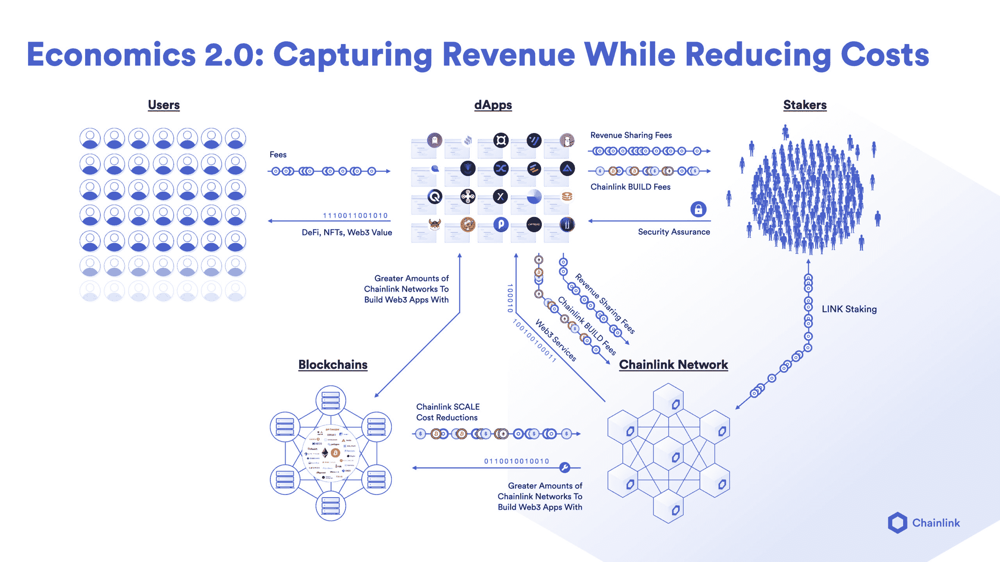
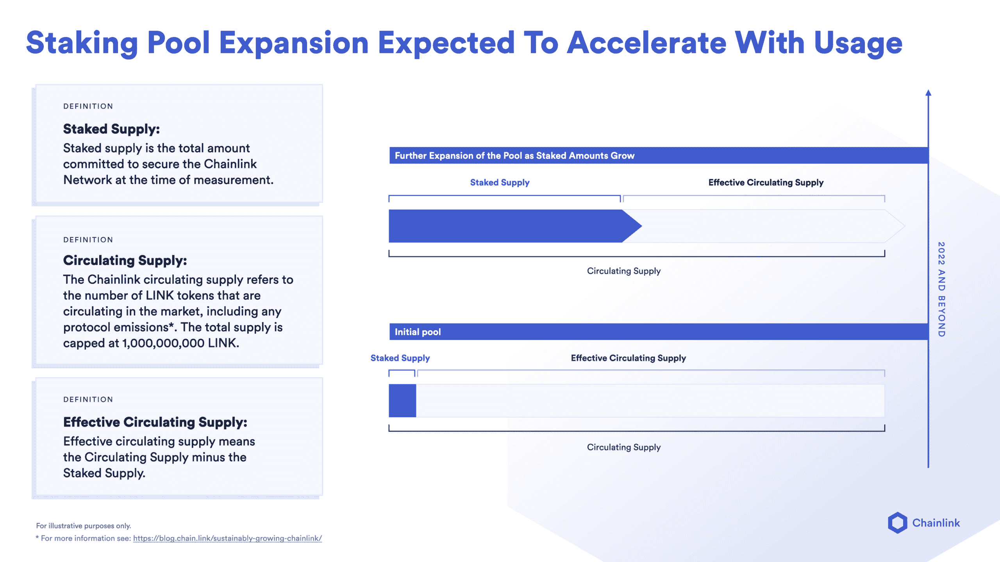
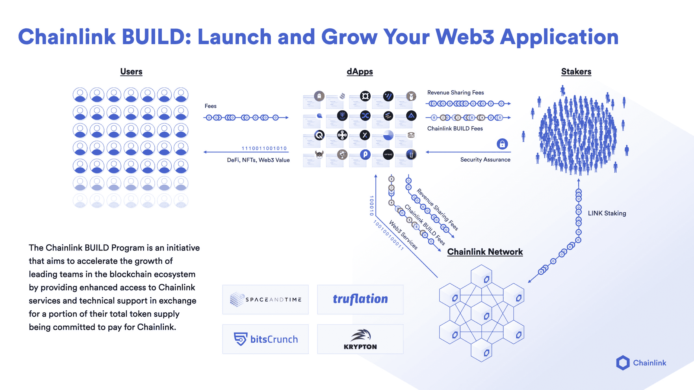

# Chainlink Economics 2.0 Staking 协议和 Staking v0.1 发布详情

> 原文：<https://blog.chain.link/chainlink-staking-launch-details/>

我们很兴奋地宣布 [的测试版](https://chain.link/economics/staking) (v0.1)计划于 2022 年 12 月 6 日 美国东部时间 中午 12 点在以太坊主网上线。有资格提前访问的地址将有机会在封顶的 v0.1 赌注池中 下注多达 7，000 个链接 。封顶的 v0.1 赌注池将于两天后于 2022 年 12 月 8 日 下午 12 点(美国东部时间 )向公众开放，届时任何人都将有机会在每个地址 7000 个链接 的初始限制内对 进行赌注，但须遵守 最初限制的 25M 链接 池上限和其他适用的参与要求。

Staking 是[chain LINK Economics 2.0](https://chain.link/economics)的核心举措，使链接令牌持有者和节点运营商能够因帮助提高 oracle 服务的加密经济安全性而获得奖励。以下博客文章将提供关于 Chainlink Staking v0.1 中规定的基础池设计和初始参数的更多见解。在 SmartCon 2022 的此 [最新主题演讲](https://www.youtube.com/watch?v=lMHaQGB1Wdc) 中了解更多关于经济学 2.0 的信息。

<figcaption id="caption-attachment-4977" class="wp-caption-text">Chainlink Staking is a key component within the Economics 2.0 framework.</figcaption>

## 打桩 v0.1 池设计概述

Chainlink Staking 是一种加密经济安全机制，利益相关者在智能合约中提交链接令牌，以支持 oracle 服务的某些性能保证。要更深入地了解链节定位，请参考 [链节定位路线图](https://blog.chain.link/chainlink-staking-roadmap/) 了解更多关于链节定位的长期目标和进展。

简单回顾一下，Chainlink Staking 的第一阶段是一个测试版(称为 v0.1)，它将由一个支持以太坊主网 上 [ETH/USD 数据馈送](https://data.chain.link/ethereum/mainnet/crypto-usd/eth-usd) 的 Staking 池组成。利益相关者将因帮助保护数据馈送而获得奖励，特别是通过参与一个分散的警报系统，该系统会在数据馈送未满足有关正常运行时间的特定性能要求时发出标记。

赌注池最初的上限为 2500 万链路，约占当前[循环供应量](https://chain.link/circulating-supply)的 5%和总供应量的 2.5%，计划逐步扩大至 7500 万链路。打桩池最初只包含两种类型的桩:节点操作桩和社区桩，将来可能会有其他类型的桩。积极服务于链式链接数据馈送的节点运营商每个将有最初的 50，000 个链接配额。 [1](https://blog.chain.link/chainlink-staking-launch-details/#footnote1)

<figcaption id="caption-attachment-4978" class="wp-caption-text">The Chainlink Staking pool is expected to accelerate with increased usage.</figcaption>

节点运营商可以选择创建或使用第三方授权系统，允许他们的 50，000 个链接配额由来自 Chainlink 社区的链接令牌持有者填补。第三方和非官方授权系统应被视为独立于 Staking v0.1 测试版的实验。[2](https://blog.chain.link/chainlink-staking-launch-details/#footnote2)T5】

为了确定哪些机构群体成员可以访问有限的池空间，我们创建了一个公平进入机制，为符合条件的地址提供提前进入 v0.1 封顶池的机会。有资格提前进入的机构群体成员将有机会以先到先得的方式下注最多 7，000 LINK，直到达到机构群体配额的当前上限。一旦早期访问期结束，任何符合适用参与要求的链接令牌持有者都可以在 v0.1 赌注池中下注每个地址最多 7，000 个链接，直到达到当前的社区配额上限。 [3](https://blog.chain.link/chainlink-staking-launch-details/#footnote3)

v0.1 早期访问的三组合格标准如下所示。早期进入提供了一个入股的机会，但鉴于最初设定的资金池规模， 并不能保证 有人能获得一个名额。

| 标准 | 详情 |
| 霍德勒 | 属于任一类别的代币持有者:

1.  During the period from May 30th, 2019 to June 7th, 2022, at least 50% of the time held more than 7 links on the main network of Ethereum.
2.  At least 90% of the time from August 5, 2021 to June 7, 2022, he held more than 7 links on Ethereum Mainnet.

 |
| 建造者 | 从 2020 年秋季到 2022 年春季，参加任何 Chainlink 主办的黑客马拉松的团队。 |
| 教育家 | Chainlink 的拥护者、开发者专家以及其他在 Chainlink 会议上主持或发表过关于 Chainlink 网络或 Chainlink 生态系统的演讲的人。 |

要了解有关公平准入机制的更多信息，包括提前准入资格列表背后的基本原理和方法，请参考以下博文。

【v0.1 上线时，22.5 米链路将分配给先到先得的社区桩员，而2.5 米链路 将分配并预留给节点运营商桩员。随着时间的推移，随着空间有限的池的扩大，可以调整不同标桩分配之间的比例差，以进一步增强池的安全性。

由于赌注系统的安全参数，节点运营商和社区赌注者最初都将他们的赌注链接和累积奖励锁定在智能合同中，直到未来的赌注发布。Staking v0.2 的研发已经在进行中，计划在大约 9-12 个月内发布，届时 v0.1 stakers 可以解锁或迁移他们的 staked 链接和奖励。

值得注意的是，链环桩是一个早期的不断发展的设计，将分多个阶段推出。请注意，v0.1 只有初始测试参数，这些参数可能会在以后的版本中更改，例如变化的比率和确定奖励比率的指标/方法，这意味着长期设计仍然是可变的，以便进行改进和调整，从而考虑到 Chainlink 网络的设计/需求和更广泛的 Web3 行业中的反馈和不可预见的变化。因此，Staking v0.1 通过允许测试参数发挥了至关重要的作用，为收集数据和了解更多关于 Chainlink 网络中的加密经济安全性如何发展以满足用户需求提供了宝贵的机会。

## 报警机制

为了提高加密经济的安全性，Staking v0.1 专注于 引入分散式警报功能——这是在未来基于适当激励的奖励和惩罚的 Staking 版本中创建削减机制的基础组件。警报机制允许利益相关者在观察到 oracle 服务没有达到某些预定义的性能标准时发出一个标记。如果报警有效，报警下注者将获得 报警奖励 。

在 v0.1 中，如果自上次链上更新 后超过三个小时 未提交新的 oracle 报告，则利益相关者可以在以太坊主网 上的 ETH/USD 数据馈送上发出有效警报。该条件作为验证 v0.1 中报警设计的初始参数。

节点操作员监视程序将从 开始，优先级为 ，能够在第一个 20 分钟 (又名“优先级周期”)内发出有效警报，前提是自最近一次链上 oracle 报告 起 已超过三个小时。节点运营商最初被赋予优先权，因为他们是生态系统的参与者，在监控馈送性能方面经验最丰富，并且已经在运营强大的基础设施。

一旦优先权期结束，如果尚未发出有效的警报，任何赌注者都可以发出警报 。一旦针对该馈送发出第一个有效警报，在同一停机事件期间发出的任何其他警报都将成为 无效 。这种警报机制旨在激励及时的警报，同时最大限度地减少对区块链网络带宽的限制。

可以通过直接与 Staking v0.1 智能合约交互或者通过 Staking 前端 进行预警。因为 oracle 报告是在链上提交的，所以 v0.1 智能合约将通过检查警报和上次链上更新之间的时间，自动判定任何警报的有效性 。无效警报(即，如果未达到停机时间阈值)将导致 恢复的事务 ，而有效警报将强制执行惩罚，如后面部分所述。

在 v0.1 版本中，作为提出第一个有效警告的交换，下注者可以获得高达 7，000 LINK 的警告奖励。 [4](https://blog.chain.link/chainlink-staking-launch-details/#footnote4) 警报条件和奖励可能会在未来的 Staking 版本中发展，其中可能包括调整停机时间阈值和引入其他基于每次馈送的可警报性能指标。

## 自动授权

在 v0.1 中，来自节点运营商的利益链接作为对其绩效的直接可量化承诺，而社区利益为节点运营商的诚实可靠的绩效增加了额外的激励层。v0.1 中的所有节点运营商 staker 将 获得一小部分社区 staker 的 staking rewards—称为 委托奖励—假定节点运营商代表社区 staker 提供服务(即为数据馈送执行 oracle 计算)。

该设计类似于现有的基于利益的授权设计，因为来自社区利益的奖励用于通过节点运营商的经济联合进一步提高网络安全性。在 v0.1 中，社区利益相关者将看到他们的利益 自动委托给节点运营商利益相关者 ，而无需节点运营商控制社区利益。这种机制被称为“”。

社区利益相关者将开始让他们的利益相关链接 在所有活跃的利益相关节点运营商之间平等地 自动委托，以便在最初的 v0.1 测试阶段验证自动委托设计，允许节点运营商在为未来的利益相关版本 计划的更为 高级信誉系统实施之前 从平等的位置 开始。自动授权推动了一种动态，其中 v0.1 池中的社区股份越多，节点运营商可靠执行的激励就越大，因为支付给节点运营商的授权奖励就越高。

在未来的 staking 版本中，自动委托可能会 演变为一种动态机制 ，这是一种基于信誉指标 的 可变金额中跨活跃的 Staking 节点操作者自动委托社区股权的设计，例如历史业绩、被赌注的时间长度和赌注金额。

## 赌注奖励和惩罚

随着通过赌注进行社区参与成为经济学 2.0 的一个关键组成部分，将设立奖励，以公平激励早期参与者为 Chainlink oracle networks 不断发展的加密经济安全性做出贡献。在 v0.1 中，赌注奖励和警告奖励将由本地链接发射支持，以便为赌注者创建奖励的初始基线。然而，长期目标是基于排放的象征性赌注奖励随着时间的推移逐渐减少，并被其他奖励来源取代，如下所述。 [5](https://blog.chain.link/chainlink-staking-launch-details/#footnote5)

### 节点操作员标记器

节点运营商利益相关方预计将获得每年5%的基准利率，以及来自社区利益相关方奖励的 5%委托费 的奖励。假设 2500 万个链接池全部填满，节点运营商赌注者可以获得约 7% 的 有效年化回报率。

节点运营商赌注者的总年度报酬将取决于该节点的赌注链接数量、社区赌注的总量以及活跃的赌注节点运营商的数量。[6](https://blog.chain.link/chainlink-staking-launch-details/#footnote6)如前所述，在后续的 Staking 版本中引入的自动委托机制的动态版本可以根据节点运营商 Stakers 的信誉来调整委托数量 。

在 v0.1 中，节点运营商利益相关者不会看到他们承诺的股份被削减。但是，如果对过度停机发出有效警报，则目前在以太坊上提供 ETH/USD 数据馈送的节点运营商最多可以削减三个月的累积利益相关奖励。不服务于 ETH/USD 以太坊数据馈送的活跃桩节点运营商在 v0.1 期间不会看到他们的奖励被削减。桩削减计划在桩的未来版本中进行。

### 社区利益相关者

在 v0.1 中，为了帮助保护 Chainlink 网络的安全，预计 LINK 中的机构群体利益部分的基准利率为每年 5%。从这些年化奖励中，社区利益相关者奖励的 5%预计将作为授权奖励分配给节点运营商利益相关者。结果是，在 v0.1 中，社区利益相关者的年有效报酬率为 4.75%。[8](https://blog.chain.link/chainlink-staking-launch-details/#footnote8)选择这一有效报酬率是为了平衡经济可持续性的要求，同时使利益相关者能够因帮助保护链式网络而获得公平的报酬。

5%的委托率 作为测试这部分系统有效性的初始参数， 委托率可能会在未来的 Staking release 中根据进一步的研究、开发和 v0.1 的结果进行调整。此外，基线 5%的年化报酬率反映了 staking v0.1 池的初始上限规模。 奖励加入 v0.1 的早期活跃参与者。请注意，在社区赌注分配中获得的赌注链接和赌注奖励将不会在赌注 v0.1 中受到处罚或削减。

## 用户付费奖励

经济学 2.0 的主要目标之一是开启 Chainlink 的价值获取和加密经济安全的新篇章。Chainlink Staking 的 v0.1 测试版将测试支持 Chainlink oracle 服务运营的各类赌注者如何获得赌注奖励。

为了帮助确保一个长期可持续的 Chainlink 网络，进入 Chainlink 生态系统的用户费用将用于 抵消节点运营成本 并奖励其他关键生态系统参与者。在 Chainlink Staking 的未来版本中，这种用户费用经济模型有望扩展， 使不同类型的赌注者能够从他们的服务中赚取不同部分的费用。

这种方法与 的长期目标相一致，基于排放的赌注奖励随着时间的推移逐渐减少 ，并成为由非基于排放的来源 取代的 ，这些用户费用奖励在协议安全性的关键参与者之间共享。随着 Chainlink 生态系统的不断发展，用户付费的经济模式也将随之发展。

## Chainlink 为股东建立激励机制

除了上述奖励，v0.1 中的 赌注者还将有资格获得 累计 额外奖励取决于每个项目的资格 ，这些奖励将在未来版本的赌注 中通过 [Chainlink 构建程序](https://blog.chain.link/chainlink-build-program/) 提供。

已经有 确认参与 Chainlink 构建程序的 项目包括 [氪](https://medium.com/@kryptonlabs/krypton-joins-chainlink-build-program-to-kickstart-the-adoption-of-our-mev-resistant-dex-fe0d0538c360)[兴趣协议](https://medium.com/interest-protocol/interest-protocol-joins-chainlink-build-to-accelerate-adoption-of-capital-efficient-lending-8b40f4bd9ec5)[菌丝体](https://mycelium.xyz/blog/mycelium-chainlink-build-announcement)[木桶协议](https://blog.cask.fi/cask-protocol-joins-chainlink-build-program-to-accelerate-adoption-of-automated-money-flows-a06a60f80d10)[tru](https://www.truflation.com/blog/truflation-joins-chainlink-build-program) [Galaxis](https://blog.ether.cards/galaxis-joins-chainlink-build-program-to-accelerate-nft-toolkit-adoption/)[bitsCrunch](https://bitscrunch.com/blogs/bitscrunch-x-chainlink)，以及[ChainML](https://mirror.xyz/0x0217e3776239581E66D1811994fa632723259A48/Ps3Drs6u1osMA216CcB7rDQ5K-PEWxslVmRLE0o5gXM)，未来有更多期待。 这些项目已经承诺将他们总令牌供应的一部分用于 Chainlink BUILD， 通常在 3%到 5%之间。 部分计划随着时间的推移 提供给社区利益相关者、节点运营商利益相关者和 其他关键社区参与者 ，以帮助保护构建参与者所依赖的 oracle 服务，这些服务的范围可能会在未来版本中扩展到其他提要和服务。构建奖励的部分可以部分地由信誉度量 确定，例如赌注金额、下注时间长度和其他关键度量。T83】

<figcaption id="caption-attachment-4979" class="wp-caption-text">Chainlink BUILD accelerates the growth of Web3 projects by providing access to Chainlink services and technical support in exchange for a portion of their total token supply.</figcaption>

## 信誉系统

作为经济学 2.0 的附加组成部分，跑马圈地的 [长期目标](https://blog.chain.link/chainlink-staking-roadmap/) 之一是建立一个健壮的信誉框架，以确定如何选择节点参与去中心化的甲骨文网络。因此，在 Staking v0.1 期间，将在初始信誉系统中引入 Staking 指标，作为一种改进跟踪单个节点运营商的性能和一般数据馈送性能的方法。随着时间的推移，信誉系统为节点运营商创造了保持高水平性能的激励，为在未来的 Staking 版本中随着自动授权机制的发展而引入的 更明确的激励 奠定了基础。

包括最新答案和相应时间戳的节点运营商信誉度量已经于今天可用，以跟踪服务数据馈送的节点运营商的一般性能。随着时间的推移，将会跟踪节点操作符的其他指标，例如:

*   **节点桩** *—* 特定节点运营商桩的链路数量和桩的时间长度。
*   **节点报告率**—包含特定节点操作员观察的链上 oracle 报告的百分比。
*   **At-Fault Alerted Events**—可归因于特定节点运营商在由 Chainlink Staking 支持的馈送上的性能故障的有效警报的数量。

随着 声誉将在 确定未来奖励机会(如工作选择 )方面发挥越来越大的作用，计划随时间跟踪的声誉指标 将根据反馈和额外研究 继续完善 。注意，虽然第三方信誉系统可能存在并且提供关于节点和网络性能的有用信息，但是只有 Chainlink 信誉系统直接连接到网络的操作和奖励。对于未来的 Staking 版本，正在探索如何将信誉系统 扩展到节点运营商之外的更广泛的参与者群体 ，包括社区利益相关者，因为他们在提出有用的警报方面发挥了作用。

## 结论

即将推出的 Chainlink Staking v0.1 是 Chainlink 网络安全性及其经济设计的转折点。结合其他关键的经济学 2.0 计划，如[Chainlink BUILD](https://blog.chain.link/chainlink-build-program/)和[chain link SCALE](https://blog.chain.link/chainlink-scale-program/)，chain link 生态系统正进入可持续增长的下一阶段，增加了加密经济的安全性，并在整个网络中实现了全新水平的价值捕获。

<figcaption id="caption-attachment-4980" class="wp-caption-text">Chainlink Economics 2.0 is a new era of sustainable growth, cryptoeconomic security, and deeper value capture in the Chainlink Network.</figcaption>

要了解更多关于 Chainlink 桩和经济学 2.0 的信息，请查看以下资源:

*   [链环打桩路线图](https://blog.chain.link/chainlink-staking-roadmap/?utm_medium=referral&utm_source=chainlink-blog&utm_campaign=FY22Q4-staking-v01&utm_content=staking-design)
*   [链节打桩 v0.1 早期接入资格](https://blog.chain.link/chainlink-staking-early-access-eligibility-app/?utm_medium=referral&utm_source=chainlink-blog&utm_campaign=FY22Q4-staking-v01&utm_content=staking-design)
*   [链环经济学 2.0](https://chain.link/economics/?utm_medium=referral&utm_source=chainlink-blog&utm_campaign=FY22Q4-staking-v01&utm_content=staking-design)

—

### 脚注

1。节点操作员押桩如果选择参与 v0.1\.
2，有一个 最小 1000 链接 的押桩要求。chain link Foundation对由节点运营商或其他生态系统参与者创建或使用的第三方授权系统的性能或安全性不做任何保证 。
3。社区赌注者如果选择参与 v0.1\.
4，则有一个1 环节 的最低赌注要求。在 优先级期间，一个来自节点运营商 Staker 的有效警报可以获得 7000 链接 。任何在优先期后发出有效警告的下注者都可以赢得其下注金额的 20%，根据以下公式最高可获得 7，000 LINK:min(7，000，0.2 * staked_link) 。
5。为利益相关者引入非排放奖励 取决于许多因素 ，包括 Web3 应用的普遍采用和收入。
⑥。假设变量保持不变，一个节点运营者赌注者可以获得的总年化回报为:(Node _ staked _ LINK * 0.05)+(total _ community _ stake * 0.05 * 0.05/num _ Node _ staking)。
7。一旦发出有效警报，对服务于 ETH/USD 以太坊数据馈送的积极参与节点运营商的奖励惩罚如下:min(node _ net _ accumulated _ rewards，(0.05 * min _ required _ node _ stake/4+three _ months _ delegation _ rewards))。
8。总年化奖励 的 5%减去委托奖励的【0.25】(5%中的 5%)，得出 对社区利益相关者的有效报酬率为 4.75% 。

—

*免责声明:本文仅供参考，包含关于未来的陈述，包括预期的计划、产品和功能、开发以及这些新产品和功能的推出时间表。这些陈述只是预测，反映了当前对未来事件的信念和期望；它们建立在假设的基础上，随时都有风险、不确定性和变化。Chainlink 资格应用程序按“原样”提供，不提供任何形式的担保。资格并不能保证你能参与 Chainlink Staking 计划。赌注资格和参与要求可随时修改，恕不另行通知。虽然我们相信这些陈述是基于合理的假设，但我们不能保证任何预期的计划、产品或功能将按规定实施或完全实施，也不能保证实际结果不会与这些陈述中表达的结果有重大差异。所有声明仅在首次发布的日期有效，我们可能不会更新此帖子作为回应。T3】*