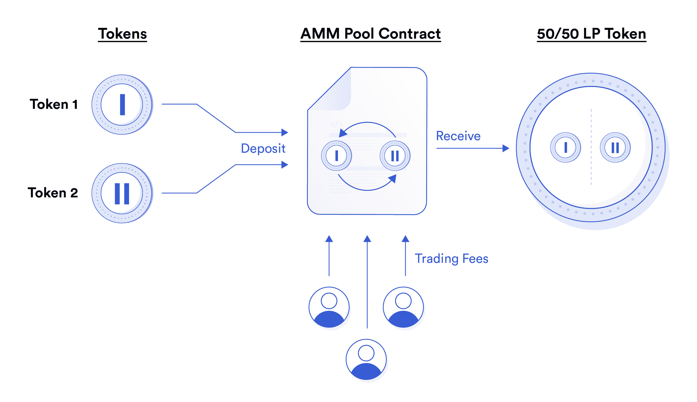
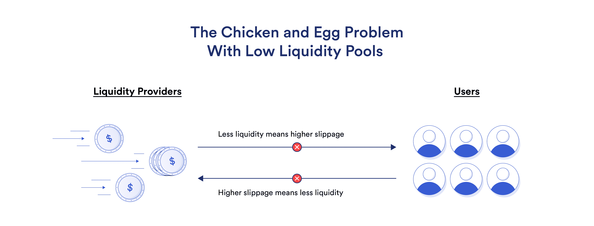
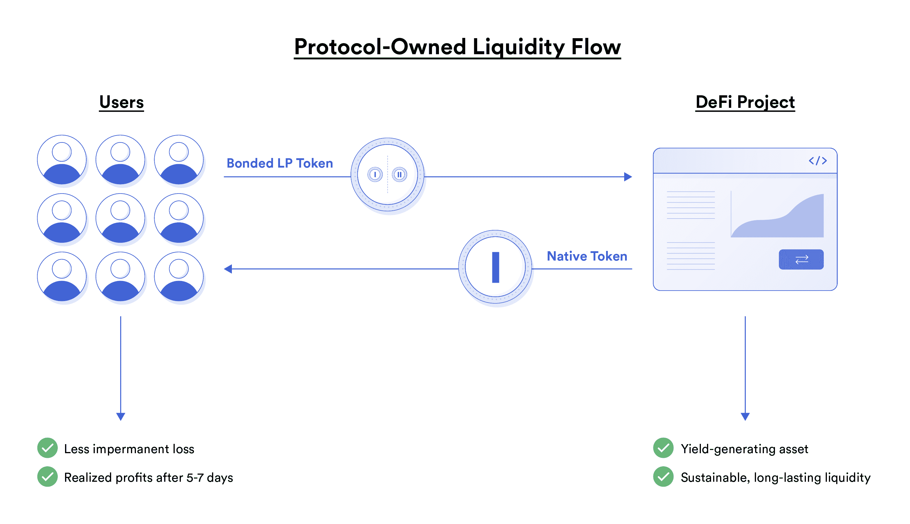
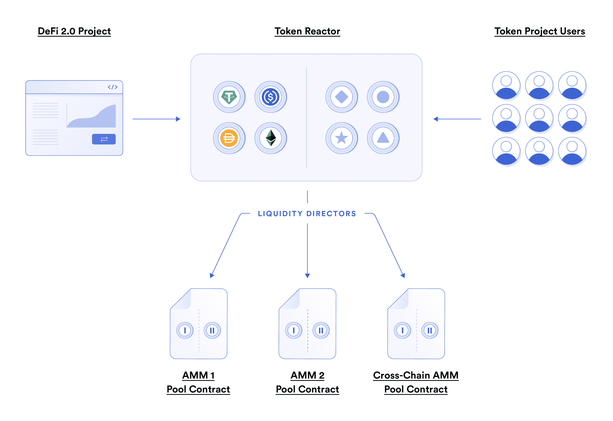

# DeFi 2.0 和流动性激励

> 原文：<https://blog.chain.link/defi-2-0-and-liquidity-incentivization/>

***重点提示:***

*   *DeFi 生态系统的第一批“金钱乐高积木”，如 LP 代币和分散式 stablecoins，为 DeFi 的进一步发展奠定了基础。T3】*

*   *DeFi 2.0 是生态系统中的一个新术语，主要指建立在初始资金乐高积木之上的新兴协议子集，以推进当前的 DeFi 格局，主要以流动性供应和激励的形式。T3】*

*   *随着这些新金融工具的加入，整个 DeFi 经济正迅速变得更加用户友好、安全和可及。T3】*

—

分散金融，俗称 [DeFi](https://chain.link/education/defi) ，是区块链最具影响力和最成功的创新浪潮之一。由区块链提供支持，内置 [智能合约](https://chain.link/education/smart-contracts) 功能和类似[chain link](https://blog.chain.link/what-is-chainlink/)的安全 oracle 网络，DeFi 指的是广泛的分散式应用程序，这些应用程序将现有的传统金融服务去中介化，并释放全新的金融原语。

受其固有优势 [无权限可组合性](https://blog.chain.link/defis-permissionless-composability-is-supercharging-innovation/) 和开源开发文化的推动，DeFi 协议在基于金融协议的成熟模型上不断前进和迭代。DeFi 生态系统以闪电般的速度发展——在过去的几个月里，以流动性为重点的 DeFi 项目的兴起带来了新一轮的 DeFi 创新，通常被称为 DeFi 2.0。

DeFi 2.0 是大型区块链社区中的一个新兴术语，主要指的是建立在以前的 DeFi 改进基础上的 DeFi 协议的子集，如产量农业、借贷等。著名的 DeFi 2.0 协议的主要焦点是克服许多具有本地令牌的链上协议所面临的流动性限制。

本文考虑了过去为 DeFi 2.0 运动奠定基础的创新，并介绍了 DeFi 2.0 协议试图解决的流动性问题，然后深入探讨了由 DeFi 2.0 生态系统引入的公用事业和新金融模式。  

## **早期 DeFi 开发**

Uniswap、Bancor、Aave、Compound、MakerDAO 等早期的 DeFi 先驱为发展中的 DeFi 经济奠定了坚实的基础，将许多重要的可组合“金钱乐高”引入生态系统。

Uniswap 和 Bancor 是最初的分散式 [自动做市商](https://blog.chain.link/challenges-in-defi-how-to-bring-more-capital-and-less-risk-to-automated-market-maker-dexs/) (AMMs)，第一个为用户提供无缝互换代币而不放弃托管的能力。Aave 和 Compound 引入了分散式贷款和借款，以一种无需许可的方式为存款和获得营运资本提供连锁收益。MakerDAO 使生态系统用户能够以分散的 [稳定方式持有和交易加密货币](https://blog.chain.link/what-are-stablecoins/) ，为加密货币的波动性提供了对冲。

通过这些协议，用户可以获得可靠的交易、无摩擦的借贷和稳定的钉住货币——传统金融市场中广泛存在的三种核心金融工具。然而，在透明度和用户控制方面，这些熟悉的基于 DeFi 的服务的基础设施与集中式组织完全不同。这些分散服务背后的各种技术实现是 DeFi 创新的基础。  

### **级联 DeFi 创新**

区块链特有的 DeFi 创新的一个核心例子是自动做市商(AMM)分散交易(DEX)协议中的流动性提供者(LP)令牌。虽然 dex 有效地充当了集中式订单簿交易的替代品，但最受欢迎的 dex 采用了一种 AMM 模型，称为 [恒定产品自动做市商](https://blog.chain.link/challenges-in-defi-how-to-bring-more-capital-and-less-risk-to-automated-market-maker-dexs/#:~:text=Constant%20Product%20Market%20Maker%20(CPMM))(cpam)。

AMMs 中的分散流动性池用于促进代币交换，其中单个流动性提供者通常提供等量的每种加密货币，以贡献给交换对的流动性池。作为回报，他们会收到一个 LP 令牌，代表他们在流动性池中的份额以及从促进互换中获得的费用。

<figcaption id="caption-attachment-3061" class="wp-caption-text">Users receive LP tokens by providing double-sided liquidity to AMM pool contracts.</figcaption>

LP 令牌引发了一连串的 DeFi 创新，因为它们很快被其他 DeFi 协议以多种方式采用。例如，Aave 和 Compound 等贷款协议重复了向用户提供代表基础存款的收据令牌的想法，现在称为 aTokens 和 cTokens。

AMMs 和 LP 代币的无许可性质也增强了 DeFi 初创公司的能力，它们不再需要为其推出的代币经历集中的交易所上市过程。在流动性充足的情况下，新推出的代币可以立即在 DEX 上交易。然而，如果没有足够的流动性，DEX 的代币交换功能在效用上就变得有限，由于滑点，用户需要为大额互换支付天文数字的价格。这导致了 DeFi 目前存在的最突出的问题之一:流动性问题。

## **流动性问题**

自 DeFi 经济的早期以来，流动性一直是许多新兴 DeFi 项目的一个挫折来源。整个生态系统是由代币引导的，代币作为团队调整参与者激励的方式，从用户费用中收取奖励，并成为更大的 DeFi 生态系统的组成部分。然而，为了向用户提供强大的流动资金来源，以根据 AMM 协议交易他们的令牌，DeFi 团队需要获得大量资金。

在 AMM 协议的第三方流动性提供者中找到了这个问题的部分答案，通过该协议，任何具有足够资金的独立个人都可以为令牌对提供流动性。团队可以假设从其他人那里获得足够的流动性，而不是自己提供流动性。然而，对于终端用户来说，没有什么激励来增加新代币的流动性，因为这将意味着让他们自己面临非永久性损失的风险，以换取来自掉期交易的最低费用收入。他们需要一个充分的经济理由来承担这个风险。

这就导致了鸡和蛋的问题。如果没有足够的流动性，掉期交易导致的下滑会阻碍用户参与 DeFi 协议的生态系统。如果没有用户通过代币交易参与，就没有足够的费用来激励第三方参与者汇集代币并提供流动性。

<figcaption id="caption-attachment-3062" class="wp-caption-text">Low liquidity pools disincentivize new liquidity in a chicken and egg problem.</figcaption>

因此，另一项重要的 DeFi 创新诞生了。基于 LP 代币的奖励成为新 DeFi 协议增加流动性的主要方式，这一过程被称为[收益农业](https://chain.link/education/defi/yield-farming)。

### **产量耕作解释**

产量农业(也称为流动性开采)的出现导致 2020 年夏天的 DeFi 活动激增，被区块链爱好者称为“DeFi 夏天”。

高产农业背后的想法很简单。用户为 AMM 协议上的交换对提供流动性，为他们的麻烦接收 LP 令牌，然后将 LP 令牌作为回报，这些回报在项目的本地令牌中得到补偿。这种实现解决了先有鸡还是先有蛋的问题，它为第三方流动性提供者提供了一个令人信服的经济理由来提供流动性:更高的收益率。除了在更深的流动性的激励下，AMM 掉期交易的累积费用更高之外，它们还可以通过押注和获得更多该项目的原生代币来获得更多收益。

<figcaption id="caption-attachment-801" class="wp-caption-text">Yield farming adds an additional incentive to provide liquidity through native token rewards.</figcaption>

随着高产农业的引入，新的 DeFi 项目能够引导足够的流动资金来开始和维持运营，并降低用户进入其生态系统的滑动率。这导致 DeFi 协议的数量全面呈指数级增长，证明了产量农业降低了用户和 DeFi 项目创始人的准入门槛。

### **高产农业的局限性**

尽管产量耕作非常有效，但由于长期产量耕作计划的特殊限制，产量耕作本身并不能完全解决流动性问题。产量农业擅长于启动初始流动性，但必须在头脑中有一个长期计划，以确保长期、可持续的流动性。

这是因为供给稀释，这是高产农业的固有特征。创始团队向流动性提供者分发本地令牌，并提供额外的收益来源，激励流动性提供者将其流动性锁定在 AMM 池中。然而，随着越来越多的代币分配给第三方流动性提供商，代币供应总量中用于租赁流动性的比例越来越高，流动性提供商可以随时移除其流动性并出售其获得的 LP 赌注奖励。DeFi 团队无法确定，如果赌注奖励消失，流动性提供者是否会留下来，而将赌注奖励长期保持在高水平会越来越多地稀释本地令牌的供应。

随着项目越来越多地寻求扩展到不同的跨链 AMM，甚至同一链上的 AMM 协议，需要跨不同交易所的各种产量农业计划，以建立每个交易所的深度流动性池。这加剧了前述的局限性，因为新兴的 DeFi 项目必须精确地平衡众多 AMM 协议的供应扩展——通常没有人力、手段或信息来有效地做到这一点。

第三方流动性提供者必须有足够的激励，以便为高风险持有提供流动性。由于新推出的代币往往具有较高的波动性，因此非永久性损失的风险增加，这种损失抵消了 AMM 协议的交易费和产量耕作计划的收益。这对第三方流动性提供者来说是一种错位的激励结构，他们没有太多的选择来管理提供流动性和收益耕作的风险。

产量农业一直是为 DeFi 项目增加流动性的有效方式，但它也存在长期风险。对于大多数 DeFi 项目来说，运行产量农业计划和引导流动资金是必要和健康的，但项目团队必须注意其象征性供应和长期产量农业战略，以避免负面的长期影响。  

## **DeFi 2.0 和对可持续流动性的追求**

在流动性方面，DeFi 2.0 指的是一些新兴的 DeFi 项目，这些项目希望彻底解决与流动性供应和激励相关的常见问题。它们为产量农业模式提供了替代和补充，为项目提供了一种可以长期持续的流动性来源。但是，基于区块链的项目如何用本地代币维持一个健康的流动性量，并以一种理想的方式进行分配呢？

### **奥运会和礼宾自有流动性**

在 2021 年，一个已经上升到 DeFi 社区前沿的解决方案是 OlympusDAO 的 bonding 模型，该模型侧重于协议自有流动性(POL)。

通过其结合模式，OlympusDAO 颠覆了产量农业的剧本。OlympusDAO 不是通过扩大供应的产量农业计划来租赁流动性，而是使用债券以折扣价将第三方的 LP 令牌交换为协议的本地令牌。这为该协议以及使用该协议的任何项目(例如绑定即服务)提供了优势。通过债券，协议可以购买自己的流动性，消除流动性退出的可能性，并建立一个长期的资金池，也可以为协议创造收入。

<figcaption id="caption-attachment-3063" class="wp-caption-text">Bonded liquidity is mutually beneficial for both the protocol and its users.</figcaption>

另一方面，用户被激励通过债券交换他们的 LP 代币，因为协议提供代币折扣。例如，如果代币 X 的价格为 500 美元，折扣为 10%，用户可以购买价值 450 美元的 LP 代币，以获得 500 美元的代币 X。结果是 50 美元的净利润，这取决于短期授权计划(通常为 5 天至一周左右)，以帮助防止套利者提取价值。

注重流动性的债券的另一个重要方面是，债券价格会动态变化，而且可能有一个硬上限。这为协议提供了一个重要的目的，允许它控制两个杠杆:令牌交换流动性的比率和交换的流动性总量。

如果太多用户购买债券，折扣率会下降，甚至可能变为负值，这是控制协议令牌供应扩张速度的一种方式。该协议还可以通过债券不再可用的硬上限来确定其所需的流动性数量，从而根据精确确定的参数进一步控制供应扩张。

### **重新调整激励措施**

这种多方面的模式有助于重新调整第三方流动性提供商和链上协议之间的激励机制。与独立的第三方流动性提供商相比，协议更容易遭受非永久性损失。虽然第三方流动性提供商面临着代表市场上所有其他流动性池和收益耕作协议的机会成本，但协议有额外的动力来保持流动性，因为它有助于为使用其本机令牌进行交易的用户确保低滑动掉期，从而降低进入其各自生态系统的成本。

最终，OlympusDAO 的担保模式允许协议以长期、可持续的方式更好地减轻低流动性风险。与产量农业相结合，DeFi 协议现在有更多的工具来精心规划其增长阶段，从最初的流动性引导到可持续的长期增长。

### **利用托卡马克反应堆引导流动性**

另一个关注流动性的 DeFi 2.0 项目是 Tokemak，这是一个旨在优化流动性和流动性流动的 DeFi 协议。简而言之，Tokemak at scale 旨在通过两个不同的方(Tokemak 协议和流动性提供者(LPs))促进流动性，目标是通过流动性董事(LD)有效分散流动性。

下面是它的工作原理。考虑 LP 标记的内容。流动性提供者被要求在一个给定的兑换对中提交等量的两种货币，这导致了随着权重转移和价格变化的非永久性损失。为了解决这个问题，Tokemak 协议保留了稳定令牌和第 1 层资产，作为新兴令牌的碱基对。这构成了流动性对的一个方面。对于 Uniswap 上的象征性 X-ETH 流动性池，Tokemak 储备贡献 ETH。

然后，独立的第三方流动性提供者和 DeFi 项目可以汇集在一起，组成流动性的令牌 X 方。从那时起，流动性主管就成了焦点。流动性主管利用 Tokemak 的原生令牌来控制流动性流动，使用这两个单边流动性池来将流动性引导至广泛的 AMM 协议。

<figcaption id="caption-attachment-3064" class="wp-caption-text">Token reactors help DeFi projects acquire liquidity and distribute it effectively.</figcaption>

### **平衡流动性流量和方向**

该系统的最终结果是，流经 Tokemak 的流动资金能够满足整个 DeFi 生态系统高效、可持续流动资金方向的目标。

流动性主管基于投票机制转移流动性，而流动性提供者通过提供单边流动性获得 Tokemak 的原生令牌。每一方都赚取可变收益，与另一方平衡，以实现流动性董事和流动性提供者之间的优化比例，确保针对所提供的流动性数量有最佳的董事数量。

这将有利于新兴的 DeFi 项目——尤其是由 Dao 运营的项目——以及收益农民和流动性提供者。在基本层面上，Tokemak 的单边资产配置允许 DeFi 项目仅使用其本地令牌来引导初始流动性，而不需要稳定资产和一级资产的流动性。Tokemak 反应堆还可以为基于 DAO 的项目的流动性流动提供集体决策结构，同时为第三方流动性提供者和收益农民提供替代收益选择，减轻非永久性损失。  

### **其他 DeFi 2.0 的进步**

DeFi 2.0 协议的另一个子集是在以前的收益生成机制和资产的基础上构建新型金融工具。

这方面的一个主要例子是 Alchemix，这是一个采用“无清算”设计的自我偿还贷款平台。该协议借出与担保资产 1:1 挂钩的代表性令牌。例如，通过将 DAI stablecoin 作为抵押品，用户能够以 alDAI 的形式借入 50%的金额。基础担保品随后被存入收益率生成协议，使其递增。

通过组合代表性代币和产生收益的抵押品，Alchemix 可以提供一个免清算的借贷平台，使用户能够同时消费和储蓄——随着抵押品继续产生收益，贷款本金金额会减少。

另一个 DeFi 2.0 协议 Abracadabra 采用了类似的机制，但其系统与 MakerDAO 相关。用户可以提交有收益的抵押品并获得 MIM stablecoin 作为交换，保持对抵押品的敞口，同时为用户获得收益并释放流动性。

没有最先让去中心化经济焕发生机的早期创新——AMM 协议、去中心化稳定货币和价格先知——就不会有流动性债券、流动性流动机制或产生收益的抵押品。从早期的 AMM LP 令牌和分散的 stablecoins 到今天的 DeFi 2.0 协议，每个项目都是构建分散经济的宝贵迭代。

## **赤字经济中的链环**

DeFi 基础设施的另一个至关重要的组成部分是分布式 oracle 网络，例如那些构建在[chain link](https://blog.chain.link/what-is-chainlink/)上的网络。这是因为作为所有 DeFi 协议的构建模块的智能合约本质上无法连接到真实世界的数据和链外计算。Oracles 通过提供连接链上和链下环境所必需的安全的链下基础设施解决了这个问题。[chain link Price Feeds](https://data.chain.link/)就是一个例子，提供对金融市场数据的安全来源的访问，以支持抵押贷款等用例。

此外，由 oracles 支持的链外计算服务，如 [Chainlink VRF](https://docs.chain.link/docs/chainlink-vrf/) 和 [Chainlink 自动化](https://chain.link/automation)继续在整个生态系统中启用和增强 DeFi 协议。可验证的随机性和安全的智能合约自动化为 DeFi 开发人员提供了现成的基础设施，以支持无损失抽奖、自动化 rebases、限价单功能等。

Chainlink oracle networks 为 DeFi 生态系统的顶级协议提供了宝贵的服务。这包括提供价格数据，以确定 Aave 和 Compound 中的最大贷款发放规模和清算事件，自动化 Bancor 改进的 v3 AMM 实施中的关键功能，以及帮助保护基于 L2 的 dYdX 协议中基于加密的金融产品的交换。

DeFi 2.0 协议也不例外。鉴于先进的 DeFi 2.0 协议和流动性解决方案的兴起，下面列出了几个例子，说明 Chainlink services 如何用于提升这些新类别的流动性解决方案，并帮助它们提供安全、用户友好的产品。  

### **可靠透明的资产定价**

通过部署 [多层聚合](https://blog.chain.link/levels-of-data-aggregation-in-chainlink-price-feeds/) 来分散链外数据的来源和交付，Chainlink Price Feeds 有助于确保需要金融市场数据的 DeFi 产品免受市场波动和意外事件的影响，例如闪电崩盘、交易所宕机以及通过闪电贷款进行的 [价格操纵攻击](https://blog.chain.link/flash-loans-and-the-importance-of-tamper-proof-oracles/) 。

例如，通过提供关于 LP 令牌当前价格的实时信息，Chainlink 价格馈送可以为流动性债券价格提供额外的安全性和准确性。流动性债券协议可以利用这些数据来提高债券支付的可靠性，甚至扩展流动性债券的效用——从推动二级债券市场到为依赖于当前债券价格的债券提供额外激励。

对于收益生成抵押品机制，当使用收益生成令牌作为抵押品时，Chainlink 价格馈送支持防篡改定价，有助于确保抵押品要求和清算阈值的准确计算。

### **自动重定基础和流动性周期**

Chainlink Automation 是一种安全、分散的智能合同自动化服务，可以卸载和自动化手动智能合同开发流程。这使得开发人员能够专注于构建和完善他们的应用程序的核心业务逻辑。

在 DeFi 2.0 环境中，这可以采取基于潜在供应变化自动重定代表性令牌基础的形式。Chainlink Automation 还可用于定期启动新的流动性管理程序，为用户提供更高的智能合约服务可预测性和可靠性。

### **可验证的随机游戏化**

一般来说，DeFi 协议和基于区块链的协议的增长趋势是游戏化。无偏见的熵元素使 DeFi 协议更加令人兴奋和迷人，有助于将社区聚集在一起。通过 Chainlink VRF 可审计的链上随机性可以成为一个强大的工具，为用户提供基于风险偏好的多种收益生成途径。

OlympusDAO [目前使用](https://olympusdao.medium.com/olympusdao-integrates-chainlink-vrf-for-provably-fair-3-3-together-no-loss-raffles-f329c8872c9c) PoolTogether 和 Chainlink VRF 来运行其(3，3)无损失抽奖活动，该活动接受池中的所有下注奖励，并以可验证的随机方式选择三名获胜者来获得总奖励。类似的过程可以应用于流动性供应的收益生成，流动性提供者也能够存放他们的收益并参加无损失抽奖游戏。此外，作为 DeFi 2.0 项目和 beyond look 利用 [NFTs](https://chain.link/education/nfts) ，Chainlink VRF 还提供了一种防篡改的方式来构建随机铸造流程、公平分配模型等。

Chainlink 分散式甲骨文网络提供广泛的离线数据和计算服务，这些服务与任何希望跟上智能合同创新快速步伐的区块链项目越来越相关，这是 DeFi 生态系统中基础资金乐高的又一个例子。

## **钱在 DeFi 乐高积木**

当概念化 DeFi 经济如何作为一个整体运行时，金钱乐高玩具是一个有用的类比。前沿创新和新技术可以结合起来，每一部分都建立在另一部分的基础上，从而创造出比各部分之和更大的东西。

dex 和 LP 代币是区块链行业最著名的货币乐高玩具之一，支持大规模的代币链上交换，并使高产农业成为可能。分散式稳定信用贷款的第一波浪潮通过严密的超额抵押流程和风险缓解为较新的稳定信用贷款设计和分散式贷款平台奠定了基础。Chainlink 的离线数据和计算服务提供了无数 DeFi 应用所需的底层基础设施，有助于实现这些创新。

这些金钱积木都不能被认为是真空的，而应该被认为是一个相互联系的生态系统，它支持、连接和强调其他积木，以创造新的可能性。通过结合 Chainlink 价格饲料和 AMM LP 代币，动态产量农业倡议变得可行。通过将 stablecoins 集成到 AMMs 中，用户获得了只在分散式交易所进行交易所需的稳定性。

有了 DeFi 2.0，新一代的金钱乐高积木正在其前身的基础上构建，以使去中心化的金融格局对参与者来说更加高效、用户友好和有用。乐高积木的利润继续增加，每增加一块积木，DeFi 生态系统就会获得新的价值和机会。

  ——

如果您想现在就开始构建混合智能合约应用程序，并且需要某种类型的外部数据或计算，请参考我们的 [文档](https://docs.chain.link/docs/getting-started) ，在[Discord](https://discordapp.com/invite/aSK4zew)中询问一个技术问题，或者 [与我们的一位专家建立一次通话](https://chainlinkcommunity.typeform.com/to/OYQO67EF?page=homepage) 。

要了解更多，请访问[chain . link](https://chain.link/)，订阅 [Chainlink 简讯](https://chn.lk/newsletter) ，并关注 Chainlink 上的[Twitter](https://twitter.com/chainlink)，[YouTube](https://www.youtube.com/channel/UCnjkrlqaWEBSnKZQ71gdyFA)，以及[Reddit](https://www.reddit.com/r/Chainlink/)。