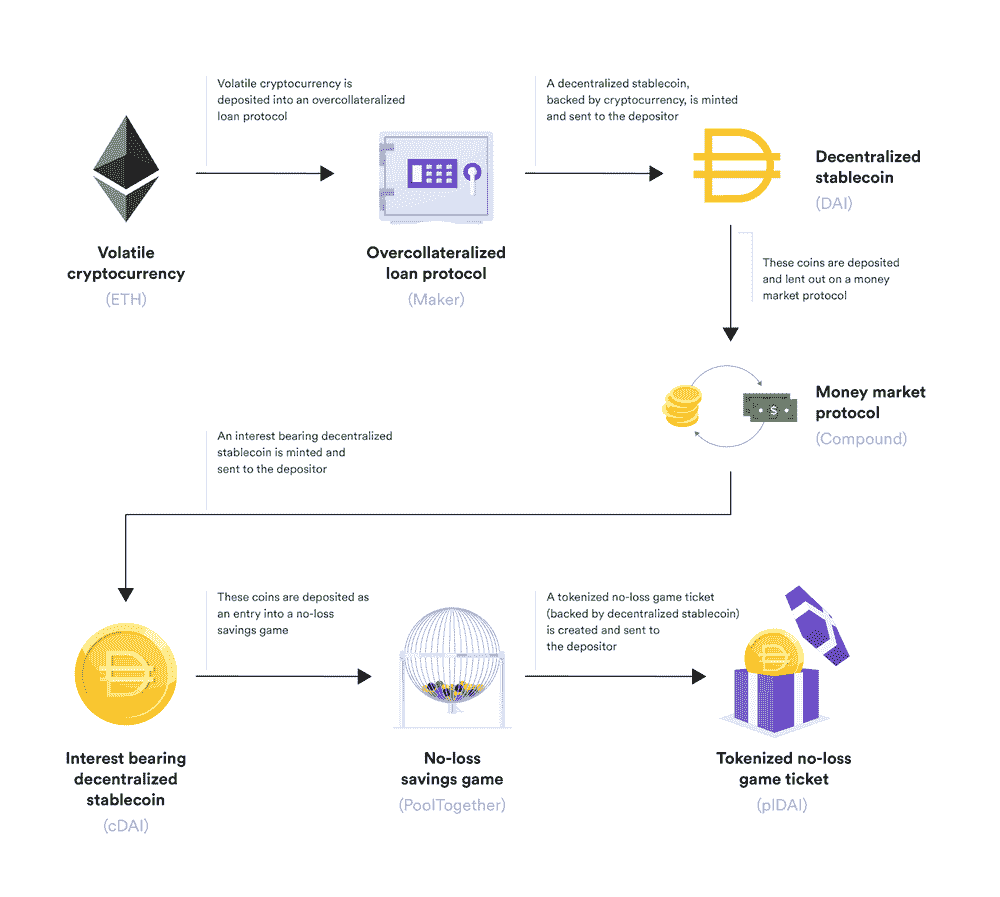

# DeFi 的无许可可组合性正在加速创新

> 原文：<https://blog.chain.link/defis-permissionless-composability-is-supercharging-innovation/>

*2021 年 11 月 2 日更新*

**关键要点**

*   DeFi composability 允许开发人员通过利用无权限和抗审查的基础设施，专注于他们的核心业务逻辑
*   大量的 DeFi 应用程序(“金钱乐高”)可以串联起来，创建以前无法想象的用例和金融产品
*   传统金融系统由于其许可性质、高进入壁垒、高成本等原因，在实际的可组合性方面存在限制
*   DeFi 应用程序的可组合性要求对每个协议进行尽职调查，以降低整个 DeFi 生态系统的系统风险

自从可编程智能合同推出以来，区块链生态系统已经发展成为一个无边界、无许可的景观，支持大量并行运行的分散式应用程序(dApps)。

第一波应用程序集中在使用区块链创建数字令牌并跟踪其所有权。然而，最新一波 dApps 已经超越了所有权，发展成为独特的管理和转移方法，类似于并扩展了当前的传统金融产品。这个平行的金融系统被统称为[分散金融(DeFi)](https://chain.link/education/defi) ，价值超过 1000 亿美元的[，由分散交易所、抵押贷款、借贷平台、杠杆交易、合成资产、预测市场、支付网络等等组成。](http://defipulse.com/)

加速 DeFi 创新和采用的一个关键特性是开发人员可用的**无权限可组合性**。可组合性是一种设计原则，它允许系统中的各种不同组件组合在一起，以满足任何特定的用例需求。DeFi 的独特之处在于，开发人员可以利用 DeFi 协议的任何组合，而无需任何特殊许可，从而开辟了一个无摩擦的创新周期，这是我们在传统金融领域从未见过的。

在本文中，我们考察了当前金融系统的局限性，DeFi composability 如何通过几个生产中的例子来提供一个无许可的金融架构，并概述了这样一个系统可能引入的系统风险是可以克服的。

## 现状与挑战

金融应用程序的可组合性并不是一个新概念。事实上，许多日常使用的面向用户的流行应用程序，如优步、Lyft 和 AirBnB，都是财务可组合性的结果。例如，Plaid 和 Stripe 是集成在众多 web 应用程序中的金融服务，为用户提供本地支付支持。这大大减少了开发人员的工作量，加快了走向市场的战略，因为开发人员不必从头开始构建菲亚特支付基础设施。

然而，这种形式的财务组合有一定的局限性。

### 许可访问

传统的集中式金融服务本质上是允许建立的，需要双方之间基于“书面承诺”的金融合同。这提高了准入门槛，使开发人员很难创建完全自动化或公正的财务应用程序，因为随时都有可能取消访问权限。中央实体现在控制了应用程序的关键部分，这就对第三方开发者试图提供的确定性保证提出了质疑。

DeFi 通过本质上的无许可性彻底改变了这种动态，创建了一个开放的基础，任何开发人员都可以从该基础上立即访问金融基础设施，该基础设施具有高度的防篡改性和可靠性。这允许真正公正和确定性的应用程序按照编码运行，并且不会被关闭。接入 DeFi 基础设施不需要原始开发者的批准，从而实现无缝创新，没有任何中心瓶颈。

### 透明度降低

传统的金融服务通常是不透明的，或者受到信息不对称的影响，公众对后端基础设施的了解要少得多。这造成了未知的风险暴露水平，并降低了执行风险管理的能力。例如，金融可组合性通过组合先前存在的消费者抵押贷款创造了抵押贷款支持证券。许多人认为这些金融产品非常安全，因为它们的多样化和传统评级机构给予的 AAA 评级。然而，在 2008 年，人们发现这些证券中有许多是由有毒次级贷款支持的，从而引发了一场全球金融危机。如果有更多的透明度和对更广泛的受众的可见性，这样的内爆可能会被阻止发生。

相比之下，DeFi 产品默认具有透明性；因为它们不仅建立在开源技术之上，而且用户和 dApps 之间的每一次交易和交互都记录在分布在世界各地的开放、不可变的账本中。虽然集中式加密货币交易所可能需要几个月或几年才能被发现破产，但 DeFi 的偿付能力和健康状况总是受到大型开源社区的集体观察和分析，任何人都可以指出欺诈和系统风险。

## 定义可组合性

DeFi 生态系统的模块化可组合性使开发人员能够专注于他们的核心业务逻辑，知道他们可以随时访问关键基础设施而无需任何许可。有了 DeFi，当开发者创造一种新的代币时，他们不必为了支持交易和创造流动性而建立自己的交易所或付费让它在某个专有平台上市。相反，他们可以将他们的令牌列在已经存在的[分散交易所(DEX)](https://blog.chain.link/dex-decentralized-exchange/) 上，该交易所已经过彻底的审计，并且包含现有的用户群。这使得代币持有者可以立即获得流动性和不同的金融用例，极大地扩展了代币的效用。

使 DeFi 应用成为可能的后台分散基础设施的一些例子包括:

*   智能合约启用区块链([以太坊](http://ethereum.org/))
*   防篡改 oracle 网络( [Chainlink](https://chain.link/)
*   持久数据存储/网络托管( [IPFS](http://ipfs.io/) )
*   抗审查域名( [ENS](http://ens.domains/) )
*   可靠的数据查询和索引([图](http://thegraph.com/)

在 DEX 上列出一个令牌是可组合性的一个非常简单的例子，但是这种结构可以通过将新的 DeFi 应用程序连接到现有的应用程序来扩展，比如' [Money LEGOs](https://medium.com/totle/building-with-money-legos-ab63a58ae764) '。

DeFi 中一些不同的金钱乐高玩具包括:

*   订单交换( [Loopring](http://loopring.org/) ， [dYdX](https://dydx.exchange/)
*   自动做市商( [Bancor](http://bancor.network/) ，[寿司](http://sushi.com))
*   DeFi 聚合器([1 英寸](http://1inch.exchange/)，[羊驼](https://www.alpacafinance.org/)
*   稳定型([液化型](http://liquity.org)，[非型](https://fei.money/))
*   货币市场( [Aave](http://aave.com/) ， [Compound](http://compound.finance) )
*   合成资产( [Synthetix](http://synthetix.io/) ， [Alchemix](http://alchemix.fi) )

这些只是众多积木中的一部分，这些积木可以以各种组合方式连接起来，创造出一个大于其各部分之和的结构。请注意，上面列出的许多应用程序实际上属于多个类别，这意味着相同的应用程序可以通过各种方式进行连接，以创建不同的组合。

> *“DeFi 最大的价值主张之一是默认的互操作性。我们有一个金融系统，它可以被更广泛的生态系统所利用。这意味着任何人都可以通过结合两种协议来构建产品，如 Aave 和 Synthetix，并提供新的用户体验。如果这个产品很好，它将很快获得网络效应，因为流动性也以可互操作的方式流动。这比我们当前的金融体系要强大得多。”*
> 
>  *——Aave*创始人兼首席执行官斯塔尼·库列乔夫

## 可组合性平方

DeFi 可组合性的一个关键特性是，它使得一系列分散的应用程序可以串联在一起。这提高了资本效率，因为资产可以同时在多个应用程序中使用，几乎没有摩擦成本，也不需要许可。它还促进了网络效应的增长，每一个新的 DeFi 应用程序都会使其他现有的 DeFi 应用程序变得更加强大和有用。

例如，虽然用户可以通过开立超额抵押贷款铸造分散的[稳定存款](https://www.investopedia.com/terms/s/stablecoin.asp)来获得营运资本，但这些稳定存款在存入分散的货币市场并被标记为非托管的计息稳定存款时会变得更加有用。这意味着，当货币市场中的潜在稳定币被借出给借款人并积极赚取利息时，新创建的代表稳定币存款所有权的计息代币可以在其他 DeFi 应用中使用，甚至可以用于支付商品和服务。

这种可组合性可以通过多个用户将他们的有息稳定存款汇集在一起来进一步扩展，以创建一个无许可的无损失储蓄游戏 — 一个 dApp，其中在特定时间段内从汇集的稳定存款中赚取的所有利息都奖励给一个幸运的赢家，此后每个人都可以提取他们原始存款的价值。这种无损失储蓄游戏可以将用户存款令牌化为可交易的票据(对存款的要求权),并继续定义可组合性的循环。

上面的整个过程已经存在于 DeFi 中，包括以太坊、Chainlink、MakerDAO、Compound 和 PoolTogether 的组合。通过利用 Maker 的 DAI stablecoin、Compound 的货币市场 cTokens 和 [Chainlink 的](https://chain.link/solutions/chainlink-vrf)，PoolTogether 能够创建一个创新的去中心化应用程序，而无需构建一个 stablecoin，引导一个货币市场协议，或找出如何获得一个可验证的链上随机性来源。

<figcaption id="caption-attachment-818" class="wp-caption-text">一套展示 DeFi 的无权限可组合性的金钱乐高</figcaption>

### DEX 聚合

一个大量使用可组合性的 DeFi 应用程序是 [1inch.exchange](http://1inch.exchange/) 。这是一个分散交换(DEX)聚合器，从以太坊上的所有 DEX 获取流动性，允许用户以尽可能低的滑动率交换链上的令牌。1inch 将大宗交易拆分为多个订单，然后可以在一次交易中跨多个 dex 进行结算，以实现最佳汇率。

1inch 为用户创造卓越体验；用户不必为当前汇率检查和比较许多不同的指数，只需导航到一个应用程序，就可以立即访问以太坊上的所有流动性。

### 快速贷款

另一个利用可组合性的应用是去中心化货币市场[Aave](http://aave.com/)，它通过快速贷款实现资产的[超级流动性](https://tokeneconomy.co/superfluid-collateral-in-open-finance-8c3db15efac)来提高资本效率和存款收益率。这些是临时的无抵押贷款，必须在同一笔交易中偿还(加上少量费用)。如果快速贷款借款人不能或不立即偿还贷款，那么交易作为一个整体恢复，保护协议及其贷款人免受任何违约。

闪贷是一个强大的概念；它们不仅是原子性的(要么成功，要么逆转，没有中间状态)，而且它们允许任何人临时获得大量资本，以利用低效率或利用机会，最终为 DeFi 提供公平的竞争环境。 [Flash loans](https://blog.chain.link/flash-loans-and-the-importance-of-tamper-proof-oracles/) 可用于在 dex 之间进行有利可图的套利，无缝利用贷款，交换贷款中的抵押品和/或债务，以及在单个交易中的许多其他用例。

### 金钱乐高作为抵押品

除此之外，Aave 还推出了对[独特担保品类型](https://medium.com/aave/the-uniswap-market-is-live-on-aave-protocol-12b5a4cc5e2)的支持，这些担保品类型利用了从其他 DeFi 应用程序生成的令牌。例如，第一个新的独特抵押品类型是 Uniswap 的流动性池股票，这是一个自动做市商()DEX。Aave 之所以能够在短短几周内推出这一功能，是因为他们使用了已经支持所需价格馈送的 Chainlink oracles。通过连接到 [Chainlink Price Feeds](https://chain.link/data-feeds) ，Aave 能够以一种安全的方式无缝地实现高级形式的可组合性。

例如，当用户将资金存入 Uniswap 上的流动性池(其中每个池需要两个令牌)时，他们会收到 UNI pool 令牌，这些令牌代表对其资金的要求权。然后，这些 UNI pool 代币可以转移并存入 Aave 货币市场，并在贷款中用作抵押品。这为做市商提供了高度的资本效率，因为他们现在能够在 Uniswap 上提供流动性并赚取交易费，同时以该资本为抵押进行借贷。然后，他们甚至可以使用这些借入的资金将更多的流动性存入 Uniswap，从而对 Uniswap 交易费用和池内资产产生杠杆多头敞口。

## 可组合性的潜在风险

即使有这些好处，开发人员在利用可组合性的属性时，也应该小心不要建立在流沙的基础上。开发 DeFi 可组合性所涉及的风险可以归结为四个核心属性。第一个是区块链网络固有的协议级风险，分散的应用程序在该网络上运行。如果这个基础层不能达成一致或者被恶意攻击者篡改，那么运行在它上面的所有东西也容易被操纵。这并不完全是 DeFi 可组合性所独有的，但是对于分散的应用程序风险来说，这是一个需要考虑的问题。

第二个是每个智能合同应用程序各自独立的独特实施风险。每个应用都基于其自身的设计权衡，以满足每个期望用例的特定需求。例如，应用程序源代码中存在潜在的软件错误，这可能导致分散式应用程序以意外的方式运行。为了减少这些漏洞，Chainlink 协议经历了多次智能合约安全审计，包括对每个新产品功能的审计，以及提供慷慨的 [bug 奖金](https://hackerone.com/chainlink)和拥有完全[开源](https://github.com/smartcontractkit/chainlink)代码。所有这些风险缓解策略都是对通过在数据源、节点和网络级别采用分散化而采取的深度防御方法的补充。这确保了用户在开始将 oracles 集成到他们的应用程序之前有充分的信心。

第三个风险涉及在组合多个智能合约时上述所有攻击面的扩展。虽然两个特定的分散式应用程序在隔离时可能是安全的，但两者的组合可能不是。应用程序可组合性的增加增加了攻击面，这种增加大于其各个部分的总和。这就产生了更多的边缘情况，需要优先缓解以确保平稳运行。这种可组合性风险也可能表现为在另一个 Defi 应用程序(如货币市场)中使用潜在的次级抵押品，这种应用程序的强度取决于其支持的最弱抵押品令牌。

最后，第四个风险涉及用户知识和可访问性。一个不了解他们正在使用的应用程序的用户更有可能承担比他们意识到的更多的风险。因此，用户教育和风险透明度对于确保健康的生态系统非常重要。定义可组合性可以很快变得非常复杂，因此关键是将过程中的每个步骤分解到用户可以理解他们投入资金的水平。

对于上述所有风险，开源社区中的那些人积极参与 DeFi 应用程序和所使用的可组合性的分析，以便在任何问题出现之前先发制人地减轻它们，这是至关重要的。支持可组合性的应用程序有许多活动部分，每个部分都需要确保最高的质量。此外，关键是要制定和实施行业标准，以确保整个生态系统的最佳实践，并通过漏洞奖金、审计、黑客马拉松和其他形式的开发人员参与来加强这种安全性。通过这样做，可以创建一个更强大、更有弹性的金融生态系统，并以尽可能最好的方式保护用户资金。

## 结论

总之，DeFi 是作为一个新的金融生态系统建立的，它与当前的传统金融系统并行运行，但提供了无许可可组合性、抗审查访问和完全透明的独特优势。特别是，DeFi composability 为任何开发人员提供了以更快的速度推出新的创新金融应用程序的能力，因为他们不需要重建核心基础设施，也不需要依赖今天的集中式和许可的金融服务。

DeFi 的开源、无许可的特性促进了一个公平的竞争环境，它营造了一个需要不断创新以保持市场份额的环境。今天利用可组合性的 DeFi 应用程序为下一代 dApps 奠定了基础，下一代 dApps 将利用更高级形式的可组合性。有无限的用例要发现，有无限的应用要构建。无许可模块化金融的未来看起来确实很光明。

## 开始使用 Chainlink

如果您是一名开发人员，并希望将您的智能合同连接到链外数据和基础设施，请浏览 [Chainlink 开发人员文档](https://docs.chain.link/)。为了深入讨论链环集成，[联系专家](https://chainlinkcommunity.typeform.com/to/OYQO67EF?page=blog)。