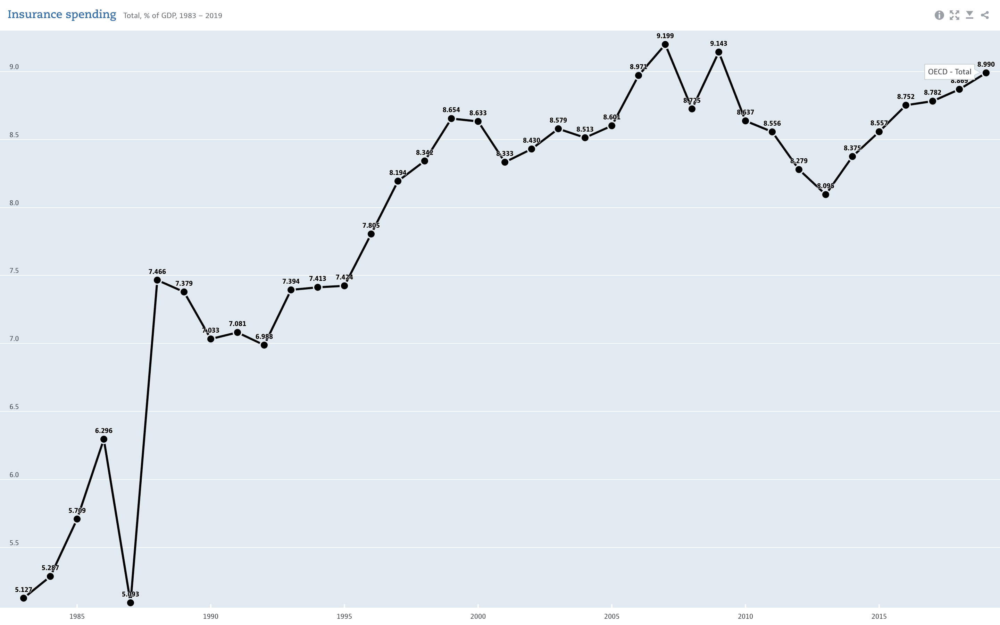
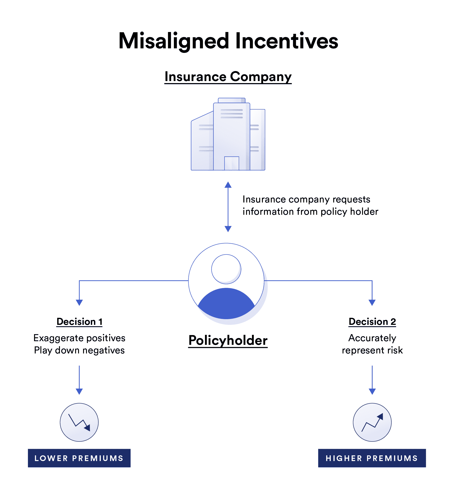
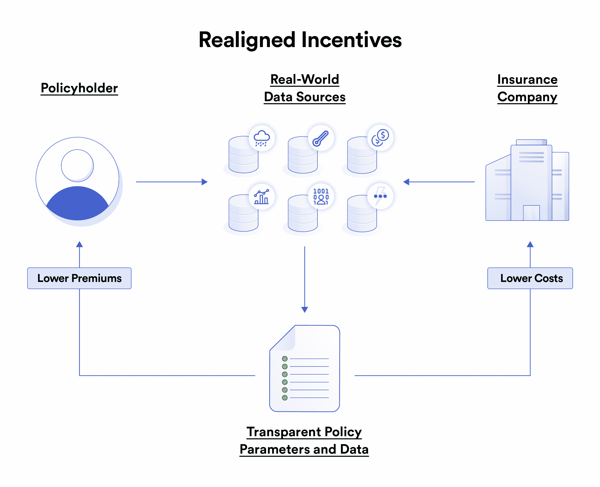
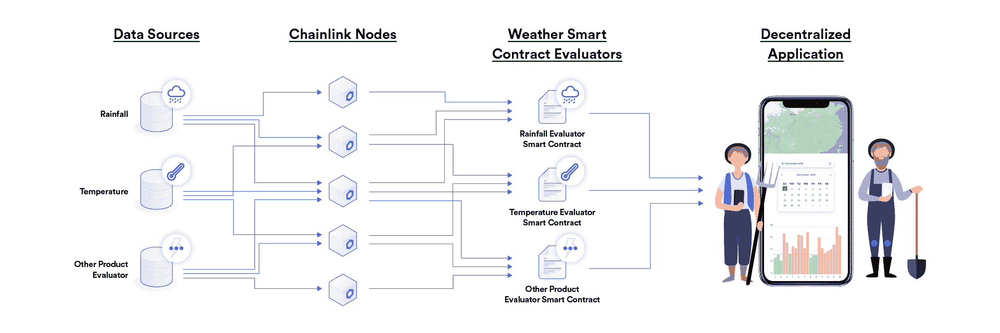
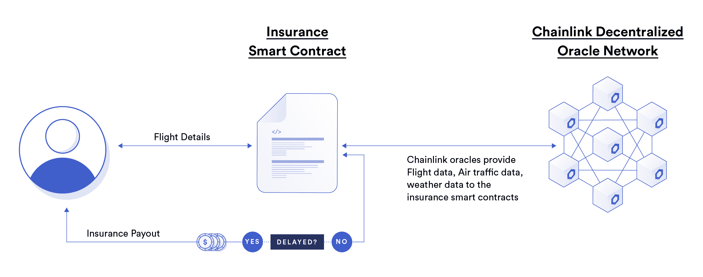
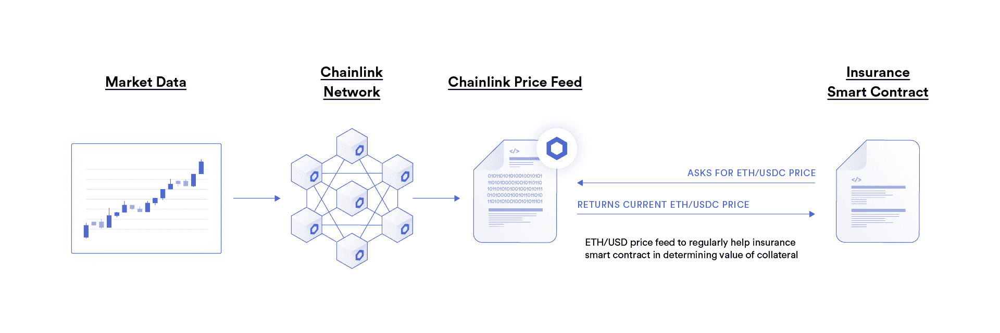
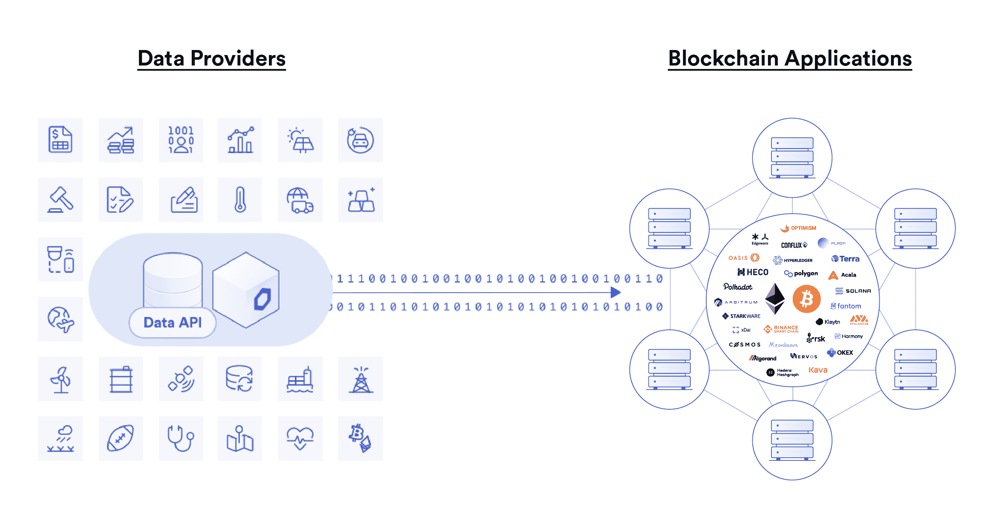
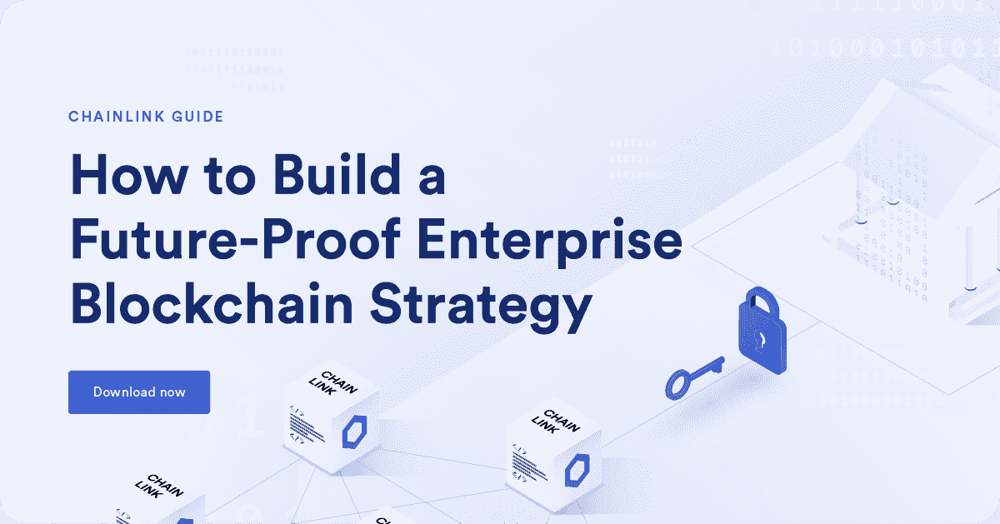

# 保险中的区块链

> 原文：<https://blog.chain.link/how-smart-contracts-can-decrease-information-asymmetry-build-trust-and-revolutionize-the-insurance-industry/>

保险目前是一个价值数万亿美元的全球性行业，为从世界上最大的公司到个人的每个人提供重要的风险管理，涵盖从数十亿美元的供应链活动到个人电子设备的损失。事实上，保险费占整个世界经济活动的近十分之一；根据经济合作与发展组织(OECD)的统计，大约全球 GDP 的 9%由直接毛保费组成。

<figcaption id="caption-attachment-3086" class="wp-caption-text">Insurance spending as a percentage of worldwide GDP from 1983-2019\. Source: OECD</figcaption>

在宏观层面上，保险在推动经济增长和推动创新方面发挥着至关重要的作用。在日常生活中，保险让车主、旅行者、房主、农民等等安心。这既是一种需要，也是一种事后的想法，因为大多数购买保险的人永远也不会去索赔。然而，那些最终提出索赔的人往往发现这个过程并不像想象中那么简单。

近年来，像区块链和智能合同这样的技术已经成为工具，有可能在各种各样的行业中释放出无限的价值，提供更高的效率和透明度，从而为所有利益相关者创造一个公平的竞争环境。这些技术提供了机会，可以增强为传统保险业提供动力的机制，传统保险业在历史上遭受了区块链及其相关技术可以缓解的问题，如过度依赖信任、信息不对称、繁琐的流程和不透明的做法。

## 当今保险业存在的问题

虽然保险在概念上很简单，但它有内在的复杂性，因为它是双方之间的金融协议，其中一方赢，另一方输。记住这一点，当前保险运作中许多问题的根源可以归结为一个词:透明度。  

不透明的流程是全球许多私人组织和公司事实上的标准。消费者不知道为什么网飞会推出一部特定的电视剧，或者公司到底是如何为他们的产品定价的，在很大程度上，这没关系——不是所有的过程都需要透明。然而，就保险而言，透明度应该是一项要求。不幸的是，目前的情况并非如此——由于双方的动机不一致，结果往往是不透明和旷日持久的索赔过程，对双方都没有好处。

### 投保人和保险公司之间的激励不一致

在消费者方面，投保人比保险公司更了解自己的情况。保险公司必须依靠投保人提供的信息来确定他们的风险状况、保费和免赔额。这导致了一种情况，即保险公司将从投保人提供的透明信息中获得巨大利益，而投保人被激励隐瞒负面信息并夸大正面信息以获得较低的保费。    由于缺乏对投保人的透明度，保险公司不断受到欺诈性索赔的轰炸。在美国，据估计，非医疗保健相关的保险欺诈每年花费保险公司400 亿美元，占索赔总额的 10%。保险业花费了大量资源来打击欺诈，这导致了更高的保单保费、更多的手动流程和更长的仲裁时间，相应地增加了管理和人工成本、承保程序、索赔处理和争议解决。

### 传统保险提供商的黑箱环境

另一方面，投保人看不到政策参数、保费定价和索赔处理的黑匣子。虽然他们可以做出概括性的假设，但事实是，许多投保人在很大程度上并不知道他们为什么会收到特定的定价，做出该决定的因素，甚至他们的索赔为什么会被拒绝。它们受制于保险公司的决定，保险公司在保险相关事务上有最终决定权——除非面临漫长而紧张的法律挑战。    这种缺乏透明度的情况导致了保单定价和价值的失衡，并刺激了投保人对系统进行博弈。虽然许多投保人是诚实的，但保险公司需要通过提高所有保费的基准成本来考虑不良因素，以便可靠地实现盈利。这使得核保政策和处理索赔对每个人来说都更加耗时、手动、昂贵和复杂，进一步侵蚀了保险公司和投保人之间的信任，并增加了投保人在不透明的流程和不当激励导致的互不信任的不健康循环中实施欺诈的动机。

<figcaption id="caption-attachment-3081" class="wp-caption-text">Policyholders are often rewarded for curating favorable information.</figcaption>

## 保险行业智能合同的优势

最近的技术创新，如区块链和智能合同，已经显示出帮助解决透明度这一导致上述互不信任循环的根本问题的潜力。

通过将区块链、 [智能合约](https://chain.link/education/smart-contracts) 以及分散化的 [神谕](https://chain.link/education/blockchain-oracles) 结合起来，有可能升级保险的基础设施，不仅解决透明度问题，还能简化整个保险流程，让全球被剥夺权利的消费者都能享受保险。分散的保险协议提供了更好、更快、更便宜和更信任最小化的操作能力，从而导致更快的保险索赔、仲裁和支付。

区块链保险公司的基础起点是智能合约(smart contracts)，这是一种软件程序，运行并存储在名为区块链的分布式分散分类账中。智能合同提供基于 if/then 参数的自动化执行，这些参数可以触发和取代传统保险协议的索赔处理部分，其方式高度可信、透明，并提供防篡改的策略仲裁。

这些自动执行的 if/then 条件可以外推至保险逍遥法外。如果投保人的航班被取消，保险赔付就会自动触发。如果保险智能合约被通知可验证的死亡证明，则启动人寿保险索赔流程。有了可靠的实现，智能合同可以在提高透明度和公平性的同时大幅降低相关成本，从而实现大部分保险流程的自动化。从针对恶劣天气的保险到 [海上保险](https://blog.chain.link/build-a-marine-insurance-smart-contract-with-chainlink/) ，更好的保险模式的可能性几乎是无穷无尽的。

<figcaption id="caption-attachment-3091" class="wp-caption-text">Mutually agreed-upon data sources result in realigned incentives and desirable outcomes.</figcaption>

### 数据驱动

当前的保险协议依赖于索赔处理器的解释，而智能合同则直接从数据中执行。例如，农作物保险赔付可以由天气数据触发，从而根据相关触发条件创建一个自动流程，而不是等待员工的手动输入。    数据驱动的保险智能合约将信息不对称向信息均等转变。保险提供商可以收到可核实的证据，证明索赔是由可信的数据生成实体(如大量物联网设备)触发的。这可以大大减少成本高昂的手动索赔验证，使保险单能够收到有关索赔及其合法性的明确答案，最终通过共享真实信息来源，不再需要任何一方提供无法验证的信息。在这种情况下，它是由卫星提供的特定位置的天气数据。

### 流线型的

由于智能合约是自动化的，并在分布式网络中冗余存储，因此它们更快、更便宜、更不容易出错。自动化使理赔流程得以简化，并使用实时数据进行数字验证。有许多保险协议可以使用智能合同的布尔逻辑来越多地取代后端工作。    通过智能合同，保险行业可以大幅节省与索赔处理、管理成本、法律费用和数据录入人工相关的成本。这些节省中的许多可以以更低的保费和更快的结算的形式传递给消费者。

### 数字化的

大多数保险合同——尤其是在企业界——都是双方签署的书面法律合同。这就产生了对人类和机器可读的动态契约的迫切需求，这种契约通常被称为李嘉图契约。李嘉图合同不仅将实物合同带入数字世界，还可以实现更快、可组合的修订，进一步简化流程，并允许可编码和不可编码条款共存。

创业公司如 [OpenLaw](https://medium.com/@OpenLawOfficial/the-smart-contract-stack-5566ea368a74) 和 Clause(为开发名为 [Accord 项目](https://twitter.com/AccordHQ/status/1031022745835003905?s=20) 的法律模板创造了基础)是开创性的解决方案，将现有的法律合同与区块链基础设施合并。

### 全球可访问

由于传统的保险模式基于信任，通常由法律系统强制执行，因此在金融和法律基础设施不可靠的发展中国家，世界各地的工人可能无法获得可靠的保险来源。区块链保险为从渔民到农民等被剥夺权利的工人提供了获得可靠保险的绝佳机会。

### 外部连接

为了给智能合同提供能够取代和改进传统保险结构的高级功能，还需要与外部数据建立安全、透明和保护隐私的连接。这是因为区块链本质上无法自行连接外部系统，这种限制就是俗称的 [区块链甲骨文问题](https://blog.chain.link/what-is-the-blockchain-oracle-problem/) 。    保险智能合约是通过消费和推送外部数据来运作的。它既需要数据输入来触发智能合同，也需要访问其他系统来触发结算。重要的是，外部连接保持智能合约的相同有价值的属性:确定性、安全性和可靠性。

作为应用最广泛的 [分散式 oracle 网络](https://chain.link/education/blockchain-oracles) ，Chainlink 以其分散式后端的相同属性，方便了数据双向进出智能合约。Chainlink 可以让保险合同访问数据输入，如物联网传感器、web APIs 和卫星/无人机图像——每一项都可以触发智能合同。它还让智能合约能够访问许多结算输出，如支付系统、其他区块链和后端数据库。通过 Chainlink oracle，智能合约可以可靠、安全地利用任何 API。

### 透明的

除了提供外部连接之外，通过 Chainlink oracles 传递给智能合同的数据在各个层面都具有高度的透明度，有助于进一步缩小保险提供商和所有保险形式的投保人之间的透明度差距。

一方面，保险公司将不再需要相信投保人的话。如上例所示，可以根据联网的物联网设备和可信的数据馈送来确定确切的事实来源。例如，连接到汽车的物联网设备可以明确证明汽车保险投保人在事故发生前的行动和行为。结合智能合同的自主性，保险提供商可以基于相关投保人数据的透明来源构建、定价和执行索赔。

在投保人方面，从定价和政策参数到索赔批准或拒绝，保险合同可以变得更加透明。智能合同详细说明了流程将如何运行，允许更短的等待时间，增加支付细节的安全性，以及所有人都公开同意的真正公平和透明的流程。

智能合同是区块链保险的核心。通过运行端到端、自主执行的代码片段，在初始编码后不需要人工操作，赔付过程是自动和透明的，基于投保人和保险提供商均可验证的防篡改因素。

## 区块链保险用例

如果智能合同完全连接到具有足够保密性和安全性的外部数据，许多当前的保险模型可以被智能合同取代，同时其他新模型可以被推向市场。下面是几个例子，说明区块链的项目目前如何利用智能合同和 Chainlink oracles 对传统保险模式进行创新。

### 参数保险

**参数保险，即针对特定事件发生的保险，是当今区块链保险业中一个引人注目的使用案例。下面是两个例子，说明在天气和航班结果等易于验证的事件中，如何使用 Chainlink oracles 和智能合同来优化保险流程。**

 **#### 作物保险

**以区块链驱动的[参数保险](https://blog.chain.link/parametric-insurance-smart-contract/)平台 [Arbol](https://www.arbolmarket.com/) 为例，它使用智能合约技术提供全球可获得的天气保险。**

 **想象你是一个农民，需要天气保险来对冲干旱风险。你的作物需要至少 20 英寸的降雨量才能上市，你想买保险，如果降雨量少于 20 英寸，保险会给你赔付。有了 Arbol 的智能合同保险产品，这一过程变得尽可能简单。

如果降雨量超过 20 英寸，农民就拿不到钱。如果少于 20 英寸，农民自动获得报酬。因为智能合约是在分散的基础设施上运行的，所以没有办法篡改或操纵这种预先安排好的协议。相反，合同已经定义了所有的参数:农民的位置、风险参数和保险金额。一旦设定，保险赔付基于预设参数和天气结果确定性地执行。

<figcaption id="caption-attachment-3088" class="wp-caption-text">Chainlink nodes connect data sources to evaluator smart contracts and power decentralized insurance applications.</figcaption>

这个过程不仅仅是农作物保险独有的。从根本上说，基于真实世界数据源的区块链保险打破了保险提供商和投保人之间导致信任缺失的不平衡权力动态。现在，处理时间，政策参数，甚至定价都可以在链上以对各方完全透明的方式发生。投保人不再需要等待保险公司完成手动流程。通过利用区块链和分散式 oracle networks 提供的更高的效率和透明度，Arbol 的参数保险产品已经扩展到了能源、海事和休闲领域。    在这段视频中，Chainlink 联合创始人 Sergey Nazarov 进一步解释了 [混合智能合约](https://blog.chain.link/hybrid-smart-contracts-explained/) 如何通过现实世界的投入实现技术强制协议，从而使新兴市场的用户能够利用作物保险等新的解决方案来对冲经济风险:

[https://www.youtube.com/embed/cGeiAJsVPKQ?feature=oembed](https://www.youtube.com/embed/cGeiAJsVPKQ?feature=oembed)

#### 飞行保险

[Etherisc](https://etherisc.com/#products) 是区块链的一个保险项目，提供众多产品，从航班和飓风保险到天气保险。在这种情况下，我们将重点关注其航班保险产品，以了解构建稳健的区块链参数保险产品所需的三个核心流程。

1.  Etherisc 需要解决的第一个核心保险流程是如何收集保单参数，并将关于消费者风险的数据传递到智能合同中。在这种情况下，必须将航班保险以及始发地和目的地机场添加到智能合同中。这可以通过将前端基础设施与 Chainlink oracles 连接起来轻松实现，后者以安全、信任最小化和可靠的方式将航班号、日期、时间等提交给保险合同。
2.  还必须为消费者建立连锁保单定价。Etherisc 需要以一种安全的方式提供报价，以确保保单购买者的过程公平公正。无论是计算链上价格还是链下价格，Chainlink oracles 都能够以防篡改的方式将结果提交到智能合同中，从而验证定价是通过使用第一个流程中详细介绍的链上参数计算的。
3.  最后，Etherisc 需要想出如何自动化索赔流程，并在必要时进行赔付。为了进行自动支付，必须将来自 FlightStats API(或任何真实世界的第三方索赔理算员)的实际航班延误数据交付给链上智能合同。smart contract 计划对 Chainlink oracle 进行另一次查询，以了解计划航班的到达时间。如果航班延误，智能合同会自动支付费用。

<figcaption id="caption-attachment-3079" class="wp-caption-text">Travel insurance powered by smart contracts need real-time, high-quality data about travel details.</figcaption>

如果不利用 Chainlink oracles，Etherisc 将无法完成需要信任最小化的链外数据和计算的关键功能。这是因为 [【区块链】保险用例](https://chain.link/use-cases/insurance) 依赖于来自物联网(IoT)设备和 Web APIs 等来源的安全、可靠的链外数据的可用性。数据越精细、越安全、越准确、越透明，区块链保险公司在降低与验证细节和处理索赔相关的成本方面就变得越有效。

### 加密保险产品

在区块链产业中兴起的另一类保险是基于加密货币的金融保险。一个有启发性的例子可以在 Etherisc 的另一个产品中看到:贷款人保险，以对冲连锁贷款的违约和系统风险。    众多链上协议专门用于连接加密货币出借人和借款人。过程简单而熟悉。借款人提供一定数量的抵押品，由于缺乏财务数据和个人责任，通常比借入的数量更多，并按固定利率向贷款人支付利息。另一方面，放贷者通过放贷获得稳定、风险相对较低的收益。    然而，加密货币市场比传统市场更加不稳定，分散借贷平台的突发性质以代码漏洞的形式留下了未知的系统风险——导致迫切需要贷款人的保险。Etherisc 目前正在努力推出贷款人保险，这种保险依赖于借款人抵押品价值的急剧下降，保护贷款人免受意外事件的影响。    这是可以通过智能合约和 [Chainlink 价格 Feeds](https://data.chain.link/) 的结合，将实时价格参考数据直接传递给智能合约。Chainlink oracles 可以将价格数据持续传送到保险智能合同，以准确计算借款人的抵押品价值。如果价值下降到一定数额以下，将自动向贷方支付，这大大降低了使用分散贷款协议所涉及的系统风险。

在这种情况下，一个强大的链外价格数据来源支撑着一个运行良好的保险智能合同。如果智能合约的价格有误，整个系统就会崩溃。链上的价格参考数据必须是防篡改和绝对可靠的。这就是为什么 Chainlink Price Feeds 在数据源、oracle 节点和价格聚合级别上实现了多层分散化，从而确保交付给智能合同的价格数据尽可能安全和准确。

<figcaption id="caption-attachment-3087" class="wp-caption-text">Market data is monitored by the Chainlink Network and passed to the insurance smart contract to determine the value of a borrower’s collateral.</figcaption>

金融安全是采用分散化金融产品的必要条件，基于加密货币的保险有望帮助众多规避风险的个人和组织开始进入这一新兴市场。

### 连锁保险产品的货币化数据

**正如所证明的，链上保险需要基础设施来为保险智能合约提供高质量、可信的数据源，以保持区块链提供的底层安全基础设施和构建在其上的智能合约。在这方面，Chainlink 在分散式 oracle 网络市场上处于领先地位，这些网络可以安全地将数据提供商和智能合同相互连接起来。    通过 Chainlink，任何数据提供商都可以轻松地将其 Web APIs 货币化，并开始直接向需要它们的区块链应用程序出售数据。这代表着进入一个不断增长的市场和建立新的收入来源的机会。像 Accuweather、美联社和 Swisscom 这样的领先组织已经因为这个原因进入了 Chainlink 网络。**

 **此外，传统保险组织一百多年来积累的丰富数据可以帮助区块链保险项目更好地定价和承保保险合同。精细调整的机器学习模型和专有数据集为新兴项目提供了开始运营的强大基础，而数据分析产品则允许传统保险公司专注于现成的承保模型。通过 Chainlink 和智能合同，传统保险公司现在有了一个独特的机会来利用 100 多年的专有数据，并使其数据产品成为未来区块链保险项目的宝贵组成部分。    随着区块链行业的发展和新的智能合同保险用例的出现，高质量的保险数据提供商将对分散式应用变得越来越重要，因为他们希望与众不同，并为他们的客户提供世界级的体验。如果您是一个拥有智能合同使用案例相关数据的组织，请探索作为数据提供商 加入 Chainlink 网络意味着什么。

<figcaption id="caption-attachment-3078" class="wp-caption-text">Any data provider can supply data to blockchain applications through the Chainlink Network.</figcaption>

## 下一代保险模式

支持 Chainlink 的智能合同为保险行业提供了一种从基于信任的手动系统向更加自动化、信任最小化的系统转变的方式。随着保险行业向保险提供商和投保人之间 1:1 的信息平衡转变，信息不对称会减少。信息来自提供真实来源的第三方来源，而不是当前模型中无法证实的道听途说。

索赔流程将重点从个人解释转变为“事件”的执行，通过物联网数据进行确定性验证，并以用户隐私为出发点。信任得以重新建立，因为一旦结果发送到区块链，任何一方都无法篡改。随着一切自动化，效率提高了。由于欺诈行为大幅减少，投保人的保费和保险公司的成本都降低了。在这个新发现的体系中，唯一受到惩罚的利益相关者是不良行为者。

区块链、智能合同和去中心化神谕将引发一场范式转变，转向以信息对等为核心的信任最小化保险模式，许多保险公司正在关注这一趋势。在德勤的一项调查中，58%的保险公司预计在未来一年增加区块链和分布式账本技术的支出。虽然这不太可能在一夜之间发生，但保险公司和数据提供商开始积极研究支持 Chainlink 的智能合同可以为他们的业务带来什么，以及他们如何与新兴的区块链保险行业保持同步，这是有利的。

<figcaption id="caption-attachment-5087" class="wp-caption-text">Explore key considerations for building a future-proof enterprise blockchain strategy.</figcaption>

*要了解更多关于智能合同和甲骨文给保险行业带来的好处，请访问 [Chainlink 的保险用例页面](https://chain.link/use-cases/insurance)或[联系专家](https://chainlinkcommunity.typeform.com/to/OYQO67EF?page=blog)。*******