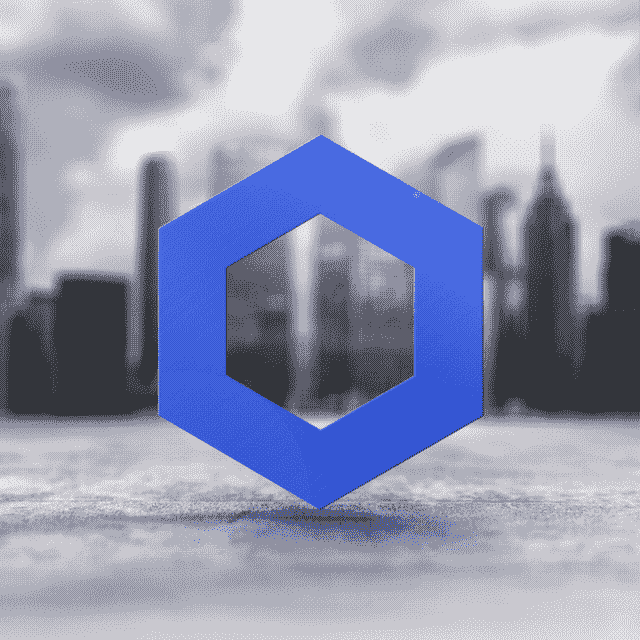
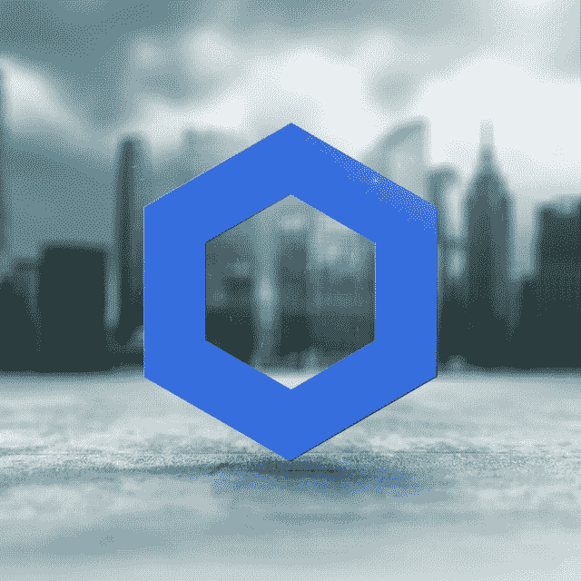
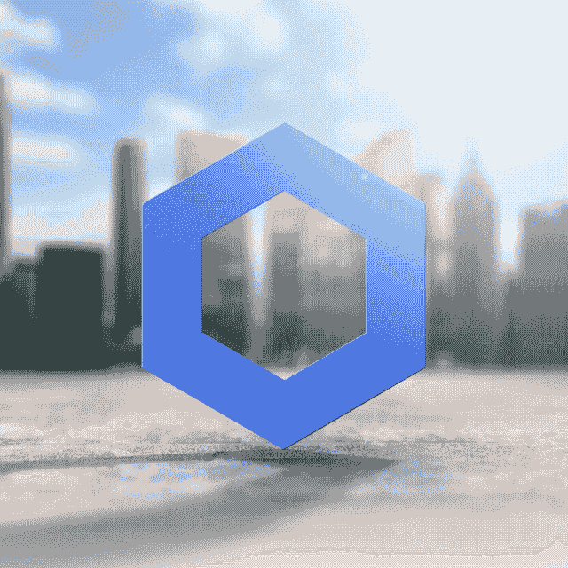
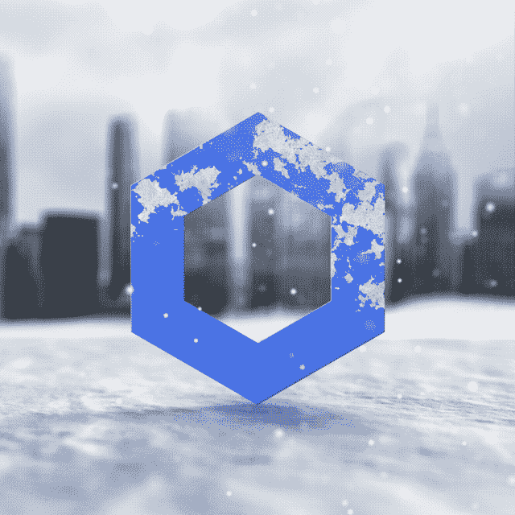

# 如何在多边形上构建动态 NFTs

> 原文：<https://blog.chain.link/how-to-build-dynamic-nfts-on-polygon/>

动态不可替代令牌(dNFTs)是 NFT 空间发展的下一个阶段，它将NFT 的可验证的独特性质与动态数据输入和链外计算 相结合。 [神谕](https://chain.link/education/blockchain-oracles) 是将动态元素引入 NFT 的基础，为它们提供输入，如可证明的公平性、防篡改的随机性和来自现实世界的各种数据。

在本技术教程中，您将学习如何根据 Polygon 上的 Chainlink oracles 提供的实时天气数据构建 dNFTs。

## 什么是多边形？

[多边形](https://polygon.technology/) (原 Matic Network)是一个构建以太坊兼容区块链的缩放框架。Polygon 不是只提供一两个扩展解决方案，而是创建一个连接多个不同扩展解决方案的生态系统，包括具有不同共识机制和第 2 层选项的侧链，如等离子体、乐观汇总和 ZK 汇总。Polygon 的框架还允许新项目快速轻松地构建自己独特的缩放解决方案。Polygon 凭借其以太坊虚拟机(EVM)兼容性、可选的共享安全模型及其高级灵活性，与其他区块链扩展和互操作性项目相区别。

## 多边形建筑

基于 NFT 的热门游戏项目，如 Aavegotchi 和 Polychain Monsters，已经使用 Polygon 的缩放技术推出，两者都集成了[【chain link】可验证随机函数(VRF)](https://chain.link/solutions/chainlink-vrf) ，为用户创造更具活力的体验。然而，可验证的随机性并不是开发人员在多边形上构建 dApps 的唯一输入。通过利用 Polygon 上的 Chainlink 提供的天气温度反馈，开发人员可以创建动态的 NFT，这些 NFT 根据安全 oracles 提供的链外数据而变化。

## 为什么动态 NFT 很重要？

[](https://chain.link/education/nfts)不可替代的代币(NFT)通常用于表示独特资产的所有权，如艺术品，但它们也可以用于表示动态资产，如体育比赛中球员的统计数据。可以使用数据创建密码安全、分散和防欺诈的交易卡，并在数据发生变化时实时更新，例如，当获得一个新分数或记录了一次成功的协助时。这为 NFT 收藏家创造了一个新的新奇水平，并在 NFT 的游戏应用中打开了新的效用。

由神谕支持的动态 NFT 在游戏 dApp Aavegotchi 中扮演着关键角色，它集成了 Chainlink VRF，为其提供可证明的随机性来源。Chainlink VRF 有助于确保公平地确定 Aavegotchi dNFTs 的独特特征，并为不可预测的游戏场景以及随机的 DAO 陪审员选择提供动力。Aavegotchi 在 Polygon 的第二层 PoS 链上推出，由于接近零的交易费用和快速的结算时间，使游戏能够经济高效地扩展以满足用户需求。阅读完整的 [Aavegotchi Chainlink 案例研究](https://chain.link/case-studies/aavegotchi) 了解流行游戏 dApp 如何在多边形上开创动态 NFTs。

Chainlink 通过提供抗操纵的低成本链外服务，在支持多边形等扩展解决方案方面发挥着至关重要的作用。使用 Chainlink，开发人员可以访问天气数据，例如，构建真实世界数据的 dNFT 表示，如某些地理位置的当前温度。

【dNFTs 的一个用例是支持 [基于区块链的保险](https://blog.chain.link/blockchain-insurance/) 。保险单可以转换成 dNFTs，允许根据 Chainlink oracles 从外部世界获取的天气数据定制作物保险单。由于 dNFTs 允许跨广阔地理区域的实时覆盖，并提高了支付效率，因此它是传统保险形式的强大替代方案，传统保险形式往往受到人工处理延迟和主观评估的影响。

2021 年春季 Chainlink 虚拟黑客马拉松的 GeoDB 地理定位甲骨文和政府技术奖获得者 FarmerNet NFTs 使用 Chainlink 为农民创建了一个区块链市场，以获得碳信用额收入。像这样的项目可以让买家通过 dNFTs 获得他们主张的碳减排和可再生能源使用的不可改变的证据。这只是 oracles 在创建下一代 NFT 中提供的众多好处中的一个例子。

## 如何部署动态天气 NFTs

因为 Polygon 是 EVM 兼容的，我们可以使用 Solidity 环境中的工具，比如 Truffle、Hardhat、MetaMask 等等。在本教程中，我们将使用 Truffle，这是一个智能契约开发框架，允许我们使用 Polygon。

### 设置环境变量

首先，我们需要设置环境变量，所以我们需要一个 PRIVATE_KEY 和一个 MATIC_RPC_URL 环境变量。你的 PRIVATE_KEY 是你钱包的种子短语，你可以从 [Infura](https://infura.io/) 等节点提供商服务中找到 MATIC_RPC_URL。你的钱包里还需要一些 testnet MATIC(孟买)代币，可以从 [孟买水龙头](https://faucet.matic.network/) 中获得。

然后，要么在 bash_profile 文件中设置它们，要么将它们导出到您的终端:

```
export MNEMONIC='cat dog frog....'
export RINKEBY_RPC_URL='www.infura.io/asdfadsfafdadf'
```

然后，您可以通过执行以下命令开始回购，这些命令将在多边形链上部署动态 NFT:

```
yarn global add truffle

git clone https://github.com/kwsantiago/weather-nft 
cd weather-nft 
yarn

truffle migrate --network  mumbai
```

我们刚刚在链上部署的 dNFT 将根据从 [WeatherFeed.sol 文件](https://github.com/kwsantiago/weather-nft/blob/main/contracts/WeatherFeed.sol#L53) 的 getWeather()函数中调用的天气数据进行更新，该文件获取马萨诸塞州波士顿的当前温度。

```
function getWeather() public onlyOwner
returns (bytes32 requestId) {
 Chainlink.Request memory req = buildChainlinkRequest(jobid, address(this), this.fulfill.selector);
 req.add("city", "boston");
 req.add("copyPath", "weather.0.main");
 requestId = sendChainlinkRequestTo(oracle, req, fee);
}
```

祝贺您，您已经部署了您的第一个 dNFT，并且可以在天气变化时看到它的运行！









### 在 Etherscan 上查看您的 dNFT

您可以免费获得一个 Etherscan API 密钥，并与您的 dNFTs 进行链上交互。然后，可以将 ETHERSCAN_API_KEY 设置为环境变量。

我们可以通过执行以下操作来验证这一点:

```
yarn add truffle-plugin-verify

truffle run verify WeatherNFT --network mumbai --license MIT

truffle run verify WeatherFeed --network mumbai --license MIT
```

这将验证并发布您的合同，您可以前往它提供给您的“阅读合同”部分。

否则可以使用[one clickdapp](https://oneclickdapp.com/)只需添加合同地址和 ABI 即可。您可以在“build/contracts”文件夹中找到 ABI。请记住，ABI 并不是整个文件，只是表示“ABI”的部分。

## 立即开始构建动态 NFT

当您将快速且经济高效的平台(如 Polygon)与强大的分散式 oracle networks (DONs)相结合时，创建 dNFTs 就变得非常简单，后者通过智能合约扩展了可能性。Polygon dApps 还可以将 Chainlink 用于广泛的其他用例，例如使用 Polygon[](https://blog.chain.link/how-to-get-a-random-number-on-polygon/)上的随机数来构建可证明公平的区块链游戏 或引用分散的 [价格来支持 Polygon](https://blog.chain.link/matic-defi-price-feeds/) 以支持下一个革命性的[DeFi](https://chain.link/education/defi)协议。在构建安全、功能丰富的 dApps 时，Chainlink 成熟的 oracle 基础设施为开发人员开启了无数可能性。

阅读[docs . chain . link](https://docs.chain.link/)的文档，探索更多使用 Chainlink 构建的方法。 讨论一个整合， [联系专家](https://chainlinkcommunity.typeform.com/to/OYQO67EF?page=announcement) 。