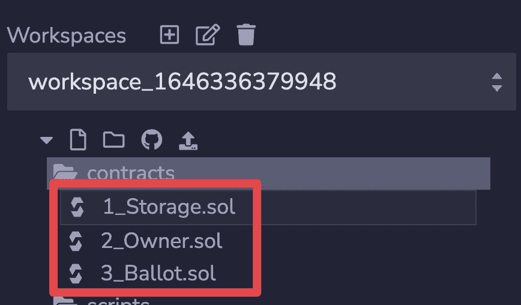
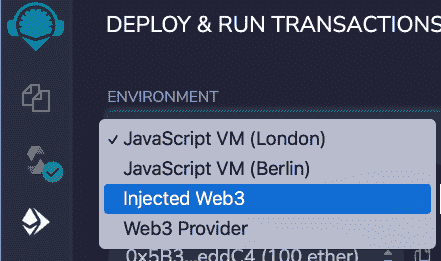
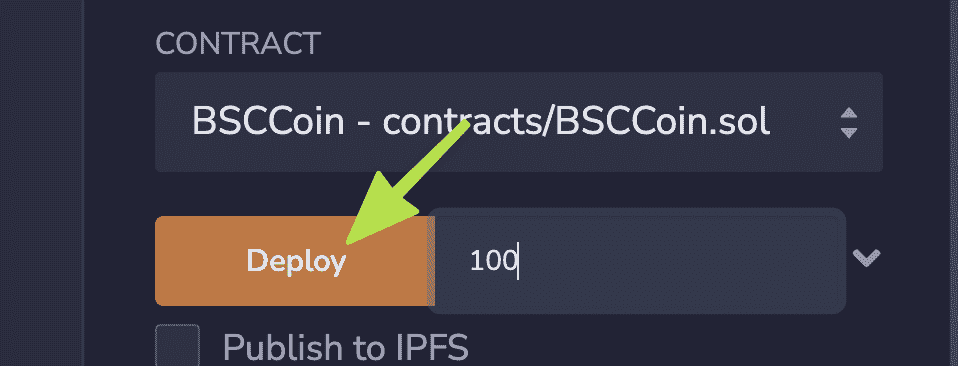
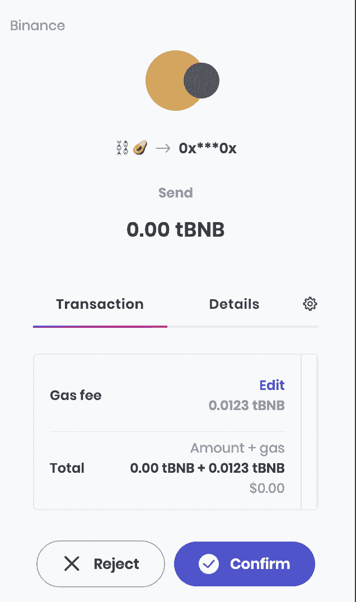
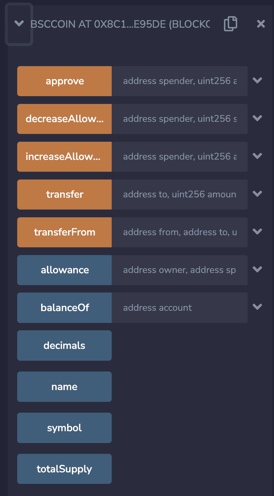

# 如何在 BNB 链上创建 BEP-20 令牌

> 原文：<https://blog.chain.link/how-to-create-a-bep-20-token/>

BEP-20 代币是 BNB 链交易的基础。在本教程中，您将学习如何创建 BEP-20 令牌并部署到 BNB 链。

## 什么是 BEP-20 代币？

BEP-20 是 BNB 链上令牌的标准，建立在 ERC-20 标准设定的框架之上。BEP-20 和 ERC-20 标准都创建了 *可替换的* 令牌，它们是可互换的。可替代物品是你关心数量的东西——它们不是唯一的。法定货币就是一个很好的例子:你不在乎你有多少美元，而是在乎有多少美元。 *不可互换* 项目不可互换。你关心你拥有哪一个。

## 什么是 BNB 链？

BNB 链是通过以太坊协议(Geth)的硬分叉或永久分叉创建的。虽然它与以太坊非常相似，但还是有一些显著的区别。

最显著的区别是 BNB 链使用了不同的共识机制。BNB 链使用 21 个验证器，轮流产生区块。这些验证者由授权人支持，授权人持有 BNB 链的本地硬币 BNB。这种共识机制被认为是权威的证明(PoSA)。根据赌注的金额选择验证人，选出前 21 名候选人进行验证。

## BNB 链条的优势

鉴于 BNB 链链是通过 Geth 的一个分叉创建的，它是 EVM 兼容的。这意味着你可以在 BNB 链和以太坊上部署相同的合同。作为一个 PoSA 网络，BNB 链有不同于以太坊的权衡。这为特定的用例带来了一些优势。值得注意的是，BNB 连锁相对来说速度快，成本低，这吸引了网络开发商。

## 将资产连接到 BNB 链

你如何将你的资产从以太坊主链转移到 BNB 链？

要将资产从以太坊转移到 BNB 链，您需要与 [币安桥](https://www.bnbchain.world/en/bridge) 互动。这是一份合同，它将接管你在以太坊这边的资产，并在稍有延迟后，在币安这边创建该资产的版本。

你可能会认为这有点像在街机上使用代币。你把你的钱(ETH)交给街机雇员(桥牌合同)，反过来，他们创造代币(ETH BEP-20，ETH 的 BEP-20 版本)在街机(BNB 链)内使用。当你在游戏厅的时候，你可以在那里使用代币(ETH BEP-20)。如果你想离开，你可以把你的代币(ETH BEP-20)还给员工(过渡合同)，他们会销毁或烧毁代币(ETH BEP-20)。然后他们会把代币的钱(ETH)还给你(ETH BEP-20)。

## 你需要什么

要开始在 BNB 链上构建，你需要与你在任何 EVM 兼容链上使用的工具相同的工具。这就是使用 EVM 兼容链的优势:通常，它们支持相同的工具。对于本教程，我们将使用:

[](https://remix.ethereum.org)—一个基于网络的固化 IDE

[勇敢钱包](https://brave.com/wallet/)—类似于 [元掩码](https://metamask.io) 的加密钱包

[BNB 链家考试网](https://testnet.bscscan.com) —BNB 链家考试网

[币安龙头](https://testnet.binance.org/faucet-smart)—获取测试网 BNB

[](https://openzeppelin.com)——区块链合约的安全标准

## 连接 BNB 链条测试网

在你开始在 BNB Chain testnet 上构建应用程序之前，你需要设置好你的钱包。一个很好的工具是 [链表](https://chainlist.org/) ，它允许你简单地连接你的钱包并从那里添加链(你需要先设置你的钱包 )。)关于自己添加链条的细节可以在 [币安文档](https://docs.binance.org/wallets/bsc-wallets.html) 中找到。

**网络名称:**Testnet  **新建 RPC URL:**[https://bsc-dataseed.binance.org/](https://bsc-dataseed.binance.org/) **ChainID:**97  **符号:**BNB  **阻止资源管理器 URL:**[](https://testnet.bscscan.com)

## 获取测试网 BNB

BNB 链测试网的本地令牌是 BNB。为了部署和与契约交互，我们需要获得一些。前往 [【币安】龙头](https://testnet.binance.org/faucet-smart) 获取一些 testnet BNB。你需要提供你的钱包地址，然后点击“给我 BNB”


## 建立合同

头转向 [混音 IDE](https://remix.ethereum.org/) 开始。

现在可以忽略合同样本。



在合同目录中创建新合同。


将其命名为 `BSCCoin.sol`

```
// SPDX-License-Identifier: MIT
pragma solidity ^0.8.0;
import "@openzeppelin/contracts/token/ERC-20/ERC-20.sol";
contract BSCCoin is ERC-20 {
 constructor(uint256 initialSupply) ERC-20("BSCCoin", "BSCC") {
 _mint(msg.sender, initialSupply);
    }
}
```

让我们来看看这段代码

首先，我们定义我们将使用的 Solidity 版本。

```
pragma solidity ^0.8.2;
```

这是来自 OpenZeppelin 的基本 ERC-20 令牌。我们把它写进了合同。在创建 BEP-20 令牌时，请记住它们与 ERC-20 令牌非常相似。因此，我们可以利用 OpenZeppelin ERC-20 合同来构建我们的令牌。

```
import "@openzeppelin/contracts/token/ERC-20/ERC-20.sol";
```

详见 [入门页面](https://openzeppelin.com/contracts/) 。

使用 OpenZeppelin 的合同意味着我们的合同可以简单得多。我们继承了 ERC-20 契约，并使用它来创建我们的 BEP-20 令牌。

```
// Define our contract and inherit the ERC-20 contract
contract BSCCoin is ERC-20 {
 // When the contract is run create a BEP-20 Token
 // The token will be names "BSCCoin"
 // The token will have the symbol "BSCC"
 constructor(uint256 initialSupply) ERC-20("BSCCoin", "BSCC") {
 // Create an initial value for the runner of the contract
 _mint(msg.sender, initialSupply * 10 ** decimals());
    }
}
```

## 关于小数的一个注记

坚固性不使用小数。这意味着你需要在任何时候使用小于整数的数字时使用定点运算。您需要在值中存储固定的小数位数。在这种情况下， `decimals()` 被设置为 18，这意味着我们正在用 `10^18` 乘以我们铸造的代币数量。

## 展开

有了这份合同，你就有了一个功能齐全的 BEP-20 代币！现在是时候将它部署到 BNB 链条测试网了。

先把环境改成“ 注入 Web3 。”这将使 Remix 通过你的钱包与区块链互动。



接下来，确保您正在部署正确的合同。那就是这个例子中的“”。


指定要创建的令牌数量，然后单击“Deploy”按钮，您应该会看到一个确认按钮。我们正在部署到一个真实的区块链。因此，会涉及到汽油费。





合同完全展开可能需要一段时间。一旦完成，您将在“已部署的合同”下看到它您可以看到合同中提供的所有功能。这些函数是从 OpenZeppelin 契约中导入的。



## 验证

一旦合同被部署，我们可以仔细检查它是否出现在 BNB 连锁测试网上。

复制合同地址，头像到[BNB](https://testnet.bscscan.com/)。


输入合同地址并搜索。

你应该看看合同和令牌。


祝贺你，你刚刚向 BNB 连锁测试网部署了一个 BEP-20 令牌！

## 何去何从

从这里，你可以把你的令牌带到 BNB 连锁店 mainnet，或者你可以给它增加更多的功能。OpenZeppelin 合约支持额外的铸造、燃烧、投票等等。查看 [OpenZeppelin 文档](https://docs.openzeppelin.com/contracts/4.x/BEP20) 了解全部细节。

现在你已经知道如何制作 BEP-20 代币，许多新的机会正在向你敞开。您可以使用它与 DeFi 应用程序进行交互，创建一个治理协议，或者启动一个 Chainlink Price Feed 来跟踪其价格。

您还可以查看完整的视频演练，了解如何在 BNB 链上创建 BEP-20 令牌:

[https://www.youtube.com/embed/If6h0y9JnJQ?feature=oembed](https://www.youtube.com/embed/If6h0y9JnJQ?feature=oembed)

访问[chain . link](https://chain.link/)或阅读[docs . chain . link](https://docs.chain.link/)上的文档，了解更多关于 Chainlink 的信息。要讨论整合，[联系专家](https://chainlinkcommunity.typeform.com/to/OYQO67EF)。