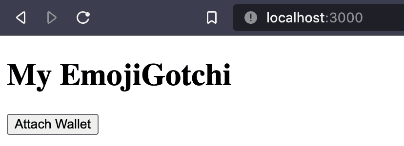
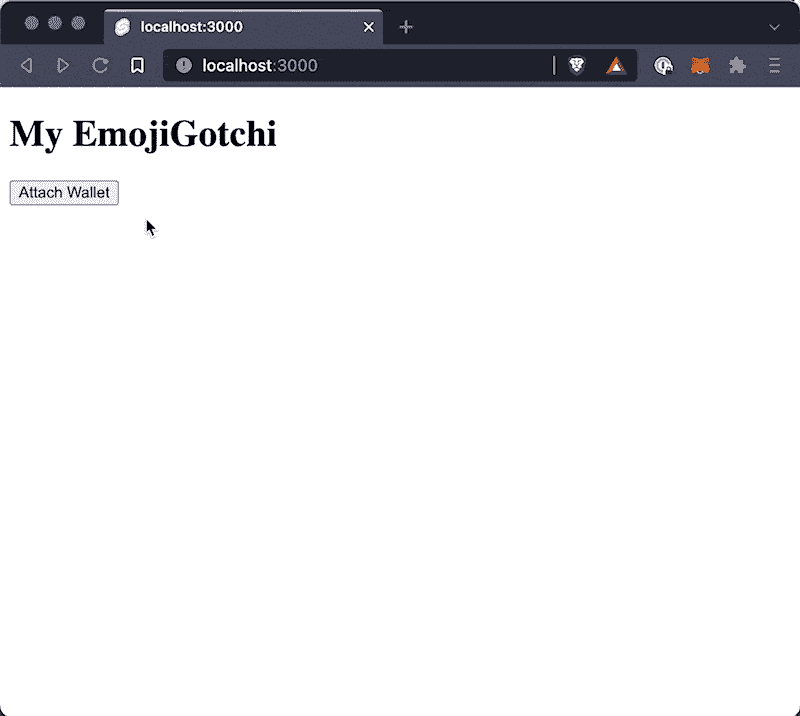
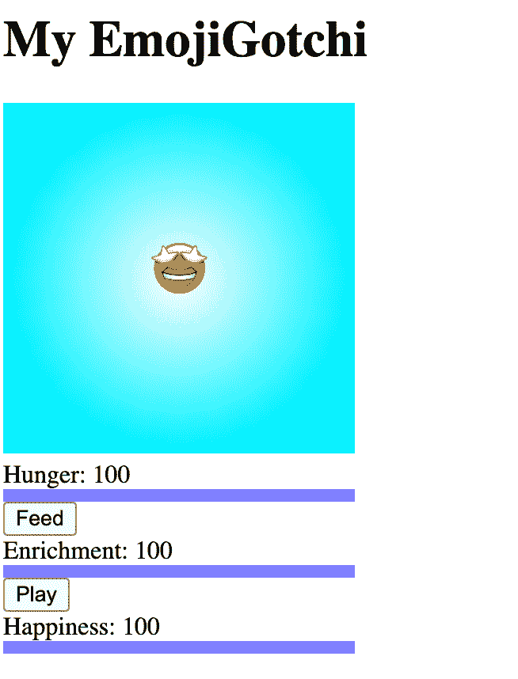

# 如何创建一个 NFT 游戏

> 原文：<https://blog.chain.link/how-to-create-an-nft-game/>

在本教程中，我们将构建一个基于 NFT 的 Web3“游戏”我说的“游戏”是指一个 100%储存在区块链上的电子鸡一样的 dApp。

我们将在区块链储存所有资产和一切关于 dApp 的东西。让我们来看看我们将构建什么。dApp 的 web 应用程序部分非常简单。它会让我们接触到我们的表情符号。


## 起始项目文件

你可以在这里 找到这个项目的首发 [。](https://github.com/smartcontractkit/smart-contract-examples/tree/main/EmojiGotchi)

它分成了三个不同的分支。首先，我们将在主分支。这是开始的最好地方。回购被分为三个不同的分支，一旦我们建立了合同，代码应该匹配铸造分支。一旦构建出完整的应用程序，它应该与最终的分支相同。这个分支存放完整的应用程序。

我们将使用 [代工厂](https://book.getfoundry.sh/getting-started/installation.html) 。Foundry 是以太坊开发的新工具包。Foundry 很快，测试写的很扎实。编写测试时不必在 Javascript 和 Solidity 之间切换上下文，这有助于获得良好的用户体验，而且契约代码非常棒！

您可以在文档中找到铸造厂 [的安装说明。](https://book.getfoundry.sh/getting-started/installation.html)

你也将在前端使用 SvelteKit。我是 SvelteKit 的粉丝，因为它很容易解释发生了什么。你会接触到一点点“苗条的魔力”，但总的来说，这是一个非常简单的起点。让我们开始吧。

该项目被设定为单一回购。有两个子文件夹， `foundry` 和 `svelte` ，如果你选择使用那个编辑器，还有一点 VS 代码的魔力。工作台标题栏将根据您所在的项目部分进行着色。

当比较 Foundry 和 SvelteKit 的基本安装时，我设置了一些额外的工具。

```
deploy.sh

#!/usr/bin/env bash

# Read the Mumbai RPC URL
echo Enter Your Mumbai RPC URL:
echo Example: "https://polygon-mumbai.g.alchemy.com/v2/XXXXXXXXXX"
read -s rpc

# Read the contract name
echo Which contract do you want to deploy \(eg Greeter\)?
read contract

forge create ./src/${contract}.sol:${contract} -i --rpc-url $rpc
```

这将允许您将我们的合同部署到孟买，所有这些都是读取变量，而不显示您在命令行上键入的内容。这将确保您的私钥不会存储在您的命令行历史中。

```
remappings.txt

@openzeppelin/=lib/openzeppelin-contracts/

ds-test/=lib/ds-test/src/ 
```

这个重映射文件允许你使用像 OpenZeppelin 契约这样的东西，并以你通常使用其他工具如 Hardhat 或 Remix 的方式导入它们。该文件将导入重新映射到它们所在的目录。我还通过 `forge install openzeppelin/openzeppelin-contracts` 安装了 OpenZeppelin 合同，这些将用于创建 ERC-721 合同。

## 开始构建 dApp

### EmojiGotchi 截图

让我们再来看看表情符号。这里有一些事情需要考虑。首先，图像是存储在链上的 SVG。你需要追踪一些不同的价值观:饥饿、充实和幸福。你有两件不同的事情可以做:你可以喂它，和它一起玩。让我们剔除一些测试。如果您在 Foundry 目录中查找，您有您的 `src` 目录，并且在 `src` 中，您有几个东西。

Foundry 为我们提供了基本的合同和测试。这使我们能够运行 `forge test` 。

Forge 是 Foundry 内部的命令之一。当我们运行 `forge test` 时，它编译我们的契约并运行我们的测试，您可以看到我们的测试通过了。

```
❯ foundry (main) ✘ forge test

[⠒] Compiling...
No files changed, compilation skipped

Running 1 test for src/test/Contract.t.sol:ContractTest
[PASS] testExample() (gas: 190)
Test result: ok. 1 passed; 0 failed; finished in 222.21µs
❯ foundry (main) ✘ 
```

这也说明你已经正确安装了 Foundry，你可以继续构建出合约。

我们继续添加一个新文件， `EmojiGotchi.t.sol` 。 t 表示这是一个测试。

```
src/test/EmojiGotchi.t.sol // SPDX-License-Identifier: UNLICENSED
pragma solidity 0.8.13;

import "../EmojiGotchi.sol";
import "ds-test/test.sol";

contract EmojiGotchiTest is DSTest {
 EmojiGotchi public eg;

  function setUp() public {}

    function testExample() public {
        assertTrue(true);
    }

} 
```

您正在导入尚未创建的合同，以及 `ds-test/test.sol`

 `让我们也在 `src` 目录中创建 `EmojiGotchi.sol` 。您可以将其创建为空合同，以确保一切正常。

```
src/EmojiGotchi.sol

// SPDX-License-Identifier: UNLICENSED
pragma solidity 0.8.13;

contract EmojiGotchi {}
```

我们已经完成了测试。它还不能测试任何东西，但是如果你继续通过 `forge test` 运行它，你会看到两个测试例子。这让我们知道一切都已设置好并在工作。

```
❯ foundry (main) ✘ forge test

[⠢] Compiling...
Compiler run successful

Running 1 test for src/test/EmojiGotchi.t.sol:EmojiGotchiTest
[PASS] testExample() (gas: 212)
Test result: ok. 1 passed; 0 failed; finished in 1.85ms

Running 1 test for src/test/Contract.t.sol:ContractTest
[PASS] testExample() (gas: 190)
Test result: ok. 1 passed; 0 failed; finished in 1.85ms

❯ foundry (main) ✘
```

### 清理

此时，您可以清理 `Contract.sol` 契约并进行测试。

删除 `src/Contract.sol` 和 `src/test/Contract.t.sol`

### 编写第一个真题

你已经得到了你的测试文件 `Contract.t.sol` ，其中有一个测试来确保真实是真实的。当您运行它时，它目前只是确保我们的合同可以被导入，并且一切都按预期运行。

让我们花点时间再次思考表情符号，并记下我们想要它做什么。这将提供我们需要通过的一系列测试。

```
- mint the EmojiGotchi NFT
- set the metadata
- pass time
- feed the EmojiGotchi 
- play with the EmojiGotchi
- change the image based on happiness
- check if upkeep is needed
- perform upkeep if needed
```

这个测试列表应该涵盖表情符号的基本功能。如果你头回 `src/test/EmojiGotchi.t.sol` ，你就可以肉出第一个测试 `testMint()` 。

```
src/test/EmojiGotchi.t.sol

// SPDX-License-Identifier: UNLICENSED
pragma solidity 0.8.13;

import "../EmojiGotchi.sol";
import "ds-test/test.sol";

contract EmojiGotchiTest is DSTest {
    EmojiGotchi public eg; 
    function setUp() public {
 eg = new EmojiGotchi();
 address addr = 0x1234567890123456789012345678901234567890;
 eg.safeMint(addr);
}

function testMint() public {
 address addr = 0x1234567890123456789012345678901234567890;
 address owner = eg.ownerOf(0);
 assertEq(addr, owner);
}

}
```

您将需要修改 `setUp()` 功能。该函数在每次测试之前运行，在这种情况下，实际的铸币将发生在 `setUp()` 函数中。

在 `testMint()` 函数中，您可以验证您在 `setUp()` 函数中创建了一个 NFT，并将其分配给了预期的所有者。

如果您这样运行，您将会看到一个错误。

```
Error: 
 0: Compiler run failed
TypeError: Member "safeMint" not found or not visible after argument-dependent lookup in contract EmojiGotchi.
        --> /Users/rg/Development/EmojiGotchi/foundry/src/test/EmojiGotchi.t.sol:13:9:
         |
13 | eg.safeMint(addr);
         | ^^^^^^^^^^^
```

这是意料之中的，因为我们还没有在我们的 `EmojiGotchi.sol` 合同中加入任何东西。

【NFTs 的一个很好的起点是[OpenZeppelin Wizard](https://docs.openzeppelin.com/contracts/4.x/wizard)，它提供了一个行业标准的框架。这就是我们开始 EmojiGotchi 合同的地方。

```
src/EmojiGotchi.sol

// SPDX-License-Identifier: MIT
pragma solidity ^0.8.4;

import "@openzeppelin/contracts/token/ERC721/extensions/ERC721URIStorage.sol";
import "@openzeppelin/contracts/utils/Counters.sol";

contract EmojiGotchi is ERC721, ERC721URIStorage {
    using Counters for Counters.Counter;

    Counters.Counter private _tokenIdCounter;

constructor() ERC721("EmojiGotchi", "emg") {}

    function safeMint(address to) public {
        uint256 tokenId = _tokenIdCounter.current();
        _tokenIdCounter.increment();
        _safeMint(to, tokenId);
        _setTokenURI(tokenId, tokenURI(tokenId));
    }

    // The following functions are overrides required by Solidity.

    function _burn(uint256 tokenId)
        internal
        override(ERC721, ERC721URIStorage)
 {
        super._burn(tokenId);
 }

    function tokenURI(uint256 tokenId)
        public
        view
        override(ERC721, ERC721URIStorage)
        returns (string memory)
 {
        return super.tokenURI(tokenId);
 } 
}
```

如果您使用 `forge test` 重新运行您的测试，您将看到您可以成功地铸造一个 NFT！

```
❯ foundry (main) ✘ forge test

[⠊] Compiling...
[⠆] Compiling 2 files with 0.8.13
[⠔] Solc finished in 218.31ms
Compiler run successful

Running 1 test for src/test/EmojiGotchi.t.sol:EmojiGotchiTest
[PASS] testMint() (gas: 7844)

Test result: ok. 1 passed; 0 failed; finished in 2.71ms
```

## 测试元数据

下一个测试初看起来似乎很简单，但你将构建出合同的一个重要部分，以确保它正常工作。新增一个测试: `testUri()`

```
src/test/EmojiGotchi.t.sol

function testUri() public {
(uint256 happiness, uint256 hunger, uint256 enrichment, uint256 checked, ) = eg.gotchiStats(
 0
 );
 assertEq(happiness, (hunger + enrichment) / 2);
 assertEq(hunger, 100);
 assertEq(enrichment, 100);
 assertEq(checked, block.timestamp);

}
```

这个测试会检查你的契约有没有一个功能， `gotchiStats` ，会返回你的 NFT 的快乐，饥饿，充实统计，加上你上次检查你的 NFT。

#### 关于 SVGs 的旁白

对于表情符号的图像部分，您将使用 SVG。在其原始形式下，它将看起来像这样:

```
<svg xmlns='http://www.w3.org/2000/svg' width='100%' height='100%' viewBox='0 0 800 800'>
    <rect fill='#ffffff' width='800' height='800' />
    <defs>
      <radialGradient id='a' cx='400' cy='400' r='50.1%' gradientUnits='userSpaceOnUse'>
        <stop offset='0' stop-color='#ffffff' />
        <stop offset='1' stop-color='#0EF' />
      </radialGradient>
      <radialGradient id='b' cx='400' cy='400' r='50.4%' gradientUnits='userSpaceOnUse'>
        <stop offset='0' stop-color='#ffffff' />
        <stop offset='1' stop-color='#0FF' />
      </radialGradient>
    </defs>
    <rect fill='url(#a)' width='800' height='800' />
    <g fill-opacity='0.5'>
      <path fill='url(#b)' d='M998.7 439.2c1.7-26.5 1.7-52.7 0.1-78.5L401 399.9c0 0 0-0.1 0-0.1l587.6-116.9c-5.1-25.9-11.9-51.2-20.3-75.8L400.9 399.7c0 0 0-0.1 0-0.1l537.3-265c-11.6-23.5-24.8-46.2-39.3-67.9L400.8 399.5c0 0 0-0.1-0.1-0.1l450.4-395c-17.3-19.7-35.8-38.2-55.5-55.5l-395 450.4c0 0-0.1 0-0.1-0.1L733.4-99c-21.7-14.5-44.4-27.6-68-39.3l-265 537.4c0 0-0.1 0-0.1 0l192.6-567.4c-24.6-8.3-49.9-15.1-75.8-20.2L400.2 399c0 0-0.1 0-0.1 0l39.2-597.7c-26.5-1.7-52.7-1.7-78.5-0.1L399.9 399c0 0-0.1 0-0.1 0L282.9-188.6c-25.9 5.1-51.2 11.9-75.8 20.3l192.6 567.4c0 0-0.1 0-0.1 0l-265-537.3c-23.5 11.6-46.2 24.8-67.9 39.3l332.8 498.1c0 0-0.1 0-0.1 0.1L4.4-51.1C-15.3-33.9-33.8-15.3-51.1 4.4l450.4 395c0 0 0 0.1-0.1 0.1L-99 66.6c-14.5 21.7-27.6 44.4-39.3 68l537.4 265c0 0 0 0.1 0 0.1l-567.4-192.6c-8.3 24.6-15.1 49.9-20.2 75.8L399 399.8c0 0 0 0.1 0 0.1l-597.7-39.2c-1.7 26.5-1.7 52.7-0.1 78.5L399 400.1c0 0 0 0.1 0 0.1l-587.6 116.9c5.1 25.9 11.9 51.2 20.3 75.8l567.4-192.6c0 0 0 0.1 0 0.1l-537.3 265c11.6 23.5 24.8 46.2 39.3 67.9l498.1-332.8c0 0 0 0.1 0.1 0.1l-450.4 395c17.3 19.7 35.8 38.2 55.5 55.5l395-450.4c0 0 0.1 0 0.1 0.1L66.6 899c21.7 14.5 44.4 27.6 68 39.3l265-537.4c0 0 0.1 0 0.1 0L207.1 968.3c24.6 8.3 49.9 15.1 75.8 20.2L399.8 401c0 0 0.1 0 0.1 0l-39.2 597.7c26.5 1.7 52.7 1.7 78.5 0.1L400.1 401c0 0 0.1 0 0.1 0l116.9 587.6c25.9-5.1 51.2-11.9 75.8-20.3L400.3 400.9c0 0 0.1 0 0.1 0l265 537.3c23.5-11.6 46.2-24.8 67.9-39.3L400.5 400.8c0 0 0.1 0 0.1-0.1l395 450.4c19.7-17.3 38.2-35.8 55.5-55.5l-450.4-395c0 0 0-0.1 0.1-0.1L899 733.4c14.5-21.7 27.6-44.4 39.3-68l-537.4-265c0 0 0-0.1 0-0.1l567.4 192.6c8.3-24.6 15.1-49.9 20.2-75.8L401 400.2c0 0 0-0.1 0-0.1L998.7 439.2z' />
    </g>
    <text x='50%' y='50%' class='base' dominant-baseline='middle' text-anchor='middle' font-size='8em'>🤩</text>
</svg>
```

一切到了 `<text>` 接近 SVG 结束的时候都会保持和 EmojiGotchi 一样的快乐水平变化。 `<text>` 内的表情符号是 SVG 的动态部分。你将根据表情符号的快乐程度来更新它。

## 添加 SVG、结构和映射

当您在令牌 URI 中存储这些信息时，需要对其进行 base64 编码。OpenZeppelin 提供了一个 [库](https://docs.openzeppelin.com/contracts/4.x/api/utils#Base64) 来完成这个。在这个例子中，您将使用一个预编码的 SVG 版本。将这些变量添加到合同正文中。

```
src/EmojiGotchi.sol

string SVGBase =

'';

 string[] emojiBase64 = [

 'kqTwvdGV4dD48L3N2Zz4=',

 'YgTwvdGV4dD48L3N2Zz4=',

 'YkDwvdGV4dD48L3N2Zz4=',

 'YoTwvdGV4dD48L3N2Zz4=',

 'SgDwvdGV4dD48L3N2Zz4='

 ];
```

`SVGBase` 是包含直到表情符号本身的所有编码 SVG 的字符串。

`emojiBase64` 是不同表情符号的数组，并关闭 SVG 字符串。

除了 SVG 变量之外，还需要创建一个 `struct` 用于 EmojiGotchi、 `GotchiAttributs` 的属性，以及一个 NFT 持有者到他们的令牌 id、 `gotchiHolders` 的映射，以及一个从令牌 id 到属性、 `gotchiHolderAttributes` 的映射。

```
src/EmojiGotchi.sol

 struct GotchiAttributes {
 uint256 gotchiIndex;
 string imageURI;
 uint256 happiness;
 uint256 hunger;
 uint256 enrichment;
 uint256 lastChecked;
 }

mapping(address => uint256) public gotchiHolders;

mapping(uint256 => GotchiAttributes) public gotchiHolderAttributes;
```

### 更新铸造过程

下一步是更新 `safeMint()` 函数，以包含我们需要的元数据并填充映射。

```
src/EmojiGotchi.sol

function safeMint(address to) public {
 // Grab the current counter
 uint256 tokenId = _tokenIdCounter.current();
 // Increase it
 _tokenIdCounter.increment();
 // Mint the token
 _safeMint(to, tokenId);
 // Set the inital SVG to the first emoji value
 string memory finalSVG = string(abi.encodePacked(SVGBase, emojiBase64[0]));
 // Set attributes for the token to the default
 gotchiHolderAttributes[tokenId] = GotchiAttributes({
 gotchiIndex: tokenId,
 imageURI: finalSVG,
 happiness: 100,
 hunger: 100,
 enrichment: 100,
 lastChecked: block.timestamp
 });
 // Map the token to the holder/minter
 gotchiHolders[msg.sender] = tokenId;
 // Set the URI for the token to include all of the attributes
 _setTokenURI(tokenId, tokenURI(tokenId));

}
```

一旦 `safeMint()` 被更新，您将需要更新 `tokenURI()` 函数的输出，以包含基于我们属性的正确 JSON。这可能是这份合同中最具挑战性的部分。不是从技术的角度，只是由于匹配的开始和结束引号。结果看起来会像这样。

```
{
    "name": "Your Little Emoji Friend",
    "description": "Keep your pet happy!",
    "image": <image URI Here>,
    "traits": [
        {"trait_type": "Hunger", "value": "100"},
        {"trait_type": "Enrichment", "value": "100"},
        {"trait_type": "Happiness", "value": "100"}
    ]

}
```

更新 `tokenURI()` 函数以包含属性并返回一个 JSON 对象。

```
src/EmojiGotchi.sol

function tokenURI(uint256 _tokenId)
 public
 view
 override(ERC721, ERC721URIStorage)
 returns (string memory)
{

 // Select the attributes for the token we are referencing
 GotchiAttributes memory gotchiAttributes = gotchiHolderAttributes[_tokenId];

 // The result of this function is a string.
 // Each of these values, happiness, hunger, enrichment
 // is stored as a uint256, they need to be converted to strings
 string memory strHappiness = Strings.toString(gotchiAttributes.happiness);
 string memory strHunger = Strings.toString(gotchiAttributes.hunger);
 string memory strEnrichment = Strings.toString(gotchiAttributes.enrichment);

 // abi.encodePacked is used to combine the strings into a single value.
 string memory json = string(
 abi.encodePacked(
 '{"name": "Your Little Emoji Friend",',
 '"description": "Keep your pet happy!",',
 '"image": "',
 gotchiAttributes.imageURI,
 '",',
 '"traits": [',
 '{"trait_type": "Hunger","value": ',
 strHunger,
 '}, {"trait_type": "Enrichment", "value": ',
 strEnrichment,
 '}, {"trait_type": "Happiness","value": ',
 strHappiness,
 '}]',
 '}'
 )
 );
 return json;
}
```

### 返回表情符号的统计数据

一旦创建了映射并更新了铸币和令牌 URI，就可以添加我们用 `testURI()` 测试的函数了。测试是期望，按照这个顺序，幸福，饥饿，充实，最后检查，和图像。这些都存储在从令牌 id 到属性 `gotchiHolderAttributes` 的映射中。您可以使用它来返回基于传入的令牌 id 的值。

```
src/EmojiGotchi.sol

function gotchiStats(uint256 _tokenId)
 public
 view
 returns (
 uint256,
 uint256,
 uint256,
 uint256,
 string memory
 )
{
 return (
 gotchiHolderAttributes[_tokenId].happiness,
 gotchiHolderAttributes[_tokenId].hunger,
 gotchiHolderAttributes[_tokenId].enrichment,
 gotchiHolderAttributes[_tokenId].lastChecked,
 gotchiHolderAttributes[_tokenId].imageURI
 );

}
```

一旦你添加了这个函数，你的测试应该会通过。

```
❯ foundry (main) ✘ forge test

[⠊] Compiling...
[⠰] Compiling 2 files with 0.8.13
[⠔] Solc finished in 294.37ms
Compiler run successful

Running 2 tests for src/test/EmojiGotchi.t.sol:EmojiGotchiTest
[PASS] testMint() (gas: 7844)
[PASS] testUri() (gas: 248121)
Test result: ok. 2 passed; 0 failed; finished in 2.61ms

❯ foundry (main) ✘
```

### 归来*T3】贵 T5EmojiGotchi*

接下来的测试将看起来与 `testUri()` 相似，有微小的区别。在 `testUri()` 中，您传入了一个 NFT 的 id。你将修改它来返回 `msg.sender` 拥有的表情符号的属性。

```
src/test/EmojiGotchi.t.sol

function testMyGotchi() public {
 (uint256 happiness, uint256 hunger, uint256 enrichment, uint256 checked, ) = eg.myGotchi() ;
 assertEq(happiness, (hunger + enrichment) / 2);
 assertEq(hunger, 100);
 assertEq(enrichment, 100);
 assertEq(checked, block.timestamp);

}
```

该测试将失败，直到您添加 `myGotchi()` 功能。该函数将通过 `msg.sender` 到 `gotchiHolders` 的映射来返回 EmojiGotchi 的 id 并检索其 stats。

```
src/EmojiGotchi.sol

function myGotchi()
    public
    view
    returns (
        uint256,
        uint256,
        uint256,
        uint256,
        string memory
    )

{
    return gotchiStats(gotchiHolders[msg.sender]);
}
```

### 使时间流逝

现在你已经有了一个功能性的 NFT，你需要让时间流逝。在这种情况下，这意味着你将需要创建一个函数来减少你的 EmojiGotchi 是如何丰富的。首先，您应该构建测试。

```
src/test/EmojiGotchi.t.sol

function testPassTime() public {
 // Pass time for a specific NFT Id
 eg.passTime(0);
 // The empty value is the last time checked and image
 // which we aren't using in this test
 (uint256 happiness, uint256 hunger, uint256 enrichment, , ) = eg.gotchiStats(0);
 // passTime should reduce hunger and enrichment by 10
 assertEq(hunger, 90);
 assertEq(enrichment, 90);
 assertEq(happiness, (90 + 90) / 2);

}
```

一旦添加了测试，您的测试应该会再次失败。

```
❯ foundry (main) ✘ forge test

[⠊] Compiling...
[⠢] Compiling 2 files with 0.8.13
[⠆] Solc finished in 19.76ms
Error: 
 0: Compiler run failed
TypeError: Member "passTime" not found or not visible after argument-dependent lookup in contract EmojiGotchi.
        --> /Users/rg/Development/EmojiGotchi/foundry/src/test/EmojiGotchi.t.sol:52:9:
         |
52 | eg.passTime(0);
         | ^^^^^^^^^^^ 

   0: 

Location:
 cli/src/compile.rs:88

Backtrace omitted.
Run with RUST_BACKTRACE=1 environment variable to display it.
Run with RUST_BACKTRACE=full to include source snippets.

❯ foundry (main) ✘
```

你需要在 `passTime()` 功能中减少表情的饥饿和充实值。一旦存储了饥饿、富裕和幸福属性，就需要更新 URI。这是表情符号改变的地方。你会参考前面设置的 `emojiBase64` 。这是以下表情符号的数组:

🤩，😀，😐，😡，

想想这些表情符号的逻辑，🤩& ☠️代表最大幸福，100 分，最小幸福，0 分。另外三个，😀,😐，&😡将分别基于 66、33 和 0 以上的幸福感。

```
src/EmojiGotchi.sol

function passTime(uint256 _tokenId) public {
 // decrease hunger
 gotchiHolderAttributes[_tokenId].hunger = gotchiHolderAttributes[_tokenId].hunger - 10;
 // decrease enrichment
 gotchiHolderAttributes[_tokenId].enrichment =
 gotchiHolderAttributes[_tokenId].enrichment -
 10;
 // recalculate happiness
 gotchiHolderAttributes[_tokenId].happiness =
 (gotchiHolderAttributes[_tokenId].hunger +
 gotchiHolderAttributes[_tokenId].enrichment) /
 2;
 // update the URI 
 updateURI(_tokenId)
}

function updateURI(uint256 _tokenId) private {
 // store the base case
 string memory emojiB64 = emojiBase64[0];
 // if happiness is 100: 🤩
 if (gotchiHolderAttributes[_tokenId].happiness == 100) {
 emojiB64 = emojiBase64[0];
 // if happiness is < 100 and > 66 😀
 } else if (gotchiHolderAttributes[_tokenId].happiness > 66) {
 emojiB64 = emojiBase64[1];
 // if happiness is <= 66 and > 33 😐
 } else if (gotchiHolderAttributes[_tokenId].happiness > 33) {
 emojiB64 = emojiBase64[2];
 // if happiness is between 33 and greater than 0 😡
 } else if (gotchiHolderAttributes[_tokenId].happiness > 0) {
 emojiB64 = emojiBase64[3];
 // if your emojigotchi is 'dead' happiness 0 ☠️
 } else if (gotchiHolderAttributes[_tokenId].happiness == 0) {
 emojiB64 = emojiBase64[4];
 }
 // repack the SVG string with the emoji 
 string memory finalSVG = string(abi.encodePacked(SVGBase, emojiB64));
 //update the attributes for the token
 gotchiHolderAttributes[_tokenId].imageURI = finalSVG;
 // set the token URI to the new values
 _setTokenURI(_tokenId, tokenURI(_tokenId));

}
```

一旦你添加了这些功能，测试应该会重新通过。

```
❯ foundry (main) ✘ forge test

[⠊] Compiling...
[⠰] Compiling 2 files with 0.8.13
[⠒] Solc finished in 321.33ms
Compiler run successful

Running 4 tests for src/test/EmojiGotchi.t.sol:EmojiGotchiTest
[PASS] testMint() (gas: 7977)
[PASS] testMyGotchi() (gas: 250299)
[PASS] testPassTime() (gas: 806103)
[PASS] testUri() (gas: 248099)
Test result: ok. 4 passed; 0 failed; finished in 3.51ms

❯ foundry (main) ✘
```

### 尽情享受你的表情符号

既然你已经创造了一种让你的情绪变得无聊和饥饿的方法，你需要和它一起玩，喂它。再次，从测试开始。这些测试非常相似，因此我们可以同时编写它们。

```
src/test/EmojiGotchi.t.sol

function testFeed() public {
 eg.passTime(0);
 eg.feed();
 (uint256 happiness, uint256 hunger, , , ) = eg.gotchiStats(0);
 assertEq(hunger, 100);
 assertEq(happiness, (100 + 90) / 2);
}

function testPlay() public {
 eg.passTime(0);
 eg.play();
 (uint256 happiness, , uint256 enrichment, , ) = eg.gotchiStats(0);
 assertEq(enrichment, 100);
 assertEq(happiness, (90 + 100) / 2);

}
```

为了满足这些测试，你需要一个 `feed()` 和 `play()` 函数，将它们各自的属性设置为 100 并重新计算幸福度。

```
src/EmojiGotchi.sol

function feed() public {
 // retrieve the token based on the sender. 
 uint256 _tokenId = gotchiHolders[msg.sender];
 // update hunger
 gotchiHolderAttributes[_tokenId].hunger = 100;
 // recalculate happiness
 gotchiHolderAttributes[_tokenId].happiness =
 (gotchiHolderAttributes[_tokenId].hunger +
 gotchiHolderAttributes[_tokenId].enrichment) /
 2;
 // update the URI based on new attributes
 updateURI(_tokenId);
}

function play() public {
 // retrieve the token based on the sender. 
 uint256 _tokenId = gotchiHolders[msg.sender];
 // update enrichment
 gotchiHolderAttributes[_tokenId].enrichment = 100;
 // recalculate happiness
 gotchiHolderAttributes[_tokenId].happiness =
 (gotchiHolderAttributes[_tokenId].hunger +
 gotchiHolderAttributes[_tokenId].enrichment) /
 2;
 // update the URI based on new attributes
 updateURI(_tokenId);

}
```

现在你可以和你的表情一起玩了，你的测试也可以通过了。

```
❯ foundry (main) ✘ forge test

[⠊] Compiling...
[⠰] Compiling 2 files with 0.8.13
[⠒] Solc finished in 330.95ms
Compiler run successful

Running 6 tests for src/test/EmojiGotchi.t.sol:EmojiGotchiTest
[PASS] testFeed() (gas: 890794)
[PASS] testMint() (gas: 7999)
[PASS] testMyGotchi() (gas: 250321)
[PASS] testPassTime() (gas: 806125)
[PASS] testPlay() (gas: 893614)
[PASS] testUri() (gas: 248099)
Test result: ok. 6 passed; 0 failed; finished in 3.87ms

❯ foundry (main) ✘
```

### 确保图像 URI 更新

当你实现了 `updateURI()` 功能的时候，并没有一个测试来确保它能正常工作。虽然从测试开发的角度来看，这可能有点落后，但是您可以弥补这个差距。

您将添加一个助手函数来比较字符串，并确保它们不是相同的。在可靠性方面，比较字符串最好通过将它们编码成一个散列来完成。Keccak256 返回由输入确定的 bytes32 哈希。无论输入是什么，Keccak256 都将返回一个 64 个字符的值。

```
src/test/EmojiGotchi.t.sol

function compareStringsNot(string memory a, string memory b) public pure returns (bool) {
 return (keccak256(abi.encodePacked((a))) != keccak256(abi.encodePacked((b))));

}
```

现在，您可以添加一个测试来确保令牌的图像在应该改变的时候改变。

```
src/test/EmojiGotchi.t.sol

function testImgURI() public {
 string memory tokenURI = '';
 (, , , , tokenURI) = eg.gotchiStats(0);
 string memory firstURI = tokenURI;
 eg.passTime(0);
 eg.passTime(0);
 eg.passTime(0);
 (, , , , tokenURI) = eg.gotchiStats(0);
 string memory secondURI = tokenURI;
 assertTrue(compareStringsNot(firstURI, secondURI));

}
```

一旦这两个功能都被添加到测试契约中，你就应该重新通过测试。

### 测试保养

至此，你已经创建了一个只有手动 *流逝时间* 时才能体验时间流逝的 EmojiGotchi。使用[](https://chain.link/keepers)，您将能够自动执行您的合同，使时间以固定的间隔流逝。

为了测试这一点，你将需要使用一个由代工厂提供的 *欺骗代码* 。在 `src/test/EmojiGotchi.t.sol` 中定义契约之前，添加以下接口，并在契约内实例化。

```
src/test/EmojiGotchi.t.sol

interface CheatCodes {
 function warp(uint256) external;
}

contract EmojiGotchiTest is DSTest {

 CheatCodes constant cheats = CheatCodes(HEVM_ADDRESS);
```

然后，在 EmojiGotchiTest 契约内，添加另一个函数 `testUpkeep()` 。

```
src/test/EmojiGotchi.t.sol

function testUpkeep() public {
 bytes memory data = '';
 bool upkeepNeeded = false;
 (upkeepNeeded, ) = eg.checkUpkeep(data);
 assertTrue(upkeepNeeded == false);
 cheats.warp(block.timestamp + 100);
 (upkeepNeeded, ) = eg.checkUpkeep(data);
 assertTrue(upkeepNeeded);

}
```

这个测试使用 `cheats.warp` 到 *的时间扭曲* ，所以我们会需要保养。 `checkUpkeep()` 函数将返回一个布尔值，让管理员网络知道合同是否需要维护。

为了让我们的 [契约兼容](https://docs.chain.link/docs/chainlink-keepers/compatible-contracts/) ，我们需要两个函数。第一个是 `checkUpkeep()` 它将返回上面提到的布尔值；第二个是 `performUpkeep()` ，实际上对区块链做了修改。您可以将这两者添加到您的合同中，如下所示。

```
src/EmojiGotchi.sol

function checkUpkeep(
 bytes calldata /* checkData */
)
 external
 view
 returns (
 bool upkeepNeeded,
 bytes memory /* performData */
 )
{
 // The last time the EmojiGotchi was updated
 uint256 lastTimeStamp = gotchiHolderAttributes[0].lastChecked;
 // If the EmojiGotchi's happiness is > 0 and
 // it's been more than 60s since last check 
 // return true
 // ** NOTE this example hard codes the first token
 // minted for this check. [0] 
 upkeepNeeded = (gotchiHolderAttributes[0].happiness > 0 &&
 (block.timestamp - lastTimeStamp) > 60);
 // We don't use the checkData in this example. The checkData is defined when the Upkeep was registered.
}

function performUpkeep(
 bytes calldata /* performData */
) external {
 uint256 lastTimeStamp = gotchiHolderAttributes[0].lastChecked;
 //We highly recommend revalidating the upkeep in the performUpkeep function
 // Run the same checks as checkUpkeep()
 if (
 gotchiHolderAttributes[0].happiness > 0 &&
 ((block.timestamp - lastTimeStamp) > 60)
 ) {
 // update the last checked value to now
 gotchiHolderAttributes[0].lastChecked = block.timestamp;
 // run passTime
 // ** NOTE this example hard codes the first token
 // minted for this check. [0] 
 passTime(0);
 }
 // We don't use the performData in this example. The performData is generated by the Keeper's call to your checkUpkeep function

}
```

有了这些补充，你就有了一个功能齐全、兼容守门员的 NFT 表情库！恭喜你！

你还需要在契约中添加一个东西:你需要添加一个事件，每次表情更新时你都会发出这个事件。在您的合同顶部，添加事件定义:

```
src/EmojiGotchi.sol

event EmojiUpdated(
 uint256 happiness,
 uint256 hunger,
 uint256 enrichment,
 uint256 checked,
 string uri,
 uint256 index

);
```

然后，您将需要添加一个函数来实际发出更新，以及添加一个对 `updateURI()` 函数结尾的调用。

新功能:

```
src/EmojiGotchi.sol

function emitUpdate(uint256 _tokenId) internal {
 emit EmojiUpdated(
 gotchiHolderAttributes[_tokenId].happiness,
 gotchiHolderAttributes[_tokenId].hunger,
 gotchiHolderAttributes[_tokenId].enrichment,
 gotchiHolderAttributes[_tokenId].lastChecked,
 gotchiHolderAttributes[_tokenId].imageURI,
 _tokenId
 );

}
```

改变 `updateURI()` 来反映这个新事件的加入。

```
function updateURI(uint256 _tokenId) private {
    // store the base case
    string memory emojiB64 = emojiBase64[0];
    // if happiness is 100: 🤩
    if (gotchiHolderAttributes[_tokenId].happiness == 100) {
        emojiB64 = emojiBase64[0];
        // if happiness is < 100 and > 66 😀
} else if (gotchiHolderAttributes[_tokenId].happiness > 66) {
        emojiB64 = emojiBase64[1];
        // if happiness is <= 66 and > 33 😐
} else if (gotchiHolderAttributes[_tokenId].happiness > 33) {
        emojiB64 = emojiBase64[2];
        // if happiness is between 33 and greater than 0 😡
} else if (gotchiHolderAttributes[_tokenId].happiness > 0) {
        emojiB64 = emojiBase64[3];
        // if your emojigotchi is 'dead' happiness 0 ☠️
} else if (gotchiHolderAttributes[_tokenId].happiness == 0) {
        emojiB64 = emojiBase64[4];
 }
    // repack the SVG string with the emoji
    string memory finalSVG = string(abi.encodePacked(SVGBase, emojiB64));
    //update the attributes for the token
    gotchiHolderAttributes[_tokenId].imageURI = finalSVG;
    // set the token URI to the new values
    _setTokenURI(_tokenId, tokenURI(_tokenId));
    emitUpdate(_tokenId);

}
```

### 合同完成！

你做到了！合同已准备好部署！您可以使用 `foundry` 目录中的 `deploy.sh` 来部署您的 NFT 合同。如果您想在部署时为自己创建一个 NFT，请将以下内容添加到构造函数中。

```
/src/EmojiGotchi.sol

constructor() ERC721("EmojiGotchi", "emg") {
    safeMint(msg.sender);

}
```

一旦您运行 `deploy.sh` ，您应该会看到您的合同从 **部署到** 。在下一节中，我们将构建前端，您将需要这个地址。

```
Deployer: 0x0000000000000000000000000000000000000000
Deployed to: 0x1234567890123456789012345678901234567890

Transaction hash: 0x1234567890123456789012345678901234567890594be2f670606ada53412aaa
```

## 构建一个苗条的前端

本教程的第二部分将带你为表情符号构建一个基于 SvelteKit 的前端。本教程侧重于功能，将由您来选择设计。

### 苗条的骨架

起始项目从 [开始，包括添加](https://kit.svelte.dev/) [醚](https://ethers.org/) 骨架项目。为了开始，你需要安装 `svelte` 目录下的所有东西

```
❯ svelte (main) ✔ npm install

> [[email protected]](/cdn-cgi/l/email-protection) prepare
> svelte-kit sync

added 209 packages, and audited 210 packages in 1s

53 packages are looking for fundin
run `npm fund` for details

found 0 vulnerabilities

❯ svelte (main) ✔
```

此时，您应该能够启动 Svelte 服务器，并看到欢迎使用 SvelteKit 页面。

```
❯ svelte (main) ✔ npm run dev

> [[email protected]](/cdn-cgi/l/email-protection) dev
> svelte-kit dev

  SvelteKit v1.0.0-next.325

 local:   http://localhost:3000
 network: not exposed

  Use --host to expose server to other devices on this network
```


SvelteKit 将热重新加载您对 `src/routes/index.svelte` 所做的任何更改，如果您更改该文件，它将会反映在您的浏览器中。

```
src/routes/index.svelte

<h1>My EmojiGotchi</h1>

This is where you can see your EmojiGotchi.
```


启动并运行后，你可以创建你的第一个组件。

### 连接您的钱包

你需要在 `src/lib` 目录下创建一个组件。为了简单地开始并确保一切正常，现在只需在组件中创建一个按钮。

```
src/lib/WalletConnect.svelte

<button>Attach Wallet</button>
```

然后在 `src/routes/index.svelte` `内就可以导入这个新组件了。在完全充实组件之前，确保组件被正确导入是一个很好的实践。它还允许您在通过热重装构建组件时查看增量更改。`

 ````
src/routes/index.svelte

<script>
 import WalletConnect from '$lib/WalletConnect.svelte';
</script>

<h1>My EmojiGotchi</h1>

<WalletConnect />
```

这将为您的页面提供以下更改。



一旦这个工作正常，我们就可以构建其余的组件了。我不会继续演示这些步骤，但是请记住在导入之前创建组件。

为了在组件之间传递契约和钱包，您需要创建一个存储它们的地方。您可以创建一个 `web3Props` 对象来保存这些信息。

```
src/lib/WalletConnect.svelte

<script>
 import { ethers } from 'ethers';
 // place holder for the properties we will be passing between components
 export let web3Props = { provider: null, signer: null, account: null, chainId: null };
 // connect the wallet
 async function connectWallet() {
 // get the provider, this time without ethereum object
 let provider = new ethers.providers.Web3Provider(window.ethereum, 'any');
 // prompt user for account connections
 await provider.send('eth_requestAccounts', []);
 // get the signer
 const signer = provider.getSigner();
 // get the account address
 const account = await signer.getAddress();
 // get the chainId
 const chainId = await signer.getChainId();
 // update the props
 web3Props = { signer, provider, chainId, account };
 }
</script>

<button on:click={connectWallet}>Attach Wallet</button>
```

组件更新后，您需要将道具从 `index.svelte` 传递到组件中。

```
src/routes/index.svelte

<script>
 import WalletConnect from '$lib/WalletConnect.svelte'; 
 export let web3Props = {
 provider: null,
 signer: null, 
 account: null,
 chainId: null
 };
</script>

<h1>My EmojiGotchi</h1>
{#if !web3Props.account}
 <WalletConnect bind:web3Props />
{:else}
 😎
{/if}
```



### 添加您的合同

现在您已经能够将钱包附加到您的前端，您将需要导入合同信息。第一步是创建一个新目录， `src/contracts` ，它将存放您的合同的 JSON ABI。如果你头回 `foundry` 目录下的 `foundry/out/EmojiGotchi.sol` 你会发现 `EmojiGotchi.json` 。将此文件复制到 `src/contracts` 项目的 `svelte` 部分内。

这个文件存放了你的合同的 ABI。您需要导入它并将信息添加到 `web3Props` 以及 `WalletConnect` 组件中。此外，您需要为合同地址添加一个常量。这就是部署上述合同的价值。

```
src/routes/index.svelte

<script>
 // new import
 import EmojiGotchiAbi from '../contracts/EmojiGotchi.json';
 // new constant for contract address
 const contractAddr = '<PLACE HOLDER>';

 export let web3Props = {
 provider: null,
 signer: null,
 account: null,
 chainId: null,
 // new prop contract: null
 };
</script>
{#if !web3Props.account}
 // new values passed to component
 <WalletConnect bind:web3Props {contractAddr} contractAbi={EmojiGotchiAbi} />
{:else}
 😎
{/if} 
```

```
src/lib/WalletConnect.svelte

<script>
 import { ethers } from 'ethers';
 export let web3Props = {
 provider: null,
 signer: null,
 account: null, 
 chainId: null,
 // new prop
 contract: null
 };
 // new variable for the contract address
 export let contractAddr = '';
 // new variable for the contract ABI
 export let contractAbi = { abi: null };

 async function connectWallet() {
 let provider = new ethers.providers.Web3Provider(window.ethereum, 'any');
 await provider.send('eth_requestAccounts', []);
 const signer = provider.getSigner();
 const account = await signer.getAddress();
 const chainId = await signer.getChainId();
 // new contract variable
 const contract = new ethers.Contract(contractAddr, contractAbi.abi, signer);
 // new value for contract
 web3Props = { signer, provider, chainId, account, contract };
 }
</script>

<button on:click={connectWallet}>Attach Wallet</button>
```

妙极了！此时，您的钱包已经连接到区块链，并且您已经准备好了所有的合同信息。让我们构建 EmojiGotchi 接口。

### 构建 EmojiGotchi 组件

看看我们正在努力的最终结果，我们需要构建一些东西，表情图标、进度条、值和几个按钮。



首先，你将构建几个子组件。你将从建立你的表情开始。

```
src/lib/Face.svelte

<script>
 export let image;
</script>


```

这是一个非常简单的组件，它接收一个图像，在这个例子中是一个 base64 编码的 SVG，并显示它。

接下来，您可以构建进度条组件来显示还剩多少快乐或充实。

```
src/lib/Bar.svelte

<script>
 export let status;
</script>


<style>
 .status {
 height: 8px;
 background: blue;
 width: 33%;
 }

</style>
```

有了这两个组件，你就能够构建完整的 EmojiGotchi 组件了。

```
src/lib/EmojiGotchi.svelte

<script>
 import Bar from './Bar.svelte';
 import Face from './Face.svelte';
 export let web3Props = {
 provider: null,
 signer: null,
 account: null,
 chainId: null,
 contract: null
 };
 // set placeholders for variables
 // $: in svelte denotes a reactive declaration
 // it will be updated when the value changes
 $: image = '';
 $: hunger = 0;
 $: enrichment = 0;
 $: happiness = 0;
 const getMyGotchi = async () => {
 // get the contract instance let currentGotchi = await web3Props.contract.myGotchi();
 // get the current gotchi's image
 image = await currentGotchi[4];
 // get the current gotchi's happiness
 happiness = await currentGotchi[0].toNumber();
 // get the current gotchi's hunger
 hunger = await currentGotchi[1].toNumber();
 // get the current gotchi's enrichment
 enrichment = await currentGotchi[2].toNumber();
 // Listen for the EmojiUpdated event and update the values
 web3Props.contract.on('EmojiUpdated', async () => {
 currentGotchi = await web3Props.contract.myGotchi();
 image = await currentGotchi[4];
 happiness = await currentGotchi[0].toNumber();
 hunger = await currentGotchi[1].toNumber();
 enrichment = await currentGotchi[2].toNumber();
 });
 };
 getMyGotchi();
</script>


 <Face {image} />


 Hunger: {hunger}
 <br />
 <Bar bind:status={hunger} />
 <button
 on:click={() => {
 web3Props.contract.feed();
 }}>Feed</button
 >


 Enrichment: {enrichment}
 <br />
 <Bar bind:status={enrichment} />
 <button
 on:click={() => {
 web3Props.contract.play();
 }}>Play</button
 >


 Happiness: {happiness}
 <Bar bind:status={happiness} />


<style>
 div {
 width: 33%;
 }

</style>
```

### 连接 EmojiGotchi 组件

如果还没有，最后一步就是把这个组件添加到 `index.svelte` 。

```
<script>
 import EmojiGotchiAbi from '../contracts/EmojiGotchi.json';
 import WalletConnect from '$lib/WalletConnect.svelte';
 import EmojiGotchi from '../lib/EmojiGotchi.svelte'; 
 const contractAddr = '<PLACE HOLDER>';
 export let web3Props = {
 provider: null,
 signer: null,
 account: null,
 chainId: null,
 contract: null
 };
</script>

<h1>My EmojiGotchi</h1>
{#if !web3Props.account}
 <WalletConnect bind:web3Props {contractAddr} contractAbi={EmojiGotchiAbi} />
{:else}
 <EmojiGotchi bind:web3Props />
{/if}
```

## 让它充满活力

现在你有了一个完整的 dApp，还有最后一步。你需要前往[](https://keepers.chain.link)**注册一个新的维持费** 。填写相关信息并提交您的维护费。当你看你的表情符号时，你会看到它的属性在减少。一定要让它开心！

访问[chain . link](https://chain.link/)或阅读[docs . chain . link](https://docs.chain.link/)上的文档，了解更多关于 Chainlink 的信息。 [要讨论一个集成，就去找专家。](https://chainlinkcommunity.typeform.com/to/OYQO67EF)``