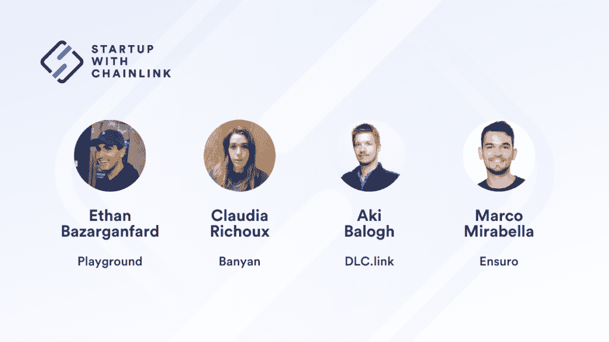
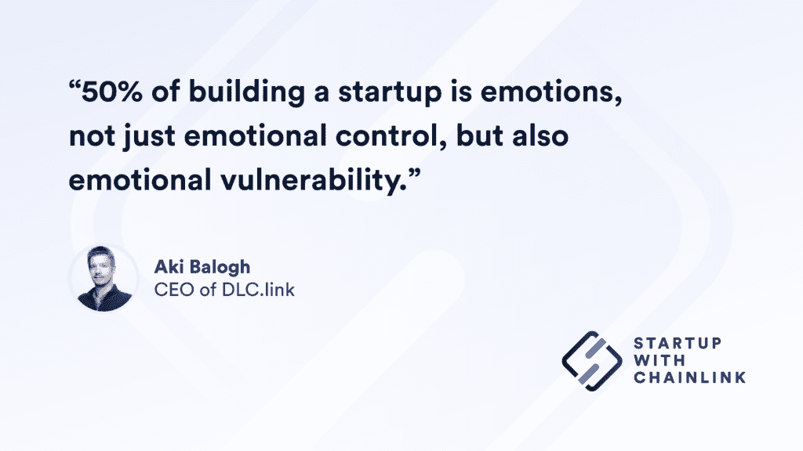

# 如何成为一名 Web3 创始人

> 原文：<https://blog.chain.link/how-to-thrive-as-web3-founder/>

在任何行业，成为企业家都很难。但是 Web3 创始人的道路尤其艰难。首先，它远没有被广泛使用。传统的初创企业创始人有大量的知识可以利用。虽然一个对等的 Web3 原则正在建立，但 Web3 的创始人仍然像探险家一样在未知的土地上航行。

一个有抱负的创始人可以做的一件事就是听取同行的意见。他们的故事可以帮助创业者在 Web3 创业的挑战中找到一条安全的道路。考虑到这一点，我们与我们自己的创始人社区——Startup with chain link——的一些成员聚在一起，以更好地了解如何让一家早期 Web3 初创公司起步。我们问他们希望在开始之前知道些什么，他们需要提高的技能等等。

以下是讨论的要点:

*   明白没有“典型的”Web3 创始人

*   专注于你内心的游戏

*   尽可能获得外界的帮助

*   在你的社区之前建立你的产品

*   学会如何关注真正重要的事情

## **明白没有“典型的”Web3 创始人**

在我们的创始人小组中，我们有经验丰富的企业家、大学毕业生、营销专家和工程师。如果你担心你需要成为一个特定的类型或者有一个特定的背景，请相信 Web3 仍然是一个对任何愿意学习的人开放的前沿。

我们的创始人都选择了不同的道路，并且能够提供互补的观点。

以下是参与者的概述:

尽管他们的背景迥异，但他们创始人的故事中有几条共同的线索。

## **专注于你内心的游戏**

除了通常的技术和商业挑战，创始人还必须准备好面对许多个人挑战。这些可能以压力、自我怀疑或决策疲劳的形式出现。因此，面对这些挑战需要某种程度的内在控制。

在讨论中，DLC.link 的 Aki 提到了“”(1974)，这是一个“克服自我怀疑、紧张和注意力不集中，从而阻止球员获胜”的经典指南。从表面上看，这本书是关于网球的，但其中的经验也可以应用到企业家精神上。

在掌握他们的内心游戏时，我们小组中的所有创始人都提到了类似的挑战。

### **管理人员和委派责任**

几位小组成员发现，他们缺乏处理内部冲突和难以相处的人所需的经验。他们经常觉得自己必须在团队中扮演代理顾问的角色，这需要他们比预期更多地锻炼自己的软技能——比如移情和积极倾听。Playground 的伊森建议创始人“不要推迟艰难的对话”。就像大多数事情一样，拖延只会让事情变得更糟:“[……]你越是推迟[……]一次艰难的谈话，问题就可能变得越糟糕，”他说。

小组成员还认识到，他们最初发现很难委派和放弃对某些任务的控制。这是因为团队可以发展得非常快，这常常会让创始人大吃一惊。许多早期创始人习惯于自己做所有事情，当他们不得不开始分配工作时，他们会很挣扎。

最后，创始人需要承认，当他们不知道足够多的信息来做出某个决定时。有技巧的领导者会在自己擅长的领域保持果断，并授权和信任他人之间取得恰当的平衡。

### **不知道**

第一次创业的人可能压力特别大。例如，拥有计算机科学或信息技术等技术学位的研究生创业者可能会发现，他们的新商业责任一开始令人难以招架。他们需要快速熟悉各种主题，如法律结构、法规遵从性和人员管理。“[……]所有这些绝对是新的和可怕的。我希望人们告诉我，你知道，这比看起来要难得多，”来自 Banyan 的 Claudia 说。为了应对这一挑战，一些技术创始人与高管教练合作。克劳迪娅建议道:“这是你花得最值的钱，尤其是如果你是第一次创业，或者你是工科出身。”。

### **跟上变化的步伐**

Web3 空间不断产生关于合作、项目和技术创新的新闻，这可能会让一些创始人觉得他们落后了。对于来自 Playground 的 Ethan 来说，解药是保持一个长期的视角，并明白尽管这个行业进步很快，但它仍然有很长的路要走；“我们实际上正处于 Web3 的开端，”他说。

就连来自 DLC.link 的 Aki 也说:“事情发展得如此之快，真让我感到惊讶，尤其是如果你创办了一家风险投资支持的初创公司，你会同时经历大约 10 或 12 个学习曲线。”。

然而，通往成功的道路不仅仅是创始人的责任。当你成为 Web3 的创始人时，你就加入了一个由企业家和专家组成的紧密团结的社区，他们已经走过了你即将开始的相同道路。那么，向他们求助是有道理的。

## **尽可能获得外界的帮助**

许多创始人很难寻求帮助，因为他们花了太多的精力去说服支持者，让他们相信自己是值得信赖的、有能力的。一旦他们赢得了投资者的信任，就很难承认他们有很大的知识差距。这要求创始人表现出脆弱性——这是掌握“内心游戏”的一项技能。但所有的创始人都同意，吞下你的骄傲或不安全感，并尽可能获得所有的帮助是非常重要的。

### **顾问**

首次创业者尤其需要尽早找到一位可靠的顾问。这仅仅是因为他们有更多的知识空白需要填补。来自 Banyan 的 Claudia 给有抱负的创业者提了一个简单的建议:“利用你的天使，利用你的顾问，和他们保持良好的关系”。在她和她的联合创始人学会在不确定的时候问他们的顾问后，事情变得简单多了。

### **继续教育**

一些创始人具备良好的商业素质，但技术能力薄弱。同样，人们可以把这个责任留给开发人员，但是这种方法也有缺陷。正如 Ensuro 的 Marco 所指出的，技术团队在做出产品决策时“拥有相当大的权力”。“学习如何自己编程和构建东西是非常重要的，”他说。如果你的开发人员告诉你一些事情不能做，你需要能够理解为什么；“能够理解产品的具体细节让你更容易成为领导者”。在很多情况下，做一个短期的在线课程如 [炼金术大学](https://university.alchemy.com/) 或 [30 天的 Web3](https://www.30daysofweb3.xyz/) 就足以帮助创始人和他们的工程师说同样的语言。

## **在你的社区之前建立你的产品**

早期的 Web3 创始人经常面临两难的境地。他们是否首先将这些资源用于建立社区？在产品问世之前，他们是否致力于激励潜在的支持者？还是在向公众推出之前，他们就开始着手打造一款可靠的产品？

### **对于许多 NFT 项目来说，社区和产品同等重要**

来自 Playground 的 Ethan 透露，他的团队必须同时致力于产品和社区两方面的工作——这可能是许多其他 NFT 项目的情况。诚然，他不需要从头开始建立一个社区。在确定了 NFTs(由数据驱动)的一个令人信服的用例后，他找到了一位已经在 Instagram 上拥有大量粉丝的创作者。最初，创作者的社区对 Web3 没有什么亲和力，但在操场合作成功后，许多粉丝对这一新颖的新用例感到好奇——伊森希望与其他创作者一起重复这一壮举。但如果没有产品展示，他是不可能做到的。“我会说产品第一，社区第二，但它们是如此的交织在一起，”他承认。

### **B2B 项目可能根本不需要社区**

对于来自 Banyan 的 Claudia 来说，社区建设的早期实验并不顺利。“我们一开始制造不和，然后很快意识到，我们正在建设的这种基础设施不会赢得客户，”她说。对于像她这样的 B2B 初创公司，最好利用她在 Filecoin 生态系统中的个人网络和关系。来自 Ensuro 的 Marco 更喜欢 Vitalik Buterin 支持的“ [出口到社区](https://e2c.how/) ”模式。他说:“你首先要找到与产品相关的有限人数的产品市场契合度。”

## **学习如何关注真正重要的事情**

在讨论“内心游戏”时，我们提到了委派和放下低级任务的必要性。除了在你的团队中建立信任之外，授权也是重新获得一些关注的必要条件。

作为一名创始人，你将面临大量的信息和决策。对 dApp 的字体大小吹毛求疵的创始人通常很难区分他们关注的重点。其他人需要发现并解决这些小问题，而他们则专注于真正需要他们意见的决策。

### **雇佣能够执行**的人

对于小组中的大多数创始人来说，重新获得失去的关注的关键是雇佣一些有能力在最少的指导下执行的人。

早期，一位创始人同事建议来自 Banyan 的 Claudia 雇佣能够“做必要工作”的人。这意味着找到那些不需要为每个小决定确认的人——那些能够“把事情做好”的人，即使他们可能做得不完美。

同样，来自 Ensuro 的 Marco 发现，雇佣一个比他更有条理的人会有很大的不同。这位新员工立即开始组织 Scrum 会议，建立任务管理系统，并追逐门票——这种新的结构化方法也帮助 Marco 简化了他自己和他的团队的工作重点；“整个团队的生产力激增”。

### **学习如何说不**

DLC.link 的 Aki 也强调了拒绝浪费时间的活动时，说不和克服负罪感的重要性。主要的挑战是平衡与团队成员的同理心和设定界限并保持界限的需要。

## **还有很多东西要学**

虽然我们已经讨论了很多内容，但这并不是对整个小组讨论的详尽总结。希望我们已经激起了你足够的好奇心来观看视频记录。

The Startup with Chainlink 计划提供了大量这样的内容，这些内容来自 Web3 和初创企业建设各个方面的专家。这些内容大部分保存在社区内，但本次会议是一个例外。我们想让你感受一下 Chainlink 创始人社区的创业精神以及其中包含的丰富经验。如果你正处于你的 Web3 创始人之旅的起点，为什么不成为其中的一部分呢？

## **适用于带链环的启动**

[Startup with chain link](https://chainlinklabs.com/startup?utm_medium=referral&utm_source=chainlink-blog&utm_content=building-and-scaling-a-web3-developer-community)旨在支持 Web3 创始人，为他们提供世界一流的资源，并协助他们踏上创业之旅。该项目帮助初创公司从最初的构思和验证到建立一个工作系统和培养社区。

正在打造独特而有趣的产品、服务或产品的 Web3 创始团队被邀请到 [申请](https://chainlinklabs.com/startup?utm_medium=referral&utm_source=chainlink-blog&utm_content=building-and-scaling-a-web3-developer-community) 。 更多 Web3 启动资源直达你的收件箱， [注册 Chainlink 简讯](https://pages.chain.link/subscribe?utm_medium=referral&utm_source=chainlink-blog&utm_content=building-and-scaling-a-web3-developer-community) 。