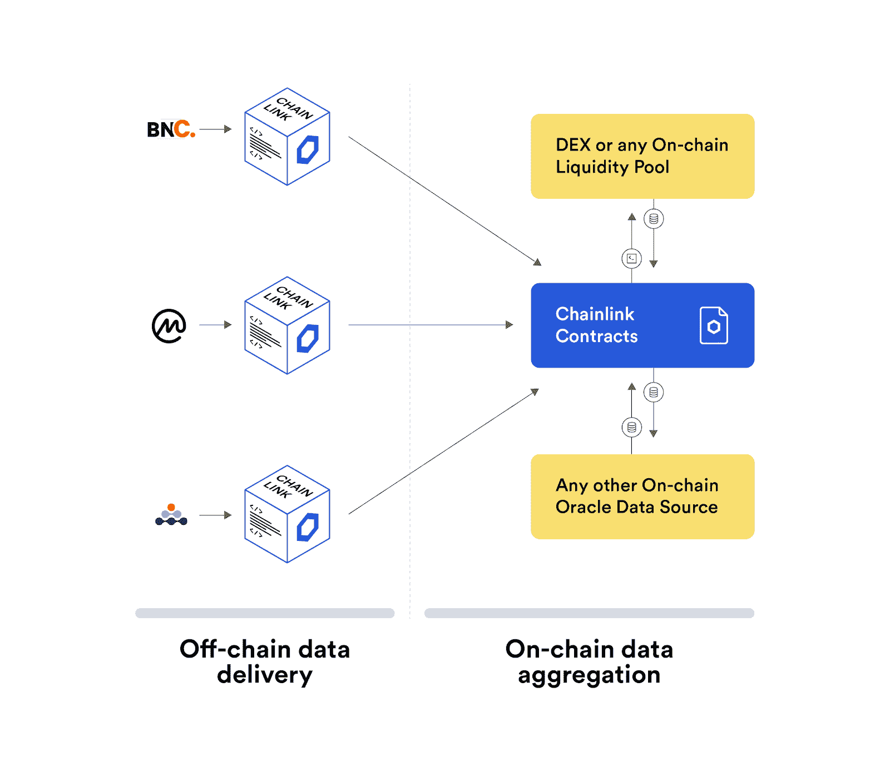
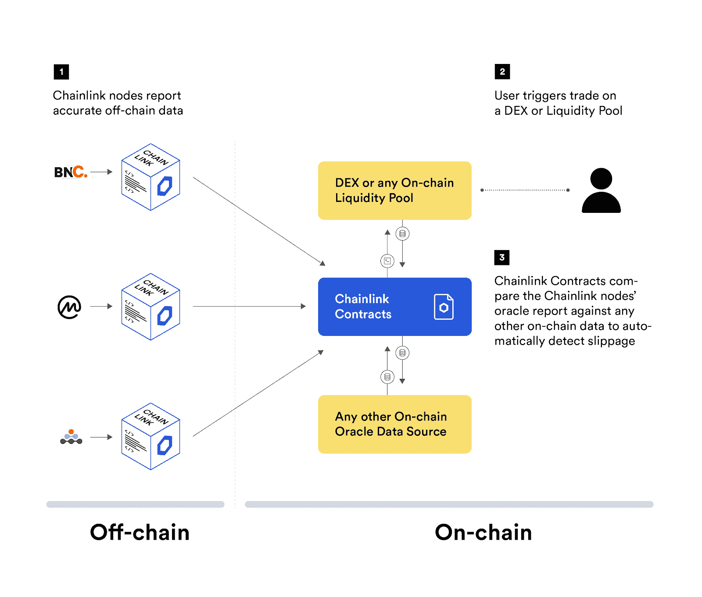

# 介绍 Chainlink 针对 DeFi 的元 Oracle 功能

> 原文：<https://blog.chain.link/introducing-chainlinks-meta-oracle-capabilities-for-defi/>

随着区块链基础设施的改善继续加速分散金融的发展，以及有效的智能合同数量的增加，我们现在看到 DeFi 正在接近一个关键的临界点。Chainlink 已经在 DeFi 的快速增长中发挥了重要作用，它创建了一个数据丰富的环境，智能合约开发人员可以在其中轻松、安全地构建依赖于市场数据的更高级的金融产品，如衍生品、货币市场、贷款等。成功地为 DeFi 生态系统提供最大的[连锁市场价格数据](https://feeds.chain.link/)，已经大大加快了新的 DeFi 产品的发布，并极大地提高了现有智能合同的安全性。

[智能合同](https://chain.link/education/smart-contracts)是独一无二的，因为它们为强制执行合同结果提供了安全性和可靠性保证，这是通过来自多个独立节点的可加密证明的分散计算来实现的。这种安全模型是比特币、以太坊和几乎所有其他主链/第一层协议的基础。

真正去中心化金融的实现依赖于额外的基础设施，这些基础设施将同样的安全模型扩展到创建更高级的金融产品(如衍生品)所需的能力。为了提供这一额外的关键功能，Chainlink 已成功提供了一种分散计算形式([分散 oracle networks](https://chain.link/education/blockchain-oracles) )，可将 DeFi 智能合约安全地连接到启动、发展和保持安全所需的所有关键链外数据，因为其智能合约控制着更多价值。

## Chainlink 的元 Oracle 功能

随着 Chainlink 现在能够以分散、安全和可靠的方式可靠地提供对任何链外数据源的智能合约访问，我们很高兴地宣布我们即将推出的 meta oracle 功能，该功能将 Chainlink 的功能扩展到聚合和响应任何/所有链上数据。这种元 oracle 功能允许用户将任何链上值与 Chainlink 自己的高质量链外数据源相结合，同时设置智能合同应如何接收、响应和依赖这一更大的组合数据集的关键条件。我们使用 Chainlink 的元 oracle 功能的目标是，在决定使用哪些数据资源来构建和改进 DeFi 智能合约时，为智能合约开发人员提供更多选择。

<figcaption id="caption-attachment-503" class="wp-caption-text">Chainlink’s meta oracle functionality.</figcaption>

Chainlink 的元 oracle 功能允许 smart contracts 使用 Chainlink 创建各种链上数据的复杂聚合，以及设置与链上数据交互的附加条件，如分散的交换价格、其他链上 oracle 报告以及链上生成或放置的任何其他数据。虽然 Chainlink 已经为 DeFi、保险、游戏和许多其他行业提供了高度准确的链外数据，但我们发现，链上生成的一些数据可以有效地与关于更大的链外世界正在发生的事情的数据相结合。我们还发现，使用 Chainlink 的链外聚合或链内元 oracle 智能合约功能组合这些数据有时可以提供有用的功能。通过将 Chainlink 现有的链外数据交付、高质量节点网络和现有的链上数据集与任何/所有其他链上数据相结合，我们希望看到智能合约开发者可以使用各种链上数据源构建的内容有所扩展。

## 使用 Chainlink 元 Oracles 实现定价范围并降低定价效率

以下是将来自大型加密交易所的链外价格数据与来自[分散式交易所(DEX)](https://blog.chain.link/dex-decentralized-exchange/) 的链内价格数据相结合的一个示例架构，该架构成功地为 DEX 的用户实现了更准确的市场价格。

通过允许用户通过传统金融市场的常见方法[定价区间](https://investinganswers.com/dictionary/p/price-band)主动防止定价低效/ [滑点](https://www.investopedia.com/terms/s/slippage.asp)，Chainlink 的元先知可以提供一种方法来定义用户愿意接受的链上流动性池的价格和更大的链外市场的真实价格之间的差价。如果链上流动性池提供的价格在定价范围之外，因为存在太多的价格差异，那么用户可以自动等待链上市场和链下市场在价格上更加接近，从而为用户节省大量资金，并因此使两个市场更加接近。

从更详细的技术角度来看这个问题，DEXs 完全在链上处理计算，这意味着所有智能合约功能都发生在底层区块链上。它们主要以两种方式设计:1)使用基于用户输入匹配买方和卖方的订单簿，2)使用非订单簿 dex，该非订单簿 dex 使用链上流动性池预先为用户交易请求的双方提供资金，并具有补充结合曲线，该曲线基于两个流动性池的价格和累积令牌供应的比率对交易进行定价。

没有订单簿的在链 dex 在交易定价中偶尔会遇到低效率，这可能是由于它们的市场规模。这些低效率的技术原因是，没有订单簿的 DEX 根据链上数据对资产进行定价，这意味着特定资产的链上提交的最后价格是 DEX 上列出的资产的当前价格。当这一过程与低交易量/低流动性相结合时，价格可能会变得不稳定，并与市场对资产的真实定价脱节。如果链上流动性池执行的交易没有反映真实的市场价格，其用户就容易受到通常称为“[滑点](https://www.investopedia.com/terms/s/slippage.asp)”的定价效率低下的影响，在这种情况下，他们会冒着重大资金损失的风险，以高于真实市场价值的价格不可逆转地购买资产。

通过结合关于更大的链外市场的真实价格的数据和关于链上价格的数据(这可能在很大程度上是有效的，但偶尔会经历昂贵的滑点)，Chainlink 的元 oracle 功能可用于为用户提供定价效率保证，这反过来也有助于使用这种方法的链上流动性池在定价时变得更有效。

<figcaption id="caption-attachment-504" class="wp-caption-text">Using Chainlink’s Meta Oracle capabilities to provide price efficiency guarantees to DEX users.</figcaption>

Chainlink [价格参考数据 Oracle](https://feeds.chain.link/)可以轻松充当链外市场价格数据的可靠来源，这是之前链上流动性池无法获得的。通过允许链上流动性/交易资源仅对代表更大市场中建立的真实价值的价格起作用(通过实施可定制的定价范围)，Chainlink 的元 oracle 功能可以为链上流动性池及其用户提供有用的功能。

## 让我们知道你的想法

当我们最终确定 Chainlink 的元 Oracle 功能时，我们希望听到您的意见！我们的用户和 DeFi 社区作为一个整体的反馈对我们来说至关重要，以确保我们为您的众多使用案例推出最佳功能。

我们鼓励您通过发送电子邮件至[【电子邮件保护】](/cdn-cgi/l/email-protection)或通过我们的 [Discord](https://discord.gg/aSK4zew) 向我们发送反馈。如果你已经在 Chainlink 有了直接的联系，也不要犹豫去联系他们。我们还将参加 [ETHDenver 2020](https://medium.com/ethdenver/build-with-chainlink-at-ethdenver-2020-92688d97ffb4) ，欢迎大家参观我们的展位，告诉我们他们的具体需求，以及他们希望在 Chainlink Meta Oracle 中包含的功能。

如果您是 DeFi 项目的一员，并且希望构建自己定制的 oracle 参考数据网络，或者使用现有的由 Chainlink 提供支持的网络，请点击这里联系我们[。您可以轻松地](https://chainlinkcommunity.typeform.com/to/XcgLVP)[使用我们许多已经投入使用的 oracle 网络](https://data.chain.link/)快速安全地启动、添加更多功能和/或大大提高您的智能合同的安全性。