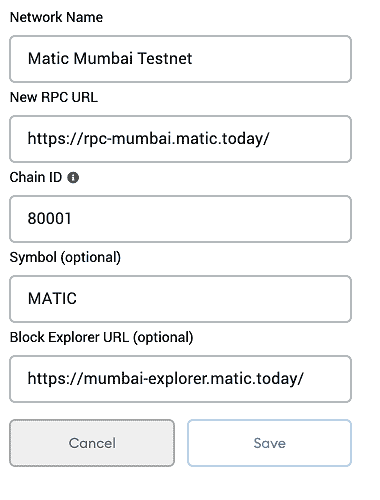
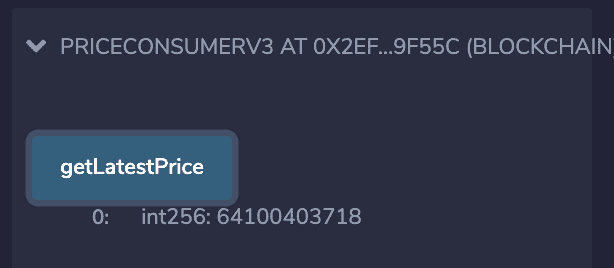
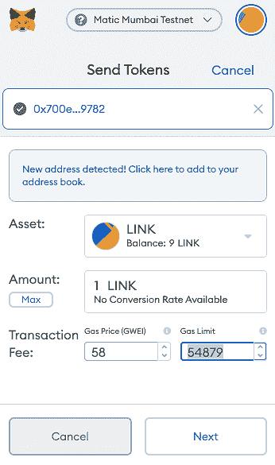
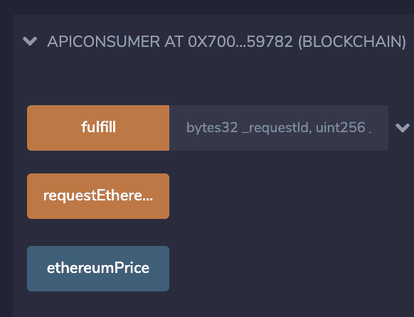
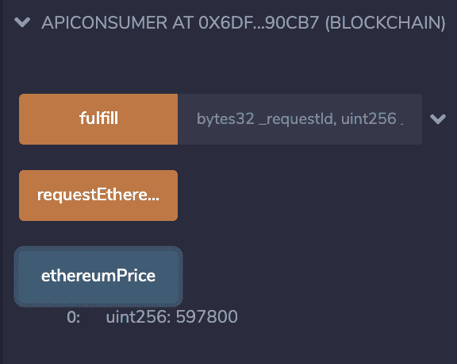

# 在多边形上使用 chainlink oracle

> 原文：<https://blog.chain.link/matic-defi-price-feeds/>

自从 Polygon(以前称为 Matic) [在今年早些时候上线](https://blog.matic.network/the-matic-network-mainnet-is-now-live/)以来，由于其安全和可扩展的基础设施以及即时交易，该网络已经迅速成为以太坊开发人员流行的第二层解决方案。Polygon 的高性能、低费用基础设施为 [DeFi](https://chain.link/education/defi) 应用提供了一个可行的平台，以促进大规模采用。同样，在区块链 oracle 领域，Chainlink 已成为 DeFi 协议的首选 oracle 解决方案， [Chainlink 价格反馈](https://chain.link/solutions/defi)现已获得数十亿美元的价值。在这篇技术文章中，我们将向您展示如何在您的 Polygon DeFi 应用程序中使用 Chainlink oracles，以及如何利用 Chainlink 的价格馈送来让您的应用程序访问高质量、防篡改的数据，这些数据不容易受到诸如 [oracle 漏洞和 flash loan 攻击](https://blog.chain.link/flash-loans-and-the-importance-of-tamper-proof-oracles/)之类的风险。

## 对可扩展且安全的 DeFi 协议的需求

今年，DeFi 协议出现了爆炸性增长，DeFi 协议锁定的总价值(TVL)从 1 月份的 6 . 8 亿美元飙升至现在的[超过 140 亿美元](https://defipulse.com/)。然而，伴随着这种增长而来的是链上交易水平的提高，以及来自试图利用这些协议为自己谋利的恶意参与者的不必要的关注。

由于 DeFi 的增长而导致的链上交易水平的提高[经常阻碍](https://cointelegraph.com/news/99-gas-fees-on-ethereum-are-crippling-defis-growth)以太坊区块链的性能，这是由于其可扩展性限制和低吞吐量。这具有流动效应，其通过高费用和缓慢的交易时间使 DeFi 协议的用户体验受挫。

缓慢的交易速度和高昂的交易成本是阻碍 DeFi 进入主流的两个最大限制因素。Polygon 之类的第 2 层网络由于其增强的可扩展性、高吞吐量和低成本交易，可以开启 DeFi 的下一阶段增长。多边形侧链也是可组合的和完全 EVM 兼容的。DeFi 的核心价值之一是它的[无权限可组合性，](https://blog.chain.link/defis-permissionless-composability-is-supercharging-innovation/)因此，polygon 为希望构建各种有用的 DeFi 应用程序的开发人员提供了一个引人注目的选择，这些应用程序可以扩展、提供低成本交易、确保无权限可组合性并提供无缝的用户体验。

然而，这些 DeFi 应用仍然需要访问[高质量和可靠的外部数据](https://blog.chain.link/the-importance-of-data-quality-for-defi/)。正如我们今年多次看到的那样，DeFi 协议可能会受到各种形式的攻击，如 [price oracle 攻击](https://blog.chain.link/flash-loans-and-the-importance-of-tamper-proof-oracles/)，其中恶意参与者将快速贷款与低质量 oracle 结合起来，以损害其他用户的利益为代价操纵市场。

[Chainlink Price Feeds](https://feeds.chain.link/) 通过提供来自各种高质量数据提供商的聚合数据，由 Chainlink 网络上的分散式 oracles 在链上提供数据，降低 DeFi 应用易受这些攻击的风险。Chainlink 的分散架构和广泛的优质数据源确保最终价格反映了广泛的市场覆盖面，这实质上意味着价格是在汇总整个市场的一组不同价格后确定的，而不仅仅是一个小的子集。

既然我们已经了解了在 PolygonNetwork 上构建 DeFi 协议的优势，以及 chain link[Oracle](https://chain.link/education/blockchain-oracles)和 Price feed 所扮演的重要角色，我们现在就来看一个在 Polygon 上构建 DeFi 应用程序时使用 Chainlink Price Feeds 的例子。

## 在多边形网络上使用链接价格馈送

[Chainlink 价格反馈](https://feeds.chain.link/)使用多个高质量数据输入，并将其与一个 Chainlink oracles 网络相结合，将价格数据输入参考合同，然后汇总结果。DeFI 协议认真对待数据质量和完整性非常重要，Chainlink Price Feeds 为这些协议提供了最佳的实战生产解决方案，这些协议希望保护自己免受因数据质量或交付而发生的各种 DeFI 攻击。

以下两个教程也可以在 [Remix](https://remix.ethereum.org/#version=soljson-v0.6.7+commit.b8d736ae.js&optimize=false&evmVersion=null&gist=49e9cb599184a45fdf819d9b757b163c&runs=200) 中作为一个完整的智能合约获得。

在 Polygon Network 上使用 Chainlink Price Feeds 和 oracles 的第一步是设置您的 MetaMask wallet 以[连接到 Mumbai Testnet](https://docs.matic.network/docs/develop/metamask/config-matic) ，然后您准备好获取一些 Mumbai Testnet MATIC 令牌以在您的 DeFi smart 合同中使用。




<figcaption id="caption-attachment-571" class="wp-caption-text">在元掩码中设置孟买测试网</figcaption>


### 获取 Testnet MATIC

MATIC 是多边形网络的本地令牌。这类似于以太坊里的以太。为了与多边形网络进行交互，需要自动令牌来支付汽油费。要获取 Mumbai Testnet MATIC，请前往 [MATIC 水龙头](https://faucet.matic.network/)，选择 MATIC 令牌和 Mumbai Testnet 网络，输入您的 MetaMask 钱包地址，然后按提交。


<figcaption id="caption-attachment-572" class="wp-caption-text">获取 testnet MATIC</figcaption>


### 创建智能合同

开始构建一个在 Polygon 上使用 Chainlink 价格提要的[智能契约](https://chain.link/education/smart-contracts)的最简单方法是从标准的[价格消费者](https://remix.ethereum.org/#version=soljson-v0.6.7+commit.b8d736ae.js&optimize=false&evmVersion=null&gist=8a173a65099261582a652ba18b7d96c1)契约开始。这是一个基本的标准化合同，用于启动链接价格馈送请求。因此，我们将在 Remix 中打开此合同，并修改它以适应我们的需要。出于演示目的，我们将使用 ETH/USD 价格源。第一步是在我们的构造函数中初始化一个多边形[价格馈送参考契约](https://docs.chain.link/docs/matic-addresses)。孟买测试网上的 [ETH/USD](https://explorer-mumbai.maticvigil.com/address/0x0715A7794a1dc8e42615F059dD6e406A6594651A/contracts) 价馈参考合约部署在地址*0x 0715 a 7794 a1 dc8e 42615 f 059 DD 6 e 406 a 6594651 a*。

```
priceFeed = AggregatorV3Interface(0x0715A7794a1dc8e42615F059dD6e406A6594651A);
```

接下来，我们需要一个函数从价格提要聚合器契约中获取最新价格，该契约在上面的构造函数中进行了实例化。为此，我们已经有了从聚合器契约调用 [latestRoundData](https://docs.chain.link/docs/price-feeds-api-reference#latestrounddata) 函数的函数。这个函数返回聚合器契约的当前状态，在本例中，我们获取当前价格并将其返回到消费函数中。

```
function getLatestPrice() public view returns (int) {
    (
        uint80 roundID, 
        int price,
        uint startedAt,
        uint timeStamp,
        uint80 answeredInRound
    ) = priceFeed.latestRoundData();
    return price;
}
```

### 部署和测试智能合约

现在我们已经准备好部署和测试我们的契约了。在 remix 中编译合同，然后在 deployment 选项卡上，将环境更改为“Injected Web3”，并确保下面的 wallet 地址是包含 MATIC 令牌的 MetaMask wallet 中的地址，按 deploy 按钮，然后按照步骤操作。最终结果是您将智能合同部署到了孟买测试网。您应该通过 remix 控制台中的事务输出注意到部署的契约地址。

部署完成后，我们只需执行“getLatestPrice”函数。结果应该是该函数返回 ETH/USD 聚合器合同的最新价格，然后可以在 Polygon network 上的 DeFi 应用程序中使用该价格。




<figcaption id="caption-attachment-573" class="wp-caption-text">ETH/USD 价格馈送结果</figcaption>


## 在多边形网络上使用 chainlink oracle

有些情况下，您可能需要智能合约中的多边形外链数据，而使用 Chainlink 价格源无法获得这些数据。这就是你可以利用 oracle 的地方。我们现在将修改我们的智能合约，以获得使用 Chainlink 价格源无法获得的市场价格，在本例中为 ETH/EUR 价格。

### 获取测试网络链接

您将需要获得一些 Testnet 链接，以便向 Chainlink oracles 发送请求。要获得 Mumbai Testnet 链接，请加入 Polygon [Discord](https://discord.com/invite/UFC4VYh) 并张贴您在上述步骤中的元掩码钱包地址，要求 Polygon 团队成员向您发送一些 Mumbai Testnet 链接。一旦你的钱包里有了一些 MATIC 和 LINK，你就可以进入智能合约了。

### 创建智能合同

开始构建在 Polygon 上使用 Chainlink oracles 的智能契约的最简单方法是从标准的 [Chainlink APIConsumer](https://remix.ethereum.org/#version=soljson-v0.6.7+commit.b8d736ae.js&optimize=false&evmVersion=null&gist=8a173a65099261582a652ba18b7d96c1) 契约开始。这是一个基本的标准化合同，用于通过链接 oracle 发起对外部数据的请求。因此，我们将在 Remix 中打开此合同，并修改它以适应我们的需要。

首先，我们将把“volume”参数重命名为“ethPrice”，把“requestVolumeData”函数重命名为“requestEthereumPrice”。完成后，我们需要如下修改构造函数:

*   Mumbai testnet 上的链接令牌的地址是*0x 70 D1 f 773 a9 f81c 852087 b 77 f 6 AE 6d 3032 b 02 D2 ab*，因此我们将其传递给一个“setChainlinkToken”函数
*   正如 Polygon [文档](https://docs.matic.network/docs/develop/oracles/chainlink)中所指定的，在 Mumbai testnet 上运行着一个 oracle 契约，地址为*0x 1 cf 7d 49 be 7 e 0 c 6 AC 30 ded 720623490 b 64 f 572 e 17*，因此我们将 oracle 变量设置为这个。
*   我们将使用的 API 是通过 HTTP GET 请求获得的，返回的值将是一个无符号整数。运行在 Mumbai testnet 上的 oracle 有各种可以使用的作业规范。根据 Polygon [文档](https://docs.matic.network/docs/develop/oracles/chainlink)中的作业列表，基于这些需求适合我们的是*d 8 fcf 41 ee 8984d 3 b 8 b 0 ea e 7 b 74 ECA 7 DD*，因为我们要执行一个 HTTP GET 请求，返回的数据是一个无符号整数，所以我们将“jobId”变量设置为这个值。
*   将“费用”变量修改为 1 个链接。通过删除“0.1”前缀。这是与外部数据请求一起发送给 oracle 的付款。

```
constructor() public {
    setChainlinkToken(0x70d1F773A9f81C852087B77F6Ae6d3032B02D2AB);
    oracle = 0x1cf7D49BE7e0c6AC30dEd720623490B64F572E17;
    jobId = "d8fcf41ee8984d3b8b0eae7b74eca7dd";
    fee = 10 ** 18; // 1 LINK
}
```

现在我们已经完成了构造函数，我们可以继续处理“requestEthereumPrice”和“fulfill”函数了。

对 Chainlink oracles 的请求使用 [Chainlink 请求和响应](https://docs.chain.link/docs/request-and-receive-data)设计模式，其中一个链上函数创建并发出一个请求，oracle 检测该请求，然后将响应发送回同一契约中的另一个函数。在我们的例子中，“requestEthereumPrice”函数创建并发出请求，“fulfill”函数处理响应，如 *this.fulfill.selector* 所定义的。

我们将使用的 API 是针对 [ETH/EUR 价格](https://min-api.cryptocompare.com/data/price?fsym=ETH&tsyms=EUR)的[crypto.com](http://www.crypto.com/)公共 API。如果在浏览器中打开这个链接，可以看到以 JSON 格式返回的数据。

在我们的“requestEthereumPrice”函数中，我们将其修改如下:

*   将 URL 设置为 [ETH/EUR](https://min-api.cryptocompare.com/data/price?fsym=ETH&tsyms=EUR) API 端点
*   将请求中的“路径”变量设置为“EUR”。这是我们想要找到并返回的 JSON 响应的路径，根据我们在浏览器中看到的 API 端点的输出，它包含以太坊的当前价格
*   将结果乘以 100，因为实度不能处理数字中的小数
*   将请求发送给 Chainlink oracle

```
function requestEthereumPrice() public returns (bytes32 requestId) {
    Chainlink.Request memory request = buildChainlinkRequest(jobId, address(this), this.fulfill.selector);

    // Set the URL to perform the GET request on
    request.add("get", "https://min-api.cryptocompare.com/data/price?fsym=ETH&tsyms=EUR");

    // Set the path to find the desired data in the API response, where the response format is:
    // {"USD":243.33}
    request.add("path", "EUR");

    // Multiply the result by 100 to remove decimals
    request.addInt("times", 100);

    // Sends the request
    return sendChainlinkRequestTo(oracle, request, fee);
}
```

在“履行”函数中，我们可以看到 oracle 将一个响应发送回参数 *_price* 中，然后将它存储在我们的*以太价格*变量中的合同中。

```
function fulfill(bytes32 _requestId, uint256 _price) public recordChainlinkFulfillment(_requestId) {
    ethereumPrice = _price;
}
```

现在我们的合同已经准备好被编译并部署到孟买测试网。

### 部署和测试智能合约

在 Remix 中编译合同，然后将合同部署到 Mumbai Testnet，就像我们对 Price Feeds 合同所做的那样。

下一步是为与 LINK 的合同提供资金，这样它就可以向 Chainlink oracles 发送请求。为此，只需从上面的步骤中获取已部署的契约地址，然后从 MetaMask wallet 向其发送 1 个链接令牌。




<figcaption id="caption-attachment-574" class="wp-caption-text">资助合同与</figcaption>


链接

一旦使用 LINK 部署了合同并提供了资金，我们就可以按“requestEthereumPrice”功能将当前以太坊价格的请求发送到 Chainlink oracle。这还会将链接付款发送到 Chainlink oracle，作为完成请求的付款。




<figcaption id="caption-attachment-575" class="wp-caption-text">测试已部署的合同</figcaption>


一旦发出请求，Chainlink oracle 将完成它，然后我们契约中的完成函数将由 Chainlink 节点 oracle 契约调用。这需要几秒钟的时间来完成，然后我们可以通过执行“ethereumPrice”getter 函数来查看 API 请求的结果。结果应该是以太坊的当前欧元价格现在存储在合同中，并准备好在 Polygon 网络上运行的 DeFi 应用程序中使用。




<figcaption id="caption-attachment-576" class="wp-caption-text">查看返回结果</figcaption>


## 摘要

Polygon 网络以其快速、廉价和可靠的交易为将要建立的 DeFi 协议提供了可行的第 2 层选择。在 Polygon 上构建 DeFi 协议的价值主张通过 Chainlink oracles 和 Chainlink Price Feeds 得到了进一步增强，使这些协议能够访问外部数据和事件，包括可用于各种有用的 [DeFi 应用](https://blog.chain.link/44-ways-to-enhance-your-smart-contract-with-chainlink/#decentralized-finance)的高质量聚合价格数据，如分散交易所(DEX)、流动性池、贷款协议、分散保险和自动做市商(AMMs)。

如果您是一名开发人员，并希望快速将您的应用程序连接到 Chainlink 价格参考数据，请访问[开发人员文档](https://docs.chain.link/)，并参加 [Discord](https://discordapp.com/invite/aSK4zew) 中的技术讨论。如果您想安排一次电话会议来更深入地讨论多边形/链环集成，请点击此处的。

[网站](https://chain.link/) | [推特](https://twitter.com/chainlink)|[Reddit](https://www.reddit.com/r/Chainlink/)|[YouTube](https://www.youtube.com/channel/UCnjkrlqaWEBSnKZQ71gdyFA)|[电报](https://t.me/chainlinkofficial) | [事件](https://blog.chain.link/tag/events/) | [GitHub](https://github.com/smartcontractkit/chainlink) | [价格供稿](https://feeds.chain.link/) | [DeFi](https://www.chain.link/solutions/defi)