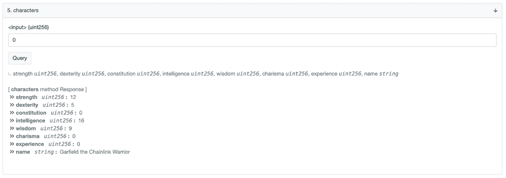

# 如何在 NFT 中获得随机数(ERC721)

> 原文：<https://blog.chain.link/random-numbers-nft-erc721/>

## 介绍

在遵循 [ERC721](http://erc721.org/) 标准的不可替换令牌( [NFT](https://chain.link/education/nfts) )中生成随机数一直是智能合约开发者的一个问题。现在 [Chainlink VRF](https://chain.link/solutions/chainlink-vrf) 已经在 mainnet 上上线，基于可靠性的智能合约可以无缝地生成防篡改的链上随机数，这些随机数可以证明是公平的，并有密码证明支持。有了 Chainlink VRF，创建需要安全随机来源的动态 NFT 现在是有史以来最容易和最安全的。虽然 Chainlink 也支持使用链外数据源的 NFT 的任何类型的动态属性，但我们将重点关注 ERC721 或 NFTs 的随机数。

在本教程中，我们将在以太坊区块链上建造一个[地下城&龙](https://dnd.wizards.com/)角色！D & D(龙与地下城)是一款流行的角色扮演游戏(RPG ),在这里人们创造角色并进行冒险。创建角色的一个重要部分是给他们属性或统计数据来显示他们的力量、敏捷、智力等等。为了在区块链上创建真正的随机数，我们将展示如何使用 VRF 链赋予你的角色随机属性。随机数生成在区块链是很容易与 Chainlink VRF！

## 什么是 NFT？

NFT(遵循 ERC721 标准)定义了一个框架，用于制作唯一且彼此不同的令牌(因此有术语“不可替换”)，而流行的 [ERC20](https://www.investopedia.com/news/what-erc20-and-what-does-it-mean-ethereum/) 标准定义了“可替换”的令牌，这意味着令牌都是可互换的，并保证具有相同的值。“可替代”货币的例子是美元、欧元和日元，而可替代的区块链代币的例子是 AAVE、SNX 和 YFI。在这些情况下，1 个可替换令牌等于 1 个同类令牌，就像 1 美元等于 1 美元，1 个链接等于 1 个链接一样。然而，NFTs/ERC 721 的不同之处在于，每个令牌都是唯一的，不代表相同的价值或可互换的项目。

由于所有的 NFT 都是独一无二的，因此它们可以表示对现实世界资产(如一块特定的土地)的令牌化所有权声明，或者表示对数字资产(如稀有的数字交易卡)的实际所有权。它们越来越受欢迎。你可以参考 OpenSea 的 [NFT 圣经来阅读更多。](https://opensea.io/blog/guides/non-fungible-tokens/)

构建你的随机角色

我们将着眼于创造一个具有 D&D 角色的六个主要特征的角色，即:

```
uint256 strength;
uint256 dexterity;
uint256 constitution;
uint256 intelligence;
uint256 wisdom;
uint256 charisma;

```

我们还会给他们:

```
uint256 experience;
string name;

```

这样我们就可以把他们拉平，给他们起一个好玩的名字。

我们在这里做了一些改动，并没有 100%遵循龙与地下城指南，但是如果你想要一个更准确的游戏表现，这可以很容易地修改。

该合同应确定以下内容:

1.  允许您转让 NFT 和所有其他 NFT 标准的所有权。
2.  给这个角色一个名字和随机属性。

我们还不会让契约变得动态，但是请继续关注未来的文章，它将基于我们在这里学到的知识！

我们已经为您建立了回购，但我们将讨论如何使用回购！

## 克隆回购

```
git clone https://github.com/PatrickAlphaC/dungeons-and-dragons-nft
cd dungeons-and-dragons-nft
npm install

```

## 设置您的环境变量

你需要一个*助记符*和一个 rinkeby *RINKEBY_RPC_URL* 环境变量。你的*助记符*是你钱包里的种子短语。您可以从像 [Infura](https://infura.io/) 这样的节点提供者服务中找到一个 *RINKEBY_RPC_URL* 。

然后，要么将它们设置在一个 *bash_profile* 文件中，要么将它们导出到您的终端中，如下所示:

```
export MNEMONIC='cat dog frog....'
export RINKEBY_RPC_URL='www.infura.io/YOUR_PROJECT_ID_HERE'

```

## 这个文件夹里有什么

这将得到我们所有的样板代码设置，但真正的魔力在*dungeonsanddragonscharacter . sol*文件中。我们可以看到它最初是一个普通的实体文件，但我们在顶部有一些导入:

```
pragma solidity ^0.6.6;

import "@openzeppelin/contracts/token/ERC721/ERC721.sol";
import "@chainlink/contracts/src/v0.6/VRFConsumerBase.sol";
import "@openzeppelin/contracts/access/Ownable.sol";
import "@openzeppelin/contracts/utils/Strings.sol";

contract DungeonsAndDragonsCharacter is ERC721, VRFConsumerBase, Ownable {

```

OpenZepplin 是一个软件包的集合，它让 Solidity 和 [smart contract](https://chain.link/education/smart-contracts) 工程师的生活变得更加轻松。如果你以前没有使用过它，准备好更多地使用它吧！因为 ERC721 只是一个令牌标准，每个 ERC721 应该都差不多，所以我们知道可以只使用一个模板。我们导入的 *ERC721.sol* 文件定义了 NFT 的所有标准。我们只是在我们的契约中通过定义契约*dungeon 和 DragonsCharacter 是 ERC721* 来继承它。我们需要 *VRFConsumerBase.sol* 与 Chainlink VRF 交互并获取我们的随机数。最后两个导入只是帮助我们处理权限和字符串。

## 字符结构和构造函数

我们定义了我们的角色在角色结构中将会有什么属性，我们制作了一个角色列表，这样我们就可以跟踪每一个被创建的角色。因为我们使用数组来存储字符列表，所以我们知道每个字符在数组中都有一个惟一的 id 来定义它。这被称为 *tokenId* ，我们将更多地引用它。

```
struct Character {
    uint256 strength;
    uint256 dexterity;
    uint256 constitution;
    uint256 intelligence;
    uint256 wisdom;
    uint256 charisma;
    uint256 experience;
    string name;
}

Character[] public characters;

```

一旦设置好了，我们现在就可以创建构造函数了。

```
constructor()
    public
    VRFConsumerBase(VRFCoordinator, LinkToken)
    ERC721("DungeonsAndDragonsCharacter", "D&D")
{
    keyHash = 0x2ed0feb3e7fd2022120aa84fab1945545a9f2ffc9076fd6156fa96eaff4c1311;
    fee = 0.1 * 10**18; // 0.1 LINK
}

```

*VRFConsumerBase* 和 *ERC721* 各自获取我们设置它们所需的参数。VRF 链环需要 VRF 协调器地址和 LinkToken 地址。我们已经为 Rinkeby 网络进行了硬编码。还有一些其他的变量，如 keyHash 和 fee。你可以在 [Chainlink VRF 文档](https://docs.chain.link/docs/chainlink-vrf)中了解更多这些功能。行*ERC 721(" dungeonsanddragons character "，" D & D")* 定义了 NFT 的名称以及它的符号。 *"D & D"* 将会出现在 MetaMask 和 NFT 市场上。

## 生成你的随机角色

我们希望我们的六个属性中的每一个都有随机的统计数据，但是我们希望能够给我们的角色命名！通过简单调用 Chainlink VRF，我们可以在这款 NFT / ERC721 中生成随机数。我们不需要在请求函数中做太多，我们只需要给我们的新角色一个名字，和一个 *userProvidedSeed* 。我们给它的种子是 VRF 协调员将如何验证提供的数字是否实际上是随机的。你可以挑选任何你喜欢的种子，并且你可以阅读[选择随机种子](https://docs.chain.link/docs/chainlink-vrf-api-reference#choosing-a-seed)来了解更多。

```
function requestNewRandomCharacter(
    uint256 userProvidedSeed,
    string memory name
) 
    public returns (bytes32) 
{
    require(
        LINK.balanceOf(address(this)) >= fee,
        "Not enough LINK - fill contract with faucet"
    );
    bytes32 requestId = requestRandomness(keyHash, fee, userProvidedSeed);
    requestToCharacterName[requestId] = name;
    requestToSender[requestId] = msg.sender;
    return requestId;
}

```

我们希望跟踪 *requestId* ，以便当随机数满足时，我们可以将其映射到我们正在创建的角色。这将启动链接作业，我们只需等待链接节点调用我们的合同！你可以在 Chainlink 文档中阅读更多关于[请求模型的内容，了解更多关于发送 Chainlink 请求的工作方式。](https://docs.chain.link/docs/architecture-request-model)

一旦 Chainlink 节点完成了对请求的处理，它就会通过调用函数*fulfillnommandations*进行响应。这个函数包含了给出属性、将字符添加到列表中以及铸造 NFT 的所有数学运算。

```
function fulfillRandomness(bytes32 requestId, uint256 randomNumber)
    internal
    override
{
    uint256 newId = characters.length;
    uint256 strength = ((randomNumber % 100) % 18);
    uint256 dexterity = (((randomNumber % 10000) / 100) % 18);
    uint256 constitution = (((randomNumber % 1000000) / 10000) % 18);
    uint256 intelligence = (((randomNumber % 100000000) / 1000000) % 18);
    uint256 wisdom = (((randomNumber % 10000000000) / 100000000) % 18);
    uint256 charisma = (((randomNumber % 1000000000000) / 10000000000) % 18);
    uint256 experience = 0;

    characters.push(
        Character(
            strength,
            dexterity,
            constitution,
            intelligence,
            wisdom,
            charisma,
            experience,
            requestToCharacterName[requestId]
        )
    );
    _safeMint(requestToSender[requestId], newId);
}

```

我们可以看到，我们只使用了一次随机数来创建所有六个属性。我们使用模函数从返回的大量随机数中提取一个子集。如果我们不想这样做，我们也可以只调用 VRF 链六次，但这种方式是一样的。返回的随机数的最后两位数用于表示力量，之前的两位数用于表示灵巧，依此类推。这类似于 [CryptoKitties 如何使用基因](https://guide.cryptokitties.co/guide/cat-features/genes)给它们的猫赋值。

注意:按位操作比我们在这里做的方式更有效，但是这更容易理解，所以我们不必深入了解位操作是如何工作的。

*_safeMint* 是从 *ERC721.sol* 继承的功能，让我们可以轻松跟踪 ERC721 的所有者。这一点很重要，尤其是当你希望你的 NFT 采取一些行动，但你不希望其他任何人能够采取行动。我们将在 NFT 的下一篇文章中了解更多。

我们将使用 Truffle 和 Chainlink，所以如果你不熟悉 Truffle，这篇关于如何使用 Chainlink With Truffle 的[博客文章将会给你一个复习，但是我们也会在这篇博客中复习所有的命令！](https://blog.chain.link/how-to-use-chainlink-with-truffle-2/)

## 部署和快速入门

现在我们知道发生了什么，让我们部署我们的随机 NFT！你需要一些 Rinkeby LINK T1 和 T2 Rinkeby ETH T3 来运行这些脚本。

```
truffle migrate --reset --network rinkeby
truffle exec scripts/fund-contract.js --network rinkeby
truffle exec scripts/generate-character.js --network rinkeby
truffle exec scripts/get-character.js --network rinkeby

```

这将做几件事:

1.  部署您的 NFT 合同
2.  为合同提供资金，使其能够拨打 Chainlink VRF 电话
3.  生成一个角色，调用 VRF 链
4.  返回您的 NFT 的值！

部署完成后，您还可以验证合同，甚至可以使用以太扫描插件在以太扫描上阅读合同。你必须获得一个[以太扫描 API 密钥](https://etherscan.io/apis)并设置环境变量*以太扫描 API 密钥。*但是一旦你这么做了，你就可以跑了:

```
truffle run verify DungeonsAndDragonsCharacter --network rinkeby --license MIT

```

它会给你一个链接，链接到你在以太扫描上的 NFT。在那里，你可以去合同区，点击阅读合同。


这将把您带到可以与合同进行交互的页面。如果您转到 characters 部分，您可以输入我们刚刚生成的 tokenId，并查看您的新 D&D 角色的统计数据！



你可以在 [Rinkeby 这里](https://rinkeby.etherscan.io/address/0xe43F32D36010221951D8541A86920C3E9f452E46#readContract)查看这份合同的样本。一些角色有一些有趣的名字！

## 摘要

使用 Chainlink VRF，NFTs 中的随机数很容易，当涉及到托管和使用它们时，还有一个全新的世界可以探索。我们在这里仅仅触及了表面，所以期待下一篇关于在市场上销售它们、渲染图像和使用元数据的博客。我们很乐意看到一些令人敬畏的角色和游戏使用 VRF 链结来创造，让他们变得真正公平。如果你建立了一个很酷的 NFT #PoweredByChainlink，一定要发微博给我们！

如果你是一名开发人员，并希望将你的智能合同连接到链外数据和系统，请访问[开发人员文档](https://docs.chain.link/)，并加入关于[不和谐](https://discordapp.com/invite/aSK4zew)的技术讨论。如果您想安排一次电话会议来更深入地讨论整合事宜，请点击此处的。

智能合约开发人员正在推出一个全新的世界，在 NFTs 中具有随机属性。你会成为带头冲锋的先锋之一吗？

[网站](https://chain.link/) | [简讯](https://chn.lk/newsletter) | [推特](https://twitter.com/chainlink)|[Reddit](https://www.reddit.com/r/Chainlink/)|[YouTube](https://www.youtube.com/channel/UCnjkrlqaWEBSnKZQ71gdyFA)|[电报](https://t.me/chainlinkofficial) | [事件](https://blog.chain.link/tag/events/) | [GitHub](https://github.com/smartcontractkit/chainlink) | [价格供稿](https://feeds.chain.link/) | [DeFi](https://defi.chain.link/)