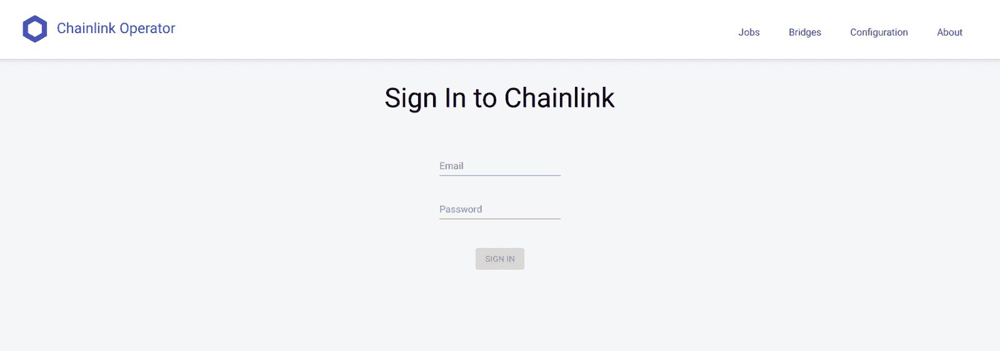
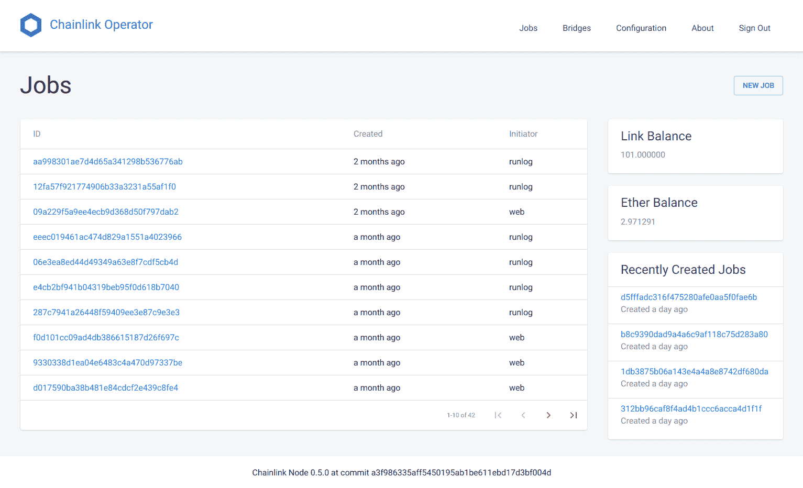

# 第一次运行链节节点

> 原文：<https://blog.chain.link/running-a-chainlink-node-for-the-first-time/>

对于有兴趣了解如何运行一个节点的新 [Chainlink](https://chain.link/) 节点操作者来说，本文是一个指南。虽然本文档对任何操作系统都是中立的，但它确实需要熟悉命令行，这是 Linux 和 Mac 用户常用的。此外，在本地机器上运行测试设置中的 Chainlink 节点也是非常好的。没有购买云托管计划的要求。但是，当在以太坊主网上运行 Chainlink 节点时，您可能要考虑这样做，因为它响应请求的能力(或因停机而无法响应)将影响您的声誉。

*如果您想要一个更简短、更详细的指南，请访问我们关于运行链节节点* [*的官方文档，此处*](https://docs.chain.link/docs/running-a-chainlink-node) *。*

有两种方式运行链节节点。第一步是安装所有必需的开发依赖项，下载代码库，并在本地机器上编译一个二进制文件。第二种方法是简单地运行 Docker 映像，作为我们的[连续交付](https://continuousdelivery.com/)流程的一部分，我们对其进行更新。本指南侧重于后一种方法，因为对于大多数受众来说，这种方法更简单、更容易理解。如果您有丰富的系统或开发经验，请随意遵循 Chainlink 开发环境的完整设置指南[这里](https://github.com/smartcontractkit/chainlink/wiki/Development-Setup-Guide)。

第一步是安装 [Docker-CE](https://docs.docker.com/install/) 。Docker-CE(社区版)是 Docker 的免费版本，您可以使用它来旋转容器，而不必为企业级支持付费。点击 [Docker-CE 链接](https://docs.docker.com/install/)后，在左侧栏选择您的操作系统，并按照安装说明进行操作。完成后，继续下一步。

接下来，Chainlink 节点需要主动连接到以太坊客户端，以便与区块链上的智能合约进行通信。在启动 Chainlink 节点之前，我们需要运行并同步一个以太坊客户端。同样，最简单的方法是使用 Docker。Geth 和 Parity 通过 Docker 提供官方图片，非常容易运行。两者都遵循相同的基本步骤:下载映像、创建卷、运行映像。你更喜欢哪个客户并不重要。

要下载 Geth (ethereum/client-go) Docker 映像，请运行以下命令:

```
docker pull ethereum/client-go:stable>
```

这将下载 Geth 客户机，作为一个容器化的应用程序在您的本地机器上运行。接下来，为区块链数据创建一个目录，这样您就不需要在每次重启映像时重新同步整个区块链。这是通过一个简单的命令完成的:

```
*mkdir ~/.geth-ropsten*
```

这将创建一个空目录，每次运行 Geth 时，我们都将使用这个目录作为它的 Docker 映像。最后，您将希望运行图像本身，使用我们刚刚创建的目录并为其提供参数，以便 Chainlink 节点可以轻松地连接到它:

```
docker run --name eth -p 8546:8546 -v ~/.geth-ropsten:/geth -it \
      ethereum/client-go:stable --testnet --syncmode light --ws \
       --wsaddr 0.0.0.0 --wsorigins="*" --datadir /geth`
```

使用这个命令，我们将启用 websockets，这是 Chainlink 节点连接所需的协议。我们将容器命名为 eth，使用我们在第二个命令中创建的目录，并告诉它在 Ropsten 测试网络上运行。这还会以轻量级模式运行以太坊客户端，从而使区块链数据保持最少。由于运行轻客户端存在安全隐患，因此不建议在以太坊主网上运行。

如果您想运行奇偶校验客户机而不是 Geth，命令本质上是相同的。唯一的区别是图像和目录的名称。您可以通过运行以下命令下载最新的奇偶校验 Docker 映像:

```
*docker pull parity/parity:stable*
```

然后为奇偶校验创建一个永久目录:

```
*mkdir ~/.parity-ropsten*
```

最后，运行奇偶校验映像:

```
docker run -h eth --name eth -p 8546:8546 \
       -v ~/.parity-
ropsten:/home/parity/.local/share/io.parity.ethereum/ \
       -it parity/parity:stable --chain=ropsten \
       --ws-interface=all --ws-origins="all" --light \
       --base-path /home/parity/.local/share/io.parity.ethereum/
```

一旦以太坊客户端完成同步，我们就可以运行 Chainlink 节点了。

与以太坊客户端的步骤类似，我们将首先从 Docker 下载最新的 Chainlink 图像:

```
*docker pull smartcontract/chainlink:latest*
```

我们使用“:latest”标签，因为它与我们在 [Github](https://github.com/smartcontractkit/chainlink) 上的代码库保持同步。我们还想为 Chainlink 节点创建一个永久目录，这样我们就不需要每次重新启动映像时都从头开始:

```
*mkdir ~/.chainlink-ropsten*
```

接下来，我们做一些设置来配置 Chainlink 节点。Chainlink 使用环境变量进行配置。在运行节点之前，我们需要创建一个文件，并将其传递给 Docker 映像，其中包含我们需要的值。在 Linux 和 Mac 上，只需运行以下命令即可创建该文件:

```
echo "ROOT=/chainlink
LOG_LEVEL=debug
ETH_URL=ws://eth:8546
ETH_CHAIN_ID=3
MIN_OUTGOING_CONFIRMATIONS=2
MIN_INCOMING_CONFIRMATIONS=0
LINK_CONTRACT_ADDRESS=0x20fe562d797a42dcb3399062ae9546cd06f63280
CHAINLINK_TLS_PORT=0
CHAINLINK_DEV=true
ALLOW_ORIGINS=*" > .env
```

“ETH_CHAIN_ID”和“LINK_CONTRACT_ADDRESS”的值由 Ropsten 测试网络的特定值填充。如果您想在不同的网络上运行节点，只需更改这些值。该文件通常以文件名保存。env”但是你可以随便给它起什么名字。下一个命令假定文件名是"。env”。如果您的名称不同，您将需要更新以下命令。

现在，我们准备运行 Chainlink 节点:

```
docker run --link eth -p 6688:6688 \
           -v ~/.chainlink-ropsten:/chainlink \
           -it --env-file=.env \
           smartcontract/chainlink local n
```

这将使用您之前创建的环境文件中存储的值启动 Chainlink 节点，并将其链接到正在运行的以太坊客户端的 Docker 映像。首次运行 Chainlink 节点时，系统会提示您输入密码，然后确认密码。这是为您的以太坊密钥库文件所使用的节点。我们使用 Chainlink 节点来管理以太坊密钥，而不是以太坊客户端。这意味着当 [JSON-RPC](https://github.com/ethereum/wiki/wiki/JSON-RPC) 端口打开时，不需要使用未锁定的帐户运行以太坊客户端。Chainlink 节点的密钥将是签署交易的密钥，交易是对智能合约请求的响应。给区块链写信需要一些时间。一旦节点显示了你的以太坊地址(在下一步之后)，你就可以在这里获得它的 Ropsten ETH[。](https://faucet.ropsten.be/)

接下来，它会提示您输入 API 电子邮件和密码。这将用于通过 API、命令行或 GUI 与 Chainlink 节点进行交互。输入电子邮件和强密码，最好不同于您的密钥库密码，以完成设置过程。在 Chainlink 节点完全运行之前，您需要等待以太坊节点完成同步。

如果一切顺利，您应该看到节点正在运行并接收来自以太坊客户端的块头。您也可以将浏览器指向 [http://localhost:6688](http://localhost:6688/) 并查看 GUI。




<figcaption id="caption-attachment-676" class="wp-caption-text">Chainlink 登录页面</figcaption>


<figcaption>使用您第一次运行 chain link 节点时设置的 API 电子邮件和密码登录。登录后，您将看到管理仪表板。</figcaption>




<figcaption id="caption-attachment-675" class="wp-caption-text">链家管理仪表盘</figcaption>


恭喜你！如果你做到了这一步，你就是一个节点操作员！

下一步是添加一些作业，并在以太坊测试网络上使用节点。请继续查看我们的指南，了解如何[履行您自己的合同](https://docs.chain.link/docs/fulfilling-requests)，直到实现聚合。

如果您有任何问题，请随时在我们的[电报](https://t.me/chainlinkofficial)频道提问，我们很乐意为您提供帮助。

感谢史蒂夫·埃利斯。