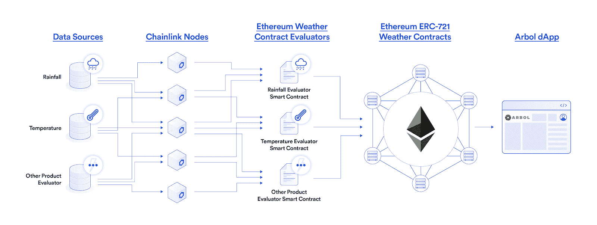

# 智能合约开发人员使用 Chainlink 的主要方式

> 原文：<https://blog.chain.link/smart-contract-api-price-random/>

随着大规模 [DeFi](https://chain.link/education/defi) 的采用，人们比以往任何时候都更加关注[区块链甲骨文](https://chain.link/education/blockchain-oracles)解决方案以及如何最好地利用它们以安全的方式访问高质量的数据馈送。对于智能合约来说，一种与底层区块链之外的数据进行交互的可靠机制对于提供真实世界的价值至关重要。在 Chainlink，我们为智能合同开发人员提供了一套 oracle 解决方案，帮助他们在链上应用程序和链下数据之间进行各种不同的交互。

## 智能合同开发人员的核心功能

1.  **价格反馈**–准确、分散的价格数据，覆盖广泛的市场
2.  **访问任何 API**–使用任何 API 进行 POST、GET 等操作
3.  **链环 VRF**–生成可证明的随机数

### 链接价格源

[价格馈送](https://docs.chain.link/docs/using-chainlink-reference-contracts)是包含价格数据的链上资源，这些价格数据是从 Chainlink 网络上的多个独立的高质量数据源和多个独立的抗 Sybil 节点运营商聚集的。它们快速、可靠、分散、在单个交易中执行，并且是从 oracles 获取资产价格数据的最简单方式。Chainlink 价格馈送是 DeFi 领域中广泛使用的神谕，Synthetix 和 AAVE 等几家大型公司信任它们提供准确的数据来为合成资产定价或确定贷款和抵押品的价值。

如果您正在编写需要准确、分散的加密价格的智能合同，价格提要是完美的工具。Chainlink 价格馈送非常容易使用，只需几行 solidity 代码就可以实现，只需一个函数调用就可以检索所需的价格数据。

```
pragma solidity ^0.6.7;

import "@chainlink/contracts/src/v0.6/interfaces/AggregatorV3Interface.sol";

contract PriceConsumerV3 {

    AggregatorV3Interface internal priceFeed;

    constructor() public {
        priceFeed = AggregatorV3Interface(feedAddress);
    }

    function getLatestPrice() public view returns (int) {
        (
            uint80 roundID, 
            int price,
            uint startedAt,
            uint timeStamp,
            uint80 answeredInRound
        ) = priceFeed.latestRoundData();
        return price;
    }
}

```

### 访问任何 API

如果你正在编写的合同需要*任何*非默认聚合价格数据的链外数据，Chainlink 提供 **[任何 API](https://docs.chain.link/docs/request-and-receive-data)** [功能](https://docs.chain.link/docs/request-and-receive-data)。无论您的合同需要体育比赛结果、天气预报、飞行时间或任何其他可通过 API 获得的数据，Chainlink 都可以让您的合同使用这些数据，并将结果输出到外部世界。将任何 API 引入智能合同的能力正在推动几个有价值的用例在今天投入生产，如 [Arbol 的农业报道](https://www.nasdaq.com/articles/chainlink-to-provide-data-for-farming-insurance-startup-arbol-2020-08-19) dApp。Arbol 使用通过 Chainlink 获得的分散式天气数据来支持他们的参数天气覆盖产品，其中合同支付由条件数据自动且可信地强制执行，例如特定地理位置在规定的时间内是否发生了一定量的降雨。这消除了中间人开销和不匹配支付条件的潜在纠纷。



<figcaption id="caption-attachment-1803" class="wp-caption-text">How dApps can use Chainlink’s decentralized oracle network to connect to external data sources.</figcaption>


这种请求和接收功能是智能合约与 Chainlink 的分散式 oracles 网络进行交互的主要框架。您的智能合约需要做的就是扩展我们的智能合约库，构建一个请求，并实现一个回调函数来接收响应。Chainlink [外部适配器](https://blog.chain.link/build-and-use-external-adapters/)还可以通过支持您能想到的任何类型的离线数据访问和操作来进一步增强您的智能合约。

这一强大的工具为智能合约提供了无限的可能性，以代表资产，并对现实世界的事件采取行动。参见我们关于[将智能合约连接到任何 API](https://blog.chain.link/apis-smart-contracts-and-how-to-connect-them/) 的文章，了解您的合约如何通过 Chainlink 轻松地与外链数据交互。

### VRF 链连结

随机性看似简单，但实际上，在一个分散的网络中很难产生不偏不倚的随机性。使用来自链上数据的“随机性”，如块散列，是次优的，因为它可能被矿工篡改。例如，矿工根据他们在彩票中的位置以及区块散列将如何影响他们来决定张贴或不张贴区块。我们创建了 [Chainlink VRF](https://blog.chain.link/chainlink-vrf-on-chain-verifiable-randomness/) 来解决这些问题，并提供可验证的随机性，可以在智能合约中安全地使用。

使用 Chainlink VRF，你既可以生成一个不受链上问题影响的链外随机数，又可以用密码证明它没有被篡改。对于分散的随机性来说，这是一个巨大的飞跃，因为开发人员和用户现在可以用密码验证“随机”数的生成没有被来源操纵。有了这一功能，许多新的智能合约 dApps 现在成为可能。价值数十亿美元的游戏内物品生成市场现在正在扩展到区块链游戏，与 VRF 一起，可以基于真实、可验证的随机性生成 NFT 奖励。

这是如何工作的一个种子值首先由请求契约提供给 Chainlink oracles。然后，先知使用所提供的种子连同他们的秘密密钥来生成随机值，并将该随机值连同他们的密码证明一起提交给 VRF 验证契约。由于 VRF 契约知道先知的公钥(对应于他们的私钥和种子值),因此它可以验证证据。如果任何节点的答案被操纵，它的证明将与 VRF 契约计算的结果不匹配，它将作为篡改的数据被拒绝。类似于如何使用 MD5 散列快速验证文件下载的内容，VRF 合同验证报告的随机数，但不是简单的散列，而是使用非对称密钥对和加密证明。

那么，区块链开发者如何才能获得这一强大的新功能呢？就像我们的汇总价格数据一样，我们让它变得非常容易集成。下面的示例代码块可以用作希望使用 VRF 数据的合同的标准模板。

```
pragma solidity 0.6.6;

import “@chainlink/contracts/src/v0.6/VRFConsumerBase.sol”;

contract RandomNumberConsumer is VRFConsumerBase {

    bytes32 internal keyHash;
    uint256 internal fee;

    uint256 public randomResult;

    constructor() 
        VRFConsumerBase(
            0x2e184F4120eFc6BF4943E3822FA0e5c3829e2fbD, // VRF Coordinator
            0x20fE562d797A42Dcb3399062AE9546cd06f63280  // LINK Token
        ) public
    {
        keyHash = 0x757844cd6652a5805e9adb8203134e10a26ef59f62b864ed6a8c054733a1dcb0;
        fee = 0.1 * 10 ** 18; // 0.1 LINK
    }

    /** 
     * Requests randomness from a user-provided seed
     */
    function getRandomNumber(uint256 userProvidedSeed) public returns (bytes32 requestId) {
        require(LINK.balanceOf(address(this)) > fee, "Not enough LINK - fill contract with faucet");
        return requestRandomness(keyHash, fee, userProvidedSeed);
    }

    /**

```

只需导入 VRF，用您正在使用的 VRF 契约的地址和密钥散列来构造您的契约，然后提供两个函数，`getRandomNumber`，它根据需要发送客户端生成的 uint256 种子，以及`fulfillRandomness`，它是 VRF 契约用来返回经过验证的随机值的回调函数。就是这样；导入、构造函数、两个函数，你的契约现在是可验证的随机的。

希望这篇文章有助于扩展您的知识，让您知道今天使用 Chainlink 可以在生产中构建什么。无论是保护 DeFi 的价格数据，还是触发智能合约应用程序的任何 API，或者是播种游戏结果的可证明的公平随机性，Chainlink 都可以实现它。

## 今天就开始用 Chainlink 建造吧

如果你在这里学到了新东西，为什么不在 [Chainlink 黑客马拉松](https://hack.chain.link/)上试试你的技能呢？我们将颁发超过 40k 美元的奖金，我们强烈建议您参加。

如果你在黑客马拉松后阅读这篇文章，一定要加入到 [Twitter](https://twitter.com/chainlink) 、 [Discord](https://discord.gg/Szt3FYj) 、 [YouTube](https://www.youtube.com/channel/UCnjkrlqaWEBSnKZQ71gdyFA) 或 [Reddit](https://www.reddit.com/r/Chainlink/) 的社区中，并用#chainlink 和#ChainlinkEA 标记你的转发。

如果你正在开发一个可以从 Chainlink oracles 中受益的产品，或者想要帮助 Chainlink 网络的开源开发，请访问[开发者文档](https://docs.chain.link/)或者加入关于 [Discord](https://discordapp.com/invite/aSK4zew) 的技术讨论。

