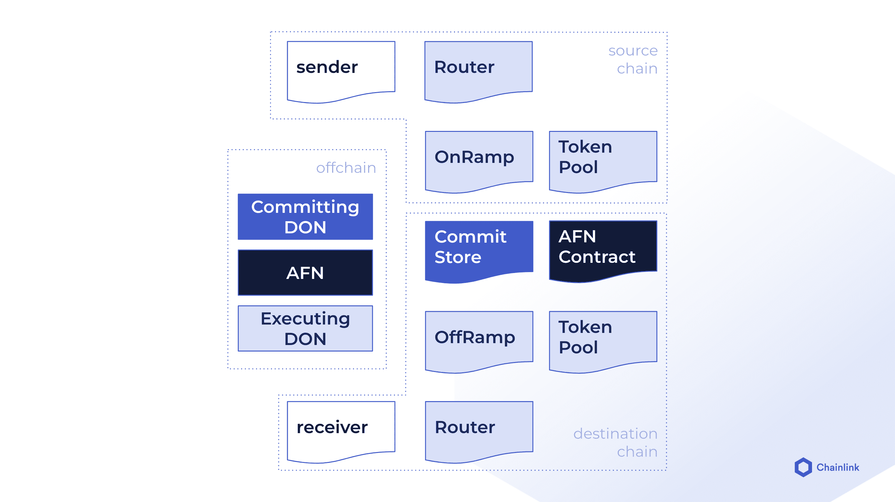
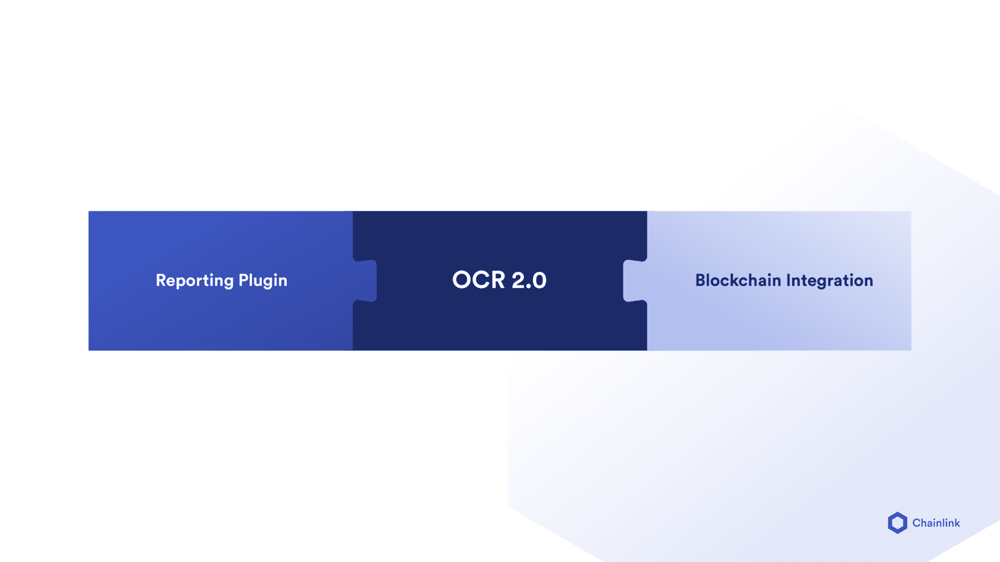

# SmartCon 2022 研究和产品开发亮点

> 原文：<https://blog.chain.link/smartcon-research-updates/>

SmartCon 2022有 150 多位演讲者和 100 多场演讲，汇集了来自 Web2 和 Web3 的行业精英，共同探讨如何将 [信任最小化](https://blog.chain.link/what-is-trust-minimization/) 推向下一个拐点。

开创一个密码强制系统成为规范的时代，不仅需要大量的协同努力，还需要有原则的学术研究以及对用户和行业需求的高度重视。

Chainlink Labs 的使命是通过授权开发人员构建功能丰富的 [混合智能合约](https://blog.chain.link/hybrid-smart-contracts-explained/) ，加速 Web3 创新和加密保证的采用。Chainlink 实验室团队去年在多个关键研究领域取得了重大进展，包括跨链消息传递、隐私保护 oracles、公平交易排序和链外数据聚合。

这篇文章概括了 SmartCon 2022 的钥匙链研究更新。

## 跨链互操作协议(CCIP)

[https://www.youtube.com/embed/speIh3ctygM?feature=oembed](https://www.youtube.com/embed/speIh3ctygM?feature=oembed)

Chainlink 目前正在开发 [跨链互操作协议(CCIP)](https://chain.link/cross-chain)——跨链通信的开源标准。CCIP 旨在建立一个通用的开放标准，帮助开发人员构建安全的服务和应用程序，这些服务和应用程序可以跨多个区块链网络发送任意消息、传输令牌和启动操作。此外，CCIP 的目标是与各种 oracle 服务集成，以支持高度复杂的跨链交互。

CCIP 旨在提供端到端的安全性、前瞻性的 [互操作性](https://blog.chain.link/blockchain-interoperability/) ，以及无缝的开发者体验。CCIP 的基础设施使得源链上的发送者能够向目的链上的接收者发送消息(数据和/或令牌)。实际上，许多协议实例可以并行运行，从而实现大量独立网络之间的连接。

CCIP 的架构包括三层——消息传递(可编程桥)、传输(CCIP 核心)和使用 OCR 2.0 的分散式 oracle networks (DONs ),以及支持每一层的反欺诈网络(AFN)形式的第四个组件。值得注意的是，发送方和接收方契约是唯一需要由外部开发人员编写的组件——所有其他组件都被 CCIP 抽象出来，提供了一个简单、优雅的接口来促进跨链交互。

在 SmartCon 2022 上的演示中，Chainlink Labs 的研发主管 Lorenz Breidenbach 向观众展示了一个使用 CCIP 的跨链消息传递工作流程。

<figcaption id="caption-attachment-4689" class="wp-caption-text">The infrastructure facilitating a cross-chain data transfer in CCIP.</figcaption>

首先，发送方调用 `Router` 契约，这是所有目的地链的单一入口点。 `Router` 对发送方契约的订阅进行计费，并基于目的地链和令牌(每个令牌有一个专用的令牌池)路由消息。值得注意的是，令牌传输是有速率限制的，以帮助减轻潜在攻击的程度。

如果发送的不仅仅是令牌，还有消息， `Router` 会将消息转发给适当的特定于目的地的 `OnRamp` 契约，让它执行初始验证。如果验证通过， `OnRamp` 会发出一个带有消息和元数据的事件。此时，提交 DON(运行 OCR 2.0 的 oracles)观察源代码链，拾取事件，并等待由 `OnRamp` 发出的消息事件的终结。然后，提交 DON 以 Merkle 树的根的形式向在目的地链上运行的 `Commit Store` 契约发送加密承诺(由法定人数的先知签署)。

CCIP 的一个独特之处是反欺诈网络，这是一个独立的验证层，可独立监控堆栈的所有层。如果 AFN 节点注意到任何邪恶的活动，就会自动触发紧急关闭来停止跨链活动。每当契约执行一个操作时，它都会检查 AFN 的状态，以查看系统是否处于紧急暂停状态。值得注意的是，AFN 只监测公共(链上)信息，使其活动完全可审计。

现在，可以执行跨链消息了。执行 DON 由许多运行 OCR 2.0 的节点组成。执行 DON 将等待消息在 `Commit Store` 契约中被提交并被 AFN 祝福。然后，执行 DON 将执行事务连同密码证明一起发送给 `OffRamp` 契约。 `OffRamp` 对照存储在 `Commit Store` 中的承诺验证密码证明，并检查该承诺是否已被 AFN 认可。最后，目的地链上的 `Router` 对接收者合同的订阅进行记账，并充当所有源链的单一退出点。

在他的演示中， [Lorenz 向](https://youtu.be/speIh3ctygM?t=1720)展示了一个跨链的“乒乓”演示契约，它在 Goerli testnet 上的 [契约和 Rinkeby testnet](https://goerli.etherscan.io/address/0x2681f959bECE0e908A330cfd1be1Dd601866991F#internaltx) 上的 [契约之间交换消息。](https://rinkeby.etherscan.io/address/0x80aa9e26bddb4d8f2e9cbc46db3292dbd6b0506e#internaltx)

除了架构深潜之外，Chainlink 的联合创始人 Sergey Nazarov 和 SWIFT 的战略总监 Jonathan Ehrenfeld Solé在一次炉边谈话中宣布， [SWIFT 正在使用 CCIP](https://twitter.com/chainlink/status/1575185397755547649) 进行概念验证，这将使 SWIFT 报文能够指示链上令牌转移，帮助金融服务网络上的 [11，000 多家机构](https://www.swift.com/join-swift/swift-usership) 与区块链网络实现互操作。CCIP 还在测试 Synthetix 的小说[Synth transporters](https://sips.synthetix.io/sips/sip-204/)，它允许 Synth 在不同的网络之间移动。

## 装饰

[https://www.youtube.com/embed/eJqZQ2_VBzo?feature=oembed](https://www.youtube.com/embed/eJqZQ2_VBzo?feature=oembed)

  DECO 是康乃尔大学开发的隐私保护甲骨文技术，后来 [被 Chainlink](https://www.prnewswire.com/news-releases/chainlink-acquires-deco-from-cornell-university-301120614.html) 收购。DECO 使智能合约能够以保护隐私的方式支持涉及敏感数据的复杂用例。

Chainlink oracle networks 已经为区块链经济带来了大量种类繁多的外部数据。 [截止到 2022 年 Q3](https://twitter.com/chainlink/status/1576240552294621184)，Chainlink 甲骨文已经带来了 4.2B+的链上数据点。然而，现有的绝大多数数据是不可公开访问的，这意味着大多数数据对于传统的 oracles 是不可访问的。即使甲骨文可以访问私人可访问数据的世界，也可能有敏感或机密的信息，甲骨文或公众无法查看。因此，在实践中，当涉及到私人可访问的数据时，oracles 应该只生成由这些数据派生的声明，供 [智能合同](https://chain.link/education/smart-contracts) 使用。DECO 通过以保护隐私的方式将当前锁定在 Web2 中的数据、功能和服务安全地连接到 Web3，从而帮助实现这一点。此外，即使不涉及私人数据，DECO 也可以用于证明来自需要用户身份验证的数据源的数据的来源。

> “我坚信，为了释放区块链技术的巨大潜力，需要有一种方法来以保护隐私的方式将用户信息(无论是他们的年龄、身份还是信用评分)传输到智能合同上。”Chainlink Labs 首席研究官 Dahlia malk hi

在 SmartCon 2022 的 [展示期间，Chainlink Labs 的首席研究官 Dahlia Malkhi 宣布，DECO 已经进入 alpha 阶段，正在与多个合作伙伴进行测试，包括多个概念验证。将 DECO 从研究原型变为功能 alpha 需要大量的研究工作，包括创建新的零知识证明，这些证明比现有的零知识技术生成更快，占用的内存更少。我们计划在未来开源支持 DECO 的核心零知识引擎，以便更大的研究社区能够为其开发和采用做出贡献。](https://youtu.be/eJqZQ2_VBzo)

从高层次来看，DECO 涉及到各种实体之间的三方交互——Web 服务器、证明者和验证者。证明者(运行 DECO 证明者的用户或应用)从 Web 服务器(数据提供者)查询信息，而验证者(运行 DECO 验证者的 Chainlink oracle)见证交互。通过这样做，验证者可以证明证明者和 Web 服务器之间的通信的出处，知道证明者与之交互的端点以及交互的加密副本。

<figcaption id="caption-attachment-4690" class="wp-caption-text">The three-way interaction powering DECO.</figcaption>

然后，与数据源的通信中断，只有证明者和验证者需要交互。此时，验证者有证据证明数据是真实的，但是它只看到一个加密的副本。根据具体的用例，会出现以下结果之一:

*   **如果不需要保密** ，证明者向验证者提供可以解密数据的密钥。因此，应用程序开发人员可以将数据整合到他们的应用程序中，并由 DECO 证明数据的来源。
*   **如果需要隐私** ，证明者获取加密数据和从原始来源提取的知识，并通过 [零知识证明](https://blog.chain.link/what-is-a-zero-knowledge-proof-zkp/) 的力量，在不泄露数据本身的情况下对其做出声明。因此，应用程序开发人员可以在他们已经过 DECO 验证的应用程序中加入私人声明。

Chainlink Labs 最近与多个合作伙伴进行了一系列概念验证的 alpha 测试，以验证 DECO 在以下智能合同使用案例中的可行性:

*   **抵押不足的贷款**—该协议在与柜员 的 [概念证明中使用，以生成关于链外银行账户余额的零知识证明，该证明用于促进链上抵押不足的贷款，而不损害数据隐私。](https://blog.chain.link/undercollateralized-lending-teller-deco-poc/)
*   **数字身份**——[光致变色](https://photochromic.io/) 正在开发一种数字身份解决方案，帮助证明用户控制着特定的社交媒体句柄，允许应用程序过滤现实世界的用户。
*   **社交身份/粉丝证明** — [小团体](https://www.clique.social/) 正在开发一种解决方案，以证明用户对特定内容创建者的推文发表了评论，或者用户在 Twitter 上关注了特定内容创建者，而没有透露自己的 Twitter 用户名。
*   **记录系统**—在 SmartCon 2022 上， [Burrata](https://www.burrata.xyz/) 展示了一个原型，该原型允许 Web3 用户通过连接到 Web2 API 的 Burrata 的数据提供者之一来证明他们的身份。 [原型通过小屋租赁概念验证展示](https://youtu.be/eJqZQ2_VBzo?t=1651) ，用户可以通过验证身份并签署临时租赁协议来租赁小屋。在 DECO 的支持下，Burrata 可以连接到一个身份平台和一个文档签名服务，而不会向链上或 oracle 透露任何私人数据，只有关于它们的声明。

Chainlink Labs 正在与各种服务提供商合作，这些服务提供商被称为 Web3 集成商，他们将促进证明者和数据源以及证明者和验证者之间的交互，以帮助使系统更具可扩展性，使用户体验更加无缝。此外，开发正在进行中，以使 Web3 集成商能够运行客户端(甚至在移动设备上)以获得额外的信任最小化好处。

## 公平测序服务(FSS)

[https://www.youtube.com/embed/uuu23oqnzck?feature=oembed](https://www.youtube.com/embed/uuu23oqnzck?feature=oembed)

FSS 是一种分散式交易订购解决方案，旨在减轻智能合同系统中 [【最大可提取价值】](https://blog.chain.link/what-is-miner-extractable-value-mev/) 的不利影响。MEV 以各种形式出现——在 DEX 之间的套利机会中，或者当恶意行为者抢在普通 [DEX](https://blog.chain.link/dex-decentralized-exchange/) 交易之前时，仅举两个例子。MEV 会导致不必要的滑动，降低用户体验，并给用户带来无形的负担。经测量提取的 MEV [总额约为 6 . 75 亿美元](https://explore.flashbots.net/)——这是一个较低的估计值，占数字资产市场交易活动的一小部分。

FSS 的目标是建立工具，通过提供最先进的解决方案，帮助用户制定更公平的交易订购政策，而不必对现有的基础设施进行修改。FSS 旨在帮助提高订单公平性、降低交易成本、减少或消除信息泄露。

chain link Labs 首席科学家 Ari Juels 在 SmartCon 2022 的演讲中描述了智能合约交易订购问题，并介绍了自技术概述在 [Chainlink 2.0 白皮书](https://chain.link/whitepaper) 中提出以来 FSS 的发展情况。

FSS 的主要优势包括两个关键的交易排序策略:安全因果排序和时间排序。安全因果排序加密交易以隐藏交易细节，通过 DON 排序，然后解密以供执行。因此，事务有效负载处于加密形式，并且在订购过程开始之前对节点不可见。时间排序是一种机制，旨在确保 oracle 网络最先收到的事务是最先输出的，有助于促进先进先出(FIFO)排序策略。

Chainlink Labs 研究工程师 paweszaachowski 使用标准的 [自动做市商](https://blog.chain.link/automated-market-maker-amm/) (AMM)展示了一个全功能的 FSS 原型。在演示中，FSS 被用于防止有害的三明治攻击，攻击者在普通交易前后插入恶意交易以获利。

假设爱丽丝想购买价值 100 ETH 的代币，其中 1 个代币的价格约为 1 ETH。攻击者在 mempool(存储未确认交易的队列)中看到交易，并购买大量令牌，抬高其价格。然后，攻击者执行 Alice 的购买交易，将价格再次推高，并使 Alice 的购买订单以高于最初预期的价格执行。最后，攻击者为 ETH 出售他们的令牌，以 Alice 为代价在原子交易中获得无风险利润。

通过“FSS 互换”演示，Paweł展示了 FSS 如何有效地防止三明治攻击并帮助最大限度地降低 MEV。

## 链外报告(OCR 2.0)

[https://www.youtube.com/embed/XKiLkmwVaYA?feature=oembed](https://www.youtube.com/embed/XKiLkmwVaYA?feature=oembed)

[链外报告](https://research.chain.link/ocr.pdf) 协议 (OCR 1.0)是对 Chainlink Data Feeds 的可扩展性升级，通过点对点网络将数据聚合过程移至链外，降低了生成防篡改 oracle 报告的链上气体成本。OCR 1.0 允许节点在链外将它们的观察结果聚合成单个报告，然后由单个节点在链上提交该报告，并在链上验证每个节点的观察结果和签名。    OCR 1.0 自 2021 年初首次部署以来，一直在为[chain link Data Feeds](https://data.chain.link/)这一 DeFi 生态系统的基石提供支持。然而，从那时起，Chainlink 生态系统和更大的 Web3 景观经历了重大变化。最值得注意的是，Chainlink 推出了种类繁多的新颖 Web3 服务，包括 [【储备证明】](https://chain.link/proof-of-reserve)[【VRF】](https://chain.link/vrf)，以及 [自动化](https://chain.link/automation) 。与此同时，智能合约生态系统也变得越来越多链。

OCR 1.0 最初开发的目的是通过将数据聚合到链上进行媒体化，为 EVM 链上的 Chainlink 数据馈送提供动力。OCR 2.0 是 OCR 的一个更一般化的实现，旨在为多种 Chainlink 服务提供一个共享基础，这些服务在许多不同的区块链集成中集成了 don。OCR 2.0 通过使用模块化体系结构引入了额外的可伸缩性和配置灵活性，该体系结构可以根据每个服务的特定要求进行定制，并允许使用同一框架表达不同 oracle 服务的逻辑。

<figcaption id="caption-attachment-4691" class="wp-caption-text">OCR 2.0 is able to be reused while the service and blockchain components can be swapped with less effort.</figcaption>

OCR 2.0 使用一个报告插件来提供由运行在 DON 上的 OCR 2.0 框架执行的特定于产品的逻辑。报告插件允许基本上任意的服务以几乎任意的链为目标，这些链可以与相应的报告插件接口集成。

OCR 2.0 实现了几项额外的改进，包括与 OCR 1.0 相比，天然气成本进一步降低了约 25%，一种新的对等网络堆栈可提高安全性和可靠性，以及可降低延迟和提高吞吐量的增强功能。

## 站在区块链研究的前沿

区块链研究涉及调查高度复杂和具有挑战性的问题，并以一种超越纯粹学术背景的方式解决这些问题，以影响生产系统和现实世界的结果。此外，区块链的研究是独特的多学科研究，涉及的领域包括计算机科学、经济学、博弈论和数学，这使得它成为一个对研究人员极具吸引力的领域。

[chain link Labs](https://chainlinklabs.com/)团队由世界知名的研究人员和顶级行业专家组成，致力于创造前沿技术，帮助建立信任最小化作为 Web 应用程序的标准，并迎来一个由 [密码真理](https://blog.chain.link/what-is-cryptographic-truth/) 驱动的更加经济公平的世界。如果你是一名研究人员，并且愿意合作， [联系](/cdn-cgi/l/email-protection#aedccbddcbcfdccdc6eecdc6cfc7c0c2c7c0c5c2cfccdd80cdc1c3) 。

如果你对更多的区块链研究感兴趣，请加入 [智能合约研究论坛](https://www.smartcontractresearch.org/) 的讨论。要了解更多关于 Chainlink 的信息，了解 Chainlink 生态系统的最新动态，请订阅 [Chainlink 简讯](https://pages.chain.link/subscribe?utm_medium=referral&utm_source=chainlink-blog&utm_content=research-highlights) 并关注官方[chain link Twitter](http://twitter.com/chainlink)。