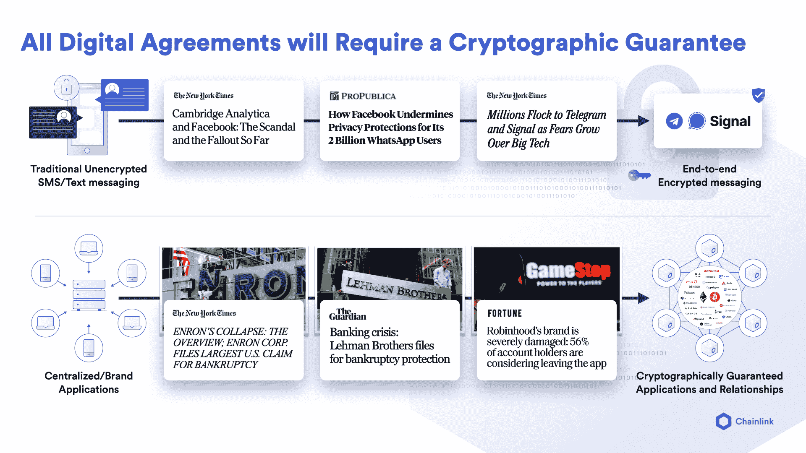
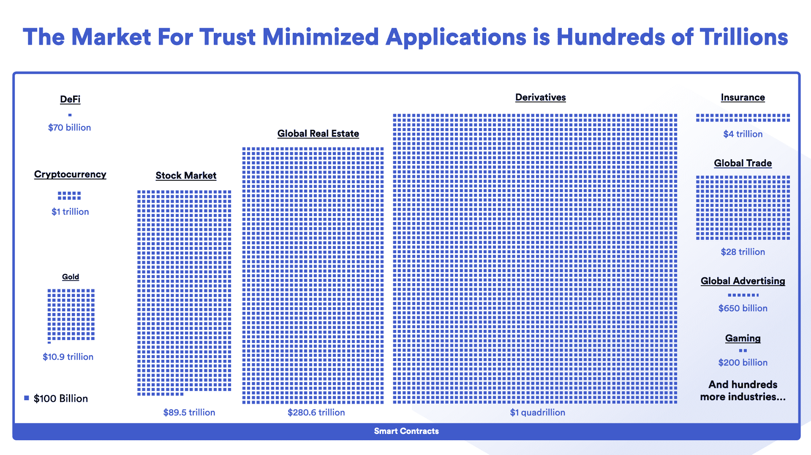
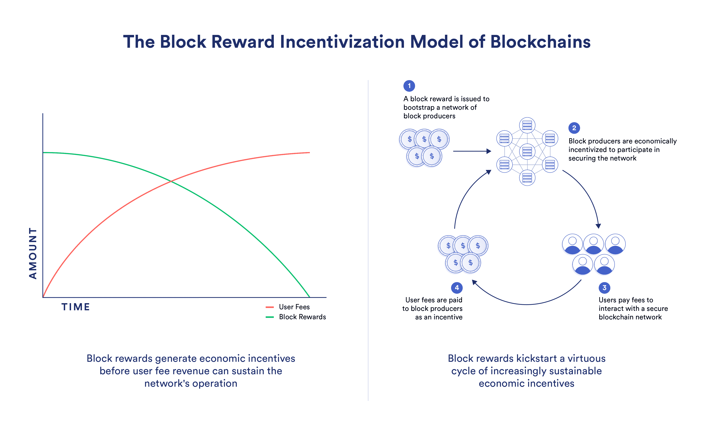
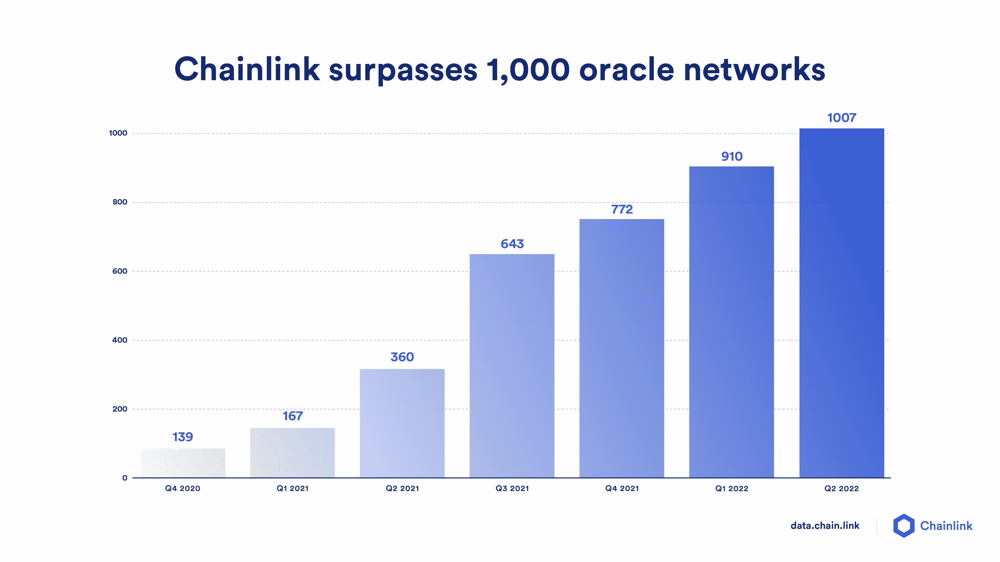

# 可持续发展的链式网络

> 原文：<https://blog.chain.link/sustainably-growing-chainlink/>

Chainlink 的开发目标是提供智能合约和 Web2 系统所需的各种分散服务，以创建一个由加密真理驱动的世界。虽然 Chainlink 独特的 oracle consensus 最初应用于分散的数据馈送，但现在它正在扩展到包括安全的链外计算和跨链互操作性。

考虑到 [智能合同](https://chain.link/education/smart-contracts) 的不断发展的功能以及 [围绕对知名品牌和机构的信任而产生的不断增长的问题](https://blog.chain.link/what-crypto-is-really-about/) ，对由[chain link](https://blog.chain.link/what-is-chainlink/)分散式 oracle 网络(DONs)支持的信任最小化应用程序的潜在需求正在快速增长。这种需求已经为节点运营商创造了巨大的机会来获取费用，并最终通过保护 Chainlink oracle networks 和使用它们的应用程序使利益相关者获得回报。

随着即将推出的，Chainlink 开始了一个可持续增长、更高透明度和更强加密经济安全性的新时代。支持 Chainlink Economics 2.0 时代包括部署新的和现有的战略，旨在加速采用，同时继续提高网络的经济性。下面的帖子分析了信任最小化应用程序的总潜在市场以及 oracles 所扮演的角色，然后解释了使 Chainlink 能够在这个新的不断发展的经济中获取价值的增长战略。

## 信任最小化应用不断增长的总目标市场(TAM)

信任最小化应用程序是向理想状态的过渡，在这种状态下，交易对手之间的协议完全按照书面协议执行，参与者不能操纵或取消预先达成的条款。大规模实现信任最小化可以帮助社会缓解机构和用户之间日益增长的不信任，通过加密保证他们关系的某些部分，而不是依赖诚信或行动缓慢和昂贵的法律系统。这种由区块链和甲骨文网络等去中心化基础设施支持的新型密码保障，一般被称为 [【密码真相】](https://blog.chain.link/what-is-cryptographic-truth/) ，形成信任最小化应用的主干。

信任最小化将技术强制保证直接构建到应用程序的关键方面，通过消除不对称优势将关系置于平等的基础上。这积极地恢复了用户对应用程序的信任，正如即时通讯在保护客户隐私方面的失败导致市场对端到端加密(E2EE)的需求以及最终采用新的通讯应用程序(如 [信号](https://support.signal.org/hc/en-us/articles/360007320391-Is-it-private-Can-I-trust-it-) )时所表现的那样。E2EE 为用户提供了保护其隐私的加密保证，这并不依赖于来自通信提供商的简单的不可验证的声明。

<figcaption id="caption-attachment-4041" class="wp-caption-text">Just as messaging became trust-minimized through cryptographic guarantees, so too will various industries across the global economy.</figcaption>

在更复杂的数字协议中建立信任最小化，例如在金融行业中，通常需要使用 [混合智能合约](https://blog.chain.link/hybrid-smart-contracts-explained/) 基础设施，其中智能合约充当应用层，oracles 充当服务层。应用层封装了定义协议条件的链上逻辑，从而定义了价值交换的方式，而服务层则负责实现这些应用的各种连接和外部依赖。

Chainlink 位于信任最小化应用的服务基础设施层的中心，提供对关键外部资源的访问，包括经过验证的真实世界数据、链外计算、跨链互操作性等。这些服务已经为十几个区块链网络中的数百个应用程序共同获得了数百亿美元的资金，最终帮助推动了混合智能合同生态系统的发展。

<figcaption id="caption-attachment-4042" class="wp-caption-text">Hybrid smart contracts are composed of on-chain and off-chain infrastructure.</figcaption>

[分散金融](https://chain.link/education/defi) (DeFi)是一个利用 Chainlink 和混合智能合同设计模式从利基用例快速成长为可行的并行金融经济的垂直市场的例子——在 2022 年的高峰期管理大约 2500 亿美元的总价值锁定【TVL】。然而，DeFi 本身只代表了万亿美元加密货币市场的一小部分，以及传统金融市场[【867】美元锁定价值中的极小部分](https://www.coindesk.com/markets/2021/05/07/world-economic-forum-blockchain-could-disrupt-867t-in-traditional-markets/) ，这些市场可能会被更广泛的区块链和甲骨文相关技术所破坏。

目前，DeFi 和更大的混合智能合约经济仍处于起步阶段，全球贸易、保险、房地产、衍生品等领域的真实用例尚未得到充分开发。此外，混合智能合同可能代表了一个更大的信任最小化行业的一小部分，其中像区块链和甲骨文这样的技术为离线执行的后端流程带来了客观性、去中心化和透明性。

<figcaption id="caption-attachment-4064" class="wp-caption-text">The market that trust-minimized applications can disrupt is believed to be in the hundreds of trillions of dollars.</figcaption>

Chainlink 致力于通过充当通用的分散式链外计算协议来释放所有这些价值，该协议允许 Web3 智能合约和 Web2 的现有系统获得分散式服务，这些服务满足使其成为信任最小化应用程序所需的超可靠性、可证明的安全性和分散式准确性保证。例如，链环可以:

*   将任何 Web2 系统转变为其自身的信任最小化版本，而无需完全重建
*   执行安全的离线计算，为链上智能合同生成隐私、可伸缩性或可验证性
*   提供用于触发高价值合同结算的分散数据馈送
*   提供用于增加外链担保品透明度的证明
*   交付智能合约的关键信息输出，以触发链外系统流程
*   在推出 [【跨链互操作性协议(CCIP)](https://blog.chain.link/introducing-the-cross-chain-interoperability-protocol-ccip/) 后，根据用户定义的逻辑在异构区块链之间移动数据和资产

鉴于 oracle 的普遍性，Chainlink 的目标是创建一个 Oracle 服务层，不仅能够支持整个区块链智能合约的全部潜在市场，还能满足未来对可无缝接入现有后端的分散服务的需求。合乎逻辑的问题是，这些 oracle 服务如何发展，它们如何在经济上变得可持续？

## 创建行业标准的常用方法

当我们审视传统行业和 Web3 经济中的行业标准是如何建立的时，投入财政资源来支持关键的增长计划是司空见惯的。通过资助新服务的开发和扩展现有服务的能力，项目可以很好地捕捉当前和未来的市场需求预测。支持增长计划通常与补贴早期用户和服务提供商的成本相结合，以培养强大的网络效应，巩固项目的当前市场份额，并通过更具竞争力和多样化的服务产品扩大收入来源的数量。

谈到网络 3 经济，区块链通过使用一种 [区块奖励](https://www.coindesk.com/learn/what-is-a-block-reward/) 激励模型来推动他们的增长，在这种模型中，矿工/验证者(区块生产者)因其对网络的贡献而奖励新创造的加密货币。这使区块链能够创建一个安全的网络块生产者，以防止网络攻击。没有块奖励，区块链网络就面临着一个关键的先有鸡还是先有蛋的问题

如果没有安全的节点网络，用户不会付费使用区块链，如果没有付费用户或经济激励，安全的节点网络就不可能存在。T3】

然而，当存在并适当利用了一种集体奖励机制时，就会产生经济激励来支持安全的节点网络，并为网络最终过渡到一种经济模式创造时间，在这种经济模式下，来自采用的交易费收入可以完全维持网络的运行。

<figcaption id="caption-attachment-4044" class="wp-caption-text">A model of how blockchains use a block reward incentivization model to enable their network’s economics.</figcaption>

## Oracle Rewards 如何加速 Chainlink 的采用

与区块链的整体奖励激励模式类似，Chainlink oracle networks 通过使用 oracle rewards(除用户费用外，还向节点运营商支付奖励)来产生早期经济激励。例如， [Chainlink 数据馈送](https://data.chain.link/) 是分散的 oracle 网络，为 DeFi 应用程序提供对高质量金融市场数据的访问。Chainlink 数据馈送是根据用户对特定区块链(例如以太坊上的 BTC/美元汇率)的特定数据的需求而启动的。发布后，除了订阅源的活跃赞助商支付的用户费用之外，数据订阅源最初还通过 oracle rewards 提供支持。

由于 Chainlink 数据馈送的功能是共享公共产品，任何数量的用户都可以消费和资助相同的馈送。随着数据馈送的每个新的付费赞助者，并且随着现有赞助者产生更多费用，数据馈送的更大部分成本可以由用户费用来覆盖。最终，一旦用户费用超过网络的运营成本，数据馈送的运营就不再需要 oracle reward 的支持，并且数据馈送在经济上变得可持续。事实上，在吞吐量更高的区块链(如 BNB 链和多边形)上，多链数据馈送已经达到可持续状态。

为了加快 Chainlink 数据馈送和其他 Chainlink 服务实现经济可持续发展的速度，我们部署了大量降低成本的解决方案，以便更有效地使用 oracle rewards。例如， [离线报告](https://blog.chain.link/off-chain-reporting-live-on-mainnet/) 的推出将数据馈送的运营成本降低了高达 90%，使在线交付的数据量增加了 10 倍，从而使部署的数据馈送数量迅速增加。结合区块链 的 [不断增加的可扩展性，其他降低成本的解决方案正在进行中，以推动 Chainlink 生态系统的增长，包括:](https://blog.chain.link/blockchain-scalability-approaches/)

 ***   **OCR 2.0** :链外报告协议的升级，为 Chainlink 数据馈送提供动力，这将有助于提高数据交付的成本效益，允许部署更多的 oracle 网络并产生更多的用户费用。
*   **快速通道** :一种技术解决方案，区块链将其部分带宽分配给公共产品，或为公共产品(如 oracle networks)建立优先交易排序。这可以显著降低或消除与 oracle 更新相关的链上成本，从而在区块链网络拥塞时提高响应时间和可靠性。
*   **区块链天然气资助** :区块链项目致力于抵消甲骨文网络的链上天然气成本。这种方法是向后兼容的，并且不需要对底层区块链网络进行技术更改。一些主要区块链生态系统的赠款预计将在不久的将来宣布。

随着越来越多的 Oracle Chainlink 网络实现经济可持续性，oracle rewards 可以重新分配，以支持新的数据馈送和其他 chain link 服务，随着时间的推移，为节点运营商和社区利益相关者带来额外的潜在收费机会。oracle network economics 的这种方法已经帮助确保个人用户不需要支付数据馈送的全部运营成本，从而围绕 Chainlink 培养了强大的网络效应。

通过这一成熟的经济模式，1000 多台 Chainlink oracle networks 已成功部署在十几个区块链网络中，以满足用户需求。正如美国银行 最近的 [研究报告所述，Chainlink 在帮助 fuel DeFi 实现超过 2030 亿美元的总价值增长方面发挥了至关重要的作用，并将有助于加快在金融、保险、供应链等领域采用下一代区块链用例。](https://www.coindesk.com/business/2022/02/17/bofa-says-chainlink-likely-driver-for-defis-tvl-growth-to-203b/)

<figcaption id="caption-attachment-4052" class="wp-caption-text">Chainlink ecosystem surpasses 1,000 live oracle networks.</figcaption>

## 通过增长计划和赌注实现 chain link Economics 2.0

随着关键里程碑的实现，如广泛采用链外计算的多链服务，在各种链上实现多个 oracle 网络的经济可持续性，以及在越来越多的链上部署超过 1，000 个 oracle 网络，我们正在进入链内网络发展的下一阶段:链内经济 2.0。

为了帮助推动这一重要转变，Chainlink Foundation 成立了，以领导一系列日益复杂的发展计划，其中许多计划都是基于部署额外的链接令牌。该基金会的核心目标是通过以下方式支持网络的可持续长期发展:

*   制定链接令牌发布时间表，以支持关键的增长计划，包括面向节点运营商的甲骨文奖励计划和面向利益相关者的赌注奖励计划。
*   为帮助构建和支持 Chainlink 的开源开发者和节点运营商社区提供进一步的技术标准、规范和最佳实践。
*   通过 GitHub 和 npm 等平台为开发者托管、审查和维护 Chainlink 的开源软件。
*   运行和支持 Chainlink hackathon 活动，鼓励开发者使用 Chainlink 和 Web3 技术进行开发。
*   运行 Chainlink Grant 计划以资助 oracles 和 Chainlink 网络及其依赖项的改进。

为了使 Chainlink 社区更加清晰，并且作为 Chainlink Economics 2.0 的一个重要组成部分，基金会预计在未来 9 个月内，直到 2023 年第一季度，不超过 5%的总供应量(5000 万个 LINK tokens)将进入流通供应。这些流通供应的释放将支持网络的增长，包括今年晚些时候即将推出的打桩。预计即将推出的赌注将对这些代币发行产生间接抵消效应，部分取决于赌注者承诺的金额是否达到计划的初始上限[7500 万代币](https://blog.chain.link/chainlink-staking-roadmap/) 。该基金会预计，在 2022 年第三季度和 2023 年第一季度需要额外部署额外的关键计划之前，这些进入流通供应的令牌在短期内将会很少，并将专注于已经出现的甲骨文奖励计划。

genesis 钱包中的非流通令牌将于本周迁移，以升级其链上安全性。令牌将被分成更小的钱包大小，更大的多重签名委员会，使用最新的安全最佳做法。从 genesis 钱包迁移不会影响流通供应，也不代表发行代币。

下面是迁移后非流通令牌的初始地址列表。这些代币被细分为多个 LINK 钱包，但在接下来的九个月中，只有 5000 万 LINK 可用于进入流通供应(主要来自 7 个钱包，每个钱包 700 万 LINK)，用于各种目的，包括 oracle network rewards、初始赌注池和下述计划等。本周迁移完成后，新的钱包地址及其计划持有量如下:

| [0x 5a 8 e 77 BC 30948 cc 9 a 51 a4 e 042d 96 e 145648 bb4cT3】](https://etherscan.io/address/0x5A8e77bC30948cc9A51aE4E042d96e145648BB4C) | **30，000，000.00** |
| [0x E0 b 66 bfc 7344 a 80152 bfec 954942 e 2926 a6 FCA 80](https://etherscan.io/address/0xe0b66bFc7344a80152BfeC954942E2926A6FcA80) | **30，000，000.00** |
| [0x a 42 d0 a18 b 834 f 52 e 41 beddea 2940165 db 3d a9 a 3T3】](https://etherscan.io/address/0xa42D0A18B834F52e41bEDdEaA2940165db3DA9a3) | **30，000，000.00** |
| [0x FB 682 b 0 de 4 e 0093835 ea 21 cfab 5449 ca 9 AC 9 e 5 eT3】](https://etherscan.io/address/0xfB682b0dE4e0093835EA21cfABb5449cA9ac9e5e) | **30，000，000.00** |
| [0 x4a 87 ECE 3 eff fcb 012 FBE 491 aa 028032 e 07 b 6 F6 cfT3】](https://etherscan.io/address/0x4a87ecE3eFffCb012fbE491AA028032e07B6F6cF) | **30，000，000.00** |
| [0xd 321948212663366503 e 8 DCC de 39 cc 8e 71 c 267 c 0](https://etherscan.io/address/0xD321948212663366503E8dCCDE39cc8e71C267c0) | **30，000，000.00** |
| [0x 55 b 0 ba 1994d 68 C2 ab 0 c 01 c 3332 EC 9473 de 296137](https://etherscan.io/address/0x55b0ba1994d68C2AB0C01C3332eC9473de296137) | **30，000，000.00** |
| [0xd 48133 c 96 C5 Fe 8d 41d 0 CBD 598 f 65 BF 4548941 e 27T3】](https://etherscan.io/address/0xD48133C96C5FE8d41D0cbD598F65bf4548941e27) | **30，000，000.00** |
| [0x 9 c 17 f 630 dbde 24 eece 8 FD 248 FAA 2 e 51 f 690 ff 79 bT3】](https://etherscan.io/address/0x9c17f630DBde24eECe8fd248fAA2E51f690FF79B) | **30，000，000.00** |
| [0x 35 a5 DC 3 FD 1210 Fe 7173 add3c 01144 cf 1693 b5 e 45](https://etherscan.io/address/0x35a5dc3FD1210Fe7173aDD3C01144Cf1693B5E45) | **30，000，000.00** |
| 0x 0 dffd 343 c2d 3460 a 7 EAD 2797 a 687304 beb 394 ce 0T3] | **30，000，000.00** |
| 0x 76287 e 0 F7 b107 D1 c9f01 D5 afac 314 e 8461 a04T3] | **30，000，000.00** |
| [0x 9 BBB 46637 a1 df 7 cadec 2 afca 19 c 2920 CD DCC 8 db 8T3】](https://etherscan.io/address/0x9BBb46637A1Df7CADec2AFcA19C2920CdDCc8Db8) | **30，000，000.00** |
| [0x 7594 EB 0 ca 0a 7 f 313 befd 59 AFE 9e 95 c 2201 a 443 E4T3】](https://etherscan.io/address/0x7594Eb0ca0a7f313bEFD59AfE9e95c2201a443e4) | **30，000，000.00** |
| [0x 8652 FB 672253607 c 0061677 bdcafb 77 a 324 de 081](https://etherscan.io/address/0x8652Fb672253607c0061677bDCaFb77a324DE081) | **30，000，000.00** |
| [0x 157235 a3 cc 6011 d9 c26 a 010875 c 2550246 abccaT3】](https://etherscan.io/address/0x157235A3cc6011d9C26A010875c2550246aAbcCA) | **22，000，000.00** |
| [0x 959815462 ee C5 fff 387 a2 E8 a 6871d 94323d 371 deT3】](https://etherscan.io/address/0x959815462EeC5fFf387A2e8a6871d94323D371de) | **8，000，000.00** |
| [0x 276 f 695 b 3 b 2 c 7 f 24 e 7 cf 5 b 9d 24 e 416 a7 f 357 ADB 7T3】](https://etherscan.io/address/0x276F695b3B2C7f24E7CF5b9d24e416a7f357aDb7) | 7，000，000.00 元 |
| [0 xb9 b 012 CAD 0 a7 C1 b 10 CBE 33 a1 B3 f 623 b 06 fad 1c 7cT3】](https://etherscan.io/address/0xb9b012cad0A7C1b10CbE33a1B3F623b06fAD1c7C) | 7，000，000.00 元 |
| [0x 3264225 F2 FD 3 bb 8d 5d c 50587 ea 7506 aa 8638 b 966](https://etherscan.io/address/0x3264225f2Fd3bb8D5DC50587EA7506aA8638B966) | 7，000，000.00 元 |
| [0x 57 EC 4745258 E5 a4 c 73 D1 a 82636 DC 0 Fe 291 E3 ee 9 f](https://etherscan.io/address/0x57Ec4745258e5A4C73d1A82636dc0FE291e3eE9F) | 7，000，000.00 元 |
| [0x a 71 bbbd 288 a4 e 288 cfdc 08 bb 2 e 70 DCD 74 da 4486dT3】](https://etherscan.io/address/0xa71bbBd288a4e288CfDC08bb2E70DCd74Da4486D) | 7，000，000.00 元 |
| [0 xec 640 a 90 e 9 a 30072158115 b7c 0253 f 2689 ee 6547](https://etherscan.io/address/0xEc640A90e9A30072158115B7C0253f2689ee6547) | 7，000，000.00 元 |
| [0x 2 a 6a B3 b 0 c 96377 BD 20 AE 47 e 50 AE 426 a 8546 a4 AE 9](https://etherscan.io/address/0x2a6AB3B0C96377bd20AE47E50ae426A8546A4Ae9) | 7，000，000.00 元 |
| [0x 5 eab 1966 D5 f 61 e 52 c 22d 0279 f 06 f 175 e 36 a 7181 eT3】](https://etherscan.io/address/0x5Eab1966D5F61E52C22D0279F06f175e36A7181E) | **300 万，000.00** |
| [0x8d 34d 66 BD B2 D1 D6 ACD 788 a2 d 73 d68 e 62282332 e 7](https://etherscan.io/address/0x8d34d66bDb2d1d6ACd788A2d73d68e62282332e7) | **50 万元** |
| [T1】0x 37398 a 324d 35 c 942574650 b 9 ed 2987 BC 640 bad 76T3】](https://etherscan.io/address/0x37398A324d35c942574650B9eD2987BC640BAD76) | **40 万元** |

为了使 Chainlink 社区更加清晰并避免混乱，可以在[*【chain.link/circulating-supply】*](https://chain.link/circulating-supply)查看 link 的持续流通供应量，这将反映这些迁移前后的当前流通供应量。如上所述，从 genesis 钱包到上述新的安全钱包的初始迁移不会导致任何额外的流通供应。

上述钱包迁移后的第一个版本将与支付已经发生的甲骨文奖励相关，支持现有甲骨文网络的持续运营。随着时间的推移，版本将逐渐扩展到以下类别，以促进 Chainlink 网络继续扩展到更分散的服务，跨越更多的链，并从即将推出的 staking 中获得更高的加密经济安全性:

*   **甲骨文奖励** 降低初始用户成本，并在所有关键垂直市场产生强大的网络效应。与用户付费相结合，这支持了保护 Chainlink 服务的节点运营商。
*   **参与链桩的节点运营商和社区成员的桩桩奖励** 。随着时间的推移，这将有助于为 Chainlink 服务产生更高级别的加密经济安全性和用户保证。
*   **扩展现有的 Chainlink 服务** 通过启动额外的网络，进一步增加开发人员在链上可用的数据集的多样性。这有助于以安全且经济高效的方式创建新的智能合同应用程序。
*   **支持额外的区块链** ，使 Chainlink 成为跨多链生态系统(包括第 1 层和第 2 层网络)的首选 oracle 解决方案。这也包括扩大对 EVM 和非 EVM 区块链网络的支持。
*   **开发新的 Chainlink oracle 服务** 以扩展智能合约经济的功能。这包括跨链互操作性协议(CCIP)、公平排序服务(FSS)、DECO 和企业抽象层的工作。
*   **其他生态系统增长计划** 支持 Chainlink 的采用、安全性、服务产品和易用性。一些增长计划包括链接资助、黑客马拉松赞助、研发、代码审计和 bug 奖励计划。

通过支持这些计划的发展，Chainlink 网络可以成为一个更加自我维持、可扩展和安全的分散服务生态系统，这使得下一代智能合同和信任最小化的 Web2 应用能够存在。

## 结论

Chainlink 已经发展成为整个区块链行业中最安全、应用最广泛、集成度最高的系统之一。Chainlink 的增长可以归功于它的安全性和 Web3 和 Web2 开发者现在可以依赖的各种关键的分散服务。随着 Chainlink 网络跨越在多个 oracle 网络上实现自我可持续经济的重要里程碑，以及 1000 多个 oracle 网络的推出，很明显，下一阶段的增长已经准备好开始推出经济 2.0。

我们对网络能够为所有 Web3 开发者以及各种希望实现信任最小化的 Web2 系统提供什么感到非常兴奋。所有这些增长都需要一个忠诚的社区和生态系统，我们将一如既往地非常感谢您的承诺和支持，因为我们将继续建设一个由加密真理驱动的世界。

要了解更多，请访问[chain . link](https://chain.link/)，订阅 [Chainlink 简讯](https://chn.lk/newsletter) ，并关注 Chainlink 上的[Twitter](https://twitter.com/chainlink)，[YouTube](https://www.youtube.com/channel/UCnjkrlqaWEBSnKZQ71gdyFA)，以及[Reddit](https://www.reddit.com/r/Chainlink/)。

如果你想要更多的技术背景，我们建议你阅读 [原版 Chainlink 白皮书](https://link.smartcontract.com/whitepaper) 、 [Chainlink 2.0 白皮书](https://research.chain.link/whitepaper-v2.pdf) 和 [开发者文档](https://docs.chain.link/) 。

—

*免责声明:本文仅供参考，包含对未来的陈述，包括预期的产品功能、开发和推出这些功能的时间表。这些陈述只是预测，反映了当前对未来事件的信念和期望；它们建立在假设的基础上，随时会受到风险、不确定性和变化的影响。虽然我们相信实际结果是基于合理的假设，但我们不能保证实际结果与这些陈述中的结果不会有重大差异。所有声明仅在首次发布之日有效。由于用户反馈或后来的事件，这些声明可能不会反映未来的发展，我们可能不会更新此帖子作为回应。T3】***