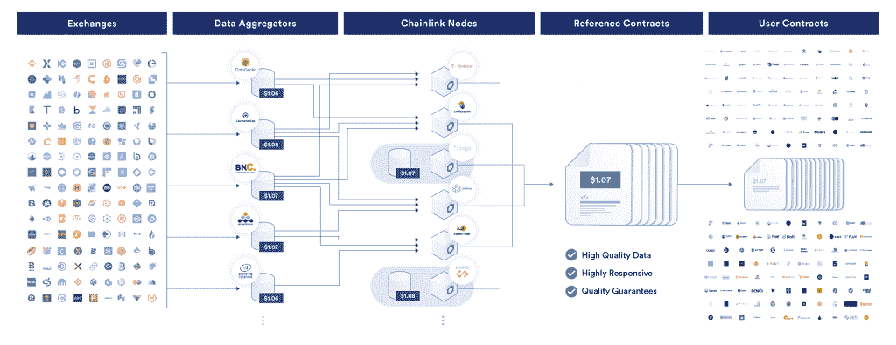

# TWAP 与 VWAP 价格算法

> 原文：<https://blog.chain.link/twap-vs-vwap/>

时间加权平均价格(TWAP)和数量加权平均价格(VWAP)算法应用不同的方法来计算资产价格，这是几乎所有 [分散金融(DeFi)](https://chain.link/education/defi) 原语的组成元素。

在本文中，我们将介绍 TWAP 算法和 VWAP 算法之间的差异，解释它们在区块链环境下如何为资产定价，并探讨它们各自的优势和利弊。通过做出更明智的安全设计选择和利用最安全的基础设施，DeFi 协议可以为用户提供更准确、可靠和公平的价格。了解 [TWAP 和 VWAP 算法](https://smartcontentpublication.medium.com/twap-oracles-vs-chainlink-price-feeds-a-comparative-analysis-8155a3483cbd) 的区别是这个过程中至关重要的一部分。

## 什么是 TWAP？

TWAP 代表“时间加权平均价格”。这是一种定价算法，用于计算一项资产在一段时间内的平均价格。

在 DeFi 中，一种类型的被称为 [自动做市商(AMM)](https://blog.chain.link/challenges-in-defi-how-to-bring-more-capital-and-less-risk-to-automated-market-maker-dexs/) 可用于生成可在其他协议中使用的 TWAP 价格。TWAP 也可以指一种交易策略，通过在一段时间内将大量订单分成相等的部分来执行，以最大限度地减少滑点和信号。在这篇文章中，我们关注的是定价机制而不是交易策略。

### TWAP 是如何计算出来的？

TWAP 的计算方法是将一段时间内多个点的价格相加，然后除以价格点的总数。

这里有一个常见的 TWAP 公式:

*   TWAP = (TP1+ TP2… + TPn) / n，其中；
*   TP1 是第一时间点的价格，而
*   n 是时间点的总数。

例如，假设我们想要使用 15 秒的价格点间隔来计算一分钟内资产的 TWAP。如果价格是 0 秒钟 100 美元，15 秒钟 102 美元，30 秒钟 101 美元，45 秒钟 98 美元，60 秒钟 103 美元，那么为了计算 TWAP，我们将所有价格点(100，102，101，99，103)相加，然后除以时间点的数量(5)。在本例中，TWAP 是 101 美元。

### TWAP 的优势

#### 简单

与更严格的定价机制相比，TWAP 计算简单，执行起来也不昂贵。这可以使它们易于在线实现并高效运行。

#### 防范闪贷攻击

闪贷是一种无抵押贷款，让用户借入资产并在同一笔交易中偿还。这可能导致 dApps 利用 [AMM 指数](https://blog.chain.link/dex-decentralized-exchange/) 作为流动性池的现货定价机制，其中价格是通过简单地除以双边流动性池中一种资产相对于另一种资产的数量来计算的。在这种情况下，恶意行为者可以在单笔交易中借入大量资金，利用它们操纵现货价格，并攻击任何依赖于从该流动性池中得出的现货价格的智能合约。

通过使用 TWAP 从 AMM dex 生成多个区块的价格，协议可以保护自己免受这些快速贷款攻击。

## 什么是 VWAP？

VWAP 代表“成交量加权平均价格”。它是一种用于计算资产价格的机制，通过从多个交易环境中获取价格数据，并根据资产交易的每个流动性市场的交易量对每个价格进行加权。VWAP 算法 [是大多数 DeFi 协议](https://blog.chain.link/chainlink-price-feeds-secure-defi/) 的基础，因为它被业界领先的 price oracle 解决方案:Chainlink Price Feeds 所使用。

VWAP 计算方法也在金融领域得到更广泛的应用，作为交易员的技术指标、经纪人或交易所提供的订单选项以及基准。在本文中，我们将重点关注它作为一种定价机制的使用。

### VWAP 是如何计算出来的？

VWAP 的计算方法是，从多个交易环境中获取一项资产的交易价格，并根据每个交易所的交易量对这些价格点进行加权，通常会过滤掉洗盘交易和其他异常值。

这里有一个常见的 VWAP 公式:

*   VWAP = (V1 x P1 + V2 x P2… + Vn x Pn) /总体积，其中；
*   V1 和 P1 是资产在第一个交易环境中的交易量和交易价格，而
*   n 是计算中使用的交易环境总数。

例如，我们将计算一项虚拟资产在特定时间段内的 VWAP。假设在 X 交易所以 101 美元的价格交易了 100 个代币，在 Y 交易所以 102 美元的价格交易了 150 个代币，在 z 交易所以 100 美元的价格交易了 500 个代币。我们首先将价格乘以每个交易环境的交易量(100 x 101 + 150 x 102 + 500 x 100)，然后将结果除以总交易量(100 + 150 + 500)。我们将 75，400 除以 750，得出 VWAP 为 100.53 美元。

### VWAP 的优势

#### 市场覆盖面

VWAP 可以为用户提供全球市场价格，反映各种交易环境下的资产价格，包括小型和大型交易所。这有助于过滤流动性较低的市场中更容易受到市场操纵的异常值，从而更加重视交易活动较多的市场。随着流动性在不同市场之间转移，市场范围的价格仍然可以产生。

#### 高度准确的最新数据

通过整合来自多种交易环境的数据，VWAP 机制的用户正在利用价格数据来更准确地反映资产的全球供应/需求。此外，使用的数据更新鲜，更新，使 VWAP 的价格点密切跟踪资产的市场价格。

#### 防操纵

VWAP 算法对操纵的抵抗力更强，因为它们不依赖于单一的交易市场，该市场可能被资金雄厚的恶意行为者或通过闪贷攻击操纵。恶意行为者必须操纵大部分资产交易市场，这需要在此过程中改变资产本身的市场价格。

## TWAP 的劣势

虽然 TWAP 和 VWAP 的价格机制都有一定的优势，但 TWAP 算法有许多缺点，使其不适合大多数 [DeFi 用例](https://blog.chain.link/smart-contract-use-cases/) 。

#### 滞后指示器

TWAP 算法依赖于历史价格数据，这使其成为一个天生的滞后指标。这种滞后可能导致价格在中度到高度波动期间与市场价格不同步，并为延迟定价和剥削创造机会。虽然 TWAP 计算可以通过使用较短时间跨度的价格点来减少这种滞后，但这将降低资金充足的恶意行为者进行操纵的成本。

相比之下，VWAP 机制可用于根据最新市场数据计算价格，并提供反映资产全球交易市场最新活动的防篡改指标。

#### 市场覆盖面

市场覆盖指的是定价机制考虑的交易环境的数量。TWAP 算法，特别是在链上执行时，通常依赖于来自单一交易环境的数据，这意味着它们不能反映全球资产市场的特征，即无数不同的集中和分散交易所。

TWAP 算法的这一问题在 DeFi 中尤为突出，因为分散式交换协议通常在多个链的不同实例中同时运行不同版本的 DEX。由于恶意行为者只需操纵一家交易所就能影响 TWAP 算法，因此各交易所之间分散的流动性意味着，他们需要更少的资本就能成功实施攻击。此外，流动性会随着时间的推移而变化，因此，尽管用于 TWAP 数据的交易所有一天可能是流动的，但不能保证这种流动性会持续下去。

一个恶意的参与者需要操纵整个市场来影响 VWAP 算法。这是因为 VWAP 算法可以纳入所有不同的交易环境，包括资产交易的 CEX 和 DEX 实例，提供更稳健的全球市场覆盖资产价格。

#### 安全可扩展性

当在链上计算时，TWAP 机制在增加其安全性的能力方面是有限的。虽然延长测量价格点的时间周期有助于增加防篡改性，但这会降低新鲜度，从而降低价格准确性。本质上，TWAP 机制的安全性和准确性之间存在反比关系，因此不可能同时优化这两者。

传统链上 TWAP 机制变得更加安全的唯一可行方法是增加被跟踪市场的流动性/交易量，使攻击者妥协的成本更高。

在向 DeFi 应用程序提供市场数据的背景下，VWAP 算法可以在不影响价格准确性的情况下，提高其在许多不同向量中的安全性。 [提高安全性的实用方法](https://blog.chain.link/defi-security-best-practices/) 包括集成更多数据源以消除集中化风险并防止 API 停机，利用更高质量的数据提供商来消除数据异常值和可疑交易活动，以及加入加密经济激励措施。

#### 资产多元化

使用链上流动性池生成 TWAP 定价的 DeFi 协议受到其交易所可交易资产的限制。这意味着他们将始终受到他们正在运行的上可用代币的限制。例如，基于以太坊的协议只能为 ERC-20 令牌生成相对于该网络上其他令牌定价的 TWAP 价格。

相反，[chain link](https://chain.link/)网络使得 DeFi 协议不仅可以利用来自整个 [Web3](https://chain.link/education/web3) 生态系统的本地资产的 VWAP 价格数据，还可以利用各种现实资产的价格数据，例如货币、商品和合成资产，以及直接根据法定货币定价的资产。

#### 易受多块攻击

在证据区块链上使用链上 TWAP 定价机制的协议容易受到多块 MEV 攻击。这些攻击不是像闪电贷款那样在单笔交易中操纵 AMM 指数的现货价格，而是恶意行为者在两个或更多连续交易中操纵价格。这是可能的，因为具有足够大的利害关系的攻击者偶尔会控制被分配来发布两个或更多连续块的验证器，并且因为为未来块选择的验证器通常是提前知道的。

## 通过 Chainlink 价格源利用 VWAP

虽然 Chainlink 网络能够支持 TWAP 或任何其他定价方法，但 Chainlink 价格馈送使用基于 VWAP 的机制，因为它生成最准确、防篡改和可靠的市场数据。

[chain link Price feed](https://chain.link/data-feeds)由一批提供基于 VWAP 的资产定价的高质量数据提供商提供支持，以 [为 DeFi 经济提供支持](https://blog.chain.link/chainlink-price-feeds-secure-defi/) 为各种资产提供高质量的市场数据，即使在极端的市场波动时期也能保持准确性。这使用户能够检索资产的最新定价数据，以便以信任最小化的方式在智能合同链上或链外应用程序中使用。

更具体地说，Chainlink 价格馈送是链上 [参考合同](https://docs.chain.link/docs/reference-contracts/) ，存储最新和历史资产价格，由独立 oracle 节点运营商组成的分散 oracle 网络(don)自动更新。由于区块链无法本地访问外部系统，oracle networks 通过支持 [智能合同](https://chain.link/education/smart-contracts) 基于真实世界的输入和输出来执行，在 DeFi 生态系统中发挥着关键作用。

Chainlink Price Feeds power 广泛的 [DeFi 用例](https://chain.link/use-cases/defi) ，包括货币市场、稳定债券、期权、期货、合成资产、保险等等。截至 2022 年 9 月 1 日，Chainlink Price Feeds 已在链上提供了 42 亿个数据点，帮助确保了 1，470 多个项目和数百亿美元的价值。

<figcaption id="caption-attachment-4781" class="wp-caption-text">Chainlink Price Feeds underpin the DeFi economy with decentralized, reliable, and highly accurate market data.</figcaption>

## 结论

准确和防篡改的价格数据是成功和安全的 DeFi 协议的核心，有助于确保用户的资产获得公平的价格，恶意行为者无法操纵价格。对于大多数 DeFi 用例，基于 VWAP 的价格机制比 TWAP 计算更合适。通过 Chainlink 价格馈送，协议可以无缝集成基于 VWAP 的超可靠、高质量的价格数据，以及分散在多个级别的，以便更好地服务于更广泛的用户、项目和空间。

*要了解更多信息，请阅读 Chainlink Price feeds 如何保护 DeFi 生态系统* *，探索它们的* [*使用案例*](https://chain.link/use-cases) *，或访问* [*文档*](https://docs.chain.link/docs/using-chainlink-reference-contracts/) *。*