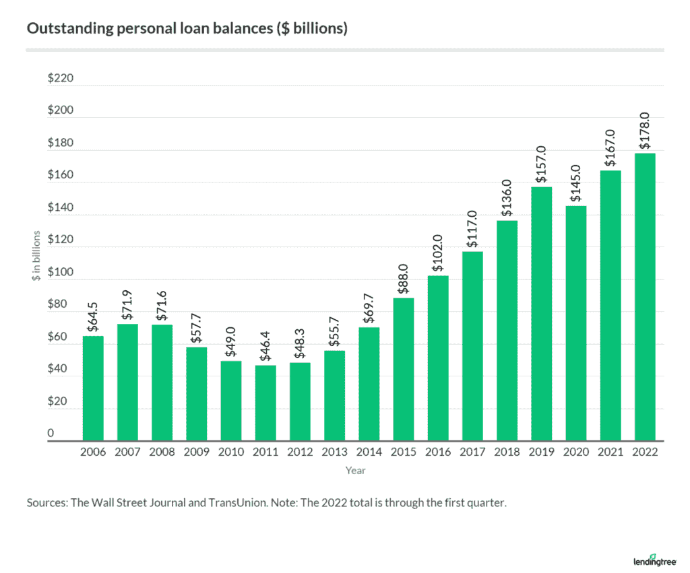
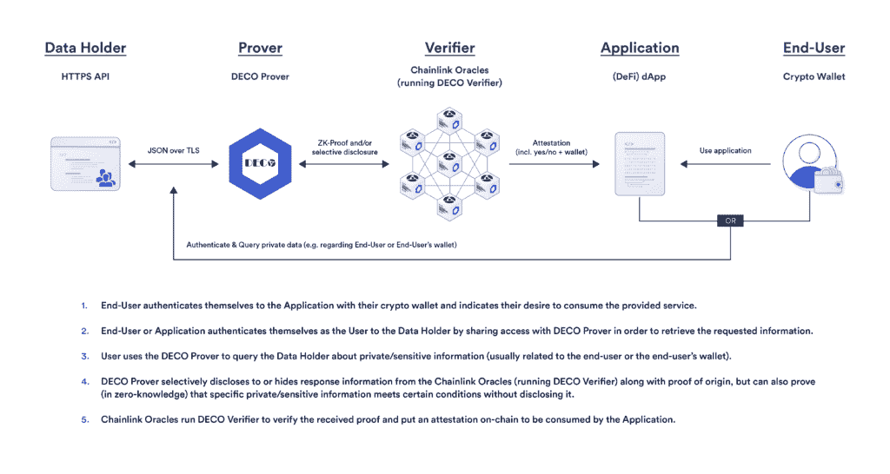
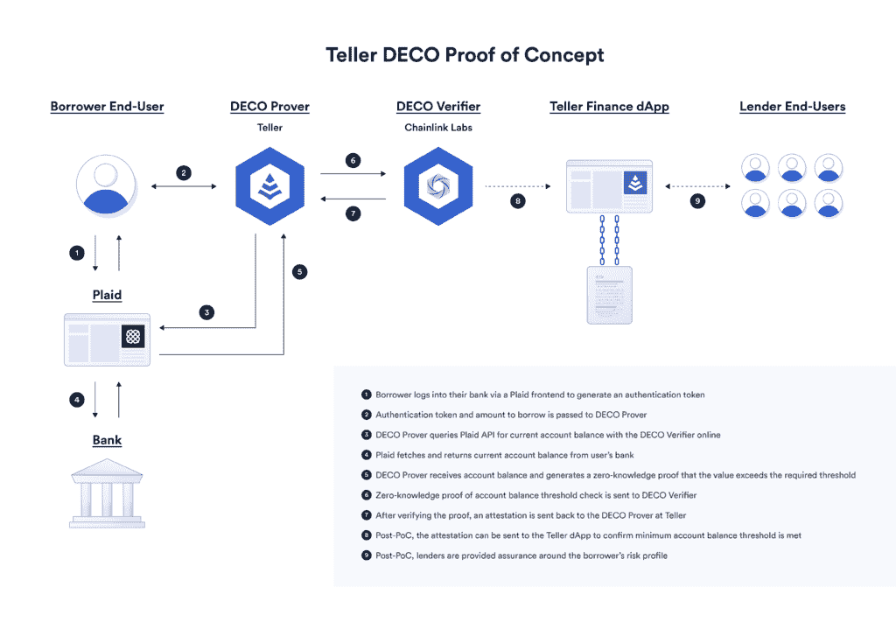

# DECO 如何实现抵押不足的 DeFi 贷款:Teller 的概念证明

> 原文：<https://blog.chain.link/undercollateralized-lending-teller-deco-poc/>

任何金融体系的一个基本支柱是借贷资产的能力。借款人需要立即获得营运资本，而贷款人则从他们原本闲置的资本中赚取收益。

然而，位于区块链的金融市场——通常被称为分散金融或简称为[DeFi](https://chain.link/education/defi)——通常涉及只能通过伪匿名地址识别的用户。为了解释这种围绕有限信用声誉的独特动态， [DeFi 借贷市场](https://blog.chain.link/decentralized-money-markets/) 通常会超额抵押，这意味着借款人需要存放超过贷款价值的抵押品。例如，借款人可能必须存入“150 美元的联邦存款作为抵押，才能借入“100 美元的 USDC”。这种超额抵押确保了如果借款人无法偿还债务，抵押品可以被清算以使贷款人完整——这是维持偿付能力的基本机制。

过度抵押贷款的不利之处在于，借贷的资本效率不高，并限制了市场的发展。要克服 DeFi 中的这一限制，需要抵押不足的贷款协议，该协议可以获取可靠的信用信息，以确定借款人的风险状况，而不会泄露区块链的敏感信息。幸运的是，这正在成为可能，因为技术突破，如[DECO](https://research.chain.link/deco.pdf)——一种目前正在开发中的隐私保护 oracle 协议。值得注意的是，DECO 使用 [零知识证明](https://blog.chain.link/what-is-a-zero-knowledge-proof-zkp/) 来证明链外信息，而不使其在链上公开可见，甚至对 oracles 本身也不公开。

在本文中，我们将展示为什么抵押不足的贷款是 DeFi 的下一个前沿领域，以及 DECO 如何提供必要的安全链外基础设施，以克服抵押不足的贷款在数据隐私方面的关键挑战。我们还展示了 [柜员](https://teller.org/) 和 Chainlink Labs 之间的概念验证，其中 DECO 被用于 alpha 测试，以在零知识的情况下证明存在最小的离线银行账户余额，最终使柜员能够降低 DeFi 贷款的抵押品要求。

## 抵押不足贷款的广阔市场

虽然过度抵押贷款是 DeFi 中的现状，但传统金融中的贷款通常抵押不足，甚至以无担保贷款的形式完全无抵押。通常，这采取个人贷款、学生贷款和信用卡的形式。例如，当消费者用信用卡购物时，他们是在向银行借入无抵押的资金，并在日后结算。

随着超过[4.85 亿](https://www.transunion.com/blog/all-signs-point-to-a-healthy-credit-market-in-2022) 信用卡的发行，[4300 万](https://educationdata.org/how-many-people-have-student-loans) 学生贷款，[2000 万](https://www.lendingtree.com/personal/personal-loans-statistics/) 个人贷款在 2021 年第四季度，无担保债务市场是美国经济的一个巨大组成部分。在 Q1 2022 年，仅美国的无担保个人贷款市场总额就达 1780 亿美元，比 DeFi 锁定的整个 [价值高，比今天所有](https://defillama.com/) [DeFi 贷款协议](https://defillama.com/protocols/Lending) 锁定的价值高一个数量级。

<figcaption id="caption-attachment-4476" class="wp-caption-text">The market size for unsecured personal loans in the United States ([source](https://www.lendingtree.com/personal/personal-loans-statistics/))</figcaption>

将抵押不足的贷款引入赤字规模将使大量的经济价值进入生态系统。消费者只需连接互联网，就可以在几分钟内从分散的应用程序中获得贷款，而不是处理从集中的中介机构借款的摩擦。通过 [智能合约](https://chain.link/education/smart-contracts) 降低金融平台的交易对手风险，贷款人可以产生更高的资本收益率，借款人可以获得资本效率更高的贷款条款，而不必担心受到歧视。

## 抵押不足贷款的挑战

对贷方来说，抵押不足的贷款本质上更具风险，因为借款人的抵押品不足以覆盖全部贷款。因此，需要对借款人偿还贷款的能力有某种形式的信任。鉴于 DeFi 参与者的假名性质，确定哪些借款人是安全的或有风险的是一项艰巨的任务。

为了支持一个稳健的抵押不足的贷款市场，贷款人需要掌握借款人的信用信息。信誉数据的范围可以从身份证明和信用评分到银行账户余额和还款历史。贷方获得的数据越多，就有越多的借款利率和抵押品要求可以优化，以适应一定的风险容忍度。然而，大多数信用度数据驻留在传统数据库中的外链中，智能合同应用程序本身无法访问这些数据。

因此，DeFi 需要使用像 Chainlink 这样的 [神谕](https://chain.link/education/blockchain-oracles) 来安全地获取链外数据并在链上传送。重要的是，oracles 允许智能合同以编程的方式使用这些数据，例如检查借款人的贷款资格，而不需要贷款人的任何手动输入或修改信贷机构使用的流程。

尽管在抵押不足的贷款方面，获得链上数据只是等式的一半。由于区块链是公共的不可改变的分类账，任何在链上发布的数据都可以立即被全世界看到。如果在个人身份信息的可见性和处理方面没有隐私保证(PII)，大多数消费者不太可能参与抵押不足的 DeFi 贷款市场。与此同时，由于商业和法律限制，大多数传统机构将无法参与，如 GDPR。

# DECO:一个保护隐私的 Oracle 协议，支持链上低抵押贷款

[德科](https://research.chain.link/deco.pdf)——一项由康乃尔大学开发、后被 Chainlink 收购的保护隐私的甲骨文技术——允许通过互联网传输的数据得到甲骨文的保密证明，而不会将数据透露给公众或甲骨文节点本身。这解决了诸如 HTTPS/TLS 之类的现有 web 通信标准的一个很大的限制，在这些标准中，用户可以私下与 web 服务器通信，但是不能向第三方证明数据的 出处 。

通过在 oracle 实时在场的情况下使用零知识证明(zkp ), DECO 允许用户向 oracle 证明通过 TLS web 会话访问的数据来自特定的 API 或网站，同时限制透露的数据量。DECO 与 TLS 的现有版本向后兼容，这意味着可以支持大范围的可能数据源，因为不需要对托管用户数据的 web 服务器进行修改。关于 DECO 的技术细节可以在 Chainlink Labs 首席科学家 Ari Juels 合著的 [白皮书](https://research.chain.link/deco.pdf) 中找到。

借助 DECO，可以证明借款人的信用信息，而无需担心数据隐私。至关重要的是，用户能够将他们的姓名、财务状况和数据访问凭证等敏感信息保密，同时证明关于他们自己的派生声明。通过使用密码证明来证明某个值超过阈值，而不是在链上发布数据本身，来实现声明。例如，借款人可以使用 DECO 来证明他们的信用评分(由已建立的信用局确定)超过了特定的阈值，而无需透露确切的信用评分。它不仅允许借款人证明他们满足最低贷款要求，同时只披露最低数量的必要信息，而且借款人可以证明数据来自权威来源，并且在验证过程中没有被篡改。

<figcaption id="caption-attachment-4095" class="wp-caption-text">DECO uses zero-knowledge proofs to privately attest to personal information stored in off-chain databases.</figcaption>

# 与柜员一起进行概念验证

Chainlink 实验室最近与主要合作伙伴进行了一系列 alpha 测试概念验证，以验证 DECO 在各种智能合同使用案例中的功能和可行性。DECO 在 PoCs 中用于生成证明敏感信息事实的 zkp，这些敏感信息来自一系列不同的数据提供商，所有这些都不会损害数据隐私或要求数据提供商进行服务器端修改。

其中一个 POC 是与 [出纳员](https://teller.org/) 合作的，这是一个用于数字资产借贷的 DeFi 协议市场，支持抵押不足的贷款。Teller 使用 DECO 协议来证明用户的离线银行账户的余额超过了由所请求的贷款金额指定的动态阈值。如果用户账户余额的总和超过阈值，那么他们作为借款人的风险状况将会降低，从而允许贷款的担保要求显著降低。例如，如果借款人申请 5000 美元的贷款，那么用户必须证明他们的银行账户中至少有 5000 美元，以表明他们有能力偿还贷款。

为了生成该证明，测试用户首先通过 [格子](https://plaid.com/)——一家专注于开发者的金融服务公司——登录他们的银行，以生成 [认证令牌](https://plaid.com/docs/api/tokens/) 。这个令牌然后被传递给 DECO Prover 实例，作为查询 Plaid API 的私有输入。然后由 DECO 证明者运行下面的计算:

`Sum(Query(".report.items[].accounts[].balances.current")) > ${LOAN_AMOUNT}`

在数据被查询之后，DECO 证明者生成 ZKP，以向实时出现的 DECO 验证者证明用户的银行账户余额满足最低要求的阈值，同时证明数据合法地来源于 Plaid API。在接收和验证密码证明之后，DECO 验证者然后在本地生成证明，该证明被发送回 Teller 处的 DECO 证明者以完成该过程。在生产环境中，这种证明可以通过链发送到智能合同应用程序。

<figcaption id="caption-attachment-4477" class="wp-caption-text">DECO enables borrowers to prove their off-chain bank account balances exceed a predefined threshold.</figcaption>

在此 PoC 中，DECO 证明者实例由 Teller 部署，而 DECO 验证者由 Chainlink Labs 部署。在未来的迭代中，为了增加 [信任最小化](https://blog.chain.link/what-is-trust-minimization/) 保证，计划 DECO 证明者可以由最终用户本地部署或者在可信执行环境(TEE)中部署，而 DECO 验证者可以由分散的 oracle 网络部署。

这一成功的 alpha 测试 PoC 展示了 DECO 在真实世界使用案例(如抵押不足的贷款)中维护数据隐私的同时，生成有关借款人信誉的 zkp 的能力。下一个阶段是在链上提供证明，因此 Teller 等智能合同应用程序可以依赖零知识用户的特定信用信息，支持抵押不足的贷款在 DeFi 中的增长。随着[chain link Core](https://github.com/smartcontractkit/chainlink)客户端在生产中被广泛使用并经过三年多的时间考验，促进 DECO 协议证明的链上交付是一个无缝的过程。

> “Teller 和 Chainlink Labs 之间的概念验证展示了 DECO 协议的真正力量，以及保护隐私的 oracle 技术如何通过抵押不足的贷款将数万亿美元的未开发价值带入链条。我们很高兴能继续与 Chainlink 合作开发和完善 DECO 协议。”–Teller Finance 首席执行官 Ryan Berkun。

> “DECO 是一项创新的新技术，它使智能合约能够以真正保护隐私的方式服务于更强大的用例。Teller 的这一概念验证成功地展示了如何将学术研究应用到现实世界的用例中。我们很高兴能继续与 Teller 就 DECO 的使用进行合作，并期待 DECO 能为更广泛的社区所用。”–chain link Labs 首席研究官 Dahlia Malkhi。

# 结论

将抵押不足的贷款引入 DeFi 生态系统代表着一个服务于巨大的全球市场并让数百万人加入金融经济的机会。通过 DECO 协议，链上的贷款人将能够就信誉作出更明智的决定，而借款人可以维护其个人信息的隐私。欠抵押贷款只是 DECO 等隐私保护神谕在 [Web3](https://chain.link/education/web3) 中可以启用的众多智能合约用例之一。

*了解更多 Chainlink，订阅 [Chainlink 简讯](https://pages.chain.link/subscribe?utm_medium=referral&utm_source=chainlink-blog&utm_content=teller-deco) 关注官方 [Chainlink 推特](https://twitter.com/chainlink) 了解最新 Chainlink 新闻和公告。T15】*