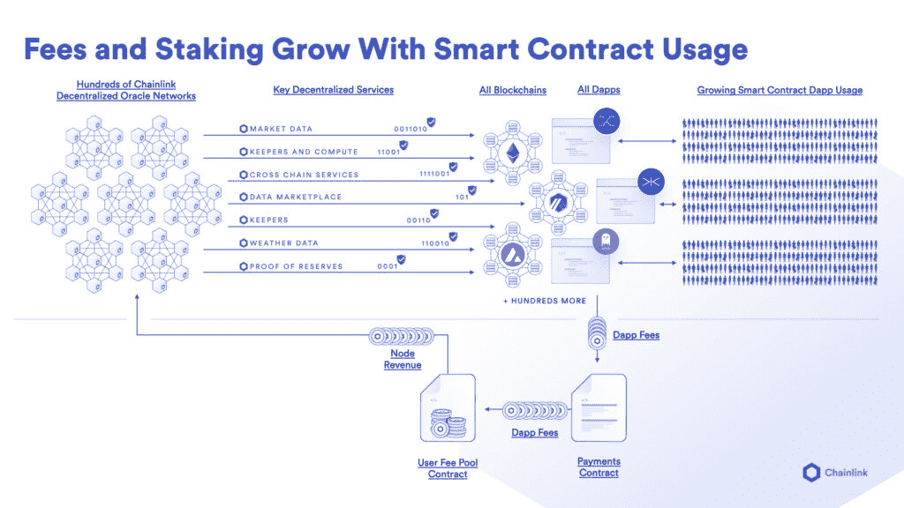
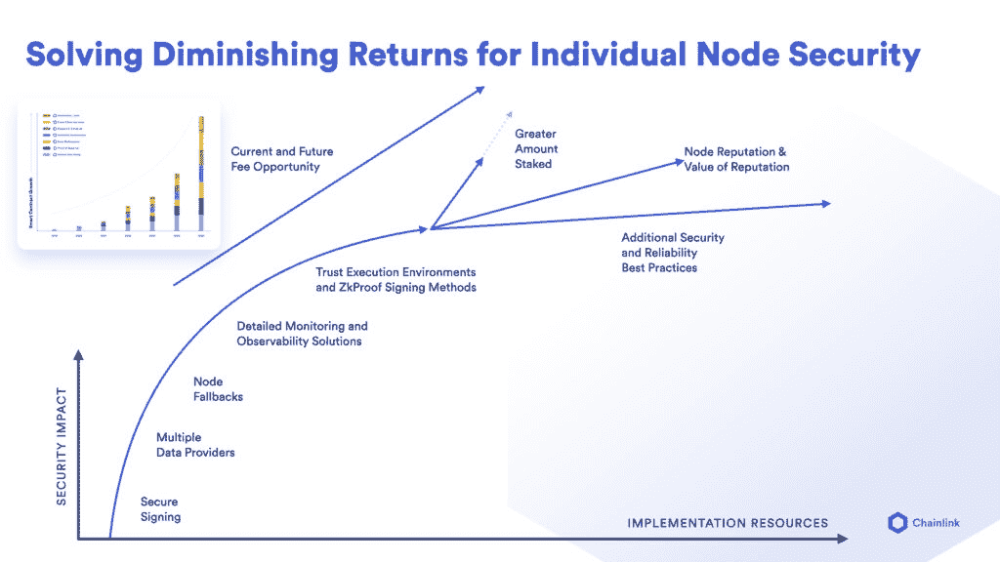
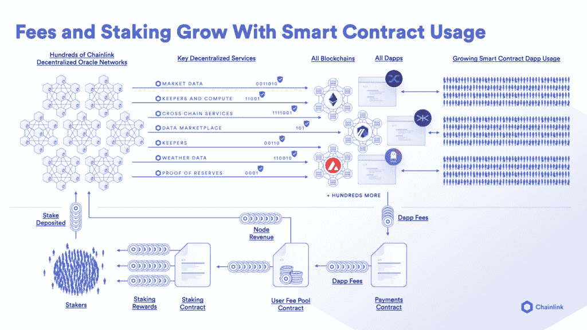

# 了解 Chainlink Oracle Networks 的安全影响曲线和未来收费机会

> 原文：<https://blog.chain.link/understanding-the-security-impact-curve-and-future-fee-opportunity/>

*Chainlink Staking v0.1 现已[在 mainnet](https://staking.chain.link/) 上线。*

如今，Chainlink 为 900 多个独特的 oracle 网络提供支持，这些网络在整个多链生态系统中获得了数百亿美元的智能合同价值。Staking 代表了 Chainlink 久经考验的 oracle 基础设施的创新飞跃，将有助于网络实现加密经济安全的良性循环，我们相信这反过来将有助于推动智能合同开发和采用的新浪潮。

要了解 Chainlink 的长期经济模式，必须了解 Chainlink oracle networks 如今日益增长的经济效率，以及赌注机制将如何提高 Chainlink 的加密经济安全性。本文基于 Sergey Nazarov 的演讲[【Chainlink 的未来】](https://www.youtube.com/watch?v=YShbzR7mlog) ，将介绍 oracle network 激励机制的基本挑战，Chainlink 的赌注机制旨在解决这些挑战，以及这种新颖的安全模式将如何帮助围绕信任最小化 chain link 服务和智能合同创新创造规模经济。

在我们深入研究之前，定义三个关键术语很重要:

 ***   **Staking:** 链状链状链状链状链状链状链状链状链状链状链状链状链状链状链状链状链状链状链状链状链状链状链状链状链状链状链状链状链状链状链状链状链状链状链状链状链状链状链状链状链状链状链状链状链状链状链状链状链状链状链状链状链状链状链状链状链状链状链状链状链状链状链状链状链状链状链状链状链状链状链状链状链状链状链状链状链状链状链状链状链状链状链状
*   **安全影响曲线:** 表示 oracle 节点运营商在实施基础设施资源和最佳实践中每增加一个单位成本，用户整体安全的改善程度。
*   **未来收费机会(FFO):** 指 oracle nodes 通过参与 Chainlink 网络并保持积极的业绩和声誉而获得的潜在收入。

有关围绕 oracle 节点行为的加密经济激励设计的技术深度探讨，请参见 Chainlink 2.0 白皮书 [的第 9 节](https://research.chain.link/whitepaper-v2.pdf) 。

[https://www.youtube.com/embed/YShbzR7mlog?feature=oembed](https://www.youtube.com/embed/YShbzR7mlog?feature=oembed)

## 今日甲骨文网络盈利能力

从 dApp 费用的角度来看，多链甲骨文网络现已实现盈利。这些是 dApps 为使用 Chainlink 服务而支付的费用。考虑到许多区块链网络继续依赖整体奖励来激励节点性能，Chainlink oracle network 仅基于费用的盈利能力是一个独特的里程碑。一些更广泛使用的区块链依靠格挡奖励从 60-70%不等。

由于 Chainlink 的 [非链报告协议(OCR)](https://blog.chain.link/off-chain-reporting-live-on-mainnet/) 的效率，Chainlink oracle networks 运行的区块链的效率提高，以及用户需求的增加，某些 Chainlink oracle networks 已经完全盈利，并且不需要任何形式的块奖励或 oracle 奖励即可运营。

随着 dApp 使用更多的 Chainlink 服务，以及新的 dApp 被构建来使用 Chainlink 服务，这就形成了一种逻辑动态，dApp 费用流向 Chainlink oracle 节点运营商。

<figcaption id="caption-attachment-3819" class="wp-caption-text">As more dApps adopt trust-minimized Chainlink services, more fees flow to Chainlink oracle networks.</figcaption>

## 赌注如何解决单个节点安全性收益递减的问题

由于许多 Chainlink 节点运营商正在整合强大的基础设施和安全最佳实践来保持其节点的运行，他们开始达到相对于其费用而言，在改善安全影响方面回报递减的效率水平，并且现在只能通过某些手段来改善。

<figcaption id="caption-attachment-3820" class="wp-caption-text">Chainlink staking is designed to solve for the diminishing returns node operators start to experience as they implement security and reliability best practices.</figcaption>

从纯粹的经济角度来看，问题是，什么是最有效但成本最低的安全改进？随着节点操作者沿着安全影响曲线上升——实施安全签名、多个数据源、节点回退、详细监控和可观察性、各种签名方案——他们最终在安全影响方面达到一定程度的收益递减。

然而，随着费用的增长——基于使用 Chainlink 服务的各种新 dApps 以及智能合同的广泛采用——围绕 Chainlink oracle networks 的当前和未来费用机会也有望增长。目前的未来收费机会是节点运营商在某些计算类别中作为顶级节点运营商可以赚取的费用，如数据验证和交付、随机数生成和分散自动化。除了更高质量的节点之外，oracle 网络的规模也在不断增长，这有助于为更有价值的交易和交易类别提供越来越大的网络。

随着费用的增加，他们可以证明某些最低级别的安全成本是合理的，例如拥有某种安全签名能力、多个数据提供者或某些后备措施。随着时间的推移，许多节点预计会满足这些最低要求，就像今天许多节点满足某些安全类别一样。

那么问题就变成了，还有哪些类别可以让节点获得越来越多的费用？越来越多的 dApps 及其用户使用各种分散服务，节点如何获得当前和未来收费机会的更大部分？

如我们的 [Chainlink 2.0 白皮书](https://research.chain.link/whitepaper-v2.pdf) 所述，这个问题的根本答案是两个动力。

第一个动态是节点信誉和对该信誉的价值。节点信誉是节点已经实现的低延迟、准确和满足服务协议性能的历史。强大的节点信誉意味着他们可以提供许多关键指标，表明他们拥有并能够在各种敌对、高拥塞时期和日常运营期间提供高度可靠、准确的数据。一个节点在正常运行时间、抵抗敌对情况、传递准确信息和执行准确计算方面做得越好，其区分因素就越清晰。

另一组区分因素，也可能是最大的区分因素之一，将是节点的链接数量。

这与 [区块链的工作方式](https://blog.chain.link/what-is-staking/) 非常相似:某些连锁店有赌注池或个人赌注者，他们提供更大份额的股份并接受更大份额的交易。这是完全相同的原理。那些具有更多利害关系的节点和那些赌注池变得有资格进行更多的交易。

除了满足顶级节点访问最有价值的未来费用和当前费用机会的安全性和可靠性保证之外，节点运营商还需要提供声誉，如果他们表现良好，将随着时间的推移自然发展。赌注机制补充了信誉系统，使得网络中的参与者可以作为赌注的节点运营商，或者作为赌注的 oracle 网络，或者作为赌注的池，赚取更多的费用。

这创造了一个非常相似的动态，增加链接赌注的能力创造了获得更多收费机会的能力，这实际上有助于获得更好的声誉，因为赌注节点运营商将处理更多的交易，并随着时间的推移证明更多关于他们自己的信息。

这是为单个节点运营商建模的赌注激励方式。他们将提供股份，为各种用户提供安全保证，这些用户将看到这些安全保证，并希望与 oracle networks 的这些节点或这些类别的节点打交道，这将推动这些网络和节点类别获得更大的付费机会。

从长远来看，随着收费机会的增加和更分散的服务的提供，预计更大量的 dApp 费用将流入系统，作为节点运营商的节点收入，并流入为这些服务提供加密经济安全性的利益相关方。

<figcaption id="caption-attachment-3821" class="wp-caption-text">Fees from dApps that use Chainlink services flow to the node operators and stakers who provide cryptoeconomic security on those services.</figcaption>

Chainlink stakers 可以是任意数量的组，包括节点操作者本身、参与的个人用户以及向节点操作者提供利益的池。这些赌注集团预计将因提供他们的股份而获得相关的赌注奖励，这提供了更大的安全保障，就像在世界顶级的赌注区块链中提供的一样。

这显然是一个非常复杂的问题，因为正如 oracle networks 生成一种 [不同于区块链](https://blog.chain.link/blockchains-oracles-similarities-differences-synergies/) 的独特形式的分散计算一样，应用于这种独特形式的分散计算的赌注也需要是独特的。

在 oracle 网络级别上，随着网络最终达到每个额外安全影响和成本的平台期，它们可以通过由具有最高质量信誉的节点和具有最高质量信誉分数的数据提供商组成的网络来区分自己，并且它们还可以通过池或通过其他机制从其网络提供集体赌注。

除了安全最佳实践、分散化和高信誉分数之外，更大的利益为用户提供了确定卓越网络所需的安全保证。通过拥有更多的股份，网络有望拥有更高的可靠性，它在游戏中有更多的利益，并有更多的动力采取正确的行动。这个股份，就像它激励适当的操作在各种证明区块链股份，激励适当的操作在链环网络。同样，提供赌注的人和提供计算的人被独特地激励以他们自己独特的方式去做。

这些动态将使独特的甲骨文网络更接近于抓住更多当前和未来的收费机会，这是他们想要做的，也是他们需要做的，以便继续从网络中获得更多收入。不仅最佳实践和良好声誉的巨大影响，而且比其他人拥有更大数量的股份，这使得在更大的股份证明网络中可以看到相同的动态，其中更大部分的费用以确定该股份所提供的额外安全性的特定比例发送给这些机制。

最终，这些动态取决于许多因素，包括费用的数量、dapp 的数量、这些 dapp 的用户数量、 [混合智能合约](https://blog.chain.link/hybrid-smart-contracts-explained/) 的采用，以及将信任最小化应用作为对用户的独特卖点的采用。

混合智能合约的市场规模仍处于初级阶段，某些 Chainlink oracle network 的运营效率足够高，他们已经能够在当今的加密货币市场中实现盈利。与更大的信任最小化应用程序市场以及所有准备在未来迁移到混合智能合同的价值相比，这算不了什么。

*[今天就去](https://staking.chain.link/)检查一下你是否有资格获得 Chainlink Staking v0.1 早期版本。*

*要了解更多关于 Chainlink 经济学的基础知识，请参阅 Chainlink 2.0 白皮书，* [去中心化 Oracle 网络发展的后续步骤](https://research.chain.link/whitepaper-v2.pdf) *。本帖基于 Sergey Nazarov 的陈述，*[chain link 的未来](https://www.youtube.com/watch?v=YShbzR7mlog) *，发表于 2022 年 1 月 1 日，未更新* *。***