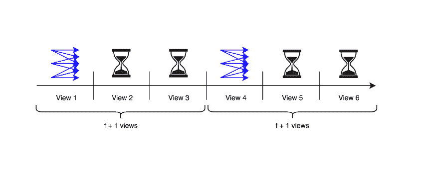

# 视图同步的最新视图

> 原文：<https://blog.chain.link/view-synchronization/>

*作者:大丽花 [奥德·纳尔](https://www.odednaor.work/) 。T9】*

采用逐个视图范例的拜占庭一致性协议依靠“起搏器”在一组进入和离开视图的参与者(也称为节点)之间进行协调。定调者需要确保节点最终与诚实的领导者达成一致，并在视图中花费足够多的时间来达成一致的决策。这个问题被称为 **拜占廷观点同步问题** 。

基于 leader 的拜占庭一致性协议的实用性稳步发展，包括 HotStuff 的引入——其 leader 协议仅产生线性通信成本——转移了保持起搏器通信复杂性较低的主要挑战。

本文提供了起搏器解决拜占庭视图同步问题的基本观点。剧透提醒:达成单一共识决策的理论最坏情况沟通下界是二次的，但直到今年才(终于)实现了这种复杂性；这些方形起搏器描述如下。

## **背景**

许多用于部分同步设置的拜占庭一致协议，以及同样在具有已知参与者的设置中的区块链协议，以逐个视图的方式进行。在每个视图中，一个指定的节点被选为领导者，并提出一个新的事务块，将该块提议发送给所有其他节点，并收集它们对其批准的投票。一旦提议的区块获得足够的票数，领导者可以继续协议，并且提议的区块被添加到区块链。

这种类型的解决方案通过等待传输变得同步(也称为同步),避开了在异步网络中不可能达成一致的问题。全球稳定时间或“GST”)。在商品及服务税之后，他们依靠一个诚实的领导者与网络中所有其他诚实的节点及时沟通，以推动一致的决策。

依靠一个好的领导者来推动进步是基于一个“隐藏”的假设:所有的参与者都与一个诚实的领导者有足够长的重叠时间。由于节点将只投票赞成由该节点当前所在视图的领导者提出的块提议，如果没有这种假设，领导者可以提议新的块，但是它将不能从诚实的节点收集足够的投票。协调诚实节点进入同一视图并在离开前在视图中有足够的重叠时间，使得视图有已知的诚实领导者，这是拜占庭视图同步问题的本质。

我们继续描述解决这一问题的“起搏器”解决方案的演变。

## **型号和定义**

我们关注的系统可能会经历很长一段时间的异步——消息可能需要任意长的时间才能到达——直到它们到达一个称为全局稳定时间(GST)的同步期，之后网络是同步的，消息在某个时间限制内到达。这种模式被称为“最终同步”。

有 *n* 节点，上至 *f < n/3 的* 这些都是拜占庭的，其余的节点都是老实的。我们调查的解决方案分为两类，单镜头和多镜头(区块链)。为了一致性，我们的讨论和复杂性度量集中在单次问题上。

直觉上，我们认为确定性协议具有视图到视图的结构。每个视图都有一个所有节点都同意的单个领导者(例如，通过循环或一些常见的随机来源)。诚实节点运行定拍协议来处理视图(编号为 *1、2、3、…* )。

当所有诚实节点在足够长的时间内*【δ*(由底层共识协议规定)处于同一视图中时，视图被认为是“协调的”。时间*【δ*应该允许协调视图的诚实领导者有足够的时间，其中所有节点都在相同的视图中(并且因此同意相同的领导者)来驱动决策过程，并且让所有节点对新的块提议进行投票。在拜占庭视图同步问题中，节点协调进入和离开视图，直到它们到达领导者诚实的协调视图。对于区块链协议，新的块被不断地添加到区块链中，视图同步在整个协议运行过程中重复出现无数次:新的领导者将提出一个将获得足够票数的新块，这就是区块链如何随着新的块不断增长的。

视图同步性能是根据消息复杂性和延迟来衡量的。消息复杂度是诚实节点为到达视图同步的单个实例而相互发送的消息数量(大小有限)。它对系统同步后开始发送的消息进行计数。延迟是指它需要的通信回合数。视图同步需要重复协调的视图，直到到达一个领导者诚实的视图。达到视图同步的总成本取决于在进入具有诚实领导者的视图之前，连续尝试与拜占庭领导者协调视图的次数。既然领导者可以使用一个普通的随机性来源随机选择，我们可以分别讨论和 *最坏情况* 的表现。在预期中，对于 *⅔* 诚实节点，使用随机领导者选择的恒定数量的连续协调视图达到具有诚实领导者的视图。在最糟糕的情况下，它可能需要长达 *f* 连续与拜占庭领导人协调观点，直到一个诚实的领导人出现。

## **为什么视图同步是共识的瓶颈？**

存在确定性拜占庭一致性协议，例如 Yin-Malkhi-Reiter 等人的 [HotStuff](https://arxiv.org/pdf/1803.05069.pdf) ，一旦达到同步视图，这些协议在线性通信复杂度上达成一致性。事实上，HotStuff 是第一个将核心共识算法与指示每个节点推进视图的组件明确分离的共识协议。他们将这个组件命名为 Pacemaker(没有提供具体的实现)，它的工作只是实现视图同步。HotStuff 在 *O(1)* 延迟和*O(n)*消息复杂度的同步视图中达成共识。在 GST 之后，*O(f)*可能需要协调一致的意见才能在最坏的情况下驱动一个一致的决定，于是，HotStuff 就可能招致*O(n***)*的通信总计(*【O(n)*的消息中的每一个【T44*

 *这与 [Dolev 和 Reischuk](https://www.cs.huji.ac.il/~dolev/pubs/p132-dolev.pdf) 在 1980 年发现的任何确定性拜占庭一致协议的消息复杂度的已知下限相匹配。这个界限规定，每个确定性解决方案都有导致消息复杂性的执行*O(n***)*(即使在完全同步的设置期间)。*

 *然而，这并不是故事的结尾。

一旦达到同步视图，HotStuff 仅导致线性通信成本，但是起搏器在协调进入和离开视图以达到这种同步视图时导致额外的通信成本。

作为一种稻草人方案，节点可以基于 [布拉查的可靠广播](https://core.ac.uk/download/pdf/82523202.pdf) 通过全对全广播协调进入视图。简而言之，视图 *r* 中的节点执行以下操作:

*   如果没有进展，就广播 `(READY,r+1)` 。
*   如果接收到来自 *f+1* 其他节点的 `(READY,r+1)` 广播，则广播 `(READY,r+1)` 。
*   如果接收到来自 *2f+1* 其他节点的 `(READY,r+1)` 广播，则进入视图*r+1*。

不幸的是，有了这个方案，*(f)*的倒霉蛋与有缺点的领导观点招致*(n***)*的交流。因此，在共识解决方案(例如 HotStuff)中插入这种简单的起搏器会导致整体的立方通信复杂性。*

 *提高视图同步的复杂度将提高整体一致性复杂度，并且特别地，任何具有*O(n***)*复杂度的视图同步解决方案将因此证明 Dolev-Reischuk 下界在部分同步设置中是紧的。这也将从同步模式上弥补一个缺口，其中 [莫莫塞和任](https://arxiv.org/pdf/2007.13175.pdf) 已经显示出了绑定的紧密性。*

 *我们注意到，有一个已知的 *O(n)* 关于每个确定性解决方案可能遭受的视图数量的延迟下限，由 [Dolev 和 Strong](http://www2.imm.dtu.dk/courses/02220/2015/L12/DolevStrong83.pdf) 在 1983 年提出。下文描述的所有起搏器都达到了这一延迟，但其中大多数具有更低的预期延迟。

## **起搏器**

拜占庭视图同步问题最早在[cogs worth](https://arxiv.org/pdf/1909.05204.pdf)被正式定义。在后来的作品中，这个问题被概括为[【区块链】](https://arxiv.org/pdf/2202.06679.pdf) 。在此之前，共识协议没有显式的定拍算法，而是隐式地使用技术来使节点同步到同一视图。

例如，使用指数回退:如果一个节点在一个视图中没有及时取得进展 *t* ，它移动到下一个视图并在那里花费 *2t* 时间。这一过程持续到共识协议进展到决策。在每个视图中加倍时间保证了最终达到一个视图，在该视图中所有诚实节点重叠至少*δ*(即使*δ*未知，这也是有效的)。这是一个简单的方法，但是缺点是试图达到视图同步的视图数量是无限的——即使在 GST 之后并且没有任何错误——因此延迟和通信成本是无限的。

在后来的协议中，节点通过通信来同步视图。下表列出了 GST 之后的已知解决方案及其延迟和消息复杂性(针对预期和最坏情况):

| **起搏器协议** | **预期等待时间** | **最坏情况延迟** | **预期消息复杂度** | **最坏情况报文复杂度** |
| [布拉查基地](https://core.ac.uk/download/pdf/82523202.pdf) / [FastSync](https://arxiv.org/pdf/2008.04167.pdf) | *O(1)* | *O(n)* | *O(nT2)* | *O(n )* |
| [科斯沃斯](https://cryptoeconomicsystems.pubpub.org/pub/naor-cogsworth-synchronization/release/5) | *O(1)* | *O(n)* | *O(n)* with benign faults*O(n**)*有拜占庭缺点 | *O(n²**)* with benign faults*O(n**)*有拜占庭缺点 |
| 纳尔-凯达尔 | *O①* | *O(n)* | *O(n)* | *(n***)** |
| [稀土 nc](https://arxiv.org/pdf/2208.09262.pdf) / [Lewis-Pye](https://arxiv.org/pdf/2201.01107.pdf) | *O(n)* | *O(n)* | *O(nT2)* | *O(nT2)* |

如上面的稻草人方法中提到的，视图同步的一个简单解决方案是使用基于 [布拉查的可靠广播](https://core.ac.uk/download/pdf/82523202.pdf) 的广播协议。这是一个无领导协议，其中有一个全对全 O(n )通信步骤来同步每个视图:

在 GST 之后，该协议协调所有节点在恒定延迟内进入一个新的协调视图:让 *r* 成为一个诚实节点想要进入的最高视图。然后 *f+1* 诚实节点必须已经进入*R1*并发送准备好的广播给 *r* 。在他们过期查看*R1*之后，需要一个网络等待时间用于*f+1*准备好的广播传播，另一个等待时间用于由 *f* 附加的诚实节点准备好的广播，直到每个人都进入 *r* 。还有潜在的 *f* 拜占廷领袖相继出现的最坏情况，因此最坏情况下的潜伏期为*O(f)= O(n)*，匹配潜伏期下限，与*O(n***)在预期的情况下，需要恒定数量的协调视图，直到出现诚实的领导者，从而导致*O(1)*预期延迟和*O(n***)*预期消息复杂度。***

 **[FastSync](https://arxiv.org/pdf/2008.04167.pdf) 类似地基于布拉查广播，但是在 GST 之前具有有限的内存并容许消息丢失。

[Cogsworth](https://cryptoeconomicsystems.pubpub.org/pub/naor-cogsworth-synchronization/release/5) 对于良性节点的运行，在预期情况下提高了通信复杂度和延迟。在 Cogsworth 中，当节点想要移动到下一个视图时，它们只向下一个视图的领导者发送消息。领导者从节点收集消息，一旦它接收到足够的消息，它就将它们组合成阈值签名并发送给节点。这种所有人对领导者、领导者对所有人的沟通模式类似于 HotStuff 中使用的模式:

类似于布拉查的协议，Cogsworth 分两个阶段运行，通过领导者路由消息来代替广播。简言之，视图 *r* 中的一个节点执行以下动作:

*   如果没有进展，就给领导发一条消息*【r+1】*`(WISH,r+1)`。
*   一个领导者收集*f+1*`(WISH,r+1)`消息，并将集合转发给节点。
*   如果一个节点从任何一个领导者那里接收到一个 `WISH` 聚合，它用 `(READY,r+1)` `来响应。`
`*   否则，如果一个节点希望进入视图 *r+1* 但是在一个超时周期内没有接收到 `WISH` 集合，它与视图 *r+2、…、r+f+1、* 的回退领导逐一重复上述操作，直到有进展。*   一个领导者收集*2f+1*`(READY,r+1)`消息并向节点广播一个 `READY` 集合。*   如果一个节点从任何一个领导者处接收到一个 `READY` 聚合，则进入视图 *r+1* 。*   否则，如果一个节点持有一个 `WISH` 聚合但在一个超时周期内没有收到一个 `READY` `聚合，它会将这个 `WISH` 聚合转发给回退视图的领导者*【r+2，…，r+f+1，* 逐一收集 `READY` 响应``

 ``和布拉查一样，这个方案需要 *2f+1* 节点发送一个 `READY` 消息才能进入一个视图。这确保了如果一个诚实节点希望进入视图*r+1*，那么*f+1*诚实节点已经进入视图 *r* 。如果没有进展，这些*f+1*诚实节点将在一个恒定的延迟内到期，准备进入*r+1*。然而，与布拉查不同的是，领导者负责转发所有的传输，因此一个错误的领导者可能会阻止消息在诚实的节点之间正确传播。Cogsworth 的诀窍是利用*f+1*连续的领导者作为后备继电器，一次尝试一个领导者——每次都在超时之后——直到有进展。这确保了至少一个中继器是将正确执行协议的诚实节点。

Cogsworth 尝试预期的恒定数量的回退领导者，因此在预期的情况下其达到协调视图的消息复杂度是 *O(n)* 并且在具有良性故障的运行中延迟是 *O(1)* (良性故障是当节点崩溃或停止发送消息时)。在预期中，恒定数量的协调视图试图与诚实的领导者达成视图，因此 GST 之后的预期等待时间是恒定的，并且整体预期通信是二次的。然而，即使是单个拜占庭节点也能触发*f+1*连续的领导者向 `WISH` 的“接力”(in false fallbacks)。因此，面对拜占庭故障时，每个协调视图的预期通信成本与基于布拉查的协议一样糟糕，*O(n***)*。*

 *[Naor-Keidar](https://arxiv.org/pdf/2002.07539.pdf)协议提高了 Cogsworth 的性能，实现了 *O(n)* 消息复杂度和*O(1)*延迟在预期情况下也存在拜占庭故障。它使用与 Cogsworth 相同的通信模式，但在 `WISH` 消息中添加了另一个字段，以防止拜占庭领导人实施*O(n***)*通信。添加该字段需要在节点进入视图后添加另一阶段的通信，以确保至少*f+1*诚实节点已经进入；这里省略细节。如上所述，这些*f+1*诚实节点是稍后启动协议以前进到下一视图所需的阈值。*

 *2022 年出版的两部作品，和[Lewis-Pye](https://arxiv.org/pdf/2201.01107.pdf)协议，提高了最坏情况下的性能，以(最终)达到最优的一致协议。两者都使用相似的方法，非常简单和优雅。它将连续的视图捆绑成时段，其中每个时段由*f+1*个连续的视图组成。节点在每个时段的第一个视图中采用类似布拉查的全对全协调协议，然后，如果在底层共识协议中没有进展，则它们使用超时来前进通过同一时段中的其余视图:

最差消息复杂度为*O(n***)*消息每视图同步，与*(n)*延迟:节点发送*O(n***)*消息每历元和**

 **因为节点仅在每个时期的第一个视图同步，所以它们可能需要在 GST 之后前进通过 *f+1* 非协调视图以到达同步步骤。因此，缺点是预期的消息复杂性和延迟与最坏的情况相同，因此预期的情况性能比以前的解决方案差。是否存在协议具有*O(n***)*消息复杂度和*O(n)*最坏情况下的延迟(匹配已知的下限)，但是*O(n)*复杂度和*

 **这两个作品的不同之处在于，Lewis-Pye 协议解决了多镜头(区块链)设置的问题，而 RareSync 则是针对单镜头的。Lewis-Pye 也是乐观响应的，这意味着在良好的执行期间，协议以网络速度工作。

最后这两个协议肯定地回答了著名的 Dolev-Reischuk 下界在最终的同步模型中是严格的。

**致谢:** 我们感谢 Ben Fisch、Rachid Guerraoui 和 Andrew Lewis-Pye 对这篇文章的评论。

**阅读清单**

*   [《科兹沃斯:拜占庭观点同步》](https://cryptoeconomicsystems.pubpub.org/pub/naor-cogsworth-synchronization/release/5) 。Naor、Baudet、Malkhi 和 Spiegelman (2019 年)。
*   [【预期线性轮同步:线性拜占庭 SMR 的缺失环节】](https://arxiv.org/pdf/2002.07539.pdf) 。Naor 和 Keidar (2020)。
*   [【让拜占庭共识活起来】](https://arxiv.org/pdf/2008.04167.pdf) 。曼纽尔、乔克勒和戈茨曼(2020 年)。
*   [【拜占庭状态机复制的活跃度和延迟】](https://arxiv.org/pdf/2202.06679.pdf) 。曼纽尔、乔克勒和戈兹曼(2022)。
*   [“拜占庭共识是θ(n):Dolev-Reischuk 界即使在部分同步下也是紧的！”](https://arxiv.org/pdf/2208.09262.pdf) 。Pierre、Dzulfikar、Gilbert、Gramoli、Guerraoui、Komatovic 和 Vidigueira (2022)。
*   [【部分同步模型中状态机复制的二次最坏情况消息复杂度】](https://arxiv.org/pdf/2201.01107.pdf) 。刘易斯-派伊(2022)。******``******