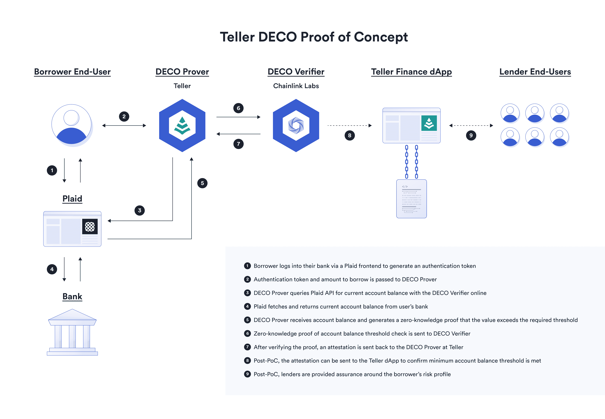

# 解锁 Web3 身份:区块链、凭证和神谕

> 原文：<https://blog.chain.link/web3-identity-blockchains-credentials-oracles/>

第一波 [Web3](https://chain.link/education/web3) 创新主要集中在将有价值的东西表示为基于区块链的令牌(即令牌化)以及在 [智能合约](https://chain.link/education/smart-contracts) 应用程序(即 dApps)中使用令牌。结果是不断增加的公用事业、治理和资产支持令牌，以及基于各种业务和社交互动使用、交换、出借和赚取令牌的 dApps。

Web3 为社会带来许多好处，例如降低资本创造的门槛，增加应用程序的透明度和加密保证，以及为人们提供无需许可的金融服务。然而，尽管取得了成功，Web3 仍有变得超级金融化的危险——在这种状态下，那些最有钱的人对生态系统的发展、治理、思想共享和其他关键要素产生了巨大的影响。在目前的状态下，Web3 还被限制在用户不需要知道链上地址之外的任何其他信息的用例中。

为了开启大量新的使用案例，Web3 需要一个技术堆栈，支持基于最终用户的财务和社会资本的交互。有了这一点，链上关系可以扩展到中介交换之外——个人关系、文化、声誉、身份和信任可以促进人与人之间的互动。

将社会资本融入 Web3 需要一个链上身份层，该身份层可用于扩展链上地址，不仅包括帐户余额，还包括独特的性格特征、社会关系、历史声誉等。结合这些基于身份的元素可以使 Web3 用户拥有“灵魂”，正如作者 E. Glen Weyl、Puja Ohlhaver 和 Vitalik Buterin 在他们的研究论文 [分散的社会:寻找 Web3 的灵魂](https://papers.ssrn.com/sol3/papers.cfm?abstract_id=4105763) 中所阐述的那样。

下面的博客将从广义上探讨 Web3 身份，重点关注区块链、凭证和 oracles 如何结合创建一个功能丰富的链上身份层，以满足各种用例需求和用户信任假设。

# 为什么 Web3 需要身份层

Web3 以生成 [信任最小化](https://blog.chain.link/what-is-trust-minimization/) 为中心——这是一种近乎保证，互动将完全按照参与者所理解的方式发生。信任最小化是区块链使用去中心化、财政激励和加密技术为用户生成强有力保证的原因，保证他们的计算是正确的、及时的、抗审查的和防篡改的。这种以信任最小化的方式执行代码和存储数据的基于区块链的方法可以被称为 [密码真实性](https://blog.chain.link/what-is-cryptographic-truth/) 。

<figcaption id="caption-attachment-3876" class="wp-caption-text">Cryptographic truth combines cryptography and decentralized consensus to generate a golden record amongst a distributed set of entities and deterministically compute applications.</figcaption>

密码真理主要是通过博弈论创造的——在一个分散的网络中，通过奖励来激励期望的行为，通过惩罚来抑制不期望的行为，来激励大多数节点的理性行为的能力。例如，大多数区块链博弈理论假设，如果网络是透明的、足够分散的并且被适当地激励，则攻击极不可能成功，因为攻击者必须预先承诺财政资源来发起攻击(例如，工作证明网络中的计算资源和利益证明网络中的财政利益)，这些资源很可能由于他们的恶意行为而被浪费/没收。这种博弈论设计的最终目标是实现确定性软件，即 x 输入总是导致 y 输出。

问题在于，为终端用户设计促进社会或经济互动的框架并不总是像创造一套财务激励那样简单。首先，在某些用例中生成信任最小化可能需要对不希望的行为进行惩罚，与用户从应用程序中可能获得的潜在回报相比，这些惩罚对用户来说过于严厉——如果发生事故或误解导致惩罚怎么办？用户还希望参与各种各样的互动，而不受金融因素的影响，或者至少没有大量资本能够轻易增选互动的风险(例如，治理、公共产品和社交俱乐部)。

Web3 协议还可能面临法律合规性、链外行为验证或争议解决方面的挑战，尤其是当用户是假名实体时。虽然假名是某些用例的期望特性(例如，它可以抵抗审查)，但许多其他用例在不知道最终用户的某些个人信息的情况下是无法存在的。

这些问题表明 Web3 需要一个链上身份层，可用于证明社交动态并对基于区块链的应用程序做出隐私保护身份断言，如历史声誉、KYC/反洗钱、个性和各种其他人类元素，同时仍保留部分或全部区块链的信任最小化保证。身份解决方案使用户和应用程序能够知道除了他们的地址、帐户余额和交易历史之外，谁是用户，从而促进基于各种类型的社会资本的链上交互。

例如，货币市场可以向具有良好信用记录的用户提供较低的贷款利率，一个“道”可以向为某一特定事业表现出团结的用户提供会员资格，或者一个企业可以在建立业务关系之前对交易对手进行 KYC/KYB。最终，身份层的加入将会打开一系列的应用程序，这是现有的 Web3 技术体系所不能实现的。

# 【Web3 身份解决方案背后的技术

为了更好的理解身份，我们先来分三种大致类型:

*   **官方身份**——在特定司法管辖区内被法律认可的官方资格、成就或关于某人背景的事实。
*   **社会身份**——基于他人证明的关于一个人的非官方属性、成就或陈述。
*   自我认同——一个人对自己的属性、成就或陈述。

如何在 Web3 中使用这些类型的身份将取决于开发者、用户或分散社区的特定信念和业务需求。例如，企业可能更喜欢保留隐私的官方身份，因为这是他们现有流程的运作方式。然而，一些 Web3-native 应用程序可能更喜欢透明的社会身份解决方案，其中分散社区的共识可以证明关于链上用户的信息。每种类型的身份都有自己的优点和缺点，需要在实现之前加以考虑。

【Web3 的身份解决方案由三个通用原语支撑，这三个原语可以单独使用，也可以混合搭配使用，以满足不同的需求。

## 区块链:身份数据库

[【区块链】](https://blog.chain.link/what-is-blockchain/) 是公共数据库，用户可以从技术上永久地存储数据，让世界上的任何人都可以访问数据，并可以轻松地跨应用程序重用数据。然而，鉴于原始个人身份信息(PII)的公开和透明性质，在公共区块链上存储这些信息会带来严重的隐私问题。

幸运的是，在保护隐私的同时，有几种方法可以访问区块链上与身份相关的数据和断言。用户可以在区块链上存储驻留在离线数据库中的 PII 数据的散列，或者将 PII 数据或关于它的声明标记化为区块链上的标记。或者，外部实体(即，oracles)可以验证关于用户的链外身份信息，然后发布关于链上信息的证明，以供智能合约在执行期间参考(即，爱丽丝 > 21 岁的声明的是或否证明)。

## 证书:身份数据和证明

证书是关于一个人的资格、成就、个人品质或一个人背景的任何方面的声明。身份解决方案使用凭证来验证某人是否有资格执行某些特定操作，例如授予某人驾驶汽车的权利的驾驶执照或证明某人有资格在特定行业工作的工作证明。

由于 Web3 本质上是促进数字关系，访问数字证书的能力对于构建 Web3 身份解决方案是必要的。Web3 identity 中最常见的两个特性是可验证凭据(VCs)和分散标识符(DID)。VCs 是关于用户的防篡改声明，由发布者加密签名。然后，验证者可以通过 DIDs 认证该凭证，例如通过使用区块链上的公钥/私钥对来验证散列后的凭证属于特定用户。

还有一些对身份数据或证明进行令牌化的方法。例如，灵魂绑定代币是不可转让不可替代的代币([NFT](https://chain.link/education/nfts))，代表承诺、凭证、成员资格、从属关系或关于其所有者的声明。SBT 可以由其他用户或机构发布给用户，或者用户可以向自己发布 SBT。SBT 可以代表各种信息，比如大学颁发的文凭或用户希望公开负责的声明。虽然 SBT 的不可转移性质使得它们作为链上地址的唯一标识符非常可靠，但是它们本质上是透明的，这使得它们在需要隐私时难以使用。[poap](https://poap.xyz/)是另一种类型的令牌化身份解决方案，其中活动组织者向出席者发放 NFT 作为一种出席证明。

保持在用户控制范围内的令牌化和非令牌化凭证的组合，一般指去中心化身份或自我主权身份(SSI)的设计空间。这个想法是用户拥有和管理他们的凭证，并且可以在他们需要的时候和应用程序共享它们。

## 神谕:证书的证明者和中继者

[神谕](https://chain.link/education/blockchain-oracles) 是中继和证明最初在链外存储或生成的关于用户身份的数据的实体。Oracles 可以用来直接从一个离线 API 或者在不同的区块链之间传递原始数据。Oracles 还可以在将原始数据发布到链上或触发创建映射到链外存储的某些 PII 数据的令牌之前对其进行计算。

最激动人心的使用案例之一是，甲骨文见证用户获取关于自己的信息，如大学文凭或政府网站的合法证书，并证明这些信息的来源。用户也不需要向 oracles 暴露他们的私人信息；他们可以通过零知识主张来证明互动。本质上，这允许 oracles 证明用户真实身份信息的有效性，同时仍然确保它保持私密。

# Web3 身份解决方案支持新用例

以下是七种不同的链上身份识别解决方案，它们开启了整个 Web3 的新用例。这些解决方案利用链上数据、凭证和/或预言来验证促进特定类型的经济或社会交互所需的用户身份的特定元素。

## 合法身份证明——你是 x 人

当公司或项目需要遵守某些司法管辖区的要求，或者希望在发生争议或违反合同后跟踪用户时，法定姓名、出生日期和居住地区等身份信息尤为重要。

有几种方法可以证明某人的合法身份。一种方式是由官方证书发行者(例如，政府或银行)发行可验证的证书。然而，问题是大多数证书发行人目前没有兴趣围绕发行风投创建新的流程，或者准备进行技术投资来改变他们当前的 IT 系统。

一种更实用的方法是使用[DECO](https://research.chain.link/deco.pdf)—一种目前正在开发中的保护隐私的甲骨文协议，它利用零知识证明技术，使用户能够向应用程序证明关于他们自己的声明，而不会向公众甚至甲骨文本身透露这些信息。DECO 能够连接到现有的 API，即使它们需要最终用户认证，并且不需要 API 数据提供者进行任何更改。

[Burrata](https://www.burrata.xyz/) 参与了 DECO 的 Chainlink 概念验证，使 Web3 用户能够使用 Burrata 合作伙伴系统内的离线 API 数据提供者向应用程序证明他们的 Web2 身份。 在 DECO 的支持下，概念验证表明，Burrata 可以连接到身份平台和文档签名服务，而不会向链上、应用程序或 oracle 泄露任何隐私数据，只有关于它们的隐私保护声明。在 SmartCon 2022 上，Burrata 通过小屋租赁概念证明展示了一个原型，用户可以在验证身份并签署临时租赁协议的情况下租赁小屋。

[https://www.youtube.com/embed/eJqZQ2_VBzo?start=1675&feature=oembed](https://www.youtube.com/embed/eJqZQ2_VBzo?start=1675&feature=oembed)

## 社交身份证明——您拥有 x 个在线账户

许多应用程序可能希望在与 Web3 相关的服务中利用现有的社交身份(如脸书、推特)。因此，出于安全原因，在其他用户与用户交互之前，用户验证他/她的控制特定 web3 地址的社交身份是很重要的。

[光致变色](https://photochromic.io/) 是一个成功完成概念证明的项目，使用 DECO 来证明经过验证的 Web3 个人和他们特定的 Twitter 或 Discord 社交句柄之间的真实关系，而不暴露底层 PII。光致变色有效地在用户的 Web2 和 Web3 身份之间建立了一座桥梁，使用户能够用社交属性来丰富他们的钱包，这是他们的身份认证和可移植性的一个附加因素，表现为 NFT。这最终巩固了用户的链上和链下身份，并使应用程序消除了重复 KYC 登录的摩擦。应用程序只需根据特定标准向特定用户提供实用程序和令牌门控访问，而无需知道他们的真实身份，甚至他们的确切社交媒体句柄。

## 创作证明——你创作了 x

许多用例不需要 KYC，但需要一种证明出处的方法，无论是声明还是艺术品。通过将文字或物品与最初的创作者联系起来，用户可以证明他们的艺术或奢侈品的真实性，或者验证人们声称某人制作的视频和声明是否属实。

开发设定证明机制的一种方法是发布 SBT。正如前面提到的研究论文《去中心化的社会:寻找 Web3 的灵魂》中所概述的那样，艺术家可以从他们的灵魂(地址)发出一个 NFT，允许人们验证它来自特定的艺术家。艺术家也可以发表一份声明，作为储存在他们灵魂中的一个关联的 SBT，来证明 NFT 是一个收藏的成员，以及作为一个稀缺性限制的担保。此外，摄影师可以发布来自 SBT 的照片和视频，以避免深度伪造，而社会评论员可以发表关于金融、政治和其他热点问题的声明，以此作为一种基于其准确性和道德的历史记录建立声誉的方式。

这些概念粗略地融入了记录账簿的概念——这是 Balaji Srinivasan 阐述的一个概念。记录分类帐将使用分散协议对链上的数据提要进行加密签名，包括社交媒体提要、数据 API、事件流、时事通讯、RSS 提要等等。记录概念的分类账被设计作为关于官方信息来源的真实的单一来源。

## 资金证明——你有 x 笔钱

另一个重要方面是证明某人拥有一定数量的资产，而这些资产在区块链上是无法计算的，因为它们存储在链外或不同的区块链上。资金证明对于计算金融交易期间的风险非常重要，因为用户拥有的资金越多，他们作为交易对手通常就越可靠。

[柜员](https://teller.org/) 是数字资产借贷的 DeFi 协议市场，支持抵押不足的贷款。Teller 在概念验证中使用 DECO 协议来证明用户的离线银行账户的余额超过了由所请求的贷款金额指定的动态阈值。如果用户账户余额的总和超过阈值，那么他们作为借款人的风险状况将会降低，从而允许贷款的担保要求显著降低。例如，如果借款人申请 5000 美元的贷款，那么用户必须证明他们的银行账户中至少有 5000 美元，以证明他们有能力偿还贷款。

要了解更多信息，请查看[DECO 如何实现欠抵押 DeFi 贷款:柜员的概念验证](https://blog.chain.link/undercollateralized-lending-teller-deco-poc/) 。

<figcaption id="caption-attachment-4477" class="wp-caption-text">DECO enables borrowers to prove their off-chain bank account balances exceed a predefined threshold.</figcaption>

## 社会声誉证明——你的社会声誉为 x

一个新兴的身份领域是社会声誉——举个例子，使用一个分散的社区来证明个人的某些行为或特征。社交声誉也可以从用户的链上交易历史或他们的 SBT 集合中提取。

例如，贷款协议可以降低用户的抵押品要求，因为他们的链上交易历史显示了还贷的记录。Weyl、Ohlhaver 和 Buterin 在他们的研究论文中指出，这可能采取用户押上 SBT(即声誉)的形式来获得更好的贷款。一旦偿还，SBT 可能会被烧毁或被一个新的代表付款凭证的 SBT 所取代。如果没有偿还，SBT 可以自动发出信号，表明用户的贷款违约——类似于负面审查。值得注意的是，在负面评论的范围内，未经许可的 SBT 发行可能会有问题，因为它可能会导致 doxxing，欺凌和审查风险。

本文还讨论了 SBTs 的社会声誉如何在 Web3 社区中发挥作用，特别是通过向具有某些特征的灵魂发放代币。例如，想要吸引强大的开发人员社区的 DAO 可以向持有最近五次会议出席率 SBT 中的三次或持有反映出席率的其他令牌(如 POAPs)的开发人员空投令牌。空投也可以根据特定的 SBT 组合进行加权，例如非营利植树组织向持有环境行动 SBT、园艺 SBT 和碳封存令牌组合的灵魂发放治理令牌。

## 人格证明——你是 x

只要知道用户的一个事实，就可以大大增强许多应用程序——他们是真实的(即不是机器人)和独特的(即不能被复制)人吗？不可转让和不可重复使用的身份证明是构建各种应用程序的强大工具，只要它可以隐藏用户的个人信息。例如，社交媒体平台可以使用人格证明来消除机器人向用户发送垃圾信息或恶意链接，以及防止由于创建 Sybil 帐户而产生的不真实的社会共识。

DAOs 可以利用人格证明作为 Sybil 抵抗的一种形式，以防止一个用户因拥有多个独立帐户而获得大量权力。一种潜在的方法是对灵魂的 SBT 集合进行计算，其中一定数量的知名 SBT——特别是如果由不同的机构/灵魂发布——增加了此人是真实的而不是机器人的可能性。然而，Sybil 阻力是一个众所周知的具有挑战性的设计空间，因为验证一个人的证书的唯一性需要数据库来参考副本。

## 互动证明—您与 x 互动

当应用程序能够证明用户以特定的方式与某物互动时，各种进一步的用例就成为可能。互动的证据在营销活动中尤其有价值，因为用户被激励采取特定的行动来获得奖励。某些互动甚至可能触发 SBT 的发行，例如为慈善事业捐款或履行社区服务而获得社会公益 SBT。这些触发器也可以用于重复动作，例如为通用的 x-to-earn 模型触发每次交互的空投。

[Clique](https://www.clique.social/) 在概念验证中使用 DECO 来演示粉丝证明解决方案，该解决方案使用户能够证明他们与特定艺术家或创作者的推文进行了互动，或者他们在 Twitter 上关注了特定的内容创作者——所有这些都不会向应用程序透露他们自己的 Twitter 句柄，以保护他们的隐私。这可以证明他们是某个特定创作者的粉丝，为用户赢得各种加密/NFT 奖励、声誉或特权。除此之外，Clique 还能够通过使用 DECO 获得更高质量的数据，帮助确保用户关注者和印象的真实性。

# web 3 的下一次进化

毫无疑问，身份是扩展 Web3 应用和服务的关键因素。当然，在区块链实施身份认证将面临挑战，无论是保护用户隐私，防止证书颁发期间的欺诈和把关，还是平衡人们对不变性的渴望和提高自身地位的能力。尽管存在这些挑战，但 Web3 identity 为用户提供了前所未有的价值，因为它允许应用程序了解他们的详细信息，但只允许用户访问那些信息。它甚至允许用户在不泄露信息本身的情况下证明自己的细节，正如通过 DECO 技术的力量所看到的那样。

通过这些创新，社会资本可以成为链上互动不可或缺的一部分，有助于防止 Web3 变得过度金融化，并支持各种新的使用案例和新的参与者进入该领域，如企业和已建立的机构。最终，身份解决方案将使 Web3 带来的信任最小化深入到我们的日常生活中，为用户提供更好的隐私、透明和敏感数据所有权保证。