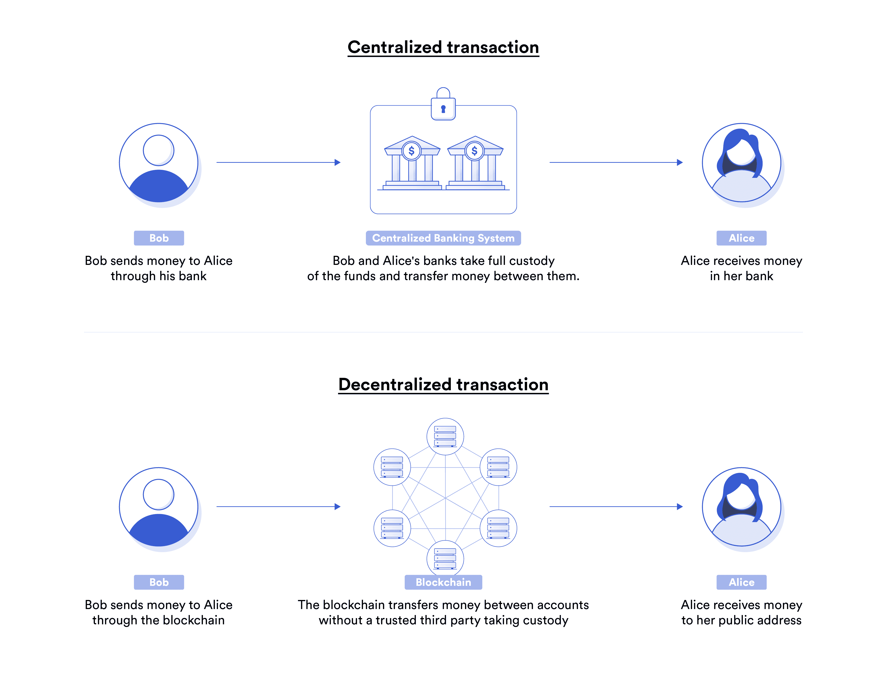

# 什么是区块链技术？

> 原文：<https://blog.chain.link/what-is-blockchain/>

*2022 年 1 月 24 日更新。*

> 区块链是一个高度安全、可靠和分散的网络，它允许人们在不受任何中央机构控制的分布式账本中记录交易活动、存储数据和交换价值，而是由世界各地的计算机维护。T3】

区块链是支撑整个加密货币/Web3 生态系统价值主张的基础技术。它是保护比特币的引擎，也是为什么 [智能合约](https://chain.link/education/smart-contracts) 有价值的基础。

区块链的基本价值主张是能够以信任最小化、无许可的方式交换价值，不需要任何第三方的中介。展示这一点的最基本案例是从一方到另一方的付款或资金转移。

例如，让我们假设 Bob 想要给 Alice 付款。使用遗留系统，Bob 会将他的付款发送给第三方——银行或金融机构——该第三方会完全保管他的资金并将这些资金转移给 Alice。在区块链的例子中，鲍勃直接向爱丽丝的账户汇款，不需要集中的中介，但是完全保证资金在账户之间转移。交易以分散的方式进行，不涉及任何中介，由受密码术、加密、数学和物理保护的确定性过程强制执行。

<figcaption id="caption-attachment-3224" class="wp-caption-text">The difference in how the user’s funds are handled when making a payment through a blockchain vs. the banking system.</figcaption>

在这篇教育文章中，我们将探讨什么是区块链，区块链是如何运作的，它们能提供哪些在中央系统中没有的好处，以及它们是如何被用来重塑社会信任的。

## 区块链技术是谁发明的？

虽然类似区块链的协议早在 20 世纪 80 年代就被概念化，并在 20 世纪 90 年代被实施，用于验证文档时间戳，但第一个去中心化区块链的发明被广泛归功于化名为中本聪的人(或一群人)，他在 2008 年发表了 [比特币白皮书](https://bitcoin.org/bitcoin.pdf)

区块链技术是比特币网络的支柱，于 2009 年推出，当时其实现作为开源软件发布。有趣的是，区块链这个词在比特币白皮书中从未被提及——这个词后来被该技术的支持者推广开来。

## 区块链是如何工作的？

分类账是记录经济活动的一本书或计算机文件。分类账可以跟踪单个账户的余额和/或整个经济体内部持续的资金流动。如今，大多数分类账都是由银行等中央实体处理的，它们在自己的服务器上不透明的数据库中维护和存储分类账。

区块链是由分散的计算机网络存储和维护的数字分类账。网络中的每台计算机(节点)运行相同的软件，并维护、存储和验证分类帐的副本。公共区块链使用他们自己的被称为加密货币的本地资产来从经济上激励节点相互通信并就账本的有效性达成协议(共识)。

用户通过提交将价值从一个账户转移到另一个账户的交易来提议增加分类账。用户帐户被称为公钥(也称为公共地址)，每个公钥都有一个关联的私钥。公钥类似于电子邮件地址，私钥类似于密码，公钥所有者必须输入该密码(称为数字签名)才能转移存储在他们地址上的资金。

未决事务被分组到“块”中，由网络中的每个节点进行处理和验证。让每个节点检查每笔交易可以确保对分类帐的更改得到冗余验证，从而几乎不可能对分类帐或网络状态进行恶意更改。为了使交易有效，数字签名必须正确，公钥必须有足够的资金来支付交易。

一旦一个块被确认，它就被添加到一个不断增长的分布式分类帐中。分类帐是使用加密技术链接的连续块链，因此被称为“区块链”。节点因其服务而获得交易费和/或新铸造的加密货币的奖励(称为块奖励)。

设计区块链有许多不同的方法，每种设计都有优点和缺点。

*   **网络接入&参与**–区块链在使用和参与网络的开放或受限程度方面各不相同。区块链的三种主要类型:公共(完全开放)、私人(完全封闭)和许可(开放访问、有限参与)。
*   **共识机制**——区块链可以通过不同的方式就交易达成共识。一些最受欢迎的共识机制是工作证明(比特币)、利益证明(索拉纳)和权威证明(最私人的区块链)。
*   **设计特色**–区块链目前无法满足所有期望的品质。相反，区块链在安全性、分散性和可伸缩性之间做出权衡，优化某些功能集，通常称为 [可伸缩性三难困境](https://vitalik.ca/general/2021/04/07/sharding.html) 。其他重要的设计特性包括隐私、事务终结性等等。

## 区块链的好处

区块链提供了几个在中央系统中无法获得的价值主张。

*   **安全**–在一个足够分散的区块链中，尽管有恶意行为者的努力，但只有有效交易被确认的概率非常高。
*   **不变性**–一旦一个块被冗余地确认，它就成为不可改变的分类帐的一部分，随着时间的推移变得越来越难以改变。
*   **可靠性**–区块链的网络遍布全球，全天候正常运行。他们总是在线，不受地理或政治的限制。
*   P2P——区块链砍掉了从交易中榨取价值的中介。双方直接交易，不会产生任何交易对手风险，即合同中的其他参与者不履行义务的可能性。

总来说，区块链创建了基础设施，两方或多方可以用它来进行高度安全、可靠和防篡改的经济交换。交易对手风险从依赖概率性可信第三方转变为依赖完全按照指示执行的确定性开源软件。通过避免对账、消除不必要的中介以及降低交易对手风险，公司变得更加高效。

## 区块链用例及应用

互联网是一种共享数字信息的方式，这种信息可以通过多种方式应用，例如电子邮件、信息传递、电信、社交媒体等等。由区块链和混合智能合同提供支持的 [Web3](https://chain.link/education/web3) 生态系统提供了相同的用于交换价值的多用途应用，这些应用可以以许多独特的方式应用，通过广泛的 [用例](https://blog.chain.link/44-ways-to-enhance-your-smart-contract-with-chainlink/) 为最终用户创造效用，最终为社会创造积极的影响。

### 货币体系

比特币展示了一个没有公共许可的区块链如何被用作一个拥有自己货币政策的自给自足的金融生态系统。比特币有一种本地货币——BTC——内置的分发机制和财政激励，可以在没有中央协调者的情况下保持网络的运行。比特币的货币供应量有一个抵制审查的硬上限；永远不会有超过 2100 万的 BTC。这些通货紧缩的性质导致一些人认为 BTC 是比通货膨胀的法定货币更强的价值储存手段。

### 智能合约

以太坊(Ethereum)等区块链展示了如何使用公共无许可区块链作为高度安全可靠的分布式计算机来处理被称为智能合同的有条件协议。用户不再跟踪单一货币的变动，而是向区块链发送指令，说明“如果 x 事件发生，则执行 y 操作”区块链通过基于输入(数据)产生输出(传递值)来处理这些预定义的指令。这种能力使一个全新的金融生态系统成为可能，该系统提供透明的金融服务，被称为 [【去中心化金融(DeFi)](https://chain.link/education/defi) 。

### 资产令牌化

几个项目正在使用区块链作为全球公共资产登记处。通过智能合约，开发人员可以创建一个独特的[【NFT】](https://chain.link/education/nfts)不可替代的令牌，代表现实世界资产的所有权，如建筑物、汽车、稀有交易卡等。区块链为资产所有权提供了真实性，为资产生命周期提供了透明的跟踪，并为以前缺乏流动性的资产提供了全球流动性。

### 企业中间件

区块链可以作为一个中间件，确保两个或更多的 [企业](https://chain.link/use-cases/enterprise) 数据库有匹配的记录，而不用把它们敏感的内部数据放在一个公共的区块链上。由于公共区块链始终在线，易于审计，不易被操纵，且无需许可即可访问，因此企业可以使用它来相互通知任何一方采取的行动，方法是将它们作为数据存储在区块链上。使用被称为 [零知识证明(ZKP)](https://blog.chain.link/what-is-a-zero-knowledge-proof-zkp/) 的隐私技术来存储数据，其中只有协议中的各方具有理解其含义的上下文。证据充当业务流程状态的公共参考框架；例如卖方和买方之间的批量折扣协议的当前条款。

### 记录台账

区块链可以作为保存历史记录的永恒环境。拥有一套高度可信的记录可以减少分散市场中的摩擦，这些市场通常包含许多不同的数据库。区块链提供了一个“记录分类帐”,可以改进金融合同的跟踪、医疗记录的存储、身份的跟踪等等。

### 实用

区块链可以被设计成提供特定的效用。例如，使用分散的节点网络提供分布式视频流，托管防篡改的在线游戏，或者不变地存储文件。与 torrent 系统类似，区块链提供了一种利用分散网络的力量来生产共享公共设施的方法。

### 区块链游戏

区块链可以作为一种通过 NFT 跟踪和验证资产所有权的方式，NFT 代表游戏中数字物品和收藏品的所有权。玩家可以利用全球流动性池，在分散的市场上交易游戏内资产，同时保持对它们的完全监管，实现完全由社区拥有的 [【区块链】](https://chain.link/use-cases/nfts-and-blockchain-games) 。凭借互操作区块链游戏和元宇宙的潜力，玩家未来或许可以在不同游戏之间交易游戏内资产。

### 供应链

作为一个不变的分布式数据库，区块链可以通过增强可追溯性和改善不同参与者之间的协调来改善供应链流程，从而实现更快、更具成本效益的产品交付。由于每个参与者都有自己的区块链副本，因此每一方都可以识别错误，审查交易状态，并让交易对手对自己的行为负责。任何参与者都不能覆盖历史数据，因为这样做需要重写区块链的所有共享副本上的所有后续数据块。

### 保险

区块链、智能合同和 [神谕](https://chain.link/education/blockchain-oracles) 的结合显示了解决传统 [保险](https://blog.chain.link/blockchain-insurance/) 行业透明度问题的潜力，简化了所有参与者的保险流程，并使原本与全球保险业隔绝的地区也能获得保险。智能合同提供基于 if/then 参数的保险单自动执行，可以以高度透明和可靠的方式取代传统的索赔流程。

## 区块链已经存在

在过去的十年里，区块链技术已经从一个先锋的承诺转变为一个有价值的公用事业，为世界各地的用户带来了有意义的利益。虽然区块链行业还远未实现其全部潜力，但采用基于区块链的智能合同的 [指数增长](https://blog.chain.link/the-year-in-chainlink-2021/) 正在为技术重新定义许多传统行业创造条件，并通过由 [密码真理](https://blog.chain.link/sergey-nazarov-smartcon-keynote-the-future-of-hybrid-smart-contracts/) 支持的信任最小化应用程序和确定性协议的力量创造全新的行业。

*通过访问* *[开发者文档](https://docs.chain.link/docs/getting-started)* *，加入关于* *[不和谐](https://discordapp.com/invite/aSK4zew)* *和/或* *[的技术讨论，联系专家](https://chainlinkcommunity.typeform.com/to/OYQO67EF?page=blog)* *，立即开始使用 Chainlink 进行构建。*

*要了解更多关于 Chainlink 的信息，请访问* *[Chainlink 网站](https://slack-redir.net/link?url=https%3A%2F%2Fchain.link)* *并关注官方**[Chainlink Twitter](https://twitter.com/chainlink)**以了解最新的 chain link 新闻和公告。*