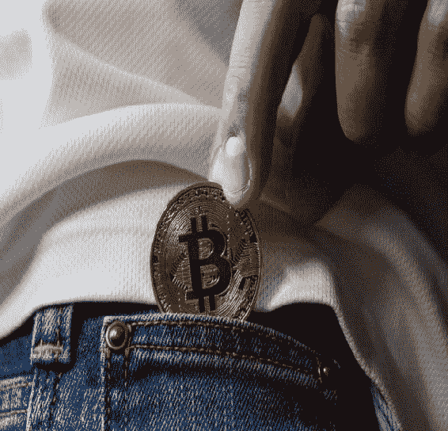

# Chapter 1\. What exactly is the blockchain?

区块链是一个分布式账本，每个人的交易历史都存储在其中。这个账本定期自动更新，被社区接受为事实，并存储在每位参与者的电脑上。这样，就不需要中央实体来管理网络，因为在这个生态系统中，双重支付等问题很少出现。

instead of a central party dictating what is “real,” the community does so in a decentralized manner. Blockchain technology thereby allows storage of any kind of information without needing a governing body. This can be applied to any type of ownership, identification, knowledge, or…currency.

Blockchain and digital currency.

Blockchain technology provides the infrastructure for a digital currency to exist without a central bank. Currency is one of the many different applications that can run on a blockchain, using the benefits of decentralization in the digital world.

由于这种基于区块链的货币使用加密技术，所以称为加密货币。

什么是加密货币？

在加密货币中，任何规则或法规都编程到治理该去中心化社区的加密算法中。加密和货币的结合使得加密货币有了这个名字。这基本上意味着一种通过加密支持和变得稀有的货币。

Note that trust in a cryptocurrency network is derived from the underlying cryptography. Since this is a new concept compared to thousands of years of using precious metals, it will take a bit of time until more and more people start to understand the true benefits of the new system.

Blockchain and Cryptocurrency nomenclature.

To clear up some confusion, let’s define a few terms:

**Blockchain:** The immutable transaction history of a decentralized community.

**加密货币:** 使用区块链技术存储交易历史，从而存储每个人所拥有的确切货币量的一种应用。

**比特币（首字母大写）:** 这个词用来指代第一个基于区块链的去中心化加密货币的理念和协议。

**Bitcoin(s)—lower case b:** the currency itself.

WHAT WAS THE FIRST DECENTRALIZED CURRENCY?

世界上有几种文化曾经拒绝采用集中货币系统。虽然很难说哪一种文化是最大的或是最早的，但雅普岛上 Rai 石的概念非常迷人，并以一种容易理解的方式描述了区块链和去中心化货币的概念。岛上居民并不拥有很多黄金，因此为了拥有一种每个人想要时都可以参与的货币，他们从石灰岩上雕刻出巨大的圆形石头。这些石头将被用作货币。从理论上讲，每个岛民都可能做到这一点，但实际 mostly 成为了一个由少数人专门从事的特殊任务，而其他人则更愿意提供产品或服务以换取这些石头。该系统是去中心化的，因为它是完全开放的，任何人都可以加入，并且每个人拥有相同的权利。

观察区块链和加密货币，你会发现“Rai 石”这一概念实际上与它们有多么相似——区别在于 Rai 石是实体物品，而加密货币是数字化的。这就是为什么加密货币需要区块链作为底层技术的原因。

区块链已经占据了媒体渠道很长时间，这让很多人产生了了解这项技术为何重要的兴趣。预计随着 2018 年接近尾声，我们将能够知道区块链在社会中的融入程度究竟如何。
