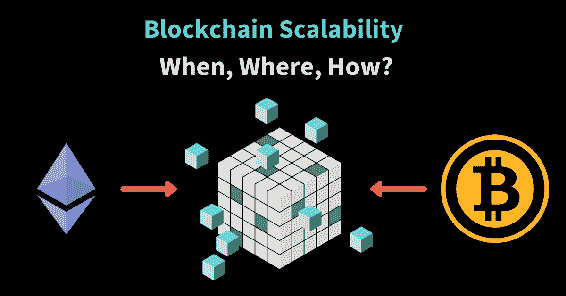

# 第二章。区块链是如何工作的

区块链通过共识运作。这是区块链所有参与者关于某些数据的真实性达成的一致意见。加密货币围绕这种方法运作，以避免任何单一实体对每个决策都有主导权。通常，当一个交易被发出时，矿工会一起审核并验证或丢弃它。

在传统系统中，像政府、银行和其他代理商这样的单一权威是审查一切并发放绿灯的人。此类集中式系统的的问题是，它们将过多的权力集中在少数人手中，这些人可能会滥用它。

如果共识机制配置不当，可能会留下漏洞，导致系统腐败。例如，既然让你的交易有效只需要其他矿工确认你的交易，那么为什么不由你自己创建成千上万的矿工呢？他们反过来可以确认有人向你发送了数百万美元。这被称为赛百味攻击（Sybil attack），可能需要很多页纸来全面描述它。

共识算法（CONSENSUS ALGORITHMS）

为了避免这一切混乱，合法的加密货币已经发展出了治理上述问题的去中心化共识机制：

对立信息的冲突——一个矿工说一件事，另一个矿工说另一件事。

可能创建假的矿工，他们为你工作并让你作弊。

激励机制，以激励系统中尽可能多的人参与共识，而不仅仅是作为用户参与。

虽然还有许多正在研发中的共识算法，它们在不同加密货币中可能被冠以不同的名称，但这三种是最重要的：

+   权益证明（Proof of Stake）

+   工作量证明（Proof of Work）

+   重要性证明（Proof of Importance）

后者是目前使用最少的。它可能在未来的几年里被更广泛采用，但到目前为止，工作量证明（Proof of Work） mostly 被使用。具有“重要性”的参与者有权决定哪些交易发生，并且经常获得激励。由于这个人不会是唯一具有重要性的参与者，所以他们有权威和他人代替的概率是随机的。

如何建立重要性

不同的加密货币有不同的机制，但一个因素是某人作为系统的一部分所经历的时间长度，以及有多少其他矿工通过选择接收来自他们的信息来信任他们。拿社交媒体来比较。你更可能信任在 Facebook 上已经有一段时间、有看起来合法的资料、并且你的许多朋友已经与这位新朋友相连的人的好友请求。

在去中心化的世界里，当使用**重要性证明 (Proof of Importance)**时，与之类似。某人的重要性百分比基于系统决定的价值，这决定了他们有多少“投票权”，他们的交易处理顺序有多靠前，以及他们能获得多少奖励。

这一制度的优点是，字面上，任何人，无论贫富，都可以达到高重要性水平。缺点是，这一制度可能被简单地通过创建欺诈参与者然后互相投票来游戏，从而创造重要性。可以把它看作是一个因为很多人关注而人们开始关注的假社交媒体账户。很少的区块链算法会使用这种机制，因为可能还需要一些额外的功能才能良好地扩展。

权益证明 (Proof of Stake)

重要性这个概念可以再进一步，其中金钱类似于重要性。基本上，控制系统中更多金钱的人具有更多的重要性。正如你也许已经想象到的，这个制度有很多批评者，因为它提出了一个疑问：这样一个网络如何去中心化，如果只有少数富有的账户分享所有的共识权力。到目前为止，只有少数的区块链在使用这种共识机制，但对于那些在使用它的区块链来说，它似乎运行得很好。一个大型玩家统治一切的风险是明显的，但这个制度的优点是明显的：

+   理解你有多少投票权的机制是通过简单地把你锁定的钱（通过在一定时间内锁定你的钱在特殊合约中）除以社区锁定的总金额来实现的。所以，有人可能有很多钱，但他们可能仍然没有太多的投票权，因为他们定期在花费钱而不是锁定它作为他们所有权的证明。数学是清晰和简单的。例如，如果你想锁定 1,000 枚硬币，而总共锁定了 100,000 枚硬币，那么你有 1%的投票权，并且期望得到 1%的发言权和 1%的奖励。

+   由于交易系统的奖励是与锁定的参与者共享的，投入更多的人将获得更大的奖励比例。因此，你可以计算出你资金的更准确的年度回报率，这可能是一个有趣的投资机会。例如，你知道一个区块链可能会每年以你锁定的资本的 5%来奖励你。你锁定了 1,000 枚硬币，每年因参与共识算法而获得 50 枚硬币。根据这些硬币的价值，这可能意味着很多。

+   由于在合法的区块链中不能凭空创造金钱，攻击者进行欺诈的可能性在**权益证明**中是相当低的。

当然，也有一些缺点。除了富有的变得更富有之外，分叉攻击的风险也是一个问题。让我给你一个简短的概述：在权益证明中，如果一个区块链分叉（分裂），你自动控制两个新链上的硬币。你的硬币翻了一番，你可以选择在任何一条链上进行权益质押。开发人员仍在寻找这方面的良好解决方案。这与工作量证明不同，因为在这里，你必须决定将你的工作投入哪条链。

工作量证明

工作量证明，也称为 POW，是最常用的算法，也是所有算法中最古老的。它被大多数加密货币采用，因为它已经被多次测试，并发现对分叉攻击等具有免疫力。

在这种方法中，网络只会通过观察你的工作来认可你的价值，而不是根据重要性程度或你拥有的金钱数量。作为一名矿工，你必须识别交易，验证它，并将其放入区块，这样你就可以第一个领取奖励。

常见的区块链问题

可扩展性

例如，大多数金融机构的交易量约为每秒 2000 笔。这就是区块链技术仍然存在的重大限制：由于网络中的每台计算机都需要记录整个网络的记录，因此网络的速度受到最慢节点的速度的限制。区块链将每秒的交易量限制在一定范围内，以避免大型强大节点通过存储和处理这些大区块来集中计算能力，但也为了使区块链的大小不会过快膨胀。加密社区中一些最热烈的讨论是关于建议的区块大小及其优势，即允许更多的 Tx/s。然而，这也带来了存储和处理能力的缺点。

例如，比特币允许每秒大约 6-7 笔交易，以太坊大约 15 笔交易。因此，在比特币中，矿工每 10 分钟获得大约 4200 个拼图块来拼成一个拼图（7 Tx/s * 60s * 10min = 4200 Tx per block）。在比特币中，这样一个区块占用 1MB 的空间。如果你想在一个区块中存储更多的交易，你只能使交易的大小更小（每笔交易的数据更少），或者增加区块的大小（存储更多的数据）。隔离见证（SegWit）从大小角度部分解决了这个问题。

SegWit（隔离见证

2017 年底，比特币引入了一个名为隔离见证的更新，简称为 SegWit，以增强比特币的可扩展性。如果你记得加密货币交易的拼图块比喻，你会记得拼图的一半是交易信息本身，另一半是私钥的签名。随着 SegWit 更新，交易以不同的方式进行结构化，现在签名被移除并存储为“隔离的”。

-   不再需要谜题块的区域来存储签名，这种签名仅用于验证而非实际信息，现在可以以不同的方式存储，例如作为块本身的一种颜色。这就是它被称为“隔离见证”的原因。由于现在的谜题块只有原来大小的一半（签名不再占用空间），在相同的 1 MB 区块中可以存储两倍的 SegWit 交易（大约 8,400 个 SegWit 谜题块可以拼成一个完整的谜题）。

-   对于用户来说，SegWit 是一种软分叉，意味着他们仍然可以发送旧的交易格式，就像他们可以使用较老的 WhatsApp 版本，而新版本仍然可以理解他们一样。“旧”比特币地址例如以“1”开头，SegWit 地址以“3”开头。还需要几个月的时间才能充分利用全部存储能力，当然，比特币的区块大小和扩展辩论也将继续进行。
