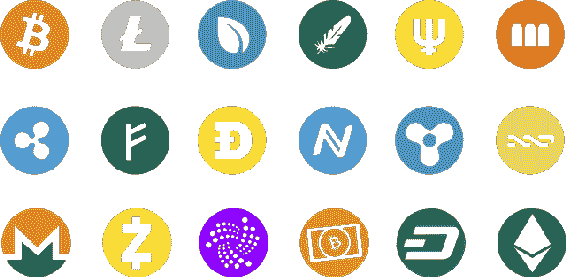
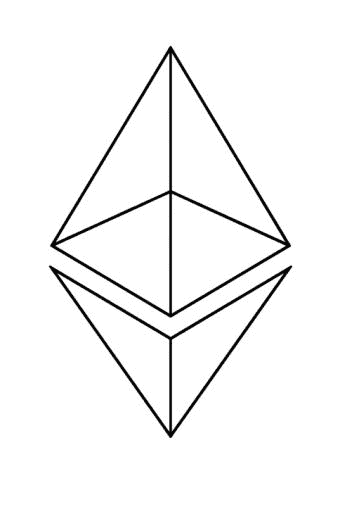

第三章。区块链与加密货币

虽然区块链在未来可能会做很多不同的事情，但现在，您需要记住的最重要的事情是，区块链使加密货币成为可能。比特币在 2017 年的价格飙升超过 19,000 美元。尽管这个价格使它超出了许多业余投资者的行列，但现在市场上有很多不同的加密货币，所以对于那些对潜在有利可图的投资感兴趣的人来说，有很多机会。然而，这并不意味着没有风险涉及；在进入该领域之前，记住加密货币投资的风险是很重要的。

以下是加密货币的优点和缺点：

优点

欺诈概率降低

由于加密货币是一种全数字货币，这意味着围绕它们的欺诈行为的可能性较小；它们不能被伪造，一旦交易发生，交易中的任何一方都无法撤销。

极端的访问权限

目前，全球有 30 亿人可以访问互联网但没有定期访问任何形式的交易所。这使得加密货币市场有很大的操作空间，随着更广泛的接受，预计将看到显著增长。这意味着越来越多的业务将纯粹通过数字货币进行，这意味着现在投资加密货币的人不仅可能会看到增长；他们可能会看到剧烈的增长。

身份盗窃的可能性较低

一旦你购买了加密货币，你担心身份盗窃的可能性会比你使用传统在线交易所时要低。在传统情况下这是一个担忧，因为每次新交易都会对信用卡或借记卡收费，这意味着身份盗贼有更大的机会找到破解系统的方法并窃取个人信息。

涉及的成本较低

尽管每个加密货币交易都伴随着交易费用，但使用加密货币交易所的费用几乎总是比使用更传统交易所的交易员支付的费用要低。

缺点

不可预测的未来

虽然比特币在过去八年里被证明是一项成功的投资，以太坊自成立以来每年都在增长，尽管期间有些下跌，但这并不意味着长期来看情况会是这样。过去的数据不够多，无法确切地说市场在未来一年或五年、十年后会是什么样子，这意味着潜在的损失和潜在的收益几乎是无限的。基本上，这意味着在加密货币市场稳定之前，你投入以太坊的每一美元，明年可能比今天更有价值，也可能完全一文不值。

完全数字化

虽然加密货币的数字化经常被吹捧为一种积极因素，但考虑其负面影响也同样重要。例如，作为一种纯粹的数字化构件，如果你的加密货币储存在一个由于服务器错误而丢失所有备份驱动器的交易所里，你的货币会发生什么？同样，如果你把你的硬币放进一个然后在电脑上无法读取的实体钱包里又会怎样？

这两种情况都不太可能发生，但如果它们发生了，那么你的加密货币就会消失，就像它从未存在过一样。此外，巨大的利润潜力意味着黑客永远不会停止尝试访问这些交易所，所以最终他们肯定会成功。在投资加密货币时，重视安全至关重要，因为几乎没有什么能保护你的投资不受损失。

极度波动

尽管可以认为比特币是最稳定的加密货币，但它仍然比投资标普 500 的波动性高六倍，比投资黄金的波动性高五倍。这意味着虽然利润增加，风险也随之增加。目前绝大多数加密货币交易都是投机的，这意味着投资者正在买入并持有它们。这反过来又形成了一个泡沫，这个泡沫迟早会破裂。对于泡沫来说，关键是尽可能早地进入，并留心它何时会破裂，这样你才能在破裂前获利。

区块链加密货币交易的好处

全球货币

当涉及到标准货币时，影响价格的因素自然会有所限制。然而，对于加密货币来说，情况则正好相反，很难预测是什么会触发投资者的反应，直到事件发生。任何在任何地方的货币新闻都有可能引发价格的大幅波动；实际上，比特币的几次重大变动都是由于希腊引入资本控制和中国贬值人民币而引发的。

市场永远准备就绪

虽然外汇市场传统上被认为是最大的市场，因为它每周开放 120 个小时，但加密货币市场每周开放 168 个小时，不管世界上哪个地区当前活跃，交易总是在进行中。目前，全球大约有 100 家主要的加密货币交易所，它们都提供不同层次的交易，以及根据其服务层次不同而有所差异的费率。因此，找到适合你的那一个交易所不应该需要超过一点研究。

这也可能被视为一个缺点，这取决于你对风险的容忍度，因为这些因素可能足以在每天产生大幅波动。实际上，对于较大的加密货币来说，价格变动超过 5%在大多数日子里是常见的，而较小的加密货币如果看到 15%或更多的波动也不会感到惊讶。

高波动性

加密货币不受任何更高权力的监管，加上它们是一种新的投资形式，以及任何地方的事件都可能导致意外的波动，所有这些因素结合在一起，创造了一个极其波动的市场。对于几种不同类型的加密货币来说，一天内波动超过 5%是很常见的，较小货币的波动频率更高，幅度也更大。

**以太坊平台上的提示**

在目前市场上的所有加密货币中，最致力于改善整个区块链体验质量的是以太坊。尽管其加密货币以太币受到相当程度的投机，但它主要用于通过智能合约支付交易，以及设计在以太坊平台上运行的应用。尽管只存在了比特币三分之一的时间，但它已经看到了大约比特币一半的交易量。它还更加专注于未来，包括改进与智能合约的互动和其去中心化应用平台。

也许更重要的是，如果你查看一下比特币的交易图表，你就会发现它不过是高峰和低谷的交替。确实，事情往往总体上朝着积极的方向发展，但几乎不能称之为稳定增长。

相反，以太坊的图表显示出了一种总体看涨的态势，即使是在 2017 年夏天，当时区块链正处于当前的顶峰。重要的是要记住，加密货币始终是社会构建的产物，这意味着以太坊强大的网络效应使得其网络和价值更容易在未来持续增长。

以太坊的最后一块“羽毛”是这样一个事实：以太坊区块链完全是基于智能合约技术的。智能合约是简单的程序，可以添加到区块中，然后在特定的一组情况发生时激活。虽然它们目前主要被用于金融目的，但它们已经被关注用于从医院监测病人到提供公证服务的一切。实际上，以太坊的一个明确目标就是简化传统合同的工作方式，从而显著降低这类服务的成本。

以太坊平台每秒最多可以处理 25 笔交易，尽管也可以实现额外的可扩展性。这个过程可能会导致额外的孤儿区块（orphaned blocks）永远无法正确处理；然而，这种情况并不常见。截至 2017 年 11 月，一枚以太币的价值大约为 350 美元。到了 1 月，其价值已经超过了 900 美元。
