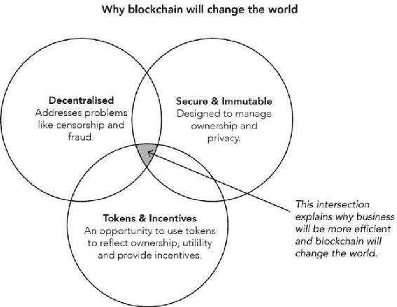
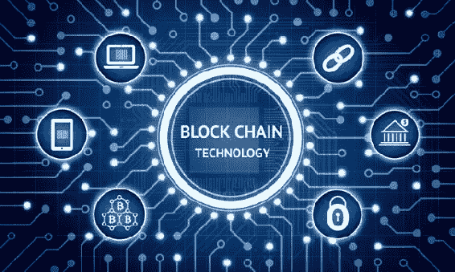
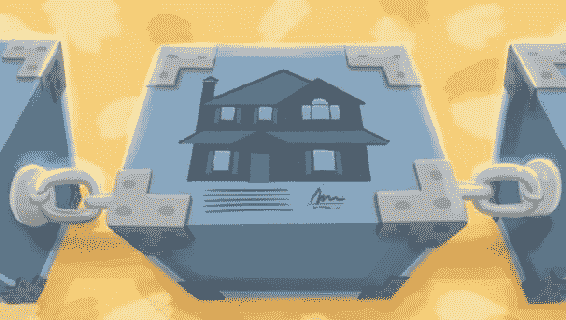

# 第五章。区块链即服务

微软和 IBM 最近都发布了私有区块链服务技术（分别在他们的云 Azure 和 Bluemix 中）。这些私有网络提出了关于它们实验性质的重大问题，因为尚不清楚这些尝试将如何受到与其实施基础设施相关的规模和运营的影响。尽管如此，潜力已经显现。

区块链体验更易于获取：微软和 IBM 都将使访问区块链的过程变得更加简化。

灵活的规模：与比特币区块链网络不同，这些网络将为您提供更多控制网络规模的权限，因此您可以更轻松地添加或删除节点。

全球范围内可访问：通过利用这两种云技术，区块链技术的访问将不再局限于世界上的特定地区。

区块链技术的更易互操作使用：目前，使用与区块链没有直接关联且未与其共同开发的其他程序的区块链是困难的。这样说吧，区块链不仅仅意味着与 Spotify 合作。随着区块链进一步发展成服务，将区块链技术简化并整合到其他平台的可能性和可用性将变得更加广泛。

更易开发的机会：目前运营一个区块链网络是难以管理的，但将来启动和管理它们会更容易。

创建程序的新模型：没有高级技术知识，进入区块链行业是困难的。目前过于复杂，无法拥有简单的界面。然而，随着开发区块链服务的努力不断增加，正在努力开发使设计区块链应用程序更简单的编程。

随着区块链作为服务的调查，不仅仅是平台，技术的发展机会显著增加。它为未来的工作发展铺平了道路。理解如何将其作为服务实施揭示了理解目前考虑的未来应用的关键，尽管这项技术还没有发展到将这些问题变成现实的程度。

区块链可能证明有用的市场

金融行业

众所周知，金融行业在投资区块链技术方面发挥了最大的作用。金融领域的参与者已经将近 10 亿美元投给了致力于进一步发展区块链技术的公司。预计如果在全球银行领域成功实施该技术，每年可以节省 200 亿美元。

实际上，许多区块链初创公司都是由银行家创立的。纳斯达克、维萨和摩根大通只是为数不多的几个大型公司，它们参与提供资金以进一步发展该技术。他们在研究什么？凭借他们所投资的资金，这些公司能够探索区块链技术如何商业化，以处理股票、债券、贷款、衍生品和其他资产的交易。目前，这些交易是由中央银行和其他机构记录和存储的。这个过程代价高昂，耗时较长。

区块链技术可以使这些交易更快、更安全地进行。在公司内部和公司之间，正在试点交易程序，以便银行能够安全、快速地进行交易。这些交易与通过比特币区块链进行的交易不同，因为它们是私人的而不是公共的，这意味着可能有一个机构监督交易。今年已经有成功的测试完成，纳斯达克成功使用自己的区块链交易所进行了一次证券交易。

追踪黑市商品

区块链技术可以用来建立一个注册表，使用户能够追踪物品的所有权，以确定它们是否具有非法或虚假的来源。保险公司发现自己被吸引到网络安全问题中，其中一个公司已经与一家区块链初创公司合作，开始追踪钻石离开矿山，以追踪它们的活动。

它是这样运作的：商品定义属性的信息被记录下来，并分配给已经分配给该项目的序列号。在某些情况下，序列号可以直接刻在物品上。这些信息然后进入区块链数据库；由于它在每个节点上都有副本且经过加密，所以无法被盗窃或篡改。这样的系统可以让每个项目的来源由卖家认证，并为买家提供了解他们想要购买的物品的方法。这也为警察和其他当局在寻找被盗物品时提供了一个资源。

这将是一个私人网络的例子，仅对已经在行业内证明了自己信誉的人开放。区块链技术将来会扩展到其他珍贵市场，如艺术品或昂贵技术的安全追踪。

医疗行业

区块链技术背后的隐私原则非常适合应用于需要保护传输中数据的行业，比如医疗记录的交易。医疗系统长期以来一直因必须实施的低效做法而落后，这些做法是为了保护患者身份安全。这就是为什么医疗行业对区块链的潜力表现出兴趣。对于制药公司来说，吸引之处在于能够追踪和标记药物，以规范商品交易，防止非法贸易和假冒伪劣。

区块链技术允许重新构想拥有隐私控制意味着什么。正在进行的项目正在研究人们是否有能力将他们自己的个人数据存储在安全且私人的服务器上。这将使他们能够控制谁可以访问这些数据。以下情景将变为可能：当有研究呼吁时，个人将有权力出售或允许研究人员访问他们的数据。数据将作为资产，是你所拥有并能因此获得补偿，而不是免费提供。

**保险公司**

区块链技术应用于保险的可能性能建立新的业务，但也可能破坏其他形式。可能会发明新类型的保险政策；例如，由于区块链技术的 24 小时可用性，你甚至可以在周末或公司营业时间后购买保险。由于数据库实时更新，你甚至可以选择仅在几小时内的保险。这意味着长期事故保险可能变得不那么受欢迎，这可能会影响利润。

媒体集团

音乐行业正受到流媒体服务和非法下载的打击。如果有一种方法可以使在线音乐安全又方便地获取，会怎样呢？区块链有潜力改变音乐业务处理版税成本的方式。众所周知，音乐行业正面临危机。这就是为什么艺术家 Imogen Heap 通过基于点对点开源实体以太坊的区块链音乐共享平台 Ujo 发行她的单曲，创造了音乐历史。

如果像苹果音乐、潘多拉或斯波蒂菲这样的大型公司通过区块链发布音乐，它们将能够以前所未有的方式利用版税。不同于将音乐编码在 MP3 文件中，将会使用一种新类型的文件。MP3 可以携带元数据，但数量不多，且可以轻易移除且无法追踪地进一步传播。这种新文件类型不仅能播放音乐，还能展示区块链上的知识产权和支付要求。

房地产市场

区块链可以通过使合同、产权证书和标题比以往更加安全和可追溯，从而彻底改变房地产市场的运作方式。这对于信息面临丢失风险的情况特别有用。例如，在战争环境中，纸张档案的丢失所造成的危险。通过在多个平台上更新记录，可以避免这种丢失的风险，并且可以更好地维护。

制造业

区块链可以在保护企业，无论是大是小，的知识产权方面发挥巨大作用。如上所述，3D 打印在数据传输方面存在风险。这也适用于其他商品。特别是对于小型公司来说，当他们还在努力在平台上销售他们的产品时，保护他们产品的知识产权是一项高挑战的任务。使用区块链，创作者权利的持有者有一个平台来存储有关实际物质的元数据，从而确保他们的产品的安全。

个人数据管理

区块链有潜力让人们掌控自己的个人数据。考虑一下像 Facebook 和 Instagram 这样的平台。每次你通过这些平台与信息互动，你都在创建数据，然后这些公司会控制这些数据并出售给其他方面，以设计针对你口味的营销。这是公司拥有你自己的数据的一个例子，这些数据是你创建的。

在一个去中心化的平台如区块链上，你可以亲自存储这些信息，并在你酌情的情况下选择性地发布，而不是让公司拥有这些信息。这与物联网的概念有关，因为通过实施保护身份的区块链技术，你可以控制谁有权访问你身份的哪些方面。结合智能合约，你将有机会授权并更有效地管理关于你身份的数据收集。随着区块链的发展，隐私的新时代到来了。
