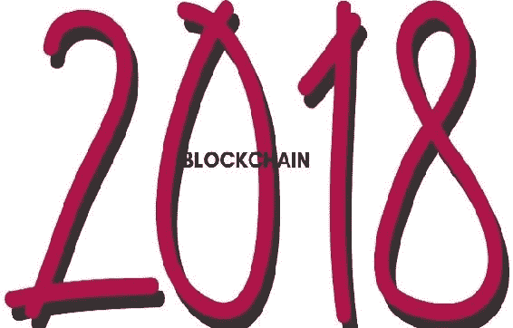
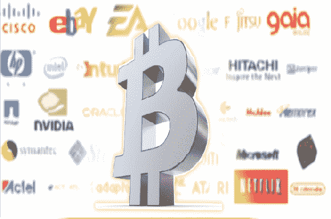

# 第六章。2018 年区块链预测

人们和机构的更多采用

区块链技术除了顶尖安全性之外还有更多价值。例如，个人可以通过安全渠道进行交易或通信。交易不经过中间人，因此比由中央实体运行的交易更简单和更快速。学院、大学、医院和金融公司是预计将利用这项技术优势的机构之一。

但是，如何处理加密货币的极端波动性呢？当然，这是一个重要的问题，如果得到解答，可能会导致许多人采用加密货币及其基础区块链技术。UBIQUICOIN 是一家拥有双币制度的加密公司，其中一个币种被设计成稳定的，因此不受传统价格波动的影响。

科技和 B2B 巨头的出现

2018 年的第一个月对加密货币并不仁慈，我们目睹了价格大规模下跌。连比特币也没有幸免。尽管遭遇了这些不幸的情况，亚马逊和 Facebook 等大公司据说对采用区块链技术感兴趣。TraDove 是一家总部位于旧金山的 B2B 公司，他们在 ICO 预售中筹集了数百万美元，以帮助他们将服务迁移到区块链上进行安全和更快速的交易。

加密货币将成为日常支付方式

目前，WordPress、Expedia、Subway 和 Shopify 是少数接受加密货币形式支付的公司之一。预计接受这种支付方式的公司数量将增加。实际上，任何不接受比特币和其他主要加密货币的企业都可能会受到客户的指责。

智能合约使用量将激增

智能合约是在无信任系统中安全可靠的支付形式。一些利用这项技术的公司包括 JoyToken（游戏平台）和 meVu，一个旨在降低赌博成本的投注平台。到 2018 年底，智能合约将取代我们目前使用的签署纸质合同和其他昂贵的第三方担保服务。

区块链将颠覆已经建立的行业。

有一些公司在传统市场上占据主导地位已经有数百年的历史了。随着区块链逐渐进入主流应用，它将引起传统行业的动荡并改变事物的常态。例如，ODEM 是一种教育区块链技术，旨在直接连接教育者和学习者，从而剔除使教育昂贵的中间商。
