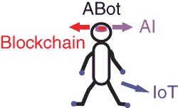

# 12

区块链在与现有技术及其他新兴技术的结合使用时效果更佳

在本章中，我想分享一些其他的重要新兴技术，这些技术对我们企业组织的未来非常重要，并与区块链技术一起工作或并列。

首先我会分享我对此领域的看法，随后会分享我的一个朋友彼得·班布里奇的观点，他会分享他对这一领域的看法。然后我会举几个例子，然后再把我另一个朋友迈克尔·福赫兹的观点转交给他，迈克尔对消费者品牌和零售业的未来有着非常有趣的看法，以及新兴技术对未来变革速度和采用的重要性。

我的最后一位贡献者，埃里克·华莱士，将以一种有趣的视角结束本章，他讨论了如何私有和公共的区块链技术对今天的企业组织来说并不适用。埃里克提出了另一种方法，并给出了一些使用区块链技术和其他令人兴奋的新兴技术来实现这一点的例子。

埃里克研究和学习分布式账本及区块链技术。埃里克的章节是本章很好的收尾，并引导我们进入下一章，关于区块链技术的未来。##物联网、人工智能/机器学习、RPA、区块链、增强现实、虚拟现实——新兴技术

新兴技术的世界包含了你们所听说过的每一种新技术。这个术语广泛使用，但定义并不那么清晰——即什么真正算得上是新兴的，或者什么将会成为人们和企业实际使用的技术？

我引用了 Atos 关于新兴和转型技术观点，这是一幅对未来技术、它的商业影响以及可能发生的时间的精彩视觉描绘。

提到这一点，你会发现区块链技术处于高商业影响象限，大约在 2020 年左右会发生这种情况，并且它正处于早期采用阶段。如果你跟随我这本书到这里，你会理解这反映了我对今天技术的看法。

这幅图表上有许多令人兴奋的技术，我本可以写一整本书来介绍，但我只想关注其中几种，这些技术与区块链有着紧密的联系，而且我们已经看到了这些技术间相互促进的应用案例。##区块链、人工智能和物联网如何协同工作——‘ABot’

我相信目前与新兴技术最匹配的莫过于区块链、物联网和人工智能了。

让我们看看它们是如何一起工作的。

正如你所见，这些技术协同工作，使‘ABot’成为任何公司的强大资产，其中：

+   区块链技术——变成了记忆，在不可篡改和共享的账本中存储所有数据和分析。

+   人工智能 - 成为大脑 - 这是逻辑思维过程，不断分析信息，根据持续的数据流做出决策。

+   物联网（IoT）- 这些传感器最初收集数据，并通过区块链与人工智能共享这些数据。

我发现这是一种很好的方式来形象化这三项技术协同工作。

现在我将介绍彼得·班布里奇，他将分享他对区块链和新兴技术关系的看法。

在我的最后两位贡献者部分之前，我将分享几个用例。## 用例：新兴技术在零售中共同工作

当前的实体店在未来将变得不那么重要，它们将扮演非常不同的角色。我们看到的标准化风格将不再存在，新兴技术将允许出现大量基于顾客日益增长的需求和新兴技术的大量涌现的不同购物渠道。

区块链技术将作为所有这些数据的中枢“枢纽”，确保面向顾客的技术快速、准确和透明地运行。

将有三种类型的商店：

1.  主要零售商和品牌（如苹果、耐克、阿玛尼等）将转向“展示厅”式的商店，顾客可以在这里通过体验式环境体验产品。

    这些商店将服务于几个目的，例如：

    +   以一种互动和激动人心方式展示产品。

    +   利用新技术帮助顾客选择他们的产品。

    +   将使用新服务，例如个性化，或通过数字方法定制衣服 - 利用 3D 和数字印刷的新世界。

    +   食品试吃和品尝 - 今天的食品大厅趋势将继续发展成销售食品和其他商品的大型商店，但具有高度互动的展示和大量品尝。

    +   虚拟现实（VR）技术帮助您将想象力提升到下一个层次，并看到产品在家中或身上的样子，尤其是在家具店中非常有用。

1.  便利性和补充购物将继续增长，以实现“加油”的目的，类似于亚马逊 Go 的概念。借助扫描技术和无线钱包支付，顾客可以快速进入、收集产品并轻松离开，无需任何麻烦。

1.  取货、送货（归还）和其他类型的“履行”服务。

    产品最后一英里的配送和收集是零售中最复杂的问题。利用最新技术，零售商将能够提供许多不同的选项，例如：

    +   店内收货点

    +   储物柜

    +   无人机配送

    +   司机配送

    +   送货到汽车

    +   送货到办公室

    +   在车站收集。

    这些是正在测试的最后一段路程的许多选项中的一部分，所有这些都需要一个高度协调的供应链网络。区块链与其他新技术结合，将使零售商能够提供客户想要的的所有技术解决方案，以满足他们的购物需求。## 用例：沃尔顿链用于来源证明

让我们来看看 RFID 和区块链技术以及来自沃尔顿链的一个很好的用例，该用例结合了区块链技术、无线射频识别（RFID）和物联网（IoT）技术，以提高供应链管理性能。

沃尔顿链引入了价值物联网（VIoT）的新时代，产生了一个去中心化的互联互通生态系统。它还使用嵌入式 RFID 标签追踪供应链中的贵重商品，并将来自 RFID 标签的产品状态数据记录到沃尔顿链区块链。这成为了一个不可篡改的记录，无法被篡改，因此有助于识别产品的真实性。

沃尔顿链与福建斯凯诺物联网技术有限公司合作，推出了基于区块链的双向追溯食品真实性平台 WTC-Food。

WTC-Food 将通过强大的、灵活的数据收集、信息可追溯性和信用背书，为消费者、企业和技术实现互惠。

沃尔顿链与中国领先的高端服装品牌卡尔滕丁合作，推出了基于区块链的高端服装真实性追溯平台 WTC-Garment。

WTC-Garment 平台不仅提高了高端服装零售商在制造、物流和门店管理方面的业务效率，还为客户提供了沉浸式的购物体验。

像 WTC-Food 和 WTC-Garments 这样的平台使用包括区块链、物联网、RFID、人工智能、大数据、分析、云、移动性在内的所有技术，这些技术正在融合以提供来源应用。## 用例：区块链、物联网和人工智能的融合以实现成功的来源解决方案

区块链、物联网和人工智能的融合将为零售和供应链行业带来巨大的颠覆性影响。单一的区块链无法提供完全的来源证明，但一个结合了区块链+物联网+人工智能的生态系统将建立一个全面的产品来源解决方案。

让我们看看总部位于上海的风险投资公司 BitSE，它为建立 VeChain 来源应用程序做出了重要贡献，该应用程序可以追踪和验证奢侈品服装、手袋、葡萄酒和杂货等商品。

消费者可以使用 VeChain 的应用程序访问产品配置文件，并通过 VeChain 服务器上可用的公钥以及通过物联网传感器在整个产品生命周期中收集的其他相关数据来检查其真实性。

它正在开发下一代区块链技术，即 VeChainThor 区块链。VeChainThor 区块链使用 PoA（权威证明）来维护所有区块链节点之间的共识。

区块链由 101 个权威节点组成，这些节点由白名单控制。因此，这里混合了去中心化和中心化架构。VeChain 已经与世界上许多领先的物联网设备制造商、RFID 和 NFC 标签生产商合作，以增强存储在 VeChainThor 区块链上的数据集的完整性和准确性。

目前有两个零售和供应链解决方案，VeChain 正在研究来源和跟踪解决方案的是：

1.  冷链物流

    VeChain 的冷链物流解决方案使用专有的物联网设备来跟踪整个旅程中的关键指标。VeChain 在每个过程中都嵌入数据管理和共享，使冷链物流变得透明、受监管、安全、可靠。

1.  奢侈品和时尚

    VeChain 在奢侈品中嵌入智能芯片，这样品牌就可以实时监控其销售渠道，以防止非法过度库存交易。与此同时，消费者可以通过 VeChain 应用程序验证奢侈品的真实性。VeChain 将控制权交还给品牌，使奢侈品连锁变得透明、无缝，并基于数据驱动。

Michael Forhez 是全球消费品、品牌和零售领域的领导者。Michael 对所有新兴技术以及区块链世界中客户的未来有着出色的看法。看看他的想法以及一些关于我们现在生活世界和未来可能的样子非常有趣的统计数据。

现在我想介绍本节最后的贡献者，他是 Eric Wallace。Eric 一直在研究当前企业区块链解决方案的问题；专注于不同类型企业区块链解决方案的问题和复杂性，这是 Chris Wing 在书中早先覆盖的。Eric 研究了几乎所有的区块链解决方案，并对未来区块链解决方案可能的样子以及我们可以如何使用其他新兴技术与区块链技术有一些想法。

## 注释
