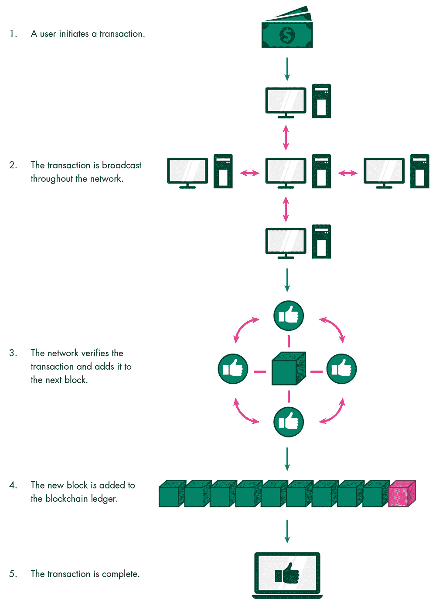
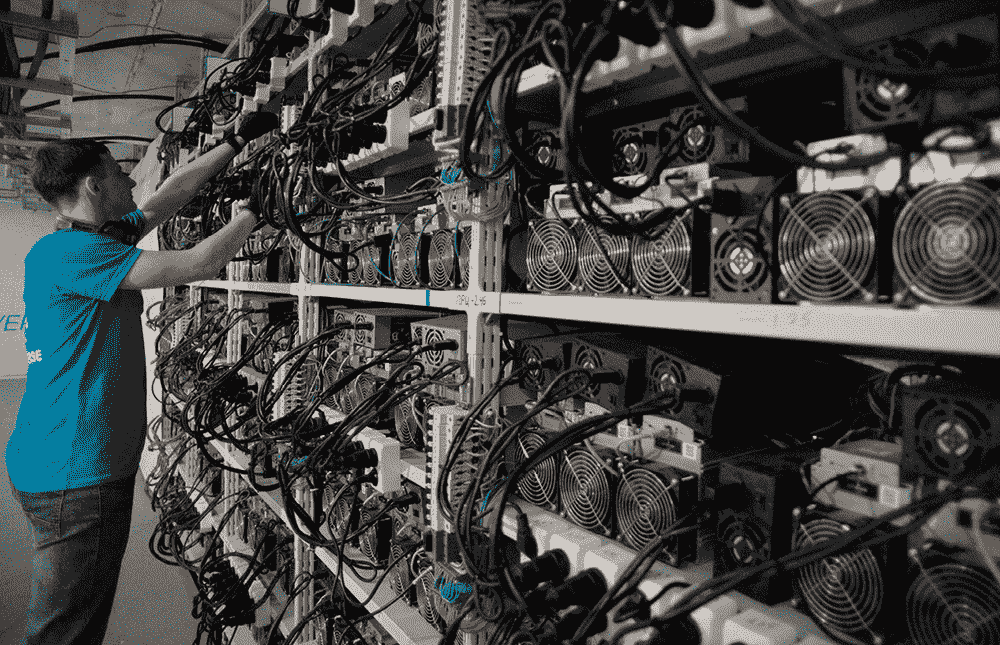
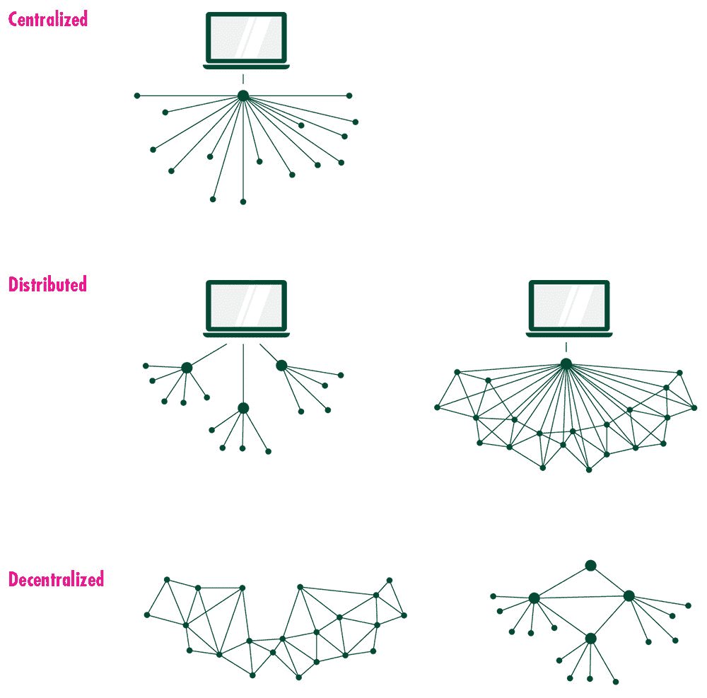

# 第一章

比特币和区块链

货币是文明的一个基本组成部分。它作为个体的交易媒介，使他们能够买卖商品和服务。当货币正常运作时，它还允许个体在时间上储存价值。

在数千年的历史中，人们使用了多种不同的货币——从珠子到金属硬币，从贝壳到咖啡豆。有些货币形式比其他形式更有效。“要成为真正好的货币，”经济学家、《金融时报》专栏作家马丁·沃尔夫写道，“它需要持久、便携、可分、统一、供应有限，且被接受。”

今天，大多数人使用法定货币，即我们所说的硬币和纸币。法定货币是由政府规定作为法定货币的。这种货币本身并没有内在价值。人们为真正的商品和服务给出和接收货币，因为它是一个被社会接受的价值观符号。公民还必须使用它来支付税款。

然而，意识到法定货币主要基于信任可能会令人不安。公民必须相信政府在其需要时不会简单地制造更多货币。当政府发行过多货币时，通货膨胀就会上升。货币的价值下降，因为它不再像以前那样购买力强。当货币失去其价值时，就会发生超级通货膨胀。当一个社会对其货币失去信心时，结果可能是灾难性的。公民买不起食物，储蓄被摧毁，法律和秩序崩溃。

没有办法追踪纸币的起源和历史，这使得它比基于区块链的加密货币更容易被伪造。

“传统货币的根本问题是需要所有信任来使其发挥作用，”研究人员斯坦顿·希斯特和克里斯蒂·尤塔斯说。“中央银行必须被信任不会贬值货币，但法定货币的历史充满了信任的背叛。”

一些批评者认为，政府不可避免地会印刷货币来解决短期问题或满足迫切需求。这些人通常对政府持怀疑态度，他们认为政府权力过大——有权印刷货币、收取货币和监控货币。一些人认为政府不会 properly 监督金融系统，该系统负责持有储蓄、发放贷款和投资。如果政府在这一点上失败，公民的储蓄将受到威胁。

所有这些恐惧在 2007-2008 年全球金融危机期间似乎都变成了现实。2009 年 1 月，全球金融系统几乎崩溃。在美国，数百万笔房屋抵押贷款给了还不起的人。这些抵押贷款被重新打包成证券，然后卖给了世界各地的银行和其他金融机构。当房屋抵押贷款变坏时，金融公司开始崩溃。

政府被迫花费数千亿美元来支持金融机构，以避免灾难性的经济大萧条。救助措施是有争议的。家庭失去了家园，投资者损失了财富。但似乎这些公司的首席执行官大多逃脱了惩罚。2007-2008 年全球金融危机侵蚀了社会对政府、机构和个人的信任。

在第一笔比特币交易中，中本聪引用了 2009 年 1 月 3 日《伦敦时报》的一篇故事的标题：“Chancellor on Brink of Second Bailout for Banks（财政大臣面临第二次银行救助）”。通过这个参考，中本聪概括了他们启动比特币的问题。他们不需要提出论点。他们只需要指向 2007-2008 年的全球金融危机，这让许多人得出一个极端的结论：政府不能信任管理金钱。

比特币是中本聪对法定货币挑战的答案。它易于存储，可以即时传输，并通过一个简单的过程进行验证。

正如科技记者布赖恩·帕特里克·艾哈所说，“比特币看起来像是货币梦想中的自己。”

# 中本聪是谁？

中本聪可能是个人，也可能是团体（本书将中本聪称为“他们”）。他们没有公开透露自己的真实身份。有些人认为中本聪挖出了大约 100 万比特币，并在 2010 年将网络控制权交给了他人。除了几个神秘的留言外，他们自那以后就没有消息了。许多人都声称自己是中本聪，但没有人能证明这一点。

没有人知道中本聪的真实身份——或者他们甚至是否是一个真实存在的人。

## 数字货币：一个问题和一个解决方案

为了创建比特币，中本聪必须克服一个巨大的挑战：互联网上的任何东西都可以轻松复制。货币的部分价值在于其供应量有限。如果世界上所有的黄金都被聚集在一起，它将制成一个每边不到 75 英尺（23 米）的立方体。如果有人能在实验室里廉价地制造黄金，那么它很快就会失去价值。

有许多方法可以让产品的创造者故意限制供应。在 20 世纪 90 年代末，音乐主要只能通过光盘（CD）获得。如果你想听一首歌，你必须购买一个单独的副本，你通常只能在购买整个专辑时才能得到。一旦你拥有了 CD，你就不能复制它。如果你想和朋友分享这首歌，他们必须借你的 CD（这样你就不能听了）。这对大多数其他媒体形式也成立——报纸、书籍和 DVD。难怪这些行业在 20 世纪 90 年代末享受了强劲的利润。

然而，互联网破坏了这一模式。新网站允许用户下载整部电影，并分享音乐文件。一个人可以简单地买一首歌，并制作大量副本与朋友分享，而无需额外成本。一旦报纸在网上以数字形式发布故事，它们就可以被轻松复制并在其他地方传播。

# 确保稀缺性

某物的价值通常由它的数量（供应）与人们对它的需求相比来决定。如果某物稀缺且非常受欢迎（比如海滩上的房子），那么它将会有一个很高的价格。如果某物很常见（比如沙子）并且超出需求，那么价格将会很低。法定货币通常在政府印刷过多时失去信任，导致其失去价值。

中本聪设计比特币，使其数量是有限的。流通中的比特币数量到 2140 年将达到 2100 万。在将来会发行的 2100 万比特币单位中，已经有 1800 万在流通中。

在接下来的十五年里，音乐销售额下降了一半以上。许多报纸被迫合并或关闭。作家和音乐家努力从他们的工作中产生新的收入。任何可以数字化的东西都可以无成本地无限复制，实际上使它变得毫无价值。互联网，结果证明，在传递信息方面非常出色，在这个过程中，破坏了价值。

鉴于这一现实，数字货币如何存在？你口袋里的十美元钞票不能被复制。如果你丢了它，它就没了。如果你用它买东西，收到钱的人可以相信那是真的钱。数字货币只是一个电脑文件。持有者可以简单地复制它并多次使用。然而，比特币在数字世界中实现了非凡的成就：几乎不可能伪造硬币。中本聪通过区块链实现了这一点。

## 区块链的基础知识

区块链是一个在线账本，或者是一系列记录的列表。它确定了在任何给定时间谁拥有某物。一组中国区块链专家称它为“最新且最值得信赖的簿记形式”。每个记录都有时间戳，并通过密码学与其他记录结合来创建一个区块。这些区块由一个由世界各地的独立计算机组成的点对点网络独立检查和验证。它们将区块组合成链（因此称为“区块链”），包括最新的交易。

如果你想把一个文件传给朋友，区块链会确认你是当前的所有者，然后确认新的所有者。点对点网络会验证这笔交易并更新区块链。这个文件不能被复制和分发给其他人。只有一个文件。因此，区块链有效地解决了数字化的问题，使得数字货币成为可能。

### 区块链交易是如何工作的

《纽约客》记者 Nathan Heller 写道：“区块链就像是你的祖母织的数字版围巾。” “她用一团线，结果是连续的。每个针脚都依赖于它之前的那个。除非留下一些痕迹：几处显眼的结，或者编织的变化，否则无法移除部分布料，或者用一块布料替代。在区块链系统中，每一行也取决于它之前的内容。任何破坏编织的行为都会留下痕迹，试图掩盖你的行踪也会留下痕迹。”

## 比特币区块链

比特币是区块链最知名和成功的应用。研究比特币有助于更好地理解区块链在现实世界中是如何工作的。

比特币账户被称为地址。它们是一串随机的字母和数字。它们与它们没有任何关联——没有名字，没有社会安全号码，也没有能识别所有者的商业或住宅地址。每个比特币地址都有一个秘密代码，即私钥，允许某人访问它。秘密代码的持有者拥有比特币。如果秘密代码被盗窃，被遗忘，或者以其他方式丢失，比特币将无法使用。

持有者通过使用他们的私钥将比特币转给另一个人。交易实际上成为了比特币代码的一部分，并且是透明的，这意味着任何能访问电脑或智能手机的人都可以看到哪个地址曾经拥有过比特币，以及当前哪个地址拥有它。

Nakamoto 为第三方创造了验证比特币交易的激励机制。验证过程涉及解决一个复杂的数学问题——即工作量证明——这需要大量的计算能力和能源。这些被称为矿工的第三方，通过获得比特币交易的一部分作为报酬来补偿他们的劳动。他们还会收到区块奖励，即一定数量新产生的比特币。矿工们争相验证交易，最快且最彻底完成工作量证明的矿工将获得奖励。

每笔交易都通过一个算法记录下来，该算法获取其详细信息——时间、金额、发送者和接收者地址，并将交易转换为称为散列的字符串和数字。任何运行这些信息通过算法的都会得到相同的散列。每个散列可以与其他散列结合，形成一个包含两者的新的散列。因此，当矿工将一个区块添加到区块链时，它将与一个一直回溯到由 Nakamoto 在 2009 年 1 月 3 日启动的第一个或“创世”区块的散列链相链接。

许多矿工使用冷却设备和风扇来防止他们的电脑过热。除了使用大量电力和累积电费外，挖矿还需要普通个人电脑没有的强大处理器。

任何对链的更改，无论多么微不足道，都会导致完全不同的散列值。因此，由于许多独立方已经确认了信息，所以交易记录无法更改。矿工验证交易后，点对点网络中的其他计算机（称为节点）将验证矿工的工作与原始区块链。如果节点检测到异常，他们将不会将其附加到新的区块。相反，他们将回到链条的更早部分，在那里可以信任并将其附加在那里。被拒绝的区块变成了“孤儿”。孤儿还可能源于两个矿工同时解决工作量证明问题的情况——网络必须选择其中的一个区块，被拒绝的那个变成了孤儿。由于这一过程，任何区块链用户都可以信任账本信息，因为点对点网络已经确认过。

中本聪设计比特币，使其每个区块的挖掘大约需要十分钟。有时候， though，它可能只需要几分钟，或者长达一个小时。如果许多比特币正在被挖掘，需要更多的计算能力，中本聪的算法会自动调整，使它们更容易被挖掘。然而，如果挖掘的区块较少，难度会增加。目标是保持每区块十分钟的挖掘时间。

比特币的价值取决于它在使用它的人之间产生的信任——在投资者、用户和社会大众之间。因此，比特币矿工有诚实验证交易的动机。如果有人通过系统欺诈并破坏信任，所有比特币都会变得毫无价值。

区块链专家 Omid Malekan 写道：“于是，中心权威被追求自身利益的志愿者网络所取代。”

通过比特币，中本聪证明了区块链的可行性。在随后的几年里，计算机科学家、投资者、监管机构、政府、专家、经济学家和普通公民都研究了这个新系统及其影响。

科技记者 Gideon Lewis-Kraus 写道：“关于区块链究竟是什么，人们存在很大的混淆和争议，但标准定义描述了一个共享的、去中心化的、加密安全的、不可篡改的数字账本。从最广泛的角度来说，区块链使一群陌生人能够就某一事实状态达成一致，并在此基础上建立契约。”

这个图表展示了三种组织类型：集中式、分布式和去中心化。去中心化结构将决策权和权力分散给大量人员。在集中式系统中，大部分权力属于单一的中央实体，例如政府或公司。最后，分布式系统由节点组成，这些节点协调其计算以达成共识；它们可以是集中式或去中心化的。

这种语言使区块链听起来平淡无奇，但区块链的拥护者认为它揭示了区块链可能的革命性。对他们来说，“一群陌生人”达成“一种状态的共识，并基于契约一起前进”听起来像是文明的开始。

风险投资家马克·安德森（Marc Andreessen）在 1990 年代初推出了第一个流行的互联网浏览器，并是网景（Netscape）的联合创始人，他在《纽约时报》中写道，比特币将是下一个大事件：

一种神秘的新技术似乎从天而降，但实际上是近二十年来几乎匿名研究者的密集研究和开发的成果。

政治理想主义者将它视为解放和革命的愿景；既得利益集团则对它不屑一顾。

另一方面，科技人员——书呆子们——被它迷住了。他们看到其中巨大的潜力，并花费夜晚和周末与它打交道。

我在谈论什么技术？1975 年的个人电脑，1993 年的互联网，以及——我相信——2014 年的比特币。
