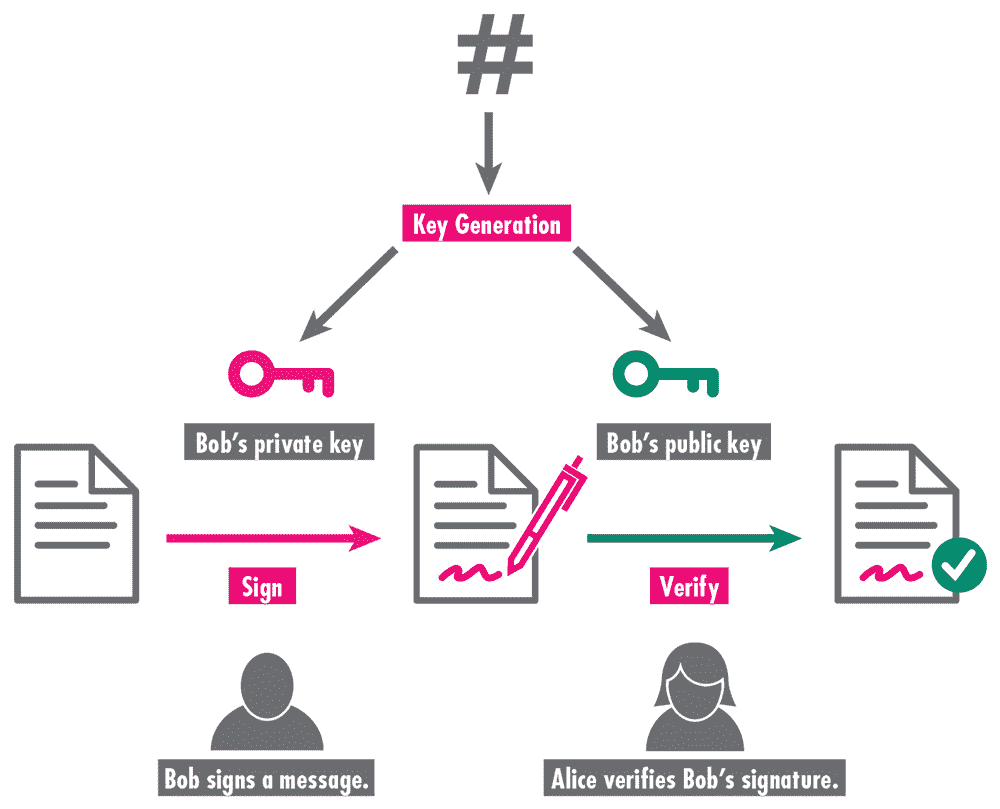
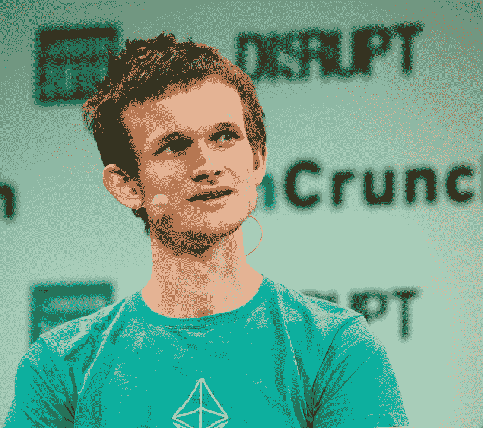

# 第二章

确立潜力

贸易基于信任，这可能难以建立，却容易破裂。我与谁交易？我怎么知道我会得到我所交换的东西？对方是否会履行我们的协议？在当代社会，这些问题通常由中介解决。

在现代金融体系中，像银行、律师事务所和经纪公司这样的大型机构保证交易的安全。消费者在网上订购衬衫时，银行会向卖家确认消费者有能力支付。中介确保包裹被送达，并且付款被接收。

有时我们可能会忘记这些交易有多么复杂。一个人只有在确信卖家实际上拥有商品时才能购买某物。在每一个阶段，都必须确立所有权——即卖家拥有待售商品，买家拥有支付的手段。协议必须由双方达成，并由中介确认。

对于更大、更复杂的交易，需要注意的是，中介可能会失败。职员可能会犯错误，文件可能会丢失，标题可能会被伪造，官员可能会被贿赂以改变记录。在 2007 年至 2008 年的全球金融危机中，银行未能验证新房主是否有能力支付他们购买的房屋。

然而，区块链去除了这种不确定性。资产的所有权通过区块链账本独立确认。由于账本遍布全世界，以副本形式存在，因此除非被发现，要修改它是非常困难，甚至是不可能的。此外，即使网络的某一部分失败了，证明所有权的账本仍会在网络的其他部分存在。因此，这种去中心化的网络不会受到单一的人或政权试图关闭它的影响。

## 去除中介

通过确立所有权的证明，区块链去除了中介，这可以带来许多好处。科技记者吉迪恩·刘易斯-克劳斯写道：“我们为这些集中化的实体提供的托管服务支付了丰厚的报酬，这不仅体现在他们收取的租金上，还体现在他们对我们生活的控制上。”他补充说：“理论上，区块链为我们提供了解决复杂协调问题的新机会，不让现有的协调者在这个过程中提取过多的价值。”

拿购买体育赛事门票这样简单的事情来说。许多人使用一个流行的网站来购买门票。该网站确立门票实际存在，确认门票在双方之间的交换，并拥有一个交付机制。为此服务，作为中介的网站会收取高额费用，显著增加门票的成本。

然而，在区块链上，票据会被分配一个公钥。所有者持有私钥，可以访问该公钥。当所有者出售票据时，会为票据创建一个新的公钥，并添加到区块链中。新的所有者会收到一个新的私钥，以证明她对票据的所有权。无需中介，也无需向票据成本中添加费用。作为额外的奖励，交易几乎是瞬间完成的。

银行是最终的中介机构。区块链支持者认为基于区块链的应用程序有可能会取代当前金融体系的绝大部分。需要资金的新公司可能会发行代币而不是股票。房屋的买卖可能无需进行现今所需的广泛尽职调查。

这个插图展示了两个人如何使用对方的密钥来验证所有权并进行交易。首先，鲍勃使用密钥生成函数将一个大随机数转换成两个密钥：私钥和公钥。他使用私钥加密一些信息，然后将信息发送给爱丽丝。在交易的另一端，爱丽丝使用鲍勃的公钥来解密信息。因为这两个密钥是由同一个数学函数生成的，它们相互关联，所以公钥可以验证鲍勃的私钥，而不必向爱丽丝透露它。

在过去的二十年里，随着自动取款机和在线银行的出现，银行业变得更加便利。但是，底层系统变化很小。电汇资金 still takes twenty-four hours. 支票底部的水印号码 first developed a century ago. 即使是信用卡交易，也可能需要几分钟才能结算。相比之下，许多区块链交易只需几秒钟。

另一个充满中介的全球经济领域是贸易。这个系统可能会引起不一致，导致错误，并提供欺诈的机会。2015 年 10 月，许多 Chipotle 顾客因 E. coli 细菌感染而生病。随着顾客逃离，公司股价暴跌，管理层急切地寻找疫情的源头。然而，调查却陷入了僵局。五个月后，公司报告称，受污染的澳大利亚肉类可能是疫情的源头。他们无法提供更具体的信息。

问题是，公司要与许多供应商合作，而这些供应商通常有动机不合作。实际上，他们经常为了大公司的业务而竞争。结果，信息可能对供应链的其他成员或甚至对下单的公司不可访问。许多餐厅连锁店的经理无法确认他们收到的食物是否符合达成的标准。

正如保护生物学家 Guillaume Chapron 所说，“我们之所以有环境危机，比如自然资源的过度开发和污染，其中一个原因是因为全球经济中充满了在没有太多责任感的情况下做生意的参与者。当你去买东西时，你不知道它来自哪里，是如何制作的。有太多的中介，而且很容易欺骗。”

然而，区块链为每笔交易提供了一个时间戳的日志。这个日志是透明的，无法在未通知网络上的其他所有人更改。例如，在运输食品时，日志中的信息可能包括储存温度和位置、为什么物品被移动，甚至是否运输产品的卡车摇晃得太厉害（这可能会导致某些产品保质期显著缩短——想想被压伤的苹果）。因此，区块链可以使具有不同目标的人之间建立信任并共同工作。最终目标是透明度，不会泄露每家公司的竞争信息。此外，区块链在各方之间建立了一个标准的账本，涵盖了从起源到交付的交易细节。虽然这种结构本身不能消除欺诈（毕竟，有人可能故意输入虚假记录），但它确立了记录保持的一致性。世界上一些最大的公司，如 IBM、沃尔玛、家乐福和泰森食品，已经探索了他们如何可以使用区块链技术。

甚至一些相对较小的公司已经开始使用区块链。例如，在怀俄明州北部的一个牧场上，几百头小牛被记录在区块链上。区块链允许牧场主——他在开阔的草原上饲养动物——向顾客证明他的肉质量更高，且饲养方式人道。通常，追踪是一个耗纸且多个环节可能出现错误或欺诈的过程，因为牛在被交易和从一个地方移动到另一个地方时，区块链解决了追踪牛肉的这些挑战。

区块链技术可能让食客对即将食用的鸡有一个亲密的了解。鸡可以脚上戴上追踪器，通过供应链从农场追踪到餐桌。关于每只鸡的信息被上传到区块链。食客通过手机应用程序下载这些信息，这可能成为新的常态。区块链甚至可能出现在超市中——一位购物者回忆起能够扫描一盒浆果并看到种植它们的家族。

在 2018 年纽约市的一次会议上，为与会者提供了金枪鱼寿司。每张纸巾上都有一个二维码，与会者可以用智能手机扫描。扫描后，通过区块链技术，他们可以看到这些鱼是如何在南太平洋斐济岛被捕获的，以及它是如何被贴上身份证并随着每一片鱼肉通过数千英里被运送到他们的餐桌上进行跟踪的。

区块链不仅仅可以用于商业。环保事业常常失败，因为支持者不确定他们的捐赠是如何使用的，或者产品是否真的对环境有利。一个组织，塑料银行，试图减少塑料进入世界海洋的数量，那里已成为污染的严重来源。塑料银行向个体支付代币，用于回收的塑料瓶和其他塑料垃圾。然后以高于市价的价格将塑料转售给制造公司，吸引环保意识强的消费者。区块链对这一过程中的每个部分都至关重要。它保证了塑料片的支付，通常在社会中没有银行或高犯罪率的情况下。它确保用于回收产品的塑料实际上是被回收的，让最终用户确信他们的购买支持了一个环保事业。

## 智能合约

随着比特币变得越来越受欢迎，一位年轻的俄罗斯加拿大人 Vitalik Buterin 对将区块链技术应用于更广泛的交易范围潜力感到兴奋。Vitalik 是来自俄罗斯南部切尔尼亚共和国的计算机科学家的儿子，该共和国在 1990 年代当俄罗斯军队与分离主义者进行激烈城市战斗时大部分被摧毁。他的父亲在他六岁时移民到加拿大，他继承了他父亲对政府和他们可能造成的混乱的厌恶。

“我认为与政府监管或公司控制有关的一切都是纯粹的邪恶，” Buterin 告诉《纽约客》的记者，“我还以为那些机构里的人就像《辛普森一家》里的 Mr. Burns [Homer Simpson 的贪婪老板]，坐在桌子后面说，‘太棒了。我这次怎么才能欺骗一千个人？’”

Buterin 也被创建新的去中心化系统的人吸引。“他们早期的血统，如果他们有血统的话，就是开源的——Linux、Mozilla 和密码朋克邮件列表，”他说。“我发现，仅凭像我这样的几千个人就能从无中创造出这种基本的社会制度，这是无比赋权的。”

Buterin 崇拜比特币，但他想要的不仅仅是基于数字货币处理交易。他希望创建一个点对点网络来完成任务。这些任务在称为智能合约的协议中设定。

智能合约可以连接到多个区块链，并无需人工干预地执行协议。智能合约可用于基于时序的保证交易，例如租房。租客用比特币支付，从而获得一个提供公寓访问权的代码。如果房东在特定时间内未发送该代码，那么比特币将退还给租客。智能合约能通过去中心化的点对点网络自动验证交易的各个方面。这包括房东对公寓的所有权和租客拥有支付比特币的比特币。这个过程消除了银行等中介，为租客和房东节省了金钱和时间。

2015 年，巴特林推出了以太坊平台，该平台使用一种名为以太币的加密货币来支付点对点网络上的计算机执行智能合约的费用。巴特林将他的创造描述为“去中心化应用的安卓系统”——这让他将智能合约称为“Dapps”。巴特林将以太坊比作一个预设执行其平台上的应用程序（或“Dapps”）的智能手机。实际上，以太坊上的程序员可以访问一个去中心化的超级计算机。

巴特林在 2015 年的技术会议 TechCrunch Disrupt 上发表演讲。巴特林在 2014 年获得了一份 10 万美元的奖学金，他用这笔钱帮助资助了以太坊。

“如果它真能达到巴特林和其他人所想象的那样，”数字货币专家迈克尔·凯西和保罗·维格纳写道，“该系统将相当于一个全球去中心化的虚拟机，它总是执行用户的编程指令，而没有任何一台计算机的控制。”

巴特林和许多区块链支持者希望以太坊和其他区块链平台能帮助解决一个主要问题。大多数人在互联网上的体验都被吸收到了像谷歌、脸书和亚马逊这样的大型平台上。这些平台最初只是人们可以执行任务的地方，如“搜索”或“购买物品”，或与另一个人或团体联系。但随着时间的推移，这些平台似乎越来越多地规定这些体验。通过追踪和收集数据，它们使用算法向用户推送信息和广告。更糟糕的是，它们要求用户向平台投降其个人隐私信息以获得访问权限。许多人希望区块链能消除这些中介，并恢复互联网的原始承诺。
