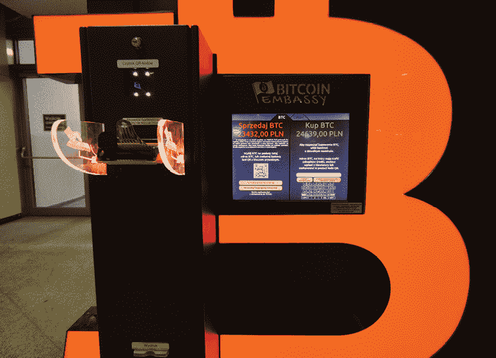
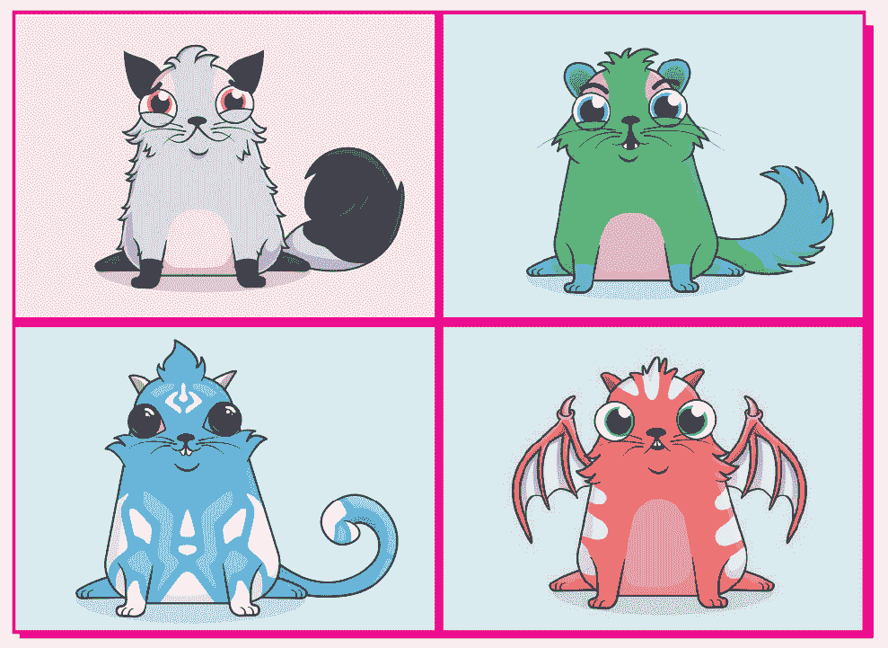
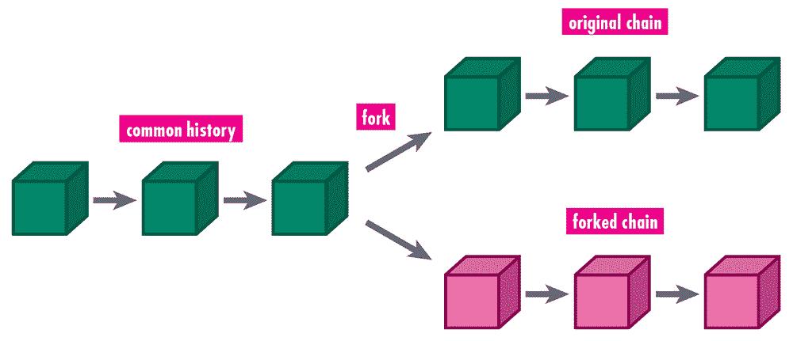

# 第三章

加密货币起飞

最初，许多人被比特币吸引，原因很简单：匿名性。2011 年 2 月，丝绸之路暗网市场开业。它提供各种非法商品和服务，包括毒品、被盗身份和密码、武器和性交易。它只接受比特币支付。当时，1 个比特币的价值大约是 30 美分。批评者将比特币视为罪犯和恐怖分子的首选货币，但一些投资者注意到比特币的理念正在得到验证。它允许陌生人——甚至是罪犯——建立信任并进行交易。简而言之，比特币正按照其创造者的意图运行。

这引起了人们的关注，尤其是当比特币开始了一系列剧烈的涨跌时。对于投机者来说，比特币似乎是一个快速赚大钱的机会。执法机构也开始进行调查。2013 年春季，美国政府关闭了丝绸之路暗网市场，并没收了超过 15 万枚比特币。

比特币，以及加密货币 generally，让政府监管机构感到困扰。监管者的任务是执行政府规定，尤其是在金融领域。当时，基于技术的其他服务，如 Airbnb 和 Uber，正在对出租车和酒店行业造成巨大 disrupt。出租车服务和酒店公司被迫与通过互联网直接与客户连接的司机和公寓所有者竞争。

监管机构想知道这会不会也发生在金融领域。在会议上，他们提出了紧张的问题。加密货币是不是一场骗局？它们对金融机构可能产生什么影响？加密货币能否打破政府对货币的垄断？美国当局查封了未向联邦机构正确注册的加密货币账户。中国也进行了打击，宣布任何金融机构都不得使用加密货币（尽管公民仍然可以）。比特币的价格随着这些声明的发布而波动，但总体趋势是上升的。2014 年初，比特币的价值从约 13 美元激增至每枚 770 美元。

现在比特币的故事经常出现在新闻节目和头版新闻中。曾经用比特币换零钱、恳求别人注意的比特币持有者正在赚大钱。比特币已经到来。

全世界的人都吸引到加密货币，他们看到了快速致富的机会。韩国成为继美国和中国之后的第三大加密货币市场。贫穷的韩国年轻人称自己为“脏勺子”。这个名字是基于他们与据说因为工作、财富和机会而有银勺和金勺的精英之间的对比。对于“脏勺子”来说，加密货币似乎是一个赚大钱和 potentially upend a 看似压抑的社会秩序的机会。即使他们没有机会购买股票或获得贷款来资助企业，他们也可以购买加密货币。

一个名叫雷米·金，29 岁的家伙，经营着关于加密货币的社交媒体频道。他最初是在一个黑客接管他的硬盘并要求用比特币支付赎金时了解到加密货币的。金筹集了 1.2 个比特币（当时约值 800 美元），但他对加密货币产生了浓厚兴趣，并为自己购买了一些比特币。随着市场的上涨，他买了一辆价值 50 万美元的海军蓝劳斯莱斯。在网上，他取名为“Les Mis”，来自音乐剧和小说《悲惨世界》，其中穷人起来推翻一个腐败和残酷的政府。

比特币的上涨变得像抛物线一样。2017 年初，它的价值刚达到 1000 美元以下。在夏天，它的价值突破了 4000 美元。到了 12 月中旬，其价值激增至超过 19000 美元。

在纽约市，一个露天比特币市场在联合广场开业。人们聚集在亚伯拉罕·林肯的雕像下，他们的背包里装满了现金，竞相购买数字货币。这个市场被重新命名为“萨图什广场”，其参与者和参与者让人想起了几个世纪前的纽约交易者，他们聚集在华尔街附近的开阔地带。

比特币机器，即 BTM，开始出现。到 2018 年底，全球约有四千台在使用，仅美国就有两千多台。在纽约市，有 110 家商店提供比特币机。一项估计称，每天有五台新的比特币机安装。钱可以很容易地存入，然后转换成比特币，并存入一个数字钱包中，从世界上任何地方都可以立即访问。

这台 BTM 位于波兰的一个火车站。

那些足够幸运或聪明，在比特币的婴儿期就敢于冒险的人变得富有。一个 12 岁的孩子，埃里克·芬曼，从他祖母那里借了 1000 美元，在比特币 10 美元一枚时购买了比特币。后来有人出价 10 万美元，或 300 个比特币，购买他开发的视频技术。他接受了比特币，他的财富不断增长。芬曼讨厌学校，说服他的父母同意一项交易：如果他在 18 岁之前赚到 100 万美元，他就不必上大学。他赢得了这笔交易。

加密货币持有者现在拥有的钱比他们曾经敢梦寐以求的还要多，于是他们变得非常保护自己的身份。对于一个持枪的人来说，要他们的密码简直轻而易举。记者内莉·鲍尔斯注意到，考虑到区块链在网上提供安全性，持有加密货币的人似乎非常不安全。“加密货币富有者中有一种常见的偏执，他们担心自己会成为目标并被抢劫，因为钱没有银行担保，所以很多人都非常保密，”她写道。尽管有一些例外，但加密货币持有者通常不鼓励奢侈消费。购买兰博基尼（或兰博）被看作是一种庆祝。

随着比特币价格上涨，一些欢欣鼓舞的持有者计划套现，却发现他们丢失了私钥。一位 IT 工作者在 2009 年挖出了超过 7500 个币。“当时只有我们六个人在做，”他回忆道，“那就像淘金热初期。”他将硬币的私钥存储在一个硬盘上，该硬盘放在他的抽屉里。“四年后，我有两个硬盘在抽屉里。一个空的，另一个包含我的比特币私钥，”他回忆道。“我本想扔掉空硬盘——但我意外地扔掉了包含比特币信息的那个。”到那时，他的比特币价值 6000 万美元。他恳求他的小镇让他挖掘垃圾填埋场，他的硬盘很可能被扔在那里。他们拒绝了。

另一位比特币持有者马克·弗劳恩菲尔德花费了 3000 美元购买了 7.4 个比特币，并存放在一个硬件钱包中，这是一个安全的硬件设备。作为安全程序的一部分，这个名为 Trezor 的钱包生成了 24 个随机单词，他将这些单词写在纸上，并将其放在抽屉里。如果他丢失了 Trezor，他可以简单地获取一个新的，并使用这 24 个单词来访问他的账户。在前往东京的一次旅行之前，弗劳恩菲尔德决定将纸张放在女儿的枕头下，以防他在事故中去世。比特币正在迅速上涨，他希望女儿能够接触到这些钱。然而，当时他的女儿在伦敦，一周后才回来。与此同时，他的清洁服务人员打扫了公寓，找到了写满晦涩名字的纸片，并将其扔掉。

当弗劳恩菲尔德发现这个错误时，他认为这将是一个小麻烦。他仍然知道他的 PIN 码，这将允许他生成一个新的账户并转移比特币。然而，当弗劳恩菲尔德尝试输入 PIN 码时，Trezor 不断拒绝。弗劳恩菲尔德尝试了几十种变体。没有一种有效。

“我感觉很不舒服，”他回忆道。“在我第六次输入错误的 PIN 码后，逐渐加剧的恐惧变成了心跳加速的恐慌——我可能要与我的 7.4 个比特币吻别。”

弗劳恩菲尔德继续尝试 PIN 码；他一直在失败。“比特币网络的去中心化特性并非没有后果——主要后果就是你如果搞砸了，那就是你自己的问题，”他悲哀地指出。

# 比特币遗忘

没有人喜欢密码，比特币密码几乎不可能记住。一位加密货币开发者估计，在现存的 2100 万个比特币中，多达 400 万个可能已经丢失。

然而，这些故事并没有抑制已经变成投资狂潮的趋势。长岛冰茶公司将其名称改为长区块链公司。其股价在一天之内上涨了 500%。

一款区块链游戏允许用户生产或培育加密猫——一只电脑绘制的猫的图形。由于每幅图像都是独一无二的，因此产生了稀缺性，从而推高了价格。用户只能通过以太坊支付，据报道，一只名为 Dragon 的猫以 17 万美元的价格售出。

这些都是加密猫的一些例子。每只猫都是特征的独特组合，使其理论上有价值。

34 岁的瑞典艺术家乔纳斯·兰德利用区块链创造了 10 万个乔纳斯·兰德代币（JLTs）。他把这些代币给了董事会，董事会用它们来投票决定兰德应该采取哪些艺术和专业步骤。有一次，兰德有四个关于将一块胶合板艺术化的想法：雕刻、涂上金属灰色油漆、画上鸟和解释他过程的子弹点，或者涂上油漆然后以“可控的方式”点燃“创造出非常脆弱的东西”。兰德问他的董事会应该怎么做。他们用他们的代币选择了第三个选项：画鸟。这个选择将在将来与 1041 个代币相关联。当有人购买这件作品时，他们将获得这些代币，然后他们可以用这些代币来投票决定兰德艺术的走向。

借助基于区块链的代币，兰德只是在形式化他所认为的个人、市场和社区力量，这些力量影响着艺术。兰德把代币给了他认识的人，还有一些人因为购买他的作品而获得了代币。他还向邀请他演讲、关于他发推文或使用#jonaslundtoken 标签的个人提供代币。

似乎每个人都谈论着加密货币。但监管机构仍然持怀疑态度。加密货币支持者，或称加密兄弟，敦促美国证券交易委员会（SEC）批准比特币交易所交易基金（ETF）。一位支持者写道：“适应或死亡。批准比特币 ETF，并在我们拥有的革命性技术上领先一步，推动人类进步。”

2017 年 7 月，以太坊两岁了。以太币的价格在 2017 年上半年从 8 美元上涨到 400 美元，让很多人有足够的理由庆祝。一场纪念币的派对在曼哈顿的一间屋顶酒吧吸引了 300 人。迈克尔·凯西和保罗·维加出席，他们注意到他们见证了许多在城市中的繁荣和萧条，从 1990 年代末的互联网热潮到比特币。他们说，场面几乎一模一样。

记者们写道：“人群的能量是明显的。”“对即时财富的期望是明确的。像大多数其他技术突破一样，这一突破包含了乌托邦主义和资本主义的混合。一些人想改变世界。一些人想发财。许多人认为他们可以两者兼顾。”

# 数字币是证券吗？

对于加密货币和区块链来说，一个重要问题是数字货币或代币是否实际上是证券，或者是一种可交易的金融资产。如果一种数字货币是证券，那么它将受到美国政府监管的法律分类。美国证券交易委员会（SEC）是在 1929 年华尔街大崩溃之后成立的，这是一个历史性的事件，它使股东们一贫如洗，并迎来了大萧条（1929-1942）。在实际操作中，SEC 负责确保投资者对证券市场有一定的透明度，并能更好地避免滥用和欺诈。如果加密货币被视为证券，那么它们将受到严格的监管，可能会消除许多最初使它们吸引人的特性——比如匿名性。

在 2017 年，首次代币发行（ICO）吸引了大量的关注。数字公司发行了自己的货币，投资者们希望享受比特币早期拥有者实现的回报，纷纷涌入。这些公司在 2017 年筹集了 66 亿美元。出现了数十种货币或代币，其中许多是比特币的变体，称为替代币。EOS，“最强大的去中心化应用”，筹集了 42 亿美元。TaTaTu，“基于区块链的社会娱乐”，吸引了 5.75 亿美元。Dragon，“娱乐代币”，筹集了 4.2 亿美元。

2018 年，一个乌克兰社交媒体网络想要为其 ICO 提高知名度。它决定将四位加密货币爱好者送到珠穆朗玛峰顶端，在那里他们将埋下一个包含加密货币的硬盘。两名登山者从未到达山顶。另外两名到达顶峰后被困在恶劣天气中。后来他们被撤离并治疗冻伤。陪伴他们的一个夏尔巴人死了。该公司 ASKfm 报告说，这个硬盘上据说有 50,000 价值的加密货币，并鼓励其他人寻找它。

这种行为吸引了负面舆论，许多批评者继续认为加密货币只不过是犯罪分子的工具。人们犹豫是否使用它们作为交易媒介，因为经济学家马丁·沃尔夫指出，“遵纪守法的人和企业不想拥有那些因其匿名性而成为罪犯、恐怖分子和洗钱者的理想资产。”

其他批评者关注加密货币的波动性，以及影响更成熟的数字货币的争议，尤其是与安全相关的争议。“所有这些对于需要一种可靠地支付杂货和租金的货币的人来说都不是鼓励，”专栏作家莱昂内尔·劳伦特指出。

# Bitcoin and Google Searches

谷歌报告称，“如何购买比特币”在 2017 年是第三大“如何做”的搜索（最高搜索是“如何制作泥巴”）。在一些国家，对“比特币”的谷歌搜索超过了“黄金”的搜索。这些国家包括阿尔及利亚、哥伦比亚和委内瑞拉，这些国家对中央政府的信心较低。2019 年，尼日利亚和南非对比特币的兴趣尤其高，这两个国家都经历了货币贬值。这些国家的公民对他们政府，尤其是经济改革的前景也非常不确定。

## 区块链中的分叉

随着比特币交易的日益频繁，交易成本也在上升。比特币交易被设定为最多限制在一个兆字节内。由于这个较小的尺寸，区块链网络只能每秒处理七笔交易。相比之下，信用卡公司每秒可以处理超过五万笔交易。随着越来越多的比特币交易被处理，网络变得拥堵。

一些用户向矿工提供更高的费用，以将他们的交易包含在一个区块中。到 2017 年，用户每笔交易向矿工支付的平均费用为五美元。这使得小额交易变得非常昂贵——电影票或一杯咖啡的买家将不得不额外支付五美元。更糟糕的是，对于区块链的支持者来说，这种优先制度开始类似于区块链试图取代的系统——银行、机构等中介。希望支付较低费用的用户发现他们必须等待数小时，甚至数天，才能处理他们的交易。

一个明显的解决方案是增加交易大小，但矿工们抗议称这将增加处理成本。如果成本上升，参与矿工将减少，这可能会使系统更容易受到操纵。一方希望获得更大的便捷性。另一方强调安全性。

辩论变得激烈。一组人提议对比特币进行“分叉”。当两个矿工在区块链中几乎同时解决工作量证明时，就会发生分叉，导致账本出现差异。实际上，这两个交易在账本中呈现分叉，为账本提供了两种可能的结局。在此时，社区中的共识机制选择最准确的交易，使其他交易被忽略。分叉随后得到解决。

然而，分叉可以让矿工和节点社区有效地改变区块链的规则。挑战在于让区块链社区同意这种改变。毕竟，没有集中的决策机构可以简单地命令每个人都遵守其法令。相反，社区必须达成共识。

分叉可以是软分叉或硬分叉。简单来说，软分叉限制了区块链未来的规则，而硬分叉扩展了它们。软分叉很像是对软件的一次升级。就像升级后的电脑仍然可以运行旧版本的软件一样，区块链仍然可以与尚未升级的矿工和节点协同工作。软分叉只需要区块链用户中的大多数批准。然而，硬分叉更为复杂，因为它将区块链分成两条不兼容的链，一条遵循旧规则，另一条遵循新规则。因此，硬分叉需要区块链用户的全体一致同意。否则，区块链将存在两条不同的时间线。实际上，一组将遵守一套规则，而另一组将遵守另一套规则。

这个图表展示了区块链分叉的每个分支共享一个共同的历史，但其中一个分支将遵循一套新的规则，而另一个分支则遵循原始规则。在硬分叉中，规则差异如此之大，以至于两条链不兼容。

一位软件开发者向比特币区块链提出了一次软分叉，使其能更有效地处理更多内容，实际上将它的容量翻了一番。这次分叉还将使比特币能够在一个名为闪电网络的新网络上使用。闪电网络允许用户签署合同，根据预先设定的余额使用双支付通道。更重要的是，该系统允许用户无需矿工即可向第三方转账。因此，闪电网络可以进行大量无需矿工费的交易。

比特币社区考虑了这一解决方案。一些矿工强烈反对，中国的一组人领导了抵制。他们不想失去他们的费用。其他人认为，与区块链上的交易相比，闪电网络的交易更难追踪，这可能会招致中国政府的要求。中国政府反对任何其无法监控的交易。

2017 年 5 月，全球超过五十家比特币公司，包括加密货币业务、交易所、供应商和服务提供商，联合起来试图解决僵局。他们起草了一份名为《纽约协议》的文件，在协议中他们同意共同努力改进技术、沟通和协调，以增加区块链的支持比特币交易的能力。

通过这份协议，比特币交易的量翻了一番。然而，另一组人寻求更高的阈值。2017 年 8 月 1 日，一种新的加密货币被推出：比特币现金。这种货币代表了对比特币的硬分叉，因此这两种货币是不兼容的。更糟糕的是，增加比特币容量的协议最终在 2017 年 11 月崩溃，因为无法达成必要的共识。

对某些观察者来说，激烈的辩论、无法达成一致意见以及混乱的解决方案提议证明加密货币太过不稳定且难以管理。但其他人却得出了相反的结论。比特币和区块链账本已经证明是持久的。即使拥有重要资源和强大影响力的参与者也无法改变它。
