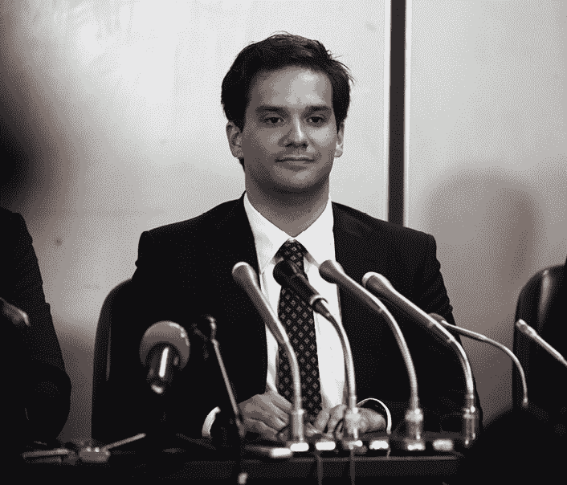
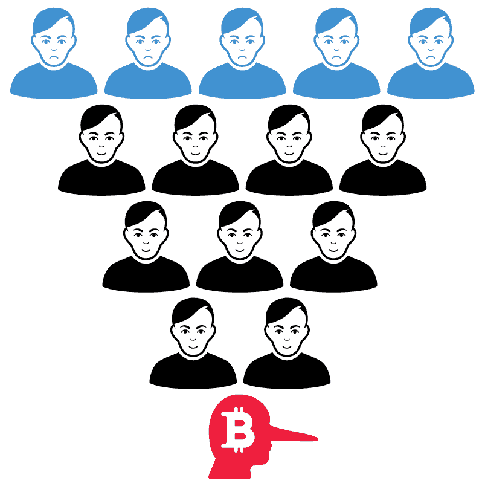
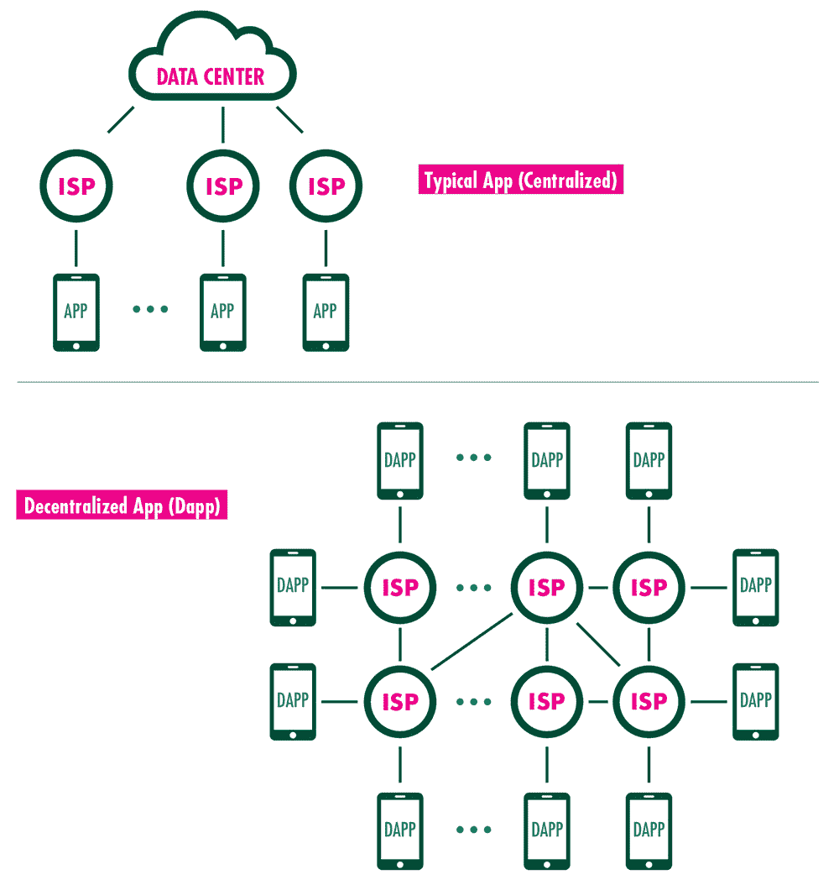

# 第五章

黑客、小偷与批评者

自比特币诞生以来，已有至少价值 15 亿美元的加密货币被盗。这个数字可能还更大，因为有些盗窃事件没有报道。仅自 2017 年以来，加密货币小偷就几乎盗走了 20 亿美元。这些攻击变得越来越复杂和有组织。它们利用了人们对区块链安全的普遍误解和所谓的不可破解性。像所有发明的安全系统一样，区块链也有优点和缺点。

## Mt. Gox 黑客攻击

许多安全漏洞并非出现在加密货币本身，而是出现在它们存储的交易平台上。交易平台就像银行和市场的结合体：它们连接买家和卖家，并在账户中持有资产——在这种情况下，是加密货币。这些账户与与区块链关联的私钥不同，因为它们与个人相连接。因此，加密货币交易所包含了关于账户持有人的敏感信息，最重要的是，持有人的加密货币密钥。

2013 年，Mt. Gox 达到了顶峰，成为世界上最大的比特币交易所。该交易所是由出生于法国的计算机程序员马克·卡佩莱斯（Mark Karpelès）建立的，他定居在东京。随着比特币价格的飙升，卡佩莱斯似乎沉溺于他的财富之中。他向致力于发展比特币软件的组织——比特币基金会捐赠了 5000 枚比特币，并加入其董事会。员工报告称，他会突然批准为员工支付 400 美元的午餐，或中断业务为东京总部订购平板电视。

Mt. Gox 表面的成功被证明是一个幻觉。实际上，Mt. Gox 在 2011 年遭到黑客攻击，黑客获得了整个交易所的私钥访问权限。在四年时间里，他们从在线钱包中盗走了约 85 万枚硬币。2014 年 2 月，该交易所破产倒闭。4 亿美元以上不翼而飞。全球投资者损失了资金，加密货币投资者的信心受到了又一次严重打击。

马克·卡佩莱斯（Mark Karpelès），Mt. Gox 的前任 CEO，于 2019 年 3 月被日本法院判定为伪造 Mt. Gox 的财务数据。

如果从 Mt. Gox 的崩溃中能得出一个教训，那么根据 Wired 记者罗伯特·麦克米伦（Robert McMillan）的说法，那就是加密货币需要在世界中运作。“加密货币是一种由一群未准备好或不愿意处理日常业务基本知识的人推动的技术，”他写道。

其他投资者得出了不同的教训。有些人发誓要找到小偷并将他们绳之以法。美国律师丹尼尔·凯尔曼（Daniel Kelman）住在台湾，他丢失了 44.5 个比特币，在高峰时期，这些比特币的价值大约为 40 万美元。他联系了居住在东京的瑞典软件工程师金·尼尔森（Kim Nilsson）。尼尔森对加密货币的潜力和前景充满热情。他在 2012 年开始购买加密货币，并在一年后开设了 Mt. Gox 交易所的账户。

尼尔森坐在东京一套拥挤的公寓前面的电脑前开始工作。小偷们在几年的时间里从交易所提取了这些硬币。尼尔森能够搜索交易并发现模式。虽然区块链地址是匿名的，但尼尔森很幸运，因为 Mt. Gox 数据库的一部分，包括交易的私人记录、取款、存款和用户余额，已经被泄露到互联网上。利用这些数据，尼尔森追踪到了与 Mt. Gox 交易所相关的近两百万个地址。然而，尼尔森仍然没有关于谁使用这些地址或为什么使用这些地址的信息。

# 加密货币与执法部门

联邦调查局（FBI）积极追捕加密货币罪犯。伦敦市警察局已经开始培训其警官识别通过数字货币资助的犯罪。

联邦调查局于 2002 年成立的网络犯罪部门，处理各种网络犯罪，包括黑客攻击和盗窃。

然后，尼尔森从意想不到的地方得到了帮助：凯佩莱斯（Karpelès）本人。凯佩莱斯想要反驳他参与掠夺 Mt. Gox 交易所阴谋的指控。他同意与尼尔森见面，并帮助他完成了 Mt. Gox 地址清单。有了这些信息，尼尔森追踪了一些被盗比特币，它们从一个 Mt. Gox 交易所的钱包转移到另一个。其中一笔交易有一个包含三个字母的注释：“WME。”WME 是谁或什么？

尼尔森在互联网上搜索，发现了一个在俄罗斯莫斯科经营货币兑换业务的 WME。后来发现，WME 发布了一些与他声称被交易平台欺骗有关的公开文件。WME 显然希望通过他的宣传迫使交易平台澄清事实。但他犯了一个错误。他的投诉之一包含了他律师的一封信和他与交易平台交换的电子邮件。在其中的一个交换中，尼尔森注意到了 WME 持有的账户上的名字：亚历山大·维尼克（Alexander Vinnik）。尼尔森找到了 Mt. Gox 的小偷。

当时尼尔森不知道，美国调查人员已经开始追踪维尼克，因为维尼克使用数字货币交易所洗钱。2017 年 7 月，维尼克离开俄罗斯去希腊度假。当地警察和美国官员在沙滩上包围了他并逮捕了他。他被指控通过他的数字货币交易所 BTC-e 为与多种犯罪活动有关联的个人洗钱超过 40 亿美元，这些犯罪活动包括毒品交易、身份盗窃、税收退款欺诈和计算机黑客攻击。美国调查人员表示，维尼克还从 Mt. Gox“获得”了资金并进行了洗钱。根据希腊警察的说法，维尼克是“一个被国际通缉的犯罪组织的‘主谋’”。

尼尔森得知小偷被捕感到非常兴奋。但他没有拿回他的钱。Mt. Gox 仍处于破产程序中。

2017 年，亚历山大·维尼克在希腊因洗钱被捕。2020 年 1 月，希腊法院同意将他引渡到法国受审。他还将在美国受审，然后在自己的祖国俄罗斯受审，因为这些国家都对他提起了指控。维尼克坚称自己无辜。

## 51%规则

Mt. Gox 是交易所被黑时可能出错的惊人例子。但加密货币还有哪些其他漏洞呢？

2019 年初，一名黑客控制了支持以太坊经典的大部分网络。然后，黑客利用这种控制权重写了构成区块链的交易历史。通过这种方法，黑客向自己转移了超过 100 万美元。为了完成这次抢劫，小偷利用了区块链本身的结构——更具体地说，是 51%规则。

51%规则是指区块链交易是由节点验证的。这些节点是去中心化的，因此它们在理论上相互独立。然而，如果任何个人或集团能够控制用于验证交易的超过一半的计算能力，他们就可以向自己发送一笔支付，然后重写区块链历史以再次发送同一笔支付。

这种攻击尚未针对常见的加密货币，因为要达到多数采矿能力需要大量的钱。然而，数百个较小的加密货币可能更容易受到“51%攻击”的攻击。

2018 年年中，一些持有量较小且交易较少的加密货币经历了 51%攻击。包括 Verge、Monacoin 和 Bitcoin Gold 在内的硬币的持有者总共遭受了约 2000 万美元的损失。然而，更令人不安的是，攻击较为常见的以太坊经典成功了。

# 加密货币 vigilantes（ vigilantes 是指什么？）

一些个人已经组成了自己的小组来追捕加密货币小偷。目标是确定小偷并将他们绳之以法。

## 分布式自治组织（DAO）

随着加密货币持有者处理交易所问题和 51%攻击，另一个令人不安的安全漏洞浮出水面——智能合约错误。

2016 年，一个承诺为投资者提供一个安全、透明的集体投资决策方式的风险资本基金启动了。这个去中心化自治组织被称为 DAO。它出售代币，参与者可以用这些代币在以太坊区块链上指导项目。

去中心化自治组织（DAO）是由德国软件开发者克里斯托夫·延茨奇（Christoph Jentzsch）创造的。延茨奇思考如何为一家公司融资。当时大多数公司只是在发行数字货币，但延茨奇考虑得更深。为什么不创建一个拥有自己货币的平台来资助多个初创项目呢？

延茨奇计划通过发行代币来交换以太币，以此为以太坊区块链上的发展提供资金。然后投资者可以用这些代币投票给他们认为最有价值的项目。如果应用获得了回报，那么回报将分发给代币持有者。这个结构是开放和透明的。所有者可以看到资金的流入，看到哪些项目被投票通过，以及代币是如何分配的。

2016 年 4 月 30 日，DAO 在一个二十八天的融资窗口中启动。延茨奇希望为 DAO 筹集 500 万美元，但通过众筹，投资者发送了 1.5 亿美元。这增加了对比特币的需求，推动了对该币的需求。很快 DAO 基金达到了 2.5 亿美元，在这么短的时间内这是一个惊人的数额。

“我们的希望是它将成为去中心化共享经济的中心，”延茨奇后来说道。“对于这样一个大胆的实验，现在还为时尚早。”

一名黑客在一个字母上发现了一个漏洞——第 666 行中的大写字母 T 应该是小写的。通过这个漏洞，黑客编写了一个与 DAO 交互的合约。它开始每几分钟就抽取价值 4000 美元的以太币，并将其发送到一个地址：0xF35e2cC8E6523d683eD44870f5B7cC785051a77D。

投资者无助地看着 DAO 被抽取了 1200 万以太币，相当于超过 5 亿美元。六小时后，黑客停止了行动。

延茨奇疯狂地试图拯救 DAO 中剩余的资金，他召集了全球范围内的以太坊专家和计算机程序员组成的罗宾汉集团（Robin Hood Group），在他们能黑客之前偷走剩余的以太币并归还给原始所有者。但是当他们启动拯救以太币的合同时，原始的漏洞仍然存在，黑客继续利用它。

这次黑客攻击表明，区块链和智能合约的优点——不可更改性——也可能是一个弱点。“因为区块链上的交易无法撤销，部署智能合约就像发射火箭一样，”ETH 苏黎世的研究科学家、智能合约安全创业公司 ChainSecurity 的联合创始人佩塔尔·灿科夫（Petar Tsankov）说。“软件不能犯错误。”

一些人认为，不是盗贼，而是 DAO 程序员的疏忽才是问题所在。程序员犯了一个错误，然后他们不得不为此付出代价。然而，程序员决心为 DAO 的股东追回资金。他们认为，这次抢劫可能会对整个区块链的想法造成致命打击，因为区块链仍然刚刚建立。因此，他们提出了硬分叉。硬分叉对区块链进行 retroactively 应用 changes。实际上，过去可以被字面上重写。在区块 1,920,000 中，程序员编写了代码，将新的智能合约应用于以太币。DAO 投资者将能够取回他们的资金。

以太坊社区的大部分成员（89%）同意硬分叉，但有一小部分人（剩下的 11%）拒绝了这一解决方案。他们认为，区块链不能简单地被重写以拯救个别用户。在他们看来，这样做可能会造成更多问题，因为当事情出错时，任何人都会期望得到救助。在现实世界中，真实的人随时会损失真实的金钱。对于加密货币和区块链来说，情况理应如此。

帮助创建以太坊的 Vitalik Buterin 参与了硬分叉的辩论，支持硬分叉。“一些比特币用户认为硬分叉在某种程度上违反了他们最基本的价值观，”他说。“我个人认为，将这些基本价值观推向极端是愚蠢的。”

对于加密货币的倡导者来说，硬分叉表明区块链本身并不代表其创始人所声称的自由：一个去中心化、不可篡改的系统，不受任何个人或政府的权威控制。“以太坊可以回滚的事实意味着，所有小于比特币的区块链在本质上都是受其运营者控制的中心化数据库，”《比特币标准》一书的作者 Saifedean Ammous 写道。

这场争论导致出现了两个平行的区块链：以太坊和以太坊经典。在以太坊中，资金被退还给了投资者。而在以太坊经典中，盗贼保留了偷走的 DAO 代币。

DAO 攻击挑战了区块链支持者的信心。但有些人认为这是可以预见的，甚至是正常的。区块链的支持者指出，2008 年金融系统的混乱。那难道更糟吗？他们提到了一系列 endless series of trading scandals，个人操纵市场，导致金融机构崩溃。金钱和财富的集中总是吸引盗贼。

因此，他们在这些不可避免的挫折中看到了希望。每当新的创新系统启动时，都会犯错误。互联网的推出伴随着无尽的批评，称它永远不会起飞，安全问题或其他问题将是无法克服的。但这些挑战吸引了解决它们的资源和智慧。在其支持者眼中，区块链也是如此。

-   市场给出了自己的判决。在袭击后的九个月里，以太坊的交易价格约为 10 美元。然后它与其他加密货币一起在 2018 年初飙升到了 1250 美元以上的高峰。随后加密货币崩盘，以太坊暴跌至约 100 美元。截至 2019 年 5 月，其交易价格约为 230 美元。以太坊经典交易价格约为 7 美元。

-   2018 年 12 月，随着关于加密货币容易受到黑客攻击和盗窃的消息传播，发生了另一件令人不安的事件。据报道，加密货币交易所 QuadrigaCX 的联合创始人兼首席执行官 Gerald Cotten 在印度因克罗恩病并发症去世，Cotten 当时 30 岁。Cotten 的遗孀 Jennifer Robertson 震惊了 Quadriga 的 115,000 用户，她声称交易所上的加密货币——约值 1.37 亿美元——无法通过海外账户访问。这些账户只能通过 Cotten 的笔记本电脑访问，而且只有 Cotten 知道密码。

-   2019 年 2 月 5 日，该公司破产。一名审计员获得了对据称持有加密货币的数字钱包的访问权限，发现什么都没有。所有数字现金都在 2018 年被从钱包中提取。一些账户被发现是假的。

-   当超过十万的 Quadriga 用户在想他们是否还能再次看到他们的钱时，网上有数十种关于 Cotten 的阴谋论相互交织。一种猜测他伪造了自己的死亡并躲藏起来。另一种说法是他确实死了，但 Quadriga 一直是一个巨大的庞氏骗局。

-   在这个图表中，一个欺诈性的加密货币交易所（红色）从新投资者（蓝色）那里收到了资金，并使用这些钱来支付自己和早期的投资者（黑色）。早期的投资者没有意识到他们被骗了，但新的投资者要等到更新的投资者出现才能看到他们的投资回报。这种欺诈行为被称为“庞氏骗局”。

-   对于寻找不信任加密货币投资理由的投资者来说，这个案例提供了充分的理由。最令人不安的是，该公司历史上一个小细节。据《华尔街日报》2017 年 6 月报道，该公司升级了软件后，在一个“无法访问”的钱包中丢失了 67000 个以太币。当时的损失价值 1.4 亿美元，交易所承诺会赔偿受影响的客户。然而，由于在此期间以太币的增值，损失已经激增至 9 亿美元。如果软件更新中的一个错误可以使资金消失，那么加密货币可能没有他们支持者声称的那么安全。

## -   区块链的挑战

-   区块链技术常常被那些对其运作方式知之甚少的人所忽视。但随着失败事件的增加，更多有见地的批评出现了。

网络安全专家布鲁斯· Schneier 指出，如果区块链的支持者希望它与政府和银行竞争，那么许多人必须信任技术胜过信任机构。2008-2009 年全球金融危机证明了这一点——历史提供了许多更多例子——机构会失败。但技术和使用它的人也可能失败。事实上， Schneier 列出了用户可能失去基于区块链的加密货币的几种方式。

安全专家布鲁斯· Schneier 表示：“如果你的比特币交易所被黑，你会失去所有的钱。”“如果你的比特币钱包被黑，你会失去所有的钱。如果你忘记了你的登录凭证，你会失去所有的钱。如果你的智能合约代码中有一个漏洞，你会失去所有的钱。如果有人成功地黑了区块链的安全系统，你会失去所有的钱。”

为此，几家公司成立了解决区块链安全威胁的问题。最常见的方法也是最直观的：在智能合约发布前对其进行严格的审计。这些审计应该能够发现大多数可能导致安全漏洞的编码错误和缺陷。其他人则开发了所谓的“漏洞赏金”智能合约。如果个人发现一个漏洞并报告它，他们将获得奖励。

但这些解决方案，到目前为止，似乎复杂、昂贵、耗时，且有限。智能合约，毕竟还处于起步阶段。它们也面临着一个经过数百万年发展起来的系统：人性。正如彭博社专栏作家诺亚·史密斯总结的那样，“所有区块链的技术魔法都无法克服古老的人类不诚实的力量。”

然而，其他批评者将关注点放在了区块链技术本身固有的缺陷，因此认为它没有用——尤其是与加密货币支持者声称的其潜在可能性相比。

在博客文章中，科技界资深人士凯伊· Stinchcombe 指出，区块链已经吸引了信誉良好的大型公司的兴趣和所谓的投资。但他表示，这些“企业推广者”已经在“媒体上大肆宣传，但实际上并没有大规模部署。”他指出了区块链公司 Ripple——其创始人之一曾经比 Facebook 的创始人马克·扎克伯格更有钱——本身并没有使用区块链。“你没看错，”他在博客文章中写道。“Ripple 公司决定，最好的跨国界转移资金的方式是 不使用 Ripple。”

斯汀奇伯的批评相当简单。结果证明，区块链无法成功应用于现实世界问题。他在 2006 年提到，沃尔玛曾试图追踪单个香蕉和芒果从农场树上到商店货架的移动情况。由于供应链上让每个人都输入数据非常困难，这一努力失败了。十年后，沃尔玛再次尝试，这次使用区块链。在斯汀奇伯看来，问题的提出和解决方案本身就很荒谬。如果芒果采摘者不喜欢将水果信息输入数据跟踪系统，解决方案不是“让我们创建一个很长的文件序列，每个文件都包含前一个文件的散列值”。

斯汀奇伯说：“人们将区块链视为一个‘未来的诚信魔杖’”。他写道：“向问题挥一挥区块链，突然间你的数据就有效了。几乎对于人们想要验证有效性的任何东西，区块链都被提出作为一种解决方案。”

斯汀奇伯总结说，现实情况是，实际上没有人真正使用区块链作为解决方案。“不存在这样一个人：他们有一个想要解决的问题，发现可用的区块链解决方案是解决它的最好方式，因此成为了区块链爱好者。”

斯汀奇伯指出了一个显而易见的问题：普通人如何知道一个用计算机代码编写的智能合约是否值得信赖？你必须阅读它。这可能需要几个小时。斯汀奇伯举了一个购买电子书的例子。假设你直接从一个小说家那里购买了一本书，智能合约随后出现在你的电脑上。该合约应说明将从你的账户中提取多少资金以交付书籍。仔细阅读合同，确保没有虫子或错误，这会花费比电子书价值更多的时间和精力。

斯汀奇伯写道：“审计软件太难了！” “历史上受到最严格审查的智能合约有一个小错误，没有人注意到——也就是说，直到有人注意到了，并利用它偷走了五千万美元。如果加密货币爱好者组成的[1.5 亿美元]投资基金会无法正确审计软件，那么你对你的电子书审计有多自信呢？也许你更愿意编写自己的反提案软件合约，以防这位电子书作者在他们版本中隐藏了一个递归错误，从而清空你的以太坊钱包中的所有积蓄。”

斯汀奇伯说，区块链的问题在于它并不是无信任的——它只是要求人们信任技术而不是信任他人。这听起来有些合理——毕竟，我们一直信任技术来执行重要任务。但在现实中，我们实际上是在信任第三方来验证技术是可信的。因此，区块链将验证信任的任务重新交给了个人。这需要非凡的知识、资源和时间。据斯汀奇伯所说，这使得区块链的有效性远不如其支持者所声称的那样。

英国《金融时报》记者丹·麦克拉姆（Dan McCrum）使用了斯坦奇伯恩（Stinchcombe）的论点得出了一个惊人的结论：“区块链甚至没有解决大多数信任问题。公共区块链上数据的完整性可以信任不会改变，但这并不能说明数据本身是否正确。对于投票、金枪鱼、集装箱运输或芒果供应链，区块链注册表只能和为其贡献信息的人一样好或一样可靠。”

最后，区块链还有一个痛苦的现实。即使到了 2019 年年中，实际上使用区块链的平均互联网用户也很少。区块链爱好者想象着 Dapps 能像 iPhone 上的应用程序一样运行。由于 Dapps 不受大型科技公司控制，它们为用户提供了一种绕过看门人和避免互联网上不断追踪的方法。然而，在有足够数据进行统计测量的 2700 个 Dapps 中，只有三个吸引了超过一万名日活跃用户。实际上，排名前五十的三十个 Dapps 都是用于赌博的。

你可能习惯使用的智能手机应用程序依赖于一个中心化的数据中心，通过互联网服务提供商（ISP）将内容传输到你的手机上。而 Dapp 则依赖于去中心化的方法，用户之间相互连接，而不是连接到单一实体，来传输内容。

**Dapps**的一个问题在于，用户必须习惯一个全新的基于区块链的操作系统。相比之下，在智能手机上下载一个应用程序要简单得多。区块链的操作系统仍处于相对早期的阶段。程序员正在构建和调试该系统。用户体验还不是关注的焦点。

一位计算机科学教授说：“它运行吗？是的，它运行，就像我造了一辆车。” “它会运行，但它不是你想要让孩子乘坐的东西。”
