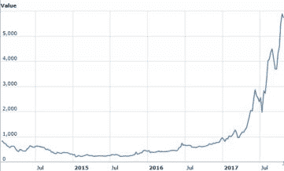
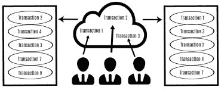
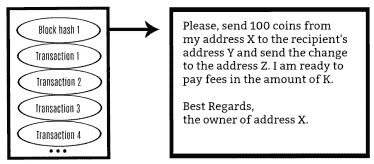
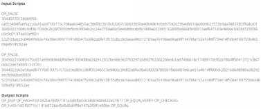
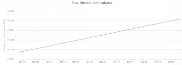
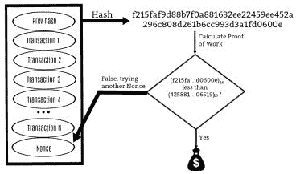
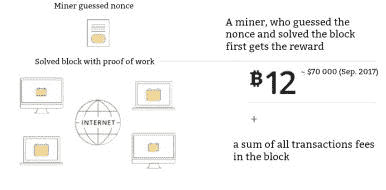

# 第三章. 比特币与挖矿

要弄懂比特币的本质，我们需要稍微深入一下挖矿这个主题。我稍后会告诉你挖矿作为投资策略的事，但现在让我们只从比特币的产生来考虑挖矿。

几年前，许多人把挖矿，生产加密货币或比特币，看作是一种爱好。许多人玩这个游戏，直到著名的披萨事件发生。这一天在加密货币界被称为披萨日。2010 年 5 月 22 日，一个开发者用 10,000 BTC 支付给一个比特币论坛用户两份披萨。当时，比特币几乎一文不值。这两份披萨用户大约花费了 25 美元。目前（2017 年 10 月），一个比特币的价格超过 5,000 美元。你可以很容易地计算出那两份披萨花费那个人数百万美元。

这是比特币第一次渗透到现实世界。

这幅图表显示比特币有过起伏。然而，自 2016 年以来，它的价值已经增长了几倍。

比特币首次在工业规模上挖矿是其价值开始飙升的时候。首先，计算力被用来挖比特币。后来，矿工开始使用图形卡来形成区块。现在，他们使用专门的设备叫做 ASIC。现在最大的这样的农场位于中国。

## 挖矿过程是如何工作的

挖矿是生产新的加密货币或比特币的过程。让我们梳理一下挖矿是如何工作的。例如，当你从你的钱包向另一个人的钱包发送资金时，你的交易会落入所谓的“内存池”。比特币内存池是所有等待网络确认的交易集合。矿工根据自己的原则收集交易到特定的区块中，然后尝试将它们插入区块链。区块链中的每个区块每十分钟生成一次。

这是我们看待比特币交易的方式。

这是计算机看待这种方式。

矿工为挖到一个区块而获得奖励。目前，奖励是 12 个比特币。也就是说，如果你向系统中引入一个格式良好的区块，你就会得到这样的奖励。顺便说一下，第一个（创世纪）区块是由中本聪创建的。任何一个人都能找到它并获得 50 个比特币。今天，一个格式良好的区块的奖励开始下降。据说到 2140 年将跌至微不足道的价值。

有一天，矿工们意识到单独挖矿是没有利润的。你找到这样一个块的可能性取决于“哈希率”或者你的比特币挖矿机器的功率有多强。在某些可接受的值下，比如说，你的哈希率占到总哈希率的 10%，你就能以 10%的概率找到这样的块并获得你的奖励。所以，如果你只是在家里用你的笔记本电脑挖矿，你永远也不会找到一个新的块。因此，为了获得更稳定的奖励，矿工们联合起来形成了所谓的挖矿池。他们用他们联合的哈希率来获得更稳定的利润。

现在许多矿工开始思考：我为什么还要挖矿，如果我可以购买比特币呢？这也是一个好主意，因为比特币的价值只由使用它的人的信念决定，而其成本则由需求决定。如果没有人从你那里购买你的比特币，它将一文不值。因此，只要人们认为这项技术是一个使用它匿名地、进行大额支付等的机会，比特币的价值就会加速增长。

我不会更详细地关注比特币本身，因为我已经在我的上一本书《Mastering Bitcoin for Starters》中专门介绍了这个话题。现在，我将考虑比特币的一些优势，这些优势仍然引起了一些疑问。

第一个优势是低交易费用。然而，我们应该记住，比特币对于微支付来说并不足够好。如果你向某人转账 100 万美元，这将花费你一分钱。然而，如果你决定为一杯咖啡付款，费用将与你的咖啡成本相比很大。

第二大优势是高速的交易处理。这里也有一些阻碍。实际上，区块链中的每一个区块每十分钟生成一次，也就是说，最快的交易也要十分钟。如果与银行使用的 SWIFT 转移相比，这看起来似乎相当快，因为 SWIFT 转移可能需要 2-4 天。然而，维萨和万事达卡要快得多。他们可以在单位时间内处理比比特币多数万次的交易。值得注意的是，现在存在一些其他类型的加密货币，它们是为了比比特币更快而开发的。

第三大优势是参与者的伪匿名性。我们已经研究过，任何人都可以追踪网络上的所有交易。如果你知道一个钱包的确切所有者，你就可以追踪它执行的所有交易。因此，不能说比特币是完全匿名的。一旦有人设法将你的地址与你的身份相匹配，匿名性就会消失。但是，如果你遵循所谓的“网络安全习惯”，意思是你不向任何人展示你的钱包，那么基本上你的交易是无法被追踪的。不过，我应该提一下，还有其他一些加密货币比比特币更匿名。

顺便说一下，如果你想在与比特币网络进行交易时保持匿名，这已经是可以实现的。有许多服务可以清洗你的比特币。这些被称为“混合服务”，用于将个人的资金与其他人的比特币混合，以混淆追踪资金原始来源的线索。正如你所见，新技术已经出现，以提高加密货币的匿名性。

最后，现在世界上有超过 1600 万比特币流通，而总共将会挖出 2100 万。这些数字是由网络算法本身编程的。比特币有限的数量使得这种货币的通货膨胀成为不可能。这种货币不会随着时间的推移而贬值，因为只会有固定数量发行。比特币甚至有一个通货紧缩模型：许多人因为忘记钱包密码或向错误地址发送资金而失去他们的硬币。因此，比特币的数量将逐渐减少。

## 工作量证明及其重要性

比特币网络面临的最大问题如下：如何确保交易真实可靠；如何确保矿工不欺骗他人；应该如何选择正确的区块并构建区块链。这些问题都是通过共识算法来解决的。

工作量证明协议确认矿工为找到正确的 nonce 并获取成功散列做了大量工作。你需要花很多时间来找到需要的那个。我会更详细地解释。

区块难度每 2016 个区块调整一次，取决于特定散列值前有多少个零。找到散列值本身并不难，但要找到一个特定数量前导零的成功散列却非常困难。如果你拥有前一个区块的散列值以及时间戳和交易数据，看起来很容易从这个基础上生成一个新的散列并处理这个区块。然而，你需要找到一个 nonce 值，使得区块的散列值包含一系列前导零。这需要花费大量时间。一旦矿工找到这个成功的散列，他们就会将区块发送到区块链。也就是说，他们已经确认了所有交易，完成了一些工作。所以，欺骗他人是没有意义的，因为这样的工作非常困难。

之后，所有信息都会在节点上分布。首先，矿工向一个节点发送信息。该节点可以运行检查，例如，那些从点 A 向点 B 发送资金的人是否真的有那些钱，即所有交易是否有效。然后节点开始相互交换这些信息，从而形成区块。

在理论上，两个矿工可能会创建同一个区块。区块链将如何选择哪个区块更好呢？第一个原则是速度。第二个原则是散列的“成功”。因此，散列的“成功”正是矿工在工作量证明协议中应做的努力。

选择一个“成功”散列的另一个原因是网络难度的调整。出现的矿工越多，网络难度就越大，这意味着交易可以更快地处理。如果矿工找到区块的速度放慢，难度就会降低。

让我再补充一些关于当几个矿工在网络上创建相同区块时如何解决情况的内容。区块链共识的本质是认为最长的区块链是公平的。如果区块开始以与你不同的方向构建，那么你的第一个区块将再次落入未确认交易池中。这通常发生在网络过载时。所以为了确保下一个区块确实建立在你所在的区块之下，并且你能获得奖励，要等待在你之后形成几个区块。如果形成超过五个区块，那么钱财肯定是你的。

在上一小节的末尾我们讨论了比特币的优点，现在该是讨论区块链的缺点的时候了，即 51%攻击或双重支付。我会解释。

任何挖矿池都可以将其努力联合到这样的程度，即在该池中生成下一个区块的概率可以是 51%。加密货币社区曾经目睹过中国挖矿池的成员在其系统中人为限制新成员的情况，并成功连续生成大约六个区块。正是在这个事件之后，人们才意识到你必须等待一个小时的交易确认，而不是十分钟。那就是如果你创建了五个区块，而每个区块都是十分钟形成的，我们乘以五得到 50 分钟。

关于挖矿我们就讲这么多，但如果挖矿真的引起你的兴趣（并且你想知道如何开始），请确保你[下载这本独家赠书，加密货币挖矿。](http://www.erdpublishing.com/cryptocurrency-mining-bonus/)
