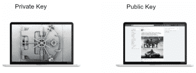
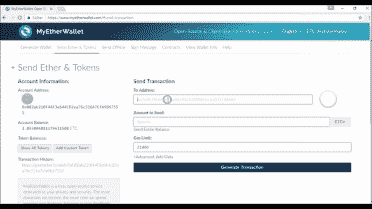
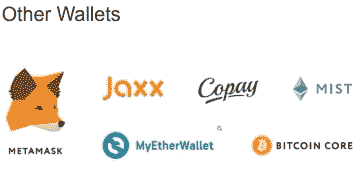

# 第五章\. 钱包或如何安全存储比特币

处理加密货币的人将钱包作为安全保管所和收支款项的工具。让我们分析现有的钱包类型，并根据你的电脑资源和任务选择最合适的一个。

有热钱包和冷钱包。还有温钱包，但使用得较少。冷钱包用于存储资金，而热钱包用于快速发送和接收货币。

通常，一个钱包有一个私钥和一个公钥。私钥只属于你，你绝不能向任何人展示它。你必须牢记这个私钥，因为它用此键签署所有交易。与此同时，别人可以用公钥将钱转到你账户上，例如，买一辆新的法拉利汽车\��。在这种情况下，你应该给这个人你的公钥。这个钥匙甚至可以公布在社交媒体上。这里没有什么可担心的。

我建议你在 [bitcoin.org](https://bitcoin.org/en/) 上查看钱包类型。

比特币核心将是考虑的第一个钱包。它是传奇比特币创造者中本聪的原始比特币钱包。它是唯一官方支持的钱包，由专业的比特币社区不断更新，并将整个比特币数据库存储在你的电脑上，自动支持网络。比特币核心安全性高且用户友好。然而，我不建议将这个钱包安装在你的电脑上。第一次同步需要非常长的时间，而完全同步的钱包大小达到 100 GB，这是一个显著的缺点。

我认为区块链钱包是用户的理想选择，尤其是对那些懒惰的用户。它不需要在电脑上安装第三方应用程序。它允许你在几秒钟内创建一个比特币钱包，并立即使用。这个钱包为你的比特币提供高度安全保障，声誉卓著，并提供 24/7 支持。界面简洁直观，即使是初学者也容易上手。理论上的唯一缺点在于，你的比特币钱包位于第三方资源上，而不是你的电脑上。

MyEtherWallet 是另一种好钱包。它是参与 ICO（首次代币发行）的最受欢迎的钱包。我们会在书后面讨论 ICO，但现在，只需知道它与 IPO 非常相似即可。

它的使用非常简单：我们选择一个想要转账的人的地址，注明金额，然后进行转账。这个钱包被称为“温钱包”，因为它含有一个你需要下载到电脑上的文件，然后才能为你的钱包输入登录信息。

我们只研究了几种比特币和以太坊的钱包类型，但对于其他加密货币来说，还有很多种。

我想提一下，你可以同时使用多个钱包：存储资金、进行交易、一次性使用。

例如，你可以在 MyEtherWallet 钱包中存储以太坊及其相关的所有 ICO 代币。我还在处理以太坊时推荐使用 Mist 钱包，尽管把它下载到电脑上需要花费很多时间。还有支持多种加密货币（如 Metamask 和 Jaxx）的多币种钱包。

## 冷存储与比特币借记卡

假设你想要学习如何正确存储加密货币，我将更详细地讨论冷存储的问题。

冷存储是一个术语，指的是私钥，通常是在一个安全、隔离的环境中创建和存储的。这意味着你的资金不会位于任何网站上。这个钱包看起来像一个 U 盘：你可以连接到电脑，快速进行交易。

最流行的冷存储钱包有 Trezor、KeepKey 和 Ledger。

这种方法非常适用于存储大量加密货币。交易很少进行，安全性是首要任务之一。因此，如果你决定长期持有你的资金，那么冷存储最适合你。

还有一种可靠的存储加密货币的选项——比特币借记卡。

这些卡的本质也很简单。你在网站上注册一个钱包，然后向里面转比特币。之后，服务会向你指定的地址发送与你的手机号码关联的比特币借记卡。使用这张卡支付购买非常方便。然而，我警告你，这种存储方法并不便宜。每次使用这张卡支付，都会产生大约 3%的手续费。因此，这种存储比特币的方法并不适合日常使用。然而，对于那些希望用这张卡在全球任何地方支付工资的人来说，这是完美的选择。

最后，要记住钱包可能会被黑客攻击，所以任何热存储选项都有一定的风险。采取与你的银行卡相同的策略：不要把所有的钱都存在一张银行卡上。你需要热钱包来向你的加密货币交易所账户添加资金和进行交易。它们也用于参与 ICO。然而，我建议你把大部分的钱存在冷钱包里。它不连接到互联网，所以不能被黑客攻击，这使得它更安全。

为了使你的钱包安全，为每个钱包创建一个单独的电子邮件账户，使用双因素认证保护它，最重要的是，把所有的密码都写在纸上。
