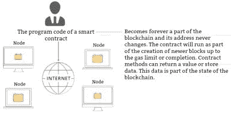

# 第六章。以太坊平台

## 创建与运作方式

有一天，一位具有俄罗斯血统的加拿大程序员 Vitalik Buterin 思考了比特币的不完美之处。他意识到使用比特币（以及加密货币）进行支付只是其全部潜力的冰山一角。

意识到区块链的优势，即不受更改影响，他想出了一个新的概念——智能合约。考虑到在这样一个网络中可以存储任何信息，Buterin 决定创建自己的区块链，名为以太坊。

以太坊的区块链与比特币的区块链相似，不同之处在于它不仅可以用于交易。

以太坊区块链的主要优势之一是，每个新块在网络中仅用 15 秒生成，而不是比特币中的 10 分钟。然而，在我看来，以太坊区块链的另一个重要优势是，其创造者是一个真实、活生生的人。Vitalik Buterin 对他的平台未来进行了投资，参加各种加密货币会议，分享想法，创建银行财团等。

## 智能合约

智能合约可以在以太坊中创建，解决了一个非常重要的问题：当你不信任另一方时，如何在互联网上进行交易。它如何运作呢？

智能合约是一种计算机化的交易协议，执行合同的条款。经常发生的情况是，合同的一方可能会按照自己喜欢的方式解释合同条款。与此同时，智能合约是旨在以无偏见的方式促进、验证或执行合同谈判或执行的计算机协议。

因此，智能合约通过以下方式允许在互联网上调节人们的关系：

+   提供计算机控制的监控和执行协议

+   降低执行成本

+   为建立更值得信赖的关系做出贡献

+   在没有第三方的情况下执行合同条款

+   具有数学公式和清晰的执行逻辑

+   需要一个允许完全自动化执行的环境。

那么让我们考虑一下您可以将智能合约应用于哪些方面。首先，您可以使用它们在证券交易所购买或出售股票，并参与众筹。如今，许多公司不得不为其股票在纽约证券交易所或纳斯达克交易支付超过 500 万美元。如果使用区块链，这些成本将大大降低，理论上甚至可以降至零。

还可以通过智能合约进行投票，以避免选票舞弊、重新投票和任何计票错误。此外，结果可以立即看到。

您可以使用智能合约进行的下一件事是运行一个拍卖。这样的拍卖将完全透明，任何人都能够参与。不会有回扣或腐败现象。

智能合约甚至可以提供版权保护，并防止产品被仿冒。

您还可以使用智能合约来维护各种注册表。例如，瑞典政府在 2016 年就尝试使用区块链来记录所有土地地块以及它们的购买和销售。

智能合约也可以对联盟营销、保险、赌博和彩票、透明税收等方面产生积极影响。几乎所有与政府机构的习惯性互动都可以利用以太坊区块链的智能合约的好处。

如您所见，智能合约提供了许多机会，因此这项技术在未来有可能得到更广泛的应用。

然而，智能合约确实有一些缺点，即扩展性问题。比特币的区块链是有限的。然而，以太坊没有限制。

最后，许多人对 PoS Ethereum 感到担忧。对于那些步调不一致的人，我可以快速解释说，PoS Ethereum 在比特币中的工作量证明相似。

Ethereum 网络发展的一个重要里程碑是从工作量证明（PoW）向权益证明（PoS）的转变，从经济角度来看，继续留在 PoW 是不明智的，因为它会导致随着时间的推移通货膨胀率升高。

以太坊的创造者维塔利克·布特林（Vitalik Buterin）最近宣布了他打算对以太坊的部分工作量证明进行调查。以太坊的挖矿奖励将减半，但将出现新的验证交易的机会。验证交易的节点将拥有大量的以太币（加密货币）。也就是说，一个人必须有某种数量的以太币才能处理交易。这样的人绝对诚实地验证交易，因为他/她也是以太币的持有者。

正如您可能已经理解的，PoS 是一种中央银行，持有大量货币。因此，以太坊将部分地从以太坊的去中心化转向寡头垄断。将有大量“持有者”积累了大量的以太币，从而获得了处理交易的可能性。这将是他们获利的方式。

预计全面过渡到 PoS 将在 2018 年初进行。由于网络的力量将立即下降，区块奖励也将下降，我预测加密货币社区的一些成员将转向另一种货币，甚至离开市场。我预测只有最强大的以太坊矿工将留在以太坊的区块链上。
