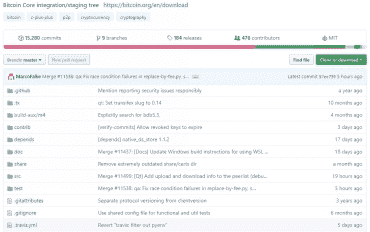
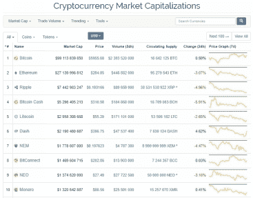
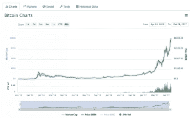
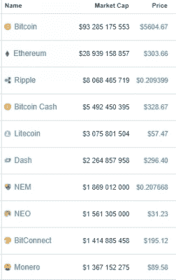
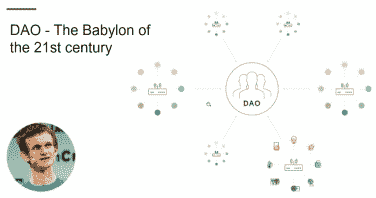
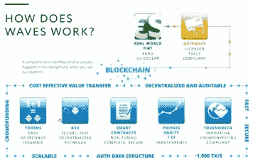

# 第七章。十大最佳加密货币及其价格跟踪位置

考虑影响加密货币价格的重要因素。

显然，第一个因素是使用特定货币的真实好处。第二个因素是对这种货币生态系统的增长的信念。第三个因素是对整个加密货币生态系统的增长的信念，即相信大多数企业将希望使用加密货币系统。定价的最后因素是短缺和未来利润的额外费用以及风险折扣。

另外，各种投机和对比特币的需求经常使其价格与其内在价值不成比例地上涨。在这里最重要的是找出肥皂泡和真正有效的东西之间的百分比比例。没有计算这个比例的确切算法。因此，每个人都依靠自己的观点来解决这个问题。

我来举一个例子。如果您想找出麦当劳的总价值，您只需将这个查询输入到谷歌搜索引擎中，任何资源都会给您相同的信息。然而，这不会在加密货币上奏效。加密货币交易所是本地的，加密货币交易类似于外汇市场。换句话说，这是一个场外市场。没有一个中心市场，您可以跟踪某种货币的价值。通常，加密货币社区的成员会在不同的网站上查看价格，这些价格在地区上有所不同，价格差距可能达到百分之十到百分之二十。

加密货币也是开源的，所以每个人都可以在[GIT HUB](https://github.com/)网站上确保它们是如何工作的，这是最流行的资源，将所有开源开发者团结在一起。

选择加密货币时，我建议使用[cryptocompare.com](https://www.cryptocompare.com/)。这是一个显示不同加密货币交易所加密货币价格的聚合器。在这里，您可以阅读有关每种货币的信息，并查看其相对于另一种货币（包括美元）的当前汇率。

另一个有用的网站是[coinmarketcap.com](https://coinmarketcap.com/)。它方便地查看最新十大最佳加密货币的数据。但请记住，这个前十名是不断变化的。

货币的名称显示在第一列（名称）。第二列（市值）显示货币的资本化。它是如何计算的？非常简单。目前市场上流通的货币量（流通供应）乘以价格（价格）。

例如，如果您点击比特币，您可以查看这种货币的图表（图表）。

## 最佳加密货币

如果你想投资加密货币，我建议你选择前 10 名或至少前 20 名最好的加密货币。其他的并不可靠，可能会表现出波动。这些排名较低的货币波动性更大，风险显著。

波动性对专业交易员有利，因为他们能够管理风险，而价格波动提供了更大的赚钱机会。与此同时，波动性对新手或投资者来说是不利的。这就是为什么大多数基金倾向于只购买前 10 种最好的加密货币。是的，有时新出现的加密货币，它们刚刚进入市场并且已经设法吸引了大量的资金，会进入这个列表。但它们不会长时间留在最好的行列中。一个这样的加密货币是 IOTA。自该货币上市以来，其市值已经几乎减半。

我还想特别对比特币粉丝说几句话。现在市场上有很多不同的加密货币，所以只关注一个选项是非常愚蠢的。事实上，比特币是最可靠的加密货币，并且正在快速增长。然而，现在除了比特币之外，还有很多其他有趣的加密货币。每一种都有其自身的优势。

如果你不确定应该购买哪种加密货币，你可以对其代码进行审计。

毕竟，如我之前所写，所有的加密货币都是开源的：它们使用开源代码，并且彼此相似。实际上，任何个人都可以获取比特币的代码，例如，更改一些参数，从而创造一种新的加密货币。坦白说，这就是分叉出现的方式。

分叉是指一个软件项目的基础代码被用作另一个项目的起点。这样的每个项目都可以独立于主项目发展，并能够实现主项目所缺乏的机会。这种加密货币的创建过程被称为分叉。

比特币在加密货币世界自然地充当基础，所以所有其他的币都被称为比特币分叉。

几乎所有新的加密货币都是已知加密货币的复制品。因此，实际上不可能拥有一个多元化的投资组合，即通过持有多种货币来分散风险。

现在我们终于要回顾一些当今最好的加密货币了。

Litecoin 是我想要关注的第一种货币。在我看来，它是继比特币之后最安全的货币之一。它于 2011 年创建，是比特币的分叉，即这个货币的代码基于比特币的源代码。Litecoin 的区块每 2.5 分钟生成一次。目前大约有 8400 万 Litecoins 在流通，这比比特币的数量的四倍还要多。此外，Litecoin 已经实施了 SegWit，而比特币网络直到 2017 年 8 月 1 日才激活了 SegWit。

Lighting Network 最近在 Litecoin 上也被激活了。Lighting Network 是一个具有极低费用的离线微支付系统。如果您认为这并不重要，那么请相信我，这真的是一个划时代的性质。

总之，Litecoin 是一种现代、快节奏的货币。我建议您的投资组合中同时拥有比特币和 Litecoin。比特币作为一种非常可靠的货币，而 Litecoin 则用于进行实验，这些实验可以后来应用到比特币上。

Zcash 是一种非常有趣的货币，值得我们关注。它是目前最匿名的货币。它使用了零知识证明，这是加密货币中更大金融和数据隐私的构建模块。只有专业的开发者才理解它是如何工作的。尽管如此，这种货币的协议现在被许多区块链所使用。

这种货币出现时，其价值立即超过了 4000 美元。也就是说，矿工一天的回本率达到了 100%。然而，过了一段时间后，这种货币的价格急剧下跌。

在此我想引起您对一个非常重要问题的关注。人们往往倾向于购买加密货币，陷入炒作之中。换句话说，他们仅仅因为别人这么做而购买某种货币，没有意识到这可能是出于投机目的，而不是因为该货币具有实际价值。因此，您可能会长时间处于亏损状态。这就是我为什么建议您不要被新型加密货币的炒作所迷惑，而是将您的货币存在钱包里，这样您才能获得更多收益。

现在让我们来了解一下以太坊经典货币。让我们弄清楚它实际上是如何出现的。

2016 年 6 月，加密货币行业历史上或许最为巨大的一次攻击发生了。一个很有前景且广受欢迎的项目 The DAO 因代码中的一个错误损失了超过 6000 万美元。但让我们先退一步看看。

The DAO 是有史以来最大的众筹项目。它是第一个基于以太坊的去中心化自治组织，也是一种投资者导向的风险投资基金。购买这个组织中的代币时，您进入了一家特定的公司，通过投票您可以远程控制这家公司。简单来说；这是一个整个公司，人们可以达成协议，选择投资工具，然后从公司获得股息。

然而，有一天，某个人找到了 The DAO 算法的一个漏洞，并窃取了价值约 6000 万美元的代币。后来，这个人表示他并没有做任何违法的事情，因为他没有破解代码。他甚至警告称，他准备在法庭上为自己的立场辩护。

这个人的行为引发了一场真正的恐慌，因为许多用户失去了他们的钱。此外，The DAO 的情况对以太坊本身产生了很大影响。以太坊的价格立即下跌了 50%。这就是为什么以太坊的创始人 Vitalik Buterin 被迫做出一个集中决策来挽救局面。他决定创建一个分叉。

分叉有两种类型：软分叉和硬分叉。软分叉是软件协议的变化，其中只有之前有效的区块/交易变得无效。由于旧节点将新块视为有效，因此软分叉是向后兼容的。硬分叉是对协议的彻底改变，使之前无效的区块/交易有效（反之亦然）。硬分叉是与之前版本的区块链永久分叉，最新版本将不再接受运行旧版本的节点。

维塔利克·布特林建议创建一个软分叉，即回滚网络上的所有交易直到盗窃时刻。最初，所有 The DAO 成员都同意他的提议，但随后出现了一些人说他们没有准备好进行如此中心化的改变。正是因为这些人，才发生了硬分叉。以太坊分成了两种货币。第一种和基础货币是以太坊经典。

顺便说一下，有一些预测认为，在以太坊从工作量证明切换到权益证明，正如我们上面提到的（即当部分货币被挖出，节点保证其余货币）之后，许多矿工将以太坊的收益会减少。他们可能会转向以太坊经典。我认为这种情况可以引起这种货币的增长。

现在让我们考虑 Dash 货币。这种货币是日内交易的工具。就图表而言，这种货币非常技术化。它部分采用工作量证明和权益证明系统。

同时，这也是一种非常适合日常消费的货币。此外，Dash 提供了一个 masternode 工具，预计将在以太坊平台上推出。

如果这种货币能成为第一种提供轻松转账和支付购物机会的货币，它将拥有美好的未来。例如，现在正在开发一个名为 Dash Evolution 的项目。它是一种习惯性的在线银行，已经被认为是 PayPal 的最佳替代品。预计该项目将在 2017 年底完成。我预测，该项目将受到那些不支持加密货币无政府主义或僵化去中心化，只是想利用加密货币进行交易和持有资金的用户好评。

这种货币的另一个巨大优势是匿名性。每次这种货币转移时，货币都会被混合，使得跟踪您钱包中的交易变得相当困难。比特币有一个专门的货币混合服务，但使用 Dash 时会自动发生混合。

接下来讨论的货币是 Waves，由俄罗斯程序员亚历山大·伊万诺夫创建。Waves 平台允许您在几点击创建自己的代币并立即出售它们。它们在去中心化的 Waves 交易所交易，任何从您那里购买代币的人都可以立即尝试在这个交易所出售它们。在 Waves 上创建您自己的代币只需 5-10 分钟。

如果我们把 Waves 代币与 Ethereum 代币进行比较，前者更简单，因为它们不需要复杂的编程。

另一种有趣的货币是 Dogecoin。它是一种梗币，最初是开玩笑发明的。没人预料到它会被流通。无论如何，这种货币没有价值，实际上几乎从不用。

现在 Dogecoin 的价格被故意搞得上下波动，人们很乐意参与这种娱乐。最后一个以最高价买入硬币的人会损失钱财。

关于 Namecoin 说几句。它是一种比特币分叉，允许你购买一个 .bit 网站，即去中心化托管。

我还想提一下一些相当不可靠的货币。Ripple 就是这种加密货币的一个例子（尽管很多人已经从中赚了很多钱）。

Ripple 是一种中心化的货币。它是由一家银行联盟控制的，其中最大的银行位于日本。在日本将比特币合法化之后，这种货币开始增长。

这种货币的一个重大缺点是，当你例如向某人转账美元或欧元时，你会失去一定数量的 Ripple。那么问题来了：这会对汇率产生什么影响，取决于交易量的大小？

与此同时，这种货币的官方网站不提供钱包服务。如果你想创建一个钱包，你将不得不在 [gatehub.net](https://gatehub.net/) 上寻找。

现在让我们总结一下。在撰写这本书的时候，总共存在 804 种加密货币。但我建议你不要去研究它们全部，只需要研究前十种。只有在你开始盈利之后，你才能投资超出这前十种的货币。

让我给你一些实用的建议。所以在选择一种货币进行投资之前，我建议你思考一下你的投资组合（我指的是被动投资组合）的构成。如果你想让你的投资组合中包含三种最优秀的加密货币，那么你就要考虑一下什么因素可能会短期内影响这些货币的价格。你还需要仔细分析一下这种货币的交易市场，并关注日线图以估算你持有的货币在过去 24 小时内的交易量。

最后，我想再次提醒你，加密货币市场提供不了任何保证。如果你已经了解了关于相对可靠货币的信息，这并不意味着这些信息是真实的。这只是我个人的主观意见。因此，你是否购买某种特定的货币由你自己决定。
