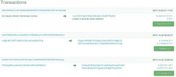
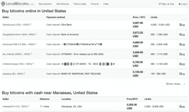

# 第九章：数字货币交易所

如果你进行数字货币交易，且对你来说费用最低很重要，你将不得不求助于数字货币交易所（DCEs）的服务。

还有可能进行面对面的现场交易，但这种选项并不安全。有很多案例是某人与他人交换比特币，然后却被痛打抢劫。这种风险可以通过只使用最流行的数字货币交易所（DCEs，即那些声誉最好的）来最小化。你可以在互联网上找到更多关于最可靠的 DCEs 的信息。

如果你仍然倾向于一头扎进去尝试在实体或数字货币交易所碰运气，你应该知道即使是被盗的钱也可以被追踪。为你兑换货币的人通常会把他的钱包安装在手机上。当他或她将一定数量的比特币转到你的钱包时，你可以立即前往[Blockchain.info](https://blockchain.info/en)网站查看交易是否真的已完成。

你已经知道，Blockchain 网络中的所有交易都是公开的，这样你可以追踪它们。为此，在手机上输入你的交易号码并等待处理。一旦处理完成，你可以 99%确定钱在你的钱包里。

## 你可以在哪里找到安全可靠的数字货币交易所？

首先，我建议你熟悉一下[LocalBitcoins](https://localbitcoins.com/)网站。在这里，你会发现愿意与你见面并以现金或银行转账方式进行兑换的人。

一个可靠的 DCE 应该有一个网站、一个评分和评论部分、支持聊天以及可转换货币的金额。例如，你可以看到这个 DCE 提供特定数量的比特币、以太坊和现金美元。

数字货币交易所的另一个好处是可能为某种货币保留一定期限的价格。

至于兑换费用，它们从 3%到 30%不等。在平静的市场中，平均费用是 7%。当市场暴跌或飙升时，DCEs 也会提高费用。
