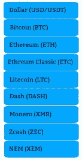
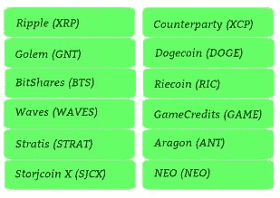
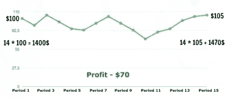
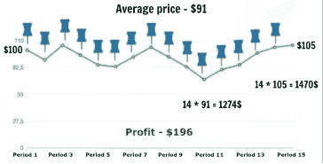
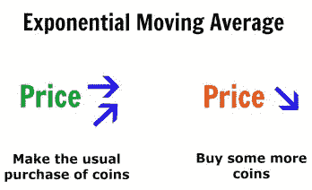
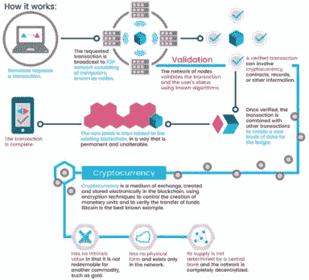
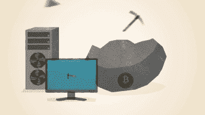
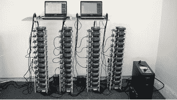
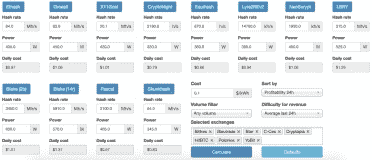

# 第十章 如何赚取加密货币

在你准备好冲进加密货币世界之前，还有一件事你需要知道：如何赚取加密货币。

在加密货币市场获得收入有几种方式。首先，你应该仔细熟悉它们，并根据你的生活方式、经济状况、偏好等选择适合你的方式。你甚至可以选择几种硬币，巧妙地组合它们。在这种情况下，你将有机会更好地分散风险并赚取更多。

如今，在加密货币市场获得利润有以下几种方式：

+   长期投资

+   交易

+   挖矿

+   参与 ICO

+   转售加密货币。

这里简要概述了这些方法。然后我会更深入地查看每个策略。

### 长期投资

如果你选择这种赚钱的方式，那么你应该具备：

+   1 至 2 年的时间段（投资一笔你可以说冻结几年容易的资金）

+   一笔可观的资金（如果你只能分批投资，这也可以被视为长期投资）

+   承担风险的意愿（这比银行行业的风险高）。

你通过长期的重大资本收益来赚钱。

### 交易

如果你喜欢这种赚钱的方式，你应该具备：

+   时间（不是像长期投资那样等待的时间，而是你可以每天投入到交易中的自由时间）

+   一小笔钱

+   坚韧不拔和勤奋

+   机械智能（因为你必须与数字和图表打交道）

+   有能力保持关注并监控发展动态。

你通过打败市场和承担风险来赚钱（潜在收益越高，风险越高），以实现快速赚钱和获得定期收入。

### 挖矿

挖矿是生产新加密货币或比特币的过程。如果你对用加密货币这种方式赚钱感兴趣，你应该决定你是想成为一个业余爱好者还是深入到专业挖矿。

对于业余挖矿，你需要：

+   机械智能（或者一个拥有机械智能的朋友/顾问）

+   启动资金（通常不超过六个矿场）

+   准备应对技术问题和中断。

+   保护设备不受外部因素（宠物、孩子等）的影响。

你通过矿场的小额但稳定的利润来赚钱。你还可以享受不仅在市场上交易，而且管理市场的机会。

如果你决定进行专业挖矿，那么你需要以下必需品：

+   机械智能（或者一个拥有机械智能的朋友/顾问）

+   启动资金或投资

+   场地（配备电力、通风、冷却装置、安全设施）

+   团队

+   承担责任的意愿（对设备、场地、团队负责）。

通过经营自己的矿场，你可以获得稳定和持续的利润；你还将管理市场，而不仅仅是交易。此外，这给了你拥有真实物品并将来出售业务的机会。

如果您想了解更多关于如何开始挖矿的信息，请确保您下载[奖励书籍，《加密货币挖矿》](http://www.erdpublishing.com/cryptocurrency-mining-bonus/)。

### ICOs（首次代币发行）

截至目前，许多人参与所谓的 ICO（首次代币发行）。简而言之，这是一种类似于 IPO 的众筹模式的另一种解释。参与者为未来的利益资助项目，但没有任何保证。ICO 是某个项目发行代金券或代币，用于将来用加密货币支付网站服务。

ICO 与风险基金有许多共同之处，即专注于与创新企业和技术项目（初创公司）合作的投资基金。风险基金投资于风险高或相对较高的企业的证券或股份，并期望获得极高的利润。通常，70%-80%的项目不会带来回报。然而，剩下的 20%-30%的利润弥补了所有的损失。

如果你认为自己足够勇敢，可以无保证地资助一个项目，首先问自己：

+   我是否准备好承担额外的风险？

+   我是否有足够的资本缓冲来进行多样化？

您通过 ICO 获得收益，因为您冒着巨大风险，有机会获得超额利润。

### 转售加密货币

转售加密货币与交易有很多相似之处。在这里，您也通过货币波动赚钱，但与交易不同，这里涉及的是批发价与零售价之间的游戏，而不是市场或交易所价格。

如果你对这种盈利方式感兴趣，那么你：

+   不承担风险

+   只在小额资金上操作

+   明白收入取决于您的营业额。

到目前为止，我们对加密货币市场的基本盈利方式只有肤浅的了解。现在让我们深入探讨每种方法。

## 长期投资：更深入的观察

你可能还记得沃伦·巴菲特的第一个原则：永不亏损。这对于长期投资尤其正确，因为这里最重要的保持资金，而不是亏损。

让我们概述长期投资的主要原则：

+   不要亏损；降低风险

+   不要大惊小怪

+   将来获得收益

这就是您的加密货币投资组合应该为长期投资的样子。

蓝色用于表示更为温和稳定的立场，可能不那么有利可图。绿色表示更具风险但更有前景的立场。蓝色货币是目前更稳定的货币。

我们为什么用蓝色标记这种货币？我们之所以这样做，是因为这种货币增值的可能性很大。比特币在这里占据领先地位，因为它仍然被认为是是最可靠的货币。此外，它的价格只会增长。我为什么这么有信心？这是我的回答：

+   整个加密货币的交易现在都是通过比特币进行的

+   这种货币到处都被接受

+   项目及其整个系统的快速发展。

美元也用蓝色标记，因为你应该总是让你的投资组合中有“快速”的钱，这样你可以快速操作并兑换成加密货币。

现在让我们看看投资组合中的绿色货币。

如果之前的货币可以被视为几乎不变的稳定，那么绿色货币的情况则是不断变化的。在撰写本书时，绿色列表上的货币看起来风险很高。然而，请记住，当你阅读这本书的那天，一切都有可能改变。

从我的观察来看，投资组合的形成取决于一个人的年龄。奇怪吗？一点也不！你越年轻，你的投资组合可以承担的风险就越大。我们年轻时不怕薄冰，但随着年龄的增长，我们能承担的风险就越小。

除了年龄，还有什么会影响你的投资组合？你的资本规模。如果你有很多资本可以投资，那么冒险一小笔钱是很容易的。但是你拥有的钱越多，你的策略就应该越稳定。

影响你投资组合形成的最后一个因素是你的财务垫的大小。如果它很小，那么最好减少风险。

同时，虽然这可能听起来很陈词滥调，但我还想再回忆一条基本的投资格言：低价买入，高价卖出！当币价暴跌时，通常是最好的买入时机。但就在这一刻，我们开始感到贪婪，认为币价可能会跌得更低。

这个问题可以通过应用“移动平均”策略来解决。这个策略可以是简单的，也可以是指数的。

让我们看看这个简单移动平均的例子。

例如，你对一个价值 100 美元的币非常感兴趣。在一个阳光明媚的早晨，当你喝着咖啡时，你决定购买 14 个这样的币。所以你花费了 1400 美元。几周后，这个币的价格达到了 105 美元。你以 105 美元的价格卖出这些币，得到 1470 美元。你赚了 70 美元的利润。

但是，如果你决定一次性购买这些 14 个币，而不是每周买一个呢？

图表似乎没有变化。然而，在一种情况下，平均币价是 100 美元，在另一种情况下，价格是 91 美元。相应地，在后一种情况下，你用 1274 美元购买 14 个币，并以与前图表相同的价格卖出每个币。你的利润是 196 美元。这是怎么发生的？我们只是选择了处理这种情况的不同方法。

在应用简单移动平均策略时，你不需要不断寻找进入市场的完美时刻，或者担心汇率会进一步下跌。你每个月买一定数量的货币。无论市场是跌还是涨，你都在买。实际上，这个策略虽然很老套，但对于长期投资来说是非常有效的。

总的来说，简单移动平均策略允许：

+   降低购买的平均价格；

+   用同样的钱买更多的股份；

+   在下跌中减少损失，并在上涨时更快地脱离亏损。

现在我建议考虑指数移动平均策略。

指数移动平均策略让你的利润增加。这里一切就是这样运作的：当价格保持稳定或上涨时，按常规购买；当汇率下跌时，你再买一些。

值得注意的是，你也可以用这种方法进行短期投资。在这里，你预期一个币种的价格在不久的将来会上涨，然后出售它们。当使用这个策略时，我建议关注山寨币，特别是那些处于形成阶段的币种。

在短期策略中及时获利非常重要。为此，我推荐使用 50/50 策略。假设你花 1.50 美元买了一个币种。后来，它的价格达到了 3 美元，你卖出了 50%的币种，实现了盈亏平衡。一切都很简单。

让我给你提几点建议。

如果你喜欢稳定性而不是风险，那么优先考虑最初成本较高的币种。而如果你梦想着潜在的爆炸性利润，那么关注便宜的币种。最大的利润是在分上赚的。毕竟，没有人会争论 1 美元增长十倍会比 100 美元快。

最后，要记住加密货币市场是不断变化的。因此，你需要每小时监控你的投资，以保持最新，做出明智的决策。

## 交易：更深入的观察

读了“交易”这个词，你可能会认为并不是每个人都能掌握这门职业。你在某种程度上是对的。然而，如果你对贸易略知一二，对经济领域的新闻和事件感兴趣，并关注汇率变动，你就会成功。你甚至可以学会做出一些金融预测。

实际上，加密货币交易所的交易与股票交易所的交易并没有太大区别。关键是要知道如何分析图表，做出深思熟虑的决策，不要屈服于恐惧、谣言或情绪，最重要的是，要准备好失去一切。

股票市场的交易就是货币对的交换。每一方交易方都提出自己的条件，另一方相应地决定是否接受这些条件。

在加密货币交易所，你只与买入或卖出的订单打交道。通过提交订单，你可以设定比当前价格高或低的价格。你指明想要购买多少枚硬币并报价。如果市场达到了你的报价，那么订单就会被成交。

让我解释一下你可以在加密货币交易所提交订单的情况。假设你从新闻中得知比特币价格将先跌后涨。这是你投资的时候了。不过，我想提一下，并没有一个确切的公式可以解释你应该投资哪些货币以及何时投资。最重要的是，不要在货币长时间下跌的阶段投资。相反，在货币回调后刚开始上涨的阶段以及当然是在稳定增长的货币中投资是好的。

正如我前面提到的，通过查看[coinmarketcap.com](https://coinmarketcap.com/)来挑选用于交易的货币。同时，关注新货币的发布消息以及主要货币的价格图表。另一个重要的问题是，你需要知道在何时买入或卖出才能获利。如果你犯了一个错误，你就有很大的机会从一个短期投资者转变为一个战略性的长期投资者。

不要忘记交易所的费用。我还想再次提醒你：只投资你准备损失的钱。你绝不能借钱在市场上交易。在这个市场上，你注定会遭受不可避免的损失。

在交易中，一个至关重要的问题是安全性。在处理金钱的任何领域，安全性都是关键。在加密货币市场更是如此，你的投资组合金额可能会达到数万美元，如果没有提前考虑安全性，那就是不负责任的。你必须研究所有可能保护你财务的方式。

那么，最方便的窃取你加密货币的方式是什么呢？答案是：从证券交易所窃取。让我分享一个例子。2017 年夏天，韩国最大的加密货币交易所 Bithumb 因黑客攻击报告了数十亿美元的损失。这就是我认为在交易所保持资金是危险的的原因。

热钱包的优势在于其易访问性和快速操作。因为它们与互联网相连，所以你可以轻松地访问它们。然而，热钱包因为与互联网的连接而存在巨大的安全风险。

我在这里不再详细讨论交易的话题，因为我在书中单独有一章来讨论交易，作为加密货币市场获利最普遍的方式之一。

## 挖矿：更深入的视角

“挖矿”这个词正是基于黄金开采的类比而产生的。挖矿是指生产新的加密货币或比特币的过程。挖矿设备的拥有者或操作者被称为矿工。通常，矿工这个词用来指代用来在网络中找到比特币（或其他加密货币）的计算设备。

挖矿是通过解出一个块的数字签名来进行的。在比特币网络中，一个块是一组数据，包含有关在创建前一个块后网络中的交易信息。解出数字签名的网络参与者将获得加密货币奖励。同时，为了获得“金条”形式的珍贵生成交易，矿工需要筛选大量的“废石”，即不适合块的散列值。

因此，每个新块都包含一个数字签名，该签名基于前一个块而形成。这些块相互粘合，形成一个块链，称为区块链。

大多数人认为挖矿是来源于电源插座的钱。但实际上，这是一项艰苦的工作，通过系统本身获得金钱奖励。尽管客户端代码和加密货币协议代码是完全开放的，但创建新货币是一个复杂且昂贵的过程。例如，你不能生成比技术创造者计划更多的比特币。要获得新货币，你需要对设备、场地、冷却系统、电力等进行大量投资。这就是为什么比特币被称为“数字黄金”，并以金币的形式表示。

现在让我们回答以下问题：加密货币为什么需要矿工？有一个误解是矿工最初创造了加密货币。实际上，矿工运行网络的基本功能：

 确认交易

 保护网络免受虚假信息进入（假交易和区块）

 保护网络免受各种类型的攻击

 维护网络的去中心化。

这就是为什么网络中的挖矿设备越多，比特币网络就越能抵御任何攻击的原因。同时，部分计算能力的关闭不会停止网络中的交易。只要至少有一个矿工在工作，网络就会继续运行。

挖矿有几种类型。家庭农场是其中一种。它可能看起来像这样。

截至目前，挖矿使用的是专门的 ASIC 或 GPU（图形处理单元）芯片。ASIC 专为挖矿而设计。它是一个“没有灵魂的机器人”，专门用于提取加密货币。至于 GPU 挖矿，一个普通的矿场通常由几张同型号的显卡、一个强有力的电源、带有几个 PCI-Express 插槽的主板以及带有冷却系统的处理器组成。加密货币基于某些算法运行。你应该根据这些算法选择显卡。

你应该为挖矿选择什么：ASIC 还是 GPU？

ASIC 矿机易于维护，安装方便。然而，它仅设计用于特定的加密货币，你将无法在它们之间切换。如果你选择 ASIC 矿机，你必须成功挖矿以支付电费，因为你需要大量的电子设备。

至于 GPU，与 ASIC 不同，如果你决定在某个时候放弃挖矿，你将能够轻松地并以利润出售你的显卡。

就我个人而言，挖矿需要同时拥有 ASIC 和 GPU。如果其中一个设备出现故障，你可以使用第二个设备。

对于不想组装“赚钱机器”的人来说，还有另一种选择。你可以通过共享计算能力远程挖矿。这种挖矿方式称为云挖矿。然而，你应该警惕云挖矿的危险。首先，回报期相当具有欺骗性。其次，你无法控制开支和利润。此外，所有设备都不在你的个人财产中。

如果你仍然决定将挖矿委托给其他人，那么请注意以下几点：你不应该被给出一个巨大的利润预测，并且你应该有可能与技术支持联系。我还建议你阅读评论并关注有关这些公司的挖矿论坛以及在投资更多资金之前用少量资金进行测试。

在挖矿（和交易）中，你应该遵守某些安全规则。所谓“挖矿俱乐部”的第一个规则就是不要告诉任何人你的矿场位于哪里。这是一个微不足道的建议吗？你可能这么认为。但请记住，你必须是唯一一个可以进入带有你的挖矿设备的地方的人。

其他安全原则如下：

+   在场地上安装监控指标（温度等）的系统以及视频监控和消防系统

+   检查电力、电源和接地

+   在场地上监控设备发热和湿度

+   不要在耗材上节省成本，因为这可能导致不幸的结果。

总的来说，挖矿并不适合每个人，因为你需要能够与设备供应商谈判、自己收集和配置设备，并进一步维护和确保其安全。

事实上，挖矿这个主题相当深入，我可以更多地谈论它。例如，我可以告诉你关于电源、主板和散热系统的特点；如何选择你的操作系统；哪种卡值得购买；如何与供应商合作，甚至分享盈亏的秘密。你可以在一本免费的赠品书中找到所有这些问题的答案，书名是《加密货币挖矿》（[Cryptocurrency Mining](http://www.erdpublishing.com/cryptocurrency-mining-bonus/)）。

## 代币众筹

首次币发行（ICO）是指代币在区块链上的首次发行。它是一种特定的众筹模式。ICO 的参与者通过未来的收益来资助项目的发展。ICO 常常与 IPO 相比较。但与 IPO 不同，ICO 的参与者通常不会获得公司的股份，也不能影响公司的内部管理决策。

人们认为首次 ICO 是由 Mastercoin 在 2013 年 6 月举办的。Bitcointalk 论坛宣布了项目的众筹启动。结果，ICO Mastercoin 筹集了超过 5000 个比特币。

然而，2014 年举办的 ICO 以太坊或许是最有影响力的 ICO 之一。当时代币的售价为 0.30 美元。两年后，它们在交易所的价值上涨到 12-13 美元，到 2017 年 6 月，它们的成本已经达到 390 美元。

现在有很多 ICO。几乎每天都有新的项目出现，它们保证自己的前景并寻找投资者。创建的项目越多，成功的项目就越少。许多 ICO 最初就是为了欺骗人们而设立的。随着人们越来越有兴趣通过 ICO 轻松赚钱，这类项目的数量只会增长。

如今，这些初创项目的开发者甚至找到了一种获取没有资金投资 ICO 的人的支持的方法。赏金计划正是为这些人而创造的。这是在不投资自己资金的情况下获得项目代币份额的机会。为此，你只需要推广项目。

为了获得赏金，你可以：

+   推广项目（通过社交网络、邮件数据库、Bitcointalk 论坛上的活动），让潜在的投资者了解这个项目

+   将 ICO 的信息翻译成其他语言

+   寻找项目中的错误

+   设计 Logo、小册子和其他信息（有时在竞争的基础上）

+   设计移动应用程序、钱包或其他软件插件。

如果你有以上列表中至少一项的技能，你就有很大机会获得赏金！

正如你可能已经意识到的，ICO 中有很多骗局。我们来谈谈骗局 ICO。上网搜一下"scam + history"，你会发现有很多不同的服务以某种方式决定利用他人的信任，或粗心。这些领域非常多样：从能源到银行部门。尽管 ICO 是从 2013 年才开始存在的，但这个领域也经历了许多骗局。

如何判断一个 ICO 是否是骗局？要注意以下几点：

+   **ICO 项目**只创造数字货币，它被定位为国际支付的通用手段，但没有指出其具体的优势。

+   **ICO 项目**被描述为**极其大规模**的，尽管它没有呈现具体的利润分配模型。

+   **ICO 项目**开发者正倾尽全力推动项目，但几乎不谈论代码，这可能甚至是闭源的（非开源）。

骗子通常会开发一个没有展示任何工作成果的平台。有时主要开发者在外界声名狼藉，或者已经参与了欺诈行为。

值得一提的是，有几个成功的 ICO 案例。一个 ICO 的成功取决于许多条件性的因素。成功的传统指标是筹集的资金量。在这一点上，领导者（在撰写本书时）是 Bancor 项目，该项目在 2017 年 6 月不到三小时内筹集了 396,720 个以太坊。另一个快速众筹的例子是创新的 Brave 浏览器活动，该活动在项目启动的前几分钟就筹集了 3600 万美元。此外，在 2017 年 5 月，Storj 项目（不到一周内筹集了 3000 万美元）和 Aragon 项目（从 ICO 开始仅 15 分钟就筹集了所需的 275,000 个以太坊，约 2500 万美元）也加入了成功的加密货币众销行列。

以下是一些项目：MobileGo（筹资 5300 万美元），Gnosis（10 分钟内筹资 1.25 亿美元），Blockchain Capital（2 小时内筹资 1 亿美元），Aeternity（最初几小时筹资 2000 万美元），最后是 Status 项目（大约筹资 1 亿美元），该项目曾使以太坊网络瘫痪。我们不能忘记 2016 年夏季诞生的传奇项目 The DAO，该项目崩溃并孕育了以太坊经典。

一个 ICO 的成功不仅取决于想法，也取决于智能的公关活动。

你可能会问：投资者的资金在这样的项目中是如何得到保护的？我的回答很简单：资金得不到保护。总的来说，唯一的保障就是项目声誉，也就是那些您不认识的人的声誉。

考虑到所有这些因素，为什么人们仍然对这些项目进行投资呢？以下是人们冒险参与 ICO 的一些原因：

+   想要在趋势中赚钱的愿望。

+   想要扮演投资者角色的愿望。

+   想要跟上其他投资者的愿望。

+   对初创企业的信念。

因此，谨慎选择投资哪个 ICO 非常重要，因为目前没有法律规定 ICO 的行为，也无法保护您免受骗子的侵害。在 ICO 中，与众筹一样，一个项目从未达到产品实施阶段是很常见的。

如果你仍然对某个**ICO 项目**感兴趣，并且准备投资，请注意以下关键点：

+   项目的**白皮书**和**路线图**。

+   产品本质（可行性，需求，项目解决了一个真实的问题吗？）

+   项目与区块链的关联（是否需要或牵强附会）

+   项目团队（经验，他们的历史）

+   项目背后的主要人物（经验，他们的历史）

+   项目目的的证实（需要多少钱）。

你也应该回答以下问题：

+   什么将推动这些代币/加密货币的需求？

+   什么将引发硬币的大量流通以及可以用它们换取什么？

+   你能否用它们兑换商品或者出售？

同时，当你作为投资者分析 ICO 时，你应该明白项目是否可以独立解决它设计来解决的问题或任务。

此外，请记住以下建议：

+   选择一个你至少懂一点的项目

+   理性投资，不要为之焦虑，也不要把所有的钱都投在一个项目上

+   始终保持谨慎。即使你在一次 ICO 中运气不错，也不能保证永远不受损失。

你可以使用 icorating.com 来了解运行 ICO 的公司。 [Icorating](http://icorating.com/)是一个独立的机构，你可以找到不同 ICO 的列表，包括已结束和即将进行的。甚至还有一个被认为是明显骗局 ICO 的列表。icorating.com 的专家分析以下 ICO 特征：

商业模式（其相关性、优点和缺点）

市场细分（业务所选细分市场的发展前景和动态）

团队（在传统市场段、区块链行业、区块链开发方面的商业经验）

竞争（与传统市场段和区块链经济中具有类似商业模式的公司之间的竞争压力水平）

技术背景（原型的可用性及质量或源代码）

社区反馈的分析

在查看了该机构对 ICO 的初步评估后，分析你正在考虑的项目将更容易，以帮助你做出是否投资的最后决定。

另一个 ICO 资源是[icotracker.net](https://icotracker.net/)。在这里你可以找到即将进行的 ICO 列表。我还推荐[icobazaar.com](https://icobazaar.com/)，[icocountdown.com](https://www.icocountdown.com/)和[cyber.fund/radar](https://cyber.fund/radar)。

现在的 ICO 市场类似于互联网泡沫时代（1995-2001）。人们今天还记得苹果、亚马逊或谷歌进行 IPO 的时代，并惊叹于如果当时投资于这些公司他们会赚多少钱。

初始币发行（ICO）市场为您提供了成为这些新型网络成功故事一员的其他机会。有些 ICO 项目随着时间的推移具有巨大的增长潜力，并且可以多次回收初始投资。然而，据一些专家称，2017 年的大部分项目可能最终会被证明是骗局。这是有道理的，因为如今由于虚拟经济的存在，投资变得更容易了。人们几乎不假思索地将钱投入到任何具有相当不错展示的公司。这种轻率的做法正好落入骗子的手中。
