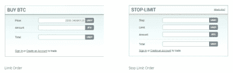
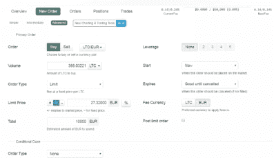
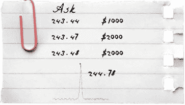
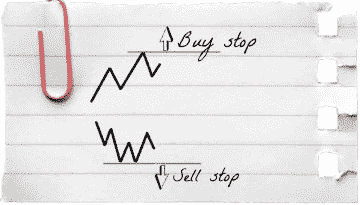
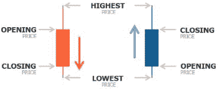
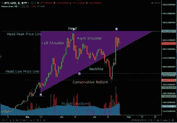
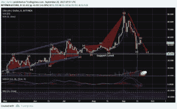

# 第十二章 交易

在这里，我们将介绍在交易所下单的基础知识以及不同类型的交易和如何分析图表模式。

## 在交易所下单

在交易所开仓和平仓需要使用交易所订单。根据执行类型，有市场订单和挂单。挂单可以是限价单、停损单或停损限价单。每种类型的订单都可以用来买入或卖出某种资产。

我建议只使用限价单，但我们将稍后详细讨论这一点。

让我们考虑一个在 Kraken 交易所的订单示例。不同的股票交易所上的订单可能看起来不同，但其本质保持不变。

在证券交易所买入或卖出某样东西最简单的方式是下单市场订单。如果下单后立即有反向限价订单，该订单会在当前市场价格执行。例如，要执行一个市场买入订单，需要一个卖出限价订单。要执行一个市场卖出订单，需要一个买入限价订单。

执行市场订单时，会从所有可用的限价订单中选择最优的一个。因此，市场买入订单以卖出价执行，而市场卖出订单以买入价成交。

处理这种订单时，你不需要指定价格，只需指定体积，即你想要买入多少。然而，你可能会遇到一个很大的问题——滑点。什么是滑点？它是交易的预期价格与实际执行价格之间的差异。在市场订单使用期间以及有大订单时，可能会出现滑点，因为可能没有足够的兴趣在预期的价格水平上维持预期的交易价格。这就是我根本不建议使用市场订单的原因。

在讨论其他类型的订单之前，让我们先看看上面提到的术语：买入价、卖出价和价差。买入价是愿意购买加密货币的买家的价格。卖出价是愿意接受的卖家的价格。价差是这两个价格之间的差异。

在市场关系中，买家设定他们想要为资产支付的价格，而卖家设定他们想要出售资产的价格。简单来说，这就是讨价还价：买家设定一个低价，卖家坚持高价。这是在加密货币交易所观察到的情况。

因此，带有指定价格的买家订单形成了一种队列。要想排在队列的最前面，你必须提供最佳价格。与此同时，以卖出价排队的卖家也是如此。这个队列的第一位也是提供最佳价格的人。每个价格都有买家想要购买或卖家想要出售的体积的指示。交易员将买卖双方的挂单队列称为市场深度。

这里有一个例子。假设你放置一个市价订单购买价值 5000 美元的硬币，但可用的硬币价值只有 1000 美元。

你支付的硬币价格将在这些价格之间。我还应该提到，交易所也很狡猾，总是很高兴能赚点钱。如果你放置一个市价订单，那么你有 99%的几率永远不会得到真正的第一个卖出价。结果是，你发送了你的订单，然后，例如，得到 244.78 美元的价格。

顺便说一下，在这种情况下，你可以使用最简单的方法在交易所上无风险地获利——扩大买卖价差，即买入价和卖出价之间的差额。

我建议使用限价订单以避免类似情况。限价订单是购买或出售一定数量的资产的订单，指定一个特定的价格。在这里我们考虑两个参数：价格和数量。例如，你可以设置一个以 243.47 美元购买 5000 美元硬币的订单。第一种选择：你可以设置一个购买限价订单，例如，在买入线。这样你就加入了等待订单被执行的买家队伍。另一种选择：你可以去找卖家，以不低于你价格的他们的价格成交。

然而，可能发生没有足够的量来执行你的订单的情况。为了获得所需的量，你应该怎么做？你应该评估你的订单考虑市场深度的整体流动性，也就是说，你需要检查已经放置了哪些订单。从理论上讲，你有机会收集关于价格和数量的第一最佳位置，但总是有可能在你之前已经有人下了订单并拿走了这个量，因为信息有时会延迟显示。如果你仍然想执行你的订单（不使用市价订单以避免大幅滑点），你只需在一个你的订单肯定会执行的价格上放置一个限价订单，而不是在你希望它执行的价格上。这意味着你很可能会在卖家的价格上执行你的订单。如果这些订单在市场上，并且你设法击中它们，那么你以略高于常理的价格执行订单的机会就会增加。

现在让我们谈谈止损订单的话题。止损订单是在股票价格超过特定点时购买或出售股票的订单。

假设你将退出价格设置为 200 美元。这样，一旦价格达到 200 美元，你的止损订单就变成了一个普通的市价订单。然而，我不建议你使用这种类型的订单。

还有一种止损限价订单，它将止损订单和限价订单的特点结合起来。止损限价订单需要设置两个价格点。第一个点触发了指定动作的开始，称为止损，而第二个点代表了投资者的目标价格之外，称为限价。

在我看来，止损限价单甚至比止损单还要糟糕。即使价格达到了设定的止损价格，它也不能保证订单执行（因为限价可能不起作用）。因此，我不建议使用止损限价单来平仓以限制损失（止损）。另外，并非所有券商都接受这种类型的交易订单。

换句话说，似乎止损订单应该能保护你免受损失，因为如果某事突然开始下跌，你可以平仓。实际上，它并不是这样运作的，止损订单将毫无用处。你可能会想，你放置了一个止损订单，当价格达到特定水平时，它肯定会变成市价单，你的仓位将会平仓。然而，当你使用止损限价单时，逻辑上你的止损变成了限价。如果市场上有一个可以执行你限价单的价格，它就会被执行。然而，如果市场没有提供这样的价格，你只能排队等待。因此，我认为使用止损限价单是没有意义的。

有 GTC 和全成交或取消这样的订单。GTC（有效期至取消）订单在投资者取消订单或交易被执行之前一直有效。在这方面，这种订单非常方便。全成交或取消订单是一种限价单的变体。在前面的情况下，如果你放置了一个限价单，你可能会得到你所需量的部分，但使用全成交或取消订单时，你的订单必须全部成交或取消。

## 保证金交易

保证金交易的实质非常简单：你是在用借来的钱进行交易。当你进行保证金购买时，你支付了股票价格的一部分（这部分称为保证金），并从其他提供资金的玩家那里借来剩余的部分。你保证金账户的余额只用来作为这笔借来的资金，以及必要时用来支付贷款成本。换句话说，保证金交易允许你交易实际并不拥有的资金量。你用来交易的借来的资本称为杠杆。

假设你有 10,000 美元。相对来说，这就是你的保证金。假设你决定使用 4:1 的杠杆进行交易。这意味着你可以进行 40,000 美元的交易。你的保证金是 25%。你用 40,000 美元进行购买，如果购买的货币开始增长，你的利润也会增长四倍，但如果它开始下跌，你的损失也会扩大四倍。相应地，如果你用 10,000 美元购买加密货币，只有在你持有的资产（例如，比特币）跌至零时，你才会失去所有的钱。如果你在保证金账户上使用杠杆购买 40,000 美元的加密货币，当资产下跌 25%时，你会失去你所有的个人资金（10,000 美元）。

想象另一种情况：当发生闪崩时，你在以太坊上保持保证金位置。在这种情况下，由于以太坊在那个时刻下跌了超过 25%，你的头寸将会被交易所自身平仓。一旦你的损失达到$10,000，交易所将会平掉你价值$40,000 的头寸。也就是说，$10,000 就像是你的交易保证金。

在任何其他市场上，保证金或杠杆都是一个最大化利润的好工具。几乎所有经验丰富的交易员都使用杠杆。然而，如我们前面所说，加密货币市场波动性很高，所以这里的杠杆可能会让你 figuratively（字面上地）丧命。为什么会这样呢？让我们与股票市场进行比较。

苹果公司的股票可能会下跌 20%吗？我认为不太可能发生这样的事情。因此，利用杠杆交易苹果公司的股票相对安全，因为这些股票不可能突然下跌超过 10%。同时，你总是可以关闭股市中的头寸，因为这里的交易受到严格监管，你可以关注所有事件。

相反，加密货币市场全天候 24/7 运行。在这里，任何情况都可能发生，包括最没有逻辑和难以解释的情况，价格可能增长或下跌任何百分比点。因此，如果你在加密货币市场上使用保证金交易，最好使用 1:2 的杠杆。使用更高杠杆的交易将类似于俄罗斯轮盘赌。如果你使用 1:4 的杠杆，你的头寸很可能会被彻底摧毁。

始终要小心：如果你发现一个交易所的界面可疑，或者他们提供 1:20 的杠杆，这个交易所肯定是在寻找保证金交易者。它寻找贪婪、狡猾，而且根据实践，愚蠢的交易者，他们希望立即将利润增加二十倍。因此，我再次提醒你：如果你决定专业交易，你应该在顶级交易所进行验证。你应该在至少两个交易所上开账户。

在进行保证金交易时，你应该有两个账户：一个用于你的资金，另一个用于保证金。要开始使用杠杆交易，你应该将资金从你的第一个账户转移到保证金账户，并从那里开始交易。

关于保证金交易，你还应该知道以下几点。你认为你会仅仅因为“谢谢”就得到用于交易的钱吗？当然不是。你只会因为利息得到钱。例如，如果你使用 1:4 的杠杆，并希望交易的不是你拥有的$10,000，而是$40,000，那么你会支付更高的利息。日利息可能高达 1% - 2%。在我们考虑的情况下，利息为$30,000。我要提醒你，你实际上只有$10,000。

最后，这里有一些给初学者的建议。

在市场上交易时，购买那些价值大幅下跌的资产。现在我的主要策略就是购买被低估的资产或价格暴跌的资产。

要平仓，只有在您成功获得超过 50%的利润时才下订单。等待更高利润是十分危险的，所以在您获得 50%的时候平仓。我也不建议提取少于 10%的利润。在我看来，20%是最低目标。然而，如果您进行日内交易，不妨在 30%以上放置卖出订单。

不要忘记交易所收取佣金费用。您交易得越少，费用就越高。您的成交量越大，佣金费用就越低。

## 日交易与长期持仓交易

让我们关注您在加密货币交易所的工作日程。

在您开始交易之前，您需要决定一个非常重要的问题，即您愿意花多少时间在交易上。当然，最佳选择是每天坐在电脑前 5-6 个小时，不断平仓并监控情况。然而，由于时间不足，现在大多数人选择另一种选项。他们每周交易一次。在特定的一天，这样的交易者查看一周的所有新闻以及任何图表，然后决定他们应该打开或关闭哪些仓位。

很多人选择这个选项，这里有一些建议：

+   选择一个特定的每周一天，您将一致地用于交易。

+   在这一天，查看您的投资组合——哪种货币升值了，哪种下跌了？

+   关注新闻

根据新闻和您投资组合的构成来做决策。如果某个资产没有增长甚至下跌，那么就平仓。如果您注意到了一些有前景或价格下跌的资产，就买入。您应该在每个交易日的每周都执行这些操作。顺便说一下，我建议使用[Blockfolio](https://blockfolio.com/)来使跟踪您的仓位更加方便。

概括来说，我建议您在两种交易类型之间选择：每日监控带有限价卖出订单的交易，或者每周监控一次。

同时，一些加密货币交易所，例如 Bitfinex，提供场外交易（OTC）。OTC 是 Over The Counter 的缩写，意味着场外交易。这是一个没有中心物理位置的分布式市场，市场参与者通过交易员的网络交易资产。

例如，如果您没有时间跟随市场并全身心投入交易，您可以通过下订单来使用这些市场服务。您的合作将通过手机或电子邮件进行。所以您告诉交易员，例如，您想购买 250 个比特币。查看市场后，交易员告诉您应该为这个数量的比特币支付多少钱。交易员将为此服务收取费用。

## 分析图表模式

普遍认为，交易方面的天赋或本能是任何交易所上的关键成功因素之一。然而，这是一种错误的思维方式。为了盈利，你首先需要学会分析市场情况。阅读图表的技能将使你能够做出正确的交易决策并赚钱。

加密货币市场有两种图表模式：线图和日本蜡烛图。这里有一些关于它们的实用信息。

线图对于中期交易来说效果很好，因为你不需要关注最小和最大的指标。这些指标在日本蜡烛图中会被考虑进去。

日本蜡烛图是显示价格图表的最常见方式。交易员喜欢它们的简单和清晰。与线图不同，蜡烛图在交易决策方面更有用。它们允许你看到市场的整体情况并预测价格变动。所以，对于交易员来说，分析日本蜡烛图确实更好，尽管我认为新手需要使用线图。如果你打算进行长期或中期投资，那就更是如此。

每张图表都有自己的时间框架，即你可以查看的时间段。在日本蜡烛图中，时间框架形成于一个小时、一天、一周的时间段。蜡烛棒通常由实体（黑色或白色）和上影线和下影线（烛芯）组成。实体（矩形）说明开盘和收盘交易。烛芯说明在代表的时间间隔内证券的最高和最低交易价格。

我们可以看到开盘价和收盘价。这两个位置通常用两种颜色标记。如果开盘价低于收盘价，这意味着增长，并且在图表上用不同的颜色标记。如果一切相反，那么股票就在下跌。

在线图上确定时间框架有点困难。通常，我会看到情况如何一点一点地变化。

你应该分析哪个时间框架？个人而言，我不会分析日内图表。我使用最小的图表是 1 小时+日图表。分析周图和一个月图也是一个好主意，因为加密货币市场相对较年轻，你将能够看到先前的最高和最低价格。

你应该注意什么？在技术分析中，所有人都对某些事情有同样的反应。所以每个看图表的人都会同样看到并说：“它在这里下降，但在那里增长。它从这里开始，但现在在那里结束。”图表促使人们以特定的方式行动，他们说：“哦，最高价已经更新，所以我将买入。” 然后我注意到人们在看到整数价格时倾向于买入（例如，当以太坊达到 400 美元，或者比特币突破 5000 美元时）。

我也注意到所有人对反复出现的事件都有反应。如果你已经达到了一个顶峰，你希望再次突破这个顶峰，甚至涨得更高。然而，实物资产市场与加密货币市场有很大的不同。实物资产市场有自己的算法和大玩家。加密货币市场也有大玩家，但这个市场仍然非常年轻，因为它只是在 2013 年才开始存在。是的，在 2013 年。也许，一些个别 IT 专家或交易员早在 2011 年或 2012 就开始对加密货币市场产生兴趣，但投机者是在 2013 年进入的。因此，这个市场非常年轻，而且它还没有遇到过任何危机。尽管如此，市场仍在不断更新，即肯定有一定的周期。因此，反复出现的事件是双峰或三峰，相应地，是双底或三底。这就是最低价和最高价的不断更新。

市场指标也有助于捕捉加密货币市场的情绪。我个人不使用它们，但我强烈建议你使用这些工具。

在波动性市场中，人们不知怎的注意到了移动平均线。这是什么？通常，当你看图表时，你脑海中有一个中位数，它把图表分成两部分，你可以立即确定平均价格。这个中位数将图表分成两半：线上方的都是贵的，线下方的都是便宜的。

因此，对于日线图，我有时会使用 50 日移动平均线以及 200 日移动平均线。你也可以应用 20 日移动平均线。然而，我真的不需要它们，因为我的眼睛已经足够训练有素来确定平均值。

需要使用的重要指标是成交量。它显示了一定时期内的交易次数。如果你使用的是蜡烛图，这个指标显示了一个蜡烛图内的交易次数。显示的是总成交量，即买了多少和卖了多少。因此，你总是可以确定流动性，即理解你原则上可以买多少。

因此，我认为你的任何动作都必须有成交量的支持。如果成交量开始增长，这是个好迹象，因为它表明越来越多的人来到市场。

因此，任何强烈的走势（达到新的高点或低点）必须伴随着成交量。而且，它必须伴随着成交量的突增。通常，所有的走势都是从这一点开始和结束的。如果你看到一个币种的价格在强劲上涨，成交量在增加，并且成交量的突增开始出现，这就是获利的好机会。

另一种情况是：如果你看到一个趋势开始下跌，而成交量相反地开始增加，你最好等待成交量的突增。

现在让我们考虑一下你可以在哪里跟踪图表。

实际上，Poloniex、Kraken 和 Bitfinex 交易所之间的区别非常微小。例如，货币价格可能在 Kraken 上是 245 美元，在 Poloniex 上是 248 美元，在 Bitfinex 上是 244 美元。看起来有区别，但实际上图表是完全相关且非常相似的。因此，具体跟随它们在哪里并没有太大关系。

现在让我们讨论一下你应该在什么时候入场。

你应该只关注成交量入场。第一个原因是当价格在一个特定范围内波动（价格保持在某个范围内并不移动）+ 波动。当价格跳出范围时买入，当价格下跌时卖出。进入仓位的第二个原因是达到新的高点和低点（新的高点/新的低点+波动）。最后进入仓位的原因是波动性的收窄和扩大。这种方法也被称为三角形。无论你有什么样的三角形，最重要的是波动性的激增和增长。

这在图表上看起来是这样的。

成交量的突然放大证实了这一模式确实有效。那么波动性是如何收窄的呢？这证明了有人想要平仓。

我相信你不需要寻找很多入场策略，因为我所描述的对你来说已经足够了。

你还应该明白，买入的最佳时机所谓的回测。有不同的支撑位和阻力位。

回测是交易风险最低的入场方式（从交易风险的角度来说），因为你有一个入场的理由，一个突破，一个确认不会达到最低点的信号，最后是一个出场。如果这伴随着成交量，那就完美了。也就是说，有水平的支撑和阻力线以及成交量。

现在我要给你最后的几点建议。

你的入场应该记录下来。也就是说，你应该在你的笔记中明确地定义入场的原因。例如，我买入的原因是：所有主要货币都在上涨；我的货币更新了最高值；我的货币达到了一个整数；关于我的货币出现了好消息等等。每当你做些什么时，你必须拿支笔，一张纸，把一切都写下来。如果没有写下来，你可以欺骗自己。毕竟，只有写下的规则才会被遵守。

此外，不要混淆技术入场（基于技术分析和图表）和基本面入场，后者并没有明确的出场点。它的时间跨度有点长，你只依靠资金管理条件来出场（我们稍后会谈到这一点）。例如，你决定绝不超过 10%的仓位损失。那就是你的极限。然而，技术分析涉及到一个特定的入场点和一个特定的出场点。因此，大多数初学者使用技术分析，因为它足够简单，可以确定入场/出场点。
