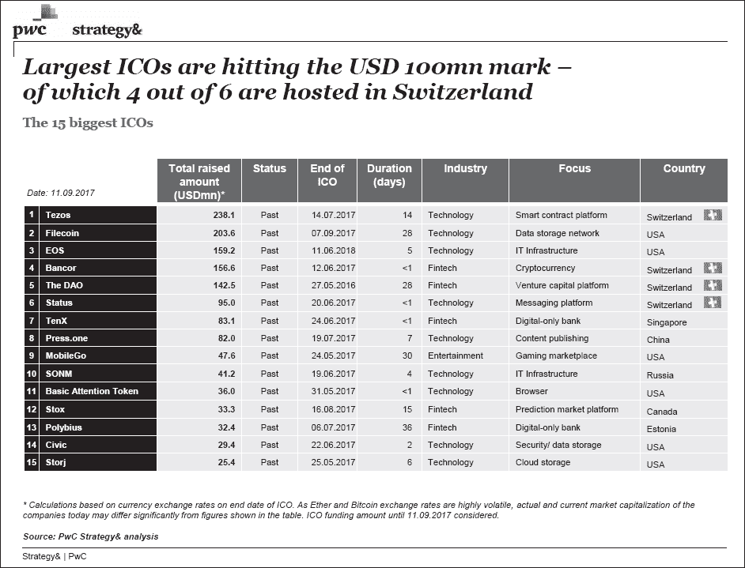
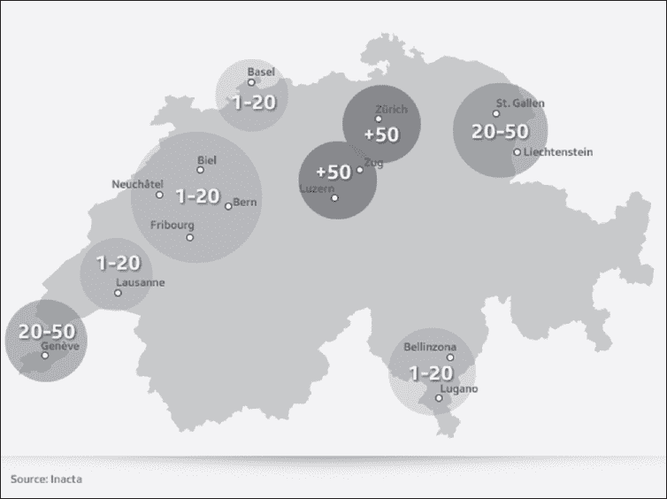

7.

BEYOND BOUNDARIES—CRYPTO ECONOMICS AROUND THE WORLD

区块链的设计超越了个体国家和州。或许正因为如此，它常常与全球化的理念联系在一起。我们从历史的最粗略一瞥中知道，每一次重大的技术革新都会使世界变得更小。最近的罪魁祸首是互联网，它通过令人激动的新方式将人们聚集在一起，使世界变得更小。我相信，区块链在金融领域的应用将使人类彼此之间更加接近。在我看来，它还将释放出革命性的积极变化到社会中。

确实，区块链技术尚处于起步阶段。然而尽管如此，我们已经看到了它给我们的生活带来的强大益处。这包括跨境支付能力、早期资本筹集以及证券的改进。区块链及其加密货币的应用正在挑战现有的金融市场。各国对于采纳新技术的速度态度不一。因此，在本章中，我想对全球各国区块链创新稍作介绍。

SWITZERLAND—THE CAPITAL OF BITCOIN IN EUROPE

长期以来，瑞士一直是银行家、交易员和其他金融人士的避风港。今天，它也正在成为欧洲加密货币创新的地方。金融界人士长期以来都知道，瑞士是一个有效的新企业成长的地方，因为它将稳定的基础设施与金融专业知识和资源相结合。金融是瑞士的主要产业，瑞士人是欧洲平均收入最高的国家之一。根据 2015 年世界经济论坛的报告，瑞士在全球经济竞争力方面排名第一。这些因素结合使瑞士成为区块链和加密货币开发者最具吸引力的国家之一。

瑞士以其在战争时期的中立而闻名。或许这种性情也是其政府似乎乐于支持金融去中心化的原因。瑞士政府一直在积极促进区块链和加密货币的发展。瑞士的一个小城市楚格甚至接受了“加密谷”的昵称。外界普遍知道瑞士为客户提供了强大的金融服务（同时也尊重他们的隐私），但它迅速赢得了作为去中心化金融工具可以成长的地方的声誉。这个国家的亲商业环境、缺乏监管和低税率吸引了众多企业家和高端专业人士。或许毫不奇怪，瑞士现在被认为是区块链新创新的“温床”。以太坊的总部设在楚格，许多不太知名的加密货币也加入其中。

瑞士政府也是首批接受加密货币支付的国家之一。作为区块链和加密货币的积极早期采用者之一，Zug 自 2016 年起就允许居民使用加密货币支付市政服务。但该城市并未止步于此。他们还在探索区块链在政府等其他领域的实际应用。Zug 的居民可以通过邮寄、互联网或投票站投票。但最近，该城市允许居民参与基于区块链的投票测试。在这里，区块链更广泛使用的潜力正在以一种非常真实的方式得到实现。

对于瑞士的加密货币企业家来说，另一个主要的吸引力是启动 ICO。由于以太坊的总部位于该国，ICO 的标准通常被认为是 ERC-20。瑞士看到了这个机会，并在行业的最早阶段就抓住了它。结果不言而喻。到目前为止，有史以来最大的十一个 ICO 启动中，有四个是在瑞士进行的。2017 年，通过 ICO 在瑞士筹集的资金超过了 5.5 亿美元，占全球 ICO 筹集总资金的 14%。

那么安全性又如何呢？洗钱行为长期以来一直是瑞士私人银行业务的主要担忧，有人担心加密货币可能会加剧这一问题。为了跟上 ICO 日益增长的人气——同时确保安全和防止欺诈——2018 年初，瑞士联邦金融市场监督局（FINMA）阐明了一些关于监管 ICO 和代币的关键规则。根据新规则，代币只能是三种类型，每种代币都限制在其功能范围内。这次阐明的目标是帮助投资者做出明智的决定，防止故意传播混淆信息。

当我们展望未来，我们看到瑞士的银行和金融行业正积极涉足数字资产和区块链的发展。Falcon 最近成为了首家为客户 提供区块链资产管理解决方案的瑞士私人银行。其服务使得银行能够使用客户的现金持有量，为交易者兑换和持有比特币。为了更深入地涉足数字资产和区块链的世界，Falcon 还与瑞士经纪公司 Bitcoin Suisse 达成合作，为其区块链资产管理服务增加以太坊（ETH）、莱特币（LTC）和比特币现金（BCH）。

为了吸引更多初创企业，Crypto Valley 一直在建立数字资产和区块链服务所需的基础设施。2017 年，Crypto Valley Association（包括 PwC、汤森路透和 iProtus 等十六个创始成员）成立。在 UBS 前 CIO Oliver Bussman 的领导下，Crypto Valley Association 旨在进一步将 Crypto Valley 发展成为全球最佳、最有利于加密货币技术和业务发展的生态系统。

通过这种开放的态度，瑞士将自己定位为欧洲加密货币和区块链技术的领导者。2018 年，在一场针对私人和机构投资者的加密金融会议上，瑞士经济部长 Johann Schneider-Amman 更进一步表示，瑞士希望成为“加密国家”。政府对加密未来的信心是一个积极的信号，这种态度肯定会吸引越来越多的区块链和加密初创企业到该国。

中国：加密流亡

众所周知，中国是对加密货币进行严格监管的国家之一。然而，它也是加密货币最活跃的市场之一。在十大加密货币交易所中，三家起源于中国。中国曾经是加密货币最大的市场，这一事实鼓励了这些中国加密货币交易所的快速发展。但是，自从严格过度监管的出现，游戏已经彻底改变。

火币成立于 2013 年 9 月，是一个支持直接加密货币和法定货币交换的平台。火币迅速增长，一度成为世界上最大的数字资产交易平台。OKcoin 也成立于 2013 年。与火币并列，它是中国知名的交易所，占据了中国加密货币交易市场的支配地位。2013 年至 2017 年间，所有中国交易所都支持法定货币和加密货币直接交换，这使得进入加密货币的过程变得简单容易。

2017 年，Binance 作为一个新的加密货币交易平台启动。创始人是 OKcoin 的 CIO。与火币（Huobi）和 OKcoin 不同，Binance 只支持不同加密货币之间的交换。作为一个相对较新的参与者，Binance 的服务器不位于中国大陆，业务在海外注册。这使得 Binance 能够灵活地避免某些监管。

然后，事情发生了。

2017 年 9 月 4 日，中国人民银行宣布所有初始代币发行（ICO）都是非法的，并下令立即停止所有代币销售。然后，在 2017 年 9 月 19 日，中国政府下令所有比特币交易所一个月内关闭。政府强制性的关闭令全球加密货币市场震动。一家又一家交易所关闭。火币（Huobi）和 OKcoin 决定离开中国以在其他地方生存。他们与中国监管机构合作，以合法的方式进行此举，并将服务转移到海外提供商如火币 Pro（Huobi Pro）和 Okex。

危机中存在机遇。中国加密货币交易所的关闭为 Binance 提供了巨大的机遇，因为它在中国没有执照。自从禁令发布以来，所有中国交易很大程度上都转移到了 Binance。

在中国大门关闭时开启的另一扇窗户是在 ICO 和二级市场。2017 年被认为是全球 ICO 最好的年份。根据 Coindesk 的数据，2015 年有 43 个 ICO 启动，但 2017 年有 343 个。代币销售和小额加密货币交易（而不是像比特币这样的主要加密货币）在中国投资者中越来越受欢迎。如前章所述，与主要加密货币相比，小加密货币相对容易操纵。大量小额个人投资者涌入二级市场，对这些货币垂涎三尺。火币和 OKcoin 关闭后，Binance 填补了空白。半年内，Binance 成为中国最大的交易所。

中国曾是比特币和加密货币投资最活跃的市场。然而，当政府强有力的手段迫使主要交易所离开时，一切都被改变了。在全球范围内，比特币的价格从约 4300 美元跌至约 3300 美元。但到了 2017 年底，比特币的价格反弹至接近 20000 美元，然后再次下跌。对我来说，这进一步证明加密货币具有去中心化的能力。当需要时，它会发展。加密货币的生存能力——以及围绕其整个行业——是非常惊人的。而且它正在变得越来越强大。机会在不断增长。

亚洲市场——加密货币行业的繁荣

亚洲作为一个大陆，已经成为加密货币行业的主要参与者。在亚洲国家中，目前日本和韩国位居前列。中国已经清楚地表达了其负面态度，但日本和韩国却明确表示了相反的偏好。

如今，日本被认为是亚洲对加密货币最友好的国家。根据[coinhill.com](http://coinhill.com)的数据，日元占比特币（BTC）这种最受欢迎的加密货币的 56.2%，位居第一，其次是美元，占比 28.4%。（直到 2017 年 1 月，人民币占据了最大份额，但政府限制使得这一情况迅速改变。）在日本，加密货币作为一种投资仍然非常受欢迎。这在很大程度上要归功于日本政府对其持有的积极态度。

2017 年 4 月，日本修订了《支付服务法》，将“虚拟货币”合法地定义为一种支付形式。（日本仍然没有将比特币定义为法定货币，但它承认你可以用它合法购买商品。）2017 年 7 月，日本还结束了针对比特币的 8%消费税，这进一步鼓励了该国加密货币的交易。目前，日本有超过 20 万家企业接受比特币支付。在东京，比特币现在被 Bic Camera 的所有门店接受，Bic Camera 是日本的一家电子产品零售巨头。

日本政府仍然在密切关注加密货币交易所，并实施了一些监管措施。交易所现在必须验证客户身份信息，以防止洗钱和恐怖主义。对于不遵守法律的交易所，还实施了更严格的标准。交易所还必须向日本金融厅（FSA）注册。该机构有检查员定期访问交易所，检查其运营情况并核实员工人数。到目前为止，FSA 已经向 16 家加密货币交易所发放了许可证。

尽管有安全防护措施，但日本的交易所仍然发现自己成为了黑客攻击的受害者，其中一些攻击相当严重。作为回应，日本金融厅（FSA）表示正在建立一个防御系统，以保护投资加密货币的投资者和其他参与者。位于日本的 Mt.Gox 交易所曾经是世界上最为繁忙的交易所，处理了所有比特币交易的 70%。然而，在 2014 年，它遭遇了有史以来最著名、最大规模的攻击，当时有 85 万枚比特币被盗，这起犯罪影响了 75 万不同的用户。当时，这些比特币的价值约为 4.5 亿美元。2018 年初，日本第二大交易所 Coincheck 也因黑客攻击而失去了价值 5.34 亿美元的 NEM 代币。

尽管经历了一些毁灭性的挫折，日本仍然是亚洲最支持加密货币创新的国家。在解决了货币交易所的安全问题之后，日本政府接下来将着手解决 ICO 市场问题。2018 年 4 月，玉川大学规则制定策略中心发布了一份关于监管 ICO 的指南。这份政府支持的报告强烈建议，ICO 项目在 ICO 开始时应明确说明所有资金的分配方式。该模板还包括了新的规则，用于跟踪 ICO 的进展，确认购买者身份，以及消除内幕交易。日本公众普遍认为这些指南是对 ICO 的友好信号。日本试图通过复杂的监管和谨慎的法规，将 ICO 纳入主流金融体系。这是一种优秀的做法。

韩国是另一个活跃的虚拟货币市场。韩国的虚拟货币市场从 2017 年 3 月开始呈指数级增长，同年 6 月达到顶峰。韩国人口仅 5100 万，但人均加密货币拥有率是世界上最高的。不到 1%的美国人有虚拟货币，但超过 30%的韩国人有。

在韩国，机构投资者不允许参与虚拟货币市场。因此，大多数加密货币投资者仅仅是个人。韩国加密货币如此火热有几个原因。一个是韩国是世界上最具发达的数字经济体之一，也是科技最先进的国家之一。在韩国，数字货币找到了其天然栖息地。由于他们对高科技事物充满热情，对韩国人来说，投资加密货币是顺其自然的事情。另一个原因是通过投资加密货币可以实现高收益。例如，以太坊的成功在韩国媒体上是个大新闻。

与日本相反，韩国没有出台很多明确的法规来指导加密货币交易。其对加密货币资产的税率也不是很清楚。

然而，为了增加交易过程的透明度（以及帮助预防洗钱），韩国在 2018 年 1 月 23 日实行了“实名”加密货币交易政策。该政策禁止匿名、无法追踪的交易。用户不能使用虚拟账户，而是必须通过银行账户进行交易以验证其身份。到目前为止，已有六家银行提供虚拟货币账户。为了避免被边缘化，韩国四大加密货币交易所已经转向实名账户。（这些包括 Bithumb、Upbit、Coinone 和 Korbit。）并非每个人都喜欢“实名制”规定，许多人认为这阻碍了韩国加密货币市场的增长。对许多投资者来说，这项要求使得将法定货币转入加密货币市场账户变得过于困难。

与中国一样，韩国也对 ICO 实施了禁令。2017 年 9 月，韩国金融监督院（FSC）宣布所有初始代币发行都将被禁止。FSC 表示，采取这一措施是因为虚拟货币的交易需要更严格的控制和监管。但它没有提供更多的细节。

与中国交易所被迫流亡相比，日本和韩国的加密货币交易所在日本政府监管下相对安全。

加密货币增长迅速的其他地区

回到欧洲，我想指出，马耳他已经成为加密货币交易所的一个非常有吸引力的国家。币安最近宣布了其迁往马耳他的意图，而 OKEx 也即将在马耳他开设办公室。2018 年 7 月 4 日，马耳他批准了三项旨在鼓励加密货币采用的监管法案。这些法案分别是《马耳他数字创新管理局法案》、《创新技术安排和服务法案》以及《虚拟金融资产法案》。这些新法律旨在为使用区块链技术的公司提供明确的监管，从而鼓励创新。这一举措旨在吸引加密货币公司和区块链初创公司到岛上发展——而且这一策略正在取得成功。马耳他低税率也许也起到了一定的作用。

新加坡的情况与马耳他相似。自中国和韩国禁止 ICO 以来，新加坡将自己定位为探索 ICO 公司的亚洲替代选择。多年来，新加坡一直是全球主要的金融中心。但现在，它也是一个非常欢迎区块链技术的国家。除了 ICO 之外，新加坡已经成为区块链初创公司的避风港。政府鼓励公司到那里进行区块链技术的创新。与马耳他不同的是，新加坡还拥有非常发达的金融基础设施。这种友好的态度、开放的心态以及物理基础设施，使得新加坡成为亚洲公司进行 ICO 的理想之地。

避税天堂长期以来一直吸引着通过 ICO 筹集资本的公司关注。由于美国和我国不允许 ICO，许多希望进行首次币发行（ICO）的公司纷纷将目光投向海外。通过使用可变利益实体（VIEs），大多数英属维尔京群岛（BVI）的 ICO 现在都是通过作为 BVI 商业公司的 ICO 发行者来结构化的，这在 2004 年英属维尔京群岛商业公司法案（BCA）下是可行的。英属维尔京群岛没有对 ICO 进行任何具体类型的监管。因此，如您所想象，它正准备成为另一个热点。

加密货币起源于去中心化的理念。它的一个目标就是鼓励人们在没有第三方监督的情况下参与交易。尽管有这些宏伟的抱负，虚拟货币也必须学会遵守全球各地地方政府认为合适强加的监管规定。2018 年的熊市表明了缺乏监管的后果。大量资金正在等待更多监管进入加密货币市场。目前，传统金融机构对加密货币和加密货币交易系统的信心不足。这限制了加密货币经济的未来可能性。我们想要享受自由，但不想制造混乱。必须保持平衡。提供加密货币交易平台的交易所正在迅速全球化。随着越来越多的国家引入明确、合理的监管，我相信加密货币交易所将幸存并蓬勃发展，尤其是那些能够与政府合作的交易所。

