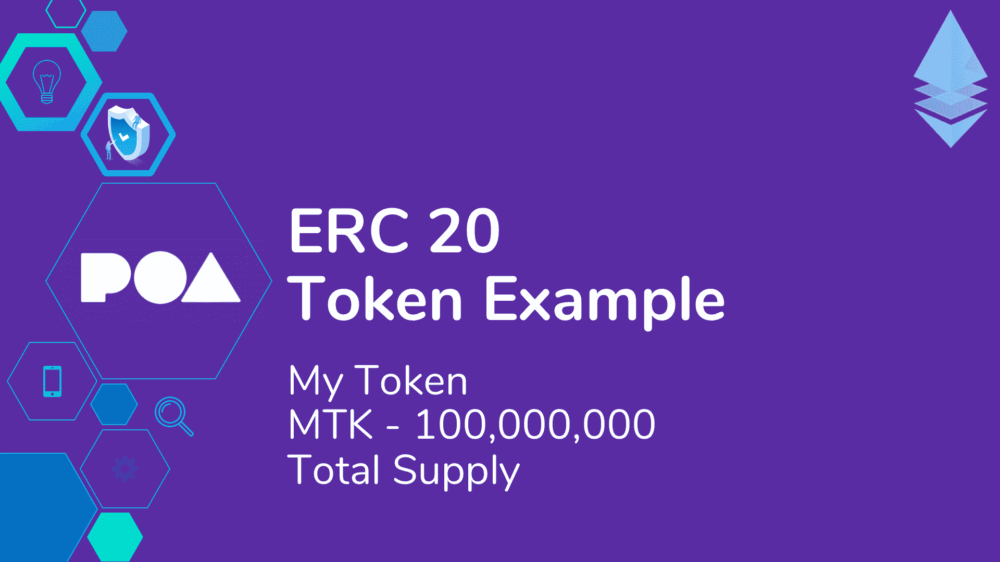
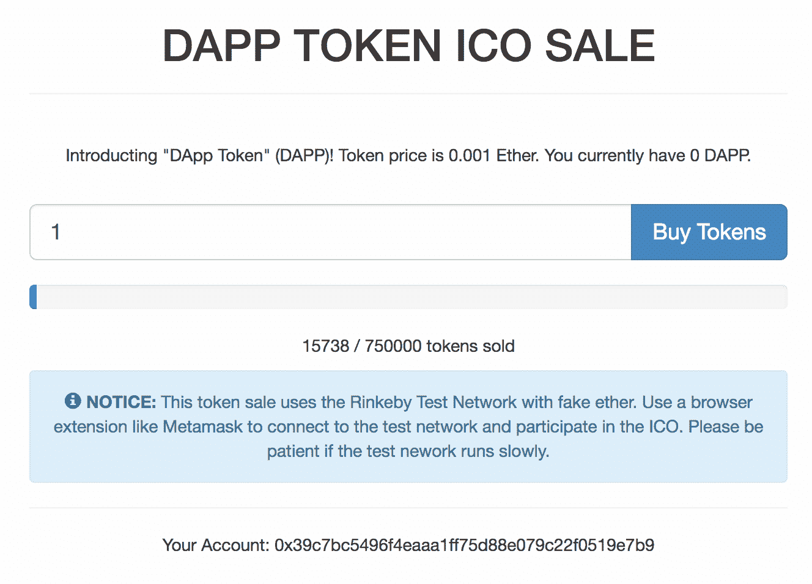

# 在以太坊上编码你自己的加密货币(如何建立一个 ERC-20 代币和大众销售网站)

> 原文：<https://www.dappuniversity.com/articles/code-your-own-cryptocurrency-on-ethereum>

作者格雷戈里·麦卡宾2022 年 12 月 1 日

大家好，我是来自 [Dapp 大学的](https://www.youtube.com/c/DappUniversity)[Gregory](https://www.twitter.com/DappUniversity)！

今天我将向你展示如何在以太坊区块链上编码你自己的加密货币并出售它！我将向您展示如何使用以太坊智能合约创建自己的 ERC-20 令牌并逐步进行批量销售，如何测试智能合约，如何将智能合约部署到以太坊区块链，以及如何构建部署到 web 的 ICO 网站。我还将解释什么是 ERC-20 代币，以太坊代币如何工作，初始硬币发行(ICO)如何工作。

[https://www.youtube.com/embed/XdKv5uwEk5A](https://www.youtube.com/embed/XdKv5uwEk5A)

[*JOIN MY FREE TRAINING!*](/bootcamp) *

你可以在上面的 8 小时教程视频中观看我制作 ERC-20 代币和人群销售。在本教程中，我还将逐步指导您。你可以从 github [这里](https://github.com/dappuniversity/token_sale)下载本教程的完整源代码。在我们开始建立 ERC-20 代币和人群销售之前，我先回答几个问题。

你也可以在这里免费下载完整的 8 小时视频系列[的所有视频内容🎉。](/free-download)

## 什么是 ERC 20 代币？

以太坊区块链允许您创建自己的加密货币或代币，可以用以太购买，以太是区块链以太坊的本地加密货币。ERC-20 只是一个标准，它规定了这些令牌的行为方式，因此它们与加密货币交易所等其他平台兼容。

除了阅读本文，您还可以观看下面的视频，了解 ERC-20 令牌如何工作的更多信息。

[https://www.youtube.com/embed/7GXqgMZpefc](https://www.youtube.com/embed/7GXqgMZpefc)

那么这是怎么做到的呢？好吧，让我们先来看看以太坊区块链是如何运作的。

以太坊就像比特币一样是区块链。像比特币一样，以太坊为拥有以太坊的本地加密货币以太的人记录账户余额。与比特币不同，以太坊也是一个平台，允许你创建自己的令牌，而无需创建新的区块链。

您可以使用智能合约创建以太坊令牌。ERC-20 是一种标准，它规定了这种令牌智能合约应该如何工作。

让我们用一个例子来理解 ERC-20 令牌智能合约是如何工作的。假设我们想要创建一个名为“我的令牌”的令牌，其符号为“MTK ”,并且将会有 100，000，000 个这样的令牌存在。



首先，令牌智能合约跟踪一些基本令牌属性。例如，它记录了“我的代币”这个名称，你在加密货币交易所看到的符号，以及总共存在多少代币。

它还记录谁拥有“我的令牌”以及拥有多少。

ERC-20 代币可以从一个账户转移到另一个账户作为支付，就像任何其他加密货币一样。

它们也可以在大众销售中购买，比如 ICO，我们将在下一节中对此进行探讨。

它们也可以在加密货币交易所买卖。


#### ICO 成功清单

你是否试图找出你需要什么来推出你的 ICO？点击下面的链接获取我的 ICO 成功清单！

[Get Checklist](/ico-checklist)

## 群体销售(ICO)是如何运作的

ERC-20 代币可以以多种方式分发。一种流行的方法是举行一次集体销售，或首次发行硬币(ICO)。大众销售是一种公司通过创造自己的 ERC-20 代币来筹集资金的方式，投资者可以通过以太网购买这些代币。

除了阅读本文，你还可以观看下面的视频，了解更多关于人群销售的信息。

[https://www.youtube.com/embed/E9M7oeBDGfY](https://www.youtube.com/embed/E9M7oeBDGfY)

每当发生众筹销售时，该公司就会获得由投资者支付的乙醚形式的流动资本，并持有在众筹销售中出售的保留数量的 ERC-20 代币。

为了参与众筹销售，投资者必须使用帐户连接到以太区块链。这个帐户有一个可以存储乙醚的钱包地址，以及在大拍卖中购买的 ERC-20 代币。

投资者必须访问一个与智能合约对话的大众销售网站。智能合同管理着所有关于大众销售如何运作的规则。

每当投资者在众包销售网站上购买代币时，他们都会将钱包中的乙醚发送到智能合约，智能合约会立即将购买的代币分配到他们的钱包中。

智能合同设定了集体销售中代币的价格，并控制了集体销售的行为方式。

人群销售可以采取各种形式和规模。它们可以有多个层级或阶段，如预 ICO、ICO 和 ICO 奖金阶段。这些层中的每一层都可能发生在不同的时间点，并且可能表现不同。

他们也可以有白名单来限制哪些投资者可以购买代币。

他们还可以保留一定数量的代币，这些代币不会在大拍卖中出售。这些储备通常是留给每个公司的特定成员，如创始人和顾问。这些储备可以是固定数量的代币或百分比。

无论何时群体销售结束，都可以由管理员来完成。每当这种情况发生时，所有预留的代币都将被分配到相应的帐户，大规模销售将正式结束。

## ERC-20 代币如何工作

正如我前面解释的，ERC-20 令牌是用以太坊智能合约创建的。那么什么是智能合约呢？

以太坊允许开发人员使用智能合约编写在区块链上运行的应用程序，智能合约封装了这些应用程序的所有业务逻辑。它们使我们能够向区块链读写数据，以及执行代码。智能联系人是用一种叫做 [Solidity](https://solidity.readthedocs.io/en/v0.4.21/) 的编程语言编写的，看起来很像 Javascript。它是一种成熟的编程语言，允许我们做许多 Javascript 能做的相同类型的事情，但由于它的用例，它的行为有点不同，正如我们将在本教程中看到的。

在 ERC-20 令牌的情况下，智能合约管理关于令牌如何工作的所有行为，并跟踪令牌所有权和帐户余额。

ERC-20 是一个关于以太坊令牌应该如何构建的 API 规范。这是一个社区采用的标准，允许在各种使用情况下支持令牌。我们希望构建一个符合该标准的令牌，以便它能够被广泛接受。如果我们没有这样的标准，我们可能有无数的方法来创建令牌，并且它们可能彼此不兼容！

使用 ERC-20 标准可确保令牌符合以下(及更多)使用情形:

*   钱包转移-将代币从一个帐户转移到另一个帐户
*   加密货币交易所的买卖
*   像我们将在本教程中演示的那样，在大规模销售(ICO)中购买代币

ERC-20 规范本质上规定了智能合约必须响应的接口。它指定了智能合约的结构和智能合约必须具有的功能类型。它还提供了一些建议的函数，这些函数很好，但最终是可选的。它规定了我们的令牌必须具有的某些事件，比如一个`transfer`事件。看，智能合约可以发出消费者可以订阅的事件，有了这个标准，我们可以订阅告诉我们令牌何时售出的事件。

下面是 ERC-20 标准指定的`transfer`函数的一个示例实现。它是智能合约所要求的，并控制人们如何从自己的钱包向他人发送 ERC-20 令牌。

```js
contract ERC20Token {
    // ...

    function transfer(address _to, uint256 _value) public returns (bool success) {
        require(balanceOf[msg.sender] >= _value);

        balanceOf[msg.sender] -= _value;
        balanceOf[_to] += _value;

        Transfer(msg.sender, _to, _value);

        return true;
    }

    // ...
}

```

该函数通过以下方式实现 ERC-20 标准:

*   函数存在。
*   它接受正确的参数。
*   如果用户没有足够的令牌来转移，即余额不足，则失败。
*   它将发送方账户的余额转移到接收方账户。
*   它触发了一个`sell`事件。
*   它返回正确的值，例如`true`。

如果这一切还没有完全说得通，请不要担心。我将在逐步视频教程中构建 ERC-20 令牌时详细解释所有这些部分。

你可以直接在[以太坊改进提案](https://github.com/ethereum/EIPs) github 知识库上[阅读更多关于 ERC-20 令牌标准](https://github.com/ethereum/EIPs/blob/master/EIPS/eip-20.md)的信息。这是所有围绕以太坊标准的社区讨论发生的地方。我强烈推荐将这个库加入书签并通读提交的内容，因为在这里你可以实时观察以太坊技术的发展和变化！

我也推荐[这篇维基百科文章](https://en.wikipedia.org/wiki/ERC20)。

## 这是我们要建造的



我们将建立一个 ICO 网站，该网站将与区块链上的大众销售智能合同进行对话。这个客户端网站将有一个用户可以在众包销售中购买代币的形式。它将显示集体销售的进度，如用户购买了多少令牌，所有用户购买了多少令牌，以及集体销售中可用的令牌总数。它还会在“您的帐户”下显示我们连接到区块链的帐户。

## 安装依赖项

为了建立我们的 ERC-20 代币和人群销售，我们需要一些依赖第一。

### 节点程序包管理器(NPM)

我们需要的第一个依赖项是 Node.js 附带的[节点包管理器](https://nodejs.org/en/)或 NPM。您可以查看是否已经安装了 Node，方法是转到您的终端并键入:

```js
$ node -v
```

### 块菌框架

下一个依赖项是 [Truffle 框架](http://truffleframework.com/)，它允许我们在以太坊区块链上构建去中心化的应用程序。它提供了一套工具，允许我们用 Solidity 编程语言编写智能联系人。它还使我们能够测试我们的智能合同，并将其部署到区块链。它还为我们提供了一个开发客户端应用程序的地方。

您可以在命令行中安装 NPM 松露，如下所示:

```js
$ npm install -g truffle
```

### 加纳切

下一个依赖项是 [Ganache](http://truffleframework.com/ganache) ，一个本地内存中的区块链。你可以通过[从松露框架网站](http://truffleframework.com/ganache)下载安装 Ganache。它会给我们 10 个外部帐户的地址在我们当地的以太坊区块链。每个账户都预装了 100 个假乙醚。

### Metamask

下一个依赖项是 Google Chrome 的[元掩码扩展。为了使用区块链，我们必须连接到它(记住，我说过区块链**是**网络)。为了使用以太坊区块链，我们必须安装一个特殊的浏览器扩展。这就是 metamask 的用武之地。我们将能够用我们的个人账户连接到我们当地的以太坊区块链，并与我们的智能合约进行交互。](https://chrome.google.com/webstore/detail/metamask/nkbihfbeogaeaoehlefnkodbefgpgknn?hl=en)

在本教程中，我们将使用 Metamask chrome 扩展，所以如果你还没有谷歌 chrome 浏览器，你也需要安装它。要安装 Metamask，请在 Google Chrome 网络商店中搜索 Metamask Chrome 插件。一旦你安装了它，确保它在你的扩展列表中被选中。安装 Chrome 浏览器后，你会在浏览器的右上角看到狐狸图标。如果遇到困难，请参考视频演示！

### 语法突出显示

依赖项是可选的，但是推荐使用。我建议为 [Solidity](https://solidity.readthedocs.io/en/v0.4.21/) 编程语言安装语法高亮。大多数文本编辑器和 ide 没有突出显示语法的功能，所以你必须安装一个包来支持它。我正在使用[崇高文本](https://www.sublimetext.com/)，并且我已经下载了[“以太坊”软件包](https://packagecontrol.io/packages/Ethereum)，它提供了很好的语法高亮显示以保证可靠性。

## ERC-20 令牌智能合约

这部分教程的视频片段从[这个视频](https://www.youtube.com/watch?v=jfFgecLL8UA)开始。你可以从 github [这里](https://github.com/dappuniversity/token_sale)下载这个智能合约的代码。

现在我们已经安装了依赖项，让我们开始构建我们的 ERC-20 令牌吧！以下是完整的 ERC-20 令牌智能合约可靠性代码:

```js
pragma solidity ^0.4.2;

contract DappToken {
    string  public name = "DApp Token";
    string  public symbol = "DAPP";
    string  public standard = "DApp Token v1.0";
    uint256 public totalSupply;

    event Transfer(
        address indexed _from,
        address indexed _to,
        uint256 _value
    );

    event Approval(
        address indexed _owner,
        address indexed _spender,
        uint256 _value
    );

    mapping(address => uint256) public balanceOf;
    mapping(address => mapping(address => uint256)) public allowance;

    function DappToken (uint256 _initialSupply) public {
        balanceOf[msg.sender] = _initialSupply;
        totalSupply = _initialSupply;
    }

    function transfer(address _to, uint256 _value) public returns (bool success) {
        require(balanceOf[msg.sender] >= _value);

        balanceOf[msg.sender] -= _value;
        balanceOf[_to] += _value;

        Transfer(msg.sender, _to, _value);

        return true;
    }

    function approve(address _spender, uint256 _value) public returns (bool success) {
        allowance[msg.sender][_spender] = _value;

        Approval(msg.sender, _spender, _value);

        return true;
    }

    function transferFrom(address _from, address _to, uint256 _value) public returns (bool success) {
        require(_value <= balanceOf[_from]);
        require(_value <= allowance[_from][msg.sender]);

        balanceOf[_from] -= _value;
        balanceOf[_to] += _value;

        allowance[_from][msg.sender] -= _value;

        Transfer(_from, _to, _value);

        return true;
    }
}

```

让我们来看看这个智能合约做了什么，以及它是如何实现 ERC-20 标准的:

*   它存储了令牌名`string public name = "DApp Token"`。
*   它存储加密货币交易的令牌符号`string public symbol = "DAPP"`。
*   它存储现有令牌的总供应量`uint256 public totalSupply`。
*   它使用可靠性映射来存储拥有令牌`mapping(address => uint256) public balanceOf`的每个帐户的余额。
*   它实现了一个`transfer`功能，允许用户向另一个帐户发送令牌。
*   它实现了一个`approve`功能，允许另一个账户使用代币，就像在加密货币交易所一样。这将更新`allowance`映射，以查看允许该帐户花费多少。
*   它实现了一个`transferFrom`，允许另一个帐户转移令牌。

观看此视频，了解我如何一步一步地构建这份智能合同。

您还可以通读这个智能契约的测试，以了解它是如何工作的。这些测试确保这个智能契约按照我们预期的方式运行。下面是一个完整的测试套件，它检查智能合约的所有行为:

```js
var DappToken = artifacts.require("./DappToken.sol");

contract('DappToken', function(accounts) {
  var tokenInstance;

  it('initializes the contract with the correct values', function() {
    return DappToken.deployed().then(function(instance) {
      tokenInstance = instance;
      return tokenInstance.name();
    }).then(function(name) {
      assert.equal(name, 'DApp Token', 'has the correct name');
      return tokenInstance.symbol();
    }).then(function(symbol) {
      assert.equal(symbol, 'DAPP', 'has the correct symbol');
      return tokenInstance.standard();
    }).then(function(standard) {
      assert.equal(standard, 'DApp Token v1.0', 'has the correct standard');
    });
  })

  it('allocates the initial supply upon deployment', function() {
    return DappToken.deployed().then(function(instance) {
      tokenInstance = instance;
      return tokenInstance.totalSupply();
    }).then(function(totalSupply) {
      assert.equal(totalSupply.toNumber(), 1000000, 'sets the total supply to 1,000,000');
      return tokenInstance.balanceOf(accounts[0]);
    }).then(function(adminBalance) {
      assert.equal(adminBalance.toNumber(), 1000000, 'it allocates the initial supply to the admin account');
    });
  });

  it('transfers token ownership', function() {
    return DappToken.deployed().then(function(instance) {
      tokenInstance = instance;
      // Test `require` statement first by transferring something larger than the sender's balance
      return tokenInstance.transfer.call(accounts[1], 99999999999999999999999);
    }).then(assert.fail).catch(function(error) {
      assert(error.message.indexOf('revert') >= 0, 'error message must contain revert');
      return tokenInstance.transfer.call(accounts[1], 250000, { from: accounts[0] });
    }).then(function(success) {
      assert.equal(success, true, 'it returns true');
      return tokenInstance.transfer(accounts[1], 250000, { from: accounts[0] });
    }).then(function(receipt) {
      assert.equal(receipt.logs.length, 1, 'triggers one event');
      assert.equal(receipt.logs[0].event, 'Transfer', 'should be the "Transfer" event');
      assert.equal(receipt.logs[0].args._from, accounts[0], 'logs the account the tokens are transferred from');
      assert.equal(receipt.logs[0].args._to, accounts[1], 'logs the account the tokens are transferred to');
      assert.equal(receipt.logs[0].args._value, 250000, 'logs the transfer amount');
      return tokenInstance.balanceOf(accounts[1]);
    }).then(function(balance) {
      assert.equal(balance.toNumber(), 250000, 'adds the amount to the receiving account');
      return tokenInstance.balanceOf(accounts[0]);
    }).then(function(balance) {
      assert.equal(balance.toNumber(), 750000, 'deducts the amount from the sending account');
    });
  });

  it('approves tokens for delegated transfer', function() {
    return DappToken.deployed().then(function(instance) {
      tokenInstance = instance;
      return tokenInstance.approve.call(accounts[1], 100);
    }).then(function(success) {
      assert.equal(success, true, 'it returns true');
      return tokenInstance.approve(accounts[1], 100, { from: accounts[0] });
    }).then(function(receipt) {
      assert.equal(receipt.logs.length, 1, 'triggers one event');
      assert.equal(receipt.logs[0].event, 'Approval', 'should be the "Approval" event');
      assert.equal(receipt.logs[0].args._owner, accounts[0], 'logs the account the tokens are authorized by');
      assert.equal(receipt.logs[0].args._spender, accounts[1], 'logs the account the tokens are authorized to');
      assert.equal(receipt.logs[0].args._value, 100, 'logs the transfer amount');
      return tokenInstance.allowance(accounts[0], accounts[1]);
    }).then(function(allowance) {
      assert.equal(allowance.toNumber(), 100, 'stores the allowance for delegated trasnfer');
    });
  });

  it('handles delegated token transfers', function() {
    return DappToken.deployed().then(function(instance) {
      tokenInstance = instance;
      fromAccount = accounts[2];
      toAccount = accounts[3];
      spendingAccount = accounts[4];
      // Transfer some tokens to fromAccount
      return tokenInstance.transfer(fromAccount, 100, { from: accounts[0] });
    }).then(function(receipt) {
      // Approve spendingAccount to spend 10 tokens form fromAccount
      return tokenInstance.approve(spendingAccount, 10, { from: fromAccount });
    }).then(function(receipt) {
      // Try transferring something larger than the sender's balance
      return tokenInstance.transferFrom(fromAccount, toAccount, 9999, { from: spendingAccount });
    }).then(assert.fail).catch(function(error) {
      assert(error.message.indexOf('revert') >= 0, 'cannot transfer value larger than balance');
      // Try transferring something larger than the approved amount
      return tokenInstance.transferFrom(fromAccount, toAccount, 20, { from: spendingAccount });
    }).then(assert.fail).catch(function(error) {
      assert(error.message.indexOf('revert') >= 0, 'cannot transfer value larger than approved amount');
      return tokenInstance.transferFrom.call(fromAccount, toAccount, 10, { from: spendingAccount });
    }).then(function(success) {
      assert.equal(success, true);
      return tokenInstance.transferFrom(fromAccount, toAccount, 10, { from: spendingAccount });
    }).then(function(receipt) {
      assert.equal(receipt.logs.length, 1, 'triggers one event');
      assert.equal(receipt.logs[0].event, 'Transfer', 'should be the "Transfer" event');
      assert.equal(receipt.logs[0].args._from, fromAccount, 'logs the account the tokens are transferred from');
      assert.equal(receipt.logs[0].args._to, toAccount, 'logs the account the tokens are transferred to');
      assert.equal(receipt.logs[0].args._value, 10, 'logs the transfer amount');
      return tokenInstance.balanceOf(fromAccount);
    }).then(function(balance) {
      assert.equal(balance.toNumber(), 90, 'deducts the amount from the sending account');
      return tokenInstance.balanceOf(toAccount);
    }).then(function(balance) {
      assert.equal(balance.toNumber(), 10, 'adds the amount from the receiving account');
      return tokenInstance.allowance(fromAccount, spendingAccount);
    }).then(function(allowance) {
      assert.equal(allowance.toNumber(), 0, 'deducts the amount from the allowance');
    });
  });
}); 

```

您可以使用 truffle 从命令行运行测试，如下所示:

`$ truffle test`

## 人群销售智能合同

这部分教程的视频片段从[这个视频](https://www.youtube.com/watch?v=ycRwfHM1RBk)开始。你可以从 github [这里](https://github.com/dappuniversity/token_sale)下载这个智能合约的代码。

现在，我们可以建立一个群体销售智能合约，允许投资者在首次硬币发行(ICO)中购买代币。以下是完整的众包销售智能合同可靠性代码:

```js
pragma solidity ^0.4.2;

import "./DappToken.sol";

contract DappTokenSale {
    address admin;
    DappToken public tokenContract;
    uint256 public tokenPrice;
    uint256 public tokensSold;

    event Sell(address _buyer, uint256 _amount);

    function DappTokenSale(DappToken _tokenContract, uint256 _tokenPrice) public {
        admin = msg.sender;
        tokenContract = _tokenContract;
        tokenPrice = _tokenPrice;
    }

    function multiply(uint x, uint y) internal pure returns (uint z) {
        require(y == 0 || (z = x * y) / y == x);
    }

    function buyTokens(uint256 _numberOfTokens) public payable {
        require(msg.value == multiply(_numberOfTokens, tokenPrice));
        require(tokenContract.balanceOf(this) >= _numberOfTokens);
        require(tokenContract.transfer(msg.sender, _numberOfTokens));

        tokensSold += _numberOfTokens;

        Sell(msg.sender, _numberOfTokens);
    }

    function endSale() public {
        require(msg.sender == admin);
        require(tokenContract.transfer(admin, tokenContract.balanceOf(this)));

        // Just transfer the balance to the admin
        admin.transfer(address(this).balance);
    }
}

```

让我们来看看这种智能合同的作用，以及它如何作为一种群体销售:

*   它存储了一个用于大规模销售的管理员帐户。
*   它引用了 ERC-20 令牌智能合约`DappToken public tokenContract`。
*   它存储代币价格`uint256 public tokenPrice`。
*   它存储售出的代币数量`uint256 public tokensSold`。
*   它实现了一个`sell`事件，以便消费者可以在令牌售出时收到通知。
*   它实现了一个`buyTokens`功能，允许用户在大拍卖中购买代币。
*   它实现了一个`endSale`功能，允许管理员结束众包销售，并收集销售期间筹集的资金。

观看此视频，了解我如何一步一步地构建这份智能合同。

您还可以通读这个智能契约的测试，以了解它是如何工作的。这些测试确保这个智能契约按照我们预期的方式运行。下面是一个完整的测试套件，它检查智能合约的所有行为:

```js
var DappToken = artifacts.require('./DappToken.sol');
  var DappTokenSale = artifacts.require('./DappTokenSale.sol');

  contract('DappTokenSale', function(accounts) {
    var tokenInstance;
    var tokenSaleInstance;
    var admin = accounts[0];
    var buyer = accounts[1];
    var tokenPrice = 1000000000000000; // in wei
    var tokensAvailable = 750000;
    var numberOfTokens;

    it('initializes the contract with the correct values', function() {
      return DappTokenSale.deployed().then(function(instance) {
        tokenSaleInstance = instance;
        return tokenSaleInstance.address
      }).then(function(address) {
        assert.notEqual(address, 0x0, 'has contract address');
        return tokenSaleInstance.tokenContract();
      }).then(function(address) {
        assert.notEqual(address, 0x0, 'has token contract address');
        return tokenSaleInstance.tokenPrice();
      }).then(function(price) {
        assert.equal(price, tokenPrice, 'token price is correct');
      });
    });

    it('facilitates token buying', function() {
      return DappToken.deployed().then(function(instance) {
        // Grab token instance first
        tokenInstance = instance;
        return DappTokenSale.deployed();
      }).then(function(instance) {
        // Then grab token sale instance
        tokenSaleInstance = instance;
        // Provision 75% of all tokens to the token sale
        return tokenInstance.transfer(tokenSaleInstance.address, tokensAvailable, { from: admin })
      }).then(function(receipt) {
        numberOfTokens = 10;
        return tokenSaleInstance.buyTokens(numberOfTokens, { from: buyer, value: numberOfTokens * tokenPrice })
      }).then(function(receipt) {
        assert.equal(receipt.logs.length, 1, 'triggers one event');
        assert.equal(receipt.logs[0].event, 'Sell', 'should be the "Sell" event');
        assert.equal(receipt.logs[0].args._buyer, buyer, 'logs the account that purchased the tokens');
        assert.equal(receipt.logs[0].args._amount, numberOfTokens, 'logs the number of tokens purchased');
        return tokenSaleInstance.tokensSold();
      }).then(function(amount) {
        assert.equal(amount.toNumber(), numberOfTokens, 'increments the number of tokens sold');
        return tokenInstance.balanceOf(buyer);
      }).then(function(balance) {
        assert.equal(balance.toNumber(), numberOfTokens);
        return tokenInstance.balanceOf(tokenSaleInstance.address);
      }).then(function(balance) {
        assert.equal(balance.toNumber(), tokensAvailable - numberOfTokens);
        // Try to buy tokens different from the ether value
        return tokenSaleInstance.buyTokens(numberOfTokens, { from: buyer, value: 1 });
      }).then(assert.fail).catch(function(error) {
        assert(error.message.indexOf('revert') >= 0, 'msg.value must equal number of tokens in wei');
        return tokenSaleInstance.buyTokens(800000, { from: buyer, value: numberOfTokens * tokenPrice })
      }).then(assert.fail).catch(function(error) {
        assert(error.message.indexOf('revert') >= 0, 'cannot purchase more tokens than available');
      });
    });

    it('ends token sale', function() {
      return DappToken.deployed().then(function(instance) {
        // Grab token instance first
        tokenInstance = instance;
        return DappTokenSale.deployed();
      }).then(function(instance) {
        // Then grab token sale instance
        tokenSaleInstance = instance;
        // Try to end sale from account other than the admin
        return tokenSaleInstance.endSale({ from: buyer });
      }).then(assert.fail).catch(function(error) {
        assert(error.message.indexOf('revert' >= 0, 'must be admin to end sale'));
        // End sale as admin
        return tokenSaleInstance.endSale({ from: admin });
      }).then(function(receipt) {
        return tokenInstance.balanceOf(admin);
      }).then(function(balance) {
        assert.equal(balance.toNumber(), 999990, 'returns all unsold dapp tokens to admin');
        // Check that the contract has no balance
        balance = web3.eth.getBalance(tokenSaleInstance.address)
        assert.equal(balance.toNumber(), 0);
      });
    });
  });

```

恭喜你！🎉您已经成功地在以太坊上建立了一个 ERC-20 代币和大众销售智能合约！你可以查看完整的 8 小时视频教程[这里](https://www.youtube.com/watch?v=XdKv5uwEk5A)学习如何建立一个 ICO 网站，与智能合约对话并促进代币购买。它还深入介绍了构建智能合约本身的分步说明。你也可以从 github [这里](https://github.com/dappuniversity/token_sale)下载本教程的完整源代码。


#### 想请专家？

如果您有兴趣聘请 ICO 专家，我可以用我久经考验的 ICO 解决方案一步一步地引导您的项目从“零到 ICO ”!

[Learn More](/ico-solution)

对这个教程满意吗？然后你**需要**到[在这里参加我的免费培训](/bootcamp)，我将向你展示如何构建一个真实世界的区块链应用程序，这样你就可以成为一名高薪的区块链开发者！

*